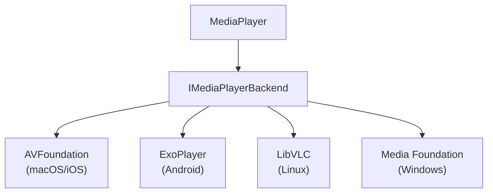
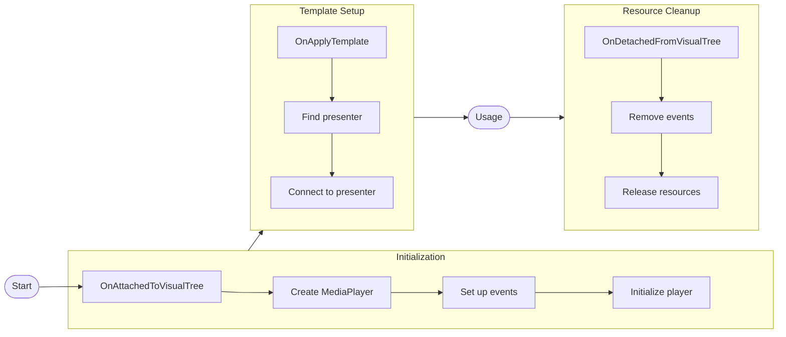
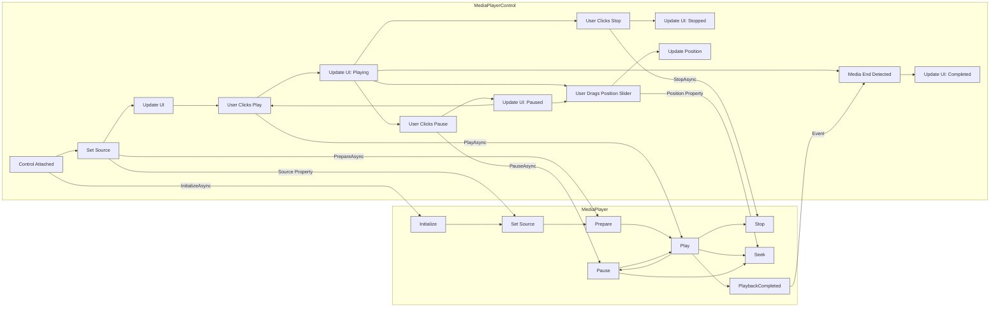

--- START OF FILE: README.md ---

<p align="center">
  
  <h1 align="center">Avalonia UI Documentation</h1>
</p>

The repository holds the code and markdown source files for the Avalonia UI documentation website, which is accessible at [docs.avaloniaui.net](https://docs.avaloniaui.net)

## Index
- [Index](#index)
- [Feedback](#feedback)
- [Documentation Issues](#documentation-issues)
- [Contributing](#contributing)
  - [Workflow](#workflow)
  - [Conventions](#conventions)
- [Local setup](#local-setup)
  - [Requirements](#requirements)
  - [Setup](#setup)
  - [Starting](#starting)
- [Thanks 💜](#thanks-)

## Feedback
We welcome your valuable feedback on the documentation! Please feel free to join our [Community on Telegram](https://t.me/Avalonia) and send us a message. We would be delighted to hear from you and assist you with any queries or concerns you may have. 

## Documentation Issues
If you come across any issues with the documentation or have a feature request related explicitly to it, we encourage you to create a new [GitHub issue](https://github.com/AvaloniaUI/avalonia-docs/issues/new). Before creating a new issue, we kindly request that you check for existing issues to avoid duplication. 

## Contributing
To contribute to Avalonia UI documentation, you need to fork this repository and submit a pull request for the Markdown and/or image changes that you're proposing.

### Workflow
The two suggested workflows are:

- For small changes, use the "Edit this page" button on each page to edit the Markdown file directly on GitHub.
- If you plan to make significant changes or preview the changes locally, clone the repo to your system to and follow the installation and local development steps in [Local setup](#local-setup).

### Conventions

- The front matter for every markdown file should include the `id` and a `title`. `id` will be used to reference the file in `sidebar.js` or `version-x.x.x-sidebars.json` for a specific version.
  ```yaml
  ---
  id: platform-support
  title: Supported Platforms
  ---
  ```

- Use `kebab-case` for file and folder names.
  For example:
  - `/docs/getting-started/ide-extensions.md`
  - `/docs/how-to/use-google-fonts.md`

- Images are important to bring the product to life and clarify the written content. For images you're adding to the repo, store them in the `img` subfolder inside `static` folder. For every topic there needs to be a folder inside `\static\img\` section, for example: `static\img\how-to\use-google-fonts\download-font.png`.
  
  When you link to an image, the path and filename are case-sensitive. The convention is `kebab-case`. `import` should be used to help detect broken images and placed near the top of the document for easier maintenance.

  > Example code for adding an image in markdown file:
  ```markdown
  import ButtonGroup from '/img/button-group.png';
  
  ```
  
  Do not include quotes around the `src`'s attribute value.  

## Local setup

### Requirements

- **Node version >= 18**

### Setup

```bash
npm install
```

### Starting 

```bash
npx docusaurus start
npx docusaurus start --locale zh-Hans
npx docusaurus start --locale ru
```

## Thanks 💜

Thanks for all your contributions and efforts towards improving the Avalonia UI documentation. We thank you being part of our ✨ community ✨!


--- END OF FILE: README.md ---


--- START OF FILE: accelerate\community.md ---

---
id: community
title: Community Edition
sidebar_label: Community Edition
---

# Community Edition 

The Accelerate Community Edition provides free access to professional development tools for individual developers, small organizations, and educational institutions. The aim of this license is to allow the majority of Avalonia developers to benefit from significantly improved tooling at no cost while ensuring the sustainable development of the Avalonia ecosystem.

## What's Included

The Community License provides free access to three professional tools in the Avalonia Accelerate suite:

### Visual Studio Extension

A completely rewritten Visual Studio XAML service built from scratch (not an update to the legacy FOSS extension).

| Feature | Community | Paid License |
|---------|-----------|--------------|
| XAML IntelliSense | ✓ | ✓ |
| XAML Previewer | ✓ | ✓ |
| Project Templates | ✓ | ✓ |
| Code Snippets | ✓ | ✓ |
| Advanced Refactoring | Limited | ✓ |
| Technical Support | ✗ | ✓ |

*An additional 30+ features are on the roadmap for the Visual Studio Extension, which are exclusive to users with a paid license.*

### Avalonia Dev Tools

An entirely new application (not an update to the legacy FOSS solution) for debugging and inspecting Avalonia applications during development.

| Feature | Community | Paid License |
|---------|-----------|--------------|
| Visual Tree Inspector | ✓ | ✓ |
| Property Editor | ✓ | ✓ |
| Layout Debugging | ✓ | ✓ |
| Event Inspection | ✓ | ✓ |
| 3D View Debugging | ✗ | ✓ |
| Performance Profiling | ✗ | ✓ |
| Metrics Visualizer | ✗ | ✓ |
| Logging | ✗ | ✓ |
| Asset Manager | ✗ | ✓ |
| In App Overlays | Partial | ✓ |
| Technical Support | ✗ | ✓ |

### Avalonia Parcel

A brand new packaging tool built specifically to make packaging Avalonia applications as easy as possible.

| Feature | Community | Paid License |
|---------|-----------|--------------|
| Windows (NSIS) Packaging | ✓ | ✓ |
| macOS (DMG) Packaging | ✓ | ✓ |
| Linux (DEB) Packaging | ✓ | ✓ |
| ZIP Archive Creation | ✓ | ✓ |
| Code Signing Support | ✗ | ✓ |
| macOS Notarization | ✗ | ✓ |
| Windows Trusted Signing | ✗ | ✓ |
| Custom Branding | ✗ | ✓ |
| CLI Support | ✗ | ✓ |
| Package Size Limit | 200MB | None |
| Technical Support | ✗ | ✓ |

In addition, community-license Parcel allows packaging for the current platform only.

### What's Not Included:
- Accelerate UI components:
  - WebView
  - Media Player
  - Markdown viewer
  - TreeDataGrid
  - On-Screen Keyboard
- Technical support

## Eligibility

The Community Edition is free for:

### Individual Developers
Individual developers working on their own equipment, including commercial projects.

### Small Organizations
Non-Enterprise organizations where **up to five people** can use the software concurrently.

#### "Enterprise" Definition
An "Enterprise" is defined as an organization with:
- More than 250 users/PCs, **OR**
- Annual revenues exceeding €1,000,000

### Educational Institutions
Educational and research institutions with **unlimited users** for teaching and academic research.

Based on Avalonia's telemetry, **67% of current users** qualify for the Community License at no cost.

## Getting Started

### Free Trial
A 30-day free trial is available that includes all functionality of paid tools as well as all pro UI components, including the On-Screen Keyboard.

### Grace Period for Visual Studio Users
A 6-month grace period is provided for Visual Studio users. When you open Visual Studio, you can click **"Skip until April 13th 2026"** to continue using the new Visual Studio extension with full Community Edition access without requiring signups or license keys.

### Registration
Community License registration is available at the [Avalonia portal](https://portal.avaloniaui.net).

## Telemetry and Data Collection

To improve Avalonia and ensure continued support for free community tools, Avalonia Accelerate collects usage telemetry and crash reports. This data helps us understand tool usage and identify issues.

### Build Telemetry

During the build process, Avalonia collects anonymous usage statistics. **All telemetry data is stored and processed in Europe** and complies with GDPR requirements. Telemetry is only collected during builds and does not impact your applications built with Avalonia.

#### Data Collected

The following information is collected during builds:

- **RecordId**: Unique identifier for the telemetry record (GUID)
- **TimeStamp**: When the build occurred (DateTimeOffset)
- **Machine**: Anonymous machine identifier (GUID)
- **ProjectRootHash**: Hashed project root path (string)
- **ProjectHash**: Hashed project identifier (string)
- **Ide**: Development environment being used (enum: Visual Studio, Rider, VS Code, etc.)
- **CiProvider**: CI/CD system if applicable (enum: GitHub Actions, Azure DevOps, etc.)
- **OutputType**: Application output type (string: exe, library, etc.)
- **Tfm**: Target framework moniker - .NET version (string)
- **Rid**: Runtime identifier - platform and architecture (string)
- **AvaloniaMainPackageVersion**: Version of Avalonia being used (string)
- **OSDescription**: Operating system information (string)
- **ProcessorArchitecture**: CPU architecture (enum: x64, ARM64, etc.)
- **DeviceUniqueId**: Anonymous device identifier (string)
- **AccelerateTier**: License tier (enum: Community, Business, Enterprise, etc.)
- **OperatingSystem**: Operating system name (string)

#### How Telemetry Works

The telemetry system looks for license keys in the `LicenseTickets` directory to determine your license tier and telemetry settings. Uninstalling Accelerate tools is not sufficient to restore pre-Accelerate telemetry behavior (see "Uninstalling the Community Edition" below).

#### Verifying Telemetry Data

For complete transparency, we've made the telemetry collection code open source:

- **Source code**: [AvaloniaStatsTask.cs](https://github.com/AvaloniaUI/Avalonia.BuildServices/blob/main/BuildTask/AvaloniaStatsTask.cs) - Review exactly what data is collected and how.
- **Telemetry Inspector**: A utility application for viewing the telemetry data being collected. Clone and build from [GitHub](https://github.com/AvaloniaUI/Avalonia.BuildServices/tree/main/TelemetryInspector) to verify the data yourself.

### Crash Reporting (Parcel and Dev Tools Only)

Avalonia Parcel and Dev Tools use Sentry for crash reporting. This is separate from usage telemetry and **only applies to crashes in the Avalonia Accelerate tools themselves**, not your applications built with Avalonia.

#### What's Collected

When a crash occurs in Parcel or Dev Tools, the following diagnostic information is sent to Sentry:

- Exception messages and stack traces
- Environment metadata (OS version, .NET version, etc.)
- Machine identifiers (random GUID)
- Context about the operation that crashed

#### Privacy Safeguards

1. **Scope**: Crash reporting only applies to Dev Tools and Parcel, **not applications you build** with Avalonia, or the Visual Studio extension. 

2. **Automatic Data Scrubbing**: We use Sentry's server-side Advanced Data Scrubbing to automatically remove common personally identifiable information (PII) patterns before or at ingestion, including:
   - Email addresses
   - IP addresses
   - Authentication tokens
   - Credit card numbers

3. **Residual PII Disclosure**: Despite these safeguards, we acknowledge that incidental PII may remain embedded in crash data, for example, usernames or machine names appearing in file paths or custom error messages. Under GDPR, such residual data is treated as personal data and handled accordingly.

4. **Data Location**: All crash data is processed in Europe, in compliance with GDPR requirements.

### Data Transparency Commitment

While telemetry helps us improve Avalonia and justify the resources invested in free community tools, we respect your choice to opt out. See the "Uninstalling the Community Edition" section below for complete removal instructions.

## Uninstalling the Community Edition

If you wish to remove the Accelerate tools and restore telemetry behavior, please follow these steps carefully.

### Step 1: Uninstall the Tools

First, uninstall the Avalonia Accelerate tools using standard uninstallation methods:

**For .NET Tools (Parcel, Dev Tools):**
```bash
dotnet tool uninstall -g Avalonia.Parcel
dotnet tool uninstall -g Avalonia.DevTools
```

**For Visual Studio Extension:**
1. Open Visual Studio
2. Go to Extensions > Manage Extensions
3. Find the Avalonia extension and click Uninstall
4. Restart Visual Studio

### Step 2: Remove License Data (CRITICAL)

**⚠️ IMPORTANT**: Simply uninstalling the tools is **NOT sufficient** to restore pre-Accelerate telemetry settings. 

Due to a general limitation of .NET tools, license data is not automatically removed during uninstallation. You must manually delete the license data directory to completely restore previous telemetry behavior.

**Windows:**

Delete the following directory:
```
%LOCALAPPDATA%\Avalonia\LicenseTickets
```

To delete this folder:
1. Press `Win + R` to open the Run dialog
2. Type `%LOCALAPPDATA%\Avalonia\LicenseTickets` and press Enter
3. Delete the entire `LicenseTickets` folder

**macOS/Linux:**

Delete the following directory:
```bash
~/.local/share/Avalonia/LicenseTickets
```

To delete this folder:
```bash
rm -rf ~/.local/share/Avalonia/LicenseTickets
```

### Why This Manual Step Is Necessary

The Avalonia telemetry task ([source code](https://github.com/AvaloniaUI/Avalonia.BuildServices/blob/main/BuildTask/AvaloniaStatsTask.cs)) looks for license keys in the `LicenseTickets` directory to determine your license tier and telemetry settings. 

When you uninstall .NET tools, this directory is not automatically removed due to a limitation of .NET tools. This means the telemetry system continues to operate under Community License settings even after uninstalling the tools.

By manually removing this directory, you ensure that:
- License information is completely cleared from your system.
- Telemetry reverts to pre-Accelerate behavior.

## Startup Program for Growing Companies

For privately held companies **less than 5 years old** with annual revenue or total institutional funding below **€10M**, Avalonia offers a **50% discount** on Accelerate Enterprise through the [Startup Program](https://avaloniaui.net/startups).


## License Compliance

By using the Avalonia Community License, you agree to:
- Accurately represent your eligibility status.
- Use the tools only for qualifying purposes.
- Comply with all telemetry and data collection terms.
- Upgrade to a paid license if your circumstances change and you no longer qualify.

For complete legal terms, refer to the [Accelerate Community License Agreement](https://avaloniaui.net/legal-center/accelerate-community-license).

## Frequently Asked Questions

### Do I need a license to use Avalonia?

No. **Avalonia UI itself remains entirely open-source under the MIT license.** You can build and ship commercial applications with Avalonia completely free, forever. The Community License only applies to the professional tooling (Visual Studio extension, Dev Tools, Parcel), not the framework itself.

### What if I don't want any of this?

That's completely fine. All the legacy tooling remains open-source and available on GitHub:
- The existing Visual Studio extension
- Dev Tools
- TreeDataGrid

You can continue using them as they are today, or fork and maintain them independently if you prefer.

### Can I continue using the legacy tools?

Yes. The legacy FOSS Visual Studio extension remains available to clone and build at [github.com/AvaloniaUI/AvaloniaVS](https://github.com/AvaloniaUI/AvaloniaVS). The legacy Dev Tools source remains available. The original TreeDataGrid remains available. All are MIT licensed and can be used, forked, or maintained by anyone.

### When does my Community License expire?

Community Licenses do not expire as long as you remain eligible. However, if your circumstances change (e.g., your organization grows beyond the eligibility thresholds), you must upgrade to a paid license.

### What happens after the Visual Studio grace period?

After April 13th 2026, if you haven't registered for a Community License or purchased a paid license, you can:
- Continue using the legacy FOSS Visual Studio extension
- Switch to Visual Studio Code or JetBrains Rider (extensions remain freely available)
- Register for a Community License if eligible
- Purchase a paid license


--- END OF FILE: accelerate\community.md ---


--- START OF FILE: accelerate\installation.md ---

# Installation

This guide explains how to configure your project to use Avalonia Accelerate packages.

## NuGet Package Source

Avalonia Accelerate packages are distributed via [nuget.org](https://www.nuget.org/).

:::note
Prior to October 13 2025, installing Avalonia Accelerate components required setting up a dedicated NuGet feed. That feed is no longer required and you should use [nuget.org](https://www.nuget.org/) instead.
:::

## Add the NuGet Package

Add the desired Avalonia Accelerate package to your project:

```bash
dotnet add package Avalonia.Controls.MediaPlayer
```

*(Replace with the package name you need, e.g., `Avalonia.Controls.WebView`, `Avalonia.Controls.Markdown`, etc.)*

## Add the License Key

Include your Avalonia UI license key in the executable project file (`.csproj`):

```xml
<ItemGroup>
  <AvaloniaUILicenseKey Include="YOUR_LICENSE_KEY" />
</ItemGroup>
```

> For multi-project solutions, you can store your license key in an [environment variable](https://learn.microsoft.com/en-us/visualstudio/msbuild/how-to-use-environment-variables-in-a-build) or a [shared props file](https://learn.microsoft.com/en-us/visualstudio/msbuild/customize-by-directory?view=vs-2022#directorybuildprops-example) to avoid duplication.


--- END OF FILE: accelerate\installation.md ---


--- START OF FILE: accelerate\welcome.md ---

---
id: welcome
title: Welcome
sidebar_label: Welcome
---

# Welcome to the Avalonia Accelerate Docs

Avalonia Accelerate brings powerful enhancements and professional-grade features to supercharge your Avalonia development. Designed specifically for developers who demand more from their cross-platform applications, Accelerate combines essential productivity tools, seamless integration capabilities, and rich multimedia support—empowering you to build faster, debug smarter, and deliver polished experiences across every platform.

## What’s Included in Avalonia Accelerate?

Avalonia Accelerate is released in phases, with each update introducing significant new capabilities. The current phase includes these essential modules designed to unlock immediate productivity:

### [Dev Tools](tools/dev-tools/getting-started)

Elevate your debugging experience with professional-grade developer tooling that gives you unparalleled insight into your Avalonia applications. Inspect visual trees, debug bindings effortlessly, and fine-tune your UI for maximum responsiveness, all with ease and precision.

### [Parcel](tools/parcel/getting-started)

Parcel is a packaging tool for Avalonia UI applications. It's designed as a two-app solution (GUI and console tool) that handles building, signing and packaging applications across Windows, macOS, and Linux platforms.

### [Visual Studio Extension](tools/vs-extension/getting-started)

The enhanced version of the Avalonia Visual Studio Extension provides a richer editing experience that is now faster, smarter, and more accurate. Combined with the Previewer, you can write code faster and see what it will look like without needing to run the app.

### [Web View](components/webview/quickstart)

Bring modern web content into your Avalonia applications seamlessly. With Accelerate’s integrated WebView component, embedding secure, high-performance web browsing experiences within your apps has never been easier, whether it’s for help documentation, dashboards, or interactive content.

### [Media Player](components/media-player/quickstart)

Deliver immersive multimedia experiences right out of the box. Avalonia Accelerate’s MediaPlayer module provides native playback of video and audio content, supporting various formats across Windows, macOS, and Linux, ensuring your users enjoy smooth, high-quality media playback everywhere.

### [Markdown Control](components/markdown/quickstart)

Render rich Markdown content in your Avalonia applications with custom styling and selection support. The Markdown control makes it easy to display documentation, formatted text, and interactive content.

### [Tree Data Grid](components/treedatagrid/quickstart)

Deliver immersive multimedia experiences right out of the box. Avalonia Accelerate’s MediaPlayer module provides native playback of video and audio content, supporting various formats across Windows, macOS, and Linux, ensuring your users enjoy 
smooth, high-quality media playback everywhere.

## How to Get Avalonia Accelerate

Avalonia Accelerate is available now. You can purchase your licence directly through our [website](https://avaloniaui.net/accelerate).


--- END OF FILE: accelerate\welcome.md ---


--- START OF FILE: accelerate\components\markdown\code-highlighter.md ---

# `CodeHighlighter`

This document explains how to enable syntax highlighting for code blocks in the `Markdown` control by providing a `CodeHighlighter` implementation.

## Installation / Packages

Highlighters are distributed as separate NuGet packages and must be added to your application via PackageReference. Use `dotnet add package` (or add the package reference in your project file) to include the implementation you want:

- ColorCode-based highlighter:

```bash
dotnet add package Avalonia.Controls.Markdown.ColorCode
```

- TextMate-based highlighter:

```bash
dotnet add package Avalonia.Controls.Markdown.TextMate
```

## Overview

To enable syntax highlighting for code blocks inside the `Markdown` control, set the control's `CodeHighlighter` property to one of the provided highlighter implementations (for example, `ColorCodeHighlighter` or `TextMateHighlighter`).

The `Markdown` control will use the provided highlighter to format code blocks when rendering the document.

## Using the `TextMateHighlighter` (XAML)

Add the highlighter to resources and set the `CodeHighlighter` on the `Markdown` control:

```xml
<Window xmlns="https://github.com/avaloniaui"
        xmlns:textMate="clr-namespace:Avalonia.Controls;assembly=Avalonia.Controls.Markdown.TextMate">
  <Window.Resources>
    <!-- Create a TextMateHighlighter resource -->
    <textMate:TextMateHighlighter x:Key="textMateHighlighter" Theme="LightPlus"/>
  </Window.Resources>

  <!-- Use the highlighter in a Markdown control -->
  <Markdown Text="# Example\n\n```csharp\nvar x = 1;\n```" CodeHighlighter="{StaticResource textMateHighlighter}" />
</Window>
```

## Using `ColorCodeHighlighter` (C#)

Create and set a `ColorCodeHighlighter` in code:

```csharp
var highlighter = new ColorCodeHighlighter();
myMarkdownControl.CodeHighlighter = highlighter;
```

## Notes

- The `Markdown` control listens for changes from the highlighter and will update the rendered document when necessary.


--- END OF FILE: accelerate\components\markdown\code-highlighter.md ---


--- START OF FILE: accelerate\components\markdown\custom-image-loader.md ---

# Customizing Image Loading in Markdown

The `Markdown` control supports custom image loading via the `ImageLoader` property. This allows you to handle image formats such as SVG, remote images, or any custom logic for image resolution.

## Example: Loading SVG Images


### Required Packages

To use the custom image loader example above, you need to install the following NuGet packages:

```bash
 dotnet add package Avalonia.Svg.Skia
```

### Implementation

Below is an example of a custom image loader that supports SVG images:

```csharp
using Avalonia.Controls;
using Avalonia.Media.Imaging;
using Avalonia.Svg.Skia;
using System;
using System.IO;
using System.Net.Http;
using System.Text;
using System.Threading.Tasks;

public class CustomImageLoader : MarkdownImageLoader
{
    public override async Task<IImage?> LoadImageAsync(string url)
    {
        IImage? image = null;

        if (Uri.TryCreate(url, UriKind.Absolute, out var uri))
        {
            Stream? stream = null;

            if (uri.Scheme == "http" || uri.Scheme == "https")
            {
                stream = await DownloadImage(uri);
            }
            else if (uri.Scheme == "file" && File.Exists(uri.LocalPath))
            {
                stream = File.OpenRead(uri.LocalPath);
            }

            if (stream is null)
            {
                return null;
            }

            using (stream)
            {
                if (IsSvgFile(stream))
                {
                    var svg = new SvgImage
                    {
                        Source = SvgSource.LoadFromStream(stream)
                    };

                    image = svg;
                }
                else
                {
                    image = new Bitmap(stream);
                }
            }
        }

        return image;
    }

    private static async Task<Stream> DownloadImage(Uri url)
    {
        using var client = new HttpClient();
        using var response = await client.GetAsync(url).ConfigureAwait(false);
        using var stream = await response.Content.ReadAsStreamAsync().ConfigureAwait(false);
        var memoryStream = new MemoryStream();
        await stream.CopyToAsync(memoryStream).ConfigureAwait(false);
        memoryStream.Position = 0;
        return memoryStream;
    }

    private static bool IsSvgFile(Stream stream)
    {
        if (stream == null || stream.Length == 0)
            return false;
        try
        {
            const int bufferSize = 512;
            byte[] buffer = new byte[Math.Min(bufferSize, stream.Length)];
            int bytesRead = stream.Read(buffer, 0, buffer.Length);
            string header = Encoding.UTF8.GetString(buffer, 0, bytesRead);
            return header.Contains("<svg", StringComparison.OrdinalIgnoreCase);
        }
        catch
        {
            return false;
        }
        finally
        {
            stream.Position = 0;
        }
    }
}
```

## Usage

Assign your custom loader to the `ImageLoader` property:

```csharp
var markdown = new Markdown
{
    Text = "",
    ImageLoader = new CustomImageLoader()
};
```

## When to Use
- To support SVG images in Markdown
- To implement custom caching or authentication for images

## See Also
- [Markdown Control Quick Start](quickstart.md)
- [Markdown Styling and Customization](styling.md)


--- END OF FILE: accelerate\components\markdown\custom-image-loader.md ---


--- START OF FILE: accelerate\components\markdown\example.md ---

# Markdown
## Headings
### Heading 3
#### Heading 4
##### Heading 5
###### Heading 6

**Bold Text**
*Italic Text*
~~Strikethrough~~
__Bold__ and _Italic_

[Link to Avalonia](https://avaloniaui.net)

`Inline code`

- Unordered list item 1
- Unordered list item 2
  - Nested item 2a
  - Nested item 2b

1. Ordered list item 1
2. Ordered list item 2
   1. Nested ordered 2a
   2. Nested ordered 2b

> Blockquote example
>> Nested blockquote

| Header 1 | Header 2 |
|----------|----------|
| Cell 1   | Cell 2   |
| Cell 3   | Cell 4   |


--- END OF FILE: accelerate\components\markdown\example.md ---


--- START OF FILE: accelerate\components\markdown\markdown.md ---

# Markdown

The Avalonia.Controls.Markdown control renders Markdown-formatted text in Avalonia applications, supporting common Markdown features and theming.

## Usage Examples

### XAML Usage

```xml
<Window xmlns="https://github.com/avaloniaui"
        xmlns:x="http://schemas.microsoft.com/winfx/2006/xaml"
        xmlns:d="http://schemas.microsoft.com/expression/blend/2008"
        xmlns:mc="http://schemas.openxmlformats.org/markup-compatibility/2006"
        xmlns:local="using:MarkdownSample"
        mc:Ignorable="d"
        x:Class="MarkdownSample.MainWindow">
 <Markdown xml:space="preserve">
  # Markdown
  ## Headings
  ### Heading 3
  #### Heading 4
  ##### Heading 5
  ###### Heading 6

  **Bold Text**
  *Italic Text*
  ~~Strikethrough~~
  __Bold__ and _Italic_

  [Link to Avalonia](https://avaloniaui.net)

  `Inline code`

  - Unordered list item 1
  - Unordered list item 2
    - Nested item 2a
    - Nested item 2b
  ---
  1. Ordered list item 1
  2. Ordered list item 2
     1. Nested ordered 2a
     2. Nested ordered 2b
  ---  
  > Blockquote example
  >> Nested blockquote
  ---
  | Header 1 | Header 2 |
  |----------|----------|
  | Cell 1   | Cell 2   |
  | Cell 3   | Cell 4   |

  
 </Markdown>
</Window>
```
> **Note:** The `xml:space="preserve"` attribute in the XAML example is important. It ensures that whitespace and line breaks inside the Markdown text are preserved and not normalized by the XAML compiler. Always include this attribute when embedding Markdown directly in XAML.

### XAML Usage (with ViewModel Binding)

```xml
<Window xmlns="https://github.com/avaloniaui"
        xmlns:x="http://schemas.microsoft.com/winfx/2006/xaml"
        xmlns:d="http://schemas.microsoft.com/expression/blend/2008"
        xmlns:mc="http://schemas.openxmlformats.org/markup-compatibility/2006"
        xmlns:local="using:MarkdownSample"
        mc:Ignorable="d"
        x:Class="MarkdownSample.MainWindow">
    <Window.DataContext>
        <local:MarkdownViewModel/>
    </Window.DataContext>
    <Markdown Text="{Binding MarkdownText}" />
</Window>
```

#### ViewModel Example (Load from File)

[example.md](./example.md)

```csharp
namespace MarkdownSample;

public class MarkdownViewModel
{
    public string MarkdownText { get; }

    public MarkdownViewModel()
    {
        MarkdownText = File.ReadAllText("Example.md");
    }
}
```

### C# Usage

```csharp
var markdown = new Markdown
{
    Text = "# Hello, Markdown!"
};
```

## API Overview

### Properties

| Property           | Type                        | Description                                              |
|--------------------|-----------------------------|----------------------------------------------------------|
| Text               | string?                     | Markdown text to render.                                 |
| SelectionBrush     | IBrush?                     | Brush for selection highlight.                           |
| SelectionStart     | int                         | Start index of selection.                                |
| SelectionEnd       | int                         | End index of selection.                                  |
| SelectedText       | string                      | Content of current selection.                            |
| CanCopy            | bool                        | Whether the Copy command can be executed.                |
| ImageLoader        | MarkdownImageLoader         | Loader for resolving images.                             |
| IsSelectionEnabled | bool                        | Enables/disables text selection.                         |

### Methods

| Method         | Description                                  |
|----------------|----------------------------------------------|
| Copy()         | Copies current selection to clipboard.        |
| SelectAll()    | Selects all content.                         |
| ClearSelection()| Clears current selection.                    |

### Events

| Event                | Description                                 |
|----------------------|---------------------------------------------|
| CopyingToClipboard   | Raised when selection is copied to clipboard.|

## Custom Image Loader

See the dedicated [Custom Image Loader](custom-image-loader.md) page for a detailed example how to customize image loading.

## Code Highlighter

See the dedicated [Code Highlighter](code-highlighter.md) page for information on enabling syntax highlighting for code blocks, installation packages, and usage examples for the included highlighters.

## Styling

See the dedicated [Markdown Styling and Customization](styling.md) page for a full list of resources you can override.


--- END OF FILE: accelerate\components\markdown\markdown.md ---


--- START OF FILE: accelerate\components\markdown\quickstart.md ---

# Markdown Quick Start Guide

This guide provides a practical introduction to rendering Markdown in Avalonia applications using the `Avalonia.Controls.Markdown` package.


## Installation

See the [Installation Guide](/accelerate/installation.md) for step-by-step instructions on how to install Accelerate components.

Add the Markdown package to your project:

```bash
dotnet add package Avalonia.Controls.Markdown
```

Add the resources by referencing the shipped `Default.axaml` theme via a `StyleInclude`. Example (add to `App.axaml` inside the `Application.Styles` section):

```xml
<Application.Styles>
   <StyleInclude Source="avares://Avalonia.Controls.Markdown/Themes/Default.axaml" />
   <!-- other styles -->
</Application.Styles>
```

## Basic Usage

### XAML Example

```xml
<Markdown Text="# Hello, Markdown!"/>
```

### C# Example

```csharp
using Avalonia.Controls;

var markdown = new Markdown
{
    Text = "# Hello, Markdown!"
};
```

## Styling

You can override named resources for custom styling. See the [Markdown Styling and Customization](styling.md) page for details.

## Related Links
- [Markdown Overview](markdown.md)


--- END OF FILE: accelerate\components\markdown\quickstart.md ---


--- START OF FILE: accelerate\components\markdown\styling.md ---

# Markdown Styling and Customization

The `Markdown` control in Avalonia supports custom styling via named resources. You can override these resources in your application to customize the appearance of Markdown elements.

## Customizable Resources

Below is a list of key resources you can override in your theme or resource dictionary:

## Blocks
| Key | Type | Default | Notes |
|---|---|---|---|
| `MarkdownBlockMargin` | Thickness | `0,8` | Block outer margin |

## Hyperlinks
| Key | Type | Default | Notes |
|---|---|---|---|
| `MarkdownHyperlinkForeground` | Brush | `#0969da` | Link color |
| `MarkdownHyperlinkForegroundVisited` | Brush | `#551A8B` | Visited link color |
| `MarkdownHyperlinkForegroundPointerOver` | Brush | `#0056b3` | Hover link color |

## Selection
| Key | Type | Default | Notes |
|---|---|---|---|
| `MarkdownSelectionBrush` | Brush | `#FF086F9E` | Selection highlight |

## Code
| Key | Type | Default | Notes |
|---|---|---|---|
| `MarkdownCodeFontFamily` | FontFamily | `Courier New` | Inline/code font |

## Code blocks
| Key | Type | Default | Notes |
|---|---|---|---|
| `MarkdownCodeBlockParagraphPadding` | Thickness | `16` | Inner padding for code blocks |
| `MarkdownCodeBlockParagraphBorderThickness` | Thickness | `1` | Border thickness for code blocks |
| `MarkdownCodeBlockParagraphCornerRadius` | CornerRadius | `6` | Corner radius for code blocks |
| `MarkdownCodeBlockParagraphBackground` | Brush | `#1f818b98` | Background for code blocks |
| `MarkdownCodeBlockParagraphBorderBrush` | Brush | `#e3ebf6` | Border brush for code blocks |

## Inline code
| Key | Type | Default | Notes |
|---|---|---|---|
| `MarkdownCodeRunBackground` | Brush | `#1f818b98` | Inline code background |

## Thematic break
| Key | Type | Default | Notes |
|---|---|---|---|
| `MarkdownThematicBreakRectangleFill` | Brush | `#d1d9e0` | Thematic break color |

## Headers (per level)
Each header exposes `FontSize`, `BorderThickness`, `Padding`, `Margin`.

| Key | Type | Default | Notes |
|---|---|---|---|
| `MarkdownHeader1ParagraphFontSize` | Double | `31.5` | H1 font size |
| `MarkdownHeader1ParagraphBorderThickness` | Thickness | `0,0,0,1` | H1 bottom border |
| `MarkdownHeader1ParagraphPadding` | Thickness | `0,0,0,16` | H1 inner padding (bottom) |
| `MarkdownHeader1ParagraphMargin` | Thickness | `0,31,0,14` | H1 outer margin |
| `MarkdownHeader2ParagraphFontSize` | Double | `24.5` | H2 font size |
| `MarkdownHeader2ParagraphBorderThickness` | Thickness | `0,0,0,1` | H2 bottom border |
| `MarkdownHeader2ParagraphPadding` | Thickness | `0,0,0,12` | H2 inner padding (bottom) |
| `MarkdownHeader2ParagraphMargin` | Thickness | `0,24.5,0,14` | H2 outer margin |
| `MarkdownHeader3ParagraphFontSize` | Double | `21` | H3 font size |
| `MarkdownHeader3ParagraphBorderThickness` | Thickness | `0,0,0,1` | H3 bottom border |
| `MarkdownHeader3ParagraphPadding` | Thickness | `0,0,0,8` | H3 inner padding (bottom) |
| `MarkdownHeader3ParagraphMargin` | Thickness | `0,21,0,14` | H3 outer margin |
| `MarkdownHeader4ParagraphFontSize` | Double | `16.8` | H4 font size |
| `MarkdownHeader4ParagraphBorderThickness` | Thickness | `0,0,0,1` | H4 bottom border |
| `MarkdownHeader4ParagraphPadding` | Thickness | `0,0,0,6` | H4 inner padding (bottom) |
| `MarkdownHeader4ParagraphMargin` | Thickness | `0,16.8,0,14` | H4 outer margin |
| `MarkdownHeader5ParagraphFontSize` | Double | `14` | H5 font size |
| `MarkdownHeader5ParagraphBorderThickness` | Thickness | `0,0,0,1` | H5 bottom border |
| `MarkdownHeader5ParagraphPadding` | Thickness | `0,0,0,4` | H5 inner padding (bottom) |
| `MarkdownHeader5ParagraphMargin` | Thickness | `0,14,0,14` | H5 outer margin |
| `MarkdownHeader6ParagraphFontSize` | Double | `14` | H6 font size |
| `MarkdownHeader6ParagraphBorderThickness` | Thickness | `0,0,0,1` | H6 bottom border |
| `MarkdownHeader6ParagraphPadding` | Thickness | `0,0,0,2` | H6 inner padding (bottom) |
| `MarkdownHeader6ParagraphMargin` | Thickness | `0,14,0,14` | H6 outer margin |

## Quote blocks
| Key | Type | Default | Notes |
|---|---|---|---|
| `MarkdownQuoteBlockSectionBorderThickness` | Thickness | `4,0,0,0` | Quote block left border thickness |
| `MarkdownQuoteBlockSectionBorderBrush` | Brush | `#DDDDDD` | Quote block border brush |
| `MarkdownQuoteBlockSectionForeground` | Brush | `#777777` | Quote block foreground color |
| `MarkdownQuoteBlockSectionPadding` | Thickness | `15,0` | Quote block inner padding |
| `MarkdownQuoteBlockFirstChildSectionMargin` | Thickness | `0,0,0,14` | Margin for first child in quote |
| `MarkdownQuoteBlockLastChildSectionMargin` | Thickness | `0` | Margin for last child in quote |

## Tables
| Key | Type | Default | Notes |
|---|---|---|---|
| `MarkdownTableCellBorderBrush` | Brush | `Black` | Table cell border brush |
| `MarkdownTableBorderBrush` | Brush | `Black` | Table border brush |
| `MarkdownTableBorderThickness` | Thickness | `0,0,1,1` | Table outer border thickness |
| `MarkdownTableCellSpacing` | Double | `0` | Cell spacing |
| `MarkdownTableCellBorderThickness` | Thickness | `1,1,0,0` | Cell border thickness |
| `MarkdownTableCellParagraphPadding` | Thickness | `12,5` | Cell paragraph padding |

## Inline styles
| Key | Type | Default | Notes |
|---|---|---|---|
| `MarkdownMarkedSpanBackground` | Brush | `Yellow` | Highlight background for marked spans |

## Alert blocks (per type)
| Key | Type | Default | Notes |
|---|---|---|---|
| `MarkdownAlertBlockNoteBorderBrush` | Brush | `#0969da` | Note alert border brush |
| `MarkdownAlertBlockNoteParagraphForeground` | Brush | `#0969da` | Note alert paragraph foreground |
| `MarkdownAlertBlockTipBorderBrush` | Brush | `#1a7f37` | Tip alert border brush |
| `MarkdownAlertBlockTipParagraphForeground` | Brush | `#1a7f37` | Tip alert paragraph foreground |
| `MarkdownAlertBlockImportantBorderBrush` | Brush | `#8250df` | Important alert border brush |
| `MarkdownAlertBlockImportantParagraphForeground` | Brush | `#8250df` | Important alert paragraph foreground |
| `MarkdownAlertBlockWarningBorderBrush` | Brush | `#9a6700` | Warning alert border brush |
| `MarkdownAlertBlockWarningParagraphForeground` | Brush | `#9a6700` | Warning alert paragraph foreground |
| `MarkdownAlertBlockCautionBorderBrush` | Brush | `#d1242f` | Caution alert border brush |
| `MarkdownAlertBlockCautionParagraphForeground` | Brush | `#d1242f` | Caution alert paragraph foreground |
| `MarkdownAlertBlockHeaderMargin` | Thickness | `0 0 0 8` | Alert header margin |

### Alert header content templates
- `MarkdownAlertBlockHeaderNoteContentTemplate` - content template for Note alert header
- `MarkdownAlertBlockHeaderTipContentTemplate` - content template for Tip alert header
- `MarkdownAlertBlockHeaderImportantContentTemplate` - content template for Important alert header
- `MarkdownAlertBlockHeaderWarningContentTemplate` - content template for Warning alert header
- `MarkdownAlertBlockHeaderCautionContentTemplate` - content template for Caution alert header

## Copy button
| Key | Type | Default | Notes |
|---|---|---|---|
| `MarkdownCopyButtonFill` | Brush | `#59636e` | Copy button fill color |
| `MarkdownCopyButtonContentTemplate` | DataTemplate | - | Content template for copy button |

## How to Override

To customize, define these resources in your application theme or resource dictionary. For example:

```xml
<SolidColorBrush x:Key="MarkdownHyperlinkForeground" Color="#FF0000" />
```

## Example: Custom Theme

```xml
<ResourceDictionary>
  <SolidColorBrush x:Key="MarkdownSelectionBrush" Color="#FFD700" />
  <FontFamily x:Key="MarkdownCodeFontFamily">Consolas</FontFamily>
  <!-- Add more overrides as needed -->
</ResourceDictionary>
```

## See Also
- [Markdown Control](markdown.md)
- [Quick Start](quickstart.md)


--- END OF FILE: accelerate\components\markdown\styling.md ---


--- START OF FILE: accelerate\components\media-player\mediaplayer.md ---

# MediaPlayer

The `MediaPlayer` class provides the core functionality for media playback in Avalonia applications. It handles media
loading, playback control, and platform-specific backend management, serving as the engine behind
the `MediaPlayerControl`.

## Properties

### Media Source Properties

| Property | Type        | Description                                                                 |
|----------|-------------|-----------------------------------------------------------------------------|
| Source   | MediaSource | Gets or sets the media source to be played (`UriSource` or `StreamSource`). |

### Playback Properties

| Property       | Type                      | Description                                                        |
|----------------|---------------------------|--------------------------------------------------------------------|
| Position       | TimeSpan                  | Gets or sets the current playback position.                        |
| Duration       | TimeSpan?                 | Gets the total duration of the media. Null for non-seekable media. |
| LoadedBehavior | MediaPlayerLoadedBehavior | Gets or sets playback behavior when media is loaded.               |

### State Properties

| Property         | Type    | Description                                            |
|------------------|---------|--------------------------------------------------------|
| IsSeekable       | bool    | Gets whether the current media supports seeking.       |
| IsBuffering      | bool    | Gets whether the media is currently buffering.         |
| BufferProgress   | double? | Gets buffer progress (0.0-1.0). Null if not available. |
| HasVideo         | bool    | Gets whether the current media contains video content. |
| LastErrorMessage | string  | Gets the most recent error message in error state.     |

### Audio Properties

| Property | Type   | Description                                 |
|----------|--------|---------------------------------------------|
| Volume   | double | Gets or sets the playback volume (0.0-1.0). |
| IsMuted  | bool   | Gets or sets whether audio is muted.        |

### Advanced Properties

| Property        | Type            | Description                                        |
|-----------------|-----------------|----------------------------------------------------|
| Statistics      | MediaStatistics | Gets playback statistics information if available. |
| ForceVlcBackend | bool (static)   | Forces the use of VLC backend (debugging only).    |

## Events

| Event                  | Description                                           |
|------------------------|-------------------------------------------------------|
| NaturalSizeChanged     | Occurs when the natural size of the video changes.    |
| MediaPrepared          | Occurs when the media has been prepared and is ready. |
| MediaStarted           | Occurs when media playback has started.               |
| MediaPaused            | Occurs when media playback has been paused.           |
| MediaStopped           | Occurs when media playback has been stopped.          |
| MediaPlaybackCompleted | Occurs when media playback has completed.             |
| ErrorOccurred        | Occurs when an error is encountered.                  |
| PropertyChanged        | Standard INotifyPropertyChanged event.                |

## Methods

| Method            | Return Type | Description                                   |
|-------------------|-------------|-----------------------------------------------|
| InitializeAsync() | Task        | Initializes the media player and its backend. |
| PrepareAsync()    | Task        | Prepares the media for playback.              |
| PlayAsync()       | Task        | Starts or resumes media playback.             |
| PauseAsync()      | Task        | Pauses media playback.                        |
| StopAsync()       | Task        | Stops media playback.                         |
| ReleaseAsync()    | Task        | Releases resources for the current media.     |
| UnInitialize()    | Task        | Releases all resources used by the player.    |

## Backend Architecture

The `MediaPlayer` uses a pluggable backend architecture to support different platforms:

The backend selection is automatic based on the platform:



## Usage Examples

### Basic Playback

```csharp
// Create and initialize
var player = new MediaPlayer();
await player.InitializeAsync();

// Configure
player.Volume = 0.8;
player.LoadedBehavior = MediaPlayerLoadedBehavior.Manual;

// Load and play media
player.Source = new UriSource("https://example.com/audio.mp3");
await player.PrepareAsync();
await player.PlayAsync();
```

### Using a Custom Visual

You can attach a custom visual target:

```xaml
<Window xmlns="https://github.com/avaloniaui"
        Width="800" Height="450">
    
    <Grid RowDefinitions="*, Auto">
        <Viewbox VerticalAlignment="Stretch" HorizontalAlignment="Stretch">
            <MediaPlayerPresenter Name="presenter" />
        </Viewbox>
    </Grid>
    
</Window>
```

```csharp
private MediaPlayer _player = new MediaPlayer();

protected async override void OnLoaded(EventArgs e)
{
    base.OnLoaded(e);

    await _player.InitializeAsync();

    _player.UpdateTargetVisual(presenter);
    _player.NaturalSizeChanged += Player_NaturalSizeChanged;
}

private void Player_NaturalSizeChanged(object? sender, NaturalSizeChangedEventArgs e)
{
    UpdatePlayerSize(e.NewSize ?? default);
}

private void UpdatePlayerSize(Size size)
{
    var elemVisual = ElementComposition.GetElementChildVisual(presenter);
    var compositor = elemVisual?.Compositor;

    if (compositor is null || elemVisual is null)
    {
        return;
    }

    elemVisual.Size = new Vector(size.Width, size.Height);
    (presenter as MediaPlayerPresenter)?.SetNaturalSize(size);
    presenter.InvalidateMeasure();
}
```
`MediaPlayerPresenter` is provided for convenience, but you can use any custom visual. Ensure that you update the visual with the size provided by the `MediaPlayer` instance.


### Event Handling

```csharp
// Setup event handlers
player.MediaPrepared += (s, e) => Console.WriteLine("Ready to play");
player.MediaStarted += (s, e) => Console.WriteLine("Playback started");
player.MediaPlaybackCompleted += (s, e) => Console.WriteLine("Playback completed");

// Error handling
player.ErrorOccurred += (s, e) => {
    Console.WriteLine($"Error: {e.ErrorMessage}");
};
```

### Resource Cleanup

```csharp
// Clean up when done
await player.StopAsync();
await player.ReleaseAsync();
await player.UnInitialize();
```

## Error Handling

The MediaPlayer uses an event-based approach to error handling:

- When an error occurs, the player transitions to an Error state internally
- The `ErrorOccurred` event is raised with detailed error information
- Most methods check for the Error state and will not proceed
- Call ReleaseAsync() to reset the error state

```csharp
// Subscribe to error events
player.ErrorOccurred += (sender, args) =>
{
    // Handle the error appropriately here with your custom logic.
    // Reset with ReleaseAsync() elsewhere if you need to playback again.
    // ...
    Console.WriteLine($"Error: {args.Message}");
};

// Try to play media
try {
    await player.PlayAsync();
}
catch (Exception ex) {
    // Fallback exception handling if needed
    if (player.LastErrorMessage != null) {
        Console.WriteLine($"Error: {player.LastErrorMessage}");
        
        // Optionally reset the player
        await player.ReleaseAsync();
    }
}
```

## Best Practices

1. **Initialization and Cleanup**:
    - Always call `InitializeAsync()` before using `MediaPlayer`.
    - Call `ReleaseAsync()` between loading different media sources.
    - Call `UnInitialize()` when completely done with `MediaPlayer`.

2. **Error Handling**:
    - Subscribe to the `ErrorOccurred` event to handle playback errors.

3. **Resource Management**:
    - Properly clean up to avoid resource leaks.
    - Consider reusing a single `MediaPlayer` instance for multiple media items that are to be played sequentially.

4. **Platform Considerations**:
    - Test media playback on all target platforms.

## Related Components

- [MediaPlayerControl](mediaplayercontrol.md)
- [MediaSource](mediasource.md)


--- END OF FILE: accelerate\components\media-player\mediaplayer.md ---


--- START OF FILE: accelerate\components\media-player\mediaplayercontrol.md ---

# MediaPlayerControl

The `MediaPlayerControl` is a fully-featured UI control for media playback that provides transport controls, progress
display, volume control, and video rendering. It encapsulates a `MediaPlayer` instance and provides a rich user
interface for media playback.

## Properties

### Basic Properties

| Property       | Type             | Description                                                                                 |
|----------------|------------------|---------------------------------------------------------------------------------------------|
| Player         | MediaPlayer      | Gets the underlying MediaPlayer instance that handles the actual media playback operations. |
| Source         | MediaSource      | Gets or sets the media source to be played (`UriSource` or `StreamSource`).                 |
| LoadedBehavior | MediaPlayerState | Gets or sets the behavior when media is loaded (`AutoPlay` or `Manual`).                    |

### Playback Properties

| Property                     | Type      | Description                                                                  |
|------------------------------|-----------|------------------------------------------------------------------------------|
| Position                     | TimeSpan  | Gets or sets the current playback position.                                  |
| Duration                     | TimeSpan? | Gets the total duration of the current media. Null for non-seekable media.   |
| SkipTime                     | TimeSpan  | Gets or sets the time to skip with forward/backward commands (default: 10s). |

### State Properties

| Property                | Type    | Description                                                        |
|-------------------------|---------|--------------------------------------------------------------------|
| IsBuffering             | bool    | Gets whether the media is currently buffering.                     |
| BufferProgress          | double? | Gets the buffer progress (0.0-1.0). Null if not available.         |
| IsPaused                | bool    | Gets whether the media playback is currently paused.               |
| IsMediaActive           | bool    | Gets whether media is currently active (loaded and/or playing).    |
| HasVideo                | bool    | Gets whether the current media contains video content.             |
| IsSeekable              | bool    | Gets whether the current media can be seeked.                      |
| IsOverlayTimeoutEnabled | bool    | Gets or sets whether control overlay should hide after inactivity. |

### Audio Properties

| Property | Type   | Description                                                              |
|----------|--------|--------------------------------------------------------------------------|
| Volume   | double | Gets or sets the playback volume with normalized values (e.g., 0.0-1.0). |
| IsMuted  | bool   | Gets whether audio is currently muted.                                   |

### Command Properties

| Property            | Type     | Description                                                           |
|---------------------|----------|-----------------------------------------------------------------------|
| PlayPauseCommand    | ICommand | Gets the command that toggles between play and pause states.          |
| StopCommand         | ICommand | Gets the command that stops playback.                                 |
| MuteCommand         | ICommand | Gets the command that toggles audio muting.                           |
| SkipForwardCommand  | ICommand | Gets the command that skips forward by [SkipTime](#skipTime) amount.  |
| SkipBackwardCommand | ICommand | Gets the command that skips backward by [SkipTime](#skipTime) amount. |

## Events

| Event           | Description                                                  |
|-----------------|--------------------------------------------------------------|
| ErrorOccurred | Occurs when an error is encountered during media operations. |

## Usage Examples

### Basic Usage

```xaml
<MediaPlayerControl Name="mediaPlayerControl" Source="{Binding MediaSource}" 
                    Volume="0.8"
                    LoadedBehavior="AutoPlay" />
```

### Binding to Commands

```xaml
<Button Command="{Binding #mediaPlayerControl.PlayPauseCommand}" 
        Content="Play/Pause" />
        
<Button Command="{Binding #mediaPlayerControl.StopCommand}" 
        Content="Stop" />
```

### Error Handling

```csharp
mediaPlayerControl.ErrorOccurred += (sender, args) =>
{
    Console.WriteLine($"Media error: {args.Message}");
    args.Handled = true; // Prevents the exception from being thrown.
};
```

**Note**: This callback gives you the opportunity to reset the state of the `MediaPlayerControl` gracefully.


## Template Parts and Customization

The default control template for `MediaPlayerControl` includes several key parts:

- **PART_MediaPlayerPresenter**: Displays the video content
- **MediaControlOverlay**: Contains the playback controls
- **MediaHoverOverlay**: Contains UI elements for hover state

The most basic configuration of the `MediaPlayerControl` can be like this:

```xml
<!-- In a ResourceDictionary referenced by your app. -->
<ControlTheme x:Key="{x:Type MediaPlayerControl}" TargetType="MediaPlayerControl">
  <Setter Property="Template">
    <ControlTemplate>
      <!-- This border is for decoration and for setting a default background for the control 
         When there's no media. -->
      <Border Background="Gray" ClipToBounds="True" CornerRadius="4">
        <Panel>
          <!-- This is used to have a dark background against the MediaPlayerPresenter when there's a 
                 video to be displayed. -->
          <Border IsVisible="{TemplateBinding HasVideo}">
            <Border Background="Black" IsVisible="{TemplateBinding IsMediaActive}"/>
          </Border>

          <!-- This ViewBox is responsible on how the MediaPlayerPresenter is stretched to fit
                 the bounding area of the control. -->
          <Viewbox>
            <!-- The control in which the internal MediaPlayer draws the video -->
            <MediaPlayerPresenter Name="PART_MediaPlayerPresenter"/>
          </Viewbox>

          <!-- Example of the overlay playback controls. 
                 Use the built-in Commands to easily control the playback. -->
          <DockPanel LastChildFill="True" MaxHeight="64" VerticalAlignment="Bottom">
            <ProgressBar DockPanel.Dock="Bottom"
                         IsIndeterminate="True"
                         IsVisible="{TemplateBinding IsBuffering}"/>
            <StackPanel Orientation="Horizontal"
                        HorizontalAlignment="Center"
                        Spacing="10"
                        Margin="5"
                        TextElement.FontSize="24">
              <Button Content="&#x23EF;"
                      Padding="5,-5,5,0"
                      Command="{TemplateBinding PlayPauseCommand}"/>
              <Button Content="&#x23F9;"
                      Padding="5,-5,5,0"
                      Command="{TemplateBinding StopCommand}"/>
            </StackPanel>
          </DockPanel>
        </Panel>
      </Border>
    </ControlTemplate>
  </Setter>
</ControlTheme>
```

You can use that and the default theme as a jumping point for your desired look for `MediaPlayerControl`

## Lifecycle Management

The `MediaPlayerControl` automatically manages the lifecycle of its internal `MediaPlayer`:



Here's a more comprehensive graph of `MediaPlayerControl`'s interactions with its internal `MediaPlayer` over the course of its
lifetime:



## Best Practices

1. **Error Handling**:
    - Always subscribe to the `ErrorOccurred` event to handle errors gracefully.
    - Set the `Handled` property to true on the `ErrorOccurred` event handler if you've managed the error.

2. **Resource Management**:
    - The control manages the `MediaPlayerControl` lifecycle automatically.

3. **UI Integration**:
    - Use the built-in commands for integrating with custom buttons/controls.
    - The `IsMediaActive` property is useful for enabling/disabling UI elements.

## Related Components

- [MediaPlayer](mediaplayer.md)
- [MediaSource](mediasource.md)


--- END OF FILE: accelerate\components\media-player\mediaplayercontrol.md ---


--- START OF FILE: accelerate\components\media-player\mediasource.md ---

# MediaSource

The `MediaSource` class hierarchy provides an abstraction for different types of media content sources in Avalonia Accelerate MediaControls.
This allows the media playback system to handle various content sources (files, URLs, streams) through
a unified interface.

## MediaSource (Abstract Base Class)

`MediaSource` is an abstract base class that defines the common interface for all media sources.

### Methods

| Method    | Return Type | Description                                  |
|-----------|-------------|----------------------------------------------|
| Dispose() | void        | Releases resources used by the media source. |

## UriSource Class

The `UriSource` class represents media content referenced by a URI, which can point to local files or network resources.

### Properties

| Property | Type | Description                                    |
|----------|------|------------------------------------------------|
| Source   | Uri  | Gets the URI that points to the media content. |

### Constructors

| Constructor              | Description                                |
|--------------------------|--------------------------------------------|
| UriSource(Uri source)    | Initializes with the specified URI.        |
| UriSource(string source) | Initializes with the specified URI string. |

### Methods

| Method                  | Return Type | Description                                 |
|-------------------------|-------------|---------------------------------------------|
| Equals(UriSource other) | bool        | Determines equality with another UriSource. |
| Equals(object obj)      | bool        | Determines equality with an object.         |
| GetHashCode()           | int         | Returns the hash code for this instance.    |
| Dispose()               | void        | Releases resources (typically a no-op).     |

### Usage Examples

```csharp
// From a string URL
var webSource = new UriSource("https://example.com/video.mp4");

// From a file path
var fileSource = new UriSource("file:///C:/Videos/sample.mp4");

// From a Uri object
var uri = new Uri("rtsp://example.com/stream");
var streamSource = new UriSource(uri);
```

## StreamSource Class

The `StreamSource` class represents media content provided as a stream, allowing for dynamic or in-memory content to be
played.

### Properties

| Property     | Type   | Description                                          |
|--------------|--------|------------------------------------------------------|
| TargetStream | Stream | Gets the underlying stream containing media data.    |
| IsSeekable   | bool   | Gets whether the underlying stream supports seeking. |

### Constructors

| Constructor                       | Description                            |
|-----------------------------------|----------------------------------------|
| StreamSource(Stream targetStream) | Initializes with the specified stream. |

### Methods

| Method                     | Return Type | Description                                          |
|----------------------------|-------------|------------------------------------------------------|
| Equals(StreamSource other) | bool        | Determines equality with another StreamSource.       |
| Dispose()                  | void        | Releases resources, including the underlying stream. |

### Usage Examples

```csharp
// From a file stream
var fileStream = File.OpenRead("video.mp4");
var fileStreamSource = new StreamSource(fileStream);

// From a memory stream
byte[] videoData = GetVideoData();
var memoryStream = new MemoryStream(videoData);
var memoryStreamSource = new StreamSource(memoryStream);

// From a network stream
var webRequest = WebRequest.Create("https://example.com/video.mp4");
var responseStream = webRequest.GetResponse().GetResponseStream();
var networkStreamSource = new StreamSource(responseStream);
```

## Choosing Between `UriSource` and `StreamSource`

### When to Use `UriSource`

- Local media files.
- Network streams with direct URLs.
- Real-time protocol streams (RTSP/RTMP/RDP).
- Any media with a standard URI representation.

**Advantages**:

- Lower overhead.
- Native handling by media backends.
- No memory or lifetime management concerns.

### When to Use `StreamSource`

- In-memory media content.
- Dynamic content generated at runtime.
- Content loaded from non-standard sources.
- Content that needs preprocessing before playback.

**Advantages**:

- Flexibility for custom content sources.
- No need for temporary files.
- Works with encrypted or protected content.

## Resource Management

Both `UriSource` and `StreamSource` implement `IDisposable`:

- For `UriSource`, the `Dispose` method is typically a no-op.
- For `StreamSource`, the `Dispose` method disposes the underlying stream.

The `MediaPlayer` manages the lifecycle automatically:

- When setting a new Source, the previous Source is disposed.
- When the player is released or uninitiated, the current Source is disposed.

## Best Practices

1. **Resource Management**:
    - Don't dispose streams passed to a `StreamSource` as it takes ownership.

2. **Source Selection**:
    - Use `UriSource` for file and network media when possible (more efficient).
    - Use `StreamSource` for in-memory content or preprocessing.

3. **Error Handling**:
    - Validate URIs before creating a `UriSource`
    - Verify streams are readable before creating a `StreamSource`
    - Handle exceptions when opening files or network resources

4. **Seeking Considerations**:
    - Check `StreamSource.IsSeekable` to determine if seeking is supported.
    - If seeking is required, ensure the stream supports it (`CanSeek` = true).

## Related Components

- [MediaPlayer](mediaplayer.md)
- [MediaPlayerControl](mediaplayercontrol.md)

--- END OF FILE: accelerate\components\media-player\mediasource.md ---


--- START OF FILE: accelerate\components\media-player\quickstart.md ---

# MediaPlayer Quick Start Guide

This guide provides a practical introduction to implementing media playback in Avalonia applications using the Avalonia
Accelerate `MediaPlayer` package.


## Installation

See the [Installation Guide](/accelerate/installation.md) for step-by-step instructions on how to install Accelerate components.

Add the MediaPlayer package to your project:

```bash
dotnet add package Avalonia.Controls.MediaPlayer
```

Add the default theme to your App.axaml:

```xml
<Application.Styles>
    <FluentTheme/>

    <!-- Add this declaration for the default theme. -->
    <MediaFluentTheme/>
</Application.Styles>
```

### Add the License Key

Include your Avalonia UI license key in the executable project file (`.csproj`):

```xml
<ItemGroup>
  <AvaloniaUILicenseKey Include="YOUR_LICENSE_KEY" />
</ItemGroup>
```

:::tip
For multi-project solutions, you can store your license key in an [environment variable](https://learn.microsoft.com/en-us/visualstudio/msbuild/how-to-use-environment-variables-in-a-build) or a [shared props file](https://learn.microsoft.com/en-us/visualstudio/msbuild/customize-by-directory?view=vs-2022#directorybuildprops-example) to avoid duplication.
:::

## Basic Usage

### Using MediaPlayerControl (Recommended)

The easiest way to add media playback to your Avalonia app is using the `MediaPlayerControl`, which provides a full-featured UI by default:

```xml

<Window xmlns="https://github.com/avaloniaui"
        Width="800" Height="450">

    <MediaPlayerControl Name="mediaPlayer"
                        Source="{Binding MediaSource}"
                        Volume="0.8"/>

</Window>
```

### Using MediaPlayer Directly

For more control, you can use the `MediaPlayer` class directly:

```csharp
// Create and initialize a MediaPlayer
var player = new MediaPlayer();
await player.InitializeAsync();

// Set properties
player.Volume = 0.8;
player.LoadedBehavior = MediaPlayerState.AutoPlay;

// Load and play media
player.Source = new UriSource("https://example.com/audio.mp3");
await player.PrepareAsync();
await player.PlayAsync();
```

## Loading Media Sources

### From Files or URLs using UriSource

```csharp
// Local file
mediaPlayer.Source = new UriSource("file:///C:/videos/sample.mp4");
// or 
mediaPlayer.Source = new UriSource(new Uri("file:///C:/videos/sample.mp4"));

// Remote URL
mediaPlayer.Source = new UriSource("https://example.com/video.mp4");
```

**Note**: If it's possible, always add the `file://` schema to your local file URI's. This makes sure that
the player recognizes the file's path as local.

### From Streams with StreamSource

```csharp
// From file stream
var fileStream = File.OpenRead("path/to/video.mp4");
mediaPlayer.Source = new StreamSource(fileStream);

// From memory stream
var memoryStream = new MemoryStream(byteArray);
mediaPlayer.Source = new StreamSource(memoryStream);
```

**Note**: Make sure to not control the disposal of the stream you passed to the `StreamSource` as the player will take
care of its lifetime.

### Using File Picker with StorageFileSource

```csharp
public async void OpenFile_Click(object sender, RoutedEventArgs e)
{
    var storageProvider = TopLevel.GetTopLevel(this)?.StorageProvider;
    if (storageProvider == null) return;
    
    var files = await storageProvider.OpenFilePickerAsync(new FilePickerOpenOptions
    {
        AllowMultiple = false
    });
    
    if (files.Count != 1) return;
    if (files[0].Path is not { } path) return;
    
    mediaPlayer.Source = new StorageFileSource(files[0]);
}
```

## Common Operations

### Playback Control

```csharp
// Play/pause
await mediaPlayer.PlayAsync();
await mediaPlayer.PauseAsync();

// Stop
await mediaPlayer.StopAsync();

// Seek to position
mediaPlayer.Position = TimeSpan.FromSeconds(30);

// Change volume (0.0 to 1.0)
mediaPlayer.Volume = 0.75;

// Mute/unmute
mediaPlayer.IsMuted = true;
```

### Media Information

```csharp
// Get duration
TimeSpan? duration = mediaPlayer.Duration;

// Check if media has video
bool hasVideo = mediaPlayer.HasVideo;

// Check if media is seekable
bool isSeekable = mediaPlayer.IsSeekable;

// Get current position
TimeSpan position = mediaPlayer.Position;
```

### Error Handling

```csharp
mediaPlayer.ErrorOccurred += (sender, args) =>
{
    Console.WriteLine($"Media error: {args.Message}");
    args.Handled = true; // Prevents the exception from being thrown.
};
```

**Note**: This callback gives you the opportunity to reset the state of the `MediaPlayer` gracefully.

### Basic Example

```xaml
<Window xmlns="https://github.com/avaloniaui"
        Width="800" Height="450">
    
    <Grid RowDefinitions="*, Auto">
        <MediaPlayerControl Name="mediaPlayer" Grid.Row="0" />
        <Button Grid.Row="1" Content="Open File" Click="OpenFile_Click" />
    </Grid>
    
</Window>
```

```csharp
public partial class MainWindow : Window
{
    public MainWindow()
    {
        InitializeComponent();
    }

    public async void OpenFile_Click(object sender, RoutedEventArgs e)
    {
        var storageProvider = TopLevel.GetTopLevel(this)?.StorageProvider;
        if (storageProvider == null) return;
        
        var files = await storageProvider.OpenFilePickerAsync(new FilePickerOpenOptions
        {
            AllowMultiple = false
        });
        
        if (files.Count != 1) return;
        if (files[0].Path is not { } path) return;
        
        mediaPlayer.Source = new StorageFileSource(files[0]);
    }
}
```

## Platform Prerequisites

The `MediaPlayer` component relies on native media playback frameworks on each supported platforms:

### Windows

`MediaPlayer` uses Windows's Media Foundation to render multimedia content, 
while utilizing Vulkan Graphics API whenever possible or available on the end-user's installation.

For Windows 10/11:

- No additional setup required.

For Windows 10N/11N or 10KN/11KN:

- Please see the [Troubleshooting](#troubleshooting) section below.

### macOS/iOS

`MediaPlayer` uses Apple's AVFoundation to render multimedia content on macOS and iOS. 

For macOS 10.15 or iOS 12.0 or higher. 

- No additional setup required.

### Android

`MediaPlayer` uses Android's ExoPlayer component to render multimedia content together with Vulkan Graphics API if
the end-user device supports it.

For Android API 21 (Android 5.0) or higher.

- Call `UseAndroidPlayer` in your app builder;
```csharp
protected override AppBuilder CustomizeAppBuilder(AppBuilder builder)
{
    return base.CustomizeAppBuilder(builder)
        ...
        .UseAndroidPlayer(this)
        ...
        .LogToTrace();
}
  ```
- For Vulkan support;
```csharp
protected override AppBuilder CustomizeAppBuilder(AppBuilder builder)
{
    return base.CustomizeAppBuilder(builder)
        .UseAndroidPlayer(this)
        .With(new VulkanOptions()
        {
            VulkanDeviceCreationOptions = new VulkanDeviceCreationOptions()
            {
                DeviceExtensions = new[] { "VK_ANDROID_external_memory_android_hardware_buffer", "VK_EXT_queue_family_foreign" }
            }
        })
        ...
        .LogToTrace();
}
```

### Linux

`MediaPlayer` uses the system-installed LibVLC library to render multimedia content for Linux distros.

Requires LibVLC 3.0.21 or higher.

Debian/Ubuntu:

```bash
apt install libvlc
```

Fedora:

```bash
dnf install libvlc
```

### Embedded Linux (Direct Rendering Manager)

Similar to the requirements on regular Linux, `MediaPlayer` uses the system-installed LibVLC library to render multimedia content for embedded Linux devices.

Please follow the guide in setting up Avalonia on Linux DRM Framebuffer [here](https://avaloniaui.net/blog/unleashing-net-on-embedded-linux).

Afterwards, install the VLC dependencies as described above.

No special requirements are needed for the Linux DRM setup and you can continue on using the `MediaPlayer` control like on regular Linux.

## Codecs Support

The media codecs that `MediaPlayer` supports will depend on the target platform's built-in codecs & additional plugins.

The safest assumption is that most platforms can support for video is `MPEG-4 Part 10 - Advanced Video Coding` or
more commonly known as `H.264`, with `MPEG-4 Part 14` or `MP4` as video container. 

As for audio, the safe to assume supported codecs are `MP3`, `AAC` and `WAV`.

As for platform-specific resources on which codecs are supported, please check the following:

### Windows

- https://support.microsoft.com/en-us/windows/codecs-in-media-player-d5c2cdcd-83a2-4805-abb0-c6888138e456

### Android

- https://developer.android.com/media/platform/supported-formats

### Linux 

- https://www.videolan.org/vlc/features.html

### macOS and iOS

- Unfortunately, we haven't yet found a definitive primary source on which default codecs are supported in macOS/iOS.

## Troubleshooting

Common issues and solutions:

1. **Black screen**
    - Verify the source path/URL is correct.
    - Ensure the media format is supported by the target platform.
    - Check that required codecs are installed in the system.

2. **No playback on Windows**
    - If you are on Windows 10N/10KN or Windows 11N/11KN versions, try installing
      the [Media Feature Pack](https://support.microsoft.com/en-us/topic/media-feature-pack-list-for-windows-n-editions-c1c6fffa-d052-8338-7a79-a4bb980a700a).
    - Try to install alternative codec packs if the Media Feature Pack doesn't support the codec you wish to play.
    - Check Windows Media Player or related Windows apps are working.

3. **No playback on Linux**
    - Ensure LibVLC/VLC is installed on your system.

4. **Memory leaks**
    - Always call `UnInitialize()` when you're done with the player
    - Use `using` statements with StreamSource to ensure proper disposal

5. **Player in error state**
    - Call `Player.ReleaseAsync()` to reset from the error state
    - Handle the `ErrorOccurred` event for any error messages and reset accordingly.

For more detailed information on the components:

- [MediaPlayerControl](mediaplayercontrol.md)
- [MediaPlayer](mediaplayer.md)
- [MediaSource](mediasource.md)


--- END OF FILE: accelerate\components\media-player\quickstart.md ---


--- START OF FILE: accelerate\components\treedatagrid\column-types.md ---

# Column Types

## TextColumn

`TextColumn` displays property values as text. Values are converted to strings using `ToString()` for display. For editable columns, text input is converted back to the property type using `Convert.ChangeType()`.

**Generic parameters:**
- `TModel` (`Person`): Your model type
- `TValue` (`string`, `int`, `DateTime`, etc.): The property type

**Constructor parameters:**
- `header`: The column header text
- `getter`: An expression that returns the property value
- `setter` (optional): An action to update the property value. If omitted, the column is read-only.
- `width` (optional): The column width (defaults to `GridLength.Auto` if omitted)
- `options` (optional): A `TextColumnOptions<TModel>` instance for additional configuration

**Examples:**

```csharp
// Read-only columns
new TextColumn<Person, string>("First Name", x => x.FirstName)
new TextColumn<Person, int>("Age", x => x.Age)
new TextColumn<Person, DateTime>("Birth Date", x => x.BirthDate)

// Editable column
new TextColumn<Person, int>("Age", x => x.Age, (person, value) => person.Age = value)
```

**TextColumnOptions:**

```csharp
new TextColumn<Person, DateTime>(
    "Birth Date",
    x => x.BirthDate,
    width: new GridLength(150),
    options: new TextColumnOptions<Person>
    {
        StringFormat = "{0:yyyy-MM-dd}",
        TextAlignment = TextAlignment.Center,
        TextTrimming = TextTrimming.CharacterEllipsis,
        TextWrapping = TextWrapping.NoWrap,
        IsTextSearchEnabled = true,
        CanUserResizeColumn = true,
        CanUserSortColumn = true,
        MinWidth = new GridLength(100),
        MaxWidth = new GridLength(300),
        BeginEditGestures = BeginEditGestures.F2 | BeginEditGestures.DoubleTap
    })
```

Available options:
- `StringFormat`: Format string for displaying values (e.g., `"{0:C}"` for currency)
- `Culture`: Culture for formatting (defaults to `CultureInfo.CurrentCulture`)
- `TextAlignment`: Horizontal text alignment (`Left`, `Center`, `Right`)
- `TextTrimming`: How text is trimmed when too long
- `TextWrapping`: How text wraps within the cell
- `IsTextSearchEnabled`: Whether the column participates in text searches
- `CanUserResizeColumn`: Whether the user can resize the column
- `CanUserSortColumn`: Whether the user can sort by clicking the header
- `AllowTriStateSorting`: Whether to allow ascending/descending/unsorted states
- `MinWidth`/`MaxWidth`: Minimum and maximum column widths
- `CompareAscending`/`CompareDescending`: Custom comparison functions for sorting
- `BeginEditGestures`: Gestures that trigger edit mode (`None`, `F2`, `Tap`, `DoubleTap`, `WhenSelected`)

## CheckBoxColumn

`CheckBoxColumn` displays boolean values as checkboxes.

**Generic parameter:**
- `TModel` (`Person`): Your model type

**Constructor parameters:**
- `header`: The column header text
- `getter`: An expression that gets the boolean property value from the model
- `setter` (optional): An action that sets the property value in the model. If omitted, the column is read-only.
- `width` (optional): The column width (defaults to `GridLength.Auto` if omitted)
- `options` (optional): A `CheckBoxColumnOptions<TModel>` instance for additional configuration

**Examples:**

```csharp
// Read-only checkbox
new CheckBoxColumn<Person>("Firstborn", x => x.IsFirstborn)

// Editable checkbox
new CheckBoxColumn<Person>("Firstborn", x => x.IsFirstborn, (o, v) => o.IsFirstborn = v)
```

**CheckBoxColumnOptions:**

```csharp
new CheckBoxColumn<Person>(
    "Firstborn",
    x => x.IsFirstborn,
    (o, v) => o.IsFirstborn = v,
    width: new GridLength(80),
    options: new CheckBoxColumnOptions<Person>
    {
        CanUserResizeColumn = false,
        CanUserSortColumn = true,
        MinWidth = new GridLength(50),
        MaxWidth = new GridLength(100),
        BeginEditGestures = BeginEditGestures.Tap
    })
```

Available options:
- `CanUserResizeColumn`: Whether the user can resize the column
- `CanUserSortColumn`: Whether the user can sort by clicking the header
- `AllowTriStateSorting`: Whether to allow ascending/descending/unsorted states
- `MinWidth`/`MaxWidth`: Minimum and maximum column widths
- `CompareAscending`/`CompareDescending`: Custom comparison functions for sorting
- `BeginEditGestures`: Gestures that trigger edit mode (`None`, `F2`, `Tap`, `DoubleTap`, `WhenSelected`)

## HierarchicalExpanderColumn

`HierarchicalExpanderColumn` displays hierarchical tree data with an expander control to show/hide child items. This column type can only be used with `HierarchicalTreeDataGridSource` (use `FlatTreeDataGridSource` for non-hierarchical data).

The expander column wraps another column (the "inner" column) which defines what content appears next to the expander icon. Typically this is a `TextColumn`, but it can be any column type.

**Generic parameter:**
- `TModel` (`Person`): Your model type

**Constructor parameters:**
- `inner`: The column that defines the content displayed next to the expander (e.g., `TextColumn` to show text). The expander column uses the width and options from this inner column.
- `childSelector`: An expression that returns the child items for a row (e.g., `x => x.Children`)
- `hasChildrenSelector` (optional): An expression to check if a row has children without loading them (useful for lazy loading)
- `isExpandedSelector` (optional): An expression to bind the expanded state to a property in your model

**Examples:**

```csharp
// Basic usage
new HierarchicalExpanderColumn<Person>(
    new TextColumn<Person, string>("First Name", x => x.FirstName),
    x => x.Children
)

// With all parameters
new HierarchicalExpanderColumn<FileNode>(
    new TextColumn<FileNode, string>("Name", x => x.Name),
    x => x.Children,
    x => x.HasChildren,  // Check without loading children
    x => x.IsExpanded    // Bind to model property
)
```

## TemplateColumn

`TemplateColumn` uses data templates to render cell content, allowing complete control over appearance and behavior.

**Generic parameter:**
- `TModel` (`Person`): Your model type

**Constructor parameters:**
- `header`: The column header
- `cellTemplate`: Data template for displaying cells
- `cellEditingTemplate`: Data template for editing cells (optional - if not provided, the display template is used)
- `width`: Column width (optional)
- `options`: Additional column options (optional)

**Two ways to specify templates:**

**1. Using a `FuncDataTemplate` in code:**

```csharp
new TemplateColumn<Person>(
    "Selected",
    new FuncDataTemplate<Person>((_, _) => new CheckBox
    {
        [!CheckBox.IsCheckedProperty] = new Binding("IsSelected"),
    }))
```

**2. Using a XAML resource:**

```xml
<TreeDataGrid Name="fileViewer" Source="{Binding Files.Source}">
    <TreeDataGrid.Resources>
           
        <!-- Defines a named template for the column -->
        <DataTemplate x:Key="CheckBoxCell">
            <CheckBox IsChecked="{Binding IsSelected}"/>
        </DataTemplate>
        
    </TreeDataGrid.Resources>
</TreeDataGrid>
```

```csharp
// CheckBoxCell is the key of the template defined in XAML.
new TemplateColumn<Person>("Selected", "CheckBoxCell");

// With separate edit template
new TemplateColumn<Person>("Selected", "CheckBoxCell", "CheckBoxCellEdit");
```

**TemplateColumnOptions:**

```csharp
new TemplateColumn<Person>(
    "Custom",
    "CustomTemplate",
    width: new GridLength(150),
    options: new TemplateColumnOptions<Person>
    {
        IsTextSearchEnabled = true,
        TextSearchValueSelector = person => person.DisplayName,
        CanUserResizeColumn = true,
        MinWidth = new GridLength(100)
    })
```

Available options:
- `IsTextSearchEnabled`: Whether the column participates in text searches
- `TextSearchValueSelector`: Function to extract searchable text from the model
- `CanUserResizeColumn`: Whether the user can resize the column
- `CanUserSortColumn`: Whether the user can sort by clicking the header
- `AllowTriStateSorting`: Whether to allow ascending/descending/unsorted states
- `MinWidth`/`MaxWidth`: Minimum and maximum column widths
- `CompareAscending`/`CompareDescending`: Custom comparison functions for sorting
- `BeginEditGestures`: Gestures that trigger edit mode (`None`, `F2`, `Tap`, `DoubleTap`, `WhenSelected`)


--- END OF FILE: accelerate\components\treedatagrid\column-types.md ---


--- START OF FILE: accelerate\components\treedatagrid\expanding-collapsing.md ---

# Expanding and Collapsing Rows

## Basic Expand/Collapse Operations

For hierarchical TreeDataGrids, you can programmatically expand or collapse rows:

```csharp
var Source = new HierarchicalTreeDataGridSource<Person>(_people)
{
    Columns = { /* columns */ }
};

// Expand a specific node by index path
Source.Expand(new IndexPath(0));  // Expand first root item

// Collapse a node
Source.Collapse(new IndexPath(0));
```

:::info
For more information about `IndexPath` see [Selection](./selection.md#index-paths)
:::

### Expand All / Collapse All

The source provides built-in methods for expanding/collapsing all rows:

```csharp
// Expand all rows in the tree
Source.ExpandAll();

// Collapse all rows in the tree
Source.CollapseAll();
```

### Expand or Collapse Based on Condition

You can expand/collapse rows based on a condition:

```csharp
// Expand all rows where Person.Age > 18
Source.ExpandCollapseRecursive(person => person.Age > 18);

// Collapse all rows
Source.ExpandCollapseRecursive(_ => false);
```

## Responding to Expand/Collapse Events

You can handle expand and collapse events to load data on demand or perform other actions:

```csharp
Source.RowExpanding += (sender, e) =>
{
    var person = e.Row.Model;
    var indexPath = e.Row.ModelIndexPath;
    Debug.WriteLine($"Expanding: {person.Name} at {indexPath}");
};

Source.RowExpanded += (sender, e) =>
{
    var person = e.Row.Model;
    var indexPath = e.Row.ModelIndexPath;
    Debug.WriteLine($"Expanded: {person.Name} at {indexPath}");
};

Source.RowCollapsing += (sender, e) =>
{
    var person = e.Row.Model;
    Debug.WriteLine($"Collapsing: {person.Name}");
};

Source.RowCollapsed += (sender, e) =>
{
    var person = e.Row.Model;
    Debug.WriteLine($"Collapsed: {person.Name}");
};
```


--- END OF FILE: accelerate\components\treedatagrid\expanding-collapsing.md ---


--- START OF FILE: accelerate\components\treedatagrid\faq.md ---

---
description: Frequently asked questions and troubleshooting for TreeDataGrid
---

# Frequently Asked Questions

## Data Updates

### Q: TreeDataGrid doesn't update when I change model properties

**Problem**: You're modifying properties on your data objects, but the grid doesn't reflect the changes.

**Solution**: Your data model must implement `INotifyPropertyChanged`. The TreeDataGrid relies on property change notifications to update the UI.

```csharp
// ❌ Wrong - No property change notifications
public class Person
{
    public string Name { get; set; }
    public int Age { get; set; }
}

// ✅ Correct - Implements INotifyPropertyChanged
public class Person : INotifyPropertyChanged
{
    private string _name;
    private int _age;

    public string Name
    {
        get => _name;
        set
        {
            if (_name != value)
            {
                _name = value;
                OnPropertyChanged();
            }
        }
    }

    public int Age
    {
        get => _age;
        set
        {
            if (_age != value)
            {
                _age = value;
                OnPropertyChanged();
            }
        }
    }

    public event PropertyChangedEventHandler? PropertyChanged;

    protected virtual void OnPropertyChanged([CallerMemberName] string? propertyName = null)
    {
        PropertyChanged?.Invoke(this, new PropertyChangedEventArgs(propertyName));
    }
}
```

### Q: New items don't appear when I add them to the collection

**Problem**: You're adding items to a `List<T>` or array, but the grid doesn't show new items.

**Solution**: Use `ObservableCollection<T>` instead, which automatically notifies the grid of collection changes.

```csharp
// ❌ Wrong - List doesn't notify of changes
private List<Person> _people = new List<Person>();

// ✅ Correct - ObservableCollection notifies of changes
private ObservableCollection<Person> _people = new ObservableCollection<Person>();
```

## Cell Editing

### Q: Cell editing doesn't work when I click on cells

**Problem**: Clicking cells doesn't begin editing.

**Solution**: Make sure you've provided both a getter and setter in the column definition:

```csharp
// ❌ Wrong - No setter, column is read-only
new TextColumn<Person, string>("Name", x => x.Name)

// ✅ Correct - Has both getter and setter
new TextColumn<Person, string>(
    "Name",
    x => x.Name,
    (row, value) => row.Name = value)
```

You may also need to specify the edit gesture:

```csharp
new TextColumn<Person, string>(
    "Name",
    x => x.Name,
    (row, value) => row.Name = value,
    options: new TextColumnOptions<Person>
    {
        BeginEditGestures = BeginEditGestures.Tap
    })
```


--- END OF FILE: accelerate\components\treedatagrid\faq.md ---


--- START OF FILE: accelerate\components\treedatagrid\filtering.md ---

---
description: How to filter data in TreeDataGrid
---

# Filtering <MinVersion version="11.3" /> 

Filtering allows you to display only rows that match specific criteria in your TreeDataGrid. Both `FlatTreeDataGridSource` and `HierarchicalTreeDataGridSource` support filtering through predicate functions.

## Enabling Filtering

Filtering is enabled by calling the `Filter` method on a `FlatTreeDataGridSource` or `HierarchicalTreeDataGridSource` with a filtering predicate.

The filter predicate is a function that receives each model item and returns `true` if the item should be displayed, or `false` if it should be hidden.

### Basic String Filtering

For example, to filter a model with a string `Name` property according to a string stored in a `_filterString`:

```csharp
Source.Filter(x => x.Name.Contains(_filterString, StringComparison.CurrentCultureIgnoreCase));
```

### Multiple Criteria Filtering

You can combine multiple conditions in your filter predicate:

```csharp
// Filter by name AND age
Source.Filter(x => 
    x.Name.Contains(_filterString, StringComparison.CurrentCultureIgnoreCase) &&
    x.Age >= _minimumAge);

// Filter by first name OR last name OR email
Source.Filter(x => 
    x.FirstName.Contains(_searchText, StringComparison.CurrentCultureIgnoreCase) ||
    x.LastName.Contains(_searchText, StringComparison.CurrentCultureIgnoreCase) ||
    x.Email.Contains(_searchText, StringComparison.CurrentCultureIgnoreCase));
```

### Complex Filtering

Filter predicates can use any C# expression:

```csharp
// Filter using LINQ methods
Source.Filter(x => x.Tags.Any(tag => tag.Contains(_filterText)));

// Filter using custom methods
Source.Filter(x => IsMatchingCriteria(x));

private bool IsMatchingCriteria(Person person)
{
    if (string.IsNullOrWhiteSpace(_filterText))
        return true;
        
    return person.Name.Contains(_filterText, StringComparison.CurrentCultureIgnoreCase) ||
           person.Department.Contains(_filterText, StringComparison.CurrentCultureIgnoreCase);
}
```

## Updating Filtering

When the filter predicate depends on external variables (such as `_filterString` in the examples above), the filter needs to be refreshed when those variables change.

Call the `RefreshFilter` method to re-evaluate the filter predicate for all items:

```csharp
private string _filterString = string.Empty;

public string FilterString
{
    get => _filterString;
    set
    {
        _filterString = value;
        Source.RefreshFilter();
    }
}
```

:::info
`RefreshFilter` does not need to be called when you call `Filter` to change the filter predicate itself - only when the external variables that the predicate depends on change.
:::

## Clearing Filtering

To remove all filtering and display all items, pass `null` to the `Filter` method:

```csharp
Source.Filter(null);
```

## Hierarchical Data Filtering

When filtering hierarchical data with `HierarchicalTreeDataGridSource`, the filter predicate is evaluated independently for each item at every level of the hierarchy. Each item is shown or hidden based solely on whether it matches the filter - the filter doesn't automatically show parent items just because their children match, or vice versa. This may result in poor performance with large trees, so you may want to consider building the filter state into your data model.

## Performance Considerations

Filter operations run on the UI thread and re-evaluate every item in the source. For large datasets:

- Use `Throttle` when filtering based on user input
- Keep filter predicates simple and avoid expensive operations
- Consider filtering the underlying data collection before binding to the grid for very large datasets
- Use indexes or pre-computed properties when possible

## Complete Example

Here's a complete example showing filtering with a search box:

C#:

```csharp
public class PersonListViewModel : ViewModelBase
{
    private readonly ObservableCollection<Person> _allPeople;
    private string _searchText = string.Empty;

    public FlatTreeDataGridSource<Person> Source { get; }

    public string SearchText
    {
        get => _searchText;
        set
        {
            if (_searchText != value)
            {
                _searchText = value;
                OnPropertyChanged();
                ApplyFilter();
            }
        }
    }

    public PersonListViewModel()
    {
        _allPeople = new ObservableCollection<Person>
        {
            new Person { Name = "John Doe", Age = 30, Department = "IT" },
            new Person { Name = "Jane Smith", Age = 25, Department = "HR" },
            new Person { Name = "Bob Johnson", Age = 35, Department = "IT" },
        };

        Source = new FlatTreeDataGridSource<Person>(_allPeople)
        {
            Columns =
            {
                new TextColumn<Person, string>("Name", x => x.Name),
                new TextColumn<Person, int>("Age", x => x.Age),
                new TextColumn<Person, string>("Department", x => x.Department),
            }
        };
    }

    private void ApplyFilter()
    {
        if (string.IsNullOrWhiteSpace(_searchText))
        {
            Source.Filter(null);
        }
        else
        {
            Source.Filter(x => 
                x.Name.Contains(_searchText, StringComparison.CurrentCultureIgnoreCase) ||
                x.Department.Contains(_searchText, StringComparison.CurrentCultureIgnoreCase));
        }
    }
}
```

XAML:

```xml
<StackPanel>
    <TextBox Text="{Binding SearchText}"
             Watermark="Search..."
             Margin="0,0,0,10" />
    <TreeDataGrid Source="{Binding Source}"
                  Height="400" />
</StackPanel>
```

--- END OF FILE: accelerate\components\treedatagrid\filtering.md ---


--- START OF FILE: accelerate\components\treedatagrid\quickstart-flat.md ---

# Flat TreeDataGrid

There are two parts to any `TreeDataGrid`:

- The "Source" which is defined in code and describes how your data model will map to the rows and columns of the `TreeDataGrid`. Here we will be using `FlatTreeDataGridSource`
- The `TreeDataGrid` control which can be instantiated in XAML or from code

If you're using the MVVM pattern then the Source is usually defined at the view model layer, but it can also be defined in code-behind. This introduction will assume that you're using the MVVM pattern.

## Installation

First of all, ensure that you've [included the theme](./quickstart#install-the-theme) in your `App.axaml`:

```xml
<Application xmlns="https://github.com/avaloniaui"
             xmlns:x="http://schemas.microsoft.com/winfx/2006/xaml"
             x:Class="MyApp"
             RequestedThemeVariant="Default">
    <Application.Styles>
        <FluentTheme />
        // highlight-next-line
        <StyleInclude Source="avares://Avalonia.Controls.TreeDataGrid/Themes/Fluent.axaml"/>
    </Application.Styles>
</Application>
```

## The Data Model

The data model is your "source" data that will be displayed in the `TreeDataGrid` and will be specific to your application. For this introduction we will be using a very simple `Person` class:

```csharp
public class Person
{
    public string? FirstName { get; set; }
    public string? LastName { get; set; }
    public int Age { get; set; }
}
```

First we create a `MainWindowViewModel` containing our simple dataset:

```csharp
using System.Collections.ObjectModel;
using Avalonia.Controls;
using Avalonia.Controls.Models.TreeDataGrid;

public class MainWindowViewModel
{
    private ObservableCollection<Person> _people = new()
    {
        new Person { FirstName = "Eleanor", LastName = "Pope", Age = 32 },
        new Person { FirstName = "Jeremy", LastName = "Navarro", Age = 74 },
        new Person { FirstName = "Lailah ", LastName = "Velazquez", Age = 16 },
        new Person { FirstName = "Jazmine", LastName = "Schroeder", Age = 52 },
    };
}
```

We store the data in an [`ObservableCollection<T>`](https://docs.microsoft.com/en-us/dotnet/api/system.collections.objectmodel.observablecollection-1?view=net-6.0) which will allow the `TreeDataGrid` to listen for changes in the data and automatically update the UI.

## The `TreeDataGrid` source

The source defines how to map the data model to rows and columns. Because we're displaying non-hierarchical data, we'll use a `FlatTreeDataGridSource<Person>`. `FlatTreeDataGridSource` is a generic class where the type parameter represents the data model type, in this case `Person`.

The constructor to `FlatTreeDataGridSource` accepts a collection of type `IEnumerable<T>` to which we'll pass our data set. 

We'll create the source in the `MainWindowViewModel` constructor, add three columns, and expose the source in a property:

```csharp
public class MainWindowViewModel
{
    private ObservableCollection<Person> _people = /* defined earlier */

    public MainWindowViewModel()
    {
        Source = new FlatTreeDataGridSource<Person>(_people)
        {
            Columns =
            {
                new TextColumn<Person, string>("First Name", x => x.FirstName),
                new TextColumn<Person, string>("Last Name", x => x.LastName),
                new TextColumn<Person, int>("Age", x => x.Age),
            },
        };
    }

    public FlatTreeDataGridSource<Person> Source { get; }
}
```

The columns above are defined as `TextColumn`s - again, `TextColumn` is a generic class that accepts the data model type and a value type. The first parameter is the header to display in the column and the second parameter is a lambda expression which selects the value to display from the data model.

## The `TreeDataGrid` control

It's now time to add the `TreeDataGrid` control to a window and bind it to the source.

```xml
<Window xmlns="https://github.com/avaloniaui"
        xmlns:x="http://schemas.microsoft.com/winfx/2006/xaml"
        x:Class="AvaloniaApplication.MainWindow">
  <TreeDataGrid Source="{Binding Source}"/>
</Window>
```

## Run the Application

Run the application and you should see the data appear:


--- END OF FILE: accelerate\components\treedatagrid\quickstart-flat.md ---


--- START OF FILE: accelerate\components\treedatagrid\quickstart-hierarchical.md ---

# Hierarchical TreeDataGrid

There are two parts to any `TreeDataGrid`:

- The "Source" which is defined in code and describes how your data model will map to the rows and columns of the `TreeDataGrid`. Here we will be using `HierarchicalTreeDataGridSource`
- The `TreeDataGrid` control which can be instantiated in XAML or from code

If you're using the MVVM pattern then the Source is usually defined at the view model layer, but it can also be defined in code-behind. This introduction will assume that you're using the MVVM pattern.

## Installation

First of all, ensure that you've [included the theme](./quickstart#install-the-theme) in your `App.axaml`:

```xml
<Application xmlns="https://github.com/avaloniaui"
             xmlns:x="http://schemas.microsoft.com/winfx/2006/xaml"
             x:Class="MyApp"
             RequestedThemeVariant="Default">
    <Application.Styles>
        <FluentTheme />
        // highlight-next-line
        <StyleInclude Source="avares://Avalonia.Controls.TreeDataGrid/Themes/Fluent.axaml"/>
    </Application.Styles>
</Application>
```

## The Data Model

The data model is your "source" data that will be displayed in the `TreeDataGrid` and will be specific to your application. For this introduction we will be using a very simple `Person` class:

```csharp
public class Person
{
    public string? FirstName { get; set; }
    public string? LastName { get; set; }
    public int Age { get; set; }
    public ObservableCollection<Person> Children { get; } = new();
}
```

First we create a `MainWindowViewModel` containing our simple dataset:

```csharp
using System.Collections.ObjectModel;
using Avalonia.Controls;
using Avalonia.Controls.Models.TreeDataGrid;

public class MainWindowViewModel
{
    private ObservableCollection<Person> _people = new()
    {
        new Person 
        { 
            FirstName = "Eleanor", 
            LastName = "Pope", 
            Age = 32,
            Children =
            {
                new Person { FirstName = "Marcel", LastName = "Gutierrez", Age = 4 },
            }
        },
        new Person 
        { 
            FirstName = "Jeremy",
            LastName = "Navarro",
            Age = 74,
            Children =
            {
                new Person 
                { 
                    FirstName = "Jane",
                    LastName = "Navarro",
                    Age = 42 ,
                    Children =
                    {
                        new Person { FirstName = "Lailah ", LastName = "Velazquez", Age = 16 }
                    }
                },
            }
        },
        new Person { FirstName = "Jazmine", LastName = "Schroeder", Age = 52 },
    };
}
```

We store the data in an [`ObservableCollection<T>`](https://docs.microsoft.com/en-us/dotnet/api/system.collections.objectmodel.observablecollection-1?view=net-6.0) which will allow the `TreeDataGrid` to listen for changes in the data and automatically update the UI.

## The `TreeDataGrid` source

The source defines how to map the data model to rows and columns. Because we're displaying hierarchical data, we'll use a `HierarchicalTreeDataGridSource<Person>`. `HierarchicalTreeDataGridSource` is a generic class where the type parameter represents the data model type, in this case `Person`.

The constructor to `HierarchicalTreeDataGridSource` accepts a collection of type `IEnumerable<T>` to which we'll pass our data set. 

We'll create the source in the `MainWindowViewModel` constructor, add three columns, and expose the source in a property:

```csharp
public class MainWindowViewModel
{
    private ObservableCollection<Person> _people = /* defined earlier */

    public MainWindowViewModel()
    {
        Source = new HierarchicalTreeDataGridSource<Person>(_people)
        {
            Columns =
            {
                new HierarchicalExpanderColumn<Person>(
                    new TextColumn<Person, string>("First Name", x => x.FirstName),
                    x => x.Children),
                new TextColumn<Person, string>("Last Name", x => x.LastName),
                new TextColumn<Person, int>("Age", x => x.Age),
            },
        };
    }

    public HierarchicalTreeDataGridSource<Person> Source { get; }
}
```

The first column above is defined as a `HierarchicalExpanderColumn`. Its first constructor parameter defines how the data in the column will be displayed. For this we're using a `TextColumn` - see below for details of its constructor parameters. The second parameter to the `HierarchicalExpanderColumn` constructor is a lambda which selects the property which will contain the children of each row.

The remaining columns are also defined as `TextColumn`s - again, `TextColumn` is a generic class that accepts the data model type and a value type. The first parameter to `TextColumn` is the header to display in the column and the second parameter is a lambda expression which selects the value to display from the data model.

## The `TreeDataGrid` control

It's now time to add the `TreeDataGrid` control to a window and bind it to the source.

```xml
<Window xmlns="https://github.com/avaloniaui"
        xmlns:x="http://schemas.microsoft.com/winfx/2006/xaml"
        x:Class="AvaloniaApplication.MainWindow">
  <TreeDataGrid Source="{Binding Source}"/>
</Window>
```

## Run the Application

Run the application and you should see the data appear:


--- END OF FILE: accelerate\components\treedatagrid\quickstart-hierarchical.md ---


--- START OF FILE: accelerate\components\treedatagrid\quickstart.md ---

# TreeDataGrid Quick Start Guide

## Overview

The Avalonia `TreeDataGrid` is a control which displays hierarchical and tabular data together in a single view. It is a combination of a `TreeView` and `DataGrid` control.

The control has two modes of operation:

- **Hierarchical**: data is displayed in a tree with optional columns
- **Flat**: data is displayed in a 2D table, similar to other DataGrid controls

## Installation

See the [Installation Guide](/accelerate/installation.md) for step-by-step instructions on how to install Accelerate components.

Add the `TreeDataGrid` package to your project:

```bash
dotnet add package Avalonia.Controls.TreeDataGrid
```

### Add the License Key

Include your Avalonia UI license key in the executable project file (`.csproj`):

```xml
<ItemGroup>
  <AvaloniaUILicenseKey Include="YOUR_LICENSE_KEY" />
</ItemGroup>
```

:::tip
For multi-project solutions, you can store your license key in an [environment variable](https://learn.microsoft.com/en-us/visualstudio/msbuild/how-to-use-environment-variables-in-a-build) or a [shared props file](https://learn.microsoft.com/en-us/visualstudio/msbuild/customize-by-directory?view=vs-2022#directorybuildprops-example) to avoid duplication.
:::

## Install the Theme

The theme for `TreeDataGrid` must be installed into your `App.axaml` in order for anything to appear:

```xml
<Application xmlns="https://github.com/avaloniaui"
             xmlns:x="http://schemas.microsoft.com/winfx/2006/xaml"
             x:Class="MyApp"
             RequestedThemeVariant="Default">
    <Application.Styles>
        <FluentTheme />
        // highlight-next-line
        <StyleInclude Source="avares://Avalonia.Controls.TreeDataGrid/Themes/Fluent.axaml"/>
    </Application.Styles>
</Application>
```

## Basic Usage

See:

- Quick Start - [Flat TreeDataGrid](quickstart-flat); or
- Quick Start - [Hierarchical TreeDataGrid](quickstart-hierarchical)

--- END OF FILE: accelerate\components\treedatagrid\quickstart.md ---


--- START OF FILE: accelerate\components\treedatagrid\selection.md ---

---
description: Working with selection in TreeDataGrid
---

# Selection

Two selection modes are supported:

- **Row selection** allows the user to select whole rows
- **Cell selection** allows the user to select individual cells

Both selection types support either single or multiple selection. The default selection type is single row selection.

## Index Paths

Because `TreeDataGrid` supports hierarchical data, using a simple index to identify a row in the data source isn't enough. Instead indexes are represented using the `IndexPath` struct.

An `IndexPath` is an array of indexes, each element of which specifies the index at a successively deeper level in the hierarchy of the data.

Consider the following data source:

```
|- A
|  |- B
|  |- C
|     |- D
|- E
```

- `A` has an index path of `0` as it is the first item at the root of the hierarchy
- `B` has an index path of `0,0` as it is the first child of the first item
- `C` has an index path of `0,1` as it is the second child of the first item
- `D` has an index path of `0,1,0` as it is the first child of `C`
- `E` has an index path of `1` as it is the second item in the root

`IndexPath` is an immutable struct which is constructed with an array of integers, e.g.: `new IndexPath(0, 1, 0)`. There is also an implicit conversion from `int` for when working with a flat data source.

## Row Selection

Row selection is the default and is exposed via the `RowSelection` property on the source.

Row selection is stored in an instance of the `TreeDataGridRowSelectionModel<TModel>` class.

The default is single selection. To enable multiple selection set the the `SingleSelect` property to `false`, e.g.:

```csharp
Source = new FlatTreeDataGridSource<Person>(_people)
{
    Columns =
    {
        new TextColumn<Person, string>("First Name", x => x.FirstName),
        new TextColumn<Person, string>("Last Name", x => x.LastName),
        new TextColumn<Person, int>("Age", x => x.Age),
    },
};

Source.RowSelection!.SingleSelect = false;
```

### Getting Selected Items

Access selected items through the selection model:

```csharp
// Get single selected item
if (Source.RowSelection?.SelectedItem is Person selectedPerson)
{
    Debug.WriteLine($"Selected: {selectedPerson.Name}");
}

// Get multiple selected items
var selectedItems = Source.RowSelection?.SelectedItems;
if (selectedItems != null)
{
    foreach (var item in selectedItems.OfType<Person>())
    {
        Debug.WriteLine($"Selected: {item.Name}");
    }
}
```

### Programmatically Selecting Rows

You can select rows programmatically using the selection model:

```csharp
var selection = Source.RowSelection;

// Select by index
selection.SelectedIndex = 2;
selection.SelectedIndex = new IndexPath(2);
selection.SelectedIndex = new IndexPath(2, 1);

// Clear selection
selection.Clear();

// Select multiple items
selection.Select(2);
selection.Select(new IndexPath(2, 1));

// Deselect multiple items
selection.Deselect(2);
selection.Deselect(new IndexPath(2, 1));

// Batch selection changes
selection.BeginBatchUpdate();
selection.Select(0);
selection.Select(1);
selection.Deselect(2);
selection.EndBatchUpdate();
```

### Selection Changed Event

Handle selection changes with the `SelectionChanged` event:

```csharp
Source.RowSelection.SelectionChanged += (sender, e) =>
{
    Debug.WriteLine($"Selection changed");
    Debug.WriteLine($"Added: {e.SelectedItems.Count}");
    Debug.WriteLine($"Removed: {e.DeselectedItems.Count}");
};
```

## Cell Selection

To enable cell selection for a TreeDataGrid source, assign an instance of `TreeDataGridCellSelectionModel<TModel>` to the source's `Selection` property:

```csharp
Source = new FlatTreeDataGridSource<Person>(_people)
{
    Columns =
    {
        new TextColumn<Person, string>("First Name", x => x.FirstName),
        new TextColumn<Person, string>("Last Name", x => x.LastName),
        new TextColumn<Person, int>("Age", x => x.Age),
    },
};

Source.Selection = new TreeDataGridCellSelectionModel<Person>(Source);
```

When multiple cell selection is enabled, a single rectangular range of cells can be selected:

```csharp
Source.Selection = new TreeDataGridCellSelectionModel<Person>(Source)
{
    SingleSelect = false
};
```


Cell selection is exposed via the `CellSelection` property on the source.

The `CellIndex` struct identifies an individual cell by a combination of an integer column index and an `IndexPath` row index:

```csharp
// Access selected cell
if (Source.CellSelection?.SelectedIndex is { } selectedCell)
{
    Debug.WriteLine($"Selected cell - Row: {selectedCell.RowIndex}, Column: {selectedCell.ColumnIndex}");
}
```

### Getting Selected Items

Access selected items through the selection model:

```csharp
// Get single selected cell
var selection = Source.CellSelection!;

if (selection.SelectedIndex.ColumnIndex != -1 &&
    selection.SelectedIndex.RowIndex.Count == 1)
{
    var column = Source.Columns[selection.SelectedIndex.ColumnIndex];
    var model = _data[selection.SelectedIndex.RowIndex[0]];

    Debug.WriteLine("Selected column: " + column.Header);
    Debug.WriteLine("Selected item: " + model);
}

// Get multiple selected cells
var selection = Source.CellSelection!;

foreach (var selected in selection.SelectedIndexes)
{
    if (selected.ColumnIndex != -1 && selected.RowIndex.Count == 1)
    {
        var column = Source.Columns[selected.ColumnIndex];
        var model = _data[selected.RowIndex[0]];

        Debug.WriteLine("Selected column: " + column.Header);
        Debug.WriteLine("Selected item: " + model);
    }
}
```

### Programmatically Selecting Cells

You can select cells programmatically using the selection model:

```csharp
var selection = Source.CellSelection;

// Select by index
selection.SelectedIndex = new CellIndex(2, 1);
selection.SelectedIndex = new CellIndex(3, new IndexPath(2));

// Select a range
selection.SetSelectedRange(new CellIndex(1, 1), columnCount: 2, rowCount: 2);
```

### Selection Changed Event

Handle selection changes with the `SelectionChanged` event:

```csharp
Source.CellSelection!.SelectionChanged += (s, e) =>
{
    Debug.WriteLine($"Selection changed");
};
```

--- END OF FILE: accelerate\components\treedatagrid\selection.md ---


--- START OF FILE: accelerate\components\treedatagrid\sorting.md ---

---
description: How to sort data in TreeDataGrid
---

# Sorting

## Column Sorting

### Enabling Sorting

Sorting is enabled by default for all columns. Users can click column headers to sort:

```csharp
Source = new FlatTreeDataGridSource<Person>(_people)
{
    Columns =
    {
        new TextColumn<Person, string>("Name", x => x.Name),
        new TextColumn<Person, int>("Age", x => x.Age)
    }
};
```

To disable sorting for the entire grid:

```xml
<TreeDataGrid Source="{Binding Source}"
              CanUserSortColumns="False" />
```

### Making Specific Columns Non-Sortable

To prevent sorting on specific columns:

```csharp
new TextColumn<Person, string>(
    "Name",
    x => x.Name,
    options: new TextColumnOptions<Person>
    {
        CanUserSortColumn = false
    })
```

### Programmatic Sorting

You can sort columns programmatically:

```csharp
// Sort by a specific column
Source.SortBy(Source.Columns[0], ListSortDirection.Ascending);
Source.SortBy(Source.Columns[1], ListSortDirection.Descending);

// Clear sorting from all columns
Source.SortBy(null, ListSortDirection.Ascending);

// Clear sorting only if column is currently sorted
Source.ClearSort(Source.Columns[0]);
```

## Custom Sorting

You can provide custom sorting logic using a comparer.

```csharp
new TextColumn<Person, string>(
    "Name",
    x => x.Name,
    options: new TextColumnOptions<Person>
    {
        CompareAscending = (a, b) => string.Compare(a.Name, b.Name, StringComparison.OrdinalIgnoreCase),
        CompareDescending = (a, b) => string.Compare(b.Name, a.Name, StringComparison.OrdinalIgnoreCase)
    })
```

This can be useful if you need to sort by multiple columns.

Two separate comparer functions must be provided: one for ascending and one for descending order. If one is not provided then `Comparer<TModel>.Default` will be used.


--- END OF FILE: accelerate\components\treedatagrid\sorting.md ---


--- START OF FILE: accelerate\components\virtual-keyboard\getting-started.md ---

# Virtual Keyboard Quick Start Guide

## Overview

The Avalonia Virtual Keyboard component provides an on-screen keyboard for Avalonia applications. It is designed for touch-based or kiosk scenarios where physical keyboards may not be available, enabling text input through touchscreens or mouse clicks.

The Virtual Keyboard component includes two main controls:

- `VirtualKeyboardScope` - A container that manages keyboard visibility and input methods
- `VirtualKeyboard` - The actual keyboard control that can be placed manually

## Installation

See the [Installation Guide](/accelerate/installation.md) for step-by-step instructions on how to install Accelerate components.

Add the Virtual Keyboard package to your project:

```bash
dotnet add package Avalonia.Controls.VirtualKeyboard
```

### Add the License Key

Include your Avalonia UI license key in the executable project file (`.csproj`):

```xml
<ItemGroup>
  <AvaloniaUILicenseKey Include="YOUR_LICENSE_KEY" />
</ItemGroup>
```

:::tip
For multi-project solutions, you can store your license key in an [environment variable](https://learn.microsoft.com/en-us/visualstudio/msbuild/how-to-use-environment-variables-in-a-build) or a [shared props file](https://learn.microsoft.com/en-us/visualstudio/msbuild/customize-by-directory?view=vs-2022#directorybuildprops-example) to avoid duplication.
:::

### Include the Control Theme

To ensure the virtual keyboard is properly styled, add the keyboard theme to your application. Open your `App.axaml` file and include the following within the `Application.Styles` section:

```xml
<Application xmlns="https://github.com/avaloniaui"
             xmlns:x="http://schemas.microsoft.com/winfx/2006/xaml"
             x:Class="YourNamespace.App">
    <Application.Styles>
        <FluentTheme />
        <!-- Include the Virtual Keyboard theme -->
        <StyleInclude Source="avares://Avalonia.Controls.VirtualKeyboard/Themes/Fluent.axaml"/>
    </Application.Styles>
</Application>
```

## Requirements

- Avalonia 11.3.7 or newer

## Basic Usage

### Using VirtualKeyboardScope (Recommended)

The simplest way to add a virtual keyboard to your application is to use the `VirtualKeyboardScope` control, which automatically shows and hides the keyboard when text input controls are focused:

```xml
<Window xmlns="https://github.com/avaloniaui"
        xmlns:x="http://schemas.microsoft.com/winfx/2006/xaml"
        xmlns:d="http://schemas.microsoft.com/expression/blend/2008"
        xmlns:mc="http://schemas.openxmlformats.org/markup-compatibility/2006"
        mc:Ignorable="d" d:DesignWidth="600" d:DesignHeight="600"
        Width="600" Height="600"
        x:Class="YourNamespace.YourWindow"
        Title="Virtual Keyboard Sample">
    <VirtualKeyboardScope InputMethods="en-US:kbd:standard, de:kbd:standard, ja:ime:kana">
        <StackPanel>
            <TextBlock>Hello world!</TextBlock>
            <TextBox Watermark="Type here"/>
        </StackPanel>
    </VirtualKeyboardScope>
</Window>
```

### Using VirtualKeyboard Directly

For more control, you can also use the `VirtualKeyboard` control directly and specify the target input element:

```xml
<Window xmlns="https://github.com/avaloniaui"
        xmlns:x="http://schemas.microsoft.com/winfx/2006/xaml"
        Title="Virtual Keyboard Sample"
        Width="400" Height="600">
    <StackPanel>
        <TextBox x:Name="InputBox" Width="300" Margin="10"/>
        <VirtualKeyboard Target="{Binding ElementName=InputBox}" 
                           InputMethods="en-US:kbd:standard, de:kbd:standard, ja:ime:kana"
                           Margin="10"/>
    </StackPanel>
</Window>
```

Note, that input will be directed to the specified `Target` element regardless of the current input focus.

## Managing Input Methods

The virtual keyboard supports a wide range of input methods and keyboard layouts. You can specify which input methods to include:

### In XAML

```xml
<VirtualKeyboardScope InputMethods="en-US:kbd:standard, de:kbd:standard, ja:ime:kana">
    <!-- Your content here -->
</VirtualKeyboardScope>
```

### In C#

```csharp
// Get all available input methods for specific languages
var inputMethods = new List<VirtualKeyboardInputMethod>
{
    VirtualKeyboardInputMethod.GetInputMethodsForLanguage("en-US").First(),
    VirtualKeyboardInputMethod.GetInputMethodsForLanguage("ja").First(),
    VirtualKeyboardInputMethod.GetInputMethodsForLanguage("de").First()
};

// Assign to the VirtualKeyboardScope
myKeyboardScope.InputMethods = inputMethods;
```

### Retrieving Available Input Methods

```csharp
// Get all supported languages
var languages = VirtualKeyboardInputMethod.GetSupportedLanguages();

// Get input methods for a specific language
var englishInputMethods = VirtualKeyboardInputMethod.GetInputMethodsForLanguage("en-US");

// Get a specific input method by ID
var japaneseKana = VirtualKeyboardInputMethod.GetInputMethodById("ja:ime:kana");
```

## Input Method Identifiers

The virtual keyboard component supports a wide range of input method identifiers for different languages. See the [Input Method Identifiers](input-method-identifiers.md) page for a complete list of supported identifiers.

## TextInputOptions

You can customize how the virtual keyboard behaves with different input fields using the `TextInputOptions` attached properties:

```xml
<TextBox TextInputOptions.ContentType="Email" 
         TextInputOptions.ReturnKeyType="Search" />
```

Available ContentType values:
- Normal
- Email
- Url
- Digits

Available ReturnKeyType values:
- Default
- Done
- Go
- Next
- Previous
- Return
- Search
- Send

## API Reference

For more detailed information about the Virtual Keyboard API, refer to the following classes:

- `VirtualKeyboardScope`: A container control that manages keyboard visibility
- `VirtualKeyboard`: The actual keyboard control for manual placement
- `VirtualKeyboardInputMethod`: Represents a particular input method/keyboard layout

## Platform Support

The Virtual Keyboard is a managed component and works on all platforms supported by Avalonia.


--- END OF FILE: accelerate\components\virtual-keyboard\getting-started.md ---


--- START OF FILE: accelerate\components\virtual-keyboard\input-method-identifiers.md ---

# Available input methods

This table lists the identifiers for supported input methods in the virtual keyboard component.

|Identifier|Description|
|-|-|
|`af:kbd:standard` | Afrikaans
|`ar:kbd:standard` | Arabic
|`hy-AM:kbd:standard` | Armenian (Armenia) Phonetic
|`az-AZ:kbd:standard` | Azerbaijani (Azerbaijan)
|`eu-ES:kbd:standard` | Basque (Spain)
|`be-BY:kbd:standard` | Belarusian (Belarus)
|`bn-BD:kbd:standard` | Bengali (Bangladesh)
|`bn-IN:kbd:standard` | Bengali (India)
|`bg:kbd:standard` | Bulgarian
|`bg:kbd:bds` | Bulgarian (BDS)
|`ca:kbd:standard` | Catalan
|`hr:kbd:standard` | Croatian
|`cs:kbd:standard` | Czech
|`da:kbd:standard` | Danish
|`nl:kbd:standard` | Dutch
|`nl-BE:kbd:standard` | Dutch (Belgium)
|`en-GB:kbd:standard` | English (Great Britain)
|`en-IN:kbd:standard` | English (India)
|`en-US:kbd:standard` | English (United States)
|`eo:kbd:standard` | Esperanto
|`et-EE:kbd:standard` | Estonian (Estonia)
|`fi:kbd:standard` | Finnish
|`fr:kbd:standard` | French
|`fr-CA:kbd:standard` | French (Canada)
|`fr-CH:kbd:standard` | French (Switzerland)
|`gl-ES:kbd:standard` | Galician (Spain)
|`ka-GE:kbd:standard` | Georgian (Georgia)
|`de:kbd:standard` | German
|`de-CH:kbd:standard` | German (Switzerland)
|`el:kbd:standard` | Greek
|`hi:kbd:standard` | Hindi
|`hi:kbd:compact` | Hindi (Compact)
|`hu:kbd:standard` | Hungarian
|`is:kbd:standard` | Icelandic
|`it:kbd:standard` | Italian
|`it-CH:kbd:standard` | Italian (Switzerland)
|`ja:ime:kana` | Japanese (Kana)
|`kn-IN:kbd:standard` | Kannada (India)
|`kk:kbd:standard` | Kazakh
|`km-KH:kbd:standard` | Khmer (Cambodia)
|`ky:kbd:standard` | Kyrgyz
|`lo-LA:kbd:standard` | Lao (Laos)
|`lv:kbd:standard` | Latvian
|`lt:kbd:standard` | Lithuanian
|`mk:kbd:standard` | Macedonian
|`ml-IN:kbd:standard` | Malayalam (India)
|`mr-IN:kbd:standard` | Marathi (India)
|`mn-MN:kbd:standard` | Mongolian (Mongolia)
|`ne-NP:kbd:romanized` | Nepali (Romanized)
|`ne-NP:kbd:traditional` | Nepali (Traditional)
|`nb:kbd:standard` | Norwegian Bokmål
|`fa:kbd:standard` | Persian
|`pl:kbd:standard` | Polish
|`pt-BR:kbd:standard` | Portuguese (Brazil)
|`pt-PT:kbd:standard` | Portuguese (Portugal)
|`ro:kbd:standard` | Romanian
|`ru:kbd:standard` | Russian
|`sr-Cyrl:kbd:standard` | Serbian (Cyrillic)
|`sr-Latn:kbd:standard` | Serbian (Latin)
|`sk:kbd:standard` | Slovak
|`sl:kbd:standard` | Slovenian
|`es:kbd:standard` | Spanish
|`es-419:kbd:standard` | Spanish (Latin America)
|`es-US:kbd:standard` | Spanish (United States)
|`sw:kbd:standard` | Swahili
|`sv:kbd:standard` | Swedish
|`tl:kbd:standard` | Tagalog
|`ta-IN:kbd:standard` | Tamil (India)
|`ta-SG:kbd:standard` | Tamil (Singapore)
|`te-IN:kbd:standard` | Telugu (India)
|`th:kbd:standard` | Thai
|`tr:kbd:standard` | Turkish
|`uk:kbd:standard` | Ukrainian
|`uz-UZ:kbd:standard` | Uzbek (Uzbekistan)
|`vi:kbd:standard` | Vietnamese
|`zu:kbd:standard` | Zulu

--- END OF FILE: accelerate\components\virtual-keyboard\input-method-identifiers.md ---


--- START OF FILE: accelerate\components\virtual-keyboard\styling.md ---

# Virtual Keyboard Styling

The `VirtualKeyboard` control in Avalonia supports custom styling via named resources. You can override these resources in your application to customize the appearance of keyboard elements.

## Customizable Resources


Below is a list of key resources you can override in your theme or resource dictionary:

| Key | Type | Default | Notes |
|---|---|---|---|
| `KeyboardActionButtonBackground` | Brush | `Goldenrod` | 
| `KeyboardActionButtonBackgroundPressed` | Brush | `PaleGoldenrod` | 
| `KeyboardButtonBackground` | Brush | `GhostWhite` | 
| `KeyboardButtonBackgroundPressed` | Brush | `FloralWhite` | 
| `KeyboardButtonBorderBrush` | Brush | `Black` | 
| `KeyboardButtonFontSize` | Double | `24` | introduced in 11.3.1 |
| `KeyboardButtonForeground` | Brush | `Black` | 
| `KeyboardFunctionalButtonBackground` | Brush | `LightSteelBlue` | 
| `KeyboardFunctionalButtonBackgroundPressed` | Brush | `LightBlue` | 
| `KeyboardPaneBackground` | Brush | `DarkGray` | 
| `KeyboardPanePadding` | Thickness |  `4` |
| `KeyboardPopupKeySelectedBackground` | Brush | `PaleTurquoise` | 


## How to Override

To customize, define these resources in your application theme or resource dictionary. For example:

```xml
<SolidColorBrush x:Key="KeyboardButtonForeground" Color="#FF0000" />
```

## Example: Custom Theme

```xml
<ResourceDictionary>
  <SolidColorBrush x:Key="KeyboardPaneBackground" Color="#FFD700" />
  <system:Double x:Key="KeyboardButtonFontSize">36</system:Double>
  <!-- Add more overrides as needed -->
</ResourceDictionary>
```

## See Also
- [VirtualKeyboard](virtual-keyboard.md)
- [Quick Start](getting-started.md)


--- END OF FILE: accelerate\components\virtual-keyboard\styling.md ---


--- START OF FILE: accelerate\components\virtual-keyboard\virtual-keyboard-scope.md ---

# VirtualKeyboardScope

The `VirtualKeyboardScope` is a container control that manages virtual keyboard visibility automatically based on the current input focus. It displays the keyboard when a text input control within it gains focus, and hides it when focus is lost or moved to a non-text control.

## Overview

`VirtualKeyboardScope` is the recommended way to integrate the virtual keyboard into your application. It provides a seamless experience where the keyboard appears only when needed and properly handles input focus and positioning to prevent the keyboard from obscuring the active input control.

## Properties

| Property | Type | Description |
|----------|------|-------------|
| InputMethods | IEnumerable\<VirtualKeyboardInputMethod> | Gets or sets the collection of input methods (keyboard layouts and IMEs) available to users. |


## Usage Examples

### Basic Usage

```xml
<Window xmlns="https://github.com/avaloniaui"
        xmlns:x="http://schemas.microsoft.com/winfx/2006/xaml">
    <VirtualKeyboardScope InputMethods="en-US:kbd:standard">
        <StackPanel>
            <TextBlock>Enter your name:</TextBlock>
            <TextBox />
            <TextBlock>Comments:</TextBlock>
            <TextBox AcceptsReturn="True" Height="100" />
        </StackPanel>
    </VirtualKeyboardScope>
</Window>
```

### Multiple Input Methods

```xml
<VirtualKeyboardScope InputMethods="en-US:kbd:standard, de:kbd:standard, ja:ime:kana">
    <StackPanel>
        <TextBox Watermark="Type here" />
        <TextBlock>The keyboard will support English, German, and Japanese input</TextBlock>
    </StackPanel>
</VirtualKeyboardScope>
```

### Binding InputMethods Dynamically

```xml
<VirtualKeyboardScope InputMethods="{Binding SelectedInputMethods}">
    <StackPanel>
        <TextBox />
        <ListBox ItemsSource="{Binding AvailableInputMethods}"
                 SelectionMode="Multiple"
                 Selection="{Binding SelectedInputMethodsCollection}" />
    </StackPanel>
</VirtualKeyboardScope>
```

### Code-Behind Configuration

```csharp
// Get input methods for specific languages using SelectMany + ToList
var inputMethods = new[] { "en-US", "ja", "de" }
    .SelectMany(VirtualKeyboardInputMethod.GetInputMethodsForLanguage)
    .ToList();

// Assign to the VirtualKeyboardScope
myKeyboardScope.InputMethods = inputMethods;
```

## Working with TextInputOptions

You can customize how input fields work with the virtual keyboard using `TextInputOptions` attached properties:

```xml
<VirtualKeyboardScope InputMethods="en-US:kbd:standard">
    <StackPanel>
        <TextBox TextInputOptions.ContentType="Email" 
                 Watermark="Enter email address" />
                 
        <TextBox TextInputOptions.ContentType="Digits"
                 TextInputOptions.ReturnKeyType="Done"
                 Watermark="Enter PIN code" />
                 
        <TextBox TextInputOptions.ReturnKeyType="Search"
                 Watermark="Search..." />
    </StackPanel>
</VirtualKeyboardScope>
```

## Multiple Scopes

You can have multiple `VirtualKeyboardScope` controls in your application, but be aware that only one keyboard will be shown at a time:

```xml
<Grid ColumnDefinitions="*, *">
    <!-- First scope with English and German -->
    <VirtualKeyboardScope Grid.Column="0" InputMethods="en-US:kbd:standard, de:kbd:standard">
        <StackPanel>
            <TextBlock>Form 1</TextBlock>
            <TextBox />
        </StackPanel>
    </VirtualKeyboardScope>
    
    <!-- Second scope with English and Japanese -->
    <VirtualKeyboardScope Grid.Column="1" InputMethods="en-US:kbd:standard, ja:ime:kana">
        <StackPanel>
            <TextBlock>Form 2</TextBlock>
            <TextBox />
        </StackPanel>
    </VirtualKeyboardScope>
</Grid>
```

## Best Practices

1. **Place at the Right Level**:
   - Place the `VirtualKeyboardScope` at the root of your Window/UserControl or at a level that contains all text input controls that should use the keyboard.

2. **Input Methods Selection**:
   - Provide input methods relevant to your target audience.
   - Consider offering at least one language layout for each region your application targets.

3. **Content Scrolling**:
   - `VirtualKeyboardScope` automatically handles scrolling to keep the focused input element visible when the keyboard appears.
   - Ensure that your layout can accommodate the reduced screen space when the keyboard is visible. While `VirtualKeyboardScope` automatically provides an scrolling container, you may still need to adjust your layout for optimal user experience.

4. **Read-Only and Disabled Controls**:
   - The keyboard won't appear for read-only or disabled text input controls.
   - Use `IsReadOnly="True"` for text that should be selectable but not editable.


## Related Components

- [VirtualKeyboard](virtual-keyboard.md) - The standalone keyboard control for manual placement
- [Input Method Identifiers](input-method-identifiers.md) - List of available input method IDs


--- END OF FILE: accelerate\components\virtual-keyboard\virtual-keyboard-scope.md ---


--- START OF FILE: accelerate\components\virtual-keyboard\virtual-keyboard.md ---

# VirtualKeyboard

The `VirtualKeyboard` is a standalone control that provides an on-screen keyboard that can be manually placed in your application's layout. Unlike `VirtualKeyboardScope`, which automatically manages keyboard visibility based on focus, `VirtualKeyboard` is explicitly directed at a specific target input element.

## Overview

`VirtualKeyboard` gives you more control over keyboard placement and behavior. It sends input directly to its designated target regardless of which control has input focus. This makes it useful for specialized input scenarios where automatic focus-based keyboard display isn't appropriate.

## Properties

| Property | Type | Description |
|----------|------|-------------|
| Target | IInputElement | Gets or sets the input element that will receive keystrokes from the keyboard. |
| InputMethods | IEnumerable\<VirtualKeyboardInputMethod> | Gets or sets the collection of input methods (keyboard layouts and IMEs) available to users. |

## Usage Examples

### Basic Usage

```xml
<Window xmlns="https://github.com/avaloniaui"
        xmlns:x="http://schemas.microsoft.com/winfx/2006/xaml">
    <StackPanel>
        <TextBox x:Name="InputField" />
        <VirtualKeyboard Target="{Binding ElementName=InputField}"
                         InputMethods="en-US:kbd:standard" />
    </StackPanel>
</Window>
```

### Multiple Input Methods

```xml
<StackPanel>
    <TextBox x:Name="EmailField" Watermark="Email address" />
    <VirtualKeyboard Target="{Binding ElementName=EmailField}"
                     InputMethods="en-US:kbd:standard, de:kbd:standard, ja:ime:kana" />
</StackPanel>
```

### Code-Behind Configuration

```csharp
// Get input methods for specific languages using SelectMany + ToList
var inputMethods = new[] { "en-US", "ja", "de" }
    .SelectMany(VirtualKeyboardInputMethod.GetInputMethodsForLanguage)
    .ToList();

// Create and configure a VirtualKeyboard
var keyboard = new VirtualKeyboard
{
    Target = myTextBox,
    InputMethods = inputMethods
};

// Add it to the visual tree
myContainer.Children.Add(keyboard);
```

## Working with TextInputOptions

`TextInputOptions` attached properties can be applied to the target element to customize keyboard behavior:

```xml
<StackPanel>
    <TextBox x:Name="EmailField" 
             TextInputOptions.ContentType="Email" 
             TextInputOptions.ReturnKeyType="Next" />
             
    <VirtualKeyboard Target="{Binding ElementName=EmailField}"
                     InputMethods="en-US:kbd:standard" />
</StackPanel>
```

## When to Use VirtualKeyboard vs. VirtualKeyboardScope

### Choose VirtualKeyboard when:
- 
- **Fixed Target**: You need the keyboard to always target a specific input control, regardless of focus.
- **Specialized Input**: You're building a custom input experience where focus doesn't drive the keyboard target.

### Choose VirtualKeyboardScope when:
- 
- **Standard Input**: You want the keyboard to follow focus automatically.
- **Simpler Integration**: You prefer a container-based approach with fewer configuration options.
- **Automatic Visibility**: You want automatic show/hide behavior based on focus changes.

## Best Practices

1. **Set a Valid Target**:
   - Always set the `Target` property to a valid input element that can receive keystrokes.
   - Without a valid target, keyboard input will have nowhere to go.

2. **Keyboard Placement**:
   - Position the keyboard where it won't obscure important content, typically at the bottom of the screen.
   - Unlike `VirtualKeyboardScope`, `VirtualKeyboard` doesn't automatically manage content scrolling.

3. **Input Methods Selection**:
   - Choose input methods appropriate for your target audience.
   - For international applications, include layouts for all supported regions.

4. **Memory Management**:
   - If creating keyboards dynamically, remember to remove them from the visual tree when no longer needed.

5. **Responsive Design**:
   - Plan your layout to accommodate the keyboard's space requirements.
   - Consider using a Grid with row definitions to allocate space for the keyboard.

## Related Components

- [VirtualKeyboardScope](virtual-keyboard-scope.md) - A container control that automatically manages keyboard visibility
- [Input Method Identifiers](input-method-identifiers.md) - List of available input method IDs


--- END OF FILE: accelerate\components\virtual-keyboard\virtual-keyboard.md ---


--- START OF FILE: accelerate\components\webview\faq.md ---

# Frequently Asked Questions

## Is offscreen rendering supported? To avoid airspace issue?

No, offscreen rendering is not currently supported. However, we are considering it as an optional feature for future releases.

## Why is NativeWebView control not supported on Linux?

`NativeWebView` requires a system browser that can be embedded into Avalonia. Unlike Windows and macOS, Linux has more complex native control embedding, which doesn't work reliably on Wayland-based desktop environments.

**Recommended Solution:** Design your app with `NativeWebDialog` as a fallback. This component provides a similar API to `NativeWebView` but operates in a dedicated window.

## Can I use WebAuthenticationBroker for Google Auth or Microsoft.Identity Auth?

Yes, both authentication providers are supported. You can either:
- Build request and redirect `Uri`s manually
- Integrate with `Google.Apis.Auth` and `Microsoft.Identity.Client` NuGet packages

Integration samples are available in our [sample repository](https://github.com/AvaloniaUI/Accelerate.Samples/tree/main/WebAuthenticationBrokerSample/WebAuthenticationBrokerSample).

## Why use WebAuthenticationBroker over other options?

While `Microsoft.Identity.Client` and `Google.Apis.Auth` include their own Web-UI dialogs, these are limited to specific platforms and providers. WebAuthenticationBroker offers:
- Provider-independent implementation
- Desktop platform support without special framework requirements
- Full macOS support without mac-catalyst limitations

## Does NativeWebView support camera/microphone/screenshare access via getUserMedia() API?

Yes, `getUserMedia()` API is supported across platforms. Users will receive permission prompts for camera, microphone, or screen sharing access, similar to desktop browsers. macOS support was added in version `11.2.4`.

Some platforms also require developer to configure permissions on the application bundle. If any particular permission is necessary for a main application, it's likely to be necessary for a web view. For example, [NSCameraUsageDescription](https://developer.apple.com/documentation/bundleresources/information-property-list/nscamerausagedescription?language=objc) is necessary for macOS/iOS on bundled apps.

--- END OF FILE: accelerate\components\webview\faq.md ---


--- START OF FILE: accelerate\components\webview\nativewebdialog.md ---

# NativeWebDialog

## Overview

`NativeWebDialog` is a dialog window that hosts a native web browser implementation. It provides a way to display web content in a separate window, particularly useful for platforms like Linux where embedded WebView controls might not be available.

## Properties

### Title

```csharp
public string? Title { get; set; }
```

Gets or sets the dialog window title.

### CanUserResize

```csharp
public bool CanUserResize { get; set; }
```

Gets or sets whether the dialog can be resized by the user.

### Source

```csharp
public Uri Source { get; set; }
```

The URI of the top-level document displayed in the WebView. Setting this property is equivalent to calling `Navigate()`.

Default value: `about:blank`

### CanGoBack

```csharp
public bool CanGoBack { get; }
```

Indicates whether the WebView can navigate to a previous page in the navigation history.

### CanGoForward

```csharp
public bool CanGoForward { get; }
```

Indicates whether the WebView can navigate to a next page in the navigation history.

## Events

### Closing

```csharp
public event EventHandler Closing;
```

Fires before the WebView dialog is closed.

### AdapterCreated

```csharp
public event EventHandler<WebViewAdapterEventArgs>? AdapterCreated;
```

Fires after underlying webview adapter was initialized.

### AdapterDestroyed

```csharp
public event EventHandler<WebViewNavigationCompletedEventArgs>? AdapterDestroyed;
```

Fires after underlying webview adapter was destroyed.

### EnvironmentRequested

```csharp
public event EventHandler<WebViewEnvironmentRequestedEventArgs>? EnvironmentRequested;
```

Fired before the underlying webview adapter is created, allowing customization of the webview environment.
Use this event to modify environment options (such as enabling private mode or dev tools) before the webview is initialized.
The event argument type depends on the platform.

See [WebView Environment Options](./interop/environment-options.md) for more details.

### NavigationCompleted

```csharp
public event EventHandler<WebViewNavigationCompletedEventArgs>? NavigationCompleted;
```

Fires after navigation of the top-level document completes rendering, either successfully or unsuccessfully.

### NavigationStarted

```csharp
public event EventHandler<WebViewNavigationStartingEventArgs>? NavigationStarted;
```

Fires before a new navigation starts for the top-level document.

### NewWindowRequested

```csharp
public event EventHandler<WebViewNewWindowRequestedEventArgs>? NewWindowRequested;
```

Fires before a new navigate starts for the top level document.

### WebMessageReceived

```csharp
public event EventHandler<WebMessageReceivedEventArgs>? WebMessageReceived;
```

Fires after web content sends a message to the app host via `invokeCSharpAction(body)`.

### WebResourceRequested

```csharp
public event EventHandler<WebResourceRequestedEventArgs>? WebResourceRequested;
```

Fires when the WebView is performing a URL request to a matching URL.
Arguments include request information, and headers dictionary.

:::note
Headers dictionary can be readonly depending on the request or platform.
Always check result of the `TrySet` and `TryRemove` methods.
:::

## Methods

### Show

```csharp
public void Show()
```

Opens the WebView dialog.

### Show (with owner)

```csharp
public bool Show(IPlatformHandle owner)
```

Opens the WebView dialog with a specified owner window.

### Close

```csharp
public void Close()
```

Closes the WebView dialog.

### Resize

```csharp
public bool Resize(int width, int height)
```

Resizes the dialog window to the specified dimensions.

### Move

```csharp
public bool Move(int x, int y)
```

Moves the dialog window to the specified screen coordinates.

### Navigate

```csharp
public void Navigate(Uri url)
```

Navigates the WebView to the specified URI.

### NavigateToString

```csharp
public void NavigateToString(string text)
```

Renders the provided HTML string as the top-level document.

### InvokeScript

```csharp
public Task<string?> InvokeScript(string scriptName)
```

Executes the provided JavaScript in the top-level document.

### GoBack

```csharp
public bool GoBack()
```

Navigates to the previous page in navigation history. Returns `false` if navigation is not possible.

### GoForward

```csharp
public bool GoForward()
```

Navigates to the next page in navigation history. Returns `false` if navigation is not possible.

### Refresh

```csharp
public bool Refresh()
```

Reloads the current page.

### Stop

```csharp
public bool Stop()
```

Stops any ongoing navigation.

### ShowPrintUI

```csharp
void ShowPrintUI();
```

Opens the print dialog to print the current web page.

### PrintToPdfStreamAsync

```csharp
Task<Stream> PrintToPdfStreamAsync();
```

Provides the Pdf data of current web page asynchronously.

:::note

This API doesn't accept extended print options, such as Margin or Orientation.
For wider platform support we recommend using custom CSS rules - [@media print](https://developer.mozilla.org/en-US/docs/Web/CSS/Reference/At-rules/@media#print) and [@page](https://developer.mozilla.org/en-US/docs/Web/CSS/Reference/At-rules/@page).

:::

### TryGetCommandManager

```csharp
public NativeWebViewCommandManager? TryGetCommandManager()
```

Returns an instance of `NativeWebViewCommandManager` for executing common keyboard commands if supported by the platform.

### TryGetCookieManager

```csharp
public NativeWebViewCookieManager? TryGetCookieManager()
```

Returns an instance of `NativeWebViewCookieManager` for managing cookies if supported by the platform.

### TryGetWebViewPlatformHandle

```csharp
public IPlatformHandle? TryGetWebViewPlatformHandle()
```

Gets platform handle of the webview hosted inside the dialog.
See [Native Browser interop](./interop/native-browser-interop.md) for details.

### TryGetPlatformHandle

```csharp
public IPlatformHandle? TryGetPlatformHandle()
```

Returns a platform handle of the dialog window itself.
For Avalonia dialog, returned value is Avalonia window handle itself.
For GTK native dialog returned value uses GtkWindow as a handle.

## Usage Example

```csharp
var dialog = new NativeWebDialog
{
    Title = "Avalonia Docs",
    CanUserResize = false,
    Source = new Uri("https://docs.avaloniaui.net/")
};

// Create TaskCompletionSource so we can wait until window is closed.
var tcs = new TaskCompletionSource();
dialog.Closing += (s, e) => tcs.SetResult();

// Show the dialog
dialog.Show(mainWindow);

await tcs.Task;
```

## Platform Support

| Feature            | Windows | macOS | Linux | iOS   | Android | Browser |
|--------------------|---------|-------|-------|-------|---------|---------|
| `Show`               | ✔       | ✔     | ✔     | ✖     | ✖       | ✖       |
| `Show(Window)`       | ✔       | ✔     | ✔*    | ✖     | ✖       | ✖       |
| `WebMessageReceived` | ✔       | ✔     | ✖     | ✖     | ✖       | ✖       |
| `ShowPrintUI` | ✔                    | ✔     | ✔        | ✖     | ✖      | ✖       |
| `PrintToPdfStreamAsync`  | ✔                    | ✔**     | ✔        | ✖     | ✖      | ✖       |

\* Linux support may vary depending on the window manager

\** MacOS doesn't allow extended PrintToPdfStreamAsync print options. We recommend using custom CSS rules - [@media print](https://developer.mozilla.org/en-US/docs/Web/CSS/Reference/At-rules/@media#print) and [@page](https://developer.mozilla.org/en-US/docs/Web/CSS/Reference/At-rules/@page).


--- END OF FILE: accelerate\components\webview\nativewebdialog.md ---


--- START OF FILE: accelerate\components\webview\nativewebview.md ---

# NativeWebView

## Overview

`NativeWebView` is a control that provides a native web browser implementation for Avalonia and WPF applications. It wraps platform-specific web controls and provides a unified API for web browsing functionality.

## Properties

### Source

```csharp
public Uri Source { get; set; }
```

The URI of the top-level document displayed in the WebView. Setting this property is equivalent to calling `Navigate()`.

Default value: `about:blank`

### CanGoBack

```csharp
public bool CanGoBack { get; }
```

Indicates whether the WebView can navigate to a previous page in the navigation history.

### CanGoForward

```csharp
public bool CanGoForward { get; }
```

Indicates whether the WebView can navigate to a next page in the navigation history.

## Events

### AdapterCreated

```csharp
public event EventHandler<WebViewAdapterEventArgs>? AdapterCreated;
```

Fires after underlying webview adapter was initialized.

### AdapterDestroyed

```csharp
public event EventHandler<WebViewNavigationCompletedEventArgs>? AdapterDestroyed;
```

Fires after underlying webview adapter was destroyed.

### EnvironmentRequested

```csharp
public event EventHandler<WebViewEnvironmentRequestedEventArgs>? EnvironmentRequested;
```

Fired before the underlying webview adapter is created, allowing customization of the webview environment.
Use this event to modify environment options (such as enabling private mode or dev tools) before the webview is initialized.
The event argument type depends on the platform.

See [WebView Environment Options](./interop/environment-options.md) for more details.

### NavigationCompleted

```csharp
public event EventHandler<WebViewNavigationCompletedEventArgs>? NavigationCompleted;
```

Fires after navigation of the top-level document completes rendering, either successfully or unsuccessfully.

### NavigationStarted

```csharp
public event EventHandler<WebViewNavigationStartingEventArgs>? NavigationStarted;
```

Fires before a new navigation starts for the top-level document.

### NewWindowRequested

```csharp
public event EventHandler<WebViewNewWindowRequestedEventArgs>? NewWindowRequested;
```

Fires before a new navigate starts for the top level document.

### WebMessageReceived

```csharp
public event EventHandler<WebMessageReceivedEventArgs>? WebMessageReceived;
```

Fires after web content sends a message to the app host via `invokeCSharpAction(body)`.

### WebResourceRequested

```csharp
public event EventHandler<WebResourceRequestedEventArgs>? WebResourceRequested;
```

Fires when the WebView is performing a URL request to a matching URL.
Arguments include request information, and headers dictionary.

:::note
Headers dictionary can be readonly depending on the request or platform.
Always check result of the `TrySet` and `TryRemove` methods.
:::

#### Usage Example

Bi-directional JS&lt;-&gt;C# communication example:

```csharp
private async void NativeWebView_OnNavigationCompleted(object? sender, WebViewNavigationCompletedEventArgs e)
{
    await ((NativeWebView)sender!).InvokeScript(""" invokeCSharpAction("{'key': 10}") """);
}

private void NativeWebView_OnWebMessageReceived(object? sender, WebMessageReceivedEventArgs e)
{
    var message = e.Body;
    // message == "{'key': 10}"
}
```

## Methods

### Navigate

```csharp
public void Navigate(Uri url)
```

Navigates the WebView to the specified URI.

### NavigateToString

```csharp
public void NavigateToString(string text)
```

Renders the provided HTML string as the top-level document.

### InvokeScript

```csharp
public Task<string?> InvokeScript(string scriptName)
```

Executes the provided JavaScript in the top-level document.

#### Usage Example

```xml
<NativeWebView Source="https://avaloniaui.net/" NavigationCompleted="WebView_NavigationCompleted" />
```

```csharp
private async void WebView_NavigationCompleted(object? sender, WebViewNavigationCompletedEventArgs args)
{
    // Execute JavaScript
    await webView.InvokeScript("alert('Hello World')");
}
```

### GoBack

```csharp
public bool GoBack()
```

Navigates to the previous page in navigation history. Returns `false` if navigation is not possible.

### GoForward

```csharp
public bool GoForward()
```

Navigates to the next page in navigation history. Returns `false` if navigation is not possible.

### Refresh

```csharp
public bool Refresh()
```

Reloads the current page.

### Stop

```csharp
public bool Stop()
```

Stops any ongoing navigation.

### ShowPrintUI

```csharp
void ShowPrintUI();
```

Opens the print dialog to print the current web page.

### PrintToPdfStreamAsync

```csharp
Task<Stream> PrintToPdfStreamAsync();
```

Provides the Pdf data of current web page asynchronously.

:::note

This API doesn't accept extended print options, such as Margin or Orientation.
For wider platform support we recommend using custom CSS rules - [@media print](https://developer.mozilla.org/en-US/docs/Web/CSS/Reference/At-rules/@media#print) and [@page](https://developer.mozilla.org/en-US/docs/Web/CSS/Reference/At-rules/@page).

:::

### TryGetCommandManager

```csharp
public NativeWebViewCommandManager? TryGetCommandManager()
```

Returns an instance of `NativeWebViewCommandManager` for executing common keyboard commands if supported by the platform.

#### Usage Example

```csharp
var commandManager = webView.TryGetCommandManager();
if (commandManager != null)
{
    // Copy selected content
    commandManager.Copy();
}
```

### TryGetCookieManager

```csharp
public NativeWebViewCookieManager? TryGetCookieManager()
```

Returns an instance of `NativeWebViewCookieManager` for managing cookies if supported by the platform.

#### Usage Example

```csharp
var cookieManager = webView.TryGetCookieManager();
if (cookieManager != null)
{
    // Get all cookies
    var cookies = await cookieManager.GetCookiesAsync();
}
```

### TryGetPlatformHandle

```csharp
public IPlatformHandle? TryGetPlatformHandle()
```

Returns a platform handle of the native control for accessing platform-specific APIs.
See [Native Browser interop](./interop/native-browser-interop.md) for details.

### BeginReparenting

```csharp
public IDisposable BeginReparenting(bool yieldOnLayoutBeforeExiting = true)
```

Delays destruction of the native control during parent changes.

### BeginReparentingAsync

```csharp
public IAsyncDisposable BeginReparentingAsync()
```

Asynchronously delays destruction of the native control during parent changes.

## Platform Support

| Feature                | Windows WebView2-Edge | macOS/iOS WKWebView | Linux | Android | Browser |
|------------------------|-----------------------|-------|---------------------|---------|---------|
| `NativeWebView`        | ✔                     | ✔                   | ✖     | ✔      | ✖*      |
| `TryGetCommandManager` | ✔                    | ✔                   | ✖     | ✔       | ✖*       |
| `TryGetCookieManager`  | ✔                    | ✔                   | ✖     | ✔      | ✖*       |
| `ShowPrintUI` | ✔                    | ✔                   | ✖      | ✖*     | ✖*       |
| `PrintToPdfStreamAsync`  | ✔                    |  ✔**                   | ✖     | ✖*      | ✖*       |

\* Not yet implemented while possible. Let us know if it's a blocker for you.

\** MacOS doesn't allow extended PrintToPdfStreamAsync print options. We recommend using custom CSS rules - [@media print](https://developer.mozilla.org/en-US/docs/Web/CSS/Reference/At-rules/@media#print) and [@page](https://developer.mozilla.org/en-US/docs/Web/CSS/Reference/At-rules/@page).

:::note

For Linux support, please use [NativeWebDialog](./nativewebdialog.md)

:::


--- END OF FILE: accelerate\components\webview\nativewebview.md ---


--- START OF FILE: accelerate\components\webview\quickstart.md ---

# WebView Quick Start Guide

## Overview

The Avalonia WebView component provides native web browser functionality for your Avalonia applications. Unlike embedded WebView solutions that require bundling Chromium, this implementation leverages the platform's native web rendering capabilities, resulting in smaller application size and better performance.

The WebView component includes three main APIs:

- `NativeWebView` - A control for embedding web content directly in your application UI
- `NativeWebDialog` - A separate dialog window that hosts web content
- `WebAuthenticationBroker` - A utility for handling OAuth and web-based authentication flows


## Installation

See the [Installation Guide](/accelerate/installation.md) for step-by-step instructions on how to install Accelerate components.

Add the WebView package to your project:

```bash
dotnet add package Avalonia.Controls.WebView
```

## Basic Usage

### Using NativeWebView

```xml
<Window xmlns="https://github.com/avaloniaui"
        xmlns:x="http://schemas.microsoft.com/winfx/2006/xaml">
    
    <NativeWebView Source="https://avaloniaui.net/"
                   NavigationCompleted="WebView_NavigationCompleted" />
</Window>
```

```csharp
private void WebView_NavigationCompleted(object? sender, WebViewNavigationCompletedEventArgs args)
{
    if (args.IsSuccess)
    {
        // Navigation completed successfully
    }
}
```

### Using NativeWebDialog

```csharp
var dialog = new NativeWebDialog
{
    Title = "Avalonia Docs",
    CanUserResize = true,
    Source = new Uri("https://docs.avaloniaui.net/")
};

dialog.NavigationCompleted += (s, e) => 
{
    if (e.IsSuccess)
    {
        // Navigation completed successfully
    }
};

dialog.Show();
```

### Using WebAuthenticationBroker

```csharp
var authOptions = new WebAuthenticatorOptions(
    RequestUri: new Uri("https://accounts.google.com/o/oauth2/auth?response_type=code&client_id=YOUR_CLIENT_ID&redirect_uri=http://localhost&scope=openid"),
    RedirectUri: new Uri("http://localhost")
);

var result = await WebAuthenticationBroker.AuthenticateAsync(mainWindow, authOptions);

if (result.CallbackUri != null)
{
    // Process authentication result
    var code = HttpUtility.ParseQueryString(result.CallbackUri.Query)["code"];
}
```

Replace `YOUR_CLIENT_ID` with the client ID for your application.

## Platform Prerequisites

The WebView component relies on native web rendering implementations that must be available on the user's machine:

### Windows

Uses Microsoft Edge WebView2, which is:

- Pre-installed on Windows 11
- May need installation on Windows 10

For Windows 10 users, you can include the WebView2 runtime with your installer:

- [WebView2 Runtime Download](https://developer.microsoft.com/en-us/microsoft-edge/webview2?form=MA13LH#download)
- [Distribution Guide](https://learn.microsoft.com/en-us/microsoft-edge/webview2/concepts/distribution?tabs=dotnetcsharp)

### macOS/iOS

Uses `WKWebView` which is pre-installed on all modern macOS/iOS devices.

- No additional setup required
- For WebAuthenticationBroker: macOS 10.15+ or iOS 12.0+ required

### Linux

Requires GTK 3.0 and WebKitGTK 4.1:

Debian/Ubuntu:

```bash
apt install libgtk-3-0 libwebkit2gtk-4.1-0
```

Fedora:

```bash
dnf install gtk3 webkit2gtk4.1
```

:::note
NativeWebDialog also supports libwebkit2gtk-4.0 and soup-2.4 for older Ubuntu distributives. But it is recommended to use libwebkit2gtk-4.1.
:::

### Android

Requires Android API 21 or higher.

## Platform Support Summary

| Component | Windows | macOS | Linux | iOS | Android | Browser |
|-----------|---------|-------|-------|-----|---------|---------|
| NativeWebView | ✔ | ✔ | ✖* | ✔ | ✔ | ✖ |
| NativeWebDialog | ✔ | ✔ | ✔ | ✖ | ✖ | ✖ |
| WebAuthenticationBroker | ✔** | ✔ | ✔** | ✔ | ✔*** | ✔**** |

\* For Linux, use NativeWebDialog instead of NativeWebView  
\** Uses NativeWebDialog implementation  
\*** Android support is experimental  
\**** Requires CORS configuration for the redirect page. .NET 10 is also necessary to run this library in browser.

## Next Steps

For detailed API documentation, see:

- [NativeWebView API](nativewebview.md)
- [NativeWebDialog API](nativewebdialog.md)
- [WebAuthenticationBroker API](webauthenticationbroker.md)


--- END OF FILE: accelerate\components\webview\quickstart.md ---


--- START OF FILE: accelerate\components\webview\webauthenticationbroker.md ---

# WebAuthenticationBroker

## Overview

`WebAuthenticationBroker` is a utility class that facilitates OAuth and other web-based authentication flows by providing a secure way to handle web authentication in desktop applications.

## Static Methods

### AuthenticateAsync

```csharp
public static Task<WebAuthenticationResult> AuthenticateAsync(
    TopLevel topLevel, WebAuthenticatorOptions options)
```

Starts an authentication flow by navigating to the specified start URI and monitoring for navigation to the end URI.

#### Parameters

- `topLevel`: Owner top-level, a window on desktop platforms.
- `options`: Authentication options that control the broker's behavior

#### Returns

A `Task<WebAuthenticationResult>` containing the authentication result.

## WebAuthenticationOptions

### Properties

```csharp
public Uri RequestUri { get; init; }
```

The initial URI that starts the authentication flow.

```csharp
public Uri RedirectUri { get; init; }
```

URI that indicates the completion of the authentication flow.

```csharp
public bool NonPersistent { get; init; }
```

Hint for the platform implementation to not store any session data persistently.

```csharp
public bool PreferNativeWebDialog { get; init; }
```

If true, WebAuthenticationBroker will avoid platform specific implementation option, and will use [NativeWebDialog](nativewebdialog.md) based implementation.

```csharp
public Func<NativeWebDialog?> NativeWebDialogFactory { get; init; }
```

Callback that can be used to override [NativeWebDialog](nativewebdialog.md) creation when WebAuthenticationBroker uses dialog implementation instead of system auth APIs.

## WebAuthenticationResult

### Properties

```csharp
public Uri? CallbackUri { get; }
```

The response URI containing authentication data.

## Usage Example

Google OAuth is used in this example.

As a minimal requirement for setup, follow:

1. Create Google credentials (Type: Desktop for Windows/macOS/Linux, or iOS). See [Console Credentials](https://console.cloud.google.com/apis/credentials). On this step client ID and redirect URI are created.
2. Follow google [OAuth 2.0](https://developers.google.com/identity/protocols/oauth2/web-server#httprest) documentation for general knowledge.

```csharp
var googleAuthRedirectUri = "http://localhost";
var googleAuthRequestUri = "https://accounts.google.com/o/oauth2/auth?response_type=code&access_type=offline&scope=openid";
googleAuthRequestUri += "&client_id=" + /* YOUR CLIENT ID */;
googleAuthRequestUri += "&redirect_uri=" + googleAuthRedirectUri;

var result = await WebAuthenticationBroker.AuthenticateAsync(
    mainWindow,
    new WebAuthenticatorOptions(
        RequestUri: new Uri(googleAuthRequestUri),
        RedirectUri: new Uri(googleAuthRedirectUri)));
```

Similarly it can be done with [Microsoft identity](https://learn.microsoft.com/en-us/entra/identity-platform/v2-oauth2-auth-code-flow), [Facebook Login](https://developers.facebook.com/docs/facebook-login/) or other OAuth2 standard compatible options.

## Platform Support

| Feature                     | Windows | macOS (10.15+) | Linux | iOS (iOS 12.0+) | Android  | Browser  |
|-----------------------------|---------|-------|-------|-----|-----------|-----------|
| Platform Implementation  | ✖       | ✔*     | ✖     | ✔*   | ✔**         | ✔***         |
| NativeWebDialog         | ✔       | ✔     | ✔     | ✖   | ✖         | ✖         |

\* Apple platforms use ASWebAuthenticationSession implementation.  
\** Android uses CustomTabsIntent implementation, but support is experimental and might be changed.  
\*** Browser solution requires CORS to be configured to allow access to the redirected page. .NET 10 is also necessary to run this library in browser.


--- END OF FILE: accelerate\components\webview\webauthenticationbroker.md ---


--- START OF FILE: accelerate\components\webview\interop\environment-options.md ---

# WebView Environment Options

## Overview

The WebView environment options allow you to customize the underlying browser engine before it's initialized. This is essential for configuring browser-specific settings like developer tools, private browsing, user data directories, and other platform-specific features that must be set during creation.

The `EnvironmentRequested` event is fired before the WebView adapter is created, giving you the opportunity to modify these settings based on your application's requirements.

## Basic Usage

```csharp
var webView = new WebView();
webView.EnvironmentRequested += (sender, args) =>
{
    // Enable developer tools for all platforms
    args.EnableDevTools = true;
    
    // Platform-specific configuration
    switch (args)
    {
        case WindowsWebView2EnvironmentRequestedEventArgs webView2Args:
            webView2Args.IsInPrivateModeEnabled = true;
            break;
        case AppleWKWebViewEnvironmentRequestedEventArgs appleArgs:
            appleArgs.NonPersistentDataStore = true;
            break;
        case GtkWebViewEnvironmentRequestedEventArgs gtkArgs:
            gtkArgs.EphemeralDataManager = true;
            break;
    }
};
```

## Base Class Properties

### WebViewEnvironmentRequestedEventArgs

**Properties:**

- `EnableDevTools` (bool): Controls whether users can open DevTools via context menu or keyboard shortcuts. Available on all platforms.

## Platform-Specific Options

### Windows WebView2

**Key Properties:**

- `ExplicitEnvironment`: Use an existing ICoreWebView2Environment COM handle
- `ProfileName`: Set a custom browser profile name
- `BrowserExecutableFolder`: Specify Edge browser executable location
- `UserDataFolder`: Define where user data is stored
- `AdditionalBrowserArguments`: Pass custom Chromium command-line flags
- `Language`: Set browser UI language (BCP 47 format)
- `IsInPrivateModeEnabled`: Enable private browsing mode

**Example:**

```csharp
webView.EnvironmentRequested += (sender, args) =>
{
    if (args is WindowsWebView2EnvironmentRequestedEventArgs webView2)
    {
        webView2.ProfileName = "AvaloniaUser";
        webView2.UserDataFolder = Path.Combine(AppContext.BaseDirectory, "webview");
    }
};
```

### macOS/iOS (WKWebView)

**Key Properties:**

- `NonPersistentDataStore`: Use memory-only data storage
- `DataStoreIdentifier`: Set unique identifier for persistent data
- `ApplicationNameForUserAgent`: Customize user agent application name
- `UpgradeKnownHostsToHTTPS`: Automatically upgrade HTTP to HTTPS
- `LimitsNavigationsToAppBoundDomains`: Restrict navigation to app domains

**Example:**

```csharp
webView.EnvironmentRequested += (sender, args) =>
{
    if (args is AppleWKWebViewEnvironmentRequestedEventArgs wkWebView)
    {
        wkWebView.NonPersistentDataStore = true;
        wkWebView.ApplicationNameForUserAgent = "Avalonia WebView Sample";
    }
};
```

### Linux (GTK WebKit)

**Key Properties:**

- `ApplicationNameForUserAgent`: Customize user agent application name
- `ExperimentalOffscreen`: Enable experimental offscreen rendering
- `EphemeralDataManager`: Use non-persistent data storage
- `BaseDataDirectory`: Set base directory for website data
- `BaseCacheDirectory`: Set base directory for cache
- `SharedProcessModel`: Use shared process for all WebView instances
- `DisableCache`: Completely disable caching for memory optimization

**Example:**

```csharp
webView.EnvironmentRequested += (sender, args) =>
{
    if (args is GtkWebViewEnvironmentRequestedEventArgs gtkArgs)
    {
        gtkArgs.EphemeralDataManager = true;
        gtkArgs.EnableDevTools = true;
    }
};
```


--- END OF FILE: accelerate\components\webview\interop\environment-options.md ---


--- START OF FILE: accelerate\components\webview\interop\native-browser-interop.md ---

# Native Browser interop

## Overview

The Avalonia WebView component provides cross-platform web content rendering capabilities by utilizing native platform web view.
However, sometimes you need to access platform-specific APIs that aren't exposed through the Avalonia WebView abstraction layer.

This document explains how to obtain native handles and perform interop with the underlying browser implementations on each supported platform.

## Getting handle

To access native browser functionality, you first need to obtain the platform-specific handle from your WebView control.

### For WebView Controls

Use the `TryGetPlatformHandle()` method on your WebView instance:

```csharp
if (myWebView.TryGetPlatformHandle() is IWindowsWebView2PlatformHandle handle)
{
    // Cast to platform-specific interface and use
}
```

### For WebView Dialogs

Use the `TryGetWebViewPlatformHandle()` method on your WebView dialog instance:

```csharp
if (myWebViewDialog.TryGetWebViewPlatformHandle() is IWindowsWebView2PlatformHandle handle)
{
    // Cast to platform-specific interface and use
}
```

## Interop

### Windows

Avalonia's WebView on Windows supports two adapters:

- **WebView2**: Modern Chromium-based Edge (recommended)
- **WebView1**: Legacy Edge (fallback for older Windows 10 installations without WebView2)

Both adapters operate with classic COM interop.
*IDL* definition files can be found in the `Microsoft.Web.WebView2` nuget package (in case of WebView2), Windows SDK (in case of WebView1) or on the internet.

**Recommended Approach**: Use the new [`[GeneratedComInterface]`](https://learn.microsoft.com/en-us/dotnet/standard/native-interop/comwrappers-source-generation) attribute for fast, trimmer/AOT-friendly COM interop.

**Alternative Solutions**:

- [CsWin32 generators](https://github.com/microsoft/CsWin32)
- [Legacy `[ComImport]`](https://learn.microsoft.com/en-us/dotnet/standard/native-interop/cominterop)

```csharp
public interface IWindowsWebView2PlatformHandle : IPlatformHandle
{
    /// Returns COM handle to the ICoreWebView2 [76ECEACB-0462-4D94-AC83-423A6793775E] COM interface
    IntPtr CoreWebView2 { get; }
    /// Returns COM handle to the ICoreWebView2 [4D00C0D1-9434-4EB6-8078-8697A560334F] COM interface
    IntPtr CoreWebView2Controller { get; }
}
```

```csharp
public interface IWindowsWebView1PlatformHandle : IPlatformHandle
{
    /// Returns COM handle to the IWebViewControl [3F921316-BC70-4BDA-9136-C94370899FAB] COM interface.
    IntPtr WebViewControl { get; }
}
```

### MacOS/iOS

**Recommended Approach**: Use official .NET Xamarin.Native macOS/iOS bindings for strongly-typed wrappers. Typically using [NSObject.GetNSObject\<WKWebView\>(IntPtr, false)](https://learn.microsoft.com/en-us/dotnet/api/objcruntime.runtime.getnsobject?view=xamarin-ios-sdk-12#objcruntime-runtime-getnsobject-1(system-intptr-system-boolean)).

```csharp
var wkWebView = NSObject.GetNSObject<WKWebView>(handle.WKWebView, false);
```

**Alternative**: Use `objc_msgSend` P/Invokes for direct native API access (more control but harder to maintain).

```csharp
public interface IAppleWKWebViewPlatformHandle : IPlatformHandle
{
    IntPtr WKWebView { get; }
    IntPtr GetWKWebViewRetained();
}
```

### GTK Linux

GTK interop provides direct access to WebKitWebView but requires careful thread synchronization.

**Important**: All GTK calls must be executed on the GTK thread. Use [`GtkInteropHelper.RunOnGlibThread`](https://api-docs.avaloniaui.net/docs/M_Avalonia_X11_Interop_GtkInteropHelper_RunOnGlibThread__1) from the `Avalonia.X11` assembly (included with `Avalonia.Desktop`).

The provided `WebKitWebView` IntPtr can be used directly with WebKit P/Invokes from the [official WebKit reference](https://webkitgtk.org/reference/webkit2gtk/2.5.1/WebKitWebView.html).

```csharp
public interface IGtkWebViewPlatformHandle : IPlatformHandle
{
    IntPtr WebKitWebView { get; }
}
```

**Example Usage**:

```csharp
GtkInteropHelper.RunOnGlibThread(() =>
{
    // Your WebKit P/Invoke calls here
});
```

### Android

Use official .NET Xamarin.Android bindings for the easiest managed wrapper access.

Refer to the [Android.Webkit.WebView documentation](https://learn.microsoft.com/en-us/dotnet/api/android.webkit.webview.-ctor?view=net-android-35.0#android-webkit-webview-ctor(system-intptr-android-runtime-jnihandleownership)) for usage details.

```csharp
public interface IAndroidWebViewPlatformHandle : IPlatformHandle
{
    IntPtr WebKitWebView { get; }
}
```


--- END OF FILE: accelerate\components\webview\interop\native-browser-interop.md ---


--- START OF FILE: accelerate\tools\dev-tools\faq.md ---

# Frequently Asked Questions

## Is it possible to connect multiple instances to the Developer Tools?

Yes, while a single instance of Developer Tools is running and activated, you can connect one or many apps to it.
Each new connection will open a new Developer Tools window, working independently from each other.

## Does it work with Browser/Android/iOS?

It does work with mobile and browser applications.
See [Attaching Browser or Mobile application](./advanced/attaching-browser-or-mobile.md) for more details.

## Can I use Developer Tools and DiagnosticsPackage with NativeAOT app?

Yes. DiagnosticsPackage is fully trimming friendly. Even though it does use reflection, the tool was tested with AOT.

## Does `AvaloniaUI.DiagnosticsSupport` replace `Avalonia.Diagnostics` package? Or do I need both?

You only need `AvaloniaUI.DiagnosticsSupport`.
`Avalonia.Diagnostics` is an old package used for legacy developer tools. It can be safely removed from the project.
If for some reason necessary, both packages can be referenced, but you might want to setup different gestures for each tool.

## Can everybody build project referencing `AvaloniaUI.DiagnosticsSupport`, even without a license?

Yes, `AvaloniaUI.DiagnosticsSupport` is an integration package, a bridge between `Developer Tools` and user app. On its own, it doesn't require any license, and can be referenced in public projects.

But to actually open `Developer Tools`, you would need the license and Avalonia portal account.

## Is it necessary to exclude `AvaloniaUI.DiagnosticsSupport` package from Release/Production build?

Tool can be useful for internal testing of Release builds. And it's not necessary to only include it with Debug builds.

Unlike the legacy Avalonia DevTools, this package is not shipped with heavy dependencies that might break Release compilation.

But it is still advised to exclude this package on production builds for security and bundle size reasons.

To do that, `Condition="'$(Configuration)' == 'Debug'"'` can be used:
```xml
<PackageReference Include="AvaloniaUI.DiagnosticsSupport" Version="" Condition="'$(Configuration)' == 'Debug'" />
```

Combined with `#if DEBUG` for the `this.AttachDeveloperTools()` or `.WithDeveloperTools()`.

## Are arm64 and x86 builds of the tool available or planned?

Only **x64** builds for Windows and Linux are available at the moment.
macOS build is an universal bundle with both **x64** and **arm64** architectures.

## I have another question. Where can I ask it?

Feel free to leave your questions or feedback on [Community Hub](https://avaloniaui.community/dev-tools-hvq32ub8) and [Avalonia Support](https://support.avaloniaui.net/).


--- END OF FILE: accelerate\tools\dev-tools\faq.md ---


--- START OF FILE: accelerate\tools\dev-tools\getting-started.md ---

# Getting Started

## Prerequisites

### Developer Tools requirements

| Requirement | Version/Details |
|------------|-----------------|
| .NET Runtime | 6.0 or newer |
| Windows | 10 or newer |
| macOS | 13 or newer |
| Linux | X11 and glibc 2.27 or musl 1.22.2 compatible distros |

No admin/sudo permissions are required to run the tool. A firewall exception might need to be configured, if you plan to use Developer Tools remotely.

### Diagnostics Support requirements

Support package requires **Avalonia 11.2.0** or newer, and built on **.NET Standard 2.0** compatible APIs.

This package is compatible with Browser and Android/iOS projects.

:::note

Demo project with Developer Tools preconfigured can be found at [AvaloniaUI/AvaloniaUI.DeveloperTools/samples/SimpleToDoList](https://github.com/AvaloniaUI/AvaloniaUI.DeveloperTools/tree/main/samples/SimpleToDoList#simpletodolist).

:::

## Step 1: Installing AvaloniaUI Developer Tools

AvaloniaUI Developer Tools is currently a native [.NET tool](https://learn.microsoft.com/en-us/dotnet/core/tools/global-tools), with update mechanism provided by the SDK.
This guide demonstrates global installation of the tool. But local installation is possible with a limitation: this tool will only work from the same working directory or descendant as the tool installation solution/project.

<Tabs>
<TabItem value="net10" label=".NET 10+" default>

```bash
dotnet tool install --global AvaloniaUI.DeveloperTools
```

If you are upgrading app from .NET 8/9 installation, you should first uninstall it with `dotnet tool uninstall --global AvaloniaUI.DeveloperTools.Windows`  or `avdt uninstall`.

Developer Tools can be then updated by running `dotnet tool update` command.

<details>
<summary>Developer tools update command</summary>

```bash
dotnet tool update --global AvaloniaUI.DeveloperTools
```

</details>


</TabItem>
<TabItem value="net8" label=".NET 8/9">

I've you're using .NET SDK older than 10, you must install a specific package depending on the running platform.

**Windows:**

```bash
dotnet tool install --global AvaloniaUI.DeveloperTools.Windows
```

**macOS:**

```bash
dotnet tool install --global AvaloniaUI.DeveloperTools.macOS
```

**Linux:**

```bash
dotnet tool install --global AvaloniaUI.DeveloperTools.Linux
```

Developer Tools can be then updated by running `dotnet tool update` command.

<details>
<summary>Developer tools update commands</summary>

**Windows:**

```bash
dotnet tool update --global AvaloniaUI.DeveloperTools.Windows
```

**macOS:**

```bash
dotnet tool update --global AvaloniaUI.DeveloperTools.macOS
```

**Linux:**

```bash
dotnet tool update --global AvaloniaUI.DeveloperTools.Linux
```

</details>

</TabItem>
</Tabs>

## Step 2: Installing Diagnostics Support package

The `Diagnostics Support` package is responsible for establishing a connection bridge between the user app and Developer Tools process.

This package can be installed either in the executable project with your Program AppBuilder or shared project with your Application, depending on your application's architecture.

In both cases, command is the same:

```bash
dotnet add package AvaloniaUI.DiagnosticsSupport
```

:::note

Old package `Avalonia.Diagnostics` can be safely removed. It's not used by new `Developer Tools`.

:::

## Step 3: Configuring your project

Once the `DiagnosticsSupport` package is installed, you need to enable it in your `Application` class:

```csharp
public override void Initialize()
{
    AvaloniaXamlLoader.Load(this);

#if DEBUG
    this.AttachDeveloperTools();
#endif
}
```

Alternatively, it's possible to use `.WithDeveloperTools()` extension method on your AppBuilder.

These methods also accept `DeveloperToolsOptions` options class allowing to customize `Diagnostics Support` setup. See [Reference to DeveloperToolsOptions](./advanced/options-reference.md) for more details.

By default, **29414** is used and should be available. It is configurable via options.

## Step 4: Run the tool

When your target app is running, press F12 to initialize connection.
`Diagnostics Support` will automatically run `Developer Tools` executable and initiate connection between processes.
Initial execution on `macOS` might take several seconds due to Gatekeeper validation. Subsequent launches will be faster.

## Step 5: Activate the tool

Once the Developer Tools has opened, you will be asked to input `AvaloniaUI Portal` credentials that were used to license the tool. This is the only time when the tool requires an internet connection. After that, the tool can be used offline or until license key session expires.


## Step 6: Done!

After activation, the connection with the app will be resumed, and a window with tools will be opened. 

## Further Reading

- Documentation on [Elements tool](./tools/elements)
- Custom [DeveloperToolsOptions configuration](./advanced/options-reference.md) reference
- [Frequently Asked Questions](./faq)
- [Settings](./settings.md) and [Shortcuts](./shortcuts.md) documentation
- [Attaching Browser or Mobile application](./advanced/attaching-browser-or-mobile.md)
- [Attaching to the Remote Tool](./advanced/attaching-to-the-remote-tool.md)


--- END OF FILE: accelerate\tools\dev-tools\getting-started.md ---


--- START OF FILE: accelerate\tools\dev-tools\mcp.md ---

---
id: mcp
title: Model Context Protocol
---

## What is MCP?

Model Context Protocol (MCP) is an open standard that allows AI models to use external tools and services through a unified interface. Developer Tools provides an MCP server that enables AI assistants to inspect and interact with your Avalonia application's visual tree, search for elements, and access diagnostic information directly.

## Prerequisites

Before setting up the MCP server, ensure you have:

1. **DevTools .NET tool** installed - Follow the [Getting Started](/accelerate/tools/dev-tools/getting-started) guide
2. **Valid license key** - Set `ACCELERATE_LICENSE_KEY` environment variable to a valid license key from the portal

:::note
DevTools MCP is only available with a full Accelerate license.
:::

## Supported AI Assistants

DevTools MCP server works with various AI coding assistants.

- **[VSCode with Copilot](https://code.visualstudio.com/docs/copilot/customization/mcp-servers)**
- **[Visual Studio with Copilot](https://learn.microsoft.com/en-us/visualstudio/ide/mcp-servers?view=vs-2022)**
- **[Rider Copilot](https://plugins.jetbrains.com/plugin/17718-github-copilot--your-ai-pair-programmer)**
- **[Rider AI Assistant](https://www.jetbrains.com/help/ai-assistant/mcp.html)**
- **[Claude Code](https://claudelog.com/faqs/how-to-setup-claude-code-mcp-servers/)**
- **[Cursor](https://docs.cursor.com/en/context/mcp)**

## Setting Up the MCP Server

DevTools provides a STDIO type MCP server, available by running the `avdt mcp` command. Installation methods depend on your editor and are detailed below.

### Quick Install

Use these one-click installation links to automatically configure the MCP server:

- [Install for VSCode](https://vscode.dev/redirect/mcp/install?name=avalonia_devtools&config=%7b%22type%22%3a%22stdio%22%2c%22command%22%3a%22avdt%22%2c%22args%22%3a%5b%22mcp%22%5d%7d)
- [Install for Cursor](https://cursor.com/en/install-mcp?name=avalonia_devtools&config=eyJ0eXBlIjoic3RkaW8iLCJjb21tYW5kIjoiYXZkdCIsImFyZ3MiOlsibWNwIl19)

### CLI Install

#### Claude Code

Run this command:

```bash
claude mcp add --scope user avalonia_devtools -- avdt mcp
```

### Manual Configuration (mcp.json)

For editors that support `mcp.json` configuration files (VSCode, Visual Studio, Rider, Cursor), add the following to your configuration:

```json title=".vscode/mcp.json"
{
    "servers": {
        "avalonia_devtools": {
            "type": "stdio",
            "command": "avdt",
            "args": [
                "mcp"
            ]
        }
    }
}
```

:::tip
Refer to your editor's documentation for the exact location to place or edit the `mcp.json` file.
:::

## Supported Tools

**attach-to-app**: Connects to a running Avalonia app. Lists apps if no `processId` is found and multiple apps are available.
**attach-to-file**: Connects to the live previewer with the specified XAML file. This is recommended over attach-to-app for previewing XAML.

**tree**: Gets child elements. Null `nodeId` returns roots.
**ancestors**: Gets parent chain from root.
**search**: Finds elements by type or `x:Name`.

**props**: Gets property values for a node.
**set-prop**: Sets a property value. Use `null` or `unset` for special values.
**styles**: Gets applied styles and setters for a node.
**pseudo-class**: Sets pseudo-class. Omit `pseudoClass` to list available options.

**resources**: Gets resources. Optionally scoped to a node.
**assets**: Lists embedded assets (images, fonts). Returns URLs for open-asset.
**open-asset**: Downloads asset by URL from assets tool.

**screenshot**: Captures a PNG screenshot of a UI element.
**input**: Sends an input event to a UI element.
**action**: Performs an action on a UI element.

## Usage Examples

Simply describe what you want to accomplish in natural language. The AI assistant will use the MCP server to inspect and interact with your running Avalonia application:

**Inspecting UI:**

```text
"Connect to my running app and show me the visual tree structure."
```

**Finding Elements:**

```text
"Find all Button elements in my application."
```

**Debugging Styles:**

```text
"What styles are applied to the MainWindow?"
```

**Taking Screenshots:**

```text
"Take a screenshot of the login panel."
```

The AI assistant will guide you, execute commands, and help you understand your application's UI structure.


--- END OF FILE: accelerate\tools\dev-tools\mcp.md ---


--- START OF FILE: accelerate\tools\dev-tools\reporting-issues.md ---

# Reporting Issue

Developer Tools uses GitHub repository to track any bugs and feature requests: [AvaloniaUI/AvaloniaUI.DeveloperTools](https://github.com/AvaloniaUI/AvaloniaUI.DeveloperTools/issues).

Before opening an issue, please make sure to collect any useful information.
At the very least, please include:

1. Steps to reproduce.
2. Operating System information.
3. Avalonia version.
4. Any non-default `DeveloperToolsOptions` options.
5. Developer Tools and Diagnostics Support logs (see below).

## Obtaining Developer Tools logs

Developer Tools main instance collects logs, batches them and saves them on the disc.
Location is platform specific

Windows:

```
%LocalAppData%\AvaloniaUI\com.AvaloniaUI.Net.DeveloperTools\Logs\
```

Linux:

```
~/.local/share/AvaloniaUI/com.AvaloniaUI.Net.DeveloperTools/Logs/
```

MacOS:

```
~/Library/Application Support/AvaloniaUI/com.AvaloniaUI.Net.DeveloperTools/Logs/
```

## Obtaining Diagnostics Support logs

Diagnostics Support is an integration library which is running in the user process and establishes connection with the Developer Tools process.

By default, it does not write any logs.

To enable logging you need to setup it in `DeveloperToolsOptions`:

```csharp
application.AttachDeveloperTools(o =>
{
    // `DiagnosticLogger` is a public abstract class, which can be implemented by user code.
    // `CreateConsole` returns a built-in Console.Out/Error based implementation.
    o.DiagnosticLogger = DiagnosticLogger.CreateConsole()
})
```


--- END OF FILE: accelerate\tools\dev-tools\reporting-issues.md ---


--- START OF FILE: accelerate\tools\dev-tools\settings.md ---

# Developer Tools Settings

Settings page can be accessed from the Tray Icon menu (on Windows and Linux) or macOS global menu.
Or, alternatively, when app is already connected, settings page is available on the left navigation bar.

| Category | Setting | Description | Default Value |
|----------|---------|-------------|---------------|
| **Appearance** |
| | Theme Variant | Controls the application's color theme | Dark |
| | Exit On Last Window Close | Determines if the application should exit when the last window is closed | true |
| | Skip Welcome Window | Bypasses the welcome screen on application startup | false |
| | Enable Protocol Monitor | Shows diagnostic communication protocol monitoring window | false |
| **Elements Tree** |
| | Aggregate Templates | Combines template visual children into a single tree node for cleaner visualization, collapsed by default | true |
| | InlinePseudoclasses | By default, only visible element pseudoclasses are right-aligned in the tree, and the rest is hidden in the overlay button. This settings allows to inline all pseudoclasses regardless of their visibility. | false |
| | Contextual Properties | Only shows properties relevant to the current context/state of the selected element. For example, `Grid.Row` property only visible on direct `Grid` children | true |
| | Include CLR Properties | Displays .NET CLR properties in addition to Avalonia-specific properties, excluding duplicates | false |
| **Overlay** |
| | Show ToolTip Info | Displays tooltips with control information on hovered element | true |
| | Visualize Margin & Padding | Highlights margin, padding and border areas of hovered element | true |
| | Show Rulers | Displays measurement rulers for precise element positioning | true |
| | Show Extension Lines | Shows guide lines between hovered element and ruler | true |
| **Events** |
| | Default Routed Events | List of events to track by default in the events tool | `Button.ClickEvent`, `InputElement.KeyDownEvent`, `InputElement.KeyUpEvent`, `InputElement.TextInputEvent`, `InputElement.PointerReleasedEvent`, `InputElement.PointerPressedEvent` |
| **Metrics** |
| | Observable meters polling interval (ms) | How frequently observable meters are polled for new values. Lower values provide more frequent updates but may impact the connected app's performance. | 1000ms |
| | Measurements frame interval (ms) | How frequently metrics measurements are captured and updated in the visualization. | 250ms |
| | Aggregate frame measurements | When enabled, combines multiple measurements within the same frame: averages time-based metrics and uses latest values for counters and gauges. When disabled, keeps all raw measurements. | true |
| | Measurements history duration (s) | Defines how long in the past measurements are kept and displayed. | 60s |
| **Protocol** |
| | HTTP port | Defines HTTP port used to listen for app connections. Requires restart on change. Needs to be in-sync with `DeveloperToolsOptions.Protocol` set-up in the target app. | 29414 |


--- END OF FILE: accelerate\tools\dev-tools\settings.md ---


--- START OF FILE: accelerate\tools\dev-tools\shortcuts.md ---

# Developer Tools Shortcuts

## Inspection

| Display Name | Description | Windows/Linux | macOS |
|--------------|-------------|---------------|-------|
| Focus Tracking | Highlights the currently focused element in the application.  Enabled in both Developer Tools and the target application. | Ctrl+Shift+K | Cmd+Shift+K |
| Inspect Element | Selects and inspects UI elements by clicking on them in the application.  Enabled in both Developer Tools and the target application. | Ctrl+Shift+C | Cmd+Shift+C |
| Highlight Elements | Toggles real-time highlighting of UI elements.  Enabled in both Developer Tools and the target application. | Ctrl+Shift+H | Cmd+Shift+H |
| Show Overlay Rulers | Shows or hides measurement rulers in the overlay. Enabled in both Developer Tools and the target application. | Ctrl+Shift+R | Cmd+Shift+R |
| Show Overlay Info | Shows or hides detailed information in the overlay. Enabled in both Developer Tools and the target application. | Ctrl+Shift+D | Cmd+Shift+D |
| Toggle TopMost | Toggles Developer Tools top most mode. Enabled in both Developer Tools and the target application. | Ctrl+Shift+T | Cmd+Shift+T |
| Set Breakpoint | Sets a breakpoint on a property or event. | F9 | F9 |

## Search & Navigation

| Display Name | Description | Windows/Linux | macOS |
|--------------|-------------|---------------|-------|
| Search Current List | Activates search functionality in the current tool. | Ctrl+F | Cmd+F |
| Next Search Result | Moves to the next search result in the current view. | F3 | Cmd+G |
| Previous Search Result | Moves to the previous search result in the current view. | Shift+F3 | Cmd+Shift+G |
| Next Tool | Switches to the next developer tool. | Ctrl+] | Cmd+] |
| Previous Tool | Switches to the previous developer tool. | Ctrl+[ | Cmd+[ |

## Layout & Views

| Display Name | Description | Windows/Linux | macOS |
|--------------|-------------|---------------|-------|
| Refresh Current View | Refreshes the current view. | F5 | Cmd+Shift+R  |
| Remove Item | Removes selected item from the current list or view. | Delete | Delete |
| Clear Current List | Clears items from the current list or view. | Ctrl+L | Cmd+L |
| Show Navigation | Shows or hides the navigation panel. | Alt+1 | Option+1 |
| Show Tools | Shows or hides the tools panel. | Alt+2 | Option+2 |
| Reset Layout | Resets the developer tools window layout to default. | Unassigned | Unassigned |

## Tools

| Display Name | Description | Windows/Linux | macOS |
|--------------|-------------|---------------|-------|
| Open Elements | Opens the Elements inspection tool for viewing UI elements. | Unassigned | Unassigned |
| Open Assets | Opens the Assets browser for managing application assets. | Unassigned | Unassigned |
| Open Resources | Opens the Resources browser for viewing resource files. | Unassigned | Unassigned |
| Open Settings | Opens the Developer Tools settings. | Unassigned | Cmd+. |
| Open Logs | Opens the application logs viewer. | Unassigned | Unassigned |
| Open Events | Opens the events monitoring tool for tracking UI events. | Unassigned | Unassigned |
| Open Breakpoints | Opens the breakpoints management tool for debugging. | Unassigned | Unassigned |
| Open Metrics | Opens the performance metrics viewer for monitoring application performance. | Unassigned | Unassigned |
| Open Protocol | Opens the Developer Tools protocol monitoring tool. | Unassigned | Unassigned |
| Open Documentation | Opens the Developer Tools documentation. | Ctrl+F1 | Cmd+? |

--- END OF FILE: accelerate\tools\dev-tools\shortcuts.md ---


--- START OF FILE: accelerate\tools\dev-tools\advanced\attaching-browser-or-mobile.md ---

# Attaching Browser or Mobile application

This page assumes both apps are deployed on the same local network or same machine. For the remote connection, please visit [Attaching to the remote tools](./attaching-to-the-remote-tool.md).

:::note

For all platforms, `AvaloniaUI.DiagnosticsSupport` package can be installed in the shared project. As well as `this.AttachDeveloperTools()` code can be kept in the shared `Application` class. If any custom configuration is needed per each platform, `OperatingSystem.IsPlatform` APIs can be used. 

:::

## Attaching Browser application

1. Follow [Getting Started](../getting-started.md) for the initial setup.
2. Run `Developer Tools` application. `avdt` dotnet tool can be used from the command line.
3. Run browser application either via `dotnet run` or `dotnet serve` on a published project. Please visit [Avalonia WebAssembly documentation](https://docs.avaloniaui.net/docs/guides/platforms/how-to-use-web-assembly) for more details.
4. By default, iOS projects configured to attach to `Developer Tools` on startup. See [DeveloperToolsOptions.ConnectOnStartup](./options-reference.md#developertoolsoptionsconnectonstartup) for details.


:::note

To avoid conflicts with Chrome Developer Tools, Avalonia tools shortcut can be redefined from `F12` to a custom one. See [DeveloperToolsOptions.Gesture](./options-reference.md) for details.

:::

## Attaching iOS application


1. Follow [Getting Started](../getting-started.md) for the initial setup.
2. Run `Developer Tools` application. `avdt` dotnet tool can be used from the command line.
3. Run iOS application from your IDE. Please visit [Avalonia iOS documentation](https://docs.avaloniaui.net/docs/guides/platforms/ios/) for more details.
4. Make sure browser app is focused, so shortcut can be intercepted. Press `F12`.


## Attaching Android application

1. Follow [Getting Started](../getting-started.md) for the initial setup.
2. IMPORTANT: Android doesn't allow any HTTP traffic by default:
   1. Create `Resources/xml/network_security_config.xml` file:
   ```xml
   <?xml version="1.0" encoding="utf-8"?>
   <network-security-config>
     <domain-config cleartextTrafficPermitted="true">
       <domain includeSubdomains="true">10.0.2.2</domain> <!-- Debug address -->
     </domain-config>
   </network-security-config>
   ```
   2. In the AndroidManifest.xml file, update `<application>` xml node:
   ```xml
   <application android:networkSecurityConfig="@xml/network_security_config">
   ```
   3. For more details, visit https://devblogs.microsoft.com/xamarin/cleartext-http-android-network-security/
   4. `SimpleToDoList.Android` project in this repository also contains these changes for reference.
3. Run `Developer Tools` application. `avdt` dotnet tool can be used from the command line.
4. Run Android application from your IDE. Please visit [Avalonia Android documentation](https://docs.avaloniaui.net/docs/guides/platforms/android/) for more details.
5. By default, Android projects configured to attach to `Developer Tools` on startup. See [DeveloperToolsOptions.ConnectOnStartup](./options-reference.md#developertoolsoptionsconnectonstartup) for details.


:::note

`10.0.2.2` is a default IP address on Android instead of `localhost`. It's mapped by the emulator to target host machine. To override it see [DeveloperToolsOptions.Protocol](./options-reference.md#developertoolsoptionsprotocol).

:::

--- END OF FILE: accelerate\tools\dev-tools\advanced\attaching-browser-or-mobile.md ---


--- START OF FILE: accelerate\tools\dev-tools\advanced\attaching-to-the-previewer.md ---

# Attaching to the Previewer

:::warning

Experimental.

:::

[AvaloniaVS](https://marketplace.visualstudio.com/items?itemName=AvaloniaTeam.AvaloniaVS) and [AvaloniaRider](https://plugins.jetbrains.com/plugin/14839-avaloniarider) run previewing window in a full application process, but without real windowing subsystem.

Yet, these extensions are limited in diagnostic features, making it harder to analyze visual trees and actual control placements.

With `Developer Tools` running out-of-process, it is now possible to attach a previewing app to the tool.


## Configuration

Preview extensions don't support any form of keyboard input, making `AutoConnectFromDesignMode` the only option at the moment:

```csharp
this.AttachDeveloperTools(o =>
{
    o.AutoConnectFromDesignMode = true;
});
```

By default, `DeveloperToolsOptions.Runner` is disabled in `IsDesignMode`. It was done to avoid unnecessary noise and processes opening each time any XAML file is opened.

Instead, like on the browser or mobile, the `Developer Tools` app should be opened independently.

## Troubleshooting

### Shortcuts are ignored

As mentioned above, previewer extensions don't listen for keyboard input.
Instead, it's possible to use corresponding action buttons or shortcuts in the `Developer Tools` process itself.

### Developer Tools opens way too many windows

`Developer Tools` opens a tool window per connected process.
If the user has multiple XAML previewer tabs, then multiple tool windows will be opened per each.


--- END OF FILE: accelerate\tools\dev-tools\advanced\attaching-to-the-previewer.md ---


--- START OF FILE: accelerate\tools\dev-tools\advanced\attaching-to-the-remote-tool.md ---

# Attaching to the remote tool

`Developer Tools` can be connected to applications running on different machines. This guide covers two scenarios:
1. Local network access (e.g., Virtual Machines or devices on same Wi-Fi)
2. Internet access using VPN (recommended for security)

`Developer Tools` runs an HTTP server on port `29414`. The key is ensuring this server is accessible from the connecting machine.

## Local Network access

1. Retrieve local-network IP address of the machine running `Developer Tools`:
- Windows: Open Command Prompt and run `ipconfig`
- macOS/Linux: Open Terminal and run `ip addr` or `ifconfig`
  Look for IPv4 address that starts with:
- `192.168.` (most home networks)

2. Configure your application to use this IP:

```csharp
this.AttachDeveloperTools(o =>
{
    o.Protocol = DeveloperToolsProtocol.CreateHttp(IPAddress.Parse("YOUR_LOCAL_NETWORK_HOST_IP"));
});
```
3. Start `Developer Tools` (via avdt command)
4. In the settings, make sure that `Allow Any IP` is enabled (if not, you would need to restart the app)
5. Launch your application on second machine press `F12` to connect.

:::note

Ensure firewalls on both machines allow port 29414

:::

## Internet access via VPN

While it's possible to avoid VPN, and just setup port forwarding on the public network, it's not recommended. Keeping ports opened is generally considered a bad practice.

Instead, this tutorial will use VPN to setup a limited access between machines, specifically `Tailscape` will be used as one of the simplest options.
Also ensure that `Tailscape CLI` can be used on the machine with developer tools. See [Tailscale CLI](https://tailscale.com/kb/1080/cli) for reference.

1. Please follow `Tailscape` [Quick Start guide](https://tailscale.com/kb/1017/install) to install it on both machines, and setup access between them. We will specifically focus on `MagicDNS` feature.
2. Once `Tailscape` is installed and connected on both devices, it's necessary to serve our `29414` port from the machine with installed `Developer Tools`. Run
   `tailscale serve 29414`
   or
   `/Applications/Tailscale.app/Contents/MacOS/Tailscale serve 29414` on macOS
   CLI will output something similar to:

```bash
Available within your tailnet:

https://machinename.tail.ts.net/
|-- proxy http://127.0.0.1:29414

Press Ctrl+C to exit.
```

This `https://machinename.tail.ts.net/` is the most important part here which is going to be used in the next step.

3. Use URL from the previous step in your `AttachDeveloperTools` options:

```csharp
this.AttachDeveloperTools(o =>
{
    o.Protocol = DeveloperToolsProtocol.CreateHttp(new Uri("https://machinename.tail.ts.net"));
});
```

4. Start `Developer Tools` (via avdt command)
5. Launch your application on second machine press `F12` to connect.


## Changing default port

Under some conditions, `29414` default port might not be available.

To change the port, both `Developer Tools` and `AttachDeveloperTools` needs to be adjusted.

On `Developer Tools`, change `HTTP port` parameter on the settings page and restart the app. See [Settings](../settings.md) for more details.

On `AttachDeveloperTools` side, specify new port in the `DeveloperToolsProtocol.CreateHttp` method as an optional parameter.


--- END OF FILE: accelerate\tools\dev-tools\advanced\attaching-to-the-remote-tool.md ---


--- START OF FILE: accelerate\tools\dev-tools\advanced\attaching-wsl.md ---

# Attaching WSL2 application

WSL2 is an incredible tool allowing debugging and running of Linux applications from the Windows host.
It's possible to follow the same instructions and install full Developer Tools process in the WSL2 system, potentially duplicating installation with the Windows version.

But for convenience of keeping single installation it is recommended to attach Linux running application to the Windows running Developer Tools instance.

1. Follow [Getting Started](../getting-started.md) instructions for initial setup and nuget packages installation.
2. Configure WSL2 machine once:

    - (Preferred)  Setup WSL2 mirrored mode networking, as specified in [Mirrored mode networking](https://learn.microsoft.com/en-us/windows/wsl/networking#mirrored-mode-networking) documentation. This mode makes Windows `localhost` directly accessible on WSL instance. No extra configuration and code changes is required.

    - (Alternative) Retrieve Windows host IP address following WSL2 documentation: [Accessing Windows networking apps from Linux (host IP)](https://learn.microsoft.com/en-us/windows/wsl/networking#accessing-windows-networking-apps-from-linux-host-ip). Which then can be used in your `AttachDeveloperTools` options:

    ```csharp
    this.AttachDeveloperTools(o =>
    {
        o.Protocol = DeveloperToolsProtocol.CreateHttp(IPAddress.Parse("YOUR_LOCAL_NETWORK_HOST_IP"));
    });
    ```

3. Run `Developer Tools` instance on your Windows host machine. Typically via `avdt` dotnet tool command line.
4. Run your Linux app and attach to `Developer Tools` via F12.


--- END OF FILE: accelerate\tools\dev-tools\advanced\attaching-wsl.md ---


--- START OF FILE: accelerate\tools\dev-tools\advanced\options-reference.md ---

# Reference to DeveloperToolsOptions

## DeveloperToolsOptions.Gesture

Defines the gesture to run and connect to the `Developer Tools` process.
By default: `F12`.

## DeveloperToolsOptions.ApplicationName

Optional application display name.
If unset, `Application.Name` or entry assembly name is used.

## DeveloperToolsOptions.ConnectOnStartup

Defines if the app should be connected to dev tools on startup.
By default: `true` on iOS and Android, `false` everywhere else.

## DeveloperToolsOptions.AutoConnectFromDesignMode

Defines if design mode app should be connected to dev tools.
Default is 'false'.

## DeveloperToolsOptions.Runner

By default, `DiagnosticsSupport` package attempts to run global `avdt` .NET tool when requested, if `DevTools` instance is not already running.

But it is possible to redefine this behavior by changing `DeveloperToolsOptions.Runner` value:

```csharp
this.AttachDeveloperTools(o =>
{
    o.Runner = DeveloperToolsOptions.DotNetTool;
});
```

Possible options are:

1. `DeveloperToolsOptions.DotNetTool` - global .NET tool.
2. `DeveloperToolsOptions.AppleBundle` - runs macOS bundle by its ID. To make it work, you need to run `Developer Tools` process directly at least once.
3. `DeveloperToolsOptions.NoOp` - do nothing. This option assumes the `Developer Tools` application was started by the user manually. 
4. `DeveloperToolsRunner.CreateFromExecutable(string)` - run executable by full path. This option is not recommended, unless you prefer a custom installation of the tool.
5. Default: `DeveloperToolsRunner.GetDefaultForPlatform()` - returns `DotNetTool` on desktop or `NoOp` on mobile/browser.

## DeveloperToolsOptions.Protocol

`DiagnosticsSupport` uses one of two transport protocols to communicate between the user app and `Developer Tools` process: HTTP and Named Pipes.

```csharp
this.AttachDeveloperTools(o =>
{
    o.Protocol = DeveloperToolsProtocol.DefaultHttp;
});
```

Possible options are:

1. `DeveloperToolsProtocol.DefaultHttp` - default HTTP connection on `29414` port and 5 seconds connection timeout.
2. `DeveloperToolsProtocol.CreateHttp(Uri, TimeSpan)` - creates HTTP connection with provided parameters. Note: you need to reconfigure `Developer Tools` listener port independently by following [Settings page](../settings.md).
3. `DeveloperToolsProtocol.CreateHttp(IpAddress, int? port, TimeSpan)` - creates HTTP connection with provided parameters. When port is unset, default `29414` is used. 
4. `DeveloperToolsProtocol.CreateNamedPipe(string)` - creates Named Pipe connection. This option is only compatible with Desktop platforms and might be preferred if there are connectivity issues on the local machine. Named Pipe name will be automatically passed to the `Developer Tools` instance.
5. Default: `DeveloperToolsProtocol.GetDefaultForPlatform()` - currently returns `DefaultHttp` on all platforms.

## DeveloperToolsOptions.DiagnosticLogger

Defines sink to which all `AvaloniaUI.DiagnosticsSupport` logs are written to.
By default, this option is set to `AvaloniaDiagnosticLogger`, redirecting logs to `Avalonia.Logger.TryGet`.

Possible options are:

1. `DiagnosticLogger.CreateConsole(LogEntryVerbosity)`.
2. `DiagnosticLogger.CreateDebug(LogEntryVerbosity)`.
3. Any user implementation of `DiagnosticLogger` abstract interface.

:::note
To learn more about `Developer Tools` logging, please read [Reporting Issue](../reporting-issues) page.
:::

## DeveloperToolsOptions.LoggerCollector

Defines a collector which listens for logs to be displayed in `Developer Tools`.

By default, `Developer Tools` will listen only to Avalonia logs and display them in the [Logger tools](../tools/logs.md).

This behavior can be redefined with options:

1. `DeveloperToolsOptions.AddAvaloniaLoggerObservable()` - enabled by default.
2. `DeveloperToolsOptions.AddMicrosoftLoggerObservable(ILoggerFactory, LogLevel)` - allows to connect devtools as a logger provider to Microsoft `ILoggerFactory`.
3. `DeveloperToolsOptions.AddLoggerObservable(ILoggerObservable)` - custom `ILoggerObservable` interface implementation. Use this option, if you want DevTools to display your third party logs provider like Serilog.
4. `DeveloperToolsOptions.ClearLoggerObservables()` - clear all observables.


--- END OF FILE: accelerate\tools\dev-tools\advanced\options-reference.md ---


--- START OF FILE: accelerate\tools\dev-tools\tools\assets.md ---

# Application Assets Tool

`Developer Tools` reads list of all Avalonia Resources embedded in the running process.

This tool also includes embedded assets from the dependencies, commonly third party themes or icon libraries these are available as Avalonia Resources.


## Asset context menu

In the context menu of an asset, it's possible to copy absolute asset Uri which then can be referenced from XAML code or export asset to the file system.


## Asset preview

Grid listing has limited information about resources, without reading them into memory first due to performance concerns.

Several asset formats are supported to be previewed: raster images, fonts and text.
Preview window can be opened by double clicking or opened via context menu. The tool will download them from the app process, and display.

Depending on the asset media type, additional information can be displayed such as bitmap format and pixel (decoded) size.

:::note
Any asset larger than 100mb cannot be previewed, and currently it's not configurable.
:::


--- END OF FILE: accelerate\tools\dev-tools\tools\assets.md ---


--- START OF FILE: accelerate\tools\dev-tools\tools\breakpoints.md ---

# Application Breakpoints Tool

The Application Breakpoints Tool allows developers to monitor and debug property changes and events in Avalonia applications without modifying code. Breakpoints can be set on properties, events to help diagnose issues and understand application behavior.

A breakpoint considered to be `Hit` (and correspondingly, increment `Hit Count` value, or suspend execution) when:
1. Property is changed (for property breakpoints) or event is raised (for event breakpoints).
2. Breakpoint is enabled.
3. If breakpoint has a target, it matches source of the property/event.
4. Hit count criteria is satisfied.

Depending on how breakpoint was created, it might have Target assigned to it.
For example, event breakpoints without target are considered global, and are triggered when _any_ element has this event raised.


## Adding Breakpoints

### Adding a property breakpoint

On the [Properties](./elements/properties.md) list each dependency property has "Set Breakpoint" context menu item.

Created breakpoint is bound to the element on which it was set. 


### Adding an event breakpoint

On the [Events](./events.md) tool each raised event has an option to set a breakpoint.

Setting "On a Source" will bind breakpoint to the source element this previously raised event had. Alternatively, "Globally" option will create an unbound breakpoint, which gets hit on any element with this event. 


It's also possible to set a breakpoint bound to a specific routed chain element. Or from the "Event Listeners" flyout.  


## Managing Breakpoints

By default, any breakpoint only increments Hit Count, when it's triggered.

There are several other options that can be enabled:

### Suspend execution

Similar to how breakpoints work in a typical IDE, stopping execution and navigating you to the breakpoint location.

This option is primarily useful, when there is a need to see what exactly triggered property change or an event. By reading stacktrace in the IDE.

Connected application must have a third-party Debugger attached. Otherwise this breakpoint is ignored.

Since `Developer Tools` uses standard `Debugger.Break()` method, any conventional IDE with a debugger will work: Visual Studio, Rider or VSCode.
Unfortunately, there is no clean way to override breakpoint Stacktrace, because of that IDE might show internal code from the `Debugger.Break` location.

### Log message

When enabled, breakpoint will write a log message into [Logs](./logs.md) tool.


### Remove once hit

As the name suggests, breakpoint is removed once it is hit. Can be combined with other options.

--- END OF FILE: accelerate\tools\dev-tools\tools\breakpoints.md ---


--- START OF FILE: accelerate\tools\dev-tools\tools\events.md ---

# Application Events Tool

The Events Tool provides real-time monitoring and debugging capabilities for Avalonia's routed event system. Routed events in Avalonia follow a sophisticated event handling mechanism where events can traverse up or down the visual tree. This tool helps developers track event propagation, identify event handlers, and debug event-related issues in their applications.

Visit [Routed Events](https://docs.avaloniaui.net/docs/concepts/input/routed-events) Avalonia documentation for more fundamental information.


## Enabling Event Listeners

By default, `Button.Click`, `KeyDown`, `KeyUp`, `TextInput`, `PointerReleased`, and `PointerPressed` events are enabled. These defaults can be controlled by the `Default Routed Events` setting; see [Developer Tools Settings](../settings.md) page.

Use the "Event Listeners" flyout button to enable or disable any particular routed event or events group.


This list is gathered from statically registered routed events at the time when the tab is first opened.
If an event isn't displayed in this list, it's likely because it was never referenced in the application.

## Navigating List of Event Handlers

In Avalonia, routed events have three possible routing strategies:
- `Tunnel` strategy routes from the root (typically a window) to the source element (typically clicked or focused element).
- `Bubble` strategy is the opposite and routes from the source back to the window.
- `Direct` strategy only occurs when an event is raised directly on the source, without routing to any other element.

`Bubble` is the default strategy used in XAML and C# event handlers. The `Tunnel` strategy is often called `Preview` as it allows handling of events before the standard `Bubble`.

While a single raised event can go through multiple element handlers, only one will actually mark the event as handled, stopping the route.

In `Developer Tools`, all three strategies are color-coded.
The element that has handled the event is visually distinct from the others, indicating the position where the route has stopped.

`Developer Tools` will still show the following element handlers, which could receive already-handled event arguments.


## Inspecting Event Handler Control

Each element handler is clickable, redirecting the user to the corresponding node in the elements tree.

Note: If nothing happens when clicking on an element, it was likely already removed from the elements tree.


--- END OF FILE: accelerate\tools\dev-tools\tools\events.md ---


--- START OF FILE: accelerate\tools\dev-tools\tools\logs.md ---

# Application Logs Tool

## Viewing Avalonia Logs in the tool

By default `Avalonia` Warnings and Errors are automatically recorded by `Developer Tools`.

Main features include:

1. Combined message in the data table.
2. Filtering by verbosity, message and parameters.
3. Display of each arguments independently.
4. If log entry `Source` is an visual element attached to the elements tree, it can be clicked to navigate to this element inside of `Developer Tools`
5. Integration with third party loggers.


## Enabling Microsoft.Extensions.Logging integration

By default, only `Avalonia` logs are redirected to the `Developer Tools` process.
`Diagnostics Support` library includes built-in integration with Microsoft logging abstractions which can be easily enabled.

To do so, `LoggerFactory` needs to be created as normally. Returned object can be passed to `DevToolsLoggerCollector.WithMicrosoftLogger(ILoggerFactory)` method.

```csharp
public override void Initialize()
{
    AvaloniaXamlLoader.Load(this);

    var loggerFactory = LoggerFactory.Create(b => b
        .SetMinimumLevel(LogLevel.Information)
        .AddConsole());

    this.AttachDeveloperTools(o =>
    {
        o.AddMicrosoftLoggerObservable(loggerFactory);
    });

    Logger = loggerFactory.CreateLogger<Application>();
}
```

For MS Dependency Injection solutions, `ILoggerFactory` interfaces can be stored and retrieved from the `ServiceCollection`.

You can find more details about `DeveloperToolsOptions` on [Reference to DeveloperToolsOptions](/accelerate/tools/dev-tools/advanced/options-reference.md) page.

## Attaching custom log source


Let's create a `Serilog` sink as an example, that is configured to redirect logs into `Developer Tools`.

According to `Serilog` [Developing a sink](https://github.com/serilog/serilog/wiki/Developing-a-sink) documentation it's necessary to implement a simple `ILogEventSink` interface. Together with `ILoggerObservable`, which is necessary to connect it with `Developer Tools`:

```csharp
public class DevToolsSerilogSink(string logArea = "Serilog") : ILogEventSink, ILoggerObservable
{
}
```

Start with implementing `ILoggerObservable.Subscribe` by recording a list of observers. `ILoggerObserver` has only two methods: `IsEnabled` and `Log`, both of which are going to be used in this sample. Return value is a disposable that will get called once DevTools is disconnecting.

```csharp
private readonly LinkedList<ILoggerObserver> _observers = [];

public IDisposable Subscribe(ILoggerObserver observer)
{
    _observers.AddLast(observer);
    return Disposable.Create(() => _observers.Remove(observer));
}
```

And `ILogEventSink.Emit` implementation has to convert Serilog log event into parameters compatible with `ILoggerObserver`:

```csharp
public void Emit(LogEvent logEvent)
{
    var logLevel = logEvent.Level switch
    {
        LogEventLevel.Verbose => LogEntryVerbosity.Verbose,
        LogEventLevel.Debug => LogEntryVerbosity.Debug,
        LogEventLevel.Information => LogEntryVerbosity.Information,
        LogEventLevel.Warning => LogEntryVerbosity.Warning,
        LogEventLevel.Error => LogEntryVerbosity.Error,
        LogEventLevel.Fatal => LogEntryVerbosity.Fatal,
        _ => throw new ArgumentOutOfRangeException()
    };

    // Map each parameter into a strings array:
    var parameters = new string[logEvent.Properties.Count];
    var paramIndex = 0;
    foreach (var value in logEvent.Properties.Values)
    {
        parameters[paramIndex++] = value.ToString(null, formatProvider);
    }

    foreach (var observer in _observers)
    {
        // `Developer Tools` might disable specific logging areas, so we need to check them first.
        if (observer.IsEnabled(logLevel, logArea))
        {
            // Queue log entry with our parameters.
            observer.Log(logLevel, logArea, null, logEvent.MessageTemplate.Text, logEvent.Exception, parameters);
        }
    }
}
```

With both interfaces it's now possible to configure both `Serilog` and `Developer Tools` together in `Application.Initialize` method:

```csharp
public override void Initialize()
{
    AvaloniaXamlLoader.Load(this);

    var sink = new SerilogSink();

    Logger = new LoggerConfiguration()
        .MinimumLevel.Information()
        .WriteTo.Sink(sink)
        .CreateLogger();

    this.AttachDeveloperTools(o =>
    {
        o.AddLoggerObservable(sink);
    });
}
```

And then use it somewhere in the code:

```csharp
private int _clickTimes = 0;
private void Button_OnClick(object? sender, RoutedEventArgs e)
{
    _clickTimes++;
    App.Logger!.Information("Button was clicked {Times} times", _clickTimes);
}
```

<details>
  <summary>Full listing of DevToolsSerilogSink class</summary>
  
```csharp
public class DevToolsSerilogSink(string logArea = "Serilog", IFormatProvider? formatProvider = null)
    : ILogEventSink, ILoggerObservable
{
    private readonly LinkedList<ILoggerObserver> _observers = [];

    public IDisposable Subscribe(ILoggerObserver observer)
    {
        _observers.AddLast(observer);
        return Disposable.Create(() => _observers.Remove(observer));
    }

    public void Emit(LogEvent logEvent)
    {
        var logLevel = logEvent.Level switch
        {
            LogEventLevel.Verbose => LogEntryVerbosity.Verbose,
            LogEventLevel.Debug => LogEntryVerbosity.Debug,
            LogEventLevel.Information => LogEntryVerbosity.Information,
            LogEventLevel.Warning => LogEntryVerbosity.Warning,
            LogEventLevel.Error => LogEntryVerbosity.Error,
            LogEventLevel.Fatal => LogEntryVerbosity.Fatal,
            _ => throw new ArgumentOutOfRangeException()
        };

        var parameters = new string[logEvent.Properties.Count];
        var paramIndex = 0;
        foreach (var value in logEvent.Properties.Values)
        {
            parameters[paramIndex++] = value.ToString(null, formatProvider);
        }

        foreach (var observer in _observers)
        {
            if (observer.IsEnabled(logLevel, logArea))
            {
                observer.Log(logLevel, logArea, null, logEvent.MessageTemplate.Text, logEvent.Exception, parameters);
            }
        }
    }
}
```

</details>

--- END OF FILE: accelerate\tools\dev-tools\tools\logs.md ---


--- START OF FILE: accelerate\tools\dev-tools\tools\metrics.md ---

# Application Metrics Tool

Metrics are numerical measurements reported over time. They are typically used to monitor the health of an app and generate alerts.

Meter providers were introduced with .NET 6. More libraries and parts of .NET itself (such as HttpClient) are starting to support it, providing useful diagnostic measurements.

There are several main types of metric instruments:
- Counter - a measurement representing a single value that can only grow. Typically representing "total" values, like total raised exceptions count.
- UpDownCounter - similar to Counter, but allowing negative increments. For example, Memory Working Set.  
- Histogram - distribution of measurements. Frame render or HTTP request duration is an example. `Developer Tools` also displays useful P50 (median), P90 and P95 percentiles for histograms.
- Gauge - a measurement without historical data. Only displays latest value. **Note**: not supported by `Developer Tools` at the moment.


## Disabling/Enabling default sources

By default, `Developer Tools` is configured to only accept `Avalonia` and `System.Runtime` meters providers.

It's possible to disable them or enable another by clicking "+" button.
All instruments are grouped by their meter provider, typically a namespace defining name.

Keep in mind, this list is dynamic. New instruments are added only when provider has pushed at least single measurement. For example, HttpClient (`System.Http` namespace) instruments will be displayed only after the first request.


:::note

Note, `Avalonia` meters are available from 11.3.0 version of the framework. And `System.Runtime` only from .NET 9.
If your application doesn't meet neither of these two requirements, by default, you will see empty list of meters.

:::


## Writing custom metric sources


You can follow .NET [Creating metrics](https://learn.microsoft.com/en-us/dotnet/core/diagnostics/metrics-instrumentation) documentation on how to write custom metric sources which then can be previewed in the `Developer Tools` or the official `dotnet-counters` console tool.

Simplest example can be something of sorts:

```csharp
static Meter s_meter = new Meter("SimpleToDoList");
static UpDownCounter<int> s_tasksCount = s_meter.CreateUpDownCounter<int>("tasks.count");
static Counter<int> s_tasksResolved = s_meter.CreateCounter<int>("tasks.resolved.total");

private void OnTaskAdded() => s_tasksCount.Add(1);
private void OnTaskRemoved() => s_tasksCount.Add(-1);
private void OnTaskResolved() => s_tasksResolved.Add(1);
```

Once code has pushed at least one measurement, this `SimpleToDoList` will be visible in the "+" button flyout to be displayed in the tool.


--- END OF FILE: accelerate\tools\dev-tools\tools\metrics.md ---


--- START OF FILE: accelerate\tools\dev-tools\tools\profiler.md ---

# Application Profiler Tool

Experimental tool.
Documentation is pending.


--- END OF FILE: accelerate\tools\dev-tools\tools\profiler.md ---


--- START OF FILE: accelerate\tools\dev-tools\tools\resources.md ---

# Application Resources Tool

The Resources Tool provides a view of your application's resource hierarchy, allowing you to inspect, navigate, and modify resources at runtime. This tool is invaluable for understanding how resources are organized and resolved in your Avalonia application.

In a resource lookup, Avalonia searches through this hierarchy until it finds a matching key. The Resources Tool visualizes this application-level hierarchy and helps you understand which resources are available globally in your application.

You can read more about Avalonia Resources on this documentation page - [How To Use Resources](https://docs.avaloniaui.net/docs/guides/styles-and-resources/resources).

:::note

Control-specific resources (those defined on individual controls or within control templates) are not currently displayed in this tool.

:::

## Navigating Resource Providers tree

The left panel displays a tree of resource providers, which include:
1. Application (root level)
2. Resource Dictionaries
3. Theme Dictionaries
4. Styles
5. Other non-dictionary Resource Providers

Each node in the tree represents a resource scope. Selecting a node displays its resources in the right panel.


## Inspecting and Editing resources

The right panel shows resources available in the selected provider.

Resources can be edited directly in this view, allowing you to experiment with different values and see the changes reflected immediately in your application.


:::note

Adding new resources to the provider is not yet supported

:::

## Filtering and Sorting 

The Resources Tool offers several options to help you find specific resources:
- Include Nested - When enabled, shows all resources available at the selected node and its children, simulating how resource lookup works at runtime. This helps identify which resources are accessible from a specific point in the hierarchy.
- Sort by - Arrange resources alphabetically by key or grouped by type
- Order - Sort in ascending or descending order
- Search filter - Search for resources by key or type


--- END OF FILE: accelerate\tools\dev-tools\tools\resources.md ---


--- START OF FILE: accelerate\tools\dev-tools\tools\elements\3d-viewer.md ---

# Element 3D Viewer

The 3D Viewer provides a three-dimensional visualization of your application's visual tree, allowing you to explore the layering and hierarchy of UI elements in a spatial context.


## Accessing the 3D Viewer

Open the 3D Viewer from the Developer Tools panel by toggling the "3D Viewer" button on the [Properties](./properties.md) view toolbar.
Or from "Open 3D Viewer" context menu in the [Elements](./elements.md) Tree.

Any visual element subtree can be viewed. Templates and root Application cannot.

:::note

This feature requires Avalonia 11.2.0 or newer.

:::

## Features

The 3D Viewer renders each layer of your visual tree as a separate plane in 3D space.

Elements are positioned according to their Z-index and rendering order. Allowing to easily identify overlapping elements and their stacking context

### Navigation Controls

Navigate the 3D space to examine your UI from different angles:

- **Rotate**: Click and drag to rotate the view
- **Pan**: Right-click and drag to move the camera position
- **Zoom**: Use the mouse wheel to zoom in and out
- **Reset**: Double-click to reset the view to the default position

### Visualization Settings

Customize how the 3D view renders elements:

- **Draw as Gradient**: Toggle to visualize elements with gradient coloring for better depth perception
- **Draw Borders**: Enable or disable element border rendering for cleaner visualization
- **Layer Distance**: Adjust the spacing between visual tree layers
- **Layer Range**: Set minimum and maximum layer indexes to focus on specific depth ranges in the visual tree

## Use Cases

- **Debugging Z-Index Issues**: Identify and resolve element stacking problems
- **Understanding Complex Layouts**: Visualize how nested panels and controls relate to each other
- **Optimizing Visual Tree**: Identify unnecessary nesting or redundant containers
- **Explaining UI Architecture**: Use as a teaching tool to demonstrate visual tree concepts


--- END OF FILE: accelerate\tools\dev-tools\tools\elements\3d-viewer.md ---


--- START OF FILE: accelerate\tools\dev-tools\tools\elements\elements.md ---

# Application Elements Tool

The Elements Tree presents a unified view that combines both visual and logical hierarchies. It loads only visible elements to optimize performance, while organizing the structure with the logical tree as the foundation. Template contents are collapsed away within `/template/` node contents.


Related Pages:
- [Element Properties](./properties.md) - Inspect and modify element properties
- [Element 3D Viewer](./3d-viewer.md) - Visualize element layout in 3D space
- [In-App Overlay](./overlay.md) - Display debug information directly in your application

## Inspect Mode

The Elements Tool offers ways to identify and select specific UI elements directly from your running application:

- **Focus Tracking** - When enabled, this feature automatically selects the currently focused element in your application within the Elements tree. Toggle this mode with `Ctrl+Shift+K` (or `Cmd+Shift+K` on macOS) to seamlessly track focus changes as you interact with your app.

- **Inspect Element** - This mode transforms your cursor into an element selector. Once activated with `Ctrl+Shift+C` (or `Cmd+Shift+C` on macOS), simply click any element in your application to immediately locate and select it in the Elements tree. This provides a direct bridge between what you see in your application and its underlying structure.

These inspection modes eliminate the need for manual searching through complex element hierarchies, making debugging and UI analysis significantly more efficient.

## Context Menu

The context menu provides essential actions for navigating and manipulating the element tree:

When right-clicking on an element, you can access various expansion options to explore the hierarchy at different levels of detail. The "Expand Children" option reveals immediate children, while "Recursively" and "Recursively with templates" provide deeper exploration capabilities.

Additional actions include collapsing nodes, copying elements or their selectors, focusing elements, bringing them into view, and invalidating visuals. Window elements offer the special capability to render debug overlays such as `FPS`.

The entire tree supports search functionality, allowing you to quickly locate specific elements by name or type.


## Pseudoclasses selector

For each element, the tool displays pseudoclasses that were defined on it. This feature is particularly valuable for testing how elements respond to different states without having to manually trigger them through user interaction.

When developing custom controls with pseudoclasses, adding the `[PseudoClassesAttribute]` improves integration with the Developer Tools and also enhances IDE auto-completion support.

--- END OF FILE: accelerate\tools\dev-tools\tools\elements\elements.md ---


--- START OF FILE: accelerate\tools\dev-tools\tools\elements\overlay.md ---

# In-App Overlay

Avalonia Developer Tools provides visual overlays that display directly on your running application, helping you visualize and debug UI components without code modifications.

## Enabling Overlays

You can activate overlays in two ways:

### 1. Via [Elements](./elements.md) Tree

Overlays automatically appear when hovering over elements in the Developer Tools tree.


### 2. Via "Highlight Elements" Mode shortcut

Enter inspect mode directly in your application:
- Press `Ctrl+Shift+H` (Windows/Linux) or `Cmd+Shift+H` (macOS)
- Hover over any element to see its overlay
- If necessary, this mode can be disabled by pressing the same shortcut


## Available Overlays

### Info Tooltip

Displays detailed element information when hovering:

- **Basic Information**: Element type, name, and style classes
- **Layout Properties**: Dimensions, margins, padding, constraints, and Z-Index
- **Visual Properties**: Border and background details, colors and opacity
- **Text Properties**: Foreground color, font settings
- **Control-Specific Properties**: Selection brushes, image details


### Layout Overlay

Visualizes UI structure with color-coded highlights:

- **Margin**: Semi-transparent highlighting of margin space
- **Padding**: Semi-transparent highlighting of padding
- **Bounds**: Solid border around actual control boundaries


### Ruler Overlay

Provides measurement references:

- Horizontal and vertical rulers along window edges
- Guide-lines connecting content boundaries to rulers


--- END OF FILE: accelerate\tools\dev-tools\tools\elements\overlay.md ---


--- START OF FILE: accelerate\tools\dev-tools\tools\elements\properties.md ---

# Element Properties

The Properties panel shows detailed information about the selected element in the [Elements](./elements.md) tree, displaying all properties, styles, and values affecting the element.


The panel displays all Avalonia properties assigned to the element. Developers can:
- Filter properties by name
- Sort properties alphabetically or by value
- Group properties by categories
- Edit values using specialized editors (ColorPicker, BrushPicker, Image/Geometry previews)
- Properties with nested grids are clickable, allowing to preview `DataContext` or `Image.Source`-like properties.

## Property Details

When a developer selects a property, additional details become available through two specialized tabs.

### Styles and values

Avalonia properties operate on a priority-based system where multiple values can be assigned to a single property. The Properties panel reveals this layered approach:


Each property can have multiple setters with different priorities and conditions. For example, a button might have different background colors defined for its normal state, hover state, and pressed state. The DevTools shows all these setters, with the currently active one expanded by default.

Inactive setters (those whose conditions aren't currently met) appear collapsed and grayed-out. This visual hierarchy helps developers understand which style is currently applied and why, making it easier to debug styling issues.

### Binding Expressions

The Binding Expressions tab reveals how properties are connected to data sources:


When a property uses data binding, this tab shows crucial information about the binding relationship:
- Source and Path of the binding
- Validation errors if the binding is failing
- Additional binding parameters like Mode, Converter, and FallbackValue

For properties with validation errors, the panel displays the exception type and message, including any inner exceptions that might provide additional context for debugging.

Some properties use MultiBinding expressions that combine multiple sources:


--- END OF FILE: accelerate\tools\dev-tools\tools\elements\properties.md ---


--- START OF FILE: accelerate\tools\parcel\cli-reference.md ---

---
id: cli-reference
title: Parcel CLI reference
---

Parcel provides a command-line tool that packages Avalonia apps for Windows, macOS, and Linux. It includes app signing and packaging capabilities to simplify distribution of ready-to-install binaries.

## Prerequisites

Before using Parcel, ensure you have:

1. **Parcel .NET tool installed** - Follow the [Getting Started](getting-started) guide
2. **Valid license key** - Set the `PARCEL_LICENSE_KEY` environment variable or use the `--license-key` option with a valid license key from the portal

:::note
Parcel CLI is only available with a full Accelerate license
:::

## Overview

```bash
parcel [command] [options]
```

## Global Options

| Option | Description |
|--------|-------------|
| `-?, -h, --help` | Show help and usage information |
| `--version` | Show version information |
| `--license-key` | License key necessary to run Parcel. If unset, falls back to the "PARCEL_LICENSE_KEY" environment variable, or existing app session |
| `--verbosity` | Set the verbosity level (quiet, minimal, normal, detailed, diagnostic) |

## Commands

### pack

Builds and packs a project according to pre-defined settings and input parameters.

```bash
parcel pack <project> [options]
```

**Arguments:**

- `<project>` - Parcel project file to load config from

**Options:**

| Option | Description | Default |
|--------|-------------|---------|
| `-o, --output` | Output directory | `<project-dir>\bin\packages` |
| `-r, --runtimes` | Runtime identifiers to pack application with (can specify multiple) | current platform runtime |
| `-p, --packages` | Package formats to output: `deb`, `dmg`, `nsis`, `zip` (can specify multiple) | current platform package  |
| `--no-build` | Skip recompiling input project | false |

**Example:**

```bash
# Pack for current platform
parcel pack MyApp.parcel.xml

# Pack for multiple platforms and formats
parcel pack MyApp.parcel.xml -r osx-x64 -r linux-x64 -p dmg -p deb
```

### step

Runs a specific step from the packaging process. Useful for debugging or customized packaging workflows.

```bash
parcel step [command] <input> <output> [options]
```

**Available Step Commands:**

| Command | Description | Input | Output |
|---------|-------------|-------|--------|
| `publish` | Publishes .NET project for target platform | -unused- | Published application directory |
| `merge-mac` | Merges multiple architectures into universal macOS app | Directory with arch subdirectories (osx-x64, osx-arm64) | Universal app directory |
| `bundle-mac` | Packages macOS app into single bundle | Application directory | App bundle (.app) |
| `sign-mac` | Signs macOS app bundle with credentials | App bundle or flat directory | Signed bundle |
| `notary-mac` | Submits app for Apple notarization | Zipped app bundle or DMG | Notarized file (stapled in case of DMG) |
| `sign-win` | Signs Windows executable | Application executable or installed | Signed executable or installer |
| `create-zip` | Creates zip archive for distribution | Directory or file | Zip archive (.zip) |
| `create-dmg` | Creates DMG disk image for macOS | App bundle (.app) | Unsigned DMG image file |
| `create-deb` | Creates Debian package for Linux | Application directory | Debian package (.deb) |
| `create-nsis` | Creates Windows NSIS installer | Application directory | Unsigned NSIS installer (.exe) |

**Example:**

While these commands don't have a strict order, and can be executed independently, standard approach is following per platform.

Any of these steps can be replaced with your scripts allowing for higher flexibility than standard "parcel pack" command.


<Tabs>
<TabItem value="win" label="Windows" default>

```bash
# `parcel step publish ./ ./publish -r win-x64 -p project.parcel` can be used instead
dotnet publish -r win-x64 -o ./publish

# signing, with parameters populated from .parcel config file
parcel step sign-win ./publish ./signed -p project.parcel

# installer
parcel step create-nsis ./signed ./installer.exe -p project.parcel

# or ZIP archive
parcel step create-zip ./signed ./archive.zip -p project.parcel
```

</TabItem>
<TabItem value="mac" label="macOS">

```bash
mkdir ./publish

# for universal packages, need to publish both archs
dotnet publish -r osx-x64 -o ./publish/osx-x64
dotnet publish -r osx-arm64 -o ./publish/osx-arm64

# merge two archs into a universal one
parcel step merge-mac ./publish ./merged -p project.parcel

# create app bundle
parcel step bundle-mac ./merged ./bundle.app -p project.parcel

# signing, with parameters populated from .parcel config file
parcel step sign-mac ./bundle.app ./signed.app -p project.parcel

# notarization
parcel step notary-mac ./signed.app ./notarized.app -p project.parcel

# DMG package
parcel step create-dmg ./notarized.app ./package.dmg -p project.parcel

# or ZIP archive
parcel step create-zip ./notarized.app ./archive.zip -p project.parcel
```

:::note

Universal packages are necessary if you aim for native performance on both Intel and Apple Silicon processors, avoiding layer of emulation.

As a downside, universal packages are up to x2 in size of executable binaries.

If you don't need that, `merge-mac` step can be skipped completely.

:::

</TabItem>
<TabItem value="lin" label="Linux">


```bash
# `parcel step publish ./ ./publish -r linux-x64 -p project.parcel` can be used instead
dotnet publish -r linux-x64 -o ./publish 

# installer
parcel step create-deb ./publish ./installer.deb -p project.parcel

# or ZIP archive
parcel step create-zip ./publish ./archive.zip -p project.parcel
```

</TabItem>
</Tabs>

**Common Options:**

- `-p, --project` - Parcel project file to load config from
- `-w, --overwrite` - Overwrite existing output files
- `-r, --runtime` - Runtime identifier (for publish command)

### install-tools

Downloads or updates tool dependencies required for the packaging configuration.

```bash
parcel install-tools [options]
```

**Options:**

| Option | Description |
|--------|-------------|
| `-r, --runtimes` | Runtime identifiers (can specify multiple) |
| `-p, --packages` | Package formats: `deb`, `dmg`, `nsis`, `zip` (can specify multiple) |

**Example:**

```bash
# Install dependencies for specific platforms and package formats
parcel install-tools -r win-x64 -r osx-x64 -p nsis -p dmg
```

This specific command will pre-download **NSIS** and **DMG** tooling required for Parcel to run.

### mcp

Runs a Model Context Protocol server, allowing Parcel commands to be executed from LLM AI sessions.

```bash
parcel mcp
```

See [Model Context Protocol](mcp.md) for more details on usage.

## Environment Variables

- `PARCEL_LICENSE_KEY` - Default license key used when `--license-key` option is not provided

## Notes

- All packaging options, signing credentials, and visual customizations are defined in the Parcel project file (.parcel)
- When using `--no-build`, ensure that publish-related settings (trimming, AOT, single-file) match between your build and Parcel configuration


--- END OF FILE: accelerate\tools\parcel\cli-reference.md ---


--- START OF FILE: accelerate\tools\parcel\getting-started.md ---

# Getting Started

AvaloniaUI Parcel is a packaging tool for Avalonia UI applications. It's designed as a two-app solution (GUI and console tool) that handles building, signing and packaging applications across Windows, macOS, and Linux platforms.

## Prerequisites

| Requirement | Version/Details |
|------------|-----------------|
| .NET Runtime | 6.0 or newer |
| Windows | 10 or newer |
| macOS | 13 or newer |
| Linux | X11 and glibc 2.27 or musl 1.22.2 compatible distros |

## Step 1: Installing AvaloniaUI Parcel

`AvaloniaUI Parcel` is a native [.NET tool](https://learn.microsoft.com/en-us/dotnet/core/tools/global-tools), with an update mechanism provided by the SDK.
This guide demonstrates global installation of the tool. Local installation is also possible but be aware: the tool will only work in the project that it's installed into.

<Tabs>
<TabItem value="net10" label=".NET 10+" default>

```bash
dotnet tool install --global AvaloniaUI.Parcel
```

If you are upgrading app from .NET 8/9 installation, you should first uninstall it with `dotnet tool uninstall --global AvaloniaUI.Parcel.Windows`  or `parcel uninstall`.

Parcel can then be updated by running the `dotnet tool update` command.

<details>
<summary>Parcel update command</summary>

```bash
dotnet tool update --global AvaloniaUI.Parcel
```

</details>


</TabItem>
<TabItem value="net8" label=".NET 8/9">

I've you're using .NET SDK older than 10, you must install a specific package depending on the running platform.

**Windows:**

```bash
dotnet tool install --global AvaloniaUI.Parcel.Windows
```

**macOS:**

```bash
dotnet tool install --global AvaloniaUI.Parcel.macOS
```

**Linux:**

```bash
dotnet tool install --global AvaloniaUI.Parcel.Linux
```

Parcel can then be updated by running the `dotnet tool update` command.

<details>
<summary>Parcel update commands</summary>

**Windows:**

```bash
dotnet tool update --global AvaloniaUI.Parcel.Windows
```

**macOS:**

```bash
dotnet tool update --global AvaloniaUI.Parcel.macOS
```

**Linux:**

```bash
dotnet tool update --global AvaloniaUI.Parcel.Linux
```

</details>

</TabItem>
</Tabs>

## Step 2: Run the tool

After installation, you can launch it from terminal using:

```bash
parcel
```

This command will run a GUI application where you can open or create parcel projects.

Alternatively, it's possible to run CLI commands from the terminal on an existing parcel project:

```bash
parcel pack ./SampleApp.parcel -r osx-x64 -p dmg -o ./artifacts
```

This command will bundle, sign and package the application into a dmg file from the pre-configured parcel project.

:::note
CLI is not available in the free community license.
:::

## Step 3: Activate the tool

Once the Parcel has opened, you will be asked to input `AvaloniaUI Portal` credentials that were used to license the tool.

For the CLI, you can set `--licenseKey` option or `PARCEL_LICENSE_KEY` env variable.

## Further Reading

- [Parcel CLI reference](cli-reference.md)
- [Model Context Protocol](mcp.md)
- [Windows packaging](./windows/index.md)
- [macOS packaging](./apple/index.md)
- [Linux packaging](./linux/index.md)


--- END OF FILE: accelerate\tools\parcel\getting-started.md ---


--- START OF FILE: accelerate\tools\parcel\mcp.md ---

---
id: mcp
title: Model Context Protocol
---

## What is MCP?

Model Context Protocol (MCP) is an open standard that allows AI models to use external tools and services through a unified interface. Parcel provides an MCP server that enables AI assistants like GitHub Copilot, Claude, and Cursor to directly interact with Parcel's packaging tools, making it easier to set up and manage your Avalonia application builds.

## Prerequisites

Before setting up the MCP server, ensure you have:

1. **Parcel .NET tool installed** - Follow the [Getting Started](getting-started) guide
2. **Valid license key** - Set `PARCEL_LICENSE_KEY` environment variable to a valid license key from the portal

:::note
Parcel MCP is only available with a full Accelerate license.
:::

## Supported AI Assistants

Parcel's MCP server works with various AI assistants. 

- **[VSCode with Copilot](https://code.visualstudio.com/docs/copilot/customization/mcp-servers)**
- **[Visual Studio with Copilot](https://learn.microsoft.com/en-us/visualstudio/ide/mcp-servers?view=vs-2022)**
- **[Rider Copilot](https://plugins.jetbrains.com/plugin/17718-github-copilot--your-ai-pair-programmer)**
- **[Rider AI Assistant](https://www.jetbrains.com/help/ai-assistant/mcp.html)**
- **[Claude Code](https://claudelog.com/faqs/how-to-setup-claude-code-mcp-servers/)**
- **[Cursor](https://docs.cursor.com/en/context/mcp)**

## Setting Up the MCP Server

Parcel provides a STDIO type MCP server, available by running the `parcel mcp` command. Installation methods depend on your editor and are detailed below.

### Quick Install

Use these one-click installation links to automatically configure the MCP server:

- [Install for VSCode](https://vscode.dev/redirect/mcp/install?name=avalonia_parcel&config=%7b%22type%22%3a%22stdio%22%2c%22command%22%3a%22parcel%22%2c%22args%22%3a%5b%22mcp%22%5d%7d)
- [Install for Cursor](https://cursor.com/en/install-mcp?name=avalonia_parcel&config=eyJ0eXBlIjoic3RkaW8iLCJjb21tYW5kIjoicGFyY2VsIiwiYXJncyI6WyJtY3AiXX0=)

### CLI Install

#### Claude Code

Run this command:

```bash
claude mcp add --scope user avalonia_parcel -- avdt mcp
```

### Manual Configuration (mcp.json)

For editors that support `mcp.json` configuration files (VSCode, Visual Studio, Rider, Cursor), add the following to your configuration:

```json title=".vscode/mcp.json"
{
    "servers": {
        "avalonia_parcel": {
            "type": "stdio",
            "command": "parcel",
            "args": [
                "mcp"
            ]
        }
    }
}
```

:::tip
Refer to your editor's documentation for the exact location to place or edit the `mcp.json` file.
:::

## Supported tools

**create-project**: Creates *.parcel project file with provided context of the application.
**pack**: Builds and packs project per settings, like RIDs and packaging formats.

**setup-trusted-signing**: Enables Windows Trusted Signing in *.parcel file.
**setup-apple-notary**: Enables macOS notary in *.parcel file. Sets up Apple ID and app-specific passwords.
**setup-apple-sign**: Enables macOS codesign in *.parcel file. Sets up P12 certificates and provisioning profiles.

## Usage Examples

Simply describe what you want to accomplish in natural language. The AI assistant will use the MCP server to execute the appropriate Parcel commands:

**Project Setup:**

```text
"Create a packaging config for my Avalonia project and set up macOS signing"
```

**Packaging:**

```text
"Package my app for macOS as a DMG with code signing enabled"
```

**Configuration Management:**

```text
"Update my app's display name and icon, then rebuild the Windows installer"
```

The AI assistant will guide you through the process, execute commands, and help resolve any configuration issues that arise.

<video controls width="90%">
  <source src="/video/parcel/parcel_mcp.mp4" />
</video>


--- END OF FILE: accelerate\tools\parcel\mcp.md ---


--- START OF FILE: accelerate\tools\parcel\apple\index.md ---

---
id: index
title: MacOS
---

import {DocsCardList} from '../../../../src/components/DocsCard';
import {useCurrentSidebarCategory} from '@docusaurus/theme-common';

Parcel provides comprehensive macOS application packaging with cross-platform support. Build, sign, and distribute macOS applications from Windows, Linux, or macOS—even without requiring a physical macOS machine.

## Supported Features

- **.NET SDK compilation**: Native .NET application building
- **Universal executables**: Fat-executable merging for Intel and Apple Silicon
- **Bundle creation**: Complete .app bundle generation with proper structure
- **Cross-platform signing**: Code signing using Developer ID certificates on any platform
- **Cross-platform notarization**: Apple notarization process from Windows or Linux (requires Apple Developer Account)
- **Distribution formats**: DMG installers and ZIP archives with proper permissions

## Platform Requirements

- **macOS**: Full native support for all features
- **Linux**: Complete support including DMG creation
- **Windows**: Full support with WSL2 required for DMG creation

<DocsCardList list={useCurrentSidebarCategory().items} />

--- END OF FILE: accelerate\tools\parcel\apple\index.md ---


--- START OF FILE: accelerate\tools\parcel\apple\notary.md ---

# macOS Notarization

Apple notarization verifies that applications have been checked by Apple for malicious software. Notarization is required for macOS 10.15 (Catalina) and later when distributing applications outside the Mac App Store.

The process uploads an application to Apple's servers for scanning and associates the bundle hash with the developer account.

## Prerequisites

Before notarizing applications, ensure you have:

- **Apple Developer Account**: Paid Apple Developer Program membership ($99/year)
- **Valid Developer ID Certificate**: For code signing applications distributed outside the Mac App Store
- (macOS only) **Xcode Command Line Tools**: Available on [Apple Developer Resources](https://developer.apple.com/xcode/resources/)

## Apple Account Authentication

Parcel requires authentication with Apple's notary service. Two methods are available for providing credentials.

### App-Specific Password (Recommended)

Apple requires app-specific passwords instead of user passwords for the Notary API. Follow Apple's guide: [How to generate an app-specific password](https://support.apple.com/en-us/102654).

**To configure credentials in Parcel:**

1. Select "Apple Account" as the notary credentials option
2. Enter your Apple ID (email address)
3. Enter your app-specific password
4. Enter your Team ID (from the [Apple Developer Membership](https://developer.apple.com/account/#/membership) page)

:::tip
Use environment variables to store credentials instead of hardcoding them in configuration files.
:::

### Keychain Profile (macOS Only)

Store Apple Account credentials in macOS Keychain and reference them by profile name. Credentials are encrypted and stored locally.

**Setting up a keychain profile:**

1. Open Terminal
2. Run the following command:

    ```bash
    xcrun notarytool store-credentials "MyParcelProfile" --apple-id "your-email@example.com" --team-id "YOUR_TEAM_ID"
    ```

3. Enter app-specific password when prompted:

    ```text
    App-specific password for your-email@example.com: [enter your app-specific password]
    Credentials saved to Keychain.
    To use them, specify `--keychain-profile "MyParcelProfile"`
    ```

**To configure the keychain profile in Parcel:**

1. Select "Keychain Profile" as the notary credentials option
2. Enter the profile name (e.g., "MyParcelProfile")

:::warning
Apple Keychain is only available on macOS. Use the App-Specific Password method on Windows or Linux.
:::

## Running Non-Notarized Apps (Testing & Personal Use)

For testing, development, or personal use without an Apple Developer Account, non-notarized apps can run with user intervention.

When macOS blocks a non-notarized app, users can bypass the warning:

1. Go to **System Preferences** → **Security & Privacy** → **General** tab
2. Try to run the app - it will be blocked
3. Within a few minutes, a message appears in Security & Privacy about the blocked app
4. Click **"Open Anyway"** next to the blocked app message
5. Confirm by clicking **"Open"** in the dialog

:::note
Code-sign applications with a Developer ID certificate when available, even without notarization.
:::

## Troubleshooting

### Common Issues

**Notarization takes too long**:

Notarization typically takes a few minutes but can take up to an hour during peak times. In worst cases, it can take several hours depending on application size.

**"Invalid credentials" error:**

- Verify that your Apple ID and app-specific password are correct
- Ensure your Team ID is accurate
- Check your Apple Developer account status

**"License agreement must be accepted" error:**

- Log in to [Apple Developer Account](https://developer.apple.com/account/) in a web browser
- Check for pending agreements or notifications
- Accept any new license agreements or terms of service
- Wait a few minutes after accepting before retrying
- Common after Apple developer program updates or policy changes

**Notarization fails during upload:**

- Check your internet connection

### Getting Help

For issues not covered here:

1. Check Apple's [Notarizing macOS Software Before Distribution](https://developer.apple.com/documentation/security/notarizing_macos_software_before_distribution) guide
2. Review notarization logs in Parcel's output

--- END OF FILE: accelerate\tools\parcel\apple\notary.md ---


--- START OF FILE: accelerate\tools\parcel\apple\packaging.md ---

# macOS Packaging

Parcel creates macOS application bundles (.app) that can be distributed via DMG images or ZIP archives. The tool handles bundle structure, Info.plist generation, and file permissions. Parcel can create macOS bundles on Windows and Linux platforms.

## Bundle Configuration

### Common Properties

**Application Name**:

Display name used for the app display name, as `CFBundleDisplayName`.

:::note
Currently cannot be localized.
:::

**Package Name**:

Package name used as a bundle and output dmg file names.

### Bundle Properties

Essential bundle metadata that defines how an application appears and behaves on macOS.

**Bundle Identifier**:

A unique reverse-DNS identifier for the application (e.g., `com.Company.AppName`). This must follow Apple's reverse DNS notation guidelines. Avoid special characters except dots and hyphens, and ensure the identifier starts with a letter.

**Team ID**:

A unique identifier for your Apple Developer account. Using during signing and notarization process, optional otherwise.

**App Category**:

The application category for macOS and App Store classification. This maps to Apple's `public.app-category.*` identifiers.

**App Icon**:

The application icon in **ICNS** or **SVG** format. ICNS files should include multiple resolutions from 16x16 to 1024x1024 pixels. Parcel generates the bundle icon structure from the source file.

**Permissions**:

System permissions with custom usage descriptions. Each permission requires a usage description that appears in macOS permission dialogs.

:::note
Usage descriptions are mandatory; otherwise, the OS may deny access to system resources.
:::

<!--- NOT YET AVAILABLE IN STABLE PARCEL
**File Type Associations**:

Associate the application with specific file types by specifying file extensions (e.g., `.myfile`) and optionally adding MIME types.

To handle these files in Avalonia applications, see [Activatable Lifetime](https://docs.avaloniaui.net/docs/concepts/services/activatable-lifetime#handling-uri-activation) documentation.

**URL Scheme Handlers**:

Register custom URL schemes for deep linking by defining custom schemes (e.g., `myapp://`, `myprotocol://`). This enables other applications to launch the app with specific parameters.

To handle URL schemes in Avalonia applications, see [Activatable Lifetime](https://docs.avaloniaui.net/docs/concepts/services/activatable-lifetime#handling-uri-activation) documentation.
--->

### Custom Info.plist Configuration

Parcel supports custom Info.plist files for advanced bundle configuration.

1. Create an `Info.plist` file in the project's root directory
2. Add custom keys and values following Apple's documentation
3. Parcel merges custom properties with generated ones
4. Existing properties in the custom file take precedence
5. Missing properties are automatically added based on project configuration

## DMG Creation

Parcel creates DMG installers with a drag-and-drop interface, custom backgrounds, and symbolic links.

:::warning
[WSL2](https://learn.microsoft.com/en-us/windows/wsl/) is required for DMG creation on Windows. ZIP packages can be created without WSL2.
:::

**DMG Background**:

The background image for the DMG installer in TIFF format.

Parcel uses a fixed DMG window size of **660x422** pixels with the following layout:

- **App Bundle icon**: positioned at coordinates (180, 170) with 160px icon size
- **Applications folder**: positioned at coordinates (480, 170) with 160px icon size  
- **Text size**: 12px for icon labels

Icons are positioned from the top left corner to the icon center.

Design background images to accommodate these fixed positions and the drag-and-drop workflow.

:::note
DMG customization is currently limited to background images. A more flexible editor is planned—let us know if we need to prioritize it.
:::

## ZIP Creation

Parcel maintains executable permissions during ZIP creation. The bundle structure remains intact when extracted on macOS, and applications remain executable without additional steps.

## Troubleshooting

### Getting Help

For issues not covered here:

1. Review Parcel's build logs for error information
2. Check the [Apple Bundle Programming Guide](https://developer.apple.com/library/archive/documentation/CoreFoundation/Conceptual/CFBundles/Introduction/Introduction.html) for bundle requirements


--- END OF FILE: accelerate\tools\parcel\apple\packaging.md ---


--- START OF FILE: accelerate\tools\parcel\apple\signing.md ---

# macOS Code Signing

Parcel signs macOS bundles using Apple Developer certificates. Cross-platform signing is supported on Windows, Linux, and macOS platforms.

## Prerequisites

Before signing macOS applications, ensure you have:

- **Apple Developer Account**: Active [Apple Developer Program](https://developer.apple.com/programs/) membership ($99/year)
- **Xcode Command Line Tools** (macOS only): Available on [Apple Developer Resources](https://developer.apple.com/xcode/resources/)

## Signing Methods

Parcel supports multiple certificate formats depending on development environment and workflow.

### KeyChain Identity (macOS Only)

Uses certificates from the macOS Keychain that are installed via a certificate request.

Requires a "Developer ID Application" certificate linked to your team ID for distribution outside the Mac App Store.

### P12 Certificate (Cross-Platform)

Portable certificate format containing both the certificate and private key.
Apple doesn't provide P12 certificates directly, but they can be exported from the Keychain or generated with OpenSSL.

Parcel uses [rcodesign](https://github.com/indygreg/apple-platform-rs/tree/main/apple-codesign) to sign binaries and bundles on Windows and Linux machines.

## Create Developer Certificate

<Tabs>
<TabItem value="keychain" label="Keychain (macOS Only)" default>

Requires a macOS machine for initial setup.

**To create a certificate with Keychain:**

1. Open **Keychain Access** on macOS
2. **Keychain Access** > **Certificate Assistant** > **Request a Certificate From a Certificate Authority**
3. Enter a name in the Common Name field, leave CA Email Address empty
4. Choose **Saved to disk**, then click **Continue** to generate `certificate.csr`
5. Go to [Apple Developer Account](https://developer.apple.com/account/) > **Certificates, Identifiers & Profiles**
6. Navigate to **Certificates** > **All Certificates**
7. Click ➕ to create a new certificate
8. Choose **Developer ID Application** for apps distributed outside the App Store
9. Upload `certificate.csr` when prompted
10. Download the resulting `.cer` file
11. Import the certificate into Keychain

:::tip
Export the certificate as P12 to enable cross-platform signing without requiring macOS after this step.
:::

</TabItem>

<TabItem value="openssl" label="OpenSSL (Cross-Platform)">

Generate certificates on any platform using OpenSSL.

**Prerequisites:**

- OpenSSL installed (WSL2 recommended for Windows)

**To create a certificate with OpenSSL:**

1. Create a private key:

    ```bash
    openssl genrsa -out private.key 2048
    ```

2. Generate Certificate Signing Request:

    ```bash
    openssl req -new -key private.key -out certificate.csr
    ```

3. Upload the CSR to [Apple Developer Portal](https://developer.apple.com/account/)
    - Go to **Certificates, Identifiers & Profiles** > **Certificates**
    - Click ➕, choose **Developer ID Application**
    - Upload `certificate.csr`, then download the `.cer` file

4. Convert the certificate to PEM format:

    ```bash
    openssl x509 -in development.cer -inform DER -out certificate.pem -outform PEM
    ```

5. Create a P12 file (you will need the previously created `private.key` file):

    ```bash
    openssl pkcs12 -export -out certificate.p12 -inkey private.key -in certificate.pem
    ```

    Set a secure password when prompted.

:::tip
The resulting `certificate.p12` and password can be used with Parcel on any platform.
:::

</TabItem>

</Tabs>

## Troubleshooting

### Common Issues

**"Developer ID Application" not available when creating a certificate**:

This option requires Apple Developer Account team membership. Contact your team's account holder for access.

**App signs successfully but cannot execute on other machines**:

Verify that you used a "Developer ID Application" certificate. "Apple Development" certificates only work for development builds.

### Getting Help

For issues not covered here:

1. Review Parcel's signing logs for error information
2. Verify certificate status in Apple Developer portal


--- END OF FILE: accelerate\tools\parcel\apple\signing.md ---


--- START OF FILE: accelerate\tools\parcel\linux\index.md ---

---
id: index
title: Linux
---

import {DocsCardList} from '../../../../src/components/DocsCard';
import {useCurrentSidebarCategory} from '@docusaurus/theme-common';


<DocsCardList list={useCurrentSidebarCategory().items} />

--- END OF FILE: accelerate\tools\parcel\linux\index.md ---


--- START OF FILE: accelerate\tools\parcel\linux\packaging.md ---

# Linux Packaging

Parcel packages Linux applications into multiple distribution formats optimized for different Linux package managers and use cases.

## Supported Package Formats

- **DEB**: Debian/Ubuntu packages (`.deb`) - installable via `apt`
- **RPM**: Red Hat/Fedora packages (`.rpm`) - installable via `dnf`/`yum`
- **ZIP**: Compressed archive for manual installation
- **AppImage**: Portable single-file application *(planned for future release)*

Parcel automatically generates a `.desktop` file for proper application launcher integration.

## Dependencies

Parcel includes following dependencies in DEB/RPM packages to ensure compatibility across Linux distributions:

### Runtime Dependencies
- `libc6` - GNU C Library
- `libgcc1` or `libgcc-s1` - GCC runtime library
- `libgssapi-krb5-2` - Kerberos authentication
- `libstdc++6` - GNU Standard C++ Library
- `zlib1g` - Compression library
- `libssl1.0.0 | libssl1.0.2 | libssl1.1 | libssl3` - SSL/TLS library (multiple versions supported)
- `libicu` - Unicode and internationalization support (multiple versions supported)

### Avalonia-Specific Dependencies
- `libx11-6` - X11 client library
- `libice6` - Inter-Client Exchange library
- `libsm6` - X11 Session Management library
- `libfontconfig1` - Font configuration library

## Bundle Configuration

Parcel provides configuration options to customize your Linux application packages for proper desktop integration and branding.

### Common Properties

**Application Name**:

Display name shown in application launchers and desktop menus. This is used in the `.desktop` entry file.

**Package Name**:

The package identifier used as the output filename, and `/usr/share/` app entry. Must not include spaces.

### DEB/RPM Specific Properties

Additional configuration properties for Debian and RPM packages.

**Application Icon**:

Path to the application icon file. Parcel automatically:
- Generates hicolor icon theme entries at appropriate resolutions
- Links the icon in the `.desktop` file

**Supported formats**: PNG, SVG

**Company/Maintainer**:

The package maintainer or company name. This appears in package metadata and is displayed by package managers.

:::note
If not specified, defaults to the Package Name value.
:::

**Desktop Category**:

Application category for desktop environment menus and launchers. Determines where the application appears in the application menu hierarchy.

## Installation & Removal

### DEB Packages (Debian/Ubuntu)

**Install**:
```bash
sudo apt install ./my-app.deb
```

**Remove**:
```bash
sudo apt remove my-app
```

### RPM Packages (Fedora/RHEL)

**Install**:
```bash
sudo dnf install ./my-app.rpm
# or
sudo rpm -i ./my-app.rpm
```

**Remove**:
```bash
sudo dnf remove my-app
# or
sudo rpm -e my-app
```

### ZIP Archives

**Extract and Run**:
```bash
unzip my-app.zip
cd my-app
./my-awesome-app
```


--- END OF FILE: accelerate\tools\parcel\linux\packaging.md ---


--- START OF FILE: accelerate\tools\parcel\windows\index.md ---

---
id: index
title: Windows
---

import {DocsCardList} from '../../../../src/components/DocsCard';
import {useCurrentSidebarCategory} from '@docusaurus/theme-common';


<DocsCardList list={useCurrentSidebarCategory().items} />

--- END OF FILE: accelerate\tools\parcel\windows\index.md ---


--- START OF FILE: accelerate\tools\parcel\windows\installer.md ---

# Windows Packaging

Parcel creates Windows installers (NSIS executable) and portable executables that can be distributed via setup files or ZIP archives. The tool handles executable configuration, registry entries, and can create Windows packages on all supported platforms.

## Package Configuration

### Common Properties

**Application Name**:

Display name used for the application install directory, Start Menu entry, and shortcut file name.

:::note
Currently cannot be localized.
:::

**Package Name**:

The output installer file name (without extension).

### NSIS Installer Properties

Parcel uses NSIS (Nullsoft Scriptable Install System) that creates lightweight, self-extracting installers with flexible installation options.

**Company**:

The publisher name displayed in Windows properties, installers, and system dialogs. This name is used to organize applications in Program Files and registry entries when **Create Company Folder** is enabled.

**Create Company Folder**:

When enabled, the application will be installed in a company-specific subdirectory:
- Admin install: `Program Files\[Company]\[Application Name]\`
- User install: `%LocalAppData%\[Company]\[Application Name]\`

This also affects the Start Menu shortcut location, organizing shortcuts under `Start Menu\Programs\[Company]\[Application Name]`.

Default: false.

**Installer Icon**:

The installer icon in **ICO** or **SVG** format. ICO files should include multiple resolutions from 16x16 to 256x256 pixels. This icon appears in Windows Explorer for the installer executable, during installation, and in the Windows uninstaller list.

:::note
This is separate from the application icon. 

Application icon is defined by the standard .NET `<ApplicationIcon>file.ico</ApplicationIcon>` property in the .csproj file.
:::

**Requires Admin**:

Controls whether the installer requires administrator privileges for installation.

When enabled (default), the application is installed to `Program Files` and requires User Account Control (UAC) elevation. When disabled, the application is installed to the current user's `%LocalAppData%` directory without requiring elevation.

Default: true.

**Include Uninstaller**:

When enabled, Parcel includes an uninstaller executable with the application and creates an entry in Windows Settings > Apps & Features (or Control Panel > Programs and Features on older Windows versions).

Default: true.

**License File**:

Optional license file to be displayed during installation. Supported formats:
- Plain text (.txt)
- Rich Text Format (.rtf)

The license is displayed on a dedicated page during installation, and users must accept it to proceed.

<!--- NOT YET AVAILABLE IN STABLE PARCEL

**File Type Associations**:

Associate the application with specific file types by specifying file extensions (e.g., `.myfile`) and optionally adding MIME types and custom icons. This creates registry entries for proper Windows Explorer integration.

To handle these files in Avalonia applications, see [Activatable Lifetime](https://docs.avaloniaui.net/docs/concepts/services/activatable-lifetime#handling-uri-activation) documentation.

**URL Scheme Handlers**:

Register custom URL schemes for deep linking by defining custom schemes (e.g., `myapp://`, `myprotocol://`). This creates registry entries that enable other applications and web browsers to launch your app with specific parameters.

To handle URL schemes in Avalonia applications, see [Activatable Lifetime](https://docs.avaloniaui.net/docs/concepts/services/activatable-lifetime#handling-uri-activation) documentation.

--->


--- END OF FILE: accelerate\tools\parcel\windows\installer.md ---


--- START OF FILE: accelerate\tools\parcel\windows\signing.md ---

# Windows Code Signing

Parcel signs Windows executables and installers using Authenticode certificates. Cross-platform signing is supported on Windows, Linux, and macOS platforms.

:::note
This document explains how to integrate various signing methods with Parcel. It does not include detailed setup steps for obtaining certificates or configuring cloud signing services. Please refer to the linked documentation for each method for complete setup instructions.
:::

## Prerequisites

Before signing Windows applications, ensure you have:

- **Code Signing Certificate**: Valid Authenticode certificate from a trusted Certificate Authority
- **Windows SDK** (Windows only): Can be installed with Visual Studio Build Tools (on CI) or Visual Studio (on Desktop) from [Visual Studio Downloads](https://visualstudio.microsoft.com/downloads/)
- **Java Runtime**: Required for cross-platform signing operations.

## Signing Methods

Parcel supports multiple certificate formats depending on your development environment and workflow.

### Local Certificate

Use a local certificate file (PFX/P12 format) for signing. This method is not recommended for production applications, and is typically untrusted by Windows.

**Required Configuration:**
- **Local Signing Certificate File**: Path to PFX or P12 certificate file
- **Local Signing Certificate Password**: Password protecting the certificate file
- **Timestamp Server URL** (optional): URL of timestamp authority server (e.g., `http://timestamp.digicert.com`)

**Platform Support:**
- **Windows**: Uses native SignTool when available, JSign otherwise
- **Linux/macOS**: Uses [JSign](https://github.com/ebourg/jsign) (requires Java Runtime)

**Documentation:**
- [New-SelfSignedCertificate](https://learn.microsoft.com/en-us/powershell/module/pki/new-selfsignedcertificate?view=windowsserver2025-ps)

### Windows Certificate Store

Use certificates installed in the Windows Certificate Store, including hardware security modules (HSMs) and USB tokens.

**Required Configuration:**
- **Store Certificate Name**: Subject name or thumbprint of the certificate
- **Use Local Machine Certificate Store** (optional): Search in Local Machine store instead of Current User
- **Auto-Detect Matching Certificate** (optional): Automatically select the best matching certificate

**Platform Support:**
- **Windows only**: Requires Windows SDK (SignTool)

**Documentation:**
- [Windows Certificate Store Overview](https://learn.microsoft.com/en-us/windows-hardware/drivers/install/certificate-stores)

### Microsoft Trusted Signing (Cross-Platform)

Cloud-based signing service that provides the highest trust level without managing local certificates. Provides immediate SmartScreen bypass and enhanced security through hardware security modules (HSMs).

**Required Configuration:**
- **Trusted Signing Endpoint**: Azure Trusted Signing service endpoint URL (format: `https://[region].codesigning.azure.net/`)
- **Certificate Profile Name**: Name of the certificate profile in Azure Trusted Signing
- **Code Signing Account Name**: Azure Trusted Signing account name

**Authentication:**
Azure CLI authentication or environment variables:
- `AZURE_TENANT_ID`: Azure Active Directory tenant ID
- `AZURE_CLIENT_ID`: Service principal client ID
- `AZURE_CLIENT_SECRET`: Service principal client secret

**Required Azure Role**: "Code Signing Certificate Profile Signer"

**Platform Support:**
- **Windows**: Uses native SignTool when available, JSign otherwise
- **Linux/macOS**: Uses [JSign](https://github.com/ebourg/jsign) (requires Java Runtime)

:::tip
Microsoft Trusted Signing is the recommended solution for enterprises requiring immediate trust without building reputation over time.
:::

**Documentation:**
- [Microsoft Trusted Signing Documentation](https://learn.microsoft.com/en-us/azure/trusted-signing/)
- [Trusted Signing Quickstart](https://learn.microsoft.com/en-us/azure/trusted-signing/quickstart)

### Azure Key Vault

Store certificates and private keys securely in Azure Key Vault for centralized certificate management and access control.

**Required Configuration:**
- **Azure Key Vault Name**: Name of the Azure Key Vault instance
- **Azure Key Vault Certificate Name**: Name of the certificate stored in the vault

**Authentication:**
Azure CLI authentication or environment variables:
- `AZURE_TENANT_ID`: Azure Active Directory tenant ID
- `AZURE_CLIENT_ID`: Service principal client ID
- `AZURE_CLIENT_SECRET`: Service principal client secret

**Required Azure Roles:**
- "Key Vault Crypto User" - for signing operations
- "Key Vault Certificate User" - for certificate access

**Documentation:**
- [Azure Key Vault Overview](https://learn.microsoft.com/en-us/azure/key-vault/general/overview)

:::note
Powered by [JSign](https://github.com/ebourg/jsign), and requires Java Runtime.
:::

### AWS KMS

Use AWS Key Management Service for secure private key storage with certificates managed separately.

**Required Configuration:**
- **AWS Region Code**: AWS region where the key is stored (e.g., `us-east-1`, `eu-west-1`, `ap-southeast-2`)
- **AWS Signing Certificate File**: Path to the certificate file (AWS KMS stores only the private key)
- **AWS Signing Key ID or Alias**: AWS KMS key identifier or alias

**Authentication:**
AWS credentials from one of the following sources:
- Environment variables: `AWS_ACCESS_KEY_ID`, `AWS_SECRET_ACCESS_KEY`, `AWS_SESSION_TOKEN`
- ECS container credentials
- EC2 IMDSv2 service

**Required IAM Permissions:**
- `kms:ListKeys` - for key discovery
- `kms:DescribeKey` - for key metadata
- `kms:Sign` - for signing operations

**Documentation:**
- [AWS KMS Overview](https://docs.aws.amazon.com/kms/latest/developerguide/overview.html)

:::note
Powered by [JSign](https://github.com/ebourg/jsign), and requires Java Runtime.
:::

### DigiCert

Use certificates and keys stored in DigiCert ONE Secure Software Manager (formerly DigiCert KeyLocker) without installing DigiCert client tools.

**Required Configuration:**
- **DigiCert API Key**: API key for DigiCert ONE authentication (obtained from DigiCert ONE portal)
- **DigiCert Keystore**: PKCS#12 keystore file containing client certificate for authentication
- **DigiCert Storepass**: Password for the keystore file
- **DigiCert Certificate Name or ID**: Identifier for the certificate in DigiCert ONE
- **DigiCert Host** (optional): Custom host URL (defaults to `https://clientauth.one.digicert.com` for US)

**Documentation:**
- [DigiCert Software Trust Manager](https://docs.digicert.com/en/software-trust-manager.html)

:::note
Powered by [JSign](https://github.com/ebourg/jsign), and requires Java Runtime.
:::

### Google Cloud KMS

Use Google Cloud Key Management Service for secure private key storage. The certificate must be provided separately as Google Cloud KMS stores only the private key.

**Required Configuration:**
- **Google Access Token**: OAuth 2.0 access token for authentication
- **Google Signing Keyring**: Full path to the keyring in format: `projects/[PROJECT]/locations/[LOCATION]/keyRings/[KEYRING]/cryptoKeys/[KEY]`
- **Google Signing Certificate File**: Path to the certificate file
- **Google Signing Certificate Version** (optional): Specific version of the key (uses most recent if omitted)

**Required IAM Permissions:**
- `cloudkms.cryptoKeyVersions.useToSign` - for signing operations
- `cloudkms.cryptoKeyVersions.list` - required if version isn't specified
- `cloudkms.cryptoKeys.list` - for key discovery

**Documentation:**
- [Google Cloud KMS Overview](https://cloud.google.com/kms/docs)

:::note
Powered by [JSign](https://github.com/ebourg/jsign), and requires Java Runtime.
:::

### SSL.com eSigner

Cloud-based signing service from SSL.com with hardware security module (HSM) backed certificates and optional sandbox environment for testing.

**Required Configuration:**
- **eSigner User Name**: SSL.com account username
- **eSigner Password**: SSL.com account password
- **eSigner Key Password**: Base64-encoded TOTP (Time-based One-Time Password) secret for two-factor authentication
- **eSigner Credential ID**: Credential identifier for the certificate (found in SSL.com dashboard)
- **eSigner Sandbox** (optional): Enable sandbox environment (`https://cs-try.ssl.com`) for testing before production use

**Documentation:**
- [SSL.com eSigner](https://www.ssl.com/esigner/)

:::note
Powered by [JSign](https://github.com/ebourg/jsign), and requires Java Runtime.
:::

## Troubleshooting

### Common Issues

**Signed executable still triggers SmartScreen warnings**:

This is normal for new certificates and applications. Different certificate types have different trust timelines:
- **EV Certificates & Microsoft Trusted Signing**: Immediate SmartScreen bypass
- **OV Certificates**: Require reputation building (typically 3-6 months of consistent distribution)

**Azure authentication failures**:

1. Verify environment variables are set correctly: `AZURE_TENANT_ID`, `AZURE_CLIENT_ID`, `AZURE_CLIENT_SECRET`
2. Consider installing [Azure CLI](https://learn.microsoft.com/en-us/cli/azure/?view=azure-cli-latest) and folowing [az login](https://learn.microsoft.com/en-us/cli/azure/reference-index?view=azure-cli-latest#az-login) flow.


--- END OF FILE: accelerate\tools\parcel\windows\signing.md ---


--- START OF FILE: accelerate\tools\vs-extension\getting-started.md ---

# Avalonia Visual Studio Extension

## Installation

The Avalonia Visual Studio Extension is available from [the Visual Studio Marketplace](https://marketplace.visualstudio.com/items?itemName=AvaloniaTeam.AvaloniaVS)

It supports Visual Studio 2022 version 17.10 and above.

In addition to downloading and installing the extension from the marketplace you can also search within the **Manage Extensions** window on the **Extensions** menu


## Features

The extension provides an enhanced way of working with Avalonia XAML files. It does this by providing:

- An enhanced editor with deep integrations for a rich editing experience.
- A Previewer so you can see what the UI will look like without having to run the application.

### Enhanced Editor

The editor for Avalonia XAML includes the following capabilities:

- Smarter, more helpful Intellisense while typing.
- Error highlighting and fix suggestions.
- Automatic XAML namespace imports.
- Full colorization of the XAML.
- "Go To Definition" navigation.
- Intelligent hover tips.
- Automatic document formatting.
- Outlining of the document so you can collapse elements.

### Previewer

The previewer allows you to see what the UI of the open document will look like without needing to run the application.

The image below shows a window from a sample app open, with the previewer to the right of the source.


## Settings

Multiple [settings are available](./settings.md) to control the editor and previewer.


--- END OF FILE: accelerate\tools\vs-extension\getting-started.md ---


--- START OF FILE: accelerate\tools\vs-extension\previewer.md ---

# Avalonia Visual Studio Extension - Previewer

The previewer (on the right in this image) allows you to see what the UI will look like without having to run the app.


At the top of the previewer is a menu with the following options that control what is shown.


1. **Swap Preview and XAML panes** Only visible when both panes are shown.
2. **Horizontal Layout** Display the Previewer and XAML panes stretched horizontally, one above the other.
3. **Vertical Layout** Display the Previewer and XAML panes side by side.
4. **Split View** Show both the XAML and Previewer panes.
5. **Design View**  Show only the Previewer pane.
6. **XAML View** Show only the XAML pane.
7. **Zoom Level** Adjust zooming in and out of the preview. Holding `Ctrl` and using the mouse wheel will also adjust this.
8. **Targets** Select from the available targets. (If the app has more than one.)

The default values of [settings can also be configured for when new windows are opened](./settings.md).


--- END OF FILE: accelerate\tools\vs-extension\previewer.md ---


--- START OF FILE: accelerate\tools\vs-extension\settings.md ---

# Avalonia Visual Studio Extension - Settings

Multiple options are provided to allow you to configure the way the editor and previewer behave.

These can be accessed by selecting **Options** from the **Tools** menu inside Visual Studio.


|  Setting              | Description | Options       |
|-----------------------|-------------|---------------|
| Default Document View | What is displayed when a document is opened | Split (Default) - Both the code and the previewer<br />Design - Just the previewer<br /> Source - Just the source code |
| Split Orientation     | Whether to split the orientation horizontally or vertically | Horizontal (Default) - The editor and previewer are displayed side by side<br />Vertical - The editor and previewer are displayed one above the other |
| Swapped               | Whether the default position of the editor and previewer should be inverted when opening a document in 'Split' mode | True if checked |
| Default Zoom level    | How to size the content in the  | 100% (Default)<br />Various percentages<br />Fit to Width - Allow the preview to take the full width of the available space<br />Fit All - Fill the entire previewer |
| Minimum Log Verbosity | The minimum LogLevel for information output by the extension | Trace<br />Debug<br />Information (Default)<br />Warning<br />Error<br />Critical<br />None |


--- END OF FILE: accelerate\tools\vs-extension\settings.md ---


--- START OF FILE: docs\community.md ---

# Community Support

The Avalonia community offers several ways to get help, share knowledge, and connect with other developers. Each platform serves a different purpose to help you get the most effective support for your needs.

## GitHub Discussions 

We encourage developers to ask questions on [GitHub Discussions](https://github.com/AvaloniaUI/Avalonia/discussions). This is our preferred platform for technical questions because:

* Questions and answers are publicly searchable, helping future developers find solutions
* Complex technical discussions can be properly formatted with code blocks
* Issues can be easily linked to relevant pull requests or documentation
* The community can build a knowledge base over time

GitHub Discussions is ideal for:

* Implementation questions
* Architecture discussions
* Feature requests
* General technical queries

## Community Chats 

While our community chats are a fantastic resource for real-time discussion and quick help, it's important to understand their limitations. Chat platforms, by their nature, are where valuable information often gets lost to time. These conversations aren't indexed by search engines, can't be easily referenced later, and aren't accessible for AI learning systems that could help future developers. This means the same questions often get asked and answered repeatedly, reducing the efficiency of our community's knowledge sharing.

This is why we highly encourage using [GitHub Discussions](https://github.com/AvaloniaUI/Avalonia/discussions) as your first destination for questions. By posting on GitHub Discussions, you're not just getting help, you're contributing to a searchable, permanent knowledge base that benefits the entire Avalonia community and ecosystem. 

### Telegram

Access the [Avalonia chat](https://t.me/Avalonia) using the [Telegram app](https://telegram.org/) (recommended for the best experience). Our Telegram community is great for:

* Quick questions specific to your application
* Keeping up with community news and updates
* Real-time troubleshooting
* Networking with other Avalonia developers

You can access the Telegram chat [here](https://t.me/Avalonia).

### C# Discord

Some members of the Avalonia community can also be found in the [GUI channel on the C# Discord server](https://discord.com/channels/143867839282020352/169726357331378176). While this isn't an official Avalonia-specific channel, it can be a helpful resource for:

* General GUI development discussions
* Cross-pollination of ideas with other .NET UI frameworks
* Broader .NET ecosystem conversations

## Best Practices for Getting Help

To get the most effective help:

1. Use GitHub Discussions for general questions that could help others
2. Use community chats for quick, specific questions about your implementation
3. Always include relevant code examples and what you've tried
4. Check the documentation and existing GitHub Discussions first
5. Be specific about which version of Avalonia you're using


--- END OF FILE: docs\community.md ---


--- START OF FILE: docs\faq.md ---

---
id: faq
title: FAQ
---

## What is Avalonia?
Avalonia is an open-source, cross-platform UI framework. It is the most popular cross-platform UI framework for .NET developers. It's designed for creating flexible and beautiful user interfaces. Avalonia supports a wide array of application development platforms, including Windows, Linux, macOS, iOS, Android and WebAssembly.

Built on a modern .NET stack, Avalonia allows developers to write in C# or any other .NET language, and to define UIs using the XAML markup language. Similar to WPF, Avalonia uses a XAML-based styling system, and its layout system and binding infrastructure model offer a familiar environment for developers experienced with XAML-based frameworks.

Avalonia stands out from many other UI frameworks as it doesn't rely on controls provided by the operating system. Instead, it draws the entire UI itself, which enables a high level of customization and a consistent experience across platforms.

---

## How is Avalonia different from other UI frameworks like WPF or MAUI?
Avalonia distinguishes itself from other UI frameworks such as WPF and MAUI through several key aspects:

* **Cross-platform by design**: Unlike WPF, which is exclusive to Windows, Avalonia is designed from the ground up to be cross-platform. It supports Windows, Linux, macOS, iOS, Android, WebAssembly and more. It's capable of delivering a consistent look and feel across all these platforms.

* **Independent rendering**: While MAUI relies on the native controls of the target platform for rendering, Avalonia has its own rendering engine. This means that it doesn't use the native UI controls of the operating system but instead draws the entire UI itself. This provides a high degree of flexibility and customization.

* **Flexible styling**: Avalonia uses a powerful styling system similar to WPF. It uses styles to define the appearance of your controls, and unlike MAUI, these styles can be dynamically adjusted based on control state and inherited hierarchically.

* **XAML and code-behind**: Like WPF and MAUI, Avalonia lets you define UIs using XAML, a markup language that many .NET developers are familiar with. You can also manipulate your UI directly in code, giving you the flexibility to choose the right approach for your application.

* **Open source and community-driven**: Avalonia is an open-source project with an active community contributing to its development. This means it's continually evolving and improving based on community feedback and needs.

---

## What versions of .NET can I use? 

* .NET Framework 4.6.2+
* .NET Core 2.0+
* .NET 5+ (including latest .NET 10)

---

## Can I use my existing knowledge of WPF or UWP to work with Avalonia?
Yes, you certainly can! Avalonia is heavily influenced by WPF and UWP, and it leverages many of the same concepts, such as XAML for UI definition, data binding, and the MVVM (Model-View-ViewModel) design pattern. So, if you're already familiar with these technologies, you'll likely find Avalonia's learning curve quite gentle.

However, it's important to note that while Avalonia shares many similarities with WPF and UWP, it isn't a direct clone. Avalonia was designed to be cross-platform from the ground up, and as such, it has its own unique features and capabilities that are distinct from WPF and UWP. These differences could include the available controls, styling mechanism, platform-specific integrations, and so on.

Nevertheless, your existing knowledge of WPF or UWP will definitely give you a solid starting point for learning and working with Avalonia.

---

## Is Avalonia suitable for building complex desktop applications?
Yes, Avalonia is indeed suitable for building complex desktop applications. It is designed to allow for the development of flexible and intricate user interfaces across a wide range of platforms, including Windows, macOS, Linux, iOS, Android, and WebAssembly.

Avalonia's powerful styling system, inspired by WPF and CSS, enables you to craft beautiful and unique user interfaces. Moreover, the use of data-binding and the MVVM architecture supports building scalable applications with well-structured, testable, and maintainable code.

In addition to this, Avalonia supports a multitude of other features important for complex desktop applications, such as multi-window support, popup layers, control templates, user controls, and more.

Whether you're developing a simple utility or a large-scale enterprise application, Avalonia offers the tools and flexibility you need to create robust, performant, and stunning applications.

---

## Can I code my UI instead of using XAML?

Yes. You can code your entire UI with your preferred .NET language.

---

## Is there a drag and drop visual designer?

We are working on bringing a full drag-and-drop designer experience to Avalonia in 2025. This designer will be part of [Avalonia Accelerate](https://github.com/AvaloniaUI/Avalonia/discussions/16997), a paid offering designed to enhance developer productivity in the Avalonia ecosystem.

Avalonia Accelerate will help developers build applications more efficiently through visual design tools, complementing the existing XAML-first approach that Avalonia is known for.

---

## Does Avalonia support Hot Reload?

You can use a [community project](https://github.com/Kira-NT/HotAvalonia) to enable hot reload with Avalonia. 

---

## Can Avalonia interop with native APIs?

Yes. See our [guide on using platform specific features](guides/building-cross-platform-applications/dealing-with-platforms#platform-abstraction). 

---

## Can I cross-compile for different platforms?

Yes. You can compile for macOS, Linux, Android and WebAssembly from Windows. You'll likely need to package your app on those platforms to create release packages of your app. 

You will require a Mac to build iOS applications.

---

## Can I build a mobile app with Avalonia?

Yes. You can develop for Android and iOS today. You should however give careful consideration to each platform and ensure that your app behaves well on smaller, touch focused devices.

---


## How can I get involved?

Check out the [community guide](community.md) to see how you can get involved with the project.

---

## What platforms are supported?

:::warning
You also must know which platforms are supported by your .NET version.
Often .NET will drop support for older OS versions, while Avalonia still can work with them. So you might need to hold on updating the SDK.
For example, [here is the list](https://github.com/dotnet/core/blob/main/release-notes/10.0/supported-os.md) of supported OS versions by .NET 10.
:::

### Linux Distros

* Debian 9+
* Ubuntu 16.04+
* Fedora 30+

Other distros might also work. The main limitation is .NET SDK support and availability of X11 system.
Alternatively, framebuffer linux backend is also supported.
Version with Wayland support is in preview and not yet released.

WSL 2 distros are supported as well, but `libice6`, `libsm6` and `libfontconfig1` dependencies must be installed individually.

:::info
Skia is built against glibc 2.17. If your distro uses something else instead, you need to build your own libSkiaSharp.so at [SkiaSharp](https://github.com/mono/SkiaSharp). You also can visit SkiaSharp home page for more information about supported versions.
:::

### What versions of Windows are supported?

* Windows 8.1+

Avalonia also runs on Windows 7, but new platforms specific features won't be available there, and we do not provide bug fixes for this version anymore. 

### What versions of macOS are supported?

* macOS 10.14+

Avalonia also runs on macOS 10.13, but we are in the process of migrating to the Metal GPU API, which is currently disabled by default. It is planned to be enabled during one of minor updates.

### What versions of Android are supported?

* Android 5.0+ (API 21)

:::note
.NET 7 is required for Android support.
:::

### What versions of iOS are supported?

* iOS 13.0+

:::note
.NET 7 is required for iOS support.
:::

### What versions of Browser are supported?

Any browser with full WebAssembly support technically should work - https://caniuse.com/wasm.

:::note
.NET 7 is required for Browser support.
Starting with 11.0.6 we recommend .NET 8.
:::

## Credits

* Portions of this documentation were adapted from [Dotnet docs](https://github.com/dotnet/docs/) licensed under [CC BY 4.0](https://creativecommons.org/licenses/by/4.0/)


--- END OF FILE: docs\faq.md ---


--- START OF FILE: docs\welcome.md ---

---
id: welcome
title: Welcome
---

Welcome to the documentation for Avalonia.

## Overview 
Avalonia is a powerful framework that enables developers to create cross-platform application using .NET. It uses its own rendering engine to draw UI controls, ensuring consistent appearance and behavior across various platforms, including Windows, macOS, Linux, Android, iOS and WebAssembly. This means that developers can share their UI code and maintain a uniform look and feel regardless of the target platform.

Applications built with Avalonia are written in C# or F#, which makes it easy to rapidly prototype applications that can develop over time into complex systems. Unlike other toolkits that might be restricted by limited APIs, or poor performance, Avalonia applications have the advantage of full access to the platform's capabilities and deliver incredible performance, thanks to the compositional renderer. 


As Avalonia applications are cross-platform applications, they are architected similarly to other traditional cross-platform applications. The most common approach is to create a core project that houses the shared code, and then develop platform-specific projects that will consume this shared code.

Avalonia offers two techniques to create user interfaces. The first one is to use code to build UI views leveraging the extensive API provided by Avalonia. Alternatively, developers can utilize the Extensible Application Markup Language (XAML), a declarative markup language that allows developers to define user interfaces. In this approach, the user interface structure is described in a XAML file, while the runtime behavior is defined in a separate code-behind file. To learn more about XAML, refer to [Avalonia XAML](basics/user-interface/introduction-to-xaml).

## Get Started

Get started right away even if you are completely new to Avalonia using a simple step-by-step tutorial, with introductions to the basic concepts behind the framework.

:::info
Get started [here](get-started).
:::

## Continue Your Learning

Learn the basic concepts of Avalonia.

:::info
Get started [here](basics).
:::

### How-To Guides

Our guides offer practical implementation advice, often as step-by-step procedures. This section is organised by task.

:::info
Get the guides for practical advice [here](guides).
:::
### Advanced Concepts

Read this section to expand your knowledge of the concepts used by Avalonia. This section is organised by subject.

:::info
Explore the advanced Avalonia concepts [here](concepts).
:::

## Coming from WPF?

We have specific guidance and some detailed reference material for developers who are converting applications from WPF (Windows Presentation Foundation).

:::info
See our WPF migration guide [here](get-started/wpf).
:::

<XpfAd/>

## Consult Our Reference

:::info
See our reference section [here](reference).
:::

## Getting Help

If you encounter any issues or bugs with _Avalonia_, please open a new issue on _GitHub_.

:::info
Access the _Avalonia_ _GitHub_ [here](https://github.com/AvaloniaUI/Avalonia).
:::

We have an active developer community on _Gitter_ and _Telegram_ that can often help.

:::info
Connect to community support using the details [here](community.md).
:::

In addition to community support, we offer a range of commercial support plans that provide priority assistance from the core contributors.

:::info
To learn more about commercial support, see our website page [here](https://avaloniaui.net/Support).
:::

--- END OF FILE: docs\welcome.md ---


--- START OF FILE: docs\basics\index.md ---

---
id: index
title: Basics
---

# Basics

This section will introduce you to the basic concepts required to build an application with Avalonia.

import {DocsCardList} from '../../src/components/DocsCard';
import {useCurrentSidebarCategory} from '@docusaurus/theme-common';

<DocsCardList list={useCurrentSidebarCategory().items} />


--- END OF FILE: docs\basics\index.md ---


--- START OF FILE: docs\basics\data\data-templates.md ---

---
id: data-templates
title: Data Templates
---

Data Templates in Avalonia provide a powerful way to define the visual representation of your data. They allow you to specify how your data should be presented and formatted, enabling you to create dynamic and customizable user interfaces. This document will introduce you to the concept of Data Templates in Avalonia and demonstrate how to use them effectively in your applications.

## What is a Data Template?

At its core, a Data Template is a reusable definition that specifies how to present data of a particular type. It defines the visual structure and appearance of the data when displayed in the user interface. In Avalonia, a Data Template is often associated with a list control, such as a `ListBox` or `ItemsControl`, and is responsible for rendering individual items of data within that control.

## Applying a Data Template to a ListBox

To apply a Data Template to a `ListBox`, you typically use the `ItemTemplate` property of the control. 

For instance, if you have a `ListBox` that should display a collection of `Item` objects using the defined Data Template, you can set the `ItemTemplate` property like this:

```xml
<ListBox ItemsSource="{Binding Items}">
  <ListBox.ItemTemplate>
    <DataTemplate>
        <StackPanel Orientation="Horizontal">
            <TextBlock Text="{Binding Name}" />
            <Image Source="{Binding ImageSource}" />
        </StackPanel>
    </DataTemplate>
  </ListBox.ItemTemplate>
</ListBox>
```

In this example, the Data Template defines a visual layout using a `StackPanel` container. Within the `StackPanel`, we have a `TextBlock` bound to the `Name` property of the item and an `Image` control bound to the `ImageSource` property.

## Customizing Data Templates

Data Templates can be customized and tailored to specific scenarios. You can include additional visual elements, apply styling, and even define nested templates within a Data Template. By leveraging data binding expressions and converters, you can dynamically populate and format the visual elements based on the data properties.

## Further Reading

For more information see the Deep Dive into to [data templates](/docs/concepts/templates).


--- END OF FILE: docs\basics\data\data-templates.md ---


--- START OF FILE: docs\basics\data\data-binding\compiled-bindings.md ---

---
description: CONCEPTS
---

# Compiled Bindings

Bindings defined in the XAML are using reflection in order to find and access the requested property in your `ViewModel`. In Avalonia you can also use compiled bindings, which has some benefits:

* If you use compiled bindings and the property you bind to is not found, you will get a compile-time error. Hence you get a much better debugging experience.
* Reflection is known to be slow ([see this article on codeproject.com](https://www.codeproject.com/Articles/1161127/Why-is-reflection-slow)). Using compiled bindings can therefore improve the performance of your application.

## Enable and disable compiled bindings

:::info

Depending on the template that was used to create the Avalonia project, compiled bindings may or may not be enabled by default. You can check this in the project file.

::: 

### Enable and disable globally

If you want your application to use compiled bindings globally by default, you can add

```xml
<AvaloniaUseCompiledBindingsByDefault>true</AvaloniaUseCompiledBindingsByDefault>
```

to your project file. You will still need to provide `x:DataType` for the objects you want to bind but you don't need to to set `x:CompileBindings="[True|False]"` for each `UserControl` or `Window`.

### Enable and disable per UserControl or Window

To enable compiled bindings, you will need to define the `DataType` of the object you want to bind to first. In [`DataTemplates`](../data-templates) there is a property `DataType`, for all other elements you can set it via `x:DataType`. Most likely you will set `x:DataType` in your root node, for example in a `Window` or an `UserControl`. You can also specify the `DataType` in the `Binding` directly.

You can now enable or disable compiled bindings by setting `x:CompileBindings="[True|False]"`. All child nodes will inherit this property, so you can enable it in your root node and disable it for a specific child, if needed.

```xml
<!-- Set DataType and enable compiled bindings -->
<UserControl xmlns="https://github.com/avaloniaui"
             xmlns:x="http://schemas.microsoft.com/winfx/2006/xaml"
             xmlns:vm="using:MyApp.ViewModels"
             x:DataType="vm:MyViewModel"
             x:CompileBindings="True">
    <StackPanel>
        <TextBlock Text="Last name:" />
        <TextBox Text="{Binding LastName}" />
        <TextBlock Text="Given name:" />
        <TextBox Text="{Binding GivenName}" />
        <TextBlock Text="E-Mail:" />
        <!-- Set DataType inside the Binding-markup -->
        <TextBox Text="{Binding MailAddress, DataType={x:Type vm:MyViewModel}}" />

        <Button Content="Send an E-Mail"
                Command="{Binding SendEmailCommand}" />
    </StackPanel>
</UserControl>
```

## DataContext type inference

With compiled bindings enabled and `x:DataType` set on your root element, the Avalonia XAML compiler can infer the target type, even when you reference it via a named element (`#MyElement.DataContext`) or a parent lookup (`$parent[ControlType].DataContext`).  

Explicit type casting is not required in most cases.

For example:

```xml
<Window x:Name="MyWindow"
        xmlns:vm="using:MyApp.ViewModels"
        x:DataType="vm:TestDataContext">
    <TextBlock Text="{Binding #MyWindow.DataContext.StringProperty}" />
    <TextBlock Text="{Binding $parent[Window].DataContext.StringProperty}" />
</Window>
```

:::note
DataContext type inference was introduced in 11.3.0. Earlier versions of Avalonia needed explicit type casting for instances where the target type of the binding expression could not be automatically determined.
:::

:::note
If you use [Rider](https://www.jetbrains.com/rider/) as your IDE, the syntax highlighting may flag an error. However, the compiler should still work.
:::

### Explicit type casting

If you are using an earlier version of Avalonia, or if the compiler fails to infer the type, you can still use an explicit type cast in the binding expression to ensure the correct type is used.

We do not generally recommend explicit type casting.

```xml
<Window x:Name="MyWindow"
        xmlns:vm="using:MyApp.ViewModels"
        x:DataType="vm:TestDataContext">
    <TextBlock Text="{Binding #MyWindow.((vm:TestDataContext)DataContext).StringProperty}" />
    <TextBlock Text="{Binding $parent[Window].((vm:TestDataContext)DataContext).StringProperty}" />
</Window>
```

## CompiledBinding-Markup

If you don't want to enable compiled bindings for all child nodes, you can also use the `CompiledBinding`-markup. You still need to define the `DataType`, but you can omit `x:CompileBindings="True"`.

```xml
<!-- Set DataType -->
<UserControl xmlns="https://github.com/avaloniaui"
             xmlns:x="http://schemas.microsoft.com/winfx/2006/xaml"
             xmlns:vm="using:MyApp.ViewModels"
             x:DataType="vm:MyViewModel">
    <StackPanel>
        <TextBlock Text="Last name:" />
        <!-- use CompiledBinding markup for your binding -->
        <TextBox Text="{CompiledBinding LastName}" />
        <TextBlock Text="Given name:" />
        <TextBox Text="{CompiledBinding GivenName}" />
        <TextBlock Text="E-Mail:" />
        <TextBox Text="{CompiledBinding MailAddress}" />

        <!-- This command will use ReflectionBinding, as it's default -->
        <Button Content="Send an E-Mail"
                Command="{Binding SendEmailCommand}" />
    </StackPanel>
</UserControl>
```

## ReflectionBinding-Markup

If you have compiled bindings enabled in the root node (via `x:CompileBindings="True"`) and you either don't want to use compiled binding at a certain position, you can use the `ReflectionBinding`-markup.

```xml
<!-- Set DataType -->
<UserControl xmlns="https://github.com/avaloniaui"
             xmlns:x="http://schemas.microsoft.com/winfx/2006/xaml"
             xmlns:vm="using:MyApp.ViewModels"
             x:DataType="vm:MyViewModel"
             x:CompileBindings="True">
    <StackPanel>
        <TextBlock Text="Last name:" />
        <TextBox Text="{Binding LastName}" />
        <TextBlock Text="Given name:" />
        <TextBox Text="{Binding GivenName}" />
        <TextBlock Text="E-Mail:" />
        <TextBox Text="{Binding MailAddress}" />

        <!-- We use ReflectionBinding instead -->
        <Button Content="Send an E-Mail"
                Command="{ReflectionBinding SendEmailCommand}" />
    </StackPanel>
</UserControl>
```

--- END OF FILE: docs\basics\data\data-binding\compiled-bindings.md ---


--- START OF FILE: docs\basics\data\data-binding\data-binding-syntax.md ---

---
description: CONCEPTS
---

import DataBindingModeDiagram from '/img/basics/data-binding/data-binding-syntax/data-binding-mode.png';
import TargetNullValueScreenshot from '/img/basics/data-binding/data-binding-syntax/targetnullvalue.gif';
import UpdateSourceTriggerScreenshot from '/img/basics/data-binding/data-binding-syntax/updatesourcetrigger.gif';

# Data Binding Syntax

Avalonia supports creating data bindings in XAML and code. Data bindings in XAML are typically created with the 
`Binding` `MarkupExtension` described by this document. To create data bindings in code, 
see [here](/docs/guides/data-binding/binding-from-code.md).

## Data Binding MarkupExtension

The `Binding` `MarkupExtension` uses the keyword `Binding` in combination with optional parameters to define the data 
source and other options as shown by the following example:

```xml
<SomeControl SomeProperty="{Binding Path, Mode=ModeValue, StringFormat=Pattern}" />
```

| Parameter             | Description                                                                       |
|-----------------------|-----------------------------------------------------------------------------------|
| `Path`                | The name of the source property to be bound.                                      |
| `Mode`                | The synchronization direction of the binding.                                     |
| `Priority`            | Priority of the property setter.                                                  |
| `Source`              | The object that contains the `Path`-specified property.                           |
| `ElementName`         | Uses a named `Control` as the `Source`.                                           |
| `RelativeSource`      | Uses a relative `Control` within the Visual Tree hierarchy as the `Source`.       |
| `StringFormat`        | A pattern to format the property value as a string.                               |
| `Converter`           | An `IValueConverter` that converts the source value to the target value and back. |
| `ConverterParameter`  | A parameter to be supplied to the `Converter`.                                    |
| `FallbackValue`       | Sets a value when the binding cannot be created or cannot produce a value.        |
| `TargetNullValue`     | Sets a value when the source property contains a null value.                      |
| `UpdateSourceTrigger` | Triggers a source property update when a predefined condition happens.            |

These parameters must be known and set at the time of binding creation. They are CLR properties that cannot 
be set and updated by additional bindings.

## Data Binding Path

The first parameter specified is usually the `Path`. This is the name of a property in the `Source` (`DataContext` by default) 
that Avalonia locates when creating the binding.

You can omit `Path=` when it is the first parameter. The following two bindings are equivalent:

```xml
<TextBlock Text="{Binding Name}"/>
<TextBlock Text="{Binding Path=Name}"/>
```

The binding path can be a single property or a subproperty chain. For example, if the data source has 
a `Student` property and the object returned by that property has a property `Name`, then you can bind to the student's 
name using syntax like this:

```xml
<TextBlock Text="{Binding Student.Name}"/>
```

If the data source can be indexed (such as an array or list), then you can add the index to the binding path like this:

```xml
<TextBlock Text="{Binding Students[0].Name}"/>
```

## Empty Binding Path

You can specify data bindings without a `Path`. This binds to the `DataContext` of the `Control` itself (where the binding 
is defined). These two syntaxes are equivalent:

```xml
<TextBlock Text="{Binding}" />
<TextBlock Text="{Binding .}" />
```

## Data Binding Mode

You can change the direction(s) data is synchronized by specifying the `Mode`.


For example:

```xml
<TextBlock Text="{Binding Name, Mode=OneTime}" />
```

The available binding modes are:

| Mode             | Description                                                                                                               |
|------------------|---------------------------------------------------------------------------------------------------------------------------|
| `OneWay`         | Changes in the data source propagate to the binding target.                                                               |
| `TwoWay`         | Changes in the data source propagate to the binding target and vice-versa.                                                |
| `OneTime`        | The value from the data source is propagated at initialization to the binding target, but subsequent changes are ignored. |
| `OneWayToSource` | Changes in the binding target propagate to the data source, but not the other way.                                        |
| `Default`        | The binding mode is based on a default mode defined in the code for the property. See below.                              |

When no `Mode` is specified, the `Default` is used. For a control property that does not change value due to user interaction, 
the default mode is generally `OneWay`. For a control property that does change value due to user input, the default mode 
is usually `TwoWay`.

For example, the default mode for a `TextBlock.Text` property is `OneWay`, and the default mode for a `TextBox.Text` property is `TwoWay`.

## Data Binding Sources

The `Source` specifies the root object instance that the `Path` is relative to. By default, this is the `DataContext` of the 
containing `Control`. The most common scenario involves binding to another control using `ElementName` or `RelativeSource` 
parameters or with their shorthand syntax as part of the `Path` (`#controlName` and `$parent[ControlType]` respectively).

```xml
<TextBox Name="input" />
<TextBlock Text="{Binding Text, ElementName=input}" />
<TextBlock Text="{Binding #input.Text}" />

<TextBlock Text="{Binding Title, 
    RelativeSource={RelativeSource FindAncestor, AncestorType=Window}}" />
<TextBlock Text="{Binding $parent[Window].Title}" />
```

:::info
For more details on how to bind to controls, see [here](/docs/guides/data-binding/binding-to-controls)
:::

## Converting Bound Values

Bindings offer multiple approaches to convert or substitute the value supplied by a data binding into a type or value 
that is more appropriate for the target property.

### String Formatting

You can apply a pattern to a `OneWay` binding to format the bound source property as text via the `StringFormat` 
parameter which uses `string.Format` internally.

The pattern index is zero-based and must be inside curly braces. When the curly braces are at the beginning of 
the pattern, even when also inside single quotes, they must be escaped. Escaping is done by adding an empty pair 
of curly braces at the front of the pattern or a backslash on each brace.

```xml
<TextBlock Text="{Binding FloatProperty, StringFormat={}{0:0.0}}" />
```

Alternatively, you can use backslashes to escape the curly brackets needed for the pattern. For example:

```xml
<TextBlock Text="{Binding FloatProperty, StringFormat=\{0:0.0\}}" />
```

However, if your pattern does not start with a zero, you do not need the escape. Also, if you have whitespace in 
your pattern, you must surround it with single quotes. For example:

```xml
<TextBlock Text="{Binding Animals.Count, StringFormat='I have {0} animals.'}" />
```

Notice that this means that if your pattern starts with the value that you are binding, then you do need the 
escape. For example:

```xml
<TextBlock Text="{Binding Animals.Count, 
    StringFormat='{}{0} animals live in the farm.'}" />
```

### String Formatting with Multiple Parameters

`MultiBinding` can be used to format a string that requires multiple bound parameters. The example below formats multiple 
numeric inputs as a single string to be displayed.

```xml
<StackPanel Spacing="8">
  <NumericUpDown x:Name="red" Minimum="0" Maximum="255" Value="0" FormatString="{}{0:0.}" Foreground="Red" />
  <NumericUpDown x:Name="green" Minimum="0" Maximum="255" Value="0" FormatString="{}{0:0.}" Foreground="Green" />
  <NumericUpDown x:Name="blue" Minimum="0" Maximum="255" Value="0" FormatString="{}{0:0.}" Foreground="Blue" />

  <TextBlock>
    <TextBlock.Text>
      <MultiBinding StringFormat="(r: {0:0.}, g: {1:0.}, b: {2:0.})">
        <Binding Path="Value" ElementName="red" />
        <Binding Path="Value" ElementName="green" />
        <Binding Path="Value" ElementName="blue" />
      </MultiBinding>
    </TextBlock.Text>
  </TextBlock>
</StackPanel>
```

`FormatString` is used internally by `NumericUpDown` to change how its value is displayed. Here, because RGB colors are 
integers, we should not display the decimal portion so `0.` is supplied as a custom numeric format specifier 
that .NET understands.

If the values for the inputs are `red = 100`, `green = 80`, and `blue = 255`, then the text displayed will 
be `(r: 100, g: 80, b: 255)`.

:::tip
An alternative is to use an `InlineCollection` of `Run` elements each with their own single parameter 
binding. This allows visual customization of each segment. See the example [here](/docs/reference/controls/textblock#run)
:::

### Built-in Conversions

Avalonia has a range of built-in data binding converters. These include:

* Null-testing converters
* Boolean operation converters

:::info
For a listing of Avalonia built-in data binding converters, see the reference [here](/docs/reference/built-in-data-binding-converters.md).
:::

### Custom Conversions

If the built-in converters do not meet your requirements, then you can create a custom converter by implementing `IValueConverter`.

:::info
For guidance on how to create a custom converter, see [here](/docs/guides/data-binding/how-to-create-a-custom-data-binding-converter).
:::

### FallbackValue

`FallbackValue` is used when the property binding cannot be made or when a converter returns `AvaloniaProperty.UnsetValue`.

A common use case is when a parent property in a subproperty binding is `null`. If `Student` is `null` below, 
the `FallbackValue` will be used:

```xml
<TextBlock Text="{Binding Student.Name, FallbackValue=Cannot find name}"/>
```

:::tip
`ReflectionBinding` can bind to arbitrary types without regard to compile-time safety. When the binding cannot be made, 
`FallbackValue` may be useful to substitute a value.
:::

### TargetNullValue

When a binding to a property is successfully created and the property value is `null`, `TargetNullValue` may be used to supply a specific value.

```xml
<StackPanel>
    <NumericUpDown x:Name="number" Value="200" />
    <TextBlock Text="{Binding #number.Value, TargetNullValue=Value is null}" />
</StackPanel>
```


## UpdateSourceTrigger <MinVersion version="11.1" />

Controls like `TextBox` will synchronize their `Text` binding to the source property on every keystroke by default. In 
some use cases, this may trigger a long-running task or undesirable validation. `UpdateSourceTrigger` allows bindings 
to specify when synchronization should happen.

| UpdateSourceTrigger | Description                                                                                      |
|---------------------|--------------------------------------------------------------------------------------------------|
| `Default`           | This currently defaults to `PropertyChanged`.                                                    |
| `PropertyChanged`   | Updates the binding source immediately whenever the binding target property changes.             |
| `LostFocus`         | Updates the binding source whenever the binding target element loses focus.                      |
| `Explicit`          | Updates the binding source only when you call the `BindingExpressionBase.UpdateSource()` method. |

```xml
<StackPanel>
    <TextBox Text="{Binding #propertyChanged.Text}" />
    <TextBlock Name="propertyChanged" />

    <TextBox Text="{Binding #lostFocus.Text, UpdateSourceTrigger=LostFocus}" />
    <TextBlock Name="lostFocus" />
</StackPanel>
```


--- END OF FILE: docs\basics\data\data-binding\data-binding-syntax.md ---


--- START OF FILE: docs\basics\data\data-binding\data-context.md ---

---
description: CONCEPTS
---

import DataContextOverviewDiagram from '/img/basics/data-binding/data-context/data-context-overview.png';
import DataContextTreeSearchDiagram from '/img/basics/data-binding/data-context/data-context-tree-search.png';
import DataContextGreetingBindingScreenshot from '/img/basics/data-binding/data-context/data-context-greeting.png';
import DataContextPreviewerScreenshot from '/img/basics/data-binding/data-context/data-context-previewer.png';

# Data Context

When Avalonia performs data binding, it has to locate an application object to bind to. This location is represented by a **Data Context**.


Every control in Avalonia has a property called `DataContext`, and this includes built-in controls, user controls and windows.

When binding, Avalonia performs a hierarchical search of the logical control tree, starting with the control where the binding is defined, until it finds a data context to use.


This means that a control defined in a window can use the data context of the window; or (as above) a control in a control in a window can use the window's data context.

:::info
For information about the control trees in Avalonia, and how to see them at run-time, see [here](/docs/concepts/control-trees).
:::

## Example

You can see the window's data context being set if you create a new project using the _Avalonia MVVM Application_ template. Locate and open the **App.axaml.cs** file to see the code:

```csharp
public override void OnFrameworkInitializationCompleted()
{
    if (ApplicationLifetime is IClassicDesktopStyleApplicationLifetime desktop)
    {
        desktop.MainWindow = new MainWindow
        {
            DataContext = new MainWindowViewModel(),
        };
    }

    base.OnFrameworkInitializationCompleted();
}
```

You can trace the object being set to the window's data context in the file **MainWindowViewModel.cs**. The code looks like this:

```csharp
public class MainWindowViewModel : ViewModelBase
{
    public string Greeting => "Welcome to Avalonia!";
}
```

In the main window file **MainWindow.axaml** you can see that the window content zone is comprised a text block that has its text property bound to the `Greeting` property.

```xml
<Window xmlns="https://github.com/avaloniaui"
        xmlns:x="http://schemas.microsoft.com/winfx/2006/xaml"
        xmlns:vm="using:AvaloniaMVVMApplication2.ViewModels"
        xmlns:d="http://schemas.microsoft.com/expression/blend/2008"
        xmlns:mc="http://schemas.openxmlformats.org/markup-compatibility/2006"
        mc:Ignorable="d" d:DesignWidth="800" d:DesignHeight="450"
        x:Class="AvaloniaMVVMApplication2.Views.MainWindow"
        Icon="/Assets/avalonia-logo.ico"
        Title="AvaloniaMVVMApplication2">

    <Design.DataContext>
        <vm:MainWindowViewModel/>
    </Design.DataContext>

    <TextBlock Text="{Binding Greeting}" HorizontalAlignment="Center" VerticalAlignment="Center"/>

</Window>
```

When the project runs, the data binder searches up the logical control tree from the text block and finds a data context set at the main window level. So the bound text appears as:


## Design Data Context

You may have noticed, after you first compiled this project, that the preview pane also shows the greeting.


This is because Avalonia can also set a data context for a control for use at design-time. You will find this useful because it means that the preview pane can show some realistic data while you adjust layout and styles.

You can see the design-time data context being set in the XAML:

```xml
<Design.DataContext>
    <vm:MainWindowViewModel/>
</Design.DataContext>
```

:::tip
For a more detailed guide about using the design-time data context, see [here](/docs/guides/implementation-guides/how-to-use-design-time-data.md).
:::

:::info
Further discussion of data binding requires you to have a background in the MVVM pattern of programming. For an introduction to the concepts of the MVVM pattern, see [here](/docs/concepts/the-mvvm-pattern).
:::

Further Information

Bind to Commands


--- END OF FILE: docs\basics\data\data-binding\data-context.md ---


--- START OF FILE: docs\basics\data\data-binding\index.md ---

---
description: CONCEPTS
---

import DataBindingOverviewDiagram from '/img/basics/data-binding/data-binding-overview.png';

# Data Binding

Avalonia uses data binding to move data from application objects into UI controls, change the data in application objects in response to user input, and initiate actions on the application objects in response to commands from the user. 


In this arrangement, the control is the **binding target**, and the object is the **data source**.

Avalonia runs a data binding system to complete much of the above activity from simple mappings declared in the XAML; that is without requiring you to add a lot of additional coding.

Data binding mappings are defined using XML between the attributes of an Avalonia control, and the  properties of an application object. In general terms, the syntax is like this:

```xml
<SomeControl Attribute="{Binding PropertyName}" />
```

The mappings can be bidirectional: where changes in the properties of a bound application object are reflected in the control, and changes in the control (however caused) are applied to the underlying object. An example of bidirectional binding is a text input bound to a string property of an object. The XML might look like this:

```xml
<TextBox Text="{Binding FirstName}" />
```

If the user edits the text in the text box, then the `FirstName` property of the underlying object is automatically updated. In the other direction, if the `FirstName` property of the underlying object changes, then the text visible in the text box is updated.

Bindings can be unidirectional: where changes in the properties of a bound application object are reflected in the control, but the user cannot change the control. An example of this would be the text block control, which is read-only.

```xml
<TextBlock Text="{Binding StatusMessage}" />
```

Binding is used with the MVVM architectural pattern, and this is one of the principle ways of programming with Avalonia UI.

:::info
For more information about how to use the MVVM Pattern with Avalonia, see the concept page [here](/docs/concepts/the-mvvm-pattern).
:::

:::info
For background information on the origins and development of the MVVM pattern at _Microsoft_, see the _Microsoft Patterns and Practices_ article [here](https://msdn.microsoft.com/en-us/library/hh848246.aspx).
:::

On the next page, you will learn where the data binder gets the data object from.


--- END OF FILE: docs\basics\data\data-binding\index.md ---


--- START OF FILE: docs\basics\user-interface\adding-interactivity.md ---

---
id: adding-interactivity
title: Adding Interactivity
---

One of the fundamental things that a user interface must do is interact with the user. In Avalonia, you can add interactivity to your applications by leveraging events and commands. This guide will introduce events and commands with simple examples.

## Handling Events

Events in Avalonia provide a way to respond to user interactions and control-specific actions. You can handle events by following these steps:

1. **Implement the Event Handler**: Write an event handler in the [code-behind](/docs/basics/user-interface/code-behind.md) that will be executed when the event is triggered. The event handler should contain the logic you want to execute in response to the event.

```csharp title='MainWindow.axaml.cs'
public partial class MainWindow : Window
{
    public MainWindow()
    {
        InitializeComponent();
    }

    // highlight-start
    private void HandleButtonClick(object sender, RoutedEventArgs e)
    {
        // Event handling logic goes here
    }
    // highlight-end
}
```

2. **Subscribe to the Event**: Identify the event you want to handle in your control. Most controls in Avalonia expose various events, such as `Click` or `SelectionChanged`. Subscribe to the event in XAML by locating the control and adding an attribute with the name of the event and a value indicating the name of the event handler method.

```xml title='MainWindow.axaml'
<Window xmlns="https://github.com/avaloniaui"
        xmlns:x="http://schemas.microsoft.com/winfx/2006/xaml"
        x:Class="AvaloniaApplication1.Views.MainWindow">
  // highlight-next-line
  <Button Name="myButton" Content="Click Me" Click="HandleButtonClick" />
</Window>
```

The above example adds a handler called `HandleButtonClick` to a `Button`'s `Click` event.

## Using Commands

Commands in Avalonia provide a higher-level approach to handling user interactions, decoupling the user action from the implementation logic. Whereas events are defined in a control's code-behind, commands are usually bound to a property or method on the [data context](/docs/basics/data/data-binding/data-context.md).

:::info
Commands are available in all controls which provide a `Command` property. The command is usually triggered when the control's primary method of interaction occurs, for example a button click.
:::

The simplest way of using commands is to bind to a method in the object's data context.

1. **Add a method to the view model**: Define a method in a view model which will handle the command.

```csharp title='C#'
    public class MainWindowViewModel
    {
        // highlight-start
        public bool HandleButtonClick()
        {
            // Event handling logic here
        }
        // highlight-end
    }
    ```

2. **Bind the Method**: Associate the method with the control that triggers it.

    ```xml title='XAML'
    <Button Content="Click Me" Command="{Binding HandleButtonClick}" />
    ```


--- END OF FILE: docs\basics\user-interface\adding-interactivity.md ---


--- START OF FILE: docs\basics\user-interface\animations.md ---

---
id: animations
title: Animations
---

import KeyframeDiagram from '/img/basics/user-interface/animation-keyframe.png';

# Animations

There are two types of animations in _Avalonia UI_:

* Keyframe Animation -  can change one or more property values using a timeline. Keyframes are defined along the timeline at cue points. The properties being changed are adjusted between keyframes using an easing function (which is a straight-line interpolation by default). Keyframe animations are a very versatile type of animation.
* Transitions - can change a single property.

## Keyframe Animation

The simplest keyframe animation will change one property value over a a specified duration by defining two keyframes with cue points at the start (0% of the duration) and the end (100% of the duration).


The property value is then changed over time between the keyframes using the profile defined by an easing function. The default easing function is also the simplest - a straight-line interpolation between two keyframes.

:::info
You can see the full range of easing functions in the reference, [here](/docs/reference/animation-settings.md).
:::

## Triggering Animations

_Avalonia UI_ animations defined in XAML rely on selectors for their triggering behavior. Selectors can always apply to a control, or they can conditionally apply (for example if the control has a style class applied).

If the selector is not conditional then the animation will be triggered when a matching `Control` is spawned into the visual tree. Otherwise, the animations will run whenever its selector is activated. When the selector no longer matches, the currently running animation will be cancelled.

## Other Animation Settings

* Delay
* Repeat
* Playback Direction
* Value Fill Mode
* Easing Function


--- END OF FILE: docs\basics\user-interface\animations.md ---


--- START OF FILE: docs\basics\user-interface\assets.md ---

---
id: assets
title: Assets and Images
---

import AssetFileDiagram from '/img/basics/user-interface/asset-file.png';
import AssetLibraryDiagram from '/img/basics/user-interface/asset-library.png';

# Assets

Many applications need to include assets such as bitmaps, styles and resource dictionaries. Resource dictionaries contain graphical fundamentals that can be declared in XAML. Styles can also be written in XAML, but bitmap assets are binary files, for example PNG and JPEG formats.

## Including assets


You include assets in an application by using the `<AvaloniaResource>` element in your project file.

For example, the Avalonia .NET Core MVVM App solution template creates a folder called `Assets` (containing the `avalonia-logo.ico` file) and adds an element to the project file to include any files located there. As follows:

```xml
<ItemGroup>
  <AvaloniaResource Include="Assets\**"/>
</ItemGroup>
```

You can include whatever files you want by adding additional `<AvaloniaResource>` elements in this item group.

:::tip
The element name `AvaloniaResource` here only indicates that the assets will be internally stored as .NET resources by the build. However, in _Avalonia UI_ terms, these files are called 'Assets' to distinguish them from 'XAML resources'.
:::


### Referencing Included Assets

Once asset files are included, they can be referenced as needed in the XAML that defines your UI. For example, these assets are referenced by specifying their relative path:

```xml
<Image Source="icon.png"/>
<Image Source="images/icon.png"/>
<Image Source="../icon.png"/>
```

As an alternative, you can use the rooted path:

```xml
<Image Source="/Assets/icon.png"/>
```

## Library Assets


If the asset is included in a different assembly from the XAML file, then you use the `avares:` URI scheme. For example, if the asset is contained in an assembly called `MyAssembly.dll` in a `Assets` folder, then you use:

```xml
<Image Source="avares://MyAssembly/Assets/icon.png"/>
```

### Asset Type Conversion

Avalonia UI has built-in converters which can load assets for bitmaps, icons and fonts out of the box. So an assets Uri can be automatically converted to any of following:

* Image - `Image` type
* Bitmap - `Bitmap` type
* Window Icon - `WindowIcon` type
* Font - `FontFamily` type

### Loading Assets in Code

You can write code to load assets using the `AssetLoader` static class. For example:

```csharp title='C#'
var bitmap = new Bitmap(AssetLoader.Open(new Uri(uri)));
```

The `uri` variable in the above code can contain any valid URI with `avares:` scheme (as described above).

_Avalonia UI_ does not provide support for `file://`, `http://`, or `https://` schemes. If you want to load files from disk or the Web, you must implement that functionality yourself or use community implementations.

:::info
Avalonia UI has a community implementation for an image loader at [https://github.com/AvaloniaUtils/AsyncImageLoader.Avalonia](https://github.com/AvaloniaUtils/AsyncImageLoader.Avalonia)
:::


--- END OF FILE: docs\basics\user-interface\assets.md ---


--- START OF FILE: docs\basics\user-interface\code-behind.md ---

---
id: code-behind
title: Code-behind
---

import VsSolutionExplorerScreenshot from '/img/basics/user-interface/code-behind/vs-solution-explorer.png';

# Code-behind

In addition to a XAML file, most Avalonia controls also have a _code-behind_ file that is commonly written in C#. The code-behind file by convention has the file extension `.axaml.cs` and is often displayed nested below the XAML file in your IDE.

For instance, in the Visual Studio solution explorer, you can see a `MainWindow.axaml` file along with its code-behind file `MainWindow.axaml.cs`:

<p></p>

The code-behind file contains a class that shares the same name as the XAML file. For example:

```csharp title='MainWindow.axaml.cs'
using Avalonia.Controls;

namespace AvaloniaApplication1.Views
{
    public partial class MainWindow : Window
    {
        public MainWindow()
        {
            InitializeComponent();
        }
    }
}
```

Notice that the class name matches the name of the XAML file, and is also referenced in the `x:Class` attribute of the window element.

```xml title='MainWindow.axaml'
<Window xmlns="https://github.com/avaloniaui"
        xmlns:x="http://schemas.microsoft.com/winfx/2006/xaml"
        // highlight-next-line
        x:Class="AvaloniaApplication1.Views.MainWindow">
  ...
</Window>
```

:::tip
If you make any changes to the class name in code, or its namespace, ensure that the  `x:Class` attribute always matches, or you will get an error.
:::

When the code-behind file is first added, it has only a constructor, which calls the  `InitializeComponent()` method. This method call is required to load the XAML at runtime.

## Locating Controls

When working with code-behind, you often need to access the controls defined in XAML.

To do this, you first need to obtain a reference to the desired control. Give the control a name using the `Name` (or `x:Name`) attribute in XAML.

Here's an example of a XAML file with a named button:

```xml title='MainWindow.axaml'
<Window xmlns="https://github.com/avaloniaui"
        xmlns:x="http://schemas.microsoft.com/winfx/2006/xaml"
        x:Class="AvaloniaApplication5.MainWindow">
  // highlight-next-line
  <Button Name="greetingButton">Hello World</Button>
</Window>
```

You can now access the button via an auto-generated `greetingButton` field from the code-behind:

```csharp title='MainWindow.axaml.cs'
using Avalonia.Controls;

namespace AvaloniaApplication1.Views
{
    public partial class MainWindow : Window
    {
        public MainWindow()
        {
            InitializeComponent();
            // highlight-next-line
            greetingButton.Content = "Goodbye Cruel World!";
        }
    }
}
```

## Set Properties

With the control reference available in the code-behind, you can set properties. For example, you can change the background property like this:

```csharp title='C#'
greetingButton.Background = Brushes.Blue;
```

## Handling Events

Any useful application will require you to implement some action! When using the code-behind pattern, you write event handlers in the code-behind file.

Event handlers are written as methods in the code-behind file, and then referenced in the XAML using an event attribute. For example, to add a handler for a button click event:

```xml title='MainWindow.axaml'
<Window xmlns="https://github.com/avaloniaui"
        xmlns:x="http://schemas.microsoft.com/winfx/2006/xaml"
        x:Class="AvaloniaApplication4.MainWindow">
  <Button Click="GreetingButtonClickHandler">Hello World</Button>
</Window>
```

```csharp title='MainWindow.axaml.cs'
public partial class MainWindow : Window
{
    public MainWindow()
    {
        InitializeComponent();
    }

    public void GreetingButtonClickHandler(object sender, RoutedEventArgs e)
    {
        // code here.
    }
}
```

Note that many Avalonia event handlers pass a special argument of class `RoutedEventArgs`. This includes information about how the event has been generated and propagated.

:::info
For more information on the concepts of event routing, see [here](/docs/concepts/input/routed-events.md).
:::


--- END OF FILE: docs\basics\user-interface\code-behind.md ---


--- START OF FILE: docs\basics\user-interface\file-dialogs.md ---

---
id: file-dialogs
title: File Dialogs
---

The file dialog functionality is accessed through the [`StorageProvider`](/docs/concepts/services/storage-provider) service API, which is available from the `Window` or `TopLevel` classes. This page shows only basic usage and for more information about this API please visit StorageProvider page.

<GitHubSampleLink title="File Dialog" link="https://github.com/AvaloniaUI/AvaloniaUI.QuickGuides/tree/main/FileOps"/>

## OpenFilePickerAsync

This method opens a file picker dialog, allowing the user to select a file. `FilePickerOpenOptions` defines options that are passed to the OS dialog.

```cs
public class MyView : UserControl
{
    private async void OpenFileButton_Clicked(object sender, RoutedEventArgs args)
    {
        // Get top level from the current control. Alternatively, you can use Window reference instead.
        var topLevel = TopLevel.GetTopLevel(this);

        // Start async operation to open the dialog.
        var files = await topLevel.StorageProvider.OpenFilePickerAsync(new FilePickerOpenOptions
        {
            Title = "Open Text File",
            AllowMultiple = false
        });

        if (files.Count >= 1)
        {
            // Open reading stream from the first file.
            await using var stream = await files[0].OpenReadAsync();
            using var streamReader = new StreamReader(stream);
            // Reads all the content of file as a text.
            var fileContent = await streamReader.ReadToEndAsync();
        }
    }
}
```

---

## SaveFilePickerAsync

This method opens a file save dialog, allowing the user to save a file. `FilePickerSaveOptions` defines options that are passed to the OS dialog.

### Example

```cs
public class MyView : UserControl
{
    private async void SaveFileButton_Clicked(object sender, RoutedEventArgs args)
    {
        // Get top level from the current control. Alternatively, you can use Window reference instead.
        var topLevel = TopLevel.GetTopLevel(this);

        // Start async operation to open the dialog.
        var file = await topLevel.StorageProvider.SaveFilePickerAsync(new FilePickerSaveOptions
        {
            Title = "Save Text File"
        });

        if (file is not null)
        {
            // Open writing stream from the file.
            await using var stream = await file.OpenWriteAsync();
            using var streamWriter = new StreamWriter(stream);
            // Write some content to the file.
            await streamWriter.WriteLineAsync("Hello World!");
        }
    }
}
```

For more information on StorageProvider service including on how to keep access to the picked files and what possible options are supported, please visit [`StorageProvider`](/docs/concepts/services/storage-provider) documentation page and subpages.

:::note
The provided examples directly access the [`StorageProvider`](/docs/concepts/services/storage-provider) API inside the ViewModel for learning purposes. In a real-world application, it's recommended to adhere to MVVM principles by creating service classes and locating them with Dependency Injection / Inversion of Control (DI/IoC). Please refer to the [IoCFileOps](https://github.com/AvaloniaUI/AvaloniaUI.QuickGuides/tree/main/IoCFileOps) and DepInject projects for samples of how to achieve this.
:::


--- END OF FILE: docs\basics\user-interface\file-dialogs.md ---


--- START OF FILE: docs\basics\user-interface\introduction-to-xaml.md ---

---
description: CONCEPTS
---

# Avalonia XAML

_Avalonia UI_ uses XAML to define a user interface. XAML is an XML-based mark-up language that is used by many UI frameworks.

:::info
These pages will introduce you to how XAML is used specifically in _Avalonia UI_. For background information about how XAML is used elsewhere in Microsoft technologies, you can use these references:

* Microsoft XAML documentation for WPF, see [here](https://learn.microsoft.com/en-us/dotnet/desktop/wpf/overview/). 
* Microsoft XAML documentation for UWP, see [here](https://docs.microsoft.com/en-us/windows/uwp/xaml-platform/xaml-overview).
:::

## AXAML File Extension

The file extension for XAML files used elsewhere is `.xaml` but due to technical issues integrating with Visual Studio, _Avalonia UI_ uses its own `.axaml` extension - 'Avalonia XAML'.

## File Format

A typical Avalonia XAML file looks like this:

```xml
<Window xmlns="https://github.com/avaloniaui"
        xmlns:x="http://schemas.microsoft.com/winfx/2006/xaml"
        x:Class="AvaloniaApplication1.MainWindow">
</Window>
```

In common with all XML files, there is a root element. The root element tag `<Window></Window>` defines the type of the root. This will correspond to a type of Avalonia UI control, in the above example a window.

The sample above uses three interesting attributes:

* `xmlns="https://github.com/avaloniaui"` - this is the XAML namespace declaration for _Avalonia UI_ itself. This is required, without it the file will not be recognised as an Avalonia XAML document.
* `xmlns:x="http://schemas.microsoft.com/winfx/2006/xaml"` - this is the declaration for the XAML language namespace.
* `x:Class="AvaloniaApplication1.MainWindow"` - this is an extension of the above declaration (for 'x') that tells the XAML compiler where to find the associated class for this file. The class is defined in a code-behind file, usually written in C#.

:::info
For information about the code-behind concept, see [here](code-behind).
:::

## Control Elements

You can compose a UI for your application by adding XML elements that represent one of the _Avalonia UI_ controls. The element tag uses the same name as the control class name.

:::info
A UI can be composed of several different types of control. To learn more about the concept of UI composition, see [here](/docs/concepts/ui-composition.md).
:::

For example, this XAML adds a button to the content of a window:

```xml
<Window xmlns="https://github.com/avaloniaui"
        xmlns:x="http://schemas.microsoft.com/winfx/2006/xaml">
    <Button>Hello World!</Button>
</Window>
```

:::info
For a complete list of the _Avalonia UI_ built-in controls, see the reference [here](/docs/reference/controls).
:::

## Control Attributes

The XML elements that represent controls have attributes corresponding to control properties that can be set. You can set a control property by adding an attribute to an element.

For example, to specify a blue background for a button control, you add the `Background` attribute set the value to `"Blue"`. Like this:

```xml
<Window xmlns="https://github.com/avaloniaui"
        xmlns:x="http://schemas.microsoft.com/winfx/2006/xaml">
    <Button Background="Blue">Hello World!</Button>
</Window>
```

## Control Content

You might have noticed that the button in the above sample has its content (the 'Hello World' string) placed between its opening and closing tags. As an alternative, you can set the content attribute, as follows:

```xml
<Window xmlns="https://github.com/avaloniaui"
        xmlns:x="http://schemas.microsoft.com/winfx/2006/xaml">
    <Button Content="Hello World!"/>
</Window>
```

This behaviour is specific to the content of an _Avalonia UI_ control.

## Data Binding

You will often use the _Avalonia UI_ binding system to link a control property to an underlying object. The link is declared using the `{Binding}` mark-up extension. For example:

```xml
<Window xmlns="https://github.com/avaloniaui"
        xmlns:x="http://schemas.microsoft.com/winfx/2006/xaml">
    <Button Content="{Binding Greeting}"/>
</Window>
```

:::info
For further information about the concept behind data binding, see [here](/docs/basics/data/data-binding).
:::

## Code-behind Files

Many Avalonia XAML files also have an associated code-behind file that is usually written in C#, and has the file extension `.axaml.cs`.

:::info
For guidance about programming using code-behind files, see [here](code-behind).
:::

## XML Namespaces

In common with any XML format, in Avalonia XAML files you can declare namespaces. This allows the XML processor to find the definitions of the elements in the file.

:::info
For background information, see the Microsoft XML namespaces documentation [here](https://docs.microsoft.com/en-us/dotnet/standard/data/xml/managing-namespaces-in-an-xml-document).
:::

You can add a namespace using the `xmlns` attribute. The format of a namespace declaration is as follows:

```xml
xmlns:alias="definition"
```

It is standard practice to define all the namespaces you are going to use in the root element.

Only one namespace in a file can be defined without using the alias part of the attribute name. The alias must always be unique with in a file.

The definition part of the namespace declaration can be either a URL or a code definition. Both of these are used to locate the definition of the elements in the file.

:::info
For detailed guidance on how namespace declarations work, see [here](/docs/guides/custom-controls/how-to-create-a-custom-controls-library.md).
:::

There are two valid syntax options for the definition part of a XAML namespace attribute that references code:

### **Using Prefix**

The prefix `using:` can be used when providing an alias for a namespace in either the current assembly or a referenced assembly. The syntax is the same in both cases.  For example:

```xml
xmlns:myAlias1="using:AppNameSpace.MyNamespace"
```
### **CLR Namespace Prefix**

The prefix `clr-namespace:`, the same as in WPF, is also supported. However, the syntax depends on whether the namespace for which an alias is required is in the current assembly or a referenced assembly.

For example, when the namespace is in the same assembly as the XAML, you can use this syntax:

```xml
<Window ...
    xmlns:myAlias1="clr-namespace:AppNameSpace.MyNamespace" 
... >
```

If the namespace is in another referenced assembly (for example in a library), you must extend the description to include the name of the referenced assembly:

```xml
<Window ...
    xmlns:myAlias2="clr-namespace:OtherAssembly.MyNameSpace;assembly=OtherAssembly"
 ... >
```


--- END OF FILE: docs\basics\user-interface\introduction-to-xaml.md ---


--- START OF FILE: docs\basics\user-interface\messagebox.md ---

---
id: messagebox
title: MessageBox
---

# MessageBox

At present, Avalonia does not provide a native `MessageBox` component. This feature is under consideration for future development as we continuously seek to expand and enhance the capabilities of our toolkit. Developers requiring MessageBox functionality can explore various third-party solutions (listed below). 

We invite you to refer to the [issue on our GitHub repository](https://github.com/AvaloniaUI/Avalonia/issues/670) for ongoing updates and discussions about the MessageBox feature in Avalonia UI. 

## 3rd Party MessageBox Implementations 

* [Actipro Avalonia UI Controls](https://www.actiprosoftware.com/products/controls/avalonia)
* [Eremex Avalonia UI Controls ($)](https://eremexcontrols.net/controls/windows-and-dialogs/messagebox/)
* [DialogHost.Avalonia](https://github.com/AvaloniaUtils/DialogHost.Avalonia)
* [MessageBox.Avalonia](https://github.com/AvaloniaCommunity/MessageBox.Avalonia)
* [Ursa.Avalonia](https://github.com/irihitech/Ursa.Avalonia)
* [AtomUI.Avalonia](https://github.com/chinware/AtomUI)


--- END OF FILE: docs\basics\user-interface\messagebox.md ---


--- START OF FILE: docs\basics\user-interface\multi-touch.md ---

---
id: multi-touch
title: Multi-Touch
---

Avalonia UI, unlike some other frameworks, doesn't segregate touch events. Instead, it uses a pointer event system which unifies mouse, stylus, and touch events. This means that rather than having separate `TouchEnter` or `TouchLeave` events, you would use `PointerPressed`, `PointerMoved`, and `PointerReleased` events to track touch inputs.


## Using Gesture Recognizers

In addition to basic touch events, Avalonia provides built-in gesture recognizers that make handling common touch gestures like pinch and scroll a breeze. Here's how you can use them:

```xml
<Image Stretch="UniformToFill"
       Margin="5"
       Name="PinchImage"
       Source="/Assets/delicate-arch-896885_640.jpg">
    <Image.GestureRecognizers>
        <PinchGestureRecognizer/>
        <ScrollGestureRecognizer CanHorizontallyScroll="True" CanVerticallyScroll="True"/>
    </Image.GestureRecognizers>
</Image>
```

In this example, an `Image` control is set up to respond to pinch and scroll gestures. The `PinchGestureRecognizer` enables pinch-to-zoom functionality, and the `ScrollGestureRecognizer` allows the image to be scrolled both horizontally and vertically.


--- END OF FILE: docs\basics\user-interface\multi-touch.md ---


--- START OF FILE: docs\basics\user-interface\building-layouts\alignment-margins-and-padding.md ---

import LayoutMarginsPaddingAlignmentBasicScreenshot from '/img/basics/user-interface/building-layouts/layout-margins-padding/layout-margins-padding-alignment-graphic1.png';
import LayoutMarginsPaddingAlignmentBasicAnnotatedScreenshot from '/img/basics/user-interface/building-layouts/layout-margins-padding/layout-margins-padding-alignment-graphic2.png';
import LayoutHorizontalAlignmentScreenshot from '/img/basics/user-interface/building-layouts/layout-margins-padding/layout-horizontal-alignment-graphic.png';
import LayoutVerticalAlignmentScreenshot from '/img/basics/user-interface/building-layouts/layout-margins-padding/layout-vertical-alignment-graphic.png';
import LayoutMarginsPaddingAlignmentComplexAnnotatedScreenshot from '/img/basics/user-interface/building-layouts/layout-margins-padding/layout-margins-padding-alignment-graphic3.png';

# Alignment, Margins and Padding

An Avalonia control exposes several properties that are used to precisely position child elements. This topic discusses four of the most important properties: `HorizontalAlignment`, `Margin`, `Padding`, and `VerticalAlignment`. The effects of these properties are important to understand, because they provide the basis for controlling the position of elements in Avalonia applications.

### Introduction to Element Positioning

There are numerous ways to position elements using Avalonia. However, achieving ideal layout goes beyond simply choosing the right `Panel` element. Fine control of positioning requires an understanding of the `HorizontalAlignment`, `Margin`, `Padding`, and `VerticalAlignment` properties.

The following illustration shows a layout scenario that utilizes several positioning properties.


At first glance, the `Button` elements in this illustration may appear to be placed randomly. However, their positions are actually precisely controlled by using a combination of margins, alignments, and padding.

The following example describes how to create the layout in the preceding illustration. A `Border` element encapsulates a parent `StackPanel`, with a `Padding` value of 15 device independent pixels. This accounts for the narrow `LightBlue` band that surrounds the child `StackPanel`. Child elements of the `StackPanel` are used to illustrate each of the various positioning properties that are detailed in this topic. Three `Button` elements are used to demonstrate both the `Margin` and `HorizontalAlignment` properties.

```xml
<Window xmlns="https://github.com/avaloniaui"
        xmlns:x="http://schemas.microsoft.com/winfx/2006/xaml"
        x:Class="AvaloniaApplication2.MainWindow"
        Title="AvaloniaApplication2">
  <Border Background="LightBlue"
          BorderBrush="Black"
          BorderThickness="2"
          Padding="15">
    <StackPanel Background="White"
                HorizontalAlignment="Center"
                VerticalAlignment="Top">
      <TextBlock Margin="5,0"
                 FontSize="18"
                 HorizontalAlignment="Center">
        Alignment, Margin and Padding Sample
      </TextBlock>
      <Button HorizontalAlignment="Left" Margin="20">Button 1</Button>
      <Button HorizontalAlignment="Right" Margin="10">Button 2</Button>
      <Button HorizontalAlignment="Stretch">Button 3</Button>
    </StackPanel>
  </Border>
</Window>

```

The following diagram provides a close-up view of the various positioning properties that are used in the preceding sample. Subsequent sections in this topic describe in greater detail how to use each positioning property.


### Understanding Alignment Properties

The `HorizontalAlignment` and `VerticalAlignment` properties describe how a child element should be positioned within a parent element's allocated layout space. By using these properties together, you can position child elements precisely. For example, child elements of a `DockPanel` can specify four different horizontal alignments: `Left`, `Right`, `Center`, or to `Stretch` to fill available space. Similar values are available for vertical positioning.

Explicitly set `Height` and `Width` properties on an element take precedence over the `Stretch` property value. Attempting to set `Height`, `Width`, and a `HorizontalAlignment` value of `Stretch` results in the `Stretch` request being ignored.

#### HorizontalAlignment Property

The `HorizontalAlignment` property declares the horizontal alignment characteristics to apply to child elements. The following table shows each of the possible values of the `HorizontalAlignment` property.

| Member | Description |
| :--- | :--- |
| `Left` | Child elements are aligned to the left of the parent element's allocated layout space. |
| `Center` | Child elements are aligned to the center of the parent element's allocated layout space. |
| `Right` | Child elements are aligned to the right of the parent element's allocated layout space. |
| `Stretch` \(Default\) | Child elements are stretched to fill the parent element's allocated layout space. Explicit `Width` and `Height` values take precedence. |

The following example shows how to apply the `HorizontalAlignment` property to `Button` elements. Each attribute value is shown, to better illustrate the various rendering behaviors.

```xml
<Button HorizontalAlignment="Left">Button 1 (Left)</Button>
<Button HorizontalAlignment="Right">Button 2 (Right)</Button>
<Button HorizontalAlignment="Center">Button 3 (Center)</Button>
<Button HorizontalAlignment="Stretch">Button 4 (Stretch)</Button>
```

The preceding code yields a layout similar to the following image. The positioning effects of each `HorizontalAlignment` value are visible in the illustration.


#### VerticalAlignment Property

The `VerticalAlignment` property describes the vertical alignment characteristics to apply to child elements. The following table shows each of the possible values for the `VerticalAlignment` property.

| Member | Description |
| :--- | :--- |
| `Top` | Child elements are aligned to the top of the parent element's allocated layout space. |
| `Center` | Child elements are aligned to the center of the parent element's allocated layout space. |
| `Bottom` | Child elements are aligned to the bottom of the parent element's allocated layout space. |
| `Stretch` \(Default\) | Child elements are stretched to fill the parent element's allocated layout space. Explicit `Width` and `Height` values take precedence. |

The following example shows how to apply the `VerticalAlignment` property to `Button` elements. Each attribute value is shown, to better illustrate the various rendering behaviors. For purposes of this sample, a `Grid` element with visible gridlines is used as the parent, to better illustrate the layout behavior of each property value.

```xml
<Border Background="LightBlue" BorderBrush="Black" BorderThickness="2" Padding="15">
    <Grid Background="White" ShowGridLines="True">
      <Grid.RowDefinitions>
        <RowDefinition Height="25"/>
        <RowDefinition Height="50"/>
        <RowDefinition Height="50"/>
        <RowDefinition Height="50"/>
        <RowDefinition Height="50"/>
      </Grid.RowDefinitions>
      <TextBlock Grid.Row="0" Grid.Column="0"
                 FontSize="18"
                 HorizontalAlignment="Center">
        VerticalAlignment Sample
      </TextBlock>
      <Button Grid.Row="1" Grid.Column="0" VerticalAlignment="Top">Button 1 (Top)</Button>
      <Button Grid.Row="2" Grid.Column="0" VerticalAlignment="Bottom">Button 2 (Bottom)</Button>
      <Button Grid.Row="3" Grid.Column="0" VerticalAlignment="Center">Button 3 (Center)</Button>
      <Button Grid.Row="4" Grid.Column="0" VerticalAlignment="Stretch">Button 4 (Stretch)</Button>
    </Grid>
</Border>
```

The preceding code yields a layout similar to the following image. The positioning effects of each `VerticalAlignment` value are visible in the illustration.


### Understanding Margin Properties

The `Margin` property describes the distance between an element and its child or peers. `Margin` values can be uniform, by using syntax like `Margin="20"`. With this syntax, a uniform `Margin` of 20 device independent pixels would be applied to the element. `Margin` values can also take the form of four distinct values, each value describing a distinct margin to apply to the left, top, right, and bottom \(in that order\), like `Margin="0,10,5,25"`. Proper use of the `Margin` property enables very fine control of an element's rendering position and the rendering position of its neighbor elements and children.

A non-zero margin applies space outside the element's `Bounds`.

The following example shows how to apply uniform margins around a group of `Button` elements. The `Button` elements are spaced evenly with a ten-pixel margin buffer in each direction.

```xml
<Button Margin="10">Button 7</Button>
<Button Margin="10">Button 8</Button>
<Button Margin="10">Button 9</Button>
```

In many instances, a uniform margin is not appropriate. In these cases, non-uniform spacing can be applied. The following example shows how to apply non-uniform margin spacing to child elements. Margins are described in this order: left, top, right, bottom.

```xml
<Button Margin="0,10,0,10">Button 1</Button>
<Button Margin="0,10,0,10">Button 2</Button>
<Button Margin="0,10,0,10">Button 3</Button>
```

#### Understanding the Padding Property

Padding is similar to `Margin` in most respects. The Padding property is exposed on only on a few classes, primarily as a convenience: `Border`, `TemplatedControl`, and `TextBlock` are samples of classes that expose a Padding property. The `Padding` property enlarges the effective size of a child element by the specified `Thickness` value.

The following example shows how to apply `Padding` to a parent `Border` element.

```xml
<Border Background="LightBlue"
        BorderBrush="Black"
        BorderThickness="2"
        CornerRadius="45"
        Padding="25">
```

#### Using Alignment, Margins, and Padding in an Application

`HorizontalAlignment`, `Margin`, `Padding`, and `VerticalAlignment` provide the positioning control necessary to create a complex UI. You can use the effects of each property to change child-element positioning, enabling flexibility in creating dynamic applications and user experiences.

The following example demonstrates each of the concepts that are detailed in this topic. Building on the infrastructure found in the first sample in this topic, this example adds a`Grid` element as a child of the `Border` in the first sample. `Padding` is applied to the parent `Border` element. The`Grid` is used to partition space between three child `StackPanel` elements. `Button` elements are again used to show the various effects of `Margin` and `HorizontalAlignment`. `TextBlock` elements are added to each `ColumnDefinition` to better define the various properties applied to the `Button` elements in each column.

```xml
<Border Background="LightBlue"
        BorderBrush="Black"
        BorderThickness="2"
        CornerRadius="45"
        Padding="25">
    <Grid Background="White" ShowGridLines="True">
      <Grid.ColumnDefinitions>
        <ColumnDefinition Width="Auto"/>
        <ColumnDefinition Width="*"/>
        <ColumnDefinition Width="Auto"/>
      </Grid.ColumnDefinitions>

    <StackPanel Grid.Column="0" Grid.Row="0"
                HorizontalAlignment="Left"
                Name="StackPanel1"
                VerticalAlignment="Top">
        <TextBlock FontSize="18" HorizontalAlignment="Center" Margin="0,0,0,15">StackPanel1</TextBlock>
        <Button Margin="0,10,0,10">Button 1</Button>
        <Button Margin="0,10,0,10">Button 2</Button>
        <Button Margin="0,10,0,10">Button 3</Button>
        <TextBlock>ColumnDefinition.Width="Auto"</TextBlock>
        <TextBlock>StackPanel.HorizontalAlignment="Left"</TextBlock>
        <TextBlock>StackPanel.VerticalAlignment="Top"</TextBlock>
        <TextBlock>StackPanel.Orientation="Vertical"</TextBlock>
        <TextBlock>Button.Margin="0,10,0,10"</TextBlock>
    </StackPanel>

    <StackPanel Grid.Column="1" Grid.Row="0"
                HorizontalAlignment="Stretch"
                Name="StackPanel2"
                VerticalAlignment="Top"
                Orientation="Vertical">
        <TextBlock FontSize="18" HorizontalAlignment="Center" Margin="0,0,0,15">StackPanel2</TextBlock>
        <Button Margin="10,0,10,0">Button 4</Button>
        <Button Margin="10,0,10,0">Button 5</Button>
        <Button Margin="10,0,10,0">Button 6</Button>
        <TextBlock HorizontalAlignment="Center">ColumnDefinition.Width="*"</TextBlock>
        <TextBlock HorizontalAlignment="Center">StackPanel.HorizontalAlignment="Stretch"</TextBlock>
        <TextBlock HorizontalAlignment="Center">StackPanel.VerticalAlignment="Top"</TextBlock>
        <TextBlock HorizontalAlignment="Center">StackPanel.Orientation="Horizontal"</TextBlock>
        <TextBlock HorizontalAlignment="Center">Button.Margin="10,0,10,0"</TextBlock>
    </StackPanel>

    <StackPanel Grid.Column="2" Grid.Row="0"
                HorizontalAlignment="Left"
                Name="StackPanel3"
                VerticalAlignment="Top">
        <TextBlock FontSize="18" HorizontalAlignment="Center" Margin="0,0,0,15">StackPanel3</TextBlock>
        <Button Margin="10">Button 7</Button>
        <Button Margin="10">Button 8</Button>
        <Button Margin="10">Button 9</Button>
        <TextBlock>ColumnDefinition.Width="Auto"</TextBlock>
        <TextBlock>StackPanel.HorizontalAlignment="Left"</TextBlock>
        <TextBlock>StackPanel.VerticalAlignment="Top"</TextBlock>
        <TextBlock>StackPanel.Orientation="Vertical"</TextBlock>
        <TextBlock>Button.Margin="10"</TextBlock>
    </StackPanel>
  </Grid>
</Border>
```

When compiled, the preceding application yields a UI that looks like the following illustration. The effects of the various property values are evident in the spacing between elements, and significant property values for elements in each column are shown within `TextBlock` elements.


--- END OF FILE: docs\basics\user-interface\building-layouts\alignment-margins-and-padding.md ---


--- START OF FILE: docs\basics\user-interface\building-layouts\index.md ---

---
description: CONCEPTS
---

# Layout

## Panels

Avalonia includes a group of elements that derive from `Panel`. These `Panel` elements enable many complex layouts. For example, stacking elements can easily be achieved by using the `StackPanel` element, while more complex and free flowing layouts are possible by using a `Canvas`.

The following table summarizes the available `Panel` controls:

| Name            | Description                                                                                                                                                                                                                                                               |
| --------------- | ------------------------------------------------------------------------------------------------------------------------------------------------------------------------------------------------------------------------------------------------------------------------- |
| `Panel`         | Lays out all children to fill the bounds of the `Panel`                                                                                                                                                                                                                   |
| `Canvas`        | Defines an area within which you can explicitly position child elements by coordinates relative to the Canvas area.                                                                                                                                                       |
| `DockPanel`     | Defines an area within which you can arrange child elements either horizontally or vertically, relative to each other.                                                                                                                                                    |
| `Grid`          | Defines a flexible grid area that consists of columns and rows.                                                                                                                                                                                                           |
| `RelativePanel` | Arranges child elements relative to other elements or the panel itself.                                                                                                                                                                                                   |
| `StackPanel`    | Arranges child elements into a single line that can be oriented horizontally or vertically.                                                                                                                                                                               |
| `WrapPanel`     | Positions child elements in sequential position from left to right, breaking content to the next line at the edge of the containing box. Subsequent ordering occurs sequentially from top to bottom or right to left, depending on the value of the Orientation property. |

In WPF, `Panel` is an abstract class and laying out multiple controls to fill the available space is usually done with a `Grid` with no rows/columns. In Avalonia `Panel` is a usable control that has the same layout behavior as a `Grid` with no rows/columns, but with a lighter runtime footprint.

## Element Bounding Boxes

When thinking about layout in Avalonia, it is important to understand the bounding box that surrounds all elements. Each `Control` consumed by the layout system can be thought of as a rectangle that is slotted into the layout. The `Bounds` property returns the boundaries of an element's layout allocation. The size of the rectangle is determined by calculating the available screen space, the size of any constraints, layout-specific properties (such as margin and padding), and the individual behavior of the parent `Panel` element. Processing this data, the layout system is able to calculate the position of all the children of a particular `Panel`. It is important to remember that sizing characteristics defined on the parent element, such as a `Border`, affect its children.

## The Layout System

At its simplest, layout is a recursive system that leads to an element being sized, positioned, and drawn. More specifically, layout describes the process of measuring and arranging the members of a `Panel` element's `Children` collection. Layout is an intensive process. The larger the `Children` collection, the greater the number of calculations that must be made. Complexity can also be introduced based on the layout behavior defined by the `Panel` element that owns the collection. A relatively simple `Panel`, such as `Canvas`, can have significantly better performance than a more complex `Panel`, such as `Grid`.

Each time that a child control changes its position, it has the potential to trigger a new pass by the layout system. Therefore, it is important to understand the events that can invoke the layout system, as unnecessary invocation can lead to poor application performance. The following describes the process that occurs when the layout system is invoked.

1. A child UIElement begins the layout process by first having its core properties measured.
2. Sizing properties defined on `Control` are evaluated, such as `Width`, `Height`, and `Margin`.
3. `Panel`-specific logic is applied, such as `Dock` direction or stacking `Orientation`.
4. Content is arranged after all children have been measured.
5. The `Children` collection is drawn on the screen.
6. The process is invoked again if additional `Children` are added to the collection

This process and how it is invoked are defined in more detail in the following sections.

## Measuring and Arranging Children

The layout system completes two passes for each member of the `Children` collection, a measure pass and an arrange pass. Each child `Panel` provides its own `MeasureOverride` and `ArrangeOverride` methods to achieve its own specific layout behavior.

During the measure pass, each member of the `Children` collection is evaluated. The process begins with a call to the `Measure` method. This method is called within the implementation of the parent `Panel` element, and does not have to be called explicitly for layout to occur.

First, native size properties of the `Visual` such as `Clip` and `IsVisible` are evaluated. This generates a constraint that is passed to `MeasureCore`.

First, framework properties which affects the value of the constraint are processed. These properties generally describe the sizing characteristics of the underlying `Control`, such as its `Height`, `Width` and `Margin`. Each of these properties can change the space that is necessary to display the element. `MeasureOverride` is then called with the constraint as a parameter.

Because `Bounds` is a calculated value, you should be aware that there could be multiple or incremental reported changes to it as a result of various operations by the layout system. The layout system may be calculating required measure space for child elements, constraints by the parent element, and so on.

The ultimate goal of the measure pass is for the child to determine its `DesiredSize`, which occurs during the `MeasureCore` call. The `DesiredSize` value is stored by `Measure` for use during the content arrange pass.

The arrange pass begins with a call to the `Arrange` method. During the arrange pass, the parent `Panel` element generates a rectangle that represents the bounds of the child. This value is passed to the `ArrangeCore` method for processing.

The `ArrangeCore` method evaluates the `DesiredSize` of the child and evaluates any additional margins that may affect the rendered size of the element. `ArrangeCore` generates an arrange size, which is passed to the `ArrangeOverride` method of the `Panel` as a parameter. `ArrangeOverride` generates the finalSize of the child. Finally, the `ArrangeCore` method does a final evaluation of offset properties, such as margin and alignment, and puts the child within its layout slot. The child does not have to (and frequently does not) fill the entire allocated space. Control is then returned to the parent `Panel` and the layout process is complete.

## In This Section

* [Panels Overview](panels-overview.md)
* [Alignment, Margins and Padding](alignment-margins-and-padding.md)
* [Create a Custom Panel](/docs/guides/custom-controls/create-a-custom-panel.md)


--- END OF FILE: docs\basics\user-interface\building-layouts\index.md ---


--- START OF FILE: docs\basics\user-interface\building-layouts\panels-overview.md ---

import Tabs from '@theme/Tabs';
import TabItem from '@theme/TabItem';

import CanvasOverlapScreenshot from '/img/basics/user-interface/building-layouts/panels-overview/canvas-example.png';
import DockPanelSampleScreenshot from '/img/basics/user-interface/building-layouts/panels-overview/dockpanel-example.png';
import GridSampleScreenshot from '/img/basics/user-interface/building-layouts/panels-overview/grid-example.png';
import StackPanelSampleScreenshot from '/img/basics/user-interface/building-layouts/panels-overview/stackpanel-example.png';
import WrapPanelSampleScreenshot from '/img/basics/user-interface/building-layouts/panels-overview/wrappanel-example.png';
import UniformGridSampleScreenshot from '/img/basics/user-interface/building-layouts/panels-overview/uniformgrid-example.png';

# Panels Overview

`Panel` elements are components that control the rendering of elements - their size and dimensions, their position, and the arrangement of their child content. _Avalonia UI_ provides a number of predefined `Panel` elements as well as the ability to construct custom `Panel` elements.

## The Panel Class

`Panel` is the base class for all elements that provide layout support in Avalonia. Derived `Panel` elements are used to position and arrange elements in XAML and code.

Avalonia includes a comprehensive suite of derived panel implementations that enable many complex layouts. These derived classes expose properties and methods that enable most standard UI scenarios. Developers who are unable to find a child arrangement behavior that meets their needs can create new layouts by overriding the `ArrangeOverride` and `MeasureOverride` methods. For more information on custom layout behaviors, see [Create a Custom Panel](/docs/guides/custom-controls/create-a-custom-panel.md).

### Panel Common Members

All `Panel` elements support the base sizing and positioning properties defined by `Control`, including `Height`, `Width`, `HorizontalAlignment`, `VerticalAlignment` and `Margin`. For additional information on positioning properties defined by `Control`, see [Alignment, Margins, and Padding Overview](alignment-margins-and-padding.md).

`Panel` exposes additional properties that are of critical importance in understanding and using layout. The `Background` property is used to fill the area between the boundaries of a derived panel element with a `Brush`. `Children` represents the child collection of elements that the `Panel` is comprised of.

**Attached Properties**

Derived panel elements make extensive use of attached properties. An attached property is a specialized form of dependency property that does not have the conventional common language runtime (CLR) property "wrapper". Attached properties have a specialized syntax in XAML, which can be seen in several of the examples that follow.

One purpose of an attached property is to allow child elements to store unique values of a property that is actually defined by a parent element. An application of this functionality is having child elements inform the parent how they wish to be presented in the UI, which is extremely useful for application layout.

### User Interface Panels

There are several panel classes available in Avalonia that are optimized to support UI scenarios: `Panel`, `Canvas`, `DockPanel`, `Grid`, `StackPanel`, `WrapPanel` and `RelativePanel`. These panel elements are easy to use, versatile, and extensible enough for most applications.

## Canvas

The `Canvas` element enables positioning of content according to absolute _x-_ and _y-_ coordinates. Elements can be drawn in a unique location; or, if elements occupy the same coordinates, the order in which they appear in markup determines the order in which the elements are drawn.

`Canvas` provides the most flexible layout support of any `Panel`. Height and Width properties are used to define the area of the canvas, and elements inside are assigned absolute coordinates relative to the area of the parent `Canvas`. Four attached properties, `Canvas.Left`, `Canvas.Top`, `Canvas.Right` and `Canvas.Bottom`, allow fine control of object placement within a `Canvas`, allowing the developer to position and arrange elements precisely on the screen.

### ClipToBounds Within a Canvas

`Canvas` can position child elements at any position on the screen, even at coordinates that are outside of its own defined `Height` and `Width`. Furthermore, `Canvas` is not affected by the size of its children. As a result, it is possible for a child element to overdraw other elements outside the bounding rectangle of the parent `Canvas`. The default behavior of a `Canvas` is to allow children to be drawn outside the bounds of the parent `Canvas`. If this behavior is undesirable, the `ClipToBounds` property can be set to `true`. This causes `Canvas` to clip to its own size. `Canvas` is the only layout element that allows children to be drawn outside its bounds.

### Defining and Using a Canvas

A `Canvas` can be instantiated simply by using XAML or code. The following example demonstrates how to use `Canvas` to absolutely position content. This code produces three 100-pixel squares. The first square is red, and its top-left (_x, y_) position is specified as (0, 0). The second square is green, and its top-left position is (100, 100), just below and to the right of the first square. The third square is blue, and its top-left position is (50, 50), thus encompassing the lower-right quadrant of the first square and the upper-left quadrant of the second. Because the third square is laid out last, it appears to be on top of the other two squares—that is, the overlapping portions assume the color of the third box.


<Tabs
  defaultValue="xaml"
  values={[
      { label: 'XAML', value: 'xaml', },
      { label: 'C#', value: 'cs', },
  ]}
>
<TabItem value="xaml">

```xml
<Canvas Height="400" Width="400">
  <Canvas Height="100" Width="100" Top="0" Left="0" Background="Red"/>
  <Canvas Height="100" Width="100" Top="100" Left="100" Background="Green"/>
  <Canvas Height="100" Width="100" Top="50" Left="50" Background="Blue"/>
</Canvas>
```

</TabItem>
<TabItem value="cs">

```cs
// Create the Canvas
myParentCanvas = new Canvas();
myParentCanvas.Width = 400;
myParentCanvas.Height = 400;

// Define child Canvas elements
myCanvas1 = new Canvas();
myCanvas1.Background = Brushes.Red;
myCanvas1.Height = 100;
myCanvas1.Width = 100;
Canvas.SetTop(myCanvas1, 0);
Canvas.SetLeft(myCanvas1, 0);

myCanvas2 = new Canvas();
myCanvas2.Background = Brushes.Green;
myCanvas2.Height = 100;
myCanvas2.Width = 100;
Canvas.SetTop(myCanvas2, 100);
Canvas.SetLeft(myCanvas2, 100);

myCanvas3 = new Canvas();
myCanvas3.Background = Brushes.Blue;
myCanvas3.Height = 100;
myCanvas3.Width = 100;
Canvas.SetTop(myCanvas3, 50);
Canvas.SetLeft(myCanvas3, 50);

// Add child elements to the Canvas' Children collection
myParentCanvas.Children.Add(myCanvas1);
myParentCanvas.Children.Add(myCanvas2);
myParentCanvas.Children.Add(myCanvas3);
```
</TabItem>  

</Tabs>


## DockPanel

The `DockPanel` element uses the `DockPanel.Dock` attached property as set in child content elements to position content along the edges of a container. When `DockPanel.Dock` is set to `Top` or `Bottom`, it positions child elements above or below each other. When `DockPanel.Dock` is set to `Left` or `Right`, it positions child elements to the left or right of each other. The `LastChildFill` property determines the position of the final element added as a child of a `DockPanel`.

You can use `DockPanel` to position a group of related controls, such as a set of buttons. Alternately, you can use it to create a "paned" UI.

### Sizing to Content

If its `Height` and `Width` properties are not specified, `DockPanel` sizes to its content. The size can increase or decrease to accommodate the size of its child elements. However, when these properties are specified and there is no longer room for the next specified child element, `DockPanel` does not display that child element or subsequent child elements and does not measure subsequent child elements.

### LastChildFill

By default, the last child of a `DockPanel` element will "fill" the remaining, unallocated space. If this behavior is not desired, set the `LastChildFill` property to `false`.

### Defining and Using a DockPanel

The following example demonstrates how to partition space using a `DockPanel`. Five `Border` elements are added as children of a parent `DockPanel`. Each uses a different positioning property of a `DockPanel` to partition space. The final element "fills" the remaining, unallocated space.


<Tabs
  defaultValue="xaml"
  values={[
      { label: 'XAML', value: 'xaml', },
      { label: 'C#', value: 'cs', },
  ]}
>
<TabItem value="xaml">

```xml
<DockPanel LastChildFill="True">
  <Border Height="25" Background="SkyBlue" BorderBrush="Black" BorderThickness="1" DockPanel.Dock="Top">
    <TextBlock Foreground="Black">Dock = "Top"</TextBlock>
  </Border>
  <Border Height="25" Background="SkyBlue" BorderBrush="Black" BorderThickness="1" DockPanel.Dock="Top">
    <TextBlock Foreground="Black">Dock = "Top"</TextBlock>
  </Border>
  <Border Height="25" Background="LemonChiffon" BorderBrush="Black" BorderThickness="1" DockPanel.Dock="Bottom">
    <TextBlock Foreground="Black">Dock = "Bottom"</TextBlock>
  </Border>
  <Border Width="200" Background="PaleGreen" BorderBrush="Black" BorderThickness="1" DockPanel.Dock="Left">
    <TextBlock Foreground="Black">Dock = "Left"</TextBlock>
  </Border>
  <Border Background="White" BorderBrush="Black" BorderThickness="1">
    <TextBlock Foreground="Black">This content will "Fill" the remaining space</TextBlock>
  </Border>
</DockPanel>
```

</TabItem>
<TabItem value="cs">

```cs
// Create the DockPanel
DockPanel myDockPanel = new DockPanel();
myDockPanel.LastChildFill = true;

// Define the child content
Border myBorder1 = new Border();
myBorder1.Height = 25;
myBorder1.Background = Brushes.SkyBlue;
myBorder1.BorderBrush = Brushes.Black;
myBorder1.BorderThickness = new Thickness(1);
DockPanel.SetDock(myBorder1, Dock.Top);
TextBlock myTextBlock1 = new TextBlock();
myTextBlock1.Foreground = Brushes.Black;
myTextBlock1.Text = "Dock = Top";
myBorder1.Child = myTextBlock1;

Border myBorder2 = new Border();
myBorder2.Height = 25;
myBorder2.Background = Brushes.SkyBlue;
myBorder2.BorderBrush = Brushes.Black;
myBorder2.BorderThickness = new Thickness(1);
DockPanel.SetDock(myBorder2, Dock.Top);
TextBlock myTextBlock2 = new TextBlock();
myTextBlock2.Foreground = Brushes.Black;
myTextBlock2.Text = "Dock = Top";
myBorder2.Child = myTextBlock2;

Border myBorder3 = new Border();
myBorder3.Height = 25;
myBorder3.Background = Brushes.LemonChiffon;
myBorder3.BorderBrush = Brushes.Black;
myBorder3.BorderThickness = new Thickness(1);
DockPanel.SetDock(myBorder3, Dock.Bottom);
TextBlock myTextBlock3 = new TextBlock();
myTextBlock3.Foreground = Brushes.Black;
myTextBlock3.Text = "Dock = Bottom";
myBorder3.Child = myTextBlock3;

Border myBorder4 = new Border();
myBorder4.Width = 200;
myBorder4.Background = Brushes.PaleGreen;
myBorder4.BorderBrush = Brushes.Black;
myBorder4.BorderThickness = new Thickness(1);
DockPanel.SetDock(myBorder4, Dock.Left);
TextBlock myTextBlock4 = new TextBlock();
myTextBlock4.Foreground = Brushes.Black;
myTextBlock4.Text = "Dock = Left";
myBorder4.Child = myTextBlock4;

Border myBorder5 = new Border();
myBorder5.Background = Brushes.White;
myBorder5.BorderBrush = Brushes.Black;
myBorder5.BorderThickness = new Thickness(1);
TextBlock myTextBlock5 = new TextBlock();
myTextBlock5.Foreground = Brushes.Black;
myTextBlock5.Text = "This content will Fill the remaining space";
myBorder5.Child = myTextBlock5;

// Add child elements to the DockPanel Children collection
myDockPanel.Children.Add(myBorder1);
myDockPanel.Children.Add(myBorder2);
myDockPanel.Children.Add(myBorder3);
myDockPanel.Children.Add(myBorder4);
myDockPanel.Children.Add(myBorder5);
```
</TabItem>  

</Tabs>

## Grid

The `Grid` element merges the functionality of an absolute positioning and tabular data control. A `Grid` enables you to easily position and style elements. `Grid` allows you to define flexible row and column groupings, and even provides a mechanism to share sizing information between multiple `Grid` elements.

### Sizing Behavior of Columns and Rows

Columns and rows defined within a `Grid` can take advantage of `Star` sizing in order to distribute remaining space proportionally. When `Star` is selected as the Height or Width of a row or column, that column or row receives a weighted proportion of remaining available space. This is in contrast to `Auto`, which will distribute space evenly based on the size of the content within a column or row. This value is expressed as `*` or `2*` when using XAML. In the first case, the row or column would receive one times the available space, in the second case, two times, and so on. By combining this technique to proportionally distribute space with a `HorizontalAlignment` and `VerticalAlignment` value of `Stretch` it is possible to partition layout space by percentage of screen space. `Grid` is the only layout panel that can distribute space in this manner.

### Defining and Using a Grid

The following example demonstrates how to build a UI similar to that found on the Run dialog available on the Windows Start menu.


<Tabs
  defaultValue="xaml"
  values={[
      { label: 'XAML', value: 'xaml', },
      { label: 'C#', value: 'cs', },
  ]}
>
<TabItem value="xaml">

```xml
<Grid Background="Gainsboro" 
      HorizontalAlignment="Left" 
      VerticalAlignment="Top" 
      Width="425" 
      Height="165"
      ColumnDefinitions="Auto,*,*,*,*"
      RowDefinitions="Auto,Auto,*,Auto">
    
    <Image Grid.Row="0" Grid.Column="0" Source="{Binding runicon}" />
    
    <TextBlock Grid.Row="0" Grid.Column="1" Grid.ColumnSpan="4" 
               Text="Type the name of a program, folder, document, or Internet resource, and Windows will open it for you." 
               TextWrapping="Wrap" />
               
    <TextBlock Grid.Row="1" Grid.Column="0" Text="Open:" />
    
    <TextBox Grid.Row="1" Grid.Column="1" Grid.ColumnSpan="5" />
    
    <Button Grid.Row="3" Grid.Column="2" Content="OK" Margin="10,0,10,15" />
    
    <Button Grid.Row="3" Grid.Column="3" Content="Cancel" Margin="10,0,10,15" />
    
    <Button Grid.Row="3" Grid.Column="4" Content="Browse ..." Margin="10,0,10,15" />
</Grid>

```

</TabItem>
<TabItem value="cs">

```cs
// Create the Grid.
grid1 = new Grid ();
grid1.Background = Brushes.Gainsboro;
grid1.HorizontalAlignment = HorizontalAlignment.Left;
grid1.VerticalAlignment = VerticalAlignment.Top;
grid1.ShowGridLines = true;
grid1.Width = 425;
grid1.Height = 165;

// Define the Columns.
colDef1 = new ColumnDefinition();
colDef1.Width = new GridLength(1, GridUnitType.Auto);
colDef2 = new ColumnDefinition();
colDef2.Width = new GridLength(1, GridUnitType.Star);
colDef3 = new ColumnDefinition();
colDef3.Width = new GridLength(1, GridUnitType.Star);
colDef4 = new ColumnDefinition();
colDef4.Width = new GridLength(1, GridUnitType.Star);
colDef5 = new ColumnDefinition();
colDef5.Width = new GridLength(1, GridUnitType.Star);
grid1.ColumnDefinitions.Add(colDef1);
grid1.ColumnDefinitions.Add(colDef2);
grid1.ColumnDefinitions.Add(colDef3);
grid1.ColumnDefinitions.Add(colDef4);
grid1.ColumnDefinitions.Add(colDef5);

// Define the Rows.
rowDef1 = new RowDefinition();
rowDef1.Height = new GridLength(1, GridUnitType.Auto);
rowDef2 = new RowDefinition();
rowDef2.Height = new GridLength(1, GridUnitType.Auto);
rowDef3 = new RowDefinition();
rowDef3.Height = new GridLength(1, GridUnitType.Star);
rowDef4 = new RowDefinition();
rowDef4.Height = new GridLength(1, GridUnitType.Auto);
grid1.RowDefinitions.Add(rowDef1);
grid1.RowDefinitions.Add(rowDef2);
grid1.RowDefinitions.Add(rowDef3);
grid1.RowDefinitions.Add(rowDef4);

// Add the Image.
img1 = new Image();
img1.Source = runicon;
Grid.SetRow(img1, 0);
Grid.SetColumn(img1, 0);

// Add the main application dialog.
txt1 = new TextBlock();
txt1.Text = "Type the name of a program, folder, document, or Internet resource, and Windows will open it for you.";
txt1.TextWrapping = TextWrapping.Wrap;
Grid.SetColumnSpan(txt1, 4);
Grid.SetRow(txt1, 0);
Grid.SetColumn(txt1, 1);

// Add the second text cell to the Grid.
txt2 = new TextBlock();
txt2.Text = "Open:";
Grid.SetRow(txt2, 1);
Grid.SetColumn(txt2, 0);

// Add the TextBox control.
tb1 = new TextBox();
Grid.SetRow(tb1, 1);
Grid.SetColumn(tb1, 1);
Grid.SetColumnSpan(tb1, 5);

// Add the buttons.
button1 = new Button();
button2 = new Button();
button3 = new Button();
button1.Content = "OK";
button2.Content = "Cancel";
button3.Content = "Browse ...";
Grid.SetRow(button1, 3);
Grid.SetColumn(button1, 2);
button1.Margin = new Thickness(10, 0, 10, 15);
button2.Margin = new Thickness(10, 0, 10, 15);
button3.Margin = new Thickness(10, 0, 10, 15);
Grid.SetRow(button2, 3);
Grid.SetColumn(button2, 3);
Grid.SetRow(button3, 3);
Grid.SetColumn(button3, 4);

grid1.Children.Add(img1);
grid1.Children.Add(txt1);
grid1.Children.Add(txt2);
grid1.Children.Add(tb1);
grid1.Children.Add(button1);
grid1.Children.Add(button2);
grid1.Children.Add(button3);
```
</TabItem>  

</Tabs>


## StackPanel

A `StackPanel` enables you to "stack" elements in an assigned direction. The default stack direction is vertical. The `Orientation` property can be used to control content flow.

### StackPanel vs. DockPanel

Although `DockPanel` can also "stack" child elements, `DockPanel` and `StackPanel` do not produce analogous results in some usage scenarios. For example, the order of child elements can affect their size in a `DockPanel` but not in a `StackPanel`. This is because `StackPanel` measures in the direction of stacking at `PositiveInfinity`, whereas `DockPanel` measures only the available size.

### Defining and Using a StackPanel

The following example demonstrates how to use a `StackPanel` to create a set of vertically-positioned buttons. For horizontal positioning, set the `Orientation` property to `Horizontal`.


<Tabs
  defaultValue="xaml"
  values={[
      { label: 'XAML', value: 'xaml', },
      { label: 'C#', value: 'cs', },
  ]}
>
<TabItem value="xaml">

```xml
 <StackPanel HorizontalAlignment="Center" 
                VerticalAlignment="Top"
                Spacing="25">
        <Button Content="Button 1" />
        <Button Content="Button 2" />
        <Button Content="Button 3" />
    </StackPanel>
```

</TabItem>
<TabItem value="cs">

```cs
// Define the StackPanel
myStackPanel = new StackPanel();
myStackPanel.HorizontalAlignment = HorizontalAlignment.Center;
myStackPanel.VerticalAlignment = VerticalAlignment.Top;
myStackPanel.Spacing = 25;

// Define child content
Button myButton1 = new Button();
myButton1.Content = "Button 1";
Button myButton2 = new Button();
myButton2.Content = "Button 2";
Button myButton3 = new Button();
myButton3.Content = "Button 3";

// Add child elements to the parent StackPanel
myStackPanel.Children.Add(myButton1);
myStackPanel.Children.Add(myButton2);
myStackPanel.Children.Add(myButton3);
```
</TabItem>  

</Tabs>


## WrapPanel

`WrapPanel` is used to position child elements in sequential position from left to right, breaking content to the next line when it reaches the edge of its parent container. Content can be oriented horizontally or vertically. `WrapPanel` is useful for simple flowing UI scenarios. It can also be used to apply uniform sizing to all of its child elements.

The following example demonstrates how to create a `WrapPanel` to display `Button` controls that wrap when they reach the edge of their container.


<Tabs
  defaultValue="xaml"
  values={[
      { label: 'XAML', value: 'xaml', },
      { label: 'C#', value: 'cs', },
  ]}
>
<TabItem value="xaml">

```xml
<Border HorizontalAlignment="Left" VerticalAlignment="Top" BorderBrush="Black" BorderThickness="2">
  <WrapPanel Background="LightBlue" Width="200" Height="100">
    <Button Width="200">Button 1</Button>
    <Button>Button 2</Button>
    <Button>Button 3</Button>
    <Button>Button 4</Button>
  </WrapPanel>
</Border>
```

</TabItem>
<TabItem value="cs">

```cs
// Instantiate a new WrapPanel and set properties
myWrapPanel = new WrapPanel();
myWrapPanel.Background = System.Windows.Media.Brushes.Azure;
myWrapPanel.Orientation = Orientation.Horizontal;
myWrapPanel.Width = 200;
myWrapPanel.HorizontalAlignment = HorizontalAlignment.Left;
myWrapPanel.VerticalAlignment = VerticalAlignment.Top;

// Define 3 button elements. The last three buttons are sized at width 
// of 75, so the forth button wraps to the next line.
btn1 = new Button();
btn1.Content = "Button 1";
btn1.Width = 200;
btn2 = new Button();
btn2.Content = "Button 2";
btn2.Width = 75;
btn3 = new Button();
btn3.Content = "Button 3";
btn3.Width = 75;
btn4 = new Button();
btn4.Content = "Button 4";
btn4.Width = 75;

// Add the buttons to the parent WrapPanel using the Children.Add method.
myWrapPanel.Children.Add(btn1);
myWrapPanel.Children.Add(btn2);
myWrapPanel.Children.Add(btn3);
myWrapPanel.Children.Add(btn4);
```
</TabItem>  

</Tabs>


### Nested Panel Elements

`Panel` elements can be nested within each other in order to produce complex layouts. This can prove very useful in situations where one `Panel` is ideal for a portion of a UI, but may not meet the needs of a different portion of the UI.

There is no practical limit to the amount of nesting that your application can support, however, it is generally best to limit your application to only use those panels that are actually necessary for your desired layout. In many cases, a `Grid` element can be used instead of nested panels due to its flexibility as a layout container. This can increase performance in your application by keeping unnecessary elements out of the tree.

## UniformGrid

The `UniformGrid` is a type of Panel that provides uniform grid layout. This means that it lays out its children in a grid where all cells in the grid have the same size. Unlike the standard `Grid`, `UniformGrid` doesn't support explicit rows and columns, nor does it provide the `Grid.Row` or `Grid.Column` attached properties.

The primary use case for a `UniformGrid` is when you need to display a collection of items in a grid format where each item takes up an equal amount of space.

### UniformGrid Properties

* **Rows and Columns**: The `UniformGrid` uses the `Rows` and `Columns` properties to determine the layout of its child elements. If you only set one of these properties, the `UniformGrid` will automatically calculate the other to create a grid that fits the total number of child elements. If you don't set either property, the `UniformGrid` defaults to a 1x1 grid.

For example, if you have 12 items and set `Rows` to 3, the `UniformGrid` will automatically create 4 columns. If you set `Columns` to 4, it will automatically create 3 rows.

* **FirstColumn**: The`FirstColumn` property allows you to leave a certain number of cells empty in the first row of the grid.


### Defining and Using a UniformGrid

The following example demonstrates how to define and use a `UniformGrid`. The example creates a `UniformGrid` with 3 rows and 4 columns and adds 12 rectangles as child elements.


<Tabs
  defaultValue="xaml"
  values={[
      { label: 'XAML', value: 'xaml', },
      { label: 'C#', value: 'cs', },
  ]}
>
<TabItem value="xaml">

```xml
<UniformGrid Rows="3" Columns="4">
  <Rectangle Width="50" Height="50" Fill="#330000"/>
  <Rectangle Width="50" Height="50" Fill="#660000"/>
  <Rectangle Width="50" Height="50" Fill="#990000"/>
  <Rectangle Width="50" Height="50" Fill="#CC0000"/>
  <Rectangle Width="50" Height="50" Fill="#FF0000"/>
  <Rectangle Width="50" Height="50" Fill="#FF3300"/>
  <Rectangle Width="50" Height="50" Fill="#FF6600"/>
  <Rectangle Width="50" Height="50" Fill="#FF9900"/>
  <Rectangle Width="50" Height="50" Fill="#FFCC00"/>
  <Rectangle Width="50" Height="50" Fill="#FFFF00"/>
  <Rectangle Width="50" Height="50" Fill="#FFFF33"/>
  <Rectangle Width="50" Height="50" Fill="#FFFF66"/>
</UniformGrid>

```

</TabItem>
<TabItem value="cs">

```cs
// Create the UniformGrid
UniformGrid myUniformGrid = new UniformGrid();
myUniformGrid.Rows = 3;
myUniformGrid.Columns = 4;

// Define the child content
for (int i = 0; i < 12; i++)
{
    Rectangle myRectangle = new Rectangle();
    myRectangle.Fill = new SolidColorBrush(Color.FromRgb((byte)(i * 20), 0, 0));
    myRectangle.Width = 50;
    myRectangle.Height = 50;
    myUniformGrid.Children.Add(myRectangle);
}
```
</TabItem>  

</Tabs>

In the above example, each `Rectangle` is automatically assigned to a cell in the grid in the order they were added.


--- END OF FILE: docs\basics\user-interface\building-layouts\panels-overview.md ---


--- START OF FILE: docs\basics\user-interface\controls\builtin-controls.md ---

# Built-in Controls

Here are some of the more commonly-used Avalonia controls, organized by category:

## Layout controls

| Control                                                                        |Description|
|:-------------------------------------------------------------------------------|:----|
| [Border](/docs/reference/controls/border)             |Decorates a single child with a border and background.|
| [Canvas](/docs/reference/controls/canvas)                                |Displays child controls at specified positions.|
| [Dock Panel](/docs/reference/controls/dockpanel)                         |Arranges child controls along specified edges (top, bottom, left, right) with one filling any remaining space.|
| [Expander](/docs/reference/controls/expander)                            |Has a header area (always visible) and a collapsible content section (single child).|
| [Grid](/docs/reference/controls/grid)                             |Arranges child controls in the cells of a grid, positioned by row and column. The cells can span rows and columns.|
| [Grid Splitter](/docs/reference/controls/gridsplitter)                   |Can be added to a grid to allow the user to resize rows or columns at runtime.|
| [Panel](/docs/reference/controls/panel)                                  |Stacks child controls on top of one another.|
| [Relative Panel](/docs/reference/controls/relativepanel)                 |Allows multiple child controls. The position and alignment of the child controls can be specified in relation to the panel itself, or in relation to other child controls.  The size of child controls can be specified, or calculated from relations and alignments.|
| [Scroll Viewer](/docs/reference/controls/scrollviewer)                   |Adds scroll bars and scrolling behavior if the (single) child is larger than the space available.|
| [Split View](/docs/reference/controls/splitview)                         |Adds a collapsible pane to the edge of its (single child) content zone.|
| [Stack Panel](/docs/reference/controls/stackpanel)                       |Allows multiple child controls, arranged in sequence, horizontally or vertically.|
| [Tab Control](/docs/reference/controls/tabcontrol)    |The tab control allows you to sub-divide a view into tab items.|
| [Uniform Grid](/docs/reference/controls/uniform-grid) |Allows multiple child controls, arranged in a grid with cells of uniform column and row size.|
| [Wrap Panel](/docs/reference/controls/wrappanel)      |Arranges child controls in sequence from left to right, while they fit in the width. Starts a new line when there is no space left.|

## Buttons

|Control|Description|
|:----|:----|
|[Button](/docs/reference/controls/buttons/button)|The basic button control - can display text, an icon or both. Has standard 'click' behavior.|
|[RepeatButton](/docs/reference/controls/buttons/repeatbutton)|A button that raises its click event repeatedly when it is pressed and held.|
|[RadioButton](/docs/reference/controls/buttons/radiobutton)|A button that has a selected state. It can be placed in a group so that selection of one button deselects all the others in the group.|
|[ToggleButton](/docs/reference/controls/buttons/togglebutton)|A button that has a selected state and a unselected state. Subsequent clicks 'toggle' this state. A 'checked' pseudo class allows different styles to be allocated to the selected  and unselected states.|
|[ButtonSpinner](/docs/reference/controls/buttons/buttonspinner)|A control with two spin buttons and a content zone.|
|[SplitButton](/docs/reference/controls/buttons/splitbutton)|This functions as a button with primary and secondary parts that can be pressed independently. The primary part behaves like standard button, and the secondary part opens a flyout with additional actions.|
|[ToggleSplitButton](/docs/reference/controls/buttons/togglesplitbutton)|This functions as a button with primary and secondary parts that can be pressed independently. The primary part behaves like toggle button, and the secondary part opens a flyout with additional actions.|

## Repeating Data Controls

These controls display repeating data, in either a tabular or list format:

|Control|Description|
|:----|:----|
|[DataGrid](/docs/reference/controls/datagrid)|Displays data in a customizable grid.|
|[ItemsControl](/docs/reference/controls/itemscontrol)|Displays a collection of items from a bound data source.|
|[ItemsRepeater](/docs/reference/controls/itemsrepeater)|Displays repeating data from a bound data source. It has both a layout template and a data template.|
|[ListBox](/docs/reference/controls/listbox)|A control with items that can be selected.|
|[ComboBox](/docs/reference/controls/combobox)|A control with a drop-down list with items that can be selected.|

## Text display and editing

|Control|Description|
|:----|:----|
|[AutoCompleteBox](/docs/reference/controls/autocompletebox)|A control that shows a text box for user input and a drop-down that contains possible matches based on what has been typed.|
|[TextBlock](/docs/reference/controls/textblock)|A control that displays a block of text. Read-only.|
|[TextBox](/docs/reference/controls/textbox)|Used to display or edit text without formatting restrictions.|
|[SelectableTextBlock](/docs/reference/controls/selectable-textblock)|Used to display or edit text without formatting restrictions. Allows selecting and copying.|
|[MaskedTextBox](/docs/reference/controls/maskedtextbox)|Used to display text in the format contained in a mask; or used to edit text using the format mask to prevent invalid user input.|

## Value selection

|Control|Type|Description|
|:----|:----|:----|
|[CheckBox](/docs/reference/controls/checkbox)|Boolean|True value presented as a check mark. Click interaction toggles the value. Has an option to display an 'unknown' value.|
|[Slider](/docs/reference/controls/slider)|Double|Relative value compared to a maximum and minimum value presented as the position along the length of the slider track of the slider button. Drag interaction on the slider button can alter the value between the maximum and minimum values. Keyboard and click interactions can also nudge the value.|
|[Calendar](/docs/reference/controls/calendar)|DateTime|The calendar is a control for users to select dates or date ranges.|
|[CalendarDatePicker](/docs/reference/controls/calendar/calendar-date-picker)|DateTime|An extension of the calendar control that includes a text box and button.|
|[ColorPicker](/docs/reference/controls/colorpicker)|Color / HsvColor|The color picker supports user-selection and editing of colors using a spectrum, palette and component sliders. It also supports an optional alpha component, RGB or HSV color models and hexadecimal color values.|
|[DatePicker](/docs/reference/controls/datepicker)|DateTime|The date picker has three 'spinner' controls to allow the user to pick a date value.|
|[TimePicker](/docs/reference/controls/timepicker)|TimeSpan|The time picker has two to four 'spinner' controls to allow the user to pick a time from hours, minutes and seconds.|

## Displaying images

|Control|Description|
|:----|:----|
|[Image](/docs/reference/controls/image)|Displays a bitmap or vector image.|
|[PathIcon](/docs/reference/controls/path-icon)|Draws a vector image using the current `Foreground`.|

## Menus and Popups

|Control|Description|
|:----|:----|
|[Menu](/docs/reference/controls/menu)|Displays an application menu.|
|[Flyouts](/docs/reference/controls/flyouts)|Attaches a popup or a context menu to a control.|
|[ToolTip](/docs/reference/controls/tooltip)|Displays a tool tip when a control is hovered.|


--- END OF FILE: docs\basics\user-interface\controls\builtin-controls.md ---


--- START OF FILE: docs\basics\user-interface\controls\index.md ---

# Controls

Controls in Avalonia UI are fundamental building blocks used to create user interfaces. They represent various interactive elements such as buttons, text boxes, sliders, and more. Understanding controls is essential for developing applications using Avalonia UI.

## What are Controls?

Controls are UI elements that allow users to interact with an application. They provide functionality for input, display, and manipulation of data. Controls can be categorized into several types based on their purpose and behavior.

- **Buttons**: Buttons are commonly used for triggering actions when clicked or tapped. They can have text, icons, or both, and are often used for tasks like submitting forms, opening dialogs, or executing commands.
- **TextBoxes**: Text boxes allow users to enter and edit text. They are used for capturing user input, such as usernames, passwords, or any form of textual information. Text boxes can also be customized for specific input patterns and validation.
- **Labels**: Labels are used to display static text or captions for other controls. They provide additional information or context to the user and are generally non-interactive.
- **Checkboxes and RadioButtons**: Checkboxes and radio buttons are used for selection and multiple-choice options. Checkboxes allow users to select one or more options, while radio buttons enable users to choose a single option from a group.
- **Sliders**: Sliders are used to select a value from a range. They provide a visual representation of a value that can be adjusted by dragging a handle along a track. Sliders are commonly used for settings such as volume controls or image adjustments.
- **ListBoxes and ComboBoxes**: ListBoxes and combo boxes allow users to select an item from a list or a dropdown menu. ListBoxes display multiple items at once, while ComboBoxes show a single item initially and expand to display a list when clicked.

These are just a few examples of the many controls available in Avalonia UI. Each control has its own set of properties, methods, and events, allowing developers to customize their appearance and behavior to suit their application's needs.

## Getting Started with Builtin Controls

To get started with using controls in Avalonia UI, you can refer to the documentation for each control type. The documentation provides detailed explanations, examples, and code snippets to help you understand and utilize the controls effectively.

- [Button Control Documentation](/docs/reference/controls/buttons/button)
- [TextBox Control Documentation](/docs/reference/controls/textbox)
- [Label Control Documentation](/docs/reference/controls/label)
- [Checkbox Control Documentation](/docs/reference/controls/checkbox)
- [Slider Control Documentation](/docs/reference/controls/slider)
- [ListBox Control Documentation](/docs/reference/controls/listbox)

By exploring these resources, you'll gain a solid foundation in using controls within Avalonia UI and be able to create rich and interactive user interfaces for your applications.

## Types of Builtin Controls

_Avalonia UI_'s builtin controls can be loosely classified into the below types:

* Drawn Controls
* Layout Controls
* User Controls*
* Templated Controls
    * Fully Customizable
    * Partially Customizable

*User controls are only available for apps.

:::note
These classifications are somewhat related to the discussion in [Choosing A Custom Control Type](creating-controls/choosing-a-custom-control-type).
:::

### Drawn Controls

Drawn controls are those that are responsible for generating their own geometry or bitmaps and rendering themselves. Examples of these controls include `Border`, `TextBlock` and `Image`. Drawn controls are the foundational controls used to construct everything else.

Most drawn controls have standard properties that can be used to adjust their appearance and size but they do not allow re-templating. This means as an app developer you can’t change the functionality or style of these controls without dropping into C#, deriving a new version of the control and intercepting the rendering methods.

### Layout Controls

Layout controls are special in that they have no appearance by themselves. Layout controls like `Grid`, `StackPanel` and others are responsible for defining the layout of their children and behave as a parent container. The child controls are responsible for rendering the UI while the layout parent control simply sets size and position (which have no appearance by themselves).

It is not very common for app developers to modify framework provided layout controls.

:::note
Some layout controls like `Grid` have properties such as `Background` to simplify common use cases. Using these properties does give some appearance to these controls.
:::

## User Controls

_Avalonia UI_ never provides `UserControl`s by itself as these are not considered general-purpose. For more information on creating and using `UserControl`s in your app see [Choosing A Custom Control Type](creating-controls/choosing-a-custom-control-type).

### Templated Controls

Most standard controls in _Avalonia UI_ are templated controls which means their visual appearance is defined in a XAML control template separated from functionality. It is the foundation for the concept of lookless controls that originated in WPF.

Application developers can change the XAML template of a templated control and make it appear completely differently. This functionality is not available in all UI frameworks and is one of the most powerful features of XAML-based UI frameworks.

:::note
Re-templating controls is a last-resort for app developers. It also means you will be responsible for keeping the template updated with any changes upstream. Instead, it is better to:

 1. Attempt to use existing properties to customize the control
 2. Create a new style with _Avalonia UI_'s extremely powerful style selectors to modify what you need in the existing template
 3. As a last resort, re-template
:::

#### Fully Customizable

The majority of templated controls in _Avalonia UI_ are fully customizable. This means it is possible to completely replace the control’s template and change its appearance. The `Button` control is a good example but all templated controls in _Avalonia UI_ try to be fully customizable by default. With a fully customizable templated control the app has near total ability to style or change everything you see drawn in the UI.

#### Partially Customizable

In practice, having fully replaceable control templates is not always possible. There is a spectrum in control design between supporting common use-cases easily and making the control fully re-templatable. For high-complexity controls like the `DataGrid` the spectrum shifts towards supporting the intended use cases and the control cannot, and should not, be fully re-templated. These controls also usually have a very high number of template parts (required control elements that are used directly by the C# implementation of the control).

In the case of a `DataGrid` it is still possible to re-template individual components or parts of the control. It is just extremely difficult to completely change how it looks and functions.

Partially customizable templated controls on the order of `DataGrid` are rare as first-party controls provided by the framework itself.

## Creating Controls

In Avalonia, you have the flexibility to create custom controls of all types tailored to your application's specific requirements. See the [Creating Controls](creating-controls) section for more information

--- END OF FILE: docs\basics\user-interface\controls\index.md ---


--- START OF FILE: docs\basics\user-interface\controls\creating-controls\choosing-a-custom-control-type.md ---

# Choosing A Custom Control Type

Avalonia provides various approaches for creating custom controls to meet your application's specific needs. Understanding the different types of custom controls will help you choose the most appropriate approach for your requirements. In Avalonia, the three common types of custom controls are  UserControls`, lookless controls, and custom-drawn controls.

## UserControl

A `UserControl` is a high-level approach for creating custom controls in Avalonia. It allows you to compose a control by combining existing controls and defining the layout using XAML. A `UserControl` acts as a container that encapsulates multiple controls and provides a cohesive user interface.

:::info
Typically, `UserControls` are used to represent specialized views within an application, such as a "User Details View," rather than serving as general-purpose user interface elements.
:::

Creating a `UserControl` involves the following steps:

1. **Define the XAML**: Create a new `UserControl` XAML file that defines the layout and appearance of the control by placing controls, setting properties, and applying styles.

2. **Code-behind**: Optionally, you can define additional code-behind logic to handle events, modify the behavior, or provide additional functionality to the `UserControl`.

3. **Reuse and Customization**: `UserControl`s can be easily reused and customized within an application. They are especially useful when you want to encapsulate a specific set of controls and behaviors into a reusable component or "view".


<GitHubSampleLink title="Custom Control" link="https://github.com/AvaloniaUI/AvaloniaUI.QuickGuides/tree/main/CustomControl"/>


## Templated (Lookless) Controls

Templated controls (also known as "Lookless controls") provide a more advanced and customizable approach for creating custom controls in Avalonia. A templated control separates the control's behavior and logic from its visual appearance, allowing the control to be styled and templated by the application developer.

With templated controls, you define the control's behavior and properties in a code-behind class, while the visual representation is specified through control templates defined in XAML. This separation allows the application developer to customize the look and feel of the control without modifying its underlying behavior.

:::info
Templated controls are typically used for general-purpose user-interface elements that are not specific to business logic and may require different themes or visual styles. Most of the [built-in controls](../builtin-controls.md) supplied by Avalonia are templated controls.
:::

Creating a templated control involves the following steps:

1. **Define the Control Class**: Create a new class that derives from `TemplatedControl`. This class defines the behavior, properties, and events of the control.

2. **Control Template**: Create a [`ControlTheme`](control-themes) in XAML that specifies the visual appearance and structure of the control. The control template defines the parts of the control and how they should be styled.

3. **Styling and Templating**: The application developer can customize the look of the control by modifying its control template or applying styles. This allows for a consistent and unified visual design across the application.

Templated controls provide greater flexibility and reusability, making them ideal for scenarios where you want to provide a control that can be styled to match different visual themes or adapt to various user preferences.

## Custom-drawn Controls

Custom-drawn controls offer the highest level of customization in Avalonia. With custom-drawn controls, you have complete control over the rendering of the control's visual elements, allowing you to create unique and complex visual representations.

:::info
Custom-drawn controls are typically used where the control represents a mostly non-interactive graphical element that will not need to be themed.
:::

To create a custom-drawn control, you override the control's `Render` method and use low-level drawing APIs, such as `DrawingContext`, to define the control's appearance. This approach provides fine-grained control over every pixel of the control's visual representation.

Creating a custom-drawn control involves the following steps:

1. **Define the Control Class**: Create a new class that derives from `Control`. This class will define the behavior and rendering logic of the control.

2. **Override the Render Method**: Override the `Render` method in the control class and use the `DrawingContext` to draw the control's content.


--- END OF FILE: docs\basics\user-interface\controls\creating-controls\choosing-a-custom-control-type.md ---


--- START OF FILE: docs\basics\user-interface\controls\creating-controls\control-themes.md ---

# Defining a ControlTheme

Avalonia allows you to define custom control themes to customize the appearance and style of your controls. In particular, a lookless control will have no visual representation without a control theme; however you can define control themes for all types of control.


See the introduction to [control themes](/docs/basics/user-interface/styling/control-themes) for more information.

--- END OF FILE: docs\basics\user-interface\controls\creating-controls\control-themes.md ---


--- START OF FILE: docs\basics\user-interface\controls\creating-controls\defining-events.md ---

# Defining Events

Events in Avalonia allow your custom controls to communicate and notify users of specific actions or occurrences. By defining events, you provide a way for users of your controls to respond and react to these events within their applications. This document will guide you through the process of defining events for your custom controls.

## Routed Event

Routed events in Avalonia offer a mechanism for handling events that can travel (or "route") through the control tree, allowing multiple controls to respond to the same event. Routed events provide the following key features:

- **Event Routing**: Routed events can propagate up the tree (bubbling) or down the tree (tunneling), enabling controls at different levels to handle the same event. This allows for more flexible and centralized event handling.

- **Event Handlers**: Routed events use event handlers to respond to events. Event handlers are associated with specific controls or can be attached at higher levels in the visual tree to handle events from multiple controls.

- **Handled State**: Routed events have a `Handled` property that can be used to mark an event as handled, preventing further propagation. This allows fine-grained control over event handling.

- **Event Routing Strategies**: Avalonia supports different routing strategies for routed events, such as bubbling, tunneling, and direct routing. These strategies determine the order in which controls receive and handle events.
Avalonia routed events are particularly useful when you need to handle events that may occur within nested controls or when you want to centralize event handling logic higher up in the visual tree.

## Example

Here's an example of how to define a routed event for a hypothetical custom slider control:

```csharp
public class MyCustomSlider : Control
{
    public static readonly RoutedEvent<RoutedEventArgs> ValueChangedEvent =
        RoutedEvent.Register<MyCustomSlider, RoutedEventArgs>(nameof(ValueChanged), RoutingStrategies.Direct);

    public event EventHandler<RoutedEventArgs> ValueChanged
    {
        add => AddHandler(ValueChangedEvent, value);
        remove => RemoveHandler(ValueChangedEvent, value);
    }

    protected virtual void OnValueChanged()
    {
        RoutedEventArgs args = new RoutedEventArgs(ValueChangedEvent);
        RaiseEvent(args);
    }
}
```

In this example, a custom routed event called `ValueChangedEvent` is defined for the `MyCustomSlider` control. The event is registered using the `RoutedEvent` system, allowing it to be subscribed by users of the control. A CLR event is also defined for convenience, allowing the event to be consumed in manner consistent with standard .NET APIs.

## Further Reading

For more information see the [Routed Events Deep Dive](/docs/concepts/input/routed-events.md)


--- END OF FILE: docs\basics\user-interface\controls\creating-controls\defining-events.md ---


--- START OF FILE: docs\basics\user-interface\controls\creating-controls\defining-properties.md ---

# Defining Properties

Control properties in Avalonia UI allow you to expose configurable aspects of your custom controls, enabling users of your controls to customize their behavior and appearance. This document will introduce the process of defining properties for your custom controls.

## Styled Properties

Styled properties in Avalonia offer a powerful and flexible way to define properties for controls. These properties are specifically designed to support the Avalonia styling system and data binding. Styled properties in Avalonia are registered using the `AvaloniaProperty` class.

Styled Avalonia properties have the following key characteristics:

- **Styling Support**: They can be easily targeted and modified using styles, and setters defined in XAML or programmatically.
Inheritance: They support inheritance, meaning that a property value defined on a parent control can be automatically inherited by its child controls unless explicitly overridden.

- **Default Values**: They can have default values specified at the control level or within control templates, ensuring consistent behavior across multiple instances of the control.

- **Property Value Precedence**: They follow a well-defined precedence order, allowing values to be resolved based on factors such as local values, style setters, triggers, and default values.
Styled Avalonia properties are commonly used for control properties that are intended to be easily customizable through styling, allowing for dynamic changes in appearance and behavior based on various conditions.

- **Validation and Coercion**: Styled properties allow a control to validate and coerce the values passed to it, ensuring that the control is never in an invalid state.

## Example

Here's an example of how to define a custom styled property for a hypothetical custom button control:

```csharp
public class MyCustomButton : Button
{
    public static readonly StyledProperty<int> RepeatCountProperty =
        AvaloniaProperty.Register<MyCustomButton, int>(nameof(RepeatCount), defaultValue: 1);

    public int RepeatCount
    {
        get => GetValue(RepeatCountProperty);
        set => SetValue(RepeatCountProperty, value);
    }
}
```

In this example, a custom property called `RepeatCount` is defined as an integer property for the `MyCustomButton` control. The property is registered using the `AvaloniaProperty` system, allowing it to be accessed, modified, styled, and data-bound by users of the control. A CLR property is also defined for convenience, allowing the property to be consumed in manner consistent with standard .NET APIs.

## Further Reading

For more information see the [Defining Properties How-To](/docs/guides/custom-controls/defining-properties.md)

--- END OF FILE: docs\basics\user-interface\controls\creating-controls\defining-properties.md ---


--- START OF FILE: docs\basics\user-interface\controls\creating-controls\index.md ---

---
id: index
title: Creating Controls
---

# Creating Controls

import {DocsCardList} from '../../../../../src/components/DocsCard';
import {useCurrentSidebarCategory} from '@docusaurus/theme-common';

<DocsCardList list={useCurrentSidebarCategory().items} />


--- END OF FILE: docs\basics\user-interface\controls\creating-controls\index.md ---


--- START OF FILE: docs\basics\user-interface\styling\container-queries.md ---

---
id: container-queries
title: Container Queries
---

# Container Queries <MinVersion version="11.3" /> 

Container Queries allow styles to be activated for a control based on the size of an ancestor, which acts as a container. 

:::tip
Avalonia's Container Queries are similar to CSS's Container Queries, with a more limited functionality to suit the platforms and form factors Avalonia supports. They can also behave like media queries if the Toplevel is set as a container.
:::

## How It Works

Container queries rely on an ancestor control being set as a container. Changes to the size of the container activate styles based on queries. Those queries can check either the width or height of the container, or both. Any control can be a container, but a control set as a container can not be affected by styles hosted by a container query linked to it. When a query is activated, all styles hosted in the query will also be activated based on their selectors.

## How To Use Queries

### Declaring Container Queries
Container queries can be defined in XAML as the direct child of a control's `Styles` property like this:

```xml
<StackPanel Orientation="Horizontal">
  <StackPanel.Styles>
    <ContainerQuery Name="container"
                    Query="max-width:400">
      <Style Selector="Button">
        <Setter Property="Background"
                Value="Red"/>
      </Style>
    </ContainerQuery>
  </StackPanel.Styles>
</StackPanel>
```

They can also be part of a `ControlTheme`'s styles:

```xml
<ControlTheme x:Key="{x:Type ListBox}" TargetType="ListBox">
    ...
  <Setter Property="Template">
    <ControlTemplate>
      <Border Name="border"
              Container.Name="Test"
              Container.Sizing="WidthAndHeight"
              >
        <ScrollViewer Name="PART_ScrollViewer">
            ...
        </ScrollViewer>
      </Border>
    </ControlTemplate>
  </Setter>


  <ContainerQuery Name="Test"
                  Query="max-height:400">
    <Style Selector="ScrollViewer#PART_ScrollViewer">
      <Setter Property="Background"
              Value="Red"/>
    </Style>
  </ContainerQuery>
</ControlTheme>
```
The `Name` property defines the name of the container it will attach to. This isn't a unique identifier, and multiple container queries can use the same name.
The `Query` defines the rules to activate the containing size. See [Queries](#queries) below.

This makes them quite easy to use in themes targeting different screen sizes, or themes that have different forms depending on the space available in its parent. This comes with a few restrictions. 
1. Container Queries can't be hosted in a `Style` element.
   The following is invalid.
```xml
<StackPanel Orientation="Horizontal">
  <StackPanel.Styles>
    <Style Selector="...">
      <ContainerQuery Name="container"
                      Query="max-width:400">
        <Style Selector="Button">
          <Setter Property="Background"
                  Value="Red"/>
        </Style>
      </ContainerQuery>
    </Style>
  </StackPanel.Styles>
</StackPanel>
```
2. Styles declared in Queries can not affect the container or its ancestors. This is different from normal `Styles` being able to affect their parent control. Because container queries rely on the actual size of the container, having the container be affected by styles activated by its queries can cause cyclic behaviors where the container's size is being updated continuously by two or more queries.

### Declaring Containers
Container queries only work if a control that's a descendant of the `ContainerQuery`'s host is declared as container. Setting the `Container.Name` and `Container.Sizing` attached properties of any control will declare that control as a container, like this:

```xml
<Button
  Container.Name="container-name"
  Container.Sizing="container-sizing"
/>
```

`Container.Name` defines the name of the container. It isn't unique to that container, and multiple controls in the same scope can have the same container name, and they will all be affected by the same container queries.

`Container.Sizing` defines the sizing strategy of the container for queries. The container's final size depends on the value. It's an enum with the following values:

* `Normal`: The container's size isn't queried. This is the default value. The control follows normal measurement and arrangement.
* `Width`: The container's width is queried. The container will use the maximum width allowed by its parent, and that value is used in all related container queries. In most cases, the final width is the max width allowed.
* `Height`: Same as `Width`, but only the container's height is queried.
* `WidthAndHeight`: Both width and height of the container is queried.

Depending on the sizing strategy, the container will use the maximum available size as its desired size.

### Queries
The following queries are available.
* `min-width`: equivalent to `x >= width`
* `min-height`: equivalent to `x >= height`
* `max-width`: equivalent to `x <= width`
* `max-height`: equivalent to `x <= height`
* `height`: equivalent to `x == width`
* `width`: equivalent to `x == height`

The following is an example of using multiple container queries with different queries:

```xml
<ContainerQuery Name="uniformGrid"
                Query="max-width:400">
  <Style Selector="UniformGrid#ContentGrid">
    <Setter Property="Columns"
            Value="1"/>
  </Style>
</ContainerQuery>
<ContainerQuery Name="uniformGrid"
                Query="min-width:400">
  <Style Selector="UniformGrid#ContentGrid">
    <Setter Property="Columns"
            Value="2"/>
  </Style>
</ContainerQuery>
<ContainerQuery Name="uniformGrid"
                Query="min-width:800">
  <Style Selector="UniformGrid#ContentGrid">
    <Setter Property="Columns"
            Value="3"/>
  </Style>
</ContainerQuery>
```
Multiple queries can be combined with `,` for OR combination, or `and` for AND combination.

```xml
<ContainerQuery Name="uniformGrid"
                Query="max-width:400,min-width:300">
  <Style Selector="UniformGrid#ContentGrid">
    <Setter Property="Columns"
            Value="1"/>
  </Style>
</ContainerQuery>
<ContainerQuery Name="uniformGrid"
                Query="min-width:400 and min-width:300">
  <Style Selector="UniformGrid#ContentGrid">
    <Setter Property="Columns"
            Value="2"/>
  </Style>
</ContainerQuery>
```

This way, you can make queries for size ranges.


--- END OF FILE: docs\basics\user-interface\styling\container-queries.md ---


--- START OF FILE: docs\basics\user-interface\styling\control-themes.md ---

---
id: control-themes
title: Control Themes
---

import StylingEllipseButtonScreenshot from '/img/basics/user-interface/styling/ellipse-button.png';

Control themes build upon [Styles](styles) to create switchable themes for controls. Control themes are analogous to Styles in WPF/UWP, though their mechanism is slightly different.

:::tip
Because control themes are based on styles, it is important to understand the Avalonia [styling system](styles) first.
:::

## Introduction

Before Avalonia 11, control themes were created using standard styles. However, this approach had a fundamental problem: once a style was applied to a control, there was no way to remove it. Consequently, if you wanted to change the theme for a specific instance of a control or a section of the user interface (UI), the only option was to apply a second theme to the control and hope that it would override all the properties set in the original theme.

The solution for this was introduced in Avalonia 11 in the form of _Control Themes_.

Control themes are themselves styles, but with some important differences:

- Control themes don't have a selector: instead they have a `TargetType` property which describes the control that they target
- Control themes are stored in a `ResourceDictionary` instead of a `Styles` collection
- Control themes are assigned to a control by setting the `Theme` property, usually using the `{StaticResource}` markup extension

:::info
Control themes are typically applied to [templated (lookless)](/docs/basics/user-interface/controls/creating-controls/choosing-a-custom-control-type.md) controls, but they can actually be applied to any control. However, for non-templated controls, it is often more convenient to use standard styles instead.
:::

## Example: Round Button

The following example shows a simple `Button` theme which displays a button with an ellipse background with a 90's Geocities aesthetic:

```xml title="App.axaml"
<Application xmlns="https://github.com/avaloniaui"
             xmlns:x="http://schemas.microsoft.com/winfx/2006/xaml"
             x:Class="AvaloniaApplication.App">
  <Application.Styles>
    <FluentTheme />
  </Application.Styles>

  <Application.Resources>
    // highlight-start
    <ControlTheme x:Key="EllipseButton" TargetType="Button">
      <Setter Property="Background" Value="Blue"/>
      <Setter Property="Foreground" Value="Yellow"/>
      <Setter Property="Padding" Value="8"/>
      <Setter Property="Template">
        <ControlTemplate>
          <Panel>
            <Ellipse Fill="{TemplateBinding Background}"
                     HorizontalAlignment="Stretch"
                     VerticalAlignment="Stretch"/>
            <ContentPresenter x:Name="PART_ContentPresenter"
                              Content="{TemplateBinding Content}"
                              Margin="{TemplateBinding Padding}"/>
          </Panel>
        </ControlTemplate>
      </Setter>
    </ControlTheme>
    // highlight-end
  </Application.Resources>
</Application>
```

```xml title='MainWindow.xaml'
<Window xmlns="https://github.com/avaloniaui"
        xmlns:x='http://schemas.microsoft.com/winfx/2006/xaml'
        x:Class="Sandbox.MainWindow">
  // highlight-start
  <Button Theme="{StaticResource EllipseButton}"
          HorizontalAlignment="Center"
          VerticalAlignment="Center">
    Hello World!
  </Button>
  // highlight-end
</Window>
```

<p></p>

## Interaction in Control Themes

Like standard styles, control themes support [nested styles](/docs/basics/user-interface/styling/styles.md#nested-styles) which can be used to add interactions such as pointer-over and pressed states.

## Example: Round Button Hover State

Using nested styles we can make our button change color when the pointer is hovered over it:

```xml title="App.axaml"
<Application xmlns="https://github.com/avaloniaui"
             xmlns:x="http://schemas.microsoft.com/winfx/2006/xaml"
             x:Class="AvaloniaApplication.App">
  <Application.Styles>
    <FluentTheme />
  </Application.Styles>

  <Application.Resources>
    <ControlTheme x:Key="EllipseButton" TargetType="Button">
      <Setter Property="Background" Value="Blue"/>
      <Setter Property="Foreground" Value="Yellow"/>
      <Setter Property="Padding" Value="8"/>
      <Setter Property="Template">
        <ControlTemplate>
          <Panel>
            <Ellipse Fill="{TemplateBinding Background}"
                     HorizontalAlignment="Stretch"
                     VerticalAlignment="Stretch"/>
            <ContentPresenter x:Name="PART_ContentPresenter"
                              Content="{TemplateBinding Content}"
                              Margin="{TemplateBinding Padding}"/>
          </Panel>
        </ControlTemplate>
      </Setter>
      
      // highlight-start
      <Style Selector="^:pointerover">
        <Setter Property="Background" Value="Red"/>
        <Setter Property="Foreground" Value="White"/>
      </Style>
      // highlight-end
    </ControlTheme>
  </Application.Resources>
</Application>
```

## Control Theme Lookup

There a two ways in which a control theme can be found:

- If the control's `Theme` property is set, then that control theme will be used; otherwise
- Avalonia will search the upwards through the logical tree for a `ControlTheme` resource with an `x:Key` which matches the control's [style key](styles#style-key)

:::tip
If you're having trouble getting Avalonia to find your theme, make sure it's returning a [style key](styles#style-key) which matches the `x:Key` and `TargetType` of your control theme
:::

In effect this means that you have two choices for how to define your control theme:

- **If you want the control theme to apply to all instances of the control** then use an `{x:Type}` as the resource key. For example
  `<ControlTheme x:Key="{x:Type Button}" TargetType="Button">`
- **If you want the control theme to be applied to selected instances of the control** then use anything else as the resource key and look up this resource using `{StaticResource}`. Commonly this key will be a `string`

:::info
Notice that this means that only a single control theme can be applied to a control at any one time.
:::

## Example: Make all the Buttons Round

We can apply our new control theme to all of the buttons in the application by simply changing the `x:Key` of the control theme to match the `Button` type.

```xml title="App.axaml"
<Application xmlns="https://github.com/avaloniaui"
             xmlns:x="http://schemas.microsoft.com/winfx/2006/xaml"
             x:Class="AvaloniaApplication.App">
  <Application.Styles>
    <FluentTheme />
  </Application.Styles>

  <Application.Resources>
      // highlight-next-line
    <ControlTheme x:Key="{x:Type Button}" TargetType="Button">
      <Setter Property="Background" Value="Blue"/>
      <Setter Property="Foreground" Value="Yellow"/>
      <Setter Property="Padding" Value="8"/>
      <Setter Property="Template">
        <ControlTemplate>
          <Panel>
            <Ellipse Fill="{TemplateBinding Background}"
                     HorizontalAlignment="Stretch"
                     VerticalAlignment="Stretch"/>
            <ContentPresenter x:Name="PART_ContentPresenter"
                              Content="{TemplateBinding Content}"
                              Margin="{TemplateBinding Padding}"/>
          </Panel>
        </ControlTemplate>
      </Setter>
      
      <Style Selector="^:pointerover">
        <Setter Property="Background" Value="Red"/>
        <Setter Property="Foreground" Value="White"/>
      </Style>
    </ControlTheme>
  </Application.Resources>
</Application>
```

## TargetType

The `ControlTheme.TargetType` property specifies the type to which setter properties apply. If you don't specify a `TargetType`, you must qualify the properties in your Setter objects with a class name by using the syntax `Property="ClassName.Property"`. For example, instead of setting Property="FontSize", you must set Property to `TextBlock.FontSize` or `Control.FontSize`.

## Additional Resources

- The [ButtonCustomize](https://github.com/AvaloniaUI/AvaloniaUI.QuickGuides/tree/main/ButtonCustomize) sample has an `WinClassicButtonTheme`
- You can see the control themes for the built-in Avalonia controls here:
  - [Simple Theme](https://github.com/AvaloniaUI/Avalonia/tree/master/src/Avalonia.Themes.Simple/Controls)
  - [Fluent Theme](https://github.com/AvaloniaUI/Avalonia/tree/master/src/Avalonia.Themes.Fluent/Controls)


--- END OF FILE: docs\basics\user-interface\styling\control-themes.md ---


--- START OF FILE: docs\basics\user-interface\styling\index.md ---

---
id: index
title: Styling
---

Avalonia provides three primary mechanisms for styling controls:

## Styles

- [Styles](styles) are similar to CSS styles and are usually used to style controls based on their content or purpose within the application; for example creating a style for header text blocks.

## Control themes

- [Control Themes](control-themes) are similar to WPF/UWP styles and are usually used to apply a theme to controls.

## Container Queries
- [Container Queries](container-queries) are collection of [styles](styles) that are applied based on the size of a container.

--- END OF FILE: docs\basics\user-interface\styling\index.md ---


--- START OF FILE: docs\basics\user-interface\styling\style-classes.md ---

---
id: style-classes
title: Style Classes
---

# Style Classes

You can assign an _Avalonia UI_ control one or more style classes, and use these to guide style selection. Style classes are assigned in a control element using the `Classes` attribute. If you want to assign more than one class, then use a space-separated list.

For example, this button has both the `h1` and `blue` style classes applied:

```xml
<Button Classes="h1 blue"/>
```

## Pseudo Classes

Like in CSS, controls can have pseudo classes; these are classes that are defined in the control itself rather than by the user. The names of pseudo classes in a selector always start with a colon.

For example `:pointerover` pseudo class indicates that the pointer input is currently over (inside the bounds of) a control. (This is pseudo class is the similar to `:hover` in CSS.)

This is an example of  a `:pointerover` pseudo class selector:

```xml
<StackPanel>
  <StackPanel.Styles>
    <Style Selector="Border:pointerover">
      <Setter Property="Background" Value="Red"/>
    </Style>
  </StackPanel.Styles>
  <Border>
    <TextBlock>I will have red background when hovered.</TextBlock>
  </Border>
</StackPanel>
```

In this example, the pseudo class selector changes properties inside a control template:

```xml
<StackPanel>
  <StackPanel.Styles>
    <Style Selector="Button:pressed /template/ ContentPresenter">
        <Setter Property="TextBlock.Foreground" Value="Red"/>
    </Style>
  </StackPanel.Styles>
  <Button>I will have red text when pressed.</Button>
</StackPanel>
```

Other pseudo classes include `:focus`, `:disabled`, `:pressed` for buttons, and `:checked` for checkboxes.

:::info
For more detail about pseudo classes, see the reference [here](/docs/reference/styles/pseudo-classes.md).
:::

## Conditional Classes

If you need to add or remove a class using a bound condition, then you can use following special syntax:

```xml
<Button Classes.accent="{Binding IsSpecial}" />
```

## Classes in Code

You can manipulate style classes in code using the `Classes` collection:

```csharp
control.Classes.Add("blue");
control.Classes.Remove("red");
```


--- END OF FILE: docs\basics\user-interface\styling\style-classes.md ---


--- START OF FILE: docs\basics\user-interface\styling\styles.md ---

---
id: styles
title: Styles
---

import StyleH1SampleScreenshot from '/img/basics/user-interface/styling/style-h1.png';

# Styles

The _Avalonia UI_ style system is a mechanism that can share property settings between controls. 

:::tip
A `Style` in Avalonia is more similar to a CSS style than a WPF/UWP style. The equivalent of a WPF/UWP Style in Avalonia is a [`ControlTheme`](control-themes).
:::

## How It Works

In essence, the styling mechanism has two steps: selection and substitution. The XAML for the style can define how both of these steps are to be done, but often you will help the selection step by defining 'class' labels on control elements.

:::info
The _Avalonia UI_ styling system's use of 'class' labels on control elements is analogous to how CSS (cascading style sheets) work with HTML elements.
:::

The styling system implements cascading styles by searching the [logical tree](/docs/concepts/control-trees.md) upwards from a control, during the selection step. This means styles defined at the highest level of the application (the `App.axaml` file) can be used anywhere in an application, but may still be overridden closer to a control (for example in a window, or user control).

When a match is located by the selection step, then the matched control's properties are altered according to the setters in the style.

## How it is Written

The XAML for a style has two parts: a selector attribute, and one or more setter elements. The selector value contains a string that uses the _Avalonia UI_ **style selector syntax**. Each setter element identifies the property that will be changed by name, and the new value that will be substituted. The pattern is like this:

```xml
<Style Selector="selector syntax">
     <Setter Property="property name" Value="new value"/>
     ...
</Style>
```

:::info
The _Avalonia UI_ **style selector syntax** is analogous to that used by CSS (cascading style sheets). For detailed reference information, see [here](/docs/reference/styles/style-selector-syntax.md). 
:::

## Example

This is an example of how a style is written and applied to a control element, with a [style class](style-classes) to help selection:

```xml
<Window ... >
    <Window.Styles>
        <Style Selector="TextBlock.h1">
            <Setter Property="FontSize" Value="24"/>
            <Setter Property="FontWeight" Value="Bold"/>
        </Style>
    </Window.Styles>
    <StackPanel Margin="20">
       <TextBlock Classes="h1">Heading 1</TextBlock>
    </StackPanel>
</Window>
```

In this example, all `TextBlock` elements with the `h1` style class will be displayed with the font size and weight set by the style. This works in the preview pane:


## Where to put Styles 

Styles are placed inside a `Styles` collection element on a `Control` or on the `Application`. For example, a window styles collection looks like this:

```xml
<Window.Styles>
   <Style> ...  </Style>
</Window.Styles>
```

The location of a styles collection defines the scope of the styles it contains. In the above example, the styles will apply to the window and all of its contents. If a style is added to the `Application` then it will apply globally.

## The Selector

The style selector defines what controls the style will act upon. The selector uses a variety of formats, one of the simplest is this:

```xml
<Style Selector="TargetControlClass.styleClassName">
```

This selector will match all controls with a style key of `TargetControlClass`, having a style class of `styleClassName`.

:::info
A full list of selectors can be found [here](/docs/reference/styles/style-selector-syntax.md).
:::

## Setters

Setters describe what will happen when the selector matches a control. They are simple property/value pairs written in the format:

```xml
<Setter Property="FontSize" Value="24"/>
<Setter Property="Padding" Value="4 2 0 4"/>
```

Whenever a style is matched with a control, all of the setters within the style will be applied to the control.

:::info
For more information on setters see [here](/docs/guides/styles-and-resources/property-setters.md).
:::

## Nested Styles

Styles can be nested in other styles. To nest a style, simply include the child style as a child of the parent `<Style>` element, and start the selector with the [`Nesting Selector (^)`](/docs/reference/styles/style-selector-syntax.md#nesting):

```xml
<Style Selector="TextBlock.h1">
    <Setter Property="FontSize" Value="24"/>
    <Setter Property="FontWeight" Value="Bold"/>
    
    // highlight-start
    <Style Selector="^:pointerover">
        <Setter Property="Foreground" Value="Red"/>
    </Style>
    // highlight-end
</Style>
```

When this happens, the selector from the parent style will automatically apply to the child style. In the above example the nested style will effectively have a selector of `TextBlock.h1:pointerover`, meaning that it will display with a red foreground when the pointer is over the control.

:::info
The nesting selector must be present and must appear at the start of the child selector.
:::

## Style Key

The type of an object matched by a style selector is not determined by the concrete type of the control, but rather by examining its `StyleKey` property.

By default, the `StyleKey `property returns the type of the current instance. However, if you want your control, which inherits from Button, to be styled as a Button, you can override the `StyleKeyOverride` property in your class and have it return `typeof(Button)`.

```csharp
public class MyButton : Button
{
    // `MyButton` will be styled as a standard `Button` control.
    protected override Type StyleKeyOverride => typeof(Button);
}
```

:::info
Note this this logic is inverted as compared with WPF/UWP: in those frameworks, when you derive a new control it will be styled as its base control unless you override the `DefaultStyleKey` property. In Avalonia the control will be styled using its concrete type unless a different style key is provided.
:::

:::info
Before Avalonia 11, the style key was overridden by implementing `IStyleable` and providing a new implementation of the `IStyleable.StyleKey` property. This mechanism is still supported in Avalonia 11 for compatibility, but may be removed in a future version.
:::

## Styles and Resources

Resources are often used with styles to help maintain consistent presentation. Resources can help define standard colors and icons in an application; or across multiple applications when included from separate files.

:::info
For guidance on how to use resources in you application, see [here](/docs/guides/styles-and-resources/resources.md).
:::

## Further Information

:::info
For guidance on how to share styles by including a styles file, see [here](/docs/guides/styles-and-resources/how-to-use-included-styles.md).
:::


--- END OF FILE: docs\basics\user-interface\styling\styles.md ---


--- START OF FILE: docs\basics\user-interface\styling\troubleshooting.md ---

---
id: troubleshooting
title: Troubleshooting
---

## My Control Theme isn't being found

If you're having trouble getting Avalonia to find your theme, make sure it's returning a [style key](styles#style-key) which matches the `x:Key` and `TargetType` of your control theme.

## My Control Theme is Breaking Other Controls

Many Avalonia controls consist of a combination of other Avalonia controls. If you create a style or control theme that applies to all controls of a type, you might get unexpected results. For example, if you create a style that targets the `TextBlock` type in a `Window`, the style is applied to all `TextBlock` controls in the window, even if the `TextBlock` is part of another control, such as a `ListBox`.

## Application Window is transparent or there is no content rendered

Make sure you have installed and included Avalonia theme in your application. 
If you use built-in [Fluent](themes/fluent.md) or [Simple](themes/simple.md) themes, please visit their corresponding pages on how to install them.

If you use third party themes, please contact their maintainers.


--- END OF FILE: docs\basics\user-interface\styling\troubleshooting.md ---


--- START OF FILE: docs\basics\user-interface\styling\themes\fluent.md ---

---
id: fluent
title: Fluent Theme
---

import FluentThemeNormalScreenshot from '/img/basics/user-interface/styling/fluent-theme-normal.png';
import FluentThemeForestScreenshot from '/img/basics/user-interface/styling/fluent-theme-forest.png';

## Introduction

Avalonia Fluent theme is inspired by Microsoft's Fluent Design System, which is a set of design guidelines and components for creating visually appealing and interactive user interfaces. The Fluent Design System emphasizes modern, clean aesthetics, smooth animations, and intuitive interactions. It provides a consistent and polished look-and-feel across different platforms, while giving developers flexibility with our styling system.

<p></p>

## How to use

As a first step, [Avalonia.Themes.Fluent](https://www.nuget.org/packages/Avalonia.Themes.Fluent/) nuget package needs to be installed.

:::info
On how to add a nuget package, you can follow steps from the NuGet page or [Visual Studio](https://learn.microsoft.com/en-us/nuget/quickstart/install-and-use-a-package-in-visual-studio), [Rider](https://www.jetbrains.com/help/rider/Using_NuGet.html) documentation.
:::

After that theme needs to be included in the Application class:

```xml title="App.axaml"
<Application xmlns="https://github.com/avaloniaui"
             xmlns:x="http://schemas.microsoft.com/winfx/2006/xaml"
             x:Class="AvaloniaApplication.App">
  <Application.Styles>
    // highlight-start
    <FluentTheme />
    // highlight-end
  </Application.Styles>
</Application>
```

:::note
If you need to specify theme dark or light variant, please follow [Theme Variants](/docs/guides/styles-and-resources/how-to-use-theme-variants.md) documentation.
:::

## Changing theme density

Fluent theme has two sets of predefined density variants.
To switch to more compact look, you can set it with DensityStyle property:

```xml title="App.axaml"
<Application xmlns="https://github.com/avaloniaui"
             xmlns:x="http://schemas.microsoft.com/winfx/2006/xaml"
             x:Class="AvaloniaApplication.App">
  <Application.Styles>
    // highlight-start
    <FluentTheme DensityStyle="Compact" />
    // highlight-end
  </Application.Styles>
</Application>
```

## Creating custom color palettes

While FluentTheme has build-in resources for dark and light variants, it's still possible to override base palette for these variants.
It is useful, when developers want to use the same base theme, but with different colors.

To do so, you need to define

```xml title="App.axaml"
<Application xmlns="https://github.com/avaloniaui"
             xmlns:x="http://schemas.microsoft.com/winfx/2006/xaml"
             x:Class="AvaloniaApplication.App">
  <Application.Styles>
    <FluentTheme>
    // highlight-start
      <FluentTheme.Palettes>
        <!-- Palette for Light theme variant -->
        <ColorPaletteResources x:Key="Light" Accent="Green" RegionColor="White" ErrorText="Red" />
        <!-- Palette for Dark theme variant -->
        <ColorPaletteResources x:Key="Dark" Accent="DarkGreen" RegionColor="Black" ErrorText="Yellow" />
      </FluentTheme.Palettes>
    // highlight-end
    </FluentTheme>
  </Application.Styles>
</Application>
```

While `ColorPaletteResources` has many color properties that can be overridden independently for each variant, it is possible to redefine only minimal set of what's needed, and keep everything else as per defaults. As in examples above, only a couple of colors are overridden.

If Accent is not overridden, Avalonia uses platform OS accent color if available.
Also, Accent supports bindings and can be changed in runtime. But not other properties, as they are read once after app started and are statically used for performance reasons.

It is possible to build palettes from the code behind, but same rules apply - only Accent can be updated dynamically, and palettes should be

:::note
FluentTheme supports only Dark and Light theme variants, and it's not possible to define palettes for custom variants.
:::

## Creating custom color palettes with online editor

Microsoft Fluent Theme Editor was ported to Avalonia and now available to be used with our FluentTheme as well.
It is available on https://theme.xaml.live/ page and supports following features:

1. Editing palette colors for both Light and Dark variants.
2. Previewing of the current palette.
3. Exporting current palettes as XAML code that can be copy pasted into `App.axaml` file.
4. Saving current colors in a json file and loading it from the file system.
5. Automatic hints, when palette has a low contrast between colors.
6. Couple of quick start presets.

Example of FluentTheme with a Forest palette preset available on the web app:
<p></p>

--- END OF FILE: docs\basics\user-interface\styling\themes\fluent.md ---


--- START OF FILE: docs\basics\user-interface\styling\themes\index.md ---

---
id: index
title: Themes
---

In Avalonia, themes are complete sets of [control themes](../control-themes) and [theme resources](/docs/guides/styles-and-resources/how-to-use-theme-variants) for built-in controls.


## Official themes
Avalonia provides two built-in themes:

### Fluent theme

- [Fluent Theme](fluent) is a modern theme inspired by [Microsoft's Fluent Design System](https://en.wikipedia.org/wiki/Fluent_Design_System).

### Simple theme

- [Simple Theme](simple) is an minimal and lightweight theme with limited built-in styling.

---
## Community themes
Several themes, in varying stages of development, have been brought to life by our dedicated community

### Material.Avalonia 

- [Material.Avalonia](https://github.com/AvaloniaCommunity/Material.Avalonia) is a modern theme inspired by [Google's Material Design System](https://m3.material.io/).

### Semi.Avalonia

- [Semi.Avalonia](https://github.com/irihitech/Semi.Avalonia) is inspired by [Semi Design](https://semi.design/en-US)
  
### Classic.Avalonia

- [Classic.Avalonia](https://github.com/BAndysc/Classic.Avalonia) is a classic theme inspired by the design of Windows 9x family.


--- END OF FILE: docs\basics\user-interface\styling\themes\index.md ---


--- START OF FILE: docs\basics\user-interface\styling\themes\simple.md ---

---
id: simple
title: Simple Theme
---

## Introduction

Avalonia Simple theme is specifically designed to be minimal and lightweight, with limited built-in styling. It provides a simple and clean foundation for building custom styles on top. Low visual and structural complexity makes it a perfect choice for applications running on embedded devices.


## How to use

As a first step, [Avalonia.Themes.Simple](https://www.nuget.org/packages/Avalonia.Themes.Simple/) nuget package needs to be installed. 

:::info
On how to add a nuget package, you can follow steps from the NuGet page or [Visual Studio](https://learn.microsoft.com/en-us/nuget/quickstart/install-and-use-a-package-in-visual-studio), [Rider](https://www.jetbrains.com/help/rider/Using_NuGet.html) documentation.
:::

After that theme needs to be included in the Application class:

```xml title="App.axaml"
<Application xmlns="https://github.com/avaloniaui"
             xmlns:x="http://schemas.microsoft.com/winfx/2006/xaml"
             x:Class="AvaloniaApplication.App">
  <Application.Styles>
    // highlight-start
    <SimpleTheme />
    // highlight-end
  </Application.Styles>
</Application>

```

:::note
If you need to specify theme dark or light variant, please follow [Theme Variants](/docs/guides/styles-and-resources/how-to-use-theme-variants.md) documentation.
:::

--- END OF FILE: docs\basics\user-interface\styling\themes\simple.md ---


--- START OF FILE: docs\concepts\application-lifetimes.md ---

---
description: CONCEPTS
---

# Application Lifetimes

Not all platforms are created equal! For example, the lifetime management that you may be using to developing with in Windows Forms or WPF can operate only on desktop-style platforms. _Avalonia UI_ is a cross-platform framework; so to make your application portable, it provides several different lifetime models for your application, and also allows you to control everything manually if the target platform permits.

## How do lifetimes work?

For a desktop application, you initialise like this:

```csharp
class Program
{
  // This method is needed for IDE previewer infrastructure
  public static AppBuilder BuildAvaloniaApp() 
    => AppBuilder.Configure<App>().UsePlatformDetect();

  // The entry point. Things aren't ready yet, so at this point
  // you shouldn't use any Avalonia types or anything that expects
  // a SynchronizationContext to be ready
  public static int Main(string[] args) 
    => BuildAvaloniaApp().StartWithClassicDesktopLifetime(args);
}
```

Then the main window is created in the `Application` class:

```csharp
public override void OnFrameworkInitializationCompleted()
{
  if (ApplicationLifetime 
                  is IClassicDesktopStyleApplicationLifetime desktop)
    desktop.MainWindow = new MainWindow();
  else if (ApplicationLifetime 
                  is ISingleViewApplicationLifetime singleView)
    singleView.MainView = new MainView();
  base.OnFrameworkInitializationCompleted();
}
```

This method is called when the framework has initialized and the `ApplicationLifetime` property contains the chosen lifetime if any.

:::info
If you run the application in design mode (this uses the IDE previewer process), then `ApplicationLifetime` is null.
:::

## Lifetime Interfaces

_Avalonia UI_ provides a range of interfaces to allow you to choose a level of control that is suitable for your application. These are provided by the `BuildAvaloniaApp().Start[Something]` family of methods.

### IControlledApplicationLifetime

Provided by:

* `StartWithClassicDesktopLifetime`
* `StartLinuxFramebuffer`

Allows you to subscribe to `Startup` and `Exit` events and permits explicitly shutting down of the application by calling the `Shutdown` method. This interface gives you control of the application's exit procedures.

### IClassicDesktopStyleApplicationLifetime

Inherits: `IControlledApplicationLifetime`

Provided by:

* `StartWithClassicDesktopLifetime`

Allows you to control your application lifetime in the manner of a Windows Forms or WPF application. This interface provides a way to access the list of the currently opened windows, to set a main window, and has three shutdown modes:

* `OnLastWindowClose` - shuts down the application when the last window is closed
* `OnMainWindowClose` - shuts down the application when the main window is closed (if it has been set).
* `OnExplicitShutdown` - disables automatic shutdown of the application, you need to call the `Shutdown` method in your code.

### ISingleViewApplicationLifetime

Provided by:

* `StartLinuxFramebuffer`
* mobile platforms
* web platform (WebAssembly/WASM) 

Some platforms do not have a concept of a desktop main window and only allow one view on the device's screen at a time. For these platforms the lifetime allows you to set and change the main view class (`MainView`) instead.

:::info
To implement the navigation stack on platforms like this (with a single main view), you can use [_ReactiveUI_ routing](https://www.reactiveui.net/docs/handbook/routing/) or another routing control.
:::

## Manual Lifetime Management

If you need to, you can take full control of your application's lifetime management. For example on a desktop platform you can pass a delegate to `AppMain` to the `BuildAvaloniaApp.Start` method, and then manage things manually from there:

```csharp
class Program
{
  // This method is needed for IDE previewer infrastructure
  public static AppBuilder BuildAvaloniaApp() 
    => AppBuilder.Configure<App>().UsePlatformDetect();

  // The entry point. Things aren't ready yet, so at this point
  // you shouldn't use any Avalonia types or anything that expects
  // a SynchronizationContext to be ready
  public static int Main(string[] args) 
    => BuildAvaloniaApp().Start(AppMain, args);

  // Application entry point. Avalonia is completely initialized.
  static void AppMain(Application app, string[] args)
  {
     // A cancellation token source that will be 
     // used to stop the main loop
     var cts = new CancellationTokenSource();
     
     // Do your startup code here
     new Window().Show();

     // Start the main loop
     app.Run(cts.Token);
  }
}
```


--- END OF FILE: docs\concepts\application-lifetimes.md ---


--- START OF FILE: docs\concepts\attached-property.md ---

---
description: CONCEPTS
---

import AttachedControlDiagram from '/img/concepts/attached-control.png';
import AttachedLayoutPropertyDiagram from '/img/concepts/attached-layout-property.png';

# Attached Properties

_Avalonia UI_ controls support the **attached property** concept. This is a property applied to a child control that references its container control.

In XAML, attached properties are defined as attributes of the child control element using the format: `ContainerClassName.AttachedPropertyName="value"`

Here are some scenarios where an attached property is used:

## Attached Control

An additional control is attached to a 'host control' for some purpose. This can be used where the control usually only allows a single child in its content zone. In this scenario the attached control is not counted as part of the content, but it will be used in some other way by the container. Examples include: context menus, tool tips and flyouts. 


## Layout Control

Attached layout properties are used in scenarios where the container control has to know something about the child controls it is going to arrange. Examples include: grids, dock panels and relative panels.


:::info
For a full list of the _Avalonia UI_ built-in controls, see the reference [here](/docs/reference/controls/index.md).
:::


--- END OF FILE: docs\concepts\attached-property.md ---


--- START OF FILE: docs\concepts\blend-modes.md ---

---
title: Bitmap Blend Modes
description: CONCEPTS
---

import BlendModeCat from '/img/concepts/blend/Cat.jpg';
import BlendModeOverlayColor from '/img/concepts/blend/Overlay-Color.png';

import BlendModeOverlay from '/img/concepts/blend/Overlay.png';
import BlendModePlus from '/img/concepts/blend/Plus.png';
import BlendModeSaturation from '/img/concepts/blend/Saturation.png';
import BlendModeScreen from '/img/concepts/blend/Screen.png';
import BlendModeSoftLight from '/img/concepts/blend/SoftLight.png';
import BlendModeColor from '/img/concepts/blend/Color.png';
import BlendModeColorBurn from '/img/concepts/blend/ColorBurn.png';
import BlendModeColorDodge from '/img/concepts/blend/ColorDodge.png';
import BlendModeDarken from '/img/concepts/blend/Darken.png';
import BlendModeDifference from '/img/concepts/blend/Difference.png';
import BlendModeExclusion from '/img/concepts/blend/Exclusion.png';
import BlendModeHardLight from '/img/concepts/blend/HardLight.png';
import BlendModeHue from '/img/concepts/blend/Hue.png';
import BlendModeLighten from '/img/concepts/blend/Lighten.png';
import BlendModeLuminosity from '/img/concepts/blend/Luminosity.png';
import BlendModeMultiply from '/img/concepts/blend/Multiply.png';
import BlendModeNothing from '/img/concepts/blend/Nothing.png';

import BlendModeA from '/img/concepts/blend/A.png';
import BlendModeB from '/img/concepts/blend/B.png';

import BlendModeDestination from '/img/concepts/blend/Destination.png';
import BlendModeDestinationAtop from '/img/concepts/blend/DestinationAtop.png';
import BlendModeDestinationIn from '/img/concepts/blend/DestinationIn.png';
import BlendModeDestinationOut from '/img/concepts/blend/DestinationOut.png';
import BlendModeDestinationOver from '/img/concepts/blend/DestinationOver.png';
import BlendModeSource from '/img/concepts/blend/Source.png';
import BlendModeSourceAtop from '/img/concepts/blend/SourceAtop.png';
import BlendModeSourceIn from '/img/concepts/blend/SourceIn.png';
import BlendModeSourceOut from '/img/concepts/blend/SourceOut.png';
import BlendModeSourceOver from '/img/concepts/blend/SourceOver.png';
import BlendModeXor from '/img/concepts/blend/Xor.png';

When rendering bitmaps graphics on screen, Avalonia supports specifying what blend mode to use while rendering. Blend modes changes the calculations performed when drawing new pixels (source) over existing pixels (destination).

Currently Avalonia Composite modes and Pixel Blend modes are located in a single enum called `BitmapBlendingMode`.

Composite modes enums mainly describes how the new pixels interact with the current on-screen pixels according to the alpha channel, this can be used to create, for example: "cookie cutters", exclusion zones or masks.

Pixel Blend modes on the other hand, specifies how the new colors will interact with the current colors. These modes can be used for example: on special effects, change color hues or other more complex image compositions.

See the [Wikipedia page](https://en.wikipedia.org/wiki/Blend_modes) on blend modes for examples of how they work and the math behind them.

:::info
Currently Avalonia only supports Blend Modes when using the Skia renderer. Trying to use these modes with the D2D renderer will result in the same behavior as the default mode.
:::

## Default Behavior

The default blend mode is `SourceOver`, meaning replacing all pixels values by the new values, dictated by the alpha channel. This is the standard way most applications overlay two images.

## How to use it

In XAML, you can specify what blend mode to use when rendering a Image control. The following example will render a color overlay over the picture of a very cute cat:

```xml
<Panel>
    <Image Source="./Cat.jpg"/>
    <Image Source="./Overlay-Color.png" BlendMode="Multiply"/>
</Panel>
```

If you're creating a Custom User control and want to render a bitmap with code using one of these modes, you can do so by setting the `BitmapBlendingMode` in the control context render options:

``` csharp
// Inside the "Render" method, draw the bitmap like this:

using (context.PushRenderOptions(RenderOptions with { BitmapBlendingMode = BitmapBlendingMode.Multiply }))
{
    context.DrawImage(source, sourceRect, destRect);
}
```

## Bitmap Blend Mode Gallery

Avalonia supports several bitmap blend modes that can be applied to rendering:

### Pixel Blend Modes

Pixel blend modes affect only the color without taking into consideration the alpha channel.

These are the images used in the examples:

| Cute Cat base image (destination) | Color Wheel overlay image (source) |
|:---:|:---:|
|  |  |

Below are all the values currently supported by Avalonia

| Preview | Enum | Description |
|---|---|---|
|  | `Unspecified` | or `SourceOver` - Default Behavior. |
|  | `Plus` | Display the sum of the source image and destination image. |
|  | `Screen` | Multiplies the complements of the destination and source color values, then complements the result. |
|  | `Overlay` | Multiplies or screens the colors, depending on the destination color value. |
|  | `Darken` | Selects the darker of the destination and source colors. |
|  | `Lighten` | Selects the lighter of the destination and source colors. |
|  | `ColorDodge` | Darkens the destination color to reflect the source color. |
|  | `ColorBurn` | Multiplies or screens the colors, depending on the source color value. |
|  | `HardLight` | Darkens or lightens the colors, depending on the source color value. |
|  | `SoftLight` | Subtracts the darker of the two constituent colors from the lighter color. |
|  | `Difference` | Produces an effect similar to that of the Difference mode but lower in contrast. |
|  | `Exclusion` | The source color is multiplied by the destination color and replaces the destination|
|  | `Multiply` | Creates a color with the hue of the source color and the saturation and luminosity of the destination color. |
|  | `Hue` | Creates a color with the hue of the source color and the saturation and luminosity of the destination color. |
|  | `Saturation` | Creates a color with the saturation of the source color and the hue and luminosity of the destination color. |
|  | `Color` | Creates a color with the hue and saturation of the source color and the luminosity of the destination color. |
|  | `Luminosity` | Creates a color with the luminosity of the source color and the hue and saturation of the destination color. |

### Composition Blend modes

Composition blend modes affect only the alpha channel without messing with the colors.

These are the images used in the examples:

| "A" base image (destination) | "B" overlay image (source) |
|:---:|:---:|
|  |  |

Below are all the values currently supported by Avalonia. Please note that this demo is sensitive to the alpha channel and therefore the website background bleed through the images.

| Preview | Enum | Description |
|---|---|---|
|  | `Source` | Only the source will be present. |
|  | `SourceOver` | or `Unspecified` - Default behavior, Source is placed over the destination. |
|  | `SourceIn` | The source that overlaps the destination, replaces the destination. |
|  | `SourceOut` | Source is placed, where it falls outside of the destination. |
|  | `SourceAtop` | Source which overlaps the destination, replaces the destination. |
|  | `Xor` | The non-overlapping regions of source and destination are combined. |
|  | `Destination` | Only the destination will be present. |
|  | `DestinationOver` | Destination is placed over the source. |
|  | `DestinationIn` | Destination which overlaps the source, replaces the source. |
|  | `DestinationOut` | Destination is placed, where it falls outside of the source. |
|  | `DestinationAtop` | Destination which overlaps the source replaces the source. |


--- END OF FILE: docs\concepts\blend-modes.md ---


--- START OF FILE: docs\concepts\control-trees.md ---

---
description: CONCEPTS
---

import ControlTreesLogicalScreenshot from '/img/concepts/control-trees-logical.png';
import ControlTreesVisualScreenshot from '/img/concepts/control-trees-visual.png';
import ControlTreesEventScreenshot from '/img/concepts/control-trees-events.png';

# Control Trees

_Avalonia UI_ creates control trees from the XAML files in an application so that it can render the UI presentation and manage the application functionality.  

## Logical Tree

The logical control tree represents the application controls (including the main window) in the hierarchy in which they are defined in the XAML. For example, a control (button) inside another control (stack panel) in a window will have the 3-layer logical tree shown here:


While your application is running, you can show the _Avalonia Dev Tools_ window (hit F12). This displays the logical tree on its **Logical Tree** tab.

## Visual Tree

The visual control tree contains everything that is actually being run by _Avalonia UI_. It shows all the properties set on the controls, and all the additional parts that have been added by _Avalonia UI_ in order to present the UI and manage the application functionality. 


You can see the visual control tree on the **Visual Tree** tab of the _Avalonia Dev Tools_ window.

## Events

An essential part of application functionality management performed by _Avalonia UI_, is the generation and propagation of events. The **Events** tab logs the source and propagation of events as you move around, and otherwise interact with the running application.


--- END OF FILE: docs\concepts\control-trees.md ---


--- START OF FILE: docs\concepts\custom-itemspanel.md ---

---
description: CONCEPTS
---

import ItemsControlCanvasScreenshot from '/img/concepts/itemscontrol-with-canvas.png';

# Custom ItemsPanel

All `ItemsControl`s have an item container panel which is used to layout their items. It is possible to override the type of panel used by the control to achieve custom/alternative layouts of items in a control. This document provides some examples showcasing how and why you would do this.
 
- [`ItemsControl`](./../reference/controls/itemscontrol)
- [`TreeView`](./../reference/controls/treeview-1)
- [`Carousel`](./../reference/controls/carousel)
- [`Menu`](./../reference/controls/menu)
- [`ComboBox`](./../reference/controls/combobox)
- [`ListBox`](./../reference/controls/listbox) 

## Example
This example binds an observable collection of `Rectangle`s (based on the Tile VM data) to an `ItemsControl`. ItemsControl.ItemPanel is set to a `Canvas` and we use a style to position the `Rectangle` within the `Canvas`.

```xml
<ItemsControl ItemsSource="{Binding TileList}">
  <ItemsControl.ItemsPanel>
    <ItemsPanelTemplate>
      <Canvas Width="50" Height="50" Background="Yellow" Margin="3"/>
    </ItemsPanelTemplate>
  </ItemsControl.ItemsPanel>
  <ItemsControl.ItemTemplate>
    <DataTemplate>
      <Rectangle Fill="Green" Height="{Binding Size}" Width="{Binding Size}"/>
    </DataTemplate>
  </ItemsControl.ItemTemplate>
  <ItemsControl.Styles>
    <Style Selector="ContentPresenter"  x:DataType="vm:Tile">
      <Setter Property="Canvas.Left" Value="{Binding TopX}"/>
      <Setter Property="Canvas.Top" Value="{Binding TopY}"/>
    </Style>
  </ItemsControl.Styles>
</ItemsControl>
```

```csharp title='C# View Model'
using AvaloniaControls.Models;
using System.Collections.Generic;
using System.Collections.ObjectModel;

namespace AvaloniaControls.ViewModels
{
    public class MainWindowViewModel
    {
        public ObservableCollection<Tile> TileList { get; set; }
        
        public MainWindowViewModel()
        {
            TileList = new ObservableCollection<Tile>(new List<Tile>
            {
                new Tile(10, 10, 10),
                new Tile(10, 20, 20),
                new Tile(10, 30, 30),
            });    
        }
    }
}
```

```csharp title='C# Item Class'
public record Tile(int Size, int TopX, int TopY);
```


--- END OF FILE: docs\concepts\custom-itemspanel.md ---


--- START OF FILE: docs\concepts\image-interpolation.md ---

---
title: Image Interpolation
description: CONCEPTS
---

When displaying images in Avalonia, particularly when scaling them to sizes different from their native resolution, the quality of the rendering depends on the interpolation mode being used. This guide explains how to control image interpolation in your Avalonia applications.

## Default Behavior

As of Avalonia 11, the default interpolation mode is set to `LowQuality`. This setting prioritizes performance but may result in less smooth image rendering when scaling images, particularly when displaying them at sizes significantly smaller than their original dimensions.

## Interpolation Modes

Avalonia supports several bitmap interpolation modes that can be applied to image rendering:

- `None`: No interpolation
- `LowQuality`: Basic interpolation (default)
- `MediumQuality`: Balanced interpolation
- `HighQuality`: Smooth interpolation, best for downsizing images

## Setting the Interpolation Mode

### Per-Control Setting

You can set the interpolation mode on individual controls using the `RenderOptions.BitmapInterpolationMode` attached property:

```xml
<Image Source="assets/myimage.png" 
       RenderOptions.BitmapInterpolationMode="HighQuality" />
```

This can also be applied to containers:

```xml
<Border RenderOptions.BitmapInterpolationMode="HighQuality">
    <Image Source="assets/myimage.png" />
</Border>
```

### Common Use Cases

1. **Icon Display**: When displaying icons that are being scaled down, using `HighQuality` interpolation can prevent jagged edges:
```xml
<Button>
    <Image Source="assets/icon.png" 
           Width="16" 
           Height="16"
           RenderOptions.BitmapInterpolationMode="HighQuality" />
</Button>
```

2. **Image Galleries**: For image galleries where quality is important:
```xml
<ItemsControl RenderOptions.BitmapInterpolationMode="HighQuality">
    <ItemsControl.ItemTemplate>
        <DataTemplate>
            <Image Source="{Binding ImagePath}" />
        </DataTemplate>
    </ItemsControl.ItemTemplate>
</ItemsControl>
```

## Performance Considerations

The interpolation mode is set per-control by design for performance reasons. Higher quality interpolation requires more computational resources, so consider these guidelines:

- Use `HighQuality` for:
  - Important UI elements like logos
  - Scaled-down images where quality is crucial
  - Photo galleries or image-focused interfaces
  
- Use default `LowQuality` for:
  - Background images
  - Decorative elements where quality is less critical
  - Performance-sensitive applications

## Creating a Global Setting

While Avalonia doesn't provide a built-in way to set a global interpolation mode, you can create a custom attached property or behavior to manage this across your application. Here's an example approach:

```csharp
public static class GlobalImageOptions
{
    public static readonly AttachedProperty<BitmapInterpolationMode> InterpolationModeProperty =
        AvaloniaProperty.RegisterAttached<Image, BitmapInterpolationMode>(
            "InterpolationMode",
            typeof(GlobalImageOptions),
            defaultValue: BitmapInterpolationMode.HighQuality);

    public static void SetInterpolationMode(Image image, BitmapInterpolationMode value)
    {
        image.SetValue(RenderOptions.BitmapInterpolationModeProperty, value);
    }
}
```

Then in your XAML:

```xml
<Style Selector="Image">
    <Setter Property="(local:GlobalImageOptions.InterpolationMode)"
            Value="HighQuality" />
</Style>
```

## Tips for Best Results

1. **Asset Preparation**:
   - Provide images at appropriate resolutions for their intended display size
   - Consider including multiple resolutions for important assets
   - Use vector formats (SVG) when possible for resolution-independent graphics

2. **Layout Considerations**:
   - Be mindful of the original image dimensions versus display size
   - Use appropriate containers and layout panels to manage image scaling
   - Consider using `UniformToFill` or `Uniform` stretch modes with high-quality interpolation

3. **Testing**:
   - Test image rendering on different screen densities
   - Verify performance impact when using high-quality interpolation on many images
   - Check memory usage with different interpolation settings


--- END OF FILE: docs\concepts\image-interpolation.md ---


--- START OF FILE: docs\concepts\index.md ---

---
id: index
title: Deep Dives
---

# Deep Dives

This section contains pages that will help you understand some of the concepts used by _Avalonia UI._ This is background and theory information, often supported by code samples you can work through. This section is arranged alphabetically by title.

:::tip
If you are new to _Avalonia UI_, we recommend that you complete the ['Get Started'](/docs/get-started) before you read these pages.
:::

:::tip
If you are looking for practical advice on how to achieve any of the above, learn the [Basics](/docs/basics/).
:::


--- END OF FILE: docs\concepts\index.md ---


--- START OF FILE: docs\concepts\templated-controls.md ---

---
description: CONCEPTS
---

# Templated Controls

`TemplatedControl`s are best used for generic controls that can be shared among various applications. They are _lookless_ controls, meaning that they can be restyled for different themes and applications. The majority of standard controls defined by Avalonia fit into this category.


If you want to provide a `Style` for your `TemplatedControl` in a separate file, remember to include this file in your Application via [`StyleInclude`](/docs/basics/user-interface/styling/styles).


:::info

:::


--- END OF FILE: docs\concepts\templated-controls.md ---


--- START OF FILE: docs\concepts\the-main-window.md ---

---
description: CONCEPTS
---

# The Main Window

The main window is the window passed to `ApplicationLifetime.MainWindow` in the `OnFrameworkInitializationCompleted` method of your `App.axaml.cs` file:

```csharp
public override void OnFrameworkInitializationCompleted()
{
    if (ApplicationLifetime is IClassicDesktopStyleApplicationLifetime desktopLifetime)
    {
        desktopLifetime.MainWindow = new MainWindow();
    }
}
```

It can be retrieved at any time by casting `Application.Current.ApplicationLifetime` to `IClassicDesktopStyleApplicationLifetime`.

Worth mentioning, developers should keep in mind, that using static globals and accessing MainWindow from any place of the app can be dangerous and sometimes cause bad UX. All top-level (window) related APIs should be used from the most specific top-level, usually, it's the latest active one. In this way, user dialogs won't be opened from the wrong window, for example.

:::warning
Mobile and browser platforms don't have a concept of Window in Avalonia. Instead, you need to set MainView control in Application.ApplicationLifetime when it implements ISingleViewApplicationLifetime interface.
:::

### <a href="#show-hide-and-close-a-window" id="show-hide-and-close-a-window"></a>


--- END OF FILE: docs\concepts\the-main-window.md ---


--- START OF FILE: docs\concepts\toplevel.md ---

---
description: CONCEPTS
---

# The TopLevel

The TopLevel act as the visual root, and is the base class for all top level controls, eg. `Window`. It handles scheduling layout, styling and rendering as well as keeping track of the client size. Most services are accessed through the TopLevel.

## Getting the TopLevel

Here are two common ways to access TopLevel instance.

### Using TopLevel.GetTopLevel

You can use the static `GetTopLevel` method of the TopLevel class to get the top-level control that contains the current control.

```cs
var topLevel = TopLevel.GetTopLevel(control);
// Here you can reference various services like Clipboard or StorageProvider from topLevel instance.
```

This method can be helpful if you're working within a user control or a lower-level component and need access to the TopLevel services.

:::note
If `TopLevel.GetTopLevel` returns null, likely control is not yet attached to the root. To ensure control is attached, you should handle `Control.Loaded` and `Control.Unloaded` events and keep track of current top level from these events.
:::

### Using the Window Class

Since the`Window` class inherits from `TopLevel`, you can directly access services from an instance of `Window`:

```cs
var topLevel = window;
```

This method is typically used when you're already working within the context of a window, such as in a ViewModel or an event handler within the `Window` class.

## Common Properties

### ActualTransparencyLevel

Gets the achieved `WindowTransparencyLevel` that the platform was able to provide.

```cs
WindowTransparencyLevel ActualTransparencyLevel { get; }
```

### ClientSize

Gets the client size of the window.

```cs
Size ClientSize { get; }
```

### Clipboard

Gets the platform's [Clipboard](./services/clipboard) implementation.

```cs
IClipboard? Clipboard { get; }
```

### FocusManager

Gets [focus manager](./services/focus-manager) of the root.

```cs
IFocusManager? FocusManager { get; }
```

### FrameSize

Gets the total size of the top level including system frame if presented.

```cs
Size? FrameSize { get; }
```

### InsetsManager

Gets the platform's [InsetsManager](./services/insets-manager) implementation.

```cs
IInsetsManager? InsetsManager { get; }
```

### PlatformSettings

Represents a contract for accessing top-level [platform-specific settings](./services/platform-settings).

```cs
IPlatformSettings? PlatformSettings { get; }
```

### RendererDiagnostics

Gets a value indicating whether the renderer should draw specific diagnostics.

```cs
RendererDiagnostics RendererDiagnostics { get; }
```

### RenderScaling

Gets the scaling factor to use in rendering.

```cs
double RenderScaling { get; }
```

### RequestedThemeVariant

Gets or sets the UI theme variant that is used by the control (and its child elements) for resource determination. The UI theme you specify with ThemeVariant can override the app-level ThemeVariant.

```cs
ThemeVariant? RequestedThemeVariant { get; set; }
```

### StorageProvider

[File System storage](./services/storage-provider/) service used for file pickers and bookmarks.

```cs
IStorageProvider StorageProvider { get; }
```

### TransparencyBackgroundFallback

Gets or sets the `IBrush` that transparency will blend with when transparency is not supported. By default this is a solid white brush.

```cs
IBrush TransparencyBackgroundFallback { get; set; }
```

### TransparencyLevelHint

Gets or sets the `WindowTransparencyLevel` that the TopLevel should use when possible. Accepts multiple values which are applied in a fallback order. For instance, with "Mica, Blur" Mica will be applied only on platforms where it is possible, and Blur will be used on the rest of them. Default value is an empty array or "None".

```cs
IReadOnlyList<WindowTransparencyLevel> TransparencyLevelHint { get; set; }
```

## Common Events

### BackRequested

Occurs when physical Back Button is pressed or a back navigation has been requested.

```cs
event EventHandler<RoutedEventArgs> BackRequested { add; remove; }
```

### Closed

Fired when the window is closed.

```cs
event EventHandler Closed;
```

### Opened

Fired when the window is opened.

```cs
event EventHandler Opened;
```

### ScalingChanged

Occurs when the TopLevel's scaling changes.

```cs
event EventHandler ScalingChanged;
```

## Common Methods

### GetTopLevel

Gets the `TopLevel` for which the given `Visual` is hosted in.

#### Parameters

`control`
The visual to query its TopLevel

```cs
static TopLevel? GetTopLevel(Visual? visual)
```

### RequestAnimationFrame

Enqueues a callback to be called on the next animation tick

```cs
void RequestAnimationFrame(Action<TimeSpan> action)
```

### RequestPlatformInhibition

Requests a `PlatformInhibitionType` to be inhibited. The behavior remains inhibited until the return value is disposed. The available set of `PlatformInhibitionType`s depends on the platform. If a behavior is inhibited on a platform where this type is not supported the request will have no effect.

```cs
async Task<IDisposable> RequestPlatformInhibition(PlatformInhibitionType type, string reason)
```

### TryGetPlatformHandle

Tries to get the platform handle for the TopLevel-derived control.

```cs
IPlatformHandle? TryGetPlatformHandle()
```

## More Information

View the source code on _GitHub_ [`TopLevel.cs`](https://github.com/AvaloniaUI/Avalonia/blob/master/src/Avalonia.Controls/TopLevel.cs)


--- END OF FILE: docs\concepts\toplevel.md ---


--- START OF FILE: docs\concepts\ui-composition.md ---

---
description: CONCEPTS
---

import CompositionBasicLayoutDiagram from '/img/concepts/composition-basic-layout.png';
import CompositionTreesDiagram from '/img/concepts/composition-trees.png';
import CompositionUserControlsDiagram from '/img/concepts/composition-usercontrol.png';
import CompositionCollectionControlsDiagram from '/img/concepts/composition-collection-controls.png';

# UI Composition

UI composition is the process you use to create the layouts that your apps require. It allows you to build a complex view from an arrangement of components. The advantages are:

* _Encapsulation_ - reduce the complexity of each component by restricting its XAML and code to only what it needs, making your code more understandable and maintainable.
* _Reuse_ - maintain consistent presentation and behaviour of repeated parts of your app.

_Avalonia UI_ makes it easy for you to use UI composition to create the layouts and functions that your apps require.

When you build an app using _Avalonia UI_, there are several different types of component to choose from:

* Windows
* Built-in Controls
* User Controls
* Custom Controls
* Template Controls

## Windows and Built-in Controls

A window in _Avalonia UI_ is a basic unit of layout (for a windowing platform).

_Avalonia UI_ contains a large number of built-in controls that will cover most of your UI requirements.   


When you first meet _Avalonia UI_, you might place a single built-in control in the content zone of a window (above, left). This is the simplest form of UI composition: the window has the title of the app and usually some window state controls (depending on the target platform). The built-in control allows your app to receive some user input, or to present some output with layout and styling.

A slightly more complex app may require one of the built-in layout controls to arrange more than one other built-in control in the content zone of a window (above, right).

:::info
To see the full range of Avalonia UI built-in controls, see the reference section [here](/docs/reference/controls/index.md).
:::

## Logical and Visual Trees

Whatever arrangement of controls you use, _Avalonia UI_ represents their relationships as a a tree structure, with the 'outermost' control as the root. So for example, the previous UI composition can be represented as the tree shown here:


This is the **logical control tree**, and it represents the application controls (including the main window) in the hierarchy in which they are defined in the XAML. There are many systems in _Avalonia UI_ that process the logical control tree and its companion the **visual control tree**.

:::info
For more information on the concept of control trees, see [here](control-trees.md).
:::

## User Controls

User controls are the mainstay of UI composition in _Avalonia UI_.


You can add a user control to the content zone of a main window, to represent a 'page view' (above, left).  This allows you to implement a more complex app with multiple pages; where the layout and function of each page is in its own user control (XAML and code) files.   

:::info
For more information about how to implement a multi-page app using views, see the guide [here](/docs/guides/development-guides/how-to-implement-multi-page-apps.md).
:::

Another use for a user control is as a component control (above, right). You might initially do this to reduce the complexity of a window or page view; but then you might also (perhaps later) reuse the resulting component on another page as well.

## Tutorial

:::info
For tutorials about `DataTemplates` see [Avalonia.Samples](https://github.com/AvaloniaUI/Avalonia.Samples/tree/main?tab=readme-ov-file#%EF%B8%8F-datatemplate-samples).  
:::

## Collection Controls

Another variation of UI composition is where you need to present a collection of items.


This scenario will use one of the built-in repeating controls, bound to a collection; together with a data template to represent the items in the collection.

:::info
For information about how to  TO DO
:::

## Custom Controls

In the unlikely scenario that you cannot find an _Avalonia UI_ built-in control to cover your app's UI requirements, then you can 'roll-your-own' custom control from scratch. This allows you to define your own custom properties, events and methods; but it will require you to implement the drawing of the control presentation from scratch as well.

:::info
To learn how to implement a custom control, see the guide [here](/docs/basics/user-interface/controls/creating-controls).
:::

## Templated Controls

A templated control uses the _Avalonia UI_ **styling** system to substitute a tag in the UI layout with a

:::info
For more information about the concepts behind the _Avalonia UI_ **styling** system, see [here](/docs/basics/user-interface/styling).
:::


--- END OF FILE: docs\concepts\ui-composition.md ---


--- START OF FILE: docs\concepts\unhandledexceptions.md ---

---
description: CONCEPTS
---

# Unhandled Exceptions

Avalonia offer `Dispatcher.UIThread.UnhandledException` and `Dispatcher.UIThread.UnhandledExceptionFilter`. These APIs allow you to observe and optionally mark UI-thread exceptions as handled. However, this should be used with care: marking an exception as handled does not guarantee that the application can safely continue running. For this reason, it is still strongly recommended to catch and recover from exceptions locally when your application can reliably do so, and to use the global handlers primarily for logging, reporting, and last-resort mitigation.

Example:

```csharp
Dispatcher.UIThread.UnhandledException += (s, e) =>
{
    Console.WriteLine($"Unhandled: {e.Exception}");
    // e.Handled = true; // Optional, use carefully
};
```

## Logging

We recommend to log exceptions to the console, a file or anywhere else. There are several logging libraries available out there, for example [Serilog](https://serilog.net) and [NLog](https://nlog-project.org).

## The global try-catch

You can catch any exception from the main thread, which is also the UI thread in _Avalonia UI_, in your `Program.cs`-file. To do so we just wrap the entire `void Main` in a `try` and `catch` block. In the `catch` block you can log the error, inform the user, send the log file or restart the application.

```csharp
// File: Program.cs

public static void Main(string[] args)
{
    try
    {
        // prepare and run your App here
        BuildAvaloniaApp()
            .StartWithClassicDesktopLifetime(args);
    }
    catch (Exception e)
    {
        // here we can work with the exception, for example add it to our log file
        Log.Fatal(e, "Something very bad happened");
    }
    finally
    {
        // This block is optional. 
        // Use the finally-block if you need to clean things up or similar
        Log.CloseAndFlush();
    }
}
```

## Exceptions from another thread

If you are using `Task`s to run some work asynchronously, you can setup `TaskScheduler.UnobservedTaskException`. For more information read the [Microsoft .NET-Documentation](https://docs.microsoft.com/dotnet/api/system.threading.tasks.taskscheduler.unobservedtaskexception).

## Exceptions from Reactive UI

If you are using Avalonia together with [ReactiveUI](/docs/concepts/the-mvvm-pattern/avalonia-ui-and-mvvm#reactiveui), you can subscribe to their `RxApp.DefaultExceptionHandler`. For more information please refer to [ReactiveUI Default Exception Handler](https://www.reactiveui.net/docs/handbook/default-exception-handler/).

Note, `RxApp.DefaultExceptionHandler` should be set before any ReactiveCommand was created. Otherwise, custom handler won't be used. You can set it in your application entry point or before any Avalonia view or window was created.


--- END OF FILE: docs\concepts\unhandledexceptions.md ---


--- START OF FILE: docs\concepts\view-locator.md ---

---
description: CONCEPTS
---

# View Locator

:::info
ViewLocator is optional and included in default Avalonia templates. You can use explicit [DataTemplates](templates/data-templates-collection.md) instead.
:::

ViewLocator resolves views for view models in MVVM applications. It implements `IDataTemplate` to map view model types to view types.

## Default Implementation

The default implementation uses reflection. It replaces "ViewModel" with "View" in the fully-qualified type name and searches for the expected view type.

**Example:** `MyApp.ViewModels.MainViewModel` → `MyApp.Views.MainView`

:::tip
While the reflection-based approach is the simplest to get started with, consider implementing a custom ViewLocator tailored to your application using one of the alternatives below for better performance, type safety, and ahead-of-time (AOT) compatibility.
:::

```cs
public class ViewLocator : IDataTemplate
{
    public Control Build(object data)
    {
        var name = data.GetType().FullName!.Replace("ViewModel", "View");
        var type = Type.GetType(name);

        if (type != null)
        {
            return (Control)Activator.CreateInstance(type)!;
        }
        else
        {
            return new TextBlock { Text = "Not Found: " + name };
        }
    }

    public bool Match(object data)
    {
        return data is ViewModelBase;
    }
}
```

- The `Match` method checks if the data is a `ViewModelBase`
- The `Build` method creates the view instance using reflection, or returns an error TextBlock if the view isn't found

## Registration

Register the ViewLocator in `App.axaml`:

```xml
<Application xmlns="https://github.com/avaloniaui"
             xmlns:x="http://schemas.microsoft.com/winfx/2006/xaml"
             x:Class="MyApp.App"
             xmlns:local="using:MyApp"
             RequestedThemeVariant="Default">
    <Application.DataTemplates>
        <local:ViewLocator />
    </Application.DataTemplates>

    <Application.Styles>
        <FluentTheme />
    </Application.Styles>
</Application>
```

Once registered, ViewLocator works automatically:

```csharp
DataContext = new MainViewModel(); // ViewLocator resolves to MainView
```

Or with data binding:

```xml
<ContentControl Content="{Binding CurrentViewModel}" />
```

## Alternative Implementations

### Pattern Matching

Type-safe approach without reflection:

```csharp
public class ViewLocator : IDataTemplate
{
    public Control Build(object data)
    {
        return data switch
        {
            MainViewModel vm => new MainView { DataContext = vm },
            SettingsViewModel vm => new SettingsView { DataContext = vm },
            _ => new TextBlock { Text = $"View not found for {data.GetType().Name}" }
        };
    }

    public bool Match(object data) => data is ViewModelBase;
}
```

- Compile-time safety and better performance
- AOT-compatible
- IDE refactoring support

### DataTemplates in XAML

Define view-viewmodel mappings declaratively:

```xml
<Application.DataTemplates>
    <DataTemplate DataType="{x:Type vm:MainViewModel}">
        <views:MainView />
    </DataTemplate>
    <DataTemplate DataType="{x:Type vm:SettingsViewModel}">
        <views:SettingsView />
    </DataTemplate>
</Application.DataTemplates>
```

See [DataTemplates Collection](templates/data-templates-collection.md).

### Dependency Injection / IoC

When using dependency injection (DI), you can integrate ViewLocator with your container to resolve views with their dependencies:

- **Pattern Matching + DI**: Combine pattern matching with `IServiceProvider.GetRequiredService()` for type-safe resolution
- **Factory Registration**: Register view factories in your DI container that ViewLocator calls
- **Direct Resolution**: Pass service provider to ViewLocator (may still need reflection unless combined with pattern matching or source generators)

Choose based on whether you need to avoid reflection or prefer simpler configuration.

### Source Generators

You can create a custom source generator to generate ViewLocator code at compile time. This provides zero runtime overhead and full AOT compatibility.

For details on creating source generators, see [Microsoft's Source Generators documentation](https://learn.microsoft.com/en-us/dotnet/csharp/roslyn-sdk/source-generators-overview).

#### Third-Party Options

**[StaticViewLocator](https://github.com/wieslawsoltes/StaticViewLocator)** - A NuGet package that automatically discovers and registers views.

**[ViewLocatorGenerator](https://github.com/peaceshi/Avalonia-NativeAOT-SingleFile)** - An example implementation of a source generator for ViewLocator (not a package, reference implementation).

## See Also

- [DataTemplates](templates/data-templates.md)
- [DataTemplates Collection](templates/data-templates-collection.md)
- [Implementing IDataTemplate](templates/implement-idatatemplate.md)


--- END OF FILE: docs\concepts\view-locator.md ---


--- START OF FILE: docs\concepts\headless\headless-custom.md ---

---
id: headless-custom
title: Manual Setup of Headless Platform
---

:::warning
This page explains an advanced usage scenario with the Headless platform.
We recommend using the [XUnit](headless-xunit.md) or [NUnit](headless-nunit.md) testing frameworks instead.
:::

## Install Packages

To set up the Headless platform, you need to install two packages:
- [Avalonia.Headless](https://www.nuget.org/packages/Avalonia.Headless), which also includes Avalonia.
- [Avalonia.Themes.Fluent](https://www.nuget.org/packages/Avalonia.Themes.Fluent), as even headless controls need a theme.

:::tip
The Headless platform doesn't require any specific theme, and it is possible to swap FluentTheme with any other.
:::

## Setup Application

As in any other Avalonia app, an `Application` instance needs to be created, and themes need to be applied. When using the Headless platform, the setup is not much different from a regular Avalonia app and can mostly be reused.

```xml title=App.axaml
<Application xmlns="https://github.com/avaloniaui"
             xmlns:x="http://schemas.microsoft.com/winfx/2006/xaml"
             x:Class="Tests.App">
  <Application.Styles>
    <FluentTheme />
  </Application.Styles>
</Application>
```

And the code:

```csharp title=App.axaml.cs
using Avalonia;
using Avalonia.Headless;

public class App : Application
{
    public override void Initialize()
    {
        AvaloniaXamlLoader.Load(this);
    }
}
```

## Run Headless Session

```csharp title=Program.cs
using Avalonia.Controls;
using Avalonia.Headless;

// Start Headless session passing Application type.
using var session = HeadlessUnitTestSession.StartNew(typeof(App));

// Since the Headless session has its own thread internally, we need to dispatch actions there:
await session.Dispatch(() =>
{
    // Setup controls:
    var textBox = new TextBox();
    var window = new Window { Content = textBox };

    // Open window:
    window.Show();

    // Focus text box:
    textBox.Focus();

    // Simulate text input:
    window.KeyTextInput("Hello World");

    // Assert:
    if (textBox.Text != "Hello World")
    {
        throw new Exception("Assert");
    }
}, CancellationToken.None);
```

--- END OF FILE: docs\concepts\headless\headless-custom.md ---


--- START OF FILE: docs\concepts\headless\headless-nunit.md ---

---
id: headless-nunit
title: Headless Testing with NUnit
---

## Preparation 

This page assumes that NUnit project was already created.
If not, please follow NUnit "Getting Started" and "Installation" here https://docs.nunit.org/articles/nunit/getting-started/installation.html.

## Install packages

Aside from NUnit packages, we need to install two more packages:
- [Avalonia.Headless.NUnit](https://www.nuget.org/packages/Avalonia.Headless.NUnit) which also includes Avalonia.
- [Avalonia.Themes.Fluent](https://www.nuget.org/packages/Avalonia.Themes.Fluent) as even headless controls need a theme

:::tip
Headless platform doesn't require any specific theme, and it is possible to swap FluentTheme with any other.
:::

## Setup Application 
As in any other Avalonia app, an `Application` instance needs to be created, and themes need to be applied. When using the Headless platform, the setup is not much different from a regular Avalonia app and can mostly be reused.

```xml title=App.axaml
<Application xmlns="https://github.com/avaloniaui"
             xmlns:x="http://schemas.microsoft.com/winfx/2006/xaml"
             x:Class="Tests.App">
  <Application.Styles>
    <FluentTheme />
  </Application.Styles>
</Application>
```

And the code:

```csharp title=App.axaml.cs
using Avalonia;
using Avalonia.Headless;

public class App : Application
{
    public override void Initialize()
    {
        AvaloniaXamlLoader.Load(this);
    }
}
```

:::note
Usually, the `BuildAvaloniaApp` method is defined in the Program.cs file, but NUnit/XUnit tests don't have it, so it is defined in the `App` file instead.
:::

## Initialize NUnit Tests

The `[AvaloniaTestApplication]` attribute wires the tests in the current project with the specific application. It needs to be defined once per project in any file.

```csharp
[assembly: AvaloniaTestApplication(typeof(TestAppBuilder))]

public class TestAppBuilder
{
    public static AppBuilder BuildAvaloniaApp() => AppBuilder.Configure<App>()
        .UseHeadless(new AvaloniaHeadlessPlatformOptions());
}
```

## Test Example

```csharp
[AvaloniaTest]
public void Should_Type_Text_Into_TextBox()
{
    // Setup controls:
    var textBox = new TextBox();
    var window = new Window { Content = textBox };

    // Open window:
    window.Show();

    // Focus text box:
    textBox.Focus();

    // Simulate text input:
    window.KeyTextInput("Hello World");

    // Assert:
    Assert.AreEqual("Hello World", textBox.Text);
}
```

Instead of the typical `[Test]` attribute, we need to use `[AvaloniaTest]` as it sets up the UI thread. Similarly, instead of `[Theory]`, there is a `[AvaloniaTheory]` attribute.


--- END OF FILE: docs\concepts\headless\headless-nunit.md ---


--- START OF FILE: docs\concepts\headless\headless-xunit.md ---

---
id: headless-xunit
title: Headless Testing with XUnit
---

## Preparation 

This page assumes that XUnit project was already created.
If not, please follow XUnit "Getting Started" and "Installation" here https://xunit.net/docs/getting-started/netfx/visual-studio.

## Install packages

Aside from XUnit packages, we need to install two more packages:
- [Avalonia.Headless.XUnit](https://www.nuget.org/packages/Avalonia.Headless.XUnit) which also includes Avalonia.
- [Avalonia.Themes.Fluent](https://www.nuget.org/packages/Avalonia.Themes.Fluent) as even headless controls need a theme

:::tip
Headless platform doesn't require any specific theme, and it is possible to swap FluentTheme with any other.
:::

## Setup Application 
As in any other Avalonia app, an `Application` instance needs to be created, and themes need to be applied. When using the Headless platform, the setup is not much different from a regular Avalonia app and can mostly be reused.

```xml title=App.axaml
<Application xmlns="https://github.com/avaloniaui"
             xmlns:x="http://schemas.microsoft.com/winfx/2006/xaml"
             x:Class="Tests.App">
  <Application.Styles>
    <FluentTheme />
  </Application.Styles>
</Application>
```

And the code:

```csharp title=App.axaml.cs
using Avalonia;
using Avalonia.Headless;

public class App : Application
{
    public override void Initialize()
    {
        AvaloniaXamlLoader.Load(this);
    }
}
```

:::note
Usually, the `BuildAvaloniaApp` method is defined in the Program.cs file, but NUnit/XUnit tests don't have it, so it is defined in the `App` file instead.
:::

## Initialize XUnit Tests

The `[AvaloniaTestApplication]` attribute wires the tests in the current project with the specific application. It needs to be defined once per project in any file.

```csharp
[assembly: AvaloniaTestApplication(typeof(TestAppBuilder))]

public class TestAppBuilder
{
    public static AppBuilder BuildAvaloniaApp() => AppBuilder.Configure<App>()
        .UseHeadless(new AvaloniaHeadlessPlatformOptions());
}
```

## Test Example

```csharp
[AvaloniaFact]
public void Should_Type_Text_Into_TextBox()
{
    // Setup controls:
    var textBox = new TextBox();
    var window = new Window { Content = textBox };

    // Open window:
    window.Show();

    // Focus text box:
    textBox.Focus();

    // Simulate text input:
    window.KeyTextInput("Hello World");

    // Assert:
    Assert.Equal("Hello World", textBox.Text);
}
```

Instead of the typical `[Fact]` attribute, we need to use `[AvaloniaFact]` as it sets up the UI thread. Similarly, instead of `[Theory]`, there is a `[AvaloniaTheory]` attribute.


--- END OF FILE: docs\concepts\headless\headless-xunit.md ---


--- START OF FILE: docs\concepts\headless\index.md ---

---
id: index
title: Headless Platform
---

## Introduction
The headless platform in AvaloniaUI provides the capability to run Avalonia applications without a visible graphical user interface (GUI). This allows for testing and automation scenarios on systems that lack a graphical environment, such as servers or continuous integration/continuous deployment (CI/CD) environments.

By utilizing the headless platform, you can perform UI testing, execute application scenarios, and validate functionality in a headless environment, saving time and resources compared to manual testing.

## Getting Started

While the Headless platform can be initialized without any dependencies, for convenience, we have created integration packages for common unit testing platforms:

- [Headless Testing with XUnit](./headless-xunit)
- [Headless Testing with NUnit](./headless-nunit)
- If you are using another platform or need more control: [Manual setup of the Headless platform](./headless-custom)

## Simulating User Input

As the headless platform doesn't have any real input, every event needs to be raised from the unit test. The Avalonia.Headless package is shipped with a number of helper methods that can be used:

#### `Window.KeyPress(Key key, RawInputModifiers modifiers, PhysicalKey physicalKey, string? keySymbol)`
#### `Window.KeyPressQwerty(PhysicalKey physicalKey, RawInputModifiers modifiers)`

Simulates a keyboard press on the headless window/toplevel.

#### `Window.KeyRelease(Key key, RawInputModifiers modifiers, PhysicalKey physicalKey, string? keySymbol)`
#### `Window.KeyReleaseQwerty(PhysicalKey physicalKey, RawInputModifiers modifiers)`

Simulates a keyboard release on the headless window/toplevel.

#### `Window.KeyTextInput(string text)`

Simulates a text input event on the headless window/toplevel.

:::note
This event is independent of KeyPress and KeyRelease. If you need to simulate text input to a TextBox or a similar control, please use KeyTextInput.
:::

#### `Window.MouseDown(Point point, MouseButton button, RawInputModifiers modifiers)`

Simulates a mouse down event on the headless window/toplevel.

:::note
In the headless platform, there is a single mouse pointer. There are no helper methods for touch or pen input.
:::

#### `Window.MouseMove(Point point, MouseButton button, RawInputModifiers modifiers)`

Simulates a mouse move event on the headless window/toplevel.

#### `Window.MouseUp(Point point, MouseButton button, RawInputModifiers modifiers)`

Simulates a mouse up event on the headless window/toplevel.

#### `Window.MouseWheel(Point point, Vector delta, RawInputModifiers modifiers)`

Simulates a mouse wheel event on the headless window/toplevel.

#### `Window.DragDrop(Point point, RawDragEventType type, DataObject data, DragDropEffects effects, RawInputModifiers modifiers)`

Simulates a drag and drop target event on the headless window/toplevel. This event simulates a user moving files from another app to the current app.

A simple button click test is a typical example where these methods can be used:

```csharp
// Create window and button:
var button = new Button
{
    HorizontalAlignment = HorizontalAlignment.Stretch,
    VerticalAlignment = VerticalAlignment.Stretch
};
var window = new Window
{
    Width = 100,
    Height = 100,
    Content = button
};

// Subscribe to the button click event:
var buttonClicked = false;
button.Click += (_, _) => buttonClicked = true;

// Show the window:
window.Show();

// Simulate mouse events with a click (mouse down + up):
window.MouseDown(new Point(50, 50), MouseButton.Left);
window.MouseUp(new Point(50, 50), MouseButton.Left);

// Assert that the button was clicked:
Assert.True(buttonClicked);
```

:::tip
Just like in any other Avalonia application, it's also possible to raise events directly. For example, with button click `button.RaiseEvent(new RoutedEventArgs(Button.ClickEvent))`. This can be more convenient for most use cases but lacks some flexibility with input parameters. RaiseEvent will trigger the click event on the button but a bound command will not be executed. If you need to test a button command you can use `button.Focus()` together with `window.KeyReleaseQwerty(PhysicalKey.Space, RawInputModifiers.None)`.
:::

## Capturing the Last Rendered Frame

By default, the Headless platform doesn't render anything and instead has a fake/headless drawing backend enabled. However, it is possible to enable the Skia renderer and use it to capture the last rendered frame, which can be compared with an expected image or used in another way.

To enable the Skia renderer, adjust the AppBuilder code as follows:

```csharp title=App.axaml.cs
public static AppBuilder BuildAvaloniaApp() => AppBuilder.Configure<TestApplication>()
    .UseSkia() // enable Skia renderer
    .UseHeadless(new AvaloniaHeadlessPlatformOptions
    {
        UseHeadlessDrawing = false // disable headless drawing
    });
```

With the real renderer enabled, you can use the `Window.CaptureRenderedFrame` helper method:

```csharp
var window = new Window
{
    Content = new TextBlock
    {
        Text = "Hello World"
    }
};
window.Show();

var frame = window.CaptureRenderedFrame();
frame.Save("file.png");
```

:::tip
The `CaptureRenderedFrame` method returns a WriteableBitmap, allowing you to lock it and read pixel data that can be compared in memory.
:::

## Simulating User Delay

In real UI applications, there is always some delay between user interactions, which gives the operating system time to run various tasks in the application. These tasks are often delayed and might include operations such as window resize, which on most platforms (including Headless), is asynchronous.

This delay can result in unexpected behavior when some operations have not yet executed.

Obvious solution would be to add `Task.Delay` between these operations, but a more efficient option in Avalonia would be to use the `Dispatcher` API, which allows flushing the jobs queue directly:

```csharp
var window = new Window();
window.Show();

window.Width = 100;
window.Height = 100;

// highlight-start
Dispatcher.UIThread.RunJobs();
// highlight-end

Assert.AreEqual(new Size(100, 100), window.ClientSize);
```

Additionally, the headless platform provides a method to force the render timer to tick, which can be useful in some scenarios:

```csharp
AvaloniaHeadlessPlatform.ForceRenderTimerTick();
```

:::tip
All input helper methods and `CaptureRenderedFrame` internally use these user delay methods, so there is no need to run them twice!
:::


--- END OF FILE: docs\concepts\headless\index.md ---


--- START OF FILE: docs\concepts\input\binding-key-and-mouse.md ---

---
description: CONCEPTS - Input
---

import Tabs from '@theme/Tabs';
import TabItem from '@theme/TabItem';

import KeyMouseScreenshot from '/img/reference/controls/input/binding-key-mouse-test.gif';

# KeyBinding and MouseBinding 
- This section explains how to place shortcut keys that often appear in business tools in various controls.
- As an example, binding with double-click or the Enter key on a simple list box.
- It also works for DataGrid.

<Tabs
  defaultValue="xaml"
  values={[
      { label: 'XAML', value: 'xaml', },
      { label: 'CodeBehind', value: 'code-behind', },
      { label: 'ViewModel', value: 'ViewModel', },
  ]}
>
<TabItem value="xaml">

```xml
<UserControl ..>
    <StackPanel>
        <ListBox
            DoubleTapped="ListBox_DoubleTapped"
            ItemsSource="{Binding OperatingSystems}"
            SelectedItem="{Binding OS}">
            <ListBox.KeyBindings>
                <!--  Enter  -->
                <KeyBinding Command="{Binding PrintItem}" Gesture="Enter" />
                <!--
                    MouseBindings are not supported.
                    Instead, handle it in the view's code-behind. (DoubleTapped event)
                -->
            </ListBox.KeyBindings>
        </ListBox>
        <TextBlock Text="{Binding Result}">
            <TextBlock.ContextMenu>
                <ContextMenu>
                    <!--  Right Click  -->
                    <MenuItem Command="{Binding Clear}" Header="Clear" />
                </ContextMenu>
            </TextBlock.ContextMenu>
        </TextBlock>
    </StackPanel>
</UserControl>
```

</TabItem>
<TabItem value="code-behind">

```cs
public partial class MainView : UserControl
{
    public MainView()
    {
        InitializeComponent();
    }

    private void ListBox_DoubleTapped(object? sender, Avalonia.Input.TappedEventArgs e)
    {
        if (DataContext is MainViewModel vm)
        {
            vm.PrintItem.Execute(null);
        }
    }
}
```
</TabItem>  

<TabItem value="ViewModel">

```cs
public class MainViewModel : ViewModelBase
{
    public List<string> OperatingSystems =>
    [
        "Windows",
        "Linux",
        "Mac",
    ];
    public string OS { get; set; } = string.Empty;

    [Reactive]
    public string Result { get; set; } = string.Empty;

    public ICommand PrintItem { get; }
    public ICommand Clear { get; }

    public MainViewModel()
    {
        PrintItem = ReactiveCommand.Create(() => Result = OS);
        Clear = ReactiveCommand.Create(() => Result = string.Empty);
    }
}
```
</TabItem>  
</Tabs>


--- END OF FILE: docs\concepts\input\binding-key-and-mouse.md ---


--- START OF FILE: docs\concepts\input\focus.md ---

---
id: focus
title: Focus
---

import DirectionalNavigationScreenshot from '/img/concepts/input/directional-navigation.gif';

# Focus

Focus refers to the `InputElement` which is expected to receive keyboard input and are typically 
distinguished with a visual indicator. The most familiar example is a `TextBox` with a blinking cursor inside, but 
non-textual controls like `Button` and `Slider` also participate in focus.

## IsFocused and Focusable

`IsFocused` is a get-only property that keeps track of the `InputElement`'s focus state.

The `Focusable` property enables or disables the ability to focus an `InputElement`. Elements which cannot be focused 
can still be interacted with via pointer, so some care should be taken that a functional keyboard equivalent (such as 
hotkeys) is available when possible.

## Explicit Focusing

To explicitly assign focus to any `InputElement`, call its `.Focus()` method from code. Optionally, you may specify the 
`NavigationMethod` and `KeyModifiers` to simulate as if the focus were triggered by a specific focus navigation flow. Explicit 
focusing is often used to focus a specific `InputElement` in a data entry form upon loading or to programmatically move 
to the next `InputControl` once the current input has been satisfied.

| NavigationMethod | Trigger Description        |
|:-----------------|:---------------------------|
| Tab              | Tab key press              |
| Pointer          | Pointer interaction        |
| Directional      | 2D Directional (`XYFocus`) |
| Unspecified      | Default                    |

## Focus Events

`InputElement`s expose `GotFocus` and `LostFocus` events. The `GotFocusEventArgs` contains the `NavigationMethod` and 
`KeyModifiers` used to trigger the focus navigation.

## Focus Pseudoclasses

These pseudoclasses are helpful when styling `Control`s that are `Focusable`.

| Pseudoclass    | Description                                                    |
|:---------------|----------------------------------------------------------------|
| :focus         | The Control has focus.                                         |
| :focus-within  | The Control has focus or contains a descendant that has focus. |
| :focus-visible | The Control has focus and should show a visual indicator.      |

:::tip
The `FocusAdorner` property is used to show a default focus visual, typically a `Border`, around a `Control` with 
`:focus-visible`. When using `:focus-visible` to show a custom visual indicator, setting `FocusAdorner` to `null` will 
avoid showing a duplicate indicator.
:::

## FocusManager

The `FocusManager` provides global access to focus functionality, such as retrieving the currently focused element or
clearing focus. For additional information, see the [FocusManager docs](/docs/concepts/services/focus-manager).

## Tab Focus Navigation

Focus navigation by tab occurs when the user presses tab on their keyboard. `InputElement`s with their `IsTabStop` property 
set to `true` will be available for tab focus navigation. The `TabIndex` specifies the priority with lower numeric values being 
navigated to first. When the `TabIndex` of multiple controls is equal, the priority is based on a Visual Tree traversal order.

The `KeyboardNavigation.TabNavigation` attached property can set a `KeyboardNavigationMode` onto any `InputElement` acting as 
a container and modify its tab navigation characteristics.

| KeyboardNavigationMode | Container Item Traversal                                  |
|:-----------------------|:----------------------------------------------------------|
| Continue               | Continues past items and into the next container          |
| Cycle                  | Cycles through and wraps back within its own items        |
| Contained              | Stops at the beginning/end item                           |
| Once                   | Container and children receive focus only once as a group |
| None                   | Items will not be focused by tab navigation               |
| Local                  | `TabIndex` is considered for items in local subtree only  |

## Directional Focus Navigation <MinVersion version="11.1" />

Focus navigation through `XYFocus` is a 2D directional scheme enabling spatial navigation from the focused control 
towards another control in a cardinal direction: left, right, up, or down. By default, `XYFocus.NavigationModes` is set 
to allow `Gamepad` and `Remote` navigation.

| KeyDeviceType | Device                                    |
|:--------------|:------------------------------------------|
| Disabled      | Any key device XY navigation is disabled. |
| Keyboard      | Keyboard arrow keys can be used.          |
| Gamepad       | Gamepad controller DPad can be used.      |
| Remote        | Remote control can be used.               |
| Enabled       | All devices can be used.                  |

Gamepad inputs are supported on devices that can natively send these inputs, such as Android and Tizen. However, 
Avalonia currently lacks cross-platform Gamepad APIs required for broad out-of-the-box support.

### Navigation Strategy

When 2D directional navigation is enabled, a disambiguation strategy is used to select the navigation target.

| XYFocusNavigationStrategy   | Navigation Target                                                             |
|:----------------------------|:------------------------------------------------------------------------------|
| Auto                        | Inherits strategy from ancestor. Projection if no ancestor specifies.         |
| Projection                  | First element encountered when projecting a line in the navigation direction. |
| NavigationDirectionDistance | Closest element to the axis of the navigation line.                           |
| RectilinearDistance         | Closest element based on the shortest Manhattan distance.                     |

### Explicit Navigation

`XYFocus` allows each control to specify an explicit navigation target when a direction is pressed via `XYFocus.Up`, 
`XYFocus.Down`, `XYFocus.Left`, and `XYFocus.Right`. This has priority over any navigation strategy.

:::warning
Focus engagement is not yet implemented, so combining Directional focus navigation with controls that also handle 
directional input themselves may have some limitations, especially with visuals.
:::

### Example

The following demonstrates how to use Directional focus navigation in a `WrapPanel`. It explicitly allows navigation to 
wrap from the first to the last element and vice-versa.

The `Slider` provides an example of mixing navigation with control interaction. On Desktop, pressing the Enter key while 
the `Slider` is focused will begin an interaction where the user will modify the `Slider.Value` instead of causing 
navigation. Pressing Enter a second time will end the interaction and resume Directional focus navigation.

```xml
<Window
    XYFocus.NavigationModes="Enabled"
    XYFocus.UpNavigationStrategy="Projection"
    XYFocus.DownNavigationStrategy="Projection"
    XYFocus.LeftNavigationStrategy="Projection"
    XYFocus.RightNavigationStrategy="Projection">
    <Grid>
        <WrapPanel>
            <Button x:Name="first"
                Content="First"
                XYFocus.Left="{Binding #last}" />
            <Button Content="Second" />
            <Button Content="Third" />
    
            <Slider Width="100" Maximum="100" />
    
            <Button Content="Fourth" />
            <Button x:Name="last"
                Content="Last"
                XYFocus.Right="{Binding #first}" />
        </WrapPanel>
    </Grid>
</Window>
```


--- END OF FILE: docs\concepts\input\focus.md ---


--- START OF FILE: docs\concepts\input\gestures.md ---

---
description: CONCEPTS - Input
---

# Gestures

Controls can detect gestures using Gesture Recognizers. These recognizers are hosted in controls, and listen for and track pointer events that the control receives, sending gesture events when they have detected a gesture has started.

All gesture recognizers derive from the base class `GestureRecognizer`, and can be attached to a control using the control's `GestureRecognizers` property. The following shows an Image hosting a `ScrollGestureRecognizer`;

```xml
<Image Stretch="UniformToFill"
        Margin="5"
        Name="image"
        Source="/image.jpg">
  <Image.GestureRecognizers>
    <ScrollGestureRecognizer CanHorizontallyScroll="True"
                              CanVerticallyScroll="True"/>
  </Image.GestureRecognizers>
</Image>
```


```csharp title='C#'
image.GestureRecognizers.Add(new ScrollGestureRecognizer()
            {
                CanVerticallyScroll = true,
                CanHorizontallyScroll = true,
            });
```

## More Information

:::info
You can view more information on the available gesture recognizers [here](/docs/reference/gestures)

You can view the source for related classes

[GestureRecognizer](https://github.com/AvaloniaUI/Avalonia/blob/master/src/Avalonia.Base/Input/GestureRecognizers/GestureRecognizer.cs)

[GestureRecognizerCollection](https://github.com/AvaloniaUI/Avalonia/blob/master/src/Avalonia.Base/Input/GestureRecognizers/GestureRecognizerCollection.cs)
:::

--- END OF FILE: docs\concepts\input\gestures.md ---


--- START OF FILE: docs\concepts\input\hotkeys.md ---

---
description: CONCEPTS - Input
---

# Keyboard and Hotkeys

Various Controls that implement `ICommandSource` have a `HotKey` property that you can set or bind to. Pressing the hotkey will execute the command [bound](/docs/basics/user-interface/adding-interactivity#using-commands) to the Control.

```xml
<Menu>
    <MenuItem Header="_File">
        <MenuItem x:Name="SaveMenuItem" Header="_Save" Command="{Binding SaveCommand}" HotKey="Ctrl+S"/>
    </MenuItem>
</Menu>
```

You can also use the static methods of the `HotKeyManager` class to set and get hotkeys from code:

```csharp
InitializeComponent();
HotKeyManager.SetHotKey(saveMenuItem, new KeyGesture(Key.S, KeyModifiers.Control));
```

## Keys and Modifiers

A Hotkey must have one [Key](https://api-docs.avaloniaui.net/docs/T_Avalonia_Input_Key) and zero or more [KeyModifiers](https://api-docs.avaloniaui.net/docs/T_Avalonia_Input_KeyModifiers). When setting a Hotkey in XAML using the `HotKey` property, the string will be parsed as a [KeyGesture](https://api-docs.avaloniaui.net/docs/T_Avalonia_Input_KeyGesture). [Enum.Parse](https://docs.microsoft.com/en-us/dotnet/api/system.enum.parse) is used to parse the key and modifiers but synonyms like `Ctrl` instead of `Control` or `Win` instead of `Meta` can be used.

## Assign number keys to hotkeys
- A Hotkey must be use D1..D0 or NumPad1..NumPad0.
  see: [Key](https://api-docs.avaloniaui.net/docs/T_Avalonia_Input_Key)
- By binding the same command to two buttons and hiding one button, you can differentiate between a single number on the numpad and a simple Ctrl+number key.
- If you want to limit command malfunctions caused by pressing numbers on the numpad, you can also use [KeyModifiers](https://api-docs.avaloniaui.net/docs/T_Avalonia_Input_KeyModifiers).
```xml
<!--  It's worked fine  -->
<!--  e.g. Ctrl+1  -->
<Button
    Command="{Binding CommandX}"
    Content="[1]"
    HotKey="Ctrl+D1" />
<!--  e.g. You can also use Alt+NumPad1  -->
<Button
    Command="{Binding CommandX}"
    HotKey="NumPad1"
    IsVisible="False" />

<!--  These didn't work  -->
<!--  Alt+Number  -->
<Button Command="{Binding CommandX}" Content="_1" />
```
### Reference

* [HotKeyManager](https://api-docs.avaloniaui.net/docs/T_Avalonia_Controls_HotKeyManager)
* [KeyGesture](https://api-docs.avaloniaui.net/docs/T_Avalonia_Input_KeyGesture)
* [KeyModifiers](https://api-docs.avaloniaui.net/docs/T_Avalonia_Input_KeyModifiers)
* [Key](https://api-docs.avaloniaui.net/docs/T_Avalonia_Input_Key)

### Source code

* [HotkeyManager.cs](https://github.com/AvaloniaUI/Avalonia/blob/master/src/Avalonia.Controls/HotkeyManager.cs)
* [KeyGesture.cs](https://github.com/AvaloniaUI/Avalonia/blob/master/src/Avalonia.Input/KeyGesture.cs)


--- END OF FILE: docs\concepts\input\hotkeys.md ---


--- START OF FILE: docs\concepts\input\index.md ---

---
description: CONCEPTS
---

# Input

Avalonia operates on the abstraction called pointer devices.

Various Controls that implement `ICommandSource` have a `HotKey` property


Controls most often detect and respond to user input. The Avalonia input system uses both [direct and routed events](/docs/concepts/input/routed-events) to support text input, focus management, and mouse positioning.

Applications often have complex input requirements. Avalonia provides a [command system](/docs/basics/user-interface/adding-interactivity) that separates user-input actions from the code that responds to those actions.


--- END OF FILE: docs\concepts\input\index.md ---


--- START OF FILE: docs\concepts\input\pointer.md ---

---
description: CONCEPTS - Input
---

import PointerPressedSampleScreenshot from '/img/concepts/input/pointer-pressed.gif';

# Mouse and Pointer Devices

In _Avalonia UI_ you implement the interaction of pointing devices with your application using a 'pointer' abstraction. This can represent devices including, but not limited to a mouse, touchpad, and pen. _Avalonia UI_ controls have events that allow you to subscribe to pointer movements, clicks and wheel movements. These are as follows:

* PointerEntered
* PointerExited
* PointerMoved
* PointerPressed
* PointerReleased
* PointerWheelChanged
* Tapped
* DoubleTapped
* Holding

For example, you can subscribe to the event for one of the pointer buttons being pressed on a control, like this:

```csharp title='C#'
private void PointerPressedHandler (object sender, PointerPressedEventArgs args)
{
    var point = args.GetCurrentPoint(sender as Control);
    var x = point.Position.X;
    var y = point.Position.Y;
    var msg = $"Pointer press at {x}, {y} relative to sender.";
    if (point.Properties.IsLeftButtonPressed)
    {
        msg += " Left button pressed.";
    }
    if (point.Properties.IsRightButtonPressed)
    {
        msg += " Right button pressed.";
    }
    results.Text = msg ;
}
```

```xml title='XAML'
<StackPanel Margin="20" Background="AliceBlue" 
                PointerPressed="PointerPressedHandler" >
  <TextBlock x:Name="results" Margin="5">Ready...</TextBlock>
</StackPanel>
```


## Pointer Position

In the example above, the pointer coordinates (`x` and `y`) have been calculated relative to the sender control origin (top, left), in this case the stack panel. If you want the coordinates relative to the containing window, then you can use the `GetCurrentPoint` method as follows:

```csharp
var point = args.GetCurrentPoint(this);
```

## Tap Events

Controls also have special gesture events, these are: `Tapped`, `DoubleTapped` and `Holding`. The tapped event is raised after the pointer is pressed on the control and then released. Double tapped is raised after pointer is pressed twice in the same place. 

Holding is raised after the pointer is pressed for a set duration. The duration to hold for is defined in the `HoldWaitDuration` property in `TopLevel` PlatformSettings. Holding can be enabled on a control by setting the `Gestures.IsHoldingEnabled` attached property. When the hold duration has elapsed, the control's `HoldingEvent` is raised with the args' `HoldingState` set to `HoldingState.Started`. On pointer release, the event is raised again with `HoldingState.Completed` state. If a new gesture is initiated or a second pointer is pressed while `Holding` has started, the `Holding` gesture is cancelled and a `HoldingEvent` is raised with the `HoldingState.Cancelled` state. Holding can also be initiated using the mouse pointer, by setting the `Gestures.IsHoldWithMouseEnabled` attached property on the control.

:::info
Note that the maximum distance between a first and second tap, and the time delay between them, will depend on the target platform and usually is bigger for touch devices.
:::


## More Information

For the complete API documentation about pointer and tap events, see [here](https://api-docs.avaloniaui.net/docs/T_Avalonia_Input_PointerEventArgs).


--- END OF FILE: docs\concepts\input\pointer.md ---


--- START OF FILE: docs\concepts\input\routed-events.md ---

---
description: CONCEPTS - Input
---

import InputEventRoutingDiagram from '/img/concepts/input/pointer-pressed-routing.png';

# Routed Events

Most events in Avalonia are implemented as Routed Events. Routed events are events that are raised on the whole tree rather than just the control that raised the event.

## What Is a Routed Event

A typical Avalonia application contains many elements. Whether created in code or declared in XAML, these elements exist in an element tree relationship to each other. The event route can travel in one of two directions depending on the event definition, but generally the route travels from the source element and then "bubbles" upward through the element tree until it reaches the element tree root (typically a page or a window). This bubbling concept might be familiar to you if you have worked with the HTML DOM previously.

### Top-level Scenarios for Routed Events

The following is a brief summary of the scenarios that motivated the routed event concept, and why a typical CLR event was not adequate for these scenarios:

**Control composition and encapsulation:** Various controls in Avalonia have a rich content model. For example, you can place an image inside of a `Button`, which effectively extends the visual tree of the button. However, the added image must not break the hit-testing behavior that causes a button to respond to a `Click` of its content, even if the user clicks on pixels that are technically part of the image.

**Singular handler attachment points:** In Windows Forms, you would have to attach the same handler multiple times to process events that could be raised from multiple elements. Routed events enable you to attach that handler only once, as was shown in the previous example, and use handler logic to determine where the event came from if necessary. For instance, this might be the handler for the previously shown XAML:

```csharp
private void CommonClickHandler(object sender, RoutedEventArgs e)
{
  var source = e.Source as Control;
  switch (source.Name)
  {
    case "YesButton":
      // do something here ...
      break;
    case "NoButton":
      // do something ...
      break;
    case "CancelButton":
      // do something ...
      break;
  }
  e.Handled=true;
}
```

**Class handling:** Routed events permit a static handler that is defined by the class. This class handler has the opportunity to handle an event before any attached instance handlers can.

**Referencing an event without reflection:** Certain code and markup techniques require a way to identify a specific event. A routed event creates a `RoutedEvent` field as an identifier, which provides a robust event identification technique that does not require static or run-time reflection.

### How Routed Events Are Implemented

A routed event is a CLR event that is backed by an instance of the `RoutedEvent` class and registered with the Avalonia event system. `RoutedEvent` instance obtained from registration is typically retained as a `public` `static` `readonly` field member of the class that registers and thus "owns" the routed event. The connection to the identically named CLR event (which is sometimes termed the "wrapper" event) is accomplished by overriding the `add` and `remove` implementations for the CLR event. Ordinarily, the `add` and `remove` are left as an implicit default that uses the appropriate language-specific event syntax for adding and removing handlers of that event. The routed event backing and connection mechanism is conceptually similar to how an avalonia property is a CLR property that is backed by the `AvaloniaProperty` class and registered with the Avalonia property system.

The following example shows the declaration for a custom `Tap` routed event, including the registration and exposure of the `RoutedEvent` identifier field and the `add` and `remove` implementations for the `Tap` CLR event.

```csharp
public class SampleControl: Control
{
  public static readonly RoutedEvent<RoutedEventArgs> TapEvent =
    RoutedEvent.Register<SampleControl, RoutedEventArgs>(nameof(Tap), RoutingStrategies.Bubble);

  // Provide CLR accessors for the event
  public event EventHandler<RoutedEventArgs> Tap
  { 
    add => AddHandler(TapEvent, value);
    remove => RemoveHandler(TapEvent, value);
  }
}
```

### Routed Event Handlers and XAML

To add a handler for an event using XAML, you declare the event name as an attribute on the element that is an event listener. The value of the attribute is the name of your implemented handler method, which must exist in the class of the code-behind file.

```xml
<Button Click="b1SetColor">button</Button>
```

The XAML syntax for adding standard CLR event handlers is the same for adding routed event handlers, because you are really adding handlers to the CLR event wrapper, which has a routed event implementation underneath.

## Routing Strategies

Routed events use one of three routing strategies:

* **Bubbling:** Event handlers on the event source are invoked. The routed event then routes to successive parent elements until reaching the element tree root. Most routed events use the bubbling routing strategy. Bubbling routed events are generally used to report input or state changes from distinct controls or other UI elements.
* **Direct:** Only the source element itself is given the opportunity to invoke handlers in response. This is analogous to the "routing" that Windows Forms uses for events. However, unlike a standard CLR event, direct routed events support class handling (class handling is explained in an upcoming section).
* **Tunneling:** Initially, event handlers at the element tree root are invoked. The routed event then travels a route through successive child elements along the route, towards the node element that is the routed event source (the element that raised the routed event). Tunneling routed events are often used or handled as part of the compositing for a control, such that events from composite parts can be deliberately suppressed or replaced by events that are specific to the complete control. Input events provided in Avalonia often raise both tunneling and bubbling events.

## Why Use Routed Events?

As an application developer, you do not always need to know or care that the event you are handling is implemented as a routed event. Routed events have special behavior, but that behavior is largely invisible if you are handling an event on the element where it is raised.

Where routed events become powerful is if you use any of the suggested scenarios: defining common handlers at a common root, compositing your own control, or defining your own custom control class.

Routed event listeners and routed event sources do not need to share a common event in their hierarchy. Any control can be an event listener for any routed event. Therefore, you can use the full set of routed events available throughout the working API set as a conceptual "interface" whereby disparate elements in the application can exchange event information. This "interface" concept for routed events is particularly applicable for input events.

Routed events can also be used to communicate through the element tree, because the event data for the event is perpetuated to each element in the route. One element could change something in the event data, and that change would be available to the next element in the route.

Other than the routing aspect, there are two other reasons that any given Avalonia event might be implemented as a routed event instead of a standard CLR event. If you are implementing your own events, you might also consider these principles:

* Certain styling and templating features require the referenced event to be a routed event. This is the event identifier scenario mentioned earlier.
* Routed events support a class handling mechanism whereby the class can specify static methods that have the opportunity to handle routed events before any registered instance handlers can access them. This is very useful in control design, because your class can enforce event-driven class behaviors that cannot be accidentally suppressed by handling an event on an instance.

Each of the above considerations is discussed in a separate section of this topic.

## Adding and Implementing an Event Handler for a Routed Event

To add an event handler in XAML, you simply add the event name to an element as an attribute and set the attribute value as the name of the event handler that implements an appropriate delegate, as in the following example.

```xml
<Button Click="b1SetColor">button</Button>
```

`b1SetColor` is the name of the implemented handler that contains the code that handles the `Click` event. `b1SetColor` must have the same signature as the `RoutedEventHandler<RoutedEventArgs>` delegate, which is the event handler delegate for the `Click` event. The first parameter of all routed event handler delegates specifies the element to which the event handler is added, and the second parameter specifies the data for the event.

```csharp
void b1SetColor(object sender, RoutedEventArgs args)
{
  //logic to handle the Click event
}
```

`RoutedEventHandler<RoutedEventArgs>` is the basic routed event handler delegate. For routed events that are specialized for certain controls or scenarios, the delegates to use for the routed event handlers also might become more specialized, so that they can transmit specialized event data. For instance, in a common input scenario, you might handle a `PointerPressed` routed event. Your handler should implement the `RoutedEventHandler<PointerPressedEventArgs>` delegate. By using the most specific delegate, you can process the `PointerPressedEventArgs` in the handler and read the `PointerEventArgs.Pointer` property, which contains information about the pointer that caused the press.

Adding a handler for a routed event in an application that is created in code is straightforward. Routed event handlers can always be added through a helper method `AddHandler` (which is the same method that the existing backing calls for `add`.) However, existing Avalonia routed events generally have backing implementations of `add` and `remove` logic that allow the handlers for routed events to be added by a language-specific event syntax, which is more intuitive syntax than the helper method. The following is an example usage of the helper method:

```csharp
void MakeButton()
{
    Button b2 = new Button();
    b2.AddHandler(Button.ClickEvent, Onb2Click);
}

void Onb2Click(object sender, RoutedEventArgs e)
{
    //logic to handle the Click event     
}
```

The next example shows the C# operator syntax:

```csharp
void MakeButton2()
{
  Button b2 = new Button();
  b2.Click += Onb2Click2;
}

void Onb2Click2(object sender, RoutedEventArgs e)
{
  //logic to handle the Click event     
}
```

**The Concept of Handled**

All routed events share a common event data base class, `RoutedEventArgs`. `RoutedEventArgs` defines the `Handled` property, which takes a Boolean value. The purpose of the `Handled` property is to enable any event handler along the route to mark the routed event as _handled_, by setting the value of `Handled` to `true`. After being processed by the handler at one element along the route, the shared event data is again reported to each listener along the route.

The value of `Handled` affects how a routed event is reported or processed as it travels further along the route. If `Handled` is `true` in the event data for a routed event, then handlers that listen for that routed event on other elements are generally no longer invoked for that particular event instance. This is true both for handlers attached in XAML and for handlers added by language-specific event handler attachment syntaxes such as `+=`. For most common handler scenarios, marking an event as handled by setting `Handled` to `true` will "stop" routing for either a tunneling route or a bubbling route, and also for any event that is handled at a point in the route by a class handler.

However, there is a "handledEventsToo" mechanism whereby listeners can still run handlers in response to routed events where `Handled` is `true` in the event data. In other words, the event route is not truly stopped by marking the event data as handled. You can only use the handledEventsToo mechanism in code:

* In code, instead of using a language-specific event syntax that works for general CLR events, call the Avalonia method `AddHandler<TEventArgs>(RoutedEvent<TEventArgs>, EventHandler<TEventArgs> handler, RoutingStrategies, bool)` to add your handler. Specify the value of `handledEventsToo` as `true`.

In addition to the behavior that `Handled` state produces in routed events, the concept of `Handled` has implications for how you should design your application and write the event handler code. You can conceptualize `Handled` as being a simple protocol that is exposed by routed events. Exactly how you use this protocol is up to you, but the conceptual design for how the value of `Handled` is intended to be used is as follows:

* If a routed event is marked as handled, then it does not need to be handled again by other elements along that route.
* If a routed event is not marked as handled, then other listeners that were earlier along the route have chosen either not to register a handler, or the handlers that were registered chose not to manipulate the event data and set `Handled` to `true`. (Or, it is of course possible that the current listener is the first point in the route.) Handlers on the current listener now have three possible courses of action:
  * Take no action at all; the event remains unhandled, and the event routes to the next listener.
  * Execute code in response to the event, but make the determination that the action taken was not substantial enough to warrant marking the event as handled. The event routes to the next listener.
  * Execute code in response to the event. Mark the event as handled in the event data passed to the handler, because the action taken was deemed substantial enough to warrant marking as handled. The event still routes to the next listener, but with `Handled=true` in its event data, so only `handledEventsToo` listeners have the opportunity to invoke further handlers.

This conceptual design is reinforced by the routing behavior mentioned earlier: it is more difficult (although still possible in code or styles) to attach handlers for routed events that are invoked even if a previous handler along the route has already set `Handled` to `true`.

In applications, it is quite common to just handle a bubbling routed event on the object that raised it, and not be concerned with the event's routing characteristics at all. However, it is still a good practice to mark the routed event as handled in the event data, to prevent unanticipated side effects just in case an element that is further up the element tree also has a handler attached for that same routed event.

## Class Handlers

If you are defining a class that derives in some way from `AvaloniaObject`, you can also define and attach a class handler for a routed event that is a declared or inherited event member of your class. Class handlers are invoked before any instance listener handlers that are attached to an instance of that class, whenever a routed event reaches an element instance in its route.

Some Avalonia controls have inherent class handling for certain routed events. This might give the outward appearance that the routed event is not ever raised, but in reality it is being class handled, and the routed event can potentially still be handled by your instance handlers if you use certain techniques. Also, many base classes and controls expose virtual methods that can be used to override class handling behavior.

To attach a class handler in one of your own controls, use the `AddClassHandler` method from a static constructor:

```csharp
static MyControl()
{
    MyEvent.AddClassHandler<MyControl>((x, e) => x.OnMyEvent(e));
}

protected virtual void OnMyEvent(MyEventArgs e)
{
    // Handle event here.
}
```

## Attached Events in Avalonia

The XAML language also defines a special type of event called an _attached event_. An attached event enables you to add a handler for a particular event to an arbitrary element. The element handling the event need not define or inherit the attached event, and neither the object potentially raising the event nor the destination handling instance must define or otherwise "own" that event as a class member.

The Avalonia input system uses attached events extensively. However, nearly all of these attached events are forwarded through base elements. The input events then appear as equivalent non-attached routed events that are members of the base element class. For instance, the underlying attached event `Gestures.Tapped` can more easily be handled on any given `Control` by using `Tapped` on that control rather than dealing with attached event syntax either in XAML or code.

## Qualified Event Names in XAML

Another syntax usage that resembles _typename_._eventname_ attached event syntax but is not strictly speaking an attached event usage is when you attach handlers for routed events that are raised by child elements. You attach the handlers to a common parent, to take advantage of event routing, even though the common parent might not have the relevant routed event as a member. Consider this example again:

```xml
<Border Height="50" Width="300">
  <StackPanel Orientation="Horizontal" Button.Click="CommonClickHandler">
    <Button Name="YesButton">Yes</Button>
    <Button Name="NoButton">No</Button>
    <Button Name="CancelButton">Cancel</Button>
  </StackPanel>
</Border>
```

Here, the parent element listener where the handler is added is a `StackPanel`. However, it is adding a handler for a routed event that was declared and will be raised by the `Button` class. `Button` "owns" the event, but the routed event system permits handlers for any routed event to be attached to any control instance listener that could otherwise attach listeners for a common language runtime (CLR) event. The default xmlns namespace for these qualified event attribute names is typically the default Avalonia xmlns namespace, but you can also specify prefixed namespaces for custom routed events.

## Input Events

One frequent application of routed events within the Avalonia platform is for input events. Input events often come in pairs, with one being the bubbling event and the other being the tunneling event. Occasionally, input events only have a bubbling version, or perhaps only a direct routed version.

Avalonia input events that come in pairs are implemented so that a single user action from input, such as a mouse button press, will raise both routed events of the pair in sequence. First, the tunneling event is raised and travels its route. Then the bubbling event is raised and travels its route. The two events literally share the same event data instance, because the `RaiseEvent` method call in the implementing class that raises the bubbling event listens for the event data from the tunneling event and reuses it in the new raised event. Listeners with handlers for the tunneling event have the first opportunity to mark the routed event handled (class handlers first, then instance handlers). If an element along the tunneling route marked the routed event as handled, the already-handled event data is sent on for the bubbling event, and typical handlers attached for the equivalent bubbling input events will not be invoked. To outward appearances it will be as if the handled bubbling event has not even been raised. This handling behavior is useful for control compositing, where you might want all hit-test based input events or focus-based input events to be reported by your final control, rather than its composite parts. The final control element is closer to the root in the compositing, and therefore has the opportunity to class handle the tunneling event first and perhaps to "replace" that routed event with a more control-specific event, as part of the code that backs the control class.

As an illustration of how input event processing works, consider the following input event example. In the following tree illustration, `leaf element #2` is the source of a `PointerPressed` event:


The order of event processing is as follows:

1. `PointerPressed` (tunnel) on root element.
2. `PointerPressed` (tunnel) on intermediate element #1.
3. `PointerPressed` (tunnel) on source element #2.
4. `PointerPressed` (bubble) on source element #2.
5. `PointerPressed` (bubble) on intermediate element #1.
6. `PointerPressed` (bubble) on root element.

A routed event handler delegate provides references to two objects: the object that raised the event and the object where the handler was invoked. The object where the handler was invoked is the object reported by the `sender` parameter. The object where the event was first raised is reported by the `Source` property in the event data. A routed event can still be raised and handled by the same object, in which case `sender` and `Source` are identical (this is the case with Steps 3 and 4 in the event processing example list).

Because of tunneling and bubbling, parent elements receive input events where the `Source` is one of their child elements. When it is important to know what the source element is, you can identify the source element by accessing the `Source` property.

Usually, once the input event is marked `Handled`, further handlers are not invoked. Typically, you should mark input events as handled as soon as a handler is invoked that addresses your application-specific logical handling of the meaning of the input event.

The exception to this general statement about `Handled` state is that input event handlers that are registered to deliberately ignore `Handled` state of the event data would still be invoked along either route.

Certain classes choose to class-handle certain input events, usually with the intent of redefining what a particular user-driven input event means within that control and raising a new event.


--- END OF FILE: docs\concepts\input\routed-events.md ---


--- START OF FILE: docs\concepts\layout\layout-zones.md ---

---
description: CONCEPTS - Layout
---

import LayoutZonesDiagram from '/img/concepts/layout/layout-zones.png';

# Layout Zones


--- END OF FILE: docs\concepts\layout\layout-zones.md ---


--- START OF FILE: docs\concepts\markupextensions\index.md ---

---
id: index
title: Markup extensions
description: Markup extensions are simple classes that provide values to XAML properties at runtime. They provide a convenient, reusable option for code-based customization of properties.
---

Markup extensions are simple classes that provide values to XAML properties at runtime. They provide a convenient, reusable option for code-based customization of properties.

## About markup extensions

A classic markup extension is any class that:

- Implements `object? ProvideValue(IServiceProvider?)`
- Optionally inherits from `MarkupExtension` (not required in Avalonia)
- Is used from XAML via the `{ns:Extension ...}` syntax

In Avalonia, `ProvideValue` is allowed to return **any** type. This means the result can be strongly typed, as the returned value is assigned directly to the target property.

Avalonia provides the following markup extensions:

| MarkupExtension                                                                                  | Assigns to Property                                                |
|--------------------------------------------------------------------------------------------------|--------------------------------------------------------------------|
| [StaticResource](/docs/guides/styles-and-resources/resources#static-resource)                    | An existing keyed resource and does not update on changes          |
| [DynamicResource](/docs/guides/styles-and-resources/resources#using-resources)                   | Deferred loading of a keyed resource that will update on changes   |
| Binding                                                                                          | Based on the default binding preference: Compiled or Reflection    |
| [CompiledBinding](/docs/basics/data/data-binding/compiled-bindings#compiledbinding-markup)       | Based on a compiled binding                                        |
| [ReflectionBinding](/docs/basics/data/data-binding/compiled-bindings#reflectionbinding-markup)   | Based on a reflection binding                                      |
| [TemplateBinding](/docs/guides/custom-controls/how-to-create-templated-controls#data-binding)    | Based on a simplified binding used only within a `ControlTemplate` |
| [OnPlatform](/docs/guides/platforms/platform-specific-code/xaml#onplatform-markup-extension)     | Conditionally when on the specified platform                       |
| [OnFormFactor](/docs/guides/platforms/platform-specific-code/xaml#onformfactor-markup-extension) | Conditionally when on the specified factor                         |

## Compiler intrinsics

These technically fall outside of `MarkupExtension` as part of the XAML compiler, but the XAML syntax is the same.

| Intrinsic | Assigns to Property   |
|-----------|-----------------------|
| x:True    | `true` literal        |
| x:False   | `false` literal       |
| x:Null    | `null` literal        |
| x:Static  | Static member value   |
| x:Type    | `System.Type` literal |

The `x:True` and `x:False` literals have use cases where the target binding property is `object` and you need to provide a boolean. In these scenarios that lack type information, providing "True" remains a `string`.

```xml
<Button Command="{Binding SetStateCommand}" CommandParameter="{x:True}" />
```

## Creating markup extensions

Derive from `MarkupExtension` or add one of the following signatures which are supported via duck-typing:

```csharp
T ProvideValue();
T ProvideValue(IServiceProvider provider);
object ProvideValue();
object ProvideValue(IServiceProvider provider);
```

Here is a basic example with a markup extension used for localization:

```csharp
public class LocExtension
{
    public string Key { get; set; } = "";

    public string ProvideValue(IServiceProvider serviceProvider)
    {
        // Simplified localization lookup
        return LocalizationService.GetString(Key) ?? Key;
    }
}
```

```xml
<TextBlock Text="{local:Loc Key=WelcomeMessage}" />
```

When strong types are used instead of `object`, you will receive compile-time errors when there is a mismatch in the  XAML use of constructor parameters, properties, or the return value in `ProvideValue`. When returning `object`, the actual type returned must match the target property's type, else an `InvalidCastException` is thrown at runtime.

### Using `IServiceProvider`

The `IServiceProvider` passed to `ProvideValue` exposes XAML context services, enabling the extension to understand where it is used.

Common standard services include:

- **`IProvideValueTarget`** — gives access to the target object and property.
- **`IRootObjectProvider`** — provides the XAML document’s root object.

Avalonia also provides additional, XAML-IL specific services:

- **`IAvaloniaXamlIlParentStackProvider`** — exposes the parent object stack during XAML parsing.
- **`IAvaloniaXamlIlXmlNamespaceInfoProvider`** — provides namespace metadata.

These services are optional, but essential for more advanced or context-aware extensions.

### Receiving literal parameters

When parameters are required, use a constructor to receive each parameter in order.

For optional or unordered parameters, use properties instead. Mix and matching with multiple constructors is allowed, 
including parameterless ones.

```csharp
public class MultiplyLiteral
{
    private readonly double _first;
    private readonly double _second;
    
    public double? Third { get; set; }

    public MultiplyLiteral(double first, double second)
    {
        _first = first;
        _second = second;
    }

    public double ProvideValue(IServiceProvider provider)
    {
        return First * Second * Third ?? 1;
    }
}
```
```xml
<TextBlock Text="This has FontSize=40" FontSize="{namespace:MultiplyLiteral 10, 8, Third=0.5}" />
```

### Receiving parameters from bindings

A common scenario is to transform data coming in from a binding and updating the target property. When all parameters  come from bindings, this is straightforward by creating a `MultiBinding` with an `IMultiValueConverter`.

In the  sample below, `MultiplyBinding` requires two bound parameters. If a mix of literal and bound parameters is necessary,  creating an `IMultiValueConverter` would allow for passing of literals as constructor or `init` parameters. `BindingBase` allows for both `CompiledBinding` and `ReflectionBinding` to be used, but does not allow literals.

```csharp
public class MultiplyBinding
{
    private readonly BindingBase _first;
    private readonly BindingBase _second;

    public MultiplyBinding(BindingBase first, BindingBase second)
    {
        _first = first;
        _second = second;
    }

    public object ProvideValue()
    {
        var mb = new MultiBinding()
        {
            Bindings = new[] { _first, _second },
            Converter = new FuncMultiValueConverter<double, double>(doubles => doubles.Aggregate(1d, (x, y) => x * y))
        };

        return mb;
    }
}
```

```xml
<TextBlock FontSize="{local:MultiplyBinding {Binding Multiplier}, {Binding Multiplicand}}" 
           Text="MarkupExtension with Bindings!" />
```

:::info
An alternate approach is to return an `IObservable<T>.ToBinding()` instead.
:::

### Returning parameters

Avalonia’s markup extension model is flexible: `ProvideValue` may return anything.

This includes:

- Static .NET object
- Typed .NET object, which can be validated at compile time when assigned to a property
- **Binding** instances
- **Observables (`IObservable<T>`)** for dynamic, reactive values

Binding-returning or observable-returning markup extensions are supported and integrate with Avalonia’s property and data-binding systems.

To make a markup extension compatible with multiple target property types, you can set `ProvideValue` to return an `object` in its method signature, so that each type can be handled individually.


```csharp
public object ProvideValue(IServiceProvider provider)
{
    var target = (IProvideValueTarget)provider.GetService(typeof(IProvideValueTarget))!;
    var targetProperty = target.TargetProperty as AvaloniaProperty;
    var targetType = targetProperty?.PropertyType;

    double result = First * Second * (Third ?? 1);

    if (targetType == typeof(double))
        return result;
    else if (targetType == typeof(float))
        return (float)result;
    else if (targetType == typeof(int))
        return (int)result;
    else
        throw new NotSupportedException();
}
```

Constructors can also receive parameter types using the `object` approach, but compile-time errors similarly turn into runtime exceptions.

### MarkupExtension Property Attributes

* `[ConstructorArgument]` - Associated property may be initialized by a constructor parameter and should be ignored for 
    XAML serialization if the constructor is used.
* `[MarkupExtensionOption]`, `[MarkupExtensionDefaultOption]` - Used with `ShouldProvideOption`, check `OnPlatform` and `OnFormFactor` source for an example.


--- END OF FILE: docs\concepts\markupextensions\index.md ---


--- START OF FILE: docs\concepts\markupextensions\options-markup-extensions.md ---

---
id: options-markup-extensions
title: Options markup extensions
description: An options markup extension is a special type of markup extension, specialized for switch-like expressions.
---

`OptionsMarkupExtension` is a special type of markup extension, specialized for switch-like expressions. Its purpose is to provide optimization by removing branches that will never be used, allowing trimming by the compiler.

## `OnPlatform` markup extension

One example of an options markup extension is the built-in `OnPlatform` markup extension. This markup extension defines values per runtime platform (Windows, macOS, Linux, etc.) to optimize branches, selecting only those relevant to the platform being compiled for. 

With `OnPlatform`, you can, for instance, use the `Markdown` control on Linux and the `WebView` control on other platforms. The unused control would be excluded, thus reducing the binary size.

## Creating custom options markup extensions

Here is an example of a custom implementation with `RuntimeInformation.ProcessArchitecture`. As shown in this example, we recommend using compiler flags or .NET runtime APIs that are effectively constant.

```csharp
public class ArchitectureExtension : IAddChild<On<object>>
{
    [MarkupExtensionOption(nameof(X86))] public object? X86 { get; set; }
    [MarkupExtensionOption(nameof(X64))] public object? X64 { get; set; }
    [MarkupExtensionOption(nameof(Arm))] public object? Arm { get; set; }
    [MarkupExtensionOption(nameof(Arm64))] public object? Arm64 { get; set; }
    [MarkupExtensionOption(nameof(Wasm))] public object? Wasm { get; set; }

    [Content]
    [MarkupExtensionDefaultOption]
    public object? Default { get; set; }

    public static bool ShouldProvideOption(string option)
    {
        var currentArch = RuntimeInformation.ProcessArchitecture;
        return option switch
        {
            nameof(X86) => currentArch == Architecture.X86,
            nameof(X64) => currentArch == Architecture.X64,
            nameof(Arm) => currentArch == Architecture.Arm,
            nameof(Arm64) => currentArch == Architecture.Arm64,
            nameof(Wasm) => currentArch == Architecture.Wasm,
            _ => false,
        };
    }

    // Needed for the compiler.
    public void AddChild(On<object> child) {}
    public object? ProvideValue() => null;
}
```

This class defines several options that are selected through the `ShouldProvideOption` static method. You can then set the options in XAML, like so:

```xml
<Border Background="{local:Architecture Default=White, X64=Green, Arm64=Red, Wasm=Blue}" />
```

### What’s the difference?

The example above, in a non-optimized .NET build, is equivalent to the following code.

```csharp
border.Background = ArchitectureExtension.ShouldProvideOption("X64") ? Brushes.Green
     : ArchitectureExtension.ShouldProvideOption("Arm64") ? Brushes.Red
     : ArchitectureExtension.ShouldProvideOption("Wasm") ? Brushes.Blue
     : Brushes.White;
```

Once optimized and trimmed for specific platform architecture, it is reduced to the following instead.

```csharp
border.Background = Brushes.Red; // assuming app was compiled with dotnet publish -r win-arm64;
```


--- END OF FILE: docs\concepts\markupextensions\options-markup-extensions.md ---


--- START OF FILE: docs\concepts\reactiveui\binding-to-sorted-filtered-list.md ---

---
description: CONCEPTS - ReactiveUI
---

# Binding to Sorted/Filtered Data

A common UI task that applications need to do is display sorted and/or filtered 'views' of data. In Avalonia this can be accomplished by connecting a `SourceCache<TObject, TKey>` or a `SourceList<T>` to a `ReadOnlyObservableCollection<T>` and binding to that collection

## Creating a Source Cache

`SourceCache<TObject, TKey>` or `SourceList<T>` come from [Dynamic Data in ReactiveUI](https://www.reactiveui.net/docs/handbook/collections/) Example:

```csharp
// (x => x.Id) property that serves as the unique key for the cache
private SourceCache<TestViewModel, Guid> _sourceCache = new (x => x.Id);
```

Then the `_sourceCache` can be populated through the `AddOrUpdate` method

## Creating Sorted Or Filtered Views

Next the `ReadOnlyObservableCollection<T>` can be bound to the filtered or sorted `_sourceCache`. The sorting/filtering is done similarly to Linq.

```csharp
private readonly ReadOnlyObservableCollection<TestViewModel> _testViewModels;
public ReadOnlyObservableCollection<TestViewModel> TestViewModels => _testViewModels;
...
public MainWindowViewModel(){
    // Populate the source cache via _sourceCache.AddOrUpdate
    ...
    _sourceCache.Connect()
        // Sort Ascending on the OrderIndex property
        .Sort(SortExpressionComparer<TestViewModel>.Ascending(t => t.OrderIndex))
        .Filter(x => x.Id.ToString().EndsWith('1'))
        // Bind to our ReadOnlyObservableCollection<T>
        .Bind(out _testViewModels)
        // Subscribe for changes
        .Subscribe();
}
```

## Binding

Now that the `_sourceCache` is created and populated and the `ReadOnlyObservableCollection<T>` is created and bound we can go into our view and bind exactly the way we normally would with an `ObservableCollection<T>`

```xml
<Design.DataContext>
    <vm:MainWindowViewModel/>
</Design.DataContext>

<TreeView ItemsSource="{Binding TestViewModels}">
    <TreeView.DataTemplates>
        !-- DataTemplate Definitions -->
    </TreeView.DataTemplates> 
</TreeView>
```


--- END OF FILE: docs\concepts\reactiveui\binding-to-sorted-filtered-list.md ---


--- START OF FILE: docs\concepts\reactiveui\command-update.md ---

---
description: CONCEPTS - ReactiveUI
---

# Command Update

This page introduces how you can use Avalonia UI binding to initiate changes on a view model from controls like buttons that have a `Command` attribute.

For example, you can use this view model with an action defined in the method `ButtonAction`:

```csharp
public class MainWindowViewModel : ViewModelBase
{
    private string _greeting = "Welcome to Avalonia!";

    public string Greeting
    {
        get => _greeting;
        set => this.RaiseAndSetIfChanged(ref _greeting,  value);
    }

    public void ButtonAction()
    {
        Greeting = "Another greeting from Avalonia";
    }
}
```

Then in the corresponding XAML define two controls:

```xml
<TextBlock Text="{Binding Greeting}" />
<Button Command="{Binding ButtonAction}" >Change It</Button>
```

This means that when the user clicks the button, _Avalonia UI_ updates the view model by calling the `ButtonAction` method. This changes the `Greeting` property using the setter, so in turn the new greeting text is notified back to the text control on the UI.


--- END OF FILE: docs\concepts\reactiveui\command-update.md ---


--- START OF FILE: docs\concepts\reactiveui\data-persistence.md ---

# Data Persistence

For better UX, your app should be capable of saving state to the disk when the app is suspending and of restoring state when the app is resuming. [ReactiveUI](https://reactiveui.net/) provides facilities allowing you to persist application state by serializing the view model tree when the app is shutting down or suspending. In this tutorial we are going to look through the capabilities of ReactiveUI that help us manage the state which outlives the process.

### Annotating The ViewModel

View model serialization is a tricky business. We have to decide, which properties of the view model to save on application shutdown and which ones to recreate. Taking our typical search screen view model, we definitely want to save and restore the search query, so we annotate the public property with the `[DataMember]` attribute. We don't want to save the state of the commands to the disk, so we mark the command with the `[IgnoreDataMember]` attribute. These attributes are available in the standard library, but one can easily use other annotations, for example, `[JsonProperty]` or `[JsonIgnore]`.

```csharp
[DataContract]
public class MainViewModel : ReactiveObject
{
    private string _searchQuery;

    public MainViewModel() 
    {
        var canSearch = this
            .WhenAnyValue(x => x.SearchQuery)
            .Select(query => !string.IsNullOrWhiteSpace(query));
        
        Search = ReactiveCommand.CreateFromTask(
            () => Task.Delay(1000), // a long-running operation
            canSearch);
    }

    [IgnoreDataMember]
    public ReactiveCommand<Unit, Unit> Search { get; }
    
    [DataMember]
    public string SearchQuery 
    {
        get => _searchQuery;
        set => this.RaiseAndSetIfChanged(ref _searchQuery, value);
    }
}
```

There is no need to save the state of a [reactive command](https://reactiveui.net/docs/handbook/commands/) which implements the `ICommand` interface. `ReactiveCommand<TIn, TOut>` class is typically initialized in the constructor, its `CanExecute` indicator usually fully depends on view model properties and gets recalculated each time any of those properties change.

### Creating The View

Next, we modify the `MainWindow` class to follow the standard ReactiveUI pattern.

```csharp
public class MainWindow : ReactiveWindow<MainViewModel>
{
    public MainWindow()
    {
        AvaloniaXamlLoader.Load(this);
        this.WhenActivated(disposable => { });
    }
}
```

The XAML of our `ReactiveWindow` will look like as follows:

```xml
<Window xmlns="https://github.com/avaloniaui"
        xmlns:x="http://schemas.microsoft.com/winfx/2006/xaml"
        x:Class="ReactiveUI.Samples.Suspension.MainWindow"
        Title="ReactiveUI.Samples.Suspension">
    <TextBox Text="{Binding SearchQuery, Mode=TwoWay}"
             Watermark="Place, enter the search query"
             Margin="20" />
</Window>
```

### Creating The Suspension Driver

Here we provide the implementation that uses `Newtonsoft.Json` and saves the application state to a plain text file.

```csharp
public class NewtonsoftJsonSuspensionDriver : ISuspensionDriver
{
    private readonly string _file;
    private readonly JsonSerializerSettings _settings = new JsonSerializerSettings
    {
        TypeNameHandling = TypeNameHandling.All
    };

    public NewtonsoftJsonSuspensionDriver(string file) => _file = file;

    public IObservable<Unit> InvalidateState()
    {
        if (File.Exists(_file)) 
            File.Delete(_file);
        return Observable.Return(Unit.Default);
    }

    public IObservable<object> LoadState()
    {
        var lines = File.ReadAllText(_file);
        var state = JsonConvert.DeserializeObject<object>(lines, _settings);
        return Observable.Return(state);
    }

    public IObservable<Unit> SaveState(object state)
    {
        var lines = JsonConvert.SerializeObject(state, _settings);
        File.WriteAllText(_file, lines);
        return Observable.Return(Unit.Default);
    }
}
```

### Wiring The Things Together

On the final step, we initialize the `AutoSuspendHelper`, following the [new Avalonia lifetimes pattern](https://docs.avaloniaui.net/docs/concepts/application-lifetimes). In the `App.xaml.cs` file we create an override for the `OnFrameworkInitializationCompleted` method and initialize the variables required for the suspension feature to work fine.

```csharp
public class App : Application
{
    public override void Initialize() => AvaloniaXamlLoader.Load(this);

    public override void OnFrameworkInitializationCompleted()
    {
        // Create the AutoSuspendHelper.
        var suspension = new AutoSuspendHelper(ApplicationLifetime);
        RxApp.SuspensionHost.CreateNewAppState = () => new MainViewModel();
        RxApp.SuspensionHost.SetupDefaultSuspendResume(new NewtonsoftJsonSuspensionDriver("appstate.json"));
        suspension.OnFrameworkInitializationCompleted();

        // Load the saved view model state.
        var state = RxApp.SuspensionHost.GetAppState<MainViewModel>();
        new MainWindow {DataContext = state}.Show();
        base.OnFrameworkInitializationCompleted();
    }
}
```

In the `Program.cs` file, we add a call to `.UseReactiveUI()` to the app builder.

```csharp
internal static class Program
{
    public static void Main(string[] args) => BuildAvaloniaApp()
        .StartWithClassicDesktopLifetime(args);

    public static AppBuilder BuildAvaloniaApp()
        => AppBuilder.Configure<App>()
            .UsePlatformDetect()
            .UseReactiveUI()
            .LogToDebug();
}
```

Now, we can run the app. If we type some text into the `TextBox`, it will be present there even if we close the app instance and launch a new one. The state is saved to the `appstate.json` file which is placed near the program executable.

```bash
# If you are targeting .NET Core 3, then use
# netcoreapp3.0 as the CLI argument.
dotnet run --framework netcoreapp2.1
```

See the "[Saving Routing State to the Disk in a Cross-Platform .NET Core GUI App with ReactiveUI and Avalonia](https://habr.com/ru/post/462307/)" blog post to explore how to combine the data persistence feature with ReactiveUI routing and dependency injection. See also [the source code of the sample app](https://github.com/reactiveui/ReactiveUI.Samples/tree/a7d06759e27fa17f9c6a77018362a2f8e0c30fa6/avalonia) in the ReactiveUI.Samples repository.


--- END OF FILE: docs\concepts\reactiveui\data-persistence.md ---


--- START OF FILE: docs\concepts\reactiveui\index.md ---

---
description: CONCEPTS
---

import ReactiveUINuGetScreenshot from '/img/concepts/reactiveui/reactiveui-nuget.png';

# ReactiveUI

:::tip
ReactiveUI is used in our examples, but it's not required. Avalonia supports any MVVM framework or your own custom solutions.
:::

These pages explain how _Avalonia UI_ uses a version of the open-source _ReactiveUI_ framework to make it easier to implement the MVVM pattern in your application.

_ReactiveUI_ is an advanced, composable, functional reactive model-view-viewmodel (MVVM) framework for all .NET platforms. It was inspired by the functional reactive programming paradigm.

:::info
For a full technical background on functional reactive programming, see the Wikipedia article [here](https://en.wikipedia.org/wiki/Functional\_reactive\_programming).
:::

_Avalonia UI_ integrates with _ReactiveUI_ through the `ReactiveUI.Avalonia` _NuGet_ package.


To use _ReactiveUI_ and the MVVM pattern in your _Avalonia UI_ application, add the package to your project using the _NuGet_ package manager (as above), or execute the following CLI command:

```bash
dotnet add package ReactiveUI.Avalonia
```

:::info
For detailed information about _ReactiveUI_ itself, see the website [https://reactiveui.net/](https://reactiveui.net/)
:::

:::info
For more background about the MVVM pattern, see the _Microsoft_ article [here](https://msdn.microsoft.com/en-us/library/hh848246.aspx).
:::

The package includes helpers specifically for _Avalonia UI_ to handle the _ReactiveUI_ tasks of view model-based routing, view activation and scheduling. (see the above reference for full details of these tasks).

:::info
If you start your application from the Avalonia MVVM Application solution template; then you will already have the _ReactiveUI_ package installed and configured.
:::

## Configure to Use ReactiveUI

Having installed the _NuGet_ package, you must configure the application `Program` class to use it.  Check that you call the `UseReactiveUI()`method  in the `AppBuilder` code.

For example, if you use the Avalonia MVVM Application solution template, it will automatically add the _NuGet_ package, and then add the code:

```csharp
internal class Program
{
    // Initialization code. Don't use any Avalonia, third-party APIs or any
    // SynchronizationContext-reliant code before AppMain is called: things aren't initialized
    // yet and stuff might break.
    [STAThread]
    public static void Main(string[] args) => BuildAvaloniaApp()
        .StartWithClassicDesktopLifetime(args);

    // Avalonia configuration, don't remove; also used by visual designer.
    public static AppBuilder BuildAvaloniaApp()
        => AppBuilder.Configure<App>()
            .UsePlatformDetect()
            .LogToTrace()
            .UseReactiveUI();
}
```

In the following pages, you will learn how _ReactiveUI_ works with _Avalonia UI_ to allow you to implement the following application scenarios:

* Data Binding a Reactive View Model
* View Activation
* Routing
* Data Persistence
* Binding to Sorted/Filtered Data


--- END OF FILE: docs\concepts\reactiveui\index.md ---


--- START OF FILE: docs\concepts\reactiveui\reactive-command.md ---

---
description: CONCEPTS - ReactiveUI
---

import ReactiveCommandViewScreenshot from '/img/concepts/reactiveui/reactivecommand-view.png';
import ReactiveCommandOutputScreenshot from '/img/concepts/reactiveui/reactivecommand-output.png';
import ReactiveCommandCanExecuteScreenshot from '/img/concepts/reactiveui/reactivecommand-canexecute.png';

# Reactive Command

On this page you will learn how to use the _ReactiveUI_ `ReactiveCommand` and an `ObservableObject` created in code, to implement the UI principle of revealed functionality.

## Revealed Functionality

This is a very important principle that ensures that a user is properly guided through your UI because features and functions only become available (or even visible) once they are valid. 

As a simple example: an input requires at least 8 characters before a button can be clicked, so it is proper UI practice to keep the button disabled until valid input has been made.

## Reactive Command

As a starting point, you can create a simple view like this:

```xml
<StackPanel Margin="20">
  <TextBlock Margin="0 5" >User Name</TextBlock>
  <TextBox Text="{Binding UserName}"/>
  <Button Margin="0 20" Command="{Binding SubmitCommand}">Submit</Button>
</StackPanel>
```


You can add a corresponding view model like this:

```csharp
public class MainWindowViewModel : ViewModelBase
{
    private string _userName = string.Empty;

    public string UserName
    {
        get { return _userName; }
        set { this.RaiseAndSetIfChanged(ref _userName, value); }
    }

    public ReactiveCommand<Unit, Unit> SubmitCommand { get; }

    public MainWindowViewModel()
    {
        SubmitCommand = ReactiveCommand.Create(() => 
        {
            Debug.WriteLine("The submit command was run.");
        }); 
    }
}
```

This view model does not yet perform revealed functionality. The `SubmitCommand` is declared with no parameter, and no result (void). The synchronous action parameter of the `Create` method is where you implement what happens when the command is run (when the user clicks the button). The example above just reports the action in the debug window.


## Can Execute?

When you use _ReactiveUI_ to implement revealed functionality, you create an observable object that indicates whether your command can execute or not.

For example, you can add this code to the above view model constructor (`public MainWindowViewModel()`) to create an observable object to validate the view model:

```csharp
IObservable<bool> isInputValid = this.WhenAnyValue(
                x => x.UserName,
                x => !string.IsNullOrWhiteSpace(x) && x.Length > 7
                );
```

The observable object monitors the value of the `UserName` property and runs the validation function whenever it changes. The observable object is created by the `WhenAnyValue` function of the `ReactiveObject` that underlies the view model (see the previous page [here](reactive-view-model.md)).

Next add the observable object to the `Create` method. This second parameter is the `canExecute` argument for the method.

```csharp
SubmitCommand = ReactiveCommand.Create(() => 
{
   Debug.WriteLine("The submit command was run.");
}, isInputValid); 
```

Now you will see that the button only becomes enabled once you have entered 8 characters.


--- END OF FILE: docs\concepts\reactiveui\reactive-command.md ---


--- START OF FILE: docs\concepts\reactiveui\reactive-view-model.md ---

---
description: CONCEPTS - ReactiveUI
---

import ReactiveObjectDiagram from '/img/concepts/reactiveui/reactiveobject.png';

# Reactive View Model

This page describes how you can use the _ReactiveUI_ `ReactiveObject` as the basis of your view model to implement MVVM binding with _Avalonia UI_.

_ReactiveUI_ provides the `ReactiveObject` as a base class for view models. It implements a notification of property changes and observables to monitor object changes.

:::info
For the detailed _ReactiveUI_ documentation for `ReactiveObject`, see [here](https://www.reactiveui.net/api/reactiveui.reactiveobject/).
:::

Once you have installed and configured _ReactiveUI_, you can base your view models on the class:

```csharp
public class ViewModelBase : ReactiveObject
{
}
```


:::info
If you have used the Avalonia MVVM Application solution template, then you will find this base class already added to the project /ViewModels folder.
:::

For example, you can implement a simple view model like this:

```csharp
public class MyViewModel : ViewModelBase
{
   private string _description = string.Empty;
   public string Description
   {
      get => _description;
      set => this.RaiseAndSetIfChanged(ref _description, value);
   }
}
```

## Notify the View of Changes

_Avalonia UI_ uses the underlying `ReactiveObject` to **Notify** changes in the view model back to the view using any bindings defined in the XAML. For example, if you are binding the _Avalonia UI_ text input control like this:

```xml
<TextBox AcceptsReturn="True"
         Text="{Binding Description}"
         Watermark="Enter a description"/>
```

Any change to the view model description property is achieved using the `set` accessor and a change is raised causing _Avalonia UI_ to display the new value on the UI.

## Update the View Model from Input

When _Avalonia UI_ uses the binding to **Update** the view model, the `set` accessor ensures that any parts of the view model that depend on the description property can also react to the change if necessary.

On the next page, you will learn how a reactive command acts as a special case of the view model update.


--- END OF FILE: docs\concepts\reactiveui\reactive-view-model.md ---


--- START OF FILE: docs\concepts\reactiveui\routing.md ---

# Routing

import ReactiveUIRoutingScreenshot from '/img/concepts/reactiveui/reactiveui-routing.gif';

[ReactiveUI routing](https://reactiveui.net/docs/handbook/routing/) consists of an IScreen that contains current RoutingState, several IRoutableViewModels, and a platform-specific XAML control called [RoutedViewHost](https://github.com/reactiveui/ReactiveUI.Avalonia/blob/main/src/ReactiveUI.Avalonia/RoutedViewHost.cs). `RoutingState` manages the view model navigation stack and allows view models to navigate to other view models. `IScreen` is the root of a navigation stack; despite the name, its views don't have to occupy the whole screen. `RoutedViewHost` monitors an instance of `RoutingState`, responding to any changes in the navigation stack by creating and embedding the appropriate view.

## Routing Example

Create a new empty project from Avalonia templates. To use those, clone the [avalonia-dotnet-templates](https://github.com/AvaloniaUI/avalonia-dotnet-templates) repository, install the templates and create a new project named `RoutingExample` based on `avalonia.app` template. Install `ReactiveUI.Avalonia` package into the project.

```bash
git clone https://github.com/AvaloniaUI/avalonia-dotnet-templates
dotnet new --install ./avalonia-dotnet-templates
dotnet new avalonia.app -o RoutingExample
cd ./RoutingExample
dotnet add package ReactiveUI.Avalonia
```

**FirstViewModel.cs**

First, create routable view models and corresponding views. We derive routable view models from the `IRoutableViewModel` interface from `ReactiveUI` namespace, and from `ReactiveObject` as well. `ReactiveObject` is the base class for [view model classes](https://reactiveui.net/docs/handbook/view-models/), and it implements `INotifyPropertyChanged`.

```csharp
namespace RoutingExample
{
    public class FirstViewModel : ReactiveObject, IRoutableViewModel
    {
        // Reference to IScreen that owns the routable view model.
        public IScreen HostScreen { get; }

        // Unique identifier for the routable view model.
        public string UrlPathSegment { get; } = Guid.NewGuid().ToString().Substring(0, 5);

        public FirstViewModel(IScreen screen) => HostScreen = screen;
    }
}
```

**FirstView.xaml**

```xml
<UserControl xmlns="https://github.com/avaloniaui"
             xmlns:x="http://schemas.microsoft.com/winfx/2006/xaml"
             x:Class="RoutingExample.FirstView">
    <StackPanel HorizontalAlignment="Center"
                VerticalAlignment="Center">
        <TextBlock Text="Hi, I'm the first view!" />
        <TextBlock Text="{Binding UrlPathSegment}" />
    </StackPanel>
</UserControl>
```

**FirstView.xaml.cs**

If we need to handle view model activation and deactivation, then we add a call to WhenActivated to the view. Generally, a rule of thumb is to always add WhenActivated to your views, see [Activation](/docs/concepts/reactiveui/view-activation) docs for more info.

```csharp
namespace RoutingExample
{
    public class FirstView : ReactiveUserControl<FirstViewModel>
    {
        public FirstView()
        {
            this.WhenActivated(disposables => { });
            AvaloniaXamlLoader.Load(this);
        }
    }
}
```

**MainWindowViewModel.cs**

Then, create a view model implementing the `IScreen` interface. It contains current `RoutingState` that manages the navigation stack. `RoutingState` also contains helper commands allowing you to navigate back and forward.

Actually, you can use as many `IScreen`s as you need in your application. Despite the name, it doesn't have to occupy the whole screen. You can use nested routing, place `IScreen`s side-by-side, etc.

```csharp
namespace RoutingExample
{
    public class MainWindowViewModel : ReactiveObject, IScreen
    {
        // The Router associated with this Screen.
        // Required by the IScreen interface.
        public RoutingState Router { get; } = new RoutingState();

        // The command that navigates a user to first view model.
        public ReactiveCommand<Unit, IRoutableViewModel> GoNext { get; }

        // The command that navigates a user back.
        public ReactiveCommand<Unit, IRoutableViewModel> GoBack => Router.NavigateBack;

        public MainWindowViewModel()
        {
            // Manage the routing state. Use the Router.Navigate.Execute
            // command to navigate to different view models. 
            //
            // Note, that the Navigate.Execute method accepts an instance 
            // of a view model, this allows you to pass parameters to 
            // your view models, or to reuse existing view models.
            //
            GoNext = ReactiveCommand.CreateFromObservable(
                () => Router.Navigate.Execute(new FirstViewModel(this))
            );
        }
    }
}
```

**MainWindow.xaml**

Now we need to place the `RoutedViewHost` XAML control to our main view. It will resolve and embed appropriate views for the view models based on the supplied `IViewLocator` implementation and the passed `Router` instance of type `RoutingState`. Note, that you need to import `rxui` namespace for `RoutedViewHost` to work. Additionally, you can override animations that are played when `RoutedViewHost` changes a view — simply override `RoutedViewHost.PageTransition` property in XAML.

```xml
<Window xmlns="https://github.com/avaloniaui"
        xmlns:rxui="http://reactiveui.net"
        xmlns:app="clr-namespace:RoutingExample"
        xmlns:x="http://schemas.microsoft.com/winfx/2006/xaml"
        xmlns:d="http://schemas.microsoft.com/expression/blend/2008"
        xmlns:mc="http://schemas.openxmlformats.org/markup-compatibility/2006"
        mc:Ignorable="d" d:DesignWidth="800" d:DesignHeight="450"
        x:Class="RoutingExample.MainWindow"
        Title="RoutingExample">
    <Grid>
        <Grid.RowDefinitions>
            <RowDefinition Height="*" />
            <RowDefinition Height="Auto" />
        </Grid.RowDefinitions>
        <rxui:RoutedViewHost Grid.Row="0" Router="{Binding Router}">
            <rxui:RoutedViewHost.DefaultContent>
                <TextBlock Text="Default content"
                           HorizontalAlignment="Center"
                           VerticalAlignment="Center" />
            </rxui:RoutedViewHost.DefaultContent>
            <rxui:RoutedViewHost.ViewLocator>
                <!-- See AppViewLocator.cs section below -->
                <app:AppViewLocator />
            </rxui:RoutedViewHost.ViewLocator>
        </rxui:RoutedViewHost>
        <StackPanel Grid.Row="1" Orientation="Horizontal" Margin="15">
            <StackPanel.Styles>
                <Style Selector="StackPanel > :is(Control)">
                    <Setter Property="Margin" Value="2"/>
                </Style>
                <Style Selector="StackPanel > TextBlock">
                    <Setter Property="VerticalAlignment" Value="Center"/>
                </Style>
            </StackPanel.Styles>
            <Button Content="Go next" Command="{Binding GoNext}" />
            <Button Content="Go back" Command="{Binding GoBack}" />
            <TextBlock Text="{Binding Router.NavigationStack.Count}" />
        </StackPanel>
    </Grid>
</Window>
```

To disable the animations, simply set the `RoutedViewHost.PageTransition` property to `{x:Null}`, like so:

```xml
<rxui:RoutedViewHost Grid.Row="0" Router="{Binding Router}" PageTransition="{x:Null}">
    <rxui:RoutedViewHost.DefaultContent>
        <TextBlock Text="Default content"
                   HorizontalAlignment="Center"
                   VerticalAlignment="Center" />
    </rxui:RoutedViewHost.DefaultContent>
</rxui:RoutedViewHost>
```

**AppViewLocator.cs**

The `AppViewLocator` that we are passing to the `RoutedViewHost` control declared in the `MainWindow.xaml` markup shown above is responsible for resolving a View based on the type of the ViewModel. The `IScreen.Router` instance of type `RoutingState` determines which ViewModel should be currently shown. See [View Location](https://reactiveui.net/docs/handbook/view-location/) for details. The simplest possible `IViewLocator` implementation based on pattern matching might look like this:

```csharp
namespace RoutingExample
{
    public class AppViewLocator : ReactiveUI.IViewLocator
    {
        public IViewFor ResolveView<T>(T viewModel, string contract = null) => viewModel switch
        {
            FirstViewModel context => new FirstView { DataContext = context },
            _ => throw new ArgumentOutOfRangeException(nameof(viewModel))
        };
    }
}
```

**MainWindow.xaml.cs**

Here is the code-behind for `MainWindow.xaml` declared above.

```csharp
namespace RoutingExample
{
    public partial class MainWindow : ReactiveWindow<MainWindowViewModel>
    {
        public MainWindow()
        {
            this.WhenActivated(disposables => { });
            AvaloniaXamlLoader.Load(this);
        }
    }
}
```

**App.axaml.cs**

Make sure you initialize the `DataContext` of your root view in `App.axaml.cs`

```csharp
public override void OnFrameworkInitializationCompleted()
{
    if (ApplicationLifetime is IClassicDesktopStyleApplicationLifetime desktop)
    {
        desktop.MainWindow = new MainWindow
        {
            DataContext = new MainWindowViewModel(),
        };
    }

    base.OnFrameworkInitializationCompleted();
}
```

Finally, add `.UseReactiveUI()` to your `AppBuilder`:

```csharp
namespace RoutingExample
{
    public static class Program
    {
        public static void Main(string[] args)
        {
            BuildAvaloniaApp().StartWithClassicDesktopLifetime(args);
        }

        public static AppBuilder BuildAvaloniaApp() =>
            AppBuilder.Configure<App>()
                .UseReactiveUI()
                .UsePlatformDetect()
                .LogToDebug();
    }
}
```

Now, you can run the app and see routing in action!

```bash
dotnet run --framework netcoreapp2.1
```


--- END OF FILE: docs\concepts\reactiveui\routing.md ---


--- START OF FILE: docs\concepts\reactiveui\view-activation.md ---

---
description: CONCEPTS - ReactiveUI
---

# View Activation

For the [WhenActivated](https://reactiveui.net/docs/handbook/when-activated/) ReactiveUI feature to work, you need to use custom base classes from the `ReactiveUI.Avalonia` package, such as `ReactiveWindow<TViewModel>` or `ReactiveUserControl<TViewModel>`. Of course, you can also implement the `IViewFor<TViewModel>` interface by hand in your class, but make sure you store the `ViewModel` in an `AvaloniaProperty`.

### Activation Example

**ViewModel.cs**

This view model implements the `IActivatableViewModel` interface. When the corresponding view gets attached to the visual tree, the code inside the WhenActivated block will get called. When the corresponding view gets detached from the visual tree, the composite disposable will be disposed. `ReactiveObject` is the base class for [view model classes](https://reactiveui.net/docs/handbook/view-models/), and it implements `INotifyPropertyChanged`.

```csharp
public class ViewModel : ReactiveObject, IActivatableViewModel
{
    public ViewModelActivator Activator { get; }

    public ViewModel()
    {
        Activator = new ViewModelActivator();
        this.WhenActivated((CompositeDisposable disposables) =>
        {
            /* handle activation */
            Disposable
                .Create(() => { /* handle deactivation */ })
                .DisposeWith(disposables);
        });
    }
}
```

**View.xaml**

This is the UI for the view model you see above.

```xml
<Window xmlns="https://github.com/avaloniaui"
        xmlns:d="http://schemas.microsoft.com/expression/blend/2008"
        Background="#f0f0f0" FontFamily="Ubuntu"
        MinHeight="590" MinWidth="750">
  <TextBlock Text="Hello, world!" />
</Window>
```

**View.xaml.cs**

This is the code-behind for the `View.xaml` file you see above. Remember to always put a call to `WhenActivated` into your View constructor, otherwise ReactiveUI won't be able to determine when the view model gets activated.

```csharp
public class View : ReactiveWindow<ViewModel>
{
    public View()
    {
        // ViewModel's WhenActivated block will also get called.
        this.WhenActivated(disposables => { /* Handle view activation etc. */ });
        AvaloniaXamlLoader.Load(this);
    }
}
```

### Code-Behind ReactiveUI Bindings

```csharp
public class View : ReactiveWindow<ViewModel>
{
    // Assume the Button control has the Name="ExampleButton" attribute defined in XAML.
    public View()
    {
        this.WhenActivated(disposables => 
        {
            // Bind the 'ExampleCommand' to 'ExampleButton' defined above.
            this.BindCommand(ViewModel, x => x.ExampleCommand, x => x.ExampleButton)
                .DisposeWith(disposables);
        });
        AvaloniaXamlLoader.Load(this);
    }
}
```


--- END OF FILE: docs\concepts\reactiveui\view-activation.md ---


--- START OF FILE: docs\concepts\services\activatable-lifetime.md ---

---
id: activatable-lifetime
title: Activatable Lifetime
---

# Activatable Lifetime <MinVersion version="11.1" />

The `IActivatableLifetime` service defines a set of methods and events related to the activation and deactivation lifecycle of an application. `IActivatableLifetime` is a global app-level service that can be accessed from the Application instance using the `TryGetService` method: `Application.Current.TryGetService<IActivatableLifetime>()`.

## Events

### Activated

An event that is raised when the application is Activated for various reasons as described by the ActivationKind enumeration.

### Deactivated

An event that is raised when the application is Deactivated for various reasons as described by the ActivationKind enumeration.

## Methods

### TryLeaveBackground

Tells the application that it should attempt to leave its background state.
Returns true if it was possible and the platform supports this. False otherwise.

:::note
For example on macOS this would be [NSApp unhide].
:::

### TryEnterBackground

Tells the application that it should attempt to enter its background state.

Returns true if it was possible and the platform supports this. False otherwise.

:::note
For example on macOS this would be [NSApp hide].
:::

## Examples

### Handling app entering and exiting background state

In some applications, you might want to pause or stop some code processing, while application is in background.
It might be pausing multimedia playback, or disabling recurrent HTTP requests.

```csharp
if (Application.Current.TryGetFeature<IActivatableLifetime>() is { } activatableLifetime)
{
    activatableLifetime.Activated += (sender, args) =>
    {
        if (args.Kind == ActivationKind.Background)
        {
            Console.WriteLine($"App exited background");
        }
    };
    activatableLifetime.Deactivated += (sender, args) =>
    {
        if (args.Kind == ActivationKind.Background)
        {
            Console.WriteLine($"App entered background");
        }
    };
}
```

### Handling URI activation

Some apps might need to supports Protocol Activation, or as it's often called - deep linking. Link schemas (protocols) that are registered in the system and associated with the app. Once registered, OS will always redirect these links to the app.

App can handle these links in different ways. But typical use cases would be either enabling navigation to the specific page, or using it as a [redirect URL in OAuth operations](https://www.oauth.com/oauth2-servers/oauth-native-apps/redirect-urls-for-native-apps/).

```csharp
if (Application.Current.TryGetFeature<IActivatableLifetime>() is { } activatableLifetime)
{
    activatableLifetime.Activated += (s, a) =>
   {
        if (a is ProtocolActivatedEventArgs protocolArgs && protocolArgs.Kind == ActivationKind.OpenUri)
        {
            Console.WriteLine($"App activated via Uri: {protocolArgs.Uri}");
        }
   };
}
```

:::note
In order to enable protocol handling for your app, you need to follow platform specific instructions on updating manifest.
On macOS and iOS, you need to add CFBundleURLTypes with CFBundleURLSchemes segment to your `Info.plist`. See https://rderik.com/blog/creating-app-custom-url-scheme/ (skip Swift part, as it's handled by `IActivatableLifetime`).
On Android, you need to add `intent-filter` with specific `android:scheme` to your `AndroidManifest.xml`. See https://developer.android.com/training/app-links/deep-linking for details (skip Kotlin/Java parts, as it's handled by `IActivatableLifetime`).
:::

## Platform compatibility:

| Feature        |  Windows | macOS | Linux | Browser | Android |  iOS | Tizen |
|---------------|-------|-------|-------|-------|-------|-------|-------|
| `ActivationKind.Background` | ✖ | ✔ | ✖ | ✔ | ✔ | ✔ | ✖ |
| `ActivationKind.File` | ✖ | ✔ | ✖ | ✖ | ✔ | ✔ | ✖ |
| `ActivationKind.OpenUri` | ✖ | ✔ | ✖ | ✖ | ✔ | ✔ | ✖ |
| `ActivationKind.Reopen` | ✖ | ✔ | ✖ | ✖ | ✖ | ✖ | ✖ |
| `TryLeaveBackground`  | ✖ | ✔ | ✖ | ✖ | ✖ | ✖ | ✖ |
| `TryEnterBackground` | ✖ | ✔ | ✖ | ✖ | ✔ | ✖ | ✖ |

See https://github.com/AvaloniaUI/Avalonia/issues/15316 for more information on currently supported and unsupported platforms. 


--- END OF FILE: docs\concepts\services\activatable-lifetime.md ---


--- START OF FILE: docs\concepts\services\clipboard.md ---

---
id: clipboard
title: Clipboard
---

The `Clipboard` class enables interacting with the system clipboard, providing functionality for setting and retrieving text, clearing the clipboard, handling data objects and working with different data formats. 

<GitHubSampleLink title="Clipboard" link="https://github.com/AvaloniaUI/AvaloniaUI.QuickGuides/tree/main/ClipboardOps"/>


The `Clipboard` can be access through an instance of `TopLevel` or `Window`, for more details on accessing `TopLevel` please visit [TopLevel](/docs/concepts/toplevel) page:
```cs
var clipboard = window.Clipboard;
```

## Methods 

### GetTextAsync()

Retrieves text from the clipboard asynchronously. The resulting value of the task is the text from the clipboard. If the clipboard doesn't contain text or is empty, the method returns `null`.

```cs
Task<string?> GetTextAsync()
```

:::note
Avalonia clipboard always operates with Unicode text.
:::

### SetTextAsync(string? text)
Sets the clipboard text asynchronously and flushes it immediately. This method accepts a `string?` parameter for a text that needs to be copied. If the provided text is `null`, the clipboard will be cleared.

```cs
Task SetTextAsync(string? text)
```

:::note
Unlikely different Win32 clipboard APIs, Avalonia clipboard always flushes data and is never delayed.
:::

### ClearAsync()
Clears the clipboard asynchronously flushes it immediately.

```cs
Task ClearAsync()
```

### SetDataObjectAsync(IDataObject data)
Sets the clipboard content to the specified data object asynchronously. This method accepts an `IDataObject` parameter. The data object can contain multiple data formats.

```cs
Task SetDataObjectAsync(IDataObject data)
```

:::note
Unlikely different Win32 clipboard APIs, Avalonia clipboard always flushes data and is never delayed.
:::

### GetFormatsAsync()
Retrieves the list of formats currently stored in the clipboard asynchronously. The resulting value of the task is an array of string format names.

```cs
Task<string[]> GetFormatsAsync()
```

### GetDataAsync(string format)
Retrieves data in the specified format from the clipboard asynchronously. This method returns a `Task<object?>` that represents the operation. The resulting value of the task is the clipboard data in the specified format. If there's no data in the clipboard in the specified format, the method returns `null`.

```cs
Task<object?> GetDataAsync(string format)
```

## Creating a DataObject to be sent to the clipboard

You can store objects on the clipboard on some platforms with different formats.

```csharp title='C#'
private async void CopyButton_OnClick(object? sender, RoutedEventArgs args)
{
    var clipboard = TopLevel.GetTopLevel(this)?.Clipboard;
    var dataObject = new DataObject();
    dataObject.Set(DataFormats.Text, "Hello World");
    await clipboard.SetDataObjectAsync(dataObject);
}
```

## Platform compatibility:

| Feature        |  Windows | macOS | Linux x11 | Browser | Android |  iOS |
|---------------|-------|-------|-------|-------|-------|-------|
| `GetTextAsync` | ✔ | ✔ | ✔ | ✔** | ✔ | ✔ |
| `SetTextAsync` | ✔ | ✔ | ✔ | ✔ | ✔ | ✔ |
| `ClearAsync` | ✔ | ✔ | ✔ | ✔ | ✔ | ✔ |
| `GetFormatsAsync` | ✔ | ✔ | ✔ | ✖* | ✖* | ✖* |
| `SetDataObjectAsync` | ✔ | ✔ | ✔ | ✖* | ✖* | ✖* |
| `GetDataAsync` | ✔ | ✔ | ✔ | ✖* | ✖* | ✖* |

\* Technically possible, but wasn't implemented yet. Contributions are welcome!

** In the Mozilla browser, the GetTextAsync method only functions after the "Paste" gesture has been triggered, typically by using Ctrl+V.

--- END OF FILE: docs\concepts\services\clipboard.md ---


--- START OF FILE: docs\concepts\services\focus-manager.md ---

---
id: focus-manager
title: Focus Manager
---

The `FocusManager` service is responsible for managing the keyboard focus for the application. It keeps track of the currently focused element and the current focus scope. 

The `FocusManager` can be access through an instance of `TopLevel` or `Window`, for more details on accessing `TopLevel` please visit [TopLevel](/docs/concepts/toplevel) page:
```cs
var focusManager = window.FocusManager;
```

## Methods

### GetFocusedElement()
Returns the currently focused element.

```cs
IInputElement? GetFocusedElement()
```

### ClearFocus()
Clears the currently focused element.

```cs
void ClearFocus()
```

## Tips

### Focusing a control

Developers usually don't need a `FocusManager` service to focus a control. 
It can be achieved with a method call directly on the control:
```cs
var hasFocused = button.Focus();
```

`Focus` method might return `false` is control is not visible and has `Focusable` property set to false.

### Listening for global focus changes

While `FocusManager.GetFocusedElement` method allows to get currently focused control, it's not suitable as an event.
Instead, please use `InputElement.GotFocusEvent.Raised.Subscribe(handler)` method. Note, it listens events globally across all top levels.

--- END OF FILE: docs\concepts\services\focus-manager.md ---


--- START OF FILE: docs\concepts\services\index.md ---

---
id: index
title: Services
---

This section will introduce you to the services included in an application.

import {DocsCardList} from '../../../src/components/DocsCard';
import {useCurrentSidebarCategory} from '@docusaurus/theme-common';

<DocsCardList list={useCurrentSidebarCategory().items} />

--- END OF FILE: docs\concepts\services\index.md ---


--- START OF FILE: docs\concepts\services\input-pane.md ---

---
id: input-pane
title: Input Pane
---

# Input Pane <MinVersion version="11.1" />

The `InputPane` allows developers to listen for the platform's input pane (e.g., software keyboard or on-screen keyboard) current state and boundaries.

The `InputPane` can be access through an instance of `TopLevel` or `Window`, for more details on accessing `TopLevel` please visit [TopLevel](/docs/concepts/toplevel) page:
```cs
var inputPane = TopLevel.GetTopLevel(control).InputPane;
```

:::note
Currently, Avalonia does not automatically adjust root view and scrolling position depending on state of the input pane. Instead, it is recommended for developers to use IInputPane API and adjust their apps accordingly.

Automatic adjustment is planned for future 11.* releases.
:::

## Properties 

### State
The current input pane state.
Possible values:
- `InputPaneState.Closed`
- `InputPaneState.Opened`

```cs
InputPaneState State { get; }
```

### OccludedRect
The current input pane bounds.

```cs
Rect OccludedRect { get; }
```

:::note
Return value is in client coordinates relative to the current top level.
Empty rectangle will be returned in case of floating/detached input pane, that is positioned on top of the view.
:::

## Events

### StateChanged
Occurs when the input pane's state has changed.

```cs
event EventHandler<InputPaneStateEventArgs>? StateChanged;
```

Notably, event arguments include several useful parameters:
- `InputPaneStateEventArgs.NewState` - new state of the input pane.
- `InputPaneStateEventArgs.StartRect` - initial bounds of the input pane.
- `InputPaneStateEventArgs.EndRect` - final bounds of the input pane.
- `InputPaneStateEventArgs.AnimationDuration` - duration of the input pane's state change animation.
- `InputPaneStateEventArgs.Easing` - easing of the input pane's state changed animation.

Having `AnimationDuration` and `Easing` allows developer to create a transition between two states.

## Platform compatibility:

| Feature        | Windows | macOS | Linux | Browser | Android |  iOS | Tizen |
|---------------|-------|-------|-------|-------|-------|-------|-------|
| `State` | ✔ | ✖ | ✖ | ✔* | ✔ | ✔ | ✖ |
| `OccludedRect` | ✔ | ✖ | ✖ | ✔*  | ✔ | ✔ | ✖ |
| `StateChanged` | ✔ | ✖ | ✖ | ✔* | ✔ | ✔ | ✖ |
| `StateChanged.StartRect` | ✖ | ✖ | ✖ | ✔* | ✔ | ✔ | ✖ |
| `StateChanged.AnimationDuration` | ✖ | ✖ | ✖ | ✖ | ✔ | ✔ | ✖ |
| `StateChanged.Easing` | ✖ | ✖ | ✖ | ✖ | ✔ | ✔ | ✖ |

\* - only mobile Chromium browsers support IInputPane API.

--- END OF FILE: docs\concepts\services\input-pane.md ---


--- START OF FILE: docs\concepts\services\insets-manager.md ---

---
id: insets-manager
title: Insets Manager
---

The `InsetsManager` allows you to interact with the platform's system bars and handle changes to the safe area of the mobile window. 

The `InsetsManager` can be access through an instance of `TopLevel` or `Window`, for more details on accessing `TopLevel` please visit [TopLevel](/docs/concepts/toplevel) page:
```cs
var insetsManager = TopLevel.GetTopLevel(control).InsetsManager;
```

:::note
As for now, this service has implementation only on mobile and browser backends. If you need to adjust desktop window decorations, please use `Window.ExtendClientAreaToDecorationsHint`, `Window.ExtendClientAreaChromeHints`, `Window.ExtendClientAreaTitleBarHeightHint` properties.
:::

:::note
Starting with Avalonia 11.1, any Avalonia app will automatically adjust its root view accordingly to the inset values. This behavior can be disabled by setting `TopLevel.AutoSafeAreaPadding="False"` attached property value on the root view.
:::

## Properties 

### IsSystemBarVisible
Gets or sets a value indicating whether the system bars are visible. Returns null if the platform doesn't support showing or hiding system bars.

```cs
bool? IsSystemBarVisible { get; set; }
```

### DisplayEdgeToEdge
Gets or sets a value indicating whether the window should be drawn edge-to-edge behind any visible system bars.

```cs
bool DisplayEdgeToEdge { get; set; }
```

### SafeAreaPadding
Gets the current safe area padding. The safe area represents the portion of the window that is not obscured by system bars.

```cs
Thickness SafeAreaPadding { get; }
```

### SystemBarColor
Gets or sets the color of the platform's system bars. Returns null if the platform doesn't support setting the system bar color.

```cs
Color? SystemBarColor { get; set; }
```

## Events

### SafeAreaChanged
Occurs when the safe area for the current window changes. This can happen when system bars are shown or hidden, or when the window's size or orientation changes.

```cs
event EventHandler<SafeAreaChangedArgs>? SafeAreaChanged;
```

---

# SafeAreaChangedArgs
SafeAreaChangedArgs is a class that provides data for the SafeAreaChanged event.

## Properties 

### SafeAreaPadding
Gets the new safe area padding.

```csharp
public Thickness SafeAreaPadding { get; }
```

---

# SystemBarTheme
SystemBarTheme is an enumeration with values that represent light and dark themes for the system bar.

## Values

### Light
The system bar has a light background and a dark foreground.

### Dark
The system bar has a dark background and a light foreground.


## Platform compatibility:

| Feature        | Windows | macOS | Linux | Browser | Android |  iOS | Tizen |
|---------------|-------|-------|-------|-------|-------|-------|-------|
| `IsSystemBarVisible` | ✖ | ✖ | ✖ | ✔* | ✔ | ✔ | ✖ |
| `DisplayEdgeToEdge` | ✖ | ✖ | ✖ | ✖  | ✔ | ✔ | ✖ |
| `SafeAreaPadding` | ✖ | ✖ | ✖ | ✔* | ✔ | ✔ | ✖ |
| `SystemBarColor` | ✖ | ✖ | ✖ | ✖ | ✔ | ✖ | ✖ |
| `SafeAreaChanged` | ✖ | ✖ | ✖ | ✔* | ✔ | ✔ | ✖ |

\* - only mobile Chromium browsers support IInsetsManager API.

--- END OF FILE: docs\concepts\services\insets-manager.md ---


--- START OF FILE: docs\concepts\services\launcher.md ---

---
id: launcher
title: Launcher
---

# Launcher <MinVersion version="11.1" />

The `Launcher` allows you to open file or a URI link in the default app associated with the specified argument.

The `Launcher` can be access through an instance of `TopLevel` or `Window`, for more details on accessing `TopLevel` please visit [TopLevel](/docs/concepts/toplevel) page:
```cs
var launcher = TopLevel.GetTopLevel(control).Launcher;
```

## Methods 

### LaunchUriAsync
Starts the default app associated with the URI scheme name for the specified URI.

```cs
Task<bool> LaunchUriAsync(Uri uri)
```

:::note
Input URI can have any scheme including custom ones. But it's up to the Operating System to accept or deny this launcher request.
:::

### LaunchFileAsync
Starts the default app associated with the specified storage file or folder.

```cs
Task<bool> LaunchFileAsync(IStorageItem storageItem);
```

:::note
IStorageItem is a file or folder retrieved from sandboxed APIs such as IStorageProvider or IClipboard.
If you only target non-sandboxed desktop platforms, consider using extension methods accepting FileInfo or DirectoryInfo.
:::

## Extension Methods 

### LaunchFileInfoAsync
Starts the default app associated with the specified storage file.

```cs
Task<bool> LaunchFileInfoAsync(FileInfo fileInfo)
```

### LaunchDirectoryInfoAsync
Starts the default app associated with the specified storage directory (folder).

```cs
Task<bool> LaunchDirectoryInfoAsync(DirectoryInfo directoryInfo);
```

:::note
Each of these methods returns a boolean result indicating whether OS can handle request or not.
It does not guarantee, that there is an app than can handle launcher request.
:::

## Platform compatibility:

| Feature        | Windows | macOS | Linux | Browser | Android |  iOS | Tizen |
|---------------|-------|-------|-------|-------|-------|-------|-------|
| `LaunchUriAsync` | ✔ | ✔ | ✔ | ✔ | ✔ | ✔ | ✔ |
| `LaunchFileAsync` | ✔ | ✔ | ✔ | ✖ | ✔ | ✔ | ✔ |
| `LaunchFileInfoAsync` | ✔ | ✔ | ✔ | ✖ | ✖ | ✖ | ✖ |
| `LaunchDirectoryInfoAsync` | ✔ | ✔ | ✔ | ✖ | ✖ | ✖ | ✖ |


--- END OF FILE: docs\concepts\services\launcher.md ---


--- START OF FILE: docs\concepts\services\platform-settings.md ---

---
id: platform-settings
title: Platform Settings
---

The `PlatformSettings` class represents a contract for accessing platform-specific settings and information. Some of these settings might be changed by the user globally in the OS in runtime. 

The `PlatformSettings` can be access through an instance of `TopLevel` or `Window`, for more details on accessing `TopLevel` please visit [TopLevel](/docs/concepts/toplevel) page:
```cs
var platformSettings = window.PlatformSettings;
```

## Methods

### GetTapSize(PointerType type)
Returns the size of the rectangle around the location of a pointer down that a pointer up must occur within in order to register a tap gesture, in device-independent pixels.

```cs 
Size GetTapSize(PointerType type);
```

### GetDoubleTapSize(PointerType type)
Returns the size of the rectangle around the location of a pointer down that a pointer up must occur within in order to register a double-tap gesture, in device-independent pixels.

```cs
Size GetDoubleTapSize(PointerType type);
```

### GetDoubleTapTime(PointerType type)
Returns the maximum time that may occur between the first and second click of a double-tap gesture.

```cs
TimeSpan GetDoubleTapTime(PointerType type);
```

### GetColorValues()
Returns the current system color values, including dark mode and accent colors.

```cs
PlatformColorValues GetColorValues();
```

:::tip
While build-in FluentTheme supports automatic switching between accent colors, this method is useful to apply custom logic with OS color settings.
:::

## Properties

### HoldWaitDuration
The duration between pointer press and when the `Holding` event is fired.

```cs
TimeSpan HoldWaitDuration { get; }
```

### HotkeyConfiguration
The configuration for platform-specific hotkeys in an Avalonia application.

```cs
PlatformHotkeyConfiguration HotkeyConfiguration { get; }
```

:::tip
HotkeyConfiguration is especially useful when application needs to handle well known gestures like Copy, Paste or Cut.
:::

```cs
protected override void OnKeyDown(KeyEventArgs e)
{
    var hotkeys = TopLevel.GetTopLevel(this).PlatformSettings.HotkeyConfiguration;
    if (hotkeys.Copy.Any(g => g.Matches(e)))
    {
        // Handle Copy hotkey.
    }
}
```


## Events

### ColorValuesChanged
Raised when current system color values are changed. This includes changes to dark mode and accent colors.

```cs
event EventHandler<PlatformColorValues>? ColorValuesChanged;
```
Use the `IPlatformSettings` interface to adapt your application's behavior to user-specific platform settings.


--- END OF FILE: docs\concepts\services\platform-settings.md ---


--- START OF FILE: docs\concepts\services\storage-provider\bookmarks.md ---

---
id: bookmarks
title: Bookmarks
---

# Bookmarks
Bookmarks are particularly important for maintaining access to files and folders in modern operating systems that have strict security and privacy controls. For instance, on platforms like iOS and newer versions of macOS, direct file system access is heavily restricted. Instead, applications request the user to select a file or folder through a system-provided file picker, and the operating system then gives the application a security-scoped bookmark that it can use to access that file or folder in the future.

In Avalonia's `StorageProvider`, these bookmarks are represented as `IStorageBookmarkFile` and `IStorageBookmarkFolder` interfaces.

## Avalonia.Platform.Storage
### IStorageBookmarkItem Interface
The `IStorageBookmarkItem` interface represents a bookmarked storage item. It inherits from IStorageItem and IDisposable. This interface is not client implementable, meaning you cannot create your own classes that implement it without special permissions.

Here are the key properties and methods it provides:

#### Properties:

`CanBookmark`: A property that indicates if the item can be bookmarked and reused later.

`Name`: The name of the item.

`Path`: The file-system path of the item.

#### Methods:
`CreateFileAsync(String)`,`CreateFolderAsync(String)`,`DeleteAsync()`,`Dispose()`,`GetBasicPropertiesAsync()`,`GetFileAsync(String)`,`GetFolderAsync(String)`,`GetItemsAsync()`,`GetParentAsync()`,`MoveAsync(IStorageFolder)`,`ReleaseBookmarkAsync()`,`SaveBookmarkAsync()`.

### IStorageBookmarkFolder Interface

#### Properties:
same as IStorageBookmarkItem

#### Methods:
`DeleteAsync()`,`Dispose()`,`GetBasicPropertiesAsync()`,`GetBasicPropertiesAsync()`,`GetParentAsync()`,`MoveAsync(IStorageFolder)`,`OpenReadAsync()`,`OpenWriteAsync()`,`ReleaseBookmarkAsync()`,`SaveBookmarkAsync()`.


## How to Use Bookmark Methods
This section provides a practical guide on using `bookmark`.

### Saving and Loading Bookmarks
To get a bookmark ID for a specific folder or file, use the `SaveBookmarkAsync()` asynchronous method on a storage item. Once you have a bookmark ID, you can save it to a local database for future use instead of requiring the user to select a folder every time.

`SaveBookmarkAsync()`: This method is used to get a `bookmark ID` for a selected file or folder, which can be stored for future use.

```csharp
// Example usage
private async Task SaveBookmarksAsync(Control control)
{
    // A folder must be selected first
    if (_lastSelectedFolder == null) return;

    var bookmarkId = await _lastSelectedFolder.SaveBookmarkAsync();

    if (bookmarkId != null)
    {
        // Save the bookmarkId to a local file for later use.
        // ... (code to save bookmarkId)
    }
}
```

You can use the `OpenFolderBookmarkAsync()` methods to open a bookmarked folder via a `bookmark ID`. This will return the bookmarked folder or null if the operating system denies the request.

```csharp
// Example usage
private async Task LoadFolderByBookmarkAsync(Control control, string bookmarkId)
{
    if (string.IsNullOrEmpty(bookmarkId)) return;

    var toplevel = TopLevel.GetTopLevel(control);
    if (toplevel?.StorageProvider != null)
    {
        var folder = await toplevel.StorageProvider.OpenFolderBookmarkAsync(bookmarkId);

        if (folder != null)
        {
            // Successfully opened the bookmarked folder.
            // ... (code to save folder as a var)
            LastSelectedFolder = folder;
        }
    }
}
```

`ReleaseBookmarkAsync()`: This method is used to revoke the security-scoped access granted by the operating system. You should call this when you no longer need access to the bookmarked item.

```csharp
// Example usage
private async Task ReleaseBookmarkAsync(Control control, string bookmarkId)
{
    if (string.IsNullOrEmpty(bookmarkId)) return;

    // First, try to release the OS bookmark.
    var toplevel = TopLevel.GetTopLevel(control);
    if (toplevel?.StorageProvider != null)
    {
        var folder = await toplevel.StorageProvider.OpenFolderBookmarkAsync(bookmarkId);
        if (folder is IStorageBookmarkItem storageBookmark)
        {
            await storageBookmark.ReleaseBookmarkAsync();
            storageBookmark.Dispose();
        }
    }
        
    // Then, remove the ID from local storage.
    // ... (code to remove bookmarkId from file)

}
```


### Reading and Writing File Content from a Bookmark

`OpenFileBookmarkAsync()`: This method is used to open a bookmarked file from a stored `bookmark ID`. It will return the bookmarked file or null if the operating system denies the request.


Once you retrieve a bookmarked file using `OpenFileBookmarkAsync()`, you can read its content with `OpenReadAsync()` or modify it with `OpenWriteAsync()`.

`OpenReadAsync()`: Opens a stream for read access to the bookmarked file.

```csharp
// Example usage
private async Task LoadFileByBookmarkAsync(Control control, string bookmarkId)
{
    if (string.IsNullOrEmpty(bookmarkId)) return;
    var toplevel = TopLevel.GetTopLevel(control);
    if (toplevel?.StorageProvider != null)
    {
        IStorageFile bookmarkedFile = await toplevel.StorageProvider.OpenFileBookmarkAsync(bookmarkId);
        if (bookmarkedFile != null)
        {
            // Read bookmarkedFile content
            // ... (code to use a read stream)
            await using var readStream = await bookmarkedFile.OpenReadAsync();
            using var reader = new StreamReader(readStream, Encoding.UTF8);
            FileContent = await reader.ReadToEndAsync();
        }
    }
}
```

`OpenWriteAsync()`: Opens a stream for writing to the bookmarked file.

```csharp
// Example usage
private async Task SaveFileByBookmarkAsync(Control control, string bookmarkId)
{
    if (string.IsNullOrEmpty(bookmarkId)) return;
    var toplevel = TopLevel.GetTopLevel(control);
    if (toplevel?.StorageProvider != null)
    {
        IStorageFile bookmarkedFile = await toplevel.StorageProvider.OpenFileBookmarkAsync(bookmarkId);
        if (bookmarkedFile != null)
        {
            // Write bookmarkedFile content
            // ... (code to use a write stream)
            await using var writeStream = await bookmarkedFile.OpenWriteAsync();
            await using var writer = new StreamWriter(writeStream, Encoding.UTF8);
            await writer.WriteAsync(FileContent);
        }
    }
}
```


### Managing Bookmarked Files and Folders
Once a bookmark is loaded, you can use the inherited methods from `IStorageItem` to manipulate the file or folder.

`DeleteAsync()`: This method asynchronously deletes the current storage item and its contents.

```csharp
// Example usage
private async Task DeleteFileAsync()
{
    if (SelectedFile != null && LastSelectedFolder != null)
    {
        await SelectedFile.DeleteAsync();
        // Then refresh the UI.
    }
}
```

`MoveAsync(IStorageFolder)`: This method asynchronously moves the bookmarked item to a new location.

```csharp
IStorageFile bookmarkedFile = ...;
IStorageFolder newDestinationFolder = ...;
await bookmarkedFile.MoveAsync(newDestinationFolder);
```

`GetBasicPropertiesAsync()`: This method asynchronously retrieves basic properties of the storage item, such as its size and modification date.

```csharp
// Example usage
IStorageFile bookmarkedFile = ...;
var properties = await bookmarkedFile.GetBasicPropertiesAsync();
long size = properties.Size;
```

`GetParentAsync()`: This method asynchronously gets the parent folder of the current storage item.

```csharp
// Example usage
IStorageFile bookmarkedFile = ...;
var parentFolder = await bookmarkedFile.GetParentAsync();
string parentName = parentFolder.Name;
```

`TryGetLocalPath()`: This extension method attempts to get the local file system path as a string. It's useful for platform-specific operations where a local path is required.

```csharp
// This will work on Windows but may return null on other platforms
IStorageFile bookmarkedFile = ...;
string? localPath = bookmarkedFile.TryGetLocalPath();
```

## Platform-Specific Bookmark Representation
The way a `bookmark ID` is represented can vary by platform:

**Windows**: A bookmark is a simple absolute path string, so a bookmark might look like `C:\Documents\Avalonia\bookmarks.pdf`

**Android**: Think of the content provider like a waiter that your apps can ask for a certain file/folder through a Content URI. The URI format looks like `content://[Authority]/[path]/[id]`. For example, `com.android.externalstorage.documents` is an `Authority` for accessing External Storage providers, so a bookmark might look like `content://com.android.externalstorage.documents/tree/[your folder path]`(Reference: [Create a content provider | Android Developers](https://developer.android.com/guide/topics/providers/content-provider-creating)).

:::note
The exact behavior and capabilities can depend on the specific operating system and its security policies. For instance, on some platforms, a bookmark might become invalid if the user moves or renames the file or folder that it points to.
:::

:::note
It's not recommended to store bookmark IDs in a remote database, as bookmarks might not be persistent and might contain sensitive file path information.
:::

--- END OF FILE: docs\concepts\services\storage-provider\bookmarks.md ---


--- START OF FILE: docs\concepts\services\storage-provider\file-picker-options.md ---

---
id: file-picker-options
title: File Picker Options
---

# File Picker Options

## Common PickerOptions

### Title

Gets or sets the text that appears in the title bar of a picker.

### SuggestedStartLocation

Gets or sets the initial location where the file open picker looks for files to present to the user.
Can be obtained from previously picked folder or using `StorageProvider.TryGetFolderFromPathAsync` or `StorageProvider.TryGetWellKnownFolderAsync`.

:::note
This is a suggestion for the system, that can ignore this parameter, if application doesn't have access to the folder or it doesn't exist.
:::
:::note
On Linux some DBus file picker don't support start location. For using GTK Free Desktop disable `UseDBusFilePicker` in `X11PlatformOptions`
:::

## FilePickerOpenOptions

### AllowMultiple

Gets or sets an option indicating whether open picker allows users to select multiple files.

### FileTypeFilter

Gets or sets the collection of file types that the file open picker displays.

To create a list of file types for the file picker:

```cs
//This can also be applied for SaveFilePicker.
var files = await _target.StorageProvider.OpenFilePickerAsync(new FilePickerOpenOptions()
{
 Title = title,
//You can add either custom or from the built-in file types. See "Defining custom file types" on how to create a custom one.
 FileTypeFilter = new[] { ImageAll, FilePickerFileTypes.TextPlain }
});
```

## FilePickerSaveOptions

### SuggestedFileName

Gets or sets the file name that the file save picker suggests to the user.

### DefaultExtension

Gets or sets the default extension to be used to save the file.

### FileTypeChoices

Gets or sets the collection of valid file types that the user can choose to assign to a file.

### ShowOverwritePrompt

Gets or sets a value indicating whether file open picker displays a warning if the user specifies the name of a file that already exists.

## FolderPickerOpenOptions

### AllowMultiple

Gets or sets an option indicating whether open picker allows users to select multiple folders.

## Platform compatibility:

| Feature        | Managed |  Windows | macOS | Linux | Browser | Android |  iOS |
|---------------|-------|-------|-------|-------|-------|-------|-------|
| `Title` | ✔ | ✔ | ✔ | ✔ | ✖ | ✔ | ✔ |
| `SuggestedStartLocation` | ✔ | ✔ | ✔ | ✔ | ✔ | ✔ | ✔ |
| `AllowMultiple` | ✔ | ✔ | ✔ | ✔ | ✔ | ✔ | ✔ |
| `FileTypeFilter` | ✔ | ✔ | ✔ | ✔ | ✔ | ✔ | ✔ |
| `SuggestedFileName` | ✔ | ✔ | ✔ | ✔ | ✔ | ✔ | ✖ |
| `DefaultExtension` | ✔ | ✔ | ✔ | ✔ | ✔ | ✔ | ✖ |
| `FileTypeChoices` | ✔ | ✔ | ✔ | ✔ | ✔ | ✔ | ✖ |
| `ShowOverwritePrompt` | ✔ | ✔ | ✖ | ✔ | ✖ | ✖ | ✖ |

# Defining custom file types

Avalonia has set of built-in file types:

- FilePickerFileTypes.All - all files
- FilePickerFileTypes.TextPlain - txt files
- FilePickerFileTypes.ImageAll - all images
- FilePickerFileTypes.ImageJpg - jpg images
- FilePickerFileTypes.ImagePng - png images
- FilePickerFileTypes.ImageWebP - webp images
- FilePickerFileTypes.Pdf - pdf documents

However it is possible to define custom file types that can be used by the picker.

For instance, the built-in ImageAll type is defined as:

```cs
public static FilePickerFileType ImageAll { get; } = new("All Images")
{
    Patterns = new[] { "*.png", "*.jpg", "*.jpeg", "*.gif", "*.bmp", "*.webp" },
    AppleUniformTypeIdentifiers = new[] { "public.image" },
    MimeTypes = new[] { "image/*" }
};
```

Where each file type has the following hints that are used by the different platforms:

- `Patterns` are used by most Windows, Linux and Browser platforms, and is a basic GLOB patten that can be matched on types.
- `AppleUniformTypeIdentifiers` is a standard identifier defined by Apple and is used on macOS and iOS platforms. You can find the correct value for a given file in the macOS terminal with `mdls -name kMDItemContentType yourfile.ext`.
- `MimeTypes` is a web identifier for the files used on most platforms, but not Windows and iOS.

Defining all hints is recommended if the information is known.

:::note
If specific hint is not known, don't set random values or "*.*" wildcard, instead keep this collection null. It will tell the platform to ignore this collection and instead try to use another one.
:::

## WebP Inclusion in Options <MinVersion version="11.1" />

Keep in mind that `FilePickerFileTypes.ImageWebP` and the addition of "*.webp" to the "All Images" patterns were introduced in version 11.1. You can still create custom file picker types in older versions to incorporate WebP images. For example, to allow only a WebP image to be picked, you can use this:

```cs
var customWebPFileType = new FilePickerFileType("Only WebP Images")
{
    Patterns = new[] { "*.webp" },
    AppleUniformTypeIdentifiers = new[] { "org.webmproject.webp" },
    MimeTypes = new[] { "image/webp" }
};
```

And if you want to include WebP as one of the file types you consider to be an image, you can use the "ImageAll" example shown above.


--- END OF FILE: docs\concepts\services\storage-provider\file-picker-options.md ---


--- START OF FILE: docs\concepts\services\storage-provider\index.md ---

---
id: index
title: StorageProvider
---

# StorageProvider

The `StorageProvider` is central to file and folder management. It provides methods for file and folder selection, checking platform capabilities, and interacting with stored bookmarks.

The `StorageProvider` can be access through an instance of `TopLevel` or `Window`, for more details on accessing `TopLevel` please visit [TopLevel](/docs/concepts/toplevel) page:
```cs
var storage = window.StorageProvider;
```

## Properties 

### CanOpen
Indicates whether it's possible to open a `open file picker` on the current platform.

```cs
bool CanOpen { get; }
```

### CanSave
Indicates whether it's possible to open a `save file picker` on the current platform.

```cs
bool CanSave { get; }
```

### CanPickFolder
Indicates whether it's possible to open a `folder picker` on the current platform.

```cs
bool CanPickFolder { get; }
```

## Methods

### OpenFilePickerAsync
Opens a file picker dialog.

```cs
Task<IReadOnlyList<IStorageFile>> OpenFilePickerAsync(FilePickerOpenOptions options);
```
The method returns an array of selected `IStorageFile` instances or an empty collection if the user cancels the dialog.

### SaveFilePickerAsync
Opens a save file picker dialog.

```cs
Task<IStorageFile?> SaveFilePickerAsync(FilePickerSaveOptions options);
```
The method returns a saved `IStorageFile` instance or null if the user cancels the dialog.

### OpenFolderPickerAsync
Opens a folder picker dialog.

```cs
Task<IReadOnlyList<IStorageFolder>> OpenFolderPickerAsync(FolderPickerOpenOptions options);
```
The method returns an array of selected `IStorageFolder` instances or an empty collection if the user cancels the dialog.

### OpenFileBookmarkAsync
Opens a `IStorageBookmarkFile` from the bookmark ID.

```cs
Task<IStorageBookmarkFile?> OpenFileBookmarkAsync(string bookmark);
```
The method returns a bookmarked file or null if the operating system denied the request.

### OpenFolderBookmarkAsync
Opens a `IStorageBookmarkFolder` from the bookmark ID.

```cs
Task<IStorageBookmarkFolder?> OpenFolderBookmarkAsync(string bookmark);
```
The method returns a bookmarked folder or null if the operating system denied the request.

### TryGetFileFromPathAsync
Attempts to read a file from the file system by its path.

```cs
Task<IStorageFile?> TryGetFileFromPathAsync(Uri filePath);
```
The method returns a file or null if it doesn't exist. The filePath parameter is expected to be an absolute path with a "file" scheme, but can be a URI with a "content" scheme on Android.

### TryGetFolderFromPathAsync
Attempts to read a folder from the file system by its path.

```cs
Task<IStorageFolder?> TryGetFolderFromPathAsync(Uri folderPath);
```
The method returns a folder or null if it doesn't exist. The folderPath parameter is expected to be an absolute path with a "file" scheme, but can be a URI with a "content" scheme on Android.

### TryGetWellKnownFolderAsync
Attempts to read a folder from the file system by its well-known folder identifier.

```cs
Task<IStorageFolder?> TryGetWellKnownFolderAsync(WellKnownFolder wellKnownFolder);
```
The method returns a folder or null if it doesn't exist.

## Extension methods

### TryGetFileFromPathAsync
Attempts to read a file from the file system by its path.

```cs
Task<IStorageFile?> TryGetFileFromPathAsync(this IStorageProvider provider, string filePath);
```
The method returns a file or null if it doesn't exist.
This method accepts local file path string as a parameter without any scheme.
Only supported on the OS, with physical file paths, primarily only desktop.

### TryGetFolderFromPathAsync
Attempts to read a folder from the file system by its path.

```cs
Task<IStorageFolder?> TryGetFolderFromPathAsync(this IStorageProvider provider, string folderPath);
```
The method returns a folder or null if it doesn't exist. 
This method accepts local folder path string as a parameter without any scheme.
Only supported on the OS, with physical file paths, primarily only desktop.

## Platform compatibility:

| Feature        | Managed |  Windows | macOS | Linux | Browser | Android |  iOS |
|---------------|-------|-------|-------|-------|-------|-------|-------|
| `OpenFileBookmarkAsync` | ✔* | ✔* | ✔* | ✔* | ✔ | ✔ | ✔ |
| `OpenFolderBookmarkAsync` | ✔* | ✔* | ✔* | ✔* | ✔ | ✔ | ✔ |
| `OpenFilePickerAsync` | ✔** | ✔ | ✔ | ✔ | ✔ | ✔ | ✔ |
| `SaveFilePickerAsync` | ✔** | ✔ | ✔ | ✔ | ✔*** | ✔ | ✖ |
| `OpenFolderPickerAsync` | ✔** | ✔ | ✔ | ✔ | ✔*** | ✔ | ✔ |
| `TryGetFileFromPathAsync` | ✔ | ✔ | ✔ | ✔ | ✖ | ✖ | ✖ |
| `TryGetFolderFromPathAsync` | ✔ | ✔ | ✔ | ✔ | ✖ | ✖ | ✖ |
| `TryGetWellKnownFolderAsync` | ✔ | ✔ | ✔ | ✔ | ✔ | ✔ | ✔ |

\* Bookmarks are not properly supported on desktop platforms and instead return file path instead. macOS support is planned in order to get it work with Sandboxed Apple Store apps.

** Managed file picker works only on desktop platforms where it's possible to open a custom window.

*** Only Chromium based browsers have a proper support for file pickers. 


--- END OF FILE: docs\concepts\services\storage-provider\index.md ---


--- START OF FILE: docs\concepts\services\storage-provider\storage-item.md ---

---
id: storage-item
title: Storage Items
---

# Storage Items

## Common members for StorageFile and StorageFolder

### Name

Gets a short name of the item including the file name extension if there is one.

### Path

Gets the file-system path of the item.

:::note
Android backend might return file path with "content:" scheme.
Browser and iOS backends might return relative uris.
:::

:::warning
DO NOT use Path property to preserve access to the file or folder. Instead see [Bookmarks](./bookmarks) page on how to keep access to the storage items.

DO NOT use Path property to directly read file by its path, as it won't work on most of mobile and browser platforms. Instead use [OpenReadAsync](#openreadasync) and [OpenWriteAsync](#openwriteasync).
:::

### CanBookmark

Returns true is item can be bookmarked and reused later.

### SaveBookmarkAsync

Saves items to a bookmark.
Returns identifier of a bookmark. Can be null if OS denied request.

### GetBasicPropertiesAsync

Gets the basic properties of the current item.
Currently available properties:
- Size
- DateCreated
- DateModified

### GetParentAsync

Gets the parent folder of the current storage item.

### DeleteAsync

Deletes the current storage item and it's contents

### MoveAsync

Moves the current storage item and it's contents to a IStorageFolder

## StorageFile members

### OpenReadAsync

Opens a stream for read access.

### OpenWriteAsync

Opens stream for writing to the file.

## StorageFolder members

### GetItemsAsync

Gets the files and subfolders in the current folder.
When this method completes successfully, it returns a list of the files and folders in the current folder. Each item in the list is represented by an IStorageItem implementation object.

:::note
This method is lazily evaluate and is async.
:::

### CreateFileAsync

Creates a file with specified name as a child of the current storage folder

### CreateFolderAsync

Creates a folder with specified name as a child of the current storage folder

## Extension methods

### TryGetLocalPath

Gets the local file system path of the item as a string.
Android platform usually uses "content:" virtual file paths and Browser platform has isolated access without full paths, so on these platforms this method will return null.

:::note
If you want to save file path to reuse it later (in combination with TryGetFileFromPathAsync), please consider using [Bookmarks](./bookmarks) instead as they are designed to work in sandboxed environment, where user app might not have direct access to the physical file system.
:::

--- END OF FILE: docs\concepts\services\storage-provider\storage-item.md ---


--- START OF FILE: docs\concepts\templates\content-template.md ---

---
description: CONCEPTS - Data Templates
---

import ContentTemplateStudentScreenshot from '/img/concepts/templates/contenttemplate-student.png';

# Content Template

The purpose of a data template is that it defines how _Avalonia UI_ should display an object created from a class that you have defined, and that is not a control, or a simple string.

Using a data template is a two-stage process:

1. Define the data template
2. Choose the data template for the content

One way to use a data template is to set the `ContentTemplate` property of a control directly. This works on a window (because like any control it inherits from `ContentControl`).

You can define a data template (for no particular class) using the `DataTemplate` tag, a composition of built-in controls, and some bindings. For example:

```xml
<Window xmlns="https://github.com/avaloniaui"
        xmlns:x="http://schemas.microsoft.com/winfx/2006/xaml"
        xmlns:d="http://schemas.microsoft.com/expression/blend/2008"
        xmlns:local="using:MySample"
        xmlns:mc="http://schemas.openxmlformats.org/markup-compatibility/2006"
        mc:Ignorable="d" d:DesignWidth="800" d:DesignHeight="450"
        x:Class="MySample.MainWindow"
        Title="MySample">
  <Window.ContentTemplate>
    <DataTemplate DataType="{x:Type local:Student}">
      <StackPanel>
        <Grid ColumnDefinitions="Auto,Auto" RowDefinitions="Auto,Auto">
          <TextBlock Grid.Row="0" Grid.Column="0">First Name:</TextBlock>
          <TextBlock Grid.Row="0" Grid.Column="1" Text="{Binding FirstName}"/>
          <TextBlock Grid.Row="1" Grid.Column="0">Last Name:</TextBlock>
          <TextBlock Grid.Row="1" Grid.Column="1" Text="{Binding LastName}"/>
        </Grid>
      </StackPanel>
    </DataTemplate>
  </Window.ContentTemplate>
  
  <local:Student FirstName="Jane" LastName="Deer"/>
</Window>
```

In the above, the bindings refer to the properties of any class present in the content zone of the window. Here the window content is the same student object as you used before; but when you run this code, _Avalonia UI_ now displays:


Using a data template in this way, you have both defined and chosen the data template for the content in the same place - by setting the `ContentTemplate` property of the window directly.

The code works correctly because the object in the window's content zone happens to have the properties specified in the bindings. As an exercise: introduce a binding for a property that does not exist on the student class. (Your app will still work, but it ignores the property it cannot find.)

On the next page, you will see how to define multiple data templates, and choose the correct template from the class of the object in the window's content zone.


--- END OF FILE: docs\concepts\templates\content-template.md ---


--- START OF FILE: docs\concepts\templates\creating-data-templates-in-code.md ---

---
description: CONCEPTS - Data Templates
---

# Creating in Code

_Avalonia UI_ supports creating a data template in code. You can do this by using the `FuncDataTemplate<T>` class that supports the `IDataTemplate` interface.

At its simplest you can create a data template by passing a lambda function that creates a control to the `FuncDataTemplate<T>` constructor, like this:

```csharp
var template = new FuncDataTemplate<Student>((value, namescope) =>
    new TextBlock
    {
        [!TextBlock.TextProperty] = new Binding("FirstName"),
    });
```

Which is equivalent to the XAML:

```xml
<DataTemplate DataType="{x:Type local:Student}">
    <TextBlock Text="{Binding FirstName}"/>
</DataTemplate>
```

## More Examples

:::info
Have a look at some more advanced uses of the `FuncDataTemplate<T>`class in the _Avalonia UI_ sample project [here](https://github.com/AvaloniaUI/Avalonia.Samples/blob/main/src/Avalonia.Samples/DataTemplates/FuncDataTemplateSample).
:::


--- END OF FILE: docs\concepts\templates\creating-data-templates-in-code.md ---


--- START OF FILE: docs\concepts\templates\data-templates-collection.md ---

---
description: CONCEPTS - Data Templates
---

import DataTemplatesCollectionStudentScreenshot from '/img/concepts/templates/datatemplates-collection-student.png';

# Data Templates Collection

Every control in _Avalonia UI_ has a `DataTemplates` collection where you can place any number of data template definitions. You can then choose the template to use for display by class type. 

When a control does not have a data template set directly in its `ContentTemplate` property (as on the previous page); then it will choose a template from in its `DataTemplates` collection that matches the class of the object being displayed.  This applies to a window.

Data templates are matched by type: a match occurs when the class of the object being displayed is the same as the fully-qualified class name specified in the `DataType` property of a template.

So you can modify the previous sample to use the `DataTemplates` collection, as follows:

```xml
<Window xmlns="https://github.com/avaloniaui"
        xmlns:x="http://schemas.microsoft.com/winfx/2006/xaml"
        xmlns:d="http://schemas.microsoft.com/expression/blend/2008"
        xmlns:local="using:MySample"
        xmlns:mc="http://schemas.openxmlformats.org/markup-compatibility/2006"
        mc:Ignorable="d" d:DesignWidth="800" d:DesignHeight="450"
        x:Class="MySample.MainWindow"
        Title="MySample">
  <Window.DataTemplates>
    <DataTemplate DataType="{x:Type local:Student}">
      <Grid ColumnDefinitions="Auto,Auto" RowDefinitions="Auto,Auto">
        <TextBlock Grid.Row="0" Grid.Column="0">First Name:</TextBlock>
        <TextBlock Grid.Row="0" Grid.Column="1" Text="{Binding FirstName}"/>
        <TextBlock Grid.Row="1" Grid.Column="0">Last Name:</TextBlock>
        <TextBlock Grid.Row="1" Grid.Column="1" Text="{Binding LastName}"/>
      </Grid>
    </DataTemplate>
  </Window.DataTemplates>
  
  <local:Student FirstName="Jane" LastName="Deer"/>
</Window>
```

This results in exactly the same display as on the previous page:


--- END OF FILE: docs\concepts\templates\data-templates-collection.md ---


--- START OF FILE: docs\concepts\templates\data-templates.md ---

---
description: CONCEPTS - Data Templates
---

import ControlContentButtonScreenshot from '/img/concepts/templates/content-button.png';
import ControlContentStringScreenshot from '/img/concepts/templates/content-string.png';
import ControlContentTypeScreenshot from '/img/concepts/templates/content-type.png';

# Control Content

You have probably seen what happens if you put a button control into the content zone of an _Avalonia UI_ window.

:::info
The concept of the zones of an _Avalonia UI_ control is discussed [here](/docs/concepts/layout/layout-zones).
:::

For example:

```xml
<Window xmlns="https://github.com/avaloniaui"
        xmlns:x="http://schemas.microsoft.com/winfx/2006/xaml"
        xmlns:d="http://schemas.microsoft.com/expression/blend/2008"
        xmlns:mc="http://schemas.openxmlformats.org/markup-compatibility/2006"
        mc:Ignorable="d" d:DesignWidth="800" d:DesignHeight="450"
        x:Class="MySample.MainWindow"
        Title="MySample">
  <Button HorizontalAlignment="Center" >Hello World!</Button>
</Window>
```

The window displays the button - in this case centred both horizontally (specified) and vertically (by default). It looks like this:


And if you put a string into the window content zone, for example:

```xml
<Window xmlns="https://github.com/avaloniaui"
        xmlns:x="http://schemas.microsoft.com/winfx/2006/xaml"
        xmlns:d="http://schemas.microsoft.com/expression/blend/2008"
        xmlns:mc="http://schemas.openxmlformats.org/markup-compatibility/2006"
        mc:Ignorable="d" d:DesignWidth="800" d:DesignHeight="450"
        x:Class="MySample.MainWindow"
        Title="MySample">
  Hello World!
</Window>
```

The window will display the string:


But what happens if you try to display an object from a class that you have defined in the window?

For example, using the class definition `Student`

```csharp
namespace MySample
{
    public class Student
    {
        public string FirstName { get; set;} = String.Empty;
        public string LastName { get; set;} = String.Empty;
    }
}
```

And the XML namespace `local` defined as the `MySample` namespace (from above), you can define a student object in the content zone of the window; as follows:

```xml
<Window xmlns="https://github.com/avaloniaui"
        xmlns:x="http://schemas.microsoft.com/winfx/2006/xaml"
        xmlns:local="using:MySample"
        x:Class="MySample.Views.MainWindow">
  <local:Student FirstName="Jane" LastName="Deer"/>
</Window>
```

But you will see only the fully-qualified class name for the student object:


This is not very helpful! It happens because _Avalonia UI_ has no definition of how to display an object of class `Student` - and it is not a control - so it falls back on the `.ToString()` method, and all you see is the fully-qualified class name. 

On the next page you will see one of the ways you can specify how to display an object created from a class that you have defined (not a control or a simple string).

##


--- END OF FILE: docs\concepts\templates\data-templates.md ---


--- START OF FILE: docs\concepts\templates\implement-idatatemplate.md ---

---
description: CONCEPTS - Data Templates
---

# Taking More Control in Code

If you need take more control over a data template in code, you can write a class that implements the `IDataTemplate` interface yourself. This will allow you to present the properties of your bound data type in whatever way you require.

To use the `IDataTemplate`interface you must implement the following two members in your data template class:

* `public bool Match(object data) { ... }` - implement this member to check whether the provided bound data matches your `IDataTemplate` or not. Return true if the bound data type matches, otherwise false.
* `public Control Build(object param) { ... }` - implement this member to build and return the control that will present your data.

## Example

This is a simple implementation of the `IDataTemplate` interface to display some string data in a text block:

```csharp
using Avalonia.Controls.Templates;
...
public class MyDataTemplate : IDataTemplate
{
    public Control Build(object param)
    {
        return new TextBlock() { Text = (string)param };
    }

    public bool Match(object data)
    {
        return data is string;
    }
}
```

You can now use the class `MyDataTemplate` in your view, like this:

```xml
<!-- xmlns:dataTemplates="using:MyApp.DataTemplates" -->

<ContentControl Content="{Binding MyContent}">
	<ContentControl.ContentTemplate>
		<dataTemplates:MyDataTemplate />
	</ContentControl.ContentTemplate>
</ContentControl>
```

## More Examples

:::info
Have a look at some more advanced implementations of the `IDataTemplate` interface in the _Avalonia UI_ sample project [here](https://github.com/AvaloniaUI/Avalonia.Samples/tree/main/src/Avalonia.Samples/DataTemplates/IDataTemplateSample).
:::


--- END OF FILE: docs\concepts\templates\implement-idatatemplate.md ---


--- START OF FILE: docs\concepts\templates\index.md ---

---
description: CONCEPTS
---

# Data Templates

These pages describe the important concept of a **data template** in _Avalonia UI._

A data template allows an _Avalonia UI_ control to display an object in its content zone which is not itself a control. This concept is explained using a practical code example.

:::info
For some information about the concept of control layout zones in _Avalonia UI_, see [here](/docs/concepts/layout/layout-zones).
:::

## Example Code

To follow the example code that follows, create a new _Avalonia UI project_ using the 'Avalonia Application' template in C#.


--- END OF FILE: docs\concepts\templates\index.md ---


--- START OF FILE: docs\concepts\templates\reusing-data-templates.md ---

---
description: CONCEPTS - Data Templates
---

import DataTemplatesScopeScreenshot from '/img/concepts/templates/datatemplates-scope.png';

# Reusing Data Templates

If you define a data template in the `Window.DataTemplates` collection (as on the previous page), you can reuse it anywhere in the window. However, you can also extend the reuse of a data template to any window in your application.

This works because _Avalonia UI_ performs a hierarchical search of its logical tree to choose a data template. At its most extensive, the search starts in a control, extends to any parent controls (recursively), then looks in the window (as on the previous page), and finally looks at the application itself for a data templates collection.

:::info
From more information on the logical tree concept in _Avalonia UI_ , see [here](../ui-composition.md).
:::

Therefore if you want to reuse a template in any window of your application: define templates in the `Application.DataTemplates` collection, located in the app.axaml file.

To see how this works, first add another view model as follows:

```csharp
namespace MySample
{
    public class Teacher
    {
        public string Name { get; set; } = String.Empty;
        public string Subject { get; set; } = String.Empty;
    }
}
```

And in the app.axaml file, add a data template for the type `Teacher`:

```xml
<Application xmlns="https://github.com/avaloniaui"
             xmlns:x="http://schemas.microsoft.com/winfx/2006/xaml"
             xmlns:vm="using:MySample"
             x:Class="MySample.App"
             RequestedThemeVariant="Light">
    <Application.Styles>
        <FluentTheme />
    </Application.Styles>

  <Application.DataTemplates>
    <DataTemplate DataType="{x:Type vm:Teacher}">
      <Grid ColumnDefinitions="Auto,Auto" RowDefinitions="Auto,Auto">
        <TextBlock Grid.Row="0" Grid.Column="0">Name:</TextBlock>
        <TextBlock Grid.Row="0" Grid.Column="1" Text="{Binding Name}"/>
        <TextBlock Grid.Row="1" Grid.Column="0">Subject:</TextBlock>
        <TextBlock Grid.Row="1" Grid.Column="1" Text="{Binding Subject}"/>
      </Grid>
    </DataTemplate>
  </Application.DataTemplates>
</Application>
```

Use a local definition of a teacher in the window content zone:

```xml
<Window xmlns="https://github.com/avaloniaui"
        xmlns:x="http://schemas.microsoft.com/winfx/2006/xaml"
        xmlns:d="http://schemas.microsoft.com/expression/blend/2008"
        xmlns:local="using:MySample"
        xmlns:mc="http://schemas.openxmlformats.org/markup-compatibility/2006"
        mc:Ignorable="d" d:DesignWidth="800" d:DesignHeight="450"
        x:Class="MySample.MainWindow"
        Title="MySample">
  <Window.DataTemplates>
    <DataTemplate DataType="{x:Type local:Student}">
      <Grid ColumnDefinitions="Auto,Auto" RowDefinitions="Auto,Auto">
        <TextBlock Grid.Row="0" Grid.Column="0">First Name:</TextBlock>
        <TextBlock Grid.Row="0" Grid.Column="1" Text="{Binding FirstName}"/>
        <TextBlock Grid.Row="1" Grid.Column="0">Last Name:</TextBlock>
        <TextBlock Grid.Row="1" Grid.Column="1" Text="{Binding LastName}"/>
      </Grid>
    </DataTemplate>
  </Window.DataTemplates>
  
  <local:Teacher Name="Dr Jones" Subject="Maths"/>
</Window>
```

Although there is no data template for a teacher in the window; Avalonia UI will find the template you defined in the application, and the display works as planned:


:::warning
Remember to specify a `DataType` in every data template, wherever it is defined, because if _Avalonia UI_ fails to find a data template match for your data; then nothing will be displayed!
:::

>


--- END OF FILE: docs\concepts\templates\reusing-data-templates.md ---


--- START OF FILE: docs\concepts\the-mvvm-pattern\avalonia-ui-and-mvvm.md ---

---
description: CONCEPTS - The MVVM Pattern
---

import MvvmDataBindingDiagram from '/img/concepts/mvvm/mvvm.png';

# Avalonia UI and MVVM

On this page you will learn how the MVVM pattern is realised when used with _Avalonia UI_.

## Views and View Models

When you use the MVVM pattern with _Avalonia UI_, you implement a view with an AXAML file, attached to a corresponding code-behind file, and a view model with a plain-old code class file. 

In _Avalonia UI_, a view is implemented as a composition of UI elements in a window or a user control (both AXAML files with code-behind). The UI elements in a composition can be a mixture of _Avalonia UI_ built-in controls, user controls and (more advanced) controls of your own design and implementation.

:::info
For a full list of the _Avalonia UI_ built-in controls, see the reference section [here](/docs/reference/controls/).
:::

:::info
To learn more about the concept of UI composition, see [here](../ui-composition.md).
:::

:::info
To learn how to design and implement your own controls, see [here](/docs/guides/custom-controls/how-to-create-a-custom-controls-library.md).
:::

## Data Binding

Data binding is the key technology that allows an _Avalonia UI_ MVVM application to separate views from view models. You can visualise the view to view model relationship as two layers connected by the data bindings:


Notice how some of the data bindings are represented by a two way arrow and others by a single-headed arrow. For example, the name and address inputs are two ways - you want both changes in the view model to be notified to the view, and for inputs to the view to be updated on the view model.

The buttons however have one-direction commands, issued by the view and acted out by the view model. 

Notice how the view model class is not dependent on the view layer, or how it will be rendered on the target platform by _Avalonia UI_. Because the view model class is independent, it can be unit tested like any other code.

When you use the MVVM pattern in practice, you will use a corresponding view model for each view, and the view model class contains all the application logic for the view.

## The MVVM Model

The model is the other part of the MVVM pattern. Models are much less precisely defined in the pattern as they represent 'the rest of the architecture'. This is often data storage or other services.

The important principle for you to maintain is separation. You should implement the relationship between view model and model using some form of the Dependency Injection (DI) pattern.

## ReactiveUI

There are a number of frameworks designed to help write applications using the MVVM pattern.

In the following pages, you will learn about the _ReactiveUI_ framework which is one of the most popular and is supported by one of the _Avalonia UI_ packages.


--- END OF FILE: docs\concepts\the-mvvm-pattern\avalonia-ui-and-mvvm.md ---


--- START OF FILE: docs\concepts\the-mvvm-pattern\index.md ---

---
description: CONCEPTS
---

import MvvmPatternDiagram from '/img/guides/implementation-guides/mvvm-architecture.png';

# The MVVM Pattern


The Model-View-View Model (MVVM) pattern is a common way of structuring a UI application. It uses a data binding system that helps move data between its view and view model parts. This means it achieves separation of application logic (view model) from the display of the UI (view).

Separation between the application logic and the business services (model) is commonly achieved by a Dependency Injection (DI) system.

MVVM might be overkill for a simple application; but as applications grow over time, they will often reach a point where keeping display definition and application logic in the same UI component modules becomes a problem:

* Interactions between UI components become complicated and error-prone.
* It becomes difficult to unit test UI components due to dependencies on the target UI platform.

MVVM solves this by abstracting the application logic into code-only classes that do not depend on the target UI platform, and can therefore be unit tested independently.

:::info
To discover more about the background to the MVVM pattern, see the _Microsoft Patterns and Practices_ article [here](https://learn.microsoft.com/en-us/previous-versions/msp-n-p/hh848246\(v=pandp.10\)).
:::

## When to use MVVM?

MVVM is a more complex pattern of programming compared to the event-driven code-behind pattern. You have an additional learning overhead to master the techniques of the _ReactiveUI_ framework which you will use to implement MVVM with _Avalonia UI_. 

In fact, the code-behind pattern may well be easier for you to understand and maintain for a small simple application.

:::info
For details of how to program _Avalonia UI_ with the code-behind pattern, see [here](/docs/basics/user-interface/code-behind).
:::

The advantages of using the MVVM pattern may only become apparent when an application grows and becomes more complex. You therefore have two development strategies to consider:

1. Start by using the simpler code-behind pattern. Aim to convert to MVVM should the application become difficult to maintain.
2. Use MVVM from the start because you expect the application to grow. 

You can use the following pages to learn about using MVVM with _Avalonia UI_ whichever of the above strategies you adopt.


--- END OF FILE: docs\concepts\the-mvvm-pattern\index.md ---


--- START OF FILE: docs\deployment\debian-ubuntu.md ---

---
id: debian-ubuntu
title: Debian / Ubuntu packaging
---

Avalonia Linux programs can be executed in most Linux distros by double-clicking the executable or by starting it from the terminal. Nevertheless, for a better user experience, it is recommended to have the program installed, so the user can start it via desktop shortcut, that exists in desktop environments such as GNOME and KDE, or via command-line, by having the program added to PATH.

Debian and Ubuntu related distros have their applications packaged in `.deb` files, that can be installed via `sudo apt install ./your_package.deb`.

## Tutorial

In this tutorial, we will use the `dpkg-deb` tool to compile your `.deb` package.

### 1) Organize program files in a staging folder

Debian packages follow this basic structure:

```sh
./staging_folder/
├── DEBIAN
│   └── control # package control file
└── usr
    ├── bin
    │   └── myprogram # starter script
    ├── lib
    │   └── myprogram
    │       ├── libHarfBuzzSharp.so # Avalonia native library
    │       ├── libSkiaSharp.so # Avalonia native library
    │       ├── other_native_library_1.so
    │       ├── myprogram_executable # main executable
    │       ├── myprogram.dll 
    │       ├── my_other_dll.dll 
    │       ├── ... # all files from dotnet publish
    └── share
        ├── applications
        │   └── MyProgram.desktop # desktop shortcut file
        ├── icons
        │   └── hicolor
        │       ├── ... # other resolution icons (optional)
        └── pixmaps
            └── myprogram.png # main application icon
```

Meaning of each folder:

* `DEBIAN`: contains the `control` file.
* `/usr/bin/`: contains the starter script (recommended for starting your program via command-line).
* `/usr/lib/myprogram/`: where all files generated by `dotnet publish` go into.
* `/usr/share/applications/`: folder for the desktop shortcut.
* `/usr/share/pixmaps/` and `/usr/share/icons/hicolor/**`: folders for application icons.

:::info

The `/usr/share/icons/hicolor/**` are optional, as in your app icon will probably show up on desktop even without those images, however, it is recommended to have them for better resolution.

:::

### 2) Make the `control` file

The `control` file goes inside the `DEBIAN` folder.

This file describes general aspects of your program, such as its name, version, category, dependencies, maintainer, processor architecture and licenses. [Debian docs](https://www.debian.org/doc/debian-policy/ch-controlfields.html) have a more thorough description of all possible fields in the file.

:::tip[Author's comment]

Don't worry too much about filling all possible fields, most aren't required. This tutorial is to make a "good-enough" Debian package.

:::

The .NET dependencies can be listed by running `apt show dotnet-runtime-deps-8.0` (suffix changes for other .NET versions); they will appear on the line starting with *Depends: ...*. You can also check them in the [.NET Core repo](https://github.com/dotnet/core/blob/main/release-notes/8.0/linux-packages.md).

Avalonia required dependencies are: `libx11-6, libice6, libsm6, libfontconfig1`.

Overall, all .NET and Avalonia dependencies are required, plus any others specific of your app.

Below is a simple example of a `control` file.

```yaml
Package: myprogram
Version: 3.1.0
Section: devel
Priority: optional
Architecture: amd64
Installed-Size: 68279
Depends: libx11-6, libice6, libsm6, libfontconfig1, ca-certificates, tzdata, libc6, libgcc1 | libgcc-s1, libgssapi-krb5-2, libstdc++6, zlib1g, libssl1.0.0 | libssl1.0.2 | libssl1.1 | libssl3, libicu | libicu74 | libicu72 | libicu71 | libicu70 | libicu69 | libicu68 | libicu67 | libicu66 | libicu65 | libicu63 | libicu60 | libicu57 | libicu55 | libicu52
Maintainer: Ken Lee <kenlee@outlook.com>
Homepage: https://github.com/kenlee/myprogram
Description: This is MyProgram, great for doing X.
Copyright: 2022-2024 Ken Lee <kenlee@outlook.com>
```

### 3) Make the starter script

This step is recommended for two reasons: first, to reduce the complexity of the desktop shortcut, and second, to make your app runnable from Terminal.

The starter script file name should preferrably be `myprogram` (without `.sh` extension), so whenever your user types "myprogram" on the Terminal, he / she will start your program.

The **myprogram_executable** file usually has the same name as its .NET project, e.g., if your Avalonia .csproj project is named *MyProgram.Desktop*, then the main executable generated by dotnet publish will be `MyProgram.Desktop`.

Example of starter script:

```sh
#!/bin/bash
# use exec to not have the wrapper script staying as a separate process
# "$@" to pass command line arguments to the app
exec /usr/lib/myprogram/myprogram_executable "$@"
```

### 4) Make the desktop shortcut

The desktop shortcut file follows the [freedesktop specification](https://specifications.freedesktop.org/desktop-entry-spec/desktop-entry-spec-latest.html#recognized-keys). Arch Linux Wiki also has [good related information](https://wiki.archlinux.org/title/Desktop_entries).

Below is an example of a desktop shortcut file.

```conf
[Desktop Entry]
Name=MyProgram
Comment=MyProgram, great for doing X
Icon=myprogram
Exec=myprogram
StartupWMClass=myprogram
Terminal=false
Type=Application
Categories=Development
GenericName=MyProgram
Keywords=keyword1; keyword2; keyword3
```

:::tip

If your app is supposed to open files, append **%F** at the end of the Exec line, after `myprogram`; if it's supposed to open URLs, then append **%U**.

:::

### 5) Add hicolor icons (optional)

Hicolor icons follow a folder structure like below.

[This blog post](https://martin.hoppenheit.info/blog/2016/where-to-put-application-icons-on-linux/) advises us to put icons on both `hicolor` and `pixmaps` directories, according to [Debian Menu System docs](https://www.debian.org/doc/packaging-manuals/menu.html/ch3.html#s3.7) and [FreeDesktop docs](https://specifications.freedesktop.org/icon-theme-spec/icon-theme-spec-0.11.html#install_icons).

```
├── icons
│   └── hicolor
│       ├── 128x128
│       │   └── apps
│       │       └── myprogram.png
│       ├── 16x16
│       │   └── apps
│       │       └── myprogram.png
│       ├── 256x256
│       │   └── apps
│       │       └── myprogram.png
│       ├── 32x32
│       │   └── apps
│       │       └── myprogram.png
│       ├── 48x48
│       │   └── apps
│       │       └── myprogram.png
│       ├── 512x512
│       │   └── apps
│       │       └── myprogram.png
│       ├── 64x64
│       │   └── apps
│       │       └── myprogram.png
│       └── scalable
│           └── apps
│               └── myprogram.svg
```

### 6) Compile the `.deb` package

```sh
# for x64 architectures, the suggested suffix is amd64.
dpkg-deb --root-owner-group --build ./staging_folder/ "./myprogram_${versionName}_amd64.deb"
```

## Example of a Linux shell script for the entire process

```bash
#!/bin/bash

# Clean-up
rm -rf ./out/
rm -rf ./staging_folder/

# .NET publish
# self-contained is recommended, so final users won't need to install .NET
dotnet publish "./src/MyProgram.Desktop/MyProgram.Desktop.csproj" \
  --verbosity quiet \
  --nologo \
  --configuration Release \
  --self-contained true \
  --runtime linux-x64 \
  --output "./out/linux-x64"

# Staging directory
mkdir staging_folder

# Debian control file
mkdir ./staging_folder/DEBIAN
cp ./src/MyProgram.Desktop.Debian/control ./staging_folder/DEBIAN

# Starter script
mkdir ./staging_folder/usr
mkdir ./staging_folder/usr/bin
cp ./src/MyProgram.Desktop.Debian/myprogram.sh ./staging_folder/usr/bin/myprogram
chmod +x ./staging_folder/usr/bin/myprogram # set executable permissions to starter script

# Other files
mkdir ./staging_folder/usr/lib
mkdir ./staging_folder/usr/lib/myprogram
cp -f -a ./out/linux-x64/. ./staging_folder/usr/lib/myprogram/ # copies all files from publish dir
chmod -R a+rX ./staging_folder/usr/lib/myprogram/ # set read permissions to all files
chmod +x ./staging_folder/usr/lib/myprogram/myprogram_executable # set executable permissions to main executable

# Desktop shortcut
mkdir ./staging_folder/usr/share
mkdir ./staging_folder/usr/share/applications
cp ./src/MyProgram.Desktop.Debian/MyProgram.desktop ./staging_folder/usr/share/applications/MyProgram.desktop

# Desktop icon
# A 1024px x 1024px PNG, like VS Code uses for its icon
mkdir ./staging_folder/usr/share/pixmaps
cp ./src/MyProgram.Desktop.Debian/myprogram_icon_1024px.png ./staging_folder/usr/share/pixmaps/myprogram.png

# Hicolor icons
mkdir ./staging_folder/usr/share/icons
mkdir ./staging_folder/usr/share/icons/hicolor
mkdir ./staging_folder/usr/share/icons/hicolor/scalable
mkdir ./staging_folder/usr/share/icons/hicolor/scalable/apps
cp ./misc/myprogram_logo.svg ./staging_folder/usr/share/icons/hicolor/scalable/apps/myprogram.svg

# Make .deb file
dpkg-deb --root-owner-group --build ./staging_folder/ ./myprogram_3.1.0_amd64.deb
```

## To install

```sh
sudo apt install ./myprogram_3.1.0_amd64.deb
```

## To uninstall / remove

```sh
sudo apt remove myprogram
```

## Third-party packaging tools for Debian / Ubuntu

* https://github.com/quamotion/dotnet-packaging
* https://github.com/SuperJMN/DotnetPackaging
* https://github.com/kuiperzone/PupNet-Deploy

--- END OF FILE: docs\deployment\debian-ubuntu.md ---


--- START OF FILE: docs\deployment\index.md ---

---
id: index
title: Deployment
---

import {DocsCardList} from '../../src/components/DocsCard';
import {useCurrentSidebarCategory} from '@docusaurus/theme-common';

<DocsCardList list={useCurrentSidebarCategory().items} />

--- END OF FILE: docs\deployment\index.md ---


--- START OF FILE: docs\deployment\macOS.md ---

---
id: macOS
title: macOS Deployment
---

macOS applications are typically distributed in a `.app` [application bundle](https://en.wikipedia.org/wiki/Bundle_%28macOS%29#macOS_application_bundles). To make .NET Core and Avalonia projects work in a `.app` bundle, some extra legwork has to be done after your application has gone through the publishing process.

With Avalonia, you'll have a `.app` folder structure that looks like this:

```
MyProgram.app
|
----Contents\
    |
    ------_CodeSignature\ (stores code signing information)
    |     |
    |     ------CodeResources
    |
    ------MacOS\ (all your DLL files, etc. -- the output of `dotnet publish`)
    |     |
    |     ---MyProgram
    |     |
    |     ---MyProgram.dll
    |     |
    |     ---Avalonia.dll
    |
    ------Resources\
    |     |
    |     -----MyProgramIcon.icns (icon file)
    |
    ------Info.plist (stores information on your bundle identifier, version, etc.)
    ------embedded.provisionprofile (file with signing information)
```

For more information on `Info.plist`, see [Apple's documentation here](https://developer.apple.com/documentation/bundleresources/information_property_list).

## Making the application bundle

There are a few options available for creating the `.app` file/folder structure. You can do this on any operating system, since a `.app` file is just a set of folders laid out in a specific format and the tooling isn't specific to one operating system. However, if you build on Windows outside of WSL, the executable may not have the right attributes for execution on macOS -- you may have to run `chmod +x` on the published binary output \(the output generated by `dotnet publish`\) from a Unix machine. This is the binary output that ends up in the folder `MyApp.app/Contents/MacOS/`, and the name should match `CFBundleExecutable`.

The `.app` structure relies on the `Info.plist` file being properly formatted and containing the right information. Use Xcode to edit `Info.plist`, it has auto-completion for all properties. Make sure that:

* The value of [`CFBundleExecutable`](https://developer.apple.com/documentation/bundleresources/information_property_list/cfbundleexecutable) matches the binary name generated by `dotnet publish` -- typically this is the same as your `.dll` assembly name **without** `.dll`.
* [`CFBundleName`](https://developer.apple.com/documentation/bundleresources/information_property_list/cfbundlename) is set to the display name for your application. If this is longer than 15 characters, set [`CFBundleDisplayName`](https://developer.apple.com/documentation/bundleresources/information_property_list/cfbundledisplayname) too.
* [`CFBundleIconFile`](https://developer.apple.com/documentation/bundleresources/information_property_list/cfbundleiconfile) is set to the name of your `icns` icon file \(including extension\)
* [`CFBundleIdentifier`](https://developer.apple.com/documentation/bundleresources/information_property_list/cfbundleidentifier) is set to a unique identifier, typically in reverse-DNS format -- e.g. `com.myapp.macos`.
* [`NSHighResolutionCapable`](https://developer.apple.com/documentation/bundleresources/information_property_list/nshighresolutioncapable) is set to true \(`<true/>` in the `Info.plist`\).
* [`CFBundleVersion`](https://developer.apple.com/documentation/bundleresources/information_property_list/cfbundleversion) is set to the version for your bundle, e.g. 1.4.2.
* [`CFBundleShortVersionString`](https://developer.apple.com/documentation/bundleresources/information_property_list/cfbundleshortversionstring) is set to the user-visible string for your application's version, e.g. `Major.Minor.Patch`.

If you need a protocol registration or file associations - open plist files from other apps in Applications folder and check out their fields.

Example protocol:

```xml
  <key>CFBundleURLTypes</key>
  <array>
    <dict>
      <key>CFBundleURLName</key>
      <string>AppName</string>
      <key>CFBundleTypeRole</key>
      <string>Viewer</string>
      <key>CFBundleURLSchemes</key>
      <array>
        <string>i8-AppName</string>
      </array>
    </dict>
  </array>
```

Example file association

```xml
  <key>CFBundleDocumentTypes</key>
  <array>
    <dict>
      <key>CFBundleTypeName</key>
      <string>Sketch</string>
      <key>CFBundleTypeExtensions</key>
      <array>
        <string>sketch</string>
      </array>
      <key>CFBundleTypeIconFile</key>
      <string>icon.icns</string>
      <key>CFBundleTypeRole</key>
      <string>Viewer</string>
      <key>LSHandlerRank</key>
      <string>Default</string>
    </dict>
  </array>
```

More documentation on possible `Info.plist` keys is available [here](https://developer.apple.com/documentation/bundleresources/information_property_list/bundle_configuration).

If at any point the tooling gives you an error that your assets file doesn't have a target for `osx-64`, add the following [runtime identifiers](https://docs.microsoft.com/en-us/dotnet/core/rid-catalog) to the top `<PropertyGroup>` in your `.csproj`:

```xml
<RuntimeIdentifiers>osx-x64</RuntimeIdentifiers>
```

Add other runtime identifiers as necessary. Each one should be separated by a semicolon \(;\).

### Notes on creating icon files

This type of icon file can not only be created on Apple devices, but it is also possible on Linux devices.  
You can find more information about how you can achieve that in this blog post:  
[Creating macOS Icons (icns) on Linux](https://dentrassi.de/2014/02/25/creating-mac-os-x-icons-icns-on-linux/)

### Notes on the `.app` executable file

The file that is actually executed by macOS when starting your `.app` bundle will **not** have the standard `.dll` extension. If your publish folder contents, which go inside the `.app` bundle, do not have both a `MyApp` \(executable\) and a `MyApp.dll`, things are probably not generating properly, and macOS will probably not be able to start your `.app` properly.

[Some recent changes in the way .NET Core is distributed and notarized on macOS](https://docs.microsoft.com/en-us/dotnet/core/install/macos-notarization-issues) have caused the `MyApp` executable \(also called the "app host" in the linked documentation\) to not be generated. **You need this file to be generated in order for your `.app` to function properly.** To make sure this gets generated, do one of the following:

* Add the following to your `.csproj` file:

```xml
<PropertyGroup>
  <UseAppHost>true</UseAppHost>
</PropertyGroup>
```

* Add `-p:UseAppHost=true` to your `dotnet publish` command.

Additionally, you might want to add the '-p:PublishSingleFile=true' to your dotnet command, compiling most of the DLLs into a your single application, simplifying the signing and notarizing process. 

### dotnet-bundle

:::warning
[dotnet-bundle is unmaintained](https://github.com/egramtel/dotnet-bundle/issues/16#issuecomment-1365767804) but should still work. 

It is recommended that you target `net6-macos`, which will handle package generation.
:::

[dotnet-bundle](https://github.com/egramtel/dotnet-bundle) is a [NuGet package](https://www.nuget.org/packages/Dotnet.Bundle/) that publishes your project and then creates the `.app` file for you.

You'll first have to add the project as a `PackageReference` in your project. Add it to your project via NuGet package manager or by adding the following line to your `.csproj` file:

```xml
<PackageReference Include="Dotnet.Bundle" Version="*" />
```

After that, you can create your `.app` by executing the following on the command line:

```bash
dotnet restore -r osx-x64
dotnet msbuild -t:BundleApp -p:RuntimeIdentifier=osx-x64 -p:UseAppHost=true
```

You can specify other parameters for the `dotnet msbuild` command. For instance, if you want to publish in release mode:

```bash
dotnet msbuild -t:BundleApp -p:RuntimeIdentifier=osx-x64 -property:Configuration=Release -p:UseAppHost=true
```

or if you want to specify a different app name:

```bash
dotnet msbuild -t:BundleApp -p:RuntimeIdentifier=osx-x64 -p:CFBundleDisplayName=MyBestThingEver -p:UseAppHost=true
```

Instead of specifying `CFBundleDisplayName`, etc., on the command line, you can also specify them in your project file:

```xml
<PropertyGroup>
    <CFBundleName>AppName</CFBundleName> <!-- Also defines .app file name -->
    <CFBundleDisplayName>MyBestThingEver</CFBundleDisplayName>
    <CFBundleIdentifier>com.example</CFBundleIdentifier>
    <CFBundleVersion>1.0.0</CFBundleVersion>
    <CFBundlePackageType>APPL</CFBundlePackageType>
    <CFBundleSignature>????</CFBundleSignature>
    <CFBundleExecutable>AppName</CFBundleExecutable>
    <CFBundleIconFile>AppName.icns</CFBundleIconFile> <!-- Will be copied from output directory -->
    <NSPrincipalClass>NSApplication</NSPrincipalClass>
    <NSHighResolutionCapable>true</NSHighResolutionCapable>
</PropertyGroup>
```

By default, `dotnet-bundle` will put the `.app` file in the same place as the `publish` output: `[project directory]/bin/{Configuration}/netcoreapp3.1/osx-x64/publish/MyBestThingEver.app`.

For more information on the parameters you can send, see the [dotnet-bundle documentation](https://github.com/egramtel/dotnet-bundle).

If you created the `.app` on Windows, make sure to run `chmod +x MyApp.app/Contents/MacOS/AppName` from a Unix machine. Otherwise, the app will not start on macOS.

### Manual

First, publish your application \([dotnet publish documentation](https://docs.microsoft.com/en-us/dotnet/core/tools/dotnet-publish)\):

```bash
dotnet publish -r osx-x64 --configuration Release -p:UseAppHost=true
```

Create your `Info.plist` file, adding or modifying keys as necessary:

```xml
<?xml version="1.0" encoding="UTF-8"?>
<!DOCTYPE plist PUBLIC "-//Apple//DTD PLIST 1.0//EN" "http://www.apple.com/DTDs/PropertyList-1.0.dtd">
<plist version="1.0">
<dict>
    <key>CFBundleIconFile</key>
    <string>myicon-logo.icns</string>
    <key>CFBundleIdentifier</key>
    <string>com.identifier</string>
    <key>CFBundleName</key>
    <string>MyApp</string>
    <key>CFBundleVersion</key>
    <string>1.0.0</string>
    <key>LSMinimumSystemVersion</key>
    <string>10.12</string>
    <key>CFBundleExecutable</key>
    <string>MyApp.Avalonia</string>
    <key>CFBundleInfoDictionaryVersion</key>
    <string>6.0</string>
    <key>CFBundlePackageType</key>
    <string>APPL</string>
    <key>CFBundleShortVersionString</key>
    <string>1.0</string>
    <key>NSHighResolutionCapable</key>
    <true/>
</dict>
</plist>
```

You can then create your `.app` folder structure as outlined at the top of this page. If you want a script to do it for you, you can use something like this \(macOS/Unix\):

```bash
#!/bin/bash
APP_NAME="/path/to/your/output/MyApp.app"
PUBLISH_OUTPUT_DIRECTORY="/path/to/your/publish/output/netcoreapp3.1/osx-64/publish/."
# PUBLISH_OUTPUT_DIRECTORY should point to the output directory of your dotnet publish command.
# One example is /path/to/your/csproj/bin/Release/netcoreapp3.1/osx-x64/publish/.
# If you want to change output directories, add `--output /my/directory/path` to your `dotnet publish` command.
INFO_PLIST="/path/to/your/Info.plist"
ICON_FILE="/path/to/your/myapp-logo.icns"

if [ -d "$APP_NAME" ]
then
    rm -rf "$APP_NAME"
fi

mkdir "$APP_NAME"

mkdir "$APP_NAME/Contents"
mkdir "$APP_NAME/Contents/MacOS"
mkdir "$APP_NAME/Contents/Resources"

cp "$INFO_PLIST" "$APP_NAME/Contents/Info.plist"
cp "$ICON_FILE" "$APP_NAME/Contents/Resources/$ICON_FILE"
cp -a "$PUBLISH_OUTPUT_DIRECTORY" "$APP_NAME/Contents/MacOS"
```

If you created the `.app` on Windows, make sure to run `chmod +x MyApp.app/Contents/MacOS/AppName` from a Unix machine. Otherwise, the app will not start on macOS.

## Signing Your App

Once you have your `.app` file created, you'll probably want to sign your app so that it can be notarized and distributed to your users without Gatekeeper giving you a hassle. Notarization is required for apps distributed outside the app store starting in macOS 10.15 \(Catalina\), and you'll have to enable [hardened runtime](https://developer.apple.com/documentation/security/hardened_runtime?language=objc) and run `codesign` on your `.app` in order to notarize it successfully.

You'll need a Mac computer for this step, unfortunately, as we have to run the `codesign` command line tool that comes with Xcode.

### Running codesign and enabling hardened runtime

Enabling hardened runtime is done in the same step as code signing. You have to codesign everything in the `.app` bundle under the `Contents/MacOS` folder, which is easiest to do with a script since there are a lot of files. In order to sign your files, you need an Apple developer account. In order to notarize your app, you'll need to do the following steps with a [Developer ID certificate](https://developer.apple.com/developer-id/), which requires a paid Apple developer subscription.

You'll also need to have the Xcode command line tools installed. You can get those by installing Xcode and running it or by running `xcode-select --install` on the command line and following the prompts to install the tools

First, enable Hardened Runtime with [exceptions](https://developer.apple.com/documentation/security/hardened_runtime?language=objc) by creating an `MyAppEntitlements.entitlements` file:

```xml
<?xml version="1.0" encoding="UTF-8"?>
<!DOCTYPE plist PUBLIC "-//Apple//DTD PLIST 1.0//EN" "http://www.apple.com/DTDs/PropertyList-1.0.dtd">
<plist version="1.0">
<dict>
    <key>com.apple.security.cs.allow-jit</key>
    <true/>
    <key>com.apple.security.automation.apple-events</key>
    <true/>
</dict>
</plist>
```

Then, run this script to do all the code signing for you:

```bash
#!/bin/bash
APP_NAME="/path/to/your/output/MyApp.app"
ENTITLEMENTS="/path/to/your/MyAppEntitlements.entitlements"
SIGNING_IDENTITY="Developer ID: MyCompanyName" # matches Keychain Access certificate name

find "$APP_NAME/Contents/MacOS/"|while read fname; do
    if [[ -f $fname ]]; then
        echo "[INFO] Signing $fname"
        codesign --force --timestamp --options=runtime --entitlements "$ENTITLEMENTS" --sign "$SIGNING_IDENTITY" "$fname"
    fi
done

echo "[INFO] Signing app file"

codesign --force --timestamp --options=runtime --entitlements "$ENTITLEMENTS" --sign "$SIGNING_IDENTITY" "$APP_NAME"
```

The `--options=runtime` part of the `codesign` line is what enables the hardened runtime with your app. Because [.NET Core may not be fully compatible with hardened runtime](https://github.com/dotnet/runtime/issues/10562#issuecomment-503013071), we add some exceptions to use JIT-compiled code and allow for Apple Events to be sent. The JIT-compiled code exception is required to run Avalonia apps under hardened runtime. We add the second exception for Apple Events to fix an error that shows up in Console.app.

Note: Microsoft lists [some other hardened runtime exceptions](https://docs.microsoft.com/en-us/dotnet/core/install/macos-notarization-issues#default-entitlements) as being required for .NET Core. The only one that is actually needed to run an Avalonia app is `com.apple.security.cs.allow-jit`. The others may impose security risks with your application. Use with caution.

Once your app is code signed, you can verify that it signed properly by making sure that the following command outputs no errors:

```bash
codesign --verify --verbose /path/to/MyApp.app
```

### Notarizing your software

Notarization allows your app to be distributed outside the macOS App Store. You can read more about it [here](https://developer.apple.com/documentation/xcode/notarizing_macos_software_before_distribution). If you run into any issues during the process, Apple has a helpful document of potential fixes [here](https://developer.apple.com/documentation/xcode/notarizing_macos_software_before_distribution/resolving_common_notarization_issues?language=objc).

For more information on customizing your notarization workflow and more flags you may need to send when running `xcrun altool`, [check out Apple's documentation](https://developer.apple.com/documentation/xcode/notarizing_macos_software_before_distribution/customizing_the_notarization_workflow?language=objc).

The following steps were modified from [this StackOverflow post](https://stackoverflow.com/a/53121755/3938401):

1. Make sure your `.app` is code signed properly
2. Stick your `.app` in a `.zip` file, e.g. `MyApp.zip`. Note that using `zip` will make notarization fail, instead use `ditto` like so: `ditto -c -k --sequesterRsrc --keepParent MyApp.app MyApp.zip`
3. Run `xcrun altool --notarize-app -f MyApp.zip --primary-bundle-id com.unique-identifier-for-this-upload -u username -p password`. You can use a password in your keychain by passing `-p "@keychain:AC_PASSWORD"`, where AC\_PASSWORD is the key. The account has to be registered as an Apple Developer.
4. If the upload is successful, you'll get a UUID back for your request token like this: `28fad4c5-68b3-4dbf-a0d4-fbde8e6a078f`
5. You can check notarization status using that token like this: `xcrun altool --notarization-info 28fad4c5-68b3-4dbf-a0d4-fbde8e6a078f -u username -p password`. This could take some time -- eventually it will succeed or fail.
6. If it succeeds, you have to staple the notarization to the app: `xcrun stapler staple MyApp.app`. You can validate this by running `xcrun stapler validate MyApp.app`.

Once notarization is complete, you should be able to distribute your application!

:::info
If you distribute your app in a `.dmg`, you will want to modify the steps slightly:
:::

1. Notarize your `.app` as normal \(in a `.zip` file\)
2. Add your notarized and stapled \(`xcrun stapler`\) app into the DMG \(the DMG now has the notarized/stapled `.app` file inside of it\).
3. Notarize your `.dmg` file \(same basic `xcrun altool` command, just with the `.dmg` file for the `-f` flag instead of the `.zip`\)
4. Staple the notarization to the `.dmg` file: `xcrun stapler staple MyApp.dmg`

## App Store Packaging

You need a lot of things:

* Your app satisfies [App Store Review Guidelines](https://developer.apple.com/app-store/review/guidelines/).
* Your app satisfies [macOS Human Interface Guidelines](https://developer.apple.com/design/human-interface-guidelines/macos/overview/themes/).
* Apple Developer Account, with your Apple ID connected to it.
* Your app is registered in [App Store Connect](https://appstoreconnect.apple.com/apps/).
* Transporter app installed from App Store.
* Latest Xcode installed with your Apple ID authorized into it.
* Two certificates: `3rd Party Mac Developer Installer` for signing `.pkg` file and `3rd Party Mac Developer Application` for signing a bundle.
* App Store Provision Profile - get it for your app [here](https://developer.apple.com/account/resources/profiles/list).
* Two entitlements: One for signing `.app` and other for signing app helpers.
* Your app content is [bundled correctly](https://developer.apple.com/documentation/bundleresources/placing_content_in_a_bundle).
* Your bundle is signed correctly.
* Your `.dylib` files doesn't contain any non-ARM/x64 architectures. You can remove these by using `lipo` command line tool.
* Your app is ready to be launched from inside a [sandbox](https://developer.apple.com/library/archive/documentation/Security/Conceptual/AppSandboxDesignGuide/AboutAppSandbox/AboutAppSandbox.html).

### Getting certificates

* go to Xcode &gt; Preferences &gt; Account &gt; Manage Certificates... 
* Add them if they do not exists.
* Export them with a password. 
* Open them and import into KeyChain Access.
* In KeyChain you should see this certificates `3rd Party Mac Developer Installer` and `Apple Distribution`. If cert names are started with another strings - you've created a wrong certificate. Try again.
* Expand imported keys in KeyChain and double click on a private key inside.
* Go to Access Control Tab.
* Select `Allow all applications to access this item` in case you don't want to enter a Mac profile password for every file sign.

### Sandbox and bundle

App Store required app to be launched inside a sandbox. That means app will have no access to everything and cannot harm user's PC.

Your app should be ready for this and do not crash if any folder is read/write protected.

.NET 6 apps will not crash inside a sandbox only if it's published with single file option enabled. Example:

`dotnet publish src/MyApp.csproj -c Release -f net6.0 -r osx-x64 --self-contained true -p:PublishSingleFile=true`

Your app content should be bundled correctly. [Here's an article from Apple with a lot of useful info](https://developer.apple.com/documentation/bundleresources/placing_content_in_a_bundle).

Most important rules from the article: 
* `.dll` files are not considered as a code by Apple. So it should be placed inside `/Resources` folder and can be not signed.
* `/MacOS` files should contain only executable mach-o - you app executable and any other helper executables
* All other mach-o `.dylib` files should be inside `Frameworks/` folder.

To satisfy this requirement without a lot of pain you can use relative symlinks from `MacOS/` folder to `Resources/` and `Frameworks/` folders. As an example:

`ln -s fromFile toFile`

Also it's better to rewrite your app's resources access scheme to directly access `Resources/` folder without using any symlinks, because over symlinks you might get I/O access issues in sandbox.


### Sandbox entitlements and signing

You should read all [entitlements documentation](https://developer.apple.com/documentation/bundleresources/entitlements) and choose the ones your app requires.

First for the entitlements file is to sign all helper executables inside `.app/Content/MacOS/` folder. It should look like this.

```xml
<?xml version="1.0" encoding="UTF-8"?>
<!DOCTYPE plist PUBLIC "-//Apple//DTD PLIST 1.0//EN" "http://www.apple.com/DTDs/PropertyList-1.0.dtd">
<plist version="1.0">
<dict>
    <key>com.apple.security.app-sandbox</key>
    <true/>
    <key>com.apple.security.inherit</key>
    <true/>
</dict>
</plist>
```

Second is to sign app executable and a whole app bundle. It should contain all app's permissions. Here is an example:

```xml
<?xml version="1.0" encoding="UTF-8"?>
<!DOCTYPE plist PUBLIC "-//Apple//DTD PLIST 1.0//EN" "http://www.apple.com/DTDs/PropertyList-1.0.dtd">
<plist version="1.0">
<dict>
    <key>com.apple.security.cs.allow-jit</key>
    <true/>
    <key>com.apple.security.cs.allow-unsigned-executable-memory</key>
    <true/>
    <key>com.apple.security.cs.disable-library-validation</key>
    <true/>
    <key>com.apple.security.cs.allow-dyld-environment-variables</key>
    <true/>
    <key>com.apple.security.app-sandbox</key>
    <true/>
    <key>com.apple.security.temporary-exception.mach-lookup.global-name</key>
    <array>
        <string>com.apple.coreservices.launchservicesd</string>
    </array>
</dict>
</plist>
```

Here are some optional permissions your app may need:

```xml
    <key>com.apple.security.network.client</key>
    <true/>
    <key>com.apple.security.network.server</key>
    <true/>
    <key>com.apple.security.automation.apple-events</key>
    <true/>
    <key>com.apple.security.files.user-selected.read-write</key>
    <true/>
    <key>com.apple.security.files.bookmarks.document-scope</key>
    <true/>
    <key>com.apple.security.application-groups</key>
    <array>
      <string>[Your Team ID].[Your App ID]</string>
    </array>
```

### Packaging script

Here is example packaging script with comments

```bash
#cleanup folders
rm -rf "App/AppName.app/Contents/MacOS/" 
rm -rf "App/AppName.app/Contents/CodeResources" 
rm -rf "App/AppName.app/Contents/_CodeSignature" 
rm -rf "App/AppName.app/Contents/embedded.provisionprofile" 
mkdir -p "App/AppName.app/Contents/Frameworks/"
mkdir -p "App/AppName.app/Contents/MacOS/"

#Build app
dotnet publish ../../ProjectFolder/AppName.csproj -c release -f net5.0 -r osx-x64 --self-contained true -p:PublishSingleFile=true

#Move app
cd ..
cd ..
cp -R -f ProjectFolder/bin/release/net5.0/osx-x64/publish/* "build/osx/App/AppName.app/Contents/MacOS/"
cd "build/osx/"

APP_ENTITLEMENTS="AppEntitlements.entitlements"
APP_SIGNING_IDENTITY="3rd Party Mac Developer Application: [***]"
INSTALLER_SIGNING_IDENTITY="3rd Party Mac Developer Installer: [***]"
APP_NAME="App/AppName.app"

#<here is moving your app resources to Resources folder using relative symlinks>

#<here is moving your .dylib files to Frameworks folder using relative symlinks>

echo "[INFO] Switch provisionprofile to AppStore"
\cp -R -f AppNameAppStore.provisionprofile "App/AppName.app/Contents/embedded.provisionprofile"

echo "[INFO] Fix libuv.dylib architectures"
lipo -remove i386 "App/AppName.app/Contents/Frameworks/libuv.dylib" "App/AppName.app/Contents/Frameworks/libuv.dylib"

find "$APP_NAME/Contents/Frameworks/"|while read fname; do
    if [[ -f $fname ]]; then
        echo "[INFO] Signing $fname"
        codesign --force --sign "$APP_SIGNING_IDENTITY" "$fname"
    fi
done

echo "[INFO] Signing app executable"
codesign --force --entitlements "$APP_ENTITLEMENTS" --sign "$APP_SIGNING_IDENTITY" "App/AppName.app/Contents/MacOS/AppName"

echo "[INFO] Signing app bundle"
codesign --force --entitlements "$APP_ENTITLEMENTS" --sign "$APP_SIGNING_IDENTITY" "$APP_NAME"

echo "[INFO] Creating AppName.pkg"
productbuild --component App/AppName.app /Applications --sign "$INSTALLER_SIGNING_IDENTITY" AppName.pkg
```

### Testing a package

Copy your `.app` into Applications folder and launch it. If it launches correctly - you did everything right. If it crashes - open Console app and check a crash report.

### Uploading a package to app store

Open a Transporter app, sign in, select your \*.pkg package and wait for validation and uploading to app store.

If you will receive any errors - fix them, package app again, remove file in Transporter and select it again.

When upload succeeds - you will see your package in App Store Connect.

## Troubleshooting

### App menu shows _About Avalonia_ menu item

This means that your application most likely does not specify a menu. On startup, Avalonia creates the default menu items for an application and automatically adds the _About Avalonia_ item when no menu has been configured. This can be resolved by adding one to your `App.xaml`:

```xml
<Application xmlns="https://github.com/avaloniaui"
             xmlns:x="http://schemas.microsoft.com/winfx/2006/xaml"
             xmlns:local="using:RoadCaptain.App.RouteBuilder"
             x:Class="RoadCaptain.App.RouteBuilder.App">
	<NativeMenu.Menu>
		<NativeMenu>
			<NativeMenuItem Header="About MyApp" Click="AboutMenuItem_OnClick" />
		</NativeMenu>
	</NativeMenu.Menu>
</Application>
```

The rest of the macOS default menu items will still be generated by Avalonia.

### Application name in menu bar does not match

When you run an app from a bundle the name for the app that is shown in the menu bar is taken from the `Info.plist` in the bundle instead of the `Name` property in `App.xaml`.

If the names do not match, verify that the values for `CFBundleName`, `CFBundleDisplayName` and the `Name` property are the same.

Note that `CFBundleName` is limited to 15 characters, if your application name is longer you _must_ set `CFBundleDisplayName`.

## Packaging in GitHub Actions workflow

Building the app in a CI/CD pipeline is straightforward using the `dotnet` command. For code signing and notarization to work a little extra work is required.

`codesign` and `notarytool` read the certificate and credentials to talk to the notarization service from a Keychain on the build machine:

```bash
# Create a new keychain
security create-keychain -p "${{ secrets.KEYCHAIN_PASSWORD}}" build.keychain
# Set it as the default keychain
security default-keychain -s build.keychain
# Unlock the keychain so it can be used without an authorisation prompt
security unlock-keychain -p "${{ secrets.KEYCHAIN_PASSWORD}}" build.keychain
```

`KEYCHAIN_PASSWORD` is a password you generate specifically for this keychain. It can be generated on each build or a password you use for every build.

Next, the certificate for signing needs to be imported into the keychain. Because GitHub secrets only support strings, the certificate `.p12` file needs to be stored in base64 encoded form. In the pipeline the string is decoded to a file and added to the keychain:

```bash
# Decode certificate to file
echo "${{ secrets.MACOS_CERTIFICATE }}" | base64 --decode > certificate.p12
# Import into keychain
security import certificate.p12 -k build.keychain -P "${{ secrets.MACOS_CERTIFICATE_PWD}}" -T /usr/bin/codesign
```

`MACOS_CERTIFICATE` is the base64 encoded `.p12` file, `MACOS_CERTIFICATE_PWD` is the password to the `.p12` file.

To prevent authorisation prompt popups during code signing, instruct keychain to allow `codesign` access:

```bash
# Allow codesign to access keychain
security set-key-partition-list -S apple-tool:,apple:,codesign: -s -k "${{ secrets.KEYCHAIN_PASSWORD}}" build.keychain
```

As Apple requires multi-factor authentication (MFA) on developer accounts, `notarytool` uses a dedicated app-password that you can generate on the Apple developer site. We'll add the app-password for `notarytool` so it can be used later:

```bash
xcrun notarytool store-credentials "AC_PASSWORD" --apple-id "${{ secrets.APPLE_ID }}" --team-id ${{ env.TEAM_ID }} --password "${{ secrets.NOTARY_TOOL_PASSWORD }}"
```

`TEAM_ID` is the team id in App Store Connect, `APPLE_ID` is your Apple account e-mail address, `NOTARY_TOOL_PASSWORD` is the app-password you generated.

To use these steps in your GitHub Actions workflow add them as a step to the job that builds your app:

```yaml
jobs:
  build_osx:
    runs_on: macos-11
    env:
      TEAM_ID: MY_TEAM_ID
    steps:
    - name: Setup Keychain
      run: |
        security create-keychain -p "${{ secrets.KEYCHAIN_PASSWORD}}" build.keychain
        security default-keychain -s build.keychain
        security unlock-keychain -p "${{ secrets.KEYCHAIN_PASSWORD}}" build.keychain
        echo "${{ secrets.MACOS_CERTIFICATE }}" | base64 --decode > certificate.p12
        security import certificate.p12 -k build.keychain -P "${{ secrets.MACOS_CERTIFICATE_PWD}}" -T /usr/bin/codesign
        security set-key-partition-list -S apple-tool:,apple:,codesign: -s -k "${{ secrets.KEYCHAIN_PASSWORD}}" build.keychain
        xcrun notarytool store-credentials "AC_PASSWORD" --apple-id "${{ secrets.APPLE_ID }}" --team-id ${{ env.TEAM_ID }} --password "${{ secrets.NOTARY_TOOL_PASSWORD }}"
```

When configured like this you will not have to specify a specific keychain file for `codesign` or `notarytool` to use.

The next steps are to publish the app and sign it. 
Start by adding this environment variable to the job:

```yaml
    env:
      SIGNING_IDENTITY: thumbprint_of_certificate_added_to_keychain
```

And then add these steps:

```yaml
    - name: Publish app
      run: dotnet publish -c Release -r osx-x64 -o $RUNNER_TEMP/MyApp.app/Contents/MacOS MyApp.csproj
    - name: Codesign app
      run: |
        find "$RUNNER_TEMP/MyApp.app/Contents/MacOS/"|while read fname; do
          if [ -f "$fname" ]
          then
              echo "[INFO] Signing $fname"
              codesign --force --timestamp --options=runtime --entitlements MyApp.entitlements --sign "${{ env.$SIGNING_IDENTITY }}" "$fname"
          fi
        done
        codesign --force --timestamp --options=runtime --entitlements MyApp.entitlements --sign "${{ env.SIGNING_IDENTITY }}" "$RUNNER_TEMP/MyApp.app"
```

> **Note:** `RUNNER_TEMP` is an environment variable provided by GitHub Actions

After code signing the app bundle can now be notarized, by adding this step to the job:

```yaml
    - name: Notarise app
      run: |
        ditto -c -k --sequesterRsrc --keepParent "$RUNNER_TEMP/MyApp.app" "$RUNNER_TEMP/MyApp.zip"
        xcrun notarytool submit "$RUNNER_TEMP/MyApp.zip" --wait --keychain-profile "AC_PASSWORD"
        xcrun stapler staple "$RUNNER_TEMP/MyApp.app"
```

When you run this workflow you will have an app bundle that is signed and notarized, ready for packaging in a disk image or installer.

To verify that code signing worked you will need to download it first to trigger the quarantine functionality of macOS. You can do this by e-mailing it to yourself or using a service like WeTransfer or similar.

Once you've downloaded the app bundle and want to start it you should see the popup from macOS saying that the app was scanned and no malware was found.


--- END OF FILE: docs\deployment\macOS.md ---


--- START OF FILE: docs\deployment\native-aot.md ---

---
id: native-aot
title: Native AOT Deployment
---

Native AOT (Ahead-of-Time) compilation allows you to publish your Avalonia applications as self-contained executables with native performance characteristics. This guide covers Avalonia-specific considerations and setup for Native AOT deployment.

## Benefits for Avalonia Applications

Native AOT compilation provides several advantages specifically relevant to Avalonia applications:

- Faster application startup time, particularly beneficial for desktop applications
- Reduced memory footprint for resource-constrained environments
- Self-contained deployment without requiring .NET runtime installation
- Improved security through reduced attack surface (no JIT compilation)
- Smaller distribution size when combined with trimming

## Setting Up Native AOT for Avalonia

### Project Configuration

Add the following to your csproj file:

```xml
<PropertyGroup>
    <PublishAot>true</PublishAot>
    <!-- Necessary before Avalonia 12.0, was used for accessiblity APIs -->
    <BuiltInComInteropSupport>false</BuiltInComInteropSupport>
</PropertyGroup>
```

## Avalonia-Specific Considerations

### XAML Loading
When using Native AOT, XAML is compiled into the application at build time. Ensure you:
- Use `x:CompileBindings="True"` in your XAML files
- Avoid dynamic XAML loading at runtime
- Use static resource references instead of dynamic resources where possible

### Assets and Resources
- Bundle all assets as embedded resources
- Use `AvaloniaResource` build action for your assets
- Avoid dynamic asset loading from external sources

### ViewModels and Dependency Injection
- Register your ViewModels at startup
- Use compile-time DI configuration
- Avoid reflection-based service location

## Publishing Avalonia Native AOT Applications

### Windows
```bash
dotnet publish -r win-x64 -c Release
```

### Linux
```bash
dotnet publish -r linux-x64 -c Release
```

### macOS
Intel based macOS 
```bash
dotnet publish -r osx-x64 -c Release
```

Apple silicon based macOS 
```bash
dotnet publish -r osx-arm64 -c Release
```

:::tip
You can then use Apple's [lipo tool](https://developer.apple.com/documentation/apple-silicon/building-a-universal-macos-binary) to combine both Intel and Apple Silicon binaries, enabling you to ship  Universal binaries.
:::

## Troubleshooting Common Issues


### 1. Reflection-Related Errors
For ViewModels or services using reflection:
```xml
<ItemGroup>
    <TrimmerRootDescriptor Include="TrimmerRoots.xml" />
</ItemGroup>
```

Create a `TrimmerRoots.xml`:
```xml
<linker>
    <assembly fullname="YourApplication">
        <type fullname="YourApplication.ViewModels*" preserve="all"/>
    </assembly>
</linker>
```

## Known Limitations

When using Native AOT with Avalonia, be aware of these limitations:
- Dynamic control creation must be configured in trimmer settings
- Some third-party Avalonia controls may not be AOT-compatible
- Platform-specific features need explicit configuration
- Live preview in design-time tools may be limited

## Platform Support

For platform support, please refer to [Platform/architecture restrictions](https://learn.microsoft.com/en-us/dotnet/core/deploying/native-aot/#platformarchitecture-restrictions).

## Additional Resources

- [Native AOT deployment](https://learn.microsoft.com/en-us/dotnet/core/deploying/native-aot/?tabs=windows%2Cnet9plus#platformarchitecture-restrictions)
- [Avalonia Sample Applications with Native AOT](https://github.com/AvaloniaUI/Avalonia.Samples)


--- END OF FILE: docs\deployment\native-aot.md ---


--- START OF FILE: docs\get-started\learn-more.md ---

---
id: learn-more
title: Learn More
---

This section has introduced you to some of the Avalonia concepts and techniques.

## What Next?

If you are confident with the material in this section, you could:

* Introduce yourself to data binding [here](/docs/basics/data/data-binding).
* Investigate the MVVM concepts [here](/docs/concepts/the-mvvm-pattern).
* Explore _Avalonia UI_ styling [here](/docs/basics/user-interface/styling).

Your recommended next practical step is to tackle the 'To Do List App' tutorial [here](https://github.com/AvaloniaUI/Avalonia.Samples/tree/main/src/Avalonia.Samples/CompleteApps/SimpleToDoList). 

:::info
For a full list of Avalonia tutorials, see [here](/docs/tutorials).
:::


--- END OF FILE: docs\get-started\learn-more.md ---


--- START OF FILE: docs\get-started\wpf\class-handlers.md ---

# Class Handlers

In WPF, class handlers for events can be added by calling [EventManager.RegisterClassHandler](https://msdn.microsoft.com/en-us/library/ms597875.aspx). An example of registering a class handler in WPF might be:


```csharp title='WPF'
static MyControl()
{
    EventManager.RegisterClassHandler(typeof(MyControl), MyEvent, HandleMyEvent));
}

private static void HandleMyEvent(object sender, RoutedEventArgs e)
{
}
```


```csharp title='Avalonia'
static MyControl()
{
    MyEvent.AddClassHandler<MyControl>((x, e) => x.HandleMyEvent(e));
}

private void HandleMyEvent(RoutedEventArgs e)
{
}
```


Notice that in WPF you have to add the class handler as a static method, whereas in Avalonia the class handler is not static: the notification is automatically directed to the correct instance. The `sender` parameter typical of event handlers is not necessary in this case and everything remains strongly typed.

<XpfAd/>

--- END OF FILE: docs\get-started\wpf\class-handlers.md ---


--- START OF FILE: docs\get-started\wpf\comparison-of-avalonia-with-wpf-and-uwp.md ---

---
description: REFERENCE - WPF Conversion
---

# WPF and UWP Comparison

Originally based on [UWPvsWPF.md](https://github.com/robloo/PublicDocs/blob/master/UWPvsWPF.md) with Avalonia-specific changes.

This document is licensed [CC BY-SA 4.0](https://creativecommons.org/licenses/by-sa/4.0/). For the full text of this license see: [https://creativecommons.org/licenses/by-sa/4.0/legalcode](https://creativecommons.org/licenses/by-sa/4.0/legalcode)

This section lists the main differences (primarily from a XAML viewpoint) between Avalonia, UWP and WPF.

Legend:

* ✔ Indicates the platform (defined by the Avalonia, WPF or UWP column) has the feature
* ✖ Indicates the feature is generally missing in the platform
* ⚡ Indicates the feature is only partially implemented compared to other platforms

## Markup Extensions

| Item                   | Avalonia | WPF | UWP | Notes                                                                                                                                                                                                                                               |
| ---------------------- | :------: | :-: | :-: | --------------------------------------------------------------------------------------------------------------------------------------------------------------------------------------------------------------------------------------------------- |
| x:Uid for localization |     ✖    |  ✖  |  ✔  | x:uid is a powerful localization system similar to what exists in Windows Forms. WPF is sorely missing this type of localization support. This is a clear advantage of UWP.                                                                         |
| x:Bind                 |     ✖    |  ✖  |  ✔  | x:Bind has also become a powerful feature of UWP over WPF. Compiled bindings can be used for nearly anything and can replace other missing features like MultiBinding. Other advantages include debugging support as well as increased performance. |
| x:Array                |     ✖    |  ✔  |  ✖  | x:Array isn't supported in UWP.                                                                                                                                                                                                                     |
| x:Static               |     ✔    |  ✔  |  ⚡  | x:Static could be replaced with x:Bind                                                                                                                                                                                                              |
| x:Type                 |     ✔    |  ✔  |  ✖  |                                                                                                                                                                                                                                                     |
| x:True                 |     ✔    |  ✖  |  ✖  |                                               |
| x:False                |     ✔    |  ✖  |  ✖  |                                               |
| Full Markup Extension  |     ✔    |  ✔  |  ✖  | UWP only implements a subset of the full markup extension support in WPF. This area needs to be expanded upon in the future.                                                                                                                        |
| Compiled Bindings      |     ✔    |  ✖  |  ✖  |                                                                                                                                                                                                                                                     |

## Binding

| Item                                | Avalonia | WPF | UWP | Notes                                                                                                                                                                                                                                                                                                            |
| ----------------------------------- | :------: | :-: | :-: | ---------------------------------------------------------------------------------------------------------------------------------------------------------------------------------------------------------------------------------------------------------------------------------------------------------------- |
| OneWayToSource BindingMode          |     ✔    |  ✔  |  ✖  |                                                                                                                                                                                                                                                                                                                  |
| Binding to ConverterParameter       |     ✔    |  ✔  |  ✖  |                                                                                                                                                                                                                                                                                                                  |
| MultiBinding / IMultiValueConverter |     ✔    |  ✔  |  ✖  | Very useful feature in WPF for advanced binding scenarios no longer exists for UWP. UWP does have function binding with x:Bind though (Used to re-implement converter logic).                                                                                                                                    |
| ICommand                            |     ✔    |  ✔  |  ⚡  | While the interface technically exists, ICommand is nothing like what it was in WPF. The programmer is now responsible for doing every little part of the command. This was improved in Windows 10 version 1809 which added XamlUICommand and StandardUICommand.                                                 |
| RelativeSource / AncestorType       |     ✔    |  ✔  |  ⚡  | Not nearly as powerful in UWP, relative source only supports `{RelativeSource Self}` and `{RelativeSource TemplatedParent}` as compared to more powerful expressions in WPF like `{RelativeSource PreviousData}` or `{Binding RelativeSource={RelativeSource Mode=PreviousData, AncestorType={x:Type TextBox}}`. |
| StringFormat                        |     ✔    |  ✔  |  ✖  | XAML such as `{Binding DateValue, StringFormat=Date: {0:dddd yyyy-MM-dd}}` isn't supported in UWP and requires custom converters.                                                                                                                                                                                |
| Functions in binding                |     ✖    |  ✖  |  ✔  | x:Bind in UWP supports OneWay and TwoWay function binding that can replace converters.                                                                                                                                                                                                                           |

## Styling

| Item                                                                | Avalonia | WPF | UWP | Notes                                                                                                                                                                                                                                                                                                                                                                                                     |
| ------------------------------------------------------------------- | :------: | :-: | :-: | --------------------------------------------------------------------------------------------------------------------------------------------------------------------------------------------------------------------------------------------------------------------------------------------------------------------------------------------------------------------------------------------------------- |
| DataTriggers / PropertyTrigger / EventTrigger within Style.Triggers |     ✖    |  ✔  |  ✖  |                                                                                                                                                                                                                                                                                                                                                                                                           |
| VisualStateManager                                                  |     ✖    |  ⚡  |  ✔  | A different concept from WPF that takes the place of DataTriggers, this is very verbose and more often than not increases complexity compared to data triggers. @Felix-Dev VisualStateManager does exist in WPF (it was added in .NET Framework 4.0). It's not as elegant as in UWP though, i.e. it has no VisualStateManager.Setters property. That means you have to use Storyboards to set your values. |
| Implicit DataTemplate                                               |     ✔    |  ✔  |  ✖  | Set the DataType property of the DataTemplate to the corresponding type and the template is then applied automatically to all instances of that particular type                                                                                                                                                                                                                                           |
| Binding in Style setter                                             |     ✔    |  ✔  |  ✖  | Any other than TemplateBinding isn't support in a template/style within UWP                                                                                                                                                                                                                                                                                                                               |
| BasedOn default Style                                               |     ✔    |  ✔  |  ⚡  | `BasedOn={StaticResource {x:Type TextBlock}` isn't supported in UWP but works in WPF. Instead, BasedOn requires the use of a key which is a problem as not all default styles define one. This is a specific example of the missing x:Type markup extension in UWP.                                                                                                                                       |

## Other

| Item                                                          | Avalonia | WPF | UWP | Notes                                                                                                                                                                                                                                                                                                                                                                                                                                                |
| ------------------------------------------------------------- | :------: | :-: | :-: | ---------------------------------------------------------------------------------------------------------------------------------------------------------------------------------------------------------------------------------------------------------------------------------------------------------------------------------------------------------------------------------------------------------------------------------------------------- |
| Coercion                                                      |     ✔    |  ✔  |  ✖  | Coercion of Dependency Properties is not supported in UWP.                                                                                                                                                                                                                                                                                                                                                                                           |
| Data (Input) Validation                                       |     ✔    |  ✔  |  ✖  | The entire WPF data validation system including the classes/interfaces: ValidationRule (and all standard implementations), Binding.ValidationRules, IDataErrorInfo, INotifyDataErrorInfo, Binding.ValidatesOnNotifyDataErrors, etc. is not implemented in UWP. This will be added in WinUI 3.0 but the story for using this within the UWP app model with WinUI 3.0 is less clear.                                                                   |
| x:TypeArguments directive                                     |     ✔    |  ✔  |  ✖  | The TypeArguments directive isn't implemented in UWP which causes problems with generics. Missing this requires some work-arounds with classes and creating a non-generic class to use in XAML from a generic one.                                                                                                                                                                                                                                   |
| UIElement.IsVisible / IsVisibleChanged                        |     ✔    |  ✔  |  ✖  | UWP has no way of tracking which controls are actually visible on the display. WPF has the UIElement.IsVisible property and the IsVisibleChanged event. This hinders the ability to optimize controls for performance.                                                                                                                                                                                                                               |
| UIElement.Visibility / Visibility.Hidden                      |     ⚡    |  ✔  |  ⚡  | UWP does not include the Visibility.Hidden enum value used for UIElement.Visibility. Hidden in WPF allowed a control to still be used in measure/layout but appear invisible when rendered for display.                                                                                                                                                                                                                                              |
| UIElement.Clip                                                |     ✔    |  ✔  |  ⚡  | Both WPF and UWP have UIElement.Clip properties. However, WPF can take any Geometry allowing for non-rectangular clipping. UWP can only use a RectangleGeometry for clipping. WPF: public Geometry UIElement.Clip, UWP: public RectangleGeometry UIElement.Clip                                                                                                                                                                                      |
| UIElement.ClipToBounds                                        |     ✔    |  ✔  |  ✖  | In WPF it's possible to clip child contents to the parents bounds by setting ClipToBounds to True. UWP doesn't have this property at all. The work-around is to use UIElement.Clip which can only do rectangular clipping.                                                                                                                                                                                                                           |
| LayoutTransform                                               |     ✔    |  ✔  |  ✖  | Layout transform is needed to transform elements before layouting. This allows for easily changing textbox direction and then putting it in a table. RenderTransform, as it applies after layout, does not resize parent controls for transformed children.                                                                                                                                                                                          |
| VisualBrush / DrawingBrush                                    |     ✔    |  ✔  |  ✖  | VisualBrush is not a XAML brush in UWP. Instead, must fall back to composition brushes which are not 1:1 equivalent. DrawingBrush is not supported at all in UWP.                                                                                                                                                                                                                                                                                    |
| Supplemental Shapes: Arrow, Callout, Star, etc                |     ✔    |  ✔  |  ✖  | Several shapes present in WPF are missing in UWP.                                                                                                                                                                                                                                                                                                                                                                                                    |
| Adorner                                                       |     ✔    |  ✔  |  ✖  | [Adorners overview](https://docs.microsoft.com/en-us/dotnet/framework/wpf/controls/adorners-overview)                                                                                                                                                                                                                                                                                                                                                |
| Thickness                                                     |     ✔    |  ✔  |  ⚡  | The Thickness struct exposes fields for Top, Bottom, Left and Right instead of dependency properties as in WPF. This means you cannot Bind or assign resources to an individual thickness parameter.                                                                                                                                                                                                                                                  |
| Size / Rect / Point                                           |     ✔    |  ✔  |  ✔  | Size, Rect and Point are fully supported in both WPF and UWP. However, UWP uses single-precision float types for properties instead of double in WPF. This creates an incompatibility when porting code.                                                                                                                                                                                                                                              |
| ItemsControl.AlternationIndex / ItemsControl.AlternationCount |     ✖    |  ✔  |  ✖  | WPF has an easy way to change the style of items in a list using ItemsControl.AlternationIndex and ItemsControl.AlternationCount. This allows, for example, to change the background color of a listed item for even/odd entries. UWP doesn't support this at all in any controls. The partial work-around in UWP is to create a new control deriving from the framework's implementation and override the PrepareContainerForItemOverride() method. |
| Custom Cursor at runtime                                      |     ✔    |  ✔  |  ✖  |                                                                                                                                                                                                                                                                                                                                                                                                                                                      |
| Sub-pixel anti-aliasing                                       |     ✔    |  ✔  |  ✖  | Anti-aliasing in UWP along with rendering in general is poor compared to WPF. It's assumed this is for performance reasons on mobile devices and the web (Silverlight).                                                                                                                                                                                                                                                                              |
| Nested Types in XAML                                          |     ✔    |  ✔  |  ✖  | Nesting different types in XAML is generally not possible in UWP. Code such as `<ListBox.ItemsSource><x:Array><s:string>foo<s/:string><x/:Array></ListBox.ItemsSource>` works in WPF but not in UWP.                                                                                                                                                                                                                                                 |
| Event Tunneling / Event Bubbling / Routed Events              |     ✔    |  ✔  |  ⚡  | A lot more events are simply direct in UWP. Some cases of event bubbling such as ButtonBase.Click to parent are not supported in UWP. Event Tunneling, a concept fully supported in WPF, isn't support at all in UWP.                                                                                                                                                                                                                                |
| Window                                                        |     ✔    |  ✔  |  ✖  | For some good reasons UWP has no concept of a window. This is fine for mobile devices but can be a problem for purely desktop applications. Without a window, there is no way to control an app's size or position. There are currently proposals to add this in the transition to WinUI 3.0.                                                                                                                                                        |

## Controls

This section describes the differences in controls in vanilla WPF and UWP (with the WinUI 2.x library). It excludes some primitives and shapes (Ellipse, Rect, etc.)

|        Avalonia        |            WPF           |           UWP          | Notes                                                                                                                         |
| :--------------------: | :----------------------: | :--------------------: | ----------------------------------------------------------------------------------------------------------------------------- |
|            ✖           |             ✖            |      AppBarButton      |                                                                                                                               |
|            ✖           |             ✖            |     AppBarSeparator    |                                                                                                                               |
|            ✖           |             ✖            |   AppBarToggleButton   |                                                                                                                               |
|     AutoCompleteBox    |             ✖            |     AutoSuggestBox     | AutoCompleteBox doesn't support query events                                                                                  |
|         Border         |          Border          |         Border         |                                                                                                                               |
|     BulletDecorator    |       BulletDecorator    |           ✖            |                                                                                                                               |
|         Button         |          Button          |         Button         |                                                                                                                               |
|   CalendarDatePicker   |        DatePicker        |   CalendarDatePicker   | UWP DatePicker is different from WPF DatePicker. The WPF DatePicker is closer to the UWP CalendarDatePicker in functionality. |
|        Calendar        |         Calendar         |      CalendarView      |                                                                                                                               |
|         Canvas         |          Canvas          |         Canvas         |                                                                                                                               |
|            ✖           |             ✖            |     CaptureElement     |                                                                                                                               |
|        CheckBox        |         CheckBox         |        CheckBox        |                                                                                                                               |
|      ColorPicker       |             ✖            |       ColorPicker      |                                                                                                                               |
|        ComboBox        |         ComboBox         |        ComboBox        |                                                                                                                               |
|            ✖           |          ToolBar         |       CommandBar       |                                                                                                                               |
|            ✖           |             ✖            |    CommandBarFlyout    | First introduced in the Windows UI Library                                                                                    |
|     ContentControl     |      ContentControl       |     ContentControl     |                                                                                                                               |
|    ContentPresenter    |             ✖            |    ContentPresenter    |                                                                                                                               |
|        DataGrid        |         DataGrid         |            ✖           | Available for UWP in the Windows Community Toolkit (albeit with many bugs)                                                    |
|       DatePicker       |             ✖            |       DatePicker       | A picker to select a date without a calendar view does not exist in WPF.                                                      |
|    DatePickerFlyout    |             ✖            |    DatePickerFlyout    |                                                                                                                               |
|        DockPanel       |         DockPanel        |            ✖           | Available for UWP in the Windows Community Toolkit                                                                            |
|            ✖           |      DocumentViewer      |            ✖           |                                                                                                                               |
|     DropDownButton     |             ✖            |     DropDownButton     | First introduced in the Windows UI Library                                                                                    |
|        Expander        |         Expander         |            ✖           | Available for UWP in the Windows Community Toolkit                                                                            |
|        Carousel        |             ✖            |        FlipView        |                                                                                                                               |
|            ✖           |  FlowDocumentPageViewer  |            ✖           |                                                                                                                               |
|            ✖           |    FlowDocumentReader    |            ✖           |                                                                                                                               |
|            ✖           | FlowDocumentScrollViewer |            ✖           |                                                                                                                               |
|         Flyout         |             ✖            |         Flyout         |                                                                                                                               |
|            ✖           |           Frame          |          Frame         |                                                                                                                               |
|          Grid          |           Grid           |          Grid          |                                                                                                                               |
|      GridSplitter      |       GridSplitter       |            ✖           | Available for UWP in the Windows Community Toolkit                                                                            |
|            ✖           |         GridView         |        GridView        |                                                                                                                               |
|            ✖           |         GroupBox         |            ✖           |                                                                                                                               |
|            ✖           |             ✖            |           Hub          |                                                                                                                               |
|            ✖           |             ✖            |       HubSection       |                                                                                                                               |
|      HyperlinkButton   |             ✖            |     HyperlinkButton    |                                                                                                                               |
|          Image         |           Image          |          Image         |                                                                                                                               |
|            ✖           |         InkCanvas        |        InkCanvas       |                                                                                                                               |
|            ✖           |            ✖             |       InkToolbar      |                                                                                                                               |
|      ItemsControl      |        ItemsControl      |      ItemsControl      |                                                                                                                               |
|     ItemsPresenter     |       ItemsPresenter     |     ItemsPresenter     |                                                                                                                               |
|      ItemsRepeater     |             ✖            |      ItemsRepeater     | First introduced in the Windows UI Library                                                                                    |
|          Label         |           Label          |            ✖           | For compatiblity with Windows Forms                                                                                           |
|         ListBox        |          ListBox         |         ListBox        |                                                                                                                               |
|            ✖           |         ListView         |        ListView        |                                                                                                                               |
|            ✖           |             ✖            |       MapControl       |                                                                                                                               |
|      MaskedTextBox     |             ✖            |           ✖            | Available for UWP via TextBoxExtensions in the Windows Community Toolkit                                                                                                                             |
|            ✖           |             ✖            |      MediaElement      |                                                                                                                               |
|            ✖           |             ✖            | MediaTransportControls |                                                                                                                               |
|          Menu          |           Menu           |         MenuBar        | First introduced in the Windows Community Toolkit then Windows UI Library                                                     |
|       ContextMenu      |        ContextMenu       |       MenuFlyout       |                                                                                                                               |
|            ✖           |             ✖            |     NavigationView     |                                                                                                                               |
|      NumericUpDown     |           Panel          |        NumberBox        | NumberBox is available in WinUI 2 / 3                                                                                                                               |
|          Panel         |           Panel          |            ✖           |                                                                                                                               |
|            ✖           |             ✖            |      ParallaxView      |                                                                                                                               |
| TextBox (PasswordChar) |        PasswordBox       |       PasswordBox      |                                                                                                                               |
|            ✖           |             ✖            |      PersonPicture     |                                                                                                                               |
|       TabControl       |        TabControl        |          Pivot         |                                                                                                                               |
|         TabItem        |          TabItem         |        PivotItem       |                                                                                                                               |
|          Popup         |           Popup          |          Popup         |                                                                                                                               |
|            ✖           |        PrintDialog       |            ✖           |                                                                                                                               |
|       ProgressBar      |        ProgressBar       |       ProgressBar      |                                                                                                                               |
|            ✖           |             ✖            |      ProgressRing      |                                                                                                                               |
|     RefreshContainer   |             ✖            |      PullToRefresh     |                                                                                                                               |
|       RadioButton      |        RadioButton       |       RadioButton      |                                                                                                                               |
|            ✖           |             ✖            |      RatingControl     |                                                                                                                               |
|        Rectangle       |         Rectangle        |        Rectangle       |                                                                                                                               |
|            ✖           |             ✖            |    RefreshContainer    | First introduced in the Windows UI Library                                                                                    |
|      RelativePanel     |             ✖            |      RelativePanel     |                                                                                                                               |
|      RepeatButton      |       RepeatButton       |      RepeatButton      |                                                                                                                               |
|            ✖           |        RichTextBox       |       RichEditBox      |                                                                                                                               |
|            ✖           |             ✖            |      RichTextBlock     |                                                                                                                               |
|            ✖           |             ✖            |  RichTextBlockOverflow |                                                                                                                               |
|        ScrollBar       |         ScrollBar        |        ScrollBar       |                                                                                                                               |
| ScrollContentPresenter |   ScrollContentPresenter | ScrollContentPresenter |                                                                                                                               |
|      ScrollViewer      |       ScrollViewer       |      ScrollViewer      |                                                                                                                               |
|   SelectableTextBlock  |             ✖            |           ✖           | UWP TextBlock has a IsTextSelectionEnabled property                                                                             |
|            ✖           |             ✖            |      SemanticZoom      |                                                                                                                               |
|        Separator       |         Separator        |    MenuFlyoutSeparator  |                                                                                                                               |
|         Slider         |          Slider          |         Slider         |                                                                                                                               |
|       SplitButton      |             ✖            |       SplitButton      | First introduced in the Windows UI Library                                                                                    |
|        SplitView       |             ✖            |        SplitView       |                                                                                                                               |
|       StackPanel       |        StackPanel        |       StackPanel       |                                                                                                                               |
|            ✖           |         StatusBar        |            ✖           | No longer a UI convention                                                                                                     |
|            ✖           |             ✖            |      SwipeControl      | First introduced in the Windows UI Library                                                                                    |
|            ✖           |             ✖            |         TabView        | First introduced in the Windows UI Library                                                                                    |
|            ✖           |             ✖            |       TeachingTip      | First introduced in the Windows UI Library                                                                                    |
|        TextBlock       |         TextBlock        |        TextBlock       |                                                                                                                               |
|         TextBox        |          TextBox         |         TextBox        |                                                                                                                               |
|       TimePicker       |             ✖            |       TimePicker       | Avalonia's TimePicker is very similar to UWP's but additionally, optionally, supports seconds                                                                                                                              |
|    TimePickerFlyout    |             ✖            |    TimePickerFlyout    |                                                                                                                               |
|      ToggleButton      |       ToggleButton       |      ToggleButton      |                                                                                                                               |
|    ToggleSplitButton   |             ✖            |    ToggleSplitButton   | First introduced in the Windows UI Library                                                                                    |
|      ToggleSwitch      |             ✖            |      ToggleSwitch      |                                                                                                                               |
|         ToolTip        |          ToolTip         |         ToolTip        |                                                                                                                               |
|        TreeView        |         TreeView         |        TreeView        |                                                                                                                               |
|            ✖           |             ✖            |       TwoPaneView      | First introduced in the Windows UI Library                                                                                    |
|            ✖           |             ✖            |  VariableSizedWrapGrid |                                                                                                                               |
|       UniformGrid      |        UniformGrid       |           ✖           | Available for UWP in the Windows Community Toolkit                                                                            |
|         Viewbox        |          Viewbox         |         Viewbox        |                                                                                                                               |
|            ✖           |             ✖            |         WebView        |                                                                                                                               |
|        WrapPanel       |         WrapPanel        |            ✖           | Available for UWP in the Windows Community Toolkit                                                                            |
|         Window         |          Window          |            ✖           | There is no top-level window concept in UWP                                                                                   |

## Quirks

* Several UWP controls have reentrancy issues. For example, changing the selected item while in a ComboBox SelectionChanged event is largely not possible and will result in a crash. This makes validation directly in the event handler nearly impossible.
* UWP controls are generally not as powerful as the WPF counterparts. For example, for several years the ComboBox in UWP was not editable. The UWP DatePicker also does not allow typing in a specific date.
* UWP has no support for data (input) validation. This is a large issue for line-of-business apps migrating from WPF to UWP that heavily use this feature in view models or binding.
* The UWP styling system is different enough from WPF to require extra effort during porting. UWP uses the VisualStateManger instead of concepts like DataTriggers or EventTriggers from WPF. Styling/Templating are one of the main differences.
* The ResourceDictionary XAML markup in UWP supports far fewer features than in WPF.
* UWP seems to follow only the XAML/2006 spec instead of [XAML/2009](https://docs.microsoft.com/en-us/dotnet/desktop/xaml-services/xaml-2009-language-features) supported by WPF
* Several UWP controls are sealed and new controls cannot derive from them
* For advanced rendering, UWP has fewer features built in. This requires falling back to Win2D or composition more often.
* There are several namespaces differences in UWP and WPF. For example, WPF has System.Windows.Media.Colors while UWP moves this to Windows.UI.Colors.

<XpfAd/>


--- END OF FILE: docs\get-started\wpf\comparison-of-avalonia-with-wpf-and-uwp.md ---


--- START OF FILE: docs\get-started\wpf\datatemplates.md ---

---
description: GUIDES - WPF Conversion
---

# Data Templates

In Avalonia UI, data templates are not stored in the application resources. (The same is true of styles - see [here](styling).)

Instead, data templates are placed either inside a `DataTemplates` collection in a control, or inside the  (and on `Application`):

For example, this code adds a data template to display the view model class `FooViewModel`:

```xml
<UserControl xmlns:viewmodels="using:MyApp.ViewModels"
             x:DataType="viewmodels:ControlViewModel">
    <UserControl.DataTemplates>
        <DataTemplate DataType="viewmodels:FooViewModel">
            <Border Background="Red" CornerRadius="8">
                <TextBox Text="{Binding Name}"/>
            </Border>
        </DataTemplate>
    </UserControl.DataTemplates>
    <!-- Assuming that ControlViewModel.Foo is an object of type
         MyApp.ViewModels.FooViewModel then a red border with a corner
         radius of 8 containing a TextBox will be displayed here.
         DataType is required only if you use Compiled Bindings, so it can be type-checked.  -->
    <ContentControl Content="{Binding Foo}"/>
</UserControl>
```

Data templates in Avalonia can also target interfaces and derived classes (which cannot be done in WPF) and so the order of `DataTemplate`s can be important: `DataTemplate`s within the same collection are evaluated in declaration order so you need to place them from most-specific to least-specific as you would in code.

## Data Template Selector

In WPF you can create a `DataTemplateSelector` to select or create a `DataTemplate` based on the provided data. In Avalonia you cannot do this; but you can implement `IDataTemplate` which can be seen as a good replacement for the `DataTemplateSelector`. Please find a sample [here](https://github.com/AvaloniaUI/Avalonia.Samples/tree/main/src/Avalonia.Samples/DataTemplates/IDataTemplateSample).

<XpfAd/>


--- END OF FILE: docs\get-started\wpf\datatemplates.md ---


--- START OF FILE: docs\get-started\wpf\dependencyproperty.md ---

# DependencyProperty

The Avalonia equivalent of `DependencyProperty` is `StyledProperty`, however Avalonia [has a richer property system than WPF](/docs/guides/custom-controls/defining-properties), and includes `DirectProperty` for turning standard CLR properties into Avalonia properties. The common base class of `StyledProperty` and `DirectProperty` is `AvaloniaProperty`.

<XpfAd/>

--- END OF FILE: docs\get-started\wpf\dependencyproperty.md ---


--- START OF FILE: docs\get-started\wpf\grid.md ---

# Grid

Column and row definitions can be specified in Avalonia using strings, avoiding the clunky syntax in WPF:

```xml
<Grid ColumnDefinitions="Auto,*,32" RowDefinitions="*,Auto">
```

A common use of `Grid` in WPF is to stack two controls on top of each other. For this purpose in Avalonia you can just use a `Panel` which is more lightweight than `Grid`.

<XpfAd/>

--- END OF FILE: docs\get-started\wpf\grid.md ---


--- START OF FILE: docs\get-started\wpf\hierarchicaldatatemplate.md ---

# HierarchicalDataTemplate 

WPF's `HierarchicalDataTemplate ` is called `TreeDataTemplate` in Avalonia (as the former is difficult to type!). The two are almost entirely equivalent other than the naming.

<XpfAd/>

--- END OF FILE: docs\get-started\wpf\hierarchicaldatatemplate.md ---


--- START OF FILE: docs\get-started\wpf\index.md ---

---
description: REFERENCE
---

# Migrating from WPF

This reference will help you leverage your existing knowledge of Windows Presentation Foundation (WPF) to learn _Avalonia UI_ quickly.

You will see how although _Avalonia UI_ is often very similar to WPF; there are some differences. In particular, in the way in which the following work:

* Styling
* Data Templates

import {DocsCardList} from '../../../src/components/DocsCard';
import {useCurrentSidebarCategory} from '@docusaurus/theme-common';

<DocsCardList list={useCurrentSidebarCategory().items} />

<XpfAd/>

--- END OF FILE: docs\get-started\wpf\index.md ---


--- START OF FILE: docs\get-started\wpf\propertychangedcallback.md ---

# PropertyChangedCallback

Listening to changes on DependencyProperties in WPF can be complex. When you register a `DependencyProperty` you can supply a static `PropertyChangedCallback` but if you want to listen to changes from elsewhere [things can get complicated and error-prone](https://stackoverflow.com/questions/23682232).

In Avalonia, there is no `PropertyChangedCallback` at the time of registration, instead a class listener is [added to the control's static constructor in much the same way that event class listeners are added](/docs/guides/data-binding/binding-from-code#subscribing-to-a-property-on-any-object).

<XpfAd/>

--- END OF FILE: docs\get-started\wpf\propertychangedcallback.md ---


--- START OF FILE: docs\get-started\wpf\rendertransforms-and-rendertransformorigin.md ---

# RenderTransforms and RenderTransformOrigin

import RenderTransformOriginWpfScreenshot from '/img/get-started/wpf/rendertransformorigin-wpf.png';
import RenderTransformOriginAvaloniaScreenshot from '/img/get-started/wpf/rendertransformorigin-avalonia.png';

RenderTransformOrigins are different in WPF and Avalonia: If you apply a `RenderTransform`, keep in mind that default value for the RenderTransformOrigin in Avalonia is `RelativePoint.Center`. In WPF the default value is `RelativePoint.TopLeft` \(0, 0\). In controls like Viewbox the same code will lead to a different rendering behavior:

**In WPF:**


**In Avalonia:**


In AvaloniaUI, to get the same scale transform we should indicate that the RenderTransformOrigin is the TopLeft part of the Visual.

<XpfAd/>

--- END OF FILE: docs\get-started\wpf\rendertransforms-and-rendertransformorigin.md ---


--- START OF FILE: docs\get-started\wpf\styling.md ---

# Styling

The most obvious difference from other XAML frameworks is in its styling system. There are two ways of styling controls in Avalonia:

- A [`Style`](/docs/basics/user-interface/styling) is a CSS-like style. Styles aren't stored in a `Resources` collection as in WPF, they are stored in a separate `Styles` collection.
- A [`ControlTheme`](/docs/basics/user-interface/styling/control-themes) is similar to a WPF `Style` and is usually used to create themes for lookless controls

## Example

The following code shows a `UserControl` which defines its own CSS-like style.

```xml
<UserControl>
    <UserControl.Styles>
        <!-- Make TextBlocks with the h1 style class have a font size of 24 points -->
        <Style Selector="TextBlock.h1">
            <Setter Property="FontSize" Value="24"/>
        </Style>
    </UserControl.Styles>
    <TextBlock Classes="h1">Header</TextBlock>
</UserControl>
```

<XpfAd/>

--- END OF FILE: docs\get-started\wpf\styling.md ---


--- START OF FILE: docs\get-started\wpf\tunnelling-events.md ---

# Tunnelling Events

Avalonia has tunnelling events but they're not exposed via separate `Preview` CLR event handlers. To subscribe to a tunnelling event you must call `AddHandler` with `RoutingStrategies.Tunnel`:

```csharp
target.AddHandler(InputElement.KeyDownEvent, OnPreviewKeyDown, RoutingStrategies.Tunnel);

void OnPreviewKeyDown(object sender, KeyEventArgs e)
{
    // Handler code
}
```

<XpfAd/>

--- END OF FILE: docs\get-started\wpf\tunnelling-events.md ---


--- START OF FILE: docs\get-started\wpf\uielement-frameworkelement-and-control.md ---

# UIElement, FrameworkElement and Control

WPF's `UIElement` and `FrameworkElement` are non-templated control base classes, which roughly equate to the Avalonia `Control` class. WPF's `Control` class on the other hand is a templated control - Avalonia's equivalent of this is `TemplatedControl`.

- In WPF/UWP you would inherit from the `Control` class to create a new templated control, but in Avalonia you should inherit from `TemplatedControl.`
- In WPF/UWP you would inherit from the `FrameworkElement` class to create a new custom-drawn control, but in Avalonia you should inherit from `Control.`

So to recap:

* `UIElement` 🠞 `Control`
* `FrameworkElement`🠞 `Control`
* `Control` 🠞 `TemplatedControl`

<XpfAd/>

--- END OF FILE: docs\get-started\wpf\uielement-frameworkelement-and-control.md ---


--- START OF FILE: docs\guides\index.md ---

---
id: index
title: How-To Guides
---

# How-To Guides

This section has practical guidance to help you implement specific tasks using Avalonia UI. Many are at the level of "how do I do that?". This section is arranged by subject area.

import {DocsCardList} from '../../src/components/DocsCard';
import {useCurrentSidebarCategory} from '@docusaurus/theme-common';

<DocsCardList list={useCurrentSidebarCategory().items} />

--- END OF FILE: docs\guides\index.md ---


--- START OF FILE: docs\guides\building-cross-platform-applications\architecture.md ---

---
id: architecture
title: Architecture
---

A crucial aspect of building cross-platform applications with Avalonia is creating an architecture that enables maximum code sharing across different platforms. By adhering to the fundamental principles of Object-Oriented Programming, you can establish a well-structured application:

1. **Encapsulation** – This involves ensuring that classes and architectural layers only expose a minimal API that performs their necessary functions while concealing the internal implementation details. In practical terms, this means that objects operate as 'black boxes', and the code utilizing them doesn't need to comprehend their internal workings. Architecturally, it implies implementing patterns like the Façade that promote a simplified API orchestrating more complex interactions on behalf of the code in higher abstract layers. Hence, the UI code should focus solely on displaying screens and accepting user input, never directly interacting with databases or other lower-level operations.
2. **Separation of Responsibilities** – Every component, whether at the architectural or class level, should have a clear and defined purpose. Each component should perform its specified tasks and expose that functionality via an API accessible to other classes needing to use it.
3. **Polymorphism** – Programming to an interface (or an abstract class) supporting multiple implementations allows core code to be written and shared across platforms while still interacting with platform-specific features offered by Avalonia.

The result of these principles is an application modelled after real-world or abstract entities with distinct logical layers. 

Separating code into layers makes the application easier to understand, test, and maintain. It's advisable to keep the code in each layer physically separate (either in different directories or even separate projects for larger applications) as well as logically separate (using namespaces). With Avalonia, you can share not just the business logic, but the UI code too across platforms, reducing the need for multiple UI projects and further enhancing code reuse.

## Typical Application Layers

In this document and the relevant case studies, we reference the following five application layers:

1. **Data Layer** – This is where non-volatile data persistence occurs, likely through a database like SQLite or LiteDB, but could be implemented with XML files or other suitable mechanisms.
2. **Data Access Layer** – This layer is a wrapper around the Data Layer providing Create, Read, Update, Delete (CRUD) operations on the data without revealing implementation details to the caller. For instance, the DAL might contain SQL queries to interact with the data, but the code referencing it doesn't need to be aware of this.
3. **Business Layer** – Sometimes referred to as the Business Logic Layer or BLL, this layer houses business entity definitions (the Model) and business logic. It is a prime candidate for the Business Facade pattern.
4. **Service Access Layer** – This layer is used to access services in the cloud, ranging from complex web services (REST, JSON) to simple retrieval of data and images from remote servers. It encapsulates networking behaviour and provides a streamlined API for consumption by the Application and UI layers.
5. **Application Layer** – This layer contains code that is generally platform-specific or code that is specific to the application (not typically reusable). In the Avalonia framework, this layer is where you decide which platform-specific features to leverage if any. The distinction between this layer and the UI layer becomes clearer with Avalonia since the UI code can be shared across platforms.
6. **User Interface (UI) Layer** – This user-facing layer contains views and the view-models that manage them. Avalonia makes it possible for this layer shared across every supported platform, unlike traditional architectures where the UI layer would be platform-specific.

An application might not contain all layers – for instance, the Service Access Layer would not be present in an application that doesn't access network resources. A simpler application might merge the Data Layer and Data Access Layer because the operations are extremely basic. With Avalonia, you have the flexibility to shape your application architecture to suit your specific needs, enjoying a high degree of code reusability across platforms.

## Common Architectural Patterns

Patterns are a well-established approach to capture recurring solutions to common problems. There are several key patterns that are valuable to comprehend when building maintainable and understandable applications with Avalonia.

### Model, View, ViewModel (MVVM) 
A popular and often misunderstood pattern, MVVM is primarily employed when constructing User Interfaces and promotes a separation between the actual definition of a UI Screen (View), the logic behind it (ViewModel), and the data that populates it (Model). The ViewModel acts as an intermediary between the View and the Model. The Model, although crucial, is a distinct and optional piece, and thus, the essence of understanding this pattern resides in the relationship between the View and ViewModel.

:::info
[Learn more about MVVM](/docs/concepts/the-mvvm-pattern/).
:::

### Business Façade
Also known as the Manager Pattern, this provides a simplified point of entry for intricate operations. For instance, in a Task Tracking application, you might have a TaskManager class with methods such as GetAllTasks(), GetTask(taskID), SaveTask (task), etc. The TaskManager class provides a Façade to the inner mechanisms of saving/retrieving tasks objects.

### Singleton 
The Singleton pattern ensures that only a single instance of a particular object can ever exist. For example, when using SQLite in applications, you typically want only one instance of the database. The Singleton pattern is an efficient method to enforce this.

### Provider
A pattern originally coined by Microsoft to promote code re-use across Silverlight, WPF and WinForms applications. Shared code can be written against an interface or abstract class, and platform-specific concrete implementations are written and passed in when the code is utilised. In Avalonia, since we can share both UI and application logic, this pattern can help handle platform-specific exceptions or leverage platform-specific features.

### Async
Not to be confused with the `Async` keyword, the Async pattern is used when long-running tasks need to be executed without holding up the UI or current processing. In its simplest form, the Async pattern describes that long-running tasks should be kicked off in another thread (or a similar thread abstraction such as a Task) while the current thread continues to process and listens for a response from the background process, updating the UI when data and/or state is returned. This is essential in maintaining a responsive UI in Avalonia applications.

---
Each of the aforementioned patterns will be explored in-depth as their practical application is demonstrated in our case studies. For a more comprehensive understanding of the [Facade](https://en.wikipedia.org/wiki/Facade_pattern), [Singleton](https://en.wikipedia.org/wiki/Singleton_pattern), and [Provider](https://en.wikipedia.org/wiki/Provider_model) patterns, as well as [Design Patterns](https://en.wikipedia.org/wiki/Design_Patterns) in general, you may want to delve into resources available on platforms like Wikipedia.


--- END OF FILE: docs\guides\building-cross-platform-applications\architecture.md ---


--- START OF FILE: docs\guides\building-cross-platform-applications\dealing-with-platforms.md ---

---
id: dealing-with-platforms
title: Dealing with Multiple Platforms
---

## Managing Platform Differences & Capabilities

Platform differences aren't just an issue in cross-platform development; even devices within the same platform can possess diverse capabilities.

Most notably, this includes differences in screen size, but numerous other device characteristics may also vary, requiring the application to verify certain capabilities and adapt its behavior based on their presence (or absence). This is especially important when designing for cross paradigm situations, with desktop and mobile operating systems providing very different interaction models.  

Therefore, all applications must be equipped to handle a graceful scaling back of functionality, or risk presenting a minimal feature set that does not leverage the full potential of the underlying platform. 

### Examples of Platform Divergence

There are certain fundamental characteristics inherent to applications that are universally applicable. These are high-level concepts that hold true across all devices and platforms and can thus form the core of your application's design:

* A screen, which can display your application UI.
* Some form of input devices, typically touch for mobile and mouse and keyboard for desktop. 
* Display views of data.
* Editing data.
* Navigation capabilities. 

### Platform-Specific features

Beyond the universal application characteristics, you will also have to address key platform differences in your design. You may need to consider, and possibly write or tweak code specifically to handle, these differences:

* **Screen Sizes**: While some platforms (like iOS) have standardized screen sizes that are relatively easy to target, others, like Desktop and WebAssembly, enable an unlimited variety of screen dimensions which would require more effort to support in your application.

* **Navigation Metaphors**: These can vary across platforms (e.g., hardware 'back' button) and even within platforms (e.g., differences between Android 2 and 4, iPhone vs iPad).

* **Keyboards**: Some devices may come with physical keyboards, while others only feature a software keyboard. Code that detects when a soft-keyboard is obscuring part of the screen needs to be sensitive to these differences.

These platform-specific differences should be carefully considered when designing your Avalonia application to ensure a seamless user experience across all platforms. While you should strive to maximize your code reuse, you should also avoid attempting to reuse 100% of your code across all supported platforms. Instead, tailor each platform UIs to the feel at home on the device. 

### Dealing with Platform Divergence

Supporting multiple platforms from the same code-base can be achieved through abstracting platform features or [conditional code](/docs/guides/platforms/platform-specific-code/dotnet.md). 

* **Platform Abstraction**: This approach leverages the Business Façade pattern to provide uniform access across platforms. It abstracts the unique platform implementations into a single, cohesive API. The primary advantage is the ability to write platform-agnostic code, enhancing code reusability and maintainability. However, this approach may not fully exploit the unique features and capabilities of each platform.

## Platform Abstraction

In Avalonia, you can employ class abstractions to streamline your development process across different platforms. This can be achieved using interfaces or base classes defined in the shared code, then implemented or extended in platform-specific projects.

### Interfaces

The utilization of interfaces empowers you to create platform-specific classes that can be incorporated into your shared libraries for code reuse.

#### How it works
The interface is defined within the shared code and passed into the shared library as a parameter or property. The platform-specific applications can then implement the interface, allowing shared code to process it effectively.

#### Advantages
The main advantage of this approach is that the implementation can contain platform-specific code and even reference platform-specific external libraries, offering high flexibility.

####  Disadvantages
A potential disadvantage is the need to create and pass implementations into the shared code. If the interface is employed deep within the shared code, it may have to be passed through multiple method parameters, which might lead to a more complex call chain. If the shared code uses numerous different interfaces, they all must be created and set within the shared code.

### Inheritance
Your shared code can implement abstract or virtual classes that could be extended in one or more platform-specific projects. This technique resembles the use of interfaces but provides some already implemented behaviors.

#### How it works
By using inheritance, you can create base classes in your shared code that can be optionally extended in your platform-specific projects. However, as C# allows only single inheritance, this approach may influence your future API design. Hence, use inheritance with caution.

#### Advantages and Disadvantages
The advantages and disadvantages of using interfaces apply equally to inheritance. However, an additional advantage of inheritance is that the base class can contain some implementation code. This potentially could provide an entire platform-agnostic implementation that can be optionally extended as needed.

## Using Maui.Essentials

Another approach would be to use any library that abstracts some features under a common higher level API.
[Maui.Essentials](https://learn.microsoft.com/en-us/dotnet/maui/platform-integration/?view=net-maui-8.0) is one of these libraries, that can be used with Avalonia on .NET 8 or higher via [Microsoft.Maui.Essentials](https://www.nuget.org/packages/Microsoft.Maui.Essentials) nuget package.
Alternatively, you can use full set of MAUI packages with [Avalonia.Maui](https://github.com/AvaloniaUI/AvaloniaMauiHybrid) hybrid package. This package provides a deeper integration with MAUI packages.

:::note
While `Maui.Essentials` is a great library that abstracts platform APIs, MAUI itself has a limited set of supported platforms. It doesn't provide APIs for Linux, Browser and macOS (non macCatalyst) platforms.
:::

--- END OF FILE: docs\guides\building-cross-platform-applications\dealing-with-platforms.md ---


--- START OF FILE: docs\guides\building-cross-platform-applications\index.md ---

---
id: index
title: Building Cross-Platform Applications
---

This guide introduces Avalonia and outlines how to architect a cross-platform application to maximize code re-use and deliver a high-quality UI experience across all major platforms: Windows, Linux, macOS, iOS, Android and WebAssembly.

Unlike the Xamarin.Forms and MAUI approach, which tends to yield applications with a lowest-common-denominator feature-set and a generic-looking user interface, Avalonia UI encourages leveraging its drawn UI capabilities. It allows developers to write their data storage and business logic code once, while offering a responsive and high-performing UI across all platforms. This document discusses a general architectural approach to achieve this goal.


Here is a summary of the key points for creating Avalonia cross-platform apps:

1. **Use .NET** - Develop your apps in C#, F# or VB.NET. Existing code written with .NET can be seamlessly ported to Windows, Linux, macOS, iOS, Android and WebAssembly using Avalonia.
2. **Utilize the MVVM design pattern** - Develop your application’s User Interface using the `Model/View/ViewModel` pattern. This approach promotes a clear separation between the "Model” and the "View", with the "ViewModel" acting as an intermediary. This ensures that your UI logic remains agnostic of the underlying platform, thereby promoting code reuse and maintainability.
3. **Leverage Avalonia's drawing capabilities** - Avalonia doesn't rely on native UI controls, instead, it operates similarly to Flutter, drawing the entire UI. This not only ensures a consistent look and feel across all platforms but also offers an unparalleled level of customization, allowing you to tailor the UI to your exact needs.
4. **Balance between core and platform-specific code** - The key to achieving high code reuse is striking the right balance between platform-agnostic core code and platform-specific code. The core code comprises everything that does not interact directly with the underlying operating system.


--- END OF FILE: docs\guides\building-cross-platform-applications\index.md ---


--- START OF FILE: docs\guides\building-cross-platform-applications\solution-setup.md ---

---
id: solution-setup
title: Setting Up A Cross Platform Solution
---

Despite the platform diversity, Avalonia projects all leverage the same solution file format (the Visual Studio ".SLN” file format). Solutions can be shared across development environments, providing a unified approach to multi-platform app development.

The first step to creating a new cross platform application is to create a solution. This section will elaborate on what happens next: the process of setting up the projects for building cross-platform applications with Avalonia.

## Populating the Solution

The `Avalonia Cross Platform Application` template creates a solution structure that includes the following projects to allow seamless sharing and reusability of code across multiple platforms:

:::info
[Ensure you've installed the Avalonia Templates.](/docs/get-started/install#install-avalonia-ui-templates)
:::

### Core Project
This forms the heart of your application and is designed to be platform-agnostic. It contains all the reusable components of your application, including business logic, view models, and views. All other projects reference this core project. The majority of your development efforts should reside here.

### Desktop Project
This project enables running the app to run on Windows, macOS, and Linux platforms, with an output type of 'WinExe'.

### Android Project 
This is a `NET-Android` based project that references the Core Project. It features a MainActivity that inherits from `AvaloniaMainActivity`, acting as the entry point for the Android application.

### iOS Project 
This is a `NET-iOS` project tailored for iOS and iPadOS platforms. The entry point for this project is the `AppDelegate`, which inherits from `AvaloniaAppDelegate`. 

### Browser Project
This WebAssembly (WASM) project allows your Avalonia application to run in a web browser. Its RuntimeIdentifier is `'browser-wasm'`.

## Core Project

Shared code projects should only reference assemblies that are universally available across all platforms. This generally includes common framework namespaces like `System`, `System.Core`, and `System.Xml`.

These shared projects aim to implement as much application functionality as possible, including UI components, thereby maximizing the reusability of code. 

By separating functionalities into distinct layers, code becomes easier to manage, test, and reuse across multiple platforms. This layered architecture approach in Avalonia UI projects promotes efficiency and scalability in application development.

## Platform-Specific Application Projects

Platform-Specific projects must reference the Core Project. The Platform Specific projects exist to enable the application to run on unique platforms including iOS, Android and WASM. 

While desktop platforms can share a single project, it may be beneficial to create a separate project for macOS using the [Xamarin.Mac Target Framework](https://learn.microsoft.com/en-us/xamarin/mac/platform/target-framework). This will enable easier distribution and packaging of your application.   


--- END OF FILE: docs\guides\building-cross-platform-applications\solution-setup.md ---


--- START OF FILE: docs\guides\custom-controls\add-custom-control-class.md ---

---
id: add-custom-control-class
title: Add a Custom Control Class
---

# Add a Custom Control Class

You create a custom control using a class that inherits from the _Avalonia UI_ `Control` class. You can place your custom control classes anywhere in you app project, or include them in another control library project.

:::info
For more information on creating a custom control library, see [here](how-to-create-a-custom-controls-library).
:::

Wherever you choose to place your custom control class, you must be able to reference it in the XAML. For example, this code shows the custom control `MyControl` class placed in the main window; and the custom control class defines in the `/CustomControls` namespace and project folder:

```xml title='XAML'
<Window xmlns="https://github.com/avaloniaui"
        xmlns:x="http://schemas.microsoft.com/winfx/2006/xaml"
        xmlns:d="http://schemas.microsoft.com/expression/blend/2008"
        xmlns:cc="using:AvaloniaCCExample.CustomControls"
        xmlns:mc="http://schemas.openxmlformats.org/markup-compatibility/2006"
        mc:Ignorable="d" d:DesignWidth="800" d:DesignHeight="450"
        x:Class="AvaloniaCCExample.MainWindow"
        Title="Avalonia Custom Control">
  <cc:MyCustomControl Height="200" Width="300"/>
</Window>

```

```csharp title='C#'
using Avalonia.Controls;

namespace AvaloniaCCExample.CustomControls
{
    public class MyCustomControl : Control
    {
    }
}
```

Notice that you can already add properties for height and width of the custom control. These are from the base class: `Control`.

However at present, nothing shows. On the next page you will see how to define a property and teach the custom control how to draw using it.


--- END OF FILE: docs\guides\custom-controls\add-custom-control-class.md ---


--- START OF FILE: docs\guides\custom-controls\create-a-custom-panel.md ---

---
id: create-a-custom-panel
title: How To Create a Custom Panel
---

# How To Create a Custom Panel

This example shows how to override the default layout behavior of the `Panel` element and create custom layout elements that are derived from `Panel`.

The example defines a simple custom `Panel` element called `PlotPanel`, which positions child elements according to two hard-coded x- and y-coordinates. In this example, `x` and `y` are both set to `50`; therefore, all child elements are positioned at that location on the x and y axes.

To implement custom `Panel` behaviors, the example uses the `MeasureOverride` and `ArrangeOverride` methods. Each method returns the `Size` data that is necessary to position and render child elements.

```csharp
public class PlotPanel : Panel
{
    // Override the default Measure method of Panel
    protected override Size MeasureOverride(Size availableSize)
    {
        var panelDesiredSize = new Size();

        // In our example, we just have one child. 
        // Report that our panel requires just the size of its only child.
        foreach (var child in Children)
        {
            child.Measure(availableSize);
            panelDesiredSize = child.DesiredSize;
        }

        return panelDesiredSize;
    }

    protected override Size ArrangeOverride(Size finalSize)
    {
        foreach (var child in Children)
        {
            double x = 50;
            double y = 50;

            child.Arrange(new Rect(new Point(x, y), child.DesiredSize));
        }
        
        return finalSize; // Returns the final Arranged size
    }
}
```


--- END OF FILE: docs\guides\custom-controls\create-a-custom-panel.md ---


--- START OF FILE: docs\guides\custom-controls\defining-properties.md ---

---
id: defining-properties
title: Defining Properties
---

import DefiningPropertyPreviewScreenshot from '/img/guides/custom-controls/defining-property-preview.png';

# Styled Property

If you are creating a custom control, you will usually want it to have properties that can be set by the _Avalonia UI_ styling system.

:::info
For more information about how to use styles in _Avalonia UI_, see the guide [here](/docs/basics/user-interface/styling).
:::

On this page, you will see how to implement a property so that it can be changed by the _Avalonia UI_ styling system. This is a two step process:

* Register a styled property.
* Provide the getter/setter for the property.

### Register a Styled Property

You register a styled property by defining a static read-only field and using the `AvaloniaProperty.Register` method.

There is a convention for the name of a property. It must follow the pattern:

```csharp
[AttributeName]Property
```

This means that _Avalonia UI_ will look for an attribute in the XAML, like this:

```xml
<MyCustomControl AttributeName="value" ... >
```

For example, with a styled property in place, you can control the background color of the custom control from the window styles collection:

```xml title='MainWindow.axaml'
<Window xmlns="https://github.com/avaloniaui"
        xmlns:x="http://schemas.microsoft.com/winfx/2006/xaml"
        xmlns:d="http://schemas.microsoft.com/expression/blend/2008"
        xmlns:cc="using:AvaloniaCCExample.CustomControls"
        xmlns:mc="http://schemas.openxmlformats.org/markup-compatibility/2006"
        mc:Ignorable="d" d:DesignWidth="800" d:DesignHeight="450"
        x:Class="AvaloniaCCExample.MainWindow"
        Title="Avalonia Custom Control">

  <Window.Styles>
    <Style Selector="cc|MyCustomControl">
      <Setter Property="Background" Value="Yellow"/>
    </Style>
  </Window.Styles>

  <cc:MyCustomControl Height="200" Width="300"/>

</Window>
```

```csharp title='MyCustomControl.cs'
using Avalonia;
using Avalonia.Controls;
using Avalonia.Media;

namespace AvaloniaCCExample.CustomControls
{
    public class MyCustomControl : Control
    {
        public static readonly StyledProperty<IBrush?> BackgroundProperty =
            Border.BackgroundProperty.AddOwner<MyCustomControl>();

        public IBrush? Background
        {
            get { return GetValue(BackgroundProperty); }
            set { SetValue(BackgroundProperty, value); }
        }

        public sealed override void Render(DrawingContext context)
        {
            if (Background != null)
            {
                var renderSize = Bounds.Size;
                context.FillRectangle(Background, new Rect(renderSize));
            }
            base.Render(context);
        }
    }
}
```

:::info
Note that the getter/setter of the property uses the special Avalonia UI `GetValue` and `SetValue` methods.
:::

The styled property will work both at run-time and in the preview panel.


:::info
For more advanced information about how to create a custom control, see [here](../custom-controls/how-to-create-advanced-custom-controls.md).
:::


--- END OF FILE: docs\guides\custom-controls\defining-properties.md ---


--- START OF FILE: docs\guides\custom-controls\draw-with-a-property.md ---

---
id: draw-with-a-property
title: Draw with a Property
---

import DrawWithPropertyScreenshot from '/img/guides/custom-controls/draw-property.png';

# Draw with a Property

On this page you will see how to draw a custom control, using the value for a simple property that defines the background color. The code now looks like this:

```xml title='MainWindow.xaml'
<Window xmlns="https://github.com/avaloniaui"
        xmlns:x="http://schemas.microsoft.com/winfx/2006/xaml"
        xmlns:d="http://schemas.microsoft.com/expression/blend/2008"
        xmlns:cc="using:AvaloniaCCExample.CustomControls"
        xmlns:mc="http://schemas.openxmlformats.org/markup-compatibility/2006"
        mc:Ignorable="d" d:DesignWidth="800" d:DesignHeight="450"
        x:Class="AvaloniaCCExample.MainWindow"
        Title="Avalonia Custom Control">
  <cc:MyCustomControl Height="200" Width="300" Background="Red"/>
</Window>

```

```csharp title='MyCustomControl.cs'
using Avalonia.Controls;

namespace AvaloniaCCExample.CustomControls
{
    public class MyCustomControl : Control
    {
        public IBrush? Background { get; set; }

        public sealed override void Render(DrawingContext context)
        {
            if (Background != null)
            {
                var renderSize = Bounds.Size;
                context.FillRectangle(Background, new Rect(renderSize));
            }
            
            base.Render(context);
        }
    }
}
```

This example defines a simple brush property on the custom control for the background color. It then overrides the `Render` method to draw the control.

The drawing code uses the _Avalonia UI_ graphics context (that is passed to the render method), to draw a rectangle that is filled with the background color, and made the same size as the control (as supplied by the `Bounds.Size` object).


Notice how the control now shows both at runtime (above) and in the preview pane.

On the next page, you will see how to implement the background property so that it can be changed by the _Avalonia UI_ styling system. 

:::tip
You can find a more advanced tutorial in [Avalonia.Samples](
https://github.com/AvaloniaUI/Avalonia.Samples/tree/main/src/Avalonia.Samples/CustomControls/SnowflakesControlSample)
:::

--- END OF FILE: docs\guides\custom-controls\draw-with-a-property.md ---


--- START OF FILE: docs\guides\custom-controls\how-to-create-a-custom-flyout.md ---

---
id: how-to-create-a-custom-flyout
title: How To Create a Custom Flyout
---

# How To Create a Custom Flyout

## Creating Custom Flyouts

To create a custom flyout type, derive from FlyoutBase. You'll have to override the abstract method `CreatePresenter()` to specify the presenter the `Flyout` should use to display its content. This can be any type of control, but note that this is the root content for the inner popup and should be styled with background, border, corner radius, etc. to match other popups. You can still use a normal `FlyoutPresenter` if you wish

The following example creates a simple `Flyout` that hosts an image

```csharp
public class MyImageFlyout : FlyoutBase
{
    public static readonly StyledProperty<IImage> ImageProperty = AvaloniaProperty.Register<MyImageFlyout, IImage>(nameof(Image));

    [Content]
    public IImage Image { get; set; }

    protected override Control CreatePresenter()
    {
        // In this example, we'll use the default FlyoutPresenter as the root content, and add an Image control to show our content
        return new FlyoutPresenter
        {
            Content = new Image
            {
                // Use binding here so the image automatically updates when the property updates
                [!Image.SourceProperty] = this[!ImageProperty]
            }
        };
    }
}
```

##


--- END OF FILE: docs\guides\custom-controls\how-to-create-a-custom-flyout.md ---


--- START OF FILE: docs\guides\custom-controls\how-to-create-advanced-custom-controls.md ---

---
id: how-to-create-advanced-custom-controls
title: How To Create Advanced Custom Controls
---

# How To Create Advanced Custom Controls

Stuff clipped from the custom control guide.

Here's how the `Border` control defines its `Background` property:

The `AvaloniaProperty.Register` method also accepts a number of other parameters:

* `defaultValue`: This gives the property a default value. Be sure to only pass value types and immutable types here as passing a reference type will cause the same object to be used on all instances on which the property is registered.
* `inherits`: Specified that the property's default value should come from the parent control.
* `defaultBindingMode`: The default binding mode for the property. Can be set to `OneWay`, `TwoWay`, `OneTime` or `OneWayToSource`.
* `validate`: A validation/coercion function of type `Func<TOwner, TValue, TValue>`. The function accepts the instance of the class on which the property is being set and the value and returns the coerced value or throws an exception for an invalid value.

> A styled property is analogous to a `DependencyProperty` in other XAML frameworks.

> The naming convention of the property and its backing AvaloniaProperty field is important. The name of the field is always the name of the property, with the suffix Property appended.

### Using a `StyledProperty` on Another Class

Sometimes the property you want to add to your control already exists on another control, `Background` being a good example. To register a property defined on another control, you call `StyledProperty.AddOwner`:

```csharp
public static readonly StyledProperty<IBrush> BackgroundProperty =
    Border.BackgroundProperty.AddOwner<Panel>();

public Brush Background
{
    get { return GetValue(BackgroundProperty); }
    set { SetValue(BackgroundProperty, value); }
}
```

> Note: Unlike WPF/UWP, a property must be registered on a class otherwise it cannot be set on an object of that class. This may change in future, however.

### Readonly Properties

To create a readonly property you use the `AvaloniaProperty.RegisterDirect` method. Here is how `Visual` registers the readonly `Bounds` property:

```csharp
public static readonly DirectProperty<Visual, Rect> BoundsProperty =
    AvaloniaProperty.RegisterDirect<Visual, Rect>(
        nameof(Bounds),
        o => o.Bounds);

private Rect _bounds;

public Rect Bounds
{
    get { return _bounds; }
    private set { SetAndRaise(BoundsProperty, ref _bounds, value); }
}
```

As can be seen, readonly properties are stored as a field on the object. When registering the property, a getter is passed which is used to access the property value through `GetValue` and then `SetAndRaise` is used to notify listeners to changes to the property.

### Attached Properties

[Attached properties](/docs/concepts/attached-property) are defined almost identically to styled properties except that they are registered using the `RegisterAttached` method and their accessors are defined as static methods.

Here's how `Grid` defines its `Grid.Column` attached property:

```csharp
public static readonly AttachedProperty<int> ColumnProperty =
    AvaloniaProperty.RegisterAttached<Grid, Control, int>("Column");

public static int GetColumn(Control element)
{
    return element.GetValue(ColumnProperty);
}

public static void SetColumn(Control element, int value)
{
    element.SetValue(ColumnProperty, value);
}
```

### Direct AvaloniaProperties

As its name suggests, `RegisterDirect` isn't just used for registering readonly properties. You can also pass a _setter_ to `RegisterDirect` to expose a standard C# property as a Avalonia property.

A `StyledProperty` which is registered using `AvaloniaProperty.Register` maintains a prioritized list of values and bindings that allow styles to work. However, this is overkill for many properties, such as `ItemsControl.Items` - this will never be styled and the overhead involved with styled properties is unnecessary.

Here is how `ItemsControl.Items` is registered:

```csharp
public static readonly DirectProperty<ItemsControl, IEnumerable> ItemsProperty =
    AvaloniaProperty.RegisterDirect<ItemsControl, IEnumerable>(
        nameof(Items),
        o => o.Items,
        (o, v) => o.Items = v);

private IEnumerable _items = new AvaloniaList<object>();

public IEnumerable Items
{
    get { return _items; }
    set { SetAndRaise(ItemsProperty, ref _items, value); }
}
```

Direct properties are a lightweight version of styled properties that support the following:

* AvaloniaObject.GetValue
* AvaloniaObject.SetValue for non-readonly properties
* PropertyChanged
* Binding (only with LocalValue priority)
* GetObservable
* AddOwner
* Metadata

They don't support the following:

* Validation/Coercion (although this could be done in the property setter)
* Overriding default values.
* Inherited values

### Using a DirectProperty on Another Class

In the same way that you can call `AddOwner` on a styled property, you can also add an owner to a direct property. Because direct properties reference fields on the control, you must also add a field for the property:

```csharp
public static readonly DirectProperty<MyControl, IEnumerable> ItemsProperty =
    ItemsControl.ItemsProperty.AddOwner<MyControl>(
        o => o.Items,
        (o, v) => o.Items = v);

private IEnumerable _items = new AvaloniaList<object>();

public IEnumerable Items
{
    get { return _items; }
    set { SetAndRaise(ItemsProperty, ref _items, value); }
}
```

### When to use a Direct vs a Styled Property

In general you should declare your properties as styled properties. However, direct properties have advantages and disadvantages:

Pros:

* No additional object is allocated per-instance for the property
* Property getter is a standard C# property getter
* Property setter is a standard C# property setter that raises an event.
* You can add [data validation](/docs/guides/development-guides/data-validation.md) support

Cons:

* Cannot inherit value from parent control
* Cannot take advantage of Avalonia's styling system
* Property value is a field and as such is allocated whether the property is set on the object or not

So use direct properties when you have the following requirements:

* Property will not need to be styled
* Property will usually or always have a value

### DataValidation support

If you want to allow a property to validate the data and show validation error messages, the property must be implemented as a `DirectProperty` and validation support must be enabled (`enableDataValidation: true`).

**Example of a property with DataValidation enabled**

```cs
public static readonly DirectProperty<MyControl, int> ValueProperty =
    AvaloniaProperty.RegisterDirect<MyControl, int>(
        nameof(Value),
        o => o.Value,
        (o, v) => o.Value = v, 
        enableDataValidation: true);
```

If you want to [re-use a direct property of another class](how-to-create-advanced-custom-controls.md#using-a-directproperty-on-another-class) you can also enable data validation. In this case use `AddOwnerWithDataValidation`.

**Example: TextBox.TextProperty property re-uses TextBlock.TextProperty but adds validation support**

```cs
public static readonly DirectProperty<TextBox, string?> TextProperty =
    TextBlock.TextProperty.AddOwnerWithDataValidation<TextBox>(
        o => o.Text,
        (o, v) => o.Text = v,
        defaultBindingMode: BindingMode.TwoWay,
        enableDataValidation: true);
```


--- END OF FILE: docs\guides\custom-controls\how-to-create-advanced-custom-controls.md ---


--- START OF FILE: docs\guides\custom-controls\how-to-create-attached-properties.md ---

---
id: how-to-create-attached-properties
title: How To Create Attached Properties
---


# How To Create Attached Properties

When you need more or let's say foreign properties on avalonia elements, then attached properties are the right thing to use. They can also be used to create so called behaviors to generally modify the hosted gui components. This can be utilized to bind a command to an event for instance.

Here we present an example of how to use a command in an MVVM compatible way and bind it to an event.

It may not be the ideal solution as there are projects such as [Avalonia Behaviors](https://github.com/wieslawsoltes/AvaloniaBehaviors) where this is properly done. But it illustrates the following two learnings:

* How to create attached properties in _Avalonia UI_
* How to use them in a MVVM way.

First we have to create our attached property. The method `AvaloniaProperty.RegisterAttached` is used for that purpose. Note that by convention the **public static** CLR-property for the attached property is named _XxxxProperty_. Also note that by convention the name (the parameter) of the attached property is _Xxxx_ without the _Property_. And finally note that by convention one must provide two **public static** methods called _SetXxxx(element,value)_ and _GetXxxx(element)_.

This call ensures that the property has a type, an owner type and one where it may be used.

The verify method can be used to clean up a value that is being set. Either by returning the corrected value or discard the process by returning `AvaloniaProperty.UnsetValue`. Or one can perform special tasks with the element that the property is hosted by. The getter and setter methods should always just set the value and never do anything beyond. In fact they will usually never be called as the Binding system will recognize the convention and set the properties directly where they are stored.

In this example file we create two attached properties that interact with each other: A _Command_ property and a _CommandParameter_ that is used by when invoking the command.

```csharp
/// <summary>
/// Container class for attached properties. Must inherit from <see cref="AvaloniaObject"/>.
/// </summary>
public class DoubleTappedBehav : AvaloniaObject
{
    static DoubleTappedBehav()
    {
        CommandProperty.Changed.AddClassHandler<Interactive>(HandleCommandChanged);
    }

    /// <summary>
    /// Identifies the <seealso cref="CommandProperty"/> avalonia attached property.
    /// </summary>
    /// <value>Provide an <see cref="ICommand"/> derived object or binding.</value>
    public static readonly AttachedProperty<ICommand> CommandProperty = AvaloniaProperty.RegisterAttached<DoubleTappedBehav, Interactive, ICommand>(
        "Command", default(ICommand), false, BindingMode.OneTime);

    /// <summary>
    /// Identifies the <seealso cref="CommandParameterProperty"/> avalonia attached property.
    /// Use this as the parameter for the <see cref="CommandProperty"/>.
    /// </summary>
    /// <value>Any value of type <see cref="object"/>.</value>
    public static readonly AttachedProperty<object> CommandParameterProperty = AvaloniaProperty.RegisterAttached<DoubleTappedBehav, Interactive, object>(
        "CommandParameter", default(object), false, BindingMode.OneWay, null);


    /// <summary>
    /// <see cref="CommandProperty"/> changed event handler.
    /// </summary>
    private static void HandleCommandChanged(Interactive interactElem, AvaloniaPropertyChangedEventArgs args)
    {
        if (args.NewValue is ICommand commandValue)
        {
             // Add non-null value
             interactElem.AddHandler(InputElement.DoubleTappedEvent, Handler);
        }
        else
        {
             // remove prev value
             interactElem.RemoveHandler(InputElement.DoubleTappedEvent, Handler);
        }
        // local handler fcn
        static void Handler(object s, RoutedEventArgs e)
        {
            if (s is Interactive interactElem)
            {
                // This is how we get the parameter off of the gui element.
                object commandParameter = interactElem.GetValue(CommandParameterProperty);
                ICommand commandValue = interactElem.GetValue(CommandProperty);
                if (commandValue?.CanExecute(commandParameter) == true)
                {
                    commandValue.Execute(commandParameter);
                }
            }
        }
    }


    /// <summary>
    /// Accessor for Attached property <see cref="CommandProperty"/>.
    /// </summary>
    public static void SetCommand(AvaloniaObject element, ICommand commandValue)
    {
        element.SetValue(CommandProperty, commandValue);
    }

    /// <summary>
    /// Accessor for Attached property <see cref="CommandProperty"/>.
    /// </summary>
    public static ICommand GetCommand(AvaloniaObject element)
    {
        return element.GetValue(CommandProperty);
    }

    /// <summary>
    /// Accessor for Attached property <see cref="CommandParameterProperty"/>.
    /// </summary>
    public static void SetCommandParameter(AvaloniaObject element, object parameter)
    {
        element.SetValue(CommandParameterProperty, parameter);
    }

    /// <summary>
    /// Accessor for Attached property <see cref="CommandParameterProperty"/>.
    /// </summary>
    public static object GetCommandParameter(AvaloniaObject element)
    {
        return element.GetValue(CommandParameterProperty);
    }
}

```

In the verify method we utilize the routed event system to attach a new handler. Note that the handler should be detached, again. The value of the property is requested by the normal program mechanisms using `GetValue()` method.

This example UI shows how to use the attached property. After making the namespace known to the XAML compiler it can be used by qualifying it with a dot. Then bindings can be used.

```xml
<UserControl xmlns="https://github.com/avaloniaui"
             xmlns:x="http://schemas.microsoft.com/winfx/2006/xaml"
             xmlns:loc="clr-namespace:MyApp.Behaviors"
             x:Class="MyApp.Views.TestView">
    <ListBox ItemsSource="{Binding Accounts}"
             SelectedIndex="{Binding SelectedAccountIdx, Mode=TwoWay}"
             loc:DoubleTappedBehav.Command="{Binding EditCommand}"
             loc:DoubleTappedBehav.CommandParameter="test77"
             >
      <ListBox.ItemTemplate>
        <DataTemplate>
          <TextBlock Text="{Binding }" />          
        </DataTemplate>
      </ListBox.ItemTemplate>
    </ListBox>
</UserControl>
```

Although the `CommandParameter` only uses a static value, it can be used with binding, too. When used with this view model, the `EditCommandExecuted` will run once a double click happens.

```csharp
public class TestViewModel : ReactiveObject
{
    public ObservableCollection<Profile> Accounts { get; } = new ObservableCollection<Profile>();

    public ReactiveCommand<object, Unit> EditCommand { get; set; }

    public TestViewModel()
    {
        EditCommand = ReactiveCommand.CreateFromTask<object, Unit>(EditCommandExecuted);
    }

    private async Task<Unit> EditCommandExecuted(object p)
    {
        // p contains "test77"

        return Unit.Default;
    }
}
```


--- END OF FILE: docs\guides\custom-controls\how-to-create-attached-properties.md ---


--- START OF FILE: docs\guides\custom-controls\how-to-create-templated-controls.md ---

---
id: how-to-create-templated-controls
title: How To Create Templated Controls
---


# How To Create Templated Controls

## Data Binding

When you're creating a control template and you want to bind to the templated parent you can use:

```xml
<TextBlock Name="tb" Text="{TemplateBinding Caption}"/>

<!-- Which is the same as -->
<TextBlock Name="tb" Text="{Binding Caption, RelativeSource={RelativeSource TemplatedParent}}"/>
```

Although the two syntaxes shown here are equivalent in most cases, there are some differences:

1.  `TemplateBinding` accepts only a single property rather than a property path, so if you want to bind using a property path you must use the second syntax:

    ```xml
    <!-- This WON'T work as TemplateBinding only accepts single properties -->
    <TextBlock Name="tb" Text="{TemplateBinding Caption.Length}"/>

    <!-- Instead this syntax must be used in this case -->
    <TextBlock Name="tb" Text="{Binding Caption.Length, RelativeSource={RelativeSource TemplatedParent}}"/>
    ```
2.  A `TemplateBinding` only supports `OneWay` mode for performance reasons (this is the [same as WPF](https://docs.microsoft.com/en-us/dotnet/desktop/wpf/advanced/templatebinding-markup-extension#remarks)). This means a `TemplateBinding` is actually equivalent to `{Binding RelativeSource={RelativeSource TemplatedParent}, Mode=OneWay}`. If `TwoWay` binding is required in a control template, the full syntax is needed as shown below. Note that `Binding` will also use the default binding mode unlike `TemplateBinding`.

    ```markup
    {Binding RelativeSource={RelativeSource TemplatedParent}, Mode=TwoWay}
    ```
3. `TemplateBinding` can only be used on `IStyledElement`.

```xml
<!-- This WON'T work as GeometryDrawing is not a IStyledElement. -->
<GeometryDrawing Brush="{TemplateBinding Foreground}"/>

<!-- Instead this syntax must be used in this case. -->
<GeometryDrawing Brush="{Binding Foreground, RelativeSource={RelativeSource TemplatedParent}}"/>
```


--- END OF FILE: docs\guides\custom-controls\how-to-create-templated-controls.md ---


--- START OF FILE: docs\guides\custom-controls\index.md ---

---
id: index
title: How To Create a Custom Control
---

# How To Create a Custom Control

This guide will show you how to create a simple custom control with _Avalonia UI_.

Before you start to create your own control, you must decide which type of custom control you want to implement, the choices are:

* Custom Control
* Templated Custom Control

### Custom Control

A custom control draws itself using the _Avalonia UI_ graphics system, using basic methods for shapes, lines, fills, text, and many others. You can define your own properties, events and pseudo classes.

Some of the _Avalonia UI_ built-in controls are like this. For example, the text block control (`TextBlock` class) and the image control (`Image` class).

### Templated Custom Controls

A templated custom control creates a 'look-less' control that can be styled by themes or style dictionaries included in your project. The control has code for properties and events, and processing, but no properties or instructions about how to draw. A templated control defers to a theme or styles to select properties like brush colors, line thickness, corner radius etc. The drawing instructions are in the theme. 

The majority of the _Avalonia UI_ built-in controls are templated.

:::info
For guidance on how to create templated controls, see [here](/docs/basics/user-interface/controls/creating-controls).
:::

The following pages show you how to create a simple custom control (inherited from `Control`).


--- END OF FILE: docs\guides\custom-controls\index.md ---


--- START OF FILE: docs\guides\custom-controls\types-of-control.md ---

---
id: types-of-control
title: Types of Control
---

If you want to create your own controls, there are three main categories of control in Avalonia. The first thing to do is choose the category of control that best suits your use-case.

### User Controls

UserControls are the simplest way to author controls. This type of control is best for "views" or "pages" that are specific to an application. UserControls are authored in the same way as you would author a Window: by creating a new UserControl from a template and adding controls to it.

### Templated Controls

TemplatedControls are best used for generic controls that can be shared among various applications. They are lookless controls, meaning that they can be restyled for different themes and applications. The majority of standard controls defined by Avalonia fit into this category.

:::info
In WPF/UWP you would inherit from the Control class to create a new templated control, but in Avalonia you should inherit from TemplatedControl. 
:::

:::info
If you want to provide a Style for your TemplatedControl in a separate file, remember to include this file in your Application via StyleInclude. 
:::

### Basic Controls

Basic Controls are the foundation of user interfaces - they draw themselves using geometry by overriding the Visual.Render method. Controls such as TextBlock and Image fall into this category.

:::info
In WPF/UWP you would inherit from the FrameworkElement class to create a new basic control, but in Avalonia you should inherit from Control. 
:::


--- END OF FILE: docs\guides\custom-controls\types-of-control.md ---


--- START OF FILE: docs\guides\data-binding\binding-classes.md ---

---
id: binding-classes
title: How To Bind Style Classes
---

import BindStyleClassSampleScreenshot from '/img/guides/data-binding/bind-style-class.png';

# How To Bind Style Classes

This guide will show you how to apply style classes to a control depending on the Boolean value of a data binding.

To do this, you will need some classes defined in a `<Styles>` collection that target the control class you are using.

You can then conditionally apply the classes to a control using special classes syntax and a data binding. The syntax is like this:

```xml title='XAML'
<SomeControl Classes.class1="{Binding IsClass1Active}">
```

## Example

In this example, two styles with class selectors have been defined. These give a text block either a red or a green background. The style class binding assigns `class1` when the `IsClass1` property of an item is true. Using the negation operator, `class2` is assigned when the `IsClass1` property is false.

```xml title='XAML'
<StackPanel Margin="20">
  <ListBox ItemsSource="{Binding ItemList}">
    <ListBox.Styles>
      <Style Selector="TextBlock.class1">
        <Setter Property="Background" Value="OrangeRed" />
      </Style>
      <Style Selector="TextBlock.class2">
        <Setter Property="Background" Value="PaleGreen" />
      </Style>
    </ListBox.Styles>
    <ListBox.ItemTemplate>
      <DataTemplate>
        <StackPanel>
          <TextBlock
              Classes.class1="{Binding IsClass1 }"
              Classes.class2="{Binding !IsClass1 }"
              Text="{Binding Title}"/>
        </StackPanel>
      </DataTemplate>
    </ListBox.ItemTemplate>
  </ListBox>
</StackPanel>
```

```csharp title='C#'
public class MainWindowViewModel : ViewModelBase
{
    public ObservableCollection<ItemClass> ItemList { get; set; }

    public MainWindowViewModel()
    {
        ItemList = new ObservableCollection<ItemClass>(new List<ItemClass>
        {
            new ItemClass("Item 1", false),
            new ItemClass("Item Two", false),
            new ItemClass("Third Item", true),
            new ItemClass("Item #4", false),
               
        });
    }
}
```

```csharp title='ItemClass.cs'
public class ItemClass
{
    public string Title { get; set; }
    public bool IsClass1 { get; set; }

    public ItemClass(string title, bool isClass1 )
    {
        Title = title;
        IsClass1 = isClass1;
    }
}
```


--- END OF FILE: docs\guides\data-binding\binding-classes.md ---


--- START OF FILE: docs\guides\data-binding\binding-from-code.md ---

---
id: binding-from-code
title: How To Bind from Code
---


# How To Bind from Code

Binding from code in Avalonia works somewhat differently to WPF/UWP. At the low level, Avalonia's binding system is based on Reactive Extensions' `IObservable` which is then built upon by XAML bindings (which can also be instantiated in code).

## Subscribing to Changes to a Property

You can subscribe to changes on a property by calling the `GetObservable` method. This returns an `IObservable<T>` which can be used to listen for changes to the property:

```csharp
var textBlock = new TextBlock();
var text = textBlock.GetObservable(TextBlock.TextProperty);
```

Each property that can be subscribed to has a static readonly field called `[PropertyName]Property` which is passed to `GetObservable` in order to subscribe to the property's changes.

`IObservable` (part of Reactive Extensions, or rx for short) is out of scope for this guide, but here's an example which uses the returned observable to print a message with the changing property values to the console:

```csharp
var textBlock = new TextBlock();
var text = textBlock.GetObservable(TextBlock.TextProperty);
text.Subscribe(value => Console.WriteLine(value + " Changed"));
```

When the returned observable is subscribed, it will return the current value of the property immediately and then push a new value each time the property changes. If you don't want the current value, you can use the rx `Skip` operator:

```csharp
var text = textBlock.GetObservable(TextBlock.TextProperty).Skip(1);
```

## Binding to an observable

You can bind a property to an observable using the `AvaloniaObject.Bind` method:

```csharp
// We use an Rx Subject here so we can push new values using OnNext
var source = new Subject<string>();
var textBlock = new TextBlock();

// Bind TextBlock.Text to source
var subscription = textBlock.Bind(TextBlock.TextProperty, source);

// Set textBlock.Text to "hello"
source.OnNext("hello");
// Set textBlock.Text to "world!"
source.OnNext("world!");

// Terminate the binding
subscription.Dispose();
```

Notice that the `Bind` method returns an `IDisposable` which can be used to terminate the binding. If you never call this, then then binding will automatically terminate when the observable finishes via `OnCompleted` or `OnError`.

## Setting a binding in an object initializer

It is often useful to set up bindings in object initializers. You can do this using the indexer:

```csharp
var source = new Subject<string>();
var textBlock = new TextBlock
{
    Foreground = Brushes.Red,
    MaxWidth = 200,
    [!TextBlock.TextProperty] = source.ToBinding(),
};
```

Using this method you can also easily bind a property on one control to a property on another:

```csharp
var textBlock1 = new TextBlock();
var textBlock2 = new TextBlock
{
    Foreground = Brushes.Red,
    MaxWidth = 200,
    [!TextBlock.TextProperty] = textBlock1[!TextBlock.TextProperty],
};
```

Of course the indexer can be used outside object initializers too:

```csharp
textBlock2[!TextBlock.TextProperty] = textBlock1[!TextBlock.TextProperty];
```

The only downside of this syntax is that no `IDisposable` is returned. If you need to manually terminate the binding then you should use the `Bind` method.

## Transforming binding values

Because we're working with observables, we can easily transform the values we're binding!

```csharp
var source = new Subject<string>();
var textBlock = new TextBlock
{
    Foreground = Brushes.Red,
    MaxWidth = 200,
    [!TextBlock.TextProperty] = source.Select(x => "Hello " + x).ToBinding(),
};
```

## Using XAML bindings from code

Sometimes when you want the additional features that XAML bindings provide, it's easier to use XAML bindings from code. For example, using only observables you could bind to a property on `DataContext` like this:

```csharp
var textBlock = new TextBlock();
var viewModelProperty = textBlock.GetObservable(TextBlock.DataContextProperty)
    .OfType<MyViewModel>()
    .Select(x => x?.Name);
textBlock.Bind(TextBlock.TextProperty, viewModelProperty);
```

However, it might be preferable to use a XAML binding in this case:

```csharp
var textBlock = new TextBlock
{
    [!TextBlock.TextProperty] = new Binding("Name")
};
```

Or, if you need an `IDisposable` to terminate the binding:

```csharp
var textBlock = new TextBlock();
var subscription = textBlock.Bind(TextBlock.TextProperty, new Binding("Name"));

subscription.Dispose();
```

## Subscribing to a Property on Any Object

The `GetObservable` method returns an observable that tracks changes to a property on a single instance. However, if you're writing a control you may want to implement an `OnPropertyChanged` method which isn't tied to an instance of an object.

To do this you can subscribe to [`AvaloniaProperty.Changed`](https://api-docs.avaloniaui.net/docs/T_Avalonia_AvaloniaProperty#properties) which is an observable which fires _every time the property is changed on any instance_.

> In WPF this is done by passing a static `PropertyChangedCallback` to the `DependencyProperty` registration method, but this only allows the control author to register a property changed callback.

In addition there is an `AddClassHandler` extension method which can automatically route the event to a method on your control.

For example if you want to listen to changes to your control's `Foo` property you'd do it like this:

```csharp
static MyControl()
{
    FooProperty.Changed.AddClassHandler<MyControl>(FooChanged);
}

private static void FooChanged(MyControl sender, AvaloniaPropertyChangedEventArgs e)
{
    // The 'e' parameter describes what's changed.
}
```

## Binding to `INotifyPropertyChanged` objects

Binding to objects that implements `INotifyPropertyChanged` is also available.

```csharp
var textBlock = new TextBlock();

var binding = new Binding 
{ 
    Source = someObjectImplementingINotifyPropertyChanged, 
    Path = nameof(someObjectImplementingINotifyPropertyChanged.MyProperty)
}; 

textBlock.Bind(TextBlock.TextProperty, binding);
```


--- END OF FILE: docs\guides\data-binding\binding-from-code.md ---


--- START OF FILE: docs\guides\data-binding\binding-to-controls.md ---

---
id: binding-to-controls
title: How To Bind to a Control
---


# How To Bind to a Control

With _Avalonia UI_, as well as binding to a data context you can also bind one control directly to another.

:::info
Note that this technique does not use a data context at all. When you do this, you are binding directly to another control itself.
:::

## Binding to a Named Control

If you want to bind to a property on another named control, you can use the control name prefixed by a `#` character.

```xml
<TextBox Name="other">

<!-- Binds to the Text property of the "other" control -->
<TextBlock Text="{Binding #other.Text}"/>
```

This is the equivalent to the long-form binding that will be familiar to WPF and UWP users:

```xml
<TextBox Name="other">
<TextBlock Text="{Binding Text, ElementName=other}"/>
```

_Avalonia UI_ supports both syntaxes.

## Binding to an Ancestor

You can bind to the (logical control tree) parent of the target using the `$parent` syntax:

```xml
<Border Tag="Hello World!">
  <TextBlock Text="{Binding $parent.Tag}"/>
</Border>
```

Or to any level of ancestor by using an index with the `$parent` syntax:

```xml
<Border Tag="Hello World!">
  <Border>
    <TextBlock Text="{Binding $parent[1].Tag}"/>
  </Border>
</Border>
```

The index is zero based so `$parent[0]` is equivalent to `$parent`.

You can also bind to the closest ancestor of a given type, like this:

```xml
<Border Tag="Hello World!">
  <Decorator>
    <TextBlock Text="{Binding $parent[Border].Tag}"/>
  </Decorator>
</Border>
```

Finally, you can combine the index and the type:

```xml
<Border Tag="Hello World!">
  <Border>
    <Decorator>
    <TextBlock Text="{Binding $parent[Border;1].Tag}"/>
    </Decorator>
  </Border>
</Border>
```

If you need to include a XAML namespace in the ancestor type, you separate the namespace and class using a colon, like this:

```xml
<local:MyControl Tag="Hello World!">
  <Decorator>
    <TextBlock Text="{Binding $parent[local:MyControl].Tag}"/>
  </Decorator>
</local:MyControl>
```

To access a property of a parent's `DataContext` it will be necessary to cast it with a casting expression `(vm:MyUserControlViewModel)DataContext` to its actual type. Otherwise `DataContext` would be considered as of type `object` and accessing a custom property would result in an compile-time error.

```xml
<local:MyControl Tag="Hello World!">
  <Decorator>
    <TextBlock Text="{Binding $parent[local:MyControl].((vm:MyUserControlViewModel)DataContext).CustomProperty}"/>
  </Decorator>
</local:MyControl>
```

:::warning
_Avalonia UI_ also supports WPF/UWP's `RelativeSource` syntax which does something similar, but is _not_ the same. `RelativeSource` works on the _visual_ tree whereas the syntax given here works on the _logical_ tree.
:::


--- END OF FILE: docs\guides\data-binding\binding-to-controls.md ---


--- START OF FILE: docs\guides\data-binding\how-to-bind-can-execute.md ---

---
id: how-to-bind-can-execute
title: How to Bind Can Execute
---

import BindCanExecuteScreenshot from '/img/guides/data-binding/bind-canexecute.gif';

# How to Bind Can Execute

Whether a control, that can initiate an action in response to user interaction, is in its enabled state, is an important principle of the 'revealed functionality' part of user experience design (UX). User confidence is reinforced by disabling commands that cannot run. For example where a button or menu item cannot run due to the current state of an application, they should be presented as inactive.

This example assumes that you are using the MVVM implementation pattern with the _ReactiveUI_ framework. This (recommended) approach gives a very clear separation between the view and the view model.

In this example, the button can only be clicked when the message is not empty. As soon as the output is shown; the message is reset to the empty string - which in turn will disable the button again.

```xml title='XAML'
<StackPanel Margin="20">
  <TextBox Margin="0 5" Text="{Binding Message}"
           Watermark="Add a message to enable the button"/>
  <Button Command="{Binding ExampleCommand}">    
    Run the example
  </Button>
  <TextBlock Margin="0 5" Text="{Binding Output}" />
</StackPanel>
```

```csharp title='MainWindowViewModel.cs'
namespace AvaloniaGuides.ViewModels
{
    public class MainWindowViewModel : ViewModelBase
    {
        private string _message = string.Empty;
        private string _output = "Waiting...";

        public string Message 
        { 
            get => _message; 
            set => this.RaiseAndSetIfChanged(ref _message, value); 
        }

        public string Output
        {
            get => _output;
            set => this.RaiseAndSetIfChanged(ref _output, value);
        }

        public ReactiveCommand<Unit, Unit> ExampleCommand { get; }

        public MainWindowViewModel()
        {
            var isValidObservable = this.WhenAnyValue(
                x => x.Message,
                x => !string.IsNullOrWhiteSpace(x));
            ExampleCommand = ReactiveCommand.Create(PerformAction, 
                                                    isValidObservable);
        }

        private void PerformAction()
        {
             Output = $"The action was called. {_message}";
             Message = String.Empty;
        }
    }
}
```

```csharp title='ViewModelBase.cs'
using ReactiveUI;

namespace AvaloniaGuides.ViewModels
{
    public class ViewModelBase : ReactiveObject
    {
    }
}
```

In the constructor of the view model, the reactive command is created with two parameters. The first is the private method that performs the action. The second is an observable which is created by the `WhenAnyValue` method of the `ReactiveObject` that underlies the view model (from the `ViewModelBase` class).

:::info
The `ViewModelBase` class is added to your project when you use the 'Avalonia MVVM Application' solution template.
:::

Here the `WhenAnyValue` method takes two arguments, the first collects a value for the parameter of the validation function, and the second is the validation function that returns a Boolean result.

:::info
The `WhenAnyValue` method actually has overloads that can take up to 10 different value getters (for the validation function parameters), plus the validation function itself. 
:::


--- END OF FILE: docs\guides\data-binding\how-to-bind-can-execute.md ---


--- START OF FILE: docs\guides\data-binding\how-to-bind-image-files.md ---

---
id: how-to-bind-image-files
title: How To Bind Image Files
---


# How To Bind Image Files


<GitHubSampleLink title="Loading Images" link="https://github.com/AvaloniaUI/AvaloniaUI.QuickGuides/tree/main/LoadingImages"/>


In Avalonia UI, binding to an image file opens up opportunities for displaying dynamic image content within your application. This guide provides an overview on how to bind image files from various sources.

## Binding to Image Files from Various Sources

Assuming you have images from various sources (i.e., a local resource or a web URL) that you want to display in your view, here's how you can achieve this:

First, in your `ViewModel`, you need to define properties that represent these image sources. The properties can be of type `Bitmap` or `Task<Bitmap>` (if loading the image involves an asynchronous operation). The `ImageHelper` class is used to load these images.

```csharp
public class MainWindowViewModel : ViewModelBase
{
    public Bitmap? ImageFromBinding { get; } = ImageHelper.LoadFromResource(new Uri("avares://LoadingImages/Assets/abstract.jpg"));
    public Task<Bitmap?> ImageFromWebsite { get; } = ImageHelper.LoadFromWeb(new Uri("https://upload.wikimedia.org/wikipedia/commons/4/41/NewtonsPrincipia.jpg"));
}
```

You'll need to have a helper class `ImageHelper` that provides methods to load images from resources and from a web URL. Here's how you can implement this class:

```csharp
using System;
using System.IO;
using System.Net.Http;
using System.Threading.Tasks;
using Avalonia;
using Avalonia.Media.Imaging;
using Avalonia.Platform;

namespace ImageExample.Helpers
{
    public static class ImageHelper
    {
        public static Bitmap LoadFromResource(Uri resourceUri)
        {
            return new Bitmap(AssetLoader.Open(resourceUri));
        }

        public static async Task<Bitmap?> LoadFromWeb(Uri url)
        {
            using var httpClient = new HttpClient();
            try
            {
                var response = await httpClient.GetAsync(url);
                response.EnsureSuccessStatusCode();
                var data = await response.Content.ReadAsByteArrayAsync();
                return new Bitmap(new MemoryStream(data));
            }
            catch (HttpRequestException ex)
            {
                Console.WriteLine($"An error occurred while downloading image '{url}' : {ex.Message}");
                return null;
            }
        }
    }
}
```

The `LoadFromResource` method takes a resource URI and loads the image using the `AssetLoader` class provided by Avalonia. The `LoadFromWeb` method loads an image from a web URL using the `HttpClient` class.

Then, in your view, you can bind these image sources to `Image` controls:

```xml
<Grid ColumnDefinitions="*,*,*" RenderOptions.BitmapInterpolationMode="HighQuality">
    <Image Grid.Column="0" Source="avares://LoadingImages/Assets/abstract.jpg" MaxWidth="300" />
    <Image Grid.Column="1" Source="{Binding ImageFromBinding}" MaxWidth="300" />
    <Image Grid.Column="2" Source="{Binding ImageFromWebsite^}" MaxWidth="300" />
</Grid>
```

The `Source` property of the `Image` control can accept various types of image sources including a file path, a URL, or a resource. Please note that for asynchronous image sources, you must use the `^` character after the binding expression to tell Avalonia that this is an asynchronous binding.

Ensure that local image file paths are accurate, the image file is accessible, and if it's part of your application resources, it's been correctly included in your project. If you're binding to a web image, ensure that the URL is reachable.


--- END OF FILE: docs\guides\data-binding\how-to-bind-image-files.md ---


--- START OF FILE: docs\guides\data-binding\how-to-bind-multiple-properties.md ---

---
id: how-to-bind-multiple-properties
title: How to Bind Multiple Properties
---

import MultiBindingRgbScreenshot from '/img/guides/data-binding/multibinding-rgb.gif';

## MultiBinding

In scenarios where a target property must be assigned a result calculated from several other bound properties, a 
`MultiBinding` may be the appropriate solution. `MultiBinding` aggregates multiple `Binding` objects and produces a result 
through the use of an `IMultiValueConverter`. The `Convert` method is called each time any of the bound properties notify 
of change. Similar to `Binding`, `MultiBinding` can be used to bind properties on ViewModels, `Control`s, or other sources.

:::warning
`MultiBinding` only supports `BindingMode.OneTime` and `BindingMode.OneWay`.
:::

## IMultiValueConverter

Similar to `IValueConverter` in that it defines conversions to a target property. There is no `ConvertBack` 
method as aggregate operations are irreversible.

```csharp
public interface IMultiValueConverter
{
    object? Convert(IList<object?> values, Type targetType, object? parameter, CultureInfo culture);
}
```

## MultiBinding Example

Consider the following scenario where you have inputs for red, green, and blue color channels. The aim is to bind 
all 3 inputs and provide an `IBrush` for another control to draw with. Below, the color channel values are constrained 
to the proper range ([0, 255]) by the `NumericUpDown`. Creating `<Binding>` objects is necessary as the `Binding` 
`MarkupExtension` cannot be used because there aren't properties to target.

```xml
<StackPanel HorizontalAlignment="Center" VerticalAlignment="Center" Spacing="8">
    <NumericUpDown x:Name="red" Minimum="0" Maximum="255" Increment="20" Value="0" Foreground="Red" />
    <NumericUpDown x:Name="green" Minimum="0" Maximum="255" Increment="20" Value="0" Foreground="Green" />
    <NumericUpDown x:Name="blue" Minimum="0" Maximum="255" Increment="20" Value="0" Foreground="Blue" />

    <TextBlock Text="MultiBinding Text Color!" FontSize="24">
        <TextBlock.Foreground>
            <MultiBinding Converter="{StaticResource RgbToBrushMultiConverter}">
                <Binding Path="Value" ElementName="red" />
                <Binding Path="Value" ElementName="green" />
                <Binding Path="Value" ElementName="blue" />
            </MultiBinding>
        </TextBlock.Foreground>
    </TextBlock>
</StackPanel>
```

Next, we create the `IMultiValueConverter`. Type checking of parameters is important. In this scenario, `NumericUpDown.Value` 
is a `decimal?` so both `decimal` and `null` must be checked. The value may also be `UnsetValueType` when the bindings are 
being initialized. Further numeric conversion could be done to make the converter broadly compatible with numeric types.

```csharp title='Converter Implementation'
public sealed class RgbToBrushMultiConverter : IMultiValueConverter
{
    public object? Convert(IList<object?> values, Type targetType, object? parameter, CultureInfo culture)
    {
        // Ensure all bindings are provided and attached to correct target type
        if (values?.Count != 3 || !targetType.IsAssignableFrom(typeof(ImmutableSolidColorBrush)))
            throw new NotSupportedException();

        // Ensure all bindings are correct type
        if (!values.All(x => x is decimal or UnsetValueType or null))
            throw new NotSupportedException();

        // Pull values, DoNothing if any are unset.
        // Convert is called several times during initialization of bindings,
        // so some properties will be initially unset.
        if (values[0] is not decimal r ||
            values[1] is not decimal g ||
            values[2] is not decimal b)
            return BindingOperations.DoNothing;

        byte a = 255;
        var color = new Color(a, (byte)r, (byte)g, (byte)b);
        return new ImmutableSolidColorBrush(color);
    }
}
```


:::tip
* Consider creating a `MarkupExtension` to simplify the XAML syntax when a `MultiBinding` is frequently reused.
* Consider using `FuncMultiValueConverter` to reduce the amount of code needed for simpler converters.
:::


--- END OF FILE: docs\guides\data-binding\how-to-bind-multiple-properties.md ---


--- START OF FILE: docs\guides\data-binding\how-to-bind-tabs.md ---

---
id: how-to-bind-tabs
title: How To Bind Tabs
---


## Binding Support Example

You can dynamically create tab items with **data binding**. To do this, bind the `ItemsSource` property of a tab control to a collection of objects representing the tab header and content.

You can then use a **data template** to display the objects.

This example uses a collection of objects created from this `ItemViewModel` class:

```csharp
namespace MyApp.ViewModel;

public class ItemViewModel
{
    public string Header { get; }
    public string Content { get; }
    public ItemViewModel(string header, string content)
    {
        Header = header;
        Content = content;
    }
}
```

Create a property that accesses a collection of `ItemViewModel` instances.

```csharp
public ObservableCollection<ItemViewModel> Items { get; set; } = new() { 
    new ItemViewModel("One", "Some content on first tab"),
    new ItemViewModel("Two", "Some content on second tab"),
};
```

The `TabStrip` header content is defined by ItemTemplate property, while `TabItem`'s content is defined by ContentTemplate property.

Finally create a `TabControl` and bind its `ItemsSource` property to the `Items`.

```xml
<TabControl ItemsSource="{Binding Items}">
    <TabControl.ItemTemplate>
      <DataTemplate>
        <TextBlock Text="{Binding Header}" />
      </DataTemplate>
    </TabControl.ItemTemplate>
    <TabControl.ContentTemplate>
        <!-- ContentTemplate's DataTemplate must specify the view model in DataType.
        The alias 'vm' references the specification of the view model's namespace in 
        an attribute of the XAML's root element, which will look like
            xmlns:vm="using:MyApp.ViewModel"
        or
            xmlns:vm="clr-namespace:MyApp.ViewModel;assembly=MyApp.ViewModel" -->
      <DataTemplate DataType="vm:ItemViewModel">
        <DockPanel LastChildFill="True">
          <TextBlock Text="This is content of selected tab" DockPanel.Dock="Top" FontWeight="Bold" />
          <TextBlock Text="{Binding Content}" />
        </DockPanel>
      </DataTemplate>
    </TabControl.ContentTemplate>
  </TabControl>
```


--- END OF FILE: docs\guides\data-binding\how-to-bind-tabs.md ---


--- START OF FILE: docs\guides\data-binding\how-to-bind-to-a-collection.md ---

---
id: how-to-bind-to-a-collection
title: How to Bind to a Collection
---


# How to Bind to a Collection

Binding to a collection in Avalonia UI is an effective way to display dynamic data. This guide will demonstrate how to bind an `ObservableCollection` to a control, like a `ListBox` or `ItemsControl`, to show a list of items.

## Binding to a Simple ObservableCollection

For a start, consider you have an `ObservableCollection<string>` and you want to bind it to a `ListBox` to display a list of string items.

Here's an example `ViewModel` with an `ObservableCollection<string>`:

```csharp 
public class ViewModel : ObservableObject
{
    private ObservableCollection<string> _items;

    public ObservableCollection<string> Items
    {
        get { return _items; }
        set { SetProperty(ref _items, value); }
    }

    public ViewModel()
    {
        Items = new ObservableCollection<string> { "Item 1", "Item 2", "Item 3" };
    }
}
```

In your view, you can bind this `ObservableCollection` to a `ListBox` like so:

```xml
<ListBox ItemsSource="{Binding Items}"/>
```

## Binding to an ObservableCollection of Complex Objects

But what if your `ObservableCollection` contains complex objects that themselves need to propagate changes? Let's modify our `ViewModel` to accommodate this scenario.

Consider a `Person` class:

```csharp
public class Person : ObservableObject
{
    private string _name;
    private int _age;

    public string Name
    {
        get { return _name; }
        set { SetProperty(ref _name, value); }
    }

    public int Age
    {
        get { return _age; }
        set { SetProperty(ref _age, value); }
    }
}
```

And an `ObservableCollection<Person>` in our ViewModel:

```csharp
public class ViewModel : ObservableObject
{
    private ObservableCollection<Person> _people;

    public ObservableCollection<Person> People
    {
        get { return _people; }
        set { SetProperty(ref _people, value); }
    }

    public ViewModel()
    {
        People = new ObservableCollection<Person> 
        {
            new Person { Name = "John Doe", Age = 30 },
            new Person { Name = "Jane Doe", Age = 28 }
        };
    }
}
```

You can bind this `ObservableCollection` to a `ListBox` in your view, and use a `DataTemplate` to specify how each `Person` should be presented:

```xml
<ListBox ItemsSource="{Binding People}">
    <ListBox.ItemTemplate>
        <DataTemplate>
            <StackPanel Orientation="Horizontal">
                <TextBlock Text="{Binding Name}" Margin="0,0,10,0"/>
                <TextBlock Text="{Binding Age}"/>
            </StackPanel>
        </DataTemplate>
    </ListBox.ItemTemplate>
</ListBox>
```

In this scenario, each `Person` in the list will be displayed with their `Name` and `Age` separated by a small margin. If any of items properties change, the `ListBox` item will automatically update. 


--- END OF FILE: docs\guides\data-binding\how-to-bind-to-a-collection.md ---


--- START OF FILE: docs\guides\data-binding\how-to-bind-to-a-command-with-reactiveui.md ---

---
id: how-to-bind-to-a-command-with-reactiveui
title: How to Bind to a Command with ReactiveUI
---

import BindReactiveCommandScreenshot from '/img/guides/data-binding/bind-reactivecommand.gif';

# How to Bind to a Command with ReactiveUI

This guide shows you how to bind a view model method (that performs an action) to a control that can initiate an action in response to user interaction (for example, a button). This binding is defined in XAML using the `Command` attribute, for example:

```xml
<Window xmlns="https://github.com/avaloniaui">
    ...
  <StackPanel Margin="20">
      <Button Command="{Binding ExampleCommand}">Run the example</Button>
  </StackPanel>
```

This guide assumes that you are using the MVVM implementation pattern, and you have based your view model on the _ReactiveUI_ framework.

:::info
To review the concept behind the MVVM implementation pattern, see [here](/docs/concepts/the-mvvm-pattern/).
:::

If you created your application using the **Avalonia MVVM Application** solution template then your solution will already contain the _ReactiveUI_ framework package, and you can reference it like this:

```csharp
using ReactiveUI;
```

A view model that can perform actions implements them through the `ICommand` interface. The _ReactiveUI_ framework provides the `ReactiveCommand` class that implements `ICommand`.

:::info
For details of the definition of the `ICommand` interface, see [here](https://docs.microsoft.com/en-gb/dotnet/api/system.windows.input.icommand?view=netstandard-2.0).
:::

The `Command` attribute data binding will call the bound view model method through its `ICommand.Execute` interface, when the bound control is activated. In this example: when the button is clicked.

To create a view model with a `ReactiveCommand`, follow this example:

-  In your view model, declare a command, like this:

```csharp
public ReactiveCommand<Unit, Unit> ExampleCommand { get; } 
```

-  Create a private method in the view model to perform the action.
-  Initialize the reactive command, passing the name of the method that performs the action.

Your view model code will now look like this:

```csharp
namespace AvaloniaGuides.ViewModels
{
    public class MainWindowViewModel 
    {
        public ReactiveCommand<Unit, Unit> ExampleCommand { get; }

        public MainWindowViewModel()
        {
            ExampleCommand = ReactiveCommand.Create(PerformAction);
        }
        private void PerformAction()
        {
            Debug.WriteLine("The action was called.");
        }
    }
}
```

-  Run the app and monitor the debug output.

When the control bound to the reactive command is activated (in this example: when the button is clicked); then the private method to perform the action is called through the reactive command.


## Command Parameter

You will often need to pass an argument to the reactive command that is bound to a control. You can achieve this using the `CommandParameter` attribute in the XAML. For example:

```xml
<Window xmlns="https://github.com/avaloniaui">
   ...
   <StackPanel Margin="20">
      <Button Command="{Binding ExampleCommand}"
              CommandParameter="From the button">Run the example</Button>
   </StackPanel>
</Window>
```

You must now modify the view model so that the reactive commend expects a string parameter, the initialisation expects a string parameter, and the private method to perform the action expects a string parameter. As follows:

```csharp
namespace AvaloniaGuides.ViewModels
{
    public class MainWindowViewModel 
    {
        public ReactiveCommand<string, Unit> ExampleCommand { get; }

        public MainWindowViewModel()
        {
            ExampleCommand = ReactiveCommand.Create<string>(PerformAction);
        }
        private void PerformAction(string msg)
        {
            Debug.WriteLine($"The action was called. {msg}");
        }
    }
}
```

Note that no type conversion is carried out on the `CommandParameter` attribute, so if you need to use a type parameter that is not a string, then you must define the type in the XAML. You will also need to use the expanded XAML syntax for the parameter.

For example to pass an integer parameter:

```xml
<Window xmlns="https://github.com/avaloniaui"
        xmlns:sys="clr-namespace:System;assembly=mscorlib">
 ...   
    <Button Command="{Binding ExampleIntegerCommand}">
        <Button.CommandParameter>
            <sys:Int32>42</sys:Int32>
        </Button.CommandParameter>
        What is the answer?
    </Button>
</Window>
```

:::danger
You will get an error if your parameter definitions are missing or not the correct type.
:::

:::info
Like any other property, the command parameter can be bound.
:::


--- END OF FILE: docs\guides\data-binding\how-to-bind-to-a-command-with-reactiveui.md ---


--- START OF FILE: docs\guides\data-binding\how-to-bind-to-a-command-without-reactiveui.md ---

---
id: how-to-bind-to-a-command-without-reactiveui
title: How to Bind to a Command without ReactiveUI
---

import BindCommandMethodScreenshot from '/img/guides/data-binding/bind-method.gif';
import BindCanExecuteMethodScreenshot from '/img/guides/data-binding/bind-method-canexecute.gif';

# How to Bind to a Command without ReactiveUI

Sometimes you just want to call a method when a button is clicked without the full ceremony of creating a reactive command, using the _ReactiveUI_ framework.

:::info
To see how to how to bind to a command **with** _ReactiveUI_, see [here](how-to-bind-to-a-command-with-reactiveui.md).
:::

_Avalonia UI_ data binding allows you to implement directly both a view model method that performs an action, and a property that can control whether the method can execute.

For example, using the XAML as follows:

```xml
<Window xmlns="https://github.com/avaloniaui">
   ...
   <StackPanel Margin="20">
      <Button Command="{Binding PerformAction}"
              CommandParameter="From the button, without ReactiveUI">
              Run the example</Button>
   </StackPanel>
</Window>
```

You can write a view model capable of running the action, like this

```csharp
namespace AvaloniaGuides.ViewModels
{
    public class MainWindowViewModel 
    {
        public void PerformAction(object msg)
        {
            Debug.WriteLine($"The action was called. {msg}");
        }
    }
}
```


## Can Execute?

_Avalonia UI_ data binding provides a simple way of implementing a 'can execute?' feature using a naming convention.

If you need to have execution dependent on the value of a command parameter or a view model property, then you can write a second Boolean method to check if the action method can execute.

To make this work, _Avalonia UI_ uses the naming convention that the Boolean method has the same root name as the action method, but with the added prefix 'Can'.

For example:

```csharp
namespace AvaloniaGuides.ViewModels
{
    public class MainWindowViewModel 
    {
        public void PerformAction(object msg)
        {
            Debug.WriteLine($"The action was called. {msg}");
        }

        public bool CanPerformAction(object msg)
        {
            if (msg!=null) return !string.IsNullOrWhiteSpace( msg.ToString() );
            return false;
        }
    }
}
```

So, extending the example XAML to supply the parameter (string) from a text box:

```xml
<StackPanel Margin="20">
  <TextBox Margin="0 5" x:Name="message" 
           Watermark="Add a message to enable the button"/>
  <Button Command="{Binding PerformAction}"
          CommandParameter="{Binding #message.Text}">
    Run the example
  </Button>
</StackPanel>
```

:::info
This example uses the technique of binding directly to another control. You can see how to do this, [here](binding-to-controls.md).
:::

You will see that the button becomes enables only when the text box contains a string. 


## **Trigger Can Execute**

If you want to trigger the 'can execute?' method from another property in your view model, then you will have to decorate the property with one or more `DependsOn` attributes, and write the code to invoke property changed events yourself.

:::info
This technique applies to a view model that is not using the _ReactiveUI_ framework.
:::


--- END OF FILE: docs\guides\data-binding\how-to-bind-to-a-command-without-reactiveui.md ---


--- START OF FILE: docs\guides\data-binding\how-to-bind-to-a-task-result.md ---

---
id: how-to-bind-to-a-task-result
title: How to Bind to a Task Result
---


# How to Bind to a Task Result

## Example 1: Binding to a task

If you need to do some heavy work to load the content of a property you can bind to the result of an `async Task<TResult>`

Consider you have the following view model which generates some text in a long running process:

```csharp
public Task<string> MyAsyncText => GetTextAsync();

private async Task<string> GetTextAsync()
{
  await Task.Delay(1000); // The delay is just for demonstration purpose
  return "Hello from async operation";
}
```

You can bind to the result in the following way:

```xml
<TextBlock Text="{Binding MyAsyncText^, FallbackValue='Wait a second'}" />
```

:::info
Note: You can use `FallbackValue` to display some loading indicator.
:::


--- END OF FILE: docs\guides\data-binding\how-to-bind-to-a-task-result.md ---


--- START OF FILE: docs\guides\data-binding\how-to-bind-to-an-observable.md ---

---
id: how-to-bind-to-an-observable
title: How To Bind to an Observable
---


# How To Bind to an Observable

Content in preparation.

You can subscribe to the result of a task or an observable by using the `^` stream binding operator.

## Example 1: Binding to an observable

For example if `DataContext.Name` is an `IObservable<string>` then the following example will bind to the length of each string produced by the observable as each value is produced

```xml
<TextBlock Text="{Binding Name^.Length}"/>
```


--- END OF FILE: docs\guides\data-binding\how-to-bind-to-an-observable.md ---


--- START OF FILE: docs\guides\data-binding\how-to-create-a-custom-data-binding-converter.md ---

---
id: how-to-create-a-custom-data-binding-converter
title: How to Create a Custom Data Binding Converter
---


# How to Create a Custom Data Binding Converter

When one of the built-in data binding converters does not meet your conversion requirements, you can write a custom converter based on the `IValueConverter` interface. This guide will show you how.

:::info
To review the _Microsoft_ documentation for the `IValueConverter` interface, see [here](https://docs.microsoft.com/en-gb/dotnet/api/system.windows.data.ivalueconverter?view=netframework-4.7.1).
:::

:::info
As the `IValueConverter` interface was not available in .NET standard 2.0, Avalonia UI  contains a copy in the `Avalonia.Data.Converters` namespace. You can see the API documentation about this interface, [here](https://api-docs.avaloniaui.net/docs/T_Avalonia_Data_Converters_IValueConverter).
:::

You must reference a custom converter in some resources before it can be used. This can be at any level in your application. In this example, the custom converter `myConverter` is referenced in the window resources:

```xml
<Window xmlns="https://github.com/avaloniaui"
        xmlns:x="http://schemas.microsoft.com/winfx/2006/xaml"
        xmlns:local="clr-namespace:ExampleApp;assembly=ExampleApp">

  <Window.Resources>
    <local:MyConverter x:Key="myConverter"/>
  </Window.Resources>

  <TextBlock Text="{Binding Value, Converter={StaticResource myConverter}}"/>
</Window>
```

## Example

This example data binding converter can convert text to specific case from a parameter:

```xml
<TextBlock Text="{Binding TheContent, 
    Converter={StaticResource textCaseConverter},
    ConverterParameter=lower}" />
```

The above XAML assumes that the `textCaseConverter` has been referenced in a resource.

```csharp
public class TextCaseConverter : IValueConverter
{
    public static readonly TextCaseConverter Instance = new();

    public object? Convert(object? value, Type targetType, object? parameter, 
                                                            CultureInfo culture)
    {
        if (value is string sourceText && parameter is string targetCase
            && targetType.IsAssignableTo(typeof(string)))
        {
            switch (targetCase)
            {
                case "upper":
                case "SQL":
                    return sourceText.ToUpper();
                case "lower":
                    return sourceText.ToLower();
                case "title": // Every First Letter Uppercase
                    var txtinfo = new System.Globalization.CultureInfo("en-US",false)
                                    .TextInfo;
                    return txtinfo.ToTitleCase(sourceText);
                default:
                    // invalid option, return the exception below
                    break;
            }
        }
        // converter used for the wrong type
        return new BindingNotification(new InvalidCastException(), 
                                                BindingErrorType.Error);
    }

    public object ConvertBack(object? value, Type targetType, 
                                object? parameter, CultureInfo culture)
    {
      throw new NotSupportedException();
    }
}
```

## Target Property Type

You may want to write a a custom converter that can switch the output type depending on what the target property requires. You can achieve this because the `Convert` method receives a `targetType` argument that you can test with the `IsAssignableTo` function.

In this example, the `animalConverter` can find an image, or a text name for a bound `Animal` class object:  

```xml title='XAML'
<Image Width="42" 
       Source="{Binding Animal, Converter={StaticResource animalConverter}}"/>
<TextBlock 
       Text="{Binding Animal, Converter={StaticResource animalConverter}}" />
```

```csharp title='AnimalConverter.cs'
public class AnimalConverter : IValueConverter
{
    public static readonly AnimalConverter Instance = new();

    public object? Convert( object? value, Type targetType, 
                                    object? parameter, CultureInfo culture )
    {
        if (value is Animal animal)
        {
            if (targetType.IsAssignableTo(typeof(IImage)))
            {
                img = @"icons/generic-animal-placeholder.png"
                switch (animal)
                {
                    case Dog d:
                      img = d.IsGoodBoy ? @"icons/dog-happy.png" 
                                                      : @"icons/dog.png";
                      break;
                    case Cat:
                      img = @"icons/cat.png";
                      break;
                    // etc. etc.
                }
                // see https://docs.avaloniaui.net/docs/guides/data-binding/how-to-create-a-custom-data-binding-converter
                return BitmapAssetValueConverter.Instance
                    .Convert(img, typeof(Bitmap), parameter, culture);
            }
            else if (targetType.IsAssignableTo(typeof(string)))
            {
                return !string.IsNullOrEmpty(animal.NickName) ? 
                    $"{animal.Name} \"{animal.NickName}\"" : animal.Name;
            }
        }
        // converter used for the wrong type
        return new BindingNotification(new InvalidCastException(), 
                                                    BindingErrorType.Error);
        
    }

    public object ConvertBack( object? value, Type targetType, 
                                    object? parameter, CultureInfo culture )
    {
      throw new NotSupportedException();
    }
}
```

## FuncValueConverter and FuncMultiConverter

You can also implement a `FuncValueConverter`. The `FuncValueConverter` has two or three generic parameters:

* **TIn**: This parameter defines the expected input type. This can also be an array in case you want to use this converter in a MultiBinding.

* **TParam** (optional): This parameter defines the type for `Binding.ConverterParameter` which gets passed in.

* **TOut**: This parameter defines the expected output type.


### Example:

```cs
public static class MyConverters 
{
    /// <summary>
    /// Gets a Converter that takes a number as input and converts it into a text representation
    /// </summary>
    public static FuncValueConverter<decimal?, string> MyConverter { get; } = 
        new FuncValueConverter<decimal?, string>(num => $"Your number is: '{num}'");
    
    /// <summary>
    /// Gets a Converter that takes several numbers as input and converts it into a text representation
    /// </summary>
    public static FuncMultiValueConverter<decimal?, string> MyMultiConverter { get; } = 
        new FuncMultiValueConverter<decimal?, string>(num => $"Your numbers are: '{string.Join(", ", num)}'");
}
```

```xml
<StackPanel>
    <!-- Input -->
    <NumericUpDown x:Name="Num1" Value="3" />
    <NumericUpDown x:Name="Num2" Value="3" />
    <!-- Output -->
    <TextBlock Text="{Binding #Num1.Value, Converter={x:Static my:MyConverters.MyConverter}}" />
    <TextBlock>
        <TextBlock.Text>
            <MultiBinding Converter="{x:Static my:MyConverters.MyMultiConverter}">
                <Binding Path="#Num1.Value" />
                <Binding Path="#Num2.Value" />
            </MultiBinding>
        </TextBlock.Text>
    </TextBlock>
</StackPanel>
```

## More Information

:::info
For further guidance about how to bind images, see [here](how-to-bind-image-files.md).
:::


--- END OF FILE: docs\guides\data-binding\how-to-create-a-custom-data-binding-converter.md ---


--- START OF FILE: docs\guides\data-binding\index.md ---

---
id: index
title: Data Binding
---


# Data Binding

These guides show you how to use various aspects of **data binding**.

:::info
For the concepts behind **data binding**, see [here](/docs/basics/data/data-binding).
:::


--- END OF FILE: docs\guides\data-binding\index.md ---


--- START OF FILE: docs\guides\data-binding\inotifypropertychanged.md ---

---
id: inotifypropertychanged
title: How to use INotifyPropertyChanged
---

## Introduction
The `INotifyPropertyChanged` interface is a critical component in the Model-View-ViewModel (MVVM) design pattern that helps create scalable and maintainable applications. By notifying that a property has been changed, it allows the View to update automatically, improving the communication between the components of your application.

## What is INotifyPropertyChanged?

`INotifyPropertyChanged` is an interface provided by .NET that a class can implement to signal that a property has changed its value. This is especially useful in data-binding scenarios, where an automatic update of the UI can be triggered once the data it's bound to changes.

The `INotifyPropertyChanged` interface has one event member, `PropertyChanged`. When a property's value is changed, the object raises a `PropertyChanged` event to notify any bound elements that the property has changed.

## Why is INotifyPropertyChanged Important in MVVM?
In the MVVM pattern, the ViewModel encapsulates the interaction logic for the View and encapsulates the data from the Model. The View binds to properties in the ViewModel, which in turn exposes data contained in Model objects.

For the MVVM pattern to work as intended, the View needs to be updated whenever the underlying data changes. That's where `INotifyPropertyChanged` comes in. By implementing this interface in your ViewModel, you can notify the View about changes in the Model, which automatically updates the UI.

## Implementing INotifyPropertyChanged
Here's an example of how to implement `INotifyPropertyChanged`:

```csharp
public class MyViewModel : INotifyPropertyChanged
{
    private string _name;

    public string Name
    {
        get { return _name; }
        set
        {
            _name = value;
            OnPropertyChanged(nameof(Name));
        }
    }

    public event PropertyChangedEventHandler PropertyChanged;

    protected virtual void OnPropertyChanged(string propertyName)
    {
        PropertyChanged?.Invoke(this, new PropertyChangedEventArgs(propertyName));
    }
}
```

In this code, whenever the `Name` property is set to a new value, the `OnPropertyChanged` method is called, which raises the `PropertyChanged` event. Any UI elements bound to this property will then update to reflect the new value.

## Using MVVM Toolkit to Simplify INotifyPropertyChanged
While implementing `INotifyPropertyChanged` isn't particularly complex, it can become tedious if you have many properties in your ViewModel. Luckily, the .NET Community Toolkit's MVVM library offers an even more efficient way to implement `INotifyPropertyChanged` using its `ObservableObject` class and the `[ObservableProperty]` attribute with the help of Source Generators.

Here's how you can achieve the same result as before, but using `ObservableObject`:

```csharp
using CommunityToolkit.Mvvm.ComponentModel;

public partial class MyViewModel : ObservableObject
{
    [ObservableProperty]
    private string _name;
}
```

In this code, the `ObservableObject` class implements `INotifyPropertyChanged`, and the `[ObservableProperty]` attribute is used to indicate that `_name` is an observable property. The Source Generator will then generate the necessary boilerplate code behind the scenes, including the property's getter and setter, and automatically call the `OnPropertyChanged` method when the property changes. This makes the implementation cleaner and less error-prone.

The MVVM Toolkit provides a range of tools to help simplify the implementation of the MVVM pattern in your .NET applications, including simplifying the use of `INotifyPropertyChanged`. The use of Source Generators makes your code more efficient and readable, while still maintaining the same functionality.


--- END OF FILE: docs\guides\data-binding\inotifypropertychanged.md ---


--- START OF FILE: docs\guides\development-guides\accessing-the-ui-thread.md ---

---
id: accessing-the-ui-thread
title: How To Access the UI Thread
---

# How To Access the UI Thread

This guide will show you how to access the UI thread in your _Avalonia UI_ application.

_Avalonia UI_ applications have one main thread, and this handles the UI. When you have a process that is intensive, or long running, then you will usually opt to run it on a different thread. Then you may have scenarios where you want to update them main UI thread (for example with progress updates). 

A dispatcher provides services for managing work items on any specific thread. In _Avalonia UI_ you will already have the dispatcher that handles the UI thread. When you need to update the UI from a different thread, you access it through this dispatcher, as follows:

```csharp
Dispatcher.UIThread
```

You can use either the `Post` method or the `InvokeAsync` method to run a process on the UI thread.

Use `Post` when you just want to start a job, but you do not need to wait for the job to be finished, and you do not need the result: this is the 'fire-and-forget' dispatcher method.

Use `InvokeAsync` when you need to wait for the result, and potentially want to receive the result.

## Dispatcher Priority

Both of the above methods have a dispatcher priority parameter. You can use this with the `DispatcherPriority` enumeration to specify the queue priority that the given job should be given.

:::info
For the possible values of the `DispatcherPriority` enumeration, see [here](https://api-docs.avaloniaui.net/docs/T_Avalonia_Threading_DispatcherPriority#fields).
:::

## Example

This example shows how to access the ui thread from a worker thread to update or get the text of a TextBlock.
Create a new Avalonia project and replace the content of the following two files:

MainView.axaml:
```xml title='XAML'
<UserControl xmlns="https://github.com/avaloniaui"
             xmlns:x="http://schemas.microsoft.com/winfx/2006/xaml"
             xmlns:d="http://schemas.microsoft.com/expression/blend/2008"
             xmlns:mc="http://schemas.openxmlformats.org/markup-compatibility/2006"
             xmlns:vm="clr-namespace:AvaloniaApplication1.ViewModels"
             mc:Ignorable="d" d:DesignWidth="800" d:DesignHeight="450"
             x:Class="AvaloniaApplication1.Views.MainView"
             x:DataType="vm:MainViewModel">
  <Design.DataContext>
    <!-- This only sets the DataContext for the previewer in an IDE,
         to set the actual DataContext for runtime, set the DataContext property in code (look at App.axaml.cs) -->
    <vm:MainViewModel />
  </Design.DataContext>

	<StackPanel Margin="20">
		<TextBlock Name="TextBlock1" />
	</StackPanel>
</UserControl>
```

MainView.axaml.cs:
```csharp title='MainView C#'
using Avalonia.Controls;
using Avalonia.Threading;
using System;
using System.Threading.Tasks;

namespace AvaloniaApplication1.Views;

public partial class MainView : UserControl
{
    public MainView()
    {
        InitializeComponent();

        // Execute OnTextFromAnotherThread on the thread pool
        // to demonstrate how to access the UI thread from
        // there.
        _ = Task.Run(() => OnTextFromAnotherThread("test"));
    }

    private void SetText(string text) => TextBlock1.Text = text;
    private string GetText() => TextBlock1.Text ?? "";

    private async void OnTextFromAnotherThread(string text)
    {
        try
        {
            // Start the job on the ui thread and return immediately.
            Dispatcher.UIThread.Post(() => SetText(text));

            // Start the job on the ui thread and wait for the result.
            var result = await Dispatcher.UIThread.InvokeAsync(GetText);

            // This invocation would cause an exception because we are
            // running on a worker thread:
            // System.InvalidOperationException: 'Call from invalid thread'
            //SetText(text);
        }
        catch (Exception)
        {
            throw; // Todo: Handle exception.
        }
    }
}

```

## More Information

:::info
For the complete API documentation about the dispatcher, see [here](https://api-docs.avaloniaui.net/docs/T_Avalonia_Threading_Dispatcher).
:::

:::info
View the source code on _GitHub_ [`Dispatcher.cs`](https://github.com/AvaloniaUI/Avalonia/blob/master/src/Avalonia.Base/Threading/Dispatcher.cs)
:::


--- END OF FILE: docs\guides\development-guides\accessing-the-ui-thread.md ---


--- START OF FILE: docs\guides\development-guides\data-validation.md ---

---
id: data-validation
title: Data Validation
---

# Data Validation

Avalonia offers different data validation options. In this section we will show you how you can validate the `Properties` of your `ViewModel` and how you can style the displayed error message.

## Validating a property

Avalonia uses [`DataValidationPlugins`](https://api-docs.avaloniaui.net/docs/T_Avalonia_Data_Core_Plugins_IDataValidationPlugin) to validate the `Properties` you bound to. Out of the box Avalonia provide these three validation plugins:

* [DataAnnotations - ValidationPlugin](data-validation.md#dataannotations---validationplugin)
* [INotifyDataErrorInfo - ValidationPlugin](data-validation.md#inotifydataerrorinfo---validationplugin)
* [Exception - ValidationPlugin](data-validation.md#exception---validationplugin)

### DataAnnotations - ValidationPlugin

You can decorate the `Properties` of your `ViewModel` with different [`Validation-Attributes`](https://learn.microsoft.com/en-us/dotnet/api/system.componentmodel.dataannotations.validationattribute). You can use the build-in ones, use the [`CustomValidationAttribute`](https://learn.microsoft.com/en-us/dotnet/api/system.componentmodel.dataannotations.customvalidationattribute) or create your own by derive from `ValidationAttribute`.

**Sample: The property EMail is required and must be a valid e-mail-address**

```cs
[Required]
[EmailAddress]
public string? EMail
{
    get { return _EMail; }
    set { this.RaiseAndSetIfChanged(ref _EMail, value); }
}
```

### INotifyDataErrorInfo - ValidationPlugin

Avalonia also supports validation of classes that implement [`INotifyDataErrorInfo`](https://learn.microsoft.com/en-us/dotnet/api/system.componentmodel.inotifydataerrorinfo). Several `MVVM`-libraries are using this interface for their data validation, for example the [CommunityToolkit.Mvvm](https://learn.microsoft.com/en-us/windows/communitytoolkit/mvvm/observablevalidator)-package and the [`ReactiveUI.Validation`](https://github.com/reactiveui/ReactiveUI.Validation#inotifydataerrorinfo-support)-package. For usage instructions please visit the documentation of the `MVVM`-package of your choice.

:::info
Some libraries like the `CommunityToolkit.Mvvm` use `DataAnnotations` for their validation. This may result in conflicts with the [DataAnnotations - ValidationPlugin](data-validation.md#dataannotations---validationplugin). Please see [Manage ValidationPlugins](data-validation.md#manage-validationplugins) how to solve this issue.
:::

### Exception - ValidationPlugin

One more option to validate a property is to raise an [`Exception`](https://learn.microsoft.com/en-us/dotnet/csharp/fundamentals/exceptions/creating-and-throwing-exceptions) inside the setter of your property.

**Sample: Validate the property EMail using `Exceptions`**

```cs
public string? EMail
{
    get { return _EMail; }
    set 
    {
        if (string.IsNullOrEmpty(value))
        {
            throw new ArgumentNullException(nameof(EMail), "This field is required");
        }
        else if (!value.Contains('@'))
        {
            throw new ArgumentException(nameof(EMail), "Not a valid E-Mail-Address");
        }
        else
        { 
            this.RaiseAndSetIfChanged(ref _EMail, value); 
        } 
    }
}
```

:::danger
Exceptions inside the getter of your property are not allowed and will result in a crash of your application.
:::

## Customize the appearance of the validation message

To display the validation messages, Avalonia has a control called [`DataValidationErrors`](https://api-docs.avaloniaui.net/docs/T_Avalonia_Controls_DataValidationErrors). This control is typically placed inside the `ControlTemplate` of all `Controls` that supports data validation, like `TextBox`, `Slider` and other. You can create your own `Style` of the `DataValidationErrors`-control in order to customize the representation of the error messages.

**Example Style for DataValidationErrors**

```xml
<Style Selector="DataValidationErrors">
  <Setter Property="Template">
    <ControlTemplate>
      <DockPanel LastChildFill="True">
        <ContentControl DockPanel.Dock="Right"
                        ContentTemplate="{TemplateBinding ErrorTemplate}"
                        DataContext="{TemplateBinding Owner}"
                        Content="{Binding (DataValidationErrors.Errors)}"
                        IsVisible="{Binding (DataValidationErrors.HasErrors)}"/>
        <ContentPresenter Name="PART_ContentPresenter"
                          Background="{TemplateBinding Background}"
                          BorderBrush="{TemplateBinding BorderBrush}"
                          BorderThickness="{TemplateBinding BorderThickness}"
                          CornerRadius="{TemplateBinding CornerRadius}"
                          ContentTemplate="{TemplateBinding ContentTemplate}"
                          Content="{TemplateBinding Content}"
                          Padding="{TemplateBinding Padding}"/>
      </DockPanel>
    </ControlTemplate>
  </Setter>
  <Setter Property="ErrorTemplate">
    <DataTemplate x:DataType="{x:Type x:Object}">
      <Canvas Width="14" Height="14" Margin="4 0 1 0" 
              Background="Transparent">
        <Canvas.Styles>
          <Style Selector="ToolTip">
            <Setter Property="Background" Value="LightRed"/>
            <Setter Property="BorderBrush" Value="Red"/>
          </Style>
        </Canvas.Styles>
        <ToolTip.Tip>
          <ItemsControl ItemsSource="{Binding}"/>
        </ToolTip.Tip>
        <Path Data="M14,7 A7,7 0 0,0 0,7 M0,7 A7,7 0 1,0 14,7 M7,3l0,5 M7,9l0,2" 
              Stroke="Red" 
              StrokeThickness="2"/>
      </Canvas>
    </DataTemplate>
  </Setter>
</Style>
```

<!--  -->

**Custom validation style**

## Manage ValidationPlugins

if needed to, you can enable or disable a specific `ValidationPlugin` in your App. This can be useful if for example your MVVM-framework uses `DataAnnotations` to validate the property via `INotifyDataErrorInfo`. In that case you would see the message twice. Use the `BindingPlugins.DataValidators`-collection to add or remove a specific `ValidationPlugin`.

**Example: Remove the DataAnnotations validator**

```cs
public override void OnFrameworkInitializationCompleted()
{
    // Get an array of plugins to remove
    var dataValidationPluginsToRemove =
        BindingPlugins.DataValidators.OfType<DataAnnotationsValidationPlugin>().ToArray();

    // remove each entry found
    foreach (var plugin in dataValidationPluginsToRemove)
    {
        BindingPlugins.DataValidators.Remove(plugin);
    }

    // Continue with normal startup
    if (ApplicationLifetime is IClassicDesktopStyleApplicationLifetime desktop)
    {
        desktop.MainWindow = new MainWindow()
        {
            DataContext = MainWindowViewModel.Instance
        };
    }

    base.OnFrameworkInitializationCompleted();
}
```


--- END OF FILE: docs\guides\development-guides\data-validation.md ---


--- START OF FILE: docs\guides\development-guides\how-to-implement-multi-page-apps.md ---

---
id: how-to-implement-multi-page-apps
title: How To Implement Multi-page Apps
---


# How To Implement Multi-page Apps

Content in preparation.

This guide will show you how to employ user controls as page views, and the view locator class, to implement a multiple-page application.


that is added by the Avalonia MVVM solution template.

```csharp
public class ViewLocator : IDataTemplate
{
    public Control? Build(object? data)
    {
        if (data==null) return null;
        var name = data.GetType().FullName!.Replace("ViewModel", "View");
        var type = Type.GetType(name);

        if (type != null)
        {
            return (Control)Activator.CreateInstance(type)!;
        }

        return new TextBlock { Text = "Not Found: " + name };
    }

    public bool Match(object? data)
    {
        return data is ViewModelBase;
    }
}
```


--- END OF FILE: docs\guides\development-guides\how-to-implement-multi-page-apps.md ---


--- START OF FILE: docs\guides\development-guides\how-to-show-and-hide-a-split-view-pane-with-mvvm.md ---

---
id: how-to-show-and-hide-a-split-view-pane-with-mvvm
title: How To Show and Hide a Split View Pane with MVVM
---

import SplitViewExpanderScreenshot from '/img/reference/controls/splitview/splitview-expander.gif';

Content in preparation.

You can use the MVVM pattern with the split view control to implement a 'tool pane' style UI.

:::info
This technique uses a complex **binding path** to locate the parent view model for the 
:::

TO DO


--- END OF FILE: docs\guides\development-guides\how-to-show-and-hide-a-split-view-pane-with-mvvm.md ---


--- START OF FILE: docs\guides\development-guides\improving-performance.md ---

---
id: improving-performance
title: Improving Performance
---

The performance of Avalonia applications can be significantly improved by taking into account several key considerations during the development process. This document discusses the steps you can take to optimize the performance of your Avalonia applications.

## Use CompiledBindings

One of the most effective ways to improve performance in Avalonia is to use [`CompiledBindings`](/docs/basics/data/data-binding/compiled-bindings) in your application. Compiled bindings enable faster data binding by compiling the binding path at compile time, thus reducing the overhead of reflection at runtime. 

## Choose the Right Control for Data Display

When you need to display a large amount of data in a `DataGrid` or a `TreeView` with many nodes, it is recommended to use the `TreeDataGrid` control. `TreeDataGrid` is built from scratch and provides better performance than the normal `DataGrid`. It supports virtualization and is particularly useful if you need a virtualized tree, as it has hierarchical data templates.

Avoid using the `DataGrid` control if you don't need editing features. It's generally regarded as a less optimal control for performance.

:::warning
[`TreeDataGrid`](/accelerate/welcome) is maintained as part of Avalonia Accelerate as of October 2025. It is presently still the recommended option for large datasets.
:::

## Virtualization

When working with large amounts of data, enabling virtualization can improve the performance of your Avalonia application. Virtualization means that only the visible items in the control are rendered, which significantly improves the performance when there are a large number of items to display.

### TreeDataGrid

`TreeDataGrid` supports virtualization and can handle thousands of rows with complex cells effectively.

:::warning
[`TreeDataGrid`](/accelerate/welcome) is maintained as part of Avalonia Accelerate as of October 2025. It is presently still the recommended option for large datasets.
:::

## Optimize Your Visual Tree Structure

Performance can often be hindered by a deeply nested and complicated layout. Strive to maintain your XAML markup as uncomplicated and flat as possible. Rendering UI elements onscreen triggers a "layout pass" twice for every single element (a measure pass followed by an arrange pass).

This layout pass process is computation-heavy—the more child elements an item has, the more calculations are needed. Therefore, minimizing the complexity of your visual tree in Avalonia UI can significantly enhance the application's performance.

## Minimize Use of Run for Setting Text Properties

It's advisable to minimize the use of Run within a TextBlock as it can lead to more resource-demanding operations. If you're utilizing Run to define text properties, consider setting those properties directly on the TextBlock instead. This practice can help enhance the performance of your application.

## Use StreamGeometries Over PathGeometries

When dealing with geometries in Avalonia UI, `StreamGeometry` is a more efficient alternative to `PathGeometry`. `StreamGeometry` is specifically optimized to handle numerous `PathGeometry` objects, consuming less memory and offering superior performance. Hence, when a choice is available, it's recommended to use `StreamGeometry` over `PathGeometry` for improved application performance.

## Use Reduced Image Sizes

When your application necessitates the display of smaller images or thumbnails, it's beneficial to generate and use reduced-size versions of your images. By default, Avalonia will load and decode your image at its original full size, which can potentially lead to performance bottlenecks if you're loading large images and scaling them down to thumbnail sizes in controls like an `ItemsControl`.

## Resolve Your Binding Errors 

Binding errors are a prevalent source of performance issues in Avalonia UI applications. Each occurrence of a binding error causes a performance dip as the application attempts to resolve the binding and logs the error to the trace log. Naturally, the more binding errors present, the greater the impact on performance. 

A significant contributor to binding errors is the use of `RelativeSource` bindings in `DataTemplates`, as the binding usually isn't resolved correctly until the `DataTemplate` has completed its initialization. It's recommended to avoid `RelativeSource.FindAncestor` entirely. A more efficient approach is to define an attached property and utilize property inheritance to push values down the visual tree, rather than performing a lookup of the visual tree.

## Asynchronously Load Data 

Performance issues, UI freezes, and unresponsive applications often stem from the way data is loaded. To prevent overloading the UI thread, ensure that your data is loaded asynchronously. 


--- END OF FILE: docs\guides\development-guides\improving-performance.md ---


--- START OF FILE: docs\guides\graphics-and-animation\gradients.md ---

---
id: gradients
title: How To Use Gradients
---


# How To Use Gradients

This guide explains how to effectively use LinearGradientBrush in Avalonia to create beautiful gradient effects.

## Basic Syntax
A LinearGradientBrush is defined using the following basic structure:

```xml
<LinearGradientBrush StartPoint="0%,0%" EndPoint="100%,0%">
    <GradientStop Color="#COLOR1" Offset="0.0"/>
    <GradientStop Color="#COLOR2" Offset="1.0"/>
</LinearGradientBrush>
```

## Key Properties

### StartPoint and EndPoint

* Defines the direction of the gradient
* Uses percentage values (e.g., "0%,0%") or decimal values (0,0)
* Common patterns:
  * Horizontal: StartPoint="0%,50%" EndPoint="100%,50%"
  * Vertical: StartPoint="50%,0%" EndPoint="50%,100%"
  * Diagonal: StartPoint="0%,0%" EndPoint="100%,100%"

### GradientStop Elements

* Define colors and their positions in the gradient
* Properties:
  * `Color`: The color value (Hex code or named color)
  * `Offset`: Position in the gradient (0.0 to 1.0)

## Common Gradient Patterns

### 1. Simple Horizontal Gradient

```xml
<LinearGradientBrush StartPoint="0%,50%" EndPoint="100%,50%">
    <GradientStop Color="#FF6B6B" Offset="0.0"/>
    <GradientStop Color="#4ECDC4" Offset="1.0"/>
</LinearGradientBrush>
```

### 2. Multi-Color Gradient

```xml
<LinearGradientBrush StartPoint="0%,50%" EndPoint="100%,50%">
    <GradientStop Color="#FF6B6B" Offset="0.0"/>
    <GradientStop Color="#FF8E53" Offset="0.3"/>
    <GradientStop Color="#FF5E3A" Offset="0.6"/>
    <GradientStop Color="#4ECDC4" Offset="1.0"/>
</LinearGradientBrush>
```

### 3. Vertical Gradient

```xml
<LinearGradientBrush StartPoint="50%,0%" EndPoint="50%,100%">
    <GradientStop Color="#A8E6CF" Offset="0.0"/>
    <GradientStop Color="#3D84A8" Offset="1.0"/>
</LinearGradientBrush>
```

## Common Use Cases

### Button Backgrounds

```xml
<Button>
    <Button.Background>
        <LinearGradientBrush StartPoint="0%,0%" EndPoint="0%,100%">
            <GradientStop Color="#4CAF50" Offset="0.0"/>
            <GradientStop Color="#45A049" Offset="1.0"/>
        </LinearGradientBrush>
    </Button.Background>
</Button>
```

### Panel Backgrounds

```xml
<Border CornerRadius="8">
    <Border.Background>
        <LinearGradientBrush StartPoint="0%,0%" EndPoint="100%,100%">
            <GradientStop Color="#FF9A9E" Offset="0.0"/>
            <GradientStop Color="#FAD0C4" Offset="0.5"/>
            <GradientStop Color="#FFD1FF" Offset="1.0"/>
        </LinearGradientBrush>
    </Border.Background>
</Border>
```

## Example 

Below is the code to replicate the following sample. 


```xml
<Window xmlns="https://github.com/avaloniaui"
        xmlns:x="http://schemas.microsoft.com/winfx/2006/xaml"
        xmlns:d="http://schemas.microsoft.com/expression/blend/2008"
        xmlns:mc="http://schemas.openxmlformats.org/markup-compatibility/2006"
        mc:Ignorable="d" d:DesignWidth="800" d:DesignHeight="450"
        x:Class="SampleApp.MainWindow"
        Title="Gradient Example">
        
    <StackPanel Spacing="20" Margin="20">
        <!-- Horizontal gradient with multiple color stops -->
        <Border Height="100" CornerRadius="8">
            <Border.Background>
                <LinearGradientBrush StartPoint="0%,50%" EndPoint="100%,50%">
                    <GradientStop Color="#FF6B6B" Offset="0.0"/>
                    <GradientStop Color="#FF8E53" Offset="0.3"/>
                    <GradientStop Color="#FF5E3A" Offset="0.6"/>
                    <GradientStop Color="#4ECDC4" Offset="1.0"/>
                </LinearGradientBrush>
            </Border.Background>
            <TextBlock Text="Horizontal Gradient"
                     HorizontalAlignment="Center"
                     VerticalAlignment="Center"
                     Foreground="White"/>
        </Border>

        <!-- Vertical gradient with smooth transitions -->
        <Border Height="100" CornerRadius="8">
            <Border.Background>
                <LinearGradientBrush StartPoint="50%,0%" EndPoint="50%,100%">
                    <GradientStop Color="#A8E6CF" Offset="0.0"/>
                    <GradientStop Color="#3D84A8" Offset="0.5"/>
                    <GradientStop Color="#46CDCF" Offset="1.0"/>
                </LinearGradientBrush>
            </Border.Background>
            <TextBlock Text="Vertical Gradient"
                     HorizontalAlignment="Center"
                     VerticalAlignment="Center"
                     Foreground="White"/>
        </Border>

        <!-- Diagonal gradient with multiple stops -->
        <Border Height="100" CornerRadius="8">
            <Border.Background>
                <LinearGradientBrush StartPoint="0%,0%" EndPoint="100%,100%">
                    <GradientStop Color="#FF9A9E" Offset="0.0"/>
                    <GradientStop Color="#FAD0C4" Offset="0.25"/>
                    <GradientStop Color="#FFB6C1" Offset="0.5"/>
                    <GradientStop Color="#FFD1FF" Offset="1.0"/>
                </LinearGradientBrush>
            </Border.Background>
            <TextBlock Text="Diagonal Gradient"
                     HorizontalAlignment="Center"
                     VerticalAlignment="Center"
                     Foreground="Black"/>
        </Border>

        <!-- Custom angle gradient with cycling effect -->
        <Border Height="100" CornerRadius="8">
            <Border.Background>
                <LinearGradientBrush StartPoint="0%,0%" EndPoint="100%,50%">
                    <GradientStop Color="#08AEEA" Offset="0.0"/>
                    <GradientStop Color="#2AF598" Offset="0.3"/>
                    <GradientStop Color="#08AEEA" Offset="0.6"/>
                    <GradientStop Color="#2AF598" Offset="1.0"/>
                </LinearGradientBrush>
            </Border.Background>
            <TextBlock Text="Custom Angle Gradient"
                     HorizontalAlignment="Center"
                     VerticalAlignment="Center"
                     Foreground="White"/>
        </Border>
    </StackPanel>
</Window>
```

--- END OF FILE: docs\guides\graphics-and-animation\gradients.md ---


--- START OF FILE: docs\guides\graphics-and-animation\graphics-and-animations.md ---

---
id: graphics-and-animations
title: How To Draw Graphics
---

import ShapeAndGeometrySampleScreenshot from '/img/guides/graphics-and-animations/shapes-and-geometry.png';

# How To Draw Graphics

Content in preparation.

## Graphics

Avalonia introduces an extensive, scalable, and flexible set of graphics features that have the following benefits:

* Resolution-independent and device-independent graphics. The basic unit of measurement in the Avalonia graphics system is the device-independent pixel, which is 1/96th of an inch, regardless of actual screen resolution, and provides the foundation for resolution-independent and device-independent rendering. Each device-independent pixel automatically scales to match the dots-per-inch (dpi) setting of the system it renders on.
* Improved precision. The Avalonia coordinate system is measured with double-precision floating-point numbers rather than single-precision. Transformations and opacity values are also expressed as double-precision.
* Advanced graphics and animation support. Avalonia simplifies graphics programming by managing animation scenes for you; there is no need to worry about scene processing, rendering loops, and bilinear interpolation. Additionally, Avalonia provides hit-testing support and full alpha-compositing support.
* Skia. By default Avalonia uses the [Skia rendering engine](https://skia.org/), the same rendering engine that powers Google Chrome and Chrome OS, Android, Mozilla Firefox and Firefox OS, and many other products.

## 2D Shapes and Geometries

Avalonia provides a library of common vector-drawn 2D shapes such as `Ellipse`, `Line`, `Path`, `Polygon` and `Rectangle`.

```xml
<Canvas Background="Yellow" Width="300" Height="400">
    <Rectangle Fill="Blue" Width="63" Height="41" Canvas.Left="40" Canvas.Top="31">
        <Rectangle.OpacityMask>
            <LinearGradientBrush StartPoint="0%,0%" EndPoint="100%,100%">
                <LinearGradientBrush.GradientStops>
                    <GradientStop Offset="0" Color="Black"/>
                    <GradientStop Offset="1" Color="Transparent"/>
                </LinearGradientBrush.GradientStops>
            </LinearGradientBrush>
        </Rectangle.OpacityMask>     
    </Rectangle>
    <Ellipse Fill="Green" Width="58" Height="58" Canvas.Left="88" Canvas.Top="100"/>
    <Path Fill="Orange" Data="M 0,0 c 0,0 50,0 50,-50 c 0,0 50,0 50,50 h -50 v 50 l -50,-50 Z" Canvas.Left="30" Canvas.Top="250"/>
    <Path Fill="OrangeRed" Canvas.Left="180" Canvas.Top="250">
        <Path.Data>
            <PathGeometry>
                <PathFigure StartPoint="0,0" IsClosed="True">
                    <QuadraticBezierSegment Point1="50,0" Point2="50,-50" />
                    <QuadraticBezierSegment Point1="100,-50" Point2="100,0" />
                    <LineSegment Point="50,0" />
                    <LineSegment Point="50,50" />
                </PathFigure>
            </PathGeometry>
        </Path.Data>
    </Path>
    <Line StartPoint="120,185" EndPoint="30,115" Stroke="Red" StrokeThickness="2"/>
    <Polygon Points="75,0 120,120 0,45 150,45 30,120" Stroke="DarkBlue" StrokeThickness="1" Fill="Violet" Canvas.Left="150" Canvas.Top="31"/>
    <Polyline Points="0,0 65,0 78,-26 91,39 104,-39 117,13 130,0 195,0" Stroke="Brown" Canvas.Left="30" Canvas.Top="350"/>
</Canvas>
```


## Add Animations

Avalonia UI has animation support lets you make controls grow, shake, spin, and fade, to create interesting page transitions, and more. Avalonia uses a CSS-like animation system which supports [property transitions](transitions.md) and [keyframe animations](keyframe-animations.md).


--- END OF FILE: docs\guides\graphics-and-animation\graphics-and-animations.md ---


--- START OF FILE: docs\guides\graphics-and-animation\how-to-add-menu-icons.md ---

---
id: how-to-add-menu-icons
title: How To Add Menu Icons
---


# How To Add Menu Icons

In Avalonia, you can enhance the appearance and user experience of your application by adding icons to menu items. Icons can provide a visual clue for the action performed by the menu item, making it easier for users to navigate through your application. This guide will walk you through how to add icons to menu items in Avalonia.

## Adding Icons to Menu Items

The `MenuItem.Icon` property is used to set an icon for a menu item. You can use various kinds of image sources for the icon, including resource URIs, file paths, or web URLs. Here's an example of how to add an icon to a menu item:

```xml
<Menu>
  <MenuItem Header="File">
    <MenuItem Header="Open" Command="{Binding OpenCommand}">
      <MenuItem.Icon>
        <Image Width="16" Height="16" Source="avares://MyApp/Assets/open_icon.png" />
      </MenuItem.Icon>
    </MenuItem>
  </MenuItem>
</Menu>
```

In this example, the `MenuItem.Icon` property is set to an `Image` control that displays an image from the application resources. The `Source` property of the `Image` control is set to a resource URI that represents the image source. The `Width` and `Height` properties are set to control the size of the image.


--- END OF FILE: docs\guides\graphics-and-animation\how-to-add-menu-icons.md ---


--- START OF FILE: docs\guides\graphics-and-animation\how-to-use-icons.md ---

---
id: how-to-use-icons
title: How To Use Icons
---


# How To Use Icons

In Avalonia, using icons in your user interface can help to improve the look of your application and can make it more user-friendly. Icons can provide a visual representation of actions or content, making it easier for users to understand the functionality of your application. This guide will show you how to add and use icons in your Avalonia application.


## Using Icons in Avalonia
Icons can be added to your Avalonia application in various ways. This guide will cover three common methods: using image files, using icon fonts, and using path icons.

### Using Image Files
One way to use icons in Avalonia is by using image files. You can use various formats like PNG, JPG, or BMP. Here's an example of how to use an image file as an icon:

```xml
<Image Width="16" Height="16" Source="avares://MyApp/Assets/icon.png" />
```

In this example, an `Image` control is used to display an image from the application's resources as an icon. The `Source` property of the `Image` control is set to a resource URI that points to the image file.

### Using Icon Fonts

Another way to use icons in Avalonia is by using icon fonts. Icon fonts allow you to use scalable vector icons that can be customized with CSS in terms of size, color, drop shadow, etc. Here's an example of how to use an icon font in Avalonia:

```xml
<TextBlock FontFamily="avares://MyApp/Assets/#FontAwesome" Text="&#xf030;" />
```

In this example, a `TextBlock` control is used to display an icon from the `FontAwesome` icon font. The `FontFamily` property of the `TextBlock` control is set to a resource URI that points to the font file, and the Text property is set to the Unicode value of the desired icon.

### Using Path Icons

Path icons can draw icons from `Geometry` which includes using paths from the scalable vector graphics (SVG) format that can be customized with size and color. See the [reference](/docs/reference/controls/path-icon) for how to use this control.

## Best Practices

While using icons can enhance the usability of your application, it is important to use them wisely. Keep the following tips in mind when using icons:

* Ensure that the icons are of a suitable size and clearly visible against the background.
* Use universally recognized icons for common actions to make your application more intuitive.


--- END OF FILE: docs\guides\graphics-and-animation\how-to-use-icons.md ---


--- START OF FILE: docs\guides\graphics-and-animation\keyframe-animations.md ---

---
id: keyframe-animations
title: How To Use Keyframe Animations
---

import AnimationKeyframeDiagram from '/img/basics/user-interface/animation-keyframe.png';
import KeyframeFadeScreenshot from '/img/guides/graphics-and-animations/keyframe-fade.gif';
import KeyframeCompositeAnimationScreenshot from '/img/guides/graphics-and-animations/keyframe-composite-animation.gif';
import LinearEasingScreenshot from '/img/guides/graphics-and-animations/linear-easing.gif';
import BounceEaseInScreenshot from '/img/guides/graphics-and-animations/bounce-ease-in.gif';

# How To Use Keyframe Animations

You can use a keyframe animation to change one or more control properties following a timeline. The keyframes are defined in _Avalonia UI_ styles with **cue** points along the **duration** of the animation, and set the intermediate values of the properties at a point in time.


The property values between keyframes are set following the profile of an **easing function**. The default easing function is a straight-line interpolation.

The animation is triggered to start, and then can run any number of times, in either direction. There are also options to delay the start of the animation, and to repeat it.

:::info
If you are familiar with keyframe animations keyframe work in CSS, you will recognise the similarity with how they are done in in _Avalonia UI_.
:::

## Example

You define a keyframe animation using styles.

:::info
To revise how _Avalonia UI_ uses styles, see the concept [here](/docs/basics/user-interface/styling).
:::

Follow this procedure to define a simple color fade animation using XAML:

-  Create a styles collection at your chosen level.
-  Add a style to the collection with a selector that can target the control you want to animate.
-  Add a `Setter` element to define the property that you wan the animation to change. In this example `<Setter Property="Fill" Value="Red"/>`
-  Add a `Style.Animations` element to contain your animation.
-  Add an `Animation` element and set its `Duration` attribute. This is in the format `"Hours:Minutes:Seconds"`.
-  Now define the keyframes for the animation. This example uses cues at 0% and 100%.
-  Add `Setter` elements to each keyframe for value of the fill opacity. This example animates between opacity values of 0.0 and 1.0.

The finished code will look like this: 

```xml
<Window xmlns="https://github.com/avaloniaui">
    <Window.Styles>
        <Style Selector="Rectangle.red">
            <Setter Property="Fill" Value="Red"/>
            <Style.Animations>
                <Animation Duration="0:0:3"> 
                    <KeyFrame Cue="0%">
                        <Setter Property="Opacity" Value="0.0"/>
                    </KeyFrame>
                    <KeyFrame Cue="100%">
                        <Setter Property="Opacity" Value="1.0"/>
                    </KeyFrame>
                </Animation>
            </Style.Animations>
        </Style>
    </Window.Styles>

    <Rectangle Classes="red" Width="100" Height="100"/>
</Window>
```

The resulting animation looks like this:


The animation runs as soon as the rectangle control is loaded and can be selected by the style. In fact it runs in the preview pane as well!

## Animate Two Properties

This example shows you how to animate two properties on the same timeline.

```xml
<Window.Styles>
    <Style Selector="Rectangle.red">
      <Setter Property="Fill" Value="Red"/>
      <Style.Animations>
        <Animation Duration="0:0:3" IterationCount="4">
          <KeyFrame Cue="0%">
            <Setter Property="Opacity" Value="0.0"/>
            <Setter Property="RotateTransform.Angle" Value="0.0"/>
          </KeyFrame>
          <KeyFrame Cue="100%"> 
            <Setter Property="Opacity" Value="1.0"/>
            <Setter Property="RotateTransform.Angle" Value="90.0"/>
          </KeyFrame>
        </Animation> 
    </Style.Animations>
    </Style>
  </Window.Styles>
```

The red rectangle is faded-in and rotated at the same time.


## Configuring animation

### Delay

You can add a delay to the start of an animation by setting the delay attribute of the animation element. For example:

```xml
<Animation Duration="0:0:1"
           Delay="0:0:1"> 
    ...
</Animation>
```

### Repeat

You can make an animation repeat for a set number of times, or indefinitely. To repeat for a finite number of iterations set the `IterationCount` attribute on the animation element like this:

```xml
<Animation IterationCount="5">
    ...
</Animation>
```

To repeat an animation indefinitely, use the special  `"INFINITE"` value. For example:

```xml
<Animation IterationCount="INFINITE">
    ...
</Animation>
```

### Playback Direction

By default an animation plays forward. That is it follows the profile of the easing function from left to right. You can alter this behavior by setting the `PlaybackDirection` attribute on the animation element. For example:

```xml
<Animation IterationCount="9" PlaybackDirection="AlternateReverse">
    ...
</Animation>
```

The following table describes the options:

<table><thead><tr><th width="245">Value</th><th>Description</th></tr></thead><tbody><tr><td><code>Normal</code></td><td>(Default) The animation is played forwards.</td></tr><tr><td><code>Reverse</code></td><td>The animation is played in reverse direction.</td></tr><tr><td><code>Alternate</code></td><td>The animation is played forwards first, then backwards.</td></tr><tr><td><code>AlternateReverse</code></td><td>The animation is played backwards first, then forwards.</td></tr></tbody></table>

### Fill Mode

The fill mode attribute of an animation defines how the properties being set will persist after it runs, or during any gaps between runs. For example:

```xml
<Animation IterationCount="9" FillMode="Backward">
    ...
</Animation>
```

The following table describes the options:

<table><thead><tr><th width="240">Value</th><th>Description</th></tr></thead><tbody><tr><td><code>None</code></td><td>Value will not persist after animation nor the first value will be applied when the animation is delayed.</td></tr><tr><td><code>Forward</code></td><td>The last interpolated value will be persisted to the target property.</td></tr><tr><td><code>Backward</code></td><td>The first interpolated value will be displayed on animation delay.</td></tr><tr><td><code>Both</code></td><td>Both <code>Forward</code> and <code>Backward</code> behaviors will be applied.</td></tr></tbody></table>

### Easing Function

An easing function defines how a property is varied over time during an animation.

<div>


</div>

The default easing function is linear (above left), but you use another pattern by setting the name of the desired function in the easing attribute. For example to use the 'bounce ease in' function (above right):

```xml
<Animation Duration="0:0:1"
           Delay="0:0:1"
           Easing="BounceEaseIn"> 
    ...
</Animation>
```

:::info
For a full list of the _Avalonia UI_ easing functions, see the reference [here](/docs/reference/animation-settings.md).
:::

You can also add your own custom easing function class like this:

```xml
<Animation Duration="0:0:1"
           Delay="0:0:1">
    <Animation.Easing>
        <local:YourCustomEasingClassHere/>
    </Animation.Easing> 
    ...
</Animation>
```

## Running animation from the code behind

In some situations, developers need more flexibility with animation lifetime, comparing to the XAML style selectors. Easiest would be to define animation in the `Resources` dictionary.

While defining `Animation` this way, it's important to specify both `x:Key` and `x:SetterTargetType`. First one will be used to access animation by the key, and second helps compiler to create strongly typed setters.

```xml
<Window xmlns="https://github.com/avaloniaui">
    <Window.Resources>
        <Animation x:Key="ResourceAnimation"
                   x:SetterTargetType="Rectangle"
                   Duration="0:0:3"> 
            <KeyFrame Cue="0%">
                <Setter Property="Opacity" Value="0.0"/>
            </KeyFrame>
            <KeyFrame Cue="100%">
                <Setter Property="Opacity" Value="1.0"/>
            </KeyFrame>
        </Animation>
    </Window.Resources>

    <Rectangle x:Name="Rect" />
</Window>
```

Now, this animation can be accessed and executed in a custom code behind handler.

```csharp
var animation = (Animation)this.Resources["ResourceAnimation"];
// Running XAML animation on the Rect control. 
await animation.RunAsync(Rect);
```

`RunAsync` returns a task which is completed with the animation. If animation is infinite/repeating, task will never end, unless cancelled externally by passing `CancellationToken` to the RunAsync method.

:::info
While it's easier to define animations in XAML, it's also possible to do completely in C# code. It's possible to create an instance of `Animation` type, and populate key frames collection.
:::

--- END OF FILE: docs\guides\graphics-and-animation\keyframe-animations.md ---


--- START OF FILE: docs\guides\graphics-and-animation\transitions.md ---

---
id: transitions
title: How To Use Transitions
---


# How To Use Transitions

Transitions in Avalonia are also heavily inspired by CSS Animations. They listen to any changes in target property's value and subsequently animates the change according to its parameters. They can be defined on any `Control` via `Transitions` property:

```xml
<Window xmlns="https://github.com/avaloniaui">
    <Window.Styles>
        <Style Selector="Rectangle.red">
            <Setter Property="Height" Value="100"/>
            <Setter Property="Width" Value="100"/>
            <Setter Property="Fill" Value="Red"/>
            <Setter Property="Opacity" Value="0.5"/>
        </Style>
        <Style Selector="Rectangle.red:pointerover">
            <Setter Property="Opacity" Value="1"/>
        </Style>
    </Window.Styles>

    <Rectangle Classes="red">
        <Rectangle.Transitions>
            <Transitions>
                <DoubleTransition Property="Opacity" Duration="0:0:0.2"/>
            </Transitions>
        </Rectangle.Transitions>
    </Rectangle>

</Window>
```

The above example will listen to changes in the `Rectangle`'s `Opacity` property, and when the value changes, apply a smooth transition from the old value to the new value over 2 seconds.

Transitions can also be defined in any style by using a `Setter` with `Transitions` as the target property and encapsulating them in a `Transitions` object, like so:

```xml
<Window xmlns="https://github.com/avaloniaui">
    <Window.Styles>
        <Style Selector="Rectangle.red">
            <Setter Property="Height" Value="100"/>
            <Setter Property="Width" Value="100"/>
            <Setter Property="Fill" Value="Red"/>
            <Setter Property="Opacity" Value="0.5"/>
            <Setter Property="Transitions">
                <Transitions>
                    <DoubleTransition Property="Opacity" Duration="0:0:0.2"/>
                </Transitions>
            </Setter>
        </Style>
        <Style Selector="Rectangle.red:pointerover">
            <Setter Property="Opacity" Value="1"/>
        </Style>
    </Window.Styles>

    <Rectangle Classes="red"/>

</Window>
```

Every transition has a `Property`, `Delay`, `Duration` and an optional `Easing` property.

`Property` refers to a transition's target for listening and animating values upon.

`Delay` refers to the amount of time before the transition is applied to the target.

`Duration` refers to the amount of time that the transition plays.

The easing functions are the same as those described in [Keyframe Animations](./keyframe-animations#easings).

The following transition types are available. The correct type must be used depending on the type of the property being animated.

* `BoxShadowsTransition`: For `BoxShadows` target properties
* `BrushTransition`: For `IBrush` target properties
* `ColorTransition`: For `Color` target properties
* `CornerRadiusTransition`: For `CornerRadius` target properties
* `DoubleTransitions`: For `double` target properties
* `FloatTransitions`: For `float` target properties
* `IntegerTransitions`: For `int` target properties
* `PointTransition`: For `Point` target properties
* `SizeTransition`: For `Size` target properties
* `ThicknessTransition`: For `Thickness` target properties
* `TransformOperationsTransition`: For `ITransform` target properties
* `VectorTransition`: For `Vector` target properties

## Transitioning Render Transforms

Render transforms applied to controls using CSS-like syntax can be transitioned. The following example shows a Border which rotates 45 degrees when the pointer is hovered over it:

```xml title='XAML'
<Border Width="100" Height="100" Background="Red">
    <Border.Styles>
        <Style Selector="Border">
            <Setter Property="RenderTransform" Value="rotate(0)"/>
        </Style>
        <Style Selector="Border:pointerover">
            <Setter Property="RenderTransform" Value="rotate(45deg)"/>
        </Style>
    </Border.Styles>
    <Border.Transitions>
        <Transitions>
            <TransformOperationsTransition Property="RenderTransform" Duration="0:0:1"/>
        </Transitions>
    </Border.Transitions>
</Border>
```

```csharp title='C#'
new Border
{
    Width = 100,
    Height = 100,
    Background = Brushes.Red,
    Styles =
    {
        new Style(x => x.OfType<Border>())
        {
            Setters =
            {
                new Setter(
                    Border.RenderTransformProperty,
                    TransformOperations.Parse("rotate(0)"))
            },
        },
        new Style(x => x.OfType<Border>().Class(":pointerover"))
        {
            Setters =
            {
                new Setter(
                    Border.RenderTransformProperty,
                    TransformOperations.Parse("rotate(45deg)"))
            },
        },
    },
    Transitions = new Transitions
    {
        new TransformOperationsTransition
        {
            Property = Border.RenderTransformProperty,
            Duration = TimeSpan.FromSeconds(1),
        }
    }
};
```

The available transitions are:

| Transition   | Sample                                    | Acceptable units             |
| ------------ | ----------------------------------------- | ---------------------------- |
| `translate`  | `translate(10px)`, `translate(0px, 10px)` | `px`                         |
| `translateX` | `translateX(10px)`                        | `px`                         |
| `translateY` | `translateY(10px)`                        | `px`                         |
| `scale`      | `scale(10)`, `scale(0, 10)`               |                              |
| `scaleX`     | `scaleX(10)`                              |                              |
| `scaleY`     | `scaleY(10)`                              |                              |
| `skew`       | `skew(90deg)`, `skew(0, 90deg)`           | `deg`, `grad`, `rad`, `turn` |
| `skewX`      | `skewX(90deg)`                            | `deg`, `grad`, `rad`, `turn` |
| `skewY`      | `skewY(90deg)`                            | `deg`, `grad`, `rad`, `turn` |
| `rotate`     | `rotate(90deg)`                           | `deg`, `grad`, `rad`, `turn` |
| `matrix`     | `matrix(1,2,3,4,5,6)`                     |                              |

:::info
Avalonia also supports WPF-style render transforms such as `RotateTransform`, `ScaleTransform`, etc. These transforms cannot be transitioned: always use the CSS-like format if you want to apply a transition to a render transform.
:::


--- END OF FILE: docs\guides\graphics-and-animation\transitions.md ---


--- START OF FILE: docs\guides\graphics-and-animation\page-transitions\cross-fade-page-transition.md ---

---
id: cross-fade-page-transition
title: Cross Fade Page Transition
---

import Tabs from '@theme/Tabs';
import TabItem from '@theme/TabItem';

# Cross Fade Page Transition

The cross fade page transition fades out the current page and fades in the new page by animating the opacity.

<Tabs
  defaultValue="xaml"
  values={[
      { label: 'XAML', value: 'xaml', },
      { label: 'C#', value: 'cs', },
  ]}
>
<TabItem value="xaml">

```xml
<CrossFade Duration="0:00:00.500" />
```

</TabItem>
<TabItem value="cs">

```cs
var transition = new CrossFade(TimeSpan.FromMilliseconds(500));
```
</TabItem>  

</Tabs>

## More Information

:::info
For the complete API documentation about this transition, see [here](https://api-docs.avaloniaui.net/docs/T_Avalonia_Animation_PageSlide).
:::

:::info
View the source code on _GitHub_ [`CrossFade.cs`](https://github.com/AvaloniaUI/Avalonia/blob/master/src/Avalonia.Base/Animation/CrossFade.cs)
:::


--- END OF FILE: docs\guides\graphics-and-animation\page-transitions\cross-fade-page-transition.md ---


--- START OF FILE: docs\guides\graphics-and-animation\page-transitions\how-to-create-a-custom-page-transition.md ---

---
id: how-to-create-a-custom-page-transition
title: How To Create a Custom Page Transition
---

import CustomPageTransitionScreenshot from '/img/guides/graphics-and-animations/custom-page-transition.webp';

# How To Create a Custom Page Transition

This guide will show you how to create your own custom page transition by implementing the `IPageTransition` interface.

The interface has a single method that you need to implement:

```csharp
public Task Start(Visual? from, Visual? to, bool forward, 
                                CancellationToken cancellationToken)
{
    // Setup the transition here.
}
```

## Example

This example will shrink the old view and then open up the new view vertically.

```csharp
using Avalonia.VisualTree;

public class CustomTransition : IPageTransition
{
    /// <summary>
    /// Initializes a new instance of the <see cref="CustomTransition"/> class.
    /// </summary>
    public CustomTransition()
    {
    }

    /// <summary>
    /// Initializes a new instance of the <see cref="CustomTransition"/> class.
    /// </summary>
    /// <param name="duration">The duration of the animation.</param>
    public CustomTransition(TimeSpan duration)
    {
        Duration = duration;
    }

    /// <summary>
    /// Gets the duration of the animation.
    /// </summary>
    public TimeSpan Duration { get; set; }

    public async Task Start(Visual from, Visual to, bool forward, 
                                            CancellationToken cancellationToken)
    {
        if (cancellationToken.IsCancellationRequested)
        {
            return;
        }

        var tasks = new List<Task>();
        var parent = GetVisualParent(from, to);
        var scaleYProperty = ScaleTransform.ScaleYProperty;

        if (from != null)
        {
            var animation = new Animation
            {
                FillMode = FillMode.Forward,
                Children =
                {
                    new KeyFrame
                    {
                        Setters = { new Setter 
                        { Property = scaleYProperty, Value = 1d } },
                        Cue = new Cue(0d)
                    },
                    new KeyFrame
                    {
                        Setters =
                        {
                            new Setter
                            {
                                Property = scaleYProperty,
                                Value = 0d
                            }
                        },
                        Cue = new Cue(1d)
                    }
                },
                Duration = Duration
            };
            tasks.Add(animation.RunAsync(from, cancellationToken));
        }

        if (to != null)
        {
            to.IsVisible = true;
            var animation = new Animation
            {
                FillMode = FillMode.Forward,
                Children =
                {
                    new KeyFrame
                    {
                        Setters =
                        {
                            new Setter
                            {
                                Property = scaleYProperty,
                                Value = 0d
                            }
                        },
                        Cue = new Cue(0d)
                    },
                    new KeyFrame
                    {
                        Setters = { new Setter 
                        { 
                            Property = scaleYProperty, Value = 1d 
                        }},
                        Cue = new Cue(1d)
                    }
                },
                Duration = Duration
            };
            tasks.Add(animation.RunAsync(to, cancellationToken));
        }

        await Task.WhenAll(tasks);

        if (from != null && !cancellationToken.IsCancellationRequested)
        {
            from.IsVisible = false;
        }
    }

    /// <summary>
    /// Gets the common visual parent of the two control.
    /// </summary>
    /// <param name="from">The from control.</param>
    /// <param name="to">The to control.</param>
    /// <returns>The common parent.</returns>
    /// <exception cref="ArgumentException">
    /// The two controls do not share a common parent.
    /// </exception>
    /// <remarks>
    /// Any one of the parameters may be null, but not both.
    /// </remarks>
    private static Visual GetVisualParent(Visual? from, Visual? to)
    {
        var p1 = (from ?? to)!.GetVisualParent();
        var p2 = (to ?? from)!.GetVisualParent();

        if (p1 != null && p2 != null && p1 != p2)
        {
            throw new ArgumentException(
                                "Controls for PageSlide must have same parent.");
        }

        return p1 ?? throw new InvalidOperationException(
                                                "Cannot determine visual parent.");
    }
}
```


## More Information

:::info
For the complete API documentation about this interface see [here](https://api-docs.avaloniaui.net/docs/T_Avalonia_Animation_IPageTransition).
:::

:::info
View the source code on _GitHub_ [`IPageTransition.cs`](https://github.com/AvaloniaUI/Avalonia/blob/master/src/Avalonia.Base/Animation/IPageTransition.cs)
:::


--- END OF FILE: docs\guides\graphics-and-animation\page-transitions\how-to-create-a-custom-page-transition.md ---


--- START OF FILE: docs\guides\graphics-and-animation\page-transitions\page-slide-transition.md ---

---
id: page-slide-transition
title: Page Slide Transition
---

# Page Slide Transition

The page slide transition moves the old page out of view, and the new page into view, for the given duration. You can specify the slide direction using the orientation property (default horizontal).

```xml title='XAML'
<PageSlide Duration="0:00:00.500" Orientation="Vertical" />
```

```csharp title='C#'
var transition = new PageSlide(TimeSpan.FromMilliseconds(500), 
                                PageSlide.SlideAxis.Vertical);
```

## More Information

:::info
For the complete API documentation about this transition, see [here](https://api-docs.avaloniaui.net/docs/T_Avalonia_Animation_PageSlide).
:::

:::info
View the source code on _GitHub_ [`PageSlide.cs`](https://github.com/AvaloniaUI/Avalonia/blob/master/src/Avalonia.Base/Animation/PageSlide.cs)
:::


--- END OF FILE: docs\guides\graphics-and-animation\page-transitions\page-slide-transition.md ---


--- START OF FILE: docs\guides\graphics-and-animation\page-transitions\page-transition-combinations.md ---

---
id: page-transition-combinations
title: Page Transition Combinations
---

# Page Transition Combinations

You can combine two or more built-in page transitions to create a new effect.

Add a `CompositePageTransition` element to combine the effects of two or more different built-in transitions.

For example, the code here sample creates a transition that slides the views diagonally (the result of combining a horizontal and vertical slide), and also fades the old views out and the new in.

```xml title='XAML'
<CompositePageTransition>
    <CrossFade Duration="0:00:00.500" />
    <PageSlide Duration="0:00:00.500" Orientation="Horizontal" />
    <PageSlide Duration="0:00:00.500" Orientation="Vertical" />
</CompositePageTransition>
```

```csharp title='C#'
var compositeTransition = new CompositePageTransition();
compositeTransition.PageTransitions.Add(new PageSlide(TimeSpan.FromMilliseconds(500), PageSlide.SlideAxis.Vertical));
compositeTransition.PageTransitions.Add(new PageSlide(TimeSpan.FromMilliseconds(500), PageSlide.SlideAxis.Horizontal));
compositeTransition.PageTransitions.Add(new CrossFade(TimeSpan.FromMilliseconds(500)));
```

#### Source code

[CompositePageTransition.cs](https://github.com/AvaloniaUI/Avalonia/blob/master/src/Avalonia.Visuals/Animation/CompositePageTransition.cs)

#### Reference

[CompositePageTransition](https://api-docs.avaloniaui.net/docs/T_Avalonia_Animation_CompositePageTransition)


--- END OF FILE: docs\guides\graphics-and-animation\page-transitions\page-transition-combinations.md ---


--- START OF FILE: docs\guides\implementation-guides\code-behind.md ---

---
id: code-behind
title: How To Use Code-behind
---

# How To Use Code-behind

This guide will show you how to use the code-behind programming pattern with _Avalonia UI_.

You can use this pattern for small and simple applications. For large or complex applications it is recommended that you use the alternative MVVM pattern.

:::info
For information about the concept of the MVVM programming pattern, see [here](/docs/concepts/the-mvvm-pattern/).
:::

## Code-behind File

Window and user control files have an associated code-behind file that is commonly written in C#, and has the file extension `.axaml.cs`. The code-behind file is usually displayed underneath the XAML file in your editor.

For example, below you can see a `MainWindow.xaml` file with its code-behind file `MainWindow.xaml.cs` in the Visual Studio solution explorer:

<!--  -->

The code-behind file contains a class that (when it is created) has the same name as the XAML file. For example:

```csharp
using Avalonia.Controls;

namespace AvaloniaApplication1.Views
{
    public partial class MainWindow : Window
    {
        public MainWindow()
        {
            InitializeComponent();
        }
    }
}
```

Notice that this class name is the same as name of the XAML file, and is also referenced in the `x:Class` attribute of the window element.

```xml
<Window xmlns="https://github.com/avaloniaui"
        xmlns:x="http://schemas.microsoft.com/winfx/2006/xaml"
        xmlns:vm="using:AvaloniaApplication1.ViewModels"
        xmlns:d="http://schemas.microsoft.com/expression/blend/2008"
        xmlns:mc="http://schemas.openxmlformats.org/markup-compatibility/2006"
        mc:Ignorable="d" d:DesignWidth="800" d:DesignHeight="450"
        x:Class="AvaloniaApplication1.Views.h"
        Icon="/Assets/avalonia-logo.ico"
        Title="AvaloniaApplication1">
  ...
</Window>
```

:::tip
If you make any changes to the class name in code, or its namespace, ensure that the  `x:Class` attribute always matches, or you will get an error.
:::

When the code-behind file is first added, it only has its constructor, and a call to the  `InitializeComponent()` method - which is used to load the XAML at runtime.

## Locating Controls <a href="#locating-controls" id="locating-controls"></a>

When you use this programming pattern, you will write code (in the code-behind file) that manipulates the controls defined in the XAML.

To do this you will first need a reference to a control. Your code will use find-by-name to locate the button. So for this to work the control will need a name property - and this will come from a `Name` attribute in XAML.

In this example, the button in the XAML has the name attribute defined:

```xml
<Window xmlns="https://github.com/avaloniaui"
        xmlns:x="http://schemas.microsoft.com/winfx/2006/xaml"
        x:Class="AvaloniaApplication5.MainWindow">
  <Button Name="GreetingButton">Hello World</Button>
</Window>
```

So now you can see that button appears by name in the Intellisense when you type in the code-behind file. It looks like this:

<!---->

## Set Properties

With the control reference available in the code-behind, you can set properties. For example, you can change the background property like this:

```csharp
GreetingButton.Background = Brushes.Blue;
```

## Handling Events <a href="#handling-events" id="handling-events"></a>

Any useful application will require you to implement some action! When you use the code-behind pattern, you write event handling procedures in the code-behind file.

You write event handlers as methods in the code-behind file, and then reference them in the XAML with an event attribute. For example to add a handler for a button click:

```xml
<Window xmlns="https://github.com/avaloniaui"
        xmlns:x="http://schemas.microsoft.com/winfx/2006/xaml"
        x:Class="AvaloniaApplication4.MainWindow">
  <Button Click="GreetingButtonClickHandler">Hello World</Button>
</Window>
```

```csharp
public partial class MainWindow : Window
{
    public MainWindow()
    {
        InitializeComponent();
    }

    public void GreetingButtonClickHandler(object sender, RoutedEventArgs e)
    {
        // code here.
    }
}
```

Notice that an event handler in _Avalonia UI_ code uses a special argument of class `RoutedEventArgs`. This includes information about how the event has been generated and propagated.

:::info
For more information on the concepts of event routing, see [here](/docs/concepts/input/routed-events.md).
:::

 

--- END OF FILE: docs\guides\implementation-guides\code-behind.md ---


--- START OF FILE: docs\guides\implementation-guides\developer-tools.md ---

---
id: developer-tools
title: Legacy Developer Tools
---

import DevToolsOverviewScreenshot from '/img/guides/implementation-guides/devtools-overview.png';
import DevToolsPropertiesScreenshot from '/img/guides/implementation-guides/devtools-properties.png';
import DevToolsLayoutScreenshot from '/img/guides/implementation-guides/devtools-layout.png';
import DevToolsStylesScreenshot from '/img/guides/implementation-guides/devtools-styles.png';
import DevToolsOverriddenStylesScreenshot from '/img/guides/implementation-guides/devtools-overridden-styles.png';
import DevToolsSetterContextMenuScreenshot from '/img/guides/implementation-guides/devtools-setter-contextmenu.png';
import DevToolsEventsScreenshot from '/img/guides/implementation-guides/devtools-events.png';
import DevToolsChangePropertyScreenshot from '/img/guides/implementation-guides/devtools-change-property.gif';
import DevToolsChangeLayoutScreenshot from '/img/guides/implementation-guides/devtools-change-layout.gif';

# Legacy Developer Tools

:::note

This documentation covers the Legacy Developer Tools. A new [AvaloniaUI Developer Tools](https://avaloniaui.net/accelerate) is now available, offering enhanced features and improved debugging capabilities. The Legacy Developer Tools remain supported with stability updates.

:::

Avalonia has a built-in DevTools window which is enabled by calling the attached `AttachDevTools()` method in a `Window` constructor. The default templates have this enabled when the program is compiled in `DEBUG` mode:

```csharp
public partial class MainWindow : Window
{
    public MainWindow()
    {
        InitializeComponent();
    }
}

// in auto-generated by Avalonia.NameGenerator MainWindow.g.cs:
partial class MainWindow
{
    // ...
    public void InitializeComponent(bool loadXaml = true, bool attachDevTools = true)
    {
        // ...
#if DEBUG
        if (attachDevTools)
        {
            this.AttachDevTools();
        }
#endif
        // ...
    }
}
```

To open the DevTools, press F12, or pass a different `Gesture` to the `this.AttachDevTools()` method.

:::info
To use DevTools, you must add `Avalonia.Diagnostics` nuget package.

```bash
dotnet add package Avalonia.Diagnostics
```

But by default, it is already installed.
:::


There is a known issue when running under .NET core 2.1 that pressing F12 will cause the program to quit. In this case, either switch to .NET core 2.0 or 3.0+ or change the open gesture to something different, such as `Ctrl+F12`.

## Logical and Visual Trees

The `Logical Tree` and `Visual Tree` tabs display the controls in the window's logical and visual trees. Selecting a control will show the properties of that control in the right-hand pane where they can be edited.

### Properties

Allows for quickly checking and editing properties of the control. One can also search for properties (by name or by using a regex).

| Column   | Description                   |
| -------- | ----------------------------- |
| Property | Name of the property          |
| Value    | Current value of the property |
| Type     | Type of the current value     |
| Priority | Priority of the value         |


### Layout

Allows for inspecting and editing of common layout properties (`Margin`, `Border` , `Padding`).\
Control size and size constraints are also shown.

:::info
If `Width` or `Height` are underlined that means there is an active constraint. Hover over the value to see a tooltip containing relevant information.
:::


### Styles

While [properties](developer-tools.md#properties) panel shows currently active values of properties, styles panel shows all values and origin of the value.

Additionally one can see all styles that could potentially match this control (by toggling `Show inactive` option).

Current styles can be snap-shotted by either pressing the `Snapshot` button or pressing `Alt+S` while hovering over the target window. Snap-shotting means that styles panel won't update to reflect new state of the control. This is especially useful when troubleshooting problems with `:pointerover` or `:pressed` selectors.

:::info
If setter value is bound to a resource it will be indicated by a circle followed by the resource key.
:::


:::info
If given value has a strikethrough it means that it is being overridden by a value in style with higher priority.
:::


Setters have a context menu that allows for quickly copying names and values to the clipboard.


## Events

The events tab can be used to track the propagation of [events](/docs/concepts/input/). Select the events to track in the left pane, and all events of that type will be shown in the center upper pane. Select one of these events to see the event route.

:::info
Dotted underline under event name or control type indicates that quick navigation is possible.

* Double clicking an event type will select and scroll to the given event type
* Double clicking a control type (and/or name) will navigate to the visual tree tab and select said control.
:::


## Hotkeys

| Keys Combination | Function                      |
| ---------------- | ------------------------------|
| Alt+S            | Enable Snapshot Styles        |
| Alt+D            | Disable Snapshot Styles       |
| CTRL+Shift       | Inspect Control over Pointer  |
| CTRL+Alt+F       | Toggle Popup freeze           |
| F8               | Make screenshot of selected item in Logical or Visual Tree|

## Examples

### Changing a property value


### Changing layout properties


--- END OF FILE: docs\guides\implementation-guides\developer-tools.md ---


--- START OF FILE: docs\guides\implementation-guides\how-to-implement-dependency-injection.md ---

---
id: how-to-implement-dependency-injection
title: How To Implement Dependency Injection
---

# How To Implement Dependency Injection in Avalonia

[Dependency injection (DI)](https://en.wikipedia.org/wiki/Dependency_injection) allows developers to write cleaner, more modular, and testable code. It accomplishes this by creating discrete services that are passed around/created as needed.

This guide will show you step by step how to use Dependency Injection (DI) with _Avalonia UI_ and the MVVM pattern. 

## Step 0: Context and Initial Code

Let's assume that you have an app with a `MainViewModel`, a `BusinessService` and a `Repository`. `MainViewModel` has a dependency on `IBusinessService` and `BusinessService` on `IRepository`. A simple implementation would look like this:

```csharp
public partial class MainViewModel
{
    private readonly IBusinessService _businessService;

    public MainViewModel(IBusinessService businessService)
    {
        _businessService = businessService;
    }
}
```

```csharp
public class BusinessService : IBusinessService
{
    private readonly IRepository _repository;

    public BusinessService(IRepository repository)
    {
        _repository = repository;
    }
}
```

```csharp
public class Repository : IRepository
{
}
```

Traditionally, you would directly instantiate `Repository` and pass it into `BusinessService` then pass it into `MainViewModel`, like this:

```csharp
var window = new MainWindow
{
    DataContext = new MainViewModel(new BusinessService(new Repository()))
}
```

This works great for simple constructors that are not used very often and don't ever change. But this pattern does not scale well, because:
- The more dependencies your constructor has the more things you will need to instantiate yourself and pass in. Instantiating the dependencies locally in the constructor (such as by doing `new MainViewModel(new MyService())`) results in direct rigid coupling to a specific instance of the dependencies. 
- Similarly if the `MainViewModel` constructor itself creates its own dependencies, it also becomes directly coupled to the creation of the dependencies which can result in many of the same problems. 
- Furthermore, if `MainViewModel` is instantiated in many places, _every_ instantiation of `MainViewModel` would also need to be updated should the dependencies of `MainViewModel` ever change (such as the addition of new dependencies, or changing which implementation of a dependency to use).

Dependency injection solves these problem by abstracting away the creation of objects and their dependencies. This allows for well encapsulated services that will be automatically passed into any other service that is registered to use them.

## Step 1: Install the NuGet package for DI
There are many dependency injection (DI) container providers available ([DryIoC](https://github.com/dadhi/DryIoc), [Autofac](https://github.com/autofac/Autofac), [Pure.DI](https://github.com/DevTeam/Pure.DI)) but this guide will only focus on `Microsoft.Extensions.DependencyInjection` which is a lightweight, extensible dependency injection container. It provides an easy-to-use and convention-based way to add DI to .NET applications, including Avalonia-based desktop applications.

Run the following command in a terminal inside your project directory to install the DI package:

```shell
dotnet add package Microsoft.Extensions.DependencyInjection
```

## Step 2: Add ServiceCollectionExtensions 
The following code creates an extension method for `IServiceCollection`. The method will register services to the service collection and make them available for injection.

```csharp
public static class ServiceCollectionExtensions
{
    public static void AddCommonServices(this IServiceCollection collection)
    {
        collection.AddSingleton<IRepository, Repository>();
        collection.AddTransient<BusinessService>();
        collection.AddTransient<MainViewModel>();
    }
}
```

## Step 3: Modify App.axaml.cs
Next: the `App.xaml.cs` class should be modified to use the DI container. This will allow the view model which was registered in the previous step to be resolved via the dependency injection container. The fully realised view model can then be set to the data context of the `MainWindow`/`MainView`. 

```csharp
public class App : Application
{
    public override void Initialize()
    {
        AvaloniaXamlLoader.Load(this);
    }

    public override void OnFrameworkInitializationCompleted()
    {
        // If you use CommunityToolkit, line below is needed to remove Avalonia data validation.
        // Without this line you will get duplicate validations from both Avalonia and CT
        BindingPlugins.DataValidators.RemoveAt(0);

        // Register all the services needed for the application to run
        var collection = new ServiceCollection();
        collection.AddCommonServices();

        // Creates a ServiceProvider containing services from the provided IServiceCollection
        var services = collection.BuildServiceProvider();

        var vm = services.GetRequiredService<MainViewModel>();
        if (ApplicationLifetime is IClassicDesktopStyleApplicationLifetime desktop)
        {
            desktop.MainWindow = new MainWindow
            {
                DataContext = vm
            };
        }
        else if (ApplicationLifetime is ISingleViewApplicationLifetime singleViewPlatform)
        {
            singleViewPlatform.MainView = new MainView
            {
                DataContext = vm
            };
        }

        base.OnFrameworkInitializationCompleted();
    }
}
```


--- END OF FILE: docs\guides\implementation-guides\how-to-implement-dependency-injection.md ---


--- START OF FILE: docs\guides\implementation-guides\how-to-use-design-time-data.md ---

---
id: how-to-use-design-time-data
title: How To Use Design-time Data
---

import DesignTimeMockDiagram from '/img/guides/implementation-guides/design-time-mock.png';
import DesignTimeMockPreviewDiagram from '/img/guides/implementation-guides/design-time-mock-preview.png';

# How To Use Design-time Data

Design-time data can help you style and position your UI layer without having to build the rest of the application. This is especially useful when you are trying to achieve a pixel-perfect presentation.

The _Avalonia UI_ solution templates all add design-time code to the main window for you to copy.

This guide shows you how to use design-time data with the MVVM pattern to create a realistic UI with only mock data (that is without a data service layer). 


This implementation pattern is based on the concept of deriving a design version of any view model that you create, and adding mock data to its constructor. Your XAML files can then declare a design data context, and reference the design version of the view model to display mock data in the preview pane for you.

In this example you are working on the UI for an appointment card to display an appointment view model, like this:

```csharp
    // Data Properties
    public string ServerName { get; set; } = null!;
    public string ServiceTitle { get; set; } = null!;    
    public decimal ServicePrice { get; set; }
    public DateTime ServiceDateTime { get; set; }
    public string Description { get; set; } = null!;  
    
    // Commands
    private bool _isCancelVisible = true;

    public bool IsCancelVisible
    {
        get => _isCancelVisible;
        set => this.RaiseAndSetIfChanged(ref _isCancelVisible, value);
    }

    public ReactiveCommand<Unit, Unit> CancelAppointmentCommand =>
        ReactiveCommand.Create(() =>
        {
            IsCancelVisible = false;
        });

```

This code creates the design version of this view model:

```csharp
public class DesignAppointmentViewModel: AppointmentViewModel
{
    public DesignAppointmentViewModel()
    {
        ServerName = "John Price";
        ServiceTitle = "Hair Cut and Beard Trim";
        ServicePrice = (decimal)25.5;
        ServiceDateTime = new DateTime(2023, 1, 3, 11, 15, 0);
        Description = "Please allow 30 minutes.";
    }
}
```

To continue with this example: you are next working on a user control to present the appointment card. Firstly, you must first add a reference to the view models. Next check that you have set a suitable design width and/or height. Then you can add some XAML for the design data context. 

As of Avalonia version 11, the default sample app is set to use Compiled bindings. This requires two declarations:
1. Import the ViewModels namespace: this is done from the line **xmlns:vm** is to include the ViewModel namespace. In this example the project name is **AvaloniaApplication1**.
2. Declare the ViewModel class, so that the design time environment can do a type check on the class properties. This is done through the line **x:DataType**
   
```xml
<UserControl xmlns="https://github.com/avaloniaui"
             xmlns:x="http://schemas.microsoft.com/winfx/2006/xaml"
             xmlns:d="http://schemas.microsoft.com/expression/blend/2008"
             xmlns:mc="http://schemas.openxmlformats.org/markup-compatibility/2006"
             xmlns:vm="using:DesignTimeData.ViewModels"
             mc:Ignorable="d" d:DesignWidth="400" d:DesignHeight="250"
             x:Class="DesignTimeData.Views.AppointmentView"
             xmlns:vm="using:AvaloniaApplication1.ViewModels"
             x:DataType="vm:DesignAppointmentViewModel">
   
   <Design.DataContext>    
       <vm:DesignAppointmentViewModel/>
   </Design.DataContext>

</UserControl>
```

This means that when you start to write the XAML for the UI, you can see your progress in the preview pane. When completed, this example has XAML like this:

```xml
<Border CornerRadius="10" Background="LightBlue"  Width="350" Margin="20">
  <DockPanel Width="350" >
      
    <StackPanel Height="10"
                    DockPanel.Dock="Bottom"
                    IsVisible="{Binding !IsCancelVisible, }" >
    </StackPanel>

    <Button Margin="0 10"
            HorizontalAlignment="Center"
            DockPanel.Dock="Bottom"
            ClickMode="Release"
            Command="{Binding CancelAppointmentCommand}"
            IsVisible="{Binding IsCancelVisible}">Cancel</Button>

    <StackPanel DockPanel.Dock="Left" Margin="10 10 0 0" Width="200" >
      <TextBlock Text="{Binding ServiceTitle}" FontWeight="Bold"/>
      <TextBlock Text="{Binding ServerName, StringFormat='with {0}'}"/>
      <TextBlock Margin="0 5 0 0" 
                 Text="{Binding ServiceDateTime, StringFormat={}{0:dd MMM yyyy}}"/>
      <TextBlock Text="{Binding ServiceDateTime, StringFormat={}{0:HH:mm}}"/>
      <TextBlock Margin="0 5" FontSize="20" 
                 Text="{Binding ServicePrice, StringFormat={}{0:£0.00}}"/>
      <TextBlock Text="{Binding Description, StringFormat={}{0:£0.00}}"/>
    </StackPanel>

    <Border DockPanel.Dock="Right"
      Background="Gainsboro" CornerRadius="10"
            Width="75" Height="75"
            Margin="0 20 20 0">
      <Image ToolTip.Tip="{Binding ServerName}" />
    </Border>

    <Rectangle/>

  </DockPanel>
</Border>
```

The preview pane shows the completed UI design with the mock data:


To have the project fully compiled, you can use the example MainWindow.axaml to include the AppointmentView UserControl into the main window view.

```xml
<Window xmlns="https://github.com/avaloniaui"
        xmlns:x="http://schemas.microsoft.com/winfx/2006/xaml"
        xmlns:vm="using:AvaloniaApplication1.ViewModels"
        xmlns:d="http://schemas.microsoft.com/expression/blend/2008"
        xmlns:mc="http://schemas.openxmlformats.org/markup-compatibility/2006"
        xmlns:views="using:AvaloniaApplication1.Views"
        mc:Ignorable="d" d:DesignWidth="800" d:DesignHeight="450"
        x:Class="AvaloniaApplication1.Views.MainWindow"
        x:DataType="vm:MainWindowViewModel"
        WindowStartupLocation="CenterScreen" Width="400" Height="250"
        Icon="/Assets/avalonia-logo.ico"
        Title="AvaloniaApplication1">

    <Design.DataContext>
        <!-- This only sets the DataContext for the previewer in an IDE,
             to set the actual DataContext for runtime, set the DataContext property in code (look at App.axaml.cs) -->
        <vm:MainWindowViewModel/>
    </Design.DataContext>
    
    <views:AppointmentView></views:AppointmentView>
</Window>
```

The AppointmentView will need to have its DataContext set. This can be done in the code behind file AppointmentView.axaml.cs. Sample code below:

```csharp
namespace AvaloniaApplication1.Views;

public partial class AppointmentView : UserControl
{
    public AppointmentView()
    {
        InitializeComponent();
        this.DataContext = new AppointmentViewModel();
    }
}
```


--- END OF FILE: docs\guides\implementation-guides\how-to-use-design-time-data.md ---


--- START OF FILE: docs\guides\implementation-guides\how-to-use-the-mvvm-pattern.md ---

---
id: how-to-use-the-mvvm-pattern
title: How To Use the MVVM Pattern
---


# How To Use the MVVM Pattern

<HelpNeeded/> 

In the meantime, please see the following: 


<CardSection
  id="sections"
>
  <Card
    title="The MVVM Pattern"
    to="/docs/concepts/the-mvvm-pattern/"
    description="Introduction to MVVM."
  />
  <Card
    title="How to use INotifyPropertyChanged"
    to="/docs/guides/data-binding/inotifypropertychanged"
    description="A look at the most important interface in MVVM."
  />

</CardSection>

--- END OF FILE: docs\guides\implementation-guides\how-to-use-the-mvvm-pattern.md ---


--- START OF FILE: docs\guides\implementation-guides\ide-support.md ---

---
id: ide-support
title: How To Use Live Preview
---

import VsXamlPreviewerScreenshot from '/img/guides/implementation-guides/vs-xaml-previewer.png';
import VsLogVerbosityScreenshot from '/img/guides/implementation-guides/vs-log-verbosity.png';
import VsDiagnosticsOutputScreenshot from '/img/guides/implementation-guides/vs-diagnostics-output.png';

# How To Use Live Preview

This guide will show you how to use the live preview feature of the _Avalonia for Visual Studio_ extension.

The _Avalonia for Visual Studio_ extension includes a XAML previewer which can be used to show a live preview of the XAML as you are writing it. With the Avalonia for Visual Studio extension installed, double click on an Avalonia XAML file to open it.


:::info
If your XAML is in a library, the _Avalonia_ extension needs an executable application in order to be able to preview it. Select an executable project from the dropdown on the top right of the designer. Once your project is built, editing the XAML in the editor will cause the preview to update automatically.
:::

## Design-Time Properties

There are a number of properties that can be applied to your controls which will take effect only at design-time. To use these you must add a namespace to your XAML file:

```xml
xmlns:d="http://schemas.microsoft.com/expression/blend/2008"
```

With the namespace added, the following design-time properties become available:

### d\:DesignWidth and d\:DesignHeight

The `d:DesignWidth` and `d:DesignHeight` properties apply a width and height to the control being previewed.

```xml
<Window xmlns="https://github.com/avaloniaui"
        xmlns:x="http://schemas.microsoft.com/winfx/2006/xaml"
        xmlns:d="http://schemas.microsoft.com/expression/blend/2008"
        d:DesignWidth="800" d:DesignHeight="450"
        x:Class="AvaloniaApplication1.MainWindow">
    Welcome to Avalonia!
</Window>
```

### d\:DataContext

The `d:DataContext` property applies a `DataContext` only at design-time. It is recommended that you use this property in conjunction with the `{x:Static}` directive to reference a static property in one of your assemblies:

```xml
<Window xmlns="https://github.com/avaloniaui"
        xmlns:x="http://schemas.microsoft.com/winfx/2006/xaml"
        xmlns:d="http://schemas.microsoft.com/expression/blend/2008"
        xmlns:dd="clr-namespace:My.Namespace;assembly=MyAssembly"
        d:DataContext="{x:Static dd:DesignData.ExampleViewModel}"
        x:Class="AvaloniaApplication1.MainWindow">
    Welcome to Avalonia!
</Window>
```

```csharp
namespace My.Namespace
{
    public static class DesignData
    {
        public static MyViewModel ExampleViewModel { get; } = new MyViewModel
        {
            // View Model initialization here.
        };
    }
}
```

### Design.DataContext

Alternatively you can use `Design.DataContext` attached property. As well as `Design.Width` and `Design.Height`.

```xml
<Window xmlns="https://github.com/avaloniaui"
        xmlns:x="http://schemas.microsoft.com/winfx/2006/xaml"
        xmlns:d="http://schemas.microsoft.com/expression/blend/2008"
        xmlns:dd="clr-namespace:My.Namespace;assembly=MyAssembly"
        x:Class="AvaloniaApplication1.MainWindow"
        Design.Width="100">
    <Design.DataContext>
        <dd:MyViewModel />
    </Design.DataContext>
    Welcome to Avalonia!
</Window>
```

### Setting the Design-Time DataContext in Code

Setting the design-time `DataContext` in XAML by one of the methods shown above is only possible if the view model has a parameterless constructor. Yet view model constructors with parameters are required with typical [dependency injection patterns](how-to-implement-dependency-injection). One option is to use a special [design-time view model](how-to-use-design-time-data) with a parameterless constructor.  However, a design-time `DataContext` that references a view model constructor with parameters may be set in code with the `Design.SetDataContext` method.

```csharp
public MainWindow()
{
    // Prevent the previewer's DataContext from being set when the application is run.
    if (Design.IsDesignMode)
    {
        // This can be before or after InitializeComponent.
        Design.SetDataContext(this, new MainWindowViewModel(new DialogService()));
    }
    InitializeComponent();
}
```

## Diagnosing Errors

If you're having problems, try enabling verbose logging. To do this in Visual Studio, follow this procedure:

-  Click **Options...** on the **Tools** menu
-  Click **Avalonia XAML Editor** in the list
-  Click **Verbose** in the **Minimum Log Verbosity** drop-down.


Logs will now be displayed in the Visual Studio **Output** window.

Select **Avalonia Diagnostics** from the drop-down at the top of this window.


--- END OF FILE: docs\guides\implementation-guides\ide-support.md ---


--- START OF FILE: docs\guides\implementation-guides\index.md ---

---
id: index
title: Implementation Guides
---


# Implementation Guides

These guides show you how to use various implementation architectures and techniques with _Avalonia UI_.

<CardSection
  id="sections"
>
  <Card
    title="How To Use the MVVM Pattern"
    to="/docs/guides/implementation-guides/how-to-use-the-mvvm-pattern"
    description="A guide to developing apps using the Model, View, ViewModel architecture."
  />
  <Card
    title="How To Implement Dependency Injection"
    to="/docs/guides/implementation-guides/how-to-implement-dependency-injection"
    description="A guide to understanding how to use Dependency Injection (DI) in your apps."
  />
  <Card
    title="Developer Tools"
    to="/docs/guides/implementation-guides/developer-tools"
    description="Learn how to debug your applications visuals."
  />
  <Card
    title="How To Log Errors and Warnings"
    to="/docs/guides/implementation-guides/logging-errors-and-warnings"
    description="This guide shows you how to can log warnings and errors in Avalonia."
  />
  <Card
    title="How To Use Live Preview
"
    to="/docs/guides/implementation-guides/ide-support"
    description="This guide will show you how to use the live preview feature of the Avalonia UI IDE extensions"
  />
  <Card
    title="How To Use Design-time Data"
    to="/docs/guides/implementation-guides/how-to-use-design-time-data"
    description="Learn how to use design-time data to avoid having to build your entire app."
  />
  <Card
    title="Localizing using ResX"
    to="/docs/guides/implementation-guides/localizing"
    description="Learn how to use ResX to localize your app."
  />
</CardSection>

--- END OF FILE: docs\guides\implementation-guides\index.md ---


--- START OF FILE: docs\guides\implementation-guides\localizing.md ---

---
id: localizing
title: Localizing using ResX
---

Localization is a crucial step in delivering a great user experience for a global audience. In .NET, the `ResXResourceReader` and `ResXResourceWriter` classes are used to read and write resources in an XML-based format (.resx). This guide will walk you through the process of localizing an Avalonia application using ResX files.


<GitHubSampleLink title="Localization" link="https://github.com/AvaloniaUI/AvaloniaUI.QuickGuides/tree/main/Localization/"/>


## Add ResX Files to the Project

Before localizing, you need to include ResX files for each language you want to support. For this guide, we'll consider three ResX files, one for each of the following cultures:

* `Resources.fil-PH.resx` (Filipino)
* `Resources.ja-JP.resx` (Japanese)
* `Resources.resx` (Default language, usually English)

Each ResX file will contain translated text that corresponds to the keys used in the application.

In this example, we added new files to a new folder called `Lang`. Since .NET generator creates namespaces depending on folder structure, it might be different for you.  

:::warning
If you add the files into the `Assets` folder make sure to switch `Build Action` to `Embedded resource`, otherwise the code generation may fail.
:::

## Set the Culture

To use a specific language in the application, you need to set the current culture. This can be done in the `App.axaml.cs` file. The following example sets the culture to Filipino (`fil-PH`):

```cs title="App.xaml.cs"
public partial class App : Application
{
    public override void Initialize()
    {
        AvaloniaXamlLoader.Load(this);
    }

    public override void OnFrameworkInitializationCompleted()
    {
        // highlight-start
        Lang.Resources.Culture = new CultureInfo("fil-PH");
        // highlight-end
        if (ApplicationLifetime is IClassicDesktopStyleApplicationLifetime desktop)
        {
            desktop.MainWindow = new MainWindow
            {
                DataContext = new MainWindowViewModel(),
            };
        }

        base.OnFrameworkInitializationCompleted();
    }
}
```
Replace "fil-PH" with the appropriate culture code as required.

## Use Localized Text in the View

To use the localized text in a view, you can refer to the resources statically in XAML:

```xml
<TextBlock Text="{x:Static lang:Resources.GreetingText}"/>
```

In the above example, `GreetingText` is the key that corresponds to a string in the ResX file. The `{x:Static}` markup extension is used to reference a static property that's been defined in a .NET class, which, in this case, is the resources file (`lang:Resources.GreetingText`).

That's it! You've now successfully localized your Avalonia application using ResX. By setting the culture to a different locale, you can display the user interface in the selected language, thereby creating an application that supports multiple languages and caters to a global audience.

:::warning
For the localized properties to be available from XAML, the code generated from the resource file must be publicly accessible. By default, the `Resources` class is generated by `ResXFileCodeGenerator` and is `internal`. Make sure to change the custom tool to `PublicResXFileCodeGenerator`. The relevant part of the `csproj` should look like this:

```xml
<ItemGroup>
  <EmbeddedResource Update="Resources.resx">
    <Generator>PublicResXFileCodeGenerator</Generator>
    <LastGenOutput>Resources.Designer.cs</LastGenOutput>
  </EmbeddedResource>
</ItemGroup>

<ItemGroup>
  <Compile Update="Resources.Designer.cs">
    <DesignTime>True</DesignTime>
    <AutoGen>True</AutoGen>
    <DependentUpon>Resources.resx</DependentUpon>
  </Compile>
</ItemGroup>
```

NB: also note that only the default resource file (`Resources.resx`) should generate code.

:::


--- END OF FILE: docs\guides\implementation-guides\localizing.md ---


--- START OF FILE: docs\guides\implementation-guides\logging-errors-and-warnings.md ---

---
id: logging-errors-and-warnings
title: How To Log Errors and Warnings
---

import LogToTraceOutputScreenshot from '/img/guides/implementation-guides/log-to-trace-output.png';

# How To Log Errors and Warnings

This guide shows you how to can log warnings and errors in _Avalonia UI_ using the standard _(Microsoft)_`System.Diagnostics.Trace` component. 

The code to achieve logging is added to your project by the _Avalonia UI_ solution templates if you use them.

To enable, or to check that logging is enabled, follow this procedure:

-  Locate the **Program.cs** file for your application.
-  Check that the `BuildAvaloniaApp` method calls `LogToTrace`, for example:

```csharp
public static AppBuilder BuildAvaloniaApp()
    => AppBuilder.Configure<App>()
        .UsePlatformDetect()
        .LogToTrace();
```

Without parameters, `LogToTrace` will log messages with a severity of `Warning` or higher. You can change this to another level by passing a `LogLevel` parameter to the `LogToTrace` call. For example:

```csharp
using Avalonia.Logging;
...
public static AppBuilder BuildAvaloniaApp()
    => AppBuilder.Configure<App>()
        .UsePlatformDetect()
        .LogToTrace(LogEventLevel.Verbose)
```

:::info
For the full API documentation on the `LogEventLevel` enum, see [here](https://api-docs.avaloniaui.net/docs/T_Avalonia_Logging_LogEventLevel).
:::

Log messages are then shown in the **Debug** view of the **Output** window of your IDE. For example, with verbose logging enabled:


If you want to re-route these messages to different location, you can use the methods on the `System.Diagnostics.Trace` component.

## Log Area

Each message from _Avalonia UI_ is assigned an area that can be used to filter the log. These are described by the members of `Avalonia.Logging.LogArea` static class:

* `Property`
* `Binding`
* `Animations`
* `Visual`
* `Layout`
* `Control`

You can restrict the log to a specific area, or areas by adding arguments of type `Avalonia.Logging.LogArea` after the `LogEventLevel` argument in the `LogToTrace` call. For example, this will log only property and layout messages:

```csharp
public static AppBuilder BuildAvaloniaApp()
    => AppBuilder.Configure<App>()
        .UsePlatformDetect()
        .LogToTrace(LogEventLevel.Debug, LogArea.Property, LogArea.Layout);
```

## Log Sinks

The `LogToTrace` extension method uses `StringLogSink`. Avalonia supports custom sinks by implementing `ILogSink`. Assigning your custom sink to `Avalonia.Logging.Logger.Sink` will allow Avalonia to use it.

```csharp title='Extension method to assign Logger.Sink'
using Avalonia.Controls;
using Avalonia.Logging;

namespace MyNamespace;
public static class MyLogExtensions
{
    public static AppBuilder LogToMySink(this AppBuilder builder, 
        LogEventLevel level = LogEventLevel.Warning, 
        params string[] areas)
    {
        Logger.Sink = new MyLogSink(level, areas);
        return builder;
    }
}
```

```csharp title='Startup with custom sink'
public static AppBuilder BuildAvaloniaApp()
    => AppBuilder.Configure<App>()
        .UsePlatformDetect()
        .LogToMySink();
```

:::info
View the source code on _GitHub_ [`StringLogSink.cs`](https://github.com/AvaloniaUI/Avalonia/blob/master/src/Avalonia.Base/Logging/StringLogSink.cs)
:::


--- END OF FILE: docs\guides\implementation-guides\logging-errors-and-warnings.md ---


--- START OF FILE: docs\guides\platforms\how-to-use-web-assembly.md ---

---
id: how-to-use-web-assembly
title: Web Assembly
---


# 👉 Web Assembly

Run in the browser with WebAssembly

1. Install `wasm-tools` workload tools. See [dotnet documentation](https://docs.microsoft.com/en-us/dotnet/core/tools/dotnet-workload-install).

```bash
dotnet workload install wasm-tools
```

:::note
If you are running `net8.0-browser` application on .NET 9 SDK, you should install `wasm-tools-net8` workload instead.
If you have an older .NET SDK, it might ask you to install other workloads like `wasm-experimental` as well.
:::

2. Install or update the dotnet templates to the latest version.

```bash
dotnet new install avalonia.templates
```

3. Create a new directory for the project.

```bash
mkdir BrowserTest
cd BrowserTest
```

4. Generate a new project that supports running in the browser. To lookup the available templates via `dotnet new list` see [dotnet documentation](https://learn.microsoft.com/en-us/dotnet/core/tools/dotnet-new-sdk-templates).

```bash
dotnet new avalonia.xplat
```

5. In the console output you will see HTTP and HTTPS links to open the app.
In order to run, simply do the following:

```bash
cd BrowserTest.Browser
dotnet run

# Output:
# App url: http://127.0.0.1:53576/
# App url: https://127.0.0.1:53577/
# Debug at url: http://127.0.0.1:53576/_framework/debug
# Debug at url: https://127.0.0.1:53577/_framework/debug
```

### Deployment
In the `BrowserTest.Browser` directory, run:
```bash
dotnet publish
```

After project was published, .NET SDK creates an app bundle directory with `index.html` file and compiled application files.
With latest .NET 9 SDK, this directory is located at `bin/Release/net9.0-browser/publish/wwwroot`. If your project targets "net8.0-browser", use `net8.0-browser` directory.
Now you can serve your app from this directory using your favorite web server (such as Azure Static Web Apps).

:::note
On older .NET SDK versions, app bundle was located in different directory: `bin/Release/net8.0-browser/browser-wasm/AppBundle` (search for `AppBundle`).
:::

:::warning
Currently using `dotnet publish` with the `-o` or `--output` flag does not produce the AppBundle folder in the output directory. (See [this issue](https://github.com/dotnet/runtime/issues/94319).) You'll still have to grab it out of the `bin` directory at the path specified by the publish output.
:::

#### Testing AppBundle locally

You can serve your wasm app from this directly using the [dotnet-serve](https://github.com/natemcmaster/dotnet-serve) tool as follows:
```bash
dotnet tool install --global dotnet-serve

dotnet serve -d:bin/Release/net9.0-browser/publish/wwwroot

# Output: 
# Starting server, serving bin/Release/net9.0-browser/publish/wwwroot
# Listening on any IP:
#   http://localhost:49875
```

## Interop

It is possible to call JavaScript code from the Avalonia Web application. Avalonia app is compatible with standard **\[JSImport]/\[JSExport]** interop from Microsoft. You can find more information on [their documentation](https://learn.microsoft.com/en-us/aspnet/core/blazor/javascript-interoperability/import-export-interop?view=aspnetcore-7.0).

## Legacy Blazor backend

Starting from Avalonia 11.0 [Avalonia.Browser](https://www.nuget.org/packages/Avalonia.Browser/) package relies on build-in .NET interop with better stability and performance. Legacy Blazor backend is still available for compatibility and can be referenced using [Avalonia.Browser.Blazor](https://www.nuget.org/packages/Avalonia.Browser.Blazor/) package.

## Troubleshooting

If you have not performed the step to install required workloads, you might encounter errors when running the app in your browser later (e.g. `System.DllNotFoundException: libSkiaSharp`) and you will need to rebuild again before the app will run.

If you continue to encounter the `System.DllNotFoundException: libSkiaSharp` error even after installing the workloads, you may need to add the `WasmBuildNative` property. To do so, go to the properties of your project, locate the `PropertyGroup`, and add the line `<WasmBuildNative>true</WasmBuildNative>`, as below:

```xml
<PropertyGroup>
	<WasmBuildNative>true</WasmBuildNative>
</PropertyGroup>
```

Keep in mind, that WebAssembly in general as a technology is limited. .NET Multithreading is not supported by any browser and is only available starting .NET 8. Any normal app also has to comply with Browser sandboxing mechanism. And while Avalonia does its best to keep performance high, any WebAssembly GUI apps in some cases might be slow or with older browsers.


--- END OF FILE: docs\guides\platforms\how-to-use-web-assembly.md ---


--- START OF FILE: docs\guides\platforms\macos-development.md ---

---
id: macos-development
title: macOS Development
---


# macOS Development

Getting started developing for the macOS

## Native code

The native macOS code is located at `native/Avalonia.Native/src/OSX`. Open the `Avalonia.Native.OSX.xcodeproj` project in Xcode.

You can make changes in Xcode and compile using Cmd+B. You will then need to point your Avalonia application to the modified dynlib. The path can be found by clicking on the dylib in Xcode’s project navigator under Products.

You then specify this path in your AppBuilder using:

```csharp
.With(new AvaloniaNativePlatformOptions
{ 
    AvaloniaNativeLibraryPath = “[Path to your dylib]”, 
})
```

If you're running on an Apple Silicon Mac and targeting .NET 5 and lower then you'll need to switch to rosetta by selecting "My Mac (Rosetta)" in the toolbar.

### Bundling Dev Code

In certain situations you need to run an Avalonia sample application as an app bundle. One of these situations is testing macOS Accessibility - Xcode's Accessibility Inspector fails to recognise the application otherwise.

A solution to this is to change the sample's output path to [resemble an app bundle](https://developer.apple.com/library/archive/documentation/CoreFoundation/Conceptual/CFBundles/BundleTypes/BundleTypes.html). You can do this by modifying the output path in the csproj, e.g.:

```xml
<OutputPath>bin\$(Configuration)\$(Platform)\ControlCatalog.NetCore.app/Contents/MacOS</OutputPath>
<AppendTargetFrameworkToOutputPath>false</AppendTargetFrameworkToOutputPath>
<UseAppHost>true</UseAppHost>
```

And in the `Contents` output directory place a valid `Info.plist` file. An example for ControlCatalog.NetCore is:

```xml
<?xml version="1.0" encoding="utf-8"?>
<!DOCTYPE plist PUBLIC "-//Apple//DTD PLIST 1.0//EN" "http://www.apple.com/DTDs/PropertyList-1.0.dtd">
<plist version="1.0">
  <dict>
    <key>CFBundleName</key>
    <string>ControlCatalog.NetCore</string>
    <key>CFBundleDisplayName</key>
    <string>ControlCatalog.NetCore</string>
    <key>CFBundleIdentifier</key>
    <string>ControlCatalog.NetCore</string>
    <key>CFBundleVersion</key>
    <string>0.10.999</string>
    <key>CFBundlePackageType</key>
    <string>AAPL</string>
    <key>CFBundleSignature</key>
    <string>????</string>
    <key>CFBundleExecutable</key>
    <string>ControlCatalog.NetCore</string>
    <key>CFBundleIconFile</key>
    <string>ControlCatalog.NetCore.icns</string>
    <key>CFBundleShortVersionString</key>
    <string>0.1</string>
    <key>NSPrincipalClass</key>
    <string>NSApplication</string>
    <key>NSHighResolutionCapable</key>
    <true />
  </dict>
</plist>
```

If you're using Rider < 2021.1 then you'll need to run the application from the command line, not the IDE (see [https://youtrack.jetbrains.com/issue/RIDER-53892](https://youtrack.jetbrains.com/issue/RIDER-53892)).


--- END OF FILE: docs\guides\platforms\macos-development.md ---


--- START OF FILE: docs\guides\platforms\android\build-and-run-your-application-on-a-device.md ---

---
id: build-and-run-your-application-on-a-device
title: Build and run your Application on a physical device
---

# Build and run your Application on a physical device

To deploy and run the Application on a real Android device, make sure of the following:

1. Have the Android version on the device match the supported or target versions in AndroidManifest.xml (if no versions are specified, assume that target version is latest, supported by Xamarin/MAUI),
2. Connect the device to development machine and enable USB Debugging in developer settings,
3. If default connection mode is "battery charging only", switch to MTP or another mode (otherwise ADB won't connect to the device),
4. Have matching Android SDK installed to the target SDK version in AndroidManifest.xml,

Deployment is done via running the `dotnet run` command (if using console), or via the following setup (if using Visual Studio Code):

tasks.json:

```json
{
	"version": "2.0.0",
	"tasks": [
		{
			"label": "build-android",
			"command": "dotnet",
			"type": "process",
			"args": [
				"build",
				"--no-restore",
				"${workspaceFolder}/<ProjectName>.csproj",
				"-p:TargetFramework=net6.0-android",
				"-p:Configuration=Debug"
			],
			"problemMatcher": "$msCompile"
		}
	]
}
```

where `<ProjectName>` is your Android-specific Avalonia project name.


--- END OF FILE: docs\guides\platforms\android\build-and-run-your-application-on-a-device.md ---


--- START OF FILE: docs\guides\platforms\android\build-and-run-your-application-on-a-simulator.md ---

---
id: build-and-run-your-application-on-a-simulator
title: Build and run your Application on a Simulator
---

# Build and run your Application on a Simulator

Please ensure you have followed the guide [Building Cross-Platform Applications](/docs/guides/building-cross-platform-applications).

Assuming you have created a project called `HelloWorld`. Enter the directory `HelloWorld.Android` from the command line.

To build the project for Android run the following command.

```bash
dotnet build
```

To run the project in a simulator, run the following command.

```bash
dotnet run
```


--- END OF FILE: docs\guides\platforms\android\build-and-run-your-application-on-a-simulator.md ---


--- START OF FILE: docs\guides\platforms\android\configure-vscode-debug-linux.md ---

---
id: configure-vscode-debug-linux
title: Configure debugging in Visual Studio Code (Linux)
---

# Configure debugging in Visual Studio Code (Linux)

For debugging Avalonia-based Android projects on Linux (using Visual Studio Code), follow the steps:

1. Make sure to install the "Mono Debug" extension from [here](https://marketplace.visualstudio.com/items?itemName=ms-vscode.mono-debug).

2. Configure your `launch.json` file to include the following entries (for deploy + debug, and attach respectively):

```json
{
	"version": "0.2.0",
	"configurations": [
		{
			"name": "Debug - Android",
			"type": "mono",
			"preLaunchTask": "run-debug-android",
			"request": "attach",
      			"address": "localhost",
      			"port": 10000
		},
		{
			"name": "Attach - Android",
			"type": "mono",
			"request": "attach",
			"address": "localhost",
			"port": 10000
		}
	]
}
```

where `port` value can be arbitrary (make sure it's not used already by other applications or OS).

1. Add a new entry to `tasks.json` for deploying to Android (device or emulator) with enabled Mono debug server:

```json
{
	"version": "2.0.0",
	"tasks": [
		/* ... */
		{
			"label": "run-debug-android",
			"command": "dotnet",
			"type": "shell",
			"args": [
				"build",
				"--no-restore",
				"-t:Run",
				"${workspaceFolder}/<ProjectName>.Android.csproj",
				"-p:TargetFramework=net6.0-android",
				"-p:Configuration=Debug",
				"-p:AndroidAttachDebugger=true",
				"-p:AndroidSdbHostPort=10000",
				"-p:AndroidSdbTargetPort=10000"
			],
			"problemMatcher": "$msCompile"
		}
	]
}
```

where `<ProjectName>` is your Android-specific Avalonia project name.

:::info
Make sure that the value of `port` variable in `launch.json` matches the one of `AndroidSdbHostPort` and `AndroidSdbTargetPort` in `tasks.json`, otherwise the debugger won't be able to connect.
:::

After the setup, you can run the `Debug - Android` task via the Debug panel. Dotnet runtime will build and deploy the app, and Mono debugger will connect to the open port on the device, with all standard debugging functionality available.


--- END OF FILE: docs\guides\platforms\android\configure-vscode-debug-linux.md ---


--- START OF FILE: docs\guides\platforms\android\embed-native-views.md ---

---
id: embed-native-views
title: Embed Native Views
---

In Avalonia UI, you can use the native control host feature on Android by creating an instance of `AndroidViewControlHandle` from an Android view. 

:::tip
This documentation is based on the [following example](https://github.com/AvaloniaUI/Avalonia/blob/master/samples/ControlCatalog.Android/EmbedSample.Android.cs).
:::


We have a class named `EmbedSampleAndroid` implementing the `INativeDemoControl` interface. This class contains a method `CreateControl` which demonstrates how to use native control host.

```csharp
 public interface INativeDemoControl
    {
        /// <param name="isSecond">Used to specify which control should be displayed as a demo</param>
        /// <param name="parent"></param>
        /// <param name="createDefault"></param>
        IPlatformHandle CreateControl(bool isSecond, IPlatformHandle parent, Func<IPlatformHandle> createDefault);
    }

public class EmbedSampleAndroid : INativeDemoControl
{
    public IPlatformHandle CreateControl(bool isSecond, IPlatformHandle parent, Func<IPlatformHandle> createDefault)
    {
        var parentContext = (parent as AndroidViewControlHandle)?.View.Context
            ?? global::Android.App.Application.Context;

        if (isSecond)
        {
            var webView = new global::Android.Webkit.WebView(parentContext);
            webView.LoadUrl("https://www.android.com/");

            return new AndroidViewControlHandle(webView);
        }
        else
        {
            var button = new global::Android.Widget.Button(parentContext) { Text = "Hello world" };
            var clickCount = 0;
            button.Click += (sender, args) =>
            {
                clickCount++;
                button.Text = $"Click count {clickCount}";
            };

            return new AndroidViewControlHandle(button);
        }
    }
}
```

In this method, `CreateControl`, the `parent` object is cast to `AndroidViewControlHandle` to get the `View`'s Context. If this fails, the global application context is used.

The `isSecond` parameter is used to decide which control to create. If it's `true`, a `WebView` is created, navigates to "https://www.android.com/", and its instance is wrapped in an `AndroidViewControlHandle` which is then returned.

If `isSecond` is `false`, a Button is created with the text "Hello world". The button's `Click` event is wired up to an event handler that increases the `clickCount` and updates the button's text to display the number of clicks. The `Button` instance is also wrapped in an `AndroidViewControlHandle` and returned.


--- END OF FILE: docs\guides\platforms\android\embed-native-views.md ---


--- START OF FILE: docs\guides\platforms\android\index.md ---

---
id: index
title: Android
---

import {DocsCardList} from '../../../../src/components/DocsCard';
import {useCurrentSidebarCategory} from '@docusaurus/theme-common';

<DocsCardList list={useCurrentSidebarCategory().items} />


--- END OF FILE: docs\guides\platforms\android\index.md ---


--- START OF FILE: docs\guides\platforms\android\intent-filter.md ---

---
id: intent-filter
title: Register your app to open files
---

# Register your app to open files

Android allows an app to register as a file or protocol handler. This guide shows how to register an Avalonia app to handle text files and how to receive them via Avalonia's storage framework.

1. Add an `IntentFilter` attribute to your activity. This attribute automatically registers the intent filter in the Android manifest during build.

2. Attach a listener to the `IAvaloniaActivity.Activated` event. When Android activates your app to open a file, this event will be raised with `FileActivatedEventArgs`.

3. Forward the storage items from the event data to your view model. You can use the static `Avalonia.Application.Current` property to access your `App` instance from an activity. In your `App` class you can store your view model instance in a field after creating it in `OnFrameworkInitializationCompleted`.

```csharp
[Activity(
    Label = "Demo.Android",
    Theme = "@style/MyTheme.NoActionBar",
    Icon = "@drawable/icon",
    MainLauncher = true,
    ConfigurationChanges = ConfigChanges.Orientation | ConfigChanges.ScreenSize | ConfigChanges.UiMode)]
[IntentFilter(["android.intent.action.VIEW"],
    Categories = [Intent.CategoryDefault, Intent.CategoryBrowsable],
    DataSchemes = ["file", "content"],
    DataMimeType = "text/plain",
    DataPathPattern = ".*\\.txt")]
public class MainActivity : AvaloniaMainActivity<App>
{
    public MainActivity()
    {
        ((IAvaloniaActivity)this).Activated += HandleIntent;
    }

    private static void HandleIntent(object? sender, ActivatedEventArgs e)
    {
        if (e is FileActivatedEventArgs fileActivated && Avalonia.Application.Current is App app)
        {
            app.OpenFiles(fileActivated.Files);
        }
    }
}
```

```csharp
public partial class App : Application
{
    private MainViewModel? mainViewModel;

    public void OpenFiles(IReadOnlyList<IStorageItem> files)
    {
        mainViewModel?.OpenFiles(files);
    }
}
```

```csharp
public class MainViewModel
{
    public async void OpenFiles(IReadOnlyList<IStorageItem> files)
    {
        foreach (IStorageItem item in files)
        {
            if (item is IStorageFile file)
            {
                using Stream stream = await file.OpenReadAsync();
                // Read the stream (use StreamReader, etc.)
            }
        }
    }
}
```


--- END OF FILE: docs\guides\platforms\android\intent-filter.md ---


--- START OF FILE: docs\guides\platforms\android\setting-up-your-developer-environment-for-android.md ---

---
id: setting-up-your-developer-environment-for-android
title: How To Set Up an Android Dev Environment
---

# How To Set Up an Android Dev Environment

This guide shows you how to set up your development environment for work on a mobile Android application.

Follow these steps to install the tools you will need, using the CLI:

-  Check that you have installed a compatible version of the .NET SDK. The lowest version that works with _Avalonia UI_ is 6.0.2.00.

:::info
You can see the versions of the .NET SDK [here](https://dotnet.microsoft.com/en-us/download/dotnet).
:::

-  You may need to uninstall an old version of the _Android Workload._ To do this, type the following command:

```bash
dotnet workload uninstall android
```

-  Install the _Android Workload._ To do this, type the following command:

```bash
dotnet workload install android
```

:::info
You may need to run the above commands with _sudo._
:::

## Install the Android SDK

There are several ways to install the Android SDK. Choose the one that matches your development environment.

If you have Visual Studio or Visual Studio for Mac then follow the guide found [here](https://docs.microsoft.com/en-us/xamarin/android/get-started/installation/android-sdk).

If you use _JetBrains Rider_ then follow the guide [here](https://www.jetbrains.com/help/rider/Xamarin.html).

Alternatively you can install the _Android_ command line tools from [here](https://developer.android.com/studio#command-tools).

This toolset has a command line based SDK manager that can be used to install the SDK. On successfully installing the Android SDK, add the path to the sdk to your PATH environment variable, directly in bash or in your profile's .bashrc file on Linux.
```bash
export ANDROID_HOME=/path/to/sdk
export PATH=$PATH:$ANDROID_HOME/tools:$ANDROID_HOME/platform-tools
```
You can also directly specify the Android SDK location in the `dotnet` commands when you build, run or deploy the dotnet Android project, by setting the `AndroidSdkDirectory` variable in the command:
```bash
dotnet build ... /p:AndroidSdkDirectory=/path/to/sdk
```
Ensure you've installed the JDK 11 or above using your platform's package manager. This is already done if set up using Visual Studio or JetBrains Rider as stated above.

There is also a tool in development called _MAUI Check_ that can install all the required SDKs and tools for you automatically:

```bash
dotnet tool install -g Redth.Net.Maui.Check
maui-check
```

With the above _Android_ development environment setup, you will be able to build _Android_ applications, and run them in a simulator on your platform.


--- END OF FILE: docs\guides\platforms\android\setting-up-your-developer-environment-for-android.md ---


--- START OF FILE: docs\guides\platforms\ios\build-and-run-your-application-on-a-simulator.md ---

---
id: build-and-run-your-application-on-a-simulator
title: How To Build and Run on the iOS Simulator
---

import IOSSimulatorScreenshot from '/img/guides/platforms/ios/run-ios-simulator.png';

# How To Build and Run on the iOS Simulator

Please ensure you have followed the guide [Building Cross-Platform Applications](/docs/guides/building-cross-platform-applications).

Assuming you have created a project called `HelloWorld`. Enter the directory `HelloWorld.iOS` from the command line.

To build the project for iOS run the following command.

```bash
dotnet build
```

To run the project in a simulator, run the following command.

```bash
dotnet run
```


If you use `JetBrains Rider` or `Visual Studio for Mac` you can open the solution and run, build and debug your program inside the simulator.

:::info
`Dependent on the .NET version and the iOS Simulator version it may require Rosetta 2 to be installed on Apple Silicon Macs. To install Rosetta 2, you can use the following command in the terminal:`

```bash
/usr/sbin/softwareupdate --install-rosetta
```
:::


--- END OF FILE: docs\guides\platforms\ios\build-and-run-your-application-on-a-simulator.md ---


--- START OF FILE: docs\guides\platforms\ios\build-and-run-your-application-on-your-iphone-or-ipad.md ---

---
id: build-and-run-your-application-on-your-iphone-or-ipad
title: How to Build and Run on iPhone or iPad
---

import IOSOpenXcodeScreenshot from '/img/guides/platforms/ios/ios-open-xcode.png';
import IOSCreateXcodeProjectScreenshot from '/img/guides/platforms/ios/ios-create-xcode-project.png';
import IOSSelectProjectOptionsScreenshot from '/img/guides/platforms/ios/ios-select-project-options.png';
import IOSSelectAnyDeviceScreenshot from '/img/guides/platforms/ios/ios-select-any-device.png';
import IOSAddAdditionalSimulatorsScreenshot from '/img/guides/platforms/ios/ios-add-additional-simulators.png';
import IOSProvisionPhoneScreenshot from '/img/guides/platforms/ios/ios-provision-phone.png';
import IOSSelectDeviceScreenshot from '/img/guides/platforms/ios/ios-select-device.png';
import IOSChangeBundleIdentifierScreenshot from '/img/guides/platforms/ios/ios-change-bundle-identifier.png';
import IOSCertScreenshot from '/img/guides/platforms/ios/ios-cert.png';

# How to Build and Run on iPhone or iPad

In order to allow dotnet to sideload your application to your iphone or ipad you must first use Xcode to provision your device.

Before continuing follow this [guide to create a free Apple developer signing certificate](https://docs.microsoft.com/en-us/xamarin/ios/get-started/installation/device-provisioning/free-provisioning).

This has to be done by creating an Xcode app project that has the same `bundle identifier` that you will use in your application.

1. Open Xcode


2. Select Create a new Xcode project


3. Select iOS and App and click Next.


4. Type in a name for your project and Organisation. Keep all the rest of the information the same.

5. Choose a directory to save the project. You will not need to keep the project so don't worry too much about where.

6. In the status bar at the top click on the "Any device (arm64)"


7. At the bottom of the list click "Add Additional Simulators..."


8. Click on devices and connect your iPhone or iPad with the USB cable. Xcode will start to provision your phone for development.


9. Select you iPhone or iPad from the device list.


10. Click the play button and the app will be installed and run on your phone.

If successful you may return to your IDE of choice and open the `info.plist` file from the iOS project.

11. Change the bundle identifier to the same as the one you choose in Xcode in step 3.


12. Now edit the `.iOS.csproj` file.

```xml
<RuntimeIdentifier>ios-arm64</RuntimeIdentifier>
<CodesignKey>Apple Development: dan@walms.co.uk (3L323F7VSS)</CodesignKey>
```

Change the `RuntimeIdentifier` from `iossimulator-x64` to `ios-arm64`

:::info
`You will need to reverse this step if you wish to run in the simulator in future.`
:::

Add a `<CodesignKey>` tag.

To find the value for this open the application `KeyChain Access`. In the search box search for development.


Set the value exactly as the bold text at the top of the window on your selected development certificate.

`Apple Development: dan@walms.co.uk (3L323F7VSS)` in this case.

After this you can run and debug your application on the iPhone or iPad like any normal


--- END OF FILE: docs\guides\platforms\ios\build-and-run-your-application-on-your-iphone-or-ipad.md ---


--- START OF FILE: docs\guides\platforms\ios\index.md ---

---
id: index
title: How To Develop For Mobile iOS
---


# 👉 How To Develop For Mobile iOS

In this section we describe how to setup you machine for iOS development. Then, if you have a Mac, how to run it on a simulator or an actual iPhone or iPad.

:::info
Due to Apple's policies it is unfortunately not possible to run the iOS simulators or test on an iPhone or iPad without a genuine Apple device running macOS and Xcode.

We hope this might change in the future, if you do not have access to a Mac, a workaround is to run your application in a Window sized appropriately. Or follow the guides on Android.

You should always test on a real device before releasing.
:::

Before getting started ensure you have followed the guide [Building Cross Platform Applications](/docs/guides/building-cross-platform-applications).


--- END OF FILE: docs\guides\platforms\ios\index.md ---


--- START OF FILE: docs\guides\platforms\ios\setting-up-your-developer-environment-for-ios.md ---

---
id: setting-up-your-developer-environment-for-ios
title: How To Set Up Your Developer Environment for iOS
---

# How To Set Up Your Developer Environment for iOS

### Prerequisites

On a Mac you will need to have the latest version of macOS and Xcode installed.

### Install the SDK

First it is very important to install the correct [dotnet SDK](https://dotnet.microsoft.com/en-us/download/dotnet/6.0). At the time of writing, the lowest sdk version that works is 6.0.200.

### Install the Workload

```bash
dotnet workload install ios
```

:::info
You may need to run the command with `sudo`\
\
You may also need to uninstall old versions. `dotnet workload remove ios`
:::

This will allow you to build applications for iOS on any platform. However you will only be able to test and run them if you have access to actual macOS hardware with Xcode installed.


--- END OF FILE: docs\guides\platforms\ios\setting-up-your-developer-environment-for-ios.md ---


--- START OF FILE: docs\guides\platforms\platform-specific-code\dotnet.md ---

---
id: dotnet
title: Platform-specific .NET
---

## Overview 

Conditional compilation in .NET allows different parts of the code to be compiled or omitted based on certain conditions. This is particularly useful in .NET when dealing with code that needs to behave differently on various platforms or under different development environments.

None of these solutions are specific to Avalonia, and they can be used with any type of projects.

## Runtime Conditions

.NET 6 and newer provide a set of APIs to get operating system in runtime - [OperatingSystem](https://learn.microsoft.com/en-us/dotnet/api/system.operatingsystem).

Commonly used static methods of this class are:
| Method | Description |
| --- | --- |
| IsWindows()	 | Indicates whether the current application is running on Windows. |
| IsLinux() |	Indicates whether the current application is running on Linux. |
| IsMacOS() |	Indicates whether the current application is running on macOS. |
| IsAndroid() |	Indicates whether the current application is running on Android. |
| IsIOS() |	Indicates whether the current application is running on iOS or MacCatalyst. |
| IsBrowser() |	Indicates whether the current application is running as WASM in a browser. |
| IsOSPlatform(String) | 	Indicates whether the current application is running on the specified platform. |

These methods do not require any changes in the project structure, and can be used anywhere.
The disadvantage of using them, it is not possible to separate platform specific APIs in compile time. As otherwise it would require platform specific dependencies to be referenced in a common assembly.

This approach is recommended for simpler scenarios, or when it's desired to keep simple project structure. In the last case, 

:::note
It's the only possible approach to write a conditional .NET code for Linux OS. As .NET doesn't have a special Target Framework for Linux.
:::

## Conditional compilation

C# specifically allows to have conditional compilation with `#if`, `#elif`, `#else`, `#endif` - [C# preprocessor directives](https://learn.microsoft.com/en-us/dotnet/csharp/language-reference/preprocessor-directives#conditional-compilation).

`DEBUG` compile time constant is a well known one. But it's not really useful with writing platform specific code.
Depending on the project time, C# compiler might define additional constants per each [OS specific Target Framework](https://learn.microsoft.com/en-us/dotnet/standard/frameworks#net-5-os-specific-tfms) used in the project:

|Target Framework | Constant |
|----|----|
| net8.0 | - |
| net8.0-windows | WINDOWS |
| net8.0-macos | MACOS |
| net8.0-browser | BROWSER |
| net8.0-ios | IOS |
| net8.0-android | ANDROID |
| net8.0-tizen | TIZEN |

From this table, we can see couple of notes:
1. If project doesn't use any OS specific Target Framework, none of these constants will be defined
2. **There is no constant for LINUX**, as there is no `net8.0-linux` Target Framework as of now. Note, it might be changed in the future versions of .NET.
3. Additionally, `net8.0-browser` is only available starting with .NET 8 SDK. Other Target Frameworks are supported with .NET 6 or higher.

:::note
Similar approach can be used to define special code compilation for .NET Framework or .NET Standard projects, if it's required. Visit Microsoft [Cross-platform targeting
](https://learn.microsoft.com/en-us/dotnet/standard/library-guidance/cross-platform-targeting) documentation for more information.
:::

### Practical example

Let's imagine, we want to use platform APIs from C# code. It can be Avalonia APIs, or Xamarin APIs, or anything else really.
First of all, expected Target Frameworks needs to be defined in the project. To keep it simple, we will have three possible target framework - "net8.0" (default), "net8.0-ios" and "net8.0-android" in `.csproj` file:

```xml
<PropertyGroup>
    <TargetFrameworks>net8.0;net8.0-ios;net8.0-android</TargetFrameworks>
</PropertyGroup>
```

And then it's possible to create a method like this:
```csharp
public enum DeviceOrientation
{
    Undefined,
    Landscape,
    Portrait
}

public static DeviceOrientation GetOrientation()
{
#if ANDROID
            IWindowManager windowManager = Android.App.Application.Context.GetSystemService(Context.WindowService).JavaCast<IWindowManager>();
            SurfaceOrientation orientation = windowManager.DefaultDisplay.Rotation;
            bool isLandscape = orientation == SurfaceOrientation.Rotation90 || orientation == SurfaceOrientation.Rotation270;
            return isLandscape ? DeviceOrientation.Landscape : DeviceOrientation.Portrait;
#elif IOS
            UIInterfaceOrientation orientation = UIApplication.SharedApplication.StatusBarOrientation;
            bool isPortrait = orientation == UIInterfaceOrientation.Portrait || orientation == UIInterfaceOrientation.PortraitUpsideDown;
            return isPortrait ? DeviceOrientation.Portrait : DeviceOrientation.Landscape;
#else
            return DeviceOrientation.Undefined;
#endif
}
```

:::note
This sample code is referenced from the Microsoft documentation: https://learn.microsoft.com/en-us/dotnet/maui/platform-integration/invoke-platform-code?view=net-maui-8.0#conditional-compilation
:::


## Platform specific projects

Similarly to the previous approach, it is possible to create bootstrap projects per each platform, and keep shared project with main logic and layouts.
For example, default Avalonia.Xplat template creates solution with following projects:

| Project | Target Framework |
| --- | --- |
| Project.Shared | net8.0 |
| Project.Desktop | net8.0 |
| Project.Android | net8.0-android |
| Project.iOS | net8.0-ios |
| Project.Browser | net8.0-browser |

Desktop project combines Windows, macOS and Linux. While mobile and browser platforms have their own projects.
This is default approach for Avalonia projects. If desired, developers can split Desktop project into multiple as well.
Although, it should be kept in mind, that .NET SDK doesn't have any target framework for Linux yet, so it still would have to use generic `net8.0` target framework.

Commonly, when any platform specific code is required, a new interface is created in shared project, with different implementations per each platform.
Adapting previous sample would look like this:
```csharp title='Project.Shared IDeviceOrientation.cs'
public interface IDeviceOrientation
{
    DeviceOrientation GetOrientation();
}
```

```csharp title='Project.Android AndroidDeviceOrientation.cs'
public class AndroidDeviceOrientation : IDeviceOrientation
{
    public DeviceOrientation GetOrientation()
    {
        IWindowManager windowManager = Android.App.Application.Context.GetSystemService(Context.WindowService).JavaCast<IWindowManager>();
        SurfaceOrientation orientation = windowManager.DefaultDisplay.Rotation;
        bool isLandscape = orientation == SurfaceOrientation.Rotation90 || orientation == SurfaceOrientation.Rotation270;
        return isLandscape ? DeviceOrientation.Landscape : DeviceOrientation.Portrait;
    }
}
```

```csharp title='Project.iOS iOSDeviceOrientation.cs'
public class iOSDeviceOrientation : IDeviceOrientation
{
    public DeviceOrientation GetOrientation()
    {
        UIInterfaceOrientation orientation = UIApplication.SharedApplication.StatusBarOrientation;
        bool isPortrait = orientation == UIInterfaceOrientation.Portrait || orientation == UIInterfaceOrientation.PortraitUpsideDown;
        return isPortrait ? DeviceOrientation.Portrait : DeviceOrientation.Landscape;
    }
}
```

Each implementation then can be registered using dependency injection library of choice, or using a static registry property.

--- END OF FILE: docs\guides\platforms\platform-specific-code\dotnet.md ---


--- START OF FILE: docs\guides\platforms\platform-specific-code\xaml.md ---

---
id: xaml
title: Platform-Specific XAML
---

## OnPlatform Markup Extension

### Overview
The OnPlatform markup extension in Avalonia allows developers to specify different values for a property based on the operating system on which the application is running. This is particularly useful for creating cross-platform applications that need to adapt their UI or behavior according to the platform.

### Basic usage in markup extension syntax

You can specify values for each platform and a default value that will be used if no specific platform match is found:

```xml
<TextBlock Text="{OnPlatform Default='Unknown', Windows='Im Windows', macOS='Im macOS', Linux='Im Linux'}"/>
```

Alternatively, you can use constructor syntax to define the default value directly, skipping `Default` keyword. Platform-specific properties still need to be defined:

```xml
<TextBlock Text="{OnPlatform 'Hello World', Android='Im Android'}"/>
```

You can use this markup extension with any other type, not only strings:

```xml
<Border Height="{OnPlatform 10, Windows=50.5}"/>
```

### Specifying Type Arguments

You can use custom TypeArguments to explicitly specify the type for the values:

```xml
<TextBlock Tag="{OnPlatform '0, 0, 0, 0', Windows='10, 10, 10, 10', x:TypeArguments=Thickness}"/>
```

In this sample above, `Tag` property has type of `object`, so compiler doesn't have enough information to parse input strings. Without specifying TypeArguments, property will have value of `string` on all platforms. But since we have `TypeArguments` here, compiler will parse them as `Thickness` values.

### Nested Markup Extensions

The OnPlatform extension supports nesting other markup extensions within it:

```xml
<Border Background="{OnPlatform Default={StaticResource DefaultBrush}, Windows={StaticResource WindowsBrush}}"/>
```

### XML Syntax

OnPlatform can also be used in XML syntax for defining property values:

```xml
<StackPanel>
    <OnPlatform>
        <OnPlatform.Default>
            <ToggleButton Content="Hello World" />
        </OnPlatform.Default>
        <OnPlatform.iOS>
            <ToggleSwitch Content="Hello iOS" />
        </OnPlatform.iOS>
    </OnPlatform>
</StackPanel>
```

Note, in this sample, `OnPlatform` is a child of `StackPanel`. But in runtime only single actual control will be created (`ToggleButton` or `ToggleSwitch`) and added to the StackPanel.

### Complex Property Setters

Similarly to the previous sample, OnPlatform can be part of complex property setters within a ResourceDictionary or other dictionaries or collections:

```xml
<ResourceDictionary>
    <OnPlatform x:Key="MyBrush">
        <OnPlatform.Default>
            <SolidColorBrush Color="Blue" />
        </OnPlatform.Default>
        <OnPlatform.iOS>
            <SolidColorBrush Color="Yellow" />
        </OnPlatform.Windows>
    </OnPlatform>
</ResourceDictionary>
```

### XML Combining Syntax

To avoid branches duplication, it is possible to define multiple platforms in a single branch. Another useful example would be including platform-specific styles:

```xml
<Application.Styles>
    <!-- Always included -->
    <FluentTheme />

    <!-- Only one branch is executed in runtime -->
    <OnPlatform>
        <!-- if (Android || iOS) -->
        <On Options="Android, iOS">
            <StyleInclude Source="/Styles/Mobile.axaml" />
        </On>
        <!-- else -->
        <On Options="Default">
            <StyleInclude Source="/Styles/Default.axaml" />
        </On>
    </OnPlatform>
</Application.Styles>
```

### Additional details

`OnPlatform` markup extension works in a similar way to how switch-case works in C# code. Compiler will generate branches for all possible values, but only one branch will be executed at runtime depending on the condition.

It is also useful to remember that if an application is built with a specific [Runtime Identifier](https://learn.microsoft.com/en-us/dotnet/core/rid-catalog) and with [Trimming Enabled](https://learn.microsoft.com/en-us/dotnet/core/deploying/trimming/trimming-options), `OnPlatform` extension will have its branches trimmed only to those that are possible. For example, if `OnPlatform` had branches for Windows and macOS, but was built for Windows only, other branches will be removed, which also reduces application size.


## OnFormFactor Markup Extension

The `OnFormFactor` markup extension functions similarly to the `OnPlatform` and has the same general syntax. The main difference is that it allows defining values not per platform, but per device form factor, such as Desktop and Mobile:

```xml
<UserControl xmlns="https://github.com/avaloniaui"
             xmlns:x="http://schemas.microsoft.com/winfx/2006/xaml">
    <TextBlock Text="{OnFormFactor 'Default value', Mobile='Im Mobile', Desktop='Im Desktop'}"/>
</UserControl>
```

`OnFormFactor` doesn't have any compile-time trimming optimizations, as form factor cannot be known in compile time. None of these markup extensions are dynamic; once a value is set, it will not be changed.


--- END OF FILE: docs\guides\platforms\platform-specific-code\xaml.md ---


--- START OF FILE: docs\guides\platforms\rpi\running-on-raspbian-lite-via-drm.md ---

---
id: running-on-raspbian-lite-via-drm
title: Running on Raspberry Pi with Raspbian Lite
---

import RaspbianLiteDrmKmsCubeScreenshot from '/img/guides/platforms/rpi/raspbian-lite-drm-kmscube.gif';
import RaspbianLiteDrmDesktopScreenshot from '/img/guides/platforms/rpi/raspbian-lite-drm-desktop.jpg';
import RaspbianLiteRaspberryScreenshot from '/img/guides/platforms/rpi/raspbian-lite-drm-run-on-raspberry.jpg';

# Running on Raspberry Pi with Raspbian Lite

This tutorial shows you how to run your Avalonia app on a Raspberry Pi with Raspbian Lite via [DRM](https://en.wikipedia.org/wiki/Direct\_Rendering\_Manager).

### Step 1 - Setup the Raspberry Pi

First step is to setup your Raspberry Pi.

#### 1.1 Download the Raspbian lite operation system image.

You can download the Raspbian lite operating system image from the official Raspberry Pi website.\
[Link to Raspberry Pi Operating system images](https://www.raspberrypi.com/software/operating-systems/)

#### 1.1 Prepare Raspberry for flashing

The installation of Raspberry Lite is a bit different depending on the model.

[**Raspberry Pi 4 b**](https://www.raspberrypi.com/products/raspberry-pi-4-model-b/)\
For the Pi 4 b you need a SD Card on which the operating system will be installed.\
Insert the SD card into your computer.\
You can now go directly to step 1.2.

[**Raspberry CM4**](https://www.raspberrypi.com/products/compute-module-4/?variant=raspberry-pi-cm4001000)\
Since the CM4 is designed for embedded applications you still need an IO board. For this there is the official [Compute Module 4 IO board](https://www.raspberrypi.com/products/compute-module-4-io-board/) or alternatively many other boards like the [SourceKit PiTray mini](https://sourcekit.cc/#/?id=sourcekit%C2%AE-pitray-mini).

To prepare the EMMC memory for mounting follow these [steps](https://www.raspberrypi.com/documentation/computers/compute-module.html#flashing-the-compute-module-emmc).

#### 1.2 Flashing the operating system

* [Download](https://etcher.io/) the Etcher image writing utility and install it.
* Open Etcher and select from your hard drive the .zip file you downloaded in step 1.1.
* Select the mass storage (SD card or CM4 EMMC) you wish to write your image to.
* Review your selections and click 'Flash!' to begin writing data. Once flashing is complete, create a new empty file named **ssh** (with no extension, e.q with `touch ssh`) in the boot drive of the Raspberry. This will ensure that the SSH daemon is enabled once the Raspberry Pi has started and you can logon over the network.
* _**Only for Cm4** add the following to `/boot/config.txt` to enable the Usb 2.0 ports_

```conf
dtoverlay=dwc2,dr_mode=host
```

* Start up your Raspberry and login.\
  **Raspberry Pi 4 b**: Put the SD card into the Raspberry and plug in power supply\
  **CM 4**: On CM4 IO Board unplug the power supply, remove J2 jumper, plug in power supply again

#### 1.3 Install missing libraries

Some libraries required to run a Avalonia app via DRM on raspbian lite:

```bash
sudo apt update
sudo apt upgrade
sudo reboot
sudo apt-get install libgbm1 libgl1-mesa-dri libegl1-mesa libinput10
```

#### 1.4 Verify DRM (optional)

You can test your installation with a simple but useful tool called [kmscube](https://gitlab.freedesktop.org/mesa/kmscube).

```bash
sudo apt-get install kmscube
sudo kmscube
```

You should see the spinning cube on your Raspberry pi screen now:\


### Step 2 - Prepare Avalonia App

**2.1 Create new Avalonia App (Core or MVVM App)**\
We called it _AvaloniaRaspbianLiteDrm_ in this tutorial.

**2.2 Add package** [**Avalonia.LinuxFrameBuffer**](https://www.nuget.org/packages/Avalonia.LinuxFramebuffer)

```bash
dotnet add package Avalonia.LinuxFramebuffer
```

**2.3 Create MainView**\
When we work via FrameBuffer there are no windows, so we need a separate view (UserControl) which will be our toplevel control. This view is the counterpart to the normal window.

`MainView` will be our app base in which we develop our UI:

```xml
<UserControl xmlns="https://github.com/avaloniaui"
             xmlns:x="http://schemas.microsoft.com/winfx/2006/xaml"
             xmlns:d="http://schemas.microsoft.com/expression/blend/2008"
             xmlns:mc="http://schemas.openxmlformats.org/markup-compatibility/2006"
             mc:Ignorable="d"
             d:DesignWidth="800"
             d:DesignHeight="450"
             x:Class="AvaloniaRaspbianLiteDrm.MainView">
    <StackPanel HorizontalAlignment="Center"
                VerticalAlignment="Center"
                Margin="30"
                Spacing="30">
        <TextBlock FontSize="25">
            Welcome to Avalonia! The best XAML framework ever ♥
        </TextBlock>
        <Slider />
    </StackPanel>
</UserControl>
```

Now create a new UserControl with name `MainSingleView` and host the `MainView`:

```xml
<UserControl xmlns="https://github.com/avaloniaui"
             xmlns:x="http://schemas.microsoft.com/winfx/2006/xaml"
             xmlns:d="http://schemas.microsoft.com/expression/blend/2008"
             xmlns:mc="http://schemas.openxmlformats.org/markup-compatibility/2006"
             xmlns:avaloniaRaspbianLiteDrm="clr-namespace:AvaloniaRaspbianLiteDrm"
             mc:Ignorable="d"
             d:DesignWidth="800"
             d:DesignHeight="450"
             x:Class="AvaloniaRaspbianLiteDrm.MainSingleView">
    <avaloniaRaspbianLiteDrm:MainView />
</UserControl>
```

Also change the `MainWindow.axaml` to host the `MainView` inside:

```xml
<Window xmlns="https://github.com/avaloniaui"
        xmlns:x="http://schemas.microsoft.com/winfx/2006/xaml"
        xmlns:d="http://schemas.microsoft.com/expression/blend/2008"
        xmlns:mc="http://schemas.openxmlformats.org/markup-compatibility/2006"
        xmlns:avaloniaRaspbianLiteDrm="clr-namespace:AvaloniaRaspbianLiteDrm"
        mc:Ignorable="d"
        d:DesignWidth="800"
        d:DesignHeight="450"
        x:Class="AvaloniaRaspbianLiteDrm.MainWindow"
        Title="AvaloniaRaspbianLiteDrm">
    <avaloniaRaspbianLiteDrm:MainView />
</Window>
```

_So as you see the MainView is hosted in booth `MainSingleView` and `MainWindow`. This makes it easier for development to run the app also on desktop and on the Raspberry_

**2.3 Prepare Program.cs**\
Next we need to prepare the `Program.cs` to enable the DRM usage.\
Change the Main void to the following:

```csharp
public static int Main(string[] args)
{
    var builder = BuildAvaloniaApp();
    if (args.Contains("--drm"))
    {
        SilenceConsole();
        // By default, Avalonia will try to detect output card automatically.
        // But you can specify one, for example "/dev/dri/card1".
        return builder.StartLinuxDrm(args: args, card: null, scaling: 1.0);
    }

    return builder.StartWithClassicDesktopLifetime(args);
}

private static void SilenceConsole()
{
    new Thread(() =>
        {
            Console.CursorVisible = false;
            while (true)
                Console.ReadKey(true);
        })
        { IsBackground = true }.Start();
}
```

_`SilenceConsole()` captures the console input and hide it. Otherwise you will see the console cursor blinking on the screen._

**2.4 Prepare App.axaml.cs**\
Next we need to set the MainView for the `ISingleViewApplicationLifetime` for the DRM usage.

Change the `OnFrameworkInitializationCompleted()` in `App.axaml.cs`:

```csharp
public override void OnFrameworkInitializationCompleted()
{
    if (ApplicationLifetime is IClassicDesktopStyleApplicationLifetime desktop)
        desktop.MainWindow = new MainWindow();
    else if (ApplicationLifetime is ISingleViewApplicationLifetime singleView)
        singleView.MainView = new MainSingleView();

    base.OnFrameworkInitializationCompleted();
}
```

**2.5 Run and test on desktop**\
Now you can run/debug your app on desktop as usual.\
When you start your app you should see this:\


### Step 3 - Deploy and run on Raspberry

**3.1 Publish app**

```bash
dotnet publish -c Release -o publish -r linux-arm -p:PublishReadyToRun=true -p:PublishSingleFile=true -p:PublishTrimmed=true --self-contained true -p:IncludeNativeLibrariesForSelfExtract=true
```

**3.2 Copy app to Raspberry**\
Copy the files from `/publish` directory of your project to your Raspberry.\
You can do this via `scp <source> <destination>` or use a app like [CyberDuck](https://cyberduck.io) or via Usb stick.

**3.3 Run app on Raspberry**\
First we need to change the permission to executable.

```bash
sudo chmod +x /path/to/app/AvaloniaRaspbianLiteDrm
```

Now you can run the app with the following:

```bash
sudo ./path/to/app/AvaloniaRaspbianLiteDrm --drm
```

You should see the app running on your Raspberry Pi now:


If you have a touch display installed, try to slide the slider control :)


--- END OF FILE: docs\guides\platforms\rpi\running-on-raspbian-lite-via-drm.md ---


--- START OF FILE: docs\guides\platforms\rpi\running-your-app-on-a-raspberry-pi.md ---

---
id: running-your-app-on-a-raspberry-pi
title: Running on Raspberry Pi
---

# Running on Raspberry Pi

### Step 1

Flash 8GB SD Card with Raspbian Stretch (2018-11-13). `balenaEtcher` is a nice tool for that.

Plug in the card and start the `Raspberry Pi`.

You can follow [this guide](https://blogs.msdn.microsoft.com/david/2017/07/20/setting_up_raspian_and_dotnet_core_2_0_on_a_raspberry_pi/), next steps are summarized below.

### Step 2

* Install `curl`, `libunwind8`, `gettext` and `apt-transport-https`. The `curl` and `apt-transport-https` often are up-to-date.

```bash
sudo apt-get install curl libunwind8 gettext apt-transport-https
```

* Download tar-ball.

```bash
curl -sSL -o dotnet.tar.gz https://dotnetcli.blob.core.windows.net/dotnet/Runtime/release/2.0.0/dotnet-runtime-latest-linux-arm.tar.gz
```

* Unpack tarball to `/opt/dotnet`.

```bash
sudo mkdir -p /opt/dotnet && sudo tar zxf dotnet.tar.gz -C /opt/dotnet
```

* Link `dotnet` binary.

```bash
sudo ln -s /opt/dotnet/dotnet /usr/local/bin
```

Alternative: You can login as superuser (run "sudo su")

```bash
apt-get -y install curl libunwind8 gettext apt-transport-https
curl -sSL -o dotnet.tar.gz https://dotnetcli.blob.core.windows.net/dotnet/Runtime/release/2.0.0/dotnet-runtime-latest-linux-arm.tar.gz
mkdir -p /opt/dotnet && sudo tar zxf dotnet.tar.gz -C /opt/dotnet
ln -s /opt/dotnet/dotnet /usr/local/bin
```

> Note: Take care of line endings of the script. It should use `LF` instead of `CR LF`. Save the script as `.sh` file and run it on the `Raspberry Pi` with bash `filename.sh`.

### Step 3

* To run an `Avalonia` application on `Raspberry Pi` you need to use this nuGet package:

[SkiaSharp.NativeAssets.Linux](https://www.nuget.org/packages/SkiaSharp.NativeAssets.Linux/)

It includes the `libSkiaSharp.so`.

* Now publish the app with the following command:

```bash
dotnet publish -r linux-arm -f netcoreapp2.0
```

* Copy publish directory to the `Raspberry Pi` and run it with `dotnet publish/ApplicationName.dll`


--- END OF FILE: docs\guides\platforms\rpi\running-your-app-on-a-raspberry-pi.md ---


--- START OF FILE: docs\guides\platforms\windows\host-avalonia-controls-in-winforms.md ---

---
id: host-avalonia-controls-in-winforms
title: Host Avalonia controls in Windows Forms
---

# Host Avalonia controls in Windows Forms

Avalonia controls can be hosted in Windows Forms applications. This enables a step-by-step migration of existing Windows Forms applications to Avalonia.

## Overview

An exemplary Windows Forms application with Avalonia controls requires at least two projects:

1. `YourApp` Cross platform library where you put your Avalonia controls 
2. `YourApp.WinForms` Your existing Windows Forms application
3. `YourApp.Desktop` (optional) Executable Avalonia application, required only for the Visual Studio Avalonia designer

As Windows Forms is only supported on Microsoft Windows, adding Avalonia controls to your app will not make it cross platform.

## Step-by-step instructions

These instruction assume that you use Visual Studio 2022 with the Avalonia extension.
You can adjust the steps and leave out the `YourApp.Desktop` project if you are using VS Code or Rider.

1. Create both Avalonia projects
   - In Visual Studio add a new project to your solution
   - Choose _Avalonia C# Project_
   - Select at least _Desktop_ as target platforms
   - Click _Create_
   - You should now have a `YourApp` and a `YourApp.Desktop` project in your solution
2. Add references to your existing Windows Forms project
   - A package reference to `Avalonia.Desktop`
   - A package reference to `Avalonia.Win32.Interoperability`
   - A project reference to `YourApp.csproj`
3. Add the following lines in your `Program.cs` before you call `Application.Run()`
```cs
AppBuilder.Configure<App>()
    .UsePlatformDetect()
    .SetupWithoutStarting();
```
4. Add an `WinFormsAvaloniaControlHost` control from the Toolbox
5. Add the following line to your form's constructor after `InitializeComponent()`
```cs
winFormsAvaloniaControlHost1.Content = new MainView { DataContext = new MainViewModel() };
```

Now you should see Avalonia's default main view _Welcome to Avalonia_ in your Windows Forms application.

:::info
You cannot use ReactiveUI for your Windows Forms and Avalonia controls at the same time.

If you want to use it for Avalonia you must register ReactiveUI at the `AppBuilder` with `.UseReactiveUI()` in `Program.cs`.
Do not include a reference to `ReactiveUI.WinForms` otherwise interactions will not work (see [#16478](https://github.com/AvaloniaUI/Avalonia/discussions/16478)).
:::


--- END OF FILE: docs\guides\platforms\windows\host-avalonia-controls-in-winforms.md ---


--- START OF FILE: docs\guides\styles-and-resources\how-to-use-fonts.md ---

---
id: how-to-use-fonts
title: How To Use Custom Fonts
---

Customizing your Avalonia application with unique fonts can add a distinctive look and feel. This guide explains how to integrate custom fonts into your Avalonia application.

## Using a custom font as a static resource

### Clone the Google Fonts sample

Start by cloning our [Google Fonts sample project](https://github.com/AvaloniaUI/AvaloniaUI.QuickGuides/tree/main/GoogleFonts). This project includes files for the [Nunito](https://fonts.google.com/specimen/Nunito) font, which we will be using throughout this guide.

### Add your custom font to the project

Before you can use a custom font, you must include it in your project.

Open **GoogleFonts.csproj** in the sample project you cloned. You can see that the `Assets` directory has already been set as an `AvaloniaResource`. This ensures that fonts in the directory are correctly built at runtime.

Resources in this directory can be accessed through `avares://GoogleFonts/Assets/Fonts`.

```xml title="GoogleFonts.csproj"
<AvaloniaResource Include="Assets\**" />
```

### Declare your font in application resources

1. In your Avalonia application, open `App.axaml`.
2. Include your custom font inside the `<Application.Resources>` tag.
3. Assign it a key to use as reference in your application. In this case, we have assigned the key `NunitoFont`.

```xml title="App.axaml"
<Application xmlns="https://github.com/avaloniaui"
             xmlns:x="http://schemas.microsoft.com/winfx/2006/xaml"
             x:Class="GoogleFonts.App"
             RequestedThemeVariant="Default">
    <Application.Styles>
        <FluentTheme />
    </Application.Styles>
// highlight-start
    <Application.Resources>
        <FontFamily x:Key="NunitoFont">avares://GoogleFonts/Assets/Fonts#Nunito</FontFamily>
    </Application.Resources>
// highlight-end
</Application>
```

### Apply your custom font

Once your font is declared in the application resources, you can use it in your application.

To reference your custom font, use the `FontFamily` attribute with the `StaticResource` markup extension. Pass the key of the declared font as the parameter, which in this case is `NunitoFont`.

In the below example, the text displayed in the `TextBlock` control is now size 70, and uses the Nunito font.

```xml
<TextBlock Text="{Binding Greeting}" 
           FontSize="70" 
           FontFamily="{StaticResource NunitoFont}" 
           HorizontalAlignment="Center" VerticalAlignment="Center"/>
```

The `FontFamily` attribute can be applied to any control with the `FontFamily` property, meaning you can use your custom font throughout your application.

---

## Creating an embedded font collection

### About embedded font collections

`EmbeddedFontCollection` provides a way to add fonts to your application as a collection, so that you can use them without a reference to a static resource.

For example, instead of setting the font family to `{StaticResource NunitoFont}`, as described in the previous section, you can reference the font family as `#Nunito`.

```xml
<TextBlock
    Text="{Binding Greeting}"
    FontSize="70"
// highlight-start
    FontFamily="fonts:MyFonts#Nunito"
// highlight-end
    HorizontalAlignment="Center" VerticalAlignment="Center" />
```

This requires additional setup, but removes the need to use a unique resource key when authoring your controls.

### Defining a font collection

These instructions continue with the [Google Fonts sample project](https://github.com/AvaloniaUI/AvaloniaUI.QuickGuides/tree/main/GoogleFonts) you used in the [previous section](#using-a-custom-font-as-a-static-resource).

1. (Optional) In the **App.axaml** file, delete the `NunitoFont` application resource. It is no longer needed. ~~`<FontFamily x:Key="NunitoFont">avares://GoogleFonts/Assets/Fonts#Nunito</FontFamily>`~~
2. Open the **Program.cs** file.
3. At the top of the file, add the declaration `using Avalonia.Media.Fonts;`

```csharp
using Avalonia;
using System;
// highlight-start
using Avalonia.Media.Fonts;
// highlight-end
```

4. Above the `Program` class, add a new class to create the `EmbeddedFontCollection`. In this example, we have named it `MyFontCollection`.

```csharp
public sealed class MyFontCollection : EmbeddedFontCollection
{
    public MyFontCollection() : base(
        new Uri("fonts:MyFonts", UriKind.Absolute),
        new Uri("avares://GoogleFonts/Assets/Fonts", UriKind.Absolute))
    {
    }
}
```

This class acts as a resource locator for the directory containing the custom font files. Here, the directory is `avares://GoogleFonts/Assets/Fonts`, and it is accessed with the key `fonts:MyFonts`.

For more information on how to create a resource locator, see [Assets](/docs/basics/user-interface/assets).

### Adding the font collection to the app

Next, we need to add `MyFontCollection` to the application.

1. Continue working in the file **Program.cs**.
2. Within the Avalonia configuration code, i.e. the code portion starting `public static AppBuilder BuildAvaloniaApp()`, use `AppBuilder.ConfigureFonts` to configure a font manager that includes the font collection when the app is constructed.

Your `class Program` should now look something like this:

```csharp title="Program.cs"
class Program
    {
        [STAThread]
        public static void Main(string[] args) => BuildAvaloniaApp()
            .StartWithClassicDesktopLifetime(args);

        public static AppBuilder BuildAvaloniaApp()
            => AppBuilder.Configure<App>()
                .UsePlatformDetect()
                .ConfigureFonts(fontManager =>
                {
                    fontManager.AddFontCollection(new MyFontCollection());
                })
                .LogToTrace();
    }
```

### Applying a font from the font collection

1. Open the file **MainWindow.axaml**.
2. Update the `FontFamily` attribute of the `TextBlock` to use `FontFamily="fonts:MyFonts#Nunito"`.

```xml title="MainWindow.axaml"
<TextBlock Text="{Binding Greeting}"
           FontSize="70"
// highlight-start
           FontFamily="fonts:MyFonts#Nunito"
// highlight-end
           HorizontalAlignment="Center" VerticalAlignment="Center"/>
```

3. Build and run the app. Confirm the text is displayed in Nunito font.

The `FontFamily` value `fonts:MyFonts#Nunito` acts as a URI for the font file resource in your **Assets** folder. Its format is `{scheme}:{collection-key}#{font-family-name}`. In this case, the directory indicated by `fonts:MyFonts` is `/GoogleFonts/Assets/Fonts`, and the target font family, as marked by the `#` symbol, is `Nunito`.

 `EmbeddedFontCollection` searches every file in the specified directory and loads files with the target font family name.

Your font collection can contain many font families and font files. To switch to another font within the **Assets** folder, change the `FontFamily` value to the desired font, e.g. `fonts:MyFonts#ComicSans`.

---

## Pre-built font packages

The [`Avalonia.Fonts.Inter`](https://github.com/AvaloniaUI/Avalonia/tree/master/src/Avalonia.Fonts.Inter) package is an example of a pre-built font package that contains fonts you can utilize across multiple projects. The fonts in the package can be accessed with a single method call in your app configuration file.

If you wish to use the Inter font as included in the `Avalonia.Fonts.Inter` NuGet package, you can install the package and add `.WithInterFont()` to your Avalonia configuration code.

```csharp title="Program.cs"
public static class Program
{
    [STAThread]
    public static void Main(string[] args) =>
        BuildAvaloniaApp()
            .StartWithClassicDesktopLifetime(args);

    public static AppBuilder BuildAvaloniaApp() =>
        AppBuilder.Configure<App>()
            .UsePlatformDetect()
// highlight-start
            .WithInterFont()
// highlight-end
            .LogToTrace();
}
```

## Which fonts are supported?

Most TrueType (`.ttf`) and OpenType (`.otf`, `.ttf`) fonts are supported. However, some font features, such as "Variable fonts" are not currently supported (See [Issue #11092](https://github.com/AvaloniaUI/Avalonia/issues/11092)).


--- END OF FILE: docs\guides\styles-and-resources\how-to-use-fonts.md ---


--- START OF FILE: docs\guides\styles-and-resources\how-to-use-included-styles.md ---

---
id: how-to-use-included-styles
title: How to Use Included Styles
---

import VsStylesTemplateScreenshot from '/img/guides/styles-and-resources/vs-styles-template.png';

# How to Use Included Styles

This guide shows you how to share styles from a separate styles file (that is included in your application). This approach allows you to share styles across multiple applications.

To do this, you define styles in a new XAML file. Here, the root element must then be either a `Style` or `Styles` element. For example:

```xml
<Styles xmlns="https://github.com/avaloniaui"
        xmlns:x="http://schemas.microsoft.com/winfx/2006/xaml">
    <Style Selector="TextBlock.h1">
        <Setter Property="FontSize" Value="24"/>
        <Setter Property="FontWeight" Value="Bold"/>
    </Style>
</Styles>
```

The _Avalonia UI_ solution templates provide a quick way of adding a styles file to your project. Follow this procedure:

-  In the **Solution Explorer**, right-click your project.
-  Click **Add** and **New Item**
-  From the Avalonia Items, click **Styles (Avalonia)**
-  Type a name for your styles file


To use the styles defined in a separate file, you must reference it using a `StyleInclude` element. The source attribute defines the location of the styles file. You can choose the level at which to add this element.

For example, to use styles defined in a file `AppStyles.axaml` (saved in the folder `/Styles`), you could write a a `StyleInclude` element in the window like this:

```xml
<Window ... >
    <Window.Styles>
        <StyleInclude Source="/Styles/AppStyles.axaml" />
    </Window.Styles>

    <StackPanel>
       <TextBlock Classes="h1">Heading 1</TextBlock>
       <TextBlock>This is not a heading and will not be changed.</TextBlock>
    </StackPanel>
</Window>
```

However, it is more common to reference a styles file in the `App.axaml` file like this:

```xml
<Application... > 
    <Application.Styles>
        <FluentTheme Mode="Light"/>
        <StyleInclude Source="/AppStyles.axaml"/>
    </Application.Styles>
</Application>
```

This will allow you to use the styles from the separate file throughout your application.

You can also include styles from another assembly by using the `avares://` prefix:

```xml
<Application... > 
    <Application.Styles>
        <FluentTheme Mode="Light"/>
        <StyleInclude Source="avares://MyApp.Shared/Styles/CommonAppStyles.axaml"/>
    </Application.Styles>
</Application>
```

will reference the `/Styles/CommonAppStyles.axaml` file from the `MyApp.Shared` project.


--- END OF FILE: docs\guides\styles-and-resources\how-to-use-included-styles.md ---


--- START OF FILE: docs\guides\styles-and-resources\how-to-use-theme-variants.md ---

---
id: how-to-use-theme-variants
title: How To Use Theme Variants
---

:::tip
Because theme variants are deeply integrated into resources system, it is important to understand the Avalonia [resources](resources) first.
:::

## Introduction

In Avalonia, a `theme variant` refers to a specific visual appearance of control based on a chosen theme. 

By using theme variants, developers can create visually appealing and consistent user interfaces that adapt to different user preferences or system settings. For example, an application may provide a light theme variant with a white background and black text, as well as a dark theme variant with a black background and white text. The user can choose their preferred theme, and the application will adjust its appearance accordingly.

Avalonia's built-in themes, `SimpleTheme` and `FluentTheme`, seamlessly support `Dark` and `Light` variants without extra code. This allows applications to adapt dynamically based on system preferences while using build-in controls. For advanced customization, this documentation explains defining custom variant-dependent resources and their referencing.

## Switching current theme variant

By default, Avalonia inherits theme variant set by user preferences system-wide.
Application has control over theme variants through two important properties: [ActualThemeVariant](#actualthemevariant-property) and [RequestedThemeVariant](#requestedthemevariant-property). These properties allow to manage and switch theme variants at different levels within your application.

### `ActualThemeVariant` Property 

The ActualThemeVariant read-only property is used to retrieve the UI theme currently in use by a control, window, or application. It represents the theme variant that is actively applied to the element.
This property is available on each control and is inherited down the tree. Its value also used by the styling system while accessing `theme dictionaries`.

### `RequestedThemeVariant` Property 

The RequestedThemeVariant property allows to override theme variant and specify a desired variant for a `Application`, `Window` (`TopLevel`) or `ThemeVariantScope`.

To override global application variant instead of using system default:
```xml title="App.axaml"
<Application xmlns="https://github.com/avaloniaui"
             xmlns:x="http://schemas.microsoft.com/winfx/2006/xaml"
             x:Class="AvaloniaApplication.App"
    // highlight-start
             RequestedThemeVariant="Dark">
    // highlight-end
  <Application.Styles>
    <FluentTheme />
  </Application.Styles>
</Application>
```

Or it is possible to redefine theme variant per specific subtree using `ThemeVariantScope` control. In the example below Window uses Dark variant, while ThemeVariantScope inside redefines it with Light variant:
```xml title="MainWindow.axaml"
<Window xmlns="https://github.com/avaloniaui"
        xmlns:x='http://schemas.microsoft.com/winfx/2006/xaml'
        x:Class="AvaloniaApplication.MainWindow"
    // highlight-start
        RequestedThemeVariant="Dark"
    // highlight-end
        Background="Gray">
  <StackPanel Spacing="5" Margin="5">
    <Button Content="Dark button" />
    // highlight-start
    <ThemeVariantScope RequestedThemeVariant="Light">
    // highlight-end
      <Button Content="Light button" />
    </ThemeVariantScope>
  </StackPanel>
</Window>
```


If it's required to use reset RequestedThemeVariant value, `RequestedThemeVariant="Default"` value can be set on it.

:::tip
Changing Window RequestedThemeVariant also affects window decorations variant on platform where it is supported.
:::

## Defining and referencing custom variant specific resources

In Avalonia, theme variant specific resources can be defined in the `ResourceDictionary` using the `ThemeDictionaries` property. 

Typically, developers use `Light` or `Dark` as the key for the theme variants. Using `Default` as the key marks this specific theme dictionary as a fallback in case the theme variant or resource key is not found in other theme dictionaries.

Continuing previous example, let's add `BackgroundBrush` and `ForegroundBrush` with different values per theme variant:
```xml title="MainWindow.axaml"
<Window xmlns="https://github.com/avaloniaui"
        xmlns:x='http://schemas.microsoft.com/winfx/2006/xaml'
        x:Class="Sandbox.MainWindow"
        RequestedThemeVariant="Dark"
        Background="Gray">
  <Window.Resources>
    // highlight-start
    <ResourceDictionary>
      <ResourceDictionary.ThemeDictionaries>
        <ResourceDictionary x:Key='Light'>
          <SolidColorBrush x:Key='BackgroundBrush'>SpringGreen</SolidColorBrush>
          <SolidColorBrush x:Key='ForegroundBrush'>Black</SolidColorBrush>
        </ResourceDictionary>
        <ResourceDictionary x:Key='Dark'>
          <SolidColorBrush x:Key='BackgroundBrush'>DodgerBlue</SolidColorBrush>
          <SolidColorBrush x:Key='ForegroundBrush'>White</SolidColorBrush>
        </ResourceDictionary>
      </ResourceDictionary.ThemeDictionaries>
    </ResourceDictionary>
    // highlight-end
  </Window.Resources>
  
  <Window.Styles>
    // highlight-start
    <Style Selector="Button">
      <Setter Property="Background" Value="{DynamicResource BackgroundBrush}" />
      <Setter Property="Foreground" Value="{DynamicResource ForegroundBrush}" />
    </Style>
    // highlight-end
  </Window.Styles>

  <StackPanel Spacing="5" Margin="5">
    <Button Content="Dark button"
            Background="{DynamicResource BackgroundBrush}"
            Foreground="{DynamicResource ForegroundBrush}" />
    <ThemeVariantScope RequestedThemeVariant="Light">
      <Button Content="Light button"
              Background="{DynamicResource BackgroundBrush}"
              Foreground="{DynamicResource ForegroundBrush}" />
    </ThemeVariantScope>
  </StackPanel>
</Window>

```


:::warning
Note that resources defined in `ThemeDictionaries` are only available for consumption using the `DynamicResource` markup extension. The `StaticResource` markup extension will not find such resources and will instead produce an exception at runtime unless a resource with an identical key exists in a non-`ThemeDictionaries` portion of a `ResourceDictionary`.
:::

For more details about using resources please follow [How To Use Resources](resources) page.


--- END OF FILE: docs\guides\styles-and-resources\how-to-use-theme-variants.md ---


--- START OF FILE: docs\guides\styles-and-resources\property-setters.md ---

---
id: property-setters
title: Property Setters
---

# Property Setters

The setters in a style define what properties will be changed after _Avalonia UI_ has matched the control in the logical control tree using the selector, and determined which style is to be used. Setters are simple property and value attribute pairs in the XAML, written in the format:

```xml
<Setter Property="propertyName" Value="newValueString"/>
```

For example:

```xml
<Setter Property="FontSize" Value="24"/>
<Setter Property="Padding" Value="4 2 0 4"/>
```

You can also use a long-form syntax to set a control property to an object with several properties set, like this:

```xml
<Setter Property="MyProperty">
   <MyObject Property1="My Value" Property2="999"/>
</Setter>
```

A style can also set properties using bindings. After the usual selection process, this causes _Avalonia UI_ to use a value from data context of the target control. For example, the setter can be defined like this:

```xml
<Setter Property="FontSize" Value="{Binding SelectedFontSize}"/>
```

## Style Priority

There are two rules that govern which property setter has precedence when a selector matches multiple styles:

* Position of the enclosing styles collection in the application - 'closest' has priority.
* Position of the style in the located styles collection - 'latest' has priority.

For example, firstly this means that styles defined at window level will override those defined at application level. Secondly, this means that where the selected style collections are at the same level, then the later definition (as written in the file) has priority.

:::warning
If you were comparing style classes to CSS you must note that: **unlike CSS**, the list sequence of class names in the `Classes` attribute has no effect on setter priority in _Avalonia UI_. That is, if both these style classes set the color, then either way of listing the classes has the same result:

```xml
<Button Classes="h1 blue"/>
<Button Classes="blue h1"/>
```
:::

## Value Reversion

Whenever a style is matched with a control, all of the setters will be applied to the control. If a style selector causes the style to no longer match a control, the property value will revert to the its next highest priority value.

## Mutable Values

Note that the `Setter` creates a single instance of `Value` which will be applied to all controls that the style matches: if the object is mutable then changes will be reflected on all controls.

Also note that bindings on an object defined in a setter value will not have access to the target control's data context. This is because there may be multiple target controls. This scenario may arise with a style defined like this:

```xml
<Style Selector="local|MyControl">
  <Setter Property="MyProperty">
     <MyObject Property1="{Binding MyViewModelProperty}"/>
  </Setter>
</Style>
```

This means that in the example above, the binding source for the setter will be `MyObject.DataContext`, and not `MyControl.DataContext`. Also if `MyObject` has no data context then the binding will unable to produce a value.

Note: if you are using compiled bindings, you need to explicitly set the data type of the binding source in the `<Style>` element:

```xml
<Style Selector="MyControl" x:DataType="MyViewModelClass">
  <Setter Property="ControlProperty" Value="{Binding MyViewModelProperty}" />
</Style>
```

:::info
For more information about compiled bindings, see here. --> TO DO
:::

## Setter Data Templates

As previously described here, when you use a setter without a **data template**, a single instance of the setter value is created and shared across all matching controls. To change the value depending on a data template, you place the target control inside a template element, like this:

```xml
<Style Selector="Border.empty">
  <Setter Property="Child">
    <Template>
      <TextBlock>No content available.</TextBlock>
    </Template>
  </Setter>
</Style>
```

:::info
For information about the concepts behind a **data template**, see [here](/docs/concepts/templates).
:::


--- END OF FILE: docs\guides\styles-and-resources\property-setters.md ---


--- START OF FILE: docs\guides\styles-and-resources\resources.md ---

---
id: resources
title: How To Use Resources
---


# 👉 How To Use Resources

You will often need to standardise graphical fundamentals such as (but not limited to) brushes and colors in your applications. You can define these as resources at various levels in your _Avalonia UI_ application, as well as in files that can be included as required.

Resources are always defined inside a resource dictionary. This means that each resource has a key attribute.

The level of a resource dictionary defines the scope of the resources in it: resources are available in the file where they are defined, and below. So you can tailor the scope of resources by choosing where to locate a resource dictionary.

## Declaring Resources

For example, you may want brush colors to be standardized across the whole application. In this case you can declare a resource dictionary in the application XAML **App.axaml** file, like this

```xml title="App.axaml"
<Application xmlns="https://github.com/avaloniaui"
             xmlns:x="http://schemas.microsoft.com/winfx/2006/xaml"
             x:Class="MyApp.App">
    // highlight-start
  <Application.Resources>
    <SolidColorBrush x:Key="Warning">Yellow</SolidColorBrush>
  </Application.Resources>
    // highlight-end
</Application>
```

Alternatively, you may want a set of resources to apply only to a specific window or user control. In this case you will define a resource dictionary in the window or user control file. For example:

```xml title="MyUserControl.axaml"
<UserControl xmlns="https://github.com/avaloniaui"
             xmlns:x="http://schemas.microsoft.com/winfx/2006/xaml"
             x:Class="MyApp.MyUserControl">
    // highlight-start
  <UserControl.Resources>
    <SolidColorBrush x:Key="Warning">LightYellow</SolidColorBrush>
  </UserControl.Resources>
    // highlight-end
</UserControl>
```

In fact you can define resources at control level if required:

```xml title="MainWindow.axaml"
<Window xmlns="https://github.com/avaloniaui"
             xmlns:x="http://schemas.microsoft.com/winfx/2006/xaml"
             x:Class="MyApp.MainWindow">
  <StackPanel>
    // highlight-start
    <StackPanel.Resources>
      <SolidColorBrush x:Key="Warning">PaleGoldenRod</SolidColorBrush>
    </StackPanel.Resources>
    // highlight-end
  </StackPanel>
</Window>
```

You can also declare resources to be specific to a style. 

```xml title="MyStyle.axaml"
<Style Selector="TextBlock.warning">
  <Style.Resources>
    <SolidColorBrush x:Key="Warning">Yellow</SolidColorBrush>
  </Style.Resources>
  <Setter ... />
</Style>
```

:::note
Keep in mind, this resource is not visible outside of the this specific style block, meaning it won't make every TextBlock with a "warning" class aware of this resource outside of the Style block.
:::

It is also possible to define resources for specific theme variants: Dark, Light or custom. From the example below, `BackgroundBrush` and `ForegroundBrush` will have different values depending on the current theme variant set by the system or application. For more information about theme variants please read [Theme Variants](how-to-use-theme-variants) page.

```xml
<ResourceDictionary>
  <ResourceDictionary.ThemeDictionaries>
    <ResourceDictionary x:Key='Light'>
      <SolidColorBrush x:Key='BackgroundBrush'>White</SolidColorBrush>
      <SolidColorBrush x:Key='ForegroundBrush'>Black</SolidColorBrush>
    </ResourceDictionary>
    <ResourceDictionary x:Key='Dark'>
      <SolidColorBrush x:Key='BackgroundBrush'>Black</SolidColorBrush>
      <SolidColorBrush x:Key='ForegroundBrush'>White</SolidColorBrush>
    </ResourceDictionary>
  </ResourceDictionary.ThemeDictionaries>
</ResourceDictionary>
```

## Resource Dictionary Files

You can improve the organisation of your _Avalonia UI_ application project by defining resource dictionaries in their own files. This makes resource definitions easy to locate and maintain.

Resources located in a resource dictionary file are accessible to the entire application.

To add a resource dictionary file, follow this procedure:

-  Right-click your project at the location where you want the new file created.
-  Click **Add**, then **New Item**.
-  Click **Avalonia** in the list on the left:


-  Click **Resource Dictionary (Avalonia)**.
-  Type the file name you want to use.
-  Click **Add**.

:::note
After the resource file is created you have to correctly include it into your application. See [Include and Merge Resources](#include-and-merge-resources) section.
:::

You can now add the resources you want to define in the position indicated. It looks like this:

```xml
<ResourceDictionary xmlns="https://github.com/avaloniaui"
                    xmlns:x="http://schemas.microsoft.com/winfx/2006/xaml">
    <!-- Add Resources Here -->
</ResourceDictionary>
```

## Using Resources

You can use a resource from a resources dictionary that is in scope using the `{DynamicResource}` mark-up extension.

For example, to use a resource directly on the background attribute of a border element, use the following XAML :

```xml
<Border Background="{DynamicResource Warning}">
  Look out!
</Border>
```

### Static Resource

Alternatively you can choose to use the `StaticResource` mark-up extension. For example:

```xml
<Border Background="{StaticResource Warning}">
  Look out!
</Border>
```

A static resource is different in that it will not respond to changes in the resource made in code (at runtime). Once loaded a static cannot be altered.

The benefit of using a static resource is that it has less work to do so it will be slightly faster to load, and it uses slightly less memory.

## Resource Priority

_Avalonia UI_ resolves what resource to use by searching upwards in the **logical control tree** from the level of a `DynamicResource` or `StaticResource` mark-up, looking for the resource key.

This means that resources with the same key have priority based on their proximity to the resource mark-up being resolved. Resource definitions further up the logical control tree are therefore effectively 'overridden' by those that are closer. For example, consider this XAML:

```xml
<UserControl ... >
  <UserControl.Resources>
    <SolidColorBrush x:Key="Warning">Yellow</SolidColorBrush>
  </UserControl.Resources>

  <StackPanel>
    <StackPanel.Resources>
      <SolidColorBrush x:Key="Warning">Orange</SolidColorBrush>
    </StackPanel.Resources>

    <Border Background="{DynamicResource Warning}">
      Look out!
    </Border>
  </StackPanel>
</UserControl>
```

Here the border control is using the resource with the key 'Warning'. This is defined twice - once at the level of the enclosing stack panel, and again at user control level. _Avalonia UI_ will determine that the border background should be be orange because its parent stack panel is first in a search upwards in the logical control tree from the border itself.

## Include and Merge Resources

Resources can be included from a resource dictionary file, and merged with the resources defined in another file (even if there are not any).


In case, if you would like to merge resource dictionary on the whole application level, you have to declare a resource dictionary in the in the **Application.Resources** section of application XAML **App.axaml** file, like this

```xml
<Application.Resources>
  <ResourceDictionary>
    <ResourceDictionary.MergedDictionaries>
      <MergeResourceInclude Source="/Assets/AppResources.axaml" />
    </ResourceDictionary.MergedDictionaries>
  </ResourceDictionary>
</Application.Resources>
```

You can also merge resource dictionary to declare merged resources to be specific to a style.


This means that you can implement styles in one file, and use resources defined in another. This keeps your styling consistent, and your application solution well organised and easy to maintain.

To include the resources dictionary from a file in a styles file, add the following XAML:

```xml
<Styles.Resources>
  <ResourceDictionary>
    <ResourceDictionary.MergedDictionaries>
      <ResourceInclude Source="/Assets/AppResources.axaml"/>
    </ResourceDictionary.MergedDictionaries>
  </ResourceDictionary>
</Styles.Resources>
```

In the above examples, the resources file `AppResources.axaml` is located in the `/Assets` project folder. You can then define the styles using the resources, for example:

```xml
<Style Selector="Button.btn-info">
  <Setter Property="Background" Value="{StaticResource InfoColor}"/>
</Style>
```

Where the resource `InfoColor` is defined as a `SolidColorBrush` in the imported file.

:::info
Note that the resource has been referenced using `StaticResource` because it must not change - the requirement here is to keep the styling consistent.
:::

## Merged Resources Priority 

As you saw previously, resources are resolved by searching up the logical control tree from the point of mark-up until a resource with the requested key is found.

However the presence of styles and merged dictionaries defined at the various levels of an application, introduces extra priority rules as follows:

* Control resources -> Merged dictionaries
* Style resources -> Merged dictionaries
* App resources -> Merged dictionaries

For example, in the theoretical application below, the search for a resource used on the border control (at the bottom) will follow the order indicated in square `[]` brackets:

```
Application
 |- Resources [11]
     |- Merged dictionary [12]
     |- Merged dictionary [13]
 |- Styles
     |- Resources [14]
         |- Merged dictionary [15]
         |- Merged dictionary [16]

Window
 |- Resources [6]
     |- Merged dictionary [7]
 |- Styles
     |- Resources [8]
         |- Merged dictionary [9]
         |- Merged dictionary [10]
 |- StackPanel
     |- Resources [1]
         |- Merged dictionary [2]
         |- Merged dictionary [3]
     |- Styles
         |- Resources [4]
             |- Merged dictionary [5]
     |- Border
```

Starting at the border, the first resources searched are any defined in the parent (stack panel) control. After that any merged dictionaries at the same level are considered - in the sequence that they appear in the XAML.

The search then moves on to search any styles defined in the parent (stack panel) control, followed by any merged dictionaries at that level.

The search moves upwards in the logical control tree, behaving at each level in a similar manner. It finally reaches application-level resources and styles.

## Consuming Resources from code

Avalonia provides different options to access Resources from code. 

:::note

`ResourceNode` in the below samples can be any node that supports `Resource`, like `Application.Current`, `Window`, `UserControl`, ... 

:::

- **ResourceNode.Resources["TheKey"]**: <br/>
  This will directly access the underlying `Dictionary`. Be aware: Merged Dictionaries and parents will not be scanned. 
- **ResourceNode.TryGetResource**: <br/>
  This function will try to get a specific resource and return `true` if successful, otherwise `false`. Merged dictionaries will be scanned, but it will not follow the logical tree. 
- **ResourceNode.TryFindResource**:  <br/>
  This extension method will try to get a specific resource and return `true` if successful, otherwise `false`. Merged dictionaries and the logical tree will be scanned as well.
- **ResourceNode.GetResourceObservable**: <br/>
  This will return an [`IObservable`](https://learn.microsoft.com/en-us/dotnet/api/System.IObservable-1) which can be used to observe changes on the resource. For example you could bind to it.

```cs
// In this sample we have defined the resource in App.axaml and we want to look up the value in the MainWindow constructor.
//
//    <Application.Resources>
//         <x:String x:Key="TheKey">HelloWorld</x:String>
//    </Application.Resources>

public MainWindow()
{
    InitializeComponent();

    // found1 = false | result1 = null
    var found1 = this.TryGetResource("TheKey", this.ActualThemeVariant, out var result1);

    // found2 = true | result2 = "Hello World" 
    var found2 = this.TryFindResource("TheKey", this.ActualThemeVariant, out var result2);

    // Bind the resource to a TextBlock from code behind
    myTextBlock.Bind(TextBlock.TextProperty, Resources.GetResourceObservable("TheKey"));

    // This will update myTextBlock.Text via the bound observable
    this.Resources["TheKey"] = "Hello from code behind"; 
}
```


--- END OF FILE: docs\guides\styles-and-resources\resources.md ---


--- START OF FILE: docs\guides\styles-and-resources\selectors.md ---

---
id: selectors
title: Style Selectors
---

# Style Selectors

_Avalonia UI_ uses style selectors to match controls using a custom XAML syntax.

:::info
If you are familiar with the CSS (Cascading Style Sheets) technology, then you will recognise this syntax as being very similar.
:::

Here is a list of some example style selectors:

<table><thead><tr><th width="310">Style Selector</th><th>Description</th></tr></thead><tbody><tr><td><code>Button</code></td><td>Selects all <code>Button</code> (class) controls.</td></tr><tr><td><code>Button.red</code></td><td>Selects all <code>Button</code> controls with the <code>red</code> style class defined.</td></tr><tr><td><code>Button.red.large</code></td><td>Selects all <code>Button</code> controls with the <code>red</code> and <code>large</code> style classes defined.</td></tr><tr><td><code>Button:focus</code></td><td>Selects all <code>Button</code> controls with the <code>:focus</code> pseudo class active.</td></tr><tr><td><code>Button.red:focus</code></td><td>Selects all <code>Button</code> controls with the <code>red</code> style class and the <code>:focus</code> pseudo class active.</td></tr><tr><td><code>Button#myButton</code></td><td>Selects a <code>Button</code> control with the <code>Name</code> (attribute) defined as <code>"myButton"</code>.</td></tr><tr><td><code>StackPanel Button.xl</code></td><td>Selects all  <code>Button</code> (class) controls with the <code>xl</code>class defined; that are also descendants at any level of a <code>StackPanel</code> (class) control.</td></tr><tr><td><code>StackPanel > Button.xl</code></td><td>Selects all  <code>Button</code> (class) controls with the <code>xl</code>class defined; that are also a direct descendant of a <code>StackPanel</code> (class) control.</td></tr><tr><td><code>Button /template/ ContentPresenter</code></td><td>Selects all <code>ContentPresenter</code> (class) controls inside a template of a <code>Button</code> (class) control.</td></tr></tbody></table>

For a full description of these style selector formats, and more, see the reference [here](/docs/reference/styles/style-selector-syntax).


--- END OF FILE: docs\guides\styles-and-resources\selectors.md ---


--- START OF FILE: docs\guides\styles-and-resources\setter-precedence.md ---

---
id: setter-precedence
title: Setter Precedence
---

import SetterPrecedenceAnimationWrongScreenshot from '/img/guides/styles-and-resources/setter-precedence-animation-wrong.gif';
import SetterPrecedenceAnimationCorrectScreenshot from '/img/guides/styles-and-resources/setter-precedence-animation-correct.gif';

Avalonia `Setters` are applied in order of `BindingPriority`, then visual tree locality, and finally the `Styles` collection 
order. Precedence applies individually to each `StyledProperty` so that styling can benefit from composition. `DirectProperty` 
and CLR properties cannot be styled and therefore do not participate in this precedence.

## BindingPriority Values

```cs
Animation = -1, // Highest priority
LocalValue = 0,
StyleTrigger,
Template,
Style,
Inherited,
Unset = int.MaxValue, // Lowest priority
```

## How is BindingPriority Assigned Within XAML?

`BindingPriority` cannot be explicitly set in XAML. The following examples demonstrate how `BindingPriority` is 
implicitly assigned across each scenario. This is crucial for designing and troubleshooting styles that work as expected.

### Animation

`Animation` has the highest `BindingPriority` and is applied to `Setter`s within a `Keyframe` and generally throughout the 
Transitions system.

```xml
<Button Background="Green" Content="Bounces from Red to Blue">
    <Button.Styles>
        <Style Selector="Button">
            <Style.Animations>
                <Animation IterationCount="Infinite" Duration="0:0:2">
                    <KeyFrame Cue="0%">
                        <Setter Property="Background" Value="Red" />
                    </KeyFrame>
                    <KeyFrame Cue="100%">
                        <Setter Property="Background" Value="Blue" />
                    </KeyFrame>
                </Animation>
            </Style.Animations>
        </Style>
    </Button.Styles>
</Button>
```

### LocalValue

Assigned when a XAML property is directly set outside of a `ControlTemplate`. Both `Background` `Setter`s below will 
have `LocalValue` priority.

```xml
<Button Background="Orange" />
<Button Background="{DynamicResource ButtonBrush}" />
```

:::tip

Resource markup extensions do not have any effect on priority.

:::

### StyleTrigger

When a `Selector` has conditional activation, the `Setter`'s `BindingPriority` is promoted from `Style` to 
`StyleTrigger`. Two selectors with any conditional activation will have equal priority regardless of the number of 
activators present and the position of the activator within the selector syntax. Avalonia doesn't have CSS's concept 
of Specificity.

```xml
<Style Selector="Button:pointerover /template/ ContentPresenter#PART_ContentPresenter">
    <Setter Property="Background" Value="Orange" />
</Style>
```

:::tip

Style class, pseudo class, child position, and property match selectors are conditional. Control name selectors are not conditional.

:::

### Template

When a property is directly set within a `ControlTemplate`. `BorderThickness`, `Background`, and `Padding` below have `Template` priority.

```xml
<ControlTemplate>
    <Border BorderThickness="2">
        <Button Background="{DynamicResource ButtonBrush}" Padding="{TemplateBinding Padding}" />
    </Border>
</ControlTemplate>
```
### Style

When a `Setter` is defined within a `Style` without conditional activation.

```xml
<Style Selector="Button /template/ ContentPresenter#PART_ContentPresenter">
    <Setter Property="Background" Value="Orange" />
</Style>
```

:::tip

Especially noteworthy is the lower priority than `Template`. Therefore, these selectors cannot be used to override the 
properties mentioned in the `Template` example above.

:::

### Inherited

When a property is not set, it may inherit the property value from its parent. This must be specified during 
property registration or with `OverrideMetadata`.

```cs
public static readonly StyledProperty<bool> UseLayoutRoundingProperty =
    AvaloniaProperty.Register<Layoutable, bool>(
        nameof(UseLayoutRounding),
        defaultValue: true,
        inherits: true);
```

## Visual Tree Locality

`Setter`s with equal `BindingPriority` are then selected by their location in the Visual Tree relative to the `Control`. The 
`Setter` with the fewest nodes required to traverse upwards to locate will take precedence. Inline style `Setter`s have 
the highest precedence for this step.

```xml
<Window>
    <Window.Styles>
        <Style Selector="Button">
            <Setter Property="FontSize" Value="16" />
            <Setter Property="Foreground" Value="Red" />
        </Style>
    </Window.Styles>
    <StackPanel>
        <StackPanel.Styles>
            <Style Selector="Button">
                <Setter Property="FontSize" Value="24" />
            </Style>
        </StackPanel.Styles>

        <Button Content="This Has FontSize=24 with Foreground=Red" />
    </StackPanel>
</Window>
```

## Styles Collection Order

When `BindingPriority` and visual tree locality are both equal, the final decider is the order within the `Styles` 
collection. The last applicable `Setter` will take precedence.

```xml
<StackPanel>
    <StackPanel.Styles>
        <Style Selector="Button.small">
            <Setter Property="FontSize" Value="12" />
        </Style>
        <Style Selector="Button.big">
            <Setter Property="FontSize" Value="24" />
        </Style>
    </StackPanel.Styles>

    <Button Classes="small big" Content="This Has FontSize=24" />
    <Button Classes="big small" Content="This Also Has FontSize=24" />
</StackPanel>
```

:::info

These Buttons specify their Classes in different order, but that has no effect on Setter Precedence.

:::

## BindingPriority Does Not Propagate

Recall the `Animation` example above. If you hover, the animated background is replaced with a static background 
despite `BindingPriority.Animation` having the highest priority. This is because the `Selector` targets the wrong 
`Control`. Examining the `ControlTheme` is necessary to diagnose the cause.


```xml title='ControlTheme for Button, Trimmed'
<ControlTheme x:Key="{x:Type Button}" TargetType="Button">
    <Setter Property="Background" Value="{DynamicResource ButtonBackground}"/>
    <Setter Property="Template">
        <ControlTemplate>
            <ContentPresenter x:Name="PART_ContentPresenter"
                              Background="{TemplateBinding Background}"/>
        </ControlTemplate>
    </Setter>

    <Style Selector="^:pointerover /template/ ContentPresenter#PART_ContentPresenter">
        <Setter Property="Background" Value="{DynamicResource ButtonBackgroundPointerOver}"/>
    </Style>
</ControlTheme>
```

The top `Setter` applies the `ButtonBackground` to the `Button` with `Style` priority. The `Background` rendering is 
handled by the `ContentPresenter` which has a `Template` priority. It fetches the `ButtonBackground` which has been 
applied to `Button`.

However, when the `Button` is hovered, the `:pointerover` `Selector` is activated with its `StyleTrigger` 
priority, overrides the `TemplateBinding`, and fetches `ButtonBackgroundPointerOver` instead. This circumvents 
fetching the `Button`'s `Background` that our original `Animation` `Selector` targeted. This is summarized in the following table:

| Background Setters and Styles While Hovered                         | Priority                          | Location        |
|---------------------------------------------------------------------|-----------------------------------|-----------------|
| ~~Background="Green"~~                                              | LocalValue                        | Button          |
| Background="Red"                                                    | Animation (Overrides LocalValue)  | Keyframe        |
| ~~`<ContentPresenter Background="{TemplateBinding Background}"/>`~~ | Template                          | ControlTemplate |
| `^:pointerover /template/ ContentPresenter#PART_ContentPresenter`   | StyleTrigger (Overrides Template) | ControlTheme    |

Instead, we should target the `ContentPresenter` with a `Setter` that has priority of at least `StyleTrigger`. `BindingPriority.Animation` 
fits that. This is an observation that cannot be made without examining the original `ControlTemplate` and emphasizes that relying 
on priority alone is insufficient to effectively style an application.

```xml title='Corrected to override :pointerover priority'
<Button Background="Green" Content="Bounces from Red to Blue">
    <Button.Styles>
        <Style Selector="Button /template/ ContentPresenter#PART_ContentPresenter">
            <Style.Animations>
                <Animation IterationCount="Infinite" Duration="0:0:2">
                    <KeyFrame Cue="0%">
                        <Setter Property="Background" Value="Red" />
                    </KeyFrame>
                    <KeyFrame Cue="100%">
                        <Setter Property="Background" Value="Blue" />
                    </KeyFrame>
                </Animation>
            </Style.Animations>
        </Style>
    </Button.Styles>
</Button>
```


--- END OF FILE: docs\guides\styles-and-resources\setter-precedence.md ---


--- START OF FILE: docs\guides\styles-and-resources\troubleshooting.md ---

---
id: troubleshooting
title: How To Troubleshoot Styles
---


# 👉 How To Troubleshoot Styles

Much of the _Avalonia UI_ styling system corresponds to CSS styling approaches. So without knowledge of this technology, you may find the hints here helpful.

## Selector has no Targets

An _Avalonia UI_ selector, like a CSS selector, does not raise an error or warning when there are no controls which can be matched. The style will silently fail to show.

:::info
Check whether you have used a name or class that does not exist.
:::

:::info
Check whether you have used a child selector where there are no children to match.
:::

## Include File Sequence

Styles are applied in order of declaration. If there are multiple style files included that target the same control property, the last style included will override the previous ones. For example:

```xml title="Style1.axaml"
<Style Selector="TextBlock.header">
    <Setter Property="Foreground" Value="Green" />
</Style>
```

```xml title="Style2.axaml"
<Style Selector="TextBlock.header">
    <Setter Property="Foreground" Value="Blue" />
    <Setter Property="FontSize" Value="16" />
</Style>
```

```xml
<StyleInclude Source="Style1.axaml" />
<StyleInclude Source="Style2.axaml" />
```

Here styles from file **Styles1.axaml** were applied first, so setters in styles of file **Styles2.axaml** take priority. The resulting TextBlock will have FontSize="16" and Foreground="Blue". The same order prioritization happens within style files also.

## Locally Set Properties Have Priority

A local value defined directly on a control often has higher priority than any style value. So in this example the text block will have a red foreground:

```xml
<Style Selector="TextBlock.header">
    <Setter Property="Foreground" Value="Green" />
</Style>
...
<TextBlock Classes="header" Foreground="Red" />
```

You can see the full list of value priorities in the `BindingPriority` enum, where lower enum values have the higher priority.

| BindingPriority | Value      | Comment                                              |
|-----------------|------------|------------------------------------------------------|
| `Animation`     | -1         | The highest priority - even overrides a local value  |
| `LocalValue`    | 0          | A local value is set on the property of the control. |
| `StyleTrigger`  | 1          | This is triggered when a style becomes active.       |
| `Template`      | 2          |                                                      |
| `Style`         | 3          |                                                      |
| `Unset`         | 2147483647 |                                                      |

:::warning
The exception is that `Animation` values have the highest priority and can even override local values.
:::

:::info
Some default _Avalonia UI_ styles use local values in their templates instead of template bindings or style setters. This makes it impossible to update the template property without replacing the whole template.
:::

### Missing style pseudo class (trigger) selector

Let's imagine a situation in which you might expect a second style to override previous one, but it doesn't:

```xml
<Style Selector="Border:pointerover">
    <Setter Property="Background" Value="Blue" />
</Style>
<Style Selector="Border">
    <Setter Property="Background" Value="Red" />
</Style>
...
<Border Width="100" Height="100" Margin="100" />
```

With this code example the `Border` has a Red background normally and Blue when the pointer is over it. This is because as with CSS more specific selectors have precedence. It is an issue, when you want to override default styles of any state (pointerover, pressed or others) with a single style. To achieve it you will need to have new styles for these states as well.

:::info
Visit the Avalonia source code to find the [original templates](https://github.com/AvaloniaUI/Avalonia/tree/master/src/Avalonia.Themes.Fluent/Controls) when this happens and copy and paste the styles with pseudoclasses into your code.
:::

### Selector with a pseudoclass doesn't override the default

The following code example of styles that can be expected to work on top of default styles:

```xml
<Style Selector="Button">
    <Setter Property="Background" Value="Red" />
</Style>
<Style Selector="Button:pointerover">
    <Setter Property="Background" Value="Blue" />
</Style>
```

You might expect the `Button` to be red by default and blue when pointer is over it. In fact, only setter of first style will be applied, and second one will be ignored.

The reason is hidden in the Button's template. You can find the default templates in the Avalonia source code ([Simple](https://github.com/AvaloniaUI/Avalonia/blob/master/src/Avalonia.Themes.Simple/Controls/Button.xaml) theme and [Fluent](https://github.com/AvaloniaUI/Avalonia/blob/master/src/Avalonia.Themes.Fluent/Controls/Button.xaml) theme), but for convenience here we have simplified one from the Fluent theme:

```xml
<Style Selector="Button">
    <Setter Property="Background" Value="{DynamicResource ButtonBackground}"/>
    <Setter Property="Template">
        <ControlTemplate>
            <ContentPresenter Name="PART_ContentPresenter"
                              Background="{TemplateBinding Background}"
                              Content="{TemplateBinding Content}"/>
        </ControlTemplate>
    </Setter>
</Style>
<Style Selector="Button:pointerover /template/ ContentPresenter#PART_ContentPresenter">
    <Setter Property="Background" Value="{DynamicResource ButtonBackgroundPointerOver}" />
</Style>
```

The actual background is rendered by a `ContentPresenter`, which in the default is bound to the Buttons `Background` property. However in the pointer-over state the selector is directly applying the background to the `ContentPresenter (Button:pointerover /template/ ContentPresenter#PART_ContentPresenter`) That's why when our setter was ignored in the previous code example. The corrected code should target content presenter directly as well:

```xml
<!-- Here #PART_ContentPresenter name selector is not necessary, but was added to have more specific style -->
<Style Selector="Button:pointerover /template/ ContentPresenter#PART_ContentPresenter">
    <Setter Property="Background" Value="Blue" />
</Style>
```

:::info
You can see this behavior for all controls in the default themes (both Simple and Fluent), not just Button. And not just for Background, but also other state-dependent properties.
:::

:::info
Why default styles change the ContentPresenter `Background` property directly instead of changing the `Button.Background` property?

This is because if the user were to set a local value on the button, it would override all styles, and make button always the same color. For more details see this [reverted PR](https://github.com/AvaloniaUI/Avalonia/pull/2662#issuecomment-515764732).
:::

### Previous value of specific properties is not restored when style is not applied anymore

In Avalonia we have multiple types of properties, and one of them, Direct Property, doesn't support styling at all. These properties work in simplified way to achieve lower overhead and higher performance, and do not store multiple values depending on priority. Instead only latest value is saved and cannot be restored. You can find more details about properties [here](../custom-controls/defining-properties).

Typical example is [CommandProperty](https://api-docs.avaloniaui.net/docs/P_Avalonia_Controls_Button_Command). It is defined as a DirectProperty, and it will never work properly. In the future attempt to style direct property will be resulted in compile time error, see [#6837](https://github.com/AvaloniaUI/Avalonia/issues/6837).


--- END OF FILE: docs\guides\styles-and-resources\troubleshooting.md ---


--- START OF FILE: docs\overview\supported-platforms.md ---

---
id: supported-platforms
title: Supported Platforms
---

Avalonia apps can be written for the following platforms:

| Platform    | Supported |
|-------------|-----------|
| `Windows`     | ✔️         |
| `macOS `      | ✔️         |
| `Linux`       | ✔️         |
| `iOS`        | ✔️         |
| `Android`     | ✔️         |
| `WebAssembly` | ✔️         |

## Windows

* Windows 8.1
* Windows 10
* Windows 11

While Avalonia apps will successfully run on Windows 7, this legacy platform receives limited support. We no longer provide bug fixes for Windows 7-specific issues.

## macOS

* macOS 10.14 (Mojave)
* macOS 10.15 (Catalina)
* macOS 11 (Big Sur)
* macOS 12 (Monterey)
* macOS 13 (Ventura)
* macOS 14 (Sonoma)
* macOS 15 (Sequoia)

Avalonia also runs on macOS 10.13 (High Sierra), but we are in the process of migrating to the Metal GPU API, which is currently disabled by default. It is planned to be enabled during one of minor updates.

:::important
It is possible to develop for macOS on Windows, macOS and Linux using Avalonia. If you plan to sign and notarize your macOS application for distribution, you will require a Mac with XCode installed.  
:::

## Linux

* Debian 9+
* Ubuntu 16.04+
* Fedora 30+

Avalonia works reliably on most Linux distributions as long as they support the .NET SDK and have either X11 or framebuffer capabilities. While we officially support Debian 9+, Ubuntu 16.04+, and Fedora 30+, many other distributions run Avalonia applications without issues, and we actively work to ensure broad Linux compatibility. 

For customers with [support agreements](https://avaloniaui.net/support), we offer expanded Linux distribution coverage and can assist with specific distribution requirements. Wayland support is currently in private preview and will be available in an upcoming release.

WSL 2 distros are supported as well, but `libice6`, `libsm6` and `libfontconfig1` dependencies must be installed individually.

:::info
Skia is built against glibc 2.17. If your distro uses something else instead, you need to build your own libSkiaSharp.so at [SkiaSharp](https://github.com/mono/SkiaSharp). You also can visit SkiaSharp home page for more information about supported versions.
:::

## iOS 

* iOS 13
* iOS 14
* iOS 15
* iOS 16
* iOS 17
* iOS 18

:::note
.NET support on iOS follows the MAUI lifecycle. See the [MAUI support policy page](https://dotnet.microsoft.com/en-us/platform/support/policy/maui) for details.
:::

## Android 

| Name                | Version Number | API Level |
|---------------------|---------|-----|
| Android Lollipop    | 5.0     | 21  |
| Android Lollipop    | 5.1     | 22  |
| Android Marshmallow | 6.0     | 23  |
| Android Nougat      | 7.0     | 24  |
| Android Nougat      | 7.1     | 25  |
| Android Oreo        | 8.0     | 26  |
| Android Oreo        | 8.1     | 27  |
| Android Pie         | 9       | 28  |
| Android 10          | 10      | 29  |
| Android 11          | 11      | 30  |
| Android 12          | 12      | 31  |
| Android 12L         | 12.1    | 32  |
| Android 13          | 13      | 33  |
| Android 14          | 14      | 34  |
| Android 15          | 15      | 35  |
| Android 16          | 16      | 36  |

:::note
.NET support on Android follows the MAUI lifecycle. See the [MAUI support policy page](https://dotnet.microsoft.com/en-us/platform/support/policy/maui) for details.
:::

## WebAssembly (Browser)
Any browser with full WebAssembly support technically should work - https://caniuse.com/wasm.

:::note
Browser support requires .NET 8 or later. We recommend using .NET 8 (current LTS) or .NET 9 for the best experience.
:::

## Additional platform support
Avalonia also supports Tizen and tvOS, though this is provided by the community.

--- END OF FILE: docs\overview\supported-platforms.md ---


--- START OF FILE: docs\overview\what-is-avalonia.md ---

---
id: what-is-avalonia
title: What is Avalonia?
---

import AvaloniaArchitecture from '/img/overview/Architecture.png';
import MauiComparision from '/img/overview/MAUI-Comparision.png';

Avalonia is an open-source, cross-platform UI framework that enables developers to create application using .NET for Windows, macOS, Linux, iOS, Android and WebAssembly. 

It uses its own rendering engine to draw UI controls, ensuring consistent appearance and behavior across all supported platforms. This means that developers can share their UI code and maintain a uniform look and feel regardless of the target platform.

<p></p>


## Who Avalonia is for?

Avalonia is for developers who want to:

* Write cross-platform apps in XAML and C#, from a single shared code-base.
* Share UI, layout and design across multiple platforms.
* Share code, tests, and business logic across platforms.


## How does Avalonia work?
Avalonia unifies desktop, mobile, and web platforms through a unique approach that differs from traditional cross-platform frameworks. Rather than wrapping native UI controls, Avalonia implements its own cross-platform rendering engine that ensures pixel-perfect consistency across all supported platforms.

### Architecture Overview
Avalonia is built on .NET Standard 2.0, allowing it to run on any platform that supports .NET. The framework consists of several key layers:

#### Core Platform-Agnostic Layer
The majority of Avalonia's functionality resides in a platform-agnostic core layer that handles:

* UI Controls and Layout
* Visual Tree Management
* Styling System
* Data Binding
* Input Handling
* Animation Framework

This core layer is completely platform-independent, meaning it behaves identically regardless of the operating system or device.

#### Rendering Engine
Unlike frameworks that rely on native UI controls, Avalonia uses its own rendering engine powered by either Skia or Direct2D. This approach means that:

* Applications look and behave identically across platforms
* Custom controls and visual effects can be implemented once and work everywhere
* The framework isn't limited by platform-specific UI capabilities

#### Platform Integration Layer
Avalonia requires minimal platform-specific code to integrate with each supported platform. This layer handles:

* Window Management
* Input Events
* Clipboard Operations
* Native Dialogs
* Hardware Acceleration
* Platform-Specific Features

#### Runtime Environment
Avalonia applications run on the .NET runtime, whether that's .NET Core, or Mono. 

#### Comparison with Native Approaches
While frameworks like .NET MAUI abstract over native UI controls, Avalonia takes a different approach:

<p></p>

This architectural difference provides several benefits:

* Consistent behavior across platforms
* Pixel-perfect rendering
* Full control over the UI stack
* Simplified platform support
* Reduced maintenance overhead
* Better performance on resource-constrained devices

### Integration with Native Platforms

While Avalonia uses its own rendering engine, it still integrates seamlessly with native platform capabilities:

* **Windows**: Supports Win32 APIs and modern Windows features
* **Linux**: Works with X11, Wayland, and framebuffer rendering
* **macOS**: Integrates with Cocoa and platform services
* **Mobile**: Provides native lifecycle management and platform integration
* **Web**: Runs via WebAssembly with full browser integration

### Platform Support Requirements
At its core, Avalonia requires just two fundamental capabilities to support a new platform:

1. The ability to draw pixels on a screen
2. The ability to receive input events

This minimal requirement set is what allows Avalonia to support such a wide range of platforms, from desktop operating systems to embedded devices, and even unusual platforms like VNC servers.

This architecture enables Avalonia to deliver on its promise of "One codebase, infinite possibilities" while maintaining high performance and native platform integration where it matters most.

--- END OF FILE: docs\overview\what-is-avalonia.md ---


--- START OF FILE: docs\reference\animation-settings.md ---

---
description: REFERENCE
---

import LinearEasingScreenshot from '/img/reference/animation-settings/linear-easing.png';
import BackEaseInScreenshot from '/img/reference/animation-settings/back-ease-in.png';
import BackEaseInOutScreenshot from '/img/reference/animation-settings/back-ease-in-out.png';
import BackEaseOutScreenshot from '/img/reference/animation-settings/back-ease-out.png';
import BounceEaseInScreenshot from '/img/reference/animation-settings/bounce-ease-in.png';
import BounceEaseInOutScreenshot from '/img/reference/animation-settings/bounce-ease-in-out.png';
import BounceEaseOutScreenshot from '/img/reference/animation-settings/bounce-ease-out.png';
import CircularEaseInScreenshot from '/img/reference/animation-settings/circular-ease-in.png';
import CircularEaseInOutScreenshot from '/img/reference/animation-settings/circular-ease-in-out.png';
import CircularEaseOutScreenshot from '/img/reference/animation-settings/circular-ease-out.png';
import CubicEaseInScreenshot from '/img/reference/animation-settings/cubic-ease-in.png';
import CubicEaseInOutScreenshot from '/img/reference/animation-settings/cubic-ease-in-out.png';
import CubicEaseOutScreenshot from '/img/reference/animation-settings/cubic-ease-out.png';
import ElasticEaseInScreenshot from '/img/reference/animation-settings/elastic-ease-in.png';
import ElasticEaseInOutScreenshot from '/img/reference/animation-settings/elastic-ease-in-out.png';
import ElasticEaseOutScreenshot from '/img/reference/animation-settings/elastic-ease-out.png';
import ExponentialEaseInScreenshot from '/img/reference/animation-settings/exponential-ease-in.png';
import ExponentialEaseInOutScreenshot from '/img/reference/animation-settings/exponential-ease-in-out.png';
import ExponentialEaseOutScreenshot from '/img/reference/animation-settings/exponential-ease-out.png';
import QuadraticEaseInScreenshot from '/img/reference/animation-settings/quadratic-ease-in.png';
import QuadraticEaseInOutScreenshot from '/img/reference/animation-settings/quadratic-ease-in-out.png';
import QuadraticEaseOutScreenshot from '/img/reference/animation-settings/quadratic-ease-out.png';
import QuarticEaseInScreenshot from '/img/reference/animation-settings/quartic-ease-in.png';
import QuarticEaseInOutScreenshot from '/img/reference/animation-settings/quartic-ease-in-out.png';
import QuarticEaseOutScreenshot from '/img/reference/animation-settings/quartic-ease-out.png';
import QuinticEaseInScreenshot from '/img/reference/animation-settings/quintic-ease-in.png';
import QuinticEaseInOutScreenshot from '/img/reference/animation-settings/quintic-ease-in-out.png';
import QuinticEaseOutScreenshot from '/img/reference/animation-settings/quintic-ease-out.png';
import SineEaseInScreenshot from '/img/reference/animation-settings/sine-ease-in.png';
import SineEaseInOutScreenshot from '/img/reference/animation-settings/sine-ease-in-out.png';
import SineEaseOutScreenshot from '/img/reference/animation-settings/sine-ease-out.png';

# Animation Settings

This section describes how `Animation` playback can be customized.

## Easing Functions

`Easing` functions describe how quickly an animated property changes from its starting value into its ending value across the animation time. `Avalonia.Animation.Easings` contains the following easings:

| Default                                                       |
|---------------------------------------------------------------|
| `LinearEasing`<br/> |

| Ease-In                                                                 | Ease-Out                                                                  | Ease-In-Out                                                                   |
|-------------------------------------------------------------------------|---------------------------------------------------------------------------|-------------------------------------------------------------------------------|
| `SineEaseIn`<br/>               | `SineEaseOut`<br/>               | `SineEaseInOut`<br/>               |
| `QuadraticEaseIn`<br/>     | `QuadraticEaseOut`<br/>     | `QuadraticEaseInOut`<br/>     |
| `CubicEaseIn`<br/>             | `CubicEaseOut`<br/>             | `CubicEaseInOut`<br/>             |
| `QuarticEaseIn`<br/>         | `QuarticEaseOut`<br/>         | `QuarticEaseInOut`<br/>         |
| `QuinticEaseIn`<br/>         | `QuinticEaseOut`<br/>         | `QuinticEaseInOut`<br/>         |
| `ExponentialEaseIn`<br/> | `ExponentialEaseOut`<br/> | `ExponentialEaseInOut`<br/> |
| `CircularEaseIn`<br/>       | `CircularEaseOut`<br/>       | `CircularEaseInOut`<br/>       |
| `BackEaseIn`<br/>               | `BackEaseOut`<br/>               | `BackEaseInOut`<br/>             |
| `ElasticEaseIn`<br/>         | `ElasticEaseOut`<br/>         | `ElasticEaseInOut`<br/>         |
| `BounceEaseIn`<br/>           | `BounceEaseOut`<br/>           | `BounceEaseInOut`<br/>           |

Additionally, you can provide your own easing by deriving from `Easing` or by providing parameters to `SplineEasing` or `SpringEasing`.

## FillModes

The `FillMode` attribute of an `Animation` defines how the animated property persists after an animation completes and during delays in-between runs.

The following table describes the supported behaviors:

| Value      | Description                                                                                               |
|------------|-----------------------------------------------------------------------------------------------------------|
| `None`     | Value will not persist after animation nor the first value will be applied when the animation is delayed. |
| `Forward`  | The last interpolated value will be persisted to the target property.                                     |
| `Backward` | The first interpolated value will be displayed on animation delay.                                        |
| `Both`     | Both `Forward` and `Backward` behaviors will be applied.                                                  |

## PlaybackDirection

`PlaybackDirection` defines how the `Animation` will be played. The following table describes the possible settings:

| Value              | Description                                             |
|--------------------|---------------------------------------------------------|
| `Normal`           | The animation is played normally.                       |
| `Reverse`          | The animation is played in reverse direction.           |
| `Alternate`        | The animation is played forwards first, then backwards. |
| `AlternateReverse` | The animation is played backwards first, then forwards. |

## IterationCount

The `IterationCount` on an `Animation` element sets how many times it is to be replayed. There are two formats for this setting:

| Value      | Description                                      |
|------------|--------------------------------------------------|
| `N`        | (N is an integer) - play N times. N can be zero. |
| `Infinite` | Repeats forever                                  |


--- END OF FILE: docs\reference\animation-settings.md ---


--- START OF FILE: docs\reference\built-in-data-binding-converters.md ---

---
description: REFERENCE
---

# Built-in Data Binding Converters

_Avalonia UI_ includes a number of built-in data binding converters for common scenarios:

| Converter                           | Description                                                                                                                         |
| ----------------------------------- | ----------------------------------------------------------------------------------------------------------------------------------- |
| Negation Operator                   | The ! operator can be placed in front of the data binding path to return the inversion of a Boolean value. See also the note below. |
| `StringConverters.IsNullOrEmpty`    | Returns `true` if the input string is null or empty                                                                                 |
| `StringConverters.IsNotNullOrEmpty` | Returns `false` if the input string is null or empty                                                                                |
| `ObjectConverters.IsNull`           | Returns `true` if the input is null                                                                                                 |
| `ObjectConverters.IsNotNull`        | Returns `false` if the input is null                                                                                                |
| `BoolConverters.And`                | A multi-value converter that returns `true` if all inputs are true.                                                                 |
| `BoolConverters.Or`                 | A multi-value converter that returns `true` if any input is true.                                                                   |

## Negation Operator Examples

This example shows the `TextBlock` when the bound value is false:

```xml
<StackPanel>
  <TextBox Name="input" IsEnabled="{Binding AllowInput}"/>
  <TextBlock IsVisible="{Binding !AllowInput}">Input is not allowed</TextBlock>
</StackPanel>
```

Negation also works when you bind to a non-Boolean value. This works because the bound value is first converted to a Boolean (using the function `Convert.ToBoolean` ) and then the result is negated.

For example, as the integer zero is converted to false (by the function `Convert.ToBoolean`) and all other integer values are converted to true, you can use the negation operator to show a message when a collection is empty, like this:

```xml
<Panel>
  <ListBox ItemsSource="{Binding Items}"/>
  <TextBlock IsVisible="{Binding !Items.Count}">No results found</TextBlock>
</Panel>
```

You can also use the negation operator twice. For example, where you want to perform the conversion from integer to Boolean, and then negate that value.

You can use this to hide a control when a collection is empty (count is zero), like this:

```xml
<Panel>
  <ListBox ItemsSource="{Binding Items}" IsVisible="{Binding !!Items.Count}"/>
</Panel>
```

## Other Conversion Examples

This example binding will hide the text block if its bound text is null or empty:

```xml
<TextBlock Text="{Binding MyText}"
           IsVisible="{Binding MyText, 
                       Converter={x:Static StringConverters.IsNotNullOrEmpty}}"/>
```

This example will hide the content control if the bound object is null or empty:

```xml
<ContentControl Content="{Binding MyContent}"
                IsVisible="{Binding MyContent, 
                            Converter={x:Static ObjectConverters.IsNotNull}}"/>
```

And this example demonstrates binding to multiple bound parameters. It will show the text block if the `MyText` property of the bound object is not null or empty and the `IsMyNotEmptyTextVisible` property is set to `true`:

```xml
<TextBlock Text="{Binding MyText, StringFormat='My text: {0}'}">
  <TextBlock.IsVisible>
    <MultiBinding Converter="{x:Static BoolConverters.And}">
        <Binding Path="MyText" Converter="{x:Static StringConverters.IsNotNullOrEmpty}"/>
        <Binding Path="IsMyNotEmptyTextVisible"/>
    </MultiBinding>
  </TextBlock.IsVisible>
</TextBlock>
```

## More Information


:::info
You can follow the Avalonia UI value converter sample, [here](https://github.com/AvaloniaUI/Avalonia.Samples/tree/main/src/Avalonia.Samples/MVVM/ValueConversionSample).
:::


--- END OF FILE: docs\reference\built-in-data-binding-converters.md ---


--- START OF FILE: docs\reference\index.md ---

---
description: REFERENCE
id: index
title: Reference
sidebar_class_name: hidden
---

import {DocsCardList} from '../../src/components/DocsCard';
import {useCurrentSidebarCategory} from '@docusaurus/theme-common';

<DocsCardList list={useCurrentSidebarCategory().items} />

--- END OF FILE: docs\reference\index.md ---


--- START OF FILE: docs\reference\controls\autocompletebox.md ---

---
title: AutoCompleteBox
description: REFERENCE - Built-in Controls
---

import AutoCompleteBoxScreenshot from '/img/reference/controls/autocompletebox/autocompletebox.gif';

# AutoCompleteBox

The `AutoCompleteBox` presents a text box for user input and a drop-down that contains possible matches from an items source collection, for the text typed in. The drop-down shows when the user starts to type, and the match is updated for each character typed. The user can select from the drop-down.

The way in which the text is matched to possible items in the items source is configurable.

## Useful Properties

You will probably use these properties most often:

<table><thead><tr><th width="233">Property</th><th>Description</th></tr></thead><tbody><tr><td><code>ItemsSource</code></td><td>The list of items to match from. </td></tr><tr><td><code>FilterMode</code></td><td>Option for how the matching is to be done. See table below.</td></tr><tr><td><code>AsyncPopulator</code></td><td>An asynchronous function that can can provide the list of matches for a given (string) criteria. This </td></tr></tbody></table>

These are the options for the filter mode property:

<table><thead><tr><th width="350">Filter Mode</th><th>Description</th></tr></thead><tbody><tr><td><code>StartsWith</code></td><td>A culture-sensitive, case-insensitive filter where the returned items start with the specified text.</td></tr><tr><td><code>StartsWithCaseSensitive</code></td><td>A culture-sensitive, case-sensitive filter where the returned items start with the specified text.</td></tr><tr><td><code>StartsWithOrdinal</code></td><td>An ordinal, case-insensitive filter where the returned items start with the specified text.</td></tr><tr><td><code>StartsWithOrdinalCaseSensitive</code></td><td>An ordinal, case-sensitive filter where the returned items start with the specified text.</td></tr><tr><td><code>Contains</code></td><td>A culture-sensitive, case-insensitive filter where the returned items contain the specified text.</td></tr><tr><td><code>ContainsCaseSensitive</code></td><td>A culture-sensitive, case-sensitive filter where the returned items contain the specified text.</td></tr><tr><td><code>ContainsOrdinal</code></td><td>An ordinal, case-insensitive filter where the returned items contain the specified text.</td></tr><tr><td><code>ContainsOrdinalCaseSensitive</code></td><td>An ordinal, case-sensitive filter where the returned items contain the specified text.</td></tr><tr><td><code>Equals</code></td><td>A culture-sensitive, case-insensitive filter where the returned items equal the specified text.</td></tr><tr><td><code>EqualsCaseSensitive</code></td><td>A culture-sensitive, case-sensitive filter where the returned items equal the specified text.</td></tr><tr><td><code>EqualsOrdinal</code></td><td>An ordinal, case-insensitive filter where the returned items equal the specified text.</td></tr><tr><td><code>EqualsOrdinalCaseSensitive</code></td><td>An ordinal, case-sensitive filter where the returned items equal the specified text.</td></tr></tbody></table>

:::info
In an **ordinal** string comparison, each character is compared using its simple byte value (independent of language).
:::

:::info
**culture-sensitive** refers to considering the needs of users from different cultural backgrounds in design and technology implementations. This includes using different string processing and sorting patterns based on language. For example, English is typically sorted alphabetically from A-Z, Chinese may be sorted based on pinyin or stroke order, and other languages may have different sorting rules.
:::


## Examples

This example has a fixed items source (array) that is set in the C# code-behind.

```xml
<StackPanel Margin="20">
  <TextBlock Margin="0 5">Choose an animal:</TextBlock>
  <AutoCompleteBox x:Name="animals" FilterMode="StartsWith" />
</StackPanel>
```

```csharp title='C#'
using Avalonia.Controls;
using System.Linq;

namespace AvaloniaControls.Views
{
    public partial class MainWindow : Window
    {
        public MainWindow()
        {
            InitializeComponent();
            animals.ItemsSource = new string[] 
                {"cat", "camel", "cow", "chameleon", "mouse", "lion", "zebra" }
            .OrderBy(x=>x);
        }
    }
}
```


### Using AutoCompleteBox with Objects
When working with complex objects instead of simple strings, specify which property should be shown and how the control should filter the underlying data. The sections below cover display binding, custom filtering, and formatting the presented text.

#### Filtering Objects Using ValueMemberBinding
ValueMemberBinding tells the control which property of your object is displayed in the text box and used for built-in filtering.

```xml
<Window xmlns="https://github.com/avaloniaui"
        xmlns:x="http://schemas.microsoft.com/winfx/2006/xaml"
        xmlns:vm="using:YourNamespace.ViewModels"
        x:Class="YourNamespace.MainWindow"
        x:DataType="vm:MainViewModel">

    <StackPanel Margin="20">
        <TextBlock Margin="0 5">Select a product:</TextBlock>

        <AutoCompleteBox ItemsSource="{Binding Products}"
                         SelectedItem="{Binding SelectedProduct}"
                         ValueMemberBinding="{Binding Name}"
                         FilterMode="Contains"
                         MinimumPrefixLength="0" />

        <TextBlock Margin="0 10"
                   Text="{Binding SelectedProduct.Price,
                                  StringFormat='Price: ${0:F2}'}" />
    </StackPanel>
</Window>
```

```csharp title='C#'

using System.Collections.ObjectModel;
using System.ComponentModel;

public class Product : INotifyPropertyChanged
{
    private int id;
    private string name = string.Empty;
    private decimal price;

    public int Id
    {
        get => id;
        set
        {
            if (id != value)
            {
                id = value;
                OnPropertyChanged(nameof(Id));
            }
        }
    }

    public string Name
    {
        get => name;
        set
        {
            if (name != value)
            {
                name = value;
                OnPropertyChanged(nameof(Name));
            }
        }
    }

    public decimal Price
    {
        get => price;
        set
        {
            if (price != value)
            {
                price = value;
                OnPropertyChanged(nameof(Price));
            }
        }
    }

    public event PropertyChangedEventHandler? PropertyChanged;
    private void OnPropertyChanged(string propertyName) =>
        PropertyChanged?.Invoke(this, new PropertyChangedEventArgs(propertyName));
}

public class MainViewModel : INotifyPropertyChanged
{
    private Product? selectedProduct;

    public ObservableCollection<Product> Products { get; } = new()
    {
        new Product { Id = 1, Name = "Laptop", Price = 999.99m },
        new Product { Id = 2, Name = "Mouse", Price = 29.99m },
        new Product { Id = 3, Name = "Keyboard", Price = 79.99m },
        new Product { Id = 4, Name = "Monitor", Price = 299.99m },
        new Product { Id = 5, Name = "Headphones", Price = 149.99m }
    };

    public Product? SelectedProduct
    {
        get => selectedProduct;
        set
        {
            if (selectedProduct != value)
            {
                selectedProduct = value;
                OnPropertyChanged(nameof(SelectedProduct));
            }
        }
    }

    public event PropertyChangedEventHandler? PropertyChanged;
    private void OnPropertyChanged(string propertyName) =>
        PropertyChanged?.Invoke(this, new PropertyChangedEventArgs(propertyName));
}

```

#### Implementing Custom Filtering Using ItemFilter
If you need to search across multiple properties such as both Name and Id, provide a custom filter function.

```xml
<AutoCompleteBox x:Name="ProductAutoComplete"
                 ItemsSource="{Binding Products}"
                 SelectedItem="{Binding SelectedProduct}"
                 ValueMemberBinding="{Binding Name}"
                 MinimumPrefixLength="1" />
```
```csharp title='C#'

public partial class MainWindow : Window
{
    public MainWindow()
    {
        InitializeComponent();

        // Custom filter searching both Name and Id
        ProductAutoComplete.ItemFilter = (search, item) =>
        {
            if (item is Product product && !string.IsNullOrWhiteSpace(search))
            {
                return product.Name.Contains(search, StringComparison.OrdinalIgnoreCase)
                    || product.Id.ToString().Contains(search);
            }
            return true;
        };
    }
}

```

#### Customizing Text Using a Value Converter
You can control the text displayed in the drop-down by using a value converter. This is helpful when you want to show a combination of fields—for example, a product’s name and price. Keep in mind that this also affects how filtering works: if you display both name and price, the control will allow filtering by either value.

If you only want to change how the item appears visually (without affecting filtering), use the standard ItemTemplate property instead.

```xml
<Window xmlns="https://github.com/avaloniaui"
        xmlns:x="http://schemas.microsoft.com/winfx/2006/xaml"
        xmlns:converters="using:YourNamespace.Converters"
        xmlns:vm="clr-namespace:YourNamespace.ViewModels;assembly=YourNamespace"
        x:DataType="vm:MainViewModel">

    <Window.Resources>
        <converters:ProductDisplayConverter x:Key="ProductDisplayConverter" />
    </Window.Resources>

    <StackPanel Margin="20">
        <TextBlock Margin="0 5">Select a product:</TextBlock>

        <AutoCompleteBox ItemsSource="{Binding Products}"
                         SelectedItem="{Binding SelectedProduct}"
                         ValueMemberBinding="{Binding ., Converter={StaticResource ProductDisplayConverter}}"
                         FilterMode="Contains" />
    </StackPanel>
</Window>

```
```csharp title='C#'

using Avalonia.Data.Converters;
using System;
using System.Globalization;

namespace YourNamespace.Converters
{
    public class ProductDisplayConverter : IValueConverter
    {
        public object? Convert(object? value, Type targetType,
                               object? parameter, CultureInfo culture)
        {
            if (value is Product product)
                return $"{product.Name} (${product.Price:F2})";

            return value?.ToString();
        }

        public object? ConvertBack(object? value, Type targetType,
                                   object? parameter, CultureInfo culture)
            => throw new NotSupportedException();
    }
}


```
## More Information

:::info
For the complete API documentation about this control, see [here](https://api-docs.avaloniaui.net/docs/T_Avalonia_Controls_AutoCompleteBox).
:::

:::info
View the source code on _GitHub_ [`AutoCompleteBox.cs`](https://github.com/AvaloniaUI/Avalonia/blob/master/src/Avalonia.Controls/AutoCompleteBox/AutoCompleteBox.cs)
:::


--- END OF FILE: docs\reference\controls\autocompletebox.md ---


--- START OF FILE: docs\reference\controls\border.md ---

---
description: REFERENCE - Built-in Controls
---

import BorderPodLookScreenshot from '/img/reference/controls/border/border-pod-look.png';
import BorderDropShadowScreenshot from '/img/reference/controls/border/border-drop-shadow.png'; 

# Border

The border control decorates a (single) child with a border and background. It can also be used to display rounded corners.

## Useful Properties

You will probably use these properties most often:

<table><thead><tr><th width="261">Property</th><th>Description</th></tr></thead><tbody><tr><td><code>Background</code></td><td>Background color.</td></tr><tr><td><code>BorderBrush</code></td><td>Border color.</td></tr><tr><td><code>BorderThickness</code></td><td>Border line thickness (integer).</td></tr><tr><td><code>CornerRadius</code></td><td>Radius for all four corners (one value), or specified as list - see below.</td></tr><tr><td><code>BoxShadow</code></td><td>Defines a shadow (see below).</td></tr></tbody></table>

## Corner Radius Property

You can give the value of the corner radius property as a single value. In this case, _Avalonia UI_ will use the same radius on all four corners of the child control.

Alternatively you can specify a list of values; this must be in one of the following two formats.

When only two values are in the list, _Avalonia UI_ will interpret them using the pattern:

`CornerRadius="Top Bottom"`

The top-left and top-right radii are set from the first value, and the bottom-left and bottom-right radii are set from the second value.

When all four values are in the list, _Avalonia UI_ will interpret them using the pattern:

`CornerRadius="TopLeft TopRight BottomRight BottomLeft"`

:::warning
If you use the four value pattern; you must provide all four values, even if one of them is zero. Three values are not permitted in the list.
:::

### Example

This example adds some border controls to create a 'pod' look in the layout:

```xml
<StackPanel>
  <Border Background="Gainsboro"
        BorderBrush="Black"
        BorderThickness="2"
        CornerRadius="3"
        Padding="10" Margin="10">
    <TextBlock>Box 1</TextBlock>
  </Border>
  <Border Background="Gainsboro"
          BorderBrush="Black"
          BorderThickness="2"
          CornerRadius="3"
          Padding="10" Margin="10">
    <TextBlock>Box 2</TextBlock>
  </Border>
</StackPanel>
```


## Box Shadows

You can define a shadow to a border by setting its box shadow property. You specify a single box shadow using:

* An optional `inset` keyword - this will draw the shadow inside the border - not often useful!
* Two, three, or four length values - see below.
* A color value.

If only two length values are given,  will interpret them as the `offset-x` and `offset-y`. If a third value is given, it is interpreted as a `blur-radius`, and if a fourth value is given, it is interpreted as a `spread-radius`.

:::info
You can specify multiple shadows by providing a comma-separated list of shadow definitions.
:::

This table describes the box shadow values, in the order in which they appear:

<table><thead><tr><th width="203">Value</th><th>Description</th></tr></thead><tbody><tr><td><code>inset</code></td><td>If not specified (default), the shadow is assumed to be a drop shadow (as if the box were raised above the content). The presence of the inset keyword changes the shadow to inside the frame (as if the content was depressed inside the box). Inset shadows are drawn inside the border (even transparent ones), and above the background but below any content</td></tr><tr><td><code>offset-x</code> </td><td>Specifies the horizontal distance. Negative values place the shadow to the left of the element.</td></tr><tr><td><code>offset-y</code></td><td>Specifies the vertical distance. Negative values place the shadow above the element.</td></tr><tr><td><code>blur-radius</code></td><td>The larger this value, the bigger the blur effect, so the shadow becomes bigger and lighter. Negative values are not allowed. If not specified, the default (zero) is used and the shadow edge is sharp.</td></tr><tr><td><code>spread-radius</code></td><td>Positive values will cause the shadow to expand and grow bigger, negative values will cause the shadow to shrink. If not specified, it will be 0 (the shadow will be the same size as the element).</td></tr><tr><td><code>color</code></td><td>The color of the shadow using a color name (such as Red), a # prefix with a hexadecimal color value (e.g., #dadada), or a color function (e.g., rgb(13, 110, 253), hsl(215, 98%, 52%)).</td></tr></tbody></table>

:::info
If both offset values are set to zero, the shadow is placed behind the element, and will only generate a blur effect if `blur-radius` and/or `spread-radius` are set.
:::

### Example

This is an example of a drop-shadow:

```xml
<StackPanel>
  <Border Background="Gainsboro"
        BorderBrush="Black"
        BorderThickness="2"
        CornerRadius="3"
          BoxShadow="5 5 10 0 DarkGray"
        Padding="10" Margin="40">
    <TextBlock>Box with a drop shadow</TextBlock>
  </Border>
</StackPanel>
```


## More Information

:::info
For the complete API documentation about this control, see [here](https://api-docs.avaloniaui.net/docs/T_Avalonia_Controls_Border).
:::

:::info
View the source code on _GitHub_ [`Border.cs`](https://github.com/AvaloniaUI/Avalonia/blob/master/src/Avalonia.Controls/Border.cs)
:::


--- END OF FILE: docs\reference\controls\border.md ---


--- START OF FILE: docs\reference\controls\canvas.md ---

---
description: REFERENCE - Built-in Controls
---

import CanvasContentZoneScreenshot from '/img/reference/controls/canvas/canvas-contentzone.png';
import CanvasChildOverlapScreenshot from '/img/reference/controls/canvas/canvas-child-overlap.png';

# Canvas

The canvas control displays its child controls at specified positions (given as coordinates).

The position of each child control is defined as two distances between the edge of the canvas content zone, and the outer edge of the child margin zone. For example, this might be the top-left corner of the child to the top-left of canvas, as shown here:


:::info
To review the concept of layout zones, see [here](/docs/concepts/layout/layout-zones).
:::

## Useful Properties

You will probably use these properties most often:

<table><thead><tr><th width="205">Property</th><th>Description</th></tr></thead><tbody><tr><td><code>Canvas.Left</code></td><td>Attached to a child control - gives the distance between the inner left edge of the canvas content zone to the outer left edge of the child (margin zone).</td></tr><tr><td><code>Canvas.Top</code></td><td>Attached to a child control - gives the distance between the inner top edge of the canvas content zone to the outer top edge of the child (margin zone).</td></tr><tr><td><code>Canvas.Right</code></td><td>Attached to a child control - gives the distance between the inner right edge of the canvas content zone to the outer right edge of the child (margin zone).</td></tr><tr><td><code>Canvas.Bottom</code></td><td>Attached to a child control - gives the distance between the inner bottom edge of the canvas content zone to the outer bottom edge of the child (margin zone).</td></tr><tr><td><code>Canvas.ZIndex</code></td><td>Attached to a child control - this can override the default drawing sequence (see below).</td></tr></tbody></table>

Child controls in a canvas are drawn in the sequence that they are defined. This can cause them to overlap.

:::warning
The canvas does not size any of its child controls. You must set width and height properties on a child control, or it will not appear!
:::

## Z-index

By default each child has a z-index of zero. However, the canvas supports the `Canvas.ZIndex` attached property that you can set any of the child controls. This will override the drawing sequence (highest number is drawn last) and may therefore change how the child controls overlap.

## Opacity

However you define the drawing sequence, the opacity of child controls is respected. This means that where child controls elements overlap, the contents shown in overlap areas might be blended where the top control has an opacity value less than one.

## Example

```xml
<Canvas Background="AliceBlue" Margin="20">
  <Rectangle Fill="Red" Height="100" Width="100" Margin="10"/>
  <Rectangle Fill="Blue" Height="100" Width="100" Opacity="0.5"
             Canvas.Left="50" Canvas.Top="20"/>
  <Rectangle Fill="Green" Height="100" Width="100" 
             Canvas.Left="60" Margin="40" Canvas.Top="40"/>
  <Rectangle Fill="Orange" Height="100" Width="100" 
             Canvas.Right="70" Canvas.Bottom="60"/>
</Canvas>
```

The result looks like this:


:::info
Use the canvas panel with discretion. While it may be convenient to position child controls like this, your UI will no longer be adaptive to changes in the app window size.
:::

## More Information

:::info
For the complete API documentation about this control, see [here](https://api-docs.avaloniaui.net/docs/T_Avalonia_Controls_Canvas).
:::

:::info
View the source code on _GitHub_ [`Canvas.cs`](https://github.com/AvaloniaUI/Avalonia/blob/master/src/Avalonia.Controls/Canvas.cs)
:::


--- END OF FILE: docs\reference\controls\canvas.md ---


--- START OF FILE: docs\reference\controls\carousel.md ---

---
description: REFERENCE - Built-in Controls
---

import CarouselScreenshot from '/img/reference/controls/carousel/carousel.gif';

# Carousel

The carousel has an items collection, and displays each item as a page, in sequence, so that it fills the control.

You can use the carousel control to create a slide show.

## Useful Properties

You will probably use these properties most often:

<table>
  <thead>
    <tr>
      <th width="316">Property</th>
      <th>Description</th>
    </tr>
  </thead>
  <tbody>
    <tr>
      <td><code>ItemsSource</code></td>
      <td>The bound collection that is used as the data source for the control.</td>
    </tr>
    <tr>
      <td><code>ItemsControl.ItemTemplate</code></td>
      <td>The item template, contains a DataTemplate which will be applied to individual items and can be used to change how items look.</td>
    </tr>
    <tr>
      <td><code>ItemsControl.ItemPanel</code></td>
      <td>The container panel to place items in. See [this page](/docs/concepts/custom-itemspanel) to customise the ItemsPanel.</td>
    </tr>
    <tr>
      <td><code>ItemsControl.Styles</code></td>
      <td>The style that is applied to any child element of the ItemControl.</td>
    </tr>
  </tbody>
</table>

## Example

This example has three images in the items collection, with buttons to move the display forwards and back. The buttons have click event handlers in the C# code-behind.

```xml
<Panel>
    <Carousel Name="slides" >
      <Carousel.PageTransition >
        <CompositePageTransition>
          <PageSlide Duration="0:00:01.500" Orientation="Horizontal" />
        </CompositePageTransition>
      </Carousel.PageTransition>
      <Carousel.Items>
        <Image Source="avares://AvaloniaControls/Assets/pipes.jpg" />
        <Image Source="avares://AvaloniaControls/Assets/controls.jpg" />
        <Image Source="avares://AvaloniaControls/Assets/vault.jpg" />
      </Carousel.Items>
    </Carousel>
    <Panel Margin="20">
      <Button Background="White" Click="Previous">&lt;</Button>
      <Button Background="White" Click="Next" 
              HorizontalAlignment="Right">&gt;</Button>
    </Panel>
  </Panel>
```

```csharp title='C#'
using Avalonia.Controls;
using Avalonia.Interactivity;

namespace AvaloniaControls.Views
{
    public partial class MainWindow : Window
    {
        public MainWindow()
        {
            InitializeComponent();
        }

        public void Next(object source, RoutedEventArgs args)
        {
            slides.Next();
        }

        public void Previous(object source, RoutedEventArgs args) 
        {
            slides.Previous();
        }
    }
}
```


## More Information

For the complete API documentation about this control, see [here](https://api-docs.avaloniaui.net/docs/T_Avalonia_Controls_Carousel).

View the source code on _GitHub_ [`Carousel.cs`](https://github.com/AvaloniaUI/Avalonia/blob/master/src/Avalonia.Controls/Carousel.cs)


--- END OF FILE: docs\reference\controls\carousel.md ---


--- START OF FILE: docs\reference\controls\checkbox.md ---

---
title: CheckBox
description: REFERENCE - Built-in Control
---

import CheckBoxTwoStateScreenshot from '/img/reference/controls/checkbox/checkbox-two-state.gif';
import CheckBoxThreeStateScreenshot from '/img/reference/controls/checkbox/checkbox-three-state.gif';

# CheckBox

The `CheckBox` control presents a Boolean value where the true value is represented using a check mark, and the false value is an empty box. The check box has an option to present a nullable Boolean, where the null value represents 'unknown' and is drawn as a shaded box.

Click interaction toggles the value in the sequence: checked, unchecked, unknown (if three-state).

## Useful Properties

You will probably use these properties most often:

| Property       | Description                          |
| -------------- | ------------------------------------ |
| `IsChecked`    | Sets the Boolean value.              |
| `IsThreeState` | (Boolean) Sets the three state mode. |

## Examples

This is an example of two-state check boxes:

```xml
<Window xmlns="https://github.com/avaloniaui"
        xmlns:x="http://schemas.microsoft.com/winfx/2006/xaml"
        xmlns:d="http://schemas.microsoft.com/expression/blend/2008"
        xmlns:mc="http://schemas.openxmlformats.org/markup-compatibility/2006"
        mc:Ignorable="d" d:DesignWidth="800" d:DesignHeight="450"
        x:Class="AvaloniaAppTemplate.MainWindow"
        Title="CheckBox sample">
    <StackPanel Margin="20">
        <CheckBox>Not checked by default</CheckBox>
        <CheckBox IsChecked="True">Checked by default</CheckBox>
    </StackPanel>
</Window>
```

Looks like this when running on Windows:


This is an example of a three-state checkbox:

```xml
<Window xmlns="https://github.com/avaloniaui"
        xmlns:x="http://schemas.microsoft.com/winfx/2006/xaml"
        xmlns:d="http://schemas.microsoft.com/expression/blend/2008"
        xmlns:mc="http://schemas.openxmlformats.org/markup-compatibility/2006"
        mc:Ignorable="d" d:DesignWidth="800" d:DesignHeight="450"
        x:Class="AvaloniaAppTemplate.MainWindow"
        Title="CheckBox sample">
    <StackPanel Margin="20">
        <CheckBox IsThreeState="True" IsChecked="False">Not checked by default</CheckBox>
        <CheckBox IsThreeState="True" IsChecked="True">Checked by default</CheckBox>
        <CheckBox IsThreeState="True" IsChecked="{x:Null}">Unknown by default</CheckBox>
    </StackPanel>
</Window>
```

Looks like this when running on Windows:


## More Information

For the complete API documentation about this control, see [here](https://api-docs.avaloniaui.net/docs/T_Avalonia_Controls_CheckBox).

View the source code on _GitHub_ [`CheckBox.cs`](https://github.com/AvaloniaUI/Avalonia/blob/master/src/Avalonia.Controls/CheckBox.cs)


--- END OF FILE: docs\reference\controls\checkbox.md ---


--- START OF FILE: docs\reference\controls\combobox.md ---

---
title: ComboBox
description: REFERENCE - Built-in Control
---

import ComboBoxMaxDropDownHeightScreenshot from '/img/reference/controls/combobox/combobox-maxdropdownheight.gif';
import ComboBoxComplexContentScreenshot from '/img/reference/controls/combobox/combobox-complex-content.gif';
import ComboBoxDataTemplateScreenshot from '/img/reference/controls/combobox/combobox-data-template.gif';

# ComboBox

The `ComboBox` presents a selected item and a drop-down button that displays a list of options. The length and height of the combo box are determined by the selected item, unless otherwise defined.

The items in the list can be composed, bound and templated.

:::info
To review the concept behind **data templates**, see [here](/docs/concepts/templates/).
:::

## Useful Properties

You will probably use these properties most often:

| Property                   | Description                                                                                                              |
| -------------------------- | ------------------------------------------------------------------------------------------------------------------------ |
| `Items`                    | The list items collection.                                                                                               |
| `SelectedIndex`            | The index (zero-based) of the selected item.                                                                             |
| `SelectedItem`             | The selected item itself.                                                                                                |
| `AutoScrollToSelectedItem` | Indicates whether to automatically scroll to newly selected items.                                                       |
| `IsDropDownOpen`           | Indicates whether the dropdown is currently open.                                                                        |
| `MaxDropDownHeight`        | The maximum height for the dropdown list. This is the actual height of the list part, not the number of items that show. |
| `ItemPanel`                | The container panel to place items in. By default, this is a StackPanel. See [this page](/docs/concepts/custom-itemspanel) to customise the ItemsPanel.|
| `Styles`                   | The style that is applied to any child element of the ItemControl.                                                       |

## Examples

This is basic example with text items has a limit set on the drop-down list height.

```xml
<StackPanel Margin="20">
  <ComboBox SelectedIndex="0" MaxDropDownHeight="100">
    <ComboBoxItem>Text Item 1</ComboBoxItem>
    <ComboBoxItem>Text Item 2</ComboBoxItem>
    <ComboBoxItem>Text Item 3</ComboBoxItem>
    <ComboBoxItem>Text Item 4</ComboBoxItem>
    <ComboBoxItem>Text Item 5</ComboBoxItem>
    <ComboBoxItem>Text Item 6</ComboBoxItem>
    <ComboBoxItem>Text Item 7</ComboBoxItem>
    <ComboBoxItem>Text Item 8</ComboBoxItem>
    <ComboBoxItem>Text Item 9</ComboBoxItem>
  </ComboBox>
</StackPanel>
```


This example uses a composed view for each item:

```xml
<StackPanel Margin="20">
  <ComboBox SelectedIndex="0">
    <ComboBoxItem>
      <Panel>
        <Ellipse Width="50" Height="50" Fill="Red"/>
        <TextBlock VerticalAlignment="Center"
                    HorizontalAlignment="Center">Red</TextBlock>
      </Panel>
    </ComboBoxItem>
    <ComboBoxItem>
        <Panel>
          <Ellipse Width="50" Height="50" Fill="Orange"/>
          <TextBlock VerticalAlignment="Center" 
                      HorizontalAlignment="Center">Amber</TextBlock>
        </Panel>
    </ComboBoxItem>
    <ComboBoxItem>
      <Panel>
        <Ellipse Width="50" Height="50" Fill="Green"/>
        <TextBlock VerticalAlignment="Center"
                    HorizontalAlignment="Center">Green</TextBlock>
      </Panel>
    </ComboBoxItem>
  </ComboBox>
</StackPanel>
```


This example binds the items in a combo box using a data template. The C# code-behind loads the installed font family names and binds them to the items property.

```xml
<StackPanel Margin="20">
  <ComboBox x:Name="fontComboBox" SelectedIndex="0"
            Width="200" MaxDropDownHeight="300"
            ItemsSource="{Binding FontFamilies}"
            SelectedValue="{Binding SelectedFont}">
    <ComboBox.ItemTemplate>
      <DataTemplate>
        <TextBlock Text="{Binding Name}" FontFamily="{Binding}" />
      </DataTemplate>
    </ComboBox.ItemTemplate>
  </ComboBox>
</StackPanel>
```

```csharp title='C#'
using Avalonia.Controls;
using Avalonia.Media;
using Avalonia.Media.Fonts;
using System.Collections.Generic;
using System.Linq;

namespace TmpAvaloniaApp;

public partial class MainWindow : Window
{
    public MainWindow()
    {
        InitializeComponent();
        IFontCollection fontCollection = FontManager.Current.SystemFonts;
        FontFamilies = new List<FontFamily>(fontCollection).OrderBy(x=>x.Name).ToList();
        DataContext = this;
    }

    public FontFamily? SelectedFont { get; set; }

    public List<FontFamily> FontFamilies { get; set; }
}
```


## More Information

:::info
For the complete API documentation about this control, see [here](https://api-docs.avaloniaui.net/docs/T_Avalonia_Controls_ComboBox).
:::

:::info
View the source code on _GitHub_ [`ComboBox.cs`](https://github.com/AvaloniaUI/Avalonia/blob/master/src/Avalonia.Controls/ComboBox.cs)
:::


--- END OF FILE: docs\reference\controls\combobox.md ---


--- START OF FILE: docs\reference\controls\contentcontrol.md ---

---
id: contentcontrol
title: ContentControl
---

import ControlContentStudentScreenshot from '/img/reference/controls/contentcontrol/contentcontrol-student.png';

## Common Properties

| Property  | Description                           |
| --------- | ------------------------------------- |
| `Content` | The content to display in the control |

## Reference

[ContentControl](https://api-docs.avaloniaui.net/docs/T_Avalonia_Controls_ContentControl)

## Source code

[ContentControl.cs](https://github.com/AvaloniaUI/Avalonia/blob/master/src/Avalonia.Controls/ContentControl.cs)

## Display content

At its simplest, a `ContentControl` displays the data assigned to its [`Content`](https://api-docs.avaloniaui.net/docs/P_Avalonia_Controls_ContentControl_Content) property.

For example:

```xml
<ContentControl Content="Hello World!"/>
```

Will display the string "Hello World!". The `Content` property is the control's default property and so the above example can also be written as:

```xml
<ContentControl>Hello World!</ContentControl>
```

If you assign a control to a `ContentControl` then it will display the control, for example:

```xml
<ContentControl>
  <Button>Click Me!</Button>
</ContentControl>
```

### Display content with templates

So far so uninteresting. Where `ContentControl` becomes useful is in tandem with data binding and data templates. By setting the `ContentTemplate` property one can specify how the data in the `Content` property is displayed. For example given the following view models:

```csharp
namespace Example
{
    public class MainWindowViewModel : ViewModelBase
    {
        object content = new Student("Jane", "Deer");

        public object Content
        {
            get => content;
            set => this.RaiseAndSetIfChanged(ref content, value);
        }
    }

    public class Student
    {
        public Student(string firstName, string lastName)
        {
            FirstName = firstName;
            LastName = lastName;
        }

        public string FirstName { get; }
        public string LastName { get; }
    }
}
```

> Note: The following examples assume an instance of `MainWindowViewModel` is assigned to the Window's `DataContext`. See [the section on `DataContext`](/docs/basics/data/data-binding/data-context) for more information.

We can display the student's first and last name in a `ContentControl` using the `ContentTemplate` property:

```xml
<Window xmlns="https://github.com/avaloniaui">
  <ContentControl Content="{Binding Content}">
    <ContentControl.ContentTemplate>
      <DataTemplate>
        <Grid ColumnDefinitions="Auto,Auto" RowDefinitions="Auto,Auto">
          <TextBlock Grid.Row="0" Grid.Column="0">First Name:</TextBlock>
          <TextBlock Grid.Row="0" Grid.Column="1" Text="{Binding FirstName}"/>
          <TextBlock Grid.Row="1" Grid.Column="0">Last Name:</TextBlock>
          <TextBlock Grid.Row="1" Grid.Column="1" Text="{Binding LastName}"/>
        </Grid>
      </DataTemplate>
    </ContentControl.ContentTemplate>
  </ContentControl>
</Window>
```


For more information see the [data templates](/docs/basics/data/data-templates.md) section.


--- END OF FILE: docs\reference\controls\contentcontrol.md ---


--- START OF FILE: docs\reference\controls\contextmenu.md ---

---
title: ContextMenu
description: REFERENCE - Built-in Controls
---

import ContextMenuCopyPasteScreenshot from '/img/reference/controls/contextmenu/contextmenu-copy-paste.gif';

# ContextMenu

The `ContextMenu` can be applied to any host control to implement a right-click 'context sensitive' menu. This uses an **attached property** of the host control.

:::info
To review the concept behind this use of  an **attached property**, see [here](/docs/concepts/attached-property.md).
:::

## Example

This example, a context menu is attached to a multi-line text box:

```xml
<TextBox AcceptsReturn="True" TextWrapping="Wrap">
  <TextBox.ContextMenu>
    <ContextMenu>
      <MenuItem Header="Copy"/>
      <MenuItem Header="Paste"/>
    </ContextMenu>
  </TextBox.ContextMenu>     
</TextBox>
```


## Context Flyout

You can use a context flyout as an alternative to a context menu. A context flyout can provide a sharable and richer UI experience than a simple context menu.

:::warning
A control cannot have a context flyout and a context menu attached at the same time.
:::

A context flyout is invoked automatically like a context menu.

## More Information

:::info
For the complete API documentation about this control, see [here](https://api-docs.avaloniaui.net/docs/T_Avalonia_Controls_ContextMenu).
:::

:::info
View the source code on _GitHub_ [`ContextMenu.cs`](https://github.com/AvaloniaUI/Avalonia/blob/master/src/Avalonia.Controls/ContextMenu.cs)
:::


--- END OF FILE: docs\reference\controls\contextmenu.md ---


--- START OF FILE: docs\reference\controls\datepicker.md ---

---
title: DatePicker
description: REFERENCE - Built-in Controls
---

import DatePickerScreenshot from '/img/reference/controls/datepicker/datepicker.gif';

# DatePicker

The `DatePicker` has three 'spinner' controls to allow the user to pick a date value. The spinners display when the control is clicked.

## Useful Properties

You will probably use these properties most often:

<table><thead><tr><th width="219">Property</th><th>Description</th></tr></thead><tbody><tr><td><code>DayVisible</code></td><td>Sets if the day column is visible.</td></tr><tr><td><code>MonthVisible</code></td><td>Sets if the month column is visible.</td></tr><tr><td><code>YearVisible</code></td><td>Sets if the year column is visible.</td></tr><tr><td><code>DayFormat</code></td><td>Format string for the day part of the date.</td></tr><tr><td><code>MonthFormat</code></td><td>Format string for the month part of the date.</td></tr><tr><td><code>YearFormat</code></td><td>Format string for the year part of the date.</td></tr><tr><td><code>SelectedDate</code></td><td>The date selected (null when no selection).</td></tr></tbody></table>

## Example

This example uses the date format attribute to display the name of the day as well as the number:

```xml
<StackPanel Margin="20">
  <DatePicker DayFormat="ddd dd"/>
</StackPanel>
```


## **Initializing the Date**

The date properties of this control cannot be set in XAML using an attribute. This is because there is no conversion available for converting strings to date objects like `DateTime` and `DateTimeOffset`.

You will need to write code-behind like this:

```csharp
datePicker.SelectedDate = new DateTimeOffset(new DateTime(1950, 1, 1));
```

## More Information

For the complete API documentation about this control, see [here](https://api-docs.avaloniaui.net/docs/T_Avalonia_Controls_DatePicker).

View the source code on _GitHub_ [`DatePicker.cs`](https://github.com/AvaloniaUI/Avalonia/blob/master/src/Avalonia.Controls/DateTimePickers/DatePicker.cs)


--- END OF FILE: docs\reference\controls\datepicker.md ---


--- START OF FILE: docs\reference\controls\decorator.md ---

---
id: decorator
title: Decorator
---

The `Decorator` is the base decorator class for decorating a single child control.

### Reference

[Decorator](https://api-docs.avaloniaui.net/docs/T_Avalonia_Controls_Decorator)

### Source code

[Decorator.cs](https://github.com/AvaloniaUI/Avalonia/blob/master/src/Avalonia.Controls/Decorator.cs)


--- END OF FILE: docs\reference\controls\decorator.md ---


--- START OF FILE: docs\reference\controls\dockpanel.md ---

---
title: DockPanel
description: REFERENCE - Built-in Controls
---

import DockPanelTopScreenshot from '/img/reference/controls/dockpanel/dockpanel-top.png';
import DockPanelFillNoOverlapScreenshot from '/img/reference/controls/dockpanel/dockpanel-fill-no-overlap.png'; 

# DockPanel

The `DockPanel` control arranges its child controls along specified 'docking edges' (top, bottom, left, and right) with the last child filling any remaining space. The dock panel can maintain the child control's dimension that is parallel to the docking edge, so that the child fills all the available space along the docking edge.

For example, if the docking edge on a child control is defined as 'top' and it has a height defined, but no width, it will draw like this:


:::warning
You must define the child control dimension perpendicular to the docking edge, or it will not show.
:::

You can optionally define the dimension that is parallel to the docking edge. In this case, the child will be drawn according to the alignment setting in the same direction. For example, a child with a defined width, docked to the top edge, will obey its horizontal alignment property (default center).

Child controls are docked in the sequence that they are defined in the XAML. When _Avalonia UI_ is sizing a child control, the presence of any previously drawn controls is taken into account. That means there is never any overlap.

The last child control defined will fill any remaining space.

:::warning
You must always define a last child control (with no dock property), or the docking calculation will not perform correctly. This means that a dock panel requires a minimum of two child controls.
:::

## Useful Properties

You will probably use these properties most often:

<table><thead><tr><th width="266">Property</th><th>Description</th></tr></thead><tbody><tr><td>DockPanel.Dock<code>.Left</code></td><td>Attached to a child control - dock this to the left side.</td></tr><tr><td>DockPanel.Dock<code>.Top</code></td><td>Attached to a child control - dock this to the top edge.</td></tr><tr><td>DockPanel.Dock<code>.Right</code></td><td>Attached to a child control - dock this to the right side.</td></tr><tr><td>DockPanel.Dock<code>.Bottom</code></td><td>Attached to a child control - dock this to the bottom edge.</td></tr></tbody></table>

## Example

Setting the opacity of the orange rectangle to 0.5 demonstrates that there are no overlaps.

```xml
<DockPanel Width="300" Height="300">
    <Rectangle Fill="Red" Height="100" DockPanel.Dock="Top"/>
    <Rectangle Fill="Blue" Width="100" DockPanel.Dock="Left" />
    <Rectangle Fill="Green" Height="100" DockPanel.Dock="Bottom"/>
    <Rectangle Fill="Orange" Width="100" DockPanel.Dock="Right" Opacity="0.5"/>
    <Rectangle Fill="Gray" />
</DockPanel>
```


## More Information

:::info
For the complete API documentation about this control, see [here](https://api-docs.avaloniaui.net/docs/T_Avalonia_Controls_DockPanel).
:::

:::info
View the source code on _GitHub_ [`DockPanel.cs`](https://github.com/AvaloniaUI/Avalonia/blob/master/src/Avalonia.Controls/DockPanel.cs)
:::


--- END OF FILE: docs\reference\controls\dockpanel.md ---


--- START OF FILE: docs\reference\controls\drawing-image.md ---

---
title: DrawingImage
description: REFERENCE - Built-in Controls
---

# DrawingImage

## Useful Properties

You will probably use these properties most often:

## More Information

:::info
For the complete API documentation about this control, see [here](https://api-docs.avaloniaui.net/docs/T_Avalonia_Media_DrawingImage).
:::

:::info
View the source code on _GitHub_ [`DrawingImage.cs`](https://github.com/AvaloniaUI/Avalonia/blob/master/src/Avalonia.Base/Media/DrawingImage.cs)
:::


--- END OF FILE: docs\reference\controls\drawing-image.md ---


--- START OF FILE: docs\reference\controls\expander.md ---

---
description: REFERENCE - Built-in Controls
---

import ExpanderClosedScreenshot from '/img/reference/controls/expander/expander-closed.png';
import ExpanderOpenedScreenshot from '/img/reference/controls/expander/expander-opened.png';

# Expander

The expander control has a header area (always visible) and a collapsible content section that can contain a single child control.

## Useful Properties

You will probably use these properties most often:

<table><thead><tr><th width="266">Property</th><th>Description</th></tr></thead><tbody><tr><td>Expander.Header</td><td>Defines what appears in the header area. </td></tr></tbody></table>

## Example

```xml
<Expander VerticalAlignment="Top">
    <Expander.Header>
        Hidden Search
    </Expander.Header>
    <Grid RowDefinitions="*,*" ColumnDefinitions="150,*">
        <TextBlock Grid.Row="0" Grid.Column="0"
                   VerticalAlignment="Center">Search</TextBlock>
        <TextBox Grid.Row="0" Grid.Column="1"
                 Watermark="Search text" Width="200" />
        <TextBlock Grid.Row="1" Grid.Column="0"
                   VerticalAlignment="Center">Case sensitive?</TextBlock>
        <CheckBox Grid.Row="1" Grid.Column="1" />
    </Grid>
</Expander>
```


## More Information

:::info
For the complete API documentation about this control, see [here](https://api-docs.avaloniaui.net/docs/T_Avalonia_Controls_Expander).
:::

:::info
View the source code on _GitHub_ [`Expander.cs`](https://github.com/AvaloniaUI/Avalonia/blob/master/src/Avalonia.Controls/Expander.cs)
:::


--- END OF FILE: docs\reference\controls\expander.md ---


--- START OF FILE: docs\reference\controls\flyouts.md ---

---
description: REFERENCE - Built-in Controls
---

import FlyoutShowAttachedScreenshot from '/img/reference/controls/flyouts/flyout-show-attached.gif';

# Flyout

Flyouts are dismissible containers that can be attached to some classes of 'host' control; although flyouts themselves are not controls. They show when their host control receives the focus, and are hidden again in a number of different ways.

A flyout can contain simple or richer, composed, UI content.

Flyouts can be declared as a resource and shared between two or more host controls in an _Avalonia UI_ app.

## Examples

A flyout is attached to a host control using the host's `Flyout` property. For example:

```xml
<Button Content="Button with Flyout">
  <Button.Flyout >
    <Flyout>This is the button flyout.</Flyout>
  </Button.Flyout>
</Button>
```

:::warning
Only the button and split button controls support the `Flyout` property. You can attach a flyout to other _Avalonia UI_ built-in controls using the `AttachedFlyout` property instead.
:::

For controls that do not have the `Flyout` property, use the `AttachedFlyout` property like this:

```xml
<Border Background="Red" PointerPressed="Border_PointerPressed">
    <FlyoutBase.AttachedFlyout>
        <Flyout>
            <TextBlock Text="Red Rectangle Flyout." />
        </Flyout>
    </FlyoutBase.AttachedFlyout>
</Border>
```

The flyout will not show automatically, it has to be shown from code-behind. For example:

```csharp
public void Border_PointerPressed(object sender, PointerPressedEventArgs args)
{
    var ctl = sender as Control;
    if (ctl != null)
    {
        FlyoutBase.ShowAttachedFlyout(ctl);
    }
}
```


## Useful Properties

You will probably use these properties most often:

| Property    | Description                                                                          |
| ----------- | ------------------------------------------------------------------------------------ |
| `Placement` | The position where the flyout opens relative to the control to which it is attached. |
| `ShowMode`  | This describes how the flyout shows and hides. See the options below.                |

## Show Mode

This setting describes how the flyout shows and hides:

<table><thead><tr><th width="259">Mode</th><th>Description</th></tr></thead><tbody><tr><td><code>Standard</code></td><td>The flyout shows when the control to which it is attached gets the focus. The flyout hides when the control to which it is attached loses the focus (the user either tabs away or clicks elsewhere). </td></tr><tr><td><code>Transient</code></td><td></td></tr><tr><td><code>TransientWithDismiss OnPointerMoveAway</code></td><td></td></tr></tbody></table>

## Common Methods for all Flyouts

| Property                | Description                                                                             |
| ----------------------- | --------------------------------------------------------------------------------------- |
| `ShowAt(Control)`       | Shows the Flyout at the specified target                                                |
| `ShowAt(Control, bool)` | Shows the Flyout at the specified target, but places it at the current pointer position |
| `Hide`                  | Hides the Flyout                                                                        |

## Sharing Flyouts

You can share flyouts between two or more elements in your app. For example, to share a flyout from the resources collection of a window:

```xml
<Window.Resources>
    <Flyout x:Key="MySharedFlyout">
        <!-- Flyout content here -->
    </Flyout>
</Window.Resources>

<Button Content="Click me!" Flyout="{StaticResource MySharedFlyout}" />

<Button Content="Now click me!" Flyout="{StaticResource MySharedFlyout}" />
```

## Styling Flyouts

Although flyouts are not themselves controls, their general appearance can be customized by targeting the presenter the `Flyout` uses to display its content. For a normal `Flyout` this is `FlyoutPresenter` and for `MenuFlyout` this is `MenuFlyoutPresenter`. Because flyout presenters are not exposed, special style classes that should pertain to specific flyouts can be passed using the `FlyoutPresenterClasses` property on `FlyoutBase`

```xml
<Style Selector="FlyoutPresenter.mySpecialClass">
    <Setter Property="Background" Value="Red" />
</Style>

<Flyout FlyoutPresenterClasses="mySpecialClass">
    <!-- Flyout content here -->
</Flyout>
```

## More Information

:::info
For the complete API documentation about this control, see [here](https://api-docs.avaloniaui.net/docs/T_Avalonia_Controls_Flyout).
:::

:::info
View the source code on _GitHub_ [`Flyout.cs`](https://github.com/AvaloniaUI/Avalonia/blob/master/src/Avalonia.Controls/Flyouts/Flyout.cs)
:::


--- END OF FILE: docs\reference\controls\flyouts.md ---


--- START OF FILE: docs\reference\controls\gridsplitter.md ---

---
title: GridSplitter
description: REFERENCE - Built-in Controls
---

import GridSplitterColumnsScreenshot from '/img/reference/controls/gridsplitter/gridsplitter-columns.gif';
import GridSplitterRowsScreenshot from '/img/reference/controls/gridsplitter/gridsplitter-rows.gif';

# GridSplitter

The `GridSplitter` control allows a user to resize the columns or rows in a grid at runtime. The splitter is drawn as a column or row (size can be specified), and has a grip that the user can manipulate at runtime.

## Useful Properties

You will probably use these properties most often:

<table><thead><tr><th width="261">Property</th><th>Description</th></tr></thead><tbody><tr><td><code>Background</code></td><td>Background color for the splitter bar.</td></tr><tr><td><code>Grid.Column</code></td><td>Attached to give the (column) position of the splitter.</td></tr><tr><td><code>Grid.Row</code></td><td>Attached to give the (row) position of the splitter.</td></tr><tr><td><code>ResizeDirection</code></td><td>The direction of travel for the splitter. (See note below.)</td></tr></tbody></table>

:::warning
To provide any meaningful movement, the direction of travel of the splitter must be the same as its position definition. That is: for a column splitter specify `ResizeDirection="Columns"` and for a row splitter specify `ResizeDirection="Rows"`.
:::

## Examples

This is a column splitter:

```xml
<Grid ColumnDefinitions="*, 4, *">
    <Rectangle Grid.Column="0" Fill="Blue"/>
    <GridSplitter Grid.Column="1" Background="Black" ResizeDirection="Columns"/>
    <Rectangle Grid.Column="2" Fill="Red"/>
</Grid>
```


This is a row splitter:

```xml
<Grid RowDefinitions="*, 4, *">
    <Rectangle Grid.Row="0" Fill="Blue"/>
    <GridSplitter Grid.Row="1" Background="Black" ResizeDirection="Rows"/>
    <Rectangle Grid.Row="2" Fill="Red"/>
</Grid>
```


## More Information

:::info
For the complete API documentation about this control, see [here](https://api-docs.avaloniaui.net/docs/T_Avalonia_Controls_GridSplitter).
:::

:::info
View the source code on _GitHub_ [`GridSplitter.cs`](https://github.com/AvaloniaUI/Avalonia/blob/master/src/Avalonia.Controls/GridSplitter.cs)
:::


--- END OF FILE: docs\reference\controls\gridsplitter.md ---


--- START OF FILE: docs\reference\controls\image-controls.md ---

---
description: REFERENCE
---

# Image Controls

These _Avalonia UI_ controls allow you to images to your app.

:::info
If you plan to bind an image source, you will need to use an image converter. To learn how to do this, see here.
:::

|                                                      |                                                  |   |
| ---------------------------------------------------- | ------------------------------------------------ | - |
| [DrawingImage](./drawing-image.md) | Displays a vector image.                         |   |
| [Image](image.md)                                    | Displays a bitmap image.                         |   |
| [PathIcon](./path-icon.md)         | Draws an icon from stream geometry instructions. |   |


--- END OF FILE: docs\reference\controls\image-controls.md ---


--- START OF FILE: docs\reference\controls\image.md ---

---
description: REFERENCE - Built-in Controls
---

import ImageUnscaledScreenshot from '/img/reference/controls/image/image-unscaled.png';
import ImageUniformToFillScreenshot from '/img/reference/controls/image/image-uniform-to-fill.png';
import BlendModeMultiply from '/img/concepts/blend/Multiply.png';

# Image

The image can display raster images from a specified image source. The source can be:

* a string constant naming an application asset,
* loaded as a bitmap from the bound name of an asset (by using a binding converter),
* or can be loaded directly as a bitmap from a memory stream.  

Images can be used to compose the content of another control. For example, you can create a graphical button using image controls.

The image can be rendered in a few different blend modes, which changes the way the image interacts with what's behind it. see the  [Bitmap Blend Modes](/docs/concepts/blend-modes.md) page for a list of all supported blend modes and an example gallery.

The image displayed can be resized and scaled.  The default settings for scaling (uniform stretch in both directions) will result in the image being fitted to the size (width and/or height) given.

:::info
The scaling settings for an image are the same as for the view box, see the reference [here](./viewbox.md).
:::

## Examples

### Basic

This example shows a bitmap asset loaded into an image control where the height and width have been restricted, but the scaling settings remain defaulted. The image itself is not square, but the image width and height are set to the same value. The rectangle is included to give an idea of how the image has been scaled:

```xml
<Panel>
  <Rectangle Height="300" Width="300" Fill="LightGray"/>
  <Image Margin="20" Height="200" Width="200" 
         Source="avares://AvaloniaControls/Assets/pipes.jpg"/>
</Panel>
```


### Stretch

In this next example, introducing the stretch setting `UniformToFill` fits in all the height of the image, but crops the width because it would otherwise be wider than specified.  The image is not distorted by this treatment.

```xml
<Panel>
  <Rectangle Height="300" Width="300" Fill="LightGray"></Rectangle>
  <Image Margin="20" Height="200" Width="200" 
         Stretch="UniformToFill"
         Source="avares://AvaloniaControls/Assets/pipes.jpg"/>
</Panel>
```


### BlendMode

This example is using two images, where the second image is using the `Multiply` Blend mode. For more information, read the [Bitmap Blend Modes](/docs/concepts/blend-modes.md) page.

```xml
<Panel>
    <Image Source="./Cat.jpg"/>
    <Image Source="./Overlay-Color.png" BlendMode="Multiply"/>
</Panel>
```


## More Information

:::info
For the complete API documentation about this control, see [here](https://api-docs.avaloniaui.net/docs/T_Avalonia_Controls_Image).
:::

:::info
View the source code on _GitHub_ [`Image.cs`](https://github.com/AvaloniaUI/Avalonia/blob/master/src/Avalonia.Controls/Image.cs)
:::


--- END OF FILE: docs\reference\controls\image.md ---


--- START OF FILE: docs\reference\controls\index.md ---

---
description: REFERENCE
id: index
title: Controls Reference
---

import {DocsCardList} from '../../../src/components/DocsCard';
import {useCurrentSidebarCategory} from '@docusaurus/theme-common';

# Built-in Controls

Avalonia provides following groups of built-in controls:

<DocsCardList list={useCurrentSidebarCategory().items} />

--- END OF FILE: docs\reference\controls\index.md ---


--- START OF FILE: docs\reference\controls\itemscontrol.md ---

---
title: ItemsControl
description: REFERENCE - Built-in Control
---

import exampleScreenshot from '/img/reference/controls/itemscontrol/itemscontrol-with-custom-layout-and-formatting.gif';

# ItemsControl

The `ItemsControl` is the basis for controls that display repeating data (like the list box for example). It has no built-in formatting or interactions; but you can use it with data binding, styling and data templates to create a completely custom repeating data control.

:::info
To see the full list of _Avalonia UI_ built-in repeating data controls, see [here](repeating-data-controls.md).
:::

## Useful Properties

You will probably use these properties most often:

<table>
  <thead>
    <tr>
      <th width="316">Property</th>
      <th>Description</th>
    </tr>
  </thead>
  <tbody>
    <tr>
      <td><code>ItemsSource</code></td>
      <td>The bound collection that is used as the data source for the control.</td>
    </tr>
    <tr>
      <td><code>ItemsControl.ItemTemplate</code></td>
      <td>The item template, contains a DataTemplate which will be applied to individual items and can be used to change how items look.</td>
    </tr>
    <tr>
      <td><code>ItemsControl.ItemsPanel</code></td>
      <td>The container panel to place items in. By default, this is a StackPanel. See [this page](/docs/concepts/custom-itemspanel.md) to customise the ItemsPanel.</td>
    </tr>
    <tr>
      <td><code>ItemsControl.Styles</code></td>
      <td>The style that is applied to any child element of the ItemControl.</td>
    </tr>
  </tbody>
</table>

## Example

This example binds an observable collection of crockery items to an items control, where some custom layout and formatting is provided by a data template:

```xml
<StackPanel Margin="20">
  <TextBlock Margin="0 5">List of crockery:</TextBlock>
  <ItemsControl ItemsSource="{Binding CrockeryList}" >
    <ItemsControl.ItemTemplate>
    <DataTemplate>
      <Border Margin="0,10,0,0"
          CornerRadius="5"
          BorderBrush="Gray" BorderThickness="1"
          Padding="5">
        <StackPanel Orientation="Horizontal">
          <TextBlock Text="{Binding Title}"/>
          <TextBlock Margin="5 0" FontWeight="Bold" 
                      Text="{Binding Number}"/>
        </StackPanel>
      </Border>
    </DataTemplate>
    </ItemsControl.ItemTemplate>
    </ItemsControl>
</StackPanel>
```

```csharp title='C# View Model'
using AvaloniaControls.Models;
using System.Collections.Generic;
using System.Collections.ObjectModel;

namespace AvaloniaControls.ViewModels
{
    public class MainWindowViewModel : ViewModelBase
    {
        public ObservableCollection<Crockery> CrockeryList { get; set; }
        
        public MainWindowViewModel()
        {
            CrockeryList = new ObservableCollection<Crockery>(new List<Crockery>
            {
                new Crockery("dinner plate", 12),
                new Crockery("side plate", 12),
                new Crockery("breakfast bowl", 6),
                new Crockery("cup", 10),
                new Crockery("saucer", 10),
                new Crockery("mug", 6),
                new Crockery("milk jug", 1)
            });    
        }
    }
}
```

```csharp title='C# Item Class'
public class Crockery
{
    public string Title { get; set; }
    public int Number{ get; set; }

    public Crockery(string title, int number)
    {
        Title = title;
        Number = number;
    }
}
```

The view resizes horizontally, but content is hidden when it is too high. This control does not have a built-in scrollbar (unlike `ListBox`).


## More Information

:::info
For the complete ItemsControl API documentation, see [here](https://api-docs.avaloniaui.net/docs/T_Avalonia_Controls_ItemsControl).
:::

:::info
View the source code on _GitHub_ [`ItemsControl.cs`](https://github.com/AvaloniaUI/Avalonia/blob/master/src/Avalonia.Controls/ItemsControl.cs)
:::


--- END OF FILE: docs\reference\controls\itemscontrol.md ---


--- START OF FILE: docs\reference\controls\itemsrepeater.md ---

---
title: ItemsRepeater
description: REFERENCE - Built-in Controls
---

import ItemsRepeaterVerticalScreenshot from '/img/reference/controls/itemsrepeater/itemsrepeater-vertical.png';
import ItemsRepeaterHorizontalScreenshot from '/img/reference/controls/itemsrepeater/itemsrepeater-horizontal.gif';

# ItemsRepeater

The `ItemsRepeater` can display repeating data from a bound data source. It has both a layout template and a data template.

:::info
The items repeater is a port of the UWP `ItemsRepeater` control. For further information see [here](https://docs.microsoft.com/en-us/windows/uwp/design/controls-and-patterns/items-repeater).
:::

:::info
The `ItemsRepeater` was moved inside an additional _Avalonia UI_ package. To use the `ItemsRepeater` in your project, you must reference the [Avalonia.Controls.ItemsRepeater](https://www.nuget.org/packages/Avalonia.Controls.ItemsRepeater) _NuGet_ package. Check this [PR](https://github.com/AvaloniaUI/Avalonia/pull/10112) for additional information.
:::

The default layout template is a vertical stack layout, so that items appear in a vertical list.

## Example

This example binds an observable collection of crockery items to an items repeater control, where some custom layout and formatting for each item is provided by the data template:

```xml
<StackPanel Margin="20">
  <TextBlock Margin="0 5">List of crockery:</TextBlock>
  <ItemsRepeater  ItemsSource="{Binding CrockeryList}" >
    <ItemsRepeater.ItemTemplate>
    <DataTemplate>
      <Border Margin="0,10,0,0"
          CornerRadius="5"
          BorderBrush="Blue" BorderThickness="1"
          Padding="5">
        <StackPanel Orientation="Horizontal">
          <TextBlock Text="{Binding Title}"/>
          <TextBlock Margin="5 0" FontWeight="Bold" 
                      Text="{Binding Number}"/>
        </StackPanel>
      </Border>
    </DataTemplate>
    </ItemsRepeater.ItemTemplate>
    </ItemsRepeater>
</StackPanel>
```

```csharp title='C# View Model'
using AvaloniaControls.Models;
using System.Collections.Generic;
using System.Collections.ObjectModel;

namespace AvaloniaControls.ViewModels
{
    public class MainWindowViewModel : ViewModelBase
    {
        public ObservableCollection<Crockery> CrockeryList { get; set; }
        
        public MainWindowViewModel()
        {
            CrockeryList = new ObservableCollection<Crockery>(new List<Crockery>
            {
                new Crockery("dinner plate", 12),
                new Crockery("side plate", 12),
                new Crockery("breakfast bowl", 6),
                new Crockery("cup", 10),
                new Crockery("saucer", 10),
                new Crockery("mug", 6),
                new Crockery("milk jug", 1)
            });    
        }
    }
}
```

```csharp title='C# Item Class'
public class Crockery
{
    public string Title { get; set; }
    public int Number{ get; set; }

    public Crockery(string title, int number)
    {
        Title = title;
        Number = number;
    }
}
```


By default, an items repeater will render the items in a vertical stack layout. You can display the items horizontally by overriding this using a `<ItemsRepeater.Layout>` element, which must contain a stack layout. For example:

```xml
<StackPanel Margin="20">
  <TextBlock Margin="0 5">List of crockery:</TextBlock>
  <ScrollViewer HorizontalScrollBarVisibility="Auto">
    <ItemsRepeater ItemsSource="{Binding CrockeryList}" Margin="0 20">
      <ItemsRepeater.Layout>
        <StackLayout Spacing="40"
            Orientation="Horizontal" />
      </ItemsRepeater.Layout>
      <ItemsRepeater.ItemTemplate>
        <DataTemplate>
          <Border Margin="0,10,0,0"
              CornerRadius="5"
              BorderBrush="Blue" BorderThickness="1"
              Padding="5">
            <StackPanel Orientation="Horizontal">
              <TextBlock Text="{Binding Title}"/>
              <TextBlock Margin="5 0" FontWeight="Bold" 
                          Text="{Binding Number}"/>
            </StackPanel>
          </Border>
        </DataTemplate>
      </ItemsRepeater.ItemTemplate>
    </ItemsRepeater>
  </ScrollViewer>
</StackPanel>
```

The items display horizontally, and those too far to the right would be hidden if it were not for the scroll viewer element added around the items repeater.   


## More Information

:::info
View the source code on _GitHub_ [`ItemsRepeater.cs`](https://github.com/AvaloniaUI/Avalonia.Controls.ItemsRepeater/blob/main/src/Avalonia.Controls.ItemsRepeater/Controls/ItemsRepeater.cs)
:::


--- END OF FILE: docs\reference\controls\itemsrepeater.md ---


--- START OF FILE: docs\reference\controls\label.md ---

# Label

A text label control that does not receive the focus, but transfers it to a defined target control. This behaviour occurs on pointer click or when an access key is pressed in combination with the Alt key.


## More Information

:::info
For the complete API documentation about this control, see [here](https://api-docs.avaloniaui.net/docs/T_Avalonia_Controls_Label).
:::

:::info
View the source code on _GitHub_ [`Label.cs`](https://github.com/AvaloniaUI/Avalonia/blob/master/src/Avalonia.Controls/Label.cs)
:::


--- END OF FILE: docs\reference\controls\label.md ---


--- START OF FILE: docs\reference\controls\layout-controls.md ---

---
description: REFERENCE - Built-in Controls
---

# Layout Controls

Layout controls allow you to use **UI Composition** to arrange your UI in a variety of ways. Some allow just one child control, while others can have multiple child controls and follow specific rules for arranging them.

:::info
To review the concepts behind **UI Composition**, see [here](/docs/concepts/ui-composition).
:::

<table><thead><tr><th width="168">Control</th><th>Description</th></tr></thead><tbody><tr><td><a href="./border">Border</a></td><td>Decorates a single child with a border and background.</td></tr><tr><td><a href="./canvas">Canvas</a></td><td>Displays child controls at specified positions.</td></tr><tr><td><a href="./dockpanel">DockPanel</a></td><td>Arranges child controls along specified edges (top, bottom, left, right) with one filling any remaining space.</td></tr><tr><td><a href="./expander">Expander</a></td><td>Has a header area (always visible) and a collapsible content section (single child).</td></tr><tr><td><a href="grid">Grid</a></td><td>Arranges child controls in the cells of a grid, positioned by row and column. The cells can span rows and columns. </td></tr><tr><td><a href="gridsplitter">GridSplitter</a></td><td>Can be added to a grid to allow the user to resize rows or columns at runtime.</td></tr><tr><td><a href="./panel">Panel</a></td><td>Allows multiple child controls, displayed in sequence. Layout calculated by child size and alignments (horizontal and vertical), relative to the panel itself. </td></tr><tr><td><a href="./relativepanel">RelativePanel</a></td><td>Allows multiple child controls. The position and alignment of the child controls can be specified in relation to the panel itself, or in relation to other child controls.  The size of child controls can be specified, or calculated from relations and alignments.</td></tr><tr><td><a href="scrollbar">ScrollBar</a></td><td></td></tr><tr><td><a href="./scrollviewer">ScrollViewer</a></td><td>Adds scroll bars and scrolling behaviour if the (single) child is larger than the space available.</td></tr><tr><td><a href="./splitview">SplitView</a></td><td>Adds a collapsible pane to the edge of its (single child) content zone.   </td></tr><tr><td><a href="./stackpanel">StackPanel</a></td><td>Allows multiple child controls, arranged in sequence, horizontally or vertically.</td></tr><tr><td><a href="./tabcontrol">TabControl</a></td><td>The tab control allows you to sub-divide a view into tab items.</td></tr><tr><td><a href="./uniform-grid">UniformGrid</a></td><td>Allows multiple child controls, arranged in a grid with cells of uniform column and row size.</td></tr><tr><td><a href="./wrappanel">WrapPanel</a></td><td>Arranges (multiple) child controls in sequence from left to right, while they fit in the width. Starts a new line when there is no space left. </td></tr></tbody></table>


--- END OF FILE: docs\reference\controls\layout-controls.md ---


--- START OF FILE: docs\reference\controls\layouttransformcontrol.md ---

---
title: LayoutTransformControl
description: REFERENCE - Built-in Controls
---

# LayoutTransformControl

The `LayoutTransformControl` can dynamically transform a UI layout completely within a view.

## Useful Properties

You will probably use these properties most often:

| Property | Description |
| -------- | ----------- |
|          |             |
|          |             |
|          |             |

## More Information

:::info
For the complete API documentation about this control, see [here](https://api-docs.avaloniaui.net/docs/T_Avalonia_Controls_LayoutTransformControl).
:::

:::info
View the source code on _GitHub_ [`LayoutTransformControl.cs`](https://github.com/AvaloniaUI/Avalonia/blob/master/src/Avalonia.Controls/LayoutTransformControl.cs)
:::


--- END OF FILE: docs\reference\controls\layouttransformcontrol.md ---


--- START OF FILE: docs\reference\controls\listbox.md ---

---
title: ListBox
description: REFERENCE - Built-in Controls
---

import ListBoxStringScreenshot from '/img/reference/controls/listbox/listbox-string.gif';
import ListBoxDataTemplateScreenshot from '/img/reference/controls/listbox/listbox-datatemplate.gif';
import ListBoxDevToolsScreenshot from '/img/reference/controls/listbox/listbox-devtools.png';
import ListBoxItemStyleScreenshot from '/img/reference/controls/listbox/listbox-item-style.gif';

# ListBox

The `ListBox` displays items from an items source collection, on multiple lines, and allows individual or multiple selection.

The items in the list can be composed, bound and templated.

The list height expands to fit all the items unless set specifically (using the height attribute), or set by a containing control, such as the dock panel.

:::info
To learn more about the dock panel, see the reference page [here](dockpanel.md).
:::

When the height is constrained, and the total item height is larger, then the built-in scroll viewer in the list box will display a vertical scrollbar.

Similarly when the width of any item exceeds the width of the list box, then the built-in scroll viewer in the list box will display a horizontal scrollbar (unless prevented - see below).

## Useful Properties

You will probably use these properties most often:

<table>
  <thead>
    <tr><th width="289">Property</th>
    <th>Description</th></tr>
  </thead>
  <tbody>
    <tr>
      <td><code>Items</code></td>
      <td></td>
    </tr>
    <tr>
      <td><code>SelectedIndex</code></td>
      <td>The (zero-based) index of the selected item, or in the case of multiple selection the first selected item.</td>
    </tr>
    <tr>
      <td><code>SelectedItem</code></td>
      <td>The selected item (object) from the items collection, or in the case of multiple selection the first selected item.</td>
    </tr>
    <tr>
      <td><code>SelectedItems</code></td>
      <td>The selected items in a list.</td>
    </tr>
    <tr>
      <td><code>Selection</code></td>
      <td>An <code>ISelectionModel</code> object with various methods to track multiple selected items. This is is optimized for a large items collection.</td>
    </tr>
    <tr>
      <td><code>SelectionMode</code></td>
      <td>The mode of selection, see table below.</td>
    </tr>
    <tr>
      <td><p><code>ScrollViewer.Horizontal</code></p><p><code>ScrollBarVisibility</code></p></td>
      <td>The horizontal scrollbar visibility for the built-in scroll viewer. Options are 'Disabled' (default), 'Auto', 'Hidden' and 'Visible'. When disabled, overflow is hidden. </td>
    </tr>
    <tr>
      <td><p><code>ScrollViewer.Vertical</code></p><p><code>ScrollBarVisibility</code></p></td>
      <td>The vertical scrollbar visibility for the built-in scroll viewer. Options are 'Disabled', 'Auto' (default), 'Hidden' and 'Visible'. When disabled, overflow is hidden. </td>
    </tr>
    <tr>
      <td><code>ItemPanel</code></td>
      <td>The container panel to place items in. See [this page](/docs/concepts/custom-itemspanel) to customise the ItemsPanel.</td>
    </tr>
    <tr>
      <td><code>Styles</code></td>
      <td>The style that is applied to any child element of the ItemControl.</td>
    </tr>
  </tbody>
</table>

:::info
To optimize performance when the items collection is large, use of the `ISelectionModel` is recommended.
:::

## Selection Mode

The following selection modes are available for the list box:

<table><thead><tr><th width="237">Selection Mode</th><th>Description</th></tr></thead><tbody><tr><td><code>Single</code></td><td>Only a single item can be selected (default).</td></tr><tr><td><code>Multiple</code></td><td>Multiple items can be selected.</td></tr><tr><td><code>Toggle</code></td><td>Item selection can be toggled by tapping/spacebar. When not enabled, shift or ctrl must be used to select multiple items.</td></tr><tr><td><code>AlwaysSelected</code></td><td>An item will always be selected as long as there are items to select.</td></tr></tbody></table>

These values can be combined, for example:

```xml
<ListBox SelectionMode="Multiple,Toggle">
```

## Example

This simple example has the `ItemsSource` property set to an array in the C# code-behind.

```xml
<StackPanel Margin="20">
  <TextBlock Margin="0 5">Choose an animal:</TextBlock>
  <ListBox x:Name="animals"/>
</StackPanel>
```

```csharp title='C#'
using Avalonia.Controls;
using System.Linq;

namespace AvaloniaControls.Views
{
    public partial class MainWindow : Window
    {
        public MainWindow()
        {
            InitializeComponent();
            animals.ItemsSource = new string[]
                {"cat", "camel", "cow", "chameleon", "mouse", "lion", "zebra" }
            .OrderBy(x => x);
        }
    }
}
```


## Item Template

You can customize how an item is displayed by using an **data template** inside the list box `ItemTemplate` element.

:::info
To review the concepts behind **data template**, see [here](/docs/concepts/templates/).
:::

This example displays each item inside a blue border with rounded corners. The C# code-behind is the same as before:

```xml
<DockPanel Margin="20">
  <TextBlock Margin="0 5" DockPanel.Dock="Top">Choose an animal:</TextBlock>
  <ListBox x:Name="animals">
    <ListBox.ItemTemplate>
      <DataTemplate>
        <Border BorderBrush="Blue" BorderThickness="1" 
                CornerRadius="4" Padding="4">
          <TextBlock Text="{Binding}"/>
        </Border>
      </DataTemplate>
    </ListBox.ItemTemplate>
  </ListBox>
</DockPanel>
```

```csharp title='C#'
using Avalonia.Controls;
using System.Linq;

namespace AvaloniaControls.Views
{
    public partial class MainWindow : Window
    {
        public MainWindow()
        {
            InitializeComponent();
            animals.ItemsSource = new string[]
                {"cat", "camel", "cow", "chameleon", "mouse", "lion", "zebra" }
            .OrderBy(x => x);
        }
    }
}
```

The list is the fill area of the dock panel here, so its height is set to the remaining. This shows the scrollbar in the list box.


## Item Styling

Each item displayed in a list box is drawn inside a `ListBoxItem` element. You can see this using the _Avalonia UI Dev Tools_ (F12), using the **Visual Tools** tab. For example:


The `ListBoxItem` element acts as a container for the content specified in a `ListBox.ItemTemplate` element; but it is not ever defined in the XAML, instead it is generated by _Avalonia UI_.

This means you can target a style to customize the `ListBoxItem` elements in a list box. For example, to give the list items a fixed width of 200 and then right-align them:

```xml
<DockPanel Margin="20">
  <TextBlock Margin="0 5" DockPanel.Dock="Top">Choose an animal:</TextBlock>
  <ListBox x:Name="animals">
    <ListBox.Styles>
      <Style Selector="ListBoxItem">
        <Setter Property="Width" Value="200"/>
        <Setter Property="HorizontalAlignment" Value="Right"/>
      </Style>
    </ListBox.Styles>
  </ListBox>
</DockPanel>
```

```csharp title='C#'
using Avalonia.Controls;
using System.Linq;

namespace AvaloniaControls.Views
{
    public partial class MainWindow : Window
    {
        public MainWindow()
        {
            InitializeComponent();
            animals.ItemsSource = new string[]
                {"cat", "camel", "cow", "chameleon", "mouse", "lion", "zebra" }
            .OrderBy(x => x);
        }
    }
}
```


### More Information

:::info
For the complete API documentation about this control, see [here](https://api-docs.avaloniaui.net/docs/T_Avalonia_Controls_ListBox).
:::

:::info
View the source code on _GitHub_ [`ListBox.cs`](https://github.com/AvaloniaUI/Avalonia/blob/master/src/Avalonia.Controls/ListBox.cs)
:::


--- END OF FILE: docs\reference\controls\listbox.md ---


--- START OF FILE: docs\reference\controls\maskedtextbox.md ---

---
title: MaskedTextBox
description: REFERENCE - Built-in Controls
---

import MaskedTextPhoneBoxScreenshot from '/img/reference/controls/maskedtextbox/maskedtextbox-phone.gif';

# MaskedTextBox

The `MaskedTextBox` presents an area for typed (keyboard) input, but where the format and characters permitted can be constrained by a mask pattern formed from special characters.

The mask pattern can also contain literal characters that appear in the input and cannot be typed over.

## Useful Properties

You will probably use these properties most often:

| Property    | Description                                                                  |
|-------------|------------------------------------------------------------------------------|
| `Mask`      | The mask pattern to use. See the special mask characters in the table below. |
| `AsciiOnly` | Restricts input to the ASCII letters a-z and A-Z.                            |
| `Text`      | The resulting text input including any literal characters.                   |

## Mask Characters

The mask property accepts a string that can contain a combination of fixed characters and the following special characters:

| Mask Character | Description                                                                                                                                                                             |
|:--------------:|-----------------------------------------------------------------------------------------------------------------------------------------------------------------------------------------|
|      `0`       | Digit, required. This element will accept any single digit between 0 and 9.                                                                                                             |
|      `9`       | Digit or space, optional.                                                                                                                                                               |
|      `#`       | Digit or space, optional. If this position is blank in the mask, it will be rendered as a space in the Text property. Plus (+) and minus (-) signs are allowed.                         |
|      `L`       | Letter, required. Restricts input to the ASCII letters a-z and A-Z                                                                                                                      |
|      `?`       | Letter, optional. Restricts input to the ASCII letters a-z and A-Z                                                                                                                      |
|      `&`       | Character, required. If the AsciiOnly property is true, this element behaves like the "L" element.                                                                                      |
|      `C`       | Character, optional. Any non-control character. If the AsciiOnly property is set to true, this element behaves like the "?" element.                                                    |
|      `A`       | Alphanumeric, required. If the AsciiOnly property is true, the only characters it will accept are the ASCII letters a-z and A-Z. This mask element behaves like the "a" element.        |
|      `a`       | Alphanumeric, optional. If the AsciiOnly property is set to true, the only characters it will accept are the ASCII letters a-z and A-Z. This mask element behaves like the "A" element. |
|      `.`       | Decimal placeholder. The actual display character used will be the decimal symbol appropriate to the format provider, as determined by the control's FormatProvider property.           |
|      `,`       | Thousands placeholder. The actual display character used will be the thousands placeholder appropriate to the format provider, as determined by the control's FormatProvider property.  |
|      `:`       | Time separator. The actual display character used will be the time symbol appropriate to the format provider, as determined by the control's FormatProvider property.                   |
|      `/`       | Date separator. The actual display character used will be the date symbol appropriate to the format provider, as determined by the control's FormatProvider property.                   |
|      `$`       | Currency symbol. The actual character displayed will be the currency symbol appropriate to the format provider, as determined by the control's FormatProvider property.                 |
|      `<`       | Shift down. Converts all characters that follow to lowercase.                                                                                                                           |
|      `>`       | Shift up. Converts all characters that follow to uppercase.                                                                                                                             |
|      `\|`      | Disable a previous shift up or shift down.                                                                                                                                              |
|      `\`       | Escape. Escapes a mask character, turning it into a literal.                                                                                                                            |

The escape character (backslash) can be used to include a special character as a literal. For example, to include the dollar sign:

`Mask="\$999,000.00"`

## Example

This is a basic example:

```xml
<StackPanel Margin="20">
  <TextBlock Margin="0 5">International phone number:</TextBlock>
  <MaskedTextBox Mask="(+09) 000 000 0000" />
  <TextBlock Margin="0 15 0 5">UK VAT number:</TextBlock>
  <MaskedTextBox Mask="GB 000 000 000" />
</StackPanel>
```


## More Information

:::info
For the complete API documentation about this control, see here.
:::

:::info
View the source code on _GitHub_ [`MaskedTextBox.cs`](https://github.com/AvaloniaUI/Avalonia/blob/master/src/Avalonia.Controls/MaskedTextBox.cs)
:::


--- END OF FILE: docs\reference\controls\maskedtextbox.md ---


--- START OF FILE: docs\reference\controls\menu-controls.md ---

---
description: REFERENCE - Built-in Controls
---

# Menu Controls

Menu controls allow you to add menus to your _Avalonia UI_ app.

<table><thead><tr><th width="173">Control</th><th>Description</th></tr></thead><tbody><tr><td><a href="contextmenu">ContextMenu</a></td><td>A context menu to attach to a control.</td></tr><tr><td><a href="menu">Menu</a></td><td>A menu that can act as a top-level menu on a window.</td></tr><tr><td><a href="nativemenu">NativeMenu</a></td><td>Displays a native menu on macOS and some Linux distributions.</td></tr><tr><td><a href="./tabstrip">TabStrip</a></td><td>The `TabStrip` acts like a horizontal menu.</td></tr></tbody></table>


--- END OF FILE: docs\reference\controls\menu-controls.md ---


--- START OF FILE: docs\reference\controls\menu-flyout.md ---

---
title: MenuFlyout
description: REFERENCE - Built-in Controls
---

import MenuFlyoutScreenshot from '/img/reference/controls/menuflyout/menuflyout-button.gif';

# MenuFlyout

A 'MenuFlyout' allows you to host a simple menu as the flyout for a control. You might use this as an alternative to the context menu.

:::info
For details of the context menu, see the reference [here](./contextmenu).
:::

:::info
The properties of a menu flyout are the same as for a flyout. See [here](flyouts).
:::

## Example

This is a simple example of the menu flyout:

```xml
<Button Content="Button" HorizontalAlignment="Center">
  <Button.Flyout>
    <MenuFlyout>
      <MenuItem Header="Open"/>
      <MenuItem Header="-"/>
      <MenuItem Header="Close"/>        
    </MenuFlyout>
  </Button.Flyout>
</Button>
```

:::info
Note the `<Separator/>` element will not work in a menu flyout. To make a separator line, use a `<MenuItem>` element with the header set to '-' as shown above.
:::

The resulting menu flyout looks like this:


## Dynamic MenuFlyout

This is an example for a `MenuFlyout` that is created dynamically during runtime based on a collection `MyMenuItems` with items of type `MyMenuItemViewModel`.

```xml
<Button Content="Button">
  <Button.Flyout>
    <MenuFlyout ItemsSource="{Binding MyMenuItems}">
      <MenuFlyout.ItemContainerTheme>
        <ControlTheme TargetType="MenuItem" BasedOn="{StaticResource {x:Type MenuItem}}" 
          x:DataType="l:MyMenuItemViewModel">

          <Setter Property="Header" Value="{Binding Header}"/>
          <Setter Property="ItemsSource" Value="{Binding Items}"/>
          <Setter Property="Command" Value="{Binding Command}"/>
          <Setter Property="CommandParameter" Value="{Binding CommandParameter}"/>
          
        </ControlTheme>
      </MenuFlyout.ItemContainerTheme>
    </MenuFlyout>
  </Button.Flyout>
</Button>
```

## More Information

For the complete API documentation about this control, see [here](https://api-docs.avaloniaui.net/docs/T_Avalonia_Controls_MenuFlyout).

View the source code on _GitHub_ [`MenuFlyout.cs`](https://github.com/AvaloniaUI/Avalonia/blob/master/src/Avalonia.Controls/Flyouts/MenuFlyout.cs)


--- END OF FILE: docs\reference\controls\menu-flyout.md ---


--- START OF FILE: docs\reference\controls\menu.md ---

---
description: REFERENCE - Built-in Controls
---

import MenuTopDockScreenshot from '/img/reference/controls/menu/menu-top-dock.gif';
import MenuIconScreenshot from '/img/reference/controls/menu/menu-icon.gif';

# Menu

The menu control can add menu structure to an application. You will usually place a menu at the top edge of a dock panel control, so that it is drawn at the top of a window.

:::info
For reference information about the dock panel, see [here](dockpanel.md).
:::

## Menu Items

A menu element will usually contain a set of nested `<MenuItem>` elements. The first level of menu items defines the horizontal part of the menu. Subsequent levels of menu items are drop-downs.

The caption of a menu item is set by the `Header` property. The content zone of a menu item can contain sub-items if required.

You can add menu separator lines by including a `<Separator>` element or by adding a menu item with its header set to the minus sign, like this:

```xml
<MenuItem Header="-" />
```

## Useful Properties

You will probably use these properties most often:

<table>
  <thead>
    <tr>
      <th width="147.33333333333331">Element</th>
      <th width="190">Property</th>
      <th>Description</th>
    </tr>
  </thead>
  <tbody>
    <tr>
      <td><code>Menu</code></td>
      <td><code>DockPanel.Dock</code></td>
      <td>Position the menu on the top edge of a dock panel.</td>
    </tr>
    <tr>
      <td><code>MenuItem</code></td>
      <td><code>Header</code></td>
      <td>The menu item caption.</td>
    </tr>
    <tr>
      <td><code>MenuItem</code></td>
      <td><code>InputGesture</code></td>
      <td>The displayed key shortcut for the menu item. Setting this property does not cause the input gesture to be handled by the menu item, it simply displays the gesture text in the menu.</td>
    </tr>
    <tr>
      <td><code>MenuItem</code></td>
      <td><code>Command</code></td>
      <td>The command to be executed when the menu item is clicked or selected with the keyboard.</td>
    </tr>
    <tr>
      <td><code>MenuItem</code></td>
      <td><code>MenuItem.Icon</code></td>
      <td>Contains an icon graphic to display alongside the menu item.</td>
    </tr>
    <tr>
      <td><code>Separator</code></td>
      <td></td>
      <td>A menu item separator line.</td>
    </tr>
    <tr>
      <td></td>
      <td><code>ItemPanel</code></td>
      <td>The container panel to place items in. By default, this is a StackPanel. See [this page](/docs/concepts/custom-itemspanel) to customise the ItemsPanel.</td>
    </tr>
    <tr>
      <td></td>
      <td><code>Styles</code></td>
      <td>The style that is applied to any child element of the ItemControl.</td>
    </tr>
  </tbody>
</table>

## Example

This example creates a menu docked at the top edge of a window.

```xml
<Window ...>
    <DockPanel>
    <Menu DockPanel.Dock="Top">
      <MenuItem Header="_File">
        <MenuItem Header="_Open..."/>
        <Separator/>
        <MenuItem Header="_Exit"/>
      </MenuItem>
      <MenuItem Header="_Edit">
        <MenuItem Header="Copy"/>
        <MenuItem Header="Paste"/>
      </MenuItem>
    </Menu>
    <TextBlock/>
  </DockPanel>
</Window>
```


## Accelerator Keys

An accelerator key is identified by a single letter in the header preceded by an underscore. For example:

```xml
 <MenuItem Header="_File">
```

It allows the user to access a menu item quickly. It is also sometimes called a hot key, access key or mnemonic.

The user can access this feature by first pressing the Alt key, and then the accelerator key (or they can be pressed together). This is demonstrated in the second of the menu sequences in the example above.

You will see that accelerator keys, where defined, are underlined on the menu as soon as the Alt key is pressed. Then any sub-menus are dropped down as soon as the accelerator key above is pressed.

Once keyboard interaction has been initiated with the Alt key, the user can also navigate the menus using the keyboard arrow keys. Menu items may be selected using the Enter key on the keyboard.

## Menu Commands

To initiate an action, the command property of a menu item can be bound to an `ICommand` object. The command will be executed when the menu item is clicked or selected with the keyboard. For example:

```xml
<Menu>
    <MenuItem Header="_File">
        <MenuItem Header="_Open..." Command="{Binding OpenCommand}"/>
    </MenuItem>
</Menu>
```

:::info
For guidance on how to bind to commands, see [here](/docs/basics/user-interface/adding-interactivity.md).
:::

## Menu Icons

A menu icon can be displayed by placing an image or a path icon in the `<MenuItem.Icon>` attached property. For example:

```xml
<MenuItem Header="_Edit">
  <MenuItem Header="Copy">
     <MenuItem.Icon>
        <PathIcon Data="{StaticResource copy_regular}"/>
     </MenuItem.Icon>
  </MenuItem>
  <MenuItem Header="Paste">
     <MenuItem.Icon>
        <PathIcon Data="{StaticResource clipboard_paste_regular}"/>
     </MenuItem.Icon>
  </MenuItem>
</MenuItem>
```


:::info
For more detailed guidance on how to add icons to your menus, see [here](/docs/guides/graphics-and-animation/how-to-add-menu-icons.md).
:::

## More Information

:::info
For the complete API documentation about this control, see [here](https://api-docs.avaloniaui.net/docs/T_Avalonia_Controls_Menu).
:::

:::info
View the source code on _GitHub_ [`Menu.cs`](https://github.com/AvaloniaUI/Avalonia/blob/master/src/Avalonia.Controls/Menu.cs)
:::


--- END OF FILE: docs\reference\controls\menu.md ---


--- START OF FILE: docs\reference\controls\nativemenu.md ---

---
title: NativeMenu
description: REFERENCE - Built-in Controls
---

# NativeMenu

The `NativeMenu` can display a menu on _macOS_ and some Linux distributions.

You can create sub-menus by nesting `<MenuItem>` elements.

You can add menu separator lines by including a `<NativeMenuItemSeparator>` element or by adding a menu item with its header set to the minus sign, like this:

```xml
<NativeMenuItemSeparator Header="-" />
```

## Useful Properties

You will probably use these properties most often:

<table>
  <thead>
    <tr><th width="204">Property</th><th>Description</th></tr>
  </thead>
  <tbody>
    <tr><td><code>Header</code></td><td>The menu caption.</td></tr>
    <tr><td><code>Command</code></td><td>A command to execute when the user clicks the menu item.</td></tr>
    <tr><td><code>Gesture</code></td><td>The keyboard shortcut to associated with the menu item.</td></tr>
  </tbody>
</table>

## Example

This example modifies the default application menu in macOS.

:::info
Changing the application's `Name` property will cause the application menu header to change. In this example, it is set to *Sample Application*.
:::


```xml
<Application xmlns="https://github.com/avaloniaui"
             xmlns:x="http://schemas.microsoft.com/winfx/2006/xaml"
             x:Class="NativeMenuTest.App"
             xmlns:local="using:NativeMenuTest"
             RequestedThemeVariant="Default"
             Name="Sample Application">
             <!-- "Default" ThemeVariant follows system theme variant. "Dark" or "Light" are other available options. -->

    <Application.DataTemplates>
        <local:ViewLocator/>
    </Application.DataTemplates>

    <NativeMenu.Menu>
        <NativeMenu>
            <NativeMenuItem Header="About This Application…" Click="AppAbout_OnClick" />
            <NativeMenuItem Header="Preferences…" Click="AppPreferences_OnClick" />
        </NativeMenu>
    </NativeMenu.Menu>
  
    <Application.Styles>
        <FluentTheme />
    </Application.Styles>
</Application>
```

You will also have to add the appropriate event handlers in the code-behind.

```C#
private void AppAbout_OnClick(object? sender, System.EventArgs args) {

}

private void AppPreferences_OnClick(object? sender, System.EventArgs args) {
    
}
```

## Example

This example adds a *File* menu and an *Edit* menu. For context regarding where in the XAML the `NativeMenu.Menu` element should go, other XML tags are included but are missing attributes necessary for the application to function for brevity.

```Xml
<Window>
    <Design.DataContext />

    <NativeMenu.Menu>
        <NativeMenu>
            <NativeMenuItem Header="File" IsVisible="true">
                <NativeMenu>                    
                    <NativeMenuItem Header="Open…" Click="FileOpen_OnClick" Gesture="Meta+O" />
                    <NativeMenuItem Header="Save As…" Click="FileSaveAs_OnClick" Gesture="Meta+Shift+S" />
                    <NativeMenuItem Header="Save As…" Click="FileSaveAs_OnClick" Gesture="Meta+A" />
                </NativeMenu>
            </NativeMenuItem>
            <NativeMenuItem Header="Edit" IsEnabled="true">
                <NativeMenu>
                    <NativeMenuItem Header="Cut" Command="{Binding CutCommand}" Gesture="Meta+X" />
                    <NativeMenuItem Header="Copy" Command="{Binding CopyCommand}" Gesture="Meta+C" />
                    <NativeMenuItem Header="Past" Command="{Binding PasteCommand}" Gesture="Meta+V" />
                </NativeMenu>
            </NativeMenuItem>
        </NativeMenu>
    </NativeMenu.Menu>

    <TextBlock Text="{Binding Greeting}" HorizontalAlignment="Center" VerticalAlignment="Center"/>

</Window>
```

In the view-model, you would then add the command functions:

```C#
public void CutCommand() { }

public void CopyCommand() { }

public void PasteCommand() { }
```

### Gesture Format

The `Gesture` attribute is a `+`-delimited list of key modifiers following by a `+`, then followed by a single key character (which itself may be `+`). Permissible modifiers include `Alt`, `Control`, `Shift`, and `Meta`. If the `Gesture` attribute is the empty string or contains only a single key character, no exception will be thrown but the gesture will not activate the menu item. If a key modifier is provided without a key, or if the attribute value isn't formatted correctly, an `ArgumentException` will be thrown. For more details, see the source code for [`KeyGesture`](https://github.com/AvaloniaUI/Avalonia/blob/master/src/Avalonia.Base/Input/KeyGesture.cs), [`Key`](https://github.com/AvaloniaUI/Avalonia/blob/master/src/Avalonia.Base/Input/Key.cs), and [`KeyModifier`](https://github.com/AvaloniaUI/Avalonia/blob/master/src/Avalonia.Base/Input/IKeyboardDevice.cs).

:::info
Note that the menu item will not be enabled without either a code-behind `Click` event handler or a function bound using the `Command` attribute.
:::

:::info
Note that on macOS, a menu bar-level `NativeMenuItem` with the header `Edit` will include some additional macOS features by default.
:::

## Example

This example defines a native menu that can be attached to a tray icon:

```xml
<NativeMenu>
  <NativeMenuItem Header="Settings">
    <NativeMenu>
      <NativeMenuItem Header="Option 1"   />
      <NativeMenuItem Header="Option 2"   />
      <NativeMenuItemSeparator />
      <NativeMenuItem Header="Option 3"  />
    </NativeMenu>
  </NativeMenuItem>
</NativeMenu>
```

## More Information

:::info
For the complete API documentation about this control, see [here](https://api-docs.avaloniaui.net/docs/T_Avalonia_Controls_NativeMenu).
:::

:::info
View the source code on GitHub [NativeMenu.cs](https://github.com/AvaloniaUI/Avalonia/blob/master/src/Avalonia.Controls/NativeMenu.cs)
:::


--- END OF FILE: docs\reference\controls\nativemenu.md ---


--- START OF FILE: docs\reference\controls\numericupdown.md ---

---
title: NumericUpDown
description: REFERENCE - Built-in Controls
---

import NumericUpDownBasicScreenshot from '/img/reference/controls/numericupdown/numericupdown-basic.gif';
import NumericUpDownFormatStringScreenshot from '/img/reference/controls/numericupdown/numericupdown-format-string.gif';

# NumericUpDown

The `NumericUpDown` is an editable numeric input with up and down spinner buttons attached. Non-numeric characters are ignored in the input. The value can also be changed by clicking the buttons, or by using the keyboard arrow keys. The mouse wheel (if present) will also change the value.

## Useful Properties

You will probably use these properties most often:

| Property                | Description                                                                                                                 |
| ----------------------- | --------------------------------------------------------------------------------------------------------------------------- |
| `Value`                 | The value (decimal?).                                                                                                         |
| `Increment`             | The increment used by the button spinner, keyboard and mouse wheel. Default increment is 1.                                 |
| `Minimum`               | The minimum value allowed.                                                                                                  |
| `Maximum`               | The maximum value allowed.                                                                                                  |
| `FormatString`          | The format string for the numerical value. This is important if you are setting a custom increment.                         |
| `ButtonSpinnerLocation` | The location of the spinner buttons. Choose from left and right (default).                                                  |
| `AllowSpin`             | Determines if incrementing and decrementing using the spinner buttons, keyboard and mouse wheel is active. Default is true. |
| `ShowButtonSpinner`     | Determines whether the spinner buttons are shown. Default is true.                                                          |

## Examples

This is a basic example of a numeric up-down control. There are no limits to the value here:

```xml
<StackPanel Margin="20">
  <TextBlock Margin="0 5">Number of items:</TextBlock>
  <NumericUpDown Value="10" />
</StackPanel>
```


The value and other properties are nullable decimals; so you can create a custom decimal increment/decrement and range if you need to.

:::info
Remember to specify a `FormatString` property when you create a custom decimal increment and range.
:::

For example:

```xml
<StackPanel Margin="20">  
  <TextBlock Margin="0 5">Opacity:</TextBlock>
  <NumericUpDown Value="0.5" Increment="0.05" 
      FormatString="0.00"
      Minimum="0" Maximum="1"/>
</StackPanel>
```


## More Information

:::info
For the complete API documentation about this control, see [here](https://api-docs.avaloniaui.net/docs/T_Avalonia_Controls_NumericUpDown).
:::

:::info
View the source code on _GitHub_ [`NumericUpDown.cs`](https://github.com/AvaloniaUI/Avalonia/blob/master/src/Avalonia.Controls/NumericUpDown/NumericUpDown.cs)
:::


--- END OF FILE: docs\reference\controls\numericupdown.md ---


--- START OF FILE: docs\reference\controls\panel.md ---

---
description: REFERENCE - Built-in Controls
---

import PanelOverlapBlendScreenshot from '/img/reference/controls/panel/panel-overlap-blend.png';

# Panel

The panel is the most basic control that can contain multiple child controls. Child controls are drawn according to their horizontal and vertical alignment properties, and in the sequence that they appear in the XAML. Child controls will overlap if they occupy the same space.

:::info
For a discussion about using other panels, see [here](/docs/basics/user-interface/building-layouts/panels-overview.md).
:::

## Example

This example uses some 50% opacities to demonstrate that child controls overlap.

```xml
<Panel Height="300" Width="300">
    <Rectangle Fill="Red" Height="100" VerticalAlignment="Top"/>
    <Rectangle Fill="Blue" Opacity="0.5" Width="100" HorizontalAlignment="Right" />
    <Rectangle Fill="Green" Opacity="0.5" Height="100" VerticalAlignment="Bottom"/>
    <Rectangle Fill="Orange" Width="100" HorizontalAlignment="Left"/>
</Panel>
```


## Other Panel Controls

There are other more useful panels, that offer better control over the positioning of their child controls:

* Stack Panel
* Dock Panel
* Relative Panel
* Wrap Panel

If you have specific requirements for positioning the child controls in a panel, you can create your own custom control based on the panel.

:::info
For instructions about how to create a custom panel control, see [here](/docs/guides/custom-controls/create-a-custom-panel.md).
:::

## More Information

:::info
For the complete API documentation about this control see [here](https://api-docs.avaloniaui.net/docs/T_Avalonia_Controls_Panel).
:::

:::info
View the source code on GitHub [`Panel.cs`](https://github.com/AvaloniaUI/Avalonia/blob/master/src/Avalonia.Controls/Panel.cs)
:::


--- END OF FILE: docs\reference\controls\panel.md ---


--- START OF FILE: docs\reference\controls\path-icon.md ---

---
title: PathIcon
description: REFERENCE - Built-in Controls
---

import PathIconHouseScreenshot from '/img/reference/controls/pathicon/pathicon-house.png';

# PathIcon

The `PathIcon` control can draw an icon graphic from a stream geometry. For example, you can use the icon geometries from the _Avalonia UI_ Fluent icons resource.

:::info
To see the full list of Fluent icons available with _Avalonia UI_, see [https://avaloniaui.github.io/icons.html](https://avaloniaui.github.io/icons.html)
:::

This control is most often used as part of a composition inside another control. For example, to create an icon in a menu or a button.

## Useful Properties

You will probably use these properties most often:

<table><thead><tr><th width="163">Property</th><th>Description</th></tr></thead><tbody><tr><td><code>Data</code></td><td>The geometry for the icon.</td></tr><tr><td><code>Foreground</code></td><td>The color used to draw the icon.</td></tr></tbody></table>

## Example

```xml
<PathIcon Height="200" Width="200" Foreground="Blue"             
            Data="{StaticResource building_shop_regular}"/>
```

```xml title='Resources'
<Window.Resources>
  <StreamGeometry x:Key="building_shop_regular">M17.9999 2C18.1738 2 18.3411 2.06037 18.4742 2.16902L18.5497 2.23991L21.822 5.76824L21.8527 5.80714C21.9544 5.94281 22.0003 6.09665 22.0003 6.24775L21.9988 8.16674C21.9988 9.16092 21.6202 10.0667 20.9994 10.7478L20.9986 21.25C20.9986 21.6297 20.7165 21.9435 20.3504 21.9932L20.2486 22H3.75113C3.37144 22 3.05764 21.7178 3.00798 21.3518L3.00113 21.25L3.00035 10.7478C2.42729 10.1191 2.06067 9.29893 2.00765 8.39453L2.001 8.16674L2.0008 6.29097C1.99273 6.15366 2.02238 6.01238 2.09673 5.88313L2.16199 5.78767L2.20117 5.74193L5.45006 2.23991C5.56833 2.11243 5.7264 2.03081 5.89656 2.00715L5.99989 2H17.9999ZM15.0818 10.4421L15.0699 10.4598C14.371 11.3944 13.2555 11.9993 11.9987 11.9993C10.7349 11.9993 9.61393 11.3876 8.9158 10.4441C8.21835 11.3876 7.0974 11.9993 5.83357 11.9993C5.36446 11.9993 4.91504 11.915 4.49962 11.7608L4.50089 20.499H5.99951L5.99989 13.751C5.99989 13.3713 6.28204 13.0575 6.64812 13.0079L6.74989 13.001H11.2458C11.6255 13.001 11.9393 13.2832 11.989 13.6492L11.9958 13.751L11.9955 20.499H19.4979L19.4981 11.7615C19.0833 11.9153 18.6346 11.9993 18.1662 11.9993C16.9015 11.9993 15.7799 11.3867 15.0818 10.4421ZM10.4949 14.501H7.49989V20.499H10.4949V14.501ZM17.2546 13.001C17.6343 13.001 17.9481 13.2832 17.9978 13.6492L18.0046 13.751V17.253C18.0046 17.6327 17.7225 17.9465 17.3564 17.9962L17.2546 18.003H13.7532C13.3735 18.003 13.0597 17.7209 13.01 17.3548L13.0032 17.253V13.751C13.0032 13.3713 13.2853 13.0575 13.6514 13.0079L13.7532 13.001H17.2546ZM16.5039 14.501H14.5029V16.503H16.5039V14.501ZM8.16589 7.002H3.50089L3.501 8.16674L3.50717 8.33777L3.53555 8.569L3.5683 8.72528L3.61768 8.89726L3.67203 9.0451L3.71271 9.1391C3.74388 9.20697 3.77821 9.27309 3.81551 9.33727L3.91846 9.49873L3.97274 9.57344L4.10151 9.72909L4.24329 9.87318L4.33953 9.95811L4.38162 9.99243C4.69615 10.2429 5.07686 10.4138 5.49329 10.4747L5.67387 10.4939L5.83357 10.4993C7.06813 10.4993 8.07869 9.54019 8.16076 8.32644L8.16614 8.16674L8.16589 7.002ZM14.3309 7.002H9.66589L9.66614 8.16674C9.66614 9.34763 10.5437 10.3236 11.6822 10.478L11.839 10.4939L11.9987 10.4993C13.2333 10.4993 14.2438 9.54019 14.3259 8.32644L14.3313 8.16674L14.3309 7.002ZM20.4979 7.002H15.8329L15.8336 8.16674C15.8336 9.34763 16.7112 10.3236 17.8497 10.478L18.0065 10.4939L18.1662 10.4993C18.7305 10.4993 19.248 10.2989 19.6514 9.96542L19.7412 9.88731L19.857 9.7736L20.0032 9.60441C20.0572 9.53545 20.1075 9.46337 20.1536 9.38849L20.2571 9.20179L20.32 9.06383L20.3783 8.90873L20.4081 8.81314L20.4463 8.66108L20.4747 8.50352L20.4927 8.33678L20.4988 8.16674L20.4979 7.002ZM9.06151 3.499H6.32689L4.46889 5.502H8.44551L9.06151 3.499ZM13.3685 3.499H10.6305L10.0145 5.502H13.9845L13.3685 3.499ZM17.6719 3.499H14.9375L15.5535 5.502H19.5299L17.6719 3.499Z</StreamGeometry>
</Window.Resources>
```

It works in the preview pane as well:


## More Information

For the complete API documentation about this control, see [here](https://api-docs.avaloniaui.net/docs/T_Avalonia_Controls_PathIcon).

View the source code on _GitHub_ [`PathIcon.cs`](https://github.com/AvaloniaUI/Avalonia/blob/master/src/Avalonia.Controls/PathIcon.cs)


--- END OF FILE: docs\reference\controls\path-icon.md ---


--- START OF FILE: docs\reference\controls\popup-controls.md ---

--- 
description: REFERENCE - Built-in Controls
---

# Popup Controls

These controls can be added to other controls to provide popup content.

<table><thead><tr><th width="238">Control</th><th>Description</th></tr></thead><tbody><tr><td><a href="contextmenu">ContextMenu</a></td><td></td></tr><tr><td><a href="flyouts">Flyouts</a></td><td></td></tr><tr><td><a href="./tooltip">ToolTip</a></td><td></td></tr></tbody></table>


--- END OF FILE: docs\reference\controls\popup-controls.md ---


--- START OF FILE: docs\reference\controls\progressbar.md ---

---
title: ProgressBar
description: REFERENCE - Built-in Controls
---

import ProgressBarScreenshot from '/img/reference/controls/progressbar/progressbar.png';

# ProgressBar

The `ProgressBar` presents a value as a proportionately filled bar with the option to show a caption.

## Useful Properties

You will probably use these properties most often:

| Property             | Description                                        |
|----------------------|----------------------------------------------------|
| `Minimum`            | Minimum value.                                     |
| `Maximum`            | Maximum value.                                     |
| `Value`              | Current value.                                     |
| `Foreground`         | The bar color.                                     |
| `ShowProgressText`   | The progress bar shows progress as a text caption. |
| `ProgressTextFormat` | The format string applied to the progress text.    |

## Example

```xml
<StackPanel Margin="20">
  <ProgressBar  Margin="0 10" Height="20" 
                Minimum="0" Maximum="100" Value="14"
                ShowProgressText="True"/>
  <ProgressBar  Margin="0 10" Height="20"
                Minimum="0" Maximum="100" Value="92"
                Foreground="Red"
                ShowProgressText="True"/>
</StackPanel>
```


## `ProgressTextFormat` Example

By default, `ShowProgressText` shows the percentage completion according to the
[`Value`](https://api-docs.avaloniaui.net/docs/P_Avalonia_Controls_Primitives_RangeBase_Value),
[`Minimum`](https://api-docs.avaloniaui.net/docs/P_Avalonia_Controls_Primitives_RangeBase_Minimum), and
[`Maximum`](https://api-docs.avaloniaui.net/docs/P_Avalonia_Controls_Primitives_RangeBase_Maximum). The format of this
text can be customised by using the `ProgressTextFormat` property. This expects a string which will be passed to
a [`string.Format`](https://docs.microsoft.com/en-us/dotnet/api/system.string.format#system-string-format(system-string-system-object())) call
with the value of `ProgressTextFormat` as the format string. The following format items are available at the given indices:

* 0 = Value
* 1 = Value as a Percentage from 0 to 100 (e.g. `Minimum = 0`, `Maximum = 50`, `Value = 25`, then `Percentage = 50`)
* 2 = Minimum
* 3 = Maximum

| Min | Max | Value | `ProgressTextFormat`                | Output                       |
|-----|-----|-------|-------------------------------------|------------------------------|
| 0   | 20  | 17    | `{}{0}/{3} Tasks Complete ({1:0}%)` | `17/20 Tasks Complete (85%)` |

Since `{0}` would appear at the start of the string in this example, it must be escaped.

## More Information

:::info
For the complete API documentation about this control, see [here](https://api-docs.avaloniaui.net/docs/T_Avalonia_Controls_ProgressBar).
:::

:::info
View the source code on _GitHub_ [`ProgressBar.cs`](https://github.com/AvaloniaUI/Avalonia/blob/master/src/Avalonia.Controls/ProgressBar.cs)
:::


--- END OF FILE: docs\reference\controls\progressbar.md ---


--- START OF FILE: docs\reference\controls\refreshcontainer.md ---

---
title: RefreshContainer
description: REFERENCE - Built-in Controls
---

# RefreshContainer

The `RefreshContainer` allows a user to pull down on content or a list of data to refresh the content or retrieve more data. The refresh progress is indicated by a `RefreshVisualizer` that appears from the edge by which the pull gesture was initiated. The content of a `RefreshContainer` must be a `ScrollViewer`, or a control that has one.

## Example

This example shows hows to use a RefreshContainer with a

_In the axaml file._
```xml
<RefreshContainer PullDirection="TopToBottom"
                RefreshRequested="RefreshContainerPage_RefreshRequested">
    <ListBox ItemsSource="{Binding Items}"/>
</RefreshContainer>
```

_In the class file._
```csharp
private void RefreshContainerPage_RefreshRequested(object? sender, RefreshRequestedEventArgs e)
{
    // Retrieve a deferral object.
    var deferral = e.GetDeferral();

    // Refresh List Box Items

    // Notify the Refresh Container that the refresh is complete.
    deferral.Complete();
}
```

## Refreshing
A refresh can be initiated by pulling in the direction specified by the `PullDirection` property to the full extent of the visualizer, or by calling the `RequestRefresh` method on the RefreshContainer. The progress of the refresh is indicated by the `RefreshVisualizerState` of the `Visualizer`, which can be in any of the following;

* #### Idle
This is the default state of the visualizer. The user is not interacting with the container, and no refresh is in progress. The visualizer is hidden.

* #### Interacting
The user is pulling in the direction specified in the `PullDirection` property, but has not reached the pull threshold. The visualizer gradually becomes visible until the pull threshold is reached.
If the pull is releaseed before reaching the pull threshold, the `Visualizer` returns to the `Idle` state, and no refresh is initiated. 
If the pull threshold is reached, the `Visualizer` enters the `Pending` state.

* #### Pending
The user has pulled past the pull threshold. In this state, the visualizer is fully visible. If the user moves the contact back to before the pull threshold, the visualizer returns to the `Interacting` state. If the user releases contact while in the `Pending` state, the visualizer enters the `Refreshing` state.

* #### Refreshing
The user has released the touch contact while the visualizer is in the `Pending` state. The `RefreshRequested` event is raised. The event args contains a `Deferral` object. This object is used to notify the Refresh Container that the refresh action has completed, and should be used in long refreshes without blocking the UI thread. If not retrieved, the `Refreshing` state ends when the `RefreshRequested` invocation is complete.
In this state, the visualizer is fully visible, and the refresh animation begins.

* #### Peeking
This occurs when the user starts a pull gesture while the content is in a position where refresh is not allowed. This typical happens when the child ScrollViewer isn't at Offset 0, with respect to the pull direction and scroll direction, when the pull is started. The visualizer is hidden and the visualizer's state can only progress to `Idle` when the pull is released.

## More Information

:::info
View the source code on GitHub [`RefreshContainer.cs`](https://github.com/AvaloniaUI/Avalonia/blob/master/src/Avalonia.Controls/PullToRefresh/RefreshContainer.cs)
:::


--- END OF FILE: docs\reference\controls\refreshcontainer.md ---


--- START OF FILE: docs\reference\controls\relativepanel.md ---

---
title: RelativePanel
description: REFERENCE - Built-in Controls
---

import RelativePanelScreenshot from '/img/reference/controls/relativepanel/relativepanel.png';

# RelativePanel

The `RelativePanel` control allows you to arrange its child controls by specifying their position relative to other (sibling) child controls, or in relation to the panel itself. Positions are calculated using the inside of the panel control (content zone) and the outer edge of the margin zone of the child controls.

:::info
To review the concept of control layout zones, see [here](/docs/concepts/layout/layout-zones).
:::

The default position for a child control, is the upper left corner of the panel.

You use attached relative position properties to specify the layout of child controls. The format is like this:

`RelativePanel.PositionProperty="NameOfSibling"`

Where `PositionProperty` property is one of the relative position properties (see table below), and `NameOfSibling` is the name property of one of the other child controls.

:::danger
It is an error to give the value of a relative position property as the name of the child control itself. That would be a circular reference!
:::

You can specify up to four relative position properties per child control - for how the top, bottom, left and right edges are to be calculated.

:::danger
It is an error to define the same relative position property twice for the same child control.
:::

It is not an error to specify different, but potentially conflicting relative position properties, although you may find the result difficult to understand.

If more than one child control ends up in the same calculated position, then they are drawn in the sequence that they appear in the XAML, and may overlap or obscure another child control.

:::warning
This means you must give child controls a name, and use the correct name in any relative position property values. If you get this wrong, the control will adopt the default (top-left) position, and may overlap or obscure another.
:::

## Useful Properties

You will probably use these properties most often:

<table><thead><tr><th width="348">Property</th><th>Description</th></tr></thead><tbody><tr><td><code>AlignTopWithPanel</code></td><td>Boolean. Align the top edge of the child control with the top edge of the panel.</td></tr><tr><td><code>AlignBottomWithPanel</code></td><td>Boolean. Attached to a child control to align the bottom edge of the child control with the bottom edge of the panel.</td></tr><tr><td><code>AlignLeftWithPanel</code></td><td>Boolean. Attached to a child control to align the left edge of the child control with the left edge of the panel.</td></tr><tr><td><code>AlignRightWithPanel</code></td><td>Boolean. Attached to a child control to align the right edge of the child control with the right edge of the panel.</td></tr><tr><td><code>AlignHorizontalCenterWithPanel</code></td><td>Boolean. Attached to a child control to align the horizontal center of the child control with the horizontal center of the panel.</td></tr><tr><td><code>AlignVerticalCenterWithPanel</code></td><td>Boolean. Attached to a child control to align the vertical center of the child control with the vertical center of the panel.</td></tr><tr><td><code>AlignTopWith</code></td><td>Attached to a child control to align its top edge with the top edge of the named sibling.</td></tr><tr><td><code>AlignBottomWith</code></td><td>Attached to a child control to align its bottom edge with the bottom edge of the named sibling.</td></tr><tr><td><code>AlignLeftWith</code></td><td>Attached to a child control to align its left edge with the left edge of the named sibling.</td></tr><tr><td><code>AlignRightWith</code></td><td>Attached to a child control to align its right edge with the right edge of the named sibling.</td></tr><tr><td><code>AlignHorizontalCenterWith</code></td><td>Attached to a child control to align its horizontal center with the horizontal center of the named sibling.</td></tr><tr><td><code>AlignVerticalCenterWith</code></td><td>Attached to a child control to align its vertical center with the vertical center of the named sibling.</td></tr><tr><td><code>Above</code></td><td>Attached to a child control to align its bottom edge with the top edge of the named sibling.</td></tr><tr><td><code>Below</code></td><td>Attached to a child control to align its top edge with the bottom edge of the named sibling.</td></tr><tr><td><code>LeftOf</code></td><td>Attached to a child control to align its right edge with the left edge of the named sibling.</td></tr><tr><td><code>RightOf</code></td><td>Attached to a child control to align its left edge with the right edge of the named sibling.</td></tr></tbody></table>

## Example

This XAML shows how to arrange some child controls in different ways:

```xml
<Border BorderBrush="DarkGray" BorderThickness="1" Width="300" Height="300">
  <RelativePanel >
    <Rectangle x:Name="RedRect" Fill="Red" Height="50" Width="50"/>
    <Rectangle x:Name="BlueRect" Fill="Blue" Opacity="0.5" Height="50" Width="150"
               RelativePanel.RightOf="RedRect" />
    <Rectangle x:Name="GreenRect" Fill="Green" Height="100"
               RelativePanel.Below="RedRect"
               RelativePanel.AlignLeftWith="RedRect"
               RelativePanel.AlignRightWith="BlueRect"/>
    <Rectangle Fill="Orange"
               RelativePanel.Below="GreenRect"
               RelativePanel.AlignLeftWith="BlueRect"
               RelativePanel.AlignRightWithPanel="True"
               RelativePanel.AlignBottomWithPanel="True"/>
  </RelativePanel>
</Border>
```

The result looks like this:


Here are some notes about the above example:

* The red rectangle is given a size (50x50) but no relative position. It is therefore placed in the default (top-left) position.
* The blue rectangle has a 50% opacity to demonstrate that is is not overlapping any other.
* The green rectangle is given a height (100), but no width. Its left side is aligned with the red rectangle, and its right side is aligned with the blue rectangle, this calculates its width.
* The orange rectangle has not been given a size. Its left side is aligned with the blue rectangle. Its right and bottom edges are aligned with the edge of the panel. Therefore its size is determined by the alignments and it will resize if the panel itself is resized.

## More Information

:::info
For the complete API documentation about this control, see [here](https://api-docs.avaloniaui.net/docs/T_Avalonia_Controls_RelativePanel).
:::

:::info
View the source code on _GitHub_ [`RelativePanel.cs`](https://github.com/AvaloniaUI/Avalonia/blob/master/src/Avalonia.Controls/RelativePanel.cs)
:::


--- END OF FILE: docs\reference\controls\relativepanel.md ---


--- START OF FILE: docs\reference\controls\repeating-data-controls.md ---

---
description: REFERENCE
---

# Repeating Data Controls

These controls display repeating data, in either a tabular or list format:

<table><thead><tr><th width="196">Control</th><th>Description</th></tr></thead><tbody><tr><td><a href="datagrid/">DataGrid</a></td><td>Displays data in a customizable grid.</td></tr><tr><td><a href="itemscontrol">ItemsControl</a></td><td>Displays a collection of items from a bound data source.</td></tr><tr><td><a href="itemsrepeater">ItemsRepeater</a></td><td>Displays repeating data from a bound data source. It has both a layout template and a data template. </td></tr><tr><td><a href="listbox">ListBox</a></td><td>A control with items that can be selected.</td></tr><tr><td><a href="combobox">ComboBox</a></td><td>A control with a drop-down list with items that can be selected.</td></tr></tbody></table>


--- END OF FILE: docs\reference\controls\repeating-data-controls.md ---


--- START OF FILE: docs\reference\controls\scrollbar.md ---

---
title: ScrollBar
description: REFERENCE - Built-in Controls
---

import ScrollBarScreenshot from '/img/reference/controls/scrollbar/scrollbar.gif';

# ScrollBar

A `ScrollBar` control can be displayed in a horizontal or vertical orientation. The default value (double) range for the scroll bar is 0-100.

You can configure the range and how the value changes (small and large steps). Small steps can be controlled by the keyboard arrow keys, and large steps by mouse clicks in the scroll bar track, or by the page-up and page-down keys.

## Useful Properties

You will probably use these properties most often:

<table><thead><tr><th width="241">Property</th><th>Description</th></tr></thead><tbody><tr><td><code>Orientation</code></td><td>The orientation of the scroll bar.</td></tr><tr><td><code>VerticalAlignment</code></td><td>The vertical alignment of the scroll bar in its container. Choose from top, bottom, center and stretch.</td></tr><tr><td><code>HorizontalAlignment</code></td><td>The horizontal alignment of the scroll bar in its container. Choose from left, right, center and stretch.</td></tr></tbody></table>

:::warning
To create a meaningful layout, you will need to use corresponding orientation and alignment properties. For example, a vertical orientation matches a horizontal alignment.
:::

## Example

```xml
<Panel>
  <Border Background="AliceBlue">
    <ScrollBar Visibility="Auto" 
             HorizontalAlignment="Left" 
             Scroll="ScrollHandler"></ScrollBar>
  </Border>
  <TextBlock Name="valueText" Margin="60">0</TextBlock>
</Panel>
```

```csharp title='C#'
using Avalonia.Controls;
using Avalonia.Controls.Primitives;

namespace AvaloniaControls.Views
{
    public partial class MainWindow : Window
    {
        public MainWindow()
        {
            InitializeComponent();
        }

        public void ScrollHandler(object source, ScrollEventArgs args)
        {
            valueText.Text = args.NewValue.ToString();
        }
    }
}
```

With the example code-behind, the text block displays the value of the scrollbar.


## More Information

:::info
For the complete API documentation about this control, see [here](https://api-docs.avaloniaui.net/docs/T_Avalonia_Controls_Primitives_ScrollBar).
:::

:::info
View the source code on _GitHub_ [`ScrollBar.cs`](https://github.com/AvaloniaUI/Avalonia/blob/master/src/Avalonia.Controls/Primitives/ScrollBar.cs)
:::


--- END OF FILE: docs\reference\controls\scrollbar.md ---


--- START OF FILE: docs\reference\controls\scrollviewer.md ---

---
title: ScrollViewer
description: REFERENCE - Built-in Controls
---

import ScrollViewerScreenshot from '/img/reference/controls/scrollviewer/scrollviewer.gif';

# ScrollViewer

The `ScrollViewer` control can have content that is bigger than its content zone, and will provide scroll bars to move hidden content into view.

A `ScrollViewer` cannot be contained in a control that has infinite height or width (depending on scrolling direction) such as a `StackPanel`. To avoid it, you can either set fixed Height/Width or MaxHeight/MaxWidth or choose another container panel.

## Useful Properties

You will probably use these properties most often:

<table><thead><tr><th width="288">Property</th><th>Description</th></tr></thead><tbody><tr><td><code>AllowAutoHide</code></td><td>Boolean, default is true. Sets whether the scroll bar hides itself automatically when the pointer is not over, or it does not have the focus. </td></tr><tr><td><code>ScrollViewer</code>. <code>IsScrollChainingEnabled</code></td><td>Boolean, default is true. Attached to an inner controlSee below for more details. </td></tr></tbody></table>

## Scroll Chaining

If you have a control that can itself scroll (see list below) nested inside a scroll viewer, and the user hits a limit on the control, this property sets whether the outer scroll viewer should continue scrolling or not. You enable or disable this behaviour with an attached property on the inner control, using the format:

`ScrollViewer.IsScrollChainingEnabled=[true|false]`

This attached property is available on these controls:

* Scroll Viewer
* Data Grid
* List Box
* Text Box
* Tree View

## Example

This example creates a stack panel that is bigger than the border it is inside. The scroll viewer automatically creates a vertical scroll bar.

```xml
<Border Background="AliceBlue" Width="300" Height="300">
  <ScrollViewer>
    <StackPanel>
      <TextBlock FontSize="22" Height="100" Background="LightBlue">Block 1</TextBlock>
      <TextBlock FontSize="22" Height="100">Block 2</TextBlock>
      <TextBlock FontSize="22" Height="100" Background="LightBlue">Block 3</TextBlock>
      <TextBlock FontSize="22" Height="100">Block 4</TextBlock>
      <TextBlock FontSize="22" Height="100" Background="LightBlue">Block 5</TextBlock>
    </StackPanel>
  </ScrollViewer>
</Border>
```


## More Information

:::info
For the complete API documentation, see [here](https://api-docs.avaloniaui.net/docs/T_Avalonia_Controls_ScrollViewer).
:::

:::info
View the source code on _GitHub_ [`ScrollViewer.cs`](https://github.com/AvaloniaUI/Avalonia/blob/master/src/Avalonia.Controls/ScrollViewer.cs)
:::


--- END OF FILE: docs\reference\controls\scrollviewer.md ---


--- START OF FILE: docs\reference\controls\selectable-textblock.md ---

---
title: SelectableTextBlock
description: REFERENCE - Built-in Controls
---

import TextBlockBasicScreenshot from '/img/reference/controls/textblock/textblock-basic.png';

# SelectableTextBlock

The `SelectableTextBlock` block is a label for the display of text that allows selecting and copying of text. It can display multiple lines, and features full control over the font used.

## Useful Properties

You will probably use these properties most often:

| Property        | Description                                                                                                                                                                                                           |
| --------------- | --------------------------------------------------------------------------------------------------------------------------------------------------------------------------------------------------------------------- |
| SelectionStart  | a character index for the start of the current selection.                                                                                                                                                             |
| SelectionEnd    | a character index for the end of the current selection.                                                                                                                                                               |
| SelectionBrush  | The brush that highlights selected text.                                                                                                                                                                              |
| SelectionForegroundBrush | Brush that is used for the foreground of selected text.                                                                                                                                                           |
| FontSize        | The size of the font.                                                                                                                                                                                                 |
| FontWeight      | The weight of the font. Default is normal, options include `Bold`.                                                                                                                                                    |
| FontStyle       | A style to apply to the lettering. Default is normal, options include `Italic`.                                                                                                                                       |
| TextDecorations | A line decoration to apply to the lettering. Default is none, options include `Underline`, `Strikethrough`, `Baseline` and `Overline`. To apply more than one at the same time, list the options with spaces between. |
| xml:space       | TextBlock itself would respect the line breaks and whitespace of its content as set out in XAML, but it will be filtered out by the parser without `xml:space="preserve"`.                                            |

## Example

This example shows a text block used as a heading, single line and multi-line displays.

```xml
  <StackPanel Margin="20">
  <SelectableTextBlock Margin="0 5" FontSize="18" FontWeight="Bold" >Heading</SelectableTextBlock>
  <SelectableTextBlock Margin="0 5" FontStyle="Italic" xml:space="preserve" SelectionBrush="Red">This is a single line.</SelectableTextBlock>
  <SelectableTextBlock Margin="0 5" xml:space="preserve" SelectionStart="3" SelectionEnd="13">This is a multi-line display
    that has returns in it.
    The text block respects the line breaks
    as set out in XAML.</SelectableTextBlock>
</StackPanel>
```

The styling works in the preview pane:


## More Information

:::info
For the complete API documentation about this control, see [here](https://api-docs.avaloniaui.net/docs/T_Avalonia_Controls_SelectableTextBlock).
:::

:::info
View the source code on GitHub [`SelectableTextBlock.cs`](https://github.com/AvaloniaUI/Avalonia/blob/master/src/Avalonia.Controls/SelectableTextBlock.cs)
:::


--- END OF FILE: docs\reference\controls\selectable-textblock.md ---


--- START OF FILE: docs\reference\controls\separator.md ---

---
id: separator
title: Separator
---

The `Separator` control is used to provide visual separators within a `Menu` control.

### Reference

[Separator](https://api-docs.avaloniaui.net/docs/T_Avalonia_Controls_Separator)

### Source code

[Separator.cs](https://github.com/AvaloniaUI/Avalonia/blob/master/src/Avalonia.Controls/Separator.cs)

### Related Controls

[Menu](./menu.md)

--- END OF FILE: docs\reference\controls\separator.md ---


--- START OF FILE: docs\reference\controls\slider.md ---

---
description: REFERENCE - Built-in Controls
---

import SliderScreenshot from '/img/reference/controls/slider/slider.gif';
import SliderMaxValueScreenshot from '/img/reference/controls/slider/slider-max-value.gif';

# Slider

The slider control presents its numerical value as the relative position of a slider button along the length of a track. The position is relative to maximum and minimum values.

Drag interaction on the slider button can alter the value between the maximum and minimum values. Keyboard and click interactions can also nudge the value.

## Useful Properties

You will probably use these properties most often:

<table><thead><tr><th width="197">Property</th><th>Description</th></tr></thead><tbody><tr><td>Maximum</td><td>Sets the maximum value.</td></tr><tr><td>Minimum</td><td>Sets the minimum value.</td></tr></tbody></table>

## Example

In this example the slider value is displayed in the text block below, using binding to a control.

:::info
To review how to bind one control to another, see the guide [here](/docs/guides/data-binding/binding-to-controls.md).
:::

Here the maximum and minimum values are default (0 and 100 respectively).

```xml
<StackPanel Margin="20">
  <TextBlock Text="{Binding #slider.Value}" 
              HorizontalAlignment="Center"/>
  <Slider x:Name="slider" />
</StackPanel>
```

The slider looks like this on Windows:


## Binding to TextBox
In this example, the slider value is bound to the text box above using binding to the control.

### Views
```xml
<StackPanel>
  <TextBlock Text="Damage: " />
  <TextBox Text="{Binding Damage}" />
  <TextBlock Text="MaxDamage: " />
  <TextBox Text="{Binding MaxDamage}" />
  <Slider Maximum="{Binding MaxDamage}" Value="{Binding Damage}" />
  <Button Command="{Binding UnlimitedDamage}" Content="∞" />
</StackPanel>
```
### ViewModels
- You can choose [ReactiveUI](/docs/concepts/reactiveui/index.md) or [CommunityToolkit](https://learn.microsoft.com/en-us/dotnet/communitytoolkit/mvvm/) when creating a project.
- The ViewModel code will change depending on which one you select.
- It doesn't matter which you choose, but here i will only detail how to binding using ReactiveUI.

```cs
using ReactiveUI;
using System.Windows.Input;
public class MainViewModel : ViewModelBase
{
    private int _damage;
    public int Damage
    {
        get => _damage;
        set => this.RaiseAndSetIfChanged(ref _damage, value);
    }
    private int _maxDamage;
    public int MaxDamage
    {
        get => _maxDamage;
        set => this.RaiseAndSetIfChanged(ref _maxDamage, value);
    }
```

- using [ReactiveUI.Fody.Helpers](https://www.reactiveui.net/docs/handbook/view-models/boilerplate-code.html) NOTE: Fody.Helpers is not required (optional).

:::info
On how to add a nuget package, you can follow steps from the NuGet page or [Visual Studio](https://learn.microsoft.com/en-us/nuget/quickstart/install-and-use-a-package-in-visual-studio), [Rider](https://www.jetbrains.com/help/rider/Using_NuGet.html) documentation.
:::

```cs
using ReactiveUI.Fody.Helpers;
public class MainViewModel : ViewModelBase
{
    [Reactive]
    public int Damage { get; set; }
    [Reactive]
    public int MaxDamage { get; set; }
```
- In the above configuration (i.e. when a change notification is bound between the Views and the ViewModels) can the values ​​in the view be updated seemless.
- You can also values ​​are updated in ViewModels.:
```cs
    public ICommand UnlimitedDamage { get; }
    public MainViewModel()
    {
        MaxDamage = 9999;
        UnlimitedDamage = ReactiveCommand.Create(
            () => Damage = MaxDamage = 0xFFFF);
    }
```


## More Information

For the complete API documentation about this control, see [here](https://api-docs.avaloniaui.net/docs/T_Avalonia_Controls_Slider).

View the source code on _GitHub_ [`Slider.cs`](https://github.com/AvaloniaUI/Avalonia/blob/master/src/Avalonia.Controls/Slider.cs)


--- END OF FILE: docs\reference\controls\slider.md ---


--- START OF FILE: docs\reference\controls\splitview.md ---

---
title: SplitView
description: REFERENCE - Built-in Controls
---

import SplitViewScreenshot from '/img/reference/controls/splitview/splitview.png';
import SplitViewCompactScreenshot from '/img/reference/controls/splitview/splitview-expander.gif';

# SplitView

A `SplitView` presents a container with two parts: the main content zone and a side pane. The main content zone is always visible. The pane can be expanded and collapsed. The collapsed pane can be completely hidden, or left slightly open - with enough space to host some icon buttons for example. 

## Useful Properties

You will probably use these properties most often:

| Property            | Description                                                                      |
| ------------------- | -------------------------------------------------------------------------------- |
| `PanePlacement`     | Sets the position of the pane (left or right).                                   |
| `IsPaneOpen`        | Boolean, default is true. Is the pane in its open state?                         |
| `DisplayMode`       | Controls how the pane is drawn in its open and closed states. See below.         |
| `OpenPaneLength`    | Defines the width of the pane when it is open.                                   |
| `CompactPaneLength` | Defines the width of the pane when it is closed and the display mode is compact. |

The display mode property controls how the pane is drawn in its open and closed states. There are four options:

*   **Overlay**

    The pane is completely hidden until opened. When open, the pane overlays the content area.
*   **Inline**

    The pane is always visible, is a fixed width, and does not overlay the content area. The pane and content areas divide the available screen real estate, but if the container changes width, it is the content zone that resizes.
*   **Compact Overlay**

    A narrow portion of the pane is always visible in this mode, which is just wide enough to show icons. The default closed pane width is 48px, which can be modified with the `CompactPaneLength`property value. If the pane is opened, it will overlay the content area.
*   **Compact Inline**

    A narrow portion of the pane is always visible in this mode, which is just wide enough to show icons. The default closed pane width is 48px, which can be modified with `CompactPaneLength` property value. If the pane is opened, it will reduce the size of the content zone.

## Example

```xml
<SplitView IsPaneOpen="True"
           DisplayMode="Inline"
           OpenPaneLength="300">
    <SplitView.Pane>
        <TextBlock Text="Pane"
                   FontSize="24"
                   VerticalAlignment="Center"
                   HorizontalAlignment="Center"/>
    </SplitView.Pane>

    <Grid>
        <TextBlock Text="Content"
                   FontSize="24"
                   VerticalAlignment="Center"
                   HorizontalAlignment="Center"/>
    </Grid>
</SplitView>
```

The control looks like this, running on Windows:


## Compact Display Mode

You can use the MVVM pattern with the split view control and one of the compact display mode settings to implement a 'tool pane' style UI. There is enough room on the pane when it is closed to display an icon button that opens the pane.


:::info
To learn how to use the split view control in this way, see the guide [here](/docs/guides/development-guides/how-to-show-and-hide-a-split-view-pane-with-mvvm.md).
:::

## More Information

:::info
For the complete API documentation about this control, see [here](https://api-docs.avaloniaui.net/docs/T_Avalonia_Controls_SplitView).
:::

:::info
View the source code on _GitHub_ [`SplitView.cs`](https://github.com/AvaloniaUI/Avalonia/blob/master/src/Avalonia.Controls/SplitView/SplitView.cs)
:::


--- END OF FILE: docs\reference\controls\splitview.md ---


--- START OF FILE: docs\reference\controls\stackpanel.md ---

---
title: StackPanel
description: REFERENCE - Built-in Controls
---

import StackPanelVerticalRectanglesScreenshot from '/img/reference/controls/stackpanel/stackpanel-vertical-rectangles.png';

# StackPanel

The `StackPanel` arranges its child controls by stacking them horizontally or vertically. The stack panel is often used to arrange a small subsection of the UI on a page.

Inside a stack panel, if the size property perpendicular to the stack on a child control is not set, the child control will stretch to fill the available space. For example in horizontal orientation, the height of child controls will stretch if not set.

In the direction of the stack, the stack panel will always expand to fit all the child controls.

## Useful Properties

You will probably use these properties most often:

| Property      | Description                                                                    |
| ------------- | ------------------------------------------------------------------------------ |
| `Orientation` | Sets the direction of the stack. Choose from horizontal or vertical (default). |
| `Spacing`     | Creates an even spacing between the child controls.                            |

## Example

The following XAML shows how to create a vertical stack panel.

```xml
<StackPanel Width="200">
    <Rectangle Fill="Red" Height="50"/>
    <Rectangle Fill="Blue" Height="50"/>
    <Rectangle Fill="Green" Height="100"/>
    <Rectangle Fill="Orange" Height="50"/>
</StackPanel>
```

The result shows the child controls stretched to fit the width, and the overall height of the stack panel equal to the sum of the child control heights.


## More Information

:::info
For the complete API documentation about this control, see [here](https://api-docs.avaloniaui.net/docs/T_Avalonia_Controls_StackPanel).
:::

:::info
View the source code on _GitHub_ [`StackPanel.cs`](https://github.com/AvaloniaUI/Avalonia/blob/master/src/Avalonia.Controls/StackPanel.cs)
:::


--- END OF FILE: docs\reference\controls\stackpanel.md ---


--- START OF FILE: docs\reference\controls\tabcontrol.md ---

---
title: TabControl
description: REFERENCE - Built-in Controls
---

import TabControlZonesScreenshot from '/img/reference/controls/tabcontrol/tabcontrol-zones.png';
import TabControlNavigationScreenshot from '/img/reference/controls/tabcontrol/tabcontrol-navigation.gif';

# TabControl

The `TabControl` allows you to sub-divide a view into tab items.


Each tab item has a header and a content zone. The headers are presented in a strip, in the sequence they occur in the XAML. When the user clicks on a tab header, its content becomes visible, and is placed below the tab strip in the content zone of the tab control.

You can compose the UI in both the header and content zones to suit the UI requirements of your _Avalonia UI_ app.

:::info
If you only need the function of the tab headers part of this control, consider using the tab strip instead. See [here](./tabstrip.md).
:::

## Examples

This is simple tab example. The tab content is just some text: 

```xml
<TabControl Margin="5">
  <TabItem Header="Tab 1">
    <TextBlock Margin="5">This is tab 1 content</TextBlock>
  </TabItem>
  <TabItem Header="Tab 2">
    <TextBlock Margin="5">This is tab 2 content</TextBlock>
  </TabItem>
  <TabItem Header="Tab 3">
    <TextBlock Margin="5">This is tab 3 content</TextBlock>
  </TabItem>
</TabControl>
```

The tab control even works in the preview pane!


## More Information

:::info
For the complete API documentation about this control, see [here](https://api-docs.avaloniaui.net/docs/T_Avalonia_Controls_TabControl).
:::

:::info
View the source code on _GitHub_ [`TabControl.cs`](https://github.com/AvaloniaUI/Avalonia/blob/master/src/Avalonia.Controls/TabControl.cs)
:::


--- END OF FILE: docs\reference\controls\tabcontrol.md ---


--- START OF FILE: docs\reference\controls\tabstrip.md ---

---
title: TabStrip
description: REFERENCE - Built-in Controls
---

import TabStripNavigation from '/img/reference/controls/tabstrip/tabstrip-navigation.gif';

# TabStrip

Displays a strip of tab headers. You can use this control as a horizontal menu.

The `TabStrip` is composed of `TabStripItem` children. `TabStripItem`s are displayed in order of appearance and can be created by either: 1. a collection of `TabStripItem`s or 2. generated by `ItemsSource`.

Unlike `TabControl`, `TabStrip` is not responsible for presenting the content of the selected tab. Instead, `TabStrip` requires developers to respond to `SelectionChanged` events or `SelectedItem` property changes and then present the desired content with a separate control, such as `ContentControl`. This gives developers full control over the displayed content and enables use cases such as custom view caching.

## Example: TabStrip with TabStripItem

```xml
<TabStrip Margin="5">
  <TabStripItem>Tab 1</TabStripItem>
  <TabStripItem>Tab 2</TabStripItem>
  <TabStripItem>Tab 3</TabStripItem>
</TabStrip>
```

It looks like this running on Windows:


## Example: TabStrip with ItemsSource

```xml
<TabStrip ItemsSource="{Binding MyTabs}" SelectedItem="{Binding MySelectedItem}">
    <TabStrip.ItemTemplate>
        <DataTemplate x:DataType="vm:MyViewModel">
            <TextBlock Text="{Binding Header}"/>
        </DataTemplate>
    </TabStrip.ItemTemplate>
</TabStrip>
```

## More Information

:::info
For the complete API documentation about this control, see [here](https://api-docs.avaloniaui.net/docs/T_Avalonia_Controls_Primitives_TabStrip).
:::

:::info
View the source code on _GitHub_ [`TabStrip.cs`](https://github.com/AvaloniaUI/Avalonia/blob/master/src/Avalonia.Controls/Primitives/TabStrip.cs)
:::


--- END OF FILE: docs\reference\controls\tabstrip.md ---


--- START OF FILE: docs\reference\controls\text-controls.md ---

---
description: REFERENCE
---

# Text Controls

These controls are for displaying and editing text:

| Control | Description |
|-------------------|-----------------------------------------------------------------------------------------------------------------------------------|
| [AutoCompleteBox](autocompletebox) | A control that shows a text box for user input and a drop-down that contains possible matches based on what has been typed. |
| [TextBlock](./textblock) | A control that displays a block of text. Read-only. |
| [SelectableTextBlock](./selectable-textblock) | A control that displays a block of text and can be selected with a pointer. Read-only. |
| [TextBox](./textbox) | Used to display or edit text without formatting restrictions. |
| [MaskedTextBox](maskedtextbox) | Used to display text in the format contained in a mask; or used to edit text using the format mask to prevent invalid user input. |


--- END OF FILE: docs\reference\controls\text-controls.md ---


--- START OF FILE: docs\reference\controls\textblock.md ---

---
title: TextBlock
description: REFERENCE - Built-in Controls
---

import TextBlockBasicScreenshot from '/img/reference/controls/textblock/textblock-basic.png';
import TextBlockRunScreenshot from '/img/reference/controls/textblock/textblock-run.png';
import TextBlockSpanScreenshot from '/img/reference/controls/textblock/textblock-span.png';
import TextBlockUIContainerScreenshot from '/img/reference/controls/textblock/textblock-uicontainer.png';

# TextBlock

The `TextBlock` is a read-only label for the display of text. It can display multiple lines, and features full control over the font used.

## Useful Properties

You will probably use these properties most often:

| Property        | Description                                                                                                                                                                                                           |
|-----------------|-----------------------------------------------------------------------------------------------------------------------------------------------------------------------------------------------------------------------|
| Text            | The text to display.                                                                                                                                                                                                  |
| FontSize        | The size of the font.                                                                                                                                                                                                 |
| FontWeight      | The weight of the font. Default is normal, options include `Bold`.                                                                                                                                                    |
| FontStyle       | A style to apply to the lettering. Default is normal, options include `Italic`.                                                                                                                                       |
| TextDecorations | A line decoration to apply to the lettering. Default is none, options include `Underline`, `Strikethrough`, `Baseline` and `Overline`. To apply more than one at the same time, list the options with spaces between. |
| xml:space       | `xml:space="preserve"` directs the XML parser to preserve line breaks and whitespace for content assigned to `TextBlock` else it is stripped by default.                                                              |

## Example

This example demonstrates using multiple `TextBlock` controls to show a heading, single line containing extra space, and multi-line displays.

```xml
<StackPanel Margin="20">
  <TextBlock Margin="0 5" FontSize="18" FontWeight="Bold">Heading</TextBlock>
  <TextBlock Margin="0 5" FontStyle="Italic" xml:space="preserve">This is  a single line.</TextBlock>
  <TextBlock Margin="0 5" xml:space="preserve">This is a multi-line display
that has returns in it.
The text block respects the line breaks
as set out in XAML.</TextBlock>
</StackPanel>
```

The styling works in the preview pane:


## Inlines

Text inlines allow diverse formatting of text and controls inside of a single `TextBlock`. While `TextBlock.Text` is routinely 
used to display a single uniformly formatted text, its child `Content` allows for a collection of inlines.

### Run

The `Run` inline represents a contiguous run of uniformly formatted text.

```xml
<Style Selector="Run.activity">
	<Setter Property="Foreground" Value="#C469EE" />
	<Setter Property="FontStyle" Value="Italic" />
	<Setter Property="TextDecorations" Value="Underline" />
</Style>

<TextBlock>
	<Run Text="Your name is" />
	<Run FontSize="24" FontWeight="Bold" Foreground="Orange" Text="{Binding Name}" />
	<Run Text="and your favorite activity is" />
	<Run Classes="activity" Text="{Binding Activity}" />
</TextBlock>
```


### LineBreak

The `LineBreak` inline forces a line break.

```xml
<TextBlock>
    This is the first line and<LineBreak />here comes the second
</TextBlock>
```

### Span

The `Span` inline allows grouping of inlines, including non-text inlines. While `Span` can apply its own text formatting, 
there are a few predefined formatting inlines derived from `Span`: `Bold`, `Italic`, and `Underline`. Users may also derive 
from `Span` to create their own formatting instead of using styles.

```xml
<TextBlock>
	This text is <Span Foreground="Green"> green with <Bold>bold sections,</Bold>
	<Italic>italic <Span Foreground="Red">red</Span> sections,</Italic>
	some
	<Run FontSize="24"> enlarged font runs,</Run>
	and</Span>
	back to the original formatting
</TextBlock>
```


### InlineUIContainer

The `InlineUIContainer` allows any `Control` to be included as an inline.

```xml
<TextBlock ClipToBounds="False" FontSize="32" TextWrapping="Wrap">
    🚀 This <Span BaselineAlignment="TextTop">example</Span> shows the <Bold>power</Bold> of
    <InlineUIContainer BaselineAlignment="Baseline">
        <Image Width="32" Height="32" VerticalAlignment="Top" Source="/Assets/avalonia-logo.ico" />
    </InlineUIContainer>
    in creating rich text displays with
    <InlineUIContainer>
        <Button Padding="0,8,0,0">
            <TextBlock ClipToBounds="False" FontSize="24" Text="👍👍🏼👍🏽👍🏾👍🏿" />
        </Button>
    </InlineUIContainer>
    inline controls 📈
</TextBlock>
```


## More Information

:::info
For the complete API documentation about this control, see [here](https://api-docs.avaloniaui.net/docs/T_Avalonia_Controls_TextBlock).
:::

:::info
View the source code on GitHub [`TextBlock.cs`](https://github.com/AvaloniaUI/Avalonia/blob/master/src/Avalonia.Controls/TextBlock.cs)
:::


--- END OF FILE: docs\reference\controls\textblock.md ---


--- START OF FILE: docs\reference\controls\textbox.md ---

---
title: TextBox
description: REFERENCE - Built-in Controls
---

import TextBoxEntryScreenshot from '/img/reference/controls/textbox/textbox-entry.gif';

# TextBox

The `TextBox` presents an area for typed (keyboard) input. It can be for a single or multiple lines of input.

## Useful Properties

You will probably use these properties most often:

<table><thead><tr><th width="220">Property</th><th>Description</th></tr></thead><tbody><tr><td><code>Text</code></td><td>The current text in the input.</td></tr><tr><td><code>PasswordChar</code></td><td>Hides any characters typed, and replacing them with the given  character instead.</td></tr><tr><td><code>Watermark</code></td><td>Appears as a faded hint whenever the input is empty.</td></tr><tr><td><code>AcceptsReturn</code></td><td>Makes the input multi-line by allowing the user to enter line returns. A vertical scrollbar will appear if the content exceeds the height available.</td></tr><tr><td><code>TextWrapping</code></td><td>Defines how horizontal line overflow will be handled. Options are: 'NoWrap', 'Wrap' and 'WrapWithOverflow'.</td></tr></tbody></table>

## Example

This example has a basic one line text box, a password box, and a text-wrapping multiline text box:

```xml
<StackPanel Margin="20">
  <TextBlock Margin="0 5" >Name:</TextBlock>
  <TextBox  Watermark="Enter your name"/>
  <TextBlock Margin="0 5" >Password:</TextBlock>
  <TextBox PasswordChar="*" Watermark="Enter your password"/>
  <TextBlock Margin="0 15 0 5">Notes:</TextBlock>
  <TextBox Height="100" AcceptsReturn="True" TextWrapping="Wrap"/>
</StackPanel>
```


## More Information

:::info
For the complete API documentation about this control, see [here](https://api-docs.avaloniaui.net/docs/T_Avalonia_Controls_TextBox).
:::

:::info
View the source code on GitHub [TextBox.cs](https://github.com/AvaloniaUI/Avalonia/blob/master/src/Avalonia.Controls/TextBox.cs)
:::


--- END OF FILE: docs\reference\controls\textbox.md ---


--- START OF FILE: docs\reference\controls\timepicker.md ---

---
title: TimePicker
description: REFERENCE - Built-in Controls
---

import TimePickerScreenshot from '/img/reference/controls/timepicker/timepicker.gif';

# TimePicker

The `TimePicker` has two to four 'spinner' controls to allow the user to pick a time value. The time picker can work in 24 or 12 hour formats and supports hours, minutes, and seconds. The picker controls display when the control is clicked.

## Useful Properties

You will probably use these properties most often:

<table><thead><tr><th width="231">Property</th><th>Description</th></tr></thead><tbody><tr><td><code>ClockIdentifier</code></td><td>Choose between 12 and 24 hour formats. The 12 hour format shows an additional spinner for AM/PM.</td></tr><tr><td><code>UseSeconds</code></td><td>Shows an additional spinner for seconds when true. The default is false (seconds spinner is not shown).</td></tr><tr><td><code>MinuteIncrement</code></td><td>Defines selectable increments for the minutes. The default is 1 (all minutes can be selected).</td></tr><tr><td><code>SecondIncrement</code></td><td>Defines selectable increments for the seconds. The default is 1 (all seconds can be selected).</td></tr><tr><td><code>SelectedTime</code></td><td>(Nullable TimeSpan) the selected time.</td></tr></tbody></table>

## Example

This example shows how to create a time picker for the 24 hour clock, with 20 minute time slots:

```xml
<StackPanel Margin="20" Spacing="4">
  <Label Content="Please choose your time:"/>
  <TimePicker ClockIdentifier="24HourClock"              
              MinuteIncrement="20"/>
</StackPanel>
```


## **Initializing the Time**

You can set the time value as an attribute in XAML.  Use a string in the form _Hh:Mm_ where _Hh_ is hours and can be between 0 and 23 and _Mm_ is minutes and can be between 0 and 59.

```xml
<TimePicker SelectedTime="09:15"/>
```

If you need to write code-behind, it can look like this:

```csharp
TimePicker timePicker = new TimePicker
{
    SelectedTime = new TimeSpan(9, 15, 0) // Seconds are ignored.
};
```

You can clear the display by resetting the selected time to null.

## More Information

:::info
For the complete API documentation about this control, see [here](https://api-docs.avaloniaui.net/docs/T_Avalonia_Controls_TimePicker).
:::

:::info
View the source code on _GitHub_ [`TimePicker.cs`](https://github.com/AvaloniaUI/Avalonia/blob/master/src/Avalonia.Controls/DateTimePickers/TimePicker.cs)
:::


--- END OF FILE: docs\reference\controls\timepicker.md ---


--- START OF FILE: docs\reference\controls\tooltip.md ---

---
title: ToolTip
description: REFERENCE - Built-in Controls
---

import ToolTipTextHoverScreenshot from '/img/reference/controls/tooltip/tooltip-text-hover.gif';
import ToolTipContentScreenshot from '/img/reference/controls/tooltip/tooltip-content-hover.gif';

# ToolTip

The `ToolTip` is a popup that shows its content when the user hovers over the 'host' control to which it is attached.

## Useful Properties

You will probably use these properties most often:

<table>
    <thead>
        <tr>
            <th width="298">Property</th>
            <th>Description</th>
        </tr>
    </thead>
    <tbody>
        <tr>
            <td><code>ToolTip.Tip</code></td>
            <td>Attached property for the tooltip contents.</td>
        </tr>
        <tr>
            <td><code>ToolTip.Placement</code></td>
            <td>Defines the placement for the tooltip relative to the host or the pointer. Choose from top, bottom,
                left, right, anchor and gravity, pointer. The default value is pointer which places the tip content at
                the position where the pointer stops moving.</td>
        </tr>
        <tr>
            <td><code>ToolTip.HorizontalOffset</code></td>
            <td>The tooltip horizontal offset from the placement (default 0).</td>
        </tr>
        <tr>
            <td><code>ToolTip.VerticalOffset</code></td>
            <td>The tooltip vertical offset from the placement (default 20).</td>
        </tr>
        <tr>
            <td><code>ToolTip.ShowDelay</code></td>
            <td>The amount of time the pointer has to be still before the tooltip appears, in milliseconds (default
                400).</td>
        </tr>
        <tr>
            <td><code>ToolTip.BetweenShowDelay</code></td>
            <td>The amount of time the tooltip will not show up for after last show, in milliseconds (default 100).</td>
        </tr>
        <tr>
            <td><code>ToolTip.ShowOnDisabled</code></td>
            <td>Determines whether the tooltip should be shown for disabled elements (default false).</td>
        </tr>
        <tr>
            <td><code>ToolTip.ServiceEnabled</code></td>
            <td>Determines whether the tooltip service is enabled (default true).</td>
        </tr>
    </tbody>
</table>

## Examples

This is a simple text-based tooltip, using default values for the placement and delay properties; this rectangle is placed in a window with larger dimensions:

```xml
<Rectangle Fill="Aqua" Height="200" Width="400"
            ToolTip.Tip="This is a rectangle" />
```


To provide a richer presentation for a tooltip, use a `<ToolTip.Tip>` element. For example:

```xml
<Rectangle Fill="Aqua" Height="200" Width="400"
    ToolTip.Placement="Bottom">
    <ToolTip.Tip>
      <StackPanel>
        <TextBlock FontSize="16">Rectangle</TextBlock>
        <TextBlock>Some explanation here.</TextBlock>
      </StackPanel>
    </ToolTip.Tip>
</Rectangle>
```


## More Information

:::info
For the complete API documentation about this control, see [here](https://api-docs.avaloniaui.net/docs/T_Avalonia_Controls_ToolTip).
:::

:::info
View the source code on _GitHub_ [`ToolTip.cs`](https://github.com/AvaloniaUI/Avalonia/blob/master/src/Avalonia.Controls/ToolTip.cs)
:::


--- END OF FILE: docs\reference\controls\tooltip.md ---


--- START OF FILE: docs\reference\controls\transitioningcontentcontrol.md ---

---
title: TransitioningContentControl
description: REFERENCE - Built-in Controls
---

import TransitioningContentControlFadeScreenshot from '/img/reference/controls/transitioningcontentcontrol/transitioningcontentcontrol-fade.webp';
import TransitioningContentControlSlideScreenshot from '/img/reference/controls/transitioningcontentcontrol/transitioningcontentcontrol-slide.webp';

# TransitioningContentControl

The `TransitioningContentControl` can use a page transition to animate a content change on an inner control.

You can use this control to display a collection of different images in a slideshow.

## Useful Properties

You will probably use these properties most often:

<table><thead><tr><th width="332">Property</th><th>Description</th></tr></thead><tbody><tr><td><code>Content</code></td><td>The content to display in the control.</td></tr><tr><td><code>TransitioningContentControl. ContentTemplate</code></td><td>A data template used to display the content.</td></tr><tr><td><code>TransitioningContentControl. PageTransition</code></td><td>The page transition to be used to animate the content changes. There will be a default page transition provided by the applied theme. To disable the transition, set this property to null.</td></tr></tbody></table>

## Example

In this example, the view model contains a collection of different images to show them in a slideshow. The following XAML will use the default page transition to change the image (in the data template) whenever the bound `SelectedImage` property changes:

```xml
<TransitioningContentControl Content="{Binding SelectedImage}" >
    <TransitioningContentControl.ContentTemplate>
        <DataTemplate DataType="Bitmap">
            <Image Source="{Binding}" />
        </DataTemplate>
    </TransitioningContentControl.ContentTemplate>
</TransitioningContentControl>
```


In this example, a different page transition has been specified to slide the images horizontally:

```xml
<TransitioningContentControl Content="{Binding SelectedImage}" >
    <TransitioningContentControl.PageTransition>
        <PageSlide Orientation="Horizontal" Duration="0:00:00.500" />
    </TransitioningContentControl.PageTransition>
    <TransitioningContentControl.ContentTemplate>
        <DataTemplate DataType="Bitmap">
            <Image Source="{Binding}"  />
        </DataTemplate>
    </TransitioningContentControl.ContentTemplate>
</TransitioningContentControl>
```


## More Information

:::info
For the complete API documentation about this control, see [here](https://api-docs.avaloniaui.net/docs/T_Avalonia_Controls_TransitioningContentControl).
:::

:::info
View the source code on _GitHub_ [`TransitioningContentControl.cs`](https://github.com/AvaloniaUI/Avalonia/blob/master/src/Avalonia.Controls/TransitioningContentControl.cs)
:::


--- END OF FILE: docs\reference\controls\transitioningcontentcontrol.md ---


--- START OF FILE: docs\reference\controls\tray-icon.md ---

---
title: TrayIcon
description: REFERENCE - Built-in Controls
---

import TrayIconScreenshot from '/img/reference/controls/trayicon/trayicon.gif';

# TrayIcon

## Overview

The `TrayIcon` allows an _Avalonia UI_ application to display an icon and a native menu in the system tray. It is supported on _Windows_, _macOS_ and some _Linux_ distributions (it is confirmed to work on _Ubuntu_).

You must define a tray menu in the application XAML file.

## Useful Properties

You will probably use these properties most often:

<table><thead><tr><th width="255">Property</th><th>Description</th></tr></thead><tbody><tr><td><code>Icon</code></td><td>The icon to display in the system tray. Typically loaded from the application assets.</td></tr><tr><td><code>ToolTipText</code></td><td>Tool tip text displayed when the user hovers over the tray icon.</td></tr><tr><td>TrayIcon.Menu</td><td>The <strong>native menu</strong> control attached to the tray icon.</td></tr></tbody></table>

:::info
You must use a **native menu** with the tray icon, and not the _Avalonia UI_ menu control. For full details about the native menu, see the reference [here](./nativemenu).
:::

## Example

This example defines a simple tray icon menu in the `App.xaml` file :

```xml
<Application xmlns="https://github.com/avaloniaui"
             xmlns:x="http://schemas.microsoft.com/winfx/2006/xaml"
             x:Class="MyApplication.App">
  <TrayIcon.Icons>
    <TrayIcons>
      <TrayIcon Icon="/Assets/avalonia-logo.ico" 
                ToolTipText="Avalonia Tray Icon ToolTip">
        <TrayIcon.Menu>
          <NativeMenu>
            <NativeMenuItem Header="Settings">
              <NativeMenu>
                <NativeMenuItem Header="Option 1"   />
                <NativeMenuItem Header="Option 2"   />
                <NativeMenuItemSeparator />
                <NativeMenuItem Header="Option 3"  />
              </NativeMenu>
            </NativeMenuItem>
          </NativeMenu>
        </TrayIcon.Menu>
      </TrayIcon>
    </TrayIcons>
  </TrayIcon.Icons>
</Application>
```

Include the `.ico` file in the `.csproj` file using an `AvaloniaResource` item:

```xml
<Project Sdk="Microsoft.NET.Sdk">
  <ItemGroup>
    <AvaloniaResource Include="Assets/avalonia-logo.ico" />
  </ItemGroup>
</Project>
```


## More Information

:::info
For the complete API documentation about this control, see here.
:::

:::info
View the source code on GitHub [`TrayIcon.cs`](https://github.com/AvaloniaUI/Avalonia/blob/master/src/Avalonia.Controls/TrayIcon.cs)
:::


--- END OF FILE: docs\reference\controls\tray-icon.md ---


--- START OF FILE: docs\reference\controls\treeview-1.md ---

---
title: TreeView
description: REFERENCE - Built-in Controls
---

import TreeViewAnimalHierarchyScreenshot from '/img/reference/controls/treeview/treeview-animal-hierarchy.gif';
import TreeViewEnhancedAnimalHierarchyScreenshot from '/img/reference/controls/treeview/treeview-enhanced-animal-hierarchy.gif';

# TreeView

The `TreeView` control can present hierarchical data and allows item selection. The items are templated so you can customise how they are displayed.

There are two data sources: the main items source for the control, this gives the root of the hierarchical data. Then there is the items source in the item template which allows the control to list the next level in the hierarchical data.

## Useful Properties

You will probably use these properties most often:

<table>
  <thead>
    <tr>
      <th width="316">Property</th>
      <th>Description</th>
    </tr>
  </thead>
  <tbody>
    <tr>
      <td><code>ItemsSource</code></td>
      <td>The bound collection that is used as the data source for the control.</td>
    </tr>
    <tr>
      <td><code>ItemsControl.ItemTemplate</code></td>
      <td>The item template, contains a DataTemplate which will be applied to individual items and can be used to change how items look.</td>
    </tr>
    <tr>
      <td><code>ItemsControl.ItemPanel</code></td>
      <td>The container panel to place items in. By default, this is a StackPanel. See [this page](/docs/concepts/custom-itemspanel.md) to customise the ItemsPanel.</td>
    </tr>
    <tr>
      <td><code>ItemsControl.Styles</code></td>
      <td>The style that is applied to any child element of the ItemControl.</td>
    </tr>
  </tbody>
</table>

## Example

This example uses a MVVM pattern view model to hold some hierarchical data based on a C# node class. In this example, there is a single root node in the `Nodes` collection of the view model:

```xml
<TreeView ItemsSource="{Binding Nodes}">
  <TreeView.ItemTemplate>
    <TreeDataTemplate ItemsSource="{Binding SubNodes}">
      <TextBlock Text="{Binding Title}"/>
    </TreeDataTemplate>
  </TreeView.ItemTemplate>
</TreeView>
```

```csharp title='C# View Model'
using AvaloniaControls.Models;
using System.Collections.ObjectModel;

namespace AvaloniaControls.ViewModels
{
    public class MainWindowViewModel : ViewModelBase
    {
        public ObservableCollection<Node> Nodes{ get; }

        public MainWindowViewModel()
        {
            Nodes = new ObservableCollection<Node>
            {                
                new Node("Animals", new ObservableCollection<Node>
                {
                    new Node("Mammals", new ObservableCollection<Node>
                    {
                        new Node("Lion"), new Node("Cat"), new Node("Zebra")
                    })
                })
            };
        }
    }
}
```

```csharp title='C# Node Class'
using System.Collections.ObjectModel;

namespace AvaloniaControls.Models
{
    public class Node
    {
        public ObservableCollection<Node>? SubNodes { get; }
        public string Title { get; }
  
        public Node(string title)
        {
            Title = title;
        }

        public Node(string title, ObservableCollection<Node> subNodes)
        {
            Title = title;
            SubNodes = subNodes;
        }
    }
}
```

By default the root node (or nodes) is shown. The user can expand or contract each node by clicking on the adjacent arrow. Clicking on the node title selects the item.


This is a development of the previous example with multiple root nodes, a revised item template, and an initial selection made in the view model code:

```xml
<TreeView Margin="10"
          ItemsSource="{Binding Nodes}" 
          SelectedItems="{Binding SelectedNodes}"
          SelectionMode="Multiple">
  <TreeView.ItemTemplate>
    <TreeDataTemplate ItemsSource="{Binding SubNodes}">
      <Border HorizontalAlignment="Left"
              BorderBrush="Gray" BorderThickness="1"
              CornerRadius="5" Padding="15 3">
        <TextBlock Text="{Binding Title}" />
      </Border>
    </TreeDataTemplate>
  </TreeView.ItemTemplate>
</TreeView>
```

```csharp title='C# View Model'
using AvaloniaControls.Models;
using System.Collections.ObjectModel;
using System.Linq;

namespace AvaloniaControls.ViewModels
{
    public class MainWindowViewModel : ViewModelBase
    {
        public ObservableCollection<Node> Nodes { get; }
        public ObservableCollection<Node> SelectedNodes { get; }

        public MainWindowViewModel()
        {
            SelectedNodes = new ObservableCollection<Node>();
            Nodes = new ObservableCollection<Node>
            {                
                new Node("Animals", new ObservableCollection<Node>
                {
                    new Node("Mammals", new ObservableCollection<Node>
                    {
                        new Node("Lion"), new Node("Cat"), new Node("Zebra")
                    })
                }),
                new Node("Birds", new ObservableCollection<Node>
                {
                    new Node("Robin"), new Node("Condor"), 
                    new Node("Parrot"), new Node("Eagle")
                }),
                new Node("Insects", new ObservableCollection<Node>
                {
                    new Node("Locust"), new Node("House Fly"), 
                    new Node("Butterfly"), new Node("Moth")
                }),
            };

            var moth = Nodes.Last().SubNodes?.Last();
            if (moth!=null) SelectedNodes.Add(moth);    
        }
    }
}
```

```csharp title='C# Node Class'
using System.Collections.ObjectModel;

namespace AvaloniaControls.Models
{
    public class Node
    {
        public ObservableCollection<Node>? SubNodes { get; }
        public string Title { get; }
  
        public Node(string title)
        {
            Title = title;
        }

        public Node(string title, ObservableCollection<Node> subNodes)
        {
            Title = title;
            SubNodes = subNodes;
        }
    }
}
```

The tree view adds a scroll bar when it is needed. The selection can be extended by holding down the Ctrl key.


## More Information

:::info
For the complete API documentation about this control, see [here](https://api-docs.avaloniaui.net/docs/T_Avalonia_Controls_TreeView).
:::

:::info
View the source code on _GitHub_ [`TreeView.cs`](https://github.com/AvaloniaUI/Avalonia/blob/master/src/Avalonia.Controls/TreeView.cs)
:::


--- END OF FILE: docs\reference\controls\treeview-1.md ---


--- START OF FILE: docs\reference\controls\uniform-grid.md ---

---
title: UniformGrid
description: REFERENCE - Built-in Controls
---

import UniformGridFrenchFlagScreenshot from '/img/reference/controls/uniformgrid/uniformgrid-french-flag.png';

# UniformGrid

The `UniformGrid` divides the available space evenly in both directions, into cells. You can specify how many divisions to use, and these can be different in either direction.

## Useful Properties

You will probably use these properties most often:

<table>
  <thead>
    <tr>
      <th width="261">Property</th>
      <th>Description</th>
    </tr>
  </thead>
  <tbody>
    <tr>
      <td><code>Rows</code></td>
      <td>Integer. Sets the number of equal rows in the height.</td>
    </tr>
    <tr>
      <td><code>Columns</code></td>
      <td>Integer. Sets the number of equal columns in the width</td>
    </tr>
  </tbody>
</table>

## Example

```xml
<UniformGrid Rows="1" Columns="3" Width="300" Height="200">
    <Rectangle Fill="navy" />
    <Rectangle Fill="white" />
    <Rectangle Fill="red" />
</UniformGrid>
```


## More Information

:::info
For the complete API documentation about this control, see [here](https://api-docs.avaloniaui.net/docs/T_Avalonia_Controls_Primitives_UniformGrid).
:::

:::info
View the source code on _GitHub_ [`UniformGrid.cs`](https://github.com/AvaloniaUI/Avalonia/blob/master/src/Avalonia.Controls/Primitives/UniformGrid.cs)
:::


--- END OF FILE: docs\reference\controls\uniform-grid.md ---


--- START OF FILE: docs\reference\controls\usercontrol.md ---

---
id: usercontrol
title: UserControl
---

[`UserControl`](https://api-docs.avaloniaui.net/docs/T_Avalonia_Controls_UserControl) control is a [ContentControl](contentcontrol) that represents a reusable collection of controls in a predefined layout.

`UserControl` actually provides very little functionality on top of `ContentControl`. The difference is that you will not usually create instances of the `UserControl` class directly; instead a new subclass of the `UserControl` class is usually created for each "view" to be shown by an application.

### Common Properties

| Property | Description |
| :--- | :--- |
| `Content` | The content to display in the control |

### Reference

[UserControl](https://api-docs.avaloniaui.net/docs/T_Avalonia_Controls_UserControl)

### Source code

[UserControl.cs](https://github.com/AvaloniaUI/Avalonia/blob/master/src/Avalonia.Controls/UserControl.cs)


--- END OF FILE: docs\reference\controls\usercontrol.md ---


--- START OF FILE: docs\reference\controls\value-selector-controls.md ---

---
description: REFERENCE
---

# Value Selector Controls

These controls provide a graphical presentation to represent a value of a specific type. They also provide some kind of graphical interaction to change the value.

<table><thead><tr><th width="208.33333333333331">Control</th><th width="119">Type</th><th>Description</th></tr></thead><tbody><tr><td><a href="checkbox">CheckBox</a></td><td>Boolean</td><td>True value presented as a check mark. Click interaction toggles the value. Has an option to display an 'unknown' value.</td></tr><tr><td><a href="slider">Slider</a></td><td>Double</td><td>Relative value compared to a maximum and minimum value presented as the position along the length of the slider track of the slider button. Drag interaction on the slider button can alter the value between the maximum and minimum values. Keyboard and click interactions can also nudge the value.</td></tr><tr><td><a href="./calendar/">Calendar</a></td><td>DateTime</td><td>The calendar is a control for users to select dates or date ranges.</td></tr><tr><td><a href="./calendar/calendar-date-picker">CalendarDatePicker</a></td><td>DateTime</td><td>An extension of the calendar control that includes a text box and button.</td></tr><tr><td><a href="datepicker">DatePicker</a></td><td>DateTime</td><td>The date picker has three 'spinner' controls to allow the user to pick a date value.</td></tr><tr><td><a href="./timepicker">TimePicker</a></td><td>TimeSpan</td><td>The time picker has two to four 'spinner' controls to allow the user to pick a time from hours, minutes and seconds. </td></tr></tbody></table>


--- END OF FILE: docs\reference\controls\value-selector-controls.md ---


--- START OF FILE: docs\reference\controls\viewbox.md ---

---
title: Viewbox
description: REFERENCE - Built-in Controls
---

import ViewboxScaleUniformBothScreenshot from '/img/reference/controls/viewbox/viewbox-scale-uniform-both.gif';
import ViewboxScaleUniformFillBothScreenshot from '/img/reference/controls/viewbox/viewbox-scale-uniformtofill-both.gif';
import ViewboxScaleFillBothScreenshot from '/img/reference/controls/viewbox/viewbox-scale-fill-both.gif';
import ViewboxScaleNoneBothScreenshot from '/img/reference/controls/viewbox/viewbox-scale-none-both.gif';

import ViewboxScaleUniformDownOnlyScreenshot from '/img/reference/controls/viewbox/viewbox-uniform-downonly.gif';
import ViewboxScaleUniformUpOnlyScreenshot from '/img/reference/controls/viewbox/viewbox-uniform-uponly.gif';

# Viewbox

The `Viewbox` is a container control which can scale its contents. The way in which the contents are stretched can be defined, as well as when the stretch will occur (stretch direction).

## Useful Properties

You will probably use these properties most often:

| Property           | Default | Description                                                  |
| ------------------ | ------- |--------------------------------------------------------------|
| `Stretch`          | Uniform | Determines how contents are fitted into the available space. |
| `StretchDirection` | Both    | Determines when the scaling occurs.                          |

The values for the `Stretch` property are as follows:

<table><thead><tr><th width="250">Stretch</th><th>Description</th></tr></thead><tbody><tr><td><code>Uniform</code></td><td>(Default) The content is resized to fit in the container's dimensions while preserving its native aspect ratio.</td></tr><tr><td><code>Fill</code></td><td>The content is resized to fill the container's dimensions. The aspect ratio is not preserved.</td></tr><tr><td><code>UniformToFill</code></td><td>The content is resized to completely fill the container while preserving its native aspect ratio. However, a portion of the content may be hidden if the aspect ratio of the content does not match the aspect ratio of the allocated space.</td></tr></tbody></table>

The values for the `StretchDirection` property are as follows:

| Stretch Direction  | Description                                                                                                                         |
| ----------------- | ----------------------------------------------------------------------------------------------------------------------------------- |
| `UpOnly`          | Only scales the content up when the content is smaller than the available space. If the content is larger, no scaling down is done. |
| `DownOnly`        | Only scales the content down when the content is larger than the available space. If the content is smaller, no scaling up is done. |
| `Both`            | (Default) Always stretches to fit the available space according to the stretch mode.                                                |

### Example

This simple example shows a `Viewbox` scaling up a circle uniformly (both stretch and direction are default).

```xml
<Viewbox Stretch="Uniform" Width="300" Height="300">
   <Ellipse Width="50" Height="50" Fill="CornflowerBlue" />  
</Viewbox>
```

### Demonstrations

The following demonstrations show the different combinations of stretch and stretch direction property settings. This first set shows the effect of the stretch property:

<table><thead><tr><th width="275">Stretch Value</th><th>Demonstration</th></tr></thead><tbody><tr><td><code>Uniform</code></td><td></td></tr><tr><td><code>UniformToFill</code></td><td></td></tr><tr><td><code>Fill</code></td><td></td></tr><tr><td><code>None</code></td><td></td></tr></tbody></table>

This set of demonstrations shows the effect of the stretch direction property:

<table><thead><tr><th width="276">Stretch Direction</th><th>Demonstration</th></tr></thead><tbody><tr><td><code>UpOnly</code></td><td></td></tr><tr><td><code>DownOnly</code></td><td></td></tr></tbody></table>

## More Information

:::info
For the complete API documentation about this control, see [here](https://api-docs.avaloniaui.net/docs/T_Avalonia_Controls_Viewbox).
:::

:::info
View the source code on _GitHub_ [`Viewbox.cs`](https://github.com/AvaloniaUI/Avalonia/blob/master/src/Avalonia.Controls/Viewbox.cs)
:::


--- END OF FILE: docs\reference\controls\viewbox.md ---


--- START OF FILE: docs\reference\controls\window.md ---

---
id: window
title: Window
---

`Window` is a top-level [`ContentControl`](contentcontrol).

You will not usually create instances of the `Window` class directly; instead the `Window` class is usually sub-classed for each type of window to be shown by an application. For information on how to create new window classes from templates see the [quickstart](/docs/get-started/getting-started).

### Common Properties

| Property | Description |
| :--- | :--- |
| `Title` | The window title |
| `Icon` | The window icon |
| `SizeToContent` | Describes the window's auto-sizing behavior |
| `WindowState` | The minimized/maximized state of the window |

### Source code

[Window.cs](https://github.com/AvaloniaUI/Avalonia/blob/master/src/Avalonia.Controls/Window.cs)

### Show, hide and close a window

You can show a window using the `Show` method:

```csharp
var window = new MyWindow();
window.Show();
```

Windows can be closed using the `Close` method. This has the same effect as when a user clicks the window's close button:

```csharp
window.Close();

// A closed window cannot be shown.
window.Show();
```

Note that once a window has been closed, it cannot be shown again. If you want to re-show the window then you should use the `Hide` method:

```csharp
window.Hide();

// Window can now be shown again later
window.Show();
```

See also [Prevent a window from closing](#prevent-a-window-from-closing)

### Show a window as a dialog

You can show a window as a modal dialog by calling the `ShowDialog` method. `ShowDialog` requires an owner window to be passed:

```csharp
// Here we assume this code is executed from our current Window class and "this" object is a Window.
// Alternatively you can get global MainWindow from Application.ApplicationLifetime casted to IClassicDesktopStyleApplicationLifetime.
var ownerWindow = this;
var window = new MyWindow();
window.ShowDialog(ownerWindow);
```

The `ShowDialog` method will return immediately. If you want to wait for the dialog to be closed, you can `await` the call:

```csharp
var window = new MyWindow();
await window.ShowDialog(ownerWindow);
```

Dialogs can return a result by calling the `Close` method with an object. This result can then be read by the caller of `ShowDialog`. For example:

```csharp
public class MyDialog : Window
{
    public MyDialog()
    {
        InitializeComponent();
    }

    private void OkButton_Click(object sender, EventArgs e)
    {
        Close("OK Clicked!");
    }
}
```

```csharp
var dialog = new MyDialog();

// The result is a string so call `ShowDialog<string>`.
var result = await dialog.ShowDialog<string>(ownerWindow);
```

### Prevent a window from closing

A window can be prevented from closing by handling the `Closing` event and setting `e.Cancel = true`:

```csharp
window.Closing += (s, e) =>
{
    e.Cancel = true;
};
```

You could also hide the window instead. This allows the window to be re-shown after the user clicks the close button:

```csharp
window.Closing += (s, e) =>
{
    ((Window)s).Hide();
    e.Cancel = true;
};
```

## Additional Resources

- The [Main Window](/docs/concepts/the-main-window)

--- END OF FILE: docs\reference\controls\window.md ---


--- START OF FILE: docs\reference\controls\wrappanel.md ---

---
title: WrapPanel
description: REFERENCE - Built-in Controls
---

import WrapPanelHorizontalScreenshot from '/img/reference/controls/wrappanel/wrappanel-horizontal.png';
import WrapPanelVerticalScreenshot from '/img/reference/controls/wrappanel/wrappanel-vertical.png';

# WrapPanel

The `WrapPanel` uses a default arrangement of (multiple) child elements is in sequence from left to right, while they fit in the width. It starts a new line when there is no space left (including any margins and borders). 

When the orientation property is set to vertical, the arrangement is top to bottom with a new column started when there is no more height remaining.

## Useful Properties

You will probably use these properties most often:

<table><thead><tr><th width="261">Property</th><th>Description</th></tr></thead><tbody><tr><td>Orientation</td><td>Change the direction of the arrangement flow.</td></tr></tbody></table>

## Examples

```xml
<WrapPanel>
    <Rectangle Fill="Navy" Width="100" Height="100" Margin="20"/>
    <Rectangle Fill="Yellow" Width="100" Height="100" Margin="20"/>
    <Rectangle Fill="Green" Width="100" Height="100" Margin="20"/>
    <Rectangle Fill="Red" Width="100" Height="100" Margin="20"/>
    <Rectangle Fill="Purple" Width="100" Height="100" Margin="20"/>
</WrapPanel>
```


```xml
<WrapPanel Orientation="Vertical">
    <Rectangle Fill="Navy" Width="100" Height="100" Margin="20"/>
    <Rectangle Fill="Yellow" Width="100" Height="100" Margin="20"/>
    <Rectangle Fill="Green" Width="100" Height="100" Margin="20"/>
    <Rectangle Fill="Red" Width="100" Height="100" Margin="20"/>
    <Rectangle Fill="Purple" Width="100" Height="100" Margin="20"/>
</WrapPanel>
```


### More Information

:::info
For the complete API documentation about this control, see [here](https://api-docs.avaloniaui.net/docs/T_Avalonia_Controls_WrapPanel).
:::

:::info
View the source code on _GitHub_ [`WrapPanel.cs`](https://github.com/AvaloniaUI/Avalonia/blob/master/src/Avalonia.Controls/WrapPanel.cs)
:::


--- END OF FILE: docs\reference\controls\wrappanel.md ---


--- START OF FILE: docs\reference\controls\buttons\button.md ---

---
title: Button
description: REFERENCE - Built-in Controls
---

import ButtonClickScreenshot from '/img/reference/controls/buttons/button-click.gif';

# Button

The button is a control that reacts to pointer actions (and has some keyboard equivalents). It presents visual feedback in the form of a depressed state when the pointer is down.

A pointer-down to pointer release sequence is interpreted as a click; and this behaviour is configurable.

:::warning
When determining if a button is pressed by the user, always use the `Click` event instead of `PointerPressed`. `Click` is the high-level event specific to a `Button` that indicates it has been pressed.

`PointerPressed` is more a low-level input event: one that the `Button` needs to handle internally to raise the `Click` event. Since `Button` handles `PointerPressed` (sets `IsHandled` to true), applications will never receive this event as in some other controls.
:::

:::info
Click is one of many button events, for a full list see [here](https://api-docs.avaloniaui.net/docs/T_Avalonia_Controls_Button#events).
:::

A button can raise a click event in the code-behind. Alternatively you can bind an instance of `ICommand` to the command property. The bound command will then be executed whenever the button is clicked.

:::info
For guidance on how to bind to a command, see [here](/docs/basics/user-interface/adding-interactivity).
:::

## Useful Properties

You will probably use these properties most often:

| Property           | Description                                                         |
| ------------------ | ------------------------------------------------------------------- |
| `ClickMode`        | Describes how the button should react to clicks.                    |
| `Command`          | An instance of `ICommand` to be invoked when the button is clicked. |
| `CommandParameter` | The parameter passed into the command upon invocation.              |

## Example

This example shows a simple button and a C# code-behind click event handler.


```xml
<StackPanel Margin="20">
  <Button Click="ClickHandler">Press Me!</Button>
  <TextBlock Margin="0 10" x:Name="message">Ready...</TextBlock>
</StackPanel>
```


```csharp title='C#'
public partial class MainWindow : Window
{
    public MainWindow()
    {
        InitializeComponent();
    }

    public void ClickHandler(object sender, RoutedEventArgs args)
    {
        message.Text = "Button clicked!";
    }
}
```


## More Information

:::info
For the complete API documentation about this control, see [here](https://api-docs.avaloniaui.net/docs/T_Avalonia_Controls_Button).
:::

:::info
View the source code on _GitHub_ [`Button.cs`](https://github.com/AvaloniaUI/Avalonia/blob/master/src/Avalonia.Controls/Button.cs)
:::


--- END OF FILE: docs\reference\controls\buttons\button.md ---


--- START OF FILE: docs\reference\controls\buttons\buttonspinner.md ---

---
title: ButtonSpinner
description: REFERENCE - Built-in Controls
---

import ButtonSpinnerScreenshot from '/img/reference/controls/buttons/button-spinner.png';

# Button Spinner

The `ButtonSpinner` presents a control that includes buttons for spin-up and spin-down. The content of this button is flexible, but you will have to code quite a lot of the behavior.

## Useful Properties

You will probably use these properties most often:

<table><thead><tr><th width="261">Property</th><th>Description</th></tr></thead><tbody><tr><td><code>ButtonSpinnerLocation</code></td><td>Location of the spinner buttons: left or right.</td></tr><tr><td><code>ValidSpinDirection</code></td><td>Used to limit spin direction: increase, decrease or none. </td></tr></tbody></table>

## Example

```xml
<ButtonSpinner Height="20" Width="130" ButtonSpinnerLocation="Left">
  123
</ButtonSpinner>
```


## More Information

:::info
For the complete API documentation about this control, see [here](https://api-docs.avaloniaui.net/docs/T_Avalonia_Controls_ButtonSpinner).
:::

:::info
View the source code on _GitHub_ [`ButtonSpinner.cs`](https://github.com/AvaloniaUI/Avalonia/blob/master/src/Avalonia.Controls/ButtonSpinner.cs)
:::


--- END OF FILE: docs\reference\controls\buttons\buttonspinner.md ---


--- START OF FILE: docs\reference\controls\buttons\radiobutton.md ---

---
title: RadioButton
description: REFERENCE - Built-in Controls
---

import RadioButtonScreenshot from '/img/reference/controls/buttons/radiobutton.gif';

# Radio Button

The `RadioButton` control presents a group of options from which only one may be selected at a time. A selected option is drawn as a filled circle, and an unselected option as an empty circle.

The content of the radio button control is presented as a label next to the circle.

It is possible for no options in a group to be selected, however as soon as one is selected, the radio button interaction cannot be stopped by the user.

## Useful Properties

You will probably use these properties most often:

<table><thead><tr><th width="194">Property</th><th>Description</th></tr></thead><tbody><tr><td><code>GroupName</code></td><td>Defines the name common to a group of options that will interact as radio buttons. </td></tr><tr><td><code>IsChecked</code></td><td>Whether a radio button option is selected (true) or unselected (false). </td></tr><tr><td><code>IsEnabled</code></td><td>Whether a radio button option is enabled. Disabled options are presented faded.</td></tr></tbody></table>

## Example

This example shows two groups of radio buttons working independently:

```xml
<StackPanel Margin="20">
  <TextBlock Margin="0 10 0 5">First Group</TextBlock>
    <RadioButton GroupName="First Group"
              Content="First Option"/>
    <RadioButton GroupName="First Group"
              Content="Second Option"/>
    <RadioButton IsEnabled="False"
              GroupName="First Group"
              Content="Third Option"/>

  <TextBlock Margin="0 10 0 5">Second Group</TextBlock> 
    <RadioButton GroupName="Second Group"
              Content="Fourth Option"/>
    <RadioButton GroupName="Second Group"
              Content="Fifth Option"/>
</StackPanel>
```


## More Information

:::info
For the complete API documentation about this control, see [here](https://api-docs.avaloniaui.net/docs/T_Avalonia_Controls_RadioButton).
:::

:::info
View the source code on _GitHub_ [`RadioButton.cs`](https://github.com/AvaloniaUI/Avalonia/blob/master/src/Avalonia.Controls/RadioButton.cs)
:::


--- END OF FILE: docs\reference\controls\buttons\radiobutton.md ---


--- START OF FILE: docs\reference\controls\buttons\README.md ---

---
description: REFERENCE - Built-in Controls
---

# Button Controls

_Avalonia UI_ has a variety of button-type controls:

<table>
    <thead>
        <tr>
            <th width="198">Control</th>
            <th>Description</th>
        </tr>
    </thead>
    <tbody>
        <tr>
            <td>
                <a href="button">Button</a>
            </td>
            <td>The basic button control - can display text, an icon or both. Has standard 'click' behavior.</td>
        </tr>
        <tr>
            <td>
                <a href="repeatbutton">RepeatButton</a>
            </td>
            <td>A button that raises its click event repeatedly when it is pressed and held.</td>
        </tr>
        <tr>
            <td>
                <a href="radiobutton">RadioButton</a>
            </td>
            <td>A button that has a selected state. It can be placed in a group so that selection of one button deselects all the others in the group.</td>
        </tr>
        <tr>
            <td>
                <a href="togglebutton">Toggle Button</a>
            </td>
            <td>A button that has a selected state and a unselected state. Subsequent clicks 'toggle' this state. A 'checked' pseudo class allows different styles to be allocated to the selected  and unselected states.</td>
        </tr>
        <tr>
            <td>
                <a href="buttonspinner">ButtonSpinner</a>
            </td>
            <td>A control with two spin buttons and a content zone.</td>
        </tr>
        <tr>
            <td>
                <a href="splitbutton">SplitButton</a>
            </td>
            <td>This functions as a button with primary and secondary parts that can be pressed independently. The primary part behaves like standard button, and the secondary part opens a flyout with additional actions.</td>
        </tr>
        <tr>
            <td>
                <a href="togglesplitbutton">ToggleSplitButton</a>
            </td>
            <td>This functions as a button with primary and secondary parts that can be pressed independently. The primary part behaves like toggle button, and the secondary part opens a flyout with additional actions.</td>
        </tr>
    </tbody>
</table>


--- END OF FILE: docs\reference\controls\buttons\README.md ---


--- START OF FILE: docs\reference\controls\buttons\repeatbutton.md ---

---
title: RepeatButton
description: REFERENCE - Built-in Controls
---

import RepeatButtonHoldScreenshot from '/img/reference/controls/buttons/repeatbutton-hold.gif';

# Repeat Button

The `RepeatButton` is a control that has the added feature of regularly generating click events while the button is being pressed down.

## Useful Properties

You will probably use these properties most often:

| Property | Description                                                                              |
| -------- | ---------------------------------------------------------------------------------------- |
| Delay    | The time (milliseconds) to wait before repeated click generation begins. Default is 300. |
| Interval | The time (milliseconds) between clicks being generated. Default is 100.                  |

## Example

This example shows a repeat button generating click events with the default interval and delay.

```xml
<Grid Margin="20" RowDefinitions="50,*">
  <RepeatButton Grid.Row="0" Click="ClickHandler">Press and hold down</RepeatButton>
  <ScrollViewer Grid.Row="1">
    <TextBlock  Margin="0 10" x:Name="message">Ready...</TextBlock>
  </ScrollViewer>
</Grid>
```

```csharp title='C#'
public partial class MainWindow : Window
{
    public MainWindow()
    {
        InitializeComponent();
    }

    public void ClickHandler(object sender, RoutedEventArgs args)
    {
        message.Text += "\rButton clicked!";
    }
}
```


## More Information

:::info
For the complete API documentation about this control, see [here](https://api-docs.avaloniaui.net/docs/T_Avalonia_Controls_RepeatButton).
:::

:::info
View the source code on _GitHub_ [`RepeatButton.cs`](https://github.com/AvaloniaUI/Avalonia/blob/master/src/Avalonia.Controls/RepeatButton.cs)
:::


--- END OF FILE: docs\reference\controls\buttons\repeatbutton.md ---


--- START OF FILE: docs\reference\controls\buttons\splitbutton.md ---

---
title: SplitButton
description: REFERENCE - Built-in Controls
---

# SplitButton

import SplitButtonClosedScreenshot from '/img/reference/controls/buttons/splitbutton-closed.png';
import SplitButtonOpenedScreenshot from '/img/reference/controls/buttons/splitbutton-opened.png';
import SplitButtonPaletteFlyoutScreenshot from '/img/reference/controls/buttons/splitbutton-palette-flyout.png';
import SplitButtonExportButtonScreenshot from '/img/reference/controls/buttons/splitbutton-export.png';

The `SplitButton` functions as a [`Button`](./button) with primary and secondary parts that can each be pressed separately. The primary part behaves like normal `Button` and the secondary part opens a [`Flyout`](../flyouts) with additional actions.

## Is this the right control?

A `SplitButton` should only be composed of similar actions. Fundamentally, this control is used to group common actions together where one has clear priority over the others. The most common action should be the default and what is shown in the primary part of the SplitButton. Less-common actions should be added to the flyout which is shown when the secondary (drop down) part is pressed.

:::info
The user-selection action should be invoked immediately when pressing either the primary part or a secondary action in the flyout. All pressed actions, whether primary or secondary, are immediate.
:::

## Common Properties

| Property  | Description                                                    |
| --------- | -------------------------------------------------------------- |
| `Content` | The content to display in the primary part                     |
| `Flyout`  | The `Flyout` which shows up when the secondary part is clicked |
| `Command` | A command to be invoked when the primary button is clicked     |

## Pseudoclasses

| Pseudoclass    | Description                                                                                                                                                         |
| -------------- | ------------------------------------------------------------------------------------------------------------------------------------------------------------------- |
| `:pressed`     | Set when the entire `SplitButton` is pressed using a keyboard input such as Space or Enter. In this state no distinction is made between primary or secondary parts |
| `:flyout-open` | Set when the `Flyout` is open                                                                                                                                       |

## API Reference

[SplitButton](https://api-docs.avaloniaui.net/docs/T_Avalonia_Controls_SplitButton)

## Source code

[SplitButton.cs](https://github.com/AvaloniaUI/Avalonia/blob/master/src/Avalonia.Controls/SplitButton/SplitButton.cs)

## Examples

### Basic example

```xml
<SplitButton Content="Content" >
    <SplitButton.Flyout>
        <MenuFlyout Placement="Bottom">
            <MenuItem Header="Item 1">
                <MenuItem Header="Subitem 1" />
                <MenuItem Header="Subitem 2" />
                <MenuItem Header="Subitem 3" />
            </MenuItem>
            <MenuItem Header="Item 2"
                      InputGesture="Ctrl+A" />
            <MenuItem Header="Item 3" />
        </MenuFlyout>
    </SplitButton.Flyout>
</SplitButton>
```


_SplitButton (Flyout closed)_


_SplitButton (Flyout opened)_

### Color-Selection example

A common use case of a `SplitButton` is for coloring text within an editor. Pressing the primary part of the `SplitButton` will apply the current color to the selected text. Pressing the secondary part will open a `Flyout` and allow another color to be specified and applied. Again note that when another color is specified in the `Flyout`, the selected text color will immediately change and the current color will be updated as well.

```xml
<!-- We have the following DataTemplate defined -->
<DataTemplate DataType="Color">
  <Border CornerRadius="4" Width="20" Height="20" BorderBrush="Gray" BorderThickness="1">
    <Border.Background>
      <SolidColorBrush Color="{Binding}" />
    </Border.Background>
  </Border>
</DataTemplate>
```

```xml
<!-- SelectedColor, ChangeColorCommand and AvailableColors are properties of our ViewModel -->
<SplitButton Content="{Binding SelectedColor}" 
             Command="{Binding ChangeColorCommand}">
  <SplitButton.Flyout>
    <Flyout Placement="Bottom">
      <ListBox ItemsSource="{Binding AvailableColors}" 
               SelectedItem="{Binding SelectedColor}" 
               Height="200" Width="200">
        <ListBox.ItemsPanel>
          <ItemsPanelTemplate>
            <WrapPanel />
          </ItemsPanelTemplate>
        </ListBox.ItemsPanel>
      </ListBox>
    </Flyout>
  </SplitButton.Flyout>
</SplitButton>
```


_Sample of SplitButton for color selection_

### Export Button Sample

Another common example of the `SplitButton` could be an export button. When the primary part is pressed, data will be exported using default settings. However, if the secondary part is pressed, additional export options could be specified like ‘Export to PNG’, ‘Export to JPG’, etc.

```xml
<SplitButton Content="Export to PDF"
             Command="{Binding ExportCommand}"
             CommandParameter=".pdf">
    <SplitButton.Flyout>
        <MenuFlyout Placement="RightEdgeAlignedTop">
            <MenuItem Header="Export to PNG"
                      Command="{Binding ExportCommand}"
                      CommandParameter=".png" />
            <MenuItem Header="Export to JPG"
                      Command="{Binding ExportCommand}"
                      CommandParameter=".jpg" />
        </MenuFlyout>
    </SplitButton.Flyout>
</SplitButton>
```


_Sample of a SplitButton with different export options_


--- END OF FILE: docs\reference\controls\buttons\splitbutton.md ---


--- START OF FILE: docs\reference\controls\buttons\togglebutton.md ---

---
title: ToggleButton
description: REFERENCE - Built-in Controls
---

import ToggleButtonMuteScreenshot from '/img/reference/controls/buttons/togglebutton-mute.gif';

# Toggle Button

The `ToggleButton` can present a Boolean value by using styles and a pseudo class that is either present (true) or absent (false).

This allows a wide range of possible graphical presentations for the control in each of the pseudo class states.

## Example

This example shows a toggle button containing a speaker icon, or a muted speaker icon, depending on whether the button has the checked pseudo class or not.

```xml
<StackPanel HorizontalAlignment="Center" VerticalAlignment="Center">
  <TextBlock Margin="0 5">Audio</TextBlock>
  <ToggleButton IsChecked="True">
    <Panel>
      <PathIcon Classes="audio-on"
                Data="{StaticResource speaker_regular}" />
      <PathIcon Classes="audio-mute"
                Data="{StaticResource speaker_off_regular}" />
    </Panel>
  </ToggleButton>
</StackPanel>
```


```xml title='Styles'
<Window.Styles>
  <Style Selector="ToggleButton PathIcon.audio-on">
    <Setter Property="IsVisible" Value="False"/>
  </Style>
  <Style Selector="ToggleButton:checked PathIcon.audio-on">
    <Setter Property="IsVisible" Value="True"/>
  </Style>
  <Style Selector="ToggleButton PathIcon.audio-mute">
    <Setter Property="IsVisible" Value="True"/>
  </Style>
  <Style Selector="ToggleButton:checked PathIcon.audio-mute">
    <Setter Property="IsVisible" Value="False"/>
  </Style>
</Window.Styles>
```


```xml title='Icons'
<Styles xmlns="https://github.com/avaloniaui"
        xmlns:x="http://schemas.microsoft.com/winfx/2006/xaml">
  <Style>
    <Style.Resources>
      <StreamGeometry x:Key="speaker_off_regular">M28 29.7678L41.8661 43.6339C42.3543 44.122 43.1457 44.122 43.6339 43.6339C44.122 43.1457 44.122 42.3543 43.6339 41.8661L6.13388 4.36612C5.64573 3.87796 4.85427 3.87796 4.36611 4.36612C3.87796 4.85427 3.87796 5.64573 4.36611 6.13388L13.2322 15H9C6.10051 15 3.75 17.3505 3.75 20.25V27.75C3.75 30.6495 6.10051 33 9 33H13.702C14.8734 33 16.0034 33.4328 16.875 34.2153L25.081 41.5815C26.2077 42.5929 28 41.7933 28 40.2793V29.7678ZM25.5 27.2678V38.5981L18.5451 32.3549C17.2146 31.1606 15.4898 30.5 13.702 30.5H9C7.48122 30.5 6.25 29.2688 6.25 27.75V20.25C6.25 18.7312 7.48122 17.5 9 17.5H13.702C14.3147 17.5 14.92 17.4224 15.5046 17.2723L25.5 27.2678Z M19.8115 14.5082L18.0412 12.7379L25.081 6.41847C26.2076 5.40709 28 6.20669 28 7.72074V22.6967L25.5 20.1967V9.40185L19.8115 14.5082Z M36.1857 30.8824L34.335 29.0317C34.966 27.7376 35.5 26.0404 35.5 24C35.5 21.5224 34.7127 19.5507 33.9203 18.1923C33.5242 17.5133 33.1298 16.9931 32.8397 16.6477C32.695 16.4754 32.577 16.3476 32.499 16.2664C32.46 16.2259 32.4311 16.197 32.414 16.1802L32.3972 16.164L32.398 16.1646C31.8935 15.6947 31.8647 14.9048 32.334 14.3994C32.8038 13.8935 33.5947 13.8642 34.1006 14.334L33.25 15.25C34.1006 14.334 34.1014 14.3347 34.1014 14.3347L34.1022 14.3356L34.1042 14.3374L34.1092 14.3421L34.1228 14.355C34.1336 14.3653 34.1476 14.3788 34.1646 14.3955C34.1987 14.4289 34.245 14.4753 34.3018 14.5343C34.4152 14.6524 34.5707 14.8215 34.754 15.0398C35.1202 15.4757 35.6008 16.1117 36.0797 16.9327C37.0373 18.5743 38 20.9776 38 24C38 26.9108 37.1071 29.2474 36.1857 30.8824Z M41.0185 35.7152L39.1733 33.87C40.3712 31.5479 41.5 28.2383 41.5 24C41.5 19.4474 40.1976 15.9662 38.906 13.6297C38.2594 12.46 37.6157 11.5776 37.1403 10.9943C36.9028 10.7028 36.708 10.4867 36.5767 10.3474C36.511 10.2777 36.4614 10.2274 36.4303 10.1965C36.4148 10.181 36.4039 10.1704 36.398 10.1648L36.3949 10.1617L36.393 10.16C35.8916 9.68785 35.8665 8.89867 36.3376 8.39562C36.8094 7.89169 37.6004 7.8657 38.1044 8.33755L37.2501 9.24987C38.1044 8.33755 38.1053 8.33839 38.1053 8.33839L38.1063 8.33935L38.1087 8.34162L38.115 8.34761L38.1336 8.36536C38.1485 8.37975 38.1685 8.39926 38.1932 8.42388C38.2427 8.4731 38.3112 8.54276 38.396 8.6327C38.5655 8.81253 38.8003 9.07375 39.0784 9.41509C39.6343 10.0974 40.3656 11.1025 41.094 12.4203C42.5524 15.0587 44 18.9526 44 24C44 29.0474 42.5524 32.9412 41.094 35.5797L41.0739 35.6159L41.0185 35.7152Z</StreamGeometry>
      <StreamGeometry x:Key="speaker_regular">M25.081 6.41848C26.2076 5.4071 28 6.2067 28 7.72074V40.2793C28 41.7933 26.2077 42.5929 25.081 41.5815L16.875 34.2153C16.0034 33.4328 14.8734 33 13.702 33H9C6.10051 33 3.75 30.6495 3.75 27.75V20.25C3.75 17.3505 6.10051 15 9 15H13.702C14.8734 15 16.0034 14.5672 16.875 13.7847L25.081 6.41848ZM25.5 9.40186L18.5451 15.6451C17.2146 16.8394 15.4898 17.5 13.702 17.5H9C7.48122 17.5 6.25 18.7312 6.25 20.25V27.75C6.25 29.2688 7.48122 30.5 9 30.5H13.702C15.4898 30.5 17.2146 31.1606 18.5451 32.3549L25.5 38.5982V9.40186Z M36.3376 8.39563C36.8095 7.8917 37.6005 7.86571 38.1044 8.33757L38.1053 8.3384C38.1053 8.3384 37.7675 8 38.1151 8.34762L38.1336 8.36537C38.1485 8.37976 38.1685 8.39927 38.1933 8.42389C38.2428 8.47311 38.3113 8.54277 38.396 8.63271C38.5655 8.81254 38.8004 9.07377 39.0785 9.4151C39.6344 10.0974 40.3656 11.1025 41.094 12.4203C42.5525 15.0588 44.0001 18.9526 44.0001 24C44.0001 29.0474 42.5525 32.9413 41.094 35.5797C40.3656 36.8975 39.6344 37.9027 39.0785 38.5849C38.8004 38.9262 38.5655 39.1875 38.396 39.3673C38.3714 39.3935 38.3481 39.4179 38.3262 39.4407C38.273 39.4961 38.2284 39.5412 38.1933 39.5761C38.1685 39.6007 38.1485 39.6202 38.1336 39.6346L38.1151 39.6524L38.1088 39.6584L38.1063 39.6607L38.1053 39.6616C38.1053 39.6616 38.2392 39.5277 38.3262 39.4407C38.4326 39.3343 38.4688 39.298 38.1044 39.6624C37.6005 40.1343 36.8095 40.1083 36.3376 39.6044C35.8666 39.1013 35.8917 38.3122 36.3931 37.84L36.3949 37.8383L36.3981 37.8352C36.404 37.8296 36.4148 37.819 36.4304 37.8035C36.4614 37.7726 36.5111 37.7223 36.5767 37.6526C36.708 37.5133 36.9029 37.2972 37.1404 37.0057C37.6157 36.4224 38.2595 35.54 38.9061 34.3703C40.1976 32.0338 41.5001 28.5526 41.5001 24C41.5001 19.4474 40.1976 15.9663 38.9061 13.6297C38.2595 12.46 37.6157 11.5776 37.1404 10.9943C36.9029 10.7028 36.708 10.4867 36.5767 10.3474C36.5111 10.2777 36.4614 10.2274 36.4304 10.1965C36.4148 10.181 36.404 10.1705 36.3981 10.1648L36.3949 10.1617L36.3931 10.16C35.8917 9.68786 35.8666 8.89869 36.3376 8.39563Z M32.3341 14.3994C32.8038 13.8936 33.5947 13.8643 34.1006 14.334C34.1008 14.3342 34.1014 14.3348 34.1014 14.3348L34.1023 14.3356L34.1043 14.3374L34.1092 14.3421L34.1229 14.355C34.1336 14.3653 34.1477 14.3788 34.1647 14.3955C34.1988 14.429 34.2451 14.4753 34.3018 14.5344C34.4152 14.6524 34.5707 14.8215 34.7541 15.0398C35.1202 15.4757 35.6009 16.1117 36.0798 16.9327C37.0374 18.5743 38.0001 20.9776 38.0001 24C38.0001 27.0224 37.0374 29.4257 36.0798 31.0673C35.6009 31.8883 35.1202 32.5243 34.7541 32.9602C34.5707 33.1785 34.4152 33.3476 34.3018 33.4656C34.2451 33.5247 34.1988 33.5711 34.1647 33.6045L34.1452 33.6235L34.1229 33.645L34.1092 33.6579L34.1043 33.6626L34.1015 33.6652L34.1006 33.666C33.5947 34.1357 32.8038 34.1065 32.3341 33.6006C31.8653 33.0958 31.8935 32.3072 32.3962 31.8371L32.3979 31.8355L32.414 31.8198C32.4312 31.803 32.4601 31.7741 32.4991 31.7336C32.5771 31.6524 32.695 31.5246 32.8398 31.3523C33.1299 31.0069 33.5242 30.4867 33.9203 29.8077C34.7127 28.4493 35.5001 26.4776 35.5001 24C35.5001 21.5224 34.7127 19.5507 33.9203 18.1923C33.5242 17.5133 33.1299 16.9931 32.8398 16.6477C32.695 16.4754 32.5771 16.3476 32.4991 16.2664C32.4601 16.2259 32.4312 16.197 32.414 16.1802L32.3973 16.164L32.3981 16.1647C31.8929 15.6949 31.8645 14.9051 32.3341 14.3994Z</StreamGeometry>
      </Style.Resources>
  </Style>
</Styles>
```


```xml title='App'
<Application xmlns="https://github.com/avaloniaui"
             xmlns:x="http://schemas.microsoft.com/winfx/2006/xaml"
             xmlns:local="using:AvaloniaControls"
             x:Class="AvaloniaControls.App">    
    <Application.Styles>
        <FluentTheme Mode="Light"/>
        <StyleInclude Source="avares://AvaloniaControls/Icons.axaml" />
    </Application.Styles>
</Application>
```


The content zone of the toggle button contains two path icon elements, only one of which is visible at a time. The path icons get their graphics from an assets file which is referenced as an included style set in the `App.xaml` file. The icon geometries are from the _Avalonia UI_ Fluent icons resource.

:::info
To see the full list of Fluent icons available with _Avalonia UI_, see [https://avaloniaui.github.io/icons.html](https://avaloniaui.github.io/icons.html)
:::

The visibility of the path icons is set by the window styles, and these use the `:checked` pseudo class to determine when the toggle button is in its checked state. So, when the toggle button is checked, then the `audio-on` path icon is visible, and the `audio-mute` path icon is hidden. And conversely, when the toggle button is not checked, then the `audio-mute` path icon is visible, and the `audio-on` path icon is hidden.


## More Information

:::info
For the complete API documentation about this control, see [here](https://api-docs.avaloniaui.net/docs/T_Avalonia_Controls_Primitives_ToggleButton).
:::

:::info
View the source code on _GitHub_ [`ToggleButton.cs`](https://github.com/AvaloniaUI/Avalonia/blob/master/src/Avalonia.Controls/Primitives/ToggleButton.cs)
:::


--- END OF FILE: docs\reference\controls\buttons\togglebutton.md ---


--- START OF FILE: docs\reference\controls\buttons\togglesplitbutton.md ---

---
title: ToggleSplitButton
description: REFERENCE - Built-in Controls
---

# ToggleSplitButton

import ToggleSplitButtonClosedUncheckedScreenshot from '/img/reference/controls/buttons/togglesplitbutton-closed-unchecked.png';
import ToggleSplitButtonClosedCheckedScreenshot from '/img/reference/controls/buttons/togglesplitbutton-closed-checked.png';
import ToggleSplitButtonOpenedCheckedScreenshot from '/img/reference/controls/buttons/togglesplitbutton-opened-checked.png';
import ToggleSplitButtonTextListScreenshot from '/img/reference/controls/buttons/togglesplitbutton-text-list.png';

The `ToggleSplitButton` functions as a [`ToggleButton`](togglebutton) with primary and secondary parts that can each be pressed separately. The primary part behaves like a normal `ToggleButton` and the secondary part opens a [`Flyout`](../flyouts) with additional actions.

:::info
The `ToggleSplitButton` has only two states: checked and unchecked. Indeterminate is not supported like it is with a standard `ToggleButton`. This was done intentionally to match WinUI and restricts the control’s usage. The `ToggleSplitButton` should only be used to turn features on/off. Anything other than that is currently considered poor practice from a usability standpoint.
:::

## Is this the right control?

A `ToggleSplitButton` is a fairly specialized control and its usage should be restricted to where it makes clear sense from a user-standpoint. It is intended to turn a feature on/off while allowing some additional configurations to be specified rather than the default.

Like a [`SplitButton`](../buttons/splitbutton), the most common action should be the default and what is shown in the primary part. However, unlike the `SplitButton`, pressing the primary part will turn this feature on or off instead of simply invoking an action. Additional configurations for the feature should be added to the `Flyout` which is shown when the secondary (drop down) part is pressed.

:::info
Pressing a configuration in the `Flyout` should either (1) turn on the feature with the selected configuration, or (2) change the feature to the selected configuration. Pressing a configuration in the `Flyout` should never turn off the feature – that can only be done by toggling the primary part.
:::

## Common Properties

| Property    | Description                                                    |
| ----------- | -------------------------------------------------------------- |
| `Content`   | The content to display in the primary part                     |
| `Flyout`    | The `Flyout` which shows up when the secondary part is clicked |
| `Command`   | A command to be invoked when the primary button is clicked     |
| `IsChecked` | Gets or sets if the `ToggleSplitButton` is checked             |

## Pseudoclasses

| Pseudoclass    | Description                                                                                                                                                               |
| -------------- | ------------------------------------------------------------------------------------------------------------------------------------------------------------------------- |
| `:pressed`     | Set when the entire `ToggleSplitButton` is pressed using a keyboard input such as Space or Enter. In this state no distinction is made between primary or secondary parts |
| `:flyout-open` | Set when the `Flyout` is open                                                                                                                                             |
| `:checked`     | Set when the `ToggleSplitButton` is checked. (`IsChecked="true"`)                                                                                                         |

## API Reference

[ToggleSplitButton](https://api-docs.avaloniaui.net/docs/T_Avalonia_Controls_ToggleSplitButton)

## Source code

[ToggleSplitButton.cs](https://github.com/AvaloniaUI/Avalonia/blob/master/src/Avalonia.Controls/SplitButton/ToggleSplitButton.cs)

## Examples

### Basic example

```xml
<ToggleSplitButton Content="Content"
                   IsChecked="{Binding IsChecked}">
    <ToggleSplitButton.Flyout>
        <MenuFlyout Placement="Bottom">
            <MenuItem Header="Item 1">
                <MenuItem Header="Subitem 1" />
                <MenuItem Header="Subitem 2" />
                <MenuItem Header="Subitem 3" />
            </MenuItem>
            <MenuItem Header="Item 2"
                      InputGesture="Ctrl+A" />
            <MenuItem Header="Item 3" />
        </MenuFlyout>
    </ToggleSplitButton.Flyout>
</ToggleSplitButton>
```


_SplitButton (Flyout closed, unchecked)_


_SplitButton (Flyout closed, checked)_


_SplitButton (Flyout opened, checked)_

### Text editor with numbered or bulleted list example

Continuing the text editor example from `SplitButton`, a common use case of the `ToggleSplitButton` is to add bulleted/numbered lists to text. In this example the primary part will toggle the list on/off while the secondary part will open a `Flyout` and allow selecting the bullet or number style.

```xml
<!-- We have the following Icons defined in our Resources -->
<PathGeometry x:Key="IconData.NumberedList"> {{ Path Data }} </PathGeometry>
<PathGeometry x:Key="IconData.BulletedList"> {{ Path Data }} </PathGeometry>
```

```xml
<ToggleSplitButton IsChecked="{Binding TextEditorHasList}">
    <ToggleSplitButton.Content>
        <!-- Note: For this example we keep the content static, but you can use dynamic content -->
        <PathIcon Data="{DynamicResource IconData.BulletedList}" />
    </ToggleSplitButton.Content>
    <ToggleSplitButton.Flyout>
        <Flyout Placement="Bottom">
            <!-- Note: For this example we keep the content static, but you can use dynamic content -->
            <ListBox Height="200" Width="200" >
                <ListBoxItem>
                    <StackPanel Orientation="Horizontal">
                        <PathIcon Data="{DynamicResource IconData.NumberedList}" />
                        <TextBlock Text="Numbered List" />
                    </StackPanel>
                </ListBoxItem>
                <ListBoxItem>
                    <StackPanel Orientation="Horizontal">
                        <PathIcon Data="{DynamicResource IconData.BulletedList}" />
                        <TextBlock Text="Bulleted List" />
                    </StackPanel>
                </ListBoxItem>
            </ListBox>
        </Flyout>
    </ToggleSplitButton.Flyout>
</ToggleSplitButton>
```


_Sample of ToggleSplitButton for toggle text lists on and off and selecting the list format_


--- END OF FILE: docs\reference\controls\buttons\togglesplitbutton.md ---


--- START OF FILE: docs\reference\controls\calendar\calendar-date-picker.md ---

---
title: CalendarDatePicker
description: REFERENCE - Built-in Controls
---

import CalendarDatePickerScreenshot from '/img/gitbook-import/assets/calendardatepicker.gif';

# CalendarDatePicker

This is an extension of the calendar control that includes a text box and button. The calendar shows when the user clicks the button (and hides on a subsequent click). The selected date shows in the text box when a date on the calendar is clicked.

The user can also enter a date by typing in the text box. The date picker is able to process multiple date formats into the format that is displayed as a watermark when there is no selected date.

:::info
For details on the calendar part of this control, see the previous reference [here](./).
:::

## Example

This example shows a basic single date selection calendar when the button is clicked:

```xml
<StackPanel Margin="20">
  <CalendarDatePicker />
</StackPanel>
```


## More Information

:::info
For the complete API documentation about this control, see [here](https://api-docs.avaloniaui.net/docs/T_Avalonia_Controls_CalendarDatePicker).
:::

:::info
View the source code on _GitHub_ [`CalendarDatePicker.cs`](https://github.com/AvaloniaUI/Avalonia/blob/master/src/Avalonia.Controls/CalendarDatePicker/CalendarDatePicker.cs)
:::


--- END OF FILE: docs\reference\controls\calendar\calendar-date-picker.md ---


--- START OF FILE: docs\reference\controls\calendar\README.md ---

---
description: REFERENCE - Built-in Controls
---

import CalendarBasicUsageScreenshot from '/img/gitbook-import/assets/calendar3.gif';
import CalendarSingleSelectionScreenshot from '/img/gitbook-import/assets/calendar.gif';
import CalendarMultipleSelectionScreenshot from '/img/gitbook-import/assets/calendar2.gif';
import CalendarCustomRangeScreenshot from '/img/gitbook-import/assets/calendar4.gif';

# Calendar

The calendar is a control for users to select dates or date ranges.


## Useful Properties

You will probably use these properties most often:

<table><thead><tr><th width="251">Property</th><th>Description</th></tr></thead><tbody><tr><td><code>SelectionMode</code></td><td>Indicates what kind of selections are allowed. Choose from: single date, single range, multiple ranges and none.</td></tr><tr><td><code>DisplayMode</code></td><td>Defines where the calendar starts in its drill-down levels. Choose from: decade, year and month (default). </td></tr><tr><td><code>SelectedDate</code></td><td>The currently selected date.</td></tr><tr><td><code>SelectedDates</code></td><td>A collection of selected dates, includes the dates in single and multiple ranges.</td></tr><tr><td><code>DisplayDate</code></td><td>The date to display when the control first shows.</td></tr><tr><td><code>DisplayDateStart</code></td><td>The first date to be displayed.</td></tr><tr><td><code>DisplayDateEnd</code></td><td>The last date to be displayed.</td></tr><tr><td><code>BlackoutDates</code></td><td>A collection of dates that are displayed as unavailable, and cannot be selected.</td></tr></tbody></table>

## Examples

This is a basic calendar allowing a single date selection. The calendar's selected date is shown in the text block below.

```xml
<StackPanel Margin="20">
  <Calendar x:Name="calendar" SelectionMode="MultipleRange"/>
  <TextBlock Margin="20" 
             Text="{Binding #calendar.SelectedDate}"/>
</StackPanel>
```


This example allows multiple range selections:

```xml
<StackPanel Margin="20">
  <Calendar SelectionMode="MultipleRange"/>
</StackPanel>
```

After clicking a start date you can extend a single range by holding the shift key and clicking on the end date. You can add extra dates and ranges by holding the control key and clicking on other dates.


This example has custom start and end dates, and some dates unavailable. This uses C# code behind the window.


```xml
<StackPanel Margin="20">
  <Calendar x:Name="calendar" SelectionMode="SingleDate"/>
</StackPanel>
```


```csharp title='C#'
public partial class MainWindow : Window
{
    public MainWindow()
    {
        InitializeComponent();
        var today = DateTime.Today;
        calendar.DisplayDateStart = today.AddDays(-25);
        calendar.DisplayDateEnd = today.AddDays(25);
        calendar.BlackoutDates.Add(
            new CalendarDateRange( today.AddDays(5), today.AddDays(10)));
    } 
}
```


## More Information

For the complete API documentation about this control, see [here](https://api-docs.avaloniaui.net/docs/T_Avalonia_Controls_Calendar).

View the source code on _GitHub_ [`Calendar.cs`](https://github.com/AvaloniaUI/Avalonia/blob/master/src/Avalonia.Controls/Calendar/Calendar.cs)


--- END OF FILE: docs\reference\controls\calendar\README.md ---


--- START OF FILE: docs\reference\controls\colorpicker\colorview.md ---

---
description: REFERENCE - Built-in Controls
---

# ColorView

Presents a color for user editing using a spectrum, palette and component sliders.

## Common Properties

| Property | Description |
|----------|-------------|
| `Color` | Gets or sets the currently selected color in the RGB color model. For control authors, use `HsvColor` instead to avoid loss of precision and color drifting. |
| `ColorModel` | Gets or sets the active color model used by the sliders. This property is only applicable to the components tab. The spectrum tab must always be in HSV and the palette tab contains only pre-defined colors. |
| `ColorSpectrumComponents` | Gets or sets the two HSV color components displayed by the spectrum. |
| `ColorSpectrumShape` | Gets or sets the displayed shape of the spectrum. |
| `HexInputAlphaPosition` | Gets or sets the position of the alpha component in the hexadecimal input box relative to all other color components. |
| `HsvColor` | Gets or sets the currently selected color in the HSV color model. This should be used in all cases instead of the `Color` property. Internally, the `ColorSpectrum` uses the HSV color model and using this property will avoid loss of precision and color drifting. |
| `IsAccentColorsVisible` | Gets or sets a value indicating whether accent colors are visible along with the preview color. |
| `IsAlphaEnabled` | Gets or sets a value indicating whether the alpha component is enabled. When disabled (set to false) the alpha component will be fixed to maximum and editing controls disabled. |
| `IsAlphaVisible` | Gets or sets a value indicating whether the alpha component editing controls (Slider(s) and TextBox) are visible. When hidden, the existing alpha component value is maintained. Note that `IsComponentTextInputVisible` also controls the alpha component TextBox visibility. |
| `IsColorComponentsVisible` | Gets or sets a value indicating whether the color components tab/panel/page (subview) is visible. |
| `IsColorModelVisible` | Gets or sets a value indicating whether the active color model indicator/selector is visible. |
| `IsColorPaletteVisible` | Gets or sets a value indicating whether the color palette tab/panel/page (subview) is visible. |
| `IsColorPreviewVisible` | Gets or sets a value indicating whether the color preview is visible. Note that accent color visibility is controlled separately by `IsAccentColorsVisible`. |
| `IsColorSpectrumVisible` | Gets or sets a value indicating whether the color spectrum tab/panel/page (subview) is visible. |
| `IsColorSpectrumSliderVisible` | Gets or sets a value indicating whether the color spectrum's third component slider is visible. |
| `IsComponentSliderVisible` | Gets or sets a value indicating whether color component sliders are visible. All color components are controlled by this property but alpha can also be controlled with `IsAlphaVisible`. |
| `IsComponentTextInputVisible` | Gets or sets a value indicating whether color component text inputs are visible. All color components are controlled by this property but alpha can also be controlled with `IsAlphaVisible`. |
| `IsHexInputVisible` | Gets or sets a value indicating whether the hexadecimal color value text input is visible. |
| `MaxHue` | Gets or sets the maximum value of the Hue component in the range from 0..359. This property must be greater than `MinHue`. |
| `MaxSaturation` | Gets or sets the maximum value of the Saturation component in the range from 0..100. This property must be greater than `MinSaturation`. |
| `MaxValue` | Gets or sets the maximum value of the Value component in the range from 0..100. This property must be greater than `MinValue`. |
| `MinHue` | Gets or sets the minimum value of the Hue component in the range from 0..359. This property must be less than `MaxHue`. |
| `MinSaturation` | Gets or sets the minimum value of the Saturation component in the range from 0..100. This property must be less than `MaxSaturation`. |
| `MinValue` | Gets or sets the minimum value of the Value component in the range from 0..100. This property must be less than `MaxValue`. |
| `PaletteColors` | Gets or sets the collection of individual colors in the palette. This is not commonly set manually. Instead, it should be set automatically by providing an `IColorPalette` to the `Palette` property. |
| `PaletteColumnCount` | Gets or sets the number of colors in each row (section) of the color palette. Within a standard palette, rows are shades and columns are colors. This is not commonly set manually. Instead, it should be set automatically by providing an `IColorPalette` to the `Palette` property. |
| `Palette` | Gets or sets the color palette. This will automatically set both `PaletteColors` and `PaletteColumnCount` overwriting any existing values. |
| `SelectedIndex` | Gets or sets the index of the selected tab/panel/page (subview). When using the default control theme, this property is designed to be used with the `ColorViewTab` enum. The `ColorViewTab` enum defines the index values of each of the three standard tabs. Use like `SelectedIndex = (int)ColorViewTab.Palette`. |

:::note
The properties for visibility use the naming pattern "IsThingVisible" rather than "ShowThing" because some elements of the UI have the ability to control both enabled and visible status separately. Naming also matches `Control` in this case.
:::

## Pseudoclasses

None

## Template Parts

| Name | Type | Description |
|------|----- |-------------|
| `PART_HexTextBox` | TextBox | Provides an input or output for hexadecimal color notation that can be parsed by the control. |
| `PART_TabControl` | TabControl | The main control used to navigate through the spectrum, palette and components tab/panel/page (subviews). This template part is optional and is only required for some validation scenarios of the `SelectedIndex`. |


--- END OF FILE: docs\reference\controls\colorpicker\colorview.md ---


--- START OF FILE: docs\reference\controls\colorpicker\README.md ---

---
description: REFERENCE - Built-in Controls
---

import ColorPaletteFluent from '/img/reference/controls/colorpicker/color-palette-fluent.png';
import ColorPaletteFlat from '/img/reference/controls/colorpicker/color-palette-flat.png';
import ColorPaletteFlatHalf from '/img/reference/controls/colorpicker/color-palette-flat-half.png';
import ColorPaletteMaterial from '/img/reference/controls/colorpicker/color-palette-material.png';
import ColorPaletteMaterialHalf from '/img/reference/controls/colorpicker/color-palette-material-half.png';
import ColorPaletteSixteen from '/img/reference/controls/colorpicker/color-palette-sixteen.png';

# ColorPicker

The `ColorPicker` provides a highly customizable, general-purpose control that users can use to select colors in RGB or HSV color space. This implementation is just as much about providing primitive controls that developers can use to build their own color pickers as it is about providing a ready-to-use picker. 

The `ColorPicker` includes a family of controls (components):

 * `ColorSpectrum` (primitive) : A two dimensional spectrum for color selection.
 * `ColorSlider` (primitive) : A slider with a background that represents a single color component.
 * `ColorPreviewer` (primitive) : Shows a preview color with optional accent colors.
 * `ColorView` : Presents a color for user editing using a spectrum, palette and component sliders.
 * `ColorPicker` : Presents a color for user editing using a spectrum, palette and component sliders within a drop down. Editing is available when the drop down flyout is opened; otherwise, only the preview color is shown.

Each primitive component can be used on its own and mixed/matched with others. This allows significant composability that isn't possible with other color picker implementations. For example, you can quickly bind together the `ColorSpectrum`, `ColorSlider` and `ColorPreviewer` primitives to create your own color picker with a brand-new design.

Note on terminology: "color picker" usually refers to the family of controls while `ColorPicker` refers to the specific control.

## Is this the right control?

This control is intended to be used directly to select colors in a user-friendly, developer customizable way. This can be done using either a canvas-type `ColorView` control or a compact `ColorPicker` drop down.

For apps with even more special-purpose needs, each control and primitive component can be independently customized to create a new color picker without having to re-implement all the advanced rendering and color logic. This is very useful to match a specific app's design and usability requirements.

Developers using this control may:
 1. Use `ColorView` or `ColorPicker` as-is directly in their apps
 2. Customize `ColorView` or `ColorPicker` using the included properties. These properties allow significant changes to the control such as disabling components sliders, showing different palettes or hiding all but the spectrum tab.
 3. Create a new color picker to meet a specific app's design and usability requirements using the existing primitive components.
 4. Re-template the existing components to create a brand-new fully customized color picker.

## Using in Your App

Avalonia is used in several resource-constrained environments such as embedded devices. For this and other reasons, certain larger controls such as the `ColorPicker` are not included with the main Avalonia UI NuGet packages. This means a bit of extra work is required to add the `ColorPicker` to your app:

 1. Add the `Avalonia.Controls.ColorPicker` nuget to your project. This MUST match your version of Avalonia's other packages.
 2. Add control themes and styles for all color picker controls in `App.axaml` by adding:
    * `<StyleInclude Source="avares://Avalonia.Controls.ColorPicker/Themes/Fluent/Fluent.xaml" />` for Fluent themes **OR**
    * `<StyleInclude Source="avares://Avalonia.Controls.ColorPicker/Themes/Simple/Simple.xaml" />` for Simple themes

:::note
This step is not required for some theme packages such as FluentAvalonia which include all controls by default.
:::

## Background

This control originated as a re-styling of the one in UWP (later WinUI) using the basic designs implemented for the Windows Community Toolkit. The WinUI `ColorPicker` isn't conducive to smaller screen sizes and the overall design/usability of the control left something to be desired for both users and developers.

With all its features, the WinUI control still wasn't as good as it should be. It couldn't be re-templated and customized without a lot of effort (partially because individual components were highly inter-dependent on each other). It also used a lot of template parts and code-behind. The Avalonia UI version of the control (a complete rewrite) attempts to fix all of these issues and become the predominant XAML color picker design.

Main improvements learning from WinUI were:
 * The `ColorPicker` is implemented as a drop-down (matching all other "pickers"). There is also a `ColorView` control for those that want the canvas-type control (similar to WinUI).
 * The Avalonia controls attempt to do everything possible in XAML control themes keeping code-behind to an absolute minimum. This significantly increases composability and enables app developers to customize every part of these controls (and even the primitives in most cases).
 * Primitives such as the `ColorSlider` and `ColorSpectrum` are fully self-contained and can be used separately enabling app developers to create custom color picker implementations.
 * A new `HsvColor` struct was added to base Avalonia itself (alongside `Color` and `HslColor`) and is now used in all color picker controls. This simplified code-behind and also made binding of color properties between primitives and controls possible. Color picker controls internally work in HSV color space.
 * `HsvColor` along with `ColorSlider` together unlock a lot of power compared to WinUI (and enable easy re-templating).
 * Many new properties (more than in WinUI) were added to control all aspects of the `ColorView` visibility. Each tab can be separately hidden along with most individual subsections. This allows a lot of design customization without having to re-template or use complex style selectors.
 * Color palettes were added using the `IColorPalette` interface (same as the Windows Community Toolkit). No color palettes are supported in the WinUI version of this control.
 * New properties such as `SelectedIndex` and `ColorModel` allow customizing the color picker and putting it into a pre-defined state. For example, the WinUI ColorPicker always defaults to RGB and this cannot be changed in code or XAML. This implementation does not have such limitations.

## Controls & Primitives

| Control | Link |
|---------|------|
| `ColorPicker` | |
| `ColorView` | See the dedicated [`ColorView`](colorview.md) page. |
| `ColorSpectrum` | |
| `ColorSlider` | |
| `ColorPreviewer` | |

## Color Palettes

Several pre-defined color palettes implementing the `IColorPalette` interface are provided. Instances of these palettes may be set to the `Palette` property of a `ColorView` or `ColorPicker`.

<table>
  <tr>
    <th>Palette</th>
    <th>Description</th>
  </tr>
  <tr>
    <td>
      
    </td>
    <td>Contains the Fluent color palette found in Windows 10 and later. This is the default color palette.</td>
  </tr>
  <tr>
    <td>
      
    </td>
    <td>Contains the full <a href="https://github.com/designmodo/Flat-UI">Flat UI color palette</a>.</td>
  </tr>
  <tr>
    <td>
      
    </td>
    <td>Contains half of <a href="https://github.com/designmodo/Flat-UI">Flat UI color palette</a> for improved usability especially on mobile devices.</td>
  </tr>
  <tr>
    <td>
      
    </td>
    <td>Contains most of the <a href="https://material.io/design/color/the-color-system.html#tools-for-picking-colors">Material design color palette</a>. In order to make the palette uniform and rectangular the following alterations were made 1. The A100-A700 shades of each color are excluded. These shades do not exist for all colors (Brown/Gray). 2. Black/White are stand-alone colors and are also excluded.</td>
  </tr>
  <tr>
    <td>
      
    </td>
    <td>Contains half of the <a href="https://material.io/design/color/the-color-system.html#tools-for-picking-colors">Material design color palette</a> shown above for improved usability especially on mobile devices.</td>
  </tr>
  <tr>
    <td>
      
    </td>
    <td>Contains the standard <a href="https://en.wikipedia.org/wiki/Web_colors#HTML_color_names">sixteen color palette</a> from the HTML 4.01 specification.</td>
  </tr>
</table>


--- END OF FILE: docs\reference\controls\colorpicker\README.md ---


--- START OF FILE: docs\reference\controls\datagrid\data-grid-template-columns.md ---

---
title: DataGridTemplateColumn
description: REFERENCE - Built-in Controls
---

# DataGridTemplateColumn

You can use this column type to customise the display and editing for a data grid column.

There are two data templates which you define as attached properties:

<table><thead><tr><th width="269">Data Template</th><th>Description</th></tr></thead><tbody><tr><td><code>CellTemplate</code> </td><td>The display (not being edited) presentation of the column value. </td></tr><tr><td><code>CellEditingTemplate</code> </td><td>The editing template for the column value.</td></tr></tbody></table>

:::info
If you do not set a editing template, the column will stay read-only.
:::

## Example

This example adds a numeric up-down control when the age property for a person is being edited:


```xml
<Window ...
  xmlns:model="using:AvaloniaControls.Models">
  
  <DataGrid Margin="20" ItemsSource="{Binding People}"
          GridLinesVisibility="All"
          BorderThickness="1" BorderBrush="Gray">
    <DataGrid.Columns>
      <DataGridTextColumn Header="First Name" Width="2*"
         Binding="{Binding FirstName}" />
      <DataGridTextColumn Header="Last Name" Width="2*"
         Binding="{Binding LastName}" />
      
      <DataGridTemplateColumn Header="Age" SortMemberPath="AgeInYears">
        <DataGridTemplateColumn.CellTemplate>
          <DataTemplate DataType="model:Person">
            <TextBlock Text="{Binding AgeInYears, StringFormat='{}{0} years'}" 
              VerticalAlignment="Center" HorizontalAlignment="Center" />
          </DataTemplate>
        </DataGridTemplateColumn.CellTemplate>
        <DataGridTemplateColumn.CellEditingTemplate>
          <DataTemplate DataType="model:Person">
            <NumericUpDown Value="{Binding AgeInYears}"  
               FormatString="N0" Minimum="0" Maximum="120"  
               HorizontalAlignment="Stretch"/>
          </DataTemplate>
        </DataGridTemplateColumn.CellEditingTemplate>
      </DataGridTemplateColumn>
    
    </DataGrid.Columns>
  </DataGrid>
</Window>
```


```csharp title='C# View Model'
using AvaloniaControls.Models;
using System.Collections.Generic;
using System.Collections.ObjectModel;

namespace AvaloniaControls.ViewModels
{
    public class MainWindowViewModel : ViewModelBase
    {
        public ObservableCollection<Person> People { get; }

        public MainWindowViewModel()
        {
            var people = new List<Person> 
            {
                new Person("Neil", "Armstrong",  55),
                new Person("Buzz", "Lightyear", 38),
                new Person("James", "Kirk", 44)
            };
            People = new ObservableCollection<Person>(people);
        }
    }
}
```


```csharp title='C# Item Class'
public class Person
{
    public string FirstName { get; set; }
    public string LastName { get; set; }
    public int AgeInYears { get; set; } 

    public Person(string firstName, string lastName, int ageInYears)
    {
        FirstName = firstName;
        LastName = lastName;
        AgeInYears = ageInYears;
    }
}
```


## More Information

:::info
For the complete API documentation about this control, see [here](https://api-docs.avaloniaui.net/docs/T_Avalonia_Controls_DataGridTemplateColumn).
:::

:::info
View the source code on _GitHub_ [`DataGridTemplateColumn.cs`](https://github.com/AvaloniaUI/Avalonia.Controls.DataGrid/blob/master/src/Avalonia.Controls.DataGrid/DataGridTemplateColumn.cs)
:::


--- END OF FILE: docs\reference\controls\datagrid\data-grid-template-columns.md ---


--- START OF FILE: docs\reference\controls\datagrid\datagridcolumns.md ---

---
title: DataGridColumn
description: REFERENCE - Built-in Controls
---

import DataGridColumnPreviewScreenshot from '/img/reference/controls/datagrid/datagridtextcolumn.png';

# DataGridColumn

A `DataGrid` can contain multiple data grid columns and _Avalonia UI_ has two built-in column types which can be used to display a different data types, and a template type that can customise the column appearance.

| Column Type              | Description                                                                                                                                                               |
| ------------------------ | ------------------------------------------------------------------------------------------------------------------------------------------------------------------------- |
| `DataGridTextColumn`     | Presents a text box for display and editing of the column data. You can control font properties like family and size in this column type.                                 |
| `DataGridCheckBoxColumn` | Presents a check box for display and editing of the column data, when it is Boolean. This column type also supports the three-state check box when the value is nullable. |
| `DataGridTemplateColumn` | Can be used to customise the presentation of column data, for both display and editing.                                                                                   |

## Useful Properties

Most of these properties are common to all three column types:

| Property         | Description                                                                                                                                     |
| ---------------- | ----------------------------------------------------------------------------------------------------------------------------------------------- |
| `Header`         | The header content of the column.                                                                                                               |
| `HeaderTemplate` | Uses a data template for the column.                                                                                                            |
| `IsReadOnly`     | Whether the column is read-only. If the data grid itself is read-only, then the column is also read-only, whatever the value of this  property. |
| `IsThreeState`   | Check box column only. Enables the third (filled) state when a nullable Boolean value is null.                                                  |
| `Width`          | The column width can be given in absolute or relative size (see below).                                                                         |

## Column Width

If you do not set the width for a column, it will be resized to fit the contents, and a horizontal scrollbar will be added to the grid if necessary.

You can set the width of a column absolutely, for example:

```xml
<DataGridTextColumn Width="200" />
```

This will cause the column content that does not fit to be hidden.

Alternatively, you can specify relative automatic sizes. This uses \* to represent an equal division of the available width, and then multiples like 2\*.  Any columns without a width specified are sized to their content.

For example to divide a data grid into 3 equal columns:

```xml
<DataGridTextColumn Width="*" />
<DataGridTextColumn Width="*" />
<DataGridTextColumn Width="*" />
```

Example

This example improves a data grid by expanding two columns equally across the width:

```xml
<Window ... >
   <Design.DataContext>
       <vm:MainWindowViewModel/>
  </Design.DataContext>
  <DataGrid Margin="20" ItemsSource="{Binding People}"
          IsReadOnly="True"
          GridLinesVisibility="All"
          BorderThickness="1" BorderBrush="Gray">
    <DataGrid.Columns>
      <DataGridTextColumn Header="First Name" Width="*" 
              Binding="{Binding FirstName}"/>
      <DataGridTextColumn Header="Last Name" Width="*" 
              Binding="{Binding LastName}" />
    </DataGrid.Columns>
  </DataGrid>
</Window>
```

```csharp title='C# View Model'
using AvaloniaControls.Models;
using System.Collections.Generic;
using System.Collections.ObjectModel;

namespace AvaloniaControls.ViewModels
{
    public class MainWindowViewModel : ViewModelBase
    {
        public ObservableCollection<Person> People { get; }

        public MainWindowViewModel()
        {
            var people = new List<Person> 
            {
                new Person("Neil", "Armstrong"),
                new Person("Buzz", "Lightyear"),
                new Person("James", "Kirk")
            };
            People = new ObservableCollection<Person>(people);
        }
    }
}
```

```csharp title='C# Item Class'
public class Person
{
    public string FirstName { get; set; }
    public string LastName { get; set; }
    
    public Person(string firstName , string lastName)
    {
        FirstName = firstName;
        LastName = lastName;
    }
}
```

It works in the preview pane because the `<Design.DataContext>` element creates a view model to bind to:


## More Information

:::info
For the complete API documentation about the data grid text column, see [here](https://api-docs.avaloniaui.net/docs/T_Avalonia_Controls_DataGridTextColumn).
:::

:::info
For the complete API documentation about data grid check box column, see [here](https://api-docs.avaloniaui.net/docs/T_Avalonia_Controls_DataGridCheckBoxColumn).
:::

:::info
View the source code on _GitHub_ [`DataGridTextColumn.cs`](https://github.com/AvaloniaUI/Avalonia.Controls.DataGrid/blob/master/src/Avalonia.Controls.DataGrid/DataGridTextColumn.cs)
:::

:::info
View the source code on _GitHub_ [`DataGridCheckBoxColumn.cs`](https://github.com/AvaloniaUI/Avalonia.Controls.DataGrid/blob/master/src/Avalonia.Controls.DataGrid/DataGridCheckBoxColumn.cs)
:::


--- END OF FILE: docs\reference\controls\datagrid\datagridcolumns.md ---


--- START OF FILE: docs\reference\controls\datagrid\README.md ---

---
title: DataGrid
description: REFERENCE - Built-in Controls
---

import DataGridNuGetScreenshot from '/img/reference/controls/datagrid/datagrid-nuget.png';
import DataGridSortColumnScreenshot from '/img/reference/controls/datagrid/datagrid-sort-column.gif';
import DataGridReorderColumnScreenshot from '/img/reference/controls/datagrid/datagrid-reorder-column.gif';
import DataGridColumnTypesScreenshot from '/img/reference/controls/datagrid/datagrid-column-types.gif';

# DataGrid

The `DataGrid` displays repeating data in a customizable grid. The control can be styled, templated and bound.

The `DataGrid` needs to be bound to an observable collection in a view model that can be found in a related **data context**.

:::info
To review the concept behind the **data context**, see [here](/docs/basics/data/data-binding/data-context.md).
:::

:::info
The `DataGrid` is in an additional _Avalonia UI_ package. To use the `DataGrid` in your project, you must reference the **Avalonia.Controls.DataGrid** _NuGet_ package, and reference the styles that it uses, see below.
:::

## NuGet Package Reference

You must install the _NuGet_ package for the `DataGrid`, there are several ways of doing this. You can use **Manage NuGet Packages** from the project menu of your IDE:


Alternatively, you can run this instruction from the command line:

```bash
dotnet add package Avalonia.Controls.DataGrid
```

Or add package reference directly to the project (`.csproj`) file:

```xml
<PackageReference Include="Avalonia.Controls.DataGrid" Version="11.0.0" />
```

:::warning
Note you must always install the data grid version that matches the _Avalonia UI_ version you are using.
:::

## Include DataGrid Styles

You must reference the `DataGrid` themes to include the additional styles that the `DataGrid` uses. You can do this by adding a `<StyleInclude>` element to the application (`App.axaml` file).

For example (In case you use `FluentTheme`):

```xml
<Application.Styles>
    <FluentTheme />
    <StyleInclude Source="avares://Avalonia.Controls.DataGrid/Themes/Fluent.xaml"/>
</Application.Styles>
```

:::warning
The DataGrid-styles need to match the overall theme you use, otherwise you will get conflicts and unresolved resources. For third party themes, please lookup their docs and samples.
:::


## Useful Properties

You will probably use these properties most often:

| Property                | Description                                                                                                                     |
| ----------------------- | ------------------------------------------------------------------------------------------------------------------------------- |
| `AutoGenerateColumns`   | Whether the columns will automatically generate from the bound items data source property names. (Default is false.)            |
| `ItemsSource`           | The bound collection that is used as the data source for the control.                                                           |
| `IsReadOnly`            | Sets the binding direction to one-way when true. The default is false - the grid will accept changes to the bound data.         |
| `CanUserReorderColumns` | Indicates whether the user can change the column display order by dragging column headers with the pointer. (Default is false.) |
| `CanUserResizeColumns`  | Indicates whether the user can adjust column widths using the pointer. (Default is false.)                                      |
| `CanUserSortColumns`    | Indicates whether the user can sort columns by clicking the column header. (Default is true.)                                   |

## Examples

This example will generate a basic `DataGrid`, with column header names auto-generated from the item class. The items data source is bound to the main window view model.

```xml
<DataGrid Margin="20" ItemsSource="{Binding People}" 
          AutoGenerateColumns="True" IsReadOnly="True" 
          GridLinesVisibility="All"
          BorderThickness="1" BorderBrush="Gray">
</DataGrid>
```

```csharp title='C# View Model'
using AvaloniaControls.Models;
using System.Collections.Generic;
using System.Collections.ObjectModel;

namespace AvaloniaControls.ViewModels
{
    public class MainWindowViewModel : ViewModelBase
    {
        public ObservableCollection<Person> People { get; }

        public MainWindowViewModel()
        {
            var people = new List<Person> 
            {
                new Person("Neil", "Armstrong"),
                new Person("Buzz", "Lightyear"),
                new Person("James", "Kirk")
            };
            People = new ObservableCollection<Person>(people);
        }
    }
}
```

```csharp title='C# Item Class'
public class Person
{
    public string FirstName { get; set; }
    public string LastName { get; set; }
    
    public Person(string firstName , string lastName)
    {
        FirstName = firstName;
        LastName = lastName;
    }
}
```


:::info
These examples use the MVVM pattern with data binding to an `ObservableCollection`. For more information on the concepts behind data binding, see [here](/docs/basics/data/data-binding).
:::

Property names from the item class will generally not make good column names. This example adds custom header names to the grid. It also allows column reordering and resizing and disallows the default column sorting option:

```xml
<DataGrid Margin="20" ItemsSource="{Binding People}"
          IsReadOnly="True"
          CanUserReorderColumns="True"
          CanUserResizeColumns="True"
          CanUserSortColumns="False"
          GridLinesVisibility="All"
          BorderThickness="1" BorderBrush="Gray">
  <DataGrid.Columns>
     <DataGridTextColumn Header="First Name"  Binding="{Binding FirstName}"/>
     <DataGridTextColumn Header="Last Name" Binding="{Binding LastName}" />
  </DataGrid.Columns>
</DataGrid>
```


This example shows how the `DataGrid` can accept changes and update the underlying collection, and use different column types to edit the data:

```xml
<DataGrid Margin="20" ItemsSource="{Binding People}"        
          GridLinesVisibility="All"
          BorderThickness="1" BorderBrush="Gray">
  <DataGrid.Columns>
     <DataGridTextColumn Header="First Name"  Binding="{Binding FirstName}"/>
     <DataGridTextColumn Header="Last Name" Binding="{Binding LastName}" />
     <DataGridCheckBoxColumn Header="Fictitious?" Binding="{Binding IsFictitious}" />
  </DataGrid.Columns>
</DataGrid>
```

```csharp title='C# View Model'
using AvaloniaControls.Models;
using System.Collections.Generic;
using System.Collections.ObjectModel;

namespace AvaloniaControls.ViewModels
{
    public class MainWindowViewModel : ViewModelBase
    {
        public ObservableCollection<Person> People { get; }

        public MainWindowViewModel()
        {
            var people = new List<Person> 
            {
                new Person("Neil", "Armstrong", false),
                new Person("Buzz", "Lightyear", true),
                new Person("James", "Kirk", true)
            };
            People = new ObservableCollection<Person>(people);
        }
    }
}
```

```csharp title='C# Item Class'
public class Person
{
    public string FirstName { get; set; }
    public string LastName { get; set; }
    public bool IsFictitious { get; set; }

    public Person(string firstName , string lastName, bool isFictitious)
    {
        FirstName = firstName;
        LastName = lastName;
        IsFictitious = isFictitious;
    }
}
```


## More Information

:::info
For more information about the different kinds of `DataGridColumn`, see the [next page](datagridcolumns.md).
:::

:::info
For the complete API documentation about this control, see [here](https://api-docs.avaloniaui.net/docs/T_Avalonia_Controls_DataGrid).
:::

:::info
View the source code on _GitHub_ [`DataGrid.cs`](https://github.com/AvaloniaUI/Avalonia.Controls.DataGrid/blob/master/src/Avalonia.Controls.DataGrid/DataGrid.cs)
:::


--- END OF FILE: docs\reference\controls\datagrid\README.md ---


--- START OF FILE: docs\reference\controls\grid\README.md ---

---
title: Grid
description: REFERENCE - Controls
---

import GridSpanningColumnsScreenshot from '/img/reference/controls/grid/grid-column-spanning.png';

# Grid

The `Grid` control is useful for arranging child controls in columns and rows. You can define absolute, proportional, and 
autosized row and column geometries for the `Grid`.

Each child control in the `Grid` can be positioned in a `Grid` cell using column and row coordinates. These are 
zero-based, and both have a zero default.

If you position multiple child controls in the same cell, they will be drawn in that cell in the sequence they appear 
in the XAML. This is another strategy to implement layer stacking besides `Panel`.

:::warning
If you omit column and row coordinates for the child controls of a `Grid`, they will all be drawn in the top left 
corner (column=0, row=0).
:::

It is also possible to make a child control span more than one cell in either rows or columns, or both.

## Useful Properties

You will probably use these properties most often:

| Property               | Description                                                         |
|------------------------|---------------------------------------------------------------------|
| ColumnDefinitions      | Size definitions describing the widths of columns in the `Grid`.    |
| RowDefinitions         | Size definitions describing the heights of rows in the `Grid`.      |
| ShowGridLines          | Shows the gridlines between cells (as dashed lines).                |
| Grid.Column            | Lays out the control into the specified zero-based column.          |
| Grid.Row               | Lays out the control into the specified zero-based row.             |
| Grid.ColumnSpan        | Spans the control across 1 or more columns.                         |
| Grid.RowSpan           | Spans the control across 1 or more rows.                            |
| Grid.IsSharedSizeScope | Defines the control as the containing scope for a `SharedSizeGroup` |

## Size Definitions

You can define the size of rows and columns as:

* Absolute - sized in device-independent pixels (integer) 
* Proportional - sized in proportion to remaining `Grid` size
* Automatic - sized to fit the contained child control

Size definitions can be written either as a list of short codes, or fully expanded using XAML elements.

Full definitions support additional constraints such as `SharedSizeGroup` and specifying minimum and maximum lengths in 
absolute sizes.

### Absolute Size Definitions

Absolute size definitions are written as integers in the list format. For example:

`ColumnDefinitions="200, 200, 300"`

Using full expanded XAML, this is the same as:

```xml
<Grid>
   <Grid.ColumnDefinitions>
       <ColumnDefinition Width="200"></ColumnDefinition>
       <ColumnDefinition Width="200"></ColumnDefinition>
       <ColumnDefinition Width="300"></ColumnDefinition>
   </Grid.ColumnDefinitions>
</Grid>
```

### Proportional Size Definitions

Proportional size definitions are written as proportions of available `Grid` space using an 
asterisk. For example, to create two columns with the same width and then one with twice the width:

`ColumnDefinitions="*, *, 2*"`

Using full expanded XAML, this is the same as:

```xml
<Grid>
   <Grid.ColumnDefinitions>
       <ColumnDefinition Width="*"></ColumnDefinition>
       <ColumnDefinition Width="*"></ColumnDefinition>
       <ColumnDefinition Width="2*"></ColumnDefinition>
   </Grid.ColumnDefinitions>
</Grid>
```

:::tip
Size definitions do not support percentages. One trick to overcome this is to create a definition where all proportional 
values sum to 100 such as `<Grid ColumnDefinitions="25*, 25*, 50*">` for 3 columns with 25%, 25%, and 50% of the remaining 
available width.
:::

### Automatic Size Definitions

To size a row or column automatically to the largest child control in it, use the code 'Auto'.  For example:

`RowDefinitions="Auto, Auto, Auto"`

Using full expanded XAML, this is the same as:

```xml
<Grid>
   <Grid.RowDefinitions>
       <RowDefinition Height="Auto"></RowDefinition>
       <RowDefinition Height="Auto"></RowDefinition>
       <RowDefinition Height="Auto"></RowDefinition>
   </Grid.RowDefinitions>
</Grid>
```

:::warning
If a child control has its own explicitly set dimensions, these will be obeyed when it is drawn. This means that if it 
is larger than its grid cell, it will overlap adjacent cells.
:::

### Mixing Size Definitions

You can mix any of the above in the same size definition sequence. For example:

`ColumnDefinitions="200, *, 2*"`

Using full expanded XAML, this is the same as:

```xml
<Grid>
   <Grid.ColumnDefinitions>
       <ColumnDefinition Width="200"></ColumnDefinition>
       <ColumnDefinition Width="*"></ColumnDefinition>
       <ColumnDefinition Width="2*"></ColumnDefinition>
   </Grid.ColumnDefinitions>
</Grid>
```

## Drawing Rules

When calculating sizes, any proportional columns are made to fit in the space left after the absolute and automatic values have been calculated.

The calculation for automatic sizing is made using the outside of the margin layout zone of a child control.

:::info
To review the concept of control layout zones, see [here](/docs/concepts/layout/layout-zones). 
:::

Child controls are drawn in their assigned grid cells in the sequence they appear in the XAML. This rule governs both 
what happens when two child controls are assigned the same cell, and how child controls overlap when they are larger 
than their allotted cell.

When a child control has its own dimensions, and is smaller than its assigned cell, it will be drawn aligned in the 
cell according to its horizontal and vertical alignment properties (both are centered by default).

## Example

This example shows:

* How to use the shortened syntax for column and row definitions.
* How to mix absolute and proportional column widths.
* How to assign the cell for child controls.
* How to span rows and columns.

An example of a `Grid` with 3 equal Rows and 3 Columns with (1 fixed width), (2 grabbing the rest proportionally) would be:

```xml
<Grid ColumnDefinitions="100,1.5*,4*" RowDefinitions="Auto,Auto,Auto"  Margin="4">
  <TextBlock Text="Col0Row0:" Grid.Row="0" Grid.Column="0"/>
  <TextBlock Text="Col0Row1:" Grid.Row="1" Grid.Column="0"/>
  <TextBlock Text="Col0Row2:" Grid.Row="2" Grid.Column="0"/>
  <CheckBox Content="Col2Row0" Grid.Row="0" Grid.Column="2"/>
  <Button Content="SpansCol1-2Row1-2" Grid.Row="1" Grid.Column="1" Grid.RowSpan="2" Grid.ColumnSpan="2"/>
</Grid>
```

Here, after the absolute width of 100 has been subtracted (for column 0), column 1 will get 1.5 parts and column 2 will get 4 parts of the remaining width.

The button is drawn to fill the span from the cell (column 1, row 1) plus one column (to the right) and one row down. The result looks like this:


## More Information

:::info
For the complete API documentation about this control, see [here](https://api-docs.avaloniaui.net/docs/T_Avalonia_Controls_Grid).
:::

:::info
View the source code on _GitHub_ [`Grid.cs`](https://github.com/AvaloniaUI/Avalonia/blob/master/src/Avalonia.Controls/Grid.cs)
:::


--- END OF FILE: docs\reference\controls\grid\README.md ---


--- START OF FILE: docs\reference\controls\grid\sharedsizegroup.md ---

---
id: sharedsizegroup
title: SharedSizeGroup
---

import Tabs from '@theme/Tabs';
import TabItem from '@theme/TabItem';
import GridSharedSizeGroupScreenshot from '/img/reference/controls/grid/grid-sharedsizegroup.png';

`SharedSizeGroup` allows sharing size information for autosized row and column definitions across multiple `Grid` controls.

## Example

The following example demonstrates how `SharedSizeGroup` can be used to consistently size columns within a `ListBox` and outside.

<Tabs>
<TabItem value="xml" label="XML" default>

```xml
<StackPanel Grid.IsSharedSizeScope="True">
  <StackPanel.Styles>
    <Style Selector="ListBoxItem">
      <Setter Property="Padding" Value="0" />
    </Style>
  </StackPanel.Styles>

  <ListBox ItemsSource="{Binding People}">
    <ListBox.ItemTemplate>
      <DataTemplate>
        <Grid Name="myGrid" RowDefinitions="auto, auto" ShowGridLines="True">
          <Grid.ColumnDefinitions>
            <ColumnDefinition SharedSizeGroup="A" />
            <ColumnDefinition SharedSizeGroup="B" />
            <ColumnDefinition Width="*" />
            <ColumnDefinition SharedSizeGroup="C" />
          </Grid.ColumnDefinitions>

          <TextBlock Grid.Column="0" Margin="6,0" Text="{Binding FirstName}" />
          <TextBlock Grid.Column="1" Margin="6,0" Text="{Binding LastName}" />
          <TextBlock Grid.Column="2" Margin="6,0" Text="{Binding Age}" />
          <TextBlock Grid.Column="3" Margin="6,0" Text="{Binding Occupation}" />
        </Grid>
      </DataTemplate>
    </ListBox.ItemTemplate>
  </ListBox>
    
  <!-- Controls may appear in-between Grids with SharedSizeGroups -->
  <Separator />

  <Grid>
    <Grid.ColumnDefinitions>
      <ColumnDefinition SharedSizeGroup="A" />
      <ColumnDefinition SharedSizeGroup="B" />
      <ColumnDefinition Width="*" />
      <ColumnDefinition SharedSizeGroup="C" />
    </Grid.ColumnDefinitions>

    <Button Content="This is the First Name" HorizontalAlignment="Stretch" Grid.Column="0" />
    <Button Content="Last" HorizontalAlignment="Stretch" Grid.Column="1" />
    <Button Content="Age" HorizontalAlignment="Stretch" Grid.Column="2" />
    <Button Content="Occupation" HorizontalAlignment="Stretch" Grid.Column="3" />
  </Grid>

</StackPanel>
```

</TabItem>
<TabItem value="example" label="C#">

```csharp
public record Person(string FirstName, string LastName, int Age, string Occupation);

public partial class MainWindowViewModel : ViewModelBase
{
    public ObservableCollection<Person> People { get; } = new()
    {
        new("Jim", "Smith", 35, "Printed Circuit Board Drafter"),
        new("Charlotte", "O'Shaughnessy-Alejandro", 30, "Librarian"),
        new("Ryan", "Cullen", 40, "Ceramics Instructor"),
        new("Valentina", "Levine", 38, "Oceanologist")
    };
}
```

</TabItem>
</Tabs>


Notice how each column is sized: the first column is sized by the `Button`, the second and fourth are sized 
by the `ListBox` content, and the third takes the remaining space.

--- END OF FILE: docs\reference\controls\grid\sharedsizegroup.md ---


--- START OF FILE: docs\reference\controls\treedatagrid\creating-a-flat-treedatagrid.md ---

---
description: REFERENCE - Built-in Controls
---

import FlatTreeDataGridSourceScreenshot from '/img/reference/controls/treedatagrid/treedatagrid-flat.gif';

# Flat Tree Data Grid

:::warning
`TreeDataGrid` is maintained as part of Avalonia Accelerate as of October 2025. See the [Accelerate documentation for flat `TreeDataGrid`](/accelerate/components/treedatagrid/quickstart-flat).
:::

## Example

In this example the view model contains an observable collection that is filled with data and then used to create a `FlatTreeDataGridSource` property to bind to the source of the tree data grid. The items of the grid are class `Person`.

```xml
<TreeDataGrid Source="{Binding PersonSource}"/>
```

```csharp title='C# View Model'
using Avalonia.Controls.Models.TreeDataGrid;
using Avalonia.Controls;
using AvaloniaControls.Models;
using System.Collections.ObjectModel;
using System.Linq;

namespace AvaloniaControls.ViewModels
{
    public class MainWindowViewModel : ViewModelBase
    {
        private ObservableCollection<Person> _people;

        public FlatTreeDataGridSource<Person> PersonSource { get; }

        public MainWindowViewModel()
        {
            _people = new ObservableCollection<Person>()
            {
                new Person ("Eleanor", "Pope", 32 ),
                new Person ("Jeremy", "Navarro", 74 ),
                new Person ( "Lailah ", "Velazquez", 16 ),
                new Person ( "Jazmine", "Schroeder", 52 ),
            };
                          
            PersonSource = new FlatTreeDataGridSource<Person>(_people)
            {
                Columns =
                {
                    new TextColumn<Person, string>
                        ("First Name", x => x.FirstName),
                    new TextColumn<Person, string>
                        ("Last Name", x => x.LastName),
                    new TextColumn<Person, int>
                        ("Age", x => x.Age),
                },
            };
        }
    }
}

```

```csharp title='C# Item Class'
public class Person
{
    public string FirstName { get; set; }
    public string LastName { get; set; }
    public int Age { get; set; }

    public Person(string firstName, string lastName, int age)
    {
        FirstName = firstName;
        LastName = lastName;
        Age = age;
    }
}
```

The data source also defines how to map the data model to rows and columns in the tree data grid. Because this example displays flat data, the data source is using a `FlatTreeDataGridSource<Person>` property on the view model.

There are three columns defined with the `TextColumn` class. Each takes a lambda to return the column value.


--- END OF FILE: docs\reference\controls\treedatagrid\creating-a-flat-treedatagrid.md ---


--- START OF FILE: docs\reference\controls\treedatagrid\creating-a-hierarchical-treedatagrid.md ---

---
description: REFERENCE - Built-in Controls
---

import HierarchicalTreeDataGridSourceScreenshot from '/img/reference/controls/treedatagrid/treedatagrid-hierarchical.gif';


# Hierarchical Tree Data Grid

:::warning
`TreeDataGrid` is maintained as part of Avalonia Accelerate as of October 2025. See the [Accelerate documentation for hierarchical `TreeDataGrid`](/accelerate/components/treedatagrid/quickstart-hierarchical).
:::

## Example

In this example the view model contains an observable collection that is filled with data and then used to create a `HierarchicalTreeDataGridSource` property to bind on to the source of the tree data grid. The items of the grid are class `Person`.

```xml
<TreeDataGrid Source="{Binding PersonSource}"/>
```

```csharp title='C# View Model'
using Avalonia.Controls.Models.TreeDataGrid;
using Avalonia.Controls;
using AvaloniaControls.Models;
using System.Collections.ObjectModel;
using System.Linq;

namespace AvaloniaControls.ViewModels
{
    public class MainWindowViewModel : ViewModelBase
    {
        private ObservableCollection<Person> _people;

        public HierarchicalTreeDataGridSource<Person> PersonSource { get; }

        public MainWindowViewModel()
        {
            _people = new ObservableCollection<Person>()
            {
                new Person
                {
                    FirstName = "Eleanor", 
                    LastName = "Pope",
                    Age = 32,
                    Children =
                    {
                        new Person
                        { 
                            FirstName = "Marcel", 
                            LastName = "Gutierrez", 
                            Age = 4 
                        },
                    }
                },
                new Person
                {
                    FirstName = "Jeremy",
                    LastName = "Navarro",
                    Age = 74,
                    Children =
                    {
                        new Person
                        {
                            FirstName = "Jane",
                            LastName = "Navarro",
                            Age = 42 ,
                            Children =
                            {
                                new Person 
                                { 
                                    FirstName = "Lailah ", 
                                    LastName = "Velazquez", 
                                    Age = 16 
                                }
                            }
                        },
                    }
                },
                new Person 
                { 
                    FirstName = "Jazmine", 
                    LastName = "Schroeder", 
                    Age = 52 
                },
            };

            PersonSource = new HierarchicalTreeDataGridSource<Person>(_people)
            {
                Columns =
                {
                    new HierarchicalExpanderColumn<Person>(
                        new TextColumn<Person, string>
                            ("First Name", x => x.FirstName),x => x.Children),
                    new TextColumn<Person, string>
                            ("Last Name", x => x.LastName),
                    new TextColumn<Person, int>("Age", x => x.Age),
                },
            };
        }
    }
}

```

```csharp title='C# Item Class'
public class Person
{
    public string? FirstName { get; set; }
    public string? LastName { get; set; }
    public int Age { get; set; }
    public ObservableCollection<Person> Children { get; } = new();
}
```

The data source also defines how to map the data model to rows and columns in the tree data grid. Because this example displays hierarchical data, the data source is using a `HierarchicalTreeDataGridSource<Person>` property on the view model.

There are three columns defined:

The first column is defined with a `HierarchicalExpanderColumn` surrounding. This element contains a `TextColumn` that takes a lambda to return the column value, and another that returns the children for the row. The column will display with a chevron button that expands or contracts the child rows (if any). The remaining columns are defined with `TextColumn` alone.


--- END OF FILE: docs\reference\controls\treedatagrid\creating-a-hierarchical-treedatagrid.md ---


--- START OF FILE: docs\reference\controls\treedatagrid\README.md ---

---
title: TreeDataGrid
description: REFERENCE - Built-in Controls
---

import TreeDataGridFilesScreenshot from '/img/reference/controls/treedatagrid/treedataggrid-files.png';
import TreeDataGridCountriesScreenshot from '/img/reference/controls/treedatagrid/treedataggrid-countries.png';
import TreeDataGridNuGetScreenshot from '/img/reference/controls/treedatagrid/treedataggrid-nuget.png';

# TreeDataGrid

The `TreeDataGrid` displays hierarchical and tabular data together in a single view. It is a combination of a tree view and data grid.

:::warning
`TreeDataGrid` is maintained as part of Avalonia Accelerate as of October 2025. See the [Accelerate documentation for TreeDataGrid](/accelerate/components/treedatagrid/quickstart).
:::

See the reference pages for more information on the [tree view control](../treeview-1.md) and the [data grid control](../datagrid/).

The control has two modes of operation:

* _Hierarchical -_ data is displayed in a tree with optional columns
* _Flat -_ data is displayed in a two dimensional table, similar to the data grid control

## Hierarchical Data

This is an illustration of a tree data grid displaying hierarchical data:


## Flat Data

This is an illustration An example of  a tree data grid displaying flat data:


## NuGet Package Reference

You must install the _NuGet_ package for the data grid, there are several ways of doing this. You can use **Manage NuGet Packages** from the project menu of your IDE:


Alternatively,  you can run this instruction from the command line:

```bash
dotnet add package Avalonia.Controls.TreeDataGrid
```

Or add package reference directly to the project (`.csproj`) file:

```xml
<PackageReference Include="Avalonia.Controls.TreeDataGrid" Version="11.0.0" />
```

:::warning
Note you must always install the data grid version that matches the _Avalonia UI_ version you are using.
:::

## Include Data Grid Styles

You must reference the data grid themes to include the additional styles that the tree data grid uses. You can do this by adding a `<StyleInclude>` element to the application (`App.axaml` file).

For example:

```xml
<Application xmlns="https://github.com/avaloniaui"
             xmlns:x="http://schemas.microsoft.com/winfx/2006/xaml"
             x:Class="AvaloniaApplication.App">
  <Application.Styles>
    <FluentTheme/>
    <StyleInclude 
        Source="avares://Avalonia.Controls.TreeDataGrid/Themes/Fluent.axaml"/>
  </Application.Styles>
</Application>
```

## Useful Properties

You will probably use these properties most often:

| Property               | Description                                                                                   |
| ---------------------- | --------------------------------------------------------------------------------------------- |
| `Source`               | The bound collection that is used as the data source for the control.                         |
| `CanUserResizeColumns` | Indicates whether the user can adjust column widths using the pointer. (Default is false.)    |
| `CanUserSortColumns`   | Indicates whether the user can sort columns by clicking the column header. (Default is true.) |

## Source

You will use the `Source` property to bind to a view model that is defined in code. The view model  includes the definition of how the columns map to the properties of the class that holds the grid items.

## More Information

:::info
View the source code on GitHub [TreeDataGrid.cs](https://github.com/AvaloniaUI/Avalonia.Controls.TreeDataGrid)
:::

The next page shows an example of creating a flat tree data grid with columns.


--- END OF FILE: docs\reference\controls\treedatagrid\README.md ---


--- START OF FILE: docs\reference\controls\treedatagrid\treedatagrid-column-types.md ---

---
description: REFERENCE - Built-in Controls
---

# Tree Data Grid Column Types

:::warning
`TreeDataGrid` is maintained as part of Avalonia Accelerate as of October 2025. See the [Accelerate documentation for `TreeDataGrid` column types](/accelerate/components/treedatagrid/column-types).
:::

The tree data grid supports three different column types:

* Text Column
* Hierarchical Expander Column
* Template Column

### Text Column

A text column (class `TextColumn`) is useful when you want the cells in a column to have text values. A text column is created like this:

```csharp
new TextColumn<ItemClass, string>("Column Header", x => x.Property)
```

The first generic parameter here is the class of the items that make up the grid rows. The second generic parameter here is the type of the property.


The above is the signature of the `TextColumn` constructor. The first two parameters are required: the first is the column header, and the second is an expression to get the value of the property.

The `TextColumn` class implements the column interface `IColumn`.

### Hierarchical Expander Column

A hierarchical expander column (class: `HierarchicalExpanderColumn`) can only be used with the _hierarchical_ data mode of operation, and it must be used with the data source class `HierarchicalTreeDataGridSource`. This column type must contain an inner column (interface `IColumn`) to define its header and value property. A hierarchical expander column displays the expand and contract chevron buttons in a hierarchical tree data grid.

This column type is created like this:

```csharp
new HierarchicalExpanderColumn<ItemClass>(
    new TextColumn<ItemClass, string>("Column Header", x => x.Property), 
    x => x.Children)
```

The generic parameter is the class of the items that make up the grid rows. This is the same as the item class for the inner column.


The above is the signature of the `HierarchicalExpanderColumn` constructor. The first parameter in the constructor is the inner column, and the second parameter is a (nullable) selector for any child elements.

### Template Column

The template column (class `TemplateColumn`) is a fully customizable way for you to create a column. It essentially forms a **data template** for the column.

You create a template column like this:

```csharp
new TemplateColumn<ItemClass>("Column Header",
       new FuncDataTemplate<T>((a,e) => new SomeControl()))
```


The above is the signature of the `TemplateColumn`constructor.  It has two required parameters: the first is the column header, and the second is a function that returns `IDataTemplate`.

:::info
For more information about the concept of creating a **data template** in code, see [here](/docs/concepts/templates/creating-data-templates-in-code).
:::


--- END OF FILE: docs\reference\controls\treedatagrid\treedatagrid-column-types.md ---


--- START OF FILE: docs\reference\gestures\pinchgesturerecognizer.md ---

---
description: REFERENCE - Gestures
---

# PinchGestureRecognizer

A gesture recognizer that tracks a pinch gesture. A pinch gesture occurs when two pointer contacts are brought towards each other, or away from each other. This is useful in controls that implements a pinch to zoom interaction.

## Using a PinchGestureRecognizer
A PinchGestureRecognizer can be attached to a control using the control's `GestureRecognizers` property.
```xml
<Image Stretch="UniformToFill"
        Margin="5"
        Name="image"
        Source="/image.jpg">
  <Image.GestureRecognizers>
    <PinchGestureRecognizer/>
  </Image.GestureRecognizers>
</Image>
```

```csharp title='C#'
image.GestureRecognizers.Add(new PinchGestureRecognizer());
```

The PinchGestureRecognizer raises a `Gestures.PinchEvent` when it detects the start of a pull gesture. When the pull ends, from the pointer being released or another gesture start, it raises a `Gestures.PinchEndedEvent`.
The `Scale` property in the args passed to the `Gestures.PinchEvent` event handler contains the relative size of the pinch since it started.

## Binding Events
After the PinchGestureRecognizer has been added to your control, you need to bind them in your code behind either through an inline handler or to an event function:
```csharp title='C#'
image.AddHandler(Gestures.PinchEvent, (s, e) => { });
image.AddHandler(Gestures.PinchEndedEvent, (s, e) => { });
```
```csharp title='C#'
image.AddHandler(Gestures.PinchEvent, Image_PinchGesture);
image.AddHandler(Gestures.PinchEndedEvent, Image_PinchGestureEnded);
...
private void Image_PinchGesture(object? sender, PinchGestureEventArgs e) { }
private void Image_PinchGestureEnded(object? sender, PinchGestureEndedEventArgs e) { }
```
If your event handles the gesture completely, you can mark the event as handled by setting:
```csharp title='C#'
e.Handled = true;
```

## More Information

:::info
View the source code on _GitHub_ 

[`PinchGestureRecognizer.cs`](https://github.com/AvaloniaUI/Avalonia/blob/master/src/Avalonia.Base/Input/GestureRecognizers/PinchGestureRecognizer.cs)

[`PinchEventArgs.cs`](https://github.com/AvaloniaUI/Avalonia/blob/master/src/Avalonia.Base/Input/PinchEventArgs.cs)
:::


--- END OF FILE: docs\reference\gestures\pinchgesturerecognizer.md ---


--- START OF FILE: docs\reference\gestures\pullgesturerecognizer.md ---

---
description: REFERENCE - Gestures
---

# PullGestureRecognizer

A gesture recognizer that tracks a pull gesture. A pull gesture occurs when a pointer is dragged from the edge of a control. The direction of the pull is defined by the `PullDirection` property.

## Using a PullGestureRecognizer
A PullGestureRecognizer can be attached to a control using the control's `GestureRecognizers` property.
```xml
<Border Width="500"
        Height="500"
        Margin="5"
        Name="border">
  <Border.GestureRecognizers>
    <PullGestureRecognizer PullDirection="TopToBottom"/>
  </Border.GestureRecognizers>
</Border>
```

```csharp title='C#'
border.GestureRecognizers.Add(new PullGestureRecognizer()
            {
                PullDirection = PullDirection.TopToBottom,
            });
```

The PullGestureRecognizer raises a `Gestures.PullGestureEvent` when it detects the start of a pull gesture. When the pull ends, from the pointer being released or another gesture start, it raises a `Gestures.PullGestureEndedEvent`.

### PullDirection
This defines the direction of the pull. There are 4 available values;
* `PullDirection.TopToBottom` : Pull starts from the top edge and moves towards the bottom
* `PullDirection.BottomToTop` : Pull starts from the bottom edge and moves towards the top
* `PullDirection.LeftToRight` : Pull starts from the left edge and moves towards the right
* `PullDirection.RightToLeft` : Pull starts from the right edge and moves towards the left

## Binding Events
After the PullGestureRecognizer has been added to your control, you need to bind them in your code behind either through an inline handler or to an event function:
```csharp title='C#'
image.AddHandler(Gestures.PullGestureEvent, (s, e) => { });
image.AddHandler(Gestures.PullGestureEndedEvent, (s, e) => { });
```
```csharp title='C#'
image.AddHandler(Gestures.PullGestureEvent, Image_PullGesture);
image.AddHandler(Gestures.PullGestureEndedEvent, Image_PullGestureEnded);
...
private void Image_PullGesture(object? sender, PullGestureEventArgs e) { }
private void Image_PullGestureEnded(object? sender, PullGestureEndedEventArgs e) { }
```
If your event handles the gesture completely, you can mark the event as handled by setting:
```csharp title='C#'
e.Handled = true;
```

## Useful Properties

You will probably use these properties most often:

<table>
    <thead>
      <tr>
        <th width="266">Property</th>
        <th>Description</th>
      </tr>
    </thead>
    <tbody>
      <tr>
        <td>PullDirection</td>
        <td>Defines the direction of the pull gesture. </td>
      </tr>
    </tbody>
  </table>


## More Information

:::info
View the source code on _GitHub_ 

[`PullGestureRecognizer.cs`](https://github.com/AvaloniaUI/Avalonia/blob/master/src/Avalonia.Base/Input/GestureRecognizers/PullGestureRecognizer.cs)

[`PullGestureEventArgs.cs`](https://github.com/AvaloniaUI/Avalonia/blob/master/src/Avalonia.Base/Input/PullGestureEventArgs.cs)
:::


--- END OF FILE: docs\reference\gestures\pullgesturerecognizer.md ---


--- START OF FILE: docs\reference\gestures\README.md ---

---
description: REFERENCE
---

# Gestures

_Avalonia UI_ provides following gesture recognizers:

* [PinchGestureRecognizer](./pinchgesturerecognizer)
* [PullGestureRecognizer](./pullgesturerecognizer)
* [ScrollGestureRecognizer](./scrollgesturerecognizer)

##

##

###

##

##

##


--- END OF FILE: docs\reference\gestures\README.md ---


--- START OF FILE: docs\reference\gestures\scrollgesturerecognizer.md ---

---
description: REFERENCE - Gestures
---

# ScrollGestureRecognizer

A gesture recognizer that tracks a scrolling gesture. This can be attached to a control to detect when a pointer moves in a specific direction inside the control's bounds. This is especially useful when a control pans its contents, either horizontally, vertically or both.

## Using a ScrollGestureRecognizer
A ScrollGestureRecognizer can be attached to a control using the control's `GestureRecognizers` property.
```xml
<Image Stretch="UniformToFill"
        Margin="5"
        Name="image"
        Source="/image.jpg">
  <Image.GestureRecognizers>
    <ScrollGestureRecognizer CanHorizontallyScroll="True"
                              CanVerticallyScroll="True"/>
  </Image.GestureRecognizers>
</Image>
```

```csharp title='C#'
image.GestureRecognizers.Add(new ScrollGestureRecognizer()
{
    CanVerticallyScroll = true,
    CanHorizontallyScroll = true,
});
```

The ScrollGestureRecognizer raises a `Gestures.ScrollGestureEvent` when it detects the start of a scroll gesture. When the scroll ends, from the pointer being released or another gesture start, it raises a `Gestures.ScrollGestureEndedEvent`.

## Binding Events
After the ScrollGestureRecognizer has been added to your control, you need to bind them in your code behind either through an inline handler or to an event function:
```csharp title='C#'
image.AddHandler(Gestures.ScrollGestureEvent, (s, e) => { });
image.AddHandler(Gestures.ScrollGestureEndedEvent, (s, e) => { });
```
```csharp title='C#'
image.AddHandler(Gestures.ScrollGestureEvent, Image_ScrollGesture);
image.AddHandler(Gestures.ScrollGestureEndedEvent, Image_ScrollGestureEnded);
...
private void Image_ScrollGesture(object? sender, ScrollGestureEventArgs e) { }
private void Image_ScrollGestureEnded(object? sender, ScrollGestureEndedEventArgs e) { }
```
If your event handles the gesture completely, you can mark the event as handled by setting:
```csharp title='C#'
e.Handled = true;
```
## Useful Properties

You will probably use these properties most often:

<table>
    <thead>
      <tr>
        <th width="266">Property</th>
        <th>Description</th>
      </tr>
    </thead>
    <tbody>
      <tr>
        <td>CanVerticallyScroll</td>
        <td>Defines whether the content can be scrolled vertically. </td>
      </tr>
      <tr>
        <td>CanHorizontallyScroll</td>
        <td>Defines whether the content can be scrolled horizontally. </td>
      </tr>
    </tbody>
  </table>


## More Information

:::info
For the complete API documentation about this gesture recognizer, see [here](https://api-docs.avaloniaui.net/docs/T_Avalonia_Input_GestureRecognizers_ScrollGestureRecognizer).
:::

:::info
View the source code on _GitHub_ [`ScrollGestureRecognizer.cs`](https://github.com/AvaloniaUI/Avalonia/blob/master/src/Avalonia.Base/Input/GestureRecognizers/ScrollGestureRecognizer.cs)
:::


--- END OF FILE: docs\reference\gestures\scrollgesturerecognizer.md ---


--- START OF FILE: docs\reference\properties\index.md ---

---
id: index
title: Properties
description: Reference page for properties of Avalonia controls
---

import {DocsCardList} from '../../../src/components/DocsCard';
import {useCurrentSidebarCategory} from '@docusaurus/theme-common';

# Properties

This section provides reference information on properties of Avalonia controls.

<DocsCardList list={useCurrentSidebarCategory().items} />

--- END OF FILE: docs\reference\properties\index.md ---


--- START OF FILE: docs\reference\properties\texttrimming.md ---

---
index: texttrimming
title: TextTrimming
description: About the TextTrimming property
---

import CharacterEllipsis from '/img/reference/properties/texttrimming/texttrimming-characterellipsis.png';
import LeadingCharacterEllipsis from '/img/reference/properties/texttrimming/texttrimming-leadingcharacterellipsis.png';
import NoTrimming from '/img/reference/properties/texttrimming/texttrimming-none.png';
import PrefixCharacterEllipsis from '/img/reference/properties/texttrimming/texttrimming-prefixcharacterellipsis.png';
import WordEllipsis from '/img/reference/properties/texttrimming/texttrimming-wordellipsis.png';
import TextWrappingWithTextTrimming from '/img/reference/properties/texttrimming/textwrapping-with-texttrimming.png';

# TextTrimming

## Overview

The `TextTrimming` property allows you to control how text is displayed when it exceeds the maximum available space in a control. This property is accessible by text-displaying controls, such as [`TextBlock`](https://github.com/AvaloniaUI/Avalonia/blob/master/src/Avalonia.Controls/TextBlock.cs), [`SelectableTextBlock`](https://github.com/AvaloniaUI/Avalonia/blob/master/src/Avalonia.Controls/SelectableTextBlock.cs) or [`ContentPresenter`](https://github.com/AvaloniaUI/Avalonia/blob/master/src/Avalonia.Controls/Presenters/ContentPresenter.cs).

Text trimming adds an ellipsis (…) to indicate truncated text, instead of abruptly cutting off the text.

:::note
Avalonia uses the Unicode ellipsis character `U+2026` by default, not three periods.
:::

## Trimming Modes

Avalonia provides five text trimming options:

1. None
2. CharacterEllipsis
3. WordEllipsis
4. PrefixCharacterEllipsis
5. LeadingCharacterEllipsis

### None

No trimming is applied. Text is cut off when it reaches the boundary of the control.

```xml
<TextBlock Text="This is a very long line of text that will get cut off."
           TextTrimming="None"
           Width="200" />
```

<div className="center" style={{maxWidth:400}}>

</div>

### CharacterEllipsis

Trims text after a character ends. An ellipsis is added where the text is truncated.

Intended for general-purposes trimming, when your UI design requires precise space usage.

```xml
<TextBlock Text="This is a very long line of text that will get cut off."
           TextTrimming="CharacterEllipsis"
           Width="200" />
```

<div className="center" style={{maxWidth:400}}>

</div>

### WordEllipsis

Trims text after a word ends. Whole words are preserved, and an ellipsis is added when this is no longer possible.

Intended to maximize readability by preventing incomplete words from appearing.

```xml
<TextBlock Text="This is a very long line of text that will get cut off."
           TextTrimming="WordEllipsis"
           Width="200" />
```

<div className="center" style={{maxWidth:400}}>

</div>

### PrefixCharacterEllipsis

Trims text in the middle. The beginning and end of the text string are displayed, with an ellipsis separating them.

Default is to show the first eight characters, then an ellipsis, then however many characters are required to fill the available space.

Intended for file paths, URLs, or any other text where both the beginning and end should be displayed.

```xml
<TextBlock Text="C:\Users\Documents\Projects\MyProject\source.cs"
           TextTrimming="PrefixCharacterEllipsis"
           Width="200" />
```

<div className="center" style={{maxWidth:400}}>

</div>

### LeadingCharacterEllipsis

Trims text from the beginning. An ellipsis starts the displayed text, followed by the characters at the end of the text.

Intended for file paths or any other text where only the end is important.

```xml
<TextBlock Text="C:\Users\Documents\Projects\MyProject\source.cs"
           TextTrimming="LeadingCharacterEllipsis"
           Width="200" />
```

<div className="center" style={{maxWidth:400}}>

</div>

## Example uses

### Combining with MaxWidth

Combine `TextTrimming` with `MaxWidth` to create responsive text displays that maintain a consistent area on your UI.

```xml
<TextBlock Text="{Binding UserName}"
           MaxWidth="300"
           TextTrimming="CharacterEllipsis" />
```

### Combining with TextWrapping

Combine `TextTrimming` and `TextWrapping` to apply trimming to the last visible line when wrapping is enabled.

```xml
<TextBlock Text="{Binding Content}"
           Width="300"
           MaxLines="3"
           TextWrapping="Wrap"
           TextTrimming="WordEllipsis" />
```

<div className="center" style={{maxWidth:400}}>

</div>

## See also

- [TextBlock control](https://docs.avaloniaui.net/docs/reference/controls/textblock)
- [SelectableTextBlock control](https://docs.avaloniaui.net/docs/reference/controls/selectable-textblock)
- [TextTrimming API reference](https://reference.avaloniaui.net/api/Avalonia.Media/TextTrimming/)

--- END OF FILE: docs\reference\properties\texttrimming.md ---


--- START OF FILE: docs\reference\styles\index.md ---

---
description: REFERENCE
---

# Styles

Welcome to the _Avalonia UI_ styles reference section. This contains information about:

* Style selector formats
* Pseudo classes

:::info
To review the concepts behind the Avalonia UI **styling system**, see [here](/docs/basics/user-interface/styling).
:::


--- END OF FILE: docs\reference\styles\index.md ---


--- START OF FILE: docs\reference\styles\pseudo-classes.md ---

---
description: REFERENCE - Pseudoclasses
---

import Tabs from '@theme/Tabs';
import TabItem from '@theme/TabItem';
import CustomPseudoclassScreenshot from '/img/reference/styles/custom-pseudoclass.gif';

# Pseudoclasses

## Overview

Pseudoclasses in Avalonia, similar to those in CSS, are keywords exposed by a `Control` that indicate a distinct control 
state in a convenient way for Style Selectors. These states are used to conditionally style controls. For example, a 
`Button` could have a different appearance while it's being pressed or a TextBox while it is disabled.

Pseudoclass state is tracked by the `Control`'s `PseudoClasses` property. By convention, pseudoclass names begin with 
a `:`, such as `:pointerover` or `:pressed`.

## Selector Usage

The following demonstrates how to apply Bold text to a `CheckBox` when it is checked:

```xml
<Window.Styles>
    <Style Selector="CheckBox:checked">
        <Setter Property="FontWeight" Value="Bold" />
    </Style>
</Window.Styles>

<CheckBox Content="Pseudoselectors" />
```

A `Control` can have multiple pseudoclasses active and you can target multiple pseudoclasses with a Selector. For example:

```xml
<Style Selector="Button.red:focus:pointerover">
```

The selector above targets `Button` controls with the red style class, and that have the `:focus` and the `:pointerover` pseudoclass state.

## General Pseudoclasses

These pseudoclasses are defined by `InputElement` and are accessible on every `Control`:

| Pseudoclass      | Description                                                    |
|:-----------------|----------------------------------------------------------------|
| `:disabled`      | The Control is disabled and cannot be interacted with.         |
| `:pointerover`   | The Pointer is over the Control as determined by hit testing.  |
| `:focus`         | The Control has focus.                                         |
| `:focus-within`  | The Control has focus or contains a descendant that has focus. |
| `:focus-visible` | The Control has focus and should show a visual indicator.      |

## Accessibility

The `PseudoClasses` collection is a `protected` property. This accessibility blocks the external setting of existing and custom 
pseudoclasses via code-behind and attached behavior. As such, customizing must be implemented through inheritance.

## Custom Pseudoclass Example

When creating a custom control, you can define custom pseudoclasses to expose control state. The `[PseudoClasses]` attribute 
provides information about your pseudoclass to the IDE. This behavior is inherited, so the custom control automatically benefits from 
pseudoclasses defined and managed by more primitive controls, such as `InputElement`'s `:pointerover`.

The following example defines and sets pseudoclasses when the pointer is over different regions of a `Button`.

<Tabs>
<TabItem value="cs" label="C# Control" default>

```csharp
[PseudoClasses(":left", ":right", ":middle")]
public class AreaButton : Button
{    
    protected override void OnPointerMoved(PointerEventArgs e)
    {
        base.OnPointerMoved(e);
        var pos = e.GetPosition(this);

        if (pos.X < Bounds.Width * 0.25)
            SetAreaPseudoclasses(true, false, false);
        else if (pos.X > Bounds.Width * 0.75)
            SetAreaPseudoclasses(false, true, false);
        else
            SetAreaPseudoclasses(false, false, true);
    }

    protected override void OnPointerExited(PointerEventArgs e)
    {
        base.OnPointerExited(e);
        SetAreaPseudoclasses(false, false, false);
    }

    private void SetAreaPseudoclasses(bool left, bool right, bool middle)
    {
        PseudoClasses.Set(":left", left);
        PseudoClasses.Set(":right", right);
        PseudoClasses.Set(":middle", middle);
    }
}
```

</TabItem>
<TabItem value="example" label="Example XAML">

```xml
<Window.Styles>
    <Style Selector="local|AreaButton">
        <Setter Property="Content" Value="Testing Area" />
        <Setter Property="MinWidth" Value="200" />

        <Style Selector="^:left">
            <Setter Property="Content" Value="Left" />
        </Style>
        <Style Selector="^:right">
            <Setter Property="Content" Value="Right" />
        </Style>
        <Style Selector="^:middle">
            <Setter Property="Content" Value="Middle" />
        </Style>
    </Style>
</Window.Styles>

<local:AreaButton />
```

</TabItem>
<TabItem value="xaml" label="ControlTheme XAML">

```xml
<ControlTheme
    x:Key="{x:Type local:AreaButton}"
    BasedOn="{StaticResource {x:Type Button}}"
    TargetType="local:AreaButton" />
```

</TabItem>
</Tabs>


:::warning
`StyleKeyOverride` is used when creating simple, derived controls with the `ControlTheme` defined by their parent. In this 
case since `Button` is a `TemplatedControl`, creating a `ControlTheme` is necessary as the Selector must target `AreaButton` 
for the new pseudoclasses.
:::


--- END OF FILE: docs\reference\styles\pseudo-classes.md ---


--- START OF FILE: docs\reference\styles\style-selector-syntax.md ---

---
description: REFERENCE - Styles
---

# Style Selector Syntax

This page lists the XAML syntax for style selectors with the C# code methods that perform the same selection.

## By Control Class


```xml
<Style Selector="Button">
<Style Selector="local|Button">
```


```csharp title='C#'
new Style(x => x.OfType<Button>());
new Style(x => x.OfType(typeof(Button)));
```


Selects a control by its class name.

The first example above selects the `Avalonia.Controls.Button` class. To include a XAML namespace in the type separate the namespace and the type with a `|` character.

:::warning
This selector does not match derived types. For that, use the `:is` selector, see below.
:::


:::info
Note the type of an object is actually determined by looking at its `StyleKey` property. By default this simply returns the type of the current instance, but if, for example, you do want your control which inherits from `Button` to be styled as a `Button`, then you can override the `StyleKeyOverride` property on your class to return `typeof(Button)`.
:::

## By Name


```xml
<Style Selector="#myButton">
<Style Selector="Button#myButton">
```


```csharp title='C#'
new Style(x => x.Name("myButton"));
new Style(x => x.OfType<Button>().Name("myButton"));
```


Selects a control by its `Name` attribute, with an added `#` (hash) character prefix.

## By Style Class


```xml
<Style Selector="Button.large">
<Style Selector="Button.large.red">
```


```csharp title='C#'
new Style(x => x.OfType<Button>().Class("large"));
new Style(x => x.OfType<Button>().Class("large").Class("red"));
```


Selects a control with the specified style class or classes. Multiple classes are separated with a full stop. If multiple classes are specified in the selector, then the control must have all of the requested classes defined for a match.

## By Pseudo Class


```xml
<Style Selector="Button:focus">
<Style Selector="Button:focus:pointerover">
<Style Selector="Button.large:focus">
```


```csharp title='C#'
new Style(x => x.OfType<Button>().Class(":focus"));
new Style(x => x.OfType<Button>().Class(":focus").Class(":pointerover"));
new Style(x => x.OfType<Button>().Class("large").Class(":focus"));
```


Selects a control using its current pseudo class. The colon character defines the start of the pseudo class name in the selector. Multiple pseudo classes may be applied to the same Control.

:::info
For more detail about pseudo classes, see the reference [here](pseudo-classes.md).
:::

## Include Derived Classes


```xml
<Style Selector=":is(Button)">
<Style Selector=":is(local|Button)">
```


```csharp title='C#'
new Style(x => x.Is<Button>());
new Style(x => x.Is(typeof(Button)));
```


This is very similar to the style class selector except it also matches derived types.

:::info
Technical detail: during the matching process, _Avalonia UI_ determines the type of a control by examining its `StyleKey` property.
:::

Interestingly, this allows you to write very general class-based selectors. As controls are all derived from the class `Control`, a selector that only selects on the style class `margin2` can be written:


```xml
<Style Selector=":is(Control).margin2">
<Style Selector=":is(local|Control.margin2)">
```


```csharp title='C#'
new Style(x => x.Is<Control>().Class("margin2"));
new Style(x => x.Is(typeof(Control)).Class("margin2"));
```


## Child Operator


```xml
<Style Selector="StackPanel > Button">
```


```csharp title='C#'
new Style(x => x.OfType<StackPanel>().Child().OfType<Button>());
```


A child selector is defined by separating two selectors with a `>` character. This selector matches only direct children in the **logical controls tree**.

:::info
For the concept behind the logical controls tree, see [here](/docs/concepts/control-trees.md).
:::

For example, applying the above selector to this XAML:

```xml
<StackPanel>
   <Button>Save</Button>
   <DockPanel Width="300" Height="300">
       <Button DockPanel.Dock="Top">Top</Button>
       <TextBlock>Some text</TextBlock>
   </DockPanel>
</StackPanel>
```

The selector will match the first button, but not the second. This is because the second button is not a direct child of the stack panel (it is inside the dock panel as well).

## Any Descendant Operator


```xml
<Style Selector="StackPanel Button">
```


```csharp title='C#'
new Style(x => x.OfType<StackPanel>().Descendant().OfType<Button>());
```


When two selectors are separated by a space, then the selector will match any descendants in the logical tree. The parent is on the left, and the descendant is on the right.

Therefore applying the above selector to the previous XAML sample, both buttons will be selected.

## By Property Match


```xml
<Style Selector="Button[IsDefault=true]">
```


```csharp title='C#'
new Style(x => x.OfType<Button>().PropertyEquals(Button.IsDefaultProperty, true));
```


You can refine a selector so that it includes the value of a property. The property=value pair is defined inside square brackets. This matches any control that has the specified property set to the specified value.

```xml
<StackPanel Orientation="Horizontal">
   <Button IsDefault="True">Save</Button>
   <Button>Cancel</Button>   
</StackPanel>
```

For example, in the XAML above, the first button will be selected, but not the second button.

:::info
Note: when you use an attached property as a property match, the property name must be wrapped in parentheses. For example:

```xml
<Style Selector="TextBlock[(Grid.Row)=0]">
```
:::

:::info
Further note: when you use a property match, the property type must support the component model type converter, `TypeConverter` class. For more information see the _Microsoft_ documentation [here](https://learn.microsoft.com/dotnet/api/system.componentmodel.typeconverter).
:::

## By Template


```xml
<Style Selector="Button /template/ ContentPresenter">
```


```csharp title='C#'
new Style(x => x.OfType<Button>().Template().OfType<ContentPresenter>());
```


You can match a control in a control template using the above syntax. All the other selectors listed here work on the logical tree, but this selector can step into a template.

In the example above, if a button has a template, then the selector matches selects content presenter controls (class `ContentPresenter`) inside the template.

## Not Function


```xml
<Style Selector="TextBlock:not(.h1)">
```


```csharp title='C#'
new Style(x => x.OfType<TextBlock>().Not(y => y.Class("h1")));
```


This function negates the selection in the brackets. In the example above all the text block controls that **do not** have the `h1` class will be matched.

## By List


```xml
<Style Selector="TextBlock, Button">
```


```csharp title='C#'
new Style(x => Selectors.Or(x.OfType<TextBlock>(), x.OfType<Button>()))
```


You can select any element that matches a comma-separated list of selectors. Any setters in the style must change properties that are common to all the items. 

## By Child Position Formula


```xml
<Style Selector="TextBlock:nth-child(2n+3)">
```


```csharp title='C#'
new Style(x => x.OfType<TextBlock>().NthChild(2, 3));
```


You can match elements based on their position within a group of siblings.  This is regardless of the class of the parent (container) control.

Selection is based on a simple formula in the style `An + B` so that **`A`** controls the step size and **`B`** the offset from the start. In the nth-child formula (above), **`n`** is supplied to the formula as zero and all positive integers starting at zero, and the match is made against the results of the formula compared with a one-based position of the child element.

So, for the above selector:

<table><thead><tr><th width="175">Child = 1</th><th width="184">Child = 2</th><th width="201">Child = 3</th><th>Child = 4</th></tr></thead><tbody><tr><td>n=0, n=1</td><td>n=0, n=1</td><td>n=0, n=1</td><td>n=0, n=1</td></tr><tr><td>3, 5</td><td>3, 5</td><td><strong>3</strong>, 5</td><td>3, 5</td></tr><tr><td>No Match</td><td>No Match</td><td>Match</td><td>No Match</td></tr></tbody></table>

If the formula evaluates to less than 1 then it is ignored - there are never any child element with that index.

There is a corresponding selector with a formula that counts from the end of the group:


```xml
<Style Selector="TextBlock:nth-last-child(2n+3)">
```


```csharp title='C#'
new Style(x => x.OfType<TextBlock>().NthLastChild(2, 3));
```


### Single child position

You can omit the **A** and **n** from the formula in XAML to specify a single position only. For example, this selects only child number 3:


```xml
<Style Selector="TextBlock:nth-child(3)">
```


```csharp title='C#'
new Style(x => x.OfType<TextBlock>().NthChild(0, 3));
```


### Keyword notation

You can also use a keyword notation in place of the formula: `odd` or `even`. So these are selectors are equivalent:

```xml
<Style Selector="TextBlock:nth-child(2n)">
<Style Selector="TextBlock:nth-child(even)">
```

```xml
<Style Selector="TextBlock:nth-child(2n+1)">
<Style Selector="TextBlock:nth-child(odd)">
```

### Other Formula Examples

This table lists some examples of selection by child position:

| Formula Example    | Representation                                                                                                                                                                                                  |
| ------------------ | --------------------------------------------------------------------------------------------------------------------------------------------------------------------------------------------------------------- |
| `:nth-child(odd)`  | The odd elements: **1**, **3**, **5**, etc.                                                                                                                                                                     |
| `:nth-child(even)` | The even elements: **2**, **4**, **6**, etc.                                                                                                                                                                    |
| `:nth-child(2n+1)` | The odd elements: **1**_(2×0+1)_, **3**_(2×1+1)_, **5**_(2×2+1)_, etc. equivalent to `:nth-child(odd)`                                                                                                          |
| `:nth-child(2n)`   | The even elements: **2**_(2×1)_, **4**_(2×2)_, **6**_(2×3)_, etc. equivalent to `:nth-child(even)`. Notice that **0**_(2×0)_ a valid notation, however it's not matching any element since index starts from 1. |
| `:nth-child(7)`    | The 7th element                                                                                                                                                                                                 |
| `:nth-child(n+7)`  | Every element start from 7th: **7**_(0+7)_, **8**_(1+7)_, **9**_(2+7)_, etc                                                                                                                                     |
| `:nth-child(3n+4)` | Every 3rd element start from 4th: **4**_(3×0+4)_, **7**_(3×1+4)_, **10**_(3×2+4)_, **13**_(3×3+4)_, etc                                                                                                         |
| `:nth-child(-n+3)` | First 3 elements: **3**_(-1×0+3)_, **2**_(-1×1+3)_, **1**_(-1×2+3)_. All subsequent indices are less than 1 so they are not matching any elements.                                                              |

### Online Child Position Tester

Although this is a CSS site, it will work for _Avalonia UI_ child position selectors because the rules are the same.

:::info
You can use this site to test your child position selector: \
[https://css-tricks.com/examples/nth-child-tester/](https://css-tricks.com/examples/nth-child-tester/)
:::

## Nesting

```xml
<Style Selector="TextBlock">
    <Setter Property="FontSize" Value="24"/>
    
    <!-- Effectively "TextBlock:pointerover" -->
    <Style Selector="^:pointerover">
        <Setter Property="FontWeight" Value="Bold"/>
    </Style>
</Style>
```

```csharp title='C#'
new Style(x => x.OfType<TextBlock>())
{
    Setters = { new Setter(TextBlock.FontSizeProperty, 24d) },
    Children =
    {
        new Style(x => x.Nesting().Class(":pointerover"))
        {
            Setters = { new Setter(TextBlock.FontWeightProperty, FontWeight.Bold) }
        }
    }
};
```


--- END OF FILE: docs\reference\styles\style-selector-syntax.md ---


--- START OF FILE: docs\stay-up-to-date\breaking-changes.md ---

---
id: breaking-changes
title: Breaking Changes
---

This page will list any breaking changes in Avalonia 11. Although we endeavour not to break our API for major versions, some changes to behavior may result in your application not working.

:::info
To see a list of breaking changes between Avalonia 0.10 and 11 see the [upgrade guide](upgrade-from-0.10).
:::

--- END OF FILE: docs\stay-up-to-date\breaking-changes.md ---


--- START OF FILE: docs\stay-up-to-date\index.md ---

# Stay Up-To-Date

<!--```mdx-code-block
import {DocsCardList} from '../../src/components/DocsCard';
import {useCurrentSidebarCategory} from '@docusaurus/theme-common';

<DocsCardList list={useCurrentSidebarCategory().items} />
```-->

--- END OF FILE: docs\stay-up-to-date\index.md ---


--- START OF FILE: docs\stay-up-to-date\upgrade-from-0.10.md ---

---
id: upgrade-from-0.10
title: Upgrading from 0.10
---

Avalonia 11 introduces a number of breaking changes from 0.10. The following guide converse the most commonly-encountered changes and gives solutions for them.

## Updating the project

1. Update the Avalonia packages to 11.x
2. Themes are no longer included in the Avalonia.Desktop package, so you will need to add a package reference to either
    - `Avalonia.Themes.Fluent`
    - `Avalonia.Themes.Simple`
3. Remove the package reference to `XamlNameReferenceGenerator` - Avalonia now includes this generator by default
4. If necessary, update the `<LangVersion>` to at least 9 in order to be able to use init-only properties
5. If you want the same fonts as in 0.10, also include `Avalonia.Fonts.Inter` package and add `.WithInterFont()` to the app builder. By default, 11.0 doesn't include any custom fonts.

## Theme Handling

In v0.10, the theme is specified directly inside the `Application.Styles` tag in the `Application.axaml` file. An example of this is shown below:

```xml
<Application.Styles>
    <FluentTheme Mode="Light"/>
</Application.Styles>
```

In this example, the `Mode` attribute of the `FluentTheme` tag is used to specify the theme mode, which can be either "Light" or "Dark".

Theme management is improved by introducing a new attribute to the `Application` tag: `RequestedThemeVariant`. This new attribute is used to set the theme of your application, overriding the system's current theme if specified. If you want to follow the system's current theme, you can set it to "Default". Other available options are "Dark" and "Light".

An example of how this attribute is used is shown below:

```xml
<Application xmlns="https://github.com/avaloniaui"
             xmlns:x="http://schemas.microsoft.com/winfx/2006/xaml"
             x:Class="ILoveAvaloniaUI.App"
             xmlns:local="using:ILoveAvaloniaUI"
             RequestedThemeVariant="Default">
```

The `FluentTheme` tag no longer requires the `Mode` attribute and can be left empty.

```xml
<Application.Styles>
    <FluentTheme />
</Application.Styles>
```

### Theme Dictionary and Theme Variant

The method, `Styles.TryGetResource` method now requires a nullable `ThemeVariant` parameter as per PR [#8166](https://github.com/AvaloniaUI/Avalonia/pull/8166). This allows users to specify `Light`, `Dark`, and `Default`

Using `ThemeVariant.Default` as the key marks a specific theme dictionary as a fallback in case the theme variant or resource key is not found in other theme dictionaries.

In addition to the built-in values of `Light`, `Dark`, and `Default`, any object value can be used as a key (_since it's wrapped in the `ThemeVariant(object key)` structure_). `{x:Static}` markup extension can also be used here if a developer wants to define multiple custom themes as static properties and reference them from the XAML code.

```cs
// Before
bool TryGetResource(object key, out object? value)

// Avalonia v11
bool TryGetResource(object key, ThemeVariant? theme, out object? value)
```

## System.Reactive/Observables

Avalonia no longer has a dependency on `System.Reactive`. If you're using reactive features, add a package reference to `System.Reactive` to your project.

If you don't need the whole of `System.Reactive` but just want to make a simple subscription to an `IObservable<T>` you can use the utility class `AnonymousObserver<T>` provided by Avalonia, for example:

```csharp
observable.Subscribe(new AnonymousObserver<string>(() => { /* Code to execute when the observable changes. */ }));
```

If you need to subscribe on property or event changes, you can `AddClassHandler` instead of observables.

See [#9749](https://github.com/AvaloniaUI/Avalonia/pull/9749), [#10105](https://github.com/AvaloniaUI/Avalonia/pull/10105) for more information.

## Updating Interfaces

Many interfaces have been removed in Avalonia 11. You should be able to do a global find/replace to replace each of the follow interfaces with its concrete type:

- `IAvaloniaObject` -> `AvaloniaObject`
- `IBitmap` -> `Bitmap`
- `IContentPresenter` -> `ContentPresenter`
- `IControl` -> `Control`
- `IInteractive` -> `Interactive`
- `IItemsPresenter` -> `ItemsPresenter`
- `ILayoutable` -> `Layoutable`
- `IPanel` -> `Panel`
- `IStyledElement` -> `StyledElement`
- `ITemplatedControl` -> `TemplatedControl`
- `IVisual` -> `Visual`

If you have your own interfaces that derive from one of these interfaces you'll need to remove the interface base, and do a cast to the concrete class at the point of usage.

See [#9553](https://github.com/AvaloniaUI/Avalonia/pull/9553), [#11495](https://github.com/AvaloniaUI/Avalonia/pull/11495) for more information.

### Optional, but recommended:

The `IStyleable` interface is now deprecated. In Avalonia 0.10.x, to override a control's style key you implemented `IStyleable` and added an explicit interface implementation for `StyleKey`:

```csharp
class MyButton : Button, IStyleable
{
    Type IStyleable.StyleKey => typeof(Button);
}
```

In Avalonia 11, the `IStyleable` reference will give a deprecated warning. The following should be used instead:

```csharp
class MyButton : Button
{
    protected override Type StyleKeyOverride => typeof(Button);
}
```

See [#11380](https://github.com/AvaloniaUI/Avalonia/pull/11380) for more information.

## Views

Views that are in the form of a `.axaml`/`.axaml.cs` (or `.xaml`/`.xaml.cs`) pair now have auto-generated C# code. To facilitate this:

- Make the class in the .cs file `partial`
- Remove the `private void InitializeComponent()` method
- Do **NOT** remove the call to `InitializeComponent()` in the constructor: this method is now a generated method and still needs to be called
- Remove the `this.AttachDevTools()` call from the constructor - `InitializeComponent` now has a parameter which controls whether DevTools is attached in debug mode whose default is `true`

Previously, to find a named control declared in the XAML file, a call to `this.FindControl<T>(string name)` or `this.GetControl<T>(string name)` was needed. This is now unnecessary - controls in the XAML file with a `Name` or `x:Name` attribute will automatically cause a field to be generated in the class to access the named control (as in WPF/UWP etc).

Note, this source generator is available for C# only. For F# nothing was changed.

## ItemsControl

`ItemsControl` and derived classes such as `ListBox` and `ComboBox` now have both an `Items` property and an `ItemsSource` as in WPF/UWP.

`Items` is a readonly collection property that is pre-populated, and `ItemsSource` is the read/write version that has a default value of null.

Replace any bindings to `Items` with a binding to `ItemsSource`:

```xml
<ListBox Items="{Binding Items}">
```

Becomes

```xml
<ListBox ItemsSource="{Binding Items}">
```

In addition:

- `ListBox.VirtualizationMode` has been removed, the virtualization mode is changed by changing the `ItemsPanel`:
  - To disable virtualization use a `StackPanel`.
  - To enable virtualization use a `VirtualizingStackPanel`.
- `Carousel.IsVirtualizing` has been removed, there is now only a "virtualizing" mode for `Carousel`
- Item container lookup was moved to `ItemsControl` as in UWP (old methods are left on ItemContainerGenerator marked with [Obsolete]):
  - `ItemsControl.ContainerFromIndex(object item)`
  - `ItemsControl.IndexFromContainer(Control container)`
- The `Items` and `ItemTemplate` properties on `ItemsPresenter` have been removed. The template bindings to these properties in control templates can simply be removed

See [#10590](https://github.com/AvaloniaUI/Avalonia/pull/10590), [#10827](https://github.com/AvaloniaUI/Avalonia/pull/10827) for more information.

## Classes

`StyledElement.Classes` is now a readonly property. When used in an object initializer, code which did the following:

```csharp
var c = new Control
{
    Classes = new Classes("foo", "bar"),
};
```

Should be changed to:

```csharp
var c = new Control
{
    Classes = { "foo", "bar" },
};
```

To manipulate a `Classes` collection outside of an object initializer use the standard `IList<string>` methods.

See [#11013](https://github.com/AvaloniaUI/Avalonia/pull/11013) for more information.

## Windows

The `TopLEvel.PlatformImpl` API is no longer available for controls such as `Window`. The relevant methods have been moved to `TopLevel`, `WindowBase` or `Window` itself:

- `window.PlatformImpl.Handle` becomes `window.TryGetPlatformHandle()`
- `window.PlatformImpl.BeginMove(e)` becomes `window.BeginMove()`
- `window.PlatformImpl.Resized` becomes `window.Resized`

## AssetLoader

The `IAssetLoader` interface is no longer available. Use the static `AssetLoader` class:

```csharp
var assets = AvaloniaLocator.Current.GetService<IAssetLoader>();
var bitmap = new Bitmap(assets.Open(new Uri(uri)));
```

Becomes:

```csharp
var bitmap = new Bitmap(AssetLoader.Open(new Uri(uri)));
```

## OnPropertyChanged

The virtual `AvaloniaObject.OnPropertyChanged` method is now non-generic. Replace

```csharp
protected override void OnPropertyChanged<T>(AvaloniaPropertyChangedEventArgs<T> change)
```

with

```csharp
protected override void OnPropertyChanged(AvaloniaPropertyChangedEventArgs change)
```

Also the technique for getting the old and new values from `AvaloniaPropertyChangedEventArgs` without boxing has changed:

- Replace `change.NewValue.GetValueOrDefault<T>()` with `change.GetNewValue<bool>()`
- Replace `change.OldValue.GetValueOrDefault<T>()` with `change.GetOldValue<bool>()`
- You can also use `change.GetOldAndNewValue<T>()` to get both

See [#7980](https://github.com/AvaloniaUI/Avalonia/pull/7980) for more information.

## Events

The following events have been renamed:

- `PointerEnter` -> `PointerEntered`
- `PointerLeave` -> `PointerExited`
- `ContextMenu`
  - `ContextMenuClosing` -> `Closing`
  - `ContextMenuOpening` -> `Opening`
- `MenuBase`
  - `MenuClosed` -> `Closed`
  - `MenuOpened` -> `Opened`

`RoutedEventArgs.Source` has changed from type `IInteractive` to type `object`: cast to a concrete type such as `Control` to use it.

## Layout

Previously a full layout pass was achieved by getting the layout root and calling a method on the layout manager:

```csharp
((ILayoutRoot)control).LayoutManager.ExecuteLayout();
```

The `LayoutManager` is no longer exposed from the `ILayoutRoot`, instead call the `UpdateLayout` method on any control as in WPF/UWP:

```csharp
control.UpdateLayout();
```

`ILayoutable` was used in 0.10.x to get the previous measure constraints and arrange bounds. Because `ILayoutable` is no longer available, these are now exposed from `LayoutInformation`:

- `Size? LayoutInformation.GetPreviousMeasureConstraint(Layoutable control)`
- `Rect? LayoutInformation.GetPreviousArrangeBounds(Layoutable control)`

## Focus

The focus manager is no longer available via `FocusManager.Instance` and has instead been moved to the `TopLevel`:

```csharp
var focusManager = FocusManager.Instance;
```

Becomes:

```csharp
var focusManager = TopLevel.GetTopLevel(control).FocusManager;
```

In addition, the `IFocusManager` API has been changed.

- To get the currently focused element, use `IFocusManager.GetFocusedElement()`
- To focus a control use `control.Focus()`

There is currently no event for listening to focus changes on `IFocusManager`. To listen for focus changes, add a listener to the `InputElement.GotFocusEvent`:

```csharp
InputElement.GotFocusEvent.AddClassHandler<InputElement>((element, args) => { });
```

The same applied to KeyboardDevice, which isn't accessible anymore. Use the same focus related APIs as a replacement.

See [#11407](https://github.com/AvaloniaUI/Avalonia/pull/11407) for more information.

## Visual Tree

`IVisual` was used in 0.10.x to expose the visual parent and visual children of a control. Because `IVisual` is no longer available, these are now exposed as extension methods in the `Avalonia.VisualTree` namespace:

```csharp
using Avalonia.VisualTree;

var visualParent = control.GetVisualParent();
var visualChildren = control.GetVisualChildren();
```

## Rendering

The `Render` method on certain controls is now sealed. This is because it is planned to make these controls use composition primitives instead of rendering via `DrawingContext`.

If you have a control whose `Render` method was being overloaded but it's now sealed, consider using a base class, for example instead of `Border` use `Decorator`. Note that you will now be responsible for drawing the background/border.

See [#10299](https://github.com/AvaloniaUI/Avalonia/pull/10299) for more information.

## Locator

The `AvaloniaLocator` is no longer available. Most services that were available via the locator now have alternative methods of access:

1. `AssetLoader` is a static class now with all of the old methods.
2. `IPlatformSettings` was moved to `TopLevel.PlatformSettings` and `Application.PlatformSettings`. Note, it's always preferred to use settings of the specific top level (window) rather than global ones.
3. `IClipboard` was moved to the `TopLevel.Clipboard`. Note, that `Application.Clipboard` was removed as well.
4. `PlatformHotkeyConfiguration` was moved to the `PlatformSettings.HotkeyConfiguration`.

Some applications were using the `AvaloniaLocator` as a general-purpose service locator. This was never an intended usage of `AvaloniaLocator` and those application should move to a service locator or DI container designed for the purpose, e.g. [`Splat`](https://www.reactiveui.net/docs/handbook/dependency-inversion/) or `Microsoft.Extensions.DependencyInjection`.

## Miscellaneous/Advanced Scenarios

- `IRenderer`/`DeferredRenderer`/`ImmediateRenderer` have now been removed. For performance reasons it is no longer possible to supply your own renderer, everything uses the new composition renderer.
- `Renderer.Diagnostics` is now `RendererDiagnostics`
- `ICustomDrawOperation.Render` now takes an `ImmediateDrawingContext` instead of a `DrawingContext`
- Add `.GetTask()` to the end of calls to `Dispatcher.UIThread.InvokeAsync` if directly returning the value in a method which returns a `Task`
- `IRenderRoot.RenderScaling` has been moved to `TopLevel.RenderScaling`
- `LightweightObservableBase` and `SingleSubscriberObservableBase` have been made internal. These were utility classes designed for a specific purpose in Avalonia and were not intended to be used by clients as they do not handle certain edge cases. Use the mechanisms provided by `System.Reactive` to create observables, such as `Observable.Create`
- When binding to methods, the method must either have no parameters or a single object parameter.
- `OpenFileDialog` and `SaveFileDialog` have been removed. For file system storage service use `IStorageProvider` on the Top Level.


--- END OF FILE: docs\stay-up-to-date\upgrade-from-0.10.md ---


--- START OF FILE: docs\stay-up-to-date\whats-new.md ---

---
id: whats-new
title: What's new
---

The Avalonia team has been working hard on this release and we're excited to share with you all the new features and improvements. Let's dive in!

## New Features

### A11y (Accessibility)
This version of Avalonia takes major strides in making applications more accessible. We've added support for various accessibility tools, making it easier for everyone to use Avalonia applications.

### IME (Input Method Editor) Support
We have introduced support for Input Method Editor (IME), facilitating users to input characters and symbols not found on their input devices.

### Composition Renderer
The new composition renderer enhances the graphical rendering capabilities, providing a more robust, efficient, and flexible rendering pipeline.

### WebAssembly (WASM) Support
WASM support allows Avalonia applications to run directly in the browser, broadening our platform support and giving developers more freedom and flexibility.

### iOS and Android Support
We've added support for both iOS and Android platforms. Developers can now build and run Avalonia applications on two of the most popular mobile platforms.

### Text Inlines
With the Text Inlines feature, you can easily construct complex formatted text blocks. It enables you to add annotations, hyperlinks, and other inline elements in your text.

### Smooth Virtualization (Reworked ItemsControl)
We've completely reworked the ItemsControl to provide smooth virtualization. This improves the efficiency and user experience for controls with many items.

### Performance Improvements
Avalonia 11.0 comes with significant performance improvements, enhancing the speed and efficiency of your applications.

### Control Themes, Nested Styles, and Theme Variants
We've added the ability to theme controls, apply nested styles, and choose theme variants. This makes it easier to build beautiful and consistent UIs.
 
### Bitmap Effects
The Bitmap Effects feature lets you apply visual effects to bitmaps. You can add blur, drop shadows, and other effects to images.

### 3D Transforms
With 3D Transforms, you can now create stunning three-dimensional effects in your UI.

### AOT (Ahead-Of-Time) Compilation and Trimming
AOT compilation enables your apps to run faster by compiling them before runtime. Trimming reduces the size of your apps by removing unused code.

### GPU Interop
The GPU Interop feature allows Avalonia to work more efficiently with the GPU, improving rendering performance and visuals.

### Experimental Metal Support
We're testing Metal support to improve performance on iOS and macOS devices.

## Important Notes
This version also includes many bug fixes and improvements based on community feedback. As always, your feedback and contributions help us make Avalonia better. Please report any issues or suggestions on [GitHub](https://www.github.com/avaloniaui/avalonia).

--- END OF FILE: docs\stay-up-to-date\whats-new.md ---


--- START OF FILE: docs\tutorials\groupbox.md ---

---
id: groupbox
title: Create a GroupBox Using HeaderedContentControl
sidebar_label: Creating a GroupBox
---

import groupboxscreenshot from '/img/tutorials/groupbox/groupbox.png';


While Avalonia doesn't include a built-in `GroupBox` control, you can achieve the same functionality and appearance using a `HeaderedContentControl` with custom styling. The `HeaderedContentControl` provides a header area and content region, making it perfect for grouping related interface elements.

<GitHubSampleLink title="Custom GroupBox" link="https://github.com/AvaloniaUI/AvaloniaUI.QuickGuides/tree/main/GroupBox"/>

## Implementation
Add the following style to your application resources (typically in App.axaml) or to the specific `Window` or `UserControl` where you need the `GroupBox` functionality:

```xml title='XAML'
<Style Selector="HeaderedContentControl">
    <Setter Property="Template">
        <ControlTemplate>
            <Grid>
                <Grid.RowDefinitions>
                    <RowDefinition Height="Auto"/>
                    <RowDefinition Height="*"/>
                </Grid.RowDefinitions>
                <Grid.ColumnDefinitions>
                    <ColumnDefinition Width="Auto"/>
                    <ColumnDefinition Width="*"/>
                </Grid.ColumnDefinitions>
        
                <!-- Header -->
                <Border 
                    ZIndex="1" 
                    Background="{DynamicResource SystemControlBackgroundAltHighBrush}" 
                    Padding="5,0,5,0" 
                    Margin="5,0,0,0">
                    <TextBlock 
                        Text="{TemplateBinding Header}" 
                        FontWeight="Bold"/>
                </Border>
        
                <!-- Content Area -->
                <Border 
                    Grid.RowSpan="2" 
                    Padding="0,5,0,0"
                    Grid.ColumnSpan="2"
                    CornerRadius="4"
                    Margin="0,10,0,0"
                    BorderBrush="{DynamicResource SystemControlForegroundBaseMediumBrush}"
                    BorderThickness="1">
                    <ContentPresenter 
                        Name="PART_ContentPresenter"
                        Padding="8"
                        Content="{TemplateBinding Content}"/>
                </Border>
            </Grid>
        </ControlTemplate>
    </Setter>
</Style>
```

Once the style is in place, you can use the `HeaderedContentControl` in your XAML:

```xml title='XAML'
<HeaderedContentControl Header="Settings">
    <StackPanel Spacing="8">
        <TextBox Text="Sample content"/>
        <Button Content="Click me"/>
    </StackPanel>
</HeaderedContentControl>
```


The style uses Avalonia's theme resources to ensure the control looks appropriate in both light and dark themes. The header text appears to "break" the border line by using a background color matching the window, creating the classic `GroupBox` appearance. The content area features rounded corners and proper padding for a modern look.

This implementation provides all the visual and functional benefits of a traditional `GroupBox` while maintaining consistency with Avalonia's design patterns and theme system.

:::tip
The above sample assumes you are using the Avalonia template defaults. `HeaderedContentControl` is affected by custom themes or styles, which may cause the control's appearance to render differently. For example, a universal `BorderThickness` of 1 may cause a border to appear around the header.

If this occurs, please adjust the control-specific styles of the `HeaderedContentControl`.
:::


--- END OF FILE: docs\tutorials\groupbox.md ---


--- START OF FILE: docs\tutorials\index.md ---

---
id: index
title: Samples & Tutorials
---

This section has practical tutorials that are designed to help you learn _Avalonia UI_ and build your confidence. Here is a brief guide to what you can expect from each of the tutorials:

## To Do List App

A simple to do list application using the Model View View-Model (MVVM) pattern, with binding to a collection, from which you will meet:

* How to use Bindings
* How to use Commands
* Some basic Styling
* Some very basic I/O operations

This is a very good introduction to the MVVM pattern recommended for _Avalonia UI_ programming. Follow the tutorial [here](https://github.com/AvaloniaUI/Avalonia.Samples/tree/main/src/Avalonia.Samples/CompleteApps/SimpleToDoList).

## Music Store App

This app was made for a demonstration on a webinar hosted by _JetBrains_, and co-hosted by Dan Walmsley, one of the creators of _Avalonia UI_.

:::info
To view the JetBrains and Avalonia UI webinar on YouTube, see [here](https://www.youtube.com/watch?v=kZCIporjJ70).
:::

It uses the _JetBrains Rider_ IDE running on macOS, but the steps will be equivalent on other platforms; and the developer experience will also be similar on other IDEs such as Visual Studio.

The app features a highly graphical application using the MVVM pattern, and including how to display a dialog, present images and collections of data, and implement data persistence.

Follow this demonstration [here](./music-store-app/).


--- END OF FILE: docs\tutorials\index.md ---


--- START OF FILE: docs\tutorials\samples.md ---

---
id: samples
title: Samples
---

import SampleCardsGrid from '@site/src/components/SampleCardsGrid';

## Model-View-ViewModel (MVVM)

<SampleCardsGrid
  samples={[
    {
      title: 'Basic MVVM',
      description: 'This sample will show you how you can use the MVVM-pattern to receive and process text input by the user.',
      tags: ['XAML', 'C#', 'MVVM'],
      url: 'https://github.com/AvaloniaUI/Avalonia.Samples/tree/main/src/Avalonia.Samples/MVVM/BasicMvvmSample'
    },
     {
      title: 'Binding & Converters',
      description: 'This sample will show you how you can use use bindings and converters to convert a Date to a string value (calculating the age of a person).',
      tags: ['XAML', 'C#', 'MVVM', 'Converter'],
      url: 'https://github.com/AvaloniaUI/AvaloniaUI.QuickGuides/tree/main/BindingsAndConverters'
    },
    {
      title: 'Commands',
      description: 'This sample will show you how you can use Commands to invoke methods in your ViewModel from your user interface.',
      tags: ['XAML', 'C#', 'MVVM'],
      url: 'https://github.com/AvaloniaUI/Avalonia.Samples/tree/main/src/Avalonia.Samples/MVVM/CommandSample'
    },
    {
      title: 'ValueConverter',
      description: 'In this sample you will learn how you can use a Converter inside your Binding in order to calculate a new value for the View.',
      tags: ['XAML', 'C#', 'MVVM', 'Converter'],
      url: 'https://github.com/AvaloniaUI/Avalonia.Samples/tree/main/src/Avalonia.Samples/MVVM/ValueConversionSample'
    },
    {
      title: 'Data Validation',
      description: 'This sample you will learn how to validate properties and display an error message to the user, if the entered values are invalid.',
      tags: ['XAML', 'C#', 'MVVM'],
      url: 'https://github.com/AvaloniaUI/Avalonia.Samples/tree/main/src/Avalonia.Samples/MVVM/ValidationSample'
    },   
    {
      title: 'Dialogs',
      description: 'This sample will show you how to use Reactive UI Interactions to show [dialogs] in your MVVM application',
      tags: ['XAML', 'C#', 'MVVM', 'RxUI'],
      url: 'https://github.com/AvaloniaUI/Avalonia.Samples/tree/main/src/Avalonia.Samples/ViewInteraction/MvvmDialogSample'
    }, 
    {
      title: 'Dialog Manager',
      description: 'This sample will show you how to write a service (we will call it dialog manager) that will help you to show dialogs in your MVVM application',
      tags: ['XAML', 'C#', 'MVVM'],
      url: 'https://github.com/AvaloniaUI/Avalonia.Samples/tree/main/src/Avalonia.Samples/ViewInteraction/DialogManagerSample'
    }, 
  ]}
/>

## DataTemplates

  <SampleCardsGrid
  samples={[    
    {
      title: 'Basic DataTemplate',
      description: 'This sample will show you how you can use DataTemplates to control how your data is displayed.',
      tags: ['XAML', 'C#', 'DataTemplate'],
      url: 'https://github.com/AvaloniaUI/Avalonia.Samples/tree/main/src/Avalonia.Samples/DataTemplates/BasicDataTemplateSample'
    },
    {
      title: 'FuncDataTemplate',
      description: 'This sample will show you how to use a FuncDataTemplate to create an advanced DataTemplate in code.',
      tags: ['XAML', 'C#', 'DataTemplate'],
      url: 'https://github.com/AvaloniaUI/Avalonia.Samples/tree/main/src/Avalonia.Samples/DataTemplates/FuncDataTemplateSample'
    },
    {
      title: 'IDataTemplate',
      description: 'This sample will show you how to implement IDataTemplate in your own class to have full control over your DataTemplates.',
      tags: ['XAML', 'C#', 'DataTemplate'],
      url: 'https://github.com/AvaloniaUI/Avalonia.Samples/tree/main/src/Avalonia.Samples/DataTemplates/IDataTemplateSample'
    },
  ]}
/>

## Controls, Styles & Drawing

  <SampleCardsGrid
  samples={[    
    {
      title: 'Customized Button',
      description: 'This sample will show you how to customize the style of a button by creating reusable styles.',
      tags: ['XAML', 'C#', 'Style'],
      url: 'https://github.com/AvaloniaUI/AvaloniaUI.QuickGuides/tree/main/ButtonCustomize'
    },
     {
      title: 'Making Lists',
      description: 'This sample will show you how to create lists of data using Bindings and a ListBox control',
      tags: ['XAML', 'C#', 'Lists'],
      url: 'https://github.com/AvaloniaUI/AvaloniaUI.QuickGuides/tree/main/MakingLists'
    },
     {
      title: 'Native Menus',
      description: 'This sample will show you how to use native menus on macOS and Linux.',
      tags: ['XAML', 'C#', 'Menus'],
      url: 'https://github.com/AvaloniaUI/AvaloniaUI.QuickGuides/tree/main/NativeMenuOps'
    },  
     {
      title: 'Splash Screen',
      description: 'This sample will show you how to create a custom Splash Screen that loads before your MainWindow',
      tags: ['XAML', 'C#', 'Splash'],
      url: 'https://github.com/AvaloniaUI/AvaloniaUI.QuickGuides/tree/main/SplashScreen'
    },
   {
      title: 'Rect Painter',
      description: 'This sample will show you how to create a custom rendered control which interacts with the mouse, to form a simple paint application.',
      tags: ['XAML', 'C#', 'Drawing'],
      url: 'https://github.com/AvaloniaUI/Avalonia.Samples/tree/main/src/Avalonia.Samples/Drawing/RectPainter'
    },
    {
      title: 'Image Loading',
      description: 'This sample will show you how to load images via XAML, Bindings and from the internet.',
      tags: ['XAML', 'C#', 'Images'],
      url: 'https://github.com/AvaloniaUI/AvaloniaUI.QuickGuides/tree/main/LoadingImages'
    },
     {
      title: 'Using Google Fonts',
      description: 'This sample will show you how to use Google fonts within your application',
      tags: ['XAML', 'C#', 'Font'],
      url: 'https://github.com/AvaloniaUI/AvaloniaUI.QuickGuides/tree/main/GoogleFonts'
    },
    {
      title: 'BattleCity',
      description: 'The purpose of the sample is to demonstrate that how to create a 2D game in Avalonia without writing any rendering code.',
      tags: ['XAML', 'C#', 'Drawing'],
      url: 'https://github.com/AvaloniaUI/Avalonia.Samples/tree/main/src/Avalonia.Samples/Drawing/BattleCity'
    },
  ]}
/>

## Custom Controls

  <SampleCardsGrid
  samples={[    
   {
      title: 'Custom Rating Control ',
      description: 'This sample will show you how to create a custom control. The goal is to create a rating control, where the user can vote via clicking one of several stars.',
      tags: ['XAML', 'C#', 'Custom Controls'],
      url: 'https://github.com/AvaloniaUI/Avalonia.Samples/tree/main/src/Avalonia.Samples/CustomControls/RatingControlSample'
    },    
    {
      title: 'Custom Snowflakes Control',
      description: 'This sample will show you how to create a custom control that overrides OnRender in order to have advanced render capabilities.',
      tags: ['XAML', 'C#', 'Custom Controls'],
      url: 'https://github.com/AvaloniaUI/Avalonia.Samples/tree/main/src/Avalonia.Samples/CustomControls/SnowflakesControlSample'
    },    
  ]}
/>

## Miscellaneous

  <SampleCardsGrid
  samples={[    
  {
      title: 'Clipboard Operations',
      description: 'This sample demonstrates how to interact with the devices clipboard and copy and paste text.',
      tags: ['XAML', 'C#', 'Clipboard'],
      url: 'https://github.com/AvaloniaUI/AvaloniaUI.QuickGuides/tree/main/ClipboardOps'
    },  
     {
      title: 'Drag and Drop Operations',
      description: 'This sample demonstrates how to implement dragging and dropping within your Avalonia application.',
      tags: ['XAML', 'C#', 'Drag-and-Drop'],
      url: 'https://github.com/AvaloniaUI/AvaloniaUI.QuickGuides/tree/main/DragDropOps'
    },  
    {
      title: 'Native File Dialogs',
      description: 'This sample demonstrates how to use the native Save As and Open File dialogs.',
      tags: ['XAML', 'C#', 'Dialogs'],
      url: 'https://github.com/AvaloniaUI/AvaloniaUI.QuickGuides/tree/main/FileOps'
    },  
     {
      title: 'Basic Localization',
      description: 'This sample demonstrates how to localize your Avalonia application.',
      tags: ['XAML', 'C#', 'Localization'],
      url: 'https://github.com/AvaloniaUI/AvaloniaUI.QuickGuides/tree/main/Localization'
    },  
     {
      title: 'Basic Inversion of Control',
      description: 'This sample demonstrates how to use the native Save As and Open File dialogs with IoC.',
      tags: ['XAML', 'C#', 'Dialogs', 'IoC'],
      url: 'https://github.com/AvaloniaUI/AvaloniaUI.QuickGuides/tree/main/IoCFileOps'
    },  
   {
      title: 'Basic ViewLocator',
      description: 'This sample will show you how to use a ViewLocator in order to change the contents of your UI.',
      tags: ['XAML', 'C#', 'Navigation'],
      url: 'https://github.com/AvaloniaUI/Avalonia.Samples/tree/main/src/Avalonia.Samples/Routing/BasicViewLocatorSample'
    },    
    {
      title: 'Native AOT',
      description: 'This sample will show you how to setup your application for building with Native AOT',
      tags: ['XAML', 'C#', 'Native AOT'],
      url: 'https://github.com/AvaloniaUI/AvaloniaUI.QuickGuides/tree/main/NativeAot'
    },   
     
  ]}
/>


## Automated UI Testing

  <SampleCardsGrid
  samples={[    
   {
      title: 'Headless Testing with XUnit',
      description: 'This sample will show you how the headless platform in Avalonia provides the capability to run Avalonia applications without a visible graphical user interface',
      tags: ['XAML', 'C#', 'Testing', 'XUnit'],
      url: 'https://github.com/AvaloniaUI/Avalonia.Samples/tree/main/src/Avalonia.Samples/Testing/TestableApp.Headless.XUnit'
    },    
    {
      title: 'Headless Testing with NUnit',
      description: 'This sample will show you how the headless platform in Avalonia provides the capability to run Avalonia applications without a visible graphical user interface',
      tags: ['XAML', 'C#', 'Testing', 'NUnit'],
      url: 'https://github.com/AvaloniaUI/Avalonia.Samples/tree/main/src/Avalonia.Samples/Testing/TestableApp.Headless.NUnit'
    },   
     {
      title: 'Testing with Appium',
      description: 'Automated tests for UI interactions, such as button clicks, text input, and screen navigation.',
      tags: ['XAML', 'C#', 'Testing', 'Appium'],
      url: 'https://github.com/AvaloniaUI/Avalonia.Samples/tree/main/src/Avalonia.Samples/Testing/TestableApp.Appium'
    },   
  ]}
/>


--- END OF FILE: docs\tutorials\samples.md ---


--- START OF FILE: i18n\ru\docusaurus-plugin-content-docs\current\community.md ---

# Сообщество

import TelegramLogoScreenshot from '/img/gitbook-import/assets/image (7) (1) (1).png';
import GitterLogoScreenshot from '/img/gitbook-import/assets/image (38) (1) (1).png';
import GitterChatScreenshot from '/img/gitbook-import/assets/image (37) (1) (1).png';

## Telegram (предпочитаемый вариант)


:::info
* Английский чат [перейти](https://t.me/Avalonia).
* Русский чат [перейти](https://t.me/AvaloniaRU).
:::

## Gitter


В чате используется английской язык


:::info
Ссылка на чат в браузере [перейти](https://gitter.im/AvaloniaUI/Avalonia).
:::


--- END OF FILE: i18n\ru\docusaurus-plugin-content-docs\current\community.md ---


--- START OF FILE: i18n\ru\docusaurus-plugin-content-docs\current\faq.md ---

---
id: faq
title: ЧАВО
---

## Что такое Avalonia?
Avalonia - это открытая, кроссплатформенная графическая система отображения. Она входит в [.NET Foundation](https://dotnetfoundation.org/) и является одним из самых активных проектов сообщества в области IT. Она используется для создания продвинутых и красивых интерфейсов. Avalonia поддерживает множество платформ, включая Windows, Linux, macOS, iOS, Android и WebAssembly.

Созданная на современном стеке .NET, Avalonia позволяет использовать любой язык из семейства .NET (C#, F#, Visual Basic) и язык разметки XAML для определения интерфейса. Подобно WPF, Avalonia использует систему стилей на основе XAML, а ее система компоновки и привязки данных предоставляет знакомую среду для разработчиков, имеющих опыт работы с фреймворками, основанными на XAML.

Ключевым отличием Avalonia от других графических систем является отсутствие привязки к графическим элементам операционной системы. Вместо этого используются собственные элементы, обеспечивающие гибкость и высокую степень единообразия поведения на разных платформах.

---

## Чем Avalonia отличается от других графических систем, таких как WPF или Xamarin.Forms?

* **Кроссплатформенная разработка:** В отличие от WPF, предназначенного исключительно для Windows, Avalonia спроектирована как кроссплатформенный инструмент. Она обеспечивает единообразный внешний вид на различных платформах, включая Windows, Linux, macOS, iOS, Android, WebAssembly и многие другие.

* **Собственная система отрисовки:** В отличие от Xamarin.Forms, которая использует системную отрисовку конкретной платформы, Avalonia использует собственную систему отрисовки. Это обеспечивает гибкость настроек.

* **Продвинутая стилизация:** Avalonia имеет гибкую систему стилей, аналогичную WPF. Она использует стили для изменения внешнего вида элементов, а в отличие от Xamarin.Forms, позволяет динамически настраивать их на основе состояний и иерархического наследования.

* **XAML и code-behind:** Подобно WPF и Xamarin.Forms, Avalonia позволяет использовать XAML, знакомый многим разработчикам на .NET, а также поддерживает работу напрямую из кода. Разнообразие выбора обеспечивает более гибкую разработку приложений.

* **Открытый исходный код и активное сообщество:** Avalonia - это проект с открытым исходным кодом и активной поддержкой сообщества. Благодаря этому, проект постоянно развивается и совершенствуется с учетом потребностей сообщества.

---

## Какие версии .NET поддерживаются?

* .NET Framework 4.6.2+
* .NET Core 2.0+
* .NET 5+ (including latest .NET 8)

---

## Пригодился ли мне опыт работы с WPF или UWP при использовании Avalonia?
Да, и еще раз да! WPF и UWP оказали огромное влияние на Avalonia. Она использует многие технологии и концепции, такие как XAML, MVVM и привязка данных. Поэтому, если у вас уже есть опыт работы с этими технологиями, вы быстро освоите Avalonia.

Стоит отметить, что Avalonia не является прямой копией WPF и UWP. Она была создана с нуля для кроссплатформенной разработки. Avalonia включает в себя уникальные функции, отличающиеся от WPF и UWP. Эти различия включают в себя элементы управления, систему стилей, интеграцию под конкретные платформы и многое другое.

Тем не менее, ваши знания о WPF или UWP станут надежной опорой при изучении Avalonia и работы с ней.

---

## Позволяет ли Avalonia создавать сложные приложения для настольных компьютеров?
Да, Avalonia действительно подходит для создания сложных настольных приложений. Она позволяет разрабатывать гибкие и сложные пользовательские интерфейсы для широкого спектра платформ, включая Windows, macOS, Linux, iOS, Android и WebAssembly.

Мощная система стилизации Avalonia, вдохновленная WPF и CSS, позволяет создавать красивые и уникальные пользовательские интерфейсы. Кроме того, использование привязки данных и архитектуры MVVM способствует созданию масштабируемых приложений с хорошо структурированным, тестируемым и поддерживаемым кодом.

Кроме того, Avalonia поддерживает множество других функций, важных для сложных настольных приложений, таких как поддержка многооконности, всплывающие слои, шаблоны элементов управления, пользовательские элементы управления и многое другое.

Независимо от того, разрабатываете ли вы простую утилиту или крупномасштабное корпоративное приложение, Avalonia предлагает инструменты и гибкость, необходимые для создания надежных, производительных и потрясающих приложений.

---

## Можно ли определять интерфейс в коде, а не XAML?

Да, для этого вы можете использовать любой язык из семейства .NET.

---

## Существует ли визуальный редактор?

Нет, вместо этого Avalonia IDE поддерживает функцию предварительного просмотра, которая отображает интерфейс в реальном времени и обновляется при изменении XAML.

---

## Есть ли поддержка Hot Reload?

Да, вы можете использовать [проект сообщества](https://github.com/AvaloniaCommunity/Live.Avalonia) для ее активации.

---

## Может ли Avalonia использовать нативное API?

Да, подробнее читайте в [статье](guides/building-cross-platform-applications/dealing-with-platforms#platform-abstraction).

---

## Есть ли поддержка кросскомпиляции под различные платформы?

Да, вы можете собирать проекты под macOS, Linux, Android и WebAssembly через Windows. Также вам потребуется упаковать ваше приложение для этих платформ, чтобы получить готовый пакет.

Для создания iOS-приложений потребуется Mac.

---

## Можно ли создавать мобильные приложения на Avalonia?

Да, вы можете разрабатывать под Android и iOS. Вам стоит внимательно изучить каждую из платформ для качественной разработки под сенсорные устройства.

---

## Как мне влиться в сообщество?

Проверьте [список сообщества](community.md).

---

## Какие платформы поддерживаются?

:::warning
Мы рекомендуем проверять какие версии ОС поддерживаются вашей версией .NET SDK.
Часто .NET может перестать поддерживать старые ОС версии, когда Авалония все еще работает с ними. В таких случаях возможно придется отказаться от обновления SDK.
Например, [список](https://github.com/dotnet/core/blob/main/release-notes/8.0/supported-os.md) поддерживаемых ОС версий в .NET 8.
:::

### Linux дистрибутивы

* Debian 9+
* Ubuntu 16.04+
* Fedora 30+

Другие дистрибутивы могут работать. Основное ограничение - поддержка .NET SDK и наличие X11 оконной системы.
Альтернативно, framebuffer linux бэкенд тоже поддерживается.
Wayland поддержка еще не в релизе.

WSL 2 дистрибуты так же поддерживаются, но `libice6`, `libsm6` и `libfontconfig1` должны быть установлены отдельно.

:::info
Skia основана на glibc 2.17. Если ваш дистрибутив использует что-то другое, вам нужно собрать libSkiaSharp.so на [SkiaSharp](https://github.com/mono/SkiaSharp).
Вы так же можете проверить поддерживаемые версии на домашней странице SkiaSharp.
:::

### Какие версии Windows поддерживаются?

* Windows 8.1+

Avalonia также работает на Windows 7, но новые функции, специфичные для этой платформы, будут недоступны, и мы больше не предоставляем исправления ошибок для этой версии.

### Какие версии macOS поддерживаются?

* macOS 10.14+

Avalonia запускается и на macOS 10.13, но мы в процессе миграции на Metal GPU API, который требует 10.14 и в настоящее время отключен по умолчанию. Его планируется включить в одном из минорных обновлений.

### Какие версии Android поддерживаются?

* Android 5.0+ (API 21)

:::note
.NET 7 необходим для Android поддержки.
:::

### Какие версии iOS поддерживаются?

* iOS 13.0+

:::note
.NET 7 необходим для iOS поддержки.
:::

### Какие версии Browser поддерживаются?

Любой браузер с полноценной поддержкой WebAssembly должен работать - https://caniuse.com/wasm.

Для лучшей работы мы рекомендуем последнии версии Chrome или Safari.

:::note
.NET 7 необходим для Browser поддержки.
Начиная с 11.0.6 мы рекомендуем .NET 8.
:::

## Credits

* Некоторые части документации были основаны на [Dotnet docs](https://github.com/dotnet/docs/) под лицензией [CC BY 4.0](https://creativecommons.org/licenses/by/4.0/).


--- END OF FILE: i18n\ru\docusaurus-plugin-content-docs\current\faq.md ---


--- START OF FILE: i18n\ru\docusaurus-plugin-content-docs\current\welcome.md ---

---
id: welcome
title: Добро пожаловать
---

Приветствуем вас в документации по Avalonia.

## Краткий обзор
Avalonia - это фреймворк пользовательского интерфейса для создания кроссплатформенных приложений на .NET.
Он использует собственную технологию отрисовки элементов, 
что обеспечивает единый внешний вид и обработку событий на разных платформах, таких как
Windows, macOS, Linux, Android, iOS и WebAssembly.

Приложения на Avalonia написаны на C# или F#, что позволяет быстро создавать прототипы приложений, которые со временем могут стать полноценными приложениями.
В отличии от других инструментов, которые могут быть ограничены своими API или производительностью, Avalonia имеет доступ ко всем возможностям выбранной платформы, а также обеспечивает высокую производительность.

Поскольку Avalonia используется для создания кроссплатформенных приложений, 
то распространен подход по созданию Shared-проекта для создания общей кодовой базы, на которую потом ссылаются проекты под конкретную платформу.

Avalonia включает два варианта описания пользовательского интерфейса.
Первый - описание элементов в коде посредствам обращения к Avalonia API.
Второй - использовать XAML (Extensible Application Markup Language - расширяемый язык разметки приложений), подробнее в [Avalonia XAML](basics/user-interface/introduction-to-xaml).

## Начало работы

Начните использовать Avalonia прямо сейчас, следуя пошаговым примерам и подробному руководству, включая введение в основные концепции фреймворка.

:::info
Начало работы [перейти](get-started).
:::

## Продолжайте изучать

Изучайте основы Avalonia.

:::info
Основы [перейти](basics).
:::

### Практические Руководства

Наши руководства содержат практические рекомендации, представленные в виде пошаговых инструкций.

:::info
Практическое Руководство [перейти](guides).
:::

### Продвинутые концепции

Расширьте знания об используемых в Avalonia концепциях. Данный раздел разделен по темам.

:::info
Изучайте продвинутые концепции Avalonia [перейти](concepts).
:::

## Переход с WPF?

У нас есть рекомендации и руководства для перевода приложений с WPF (Windows Presentation Foundation).

:::info
Руководство по миграции с WPF [перейти](get-started/wpf).
:::

## Читайте Справочник

:::info
Разделы справочника [перейти](reference).
:::

## Решение проблем

При обнаружении проблем или ошибок в Avalonia, создавайте запросы в _GitHub_.

:::info
Ссылка на _GitHub_ Avalonia [перейти](https://github.com/AvaloniaUI/Avalonia).
:::

Ищите нас на _Gitter_ и _Telegram_.

:::info
Присоединяйтесь к сообществу [перейти](community.md).
:::

Помимо поддержки сообщества, есть возможность получения платной технической поддержки для оперативной помощи от основных разработчиков.

:::info
Подробнее на странице нашего сайта [перейти](https://avaloniaui.net/Support).
:::


--- END OF FILE: i18n\ru\docusaurus-plugin-content-docs\current\welcome.md ---


--- START OF FILE: i18n\ru\docusaurus-plugin-content-docs\current\basics\index.md ---

---
id: index
title: Basics
---

# Основы

Данный раздел познакомит вас с основными концепциями, необходимыми для создания приложения на Avalonia

import {DocsCardList} from '../../../../../src/components/DocsCard';
import {useCurrentSidebarCategory} from '@docusaurus/theme-common';

<DocsCardList list={useCurrentSidebarCategory().items} />


--- END OF FILE: i18n\ru\docusaurus-plugin-content-docs\current\basics\index.md ---


--- START OF FILE: i18n\ru\docusaurus-plugin-content-docs\current\basics\data\data-templates.md ---

---
id: data-templates
title: Data Templates
---

Шаблоны Данных - это мощный инструмент для отображения данных.
Они позволяют задавать, как данные должны быть представлены и форматированы,
что позволяет создавать динамический, гибкий пользовательский интерфейс.
Данный раздел познакомит вас с концепцией шаблонов данных и продемонстрирует,
как эффективно использовать их в вашем приложении.

## Что такое Data Template (рус: Шаблоны Данных)?

По сути, это переиспользуемое определение, которое описывает представление данных определенного типа в пользовательском интерфейсе.
В Avalonia, шаблоны данных часто используют в связке с элементами управления списком, таких как `ListBox` или `ItemsControl`.
Он отвечает за отображение отдельных элементов внутри указанного элемента управления.

## Использование Data Template в ListBox

Для использования шаблона данных в `ListBox`, вы должны использовать свойство `ItemTemplate`. 

К примеру, у вас есть `ListBox`, который должен отображать коллекцию объектов `Item`
с использованием определенного шаблона данных. Тогда вы можете указать `ItemSource` следующим образом:

```xml
<ListBox ItemsSource="{Binding Items}">
  <ListBox.ItemTemplate>
    <DataTemplate>
        <StackPanel Orientation="Horizontal">
            <TextBlock Text="{Binding Name}" />
            <Image Source="{Binding ImageSource}" />
        </StackPanel>
    </DataTemplate>
  </ListBox.ItemTemplate>
</ListBox>
```

В данном примере, шаблон данных использует контейнер `StackPanel`, в котором указаны `TextBlock` и `Image`.
Они же имеют привязку к свойствам `Name` и `ImageSource`, соответственно.

## Customizing Data Templates (рус: Пользовательские Шаблоны Данных)

Шаблоны данных можно настраивать и адаптировать к конкретным ситуациям.
Вы можете добавить разные элементы, применять стили и даже определять вложенные шаблоны в других шаблонах.
Используя привязку данных и различные преобразователи, вы можете динамически заполнять и форматировать элементы на основе привязанных свойств.

## Дальнейшее изучение

Подробная информация в разделе Дополнительно подраздела [Data Templates (рус: Шаблоны данных)](/docs/concepts/templates).


--- END OF FILE: i18n\ru\docusaurus-plugin-content-docs\current\basics\data\data-templates.md ---


--- START OF FILE: i18n\ru\docusaurus-plugin-content-docs\current\basics\data\data-binding\compiled-bindings.md ---

---
description: CONCEPTS
---

# Compiled Bindings (рус: Компилируемые привязки)

Указанные в XAML привязки, используют рефлексию для поиска и запроса доступа ко свойству во `ViewModel`.
Также Avalonia поддерживает компиляцию привязок, что дает ряд преимуществ:

* Если компилируемая привязка и свойства не найдены, то вы получите ошибку на этапе компиляции проекта.
* Повышение производительности, за счет замены рефлексии на компилируемые привязки в XAML. ([подробнее о скорости рефлексии на codeproject.com](https://www.codeproject.com/Articles/1161127/Why-is-reflection-slow)).

## Включение и отключение compiled bindings

:::info

В зависимости от шаблона, использованного для создания проекта Avalonia, compiled bindings могут быть, по-умолчанию, как включены, так и отключены. 
Вы можете проверить значение в проекте.

::: 

### Включение и отключение по всему проекту

Для включение компиляции привязок по-умолчанию, в файл проекта необходимо добавить:

```xml
<AvaloniaUseCompiledBindingsByDefault>true</AvaloniaUseCompiledBindingsByDefault>
```

Конечно, вам по-прежнему необходимо указывать `x:DataType` для привязываемых объектов, однако больше не потребуется прописывать `x:CompileBindings="[True|False]"` для каждого `UserControl` или `Window`.

### Включение и отключение для каждого UserControl и Window

Для использования компилируемых привязок, вам необходимо указывать `DataType` для объекта привязки.
В [`DataTemplates`](../data-templates) определено свойство `DataType`, для остальных элементов мы можете указать его через `x:DataType`.
Скорее всего, вы укажете `x:DataType` в основном элементе (`Window` или `UserControl`), но еще, вы можете указать `DataType` непосрелственно в `Binding`.

Для включение или отключения компиляции привязок, укажите `x:CompileBindings="[True|False]"`. 
Все вложенные элементы унаследуют данное свойство, однако вы можете переопределить его для них:

```xml
<!-- Set DataType and enable compiled bindings -->
<UserControl xmlns="https://github.com/avaloniaui"
             xmlns:x="http://schemas.microsoft.com/winfx/2006/xaml"
             xmlns:vm="using:MyApp.ViewModels"
             x:DataType="vm:MyViewModel"
             x:CompileBindings="True">
    <StackPanel>
        <TextBlock Text="Last name:" />
        <TextBox Text="{Binding LastName}" />
        <TextBlock Text="Given name:" />
        <TextBox Text="{Binding GivenName}" />
        <TextBlock Text="E-Mail:" />
        <!-- Set DataType inside the Binding-markup -->
        <TextBox Text="{Binding MailAddress, DataType={x:Type vm:MyViewModel}}" />

        <Button Content="Send an E-Mail"
                Command="{Binding SendEmailCommand}" />
    </StackPanel>
</UserControl>
```

## Compiled Binding-Markup (рус: Компиляция конкретных привязок в разметке)

Если вы не хотите использовать компилируемые привязки для всех вложенных элементов, то можно использовать `CompiledBinding` вмест `Binding`.
Вам необходимо указывать `DataType`, но вы можете не указывать `x:CompileBindings="True"`.

```xml
<!-- Set DataType -->
<UserControl xmlns="https://github.com/avaloniaui"
             xmlns:x="http://schemas.microsoft.com/winfx/2006/xaml"
             xmlns:vm="using:MyApp.ViewModels"
             x:DataType="vm:MyViewModel">
    <StackPanel>
        <TextBlock Text="Last name:" />
        <!-- use CompiledBinding markup for your binding -->
        <TextBox Text="{CompiledBinding LastName}" />
        <TextBlock Text="Given name:" />
        <TextBox Text="{CompiledBinding GivenName}" />
        <TextBlock Text="E-Mail:" />
        <TextBox Text="{CompiledBinding MailAddress}" />

        <!-- This command will use ReflectionBinding, as it's default -->
        <Button Content="Send an E-Mail"
                Command="{Binding SendEmailCommand}" />
    </StackPanel>
</UserControl>
```

## Reflection Binding-Markup (рус: Рефлексия конкретных привязок в разметке)

Если в основном элементе у вас указана компиляция привязок (через `x:CompileBindings="True"`),
а вам требуется использовать рефлексиб в силу разных причин, то замените `Binding` на `ReflectionBinding`, как в примере ниже:

```xml
<!-- Set DataType -->
<UserControl xmlns="https://github.com/avaloniaui"
             xmlns:x="http://schemas.microsoft.com/winfx/2006/xaml"
             xmlns:vm="using:MyApp.ViewModels"
             x:DataType="vm:MyViewModel"
             x:CompileBindings="True">
    <StackPanel>
        <TextBlock Text="Last name:" />
        <TextBox Text="{Binding LastName}" />
        <TextBlock Text="Given name:" />
        <TextBox Text="{Binding GivenName}" />
        <TextBlock Text="E-Mail:" />
        <TextBox Text="{Binding MailAddress}" />

        <!-- We use ReflectionBinding instead -->
        <Button Content="Send an E-Mail"
                Command="{ReflectionBinding SendEmailCommand}" />
    </StackPanel>
</UserControl>
```

## Type casting (рус: Приведение типов)

Иногда невозможно автоматически определить тип привязки. В этом случае, вам необходимо указать его явно:

```xml
<ItemsRepeater ItemsSource="{Binding MyItems}">
<ItemsRepeater.ItemTemplate>
    <DataTemplate>
    <StackPanel Orientation="Horizontal">
        <TextBlock Text="{Binding DisplayName}"/>
        <Grid>
        <Button Command="{Binding $parent[ItemsRepeater].((vm:MyUserControlViewModel)DataContext).DoItCommand}"
                CommandParameter="{Binding ItemId}"/>
        </Grid>
    </StackPanel>
    </DataTemplate>
</ItemsRepeater.ItemTemplate>
</ItemsRepeater>
```

В данном примере, команда для кнопки определена в `DataContext` у `ItemsRepeater`, а значение для `CommandParameter` из `DataContext` каждого элемента.
Поэтому необходимо указать `DataContext` родителя через выражение `((vm:MyUserControlViewModel)DataContext)`.

--- END OF FILE: i18n\ru\docusaurus-plugin-content-docs\current\basics\data\data-binding\compiled-bindings.md ---


--- START OF FILE: i18n\ru\docusaurus-plugin-content-docs\current\basics\data\data-binding\data-binding-syntax.md ---

---
description: CONCEPTS
---

import DataBindingModeDiagram from '/img/basics/data-binding/data-binding-syntax/data-binding-mode.png';

# Data Binding Syntax (рус: Синтаксис Привязки Данных)

Привязку данных можно указать как в XAML, так и в коде. Для привязки в XAML, используется 
расширение синтаксиса разметки, описанное в данном разделе.

## Data Binding Mark-up Extension (рус: Расширение разметки: Привязка Данных)

Данное расширение добавляет ключевое слово `Binding`, которое используется с параметрами, к примеру источник данных, форматирование и т.д.
Ниже приведен пример:

```xml
<SomeControl SomeProperty="{Binding Path, Mode=ModeValue, StringFormat=Pattern}" />
```

Если используется более одного параметра, то их следует разделять запятой.


| Параметр         | Описание                                           |
|------------------|----------------------------------------------------|
| `Path`           | Путь привязки данных.                              |
| `Mode`           | Один из режимов привязки, подробнее далее.         |
| `StringFormat`   | Шаблон форматирования значения при отображении.    |
| `ElementName`    | Можно сократить, используя `#` в пути.             |
| `Converter`      | Функция преобразования значения.                   |
| `RelativeSource` | Использовать визульное дерево, вместо логического. |
 
## Data Binding Path (рус: Путь Привязки Данныз)

Обычно, первым параметром указывают путь до источника данных.
Это объект из контекста данных, который Avalonia находит при выполнении привязки данных.

Можно не указывать параметр `Path`, представленные ниже примеры эквивалентны:

```xml
<TextBlock Text="{Binding Name}"/>
<TextBlock Text="{Binding Path=Name}"/>
```

Привязка пути может происходить как напрямую к элементу, так и через цепочку свойств.
Например, если источником данных указано свойство `Student`, 
а объект, возвращаемый этим свойством, имеет свойство `Name`, то мы можем привязаться к нему, как указано ниже:

```xml
<TextBlock Text="{Binding Student.Name}"/>
```

Если источких данных представлен в виде массика или списка (с индексом), 
то вы можете указать конкретный индекс, как показана в примере ниже:

```xml
<TextBlock Text="{Binding Students[0].Name}"/>
```

## Empty Binding Path (рус: Пустой Путь Привязки)

Вы можете добавлять привязку, без указания пути. 
В этом случае, привязка произойдет к контексту данных самого элемента управления, где определена привязкаю.
Представленные ниже примеры эквивалентны:

```xml
<TextBlock Text="{Binding}"/>
<TextBlock Text="{Binding .}"/>
```

## Data Binding Mode (рус: Режим Привязки Данных)

Вы можете выбрать, как происходит взаимодействие привязанного значение и источника данных.


Пример:

```xml
<TextBlock Text="{Binding Name, Mode=OneTime}">
```

Доступные режимы привязки:

| Режим            | Описание                                                                                                                 |
|------------------|--------------------------------------------------------------------------------------------------------------------------|
| `OneWay`         | Изменение в источнике данных, меняет значение привязки.                                                                  |
| `TwoWay`         | Изменение в источнике данных, меняет значения привязки. Изменение значения привязки, меняет значение в источнике данных. |
| `OneTime`        | Изменение в источнике данных - игноруется. Значение привязки берется из источника данных при инициализации привязки.     |
| `OneWayToSource` | Изменение в источнике данных - игноруется. Изменение значения привязки, меняет значение в источнике данных.              |
| `Default`        | Используется режим привязки, указанный в коде элемента, см. ниже.                                                        |

Если не указан режим, то используется значение по-умолчанию.
Для элементов, значения которых не меняется из-за взаимодействия с пользователем - это `OneWay`.
Для элементов, значения которых меняются из-за взаимодействия с пользователем, обычно используется `TwoWay`.

Например, режим по-умолчанию для `TextBlock.Text` - `OneWay`, а для `TextBox.Text` - `TwoWay`.

## Converting Bound Values (рус: Преобразование Связанных Значений)

Есть несколько способов форматирования привязанных данных, в отображаемом элементе.

### String Formatting (рус: Форматирование Строк)

Вы можете указать шаблон форматирования отображаемых данных, для привязанного значения.
Для этого существует несколько синтаксисов.

Индекс шаблона начинается с нуля, и всегда должен находиться в фигурных скобках.
Когда фигурные скобки находятся вначале шаблона, даже если они заключены в одинарные кавычки,
их необходимо экранировать. Это можно сделать либо добавив пару фигурных скобок вначале,
либо экранируя фигурные скобки обратной косой чертой.

Пример с фигурными скобками:

```xml
<TextBlock Text="{Binding FloatProperty, StringFormat={}{0:0.0}}" />
```

Пример с обратной косой чертой:

```xml
<TextBlock Text="{Binding FloatValue, StringFormat=\{0:0.0\}}" />
```

Однако, если ваш шаблон начинается с нуля, то вам не требуется экранирование.
Кроме того, если ваш шаблон надо заключать в одинарные кавычки, если он содержит пробелы.

```xml
<TextBlock Text="{Binding Animals.Count, StringFormat='I have {0} animals.'}" />
```

Обратите внимание, что если ваш шаблон начинается с привязанного значения, то вы обязаны его экранировать:

```xml
<TextBlock Text="{Binding Animals.Count, 
                                StringFormat='{}{0} animals live in the farm.'}" />
```

:::info
Если указан параметр `StringFormat`, то привязанное значение преобразуется через встроенный преобразователь `StringFormatValueConverter`.
:::

### Built-in Conversions (рус: Встроенные преобразователи данных)

_Avalonia_ имеет несколько встроенных преобразователей для привязанных данных, например:

* StringFormatValueConverter (рус: Преобразователь форматирования строк)
* Преобразователь проверки на `null`
* Преобразователь логических операций

:::info
Подробная информация в разделе Reference подраздела [Built-in Data Binding Converters (рус: Встроенные Преобразователи для привязанных данных)](/docs/reference/built-in-data-binding-converters.md).
:::

### Custom Conversions (рус: Пользовательские Преобразователи)

Если ни один из встроенных преобразователей вам не подходит, то вы можете создать собственный.

:::info
С примером создания пользовательского преобразователя для привязки картинок, вы можете ознакомиться [здесь](/docs/guides/data-binding/how-to-bind-image-files.md).
:::


--- END OF FILE: i18n\ru\docusaurus-plugin-content-docs\current\basics\data\data-binding\data-binding-syntax.md ---


--- START OF FILE: i18n\ru\docusaurus-plugin-content-docs\current\basics\data\data-binding\data-context.md ---

---
description: CONCEPTS
---

import DataContextOverviewDiagram from '/img/basics/data-binding/data-context/data-context-overview.png';
import DataContextTreeSearchDiagram from '/img/basics/data-binding/data-context/data-context-tree-search.png';
import DataContextGreetingBindingScreenshot from '/img/basics/data-binding/data-context/data-context-greeting.png';
import DataContextPreviewerScreenshot from '/img/basics/data-binding/data-context/data-context-previewer.png';

# Data Context (рус: Контекст Данных)

Для привязки данных, Avalonia должна найти объект привязки.
Расположение такого объекта в приложении и  называется контекстом данных.


Каждый элемент Avalonia содержит свойство `DataContext`.
К ним относятся Controls, User Controls и Window.

При привязке, Avalonia выполняет иерархический поиск по логическому дереву, 
в котором определены элементы, пока не найдет контекст данных для использования.


Это значит, что элемент определенный в окне, может использовать его контекст данных; 
или, как показано выше, элемент в элементе, тоже может использовать контекст данных окна.

:::info
Подробную информацию о Control Trees (рус: Деревья элементов), см. [здесь](/docs/concepts/control-trees).
:::

## Пример

Вы можете увидеть, каким образом можно указать контекст данных для окна, 
если создадите новый проект по шабону _Avalonia MVVM Application_. 
После, найдите и откройте файл **App.axaml.cs**, чтобы увидеть код:

```csharp
public override void OnFrameworkInitializationCompleted()
{
    if (ApplicationLifetime is IClassicDesktopStyleApplicationLifetime desktop)
    {
        desktop.MainWindow = new MainWindow
        {
            DataContext = new MainWindowViewModel(),
        };
    }

    base.OnFrameworkInitializationCompleted();
}
```

Указанный в контекте данных объект, вы можете найти в файле **MainWindowViewModel.cs**. Код выглядит следующим образом:

```csharp
public class MainWindowViewModel : ViewModelBase
{
    public string Greeting => "Welcome to Avalonia!";
}
```
В файле основного окна, вы можеье увидеть, что его содержимое состоит из `TextBlock`,
у которого свойство `Text`, устанавливается через привязанное свойство `Greeting`.

```xml
<Window xmlns="https://github.com/avaloniaui"
        xmlns:x="http://schemas.microsoft.com/winfx/2006/xaml"
        xmlns:vm="using:AvaloniaMVVMApplication2.ViewModels"
        xmlns:d="http://schemas.microsoft.com/expression/blend/2008"
        xmlns:mc="http://schemas.openxmlformats.org/markup-compatibility/2006"
        mc:Ignorable="d" d:DesignWidth="800" d:DesignHeight="450"
        x:Class="AvaloniaMVVMApplication2.Views.MainWindow"
        Icon="/Assets/avalonia-logo.ico"
        Title="AvaloniaMVVMApplication2">

    <Design.DataContext>
        <vm:MainWindowViewModel/>
    </Design.DataContext>

    <TextBlock Text="{Binding Greeting}" HorizontalAlignment="Center" VerticalAlignment="Center"/>

</Window>
```

После запуска проекта, `Data Binder` (рус: Привязщик Данных) ищет контекст данных в логическом дереве и находит его на уровне основного окна.
Пример привязанного текста:


## Design Data Context (рус: Контекст Данных для предварительного просмотра)

Возможно вы заметили, что после сборки проекта, на панели предварительного просмотра также отображается привязанный объект.


Это связано с тем, что Avalonia может определить контекст данных на этапе разработки.
Это может помочь вам, чтобы видеть некоторые реальные данные, пока происходит настройка макета и стилей.

Вы можете установить контекст данных для предварительного просмотра в файле XAML:

```xml
<Design.DataContext>
    <vm:MainWindowViewModel/>
</Design.DataContext>
```

:::tip
Подробную информацию о Design-Time Data Context, см. [здесь](/docs/guides/implementation-guides/how-to-use-design-time-data.md).
:::

:::info
Дальнейшее изучение привязки данных, требует от вам понимание шаблона MVVM. Подробную информацию о нем, см. [здесь](/docs/concepts/the-mvvm-pattern).
:::

Дополнительный материал

Bind to Commands (рус: Привязка к Командам)


--- END OF FILE: i18n\ru\docusaurus-plugin-content-docs\current\basics\data\data-binding\data-context.md ---


--- START OF FILE: i18n\ru\docusaurus-plugin-content-docs\current\basics\data\data-binding\index.md ---

---
description: CONCEPTS
---

import DataBindingOverviewDiagram from '/img/basics/data-binding/data-binding-overview.png';

# Data Binding (рус: Привязка Данных)

Привязка данных используется отображения данных, а также для настройки взаимодействия пользователя с интерфейсом программы.


В указанной схеме, `Control` - элемент к которому идет **привязка**, а `Object` - **источник данных**.

Avalonia использует систему привязки, для автоматического выполнения большей части вышеописанных действий,
на основе обычных сопоставлений, указанных в XAML. Это не требует от вас написания большого количества кода.

Сопоставление привязанных данных указывается в XML файлах, между аттрибутами элементов Avalonia, и свойствами 
объектов приложения. Синтаксис выглядит примерно так:

```xml
<SomeControl Attribute="{Binding PropertyName}" />
```

Двунаправленные привязки: изменение свойства, вызывает изменение элемента, а изменение элемента, изменяет и свойство.

```xml
<TextBox Text="{Binding FirstName}" />
```

Если пользователь изменяет текст в `TextBox`, то значение свойства `FirstName` будет также изменено автоматически.

Однонаправленные привязки: изменение привязанного свойства, вызывает изменение в привязанном элементе,
однако пользователь не может изменить значение в самом элементе.
Примером такой ситуации является `TextBlock`, который доступен только для чтения:

```
<TextBlock Text="{Binding StatusMessage}" />
```

Привязка используется в коммбинации с шаблоном проектиования MVVM.
Это один из основных способов создания приложений на Avalonia UI.

:::info
Подбробную информаци по использованию шаблона MVVM в Avalonia, см. [здесь](/docs/concepts/the-mvvm-pattern).
:::

:::info
Подробную информацию об истории появления и развитии шаблона MVVM, смотрите на [_Microsoft Patterns
and Practices_](https://msdn.microsoft.com/en-us/library/hh848246.aspx).
:::

На следующей странице вы узнаете, каким образом `Data Binder` получает объекты данных.


--- END OF FILE: i18n\ru\docusaurus-plugin-content-docs\current\basics\data\data-binding\index.md ---


--- START OF FILE: i18n\ru\docusaurus-plugin-content-docs\current\basics\user-interface\adding-interactivity.md ---

---
id: adding-interactivity
title: Добавление интерактивности
---

Одна из фундаментальных задач пользовательского интерфейса - взаимодействие с пользователем. В Avalonia вы можете добавить интерактивность к вашим приложениям, используя события и команды. Это руководство познакомит вас с событиями и командами на простых примерах.

## Обработка событий

События в Avalonia предоставляют способ реагировать на взаимодействия пользователя и специфические действия компонентов интерфейса. Вы можете обрабатывать события, выполнив следующие шаги:

1. **Реализуйте обработчик события**: Напишите обработчик события в [code-behind](/docs/basics/user-interface/code-behind.md), который будет выполняться при срабатывании события. Обработчик события должен содержать логику, которую вы хотите выполнить в ответ на событие.

```csharp title='MainWindow.axaml.cs'
public partial class MainWindow : Window
{
    public MainWindow()
    {
        InitializeComponent();
    }

    // highlight-start
    private void HandleButtonClick(object sender, RoutedEventArgs e)
    {
        // Логика обработки события размещается здесь
    }
    // highlight-end
}
```

2. **Подпишитесь на событие**: Определите событие, которое вы хотите обрабатывать в вашем элементе управления. Большинство компонентов интерфейса в Avalonia предоставляют различные события, такие как `Click` или `SelectionChanged`. Подпишитесь на событие в XAML, найдя элемент управления и добавив атрибут с именем события и значением, указывающим имя метода обработчика события.

```xml title='MainWindow.axaml'
<Window xmlns="https://github.com/avaloniaui"
        xmlns:x="http://schemas.microsoft.com/winfx/2006/xaml"
        x:Class="AvaloniaApplication1.Views.MainWindow">
  // highlight-next-line
  <Button Name="myButton" Content="Нажми меня" Click="HandleButtonClick" />
</Window>
```

Приведенный выше пример добавляет обработчик с именем `HandleButtonClick` к событию `Click` кнопки.

## Использование команд

Команды в Avalonia предоставляют более высокоуровневый подход к обработке взаимодействий пользователя, отделяя действие пользователя от логики реализации. В то время как события определяются в code-behind элемента управления, команды обычно привязываются к свойству или методу в [контексте данных](/docs/basics/data/data-binding/data-context.md).

:::info
Команды доступны во всех элементах управления, которые предоставляют свойство `Command`. Команда обычно запускается при основном методе взаимодействия элемента управления, например, при нажатии кнопки.
:::

Самый простой способ использования команд - это привязка к методу в контексте данных объекта.

1. **Добавьте метод в модель представления**: Определите метод в модели представления, который будет обрабатывать команду.

    ```csharp
    public class MainWindowViewModel
    {
        // highlight-start
        public bool HandleButtonClick()
        {
            // Логика обработки события здесь
        }
        // highlight-end
    }
    ```

    2. **Привяжите метод**: Свяжите метод с элементом управления, который его вызывает.

    ```xml
    <Button Content="Нажми меня" Command="{Binding HandleButtonClick}" />
    ```


--- END OF FILE: i18n\ru\docusaurus-plugin-content-docs\current\basics\user-interface\adding-interactivity.md ---


--- START OF FILE: i18n\ru\docusaurus-plugin-content-docs\current\basics\user-interface\animations.md ---

---
id: animations
title: Анимации
---

import KeyframeDiagram from '/img/basics/user-interface/animation-keyframe.png';

# Анимации

В _Avalonia UI_ существует два типа анимаций:

* Покадровая анимация (Keyframe Animation) - может изменять одно или несколько значений свойств с использованием временной шкалы. Ключевые кадры определяются вдоль временной шкалы в опорных точках. Изменяемые свойства корректируются между ключевыми кадрами с использованием функции плавности (по умолчанию это прямолинейная интерполяция). Покадровые анимации являются очень универсальным типом анимации.
* Переходы (Transitions) - могут изменять одно свойство.

## Покадровая анимация

Простейшая покадровая анимация изменяет одно значение свойства в течение указанной продолжительности, определяя два ключевых кадра с опорными точками в начале (0% продолжительности) и в конце (100% продолжительности).


Затем значение свойства изменяется со временем между ключевыми кадрами, используя профиль, определенный функцией плавности. Функция плавности по умолчанию также является самой простой - прямолинейная интерполяция между двумя ключевыми кадрами.

:::info
Полный набор функций плавности можно найти в справочнике [здесь](/docs/reference/animation-settings.md).
:::

## Запуск анимаций

Анимации _Avalonia UI_, определенные в XAML, используют селекторы для их поведения запуска. Селекторы могут всегда применяться к элементу управления или могут применяться условно (например, если к элементу управления применен класс стиля).

Если селектор не является условным, то анимация будет запущена, когда соответствующий `Control` появляется в визуальном дереве. В противном случае анимации будут запускаться всякий раз, когда их селектор активируется. Когда селектор больше не соответствует, текущая выполняемая анимация будет отменена.

## Другие настройки анимации

* Задержка (Delay)
* Повторение (Repeat)
* Направление воспроизведения (Playback Direction)
* Режим заполнения значений (Value Fill Mode)
* Функция плавности (Easing Function)


--- END OF FILE: i18n\ru\docusaurus-plugin-content-docs\current\basics\user-interface\animations.md ---


--- START OF FILE: i18n\ru\docusaurus-plugin-content-docs\current\basics\user-interface\assets.md ---

---
id: assets
title: Ресурсы (Assets) и изображения
---

import AssetFileDiagram from '/img/basics/user-interface/asset-file.png';
import AssetLibraryDiagram from '/img/basics/user-interface/asset-library.png';

# Ресурсы (Assets) 

Многим приложениям необходимо включать ресурсы, такие как растровые изображения, стили и словари ресурсов. Словари ресурсов содержат графические базовые элементы, которые могут быть объявлены в XAML. Стили также могут быть написаны в XAML, но растровые изображения - это бинарные файлы, например, форматы PNG и JPEG.

## Включение ресурсов


Вы включаете ресурсы (Assets) в приложение, используя элемент `<AvaloniaResource>` в файле проекта.

Например, шаблон решения Avalonia .NET Core MVVM App создает папку с названием `Assets` (содержащую файл `avalonia-logo.ico`) и добавляет элемент в файл проекта для включения всех файлов, расположенных там. Следующим образом:

```xml
<ItemGroup>
  <AvaloniaResource Include="Assets\**"/>
</ItemGroup>
```

Вы можете включить любые файлы, добавив дополнительные элементы `<AvaloniaResource>` в эту группу элементов.

:::tip
Имя элемента `AvaloniaResource` здесь только указывает, что ресурсы будут внутренне храниться как ресурсы .NET при сборке. Однако, в терминологии _Avalonia UI_, эти файлы называются 'Ресурсы' (Assets), чтобы отличать их от 'XAML-ресурсов'.
:::


### Ссылки на включенные ресурсы

После включения файлов ресурсов на них можно ссылаться по мере необходимости в XAML, определяющем ваш UI. Например, на эти ресурсы можно ссылаться, указав их относительный путь:

```xml
<Image Source="icon.png"/>
<Image Source="images/icon.png"/>
<Image Source="../icon.png"/>
```

В качестве альтернативы можно использовать путь от корня:

```xml
<Image Source="/Assets/icon.png"/>
```

## Ресурсы библиотек


Если ресурс включен в другую сборку, отличную от файла XAML, тогда вы используете схему URI `avares:`. Например, если ресурс содержится в сборке с названием `MyAssembly.dll` в папке `Assets`, тогда вы используете:

```xml
<Image Source="avares://MyAssembly/Assets/icon.png"/>
```

### Преобразование типов ресурсов

Avalonia UI имеет встроенные конвертеры, которые могут загружать ресурсы для растровых изображений, иконок и шрифтов «из коробки». Таким образом, URI ресурса может быть автоматически преобразован в любой из следующих типов:

* Изображение - тип `Image`
* Растровое изображение - тип `Bitmap`
* Иконка окна - тип `WindowIcon`
* Шрифт - тип `FontFamily`

### Загрузка ресурсов в коде

Вы можете написать код для загрузки ресурсов, используя статический класс `AssetLoader`. Например:

```csharp
var bitmap = new Bitmap(AssetLoader.Open(new Uri(uri)));
```

Переменная `uri` в приведенном выше коде может содержать любой действительный URI со схемой `avares:` (как описано выше).

_Avalonia UI_ не предоставляет поддержку для схем `file://`, `http://` или `https://`. Если вы хотите загружать файлы с диска или из Интернета, вы должны реализовать эту функциональность самостоятельно или использовать реализации сообщества.

:::info
Avalonia UI имеет реализацию загрузчика изображений от сообщества по адресу [https://github.com/AvaloniaUtils/AsyncImageLoader.Avalonia](https://github.com/AvaloniaUtils/AsyncImageLoader.Avalonia)
:::


--- END OF FILE: i18n\ru\docusaurus-plugin-content-docs\current\basics\user-interface\assets.md ---


--- START OF FILE: i18n\ru\docusaurus-plugin-content-docs\current\basics\user-interface\code-behind.md ---

---
id: code-behind
title: Code-behind
---

import VsSolutionExplorerScreenshot from '/img/basics/user-interface/code-behind/vs-solution-explorer.png';

# Code-behind

Помимо XAML-файла, большинство элементов управления Avalonia также имеют файл _code-behind_, который обычно пишется на C#. По соглашению файл code-behind имеет расширение `.axaml.cs` и часто отображается вложенным под XAML-файлом в вашей IDE.

Например, в обозревателе решений Visual Studio можно увидеть файл `MainWindow.axaml` вместе с его файлом code-behind `MainWindow.axaml.cs`:

<p></p>

Файл code-behind содержит класс с тем же именем, что и у XAML-файла. Например:

```csharp title='MainWindow.axaml.cs'
using Avalonia.Controls;

namespace AvaloniaApplication1.Views
{
    public partial class MainWindow : Window
    {
        public MainWindow()
        {
            InitializeComponent();
        }
    }
}
```

Обратите внимание, что имя класса совпадает с именем XAML-файла и также указано в атрибуте `x:Class` элемента окна.

```xml title='MainWindow.axaml'
<Window xmlns="https://github.com/avaloniaui"
        xmlns:x="http://schemas.microsoft.com/winfx/2006/xaml"
        // highlight-next-line
        x:Class="AvaloniaApplication1.Views.MainWindow">
        ...
        </Window>
```

:::tip
Если вы изменяете имя класса в коде или его пространство имен, убедитесь, что атрибут `x:Class` всегда совпадает, иначе произойдет ошибка.
:::

Когда файл code-behind создается впервые, он содержит только конструктор, который вызывает метод `InitializeComponent()`. Этот вызов обязателен для загрузки XAML во время выполнения.

## Поиск элементов управления

При работе с code-behind часто возникает необходимость получить доступ к элементам управления, определенным в XAML.

Для этого сначала нужно получить ссылку на нужный элемент управления. Назначьте элементу управления имя с помощью атрибута `Name` (или `x:Name`) в XAML.

Пример XAML-файла с именованной кнопкой:

```xml title='MainWindow.axaml'
<Window xmlns="https://github.com/avaloniaui"
        xmlns:x="http://schemas.microsoft.com/winfx/2006/xaml"
        x:Class="AvaloniaApplication5.MainWindow">
    // highlight-next-line
    <Button Name="greetingButton">Hello World</Button>
</Window>
```

Теперь вы можете получить доступ к кнопке через автоматически созданное поле `greetingButton` из code-behind:

```csharp title='MainWindow.axaml.cs'
using Avalonia.Controls;

namespace AvaloniaApplication1.Views
{
    public partial class MainWindow : Window
    {
        public MainWindow()
        {
            InitializeComponent();
            // highlight-next-line
            greetingButton.Content = "Goodbye Cruel World!";
        }
    }
}
```

## Установка свойств

Имея ссылку на элемент управления в code-behind, вы можете установить его свойства. Например, можно изменить фон кнопки следующим образом:

```csharp
greetingButton.Background = Brushes.Blue;
```

## Обработка событий

Полезное приложение требует выполнения каких-либо действий! При использовании подхода code-behind вы пишете обработчики событий в файле code-behind.

Обработчики событий пишутся как методы в файле code-behind и затем указываются в XAML с помощью атрибута события. Например, чтобы добавить обработчик для события клика кнопки:

```xml title='MainWindow.axaml'
<Window xmlns="https://github.com/avaloniaui"
        xmlns:x="http://schemas.microsoft.com/winfx/2006/xaml"
        x:Class="AvaloniaApplication4.MainWindow">
    <Button Click="GreetingButtonClickHandler">Hello World</Button>
</Window>
```

```csharp title='MainWindow.axaml.cs'
public partial class MainWindow : Window
{
    public MainWindow()
    {
        InitializeComponent();
    }

    public void GreetingButtonClickHandler(object sender, RoutedEventArgs e)
    {
        // код здесь
    }
}
```

Обратите внимание, что многие обработчики событий Avalonia передают специальный аргумент класса `RoutedEventArgs`. Этот аргумент содержит информацию о том, как событие было создано и распространено.

:::info
Для получения дополнительной информации о концепциях маршрутизации событий см. [здесь](/docs/concepts/input/routed-events.md).
:::

--- END OF FILE: i18n\ru\docusaurus-plugin-content-docs\current\basics\user-interface\code-behind.md ---


--- START OF FILE: i18n\ru\docusaurus-plugin-content-docs\current\basics\user-interface\file-dialogs.md ---

---
id: file-dialogs
title: Диалоговые окна файлов
---

Функциональность диалоговых окон файлов доступна через API сервиса [`StorageProvider`](/docs/concepts/services/storage-provider), который доступен из классов `Window` или `TopLevel`. Эта страница показывает только базовое использование, а для получения дополнительной информации об этом API, пожалуйста, посетите страницу StorageProvider.

<GitHubSampleLink title="File Dialogs" link="https://github.com/AvaloniaUI/AvaloniaUI.QuickGuides/tree/main/FileOps"/>

## OpenFilePickerAsync

Этот метод открывает диалоговое окно выбора файла, позволяющее пользователю выбрать файл. `FilePickerOpenOptions` определяет параметры, передаваемые в диалоговое окно операционной системы.

```cs
public class MyView : UserControl
{
    private async void OpenFileButton_Clicked(object sender, RoutedEventArgs args)
    {
        // Получаем верхний уровень из текущего элемента управления. Альтернативно можно использовать ссылку на Window.
        var topLevel = TopLevel.GetTopLevel(this);

        // Запускаем асинхронную операцию для открытия диалогового окна.
        var files = await topLevel.StorageProvider.OpenFilePickerAsync(new FilePickerOpenOptions
        {
            Title = "Открыть текстовый файл",
            AllowMultiple = false
        });

        if (files.Count >= 1)
        {
            // Открываем поток чтения из первого файла.
            await using var stream = await files[0].OpenReadAsync();
            using var streamReader = new StreamReader(stream);
            // Читаем всё содержимое файла как текст.
            var fileContent = await streamReader.ReadToEndAsync();
        }
    }
}
```

---

## SaveFilePickerAsync

Этот метод открывает диалоговое окно сохранения файла, позволяющее пользователю сохранить файл. `FilePickerSaveOptions` определяет параметры, передаваемые в диалоговое окно операционной системы.

### Пример

```cs
public class MyView : UserControl
{
    private async void SaveFileButton_Clicked(object sender, RoutedEventArgs args)
    {
        // Получаем верхний уровень из текущего элемента управления. Альтернативно можно использовать ссылку на Window.
        var topLevel = TopLevel.GetTopLevel(this);

        // Запускаем асинхронную операцию для открытия диалогового окна.
        var file = await topLevel.StorageProvider.SaveFilePickerAsync(new FilePickerSaveOptions
        {
            Title = "Сохранить текстовый файл"
        });

        if (file is not null)
        {
            // Открываем поток записи в файл.
            await using var stream = await file.OpenWriteAsync();
            using var streamWriter = new StreamWriter(stream);
            // Записываем некоторое содержимое в файл.
            await streamWriter.WriteLineAsync("Hello World!");
        }
    }
}
```

Для получения дополнительной информации о сервисе StorageProvider, включая информацию о том, как сохранить доступ к выбранным файлам и какие возможные параметры поддерживаются, пожалуйста, посетите страницу документации [`StorageProvider`](/docs/concepts/services/storage-provider) и подстраницы.

:::note
Приведенные примеры напрямую обращаются к API [`StorageProvider`](/docs/concepts/services/storage-provider) внутри ViewModel в учебных целях. В реальном приложении рекомендуется придерживаться принципов MVVM, создавая сервисные классы и размещая их с помощью Dependency Injection / Inversion of Control (DI/IoC). Обратитесь к проектам [IoCFileOps](https://github.com/AvaloniaUI/AvaloniaUI.QuickGuides/tree/main/IoCFileOps) и DepInject для примеров того, как этого достичь.
:::


--- END OF FILE: i18n\ru\docusaurus-plugin-content-docs\current\basics\user-interface\file-dialogs.md ---


--- START OF FILE: i18n\ru\docusaurus-plugin-content-docs\current\basics\user-interface\introduction-to-xaml.md ---

---
description: CONCEPTS
---

# Avalonia XAML

_Avalonia UI_ использует XAML для описания пользовательского интерфейса. XAML — это язык разметки, основанный на XML, который применяется во многих фреймворках пользовательского интерфейса.

:::info
На этих страницах вы узнаете, как именно XAML используется в _Avalonia UI_. Для получения общей информации о применении XAML в других технологиях Microsoft, вы можете обратиться к следующим ресурсам:

- Документация по XAML в WPF: [ссылка](https://docs.microsoft.com/en-us/dotnet/framework/wpf/advanced/xaml-overview-wpf).
- Документация по XAML в UWP: [ссылка](https://docs.microsoft.com/en-us/windows/uwp/xaml-platform/xaml-overview).
  :::

## Расширение файлов AXAML

В то время как стандартное расширение файлов XAML — `.xaml`, в _Avalonia UI_ используется собственное расширение `.axaml` (Avalonia XAML) из-за технических особенностей интеграции с Visual Studio.

## Формат файла

Пример файла Avalonia XAML:

```xml
<Window xmlns="https://github.com/avaloniaui"
        xmlns:x="http://schemas.microsoft.com/winfx/2006/xaml"
        x:Class="AvaloniaApplication1.MainWindow">
</Window>
```

Как и в любом XML-документе, в файле есть корневой элемент. В данном примере это `<Window></Window>`, который определяет тип корневого элемента. Этот элемент соответствует определённому контролу Avalonia UI, в данном случае окну.

Пример выше использует три важных атрибута:

- `xmlns="https://github.com/avaloniaui"` — объявляет пространство имён XAML для _Avalonia UI_. Без него файл не будет распознан как документ Avalonia XAML.
- `xmlns:x="http://schemas.microsoft.com/winfx/2006/xaml"` — объявляет пространство имён для языка XAML.
- `x:Class="AvaloniaApplication1.MainWindow"` — указывает XAML-компилятору, где находится связанный класс для данного файла. Этот класс обычно описывается в C#-файле (code-behind).

:::info
Подробнее о концепции "code-behind" можно прочитать [здесь](code-behind).
:::

## Элементы управления

Вы можете создать пользовательский интерфейс (UI), добавляя XML-элементы, представляющие элементы управления _Avalonia UI_. Имя элемента совпадает с именем класса контрола.

:::info
Интерфейс может состоять из множества разных элементов управления. Подробнее о создании сложного интерфейса можно прочитать [здесь](/docs/concepts/ui-composition.md).
:::

Например, следующий код добавляет кнопку в окно:

```xml
<Window xmlns="https://github.com/avaloniaui"
        xmlns:x="http://schemas.microsoft.com/winfx/2006/xaml">
    <Button>Hello World!</Button>
</Window>
```

:::info
Список встроенных контролов Avalonia UI можно найти [здесь](/docs/reference/controls).
:::

## Атрибуты элементов управления

Атрибуты XML-элементов соответствуют свойствам контролов. Свойства можно задать, добавляя атрибуты к элементам.

Например, чтобы задать синий фон для кнопки, добавьте атрибут `Background`:

```xml
<Window xmlns="https://github.com/avaloniaui"
        xmlns:x="http://schemas.microsoft.com/winfx/2006/xaml">
    <Button Background="Blue">Hello World!</Button>
</Window>
```

## Содержимое элементов управления

Содержимое кнопки в примере выше задаётся строкой "Hello World!", расположенной между открывающим и закрывающим тегами. Альтернативный способ — использование атрибута `Content`:

```xml
<Window xmlns="https://github.com/avaloniaui"
        xmlns:x="http://schemas.microsoft.com/winfx/2006/xaml">
    <Button Content="Hello World!"/>
</Window>
```

Это поведение характерно для содержимого элементов управления в _Avalonia UI_.

## Привязка данных

Система привязки данных _Avalonia UI_ позволяет связывать свойства элементов управления с объектами. Это делается с помощью расширения разметки `{Binding}`. Например:

```xml
<Window xmlns="https://github.com/avaloniaui"
        xmlns:x="http://schemas.microsoft.com/winfx/2006/xaml">
    <Button Content="{Binding Greeting}"/>
</Window>
```

:::info
Подробнее о концепции привязки данных можно прочитать [здесь](/docs/basics/data/data-binding).
:::

## Файлы "code-behind"

Многие файлы XAML имеют связанный файл "code-behind", обычно написанный на C#, с расширением `.xaml.cs`.

:::info
Руководство по программированию с использованием "code-behind" доступно [здесь](code-behind).
:::

## Пространства имён XML

В Avalonia XAML можно объявлять пространства имён, как и в любом XML-документе. Это позволяет процессору XML находить определения элементов.

:::info
Подробнее о пространствах имён XML читайте в [документации Microsoft](https://docs.microsoft.com/en-us/dotnet/standard/data/xml/managing-namespaces-in-an-xml-document).
:::

Пространства имён добавляются с помощью атрибута `xmlns`. Формат объявления:

```xml
xmlns:alias="definition"
```

Чаще всего пространства имён объявляют в корневом элементе.

### **Префикс CLR Namespace**

Для ссылок на код в текущей или подключённой сборке используется префикс `clr-namespace:`:

```xml
xmlns:myAlias1="clr-namespace:MyNamespace.AppNameSpace.UI"
        xmlns:myAlias2="clr-namespace:MyNamespace.OtherAssembly;assembly=OtherAssembly"
```

### **Префикс Using**

Альтернативный префикс `using:` позволяет ссылаться на код в текущей сборке:

```xml
xmlns:myAlias3="using:MyNamespace.AppNameSpace.UI"
```

--- END OF FILE: i18n\ru\docusaurus-plugin-content-docs\current\basics\user-interface\introduction-to-xaml.md ---


--- START OF FILE: i18n\ru\docusaurus-plugin-content-docs\current\basics\user-interface\messagebox.md ---

---
id: messagebox
title: MessageBox
---

# MessageBox

На данный момент, Avalonia не имеет собственной реализации компонента `MessageBox`. В будущем планируется его добавление в рамках постоянного расширения возможностей инструментария. Для добавления MessageBox, разработчики могут изучить сторонние решения, указанные ниже.

Также предлагаем ознакомиться с [вопросами на нашем GitHub](https://github.com/AvaloniaUI/Avalonia/issues/670), чтобы узнать больше о грядущих обновлениях MessageBox, а также обсудить его функции.

## Сторонние решения

* [Actipro Avalonia UI Controls](https://www.actiprosoftware.com/products/controls/avalonia)
* [Eremex Avalonia UI Controls ($)](https://eremexcontrols.net/controls/windows-and-dialogs/messagebox/)
* [DialogHost.Avalonia](https://github.com/AvaloniaUtils/DialogHost.Avalonia)
* [MessageBox.Avalonia](https://github.com/AvaloniaCommunity/MessageBox.Avalonia)
* [Ursa.Avalonia](https://github.com/irihitech/Ursa.Avalonia)
* [AtomUI.Avalonia](https://github.com/chinware/AtomUI)


--- END OF FILE: i18n\ru\docusaurus-plugin-content-docs\current\basics\user-interface\messagebox.md ---


--- START OF FILE: i18n\ru\docusaurus-plugin-content-docs\current\basics\user-interface\multi-touch.md ---

---
id: multi-touch
title: Multi-Touch
---

Avalonia UI, в отличие от некоторых других фреймворков, не разделяет события касания. Вместо этого он использует систему событий указателя, которая объединяет события мыши, стилуса и прикосновений. Это означает, что вместо того, чтобы иметь отдельные события `TouchEnter` или `TouchLeave`, вы можете использовать события `PointerPressed`, `PointerMoved` и `PointerReleased` для отслеживания сенсорных вводов.


## Использование распознавания жестов

Помимо основных событий касания, Avalonia предоставляет встроенные распознаватели жестов, которые позволяют легко обрабатывать такие распространенные жесты касания, как масштабирование и прокрутка. Вот как их можно использовать:

```xml
<Image Stretch="UniformToFill"
       Margin="5"
       Name="PinchImage"
       Source="/Assets/delicate-arch-896885_640.jpg">
    <Image.GestureRecognizers>
        <PinchGestureRecognizer/>
        <ScrollGestureRecognizer CanHorizontallyScroll="True" CanVerticallyScroll="True"/>
    </Image.GestureRecognizers>
</Image>
```

В этом примере контрол `Image` настроен так, чтобы реагировать на жест масштабирования и прокрутки. `PinchGestureRecognizer` обеспечивает функцию масштабирования, и `ScrollGestureRecognizer` позволяет прокручивать изображение как по горизонтали, так и по вертикали.


--- END OF FILE: i18n\ru\docusaurus-plugin-content-docs\current\basics\user-interface\multi-touch.md ---


--- START OF FILE: i18n\ru\docusaurus-plugin-content-docs\current\basics\user-interface\building-layouts\alignment-margins-and-padding.md ---

import LayoutMarginsPaddingAlignmentBasicScreenshot from '/img/basics/user-interface/building-layouts/layout-margins-padding/layout-margins-padding-alignment-graphic1.png';
import LayoutMarginsPaddingAlignmentBasicAnnotatedScreenshot from '/img/basics/user-interface/building-layouts/layout-margins-padding/layout-margins-padding-alignment-graphic2.png';
import LayoutHorizontalAlignmentScreenshot from '/img/basics/user-interface/building-layouts/layout-margins-padding/layout-horizontal-alignment-graphic.png';
import LayoutVerticalAlignmentScreenshot from '/img/basics/user-interface/building-layouts/layout-margins-padding/layout-vertical-alignment-graphic.png';
import LayoutMarginsPaddingAlignmentComplexAnnotatedScreenshot from '/img/basics/user-interface/building-layouts/layout-margins-padding/layout-margins-padding-alignment-graphic3.png';

# Выравнивание, Внешние и Внутренние отступы

Компонент Avalonia предоставляет несколько свойств, которые используются для точного позиционирования дочерних элементов. В этой теме рассматриваются четыре наиболее важных свойства: `HorizontalAlignment`, `Margin`, `Padding` и `VerticalAlignment`. Понимание действия этих свойств важно, поскольку они обеспечивают основу для управления положением элементов в приложениях Avalonia.

### Введение в позиционирование элементов

Существует множество способов позиционирования элементов с использованием Avalonia. Однако достижение идеального макета выходит за рамки простого выбора правильного элемента `Panel`. Тонкий контроль позиционирования требует понимания свойств `HorizontalAlignment`, `Margin`, `Padding` и `VerticalAlignment`.

Следующая иллюстрация показывает сценарий макета, использующий несколько свойств позиционирования.


На первый взгляд, элементы `Button` на этой иллюстрации могут казаться размещенными случайным образом. Однако их положения на самом деле точно контролируются с помощью комбинации отступов, выравниваний и полей.

Следующий пример описывает, как создать макет, показанный на предыдущей иллюстрации. Элемент `Border` инкапсулирует родительский `StackPanel` со значением `Padding`, равным 15 независимым от устройства пикселям. Это объясняет узкую полосу `LightBlue`, которая окружает дочерний `StackPanel`. Дочерние элементы `StackPanel` используются для иллюстрации каждого из различных свойств позиционирования, подробно описанных в этой теме. Три элемента `Button` используются для демонстрации как свойства `Margin`, так и `HorizontalAlignment`.

```xml
<Window xmlns="https://github.com/avaloniaui"
        xmlns:x="http://schemas.microsoft.com/winfx/2006/xaml"
        x:Class="AvaloniaApplication2.MainWindow"
        Title="AvaloniaApplication2">
  <Border Background="LightBlue"
          BorderBrush="Black"
          BorderThickness="2"
          Padding="15">
    <StackPanel Background="White"
                HorizontalAlignment="Center"
                VerticalAlignment="Top">
      <TextBlock Margin="5,0"
                 FontSize="18"
                 HorizontalAlignment="Center">
        Alignment, Margin and Padding Sample
      </TextBlock>
      <Button HorizontalAlignment="Left" Margin="20">Button 1</Button>
      <Button HorizontalAlignment="Right" Margin="10">Button 2</Button>
      <Button HorizontalAlignment="Stretch">Button 3</Button>
    </StackPanel>
  </Border>
</Window>

```

Следующая диаграмма предоставляет детальный вид различных свойств позиционирования, которые используются в предыдущем примере. Последующие разделы в этой теме описывают более подробно, как использовать каждое свойство позиционирования.


### Понимание свойств выравнивания

Свойства `HorizontalAlignment` и `VerticalAlignment` описывают, как дочерний элемент должен быть расположен в выделенном пространстве макета родительского элемента. Используя эти свойства вместе, вы можете точно позиционировать дочерние элементы. Например, дочерние элементы `DockPanel` могут указать четыре различных горизонтальных выравнивания: `Left` (Слева), `Right` (Справа), `Center` (По центру) или `Stretch` (Растянуть) для заполнения доступного пространства. Аналогичные значения доступны для вертикального позиционирования.

Явно установленные свойства `Height` и `Width` для элемента имеют приоритет над значением свойства `Stretch`. Попытка установить `Height`, `Width` и значение `HorizontalAlignment` равное `Stretch` приведет к игнорированию запроса `Stretch`.

#### Свойство HorizontalAlignment

Свойство `HorizontalAlignment` определяет характеристики горизонтального выравнивания, применяемые к дочерним элементам. В следующей таблице показаны все возможные значения свойства `HorizontalAlignment`.

| Значение                   | Описание                                                                                                                                                            |
|:---------------------------|:--------------------------------------------------------------------------------------------------------------------------------------------------------------------|
| `Left`                     | Дочерние элементы выравниваются по левому краю выделенного пространства макета родительского элемента.                                                              |
| `Center`                   | Дочерние элементы выравниваются по центру выделенного пространства макета родительского элемента.                                                                   |
| `Right`                    | Дочерние элементы выравниваются по правому краю выделенного пространства макета родительского элемента.                                                             |
| `Stretch` \(По умолчанию\) | Дочерние элементы растягиваются, чтобы заполнить выделенное пространство макета родительского элемента. Явно указанные значения `Width` и `Height` имеют приоритет. |

Следующий пример показывает, как применить свойство `HorizontalAlignment` к элементам `Button`. Каждое значение атрибута показано для лучшей иллюстрации различных вариантов отображения.

```xml
<Button HorizontalAlignment="Left">Button 1 (Left)</Button>
<Button HorizontalAlignment="Right">Button 2 (Right)</Button>
<Button HorizontalAlignment="Center">Button 3 (Center)</Button>
<Button HorizontalAlignment="Stretch">Button 4 (Stretch)</Button>
```

Приведенный выше код создает макет, подобный следующему изображению. Эффекты позиционирования для каждого значения `HorizontalAlignment` видны на иллюстрации.


#### Свойство VerticalAlignment

Свойство `VerticalAlignment` описывает характеристики вертикального выравнивания, применяемые к дочерним элементам. В следующей таблице показаны все возможные значения свойства `VerticalAlignment`.

| Значение                   | Описание                                                                                                                                                            |
|:---------------------------|:--------------------------------------------------------------------------------------------------------------------------------------------------------------------|
| `Top`                      | Дочерние элементы выравниваются по верхнему краю выделенного пространства макета родительского элемента.                                                            |
| `Center`                   | Дочерние элементы выравниваются по центру выделенного пространства макета родительского элемента.                                                                   |
| `Bottom`                   | Дочерние элементы выравниваются по нижнему краю выделенного пространства макета родительского элемента.                                                             |
| `Stretch` \(По умолчанию\) | Дочерние элементы растягиваются, чтобы заполнить выделенное пространство макета родительского элемента. Явно указанные значения `Width` и `Height` имеют приоритет. |

Следующий пример показывает, как применить свойство `VerticalAlignment` к элементам `Button`. Каждое значение атрибута показано для лучшей иллюстрации различных вариантов отображения. Для целей этого примера элемент `Grid` с видимыми линиями сетки используется в качестве родительского, чтобы лучше проиллюстрировать поведение макета для каждого значения свойства.

```xml
<Border Background="LightBlue" BorderBrush="Black" BorderThickness="2" Padding="15">
    <Grid Background="White" ShowGridLines="True">
      <Grid.RowDefinitions>
        <RowDefinition Height="25"/>
        <RowDefinition Height="50"/>
        <RowDefinition Height="50"/>
        <RowDefinition Height="50"/>
        <RowDefinition Height="50"/>
      </Grid.RowDefinitions>
      <TextBlock Grid.Row="0" Grid.Column="0"
                 FontSize="18"
                 HorizontalAlignment="Center">
        VerticalAlignment Sample
      </TextBlock>
      <Button Grid.Row="1" Grid.Column="0" VerticalAlignment="Top">Button 1 (Top)</Button>
      <Button Grid.Row="2" Grid.Column="0" VerticalAlignment="Bottom">Button 2 (Bottom)</Button>
      <Button Grid.Row="3" Grid.Column="0" VerticalAlignment="Center">Button 3 (Center)</Button>
      <Button Grid.Row="4" Grid.Column="0" VerticalAlignment="Stretch">Button 4 (Stretch)</Button>
    </Grid>
</Border>
```

Приведенный выше код создает макет, подобный следующему изображению. Эффекты позиционирования для каждого значения `VerticalAlignment` видны на иллюстрации.


### Понимание свойств отступов

Свойство `Margin` описывает расстояние между элементом и его дочерними элементами или соседями. Значения `Margin` могут быть одинаковыми с помощью синтаксиса вроде `Margin="20"`. С этим синтаксисом к элементу будет применен равномерный отступ `Margin` в 20 независимых от устройства пикселей. Значения `Margin` также могут принимать форму четырех различных значений, каждое из которых описывает отдельный отступ для применения слева, сверху, справа и снизу (в таком порядке), например, `Margin="0,10,5,25"`. Правильное использование свойства `Margin` позволяет очень точно контролировать положение отрисовки элемента и положение отрисовки его соседних элементов и дочерних элементов.

Ненулевой отступ применяет пространство за пределами `Bounds` (границ) элемента.

Следующий пример показывает, как применить равномерные отступы вокруг группы элементов `Button`. Элементы `Button` расположены равномерно с десятипиксельным буфером отступов в каждом направлении.

```xml
<Button Margin="10">Button 7</Button>
<Button Margin="10">Button 8</Button>
<Button Margin="10">Button 9</Button>
```

Во многих случаях равномерный отступ не подходит. В этих случаях можно применить неравномерные отступы. Следующий пример показывает, как применить неравномерные отступы к дочерним элементам. Отступы описываются в следующем порядке: слева, сверху, справа, снизу.

```xml
<Button Margin="0,10,0,10">Button 1</Button>
<Button Margin="0,10,0,10">Button 2</Button>
<Button Margin="0,10,0,10">Button 3</Button>
```

#### Понимание свойства Padding

Внутренние отступы (Padding) во многом похожи на `Margin`. Свойство Padding доступно только в нескольких классах, в основном для удобства: `Border`, `TemplatedControl` и `TextBlock` - это примеры классов, которые предоставляют свойство Padding. Свойство `Padding` увеличивает эффективный размер дочернего элемента на указанное значение `Thickness`.

Следующий пример показывает, как применить `Padding` к родительскому элементу `Border`.

```xml
<Border Background="LightBlue"
        BorderBrush="Black"
        BorderThickness="2"
        CornerRadius="45"
        Padding="25">
    <!-- Ваш код -->
</Border>
```

#### Использование Выравнивания, Внешних и Внутренних отступов в приложении

`HorizontalAlignment`, `Margin`, `Padding` и `VerticalAlignment` обеспечивают контроль позиционирования, необходимый для создания сложного пользовательского интерфейса. Вы можете использовать эффекты каждого свойства для изменения позиционирования дочерних элементов, обеспечивая гибкость при создании динамических приложений и пользовательского опыта.

Следующий пример демонстрирует каждую из концепций, подробно описанных в этой теме. Основываясь на инфраструктуре, найденной в первом примере этой темы, этот пример добавляет элемент `Grid` в качестве дочернего к элементу `Border` из первого примера. К родительскому элементу `Border` применяется `Padding`. `Grid` используется для разделения пространства между тремя дочерними элементами `StackPanel`. Элементы `Button` снова используются для показа различных эффектов `Margin` и `HorizontalAlignment`. Элементы `TextBlock` добавлены к каждому `ColumnDefinition`, чтобы лучше определить различные свойства, применяемые к элементам `Button` в каждом столбце.

```xml
<Border Background="LightBlue"
        BorderBrush="Black"
        BorderThickness="2"
        CornerRadius="45"
        Padding="25">
    <Grid Background="White" ShowGridLines="True">
      <Grid.ColumnDefinitions>
        <ColumnDefinition Width="Auto"/>
        <ColumnDefinition Width="*"/>
        <ColumnDefinition Width="Auto"/>
      </Grid.ColumnDefinitions>

    <StackPanel Grid.Column="0" Grid.Row="0"
                HorizontalAlignment="Left"
                Name="StackPanel1"
                VerticalAlignment="Top">
        <TextBlock FontSize="18" HorizontalAlignment="Center" Margin="0,0,0,15">StackPanel1</TextBlock>
        <Button Margin="0,10,0,10">Button 1</Button>
        <Button Margin="0,10,0,10">Button 2</Button>
        <Button Margin="0,10,0,10">Button 3</Button>
        <TextBlock>ColumnDefinition.Width="Auto"</TextBlock>
        <TextBlock>StackPanel.HorizontalAlignment="Left"</TextBlock>
        <TextBlock>StackPanel.VerticalAlignment="Top"</TextBlock>
        <TextBlock>StackPanel.Orientation="Vertical"</TextBlock>
        <TextBlock>Button.Margin="0,10,0,10"</TextBlock>
    </StackPanel>

    <StackPanel Grid.Column="1" Grid.Row="0"
                HorizontalAlignment="Stretch"
                Name="StackPanel2"
                VerticalAlignment="Top"
                Orientation="Vertical">
        <TextBlock FontSize="18" HorizontalAlignment="Center" Margin="0,0,0,15">StackPanel2</TextBlock>
        <Button Margin="10,0,10,0">Button 4</Button>
        <Button Margin="10,0,10,0">Button 5</Button>
        <Button Margin="10,0,10,0">Button 6</Button>
        <TextBlock HorizontalAlignment="Center">ColumnDefinition.Width="*"</TextBlock>
        <TextBlock HorizontalAlignment="Center">StackPanel.HorizontalAlignment="Stretch"</TextBlock>
        <TextBlock HorizontalAlignment="Center">StackPanel.VerticalAlignment="Top"</TextBlock>
        <TextBlock HorizontalAlignment="Center">StackPanel.Orientation="Horizontal"</TextBlock>
        <TextBlock HorizontalAlignment="Center">Button.Margin="10,0,10,0"</TextBlock>
    </StackPanel>

    <StackPanel Grid.Column="2" Grid.Row="0"
                HorizontalAlignment="Left"
                Name="StackPanel3"
                VerticalAlignment="Top">
        <TextBlock FontSize="18" HorizontalAlignment="Center" Margin="0,0,0,15">StackPanel3</TextBlock>
        <Button Margin="10">Button 7</Button>
        <Button Margin="10">Button 8</Button>
        <Button Margin="10">Button 9</Button>
        <TextBlock>ColumnDefinition.Width="Auto"</TextBlock>
        <TextBlock>StackPanel.HorizontalAlignment="Left"</TextBlock>
        <TextBlock>StackPanel.VerticalAlignment="Top"</TextBlock>
        <TextBlock>StackPanel.Orientation="Vertical"</TextBlock>
        <TextBlock>Button.Margin="10"</TextBlock>
    </StackPanel>
  </Grid>
</Border>
```

При компиляции предыдущее приложение создает пользовательский интерфейс, который выглядит как на следующей иллюстрации. Эффекты различных значений свойств очевидны в интервалах между элементами, а значимые значения свойств для элементов в каждом столбце показаны внутри элементов `TextBlock`.


--- END OF FILE: i18n\ru\docusaurus-plugin-content-docs\current\basics\user-interface\building-layouts\alignment-margins-and-padding.md ---


--- START OF FILE: i18n\ru\docusaurus-plugin-content-docs\current\basics\user-interface\building-layouts\index.md ---

---
description: CONCEPTS
---

# Layout

## Panels

Avalonia включает в себя группу элементов отнаследованных от `Panel` класса. Эти `Panel` элементы позволяют создавать множество сложных компоновок. Например, укладка элементов в стопку может быть легко достигнута с помощью функции `StackPanel` в то время как более сложные и свободные компоновки возможны при использовании элемента `Canvas`.

В следующей таблице представлена информация о доступных `Panel`:

| Имя            | Описание                                                                                                                                                                                                                                                               |
| --------------- | ------------------------------------------------------------------------------------------------------------------------------------------------------------------------------------------------------------------------------------------------------------------------- |
| `Panel`         | Выстраивает все дочерние элементы, чтобы заполнить границы `Panel`.                                                                                                                                                                                                       |
| `Canvas`        | Определяет область, в пределах которой можно явно позиционировать дочерние элементы по координатам относительно области `Canvas`.                                                                                                                                         |
| `DockPanel`     | Определяет область, в пределах которой можно расположить дочерние элементы по горизонтали или вертикали относительно друг друга.                                                                                                                                          |
| `Grid`          | Определяет гибкую область сетки, состоящую из столбцов и строк.                                                                                                                                                                                                           |
| `RelativePanel` | Упорядочивает дочерние элементы относительно других элементов или самой панели.                                                                                                                                                                                           |
| `StackPanel`    | Упорядочивает дочерние элементы в одну линию, которая может быть ориентирована горизонтально или вертикально.                                                                                                                                                             |
| `WrapPanel`     | Помещает дочерние элементы в последовательном порядке слева направо, разбивая содержимое на следующую строку у края содержащего поля. Последующее упорядочивание происходит последовательно сверху вниз или справа налево, в зависимости от значения свойства Orientation.|

В WPF, `Panel` является абстрактным классом, и размещение нескольких элементов управления для заполнения свободного пространства обычно выполняется с помощью `Grid` без строк/столбцов. В Авалонии `Panel` это удобный элемент управления, который имеет такое же поведение при компоновке, как и `Grid` без строк/столбцов, но с меньшим временем выполнения.

## Element Bounding Boxes

При рассмотрении компоновки в Avalonia важно понимать, что все элементы окружает ограничивающая рамка. Каждый `Control` потребляемый системой компоновки можно представить как прямоугольник, который вставляется в компоновку. Свойство `Bounds` возвращает границы элемента и его координаты относительно родительского `Panel`. Размер прямоугольника определяется путем вычисления доступного пространства экрана, размеров любых ограничений, специфических для элемента свойств (таких как Margin и Padding), а также индивидуального поведения родительского элемента `Panel`. Обрабатывая эти данные, система компоновки способна рассчитать положение всех дочерних элементов конкретного `Panel`. Важно помнить, что размерные характеристики, заданные на родительском элементе, например, на элементе  `Border`, влияют на своих детей.

## Системы Layout

В самом простом виде компоновка представляет собой рекурсивную систему, которая приводит к изменению размеров, расположения и отрисовки элемента. Более конкретно, компоновка описывает процесс измерения и расположения элементов `Panel` элементы `Children` коллекции. Компоновка элементов (Layout Pass) - интенсивный процесс. Чем больше `Children` коллекция, тем большее количество вычислений необходимо произвести. Сложность также может быть введена на основе поведения родительской `Panel`, которому принадлежит коллекция. Относительно простой `Panel`, такие как `Canvas`, может иметь значительно более высокую производительность, чем более сложная `Panel`, такие как `Grid`.

Каждый раз, когда дочерний элемент управления меняет свое положение, он потенциально может вызвать новый проход системы компоновки. Поэтому важно понимать, какие события могут вызывать систему компоновки, поскольку излишние вызовы могут привести к снижению производительности приложения. Ниже описывается процесс, происходящий при вызове системы компоновки.

1. Дочерний Control начинает процесс компоновки с того, что сначала измеряются его основные свойства.
2. Свойства размеров, определяемые для `Control` оцениваются, как `Width`, `Height` и `Margin`.
3. `Panel`-применяется специальная логика, например `Dock` направление или ориентация `Orientation`.
4. Содержание организуется после определения всех детей.
5. `Children` коллекция рисуется на экране.
6. Процесс запускается снова, если появляются дополнительные `Children` добавляемые в коллекцию.

Более подробно этот процесс и порядок его вызова рассматриваются в следующих разделах.

## Measuring and Arranging Children

Система компоновки выполняет два прохода для каждого члена коллекции `Children`, проход на определение и проход на расположение. Каждый ребенок `Panel` предоставляет собственный `MeasureOverride` и `ArrangeOverride` методы для достижения своего специфического поведения макета.

Во время прохождения мер каждый член  `Children` производится оценка коллекции. Процесс начинается с вызова метода `Measure`. Этот метод вызывается в рамках реализации родительского `Panel` элемент, и его не нужно вызывать явно, чтобы произошла компоновка.

Сначала, оцениваются свойства собственных размеров `Visual` такие как `Clip` и `IsVisible`. В результате формируется ограничение, которое передается в `MeasureCore`.

Далее обрабатываются свойства каркаса, влияющие на значение ограничения. Эти свойства, как правило, описывают размерные характеристики базовой системы `Control`, например, его `Height`, `Width` и `Margin`. Каждое из этих свойств может изменить пространство, необходимое для отображения элемента. `MeasureOverride` затем вызывается с ограничением в качестве параметра.

Поскольку `Bounds` является вычисляемым значением, то следует иметь в виду, что в результате различных операций системы компоновки оно может изменяться многократно или инкрементально. Система компоновки может рассчитывать требуемое пространство для дочерних элементов, ограничения родительского элемента и т.д.

Конечная цель передачи мер - определение ребенком своего `DesiredSize`, который возникает во время вызова `MeasureCore`. `DesiredSize` значение хранится по `Measure` для использования во время прохода по организации контента.

Передача расположения начинается с вызова функции `Arrange`. Во время передачи организации родитель `Panel` элемент генерирует прямоугольник, представляющий границы дочернего элемента. Это значение передается в функцию `ArrangeCore` для обработки.

Метод `ArrangeCore` происходит от `DesiredSize` дочернего элемента и оценивает все дополнительные поля, которые могут повлиять на размер отображаемого элемента. `ArrangeCore` формирует расположение, которое передается в метод `ArrangeOverride` из `Panel` в качестве параметра. `ArrangeOverride` формирует окончательный размер дочернего элемента. Наконец, в методе `ArrangeCore` производит окончательную оценку свойств смещения, таких как `Margin` и alignment, и помещает дочерний элемент в свой слот компоновки. При этом дочерний элемент не обязан (и часто не заполняет) все выделенное ему пространство. Затем управление возвращается родительскому элементу `Panel` and the layout process is complete.

## В этом разделе

* [Panels Overview](panels-overview.md)
* [Alignment, Margins and Padding](alignment-margins-and-padding.md)
* [Create a Custom Panel](/docs/guides/custom-controls/create-a-custom-panel.md)


--- END OF FILE: i18n\ru\docusaurus-plugin-content-docs\current\basics\user-interface\building-layouts\index.md ---


--- START OF FILE: i18n\ru\docusaurus-plugin-content-docs\current\basics\user-interface\building-layouts\panels-overview.md ---

import Tabs from '@theme/Tabs';
import TabItem from '@theme/TabItem';

import CanvasOverlapScreenshot from '/img/basics/user-interface/building-layouts/panels-overview/canvas-example.png';
import DockPanelSampleScreenshot from '/img/basics/user-interface/building-layouts/panels-overview/dockpanel-example.png';
import GridSampleScreenshot from '/img/basics/user-interface/building-layouts/panels-overview/grid-example.png';
import StackPanelSampleScreenshot from '/img/basics/user-interface/building-layouts/panels-overview/stackpanel-example.png';
import WrapPanelSampleScreenshot from '/img/basics/user-interface/building-layouts/panels-overview/wrappanel-example.png';
import UniformGridSampleScreenshot from '/img/basics/user-interface/building-layouts/panels-overview/uniformgrid-example.png';

# Обзор панелей

Элементы `Panel` - это компоненты, которые управляют отрисовкой элементов - их размером и габаритами, их позицией и расположением их дочернего содержимого. _Avalonia UI_ предоставляет ряд предопределенных элементов `Panel`, а также возможность создавать пользовательские элементы `Panel`.

## Класс Panel

`Panel` является базовым классом для всех элементов, обеспечивающих поддержку макета в Avalonia. Производные элементы `Panel` используются для позиционирования и размещения элементов в XAML и коде.

Avalonia включает комплексный набор производных реализаций панелей, которые позволяют создавать множество сложных макетов. Эти производные классы предоставляют свойства и методы, обеспечивающие реализацию большинства стандартных сценариев пользовательского интерфейса. Разработчики, не сумевшие найти поведение размещения дочерних элементов, соответствующее их потребностям, могут создавать новые макеты, переопределяя методы `ArrangeOverride` и `MeasureOverride`. Для получения дополнительной информации о пользовательском поведении макета см. [Создание пользовательской панели](/docs/guides/custom-controls/create-a-custom-panel.md).

### Общие члены Panel

Все элементы `Panel` поддерживают базовые свойства размера и позиционирования, определенные `Control`, включая `Height`, `Width`, `HorizontalAlignment`, `VerticalAlignment` и `Margin`. Для получения дополнительной информации о свойствах позиционирования, определенных `Control`, см. [Обзор выравнивания, полей и отступов](alignment-margins-and-padding.md).

`Panel` предоставляет дополнительные свойства, имеющие решающее значение для понимания и использования макета. Свойство `Background` используется для заполнения области между границами производного элемента панели с помощью `Brush`. `Children` представляет коллекцию дочерних элементов, из которых состоит `Panel`.

**Присоединенные свойства**

Производные элементы панели широко используют присоединенные свойства. Присоединенное свойство — это специализированная форма свойства зависимости, которая не имеет обычной «обертки» свойства CLR (common language runtime). Присоединенные свойства имеют специализированный синтаксис в XAML, который можно увидеть в нескольких примерах ниже.

Одно из назначений присоединенного свойства — позволить дочерним элементам хранить уникальные значения свойства, которое фактически определено родительским элементом. Применение этой функциональности заключается в том, что дочерние элементы информируют родителя о том, как они хотели бы быть представлены в пользовательском интерфейсе, что чрезвычайно полезно для макета приложения.

### Панели пользовательского интерфейса

В Avalonia доступно несколько классов панелей, оптимизированных для поддержки сценариев пользовательского интерфейса: `Panel`, `Canvas`, `DockPanel`, `Grid`, `StackPanel`, `WrapPanel` и `RelativePanel`. Эти элементы панели просты в использовании, универсальны и достаточно расширяемы для большинства приложений.

## Canvas

Элемент `Canvas` позволяет позиционировать содержимое в соответствии с абсолютными координатами _x_ и _y_. Элементы могут быть отрисованы в уникальном местоположении; или, если элементы занимают одни и те же координаты, порядок, в котором они появляются в разметке, определяет порядок, в котором элементы отрисовываются.

`Canvas` обеспечивает наиболее гибкую поддержку макета среди всех `Panel`. Свойства Height и Width используются для определения области холста, а элементам внутри назначаются абсолютные координаты относительно области родительского `Canvas`. Четыре присоединенных свойства, `Canvas.Left`, `Canvas.Top`, `Canvas.Right` и `Canvas.Bottom`, обеспечивают точный контроль размещения объектов в пределах `Canvas`, позволяя разработчику точно позиционировать и располагать элементы на экране.

### ClipToBounds в Canvas

`Canvas` может размещать дочерние элементы в любом положении на экране, даже в координатах, которые находятся за пределами его собственных определенных `Height` и `Width`. Кроме того, на `Canvas` не влияет размер его дочерних элементов. В результате дочерний элемент может перерисовать другие элементы за пределами ограничивающего прямоугольника родительского `Canvas`. По умолчанию `Canvas` позволяет дочерним элементам отрисовываться за пределами границ родительского `Canvas`. Если такое поведение нежелательно, свойство `ClipToBounds` можно установить в значение `true`. Это заставляет `Canvas` обрезать содержимое до своего собственного размера. `Canvas` — единственный элемент макета, который позволяет дочерним элементам отрисовываться за пределами своих границ.

### Определение и использование Canvas

`Canvas` можно создать, просто используя XAML или код. Следующий пример демонстрирует, как использовать `Canvas` для абсолютного позиционирования содержимого. Этот код создает три квадрата размером 100 пикселей. Первый квадрат красный, и его верхняя левая позиция (_x, y_) указана как (0, 0). Второй квадрат зеленый, и его верхняя левая позиция — (100, 100), чуть ниже и правее первого квадрата. Третий квадрат синий, и его верхняя левая позиция — (50, 50), таким образом, он охватывает нижний правый квадрант первого квадрата и верхний левый квадрант второго. Поскольку третий квадрат размещается последним, он появляется поверх двух других квадратов, то есть перекрывающиеся части принимают цвет третьего квадрата.


<Tabs
  defaultValue="xaml"
  values={[
      { label: 'XAML', value: 'xaml', },
      { label: 'C#', value: 'cs', },
  ]}
>
<TabItem value="xaml">

```xml
<Canvas Height="400" Width="400">
  <Canvas Height="100" Width="100" Top="0" Left="0" Background="Red"/>
  <Canvas Height="100" Width="100" Top="100" Left="100" Background="Green"/>
  <Canvas Height="100" Width="100" Top="50" Left="50" Background="Blue"/>
</Canvas>
```

</TabItem>
<TabItem value="cs">

```cs
// Create the Canvas
myParentCanvas = new Canvas();
myParentCanvas.Width = 400;
myParentCanvas.Height = 400;

// Define child Canvas elements
myCanvas1 = new Canvas();
myCanvas1.Background = Brushes.Red;
myCanvas1.Height = 100;
myCanvas1.Width = 100;
Canvas.SetTop(myCanvas1, 0);
Canvas.SetLeft(myCanvas1, 0);

myCanvas2 = new Canvas();
myCanvas2.Background = Brushes.Green;
myCanvas2.Height = 100;
myCanvas2.Width = 100;
Canvas.SetTop(myCanvas2, 100);
Canvas.SetLeft(myCanvas2, 100);

myCanvas3 = new Canvas();
myCanvas3.Background = Brushes.Blue;
myCanvas3.Height = 100;
myCanvas3.Width = 100;
Canvas.SetTop(myCanvas3, 50);
Canvas.SetLeft(myCanvas3, 50);

// Add child elements to the Canvas' Children collection
myParentCanvas.Children.Add(myCanvas1);
myParentCanvas.Children.Add(myCanvas2);
myParentCanvas.Children.Add(myCanvas3);
```
</TabItem>  

</Tabs>


## DockPanel

Элемент `DockPanel` использует присоединенное свойство `DockPanel.Dock`, установленное в дочерних элементах содержимого, для позиционирования содержимого вдоль краев контейнера. Когда `DockPanel.Dock` установлен в `Top` или `Bottom`, он располагает дочерние элементы выше или ниже друг друга. Когда `DockPanel.Dock` установлен в `Left` или `Right`, он располагает дочерние элементы слева или справа друг от друга. Свойство `LastChildFill` определяет положение последнего элемента, добавленного в качестве дочернего элемента `DockPanel`.

Вы можете использовать `DockPanel` для позиционирования группы связанных элементов, таких как набор кнопок. Или вы можете использовать его для создания «панельного» пользовательского интерфейса.

### Изменение размера по содержимому

Если свойства `Height` и `Width` не указаны, `DockPanel` изменяет размер в соответствии с содержимым. Размер может увеличиваться или уменьшаться в соответствии с размером его дочерних элементов. Однако, когда эти свойства указаны и больше нет места для следующего указанного дочернего элемента, `DockPanel` не отображает этот дочерний элемент или последующие дочерние элементы и не измеряет последующие дочерние элементы.

### LastChildFill

По умолчанию последний дочерний элемент элемента `DockPanel` «заполняет» оставшееся, нераспределенное пространство. Если такое поведение нежелательно, установите свойство `LastChildFill` в значение `false`.

### Определение и использование DockPanel

Следующий пример демонстрирует, как разделить пространство с помощью `DockPanel`. Пять элементов `Border` добавляются как дочерние элементы родительского `DockPanel`. Каждый использует различное свойство позиционирования `DockPanel` для разделения пространства. Последний элемент «заполняет» оставшееся, нераспределенное пространство.


<Tabs
  defaultValue="xaml"
  values={[
      { label: 'XAML', value: 'xaml', },
      { label: 'C#', value: 'cs', },
  ]}
>
<TabItem value="xaml">

```xml
<DockPanel LastChildFill="True">
  <Border Height="25" Background="SkyBlue" BorderBrush="Black" BorderThickness="1" DockPanel.Dock="Top">
    <TextBlock Foreground="Black">Dock = "Top"</TextBlock>
  </Border>
  <Border Height="25" Background="SkyBlue" BorderBrush="Black" BorderThickness="1" DockPanel.Dock="Top">
    <TextBlock Foreground="Black">Dock = "Top"</TextBlock>
  </Border>
  <Border Height="25" Background="LemonChiffon" BorderBrush="Black" BorderThickness="1" DockPanel.Dock="Bottom">
    <TextBlock Foreground="Black">Dock = "Bottom"</TextBlock>
  </Border>
  <Border Width="200" Background="PaleGreen" BorderBrush="Black" BorderThickness="1" DockPanel.Dock="Left">
    <TextBlock Foreground="Black">Dock = "Left"</TextBlock>
  </Border>
  <Border Background="White" BorderBrush="Black" BorderThickness="1">
    <TextBlock Foreground="Black">This content will "Fill" the remaining space</TextBlock>
  </Border>
</DockPanel>
```

</TabItem>
<TabItem value="cs">

```cs
// Create the DockPanel
DockPanel myDockPanel = new DockPanel();
myDockPanel.LastChildFill = true;

// Define the child content
Border myBorder1 = new Border();
myBorder1.Height = 25;
myBorder1.Background = Brushes.SkyBlue;
myBorder1.BorderBrush = Brushes.Black;
myBorder1.BorderThickness = new Thickness(1);
DockPanel.SetDock(myBorder1, Dock.Top);
TextBlock myTextBlock1 = new TextBlock();
myTextBlock1.Foreground = Brushes.Black;
myTextBlock1.Text = "Dock = Top";
myBorder1.Child = myTextBlock1;

Border myBorder2 = new Border();
myBorder2.Height = 25;
myBorder2.Background = Brushes.SkyBlue;
myBorder2.BorderBrush = Brushes.Black;
myBorder2.BorderThickness = new Thickness(1);
DockPanel.SetDock(myBorder2, Dock.Top);
TextBlock myTextBlock2 = new TextBlock();
myTextBlock2.Foreground = Brushes.Black;
myTextBlock2.Text = "Dock = Top";
myBorder2.Child = myTextBlock2;

Border myBorder3 = new Border();
myBorder3.Height = 25;
myBorder3.Background = Brushes.LemonChiffon;
myBorder3.BorderBrush = Brushes.Black;
myBorder3.BorderThickness = new Thickness(1);
DockPanel.SetDock(myBorder3, Dock.Bottom);
TextBlock myTextBlock3 = new TextBlock();
myTextBlock3.Foreground = Brushes.Black;
myTextBlock3.Text = "Dock = Bottom";
myBorder3.Child = myTextBlock3;

Border myBorder4 = new Border();
myBorder4.Width = 200;
myBorder4.Background = Brushes.PaleGreen;
myBorder4.BorderBrush = Brushes.Black;
myBorder4.BorderThickness = new Thickness(1);
DockPanel.SetDock(myBorder4, Dock.Left);
TextBlock myTextBlock4 = new TextBlock();
myTextBlock4.Foreground = Brushes.Black;
myTextBlock4.Text = "Dock = Left";
myBorder4.Child = myTextBlock4;

Border myBorder5 = new Border();
myBorder5.Background = Brushes.White;
myBorder5.BorderBrush = Brushes.Black;
myBorder5.BorderThickness = new Thickness(1);
TextBlock myTextBlock5 = new TextBlock();
myTextBlock5.Foreground = Brushes.Black;
myTextBlock5.Text = "This content will Fill the remaining space";
myBorder5.Child = myTextBlock5;

// Add child elements to the DockPanel Children collection
myDockPanel.Children.Add(myBorder1);
myDockPanel.Children.Add(myBorder2);
myDockPanel.Children.Add(myBorder3);
myDockPanel.Children.Add(myBorder4);
myDockPanel.Children.Add(myBorder5);
```
</TabItem>  

</Tabs>

## Grid

Элемент `Grid` объединяет функциональность абсолютного позиционирования и табличного элемента управления данными. `Grid` позволяет легко позиционировать элементы и применять к ним стили. `Grid` позволяет определять гибкие группировки строк и столбцов, и даже предоставляет механизм для обмена информацией о размерах между несколькими элементами `Grid`.

### Поведение размеров столбцов и строк

Столбцы и строки, определенные в `Grid`, могут использовать преимущества размера `Star` для пропорционального распределения оставшегося пространства. Когда `Star` выбран в качестве высоты или ширины строки или столбца, этот столбец или строка получает взвешенную долю оставшегося доступного пространства. Это отличается от `Auto`, который будет распределять пространство равномерно в зависимости от размера содержимого в столбце или строке. Это значение выражается как `*` или `2*` при использовании XAML. В первом случае строка или столбец получили бы пространство, равное доступному, во втором случае — в два раза больше и так далее. Комбинируя этот метод для пропорционального распределения пространства со значениями `HorizontalAlignment` и `VerticalAlignment`, равными `Stretch`, можно разделить пространство макета по процентам от экранного пространства. `Grid` — единственная панель макета, способная распределять пространство таким образом.

### Определение и использование Grid

Следующий пример демонстрирует, как создать пользовательский интерфейс, похожий на диалоговое окно "Выполнить", доступное в меню "Пуск" Windows.


<Tabs
  defaultValue="xaml"
  values={[
      { label: 'XAML', value: 'xaml', },
      { label: 'C#', value: 'cs', },
  ]}
>
<TabItem value="xaml">

```xml
<Grid Background="Gainsboro" 
      HorizontalAlignment="Left" 
      VerticalAlignment="Top" 
      Width="425" 
      Height="165"
      ColumnDefinitions="Auto,*,*,*,*"
      RowDefinitions="Auto,Auto,*,Auto">
    
    <Image Grid.Row="0" Grid.Column="0" Source="{Binding runicon}" />
    
    <TextBlock Grid.Row="0" Grid.Column="1" Grid.ColumnSpan="4" 
               Text="Type the name of a program, folder, document, or Internet resource, and Windows will open it for you." 
               TextWrapping="Wrap" />
               
    <TextBlock Grid.Row="1" Grid.Column="0" Text="Open:" />
    
    <TextBox Grid.Row="1" Grid.Column="1" Grid.ColumnSpan="5" />
    
    <Button Grid.Row="3" Grid.Column="2" Content="OK" Margin="10,0,10,15" />
    
    <Button Grid.Row="3" Grid.Column="3" Content="Cancel" Margin="10,0,10,15" />
    
    <Button Grid.Row="3" Grid.Column="4" Content="Browse ..." Margin="10,0,10,15" />
</Grid>

```

</TabItem>
<TabItem value="cs">

```cs
// Create the Grid.
grid1 = new Grid ();
grid1.Background = Brushes.Gainsboro;
grid1.HorizontalAlignment = HorizontalAlignment.Left;
grid1.VerticalAlignment = VerticalAlignment.Top;
grid1.ShowGridLines = true;
grid1.Width = 425;
grid1.Height = 165;

// Define the Columns.
colDef1 = new ColumnDefinition();
colDef1.Width = new GridLength(1, GridUnitType.Auto);
colDef2 = new ColumnDefinition();
colDef2.Width = new GridLength(1, GridUnitType.Star);
colDef3 = new ColumnDefinition();
colDef3.Width = new GridLength(1, GridUnitType.Star);
colDef4 = new ColumnDefinition();
colDef4.Width = new GridLength(1, GridUnitType.Star);
colDef5 = new ColumnDefinition();
colDef5.Width = new GridLength(1, GridUnitType.Star);
grid1.ColumnDefinitions.Add(colDef1);
grid1.ColumnDefinitions.Add(colDef2);
grid1.ColumnDefinitions.Add(colDef3);
grid1.ColumnDefinitions.Add(colDef4);
grid1.ColumnDefinitions.Add(colDef5);

// Define the Rows.
rowDef1 = new RowDefinition();
rowDef1.Height = new GridLength(1, GridUnitType.Auto);
rowDef2 = new RowDefinition();
rowDef2.Height = new GridLength(1, GridUnitType.Auto);
rowDef3 = new RowDefinition();
rowDef3.Height = new GridLength(1, GridUnitType.Star);
rowDef4 = new RowDefinition();
rowDef4.Height = new GridLength(1, GridUnitType.Auto);
grid1.RowDefinitions.Add(rowDef1);
grid1.RowDefinitions.Add(rowDef2);
grid1.RowDefinitions.Add(rowDef3);
grid1.RowDefinitions.Add(rowDef4);

// Add the Image.
img1 = new Image();
img1.Source = runicon;
Grid.SetRow(img1, 0);
Grid.SetColumn(img1, 0);

// Add the main application dialog.
txt1 = new TextBlock();
txt1.Text = "Type the name of a program, folder, document, or Internet resource, and Windows will open it for you.";
txt1.TextWrapping = TextWrapping.Wrap;
Grid.SetColumnSpan(txt1, 4);
Grid.SetRow(txt1, 0);
Grid.SetColumn(txt1, 1);

// Add the second text cell to the Grid.
txt2 = new TextBlock();
txt2.Text = "Open:";
Grid.SetRow(txt2, 1);
Grid.SetColumn(txt2, 0);

// Add the TextBox control.
tb1 = new TextBox();
Grid.SetRow(tb1, 1);
Grid.SetColumn(tb1, 1);
Grid.SetColumnSpan(tb1, 5);

// Add the buttons.
button1 = new Button();
button2 = new Button();
button3 = new Button();
button1.Content = "OK";
button2.Content = "Cancel";
button3.Content = "Browse ...";
Grid.SetRow(button1, 3);
Grid.SetColumn(button1, 2);
button1.Margin = new Thickness(10, 0, 10, 15);
button2.Margin = new Thickness(10, 0, 10, 15);
button3.Margin = new Thickness(10, 0, 10, 15);
Grid.SetRow(button2, 3);
Grid.SetColumn(button2, 3);
Grid.SetRow(button3, 3);
Grid.SetColumn(button3, 4);

grid1.Children.Add(img1);
grid1.Children.Add(txt1);
grid1.Children.Add(txt2);
grid1.Children.Add(tb1);
grid1.Children.Add(button1);
grid1.Children.Add(button2);
grid1.Children.Add(button3);
```
</TabItem>  

</Tabs>


## StackPanel

Панель `StackPanel` позволяет «складывать» элементы в заданном направлении. Направление стека по умолчанию — вертикальное. Для управления потоком содержимого можно использовать свойство `Orientation`.

### StackPanel в сравнении с DockPanel

Хотя `DockPanel` также может «складывать» дочерние элементы, `DockPanel` и `StackPanel` не дают аналогичных результатов в некоторых сценариях использования. Например, порядок дочерних элементов может влиять на их размер в `DockPanel`, но не в `StackPanel`. Это происходит потому, что `StackPanel` измеряет в направлении укладки как `PositiveInfinity`, тогда как `DockPanel` измеряет только доступный размер.

### Определение и использование StackPanel

Следующий пример демонстрирует, как использовать `StackPanel` для создания набора вертикально расположенных кнопок. Для горизонтального расположения установите свойство `Orientation` в значение `Horizontal`.


<Tabs
  defaultValue="xaml"
  values={[
      { label: 'XAML', value: 'xaml', },
      { label: 'C#', value: 'cs', },
  ]}
>
<TabItem value="xaml">

```xml
 <StackPanel HorizontalAlignment="Center" 
                VerticalAlignment="Top"
                Spacing="25">
        <Button Content="Button 1" />
        <Button Content="Button 2" />
        <Button Content="Button 3" />
    </StackPanel>
```

</TabItem>
<TabItem value="cs">

```cs
// Define the StackPanel
myStackPanel = new StackPanel();
myStackPanel.HorizontalAlignment = HorizontalAlignment.Center;
myStackPanel.VerticalAlignment = VerticalAlignment.Top;
myStackPanel.Spacing = 25;

// Define child content
Button myButton1 = new Button();
myButton1.Content = "Button 1";
Button myButton2 = new Button();
myButton2.Content = "Button 2";
Button myButton3 = new Button();
myButton3.Content = "Button 3";

// Add child elements to the parent StackPanel
myStackPanel.Children.Add(myButton1);
myStackPanel.Children.Add(myButton2);
myStackPanel.Children.Add(myButton3);
```
</TabItem>  

</Tabs>


## WrapPanel

`WrapPanel` используется для последовательного размещения дочерних элементов слева направо, с переносом содержимого на следующую строку при достижении края родительского контейнера. Содержимое может быть ориентировано горизонтально или вертикально. `WrapPanel` полезен для простых сценариев плавающего пользовательского интерфейса. Его также можно использовать для применения единого размера ко всем его дочерним элементам.

Следующий пример демонстрирует, как создать `WrapPanel` для отображения элементов управления `Button`, которые переносятся на новую строку при достижении края своего контейнера.


<Tabs
  defaultValue="xaml"
  values={[
      { label: 'XAML', value: 'xaml', },
      { label: 'C#', value: 'cs', },
  ]}
>
<TabItem value="xaml">

```xml
<Border HorizontalAlignment="Left" VerticalAlignment="Top" BorderBrush="Black" BorderThickness="2">
  <WrapPanel Background="LightBlue" Width="200" Height="100">
    <Button Width="200">Button 1</Button>
    <Button>Button 2</Button>
    <Button>Button 3</Button>
    <Button>Button 4</Button>
  </WrapPanel>
</Border>
```

</TabItem>
<TabItem value="cs">

```cs
// Instantiate a new WrapPanel and set properties
myWrapPanel = new WrapPanel();
myWrapPanel.Background = System.Windows.Media.Brushes.Azure;
myWrapPanel.Orientation = Orientation.Horizontal;
myWrapPanel.Width = 200;
myWrapPanel.HorizontalAlignment = HorizontalAlignment.Left;
myWrapPanel.VerticalAlignment = VerticalAlignment.Top;

// Define 3 button elements. The last three buttons are sized at width 
// of 75, so the forth button wraps to the next line.
btn1 = new Button();
btn1.Content = "Button 1";
btn1.Width = 200;
btn2 = new Button();
btn2.Content = "Button 2";
btn2.Width = 75;
btn3 = new Button();
btn3.Content = "Button 3";
btn3.Width = 75;
btn4 = new Button();
btn4.Content = "Button 4";
btn4.Width = 75;

// Add the buttons to the parent WrapPanel using the Children.Add method.
myWrapPanel.Children.Add(btn1);
myWrapPanel.Children.Add(btn2);
myWrapPanel.Children.Add(btn3);
myWrapPanel.Children.Add(btn4);
```
</TabItem>  

</Tabs>


### Вложенные элементы панели

Элементы `Panel` могут быть вложены друг в друга для создания сложных макетов. Это может оказаться очень полезным в ситуациях, когда одна `Panel` идеально подходит для части пользовательского интерфейса, но может не соответствовать потребностям другой части пользовательского интерфейса.

Нет практического ограничения на количество вложений, которое может поддерживать ваше приложение, однако обычно лучше ограничить ваше приложение, используя только те панели, которые действительно необходимы для желаемого макета. Во многих случаях элемент `Grid` можно использовать вместо вложенных панелей благодаря его гибкости как контейнера макета. Это может повысить производительность вашего приложения, не допуская попадания ненужных элементов в дерево.

## UniformGrid

`UniformGrid` — это тип панели, обеспечивающий однородный макет сетки. Это означает, что он располагает свои дочерние элементы в сетке, где все ячейки в сетке имеют одинаковый размер. В отличие от стандартной `Grid`, `UniformGrid` не поддерживает явные строки и столбцы, а также не предоставляет присоединенные свойства `Grid.Row` или `Grid.Column`.

Основной случай использования `UniformGrid` — когда вам нужно отобразить коллекцию элементов в формате сетки, где каждый элемент занимает одинаковое количество места.

### Свойства UniformGrid

* **Rows и Columns**: `UniformGrid` использует свойства `Rows` и `Columns` для определения макета своих дочерних элементов. Если вы установите только одно из этих свойств, `UniformGrid` автоматически вычислит другое, чтобы создать сетку, соответствующую общему количеству дочерних элементов. Если вы не установите ни одно из свойств, `UniformGrid` по умолчанию будет использовать сетку 1x1.

Например, если у вас 12 элементов и вы установите `Rows` на 3, `UniformGrid` автоматически создаст 4 столбца. Если вы установите `Columns` на 4, он автоматически создаст 3 строки.

* **FirstColumn**: Свойство `FirstColumn` позволяет оставить определенное количество ячеек пустыми в первой строке сетки.


### Определение и использование UniformGrid

Следующий пример демонстрирует, как определить и использовать `UniformGrid`. Пример создает `UniformGrid` с 3 строками и 4 столбцами и добавляет 12 прямоугольников в качестве дочерних элементов.


<Tabs
  defaultValue="xaml"
  values={[
      { label: 'XAML', value: 'xaml', },
      { label: 'C#', value: 'cs', },
  ]}
>
<TabItem value="xaml">

```xml
<UniformGrid Rows="3" Columns="4">
  <Rectangle Width="50" Height="50" Fill="#330000"/>
  <Rectangle Width="50" Height="50" Fill="#660000"/>
  <Rectangle Width="50" Height="50" Fill="#990000"/>
  <Rectangle Width="50" Height="50" Fill="#CC0000"/>
  <Rectangle Width="50" Height="50" Fill="#FF0000"/>
  <Rectangle Width="50" Height="50" Fill="#FF3300"/>
  <Rectangle Width="50" Height="50" Fill="#FF6600"/>
  <Rectangle Width="50" Height="50" Fill="#FF9900"/>
  <Rectangle Width="50" Height="50" Fill="#FFCC00"/>
  <Rectangle Width="50" Height="50" Fill="#FFFF00"/>
  <Rectangle Width="50" Height="50" Fill="#FFFF33"/>
  <Rectangle Width="50" Height="50" Fill="#FFFF66"/>
</UniformGrid>

```

</TabItem>
<TabItem value="cs">

```cs
// Create the UniformGrid
UniformGrid myUniformGrid = new UniformGrid();
myUniformGrid.Rows = 3;
myUniformGrid.Columns = 4;

// Define the child content
for (int i = 0; i < 12; i++)
{
    Rectangle myRectangle = new Rectangle();
    myRectangle.Fill = new SolidColorBrush(Color.FromRgb((byte)(i * 20), 0, 0));
    myRectangle.Width = 50;
    myRectangle.Height = 50;
    myUniformGrid.Children.Add(myRectangle);
}
```
</TabItem>  

</Tabs>

В приведенном выше примере каждый `Rectangle` автоматически назначается ячейке в сетке в том порядке, в котором они были добавлены.


--- END OF FILE: i18n\ru\docusaurus-plugin-content-docs\current\basics\user-interface\building-layouts\panels-overview.md ---


--- START OF FILE: i18n\ru\docusaurus-plugin-content-docs\current\basics\user-interface\controls\builtin-controls.md ---

# Встроенные компоненты

Ниже представлены некоторые из наиболее часто используемых компонентов Avalonia, организованные по категориям:

## Компоненты компоновки

|Компонент|Описание|
|:----|:----|
|[Border](/docs/reference/controls/border)|Оформляет один дочерний элемент границей и фоном.|
|[Canvas](/docs/reference/controls/canvas)|Отображает дочерние компоненты в указанных позициях.|
|[Dock Panel](/docs/reference/controls/dockpanel)|Размещает дочерние компоненты вдоль указанных краев (верхний, нижний, левый, правый), при этом один из них заполняет оставшееся пространство.|
|[Expander](/docs/reference/controls/expander)|Имеет область заголовка (всегда видимую) и сворачиваемую секцию содержимого (один дочерний элемент).|
|[Grid](/docs/reference/controls/grid)|Размещает дочерние компоненты в ячейках сетки, расположенных по строкам и столбцам. Ячейки могут охватывать несколько строк и столбцов.|
|[Grid Splitter](/docs/reference/controls/gridsplitter)|Может быть добавлен в сетку, чтобы позволить пользователю изменять размер строк или столбцов во время выполнения.|
|[Panel](/docs/reference/controls/panel)|Укладывает дочерние компоненты друг на друга.|
|[Relative Panel](/docs/reference/controls/relativepanel)|Позволяет размещать несколько дочерних компонентов. Положение и выравнивание дочерних компонентов можно указать относительно самой панели или относительно других дочерних компонентов. Размер дочерних компонентов может быть указан явно или вычислен на основе отношений и выравниваний.|
|[Scroll Viewer](/docs/reference/controls/scrollviewer)|Добавляет полосы прокрутки и поведение прокрутки, если (единственный) дочерний элемент больше доступного пространства.|
|[Split View](/docs/reference/controls/splitview)|Добавляет сворачиваемую панель к краю своей зоны содержимого (один дочерний элемент).|
|[Stack Panel](/docs/reference/controls/stackpanel)|Позволяет размещать несколько дочерних компонентов, расположенных последовательно, горизонтально или вертикально.|
|[Tab Control](/docs/reference/controls/tabcontrol)|Компонент вкладок позволяет разделить представление на элементы вкладок.|
|[Uniform Grid](/docs/reference/controls/uniform-grid)|Позволяет размещать несколько дочерних компонентов в сетке с ячейками одинакового размера столбцов и строк.|
|[Wrap Panel](/docs/reference/controls/wrappanel)|Располагает дочерние компоненты последовательно слева направо, пока они помещаются по ширине. Начинает новую строку, когда не остается места.|

## Кнопки

|Компонент|Описание|
|:----|:----|
|[Button](/docs/reference/controls/buttons/button)|Базовый компонент кнопки - может отображать текст, значок или и то, и другое. Имеет стандартное поведение при нажатии.|
|[Repeat Button](/docs/reference/controls/buttons/repeatbutton)|Кнопка, которая многократно вызывает событие нажатия, когда её нажимают и удерживают.|
|[Radio Button](/docs/reference/controls/buttons/radiobutton)|Кнопка, которая имеет выбранное состояние. Может быть помещена в группу, так что выбор одной кнопки отменяет выбор всех остальных в группе.|
|[Toggle Button](/docs/reference/controls/buttons/togglebutton)|Кнопка, которая имеет выбранное и невыбранное состояния. Последующие нажатия 'переключают' это состояние. Псевдокласс 'checked' позволяет применять различные стили к выбранному и невыбранному состояниям.|
|[Button Spinner](/docs/reference/controls/buttons/buttonspinner)|Компонент с двумя кнопками вращения и зоной содержимого.|
|[Split Button](/docs/reference/controls/buttons/splitbutton)|Функционирует как кнопка с основной и дополнительной частями, которые могут быть нажаты независимо друг от друга. Основная часть работает как стандартная кнопка, а дополнительная открывает всплывающую панель с дополнительными действиями.|
|[Toggle Split Button](/docs/reference/controls/buttons/togglesplitbutton)|Функционирует как кнопка с основной и дополнительной частями, которые могут быть нажаты независимо друг от друга. Основная часть работает как переключаемая кнопка, а дополнительная открывает всплывающую панель с дополнительными действиями.|

## Компоненты повторяющихся данных

Эти компоненты отображают повторяющиеся данные в табличном или списочном формате:

|Компонент|Описание|
|:----|:----|
|[Data Grid](/docs/reference/controls/datagrid)|Отображает данные в настраиваемой сетке.|
|[Items Control](/docs/reference/controls/itemscontrol)|Отображает коллекцию элементов из привязанного источника данных.|
|[Items Repeater](/docs/reference/controls/itemsrepeater)|Отображает повторяющиеся данные из привязанного источника данных. Имеет как шаблон компоновки, так и шаблон данных.|
|[List Box](/docs/reference/controls/listbox)|Компонент с элементами, которые могут быть выбраны.|
|[Combo Box](/docs/reference/controls/combobox)|Компонент с выпадающим списком, элементы которого могут быть выбраны.|

## Отображение и редактирование текста

|Компонент|Описание|
|:----|:----|
|[Auto Complete Box](/docs/reference/controls/autocompletebox)|Компонент, который показывает текстовое поле для ввода пользователем и выпадающий список, содержащий возможные совпадения на основе того, что было введено.|
|[Text Block](/docs/reference/controls/textblock)|Компонент, который отображает блок текста. Только для чтения.|
|[Text Box](/docs/reference/controls/textbox)|Используется для отображения или редактирования текста без ограничений форматирования.|
|[Masked Text Box](/docs/reference/controls/maskedtextbox)|Используется для отображения текста в формате, содержащемся в маске; или для редактирования текста с использованием маски формата, чтобы предотвратить неверный ввод пользователем.|

## Выбор значений

|Компонент|Тип|Описание|
|:----|:----|:----|
|[Check Box](/docs/reference/controls/checkbox)|Boolean|Значение 'истина' представлено как отметка. Взаимодействие с помощью нажатия переключает значение. Имеет возможность отображать 'неизвестное' значение.|
|[Slider](/docs/reference/controls/slider)|Double|Относительное значение в сравнении с максимальным и минимальным значениями, представленное как положение вдоль длины дорожки ползунка. Перетаскивание кнопки ползунка может изменять значение между максимальным и минимальным значениями. Взаимодействие с клавиатурой и нажатия также могут изменять значение.|
|[Calendar](/docs/reference/controls/calendar)|DateTime|Календарь - это компонент для выбора пользователями дат или диапазонов дат.|
|[Calendar Date Picker](/docs/reference/controls/calendar/calendar-date-picker)|DateTime|Расширение компонента календаря, которое включает текстовое поле и кнопку.|
|[Color Picker](/docs/reference/controls/colorpicker)|Color / HsvColor|Выбор цвета поддерживает выбор и редактирование цветов пользователем с помощью спектра, палитры и ползунков компонентов. Он также поддерживает необязательный альфа-компонент, цветовые модели RGB или HSV и шестнадцатеричные значения цветов.|
|[Date Picker](/docs/reference/controls/datepicker)|DateTime|Выбор даты имеет три компонента 'прокрутки', которые позволяют пользователю выбрать значение даты.|
|[Time Picker](/docs/reference/controls/timepicker)|TimeSpan|Выбор времени имеет три компонента 'прокрутки', которые позволяют пользователю выбрать время из часов, минут и секунд.|

## Отображение изображений

|Компонент|Описание|
|:----|:----|
|[Image](/docs/reference/controls/image)|Отображает растровое или векторное изображение.|
|[Path Icon](/docs/reference/controls/path-icon)|Рисует векторное изображение, используя текущий `Foreground`.|

## Меню и всплывающие окна

|Компонент|Описание|
|:----|:----|
|[Menu](/docs/reference/controls/menu)|Отображает меню приложения.|
|[Flyouts](/docs/reference/controls/flyouts)|Прикрепляет всплывающее окно или контекстное меню к компоненту.|
|[Tool Tip](/docs/reference/controls/tooltip)|Отображает всплывающую подсказку при наведении на компонент.|


--- END OF FILE: i18n\ru\docusaurus-plugin-content-docs\current\basics\user-interface\controls\builtin-controls.md ---


--- START OF FILE: i18n\ru\docusaurus-plugin-content-docs\current\basics\user-interface\controls\index.md ---

# Компоненты

Компоненты в Avalonia UI являются фундаментальными строительными блоками, используемыми для создания пользовательских интерфейсов. Они представляют собой различные интерактивные элементы, такие как кнопки, текстовые поля, ползунки и многое другое. Понимание компонентов необходимо для разработки приложений с использованием Avalonia UI.

## Что такое компоненты?

Компоненты - это элементы пользовательского интерфейса, которые позволяют пользователям взаимодействовать с приложением. Они обеспечивают функциональность для ввода, отображения и манипулирования данными. Компоненты можно разделить на несколько типов в зависимости от их назначения и поведения.

- **Кнопки**: Кнопки обычно используются для запуска действий при нажатии. Они могут содержать текст, иконки или и то, и другое, и часто используются для таких задач, как отправка форм, открытие диалоговых окон или выполнение команд.
- **Текстовые поля**: Текстовые поля позволяют пользователям вводить и редактировать текст. Они используются для получения пользовательского ввода, такого как имена пользователей, пароли или любая форма текстовой информации. Текстовые поля также могут быть настроены для определенных шаблонов ввода и валидации.
- **Метки**: Метки используются для отображения статического текста или подписей для других элементов управления. Они предоставляют дополнительную информацию или контекст пользователю и обычно не интерактивны.
- **Флажки и Переключатели**: Флажки и переключатели используются для выбора и многовариантных опций. Флажки позволяют пользователям выбрать один или несколько вариантов, в то время как переключатели позволяют выбрать только один вариант из группы.
- **Ползунки**: Ползунки используются для выбора значения из диапазона. Они обеспечивают визуальное представление значения, которое можно регулировать, перетаскивая ручку вдоль дорожки. Ползунки обычно используются для настроек, таких как регулировка громкости или настройка изображения.
- **Списки и Выпадающие списки**: Списки и выпадающие списки позволяют пользователям выбирать элемент из списка или выпадающего меню. Списки отображают несколько элементов одновременно, в то время как выпадающие списки изначально показывают один элемент и раскрываются для отображения списка при нажатии.

Это лишь несколько примеров из множества компонентов, доступных в Avalonia UI. Каждый компонент имеет свой набор свойств, методов и событий, позволяющих разработчикам настраивать их внешний вид и поведение в соответствии с потребностями своего приложения.

## Начало работы со встроенными компонентами

Чтобы начать использовать компоненты в Avalonia UI, вы можете обратиться к документации для каждого типа компонентов. Документация предоставляет подробные объяснения, примеры и фрагменты кода, чтобы помочь вам понять и эффективно использовать компоненты.

- [Документация по компоненту Кнопка](/docs/reference/controls/buttons/button)
- [Документация по компоненту Текстовое поле](/docs/reference/controls/textbox)
- [Документация по компоненту Метка](/docs/reference/controls/label)
- [Документация по компоненту Флажок](/docs/reference/controls/checkbox)
- [Документация по компоненту Ползунок](/docs/reference/controls/slider)
- [Документация по компоненту Список](/docs/reference/controls/listbox)

Изучив эти ресурсы, вы получите прочную основу для использования компонентов в Avalonia UI и сможете создавать богатые и интерактивные пользовательские интерфейсы для ваших приложений.

## Типы встроенных компонентов

Встроенные компоненты _Avalonia UI_ можно условно классифицировать на следующие типы:

* Отрисовываемые компоненты
* Компоненты компоновки
* Пользовательские компоненты*
* Шаблонизированные компоненты
    * Полностью настраиваемые
    * Частично настраиваемые

*Пользовательские компоненты доступны только для приложений.

:::note
Эти классификации в некоторой степени связаны с обсуждением в разделе [Выбор типа пользовательского элемента управления](creating-controls/choosing-a-custom-control-type).
:::

### Drawn Controls

Drawn controls are those that are responsible for generating their own geometry or bitmaps and rendering themselves. Examples of these controls include `Border`, `TextBlock` and `Image`. Drawn controls are the foundational controls used to construct everything else.

Most drawn controls have standard properties that can be used to adjust their appearance and size but they do not allow re-templating. This means as an app developer you can’t change the functionality or style of these controls without dropping into C#, deriving a new version of the control and intercepting the rendering methods.

### Компоненты компоновки

Компоненты компоновки особенны тем, что сами по себе не имеют внешнего вида. Компоненты компоновки, такие как `Grid`, `StackPanel` и другие, отвечают за определение расположения своих дочерних элементов и выступают в роли родительского контейнера. Дочерние компоненты отвечают за отрисовку пользовательского интерфейса, в то время как родительский компонент компоновки просто устанавливает размер и положение (которые сами по себе не имеют внешнего вида).

Для разработчиков приложений не очень характерно изменение компонентов компоновки, предоставляемых фреймворком.

:::note
Некоторые компоненты компоновки, такие как `Grid`, имеют свойства, например, `Background`, для упрощения типичных случаев использования. Использование этих свойств придает некоторый внешний вид этим компонентам.
:::

## Пользовательские компоненты

_Avalonia UI_ сама по себе никогда не предоставляет `UserControl`, поскольку они не считаются универсальными. Для получения дополнительной информации о создании и использовании `UserControl` в вашем приложении см. раздел [Выбор типа пользовательского компонента](creating-controls/choosing-a-custom-control-type).

### Шаблонизированные компоненты

Большинство стандартных компонентов в _Avalonia UI_ являются шаблонизированными компонентами, что означает, что их визуальный вид определяется в шаблоне компонента XAML, отделенном от функциональности. Это основа концепции безвнешних компонентов, которая возникла в WPF.

Разработчики приложений могут изменить шаблон XAML шаблонизированного компонента и сделать его совершенно другим. Эта функциональность доступна не во всех UI-фреймворках и является одной из самых мощных возможностей фреймворков пользовательского интерфейса на основе XAML.

:::note
Изменение шаблонов компонентов - это последнее средство для разработчиков приложений. Это также означает, что вы будете отвечать за обновление шаблона при любых изменениях в исходном коде. Вместо этого лучше:

 1. Попытаться использовать существующие свойства для настройки компонента
 2. Создать новый стиль с использованием чрезвычайно мощных селекторов стилей _Avalonia UI_ для изменения того, что вам нужно в существующем шаблоне
 3. В крайнем случае, изменить шаблон
:::

#### Fully Customizable

The majority of templated controls in _Avalonia UI_ are fully customizable. This means it is possible to completely replace the control’s template and change its appearance. The `Button` control is a good example but all templated controls in _Avalonia UI_ try to be fully customizable by default. With a fully customizable templated control the app has near total ability to style or change everything you see drawn in the UI.

#### Частично настраиваемые

На практике иметь полностью заменяемые шаблоны компонентов не всегда возможно. Существует спектр в дизайне компонентов между легкой поддержкой общих случаев использования и созданием полностью перешаблонизируемого компонента. Для компонентов высокой сложности, таких как `DataGrid`, спектр смещается в сторону поддержки предполагаемых случаев использования, и компонент не может и не должен быть полностью перешаблонизирован. Эти компоненты также обычно имеют очень большое количество частей шаблона (необходимых элементов, которые напрямую используются реализацией компонента на C#).

В случае с `DataGrid` все еще возможно перешаблонизировать отдельные компоненты или части компонента. Просто чрезвычайно сложно полностью изменить его внешний вид и функциональность.

Частично настраиваемые шаблонизированные компоненты порядка `DataGrid` редки в качестве компонентов первого уровня, предоставляемых самим фреймворком.

## Создание компонентов

В Avalonia у вас есть гибкость в создании пользовательских компонентов всех типов, адаптированных к конкретным требованиям вашего приложения. Смотрите раздел [Создание компонентов](creating-controls) для получения дополнительной информации

--- END OF FILE: i18n\ru\docusaurus-plugin-content-docs\current\basics\user-interface\controls\index.md ---


--- START OF FILE: i18n\ru\docusaurus-plugin-content-docs\current\basics\user-interface\controls\creating-controls\choosing-a-custom-control-type.md ---

# Choosing A Custom Control Type (рус: Выбор типа пользовательского компонента UI)

Avalonia позволяет использовать различные способы создания пользовательских компонентов, которые помогают решать конкретные потребности в приложении.
Понимание различных типов пользовательских компонентов, поможет вам эффективнее выбирать более подходящий вариант решения проблемы.
Тремя самыми распространенными типами являются `UserControls (рус: Пользовательские компоненты)`, `lookless controls (рус: компоненты без внешнего вида)` и `custom-drawn controls (рус: нарисованные компоненты)`.

## UserControl (рус: Пользовательские компоненты)

`UserControl (рус: Пользовательские компоненты)` - это высокоуровневый подход к созданию пользовательских компонентов в Avalonia. Он позволяет создать компонент, путем объединения существующих и определения макета через XAML.
`UserControl (рус: Пользовательские компоненты)` действует как контейнер, который инкапсулирует несколько компонентов и обеспечивает единый UI.

:::info
Как правило, `UserControls (рус: Пользовательские компоненты)` используются для представления в приложении специализированных `view`, таких как "Сведения о пользователе", и не должны использоваться в UI как элементы общего назначения.
:::

Создание `UserControl (рус: Пользовательского компонента)` состоит из нескольких шагов:

1. **Define the XAML (рус: Определить XAML)**: Создание XAML-файла для нового `UserControl (рус: Пользовательского компонента)`, в котором определяются макет и внешний вид компонента, путем размещения других компонентов, изменения свойств и применения стилей.

2. **Code-behind**: Опционально, вы можете добавить `code-behind` логику для обработки событий, изменения поведения или внесения дополнительной функциональности для создаваемого компонента.

3. **Reuse and Customization (рус: Переиспользование и настройка)**: Новый компонент может быть легко переиспользован и настроен в приложении. Это особенно полезно, если вы хотите инкапсулировать определенный набор компонентов или поведений в переиспользуемом компоненте или `view`.

<GitHubSampleLink title="Custom Control" link="https://github.com/AvaloniaUI/AvaloniaUI.QuickGuides/tree/main/CustomControl"/>

## Templated (Lookless) Controls (рус: Шаблонные компоненты (без внешнего вида))

`Templated controls (рус: Шаблонные компоненты)` (также известные как `Lookless controls (рус: компоненты без внешнего вида`) - это более продвинутые и гибкий подход к созданию пользовательских компонентов в Avalonia.
Он отделяет поведение и логику компонента от внешнего вида, что позволяет разработчику создавать стили и шаблоны для компонента.

С помощью `templated controls (рус: шаблонных компонентов)` вы определяете поведение и свойства комопнента в `code-behind` классе, в то время как визуальное представление задается с помощью определенных в XAML шаблонов компонента.
Такое разделение позволяет разработчику настраивать внешний вид компонента без изменения его базового поведения.

:::info
`Templated controls (рус: Шаблонные компоненты)` обычно используются для элементов UI общего назначения, которые не являются специализированными для бизнес-логики и требуют различных тем и стилей.
Большинство [built-in controls (рус: встроенных компонентов)](../builtin-controls.md), поддерживаемых Avalonia, являются `templated controls (рус: шаблонными компонентами)`.
:::

Создание `templated control (рус: шаблонного компонента)` состоит из следующих шагов:

1. **Определите класс компонента**: Создайте новый класс и наследуйте его от `TemplatedControl`. Данный класс определяет поведение, свойства и события компонента.

2. **Control Template (рус: Шаблон компонента)**: Для определения внешнего вида и структуры компонента, создайте в XAML [`ControlTheme (рус: тему компонента)`](control-themes). `Control template (рус: Шаблон компонента)` оопределяет части компонента и его стили.

3. **Стилизация и шаблонизация**: Разработчик приложения может настроить внешний вид компонента путем изменения `control template (рус: шаблона компонента)` или применив стили. Это обеспечивает согласованный и унифицированный дизайн интерфейса в приложении.

`Templated controls (рус: Шаблонные компоненты)` обеспечивают отличную гибкость и возможность переиспользования, что делает их идеальными для ситуаций, где требуется проводить стилизацию под различные темы или адаптировать под предпочтения пользователя.

## Custom-drawn Controls (рус: Нарисованные компоненты)

`Custom-drawn controls (рус: Нарисованные компоненты)` обеспечивают наибольшую гибкость настроек в Avalonia. С помощью него, вы получаете полный контроль над отображением визуальных элементов компонента, что позволяет создавать уникальные и комплексные варианты отображения.

:::info
`Custom-drawn controls (рус: Нарисованные компоненты)` обычно используются в ситуациях, когда требуется отобразить не интерактивный графический элемент. Как правило, он не зависит от выбранной темы.
:::

Для создание `custom-drawn control (рус: нарисованного компонента)`, вы должны переопределить метод `Render` и использовать низкоуровневое API для отрисовки внешнего вида компонета, такое как `DrawingContext`. Данный подход обеспечивает полный контроль над каждым пикселем отображаемого компонента.

Создание `custom-drawn control (рус: нарисованного компонента)` состоит из следующих шагов:

1. **Определите класс компонента**: Создайте новый класс, наследованный от `Control`. Он будет определять поведение и логику отображения компонента.

2. **Переопределите метод отрисовки**: В классе `Control`, переопределите метод `Render`, а затем используйте `DrawingContext` для отрисовки его содержимого.


--- END OF FILE: i18n\ru\docusaurus-plugin-content-docs\current\basics\user-interface\controls\creating-controls\choosing-a-custom-control-type.md ---


--- START OF FILE: i18n\ru\docusaurus-plugin-content-docs\current\basics\user-interface\controls\creating-controls\control-themes.md ---

# Определение Control Theme (рус: темы компонета UI)

Avalonia позволяет определять пользовательские темы компонентов для настройки их внешнего вида и стилей.
Стоит отметить, что без темы, компонент не будет иметь визуального представления.

Подробнее смотрите по ссылке [control themes (рус: Темы компонентов UI)](/docs/basics/user-interface/styling/control-themes).

--- END OF FILE: i18n\ru\docusaurus-plugin-content-docs\current\basics\user-interface\controls\creating-controls\control-themes.md ---


--- START OF FILE: i18n\ru\docusaurus-plugin-content-docs\current\basics\user-interface\controls\creating-controls\defining-events.md ---

# Defining Events (рус: Определяющие события)

В Avalonia, события позволяют пользовательским компонентам UI взаимодействовать с пользователем, а также оповещать его о конкретных действиях и инцидентах.
Определяя события, вы предоставляете пользователям ваших компонентов возможность реагировать и отвечать на события внутри собственных приложений.
В текущем документе будет представлено руководство по определению событий для ваших компонентов.

## Routed Event (рус: Перенаправленное событие)

Перенаправленные события предоставляют механизм обработки событий, которые могут перемещаться (или перенаправляться) по дереву компонентов, что позволяет нескольких компонентам реагировать на одно и то же событие.

Перенаправленные события обладают следующими ключевыми функциями:

- **Event Routing (рус: Перенаправление событий)**: Перенаправляемые события могут распространяться вверх (`bubbling (рус: пузырение)`) или вниз (`tunneling (рус: туннелирование)`) по дереву, что позволяет компонентам на разных уровнях обрабатывать одно и тоже событие. Такой подход обеспечивает более гибкую и централизованную обработку событий.

- **Event Handlers (рус: Обработчики событий)**: Перенаправляемые события используют обработчики событий для реагирования на них. Обработка событий связана с определенными компонентами или может быть добавлена на более высоких уровнях визуального дерева для обработки событий от нескольких компонентов.

- **Handled State (рус: Обрабатываемое состояние)**: Перенаправляемые события имею свойство `Handled`, которое можно использовать для пометки события как `handled (рус: обработанное)`, что предотвращает дальнейшее распостранение. Такой способ позволяет осуществлять детальный контроль над обработкой событий.

- **Event Routing Strategies (рус: Стратегия перенаправления событий)**: Avalonia поддерживает различные стратегии перенаправления для перенаправляемых событий, такие как `bubbling (рус: пузырение)`, `tunneling (рус: туннелирование)` и прямое перенаправление. Эти стратегии определяют порядок, в котором компоненты получают и обрабатывают события. Перенаправляемые события особенно полезны, когда вам требуется обрабатывать события, возникающие внутри вложенных компонентов или если вы хотите централизованную логику обработки событий выше по визуальному дереву.

## Пример

Ниже указан пример, как определить перенаправленное событие для гипотетического пользовательского компонента "ползунок":


```csharp
public class MyCustomSlider : Control
{
    public static readonly RoutedEvent<RoutedEventArgs> ValueChangedEvent =
        RoutedEvent.Register<MyCustomSlider, RoutedEventArgs>(nameof(ValueChanged), RoutingStrategies.Direct);

    public event EventHandler<RoutedEventArgs> ValueChanged
    {
        add => AddHandler(ValueChangedEvent, value);
        remove => RemoveHandler(ValueChangedEvent, value);
    }

    protected virtual void OnValueChanged()
    {
        RoutedEventArgs args = new RoutedEventArgs(ValueChangedEvent);
        RaiseEvent(args);
    }
}
```

В данном примере, пользовательское перенаправляемое событие определено под именем `ValueChangedEvent` для компонента `MyCustomSlider`.
Система `RoutedEvent` регистрирует событие, что дает возможность пользователям компонента подписаться на него.
Для удобства также определено CLR-событие, что позволяет и его использовать способом, совместимым со стандартами .NET API.

## Дальнейшее изучение

Подробную информацию смотрите по ссылке [Routed Events Deep Dive](/docs/concepts/input/routed-events.md)


--- END OF FILE: i18n\ru\docusaurus-plugin-content-docs\current\basics\user-interface\controls\creating-controls\defining-events.md ---


--- START OF FILE: i18n\ru\docusaurus-plugin-content-docs\current\basics\user-interface\controls\creating-controls\defining-properties.md ---

# Defining Properties (рус: Определяющие свойства)

Свойства компонентов UI в Avalonia позволяют раскрывать настраиваемые аспекты ваших пользовательких компонентов, что позволяет настраивать их поведение и внешний вид любому из пользователей означенных компонентов.
В текущем документе будет представлен процесс определения свойств пользовательских компонентов.

## Styled Properties (рус: Стилизованные свойства)

Стилизованные свойства предоставляют мощный и гибкий способ определения свойств компонентов в Avalonia.
Данные свойства разработаны специально для поддержки в Avalonia системы стилей и `data bindong (рус: привязки данных)`.
Стилизованные свойства регистрируются через класс `AvaloniaProperty`.

Стилизованные свойства обладают следующими ключевыми характеристиками в Avalonia:

- **Поддержка стилей**: Они легко указываются и изменяются через стили, путем определения в XAML или программно. Наследование: Поддержка наследования означает, что значение свойств, определенное в родительском компоненте, может автоматически наследоваться его дочерними компонентами, если оно не переопределено явно.

- **Значения по-умолчанию**: Они могут иметь значения по-умолчанию, указанные внутри компонента или через `control templates (рус: шаблоны компонентов)`, что обеспечивает согласованное поведение в разных экземплярах компонента.

- **Приоритет значения свойств**: Они следуют явно определенному порядку приоритета, что позволяет разрешать значения на основе таких факторов, как локальные значения, установщики стилей, триггеры и значения по-умолчанию. Стилизованные свойства Avalonia, обычно используют для управления свойствами, которые предназначены для простой настройки через стили, позволяющие динамически менять внешний вид и поведение в зависимости от различных условий.

- **Проверка и применение**: Стилизованные свойства позволяют компоненту проверять и применять передаваемые ему значения, что гарантирует нахождение компонента только в допустимом состоянии.

## Пример

Ниже указан пример, как определить свойство пользовательского стиля для гипотетического пользовательского компонента типа `Button (рус: кнопка)`:

```csharp
public class MyCustomButton : Button
{
    public static readonly StyledProperty<int> RepeatCountProperty =
        AvaloniaProperty.Register<MyCustomButton, int>(nameof(RepeatCount), defaultValue: 1);

    public int RepeatCount
    {
        get => GetValue(RepeatCountProperty);
        set => SetValue(RepeatCountProperty, value);
    }
}
```

В данном примере, пользовательское свойство определено под именем `RepeatCount`, как целочисленное свойство для компонента `MyCustomButton`.
Система `AvaloniaProperty` регистрирует свойство, что дает ее пользователям доступ к свойству, его изменению, стилизации и привязки данных.
Для удобства также определено CLR-свойство, что позволяет его использовать способом, совместимым со стандартами .NET API.

## Дальнейшее изучение

Подробнее смотрите по [ссылке](/docs/guides/custom-controls/defining-properties.md)


--- END OF FILE: i18n\ru\docusaurus-plugin-content-docs\current\basics\user-interface\controls\creating-controls\defining-properties.md ---


--- START OF FILE: i18n\ru\docusaurus-plugin-content-docs\current\basics\user-interface\controls\creating-controls\index.md ---

---
id: index
title: Создание компонентов UI
---

# Создание компонентов UI

import {DocsCardList} from '../../../../../../../../src/components/DocsCard';
import {useCurrentSidebarCategory} from '@docusaurus/theme-common';

<DocsCardList list={useCurrentSidebarCategory().items} />


--- END OF FILE: i18n\ru\docusaurus-plugin-content-docs\current\basics\user-interface\controls\creating-controls\index.md ---


--- START OF FILE: i18n\ru\docusaurus-plugin-content-docs\current\basics\user-interface\styling\container-queries.md ---

---
id: container-queries
title: Контейнерные запросы
---

# Контейнерные запросы <MinVersion version="11.3" /> 

Контейнерные запросы позволяют активировать стили для элемента управления на основе размера предка, который выступает в роли контейнера. 

:::tip
Контейнерные запросы Avalonia похожи на контейнерные запросы CSS, но с более ограниченной функциональностью, подходящей для платформ и форм-факторов, поддерживаемых Avalonia. Они также могут вести себя как медиа-запросы, если Toplevel установлен как контейнер.
:::

## Как это работает

Контейнерные запросы основываются на том, что элемент управления-предок установлен как контейнер. Изменения размера контейнера активируют стили на основе запросов. Эти запросы могут проверять ширину или высоту контейнера, или и то, и другое. Любой элемент управления может быть контейнером, но элемент управления, установленный как контейнер, не может быть затронут стилями, размещенными в контейнерном запросе, связанном с ним. Когда запрос активируется, все стили, размещенные в запросе, также будут активированы на основе их селекторов.

## Как использовать запросы

### Объявление контейнерных запросов
Контейнерные запросы могут быть определены в XAML как прямой дочерний элемент свойства `Styles` элемента управления, следующим образом:

```xml
<StackPanel Orientation="Horizontal">
  <StackPanel.Styles>
    <ContainerQuery Name="container"
                    Query="max-width:400">
      <Style Selector="Button">
        <Setter Property="Background"
                Value="Red"/>
      </Style>
    </ContainerQuery>
  </StackPanel.Styles>
<StackPanel>
```

Они также могут быть частью стилей `ControlTheme`:

```xml
<ControlTheme x:Key="{x:Type ListBox}" TargetType="ListBox">
    ...
  <Setter Property="Template">
    <ControlTemplate>
      <Border Name="border"
              Container.Name="Test"
              Container.Sizing="WidthAndHeight"
              >
        <ScrollViewer Name="PART_ScrollViewer">
            ...
        </ScrollViewer>
      </Border>
    </ControlTemplate>
  </Setter>


  <ContainerQuery Name="Test"
                  Query="max-height:400">
    <Style Selector="ScrollViewer#PART_ScrollViewer">
      <Setter Property="Background"
              Value="Red"/>
    </Style>
  </ContainerQuery>
</ControlTheme>
```
Свойство `Name` определяет имя контейнера, к которому будет привязан запрос. Это не уникальный идентификатор, и несколько контейнерных запросов могут использовать одно и то же имя.
Свойство `Query` определяет правила для активации размера контейнера. См. [Запросы](#queries) ниже.

Это делает их довольно простыми в использовании в темах, ориентированных на разные размеры экрана, или в темах, которые имеют разные формы в зависимости от доступного пространства в родительском элементе. Это сопровождается несколькими ограничениями. 
1. Контейнерные запросы не могут быть размещены в элементе `Style`.
   Следующее является недопустимым.
```xml
<StackPanel Orientation="Horizontal">
  <StackPanel.Styles>
    <Style Selector="...">
      <ContainerQuery Name="container"
                      Query="max-width:400">
        <Style Selector="Button">
          <Setter Property="Background"
                  Value="Red"/>
        </Style>
      </ContainerQuery>
    </Style>
  </StackPanel.Styles>
<StackPanel>
```
2. Стили, объявленные в запросах, не могут влиять на контейнер или его предков. Это отличается от обычных `Styles`, которые могут влиять на родительский элемент управления. Поскольку контейнерные запросы зависят от фактического размера контейнера, если контейнер будет затронут стилями, активированными его запросами, это может вызвать циклическое поведение, когда размер контейнера постоянно обновляется двумя или более запросами.

### Объявление контейнеров
Контейнерные запросы работают только если элемент управления, являющийся потомком хоста `ContainerQuery`, объявлен как контейнер. Установка прикрепленных свойств `Container.Name` и `Container.Sizing` для любого элемента управления объявит этот элемент как контейнер, например так:

```xml
<Button
  Container.Name="container-name"
  Container.Sizing="container-sizing"
/>
```

`Container.Name` определяет имя контейнера. Оно не является уникальным для этого контейнера, и несколько элементов управления в одной области могут иметь одно и то же имя контейнера, и все они будут затронуты одними и теми же контейнерными запросами.

`Container.Sizing` определяет стратегию изменения размера контейнера для запросов. Окончательный размер контейнера зависит от значения. Это перечисление со следующими значениями:

* `Normal`: Размер контейнера не запрашивается. Это значение по умолчанию. Элемент управления следует обычному измерению и расположению.
* `Width`: Запрашивается ширина контейнера. Контейнер будет использовать максимальную ширину, разрешенную его родителем, и это значение используется во всех связанных контейнерных запросах. В большинстве случаев окончательная ширина - это максимально допустимая ширина.
* `Height`: То же, что и `Width`, но запрашивается только высота контейнера.
* `WidthAndHeight`: Запрашивается как ширина, так и высота контейнера.

В зависимости от стратегии изменения размера, контейнер будет использовать максимально доступный размер как желаемый размер.

### Запросы
Доступны следующие запросы:
* `min-width`: эквивалентно `x >= width`
* `min-height`: эквивалентно `x >= height`
* `max-width`: эквивалентно `x <= width`
* `max-height`: эквивалентно `x <= height`
* `height`: эквивалентно `x == width`
* `width`: эквивалентно `x == height`

Ниже приведен пример использования нескольких контейнерных запросов с разными запросами:

```xml
<ContainerQuery Name="uniformGrid"
                Query="max-width:400">
  <Style Selector="UniformGrid#ContentGrid">
    <Setter Property="Columns"
            Value="1"/>
  </Style>
</ContainerQuery>
<ContainerQuery Name="uniformGrid"
                Query="min-width:400">
  <Style Selector="UniformGrid#ContentGrid">
    <Setter Property="Columns"
            Value="2"/>
  </Style>
</ContainerQuery>
<ContainerQuery Name="uniformGrid"
                Query="min-width:800">
  <Style Selector="UniformGrid#ContentGrid">
    <Setter Property="Columns"
            Value="3"/>
  </Style>
</ContainerQuery>
```
Несколько запросов можно комбинировать с помощью `,` для комбинации ИЛИ или `and` для комбинации И.

```xml
<ContainerQuery Name="uniformGrid"
                Query="max-width:400,min-width:300">
  <Style Selector="UniformGrid#ContentGrid">
    <Setter Property="Columns"
            Value="1"/>
  </Style>
</ContainerQuery>
<ContainerQuery Name="uniformGrid"
                Query="min-width:400 and min-width:300">
  <Style Selector="UniformGrid#ContentGrid">
    <Setter Property="Columns"
            Value="2"/>
  </Style>
</ContainerQuery>
```

Таким образом, вы можете создавать запросы для диапазонов размеров.


--- END OF FILE: i18n\ru\docusaurus-plugin-content-docs\current\basics\user-interface\styling\container-queries.md ---


--- START OF FILE: i18n\ru\docusaurus-plugin-content-docs\current\basics\user-interface\styling\control-themes.md ---

---
id: control-themes
title: Темы элементов управления
---

import StylingEllipseButtonScreenshot from '/img/basics/user-interface/styling/ellipse-button.png';

Темы элементов управления основаны на [стилях](styles) для создания переключаемых тем для элементов управления. Темы элементов управления аналогичны стилям в WPF/UWP, хотя их механизм немного отличается.

:::tip
Поскольку темы элементов управления основаны на стилях, важно сначала понять [систему стилизации](styles) Avalonia.
:::

## Введение

До Avalonia 11 темы элементов управления создавались с использованием стандартных стилей. Однако у этого подхода была фундаментальная проблема: как только стиль применялся к элементу управления, не было способа удалить его. Следовательно, если вы хотели изменить тему для конкретного экземпляра элемента управления или раздела пользовательского интерфейса, единственным вариантом было применить вторую тему к элементу управления и надеяться, что она переопределит все свойства, установленные в исходной теме.

Решение для этого было представлено в Avalonia 11 в виде _тем элементов управления_.

Темы элементов управления сами по себе являются стилями, но с некоторыми важными отличиями:

- Темы элементов управления не имеют селектора: вместо этого у них есть свойство `TargetType`, которое описывает целевой элемент управления
- Темы элементов управления хранятся в `ResourceDictionary` вместо коллекции `Styles`
- Темы элементов управления назначаются элементу управления путем установки свойства `Theme`, обычно с использованием расширения разметки `{StaticResource}`

:::info
Темы элементов управления обычно применяются к [шаблонным (без внешнего вида)](/docs/basics/user-interface/controls/creating-controls/choosing-a-custom-control-type.md) элементам управления, но фактически могут быть применены к любому элементу управления. Однако для нешаблонных элементов управления часто удобнее использовать стандартные стили.
:::

## Пример: круглая кнопка

Следующий пример показывает простую тему `Button`, которая отображает кнопку с эллиптическим фоном в эстетике 90-х Geocities:

```xml title="App.axaml"
<Application xmlns="https://github.com/avaloniaui"
             xmlns:x="http://schemas.microsoft.com/winfx/2006/xaml"
             x:Class="AvaloniaApplication.App">
  <Application.Styles>
    <FluentTheme />
  </Application.Styles>

  <Application.Resources>
    // highlight-start
    <ControlTheme x:Key="EllipseButton" TargetType="Button">
      <Setter Property="Background" Value="Blue"/>
      <Setter Property="Foreground" Value="Yellow"/>
      <Setter Property="Padding" Value="8"/>
      <Setter Property="Template">
        <ControlTemplate>
          <Panel>
            <Ellipse Fill="{TemplateBinding Background}"
                     HorizontalAlignment="Stretch"
                     VerticalAlignment="Stretch"/>
            <ContentPresenter x:Name="PART_ContentPresenter"
                              Content="{TemplateBinding Content}"
                              Margin="{TemplateBinding Padding}"/>
          </Panel>
        </ControlTemplate>
      </Setter>
    </ControlTheme>
    // highlight-end
  </Application.Resources>
</Application>
```

```xml title='MainWindow.xaml'
<Window xmlns="https://github.com/avaloniaui"
        xmlns:x='http://schemas.microsoft.com/winfx/2006/xaml'
        x:Class="Sandbox.MainWindow">
  // highlight-start
  <Button Theme="{StaticResource EllipseButton}"
          HorizontalAlignment="Center"
          VerticalAlignment="Center">
    Привет, мир!
  </Button>
  // highlight-end
</Window>
```

<p></p>

## Взаимодействие в темах элементов управления

Как и стандартные стили, темы элементов управления поддерживают [вложенные стили](/docs/basics/user-interface/styling/styles.md#nested-styles), которые можно использовать для добавления взаимодействий, таких как состояния при наведении указателя и нажатии.

## Пример: состояние наведения для круглой кнопки

Используя вложенные стили, мы можем сделать так, чтобы наша кнопка меняла цвет при наведении на неё указателя:

```xml title="App.axaml"
<Application xmlns="https://github.com/avaloniaui"
             xmlns:x="http://schemas.microsoft.com/winfx/2006/xaml"
             x:Class="AvaloniaApplication.App">
  <Application.Styles>
    <FluentTheme />
  </Application.Styles>

  <Application.Resources>
    <ControlTheme x:Key="EllipseButton" TargetType="Button">
      <Setter Property="Background" Value="Blue"/>
      <Setter Property="Foreground" Value="Yellow"/>
      <Setter Property="Padding" Value="8"/>
      <Setter Property="Template">
        <ControlTemplate>
          <Panel>
            <Ellipse Fill="{TemplateBinding Background}"
                     HorizontalAlignment="Stretch"
                     VerticalAlignment="Stretch"/>
            <ContentPresenter x:Name="PART_ContentPresenter"
                              Content="{TemplateBinding Content}"
                              Margin="{TemplateBinding Padding}"/>
          </Panel>
        </ControlTemplate>
      </Setter>
      
      // highlight-start
      <Style Selector="^:pointerover">
        <Setter Property="Background" Value="Red"/>
        <Setter Property="Foreground" Value="White"/>
      </Style>
      // highlight-end
    </ControlTheme>
  </Application.Resources>
</Application>
```

## Поиск темы элемента управления

Существует два способа, которыми может быть найдена тема элемента управления:

- Если свойство `Theme` элемента управления установлено, то будет использована эта тема элемента управления; в противном случае
- Avalonia будет искать вверх по логическому дереву ресурс `ControlTheme` с `x:Key`, соответствующим [ключу стиля](styles#style-key) элемента управления

:::tip
Если у вас возникают проблемы с поиском вашей темы в Avalonia, убедитесь, что она возвращает [ключ стиля](styles#style-key), соответствующий `x:Key` и `TargetType` вашей темы элемента управления
:::

По сути это означает, что у вас есть два варианта определения темы элемента управления:

- **Если вы хотите, чтобы тема элемента управления применялась ко всем экземплярам элемента управления**, используйте `{x:Type}` в качестве ключа ресурса. Например,
  `<ControlTheme x:Key="{x:Type Button}" TargetType="Button">`
- **Если вы хотите, чтобы тема элемента управления применялась к выбранным экземплярам элемента управления**, используйте что-то другое в качестве ключа ресурса и ищите этот ресурс с помощью `{StaticResource}`. Обычно этот ключ будет `string`

:::info
Обратите внимание, что это означает, что к элементу управления в любой момент времени может быть применена только одна тема элемента управления.
:::

## Пример: сделать все кнопки круглыми

Мы можем применить нашу новую тему элемента управления ко всем кнопкам в приложении, просто изменив `x:Key` темы элемента управления, чтобы он соответствовал типу `Button`.

```xml title="App.axaml"
<Application xmlns="https://github.com/avaloniaui"
             xmlns:x="http://schemas.microsoft.com/winfx/2006/xaml"
             x:Class="AvaloniaApplication.App">
  <Application.Styles>
    <FluentTheme />
  </Application.Styles>

  <Application.Resources>
      // highlight-next-line
    <ControlTheme x:Key="{x:Type Button}" TargetType="Button">
      <Setter Property="Background" Value="Blue"/>
      <Setter Property="Foreground" Value="Yellow"/>
      <Setter Property="Padding" Value="8"/>
      <Setter Property="Template">
        <ControlTemplate>
          <Panel>
            <Ellipse Fill="{TemplateBinding Background}"
                     HorizontalAlignment="Stretch"
                     VerticalAlignment="Stretch"/>
            <ContentPresenter x:Name="PART_ContentPresenter"
                              Content="{TemplateBinding Content}"
                              Margin="{TemplateBinding Padding}"/>
          </Panel>
        </ControlTemplate>
      </Setter>
      
      <Style Selector="^:pointerover">
        <Setter Property="Background" Value="Red"/>
        <Setter Property="Foreground" Value="White"/>
      </Style>
    </ControlTheme>
  </Application.Resources>
</Application>
```

## TargetType

Свойство `ControlTheme.TargetType` указывает тип, к которому применяются свойства установщика. Если вы не указываете `TargetType`, вы должны квалифицировать свойства в ваших объектах Setter с именем класса, используя синтаксис `Property="ClassName.Property"`. Например, вместо установки Property="FontSize", вы должны установить Property в `TextBlock.FontSize` или `Control.FontSize`.

## Дополнительные ресурсы

- Пример [ButtonCustomize](https://github.com/AvaloniaUI/AvaloniaUI.QuickGuides/tree/main/ButtonCustomize) имеет `WinClassicButtonTheme`
- Вы можете увидеть темы элементов управления для встроенных элементов управления Avalonia здесь:
  - [Simple Theme](https://github.com/AvaloniaUI/Avalonia/tree/master/src/Avalonia.Themes.Simple/Controls)
  - [Fluent Theme](https://github.com/AvaloniaUI/Avalonia/tree/master/src/Avalonia.Themes.Fluent/Controls)


--- END OF FILE: i18n\ru\docusaurus-plugin-content-docs\current\basics\user-interface\styling\control-themes.md ---


--- START OF FILE: i18n\ru\docusaurus-plugin-content-docs\current\basics\user-interface\styling\index.md ---

---
id: index
title: Стилизация
---

Avalonia предоставляет два основных механизма для стилизации элементов управления:

## Стили

- [Стили](styles) похожи на CSS-стили и обычно используются для стилизации элементов управления в зависимости от их содержимого или назначения в приложении; например, создание стиля для текстовых блоков заголовков.

## Темы элементов управления

- [Темы элементов управления](control-themes) похожи на стили WPF/UWP и обычно используются для применения темы к элементам управления.


--- END OF FILE: i18n\ru\docusaurus-plugin-content-docs\current\basics\user-interface\styling\index.md ---


--- START OF FILE: i18n\ru\docusaurus-plugin-content-docs\current\basics\user-interface\styling\style-classes.md ---

---
id: style-classes
title: Классы стилей
---

# Классы стилей

Вы можете назначить элементу управления _Avalonia UI_ один или несколько классов стилей и использовать их для определения выбора стиля. Классы стилей назначаются в элементе управления с помощью атрибута `Classes`. Если вы хотите назначить более одного класса, используйте список с разделителями-пробелами.

Например, эта кнопка имеет применённые классы стилей `h1` и `blue`:

```xml
<Button Classes="h1 blue"/>
```

## Псевдоклассы

Как и в CSS, элементы управления могут иметь псевдоклассы; это классы, которые определены в самом элементе управления, а не пользователем. Имена псевдоклассов в селекторе всегда начинаются с двоеточия.

Например, псевдокласс `:pointerover` указывает, что указатель ввода в настоящее время находится над элементом управления (внутри его границ). (Этот псевдокласс аналогичен `:hover` в CSS.)

Вот пример селектора псевдокласса `:pointerover`:

```xml
<StackPanel>
  <StackPanel.Styles>
    <Style Selector="Border:pointerover">
      <Setter Property="Background" Value="Red"/>
    </Style>
  </StackPanel.Styles>
  <Border>
    <TextBlock>У меня будет красный фон при наведении.</TextBlock>
  </Border>
</StackPanel>
```

В этом примере селектор псевдокласса изменяет свойства внутри шаблона элемента управления:

```xml
<StackPanel>
  <StackPanel.Styles>
    <Style Selector="Button:pressed /template/ ContentPresenter">
        <Setter Property="TextBlock.Foreground" Value="Red"/>
    </Style>
  </StackPanel.Styles>
  <Button>У меня будет красный текст при нажатии.</Button>
</StackPanel>
```

Другие псевдоклассы включают `:focus`, `:disabled`, `:pressed` для кнопок и `:checked` для флажков.

:::info
Для получения более подробной информации о псевдоклассах см. справочник [здесь](/docs/reference/styles/pseudo-classes.md).
:::

## Условные классы

Если вам нужно добавить или удалить класс, используя привязанное условие, вы можете использовать следующий специальный синтаксис:

```xml
<Button Classes.accent="{Binding IsSpecial}" />
```

## Классы в коде

Вы можете управлять классами стилей в коде, используя коллекцию `Classes`:

```csharp
control.Classes.Add("blue");
control.Classes.Remove("red");
```


--- END OF FILE: i18n\ru\docusaurus-plugin-content-docs\current\basics\user-interface\styling\style-classes.md ---


--- START OF FILE: i18n\ru\docusaurus-plugin-content-docs\current\basics\user-interface\styling\styles.md ---

---
id: styles
title: Стили
---

import StyleH1SampleScreenshot from '/img/basics/user-interface/styling/style-h1.png';

# Стили

Система стилей _Avalonia UI_ - это механизм, который позволяет общим свойствам использоваться между элементами управления. 

:::tip
`Style` в Avalonia больше похож на стиль CSS, чем на стиль WPF/UWP. Эквивалентом стиля WPF/UWP в Avalonia является [`ControlTheme`](control-themes).
:::

## Как это работает

По сути, механизм стилизации состоит из двух шагов: выбора и подстановки. XAML для стиля может определять, как должны выполняться оба эти шага, но часто вы будете помогать шагу выбора, определяя метки 'class' на элементах управления.

:::info
Использование меток 'class' на элементах управления в системе стилизации _Avalonia UI_ аналогично тому, как CSS (каскадные таблицы стилей) работают с элементами HTML.
:::

Система стилизации реализует каскадные стили, выполняя поиск вверх по [логическому дереву](/docs/concepts/control-trees.md) от элемента управления на этапе выбора. Это означает, что стили, определенные на самом высоком уровне приложения (файл `App.axaml`), могут использоваться в любом месте приложения, но все равно могут быть переопределены ближе к элементу управления (например, в окне или пользовательском элементе управления).

Когда на этапе выбора находится совпадение, свойства соответствующего элемента управления изменяются в соответствии с установщиками в стиле.

## Как это пишется

XAML для стиля имеет две части: атрибут селектора и один или несколько элементов установщика. Значение селектора содержит строку, использующую **синтаксис селектора стилей** _Avalonia UI_. Каждый элемент установщика определяет свойство, которое будет изменено по имени, и новое значение, которое будет подставлено. Шаблон выглядит так:

```
<Style Selector="селектор стилей">
     <Setter Property="имя свойства" Value="новое значение"/>
     ...
</Style>
```

:::info
**селектор стилей** _Avalonia UI_ аналогичен используемому в CSS (каскадные таблицы стилей). Для подробной справочной информации см. [здесь](/docs/reference/styles/style-selector-syntax.md). 
:::

## Пример

Вот пример того, как стиль написан и применен к элементу управления, с [классом стиля](style-classes) для помощи в выборе:

```xml
<Window ... >
    <Window.Styles>
        <Style Selector="TextBlock.h1">
            <Setter Property="FontSize" Value="24"/>
            <Setter Property="FontWeight" Value="Bold"/>
        </Style>
    </Window.Styles>
    <StackPanel Margin="20">
       <TextBlock Classes="h1">Заголовок 1</TextBlock>
    </StackPanel>
</Window>
```

В этом примере все элементы `TextBlock` с классом стиля `h1` будут отображаться с размером и весом шрифта, установленными стилем. Это работает в панели предварительного просмотра:


## Где размещать стили 

Стили размещаются внутри элемента коллекции `Styles` на `Control` или на `Application`. Например, коллекция стилей окна выглядит так:

```xml
<Window.Styles>
   <Style> ...  </Style>
</Window.Styles>
```

Местоположение коллекции стилей определяет область действия содержащихся в ней стилей. В приведенном выше примере стили будут применяться к окну и всему его содержимому. Если стиль добавлен к `Application`, то он будет применяться глобально.

## Селектор

Селектор стиля определяет, на какие элементы управления будет действовать стиль. Селектор использует различные форматы, один из самых простых:

```xml
<Style Selector="TargetControlClass.styleClassName">
```

Этот селектор будет соответствовать всем элементам управления с ключом стиля `TargetControlClass`, имеющим класс стиля `styleClassName`.

:::info
Полный список селекторов можно найти [здесь](/docs/reference/styles/style-selector-syntax.md).
:::

## Установщики

Установщики описывают, что произойдет, когда селектор соответствует элементу управления. Это простые пары свойство/значение, записанные в формате:

```xml
<Setter Property="FontSize" Value="24"/>
<Setter Property="Padding" Value="4 2 0 4"/>
```

Когда стиль сопоставляется с элементом управления, все установщики в стиле будут применены к элементу управления.

:::info
Для получения дополнительной информации об установщиках см. [здесь](/docs/guides/styles-and-resources/property-setters.md).
:::

## Вложенные стили

Стили могут быть вложены в другие стили. Чтобы вложить стиль, просто включите дочерний стиль как дочерний элемент родительского элемента `<Style>` и начните селектор с [`Селектора вложения (^)`](/docs/reference/styles/style-selector-syntax.md#nesting):

```xml
<Style Selector="TextBlock.h1">
    <Setter Property="FontSize" Value="24"/>
    <Setter Property="FontWeight" Value="Bold"/>

    // highlight-start
    <Style Selector="^:pointerover">
        <Setter Property="Foreground" Value="Red"/>
    </Style>
    // highlight-end
</Style>
```

Когда это происходит, селектор из родительского стиля будет автоматически применяться к дочернему стилю. В приведенном выше примере вложенный стиль фактически будет иметь селектор `TextBlock.h1:pointerover`, что означает, что он будет отображаться с красным передним планом, когда указатель находится над элементом управления.

:::info
Селектор вложения должен присутствовать и должен появляться в начале дочернего селектора.
:::

## Ключ стиля

Тип объекта, соответствующего селектору стиля, определяется не конкретным типом элемента управления, а путем изучения его свойства `StyleKey`.

По умолчанию свойство `StyleKey` возвращает тип текущего экземпляра. Однако, если вы хотите, чтобы ваш элемент управления, который наследуется от Button, стилизовался как Button, вы можете переопределить свойство `StyleKeyOverride` в вашем классе и вернуть `typeof(Button)`.

```csharp
public class MyButton : Button
{
    // `MyButton` будет стилизован как стандартный элемент управления `Button`.
    protected override Type StyleKeyOverride => typeof(Button);
}
```

:::info
Обратите внимание, что эта логика инвертирована по сравнению с WPF/UWP: в этих фреймворках, когда вы создаете новый элемент управления, он будет стилизован как его базовый элемент управления, если вы не переопределите свойство `DefaultStyleKey`. В Avalonia элемент управления будет стилизован с использованием его конкретного типа, если не предоставлен другой ключ стиля.
:::

:::info
До Avalonia 11 ключ стиля переопределялся путем реализации `IStyleable` и предоставления новой реализации свойства `IStyleable.StyleKey`. Этот механизм все еще поддерживается в Avalonia 11 для совместимости, но может быть удален в будущей версии.
:::

## Стили и ресурсы

Ресурсы часто используются со стилями для поддержания согласованного представления. Ресурсы могут помочь определить стандартные цвета и значки в приложении; или в нескольких приложениях, когда они включены из отдельных файлов.

:::info
Для руководства по использованию ресурсов в вашем приложении см. [здесь](/docs/guides/styles-and-resources/resources.md).
:::

## Дополнительная информация

:::info
Для руководства по совместному использованию стилей путем включения файла стилей см. [здесь](/docs/guides/styles-and-resources/how-to-use-included-styles.md).
:::


--- END OF FILE: i18n\ru\docusaurus-plugin-content-docs\current\basics\user-interface\styling\styles.md ---


--- START OF FILE: i18n\ru\docusaurus-plugin-content-docs\current\basics\user-interface\styling\troubleshooting.md ---

---
id: troubleshooting
title: Устранение неполадок
---

## Не удается найти тему элемента управления

Если у вас возникают проблемы с поиском вашей темы в Avalonia, убедитесь, что она возвращает [ключ стиля](styles#style-key), соответствующий `x:Key` и `TargetType` вашей темы элемента управления.

## Моя тема элемента управления нарушает работу других элементов управления

Многие элементы управления Avalonia состоят из комбинации других элементов управления Avalonia. Если вы создаете стиль или тему элемента управления, которая применяется ко всем элементам управления определенного типа, вы можете получить неожиданные результаты. Например, если вы создаете стиль, нацеленный на тип `TextBlock` в `Window`, этот стиль применяется ко всем элементам управления `TextBlock` в окне, даже если `TextBlock` является частью другого элемента управления, такого как `ListBox`.

## Окно приложения прозрачное или контент не отображается

Убедитесь, что вы установили и включили тему Avalonia в ваше приложение. 
Если вы используете встроенные темы [Fluent](themes/fluent.md) или [Simple](themes/simple.md), посетите соответствующие страницы, чтобы узнать, как их установить.

Если вы используете сторонние темы, обратитесь к их разработчикам.

--- END OF FILE: i18n\ru\docusaurus-plugin-content-docs\current\basics\user-interface\styling\troubleshooting.md ---


--- START OF FILE: i18n\ru\docusaurus-plugin-content-docs\current\basics\user-interface\styling\themes\fluent.md ---

---
id: fluent
title: Тема Fluent
---

import FluentThemeNormalScreenshot from '/img/basics/user-interface/styling/fluent-theme-normal.png';
import FluentThemeForestScreenshot from '/img/basics/user-interface/styling/fluent-theme-forest.png';

## Вступление

Тема `Fluent` для Avalonia, была вдохновлена `Microsoft's Fluent Design System`, 
которая представляет собой набор рекомендаций по дизайну и компонентам для создания визуально-приятных и интерактивных
пользовательских интерфейсов.
Систему дизайна `Fluent`, выделяет современность, эстетичность, плавная анимация и интуитивно-понятный интерфейс для взаимодействия.
Все это обеспечивает единообразный и безупречный интерфейс для разных платформ, а также предоставляет разработчикам гибкость в использовании системы стилей.

<p></p>

## Начало работы

Установите nuget-пакет  [Avalonia.Themes.Fluent](https://www.nuget.org/packages/Avalonia.Themes.Fluent/).

:::info
Для добавления nuget-пакета, следуйте соответствующим инструкциям: [Visual Studio](https://learn.microsoft.com/en-us/nuget/quickstart/install-and-use-a-package-in-visual-studio), [Rider](https://www.jetbrains.com/help/rider/Using_NuGet.html).
:::

Добавьте тему в класс Application:

```xml title="App.axaml"
<Application xmlns="https://github.com/avaloniaui"
             xmlns:x="http://schemas.microsoft.com/winfx/2006/xaml"
             x:Class="AvaloniaApplication.App">
  <Application.Styles>
    // highlight-start
    <FluentTheme />
    // highlight-end
  </Application.Styles>
</Application>
```

:::note
Для добавление вариантов темной и светлой темы, см. документацию [Theme Variants](/docs/guides/styles-and-resources/how-to-use-theme-variants.md).
:::

## Изменение плотности темы

Тема `Fluent` имеет два предопределенных набора плотности.
Для переключение к компактному виду, вы должны изменить свойство `DensityStyle`:

```xml title="App.axaml"
<Application xmlns="https://github.com/avaloniaui"
             xmlns:x="http://schemas.microsoft.com/winfx/2006/xaml"
             x:Class="AvaloniaApplication.App">
  <Application.Styles>
    // highlight-start
    <FluentTheme DensityStyle="Compact" />
    // highlight-end
  </Application.Styles>
</Application>
```

## Создание пользовательской цветовой палитры

Хоть во `FluentTheme` и есть встроенные ресурсы для темного и светлого варианта, вы все-равно можете переопределить основную палитру для этих вариантов.
Это полезно, когда вы используете одну и ту же основную тему, но в разных цветах.

Для это вы должны определить их, как показано ниже:

```xml title="App.axaml"
<Application xmlns="https://github.com/avaloniaui"
             xmlns:x="http://schemas.microsoft.com/winfx/2006/xaml"
             x:Class="AvaloniaApplication.App">
  <Application.Styles>
    <FluentTheme>
    // highlight-start
      <FluentTheme.Palettes>
        <!-- Palette for Light theme variant -->
        <ColorPaletteResources x:Key="Light" Accent="Green" RegionColor="White" ErrorText="Red" />
        <!-- Palette for Dark theme variant -->
        <ColorPaletteResources x:Key="Dark" Accent="DarkGreen" RegionColor="Black" ErrorText="Yellow" />
      </FluentTheme.Palettes>
    // highlight-end
    </FluentTheme>
  </Application.Styles>
</Application>
```
`ColorPaletteResources` имеет множество цветовых свойств для переопределения, которые можно указывать, в том числе только для одного варианта.
Также нет необходимости переопределять все свойства, вы можете указать только необходимые свойства, в то время как оставшиеся
будут использовать значения по-умолчанию.
К примеру, ранее были переопределены только некоторые из цветов.

Если не указано свойство `Accent`, то Avalonia берет его значение из системы, если оно доступно.
Также, `Accent` поддерживает `bindings (рус: привязки)`, что позволяет менять его во время работы.
Однако другие свойства менять нельзя, в целях производительности, они инициализируются один раз при старте приложения.

Можно создавать палитры из исходного кода, но они подчиняются тем же правилам - только `Accent` можно изменить динамически,
а палитры должны быть инициализированы один раз.

:::note
`FluentTheme` поддерживает только темную и светлую темы, в ней нельзя определить иные.
:::

## Создание пользовательских цветовых палитр в онлайн редакторе

`Microsoft Fluent Theme Editor` был портирован на Avalonia и теперь доступен для использования с наше `FluentTheme`.
Он доступен на страницу https://theme.xaml.live/ и поддерживает следующие функции:

1. Переключение цветовой палитры на светлую или темную.
2. Предварительный просмотр текущей палитры.
3. Экспортирование текущей палитры в XAML-код, которые можно вставить в файл `App.axaml`.
4. Сохранение текущих цветов в json-файл, а также загрузка из него.
5. Автоматические подсказки при низкой контрастности между цветами.
6. Пара предустановок для быстрого старта.

Пример `FluentTheme` с предустановленной палитрой `Forest`, доступный в веб-приложении:
<p></p>

--- END OF FILE: i18n\ru\docusaurus-plugin-content-docs\current\basics\user-interface\styling\themes\fluent.md ---


--- START OF FILE: i18n\ru\docusaurus-plugin-content-docs\current\basics\user-interface\styling\themes\index.md ---

---
id: index
title: Темы
---

В Avalonia, темы представляют собой готовые наборы [control themes](../control-themes) и [theme resources](/docs/guides/styles-and-resources/how-to-use-theme-variants),
которые используются для встроенных `controls`.


## Официальные темы
Avalonia имеет две встроенные темы:

### Тема Fluent

- [Fluent](fluent) - это современная тема, вдохновленная [Microsoft's Fluent Design System](https://en.wikipedia.org/wiki/Fluent_Design_System).

### Тема Simple

- [Simple](simple) - это минималистичная и легковесная тема, с ограниченным набором стилей.

---
## Темы сообщества
Наше преданное сообщество создало несколько тем, находящихся на разной стадии разработки:

### Material.Avalonia 

- [Material.Avalonia](https://github.com/AvaloniaCommunity/Material.Avalonia) - это современная тема, вдохновленная [Google's Material Design System](https://m3.material.io/).

### Semi.Avalonia

- [Semi.Avalonia](https://github.com/irihitech/Semi.Avalonia) - это тема, вдохновленная [Semi Design](https://semi.design/en-US)

--- END OF FILE: i18n\ru\docusaurus-plugin-content-docs\current\basics\user-interface\styling\themes\index.md ---


--- START OF FILE: i18n\ru\docusaurus-plugin-content-docs\current\basics\user-interface\styling\themes\simple.md ---

---
id: simple
title: Тема Simple
---

## Вступление

`Simple` - это минималистичная и легковеская тема, с ограниченной встроенной стилизацией.
Что обеспечивает простую и понятную основу при создании пользовательских стилей.
Низкие визуализация и структурная сложность - это отличный выбор для приложений на встраиваемых устройств.


## Начало работы

Установите nuget-пакет [Avalonia.Themes.Simple](https://www.nuget.org/packages/Avalonia.Themes.Simple/). 

:::info
Для добавления nuget-пакета, следуйте соответствующим инструкциям: [Visual Studio](https://learn.microsoft.com/en-us/nuget/quickstart/install-and-use-a-package-in-visual-studio), [Rider](https://www.jetbrains.com/help/rider/Using_NuGet.html).
:::

Добавьте тему в класс Application:

```xml title="App.axaml"
<Application xmlns="https://github.com/avaloniaui"
             xmlns:x="http://schemas.microsoft.com/winfx/2006/xaml"
             x:Class="AvaloniaApplication.App">
  <Application.Styles>
    // highlight-start
    <SimpleTheme />
    // highlight-end
  </Application.Styles>
</Application>

```

:::note
Для добавление вариантов темной и светлой темы, см. документацию [Theme Variants](/docs/guides/styles-and-resources/how-to-use-theme-variants.md).
:::

--- END OF FILE: i18n\ru\docusaurus-plugin-content-docs\current\basics\user-interface\styling\themes\simple.md ---


--- START OF FILE: i18n\ru\docusaurus-plugin-content-docs\current\concepts\application-lifetimes.md ---

---
description: КОНЦЕПЦИИ
---

# Жизненные циклы приложения

Не все платформы созданы одинаковыми! Например, управление жизненным циклом, с которым вы, возможно, привыкли работать в Windows Forms или WPF, может функционировать только на платформах в стиле настольных приложений. _Avalonia UI_ - это кроссплатформенный фреймворк; поэтому, чтобы сделать ваше приложение переносимым, он предоставляет несколько различных моделей жизненного цикла для вашего приложения, а также позволяет управлять всем вручную, если целевая платформа это позволяет.

## Как работают жизненные циклы?

Для настольного приложения вы инициализируете его следующим образом:

```csharp
class Program
{
  // Этот метод необходим для инфраструктуры предпросмотра IDE
  public static AppBuilder BuildAvaloniaApp() 
    => AppBuilder.Configure<App>().UsePlatformDetect();

  // Точка входа. На этом этапе всё ещё не готово,
  // поэтому не следует использовать какие-либо типы Avalonia или что-либо,
  // что ожидает готовности SynchronizationContext
  public static int Main(string[] args) 
    => BuildAvaloniaApp().StartWithClassicDesktopLifetime(args);
}
```

Затем главное окно создается в классе `Application`:

```csharp
public override void OnFrameworkInitializationCompleted()
{
  if (ApplicationLifetime 
                  is IClassicDesktopStyleApplicationLifetime desktop)
    desktop.MainWindow = new MainWindow();
  else if (ApplicationLifetime 
                  is ISingleViewApplicationLifetime singleView)
    singleView.MainView = new MainView();
  base.OnFrameworkInitializationCompleted();
}
```

Этот метод вызывается, когда фреймворк инициализирован, и свойство `ApplicationLifetime` содержит выбранный жизненный цикл, если таковой имеется.

:::info
Если вы запускаете приложение в режиме дизайна (это использует процесс предпросмотра IDE), то `ApplicationLifetime` будет равен null.
:::

## Интерфейсы жизненного цикла

_Avalonia UI_ предоставляет набор интерфейсов, позволяющих выбрать уровень контроля, подходящий для вашего приложения. Они предоставляются семейством методов `BuildAvaloniaApp().Start[Something]`.

### IControlledApplicationLifetime

Предоставляется:

* `StartWithClassicDesktopLifetime`
* `StartLinuxFramebuffer`

Позволяет подписаться на события `Startup` и `Exit` и дает возможность явно завершить работу приложения, вызывая метод `Shutdown`. Этот интерфейс дает вам контроль над процедурами завершения приложения.

### IClassicDesktopStyleApplicationLifetime

Наследует: `IControlledApplicationLifetime`

Предоставляется:

* `StartWithClassicDesktopLifetime`

Позволяет управлять жизненным циклом вашего приложения по образцу приложения Windows Forms или WPF. Этот интерфейс предоставляет способ доступа к списку открытых в данный момент окон, установки главного окна и имеет три режима завершения работы:

* `OnLastWindowClose` - завершает работу приложения при закрытии последнего окна
* `OnMainWindowClose` - завершает работу приложения при закрытии главного окна (если оно было установлено).
* `OnExplicitShutdown` - отключает автоматическое завершение работы приложения, вам нужно вызвать метод `Shutdown` в вашем коде.

### ISingleViewApplicationLifetime

Предоставляется:

* `StartLinuxFramebuffer`
* мобильные платформы

Некоторые платформы не имеют концепции главного окна рабочего стола и позволяют отображать только один вид на экране устройства одновременно. Для этих платформ жизненный цикл позволяет вместо этого установить и изменить класс главного представления (`MainView`).

:::info
Для реализации стека навигации на таких платформах (с одним главным представлением) вы можете использовать [маршрутизацию _ReactiveUI_](https://www.reactiveui.net/docs/handbook/routing/) или другой элемент управления маршрутизацией.
:::

## Ручное управление жизненным циклом

При необходимости вы можете взять полный контроль над управлением жизненным циклом вашего приложения. Например, на настольной платформе вы можете передать делегат в `AppMain` методу `BuildAvaloniaApp.Start`, а затем управлять всем вручную оттуда:

```csharp
class Program
{
  // Этот метод необходим для инфраструктуры предпросмотра IDE
  public static AppBuilder BuildAvaloniaApp() 
    => AppBuilder.Configure<App>().UsePlatformDetect();

  // Точка входа. На этом этапе всё ещё не готово,
  // поэтому не следует использовать какие-либо типы Avalonia или что-либо,
  // что ожидает готовности SynchronizationContext
  public static int Main(string[] args) 
    => BuildAvaloniaApp().Start(AppMain, args);

  // Точка входа приложения. Avalonia полностью инициализирована.
  static void AppMain(Application app, string[] args)
  {
     // Источник токена отмены, который будет
     // использоваться для остановки основного цикла
     var cts = new CancellationTokenSource();

     // Здесь ваш код запуска
     new Window().Show();

     // Запуск основного цикла
     app.Run(cts.Token);
  }
}
```


--- END OF FILE: i18n\ru\docusaurus-plugin-content-docs\current\concepts\application-lifetimes.md ---


--- START OF FILE: i18n\ru\docusaurus-plugin-content-docs\current\concepts\attached-property.md ---

---
description: КОНЦЕПЦИИ
---

import AttachedControlDiagram from '/img/concepts/attached-control.png';
import AttachedLayoutPropertyDiagram from '/img/concepts/attached-layout-property.png';

# Присоединенные свойства

Элементы управления _Avalonia UI_ поддерживают концепцию **присоединенного свойства**. Это свойство, применяемое к дочернему элементу управления, которое ссылается на его контейнер.

В XAML присоединенные свойства определяются как атрибуты элемента дочернего элемента управления, используя формат: `ContainerClassName.AttachedPropertyName="value"`

Вот некоторые сценарии, где используется присоединенное свойство:

## Присоединенный элемент управления

Дополнительный элемент управления присоединяется к 'элементу-хосту' для определенной цели. Это может использоваться в случаях, когда элемент управления обычно позволяет иметь только один дочерний элемент в своей зоне содержимого. В этом сценарии присоединенный элемент управления не считается частью содержимого, но будет использоваться контейнером каким-то другим способом. Примеры включают: контекстные меню, всплывающие подсказки и выпадающие панели.


## Элемент управления компоновкой

Присоединенные свойства компоновки используются в сценариях, когда элементу управления-контейнеру необходимо знать что-то о дочерних элементах управления, которые он собирается расположить. Примеры включают: сетки (grids), панели стыковки (dock panels) и относительные панели (relative panels).


:::info
Полный список встроенных элементов управления _Avalonia UI_ смотрите в справочнике [здесь](/docs/reference/controls/).
:::


--- END OF FILE: i18n\ru\docusaurus-plugin-content-docs\current\concepts\attached-property.md ---


--- START OF FILE: i18n\ru\docusaurus-plugin-content-docs\current\concepts\control-trees.md ---

---
description: CONCEPTS
---

import ControlTreesLogicalScreenshot from '/img/concepts/control-trees-logical.png';
import ControlTreesVisualScreenshot from '/img/concepts/control-trees-visual.png';
import ControlTreesEventScreenshot from '/img/concepts/control-trees-events.png';

# Деревья элементов

_Avalonia UI_ создает деревья элементов из XAML-файлов приложения. Они отвечают за вывод элементов интерфейса и управляют их функциональностью.

## Логические деревья

Логические деревья являются иерархическим представлением элементов приложения (включая основное окно), определенных в XAML-файлах.
К примеру, у нас есть окно, а в нем определен некий элемент, внутри которого есть элемент `Кнопка`. Тогда будет построено следующее логическое дерево:


Если ваще приложение запущено, то после нажатия кнопки "F12", появится окно _Avalonia Dev Tools_. В нем можно найти логическое дерево во вкладке **Logical Tree**.

## Визуальное дерево

Визуальное дерево элементов управления содержит все, что на самом деле отоброжается в _Avalonia UI_. Оно показывает все свойства, установленные для элементов управления, и все дополнительные части, которые были добавлены _Avalonia UI_ для представления пользовательского интерфейса и управления функциональностью приложения. Основное отличие от логичесого дерева - визуальное дерево также включает скрытые составляющие шаблонов элементов. 


Визульное дерево можно увидеть на вкладке **Visual Tree** в окне _Avalonia Dev Tools_.

## События

Важной частью управления функциональностью приложения, осуществляемого _Avalonia UI_, является вызов и обработка событий. На вкладке **Events** регистрируются источники и обработчики событий при перемещении и ином взаимодействии с запущенным приложением.


--- END OF FILE: i18n\ru\docusaurus-plugin-content-docs\current\concepts\control-trees.md ---


--- START OF FILE: i18n\ru\docusaurus-plugin-content-docs\current\concepts\custom-itemspanel.md ---

---
description: КОНЦЕПЦИИ
---

import ItemsControlCanvasScreenshot from '/img/concepts/itemscontrol-with-canvas.png';

# Пользовательская панель элементов (ItemsPanel)

Все элементы управления `ItemsControl` имеют панель-контейнер элементов, которая используется для компоновки их элементов. Возможно переопределить тип панели, используемой элементом управления, чтобы достичь пользовательских/альтернативных вариантов компоновки элементов в элементе управления. Этот документ предоставляет несколько примеров, демонстрирующих, как и зачем это делать.
 
- [`ItemsControl`](./../reference/controls/itemscontrol)
- [`TreeView`](./../reference/controls/treeview-1)
- [`Carousel`](./../reference/controls/carousel)
- [`Menu`](./../reference/controls/menu)
- [`ComboBox`](./../reference/controls/combobox)
- [`ListBox`](./../reference/controls/listbox) 

## Пример
Этот пример связывает коллекцию Observable с `Rectangle` (на основе данных модели представления Tile) с элементом управления `ItemsControl`. ItemsControl.ItemPanel установлен на `Canvas`, и мы используем стиль для позиционирования `Rectangle` внутри `Canvas`.

```xml
<ItemsControl ItemsSource="{Binding TileList}">
  <ItemsControl.ItemsPanel>
    <ItemsPanelTemplate>
      <Canvas Width="50" Height="50" Background="Yellow" Margin="3"/>
    </ItemsPanelTemplate>
  </ItemsControl.ItemsPanel>
  <ItemsControl.ItemTemplate>
    <DataTemplate>
      <Rectangle Fill="Green" Height="{Binding Size}" Width="{Binding Size}"/>
    </DataTemplate>
  </ItemsControl.ItemTemplate>
  <ItemsControl.Styles>
    <Style Selector="ContentPresenter"  x:DataType="vm:Tile">
      <Setter Property="Canvas.Left" Value="{Binding TopX}"/>
      <Setter Property="Canvas.Top" Value="{Binding TopY}"/>
    </Style>
  </ItemsControl.Styles>
</ItemsControl>
```

```csharp title='C# Модель представления'
using AvaloniaControls.Models;
using System.Collections.Generic;
using System.Collections.ObjectModel;

namespace AvaloniaControls.ViewModels
{
    public class MainWindowViewModel
    {
        public ObservableCollection<Tile> TileList { get; set; }
        
        public MainWindowViewModel()
        {
            TileList = new ObservableCollection<Tile>(new List<Tile>
            {
                new Tile(10, 10, 10),
                new Tile(10, 20, 20),
                new Tile(10, 30, 30),
            });    
        }
    }
}
```

```csharp title='C# Класс элемента'
public record Tile(int Size, int TopX, int TopY);
```


--- END OF FILE: i18n\ru\docusaurus-plugin-content-docs\current\concepts\custom-itemspanel.md ---


--- START OF FILE: i18n\ru\docusaurus-plugin-content-docs\current\concepts\index.md ---

---
id: index
title: Deep Dives
---

# Deep Dives

This section contains pages that will help you understand some of the concepts used by _Avalonia UI._ This is background and theory information, often supported by code samples you can work through. This section is arranged alphabetically by title.

:::tip
If you are new to _Avalonia UI_, we recommend that you complete the ['Get Started'](/docs/get-started) before you read these pages.
:::

:::tip
If you are looking for practical advice on how to achieve any of the above, learn the [Basics](/docs/basics/).
:::


--- END OF FILE: i18n\ru\docusaurus-plugin-content-docs\current\concepts\index.md ---


--- START OF FILE: i18n\ru\docusaurus-plugin-content-docs\current\concepts\templated-controls.md ---

---
description: CONCEPTS
---

# Templated Controls

`TemplatedControl`s are best used for generic controls that can be shared among various applications. They are _lookless_ controls, meaning that they can be restyled for different themes and applications. The majority of standard controls defined by Avalonia fit into this category.


If you want to provide a `Style` for your `TemplatedControl` in a separate file, remember to include this file in your Application via [`StyleInclude`](/docs/basics/user-interface/styling/styles).


:::info

:::


--- END OF FILE: i18n\ru\docusaurus-plugin-content-docs\current\concepts\templated-controls.md ---


--- START OF FILE: i18n\ru\docusaurus-plugin-content-docs\current\concepts\the-main-window.md ---

---
description: CONCEPTS
---

# The Main Window

The main window is the window passed to `ApplicationLifetime.MainWindow` in the `OnFrameworkInitializationCompleted` method of your `App.axaml.cs` file:

```csharp
public override void OnFrameworkInitializationCompleted()
{
    if (ApplicationLifetime is IClassicDesktopStyleApplicationLifetime desktopLifetime)
    {
        desktopLifetime.MainWindow = new MainWindow();
    }
}
```

It can be retrieved at any time by casting `Application.Current.ApplicationLifetime` to `IClassicDesktopStyleApplicationLifetime`.

Worth mentioning, developers should keep in mind, that using static globals and accessing MainWindow from any place of the app can be dangerous and sometimes cause bad UX. All top-level (window) related APIs should be used from the most specific top-level, usually, it's the latest active one. In this way, user dialogs won't be opened from the wrong window, for example.

:::warning
Mobile and browser platforms don't have a concept of Window in Avalonia. Instead, you need to set MainView control in Application.ApplicationLifetime when it implements ISingleViewApplicationLifetime interface.
:::

### <a href="#show-hide-and-close-a-window" id="show-hide-and-close-a-window"></a>


--- END OF FILE: i18n\ru\docusaurus-plugin-content-docs\current\concepts\the-main-window.md ---


--- START OF FILE: i18n\ru\docusaurus-plugin-content-docs\current\concepts\toplevel.md ---

---
description: CONCEPTS
---

# The TopLevel

The TopLevel act as the visual root, and is the base class for all top level controls, eg. `Window`. It handles scheduling layout, styling and rendering as well as keeping track of the client size. Most services are accessed through the TopLevel.

## Getting the TopLevel

Here are two common ways to access TopLevel instance.

### Using TopLevel.GetTopLevel

You can use the static `GetTopLevel` method of the TopLevel class to get the top-level control that contains the current control.

```cs
var topLevel = TopLevel.GetTopLevel(control);
// Here you can reference various services like Clipboard or StorageProvider from topLevel instance.
```

This method can be helpful if you're working within a user control or a lower-level component and need access to the TopLevel services.

:::note
If `TopLevel.GetTopLevel` returns null, likely control is not yet attached to the root. To ensure control is attached, you should handle `Control.Loaded` and `Control.Unloaded` events and keep track of current top level from these events.
:::

### Using the Window Class

Since the`Window` class inherits from `TopLevel`, you can directly access services from an instance of `Window`:

```cs
var topLevel = window;
```

This method is typically used when you're already working within the context of a window, such as in a ViewModel or an event handler within the `Window` class.

## Common Properties

### ActualTransparencyLevel

Gets the achieved `WindowTransparencyLevel` that the platform was able to provide.

```cs
WindowTransparencyLevel ActualTransparencyLevel { get; }
```

### ClientSize

Gets the client size of the window.

```cs
Size ClientSize { get; }
```

### Clipboard

Gets the platform's [Clipboard](./services/clipboard) implementation.

```cs
IClipboard? Clipboard { get; }
```

### FocusManager

Gets [focus manager](./services/focus-manager) of the root.

```cs
IFocusManager? FocusManager { get; }
```

### FrameSize

Gets the total size of the top level including system frame if presented.

```cs
Size? FrameSize { get; }
```

### InsetsManager

Gets the platform's [InsetsManager](./services/insets-manager) implementation.

```cs
IInsetsManager? InsetsManager { get; }
```

### PlatformSettings

Represents a contract for accessing top-level [platform-specific settings](./services/platform-settings).

```cs
IPlatformSettings? PlatformSettings { get; }
```

### RendererDiagnostics

Gets a value indicating whether the renderer should draw specific diagnostics.

```cs
RendererDiagnostics RendererDiagnostics { get; }
```

### RenderScaling

Gets the scaling factor to use in rendering.

```cs
double RenderScaling { get; }
```

### RequestedThemeVariant

Gets or sets the UI theme variant that is used by the control (and its child elements) for resource determination. The UI theme you specify with ThemeVariant can override the app-level ThemeVariant.

```cs
ThemeVariant? RequestedThemeVariant { get; set; }
```

### StorageProvider

[File System storage](./services/storage-provider/) service used for file pickers and bookmarks.

```cs
IStorageProvider StorageProvider { get; }
```

### TransparencyBackgroundFallback

Gets or sets the `IBrush` that transparency will blend with when transparency is not supported. By default this is a solid white brush.

```cs
IBrush TransparencyBackgroundFallback { get; set; }
```

### TransparencyLevelHint

Gets or sets the `WindowTransparencyLevel` that the TopLevel should use when possible. Accepts multiple values which are applied in a fallback order. For instance, with "Mica, Blur" Mica will be applied only on platforms where it is possible, and Blur will be used on the rest of them. Default value is an empty array or "None".

```cs
IReadOnlyList<WindowTransparencyLevel> TransparencyLevelHint { get; set; }
```

## Common Events

### BackRequested

Occurs when physical Back Button is pressed or a back navigation has been requested.

```cs
event EventHandler<RoutedEventArgs> BackRequested { add; remove; }
```

### Closed

Fired when the window is closed.

```cs
event EventHandler Closed;
```

### Opened

Fired when the window is opened.

```cs
event EventHandler Opened;
```

### ScalingChanged

Occurs when the TopLevel's scaling changes.

```cs
event EventHandler ScalingChanged;
```

## Common Methods

### GetTopLevel

Gets the `TopLevel` for which the given `Visual` is hosted in.

#### Parameters

`control`
The visual to query its TopLevel

```cs
static TopLevel? GetTopLevel(Visual? visual)
```

### RequestAnimationFrame

Enqueues a callback to be called on the next animation tick

```cs
void RequestAnimationFrame(Action<TimeSpan> action)
```

### RequestPlatformInhibition

Requests a `PlatformInhibitionType` to be inhibited. The behavior remains inhibited until the return value is disposed. The available set of `PlatformInhibitionType`s depends on the platform. If a behavior is inhibited on a platform where this type is not supported the request will have no effect.

```cs
async Task<IDisposable> RequestPlatformInhibition(PlatformInhibitionType type, string reason)
```

### TryGetPlatformHandle

Tries to get the platform handle for the TopLevel-derived control.

```cs
IPlatformHandle? TryGetPlatformHandle()
```

## More Information

View the source code on _GitHub_ [`TopLevel.cs`](https://github.com/AvaloniaUI/Avalonia/blob/master/src/Avalonia.Controls/TopLevel.cs)


--- END OF FILE: i18n\ru\docusaurus-plugin-content-docs\current\concepts\toplevel.md ---


--- START OF FILE: i18n\ru\docusaurus-plugin-content-docs\current\concepts\ui-composition.md ---

---
description: CONCEPTS
---

import CompositionBasicLayoutDiagram from '/img/concepts/composition-basic-layout.png';
import CompositionTreesDiagram from '/img/concepts/composition-trees.png';
import CompositionUserControlsDiagram from '/img/concepts/composition-usercontrol.png';
import CompositionCollectionControlsDiagram from '/img/concepts/composition-collection-controls.png';

# UI Composition

UI composition is the process you use to create the layouts that your apps require. It allows you to build a complex view from an arrangement of components. The advantages are:

* _Encapsulation_ - reduce the complexity of each component by restricting its XAML and code to only what it needs, making your code more understandable and maintainable.
* _Reuse_ - maintain consistent presentation and behaviour of repeated parts of your app.

_Avalonia UI_ makes it easy for you to use UI composition to create the layouts and functions that your apps require.

When you build an app using _Avalonia UI_, there are several different types of component to choose from:

* Windows
* Built-in Controls
* User Controls
* Custom Controls
* Template Controls

## Windows and Built-in Controls

A window in _Avalonia UI_ is a basic unit of layout (for a windowing platform).

_Avalonia UI_ contains a large number of built-in controls that will cover most of your UI requirements.   


When you first meet _Avalonia UI_, you might place a single built-in control in the content zone of a window (above, left). This is the simplest form of UI composition: the window has the title of the app and usually some window state controls (depending on the target platform). The built-in control allows your app to receive some user input, or to present some output with layout and styling.

A slightly more complex app may require one of the built-in layout controls to arrange more than one other built-in control in the content zone of a window (above, right).

:::info
To see the full range of Avalonia UI built-in controls, see the reference section [here](/docs/reference/controls/).
:::

## Logical and Visual Trees

Whatever arrangement of controls you use, _Avalonia UI_ represents their relationships as a a tree structure, with the 'outermost' control as the root. So for example, the previous UI composition can be represented as the tree shown here:


This is the **logical control tree**, and it represents the application controls (including the main window) in the hierarchy in which they are defined in the XAML. There are many systems in _Avalonia UI_ that process the logical control tree and its companion the **visual control tree**.

:::info
For more information on the concept of control trees, see [here](control-trees.md).
:::

## User Controls

User controls are the mainstay of UI composition in _Avalonia UI_.


You can add a user control to the content zone of a main window, to represent a 'page view' (above, left).  This allows you to implement a more complex app with multiple pages; where the layout and function of each page is in its own user control (XAML and code) files.   

:::info
For more information about how to implement a multi-page app using views, see the guide [here](/docs/guides/development-guides/how-to-implement-multi-page-apps.md).
:::

Another use for a user control is as a component control (above, right). You might initially do this to reduce the complexity of a window or page view; but then you might also (perhaps later) reuse the resulting component on another page as well.

## Tutorial

:::info
For tutorials about `DataTemplates` see [Avalonia.Samples](https://github.com/AvaloniaUI/Avalonia.Samples/tree/main?tab=readme-ov-file#%EF%B8%8F-datatemplate-samples).
:::

## Collection Controls

Another variation of UI composition is where you need to present a collection of items.


This scenario will use one of the built-in repeating controls, bound to a collection; together with a data template to represent the items in the collection.

:::info
For information about how to  TO DO
:::

## Custom Controls

In the unlikely scenario that you cannot find an _Avalonia UI_ built-in control to cover your app's UI requirements, then you can 'roll-your-own' custom control from scratch. This allows you to define your own custom properties, events and methods; but it will require you to implement the drawing of the control presentation from scratch as well.

:::info
To learn how to implement a custom control, see the guide [here](/docs/basics/user-interface/controls/creating-controls).
:::

## Templated Controls

A templated control uses the _Avalonia UI_ **styling** system to substitute a tag in the UI layout with a

:::info
For more information about the concepts behind the _Avalonia UI_ **styling** system, see [here](/docs/basics/user-interface/styling).
:::


--- END OF FILE: i18n\ru\docusaurus-plugin-content-docs\current\concepts\ui-composition.md ---


--- START OF FILE: i18n\ru\docusaurus-plugin-content-docs\current\concepts\unhandledexceptions.md ---

---
description: CONCEPTS
---

# Unhandled Exceptions

Avalonia offer `Dispatcher.UIThread.UnhandledException` and `Dispatcher.UIThread.UnhandledExceptionFilter`. These APIs allow you to observe and optionally mark UI-thread exceptions as handled. However, this should be used with care: marking an exception as handled does not guarantee that the application can safely continue running. For this reason, it is still strongly recommended to catch and recover from exceptions locally when your application can reliably do so, and to use the global handlers primarily for logging, reporting, and last-resort mitigation.

Example:

```csharp
Dispatcher.UIThread.UnhandledException += (s, e) =>
{
    Console.WriteLine($"Unhandled: {e.Exception}");
    // e.Handled = true; // Optional, use carefully
};
```

## Logging

We recommend to log exceptions to the console, a file or anywhere else. There are several logging libraries available out there, for example [Serilog](https://serilog.net) and [NLog](https://nlog-project.org).

## The global try-catch

You can catch any exception from the main thread, which is also the UI thread in _Avalonia UI_, in your `Program.cs`-file. To do so we just wrap the entire `void Main` in a `try` and `catch` block. In the `catch` block you can log the error, inform the user, send the log file or restart the application.

```csharp
// File: Program.cs

public static void Main(string[] args)
{
    try
    {
        // prepare and run your App here
        BuildAvaloniaApp()
            .StartWithClassicDesktopLifetime(args);
    }
    catch (Exception e)
    {
        // here we can work with the exception, for example add it to our log file
        Log.Fatal(e, "Something very bad happened");
    }
    finally
    {
        // This block is optional. 
        // Use the finally-block if you need to clean things up or similar
        Log.CloseAndFlush();
    }
}
```

## Exceptions from another thread

If you are using `Task`s to run some work asynchronously, you can setup `TaskScheduler.UnobservedTaskException`. For more information read the [Microsoft .NET-Documentation](https://docs.microsoft.com/dotnet/api/system.threading.tasks.taskscheduler.unobservedtaskexception).

## Exceptions from Reactive UI

If you are using Avalonia together with [ReactiveUI](/docs/concepts/the-mvvm-pattern/avalonia-ui-and-mvvm#reactiveui), you can subscribe to their `RxApp.DefaultExceptionHandler`. For more information please refer to [ReactiveUI Default Exception Handler](https://www.reactiveui.net/docs/handbook/default-exception-handler/).

Note, `RxApp.DefaultExceptionHandler` should be set before any ReactiveCommand was created. Otherwise, custom handler won't be used. You can set it in your application entry point or before any Avalonia view or window was created.


--- END OF FILE: i18n\ru\docusaurus-plugin-content-docs\current\concepts\unhandledexceptions.md ---


--- START OF FILE: i18n\ru\docusaurus-plugin-content-docs\current\concepts\view-locator.md ---

---
description: CONCEPTS
---

# View Locator

:::info
ViewLocator является опциональным и включен в стандартные шаблоны Avalonia. Вместо него можно использовать явные [DataTemplates](templates/data-templates-collection.md).
:::

ViewLocator разрешает View для ViewModel в MVVM-приложениях. Он реализует `IDataTemplate` для сопоставления ViewModel и View типов.

## Реализация по умолчанию

Реализация по умолчанию использует рефлексию. Она заменяет "ViewModel" на "View" в полном имени типа и ищет ожидаемый тип View.

**Пример:** `MyApp.ViewModels.MainViewModel` → `MyApp.Views.MainView`

:::tip
Хотя подход на основе рефлексии является самым простым, рекомендуется реализовать собственный ViewLocator, адаптированный к вашему приложению, используя одну из приведенных ниже альтернатив для повышения производительности, типобезопасности и совместимости с AOT.
:::

```cs
public class ViewLocator : IDataTemplate
{
    public Control Build(object data)
    {
        var name = data.GetType().FullName!.Replace("ViewModel", "View");
        var type = Type.GetType(name);

        if (type != null)
        {
            return (Control)Activator.CreateInstance(type)!;
        }
        else
        {
            return new TextBlock { Text = "Not Found: " + name };
        }
    }

    public bool Match(object data)
    {
        return data is ViewModelBase;
    }
}
```

- Метод `Match` проверяет, является ли данные экземпляром `ViewModelBase`
- Метод `Build` создает экземпляр View с помощью рефлексии или возвращает TextBlock с ошибкой, если View не найдена

## Регистрация

Зарегистрируйте ViewLocator в `App.axaml`:

```xml
<Application xmlns="https://github.com/avaloniaui"
             xmlns:x="http://schemas.microsoft.com/winfx/2006/xaml"
             x:Class="MyApp.App"
             xmlns:local="using:MyApp"
             RequestedThemeVariant="Default">
    <Application.DataTemplates>
        <local:ViewLocator />
    </Application.DataTemplates>

    <Application.Styles>
        <FluentTheme />
    </Application.Styles>
</Application>
```

После регистрации ViewLocator работает автоматически:

```csharp
DataContext = new MainViewModel(); // ViewLocator разрешает в MainView
```

Или с привязкой данных:

```xml
<ContentControl Content="{Binding CurrentViewModel}" />
```

## Альтернативные реализации

### Сопоставление с образцом (Pattern Matching)

Типобезопасный подход без рефлексии:

```csharp
public class ViewLocator : IDataTemplate
{
    public Control Build(object data)
    {
        return data switch
        {
            MainViewModel vm => new MainView { DataContext = vm },
            SettingsViewModel vm => new SettingsView { DataContext = vm },
            _ => new TextBlock { Text = $"View not found for {data.GetType().Name}" }
        };
    }

    public bool Match(object data) => data is ViewModelBase;
}
```

- Типобезопасность на этапе компиляции и лучшая производительность
- Совместимость с Native AOT
- Поддержка рефакторинга в IDE

### DataTemplates в XAML

Декларативное определение сопоставлений View и ViewModel:

```xml
<Application.DataTemplates>
    <DataTemplate DataType="{x:Type vm:MainViewModel}">
        <views:MainView />
    </DataTemplate>
    <DataTemplate DataType="{x:Type vm:SettingsViewModel}">
        <views:SettingsView />
    </DataTemplate>
</Application.DataTemplates>
```

См. [DataTemplates коллекция](templates/data-templates-collection.md).

### Внедрение зависимостей / IoC

При использовании DI вы можете интегрировать ViewLocator с вашим контейнером зависимостей:

- **Сопоставление с образцом + DI**: Комбинируйте сопоставление с образцом с `IServiceProvider.GetRequiredService()` для типобезопасного разрешения
- **Регистрация фабрик**: Регистрируйте View фабрики в вашем DI-контейнере, которые вызывает ViewLocator
- **Прямое разрешение**: Передайте service provider в ViewLocator (может по-прежнему требовать рефлексию, если не комбинировать с сопоставлением с образцом или генераторами исходного кода)

Выбирайте на основе того, нужно ли вам избегать рефлексии или предпочитаете более простую конфигурацию.

### Генераторы исходного кода (Source Generators)

Вы можете создать собственный генератор исходного кода для генерации ViewLocator кода во время компиляции. Это обеспечивает нулевые накладные расходы во время выполнения и полную совместимость с AOT.

Подробности о создании генераторов исходного кода см. в [документации Microsoft по генераторам исходного кода](https://learn.microsoft.com/ru-ru/dotnet/csharp/roslyn-sdk/source-generators-overview).

#### Сторонние решения

**[StaticViewLocator](https://github.com/wieslawsoltes/StaticViewLocator)** - NuGet-пакет, который автоматически обнаруживает и регистрирует View.

**[ViewLocatorGenerator](https://github.com/peaceshi/Avalonia-NativeAOT-SingleFile)** - Пример реализации генератора исходного кода для ViewLocator (не пакет, референсная реализация).

## См. также

- [DataTemplates](templates/data-templates.md)
- [Коллекция DataTemplates](templates/data-templates-collection.md)
- [Реализация IDataTemplate](templates/implement-idatatemplate.md)


--- END OF FILE: i18n\ru\docusaurus-plugin-content-docs\current\concepts\view-locator.md ---


--- START OF FILE: i18n\ru\docusaurus-plugin-content-docs\current\concepts\headless\headless-custom.md ---

---
id: headless-custom
title: Manual Setup of Headless Platform
---

:::warning
This page explains an advanced usage scenario with the Headless platform.
We recommend using the [XUnit](headless-xunit.md) or [NUnit](headless-nunit.md) testing frameworks instead.
:::

## Install Packages

To set up the Headless platform, you need to install two packages:
- [Avalonia.Headless](https://www.nuget.org/packages/Avalonia.Headless), which also includes Avalonia.
- [Avalonia.Themes.Fluent](https://www.nuget.org/packages/Avalonia.Themes.Fluent), as even headless controls need a theme.

:::tip
The Headless platform doesn't require any specific theme, and it is possible to swap FluentTheme with any other.
:::

## Setup Application

As in any other Avalonia app, an `Application` instance needs to be created, and themes need to be applied. When using the Headless platform, the setup is not much different from a regular Avalonia app and can mostly be reused.

```xml title=App.axaml
<Application xmlns="https://github.com/avaloniaui"
             xmlns:x="http://schemas.microsoft.com/winfx/2006/xaml"
             x:Class="Tests.App">
  <Application.Styles>
    <FluentTheme />
  </Application.Styles>
</Application>
```

And the code:

```csharp title=App.axaml.cs
using Avalonia;
using Avalonia.Headless;

public class App : Application
{
    public override void Initialize()
    {
        AvaloniaXamlLoader.Load(this);
    }
}
```

## Run Headless Session

```csharp title=Program.cs
using Avalonia.Controls;
using Avalonia.Headless;

// Start Headless session passing Application type.
using var session = HeadlessUnitTestSession.StartNew(typeof(App));

// Since the Headless session has its own thread internally, we need to dispatch actions there:
await session.Dispatch(() =>
{
    // Setup controls:
    var textBox = new TextBox();
    var window = new Window { Content = textBox };

    // Open window:
    window.Show();

    // Focus text box:
    textBox.Focus();

    // Simulate text input:
    window.KeyTextInput("Hello World");

    // Assert:
    if (textBox.Text != "Hello World")
    {
        throw new Exception("Assert");
    }
}, CancellationToken.None);
```

--- END OF FILE: i18n\ru\docusaurus-plugin-content-docs\current\concepts\headless\headless-custom.md ---


--- START OF FILE: i18n\ru\docusaurus-plugin-content-docs\current\concepts\headless\headless-nunit.md ---

---
id: headless-nunit
title: Headless Testing with NUnit
---

## Preparation 

This page assumes that NUnit project was already created.
If not, please follow NUnit "Getting Started" and "Installation" here https://docs.nunit.org/articles/nunit/getting-started/installation.html.

## Install packages

Aside from NUnit packages, we need to install two more packages:
- [Avalonia.Headless.NUnit](https://www.nuget.org/packages/Avalonia.Headless.NUnit) which also includes Avalonia.
- [Avalonia.Themes.Fluent](https://www.nuget.org/packages/Avalonia.Themes.Fluent) as even headless controls need a theme

:::tip
Headless platform doesn't require any specific theme, and it is possible to swap FluentTheme with any other.
:::

## Setup Application 
As in any other Avalonia app, an `Application` instance needs to be created, and themes need to be applied. When using the Headless platform, the setup is not much different from a regular Avalonia app and can mostly be reused.

```xml title=App.axaml
<Application xmlns="https://github.com/avaloniaui"
             xmlns:x="http://schemas.microsoft.com/winfx/2006/xaml"
             x:Class="Tests.App">
  <Application.Styles>
    <FluentTheme />
  </Application.Styles>
</Application>
```

And the code:

```csharp title=App.axaml.cs
using Avalonia;
using Avalonia.Headless;

public class App : Application
{
    public override void Initialize()
    {
        AvaloniaXamlLoader.Load(this);
    }
}
```

:::note
Usually, the `BuildAvaloniaApp` method is defined in the Program.cs file, but NUnit/XUnit tests don't have it, so it is defined in the `App` file instead.
:::

## Initialize NUnit Tests

The `[AvaloniaTestApplication]` attribute wires the tests in the current project with the specific application. It needs to be defined once per project in any file.

```csharp
[assembly: AvaloniaTestApplication(typeof(TestAppBuilder))]

public class TestAppBuilder
{
    public static AppBuilder BuildAvaloniaApp() => AppBuilder.Configure<App>()
        .UseHeadless(new AvaloniaHeadlessPlatformOptions());
}
```

## Test Example

```csharp
[AvaloniaTest]
public void Should_Type_Text_Into_TextBox()
{
    // Setup controls:
    var textBox = new TextBox();
    var window = new Window { Content = textBox };

    // Open window:
    window.Show();

    // Focus text box:
    textBox.Focus();

    // Simulate text input:
    window.KeyTextInput("Hello World");

    // Assert:
    Assert.AreEqual("Hello World", textBox.Text);
}
```

Instead of the typical `[Test]` attribute, we need to use `[AvaloniaTest]` as it sets up the UI thread. Similarly, instead of `[Theory]`, there is a `[AvaloniaTheory]` attribute.


--- END OF FILE: i18n\ru\docusaurus-plugin-content-docs\current\concepts\headless\headless-nunit.md ---


--- START OF FILE: i18n\ru\docusaurus-plugin-content-docs\current\concepts\headless\headless-xunit.md ---

---
id: headless-xunit
title: Headless Testing with XUnit
---

## Preparation 

This page assumes that XUnit project was already created.
If not, please follow XUnit "Getting Started" and "Installation" here https://xunit.net/docs/getting-started/netfx/visual-studio.

## Install packages

Aside from XUnit packages, we need to install two more packages:
- [Avalonia.Headless.XUnit](https://www.nuget.org/packages/Avalonia.Headless.XUnit) which also includes Avalonia.
- [Avalonia.Themes.Fluent](https://www.nuget.org/packages/Avalonia.Themes.Fluent) as even headless controls need a theme

:::tip
Headless platform doesn't require any specific theme, and it is possible to swap FluentTheme with any other.
:::

## Setup Application 
As in any other Avalonia app, an `Application` instance needs to be created, and themes need to be applied. When using the Headless platform, the setup is not much different from a regular Avalonia app and can mostly be reused.

```xml title=App.axaml
<Application xmlns="https://github.com/avaloniaui"
             xmlns:x="http://schemas.microsoft.com/winfx/2006/xaml"
             x:Class="Tests.App">
  <Application.Styles>
    <FluentTheme />
  </Application.Styles>
</Application>
```

And the code:

```csharp title=App.axaml.cs
using Avalonia;
using Avalonia.Headless;

public class App : Application
{
    public override void Initialize()
    {
        AvaloniaXamlLoader.Load(this);
    }
}
```

:::note
Usually, the `BuildAvaloniaApp` method is defined in the Program.cs file, but NUnit/XUnit tests don't have it, so it is defined in the `App` file instead.
:::

## Initialize XUnit Tests

The `[AvaloniaTestApplication]` attribute wires the tests in the current project with the specific application. It needs to be defined once per project in any file.

```csharp
[assembly: AvaloniaTestApplication(typeof(TestAppBuilder))]

public class TestAppBuilder
{
    public static AppBuilder BuildAvaloniaApp() => AppBuilder.Configure<App>()
        .UseHeadless(new AvaloniaHeadlessPlatformOptions());
}
```

## Test Example

```csharp
[AvaloniaFact]
public void Should_Type_Text_Into_TextBox()
{
    // Setup controls:
    var textBox = new TextBox();
    var window = new Window { Content = textBox };

    // Open window:
    window.Show();

    // Focus text box:
    textBox.Focus();

    // Simulate text input:
    window.KeyTextInput("Hello World");

    // Assert:
    Assert.Equal("Hello World", textBox.Text);
}
```

Instead of the typical `[Fact]` attribute, we need to use `[AvaloniaFact]` as it sets up the UI thread. Similarly, instead of `[Theory]`, there is a `[AvaloniaTheory]` attribute.


--- END OF FILE: i18n\ru\docusaurus-plugin-content-docs\current\concepts\headless\headless-xunit.md ---


--- START OF FILE: i18n\ru\docusaurus-plugin-content-docs\current\concepts\headless\index.md ---

---
id: index
title: Headless Platform
---

## Introduction
The headless platform in AvaloniaUI provides the capability to run Avalonia applications without a visible graphical user interface (GUI). This allows for testing and automation scenarios on systems that lack a graphical environment, such as servers or continuous integration/continuous deployment (CI/CD) environments.

By utilizing the headless platform, you can perform UI testing, execute application scenarios, and validate functionality in a headless environment, saving time and resources compared to manual testing.

## Getting Started

While the Headless platform can be initialized without any dependencies, for convenience, we have created integration packages for common unit testing platforms:

- [Headless Testing with XUnit](./headless-xunit)
- [Headless Testing with NUnit](./headless-nunit)
- If you are using another platform or need more control: [Manual setup of the Headless platform](./headless-custom)

## Simulating User Input

As the headless platform doesn't have any real input, every event needs to be raised from the unit test. The Avalonia.Headless package is shipped with a number of helper methods that can be used:

#### `Window.KeyPress(Key key, RawInputModifiers modifiers)`

Simulates a keyboard press on the headless window/toplevel.

#### `Window.KeyRelease(Key key, RawInputModifiers modifiers)`

Simulates a keyboard release on the headless window/toplevel.

#### `Window.KeyTextInput(string text)`

Simulates a text input event on the headless window/toplevel.

:::note
This event is independent of KeyPress and KeyRelease. If you need to simulate text input to a TextBox or a similar control, please use KeyTextInput.
:::

#### `Window.MouseDown(Point point, MouseButton button, RawInputModifiers modifiers)`

Simulates a mouse down event on the headless window/toplevel.

:::note
In the headless platform, there is a single mouse pointer. There are no helper methods for touch or pen input.
:::

#### `Window.MouseMove(Point point, MouseButton button, RawInputModifiers modifiers)`

Simulates a mouse move event on the headless window/toplevel.

#### `Window.MouseUp(Point point, MouseButton button, RawInputModifiers modifiers)`

Simulates a mouse up event on the headless window/toplevel.

#### `Window.MouseWheel(Point point, Vector delta, RawInputModifiers modifiers)`

Simulates a mouse wheel event on the headless window/toplevel.

#### `Window.DragDrop(Point point, RawDragEventType type, DataObject data, DragDropEffects effects, RawInputModifiers modifiers)`

Simulates a drag and drop target event on the headless window/toplevel. This event simulates a user moving files from another app to the current app.

A simple button click test is a typical example where these methods can be used:

```csharp
// Create window and button:
var button = new Button
{
    HorizontalAlignment = HorizontalAlignment.Stretch,
    VerticalAlignment = VerticalAlignment.Stretch
};
var window = new Window
{
    Width = 100,
    Height = 100,
    Content = button
};

// Subscribe to the button click event:
var buttonClicked = false;
button.Click += (_, _) => buttonClicked = true;

// Show the window:
window.Show();

// Simulate mouse events with a click (mouse down + up):
window.MouseDown(new Point(50, 50), MouseButton.Left);
window.MouseUp(new Point(50, 50), MouseButton.Left);

// Assert that the button was clicked:
Assert.True(buttonClicked);
```

:::tip
Just like in any other Avalonia application, it's also possible to raise events directly. For example, with button click `button.RaiseEvent(new RoutedEventArgs(Button.ClickEvent))`. This can be more convenient for most use cases but lacks some flexibility with input parameters.
:::

## Capturing the Last Rendered Frame

By default, the Headless platform doesn't render anything and instead has a fake/headless drawing backend enabled. However, it is possible to enable the Skia renderer and use it to capture the last rendered frame, which can be compared with an expected image or used in another way.

To enable the Skia renderer, adjust the AppBuilder code as follows:

```csharp title=App.axaml.cs
public static AppBuilder BuildAvaloniaApp() => AppBuilder.Configure<TestApplication>()
    .UseSkia() // enable Skia renderer
    .UseHeadless(new AvaloniaHeadlessPlatformOptions
    {
        UseHeadlessDrawing = false // disable headless drawing
    });
```

With the real renderer enabled, you can use the `Window.CaptureRenderedFrame` helper method:

```csharp
var window = new Window
{
    Content = new TextBlock
    {
        Text = "Hello World"
    }
};
window.Show();

var frame = window.CaptureRenderedFrame();
frame.Save("file.png");
```

:::tip
The `CaptureRenderedFrame` method returns a WriteableBitmap, allowing you to lock it and read pixel data that can be compared in memory.
:::

## Simulating User Delay

In real UI applications, there is always some delay between user interactions, which gives the operating system time to run various tasks in the application. These tasks are often delayed and might include operations such as window resize, which on most platforms (including Headless), is asynchronous.

This delay can result in unexpected behavior when some operations have not yet executed.

Obvious solution would be to add `Task.Delay` between these operations, but a more efficient option in Avalonia would be to use the `Dispatcher` API, which allows flushing the jobs queue directly:

```csharp
var window = new Window();
window.Show();

window.Width = 100;
window.Height = 100;

// highlight-start
Dispatcher.UIThread.RunJobs();
// highlight-end

Assert.AreEqual(new Size(100, 100), window.ClientSize);
```

Additionally, the headless platform provides a method to force the render timer to tick, which can be useful in some scenarios:

```csharp
AvaloniaHeadlessPlatform.ForceRenderTimerTick();
```

:::tip
All input helper methods and `CaptureRenderedFrame` internally use these user delay methods, so there is no need to run them twice!
:::

--- END OF FILE: i18n\ru\docusaurus-plugin-content-docs\current\concepts\headless\index.md ---


--- START OF FILE: i18n\ru\docusaurus-plugin-content-docs\current\concepts\input\gestures.md ---

---
description: CONCEPTS - Input
---

# Gestures

Controls can detect gestures using Gesture Recognizers. These recognizers are hosted in controls, and listen for and track pointer events that the control receives, sending gesture events when they have detected a gesture has started.

All gesture recognizers derive from the base class `GestureRecognizer`, and can be attached to a control using the control's `GestureRecognizers` property. The following shows an Image hosting a `ScrollGestureRecognizer`;

```xml
<Image Stretch="UniformToFill"
        Margin="5"
        Name="image"
        Source="/image.jpg">
  <Image.GestureRecognizers>
    <ScrollGestureRecognizer CanHorizontallyScroll="True"
                              CanVerticallyScroll="True"/>
  </Image.GestureRecognizers>
</Image>
```


```csharp title='C#'
image.GestureRecognizers.Add(new ScrollGestureRecognizer()
            {
                CanVerticallyScroll = true,
                CanHorizontallyScroll = true,
            });
```

## More Information

:::info
You can view more information on the available gesture recognizers [here](/docs/reference/gestures)

You can view the source for related classes

[GestureRecognizer](https://github.com/AvaloniaUI/Avalonia/blob/master/src/Avalonia.Base/Input/GestureRecognizers/GestureRecognizer.cs)

[GestureRecognizerCollection](https://github.com/AvaloniaUI/Avalonia/blob/master/src/Avalonia.Base/Input/GestureRecognizers/GestureRecognizerCollection.cs)
:::

--- END OF FILE: i18n\ru\docusaurus-plugin-content-docs\current\concepts\input\gestures.md ---


--- START OF FILE: i18n\ru\docusaurus-plugin-content-docs\current\concepts\input\hotkeys.md ---

---
description: CONCEPTS - Input
---

# Keyboard and Hotkeys

Various Controls that implement `ICommandSource` have a `HotKey` property that you can set or bind to. Pressing the hotkey will execute the command [bound](/docs/basics/user-interface/adding-interactivity#commands) to the Control.

```xml
<Menu>
    <MenuItem Header="_File">
        <MenuItem x:Name="SaveMenuItem" Header="_Save" Command="{Binding SaveCommand}" HotKey="Ctrl+S"/>
    </MenuItem>
</Menu>
```

You can also use the static methods of the `HotKeyManager` class to set and get hotkeys from code:

```csharp
InitializeComponent();
HotKeyManager.SetHotKey(saveMenuItem, new KeyGesture(Key.S, KeyModifiers.Control));
```

## Keys and Modifiers

A Hotkey must have one [Key](https://api-docs.avaloniaui.net/docs/T_Avalonia_Input_Key) and zero or more [KeyModifiers](https://api-docs.avaloniaui.net/docs/T_Avalonia_Input_KeyModifiers). When setting a Hotkey in XAML using the `HotKey` property, the string will be parsed as a [KeyGesture](https://api-docs.avaloniaui.net/docs/T_Avalonia_Input_KeyGesture). [Enum.Parse](https://docs.microsoft.com/en-us/dotnet/api/system.enum.parse) is used to parse the key and modifiers but synonyms like `Ctrl` instead of `Control` or `Win` instead of `Meta` can be used.

### Reference

* [HotKeyManager](https://api-docs.avaloniaui.net/docs/T_Avalonia_Controls_HotKeyManager)
* [KeyGesture](https://api-docs.avaloniaui.net/docs/T_Avalonia_Input_KeyGesture)
* [KeyModifiers](https://api-docs.avaloniaui.net/docs/T_Avalonia_Input_KeyModifiers)
* [Key](https://api-docs.avaloniaui.net/docs/T_Avalonia_Input_Key)

### Source code

* [HotkeyManager.cs](https://github.com/AvaloniaUI/Avalonia/blob/master/src/Avalonia.Controls/HotkeyManager.cs)
* [KeyGesture.cs](https://github.com/AvaloniaUI/Avalonia/blob/master/src/Avalonia.Input/KeyGesture.cs)


--- END OF FILE: i18n\ru\docusaurus-plugin-content-docs\current\concepts\input\hotkeys.md ---


--- START OF FILE: i18n\ru\docusaurus-plugin-content-docs\current\concepts\input\index.md ---

---
description: CONCEPTS
---

# Input

Avalonia operates on the abstraction called pointer devices.

Various Controls that implement `ICommandSource` have a `HotKey` property


Controls most often detect and respond to user input. The Avalonia input system uses both [direct and routed events](/docs/concepts/input/routed-events) to support text input, focus management, and mouse positioning.

Applications often have complex input requirements. Avalonia provides a [command system](/docs/basics/user-interface/adding-interactivity) that separates user-input actions from the code that responds to those actions.


--- END OF FILE: i18n\ru\docusaurus-plugin-content-docs\current\concepts\input\index.md ---


--- START OF FILE: i18n\ru\docusaurus-plugin-content-docs\current\concepts\input\pointer.md ---

---
description: CONCEPTS - Input
---

import PointerPressedSampleScreenshot from '/img/concepts/input/pointer-pressed.gif';

# Mouse and Pointer Devices

In _Avalonia UI_ you implement the interaction of pointing devices with your application using a 'pointer' abstraction. This can represent devices including, but not limited to a mouse, touchpad, and pen. _Avalonia UI_ controls have events that allow you to subscribe to pointer movements, clicks and wheel movements. These are as follows:

* PointerEntered
* PointerExited
* PointerMoved
* PointerPressed
* PointerReleased
* PointerWheelChanged
* Tapped
* DoubleTapped
* Holding

For example, you can subscribe to the event for one of the pointer buttons being pressed on a control, like this:

```csharp title='C#'
private void PointerPressedHandler (object sender, PointerPressedEventArgs args)
{
    var point = args.GetCurrentPoint(sender as Control);
    var x = point.Position.X;
    var y = point.Position.Y;
    var msg = $"Pointer press at {x}, {y} relative to sender.";
    if (point.Properties.IsLeftButtonPressed)
    {
        msg += " Left button pressed.";
    }
    if (point.Properties.IsRightButtonPressed)
    {
        msg += " Right button pressed.";
    }
    results.Text = msg ;
}
```

```xml title='XAML'
<StackPanel Margin="20" Background="AliceBlue" 
                PointerPressed="PointerPressedHandler" >
  <TextBlock x:Name="results" Margin="5">Ready...</TextBlock>
</StackPanel>
```


## Pointer Position

In the example above, the pointer coordinates (`x` and `y`) have been calculated relative to the sender control origin (top, left), in this case the stack panel. If you want the coordinates relative to the containing window, then you can use the `GetCurrentPoint` method as follows:

```csharp
var point = args.GetCurrentPoint(this);
```

## Tap Events

Controls also have special gesture events, these are: `Tapped`, `DoubleTapped` and `Holding`. The tapped event is raised after the pointer is pressed on the control and then released. Double tapped is raised after pointer is pressed twice in the same place. 

Holding is raised after the pointer is pressed for a set duration. The duration to hold for is defined in the `HoldWaitDuration` property in `TopLevel` PlatformSettings. Holding can be enabled on a control by setting the `Gestures.IsHoldingEnabled` attached property. When the hold duration has elapsed, the control's `HoldingEvent` is raised with the args' `HoldingState` set to `HoldingState.Started`. On pointer release, the event is raised again with `HoldingState.Completed` state. If a new gesture is initiated or a second pointer is pressed while `Holding` has started, the `Holding` gesture is cancelled and a `HoldingEvent` is raised with the `HoldingState.Cancelled` state. Holding can also be initiated using the mouse pointer, by setting the `Gestures.IsHoldWithMouseEnabled` attached property on the control.

:::info
Note that the maximum distance between a first and second tap, and the time delay between them, will depend on the target platform and usually is bigger for touch devices.
:::


## More Information

For the complete API documentation about pointer and tap events, see [here](https://api-docs.avaloniaui.net/docs/T_Avalonia_Input_PointerEventArgs).


--- END OF FILE: i18n\ru\docusaurus-plugin-content-docs\current\concepts\input\pointer.md ---


--- START OF FILE: i18n\ru\docusaurus-plugin-content-docs\current\concepts\input\routed-events.md ---

---
description: CONCEPTS - Input
---

import InputEventRoutingDiagram from '/img/concepts/input/pointer-pressed-routing.png';

# Routed Events

Most events in Avalonia are implemented as Routed Events. Routed events are events that are raised on the whole tree rather than just the control that raised the event.

## What Is a Routed Event

A typical Avalonia application contains many elements. Whether created in code or declared in XAML, these elements exist in an element tree relationship to each other. The event route can travel in one of two directions depending on the event definition, but generally the route travels from the source element and then "bubbles" upward through the element tree until it reaches the element tree root (typically a page or a window). This bubbling concept might be familiar to you if you have worked with the HTML DOM previously.

### Top-level Scenarios for Routed Events

The following is a brief summary of the scenarios that motivated the routed event concept, and why a typical CLR event was not adequate for these scenarios:

**Control composition and encapsulation:** Various controls in Avalonia have a rich content model. For example, you can place an image inside of a `Button`, which effectively extends the visual tree of the button. However, the added image must not break the hit-testing behavior that causes a button to respond to a `Click` of its content, even if the user clicks on pixels that are technically part of the image.

**Singular handler attachment points:** In Windows Forms, you would have to attach the same handler multiple times to process events that could be raised from multiple elements. Routed events enable you to attach that handler only once, as was shown in the previous example, and use handler logic to determine where the event came from if necessary. For instance, this might be the handler for the previously shown XAML:

```csharp
private void CommonClickHandler(object sender, RoutedEventArgs e)
{
  var source = e.Source as Control;
  switch (source.Name)
  {
    case "YesButton":
      // do something here ...
      break;
    case "NoButton":
      // do something ...
      break;
    case "CancelButton":
      // do something ...
      break;
  }
  e.Handled=true;
}
```

**Class handling:** Routed events permit a static handler that is defined by the class. This class handler has the opportunity to handle an event before any attached instance handlers can.

**Referencing an event without reflection:** Certain code and markup techniques require a way to identify a specific event. A routed event creates a `RoutedEvent` field as an identifier, which provides a robust event identification technique that does not require static or run-time reflection.

### How Routed Events Are Implemented

A routed event is a CLR event that is backed by an instance of the `RoutedEvent` class and registered with the Avalonia event system. `RoutedEvent` instance obtained from registration is typically retained as a `public` `static` `readonly` field member of the class that registers and thus "owns" the routed event. The connection to the identically named CLR event (which is sometimes termed the "wrapper" event) is accomplished by overriding the `add` and `remove` implementations for the CLR event. Ordinarily, the `add` and `remove` are left as an implicit default that uses the appropriate language-specific event syntax for adding and removing handlers of that event. The routed event backing and connection mechanism is conceptually similar to how an avalonia property is a CLR property that is backed by the `AvaloniaProperty` class and registered with the Avalonia property system.

The following example shows the declaration for a custom `Tap` routed event, including the registration and exposure of the `RoutedEvent` identifier field and the `add` and `remove` implementations for the `Tap` CLR event.

```csharp
public class SampleControl: Control
{
  public static readonly RoutedEvent<RoutedEventArgs> TapEvent =
    RoutedEvent.Register<SampleControl, RoutedEventArgs>(nameof(Tap), RoutingStrategies.Bubble);

  // Provide CLR accessors for the event
  public event EventHandler<RoutedEventArgs> Tap
  { 
    add => AddHandler(TapEvent, value);
    remove => RemoveHandler(TapEvent, value);
  }
}
```

### Routed Event Handlers and XAML

To add a handler for an event using XAML, you declare the event name as an attribute on the element that is an event listener. The value of the attribute is the name of your implemented handler method, which must exist in the class of the code-behind file.

```xml
<Button Click="b1SetColor">button</Button>
```

The XAML syntax for adding standard CLR event handlers is the same for adding routed event handlers, because you are really adding handlers to the CLR event wrapper, which has a routed event implementation underneath.

## Routing Strategies

Routed events use one of three routing strategies:

* **Bubbling:** Event handlers on the event source are invoked. The routed event then routes to successive parent elements until reaching the element tree root. Most routed events use the bubbling routing strategy. Bubbling routed events are generally used to report input or state changes from distinct controls or other UI elements.
* **Direct:** Only the source element itself is given the opportunity to invoke handlers in response. This is analogous to the "routing" that Windows Forms uses for events. However, unlike a standard CLR event, direct routed events support class handling (class handling is explained in an upcoming section).
* **Tunneling:** Initially, event handlers at the element tree root are invoked. The routed event then travels a route through successive child elements along the route, towards the node element that is the routed event source (the element that raised the routed event). Tunneling routed events are often used or handled as part of the compositing for a control, such that events from composite parts can be deliberately suppressed or replaced by events that are specific to the complete control. Input events provided in Avalonia often raise both tunneling and bubbling events.

## Why Use Routed Events?

As an application developer, you do not always need to know or care that the event you are handling is implemented as a routed event. Routed events have special behavior, but that behavior is largely invisible if you are handling an event on the element where it is raised.

Where routed events become powerful is if you use any of the suggested scenarios: defining common handlers at a common root, compositing your own control, or defining your own custom control class.

Routed event listeners and routed event sources do not need to share a common event in their hierarchy. Any control can be an event listener for any routed event. Therefore, you can use the full set of routed events available throughout the working API set as a conceptual "interface" whereby disparate elements in the application can exchange event information. This "interface" concept for routed events is particularly applicable for input events.

Routed events can also be used to communicate through the element tree, because the event data for the event is perpetuated to each element in the route. One element could change something in the event data, and that change would be available to the next element in the route.

Other than the routing aspect, there are two other reasons that any given Avalonia event might be implemented as a routed event instead of a standard CLR event. If you are implementing your own events, you might also consider these principles:

* Certain styling and templating features require the referenced event to be a routed event. This is the event identifier scenario mentioned earlier.
* Routed events support a class handling mechanism whereby the class can specify static methods that have the opportunity to handle routed events before any registered instance handlers can access them. This is very useful in control design, because your class can enforce event-driven class behaviors that cannot be accidentally suppressed by handling an event on an instance.

Each of the above considerations is discussed in a separate section of this topic.

## Adding and Implementing an Event Handler for a Routed Event

To add an event handler in XAML, you simply add the event name to an element as an attribute and set the attribute value as the name of the event handler that implements an appropriate delegate, as in the following example.

```xml
<Button Click="b1SetColor">button</Button>
```

`b1SetColor` is the name of the implemented handler that contains the code that handles the `Click` event. `b1SetColor` must have the same signature as the `RoutedEventHandler<RoutedEventArgs>` delegate, which is the event handler delegate for the `Click` event. The first parameter of all routed event handler delegates specifies the element to which the event handler is added, and the second parameter specifies the data for the event.

```csharp
void b1SetColor(object sender, RoutedEventArgs args)
{
  //logic to handle the Click event
}
```

`RoutedEventHandler<RoutedEventArgs>` is the basic routed event handler delegate. For routed events that are specialized for certain controls or scenarios, the delegates to use for the routed event handlers also might become more specialized, so that they can transmit specialized event data. For instance, in a common input scenario, you might handle a `PointerPressed` routed event. Your handler should implement the `RoutedEventHandler<PointerPressedEventArgs>` delegate. By using the most specific delegate, you can process the `PointerPressedEventArgs` in the handler and read the `PointerEventArgs.Pointer` property, which contains information about the pointer that caused the press.

Adding a handler for a routed event in an application that is created in code is straightforward. Routed event handlers can always be added through a helper method `AddHandler` (which is the same method that the existing backing calls for `add`.) However, existing Avalonia routed events generally have backing implementations of `add` and `remove` logic that allow the handlers for routed events to be added by a language-specific event syntax, which is more intuitive syntax than the helper method. The following is an example usage of the helper method:

```csharp
void MakeButton()
{
    Button b2 = new Button();
    b2.AddHandler(Button.ClickEvent, Onb2Click);
}

void Onb2Click(object sender, RoutedEventArgs e)
{
    //logic to handle the Click event     
}
```

The next example shows the C# operator syntax:

```csharp
void MakeButton2()
{
  Button b2 = new Button();
  b2.Click += Onb2Click2;
}

void Onb2Click2(object sender, RoutedEventArgs e)
{
  //logic to handle the Click event     
}
```

**The Concept of Handled**

All routed events share a common event data base class, `RoutedEventArgs`. `RoutedEventArgs` defines the `Handled` property, which takes a Boolean value. The purpose of the `Handled` property is to enable any event handler along the route to mark the routed event as _handled_, by setting the value of `Handled` to `true`. After being processed by the handler at one element along the route, the shared event data is again reported to each listener along the route.

The value of `Handled` affects how a routed event is reported or processed as it travels further along the route. If `Handled` is `true` in the event data for a routed event, then handlers that listen for that routed event on other elements are generally no longer invoked for that particular event instance. This is true both for handlers attached in XAML and for handlers added by language-specific event handler attachment syntaxes such as `+=`. For most common handler scenarios, marking an event as handled by setting `Handled` to `true` will "stop" routing for either a tunneling route or a bubbling route, and also for any event that is handled at a point in the route by a class handler.

However, there is a "handledEventsToo" mechanism whereby listeners can still run handlers in response to routed events where `Handled` is `true` in the event data. In other words, the event route is not truly stopped by marking the event data as handled. You can only use the handledEventsToo mechanism in code:

* In code, instead of using a language-specific event syntax that works for general CLR events, call the Avalonia method `AddHandler<TEventArgs>(RoutedEvent<TEventArgs>, EventHandler<TEventArgs> handler, RoutingStrategies, bool)` to add your handler. Specify the value of `handledEventsToo` as `true`.

In addition to the behavior that `Handled` state produces in routed events, the concept of `Handled` has implications for how you should design your application and write the event handler code. You can conceptualize `Handled` as being a simple protocol that is exposed by routed events. Exactly how you use this protocol is up to you, but the conceptual design for how the value of `Handled` is intended to be used is as follows:

* If a routed event is marked as handled, then it does not need to be handled again by other elements along that route.
* If a routed event is not marked as handled, then other listeners that were earlier along the route have chosen either not to register a handler, or the handlers that were registered chose not to manipulate the event data and set `Handled` to `true`. (Or, it is of course possible that the current listener is the first point in the route.) Handlers on the current listener now have three possible courses of action:
  * Take no action at all; the event remains unhandled, and the event routes to the next listener.
  * Execute code in response to the event, but make the determination that the action taken was not substantial enough to warrant marking the event as handled. The event routes to the next listener.
  * Execute code in response to the event. Mark the event as handled in the event data passed to the handler, because the action taken was deemed substantial enough to warrant marking as handled. The event still routes to the next listener, but with `Handled=true` in its event data, so only `handledEventsToo` listeners have the opportunity to invoke further handlers.

This conceptual design is reinforced by the routing behavior mentioned earlier: it is more difficult (although still possible in code or styles) to attach handlers for routed events that are invoked even if a previous handler along the route has already set `Handled` to `true`.

In applications, it is quite common to just handle a bubbling routed event on the object that raised it, and not be concerned with the event's routing characteristics at all. However, it is still a good practice to mark the routed event as handled in the event data, to prevent unanticipated side effects just in case an element that is further up the element tree also has a handler attached for that same routed event.

## Class Handlers

If you are defining a class that derives in some way from `AvaloniaObject`, you can also define and attach a class handler for a routed event that is a declared or inherited event member of your class. Class handlers are invoked before any instance listener handlers that are attached to an instance of that class, whenever a routed event reaches an element instance in its route.

Some Avalonia controls have inherent class handling for certain routed events. This might give the outward appearance that the routed event is not ever raised, but in reality it is being class handled, and the routed event can potentially still be handled by your instance handlers if you use certain techniques. Also, many base classes and controls expose virtual methods that can be used to override class handling behavior.

To attach a class handler in one of your own controls, use the `AddClassHandler` method from a static constructor:

```csharp
static MyControl()
{
    MyEvent.AddClassHandler<MyControl>((x, e) => x.OnMyEvent(e));
}

protected virtual void OnMyEvent(MyEventArgs e)
{
    // Handle event here.
}
```

## Attached Events in Avalonia

The XAML language also defines a special type of event called an _attached event_. An attached event enables you to add a handler for a particular event to an arbitrary element. The element handling the event need not define or inherit the attached event, and neither the object potentially raising the event nor the destination handling instance must define or otherwise "own" that event as a class member.

The Avalonia input system uses attached events extensively. However, nearly all of these attached events are forwarded through base elements. The input events then appear as equivalent non-attached routed events that are members of the base element class. For instance, the underlying attached event `Gestures.Tapped` can more easily be handled on any given `Control` by using `Tapped` on that control rather than dealing with attached event syntax either in XAML or code.

## Qualified Event Names in XAML

Another syntax usage that resembles _typename_._eventname_ attached event syntax but is not strictly speaking an attached event usage is when you attach handlers for routed events that are raised by child elements. You attach the handlers to a common parent, to take advantage of event routing, even though the common parent might not have the relevant routed event as a member. Consider this example again:

```xml
<Border Height="50" Width="300">
  <StackPanel Orientation="Horizontal" Button.Click="CommonClickHandler">
    <Button Name="YesButton">Yes</Button>
    <Button Name="NoButton">No</Button>
    <Button Name="CancelButton">Cancel</Button>
  </StackPanel>
</Border>
```

Here, the parent element listener where the handler is added is a `StackPanel`. However, it is adding a handler for a routed event that was declared and will be raised by the `Button` class. `Button` "owns" the event, but the routed event system permits handlers for any routed event to be attached to any control instance listener that could otherwise attach listeners for a common language runtime (CLR) event. The default xmlns namespace for these qualified event attribute names is typically the default Avalonia xmlns namespace, but you can also specify prefixed namespaces for custom routed events.

## Input Events

One frequent application of routed events within the Avalonia platform is for input events. Input events often come in pairs, with one being the bubbling event and the other being the tunneling event. Occasionally, input events only have a bubbling version, or perhaps only a direct routed version.

Avalonia input events that come in pairs are implemented so that a single user action from input, such as a mouse button press, will raise both routed events of the pair in sequence. First, the tunneling event is raised and travels its route. Then the bubbling event is raised and travels its route. The two events literally share the same event data instance, because the `RaiseEvent` method call in the implementing class that raises the bubbling event listens for the event data from the tunneling event and reuses it in the new raised event. Listeners with handlers for the tunneling event have the first opportunity to mark the routed event handled (class handlers first, then instance handlers). If an element along the tunneling route marked the routed event as handled, the already-handled event data is sent on for the bubbling event, and typical handlers attached for the equivalent bubbling input events will not be invoked. To outward appearances it will be as if the handled bubbling event has not even been raised. This handling behavior is useful for control compositing, where you might want all hit-test based input events or focus-based input events to be reported by your final control, rather than its composite parts. The final control element is closer to the root in the compositing, and therefore has the opportunity to class handle the tunneling event first and perhaps to "replace" that routed event with a more control-specific event, as part of the code that backs the control class.

As an illustration of how input event processing works, consider the following input event example. In the following tree illustration, `leaf element #2` is the source of a `PointerPressed` event:


The order of event processing is as follows:

1. `PointerPressed` (tunnel) on root element.
2. `PointerPressed` (tunnel) on intermediate element #1.
3. `PointerPressed` (tunnel) on source element #2.
4. `PointerPressed` (bubble) on source element #2.
5. `PointerPressed` (bubble) on intermediate element #1.
6. `PointerPressed` (bubble) on root element.

A routed event handler delegate provides references to two objects: the object that raised the event and the object where the handler was invoked. The object where the handler was invoked is the object reported by the `sender` parameter. The object where the event was first raised is reported by the `Source` property in the event data. A routed event can still be raised and handled by the same object, in which case `sender` and `Source` are identical (this is the case with Steps 3 and 4 in the event processing example list).

Because of tunneling and bubbling, parent elements receive input events where the `Source` is one of their child elements. When it is important to know what the source element is, you can identify the source element by accessing the `Source` property.

Usually, once the input event is marked `Handled`, further handlers are not invoked. Typically, you should mark input events as handled as soon as a handler is invoked that addresses your application-specific logical handling of the meaning of the input event.

The exception to this general statement about `Handled` state is that input event handlers that are registered to deliberately ignore `Handled` state of the event data would still be invoked along either route.

Certain classes choose to class-handle certain input events, usually with the intent of redefining what a particular user-driven input event means within that control and raising a new event.


--- END OF FILE: i18n\ru\docusaurus-plugin-content-docs\current\concepts\input\routed-events.md ---


--- START OF FILE: i18n\ru\docusaurus-plugin-content-docs\current\concepts\layout\layout-zones.md ---

---
description: CONCEPTS - Layout
---

import LayoutZonesDiagram from '/img/concepts/layout/layout-zones.png';

# Layout Zones


--- END OF FILE: i18n\ru\docusaurus-plugin-content-docs\current\concepts\layout\layout-zones.md ---


--- START OF FILE: i18n\ru\docusaurus-plugin-content-docs\current\concepts\reactiveui\binding-to-sorted-filtered-list.md ---

---
description: CONCEPTS - ReactiveUI
---

# Binding to Sorted/Filtered Data

A common UI task that applications need to do is display sorted and/or filtered 'views' of data. In Avalonia this can be accomplished by connecting a `SourceCache<TObject, TKey>` or a `SourceList<T>` to a `ReadOnlyObservableCollection<T>` and binding to that collection

## Creating a Source Cache

`SourceCache<TObject, TKey>` or `SourceList<T>` come from [Dynamic Data in ReactiveUI](https://www.reactiveui.net/docs/handbook/collections/) Example:

```csharp
// (x => x.Id) property that serves as the unique key for the cache
private SourceCache<TestViewModel, Guid> _sourceCache = new (x => x.Id);
```

Then the `_sourceCache` can be populated through the `AddOrUpdate` method

## Creating Sorted Or Filtered Views

Next the `ReadOnlyObservableCollection<T>` can be bound to the filtered or sorted `_sourceCache`. The sorting/filtering is done similarly to linq.

```csharp
private readonly ReadOnlyObservableCollection<TestViewModel> _testViewModels;
public ReadOnlyObservableCollection<TestViewModel> TestViewModels => _testViewModels;
...
public MainWindowViewModel(){
    // Populate the source cache via _sourceCache.AddOrUpdate
    ...
    _sourceCache.Connect()
        // Sort Ascending on the OrderIndex property
        .Sort(SortExpressionComparer<TestViewModel>.Ascending(t => t.OrderIndex))
        .Filter(x => x.Id.ToString().EndsWith('1'))
        // Bind to our ReadOnlyObservableCollection<T>
        .Bind(out _testViewModels)
        // Subscribe for changes
        .Subscribe();
}
```

## Binding

Now that the `_sourceCache` is created and populated and the `ReadOnlyObservableCollection<T>` is created and bound we can go into our view and bind exactly the way we normally would with an `ObservableCollection<T>`

```xml
    <Design.DataContext>
        <vm:MainWindowViewModel/>
    </Design.DataContext>

    <TreeView ItemsSource="{Binding TestViewModels}">
        <TreeView.DataTemplates>
            !-- DataTemplate Definitions -->
        </TreeView.DataTemplates> 
    </TreeView>
```


--- END OF FILE: i18n\ru\docusaurus-plugin-content-docs\current\concepts\reactiveui\binding-to-sorted-filtered-list.md ---


--- START OF FILE: i18n\ru\docusaurus-plugin-content-docs\current\concepts\reactiveui\command-update.md ---

---
description: CONCEPTS - ReactiveUI
---

# Command Update

This page introduces how you can use Avalonia UI binding to initiate changes on a view model from controls like buttons that have a `Command` attribute.

For example, you can use this view model with an action defined in the method `ButtonAction`:

```
public class MainWindowViewModel : ViewModelBase
{
    private string _greeting = "Welcome to Avalonia!";

    public string Greeting
    {
        get => _greeting;
        set => this.RaiseAndSetIfChanged(ref _greeting,  value);
    }

    public void ButtonAction()
    {
        Greeting = "Another greeting from Avalonia";
    }
}
```

Then in the corresponding XAML define two controls:

```
<TextBlock Text="{Binding Greeting}" />
<Button Command="{Binding ButtonAction}" >Change It</Button>
```

This means that when the user clicks the button, _Avalonia UI_ updates the view model by calling the `ButtonAction` method. This changes the `Greeting` property using the setter, so in turn the new greeting text is notified back to the text control on the UI.


--- END OF FILE: i18n\ru\docusaurus-plugin-content-docs\current\concepts\reactiveui\command-update.md ---


--- START OF FILE: i18n\ru\docusaurus-plugin-content-docs\current\concepts\reactiveui\data-persistence.md ---

# Data Persistence

For better UX, your app should be capable of saving state to the disk when the app is suspending and of restoring state when the app is resuming. [ReactiveUI](https://reactiveui.net/) provides facilities allowing you to persist application state by serializing the view model tree when the app is shutting down or suspending. In this tutorial we are going to look through the capabilities of ReactiveUI that help us manage the state which outlives the process.

### Annotating The ViewModel

View model serialization is a tricky business. We have to decide, which properties of the view model to save on application shutdown and which ones to recreate. Taking our typical search screen view model, we definitely want to save and restore the search query, so we annotate the public property with the `[DataMember]` attribute. We don't want to save the state of the commands to the disk, so we mark the command with the `[IgnoreDataMember]` attribute. These attributes are available in the standard library, but one can easily use other annotations, for example, `[JsonProperty]` or `[JsonIgnore]`.

```csharp
[DataContract]
public class MainViewModel : ReactiveObject
{
    private string _searchQuery;

    public MainViewModel() 
    {
        var canSearch = this
            .WhenAnyValue(x => x.SearchQuery)
            .Select(query => !string.IsNullOrWhiteSpace(query));
        
        Search = ReactiveCommand.CreateFromTask(
            () => Task.Delay(1000), // a long-running operation
            canSearch);
    }

    [IgnoreDataMember]
    public ReactiveCommand<Unit, Unit> Search { get; }
    
    [DataMember]
    public string SearchQuery 
    {
        get => _searchQuery;
        set => this.RaiseAndSetIfChanged(ref _searchQuery, value);
    }
}
```

There is no need to save the state of a [reactive command](https://reactiveui.net/docs/handbook/commands/) which implements the `ICommand` interface. `ReactiveCommand<TIn, TOut>` class is typically initialized in the constructor, its `CanExecute` indicator usually fully depends on view model properties and gets recalculated each time any of those properties change.

### Creating The View

Next, we modify the `MainWindow` class to follow the standard ReactiveUI pattern.

```csharp
public class MainWindow : ReactiveWindow<MainViewModel>
{
    public MainWindow()
    {
        AvaloniaXamlLoader.Load(this);
        this.WhenActivated(disposable => { });
    }
}
```

The XAML of our `ReactiveWindow` will look like as follows:

```xml
<Window xmlns="https://github.com/avaloniaui"
        xmlns:x="http://schemas.microsoft.com/winfx/2006/xaml"
        x:Class="ReactiveUI.Samples.Suspension.MainWindow"
        Title="ReactiveUI.Samples.Suspension">
    <TextBox Text="{Binding SearchQuery, Mode=TwoWay}"
             Watermark="Place, enter the search query"
             Margin="20" />
</Window>
```

### Creating The Suspension Driver

Here we provide the implementation that uses `Newtonsoft.Json` and saves the application state to a plain text file.

```csharp
public class NewtonsoftJsonSuspensionDriver : ISuspensionDriver
{
    private readonly string _file;
    private readonly JsonSerializerSettings _settings = new JsonSerializerSettings
    {
        TypeNameHandling = TypeNameHandling.All
    };

    public NewtonsoftJsonSuspensionDriver(string file) => _file = file;

    public IObservable<Unit> InvalidateState()
    {
        if (File.Exists(_file)) 
            File.Delete(_file);
        return Observable.Return(Unit.Default);
    }

    public IObservable<object> LoadState()
    {
        var lines = File.ReadAllText(_file);
        var state = JsonConvert.DeserializeObject<object>(lines, _settings);
        return Observable.Return(state);
    }

    public IObservable<Unit> SaveState(object state)
    {
        var lines = JsonConvert.SerializeObject(state, _settings);
        File.WriteAllText(_file, lines);
        return Observable.Return(Unit.Default);
    }
}
```

### Wiring The Things Together

On the final step, we initialize the `AutoSuspendHelper`, following the [new Avalonia lifetimes pattern](https://github.com/AvaloniaUI/Avalonia/wiki/Application-lifetimes). In the `App.xaml.cs` file we create an override for the `OnFrameworkInitializationCompleted` method and initialize the variables required for the suspension feature to work fine.

```csharp
public class App : Application
{
    public override void Initialize() => AvaloniaXamlLoader.Load(this);

    public override void OnFrameworkInitializationCompleted()
    {
        // Create the AutoSuspendHelper.
        var suspension = new AutoSuspendHelper(ApplicationLifetime);
        RxApp.SuspensionHost.CreateNewAppState = () => new MainViewModel();
        RxApp.SuspensionHost.SetupDefaultSuspendResume(new NewtonsoftJsonSuspensionDriver("appstate.json"));
        suspension.OnFrameworkInitializationCompleted();

        // Load the saved view model state.
        var state = RxApp.SuspensionHost.GetAppState<MainViewModel>();
        new MainWindow {DataContext = state}.Show();
        base.OnFrameworkInitializationCompleted();
    }
}
```

In the `Program.cs` file, we add a call to `.UseReactiveUI()` to the app builder.

```csharp
internal static class Program
{
    public static void Main(string[] args) => BuildAvaloniaApp()
        .StartWithClassicDesktopLifetime(args);

    public static AppBuilder BuildAvaloniaApp()
        => AppBuilder.Configure<App>()
            .UsePlatformDetect()
            .UseReactiveUI()
            .LogToDebug();
}
```

Now, we can run the app. If we type some text into the `TextBox`, it will be present there even if we close the app instance and launch a new one. The state is saved to the `appstate.json` file which is placed near the program executable.

```bash
# If you are targeting .NET Core 3, then use
# netcoreapp3.0 as the CLI argument.
dotnet run --framework netcoreapp2.1
```

See the "[Saving Routing State to the Disk in a Cross-Platform .NET Core GUI App with ReactiveUI and Avalonia](https://habr.com/ru/post/462307/)" blog post to explore how to combine the data persistence feature with ReactiveUI routing and dependency injection. See also [the source code of the sample app](https://github.com/reactiveui/ReactiveUI.Samples/tree/a7d06759e27fa17f9c6a77018362a2f8e0c30fa6/avalonia) in the ReactiveUI.Samples repository.


--- END OF FILE: i18n\ru\docusaurus-plugin-content-docs\current\concepts\reactiveui\data-persistence.md ---


--- START OF FILE: i18n\ru\docusaurus-plugin-content-docs\current\concepts\reactiveui\index.md ---

---
description: CONCEPTS
---

import ReactiveUINuGetScreenshot from '/img/concepts/reactiveui/reactiveui-nuget.png';

# ReactiveUI

:::tip
ReactiveUI is used in our examples, but it's not required. Avalonia supports any MVVM framework or your own custom solutions.
:::

These pages explain how _Avalonia UI_ uses a version of the open-source _ReactiveUI_ framework to make it easier to implement the MVVM pattern in your application.

_ReactiveUI_ is an advanced, composable, functional reactive model-view-viewmodel (MVVM) framework for all .NET platforms. It was inspired by the functional reactive programming paradigm.

:::info
For a full technical background on functional reactive programming, see the Wikipedia article [here](https://en.wikipedia.org/wiki/Functional\_reactive\_programming).
:::

_Avalonia UI_ integrates with _ReactiveUI_ through the `ReactiveUI.Avalonia` _NuGet_ package.


To use _ReactiveUI_ and the MVVM pattern in your _Avalonia UI_ application, add the package to your project using the _NuGet_ package manager (as above), or execute the following CLI command:

```bash
dotnet add package ReactiveUI.Avalonia
```

:::info
For detailed information about _ReactiveUI_ itself, see the website [https://reactiveui.net/](https://reactiveui.net/)
:::

:::info
For more background about the MVVM pattern, see the _Microsoft_ article [here](https://msdn.microsoft.com/en-us/library/hh848246.aspx).
:::

The package includes helpers specifically for _Avalonia UI_ to handle the _ReactiveUI_ tasks of view model-based routing, view activation and scheduling. (see the above reference for full details of these tasks).

:::info
If you start your application from the Avalonia MVVM Application solution template; then you will already have the _ReactiveUI_ package installed and configured.
:::

## Configure to Use ReactiveUI

Having installed the _NuGet_ package, you must configure the application `Program` class to use it.  Check that you call the `UseReactiveUI()`method  in the `AppBuilder` code.

For example, if you use the Avalonia MVVM Application solution template, it will automatically add the _NuGet_ package, and then add the code:

```csharp
internal class Program
{
    // Initialization code. Don't use any Avalonia, third-party APIs or any
    // SynchronizationContext-reliant code before AppMain is called: things aren't initialized
    // yet and stuff might break.
    [STAThread]
    public static void Main(string[] args) => BuildAvaloniaApp()
        .StartWithClassicDesktopLifetime(args);

    // Avalonia configuration, don't remove; also used by visual designer.
    public static AppBuilder BuildAvaloniaApp()
        => AppBuilder.Configure<App>()
            .UsePlatformDetect()
            .LogToTrace()
            .UseReactiveUI();
}
```

In the following pages, you will learn how _ReactiveUI_ works with _Avalonia UI_ to allow you to implement the following application scenarios:

* Data Binding a Reactive View Model
* View Activation
* Routing
* Data Persistence
* Binding to Sorted/Filtered Data


--- END OF FILE: i18n\ru\docusaurus-plugin-content-docs\current\concepts\reactiveui\index.md ---


--- START OF FILE: i18n\ru\docusaurus-plugin-content-docs\current\concepts\reactiveui\reactive-command.md ---

---
description: CONCEPTS - ReactiveUI
---

import ReactiveCommandViewScreenshot from '/img/concepts/reactiveui/reactivecommand-view.png';
import ReactiveCommandOutputScreenshot from '/img/concepts/reactiveui/reactivecommand-output.png';
import ReactiveCommandCanExecuteScreenshot from '/img/concepts/reactiveui/reactivecommand-canexecute.png';

# Reactive Command

On this page you will learn how to use the _ReactiveUI_ `ReactiveCommand` and an `ObservableObject` created in code, to implement the UI principle of revealed functionality.

## Revealed Functionality

This is a very important principle that ensures that a user is properly guided through your UI because features and functions only become available (or even visible) once they are valid. 

As a simple example: an input requires at least 8 characters before a button can be clicked, so it is proper UI practice to keep the button disabled until valid input has been made.

## Reactive Command

As a starting point, you can create a simple view like this:

```xml
<StackPanel Margin="20">
  <TextBlock Margin="0 5" >User Name</TextBlock>
  <TextBox Text="{Binding UserName}"/>
  <Button Margin="0 20" Command="{Binding SubmitCommand}">Submit</Button>
</StackPanel>
```


You can add a corresponding view model like this:

```csharp
public class MainWindowViewModel : ViewModelBase
{
    private string _userName = string.Empty;

    public string UserName
    {
        get { return _userName; }
        set { this.RaiseAndSetIfChanged(ref _userName, value); }
    }

    public ReactiveCommand<Unit, Unit> SubmitCommand { get; }

    public MainWindowViewModel()
    {
        SubmitCommand = ReactiveCommand.Create(() => 
        {
            Debug.WriteLine("The submit command was run.");
        }); 
    }
}
```

This view model does not yet perform revealed functionality. The `SubmitCommand` is declared with no parameter, and no result (void). The synchronous action parameter of the `Create` method is where you implement what happens when the command is run (when the user clicks the button). The example above just reports the action in the debug window.


## Can Execute?

When you use _ReactiveUI_ to implement revealed functionality, you create an observable object that indicates whether your command can execute or not.

For example, you can add this code to the above view model to create an observable object to validate the view model:

```
IObservable<bool> isInputValid = this.WhenAnyValue(
                x => x.UserName,
                x => !string.IsNullOrWhiteSpace(x) && x.Length > 7
                );
```

The observable object monitors the value of the `UserName` property and runs the validation function whenever it changes. The observable object is created by the `WhenAnyValue` function of the `ReactiveObject` that underlies the view model (see the previous page [here](reactive-view-model.md)).

Next add the observable object to the `Create` method. This second parameter is the `canExecute` argument for the method.

```csharp
SubmitCommand = ReactiveCommand.Create(() => 
{
   Debug.WriteLine("The submit command was run.");
}, isInputValid); 
```

Now you will see that the button only becomes enabled once you have entered 8 characters.


--- END OF FILE: i18n\ru\docusaurus-plugin-content-docs\current\concepts\reactiveui\reactive-command.md ---


--- START OF FILE: i18n\ru\docusaurus-plugin-content-docs\current\concepts\reactiveui\reactive-view-model.md ---

---
description: CONCEPTS - ReactiveUI
---

import ReactiveObjectDiagram from '/img/concepts/reactiveui/reactiveobject.png';

# Reactive View Model

This page describes how you can use the _ReactiveUI_ `ReactiveObject` as the basis of your view model to implement MVVM binding with _Avalonia UI_.

_ReactiveUI_ provides the `ReactiveObject` as a base class for view models. It implements a notification of property changes and observables to monitor object changes.

:::info
For the detailed _ReactiveUI_ documentation for `ReactiveObject`, see [here](https://www.reactiveui.net/api/reactiveui/reactiveobject/).
:::

Once you have installed and configured _ReactiveUI_, you can base your view models on the class:

```csharp
public class ViewModelBase : ReactiveObject
{
}
```


:::info
If you have used the Avalonia MVVM Application solution template, then you will find this base class already added to the project /ViewModels folder.
:::

For example, you can implement a simple view model like this:

```csharp
public class MyViewModel : ViewModelBase
{
   private string _description = string.Empty;
   public string Description
   {
      get => _description;
      set => this.RaiseAndSetIfChanged(ref _description, value);
   }
}
```

## Notify the View of Changes

_Avalonia UI_ uses the underlying `ReactiveObject` to **Notify** changes in the view model back to the view using any bindings defined in the XAML. For example, if you are binding the _Avalonia UI_ text input control like this:

```xml
<TextBox AcceptsReturn="True"
         Text="{Binding Description}"
         Watermark="Enter a description"/>
```

Any change to the view model description property is achieved using the `set` accessor and a change is raised causing _Avalonia UI_ to display the new value on the UI.

## Update the View Model from Input

When _Avalonia UI_ uses the binding to **Update** the view model, the `set` accessor ensures that any parts of the view model that depend on the description property can also react to the change if necessary.

On the next page, you will learn how a reactive command acts as a special case of the view model update.


--- END OF FILE: i18n\ru\docusaurus-plugin-content-docs\current\concepts\reactiveui\reactive-view-model.md ---


--- START OF FILE: i18n\ru\docusaurus-plugin-content-docs\current\concepts\reactiveui\routing.md ---

# Routing

import ReactiveUIRoutingScreenshot from '/img/concepts/reactiveui/reactiveui-routing.gif';

[ReactiveUI routing](https://reactiveui.net/docs/handbook/routing/) consists of an [IScreen](https://reactiveui.net/api/reactiveui/iscreen/) that contains current [RoutingState](https://reactiveui.net/api/reactiveui/routingstate/), several [IRoutableViewModel](https://reactiveui.net/api/reactiveui/iroutableviewmodel/)s, and a platform-specific XAML control called [RoutedViewHost](https://github.com/reactiveui/ReactiveUI.Avalonia/blob/main/src/ReactiveUI.Avalonia/RoutedViewHost.cs). `RoutingState` manages the view model navigation stack and allows view models to navigate to other view models. `IScreen` is the root of a navigation stack; despite the name, its views don't have to occupy the whole screen. `RoutedViewHost` monitors an instance of `RoutingState`, responding to any changes in the navigation stack by creating and embedding the appropriate view.

## Routing Example

Create a new empty project from Avalonia templates. To use those, clone the [avalonia-dotnet-templates](https://github.com/AvaloniaUI/avalonia-dotnet-templates) repository, install the templates and create a new project named `RoutingExample` based on `avalonia.app` template. Install `ReactiveUI.Avalonia` package into the project.

```bash
git clone https://github.com/AvaloniaUI/avalonia-dotnet-templates
dotnet new --install ./avalonia-dotnet-templates
dotnet new avalonia.app -o RoutingExample
cd ./RoutingExample
dotnet add package ReactiveUI.Avalonia
```

**FirstViewModel.cs**

First, create routable view models and corresponding views. We derive routable view models from the `IRoutableViewModel` interface from `ReactiveUI` namespace, and from `ReactiveObject` as well. `ReactiveObject` is the base class for [view model classes](https://reactiveui.net/docs/handbook/view-models/), and it implements `INotifyPropertyChanged`.

```csharp
namespace RoutingExample
{
    public class FirstViewModel : ReactiveObject, IRoutableViewModel
    {
        // Reference to IScreen that owns the routable view model.
        public IScreen HostScreen { get; }

        // Unique identifier for the routable view model.
        public string UrlPathSegment { get; } = Guid.NewGuid().ToString().Substring(0, 5);

        public FirstViewModel(IScreen screen) => HostScreen = screen;
    }
}
```

**FirstView.xaml**

```xml
<UserControl xmlns="https://github.com/avaloniaui"
             xmlns:x="http://schemas.microsoft.com/winfx/2006/xaml"
             x:Class="RoutingExample.FirstView">
    <StackPanel HorizontalAlignment="Center"
                VerticalAlignment="Center">
        <TextBlock Text="Hi, I'm the first view!" />
        <TextBlock Text="{Binding UrlPathSegment}" />
    </StackPanel>
</UserControl>
```

**FirstView.xaml.cs**

If we need to handle view model activation and deactivation, then we add a call to WhenActivated to the view. Generally, a rule of thumb is to always add WhenActivated to your views, see [Activation](/docs/concepts/reactiveui/view-activation) docs for more info.

```csharp
namespace RoutingExample
{
    public class FirstView : ReactiveUserControl<FirstViewModel>
    {
        public FirstView()
        {
            this.WhenActivated(disposables => { });
            AvaloniaXamlLoader.Load(this);
        }
    }
}
```

**MainWindowViewModel.cs**

Then, create a view model implementing the `IScreen` interface. It contains current `RoutingState` that manages the navigation stack. `RoutingState` also contains helper commands allowing you to navigate back and forward.

Actually, you can use as many `IScreen`s as you need in your application. Despite the name, it doesn't have to occupy the whole screen. You can use nested routing, place `IScreen`s side-by-side, etc.

```csharp
namespace RoutingExample
{
    public class MainWindowViewModel : ReactiveObject, IScreen
    {
        // The Router associated with this Screen.
        // Required by the IScreen interface.
        public RoutingState Router { get; } = new RoutingState();

        // The command that navigates a user to first view model.
        public ReactiveCommand<Unit, IRoutableViewModel> GoNext { get; }

        // The command that navigates a user back.
        public ReactiveCommand<Unit, IRoutableViewModel> GoBack => Router.NavigateBack;

        public MainWindowViewModel()
        {
            // Manage the routing state. Use the Router.Navigate.Execute
            // command to navigate to different view models. 
            //
            // Note, that the Navigate.Execute method accepts an instance 
            // of a view model, this allows you to pass parameters to 
            // your view models, or to reuse existing view models.
            //
            GoNext = ReactiveCommand.CreateFromObservable(
                () => Router.Navigate.Execute(new FirstViewModel(this))
            );
        }
    }
}
```

**MainWindow.xaml**

Now we need to place the `RoutedViewHost` XAML control to our main view. It will resolve and embed appropriate views for the view models based on the supplied `IViewLocator` implementation and the passed `Router` instance of type `RoutingState`. Note, that you need to import `rxui` namespace for `RoutedViewHost` to work. Additionally, you can override animations that are played when `RoutedViewHost` changes a view — simply override `RoutedViewHost.PageTransition` property in XAML.

```xml
<Window xmlns="https://github.com/avaloniaui"
        xmlns:rxui="http://reactiveui.net"
        xmlns:app="clr-namespace:RoutingExample"
        xmlns:x="http://schemas.microsoft.com/winfx/2006/xaml"
        xmlns:d="http://schemas.microsoft.com/expression/blend/2008"
        xmlns:mc="http://schemas.openxmlformats.org/markup-compatibility/2006"
        mc:Ignorable="d" d:DesignWidth="800" d:DesignHeight="450"
        x:Class="RoutingExample.MainWindow"
        Title="RoutingExample">
    <Grid>
        <Grid.RowDefinitions>
            <RowDefinition Height="*" />
            <RowDefinition Height="Auto" />
        </Grid.RowDefinitions>
        <rxui:RoutedViewHost Grid.Row="0" Router="{Binding Router}">
            <rxui:RoutedViewHost.DefaultContent>
                <TextBlock Text="Default content"
                           HorizontalAlignment="Center"
                           VerticalAlignment="Center" />
            </rxui:RoutedViewHost.DefaultContent>
            <rxui:RoutedViewHost.ViewLocator>
                <!-- See AppViewLocator.cs section below -->
                <app:AppViewLocator />
            </rxui:RoutedViewHost.ViewLocator>
        </rxui:RoutedViewHost>
        <StackPanel Grid.Row="1" Orientation="Horizontal" Margin="15">
            <StackPanel.Styles>
                <Style Selector="StackPanel > :is(Control)">
                    <Setter Property="Margin" Value="2"/>
                </Style>
                <Style Selector="StackPanel > TextBlock">
                    <Setter Property="VerticalAlignment" Value="Center"/>
                </Style>
            </StackPanel.Styles>
            <Button Content="Go next" Command="{Binding GoNext}" />
            <Button Content="Go back" Command="{Binding GoBack}" />
            <TextBlock Text="{Binding Router.NavigationStack.Count}" />
        </StackPanel>
    </Grid>
</Window>
```

To disable the animations, simply set the `RoutedViewHost.PageTransition` property to `{x:Null}`, like so:

```xml
<rxui:RoutedViewHost Grid.Row="0" Router="{Binding Router}" PageTransition="{x:Null}">
    <rxui:RoutedViewHost.DefaultContent>
        <TextBlock Text="Default content"
                   HorizontalAlignment="Center"
                   VerticalAlignment="Center" />
    </rxui:RoutedViewHost.DefaultContent>
</rxui:RoutedViewHost>
```

**AppViewLocator.cs**

The `AppViewLocator` that we are passing to the `RoutedViewHost` control declared in the `MainWindow.xaml` markup shown above is responsible for resolving a View based on the type of the ViewModel. The `IScreen.Router` instance of type `RoutingState` determines which ViewModel should be currently shown. See [View Location](https://reactiveui.net/docs/handbook/view-location/) for details. The simplest possible `IViewLocator` implementation based on pattern matching might look like this:

```csharp
namespace RoutingExample
{
    public class AppViewLocator : ReactiveUI.IViewLocator
    {
        public IViewFor ResolveView<T>(T viewModel, string contract = null) => viewModel switch
        {
            FirstViewModel context => new FirstView { DataContext = context },
            _ => throw new ArgumentOutOfRangeException(nameof(viewModel))
        };
    }
}
```

**MainWindow.xaml.cs**

Here is the code-behind for `MainWindow.xaml` declared above.

```csharp
namespace RoutingExample
{
    public partial class MainWindow : ReactiveWindow<MainWindowViewModel>
    {
        public MainWindow()
        {
            this.WhenActivated(disposables => { });
            AvaloniaXamlLoader.Load(this);
        }
    }
}
```

**App.axaml.cs**

Make sure you initialize the `DataContext` of your root view in `App.axaml.cs`

```csharp
public override void OnFrameworkInitializationCompleted()
{
    if (ApplicationLifetime is IClassicDesktopStyleApplicationLifetime desktop)
    {
        desktop.MainWindow = new MainWindow
        {
            DataContext = new MainWindowViewModel(),
        };
    }

    base.OnFrameworkInitializationCompleted();
}
```

Finally, add `.UseReactiveUI()` to your `AppBuilder`:

```csharp
namespace RoutingExample
{
    public static class Program
    {
        public static void Main(string[] args)
        {
            BuildAvaloniaApp().StartWithClassicDesktopLifetime(args);
        }

        public static AppBuilder BuildAvaloniaApp() =>
            AppBuilder.Configure<App>()
                .UseReactiveUI()
                .UsePlatformDetect()
                .LogToDebug();
    }
}
```

Now, you can run the app and see routing in action!

```bash
dotnet run --framework netcoreapp2.1
```


--- END OF FILE: i18n\ru\docusaurus-plugin-content-docs\current\concepts\reactiveui\routing.md ---


--- START OF FILE: i18n\ru\docusaurus-plugin-content-docs\current\concepts\reactiveui\view-activation.md ---

---
description: CONCEPTS - ReactiveUI
---

# View Activation

For the [WhenActivated](https://reactiveui.net/docs/handbook/when-activated/) ReactiveUI feature to work, you need to use custom base classes from the `ReactiveUI.Avalonia` package, such as `ReactiveWindow<TViewModel>` or `ReactiveUserControl<TViewModel>`. Of course, you can also implement the `IViewFor<TViewModel>` interface by hand in your class, but make sure you store the `ViewModel` in an `AvaloniaProperty`.

### Activation Example

**ViewModel.cs**

This view model implements the `IActivatableViewModel` interface. When the corresponding view gets attached to the visual tree, the code inside the WhenActivated block will get called. When the corresponding view gets detached from the visual tree, the composite disposable will be disposed. `ReactiveObject` is the base class for [view model classes](https://reactiveui.net/docs/handbook/view-models/), and it implements `INotifyPropertyChanged`.

```csharp
public class ViewModel : ReactiveObject, IActivatableViewModel
{
    public ViewModelActivator Activator { get; }

    public ViewModel()
    {
        Activator = new ViewModelActivator();
        this.WhenActivated((CompositeDisposable disposables) =>
        {
            /* handle activation */
            Disposable
                .Create(() => { /* handle deactivation */ })
                .DisposeWith(disposables);
        });
    }
}
```

**View.xaml**

This is the UI for the view model you see above.

```xml
<Window xmlns="https://github.com/avaloniaui"
        xmlns:d="http://schemas.microsoft.com/expression/blend/2008"
        Background="#f0f0f0" FontFamily="Ubuntu"
        MinHeight="590" MinWidth="750">
  <TextBlock Text="Hello, world!" />
</Window>
```

**View.xaml.cs**

This is the code-behind for the `View.xaml` file you see above. Remember to always put a call to `WhenActivated` into your View constructor, otherwise ReactiveUI won't be able to determine when the view model gets activated.

```csharp
public class View : ReactiveWindow<ViewModel>
{
    public View()
    {
        // ViewModel's WhenActivated block will also get called.
        this.WhenActivated(disposables => { /* Handle view activation etc. */ });
        AvaloniaXamlLoader.Load(this);
    }
}
```

### Code-Behind ReactiveUI Bindings

The Avalonia XAML engine doesn't generate strongly typed `x:Name` references to controls. The only way to use [code-behind ReactiveUI bindings](https://reactiveui.net/docs/handbook/data-binding/) for now is to use the `FindControl` method that will find a control by the name specified in XAML, or to use `{Binding Path}` syntax.

The `FindControl` method shouldn't be used inside an expression. Instead, create a custom property which calls the `FindControl` method, or store the control in a variable. See the example below illustrating how to use ReactiveUI code-behind bindings with Avalonia.

```csharp
public class View : ReactiveWindow<ViewModel>
{
    // Assume the Button control has the Name="ExampleButton" attribute defined in XAML.
    public Button ExampleButton => this.FindControl<Button>("ExampleButton");

    public View()
    {
        this.WhenActivated(disposables => 
        {
            // Bind the 'ExampleCommand' to 'ExampleButton' defined above.
            this.BindCommand(ViewModel, x => x.ExampleCommand, x => x.ExampleButton)
                .DisposeWith(disposables);
        });
        AvaloniaXamlLoader.Load(this);
    }
}
```


--- END OF FILE: i18n\ru\docusaurus-plugin-content-docs\current\concepts\reactiveui\view-activation.md ---


--- START OF FILE: i18n\ru\docusaurus-plugin-content-docs\current\concepts\services\clipboard.md ---

---
id: clipboard
title: Clipboard
---

The `Clipboard` class enables interacting with the system clipboard, providing functionality for setting and retrieving text, clearing the clipboard, handling data objects and working with different data formats. 

<GitHubSampleLink title="Clipboard" link="https://github.com/AvaloniaUI/AvaloniaUI.QuickGuides/tree/main/ClipboardOps"/>


The `Clipboard` can be access through an instance of `TopLevel` or `Window`, for more details on accessing `TopLevel` please visit [TopLevel](/docs/concepts/toplevel) page:
```cs
var clipboard = window.Clipboard;
```

## Methods 

### GetTextAsync()

Retrieves text from the clipboard asynchronously. The resulting value of the task is the text from the clipboard. If the clipboard doesn't contain text or is empty, the method returns `null`.

```cs
Task<string?> GetTextAsync()
```

:::note
Avalonia clipboard always operates with Unicode text.
:::

### SetTextAsync(string? text)
Sets the clipboard text asynchronously and flushes it immediately. This method accepts a `string?` parameter for a text that needs to be copied. If the provided text is `null`, the clipboard will be cleared.

```cs
Task SetTextAsync(string? text)
```

:::note
Unlikely different Win32 clipboard APIs, Avalonia clipboard always flushes data and is never delayed.
:::

### ClearAsync()
Clears the clipboard asynchronously flushes it immediately.

```cs
Task ClearAsync()
```

### SetDataObjectAsync(IDataObject data)
Sets the clipboard content to the specified data object asynchronously. This method accepts an `IDataObject` parameter. The data object can contain multiple data formats.

```cs
Task SetDataObjectAsync(IDataObject data)
```

:::note
Unlikely different Win32 clipboard APIs, Avalonia clipboard always flushes data and is never delayed.
:::

### GetFormatsAsync()
Retrieves the list of formats currently stored in the clipboard asynchronously. The resulting value of the task is an array of string format names.

```cs
Task<string[]> GetFormatsAsync()
```

### GetDataAsync(string format)
Retrieves data in the specified format from the clipboard asynchronously. This method returns a `Task<object?>` that represents the operation. The resulting value of the task is the clipboard data in the specified format. If there's no data in the clipboard in the specified format, the method returns `null`.

```cs
Task<object?> GetDataAsync(string format)
```

## Creating a DataObject to be sent to the clipboard

You can store objects on the clipboard on some platforms with different formats.

```csharp title='C#'
private async void CopyButton_OnClick(object? sender, RoutedEventArgs args)
{
    var clipboard = TopLevel.GetTopLevel(this)?.Clipboard;
    var dataObject = new DataObject();
    dataObject.Set(DataFormats.Text, "Hello World");
    await clipboard.SetDataObjectAsync(dataObject);
}
```

## Platform compatibility:

| Feature        |  Windows | macOS | Linux x11 | Browser | Android |  iOS |
|---------------|-------|-------|-------|-------|-------|-------|
| `GetTextAsync` | ✔ | ✔ | ✔ | ✔** | ✔ | ✔ |
| `SetTextAsync` | ✔ | ✔ | ✔ | ✔ | ✔ | ✔ |
| `ClearAsync` | ✔ | ✔ | ✔ | ✔ | ✔ | ✔ |
| `GetFormatsAsync` | ✔ | ✔ | ✔ | ✖* | ✖* | ✖* |
| `SetDataObjectAsync` | ✔ | ✔ | ✔ | ✖* | ✖* | ✖* |
| `GetDataAsync` | ✔ | ✔ | ✔ | ✖* | ✖* | ✖* |

\* Technically possible, but wasn't implemented yet. Contributions are welcome!

** In the Mozilla browser, the GetTextAsync method only functions after the "Paste" gesture has been triggered, typically by using Ctrl+V.

--- END OF FILE: i18n\ru\docusaurus-plugin-content-docs\current\concepts\services\clipboard.md ---


--- START OF FILE: i18n\ru\docusaurus-plugin-content-docs\current\concepts\services\focus-manager.md ---

---
id: focus-manager
title: Focus Manager
---

The `FocusManager` service is responsible for managing the keyboard focus for the application. It keeps track of the currently focused element and the current focus scope. 

The `FocusManager` can be access through an instance of `TopLevel` or `Window`, for more details on accessing `TopLevel` please visit [TopLevel](/docs/concepts/toplevel) page:
```cs
var focusManager = window.FocusManager;
```

## Methods

### GetFocusedElement()
Returns the currently focused element.

```cs
IInputElement? GetFocusedElement()
```

### ClearFocus()
Clears the currently focused element.

```cs
void ClearFocus()
```

## Tips

### Focusing a control

Developers usually don't need a `FocusManager` service to focus a control. 
It can be achieved with a method call directly on the control:
```cs
var hasFocused = button.Focus();
```

`Focus` method might return `false` is control is not visible and has `Focusable` property set to false.

### Listening for global focus changes

While `FocusManager.GetFocusedElement` method allows to get currently focused control, it's not suitable as an event.
Instead, please use `InputElement.GotFocusEvent.Raised.Subscribe(handler)` method. Note, it listens events globally across all top levels.

--- END OF FILE: i18n\ru\docusaurus-plugin-content-docs\current\concepts\services\focus-manager.md ---


--- START OF FILE: i18n\ru\docusaurus-plugin-content-docs\current\concepts\services\index.md ---

---
id: index
title: Services
---

This section will introduce you to the services included in an application.

import {DocsCardList} from '../../../../../../src/components/DocsCard';
import {useCurrentSidebarCategory} from '@docusaurus/theme-common';

<DocsCardList list={useCurrentSidebarCategory().items} />

--- END OF FILE: i18n\ru\docusaurus-plugin-content-docs\current\concepts\services\index.md ---


--- START OF FILE: i18n\ru\docusaurus-plugin-content-docs\current\concepts\services\insets-manager.md ---

---
id: insets-manager
title: Insets Manager
---

The `InsetsManager` allows you to interact with the platform's system bars and handle changes to the safe area of the mobile window. 

The `InsetsManager` can be access through an instance of `TopLevel` or `Window`, for more details on accessing `TopLevel` please visit [TopLevel](/docs/concepts/toplevel) page:
```cs
var insetsManager = TopLevel.GetTopLevel(control).InsetsManager;
```

:::note
As for now, this service has implementation only on mobile and browser backends. If you need to adjust desktop window decorations, please use `Window.ExtendClientAreaToDecorationsHint`, `Window.ExtendClientAreaChromeHints`, `Window.ExtendClientAreaTitleBarHeightHint` properties.
:::

## Properties 

### IsSystemBarVisible
Gets or sets a value indicating whether the system bars are visible. Returns null if the platform doesn't support showing or hiding system bars.

```cs
bool? IsSystemBarVisible { get; set; }
```

### DisplayEdgeToEdge
Gets or sets a value indicating whether the window should be drawn edge-to-edge behind any visible system bars.

```cs
bool DisplayEdgeToEdge { get; set; }
```

### SafeAreaPadding
Gets the current safe area padding. The safe area represents the portion of the window that is not obscured by system bars.

```cs
Thickness SafeAreaPadding { get; }
```

### SystemBarColor
Gets or sets the color of the platform's system bars. Returns null if the platform doesn't support setting the system bar color.

```cs
Color? SystemBarColor { get; set; }
```

## Events

### SafeAreaChanged
Occurs when the safe area for the current window changes. This can happen when system bars are shown or hidden, or when the window's size or orientation changes.

```cs
event EventHandler<SafeAreaChangedArgs>? SafeAreaChanged;
```

---

# SafeAreaChangedArgs
SafeAreaChangedArgs is a class that provides data for the SafeAreaChanged event.

## Properties 

### SafeAreaPadding
Gets the new safe area padding.

```
public Thickness SafeAreaPadding { get; }
```

---

# SystemBarTheme
SystemBarTheme is an enumeration with values that represent light and dark themes for the system bar.

## Values

### Light
The system bar has a light background and a dark foreground.

### Dark
The system bar has a dark background and a light foreground.


--- END OF FILE: i18n\ru\docusaurus-plugin-content-docs\current\concepts\services\insets-manager.md ---


--- START OF FILE: i18n\ru\docusaurus-plugin-content-docs\current\concepts\services\platform-settings.md ---

---
id: platform-settings
title: Platform Settings
---

The `PlatformSettings` class represents a contract for accessing platform-specific settings and information. Some of these settings might be changed by the user globally in the OS in runtime. 

The `PlatformSettings` can be access through an instance of `TopLevel` or `Window`, for more details on accessing `TopLevel` please visit [TopLevel](/docs/concepts/toplevel) page:
```cs
var platformSettings = window.PlatformSettings;
```

## Methods

### GetTapSize(PointerType type)
Returns the size of the rectangle around the location of a pointer down that a pointer up must occur within in order to register a tap gesture, in device-independent pixels.

```cs 
Size GetTapSize(PointerType type);
```

### GetDoubleTapSize(PointerType type)
Returns the size of the rectangle around the location of a pointer down that a pointer up must occur within in order to register a double-tap gesture, in device-independent pixels.

```cs
Size GetDoubleTapSize(PointerType type);
```

### GetDoubleTapTime(PointerType type)
Returns the maximum time that may occur between the first and second click of a double-tap gesture.

```cs
TimeSpan GetDoubleTapTime(PointerType type);
```

### GetColorValues()
Returns the current system color values, including dark mode and accent colors.

```cs
PlatformColorValues GetColorValues();
```

:::tip
While build-in FluentTheme supports automatic switching between accent colors, this method is useful to apply custom logic with OS color settings.
:::

## Properties

### HoldWaitDuration
The duration between pointer press and when the `Holding` event is fired.

```cs
TimeSpan HoldWaitDuration { get; }
```

### HotkeyConfiguration
The configuration for platform-specific hotkeys in an Avalonia application.

```cs
PlatformHotkeyConfiguration HotkeyConfiguration { get; }
```

:::tip
HotkeyConfiguration is especially useful when application needs to handle well known gestures like Copy, Paste or Cut.
:::

```cs
protected override void OnKeyDown(KeyEventArgs e)
{
    var hotkeys = TopLevel.GetTopLevel(this).PlatformSettings.HotkeyConfiguration;
    if (hotkeys.Copy.Any(g => g.Matches(e)))
    {
        // Handle Copy hotkey.
    }
}
```


## Events

### ColorValuesChanged
Raised when current system color values are changed. This includes changes to dark mode and accent colors.

```cs
event EventHandler<PlatformColorValues>? ColorValuesChanged;
```
Use the `IPlatformSettings` interface to adapt your application's behavior to user-specific platform settings.


--- END OF FILE: i18n\ru\docusaurus-plugin-content-docs\current\concepts\services\platform-settings.md ---


--- START OF FILE: i18n\ru\docusaurus-plugin-content-docs\current\concepts\services\storage-provider\bookmarks.md ---

---
id: bookmarks
title: Bookmarks
---

# Bookmarks
Bookmarks are particularly important for maintaining access to files and folders in modern operating systems that have strict security and privacy controls. For instance, on platforms like iOS and newer versions of macOS, direct file system access is heavily restricted. Instead, applications request the user to select a file or folder through a system-provided file picker, and the operating system then gives the application a security-scoped bookmark that it can use to access that file or folder in the future.

In Avalonia's `StorageProvider`, these bookmarks are represented as `IStorageBookmarkFile` and `IStorageBookmarkFolder` interfaces.

## Avalonia.Platform.Storage
### IStorageBookmarkItem Interface
The `IStorageBookmarkItem` interface represents a bookmarked storage item. It inherits from IStorageItem and IDisposable. This interface is not client implementable, meaning you cannot create your own classes that implement it without special permissions.

Here are the key properties and methods it provides:

#### Properties:

`CanBookmark`: A property that indicates if the item can be bookmarked and reused later.

`Name`: The name of the item.

`Path`: The file-system path of the item.

#### Methods:
`CreateFileAsync(String)`,`CreateFolderAsync(String)`,`DeleteAsync()`,`Dispose()`,`GetBasicPropertiesAsync()`,`GetFileAsync(String)`,`GetFolderAsync(String)`,`GetItemsAsync()`,`GetParentAsync()`,`MoveAsync(IStorageFolder)`,`ReleaseBookmarkAsync()`,`SaveBookmarkAsync()`.

### IStorageBookmarkFolder Interface

#### Properties:
same as IStorageBookmarkItem

#### Methods:
`DeleteAsync()`,`Dispose()`,`GetBasicPropertiesAsync()`,`GetBasicPropertiesAsync()`,`GetParentAsync()`,`MoveAsync(IStorageFolder)`,`OpenReadAsync()`,`OpenWriteAsync()`,`ReleaseBookmarkAsync()`,`SaveBookmarkAsync()`.


## How to Use Bookmark Methods
This section provides a practical guide on using `bookmark`.

### Saving and Loading Bookmarks
To get a bookmark ID for a specific folder or file, use the `SaveBookmarkAsync()` asynchronous method on a storage item. Once you have a bookmark ID, you can save it to a local database for future use instead of requiring the user to select a folder every time.

`SaveBookmarkAsync()`: This method is used to get a `bookmark ID` for a selected file or folder, which can be stored for future use.

```csharp
// Example usage
private async Task SaveBookmarksAsync(Control control)
{
    // A folder must be selected first
    if (_lastSelectedFolder == null) return;

    var bookmarkId = await _lastSelectedFolder.SaveBookmarkAsync();

    if (bookmarkId != null)
    {
        // Save the bookmarkId to a local file for later use.
        // ... (code to save bookmarkId)
    }
}
```

You can use the `OpenFolderBookmarkAsync()` methods to open a bookmarked folder via a `bookmark ID`. This will return the bookmarked folder or null if the operating system denies the request.

```csharp
// Example usage
private async Task LoadFolderByBookmarkAsync(Control control, string bookmarkId)
{
    if (string.IsNullOrEmpty(bookmarkId)) return;

    var toplevel = TopLevel.GetTopLevel(control);
    if (toplevel?.StorageProvider != null)
    {
        var folder = await toplevel.StorageProvider.OpenFolderBookmarkAsync(bookmarkId);

        if (folder != null)
        {
            // Successfully opened the bookmarked folder.
            // ... (code to save folder as a var)
            LastSelectedFolder = folder;
        }
    }
}
```

`ReleaseBookmarkAsync()`: This method is used to revoke the security-scoped access granted by the operating system. You should call this when you no longer need access to the bookmarked item.

```csharp
// Example usage
private async Task ReleaseBookmarkAsync(Control control, string bookmarkId)
{
    if (string.IsNullOrEmpty(bookmarkId)) return;

    // First, try to release the OS bookmark.
    var toplevel = TopLevel.GetTopLevel(control);
    if (toplevel?.StorageProvider != null)
    {
        var folder = await toplevel.StorageProvider.OpenFolderBookmarkAsync(bookmarkId);
        if (folder is IStorageBookmarkItem storageBookmark)
        {
            await storageBookmark.ReleaseBookmarkAsync();
            storageBookmark.Dispose();
        }
    }
        
    // Then, remove the ID from local storage.
    // ... (code to remove bookmarkId from file)

}
```


### Reading and Writing File Content from a Bookmark

`OpenFileBookmarkAsync()`: This method is used to open a bookmarked file from a stored `bookmark ID`. It will return the bookmarked file or null if the operating system denies the request.


Once you retrieve a bookmarked file using `OpenFileBookmarkAsync()`, you can read its content with `OpenReadAsync()` or modify it with `OpenWriteAsync()`.

`OpenReadAsync()`: Opens a stream for read access to the bookmarked file.

```csharp
// Example usage
private async Task LoadFileByBookmarkAsync(Control control, string bookmarkId)
{
    if (string.IsNullOrEmpty(bookmarkId)) return;
    var toplevel = TopLevel.GetTopLevel(control);
    if (toplevel?.StorageProvider != null)
    {
        IStorageFile bookmarkedFile = await toplevel.StorageProvider.OpenFileBookmarkAsync(bookmarkId);
        if (bookmarkedFile != null)
        {
            // Read bookmarkedFile content
            // ... (code to use a read stream)
            await using var readStream = await bookmarkedFile.OpenReadAsync();
            using var reader = new StreamReader(readStream, Encoding.UTF8);
            FileContent = await reader.ReadToEndAsync();
        }
    }
}
```

`OpenWriteAsync()`: Opens a stream for writing to the bookmarked file.

```csharp
// Example usage
private async Task SaveFileByBookmarkAsync(Control control, string bookmarkId)
{
    if (string.IsNullOrEmpty(bookmarkId)) return;
    var toplevel = TopLevel.GetTopLevel(control);
    if (toplevel?.StorageProvider != null)
    {
        IStorageFile bookmarkedFile = await toplevel.StorageProvider.OpenFileBookmarkAsync(bookmarkId);
        if (bookmarkedFile != null)
        {
            // Write bookmarkedFile content
            // ... (code to use a write stream)
            await using var writeStream = await bookmarkedFile.OpenWriteAsync();
            await using var writer = new StreamWriter(writeStream, Encoding.UTF8);
            await writer.WriteAsync(FileContent);
        }
    }
}
```


### Managing Bookmarked Files and Folders
Once a bookmark is loaded, you can use the inherited methods from `IStorageItem` to manipulate the file or folder.

`DeleteAsync()`: This method asynchronously deletes the current storage item and its contents.

```csharp
// Example usage
private async Task DeleteFileAsync()
{
    if (SelectedFile != null && LastSelectedFolder != null)
    {
        await SelectedFile.DeleteAsync();
        // Then refresh the UI.
    }
}
```

`MoveAsync(IStorageFolder)`: This method asynchronously moves the bookmarked item to a new location.

```csharp
IStorageFile bookmarkedFile = ...;
IStorageFolder newDestinationFolder = ...;
await bookmarkedFile.MoveAsync(newDestinationFolder);
```

`GetBasicPropertiesAsync()`: This method asynchronously retrieves basic properties of the storage item, such as its size and modification date.

```csharp
// Example usage
IStorageFile bookmarkedFile = ...;
var properties = await bookmarkedFile.GetBasicPropertiesAsync();
long size = properties.Size;
```

`GetParentAsync()`: This method asynchronously gets the parent folder of the current storage item.

```csharp
// Example usage
IStorageFile bookmarkedFile = ...;
var parentFolder = await bookmarkedFile.GetParentAsync();
string parentName = parentFolder.Name;
```

`TryGetLocalPath()`: This extension method attempts to get the local file system path as a string. It's useful for platform-specific operations where a local path is required.

```csharp
// This will work on Windows but may return null on other platforms
IStorageFile bookmarkedFile = ...;
string? localPath = bookmarkedFile.TryGetLocalPath();
```

## Platform-Specific Bookmark Representation
The way a `bookmark ID` is represented can vary by platform:

**Windows**: A bookmark is a simple absolute path string, so a bookmark might look like `C:\Documents\Avalonia\bookmarks.pdf`

**Android**: Think of the content provider like a waiter that your apps can ask for a certain file/folder through a Content URI. The URI format looks like `content://[Authority]/[path]/[id]`. For example, `com.android.externalstorage.documents` is an `Authority` for accessing External Storage providers, so a bookmark might look like `content://com.android.externalstorage.documents/tree/[your folder path]`(Reference: [Create a content provider | Android Developers](https://developer.android.com/guide/topics/providers/content-provider-creating)).

:::note
The exact behavior and capabilities can depend on the specific operating system and its security policies. For instance, on some platforms, a bookmark might become invalid if the user moves or renames the file or folder that it points to.
:::

:::note
It's not recommended to store bookmark IDs in a remote database, as bookmarks might not be persistent and might contain sensitive file path information.
:::

--- END OF FILE: i18n\ru\docusaurus-plugin-content-docs\current\concepts\services\storage-provider\bookmarks.md ---


--- START OF FILE: i18n\ru\docusaurus-plugin-content-docs\current\concepts\services\storage-provider\file-picker-options.md ---

---
id: file-picker-options
title: File Picker Options
---

# File Picker Options

## Common PickerOptions

### Title

Gets or sets the text that appears in the title bar of a picker.

### SuggestedStartLocation

Gets or sets the initial location where the file open picker looks for files to present to the user.
Can be obtained from previously picked folder or using `StorageProvider.TryGetFolderFromPathAsync` or `StorageProvider.TryGetWellKnownFolderAsync`.

:::note
This is a suggestion for the system, that can ignore this parameter, if application doesn't have access to the folder or it doesn't exist.
:::
:::note
On Linux some DBus file picker don't support start location. For using GTK Free Desktop disable `UseDBusFilePicker` in `X11PlatformOptions`
:::

## FilePickerOpenOptions

### AllowMultiple

Gets or sets an option indicating whether open picker allows users to select multiple files.

### FileTypeFilter

Gets or sets the collection of file types that the file open picker displays.

To create a list of file types for the file picker:

```cs
//This can also be applied for SaveFilePicker.
var files = await _target.StorageProvider.OpenFilePickerAsync(new FilePickerOpenOptions()
{
 Title = title,
//You can add either custom or from the built-in file types. See "Defining custom file types" on how to create a custom one.
 FileTypeFilter = new[] { ImageAll, FilePickerFileTypes.TextPlain }
});
```

## FilePickerSaveOptions

### SuggestedFileName

Gets or sets the file name that the file save picker suggests to the user.

### DefaultExtension

Gets or sets the default extension to be used to save the file.

### FileTypeChoices

Gets or sets the collection of valid file types that the user can choose to assign to a file.

### ShowOverwritePrompt

Gets or sets a value indicating whether file open picker displays a warning if the user specifies the name of a file that already exists.

## FolderPickerOpenOptions

### AllowMultiple

Gets or sets an option indicating whether open picker allows users to select multiple folders.

## Platform compatibility:

| Feature        | Managed |  Windows | macOS | Linux | Browser | Android |  iOS |
|---------------|-------|-------|-------|-------|-------|-------|-------|
| `Title` | ✔ | ✔ | ✔ | ✔ | ✖ | ✔ | ✔ |
| `SuggestedStartLocation` | ✔ | ✔ | ✔ | ✔ | ✔ | ✔ | ✔ |
| `AllowMultiple` | ✔ | ✔ | ✔ | ✔ | ✔ | ✔ | ✔ |
| `FileTypeFilter` | ✔ | ✔ | ✔ | ✔ | ✔ | ✔ | ✔ |
| `SuggestedFileName` | ✔ | ✔ | ✔ | ✔ | ✔ | ✔ | ✖ |
| `DefaultExtension` | ✔ | ✔ | ✔ | ✔ | ✔ | ✔ | ✖ |
| `FileTypeChoices` | ✔ | ✔ | ✔ | ✔ | ✔ | ✔ | ✖ |
| `ShowOverwritePrompt` | ✔ | ✔ | ✖ | ✔ | ✖ | ✖ | ✖ |

# Defining custom file types

Avalonia has set of built-in file types:

- FilePickerFileTypes.All - all files
- FilePickerFileTypes.TextPlain - txt files
- FilePickerFileTypes.ImageAll - all images
- FilePickerFileTypes.ImageJpg - jpg images
- FilePickerFileTypes.ImagePng - png images
- FilePickerFileTypes.Pdf - pdf documents

However it is possible to define custom file types that can be used by the picker.

For instance, the built-in ImageAll type is defined as:

```cs
public static FilePickerFileType ImageAll { get; } = new("All Images")
{
    Patterns = new[] { "*.png", "*.jpg", "*.jpeg", "*.gif", "*.bmp" },
    AppleUniformTypeIdentifiers = new[] { "public.image" },
    MimeTypes = new[] { "image/*" }
};
```

Where each `FilePickerFileType` has the following hints that are used by the different platforms:

- `Patterns` are used by most Windows, Linux and Browser platforms, and is a basic GLOB patten that can be matched on types.
- `AppleUniformTypeIdentifiers` is a standard identifier defined by Apple and is used on macOS and iOS platforms.
- `MimeTypes` is a web identifier for the files used on most platforms, but not Windows and iOS.

Defining all hints is recommended if the information is known.

:::note
If specific hint is not known, don't set random values or "*.*" wildcard, instead keep this collection null. It will tell the platform to ignore this collection and instead try to use another one.
:::


--- END OF FILE: i18n\ru\docusaurus-plugin-content-docs\current\concepts\services\storage-provider\file-picker-options.md ---


--- START OF FILE: i18n\ru\docusaurus-plugin-content-docs\current\concepts\services\storage-provider\index.md ---

---
id: index
title: StorageProvider
---

# StorageProvider

The `StorageProvider` is central to file and folder management. It provides methods for file and folder selection, checking platform capabilities, and interacting with stored bookmarks.

The `StorageProvider` can be access through an instance of `TopLevel` or `Window`, for more details on accessing `TopLevel` please visit [TopLevel](/docs/concepts/toplevel) page:
```cs
var storage = window.StorageProvider;
```

## Properties 

### CanOpen
Indicates whether it's possible to open a `open file picker` on the current platform.

```cs
bool CanOpen { get; }
```

### CanSave
Indicates whether it's possible to open a `save file picker` on the current platform.

```cs
bool CanSave { get; }
```

### CanPickFolder
Indicates whether it's possible to open a `folder picker` on the current platform.

```cs
bool CanPickFolder { get; }
```

## Methods

### OpenFilePickerAsync
Opens a file picker dialog.

```cs
Task<IReadOnlyList<IStorageFile>> OpenFilePickerAsync(FilePickerOpenOptions options);
```
The method returns an array of selected `IStorageFile` instances or an empty collection if the user cancels the dialog.

### SaveFilePickerAsync
Opens a save file picker dialog.

```cs
Task<IStorageFile?> SaveFilePickerAsync(FilePickerSaveOptions options);
```
The method returns a saved `IStorageFile` instance or null if the user cancels the dialog.

### OpenFolderPickerAsync
Opens a folder picker dialog.

```cs
Task<IReadOnlyList<IStorageFolder>> OpenFolderPickerAsync(FolderPickerOpenOptions options);
```
The method returns an array of selected `IStorageFolder` instances or an empty collection if the user cancels the dialog.

### OpenFileBookmarkAsync
Opens a `IStorageBookmarkFile` from the bookmark ID.

```cs
Task<IStorageBookmarkFile?> OpenFileBookmarkAsync(string bookmark);
```
The method returns a bookmarked file or null if the operating system denied the request.

### OpenFolderBookmarkAsync
Opens a `IStorageBookmarkFolder` from the bookmark ID.

```cs
Task<IStorageBookmarkFolder?> OpenFolderBookmarkAsync(string bookmark);
```
The method returns a bookmarked folder or null if the operating system denied the request.

### TryGetFileFromPathAsync
Attempts to read a file from the file system by its path.

```cs
Task<IStorageFile?> TryGetFileFromPathAsync(Uri filePath);
```
The method returns a file or null if it doesn't exist. The filePath parameter is expected to be an absolute path with a "file" scheme, but can be a URI with a "content" scheme on Android.

### TryGetFolderFromPathAsync
Attempts to read a folder from the file system by its path.

```cs
Task<IStorageFolder?> TryGetFolderFromPathAsync(Uri folderPath);
```
The method returns a folder or null if it doesn't exist. The folderPath parameter is expected to be an absolute path with a "file" scheme, but can be a URI with a "content" scheme on Android.

### TryGetWellKnownFolderAsync
Attempts to read a folder from the file system by its well-known folder identifier.

```cs
Task<IStorageFolder?> TryGetWellKnownFolderAsync(WellKnownFolder wellKnownFolder);
```
The method returns a folder or null if it doesn't exist.

## Extension methods

### TryGetFileFromPathAsync
Attempts to read a file from the file system by its path.

```cs
Task<IStorageFile?> TryGetFileFromPathAsync(this IStorageProvider provider, string filePath);
```
The method returns a file or null if it doesn't exist.
This method accepts local file path string as a parameter without any scheme.
Only supported on the OS, with physical file paths, primarily only desktop.

### TryGetFolderFromPathAsync
Attempts to read a folder from the file system by its path.

```cs
Task<IStorageFolder?> TryGetFolderFromPathAsync(this IStorageProvider provider, string folderPath);
```
The method returns a folder or null if it doesn't exist. 
This method accepts local folder path string as a parameter without any scheme.
Only supported on the OS, with physical file paths, primarily only desktop.

## Platform compatibility:

| Feature        | Managed |  Windows | macOS | Linux | Browser | Android |  iOS |
|---------------|-------|-------|-------|-------|-------|-------|-------|
| `OpenFileBookmarkAsync` | ✔* | ✔* | ✔* | ✔* | ✔ | ✔ | ✔ |
| `OpenFolderBookmarkAsync` | ✔* | ✔* | ✔* | ✔* | ✔ | ✔ | ✔ |
| `OpenFilePickerAsync` | ✔** | ✔ | ✔ | ✔ | ✔ | ✔ | ✔ |
| `SaveFilePickerAsync` | ✔** | ✔ | ✔ | ✔ | ✔ | ✔*** | ✖ |
| `OpenFolderPickerAsync` | ✔** | ✔ | ✔ | ✔ | ✔ | ✔*** | ✔ |
| `TryGetFileFromPathAsync` | ✔ | ✔ | ✔ | ✔ | ✖ | ✖ | ✖ |
| `TryGetFolderFromPathAsync` | ✔ | ✔ | ✔ | ✔ | ✖ | ✖ | ✖ |
| `TryGetWellKnownFolderAsync` | ✔ | ✔ | ✔ | ✔ | ✔ | ✔ | ✔ |

\* Bookmarks are not properly supported on desktop platforms and instead return file path instead. macOS support is planned in order to get it work with Sandboxed Apple Store apps.

** Managed file picker works only on desktop platforms where it's possible to open a custom window.

*** Only Chromium based browsers have a proper support for file pickers. 

--- END OF FILE: i18n\ru\docusaurus-plugin-content-docs\current\concepts\services\storage-provider\index.md ---


--- START OF FILE: i18n\ru\docusaurus-plugin-content-docs\current\concepts\services\storage-provider\storage-item.md ---

---
id: storage-item
title: Storage Items
---

# Storage Items

## Common members for StorageFile and StorageFolder

### Name

Gets a short name of the item including the file name extension if there is one.

### Path

Gets the file-system path of the item.

:::note
Android backend might return file path with "content:" scheme.
Browser and iOS backends might return relative uris.
:::

:::warning
DO NOT use Path property to preserve access to the file or folder. Instead see [Bookmarks](./bookmarks) page on how to keep access to the storage items.

DO NOT use Path property to directly read file by its path, as it won't work on most of mobile and browser platforms. Instead use [OpenReadAsync](#openreadasync) and [OpenWriteAsync](#openwriteasync).
:::

### CanBookmark

Returns true is item can be bookmarked and reused later.

### SaveBookmarkAsync

Saves items to a bookmark.
Returns identifier of a bookmark. Can be null if OS denied request.

### GetBasicPropertiesAsync

Gets the basic properties of the current item.
Currently available properties:
- Size
- DateCreated
- DateModified

### GetParentAsync

Gets the parent folder of the current storage item.

### DeleteAsync

Deletes the current storage item and it's contents

### MoveAsync

Moves the current storage item and it's contents to a IStorageFolder

## StorageFile members

### OpenReadAsync

Opens a stream for read access.

### OpenWriteAsync

Opens stream for writing to the file.

## StorageFolder members

### GetItemsAsync

Gets the files and subfolders in the current folder.
When this method completes successfully, it returns a list of the files and folders in the current folder. Each item in the list is represented by an IStorageItem implementation object.

:::note
This method is lazily evaluate and is async.
:::

### CreateFileAsync

Creates a file with specified name as a child of the current storage folder

### CreateFolderAsync

Creates a folder with specified name as a child of the current storage folder

## Extension methods

### TryGetLocalPath

Gets the local file system path of the item as a string.
Android platform usually uses "content:" virtual file paths and Browser platform has isolated access without full paths, so on these platforms this method will return null.

:::note
If you want to save file path to reuse it later (in combination with TryGetFileFromPathAsync), please consider using [Bookmarks](./bookmarks) instead as they are designed to work in sandboxed environment, where user app might not have direct access to the physical file system.
:::

--- END OF FILE: i18n\ru\docusaurus-plugin-content-docs\current\concepts\services\storage-provider\storage-item.md ---


--- START OF FILE: i18n\ru\docusaurus-plugin-content-docs\current\concepts\templates\content-template.md ---

---
description: CONCEPTS - Data Templates
---

import ContentTemplateStudentScreenshot from '/img/concepts/templates/contenttemplate-student.png';

# Content Template

The purpose of a data template is that it defines how _Avalonia UI_ should display an object created from a class that you have defined, and that is not a control, or a simple string.

Using a data template is a two-stage process:

1. Define the data template
2. Choose the data template for the content

One way to use a data template is to set the `ContentTemplate` property of a control directly. This works on a window (because like any control it inherits from `ContentControl`).

You can define a data template (for no particular class) using the `DataTemplate` tag, a composition of built-in controls, and some bindings. For example:

```xml
<Window xmlns="https://github.com/avaloniaui"
        xmlns:x="http://schemas.microsoft.com/winfx/2006/xaml"
        xmlns:d="http://schemas.microsoft.com/expression/blend/2008"
        xmlns:local="using:MySample"
        xmlns:mc="http://schemas.openxmlformats.org/markup-compatibility/2006"
        mc:Ignorable="d" d:DesignWidth="800" d:DesignHeight="450"
        x:Class="MySample.MainWindow"
        Title="MySample">
  <Window.ContentTemplate>
    <DataTemplate DataType="{x:Type local:Student}">
      <StackPanel>
        <Grid ColumnDefinitions="Auto,Auto" RowDefinitions="Auto,Auto">
          <TextBlock Grid.Row="0" Grid.Column="0">First Name:</TextBlock>
          <TextBlock Grid.Row="0" Grid.Column="1" Text="{Binding FirstName}"/>
          <TextBlock Grid.Row="1" Grid.Column="0">Last Name:</TextBlock>
          <TextBlock Grid.Row="1" Grid.Column="1" Text="{Binding LastName}"/>
        </Grid>
      </StackPanel>
    </DataTemplate>
  </Window.ContentTemplate>
  
  <local:Student FirstName="Jane" LastName="Deer"/>
</Window>
```

In the above, the bindings refer to the properties of any class present in the content zone of the window. Here the window content is the same student object as you used before; but when you run this code, _Avalonia UI_ now displays:


Using a data template in this way, you have both defined and chosen the data template for the content in the same place - by setting the `ContentTemplate` property of the window directly.

The code works correctly because the object in the window's content zone happens to have the properties specified in the bindings. As an exercise: introduce a binding for a property that does not exist on the student class. (Your app will still work, but it ignores the property it cannot find.)

On the next page, you will see how to define multiple data templates, and choose the correct template from the class of the object in the window's content zone.


--- END OF FILE: i18n\ru\docusaurus-plugin-content-docs\current\concepts\templates\content-template.md ---


--- START OF FILE: i18n\ru\docusaurus-plugin-content-docs\current\concepts\templates\creating-data-templates-in-code.md ---

---
description: CONCEPTS - Data Templates
---

# Creating in Code

_Avalonia UI_ supports creating a data template in code. You can do this by using the `FuncDataTemplate<T>` class that supports the `IDataTemplate` interface.

At its simplest you can create a data template by passing a lambda function that creates a control to the `FuncDataTemplate<T>` constructor, like this:

```csharp
var template = new FuncDataTemplate<Student>((value, namescope) =>
    new TextBlock
    {
        [!TextBlock.TextProperty] = new Binding("FirstName"),
    });
```

Which is equivalent to the XAML:

```xml
<DataTemplate DataType="{x:Type local:Student}">
    <TextBlock Text="{Binding FirstName}"/>
</DataTemplate>
```

## More Examples

:::info
Have a look at some more advanced uses of the `FuncDataTemplate<T>`class in the _Avalonia UI_ sample project [here](https://github.com/AvaloniaUI/Avalonia.Samples/blob/main/src/Avalonia.Samples/DataTemplates/FuncDataTemplateSample).
:::


--- END OF FILE: i18n\ru\docusaurus-plugin-content-docs\current\concepts\templates\creating-data-templates-in-code.md ---


--- START OF FILE: i18n\ru\docusaurus-plugin-content-docs\current\concepts\templates\data-templates-collection.md ---

---
description: CONCEPTS - Data Templates
---

import DataTemplatesCollectionStudentScreenshot from '/img/concepts/templates/datatemplates-collection-student.png';

# Data Templates Collection

Every control in _Avalonia UI_ has a `DataTemplates` collection where you can place any number of data template definitions. You can then choose the template to use for display by class type. 

When a control does not have a data template set directly in its `ContentTemplate` property (as on the previous page); then it will choose a template from in its `DataTemplates` collection that matches the class of the object being displayed.  This applies to a window.

Data templates are matched by type: a match occurs when the class of the object being displayed is the same as the fully-qualified class name specified in the `DataType` property of a template.

So you can modify the previous sample to use the `DataTemplates` collection, as follows:

```xml
<Window xmlns="https://github.com/avaloniaui"
        xmlns:x="http://schemas.microsoft.com/winfx/2006/xaml"
        xmlns:d="http://schemas.microsoft.com/expression/blend/2008"
        xmlns:local="using:MySample"
        xmlns:mc="http://schemas.openxmlformats.org/markup-compatibility/2006"
        mc:Ignorable="d" d:DesignWidth="800" d:DesignHeight="450"
        x:Class="MySample.MainWindow"
        Title="MySample">
  <Window.DataTemplates>
    <DataTemplate DataType="{x:Type local:Student}">
      <Grid ColumnDefinitions="Auto,Auto" RowDefinitions="Auto,Auto">
        <TextBlock Grid.Row="0" Grid.Column="0">First Name:</TextBlock>
        <TextBlock Grid.Row="0" Grid.Column="1" Text="{Binding FirstName}"/>
        <TextBlock Grid.Row="1" Grid.Column="0">Last Name:</TextBlock>
        <TextBlock Grid.Row="1" Grid.Column="1" Text="{Binding LastName}"/>
      </Grid>
    </DataTemplate>
  </Window.DataTemplates>
  
  <local:Student FirstName="Jane" LastName="Deer"/>
</Window>
```

This results in exactly the same display as on the previous page:


--- END OF FILE: i18n\ru\docusaurus-plugin-content-docs\current\concepts\templates\data-templates-collection.md ---


--- START OF FILE: i18n\ru\docusaurus-plugin-content-docs\current\concepts\templates\data-templates.md ---

---
description: CONCEPTS - Data Templates
---

import ControlContentButtonScreenshot from '/img/concepts/templates/content-button.png';
import ControlContentStringScreenshot from '/img/concepts/templates/content-string.png';
import ControlContentTypeScreenshot from '/img/concepts/templates/content-type.png';

# Control Content

You have probably seen what happens if you put a button control into the content zone of an _Avalonia UI_ window.

:::info
The concept of the zones of an _Avalonia UI_ control is discussed [here](/docs/concepts/layout/layout-zones).
:::

For example:

```xml
<Window xmlns="https://github.com/avaloniaui"
        xmlns:x="http://schemas.microsoft.com/winfx/2006/xaml"
        xmlns:d="http://schemas.microsoft.com/expression/blend/2008"
        xmlns:mc="http://schemas.openxmlformats.org/markup-compatibility/2006"
        mc:Ignorable="d" d:DesignWidth="800" d:DesignHeight="450"
        x:Class="MySample.MainWindow"
        Title="MySample">
  <Button HorizontalAlignment="Center" >Hello World!</Button>
</Window>
```

The window displays the button - in this case centred both horizontally (specified) and vertically (by default). It looks like this:


And if you put a string into the window content zone, for example:

```xml
<Window xmlns="https://github.com/avaloniaui"
        xmlns:x="http://schemas.microsoft.com/winfx/2006/xaml"
        xmlns:d="http://schemas.microsoft.com/expression/blend/2008"
        xmlns:mc="http://schemas.openxmlformats.org/markup-compatibility/2006"
        mc:Ignorable="d" d:DesignWidth="800" d:DesignHeight="450"
        x:Class="MySample.MainWindow"
        Title="MySample">
  Hello World!
</Window>
```

The window will display the string:


But what happens if you try to display an object from a class that you have defined in the window?

For example, using the class definition `Student`

```csharp
namespace MySample
{
    public class Student
    {
        public string FirstName { get; set;} = String.Empty;
        public string LastName { get; set;} = String.Empty;
    }
}
```

And the XML namespace `local` defined as the `MySample` namespace (from above), you can define a student object in the content zone of the window; as follows:

```xml
<Window xmlns="https://github.com/avaloniaui"
        xmlns:x="http://schemas.microsoft.com/winfx/2006/xaml"
        xmlns:local="using:MySample"
        x:Class="MySample.Views.MainWindow">
  <local:Student FirstName="Jane" LastName="Deer"/>
</Window>
```

But you will see only the fully-qualified class name for the student object:


This is not very helpful! It happens because _Avalonia UI_ has no definition of how to display an object of class `Student` - and it is not a control - so it falls back on the `.ToString()` method, and all you see is the fully-qualified class name. 

On the next page you will see one of the ways you can specify how to display an object created from a class that you have defined (not a control or a simple string).

##


--- END OF FILE: i18n\ru\docusaurus-plugin-content-docs\current\concepts\templates\data-templates.md ---


--- START OF FILE: i18n\ru\docusaurus-plugin-content-docs\current\concepts\templates\implement-idatatemplate.md ---

---
description: CONCEPTS - Data Templates
---

# Taking More Control in Code

If you need take more control over a data template in code, you can write a class that implements the `IDataTemplate` interface yourself. This will allow you to present the properties of your bound data type in whatever way you require.

To use the `IDataTemplate`interface you must implement the following two members in your data template class:

* `public bool Match(object data) { ... }` - implement this member to check whether the provided bound data matches your `IDataTemplate` or not. Return true if the bound data type matches, otherwise false.
* `public Control Build(object param) { ... }` - implement this member to build and return the control that will present your data.

## Example

This is a simple implementation of the `IDataTemplate` interface to display some string data in a text block:

```csharp
using Avalonia.Controls.Templates;
...
public class MyDataTemplate : IDataTemplate
{
    public Control Build(object param)
    {
        return new TextBlock() { Text = (string)param };
    }

    public bool Match(object data)
    {
        return data is string;
    }
}
```

You can now use the class `MyDataTemplate` in your view, like this:

```xml
<!-- xmlns:dataTemplates="using:MyApp.DataTemplates" -->
...
<ContentControl Content="{Binding MyContent}">
	<ContentControl.ContentTemplate>
		<dataTemplates:MyDataTemplate />
	</ContentControl.ContentTemplate>
</ContentControl>
```

## More Examples

:::info
Have a look at some more advanced implementations of the `IDataTemplate` interface in the _Avalonia UI_ sample project [here](https://github.com/AvaloniaUI/Avalonia.Samples/tree/main/src/Avalonia.Samples/DataTemplates/IDataTemplateSample).
:::


--- END OF FILE: i18n\ru\docusaurus-plugin-content-docs\current\concepts\templates\implement-idatatemplate.md ---


--- START OF FILE: i18n\ru\docusaurus-plugin-content-docs\current\concepts\templates\index.md ---

---
description: CONCEPTS
---

# Data Templates

These pages describe the important concept of a **data template** in _Avalonia UI._

A data template allows an _Avalonia UI_ control to display an object in its content zone which is not itself a control. This concept is explained using a practical code example.

:::info
For some information about the concept of control layout zones in _Avalonia UI_, see [here](/docs/concepts/layout/layout-zones).
:::

## Example Code

To follow the example code that follows, create a new _Avalonia UI project_ using the 'Avalonia Application' template in C#.


--- END OF FILE: i18n\ru\docusaurus-plugin-content-docs\current\concepts\templates\index.md ---


--- START OF FILE: i18n\ru\docusaurus-plugin-content-docs\current\concepts\templates\reusing-data-templates.md ---

---
description: CONCEPTS - Data Templates
---

import DataTemplatesScopeScreenshot from '/img/concepts/templates/datatemplates-scope.png';

# Reusing Data Templates

If you define a data template in the `Window.DataTemplates` collection (as on the previous page), you can reuse it anywhere in the window. However, you can also extend the reuse of a data template to any window in your application.

This works because _Avalonia UI_ performs a hierarchical search of its logical tree to choose a data template. At its most extensive, the search starts in a control, extends to any parent controls (recursively), then looks in the window (as on the previous page), and finally looks at the application itself for a data templates collection.

:::info
From more information on the logical tree concept in _Avalonia UI_ , see [here](../ui-composition.md).
:::

Therefore if you want to reuse a template in any window of your application: define templates in the `Application.DataTemplates` collection, located in the app.axaml file.

To see how this works, first add another view model as follows:

```csharp
namespace MySample
{
    public class Teacher
    {
        public string Name { get; set; } = String.Empty;
        public string Subject { get; set; } = String.Empty;
    }
}
```

And in the app.axaml file, add a data template for the type `Teacher`:

```xml
<Application xmlns="https://github.com/avaloniaui"
             xmlns:x="http://schemas.microsoft.com/winfx/2006/xaml"
             xmlns:vm="using:MySample"
             x:Class="MySample.App"
             RequestedThemeVariant="Light">
    <Application.Styles>
        <FluentTheme />
    </Application.Styles>

  <Application.DataTemplates>
    <DataTemplate DataType="{x:Type vm:Teacher}">
      <Grid ColumnDefinitions="Auto,Auto" RowDefinitions="Auto,Auto">
        <TextBlock Grid.Row="0" Grid.Column="0">Name:</TextBlock>
        <TextBlock Grid.Row="0" Grid.Column="1" Text="{Binding Name}"/>
        <TextBlock Grid.Row="1" Grid.Column="0">Subject:</TextBlock>
        <TextBlock Grid.Row="1" Grid.Column="1" Text="{Binding Subject}"/>
      </Grid>
    </DataTemplate>
  </Application.DataTemplates>
</Application>
```

Use a local definition of a teacher in the window content zone:

```xml
<Window xmlns="https://github.com/avaloniaui"
        xmlns:x="http://schemas.microsoft.com/winfx/2006/xaml"
        xmlns:d="http://schemas.microsoft.com/expression/blend/2008"
        xmlns:local="using:MySample"
        xmlns:mc="http://schemas.openxmlformats.org/markup-compatibility/2006"
        mc:Ignorable="d" d:DesignWidth="800" d:DesignHeight="450"
        x:Class="MySample.MainWindow"
        Title="MySample">
  <Window.DataTemplates>
    <DataTemplate DataType="{x:Type local:Student}">
      <Grid ColumnDefinitions="Auto,Auto" RowDefinitions="Auto,Auto">
        <TextBlock Grid.Row="0" Grid.Column="0">First Name:</TextBlock>
        <TextBlock Grid.Row="0" Grid.Column="1" Text="{Binding FirstName}"/>
        <TextBlock Grid.Row="1" Grid.Column="0">Last Name:</TextBlock>
        <TextBlock Grid.Row="1" Grid.Column="1" Text="{Binding LastName}"/>
      </Grid>
    </DataTemplate>
  </Window.DataTemplates>
  
  <local:Teacher Name="Dr Jones" Subject="Maths"/>
</Window>
```

Although there is no data template for a teacher in the window; Avalonia UI will find the template you defined in the application, and the display works as planned:


:::warning
Remember to specify a `DataType` in every data template, wherever it is defined, because if _Avalonia UI_ fails to find a data template match for your data; then nothing will be displayed!
:::

>


--- END OF FILE: i18n\ru\docusaurus-plugin-content-docs\current\concepts\templates\reusing-data-templates.md ---


--- START OF FILE: i18n\ru\docusaurus-plugin-content-docs\current\concepts\the-mvvm-pattern\avalonia-ui-and-mvvm.md ---

---
description: CONCEPTS - The MVVM Pattern
---

import MvvmDataBindingDiagram from '/img/concepts/mvvm/mvvm.png';

# Avalonia UI and MVVM

On this page you will lean how the MVVM pattern is realised when you use it with _Avalonia UI_.

## Views and View Models

When you use the MVVM pattern with _Avalonia UI_, you implement a view with an AXAML file that has a code-behind file attached, and a view model with a plain-old code class file. 

In _Avalonia UI_, a view is implemented as a composition of UI elements in a window or a user control (both AXAML files with code-behind). The UI elements in a composition can be a mixture of _Avalonia UI_ built-in controls, user controls and (more advanced) controls of your own design and implementation.

:::info
For a full list of the _Avalonia UI_ built-in controls, see the reference section [here](/docs/reference/controls/).
:::

:::info
To learn more about the concept of UI composition, see [here](../ui-composition.md).
:::

:::info
To learn how to design and implement your own controls, see [here](/docs/guides/custom-controls/how-to-create-a-custom-controls-library.md).
:::

## Data Binding

Data binding is the key technology that allows an _Avalonia UI_ MVVM application to separate views from view models. You can visualise the view to view model relationship as two layers connected by the data bindings:


Notice how some of the data bindings are represented by a two way arrow, and others by a single-headed arrow. For example, the name and address inputs are two ways - you want both changes in the view model to be notified to the view, and for inputs to the view to be updated on the view model.

The buttons however have one-direction commands, issued by the view and acted out by the view model. 

Notice how the view model class is not dependent on the view layer, or how it will be rendered on the target platform by _Avalonia UI_. Because the view model class is independent, it can be unit tested like any other code.

When you use the MVVM pattern in practice, you will use a corresponding view model for each view, and the view model class contains all the application logic for the view.

## The MVVM Model

The model is the other part of the MVVM pattern. Models are much less precisely defined in the pattern as they represent 'the rest of the architecture'. This is often data storage, or other services.

The important principle for you to maintain is separation. You should implement the relationship between view model and model using some form of the Dependency Injection (DI) pattern.

## ReactiveUI

There are a number of frameworks designed to help write applications using the MVVM pattern.

In the pages following, you will lean about the _ReactiveUI_ framework which is one of the most popular and is supported by one of the _Avalonia UI_ packages.


--- END OF FILE: i18n\ru\docusaurus-plugin-content-docs\current\concepts\the-mvvm-pattern\avalonia-ui-and-mvvm.md ---


--- START OF FILE: i18n\ru\docusaurus-plugin-content-docs\current\concepts\the-mvvm-pattern\index.md ---

---
description: CONCEPTS
---

import MvvmPatternDiagram from '/img/guides/implementation-guides/mvvm-architecture.png';

# The MVVM Pattern


The Model-View-View Model (MVVM) pattern is a common way of structuring a UI application. It uses a data binding system that helps move data between its view and view model parts. This means it achieves separation of application logic (view model) from the display of the UI (view).

Separation between the application logic and the business services (model) is commonly achieved by a Dependency Injection (DI) system.

MVVM might be overkill for a simple application; but as applications grow over time, they will often reach a point where keeping display definition and application logic in the same UI component modules becomes a problem:

* Interactions between UI components become complicated and error-prone.
* It becomes difficult to unit test UI components due to dependencies on the target UI platform.

MVVM solves this by abstracting the application logic into code-only classes that do not depend on the target UI platform, and can therefore be unit tested independently.

:::info
To discover more about the background to the MVVM pattern, see the _Microsoft Patterns and Practices_ article [here](https://learn.microsoft.com/en-us/previous-versions/msp-n-p/hh848246\(v=pandp.10\)).
:::

## When to use MVVM?

MVVM is a more complex pattern of programming compared to the event-driven code-behind pattern. You have an additional learning overhead to master the techniques of the _ReactiveUI_ framework which you will use to implement MVVM with _Avalonia UI_. 

In fact, the code-behind pattern may well be easier for you to understand and maintain for a small simple application.

:::info
For details of how to program _Avalonia UI_ with the code-behind pattern, see [here](/docs/basics/user-interface/code-behind).
:::

The advantages of using the MVVM pattern may only become apparent when an application grows and becomes more complex. You therefore have two development strategies to consider:

1. Start by using the simpler code-behind pattern. Aim to convert to MVVM should the application become difficult to maintain.
2. Use MVVM from the start because you expect the application to grow. 

You can use the following pages to learn about using MVVM with _Avalonia UI_ whichever of the above strategies you adopt.


--- END OF FILE: i18n\ru\docusaurus-plugin-content-docs\current\concepts\the-mvvm-pattern\index.md ---


--- START OF FILE: i18n\ru\docusaurus-plugin-content-docs\current\deployment\index.md ---

---
id: index
title: Deployment
---

import {DocsCardList} from '../../../../../src/components/DocsCard';
import {useCurrentSidebarCategory} from '@docusaurus/theme-common';

<DocsCardList list={useCurrentSidebarCategory().items} />

--- END OF FILE: i18n\ru\docusaurus-plugin-content-docs\current\deployment\index.md ---


--- START OF FILE: i18n\ru\docusaurus-plugin-content-docs\current\deployment\macOS.md ---

---
id: macOS
title: macOS Deployment
---

macOS applications are typically distributed in a `.app` [application bundle](https://en.wikipedia.org/wiki/Bundle_%28macOS%29#macOS_application_bundles). To make .NET Core and Avalonia projects work in a `.app` bundle, some extra legwork has to be done after your application has gone through the publishing process.

With Avalonia, you'll have a `.app` folder structure that looks like this:

```csharp
MyProgram.app
|
----Contents\
    |
    ------_CodeSignature\ (stores code signing information)
    |     |
    |     ------CodeResources
    |
    ------MacOS\ (all your DLL files, etc. -- the output of `dotnet publish`)
    |     |
    |     ---MyProgram
    |     |
    |     ---MyProgram.dll
    |     |
    |     ---Avalonia.dll
    |
    ------Resources\
    |     |
    |     -----MyProgramIcon.icns (icon file)
    |
    ------Info.plist (stores information on your bundle identifier, version, etc.)
    ------embedded.provisionprofile (file with signing information)
```

For more information on `Info.plist`, see [Apple's documentation here](https://developer.apple.com/documentation/bundleresources/information_property_list).

## Making the application bundle

There are a few options available for creating the `.app` file/folder structure. You can do this on any operating system, since a `.app` file is just a set of folders laid out in a specific format and the tooling isn't specific to one operating system. However, if you build on Windows outside of WSL, the executable may not have the right attributes for execution on macOS -- you may have to run `chmod +x` on the published binary output \(the output generated by `dotnet publish`\) from a Unix machine. This is the binary output that ends up in the folder `MyApp.app/Contents/MacOS/`, and the name should match `CFBundleExecutable`.

The `.app` structure relies on the `Info.plist` file being properly formatted and containing the right information. Use Xcode to edit `Info.plist`, it has auto-completion for all properties. Make sure that:

* The value of [`CFBundleExecutable`](https://developer.apple.com/documentation/bundleresources/information_property_list/cfbundleexecutable) matches the binary name generated by `dotnet publish` -- typically this is the same as your `.dll` assembly name **without** `.dll`.
* [`CFBundleName`](https://developer.apple.com/documentation/bundleresources/information_property_list/cfbundlename) is set to the display name for your application. If this is longer than 15 characters, set [`CFBundleDisplayName`](https://developer.apple.com/documentation/bundleresources/information_property_list/cfbundledisplayname) too.
* [`CFBundleIconFile`](https://developer.apple.com/documentation/bundleresources/information_property_list/cfbundleiconfile) is set to the name of your `icns` icon file \(including extension\)
* [`CFBundleIdentifier`](https://developer.apple.com/documentation/bundleresources/information_property_list/cfbundleidentifier) is set to a unique identifier, typically in reverse-DNS format -- e.g. `com.myapp.macos`.
* [`NSHighResolutionCapable`](https://developer.apple.com/documentation/bundleresources/information_property_list/nshighresolutioncapable) is set to true \(`<true/>` in the `Info.plist`\).
* [`CFBundleVersion`](https://developer.apple.com/documentation/bundleresources/information_property_list/cfbundleversion) is set to the version for your bundle, e.g. 1.4.2.
* [`CFBundleShortVersionString`](https://developer.apple.com/documentation/bundleresources/information_property_list/cfbundleshortversionstring) is set to the user-visible string for your application's version, e.g. `Major.Minor.Patch`.

If you need a protocol registration or file associations - open plist files from other apps in Applications folder and check out their fields.

Example protocol:

```xml
  <key>CFBundleURLTypes</key>
  <array>
    <dict>
      <key>CFBundleURLName</key>
      <string>AppName</string>
      <key>CFBundleTypeRole</key>
      <string>Viewer</string>
      <key>CFBundleURLSchemes</key>
      <array>
        <string>i8-AppName</string>
      </array>
    </dict>
  </array>
```

Example file association

```xml
  <key>CFBundleDocumentTypes</key>
  <array>
    <dict>
      <key>CFBundleTypeName</key>
      <string>Sketch</string>
      <key>CFBundleTypeExtensions</key>
      <array>
        <string>sketch</string>
      </array>
      <key>CFBundleTypeIconFile</key>
      <string>icon.icns</string>
      <key>CFBundleTypeRole</key>
      <string>Viewer</string>
      <key>LSHandlerRank</key>
      <string>Default</string>
    </dict>
  </array>
```

More documentation on possible `Info.plist` keys is available [here](https://developer.apple.com/documentation/bundleresources/information_property_list/bundle_configuration).

If at any point the tooling gives you an error that your assets file doesn't have a target for `osx-64`, add the following [runtime identifiers](https://docs.microsoft.com/en-us/dotnet/core/rid-catalog) to the top `<PropertyGroup>` in your `.csproj`:

```xml
<RuntimeIdentifiers>osx-x64</RuntimeIdentifiers>
```

Add other runtime identifiers as necessary. Each one should be separated by a semicolon \(;\).

### Notes on creating icon files

This type of icon file can not only be created on Apple devices, but it is also possible on Linux devices.  
You can find more information about how you can achieve that in this blog post:  
[Creating macOS Icons (icns) on Linux](https://dentrassi.de/2014/02/25/creating-mac-os-x-icons-icns-on-linux/)

### Notes on the `.app` executable file

The file that is actually executed by macOS when starting your `.app` bundle will **not** have the standard `.dll` extension. If your publish folder contents, which go inside the `.app` bundle, do not have both a `MyApp` \(executable\) and a `MyApp.dll`, things are probably not generating properly, and macOS will probably not be able to start your `.app` properly.

[Some recent changes in the way .NET Core is distributed and notarized on macOS](https://docs.microsoft.com/en-us/dotnet/core/install/macos-notarization-issues) have caused the `MyApp` executable \(also called the "app host" in the linked documentation\) to not be generated. **You need this file to be generated in order for your `.app` to function properly.** To make sure this gets generated, do one of the following:

* Add the following to your `.csproj` file:

```xml
<PropertyGroup>
  <UseAppHost>true</UseAppHost>
</PropertyGroup>
```

* Add `-p:UseAppHost=true` to your `dotnet publish` command.

### dotnet-bundle

:::warning
[dotnet-bundle is unmaintained](https://github.com/egramtel/dotnet-bundle/issues/16#issuecomment-1365767804) but should still work. 

It is recommended that you target `net6-macos`, which will handle package generation.
:::

[dotnet-bundle](https://github.com/egramtel/dotnet-bundle) is a [NuGet package](https://www.nuget.org/packages/Dotnet.Bundle/) that publishes your project and then creates the `.app` file for you.

You'll first have to add the project as a `PackageReference` in your project. Add it to your project via NuGet package manager or by adding the following line to your `.csproj` file:

```xml
<PackageReference Include="Dotnet.Bundle" Version="*" />
```

After that, you can create your `.app` by executing the following on the command line:

```bash
dotnet restore -r osx-x64
dotnet msbuild -t:BundleApp -p:RuntimeIdentifier=osx-x64 -p:UseAppHost=true
```

You can specify other parameters for the `dotnet msbuild` command. For instance, if you want to publish in release mode:

```bash
dotnet msbuild -t:BundleApp -p:RuntimeIdentifier=osx-x64 -property:Configuration=Release -p:UseAppHost=true
```

or if you want to specify a different app name:

```bash
dotnet msbuild -t:BundleApp -p:RuntimeIdentifier=osx-x64 -p:CFBundleDisplayName=MyBestThingEver -p:UseAppHost=true
```

Instead of specifying `CFBundleDisplayName`, etc., on the command line, you can also specify them in your project file:

```xml
<PropertyGroup>
    <CFBundleName>AppName</CFBundleName> <!-- Also defines .app file name -->
    <CFBundleDisplayName>MyBestThingEver</CFBundleDisplayName>
    <CFBundleIdentifier>com.example</CFBundleIdentifier>
    <CFBundleVersion>1.0.0</CFBundleVersion>
    <CFBundlePackageType>APPL</CFBundlePackageType>
    <CFBundleSignature>????</CFBundleSignature>
    <CFBundleExecutable>AppName</CFBundleExecutable>
    <CFBundleIconFile>AppName.icns</CFBundleIconFile> <!-- Will be copied from output directory -->
    <NSPrincipalClass>NSApplication</NSPrincipalClass>
    <NSHighResolutionCapable>true</NSHighResolutionCapable>
</PropertyGroup>
```

By default, `dotnet-bundle` will put the `.app` file in the same place as the `publish` output: `[project directory]/bin/{Configuration}/netcoreapp3.1/osx-x64/publish/MyBestThingEver.app`.

For more information on the parameters you can send, see the [dotnet-bundle documentation](https://github.com/egramtel/dotnet-bundle).

If you created the `.app` on Windows, make sure to run `chmod +x MyApp.app/Contents/MacOS/AppName` from a Unix machine. Otherwise, the app will not start on macOS.

### Manual

First, publish your application \([dotnet publish documentation](https://docs.microsoft.com/en-us/dotnet/core/tools/dotnet-publish)\):

```bash
dotnet publish -r osx-x64 --configuration Release -p:UseAppHost=true
```

Create your `Info.plist` file, adding or modifying keys as necessary:

```xml
<?xml version="1.0" encoding="UTF-8"?>
<!DOCTYPE plist PUBLIC "-//Apple//DTD PLIST 1.0//EN" "http://www.apple.com/DTDs/PropertyList-1.0.dtd">
<plist version="1.0">
<dict>
    <key>CFBundleIconFile</key>
    <string>myicon-logo.icns</string>
    <key>CFBundleIdentifier</key>
    <string>com.identifier</string>
    <key>CFBundleName</key>
    <string>MyApp</string>
    <key>CFBundleVersion</key>
    <string>1.0.0</string>
    <key>LSMinimumSystemVersion</key>
    <string>10.12</string>
    <key>CFBundleExecutable</key>
    <string>MyApp.Avalonia</string>
    <key>CFBundleInfoDictionaryVersion</key>
    <string>6.0</string>
    <key>CFBundlePackageType</key>
    <string>APPL</string>
    <key>CFBundleShortVersionString</key>
    <string>1.0</string>
    <key>NSHighResolutionCapable</key>
    <true/>
</dict>
</plist>
```

You can then create your `.app` folder structure as outlined at the top of this page. If you want a script to do it for you, you can use something like this \(macOS/Unix\):

```bash
#!/bin/bash
APP_NAME="/path/to/your/output/MyApp.app"
PUBLISH_OUTPUT_DIRECTORY="/path/to/your/publish/output/netcoreapp3.1/osx-64/publish/."
# PUBLISH_OUTPUT_DIRECTORY should point to the output directory of your dotnet publish command.
# One example is /path/to/your/csproj/bin/Release/netcoreapp3.1/osx-x64/publish/.
# If you want to change output directories, add `--output /my/directory/path` to your `dotnet publish` command.
INFO_PLIST="/path/to/your/Info.plist"
ICON_FILE="/path/to/your/myapp-logo.icns"

if [ -d "$APP_NAME" ]
then
    rm -rf "$APP_NAME"
fi

mkdir "$APP_NAME"

mkdir "$APP_NAME/Contents"
mkdir "$APP_NAME/Contents/MacOS"
mkdir "$APP_NAME/Contents/Resources"

cp "$INFO_PLIST" "$APP_NAME/Contents/Info.plist"
cp "$ICON_FILE" "$APP_NAME/Contents/Resources/$ICON_FILE"
cp -a "$PUBLISH_OUTPUT_DIRECTORY" "$APP_NAME/Contents/MacOS"
```

If you created the `.app` on Windows, make sure to run `chmod +x MyApp.app/Contents/MacOS/AppName` from a Unix machine. Otherwise, the app will not start on macOS.

## Signing Your App

Once you have your `.app` file created, you'll probably want to sign your app so that it can be notarized and distributed to your users without Gatekeeper giving you a hassle. Notarization is required for apps distributed outside the app store starting in macOS 10.15 \(Catalina\), and you'll have to enable [hardened runtime](https://developer.apple.com/documentation/security/hardened_runtime?language=objc) and run `codesign` on your `.app` in order to notarize it successfully.

You'll need a Mac computer for this step, unfortunately, as we have to run the `codesign` command line tool that comes with Xcode.

### Running codesign and enabling hardened runtime

Enabling hardened runtime is done in the same step as code signing. You have to codesign everything in the `.app` bundle under the `Contents/MacOS` folder, which is easiest to do with a script since there are a lot of files. In order to sign your files, you need an Apple developer account. In order to notarize your app, you'll need to do the following steps with a [Developer ID certificate](https://developer.apple.com/developer-id/), which requires a paid Apple developer subscription.

You'll also need to have the Xcode command line tools installed. You can get those by installing Xcode and running it or by running `xcode-select --install` on the command line and following the prompts to install the tools

First, enable Hardened Runtime with [exceptions](https://developer.apple.com/documentation/security/hardened_runtime?language=objc) by creating an `MyAppEntitlements.entitlements` file:

```xml
<?xml version="1.0" encoding="UTF-8"?>
<!DOCTYPE plist PUBLIC "-//Apple//DTD PLIST 1.0//EN" "http://www.apple.com/DTDs/PropertyList-1.0.dtd">
<plist version="1.0">
<dict>
    <key>com.apple.security.cs.allow-jit</key>
    <true/>
    <key>com.apple.security.automation.apple-events</key>
    <true/>
</dict>
</plist>
```

Then, run this script to do all the code signing for you:

```bash
#!/bin/bash
APP_NAME="/path/to/your/output/MyApp.app"
ENTITLEMENTS="/path/to/your/MyAppEntitlements.entitlements"
SIGNING_IDENTITY="Developer ID: MyCompanyName" # matches Keychain Access certificate name

find "$APP_NAME/Contents/MacOS/"|while read fname; do
    if [[ -f $fname ]]; then
        echo "[INFO] Signing $fname"
        codesign --force --timestamp --options=runtime --entitlements "$ENTITLEMENTS" --sign "$SIGNING_IDENTITY" "$fname"
    fi
done

echo "[INFO] Signing app file"

codesign --force --timestamp --options=runtime --entitlements "$ENTITLEMENTS" --sign "$SIGNING_IDENTITY" "$APP_NAME"
```

The `--options=runtime` part of the `codesign` line is what enables the hardened runtime with your app. Because [.NET Core may not be fully compatible with hardened runtime](https://github.com/dotnet/runtime/issues/10562#issuecomment-503013071), we add some exceptions to use JIT-compiled code and allow for Apple Events to be sent. The JIT-compiled code exception is required to run Avalonia apps under hardened runtime. We add the second exception for Apple Events to fix an error that shows up in Console.app.

Note: Microsoft lists [some other hardened runtime exceptions](https://docs.microsoft.com/en-us/dotnet/core/install/macos-notarization-issues#default-entitlements) as being required for .NET Core. The only one that is actually needed to run an Avalonia app is `com.apple.security.cs.allow-jit`. The others may impose security risks with your application. Use with caution.

Once your app is code signed, you can verify that it signed properly by making sure that the following command outputs no errors:

```bash
codesign --verify --verbose /path/to/MyApp.app
```

### Notarizing your software

Notarization allows your app to be distributed outside the macOS App Store. You can read more about it [here](https://developer.apple.com/documentation/xcode/notarizing_macos_software_before_distribution). If you run into any issues during the process, Apple has a helpful document of potential fixes [here](https://developer.apple.com/documentation/xcode/notarizing_macos_software_before_distribution/resolving_common_notarization_issues?language=objc).

For more information on customizing your notarization workflow and more flags you may need to send when running `xcrun altool`, [check out Apple's documentation](https://developer.apple.com/documentation/xcode/notarizing_macos_software_before_distribution/customizing_the_notarization_workflow?language=objc).

The following steps were modified from [this StackOverflow post](https://stackoverflow.com/a/53121755/3938401):

1. Make sure your `.app` is code signed properly
2. Stick your `.app` in a `.zip` file, e.g. `MyApp.zip`. Note that using `zip` will make notarization fail, instead use `ditto` like so: `ditto -c -k --sequesterRsrc --keepParent MyApp.app MyApp.zip`
3. Run `xcrun altool --notarize-app -f MyApp.zip --primary-bundle-id com.unique-identifier-for-this-upload -u username -p password`. You can use a password in your keychain by passing `-p "@keychain:AC_PASSWORD"`, where AC\_PASSWORD is the key. The account has to be registered as an Apple Developer.
4. If the upload is successful, you'll get a UUID back for your request token like this: `28fad4c5-68b3-4dbf-a0d4-fbde8e6a078f`
5. You can check notarization status using that token like this: `xcrun altool --notarization-info 28fad4c5-68b3-4dbf-a0d4-fbde8e6a078f -u username -p password`. This could take some time -- eventually it will succeed or fail.
6. If it succeeds, you have to staple the notarization to the app: `xcrun stapler staple MyApp.app`. You can validate this by running `xcrun stapler validate MyApp.app`.

Once notarization is complete, you should be able to distribute your application!

:::info
If you distribute your app in a `.dmg`, you will want to modify the steps slightly:
:::

1. Notarize your `.app` as normal \(in a `.zip` file\)
2. Add your notarized and stapled \(`xcrun stapler`\) app into the DMG \(the DMG now has the notarized/stapled `.app` file inside of it\).
3. Notarize your `.dmg` file \(same basic `xcrun altool` command, just with the `.dmg` file for the `-f` flag instead of the `.zip`\)
4. Staple the notarization to the `.dmg` file: `xcrun stapler staple MyApp.dmg`

## App Store Packaging

You need a lot of things:

* Your app satisfies [App Store Review Guidelines](https://developer.apple.com/app-store/review/guidelines/).
* Your app satisfies [macOS Human Interface Guidelines](https://developer.apple.com/design/human-interface-guidelines/macos/overview/themes/).
* Apple Developer Account, with your Apple ID connected to it.
* Your app is registered in [App Store Connect](https://appstoreconnect.apple.com/apps/).
* Transporter app installed from App Store.
* Latest Xcode installed with your Apple ID authorized into it.
* Two certificates: `3rd Party Mac Developer Installer` for signing `.pkg` file and `3rd Party Mac Developer Application` for signing a bundle.
* App Store Provision Profile - get it for your app [here](https://developer.apple.com/account/resources/profiles/list).
* Two entitlements: One for signing `.app` and other for signing app helpers.
* Your app content is [bundled correctly](https://developer.apple.com/documentation/bundleresources/placing_content_in_a_bundle).
* Your bundle is signed correctly.
* Your `.dylib` files doesn't contain any non-ARM/x64 architectures. You can remove these by using `lipo` command line tool.
* Your app is ready to be launched from inside a [sandbox](https://developer.apple.com/library/archive/documentation/Security/Conceptual/AppSandboxDesignGuide/AboutAppSandbox/AboutAppSandbox.html).

### Getting certificates

* go to Xcode &gt; Preferences &gt; Account &gt; Manage Certificates... 
* Add them if they do not exists.
* Export them with a password. 
* Open them and import into KeyChain Access.
* In KeyChain you should see this certificates `3rd Party Mac Developer Installer` and `Apple Distribution`. If cert names are started with another strings - you've created a wrong certificate. Try again.
* Expand imported keys in KeyChain and double click on a private key inside.
* Go to Access Control Tab.
* Select `Allow all applications to access this item` in case you don't want to enter a Mac profile password for every file sign.

### Sandbox and bundle

App Store required app to be launched inside a sandbox. That means app will have no access to everything and cannot harm user's PC.

Your app should be ready for this and do not crash if any folder is read/write protected.

.NET 6 apps will not crash inside a sandbox only if it's published with single file option enabled. Example:

`dotnet publish src/MyApp.csproj -c Release -f net6.0 -r osx-x64 --self-contained true -p:PublishSingleFile=true`

Your app content should be bundled correctly. [Here's an article from Apple with a lot of useful info](https://developer.apple.com/documentation/bundleresources/placing_content_in_a_bundle).

Most important rules from the article: 
* `.dll` files are not considered as a code by Apple. So it should be placed inside `/Resources` folder and can be not signed.
* `/MacOS` files should contain only executable mach-o - you app executable and any other helper executables
* All other mach-o `.dylib` files should be inside `Frameworks/` folder.

To satisfy this requirement without a lot of pain you can use relative symlinks from `MacOS/` folder to `Resources/` and `Frameworks/` folders. As an example:

`ln -s fromFile toFile`

Also it's better to rewrite your app's resources access scheme to directly access `Resources/` folder without using any symlinks, because over symlinks you might get I/O access issues in sandbox.


### Sandbox entitlements and signing

You should read all [entitlements documentation](https://developer.apple.com/documentation/bundleresources/entitlements) and choose the ones your app requires.

First for the entitlements file is to sign all helper executables inside `.app/Content/MacOS/` folder. It should look like this.

```xml
<?xml version="1.0" encoding="UTF-8"?>
<!DOCTYPE plist PUBLIC "-//Apple//DTD PLIST 1.0//EN" "http://www.apple.com/DTDs/PropertyList-1.0.dtd">
<plist version="1.0">
<dict>
    <key>com.apple.security.app-sandbox</key>
    <true/>
    <key>com.apple.security.inherit</key>
    <true/>
</dict>
</plist>
```

Second is to sign app executable and a whole app bundle. It should contain all app's permissions. Here is an example:

```xml
<?xml version="1.0" encoding="UTF-8"?>
<!DOCTYPE plist PUBLIC "-//Apple//DTD PLIST 1.0//EN" "http://www.apple.com/DTDs/PropertyList-1.0.dtd">
<plist version="1.0">
<dict>
    <key>com.apple.security.cs.allow-jit</key>
    <true/>
    <key>com.apple.security.cs.allow-unsigned-executable-memory</key>
    <true/>
    <key>com.apple.security.cs.disable-library-validation</key>
    <true/>
    <key>com.apple.security.cs.allow-dyld-environment-variables</key>
    <true/>
    <key>com.apple.security.app-sandbox</key>
    <true/>
    <key>com.apple.security.temporary-exception.mach-lookup.global-name</key>
    <array>
        <string>com.apple.coreservices.launchservicesd</string>
    </array>
</dict>
</plist>
```

Here are some optional permissions your app may need:

```xml
    <key>com.apple.security.network.client</key>
    <true/>
    <key>com.apple.security.network.server</key>
    <true/>
    <key>com.apple.security.automation.apple-events</key>
    <true/>
    <key>com.apple.security.files.user-selected.read-write</key>
    <true/>
    <key>com.apple.security.files.bookmarks.document-scope</key>
    <true/>
    <key>com.apple.security.application-groups</key>
    <array>
      <string>[Your Team ID].[Your App ID]</string>
    </array>
```

### Packaging script

Here is example packaging script with comments

```bash
#cleanup folders
rm -rf "App/AppName.app/Contents/MacOS/" 
rm -rf "App/AppName.app/Contents/CodeResources" 
rm -rf "App/AppName.app/Contents/_CodeSignature" 
rm -rf "App/AppName.app/Contents/embedded.provisionprofile" 
mkdir -p "App/AppName.app/Contents/Frameworks/"
mkdir -p "App/AppName.app/Contents/MacOS/"

#Build app
dotnet publish ../../ProjectFolder/AppName.csproj -c release -f net5.0 -r osx-x64 --self-contained true -p:PublishSingleFile=true

#Move app
cd ..
cd ..
cp -R -f ProjectFolder/bin/release/net5.0/osx-x64/publish/* "build/osx/App/AppName.app/Contents/MacOS/"
cd "build/osx/"

APP_ENTITLEMENTS="AppEntitlements.entitlements"
APP_SIGNING_IDENTITY="3rd Party Mac Developer Application: [***]"
INSTALLER_SIGNING_IDENTITY="3rd Party Mac Developer Installer: [***]"
APP_NAME="App/AppName.app"

#<here is moving your app resources to Resources folder using relative symlinks>

#<here is moving your .dylib files to Frameworks folder using relative symlinks>

echo "[INFO] Switch provisionprofile to AppStore"
\cp -R -f AppNameAppStore.provisionprofile "App/AppName.app/Contents/embedded.provisionprofile"

echo "[INFO] Fix libuv.dylib architectures"
lipo -remove i386 "App/AppName.app/Contents/Frameworks/libuv.dylib" "App/AppName.app/Contents/Frameworks/libuv.dylib"

find "$APP_NAME/Contents/Frameworks/"|while read fname; do
    if [[ -f $fname ]]; then
        echo "[INFO] Signing $fname"
        codesign --force --sign "$APP_SIGNING_IDENTITY" "$fname"
    fi
done

echo "[INFO] Signing app executable"
codesign --force --entitlements "$FILE_ENTITLEMENTS" --sign "$APP_SIGNING_IDENTITY" "App/AppName.app/Contents/MacOS/AppName"

echo "[INFO] Signing app bundle"
codesign --force --entitlements "$APP_ENTITLEMENTS" --sign "$APP_SIGNING_IDENTITY" "$APP_NAME"

echo "[INFO] Creating AppName.pkg"
productbuild --component App/AppName.app /Applications --sign "$INSTALLER_SIGNING_IDENTITY" AppName.pkg
```

### Testing a package

Copy your `.app` into Applications folder and launch it. If it launches correctly - you did everything right. If it crashes - open Console app and check a crash report.

### Uploading a package to app store

Open a Transporter app, sign in, select your \*.pkg package and wait for validation and uploading to app store.

If you will receive any errors - fix them, package app again, remove file in Transporter and select it again.

When upload succeeds - you will see your package in App Store Connect.

## Troubleshooting

### App menu shows _About Avalonia_ menu item

This means that your application most likely does not specify a menu. On startup, Avalonia creates the default menu items for an application and automatically adds the _About Avalonia_ item when no menu has been configured. This can be resolved by adding one to your `App.xaml`:

```xml
<Application xmlns="https://github.com/avaloniaui"
             xmlns:x="http://schemas.microsoft.com/winfx/2006/xaml"
             xmlns:local="using:RoadCaptain.App.RouteBuilder"
             x:Class="RoadCaptain.App.RouteBuilder.App">
	<NativeMenu.Menu>
		<NativeMenu>
			<NativeMenuItem Header="About MyApp" Click="AboutMenuItem_OnClick" />
		</NativeMenu>
	</NativeMenu.Menu>
</Application>
```

The rest of the macOS default menu items will still be generated by Avalonia.

### Application name in menu bar does not match

When you run an app from a bundle the name for the app that is shown in the menu bar is taken from the `Info.plist` in the bundle instead of the `Name` property in `App.xaml`.

If the names do not match, verify that the values for `CFBundleName`, `CFBundleDisplayName` and the `Name` property are the same.

Note that `CFBundleName` is limited to 15 characters, if your application name is longer you _must_ set `CFBundleDisplayName`.

## Packaging in GitHub Actions workflow

Building the app in a CI/CD pipeline is straightforward using the `dotnet` command. For code signing and notarization to work a little extra work is required.

`codesign` and `notarytool` read the certificate and credentials to talk to the notarization service from a Keychain on the build machine:

```bash
# Create a new keychain
security create-keychain -p "${{ secrets.KEYCHAIN_PASSWORD}}" build.keychain
# Set it as the default keychain
security default-keychain -s build.keychain
# Unlock the keychain so it can be used without an authorisation prompt
security unlock-keychain -p "${{ secrets.KEYCHAIN_PASSWORD}}" build.keychain
```

`KEYCHAIN_PASSWORD` is a password you generate specifically for this keychain. It can be generated on each build or a password you use for every build.

Next, the certificate for signing needs to be imported into the keychain. Because GitHub secrets only support strings, the certificate `.p12` file needs to be stored in base64 encoded form. In the pipeline the string is decoded to a file and added to the keychain:

```bash
# Decode certificate to file
echo "${{ secrets.MACOS_CERTIFICATE }}" | base64 --decode > certificate.p12
# Import into keychain
security import certificate.p12 -k build.keychain -P "${{ secrets.MACOS_CERTIFICATE_PWD}}" -T /usr/bin/codesign
```

`MACOS_CERTIFICATE` is the base64 encoded `.p12` file, `MACOS_CERTIFICATE_PWD` is the password to the `.p12` file.

To prevent authorisation prompt popups during code signing, instruct keychain to allow `codesign` access:

```bash
# Allow codesign to access keychain
security set-key-partition-list -S apple-tool:,apple:,codesign: -s -k "${{ secrets.KEYCHAIN_PASSWORD}}" build.keychain
```

As Apple requires multi-factor authentication (MFA) on developer accounts, `notarytool` uses a dedicated app-password that you can generate on the Apple developer site. We'll add the app-password for `notarytool` so it can be used later:

```bash
xcrun notarytool store-credentials "AC_PASSWORD" --apple-id "${{ secrets.APPLE_ID }}" --team-id ${{ env.TEAM_ID }} --password "${{ secrets.NOTARY_TOOL_PASSWORD }}"
```

`TEAM_ID` is the team id in App Store Connect, `APPLE_ID` is your Apple account e-mail address, `NOTARY_TOOL_PASSWORD` is the app-password you generated.

To use these steps in your GitHub Actions workflow add them as a step to the job that builds your app:

```yaml
jobs:
  build_osx:
    runs_on: macos-11
    env:
      TEAM_ID: MY_TEAM_ID
    steps:
    - name: Setup Keychain
      run: |
        security create-keychain -p "${{ secrets.KEYCHAIN_PASSWORD}}" build.keychain
        security default-keychain -s build.keychain
        security unlock-keychain -p "${{ secrets.KEYCHAIN_PASSWORD}}" build.keychain
        echo "${{ secrets.MACOS_CERTIFICATE }}" | base64 --decode > certificate.p12
        security import certificate.p12 -k build.keychain -P "${{ secrets.MACOS_CERTIFICATE_PWD}}" -T /usr/bin/codesign
        security set-key-partition-list -S apple-tool:,apple:,codesign: -s -k "${{ secrets.KEYCHAIN_PASSWORD}}" build.keychain
        xcrun notarytool store-credentials "AC_PASSWORD" --apple-id "${{ secrets.APPLE_ID }}" --team-id ${{ env.TEAM_ID }} --password "${{ secrets.NOTARY_TOOL_PASSWORD }}"
```

When configured like this you will not have to specify a specific keychain file for `codesign` or `notarytool` to use.

The next steps are to publish the app and sign it. 
Start by adding this environment variable to the job:

```yaml
    env:
      SIGNING_IDENTITY: thumbprint_of_certificate_added_to_keychain
```

And then add these steps:

```yaml
    - name: Publish app
      run: dotnet publish -c Release -r osx-x64 -o $RUNNER_TEMP/MyApp.app/Contents/MacOS MyApp.csproj
    - name: Codesign app
      run: |
        find "$RUNNER_TEMP/MyApp.app/Contents/MacOS/"|while read fname; do
          if [ -f "$fname" ]
          then
              echo "[INFO] Signing $fname"
              codesign --force --timestamp --options=runtime --entitlements MyApp.entitlements --sign "${{ env.$SIGNING_IDENTITY }}" "$fname"
          fi
        done
        codesign --force --timestamp --options=runtime --entitlements MyApp.entitlements --sign "${{ env.SIGNING_IDENTITY }}" "$RUNNER_TEMP/MyApp.app"
```

> **Note:** `RUNNER_TEMP` is an environment variable provided by GitHub Actions

After code signing the app bundle can now be notarized, by adding this step to the job:

```yaml
    - name: Notarise app
      run: |
        ditto -c -k --sequesterRsrc --keepParent "$RUNNER_TEMP/MyApp.app" "$RUNNER_TEMP/MyApp.zip"
        xcrun notarytool submit "$RUNNER_TEMP/MyApp.zip" --wait --keychain-profile "AC_PASSWORD"
        xcrun stapler staple "$RUNNER_TEMP/MyApp.app"
```

When you run this workflow you will have an app bundle that is signed and notarized, ready for packaging in a disk image or installer.

To verify that code signing worked you will need to download it first to trigger the quarantine functionality of macOS. You can do this by e-mailing it to yourself or using a service like WeTransfer or similar.

Once you've downloaded the app bundle and want to start it you should see the popup from macOS saying that the app was scanned and no malware was found.


--- END OF FILE: i18n\ru\docusaurus-plugin-content-docs\current\deployment\macOS.md ---


--- START OF FILE: i18n\ru\docusaurus-plugin-content-docs\current\get-started\learn-more.md ---

---
id: learn-more
title: Дальнейшее изучение
---

Данный раздел познакомит вас с некоторыми концептами _Avalonia_

## Что дальше?

Изучите разделы:

* _Привязка данных_ [перейти](/docs/basics/data/data-binding).
* Шаблон проектирвоания MVVM [перейти](/docs/concepts/the-mvvm-pattern/).
* Стилизация в _Avalonia UI_ [перейти](/docs/basics/user-interface/styling).

Также рекомендуем ознакомиться с пошаговой инструкцией по созданию приложения 'To Do List App' [перейти](https://github.com/AvaloniaUI/Avalonia.Samples/tree/main/src/Avalonia.Samples/CompleteApps/SimpleToDoList).

:::info
Полную версию документации по Avalonia можно найти [здесь](../tutorials).
:::


--- END OF FILE: i18n\ru\docusaurus-plugin-content-docs\current\get-started\learn-more.md ---


--- START OF FILE: i18n\ru\docusaurus-plugin-content-docs\current\get-started\wpf\class-handlers.md ---

# Обработчики событий класса

В WPF, обработчики событий можно добавить через вызов [EventManager.RegisterClassHandler](https://msdn.microsoft.com/en-us/library/ms597875.aspx). 
Пример регистрации обработчика в WPF:


```csharp title='WPF'
static MyControl()
{
    EventManager.RegisterClassHandler(typeof(MyControl), MyEvent, HandleMyEvent));
}

private static void HandleMyEvent(object sender, RoutedEventArgs e)
{
}
```


```csharp title='Avalonia'
static MyControl()
{
    MyEvent.AddClassHandler<MyControl>((x, e) => x.HandleMyEvent(e));
}

private void HandleMyEvent(RoutedEventArgs e)
{
}
```


Обратите внимание, что для WPF, обработчки должен быть добавлен как статический метод,
в то время как в Avalonia, он не является статическим: событие отправляется конкретному экземпляру.
Параметр `sender` не нужен, все является строго типизированным.


--- END OF FILE: i18n\ru\docusaurus-plugin-content-docs\current\get-started\wpf\class-handlers.md ---


--- START OF FILE: i18n\ru\docusaurus-plugin-content-docs\current\get-started\wpf\comparison-of-avalonia-with-wpf-and-uwp.md ---

---
description: REFERENCE - WPF Conversion
---

# Сравнение WPF и UWP

Данная страница основана на [UWP и WPF.md](https://github.com/robloo/PublicDocs/blob/master/UWPvsWPF.md), с добавлением Avalonia.

Документ под лицензией [CC BY-SA 4.0](https://creativecommons.org/licenses/by-sa/4.0/). Полный текст лицензии см. [здесь](https://creativecommons.org/licenses/by-sa/4.0/legalcode).

В данном разделе перечислены основные различия (в первую очередь для XAML) между Avalonia, UWP и WPF.

Обозначения:

* ✔ Платформа **поддерживает** фунционал.
* ✖ Платформа **не поддерживает** фунционал.
* ⚡ Платформа **частично** поддерживает** функционал.

## Markup Extensions (рус: Расширение Разметки)

| Элемент                | Avalonia | WPF | UWP | Заметки                                                                                                                                                                                                                                     |
|------------------------| :------: | :-: | :-: |---------------------------------------------------------------------------------------------------------------------------------------------------------------------------------------------------------------------------------------------|
| x:Uid for localization |     ✖    |  ✖  |  ✔  | x:uid является мощным инструментом локализации, аналогичный в Windows Forms. WPF катастрафически не хватает поддержки локализации такого типа.                                                                                         |
| x:Bind                 |     ✖    |  ✖  |  ✔  | x:Bind является мощной фишкой UWP. Скомпилированные привязки можно использовать для многих вещей, а также для замены отсутствующих возможностей, такаих как MultiBinding. Другие плюсы - поддержка отладки и повышенная производительность. |
| x:Array                |     ✖    |  ✔  |  ✖  | x:Array не поддерживается UWP.                                                                                                                                                                                                              |
| x:Static               |     ✔    |  ✔  |  ⚡  | x:Static можно заменить на x:Bind                                                                                                                                                                                                           |
| x:Type                 |     ✔    |  ✔  |  ✖  |                                                                                                                                                                                                                                             |
| x:True                 |     ✔    |  ✖  |  ✖  |                                                                                                                                                                                                                                             |
| x:False                |     ✔    |  ✖  |  ✖  |                                                                                                                                                                                                                                             |
| Full Markup Extension  |     ✔    |  ✔  |  ✖  | UWP поддерживает только часть markup extension из WPF. Данный пункт нуждается в дополнии, в будущем.                                                                                                                                        |
| Compiled Bindings      |     ✔    |  ✖  |  ✖  |                                                                                                                                                                                                                                             |

## Binding (рус: Привязки)

| Элемент                             | Avalonia | WPF | UWP | Заметки                                                                                                                                                                                                                                 |
|-------------------------------------| :------: | :-: | :-: |-----------------------------------------------------------------------------------------------------------------------------------------------------------------------------------------------------------------------------------------|
| OneWayToSource BindingMode          |     ✔    |  ✔  |  ✖  |                                                                                                                                                                                                                                         |
| Binding to ConverterParameter       |     ✔    |  ✔  |  ✖  |                                                                                                                                                                                                                                         |
| MultiBinding / IMultiValueConverter |     ✔    |  ✔  |  ✖  | Очень полезная функция в WPF для сложных вариантов привязки, в UWP отсутствует. Однако в нем есть x:Bind, который используется для re-implement converter logic.                                                                        |
| ICommand                            |     ✔    |  ✔  |  ⚡  | Технически, интерфейс ICommand существует, но совсем отличается от того, что в WPF. Теперь программист отвечает за каждую часть выполнения команды. Начиная с Windows 10 версии 1809, были добавлены XamlUICommand и StandardUICommand. |
| RelativeSource / AncestorType       |     ✔    |  ✔  |  ⚡  | В UWP `RelativeSource` поддерживает только `{RelativeSource Self}` и `{RelativeSource TemplatedParent}`.                                                                                                                                |
| StringFormat                        |     ✔    |  ✔  |  ✖  | XAML вида `{Binding DateValue, StringFormat=Date: {0:dddd yyyy-MM-dd}}` не поддерживается в UWP и требует создания пользовательских преобразователей.                                                                                   |
| Functions in binding                |     ✖    |  ✖  |  ✔  | в UWP, x:Bind поддерживает `OneWay` и `TwoWay`, которые могут заменить преобразователи.                                                                                                                                                 |

## Styling (рус: Стилизация)

| Элемент                                                             | Avalonia | WPF | UWP | Заметки                                                                                                                                                                                                                                                                                                                                                            |
|---------------------------------------------------------------------| :------: | :-: | :-: |--------------------------------------------------------------------------------------------------------------------------------------------------------------------------------------------------------------------------------------------------------------------------------------------------------------------------------------------------------------------|
| DataTriggers / PropertyTrigger / EventTrigger within Style.Triggers |     ✖    |  ✔  |  ✖  |                                                                                                                                                                                                                                                                                                                                                                    |
| VisualStateManager                                                  |     ✖    |  ⚡  |  ✔  | Концепция, заменившая в UWP DataTriggers из WPF. Довольно избыточный инструмент и чаще всего лишь увеличивает сложность разработки. @Felix-Dev VisualStateManager был добавлен для WPF в .NET Framework 4.0. Но в отличии от UWP, в нем отсутствует свойство VisuaStateManager.Setters. Это значит, что вы должны использовать Storyboards для изменения значений. |
| Implicit DataTemplate                                               |     ✔    |  ✔  |  ✖  | Установите свойство DataType из DataTemplate соответствующего типа, чтобы шаблон автоматически применился ко всем его экземплярам.                                                                                                                                                                                                                                 |
| Binding in Style setter                                             |     ✔    |  ✔  |  ✖  | Для UWP не поддерживается шаблон и стиль для всего, кроме TemplateBinding.                                                                                                                                                                                                                                                                                         |
| BasedOn default Style                                               |     ✔    |  ✔  |  ⚡  | `BasedOn={StaticResource {x:Type TextBlock}` не поддерживается в UWP, но работает в WPF. Но BasedOn требует использование ключа, что является проблемой, поскольку не все стили по-умолчанию определяют его. Это конкретный пример отсутствия разметки `x:Type` в UWP.          |

## Остальное

| Элемент                                                       | Avalonia | WPF | UWP | Заметки                                                                                                                                                                                                                                                                                                                 |
|---------------------------------------------------------------| :------: | :-: | :-: |-------------------------------------------------------------------------------------------------------------------------------------------------------------------------------------------------------------------------------------------------------------------------------------------------------------------------|
| Coercion                                                      |     ✔    |  ✔  |  ✖  | Не поддерживает в UWP.                                                                                                                                                                                                                                                                                                  |
| Data (Input) Validation                                       |     ✔    |  ✔  |  ✖  | UWP не имеет системы проверки данных. Возможно она будет добавлена в WinUI 3.0.                                                                                                                                                                                                                                         |
| x:TypeArguments directive                                     |     ✔    |  ✔  |  ✖  | `TypeArguments` не реализована в UWP, что вызывает проблемы при работе с дженериками. Для решения этой проблемы, необходимо создавать не-дженерик классы для использования в XAML.                                                                                                                                      |
| UIElement.IsVisible / IsVisibleChanged                        |     ✔    |  ✔  |  ✖  | UWP не умеет отслеживать, какие Controls отображаются на экране, это затрудняют оптимизацию Controls для повышения производительности. WPF имеет свойство UIElement.IsVisible и событие IsVisibleChanged.                                                                                                               |
| UIElement.Visibility / Visibility.Hidden                      |     ⚡    |  ✔  |  ⚡  | UWP не имеет перечисления Visibility.Hidden для UIElement.Visibility. В WPF, свойство `Hidden` позволяет взаимодействовать с Coontrol, но не отрисовывает его на экране.                                                                                                                                                |
| UIElement.Clip                                                |     ✔    |  ✔  |  ⚡  | И WPF, и UWP имеют свойства UIElement.Clip. Однако, WPF поддерживает любую обрезку,а не только прямоугольную. Для обрезки, UWP может использовать только `RectangleGeometry` WPF: public `Geometry UIElement.Clip`, UWP: public `RectangleGeometry UIElement.Clip`                                                      |
| UIElement.ClipToBounds                                        |     ✔    |  ✔  |  ✖  | В WPF можно привязать содержимое в родительским границам, установив свойство `ClipToBounds` в `True`. UWP не имеет такие свойства. Как вариант, можно использовать `UIElement.Clip`, но он умеет делать **только** прямоугольную обрезку.                                                                               |
| LayoutTransform                                               |     ✔    |  ✔  |  ✖  | Layout transform необходимо для преобразования элементов перед компоновко. Он позволяет легко поменять ориентацию TextBox, а затем поместить его в таблицу. Поскольку RenderTransform применяется после компоновки, то он не меняет размеры родительских Controls для преобразования дочерних.                          |
| VisualBrush / DrawingBrush                                    |     ✔    |  ✔  |  ✖  | VisualBrush - это **не** XAML кисть в UWP. Вместо нее, надо использовать composition brushes, которые не эквиваленты. DrawingBrush не поддерживается в UWP.                                                                                                                                                             |
| Supplemental Shapes: Arrow, Callout, Star, etc                |     ✔    |  ✔  |  ✖  | Некоторые фигуры из WPF, отсутствуют в UWP.                                                                                                                                                                                                                                                                             |
| Adorner                                                       |     ✔    |  ✔  |  ✖  | [Общие сведения о декоративных элементах](https://learn.microsoft.com/ru-ru/dotnet/desktop/wpf/controls/adorners-overview?view=netframeworkdesktop-4.8)                                                                                                                                                                 |
| Thickness                                                     |     ✔    |  ✔  |  ⚡  | Структура `Thickness` предоставляет поля `Top`, `Bottom`, `Left` и `Right`, вместо зависимых свойств в WPF. Это значит, что вы не можете привязать их к ресурсам.                                                                                                                                                       |
| Size / Rect / Point                                           |     ✔    |  ✔  |  ✔  | Size, Rect и Point полностью поддерживаются в WPF и UWP. Однако UWP использует типы с плавающей точкой одинарной точности, вместо double у WPF. Это создает некоторые проблемы при переносе кода.                                                                                                                       |
| ItemsControl.AlternationIndex / ItemsControl.AlternationCount |     ✖    |  ✔  |  ✖  | В WPF можно изменить стили элементов в списке с помощью ItemsControl.AlternationIndex и ItemsControl.AlternationCount. К примеру, можно изменить цвет фона для четных и нечетных записей. UWP не имеет такой поддержки. В UWP можно создать новый Control, с переопределением метода PrepareContainerForItemOverride(). |
| Custom Cursor at runtime                                      |     ✔    |  ✔  |  ✖  |                                                                                                                                                                                                                                                                                                                         |
| Sub-pixel anti-aliasing                                       |     ✔    |  ✔  |  ✖  | В отличии от WPF, UWP имеет слабую поддержку сглаживания и рендеринга в целом.                                                                                                                                                                                                                                          |
| Nested Types in XAML                                          |     ✔    |  ✔  |  ✖  | Как правило, UWP не поддерживает вложение различных типов в XAML. К примеру, `<ListBox.ItemsSource><x:Array><s:string>foo<s/:string><x/:Array></ListBox.ItemsSource>` работает в WPF, но не в UWP.                                                                                                                      |
| Event Tunneling / Event Bubbling / Routed Events              |     ✔    |  ✔  |  ⚡  | Большинство событий встроены непостредственно в UWP. Некоторые событие, такие как s ButtonBase.Click у родителя, не поддерживаются в UWP. Tunneling события не поддерживаются в UWP.                                                                                                                                    |
| Window                                                        |     ✔    |  ✔  |  ✖  | По некоторым причинам, UWP не имеет концепции окна. Это замечательно для мобильных устройств, но является проблемой для настольных приложений. Без окна невозможно контролировать ни размер, ни положение приложения. На данный момент есть предложение добавить эту концепцию в WinUI 3.0                              |

## Controls

Данный раздер содержит различия между ванильной WPF и UWP (с библиотекой WinUI 2.x), из него испобчены некоторые примитивы и фигуры (Ellipse, Rect и т.д.)

|        Avalonia        |            WPF           |           UWP          | Заметки                                                                                                |
| :--------------------: | :----------------------: | :--------------------: |--------------------------------------------------------------------------------------------------------|
|            ✖           |             ✖            |      AppBarButton      |                                                                                                        |
|            ✖           |             ✖            |     AppBarSeparator    |                                                                                                        |
|            ✖           |             ✖            |   AppBarToggleButton   |                                                                                                        |
|     AutoCompleteBox    |             ✖            |     AutoSuggestBox     | AutoCompleteBox не поддерживает очередь событий.                                                       |
|         Border         |          Border          |         Border         |                                                                                                        |
|     BulletDecorator    |             ✖            |                        |                                                                                                        |
|         Button         |          Button          |         Button         |                                                                                                        |
|   CalendarDatePicker   |        DatePicker        |   CalendarDatePicker   | DatePicker отличается в UWP и WPF. По функциональности, WPF DatePicker ближе к UWP CalendarDatePicker. |
|        Calendar        |         Calendar         |      CalendarView      |                                                                                                        |
|         Canvas         |          Canvas          |         Canvas         |                                                                                                        |
|            ✖           |             ✖            |     CaptureElement     |                                                                                                        |
|        CheckBox        |         CheckBox         |        CheckBox        |                                                                                                        |
|            ✖           |             ✖            |       ColorPicker      |                                                                                                        |
|        ComboBox        |         ComboBox         |        ComboBox        |                                                                                                        |
|            ✖           |          ToolBar         |       CommandBar       |                                                                                                        |
|            ✖           |             ✖            |    CommandBarFlyout    | Впервые добавлен в Windows UI Library                                                                  |
|     ContentControl     |             ✖            |     ContentControl     |                                                                                                        |
|    ContentPresenter    |             ✖            |    ContentPresenter    |                                                                                                        |
|        DataGrid        |         DataGrid         |            ✖           | Доступен для UWP в Windows Community Toolkit  (albeit with many bugs)                                  |
|       DatePicker       |             ✖            |       DatePicker       | В WPF не существует DatePicker без отображения Calendar                                                |
|    DatePickerFlyout    |             ✖            |    DatePickerFlyout    |                                                                                                        |
|        DockPanel       |         DockPanel        |            ✖           | Доступен для UWP в Windows Community Toolkit                                                           |
|            ✖           |      DocumentViewer      |            ✖           |                                                                                                        |
|            ✖           |             ✖            |     DropDownButton     | Впервые добавлен в Windows UI Library                                                                  |
|        Expander        |         Expander         |            ✖           | Доступен для UWP в Windows Community Toolkit                                                           |
|        Carousel        |             ✖            |        FlipView        |                                                                                                        |
|            ✖           |  FlowDocumentPageViewer  |            ✖           |                                                                                                        |
|            ✖           |    FlowDocumentReader    |            ✖           |                                                                                                        |
|            ✖           | FlowDocumentScrollViewer |            ✖           |                                                                                                        |
|            ✖           |             ✖            |         Flyout         |                                                                                                        |
|            ✖           |           Frame          |          Frame         |                                                                                                        |
|          Grid          |           Grid           |          Grid          |                                                                                                        |
|      GridSplitter      |       GridSplitter       |            ✖           | Доступен для UWP в Windows Community Toolkit                                                           |
|            ✖           |             ✖            |        GridView        |                                                                                                        |
|            ✖           |         GroupBox         |            ✖           |                                                                                                        |
|            ✖           |             ✖            |           Hub          |                                                                                                        |
|            ✖           |             ✖            |       HubSection       |                                                                                                        |
|            ✖           |             ✖            |     HyperlinkButton    |                                                                                                        |
|          Image         |           Image          |          Image         |                                                                                                        |
|            ✖           |         InkCanvas        |                        |                                                                                                        |
|            ✖           |        InkToolbar        |                        |                                                                                                        |
|      ItemsControl      |             ✖            |      ItemsControl      |                                                                                                        |
|     ItemsPresenter     |             ✖            |     ItemsPresenter     |                                                                                                        |
|      ItemsRepeater     |             ✖            |      ItemsRepeater     | Впервые добавлен в Windows UI Library                                                                  |
|          Label         |           Label          |            ✖           | Для обеспечения совместимости с Windows Forms                                                          |
|         ListBox        |          ListBox         |         ListBox        |                                                                                                        |
|            ✖           |         ListView         |        ListView        |                                                                                                        |
|            ✖           |             ✖            |       MapControl       |                                                                                                        |
|            ✖           |             ✖            |      MediaElement      |                                                                                                        |
|            ✖           |             ✖            | MediaTransportControls |                                                                                                        |
|          Menu          |           Menu           |         MenuBar        | Впервые добавлен в Windows Community Toolkit, а после в Windows UI Library                             |
|       ContextMenu      |        ContextMenu       |       MenuFlyout       |                                                                                                        |
|            ✖           |             ✖            |     NavigationView     |                                                                                                        |
|          Panel         |           Panel          |            ✖           |                                                                                                        |
|            ✖           |             ✖            |      ParallaxView      |                                                                                                        |
| TextBox (PasswordChar) |        PasswordBox       |       PasswordBox      |                                                                                                        |
|            ✖           |             ✖            |      PersonPicture     |                                                                                                        |
|       TabControl       |        TabControl        |          Pivot         |                                                                                                        |
|         TabItem        |          TabItem         |        PivotItem       |                                                                                                        |
|          Popup         |           Popup          |          Popup         |                                                                                                        |
|            ✖           |        PrintDialog       |            ✖           |                                                                                                        |
|       ProgressBar      |        ProgressBar       |       ProgressBar      |                                                                                                        |
|            ✖           |             ✖            |      ProgressRing      |                                                                                                        |
|            ✖           |             ✖            |      PullToRefresh     |                                                                                                        |
|       RadioButton      |        RadioButton       |       RadioButton      |                                                                                                        |
|            ✖           |             ✖            |      RatingControl     |                                                                                                        |
|        Rectangle       |         Rectangle        |        Rectangle       |                                                                                                        |
|            ✖           |             ✖            |    RefreshContainer    | Впервые добавлен в Windows UI Library                                                                  |
|      RelativePanel     |             ✖            |      RelativePanel     |                                                                                                        |
|      RepeatButton      |       RepeatButton       |      RepeatButton      |                                                                                                        |
|            ✖           |        RichTextBox       |       RichEditBox      |                                                                                                        |
|            ✖           |             ✖            |      RichTextBlock     |                                                                                                        |
|            ✖           |             ✖            |  RichTextBlockOverflow |                                                                                                        |
|        ScrollBar       |         ScrollBar        |        ScrollBar       |                                                                                                        |
| ScrollContentPresenter |             ✖            | ScrollContentPresenter |                                                                                                        |
|      ScrollViewer      |       ScrollViewer       |      ScrollViewer      |                                                                                                        |
|            ✖           |             ✖            |      SemanticZoom      |                                                                                                        |
|        Separator       |         Separator        |            ✖           |                                                                                                        |
|         Slider         |          Slider          |         Slider         |                                                                                                        |
|            ✖           |             ✖            |       SplitButton      | Впервые добавлен в Windows UI Library                                                                  |
|        SplitView       |         SplitView        |                        |                                                                                                        |
|       StackPanel       |        StackPanel        |       StackPanel       |                                                                                                        |
|            ✖           |         StatusBar        |            ✖           | No longer a UI convention                                                                              |
|            ✖           |             ✖            |      SwipeControl      | Впервые добавлен в Windows UI Library                                                                  |
|            ✖           |             ✖            |         TabView        | Впервые добавлен в Windows UI Library                                                                  |
|            ✖           |             ✖            |       TeachingTip      | Впервые добавлен в Windows UI Library                                                                  |
|        TextBlock       |         TextBlock        |        TextBlock       |                                                                                                        |
|         TextBox        |          TextBox         |         TextBox        |                                                                                                        |
|       TimePicker       |             ✖            |       TimePicker       |                                                                                                        |
|    TimePickerFlyout    |             ✖            |    TimePickerFlyout    |                                                                                                        |
|      ToggleButton      |       ToggleButton       |      ToggleButton      |                                                                                                        |
|            ✖           |             ✖            |    ToggleSplitButton   | Впервые добавлен в Windows UI Library                                                                  |
|      ToggleSwitch      |             ✖            |      ToggleSwitch      |                                                                                                        |
|         ToolTip        |          ToolTip         |         ToolTip        |                                                                                                        |
|        TreeView        |         TreeView         |        TreeView        |                                                                                                        |
|            ✖           |             ✖            |       TwoPaneView      | Впервые добавлен в Windows UI Library                                                                  |
|            ✖           |             ✖            |  VariableSizedWrapGrid |                                                                                                        |
|         Viewbox        |          Viewbox         |         Viewbox        |                                                                                                        |
|            ✖           |             ✖            |         WebView        |                                                                                                        |
|        WrapPanel       |         WrapPanel        |            ✖           | Доступен для UWP в Windows Community Toolkit                                                           |
|         Window         |          Window          |            ✖           | В UWP нет концепции окна верхнего уровняю                                                              |

## Печальные особенности

* Некоторые UWP Controls, имеют проблему с переобределением событий. К примеру, изменение выбранного в ComboBox элемента через событие SelectionChanged, невозможно и приведет к сбою. Из-за этого невозможно проводить проверку значений непосредственно в обработчике.
* UWP Controls, как правило, не такие гибкие, как их аналоги в WPF. К примеру, многие годы, ComboBox из UWP, был недоступен для редактирования. DatePicker из UWP, также не позволяет вводить конкретную дату.
* UWP не поддерживает проверку вводимых данных. Это огромная проблема для бизнес-решений, которые пытаются перевести с WPF на UWP.
* Системы стилей UWP и WPF сильно отличаются, что потребует определенных усилий при переносе. UWP использует VistualStateManger, вместо DataTriggers или EventTriggers из WPF. Стили и шаблоны - это основные отличия.
* В UWP, XAML `ResourceDictionary` поддержимает меньше функций, чем в WPF.
* Похоже UWP следует только спецификации XAML/2006, вместо [XAML/2009](https://docs.microsoft.com/en-us/dotnet/desktop/xaml-services/xaml-2009-language-features) поддерживаемой WPF.
* Several UWP controls are sealed and new controls cannot derive from them
* Для расширенной отрисовки, UWP имеет меньше встроенных функций. Из-за чего требуется чаще обращаться к Win2D или же чаще перерисовывать.
* UWP и WPF имеют различия по пространствам имен. К примеру, WPF имеет `System.Windows.Media.Colors`, в то время как у UWP это `Windows.UI.Colors`.

--- END OF FILE: i18n\ru\docusaurus-plugin-content-docs\current\get-started\wpf\comparison-of-avalonia-with-wpf-and-uwp.md ---


--- START OF FILE: i18n\ru\docusaurus-plugin-content-docs\current\get-started\wpf\datatemplates.md ---

---
description: GUIDES - WPF Conversion
---

# Data Templates (рус: Шаблоны Данных)
 
В Avalonia UI, шаблоны данных не хранятся внутри ресурсов приложения.
(Это верно и для стилей, см. [здесь](styling).)

Вместо этого, шаблоны данных помещаются в коллекцию `DataTemplates` у Control, или внутрь ... (и в `Application`):

К примеру, указанный ниже код, добавит шаблон данных для отображения данных класса `MyViewModel`:

```xml
<UserControl xmlns:viewmodels="using:MyApp.ViewModels"
             x:DataType="viewmodels:ControlViewModel">
    <UserControl.DataTemplates>
        <DataTemplate DataType="viewmodels:FooViewModel">
            <Border Background="Red" CornerRadius="8">
                <TextBox Text="{Binding Name}"/>
            </Border>
        </DataTemplate>
    </UserControl.DataTemplates>
    <!-- Assuming that ControlViewModel.Foo is an object of type
         MyApp.ViewModels.FooViewModel then a red border with a corner
         radius of 8 containing a TextBox will be displayed here.
         DataType is required only if you use Compiled Bindings, so it can be type-checked.  -->
    <ContentControl Content="{Binding Foo}"/>
<UserControl>
```

В Avalonia, шаблоны данных могут привязываться к интерфейсам и производным классам, чего нельзя сделать в WPF.
По этой причине, в `DataTemplate` важен порядок при использовании вложенных данных (также, как вы сделали бы это в коде).

## Data Template Selector (рус: Селектор Шаблона Данных)

В WPF, вы можете использовать `DataTemplateSelector` для выбора или создания `DataTemplate` на основе проброшенных данных.
В Avalonia так сделать нельзя, но вы можете реализовать `IDataTemplate`, который можно рассматривать как хороший аналог `DataTemplateSelector`. Пример см. [здесь](https://github.com/AvaloniaUI/Avalonia.Samples/tree/main/src/Avalonia.Samples/DataTemplates/IDataTemplateSample).


--- END OF FILE: i18n\ru\docusaurus-plugin-content-docs\current\get-started\wpf\datatemplates.md ---


--- START OF FILE: i18n\ru\docusaurus-plugin-content-docs\current\get-started\wpf\dependencyproperty.md ---

# DependencyProperty

Аналогом `DependencyProperty` является `StyledProperty`, также Avalonia [имеет более богатую систему свойст](/docs/guides/custom-controls/defining-properties) 
и включает `DirectProperty` для преобразования стандартных свойств CLR в свойства Avalonia.
Общим классом для `StyledProperty` и `DirectProperty` является `AvaloniaProperty`.

--- END OF FILE: i18n\ru\docusaurus-plugin-content-docs\current\get-started\wpf\dependencyproperty.md ---


--- START OF FILE: i18n\ru\docusaurus-plugin-content-docs\current\get-started\wpf\grid.md ---

# Grid

В Avalonia, можно указать настройки строк и столбцов через строки, избегая избыточного синтаксиса WPF:

```xml
<Grid ColumnDefinitions="Auto,*,32" RowDefinitions="*,Auto">
```

Обычно, `Grid` используется в WPF для наложения Control поверх другого.
В Avalonia, вы можете использовать более легковесный `Panel`.

--- END OF FILE: i18n\ru\docusaurus-plugin-content-docs\current\get-started\wpf\grid.md ---


--- START OF FILE: i18n\ru\docusaurus-plugin-content-docs\current\get-started\wpf\hierarchicaldatatemplate.md ---

# HierarchicalDataTemplate

`HierarchicalDataTemplate` из WPF - это `TreeDataTemplate` в Avalonia.
Они почти идентичны, исключая именование. (название из WPF - ужас)

--- END OF FILE: i18n\ru\docusaurus-plugin-content-docs\current\get-started\wpf\hierarchicaldatatemplate.md ---


--- START OF FILE: i18n\ru\docusaurus-plugin-content-docs\current\get-started\wpf\index.md ---

---
description: REFERENCE
---

# Перешли с  WPF?

Данный раздел поможет вам быстро изучить _Avalonia UI_, 
используя имеющиеся знания о WPF.

Здесь вы увидите, что хоть оба фреймфорка во многом похожи, есть существенные различия,
В частности:

* Styling (рус: Стилизация)
* Data Templates (рус: Шаблоны Данных)

import {DocsCardList} from '../../../../../../src/components/DocsCard';
import {useCurrentSidebarCategory} from '@docusaurus/theme-common';

<DocsCardList list={useCurrentSidebarCategory().items} />


--- END OF FILE: i18n\ru\docusaurus-plugin-content-docs\current\get-started\wpf\index.md ---


--- START OF FILE: i18n\ru\docusaurus-plugin-content-docs\current\get-started\wpf\propertychangedcallback.md ---

# PropertyChangedCallback

Подписка изменений на DependencyProperties в WPF, довольно непростая.
Когда вы регистрируете `DependencyProperty`, вы можете указать статический `PropertyChangedCallback`,
но если вы хотите подписатьcя на измнения из других источников, [все становится сложнее и неизбежно приводит к ошибкам](https://stackoverflow.com/questions/23682232).

В Avalonia нет регистрации `PropertyChangedCallback`, вместо этого,
класс [добавляет подписку через статический конструктор для Control, аналогично классу событий](/docs/guides/data-binding/binding-from-code#subscribing-to-a-property-on-any-object).


--- END OF FILE: i18n\ru\docusaurus-plugin-content-docs\current\get-started\wpf\propertychangedcallback.md ---


--- START OF FILE: i18n\ru\docusaurus-plugin-content-docs\current\get-started\wpf\rendertransforms-and-rendertransformorigin.md ---

# RenderTransforms и RenderTransformOrigin

import RenderTransformOriginWpfScreenshot from '/img/get-started/wpf/rendertransformorigin-wpf.png';
import RenderTransformOriginAvaloniaScreenshot from '/img/get-started/wpf/rendertransformorigin-avalonia.png';

RenderTransformOrigins отличается в WPF и Avalonia:

|          | RenderTransformOrigin (по-умолчанию) |
|----------|--------------------------------------|
| Avalonia | `RelativePoint.Center`               |
| WPF      | `RelativePoint.TopLeft` \(0, 0\)     |


- Один и тот же код в Controls типа ViewBox, отобразится следующим образом:

**WPF:**


**Avalonia:**


Чтобы получить в Avalonia такое же преобразование, мы должны указать, что RenderTransformOrigin относится к левой верхней части отображения.


--- END OF FILE: i18n\ru\docusaurus-plugin-content-docs\current\get-started\wpf\rendertransforms-and-rendertransformorigin.md ---


--- START OF FILE: i18n\ru\docusaurus-plugin-content-docs\current\get-started\wpf\styling.md ---

# Styling (рус: Стилизация)

В Avalonia существует два способа стилизации Controls:

- [`Style (рус: Стили)`](/docs/basics/user-interface/styling) - это CSS-подобные стили.
Они хранятся в коллекции `Styles`, а не `Resources`, как у WPF. 
- [`ControlTheme`](/docs/basics/user-interface/styling/control-themes) подобны `Style` у WPF, 
и обычно используются при создании тем для Lookless Controls

## Пример

Нижеуказанный код показывает, как использовать CSS-подобный стиль в `UserControl`.

```xml
<UserControl>
    <UserControl.Styles>
        <!-- Make TextBlocks with the h1 style class have a font size of 24 points -->
        <Style Selector="TextBlock.h1">
            <Setter Property="FontSize" Value="24"/>
        </Style>
    </UserControl.Styles>
    <TextBlock Classes="h1">Header</TextBlock>
<UserControl>
```


--- END OF FILE: i18n\ru\docusaurus-plugin-content-docs\current\get-started\wpf\styling.md ---


--- START OF FILE: i18n\ru\docusaurus-plugin-content-docs\current\get-started\wpf\tunnelling-events.md ---

# Tunnelling Events

В Avalonia есть `Tunnelling` события, но но они не используют отдельные события CLR в `Preview`, 
Для подписки к `Tunnelling` событию, вы должны вызвать `AddHandler` вместе с `RoutingStrategies.Tunnel`:

```csharp
target.AddHandler(InputElement.KeyDownEvent, OnPreviewKeyDown, RoutingStrategies.Tunnel);

void OnPreviewKeyDown(object sender, KeyEventArgs e)
{
    // Handler code
}
```


--- END OF FILE: i18n\ru\docusaurus-plugin-content-docs\current\get-started\wpf\tunnelling-events.md ---


--- START OF FILE: i18n\ru\docusaurus-plugin-content-docs\current\get-started\wpf\uielement-frameworkelement-and-control.md ---

# UIElement, FrameworkElement и Control

`UIElement` и `FrameworkElement` из WPF - это не шаблонные, базовые классы Control,
которые в Avalonia соответствуют классу `Control`.
`Control` из WPF - является шаблонным Control, которому в Avalonia соответствует `TemplatedControl`.

- В WPF/UWP для создания нового шаблонного Control вам нужно использовать `Control`, а в Avalonia - `TemplatedControl`.
- В WPF/UWP для создания пользовательского Control вам нужно использовать `FrameworkElement`, а в Avalonia - `Control`.

Подведем итоги:

| WPF                |    | Avalonia           |
|--------------------|----|--------------------|
| `UIElement`        | 🠞 |  `Control`         |
| `FrameworkElement` | 🠞 | `Control`          |
| `Control`          | 🠞 | `TemplatedControl` |


--- END OF FILE: i18n\ru\docusaurus-plugin-content-docs\current\get-started\wpf\uielement-frameworkelement-and-control.md ---


--- START OF FILE: i18n\ru\docusaurus-plugin-content-docs\current\guides\index.md ---

---
id: index
title: How-To Guides
---

# How-To Guides

This section has practical guidance to help you implement specific tasks using Avalonia UI. Many are at the level of "how do I do that?". This section is arranged by subject area.

import {DocsCardList} from '../../../../../src/components/DocsCard';
import {useCurrentSidebarCategory} from '@docusaurus/theme-common';

<DocsCardList list={useCurrentSidebarCategory().items} />

--- END OF FILE: i18n\ru\docusaurus-plugin-content-docs\current\guides\index.md ---


--- START OF FILE: i18n\ru\docusaurus-plugin-content-docs\current\guides\building-cross-platform-applications\architecture.md ---

---
id: architecture
title: Архитектура
---

Важнейшим аспектов при создании кроссплатформенного приложения на Avalonia,
является создание архитектуры, которая обеспечивает максимально возможное количество общего кода между платформами.
Для создания хорошо структурированного приложения, советуем придерживаться фундаментальных принципов ООП:

1. **Инкапсуляция** – Необходимо обеспечивать минимальный API для взаимодействия с классами и слоями архитектуры, скрывая детали реализации.
На практике это означает, что объекты представлены "черными ящиками", и коду не нужно понимать, как их внутреннее устройство.
Архитектурно, это означает реализацию паттернов на подобие `Façade (рус: Фасад)`, которые способствуют упрощению API
на более высоких слоях абстракций.
Следовательно, код UI должен отвечать исключительно за отображение экранов и обработку пользовательского ввода,
никогда напрямую не взаимодействуя с базами данных или другими операциями более низкого уровня.
2. **Разделение ответственности** – Каждый компонент архитектуры или класса, должен иметь четкое назначение,
выполнять только свои определенные задачи, а также предоставлять доступ к этой функциональности
для других классов через API.
3. **Полиморфизм** – Использование интерфейсов или абстрактных классов,
позволяет писать реализации с учетом предлагаемых Avalonia специфичных функций конкретных платформ,
которые потом взаимодействуют с основным кодом.

Результатом применения этих принципов, является приложение, основанное на реальных или абстрактных сущностях с различными логическими слоями.

Разделение кода на слои, упрощает понимание, тестирование и поддержку приложения.
Рекомендуется как хранить код для каждого из уровней раздельно (разные каталоги или отдельные проекты), так и логически, используя пространства имен.
Avalonia позволяет совместно использовать не только бизнес-логику, но и код UI для разных платформ, что уменьшает необходимость
в нескольких проектах пользовательского интерфейса и еще больше расширяет возможности повторного использования кода.

## Типичные слои приложения

В данном документе и тематических исследованиях, мы ссылаемся на следующие шесть слоев приложения:

1. **Слой данных** – здесь происходит сохранение данных, вероятно, с помощью базы данных, таких как `SQLite` или `LiteDB`,
но может быть реализовано и с помощью других механизмов, к примеру XML-файлов.
2. **Слой доступа к данным** – Данный слой является оберткой над слоем данных, и обеспечивает доступ к операциям 
`Create (рус: Создание)`, `Read (рус: Чтение)`, `Update (рус: Обновление)` и `Delete (рус: Удаление)` (CRUD), 
без деталей реализации для вызывающей стороны. Например, этот слой может содержать SQL-запросы для базы данных, 
но коду, обращающемуся к нему, это знать необязательно.
3. **Слой бизнес-логики** – Данный слой содержит определения бизнес-сущностей (`Model`) и бизнес-логику.
Это основной кандидат для паттерна `Facade (рус: Фасад)`.
4. **Слой доступа к сервисам** – Данный слой используется для доступа к сетевым сервисам, начиная от сложных веб-сервисов (REST, GraphQL)
и заканчивая простым извлечением данных и ресурсов с удаленных серверов.
Он инкапсулирует сетевое поведения и предоставляет упрощенное API для работы на слоях приложения и UI.
5. **Слой приложения** – Данный слой, обычно используется для платформозависимого или специфичного кода (обычно не используется повторно).
Различие между данным слоем и слоем UI, становится более наглядным в Avalonia, поскольку код UI может быть общим для разных платформ.
6. **Слой пользовательского интерфейса (UI)** – Данный слой содержит `views`, и управляющие ими `view-models`.
В отличии от традиционной архитектуры, где слой UI зависит от платформы,
Avalonia позволяет совместно использовать данный слой на каждой поддерживаемой платформе.

Приложение может не содержать некоторые из слоев. Например, уровень доступа к сервисам может не присутствовать в приложении,
которое не работает с сетевыми ресурсами.
В более простых приложениях, можно объединить слой данных со слоем доступа данных, поскольку эти операции довольно просты.
Avalonia поддерживает возможность гибкого формирования архитектуры приложения, в соответствии с вашими потребностями,
что обеспечивает высокую степень повторного использования кода на разных платформах.

## Общие архитектурные паттерны

Паттерны - это хорошо зарекомендовавший себя подход, для стандартизации решения распространенных проблем.
Есть несколько ключевых паттернов, которые стоит использовать при создании приложений на Avalonia.

### Model, View, ViewModel (MVVM) 
MVVM - это популярный, но в то же время часто неправильно используемый шаблон.
В основном, он используется при построении пользовательских интерфейсов и способствует разделению между фактическим определением экрана UI (View),
стоящей за ней логику (`ViewModel`) и заполняющих его данных (`Model`).
В нем, `ViewModel` выступает посредником между `View` и `Model`.
И пусть `Model` важна, но она является независимой, опциональной частью.
Поэтому суть паттерна сводится ко взаимосвязи между `View` и `ViewModel`.

:::info
Подробнее о паттерне MVVM, см. [здесь](/docs/concepts/the-mvvm-pattern/).
:::

### Business Façade (рус: Фасад)
Данный паттерн обеспечивает упрощенную точку входа для сложных операций.
Например, в приложении отслеживаются задачи через класс TaskManager с методами GetAllTasks(), GetTask(TaskId),
SaveTask(task) и т.д.
Данный класс обеспечивает `Faсade` для внутренних механизмов объектов `tasks`.

### Singleton (рус: Одиночка)
Паттерн `Singleton` гарантирует, что может существовать только один единственный экземпляр указанного объекта.
Например, при использовании в приложениях `SQLite`, обычно требуется только один экземпляр базы данных.

### Provider (рус: Поставщик)
Паттерн впервые придумал Microsoft для решения проблемы повторного использования кода между приложениями на `Silverlight`, `WPF` и `WinForms`.
Общий код описывается с помощью интерфейсов или абстрактных классов, а уже конкретные реализации пишутся под конкретную платформу,
и потом передаются при использовании кода.
Поскольку в Avalonia мы можем и UI, и логику в общем коде приложений, то данный паттерн может помочь в обработке исключений
на разных платформах, а также использовать платформозависимые функции.

### Async (рус: Асинхронность)
Не следует путать шаблон `Async` с одноименным ключевым словом.
Шаблон используется, когда необходимо выполнять длительные задачи без зависания UI или текущей обработки.
В простой форме, паттерн `Async` указывает, что длительные задачи должны запускаться в другом потоке (или аналогичной абстракции, к примеру `Task`),
в то время как текущий поток продолжает обработку и ожидает ответа от фонового процесса.
Обновление UI происходит при возврате данных или состояния.
Это важно для поддержания отзывчивого UI в приложениях Avalonia.

---
Каждый из упомянутых выше паттернов, будет подробно изучен в рамках демонстрации наших тематических исследований.
Для подробного понимания паттерном, рекомендуем ознакомиться со статьями [Facade (рус: Фасад)](https://en.wikipedia.org/wiki/Facade_pattern), 
[Singleton (рус: Одиночка)](https://en.wikipedia.org/wiki/Singleton_pattern) и [Provider (рус: Поставщик)](https://en.wikipedia.org/wiki/Provider_model), 
а также с [Design Patterns (рус: Паттернами проектирования)](https://en.wikipedia.org/wiki/Design_Patterns) в целом.

--- END OF FILE: i18n\ru\docusaurus-plugin-content-docs\current\guides\building-cross-platform-applications\architecture.md ---


--- START OF FILE: i18n\ru\docusaurus-plugin-content-docs\current\guides\building-cross-platform-applications\dealing-with-platforms.md ---

---
id: dealing-with-platforms
title: Работа с несколькими платформами
---

## Managing Platform Differences & Capabilities

Различия между платформами, являются проблемой не только для кроссплатформенной разработки;
даже в рамках одной платформы могут существовать различия.

В первую очередь, можно выделить разнообразие размеров экрана, но также не стоит забывать об иных многочисленных характеристик устройств,
требующих обработки в приложении, в зависимости от их наличия или отсутствия.
Это особенно важно при проектировании для устройств с разными парадигмами.
К примеру, настольные и мобильные операционные системы, предоставляют абсолютно разные модели взаимодействия.

Следовательно, все приложения должны иметь возможность плавного изменения функциональности,
иначе существует риск появления в общей части функциональности, которая не используется для конкретной платформы.

### Примеры различия платформ

Существует ряд фундаментальных характеристик, которые являются универсальными,
от чего могут использоваться в вашем приложении на любой платформе.
Таким образом, общими частями можно считать:

* Экран для отображения пользовательского интерфейса.
* Некоторые виды устройств ввода. К примеру, сенсоры для смартфонов, а мышь и клавиатура для компьютеров.
* Отображение данных во `views`.
* Изменение данных.
* Возможность навигации.

### Платформозависимые особенности

Помимо универсальных характеристик, вам также надо учитывать ключевые различия между платформами.
Вам потребуется проанализировать такие ситуации и написать код специально для их обработки:

* **Размеры экрана**: В то время как некоторые платформы (к примеру iOS) имеют стандартизированные размеры экраны,
  что позволяет относительно легко сверстать пользовательский интерфейс,
  другие платформы (к примеру Desktop или WebAssembly) имеют самые разнообразные размеры экрана,
  что затрудняет верстку пользовательского интерфейса.

* **Навигационные метафоры**: Они могут сильно отличаться как между разными платформами (к примеру, аппаратная кнопка '
  back(рус: назад)'),
  так и в рамках одной платформы (к примеру, различия между Android 2 и 4, iPhone и iPad).

* **Клавиатура**: Некоторые устройства имеют отдельную физическую клавиатура, в то время как другие используют
  виртуальную.
  Такие нюансы вы должны отслеживать в коде, поскольку виртуальная клавиатура, при появлении, закрывает часть экрана.

Указанные ранее различия, стоит учитывать при разработке вашего приложения для различных платформ на Avalonia.
Пусть вы и должны стремиться к максимальному переиспользованию вашего кода,
вам также следует избегать и полного использования одно и того же кода для всех платформ.
Вместо этого, для каждой платформы настройте UI так, чтобы им было удобно пользоваться.

### Dealing with Platform Divergence

Поддержки нескольких платформ из общей кодовой базы, можно добиться через абстрагирования функционала платформ или [условную компиляцию](/docs/guides/platforms/platform-specific-code/dotnet.md).

* **Абстракция платформы**: Данный подход использует паттерн "Фасад", который обеспечивает одинаковый доступ на разных платформах.
Он абстрагирует конкретные реализации под каждую платформу в общий API.
Основным преимуществом такого подхода, является возможность написания кода, не зависящего от платформы,
что повышает возможность повторного использования кода, а также его сопровождения.
Однако такой подход не позволяет в полной мере использовать специфичный функционал каждой платформы.

## Абстракции для платформ

В Avalonia, вы можете использовать абстракции классов для оптимизации разработки под разные платформы.
Этого можно добиться с помощью интерфейсов или базовых классов, определенных в общем коде,
а уже под конкретную платформу, добавлять реализацию или расширение соответственно.

### Интерфейсы

Благодаря интерфейсам, вы можете создавать платформозависимые классы для использования их в общий библиотеках.

#### Как это работает

Интерфейсы определяются в общем коде, а после передаются как параметр или свойство.
Для Платформозависимых приложений, можно создавать реализации интерфейсов, что позволяет эффективнее использовать общую
кодовую базу.

#### Преимущества

Основным преимуществом такого подхода, является возможность использовать платформозависимые и код, и внешние библиотеки,
в реализации для каждой платформы,

#### Недостатки

Потенциальным недостатком является необходимость создания и передачи реализации в общий код.
Если интерфейс используется в глубинах общего кода, то это может привести к необходимости передачи его через несколько
методов,
что приводит усложнению цепочки вызова.
Если общий код использует множество различных интерфейсов, то все они должны быть созданы и установлены в рамках общего
кода.

### Наследование

Ваш общий код, может содержать абстракции и виртуальные классы, которые можно дополнить в платформозависимых проектах.
Данный метод напоминает интерфейсы, но в то же время позволяет задавать готовые реализации.

#### Как это работает

Вы можете создавать базовые классы в общем коде, которые могут быть дополнены в проектах под конкретную платформу через
наследование.
Однако C# допускает наследование только от одного класса, из-за чего этот подход может повлиять на будущий дизайн вашего
API.
Поэтому вам следует использовать наследование с осторожностью.

#### Преимущества и недостатки

Преимущества и недостатки при использовании интерфейсов, в равной степени применимы и к наследованию.
В то же время, дополнительным преимуществом наследования, является базовый класс, который может содержать некоторую
реализацию в коде.
В теории, это может обеспечить независимость от платформозависимых реализаций, которые можно расширять по мере
необходимости.

--- END OF FILE: i18n\ru\docusaurus-plugin-content-docs\current\guides\building-cross-platform-applications\dealing-with-platforms.md ---


--- START OF FILE: i18n\ru\docusaurus-plugin-content-docs\current\guides\building-cross-platform-applications\index.md ---

---
id: index
title: Создание кроссплатформенных приложений
---


Данное руководство познакомит вас с проектированием кроссплатформенных приложений на Avalonia,
для максимизации переиспользования кода и обеспечения согласованности UI
между всеми основными платформами: Windows, Linux, macOS, iOS, Android и WebAssembly.

При создании приложений, использование подхода Xamarin.Forms и MAUI, как правило приводит к небольшому количеству
общего функционала, а также к универсальному пользовательскому интерфейсу.
В отличии от них, Avalonia UI подталкивает к созданию собственного UI.

Ниже, в краткой форме указаны ключевые моменты при создании кроссплатформенных приложений на Avalonia:

1. **Используйте .NET** - Разрабатывайте ваше приложение на C#, F# или VB.NET.
Существующий код, написанный на .NET с использованием Avalonia, 
можно легко портировать на Windows, Linux, macOS, iOS, Android и WebAssembly
2. **Применяйте паттерн MVVM** -
Разрабатывайте пользовательский интерфейс приложение с паттерном `Model/View/ViewModel (MVVM)`.
Данный подход позволяет отделить "Model" и "View" друг от друга,
используя "ViewModel" в качестве посредника.
Благодаря этому, гарантируется независимость логики UI от выбранной платформы,
что способствует переиспользованию кода и улучшению его сопровождения.
3. **Используйте графические возможности Avalonia** -
Avalonia не зависит от нативных элементов UI. Подобно Flutter, она рисует его с нуля.
Такой подход не только обеспечивает внешнее единообразие на всех платформах,
но и высокий уровень настроек, позволяя адаптировать UI под ваши потребности.
4. **Баланс между основным и платформозависимым кодом** - 
ключом к достижению максимальному переиспользованию кода, является баланс между
основным и платформозависимым кодом.
Основной код должен включать в себя все, что не взаимодействует напрямую с выбранной платформой.


--- END OF FILE: i18n\ru\docusaurus-plugin-content-docs\current\guides\building-cross-platform-applications\index.md ---


--- START OF FILE: i18n\ru\docusaurus-plugin-content-docs\current\guides\building-cross-platform-applications\solution-setup.md ---

---
id: solution-setup
title: Настройка кроссплатформенного решения
---

Несмотря на разнообразие платформ, все проекты Avalonia используют один и тот же файл решения
(в Visual Studio его формат ".SLN").
Решения можно открывать в разных средах разработки, что обеспечивает унифицированный подход
к разработке мультиплатформенных приложений.

Первым шагом к созданию такого кроссплатформенного приложения, является создание решения.
В данном разделе будет подробно разобран процесс настройки проектов для создания
кроссплатформенных приложение на Avalonia.

## Структура решения

Для обеспечения совместного использования и переиспользование кода между платформами,
шаблон `Avalonia Cross Platform Application` создает решение, 
включающее указанные ниже проекты:

:::info
[Проверьте, установлены ли шаблоны Avalonia.](/docs/get-started/install#install-avalonia-ui-templates)
:::

### Проект Core
Данный проект составляет основу вашего приложения, и спроектирован как платформонезависимый.
Он содержит все переиспользуемые компоненты вашего приложения, включая бизнес-логику, `view model` и `views`.
Все остальные проекты ссылаются на проект Core.
Основная часть времени по развитию приложения, должна быть сосредоточена здесь.

### Проект Desktop
Данный проект позволяет запускать приложение на платформах Windows, macOS и Linux
с выходным файлом типа 'WinExe'.

### Проект Android
Проект `NET-Android` разработан специально для платформы Android.
В него включен файл `MainActivity`, который наследуется от `AvaloniaMainActivity`
и выступает точкой входа для приложения.

### Проект iOS 
Проект `NET-iOS` разработан специально для платформ iOS и iPadOS.
В него включен файл `AppDelegate`, который наследуется от `AvaloniaAppDelegate`
и выступает точкой входа для приложения.

### Проект Browser
Проект WebAssembly (WASM) позволяет запускать ваше приложение на Avalonia прямо в браузере.
Его RuntimeIdentifier - это `'browser-wasm'`.

## Проект Core
Проекты с общим кодом, должны использовать только универсальные зависимости,
существующие для всех платформ.
Обычно, они включают в себя пространства имен фреймворка, 
такие как `System`, `System.Core` и `System.Xml`.

Общие проекты должны быть направлены на реализацию большинства функциональных возможностей приложения,
его UI компонентов, а также максимизацию переиспользования кода.

Благодаря разделению функциональности на слои, код становится более управляемым, тестируемым,
а также может повторно использоваться на нескольких платформах.
Такое разделение на слови в проектах Avalonia, способствуют повышению эффективности 
и масштабируемости разработки приложений.

## Платформоориентированные проекты приложения.

Платформозависимые проекты должны ссылаться на проект `Core`.
Они существуют для возможности запуска приложений на специфичных платформах, таких как iOS, Android и WASM.

В то же время, настольные приложения могут использовать один общий проект,
хотя иногда может потребоваться создать отдельный проект для macOS с использованием 
[Xamarin.Mac Target Framework](https://learn.microsoft.com/en-us/xamarin/mac/platform/target-framework).
Это облегчит распространение и упаковку вашего приложения.


--- END OF FILE: i18n\ru\docusaurus-plugin-content-docs\current\guides\building-cross-platform-applications\solution-setup.md ---


--- START OF FILE: i18n\ru\docusaurus-plugin-content-docs\current\guides\custom-controls\add-custom-control-class.md ---

---
id: add-custom-control-class
title: Add a Custom Control Class
---

# Add a Custom Control Class

You create a custom control using a class that inherits from the _Avalonia UI_ `Control` class. You can place your custom control classes anywhere in you app project, or include them in another control library project.

:::info
For more information on creating a custom control library, see [here](how-to-create-a-custom-controls-library).
:::

Wherever you choose to place your custom control class, you must be able to reference it in the XAML. For example, this code shows the custom control `MyControl` class placed in the main window; and the custom control class defines in the `/CustomControls` namespace and project folder:

```xml title='XAML'
<Window xmlns="https://github.com/avaloniaui"
        xmlns:x="http://schemas.microsoft.com/winfx/2006/xaml"
        xmlns:d="http://schemas.microsoft.com/expression/blend/2008"
        xmlns:cc="using:AvaloniaCCExample.CustomControls"
        xmlns:mc="http://schemas.openxmlformats.org/markup-compatibility/2006"
        mc:Ignorable="d" d:DesignWidth="800" d:DesignHeight="450"
        x:Class="AvaloniaCCExample.MainWindow"
        Title="Avalonia Custom Control">
  <cc:MyCustomControl Height="200" Width="300"/>
</Window>

```

```csharp title='C#'
using Avalonia.Controls;

namespace AvaloniaCCExample.CustomControls
{
    public class MyCustomControl : Control
    {
    }
}
```

Notice that you can already add properties for height and width of the custom control. These are from the base class: `Control`.

However at present, nothing shows. On the next page you will see how to define a property and teach the custom control how to draw using it.


--- END OF FILE: i18n\ru\docusaurus-plugin-content-docs\current\guides\custom-controls\add-custom-control-class.md ---


--- START OF FILE: i18n\ru\docusaurus-plugin-content-docs\current\guides\custom-controls\create-a-custom-panel.md ---

---
id: create-a-custom-panel
title: How To Create a Custom Panel
---

# How To Create a Custom Panel

This example shows how to override the default layout behavior of the `Panel` element and create custom layout elements that are derived from `Panel`.

The example defines a simple custom `Panel` element called `PlotPanel`, which positions child elements according to two hard-coded x- and y-coordinates. In this example, `x` and `y` are both set to `50`; therefore, all child elements are positioned at that location on the x and y axes.

To implement custom `Panel` behaviors, the example uses the `MeasureOverride` and `ArrangeOverride` methods. Each method returns the `Size` data that is necessary to position and render child elements.

```csharp
public class PlotPanel : Panel
{
    // Override the default Measure method of Panel
    protected override Size MeasureOverride(Size availableSize)
    {
        var panelDesiredSize = new Size();

        // In our example, we just have one child. 
        // Report that our panel requires just the size of its only child.
        foreach (var child in Children)
        {
            child.Measure(availableSize);
            panelDesiredSize = child.DesiredSize;
        }

        return panelDesiredSize;
    }

    protected override Size ArrangeOverride(Size finalSize)
    {
        foreach (var child in Children)
        {
            double x = 50;
            double y = 50;

            child.Arrange(new Rect(new Point(x, y), child.DesiredSize));
        }
        
        return finalSize; // Returns the final Arranged size
    }
}
```


--- END OF FILE: i18n\ru\docusaurus-plugin-content-docs\current\guides\custom-controls\create-a-custom-panel.md ---


--- START OF FILE: i18n\ru\docusaurus-plugin-content-docs\current\guides\custom-controls\defining-properties.md ---

---
id: defining-properties
title: Defining Properties
---

import DefiningPropertyPreviewScreenshot from '/img/guides/custom-controls/defining-property-preview.png';

# Styled Property

If you are creating a custom control, you will usually want it to have properties that can be set by the _Avalonia UI_ styling system.

:::info
For more information about how to use styles in _Avalonia UI_, see the guide [here](/docs/basics/user-interface/styling).
:::

On this page, you will see how to implement a property so that it can be changed by the _Avalonia UI_ styling system. This is a two step process:

* Register a styled property.
* Provide the getter/setter for the property.

### Register a Styled Property

You register a styled property by defining a static read-only field and using the `AvaloniaProperty.Register` method.

There is a convention for the name of a property. It must follow the pattern:

```
[AttributeName]Property
```

This means that _Avalonia UI_ will look for an attribute in the XAML, like this:

```
<MyCustomControl AttributeName="value" ... >
```

For example, with a styled property in place, you can control the background color of the custom control from the window styles collection:

```xml title='MainWindow.axaml'
<Window xmlns="https://github.com/avaloniaui"
        xmlns:x="http://schemas.microsoft.com/winfx/2006/xaml"
        xmlns:d="http://schemas.microsoft.com/expression/blend/2008"
        xmlns:cc="using:AvaloniaCCExample.CustomControls"
        xmlns:mc="http://schemas.openxmlformats.org/markup-compatibility/2006"
        mc:Ignorable="d" d:DesignWidth="800" d:DesignHeight="450"
        x:Class="AvaloniaCCExample.MainWindow"
        Title="Avalonia Custom Control">

  <Window.Styles>
    <Style Selector="cc|MyCustomControl">
      <Setter Property="Background" Value="Yellow"/>
    </Style>
  </Window.Styles>

  <cc:MyCustomControl Height="200" Width="300"/>

</Window>
```

```csharp title='MainWindow.axaml.cs'
using Avalonia;
using Avalonia.Controls;
using Avalonia.Media;

namespace AvaloniaCCExample.CustomControls
{
    public class MyCustomControl : Control
    {
        public static readonly StyledProperty<IBrush?> BackgroundProperty =
            Border.BackgroundProperty.AddOwner<MyCustomControl>();

        public IBrush? Background
        {
            get { return GetValue(BackgroundProperty); }
            set { SetValue(BackgroundProperty, value); }
        }

        public sealed override void Render(DrawingContext context)
        {
            if (Background != null)
            {
                var renderSize = Bounds.Size;
                context.FillRectangle(Background, new Rect(renderSize));
            }
            base.Render(context);
        }
    }
}
```

:::info
Note that the getter/setter of the property uses the special Avalonia UI `GetValue` and `SetValue` methods.
:::

The styled property will work both at run-time and in the preview panel.


:::info
For more advanced information about how to create a custom control, see [here](../custom-controls/how-to-create-advanced-custom-controls.md).
:::


--- END OF FILE: i18n\ru\docusaurus-plugin-content-docs\current\guides\custom-controls\defining-properties.md ---


--- START OF FILE: i18n\ru\docusaurus-plugin-content-docs\current\guides\custom-controls\draw-with-a-property.md ---

---
id: draw-with-a-property
title: Draw with a Property
---

import DrawWithPropertyScreenshot from '/img/guides/custom-controls/draw-property.png';

# Draw with a Property

On this page you will see how to draw a custom control, using the value for a simple property that defines the background color. The code now looks like this:

```xml title='MainWindow.xaml'
<Window xmlns="https://github.com/avaloniaui"
        xmlns:x="http://schemas.microsoft.com/winfx/2006/xaml"
        xmlns:d="http://schemas.microsoft.com/expression/blend/2008"
        xmlns:cc="using:AvaloniaCCExample.CustomControls"
        xmlns:mc="http://schemas.openxmlformats.org/markup-compatibility/2006"
        mc:Ignorable="d" d:DesignWidth="800" d:DesignHeight="450"
        x:Class="AvaloniaCCExample.MainWindow"
        Title="Avalonia Custom Control">
  <cc:MyCustomControl Height="200" Width="300" Background="Red"/>
</Window>

```

```csharp title='MyCustomControl.cs'
using Avalonia.Controls;

namespace AvaloniaCCExample.CustomControls
{
    public class MyCustomControl : Control
    {
        public IBrush? Background { get; set; }

        public sealed override void Render(DrawingContext context)
        {
            if (Background != null)
            {
                var renderSize = Bounds.Size;
                context.FillRectangle(Background, new Rect(renderSize));
            }
            
            base.Render(context);
        }
    }
}
```

This example defines a simple brush property on the custom control for the background color. It then overrides the `Render` method to draw the control.

The drawing code uses the _Avalonia UI_ graphics context (that is passed to the render method), to draw a rectangle that is filled with the background color, and made the same size as the control (as supplied by the `Bounds.Size` object).


Notice how the control now shows both at runtime (above) and in the preview pane.

On the next page, you will see how to implement the background property so that it can be changed by the _Avalonia UI_ styling system. 

:::tip
You can find a more advanced tutorial in [Avalonia.Samples](
https://github.com/AvaloniaUI/Avalonia.Samples/tree/main/src/Avalonia.Samples/CustomControls/SnowflakesControlSample)
:::

--- END OF FILE: i18n\ru\docusaurus-plugin-content-docs\current\guides\custom-controls\draw-with-a-property.md ---


--- START OF FILE: i18n\ru\docusaurus-plugin-content-docs\current\guides\custom-controls\how-to-create-a-custom-controls-library.md ---

---
id: how-to-create-a-custom-controls-library
title: How To Create a Custom Controls Library
---

import Tabs from '@theme/Tabs';
import TabItem from '@theme/TabItem';
import CustomControlSolutionScreenshot from '/img/guides/custom-controls/custom-control-solution.png';
import CustomControlNuGetScreenshot from '/img/guides/custom-controls/custom-control-nuget.png';

# How To Create a Custom Controls Library

This guide shows you how to create a custom controls library and reference it for use in an _Avalonia UI_ app.


In this example, a custom control file is added to a .NET class library. The library has the _Avalonia UI_ _NuGet_ package installed:


<Tabs
  defaultValue="xaml"
  values={[
      { label: 'XAML', value: 'xaml', },
      { label: 'C#', value: 'cs', },
  ]}
>
<TabItem value="xaml">

```xml
<Window xmlns="https://github.com/avaloniaui"
        xmlns:x="http://schemas.microsoft.com/winfx/2006/xaml"
        xmlns:cc="clr-namespace:CCLibrary;assembly=CCLibrary"
        xmlns:d="http://schemas.microsoft.com/expression/blend/2008"
        xmlns:mc="http://schemas.openxmlformats.org/markup-compatibility/2006"
        mc:Ignorable="d" d:DesignWidth="800" d:DesignHeight="450"
        x:Class="AvaloniaCCLib.MainWindow"
        Title="AvaloniaCCLib">
  <Window.Styles>
    <Style Selector="cc|MyCustomControl">
      <Setter Property="Background" Value="Yellow"/>
    </Style>
  </Window.Styles>

  <cc:MyCustomControl Height="200" Width="300"/>

</Window>
```

</TabItem>
<TabItem value="cs">

```cs
using Avalonia;
using Avalonia.Controls;
using Avalonia.Media;

namespace CCLibrary
{

    public class MyCustomControl : Control
    {
        public static readonly StyledProperty<IBrush?> BackgroundProperty =
            Border.BackgroundProperty.AddOwner<MyCustomControl>();

        public IBrush? Background
        {
            get { return GetValue(BackgroundProperty); }
            set { SetValue(BackgroundProperty, value); }
        }

        public sealed override void Render(DrawingContext context)
        {
            if (Background != null)
            {
                var renderSize = Bounds.Size;
                context.FillRectangle(Background, new Rect(renderSize));
            }
            base.Render(context);
        }
    }
}
```
</TabItem>  

</Tabs>

:::info
Notice that the namespace reference for the control library includes the name of the assembly.
:::

## XML Namespace Definitions

When you add a reference to a controls library in an _Avalonia UI_ XAML file, you may want to use the URL identification format. For example:

```xml
xmlns:cc="https://my.controls.url"
```

This is possible because of the presence of XML namespace definitions in a controls library. These map URLs to the code namespaces, and are in the project `Properties/AssemblyInfo.cs` file. For example:

```csharp
[assembly: XmlnsDefinition("https://github.com/avaloniaui", "Avalonia")]
```

:::info
You can see this in the _Avalonia UI_ built-in controls source code [here](https://github.com/AvaloniaUI/Avalonia/blob/master/src/Avalonia.Controls/Properties/AssemblyInfo.cs).
:::

### Common Namespace Definitions

You can also make one URL map several namespaces in your controls library. To do this simply add multiple XML namespace definitions that use the same URL, but map to different code namespaces, like this:

```cs
using Avalonia.Metadata;

[assembly: XmlnsDefinition("https://my.controls.url", "My.NameSpace")]
[assembly: XmlnsDefinition("https://my.controls.url", "My.NameSpace.Other")]
```


--- END OF FILE: i18n\ru\docusaurus-plugin-content-docs\current\guides\custom-controls\how-to-create-a-custom-controls-library.md ---


--- START OF FILE: i18n\ru\docusaurus-plugin-content-docs\current\guides\custom-controls\how-to-create-a-custom-flyout.md ---

---
id: how-to-create-a-custom-flyout
title: How To Create a Custom Flyout
---

# How To Create a Custom Flyout

## Creating Custom Flyouts

To create a custom flyout type, derive from FlyoutBase. You'll have to override the abstract method `CreatePresenter()` to specify the presenter the `Flyout` should use to display its content. This can be any type of control, but note that this is the root content for the inner popup and should be styled with background, border, corner radius, etc. to match other popups. You can still use a normal `FlyoutPresenter` if you wish

The following example creates a simple `Flyout` that hosts an image

```csharp
public class MyImageFlyout : FlyoutBase
{
    public static readonly StyledProperty<IImage> ImageProperty = AvaloniaProperty.Register<MyImageFlyout, IImage>(nameof(Image));

    [Content]
    public IImage Image { get; set; }

    protected override Control CreatePresenter()
    {
        // In this example, we'll use the default FlyoutPresenter as the root content, and add an Image control to show our content
        return new FlyoutPresenter
        {
            Content = new Image
            {
                // Use binding here so the image automatically updates when the property updates
                [!Image.SourceProperty] = this[!ImageProperty]
            }
        };
    }
}
```

##


--- END OF FILE: i18n\ru\docusaurus-plugin-content-docs\current\guides\custom-controls\how-to-create-a-custom-flyout.md ---


--- START OF FILE: i18n\ru\docusaurus-plugin-content-docs\current\guides\custom-controls\how-to-create-advanced-custom-controls.md ---

---
id: how-to-create-advanced-custom-controls
title: How To Create Advanced Custom Controls
---

# How To Create Advanced Custom Controls

Stuff clipped from the custom control guide.

Here's how the `Border` control defines its `Background` property:

The `AvaloniaProperty.Register` method also accepts a number of other parameters:

* `defaultValue`: This gives the property a default value. Be sure to only pass value types and immutable types here as passing a reference type will cause the same object to be used on all instances on which the property is registered.
* `inherits`: Specified that the property's default value should come from the parent control.
* `defaultBindingMode`: The default binding mode for the property. Can be set to `OneWay`, `TwoWay`, `OneTime` or `OneWayToSource`.
* `validate`: A validation/coercion function of type `Func<TOwner, TValue, TValue>`. The function accepts the instance of the class on which the property is being set and the value and returns the coerced value or throws an exception for an invalid value.

> A styled property is analogous to a `DependencyProperty` in other XAML frameworks.

> The naming convention of the property and its backing AvaloniaProperty field is important. The name of the field is always the name of the property, with the suffix Property appended.

### Using a `StyledProperty` on Another Class

Sometimes the property you want to add to your control already exists on another control, `Background` being a good example. To register a property defined on another control, you call `StyledProperty.AddOwner`:

```csharp
public static readonly StyledProperty<IBrush> BackgroundProperty =
    Border.BackgroundProperty.AddOwner<Panel>();

public Brush Background
{
    get { return GetValue(BackgroundProperty); }
    set { SetValue(BackgroundProperty, value); }
}
```

> Note: Unlike WPF/UWP, a property must be registered on a class otherwise it cannot be set on an object of that class. This may change in future, however.

### Readonly Properties

To create a readonly property you use the `AvaloniaProperty.RegisterDirect` method. Here is how `Visual` registers the readonly `Bounds` property:

```csharp
public static readonly DirectProperty<Visual, Rect> BoundsProperty =
    AvaloniaProperty.RegisterDirect<Visual, Rect>(
        nameof(Bounds),
        o => o.Bounds);

private Rect _bounds;

public Rect Bounds
{
    get { return _bounds; }
    private set { SetAndRaise(BoundsProperty, ref _bounds, value); }
}
```

As can be seen, readonly properties are stored as a field on the object. When registering the property, a getter is passed which is used to access the property value through `GetValue` and then `SetAndRaise` is used to notify listeners to changes to the property.

### Attached Properties

[Attached properties](/docs/concepts/attached-property) are defined almost identically to styled properties except that they are registered using the `RegisterAttached` method and their accessors are defined as static methods.

Here's how `Grid` defines its `Grid.Column` attached property:

```csharp
public static readonly AttachedProperty<int> ColumnProperty =
    AvaloniaProperty.RegisterAttached<Grid, Control, int>("Column");

public static int GetColumn(Control element)
{
    return element.GetValue(ColumnProperty);
}

public static void SetColumn(Control element, int value)
{
    element.SetValue(ColumnProperty, value);
}
```

### Direct AvaloniaProperties

As its name suggests, `RegisterDirect` isn't just used for registering readonly properties. You can also pass a _setter_ to `RegisterDirect` to expose a standard C# property as a Avalonia property.

A `StyledProperty` which is registered using `AvaloniaProperty.Register` maintains a prioritized list of values and bindings that allow styles to work. However, this is overkill for many properties, such as `ItemsControl.Items` - this will never be styled and the overhead involved with styled properties is unnecessary.

Here is how `ItemsControl.Items` is registered:

```csharp
public static readonly DirectProperty<ItemsControl, IEnumerable> ItemsProperty =
    AvaloniaProperty.RegisterDirect<ItemsControl, IEnumerable>(
        nameof(Items),
        o => o.Items,
        (o, v) => o.Items = v);

private IEnumerable _items = new AvaloniaList<object>();

public IEnumerable Items
{
    get { return _items; }
    set { SetAndRaise(ItemsProperty, ref _items, value); }
}
```

Direct properties are a lightweight version of styled properties that support the following:

* AvaloniaObject.GetValue
* AvaloniaObject.SetValue for non-readonly properties
* PropertyChanged
* Binding (only with LocalValue priority)
* GetObservable
* AddOwner
* Metadata

They don't support the following:

* Validation/Coercion (although this could be done in the property setter)
* Overriding default values.
* Inherited values

### Using a DirectProperty on Another Class

In the same way that you can call `AddOwner` on a styled property, you can also add an owner to a direct property. Because direct properties reference fields on the control, you must also add a field for the property:

```csharp
public static readonly DirectProperty<MyControl, IEnumerable> ItemsProperty =
    ItemsControl.ItemsProperty.AddOwner<MyControl>(
        o => o.Items,
        (o, v) => o.Items = v);

private IEnumerable _items = new AvaloniaList<object>();

public IEnumerable Items
{
    get { return _items; }
    set { SetAndRaise(ItemsProperty, ref _items, value); }
}
```

### When to use a Direct vs a Styled Property

In general you should declare your properties as styled properties. However, direct properties have advantages and disadvantages:

Pros:

* No additional object is allocated per-instance for the property
* Property getter is a standard C# property getter
* Property setter is a standard C# property setter that raises an event.
* You can add [data validation](/docs/guides/development-guides/data-validation.md) support

Cons:

* Cannot inherit value from parent control
* Cannot take advantage of Avalonia's styling system
* Property value is a field and as such is allocated whether the property is set on the object or not

So use direct properties when you have the following requirements:

* Property will not need to be styled
* Property will usually or always have a value

### DataValidation support

If you want to allow a property to validate the data and show validation error messages, the property must be implemented as a `DirectProperty` and validation support must be enabled (`enableDataValidation: true`).

**Example of a property with DataValidation enabled**

```cs
public static readonly DirectProperty<MyControl, int> ValueProperty =
    AvaloniaProperty.RegisterDirect<MyControl, int>(
        nameof(Value),
        o => o.Value,
        (o, v) => o.Value = v, 
        enableDataValidation: true);
```

If you want to [re-use a direct property of another class](how-to-create-advanced-custom-controls.md#using-a-directproperty-on-another-class) you can also enable data validation. In this case use `AddOwnerWithDataValidation`.

**Example: TextBox.TextProperty property re-uses TextBlock.TextProperty but adds validation support**

```cs
public static readonly DirectProperty<TextBox, string?> TextProperty =
    TextBlock.TextProperty.AddOwnerWithDataValidation<TextBox>(
        o => o.Text,
        (o, v) => o.Text = v,
        defaultBindingMode: BindingMode.TwoWay,
        enableDataValidation: true);
```


--- END OF FILE: i18n\ru\docusaurus-plugin-content-docs\current\guides\custom-controls\how-to-create-advanced-custom-controls.md ---


--- START OF FILE: i18n\ru\docusaurus-plugin-content-docs\current\guides\custom-controls\how-to-create-attached-properties.md ---

---
id: how-to-create-attached-properties
title: How To Create Attached Properties
---


# How To Create Attached Properties

When you need more or let's say foreign properties on avalonia elements, then attached properties are the right thing to use. They can also be used to create so called behaviors to generally modify the hosted gui components. This can be utilized to bind a command to an event for instance.

Here we present an example of how to use a command in an MVVM compatible way and bind it to an event.

It may not be the ideal solution as there are projects such as [Avalonia Behaviors](https://github.com/wieslawsoltes/AvaloniaBehaviors) where this is properly done. But it illustrates the following two learnings:

* How to create attached properties in _Avalonia UI_
* How to use them in a MVVM way.

First we have to create our attached property. The method `AvaloniaProperty.RegisterAttached` is used for that purpose. Note that by convention the **public static** CLR-property for the attached property is named _XxxxProperty_. Also note that by convention the name (the parameter) of the attached property is _Xxxx_ without the _Property_. And finally note that by convention one must provide two **public static** methods called _SetXxxx(element,value)_ and _GetXxxx(element)_.

This call ensures that the property has a type, an owner type and one where it may be used.

The verify method can be used to clean up a value that is being set. Either by returning the corrected value or discard the process by returning `AvaloniaProperty.UnsetValue`. Or one can perform special tasks with the element that the property is hosted by. The getter and setter methods should always just set the value and never do anything beyond. In fact they will usually never be called as the Binding system will recognize the convention and set the properties directly where they are stored.

In this example file we create two attached properties that interact with each other: A _Command_ property and a _CommandParameter_ that is used by when invoking the command.

```csharp
/// <summary>
/// Container class for attached properties. Must inherit from <see cref="AvaloniaObject"/>.
/// </summary>
public class DoubleTappedBehav : AvaloniaObject
{
    static DoubleTappedBehav()
    {
        CommandProperty.Changed.AddClassHandler<Interactive>(HandleCommandChanged);
    }

    /// <summary>
    /// Identifies the <seealso cref="CommandProperty"/> avalonia attached property.
    /// </summary>
    /// <value>Provide an <see cref="ICommand"/> derived object or binding.</value>
    public static readonly AttachedProperty<ICommand> CommandProperty = AvaloniaProperty.RegisterAttached<DoubleTappedBehav, Interactive, ICommand>(
        "Command", default(ICommand), false, BindingMode.OneTime);

    /// <summary>
    /// Identifies the <seealso cref="CommandParameterProperty"/> avalonia attached property.
    /// Use this as the parameter for the <see cref="CommandProperty"/>.
    /// </summary>
    /// <value>Any value of type <see cref="object"/>.</value>
    public static readonly AttachedProperty<object> CommandParameterProperty = AvaloniaProperty.RegisterAttached<DoubleTappedBehav, Interactive, object>(
        "CommandParameter", default(object), false, BindingMode.OneWay, null);


    /// <summary>
    /// <see cref="CommandProperty"/> changed event handler.
    /// </summary>
    private static void HandleCommandChanged(Interactive interactElem, AvaloniaPropertyChangedEventArgs args)
    {
        if (args.NewValue is ICommand commandValue)
        {
             // Add non-null value
             interactElem.AddHandler(InputElement.DoubleTappedEvent, Handler);
        }
        else
        {
             // remove prev value
             interactElem.RemoveHandler(InputElement.DoubleTappedEvent, Handler);
        }
        // local handler fcn
        static void Handler(object s, RoutedEventArgs e)
        {
            if (s is Interactive interactElem)
            {
                // This is how we get the parameter off of the gui element.
                object commandParameter = interactElem.GetValue(CommandParameterProperty);
                ICommand commandValue = interactElem.GetValue(CommandProperty);
                if (commandValue?.CanExecute(commandParameter) == true)
                {
                    commandValue.Execute(commandParameter);
                }
            }
        }
    }


    /// <summary>
    /// Accessor for Attached property <see cref="CommandProperty"/>.
    /// </summary>
    public static void SetCommand(AvaloniaObject element, ICommand commandValue)
    {
        element.SetValue(CommandProperty, commandValue);
    }

    /// <summary>
    /// Accessor for Attached property <see cref="CommandProperty"/>.
    /// </summary>
    public static ICommand GetCommand(AvaloniaObject element)
    {
        return element.GetValue(CommandProperty);
    }

    /// <summary>
    /// Accessor for Attached property <see cref="CommandParameterProperty"/>.
    /// </summary>
    public static void SetCommandParameter(AvaloniaObject element, object parameter)
    {
        element.SetValue(CommandParameterProperty, parameter);
    }

    /// <summary>
    /// Accessor for Attached property <see cref="CommandParameterProperty"/>.
    /// </summary>
    public static object GetCommandParameter(AvaloniaObject element)
    {
        return element.GetValue(CommandParameterProperty);
    }
}

```

In the verify method we utilize the routed event system to attach a new handler. Note that the handler should be detached, again. The value of the property is requested by the normal program mechanisms using `GetValue()` method.

This example UI shows how to use the attached property. After making the namespace known to the XAML compiler it can be used by qualifying it with a dot. Then bindings can be used.

```xml
<UserControl xmlns="https://github.com/avaloniaui"
             xmlns:x="http://schemas.microsoft.com/winfx/2006/xaml"
             xmlns:loc="clr-namespace:MyApp.Behaviors"
             x:Class="MyApp.Views.TestView">
    <ListBox ItemsSource="{Binding Accounts}"
             SelectedIndex="{Binding SelectedAccountIdx, Mode=TwoWay}"
             loc:DoubleTappedBehav.Command="{Binding EditCommand}"
             loc:DoubleTappedBehav.CommandParameter="test77"
             >
      <ListBox.ItemTemplate>
        <DataTemplate>
          <TextBlock Text="{Binding }" />          
        </DataTemplate>
      </ListBox.ItemTemplate>
    </ListBox>
</UserControl>
```

Although the `CommandParameter` only uses a static value, it can be used with binding, too. When used with this view model, the `EditCommandExecuted` will run once a double click happens.

```csharp
public class TestViewModel : ReactiveObject
{
    public ObservableCollection<Profile> Accounts { get; } = new ObservableCollection<Profile>();

    public ReactiveCommand<object, Unit> EditCommand { get; set; }

    public TestViewModel()
    {
        EditCommand = ReactiveCommand.CreateFromTask<object, Unit>(EditCommandExecuted);
    }

    private async Task<Unit> EditCommandExecuted(object p)
    {
        // p contains "test77"

        return Unit.Default;
    }
}
```


--- END OF FILE: i18n\ru\docusaurus-plugin-content-docs\current\guides\custom-controls\how-to-create-attached-properties.md ---


--- START OF FILE: i18n\ru\docusaurus-plugin-content-docs\current\guides\custom-controls\how-to-create-templated-controls.md ---

---
id: how-to-create-templated-controls
title: How To Create Templated Controls
---


# How To Create Templated Controls

## Data Binding

When you're creating a control template and you want to bind to the templated parent you can use:

```xml
<TextBlock Name="tb" Text="{TemplateBinding Caption}"/>

<!-- Which is the same as -->
<TextBlock Name="tb" Text="{Binding Caption, RelativeSource={RelativeSource TemplatedParent}}"/>
```

Although the two syntaxes shown here are equivalent in most cases, there are some differences:

1.  `TemplateBinding` accepts only a single property rather than a property path, so if you want to bind using a property path you must use the second syntax:

    ```xml
    <!-- This WON'T work as TemplateBinding only accepts single properties -->
    <TextBlock Name="tb" Text="{TemplateBinding Caption.Length}"/>

    <!-- Instead this syntax must be used in this case -->
    <TextBlock Name="tb" Text="{Binding Caption.Length, RelativeSource={RelativeSource TemplatedParent}}"/>
    ```
2.  A `TemplateBinding` only supports `OneWay` mode for performance reasons (this is the [same as WPF](https://docs.microsoft.com/en-us/dotnet/desktop/wpf/advanced/templatebinding-markup-extension#remarks)). This means a `TemplateBinding` is actually equivalent to `{Binding RelativeSource={RelativeSource TemplatedParent}, Mode=OneWay}`. If `TwoWay` binding is required in a control template, the full syntax is needed as shown below. Note that `Binding` will also use the default binding mode unlike `TemplateBinding`.

    ```markup
    {Binding RelativeSource={RelativeSource TemplatedParent}, Mode=TwoWay}
    ```
3. `TemplateBinding` can only be used on `IStyledElement`.

```xml
<!-- This WON'T work as GeometryDrawing is not a IStyledElement. -->
<GeometryDrawing Brush="{TemplateBinding Foreground}"/>

<!-- Instead this syntax must be used in this case. -->
<GeometryDrawing Brush="{Binding Foreground, RelativeSource={RelativeSource TemplatedParent}}"/>
```


--- END OF FILE: i18n\ru\docusaurus-plugin-content-docs\current\guides\custom-controls\how-to-create-templated-controls.md ---


--- START OF FILE: i18n\ru\docusaurus-plugin-content-docs\current\guides\custom-controls\index.md ---

---
id: index
title: How To Create a Custom Control
---

# How To Create a Custom Control

This guide will show you how to create a simple custom control with _Avalonia UI_.

Before you start to create your own control, you must decide which type of custom control you want to implement, the choices are:

* Custom Control
* Templated Custom Control

### Custom Control

A custom control draws itself using the _Avalonia UI_ graphics system, using basic methods for shapes, lines, fills, text, and many others. You can define your own properties, events and pseudo classes.

Some of the _Avalonia UI_ built-in controls are like this. For example, the text block control (`TextBlock` class) and the image control (`Image` class).

### Templated Custom Controls

A templated custom control creates a 'look-less' control that can be styled by themes or style dictionaries included in your project. The control has code for properties and events, and processing, but no properties or instructions about how to draw. A templated control defers to a theme or styles to select properties like brush colors, line thickness, corner radius etc. The drawing instructions are in the theme. 

The majority of the _Avalonia UI_ built-in controls are templated.

:::info
For guidance on how to create templated controls, see [here](/docs/basics/user-interface/controls/creating-controls).
:::

The following pages show you how to create a simple custom control (inherited from `Control`).


--- END OF FILE: i18n\ru\docusaurus-plugin-content-docs\current\guides\custom-controls\index.md ---


--- START OF FILE: i18n\ru\docusaurus-plugin-content-docs\current\guides\custom-controls\types-of-control.md ---

---
id: types-of-control
title: Types of Control
---

If you want to create your own controls, there are three main categories of control in Avalonia. The first thing to do is choose the category of control that best suits your use-case.

### User Controls

UserControls are the simplest way to author controls. This type of control is best for "views" or "pages" that are specific to an application. UserControls are authored in the same way as you would author a Window: by creating a new UserControl from a template and adding controls to it.

### Templated Controls

TemplatedControls are best used for generic controls that can be shared among various applications. They are lookless controls, meaning that they can be restyled for different themes and applications. The majority of standard controls defined by Avalonia fit into this category.

:::info
In WPF/UWP you would inherit from the Control class to create a new templated control, but in Avalonia you should inherit from TemplatedControl. 
:::

:::info
If you want to provide a Style for your TemplatedControl in a separate file, remember to include this file in your Application via StyleInclude. 
:::

### Basic Controls

Basic Controls are the foundation of user interfaces - they draw themselves using geometry by overriding the Visual.Render method. Controls such as TextBlock and Image fall into this category.

:::info
In WPF/UWP you would inherit from the FrameworkElement class to create a new basic control, but in Avalonia you should inherit from Control. 
:::


--- END OF FILE: i18n\ru\docusaurus-plugin-content-docs\current\guides\custom-controls\types-of-control.md ---


--- START OF FILE: i18n\ru\docusaurus-plugin-content-docs\current\guides\data-binding\binding-classes.md ---

---
id: binding-classes
title: How To Bind Style Classes
---

import BindStyleClassSampleScreenshot from '/img/guides/data-binding/bind-style-class.png';

# How To Bind Style Classes

This guide will show you how to apply style classes to a control depending on the Boolean value of a data binding.

To do this, you will need some classes defined in a `<Styles>` collection that target the control class you are using.

You can then conditionally apply the classes to a control using special classes syntax and a data binding. The syntax is like this:

```
<SomeControl Classes.class1="{Binding IsClass1Active}">
```

## Example

In this example, two styles with class selectors have been defined. These give a text block either a red or a green background. The style class binding assigns `class1` when the `IsClass1` property of an item is true. Using the negation operator, `class2` is assigned when the `IsClass1` property is false.

```xml title='XAML'
<StackPanel Margin="20">
  <ListBox ItemsSource="{Binding ItemList}">
    <ListBox.Styles>
      <Style Selector="TextBlock.class1">
        <Setter Property="Background" Value="OrangeRed" />
      </Style>
      <Style Selector="TextBlock.class2">
        <Setter Property="Background" Value="PaleGreen" />
      </Style>
    </ListBox.Styles>
    <ListBox.ItemTemplate>
      <DataTemplate>
        <StackPanel>
          <TextBlock
              Classes.class1="{Binding IsClass1 }"
              Classes.class2="{Binding !IsClass1 }"
              Text="{Binding Title}"/>
        </StackPanel>
      </DataTemplate>
    </ListBox.ItemTemplate>
  </ListBox>
</StackPanel>
```

```csharp title='C#'
public class MainWindowViewModel : ViewModelBase
{
    public ObservableCollection<ItemClass> ItemList { get; set; }

    public MainWindowViewModel()
    {
        ItemList = new ObservableCollection<ItemClass>(new List<ItemClass>
        {
            new ItemClass("Item 1", false),
            new ItemClass("Item Two", false),
            new ItemClass("Third Item", true),
            new ItemClass("Item #4", false),
               
        });
    }
}
```

```csharp title='ItemClass.cs'
public class ItemClass
{
    public string Title { get; set; }
    public bool IsClass1 { get; set; }

    public ItemClass(string title, bool isClass1 )
    {
        Title = title;
        IsClass1 = isClass1;
    }
}
```


--- END OF FILE: i18n\ru\docusaurus-plugin-content-docs\current\guides\data-binding\binding-classes.md ---


--- START OF FILE: i18n\ru\docusaurus-plugin-content-docs\current\guides\data-binding\binding-from-code.md ---

---
id: binding-from-code
title: How To Bind from Code
---


# How To Bind from Code

Binding from code in Avalonia works somewhat differently to WPF/UWP. At the low level, Avalonia's binding system is based on Reactive Extensions' `IObservable` which is then built upon by XAML bindings (which can also be instantiated in code).

## Subscribing to Changes to a Property

You can subscribe to changes on a property by calling the `GetObservable` method. This returns an `IObservable<T>` which can be used to listen for changes to the property:

```csharp
var textBlock = new TextBlock();
var text = textBlock.GetObservable(TextBlock.TextProperty);
```

Each property that can be subscribed to has a static readonly field called `[PropertyName]Property` which is passed to `GetObservable` in order to subscribe to the property's changes.

`IObservable` (part of Reactive Extensions, or rx for short) is out of scope for this guide, but here's an example which uses the returned observable to print a message with the changing property values to the console:

```csharp
var textBlock = new TextBlock();
var text = textBlock.GetObservable(TextBlock.TextProperty);
text.Subscribe(value => Console.WriteLine(value + " Changed"));
```

When the returned observable is subscribed, it will return the current value of the property immediately and then push a new value each time the property changes. If you don't want the current value, you can use the rx `Skip` operator:

```csharp
var text = textBlock.GetObservable(TextBlock.TextProperty).Skip(1);
```

## Binding to an observable

You can bind a property to an observable using the `AvaloniaObject.Bind` method:

```csharp
// We use an Rx Subject here so we can push new values using OnNext
var source = new Subject<string>();
var textBlock = new TextBlock();

// Bind TextBlock.Text to source
var subscription = textBlock.Bind(TextBlock.TextProperty, source);

// Set textBlock.Text to "hello"
source.OnNext("hello");
// Set textBlock.Text to "world!"
source.OnNext("world!");

// Terminate the binding
subscription.Dispose();
```

Notice that the `Bind` method returns an `IDisposable` which can be used to terminate the binding. If you never call this, then then binding will automatically terminate when the observable finishes via `OnCompleted` or `OnError`.

## Setting a binding in an object initializer

It is often useful to set up bindings in object initializers. You can do this using the indexer:

```csharp
var source = new Subject<string>();
var textBlock = new TextBlock
{
    Foreground = Brushes.Red,
    MaxWidth = 200,
    [!TextBlock.TextProperty] = source.ToBinding(),
};
```

Using this method you can also easily bind a property on one control to a property on another:

```csharp
var textBlock1 = new TextBlock();
var textBlock2 = new TextBlock
{
    Foreground = Brushes.Red,
    MaxWidth = 200,
    [!TextBlock.TextProperty] = textBlock1[!TextBlock.TextProperty],
};
```

Of course the indexer can be used outside object initializers too:

```csharp
textBlock2[!TextBlock.TextProperty] = textBlock1[!TextBlock.TextProperty];
```

The only downside of this syntax is that no `IDisposable` is returned. If you need to manually terminate the binding then you should use the `Bind` method.

## Transforming binding values

Because we're working with observables, we can easily transform the values we're binding!

```csharp
var source = new Subject<string>();
var textBlock = new TextBlock
{
    Foreground = Brushes.Red,
    MaxWidth = 200,
    [!TextBlock.TextProperty] = source.Select(x => "Hello " + x).ToBinding(),
};
```

## Using XAML bindings from code

Sometimes when you want the additional features that XAML bindings provide, it's easier to use XAML bindings from code. For example, using only observables you could bind to a property on `DataContext` like this:

```csharp
var textBlock = new TextBlock();
var viewModelProperty = textBlock.GetObservable(TextBlock.DataContext)
    .OfType<MyViewModel>()
    .Select(x => x?.Name);
textBlock.Bind(TextBlock.TextProperty, viewModelProperty);
```

However, it might be preferable to use a XAML binding in this case:

```csharp
var textBlock = new TextBlock
{
    [!TextBlock.TextProperty] = new Binding("Name")
};
```

Or, if you need an `IDisposable` to terminate the binding:

```csharp
var textBlock = new TextBlock();
var subscription = textBlock.Bind(TextBlock.TextProperty, new Binding("Name"));

subscription.Dispose();
```

## Subscribing to a Property on Any Object

The `GetObservable` method returns an observable that tracks changes to a property on a single instance. However, if you're writing a control you may want to implement an `OnPropertyChanged` method which isn't tied to an instance of an object.

To do this you can subscribe to [`AvaloniaProperty.Changed`](https://api-docs.avaloniaui.net/docs/T_Avalonia_AvaloniaProperty#properties) which is an observable which fires _every time the property is changed on any instance_.

> In WPF this is done by passing a static `PropertyChangedCallback` to the `DependencyProperty` registration method, but this only allows the control author to register a property changed callback.

In addition there is an `AddClassHandler` extension method which can automatically route the event to a method on your control.

For example if you want to listen to changes to your control's `Foo` property you'd do it like this:

```csharp
static MyControl()
{
    FooProperty.Changed.AddClassHandler<MyControl>(FooChanged);
}

private static void FooChanged(MyControl sender, AvaloniaPropertyChangedEventArgs e)
{
    // The 'e' parameter describes what's changed.
}
```

## Binding to `INotifyPropertyChanged` objects

Binding to objects that implements `INotifyPropertyChanged` is also available.

```csharp
var textBlock = new TextBlock();

var binding = new Binding 
{ 
    Source = someObjectImplementingINotifyPropertyChanged, 
    Path = nameof(someObjectImplementingINotifyPropertyChanged.MyProperty)
}; 

textBlock.Bind(TextBlock.TextProperty, binding);
```


--- END OF FILE: i18n\ru\docusaurus-plugin-content-docs\current\guides\data-binding\binding-from-code.md ---


--- START OF FILE: i18n\ru\docusaurus-plugin-content-docs\current\guides\data-binding\binding-to-controls.md ---

---
id: binding-to-controls
title: How To Bind to a Control
---


# How To Bind to a Control

With _Avalonia UI_, as well as binding to a data context you can also bind one control directly to another.

:::info
Note that this technique does not use a data context at all. When you do this, you are binding directly to another control itself.
:::

## Binding to a Named Control

If you want to bind to a property on another named control, you can use the control name prefixed by a `#` character.

```xml
<TextBox Name="other">

<!-- Binds to the Text property of the "other" control -->
<TextBlock Text="{Binding #other.Text}"/>
```

This is the equivalent to the long-form binding that will be familiar to WPF and UWP users:

```xml
<TextBox Name="other">
<TextBlock Text="{Binding Text, ElementName=other}"/>
```

_Avalonia UI_ supports both syntaxes.

## Binding to an Ancestor

You can bind to the (logical control tree) parent of the target using the `$parent` syntax:

```xml
<Border Tag="Hello World!">
  <TextBlock Text="{Binding $parent.Tag}"/>
</Border>
```

Or to any level of ancestor by using an index with the `$parent` syntax:

```xml
<Border Tag="Hello World!">
  <Border>
    <TextBlock Text="{Binding $parent[1].Tag}"/>
  </Border>
</Border>
```

The index is zero based so `$parent[0]` is equivalent to `$parent`.

You can also bind to the closest ancestor of a given type, like this:

```xml
<Border Tag="Hello World!">
  <Decorator>
    <TextBlock Text="{Binding $parent[Border].Tag}"/>
  </Decorator>
</Border>
```

Finally, you can combine the index and the type:

```xml
<Border Tag="Hello World!">
  <Border>
    <Decorator>
    <TextBlock Text="{Binding $parent[Border;1].Tag}"/>
    </Decorator>
  </Border>
</Border>
```

If you need to include a XAML namespace in the ancestor type, you separate the namespace and class using a colon, like this:

```xml
<local:MyControl Tag="Hello World!">
  <Decorator>
    <TextBlock Text="{Binding $parent[local:MyControl].Tag}"/>
  </Decorator>
</local:MyControl>
```

'To access a property of a parent's `DataContext` it will be necessary to cast it with a casting expression `(vm:MyUserControlViewModel)DataContext` to its actual type. Otherwise `DataContext` would be considered as of type `object` and accessing a custom property would result in an compile-time error.

```xml
<local:MyControl Tag="Hello World!">
  <Decorator>
    <TextBlock Text="{Binding $parent[local:MyControl].((vm:MyUserControlViewModel)DataContext).CustomProperty}"/>
  </Decorator>
</local:MyControl>
```

:::warning
_Avalonia UI_ also supports WPF/UWP's `RelativeSource` syntax which does something similar, but is _not_ the same. `RelativeSource` works on the _visual_ tree whereas the syntax given here works on the _logical_ tree.
:::


--- END OF FILE: i18n\ru\docusaurus-plugin-content-docs\current\guides\data-binding\binding-to-controls.md ---


--- START OF FILE: i18n\ru\docusaurus-plugin-content-docs\current\guides\data-binding\how-to-bind-can-execute.md ---

---
id: how-to-bind-can-execute
title: How to Bind Can Execute
---

import BindCanExecuteScreenshot from '/img/guides/data-binding/bind-canexecute.gif';

# How to Bind Can Execute

Whether a control, that can initiate an action in response to user interaction, is in its enabled state, is an important principle of the 'revealed functionality' part of user experience design (UX). User confidence is reinforced by disabling commands that cannot run. For example where a button or menu item cannot run due to the current state of an application, they should be presented as inactive.

This example assumes that you are using the MVVM implementation pattern with the _ReactiveUI_ framework. This (recommended) approach gives a very clear separation between the view and the view model.

In this example, the button can only be clicked when the message is not empty. As soon as the output is shown; the message is reset to the empty string - which in turn will disable the button again.

```xml title='XAML'
<StackPanel Margin="20">
  <TextBox Margin="0 5" Text="{Binding Message}"
           Watermark="Add a message to enable the button"/>
  <Button Command="{Binding ExampleCommand}">    
    Run the example
  </Button>
  <TextBlock Margin="0 5" Text="{Binding Output}" />
</StackPanel>
```

```csharp title='MainWindowViewModel.cs'
namespace AvaloniaGuides.ViewModels
{
    public class MainWindowViewModel : ViewModelBase
    {
        private string _message = string.Empty;
        private string _output = "Waiting...";

        public string Message 
        { 
            get => _message; 
            set => this.RaiseAndSetIfChanged(ref _message, value); 
        }

        public string Output
        {
            get => _output;
            set => this.RaiseAndSetIfChanged(ref _output, value);
        }

        public ReactiveCommand<Unit, Unit> ExampleCommand { get; }

        public MainWindowViewModel()
        {
            var isValidObservable = this.WhenAnyValue(
                x => x.Message,
                x => !string.IsNullOrWhiteSpace(x));
            ExampleCommand = ReactiveCommand.Create(PerformAction, 
                                                    isValidObservable);
        }

        private void PerformAction()
        {
             Output = $"The action was called. {_message}";
             Message = String.Empty;
        }
    }
}
```

```csharp title='ViewModelBase.cs'
using ReactiveUI;

namespace AvaloniaGuides.ViewModels
{
    public class ViewModelBase : ReactiveObject
    {
    }
}
```

In the constructor of the view model, the reactive command is created with two parameters. The first is the private method that performs the action. The second is an observable which is created by the `WhenAnyValue` method of the `ReactiveObject` that underlies the view model (from the `ViewModelBase` class).

:::info
The `ViewModelBase` class is added to your project when you use the 'Avalonia MVVM Application' solution template.
:::

Here the `WhenAnyValue` method takes two arguments, the first collects a value for the parameter of the validation function, and the second is the validation function that returns a Boolean result.

:::info
The `WhenAnyValue` method actually has overloads that can take up to 10 different value getters (for the validation function parameters), plus the validation function itself. 
:::


--- END OF FILE: i18n\ru\docusaurus-plugin-content-docs\current\guides\data-binding\how-to-bind-can-execute.md ---


--- START OF FILE: i18n\ru\docusaurus-plugin-content-docs\current\guides\data-binding\how-to-bind-image-files.md ---

---
id: how-to-bind-image-files
title: How To Bind Image Files
---


# How To Bind Image Files

<GitHubSampleLink title="Loading Images" link="https://github.com/AvaloniaUI/AvaloniaUI.QuickGuides/tree/main/LoadingImages"/>


In Avalonia UI, binding to an image file opens up opportunities for displaying dynamic image content within your application. This guide provides an overview on how to bind image files from various sources.

## Binding to Image Files from Various Sources

Assuming you have images from various sources (i.e., a local resource or a web URL) that you want to display in your view, here's how you can achieve this:

First, in your `ViewModel`, you need to define properties that represent these image sources. The properties can be of type `Bitmap` or `Task<Bitmap>` (if loading the image involves an asynchronous operation). The `ImageHelper` class is used to load these images.

```csharp
public class MainWindowViewModel : ViewModelBase
{
    public Bitmap? ImageFromBinding { get; } = ImageHelper.LoadFromResource(new Uri("avares://LoadingImages/Assets/abstract.jpg"));
    public Task<Bitmap?> ImageFromWebsite { get; } = ImageHelper.LoadFromWeb(new Uri("https://upload.wikimedia.org/wikipedia/commons/4/41/NewtonsPrincipia.jpg"));
}
```

You'll need to have a helper class `ImageHelper` that provides methods to load images from resources and from a web URL. Here's how you can implement this class:

```csharp
using System;
using System.IO;
using System.Net.Http;
using System.Threading.Tasks;
using Avalonia;
using Avalonia.Media.Imaging;
using Avalonia.Platform;

namespace ImageExample.Helpers
{
    public static class ImageHelper
    {
        public static Bitmap LoadFromResource(Uri resourceUri)
        {
            return new Bitmap(AssetLoader.Open(resourceUri));
        }

        public static async Task<Bitmap?> LoadFromWeb(Uri url)
        {
            using var httpClient = new HttpClient();
            try
            {
                var response = await httpClient.GetAsync(url);
                response.EnsureSuccessStatusCode();
                var data = await response.Content.ReadAsByteArrayAsync();
                return new Bitmap(new MemoryStream(data));
            }
            catch (HttpRequestException ex)
            {
                Console.WriteLine($"An error occurred while downloading image '{url}' : {ex.Message}");
                return null;
            }
        }
    }
}
```

The `LoadFromResource` method takes a resource URI and loads the image using the `AssetLoader` class provided by Avalonia. The `LoadFromWeb` method loads an image from a web URL using the `HttpClient` class.

Then, in your view, you can bind these image sources to `Image` controls:

```xml
<Grid ColumnDefinitions="*,*,*" RenderOptions.BitmapInterpolationMode="HighQuality">
    <Image Grid.Column="0" Source="avares://LoadingImages/Assets/abstract.jpg" MaxWidth="300" />
    <Image Grid.Column="1" Source="{Binding ImageFromBinding}" MaxWidth="300" />
    <Image Grid.Column="2" Source="{Binding ImageFromWebsite^}" MaxWidth="300" />
</Grid>
```

The `Source` property of the `Image` control can accept various types of image sources including a file path, a URL, or a resource. Please note that for asynchronous image sources, you must use the `^` character after the binding expression to tell Avalonia that this is an asynchronous binding.

Ensure that local image file paths are accurate, the image file is accessible, and if it's part of your application resources, it's been correctly included in your project. If you're binding to a web image, ensure that the URL is reachable.


--- END OF FILE: i18n\ru\docusaurus-plugin-content-docs\current\guides\data-binding\how-to-bind-image-files.md ---


--- START OF FILE: i18n\ru\docusaurus-plugin-content-docs\current\guides\data-binding\how-to-bind-tabs.md ---

---
id: how-to-bind-tabs
title: How To Bind Tabs
---


## Binding Support Example

You can dynamically create tab items with **data binding**. To do this, bind the `ItemsSource` property of a tab control to an array of objects representing the tab header and content.

You can then use a **data template** to display the objects.

This example uses an array of objects created from this `TabItemModel` class:

```csharp
public class TabItemModel
{
    public string Header { get; }
    public string Content { get; }
    public TabItemModel(string header, string content)
    {
        Header = header;
        Content = content;
    }
}
```

Create an array of two `TabItemModel` instances and bind it to the DataContext.

```csharp
DataContext = new TabItemModel[] { 
    new TabItemModel("One", "Some content on first tab"),
    new TabItemModel("Two", "Some content on second tab"),
};
```

The `TabStrip` header content is defined by ItemTemplate property, while `TabItem`'s content is defined by ContentTemplate property.

Finally create a `TabControl` and bind its `ItemsSource` property to the DataContext.

```xml
<TabControl ItemsSource="{Binding}">
    <TabControl.ItemTemplate>
      <DataTemplate>
        <TextBlock Text="{Binding Header}" />
      </DataTemplate>
    </TabControl.ItemTemplate>
    <TabControl.ContentTemplate>
      <DataTemplate>
        <DockPanel LastChildFill="True">
          <TextBlock Text="This is content of selected tab" DockPanel.Dock="Top" FontWeight="Bold" />
          <TextBlock Text="{Binding Content}" />
        </DockPanel>
      </DataTemplate>
    </TabControl.ContentTemplate>
  </TabControl>
```


--- END OF FILE: i18n\ru\docusaurus-plugin-content-docs\current\guides\data-binding\how-to-bind-tabs.md ---


--- START OF FILE: i18n\ru\docusaurus-plugin-content-docs\current\guides\data-binding\how-to-bind-to-a-collection.md ---

---
id: how-to-bind-to-a-collection
title: How to Bind to a Collection
---


# How to Bind to a Collection

Binding to a collection in Avalonia UI is an effective way to display dynamic data. This guide will demonstrate how to bind an `ObservableCollection` to a control, like a `ListBox` or `ItemsControl`, to show a list of items.

## Binding to a Simple ObservableCollection

For a start, consider you have an `ObservableCollection<string>` and you want to bind it to a `ListBox` to display a list of string items.

Here's an example `ViewModel` with an `ObservableCollection<string>`:

```csharp 
public class ViewModel : ObservableObject
{
    private ObservableCollection<string> _items;

    public ObservableCollection<string> Items
    {
        get { return _items; }
        set { SetProperty(ref _items, value); }
    }

    public ViewModel()
    {
        Items = new ObservableCollection<string> { "Item 1", "Item 2", "Item 3" };
    }
}
```

In your view, you can bind this `ObservableCollection` to a `ListBox` like so:

```xml
<ListBox ItemsSource="{Binding Items}"/>
```

## Binding to an ObservableCollection of Complex Objects

But what if your `ObservableCollection` contains complex objects that themselves need to propagate changes? Let's modify our `ViewModel` to accommodate this scenario.

Consider a `Person` class:

```csharp
public class Person : ObservableObject
{
    private string _name;
    private int _age;

    public string Name
    {
        get { return _name; }
        set { SetProperty(ref _name, value); }
    }

    public int Age
    {
        get { return _age; }
        set { SetProperty(ref _age, value); }
    }
}
```

And an `ObservableCollection<Person>` in our ViewModel:

```csharp
public class ViewModel : ObservableObject
{
    private ObservableCollection<Person> _people;

    public ObservableCollection<Person> People
    {
        get { return _people; }
        set { SetProperty(ref _people, value); }
    }

    public ViewModel()
    {
        People = new ObservableCollection<Person> 
        {
            new Person { Name = "John Doe", Age = 30 },
            new Person { Name = "Jane Doe", Age = 28 }
        };
    }
}
```

You can bind this `ObservableCollection` to a `ListBox` in your view, and use a `DataTemplate` to specify how each `Person` should be presented:

```xml
<ListBox ItemsSource="{Binding People}">
    <ListBox.ItemTemplate>
        <DataTemplate>
            <StackPanel Orientation="Horizontal">
                <TextBlock Text="{Binding Name}" Margin="0,0,10,0"/>
                <TextBlock Text="{Binding Age}"/>
            </StackPanel>
        </DataTemplate>
    </ListBox.ItemTemplate>
</ListBox>
```

In this scenario, each `Person` in the list will be displayed with their `Name` and `Age` separated by a small margin. If any of items properties change, the `ListBox` item will automatically update. 


--- END OF FILE: i18n\ru\docusaurus-plugin-content-docs\current\guides\data-binding\how-to-bind-to-a-collection.md ---


--- START OF FILE: i18n\ru\docusaurus-plugin-content-docs\current\guides\data-binding\how-to-bind-to-a-command-with-reactiveui.md ---

---
id: how-to-bind-to-a-command-with-reactiveui
title: How to Bind to a Command with ReactiveUI
---

import BindReactiveCommandScreenshot from '/img/guides/data-binding/bind-reactivecommand.gif';

# How to Bind to a Command with ReactiveUI

This guide shows you how to bind a view model method (that performs an action) to a control that can initiate an action in response to user interaction (for example, a button). This binding is defined in XAML using the `Command` attribute, for example:

```csharp
<Window xmlns="https://github.com/avaloniaui">
    ...
  <StackPanel Margin="20">
      <Button Command="{Binding ExampleCommand}">Run the example</Button>
  </StackPanel>
```

This guide assumes that you are using the MVVM implementation pattern, and you have based your view model on the _ReactiveUI_ framework.

:::info
To review the concept behind the MVVM implementation pattern, see [here](/docs/concepts/the-mvvm-pattern/).
:::

If you created your application using the **Avalonia MVVM Application** solution template then your solution will already contain the _ReactiveUI_ framework package, and you can reference it like this:

```csharp
using ReactiveUI;
```

A view model that can perform actions implements them through the `ICommand` interface. The _ReactiveUI_ framework provides the `ReactiveCommand` class that implements `ICommand`.

:::info
For details of the definition of the `ICommand` interface, see [here](https://docs.microsoft.com/en-gb/dotnet/api/system.windows.input.icommand?view=netstandard-2.0).
:::

The `Command` attribute data binding will call the bound view model method through its `ICommand.Execute` interface, when the bound control is activated. In this example: when the button is clicked.

To create a view model with a `ReactiveCommand`, follow this example:

-  In your view model, declare a command, like this:

```csharp
public ReactiveCommand<Unit, Unit> ExampleCommand { get; } 
```

-  Create a private method in the view model to perform the action.
-  Initialize the reactive command, passing the name of the method that performs the action.

Your view model code will now look like this:

```csharp
namespace AvaloniaGuides.ViewModels
{
    public class MainWindowViewModel 
    {
        public ReactiveCommand<Unit, Unit> ExampleCommand { get; }

        public MainWindowViewModel()
        {
            ExampleCommand = ReactiveCommand.Create(PerformAction);
        }
        private void PerformAction()
        {
            Debug.WriteLine("The action was called.");
        }
    }
}
```

-  Run the app and monitor the debug output.

When the control bound to the reactive command is activated (in this example: when the button is clicked); then the private method to perform the action is called through the reactive command.


## Command Parameter

You will often need to pass an argument to the reactive command that is bound to a control. You can achieve this using the `CommandParameter` attribute in the XAML. For example:

```xml
<Window xmlns="https://github.com/avaloniaui">
   ...
   <StackPanel Margin="20">
      <Button Command="{Binding ExampleCommand}"
              CommandParameter="From the button">Run the example</Button>
   </StackPanel>
</Window>
```

You must now modify the view model so that the reactive commend expects a string parameter, the initialisation expects a string parameter, and the private method to perform the action expects a string parameter. As follows:

```csharp
namespace AvaloniaGuides.ViewModels
{
    public class MainWindowViewModel 
    {
        public ReactiveCommand<string, Unit> ExampleCommand { get; }

        public MainWindowViewModel()
        {
            ExampleCommand = ReactiveCommand.Create<string>(PerformAction);
        }
        private void PerformAction(string msg)
        {
            Debug.WriteLine($"The action was called. {msg}");
        }
    }
}
```

Note that no type conversion is carried out on the `CommandParameter` attribute, so if you need to use a type parameter that is not a string, then you must define the type in the XAML. You will also need to use the expanded XAML syntax for the parameter.

For example to pass an integer parameter:

```xml
<Window xmlns="https://github.com/avaloniaui"
        xmlns:sys="clr-namespace:System;assembly=mscorlib">
 ...   
    <Button Command="{Binding ExampleIntegerCommand}">
        <Button.CommandParameter>
            <sys:Int32>42</sys:Int32>
        </Button.CommandParameter>
        What is the answer?
    </Button>
</Window>
```

:::danger
You will get an error if your parameter definitions are missing or not the correct type.
:::

:::info
Like any other property, the command parameter can be bound.
:::


--- END OF FILE: i18n\ru\docusaurus-plugin-content-docs\current\guides\data-binding\how-to-bind-to-a-command-with-reactiveui.md ---


--- START OF FILE: i18n\ru\docusaurus-plugin-content-docs\current\guides\data-binding\how-to-bind-to-a-command-without-reactiveui.md ---

---
id: how-to-bind-to-a-command-without-reactiveui
title: How to Bind to a Command without ReactiveUI
---

import BindCommandMethodScreenshot from '/img/guides/data-binding/bind-method.gif';
import BindCanExecuteMethodScreenshot from '/img/guides/data-binding/bind-method-canexecute.gif';

# How to Bind to a Command without ReactiveUI

Sometimes you just want to call a method when a button is clicked without the full ceremony of creating a reactive command, using the _ReactiveUI_ framework.

:::info
To see how to how to bind to a command **with** _ReactiveUI_, see [here](how-to-bind-to-a-command-with-reactiveui.md).
:::

_Avalonia UI_ data binding allows you to implement directly both a view model method that performs an action, and a property that can control whether the method can execute.

For example, using the XAML as follows:

```xml
<Window xmlns="https://github.com/avaloniaui">
   ...
   <StackPanel Margin="20">
      <Button Command="{Binding PerformAction}"
              CommandParameter="From the button, without ReactiveUI">
              Run the example</Button>
   </StackPanel>
</Window>
```

You can write a view model capable of running the action, like this

```csharp
namespace AvaloniaGuides.ViewModels
{
    public class MainWindowViewModel 
    {
        public void PerformAction(object msg)
        {
            Debug.WriteLine($"The action was called. {msg}");
        }
    }
}
```


## Can Execute?

_Avalonia UI_ data binding provides a simple way of implementing a 'can execute?' feature using a naming convention.

If you need to have execution dependent on the value of a command parameter or a view model property, then you can write a second Boolean method to check if the action m,ethod can execute.

To make this work, _Avalonia UI_ uses the naming convention that the Boolean method has the same root name as the action method, but with the added prefix 'Can'.

For example:

```csharp
namespace AvaloniaGuides.ViewModels
{
    public class MainWindowViewModel 
    {
        public void PerformAction(object msg)
        {
            Debug.WriteLine($"The action was called. {msg}");
        }

        public bool CanPerformAction(object msg)
        {
            if (msg!=null) return !string.IsNullOrWhiteSpace( msg.ToString() );
            return false;
        }
    }
}
```

So, extending the example XAML to supply the parameter (string) from a text box:

```xml
<StackPanel Margin="20">
  <TextBox Margin="0 5" x:Name="message" 
           Watermark="Add a message to enable the button"/>
  <Button Command="{Binding PerformAction}"
          CommandParameter="{Binding #message.Text}">
    Run the example
  </Button>
</StackPanel>
```

:::info
This example uses the technique of binding directly to another control. You can see how to do this, [here](binding-to-controls.md).
:::

You will see that the button becomes enables only when the text box contains a string. 


## **Trigger Can Execute**

If you want to trigger the 'can execute?' method from another property in your view model, then you will have to decorate the property with one or more `DependsOn` attributes, and write the code to invoke property changed events yourself.

:::info
This technique applies to a view model that is not using the _ReactiveUI_ framework.
:::


--- END OF FILE: i18n\ru\docusaurus-plugin-content-docs\current\guides\data-binding\how-to-bind-to-a-command-without-reactiveui.md ---


--- START OF FILE: i18n\ru\docusaurus-plugin-content-docs\current\guides\data-binding\how-to-bind-to-a-task-result.md ---

---
id: how-to-bind-to-a-task-result
title: How to Bind to a Task Result
---


# How to Bind to a Task Result

Content in preparation.

## Example 2: Binding to a task

If you need to do some heavy work to load the content of a property you can bind to the result of an `async Task<TResult>`

Consider you have the following view model which generates some text in a long running process:

```csharp
public Task<string> MyAsyncText => GetTextAsync();

private async Task<string> GetTextAsync()
{
  await Task.Delay(1000); // The delay is just for demonstration purpose
  return "Hello from async operation";
}
```

You can bind to the result in the following way:

```xml
<TextBlock Text="{Binding MyAsyncText^, FallbackValue='Wait a second'}" />
```

:::info
Note: You can use `FallbackValue` to display some loading indicator.
:::


--- END OF FILE: i18n\ru\docusaurus-plugin-content-docs\current\guides\data-binding\how-to-bind-to-a-task-result.md ---


--- START OF FILE: i18n\ru\docusaurus-plugin-content-docs\current\guides\data-binding\how-to-bind-to-an-observable.md ---

---
id: how-to-bind-to-an-observable
title: How To Bind to an Observable
---


# How To Bind to an Observable

Content in preparation.

You can subscribe to the result of a task or an observable by using the `^` stream binding operator.

## Example 1: Binding to an observable

For example if `DataContext.Name` is an `IObservable<string>` then the following example will bind to the length of each string produced by the observable as each value is produced

```xml
<TextBlock Text="{Binding Name^.Length}"/>
```


--- END OF FILE: i18n\ru\docusaurus-plugin-content-docs\current\guides\data-binding\how-to-bind-to-an-observable.md ---


--- START OF FILE: i18n\ru\docusaurus-plugin-content-docs\current\guides\data-binding\how-to-create-a-custom-data-binding-converter.md ---

---
id: how-to-create-a-custom-data-binding-converter
title: How to Create a Custom Data Binding Converter
---


# How to Create a Custom Data Binding Converter

When one of the built-in data binding converters does not meet your conversion requirements, you can write a custom converter based on the `IValueConverter` interface. This guide will show you how.

:::info
To review the _Microsoft_ documentation for the `IValueConverter` interface, see [here](https://docs.microsoft.com/en-gb/dotnet/api/system.windows.data.ivalueconverter?view=netframework-4.7.1).
:::

:::info
As the `IValueConverter` interface was not available in .NET standard 2.0, Avalonia UI  contains a copy in the `Avalonia.Data.Converters` namespace. You can see the API documentation about this interface, [here](https://api-docs.avaloniaui.net/docs/T_Avalonia_Data_Converters_IValueConverter).
:::

You must reference a custom converter in some resources before it can be used. This can be at any level in your application. In this example, the custom converter `myConverter` is referenced in the window resources:

```xml
<Window xmlns="https://github.com/avaloniaui"
        xmlns:x="http://schemas.microsoft.com/winfx/2006/xaml"
        xmlns:local="clr-namespace:ExampleApp;assembly=ExampleApp">

  <Window.Resources>
    <local:MyConverter x:Key="myConverter"/>
  </Window.Resources>

  <TextBlock Text="{Binding Value, Converter={StaticResource myConverter}}"/>
</Window>
```

## Example

This example data binding converter can convert text to specific case from a parameter:

```xml
<TextBlock Text="{Binding TheContent, 
    Converter={StaticResource textCaseConverter},
    ConverterParameter=lower}" />
```

The above XAML assumes that the `textCaseConverter` has been referenced in a resource.

```csharp
public class TextCaseConverter : IValueConverter
{
    public static readonly TextCaseConverter Instance = new();

    public object? Convert(object? value, Type targetType, object? parameter, 
                                                            CultureInfo culture)
    {
        if (value is string sourceText && parameter is string targetCase
            && targetType.IsAssignableTo(typeof(string)))
        {
            switch (targetCase)
            {
                case "upper":
                case "SQL":
                    return sourceText.ToUpper();
                case "lower":
                    return sourceText.ToLower();
                case "title": // Every First Letter Uppercase
                    var txtinfo = new System.Globalization.CultureInfo("en-US",false)
                                    .TextInfo;
                    return txtinfo.ToTitleCase(sourceText);
                default:
                    // invalid option, return the exception below
                    break;
            }
        }
        // converter used for the wrong type
        return new BindingNotification(new InvalidCastException(), 
                                                BindingErrorType.Error);
    }

    public object ConvertBack(object? value, Type targetType, 
                                object? parameter, CultureInfo culture)
    {
      throw new NotSupportedException();
    }
}
```

## Target Property Type

You may want to write a a custom converter that can switch the output type depending on what the target property requires. You can achieve this becuase the `Convert` method receives a `targetType` argument that you can test with the `IsAssignableTo` function.

In this example, the `animalConverter` can find an image, or a text name for a bound `Animal` class object:  

```xml title='XAML'
<Image Width="42" 
       Source="{Binding Animal, Converter={StaticResource animalConverter}}"/>
<TextBlock 
       Text="{Binding Animal, Converter={StaticResource animalConverter}}" />
```

```csharp title='AnimalConverter.cs'
public class AnimalConverter : IValueConverter
{
    public static readonly AnimalConverter Instance = new();

    public object? Convert( object? value, Type targetType, 
                                    object? parameter, CultureInfo culture )
    {
        if (value is Animal animal)
        {
            if (targetType.IsAssignableTo(typeof(IImage)))
            {
                img = @"icons/generic-animal-placeholder.png"
                switch (animal)
                {
                    case Dog d:
                      img = d.IsGoodBoy ? @"icons/dog-happy.png" 
                                                      : @"icons/dog.png";
                      break;
                    case Cat:
                      img = @"icons/cat.png";
                      break;
                    // etc. etc.
                }
                // see https://docs.avaloniaui.net/docs/guides/data-binding/how-to-create-a-custom-data-binding-converter
                return BitmapAssetValueConverter.Instance
                    .Convert(img, typeof(Bitmap), parameter, culture);
            }
            else if (targetType.IsAssignableTo(typeof(string)))
            {
                return !string.IsNullOrEmpty(animal.NickName) ? 
                    $"{animal.Name} \"{animal.NickName}\"" : animal.Name;
            }
        }
        // converter used for the wrong type
        return new BindingNotification(new InvalidCastException(), 
                                                    BindingErrorType.Error);
        
    }

    public object ConvertBack( object? value, Type targetType, 
                                    object? parameter, CultureInfo culture )
    {
      throw new NotSupportedException();
    }
}
```

## More Information

:::info
For further guidance about how to bind images, see [here](how-to-bind-image-files.md).
:::


--- END OF FILE: i18n\ru\docusaurus-plugin-content-docs\current\guides\data-binding\how-to-create-a-custom-data-binding-converter.md ---


--- START OF FILE: i18n\ru\docusaurus-plugin-content-docs\current\guides\data-binding\index.md ---

---
id: index
title: Data Binding
---


# Data Binding

These guides show you how to use various aspects of **data binding**.

:::info
For the concepts behind **data binding**, see [here](/docs/basics/data/data-binding).
:::


--- END OF FILE: i18n\ru\docusaurus-plugin-content-docs\current\guides\data-binding\index.md ---


--- START OF FILE: i18n\ru\docusaurus-plugin-content-docs\current\guides\data-binding\inotifypropertychanged.md ---

---
id: inotifypropertychanged
title: How to use INotifyPropertyChanged
---

## Introduction
The `INotifyPropertyChanged` interface is a critical component in the Model-View-ViewModel (MVVM) design pattern that helps create scalable and maintainable applications. By notifying that a property has been changed, it allows the View to update automatically, improving the communication between the components of your application.

## What is INotifyPropertyChanged?

`INotifyPropertyChanged` is an interface provided by .NET that a class can implement to signal that a property has changed its value. This is especially useful in data-binding scenarios, where an automatic update of the UI can be triggered once the data it's bound to changes.

The `INotifyPropertyChanged` interface has one event member, `PropertyChanged`. When a property's value is changed, the object raises a `PropertyChanged` event to notify any bound elements that the property has changed.

## Why is INotifyPropertyChanged Important in MVVM?
In the MVVM pattern, the ViewModel encapsulates the interaction logic for the View and encapsulates the data from the Model. The View binds to properties in the ViewModel, which in turn exposes data contained in Model objects.

For the MVVM pattern to work as intended, the View needs to be updated whenever the underlying data changes. That's where `INotifyPropertyChanged` comes in. By implementing this interface in your ViewModel, you can notify the View about changes in the Model, which automatically updates the UI.

## Implementing INotifyPropertyChanged
Here's an example of how to implement `INotifyPropertyChanged`:

```csharp
public class MyViewModel : INotifyPropertyChanged
{
    private string _name;

    public string Name
    {
        get { return _name; }
        set
        {
            _name = value;
            OnPropertyChanged(nameof(Name));
        }
    }

    public event PropertyChangedEventHandler PropertyChanged;

    protected virtual void OnPropertyChanged(string propertyName)
    {
        PropertyChanged?.Invoke(this, new PropertyChangedEventArgs(propertyName));
    }
}
```

In this code, whenever the `Name` property is set to a new value, the `OnPropertyChanged` method is called, which raises the `PropertyChanged` event. Any UI elements bound to this property will then update to reflect the new value.

## Using MVVM Toolkit to Simplify INotifyPropertyChanged
While implementing `INotifyPropertyChanged` isn't particularly complex, it can become tedious if you have many properties in your ViewModel. Luckily, the .NET Community Toolkit's MVVM library offers an even more efficient way to implement `INotifyPropertyChanged` using its `ObservableObject` class and the `[ObservableProperty]` attribute with the help of Source Generators.

Here's how you can achieve the same result as before, but using `ObservableObject`:

```csharp
using CommunityToolkit.Mvvm.ComponentModel;

public partial class MyViewModel : ObservableObject
{
    [ObservableProperty]
    private string _name;
}
```

In this code, the `ObservableObject` class implements `INotifyPropertyChanged`, and the `[ObservableProperty]` attribute is used to indicate that `_name` is an observable property. The Source Generator will then generate the necessary boilerplate code behind the scenes, including the property's getter and setter, and automatically call the `OnPropertyChanged` method when the property changes. This makes the implementation cleaner and less error-prone.

The MVVM Toolkit provides a range of tools to help simplify the implementation of the MVVM pattern in your .NET applications, including simplifying the use of `INotifyPropertyChanged`. The use of Source Generators makes your code more efficient and readable, while still maintaining the same functionality.


--- END OF FILE: i18n\ru\docusaurus-plugin-content-docs\current\guides\data-binding\inotifypropertychanged.md ---


--- START OF FILE: i18n\ru\docusaurus-plugin-content-docs\current\guides\development-guides\accessing-the-ui-thread.md ---

---
id: accessing-the-ui-thread
title: How To Access the UI Thread
---

import DispatchPostLongRunningScreenshot from '/img/gitbook-import/assets/long1.gif';
import DispatchInvokeAsyncLongRunningScreenshot from '/img/gitbook-import/assets/long2.gif';

# How To Access the UI Thread

This guide will show you how to access the UI thread in your _Avalonia UI_ application.

_Avalonia UI_ applications have one main thread, and this handles the UI. When you have a process that is intensive, or long running, then you will usually opt to run it on a different thread. Then you may have scenarios where you want to update them main UI thread (for example with progress updates). 

A dispatcher provides services for managing work items on any specific thread. In _Avalonia UI_ you will already have the dispatcher that handles the UI thread. When you need to update the UI from a different thread, you access it through this dispatcher, as follows:

```csharp
Dispatcher.UIThread
```

You can use either the `Post` method or the `InvokeAsync` method to run a process on the UI thread.

Use `Post` when you just want to start a job, but you do not need to wait for the job to be finished, and you do not need the result: this is the 'fire-and-forget' dispatcher method.

Use `InvokeAsync` when you need to wait for the result, and potentially want to receive the result.

## Dispatcher Priority

Both of the above methods have a dispatcher priority parameter. You can use this with the `DispatcherPriority` enumeration to specify the queue priority that the given job should be given.

:::info
For the possible values of the `DispatcherPriority` enumeration, see [here](https://api-docs.avaloniaui.net/docs/T_Avalonia_Threading_DispatcherPriority#fields).
:::

## Example

In this example a text block is used to show the result of a long running task, and a button is used to start the work. In this version, the fire-and-forget `Post` method is used:

```xml title='XAML'
<StackPanel Margin="20">    
  <Button x:Name="RunButton" Content="Run long running process" 
          Click="ButtonClickHandler" />
  <TextBlock x:Name="ResultText" Margin="10"/>
</StackPanel>
```

```csharp title='Task C#'
using System.Threading.Tasks;
...
private async Task LongRunningTask()
{
    this.FindControl<Button>("RunButton").IsEnabled = false;
    this.FindControl<TextBlock>("ResultText").Text = "I'm working ...";
    await Task.Delay(5000);
    this.FindControl<TextBlock>("ResultText").Text = "Done";
    this.FindControl<Button>("RunButton").IsEnabled = true;
}
```

```csharp title='Post C#'
private void ButtonClickHandler(object sender, RoutedEventArgs e)
{
    // Start the job and return immediately
    Dispatcher.UIThread.Post(() => LongRunningTask(), 
                                            DispatcherPriority.Background);
}
```


Notice that because the long running task is executed on its own thread, the UI does not lose responsiveness.

To get a result from the long running task, the XAML is the same, but this version uses the `InvokeAsync`method:

```xml title='XAML'
<StackPanel Margin="20">    
  <Button x:Name="RunButton" Content="Run long running process" 
          Click="ButtonClickHandler" />
  <TextBlock x:Name="ResultText" Margin="10" />
```

```csharp title='Task C#'
using System.Threading.Tasks;
...
private async Task<string> LongRunningTask()
{
    this.FindControl<Button>("RunButton").IsEnabled = false;
    this.FindControl<TextBlock>("ResultText").Text = "I'm working ...";
    await Task.Delay(5000);    
    return "Success";
}
```

```csharp title='InvokeAsync C#'
private async void ButtonClickHandler(object sender, RoutedEventArgs e)
{
    var result = await Dispatcher.UIThread.InvokeAsync(LongRunningTask, 
                                    DispatcherPriority.Background);
    //result returns here
    this.FindControl<TextBlock>("ResultText").Text = result;
    this.FindControl<Button>("RunButton").IsEnabled = true;
}
```


## More Information

:::info
For the complete API documentation about the dispatcher, see [here](https://api-docs.avaloniaui.net/docs/T_Avalonia_Threading_Dispatcher).
:::

:::info
View the source code on _GitHub_ [`Dispatcher.cs`](https://github.com/AvaloniaUI/Avalonia/blob/master/src/Avalonia.Base/Threading/Dispatcher.cs)
:::


--- END OF FILE: i18n\ru\docusaurus-plugin-content-docs\current\guides\development-guides\accessing-the-ui-thread.md ---


--- START OF FILE: i18n\ru\docusaurus-plugin-content-docs\current\guides\development-guides\data-validation.md ---

---
id: data-validation
title: Data Validation
---

# Data Validation

Avalonia offers different data validation options. In this section we will show you how you can validate the `Properties` of your `ViewModel` and how you can style the displayed error message.

## Validating a property

Avalonia uses [`DataValidationPlugins`](https://api-docs.avaloniaui.net/docs/T_Avalonia_Data_Core_Plugins_IDataValidationPlugin) to validate the `Properties` you bound to. Out of the box Avalonia provide these three validation plugins:

* [DataAnnotations - ValidationPlugin](data-validation.md#dataannotations---validationplugin)
* [INotifyDataErrorInfo - ValidationPlugin](data-validation.md#inotifydataerrorinfo---validationplugin)
* [Exception - ValidationPlugin](data-validation.md#exception---validationplugin)

### DataAnnotations - ValidationPlugin

You can decorate the `Properties` of your `ViewModel` with different [`Validation-Attributes`](https://learn.microsoft.com/en-us/dotnet/api/system.componentmodel.dataannotations.validationattribute). You can use the build-in ones, use the [`CustomValidationAttribute`](https://learn.microsoft.com/en-us/dotnet/api/system.componentmodel.dataannotations.customvalidationattribute) or create your own by derive from `ValidationAttribute`.

**Sample: The property EMail is required and must be a valid e-mail-address**

```cs
[Required]
[EmailAddress]
public string? EMail
{
    get { return _EMail; }
    set { this.RaiseAndSetIfChanged(ref _EMail, value); }
}
```

### INotifyDataErrorInfo - ValidationPlugin

Avalonia also supports validation of classes that implement [`INotifyDataErrorInfo`](https://learn.microsoft.com/en-us/dotnet/api/system.componentmodel.inotifydataerrorinfo). Several `MVVM`-libraries are using this interface for their data validation, for example the [CommunityToolkit.Mvvm](https://learn.microsoft.com/en-us/windows/communitytoolkit/mvvm/observablevalidator)-package and the [`ReactiveUI.Validation`](https://github.com/reactiveui/ReactiveUI.Validation#inotifydataerrorinfo-support)-package. For usage instructions please visit the documentation of the `MVVM`-package of your choice.

:::info
Some libraries like the `CommunityToolkit.Mvvm` use `DataAnnotations` for their validation. This may result in conflicts with the [DataAnnotations - ValidationPlugin](data-validation.md#dataannotations---validationplugin). Please see [Manage ValidationPlugins](data-validation.md#manage-validationplugins) how to solve this issue.
:::

### Exception - ValidationPlugin

One more option to validate a property is to raise an [`Exception`](https://learn.microsoft.com/en-us/dotnet/csharp/fundamentals/exceptions/creating-and-throwing-exceptions) inside the setter of your property.

**Sample: Validate the property EMail using `Exceptions`**

```cs
public string? EMail
{
    get { return _EMail; }
    set 
    {
        if (string.IsNullOrEmpty(value))
        {
            throw new ArgumentNullException(nameof(EMail), "This field is required");
        }
        else if (!value.Contains('@'))
        {
            throw new ArgumentException(nameof(EMail), "Not a valid E-Mail-Address");
        }
        else
        { 
            this.RaiseAndSetIfChanged(ref _EMail, value); 
        } 
    }
}
```

:::danger
Exceptions inside the getter of your property are not allowed and will result in a crash of your application.
:::

## Customize the appearance of the validation message

To display the validation messages, Avalonia has a control called [`DataValidationErrors`](https://api-docs.avaloniaui.net/docs/T_Avalonia_Controls_DataValidationErrors). This control is typically placed inside the `ControlTemplate` of all `Controls` that supports data validation, like `TextBox`, `Slider` and other. You can create your own `Style` of the `DataValidationErrors`-control in order to customize the representation of the error messages.

**Example Style for DataValidationErrors**

```xml
<Style Selector="DataValidationErrors">
  <Setter Property="Template">
    <ControlTemplate>
      <DockPanel LastChildFill="True">
        <ContentControl DockPanel.Dock="Right"
                        ContentTemplate="{TemplateBinding ErrorTemplate}"
                        DataContext="{TemplateBinding Owner}"
                        Content="{Binding (DataValidationErrors.Errors)}"
                        IsVisible="{Binding (DataValidationErrors.HasErrors)}"/>
        <ContentPresenter Name="PART_ContentPresenter"
                          Background="{TemplateBinding Background}"
                          BorderBrush="{TemplateBinding BorderBrush}"
                          BorderThickness="{TemplateBinding BorderThickness}"
                          CornerRadius="{TemplateBinding CornerRadius}"
                          ContentTemplate="{TemplateBinding ContentTemplate}"
                          Content="{TemplateBinding Content}"
                          Padding="{TemplateBinding Padding}"/>
      </DockPanel>
    </ControlTemplate>
  </Setter>
  <Setter Property="ErrorTemplate">
    <DataTemplate x:DataType="{x:Type x:Object}">
      <Canvas Width="14" Height="14" Margin="4 0 1 0" 
              Background="Transparent">
        <Canvas.Styles>
          <Style Selector="ToolTip">
            <Setter Property="Background" Value="LightRed"/>
            <Setter Property="BorderBrush" Value="Red"/>
          </Style>
        </Canvas.Styles>
        <ToolTip.Tip>
          <ItemsControl ItemsSource="{Binding}"/>
        </ToolTip.Tip>
        <Path Data="M14,7 A7,7 0 0,0 0,7 M0,7 A7,7 0 1,0 14,7 M7,3l0,5 M7,9l0,2" 
              Stroke="Red" 
              StrokeThickness="2"/>
      </Canvas>
    </DataTemplate>
  </Setter>
</Style>
```

<!--  -->

**Custom validation style**

## Manage ValidationPlugins

if needed to, you can enable or disable a specific `ValidationPlugin` in your App. This can be useful if for example your MVVM-framework uses `DataAnnotations` to validate the property via `INotifyDataErrorInfo`. In that case you would see the message twice. Use the `BindingPlugins.DataValidators`-collection to add or remove a specific `ValidationPlugin`.

**Example: Remove the DataAnnotations validator**

```cs
public override void OnFrameworkInitializationCompleted()
{
    // Get an array of plugins to remove
    var dataValidationPluginsToRemove =
        BindingPlugins.DataValidators.OfType<DataAnnotationsValidationPlugin>().ToArray();

    // remove each entry found
    foreach (var plugin in dataValidationPluginsToRemove)
    {
        BindingPlugins.DataValidators.Remove(plugin);
    }

    // Continue with normal startup
    if (ApplicationLifetime is IClassicDesktopStyleApplicationLifetime desktop)
    {
        desktop.MainWindow = new MainWindow()
        {
            DataContext = MainWindowViewModel.Instance
        };
    }

    base.OnFrameworkInitializationCompleted();
}
```


--- END OF FILE: i18n\ru\docusaurus-plugin-content-docs\current\guides\development-guides\data-validation.md ---


--- START OF FILE: i18n\ru\docusaurus-plugin-content-docs\current\guides\development-guides\how-to-implement-multi-page-apps.md ---

---
id: how-to-implement-multi-page-apps
title: How To Implement Multi-page Apps
---


# How To Implement Multi-page Apps

Content in preparation.

This guide will show you how to employ user controls as page views, and the view locator class, to implement a multiple-page application.


that is added by the Avalonia MVVM solution template.

```csharp
public class ViewLocator : IDataTemplate
{
    public Control? Build(object? data)
    {
        if (data==null) return null;
        var name = data.GetType().FullName!.Replace("ViewModel", "View");
        var type = Type.GetType(name);

        if (type != null)
        {
            return (Control)Activator.CreateInstance(type)!;
        }

        return new TextBlock { Text = "Not Found: " + name };
    }

    public bool Match(object? data)
    {
        return data is ViewModelBase;
    }
}
```


--- END OF FILE: i18n\ru\docusaurus-plugin-content-docs\current\guides\development-guides\how-to-implement-multi-page-apps.md ---


--- START OF FILE: i18n\ru\docusaurus-plugin-content-docs\current\guides\development-guides\how-to-show-and-hide-a-split-view-pane-with-mvvm.md ---

---
id: how-to-show-and-hide-a-split-view-pane-with-mvvm
title: How To Show and Hide a Split View Pane with MVVM
---

import SplitViewExpanderScreenshot from '/img/reference/controls/splitview/splitview-expander.gif';

Content in preparation.

You can use the MVVM pattern with the split view control to implement a 'tool pane' style UI.

:::info
This technique uses a complex **binding path** to locate the parent view model for the 
:::

TO DO


--- END OF FILE: i18n\ru\docusaurus-plugin-content-docs\current\guides\development-guides\how-to-show-and-hide-a-split-view-pane-with-mvvm.md ---


--- START OF FILE: i18n\ru\docusaurus-plugin-content-docs\current\guides\development-guides\improving-performance.md ---

---
id: improving-performance
title: Improving Performance
---

The performance of Avalonia applications can be significantly improved by taking into account several key considerations during the development process. This document discusses the steps you can take to optimize the performance of your Avalonia applications.

## Use CompiledBindings

One of the most effective ways to improve performance in Avalonia is to use [`CompiledBindings`](/docs/basics/data/data-binding/compiled-bindings) in your application. Compiled bindings enable faster data binding by compiling the binding path at compile time, thus reducing the overhead of reflection at runtime. 

## Choose the Right Control for Data Display

When you need to display a large amount of data in a `DataGrid` or a `TreeView` with many nodes, it is recommended to use the `TreeDataGrid` control. `TreeDataGrid` is built from scratch and provides better performance than the normal `DataGrid`. It supports virtualization and is particularly useful if you need a virtualized tree, as it has hierarchical data templates.

Avoid using the `DataGrid` control if you don't need editing features. It's generally regarded as a less optimal control for performance.

:::warning
[`TreeDataGrid`](/accelerate/welcome) is maintained as part of Avalonia Accelerate as of October 2025. It is presently still the recommended option for large datasets.
:::

## Virtualization

When working with large amounts of data, enabling virtualization can improve the performance of your Avalonia application. Virtualization means that only the visible items in the control are rendered, which significantly improves the performance when there are a large number of items to display.

### TreeDataGrid

`TreeDataGrid` supports virtualization and can handle thousands of rows with complex cells effectively.

:::warning
[`TreeDataGrid`](/accelerate/welcome) is maintained as part of Avalonia Accelerate as of October 2025. It is presently still the recommended option for large datasets.
:::

## Optimize Your Visual Tree Structure

Performance can often be hindered by a deeply nested and complicated layout. Strive to maintain your XAML markup as uncomplicated and flat as possible. Rendering UI elements onscreen triggers a "layout pass" twice for every single element (a measure pass followed by an arrange pass).

This layout pass process is computation-heavy—the more child elements an item has, the more calculations are needed. Therefore, minimizing the complexity of your visual tree in Avalonia UI can significantly enhance the application's performance.

## Minimize Use of Run for Setting Text Properties

It's advisable to minimize the use of Run within a TextBlock as it can lead to more resource-demanding operations. If you're utilizing Run to define text properties, consider setting those properties directly on the TextBlock instead. This practice can help enhance the performance of your application.

## Use StreamGeometries Over PathGeometries

When dealing with geometries in Avalonia UI, `StreamGeometry` is a more efficient alternative to `PathGeometry`. `StreamGeometry` is specifically optimized to handle numerous `PathGeometry` objects, consuming less memory and offering superior performance. Hence, when a choice is available, it's recommended to use `StreamGeometry` over `PathGeometry` for improved application performance.

## Use Reduced Image Sizes

When your application necessitates the display of smaller images or thumbnails, it's beneficial to generate and use reduced-size versions of your images. By default, Avalonia will load and decode your image at its original full size, which can potentially lead to performance bottlenecks if you're loading large images and scaling them down to thumbnail sizes in controls like an `ItemsControl`.

## Resolve Your Binding Errors 

Binding errors are a prevalent source of performance issues in Avalonia UI applications. Each occurrence of a binding error causes a performance dip as the application attempts to resolve the binding and logs the error to the trace log. Naturally, the more binding errors present, the greater the impact on performance. 

A significant contributor to binding errors is the use of `RelativeSource` bindings in `DataTemplates`, as the binding usually isn't resolved correctly until the `DataTemplate` has completed its initialization. It's recommended to avoid `RelativeSource.FindAncestor` entirely. A more efficient approach is to define an attached property and utilize property inheritance to push values down the visual tree, rather than performing a lookup of the visual tree.

## Asynchronously Load Data 

Performance issues, UI freezes, and unresponsive applications often stem from the way data is loaded. To prevent overloading the UI thread, ensure that your data is loaded asynchronously. 


--- END OF FILE: i18n\ru\docusaurus-plugin-content-docs\current\guides\development-guides\improving-performance.md ---


--- START OF FILE: i18n\ru\docusaurus-plugin-content-docs\current\guides\graphics-and-animation\graphics-and-animations.md ---

---
id: graphics-and-animations
title: How To Draw Graphics
---

import ShapeAndGeometrySampleScreenshot from '/img/guides/graphics-and-animations/shapes-and-geometry.png';

# How To Draw Graphics

Content in preparation.

## Graphics

Avalonia introduces an extensive, scalable, and flexible set of graphics features that have the following benefits:

* Resolution-independent and device-independent graphics. The basic unit of measurement in the Avalonia graphics system is the device-independent pixel, which is 1/96th of an inch, regardless of actual screen resolution, and provides the foundation for resolution-independent and device-independent rendering. Each device-independent pixel automatically scales to match the dots-per-inch (dpi) setting of the system it renders on.
* Improved precision. The Avalonia coordinate system is measured with double-precision floating-point numbers rather than single-precision. Transformations and opacity values are also expressed as double-precision.
* Advanced graphics and animation support. Avalonia simplifies graphics programming by managing animation scenes for you; there is no need to worry about scene processing, rendering loops, and bilinear interpolation. Additionally, Avalonia provides hit-testing support and full alpha-compositing support.
* Skia. By default Avalonia uses the [Skia rendering engine](https://skia.org/), the same rendering engine that powers Google Chrome and Chrome OS, Android, Mozilla Firefox and Firefox OS, and many other products.

## 2D Shapes and Geometries

Avalonia provides a library of common vector-drawn 2D shapes such as `Ellipse`, `Line`, `Path`, `Polygon` and `Rectangle`.

```xml
<Canvas Background="Yellow" Width="300" Height="400">
    <Rectangle Fill="Blue" Width="63" Height="41" Canvas.Left="40" Canvas.Top="31">
        <Rectangle.OpacityMask>
            <LinearGradientBrush StartPoint="0%,0%" EndPoint="100%,100%">
                <LinearGradientBrush.GradientStops>
                    <GradientStop Offset="0" Color="Black"/>
                    <GradientStop Offset="1" Color="Transparent"/>
                </LinearGradientBrush.GradientStops>
            </LinearGradientBrush>
        </Rectangle.OpacityMask>     
    </Rectangle>
    <Ellipse Fill="Green" Width="58" Height="58" Canvas.Left="88" Canvas.Top="100"/>
    <Path Fill="Orange" Data="M 0,0 c 0,0 50,0 50,-50 c 0,0 50,0 50,50 h -50 v 50 l -50,-50 Z" Canvas.Left="30" Canvas.Top="250"/>
    <Path Fill="OrangeRed" Canvas.Left="180" Canvas.Top="250">
        <Path.Data>
            <PathGeometry>
                <PathFigure StartPoint="0,0" IsClosed="True">
                    <QuadraticBezierSegment Point1="50,0" Point2="50,-50" />
                    <QuadraticBezierSegment Point1="100,-50" Point2="100,0" />
                    <LineSegment Point="50,0" />
                    <LineSegment Point="50,50" />
                </PathFigure>
            </PathGeometry>
        </Path.Data>
    </Path>
    <Line StartPoint="120,185" EndPoint="30,115" Stroke="Red" StrokeThickness="2"/>
    <Polygon Points="75,0 120,120 0,45 150,45 30,120" Stroke="DarkBlue" StrokeThickness="1" Fill="Violet" Canvas.Left="150" Canvas.Top="31"/>
    <Polyline Points="0,0 65,0 78,-26 91,39 104,-39 117,13 130,0 195,0" Stroke="Brown" Canvas.Left="30" Canvas.Top="350"/>
</Canvas>
```


## Add Animations

Avalonia UI has animation support lets you make controls grow, shake, spin, and fade, to create interesting page transitions, and more. Avalonia uses a CSS-like animation system which supports [property transitions](transitions.md) and [keyframe animations](keyframe-animations.md).


--- END OF FILE: i18n\ru\docusaurus-plugin-content-docs\current\guides\graphics-and-animation\graphics-and-animations.md ---


--- START OF FILE: i18n\ru\docusaurus-plugin-content-docs\current\guides\graphics-and-animation\how-to-add-menu-icons.md ---

---
id: how-to-add-menu-icons
title: How To Add Menu Icons
---


# How To Add Menu Icons

In Avalonia, you can enhance the appearance and user experience of your application by adding icons to menu items. Icons can provide a visual clue for the action performed by the menu item, making it easier for users to navigate through your application. This guide will walk you through how to add icons to menu items in Avalonia.

## Adding Icons to Menu Items

The `MenuItem.Icon` property is used to set an icon for a menu item. You can use various kinds of image sources for the icon, including resource URIs, file paths, or web URLs. Here's an example of how to add an icon to a menu item:

```xml
<Menu>
  <MenuItem Header="File">
    <MenuItem Header="Open" Command="{Binding OpenCommand}">
      <MenuItem.Icon>
        <Image Width="16" Height="16" Source="avares://MyApp/Assets/open_icon.png" />
      </MenuItem.Icon>
    </MenuItem>
  </MenuItem>
</Menu>
```

In this example, the `MenuItem.Icon` property is set to an `Image` control that displays an image from the application resources. The `Source` property of the `Image` control is set to a resource URI that represents the image source. The `Width` and `Height` properties are set to control the size of the image.


--- END OF FILE: i18n\ru\docusaurus-plugin-content-docs\current\guides\graphics-and-animation\how-to-add-menu-icons.md ---


--- START OF FILE: i18n\ru\docusaurus-plugin-content-docs\current\guides\graphics-and-animation\how-to-use-icons.md ---

---
id: how-to-use-icons
title: How To Use Icons
---


# How To Use Icons

In Avalonia, using icons in your user interface can help to improve the look of your application and can make it more user-friendly. Icons can provide a visual representation of actions or content, making it easier for users to understand the functionality of your application. This guide will show you how to add and use icons in your Avalonia application.


## Using Icons in Avalonia
Icons can be added to your Avalonia application in various ways. This guide will cover two common methods: using image files and using icon fonts.

### Using Image Files
One way to use icons in Avalonia is by using image files. You can use various formats like PNG, JPG, or BMP. Here's an example of how to use an image file as an icon:

```xml
<Image Width="16" Height="16" Source="avares://MyApp/Assets/icon.png" />
```

In this example, an `Image` control is used to display an image from the application's resources as an icon. The `Source` property of the `Image` control is set to a resource URI that points to the image file.

### Using Icon Fonts

Another way to use icons in Avalonia is by using icon fonts. Icon fonts allow you to use scalable vector icons that can be customized with CSS in terms of size, color, drop shadow, etc. Here's an example of how to use an icon font in Avalonia:

```xml
<TextBlock FontFamily="avares://MyApp/Assets/#FontAwesome" Text="&#xf030;" />
```

In this example, a `TextBlock` control is used to display an icon from the `FontAwesome` icon font. The `FontFamily` property of the `TextBlock` control is set to a resource URI that points to the font file, and the Text property is set to the Unicode value of the desired icon.

## Best Practices

While using icons can enhance the usability of your application, it is important to use them wisely. Keep the following tips in mind when using icons:

* Ensure that the icons are of a suitable size and clearly visible against the background.
* Use universally recognized icons for common actions to make your application more intuitive.


--- END OF FILE: i18n\ru\docusaurus-plugin-content-docs\current\guides\graphics-and-animation\how-to-use-icons.md ---


--- START OF FILE: i18n\ru\docusaurus-plugin-content-docs\current\guides\graphics-and-animation\keyframe-animations.md ---

---
id: keyframe-animations
title: How To Use Keyframe Animations
---

import AnimationKeyframeDiagram from '/img/basics/user-interface/animation-keyframe.png';
import KeyframeFadeScreenshot from '/img/guides/graphics-and-animations/keyframe-fade.gif';
import KeyframeCompositeAnimationScreenshot from '/img/guides/graphics-and-animations/keyframe-composite-animation.gif';
import LinearEasingScreenshot from '/img/guides/graphics-and-animations/linear-easing.gif';
import BounceEaseInScreenshot from '/img/guides/graphics-and-animations/bounce-ease-in.gif';

# How To Use Keyframe Animations

You can use a keyframe animation to change one or more control properties following a timeline. The keyframes are defined in _Avalonia UI_ styles with **cue** points along the **duration** of the animation, and set the intermediate values of the properties at a point in time.


The property values between keyframes are set following the profile of an **easing function**. The default easing function is a straight-line interpolation.

The animation is triggered to start, and then can run any number of times, in either direction. There are also options to delay the start of the animation, and to repeat it.

:::info
If you are familiar with keyframe animations keyframe work in CSS, you will recognise the similarity with how they are done in in _Avalonia UI_.
:::

## Example

You define a keyframe animation using styles.

:::info
To revise how _Avalonia UI_ uses styles, see the concept [here](/docs/basics/user-interface/styling).
:::

Follow this procedure to define a simple color fade animation using XAML:

-  Create a styles collection at your chosen level.
-  Add a style to the collection with a selector that can target the control you want to animate.
-  Add a `Setter` element to define the property that you wan the animation to change. In this example `<Setter Property="Fill" Value="Red"/>`
-  Add a `Style.Animations` element to contain your animation.
-  Add an `Animation` element and set its `Duration` attribute. This is in the format `"Hours:Minutes:Seconds"`.
-  Now define the keyframes for the animation. This example uses cues at 0% and 100%.
-  Add `Setter` elements to each keyframe for value of the fill opacity. This example animates between opacity values of 0.0 and 1.0.

The finished code will look like this: 

```
<Window xmlns="https://github.com/avaloniaui">
    <Window.Styles>
        <Style Selector="Rectangle.red">
            <Setter Property="Fill" Value="Red"/>
            <Style.Animations>
                <Animation Duration="0:0:3"> 
                    <KeyFrame Cue="0%">
                        <Setter Property="Opacity" Value="0.0"/>
                    </KeyFrame>
                    <KeyFrame Cue="100%">
                        <Setter Property="Opacity" Value="1.0"/>
                    </KeyFrame>
                </Animation>
            </Style.Animations>
        </Style>
    </Window.Styles>

    <Rectangle Classes="red" Width="100" Height="100"/>
</Window>
```

The resulting animation looks like this:


The animation runs as soon as the rectangle control is loaded and can be selected by the style. In fact it runs in the preview pane as well!

## Animate Two Properties

This example shows you how to animate two properties on the same timeline.

```xml
<Window.Styles>
    <Style Selector="Rectangle.red">
      <Setter Property="Fill" Value="Red"/>
      <Style.Animations>
        <Animation Duration="0:0:3" IterationCount="4">
          <KeyFrame Cue="0%">
            <Setter Property="Opacity" Value="0.0"/>
            <Setter Property="RotateTransform.Angle" Value="0.0"/>
          </KeyFrame>
          <KeyFrame Cue="100%"> 
            <Setter Property="Opacity" Value="1.0"/>
            <Setter Property="RotateTransform.Angle" Value="90.0"/>
          </KeyFrame>
        </Animation> 
    </Style.Animations>
    </Style>
  </Window.Styles>
```

The red rectangle is faded-in and rotated at the same time.


## Delay

You can add a delay to the start of an animation by setting the delay attribute of the animation element. For example:

```xml
<Animation Duration="0:0:1"
           Delay="0:0:1"> 
    ...
</Animation>
```

## Repeat

You can make an animation repeat for a set number of times, or indefinitely. To repeat for a finite number of iterations set the `IterationCount` attribute on the animation element like this:

```xml
<Animation IterationCount="5">
    ...
</Animation>
```

To repeat an animation indefinitely, use the special  `"INFINITE"` value. For example:

```xml
<Animation IterationCount="INFINITE">
    ...
</Animation>
```

## Playback Direction

By default an animation plays forward. That is it follows the profile of the easing function from left to right. You can alter this behavior by setting the `PlaybackDirection` attribute on the animation element. For example:

```xml
<Animation IterationCount="9" PlaybackDirection="AlternateReverse">
    ...
</Animation>
```

The following table describes the options:

<table><thead><tr><th width="245">Value</th><th>Description</th></tr></thead><tbody><tr><td><code>Normal</code></td><td>(Default) The animation is played forwards.</td></tr><tr><td><code>Reverse</code></td><td>The animation is played in reverse direction.</td></tr><tr><td><code>Alternate</code></td><td>The animation is played forwards first, then backwards.</td></tr><tr><td><code>AlternateReverse</code></td><td>The animation is played backwards first, then forwards.</td></tr></tbody></table>

## Fill Mode

The fill mode attribute of an animation defines how the properties being set will persist after it runs, or during any gaps between runs. For example:

```xml
<Animation IterationCount="9" FillMode="Backward">
    ...
</Animation>
```

The following table describes the options:

<table><thead><tr><th width="240">Value</th><th>Description</th></tr></thead><tbody><tr><td><code>None</code></td><td>Value will not persist after animation nor the first value will be applied when the animation is delayed.</td></tr><tr><td><code>Forward</code></td><td>The last interpolated value will be persisted to the target property.</td></tr><tr><td><code>Backward</code></td><td>The first interpolated value will be displayed on animation delay.</td></tr><tr><td><code>Both</code></td><td>Both <code>Forward</code> and <code>Backward</code> behaviors will be applied.</td></tr></tbody></table>

## Easing Function

An easing function defines how a property is varied over time during an animation.

<div>


</div>

The default easing function is linear (above left), but you use another pattern by setting the name of the desired function in the easing attribute. For example to use the 'bounce ease in' function (above right):

```xml
<Animation Duration="0:0:1"
           Delay="0:0:1"
           Easing="BounceEaseIn"> 
    ...
</Animation>
```

:::info
For a full list of the _Avalonia UI_ easing functions, see the reference [here](/docs/reference/animation-settings.md).
:::

You can also add your own custom easing function class like this:

```xml
<Animation Duration="0:0:1"
           Delay="0:0:1">
    <Animation.Easing>
        <local:YourCustomEasingClassHere/>
    </Animation.Easing> 
    ...
</Animation>
```


--- END OF FILE: i18n\ru\docusaurus-plugin-content-docs\current\guides\graphics-and-animation\keyframe-animations.md ---


--- START OF FILE: i18n\ru\docusaurus-plugin-content-docs\current\guides\graphics-and-animation\transitions.md ---

---
id: transitions
title: How To Use Transitions
---


# How To Use Transitions

Transitions in Avalonia are also heavily inspired by CSS Animations. They listen to any changes in target property's value and subsequently animates the change according to its parameters. They can be defined on any `Control` via `Transitions` property:

```xml
<Window xmlns="https://github.com/avaloniaui">
    <Window.Styles>
        <Style Selector="Rectangle.red">
            <Setter Property="Height" Value="100"/>
            <Setter Property="Width" Value="100"/>
            <Setter Property="Fill" Value="Red"/>
            <Setter Property="Opacity" Value="0.5"/>
        </Style>
        <Style Selector="Rectangle.red:pointerover">
            <Setter Property="Opacity" Value="1"/>
        </Style>
    </Window.Styles>

    <Rectangle Classes="red">
        <Rectangle.Transitions>
            <Transitions>
                <DoubleTransition Property="Opacity" Duration="0:0:0.2"/>
            </Transitions>
        </Rectangle.Transitions>
    </Rectangle>

</Window>
```

The above example will listen to changes in the `Rectangle`'s `Opacity` property, and when the value changes, apply a smooth transition from the old value to the new value over 2 seconds.

Transitions can also be defined in any style by using a `Setter` with `Transitions` as the target property and encapsulating them in a `Transitions` object, like so:

```xml
<Window xmlns="https://github.com/avaloniaui">
    <Window.Styles>
        <Style Selector="Rectangle.red">
            <Setter Property="Height" Value="100"/>
            <Setter Property="Width" Value="100"/>
            <Setter Property="Fill" Value="Red"/>
            <Setter Property="Opacity" Value="0.5"/>
            <Setter Property="Transitions">
                <Transitions>
                    <DoubleTransition Property="Opacity" Duration="0:0:0.2"/>
                </Transitions>
            </Setter>
        </Style>
        <Style Selector="Rectangle.red:pointerover">
            <Setter Property="Opacity" Value="1"/>
        </Style>
    </Window.Styles>

    <Rectangle Classes="red"/>

</Window>
```

Every transition has a `Property`, `Delay`, `Duration` and an optional `Easing` property.

`Property` refers to a transition's target for listening and animating values upon.

`Delay` refers to the amount of time before the transition is applied to the target.

`Duration` refers to the amount of time that the transition plays.

The easing functions are the same as those described in [Keyframe Animations](./keyframe-animations#easings).

The following transition types are available. The correct type must be used depending on the type of the property being animated.

* `BoxShadowsTransition`: For `BoxShadows` target properties
* `BrushTransition`: For `IBrush` target properties
* `ColorTransition`: For `Color` target properties
* `CornerRadiusTransition`: For `CornerRadius` target properties
* `DoubleTransitions`: For `double` target properties
* `FloatTransitions`: For `float` target properties
* `IntegerTransitions`: For `int` target properties
* `PointTransition`: For `Point` target properties
* `SizeTransition`: For `Size` target properties
* `ThicknessTransition`: For `Thickness` target properties
* `TransformOperationsTransition`: For `ITransform` target properties
* `VectorTransition`: For `Vector` target properties

## Transitioning Render Transforms

Render transforms applied to controls using CSS-like syntax can be transitioned. The following example shows a Border which rotates 45 degrees when the pointer is hovered over it:

```xml title='XAML'
<Border Width="100" Height="100" Background="Red">
    <Border.Styles>
        <Style Selector="Border">
            <Setter Property="RenderTransform" Value="rotate(0)"/>
        </Style>
        <Style Selector="Border:pointerover">
            <Setter Property="RenderTransform" Value="rotate(45deg)"/>
        </Style>
    </Border.Styles>
    <Border.Transitions>
        <Transitions>
            <TransformOperationsTransition Property="RenderTransform" Duration="0:0:1"/>
        </Transitions>
    </Border.Transitions>
</Border>
```

```csharp title='C#'
new Border
{
    Width = 100,
    Height = 100,
    Background = Brushes.Red,
    Styles =
    {
        new Style(x => x.OfType<Border>())
        {
            Setters =
            {
                new Setter(
                    Border.RenderTransformProperty,
                    TransformOperations.Parse("rotate(0)"))
            },
        },
        new Style(x => x.OfType<Border>().Class(":pointerover"))
        {
            Setters =
            {
                new Setter(
                    Border.RenderTransformProperty,
                    TransformOperations.Parse("rotate(45deg)"))
            },
        },
    },
    Transitions = new Transitions
    {
        new TransformOperationsTransition
        {
            Property = Border.RenderTransformProperty,
            Duration = TimeSpan.FromSeconds(1),
        }
    }
};
```

The available transitions are:

| Transition   | Sample                                    | Acceptable units             |
| ------------ | ----------------------------------------- | ---------------------------- |
| `translate`  | `translate(10px)`, `translate(0px, 10px)` | `px`                         |
| `translateX` | `translateX(10px)`                        | `px`                         |
| `translateY` | `translateY(10px)`                        | `px`                         |
| `scale`      | `scale(10)`, `scale(0, 10)`               |                              |
| `scaleX`     | `scaleX(10)`                              |                              |
| `scaleY`     | `scaleY(10)`                              |                              |
| `skew`       | `skew(90deg)`, `skew(0, 90deg)`           | `deg`, `grad`, `rad`, `turn` |
| `skewX`      | `skewX(90deg)`                            | `deg`, `grad`, `rad`, `turn` |
| `skewY`      | `skewY(90deg)`                            | `deg`, `grad`, `rad`, `turn` |
| `rotate`     | `rotate(90deg)`                           | `deg`, `grad`, `rad`, `turn` |
| `matrix`     | `matrix(1,2,3,4,5,6)`                     |                              |

:::info
Avalonia also supports WPF-style render transforms such as `RotateTransform`, `ScaleTransform`, etc. These transforms cannot be transitioned: always use the CSS-like format if you want to apply a transition to a render transform.
:::


--- END OF FILE: i18n\ru\docusaurus-plugin-content-docs\current\guides\graphics-and-animation\transitions.md ---


--- START OF FILE: i18n\ru\docusaurus-plugin-content-docs\current\guides\graphics-and-animation\page-transitions\cross-fade-page-transition.md ---

---
id: cross-fade-page-transition
title: Cross Fade Page Transition
---

import Tabs from '@theme/Tabs';
import TabItem from '@theme/TabItem';

# Cross Fade Page Transition

The cross fade page transition fades out the current page and fades in the new page by animating the opacity.

<Tabs
  defaultValue="xaml"
  values={[
      { label: 'XAML', value: 'xaml', },
      { label: 'C#', value: 'cs', },
  ]}
>
<TabItem value="xaml">

```xml
<CrossFade Duration="0:00:00.500" />
```

</TabItem>
<TabItem value="cs">

```cs
var transition = new CrossFade(TimeSpan.FromMilliseconds(500));
```
</TabItem>  

</Tabs>

## More Information

:::info
For the complete API documentation about this transition, see [here](https://api-docs.avaloniaui.net/docs/T_Avalonia_Animation_PageSlide).
:::

:::info
View the source code on _GitHub_ [`CrossFade.cs`](https://github.com/AvaloniaUI/Avalonia/blob/master/src/Avalonia.Base/Animation/CrossFade.cs)
:::


--- END OF FILE: i18n\ru\docusaurus-plugin-content-docs\current\guides\graphics-and-animation\page-transitions\cross-fade-page-transition.md ---


--- START OF FILE: i18n\ru\docusaurus-plugin-content-docs\current\guides\graphics-and-animation\page-transitions\how-to-create-a-custom-page-transition.md ---

---
id: how-to-create-a-custom-page-transition
title: How To Create a Custom Page Transition
---

import CustomPageTransitionScreenshot from '/img/guides/graphics-and-animations/custom-page-transition.webp';

# How To Create a Custom Page Transition

This guide will show you how to create your own custom page transition by implementing the `IPageTransition` interface.

The interface has a single method that you need to implement:

```csharp
public Task Start(Visual? from, Visual? to, bool forward, 
                                CancellationToken cancellationToken)
{
    // Setup the transition here.
}
```

## Example

This example will shrink the old view and then open up the new view vertically.

```csharp
using Avalonia.VisualTree;

public class CustomTransition : IPageTransition
{
    /// <summary>
    /// Initializes a new instance of the <see cref="CustomTransition"/> class.
    /// </summary>
    public CustomTransition()
    {
    }

    /// <summary>
    /// Initializes a new instance of the <see cref="CustomTransition"/> class.
    /// </summary>
    /// <param name="duration">The duration of the animation.</param>
    public CustomTransition(TimeSpan duration)
    {
        Duration = duration;
    }

    /// <summary>
    /// Gets the duration of the animation.
    /// </summary>
    public TimeSpan Duration { get; set; }

    public async Task Start(Visual from, Visual to, bool forward, 
                                            CancellationToken cancellationToken)
    {
        if (cancellationToken.IsCancellationRequested)
        {
            return;
        }

        var tasks = new List<Task>();
        var parent = GetVisualParent(from, to);
        var scaleYProperty = ScaleTransform.ScaleYProperty;

        if (from != null)
        {
            var animation = new Animation
            {
                FillMode = FillMode.Forward,
                Children =
                {
                    new KeyFrame
                    {
                        Setters = { new Setter 
                        { Property = scaleYProperty, Value = 1d } },
                        Cue = new Cue(0d)
                    },
                    new KeyFrame
                    {
                        Setters =
                        {
                            new Setter
                            {
                                Property = scaleYProperty,
                                Value = 0d
                            }
                        },
                        Cue = new Cue(1d)
                    }
                },
                Duration = Duration
            };
            tasks.Add(animation.RunAsync(from, cancellationToken));
        }

        if (to != null)
        {
            to.IsVisible = true;
            var animation = new Animation
            {
                FillMode = FillMode.Forward,
                Children =
                {
                    new KeyFrame
                    {
                        Setters =
                        {
                            new Setter
                            {
                                Property = scaleYProperty,
                                Value = 0d
                            }
                        },
                        Cue = new Cue(0d)
                    },
                    new KeyFrame
                    {
                        Setters = { new Setter 
                        { 
                            Property = scaleYProperty, Value = 1d 
                        }},
                        Cue = new Cue(1d)
                    }
                },
                Duration = Duration
            };
            tasks.Add(animation.RunAsync(to, cancellationToken));
        }

        await Task.WhenAll(tasks);

        if (from != null && !cancellationToken.IsCancellationRequested)
        {
            from.IsVisible = false;
        }
    }

    /// <summary>
    /// Gets the common visual parent of the two control.
    /// </summary>
    /// <param name="from">The from control.</param>
    /// <param name="to">The to control.</param>
    /// <returns>The common parent.</returns>
    /// <exception cref="ArgumentException">
    /// The two controls do not share a common parent.
    /// </exception>
    /// <remarks>
    /// Any one of the parameters may be null, but not both.
    /// </remarks>
    private static Visual GetVisualParent(Visual? from, Visual? to)
    {
        var p1 = (from ?? to)!.GetVisualParent();
        var p2 = (to ?? from)!.GetVisualParent();

        if (p1 != null && p2 != null && p1 != p2)
        {
            throw new ArgumentException(
                                "Controls for PageSlide must have same parent.");
        }

        return p1 ?? throw new InvalidOperationException(
                                                "Cannot determine visual parent.");
    }
}
```


## More Information

:::info
For the complete API documentation about this interface see [here](https://api-docs.avaloniaui.net/docs/T_Avalonia_Animation_IPageTransition).
:::

:::info
View the source code on _GitHub_ [`IPageTransition.cs`](https://github.com/AvaloniaUI/Avalonia/blob/master/src/Avalonia.Base/Animation/IPageTransition.cs)
:::


--- END OF FILE: i18n\ru\docusaurus-plugin-content-docs\current\guides\graphics-and-animation\page-transitions\how-to-create-a-custom-page-transition.md ---


--- START OF FILE: i18n\ru\docusaurus-plugin-content-docs\current\guides\graphics-and-animation\page-transitions\page-slide-transition.md ---

---
id: page-slide-transition
title: Page Slide Transition
---

# Page Slide Transition

The page slide transition moves the old page out of view, and the new page into view, for the given duration. You can specify the slide direction using the orientation property (default horizontal).

```xml title='XAML'
<PageSlide Duration="0:00:00.500" Orientation="Vertical" />
```

```csharp title='C#'
var transition = new PageSlide(TimeSpan.FromMilliseconds(500), 
                                PageSlide.SlideAxis.Vertical);
```

## More Information

:::info
For the complete API documentation about this transition, see [here](https://api-docs.avaloniaui.net/docs/T_Avalonia_Animation_PageSlide).
:::

:::info
View the source code on _GitHub_ [`PageSlide.cs`](https://github.com/AvaloniaUI/Avalonia/blob/master/src/Avalonia.Base/Animation/PageSlide.cs)
:::


--- END OF FILE: i18n\ru\docusaurus-plugin-content-docs\current\guides\graphics-and-animation\page-transitions\page-slide-transition.md ---


--- START OF FILE: i18n\ru\docusaurus-plugin-content-docs\current\guides\graphics-and-animation\page-transitions\page-transition-combinations.md ---

---
id: page-transition-combinations
title: Page Transition Combinations
---

# Page Transition Combinations

You can combine two or more built-in page transitions to create a new effect.

Add a `CompositePageTransition` element to combine the effects of two or more different built-in transitions.

For example, the code here sample creates a transition that slides the views diagonally (the result of combining a horizontal and vertical slide), and also fades the old views out and the new in.

```xml title='XAML'
<CompositePageTransition>
    <CrossFade Duration="0:00:00.500" />
    <PageSlide Duration="0:00:00.500" Orientation="Horizontal" />
    <PageSlide Duration="0:00:00.500" Orientation="Vertical" />
</CompositePageTransition>
```

```csharp title='C#'
var compositeTransition = new CompositePageTransition();
compositeTransition.PageTransitions.Add(new PageSlide(TimeSpan.FromMilliseconds(500), PageSlide.SlideAxis.Vertical));
compositeTransition.PageTransitions.Add(new PageSlide(TimeSpan.FromMilliseconds(500), PageSlide.SlideAxis.Horizontal));
compositeTransition.PageTransitions.Add(new CrossFade(TimeSpan.FromMilliseconds(500)));
```

#### Source code

[CompositePageTransition.cs](https://github.com/AvaloniaUI/Avalonia/blob/master/src/Avalonia.Visuals/Animation/CompositePageTransition.cs)

#### Reference

[CompositePageTransition](https://api-docs.avaloniaui.net/docs/T_Avalonia_Animation_CompositePageTransition)


--- END OF FILE: i18n\ru\docusaurus-plugin-content-docs\current\guides\graphics-and-animation\page-transitions\page-transition-combinations.md ---


--- START OF FILE: i18n\ru\docusaurus-plugin-content-docs\current\guides\implementation-guides\code-behind.md ---

---
id: code-behind
title: How To Use Code-behind
---

# How To Use Code-behind

This guide will show you how to use the code-behind programming pattern with _Avalonia UI_.

You can use this pattern for small and simple applications. For large or complex applications it is recommended that you use the alternative MVVM pattern.

:::info
For information about the concept of the MVVM programming pattern, see [here](/docs/concepts/the-mvvm-pattern/).
:::

## Code-behind File

Window and user control files have an associated code-behind file that is commonly written in C#, and has the file extension `.axaml.cs`. The code-behind file is usually displayed underneath the XAML file in your editor.

For example, below you can see a `MainWindow.xaml` file with its code-behind file `MainWindow.xaml.cs` in the Visual Studio solution explorer:

<!--  -->

The code-behind file contains a class that (when it is created) has the same name as the XAML file. For example:

```csharp
using Avalonia.Controls;

namespace AvaloniaApplication1.Views
{
    public partial class MainWindow : Window
    {
        public MainWindow()
        {
            InitializeComponent();
        }
    }
}
```

Notice that this class name is the same as name of the XAML file, and is also referenced in the `x:Class` attribute of the window element.

```xml
<Window xmlns="https://github.com/avaloniaui"
        xmlns:x="http://schemas.microsoft.com/winfx/2006/xaml"
        xmlns:vm="using:AvaloniaApplication1.ViewModels"
        xmlns:d="http://schemas.microsoft.com/expression/blend/2008"
        xmlns:mc="http://schemas.openxmlformats.org/markup-compatibility/2006"
        mc:Ignorable="d" d:DesignWidth="800" d:DesignHeight="450"
        x:Class="AvaloniaApplication1.Views.h"
        Icon="/Assets/avalonia-logo.ico"
        Title="AvaloniaApplication1">
  ...
</Window>
```

:::tip
If you make any changes to the class name in code, or its namespace, ensure that the  `x:Class` attribute always matches, or you will get an error.
:::

When the code-behind file is first added, it only has its constructor, and a call to the  `InitializeComponent()` method - which is used to load the XAML at runtime.

## Locating Controls <a href="#locating-controls" id="locating-controls"></a>

When you use this programming pattern, you will write code (in the code-behind file) that manipulates the controls defined in the XAML.

To do this you will first need a reference to a control. Your code will use find-by-name to locate the button. So for this to work the control will need a name property - and this will come from a `Name` attribute in XAML.

In this example, the button in the XAML has the name attribute defined:

```xml
<Window xmlns="https://github.com/avaloniaui"
        xmlns:x="http://schemas.microsoft.com/winfx/2006/xaml"
        x:Class="AvaloniaApplication5.MainWindow">
  <Button Name=GreetingButton">Hello World</Button>
</Window>
```

So now you can see that button appears by name in the Intellisense when you type in the code-behind file. It looks like this:

<!---->

## Set Properties

With the control reference available in the code-behind, you can set properties. For example, you can change the background property like this:

```csharp
GreetingButton.Background = Brushes.Blue;
```

## Handling Events <a href="#handling-events" id="handling-events"></a>

Any useful application will require you to implement some action! When you use the code-behind pattern, you write event handling procedures in the code-behind file.

You write event handlers as methods in the code-behind file, and then reference them in the XAML with an event attribute. For example to add a handler for a button click:

```xml
<Window xmlns="https://github.com/avaloniaui"
        xmlns:x="http://schemas.microsoft.com/winfx/2006/xaml"
        x:Class="AvaloniaApplication4.MainWindow">
  <Button Click="GreetingButtonClickHandler">Hello World</Button>
</Window>
```

```csharp
public partial class MainWindow : Window
{
    public MainWindow()
    {
        InitializeComponent();
    }

    public void GreetingButtonClickHandler(object sender, RoutedEventArgs e)
    {
        // code here.
    }
}
```

Notice that an event handler in _Avalonia UI_ code uses a special argument of class `RoutedEventArgs`. This includes information about how the event has been generated and propagated.

:::info
For more information on the concepts of event routing, see [here](/docs/concepts/input/routed-events.md).
:::

 

--- END OF FILE: i18n\ru\docusaurus-plugin-content-docs\current\guides\implementation-guides\code-behind.md ---


--- START OF FILE: i18n\ru\docusaurus-plugin-content-docs\current\guides\implementation-guides\developer-tools.md ---

---
id: developer-tools
title: Legacy Developer Tools
---

import DevToolsOverviewScreenshot from '/img/guides/implementation-guides/devtools-overview.png';
import DevToolsPropertiesScreenshot from '/img/guides/implementation-guides/devtools-properties.png';
import DevToolsLayoutScreenshot from '/img/guides/implementation-guides/devtools-layout.png';
import DevToolsStylesScreenshot from '/img/guides/implementation-guides/devtools-styles.png';
import DevToolsOverriddenStylesScreenshot from '/img/guides/implementation-guides/devtools-overridden-styles.png';
import DevToolsSetterContextMenuScreenshot from '/img/guides/implementation-guides/devtools-setter-contextmenu.png';
import DevToolsEventsScreenshot from '/img/guides/implementation-guides/devtools-events.png';
import DevToolsChangePropertyScreenshot from '/img/guides/implementation-guides/devtools-change-property.gif';
import DevToolsChangeLayoutScreenshot from '/img/guides/implementation-guides/devtools-change-layout.gif';

# Legacy Developer Tools

:::note

Эта документация описывает устаревшие Developer Tools. Сейчас доступно новое приложение  [AvaloniaUI Developer Tools](https://avaloniaui.net/accelerate), предлагающие расширенные возможности и улучшенные инструменты отладки. Старые Developer Tools продолжают поддерживаться обновлениями стабильности.

:::

Avalonia has a built-in DevTools window which is enabled by calling the attached `AttachDevTools()` method in a `Window` constructor. The default templates have this enabled when the program is compiled in `DEBUG` mode:

```csharp
public partial class MainWindow : Window
{
    public MainWindow()
    {
        InitializeComponent();
    }
}

// in auto-generated by Avalonia.NameGenerator MainWindow.g.cs:
partial class MainWindow
{
    // ...
    public void InitializeComponent(bool loadXaml = true, bool attachDevTools = true)
    {
        // ...
#if DEBUG
        if (attachDevTools)
        {
            this.AttachDevTools();
        }
#endif
        // ...
    }
}
```

To open the DevTools, press F12, or pass a different `Gesture` to the `this.AttachDevTools()` method.

:::info
To use DevTools, you must add `Avalonia.Diagnostics` nuget package.

```bash
dotnet add package Avalonia.Diagnostics
```

But by default, it is already installed.
:::


There is a known issue when running under .NET core 2.1 that pressing F12 will cause the program to quit. In this case, either switch to .NET core 2.0 or 3.0+ or change the open gesture to something different, such as `Ctrl+F12`.

## Logical and Visual Trees

The `Logical Tree` and `Visual Tree` tabs display the controls in the window's logical and visual trees. Selecting a control will show the properties of that control in the right-hand pane where they can be edited.

### Properties

Allows for quickly checking and editing properties of the control. One can also search for properties (by name or by using a regex).

| Column   | Description                   |
| -------- | ----------------------------- |
| Property | Name of the property          |
| Value    | Current value of the property |
| Type     | Type of the current value     |
| Priority | Priority of the value         |


### Layout

Allows for inspecting and editing of common layout properties (`Margin`, `Border` , `Padding`).\
Control size and size constraints are also shown.

:::info
If `Width` or `Height` are underlined that means there is an active constraint. Hover over the value to see a tooltip containing relevant information.
:::


### Styles

While [properties](developer-tools.md#properties) panel shows currently active values of properties, styles panel shows all values and origin of the value.

Additionally one can see all styles that could potentially match this control (by toggling `Show inactive` option).

Current styles can be snap-shotted by either pressing the `Snapshot` button or pressing `Alt+S` while hovering over the target window. Snap-shotting means that styles panel won't update to reflect new state of the control. This is especially useful when troubleshooting problems with `:pointerover` or `:pressed` selectors.

:::info
If setter value is bound to a resource it will be indicated by a circle followed by the resource key.
:::


:::info
If given value has a strikethrough it means that it is being overridden by a value in style with higher priority.
:::


Setters have a context menu that allows for quickly copying names and values to the clipboard.


## Events

The events tab can be used to track the propagation of [events](/docs/concepts/input/). Select the events to track in the left pane, and all events of that type will be shown in the center upper pane. Select one of these events to see the event route.

:::info
Dotted underline under event name or control type indicates that quick navigation is possible.

* Double clicking an event type will select and scroll to the given event type
* Double clicking a control type (and/or name) will navigate to the visual tree tab and select said control.
:::


## Hotkeys

| Keys Combination | Function                     |
| ---------------- | ---------------------------- |
| Alt+S            | Enable Snapshot Styles       |
| Alt+D            | Disable Snapshot Styles      |
| CTRL+Shift       | Inspect Control over Pointer |
| CTRL+Alt+F       | Toggle Popup freeze          |

## Examples

### Changing a property value


### Changing layout properties


--- END OF FILE: i18n\ru\docusaurus-plugin-content-docs\current\guides\implementation-guides\developer-tools.md ---


--- START OF FILE: i18n\ru\docusaurus-plugin-content-docs\current\guides\implementation-guides\how-to-implement-dependency-injection.md ---

---
id: how-to-implement-dependency-injection
title: How To Implement Dependency Injection
---

import MvvmArchitectureDiagram from '/img/guides/implementation-guides/mvvm-architecture.png';

# How To Implement Dependency Injection

Content in preparation.

This guide will show you how to use Dependency Injection (DI) with _Avalonia UI_ and the MVVM pattern. 


--- END OF FILE: i18n\ru\docusaurus-plugin-content-docs\current\guides\implementation-guides\how-to-implement-dependency-injection.md ---


--- START OF FILE: i18n\ru\docusaurus-plugin-content-docs\current\guides\implementation-guides\how-to-use-design-time-data.md ---

---
id: how-to-use-design-time-data
title: How To Use Design-time Data
---

import DesignTimeMockDiagram from '/img/guides/implementation-guides/design-time-mock.png';
import DesignTimeMockPreviewDiagram from '/img/guides/implementation-guides/design-time-mock-preview.png';

# How To Use Design-time Data

Design-time data can help you style and position your UI layer without having to build the rest of the application. This is especially useful when you are trying to achieve a pixel-perfect presentation.

The _Avalonia UI_ solution templates all add design-time code to the main window for you to copy.

This guide shows you how to use design-time data with the MVVM pattern to create a realistic UI with only mock data (that is without a data service layer). 


This implementation pattern is based on the concept of deriving a design version of any view model that you create, and adding mock data to its constructor. Your XAML files can then declare a design data context, and reference the design version of the view model to display mock data in the preview pane for you.

In this example you are working on the UI for an appointment card to display an appointment view model, like this:

```csharp
public class AppointmentViewModel: ViewModelBase
{
    public string ServerName { get; set; } = null!;
    public string ServiceTitle { get; set; } = null!;    
    public decimal ServicePrice { get; set; }
    public DateTime ServiceDateTime { get; set; }
    public string Description { get; set; } = null!;   
}
```

This code creates the design version of this view model:

```csharp
public class DesignAppointmentViewModel: AppointmentViewModel
{
    public DesignAppointmentViewModel()
    {
        ServerName = "John Price";
        ServiceTitle = "Hair Cut and Beard Trim";
        ServicePrice = (decimal)25.5;
        ServiceDateTime = new DateTime(2023, 1, 3, 11, 15, 0);
        Description = "Please allow 30 minutes.";
    }
}
```

To continue with this example: you are next working on a user control to present the appointment card. Firstly, you must first add a reference to the view models. Next check that you have set a suitable design width and/or height. Then you can add some XAML for the design data context, as shown:

```
<UserControl xmlns="https://github.com/avaloniaui"
             xmlns:x="http://schemas.microsoft.com/winfx/2006/xaml"
             xmlns:d="http://schemas.microsoft.com/expression/blend/2008"
             xmlns:mc="http://schemas.openxmlformats.org/markup-compatibility/2006"
             xmlns:vm="using:DesignTimeData.ViewModels"
             mc:Ignorable="d" d:DesignWidth="400" 
             x:Class="DesignTimeData.Views.AppointmentView">
   
   <Design.DataContext>    
       <vm:DesignAppointmentViewModel/>
   </Design.DataContext>

</UserControl>
```

This means that when you start to write the XAML for the UI, you can see your progress in the preview pane. When completed, this example has XAML like this:

```xml
<Border CornerRadius="10" Background="LightBlue"  Width="350" Margin="20">
  <DockPanel Width="350" >
      
    <StackPanel Height="10"
                    DockPanel.Dock="Bottom"
                    IsVisible="{Binding !IsCancelVisible, }" >
    </StackPanel>

    <Button Margin="0 10"
            HorizontalAlignment="Center"
            DockPanel.Dock="Bottom"
            ClickMode="Release"
            Command="{Binding CancelAppointmentCommand}"
            IsVisible="{Binding IsCancelVisible}">Cancel</Button>

    <StackPanel DockPanel.Dock="Left" Margin="10 10 0 0" Width="200" >
      <TextBlock Text="{Binding ServiceTitle}" FontWeight="Bold"/>
      <TextBlock Text="{Binding ServerName, StringFormat='with {0}'}"/>
      <TextBlock Margin="0 5 0 0" 
                 Text="{Binding ServiceDateTime, StringFormat={}{0:dd MMM yyyy}}"/>
      <TextBlock Text="{Binding ServiceDateTime, StringFormat={}{0:HH:mm}}"/>
      <TextBlock Margin="0 5" FontSize="20" 
                 Text="{Binding ServicePrice, StringFormat={}{0:£0.00}}"/>
      <TextBlock Text="{Binding Description, StringFormat={}{0:£0.00}}"/>
    </StackPanel>

    <Border DockPanel.Dock="Right"
      Background="Gainsboro" CornerRadius="10"
            Width="75" Height="75"
            Margin="0 20 20 0">
      <Image ToolTip.Tip="{Binding ServerName}" />
    </Border>

    <Rectangle/>

  </DockPanel>
</Border>
```

The preview pane shows the completed UI design with the mock data:


--- END OF FILE: i18n\ru\docusaurus-plugin-content-docs\current\guides\implementation-guides\how-to-use-design-time-data.md ---


--- START OF FILE: i18n\ru\docusaurus-plugin-content-docs\current\guides\implementation-guides\how-to-use-the-mvvm-pattern.md ---

---
id: how-to-use-the-mvvm-pattern
title: How To Use the MVVM Pattern
---


# How To Use the MVVM Pattern

Content in preparation.


Tutorials ->


--- END OF FILE: i18n\ru\docusaurus-plugin-content-docs\current\guides\implementation-guides\how-to-use-the-mvvm-pattern.md ---


--- START OF FILE: i18n\ru\docusaurus-plugin-content-docs\current\guides\implementation-guides\ide-support.md ---

---
id: ide-support
title: How To Use Live Preview
---

import VsXamlPreviewerScreenshot from '/img/guides/implementation-guides/vs-xaml-previewer.png';
import VsLogVerbosityScreenshot from '/img/guides/implementation-guides/vs-log-verbosity.png';
import VsDiagnosticsOutputScreenshot from '/img/guides/implementation-guides/vs-diagnostics-output.png';

# How To Use Live Preview

This guide will show you how to use the live preview feature of the _Avalonia UI_ extensions for Visual Studio and _ReSharper_.

The _Avalonia for Visual Studio_ extension includes a XAML designer which can be used to show a live preview of the XAML as you are writing it. With the Avalonia for Visual Studio extension installed, double click on an Avalonia XAML file to open it.

For Visual Studio and ReSharper users, [ReSharper 2020.3 introduces](https://www.jetbrains.com/resharper/whatsnew/2020-3/#version-2020-3-avalonia-support) built-in code analysis, code completion, navigation, and find usages.


:::info
If your XAML is in a library, _Avalonia UI_ needs an executable application in order to be able to preview it. Select an executable project from the dropdown on the top right of the designer. Once your project is built, editing the XAML in the editor will cause the preview to update automatically.
:::

:::warning
In some cases, due to bugs/limitations in Visual Studio, the Avalonia XAML designer is not shown and instead the WPF designer gets shown. If your XAML file is showing a lot of errors, try right-clicking the file then selecting "Open With..." → "Avalonia XAML Editor".
:::

## Design-Time Properties

There are a number of properties that can be applied to your controls which will take effect only at design-time. To use these you must add a namespace to your XAML file:

```csharp
xmlns:d="http://schemas.microsoft.com/expression/blend/2008"
```

With the namespace added, the following design-time properties become available:

### d\:DesignWidth and d\:DesignHeight

The `d:DesignWidth` and `d:DesignHeight` properties apply a width and height to the control being previewed.

```xml
<Window xmlns="https://github.com/avaloniaui"
        xmlns:x="http://schemas.microsoft.com/winfx/2006/xaml"
        xmlns:d="http://schemas.microsoft.com/expression/blend/2008"
        d:DesignWidth="800" d:DesignHeight="450"
        x:Class="AvaloniaApplication1.MainWindow">
    Welcome to Avalonia!
</Window>
```

### d\:DataContext

The `d:DataContext` property applies a `DataContext` only at design-time. It is recommended that you use this property in conjunction with the `{x:Static}` directive to reference a static property in one of your assemblies:

```xml
<Window xmlns="https://github.com/avaloniaui"
        xmlns:x="http://schemas.microsoft.com/winfx/2006/xaml"
        xmlns:d="http://schemas.microsoft.com/expression/blend/2008"
        xmlns:dd="clr-namespace:My.Namespace;assembly=MyAssembly"
        d:DataContext="{x:Static dd:DesignData.ExampleViewModel}"
        x:Class="AvaloniaApplication1.MainWindow">
    Welcome to Avalonia!
</Window>
```

```csharp
namespace My.Namespace
{
    public static class DesignData
    {
        public static MyViewModel ExampleViewModel { get; } = new MyViewModel
        {
            // View Model initialization here.
        };
    }
}
```

### Design.DataContext

Alternatively you can use `Design.DataContext` attached property. As well as `Design.Width` and `Design.Height`.

```xml
<Window xmlns="https://github.com/avaloniaui"
        xmlns:x="http://schemas.microsoft.com/winfx/2006/xaml"
        xmlns:d="http://schemas.microsoft.com/expression/blend/2008"
        xmlns:dd="clr-namespace:My.Namespace;assembly=MyAssembly"
        x:Class="AvaloniaApplication1.MainWindow"
        Design.Width="100">
    <Design.DataContext>
        <dd:MyViewModel />
    </Design.DataContext>
    Welcome to Avalonia!
</Window>
```

## Diagnosing Errors

If you're having problems, try enabling verbose logging. To do this in Visual Studio, follow this procedure:

-  Click **Options...** on the **Tools** menu
-  Click **Avalonia XAML Editor** in the list
-  Click **Verbose** in the **Minimum Log Verbosity** drop-down.


Logs will now be displayed in the Visual Studio **Output** window.

Select **Avalonia Diagnostics** from the drop-down at the top of this window.


--- END OF FILE: i18n\ru\docusaurus-plugin-content-docs\current\guides\implementation-guides\ide-support.md ---


--- START OF FILE: i18n\ru\docusaurus-plugin-content-docs\current\guides\implementation-guides\index.md ---

---
id: index
title: Implementation Guides
---


# Implementation Guides

These guides show you how to use various implementation architectures and techniques with _Avalonia UI_.


--- END OF FILE: i18n\ru\docusaurus-plugin-content-docs\current\guides\implementation-guides\index.md ---


--- START OF FILE: i18n\ru\docusaurus-plugin-content-docs\current\guides\implementation-guides\localizing.md ---

---
id: localizing
title: Localizing using ResX
---

Localization is a crucial step in delivering a great user experience for a global audience. In .NET, the `ResXResourceReader` and `ResXResourceWriter` classes are used to read and write resources in an XML-based format (.resx). This guide will walk you through the process of localizing an Avalonia application using ResX files.

<GitHubSampleLink title="Localization" link="https://github.com/AvaloniaUI/AvaloniaUI.QuickGuides/tree/main/Localization/"/>


## Add ResX Files to the Project

Before localizing, you need to include ResX files for each language you want to support. For this guide, we'll consider three ResX files, one for each of the following cultures:

* `Resources.fil-PH.resx` (Filipino)
* `Resources.ja-JP.resx` (Japanese)
* `Resources.resx` (Default language, usually English)

Each ResX file will contain translated text that corresponds to the keys used in the application.

In this example, we added new files to the `Assets` folder. Since .NET generator creates namespaces depending on folder structure, it might be different for you.  

## Set the Culture

To use a specific language in the application, you need to set the current culture. This can be done in the `App.axaml.cs` file. The following example sets the culture to Filipino (`fil-PH`):

```cs title="App.xaml.cs"
public partial class App : Application
{
    public override void Initialize()
    {
        AvaloniaXamlLoader.Load(this);
    }

    public override void OnFrameworkInitializationCompleted()
    {
        // highlight-start
        Assets.Resources.Culture = new CultureInfo("fil-PH");
        // highlight-end
        if (ApplicationLifetime is IClassicDesktopStyleApplicationLifetime desktop)
        {
            desktop.MainWindow = new MainWindow
            {
                DataContext = new MainWindowViewModel(),
            };
        }

        base.OnFrameworkInitializationCompleted();
    }
}
```
Replace "fil-PH" with the appropriate culture code as required.

## Use Localized Text in the View

To use the localized text in a view, you can refer to the resources statically in XAML:

```xml
<TextBlock Text="{x:Static assets:Resources.GreetingText}"/>
```

In the above example, `GreetingText` is the key that corresponds to a string in the ResX file. The `{x:Static}` markup extension is used to reference a static property that's been defined in a .NET class, which, in this case, is the resources file (`assets:Resources.GreetingText`).

That's it! You've now successfully localized your Avalonia application using ResX. By setting the culture to a different locale, you can display the user interface in the selected language, thereby creating an application that supports multiple languages and caters to a global audience.


--- END OF FILE: i18n\ru\docusaurus-plugin-content-docs\current\guides\implementation-guides\localizing.md ---


--- START OF FILE: i18n\ru\docusaurus-plugin-content-docs\current\guides\implementation-guides\logging-errors-and-warnings.md ---

---
id: logging-errors-and-warnings
title: How To Log Errors and Warnings
---

import LogToTraceOutputScreenshot from '/img/guides/implementation-guides/log-to-trace-output.png';

# How To Log Errors and Warnings

This guide shows you how to can log warnings and errors in _Avalonia UI_ using the standard _(Microsoft)_`System.Diagnostics.Trace` component. 

The code to achieve logging is added to your project by the _Avalonia UI_ solution templates if you use them.

To enable, or to check that logging is enabled, follow this procedure:

-  Locate the **Program.cs** file for your application.
-  Check that the `BuildAvaloniaApp` method calls `LogToTrace`, for example:

```csharp
public static AppBuilder BuildAvaloniaApp()
    => AppBuilder.Configure<App>()
        .UsePlatformDetect()
        .LogToTrace();
```

Without parameters, `LogToTrace` will log messages with a severity of `Warning` or higher. You can change this to another level by passing a `LogLevel` parameter to the `LogToTrace` call. For example:

```csharp
using Avalonia.Logging;
...
public static AppBuilder BuildAvaloniaApp()
    => AppBuilder.Configure<App>()
        .UsePlatformDetect()
        .LogToTrace(LogEventLevel.Verbose)
```

:::info
For the full API documentation on the `LogEventLevel` enum, see [here](https://api-docs.avaloniaui.net/docs/T_Avalonia_Logging_LogEventLevel).
:::

Log messages are then shown in the **Debug** view of the **Output** window of your IDE. For example, with verbose logging enabled:


If you want to re-route these messages to different location, you can use the methods on the `System.Diagnostics.Trace` component.

## Log Area

Each message from _Avalonia UI_ is assigned an area that can be used to filter the log. These are described by the members of `Avalonia.Logging.LogArea` static class:

* `Property`
* `Binding`
* `Animations`
* `Visual`
* `Layout`
* `Control`

You can restrict the log to a specific area, or areas by adding arguments of type `Avalonia.Logging.LogArea` after the `LogEventLevel` argument in the `LogToTrace` call. For example, this will log only property and layout messages:

```csharp
public static AppBuilder BuildAvaloniaApp()
    => AppBuilder.Configure<App>()
        .UsePlatformDetect()
        .LogToTrace(LogEventLevel.Debug, LogArea.Property, LogArea.Layout);
```


--- END OF FILE: i18n\ru\docusaurus-plugin-content-docs\current\guides\implementation-guides\logging-errors-and-warnings.md ---


--- START OF FILE: i18n\ru\docusaurus-plugin-content-docs\current\guides\platforms\how-to-use-web-assembly.md ---

---
id: how-to-use-web-assembly
title: Web Assembly
---


# 👉 Web Assembly

Run in the browser with WebAssembly

1. Install `wasm-tools` workload tools. See [dotnet documentation](https://docs.microsoft.com/en-us/dotnet/core/tools/dotnet-workload-install). If you have an older .NET SDK, it might ask you to install other workloads like `wasm-experimental` as well.

```bash
dotnet workload install wasm-tools
```

1. Install or update the dotnet templates to the latest version.

```bash
dotnet new install avalonia.templates
```

1. Create a new directory for the project.

```bash
mkdir BrowserTest
cd BrowserTest
```

1. Generate a new project that supports running in the browser.

```bash
dotnet new avalonia.xplat
```

1. In order to run simply do:

```bash
cd BrowserTest.Browser
dotnet run
```

1. In the console output you will see HTTP and HTTPS links to open the app.

## Interop

It is possible to call JavaScript code from the Avalonia Web application. Avalonia app is compatible with standard **\[JSImport]/\[JSExport]** interop from Microsoft. You can find more information on [their documentation](https://learn.microsoft.com/en-us/aspnet/core/blazor/javascript-interoperability/import-export-interop?view=aspnetcore-7.0).

## Legacy Blazor backend

Starting from Avalonia 11.0 [Avalonia.Browser](https://www.nuget.org/packages/Avalonia.Browser/) package relies on build-in .NET interop with better stability and performance. Legacy Blazor backend is still available for compatibility and can be referenced using [Avalonia.Browser.Blazor](https://www.nuget.org/packages/Avalonia.Browser.Blazor/) package.

## Troubleshooting

If you have not performed the step to install required workloads, you might encounter errors when running the app in your browser later (e.g. `System.DllNotFoundException: libSkiaSharp`) and you will need to rebuild again before the app will run.

Keep in mind, that WebAssembly in general as a technology is limited. .NET Multithreading is not supported by any browser and is only available starting .NET 8. Any normal app also has to comply with Browser sandboxing mechanism. And while Avalonia does its best to keep performance high, any WebAssembly GUI apps in some cases might be slow or with older browsers.


--- END OF FILE: i18n\ru\docusaurus-plugin-content-docs\current\guides\platforms\how-to-use-web-assembly.md ---


--- START OF FILE: i18n\ru\docusaurus-plugin-content-docs\current\guides\platforms\macos-development.md ---

---
id: macos-development
title: macOS Development
---


# macOS Development

Getting started developing for the macOS

## Native code

The native macOS code is located at `native/Avalonia.Native/src/OSX`. Open the `Avalonia.Native.OSX.xcodeproj` project in Xcode.

You can make changes in Xcode and compile using Cmd+B. You will then need to point your Avalonia application to the modified dynlib. The path can be found by clicking on the dylib in Xcode’s project navigator under Products.

You then specify this path in your AppBuilder using:

```csharp
.With(new AvaloniaNativePlatformOptions
{ 
    AvaloniaNativeLibraryPath = “[Path to your dylib]”, 
})
```

If you're running on an Apple Silicon Mac and targeting .NET 5 and lower then you'll need to switch to rosetta by selecting "My Mac (Rosetta)" in the toolbar.

### Bundling Dev Code

In certain situations you need to run an Avalonia sample application as an app bundle. One of these situations is testing macOS Accessibility - Xcode's Accessibility Inspector fails to recognise the application otherwise.

A solution to this is to change the sample's output path to [resemble an app bundle](https://developer.apple.com/library/archive/documentation/CoreFoundation/Conceptual/CFBundles/BundleTypes/BundleTypes.html). You can do this by modifying the output path in the csproj, e.g.:

```xml
<OutputPath>bin\$(Configuration)\$(Platform)\ControlCatalog.NetCore.app/Contents/MacOS</OutputPath>
<AppendTargetFrameworkToOutputPath>false</AppendTargetFrameworkToOutputPath>
<UseAppHost>true</UseAppHost>
```

And in the `Contents` output directory place a valid `Info.plist` file. An example for ControlCatalog.NetCore is:

```xml
<?xml version="1.0" encoding="utf-8"?>
<!DOCTYPE plist PUBLIC "-//Apple//DTD PLIST 1.0//EN" "http://www.apple.com/DTDs/PropertyList-1.0.dtd">
<plist version="1.0">
  <dict>
    <key>CFBundleName</key>
    <string>ControlCatalog.NetCore</string>
    <key>CFBundleDisplayName</key>
    <string>ControlCatalog.NetCore</string>
    <key>CFBundleIdentifier</key>
    <string>ControlCatalog.NetCore</string>
    <key>CFBundleVersion</key>
    <string>0.10.999</string>
    <key>CFBundlePackageType</key>
    <string>AAPL</string>
    <key>CFBundleSignature</key>
    <string>????</string>
    <key>CFBundleExecutable</key>
    <string>ControlCatalog.NetCore</string>
    <key>CFBundleIconFile</key>
    <string>ControlCatalog.NetCore.icns</string>
    <key>CFBundleShortVersionString</key>
    <string>0.1</string>
    <key>NSPrincipalClass</key>
    <string>NSApplication</string>
    <key>NSHighResolutionCapable</key>
    <true />
  </dict>
</plist>
```

If you're using Rider < 2021.1 then you'll need to run the application from the command line, not the IDE (see [https://youtrack.jetbrains.com/issue/RIDER-53892](https://youtrack.jetbrains.com/issue/RIDER-53892)).


--- END OF FILE: i18n\ru\docusaurus-plugin-content-docs\current\guides\platforms\macos-development.md ---


--- START OF FILE: i18n\ru\docusaurus-plugin-content-docs\current\guides\platforms\android\build-and-run-your-application-on-a-device.md ---

---
id: build-and-run-your-application-on-a-device
title: Build and run your Application on a physical device
---

# Build and run your Application on a physical device

To deploy and run the Application on a real Android device, make sure of the following:

1. Have the Android version on the device match the supported or target versions in AndroidManifest.xml (if no versions are specified, assume that target version is latest, supported by Xamarin/MAUI),
2. Connect the device to development machine and enable USB Debugging in developer settings,
3. If default connection mode is "battery charging only", switch to MTP or another mode (otherwise ADB won't connect to the device),
4. Have matching Android SDK installed to the target SDK version in AndroidManifest.xml,

Deployment is done via running the `dotnet run` command (if using console), or via the following setup (if using Visual Studio Code):

tasks.json:

```json
{
	"version": "2.0.0",
	"tasks": [
		{
			"label": "build-android",
			"command": "dotnet",
			"type": "process",
			"args": [
				"build",
				"--no-restore",
				"${workspaceFolder}/<ProjectName>.csproj",
				"-p:TargetFramework=net6.0-android",
				"-p:Configuration=Debug"
			],
			"problemMatcher": "$msCompile"
		}
	]
}
```

where `<ProjectName>` is your Android-specific Avalonia project name.


--- END OF FILE: i18n\ru\docusaurus-plugin-content-docs\current\guides\platforms\android\build-and-run-your-application-on-a-device.md ---


--- START OF FILE: i18n\ru\docusaurus-plugin-content-docs\current\guides\platforms\android\build-and-run-your-application-on-a-simulator.md ---

---
id: build-and-run-your-application-on-a-simulator
title: Build and run your Application on a Simulator
---

# Build and run your Application on a Simulator

Please ensure you have followed the guide [Building Cross-Platform Applications](/docs/guides/building-cross-platform-applications).

Assuming you have created a project called `HelloWorld`. Enter the directory `HelloWorld.Android` from the command line.

To build the project for Android run the following command.

```bash
dotnet build
```

To run the project in a simulator, run the following command.

```bash
dotnet run
```


--- END OF FILE: i18n\ru\docusaurus-plugin-content-docs\current\guides\platforms\android\build-and-run-your-application-on-a-simulator.md ---


--- START OF FILE: i18n\ru\docusaurus-plugin-content-docs\current\guides\platforms\android\configure-vscode-debug-linux.md ---

---
id: configure-vscode-debug-linux
title: Configure debugging in Visual Studio Code (Linux)
---

# Configure debugging in Visual Studio Code (Linux)

For debugging Avalonia-based Android projects on Linux (using Visual Studio Code), follow the steps:

1. Make sure to install the "Mono Debug" extension from [here](https://marketplace.visualstudio.com/items?itemName=ms-vscode.mono-debug).

2. Configure your `launch.json` file to include the following entries (for deploy + debug, and attach respectively):

```json
{
	"version": "0.2.0",
	"configurations": [
		{
			"name": "Debug - Android",
			"type": "mono",
			"preLaunchTask": "run-debug-android",
			"request": "attach",
      			"address": "localhost",
      			"port": 10000
		},
		{
			"name": "Attach - Android",
			"type": "mono",
			"request": "attach",
			"address": "localhost",
			"port": 10000
		}
	]
}
```

where `port` value can be arbitrary (make sure it's not used already by other applications or OS).

1. Add a new entry to `tasks.json` for deploying to Android (device or emulator) with enabled Mono debug server:

```json
{
	"version": "2.0.0",
	"tasks": [
		/* ... */
		{
			"label": "run-debug-android",
			"command": "dotnet",
			"type": "shell",
			"args": [
				"build",
				"--no-restore",
				"-t:Run",
				"${workspaceFolder}/<ProjectName>.Android.csproj",
				"-p:TargetFramework=net6.0-android",
				"-p:Configuration=Debug",
				"-p:AndroidAttachDebugger=true",
				"-p:AndroidSdbHostPort=10000",
				"-p:AndroidSdbTargetPort=10000"
			],
			"problemMatcher": "$msCompile"
		}
	]
}
```

where `<ProjectName>` is your Android-specific Avalonia project name.

:::info
Make sure that the value of `port` variable in `launch.json` matches the one of `AndroidSdbHostPort` and `AndroidSdbTargetPort` in `tasks.json`, otherwise the debugger won't be able to connect.
:::

After the setup, you can run the `Debug - Android` task via the Debug panel. Dotnet runtime will build and deploy the app, and Mono debugger will connect to the open port on the device, with all standard debugging functionality available.


--- END OF FILE: i18n\ru\docusaurus-plugin-content-docs\current\guides\platforms\android\configure-vscode-debug-linux.md ---


--- START OF FILE: i18n\ru\docusaurus-plugin-content-docs\current\guides\platforms\android\embed-native-views.md ---

---
id: embed-native-views
title: Embed Native Views
---

In Avalonia UI, you can use the native control host feature on Android by creating an instance of `AndroidViewControlHandle` from an Android view. 

:::tip
This documentation is based on the [following example](https://github.com/AvaloniaUI/Avalonia/blob/master/samples/ControlCatalog.Android/EmbedSample.Android.cs).
:::


We have a class named `EmbedSampleAndroid` implementing the `INativeDemoControl` interface. This class contains a method `CreateControl` which demonstrates how to use native control host.

```csharp
 public interface INativeDemoControl
    {
        /// <param name="isSecond">Used to specify which control should be displayed as a demo</param>
        /// <param name="parent"></param>
        /// <param name="createDefault"></param>
        IPlatformHandle CreateControl(bool isSecond, IPlatformHandle parent, Func<IPlatformHandle> createDefault);
    }

public class EmbedSampleAndroid : INativeDemoControl
{
    public IPlatformHandle CreateControl(bool isSecond, IPlatformHandle parent, Func<IPlatformHandle> createDefault)
    {
        var parentContext = (parent as AndroidViewControlHandle)?.View.Context
            ?? global::Android.App.Application.Context;

        if (isSecond)
        {
            var webView = new global::Android.Webkit.WebView(parentContext);
            webView.LoadUrl("https://www.android.com/");

            return new AndroidViewControlHandle(webView);
        }
        else
        {
            var button = new global::Android.Widget.Button(parentContext) { Text = "Hello world" };
            var clickCount = 0;
            button.Click += (sender, args) =>
            {
                clickCount++;
                button.Text = $"Click count {clickCount}";
            };

            return new AndroidViewControlHandle(button);
        }
    }
}
```

In this method, `CreateControl`, the `parent` object is cast to `AndroidViewControlHandle` to get the `View`'s Context. If this fails, the global application context is used.

The `isSecond` parameter is used to decide which control to create. If it's `true`, a `WebView` is created, navigates to "https://www.android.com/", and its instance is wrapped in an `AndroidViewControlHandle` which is then returned.

If `isSecond` is `false`, a Button is created with the text "Hello world". The button's `Click` event is wired up to an event handler that increases the `clickCount` and updates the button's text to display the number of clicks. The `Button` instance is also wrapped in an `AndroidViewControlHandle` and returned.


--- END OF FILE: i18n\ru\docusaurus-plugin-content-docs\current\guides\platforms\android\embed-native-views.md ---


--- START OF FILE: i18n\ru\docusaurus-plugin-content-docs\current\guides\platforms\android\index.md ---

---
id: index
title: Android
---

import {DocsCardList} from '../../../../../../../src/components/DocsCard';
import {useCurrentSidebarCategory} from '@docusaurus/theme-common';

<DocsCardList list={useCurrentSidebarCategory().items} />


--- END OF FILE: i18n\ru\docusaurus-plugin-content-docs\current\guides\platforms\android\index.md ---


--- START OF FILE: i18n\ru\docusaurus-plugin-content-docs\current\guides\platforms\android\setting-up-your-developer-environment-for-android.md ---

---
id: setting-up-your-developer-environment-for-android
title: How To Set Up an Android Dev Environment
---

# How To Set Up an Android Dev Environment

This guide shows you how to set up your development environment for work on a mobile Android application.

Follow these steps to install the tools you will need, using the CLI:

-  Check that you have installed a compatible version of the .NET SDK. The lowest version that works with _Avalonia UI_ is 6.0.2.00.

:::info
You can see the versions of the .NET SDK [here](https://dotnet.microsoft.com/en-us/download/dotnet).
:::

-  You may need to uninstall an old version of the _Android Workload._ To do this, type the following command:

```bash
dotnet workload uninstall android
```

-  Install the _Android Workload._ To do this, type the following command:

```bash
dotnet workload install android
```

:::info
You may need to run the above commands with _sudo._
:::

## Install the Android SDK

There are several ways to install the Android SDK. Choose the one that matches your development environment.

If you have Visual Studio or Visual Studio for Mac then follow the guide found [here](https://docs.microsoft.com/en-us/xamarin/android/get-started/installation/android-sdk).

If you use _JetBrains Rider_ then follow the guide [here](https://www.jetbrains.com/help/rider/Xamarin.html).

Alternatively you can install the _Android_ command line tools from [here](https://developer.android.com/studio#command-tools).

This toolset has a command line based SDK manager that can be used to install the SDK. On successfully installing the Android SDK, add the path to the sdk to your PATH environment variable, directly in bash or in your profile's .bashrc file on Linux.
```
export ANDROID_HOME=/path/to/sdk
export PATH=$PATH:$ANDROID_HOME/tools:$ANDROID_HOME/platform-tools
```
You can also directly specify the Android SDK location in the `dotnet` commands when you build, run or deploy the dotnet Android project, by setting the `AndroidSdkDirectory` variable in the command:
```
dotnet build ... /p:AndroidSdkDirectory=/path/to/sdk
```
Ensure you've installed the JDK 11 or above using your platform's package manager. This is already done if set up using Visual Studio or JetBrains Rider as stated above.

There is also a tool in development called _MAUI Check_ that can install all the required SDKs and tools for you automatically:

```bash
dotnet tool install -g Redth.Net.Maui.Check
maui-check
```

With the above _Android_ development environment setup, you will be able to build _Android_ applications, and run them in a simulator on your platform.


--- END OF FILE: i18n\ru\docusaurus-plugin-content-docs\current\guides\platforms\android\setting-up-your-developer-environment-for-android.md ---


--- START OF FILE: i18n\ru\docusaurus-plugin-content-docs\current\guides\platforms\ios\build-and-run-your-application-on-a-simulator.md ---

---
id: build-and-run-your-application-on-a-simulator
title: How To Build and Run on the iOS Simulator
---

import IOSSimulatorScreenshot from '/img/guides/platforms/ios/run-ios-simulator.png';

# How To Build and Run on the iOS Simulator

Please ensure you have followed the guide [Building Cross-Platform Applications](/docs/guides/building-cross-platform-applications).

Assuming you have created a project called `HelloWorld`. Enter the directory `HelloWorld.iOS` from the command line.

To build the project for iOS run the following command.

```bash
dotnet build
```

To run the project in a simulator, run the following command.

```bash
dotnet run
```


If you use `JetBrains Rider` or `Visual Studio for Mac` you can open the solution and run, build and debug your program inside the simulator.


--- END OF FILE: i18n\ru\docusaurus-plugin-content-docs\current\guides\platforms\ios\build-and-run-your-application-on-a-simulator.md ---


--- START OF FILE: i18n\ru\docusaurus-plugin-content-docs\current\guides\platforms\ios\build-and-run-your-application-on-your-iphone-or-ipad.md ---

---
id: build-and-run-your-application-on-your-iphone-or-ipad
title: How to Build and Run on iPhone or iPad
---

import IOSOpenXcodeScreenshot from '/img/guides/platforms/ios/ios-open-xcode.png';
import IOSCreateXcodeProjectScreenshot from '/img/guides/platforms/ios/ios-create-xcode-project.png';
import IOSSelectProjectOptionsScreenshot from '/img/guides/platforms/ios/ios-select-project-options.png';
import IOSSelectAnyDeviceScreenshot from '/img/guides/platforms/ios/ios-select-any-device.png';
import IOSAddAdditionalSimulatorsScreenshot from '/img/guides/platforms/ios/ios-add-additional-simulators.png';
import IOSProvisionPhoneScreenshot from '/img/guides/platforms/ios/ios-provision-phone.png';
import IOSSelectDeviceScreenshot from '/img/guides/platforms/ios/ios-select-device.png';
import IOSChangeBundleIdentifierScreenshot from '/img/guides/platforms/ios/ios-change-bundle-identifier.png';
import IOSCertScreenshot from '/img/guides/platforms/ios/ios-cert.png';

# How to Build and Run on iPhone or iPad

In order to allow dotnet to sideload your application to your iphone or ipad you must first use Xcode to provision your device.

Before continuing follow this [guide to create a free Apple developer signing certificate](https://docs.microsoft.com/en-us/xamarin/ios/get-started/installation/device-provisioning/free-provisioning).

This has to be done by creating an Xcode app project that has the same `bundle identifier` that you will use in your application.

1. Open Xcode


2. Select Create a new Xcode project


3. Select iOS and App and click Next.


4. Type in a name for your project and Organisation. Keep all the rest of the information the same.

5. Choose a directory to save the project. You will not need to keep the project so don't worry too much about where.

6. In the status bar at the top click on the "Any device (arm64)"


7. At the bottom of the list click "Add Additional Simulators..."


8. Click on devices and connect your iPhone or iPad with the USB cable. Xcode will start to provision your phone for development.


9. Select you iPhone or iPad from the device list.


10. Click the play button and the app will be installed and run on your phone.

If successful you may return to your IDE of choice and open the `info.plist` file from the iOS project.

11. Change the bundle identifier to the same as the one you choose in Xcode in step 3.


12. Now edit the `.iOS.csproj` file.

```xml
<RuntimeIdentifier>ios-arm64</RuntimeIdentifier>
<CodesignKey>Apple Development: dan@walms.co.uk (3L323F7VSS)</CodesignKey>
```

Change the `RuntimeIdentifier` from `iossimulator-x64` to `ios-arm64`

:::info
`You will need to reverse this step if you wish to run in the simulator in future.`
:::

Add a `<CodesignKey>` tag.

To find the value for this open the application `KeyChain Access`. In the search box search for development.


Set the value exactly as the bold text at the top of the window on your selected development certificate.

`Apple Development: dan@walms.co.uk (3L323F7VSS)` in this case.

After this you can run and debug your application on the iPhone or iPad like any normal


--- END OF FILE: i18n\ru\docusaurus-plugin-content-docs\current\guides\platforms\ios\build-and-run-your-application-on-your-iphone-or-ipad.md ---


--- START OF FILE: i18n\ru\docusaurus-plugin-content-docs\current\guides\platforms\ios\index.md ---

---
id: index
title: How To Develop For Mobile iOS
---


# 👉 How To Develop For Mobile iOS

In this section we describe how to setup you machine for iOS development. Then, if you have a Mac, how to run it on a simulator or an actual iPhone or iPad.

:::info
Due to Apple's policies it is unfortunately not possible to run the iOS simulators or test on an iPhone or iPad without a genuine Apple device running macOS and Xcode.

We hope this might change in the future, if you do not have access to a Mac, a workaround is to run your application in a Window sized appropriately. Or follow the guides on Android.

You should always test on a real device before releasing.
:::

Before getting started ensure you have followed the guide [Building Cross Platform Applications](/docs/guides/building-cross-platform-applications).


--- END OF FILE: i18n\ru\docusaurus-plugin-content-docs\current\guides\platforms\ios\index.md ---


--- START OF FILE: i18n\ru\docusaurus-plugin-content-docs\current\guides\platforms\ios\setting-up-your-developer-environment-for-ios.md ---

---
id: setting-up-your-developer-environment-for-ios
title: How To Set Up Your Developer Environment for iOS
---

# How To Set Up Your Developer Environment for iOS

### Prerequisites

On a Mac you will need to have the latest version of macOS and Xcode installed.

### Install the SDK

First it is very important to install the correct [dotnet SDK](https://dotnet.microsoft.com/en-us/download/dotnet/6.0). At the time of writing, the lowest sdk version that works is 6.0.200.

### Install the Workload

```bash
dotnet workload install ios
```

:::info
You may need to run the command with `sudo`\
\
You may also need to uninstall old versions. `dotnet workload remove ios`
:::

This will allow you to build applications for iOS on any platform. However you will only be able to test and run them if you have access to actual macOS hardware with Xcode installed.


--- END OF FILE: i18n\ru\docusaurus-plugin-content-docs\current\guides\platforms\ios\setting-up-your-developer-environment-for-ios.md ---


--- START OF FILE: i18n\ru\docusaurus-plugin-content-docs\current\guides\platforms\platform-specific-code\dotnet.md ---

---
id: dotnet
title: Platform-Specific .NET
---

## Overview 

Conditional compilation in .NET allows different parts of the code to be compiled or omitted based on certain conditions. This is particularly useful in .NET when dealing with code that needs to behave differently on various platforms or under different development environments.

None of these solutions are specific to Avalonia, and they can be used with any type of projects.

## Runtime Conditions

.NET 6 and newer provide a set of APIs to get operating system in runtime - [OperatingSystem](https://learn.microsoft.com/en-us/dotnet/api/system.operatingsystem).

Commonly used static methods of this class are:
| Method | Description |
| --- | --- |
| IsWindows()	 | Indicates whether the current application is running on Windows. |
| IsLinux() |	Indicates whether the current application is running on Linux. |
| IsMacOS() |	Indicates whether the current application is running on macOS. |
| IsAndroid() |	Indicates whether the current application is running on Android. |
| IsIOS() |	Indicates whether the current application is running on iOS or MacCatalyst. |
| IsBrowser() |	Indicates whether the current application is running as WASM in a browser. |
| IsOSPlatform(String) | 	Indicates whether the current application is running on the specified platform. |

These methods do not require any changes in the project structure, and can be used anywhere.
The disadvantage of using them, it is not possible to separate platform specific APIs in compile time. As otherwise it would require platform specific dependencies to be referenced in a common assembly.

This approach is recommended for simpler scenarios, or when it's desired to keep simple project structure. In the last case, 

:::note
It's the only possible approach to write a conditional .NET code for Linux OS. As .NET doesn't have a special Target Framework for Linux.
:::

## Conditional compilation

C# specifically allows to have conditional compilation with `#if`, `#elif`, `#else`, `#endif` - [C# preprocessor directives](https://learn.microsoft.com/en-us/dotnet/csharp/language-reference/preprocessor-directives#conditional-compilation).

`DEBUG` compile time constant is a well known one. But it's not really useful with writing platform specific code.
Depending on the project time, C# compiler might define additional constants per each [OS specific Target Framework](https://learn.microsoft.com/en-us/dotnet/standard/frameworks#net-5-os-specific-tfms) used in the project:

|Target Framework | Constant |
|----|----|
| net8.0 | - |
| net8.0-windows | WINDOWS |
| net8.0-macos | MACOS |
| net8.0-browser | BROWSER |
| net8.0-ios | IOS |
| net8.0-android | ANDROID |
| net8.0-tizen | TIZEN |

From this table, we can see couple of notes:
1. If project doesn't use any OS specific Target Framework, none of these constants will be defined
2. **There is no constant for LINUX**, as there is no `net8.0-linux` Target Framework as of now. Note, it might be changed in the future versions of .NET.
3. Additionally, `net8.0-browser` is only available starting with .NET 8 SDK. Other Target Frameworks are supported with .NET 6 or higher.

:::note
Similar approach can be used to define special code compilation for .NET Framework or .NET Standard projects, if it's required. Visit Microsoft [Cross-platform targeting
](https://learn.microsoft.com/en-us/dotnet/standard/library-guidance/cross-platform-targeting) documentation for more information.
:::

### Practical example

Let's imagine, we want to use platform APIs from C# code. It can be Avalonia APIs, or Xamarin APIs, or anything else really.
First of all, expected Target Frameworks needs to be defined in the project. To keep it simple, we will have three possible target framework - "net8.0" (default), "net8.0-ios" and "net8.0-android" in `.csproj` file:

```xml
<PropertyGroup>
    <TargetFrameworks>net8.0;net8.0-ios;net8.0-android</TargetFrameworks>
</PropertyGroup>
```

And then it's possible to create a method like this:
```csharp
public enum DeviceOrientation
{
    Undefined,
    Landscape,
    Portrait
}

public static DeviceOrientation GetOrientation()
{
#if ANDROID
            IWindowManager windowManager = Android.App.Application.Context.GetSystemService(Context.WindowService).JavaCast<IWindowManager>();
            SurfaceOrientation orientation = windowManager.DefaultDisplay.Rotation;
            bool isLandscape = orientation == SurfaceOrientation.Rotation90 || orientation == SurfaceOrientation.Rotation270;
            return isLandscape ? DeviceOrientation.Landscape : DeviceOrientation.Portrait;
#elif IOS
            UIInterfaceOrientation orientation = UIApplication.SharedApplication.StatusBarOrientation;
            bool isPortrait = orientation == UIInterfaceOrientation.Portrait || orientation == UIInterfaceOrientation.PortraitUpsideDown;
            return isPortrait ? DeviceOrientation.Portrait : DeviceOrientation.Landscape;
#else
            return DeviceOrientation.Undefined;
#endif
}
```

:::note
This sample code is referenced from the Microsoft documentation: https://learn.microsoft.com/en-us/dotnet/maui/platform-integration/invoke-platform-code?view=net-maui-8.0#conditional-compilation
:::


## Platform specific projects

Similarly to the previous approach, it is possible to create bootstrap projects per each platform, and keep shared project with main logic and layouts.
For example, default Avalonia.Xplat template creates solution with following projects:

| Project | Target Framework |
| --- | --- |
| Project.Shared | net8.0 |
| Project.Desktop | net8.0 |
| Project.Android | net8.0-android |
| Project.iOS | net8.0-ios |
| Project.Browser | net8.0-browser |

Desktop project combines Windows, macOS and Linux. While mobile and browser platforms have their own projects.
This is default approach for Avalonia projects. If desired, developers can split Desktop project into multiple as well.
Although, it should be kept in mind, that .NET SDK doesn't have any target framework for Linux yet, so it still would have to use generic `net8.0` target framework.

Commonly, when any platform specific code is required, a new interface is created in shared project, with different implementations per each platform.
Adapting previous sample would look like this:
```csharp title='Project.Shared IDeviceOrientation.cs'
public interface IDeviceOrientation
{
    DeviceOrientation GetOrientation();
}
```

```csharp title='Project.Android AndroidDeviceOrientation.cs'
public class AndroidDeviceOrientation : IDeviceOrientation
{
    public DeviceOrientation GetOrientation()
    {
        IWindowManager windowManager = Android.App.Application.Context.GetSystemService(Context.WindowService).JavaCast<IWindowManager>();
        SurfaceOrientation orientation = windowManager.DefaultDisplay.Rotation;
        bool isLandscape = orientation == SurfaceOrientation.Rotation90 || orientation == SurfaceOrientation.Rotation270;
        return isLandscape ? DeviceOrientation.Landscape : DeviceOrientation.Portrait;
    }
}
```

```csharp title='Project.iOS iOSDeviceOrientation.cs'
public class iOSDeviceOrientation : IDeviceOrientation
{
    public DeviceOrientation GetOrientation()
    {
        UIInterfaceOrientation orientation = UIApplication.SharedApplication.StatusBarOrientation;
        bool isPortrait = orientation == UIInterfaceOrientation.Portrait || orientation == UIInterfaceOrientation.PortraitUpsideDown;
        return isPortrait ? DeviceOrientation.Portrait : DeviceOrientation.Landscape;
    }
}
```

Each implementation then can be registered using dependency injection library of choice, or using a static registry property.

--- END OF FILE: i18n\ru\docusaurus-plugin-content-docs\current\guides\platforms\platform-specific-code\dotnet.md ---


--- START OF FILE: i18n\ru\docusaurus-plugin-content-docs\current\guides\platforms\platform-specific-code\xaml.md ---

---
id: xaml
title: Platform-Specific XAML
---

## OnPlatform Markup Extension

### Overview
The OnPlatform markup extension in Avalonia allows developers to specify different values for a property based on the operating system on which the application is running. This is particularly useful for creating cross-platform applications that need to adapt their UI or behavior according to the platform.

### Basic usage in markup extension syntax

You can specify values for each platform and a default value that will be used if no specific platform match is found.

```xml
<TextBlock Text="{OnPlatform Default='Unknown', Windows='Im Windows', macOS='Im macOS', Linux='Im Linux'}"/>
```

Alternatively, you can use constructor syntax to define the default value directly, skipping `Default` keyword. Platform-specific properties still needs to be defined.

```xml
<TextBlock Text="{OnPlatform 'Hello World', Android='Im Android'}"/>
```

You can use this markup extension with any other type, not only strings:

```xml
<Border Height="{OnPlatform 10, Windows=50.5}"/>
```

### Specifying Type Arguments

You can use custom TypeArguments to explicitly specify the type for the values.

```xml
<TextBlock Tag="{OnPlatform '0, 0, 0, 0', Windows='10, 10, 10, 10', x:TypeArguments=Thickness}"/>
```

In this sample above, `Tag` property has type of `object`, so compiler doesn't have enough information to parse input strings. Without specifying TypeArguments, property will have value of `string` on all platforms. But since we have `TypeArguments` here, compiler will parse them as `Thickness` values.

### Nested Markup Extensions

The OnPlatform extension supports nesting other markup extensions within it.

```xml
<Border Background="{OnPlatform Default={StaticResource DefaultBrush}, Windows={StaticResource WindowsBrush}}"/>
```

### XML Syntax

OnPlatform can also be used in XML syntax for defining property values.

```xml
<StackPanel>
    <OnPlatform>
        <OnPlatform.Default>
            <ToggleButton Content="Hello World" />
        </OnPlatform.Default>
        <OnPlatform.iOS>
            <ToggleSwitch Content="Hello iOS" />
        </OnPlatform.Windows>
    </OnPlatform>
</StackPanel>
```

Note, in this sample, `OnPlatform` is a child of `StackPanel`. But in runtime only single actual control will be created (`ToggleButton` or `ToggleSwitch`) and added to the StackPanel.

### Complex Property Setters

Similarly to the previous sample, OnPlatform can be part of complex property setters within a ResourceDictionary or other dictionaries or collections.

```xml
<ResourceDictionary>
    <OnPlatform x:Key="MyBrush">
        <OnPlatform.Default>
            <SolidColorBrush Color="Blue" />
        </OnPlatform.Default>
        <OnPlatform.iOS>
            <SolidColorBrush Color="Yellow" />
        </OnPlatform.Windows>
    </OnPlatform>
</ResourceDictionary>
```

### XML Combining Syntax

To avoid branches duplication, it is possible to define multiple platforms in a single branch.
Another useful example would be including platform specific styles:

```xml
<Application.Styles>
    <!-- Always included -->
    <FluentTheme />

    <!-- Only one branch is executed in runtime -->
    <OnPlatform>
        <!-- if (Android || iOS) -->
        <On Options="Android, iOS">
            <StyleInclude Source="/Styles/Mobile.axaml" />
        </On>
        <!-- else -->
        <On Options="Default">
            <StyleInclude Source="/Styles/Default.axaml" />
        </On>
    </OnPlatform>
</Application.Styles>
```

### Additional details

`OnPlatform` markup extension work in a similar way how `switch-case` works in C# code.
Compiler will generate branches for all possible values, but only single branch will be executed in runtime depending on the condition.

It's also useful to remember, that if application is build with specific [Runtime Identifier](https://learn.microsoft.com/en-us/dotnet/core/rid-catalog) and with [Trimming Enabled](https://learn.microsoft.com/en-us/dotnet/core/deploying/trimming/trimming-options), `OnPlatform` extension will have its branches trimmed only to these that are possible. For example, if `OnPlatform` had branches for `Windows` and `macOS`, but was built for `Windows` only, other branches will be removed. Which also reduces application size.


## OnFormFactor Markup Extension

The `OnFormFactor` markup extension functions similarly to the `OnPlatform` and has the same general syntax. The main difference is that it allows defining values not per platform, but per device form factor, such as Desktop and Mobile.

```xml
<UserControl xmlns="https://github.com/avaloniaui"
             xmlns:x="http://schemas.microsoft.com/winfx/2006/xaml">
    <TextBlock Text="{OnFormFactor 'Default value', Mobile='Im Mobile', Desktop='Im Desktop'}"/>
</UserControl>
```

`OnFormFactor` doesn't have any compile-time trimming kinds of optimizations, as form factor cannot be known in compile time.
None of these markup extensions are dynamic, which means, once value was set, it will not be changed.

--- END OF FILE: i18n\ru\docusaurus-plugin-content-docs\current\guides\platforms\platform-specific-code\xaml.md ---


--- START OF FILE: i18n\ru\docusaurus-plugin-content-docs\current\guides\platforms\rpi\running-on-raspbian-lite-via-drm.md ---

---
id: running-on-raspbian-lite-via-drm
title: Running on Raspberry Pi with Raspbian Lite
---

import RaspbianLiteDrmKmsCubeScreenshot from '/img/guides/platforms/rpi/raspbian-lite-drm-kmscube.gif';
import RaspbianLiteDrmDesktopScreenshot from '/img/guides/platforms/rpi/raspbian-lite-drm-desktop.jpg';
import RaspbianLiteRaspberryScreenshot from '/img/guides/platforms/rpi/raspbian-lite-drm-run-on-raspberry.jpg';

# Running on Raspberry Pi with Raspbian Lite

This tutorial shows you how to run your Avalonia app on a Raspberry Pi with Raspbian Lite via [DRM](https://en.wikipedia.org/wiki/Direct\_Rendering\_Manager).

### Step 1 - Setup the Raspberry Pi

First step is to setup your Raspberry Pi.

#### 1.1 Download the Raspbian lite operation system image.

You can download the Raspbian lite operating system image from the official Raspberry Pi website.\
[Link to Raspberry Pi Operating system images](https://www.raspberrypi.com/software/operating-systems/)

#### 1.1 Prepare Raspberry for flashing

The installation of Raspberry Lite is a bit different depending on the model.

[**Raspberry Pi 4 b**](https://www.raspberrypi.com/products/raspberry-pi-4-model-b/)\
For the Pi 4 b you need a SD Card on which the operating system will be installed.\
Insert the SD card into your computer.\
You can now go directly to step 1.2.

[**Raspberry CM4**](https://www.raspberrypi.com/products/compute-module-4/?variant=raspberry-pi-cm4001000)\
Since the CM4 is designed for embedded applications you still need an IO board. For this there is the official [Compute Module 4 IO board](https://www.raspberrypi.com/products/compute-module-4-io-board/) or alternatively many other boards like the [SourceKit PiTray mini](https://sourcekit.cc/#/?id=sourcekit%C2%AE-pitray-mini).

To prepare the EMMC memory for mounting follow these [steps](https://www.raspberrypi.com/documentation/computers/compute-module.html#flashing-the-compute-module-emmc).

#### 1.2 Flashing the operating system

* [Download](https://etcher.io/) the Etcher image writing utility and install it.
* Open Etcher and select from your hard drive the .zip file you downloaded in step 1.1.
* Select the mass storage (SD card or CM4 EMMC) you wish to write your image to.
* Review your selections and click 'Flash!' to begin writing data. Once flashing is complete, create a new empty file named **ssh** (with no extension, e.q with `touch ssh`) in the boot drive of the Raspberry. This will ensure that the SSH daemon is enabled once the Raspberry Pi has started and you can logon over the network.
* _**Only for Cm4** add the following to `/boot/config.txt` to enable the Usb 2.0 ports_

```
dtoverlay=dwc2,dr_mode=host
```

* Start up your Raspberry and login.\
  **Raspberry Pi 4 b**: Put the SD card into the Raspberry and plug in power supply\
  **CM 4**: On CM4 IO Board unplug the power supply, remove J2 jumper, plug in power supply again

#### 1.3 Install missing libraries

Some libraries required to run a Avalonia app via DRM on raspbian lite:

```bash
sudo apt update
sudo apt upgrade
sudo reboot
sudo apt-get install libgbm1 libgl1-mesa-dri libegl1-mesa libinput10
```

#### 1.4 Verify DRM (optional)

You can test your installation with a simple but useful tool called [kmscube](https://gitlab.freedesktop.org/mesa/kmscube).

```bash
sudo apt-get install kmscube
sudo kmscube
```

You should see the spinning cube on your Raspberry pi screen now:\


### Step 2 - Prepare Avalonia App

**2.1 Create new Avalonia App (Core or MVVM App)**\
We called it _AvaloniaRaspbianLiteDrm_ in this tutorial.

**2.2 Add package** [**Avalonia.LinuxFrameBuffer**](https://www.nuget.org/packages/Avalonia.LinuxFramebuffer)

```bash
dotnet add package Avalonia.LinuxFramebuffer
```

**2.3 Create MainView**\
When we work via FrameBuffer there are no windows, so we need a separate view (UserControl) which will be our toplevel control. This view is the counterpart to the normal window.

`MainView` will be our app base in which we develop our UI:

```xml
<UserControl xmlns="https://github.com/avaloniaui"
             xmlns:x="http://schemas.microsoft.com/winfx/2006/xaml"
             xmlns:d="http://schemas.microsoft.com/expression/blend/2008"
             xmlns:mc="http://schemas.openxmlformats.org/markup-compatibility/2006"
             mc:Ignorable="d"
             d:DesignWidth="800"
             d:DesignHeight="450"
             x:Class="AvaloniaRaspbianLiteDrm.MainView">
    <StackPanel HorizontalAlignment="Center"
                VerticalAlignment="Center"
                Margin="30"
                Spacing="30">
        <TextBlock FontSize="25">
            Welcome to Avalonia! The best XAML framework ever ♥
        </TextBlock>
        <Slider />
    </StackPanel>
</UserControl>
```

Now create a new UserControl with name `MainSingleView` and host the `MainView`:

```xml
<UserControl xmlns="https://github.com/avaloniaui"
             xmlns:x="http://schemas.microsoft.com/winfx/2006/xaml"
             xmlns:d="http://schemas.microsoft.com/expression/blend/2008"
             xmlns:mc="http://schemas.openxmlformats.org/markup-compatibility/2006"
             xmlns:avaloniaRaspbianLiteDrm="clr-namespace:AvaloniaRaspbianLiteDrm"
             mc:Ignorable="d"
             d:DesignWidth="800"
             d:DesignHeight="450"
             x:Class="AvaloniaRaspbianLiteDrm.MainSingleView">
    <avaloniaRaspbianLiteDrm:MainView />
</UserControl>
```

Also change the `MainWindow.axaml` to host the `MainView` inside:

```xml
<Window xmlns="https://github.com/avaloniaui"
        xmlns:x="http://schemas.microsoft.com/winfx/2006/xaml"
        xmlns:d="http://schemas.microsoft.com/expression/blend/2008"
        xmlns:mc="http://schemas.openxmlformats.org/markup-compatibility/2006"
        xmlns:avaloniaRaspbianLiteDrm="clr-namespace:AvaloniaRaspbianLiteDrm"
        mc:Ignorable="d"
        d:DesignWidth="800"
        d:DesignHeight="450"
        x:Class="AvaloniaRaspbianLiteDrm.MainWindow"
        Title="AvaloniaRaspbianLiteDrm">
    <avaloniaRaspbianLiteDrm:MainView />
</Window>
```

_So as you see the MainView is hosted in booth `MainSingleView` and `MainWindow`. This makes it easier for development to run the app also on desktop and on the Raspberry_

**2.3 Prepare Program.cs**\
Next we need to prepare the `Program.cs` to enable the DRM usage.\
Change the Main void to the following:

```csharp
public static int Main(string[] args)
{
    var builder = BuildAvaloniaApp();
    if (args.Contains("--drm"))
    {
        SilenceConsole();
        return builder.StartLinuxDrm(args);
    }

    return builder.StartWithClassicDesktopLifetime(args);
}

private static void SilenceConsole()
{
    new Thread(() =>
        {
            Console.CursorVisible = false;
            while (true)
                Console.ReadKey(true);
        })
        { IsBackground = true }.Start();
}
```

_`SilenceConsole()` captures the console input and hide it. Otherwise you will see the console cursor blinking on the screen._

**2.4 Prepare App.axaml.cs**\
Next we need to set the MainView for the `ISingleViewApplicationLifetime` for the DRM usage.

Change the `OnFrameworkInitializationCompleted()` in `App.axaml.cs`:

```csharp
public override void OnFrameworkInitializationCompleted()
{
    if (ApplicationLifetime is IClassicDesktopStyleApplicationLifetime desktop)
        desktop.MainWindow = new MainWindow();
    else if (ApplicationLifetime is ISingleViewApplicationLifetime singleView)
        singleView.MainView = new MainSingleView();

    base.OnFrameworkInitializationCompleted();
}
```

**2.5 Run and test on desktop**\
Now you can run/debug your app on desktop as usual.\
When you start your app you should see this:\


### Step 3 - Deploy and run on Raspberry

**3.1 Publish app**

```bash
dotnet publish -c Release -o publish -r linux-arm -p:PublishReadyToRun=true -p:PublishSingleFile=true -p:PublishTrimmed=true --self-contained true -p:IncludeNativeLibrariesForSelfExtract=true
```

**3.2 Copy app to Raspberry**\
Copy the files from `/publish` directory of your project to your Raspberry.\
You can do this via `scp <source> <destination>` or use a app like [CyberDuck](https://cyberduck.io) or via Usb stick.

**3.3 Run app on Raspberry**\
First we need to change the permission to executable.

```bash
sudo chmod +x /path/to/app/AvaloniaRaspbianLiteDrm
```

Now you can run the app with the following:

```bash
sudo ./path/to/app/AvaloniaRaspbianLiteDrm --drm
```

You should see the app running on your Raspberry Pi now:


If you have a touch display installed, try to slide the slider control :)


--- END OF FILE: i18n\ru\docusaurus-plugin-content-docs\current\guides\platforms\rpi\running-on-raspbian-lite-via-drm.md ---


--- START OF FILE: i18n\ru\docusaurus-plugin-content-docs\current\guides\platforms\rpi\running-your-app-on-a-raspberry-pi.md ---

---
id: running-your-app-on-a-raspberry-pi
title: Running on Raspberry Pi
---

# Running on Raspberry Pi

### Step 1

Flash 8GB SD Card with Raspbian Stretch (2018-11-13). `BelenaEtcher` is a nice tool for that.

Plug in the card and start the `Raspberry Pi`.

You can follow [this guide](https://blogs.msdn.microsoft.com/david/2017/07/20/setting_up_raspian_and_dotnet_core_2_0_on_a_raspberry_pi/), next steps are summarized below.

### Step 2

* Install `curl`, `libunwind8`, `gettext` and `apt-transport-https`. The `curl` and `apt-transport-https` often are up-to-date.

```bash
sudo apt-get install curl libunwind8 gettext apt-transport-https
```

* Download tar-ball.

```bash
curl -sSL -o dotnet.tar.gz https://dotnetcli.blob.core.windows.net/dotnet/Runtime/release/2.0.0/dotnet-runtime-latest-linux-arm.tar.gz
```

* Unpack tarball to `/opt/dotnet`.

```bash
sudo mkdir -p /opt/dotnet && sudo tar zxf dotnet.tar.gz -C /opt/dotnet
```

* Link `dotnet` binary.

```bash
sudo ln -s /opt/dotnet/dotnet /usr/local/bin
```

Alternative: You can login as superuser (run "sudo su")

```bash
apt-get -y install curl libunwind8 gettext apt-transport-https
curl -sSL -o dotnet.tar.gz https://dotnetcli.blob.core.windows.net/dotnet/Runtime/release/2.0.0/dotnet-runtime-latest-linux-arm.tar.gz
mkdir -p /opt/dotnet && sudo tar zxf dotnet.tar.gz -C /opt/dotnet
ln -s /opt/dotnet/dotnet /usr/local/bin
```

> Note: Take care of line endings of the script. It should use `LF` instead of `CR LF`. Save the script as `.sh` file and run it on the `Raspberry Pi` with bash `filename.sh`.

### Step 3

* To run an `Avalonia` application on `Raspberry Pi` you need to use this nuGet package:

```
https://www.nuget.org/packages/Avalonia.Skia.Linux.Natives/1.68.0.2
```

It includes the `libSkiaSharp.so`.

* Now publish the app with the following command:

```bash
dotnet publish -r linux-arm -f netcoreapp2.0
```

* Copy publish directory to the `Raspberry Pi` and run it with `dotnet publish/ApplicationName.dll`


--- END OF FILE: i18n\ru\docusaurus-plugin-content-docs\current\guides\platforms\rpi\running-your-app-on-a-raspberry-pi.md ---


--- START OF FILE: i18n\ru\docusaurus-plugin-content-docs\current\guides\styles-and-resources\how-to-use-fonts.md ---

---
id: how-to-use-fonts
title: How To Use Custom Fonts
---

Customizing your Avalonia application with unique fonts can add a distinctive look and feel. This guide will walk you through the process of integrating custom fonts into your Avalonia application.

<GitHubSampleLink title="Google Fonts" link="https://github.com/AvaloniaUI/AvaloniaUI.QuickGuides/tree/main/GoogleFonts"/>


## Add Your Custom Font to the Project

Before you can use a custom font, you need to include it in your project.

In this guide, we will be using a font called [Nunito](https://fonts.google.com/specimen/Nunito) which is already stored in our application resources under `avares://GoogleFonts/Assets/Fonts`.

Ensure that the fonts have the build property set to `AvaloniaResource`.

## Declare Your Font in Application Resources

In your Avalonia application, open your `App.xaml` file and include your custom font inside `<Application.Resources>`. Assign it a key, which you will use to reference it in your application. In this case, we have assigned the key `NunitoFont`.

```xml title="App.axaml"
<Application xmlns="https://github.com/avaloniaui"
             xmlns:x="http://schemas.microsoft.com/winfx/2006/xaml"
             x:Class="GoogleFonts.App"
             RequestedThemeVariant="Default">
    <Application.Styles>
        <FluentTheme />
    </Application.Styles>
    // highlight-start
    <Application.Resources>
        <FontFamily x:Key="NunitoFont">avares://GoogleFonts/Assets/Fonts#Nunito</FontFamily>
    </Application.Resources>
     // highlight-end
</Application>
```

## Use Your Custom Font
Once your font is declared in your application resources, you can use it in your application.

To reference your custom font, use the `FontFamily` attribute with the `StaticResource` markup extension. You need to pass the key of the declared font as the parameter. In this case, `NunitoFont` is the key for our custom font.

Here's an example of how to apply our custom `Nunito` font to a `TextBlock`:

```xml
<TextBlock Text="{Binding Greeting}" 
           FontSize="70" 
           FontFamily="{StaticResource NunitoFont}" 
           HorizontalAlignment="Center" VerticalAlignment="Center"/>
```

In the above example, the `TextBlock` control will use the `Nunito` font that we declared in our application resources. The text bound to the `TextBlock` will now appear in the `Nunito` font at the specified font size of 70.

Remember that the `FontFamily` attribute can be applied to any control that has the `FontFamily` property, meaning you can use your custom font throughout your application.

And that's it! You've successfully integrated a custom font into your Avalonia application. Now you can add a unique touch to your application's UI with the fonts of your choice.


--- END OF FILE: i18n\ru\docusaurus-plugin-content-docs\current\guides\styles-and-resources\how-to-use-fonts.md ---


--- START OF FILE: i18n\ru\docusaurus-plugin-content-docs\current\guides\styles-and-resources\how-to-use-included-styles.md ---

---
id: how-to-use-included-styles
title: How to Use Included Styles
---

import VsStylesTemplateScreenshot from '/img/guides/styles-and-resources/vs-styles-template.png';

# How to Use Included Styles

This guide shows you how to share styles from a separate styles file (that is included in your application). This approach allows you to share styles across multiple applications.

To do this, you define styles in a new XAML file. Here, the root element must then be either a `Style` or `Styles` element. For example:

```xml
<Styles xmlns="https://github.com/avaloniaui"
        xmlns:x="http://schemas.microsoft.com/winfx/2006/xaml">
    <Style Selector="TextBlock.h1">
        <Setter Property="FontSize" Value="24"/>
        <Setter Property="FontWeight" Value="Bold"/>
    </Style>
</Styles>
```

The _Avalonia UI_ solution templates provide a quick way of adding a styles file to your project. Follow this procedure:

-  In the **Solution Explorer**, right-click your project.
-  Click **Add** and **New Item**
-  From the Avalonia Items, click **Styles (Avalonia)**
-  Type a name for your styles file


To use the styles defined in a separate file, you must reference it using a `StyleInclude` element. The source attribute defines the location of the styles file. You can choose the level at which to add this element.

For example, to use styles defined in a file `AppStyles.axaml` (saved in the folder `/Styles`), you could write a a `StyleInclude` element in the window like this:

```xml
<Window ... >
    <Window.Styles>
        <StyleInclude Source="/Styles/AppStyles.axaml" />
    </Window.Styles>

    <StackPanel>
       <TextBlock Classes="h1">Heading 1</TextBlock>
       <TextBlock>This is not a heading and will not be changed.</TextBlock>
    </StackPanel>
</Window>
```

However, it is more common to reference a styles file in the `App.axaml` file like this:

```xml
<Application... > 
    <Application.Styles>
        <FluentTheme Mode="Light"/>
        <StyleInclude Source="/AppStyles.axaml"/>
    </Application.Styles>
</Application>
```

This will allow you to use the styles from the separate file throughout your application.

You can also include styles from a another assembly by using the `avares://` prefix:

```xml
<Application... > 
    <Application.Styles>
        <FluentTheme Mode="Light"/>
        <StyleInclude Source="avares://MyApp.Shared/Styles/CommonAppStyles.axaml"/>
    </Application.Styles>
</Application>
```

will reference the `/Styles/CommonAppStyles.axaml` file from the `MyApp.Shared` project.


--- END OF FILE: i18n\ru\docusaurus-plugin-content-docs\current\guides\styles-and-resources\how-to-use-included-styles.md ---


--- START OF FILE: i18n\ru\docusaurus-plugin-content-docs\current\guides\styles-and-resources\how-to-use-theme-variants.md ---

---
id: how-to-use-theme-variants
title: How To Use Theme Variants
---

:::tip
Because theme variants are deeply integrated into resources system, it is important to understand the Avalonia [resources](resources) first.
:::

## Introduction

In Avalonia, a `theme variant` refers to a specific visual appearance of control based on a chosen theme. 

By using theme variants, developers can create visually appealing and consistent user interfaces that adapt to different user preferences or system settings. For example, an application may provide a light theme variant with a white background and black text, as well as a dark theme variant with a black background and white text. The user can choose their preferred theme, and the application will adjust its appearance accordingly.

Avalonia's built-in themes, `SimpleTheme` and `FluentTheme`, seamlessly support `Dark` and `Light` variants without extra code. This allows applications to adapt dynamically based on system preferences while using build-in controls. For advanced customization, this documentation explains defining custom variant-dependent resources and their referencing.

## Switching current theme variant

By default, Avalonia inherits theme variant set by user preferences system-wide.
Application has control over theme variants through two important properties: [ActualThemeVariant](#actualthemevariant-property) and [RequestedThemeVariant](#requestedthemevariant-property). These properties allow to manage and switch theme variants at different levels within your application.

### `ActualThemeVariant` Property 

The ActualThemeVariant read-only property is used to retrieve the UI theme currently in use by a control, window, or application. It represents the theme variant that is actively applied to the element.
This property is available on each control and is inherited down the tree. Its value also used by the styling system while accessing `theme dictionaries`.

### `RequestedThemeVariant` Property 

The RequestedThemeVariant property allows to override theme variant and specify a desired variant for a `Application`, `Window` (`TopLevel`) or `ThemeVariantScope`.

To override global application variant instead of using system default:
```xml title="App.axaml"
<Application xmlns="https://github.com/avaloniaui"
             xmlns:x="http://schemas.microsoft.com/winfx/2006/xaml"
             x:Class="AvaloniaApplication.App"
    // highlight-start
             RequestedThemeVariant="Dark">
    // highlight-end
  <Application.Styles>
    <FluentTheme />
  </Application.Styles>
</Application>
```

Or it is possible to redefine theme variant per specific subtree using `ThemeVariantScope` control. In the example below Window uses Dark variant, while ThemeVariantScope inside redefines it with Light variant:
```xml title="MainWindow.axaml"
<Window xmlns="https://github.com/avaloniaui"
        xmlns:x='http://schemas.microsoft.com/winfx/2006/xaml'
        x:Class="AvaloniaApplication.MainWindow"
    // highlight-start
        RequestedThemeVariant="Dark"
    // highlight-end
        Background="Gray">
  <StackPanel Spacing="5" Margin="5">
    <Button Content="Dark button" />
    // highlight-start
    <ThemeVariantScope RequestedThemeVariant="Light">
    // highlight-end
      <Button Content="Light button" />
    </ThemeVariantScope>
  </StackPanel>
</Window>
```


If it's required to use reset RequestedThemeVariant value, `RequestedThemeVariant="Default"` value can be set on it.

:::tip
Changing Window RequestedThemeVariant also affects window decorations variant on platform where it is supported.
:::

## Defining and referencing custom variant specific resources

In Avalonia, theme variant specific resources can be defined in the `ResourceDictionary` using the `ThemeDictionaries` property. 

Typically, developers use `Light` or `Dark` as the key for the theme variants. Using `Default` as the key marks this specific theme dictionary as a fallback in case the theme variant or resource key is not found in other theme dictionaries.

Continuing previous example, let's add `BackgroundBrush` and `ForegroundBrush` with different values per theme variant:
```xml title="MainWindow.axaml"
<Window xmlns="https://github.com/avaloniaui"
        xmlns:x='http://schemas.microsoft.com/winfx/2006/xaml'
        x:Class="Sandbox.MainWindow"
        RequestedThemeVariant="Dark"
        Background="Gray">
  <Window.Resources>
    // highlight-start
    <ResourceDictionary>
      <ResourceDictionary.ThemeDictionaries>
        <ResourceDictionary x:Key='Light'>
          <SolidColorBrush x:Key='BackgroundBrush'>SpringGreen</SolidColorBrush>
          <SolidColorBrush x:Key='ForegroundBrush'>Black</SolidColorBrush>
        </ResourceDictionary>
        <ResourceDictionary x:Key='Dark'>
          <SolidColorBrush x:Key='BackgroundBrush'>DodgerBlue</SolidColorBrush>
          <SolidColorBrush x:Key='ForegroundBrush'>White</SolidColorBrush>
        </ResourceDictionary>
      </ResourceDictionary.ThemeDictionaries>
    </ResourceDictionary>
    // highlight-end
  </Window.Resources>
  
  <Window.Styles>
    // highlight-start
    <Style Selector="Button">
      <Setter Property="Background" Value="{DynamicResource BackgroundBrush}" />
      <Setter Property="Foreground" Value="{DynamicResource ForegroundBrush}" />
    </Style>
    // highlight-end
  </Window.Styles>

  <StackPanel Spacing="5" Margin="5">
    <Button Content="Dark button"
            Background="{DynamicResource BackgroundBrush}"
            Foreground="{DynamicResource ForegroundBrush}" />
    <ThemeVariantScope RequestedThemeVariant="Light">
      <Button Content="Light button"
              Background="{DynamicResource BackgroundBrush}"
              Foreground="{DynamicResource ForegroundBrush}" />
    </ThemeVariantScope>
  </StackPanel>
</Window>

```


For more details about using resources please follow [How To Use Resources](resources) page.

--- END OF FILE: i18n\ru\docusaurus-plugin-content-docs\current\guides\styles-and-resources\how-to-use-theme-variants.md ---


--- START OF FILE: i18n\ru\docusaurus-plugin-content-docs\current\guides\styles-and-resources\property-setters.md ---

---
id: property-setters
title: Property Setters
---

# Property Setters

The setters in a style define what properties will be changed after _Avalonia UI_ has matched the control in the logical control tree using the selector, and determined which style is to be used. Setters are simple property and value attribute pairs in the XAML, written in the format:

```xml
<Setter Property="propertyName" Value="newValueString"/>
```

For example:

```xml
<Setter Property="FontSize" Value="24"/>
<Setter Property="Padding" Value="4 2 0 4"/>
```

You can also use a long-form syntax to set a control property to an object with several properties set, like this:

```xml
<Setter Property="MyProperty">
   <MyObject Property1="My Value" Property2="999"/>
</Setter>
```

A style can also set properties using bindings. After the usual selection process, this causes _Avalonia UI_ to use a value from data context of the target control. For example, the setter can be defined like this:

```xml
<Setter Property="FontSize" Value="{Binding SelectedFontSize}"/>
```

## Style Priority

There are two rules that govern which property setter has precedence when a selector matches multiple styles:

* Position of the enclosing styles collection in the application - 'closest' has priority.
* Position of the style in the located styles collection - 'latest' has priority.

For example, firstly this means that styles defined at window level will override those defined at application level. Secondly, this means that where the selected style collections are at the same level, then the later definition (as written in the file) has priority.

:::warning
If you were comparing style classes to CSS you must note that: **unlike CSS**, the list sequence of class names in the `Classes` attribute has no effect on setter priority in _Avalonia UI_. That is, if both these style classes set the colour, then either way of listing the classes has the same result:

```
<Button Classes="h1 blue"/>
<Button Classes="blue h1"/>
```
:::

## Value Reversion

Whenever a style is matched with a control, all of the setters will be applied to the control. If a style selector causes the style to no longer match a control, the property value will revert to the its next highest priority value.

## Mutable Values

Note that the `Setter` creates a single instance of `Value` which will be applied to all controls that the style matches: if the object is mutable then changes will be reflected on all controls.

Also note that bindings on an object defined in a setter value will not have access to the target control's data context. This is because there may be multiple target controls. This scenario may arise with a style defined like this:

```xml
<Style Selector="local|MyControl">
  <Setter Property="MyProperty">
     <MyObject Property1="{Binding MyViewModelProperty}"/>
  </Setter>
</Style>
```

This means that in the example above, the binding source for the setter will be `MyObject.DataContext`, and not `MyControl.DataContext`. Also if `MyObject` has no data context then the binding will unable to produce a value.

Note: if you are using compiled bindings, you need to explicitly set the data type of the binding source in the `<Style>` element:

```xml
<Style Selector="MyControl" x:DataType="MyViewModelClass">
  <Setter Property="ControlProperty" Value="{Binding MyViewModelProperty}" />
</Style>
```

:::info
For more information about compiled bindings, see here. --> TO DO
:::

## Setter Data Templates

As previously described here, when you use a setter without a **data template**, a single instance of the setter value is created and shared across all matching controls. To change the value depending on a data template, you place the target control inside a template element, like this:

```xml
<Style Selector="Border.empty">
  <Setter Property="Child">
    <Template>
      <TextBlock>No content available.</TextBlock>
    </Template>
  </Setter>
</Style>
```

:::info
For information about the concepts behind a **data template**, see [here](/docs/concepts/templates).
:::


--- END OF FILE: i18n\ru\docusaurus-plugin-content-docs\current\guides\styles-and-resources\property-setters.md ---


--- START OF FILE: i18n\ru\docusaurus-plugin-content-docs\current\guides\styles-and-resources\resources.md ---

---
id: resources
title: How To Use Resources
---


# 👉 How To Use Resources

You will often need to standardise graphical fundamentals such as (but not limited to) brushes and colors in your applications. You can define these as resources at various levels in your _Avalonia UI_ application, as well as in files that can be included as required.

Resources are always defined inside a resource dictionary. This means that each resource has a key attribute.

The level of a resource dictionary defines the scope of the resources in it: resources are available in the file where they are defined, and below. So you can tailor the scope of resources by choosing where to locate a resource dictionary.

## Declaring Resources

For example, you may want brush colors to be standardized across the whole application. In this case you can declare a resource dictionary in the application XAML **App.axaml** file, like this

```xml title="App.axaml"
<Application xmlns="https://github.com/avaloniaui"
             xmlns:x="http://schemas.microsoft.com/winfx/2006/xaml"
             x:Class="MyApp.App">
    // highlight-start
  <Application.Resources>
    <SolidColorBrush x:Key="Warning">Yellow</SolidColorBrush>
  </Application.Resources>
    // highlight-end
</Application>
```

Alternatively, you may want a set of resources to apply only to a specific window or user control. In this case you will define a resource dictionary in the window or user control file. For example:

```xml title="MyUserControl.axaml"
<UserControl xmlns="https://github.com/avaloniaui"
             xmlns:x="http://schemas.microsoft.com/winfx/2006/xaml"
             x:Class="MyApp.MyUserControl">
    // highlight-start
  <UserControl.Resources>
    <SolidColorBrush x:Key="Warning">LightYellow</SolidColorBrush>
  </UserControl.Resources>
    // highlight-end
</UserControl>
```

In fact you can define resources at control level if required:

```xml title="MainWindow.axaml"
<Window xmlns="https://github.com/avaloniaui"
             xmlns:x="http://schemas.microsoft.com/winfx/2006/xaml"
             x:Class="MyApp.MainWindow">
  <StackPanel>
    // highlight-start
    <StackPanel.Resources>
      <SolidColorBrush x:Key="Warning">PaleGoldenRod</SolidColorBrush>
    </StackPanel.Resources>
    // highlight-end
  </StackPanel>
</Window>
```

You can also declare resources to be specific to a style. 

```xml title="MyStyle.axaml"
<Style Selector="TextBlock.warning">
  <Style.Resources>
    <SolidColorBrush x:Key="Warning">Yellow</SolidColorBrush>
  </Style.Resources>
  <Setter ... />
</Style>
```

:::note
Keep in mind, this resource is not visible outside of the this specific style block, meaning it won't make every TextBlock with a "warning" class aware of this resource outside of the Style block.
:::

It is also possible to define resources for specific theme variants: Dark, Light or custom. From the example below, `BackgroundBrush` and `ForegroundBrush` will have different values depending on the current theme variant set by the system or application. For more information about theme variants please read [Theme Variants](how-to-use-theme-variants) page.

```xml
<ResourceDictionary>
    <ResourceDictionary.ThemeDictionaries>
        <ResourceDictionary x:Key='Light'>
            <SolidColorBrush x:Key='BackgroundBrush'>White</SolidColorBrush>
            <SolidColorBrush x:Key='ForegroundBrush'>Black</SolidColorBrush>
        </ResourceDictionary>
        <ResourceDictionary x:Key='Dark'>
            <SolidColorBrush x:Key='BackgroundBrush'>Black</SolidColorBrush>
            <SolidColorBrush x:Key='ForegroundBrush'>White</SolidColorBrush>
        </ResourceDictionary>
    </ResourceDictionary.ThemeDictionaries>
</ResourceDictionary>
```

## Resource Dictionary Files

You can improve the organisation of your _Avalonia UI_ application project by defining resource dictionaries in their own files. This makes resource definitions easy to locate and maintain.

Resources located in a resource dictionary file are accessible to the entire application.

To add a resource dictionary file, follow this procedure:

-  Right-click your project at the location where you want the new file created.
-  Click **Add**, then **New Item**.
-  Click **Avalonia** in the list on the left:


-  Click **Resource Dictionary (Avalonia)**.
-  Type the file name you want to use.
-  Click **Add**.

You can now add the resources you want to define in the position indicated. It looks like this:

```xml
<ResourceDictionary xmlns="https://github.com/avaloniaui"
                    xmlns:x="http://schemas.microsoft.com/winfx/2006/xaml">
    <!-- Add Resources Here -->
</ResourceDictionary>
```

## Using Resources

You can use a resource from a resources dictionary that is in scope using the `{DynamicResource}` mark-up extension.

For example, to use a resource directly on the background attribute of a border element, use the following XAML :

```xml
<Border Background="{DynamicResource Warning}">
  Look out!
</Border>
```

### Static Resource

Alternatively you can choose to use the `StaticResource` mark-up extension. For example:

```xml
<Border Background="{StaticResource Warning}">
  Look out!
</Border>
```

A static resource is different in that it will not respond to changes in the resource made in code (at runtime). Once loaded a static cannot be altered.

The benefit of using a static resource is that it has less work to do so it will be slightly faster to load, and it uses slightly less memory.

## Resource Priority

_Avalonia UI_ resolves what resource to use by searching upwards in the **logical control tree** from the level of a `DynamicResource` or `StaticResource` mark-up, looking for the resource key.

This means that resources with the same key have priority based on their proximity to the resource mark-up being resolved. Resource definitions further up the logical control tree are therefore effectively 'overridden' by those that are closer. For example, consider this XAML:

```xml
<UserControl ... >
  <UserControl.Resources>
    <SolidColorBrush x:Key="Warning">Yellow</SolidColorBrush>
  </UserControl.Resources>

  <StackPanel>
    <StackPanel.Resources>
      <SolidColorBrush x:Key="Warning">Orange</SolidColorBrush>
    </StackPanel.Resources>

    <Border Background="{DynamicResource Warning}">
      Look out!
    </Border>
  </StackPanel>
</UserControl>
```

Here the border control is using the resource with the key 'Warning'. This is defined twice - once at the level of the enclosing stack panel, and again at user control level. _Avalonia UI_ will determine that the border background should be be orange because its parent stack panel is first in a search upwards in the logical control tree from the border itself.

## Include and Merge Resources

Resources can be included from a resource dictionary file, and merged with the resources defined in another file (even if there are not any).


This means that you can implement styles in one file, and use resources defined in another. This keeps your styling consistent, and your application solution well organised and easy to maintain.

To include the resources dictionary from a file in a styles file, add the following XAML:

```xml
<Styles.Resources>
    <ResourceDictionary>
      <ResourceDictionary.MergedDictionaries>
        <ResourceInclude Source="/Assets/AppResources.axaml"/>
      </ResourceDictionary.MergedDictionaries>
    </ResourceDictionary>
  </Styles.Resources>
```

In the above example, the resources file `AppResources.axaml` is located in the `/Assets` project folder. You can then define the styles using the resources, for example:

```xml
<Style Selector="Button.btn-info">
    <Setter Property="Background" Value="{StaticResource InfoColor}"/>
</Style>
```

Where the resource `InfoColor` is defined as a `SolidColorBrush` in the imported file.

:::info
Note that the resource has been referenced using `StaticResource` because it must not change - the requirement here is to keep the styling consistent.
:::

## Merged Resources Priority 

As you saw previously, resources are resolved by searching up the logical control tree from the point of mark-up until a resource with the requested key is found.

However the presence of styles and merged dictionaries defined at the various levels of an application, introduces extra priority rules as follows:

* Control resources -> Merged dictionaries
* Style resources -> Merged dictionaries
* App resources -> Merged dictionaries

For example, in the theoretical application below, the search for a resource used on the border control (at the bottom) will follow the order indicated in square `[]` brackets:

```
Application
 |- Resources [11]
     |- Merged dictionary [12]
     |- Merged dictionary [13]
 |- Styles
     |- Resources [14]
         |- Merged dictionary [15]
         |- Merged dictionary [16]

Window
 |- Resources [6]
     |- Merged dictionary [7]
 |- Styles
     |- Resources [8]
         |- Merged dictionary [9]
         |- Merged dictionary [10]
 |- StackPanel
     |- Resources [1]
         |- Merged dictionary [2]
         |- Merged dictionary [3]
     |- Styles
         |- Resources [4]
             |- Merged dictionary [5]
     |- Border
```

Starting at the border, the first resources searched are any defined in the parent (stack panel) control. After that any merged dictionaries at the same level are considered - in the sequence that they appear in the XAML.

The search then moves on to search any styles defined in the parent (stack panel) control, followed by any merged dictionaries at that level.

The search moves upwards in the logical control tree, behaving at each level in a similar manner. It finally reaches application-level resources and styles.

## Consuming Resources from code

Avalonia provides different options to access Resources from code. 

:::note

`ResourceNode` in the below samples can be any node that supports `Resource`, like `Appliction.Current`, `Window`, `UserControl`, ... 

:::

- **ResourceNode.Resources["TheKey"]**: <br/>
  This will directly access the underlying `Dictionary`. Be aware: Merged Dictionaries and parents will not be scanned. 
- **ResourceNode.TryGetResource**: <br/>
  This function will try to get a specific resource and return `true` if successful, otherwise `false`. Merged dictionaries will be scanned, but it will not follow the logical tree. 
- **ResourceNode.TryFindResource**:  <br/>
  This extension method will try to get a specific resource and return `true` if successful, otherwise `false`. Merged dictionaries and the logical tree will be scanned as well.
- **ResourceNode.GetResourceObservable**: <br/>
  This will return an [`IObservable`](https://learn.microsoft.com/en-us/dotnet/api/System.IObservable-1) which can be used to observe changes on the resource. For example you could bind to it.

```cs
// In this sample we have defined the resource in App.axaml and we want to look up the value in the MainWindow constructor.
//
//    </Application.Resources>
//         <x:String x:Key="TheKey">HelloWorld</x:String>
//    </Application.Resources>

public MainWindow()
{
    InitializeComponent();

    // found1 = false | result1 = null
    var found1 = this.TryGetResource("TheKey", this.ActualThemeVariant, out var result1);

    // found2 = true | result2 = "Hello World" 
    var found2 = this.TryFindResource("TheKey", this.ActualThemeVariant, out var result2);

    // Dound the resource to a TextBlock from code behind
    myTextBlock.Bind(TextBlock.TextProperty, Resources.GetResourceObservable("TheKey"));

    // this will update myTextBlock.Text via the bound observable
    this.Resources["TheKey"] = "Hello from code behind"; 
}
```


--- END OF FILE: i18n\ru\docusaurus-plugin-content-docs\current\guides\styles-and-resources\resources.md ---


--- START OF FILE: i18n\ru\docusaurus-plugin-content-docs\current\guides\styles-and-resources\selectors.md ---

---
id: selectors
title: Style Selectors
---

# Style Selectors

_Avalonia UI_ uses style selectors to match controls using a custom XAML syntax.

:::info
If you are familiar with the CSS (Cascading Style Sheets) technology, then you will recognise this syntax as being very similar.
:::

Here is a list of some example style selectors:

<table><thead><tr><th width="310">Style Selector</th><th>Description</th></tr></thead><tbody><tr><td><code>Button</code></td><td>Selects all <code>Button</code> (class) controls.</td></tr><tr><td><code>Button.red</code></td><td>Selects all <code>Button</code> controls with the <code>red</code> style class defined.</td></tr><tr><td><code>Button.red.large</code></td><td>Selects all <code>Button</code> controls with the <code>red</code> and <code>large</code> style classes defined.</td></tr><tr><td><code>Button:focus</code></td><td>Selects all <code>Button</code> controls with the <code>:focus</code> pseudo class active.</td></tr><tr><td><code>Button.red:focus</code></td><td>Selects all <code>Button</code> controls with the <code>red</code> style class and the <code>:focus</code> pseudo class active.</td></tr><tr><td><code>Button#myButton</code></td><td>Selects a <code>Button</code> control with the <code>Name</code> (attribute) defined as <code>"myButton"</code>.</td></tr><tr><td><code>StackPanel Button.xl</code></td><td>Selects all  <code>Button</code> (class) controls with the <code>xl</code>class defined; that are also descendants at any level of a <code>StackPanel</code> (class) control.</td></tr><tr><td><code>StackPanel > Button.xl</code></td><td>Selects all  <code>Button</code> (class) controls with the <code>xl</code>class defined; that are also a direct descendant of a <code>StackPanel</code> (class) control.</td></tr><tr><td><code>Button /template/ ContentPresenter</code></td><td>Selects all <code>ContentPresenter</code> (class) controls inside a template of a <code>Button</code> (class) control.</td></tr></tbody></table>

For a full description of these style selector formats, and more, see the reference [here](/docs/reference/styles/style-selector-syntax).


--- END OF FILE: i18n\ru\docusaurus-plugin-content-docs\current\guides\styles-and-resources\selectors.md ---


--- START OF FILE: i18n\ru\docusaurus-plugin-content-docs\current\guides\styles-and-resources\troubleshooting.md ---

---
id: troubleshooting
title: How To Troubleshoot Styles
---


# 👉 How To Troubleshoot Styles

Much of the _Avalonia UI_ styling system corresponds to CSS styling approaches. So without knowledge of this technology, you may find the hints here helpful.

## Selector has no Targets

An _Avalonia UI_ selector, like a CSS selector, does not raise an error or warning when there are no controls which can be matched. The style will silently fail to show.

:::info
Check whether you have used a name or class that does not exist.
:::

:::info
Check whether you have used a child selector where there are no children to match.
:::

## Include File Sequence

Styles are applied in order of declaration. If there are multiple style files included that target the same control property, the last style included will override the previous ones. For example:

```xml title="Style1.axaml"
<Style Selector="TextBlock.header">
    <Setter Property="Foreground" Value="Green" />
</Style>
```

```xml title="Style2.axaml"
<Style Selector="TextBlock.header">
    <Setter Property="Foreground" Value="Blue" />
    <Setter Property="FontSize" Value="16" />
</Style>
```

```xml
<StyleInclude Source="Style1.axaml" />
<StyleInclude Source="Style2.axaml" />
```

Here styles from file **Styles1.axaml** were applied first, so setters in styles of file **Styles2.axaml** take priority. The resulting TextBlock will have FontSize="16" and Foreground="Green". The same order prioritization happens within style files also.

## Locally Set Properties Have Priority

A local value defined directly on a control often has higher priority than any style value. So in this example the text block will have a red foreground:

```xml
<Style Selector="TextBlock.header">
    <Setter Property="Foreground" Value="Green" />
</Style>
...
<TextBlock Classes="header" Foreground="Red" />
```

You can see the full list of value priorities in the `BindingPriority` enum, where lower enum values have the higher priority.

| BindingPriority | Value      | Comment                                              |
|-----------------|------------|------------------------------------------------------|
| `Animation`     | -1         | The highest priority - even overrides a local value  |
| `LocalValue`    | 0          | A local value is set on the property of the control. |
| `StyleTrigger`  | 1          | This is triggered when a style becomes active.       |
| `Template`      | 2          |                                                      |
| `Style`         | 3          |                                                      |
| `Unset`         | 2147483647 |                                                      |

:::warning
The exception is that `Animation` values have the highest priority and can even override local values.
:::

:::info
Some default _Avalonia UI_ styles use local values in their templates instead of template bindings or style setters. This makes it impossible to update the template property without replacing the whole template.
:::

### Missing style pseudo class (trigger) selector

Let's imagine a situation in which you might expect a second style to override previous one, but it doesn't:

```xml
<Style Selector="Border:pointerover">
    <Setter Property="Background" Value="Blue" />
</Style>
<Style Selector="Border">
    <Setter Property="Background" Value="Red" />
</Style>
...
<Border Width="100" Height="100" Margin="100" />
```

With this code example the `Border` has a Red background normally and Blue when the pointer is over it. This is because as with CSS more specific selectors have precedence. It is an issue, when you want to override default styles of any state (pointerover, pressed or others) with a single style. To achieve it you will need to have new styles for these states as well.

:::info
Visit the Avalonia source code to find the [original templates](https://github.com/AvaloniaUI/Avalonia/tree/master/src/Avalonia.Themes.Fluent/Controls) when this happens and copy and paste the styles with pseudoclasses into your code.
:::

### Selector with a pseudoclass doesn't override the default

The following code example of styles that can be expected to work on top of default styles:

```xml
<Style Selector="Button">
    <Setter Property="Background" Value="Red" />
</Style>
<Style Selector="Button:pointerover">
    <Setter Property="Background" Value="Blue" />
</Style>
```

You might expect the `Button` to be red by default and blue when pointer is over it. In fact, only setter of first style will be applied, and second one will be ignored.

The reason is hidden in the Button's template. You can find the default templates in the Avalonia source code ([Simple](https://github.com/AvaloniaUI/Avalonia/blob/master/src/Avalonia.Themes.Simple/Controls/Button.xaml) theme and [Fluent](https://github.com/AvaloniaUI/Avalonia/blob/master/src/Avalonia.Themes.Fluent/Controls/Button.xaml) theme), but for convenience here we have simplified one from the Fluent theme:

```xml
<Style Selector="Button">
    <Setter Property="Background" Value="{DynamicResource ButtonBackground}"/>
    <Setter Property="Template">
        <ControlTemplate>
            <ContentPresenter Name="PART_ContentPresenter"
                              Background="{TemplateBinding Background}"
                              Content="{TemplateBinding Content}"/>
        </ControlTemplate>
    </Setter>
</Style>
<Style Selector="Button:pointerover /template/ ContentPresenter#PART_ContentPresenter">
    <Setter Property="Background" Value="{DynamicResource ButtonBackgroundPointerOver}" />
</Style>
```

The actual background is rendered by a `ContentPresenter`, which in the default is bound to the Buttons `Background` property. However in the pointer-over state the selector is directly applying the background to the `ContentPresenter (Button:pointerover /template/ ContentPresenter#PART_ContentPresenter`) That's why when our setter was ignored in the previous code example. The corrected code should target content presenter directly as well:

```xml
<!-- Here #PART_ContentPresenter name selector is not necessary, but was added to have more specific style -->
<Style Selector="Button:pointerover /template/ ContentPresenter#PART_ContentPresenter">
    <Setter Property="Background" Value="Blue" />
</Style>
```

:::info
You can see this behavior for all controls in the default themes (both Simple and Fluent), not just Button. And not just for Background, but also other state-dependent properties.
:::

:::info
Why default styles change the ContentPresenter `Background` property directly instead of changing the `Button.Background` property?

This is because if the user were to set a local value on the button, it would override all styles, and make button always the same color. For more details see this [reverted PR](https://github.com/AvaloniaUI/Avalonia/pull/2662#issuecomment-515764732).
:::

### Previous value of specific properties is not restored when style is not applied anymore

In Avalonia we have multiple types of properties, and one of them, Direct Property, doesn't support styling at all. These properties work in simplified way to achieve lower overhead and higher performance, and do not store multiple values depending on priority. Instead only latest value is saved and cannot be restored. You can find more details about properties [here](../custom-controls/defining-properties).

Typical example is [CommandProperty](https://api-docs.avaloniaui.net/docs/P_Avalonia_Controls_Button_Command). It is defined as a DirectProperty, and it will never work properly. In the future attempt to style direct property will be resulted in compile time error, see [#6837](https://github.com/AvaloniaUI/Avalonia/issues/6837).


--- END OF FILE: i18n\ru\docusaurus-plugin-content-docs\current\guides\styles-and-resources\troubleshooting.md ---


--- START OF FILE: i18n\ru\docusaurus-plugin-content-docs\current\overview\supported-platforms.md ---

---
id: supported-platforms
title: Поддерживаемые платформы
---

Приложения Avalonia можно разрабатывать для следующих платформ:

| Платформа    | Поддерживается |
|--------------|----------------|
| `Windows`    | ✔️             |
| `macOS `     | ✔️             |
| `Linux`      | ✔️             |
| `iOS`        | ✔️             |
| `Android`    | ✔️             |
| `WebAssembly`| ✔️             |

## Windows

* Windows 8.1
* Windows 10
* Windows 11

Хотя приложения Avalonia успешно запускаются на Windows 7, эта устаревшая платформа получает ограниченную поддержку. Мы больше не исправляем ошибки, специфичные для Windows 7.

## macOS

* macOS 10.14 (Mojave)
* macOS 10.15 (Catalina)
* macOS 11 (Big Sur)
* macOS 12 (Monterey)
* macOS 13 (Ventura)
* macOS 14 (Sonoma)
* macOS 15 (Sequoia)

Avalonia также работает на macOS 10.13 (High Sierra), но мы находимся в процессе перехода на API Metal GPU, который пока отключен по умолчанию. Включение планируется в одном из следующих минорных обновлений.

:::important Важно
Разрабатывать для macOS можно с помощью Avalonia на Windows, macOS и Linux. Однако если вы планируете подписывать и нотариально заверять свое macOS-приложение для распространения, вам потребуется Mac с установленным XCode.  
:::

## Linux

* Debian 9+
* Ubuntu 16.04+
* Fedora 30+

Avalonia стабильно работает на большинстве Linux-дистрибутивов, если они поддерживают .NET SDK и имеют возможности X11 или framebuffer. Официально поддерживаются Debian 9+, Ubuntu 16.04+ и Fedora 30+, но многие другие дистрибутивы также успешно запускают приложения Avalonia. Мы активно работаем над расширением совместимости с Linux.

Для клиентов с [поддержкой](https://avaloniaui.net/support) мы предлагаем расширенное покрытие Linux-дистрибутивов и помощь с конкретными требованиями. Поддержка Wayland находится в приватном режиме предварительного просмотра и будет доступна в одном из следующих релизов.

Также поддерживаются дистрибутивы WSL 2, однако зависимости `libice6`, `libsm6` и `libfontconfig1` должны быть установлены вручную.

:::info Информация
Skia собрана с использованием glibc 2.17. Если ваш дистрибутив использует другую версию, необходимо собрать собственную `libSkiaSharp.so` из [SkiaSharp](https://github.com/mono/SkiaSharp). Дополнительную информацию о поддерживаемых версиях можно найти на домашней странице SkiaSharp.
:::

## iOS

* iOS 13
* iOS 14
* iOS 15
* iOS 16
* iOS 17
* iOS 18

:::note
Для поддержки iOS требуется .NET 8.
:::

## Android

| Название              | Версия | Уровень API |
|-----------------------|--------|-------------|
| Android Lollipop      | 5.0    | 21          |
| Android Lollipop      | 5.1    | 22          |
| Android Marshmallow   | 6.0    | 23          |
| Android Nougat        | 7.0    | 24          |
| Android Nougat        | 7.1    | 25          |
| Android Oreo          | 8.0    | 26          |
| Android Oreo          | 8.1    | 27          |
| Android Pie           | 9      | 28          |
| Android 10            | 10     | 29          |
| Android 11            | 11     | 30          |
| Android 12            | 12     | 31          |
| Android 12L           | 12.1   | 32          |
| Android 13            | 13     | 33          |
| Android 14            | 14     | 34          |
| Android 15            | 15     | 35          |
| Android 16            | 16     | 36          |

:::note
Для поддержки Android требуется .NET 8.
:::

## WebAssembly (Браузер)
Любой браузер с полной поддержкой WebAssembly технически должен работать - https://caniuse.com/wasm.

Для наилучшей производительности и совместимости рекомендуются последние версии Chrome или Safari.

:::note
Для поддержки браузеров требуется .NET 8.
:::

## Дополнительная поддержка платформ
Avalonia также поддерживает Tizen и tvOS, однако это обеспечивается сообществом.


--- END OF FILE: i18n\ru\docusaurus-plugin-content-docs\current\overview\supported-platforms.md ---


--- START OF FILE: i18n\ru\docusaurus-plugin-content-docs\current\overview\what-is-avalonia.md ---

---
id: what-is-avalonia
title: Что такое Avalonia?
---

import AvaloniaArchitecture from '/img/overview/Architecture.png';
import MauiComparision from '/img/overview/MAUI-Comparision.png';

**Avalonia** — это открытый кроссплатформенный UI-фреймворк, который позволяет разработчикам создавать приложения с использованием .NET для Windows, macOS, Linux, iOS, Android и WebAssembly.

Фреймворк использует собственный движок рендеринга для отображения UI-элементов, что обеспечивает одинаковый внешний вид и поведение на всех поддерживаемых платформах. Это означает, что разработчики могут делиться кодом пользовательского интерфейса и сохранять единый стиль и функциональность, независимо от целевой платформы.

<p></p>

## Для кого предназначен Avalonia?

Avalonia подходит разработчикам, которые хотят:

* Создавать кроссплатформенные приложения на XAML и C# из одного общего кода.
* Использовать общий UI, макеты и дизайн на разных платформах.
* Делить код, тесты и бизнес-логику между платформами.

## Как работает Avalonia?

Avalonia объединяет десктопные, мобильные и веб-платформы с помощью уникального подхода, который отличается от традиционных кроссплатформенных фреймворков. Вместо использования нативных UI-элементов, Avalonia реализует собственный кроссплатформенный движок рендеринга, который обеспечивает пиксельную точность на всех поддерживаемых платформах.

### Обзор архитектуры

Avalonia построена на базе .NET Standard 2.0, что позволяет запускать ее на любой платформе, поддерживающей .NET. Фреймворк состоит из нескольких ключевых слоев:

#### Ядро, независимое от платформы

Большая часть функциональности Avalonia сосредоточена в платформо-независимом ядре, которое отвечает за:

* UI-элементы и макеты
* Управление визуальным деревом
* Систему стилей
* Привязку данных
* Обработку ввода
* Анимационный фреймворк

Этот слой полностью независим от платформы, что гарантирует одинаковое поведение на всех операционных системах и устройствах.

#### Движок рендеринга

В отличие от фреймворков, которые используют нативные UI-элементы, Avalonia применяет собственный движок рендеринга, работающий на основе Skia или Direct2D. Это обеспечивает:

* Одинаковый внешний вид и поведение приложений на всех платформах.
* Возможность создания пользовательских элементов и визуальных эффектов, которые работают везде.
* Отсутствие ограничений, связанных с возможностями платформы.

#### Слой интеграции с платформами

Для интеграции с каждой поддерживаемой платформой Avalonia использует минимальный объем платформо-специфичного кода. Этот слой отвечает за:

* Управление окнами
* События ввода
* Операции с буфером обмена
* Нативные диалоги
* Аппаратное ускорение
* Специфичные для платформы функции

#### Среда выполнения

Приложения Avalonia запускаются в среде выполнения .NET, будь то .NET Core или Mono.

#### Сравнение с нативными подходами

В то время как фреймворки вроде .NET MAUI абстрагируют нативные UI-элементы, Avalonia использует другой подход:

<p></p>

Эта архитектурная разница дает несколько преимуществ:

* Единое поведение на всех платформах
* Пиксельная точность рендеринга
* Полный контроль над UI-стеком
* Упрощенная поддержка платформ
* Снижение затрат на обслуживание
* Высокая производительность на устройствах с ограниченными ресурсами

### Интеграция с нативными платформами

Несмотря на использование собственного движка рендеринга, Avalonia бесшовно интегрируется с возможностями нативных платформ:

* **Windows**: Поддержка Win32 API и современных функций Windows.
* **Linux**: Работа с X11, Wayland и рендерингом на основе фреймбуфера.
* **MacOS**: Интеграция с Cocoa и сервисами платформы.
* **Мобильные платформы**: Нативное управление жизненным циклом и интеграция с платформой.
* **Веб**: Работа через WebAssembly с полной интеграцией в браузер.

### Требования к поддержке платформ

В основе Avalonia лежат всего два базовых требования для поддержки новой платформы:

1. Возможность рисовать пиксели на экране.
2. Возможность получать события ввода.

Эти минимальные требования позволяют Avalonia поддерживать широкий спектр платформ — от десктопных операционных систем до встроенных устройств и даже таких необычных платформ, как VNC-серверы.

Такая архитектура позволяет Avalonia выполнять обещание «Одна кодовая база, бесконечные возможности», обеспечивая при этом высокую производительность и интеграцию с нативными платформами там, где это действительно важно.


--- END OF FILE: i18n\ru\docusaurus-plugin-content-docs\current\overview\what-is-avalonia.md ---


--- START OF FILE: i18n\ru\docusaurus-plugin-content-docs\current\reference\animation-settings.md ---

---
description: REFERENCE
---

import LinearEasingScreenshot from '/img/reference/animation-settings/linear-easing.png';
import BackEaseInScreenshot from '/img/reference/animation-settings/back-ease-in.png';
import BackEaseInOutScreenshot from '/img/reference/animation-settings/back-ease-in-out.png';
import BackEaseOutScreenshot from '/img/reference/animation-settings/back-ease-out.png';
import BounceEaseInScreenshot from '/img/reference/animation-settings/bounce-ease-in.png';
import BounceEaseInOutScreenshot from '/img/reference/animation-settings/bounce-ease-in-out.png';
import BounceEaseOutScreenshot from '/img/reference/animation-settings/bounce-ease-out.png';
import CircularEaseInScreenshot from '/img/reference/animation-settings/circular-ease-in.png';
import CircularEaseInOutScreenshot from '/img/reference/animation-settings/circular-ease-in-out.png';
import CircularEaseOutScreenshot from '/img/reference/animation-settings/circular-ease-out.png';
import CubicEaseInScreenshot from '/img/reference/animation-settings/cubic-ease-in.png';
import CubicEaseInOutScreenshot from '/img/reference/animation-settings/cubic-ease-in-out.png';
import CubicEaseOutScreenshot from '/img/reference/animation-settings/cubic-ease-out.png';
import ElasticEaseInScreenshot from '/img/reference/animation-settings/elastic-ease-in.png';
import ElasticEaseInOutScreenshot from '/img/reference/animation-settings/elastic-ease-in-out.png';
import ElasticEaseOutScreenshot from '/img/reference/animation-settings/elastic-ease-out.png';
import ExponentialEaseInScreenshot from '/img/reference/animation-settings/exponential-ease-in.png';
import ExponentialEaseInOutScreenshot from '/img/reference/animation-settings/exponential-ease-in-out.png';
import ExponentialEaseOutScreenshot from '/img/reference/animation-settings/exponential-ease-out.png';
import QuadraticEaseInScreenshot from '/img/reference/animation-settings/quadratic-ease-in.png';
import QuadraticEaseInOutScreenshot from '/img/reference/animation-settings/quadratic-ease-in-out.png';
import QuadraticEaseOutScreenshot from '/img/reference/animation-settings/quadratic-ease-out.png';
import QuarticEaseInScreenshot from '/img/reference/animation-settings/quartic-ease-in.png';
import QuarticEaseInOutScreenshot from '/img/reference/animation-settings/quartic-ease-in-out.png';
import QuarticEaseOutScreenshot from '/img/reference/animation-settings/quartic-ease-out.png';
import QuinticEaseInScreenshot from '/img/reference/animation-settings/quintic-ease-in.png';
import QuinticEaseInOutScreenshot from '/img/reference/animation-settings/quintic-ease-in-out.png';
import QuinticEaseOutScreenshot from '/img/reference/animation-settings/quintic-ease-out.png';
import SineEaseInScreenshot from '/img/reference/animation-settings/sine-ease-in.png';
import SineEaseInOutScreenshot from '/img/reference/animation-settings/sine-ease-in-out.png';
import SineEaseOutScreenshot from '/img/reference/animation-settings/sine-ease-out.png';

# Настройка Анимации

Полный список встроенных настроек анимации в Avalonia UI:

* Easing Functions (функция плавности)
* Fill Modes (Определение стилей до и после вопроизведения анимации)
* Playback Direction (Порядок воспроизведение)
* Repeat (Повторное воспроизведение)

## Easing Functions

`Easing` functions describe how quickly an animated property changes from its starting value into its ending value across the animation time. `Avalonia.Animation.Easings` contains the following easings:

| Default                                                       |
|---------------------------------------------------------------|
| `LinearEasing`<br/> |

| Ease-In                                                                 | Ease-Out                                                                  | Ease-In-Out                                                                   |
|-------------------------------------------------------------------------|---------------------------------------------------------------------------|-------------------------------------------------------------------------------|
| `SineEaseIn`<br/>               | `SineEaseOut`<br/>               | `SineEaseInOut`<br/>               |
| `QuadraticEaseIn`<br/>     | `QuadraticEaseOut`<br/>     | `QuadraticEaseInOut`<br/>     |
| `CubicEaseIn`<br/>             | `CubicEaseOut`<br/>             | `CubicEaseInOut`<br/>             |
| `QuarticEaseIn`<br/>         | `QuarticEaseOut`<br/>         | `QuarticEaseInOut`<br/>         |
| `QuinticEaseIn`<br/>         | `QuinticEaseOut`<br/>         | `QuinticEaseInOut`<br/>         |
| `ExponentialEaseIn`<br/> | `ExponentialEaseOut`<br/> | `ExponentialEaseInOut`<br/> |
| `CircularEaseIn`<br/>       | `CircularEaseOut`<br/>       | `CircularEaseInOut`<br/>       |
| `BackEaseIn`<br/>               | `BackEaseOut`<br/>               | `BackEaseInOut`<br/>             |
| `ElasticEaseIn`<br/>         | `ElasticEaseOut`<br/>         | `ElasticEaseInOut`<br/>         |
| `BounceEaseIn`<br/>           | `BounceEaseOut`<br/>           | `BounceEaseInOut`<br/>           |

Additionally, you can provide your own easing by deriving from `Easing` or by providing parameters to `SplineEasing` or `SpringEasing`.

## FillMode

The `FillMode` attribute of an `Animation` defines how the animated property persists after an animation completes and during delays in-between runs.

Варианты поведения:

| Значение   | Описание                                                                                                  |
|------------|-----------------------------------------------------------------------------------------------------------|
| `None`     | Value will not persist after animation nor the first value will be applied when the animation is delayed. |
| `Forward`  | The last interpolated value will be persisted to the target property.                                     |
| `Backward` | The first interpolated value will be displayed on animation delay.                                        |
| `Both`     | Будет использоваться `Forward` и `Backward` поведения.                                                    |

## PlaybackDirection

Порядок воспроизведения включает как направление, так и любые повторы.
Возможные параметры:

| Значение           | Описание                                                |
|--------------------|---------------------------------------------------------|
| `Normal`           | Анимация воспроизводится нормально.                     |
| `Reverse`          | Анимация воспроизводится в обратном направлении.        |
| `Alternate`        | Анимация воспроизводится сначала вперед, затем назад.   |
| `AlternateReverse` | Анимация воспроизводится сначала назад, затем вперед.   |

## IterationCount

Задает количество повторов воспроизведения.

| Значение   | Описание                                                       |
|------------|----------------------------------------------------------------|
| `N`        | (N - целочисленное) - воспроизводит N раз. N может быть нулем. |
| `Infinite` | Бесконечный повтор                                             |


--- END OF FILE: i18n\ru\docusaurus-plugin-content-docs\current\reference\animation-settings.md ---


--- START OF FILE: i18n\ru\docusaurus-plugin-content-docs\current\reference\built-in-data-binding-converters.md ---

---
description: REFERENCE
---

# Встроенные Преобразователи для привязанных данных

_Avalonia UI_ включает несколько самых частых преобрязователей для привязанных данных.
_Avalonia UI_ includes a number of built-in data binding converters for common scenarios:

| Преобразователь                     | Описание                                                                                                              |
|-------------------------------------|-----------------------------------------------------------------------------------------------------------------------|
| Оператор отрицания                  | Оператор `!`, может быть указан перед привязкой данных, чтобы инвертировать логическое значение. См. примечание ниже. |
| `StringConverters.IsNullOrEmpty`    | Возвращает `true`, если строка `null` или пустая.                                                                     |
| `StringConverters.IsNotNullOrEmpty` | Возвращает `false`, если строка `null` или пустая.                                                                    |
| `ObjectConverters.IsNull`           | Возвращает `true`, если строка `null`                                                                                 |
| `ObjectConverters.IsNotNull`        | Возвращает `false`, если строка `null`                                                                                |
| `BoolConverters.And`                | Возвращает `true`, если все вхождения возвращают `true`.                                                              |
| `BoolConverters.Or`                 | Возвращает `true`, если любое из вхождений возвращают `true`.                                                         |

## Примеры Операторов Отрицания

Ниже приведен пример блока текста, когда его привязанное значение равно `false`:

```xml
<StackPanel>
  <TextBox Name="input" IsEnabled="{Binding AllowInput}"/>
  <TextBlock IsVisible="{Binding !AllowInput}">Ввод запрещен</TextBlock>
</StackPanel>
```

Отрицание работает также и с не логическими значениями. Вначале связанное значение преобразуется в логический тип (используется функция `Convert.ToBoolean`), и затем к резульатту применяется отрицание.

Целочисленное `0` преобразуется в `false`, а все остальные целочисленные в `true`. Вы можете использовать оператор отрицания, чтобы вывести сообщение, когда коллекция пуста, к примеру:

```xml
<Panel>
  <ListBox ItemsSource="{Binding Items}"/>
  <TextBlock IsVisible="{Binding !Items.Count}">No results found</TextBlock>
</Panel>
```
Также, вы можете использовать двойное отрицание `!!`, чтобы сначала преобразовать значение из целочисленного в логическое, а потом инвертировать его.

Вы можете использовать такаой способ, чтобы скрыть элемент, если коллексция пуста (кол-во элементов `0`):

```xml
<Panel>
  <ListBox ItemsSource="{Binding Items}" IsVisible="{Binding !!Items.Count}"/>
</Panel>
```

## Дополнительные примеры преобразований

В примере ниже, элемент `TextBlock` будет скрыт, если значение привязанных данных равно `null` или пустое:

```xml
<TextBlock Text="{Binding MyText}"
           IsVisible="{Binding MyText, 
                       Converter={x:Static StringConverters.IsNotNullOrEmpty}}"/>
```

А этот пример скроет элемент `ContentControl`, если значение привязанных данных равно `null`:
And this example will hide the content control if the bound object is null or empty:

```xml
<ContentControl Content="{Binding MyContent}"
                IsVisible="{Binding MyContent, 
                            Converter={x:Static ObjectConverters.IsNotNull}}"/>
```

## Хотите знать больше?


:::info
Смотрите пример по преобразованию значение в Avalonia UI, [здесь](https://github.com/AvaloniaUI/Avalonia.Samples/tree/main/src/Avalonia.Samples/MVVM/ValueConversionSample).
:::


--- END OF FILE: i18n\ru\docusaurus-plugin-content-docs\current\reference\built-in-data-binding-converters.md ---


--- START OF FILE: i18n\ru\docusaurus-plugin-content-docs\current\reference\index.md ---

import {DocsCardList} from '../../../../../src/components/DocsCard';
import {useCurrentSidebarCategory} from '@docusaurus/theme-common';

<DocsCardList list={useCurrentSidebarCategory().items} />

--- END OF FILE: i18n\ru\docusaurus-plugin-content-docs\current\reference\index.md ---


--- START OF FILE: i18n\ru\docusaurus-plugin-content-docs\current\reference\mark-up-extensions.md ---

---
description: REFERENCE
---

# Markup Extensions (Расширение разметки)

В этом разделе представлены некоторые расширения XAML разметки. Их структура определяется по шаблону:

```xml
<Element Attribute={Extension Value, Parameter=Value}  ... >
```

| Расширение | Описание | Подробнее |
|-----------------|----------------------------------------------------------------------------------------------------------------|---------------|
| `Binding`         | Используется для привязки данных. Avalonia UI будет искать контекст данных для разрешения привязок.                       | [Концепт](/docs/basics/data/data-binding) |
| `TemplateBinding` | Используется для создания шаблона элемента для привязки к шаблону родительского элемента.                                     | [Концепт](/docs/basics/data/data-binding) |
| `StaticResource`  | Статические ресурсы загружаются **только один раз** и не меняются во время выполенния приложения. | [Гайд](/docs/guides/styles-and-resources/resources)   |
| `DynamicResource` | Динамические ресурсы позволяют отображать изменения в коде во время выполнения приложения.            | [Гайд](/docs/guides/styles-and-resources/resources)   |
| `OnPlatform`  | Используется для выбора значения в зависимости от платформы. | [Гайд](/docs/guides/platforms/platform-specific-code/xaml)   |
| `OnFormFactor`  | Используется для выбора значения в зависимости от форм-фактора устройства. | [Гайд](/docs/guides/platforms/platform-specific-code/xaml)   |


--- END OF FILE: i18n\ru\docusaurus-plugin-content-docs\current\reference\mark-up-extensions.md ---


--- START OF FILE: i18n\ru\docusaurus-plugin-content-docs\current\reference\controls\autocompletebox.md ---

---
description: REFERENCE - Built-in Controls
---

import AutoCompleteBoxScreenshot from '/img/reference/controls/autocompletebox/autocompletebox.gif';

# Поле автозаполнения

Поле автозаполнения собой текстовое поле для пользовательского ввода, совмещенное с выпадающим списком элементов, имеющих возможно совпадение введенному значению.
Список появляетя, когда пользователь начинает вводить текст. (список возможных элементов обновляется после ввода каждого символа). Пользователь может выбирать значения из списка.

Отдельно, можно настроить правила сравнения элементов при вводе. .

## Useful Properties

Часто используемые свойства:

| Свойство         | Описание                                                                |
|------------------|-------------------------------------------------------------------------|
| `Items`          | Список элементов для сравнения                                          |
| `FilterMode`     | Правила сравнения.                                                      |
| `AsyncPopulator` | Асинхронная функция, вывдающая список совпадений по заданному сравнению |

Ниже представлены все возможные режимы для фильтрации:

| Режим фильтрации                 | Описание                                                                    |
|----------------------------------|-----------------------------------------------------------------------------|
| `StartsWith`                     | Регионо-зависимая проверка начала строки, регистр **не** учитывается.       |
| `StartsWithCaseSensitive`        | Регионо-зависимая проверка начала строки, регистр учитывается.              |
| `StartsWithOrdinal`              | Побайтовая проверка начала строки, регистр **не** учитывается.              |
| `StartsWithOrdinalCaseSensitive` | Побайтовая проверка начала строки, регистр учитывается.                     |
| `Contains`                       | Проверка наличия регионо-зависимой "подстроки", регистр **не** учитывается. |
| `ContainsCaseSensitive`          | Проверка наличия регионо-зависимой "подстроки", регистр учитывается.        |
| `ContainsOrdinal`                | Проверка наличия побайтовой "подстроки", регистр **не** учитывается.        |
| `ContainsOrdinalCaseSensitive`   | Проверка наличия побайтовой "подстроки", регистр учитывается.               |
| `Equals`                         | Полное совпадение регионо-зависимой, регистр **не** учитывается             |
| `EqualsCaseSensitive`            | Полное совпадение регионо-зависимой, регистр учитывается                    |
| `EqualsOrdinal`                  | Полное побайтовое совпадение, регистр **не** учитывается.                   |
| `EqualsOrdinalCaseSensitive`     | Полное побайтовое совпадение, регистр учитывается.                          |

:::info
При использовании **ordinal**, происходит побайтовое сравнение (не зависит от языка).
:::

## Примеры

В примере ниже, используется статический массив значений, определенный в коде C#.

```xml
<StackPanel Margin="20">
  <TextBlock Margin="0 5">Выберите животное:</TextBlock>
  <AutoCompleteBox x:Name="animals" FilterMode="StartsWith" />
</StackPanel>
```

```csharp title='C#'
using Avalonia.Controls;
using System.Linq;

namespace AvaloniaControls.Views
{
    public partial class MainWindow : Window
    {
        public MainWindow()
        {
            InitializeComponent();
            animals.ItemsSource = new string[] 
                {"кот", "верблюд", "корова", "хамелеон", "мышь", "лев", "зебра" }
            .OrderBy(x=>x);
        }
    }
}
```


## Больше информации

:::info
Детальная информация об API элемента, смотрите [здесь](https://api-docs.avaloniaui.net/docs/T_Avalonia_Controls_AutoCompleteBox).
:::

:::info
Исходный код на _GitHub_ [`AutoCompleteBox.cs`](https://github.com/AvaloniaUI/Avalonia/blob/master/src/Avalonia.Controls/AutoCompleteBox/AutoCompleteBox.cs)
:::


--- END OF FILE: i18n\ru\docusaurus-plugin-content-docs\current\reference\controls\autocompletebox.md ---


--- START OF FILE: i18n\ru\docusaurus-plugin-content-docs\current\reference\controls\canvas.md ---

---
description: REFERENCE - Built-in Controls
---

import CanvasContentZoneScreenshot from '/img/reference/controls/canvas/canvas-contentzone.png';
import CanvasChildOverlapScreenshot from '/img/reference/controls/canvas/canvas-child-overlap.png';

# Canvas

The canvas control displays its child controls at specified positions (given as coordinates).

The position of each child control is defined as two distances between edge the canvas content zone, and the outer edge of the child margin zone. For example, this might be the top-left corner of the child to the top-left of canvas, as shown here:


:::info
To review the concept of layout zones, see [here](/docs/concepts/layout/layout-zones).
:::

## Useful Properties

You will probably use these properties most often:

<table><thead><tr><th width="205">Property</th><th>Description</th></tr></thead><tbody><tr><td><code>Canvas.Left</code></td><td>Attached to a child control - gives the distance between the inner left edge of the canvas content zone to the outer left edge of the child (margin zone).</td></tr><tr><td><code>Canvas.Top</code></td><td>Attached to a child control - gives the distance between the inner top edge of the canvas content zone to the outer top edge of the child (margin zone).</td></tr><tr><td><code>Canvas.Right</code></td><td>Attached to a child control - gives the distance between the inner right edge of the canvas content zone to the outer right edge of the child (margin zone).</td></tr><tr><td><code>Canvas.Bottom</code></td><td>Attached to a child control - gives the distance between the inner bottom edge of the canvas content zone to the outer bottom edge of the child (margin zone).</td></tr><tr><td><code>Canvas.ZIndex</code></td><td>Attached to a child control - this can override the default drawing sequence (see below).</td></tr></tbody></table>

Child controls in a canvas are drawn in the sequence that the are defined. This can cause them to overlap.

:::warning
The canvas does not size any of its child controls. You must set width and height properties on a child control, or it will not appear!
:::

## Z-index

By default each child has a z-index of zero. However, the canvas supports the `Canvas.ZIndex` attached property that you can set any of the child controls. This will override the drawing sequence (highest number is drawn last) and may therefore change how the child controls overlap.

## Opacity

However you define the drawing sequence, the opacity of child controls is respected. This means that where child controls elements overlap, the contents shown in overlap areas might be blended where the top control has an opacity value less than one.

## Example

```xml
<Canvas Background="AliceBlue" Margin="20">
  <Rectangle Fill="Red" Height="100" Width="100" Margin="10"/>
  <Rectangle Fill="Blue" Height="100" Width="100" Opacity="0.5"
             Canvas.Left="50" Canvas.Top="20"/>
  <Rectangle Fill="Green" Height="100" Width="100" 
             Canvas.Left="60" Margin="40" Canvas.Top="40"/>
  <Rectangle Fill="Orange" Height="100" Width="100" 
             Canvas.Right="70" Canvas.Bottom="60"/>
</Canvas>
```

The result looks like this:


:::info
Use the canvas panel with discretion. While it may be convenient to position child controls like this, your UI will no longer be adaptive to changes in the app window size.
:::

## More Information

:::info
For the complete API documentation about this control, see [here](https://api-docs.avaloniaui.net/docs/T_Avalonia_Controls_Canvas).
:::

:::info
View the source code on _GitHub_ [`Canvas.cs`](https://github.com/AvaloniaUI/Avalonia/blob/master/src/Avalonia.Controls/Canvas.cs)
:::


--- END OF FILE: i18n\ru\docusaurus-plugin-content-docs\current\reference\controls\canvas.md ---


--- START OF FILE: i18n\ru\docusaurus-plugin-content-docs\current\reference\controls\carousel.md ---

---
description: REFERENCE - Built-in Controls
---

import CarouselScreenshot from '/img/reference/controls/carousel/carousel.gif';

# Carousel

The carousel has an items collection, and displays each item as a page, in sequence, so that it fills the control.

You can use the carousel control to create a slide show.

## Example

This example has three images in the items collection, with buttons to move the display forwards and back. The buttons have click event handlers in the C# code-behind.

```xml
<Panel>
    <Carousel Name="slides" >
      <Carousel.PageTransition >
        <CompositePageTransition>
          <PageSlide Duration="0:00:01.500" Orientation="Horizontal" />
        </CompositePageTransition>
      </Carousel.PageTransition>
      <Carousel.Items>
        <Image Source="avares://AvaloniaControls/Assets/pipes.jpg" />
        <Image Source="avares://AvaloniaControls/Assets/controls.jpg" />
        <Image Source="avares://AvaloniaControls/Assets/vault.jpg" />
      </Carousel.Items>
    </Carousel>
    <Panel Margin="20">
      <Button Background="White" Click="Previous">&lt;</Button>
      <Button Background="White" Click="Next" 
              HorizontalAlignment="Right">&gt;</Button>
    </Panel>
  </Panel>
```

```csharp title='C#'
using Avalonia.Controls;
using Avalonia.Interactivity;

namespace AvaloniaControls.Views
{
    public partial class MainWindow : Window
    {
        public MainWindow()
        {
            InitializeComponent();
        }

        public void Next(object source, RoutedEventArgs args)
        {
            slides.Next();
        }

        public void Previous(object source, RoutedEventArgs args) 
        {
            slides.Previous();
        }
    }
}
```


## More Information

For the complete API documentation about this control, see [here](https://api-docs.avaloniaui.net/docs/T_Avalonia_Controls_Carousel).

View the source code on _GitHub_ [`Carousel.cs`](https://github.com/AvaloniaUI/Avalonia/blob/master/src/Avalonia.Controls/Carousel.cs)


--- END OF FILE: i18n\ru\docusaurus-plugin-content-docs\current\reference\controls\carousel.md ---


--- START OF FILE: i18n\ru\docusaurus-plugin-content-docs\current\reference\controls\checkbox.md ---

---
description: REFERENCE - Built-in Control
---

import CheckBoxTwoStateScreenshot from '/img/reference/controls/checkbox/checkbox-two-state.gif';
import CheckBoxThreeStateScreenshot from '/img/reference/controls/checkbox/checkbox-three-state.gif';

# Check Box

The check box control presents a Boolean value where the true value is represented using a check mark, and the false value is an empty box. The check box has an option to present a nullable Boolean, where the null value represents 'unknown' and is drawn as a shaded box.

Click interaction toggles the value in the sequence: checked, unchecked, unknown (if three-state).

## Useful Properties

You will probably use these properties most often:

| Property       | Description                          |
| -------------- | ------------------------------------ |
| `IsChecked`    | Sets the Boolean value.              |
| `IsThreeState` | (Boolean) Sets the three state mode. |

## Examples

This is an example of two-state check boxes:

```xml
<Window xmlns="https://github.com/avaloniaui"
        xmlns:x="http://schemas.microsoft.com/winfx/2006/xaml"
        xmlns:d="http://schemas.microsoft.com/expression/blend/2008"
        xmlns:mc="http://schemas.openxmlformats.org/markup-compatibility/2006"
        mc:Ignorable="d" d:DesignWidth="800" d:DesignHeight="450"
        x:Class="AvaloniaAppTemplate.MainWindow"
        Title="CheckBox sample">
    <StackPanel Margin="20">
        <CheckBox>Not checked by default</CheckBox>
        <CheckBox IsChecked="True">Checked by default</CheckBox>
    </StackPanel>
</Window>
```

Looks like this when running on Windows:


This is an example of a three-state checkbox:

```xml
<Window xmlns="https://github.com/avaloniaui"
        xmlns:x="http://schemas.microsoft.com/winfx/2006/xaml"
        xmlns:d="http://schemas.microsoft.com/expression/blend/2008"
        xmlns:mc="http://schemas.openxmlformats.org/markup-compatibility/2006"
        mc:Ignorable="d" d:DesignWidth="800" d:DesignHeight="450"
        x:Class="AvaloniaAppTemplate.MainWindow"
        Title="CheckBox sample">
    <StackPanel Margin="20">
        <CheckBox IsThreeState="True" IsChecked="False">Not checked by default</CheckBox>
        <CheckBox IsThreeState="True" IsChecked="True">Checked by default</CheckBox>
        <CheckBox IsThreeState="True" IsChecked="{x:Null}">Unknown by default</CheckBox>
    </StackPanel>
</Window>
```

Looks like this when running on Windows:


## More Information

For the complete API documentation about this control, see [here](https://api-docs.avaloniaui.net/docs/T_Avalonia_Controls_CheckBox).

View the source code on _GitHub_ [`CheckBox.cs`](https://github.com/AvaloniaUI/Avalonia/blob/master/src/Avalonia.Controls/CheckBox.cs)


--- END OF FILE: i18n\ru\docusaurus-plugin-content-docs\current\reference\controls\checkbox.md ---


--- START OF FILE: i18n\ru\docusaurus-plugin-content-docs\current\reference\controls\combobox.md ---

---
description: REFERENCE - Built-in Control
---

import ComboBoxMaxDropDownHeightScreenshot from '/img/reference/controls/combobox/combobox-maxdropdownheight.gif';
import ComboBoxComplexContentScreenshot from '/img/reference/controls/combobox/combobox-complex-content.gif';
import ComboBoxDataTemplateScreenshot from '/img/reference/controls/combobox/combobox-data-template.gif';

# Combo Box

The combo box presents a selected item and a drop-down button that displays a list of options. The length and height of the combo box are determined by the selected item, unless otherwise defined.

The items in the list can be composed, bound and templated.

:::info
To review the concept behind **data templates**, see [here](/docs/concepts/templates/).
:::

## Useful Properties

You will probably use these properties most often:

| Property                   | Description                                                                                                              |
| -------------------------- | ------------------------------------------------------------------------------------------------------------------------ |
| `Items`                    | The list items collection.                                                                                               |
| `SelectedIndex`            | The index (zero-based) of the selected item.                                                                             |
| `SelectedItem`             | The selected item itself.                                                                                                |
| `SelectedItems`            | A collection of selected items that has more than one item when selection mode is set to multiple.                       |
| `AutoScrollToSelectedItem` | Indicates whether to automatically scroll to newly selected items.                                                       |
| `IsDropDownOpen`           | Indicates whether the dropdown is currently open.                                                                        |
| `MaxDropDownHeight`        | The maximum height for the dropdown list. This is the actual height of the list part, not the number of items that show. |

## Examples

This is basic example with text items has a limit set on the drop-down list height.

```xml
<StackPanel Margin="20">
  <ComboBox SelectedIndex="0" MaxDropDownHeight="100">
    <ComboBoxItem>Text Item 1</ComboBoxItem>
    <ComboBoxItem>Text Item 2</ComboBoxItem>
    <ComboBoxItem>Text Item 3</ComboBoxItem>
    <ComboBoxItem>Text Item 4</ComboBoxItem>
    <ComboBoxItem>Text Item 5</ComboBoxItem>
    <ComboBoxItem>Text Item 6</ComboBoxItem>
    <ComboBoxItem>Text Item 7</ComboBoxItem>
    <ComboBoxItem>Text Item 8</ComboBoxItem>
    <ComboBoxItem>Text Item 9</ComboBoxItem>
  </ComboBox>
</StackPanel>
```


This example uses a composed view for each item:

```xml
<StackPanel Margin="20">
  <ComboBox SelectedIndex="0">
    <ComboBoxItem>
      <Panel>
        <Ellipse Width="50" Height="50" Fill="Red"/>
        <TextBlock VerticalAlignment="Center"
                    HorizontalAlignment="Center">Red</TextBlock>
      </Panel>
    </ComboBoxItem>
    <ComboBoxItem>
        <Panel>
          <Ellipse Width="50" Height="50" Fill="Orange"/>
          <TextBlock VerticalAlignment="Center" 
                      HorizontalAlignment="Center">Amber</TextBlock>
        </Panel>
    </ComboBoxItem>
    <ComboBoxItem>
      <Panel>
        <Ellipse Width="50" Height="50" Fill="Green"/>
        <TextBlock VerticalAlignment="Center"
                    HorizontalAlignment="Center">Green</TextBlock>
      </Panel>
    </ComboBoxItem>
  </ComboBox>
</StackPanel>
```


This example binds the items in a combo box using a data template. The C# code-behind loads the installed font family names and binds them to the items property.

```xml
<StackPanel Margin="20">
  <ComboBox x:Name="fontComboBox" SelectedIndex="0"
            Width="200" MaxDropDownHeight="300"
            ItemsSource="{Binding FontFamilies}"
            SelectedValue="{Binding SelectedFont}">
    <ComboBox.ItemTemplate>
      <DataTemplate>
        <TextBlock Text="{Binding Name}" FontFamily="{Binding}" />
      </DataTemplate>
    </ComboBox.ItemTemplate>
  </ComboBox>
</StackPanel>
```

```csharp title='C#'
using Avalonia.Controls;
using Avalonia.Media;
using Avalonia.Media.Fonts;
using System.Collections.Generic;
using System.Linq;

namespace TmpAvaloniaApp;

public partial class MainWindow : Window
{
    public MainWindow()
    {
        InitializeComponent();
        IFontCollection fontCollection = FontManager.Current.SystemFonts;
        FontFamilies = new List<FontFamily>(fontCollection).OrderBy(x=>x.Name).ToList();
        DataContext = this;
    }

    public FontFamily? SelectedFont { get; set; }

    public List<FontFamily> FontFamilies { get; set; }
}
```


## More Information

:::info
For the complete API documentation about this control, see [here](https://api-docs.avaloniaui.net/docs/T_Avalonia_Controls_ComboBox).
:::

:::info
View the source code on _GitHub_ [`ComboBox.cs`](https://github.com/AvaloniaUI/Avalonia/blob/master/src/Avalonia.Controls/ComboBox.cs)
:::


--- END OF FILE: i18n\ru\docusaurus-plugin-content-docs\current\reference\controls\combobox.md ---


--- START OF FILE: i18n\ru\docusaurus-plugin-content-docs\current\reference\controls\contentcontrol.md ---

---
id: contentcontrol
title: ContentControl
---

import ControlContentStudentScreenshot from '/img/reference/controls/contentcontrol/contentcontrol-student.png';

## Common Properties

| Property  | Description                           |
| --------- | ------------------------------------- |
| `Content` | The content to display in the control |

## Reference

[ContentControl](https://api-docs.avaloniaui.net/docs/T_Avalonia_Controls_ContentControl)

## Source code

[ContentControl.cs](https://github.com/AvaloniaUI/Avalonia/blob/master/src/Avalonia.Controls/ContentControl.cs)

## Display content

At its simplest, a `ContentControl` displays the data assigned to its [`Content`](https://api-docs.avaloniaui.net/docs/P_Avalonia_Controls_ContentControl_Content) property.

For example:

```xml
<ContentControl Content="Hello World!"/>
```

Will display the string "Hello World!". The `Content` property is the control's default property and so the above example can also be written as:

```xml
<ContentControl>Hello World!</ContentControl>
```

If you assign a control to a `ContentControl` then it will display the control, for example:

```xml
<ContentControl>
  <Button>Click Me!</Button>
</ContentControl>
```

### Display content with templates

So far so uninteresting. Where `ContentControl` becomes useful is in tandem with data binding and data templates. By setting the `ContentTemplate` property one can specify how the data in the `Content` property is displayed. For example given the following view models:

```csharp
namespace Example
{
    public class MainWindowViewModel : ViewModelBase
    {
        object content = new Student("Jane", "Deer");

        public object Content
        {
            get => content;
            set => this.RaiseAndSetIfChanged(ref content, value);
        }
    }

    public class Student
    {
        public Student(string firstName, string lastName)
        {
            FirstName = firstName;
            LastName = lastName;
        }

        public string FirstName { get; }
        public string LastName { get; }
    }
}
```

> Note: The following examples assume an instance of `MainWindowViewModel` is assigned to the Window's `DataContext`. See [the section on `DataContext`](/docs/basics/data/data-binding/data-context) for more information.

We can display the student's first and last name in a `ContentControl` using the `ContentTemplate` property:

```xml
<Window xmlns="https://github.com/avaloniaui">
  <ContentControl Content="{Binding Content}">
    <ContentControl.ContentTemplate>
      <DataTemplate>
        <Grid ColumnDefinitions="Auto,Auto" RowDefinitions="Auto,Auto">
          <TextBlock Grid.Row="0" Grid.Column="0">First Name:</TextBlock>
          <TextBlock Grid.Row="0" Grid.Column="1" Text="{Binding FirstName}"/>
          <TextBlock Grid.Row="1" Grid.Column="0">Last Name:</TextBlock>
          <TextBlock Grid.Row="1" Grid.Column="1" Text="{Binding LastName}"/>
        </Grid>
      </DataTemplate>
    </ContentControl.ContentTemplate>
  </ContentControl>
</Window>
```


For more information see the [data templates](/docs/basics/data/data-templates.md) section.


--- END OF FILE: i18n\ru\docusaurus-plugin-content-docs\current\reference\controls\contentcontrol.md ---


--- START OF FILE: i18n\ru\docusaurus-plugin-content-docs\current\reference\controls\contextmenu.md ---

---
description: REFERENCE - Built-in Controls
---

import ContextMenuCopyPasteScreenshot from '/img/reference/controls/contextmenu/contextmenu-copy-paste.gif';

# Context Menu

The context menu can be applied to any host control to implement a right-click 'context sensitive' menu. This uses an **attached property** of the host control.

:::info
To review the concept behind this use of  an **attached property**, see [here](/docs/concepts/attached-property.md).
:::

## Example

This example, a context menu is attached to a multi-line text box:

```xml
<TextBox AcceptsReturn="True" TextWrapping="Wrap">
  <TextBox.ContextMenu>
    <ContextMenu>
      <MenuItem Header="Copy"/>
      <MenuItem Header="Paste"/>
    </ContextMenu>
  </TextBox.ContextMenu>     
</TextBox>
```


## Context Flyout

You can use a context flyout as an alternative to a context menu. A context flyout can provide a sharable and richer UI experience than a simple context menu.

:::warning
A control cannot have a context flyout and a context menu attached at the same time.
:::

A context flyout is invoked automatically like a context menu.

## More Information

:::info
For the complete API documentation about this control, see [here](https://api-docs.avaloniaui.net/docs/T_Avalonia_Controls_ContextMenu).
:::

:::info
View the source code on _GitHub_ [`ContextMenu.cs`](https://github.com/AvaloniaUI/Avalonia/blob/master/src/Avalonia.Controls/ContextMenu.cs)
:::


--- END OF FILE: i18n\ru\docusaurus-plugin-content-docs\current\reference\controls\contextmenu.md ---


--- START OF FILE: i18n\ru\docusaurus-plugin-content-docs\current\reference\controls\datepicker.md ---

---
description: REFERENCE - Built-in Controls
---

import DatePickerScreenshot from '/img/reference/controls/datepicker/datepicker.gif';

# Date Picker

The date picker has three 'spinner' controls to allow the user to pick a date value. The spinners display when the control is clicked.

## Useful Properties

You will probably use these properties most often:

<table><thead><tr><th width="219">Property</th><th>Description</th></tr></thead><tbody><tr><td><code>DayVisible</code></td><td>Sets if the day column is visible.</td></tr><tr><td><code>MonthVisible</code></td><td>Sets if the month column is visible.</td></tr><tr><td><code>YearVisible</code></td><td>Sets if the year column is visible.</td></tr><tr><td><code>DayFormat</code></td><td>Format string for the day part of the date.</td></tr><tr><td><code>MonthFormat</code></td><td>Format string for the month part of the date.</td></tr><tr><td><code>YearFormat</code></td><td>Format string for the year part of the date.</td></tr><tr><td><code>SelectedDate</code></td><td>The date selected (null when no selection).</td></tr></tbody></table>

## Example

This example uses the date format attribute to display the name of the day as well as the number:

```xml
<StackPanel Margin="20">
  <DatePicker DayFormat="ddd dd"/>
</StackPanel>
```


## **Initializing the Date**

The date properties of this control cannot be set in XAML using an attribute. This is because there is no conversion available for converting strings to date objects like `DateTime` and `DateTimeOffset`.

You will need to write code-behind like this:

```csharp
datePicker.SelectedDate = new DateTimeOffset(new DateTime(1950, 1, 1));
```

## More Information

For the complete API documentation about this control, see [here](https://api-docs.avaloniaui.net/docs/T_Avalonia_Controls_DatePicker).

View the source code on _GitHub_ [`DatePicker.cs`](https://github.com/AvaloniaUI/Avalonia/blob/master/src/Avalonia.Controls/DateTimePickers/DatePicker.cs)


--- END OF FILE: i18n\ru\docusaurus-plugin-content-docs\current\reference\controls\datepicker.md ---


--- START OF FILE: i18n\ru\docusaurus-plugin-content-docs\current\reference\controls\decorator.md ---

---
id: decorator
title: Decorator
---

The `Decorator` is the base decorator class for decorating a single child control.

### Reference

[Decorator](https://api-docs.avaloniaui.net/docs/T_Avalonia_Controls_Decorator)

### Source code

[Decorator.cs](https://github.com/AvaloniaUI/Avalonia/blob/master/src/Avalonia.Controls/Decorator.cs)


--- END OF FILE: i18n\ru\docusaurus-plugin-content-docs\current\reference\controls\decorator.md ---


--- START OF FILE: i18n\ru\docusaurus-plugin-content-docs\current\reference\controls\dockpanel.md ---

---
description: REFERENCE - Built-in Controls
---

import DockPanelTopScreenshot from '/img/reference/controls/dockpanel/dockpanel-top.png';
import DockPanelFillNoOverlapScreenshot from '/img/reference/controls/dockpanel/dockpanel-fill-no-overlap.png'; 

# Dock Panel

The dock panel control arranges its child controls along specified 'docking edges' (top, bottom, left, and right) with the last child filling any remaining space. The dock panel can maintain the child control's dimension that is parallel to the docking edge, so that the child fills all the available space along the docking edge.

For example, if the docking edge on a child control is defined as 'top' and it has a height defined, but no width, it will draw like this:


:::warning
You must define the child control dimension perpendicular to the docking edge, or it will not show.
:::

You can optionally define the dimension that is parallel to the docking edge. In this case, the child will be drawn according to the alignment setting in the same direction. For example, a child with a defined width, docked to the top edge, will obey its horizontal alignment property (default center).

Child controls are docked in the sequence that they are defined in the XAML. When _Avalonia UI_ is sizing a child control, the presence of any previously drawn controls is taken into account. That means there is never any overlap.

The last child control defined will fill any remaining space.

:::warning
You must always define a last child control (with no dock property), or the docking calculation will not perform correctly. This means that a dock panel requires a minimum of two child controls.
:::

## Useful Properties

You will probably use these properties most often:

<table><thead><tr><th width="266">Property</th><th>Description</th></tr></thead><tbody><tr><td>DockPanel.Dock<code>.Left</code></td><td>Attached to a child control - dock this to the left side.</td></tr><tr><td>DockPanel.Dock<code>.Top</code></td><td>Attached to a child control - dock this to the top edge.</td></tr><tr><td>DockPanel.Dock<code>.Right</code></td><td>Attached to a child control - dock this to the right side.</td></tr><tr><td>DockPanel.Dock<code>.Bottom</code></td><td>Attached to a child control - dock this to the bottom edge.</td></tr></tbody></table>

## Example

Setting the opacity of the orange rectangle to 0.5 demonstrates that there are no overlaps.

```xml
<DockPanel Width="300" Height="300">
    <Rectangle Fill="Red" Height="100" DockPanel.Dock="Top"/>
    <Rectangle Fill="Blue" Width="100" DockPanel.Dock="Left" />
    <Rectangle Fill="Green" Height="100" DockPanel.Dock="Bottom"/>
    <Rectangle Fill="Orange" Width="100" DockPanel.Dock="Right" Opacity="0.5"/>
    <Rectangle Fill="Gray" />
</DockPanel>
```


## More Information

:::info
For the complete API documentation about this control, see [here](https://api-docs.avaloniaui.net/docs/T_Avalonia_Controls_DockPanel).
:::

:::info
View the source code on _GitHub_ [`DockPanel.cs`](https://github.com/AvaloniaUI/Avalonia/blob/master/src/Avalonia.Controls/DockPanel.cs)
:::


--- END OF FILE: i18n\ru\docusaurus-plugin-content-docs\current\reference\controls\dockpanel.md ---


--- START OF FILE: i18n\ru\docusaurus-plugin-content-docs\current\reference\controls\expander.md ---

---
description: REFERENCE - Built-in Controls
---

import ExpanderClosedScreenshot from '/img/reference/controls/expander/expander-closed.png';
import ExpanderOpenedScreenshot from '/img/reference/controls/expander/expander-opened.png';

# Expander

The expander control has a header area (always visible) and a collapsible content section that can contain a single child control.

## Useful Properties

You will probably use these properties most often:

<table><thead><tr><th width="266">Property</th><th>Description</th></tr></thead><tbody><tr><td>Expander.Header</td><td>Defines what appears in the header area. </td></tr></tbody></table>

## Example

```xml
<Expander VerticalAlignment="Top">
    <Expander.Header>
        Hidden Search
    </Expander.Header>
    <Grid RowDefinitions="*,*" ColumnDefinitions="150,*">
        <TextBlock Grid.Row="0" Grid.Column="0"
                   VerticalAlignment="Center">Search</TextBlock>
        <TextBox Grid.Row="0" Grid.Column="1"
                 Watermark="Search text" Width="200" />
        <TextBlock Grid.Row="1" Grid.Column="0"
                   VerticalAlignment="Center">Case sensitive?</TextBlock>
        <CheckBox Grid.Row="1" Grid.Column="1" />
    </Grid>
</Expander>
```


## More Information

:::info
For the complete API documentation about this control, see [here](https://api-docs.avaloniaui.net/docs/T_Avalonia_Controls_Expander).
:::

:::info
View the source code on _GitHub_ [`Expander.cs`](https://github.com/AvaloniaUI/Avalonia/blob/master/src/Avalonia.Controls/Expander.cs)
:::


--- END OF FILE: i18n\ru\docusaurus-plugin-content-docs\current\reference\controls\expander.md ---


--- START OF FILE: i18n\ru\docusaurus-plugin-content-docs\current\reference\controls\flyouts.md ---

---
description: REFERENCE - Built-in Controls
---

import FlyoutShowAttachedScreenshot from '/img/reference/controls/flyouts/flyout-show-attached.gif';

# Flyout

Flyouts are dismissible containers that can be attached to some classes of 'host' control; although flyouts themselves are not controls. They show when their host control receives the focus, and are hidden again in a number of different ways.

A flyout can contain simple or richer, composed, UI content.

Flyouts can be declared as a resource and shared between two or more host controls in an _Avalonia UI_ app.

## Examples

A flyout is attached to a host control using the host's `Flyout` property. For example:

```xml
<Button Content="Button with Flyout">
  <Button.Flyout >
    <Flyout>This is the button flyout.</Flyout>
  </Button.Flyout>
</Button>
```

:::warning
Only the button and split button controls support the `Flyout` property. You can attach a flyout to other _Avalonia UI_ built-in controls using the `AttachedFlyout` property instead.
:::

For controls that do not have the `Flyout` property, use the `AttachedFlyout` property like this:

```xml
<Border Background="Red" PointerPressed="Border_PointerPressed">
    <FlyoutBase.AttachedFlyout>
        <Flyout>
            <TextBlock Text="Red Rectangle Flyout." />
        </Flyout>
    </FlyoutBase.AttachedFlyout>
</Border>
```

The flyout will not show automatically, it has to be shown from code-behind. For example:

```csharp
public void Border_PointerPressed(object sender, PointerPressedEventArgs args)
{
    var ctl = sender as Control;
    if (ctl != null)
    {
        FlyoutBase.ShowAttachedFlyout(ctl);
    }
}
```


## Useful Properties

You will probably use these properties most often:

| Property    | Description                                                                          |
| ----------- | ------------------------------------------------------------------------------------ |
| `Placement` | The position where the flyout opens relative to the control to which it is attached. |
| `ShowMode`  | This describes how the flyout shows and hides. See the options below.                |

## Show Mode

This setting describes how the flyout shows and hides:

<table><thead><tr><th width="259">Mode</th><th>Description</th></tr></thead><tbody><tr><td><code>Standard</code></td><td>The flyout shows when the control to which it is attached gets the focus. The flyout hides when the control to which it is attached loses the focus (the user either tabs away or clicks elsewhere). </td></tr><tr><td><code>Transient</code></td><td></td></tr><tr><td><code>TransientWithDismiss OnPointerMoveAway</code></td><td></td></tr></tbody></table>

## Common Methods for all Flyouts

| Property                | Description                                                                             |
| ----------------------- | --------------------------------------------------------------------------------------- |
| `ShowAt(Control)`       | Shows the Flyout at the specified target                                                |
| `ShowAt(Control, bool)` | Shows the Flyout at the specified target, but places it at the current pointer position |
| `Hide`                  | Hides the Flyout                                                                        |

## Sharing Flyouts

You can share flyouts between two or more elements in your app. For example, to share a flyout from the resources collection of a window:

```xml
<Window.Resources>
    <Flyout x:Key="MySharedFlyout">
        <!-- Flyout content here -->
    </Flyout>
</Window.Resources>

<Button Content="Click me!" Flyout="{StaticResource MySharedFlyout}" />

<Button Content="Now click me!" Flyout="{StaticResource MySharedFlyout}" />
```

## Styling Flyouts

Although flyouts are not themselves controls, their general appearance can be customized by targeting the presenter the `Flyout` uses to display its content. For a normal `Flyout` this is `FlyoutPresenter` and for `MenuFlyout` this is `MenuFlyoutPresenter`. Because flyout presenters are not exposed, special style classes that should pertain to specific flyouts can be passed using the `FlyoutPresenterClasses` property on `FlyoutBase`

```xml
<Style Selector="FlyoutPresenter.mySpecialClass">
    <Setter Property="Background" Value="Red" />
</Style>

<Flyout FlyoutPresenterClasses="mySpecialClass">
    <!-- Flyout content here -->
</Flyout>
```

## More Information

:::info
For the complete API documentation about this control, see [here](https://api-docs.avaloniaui.net/docs/T_Avalonia_Controls_Flyout).
:::

:::info
View the source code on _GitHub_ [`Flyout.cs`](https://github.com/AvaloniaUI/Avalonia/blob/master/src/Avalonia.Controls/Flyouts/Flyout.cs)
:::


--- END OF FILE: i18n\ru\docusaurus-plugin-content-docs\current\reference\controls\flyouts.md ---


--- START OF FILE: i18n\ru\docusaurus-plugin-content-docs\current\reference\controls\gridsplitter.md ---

---
description: REFERENCE - Built-in Controls
---

import GridSplitterColumnsScreenshot from '/img/reference/controls/gridsplitter/gridsplitter-columns.gif';
import GridSplitterRowsScreenshot from '/img/reference/controls/gridsplitter/gridsplitter-rows.gif';

# Grid Splitter

The grid splitter control allows a user to resize the columns or rows in a grid at runtime. The splitter is drawn as a column or row (size can be specified), and has a grip that the user can manipulate at runtime.

## Useful Properties

You will probably use these properties most often:

<table><thead><tr><th width="261">Property</th><th>Description</th></tr></thead><tbody><tr><td><code>Background</code></td><td>Background color for the splitter bar.</td></tr><tr><td><code>Grid.Column</code></td><td>Attached to give the (column) position of the splitter.</td></tr><tr><td><code>Grid.Row</code></td><td>Attached to give the (row) position of the splitter.</td></tr><tr><td><code>ResizeDirection</code></td><td>The direction of travel for the splitter. (See note below.)</td></tr></tbody></table>

:::warning
To provide any meaningful movement, the direction of travel of the splitter must be the same as its position definition. That is: for a column splitter specify `ResizeDirection="Columns"` and for a row splitter specify `ResizeDirection="Rows"`.
:::

## Examples

This is a column splitter:

```xml
<Grid ColumnDefinitions="*, 4, *">
    <Rectangle Grid.Column="0" Fill="Blue"/>
    <GridSplitter Grid.Column="1" Background="Black" ResizeDirection="Columns"/>
    <Rectangle Grid.Column="2" Fill="Red"/>
</Grid>
```


This is a row splitter:

```xml
<Grid RowDefinitions="*, 4, *">
    <Rectangle Grid.Row="0" Fill="Blue"/>
    <GridSplitter Grid.Row="1" Background="Black" ResizeDirection="Rows"/>
    <Rectangle Grid.Row="2" Fill="Red"/>
</Grid>
```


## More Information

:::info
For the complete API documentation about this control, see [here](https://api-docs.avaloniaui.net/docs/T_Avalonia_Controls_GridSplitter).
:::

:::info
View the source code on _GitHub_ [`GridSplitter.cs`](https://github.com/AvaloniaUI/Avalonia/blob/master/src/Avalonia.Controls/GridSplitter.cs)
:::


--- END OF FILE: i18n\ru\docusaurus-plugin-content-docs\current\reference\controls\gridsplitter.md ---


--- START OF FILE: i18n\ru\docusaurus-plugin-content-docs\current\reference\controls\image-controls.md ---

---
description: REFERENCE
---

# Image Controls

These _Avalonia UI_ controls allow you to images to your app.

:::info
If you plan to bind an image source, you will need to use an image converter. To learn how to do this, see here.
:::

|                                                      |                                                  |   |
| ---------------------------------------------------- | ------------------------------------------------ | - |
| [Drawing Image](./drawing-image) | Displays a vector image.                         |   |
| [Image](image.md)                                    | Displays a bitmap image.                         |   |
| [Path Icon](./path-icon)         | Draws an icon from stream geometry instructions. |   |


--- END OF FILE: i18n\ru\docusaurus-plugin-content-docs\current\reference\controls\image-controls.md ---


--- START OF FILE: i18n\ru\docusaurus-plugin-content-docs\current\reference\controls\image.md ---

---
description: REFERENCE - Built-in Controls
---

import ImageUnscaledScreenshot from '/img/reference/controls/image/image-unscaled.png';
import ImageUniformToFillScreenshot from '/img/reference/controls/image/image-uniform-to-fill.png';

# Image

The image can display raster images from a specified image source. The source can be:

* a string constant naming an application asset,
* loaded as a bitmap from the bound name of an asset (by using a binding converter),
* or can be loaded directly as a bitmap from a memory stream.  

Images can be used to compose the content of another control. For example, you can create a graphical button using image controls.

The image displayed can be resized and scaled.  The default settings for scaling (uniform stretch in both directions) will result in the image being fitted to the size (width and/or height) given.

:::info
The scaling settings for an image are the same as for the view box, see the reference [here](./viewbox).
:::

## Example

This example shows a bitmap asset loaded into an image control where the height and width have been restricted, but the scaling settings remain defaulted. The image itself is not square, but the image width and height are set to the same value. The rectangle is included to give an idea of how the image has been scaled:

```xml
<Panel>
  <Rectangle Height="300" Width="300" Fill="LightGray"/>
  <Image Margin="20" Height="200" Width="200" 
         Source="avares://AvaloniaControls/Assets/pipes.jpg"/>
</Panel>
```


In this next example, introducing the stretch setting `UniformToFill` fits in all the height of the image, but crops the width because it would otherwise be wider than specified.  The image is not distorted by this treatment.

```xml
<Panel>
  <Rectangle Height="300" Width="300" Fill="LightGray"></Rectangle>
  <Image Margin="20" Height="200" Width="200" 
         Stretch="UniformToFill"
         Source="avares://AvaloniaControls/Assets/pipes.jpg"/>
</Panel>
```


## More Information

:::info
For the complete API documentation about this control, see [here](https://api-docs.avaloniaui.net/docs/T_Avalonia_Controls_Image).
:::

:::info
View the source code on _GitHub_ [`Image.cs`](https://github.com/AvaloniaUI/Avalonia/blob/master/src/Avalonia.Controls/Image.cs)
:::


--- END OF FILE: i18n\ru\docusaurus-plugin-content-docs\current\reference\controls\image.md ---


--- START OF FILE: i18n\ru\docusaurus-plugin-content-docs\current\reference\controls\itemscontrol.md ---

---
description: REFERENCE - Built-in Control
---

import exampleScreenshot from '/img/reference/controls/itemscontrol/itemscontrol-with-custom-layout-and-formatting.gif';

# Items Control

The items control is the basis for controls that display repeating data (like the list box for example). It has no built-in formatting or interactions; but you can use it with data binding, styling and data templates to create a completely custom repeating data control.

:::info
To see the full list of _Avalonia UI_ built-in repeating data controls, see [here](repeating-data-controls.md).
:::

## Useful Properties

You will probably use these properties most often:

<table><thead><tr><th width="316">Property</th><th>Description</th></tr></thead><tbody><tr><td><code>ItemsSource</code></td><td>The bound collection that is used as the data source for the control.</td></tr><tr><td><code>ItemsControl.ItemTemplate</code></td><td>Attached property element to contain the data template for an individual item. </td></tr></tbody></table>

## Example

This example binds an observable collection of crockery items to an items control, where some custom layout and formatting is provided by a data template:

```xml
<StackPanel Margin="20">
  <TextBlock Margin="0 5">List of crockery:</TextBlock>
  <ItemsControl ItemsSource="{Binding CrockeryList}" >
    <ItemsControl.ItemTemplate>
    <DataTemplate>
      <Border Margin="0,10,0,0"
          CornerRadius="5"
          BorderBrush="Gray" BorderThickness="1"
          Padding="5">
        <StackPanel Orientation="Horizontal">
          <TextBlock Text="{Binding Title}"/>
          <TextBlock Margin="5 0" FontWeight="Bold" 
                      Text="{Binding Number}"/>
        </StackPanel>
      </Border>
    </DataTemplate>
    </ItemsControl.ItemTemplate>
    </ItemsControl>
</StackPanel>
```

```csharp title='C# View Model'
using AvaloniaControls.Models;
using System.Collections.Generic;
using System.Collections.ObjectModel;

namespace AvaloniaControls.ViewModels
{
    public class MainWindowViewModel : ViewModelBase
    {
        public ObservableCollection<Crockery> CrockeryList { get; set; }
        
        public MainWindowViewModel()
        {
            CrockeryList = new ObservableCollection<Crockery>(new List<Crockery>
            {
                new Crockery("dinner plate", 12),
                new Crockery("side plate", 12),
                new Crockery("breakfast bowl", 6),
                new Crockery("cup", 10),
                new Crockery("saucer", 10),
                new Crockery("mug", 6),
                new Crockery("milk jug", 1)
            });    
        }
    }
}
```

```csharp title='C# Item Class'
public class Crockery
{
    public string Title { get; set; }
    public int Number{ get; set; }

    public Crockery(string title, int number)
    {
        Title = title;
        Number = number;
    }
}
```

The view resizes horizontally, but content is hidden when it is too high. This control does not have a built-in scrollbar (unlike `ListBox`).


## More Information

:::info
For the complete API documentation about this control, see [here](https://api-docs.avaloniaui.net/docs/T_Avalonia_Controls_ItemsControl).
:::

:::info
View the source code on _GitHub_ [`ItemsControl.cs`](https://github.com/AvaloniaUI/Avalonia/blob/master/src/Avalonia.Controls/ItemsControl.cs)
:::


--- END OF FILE: i18n\ru\docusaurus-plugin-content-docs\current\reference\controls\itemscontrol.md ---


--- START OF FILE: i18n\ru\docusaurus-plugin-content-docs\current\reference\controls\itemsrepeater.md ---

---
description: REFERENCE - Built-in Controls
---

import ItemsRepeaterVerticalScreenshot from '/img/reference/controls/itemsrepeater/itemsrepeater-vertical.png';
import ItemsRepeaterHorizontalScreenshot from '/img/reference/controls/itemsrepeater/itemsrepeater-horizontal.gif';

# Items Repeater

The items repeater can display repeating data from a bound data source. It has both a layout template and a data template.

:::info
The items repeater is a port of the UWP `ItemsRepeater` control. For further information see [here](https://docs.microsoft.com/en-us/windows/uwp/design/controls-and-patterns/items-repeater).
:::

:::info
The items repeater was moved [here](https://www.nuget.org/packages/Avalonia.Controls.ItemsRepeater)
:::

The default layout template is a vertical stack layout, so that items appear in a vertical list.

## Example

This example binds an observable collection of crockery items to an items repeater control, where some custom layout and formatting for each item is provided by the data template:

```xml
<StackPanel Margin="20">
  <TextBlock Margin="0 5">List of crockery:</TextBlock>
  <ItemsRepeater  ItemsSource="{Binding CrockeryList}" >
    <ItemsRepeater.ItemTemplate>
    <DataTemplate>
      <Border Margin="0,10,0,0"
          CornerRadius="5"
          BorderBrush="Blue" BorderThickness="1"
          Padding="5">
        <StackPanel Orientation="Horizontal">
          <TextBlock Text="{Binding Title}"/>
          <TextBlock Margin="5 0" FontWeight="Bold" 
                      Text="{Binding Number}"/>
        </StackPanel>
      </Border>
    </DataTemplate>
    </ItemsRepeater.ItemTemplate>
    </ItemsRepeater>
</StackPanel>
```

```csharp title='C# View Model'
using AvaloniaControls.Models;
using System.Collections.Generic;
using System.Collections.ObjectModel;

namespace AvaloniaControls.ViewModels
{
    public class MainWindowViewModel : ViewModelBase
    {
        public ObservableCollection<Crockery> CrockeryList { get; set; }
        
        public MainWindowViewModel()
        {
            CrockeryList = new ObservableCollection<Crockery>(new List<Crockery>
            {
                new Crockery("dinner plate", 12),
                new Crockery("side plate", 12),
                new Crockery("breakfast bowl", 6),
                new Crockery("cup", 10),
                new Crockery("saucer", 10),
                new Crockery("mug", 6),
                new Crockery("milk jug", 1)
            });    
        }
    }
}
```

```csharp title='C# Item Class'
public class Crockery
{
    public string Title { get; set; }
    public int Number{ get; set; }

    public Crockery(string title, int number)
    {
        Title = title;
        Number = number;
    }
}
```


By default, an items repeater will render the items in a vertical stack layout. You can display the items horizontally by overriding this using a `<ItemsRepeater.Layout>` element, which must contain a stack layout. For example:

```xml
<StackPanel Margin="20">
  <TextBlock Margin="0 5">List of crockery:</TextBlock>
  <ScrollViewer HorizontalScrollBarVisibility="Auto">
    <ItemsRepeater ItemsSource="{Binding CrockeryList}" Margin="0 20">
      <ItemsRepeater.Layout>
        <StackLayout Spacing="40"
            Orientation="Horizontal" />
      </ItemsRepeater.Layout>
      <ItemsRepeater.ItemTemplate>
        <DataTemplate>
          <Border Margin="0,10,0,0"
              CornerRadius="5"
              BorderBrush="Blue" BorderThickness="1"
              Padding="5">
            <StackPanel Orientation="Horizontal">
              <TextBlock Text="{Binding Title}"/>
              <TextBlock Margin="5 0" FontWeight="Bold" 
                          Text="{Binding Number}"/>
            </StackPanel>
          </Border>
        </DataTemplate>
      </ItemsRepeater.ItemTemplate>
    </ItemsRepeater>
  </ScrollViewer>
</StackPanel>
```

The items display horizontally, and those too far to the right would be hidden if it were not for the scroll viewer element added around the items repeater.   


## More Information

:::info
For the complete API documentation about this control, see [here](TODO).
:::

:::info
View the source code on _GitHub_ [`ItemsRepeater.cs`](https://github.com/AvaloniaUI/Avalonia/blob/master/src/Avalonia.Controls.ItemsRepeater/Controls/ItemsRepeater.cs)
:::


--- END OF FILE: i18n\ru\docusaurus-plugin-content-docs\current\reference\controls\itemsrepeater.md ---


--- START OF FILE: i18n\ru\docusaurus-plugin-content-docs\current\reference\controls\layout-controls.md ---

---
description: REFERENCE - Built-in Controls
---

# Элементы компоновки

Элементы компоновки используются для **Композиции пользовательского интерфейса**, чтобы размещать элементы интерфейса.
Некоторые из них могут оперировать только одним дочерним элементом, а иные несколькими.

:::info
Детальная информация о  **Композиции пользовательского интерфейса** [перейти](/docs/concepts/ui-composition).
:::

<table><thead><tr><th width="168">Control</th><th>Description</th></tr></thead><tbody><tr><td><a href="detailed-reference/border">Border</a></td><td>Decorates a single child with a border and background.</td></tr><tr><td><a href="canvas">Canvas</a></td><td>Displays child controls at specified positions.</td></tr><tr><td><a href="dockpanel">Dock Panel</a></td><td>Arranges child controls along specified edges (top, bottom, left, right) with one filling any remaining space.</td></tr><tr><td><a href="expander">Expander</a></td><td>Has a header area (always visible) and a collapsible content section (single child).</td></tr><tr><td><a href="grid">Grid</a></td><td>Arranges child controls in the cells of a grid, positioned by row and column. The cells can span rows and columns. </td></tr><tr><td><a href="gridsplitter">Grid Splitter</a></td><td>Can be added to a grid to allow the user to resize rows or columns at runtime.</td></tr><tr><td><a href="panel">Panel</a></td><td>Allows multiple child controls, displayed in sequence. Layout calculated by child size and alignments (horizontal and vertical), relative to the panel itself. </td></tr><tr><td><a href="relativepanel">Relative Panel</a></td><td>Allows multiple child controls. The position and alignment of the child controls can be specified in relation to the panel itself, or in relation to other child controls.  The size of child controls can be specified, or calculated from relations and alignments.</td></tr><tr><td><a href="scrollbar">Scroll Bar</a></td><td></td></tr><tr><td><a href="scrollviewer">Scroll Viewer</a></td><td>Adds scroll bars and scrolling behaviour if the (single) child is larger than the space available.</td></tr><tr><td><a href="splitview">Split View</a></td><td>Adds a collapsible pane to the edge of its (single child) content zone.   </td></tr><tr><td><a href="stackpanel">Stack Panel</a></td><td>Allows multiple child controls, arranged in sequence, horizontally or vertically.</td></tr><tr><td><a href="detailed-reference/tabcontrol">Tab Control</a></td><td>The tab control allows you to sub-divide a view into tab items.</td></tr><tr><td><a href="detailed-reference/uniform-grid">Uniform Grid</a></td><td>Allows multiple child controls, arranged in a grid with cells of uniform column and row size.</td></tr><tr><td><a href="detailed-reference/wrappanel">Wrap Panel</a></td><td>Arranges (multiple) child controls in sequence from left to right, while they fit in the width. Starts a new line when there is no space left. </td></tr></tbody></table>


--- END OF FILE: i18n\ru\docusaurus-plugin-content-docs\current\reference\controls\layout-controls.md ---


--- START OF FILE: i18n\ru\docusaurus-plugin-content-docs\current\reference\controls\layouttransformcontrol.md ---

---
description: REFERENCE - Built-in Controls
---

# Layout Transform Control

The layout transform control can dynamically transform a UI layout completely within a view.

## Useful Properties

You will probably use these properties most often:

| Property | Description |
| -------- | ----------- |
|          |             |
|          |             |
|          |             |

## More Information

:::info
For the complete API documentation about this control, see [here](https://api-docs.avaloniaui.net/docs/T_Avalonia_Controls_LayoutTransformControl).
:::

:::info
View the source code on _GitHub_ [`LayoutTransformControl.cs`](https://github.com/AvaloniaUI/Avalonia/blob/master/src/Avalonia.Controls/LayoutTransformControl.cs)
:::


--- END OF FILE: i18n\ru\docusaurus-plugin-content-docs\current\reference\controls\layouttransformcontrol.md ---


--- START OF FILE: i18n\ru\docusaurus-plugin-content-docs\current\reference\controls\listbox.md ---

---
description: REFERENCE - Built-in Controls
---

import ListBoxStringScreenshot from '/img/reference/controls/listbox/listbox-string.gif';
import ListBoxDataTemplateScreenshot from '/img/reference/controls/listbox/listbox-datatemplate.gif';
import ListBoxDevToolsScreenshot from '/img/reference/controls/listbox/listbox-devtools.png';
import ListBoxItemStyleScreenshot from '/img/reference/controls/listbox/listbox-item-style.gif';

# List Box

The list box displays items from an items source collection, on multiple lines, and allows individual or multiple selection.

The items in the list can be composed, bound and templated.

The list height expands to fit all the items unless set specifically (using the height attribute), or set by a containing control, such as the dock panel.

:::info
To learn more about the dock panel, see the reference page [here](dockpanel.md).
:::

When the height is constrained, and the total item height is larger, then the built-in scroll viewer in the list box will display a vertical scrollbar.

Similarly when the width of any item exceeds the width of the list box, then the built-in scroll viewer in the list box will display a horizontal scrollbar (unless prevented - see below).

## Useful Properties

You will probably use these properties most often:

<table><thead><tr><th width="289">Property</th><th>Description</th></tr></thead><tbody><tr><td><code>Items</code></td><td></td></tr><tr><td><code>SelectedIndex</code></td><td>The (zero-based) index of the selected item, or in the case of multiple selection the first selected item.</td></tr><tr><td><code>SelectedItem</code></td><td>The selected item (object) from the items collection, or in the case of multiple selection the first selected item.</td></tr><tr><td><code>SelectedItems</code></td><td>The selected items in a list.</td></tr><tr><td><code>Selection</code></td><td>An <code>ISelectionModel</code> object with various methods to track multiple selected items. This is is optimized for a large items collection.</td></tr><tr><td><code>SelectionMode</code></td><td>The mode of selection, see table below.</td></tr><tr><td><p><code>ScrollViewer.Horizontal</code></p><p><code>ScrollBarVisibility</code></p></td><td>The horizontal scrollbar visibility for the built-in scroll viewer. Options are 'Disabled' (default), 'Auto', 'Hidden' and 'Visible'. When disabled, overflow is hidden. </td></tr><tr><td><p><code>ScrollViewer.Vertical</code></p><p><code>ScrollBarVisibility</code></p></td><td>The vertical scrollbar visibility for the built-in scroll viewer. Options are 'Disabled', 'Auto' (default), 'Hidden' and 'Visible'. When disabled, overflow is hidden. </td></tr></tbody></table>

:::info
To optimize performance when the items collection is large, use of the `ISelectionModel` is recommended.
:::

## Selection Mode

The following selection modes are available for the list box:

<table><thead><tr><th width="237">Selection Mode</th><th>Description</th></tr></thead><tbody><tr><td><code>Single</code></td><td>Only a single item can be selected (default).</td></tr><tr><td><code>Multiple</code></td><td>Multiple items can be selected.</td></tr><tr><td><code>Toggle</code></td><td>Item selection can be toggled by tapping/spacebar. When not enabled, shift or ctrl must be used to select multiple items.</td></tr><tr><td><code>AlwaysSelected</code></td><td>An item will always be selected as long as there are items to select.</td></tr></tbody></table>

These values can be combined, for example:

```xml
<ListBox SelectionMode="Multiple,Toggle">
```

## Example

This simple example has the `Items` property set to an array in the C# code-behind.

```xml
<StackPanel Margin="20">
  <TextBlock Margin="0 5">Choose an animal:</TextBlock>
  <ListBox x:Name="animals"/>
</StackPanel>
```

```csharp title='C#'
using Avalonia.Controls;
using System.Linq;

namespace AvaloniaControls.Views
{
    public partial class MainWindow : Window
    {
        public MainWindow()
        {
            InitializeComponent();
            animals.ItemsSource = new string[]
                {"cat", "camel", "cow", "chameleon", "mouse", "lion", "zebra" }
            .OrderBy(x => x);
        }
    }
}
```


## Item Template

You can customize how an item is displayed by using an **data template** inside the list box `ItemTemplate` element.

:::info
To review the concepts behind **data template**, see [here](/docs/concepts/templates/).
:::

This example displays each item inside a blue border with rounded corners. The C# code-behind is the same as before:

```xml
<DockPanel Margin="20">
  <TextBlock Margin="0 5" DockPanel.Dock="Top">Choose an animal:</TextBlock>
  <ListBox x:Name="animals">
    <ListBox.ItemTemplate>
      <DataTemplate>
        <Border BorderBrush="Blue" BorderThickness="1" 
                CornerRadius="4" Padding="4">
          <TextBlock Text="{Binding}"/>
        </Border>
      </DataTemplate>
    </ListBox.ItemTemplate>
  </ListBox>
</DockPanel>
```

```csharp title='C#'
using Avalonia.Controls;
using System.Linq;

namespace AvaloniaControls.Views
{
    public partial class MainWindow : Window
    {
        public MainWindow()
        {
            InitializeComponent();
            animals.ItemsSource = new string[]
                {"cat", "camel", "cow", "chameleon", "mouse", "lion", "zebra" }
            .OrderBy(x => x);
        }
    }
}
```

The list is the fill area of the dock panel here, so its height is set to the remaining. This shows the scrollbar in the list box.


## Item Styling

Each item displayed in a list box is drawn inside a `ListBoxItem` element. You can see this using the _Avalonia UI Dev Tools_ (F12), using the **Visual Tools** tab. For example:


The `ListBoxItem` element acts as a container for the content specified in a `ListBox.ItemTemplate` element; but it is not ever defined in the XAML, instead it is generated by _Avalonia UI_.

This means you can target a style to customize the `ListBoxItem` elements in a list box. For example, to give the list items a fixed width of 200 and then right-align them:

```xml
<DockPanel Margin="20">
  <TextBlock Margin="0 5" DockPanel.Dock="Top">Choose an animal:</TextBlock>
  <ListBox x:Name="animals">
    <ListBox.Styles>
      <Style Selector="ListBoxItem">
        <Setter Property="Width" Value="200"/>
        <Setter Property="HorizontalAlignment" Value="Right"/>
      </Style>
    </ListBox.Styles>
  </ListBox>
</DockPanel>
```

```csharp title='C#'
using Avalonia.Controls;
using System.Linq;

namespace AvaloniaControls.Views
{
    public partial class MainWindow : Window
    {
        public MainWindow()
        {
            InitializeComponent();
            animals.ItemsSource = new string[]
                {"cat", "camel", "cow", "chameleon", "mouse", "lion", "zebra" }
            .OrderBy(x => x);
        }
    }
}
```


### More Information

:::info
For the complete API documentation about this control, see [here](https://api-docs.avaloniaui.net/docs/T_Avalonia_Controls_ListBox).
:::

:::info
View the source code on _GitHub_ [`ListBox.cs`](https://github.com/AvaloniaUI/Avalonia/blob/master/src/Avalonia.Controls/ListBox.cs)
:::


--- END OF FILE: i18n\ru\docusaurus-plugin-content-docs\current\reference\controls\listbox.md ---


--- START OF FILE: i18n\ru\docusaurus-plugin-content-docs\current\reference\controls\maskedtextbox.md ---

---
title: MaskedTextBox
description: REFERENCE - Built-in Controls
---

import MaskedTextPhoneBoxScreenshot from '/img/reference/controls/maskedtextbox/maskedtextbox-phone.gif';

# MaskedTextBox

The `MaskedTextBox` presents an area for typed (keyboard) input, but where the format and characters permitted can be constrained by a mask pattern formed from special characters.

The mask pattern can also contain literal characters that appear in the input and cannot be typed over.

## Useful Properties

You will probably use these properties most often:

| Property    | Description                                                                  |
|-------------|------------------------------------------------------------------------------|
| `Mask`      | The mask pattern to use. See the special mask characters in the table below. |
| `AsciiOnly` | Restricts input to the ASCII letters a-z and A-Z.                            |
| `Text`      | The resulting text input including any literal characters.                   |

## Mask Characters

The mask property accepts a string that can contain a combination of fixed characters and the following special characters:

| Mask Character | Description                                                                                                                                                                             |
|:--------------:|-----------------------------------------------------------------------------------------------------------------------------------------------------------------------------------------|
|      `0`       | Digit, required. This element will accept any single digit between 0 and 9.                                                                                                             |
|      `9`       | Digit or space, optional.                                                                                                                                                               |
|      `#`       | Digit or space, optional. If this position is blank in the mask, it will be rendered as a space in the Text property. Plus (+) and minus (-) signs are allowed.                         |
|      `L`       | Letter, required. Restricts input to the ASCII letters a-z and A-Z                                                                                                                      |
|      `?`       | Letter, optional. Restricts input to the ASCII letters a-z and A-Z                                                                                                                      |
|      `&`       | Character, required. If the AsciiOnly property is true, this element behaves like the "L" element.                                                                                      |
|      `C`       | Character, optional. Any non-control character. If the AsciiOnly property is set to true, this element behaves like the "?" element.                                                    |
|      `A`       | Alphanumeric, required. If the AsciiOnly property is true, the only characters it will accept are the ASCII letters a-z and A-Z. This mask element behaves like the "a" element.        |
|      `a`       | Alphanumeric, optional. If the AsciiOnly property is set to true, the only characters it will accept are the ASCII letters a-z and A-Z. This mask element behaves like the "A" element. |
|      `.`       | Decimal placeholder. The actual display character used will be the decimal symbol appropriate to the format provider, as determined by the control's FormatProvider property.           |
|      `,`       | Thousands placeholder. The actual display character used will be the thousands placeholder appropriate to the format provider, as determined by the control's FormatProvider property.  |
|      `:`       | Time separator. The actual display character used will be the time symbol appropriate to the format provider, as determined by the control's FormatProvider property.                   |
|      `/`       | Date separator. The actual display character used will be the date symbol appropriate to the format provider, as determined by the control's FormatProvider property.                   |
|      `$`       | Currency symbol. The actual character displayed will be the currency symbol appropriate to the format provider, as determined by the control's FormatProvider property.                 |
|      `<`       | Shift down. Converts all characters that follow to lowercase.                                                                                                                           |
|      `>`       | Shift up. Converts all characters that follow to uppercase.                                                                                                                             |
|      `\|`      | Disable a previous shift up or shift down.                                                                                                                                              |
|      `\`       | Escape. Escapes a mask character, turning it into a literal.                                                                                                                            |

The escape character (backslash) can be used to include a special character as a literal. For example, to include the dollar sign:

`Mask="\$999,000.00"`

## Example

This is a basic example:

```xml
<StackPanel Margin="20">
    <TextBlock Margin="0 5">International phone number:</TextBlock>
    <MaskedTextBox Mask="(+09) 000 000 0000" />
    <TextBlock Margin="0 15 0 5">UK VAT number:</TextBlock>
    <MaskedTextBox Mask="GB 000 000 000" />
</StackPanel>
```


## More Information

:::info
For the complete API documentation about this control, see here.
:::

:::info
View the source code on _GitHub_ [`MaskedTextBox.cs`](https://github.com/AvaloniaUI/Avalonia/blob/master/src/Avalonia.Controls/MaskedTextBox.cs)
:::


--- END OF FILE: i18n\ru\docusaurus-plugin-content-docs\current\reference\controls\maskedtextbox.md ---


--- START OF FILE: i18n\ru\docusaurus-plugin-content-docs\current\reference\controls\menu-controls.md ---

---
description: REFERENCE - Built-in Controls
---

# Menu Controls

Menu controls allow you to add menus to your _Avalonia UI_ app.

<table><thead><tr><th width="173">Control</th><th>Description</th></tr></thead><tbody><tr><td><a href="contextmenu">Context Menu</a></td><td>A context menu to attach to a control.</td></tr><tr><td><a href="menu">Menu</a></td><td>A menu that can act as a top-level menu on a window.</td></tr><tr><td><a href="nativemenu">Native Menu</a></td><td>Displays a native menu on macOS and some Linux distributions.</td></tr><tr><td><a href="detailed-reference/tabstrip">Tab Strip</a></td><td>The tab strip acts like a horizontal menu.</td></tr></tbody></table>


--- END OF FILE: i18n\ru\docusaurus-plugin-content-docs\current\reference\controls\menu-controls.md ---


--- START OF FILE: i18n\ru\docusaurus-plugin-content-docs\current\reference\controls\menu.md ---

---
description: REFERENCE - Built-in Controls
---

import MenuTopDockScreenshot from '/img/reference/controls/menu/menu-top-dock.gif';
import MenuIconScreenshot from '/img/reference/controls/menu/menu-icon.gif';

# Menu

The menu control can add menu structure to an application. You will usually place a menu at the top edge of a dock panel control, so that it is drawn at the top of a window.

:::info
For reference information about the dock panel, see [here](dockpanel.md).
:::

## Menu Items

A menu element will usually contain a set of nested `<MenuItem>` elements. The first level of menu items defines the horizontal part of the menu. Subsequent levels of menu items are drop-downs.

The caption of a menu item is set by the `Header` property. The content zone of a menu item can contain sub-items if required.

You can add menu separator lines by including a `<Separator>` element or by adding a menu item with its header set to the minus sign, like this:

```xml
<MenuItem Header="-" />
```

## Useful Properties

You will probably use these properties most often:

<table><thead><tr><th width="147.33333333333331">Element</th><th width="190">Property</th><th>Description</th></tr></thead><tbody><tr><td><code>Menu</code></td><td><code>DockPanel.Dock</code></td><td>Position the menu on the top edge of a dock panel.</td></tr><tr><td><code>MenuItem</code></td><td><code>Header</code></td><td>The menu item caption.</td></tr><tr><td><code>MenuItem</code></td><td><code>Command</code></td><td>The command to be executed when the menu item is clicked or selected with the keyboard.</td></tr><tr><td><code>MenuItem</code></td><td><code>MenuItem.Icon</code></td><td>Contains an icon graphic to display alongside the menu item.</td></tr><tr><td><code>Separator</code></td><td></td><td>A menu item separator line.</td></tr></tbody></table>

## Example

This example creates a menu docked at the top edge of a window.

```xml
<Window ...>
    <DockPanel>
    <Menu DockPanel.Dock="Top">
      <MenuItem Header="_File">
        <MenuItem Header="_Open..."/>
        <Separator/>
        <MenuItem Header="_Exit"/>
      </MenuItem>
      <MenuItem Header="_Edit">
        <MenuItem Header="Copy"/>
        <MenuItem Header="Paste"/>
      </MenuItem>
    </Menu>
    <TextBlock/>
  </DockPanel>
</Window>
```


## Accelerator Keys

An accelerator key is identified by a single letter in the header preceded by an underscore. For example:

```xml
 <MenuItem Header="_File">
```

It allows the user to access a menu item quickly. It is also sometimes called a hot key, access key or mnemonic.

The user can access this feature by first pressing the Alt key, and then the accelerator key (or they can be pressed together). This is demonstrated in the second of the menu sequences in the example above.

You will see that accelerator keys, where defined, are underlined on the menu as soon as the Alt key is pressed. Then any sub-menus are dropped down as soon as the accelerator key above is pressed.

Once keyboard interaction has been initiated with the Alt key, the user can also navigate the menus using the keyboard arrow keys. Menu items may be selected using the Enter key on the keyboard.

## Menu Commands

To initiate an action, the command property of a menu item can be bound to an `ICommand` object. The command will be executed when the menu item is clicked or selected with the keyboard. For example:

```xml
<Menu>
    <MenuItem Header="_File">
        <MenuItem Header="_Open..." Command="{Binding OpenCommand}"/>
    </MenuItem>
</Menu>
```

:::info
For guidance on how to bind to commands, see [here](/docs/basics/user-interface/adding-interactivity.md).
:::

## Menu Icons

A menu icon can be displayed by placing an image or a path icon in the `<MenuItem.Icon>` attached property. For example:

```xml
<MenuItem Header="_Edit">
  <MenuItem Header="Copy">
     <MenuItem.Icon>
        <PathIcon Data="{StaticResource copy_regular}"/>
     </MenuItem.Icon>
  </MenuItem>
  <MenuItem Header="Paste">
     <MenuItem.Icon>
        <PathIcon Data="{StaticResource clipboard_paste_regular}"/>
     </MenuItem.Icon>
</MenuItem>
```


:::info
For more detailed guidance on how to add icons to your menus, see [here](/docs/guides/graphics-and-animation/how-to-add-menu-icons.md).
:::

## More Information

:::info
For the complete API documentation about this control, see [here](https://api-docs.avaloniaui.net/docs/T_Avalonia_Controls_Menu).
:::

:::info
View the source code on _GitHub_ [`Menu.cs`](https://github.com/AvaloniaUI/Avalonia/blob/master/src/Avalonia.Controls/Menu.cs)
:::


--- END OF FILE: i18n\ru\docusaurus-plugin-content-docs\current\reference\controls\menu.md ---


--- START OF FILE: i18n\ru\docusaurus-plugin-content-docs\current\reference\controls\nativemenu.md ---

---
description: REFERENCE - Built-in Controls
---

# Native Menu

The native menu can display a menu on _macOS_ and some Linux distributions.

:::warning
This control can only be used attached to a tray icon. For full details about the tray icon, see the reference [here](./tray-icon).
:::

You can create sub-menus by nesting `<MenuItem>` elements.

You can add menu separator lines by including a `<NativeMenuItemSeparator>` element or by adding a menu item with its header set to the minus sign, like this:

```xml
<NativeMenuItemSeparator Header="-" />
```

## Useful Properties

You will probably use these properties most often:

<table><thead><tr><th width="204">Property</th><th>Description</th></tr></thead><tbody><tr><td><code>Header</code></td><td>The menu caption.</td></tr><tr><td><code>Command</code></td><td>A command to execute when the user clicks the menu item.</td></tr></tbody></table>

## Example

This example defines a native menu that can be attached to a tray icon:

```xml
<NativeMenu>
  <NativeMenuItem Header="Settings">
    <NativeMenu>
      <NativeMenuItem Header="Option 1"   />
      <NativeMenuItem Header="Option 2"   />
      <NativeMenuItemSeparator />
      <NativeMenuItem Header="Option 3"  />
    </NativeMenu>
  </NativeMenuItem>
</NativeMenu>
```

## More Information

:::info
For the complete API documentation about this control, see [here](https://api-docs.avaloniaui.net/docs/T_Avalonia_Controls_NativeMenu).
:::

:::info
View the source code on GitHub [NativeMenu.cs](https://github.com/AvaloniaUI/Avalonia/blob/master/src/Avalonia.Controls/NativeMenu.cs)
:::


--- END OF FILE: i18n\ru\docusaurus-plugin-content-docs\current\reference\controls\nativemenu.md ---


--- START OF FILE: i18n\ru\docusaurus-plugin-content-docs\current\reference\controls\numericupdown.md ---

---
description: REFERENCE - Built-in Controls
---

import NumericUpDownBasicScreenshot from '/img/reference/controls/numericupdown/numericupdown-basic.gif';
import NumericUpDownFormatStringScreenshot from '/img/reference/controls/numericupdown/numericupdown-format-string.gif';

# Numeric Up-Down

The numeric up-down is an editable numeric input with up and down spinner buttons attached. Non-numeric characters are ignored in the input. The value can also be changed by clicking the buttons, or by using the keyboard arrow keys. The mouse wheel (if present) will also change the value.

## Useful Properties

You will probably use these properties most often:

| Property                | Description                                                                                                                 |
| ----------------------- | --------------------------------------------------------------------------------------------------------------------------- |
| `Value`                 | The value (decimal?).                                                                                                         |
| `Increment`             | The increment used by the button spinner, keyboard and mouse wheel. Default increment is 1.                                 |
| `Minimum`               | The minimum value allowed.                                                                                                  |
| `Maximum`               | The maximum value allowed.                                                                                                  |
| `FormatString`          | The format string for the numerical value. This is important if you are setting a custom increment.                         |
| `ButtonSpinnerLocation` | The location of the spinner buttons. Choose from left and right (default).                                                  |
| `AllowSpin`             | Determines if incrementing and decrementing using the spinner buttons, keyboard and mouse wheel is active. Default is true. |
| `ShowButtonSpinner`     | Determines whether the spinner buttons are shown. Default is true.                                                          |

## Examples

This is a basic example of a numeric up-down control. There are no limits to the value here:

```xml
<StackPanel Margin="20">
  <TextBlock Margin="0 5">Number of items:</TextBlock>
  <NumericUpDown Value="10" />
</StackPanel>
```


The value and other properties are nullable decimals; so you can create a custom decimal increment/decrement and range if you need to.

:::info
Remember to specify a `FormatString` property when you create a custom decimal increment and range.
:::

For example:

```xml
<StackPanel Margin="20">  
  <TextBlock Margin="0 5">Opacity:</TextBlock>
  <NumericUpDown Value="0.5" Increment="0.05" 
      FormatString="0.00"
      Minimum="0" Maximum="1"/>
</StackPanel>
```


## More Information

:::info
For the complete API documentation about this control, see [here](https://api-docs.avaloniaui.net/docs/T_Avalonia_Controls_NumericUpDown).
:::

:::info
View the source code on _GitHub_ [`NumericUpDown.cs`](https://github.com/AvaloniaUI/Avalonia/blob/master/src/Avalonia.Controls/NumericUpDown/NumericUpDown.cs)
:::


--- END OF FILE: i18n\ru\docusaurus-plugin-content-docs\current\reference\controls\numericupdown.md ---


--- START OF FILE: i18n\ru\docusaurus-plugin-content-docs\current\reference\controls\panel.md ---

---
description: REFERENCE - Built-in Controls
---

import PanelOverlapBlendScreenshot from '/img/reference/controls/panel/panel-overlap-blend.png';

# Panel

The panel is the most basic control that can contain multiple child controls. Child controls are drawn according to their horizontal and vertical alignment properties, and in the sequence that they appear in the XAML. Child controls will overlap if they occupy the same space.

:::info
For a discussion about using other panels, see [here](/docs/basics/user-interface/building-layouts/panels-overview.md).
:::

## Example

This example uses some 50% opacities to demonstrate that child controls overlap.

```xml
<Panel Height="300" Width="300">
    <Rectangle Fill="Red" Height="100" VerticalAlignment="Top"/>
    <Rectangle Fill="Blue" Opacity="0.5" Width="100" HorizontalAlignment="Right" />
    <Rectangle Fill="Green" Opacity="0.5" Height="100" VerticalAlignment="Bottom"/>
    <Rectangle Fill="Orange" Width="100" HorizontalAlignment="Left"/>
</Panel>
```


## Other Panel Controls

There are other more useful panels, that offer better control over the positioning of their child controls:

* Stack Panel
* Dock Panel
* Relative Panel
* Wrap Panel

If you have specific requirements for positioning the child controls in a panel, you can create your own custom control based on the panel.

:::info
For instructions about how to create a custom panel control, see [here](/docs/guides/custom-controls/create-a-custom-panel.md).
:::

## More Information

:::info
For the complete API documentation about this control see [here](https://api-docs.avaloniaui.net/docs/T_Avalonia_Controls_Panel).
:::

:::info
View the source code on GitHub [`Panel.cs`](https://github.com/AvaloniaUI/Avalonia/blob/master/src/Avalonia.Controls/Panel.cs)
:::


--- END OF FILE: i18n\ru\docusaurus-plugin-content-docs\current\reference\controls\panel.md ---


--- START OF FILE: i18n\ru\docusaurus-plugin-content-docs\current\reference\controls\popup-controls.md ---

---
description: REFERENCE - Built-in Controls
---

# Popup Controls

These controls can be added to other controls to provide popup content.

<table><thead><tr><th width="238">Control</th><th>Description</th></tr></thead><tbody><tr><td><a href="contextmenu">Context Menu</a></td><td></td></tr><tr><td><a href="flyouts">Flyouts</a></td><td></td></tr><tr><td><a href="detailed-reference/tooltip">Tool Tip</a></td><td></td></tr></tbody></table>


--- END OF FILE: i18n\ru\docusaurus-plugin-content-docs\current\reference\controls\popup-controls.md ---


--- START OF FILE: i18n\ru\docusaurus-plugin-content-docs\current\reference\controls\progressbar.md ---

---
title: ProgressBar
description: REFERENCE - Built-in Controls
---

import ProgressBarScreenshot from '/img/reference/controls/progressbar/progressbar.png';

# ProgressBar

The `ProgressBar` presents a value as a proportionately filled bar with the option to show a caption.

## Useful Properties

You will probably use these properties most often:

| Property             | Description                                        |
|----------------------|----------------------------------------------------|
| `Minimum`            | Minimum value.                                     |
| `Maximum`            | Maximum value.                                     |
| `Value`              | Current value.                                     |
| `Foreground`         | The bar color.                                     |
| `ShowProgressText`   | The progress bar shows progress as a text caption. |
| `ProgressTextFormat` | The format string applied to the progress text.    |

## Example

```xml
<StackPanel Margin="20">
  <ProgressBar  Margin="0 10" Height="20" 
                Minimum="0" Maximum="100" Value="14"
                ShowProgressText="True"/>
  <ProgressBar  Margin="0 10" Height="20"
                Minimum="0" Maximum="100" Value="92"
                Foreground="Red"
                ShowProgressText="True"/>
</StackPanel>
```


## `ProgressTextFormat` Example

By default, `ShowProgressText` shows the percentage completion according to the
[`Value`](https://api-docs.avaloniaui.net/docs/P_Avalonia_Controls_Primitives_RangeBase_Value),
[`Minimum`](https://api-docs.avaloniaui.net/docs/P_Avalonia_Controls_Primitives_RangeBase_Minimum), and
[`Maximum`](https://api-docs.avaloniaui.net/docs/P_Avalonia_Controls_Primitives_RangeBase_Maximum). The format of this
text can be customised by using the `ProgressTextFormat` property. This expects a string which will be passed to
a [`string.Format`](https://docs.microsoft.com/en-us/dotnet/api/system.string.format#system-string-format(system-string-system-object())) call
with the value of `ProgressTextFormat` as the format string. The following format items are available at the given indices:

* 0 = Value
* 1 = Value as a Percentage from 0 to 100 (e.g. `Minimum = 0`, `Maximum = 50`, `Value = 25`, then `Percentage = 50`)
* 2 = Minimum
* 3 = Maximum

| Min | Max | Value | `ProgressTextFormat`                | Output                       |
|-----|-----|-------|-------------------------------------|------------------------------|
| 0   | 20  | 17    | `{}{0}/{3} Tasks Complete ({1:0}%)` | `17/20 Tasks Complete (85%)` |

Since `{0}` would appear at the start of the string in this example, it must be escaped.

## More Information

:::info
For the complete API documentation about this control, see [here](https://api-docs.avaloniaui.net/docs/T_Avalonia_Controls_ProgressBar).
:::

:::info
View the source code on _GitHub_ [`ProgressBar.cs`](https://github.com/AvaloniaUI/Avalonia/blob/master/src/Avalonia.Controls/ProgressBar.cs)
:::


--- END OF FILE: i18n\ru\docusaurus-plugin-content-docs\current\reference\controls\progressbar.md ---


--- START OF FILE: i18n\ru\docusaurus-plugin-content-docs\current\reference\controls\README.md ---

---
description: REFERENCE
---

# Built-in Controls

_Avalonia UI_ provides following groups of built-in controls:

* Layout controls
* Buttons
* Data display controls
* Text display and editing
* Value selection
* Displaying images
* Date and time controls
* Menus

##

##

###

##

##

##


--- END OF FILE: i18n\ru\docusaurus-plugin-content-docs\current\reference\controls\README.md ---


--- START OF FILE: i18n\ru\docusaurus-plugin-content-docs\current\reference\controls\refreshcontainer.md ---

---
description: REFERENCE - Built-in Controls
---

# Refresh Container

The refresh container allows a user to pull down on content or a list of data to refresh the content or retrieve more data. The refresh progress is indicated by a `RefreshVisualizer` that appears from the edge by which the pull gesture was initiated. The content of a `RefreshContainer` must be a `ScrollViewer`, or a control that has one.

## Example

This example shows hows to use a RefreshContainer with a

_In the axaml file._
```xml
<RefreshContainer PullDirection="TopToBottom"
                RefreshRequested="RefreshContainerPage_RefreshRequested">
    <ListBox ItemsSource="{Binding Items}"/>
</RefreshContainer>
```

_In the class file._
```csharp
private void RefreshContainerPage_RefreshRequested(object? sender, RefreshRequestedEventArgs e)
{
    // Retrieve a deferral object.
    var deferral = e.GetDeferral();

    // Refresh List Box Items

    // Notify the Refresh Container that the refresh is complete.
    deferral.Complete();
}
```

## Refreshing
A refresh can be initiated by pulling in the direction specified by the `PullDirection` property to the full extent of the visualizer, or by calling the `RequestRefresh` method on the RefreshContainer. The progress of the refresh is indicated by the `RefreshVisualizerState` of the `Visualizer`, which can be in any of the following;

* #### Idle
This is the default state of the visualizer. The user is not interacting with the container, and no refresh is in progress. The visualizer is hidden.

* #### Interacting
The user is pulling in the direction specified in the `PullDirection` property, but has not reached the pull threshold. The visualizer gradually becomes visible until the pull threshold is reached.
If the pull is releaseed before reaching the pull threshold, the `Visualizer` returns to the `Idle` state, and no refresh is initiated. 
If the pull threshold is reached, the `Visualizer` enters the `Pending` state.

* #### Pending
The user has pulled past the pull threshold. In this state, the visualizer is fully visible. If the user moves the contact back to before the pull threshold, the visualizer returns to the `Interacting` state. If the user releases contact while in the `Pending` state, the visualizer enters the `Refreshing` state.

* #### Refreshing
The user has released the touch contact while the visualizer is in the `Pending` state. The `RefreshRequested` event is raised. The event args contains a `Deferral` object. This object is used to notify the Refresh Container that the refresh action has completed, and should be used in long refreshes without blocking the UI thread. If not retrieved, the `Refreshing` state ends when the `RefreshRequested` invocation is complete.
In this state, the visualizer is fully visible, and the refresh animation begins.

* #### Peeking
This occurs when the user starts a pull gesture while the content is in a position where refresh is not allowed. This typical happens when the child ScrollViewer isn't at Offset 0, with respect to the pull direction and scroll direction, when the pull is started. The visualizer is hidden and the visualizer's state can only progress to `Idle` when the pull is released.

## More Information

:::info
View the source code on GitHub [`RefreshContainer.cs`](https://github.com/AvaloniaUI/Avalonia/blob/master/src/Avalonia.Controls/PullToRefresh/RefreshContainer.cs)
:::


--- END OF FILE: i18n\ru\docusaurus-plugin-content-docs\current\reference\controls\refreshcontainer.md ---


--- START OF FILE: i18n\ru\docusaurus-plugin-content-docs\current\reference\controls\relativepanel.md ---

---
description: REFERENCE - Built-in Controls
---

import RelativePanelScreenshot from '/img/reference/controls/relativepanel/relativepanel.png';

# Relative Panel

The relative panel control allows you to arrange its child controls by specifying their position relative to other (sibling) child controls, or in relation to the panel itself. Positions are calculated using the inside of the panel control (content zone) and the outer edge of the margin zone of the child controls.

:::info
To review the concept of control layout zones, see [here](/docs/concepts/layout/layout-zones).
:::

The default position for a child control, is the upper left corner of the panel.

You use attached relative position properties to specify the layout of child controls. The format is like this:

`RelativePanel.PositionProperty="NameOfSibling"`

Where `PositionProperty` property is one of the relative position properties (see table below), and `NameOfSibling` is the name property of one of the other child controls.

:::danger
It is an error to give the value of a relative position property as the name of the child control itself. That would be a circular reference!
:::

You can specify up to four relative position properties per child control - for how the top, bottom, left and right edges are to be calculated.

:::danger
It is an error to define the same relative position property twice for the same child control.
:::

It is not an error to specify different, but potentially conflicting relative position properties, although you may find the result difficult to understand.

If more than one child control ends up in the same calculated position, then they are drawn in the sequence that they appear in the XAML, and may overlap or obscure another child control.

:::warning
This means you must give child controls a name, and use the correct name in any relative position property values. If you get this wrong, the control will adopt the default (top-left) position, and may overlap or obscure another.
:::

## Useful Properties

You will probably use these properties most often:

<table><thead><tr><th width="348">Property</th><th>Description</th></tr></thead><tbody><tr><td><code>AlignTopWithPanel</code></td><td>Boolean. Align the top edge of the child control with the top edge of the panel.</td></tr><tr><td><code>AlignBottomWithPanel</code></td><td>Boolean. Attached to a child control to align the bottom edge of the child control with the bottom edge of the panel.</td></tr><tr><td><code>AlignLeftWithPanel</code></td><td>Boolean. Attached to a child control to align the left edge of the child control with the left edge of the panel.</td></tr><tr><td><code>AlignRightWithPanel</code></td><td>Boolean. Attached to a child control to align the right edge of the child control with the right edge of the panel.</td></tr><tr><td><code>AlignHorizontalCenterWithPanel</code></td><td>Boolean. Attached to a child control to align the horizontal center of the child control with the horizontal center of the panel.</td></tr><tr><td><code>AlignVerticalCenterWithPanel</code></td><td>Boolean. Attached to a child control to align the vertical center of the child control with the vertical center of the panel.</td></tr><tr><td><code>AlignTopWith</code></td><td>Attached to a child control to align its top edge with the top edge of the named sibling.</td></tr><tr><td><code>AlignBottomWith</code></td><td>Attached to a child control to align its bottom edge with the bottom edge of the named sibling.</td></tr><tr><td><code>AlignLeftWith</code></td><td>Attached to a child control to align its left edge with the left edge of the named sibling.</td></tr><tr><td><code>AlignRightWith</code></td><td>Attached to a child control to align its right edge with the right edge of the named sibling.</td></tr><tr><td><code>AlignHorizontalCenterWith</code></td><td>Attached to a child control to align its horizontal center with the horizontal center of the named sibling.</td></tr><tr><td><code>AlignVerticalCenterWith</code></td><td>Attached to a child control to align its vertical center with the vertical center of the named sibling.</td></tr><tr><td><code>Above</code></td><td>Attached to a child control to align its bottom edge with the top edge of the named sibling.</td></tr><tr><td><code>Below</code></td><td>Attached to a child control to align its top edge with the bottom edge of the named sibling.</td></tr><tr><td><code>LeftOf</code></td><td>Attached to a child control to align its right edge with the left edge of the named sibling.</td></tr><tr><td><code>RightOf</code></td><td>Attached to a child control to align its left edge with the right edge of the named sibling.</td></tr></tbody></table>

## Example

This XAML shows how to arrange some child controls in different ways:

```xml
<Border BorderBrush="DarkGray" BorderThickness="1" Width="300" Height="300">
  <RelativePanel >
    <Rectangle x:Name="RedRect" Fill="Red" Height="50" Width="50"/>
    <Rectangle x:Name="BlueRect" Fill="Blue" Opacity="0.5" Height="50" Width="150"
               RelativePanel.RightOf="RedRect" />
    <Rectangle x:Name="GreenRect" Fill="Green" Height="100"
               RelativePanel.Below="RedRect"
               RelativePanel.AlignLeftWith="RedRect"
               RelativePanel.AlignRightWith="BlueRect"/>
    <Rectangle Fill="Orange"
               RelativePanel.Below="GreenRect"
               RelativePanel.AlignLeftWith="BlueRect"
               RelativePanel.AlignRightWithPanel="True"
               RelativePanel.AlignBottomWithPanel="True"/>
  </RelativePanel>
</Border>
```

The result looks like this:


Here are some notes about the above example:

* The red rectangle is given a size (50x50) but no relative position. It is therefore placed in the default (top-left) position.
* The blue rectangle has a 50% opacity to demonstrate that is is not overlapping any other.
* The green rectangle is given a height (100), but no width. Its left side is aligned with the red rectangle, and its right side is aligned with the blue rectangle, this calculates its width.
* The orange rectangle has not been given a size. Its left side is aligned with the blue rectangle. Its right and bottom edges are aligned with the edge of the panel. Therefore its size is determined by the alignments and it will resize if the panel itself is resized.

## More Information

:::info
For the complete API documentation about this control, see [here](https://api-docs.avaloniaui.net/docs/T_Avalonia_Controls_RelativePanel).
:::

:::info
View the source code on _GitHub_ [`RelativePanel.cs`](https://github.com/AvaloniaUI/Avalonia/blob/master/src/Avalonia.Controls/RelativePanel.cs)
:::


--- END OF FILE: i18n\ru\docusaurus-plugin-content-docs\current\reference\controls\relativepanel.md ---


--- START OF FILE: i18n\ru\docusaurus-plugin-content-docs\current\reference\controls\repeating-data-controls.md ---

---
description: REFERENCE
---

# Repeating Data Controls

These controls display repeating data, in either a tabular or list format:

<table><thead><tr><th width="196">Control</th><th>Description</th></tr></thead><tbody><tr><td><a href="datagrid/">Data Grid</a></td><td>Displays data in a customizable grid.</td></tr><tr><td><a href="itemscontrol">Items Control</a></td><td>Displays a collection of items from a bound data source.</td></tr><tr><td>I<a href="itemsrepeater">tems Repeater</a></td><td>Displays repeating data from a bound data source. It has both a layout template and a data template. </td></tr><tr><td><a href="listbox">List Box</a></td><td>A control with items that can be selected.</td></tr><tr><td><a href="combobox">Combo Box</a></td><td>A control with a drop-down list with items that can be selected.</td></tr></tbody></table>


--- END OF FILE: i18n\ru\docusaurus-plugin-content-docs\current\reference\controls\repeating-data-controls.md ---


--- START OF FILE: i18n\ru\docusaurus-plugin-content-docs\current\reference\controls\scrollbar.md ---

---
description: REFERENCE - Built-in Controls
---

import ScrollBarScreenshot from '/img/reference/controls/scrollbar/scrollbar.gif';

# Scroll Bar

A scroll bar control can be displayed in a horizontal or vertical orientation. The default value (double) range for the scroll bar is 0-100.

You can configure the range and how the value changes (small and large steps). Small steps can be controlled by the keyboard arrow keys, and large steps by mouse clicks in the scroll bar track, or by the page-up and page-down keys.

## Useful Properties

You will probably use these properties most often:

<table><thead><tr><th width="241">Property</th><th>Description</th></tr></thead><tbody><tr><td><code>Orientation</code></td><td>The orientation of the scroll bar.</td></tr><tr><td><code>VerticalAlignment</code></td><td>The vertical alignment of the scroll bar in its container. Choose from top, bottom, center and stretch.</td></tr><tr><td><code>HorizontalAlignment</code></td><td>The horizontal alignment of the scroll bar in its container. Choose from left, right, center and stretch.</td></tr></tbody></table>

:::warning
To create a meaningful layout, you will need to use corresponding orientation and alignment properties. For example, a vertical orientation matches a horizontal alignment.
:::

## Example

```xml
<Panel>
  <Border Background="AliceBlue">
    <ScrollBar Visibility="Auto" 
             HorizontalAlignment="Left" 
             Scroll="ScrollHandler"></ScrollBar>
  </Border>
  <TextBlock Name="valueText" Margin="60">0</TextBlock>
</Panel>
```

```csharp title='C#'
using Avalonia.Controls;
using Avalonia.Controls.Primitives;

namespace AvaloniaControls.Views
{
    public partial class MainWindow : Window
    {
        public MainWindow()
        {
            InitializeComponent();
        }

        public void ScrollHandler(object source, ScrollEventArgs args)
        {
            valueText.Text = args.NewValue.ToString();
        }
    }
}
```

With the example code-behind, the text block displays the value of the scrollbar.


## More Information

:::info
For the complete API documentation about this control, see [here](https://api-docs.avaloniaui.net/docs/T_Avalonia_Controls_Primitives_ScrollBar).
:::

:::info
View the source code on _GitHub_ [`ScrollBar.cs`](https://github.com/AvaloniaUI/Avalonia/blob/master/src/Avalonia.Controls/Primitives/ScrollBar.cs)
:::


--- END OF FILE: i18n\ru\docusaurus-plugin-content-docs\current\reference\controls\scrollbar.md ---


--- START OF FILE: i18n\ru\docusaurus-plugin-content-docs\current\reference\controls\scrollviewer.md ---

---
description: REFERENCE - Built-in Controls
---

import ScrollViewerScreenshot from '/img/reference/controls/scrollviewer/scrollviewer.gif';

# Scroll Viewer

The scroll viewer control can have content that is bigger than its content zone, and will can provide scroll bars to move hidden content into view.

A `ScrollViewer` cannot be contained in a control that has infinite height or width (depending on scrolling direction) such as a `StackPanel`. To avoid it, you can either set fixed Height/Width or MaxHeight/MaxWidth or choose another container panel.

## Useful Properties

You will probably use these properties most often:

<table><thead><tr><th width="288">Property</th><th>Description</th></tr></thead><tbody><tr><td><code>AllowAutoHide</code></td><td>Boolean, default is true. Sets whether the scroll bar hides itself automatically when the pointer is not over, or it does not have the focus. </td></tr><tr><td><code>ScrollViewer</code>. <code>IsScrollChainingEnabled</code></td><td>Boolean, default is true. Attached to an inner controlSee below for more details. </td></tr></tbody></table>

## Scroll Chaining

If you have a control that can itself scroll (see list below) nested inside a scroll viewer, and the user hits a limit on the control, this property sets whether the outer scroll viewer should continue scrolling or not. You enable or disable this behaviour with an attached property on the inner control, using the format:

`ScrollViewer.IsScrollChainingEnabled=[true|false]`

This attached property is available on these controls:

* Scroll Viewer
* Data Grid
* List Box
* Text Box
* Tree View

## Example

This example creates a stack panel that is bigger than the border it is inside. The scroll viewer automatically creates a vertical scroll bar.

```xml
<Border Background="AliceBlue" Width="300" Height="300">
  <ScrollViewer>
    <StackPanel>
      <TextBlock FontSize="22" Height="100" Background="LightBlue">Block 1</TextBlock>
      <TextBlock FontSize="22" Height="100">Block 2</TextBlock>
      <TextBlock FontSize="22" Height="100" Background="LightBlue">Block 3</TextBlock>
      <TextBlock FontSize="22" Height="100">Block 4</TextBlock>
      <TextBlock FontSize="22" Height="100" Background="LightBlue">Block 5</TextBlock>
    </StackPanel>
  </ScrollViewer>
</Border>
```


## More Information

:::info
For the complete API documentation, see [here](https://api-docs.avaloniaui.net/docs/T_Avalonia_Controls_ScrollViewer).
:::

:::info
View the source code on _GitHub_ [`ScrollViewer.cs`](https://github.com/AvaloniaUI/Avalonia/blob/master/src/Avalonia.Controls/ScrollViewer.cs)
:::


--- END OF FILE: i18n\ru\docusaurus-plugin-content-docs\current\reference\controls\scrollviewer.md ---


--- START OF FILE: i18n\ru\docusaurus-plugin-content-docs\current\reference\controls\separator.md ---

---
id: separator
title: Separator
---

The `Separator` control is used to provide visual separators within a `Menu` control.

### Reference

[Separator](https://api-docs.avaloniaui.net/docs/T_Avalonia_Controls_Separator)

### Source code

[Separator.cs](https://github.com/AvaloniaUI/Avalonia/blob/master/src/Avalonia.Controls/Separator.cs)

### Related Controls

[Menu](./menu.md)

--- END OF FILE: i18n\ru\docusaurus-plugin-content-docs\current\reference\controls\separator.md ---


--- START OF FILE: i18n\ru\docusaurus-plugin-content-docs\current\reference\controls\slider.md ---

---
description: REFERENCE - Built-in Controls
---

import SliderScreenshot from '/img/reference/controls/slider/slider.gif';
import SliderMaxValueScreenshot from '/img/reference/controls/slider/slider-max-value.gif';

# Slider

The slider control presents its numerical value as the relative position of a slider button along the length of a track. The position is relative to maximum and minimum values.

Drag interaction on the slider button can alter the value between the maximum and minimum values. Keyboard and click interactions can also nudge the value.

## Useful Properties

You will probably use these properties most often:

<table><thead><tr><th width="197">Property</th><th>Description</th></tr></thead><tbody><tr><td>Maximum</td><td>Sets the maximum value.</td></tr><tr><td>Minimum</td><td>Sets the minimum value.</td></tr></tbody></table>

## Example

In this example the slider value is displayed in the text block below, using binding to a control.

:::info
To review how to bind one control to another, see the guide [here](/docs/guides/data-binding/binding-to-controls.md).
:::

Here the maximum and minimum values are default (0 and 100 respectively).

```xml
<StackPanel Margin="20">
  <TextBlock Text="{Binding #slider.Value}" 
              HorizontalAlignment="Center"/>
  <Slider x:Name="slider" />
</StackPanel>
```

The slider looks like this on Windows:


## More Information

For the complete API documentation about this control, see [here](https://api-docs.avaloniaui.net/docs/T_Avalonia_Controls_Slider).

View the source code on _GitHub_ [`Slider.cs`](https://github.com/AvaloniaUI/Avalonia/blob/master/src/Avalonia.Controls/Slider.cs)


--- END OF FILE: i18n\ru\docusaurus-plugin-content-docs\current\reference\controls\slider.md ---


--- START OF FILE: i18n\ru\docusaurus-plugin-content-docs\current\reference\controls\splitview.md ---

---
description: REFERENCE - Built-in Controls
---

import SplitViewScreenshot from '/img/reference/controls/splitview/splitview.png';
import SplitViewCompactScreenshot from '/img/reference/controls/splitview/splitview-expander.gif';

# Split View

A split view presents a container with two parts: the main content zone and a side pane. The main content zone is always visible. The pane can be expanded and collapsed. The collapsed pane can be completely hidden, or left slightly open - with enough space to host some icon buttons for example. 

## Useful Properties

You will probably use these properties most often:

| Property            | Description                                                                      |
| ------------------- | -------------------------------------------------------------------------------- |
| `PanePlacement`     | Sets the position of the pane (left or right).                                   |
| `IsPaneOpen`        | Boolean, default is true. Is the pane in its open state?                         |
| `DisplayMode`       | Controls how the pane is drawn in its open and closed states. See below.         |
| `OpenPaneLength`    | Defines the width of the pane when it is open.                                   |
| `CompactPaneLength` | Defines the width of the pane when it is closed and the display mode is compact. |

The display mode property controls how the pane is drawn in its open and closed states. There are four options:

*   **Overlay**

    The pane is completely hidden until opened. When open, the pane overlays the content area.
*   **Inline**

    The pane is always visible, is a fixed width, and does not overlay the content area. The pane and content areas divide the available screen real estate, but if the container changes width, it is the content zone that resizes.
*   **Compact Overlay**

    A narrow portion of the pane is always visible in this mode, which is just wide enough to show icons. The default closed pane width is 48px, which can be modified with the `CompactPaneLength`property value. If the pane is opened, it will overlay the content area.
*   **Compact Inline**

    A narrow portion of the pane is always visible in this mode, which is just wide enough to show icons. The default closed pane width is 48px, which can be modified with `CompactPaneLength` property value. If the pane is opened, it will reduce the size of the content zone.

## Example

```xml
<SplitView IsPaneOpen="True"
           DisplayMode="Inline"
           OpenPaneLength="300">
    <SplitView.Pane>
        <TextBlock Text="Pane"
                   FontSize="24"
                   VerticalAlignment="Center"
                   HorizontalAlignment="Center"/>
    </SplitView.Pane>

    <Grid>
        <TextBlock Text="Content"
                   FontSize="24"
                   VerticalAlignment="Center"
                   HorizontalAlignment="Center"/>
    </Grid>
</SplitView>
```

The control looks like this, running on Windows:


## Compact Display Mode

You can use the MVVM pattern with the split view control and one of the compact display mode settings to implement a 'tool pane' style UI. There is enough room on the pane when it is closed to display an icon button that opens the pane.


:::info
To learn how to use the split view control in this way, see the guide [here](/docs/guides/development-guides/how-to-show-and-hide-a-split-view-pane-with-mvvm.md).
:::

## More Information

:::info
For the complete API documentation about this control, see [here](https://api-docs.avaloniaui.net/docs/T_Avalonia_Controls_SplitView).
:::

:::info
View the source code on _GitHub_ [`SplitView.cs`](https://github.com/AvaloniaUI/Avalonia/blob/master/src/Avalonia.Controls/SplitView/SplitView.cs)
:::


--- END OF FILE: i18n\ru\docusaurus-plugin-content-docs\current\reference\controls\splitview.md ---


--- START OF FILE: i18n\ru\docusaurus-plugin-content-docs\current\reference\controls\stackpanel.md ---

---
description: REFERENCE - Built-in Controls
---

import StackPanelVerticalRectanglesScreenshot from '/img/reference/controls/stackpanel/stackpanel-vertical-rectangles.png';

# Stack Panel

The stack panel arranges its child controls by stacking them horizontally or vertically. The stack panel is often used to arrange a small subsection of the UI on a page.

Inside a stack panel, if the size property perpendicular to the stack on a child control is not set, the child control will stretch to fill the available space. For example in horizontal orientation, the height of child controls will stretch if not set.

In the direction of the stack, the stack panel will always expand to fit all the child controls.

## Useful Properties

You will probably use these properties most often:

| Property      | Description                                                                    |
| ------------- | ------------------------------------------------------------------------------ |
| `Orientation` | Sets the direction of the stack. Choose from horizontal or vertical (default). |
| `Spacing`     | Creates an even spacing between the child controls.                            |

## Example

The following XAML shows how to create a vertical stack panel.

```xml
<StackPanel Width="200">
    <Rectangle Fill="Red" Height="50"/>
    <Rectangle Fill="Blue" Height="50"/>
    <Rectangle Fill="Green" Height="100"/>
    <Rectangle Fill="Orange" Height="50"/>
</StackPanel>
```

The result shows the child controls stretched to fit the width, and the overall height of the stack panel equal to the sum of the child control heights.


## More Information

:::info
For the complete API documentation about this control, see [here](https://api-docs.avaloniaui.net/docs/T_Avalonia_Controls_StackPanel).
:::

:::info
View the source code on _GitHub_ [`StackPanel.cs`](https://github.com/AvaloniaUI/Avalonia/blob/master/src/Avalonia.Controls/StackPanel.cs)
:::


--- END OF FILE: i18n\ru\docusaurus-plugin-content-docs\current\reference\controls\stackpanel.md ---


--- START OF FILE: i18n\ru\docusaurus-plugin-content-docs\current\reference\controls\text-controls.md ---

---
description: REFERENCE
---

# Text Controls

These controls are for displaying and editing text:

| Control | Description |
|-------------------|-----------------------------------------------------------------------------------------------------------------------------------|
| [Auto Complete Box](autocompletebox) | A control that shows a text box for user input and a drop-down that contains possible matches based on what has been typed. |
| [Text Block](detailed-reference/textblock) | A control that displays a block of text. Read-only. |
| [Selectable Text Block](detailed-reference/selectable-textblock) | A control that displays a block of text and can be selected with a pointer. Read-only. |
| [Text Box](detailed-reference/textbox) | Used to display or edit text without formatting restrictions. |
| [Masked Text Box](maskedtextbox) | Used to display text in the format contained in a mask; or used to edit text using the format mask to prevent invalid user input. |


--- END OF FILE: i18n\ru\docusaurus-plugin-content-docs\current\reference\controls\text-controls.md ---


--- START OF FILE: i18n\ru\docusaurus-plugin-content-docs\current\reference\controls\usercontrol.md ---

---
id: usercontrol
title: UserControl
---

[`UserControl`](https://api-docs.avaloniaui.net/docs/T_Avalonia_Controls_UserControl) control is a [ContentControl](contentcontrol) that represents a reusable collection of controls in a predefined layout.

`UserControl` actually provides very little functionality on top of `ContentControl`. The difference is that you will not usually create instances of the `UserControl` class directly; instead a new subclass of the `UserControl` class is usually created for each "view" to be shown by an application.

### Common Properties

| Property | Description |
| :--- | :--- |
| `Content` | The content to display in the control |

### Reference

[UserControl](https://api-docs.avaloniaui.net/docs/T_Avalonia_Controls_UserControl)

### Source code

[UserControl.cs](https://github.com/AvaloniaUI/Avalonia/blob/master/src/Avalonia.Controls/UserControl.cs)


--- END OF FILE: i18n\ru\docusaurus-plugin-content-docs\current\reference\controls\usercontrol.md ---


--- START OF FILE: i18n\ru\docusaurus-plugin-content-docs\current\reference\controls\value-selector-controls.md ---

---
description: REFERENCE
---

# Value Selector Controls

These controls provide a graphical presentation to represent a value of a specific type. They also provide some kind of graphical interaction to change the value.

<table><thead><tr><th width="208.33333333333331">Control</th><th width="119">Type</th><th>Description</th></tr></thead><tbody><tr><td><a href="checkbox">Check Box</a></td><td>Boolean</td><td>True value presented as a check mark. Click interaction toggles the value. Has an option to display an 'unknown' value.</td></tr><tr><td><a href="slider">Slider</a></td><td>Double</td><td>Relative value compared to a maximum and minimum value presented as the position along the length of the slider track of the slider button. Drag interaction on the slider button can alter the value between the maximum and minimum values. Keyboard and click interactions can also nudge the value.</td></tr><tr><td><a href="detailed-reference/calendar/">Calendar</a></td><td>DateTime</td><td>The calendar is a control for users to select dates or date ranges.</td></tr><tr><td><a href="detailed-reference/calendar/calendar-date-picker">Calendar Date Picker</a></td><td>DateTime</td><td>An extension of the calendar control that includes a text box and button.</td></tr><tr><td><a href="datepicker">Date Picker</a></td><td>DateTime</td><td>The date picker has three 'spinner' controls to allow the user to pick a date value.</td></tr><tr><td><a href="detailed-reference/timepicker">Time Picker</a></td><td>TimeSpan</td><td>The time picker has three 'spinner' controls to allow the user to pick a time from hours, minutes and seconds. </td></tr></tbody></table>


--- END OF FILE: i18n\ru\docusaurus-plugin-content-docs\current\reference\controls\value-selector-controls.md ---


--- START OF FILE: i18n\ru\docusaurus-plugin-content-docs\current\reference\controls\window.md ---

---
id: window
title: Window
---

`Window` is a top-level [`ContentControl`](contentcontrol).

You will not usually create instances of the `Window` class directly; instead the `Window` class is usually sub-classed for each type of window to be shown by an application. For information on how to create new window classes from templates see the [quickstart](/docs/get-started/getting-started).

### Common Properties

| Property | Description |
| :--- | :--- |
| `Title` | The window title |
| `Icon` | The window icon |
| `SizeToContent` | Describes the window's auto-sizing behavior |
| `WindowState` | The minimized/maximized state of the window |

### Source code

[Window.cs](https://github.com/AvaloniaUI/Avalonia/blob/master/src/Avalonia.Controls/Window.cs)

### Show, hide and close a window

You can show a window using the `Show` method:

```csharp
var window = new MyWindow();
window.Show();
```

Windows can be closed using the `Close` method. This has the same effect as when a user clicks the window's close button:

```csharp
window.Close();

// A closed window cannot be shown.
window.Show();
```

Note that once a window has been closed, it cannot be shown again. If you want to re-show the window then you should use the `Hide` method:

```csharp
window.Hide();

// Window can now be shown again later
window.Show();
```

See also [Prevent a window from closing](#prevent-a-window-from-closing)

### Show a window as a dialog

You can show a window as a modal dialog by calling the `ShowDialog` method. `ShowDialog` requires an owner window to be passed:

```csharp
// Here we assume this code is executed from our current Window class and "this" object is a Window.
// Alternatively you can get global MainWindow from Application.ApplicationLifetime casted to IClassicDesktopStyleApplicationLifetime.
var ownerWindow = this;
var window = new MyWindow();
window.ShowDialog(ownerWindow);
```

The `ShowDialog` method will return immediately. If you want to wait for the dialog to be closed, you can `await` the call:

```csharp
var window = new MyWindow();
await window.ShowDialog(ownerWindow);
```

Dialogs can return a result by calling the `Close` method with an object. This result can then be read by the caller of `ShowDialog`. For example:

```csharp
public class MyDialog : Window
{
    public MyDialog()
    {
        InitializeComponent();
    }

    private void OkButton_Click(object sender, EventArgs e)
    {
        Close("OK Clicked!");
    }
}
```

```csharp
var dialog = new MyDialog();

// The result is a string so call `ShowDialog<string>`.
var result = await dialog.ShowDialog<string>(ownerWindow);
```

### Prevent a window from closing

A window can be prevented from closing by handling the `Closing` event and setting `e.Cancel = true`:

```csharp
window.Closing += (s, e) =>
{
    e.Cancel = true;
};
```

You could also hide the window instead. This allows the window to be re-shown after the user clicks the close button:

```csharp
window.Closing += (s, e) =>
{
    ((Window)s).Hide();
    e.Cancel = true;
};
```

## Additional Resources

- The [Main Window](/docs/concepts/the-main-window)

--- END OF FILE: i18n\ru\docusaurus-plugin-content-docs\current\reference\controls\window.md ---


--- START OF FILE: i18n\ru\docusaurus-plugin-content-docs\current\reference\controls\buttons\button.md ---

---
description: REFERENCE - Built-in Controls
---

import ButtonClickScreenshot from '/img/reference/controls/buttons/button-click.gif';

# Button

The button is a control that reacts to pointer actions (and has some keyboard equivalents). It presents visual feedback in the form of a depressed state when the pointer is down.

A pointer-down to pointer release sequence is interpreted as a click; and this behaviour is configurable.

:::warning
When determining if a button is pressed by the user, always use the `Click` event instead of `PointerPressed`. `Click` is the high-level event specific to a `Button` that indicates it has been pressed.

`PointerPressed` is more a low-level input event: one that the `Button` needs to handle internally to raise the `Click` event. Since `Button` handles `PointerPressed` (sets `IsHandled` to true), applications will never receive this event as in some other controls.
:::

:::info
Click is one of many button events, for a full list see [here](https://api-docs.avaloniaui.net/docs/T_Avalonia_Controls_Button#events).
:::

A button can raise a click event in the code-behind. Alternatively you can bind an instance of `ICommand` to the command property. The bound command will then be executed whenever the button is clicked.

:::info
For guidance on how to bind to a command, see [here](/docs/basics/user-interface/adding-interactivity).
:::

## Useful Properties

You will probably use these properties most often:

| Property    | Description                                                         |
| ----------- | ------------------------------------------------------------------- |
| `ClickMode` | Describes how the button should react to clicks.                    |
| `Command`   | An instance of `ICommand` to be invoked when the button is clicked. |

## Example

This example shows a simple button and a C# code-behind click event handler.


```xml
<StackPanel Margin="20">
  <Button Click="ClickHandler">Press Me!</Button>
  <TextBlock Margin="0 10" x:Name="message">Ready...</TextBlock>
</StackPanel>
```


```csharp title='C#'
public partial class MainWindow : Window
{
    public MainWindow()
    {
        InitializeComponent();
    }

    public void ClickHandler(object sender, RoutedEventArgs args)
    {
        message.Text = "Button clicked!";
    }
}
```


## More Information

:::info
For the complete API documentation about this control, see [here](https://api-docs.avaloniaui.net/docs/T_Avalonia_Controls_Button).
:::

:::info
View the source code on _GitHub_ [`Button.cs`](https://github.com/AvaloniaUI/Avalonia/blob/master/src/Avalonia.Controls/Button.cs)
:::


--- END OF FILE: i18n\ru\docusaurus-plugin-content-docs\current\reference\controls\buttons\button.md ---


--- START OF FILE: i18n\ru\docusaurus-plugin-content-docs\current\reference\controls\buttons\buttonspinner.md ---

---
description: REFERENCE - Built-in Controls
---

import ButtonSpinnerScreenshot from '/img/reference/controls/buttons/button-spinner.png';

# Button Spinner

The button spinner presents a control that includes buttons for spin-up and spin-down. The content of this button is flexible, but you will have to code quite a lot of the behavior.

## Useful Properties

You will probably use these properties most often:

<table><thead><tr><th width="261">Property</th><th>Description</th></tr></thead><tbody><tr><td><code>ButtonSpinnerLocation</code></td><td>Location of the spinner buttons: left or right.</td></tr><tr><td><code>ValidSpinDirection</code></td><td>Used to limit spin direction: increase, decrease or none. </td></tr></tbody></table>

## Example

```xml
<ButtonSpinner Height="20" Width="130" ButtonSpinnerLocation="Left">
  123
</ButtonSpinner>
```


## More Information

:::info
For the complete API documentation about this control, see [here](https://api-docs.avaloniaui.net/docs/T_Avalonia_Controls_ButtonSpinner).
:::

:::info
View the source code on _GitHub_ [`ButtonSpinner.cs`](https://github.com/AvaloniaUI/Avalonia/blob/master/src/Avalonia.Controls/ButtonSpinner.cs)
:::


--- END OF FILE: i18n\ru\docusaurus-plugin-content-docs\current\reference\controls\buttons\buttonspinner.md ---


--- START OF FILE: i18n\ru\docusaurus-plugin-content-docs\current\reference\controls\buttons\radiobutton.md ---

---
description: REFERENCE - Built-in Controls
---

import RadioButtonScreenshot from '/img/reference/controls/buttons/radiobutton.gif';

# Radio Button

The radio button control presents a group of options from which only one may be selected at a time. A selected option is drawn as a filled circle, and an unselected option as an empty circle.

The content of the radio button control is presented as a label next to the circle.

It is possible for no options in a group to be selected, however as soon as one is selected, the radio button interaction cannot be stopped by the user.

## Useful Properties

You will probably use these properties most often:

<table><thead><tr><th width="194">Property</th><th>Description</th></tr></thead><tbody><tr><td><code>GroupName</code></td><td>Defines the name common to a group of options that will interact as radio buttons. </td></tr><tr><td><code>IsChecked</code></td><td>Whether a radio button option is selected (true) or unselected (false). </td></tr><tr><td><code>IsEnabled</code></td><td>Whether a radio button option is enabled. Disabled options are presented faded.</td></tr></tbody></table>

## Example

This example shows two groups of radio buttons working independently:

```
<StackPanel Margin="20">
  <TextBlock Margin="0 10 0 5">First Group</TextBlock>
    <RadioButton GroupName="First Group"
              Content="First Option"/>
    <RadioButton GroupName="First Group"
              Content="Second Option"/>
    <RadioButton IsEnabled="False"
              GroupName="First Group"
              Content="Third Option"/>

  <TextBlock Margin="0 10 0 5">Second Group</TextBlock> 
    <RadioButton GroupName="Second Group"
              Content="Fourth Option"/>
    <RadioButton GroupName="Second Group"
              Content="Fifth Option"/>
</StackPanel>
```


## More Information

:::info
For the complete API documentation about this control, see [here](https://api-docs.avaloniaui.net/docs/T_Avalonia_Controls_RadioButton).
:::

:::info
View the source code on _GitHub_ [`RadioButton.cs`](https://github.com/AvaloniaUI/Avalonia/blob/master/src/Avalonia.Controls/RadioButton.cs)
:::


--- END OF FILE: i18n\ru\docusaurus-plugin-content-docs\current\reference\controls\buttons\radiobutton.md ---


--- START OF FILE: i18n\ru\docusaurus-plugin-content-docs\current\reference\controls\buttons\README.md ---

---
description: REFERENCE - Built-in Controls
---

# Button Controls

_Avalonia UI_ has a variety of button-type controls:

<table>
    <thead>
        <tr>
            <th width="198">Control</th>
            <th>Description</th>
        </tr>
    </thead>
    <tbody>
        <tr>
            <td>
                <a href="button">Button</a>
            </td>
            <td>The basic button control - can display text, an icon or both. Has standard 'click' behavior.</td>
        </tr>
        <tr>
            <td>
                <a href="repeatbutton">Repeat Button</a>
            </td>
            <td>A button that raises its click event repeatedly when it is pressed and held.</td>
        </tr>
        <tr>
            <td>
                <a href="radiobutton">Radio Button</a>
            </td>
            <td>A button that has a selected state. It can be placed in a group so that selection of one button deselects all the others in the group.</td>
        </tr>
        <tr>
            <td>
                <a href="togglebutton">Toggle Button</a>
            </td>
            <td>A button that has a selected state and a unselected state. Subsequent clicks 'toggle' this state. A 'checked' pseudo class allows different styles to be allocated to the selected  and unselected states.</td>
        </tr>
        <tr>
            <td>
                <a href="buttonspinner">Button Spinner</a>
            </td>
            <td>A control with two spin buttons and a content zone.</td>
        </tr>
        <tr>
            <td>
                <a href="splitbutton">Split Button</a>
            </td>
            <td>This functions as a button with primary and secondary parts that can be pressed independently. The primary part behaves like standard button, and the secondary part opens a flyout with additional actions.</td>
        </tr>
        <tr>
            <td>
                <a href="togglesplitbutton">Toggle Split Button</a>
            </td>
            <td>This functions as a button with primary and secondary parts that can be pressed independently. The primary part behaves like toggle button, and the secondary part opens a flyout with additional actions.</td>
        </tr>
    </tbody>
</table>


--- END OF FILE: i18n\ru\docusaurus-plugin-content-docs\current\reference\controls\buttons\README.md ---


--- START OF FILE: i18n\ru\docusaurus-plugin-content-docs\current\reference\controls\buttons\repeatbutton.md ---

---
description: REFERENCE - Built-in Controls
---

import RepeatButtonHoldScreenshot from '/img/reference/controls/buttons/repeatbutton-hold.gif';

# Repeat Button

The repeat button is a control that has the added feature of regularly generating click events while the button is being pressed down.

## Useful Properties

You will probably use these properties most often:

| Property | Description                                                                              |
| -------- | ---------------------------------------------------------------------------------------- |
| Delay    | The time (milliseconds) to wait before repeated click generation begins. Default is 300. |
| Interval | The time (milliseconds) between clicks being generated. Default is 100.                  |

## Example

This example shows a repeat button generating click events with the default interval and delay.

```
<Grid Margin="20" RowDefinitions="50,*">
  <RepeatButton Grid.Row="0" Click="ClickHandler">Press and hold down</RepeatButton>
  <ScrollViewer Grid.Row="1">
    <TextBlock  Margin="0 10" x:Name="message">Ready...</TextBlock>
  </ScrollViewer>
</Grid>
```

```csharp title='C#'
public partial class MainWindow : Window
{
    public MainWindow()
    {
        InitializeComponent();
    }

    public void ClickHandler(object sender, RoutedEventArgs args)
    {
        message.Text += "\rButton clicked!";
    }
}
```


## More Information

:::info
For the complete API documentation about this control, see [here](https://api-docs.avaloniaui.net/docs/T_Avalonia_Controls_RepeatButton).
:::

:::info
View the source code on _GitHub_ [`RepeatButton.cs`](https://github.com/AvaloniaUI/Avalonia/blob/master/src/Avalonia.Controls/RepeatButton.cs)
:::


--- END OF FILE: i18n\ru\docusaurus-plugin-content-docs\current\reference\controls\buttons\repeatbutton.md ---


--- START OF FILE: i18n\ru\docusaurus-plugin-content-docs\current\reference\controls\buttons\splitbutton.md ---

# Split Button

import SplitButtonClosedScreenshot from '/img/reference/controls/buttons/splitbutton-closed.png';
import SplitButtonOpenedScreenshot from '/img/reference/controls/buttons/splitbutton-opened.png';
import SplitButtonPaletteFlyoutScreenshot from '/img/reference/controls/buttons/splitbutton-palette-flyout.png';
import SplitButtonExportButtonScreenshot from '/img/reference/controls/buttons/splitbutton-export.png';

The `SplitButton` functions as a [`Button`](./button) with primary and secondary parts that can each be pressed separately. The primary part behaves like normal `Button` and the secondary part opens a [`Flyout`](../flyouts) with additional actions.

## Is this the right control?

A `SplitButton` should only be composed of similar actions. Fundamentally, this control is used to group common actions together where one has clear priority over the others. The most common action should be the default and what is shown in the primary part of the SplitButton. Less-common actions should be added to the flyout which is shown when the secondary (drop down) part is pressed.

:::info
The user-selection action should be invoked immediately when pressing either the primary part or a secondary action in the flyout. All pressed actions, whether primary or secondary, are immediate.
:::

## Common Properties

| Property  | Description                                                    |
| --------- | -------------------------------------------------------------- |
| `Content` | The content to display in the primary part                     |
| `Flyout`  | The `Flyout` which shows up when the secondary part is clicked |
| `Command` | A command to be invoked when the primary button is clicked     |

## Pseudoclasses

| Pseudoclass    | Description                                                                                                                                                         |
| -------------- | ------------------------------------------------------------------------------------------------------------------------------------------------------------------- |
| `:pressed`     | Set when the entire `SplitButton` is pressed using a keyboard input such as Space or Enter. In this state no distinction is made between primary or secondary parts |
| `:flyout-open` | Set when the `Flyout` is open                                                                                                                                       |

## API Reference

[SplitButton](https://api-docs.avaloniaui.net/docs/T_Avalonia_Controls_SplitButton)

## Source code

[SplitButton.cs](https://github.com/AvaloniaUI/Avalonia/blob/master/src/Avalonia.Controls/SplitButton/SplitButton.cs)

## Examples

### Basic example

```xml
<SplitButton Content="Content" >
    <SplitButton.Flyout>
        <MenuFlyout Placement="Bottom">
            <MenuItem Header="Item 1">
                <MenuItem Header="Subitem 1" />
                <MenuItem Header="Subitem 2" />
                <MenuItem Header="Subitem 3" />
            </MenuItem>
            <MenuItem Header="Item 2"
                      InputGesture="Ctrl+A" />
            <MenuItem Header="Item 3" />
        </MenuFlyout>
    </SplitButton.Flyout>
</SplitButton>
```


_SplitButton (Flyout closed)_


_SplitButton (Flyout opened)_

### Color-Selection example

A common use case of a `SplitButton` is for coloring text within an editor. Pressing the primary part of the `SplitButton` will apply the current color to the selected text. Pressing the secondary part will open a `Flyout` and allow another color to be specified and applied. Again note that when another color is specified in the `Flyout`, the selected text color will immediately change and the current color will be updated as well.

```xml
<!-- We have the following DataTemplate defined -->
<DataTemplate DataType="Color">
  <Border CornerRadius="4" Width="20" Height="20" BorderBrush="Gray" BorderThickness="1">
    <Border.Background>
      <SolidColorBrush Color="{Binding}" />
    </Border.Background>
  </Border>
</DataTemplate>
```

```xml
<!-- SelectedColor, ChangeColorCommand and AvailableColors are properties of our ViewModel -->
<SplitButton Content="{Binding SelectedColor}" 
             Command="{Binding ChangeColorCommand}">
  <SplitButton.Flyout>
    <Flyout Placement="Bottom">
      <ListBox ItemsSource="{Binding AvailableColors}" 
               SelectedItem="{Binding SelectedColor}" 
               Height="200" Width="200">
        <ListBox.ItemsPanel>
          <ItemsPanelTemplate>
            <WrapPanel />
          </ItemsPanelTemplate>
        </ListBox.ItemsPanel>
      </ListBox>
    </Flyout>
  </SplitButton.Flyout>
</SplitButton>
```


_Sample of SplitButton for color selection_

### Export Button Sample

Another common example of the `SplitButton` could be an export button. When the primary part is pressed, data will be exported using default settings. However, if the secondary part is pressed, additional export options could be specified like ‘Export to PNG’, ‘Export to JPG’, etc.

```xml
<SplitButton Content="Export to PDF"
             Command="{Binding ExportCommand}"
             CommandParameter=".pdf">
    <SplitButton.Flyout>
        <MenuFlyout Placement="RightEdgeAlignedTop">
            <MenuItem Header="Export to PNG"
                      Command="{Binding ExportCommand}"
                      CommandParameter=".png" />
            <MenuItem Header="Export to JPG"
                      Command="{Binding ExportCommand}"
                      CommandParameter=".jpg" />
        </MenuFlyout>
    </SplitButton.Flyout>
</SplitButton>
```


_Sample of a SplitButton with different export options_


--- END OF FILE: i18n\ru\docusaurus-plugin-content-docs\current\reference\controls\buttons\splitbutton.md ---


--- START OF FILE: i18n\ru\docusaurus-plugin-content-docs\current\reference\controls\buttons\togglebutton.md ---

---
description: REFERENCE - Built-in Controls
---

import ToggleButtonMuteScreenshot from '/img/reference/controls/buttons/togglebutton-mute.gif';

# Toggle Button

The toggle button can present a Boolean value by using styles and a pseudo class that is either present (true) or absent (false).

This allows a wide range of possible graphical presentations for the control in each of the pseudo class states.

## Example

This example shows a toggle button containing a speaker icon, or a muted speaker icon, depending on whether the button has the checked pseudo class or not.

```xml
<StackPanel HorizontalAlignment="Center" VerticalAlignment="Center">
  <TextBlock Margin="0 5">Audio</TextBlock>
  <ToggleButton IsChecked="True">
    <Panel>
      <PathIcon Classes="audio-on"
                Data="{StaticResource speaker_regular}" />
      <PathIcon Classes="audio-mute"
                Data="{StaticResource speaker_off_regular}" />
    </Panel>
  </ToggleButton>
</StackPanel>
```


```xml title='Styles'
<Window.Styles>
  <Style Selector="ToggleButton PathIcon.audio-on">
    <Setter Property="IsVisible" Value="False"/>
  </Style>
  <Style Selector="ToggleButton:checked PathIcon.audio-on">
    <Setter Property="IsVisible" Value="True"/>
  </Style>
  <Style Selector="ToggleButton PathIcon.audio-mute">
    <Setter Property="IsVisible" Value="True"/>
  </Style>
  <Style Selector="ToggleButton:checked PathIcon.audio-mute">
    <Setter Property="IsVisible" Value="False"/>
  </Style>
</Window.Styles>
```


```xml title='Icons'
<Styles xmlns="https://github.com/avaloniaui"
        xmlns:x="http://schemas.microsoft.com/winfx/2006/xaml">
  <Style>
    <Style.Resources>
      <StreamGeometry x:Key="speaker_off_regular">M28 29.7678L41.8661 43.6339C42.3543 44.122 43.1457 44.122 43.6339 43.6339C44.122 43.1457 44.122 42.3543 43.6339 41.8661L6.13388 4.36612C5.64573 3.87796 4.85427 3.87796 4.36611 4.36612C3.87796 4.85427 3.87796 5.64573 4.36611 6.13388L13.2322 15H9C6.10051 15 3.75 17.3505 3.75 20.25V27.75C3.75 30.6495 6.10051 33 9 33H13.702C14.8734 33 16.0034 33.4328 16.875 34.2153L25.081 41.5815C26.2077 42.5929 28 41.7933 28 40.2793V29.7678ZM25.5 27.2678V38.5981L18.5451 32.3549C17.2146 31.1606 15.4898 30.5 13.702 30.5H9C7.48122 30.5 6.25 29.2688 6.25 27.75V20.25C6.25 18.7312 7.48122 17.5 9 17.5H13.702C14.3147 17.5 14.92 17.4224 15.5046 17.2723L25.5 27.2678Z M19.8115 14.5082L18.0412 12.7379L25.081 6.41847C26.2076 5.40709 28 6.20669 28 7.72074V22.6967L25.5 20.1967V9.40185L19.8115 14.5082Z M36.1857 30.8824L34.335 29.0317C34.966 27.7376 35.5 26.0404 35.5 24C35.5 21.5224 34.7127 19.5507 33.9203 18.1923C33.5242 17.5133 33.1298 16.9931 32.8397 16.6477C32.695 16.4754 32.577 16.3476 32.499 16.2664C32.46 16.2259 32.4311 16.197 32.414 16.1802L32.3972 16.164L32.398 16.1646C31.8935 15.6947 31.8647 14.9048 32.334 14.3994C32.8038 13.8935 33.5947 13.8642 34.1006 14.334L33.25 15.25C34.1006 14.334 34.1014 14.3347 34.1014 14.3347L34.1022 14.3356L34.1042 14.3374L34.1092 14.3421L34.1228 14.355C34.1336 14.3653 34.1476 14.3788 34.1646 14.3955C34.1987 14.4289 34.245 14.4753 34.3018 14.5343C34.4152 14.6524 34.5707 14.8215 34.754 15.0398C35.1202 15.4757 35.6008 16.1117 36.0797 16.9327C37.0373 18.5743 38 20.9776 38 24C38 26.9108 37.1071 29.2474 36.1857 30.8824Z M41.0185 35.7152L39.1733 33.87C40.3712 31.5479 41.5 28.2383 41.5 24C41.5 19.4474 40.1976 15.9662 38.906 13.6297C38.2594 12.46 37.6157 11.5776 37.1403 10.9943C36.9028 10.7028 36.708 10.4867 36.5767 10.3474C36.511 10.2777 36.4614 10.2274 36.4303 10.1965C36.4148 10.181 36.4039 10.1704 36.398 10.1648L36.3949 10.1617L36.393 10.16C35.8916 9.68785 35.8665 8.89867 36.3376 8.39562C36.8094 7.89169 37.6004 7.8657 38.1044 8.33755L37.2501 9.24987C38.1044 8.33755 38.1053 8.33839 38.1053 8.33839L38.1063 8.33935L38.1087 8.34162L38.115 8.34761L38.1336 8.36536C38.1485 8.37975 38.1685 8.39926 38.1932 8.42388C38.2427 8.4731 38.3112 8.54276 38.396 8.6327C38.5655 8.81253 38.8003 9.07375 39.0784 9.41509C39.6343 10.0974 40.3656 11.1025 41.094 12.4203C42.5524 15.0587 44 18.9526 44 24C44 29.0474 42.5524 32.9412 41.094 35.5797L41.0739 35.6159L41.0185 35.7152Z</StreamGeometry>
      <StreamGeometry x:Key="speaker_regular">M25.081 6.41848C26.2076 5.4071 28 6.2067 28 7.72074V40.2793C28 41.7933 26.2077 42.5929 25.081 41.5815L16.875 34.2153C16.0034 33.4328 14.8734 33 13.702 33H9C6.10051 33 3.75 30.6495 3.75 27.75V20.25C3.75 17.3505 6.10051 15 9 15H13.702C14.8734 15 16.0034 14.5672 16.875 13.7847L25.081 6.41848ZM25.5 9.40186L18.5451 15.6451C17.2146 16.8394 15.4898 17.5 13.702 17.5H9C7.48122 17.5 6.25 18.7312 6.25 20.25V27.75C6.25 29.2688 7.48122 30.5 9 30.5H13.702C15.4898 30.5 17.2146 31.1606 18.5451 32.3549L25.5 38.5982V9.40186Z M36.3376 8.39563C36.8095 7.8917 37.6005 7.86571 38.1044 8.33757L38.1053 8.3384C38.1053 8.3384 37.7675 8 38.1151 8.34762L38.1336 8.36537C38.1485 8.37976 38.1685 8.39927 38.1933 8.42389C38.2428 8.47311 38.3113 8.54277 38.396 8.63271C38.5655 8.81254 38.8004 9.07377 39.0785 9.4151C39.6344 10.0974 40.3656 11.1025 41.094 12.4203C42.5525 15.0588 44.0001 18.9526 44.0001 24C44.0001 29.0474 42.5525 32.9413 41.094 35.5797C40.3656 36.8975 39.6344 37.9027 39.0785 38.5849C38.8004 38.9262 38.5655 39.1875 38.396 39.3673C38.3714 39.3935 38.3481 39.4179 38.3262 39.4407C38.273 39.4961 38.2284 39.5412 38.1933 39.5761C38.1685 39.6007 38.1485 39.6202 38.1336 39.6346L38.1151 39.6524L38.1088 39.6584L38.1063 39.6607L38.1053 39.6616C38.1053 39.6616 38.2392 39.5277 38.3262 39.4407C38.4326 39.3343 38.4688 39.298 38.1044 39.6624C37.6005 40.1343 36.8095 40.1083 36.3376 39.6044C35.8666 39.1013 35.8917 38.3122 36.3931 37.84L36.3949 37.8383L36.3981 37.8352C36.404 37.8296 36.4148 37.819 36.4304 37.8035C36.4614 37.7726 36.5111 37.7223 36.5767 37.6526C36.708 37.5133 36.9029 37.2972 37.1404 37.0057C37.6157 36.4224 38.2595 35.54 38.9061 34.3703C40.1976 32.0338 41.5001 28.5526 41.5001 24C41.5001 19.4474 40.1976 15.9663 38.9061 13.6297C38.2595 12.46 37.6157 11.5776 37.1404 10.9943C36.9029 10.7028 36.708 10.4867 36.5767 10.3474C36.5111 10.2777 36.4614 10.2274 36.4304 10.1965C36.4148 10.181 36.404 10.1705 36.3981 10.1648L36.3949 10.1617L36.3931 10.16C35.8917 9.68786 35.8666 8.89869 36.3376 8.39563Z M32.3341 14.3994C32.8038 13.8936 33.5947 13.8643 34.1006 14.334C34.1008 14.3342 34.1014 14.3348 34.1014 14.3348L34.1023 14.3356L34.1043 14.3374L34.1092 14.3421L34.1229 14.355C34.1336 14.3653 34.1477 14.3788 34.1647 14.3955C34.1988 14.429 34.2451 14.4753 34.3018 14.5344C34.4152 14.6524 34.5707 14.8215 34.7541 15.0398C35.1202 15.4757 35.6009 16.1117 36.0798 16.9327C37.0374 18.5743 38.0001 20.9776 38.0001 24C38.0001 27.0224 37.0374 29.4257 36.0798 31.0673C35.6009 31.8883 35.1202 32.5243 34.7541 32.9602C34.5707 33.1785 34.4152 33.3476 34.3018 33.4656C34.2451 33.5247 34.1988 33.5711 34.1647 33.6045L34.1452 33.6235L34.1229 33.645L34.1092 33.6579L34.1043 33.6626L34.1015 33.6652L34.1006 33.666C33.5947 34.1357 32.8038 34.1065 32.3341 33.6006C31.8653 33.0958 31.8935 32.3072 32.3962 31.8371L32.3979 31.8355L32.414 31.8198C32.4312 31.803 32.4601 31.7741 32.4991 31.7336C32.5771 31.6524 32.695 31.5246 32.8398 31.3523C33.1299 31.0069 33.5242 30.4867 33.9203 29.8077C34.7127 28.4493 35.5001 26.4776 35.5001 24C35.5001 21.5224 34.7127 19.5507 33.9203 18.1923C33.5242 17.5133 33.1299 16.9931 32.8398 16.6477C32.695 16.4754 32.5771 16.3476 32.4991 16.2664C32.4601 16.2259 32.4312 16.197 32.414 16.1802L32.3973 16.164L32.3981 16.1647C31.8929 15.6949 31.8645 14.9051 32.3341 14.3994Z</StreamGeometry>
      </Style.Resources>
  </Style>
</Styles>
```


```xml title='App'
<Application xmlns="https://github.com/avaloniaui"
             xmlns:x="http://schemas.microsoft.com/winfx/2006/xaml"
             xmlns:local="using:AvaloniaControls"
             x:Class="AvaloniaControls.App">    
    <Application.Styles>
        <FluentTheme Mode="Light"/>
        <StyleInclude Source="avares://AvaloniaControls/Icons.axaml" />
    </Application.Styles>
</Application>
```


The content zone of the toggle button contains two path icon elements, only one of which is visible at a time. The path icons get their graphics from an assets file which is referenced as an included style set in the `App.xaml` file. The icon geometries are from the _Avalonia UI_ Fluent icons resource.

:::info
To see the full list of Fluent icons available with _Avalonia UI_, see [https://avaloniaui.github.io/icons.html](https://avaloniaui.github.io/icons.html)
:::

The visibility of the path icons is set by the window styles, and these use the `:checked` pseudo class to determine when the toggle button is in its checked state. So, when the toggle button is checked, then the `audio-on` path icon is visible, and the `audio-mute` path icon is hidden. And conversely, when the toggle button is not checked, then the `audio-mute` path icon is visible, and the `audio-on` path icon is hidden.


## More Information

:::info
For the complete API documentation about this control, see [here](https://api-docs.avaloniaui.net/docs/T_Avalonia_Controls_Primitives_ToggleButton).
:::

:::info
View the source code on _GitHub_ [`ToggleButton.cs`](https://github.com/AvaloniaUI/Avalonia/blob/master/src/Avalonia.Controls/Primitives/ToggleButton.cs)
:::


--- END OF FILE: i18n\ru\docusaurus-plugin-content-docs\current\reference\controls\buttons\togglebutton.md ---


--- START OF FILE: i18n\ru\docusaurus-plugin-content-docs\current\reference\controls\buttons\togglesplitbutton.md ---

# Toggle Split Button

import ToggleSplitButtonClosedUncheckedScreenshot from '/img/reference/controls/buttons/togglesplitbutton-closed-unchecked.png';
import ToggleSplitButtonClosedCheckedScreenshot from '/img/reference/controls/buttons/togglesplitbutton-closed-checked.png';
import ToggleSplitButtonOpenedCheckedScreenshot from '/img/reference/controls/buttons/togglesplitbutton-opened-checked.png';
import ToggleSplitButtonTextListScreenshot from '/img/reference/controls/buttons/togglesplitbutton-text-list.png';

The `ToggleSplitButton` functions as a [`ToggleButton`](togglebutton) with primary and secondary parts that can each be pressed separately. The primary part behaves like a normal `ToggleButton` and the secondary part opens a [`Flyout`](../flyouts) with additional actions.

:::info
The `ToggleSplitButton` has only two states: checked and unchecked. Indeterminate is not supported like it is with a standard `ToggleButton`. This was done intentionally to match WinUI and restricts the control’s usage. The `ToggleSplitButton` should only be used to turn features on/off. Anything other than that is currently considered poor practice from a usability standpoint.
:::

## Is this the right control?

A `ToggleSplitButton` is a fairly specialized control and its usage should be restricted to where it makes clear sense from a user-standpoint. It is intended to turn a feature on/off while allowing some additional configurations to be specified rather than the default.

Like a [`SplitButton`](../buttons/splitbutton), the most common action should be the default and what is shown in the primary part. However, unlike the `SplitButton`, pressing the primary part will turn this feature on or off instead of simply invoking an action. Additional configurations for the feature should be added to the `Flyout` which is shown when the secondary (drop down) part is pressed.

:::info
Pressing a configuration in the `Flyout` should either (1) turn on the feature with the selected configuration, or (2) change the feature to the selected configuration. Pressing a configuration in the `Flyout` should never turn off the feature – that can only be done by toggling the primary part.
:::

## Common Properties

| Property    | Description                                                    |
| ----------- | -------------------------------------------------------------- |
| `Content`   | The content to display in the primary part                     |
| `Flyout`    | The `Flyout` which shows up when the secondary part is clicked |
| `Command`   | A command to be invoked when the primary button is clicked     |
| `IsChecked` | Gets or sets if the `ToggleSplitButton` is checked             |

## Pseudoclasses

| Pseudoclass    | Description                                                                                                                                                               |
| -------------- | ------------------------------------------------------------------------------------------------------------------------------------------------------------------------- |
| `:pressed`     | Set when the entire `ToggleSplitButton` is pressed using a keyboard input such as Space or Enter. In this state no distinction is made between primary or secondary parts |
| `:flyout-open` | Set when the `Flyout` is open                                                                                                                                             |
| `:checked`     | Set when the `ToggleSplitButton` is checked. (`IsChecked="true"`)                                                                                                         |

## API Reference

[ToggleSplitButton](https://api-docs.avaloniaui.net/docs/T_Avalonia_Controls_ToggleSplitButton)

## Source code

[ToggleSplitButton.cs](https://github.com/AvaloniaUI/Avalonia/blob/master/src/Avalonia.Controls/SplitButton/ToggleSplitButton.cs)

## Examples

### Basic example

```xml
<ToggleSplitButton Content="Content"
                   IsChecked="{Binding IsChecked}">
    <ToggleSplitButton.Flyout>
        <MenuFlyout Placement="Bottom">
            <MenuItem Header="Item 1">
                <MenuItem Header="Subitem 1" />
                <MenuItem Header="Subitem 2" />
                <MenuItem Header="Subitem 3" />
            </MenuItem>
            <MenuItem Header="Item 2"
                      InputGesture="Ctrl+A" />
            <MenuItem Header="Item 3" />
        </MenuFlyout>
    </ToggleSplitButton.Flyout>
</ToggleSplitButton>
```


_SplitButton (Flyout closed, unchecked)_


_SplitButton (Flyout closed, checked)_


_SplitButton (Flyout opened, checked)_

### Text editor with numbered or bulleted list example

Continuing the text editor example from `SplitButton`, a common use case of the `ToggleSplitButton` is to add bulleted/numbered lists to text. In this example the primary part will toggle the list on/off while the secondary part will open a `Flyout` and allow selecting the bullet or number style.

```xml
<!-- We have the following Icons defined in our Resources -->
<PathGeometry x:Key="IconData.NumberedList"> {{ Path Data }} </PathGeometry>
<PathGeometry x:Key="IconData.BulletedList"> {{ Path Data }} </PathGeometry>
```

```xml
<ToggleSplitButton IsChecked="{Binding TextEditorHasList}">
    <ToggleSplitButton.Content>
        <!-- Note: For this example we keep the content static, but you can use dynamic content -->
        <PathIcon Data="{DynamicResource IconData.BulletedList}" />
    </ToggleSplitButton.Content>
    <ToggleSplitButton.Flyout>
        <Flyout Placement="Bottom">
            <!-- Note: For this example we keep the content static, but you can use dynamic content -->
            <ListBox Height="200" Width="200" >
                <ListBoxItem>
                    <StackPanel Orientation="Horizontal">
                        <PathIcon Data="{DynamicResource IconData.NumberedList}" />
                        <TextBlock Text="Numbered List" />
                    </StackPanel>
                </ListBoxItem>
                <ListBoxItem>
                    <StackPanel Orientation="Horizontal">
                        <PathIcon Data="{DynamicResource IconData.BulletedList}" />
                        <TextBlock Text="Bulleted List" />
                    </StackPanel>
                </ListBoxItem>
            </ListBox>
        </Flyout>
    </ToggleSplitButton.Flyout>
</ToggleSplitButton>
```


_Sample of ToggleSplitButton for toggle text lists on and off and selecting the list format_


--- END OF FILE: i18n\ru\docusaurus-plugin-content-docs\current\reference\controls\buttons\togglesplitbutton.md ---


--- START OF FILE: i18n\ru\docusaurus-plugin-content-docs\current\reference\controls\colorpicker\colorview.md ---

---
description: REFERENCE - Built-in Controls
---

# ColorView

Presents a color for user editing using a spectrum, palette and component sliders.

## Common Properties

| Property | Description |
|----------|-------------|
| `Color` | Gets or sets the currently selected color in the RGB color model. For control authors, use `HsvColor` instead to avoid loss of precision and color drifting. |
| `ColorModel` | Gets or sets the active color model used by the sliders. This property is only applicable to the components tab. The spectrum tab must always be in HSV and the palette tab contains only pre-defined colors. |
| `ColorSpectrumComponents` | Gets or sets the two HSV color components displayed by the spectrum. |
| `ColorSpectrumShape` | Gets or sets the displayed shape of the spectrum. |
| `HexInputAlphaPosition` | Gets or sets the position of the alpha component in the hexadecimal input box relative to all other color components. |
| `HsvColor` | Gets or sets the currently selected color in the HSV color model. This should be used in all cases instead of the `Color` property. Internally, the `ColorSpectrum` uses the HSV color model and using this property will avoid loss of precision and color drifting. |
| `IsAccentColorsVisible` | Gets or sets a value indicating whether accent colors are visible along with the preview color. |
| `IsAlphaEnabled` | Gets or sets a value indicating whether the alpha component is enabled. When disabled (set to false) the alpha component will be fixed to maximum and editing controls disabled. |
| `IsAlphaVisible` | Gets or sets a value indicating whether the alpha component editing controls (Slider(s) and TextBox) are visible. When hidden, the existing alpha component value is maintained. Note that `IsComponentTextInputVisible` also controls the alpha component TextBox visibility. |
| `IsColorComponentsVisible` | Gets or sets a value indicating whether the color components tab/panel/page (subview) is visible. |
| `IsColorModelVisible` | Gets or sets a value indicating whether the active color model indicator/selector is visible. |
| `IsColorPaletteVisible` | Gets or sets a value indicating whether the color palette tab/panel/page (subview) is visible. |
| `IsColorPreviewVisible` | Gets or sets a value indicating whether the color preview is visible. Note that accent color visibility is controlled separately by `IsAccentColorsVisible`. |
| `IsColorSpectrumVisible` | Gets or sets a value indicating whether the color spectrum tab/panel/page (subview) is visible. |
| `IsColorSpectrumSliderVisible` | Gets or sets a value indicating whether the color spectrum's third component slider is visible. |
| `IsComponentSliderVisible` | Gets or sets a value indicating whether color component sliders are visible. All color components are controlled by this property but alpha can also be controlled with `IsAlphaVisible`. |
| `IsComponentTextInputVisible` | Gets or sets a value indicating whether color component text inputs are visible. All color components are controlled by this property but alpha can also be controlled with `IsAlphaVisible`. |
| `IsHexInputVisible` | Gets or sets a value indicating whether the hexadecimal color value text input is visible. |
| `MaxHue` | Gets or sets the maximum value of the Hue component in the range from 0..359. This property must be greater than `MinHue`. |
| `MaxSaturation` | Gets or sets the maximum value of the Saturation component in the range from 0..100. This property must be greater than `MinSaturation`. |
| `MaxValue` | Gets or sets the maximum value of the Value component in the range from 0..100. This property must be greater than `MinValue`. |
| `MinHue` | Gets or sets the minimum value of the Hue component in the range from 0..359. This property must be less than `MaxHue`. |
| `MinSaturation` | Gets or sets the minimum value of the Saturation component in the range from 0..100. This property must be less than `MaxSaturation`. |
| `MinValue` | Gets or sets the minimum value of the Value component in the range from 0..100. This property must be less than `MaxValue`. |
| `PaletteColors` | Gets or sets the collection of individual colors in the palette. This is not commonly set manually. Instead, it should be set automatically by providing an `IColorPalette` to the `Palette` property. |
| `PaletteColumnCount` | Gets or sets the number of colors in each row (section) of the color palette. Within a standard palette, rows are shades and columns are colors. This is not commonly set manually. Instead, it should be set automatically by providing an `IColorPalette` to the `Palette` property. |
| `Palette` | Gets or sets the color palette. This will automatically set both `PaletteColors` and `PaletteColumnCount` overwriting any existing values. |
| `SelectedIndex` | Gets or sets the index of the selected tab/panel/page (subview). When using the default control theme, this property is designed to be used with the `ColorViewTab` enum. The `ColorViewTab` enum defines the index values of each of the three standard tabs. Use like `SelectedIndex = (int)ColorViewTab.Palette`. |

:::note
The properties for visibility use the naming pattern "IsThingVisible" rather than "ShowThing" because some elements of the UI have the ability to control both enabled and visible status separately. Naming also matches `Control` in this case.
:::

## Pseudoclasses

None

## Template Parts

| Name | Type | Description |
|------|----- |-------------|
| `PART_HexTextBox` | TextBox | Provides an input or output for hexadecimal color notation that can be parsed by the control. |
| `PART_TabControl` | TabControl | The main control used to navigate through the spectrum, palette and components tab/panel/page (subviews). This template part is optional and is only required for some validation scenarios of the `SelectedIndex`. |


--- END OF FILE: i18n\ru\docusaurus-plugin-content-docs\current\reference\controls\colorpicker\colorview.md ---


--- START OF FILE: i18n\ru\docusaurus-plugin-content-docs\current\reference\controls\colorpicker\README.md ---

---
description: REFERENCE - Built-in Controls
---

import ColorPaletteFluent from '/img/reference/controls/colorpicker/color-palette-fluent.png';
import ColorPaletteFlat from '/img/reference/controls/colorpicker/color-palette-flat.png';
import ColorPaletteFlatHalf from '/img/reference/controls/colorpicker/color-palette-flat-half.png';
import ColorPaletteMaterial from '/img/reference/controls/colorpicker/color-palette-material.png';
import ColorPaletteMaterialHalf from '/img/reference/controls/colorpicker/color-palette-material-half.png';
import ColorPaletteSixteen from '/img/reference/controls/colorpicker/color-palette-sixteen.png';

# ColorPicker

The `ColorPicker` provides a highly customizable, general-purpose control that users can use to select colors in RGB or HSV color space. This implementation is just as much about providing primitive controls that developers can use to build their own color pickers as it is about providing a ready-to-use picker. 

The `ColorPicker` includes a family of controls (components):

 * `ColorSpectrum` (primitive) : A two dimensional spectrum for color selection.
 * `ColorSlider` (primitive) : A slider with a background that represents a single color component.
 * `ColorPreviewer` (primitive) : Shows a preview color with optional accent colors.
 * `ColorView` : Presents a color for user editing using a spectrum, palette and component sliders.
 * `ColorPicker` : Presents a color for user editing using a spectrum, palette and component sliders within a drop down. Editing is available when the drop down flyout is opened; otherwise, only the preview color is shown.

Each primitive component can be used on its own and mixed/matched with others. This allows significant composability that isn't possible with other color picker implementations. For example, you can quickly bind together the `ColorSpectrum`, `ColorSlider` and `ColorPreviewer` primitives to create your own color picker with a brand-new design.

Note on terminology: "color picker" usually refers to the family of controls while `ColorPicker` refers to the specific control.

## Is this the right control?

This control is intended to be used directly to select colors in a user-friendly, developer customizable way. This can be done using either a canvas-type `ColorView` control or a compact `ColorPicker` drop down.

For apps with even more special-purpose needs, each control and primitive component can be independently customized to create a new color picker without having to re-implement all the advanced rendering and color logic. This is very useful to match a specific app's design and usability requirements.

Developers using this control may:
 1. Use `ColorView` or `ColorPicker` as-is directly in their apps
 2. Customize `ColorView` or `ColorPicker` using the included properties. These properties allow significant changes to the control such as disabling components sliders, showing different palettes or hiding all but the spectrum tab.
 3. Create a new color picker to meet a specific app's design and usability requirements using the existing primitive components.
 4. Re-template the existing components to create a brand-new fully customized color picker.

## Using in Your App

Avalonia is used in several resource-constrained environments such as embedded devices. For this and other reasons, certain larger controls such as the `ColorPicker` are not included with the main Avalonia UI NuGet packages. This means a bit of extra work is required to add the `ColorPicker` to your app:

 1. Add the `Avalonia.Controls.ColorPicker` nuget to your project. This MUST match your version of Avalonia's other packages.
 2. Add control themes and styles for all color picker controls in `App.axaml` by adding:
    * `<StyleInclude Source="avares://Avalonia.Controls.ColorPicker/Themes/Fluent/Fluent.xaml" />` for Fluent themes **OR**
    * `<StyleInclude Source="avares://Avalonia.Controls.ColorPicker/Themes/Simple/Simple.xaml" />` for Simple themes

:::note
This step is not required for some theme packages such as FluentAvalonia which include all controls by default.
:::

## Background

This control originated as a re-styling of the one in UWP (later WinUI) using the basic designs implemented for the Windows Community Toolkit. The WinUI `ColorPicker` isn't conducive to smaller screen sizes and the overall design/usability of the control left something to be desired for both users and developers.

With all its features, the WinUI control still wasn't as good as it should be. It couldn't be re-templated and customized without a lot of effort (partially because individual components were highly inter-dependent on each other). It also used a lot of template parts and code-behind. The Avalonia UI version of the control (a complete rewrite) attempts to fix all of these issues and become the predominant XAML color picker design.

Main improvements learning from WinUI were:
 * The `ColorPicker` is implemented as a drop-down (matching all other "pickers"). There is also a `ColorView` control for those that want the canvas-type control (similar to WinUI).
 * The Avalonia controls attempt to do everything possible in XAML control themes keeping code-behind to an absolute minimum. This significantly increases composability and enables app developers to customize every part of these controls (and even the primitives in most cases).
 * Primitives such as the `ColorSlider` and `ColorSpectrum` are fully self-contained and can be used separately enabling app developers to create custom color picker implementations.
 * A new `HsvColor` struct was added to base Avalonia itself (alongside `Color` and `HslColor`) and is now used in all color picker controls. This simplified code-behind and also made binding of color properties between primitives and controls possible. Color picker controls internally work in HSV color space.
 * `HsvColor` along with `ColorSlider` together unlock a lot of power compared to WinUI (and enable easy re-templating).
 * Many new properties (more than in WinUI) were added to control all aspects of the `ColorView` visibility. Each tab can be separately hidden along with most individual subsections. This allows a lot of design customization without having to re-template or use complex style selectors.
 * Color palettes were added using the `IColorPalette` interface (same as the Windows Community Toolkit). No color palettes are supported in the WinUI version of this control.
 * New properties such as `SelectedIndex` and `ColorModel` allow customizing the color picker and putting it into a pre-defined state. For example, the WinUI ColorPicker always defaults to RGB and this cannot be changed in code or XAML. This implementation does not have such limitations.

## Controls & Primitives

| Control | Link |
|---------|------|
| `ColorPicker` | |
| `ColorView` | See the dedicated [`ColorView`](colorview.md) page. |
| `ColorSpectrum` | |
| `ColorSlider` | |
| `ColorPreviewer` | |

## Color Palettes

Several pre-defined color palettes implementing the `IColorPalette` interface are provided. Instances of these palettes may be set to the `Palette` property of a `ColorView` or `ColorPicker`.

<table>
  <tr>
    <th>Palette</th>
    <th>Description</th>
  </tr>
  <tr>
    <td>
      
    </td>
    <td>Contains the Fluent color palette found in Windows 10 and later. This is the default color palette.</td>
  </tr>
  <tr>
    <td>
      
    </td>
    <td>Contains the full <a href="https://github.com/designmodo/Flat-UI">Flat UI color palette</a>.</td>
  </tr>
  <tr>
    <td>
      
    </td>
    <td>Contains half of <a href="https://github.com/designmodo/Flat-UI">Flat UI color palette</a> for improved usability especially on mobile devices.</td>
  </tr>
  <tr>
    <td>
      
    </td>
    <td>Contains most of the <a href="https://material.io/design/color/the-color-system.html#tools-for-picking-colors">Material design color palette</a>. In order to make the palette uniform and rectangular the following alterations were made 1. The A100-A700 shades of each color are excluded. These shades do not exist for all colors (Brown/Gray). 2. Black/White are stand-alone colors and are also excluded.</td>
  </tr>
  <tr>
    <td>
      
    </td>
    <td>Contains half of the <a href="https://material.io/design/color/the-color-system.html#tools-for-picking-colors">Material design color palette</a> shown above for improved usability especially on mobile devices.</td>
  </tr>
  <tr>
    <td>
      
    </td>
    <td>Contains the standard <a href="https://en.wikipedia.org/wiki/Web_colors#HTML_color_names">sixteen color palette</a> from the HTML 4.01 specification.</td>
  </tr>
</table>


--- END OF FILE: i18n\ru\docusaurus-plugin-content-docs\current\reference\controls\colorpicker\README.md ---


--- START OF FILE: i18n\ru\docusaurus-plugin-content-docs\current\reference\controls\datagrid\datagridcolumns.md ---

---
description: REFERENCE - Built-in Controls
---

import DataGridColumnPreviewScreenshot from '/img/reference/controls/datagrid/datagridtextcolumn.png';

# Data Grid Columns

A data grid can contain multiple data grid columns and _Avalonia UI_ has two built-in column types which can be used to display a different data types, and a template type that can customise the column appearance.

| Column Type              | Description                                                                                                                                                               |
| ------------------------ | ------------------------------------------------------------------------------------------------------------------------------------------------------------------------- |
| `DataGridTextColumn`     | Presents a text box for display and editing of the column data. You can control font properties like family and size in this column type.                                 |
| `DataGridCheckBoxColumn` | Presents a check box for display and editing of the column data, when it is Boolean. This column type also supports the three-state check box when the value is nullable. |
| `DataGridTemplateColumn` | Can be used to customise the presentation of column data, for both display and editing.                                                                                   |

## Useful Properties

Most of these properties are common to all three column types:

| Property         | Description                                                                                                                                     |
| ---------------- | ----------------------------------------------------------------------------------------------------------------------------------------------- |
| `Header`         | The header content of the column.                                                                                                               |
| `HeaderTemplate` | Uses a data template for the column.                                                                                                            |
| `IsReadOnly`     | Whether the column is read-only. If the data grid itself is read-only, then the column is also read-only, whatever the value of this  property. |
| `IsThreeState`   | Check box column only. Enables the third (filled) state when a nullable Boolean value is null.                                                  |
| `Width`          | The column width can be given in absolute or relative size (see below).                                                                         |

## Column Width

If you do not set the width for a column, it will be resized to fit the contents, and a horizontal scrollbar will be added to the grid if necessary.

You can set the width of a column absolutely, for example:

```xml
<DataGridTextColumn Width="200" />
```

This will cause the column content that does not fit to be hidden.

Alternatively, you can specify relative automatic sizes. This uses \* to represent an equal division of the available width, and then multiples like 2\*.  Any columns without a width specified are sized to their content.

For example to divide a data grid into 3 equal columns:

```xml
<DataGridTextColumn Width="*" />
<DataGridTextColumn Width="*" />
<DataGridTextColumn Width="*" />
```

Example

This example improves a data grid by expanding two columns equally across the width:

```xml
<Window ... >
   <Design.DataContext>
       <vm:MainWindowViewModel/>
  </Design.DataContext>
  <DataGrid Margin="20" ItemsSource="{Binding People}"
          IsReadOnly="True"
          GridLinesVisibility="All"
          BorderThickness="1" BorderBrush="Gray">
    <DataGrid.Columns>
      <DataGridTextColumn Header="First Name" Width="*" 
              Binding="{Binding FirstName}"/>
      <DataGridTextColumn Header="Last Name" Width="*" 
              Binding="{Binding LastName}" />
    </DataGrid.Columns>
  </DataGrid>
</Window>
```

```csharp title='C# View Model'
using AvaloniaControls.Models;
using System.Collections.Generic;
using System.Collections.ObjectModel;

namespace AvaloniaControls.ViewModels
{
    public class MainWindowViewModel : ViewModelBase
    {
        public ObservableCollection<Person> People { get; }

        public MainWindowViewModel()
        {
            var people = new List<Person> 
            {
                new Person("Neil", "Armstrong"),
                new Person("Buzz", "Lightyear"),
                new Person("James", "Kirk")
            };
            People = new ObservableCollection<Person>(people);
        }
    }
}
```

```csharp title='C# Item Class'
public class Person
{
    public string FirstName { get; set; }
    public string LastName { get; set; }
    
    public Person(string firstName , string lastName)
    {
        FirstName = firstName;
        LastName = lastName;
    }
}
```

It works in the preview pane because the `<Design.DataContext>` element creates a view model to bind to:


## More Information

:::info
For the complete API documentation about the data grid text column, see [here](https://api-docs.avaloniaui.net/docs/T_Avalonia_Controls_DataGridTextColumn).
:::

:::info
For the complete API documentation about data grid check box column, see [here](https://api-docs.avaloniaui.net/docs/T_Avalonia_Controls_DataGridCheckBoxColumn).
:::

:::info
View the source code on _GitHub_ [`DataGridTextColumn.cs`](https://github.com/AvaloniaUI/Avalonia/blob/master/src/Avalonia.Controls.DataGrid/DataGridTextColumn.cs)
:::

:::info
View the source code on _GitHub_ [`DataGridCheckBoxColumn.cs`](https://github.com/AvaloniaUI/Avalonia/blob/master/src/Avalonia.Controls.DataGrid/DataGridCheckBoxColumn.cs)
:::


--- END OF FILE: i18n\ru\docusaurus-plugin-content-docs\current\reference\controls\datagrid\datagridcolumns.md ---


--- START OF FILE: i18n\ru\docusaurus-plugin-content-docs\current\reference\controls\datagrid\README.md ---

---
description: REFERENCE - Built-in Controls
---

import DataGridNuGetScreenshot from '/img/reference/controls/datagrid/datagrid-nuget.png';
import DataGridSortColumnScreenshot from '/img/reference/controls/datagrid/datagrid-sort-column.gif';
import DataGridReorderColumnScreenshot from '/img/reference/controls/datagrid/datagrid-reorder-column.gif';
import DataGridColumnTypesScreenshot from '/img/reference/controls/datagrid/datagrid-column-types.gif';

# Data Grid

The data grid displays repeating data in a customizable grid. The control can be styled, templated and bound.

The data grid needs to be bound to an observable collection in a view model that can be found in a related **data context**.

:::info
To review the concept behind the **data context**, see [here](/docs/basics/data/data-binding/data-context).
:::

:::info
The data grid is in an additional _Avalonia UI_ package. To use the data grid in your project, you must reference the **Avalonia.Controls.DataGrid** _NuGet_ package, and reference the styles that it uses, see below.
:::

## NuGet Package Reference

You must install the _NuGet_ package for the data grid, there are several ways of doing this. You can use **Manage NuGet Packages** from the project menu of your IDE:


Alternatively, you can run this instruction from the command line:

```bash
dotnet add package Avalonia.Controls.DataGrid
```

Or add package reference directly to the project (`.csproj`) file:

```xml
<PackageReference Include="Avalonia.Controls.DataGrid" Version="11.0.0" />
```

:::warning
Note you must always install the data grid version that matches the _Avalonia UI_ version you are using.
:::

## Include Data Grid Styles

You must reference the data grid themes to include the additional styles that the data grid uses. You can do this by adding a `<StyleInclude>` element to the application (`App.axaml` file).

For example:

```xml
<Application.Styles>
    <FluentTheme />
    <StyleInclude Source="avares://Avalonia.Controls.DataGrid/Themes/Fluent.xaml"/>
</Application.Styles>
```

## Useful Properties

You will probably use these properties most often:

| Property                | Description                                                                                                                     |
| ----------------------- | ------------------------------------------------------------------------------------------------------------------------------- |
| `AutoGenerateColumns`   | Whether the columns will automatically generate from the bound items data source property names. (Default is false.)            |
| `ItemsSource`           | The bound collection that is used as the data source for the control.                                                           |
| `IsReadOnly`            | Sets the binding direction to one-way when true. The default is false - the grid will accept changes to the bound data.         |
| `CanUserReorderColumns` | Indicates whether the user can change the column display order by dragging column headers with the pointer. (Default is false.) |
| `CanUserResizeColumns`  | Indicates whether the user can adjust column widths using the pointer. (Default is false.)                                      |
| `CanUserSortColumns`    | Indicates whether the user can sort columns by clicking the column header. (Default is true.)                                   |

## Examples

This example will generate a basic data grid, with column header names auto-generated from the item class. The items data source is bound to the main window view model.

```xml
<DataGrid Margin="20" ItemsSource="{Binding People}" 
          AutoGenerateColumns="True" IsReadOnly="True" 
          GridLinesVisibility="All"
          BorderThickness="1" BorderBrush="Gray">
</DataGrid>
```

```csharp title='C# View Model'
using AvaloniaControls.Models;
using System.Collections.Generic;
using System.Collections.ObjectModel;

namespace AvaloniaControls.ViewModels
{
    public class MainWindowViewModel : ViewModelBase
    {
        public ObservableCollection<Person> People { get; }

        public MainWindowViewModel()
        {
            var people = new List<Person> 
            {
                new Person("Neil", "Armstrong"),
                new Person("Buzz", "Lightyear"),
                new Person("James", "Kirk")
            };
            People = new ObservableCollection<Person>(people);
        }
    }
}
```

```csharp title='C# Item Class'
public class Person
{
    public string FirstName { get; set; }
    public string LastName { get; set; }
    
    public Person(string firstName , string lastName)
    {
        FirstName = firstName;
        LastName = lastName;
    }
}
```


:::info
These examples use the MVVM pattern with data binding to an `ObservableCollection`. For more information on the concepts behind data binding, see [here](/docs/basics/data/data-binding).
:::

Property names from the item class will generally not make good column names. This example adds custom header names to the grid. It also allows column reordering and resizing and disallows the default column sorting option:

```xml
<DataGrid Margin="20" ItemsSource="{Binding People}"
          IsReadOnly="True"
          CanUserReorderColumns="True"
          CanUserResizeColumns="True"
          CanUserSortColumns="False"
          GridLinesVisibility="All"
          BorderThickness="1" BorderBrush="Gray">
  <DataGrid.Columns>
     <DataGridTextColumn Header="First Name"  Binding="{Binding FirstName}"/>
     <DataGridTextColumn Header="Last Name" Binding="{Binding LastName}" />
  </DataGrid.Columns>
</DataGrid>
```


This example shows how the data grid can accept changes and update the underlying collection, and use different column types to edit the data:

```xml
<DataGrid Margin="20" ItemsSource="{Binding People}"        
          GridLinesVisibility="All"
          BorderThickness="1" BorderBrush="Gray">
  <DataGrid.Columns>
     <DataGridTextColumn Header="First Name"  Binding="{Binding FirstName}"/>
     <DataGridTextColumn Header="Last Name" Binding="{Binding LastName}" />
     <DataGridCheckBoxColumn Header="Fictitious?" Binding="{Binding IsFictitious}" />
  </DataGrid.Columns>
</DataGrid>
```

```csharp title='C# View Model'
using AvaloniaControls.Models;
using System.Collections.Generic;
using System.Collections.ObjectModel;

namespace AvaloniaControls.ViewModels
{
    public class MainWindowViewModel : ViewModelBase
    {
        public ObservableCollection<Person> People { get; }

        public MainWindowViewModel()
        {
            var people = new List<Person> 
            {
                new Person("Neil", "Armstrong", false),
                new Person("Buzz", "Lightyear", true),
                new Person("James", "Kirk", true)
            };
            People = new ObservableCollection<Person>(people);
        }
    }
}
```

```csharp title='C# Item Class'
public class Person
{
    public string FirstName { get; set; }
    public string LastName { get; set; }
    public bool IsFictitious { get; set; }

    public Person(string firstName , string lastName, bool isFictitious)
    {
        FirstName = firstName;
        LastName = lastName;
        IsFictitious = isFictitious;
    }
}
```


## More Information

:::info
For more information about the different kinds of data grid column, see the [next page](datagridcolumns.md).
:::

:::info
For the complete API documentation about this control, see [here](https://api-docs.avaloniaui.net/docs/T_Avalonia_Controls_DataGrid).
:::

:::info
View the source code on _GitHub_ [`DataGrid.cs`](https://github.com/AvaloniaUI/Avalonia/blob/master/src/Avalonia.Controls.DataGrid/DataGrid.cs)
:::


--- END OF FILE: i18n\ru\docusaurus-plugin-content-docs\current\reference\controls\datagrid\README.md ---


--- START OF FILE: i18n\ru\docusaurus-plugin-content-docs\current\reference\controls\detailed-reference\border.md ---

---
description: REFERENCE - Built-in Controls
---

import BorderPodLookScreenshot from '/img/reference/controls/detailed-reference/border/border-pod-look.png';
import BorderDropShadowScreenshot from '/img/reference/controls/detailed-reference/border/border-drop-shadow.png'; 

# Border

The border control decorates a (single) child with a border and background. It can also be used to display rounded corners.

## Useful Properties

You will probably use these properties most often:

<table><thead><tr><th width="261">Property</th><th>Description</th></tr></thead><tbody><tr><td><code>Background</code></td><td>Background color.</td></tr><tr><td><code>BorderBrush</code></td><td>Border color.</td></tr><tr><td><code>BorderThickness</code></td><td>Border line thickness (integer).</td></tr><tr><td><code>CornerRadius</code></td><td>Radius for all four corners (one value), or specified as list - see below.</td></tr><tr><td><code>BoxShadow</code></td><td>Defines a shadow (see below).</td></tr></tbody></table>

## Corner Radius Property

You can give the value of the corner radius property as a single value. In this case, _Avalonia UI_ will use the same radius on all four corners of the child control.

Alternatively you can specify a list of values; this must be in one of the following two formats.

When only two values are in the list, _Avalonia UI_ will interpret them using the pattern:

`CornerRadius="Top Bottom"`

The top-left and top-right radii are set from the first value, and the bottom-left and bottom-right radii are set from the second value.

When all four values are in the list, _Avalonia UI_ will interpret them using the pattern:

`CornerRadius="TopLeft TopRight BottomRight BottomLeft"`

:::warning
If you use the four value pattern; you must provide all four values, even if one of them is zero. Three values are not permitted in the list.
:::

### Example

This example adds some border controls to create a 'pod' look in the layout:

```xml
<StackPanel>
  <Border Background="Gainsboro"
        BorderBrush="Black"
        BorderThickness="2"
        CornerRadius="3"
        Padding="10" Margin="10">
    <TextBlock>Box 1</TextBlock>
  </Border>
  <Border Background="Gainsboro"
          BorderBrush="Black"
          BorderThickness="2"
          CornerRadius="3"
          Padding="10" Margin="10">
    <TextBlock>Box 2</TextBlock>
  </Border>
</StackPanel>
```


## Box Shadows

You can define a shadow to a border by setting its box shadow property. You specify a single box shadow using:

* An optional `inset` keyword - this will draw the shadow inside the border - not often useful!
* Two, three, or four length values - see below.
* A color value.

If only two length values are given,  will interpret them as the `offset-x` and `offset-y`. If a third value is given, it is interpreted as a `blur-radius`, and if a fourth value is given, it is interpreted as a `spread-radius`.

:::info
You can specify multiple shadows by providing a comma-separated list of shadow definitions.
:::

This table describes the box shadow values, in the order in which they appear:

<table><thead><tr><th width="203">Value</th><th>Description</th></tr></thead><tbody><tr><td><code>inset</code></td><td>If not specified (default), the shadow is assumed to be a drop shadow (as if the box were raised above the content). The presence of the inset keyword changes the shadow to inside the frame (as if the content was depressed inside the box). Inset shadows are drawn inside the border (even transparent ones), and above the background but below any content</td></tr><tr><td><code>offset-x</code> </td><td>Specifies the horizontal distance. Negative values place the shadow to the left of the element.</td></tr><tr><td><code>offset-y</code></td><td>Specifies the vertical distance. Negative values place the shadow above the element.</td></tr><tr><td><code>blur-radius</code></td><td>The larger this value, the bigger the blur effect, so the shadow becomes bigger and lighter. Negative values are not allowed. If not specified, the default (zero) is used and the shadow edge is sharp.</td></tr><tr><td><code>spread-radius</code></td><td>Positive values will cause the shadow to expand and grow bigger, negative values will cause the shadow to shrink. If not specified, it will be 0 (the shadow will be the same size as the element).</td></tr><tr><td><code>color</code></td><td>The color of the shadow using a color name (such as red), or a # prefix and a hexadecimal color value. For example: #dadada</td></tr></tbody></table>

:::info
If both offset values are set to zero, the shadow is placed behind the element, and will only generate a blur effect if `blur-radius` and/or `spread-radius` are set.
:::

### Example

This is an example of a drop-shadow:

```xml
<<StackPanel>
  <Border Background="Gainsboro"
        BorderBrush="Black"
        BorderThickness="2"
        CornerRadius="3"
          BoxShadow="5 5 10 0 DarkGray"
        Padding="10" Margin="40">
    <TextBlock>Box with a drop shadow</TextBlock>
  </Border>
</StackPanel>
```


## More Information

:::info
For the complete API documentation about this control, see [here](https://api-docs.avaloniaui.net/docs/T_Avalonia_Controls_Border).
:::

:::info
View the source code on _GitHub_ [`Border.cs`](https://github.com/AvaloniaUI/Avalonia/blob/master/src/Avalonia.Controls/Border.cs)
:::


--- END OF FILE: i18n\ru\docusaurus-plugin-content-docs\current\reference\controls\detailed-reference\border.md ---


--- START OF FILE: i18n\ru\docusaurus-plugin-content-docs\current\reference\controls\detailed-reference\drawing-image.md ---

---
description: REFERENCE - Built-in Controls
---

# Drawing Image

## Useful Properties

You will probably use these properties most often:

## More Information

:::info
For the complete API documentation about this control, see here.
:::

:::info
View the source code on _GitHub_ [`DrawingImage.cs`](https://github.com/AvaloniaUI/Avalonia/blob/master/src/Avalonia.Base/Media/DrawingImage.cs)
:::


--- END OF FILE: i18n\ru\docusaurus-plugin-content-docs\current\reference\controls\detailed-reference\drawing-image.md ---


--- START OF FILE: i18n\ru\docusaurus-plugin-content-docs\current\reference\controls\detailed-reference\label.md ---

# Label

A text label control that does not receive the focus, but transfers it to a defined target control. This behaviour occurs on pointer click or when an access key is pressed in combination with the Alt key.


## More Information

:::info
For the complete API documentation about this control, see [here](https://api-docs.avaloniaui.net/docs/T_Avalonia_Controls_Label).
:::

:::info
View the source code on _GitHub_ [`Label.cs`](https://github.com/AvaloniaUI/Avalonia/blob/master/src/Avalonia.Controls/Label.cs)
:::


--- END OF FILE: i18n\ru\docusaurus-plugin-content-docs\current\reference\controls\detailed-reference\label.md ---


--- START OF FILE: i18n\ru\docusaurus-plugin-content-docs\current\reference\controls\detailed-reference\menu-flyout.md ---

---
description: REFERENCE - Built-in Controls
---

import MenuFlyoutScreenshot from '/img/reference/controls/detailed-reference/menuflyout/menuflyout-button.gif';

# Menu Flyout

A menu flyout allows you to host a simple menu as the flyout for a control. You might use this as an alternative to the context menu.

:::info
For details of the context menu, see the reference [here](../contextmenu.md).
:::

:::info
The properties of a menu flyout are the same as for a flyout. See [here](../flyouts.md).
:::

## Example

This is a simple example of the menu flyout:

```
<Button HorizontalAlignment="Center">
  <Button.Flyout>
    <MenuFlyout>
      <MenuItem Header="Open"/>
      <MenuItem Header="-"/>
      <MenuItem Header="Close"/>        
    </MenuFlyout>
  </Button.Flyout>
  Button
</Button>
```

:::info
Note the `<Separator/>` element will not work in a menu flyout. To make a separator line, use a `<MenuItem>` element with the header set to '-' as shown above.
:::

The resulting menu flyout looks like this:


## More Information

For the complete API documentation about this control, see [here](https://api-docs.avaloniaui.net/docs/T_Avalonia_Controls_MenuFlyout).

View the source code on _GitHub_ [`MenuFlyout.cs`](https://github.com/AvaloniaUI/Avalonia/blob/master/src/Avalonia.Controls/Flyouts/MenuFlyout.cs)


--- END OF FILE: i18n\ru\docusaurus-plugin-content-docs\current\reference\controls\detailed-reference\menu-flyout.md ---


--- START OF FILE: i18n\ru\docusaurus-plugin-content-docs\current\reference\controls\detailed-reference\path-icon.md ---

---
description: REFERENCE - Built-in Controls
---

import PathIconHouseScreenshot from '/img/reference/controls/detailed-reference/pathicon/pathicon-house.png';

# Path Icon

The path icon control can draw an icon graphic from a stream geometry. For example, you can use the icon geometries from the _Avalonia UI_ Fluent icons resource.

:::info
To see the full list of Fluent icons available with _Avalonia UI_, see [https://avaloniaui.github.io/icons.html](https://avaloniaui.github.io/icons.html)
:::

This control is most often used as part of a composition inside another control. For example, to create an icon in a menu or a button.

## Useful Properties

You will probably use these properties most often:

<table><thead><tr><th width="163">Property</th><th>Description</th></tr></thead><tbody><tr><td><code>Data</code></td><td>The geometry for the icon.</td></tr><tr><td><code>Foreground</code></td><td>The color used to draw the icon.</td></tr></tbody></table>

## Example

```xml
<PathIcon Height="200" Width="200" Foreground="Blue"             
            Data="{StaticResource building_shop_regular}"/>
```

```xml title='Resources'
<Window.Resources>
  <StreamGeometry x:Key="building_shop_regular">M17.9999 2C18.1738 2 18.3411 2.06037 18.4742 2.16902L18.5497 2.23991L21.822 5.76824L21.8527 5.80714C21.9544 5.94281 22.0003 6.09665 22.0003 6.24775L21.9988 8.16674C21.9988 9.16092 21.6202 10.0667 20.9994 10.7478L20.9986 21.25C20.9986 21.6297 20.7165 21.9435 20.3504 21.9932L20.2486 22H3.75113C3.37144 22 3.05764 21.7178 3.00798 21.3518L3.00113 21.25L3.00035 10.7478C2.42729 10.1191 2.06067 9.29893 2.00765 8.39453L2.001 8.16674L2.0008 6.29097C1.99273 6.15366 2.02238 6.01238 2.09673 5.88313L2.16199 5.78767L2.20117 5.74193L5.45006 2.23991C5.56833 2.11243 5.7264 2.03081 5.89656 2.00715L5.99989 2H17.9999ZM15.0818 10.4421L15.0699 10.4598C14.371 11.3944 13.2555 11.9993 11.9987 11.9993C10.7349 11.9993 9.61393 11.3876 8.9158 10.4441C8.21835 11.3876 7.0974 11.9993 5.83357 11.9993C5.36446 11.9993 4.91504 11.915 4.49962 11.7608L4.50089 20.499H5.99951L5.99989 13.751C5.99989 13.3713 6.28204 13.0575 6.64812 13.0079L6.74989 13.001H11.2458C11.6255 13.001 11.9393 13.2832 11.989 13.6492L11.9958 13.751L11.9955 20.499H19.4979L19.4981 11.7615C19.0833 11.9153 18.6346 11.9993 18.1662 11.9993C16.9015 11.9993 15.7799 11.3867 15.0818 10.4421ZM10.4949 14.501H7.49989V20.499H10.4949V14.501ZM17.2546 13.001C17.6343 13.001 17.9481 13.2832 17.9978 13.6492L18.0046 13.751V17.253C18.0046 17.6327 17.7225 17.9465 17.3564 17.9962L17.2546 18.003H13.7532C13.3735 18.003 13.0597 17.7209 13.01 17.3548L13.0032 17.253V13.751C13.0032 13.3713 13.2853 13.0575 13.6514 13.0079L13.7532 13.001H17.2546ZM16.5039 14.501H14.5029V16.503H16.5039V14.501ZM8.16589 7.002H3.50089L3.501 8.16674L3.50717 8.33777L3.53555 8.569L3.5683 8.72528L3.61768 8.89726L3.67203 9.0451L3.71271 9.1391C3.74388 9.20697 3.77821 9.27309 3.81551 9.33727L3.91846 9.49873L3.97274 9.57344L4.10151 9.72909L4.24329 9.87318L4.33953 9.95811L4.38162 9.99243C4.69615 10.2429 5.07686 10.4138 5.49329 10.4747L5.67387 10.4939L5.83357 10.4993C7.06813 10.4993 8.07869 9.54019 8.16076 8.32644L8.16614 8.16674L8.16589 7.002ZM14.3309 7.002H9.66589L9.66614 8.16674C9.66614 9.34763 10.5437 10.3236 11.6822 10.478L11.839 10.4939L11.9987 10.4993C13.2333 10.4993 14.2438 9.54019 14.3259 8.32644L14.3313 8.16674L14.3309 7.002ZM20.4979 7.002H15.8329L15.8336 8.16674C15.8336 9.34763 16.7112 10.3236 17.8497 10.478L18.0065 10.4939L18.1662 10.4993C18.7305 10.4993 19.248 10.2989 19.6514 9.96542L19.7412 9.88731L19.857 9.7736L20.0032 9.60441C20.0572 9.53545 20.1075 9.46337 20.1536 9.38849L20.2571 9.20179L20.32 9.06383L20.3783 8.90873L20.4081 8.81314L20.4463 8.66108L20.4747 8.50352L20.4927 8.33678L20.4988 8.16674L20.4979 7.002ZM9.06151 3.499H6.32689L4.46889 5.502H8.44551L9.06151 3.499ZM13.3685 3.499H10.6305L10.0145 5.502H13.9845L13.3685 3.499ZM17.6719 3.499H14.9375L15.5535 5.502H19.5299L17.6719 3.499Z</StreamGeometry>
</Window.Resources>
```

It works in the preview pane as well:


## More Information

For the complete API documentation about this control, see [here](https://api-docs.avaloniaui.net/docs/T_Avalonia_Controls_PathIcon).

View the source code on _GitHub_ [`PathIcon.cs`](https://github.com/AvaloniaUI/Avalonia/blob/master/src/Avalonia.Controls/PathIcon.cs)


--- END OF FILE: i18n\ru\docusaurus-plugin-content-docs\current\reference\controls\detailed-reference\path-icon.md ---


--- START OF FILE: i18n\ru\docusaurus-plugin-content-docs\current\reference\controls\detailed-reference\README.md ---

---
description: REFERENCE - Built-in Controls
---

# Detailed Reference

This is the detailed reference for _Avalonia UI_ built-in controls. Controls are listed alphabetically by name.


--- END OF FILE: i18n\ru\docusaurus-plugin-content-docs\current\reference\controls\detailed-reference\README.md ---


--- START OF FILE: i18n\ru\docusaurus-plugin-content-docs\current\reference\controls\detailed-reference\selectable-textblock.md ---

---
description: REFERENCE - Built-in Controls
---

import TextBlockBasicScreenshot from '/img/reference/controls/detailed-reference/textblock/textblock-basic.png';

# Selectable Text Block

The selectable text block is a label for the display of text that allows selecting and copying of text. It can display multiple lines, and features full control over the font used.

## Useful Properties

You will probably use these properties most often:

| Property        | Description                                                                                                                                                                                                           |
| --------------- | --------------------------------------------------------------------------------------------------------------------------------------------------------------------------------------------------------------------- |
| SelectionStart  | a character index for the start of the current selection.                                                                                                                                                             |
| SelectionEnd    | a character index for the end of the current selection.                                                                                                                                                               |
| SelectionBrush  | The brush that highlights selected text.                                                                                                                                                                              |
| SelectionForeground | Brush that is used for the foreground of selected text.                                                                                                                                                           |
| FontSize        | The size of the font.                                                                                                                                                                                                 |
| FontWeight      | The weight of the font. Default is normal, options include `Bold`.                                                                                                                                                    |
| FontStyle       | A style to apply to the lettering. Default is normal, options include `Italic`.                                                                                                                                       |
| TextDecorations | A line decoration to apply to the lettering. Default is none, options include `Underline`, `Strikethrough`, `Baseline` and `Overline`. To apply more than one at the same time, list the options with spaces between. |
| xml:space       | TextBlock itself would respect the line breaks and whitespace of its content as set out in XAML, but it will be filtered out by the parser without `xml:space="preserve"`.                                            |

## Example

This example shows a text block used as a heading, single line and multi-line displays.

```xml
  <StackPanel Margin="20">
  <SelectableTextBlock Margin="0 5" FontSize="18" FontWeight="Bold" >Heading</SelectableTextBlock>
  <SelectableTextBlock Margin="0 5" FontStyle="Italic" xml:space="preserve" SelectionBrush="Red">This is a single line.</SelectableTextBlock>
  <SelectableTextBlock Margin="0 5" xml:space="preserve" SelectionStart="3" SelectionEnd="13">This is a multi-line display
    that has returns in it.
    The text block respects the line breaks
    as set out in XAML.</SelectableTextBlock>
</StackPanel>
```

The styling works in the preview pane:


## More Information

:::info
For the complete API documentation about this control, see [here](https://api-docs.avaloniaui.net/docs/T_Avalonia_Controls_SelectableTextBlock).
:::

:::info
View the source code on GitHub [`SelectableTextBlock.cs`](https://github.com/AvaloniaUI/Avalonia/blob/master/src/Avalonia.Controls/SelectableTextBlock.cs)
:::


--- END OF FILE: i18n\ru\docusaurus-plugin-content-docs\current\reference\controls\detailed-reference\selectable-textblock.md ---


--- START OF FILE: i18n\ru\docusaurus-plugin-content-docs\current\reference\controls\detailed-reference\tabcontrol.md ---

---
description: REFERENCE - Built-in Controls
---

import TabControlZonesScreenshot from '/img/reference/controls/detailed-reference/tabcontrol/tabcontrol-zones.png';
import TabControlNavigationScreenshot from '/img/reference/controls/detailed-reference/tabcontrol/tabcontrol-navigation.gif';

# Tab Control

The tab control allows you to sub-divide a view into tab items.


Each tab item has a header and a content zone. The headers are presented in a strip, in the sequence they occur in the XAML. When the user clicks on a tab header, its content becomes visible, and is placed below the tab strip in the content zone of the tab control.

You can compose the UI in both the header and content zones to suit the UI requirements of your _Avalonia UI_ app.

:::info
If you only need the function of the tab headers part of this control, consider using the tab strip instead. See [here](tabstrip.md).
:::

## Examples

This is simple tab example. The tab content is just some text: 

```xml
<TabControl Margin="5">
  <TabItem Header="Tab 1">
    <TextBlock Margin="5">This is tab 1 content</TextBlock>
  </TabItem>
  <TabItem Header="Tab 2">
    <TextBlock Margin="5">This is tab 2 content</TextBlock>
  </TabItem>
  <TabItem Header="Tab 3">
    <TextBlock Margin="5">This is tab 3 content</TextBlock>
  </TabItem>
</TabControl> Some code
```

The tab control even works in the preview pane!


## More Information

:::info
For the complete API documentation about this control, see [here](https://api-docs.avaloniaui.net/docs/T_Avalonia_Controls_TabControl).
:::

:::info
View the source code on _GitHub_ [`TabControl.cs`](https://github.com/AvaloniaUI/Avalonia/blob/master/src/Avalonia.Controls/TabControl.cs)
:::


--- END OF FILE: i18n\ru\docusaurus-plugin-content-docs\current\reference\controls\detailed-reference\tabcontrol.md ---


--- START OF FILE: i18n\ru\docusaurus-plugin-content-docs\current\reference\controls\detailed-reference\tabstrip.md ---

---
description: REFERENCE - Built-in Controls
---

import TabStripNavigation from '/img/reference/controls/tabstrip/tabstrip-navigation.gif';

# Tab Strip

Displays a strip of tab headers. You can use this control as a horizontal menu.

The tab strip is comprised `<TabItem>` elements. These are displayed in the sequence that they appear in the XAML. 

## Useful Property

You will probably use this property most often:

<table><thead><tr><th width="244">Property</th><th>Description</th></tr></thead><tbody><tr><td><code>TabItem.Header</code></td><td>The text for the tab.</td></tr></tbody></table>

## Example

```xml
<TabStrip Margin="5">
  <TabItem Header="Tab 1"/>
  <TabItem Header="Tab 2"/>
  <TabItem Header="Tab 3"/>
</TabStrip>
```

It looks like this running on Windows:


## More Information

:::info
For the complete API documentation about this control, see [here](https://api-docs.avaloniaui.net/docs/T_Avalonia_Controls_Primitives_TabStrip).
:::

:::info
View the source code on _GitHub_ [`TabStrip.cs`](https://github.com/AvaloniaUI/Avalonia/blob/master/src/Avalonia.Controls/Primitives/TabStrip.cs)
:::


--- END OF FILE: i18n\ru\docusaurus-plugin-content-docs\current\reference\controls\detailed-reference\tabstrip.md ---


--- START OF FILE: i18n\ru\docusaurus-plugin-content-docs\current\reference\controls\detailed-reference\textblock.md ---

---
title: TextBlock
description: REFERENCE - Built-in Controls
---

import TextBlockBasicScreenshot from '/img/reference/controls/textblock/textblock-basic.png';
import TextBlockRunScreenshot from '/img/reference/controls/textblock/textblock-run.png';
import TextBlockSpanScreenshot from '/img/reference/controls/textblock/textblock-span.png';
import TextBlockUIContainerScreenshot from '/img/reference/controls/textblock/textblock-uicontainer.png';

# TextBlock

The `TextBlock` is a read-only label for the display of text. It can display multiple lines, and features full control over the font used.

## Useful Properties

You will probably use these properties most often:

| Property        | Description                                                                                                                                                                                                           |
|-----------------|-----------------------------------------------------------------------------------------------------------------------------------------------------------------------------------------------------------------------|
| Text            | The text to display.                                                                                                                                                                                                  |
| FontSize        | The size of the font.                                                                                                                                                                                                 |
| FontWeight      | The weight of the font. Default is normal, options include `Bold`.                                                                                                                                                    |
| FontStyle       | A style to apply to the lettering. Default is normal, options include `Italic`.                                                                                                                                       |
| TextDecorations | A line decoration to apply to the lettering. Default is none, options include `Underline`, `Strikethrough`, `Baseline` and `Overline`. To apply more than one at the same time, list the options with spaces between. |
| xml:space       | `xml:space="preserve"` directs the XML parser to preserve line breaks and whitespace for content assigned to `TextBlock` else it is stripped by default.                                                              |

## Example

This example demonstrates using multiple `TextBlock` controls to show a heading, single line containing extra space, and multi-line displays.

```xml
<StackPanel Margin="20">
  <TextBlock Margin="0 5" FontSize="18" FontWeight="Bold">Heading</TextBlock>
  <TextBlock Margin="0 5" FontStyle="Italic" xml:space="preserve">This is  a single line.</TextBlock>
  <TextBlock Margin="0 5" xml:space="preserve">This is a multi-line display
that has returns in it.
The text block respects the line breaks
as set out in XAML.</TextBlock>
</StackPanel>
```

The styling works in the preview pane:


## Inlines

Text inlines allow diverse formatting of text and controls inside of a single `TextBlock`. While `TextBlock.Text` is routinely
used to display a single uniformly formatted text, its child `Content` allows for a collection of inlines.

### Run

The `Run` inline represents a contiguous run of uniformly formatted text.

```xml
<Style Selector="Run.activity">
	<Setter Property="Foreground" Value="#C469EE" />
	<Setter Property="FontStyle" Value="Italic" />
	<Setter Property="TextDecorations" Value="Underline" />
</Style>

<TextBlock>
	<Run Text="Your name is" />
	<Run FontSize="24" FontWeight="Bold" Foreground="Orange" Text="{Binding Name}" />
	<Run Text="and your favorite activity is" />
	<Run Classes="activity" Text="{Binding Activity}" />
</TextBlock>
```


### LineBreak

The `LineBreak` inline forces a line break.

```xml
<TextBlock>
    This is the first line and<LineBreak />here comes the second
</TextBlock>
```

### Span

The `Span` inline allows grouping of inlines, including non-text inlines. While `Span` can apply its own text formatting,
there are a few predefined formatting inlines derived from `Span`: `Bold`, `Italic`, and `Underline`. Users may also derive
from `Span` to create their own formatting instead of using styles.

```xml
<TextBlock>
	This text is <Span Foreground="Green"> green with <Bold>bold sections,</Bold>
	<Italic>italic <Span Foreground="Red">red</Span> sections,</Italic>
	some
	<Run FontSize="24"> enlarged font runs,</Run>
	and</Span>
	back to the original formatting
</TextBlock>
```


### InlineUIContainer

The `InlineUIContainer` allows any `Control` to be included as an inline.

```xml
<TextBlock ClipToBounds="False" FontSize="32" TextWrapping="Wrap">
    🚀 This <Span BaselineAlignment="TextTop">example</Span> shows the <Bold>power</Bold> of
    <InlineUIContainer BaselineAlignment="Baseline">
        <Image Width="32" Height="32" VerticalAlignment="Top" Source="/Assets/avalonia-logo.ico" />
    </InlineUIContainer>
    in creating rich text displays with
    <InlineUIContainer>
        <Button Padding="0,8,0,0">
            <TextBlock ClipToBounds="False" FontSize="24" Text="👍👍🏼👍🏽👍🏾👍🏿" />
        </Button>
    </InlineUIContainer>
    inline controls 📈
</TextBlock>
```


## More Information

:::info
For the complete API documentation about this control, see [here](https://api-docs.avaloniaui.net/docs/T_Avalonia_Controls_TextBlock).
:::

:::info
View the source code on GitHub [`TextBlock.cs`](https://github.com/AvaloniaUI/Avalonia/blob/master/src/Avalonia.Controls/TextBlock.cs)
:::


--- END OF FILE: i18n\ru\docusaurus-plugin-content-docs\current\reference\controls\detailed-reference\textblock.md ---


--- START OF FILE: i18n\ru\docusaurus-plugin-content-docs\current\reference\controls\detailed-reference\textbox.md ---

---
description: REFERENCE - Built-in Controls
---

import TextBoxEntryScreenshot from '/img/reference/controls/textbox/textbox-entry.gif';

# Text Box

The text box presents an area for typed (keyboard) input. It can be for a single or multiple lines of input.

## Useful Properties

You will probably use these properties most often:

<table><thead><tr><th width="220">Property</th><th>Description</th></tr></thead><tbody><tr><td><code>Text</code></td><td>The current text in the input.</td></tr><tr><td><code>PasswordChar</code></td><td>Hides any characters typed, and replacing them with the given  character instead.</td></tr><tr><td><code>Watermark</code></td><td>Appears as a faded hint whenever the input is empty.</td></tr><tr><td><code>AcceptsReturn</code></td><td>Makes the input multi-line by allowing the user to enter line returns. A vertical scrollbar will appear if the content exceeds the height available.</td></tr><tr><td><code>TextWrapping</code></td><td>Defines how horizontal line overflow will be handled. Options are: 'NoWrap', 'Wrap' and 'WrapWithOverflow'.</td></tr></tbody></table>

## Example

This example has a basic one line text box, a password box, and a text-wrapping multiline text box:

```xml
<StackPanel Margin="20">
  <TextBlock Margin="0 5" >Name:</TextBlock>
  <TextBox  Watermark="Enter your name"/>
  <TextBlock Margin="0 5" >Password:</TextBlock>
  <TextBox PasswordChar="*" Watermark="Enter your password"/>
  <TextBlock Margin="0 15 0 5">Notes:</TextBlock>
  <TextBox Height="100" AcceptsReturn="True" TextWrapping="Wrap"/>
</StackPanel>
```


## More Information

:::info
For the complete API documentation about this control, see [here](https://api-docs.avaloniaui.net/docs/T_Avalonia_Controls_TextBox).
:::

:::info
View the source code on GitHub [TextBox.cs](https://github.com/AvaloniaUI/Avalonia/blob/master/src/Avalonia.Controls/TextBox.cs)
:::


--- END OF FILE: i18n\ru\docusaurus-plugin-content-docs\current\reference\controls\detailed-reference\textbox.md ---


--- START OF FILE: i18n\ru\docusaurus-plugin-content-docs\current\reference\controls\detailed-reference\timepicker.md ---

---
description: REFERENCE - Built-in Controls
---

import TimePickerScreenshot from '/img/reference/controls/timepicker/timepicker.gif';

# Time Picker

The time picker has two or three 'spinner' controls to allow the user to pick a time value. The time picker can work in 24 or 12 hour formats. The picker controls display when the control is clicked.

## Useful Properties

You will probably use these properties most often:

<table><thead><tr><th width="231">Property</th><th>Description</th></tr></thead><tbody><tr><td><code>ClockIdentifier</code></td><td>Choose between 12 and 24 hour formats. The 12 hour format shows a third spinner for AM/PM.</td></tr><tr><td><code>MinuteIncrement</code></td><td>Defines selectable increments for the minutes. The default is 1 (all minutes can be selected).</td></tr><tr><td><code>SelectedTime</code></td><td>(Nullable TimeSpan) the selected time.</td></tr></tbody></table>

## Example

This example shows how to create a time picker for the 24 hour clock, with 20 minute time slots:

```xml
<StackPanel Margin="20" Spacing="4">
  <Label Content="Please choose your time:"/>
  <TimePicker ClockIdentifier="24HourClock"              
              MinuteIncrement="20"/>
</StackPanel>
```


## **Initializing the Time**

You can set the time value as an attribute in XAML.  Use a string in the form _Hh:Mm_ where _Hh_ is hours and can be between 0 and 23 and _Mm_ is minutes and can be between 0 and 59.

```xml
<TimePicker SelectedTime="09:15"/>
```

If you need to write code-behind, it can look like this:

```csharp
TimePicker timePicker = new TimePicker
{
    SelectedTime = new TimeSpan(9, 15, 0) // Seconds are ignored.
};
```

You can clear the display by resetting the selected time to null.

## More Information

:::info
For the complete API documentation about this control, see [here](https://api-docs.avaloniaui.net/docs/T_Avalonia_Controls_TimePicker).
:::

:::info
View the source code on _GitHub_ [`TimePicker.cs`](https://github.com/AvaloniaUI/Avalonia/blob/master/src/Avalonia.Controls/DateTimePickers/TimePicker.cs)
:::


--- END OF FILE: i18n\ru\docusaurus-plugin-content-docs\current\reference\controls\detailed-reference\timepicker.md ---


--- START OF FILE: i18n\ru\docusaurus-plugin-content-docs\current\reference\controls\detailed-reference\tooltip.md ---

---
description: REFERENCE - Built-in Controls
---

import ToolTipTextHoverScreenshot from '/img/reference/controls/tooltip/tooltip-text-hover.gif';
import ToolTipContentScreenshot from '/img/reference/controls/tooltip/tooltip-content-hover.gif';

# Tool Tip

The tool tip is a popup that shows its content when the user hovers over the 'host' control to which it is attached.

## Useful Properties

You will probably use these properties most often:

<table><thead><tr><th width="298">Property</th><th>Description</th></tr></thead><tbody><tr><td><code>ToolTip.Tip</code></td><td>Attached property for the tooltip contents.</td></tr><tr><td><code>ToolTip.Placement</code></td><td>Defines the placement for the tooltip relative to the host or the pointer. Choose from top, bottom, left, right, anchor and gravity, pointer. The default value is pointer which places the tip content at the position where the pointer stops moving.</td></tr><tr><td><code>ToolTip.HorizontalOffset</code></td><td>The tooltip horizontal offset from the placement (default 0).</td></tr><tr><td><code>ToolTip.VerticalOffset</code></td><td>The tooltip vertical offset from the placement (default 20).</td></tr><tr><td><code>ToolTip.ShowDelay</code></td><td>The amount of time the pointer has to be still before the tooltip appears. In microseconds (default 400).</td></tr></tbody></table>

## Examples

This is a simple text-based tooltip, using default values for the placement and delay properties; this rectangle is placed in a window with larger dimensions:

```xml
<Rectangle Fill="Aqua" Height="200" Width="400"
            ToolTip.Tip="This is a rectangle" />
```


To provide a richer presentation for a tooltip, use a `<ToolTip.Tip>` element. For example:

```xml
<Rectangle Fill="Aqua" Height="200" Width="400"
    ToolTip.Placement="Bottom">
    <ToolTip.Tip>
      <StackPanel>
        <TextBlock FontSize="16">Rectangle</TextBlock>
        <TextBlock>Some explanation here.</TextBlock>
      </StackPanel>
    </ToolTip.Tip>
</Rectangle>
```


## More Information

:::info
For the complete API documentation about this control, see [here](https://api-docs.avaloniaui.net/docs/T_Avalonia_Controls_ToolTip).
:::

:::info
View the source code on _GitHub_ [`ToolTip.cs`](https://github.com/AvaloniaUI/Avalonia/blob/master/src/Avalonia.Controls/ToolTip.cs)
:::


--- END OF FILE: i18n\ru\docusaurus-plugin-content-docs\current\reference\controls\detailed-reference\tooltip.md ---


--- START OF FILE: i18n\ru\docusaurus-plugin-content-docs\current\reference\controls\detailed-reference\transitioningcontentcontrol.md ---

---
description: REFERENCE - Built-in Controls
---

import TransitioningContentControlFadeScreenshot from '/img/reference/controls/transitioningcontentcontrol/transitioningcontentcontrol-fade.webp';
import TransitioningContentControlSlideScreenshot from '/img/reference/controls/transitioningcontentcontrol/transitioningcontentcontrol-slide.webp';

# Transitioning Content Control

The transitioning content control can use a page transition to animate a content change on an inner control.

You can use this control to display a collection of different images in a slideshow.

## Useful Properties

You will probably use these properties most often:

<table><thead><tr><th width="332">Property</th><th>Description</th></tr></thead><tbody><tr><td><code>Content</code></td><td>The content to display in the control.</td></tr><tr><td><code>TransitioningContentControl. ContentTemplate</code></td><td>A data template used to display the content.</td></tr><tr><td><code>TransitioningContentControl. PageTransition</code></td><td>The page transition to be used to animate the content changes. There will be a default page transition provided by the applied theme. To disable the transition, set this property to null.</td></tr></tbody></table>

## Example

In this example, the view model contains a collection of different images to show them in a slideshow. The following XAML will use the default page transition to change the image (in the data template) whenever the bound `SelectedImage` property changes:

```xml
<TransitioningContentControl Content="{Binding SelectedImage}" >
    <TransitioningContentControl.ContentTemplate>
        <DataTemplate DataType="Bitmap">
            <Image Source="{Binding}" />
        </DataTemplate>
    </TransitioningContentControl.ContentTemplate>
</TransitioningContentControl>
```


In this example, a different page transition has been specified to slide the images horizontally:

```xml
<TransitioningContentControl Content="{Binding SelectedImage}" >
    <TransitioningContentControl.PageTransition>
        <PageSlide Orientation="Horizontal" Duration="0:00:00.500" />
    </TransitioningContentControl.PageTransition>
    <TransitioningContentControl.ContentTemplate>
        <DataTemplate DataType="Bitmap">
            <Image Source="{Binding}"  />
        </DataTemplate>
    </TransitioningContentControl.ContentTemplate>
</TransitioningContentControl>
```


## More Information

:::info
For the complete API documentation about this control, see [here](https://api-docs.avaloniaui.net/docs/T_Avalonia_Controls_TransitioningContentControl).
:::

:::info
View the source code on _GitHub_ [`TransitioningContentControl.cs`](https://github.com/AvaloniaUI/Avalonia/blob/master/src/Avalonia.Controls/TransitioningContentControl.cs)
:::


--- END OF FILE: i18n\ru\docusaurus-plugin-content-docs\current\reference\controls\detailed-reference\transitioningcontentcontrol.md ---


--- START OF FILE: i18n\ru\docusaurus-plugin-content-docs\current\reference\controls\detailed-reference\tray-icon.md ---

---
description: REFERENCE - Built-in Controls
---

import TrayIconScreenshot from '/img/reference/controls/trayicon/trayicon.gif';

# Tray Icon

## Overview

The tray icon allows an _Avalonia UI_ application to display an icon and a native menu in the system tray. It is supported on _Windows_, _macOS_ and some _Linux_ distributions (it is confirmed to work on _Ubuntu_).

You must define a tray menu in the application XAML file.

## Useful Properties

You will probably use these properties most often:

<table><thead><tr><th width="255">Property</th><th>Description</th></tr></thead><tbody><tr><td><code>Icon</code></td><td>The icon to display in the system tray. Typically loaded from the application assets.</td></tr><tr><td><code>ToolTipText</code></td><td>Tool tip text displayed when the user hovers over the tray icon.</td></tr><tr><td>TrayIcon.Menu</td><td>The <strong>native menu</strong> control attached to the tray icon.</td></tr></tbody></table>

:::info
You must use a **native menu** with the tray icon, and not the _Avalonia UI_ menu control. For full details about the native menu, see the reference [here](../nativemenu.md).
:::

## Example

This example defines a simple tray icon menu in the `App.xaml` file :

```xml
<TrayIcon.Icons>
  <TrayIcons>
    <TrayIcon Icon="/Assets/avalonia-logo.ico" 
              ToolTipText="Avalonia Tray Icon ToolTip">
      <TrayIcon.Menu>
        <NativeMenu>
          <NativeMenuItem Header="Settings">
            <NativeMenu>
              <NativeMenuItem Header="Option 1"   />
              <NativeMenuItem Header="Option 2"   />
              <NativeMenuItemSeparator />
              <NativeMenuItem Header="Option 3"  />
            </NativeMenu>
          </NativeMenuItem>
        </NativeMenu>
      </TrayIcon.Menu>
    </TrayIcon>
  </TrayIcons>
</TrayIcon.Icons>
```


## More Information

:::info
For the complete API documentation about this control, see here.
:::

:::info
View the source code on GitHub [`TrayIcon.cs`](https://github.com/AvaloniaUI/Avalonia/blob/master/src/Avalonia.Controls/TrayIcon.cs)
:::


--- END OF FILE: i18n\ru\docusaurus-plugin-content-docs\current\reference\controls\detailed-reference\tray-icon.md ---


--- START OF FILE: i18n\ru\docusaurus-plugin-content-docs\current\reference\controls\detailed-reference\treeview-1.md ---

---
description: REFERENCE - Built-in Controls
---

import TreeViewAnimalHierarchyScreenshot from '/img/reference/controls/treeview/treeview-animal-hierarchy.gif';
import TreeViewEnhancedAnimalHierarchyScreenshot from '/img/reference/controls/treeview/treeview-enhanced-animal-hierarchy.gif';

# Tree View

The tree view control can present hierarchical data and allows item selection. The items are templated so you can customise how they are displayed.

There are two data sources: the main items source for the control, this gives the root of the hierarchical data. Then there is the items source in the item template which allows the control to list the next level in the hierarchical data.

## Example

This example uses a MVVM pattern view model to hold some hierarchical data based on a C# node class. In this example, there is a single root node in the `Nodes` collection of the view model:

```xml
<TreeView ItemsSource="{Binding Nodes}">
  <TreeView.ItemTemplate>
    <TreeDataTemplate ItemsSource="{Binding SubNodes}">
      <TextBlock Text="{Binding Title}"/>
    </TreeDataTemplate>
  </TreeView.ItemTemplate>
</TreeView>
```

```csharp title='C# View Model'
using AvaloniaControls.Models;
using System.Collections.ObjectModel;

namespace AvaloniaControls.ViewModels
{
    public class MainWindowViewModel : ViewModelBase
    {
        public ObservableCollection<Node> Nodes{ get; }

        public MainWindowViewModel()
        {
            Nodes = new ObservableCollection<Node>
            {                
                new Node("Animals", new ObservableCollection<Node>
                {
                    new Node("Mammals", new ObservableCollection<Node>
                    {
                        new Node("Lion"), new Node("Cat"), new Node("Zebra")
                    })
                })
            };
        }
    }
}
```

```csharp title='C# Node Class'
using System.Collections.ObjectModel;

namespace AvaloniaControls.Models
{
    public class Node
    {
        public ObservableCollection<Node>? SubNodes { get; }
        public string Title { get; }
  
        public Node(string title)
        {
            Title = title;
        }

        public Node(string title, ObservableCollection<Node> subNodes)
        {
            Title = title;
            SubNodes = subNodes;
        }
    }
}
```

By default the root node (or nodes) is shown. The user can expand or contract each node by clicking on the adjacent arrow. Clicking on the node title selects the item.


This is a development of the previous example with multiple root nodes, a revised item template, and an initial selection made in the view model code:

```xml
<TreeView Margin="10"
          ItemsSource="{Binding Nodes}" 
          SelectedItems="{Binding SelectedNodes}"
          SelectionMode="Multiple">
  <TreeView.ItemTemplate>
    <TreeDataTemplate ItemsSource="{Binding SubNodes}">
      <Border HorizontalAlignment="Left"
              BorderBrush="Gray" BorderThickness="1"
              CornerRadius="5" Padding="15 3">
        <TextBlock Text="{Binding Title}" />
      </Border>
    </TreeDataTemplate>
  </TreeView.ItemTemplate>
</TreeView>
```

```csharp title='C# View Model'
using AvaloniaControls.Models;
using System.Collections.ObjectModel;
using System.Linq;

namespace AvaloniaControls.ViewModels
{
    public class MainWindowViewModel : ViewModelBase
    {
        public ObservableCollection<Node> Nodes { get; }
        public ObservableCollection<Node> SelectedNodes { get; }

        public MainWindowViewModel()
        {
            SelectedNodes = new ObservableCollection<Node>();
            Nodes = new ObservableCollection<Node>
            {                
                new Node("Animals", new ObservableCollection<Node>
                {
                    new Node("Mammals", new ObservableCollection<Node>
                    {
                        new Node("Lion"), new Node("Cat"), new Node("Zebra")
                    })
                }),
                new Node("Birds", new ObservableCollection<Node>
                {
                    new Node("Robin"), new Node("Condor"), 
                    new Node("Parrot"), new Node("Eagle")
                }),
                new Node("Insects", new ObservableCollection<Node>
                {
                    new Node("Locust"), new Node("House Fly"), 
                    new Node("Butterfly"), new Node("Moth")
                }),
            };

            var moth = Nodes.Last().SubNodes?.Last();
            if (moth!=null) SelectedNodes.Add(moth);    
        }
    }
}
```

```csharp title='C# Node Class'
using System.Collections.ObjectModel;

namespace AvaloniaControls.Models
{
    public class Node
    {
        public ObservableCollection<Node>? SubNodes { get; }
        public string Title { get; }
  
        public Node(string title)
        {
            Title = title;
        }

        public Node(string title, ObservableCollection<Node> subNodes)
        {
            Title = title;
            SubNodes = subNodes;
        }
    }
}
```

The tree view adds a scroll bar when it is needed. The selection can be extended by holding down the Ctrl key.


## More Information

:::info
For the complete API documentation about this control, see [here](https://api-docs.avaloniaui.net/docs/T_Avalonia_Controls_TreeView).
:::

:::info
View the source code on _GitHub_ [`TreeView.cs`](https://github.com/AvaloniaUI/Avalonia/blob/master/src/Avalonia.Controls/TreeView.cs)
:::


--- END OF FILE: i18n\ru\docusaurus-plugin-content-docs\current\reference\controls\detailed-reference\treeview-1.md ---


--- START OF FILE: i18n\ru\docusaurus-plugin-content-docs\current\reference\controls\detailed-reference\uniform-grid.md ---

---
description: REFERENCE - Built-in Controls
---

import UniformGridFrenchFlagScreenshot from '/img/reference/controls/uniformgrid/uniformgrid-french-flag.png';

# Uniform Grid

The uniform grid divides the available space evenly in both directions, into cells. You can specify how many divisions to use, and these can be different in either direction.

You can then allocate child controls to the cells created, using attached row and column index properties (zero-based).

## Useful Properties

You will probably use these properties most often:

<table><thead><tr><th width="261">Property</th><th>Description</th></tr></thead><tbody><tr><td><code>Rows</code></td><td>Integer. Sets the number of equal rows in the height.</td></tr><tr><td><code>Columns</code></td><td>Integer. Sets the number of equal columns in the width</td></tr><tr><td><code>Grid.Column</code></td><td>Attached to a child control to set its column index.</td></tr><tr><td><code>Grid.Row</code></td><td>Attached to a child control to set its row index.</td></tr></tbody></table>

## Example

```xml
<UniformGrid Rows="1" Columns="3" Width="300" Height="200">
    <Rectangle Fill="navy" Grid.Column="0" Grid.Row="0"/>
    <Rectangle Fill="white" Grid.Column="1" Grid.Row="0"/>
    <Rectangle Fill="red" Grid.Column="2" Grid.Row="0"/>
</UniformGrid>
```


## More Information

:::info
For the complete API documentation about this control, see [here](https://api-docs.avaloniaui.net/docs/T_Avalonia_Controls_Primitives_UniformGrid).
:::

:::info
View the source code on _GitHub_ [`UniformGrid.cs`](https://github.com/AvaloniaUI/Avalonia/blob/master/src/Avalonia.Controls/Primitives/UniformGrid.cs)
:::


--- END OF FILE: i18n\ru\docusaurus-plugin-content-docs\current\reference\controls\detailed-reference\uniform-grid.md ---


--- START OF FILE: i18n\ru\docusaurus-plugin-content-docs\current\reference\controls\detailed-reference\viewbox.md ---

---
description: REFERENCE - Built-in Controls
---

import ViewboxScaleUniformBothScreenshot from '/img/reference/controls/viewbox/viewbox-scale-uniform-both.gif';
import ViewboxScaleUniformFillBothScreenshot from '/img/reference/controls/viewbox/viewbox-scale-uniformtofill-both.gif';
import ViewboxScaleFillBothScreenshot from '/img/reference/controls/viewbox/viewbox-scale-fill-both.gif';
import ViewboxScaleNoneBothScreenshot from '/img/reference/controls/viewbox/viewbox-scale-none-both.gif';

import ViewboxScaleUniformDownOnlyScreenshot from '/img/reference/controls/viewbox/viewbox-uniform-downonly.gif';
import ViewboxScaleUniformUpOnlyScreenshot from '/img/reference/controls/viewbox/viewbox-uniform-uponly.gif';

# Viewbox

The `Viewbox` is a container control which can scale its contents. The way in which the contents are stretched can be defined, as well as when the stretch will occur (stretch direction).

## Useful Properties

You will probably use these properties most often:

| Property           | Default | Description                                                  |
| ------------------ | ------- |--------------------------------------------------------------|
| `Stretch`          | Uniform | Determines how contents are fitted into the available space. |
| `StretchDirection` | Both    | Determines when the scaling occurs.                          |

The values for the `Stretch` property are as follows:

<table><thead><tr><th width="250">Stretch</th><th>Description</th></tr></thead><tbody><tr><td><code>Uniform</code></td><td>(Default) The content is resized to fit in the container's dimensions while preserving its native aspect ratio.</td></tr><tr><td><code>Fill</code></td><td>The content is resized to fill the container's dimensions. The aspect ratio is not preserved.</td></tr><tr><td><code>UniformToFill</code></td><td>The content is resized to completely fill the container while preserving its native aspect ratio. However, a portion of the content may be hidden if the aspect ratio of the content does not match the aspect ratio of the allocated space.</td></tr></tbody></table>

The values for the `StretchDirecton` property are as follows:

| Stretch Directon  | Description                                                                                                                         |
| ----------------- | ----------------------------------------------------------------------------------------------------------------------------------- |
| `UpOnly`          | Only scales the content up when the content is smaller than the available space. If the content is larger, no scaling down is done. |
| `DownOnly`        | Only scales the content down when the content is larger than the available space. If the content is smaller, no scaling up is done. |
| `Both`            | (Default) Always stretches to fit the available space according to the stretch mode.                                                |

### Example

This simple example shows a `Viewbox` scaling up a circle uniformly (both stretch and direction are default).

```xml
<Viewbox Stretch="Uniform" Width="300" Height="300">
   <Ellipse Width="50" Height="50" Fill="CornflowerBlue" />  
</Viewbox>
```

### Demonstrations

The following demonstrations show the different combinations of stretch and stretch direction property settings. This first set shows the effect of the stretch property:

<table><thead><tr><th width="275">Stretch Value</th><th>Demonstration</th></tr></thead><tbody><tr><td><code>Uniform</code></td><td></td></tr><tr><td><code>UniformToFill</code></td><td></td></tr><tr><td><code>Fill</code></td><td></td></tr><tr><td><code>None</code></td><td></td></tr></tbody></table>

This set of demonstrations shows the effect of the stretch direction property:

<table><thead><tr><th width="276">Stretch Direction</th><th>Demonstration</th></tr></thead><tbody><tr><td><code>UpOnly</code></td><td></td></tr><tr><td><code>DownOnly</code></td><td></td></tr></tbody></table>

## More Information

:::info
For the complete API documentation about this control, see [here](https://api-docs.avaloniaui.net/docs/T_Avalonia_Controls_Viewbox).
:::

:::info
View the source code on _GitHub_ [`Viewbox.cs`](https://github.com/AvaloniaUI/Avalonia/blob/master/src/Avalonia.Controls/Viewbox.cs)
:::


--- END OF FILE: i18n\ru\docusaurus-plugin-content-docs\current\reference\controls\detailed-reference\viewbox.md ---


--- START OF FILE: i18n\ru\docusaurus-plugin-content-docs\current\reference\controls\detailed-reference\wrappanel.md ---

---
description: REFERENCE - Built-in Controls
---

import WrapPanelHorizontalScreenshot from '/img/reference/controls/wrappanel/wrappanel-horizontal.png';
import WrapPanelVerticalScreenshot from '/img/reference/controls/wrappanel/wrappanel-vertical.png';

# Wrap Panel

The wrap panel uses a default arrangement of (multiple) child elements is in sequence from left to right, while they fit in the width. It starts a new line when there is no space left (including any margins and borders). 

When the orientation property is set to vertical, the arrangement is top to bottom with a new column started when there is no more height remaining.

## Useful Properties

You will probably use these properties most often:

<table><thead><tr><th width="261">Property</th><th>Description</th></tr></thead><tbody><tr><td>Orientation</td><td>Change the direction of the arrangement flow.</td></tr></tbody></table>

## Examples

```
<WrapPanel>
    <Rectangle Fill="Navy" Width="100" Height="100" Margin="20"/>
    <Rectangle Fill="Yellow" Width="100" Height="100" Margin="20"/>
    <Rectangle Fill="Green" Width="100" Height="100" Margin="20"/>
    <Rectangle Fill="Red" Width="100" Height="100" Margin="20"/>
    <Rectangle Fill="Purple" Width="100" Height="100" Margin="20"/>
</WrapPanel>
```


```xml
<WrapPanel Orientation="Vertical">
    <Rectangle Fill="Navy" Width="100" Height="100" Margin="20"/>
    <Rectangle Fill="Yellow" Width="100" Height="100" Margin="20"/>
    <Rectangle Fill="Green" Width="100" Height="100" Margin="20"/>
    <Rectangle Fill="Red" Width="100" Height="100" Margin="20"/>
    <Rectangle Fill="Purple" Width="100" Height="100" Margin="20"/>
</WrapPanel>
```


### More Information

:::info
For the complete API documentation about this control, see [here](https://api-docs.avaloniaui.net/docs/T_Avalonia_Controls_WrapPanel).
:::

:::info
View the source code on _GitHub_ [`WrapPanel.cs`](https://github.com/AvaloniaUI/Avalonia/blob/master/src/Avalonia.Controls/WrapPanel.cs)
:::


--- END OF FILE: i18n\ru\docusaurus-plugin-content-docs\current\reference\controls\detailed-reference\wrappanel.md ---


--- START OF FILE: i18n\ru\docusaurus-plugin-content-docs\current\reference\controls\detailed-reference\calendar\calendar-date-picker.md ---

---
description: REFERENCE - Built-in Controls
---

import CalendarDatePickerScreenshot from '/img/gitbook-import/assets/calendardatepicker.gif';

# Calendar Date Picker

This is an extension of the calendar control that includes a text box and button. The calendar shows when the user clicks the button (and hides on a subsequent click). The selected date shows in the text box when a date on the calendar is clicked.

The user can also enter a date by typing in the text box. The date picker is able to process multiple date formats into the format that is displayed as a watermark when there is no selected date.

:::info
For details on the calendar part of this control, see the previous reference [here](./).
:::

## Example

This example shows a basic single date selection calendar when the button is clicked:

```xml
<StackPanel Margin="20">
  <CalendarDatePicker />
</StackPanel>
```


## More Information

:::info
For the complete API documentation about this control, see [here](https://api-docs.avaloniaui.net/docs/T_Avalonia_Controls_CalendarDatePicker).
:::

:::info
View the source code on _GitHub_ [`CalendarDatePicker.cs`](https://github.com/AvaloniaUI/Avalonia/blob/master/src/Avalonia.Controls/CalendarDatePicker/CalendarDatePicker.cs)
:::


--- END OF FILE: i18n\ru\docusaurus-plugin-content-docs\current\reference\controls\detailed-reference\calendar\calendar-date-picker.md ---


--- START OF FILE: i18n\ru\docusaurus-plugin-content-docs\current\reference\controls\detailed-reference\calendar\README.md ---

---
description: REFERENCE - Built-in Controls
---

import CalendarBasicUsageScreenshot from '/img/gitbook-import/assets/calendar3.gif';
import CalendarSingleSelectionScreenshot from '/img/gitbook-import/assets/calendar.gif';
import CalendarMultipleSelectionScreenshot from '/img/gitbook-import/assets/calendar2.gif';
import CalendarCustomRangeScreenshot from '/img/gitbook-import/assets/calendar4.gif';

# Calendar

The calendar is a control for users to select dates or date ranges.


## Useful Properties

You will probably use these properties most often:

<table><thead><tr><th width="251">Property</th><th>Description</th></tr></thead><tbody><tr><td><code>SelectionMode</code></td><td>Indicates what kind of selections are allowed. Choose from: single date, single range, multiple ranges and none.</td></tr><tr><td><code>DisplayMode</code></td><td>Defines where the calendar starts in its drill-down levels. Choose from: decade, year and month (default). </td></tr><tr><td><code>SelectedDate</code></td><td>The currently selected date.</td></tr><tr><td><code>SelectedDates</code></td><td>A collection of selected dates, includes the dates in single and multiple ranges.</td></tr><tr><td><code>DisplayDate</code></td><td>The date to display when the control first shows.</td></tr><tr><td><code>DisplayDateStart</code></td><td>The first date to be displayed.</td></tr><tr><td><code>DisplayDateEnd</code></td><td>The last date to be displayed.</td></tr><tr><td><code>BlackoutDates</code></td><td>A collection of dates that are displayed as unavailable, and cannot be selected.</td></tr></tbody></table>

## Examples

This is a basic calendar allowing a single date selection. The calendar's selected date is shown in the text block below.

```xml
<StackPanel Margin="20">
  <Calendar x:Name="calendar" SelectionMode="MultipleRange"/>
  <TextBlock Margin="20" 
             Text="{Binding #calendar.SelectedDate}"/>
</StackPanel>
```


This example allows multiple range selections:

```xml
<StackPanel Margin="20">
  <Calendar SelectionMode="MultipleRange"/>
</StackPanel>
```

After clicking a start date you can extend a single range by holding the shift key and clicking on the end date. You can add extra dates and ranges by holding the control key and clicking on other dates.


This example has custom start and end dates, and some dates unavailable. This uses C# code behind the window.


```xml
<StackPanel Margin="20">
  <Calendar x:Name="calendar" SelectionMode="SingleDate"/>
</StackPanel>
```


```csharp title='C#'
public partial class MainWindow : Window
{
    public MainWindow()
    {
        InitializeComponent();
        var today = DateTime.Today;
        calendar.DisplayDateStart = today.AddDays(-25);
        calendar.DisplayDateEnd = today.AddDays(25);
        calendar.BlackoutDates.Add(
            new CalendarDateRange( today.AddDays(5), today.AddDays(10)));
    } 
}
```


## More Information

For the complete API documentation about this control, see [here](https://api-docs.avaloniaui.net/docs/T_Avalonia_Controls_Calendar).

View the source code on _GitHub_ [`Calendar.cs`](https://github.com/AvaloniaUI/Avalonia/blob/master/src/Avalonia.Controls/Calendar/Calendar.cs)


--- END OF FILE: i18n\ru\docusaurus-plugin-content-docs\current\reference\controls\detailed-reference\calendar\README.md ---


--- START OF FILE: i18n\ru\docusaurus-plugin-content-docs\current\reference\controls\detailed-reference\datagrid\data-grid-template-columns.md ---

---
description: REFERENCE - Built-in Controls
---

# Data Grid Template Columns

You can use this column type to customise the display and editing for a data grid column.

There are two data templates which you define as attached properties:

<table><thead><tr><th width="269">Data Template</th><th>Description</th></tr></thead><tbody><tr><td><code>CellTemplate</code> </td><td>The display (not being edited) presentation of the column value. </td></tr><tr><td><code>CellEditingTemplate</code> </td><td>The editing template for the column value.</td></tr></tbody></table>

:::info
If you do not set a editing template, the column will stay read-only.
:::

## Example

This example adds a numeric up-down control when the age property for a person is being edited:


```xml
<Window ...
  xmlns:model="using:AvaloniaControls.Models" >
  
  <DataGrid Margin="20" ItemsSource="{Binding People}"
          GridLinesVisibility="All"
          BorderThickness="1" BorderBrush="Gray">
    <DataGrid.Columns>
      <DataGridTextColumn Header="First Name" Width="2*"
         Binding="{Binding FirstName}" />
      <DataGridTextColumn Header="Last Name" Width="2*"
         Binding="{Binding LastName}" />
      
      <DataGridTemplateColumn Header="Age">
        <DataGridTemplateColumn.CellTemplate>
          <DataTemplate DataType="model:Person">
            <TextBlock Text="{Binding AgeInYears, StringFormat='{}{0} years'}" 
              VerticalAlignment="Center" HorizontalAlignment="Center" />
          </DataTemplate>
        </DataGridTemplateColumn.CellTemplate>
        <DataGridTemplateColumn.CellEditingTemplate>
          <DataTemplate DataType="model:Person">
            <NumericUpDown Value="{Binding AgeInYears}"  
               FormatString="N0" Minimum="0" Maximum="120"  
               HorizontalAlignment="Stretch"/>
          </DataTemplate>
        </DataGridTemplateColumn.CellEditingTemplate>
      </DataGridTemplateColumn>
    
    </DataGrid.Columns>
  </DataGrid>
</Window>
```


```csharp title='C# View Model'
using AvaloniaControls.Models;
using System.Collections.Generic;
using System.Collections.ObjectModel;

namespace AvaloniaControls.ViewModels
{
    public class MainWindowViewModel : ViewModelBase
    {
        public ObservableCollection<Person> People { get; }

        public MainWindowViewModel()
        {
            var people = new List<Person> 
            {
                new Person("Neil", "Armstrong",  55),
                new Person("Buzz", "Lightyear", 38),
                new Person("James", "Kirk", 44)
            };
            People = new ObservableCollection<Person>(people);
        }
    }
}
```


```csharp title='C# Item Class'
public class Person
{
    public string FirstName { get; set; }
    public string LastName { get; set; }
    public int AgeInYears { get; set; } 


    public Person(string firstName , string lastName, int ageInYears)
    {
        FirstName = firstName;
        LastName = lastName;
        AgeInYears = ageInYears;
    }
}
```


## More Information

:::info
For the complete API documentation about this control, see [here](https://api-docs.avaloniaui.net/docs/T_Avalonia_Controls_DataGridTemplateColumn).
:::

:::info
View the source code on _GitHub_ [`DataGridTemplateColumn.cs`](https://github.com/AvaloniaUI/Avalonia/blob/master/src/Avalonia.Controls.DataGrid/DataGridTemplateColumn.cs)
:::


--- END OF FILE: i18n\ru\docusaurus-plugin-content-docs\current\reference\controls\detailed-reference\datagrid\data-grid-template-columns.md ---


--- START OF FILE: i18n\ru\docusaurus-plugin-content-docs\current\reference\controls\detailed-reference\treedatagrid\creating-a-flat-treedatagrid.md ---

---
description: REFERENCE - Built-in Controls
---

import FlatTreeDataGridSourceScreenshot from '/img/reference/controls/treedatagrid/treedatagrid-flat.gif';

# Flat Tree Data Grid

:::warning
`TreeDataGrid` is maintained as part of Avalonia Accelerate as of October 2025. See the [Accelerate documentation for flat `TreeDataGrid`](/accelerate/components/treedatagrid/quickstart-flat).
:::

## Example

In this example the view model contains an observable collection that is filled with data and then used to create a `FlatTreeDataGridSource` property to bind to the source of the tree data grid. The items of the grid are class `Person`.

```
<TreeDataGrid Source="{Binding PersonSource}"/>
```

```csharp title='C# View Model'
using Avalonia.Controls.Models.TreeDataGrid;
using Avalonia.Controls;
using AvaloniaControls.Models;
using System.Collections.ObjectModel;
using System.Linq;

namespace AvaloniaControls.ViewModels
{
    public class MainWindowViewModel : ViewModelBase
    {
        private ObservableCollection<Person> _people;

        public FlatTreeDataGridSource<Person> PersonSource { get; }

        public MainWindowViewModel()
        {
            _people = new ObservableCollection<Person>()
            {
                new Person ("Eleanor", "Pope", 32 ),
                new Person ("Jeremy", "Navarro", 74 ),
                new Person ( "Lailah ", "Velazquez", 16 ),
                new Person ( "Jazmine", "Schroeder", 52 ),
            };
                          
            PersonSource = new FlatTreeDataGridSource<Person>(_people)
            {
                Columns =
                {
                    new TextColumn<Person, string>
                        ("First Name", x => x.FirstName),
                    new TextColumn<Person, string>
                        ("Last Name", x => x.LastName),
                    new TextColumn<Person, int>
                        ("Age", x => x.Age),
                },
            };
        }
    }
}

```

```csharp title='C# Item Class'
public class Person
{
    public string FirstName { get; set; }
    public string LastName { get; set; }
    public int Age { get; set; }

    public Person(string firstName, string lastName, int age)
    {
        FirstName = firstName;
        LastName = lastName;
        Age = age;
    }
}
```

The data source also defines how to map the data model to rows and columns in the tree data grid. Because this example displays flat data, the data source is using a `FlatTreeDataGridSource<Person>` property on the view model.

There are three columns defined with the `TextColumn` class. Each takes a lambda to return the column value.


--- END OF FILE: i18n\ru\docusaurus-plugin-content-docs\current\reference\controls\detailed-reference\treedatagrid\creating-a-flat-treedatagrid.md ---


--- START OF FILE: i18n\ru\docusaurus-plugin-content-docs\current\reference\controls\detailed-reference\treedatagrid\creating-a-hierarchical-treedatagrid.md ---

---
description: REFERENCE - Built-in Controls
---

import HierarchicalTreeDataGridSourceScreenshot from '/img/reference/controls/treedatagrid/treedatagrid-hierarchical.gif';

# Hierarchical Tree Data Grid

:::warning
`TreeDataGrid` is maintained as part of Avalonia Accelerate as of October 2025. See the [Accelerate documentation for hierarchical `TreeDataGrid`](/accelerate/components/treedatagrid/quickstart-hierarchical).
:::

## Example

In this example the view model contains an observable collection that is filled with data and then used to create a `HierarchicalTreeDataGridSource` property to bind on to the source of the tree data grid. The items of the grid are class `Person`.

```
<TreeDataGrid Source="{Binding PersonSource}"/>
```

```csharp title='C# View Model'
using Avalonia.Controls.Models.TreeDataGrid;
using Avalonia.Controls;
using AvaloniaControls.Models;
using System.Collections.ObjectModel;
using System.Linq;

namespace AvaloniaControls.ViewModels
{
    public class MainWindowViewModel : ViewModelBase
    {
        private ObservableCollection<Person> _people;

        public HierarchicalTreeDataGridSource<Person> PersonSource { get; }

        public MainWindowViewModel()
        {
            _people = new ObservableCollection<Person>()
            {
                new Person
                {
                    FirstName = "Eleanor", 
                    LastName = "Pope",
                    Age = 32,
                    Children =
                    {
                        new Person
                        { 
                            FirstName = "Marcel", 
                            LastName = "Gutierrez", 
                            Age = 4 
                        },
                    }
                },
                new Person
                {
                    FirstName = "Jeremy",
                    LastName = "Navarro",
                    Age = 74,
                    Children =
                    {
                        new Person
                        {
                            FirstName = "Jane",
                            LastName = "Navarro",
                            Age = 42 ,
                            Children =
                            {
                                new Person 
                                { 
                                    FirstName = "Lailah ", 
                                    LastName = "Velazquez", 
                                    Age = 16 
                                }
                            }
                        },
                    }
                },
                new Person 
                { 
                    FirstName = "Jazmine", 
                    LastName = "Schroeder", 
                    Age = 52 
                },
            };

            PersonSource = new HierarchicalTreeDataGridSource<Person>(_people)
            {
                Columns =
                {
                    new HierarchicalExpanderColumn<Person>(
                        new TextColumn<Person, string>
                            ("First Name", x => x.FirstName),x => x.Children),
                    new TextColumn<Person, string>
                            ("Last Name", x => x.LastName),
                    new TextColumn<Person, int>("Age", x => x.Age),
                },
            };
        }
    }
}

```

```csharp title='C# Item Class'
public class Person
{
    public string? FirstName { get; set; }
    public string? LastName { get; set; }
    public int Age { get; set; }
    public ObservableCollection<Person> Children { get; } = new();
}
```

The data source also defines how to map the data model to rows and columns in the tree data grid. Because this example displays hierarchical data, the data source is using a `HierarchicalTreeDataGridSource<Person>` property on the view model.

There are three columns defined:

The first column is defined with a `HierarchicalExpanderColumn` surrounding. This element contains a `TextColumn` that takes a lambda to return the column value, and another that returns the children for the row. The column will display with a chevron button that expands or contracts the child rows (if any). The remaining columns are defined with `TextColumn` alone.


--- END OF FILE: i18n\ru\docusaurus-plugin-content-docs\current\reference\controls\detailed-reference\treedatagrid\creating-a-hierarchical-treedatagrid.md ---


--- START OF FILE: i18n\ru\docusaurus-plugin-content-docs\current\reference\controls\detailed-reference\treedatagrid\README.md ---

---
description: REFERENCE - Built-in Controls
---

import TreeDataGridFilesScreenshot from '/img/reference/controls/treedatagrid/treedataggrid-files.png';
import TreeDataGridCountriesScreenshot from '/img/reference/controls/treedatagrid/treedataggrid-countries.png';
import TreeDataGridNuGetScreenshot from '/img/reference/controls/treedatagrid/treedataggrid-nuget.png';

# Tree Data Grid

The tree data grid displays hierarchical and tabular data together in a single view. It is a combination of a tree view and data grid.

:::warning
`TreeDataGrid` is maintained as part of Avalonia Accelerate as of October 2025. See the [Accelerate documentation for TreeDataGrid](/accelerate/components/treedatagrid/quickstart).
:::

See the reference pages for more information on the [tree view control](../treeview-1.md) and the [data grid control](../datagrid/).

The control has two modes of operation:

* _Hierarchical -_ data is displayed in a tree with optional columns
* _Flat -_ data is displayed in a two dimensional table, similar to the data grid control

## Hierarchical Data

This is an illustration of a tree data grid displaying hierarchical data:


## Flat Data

This is an illustration An example of  a tree data grid displaying flat data:


## NuGet Package Reference

You must install the _NuGet_ package for the data grid, there are several ways of doing this. You can use **Manage NuGet Packages** from the project menu of your IDE:


Alternatively,  you can run this instruction from the command line:

```bash
dotnet add package Avalonia.Controls.TreeDataGrid
```

Or add package reference directly to the project (`.csproj`) file:

```xml
<PackageReference Include="Avalonia.Controls.TreeDataGrid" Version="11.0.0" />
```

:::warning
Note you must always install the data grid version that matches the _Avalonia UI_ version you are using.
:::

## Include Data Grid Styles

You must reference the data grid themes to include the additional styles that the tree data grid uses. You can do this by adding a `<StyleInclude>` element to the application (`App.axaml` file).

For example:

```xml
<Application xmlns="https://github.com/avaloniaui"
             xmlns:x="http://schemas.microsoft.com/winfx/2006/xaml"
             x:Class="AvaloniaApplication.App">
  <Application.Styles>
    <FluentTheme/>
    <StyleInclude 
        Source="avares://Avalonia.Controls.TreeDataGrid/Themes/Fluent.axaml"/>
  </Application.Styles>
</Application>
```

## Useful Properties

You will probably use these properties most often:

| Property               | Description                                                                                   |
| ---------------------- | --------------------------------------------------------------------------------------------- |
| `Source`               | The bound collection that is used as the data source for the control.                         |
| `CanUserResizeColumns` | Indicates whether the user can adjust column widths using the pointer. (Default is false.)    |
| `CanUserSortColumns`   | Indicates whether the user can sort columns by clicking the column header. (Default is true.) |

## Source

You will use the `Source` property to bind to a view model that is defined in code. The view model  includes the definition of how the columns map to the properties of the class that holds the grid items.

## More Information

:::info
For the complete API documentation about this control, see here.
:::

:::info
View the source code on GitHub [TreeDataGrid.cs](https://github.com/AvaloniaUI/Avalonia.Controls.TreeDataGrid)
:::

The next page shows an example of creating a hierarchical tree data grid with columns.


--- END OF FILE: i18n\ru\docusaurus-plugin-content-docs\current\reference\controls\detailed-reference\treedatagrid\README.md ---


--- START OF FILE: i18n\ru\docusaurus-plugin-content-docs\current\reference\controls\detailed-reference\treedatagrid\treedatagrid-column-types.md ---

---
description: REFERENCE - Built-in Controls
---

# Tree Data Grid Column Types

:::warning
`TreeDataGrid` is maintained as part of Avalonia Accelerate as of October 2025. See the [Accelerate documentation for `TreeDataGrid` column types](/accelerate/components/treedatagrid/column-types).
:::

The tree data grid supports three different column types:

* Text Column
* Hierarchical Expander Column
* Template Column

### Text Column

A text column (class `TextColumn`) is useful when you want the cells in a column to have text values. A text column is created like this:

```csharp
new TextColumn<ItemClass, string>("Column Header", x => x.Property)
```

The first generic parameter here is the class of the items that make up the grid rows. The second generic parameter here is the type of the property.


The above is the signature of the `TextColumn` constructor. The first two parameters are required: the first is the column header, and the second is an expression to get the value of the property.

The `TextColumn` class implements the column interface `IColumn`.

### Hierarchical Expander Column

A hierarchical expander column (class: `HierarchicalExpanderColumn`) can only be used with the _hierarchical_ data mode of operation, and it must be used with the data source class `HierarchicalTreeDataGridSource`. This column type must contain an inner column (interface `IColumn`) to define its header and value property. A hierarchical expander column displays the expand and contract chevron buttons in a hierarchical tree data grid.

This column type is created like this:

```csharp
new HierarchicalExpanderColumn<ItemClass>(
    new TextColumn<ItemClass, string>("Column Header", x => x.Property), 
    x => x.Children)
```

The generic parameter is the class of the items that make up the grid rows. This is the same as the item class for the inner column.


The above is the signature of the `HierarchicalExpanderColumn` constructor. The first parameter in the constructor is the inner column, and the second parameter is a (nullable) selector for any child elements.

### Template Column

The template column (class `TemplateColumn`) is a fully customizable way for you to create a column. It essentially forms a **data template** for the column.

You create a template column like this:

```csharp
new TemplateColumn<ItemClass>("Column Header",
       new FuncDataTemplate<T>((a,e) => new SomeControl()))
```


The above is the signature of the `TemplateColumn`constructor.  It has two required parameters: the first is the column header, and the second is a function that returns `IDataTemplate`.

:::info
For more information about the concept of creating a **data template** in code, see [here](/docs/concepts/templates/creating-data-templates-in-code.md).
:::


--- END OF FILE: i18n\ru\docusaurus-plugin-content-docs\current\reference\controls\detailed-reference\treedatagrid\treedatagrid-column-types.md ---


--- START OF FILE: i18n\ru\docusaurus-plugin-content-docs\current\reference\controls\grid\README.md ---

---
title: Grid
description: REFERENCE - Controls
---

import GridSpanningColumnsScreenshot from '/img/reference/controls/grid/grid-column-spanning.png';

# Grid

The `Grid` control is useful for arranging child controls in columns and rows. You can define absolute, proportional, and
autosized row and column geometries for the `Grid`.

Each child control in the `Grid` can be positioned in a `Grid` cell using column and row coordinates. These are
zero-based, and both have a zero default.

If you position multiple child controls in the same cell, they will be drawn in that cell in the sequence they appear
in the XAML. This is another strategy to implement layer stacking besides `Panel`.

:::warning
If you omit column and row coordinates for the child controls of a `Grid`, they will all be drawn in the top left
corner (column=0, row=0).
:::

It is also possible to make a child control span more than one cell in either rows or columns, or both.

## Useful Properties

You will probably use these properties most often:

| Property               | Description                                                         |
|------------------------|---------------------------------------------------------------------|
| ColumnDefinitions      | Size definitions describing the widths of columns in the `Grid`.    |
| RowDefinitions         | Size definitions describing the heights of rows in the `Grid`.      |
| ShowGridLines          | Shows the gridlines between cells (as dashed lines).                |
| Grid.Column            | Lays out the control into the specified zero-based column.          |
| Grid.Row               | Lays out the control into the specified zero-based row.             |
| Grid.ColumnSpan        | Spans the control across 1 or more columns.                         |
| Grid.RowSpan           | Spans the control across 1 or more rows.                            |
| Grid.IsSharedSizeScope | Defines the control as the containing scope for a `SharedSizeGroup` |

## Size Definitions

You can define the size of rows and columns as:

* Absolute - sized in device-independent pixels (integer)
* Proportional - sized in proportion to remaining `Grid` size
* Automatic - sized to fit the contained child control

Size definitions can be written either as a list of short codes, or fully expanded using XAML elements.

Full definitions support additional constraints such as `SharedSizeGroup` and specifying minimum and maximum lengths in
absolute sizes.

### Absolute Size Definitions

Absolute size definitions are written as integers in the list format. For example:

`ColumnDefinitions="200, 200, 300"`

Using full expanded XAML, this is the same as:

```xml
<Grid>
   <Grid.ColumnDefinitions>
       <ColumnDefinition Width="200"></ColumnDefinition>
       <ColumnDefinition Width="200"></ColumnDefinition>
       <ColumnDefinition Width="300"></ColumnDefinition>
   </Grid.ColumnDefinitions>
</Grid>
```

### Proportional Size Definitions

Proportional size definitions are written as proportions of available `Grid` space using an
asterisk. For example, to create two columns with the same width and then one with twice the width:

`ColumnDefinitions="*, *, 2*"`

Using full expanded XAML, this is the same as:

```xml
<Grid>
   <Grid.ColumnDefinitions>
       <ColumnDefinition Width="*"></ColumnDefinition>
       <ColumnDefinition Width="*"></ColumnDefinition>
       <ColumnDefinition Width="2*"></ColumnDefinition>
   </Grid.ColumnDefinitions>
</Grid>
```

:::tip
Size definitions do not support percentages. One trick to overcome this is to create a definition where all proportional
values sum to 100 such as `<Grid ColumnDefinitions="25*, 25*, 50*">` for 3 columns with 25%, 25%, and 50% of the remaining
available width.
:::

### Automatic Size Definitions

To size a row or column automatically to the largest child control in it, use the code 'Auto'.  For example:

`RowDefinitions="Auto, Auto, Auto"`

Using full expanded XAML, this is the same as:

```xml
<Grid>
   <Grid.RowDefinitions>
       <RowDefinition Height="Auto"></RowDefinition>
       <RowDefinition Height="Auto"></RowDefinition>
       <RowDefinition Height="Auto"></RowDefinition>
   </Grid.RowDefinitions>
</Grid>
```

:::warning
If a child control has its own explicitly set dimensions, these will be obeyed when it is drawn. This means that if it
is larger than its grid cell, it will overlap adjacent cells.
:::

### Mixing Size Definitions

You can mix any of the above in the same size definition sequence. For example:

`ColumnDefinitions="200, *, 2*"`

Using full expanded XAML, this is the same as:

```xml
<Grid>
   <Grid.ColumnDefinitions>
       <ColumnDefinition Width="200"></ColumnDefinition>
       <ColumnDefinition Width="*"></ColumnDefinition>
       <ColumnDefinition Width="2*"></ColumnDefinition>
   </Grid.ColumnDefinitions>
</Grid>
```

## Drawing Rules

When calculating sizes, any proportional columns are made to fit in the space left after the absolute and automatic values have been calculated.

The calculation for automatic sizing is made using the outside of the margin layout zone of a child control.

:::info
To review the concept of control layout zones, see [here](/docs/concepts/layout/layout-zones).
:::

Child controls are drawn in their assigned grid cells in the sequence they appear in the XAML. This rule governs both
what happens when two child controls are assigned the same cell, and how child controls overlap when they are larger
than their allotted cell.

When a child control has its own dimensions, and is smaller than its assigned cell, it will be drawn aligned in the
cell according to its horizontal and vertical alignment properties (both are centered by default).

## Example

This example shows:

* How to use the shortened syntax for column and row definitions.
* How to mix absolute and proportional column widths.
* How to assign the cell for child controls.
* How to span rows and columns.

An example of a `Grid` with 3 equal Rows and 3 Columns with (1 fixed width), (2 grabbing the rest proportionally) would be:

```xml
<Grid ColumnDefinitions="100,1.5*,4*" RowDefinitions="Auto,Auto,Auto"  Margin="4">
  <TextBlock Text="Col0Row0:" Grid.Row="0" Grid.Column="0"/>
  <TextBlock Text="Col0Row1:" Grid.Row="1" Grid.Column="0"/>
  <TextBlock Text="Col0Row2:" Grid.Row="2" Grid.Column="0"/>
  <CheckBox Content="Col2Row0" Grid.Row="0" Grid.Column="2"/>
  <Button Content="SpansCol1-2Row1-2" Grid.Row="1" Grid.Column="1" Grid.RowSpan="2" Grid.ColumnSpan="2"/>
</Grid>
```

Here, after the absolute width of 100 has been subtracted (for column 0), column 1 will get 1.5 parts and column 2 will get 4 parts of the remaining width.

The button is drawn to fill the span from the cell (column 1, row 1) plus one column (to the right) and one row down. The result looks like this:


## More Information

:::info
For the complete API documentation about this control, see [here](https://api-docs.avaloniaui.net/docs/T_Avalonia_Controls_Grid).
:::

:::info
View the source code on _GitHub_ [`Grid.cs`](https://github.com/AvaloniaUI/Avalonia/blob/master/src/Avalonia.Controls/Grid.cs)
:::


--- END OF FILE: i18n\ru\docusaurus-plugin-content-docs\current\reference\controls\grid\README.md ---


--- START OF FILE: i18n\ru\docusaurus-plugin-content-docs\current\reference\gestures\pinchgesturerecognizer.md ---

---
description: REFERENCE - Gestures
---

# PinchGestureRecognizer

A gesture recognizer that tracks a pinch gesture. A pinch gesture occurs when two pointer contacts are brought towards each other, or away from each other. This is useful in controls that implements a pinch to zoom interaction.

## Using a PinchGestureRecognizer
A PinchGestureRecognizer can be attached to a control using the control's `GestureRecognizers` property.
```xml
<Image Stretch="UniformToFill"
        Margin="5"
        Name="image"
        Source="/image.jpg">
  <Image.GestureRecognizers>
    <PinchGestureRecognizer/>
  </Image.GestureRecognizers>
</Image>
```

```csharp title='C#'
image.GestureRecognizers.Add(new PinchGestureRecognizer());
```

The PinchGestureRegonizer raises a `Gestures.PinchEvent` when it detects the start of a pull gesture. When the pull ends, from the pointer being released or another gesture start, it raises a `Gestures.PinchEndedEvent`.
The `Scale` property in the args passed to the `Gestures.PinchEvent` event handler contains the relative size of the pinch since it started.

## More Information

:::info
View the source code on _GitHub_ 

[`PinchGestureRecognizer.cs`](https://github.com/AvaloniaUI/Avalonia/blob/master/src/Avalonia.Base/Input/GestureRecognizers/PinchGestureRecognizer.cs)

[`PinchEventArgs.cs`](https://github.com/AvaloniaUI/Avalonia/blob/master/src/Avalonia.Base/Input/PinchEventArgs.cs)
:::


--- END OF FILE: i18n\ru\docusaurus-plugin-content-docs\current\reference\gestures\pinchgesturerecognizer.md ---


--- START OF FILE: i18n\ru\docusaurus-plugin-content-docs\current\reference\gestures\pullgesturerecognizer.md ---

---
description: REFERENCE - Gestures
---

# PullGestureRecognizer

A gesture recognizer that tracks a pull gesture. A pull gesture occurs when a pointer is dragged from the edge of a control. The direction of the pull is defined by the `PullDirection` property.

## Using a PullGestureRecognizer
A PullGestureRecognizer can be attached to a control using the control's `GestureRecognizers` property.
```xml
<Border Width="500"
        Height="500"
        Margin="5"
        Name="border">
  <Border.GestureRecognizers>
    <PullGestureRecognizer PullDirection="TopToBottom"/>
  </Border.GestureRecognizers>
</Border>
```

```csharp title='C#'
border.GestureRecognizers.Add(new PullGestureRecognizer()
            {
                PullDirection = PullDirection.TopToBottom,
            });
```

The PullGestureRegonizer raises a `Gestures.PullGestureEvent` when it detects the start of a pull gesture. When the pull ends, from the pointer being released or another gesture start, it raises a `Gestures.PullGestureEndedEvent`.

### PullDirection
This defines the direction of the pull. There are 4 available values;
* `PullDirection.TopToBottom` : Pull starts from the top edge and moves towards the buttom
* `PullDirection.BottomToTop` : Pull starts from the bottom edge and moves towards the top
* `PullDirection.LeftToRight` : Pull starts from the left edge and moves towards the right
* `PullDirection.RightToLeft` : Pull starts from the right edge and moves towards the top

## Useful Properties

You will probably use these properties most often:

<table>
    <thead>
      <tr>
        <th width="266">Property</th>
        <th>Description</th>
      </tr>
    </thead>
    <tbody>
      <tr>
        <td>PullDirection</td>
        <td>Defines the direction of the pull gesture. </td>
      </tr>
    </tbody>
  </table>


## More Information

:::info
View the source code on _GitHub_ 

[`PullGestureRecognizer.cs`](https://github.com/AvaloniaUI/Avalonia/blob/master/src/Avalonia.Base/Input/GestureRecognizers/PullGestureRecognizer.cs)

[`PullGestureEventArgs.cs`](https://github.com/AvaloniaUI/Avalonia/blob/master/src/Avalonia.Base/Input/PullGestureEventArgs.cs)
:::


--- END OF FILE: i18n\ru\docusaurus-plugin-content-docs\current\reference\gestures\pullgesturerecognizer.md ---


--- START OF FILE: i18n\ru\docusaurus-plugin-content-docs\current\reference\gestures\README.md ---

---
description: REFERENCE
---

# Gestures

_Avalonia UI_ provides following gesture recognizers:

* [PinchGestureRecognizer](./pinchgesturerecognizer)
* [PullGestureRecognizer](./pullgesturerecognizer)
* [ScrollGestureRecognizer](./scrollgesturerecognizer)

##

##

###

##

##

##


--- END OF FILE: i18n\ru\docusaurus-plugin-content-docs\current\reference\gestures\README.md ---


--- START OF FILE: i18n\ru\docusaurus-plugin-content-docs\current\reference\gestures\scrollgesturerecognizer.md ---

---
description: REFERENCE - Gestures
---

# ScrollGestureRecognizer

A gesture recognizer that tracks a scrolling gesture. This can be attached to a control to detect when a pointer moves in a specific direction inside the control's bounds. This is especially useful when a control pans its contents, either horizontally, vertically or both.

## Using a ScrollGestureRecognizer
A ScrollGestureRecognizer can be attached to a control using the control's `GestureRecognizers` property.
```xml
<Image Stretch="UniformToFill"
        Margin="5"
        Name="image"
        Source="/image.jpg">
  <Image.GestureRecognizers>
    <ScrollGestureRecognizer CanHorizontallyScroll="True"
                              CanVerticallyScroll="True"/>
  </Image.GestureRecognizers>
</Image>
```

```csharp title='C#'
image.GestureRecognizers.Add(new ScrollGestureRecognizer()
            {
                CanVerticallyScroll = true,
                CanHorizontallyScroll = true,
            });
```

The ScrollGestureRegonizer raises a `Gestures.ScrollGestureEvent` when it detects the start of a scroll gesture. When the scroll ends, from the pointer being released or another gesture start, it raises a `Gestures.ScrollGestureEndedEvent`.

## Useful Properties

You will probably use these properties most often:

<table>
    <thead>
      <tr>
        <th width="266">Property</th>
        <th>Description</th>
      </tr>
    </thead>
    <tbody>
      <tr>
        <td>CanVerticallyScroll</td>
        <td>Defines whether the content can be scrolled vertically. </td>
      </tr>
      <tr>
        <td>CanHorizontallyScroll</td>
        <td>Defines whether the content can be scrolled horizontally. </td>
      </tr>
    </tbody>
  </table>


## More Information

:::info
For the complete API documentation about this gesture recognizer, see [here](https://api-docs.avaloniaui.net/docs/T_Avalonia_Input_GestureRecognizers_ScrollGestureRecognizer).
:::

:::info
View the source code on _GitHub_ [`ScrollGestureRecognizer.cs`](https://github.com/AvaloniaUI/Avalonia/blob/master/src/Avalonia.Base/Input/GestureRecognizers/ScrollGestureRecognizer.cs)
:::


--- END OF FILE: i18n\ru\docusaurus-plugin-content-docs\current\reference\gestures\scrollgesturerecognizer.md ---


--- START OF FILE: i18n\ru\docusaurus-plugin-content-docs\current\reference\styles\index.md ---

---
description: REFERENCE
---

# Styles

Welcome to the _Avalonia UI_ styles reference section. This contains information about:

* Style selector formats
* Pseudo classes

:::info
To review the concepts behind the Avalonia UI **styling system**, see [here](/docs/basics/user-interface/styling).
:::


--- END OF FILE: i18n\ru\docusaurus-plugin-content-docs\current\reference\styles\index.md ---


--- START OF FILE: i18n\ru\docusaurus-plugin-content-docs\current\reference\styles\pseudo-classes.md ---

---
description: REFERENCE - Styles
---

# Псевдоклассы

Псевдокласс — это селектор, который выбирает элементы, находящиеся в специфическом состоянии
Обычно псевдоклассы используются в связке с селекторами, для обработки разных состояний элементов.

Например, псевдокласс `:pointerover`, выступает индикатором, что курсор находится внутри границ элемента.

Псевдоклассы не изменяются у элемента в атрибутах `Classes` (в отличии от классов стилей).

К псевдоклассам относятся:

`:focus`, `:disabled`, `:pressed` для кнопок, и `:checked` для переключателя.

Одновременно, элемент может иметь несколько псевдоклассов.

Вы можете настроить привязку псевдосклассов к стилям, например:

```
<Style Selector="Button.red:focus:pointover">
```

Данный селектор задает стиль для кнопок с установленным классом `red`, которые нахожятся одновременно в состояниях `:focus` и `:pointover`.

Ниже перечислены некоторые из псевдоклассов:

| Псевдокласс    | Описание                                |
|----------------|-----------------------------------------|
| `:pointerover` | Курсор находится над элементов          |
| `:focus`       | Элемент в фокусе                        |
| `:disabled`    | Элемент заблакирован                    |
| `:pressed`     | Элемент `Кнопка` в нажатом состоянии    |
| `:checked`     | Стоит флажок у элемента `Переключатель` |

### Пользовательские Псевдоклассы

Вы можете создавать свои собственные псевдоклассы для пользовательских элементов управления на основе "CustomControl" или "TemplatedControl". Функция ниже добавляет или удаляет псевдоклассы в зависимости от логического значения в `StyledElement`.

```csharp
PseudoClasses.Set(":className", bool);
```


--- END OF FILE: i18n\ru\docusaurus-plugin-content-docs\current\reference\styles\pseudo-classes.md ---


--- START OF FILE: i18n\ru\docusaurus-plugin-content-docs\current\reference\styles\README.md ---

---
description: REFERENCE
---

# Стили

Добро пожаловать в справочный раздел по стилям _Avalonia UI_. Здесь вы узнаете о:

* Селекторы стилей
* Псевдоклассы

:::info
Подробнее о концепции системы стилей в Avalonia UI, можно ознакомиться [здесь](/docs/basics/user-interface/styling).
:::


--- END OF FILE: i18n\ru\docusaurus-plugin-content-docs\current\reference\styles\README.md ---


--- START OF FILE: i18n\ru\docusaurus-plugin-content-docs\current\reference\styles\style-selector-syntax.md ---

---
description: REFERENCE - Styles
---

# Синтаксис Селекторов Стилей

На этой странице представлен синтаксис селекторов стилей как для XAML, так и для C#, выполняющих идентичные действия.

## По Классу Элемента Управления


```xml
<Style Selector="Button">
<Style Selector="local|Button">
```


```csharp title='C#'
new Style(x => x.OfType<Button>());
new Style(x => x.OfType(typeof(Button)));
```


Находит элемент управления по его имени.

The first example above selects the `Avalonia.Controls.Button` class. To include a XAML namespace in the type separate the namespace and the type with a `|` character.

:::warning
This selector does not match derived types. For that, use the `:is` selector, see below.
:::


:::info
Note the type of an object is actually determined by looking at its `StyleKey` property. By default this simply returns the type of the current instance, but if, for example, you do want your control which inherits from `Button` to be styled as a `Button`, then you can override the `StyleKeyOverride` property on your class to return `typeof(Button)`.
:::

## By Name


```xml
<Style Selector="#myButton">
<Style Selector="Button#myButton">
```


```csharp title='C#'
new Style(x => x.Name("myButton"));
new Style(x => x.OfType<Button>().Name("myButton"));
```


Selects a control by its `Name` attribute, with an added `#` (hash) character prefix.

## By Style Class


```xml
<Style Selector="Button.large">
<Style Selector="Button.large.red">
```


```csharp title='C#'
new Style(x => x.OfType<Button>().Class("large"));
new Style(x => x.OfType<Button>().Class("large").Class("red"));
```


Selects a control with the specified style class or classes. Multiple classes are separated with a full stop. If multiple classes are specified in the selector, then the control must have all of the requested classes defined for a match.

## By Pseudo Class


```xml
<Style Selector="Button:focus">
<Style Selector="Button.large:focus">
```


```csharp title='C#'
new Style(x => x.OfType<Button>().Class(":focus"));
new Style(x => x.OfType<Button>().Class("large").Class(":focus"));
```


Selects a control using its current pseudo class. The colon character defines the start of the pseudo class name in the selector. There can only be one pseudo class in the selector. When used in combination with other classes, the pseudo class must be the last in the list. 

:::info
For more detail about pseudo classes, see the reference [here](pseudo-classes.md).
:::

## Include Derived Classes


```xml
<Style Selector=":is(Button)">
<Style Selector=":is(local|Button)">
```


```csharp title='C#'
new Style(x => x.Is<Button>());
new Style(x => x.Is(typeof(Button)));
```


This is very similar to the style class selector except it also matches derived types.

:::info
Technical detail: during the matching process, _Avalonia UI_ determines the type of a control by examining its `StyleKey` property.
:::

INterestingly, this allows you to write very general class-based selectors. As controls are all derived from the class `Control`, a selector that only selects on the style class `margin2` can be written:


```xml
<Style Selector=":is(Control).margin2">
<Style Selector=":is(local|Control.margin2)">
```


```csharp title='C#'
new Style(x => x.Is<Control>().Class("margin2"));
new Style(x => x.Is(typeof(Control)).Class("margin2"));
```


## Child Operator


```xml
<Style Selector="StackPanel > Button">
```


```csharp title='C#'
new Style(x => x.OfType<StackPanel>().Child().OfType<Button>());
```


A child selector is defined by separating two selectors with a `>` character. This selector matches only direct children in the **logical controls tree**.

:::info
For the concept behind the logical controls tree, see [here](/docs/concepts/control-trees.md).
:::

For example, applying the above selector to this XAML:

```
<StackPanel>
   <Button>Save</Button>
   <DockPanel Width="300" Height="300">
       <Button DockPanel.Dock="Top">Top</Button>
       <TextBlock>Some text</TextBlock>
   </DockPanel
</StackPanel>
```

The selector will match the first button, but not the second. This is because the second button is not a direct child of the stack panel (it is inside the dock panel as well).

## Any Descendant Operator


```xml
<Style Selector="StackPanel Button">
```


```csharp title='C#'
new Style(x => x.OfType<StackPanel>().Descendant().OfType<Button>());
```


When two selectors are separated by a space, then the selector will match any descendants in the logical tree. The parent is on the left, and the descendant is on the right.

Therefore applying the above selector to the previous XAML sample, both buttons will be selected.

## By Property Match


```xml
<Style Selector="Button[IsDefault=true]">
```


```csharp title='C#'
new Style(x => x.OfType<Button>().PropertyEquals(Button.IsDefaultProperty, true));
```


You can refine a selector so that it includes the value of a property. The property=value pair is defined inside square brackets. This matches any control that has the specified property set to the specified value.

```
<StackPanel Orientation="Horizontal">
   <Button IsDefault="True">Save</Button>
   <Button>Cancel</Button>   
</StackPanel>
```

For example, in the XAML above, the first button will be selected, but not the second button.

:::info
Note: when you use an attached property as a property match, the property name must be wrapped in parentheses. Fro example:

```xml
<Style Selector="TextBlock[(Grid.Row)=0]">
```
:::

:::info
Further note: when you use a property match, the property type must support the component model type converter, `TypeConverter` class. For more information see the _Microsoft_ documentation [here](https://learn.microsoft.com/dotnet/api/system.componentmodel.typeconverter).
:::

## By Template


```xml
<Style Selector="Button /template/ ContentPresenter">
```


```csharp title='C#'
new Style(x => x.OfType<Button>().Template().OfType<ContentPresenter>());
```


You can match a control in a control template using the above syntax. All the other selectors listed here work on the logical tree, but this selector can step into a template.

In the example above, if a button has a template, then the selector matches selects content presenter controls (class `ContentPresenter`) inside the template.

## Not Function


```xml
<Style Selector="TextBlock:not(.h1)">
```


```csharp title='C#'
new Style(x => x.OfType<TextBlock>().Not(y => y.Class("h1")));
```


This function negates the selection in the brackets. In the example above all the text block controls that **do not** have the `h1` class will be matched.

## By List


```xml
<Style Selector="TextBlock, Button">
```


```csharp title='C#'
new Style(x => Selectors.Or(x.OfType<TextBlock>(), x.OfType<Button>()))
```


You can select any element that matches a comma-separated list of selectors. Any setters in the style must change properties that are common to all the items. 

## By Child Position Formula


```xml
<Style Selector="TextBlock:nth-child(2n+3)">
```


```csharp title='C#'
new Style(x => x.OfType<TextBlock>().NthChild(2, 3));
```


You can match elements based on their position within a group of siblings.  This is regardless of the class of the parent (container) control.

Selection is based on a simple formula in the style `An + B` so that **`A`** controls the step size and **`B`** the offset from the start. In the nth-child formula (above), **`n`** is supplied to the formula as zero and all positive integers starting at zero, and the match is made against the results of the formula compared with a one-based position of the child element.

So, for the above selector:

<table><thead><tr><th width="175">Child = 1</th><th width="184">Child = 2</th><th width="201">Child = 3</th><th>Child = 4</th></tr></thead><tbody><tr><td>n=0, n=1</td><td>n=0, n=1</td><td>n=0, n=1</td><td>n=0, n=1</td></tr><tr><td>3, 5</td><td>3, 5</td><td><strong>3</strong>, 5</td><td>3, 5</td></tr><tr><td>No Match</td><td>No Match</td><td>Match</td><td>No Match</td></tr></tbody></table>

If the formula evaluates to less than 1 then it is ignored - there are never any child element with that index.

There is a corresponding selector with a formula that counts from the end of the group:


```xml
<Style Selector="TextBlock:nth-last-child(2n+3)">
```


```csharp title='C#'
new Style(x => x.OfType<TextBlock>().NthLastChild(2, 3));
```


### Single child position

You can omit the **A** and **n** from the formula in XAML to specify a single position only. For example, this selects only child number 3:


```xml
<Style Selector="TextBlock:nth-child(3)">
```


```csharp title='C#'
new Style(x => x.OfType<TextBlock>().NthChild(0, 3));
```


### Keyword notation

You can also use a keyword notation in place of the formula: `odd` or `even`. So these are selectors are equivalent:

```
<Style Selector="TextBlock:nth-child(2n)">
<Style Selector="TextBlock:nth-child(even)">
```

```
<Style Selector="TextBlock:nth-child(2n+1)">
<Style Selector="TextBlock:nth-child(odd)">
```

### Other Formula Examples

This table lists some examples of selection by child position:

| Formula Example    | Representation                                                                                                                                                                                                  |
| ------------------ | --------------------------------------------------------------------------------------------------------------------------------------------------------------------------------------------------------------- |
| `:nth-child(odd)`  | The odd elements: **1**, **3**, **5**, etc.                                                                                                                                                                     |
| `:nth-child(even)` | The even elements: **2**, **4**, **6**, etc.                                                                                                                                                                    |
| `:nth-child(2n+1)` | The odd elements: **1**_(2×0+1)_, **3**_(2×1+1)_, **5**_(2×2+1)_, etc. equivalent to `:nth-child(odd)`                                                                                                          |
| `:nth-child(2n)`   | The even elements: **2**_(2×1)_, **4**_(2×2)_, **6**_(2×3)_, etc. equivalent to `:nth-child(even)`. Notice that **0**_(2×0)_ a valid notation, however it's not matching any element since index starts from 1. |
| `:nth-child(7)`    | The 7th element                                                                                                                                                                                                 |
| `:nth-child(n+7)`  | Every element start from 7th: **7**_(0+7)_, **8**_(1+7)_, **9**_(2+7)_, etc                                                                                                                                     |
| `:nth-child(3n+4)` | Every 3rd element start from 4th: **4**_(3×0+4)_, **7**_(3×1+4)_, **10**_(3×2+4)_, **13**_(3×3+4)_, etc                                                                                                         |
| `:nth-child(-n+3)` | First 3 elements: **3**_(-1×0+3)_, **2**_(-1×1+3)_, **1**_(-1×2+3)_. All subsequent indices are less than 1 so they are not matching any elements.                                                              |

## Online Child Position Tester

Although this is a CSS site, it will work for _Avalonia UI_ child position selectors because the rules are the same.

:::info
You can use this site to test your child position selector: \
[https://css-tricks.com/examples/nth-child-tester/](https://css-tricks.com/examples/nth-child-tester/)
:::


--- END OF FILE: i18n\ru\docusaurus-plugin-content-docs\current\reference\styles\style-selector-syntax.md ---


--- START OF FILE: i18n\ru\docusaurus-plugin-content-docs\current\stay-up-to-date\breaking-changes.md ---

---
id: breaking-changes
title: Важные изменения
---

На это странице будут перечислены все важные изменения для Avalonia 11.
В рамках мажорных версий, мы стараемся не вносить кардинальных изменений,
которые могут привести к неработоспособности вашего приложения.

:::info
Полный список основных изменений между версиями Avalonia 0.10 и 11, смотрите в [гайде по миграции](upgrade-from-0.10).
:::

--- END OF FILE: i18n\ru\docusaurus-plugin-content-docs\current\stay-up-to-date\breaking-changes.md ---


--- START OF FILE: i18n\ru\docusaurus-plugin-content-docs\current\stay-up-to-date\index.md ---

# Последние события

<!--```mdx-code-block
import {DocsCardList} from '../../../../src/components/DocsCard';
import {useCurrentSidebarCategory} from '@docusaurus/theme-common';

<DocsCardList list={useCurrentSidebarCategory().items} />
```-->

--- END OF FILE: i18n\ru\docusaurus-plugin-content-docs\current\stay-up-to-date\index.md ---


--- START OF FILE: i18n\ru\docusaurus-plugin-content-docs\current\stay-up-to-date\release-notes.md ---

---
id: release-notes
title: Примечания к версиям
---

Полный список для всех версий смотрите на https://github.com/AvaloniaUI/Avalonia/releases


--- END OF FILE: i18n\ru\docusaurus-plugin-content-docs\current\stay-up-to-date\release-notes.md ---


--- START OF FILE: i18n\ru\docusaurus-plugin-content-docs\current\stay-up-to-date\upgrade-from-0.10.md ---

---
id: upgrade-from-0.10
title: Обновление с версии 0.10
---

Avalonia 11 introduces a number of breaking changes from 0.10. The following guide converse the most commonly-encountered changes and gives solutions for them.

## Обновление проекта

1. Обновите пакеты Avalonia до версии 11.x
2. Themes больше не находятся в пакете `Avalonia.Desktop`, поэтому вам необходимо добавить один из следующих:
    - `Avalonia.Themes.Fluent`
    - `Avalonia.Themes.Simple`
3. Удалите ссылку на пакет `XamlNameReferenceGenerator` - теперь Avalonia по-умолчанию имеет встроенный генератор.
4. Если требуется, обновите `<LangVersion>` хотя бы до 9 версии, чтобы использовать `Init-only Properties`
5. Если вы хотите использовать те же шрифты, что и в версии `0.10`, то добавьте пакет `Avalonia.Fonts.Inter`, 
а также `.WithInterFont()` в `app builder`. С версии 11.0, по-умолчанию **не поддерживаются** сторонние шрифты.

## Theme Handling

Для версии `0.10`, тема указывается внутри тега `Application.Styles` в файле `Application.axaml`.
Пример:

```xml
<Application.Styles>
    <FluentTheme Mode="Light"/>
</Application.Styles>
```

В примере выше, для тега `FluentTheme` указывается атрибут `Mode`, через который задается режим темы. 
Он может быть как `Light`, так и `Dark`.

Для улучшения управления темами, в тег `Application` был добавлен атрибут `RequestedThemeVariant`.
Он используется для установки темы приложения, в обход системной.
Если требуется, чтобы приложение соответствовала системной теме, то необходимо установить значение `Default`.
Другие доступные варианты: `Light` и `Dark`.

Пример использования:

```xml
<Application xmlns="https://github.com/avaloniaui"
             xmlns:x="http://schemas.microsoft.com/winfx/2006/xaml"
             x:Class="ILoveAvaloniaUI.App"
             xmlns:local="using:ILoveAvaloniaUI"
             RequestedThemeVariant="Default">
```

Тег `FluentTheme` больше не требует обязательного указания атрибута `Mode`.

```xml
<Application.Styles>
    <FluentTheme />
</Application.Styles>
```

### Theme Dictionary and Theme Variant

Согласно PR [#8166](https://github.com/AvaloniaUI/Avalonia/pull/8166), теперь метод `Styles.TryGetResource` требует, чтобы параметр `ThemeVariant` был `nullable`.
Это позволяет указывать темы `Light`, `Dark` и `Default`.

Параметр `ThemeVariant.Default` позволяет указать тему по-умолчанию, если искомый вариант не найден.

Помимо встроенных значений `Light`, `Dark` и `Default`, любое другое значение объекта можно использовать в качестве ключа
(_поскольку оно заключено в структуру `ThemeVariant(object key)`_).
Расширение разметки `{x:Static}`, можно использовать для определения тем в качестве статических,
что позволит ссылаться на них в коде XAML.

```cs
// Before
bool TryGetResource(object key, out object? value)

// Avalonia v11
bool TryGetResource(object key, ThemeVariant? theme, out object? value)
```

## System.Reactive/Observables

Avalonia больше не зависит от `System.Reactive`. Если вы используете его, то необходимо добавить пакет `System.Reactive` в ваш проект.

Если вы не используете весь `System.Reactive`, но при этом хотите использовать простые подписки `IObservable<T>`,
то можно использовать служебный класс Avalonia `AnonymousObserver<T>`, например:

```csharp
observable.Subscribe(new AnonymousObserver<string>(() => { /* Code to execute when the observable changes. */ }));
```

Если вам требуется подписаться на изменения свойств или событий, то вместо `observables` можно использовать `AddClassHandler`.

Подробнее в [#9749](https://github.com/AvaloniaUI/Avalonia/pull/9749), [#10105](https://github.com/AvaloniaUI/Avalonia/pull/10105)

## Updating Interfaces

Множество интерфейсов были убраны в Avalonia 11.
У вас не должно быть проблем, чтобы используя глобальный поиск/замену, провести указанную ниже замену интерфейса на реализацию:
interfaces with its concrete type:

- `IAvaloniaObject` -> `AvaloniaObject`
- `IBitmap` -> `Bitmap`
- `IContentPresenter` -> `ContentPresenter`
- `IControl` -> `Control`
- `IInteractive` -> `Interactive`
- `IItemsPresenter` -> `ItemsPresenter`
- `ILayoutable` -> `Layoutable`
- `IPanel` -> `Panel`
- `IStyledElement` -> `StyledElement`
- `ITemplatedControl` -> `TemplatedControl`
- `IVisual` -> `Visual`

Если вы используете собственный интерфейсы на базе одного из вышеперечисленных,
то необходимо удалить базовый интерфейс и провести приведение к конкретному классу.

Подробнее в [#9553](https://github.com/AvaloniaUI/Avalonia/pull/9553), [#11495](https://github.com/AvaloniaUI/Avalonia/pull/11495).

### Опционально (рекомендуем):

Интерфейс `IStyleable` стал `Deprecated`, В версии `0.10.x`, для переопределения ключа стиля `Control`,
вам требовалось переопределять `IStyleable` и добавлять явную реализацию для `StyleKey`:

```csharp
class MyButton : Button, IStyleable
{
    Type IStyleable.StyleKey => typeof(Button);
}
```
С версии `11`, при использовании `IStyleable`, вы получите предупреждение `Deprecated`.
Теперь следует делать так:

```csharp
class MyButton : Button
{
    protected override Type StyleKeyOverride => typeof(Button);
}
```

Подробнее в [#11380](https://github.com/AvaloniaUI/Avalonia/pull/11380).

## Views

Теперь ваши `View`, которые представлены парами `.axaml`/`.axaml.cs` (или `.xaml`/`.xaml.cs`),
имеют автоматически-сгенерированный код на C#.

Для этого?

- В файле `.cs`, пометьте класс как `partial`
- Удалите метод `private void InitializeComponent()`
- **НЕ** удаляйте вызов `InitializeComponent()` из конструктора: данный метод теперь генерируется автоматически, но все также необходим.
- Удалите вызов `this.AttachDevTools()` из конструктора.
Теперь `InitializeComponent` имеет параметр, который управляет подключением `DevTools` в режиме отладки, по-умолчанию он включен.

Раньше, чтобы найти именнованый элемент объявленный в XAML файлы, нужен был вызов `this.FindControl<T>(string name)` 
или `this.GetControl<T>(string name)`. Сейчас это не обязательно - XAML элементы с выставленными
`Name` или `x:Name` атрибутами будут автоматически сгенерированны для доступа в C# классах (так же как это работало в WPF и UWP).

Обратите внимание, что автомамтически, код генерируется только для C#. Для F# изменений не было.

## ItemsControl

`ItemsControl`, а также его производные классы, такие как `ListBox` и `ComboBox`,
теперь имеют свойства `Items` и `ItemsSource`, по-аналогии с WPF/UWP.

`Items` - это коллекция, доступная только для чтения, предварительно заполняется.
`ItemsSource` - это коллекция, которая' используется для чтения и записи, по-умолчанию равна `null`.

Замените все привязки к `Items` на `ItemsSource`:

```xml
<ListBox Items="{Binding Items}">
```

Стало:

```xml
<ListBox ItemsSource="{Binding Items}">
```

Дополнительно:

- Был удален `ListBox.VirtualizationMode`, теперь виртуализация указывается через `ItemsPanel`:
  - Для отключения виртуализации, используйте `StackPanel`.
  - Для включения виртуализации, используйте `VirtualizingStackPanel`.

- Был удален `Carousel.IsVirtualizing`, теперь для `Carousel` **всегда** используется виртуализация.
- Item container lookup перенесен в `ItemsControl`, как в UWP (старые методы остались в ItemContainerGenerator, но помечены как [Obsolete]):
  - `ItemsControl.ContainerFromIndex(object item)`
  - `ItemsControl.IndexFromContainer(Control container)`
- В `ItemsPresenter` были удалены свойства `Items` и `ItemTemplate`. 
Привязку шаблона к ним, можно просто удалить.

Подрбнее в [#10590](https://github.com/AvaloniaUI/Avalonia/pull/10590), [#10827](https://github.com/AvaloniaUI/Avalonia/pull/10827).

## Classes

`StyledElement.Classes` теперь доступен только для чтения.
Нижеуказанный код инициализации:
```csharp
var c = new Control
{
    Classes = new Classes("foo", "bar"),
};
```

Замените на:

```csharp
var c = new Control
{
    Classes = { "foo", "bar" },
};
```

Для работы с `Classes` вне инициализации объекта, следует использовать стандартные функции `IList<string>`.

Подробнее в [#11013](https://github.com/AvaloniaUI/Avalonia/pull/11013).

## Windows

API `TopLEvel.PlatformImpl` больше недоступно для Controls, таких как `Window`.
Соответствующие методы были перемещены в `TopLevel`, `WindowBase` или `Window`:

- `window.PlatformImpl.Handle` -> `window.TryGetPlatformHandle()`
- `window.PlatformImpl.BeginMove(e)` -> `window.BeginMove()`
- `window.PlatformImpl.Resized` -> `window.Resized`

## AssetLoader

Интерфейс `IAssetLoader` больше не доступен. Используйте статический класс `AssetLoader`:

```csharp
var assets = AvaloniaLocator.Current.GetService<IAssetLoader>();
var bitmap = new Bitmap(assets.Open(new Uri(uri)));
```

Стало:

```csharp
var bitmap = new Bitmap(AssetLoader.Open(new Uri(uri)));
```

## OnPropertyChanged

Виртуальный метод `AvaloniaObject.OnPropertyChanged`, больше не использует дженерики. Замените

```csharp
protected override void OnPropertyChanged<T>(AvaloniaPropertyChangedEventArgs<T> change)
```

на

```csharp
protected override void OnPropertyChanged(AvaloniaPropertyChangedEventArgs change)
```

Также изменился способ старых и новых значений из `AvaloniaPropertyChangedEventArgs` без `boxing`:

- Замените `change.NewValue.GetValueOrDefault<T>()` на `change.GetNewValue<bool>()`
- Замените `change.OldValue.GetValueOrDefault<T>()` на `change.GetOldValue<bool>()`
- Можно использовать `change.GetOldAndNewValue<T>()` для получения обеих значений.

See [#7980](https://github.com/AvaloniaUI/Avalonia/pull/7980) for more information.

## Events

Нижеуказанный события были переименованы:

- `PointerEnter` -> `PointerEntered`
- `PointerLeave` -> `PointerExited`
- `ContextMenu`
  - `ContextMenuClosing` -> `Closing`
  - `ContextMenuOpening` -> `Opening`
- `MenuBase`
  - `MenuClosed` -> `Closed`
  - `MenuOpened` -> `Opened`

`RoutedEventArgs.Source` поменяли тип с `IInteractive` на `object`: сделайте приведение к конкретному типу, скажем `Control`, и используйте.

## Layout

Раньше, чтобы вызвать полный перепросчет макета элементов, нужно было вытащить корневой элемент и на нем вызвать следующий код:

```csharp
((ILayoutRoot)control).LayoutManager.ExecuteLayout();
```

Сейчас же `LayoutManager` больше не доступен из `ILayoutRoot`. Вместо него испоьзуйте метод `UpdateLayout` на любом Control, как в WPF/UWP:

```csharp
control.UpdateLayout();
```

`ILayoutable` использовался в версии `0.10.x` для доступа к `Constraints` и `Arrange Bounds`.
Теперь они доступны через `LayoutInformation`:

- `Size? LayoutInformation.GetPreviousMeasureConstraint(Layoutable control)`
- `Rect? LayoutInformation.GetPreviousArrangeBounds(Layoutable control)`

## Focus

Focus Manager был перемещен из `FocusManager.Instance` в `TopLevel`:

Было:

```csharp
var focusManager = FocusManager.Instance;
```

Стало:

```csharp
var focusManager = TopLevel.GetTopLevel(control).FocusManager;
```

Также было изменено API `IFocusManager`.

- Для получения элемента, находящегося в фокусе, используйте `IFocusManager.GetFocusedElement()`
- Для установки фокуса на `control`, используйту `control.Focus()`

На данный момент нет события для отслеживания смены фокуса в `IFocusManager`. 
Для отслеживания изменений, добавьте событие `InputElement.GotFocusEvent`:

```csharp
InputElement.GotFocusEvent.AddClassHandler<InputElement>((element, args) => { });
```

Вышесказанное относится и к `KeyboardDevice`, который больше недоступен.
The same applied to KeyboardDevice, which isn't accessible anymore. 
В качестве замены, ипользуйте API, связанное с фокусом.

Подробнее в [#11407](https://github.com/AvaloniaUI/Avalonia/pull/11407).

## Visual Tree

В версии `0.10.x`, `IVisual` использовался для получения элементов Control.
Поскольку `IVisual` больше недоступен, то теперь их можно использовать из `Avalonia.VisualTree`:

```csharp
using Avalonia.VisualTree;

var visualParent = control.GetVisualParent();
var visualChildren = control.GetVisualChildren();
```

## Rendering (рус: Отрисовка)

Метод `Render` теперь недоступен для некоторых `Controls`.
Это связано с планами использовать для их отрисовки примитивы, вместо отрисовки через `DrawingContext`.

Подробнее в [#10299](https://github.com/AvaloniaUI/Avalonia/pull/10299).

## Locator

`AvaloniaLocator` больше недоступен.
Большинство сервисов, использовавших его, теперь имеют альтернативные способы доступа:

1. Теперь `AssetLoader` стал статических, методы не изменились.
2. `IPlatformSettings` был разделен между `TopLevel.PlatformSettings` и `Application.PlatformSettings`. 
Обратите внимание, что желательно использовать настройки окна, а не глобальные.
3. `IClipboard` перемещен в `TopLevel.Clipboard`. Обратите внимание, что `Application.Clipboard` также был удален.
4. `PlatformHotkeyConfiguration` перемещен в `PlatformSettings.HotkeyConfiguration`.

Вы могли использовать `AvaloniaLocator` в качестве локатора общего назначения.
Такое использовани никогда не предполагалось, и теперь вы должны использовать `Service Locator` или DI-контейнер,
например [`Splat`](https://www.reactiveui.net/docs/handbook/dependency-inversion/) или `Microsoft.Extensions.DependencyInjection`.

## Прочие особенности

- `IRenderer`/`DeferredRenderer`/`ImmediateRenderer` были удалены. По соображениям  производительности, больше нельзя использовать собственную отрисовку.
- `Renderer.Diagnostics` стал `RendererDiagnostics`
- `ICustomDrawOperation.Render` теперь использует `ImmediateDrawingContext` вместо `DrawingContext`
- Если вы напрямую возвращаете значения метода с `Task`, то в конце вызова `Dispatcher.UIThread.InvokeAsync`, добавьте `.GetTask()`.
- `IRenderRoot.RenderScaling` перемещен в `TopLevel.RenderScaling`
- `LightweightObservableBase` и `SingleSubscriberObservableBase` стали `internal`. Это служебные классы, созданные для обработки кокнкретных ситуаций в Avalonia. 
Они не предназначены для клиентского использования. Используйте `System.Reactive` для создания `observables`, таких как `Observable.Create`.
- При привязке к методам, метод должен быть либо без параметров, либо только с одним параметром.
- `OpenFileDialog` и `SaveFileDialog` были удалены. Для работы с файловой системой, используйте `IStorageProvider`.


--- END OF FILE: i18n\ru\docusaurus-plugin-content-docs\current\stay-up-to-date\upgrade-from-0.10.md ---


--- START OF FILE: i18n\ru\docusaurus-plugin-content-docs\current\stay-up-to-date\whats-new.md ---

---
id: whats-new
title: Что нового?
---

Команда Avalonia усердно работала над этим релизом,
и мы рады сообщить о новых функциях и улучшениях.

## Новые возможности

### A11y (Специальные возможности)
Мы добавили поддержку различных специальных возможностей таких как экранный диктор и инструменты автоматического тестирования, для упрощения взаимодействия с приложениями на Avalonia.

### Поддержка IME (рус: Редактор Метода Ввода)
Мы добавили поддержку Input Method Editor (IME), что облегчает пользователям ввод символов, отсутствующих на устройсте ввода.

### Composition Renderer
Новый композитный рендерер расширяет возможности графического ядра, обеспечивая более надежный, эффективный и гибкий конвейер рендеринга.

### Поддержка WebAssembly (WASM)
Поддержка WASM, позволяет запускать приложения Avalonia прямо в браузере, что дает больше возможностей.

### Поддержка iOS и Android
Мы добавили поддержку платформ iOS и Android.
Теперь разработчики на Avalonia, могут собирать и запускать приложения на двух самых популярных мобильных платформах.

### Text Inlines (рус: Встроенный Текст)
Функция встроенного текста, позволяет лекго создавать комплексные блоки текста. (аннотации, гиперссыли и другие элементы прямо в текст)

### Плавная Виртуализация (Переработанный ItemsControl)
Мы закончили переработку ItemsControl для обеспечения плавной виртуализации. Повышена производительность при использованиии большого количества элементов в Controls.

### Повышение производительности
В версии `11.0` произведены оптимизации для повышения производительности ваших приложений.

### Control Themes, Nested Styles, и Theme Variants
Мы добавили возможность созания тем для Controls, применение вложенных стилей и переключение между ними.
Все это упрощает создание красивых и согласованных UI. 
 
### Bitmap Effects
Bitmap Effect позволяют использовать визуальные эффекты к растровым изображениям.
Вы можете добавить размытие, тени и другие эффекты.

### 3D-преобразования
С помощью 3D-преобразований, вы можете создавать невероятные эффекты в UI.

### AOT (Ahead-Of-Time) компиляция и Trimming
AOT-компиляция, позволяет вашим приложениям работать еще быстрее, благодаря предварительной сборке до запуска. 
Trimming уменьшает размер вашего приложения, благодаря удалению неиспользуемого кода.

### Прямая работа с GPU
Благодаря прамой работе с GPU, Avalonia может более эффективно работать GPU, что повышает производительность.

### Экспериментальная поддержка Metal
Мы тестируем поддержку Metal, для повышения производительности на устройствах iOS и macOS.

## Важные примечания
Данная версия включает в себя множество улучшений и исправлений, полученных от сообщества.
Ваши отзывы и содействия, помогают нам сделать Avalonia лучше.
О любых ошибках и предложениях, пожалуйста, сообщайте на [GitHub](https://www.github.com/avaloniaui/avalonia).

--- END OF FILE: i18n\ru\docusaurus-plugin-content-docs\current\stay-up-to-date\whats-new.md ---


--- START OF FILE: i18n\ru\docusaurus-plugin-content-docs\current\tutorials\index.md ---

---
id: index
title: Примеры и Руководства
---

Данный раздел поможет вам изучить _Avalonia UI_, а также закрепить полученные знания.
Ниже представлено краткое содержание о руководствах и их содержимом:

## Приложение: *"To Do List"* (рус: Список Дел)

Простое приложение "Список дел". Оно использует шаблон проектирования MVVM,
привязку к коллекциям, а также _Rective UI_ из которого вы изучите:

* `RaiseAndSetIfChanged`
* `ReactiveCommand`
* `IObservable<>`
* `Observable` и его методы: `Merge()`, `Select()`, `Take()` и `Subscribe()`.

Это хорошая база для освоения MVVM и _ReactiveUI_, рекомендуемая для работы с _Avalonia UI_.
Ознакомиться с руководством можно [здесь](https://github.com/AvaloniaUI/Avalonia.Samples/tree/main/src/Avalonia.Samples/CompleteApps/SimpleToDoList).

## Приложение: *"Music Store"*

Данное приложение было создана как демо для вебинара,
организованного _JetBrains_ совместно с Dan Walmsley, одним из создателей _Avalonia UI_.


:::info
Ознакомиться с вебинаром JetBrains и Avalonia UI, вы можете на платформе [YouTube](https://www.youtube.com/watch?v=kZCIporjJ70).
:::

Для запуска на macOS, используется _JetBrains Rider_,
но все действия будут эквивалентны и на других платформах, 
как и сама разработка в других IDE, скажем Visual Studio.

В приложении используется продвинутая графика, для отображения красивого интерфейса.
Также стоит отметить следующие функции, используемые в приложении:
* паттерн MVVM
* Отображение дилоговых окон.
* Отрисовка изображения
* Коллеции данных
* Сохранение данных

Ознакомиться с руководством можно [здесь](./music-store-app/).


--- END OF FILE: i18n\ru\docusaurus-plugin-content-docs\current\tutorials\index.md ---


--- START OF FILE: i18n\ru\docusaurus-plugin-content-docs\current\tutorials\samples.md ---

---
id: samples
title: Примеры
---

## Avalonia.Samples

[`Avalonia.Samples`](https://github.com/AvaloniaUI/Avalonia.Samples) - это набор различных примеров, предназначенных облегчить изучение Avalonia.
Каждый пример затрагивает один из аспектов Avalonia. (MVVM, тестирование, Data Templates и т.д.)

## AvaloniaUI.QuickGuides

[`AvaloniaUI.QuickGuides`](https://github.com/AvaloniaUI/AvaloniaUI.QuickGuides) - это небольшие демоверсии, в которых рассматриваются продвинутые аспекты Avalonia.

--- END OF FILE: i18n\ru\docusaurus-plugin-content-docs\current\tutorials\samples.md ---


--- START OF FILE: i18n\ru\docusaurus-plugin-content-docs\current\tutorials\music-store-app\add-and-layout-controls.md ---

---
description: TUTORIALS - Music Store App
---

import MusicStoreBuyButtonScreenshot from '/img/tutorials/music-store-app/add-and-layout-controls/buy-button.png';
import MusicStoreAddStylesScreenshot from '/img/tutorials/music-store-app/add-and-layout-controls/add-styles.png';
import MusicStorePrettyButtonScreenshot from '/img/tutorials/music-store-app/add-and-layout-controls/pretty-button.png';

# Добавление и размещение компонентов UI

В конечном итоге, основное окно приложения будет отображать обложки альбомов из коллекции пользователя. 
А в правом верхнем углу будет кнопка, которая будет открывать окно для поиска и добавления альбомов.

На этой странице вы узнаете, как расположить кнопку в правом верхнем углу основного окна.

## Расположение кнопки

Для отображения кнопки в зоне содержимого основного окна, выполните следующие действия:

- Остановите приложение, если оно запущено.
- Найдите и откройте файл **MainWindow.axaml**.
- Внутри элемента `panel`, добавьте XAML кнопки. Содержимое файла должно выглядеть, как показано ниже:

```xml
<Panel>
    <ExperimentalAcrylicBorder IsHitTestVisible="False">
        <ExperimentalAcrylicBorder.Material>
            <ExperimentalAcrylicMaterial
                 BackgroundSource="Digger"
                 TintColor="Black"
                 TintOpacity="1"
                 MaterialOpacity="0.65" />
        </ExperimentalAcrylicBorder.Material>
     </ExperimentalAcrylicBorder>

     <Button Content="Buy Music"/>
</Panel>
```

- Нажмите кнопку **Debug** в правом верхнем углу IDE, чтобы собрать и запустить проект.

<p></p>

Вы можете увидеть кнопку, но ее текущая позиция не в правом верхнем углу окна.
Для правильного позиционирования кнопки, выполните следующие действия:

- Остановите приложение, если оно запущено.
- Оберните элемент `button` в **новый** элемент `panel`.
- В него добавьте атрибут `margin` со значением **40**.
- Добавьте атрибуты `HorizontalAlignment` и `VerticalAlignment` в элемент `button`, как показано ниже:

```xml
<Panel Margin="40">
  <Button Content="Buy Music" 
     HorizontalAlignment="Right" VerticalAlignment="Top" />
</Panel>
```

Вы должны видеть изменения в панели предпросмотра по мере изменения кода.

## Иконка кнопки

Посмотрите еще раз на [изображение готового приложения](./). 

Как вы могли заметить, кнопка отображается иконкой и не имеет текста.
Данная иконка называется `Microsoft Store`, и она является частью коллекции `Fluent Icons`.

Для использования иконки `Microsoft Store`, выполните следующие действия:

- Для получения списка `Fluent Icons`, перейдите на _GitHub_ _Avalonia UI_ по ссылке [https://avaloniaui.github.io/icons.html](https://avaloniaui.github.io/icons.html)
- Используйте поиск по страницу, чтобы найти иконку с именем 'store\_microsoft\_regular'. 
Там должен быть код, похожий на указанный ниже:

```xml
<StreamGeometry x:Key="store_microsoft_regular">M11.5 9.5V13H8V9.5H11.5Z M11.5 17.5V14H8V17.5H11.5Z M16 9.5V13H12.5V9.5H16Z M16 17.5V14H12.5V17.5H16Z M8 6V3.75C8 2.7835 8.7835 2 9.75 2H14.25C15.2165 2 16 2.7835 16 3.75V6H21.25C21.6642 6 22 6.33579 22 6.75V18.25C22 19.7688 20.7688 21 19.25 21H4.75C3.23122 21 2 19.7688 2 18.25V6.75C2 6.33579 2.33579 6 2.75 6H8ZM9.5 3.75V6H14.5V3.75C14.5 3.61193 14.3881 3.5 14.25 3.5H9.75C9.61193 3.5 9.5 3.61193 9.5 3.75ZM3.5 18.25C3.5 18.9404 4.05964 19.5 4.75 19.5H19.25C19.9404 19.5 20.5 18.9404 20.5 18.25V7.5H3.5V18.25Z</StreamGeometry>
```

- Полностью скопируйте код иконки.
- Нажмите ПКМ по проекту в обозревателе решений _Rider_.
- Нажмите **Add** и выберите **Avalonia Styles**

<p></p>

- Введите название 'Icons' и нажмите `enter`.
- Найдите и откройте созданный файл **Icons.axaml**. Его XAML будет выглядеть, как показано ниже:

```xml
<Styles xmlns="https://github.com/avaloniaui"
        xmlns:x="http://schemas.microsoft.com/winfx/2006/xaml">
    <Design.PreviewWith>
        <Border Padding="20">
            <!-- Add Controls for Previewer Here -->
        </Border>
    </Design.PreviewWith>

    <!-- Add Styles Here -->
</Styles>
```

- Внутри элемента `<Style>`, добавьте элемент `<Style>` с открывающим и закрывающим тегами.
- Вставьте вашу иконку внутрь элемента `<Style.Resources>`.

Файл `Icons` должен выглядеть примерно так:

```xml
<Styles xmlns="https://github.com/avaloniaui"
        xmlns:x="http://schemas.microsoft.com/winfx/2006/xaml">
    <Design.PreviewWith>
        <Border Padding="20">
            <!-- Add Controls for Previewer Here -->
        </Border>
    </Design.PreviewWith>

    <!-- Add Styles Here -->
    <Style>
        <Style.Resources>
            <StreamGeometry x:Key="store_microsoft_regular">M11.5 9.5V13H8V9.5H11.5Z M11.5 17.5V14H8V17.5H11.5Z M16 9.5V13H12.5V9.5H16Z M16 17.5V14H12.5V17.5H16Z M8 6V3.75C8 2.7835 8.7835 2 9.75 2H14.25C15.2165 2 16 2.7835 16 3.75V6H21.25C21.6642 6 22 6.33579 22 6.75V18.25C22 19.7688 20.7688 21 19.25 21H4.75C3.23122 21 2 19.7688 2 18.25V6.75C2 6.33579 2.33579 6 2.75 6H8ZM9.5 3.75V6H14.5V3.75C14.5 3.61193 14.3881 3.5 14.25 3.5H9.75C9.61193 3.5 9.5 3.61193 9.5 3.75ZM3.5 18.25C3.5 18.9404 4.05964 19.5 4.75 19.5H19.25C19.9404 19.5 20.5 18.9404 20.5 18.25V7.5H3.5V18.25Z</StreamGeometry>
        </Style.Resources>
    </Style>
</Styles>
```

Теперь, после подготовки файла с иконками, вы должны включить его в ваше приложение.

Для включения файла иконок, выполните следующие действия:

- Найдите и откройте файл **App.axaml**.
- Добавьте элемент `<StyleInclude>`, как показано ниже:

```xml
<Application.Styles>
    <FluentTheme />
    <StyleInclude Source="avares://Avalonia.MusicStore/Icons.axaml" />
</Application.Styles>
```

Для отображения иконки в предпросмотре, необходимо собрать ваше приложение.

Для изменения содержимого кнопки с текста на иконку, выполните следующие действия:

- Найдите и откройте файл **MainWindow.axaml**.
- Измените XAML кнопки, как показано ниже:

```xml
<Button HorizontalAlignment="Right" VerticalAlignment="Top">       
    <PathIcon Data="{StaticResource store_microsoft_regular}" /> 
</Button>
```

- Нажмите кнопку **Debug** в правом верхнем углу IDE, чтобы собрать и запустить проект.

<p></p>

На следующей странице вы узнаете, как связать кнопку из `view` с командой во `view model`,
чтобы она могла взаимодействовать с логикой приложения.


--- END OF FILE: i18n\ru\docusaurus-plugin-content-docs\current\tutorials\music-store-app\add-and-layout-controls.md ---


--- START OF FILE: i18n\ru\docusaurus-plugin-content-docs\current\tutorials\music-store-app\add-content-to-dialog.md ---

---
description: TUTORIALS - Music Store App
---

import MusicStoreDialogContentDiagram from '/img/gitbook-import/assets/image (9) (3).png';

# Добавление содержимого диалогового окна

На это страницу вы узнаете, как добавить содержимое в диалоговое окно.
Речь идет о компонентах UI для поиска, а также кнопки закрытия диалогового окна.
Также будет добавлен список элементов с заполнителем по-умолчанию для обложек альбомов,
которые мы потом загрузим при поиске.

Для размещения компонентов диалогового окна, мы будем использовать `dock panel`,
который является частью стандартной библиотеки _Avalonia UI_.
С его помощью, мы расположим строку поиска в верхней части окна, а кнопку внизу.
Список будет заполнять всю свободную площадь `dock panel`, то есть все оставшуюся зону содержимого.


:::info
Подробнее об элементе `dock panel`, см. [здесь](/docs/reference/controls/dockpanel.md).
:::

`Dock panel` будет расположена внутри `user control` из _Avalonia UI_.
Это сделано для того, чтобы отделить код отображения диалогового окна от кода управляющего им компонентов.

:::info
Подробнее о `Компоновке UI`, см. [здесь](/docs/concepts/ui-composition.md).
:::

Для добавления `user control` и составных компонентов диалогового окна, выполните следующие действия:

- Остановите приложение, если оно запущено.
- В обозревателе решений нажмите ПКМ по папке **/Views** и выберите **Add**.
- Нажмите **Avalonia User Control**.
- При появлении запроса на ввод, укажите 'MusicStoreView'.
- Нажмите `Enter`.
- Измените в XAML зону содержимого `user control`, как показано ниже:

```xml
<UserControl ... >
  <DockPanel>
    <StackPanel DockPanel.Dock="Top">
      <TextBox Watermark="Search for Albums...." />
      <ProgressBar IsIndeterminate="True"  />
    </StackPanel>
      <Button Content="Buy Album" 
              DockPanel.Dock="Bottom" 
              HorizontalAlignment="Center" />
      <ListBox/>
  </DockPanel>
</UserControl>
```

Внутри диалогового окна, пользователь может вести поиск альбомов посредством Web API.
Но данная процедура занимает время, в связи с чем мы добавили шкалу прогресса,
которая будет активна во время поиска. Данный аспект повышает отзывчивость интерфейса для пользователя.

Также, чтобы гарантировать отзывчивость приложения во время поиска, 
мы реализуем данную операцию как асинхронную, с возможностью отмены поиска.
В рамках руководства, мы реализуем этот функционал позже.

Нашим следующим шагом, будет добавление нового `user control` в зону содержимого диалогового окна.

Для добавления `user control`, выполните следующие действия:

- Найдите и откройте файл **MusicStoreWindow.axaml**.
- В элемент `<Window>`, добавьте пространство имен для `views`:

```xml
<Window ...
    xmlns:views="using:Avalonia.MusicStore.Views" >    
```

- Внутри элемента `Panel`, добавьте новый элемент MusicStoreView:

```xml
<Panel Margin="40">
   <views:MusicStoreView/>
</Panel>
```

Вы увидите, что компоненты UI появятся на панели предпросмотра.

На следующей страницу вы узнаете, как имитировать функцию поиска альбомов,
чтобы создать `view` и `view model` для просмотра результатов,
а реализацию реального поиска оставить на потом.


--- END OF FILE: i18n\ru\docusaurus-plugin-content-docs\current\tutorials\music-store-app\add-content-to-dialog.md ---


--- START OF FILE: i18n\ru\docusaurus-plugin-content-docs\current\tutorials\music-store-app\add-data-persistence.md ---

---
description: TUTORIALS - Music Store App
---

# Добавление Data Persistence

На этой странице, вы добавите немного кода в модель альбома, 
который будет сохранять на диск, а потом считывать при запуске коллекцию альбомов пользователя.

В качестве приятного бонуса, будет кэширование обложек альбомов.
Благодаря чему, они тоже будут считываться с диска (при наличии), а не загружать по Web API.

## Модель альбома

Для добавления `persistance` сервиса (сохранение и загрузка) в модель альбом, выполните следующие действия:

- Остановите приложение, если оно запущено.
- В папке **/Models** найдите и откройте файл **Album.cs**.
- Добавьте код реализации сохранения на диск, как показано ниже:

```csharp
public async Task SaveAsync()
{
    if (!Directory.Exists("./Cache"))
    {
        Directory.CreateDirectory("./Cache");
    }

    using (var fs = File.OpenWrite(CachePath))
    {
        await SaveToStreamAsync(this, fs);
    }
}

public Stream SaveCoverBitmapStream()
{
    return File.OpenWrite(CachePath + ".bmp");
}

private static async Task SaveToStreamAsync(Album data, Stream stream)
{
    await JsonSerializer.SerializeAsync(stream, data).ConfigureAwait(false);
}
```

- Добавьте код реализации загрузки с диска, как показано ниже:

```csharp
public static async Task<Album> LoadFromStream(Stream stream)
{
    return (await JsonSerializer.DeserializeAsync<Album>(stream).ConfigureAwait(false))!;
}

public static async Task<IEnumerable<Album>> LoadCachedAsync()
{
    if (!Directory.Exists("./Cache"))
    {
        Directory.CreateDirectory("./Cache");
    }

    var results = new List<Album>();

    foreach (var file in Directory.EnumerateFiles("./Cache"))
    {
        if (!string.IsNullOrWhiteSpace(new DirectoryInfo(file).Extension)) continue;

        await using var fs = File.OpenRead(file);
        results.Add(await Album.LoadFromStream(fs).ConfigureAwait(false));
    }

    return results;
}
```

## `View Model` альбома

Следующим шагом, вы добавите метод во `view model` альбома, который взаимодействует
со следующими `persistence` методами сохранения:

`SaveAsync` - сохраняет текстовые данные альбома как JSON-файл,

`SaveCoverBitmapStream` - сохраняет обложку в виде файла изображения формата `.BMP`.

Для изменения `view model` альбома, выполните следующие действия:

- Найдите и откройте файл **AlbumViewModel.cs**.
- Добавьте метод, как показано ниже:

```csharp
public async Task SaveToDiskAsync()
{
    await _album.SaveAsync();

    if (Cover != null)
    {
        var bitmap = Cover;

        await Task.Run(() =>
        {
            using (var fs = _album.SaveCoverBitmapStream())
            {
                bitmap.Save(fs);
            }
        });
    }
}
```

Также обратите внимание,что изображение сохраняется из копии, на случай, если свойство `Cover` изменится другим поток во время выполнения операции.

## `View Model` основного окна

Вы будете вызывать метод `SaveToDiskAsync` из `view model` нового альбома,
когда диалоговое окно будет возвращать `non-null` значение.

Для изменения `view model` основного окна, выполните следующие действия:

- Найдите и откройте файл **MainWindowViewModel.cs**.
- Добавьте код `await result.SaveToDiskAsync();`, как показано ниже.

Ваш код инициализации реактивной команды, теперь выглядит следующим образом:

```csharp
BuyMusicCommand = ReactiveCommand.CreateFromTask(async () =>
{
    var store = new MusicStoreViewModel();

    var result = await ShowDialog.Handle(store);

    if (result != null)
    {
        Albums.Add(result);
        await result.SaveToDiskAsync();
    }
});
```

- Нажмите **Debug** для сборки и запуска проекта.
- Нажмите кнопку с иконкой.
- В строку поиска введите название.
- Нажмите на альбом, чтобы выбрать его.
- Нажмите **Buy Album**.
- Повторите действия для другого альбома.

Пока вы не увидите изменений в приложении, но вы можете проверить, записываются ли на диск сохраняемые файлы.
Для этого откройте проект и перейдите в папку **/bin/Debug**.
Далее откройте папку с названием вашей версии .NET, в ней вы найдете папку **/Cache**.
Вы увидите два кэш-файла для каждого из альбомов, которые вы выбрали ранее.

## Bitmap Cache Activated

Обратите внимание, что поскольку метод `SaveToDiskAsync` пишет оба файл, и JSON-файл, и изображение альбома
в папку с кэшем, то этим повышается эффективность при последующей загрузки данных.
Смотрите сами: если обложка альбома уже была загружена ранее по Web API и сохранена в кэш,
то последующая загрузка этого же изображения будет идти с диска, а не по API.
А это экономит время и делает приложение более отзывчивым.

Чтобы увидеть работу загрузки из кэша, выполните следующие действия:

- Остановите приложение, если оно запущено.
- В папке **/Models** найдите и откройте файл **Album.cs**.
- Проверьте, стоит ли еще точка останова в методе `LoadCoverBitmapAsync` на строке:

```csharp
return File.OpenRead(CachePath + ".bmp");
```

* Нажмите **Debug** для сборки и запуска проекта.
* Нажмите кнопку с иконкой.
* В строку поиска введите название добавленного альбома.
* Выберите один из альбомов из предыдущего запуска.
* Нажмите **Buy Album**

Точка останова должна приостановить работу приложения.
Это показывает, что обложка альбома будет считывать с диска, а не получена через Web API.

На следующей страницу, вы завершите работу над функциями сохранения и загрузки коллекции альбомов пользователя
из кэша при первом запуске приложения.

--- END OF FILE: i18n\ru\docusaurus-plugin-content-docs\current\tutorials\music-store-app\add-data-persistence.md ---


--- START OF FILE: i18n\ru\docusaurus-plugin-content-docs\current\tutorials\music-store-app\add-items-to-users-collection.md ---

---
description: TUTORIALS - Music Store App
---

import MusicStoreAddedAlbumsScreenshot from '/img/tutorials/music-store-app/add-items-to-users-collection/image-20210310175949319.png';

# Добавление элементов в пользовательскую коллекцию

На этой странице вы реализуете коллекцию из альбомов, которые пользователь добавил, 
путем выбора в диалоговом окне поиска и нажатии кнопки **Buy Album**.
Также вы отобразите их в основном окне.

## Observable Collection (рус: Наблюдаемая коллекция)

Первым шагом, вы добавите `observable` коллекцию во `view model` основного окна.
Она будет содержать альбомы, которые пользователь выбрал в диалоговом окне поиска.

Выполните следующие действия:

- Остановите приложение, если оно запущено.
- Найдите и откройте файл **MainWindowViewModel.cs**.
- Добавьте `observable` коллекцию, как показано ниже:

```csharp
public ObservableCollection<AlbumViewModel> Albums { get; } = new();
```

## Обработка результата диалогового окна

Вторым шагом, мы изменим реактивную команду покупки альбома так, чтобы диалоговое окно возвращало
объект (`AlbumViewModel`) в `observable` коллекцию.

Выполните следующие действия:

- Измените код инициализации реактивной команды, как показано ниже:

```csharp
BuyMusicCommand = ReactiveCommand.CreateFromTask(async () =>
{
    var store = new MusicStoreViewModel();
    var result = await ShowDialog.Handle(store);
    if (result != null)
    {
        Albums.Add(result);
    }
});
```

## `View` основного окна

Теперь вы добавите XAML во `view` основного окна, чтобы отобразить элементы `observable` коллекции.
Вы снова будете использовать **data template (рус: шаблон данных)**, но в этот раз внутри `ItemsControl`.
Это базовый класс для всех компонентов UI, которые отображают несколько элементов, к примеру `ListBox`,
поэтому кое-что вам уже будет знакомо.

Для добавления `ItemsControl` и его `data template (рус: шаблона данных)`, выполните следующие действия:

- Найдите и откройте файл **MainWindow.axaml**.
- В элемент `<Window>` добавьте следующее пространство имен:

```
xmlns:views="clr-namespace:Avalonia.MusicStore.Views"
```

- Под элементом `button` добавьте следующий XAML, как показано ниже:

```xml
<ItemsControl Margin="0 40 0 0" ItemsSource="{Binding Albums}">
  <ItemsControl.ItemsPanel>
    <ItemsPanelTemplate>
      <WrapPanel />
    </ItemsPanelTemplate>
  </ItemsControl.ItemsPanel>

  <ItemsControl.ItemTemplate>
    <DataTemplate>
      <views:AlbumView Margin="0 0 20 20" />
    </DataTemplate>
  </ItemsControl.ItemTemplate>
</ItemsControl>
```

- Нажмите **Debug** для сборки и запуска проекта.
- Нажмите на кнопку с иконкой.
- Введите текст.
- Выберите альбом нажав на него.
- Нажмите **Buy Album**.
- Повторите еще раз.

<p></p>

По мере поиска и выбора альбомов, вы увидите увеличение пользовательской коллекции.
Однако после перезапуска приложения, коллекция будет снова пуста.

На следующей странице вы узнаете, как добавить в приложение `persistence` данные.

--- END OF FILE: i18n\ru\docusaurus-plugin-content-docs\current\tutorials\music-store-app\add-items-to-users-collection.md ---


--- START OF FILE: i18n\ru\docusaurus-plugin-content-docs\current\tutorials\music-store-app\album-view.md ---

---
description: TUTORIALS - Music Store App
---

import MusicStoreBeforeTemplateScreenshot from '/img/gitbook-import/assets/image (6) (1) (3) (1).png';
import MusicStoreBeforeWrapPanelScreenshot from '/img/tutorials/music-store-app/add-content-to-dialog/image-20210310010932979.png';
import MusicStoreWrapPanelScreenshot from '/img/tutorials/music-store-app/add-content-to-dialog/image-20210310011526700.png';

# Album View

На это странице мы продолжим разработку списка результатов поиска.
Заменим отображаемый текст на графические плитки альбомов.

## Icon Resource

Первым шагом мы добавим в ресурсы иконку 'music note'.
Она будет заглушкой для обложек альбомов, пока они не будет загружены для отображения.

Для добавления иконки музыкальной ноты, выполните следующие действия:

- Остановите приложение, если оно запущено.
- Чтобы найти Fluent Icons, перейдите на _GitHub_ _Avalonia UI_ по ссылке [https://avaloniaui.github.io/icons.html](https://avaloniaui.github.io/icons.html)
- Используйте встроенный поиск браузера, чтобы найти иконку с именем 'music_regular'.
  Ее описание должно быть похоже на указанное ниже:

```xml
<StreamGeometry x:Key="music_regular">M11.5,2.75 C11.5,2.22634895 12.0230228,1.86388952 12.5133347,2.04775015 L18.8913911,4.43943933 C20.1598961,4.91511241 21.0002742,6.1277638 21.0002742,7.48252202 L21.0002742,10.7513533 C21.0002742,11.2750044 20.4772513,11.6374638 19.9869395,11.4536032 L13,8.83332147 L13,17.5 C13,17.5545945 12.9941667,17.6078265 12.9830895,17.6591069 C12.9940859,17.7709636 13,17.884807 13,18 C13,20.2596863 10.7242052,22 8,22 C5.27579485,22 3,20.2596863 3,18 C3,15.7403137 5.27579485,14 8,14 C9.3521238,14 10.5937815,14.428727 11.5015337,15.1368931 L11.5,2.75 Z M8,15.5 C6.02978478,15.5 4.5,16.6698354 4.5,18 C4.5,19.3301646 6.02978478,20.5 8,20.5 C9.97021522,20.5 11.5,19.3301646 11.5,18 C11.5,16.6698354 9.97021522,15.5 8,15.5 Z M13,3.83223733 L13,7.23159672 L19.5002742,9.669116 L19.5002742,7.48252202 C19.5002742,6.75303682 19.0477629,6.10007069 18.3647217,5.84393903 L13,3.83223733 Z</StreamGeometry>
```

- Скопируйте весь код иконки.
- Найдите и откройте ранее созданный файл **Icons.axaml**.
- Вставьте скопированный элемент `<StreamGeometry>` внутрь элемента `<Style.Resources>`.

## Album View

Следующим шагом мы создадим графический 'tile' для альбома.
Он будет отображаться на месте текста каждого альбома из списка.

Для его создания, выполните следующие действия:

- В обозревателе решений, нажмите ПКМ по папке **/Views** и выберите **Add**.
- Нажмите **Avalonia User Control**.
- В поле названия, введите 'AlbumView'.
- Нажмите `Enter`.
- Добавьте атрибут `Width="200"` к элементу `<UserControl>`.
- Замените зону содержимого в XAML, указанным ниже текстом:

```xml
<StackPanel Spacing="5" Width="200">
    <Border CornerRadius="10" ClipToBounds="True">
        <Panel Background="#7FFF22DD">
            <Image Width="200" Stretch="Uniform" />
            <Panel Height="200">
                <PathIcon Height="75" Width="75" Data="{StaticResource music_regular}" />
            </Panel>
        </Panel>
    </Border>    
</StackPanel>
```

На панели предпросмотра должен отобразиться тайл с иконкой музыкальной ноты по центру.

## View Locator

В конечном итоге, `view model` альбома будет содержать название альбома, исполнителя и загруженную обложку,
но на данном этапе, вы пока будете использовать заглушку, в виде иконки музыкальной ноты.

Как вы могли заметить, пока отображается только название и полный путь класса `AlbumViewModel`.


На этом шаге вы будете использовать класс `view locator` (файл **ViewLocator.cs**),
который был добавлен в проект шаблоном решения.
Данный класс был зарегистрирован в качестве `data template (рус: шаблона данных)` верхнего уровня для приложения
в файле **App.axaml**.
Его регистрация выглядит следующим образом:

```
<Application ...
             xmlns:local="using:Avalonia.MusicStore"
             ... >
    <Application.DataTemplates>
        <local:ViewLocator/>
    </Application.DataTemplates>
    ...
</Application>
```

Поэтому `view locator` всегда может быть найден _Avalonia UI_, когда она ищет `data template (рус: шаблон данных)`.

:::info
Подробнее о **data template (рус: шаблонах данных)**, см. [здесь](/docs/concepts/templates/).
:::

`View locator` выступает `data template (рус: шаблоном данных)` для `view model`, в данном случае `album view model`,
при выполнении следующих условий:

* `View model` наследуется от класса `ViewModelBase`
* Существует `view` с таким же базовым именем.

`AlbumView` и `AlbumViewModel` уже содержат базовое имя 'Album', а также существует `AlbmView`.
Поэтому, чтобы `view locator` смог работать с указанной `view model`, осталось добавить в нее наследование от класса `ViewModelBase`.

Выполните следующие действия:

- Найдите и откройте ранее созданный файл **AlbumViewModel.cs**.
- Для наследование класса от `ViewModelBase`, добавьте код, как показано ниже:

```csharp
public class AlbumViewModel : ViewModelBase
{        
}
```

- Нажмите **Debug** для сборки и запуска проекта.
- Нажмите кнопку с иконкой.

<p></p>

`View locator` находит и ипользует `AlbumView` в качестве шаблона для списка элементов.

## List Items Panel Template

На этом шаге вы упорядочите отображение списка обложек альбомов, чтобы они занимали все свободное место.

`ListBox` имеет свойство, которое содержит ItemsPanel - шаблон для размещения элементов списка.
По-умолчание это `Stack Panel`. Чтобы обложки альбомов начали заполнять все свободное место,
необходимо изменить шаблон на `Wrap Panel`.

Вы также добавите некоторые атрибуты стилей для `List Box`.

Выполните следующие действия:

- Остановите приложение, если оно запущено.
- Найдите и откройте файл **MusicStoreView.axaml**.
- Раскройте элемент `<ListBox>`, чтобы у него был начальный и конечный теги.
- Добавьте в XAML `<ListBox.ItemsPanel>`, как показано ниже:

```xml
<ListBox ItemsSource="{Binding SearchResults}" SelectedItem="{Binding SelectedAlbum}"
    Background="Transparent" Margin="0 20">
    <ListBox.ItemsPanel>
        <ItemsPanelTemplate>
            <WrapPanel />
        </ItemsPanelTemplate>
    </ListBox.ItemsPanel>
</ListBox>
```

- Нажмите **Debug** для сборки и запуска проекта.
- Нажмите на кнопку с иконкой.

<p></p>

На следующей странице вы узнаете, какую бизнес-логику надо добавить, для работы с сервисом данных,
из которого мы сможем получить реальные данные по альбомам при поиске.


--- END OF FILE: i18n\ru\docusaurus-plugin-content-docs\current\tutorials\music-store-app\album-view.md ---


--- START OF FILE: i18n\ru\docusaurus-plugin-content-docs\current\tutorials\music-store-app\button-command.md ---

---
description: TUTORIALS - Music Store App
---

# Команда кнопки

До этого, в рамках руководства, вы изменяли файлы относящие к части `view` паттерна MVVM. 
На этой страницу вы узнаете, как связать кнопку во `view` основного окна и команду из `view model`.
Это позволит пользователю влиять на логику приложения во `view model` при взаимодействии со `view`.

Когда вы используете для разработки _Avalonia UI_ и паттерн MVVM,
шаблон решения предоставляет возможность выбора инструментария для MVVM.
Данное руководство использует фреймворк _ReactiveUI_, также шаблон решения уже содержит все необходимые пакеты.

## Реактивная команда

Первым шагом в связывании `view` и `view model`, является добавление во `view model` возможность работать с командами.
Этого можно добиться, путем добавления интерфейса `ICommand` из .NET, а также последующей реализации с помощью
`ReactiveCommand` из _ReactiveUI_. Для этого, выполните следующие действия:

- Остановите приложение, если оно запущено.
- В папке **/ViewModels**, найдите и откройте файл **MainWindowViewModel.cs**.
- Удалите текущее содержимое класса и добавьте код, как показано ниже:

```csharp
using ReactiveUI;
using System.Windows.Input;

namespace Avalonia.MusicStore.ViewModels
{
    public class MainWindowViewModel : ViewModelBase
    {
        public ICommand BuyMusicCommand { get; }

        public MainWindowViewModel()
        {
            BuyMusicCommand = ReactiveCommand.Create(() =>
            {
                // Code here will be executed when the button is clicked.
            });
        }
    }
}
```

- Установите точку останова в открытую фигурную скобку, которая чуть выше комментария.

Для завершения связывания `view` и нового свойства `BuyMusicCommand` из `view model`,
вам необходимо добавить `data binding (рус: привязку данных)` для кнопки.

:::info
Подробнее о `data binding (рус: привязке данных)`, см. [здесь](/docs/basics/data/data-binding).
:::

Для добавления кнопке `data binding (рус: привязки данных)`, выполните следующие действия:

- Найдите и откройте файл **MainWindow.axaml**.
- Найдите XAML для `button` и добавьте атрибут `command`, а также укажите `binding (рус: привязку)`, как показано ниже:

```
<Button HorizontalAlignment="Right" VerticalAlignment="Top"
        Command="{Binding BuyMusicCommand}">
   <PathIcon Data="{StaticResource store_microsoft_regular}"/>
</Button>
```

Атрибут `Command` определяет события у кнопки, которое происходит при ее нажатии.
В данном случае, выражение `data binding (рус: привязки данных)` связано со свойством `BuyMusicCommand` из  `view model`.
Чтобы убедиться в описанном ранее, выполните следующие действия:

- Нажмите кнопку **Debug** в правом верхнем углу IDE, чтобы собрать и запустить проект.
- Нажмите на кнопку с иконкой.

Вы увидите, что приложение остановилось на установленной вами точке остановки во `view model`.

На следующей странице вы создадите новое диалоговое окно,а потом добавите немного кода для его отображения
(в то самое место, где сейчас установлена точка останова во `view model`).

--- END OF FILE: i18n\ru\docusaurus-plugin-content-docs\current\tutorials\music-store-app\button-command.md ---


--- START OF FILE: i18n\ru\docusaurus-plugin-content-docs\current\tutorials\music-store-app\creating-a-modern-looking-window.md ---

---
description: TUTORIALS - Music Store App
---

import MusicStoreDarkModePreviewScreenshot from '/img/tutorials/music-store-app/creating-a-modern-looking-window/dark-mode-preview.png';
import MusicStoreAcrylicMaterialScreenshot from '/img/tutorials/music-store-app/creating-a-modern-looking-window/acrylic-material.png';
import MusicStoreFullAcrylicWindowScreenshot from '/img/tutorials/music-store-app/creating-a-modern-looking-window/full-acrylic-window.png';

# Стилизация окна

На следующей страницу вы узнаете, как добавить современный темный фон с акриловым размытием.

На этой странице вы измените вид основного окна на современное,
путем добавления темной темы и акрилового размытия.

## Темная тема

Для окраса основного окна в темную тему, выполните следующие действия:

- Остановите приложение, если оно запущено.
- Найдите и откройте файл **App.axaml**.
- В нем, у элемента `<Application>`,
поменяйте атрибут `RequestedThemeVariant` со значения "Default" на "Dark".

```xml
<Application ...
    RequestedThemeVariant="Dark">
```

- В папке **/Views**, найдите и откройте файл **MainWindow.axaml**.

Обратите внимание, что панель предпросмотра по-прежнему отображает окно со светлой темой.
Для исправления данной ситуации, необходимо пересобрать проект.

- В меню **Build** нажмите **Build Startup Project**.

Панель предпросмотра должна измениться на темную.

<p></p>

## Acrylic Blur (рус: Акриловое размытие)

Для задания фону акрилового размытия, выполните следующие действия:

- В папке **/Views** найдите и откройте файл **MainWindow.axaml**.
- Найдите окончания открывающего тега `<Window>`.
- После атрибута `Title="Avalonia.MusicStore"`, добавьте два новых, как показано ниже:

```xml
<Window ...
        Title="Avalonia.MusicStore"

        TransparencyLevelHint="AcrylicBlur"
        Background="Transparent">
```

- Для применения акрилового эффекта на все окно, замените элемент `<TextBlock>` в зоне содержимого
основного окна, как показано ниже:

```xml
<Window ... >
       <Panel>
           <ExperimentalAcrylicBorder IsHitTestVisible="False">
               <ExperimentalAcrylicBorder.Material>
                   <ExperimentalAcrylicMaterial
                       BackgroundSource="Digger"
                       TintColor="Black"
                       TintOpacity="1"
                       MaterialOpacity="0.65" />
               </ExperimentalAcrylicBorder.Material>
           </ExperimentalAcrylicBorder>
       </Panel>
   </Window>
```

- Нажмите кнопку **Debug** в правом верхнем углу IDE, чтобы собрать и запустить проект.


<p></p>

Обратите внимание, что хоть акриловый эффект и распространился на всю зону содержимого основного окна,
но он не влияет на строку заголовка.

:::warning
На _Linux_, в силу ограничений версии X11, данный эффект не будет работать частично или полностью, но в остальном приложение будет работать корректно.
:::

Для применения акрилового эффекта на строку заголовка, выполните следующие действия:

- Остановите приложение, если оно запущено.
- Найдите окончания открывающего тега `<Window>`.
- Добавьте атрибут `ExtendClientAreaToDecorationsHint`, как показано ниже

```xml
   <Window ...
           TransparencyLevelHint="AcrylicBlur"
           Background="Transparent"

           ExtendClientAreaToDecorationsHint="True">
```

- Нажмите кнопку **Debug** в правом верхнем углу IDE, чтобы собрать и запустить проект.

<p></p>

Теперь эффект акрилового размытия распространяется и на строку заголовка.
На следующей странице вы узнаете, как добавить и расположить компоненты UI в окне.

--- END OF FILE: i18n\ru\docusaurus-plugin-content-docs\current\tutorials\music-store-app\creating-a-modern-looking-window.md ---


--- START OF FILE: i18n\ru\docusaurus-plugin-content-docs\current\tutorials\music-store-app\creating-the-project.md ---

---
description: TUTORIALS - Music Store App
---

import MusicStoreCreateSolutionScreenshot from '/img/tutorials/music-store-app/creating-the-project/CreateSolution.png';
import MusicStoreProjectStructureScreenshot from '/img/tutorials/music-store-app/creating-the-project/project-structure.png';
import MusicStoreRiderDebugButtonScreenshot from '/img/tutorials/music-store-app/creating-the-project/debug-button.png';
import MusicStoreNewAppScreenshot from '/img/tutorials/music-store-app/creating-the-project/image-20210310192926578.png';

# Создание нового проекта

На этой странице вы узнаете, как можно создать проект вашего приложения.

### JetBrains Rider

Перед началом работы, убедитесь, что у вас установлено расширение _Avalonia UI_ для _JetBrains Rider_.

:::info
Подробную информацию об установке расширения _Avalonia UI_, см. [здесь](/docs/reference/jetbrains-rider-ide/jetbrains-rider-setup.md).
:::

После завершения установки расширения, следуйте инструкции ниже:

- В окне **Welcome to JetBrains Rider**, нажмите **New Solution**.
- В списке типов проектов найдите и выберите **Avalonia .NET Core MVVM App**.
Он должен быть под секцией **Other**.
- Оставьте без изменений параметр **MVVM Toolkit**. По-умолчанию выбран фреймворк _ReactiveUI_.
- В поле **Solution name** введите 'Avalonia.MusicStore'.
- Нажмите **Create**.

<p></p>

Новый проект решения будет включать файлы и папки, как показано ниже:

<p></p>

Потратьте некоторое время на изучения файлов и папок, которые были созданы шаблоном решения.
Как вы могли заметить, в соблюдение паттерна MVVM, были созданы следующие папки:

| Папка        | Описание                                                                                                                                                                                                                                                                                                                                                                                                                |
|--------------|-------------------------------------------------------------------------------------------------------------------------------------------------------------------------------------------------------------------------------------------------------------------------------------------------------------------------------------------------------------------------------------------------------------------------|
| Assets       | Содержит любые встроенные ресурсы, которые компилируются в программу. Все что требуется для отображения в UI, к примеру `Images (рус: изображения)`, `Icons (рус: иконки)`, `Fonts (рус: шрифты)` и т.д.                                                                                                                                                                                                                |
| Models       | Данная пустая папка предназначена для кода, относящегося к части 'model' паттерна MVVM. Обычно она содержит все, что не является частью UI. К примеру, работа с базой данных, Web API или взаимодействие с устройствами.                                                                                                                                                                                                |
| View Models  | Данная папка предназначена для всех `view models` проекта, и она уже включает готовый пример. Согласно паттерну MVVM, `View models` содержат логику приложения. К примеру: кнопка доступна только тогда, когда пользователь ввел данные; открытие диалогового окна при нажатии; отображение ошибки, когда пользователь вводит некорректное значение.                                                                    |
| Views        | Данная папка предназначена для всех `views` проекта, и она уже содержит `view` для основного окна приложения. Согласно паттерну MVVM, `views` содержат только визуальные части приложения, такие как разметка, шрифты, цвета, иконки и изображения. По MVVM, `views` должны содержать код только для взаимодействия со слоем `view model`. В Avalonia UI, во `view` вы должны управлять обычными и диалоговыми окнами.  |

:::info
Подробнее о паттерне MVVM, см. [здесь](/docs/concepts/the-mvvm-pattern/).
:::

Шаблон решения создал достаточное файлов для запуска приложения.
Вы изучите их все далее в руководстве.

## Запуск проекта

Нажмите кнопку `debug` в правом верхнем углу IDE, чтобы собрать и запустить проект.

<p></p>

Появится окно следующего вида:

<p></p>

Пусть и упрощенно, но теперь у вас есть запущенное приложение и чистый холст для начала разработки.
На следующей страницу вы узнаете, как добавить современный темный фон с акриловым размытием.

--- END OF FILE: i18n\ru\docusaurus-plugin-content-docs\current\tutorials\music-store-app\creating-the-project.md ---


--- START OF FILE: i18n\ru\docusaurus-plugin-content-docs\current\tutorials\music-store-app\displaying-images.md ---

---
description: TUTORIALS - Music Store App
---

import MusicStoreDisplayingImagesScreenshot from '/img/tutorials/music-store-app/displaying-images/image-20210310173858088.png';

# Отображение картинок

На этой страницу вы узнаете, как получить растровое изображения для каждого альбома из результатов поиска.
После этого, вы сможете отображать на картинку внутри тайла альбома во `view`, вместо заглушки в виде иконки музыкальной ноты.

## Album Service

Первым делом мы изменим бизнес-сервис, чтобы получать обложки альбомов через Web API _Apple iTunes_.

Выполните указанные ниже действия:

- Остановите приложение, если оно запущено.
- В папке **/Models** найдите и откройте файл **Album.cs**.
- Добавьте код, как показано ниже:

```csharp
private static HttpClient s_httpClient = new();
private string CachePath => $"./Cache/{Artist} - {Title}";

public async Task<Stream> LoadCoverBitmapAsync()
{
    if (File.Exists(CachePath + ".bmp"))
    {
        return File.OpenRead(CachePath + ".bmp");
    }
    else
    {
        var data = await s_httpClient.GetByteArrayAsync(CoverUrl);
        return new MemoryStream(data);
    }
}
```

Данный метод возвращает поток, который можно использовать для загрузки изображения из кэш-файла или API.

:::info
Обратите внимание, что на данный момент кэш недоступен, по руководству он будет реализован позже.
:::

- Чтобы увидеть, когда кэш станет доступен, установите точку останова на указанной строке:

```csharp
return File.OpenRead(CachePath + ".bmp");
```

## View Model альбома

На данном этапе, вы добавите свойство для `album view model`, чтобы сохранить обложку как растровое изображение.

:::warning
Вы должны использовать ссылку на `Avalonia.Media.Imaging`, поскольку `album view model` должен использовать
растровое изображение _Avalonia UI_, а **не** `System.Bitmap` из .NET.
:::

Выполните указанные ниже действия:

- Найдите и откройте файл **AlbumViewModel.cs**.
- Добавьте ссылку на `using Avalonia.Media.Imaging;`.
- Добавьте дополнительный код для обложки альбома, как показано ниже:

```csharp
using Avalonia.Media.Imaging;
...

public class AlbumViewModel : ViewModelBase
{
    ...
    
    private Bitmap? _cover;

    public Bitmap? Cover
    {
        get => _cover;
        private set => this.RaiseAndSetIfChanged(ref _cover, value);
    }
    
    public async Task LoadCover()
    {
        await using (var imageStream = await _album.LoadCoverBitmapAsync())
        {
            Cover = await Task.Run(() => Bitmap.DecodeToWidth(imageStream, 400));
        }
    }
}   
```

Потратьте немного времени на изучения написанного кода, в нем описано манипулирование изображениями с помощью _Avalonia UI_.
К примеру, в приведенном выше примере используется метод `DecodeToWidth`, который преобразует поток изображений для отображения через _Avalonia UI_.
Этот метод может преобразовать поток для изображения с высоким разрешением в растровое меньшего размера, с заданной шириной и сохранением соотношения сторон.

Это означает, что вы не будете тратить много памяти для отображения обложек альбомов, несмотря на то, что Web API возвращает довольно большие файлы.

Также обратите внимание на метод `LoadCover`, он написан для асинхронного запуска в фоновом потоке.
Это делается для того, чтобы блокировать UI-поток, иначе UI будет зависать.

## Загрузка обложек

На этом шаге, вы измените поиска альбома (в `music store view model`) таким образом,
чтобы обложка загружалась для каждого найденного альбома.
Для сохранения отзывчивости приложения, вы сделаете этот процесс асинхронным, с возможностью его отмены.

Во-первых, вам необходимо добавить метод, который сможет запускать загрузку обложек альбомов при изменении результатов поиска.
Вы сделаете его асинхронным и отменяемым.

Для добавления метода загрузки обложек альбомов, выполните указанные ниже действия:

- Найдите и откройте файл **MusicStoreViewModel.cs**.
- Добавьте код, как показано ниже:

```csharp
private async void LoadCovers(CancellationToken cancellationToken)
{
    foreach (var album in SearchResults.ToList())
    {
        await album.LoadCover();

        if (cancellationToken.IsCancellationRequested)
        {
            return;
        }
    }
}
```

:::warning
Вжное примечание: данный метод выполняет итерации по **копии** коллекции результатов поиска (создается методом `ToList`).
Это связано с тем, что он выполняется асинхронно в другом потоке, а исходная коллекция может быть изменена другим поток в любое время.
:::

Аргумент `cancellation token (рус: токена отмены)`, позволит вам по необходимости отменить выполнение метода по загрузке обложек альбомов.

## Отмена загрузки картинок

На этом шаге, вы вызовите метод `LoadCovers` в методе `DoSearch`, но с возможностью отмены.

Выполните указанные ниже действия:

- В файл **MusicStoreViewModel.cs**, добавьте указанное ниже поле.

```csharp
private CancellationTokenSource? _cancellationTokenSource;
```

- Для установки `cancellation token (рус: отменяемого токена)`, измените код в начале метода `DoSearch`:

```csharp
_cancellationTokenSource?.Cancel();
_cancellationTokenSource = new CancellationTokenSource();
var cancellationToken = _cancellationTokenSource.Token;
```

Теперь, если запрос загрузки обложек альбомов существует, то он будет отменен.
Опять же, поскольку `_cancellationTokenSource` может быть асинхронно заменен другим потоком,
вам придется работать с копией, сохраненной как локальная переменная.

- В конец метода `DoSearch`, добавьте указанный ниже код:

```csharp
if (!cancellationToken.IsCancellationRequested)
{
    LoadCovers(cancellationToken);
}
```

На данный момент, метод `DoSearch` должен быть похож на указанный ниже:

```csharp
private async void DoSearch(string s)
{
    IsBusy = true;
    SearchResults.Clear();

    _cancellationTokenSource?.Cancel();
    _cancellationTokenSource = new CancellationTokenSource();
    var cancellationToken = _cancellationTokenSource.Token;

    if (!string.IsNullOrWhiteSpace(s))
    {
        var albums = await Album.SearchAsync(s);

        foreach (var album in albums)
        {
            var vm = new AlbumViewModel(album);

            SearchResults.Add(vm);
        }

        if (!cancellationToken.IsCancellationRequested)
        {
            LoadCovers(cancellationToken);
        }
    }

    IsBusy = false;
}
```

## View альбома

Последним шагом, вы измените `data bindings (рус: привязки данных)` в `album view`,
чтобы на тайле можно было вывести обложку альбома.
Вы также добавите проверку, чтобы заполнитель был виден в моменты, когда обложка альбома недоступна (имеет значение `null`).

Выполните указанные ниже действия:

- Найдите и откройте файл **AlbumView.axaml**.
- Добавьте `data binding (рус: привязку данных)` `Source="{Binding Cover}"` к элементу `<Image>`.
- Добавьте `data binding (рус: привязку данных)` и `converter (рус: преобразователь)` в `Panel`, как показано ниже:

```
IsVisible="{Binding Cover, Converter={x:Static ObjectConverters.IsNotNull}}"
```

`Converter (рус: преобразователь)` - это расширение `data binding expression (рус: выражения привязки данных)`, которое может преобразовать привязанное значение перед его передачей к привязанному элементу.
Значение `IsNull` возвращает логический результат, равный `true`, если объект `value` равен `null`.

:::info
Подробнее о встроенных в _Avalonia UI_ `converters (рус: преобразователях)`, см. [здесь](/docs/reference/built-in-data-binding-converters.md).
:::

- Нажмите кнопку **Debug**, чтобы собрать и запустить проект.
- Нажмите на кнопку с иконкой.
- Введите какой-нибудь текст.

<p></p>

Обратите внимание, что обложки альбомов загружаются один за другим, а UI не зависает.

На следующей страницу вы узнаете, как при нажатии кнопки **Buy Album**, получить выбранный в диалоговом окне альбом.


--- END OF FILE: i18n\ru\docusaurus-plugin-content-docs\current\tutorials\music-store-app\displaying-images.md ---


--- START OF FILE: i18n\ru\docusaurus-plugin-content-docs\current\tutorials\music-store-app\index.md ---

---
description: TUTORIALS
---

import MusicStoreFinishedAppScreenshot from '/img/tutorials/music-store-app/image-20210310184538120.png';

# Приложение "Music Store"

В данном руководстве, вы создадите настольное приложение, вдохновленное мыслями о музыкальном магазине.
Это приложение отличается своей высококлассной графикой. В нем представлены изображения обложек альбомов,
а также используется полупрозрачный фон с акриловым размытием, чтобы придать приложение еще более современный вид.
По окончанию руководства, вы научитесь выполнять онлайн-поиск альбомов в iTunes, а также выбирать альбомы для создания собственной коллекции.

<p></p>

В руководстве будут использованы паттерн MVVM и фреймворк _ReactiveUI_, который поможет управлять несколькими окнами приложения.
Также вы узнаете, как использовать продвинутую асинхронность для реализации поиска альбомов и других функций,
что повысит отзывчивость вашего приложения.

:::warning
Данное руководство требует более глубоких знаний.
Если у вас небольшой опыт работы с паттерном MVVM,
то рекомендуем ознакомиться с руководством 'Приложение To Do List (рус: Список дел)' по [ссылке](https://github.com/AvaloniaUI/Avalonia.Samples/tree/main/src/Avalonia.Samples/CompleteApps/SimpleToDoList).
:::

:::info
Подробнее о MVVM и его использовании в _Avalonia UI_, см. [здесь](/docs/concepts/the-mvvm-pattern/).
:::

Данное руководство содержит инструкции для IDE _Rider_ на macOS;
Тем не менее, все они похожи и для других операционных систем,
например, вы можете использовать _Visual Studio_ на _Microsoft Windows_.

:::info
Готовый код приложения вы можете найти [здесь](https://github.com/AvaloniaUI/MusicStoreTutorial/).
:::


--- END OF FILE: i18n\ru\docusaurus-plugin-content-docs\current\tutorials\music-store-app\index.md ---


--- START OF FILE: i18n\ru\docusaurus-plugin-content-docs\current\tutorials\music-store-app\load-data-at-startup.md ---

---
description: TUTORIALS - Music Store App
---

import MusicStoreLoadedDataStartScreenshot from '/img/tutorials/music-store-app/load-data-at-startup/image-20210310184202271.png';

# Загрузка данных при запуске

На этой странице вы узнаете, как добавить в код загрузку с диска пользовательской коллекции альбомов при запуске приложения.

Ранее, вы уже добавили код сервиса, который может загрузить данные из обоих файлов на диске.
Все что осталось, так это добавить немного кода во `view model` основного окна для загрузки при запуске.

Выполните указанные ниже действия:

- Остановите приложение, если оно запущено.
- Найдите и откройте файл **MainWindowViewModel.cs**.
- Добавьте код, указанный ниже:

```csharp
private async void LoadAlbums()
{
    var albums = (await Album.LoadCachedAsync()).Select(x => new AlbumViewModel(x));

    foreach (var album in albums)
    {
        Albums.Add(album);
    }

    foreach (var album in Albums.ToList())
    {
        await album.LoadCover();
    }
}
```
Как вы могли заметить, данный метод использует сервис для загрузки списка альбомов с диска.
Далее, каждая модель данных (класс `Album`), преобразуется во `view model` (класс `AlbumViewModel`).
И наконец, все `view model` альбомов добавляются в `observable` коллекцию, которая моментально обновляет UI.

Как видно из метода, после обработки JSON-файлов с альбомами, идет второй цикл, в котором загружаются обложки альбомов.
Данный способ позволяет отобразить для пользователя данные по альбомам так быстро, насколько это возможно.
Поскольку загрузка обложек может занять время, то чтобы не заставлять пользователя ждать, она происходит асинхронно.
По этой причине, пока не загрузится обложка, будет отображать иконка музыкальной ноты.

Следующим шагом вы добавить запуск метода `LoadAlbum` при старте приложения.

Выполните указанные ниже действия:

- Оставьте открытым файл **MainWindowViewModel.cs**.
- Добавьте ссылку на `using System.Reactive.Concurrency;`
- В класс конструктора добавьте указанный ниже код:

```csharp
RxApp.MainThreadScheduler.Schedule(LoadAlbums);
```

- Нажмите **Debug** для сборки и запуска проекта.

<p></p>


--- END OF FILE: i18n\ru\docusaurus-plugin-content-docs\current\tutorials\music-store-app\load-data-at-startup.md ---


--- START OF FILE: i18n\ru\docusaurus-plugin-content-docs\current\tutorials\music-store-app\mock-search.md ---

---
description: TUTORIALS - Music Store App
---

import MusicStoreMockSearchScreenshot from '/img/tutorials/music-store-app/add-content-to-dialog/text-list.png';

# Mock Search (рус: Фейковый поиск)

На этой страницу вы узнаете, как создать `view model` для поиска альбомов, а потом связать ее с компонентами UI на новом `user control`.
На этом шаге вы будете использовать фейковый поиск, что позволит сосредоточиться на `view model`.

## Reactive View Model

Фреймворк _ReactiveUI_ предоставляет собственную систему `data binding (рус: привязки данных)`.
Вы можете добавить ее во `view model` через класс `ViewModelBase`,
который наследуется от `ReactiveObject`.
Эти действия были выполнены при сощлании проекта через `solution template (рус: шаблон решений)`.

Для наследования от класса `ReactiveObject`, выполните указанные ниже действия:

- Найдите и откройте файл **MusicStoreViewModel.cs**.
- Добавьте код для наследования от `ViewModelBase`.

```csharp
namespace Avalonia.MusicStore.ViewModels
{
    public class MusicStoreViewModel : ViewModelBase
    {
    }
}
```

Данное действие добавило во `view model` важный метод `RaiseAndSetIfChanged`,
который позволяет указанным свойствам уведомлять `view` об изменениях.

:::info
Подробнее о принципах паттерна MVVM и уведомлениях, см. [здесь](/docs/concepts/the-mvvm-pattern/).
:::

На текущем этапе вы добавить два свойств для логики поиска:

* Текстовая строка (критерий поиска)
* Логическое значение (индикатор поиска)

- Для добавления указанных ранее свойств, добавьте указанный ниже код:

```csharp
using ReactiveUI;

namespace Avalonia.MusicStore.ViewModels
{
    public class MusicStoreViewModel : ViewModelBase
    {
        private string? _searchText;
        private bool _isBusy;

        public string? SearchText
        {
            get => _searchText;
            set => this.RaiseAndSetIfChanged(ref _searchText, value);
        }

        public bool IsBusy
        {
            get => _isBusy;
            set => this.RaiseAndSetIfChanged(ref _isBusy, value);
        }

    }
}
```

Как вы могли заметить, данные свойства имеют обычный публичный `getter`, который возвращает значение приватного поля.
Но вот `setter` вызывает метод `RaiseAndSetIfChanged` - уведомление об изменении.

## Data Binding (рус: Привязка данных)

Теперь вы добавите `data binding (рус: привязку данных)` для связи `view` и `view model`.
Текстовое поле будет привязано к `SearchText`, а индикатор прогресса к `IsBusy`.

Выполните указанные ниже действия:

- Найдите и откройте файл **MusicStoreView.axaml**.
- Добавьте выражение `binding (рус: привязки)`, как показано ниже:

```xml
<UserControl ...>
    <!-- ... -->
    <DockPanel>
      <StackPanel DockPanel.Dock="Top">
        <TextBox Text="{Binding SearchText}" Watermark="Search for Albums...." />
        <ProgressBar IsIndeterminate="True" IsVisible="{Binding IsBusy}" />
      </StackPanel>
      <Button Content="Buy Album"
              DockPanel.Dock="Bottom"
              HorizontalAlignment="Center" />
      <ListBox/>
    </DockPanel>
    <!-- ... -->
</UserControl>
```

## Поиск и выбор альбома

Ваш следующий шаг - это создать свойства необходимые для обработки альбомов во `music store view model`.

* коллекция `view models` альбомов  (найденные во время поиска альбомы)
* свойство для хранения выбранных пользователем альбомов

Здесь мы будем использовать `ObservableCollection` - это коллекция может уведомлять об изменениях,
а также поставляется самим фреймворком .NET.

Выполните указанные ниже действия:

- Найдите и откройте файл **MusicStoreViewModel.cs**.
- Добавьте в класс указанный ниже код:

```csharp
private AlbumViewModel? _selectedAlbum;

public ObservableCollection<AlbumViewModel> SearchResults { get; } = new();

public AlbumViewModel? SelectedAlbum
{
    get => _selectedAlbum;
    set => this.RaiseAndSetIfChanged(ref _selectedAlbum, value);
}
```

Для привязки свойств ко списку по `view`, выполните указанные ниже действия:

- Найдите и откройте файл **MusicStoreView.axaml**.
- Добавьте выражение `binding (рус: привязки)` к элементу `<ListBox>`:

```xml
<ListBox ItemsSource="{Binding SearchResults}" SelectedItem="{Binding SelectedAlbum}" />
```

## Mock Data (рус: Фейковые данные)

Для тестирования приложения, добавьте немного фейковых данных во `view model`.

Выполните следующие действия:

- Найдите и откройте файл **MusicStoreViewModel.cs**.
- Добавьте конструктор класса, как показано ниже:

```csharp
public MusicStoreViewModel()
{
    SearchResults.Add(new AlbumViewModel());
    SearchResults.Add(new AlbumViewModel());
    SearchResults.Add(new AlbumViewModel());
}
```

- Нажмите **Debug** для сборки и запуска проекта.

<p></p>

Как вы можете видеть, `data binding (рус: привязка данных)` из списка к коллекции альбомов из `view model` работает,
но наша `view` еще не является графической.
На следующей страницу вы уузнаете, как заменить текст на графические тайлы альбомов.


--- END OF FILE: i18n\ru\docusaurus-plugin-content-docs\current\tutorials\music-store-app\mock-search.md ---


--- START OF FILE: i18n\ru\docusaurus-plugin-content-docs\current\tutorials\music-store-app\opening-a-dialog.md ---

---
description: TUTORIALS - Music Store App
---

import MusicStoreAddWindowScreenshot from '/img/tutorials/music-store-app/opening-a-dialog/add-window.png';
import MusicStoreDialogOpenedScreenshot from '/img/tutorials/music-store-app/opening-a-dialog/dialog-opened.png';

# Открытие диалогового окна

На этой страницу вы узнаете, как используя _ReactiveUI_ можно управлять другим окном в приложении.
Новое окно будет иметь возможность поиска, а также кнопку для добавления одного из найденных альбомов в список основного окна.
Новое окно будет открывать как диалоговое, из-за чего, во время его отображения, основное окно будет блокироваться.

## Добавление нового диалогового окна

В самом файле `window view` нет ничего, что может сделать его диалоговым.
Это зависит от способа управления окном в приложении, и для этих целей вы будете использовать _ReactiveUI_.

Для создания нового окна, выполните следующие действия:

- Остановите приложение, если оно запущено.
- В обозревателе решений, нажмите ПКМ по папке **/Views** и выберите **Add**.
- Нажмите **Avalonia Window**.
- Когда будет предложено ввести название, укажите 'MusicStoreWindow'
- Нажмите `Enter`.

<p></p>

## Стилизация диалогового окна

Для стилизации нового диалогового окна, также как и в основном окне, выполните следующие действия:

- Найдите и откройте файл **MusicStoreWindow.axaml**.
- Для добавления акрилового размытия фона и строки заголовка, измените код, как показано ниже:

```xml
<Window xmlns="https://github.com/avaloniaui"
        xmlns:x="http://schemas.microsoft.com/winfx/2006/xaml"
        xmlns:d="http://schemas.microsoft.com/expression/blend/2008"
        xmlns:mc="http://schemas.openxmlformats.org/markup-compatibility/2006"
        mc:Ignorable="d" d:DesignWidth="800" d:DesignHeight="450"
        x:Class="Avalonia.MusicStore.Views.MusicStoreWindow"
        Title="MusicStoreWindow"
        TransparencyLevelHint="AcrylicBlur"
        ExtendClientAreaToDecorationsHint="True">
    <Panel>
        <ExperimentalAcrylicBorder IsHitTestVisible="False">
            <ExperimentalAcrylicBorder.Material>
                <ExperimentalAcrylicMaterial
                    BackgroundSource="Digger"
                    TintColor="Black"
                    TintOpacity="1"
                    MaterialOpacity="0.65" />
            </ExperimentalAcrylicBorder.Material>
        </ExperimentalAcrylicBorder>

        <Panel Margin="40">

        </Panel>
    </Panel>
</Window>
```

## Ввод и вывод диалогового окна

Работа диалогового окна будет обрабатываться его собственной `view model`.
Она будет создана и связана с ним в момент, когда диалоговое окно должно будет отобразиться.

Аналогичным образом, результат взаимодействия пользователя с диалоговым окном,
должен быть передан обратно для обработки в основном окне.

На этом этапе вы создадите два пустых класса `view model`, которые будут выступать в качестве заполнителей для `dialog view model`
и объекта `dialog return` (выбранный альбом).
Выполните следующие действия:

- В обозревателе решений нажмите ПКМ по папке **/ViewModels** и выберите **Add**.
- Нажмите **Class**.
- Укажите имя класса 'MusicStoreViewModel' и выберите **Add**.
- Повторно нажмите ПКМ по папке **/ViewModels** и выберите **Add**.
- Нажмите **Class**.
- Укажите имя класса 'AlbumViewModel' и выберите **Add**.

## Отображение диалогового окна

Теперь у нас есть новое окно, которое можно будет использовать как диалоговое.
А также классы `view model` для взаимодействия с ним. Для создания самого взаимодействия, нужно выполнить 2 условия:

* `View model` основного окна запускает взаимодействие.
* `View` основного окна знает "как" начать взаимодействие.

Первым делом изменим код `view model` основного окна так,
чтобы он запускал взаимодействие для отображения диалогового окна.
Выполните следующие действия:

- Найдите и откройте файл **MainWindowViewModel.cs**.
- Добавьте объявление взаимодействия с новым диалоговым окном, как показано ниже:

```csharp
public Interaction<MusicStoreViewModel, AlbumViewModel?> ShowDialog { get; }
```

- Для создания реактивной команды из асинхронный задачи, измените код конструктора, как показано ниже:

```csharp
using System;
using System.Collections.Generic;
using System.Reactive.Linq;
using System.Text;
using System.Windows.Input;
using ReactiveUI;

namespace Avalonia.MusicStore.ViewModels
{
    public class MainWindowViewModel : ViewModelBase
    {
        public MainWindowViewModel()
        {
            ShowDialog = new Interaction<MusicStoreViewModel, AlbumViewModel?>();

            BuyMusicCommand = ReactiveCommand.CreateFromTask(async () =>
            {
                var store = new MusicStoreViewModel();

                var result = await ShowDialog.Handle(store);
            });
        }

        public ICommand BuyMusicCommand { get; }

        public Interaction<MusicStoreViewModel, AlbumViewModel?> ShowDialog { get; }
    }
}
```

На данный момент, код для взаимодействия все еще не закончен.
При запуске приложения и попытке нажать кнопку с иконой, вы получите исключение `ReactiveUI.UnhandledInteractionException`.

Нашим следующим шагом станет внесение изменений во `view` основного окна, чтобы она знала "как" запустить взаимодействие.
Они добавляются в код нашей `view`, и используют функционал из фреймворка _ReactiveUI_.
Выполните указанные ниже действия:

- Найдите и откройте файл **MainWindow.axaml.cs**. (Чтобы найти его, вы можете раскрыть файл **MainWindow.axaml**)
- Измените класс, чтобы он наследовался от `ReactiveWindow<MainWindowViewModel>`.
- Добавьте метод `DoShowDialogAsync`, как показано ниже:

```csharp
// This code is only valid in newer ReactiveUI which is shipped since avalonia 11.2.0 
private async Task DoShowDialogAsync(IInteractionContext<MusicStoreViewModel,
                                        AlbumViewModel?> interaction)
{
     var dialog = new MusicStoreWindow();
     dialog.DataContext = interaction.Input;

     var result = await dialog.ShowDialog<AlbumViewModel?>(this);
     interaction.SetOutput(result);
}
```

- В конец конструктора добавьте следующий код:

```csharp
this.WhenActivated(action => 
         action(ViewModel!.ShowDialog.RegisterHandler(DoShowDialogAsync)));
```

Данный код означает, что когда активируется `view` основного окна, то регистрируется событие `DoShowDialogAsync`,
Данное действие является `disposable`, поэтому _ReactiveUI_ может очистить регистрацию,
когда `view` основного экрана уйдет с экрана.

Теперь ваш файл должен выглядеть следующим образом:

```csharp
using ReactiveUI.Avalonia;
using Avalonia.MusicStore.ViewModels;
using ReactiveUI;
using System.Threading.Tasks;

namespace Avalonia.MusicStore.Views
{
    public partial class MainWindow : ReactiveWindow<MainWindowViewModel>
    {
        public MainWindow()
        {
            InitializeComponent();
            this.WhenActivated(action =>
                action(ViewModel!.ShowDialog.RegisterHandler(DoShowDialogAsync)));
        }

        private async Task DoShowDialogAsync(IInteractionContext<MusicStoreViewModel, 
                                                AlbumViewModel?> interaction)
        {
            var dialog = new MusicStoreWindow();
            dialog.DataContext = interaction.Input;

            var result = await dialog.ShowDialog<AlbumViewModel?>(this);
            interaction.SetOutput(result);
        }
    }
}
```

- Нажмите **Debug** для сборки и запуска проекта.
- Нажмите кнопку с иконкой.

Все работает, но диалоговое окно имеет такой же размер что и основное, а также сдвинуто от него.

## Позиция и размер диалогового окна

На заключительном этапе, вы уменьшите размер диалогового окна относительно основного, но и разместите прямо по его центру.
Вы также настроите, чтобы основное окно открывалось по центру экрана пользователя.

Выполните следующие действия:

- Остановите приложение, если оно запущено.
- Найдите и откройте файл **MainWindow.axaml**.
- К элементу `<Window>`, добавьте атрибут, как показано ниже:

```xml
<Window ...
    WindowStartupLocation="CenterScreen">
```

- Найдите и откройте файл **MusicStoreWindow.axaml**.
- В диалоговое окно добавьте атрибуты ширины и высоты, а их значения установите `1000` и `500`, соответственно.
- Добавьте атрибут начальной позиции измените его значение на `CenterOwner`, как показано ниже:

```
<Window ...
    Width="1000" Height="550"
    WindowStartupLocation="CenterOwner">
```

- Нажмите **Debug** для сборки и запуска проекта.
- Нажмите кнопку с иконкой.

<p></p>

Теперь диалоговое окно открывается прямо по центру, внутри основного окна.

На следующей странице вы узнаете, как изменить содержимое диалогового окна для поиска альбомов и их отображения.


--- END OF FILE: i18n\ru\docusaurus-plugin-content-docs\current\tutorials\music-store-app\opening-a-dialog.md ---


--- START OF FILE: i18n\ru\docusaurus-plugin-content-docs\current\tutorials\music-store-app\return-from-dialog.md ---

---
description: TUTORIALS - Music Store App
---

# Результат диалогового окна

На этой страницу вы узнаете, как добавить в код возврат выбранного альбома в основное окно из диалогового окна поиска.

## Команда покупки альбома

Первым шагом мы добавим реактивную команду во `view model` музыкального магазина.
А также привяжем ее к кнопке **Buy Album** во `view`.

Выполните указанные ниже действия:

- Остановите приложение, если оно запущено.
- Найдите и откройте файл **MusicStoreViewModel.cs**.
- Добавьте объявление реактивной команды, как показано ниже:

```csharp
public ReactiveCommand<Unit, AlbumViewModel?> BuyMusicCommand { get; }
```

- Для инициализации реактивной команды, добавьте в конструктор указанный ниже код:

```csharp
public MusicStoreViewModel()
{
    BuyMusicCommand = ReactiveCommand.Create(() =>
    {
         return SelectedAlbum;
    });
    
    ...
}
```

Обратите внимание, что здесь вы используете `ReactiveCommand`.
Она поставляется фреймворком _RectiveUI_ для реализации взаимодействия по MVVM.
Кстати, именно она поможет нам передать аргумент класса `AlbumViewModel` во `view model` основного окна при нажатии кнопки.

## Data Binding (рус: Привязка данных) кнопки

На этом шаге, к кнопке **Buy Album** вы привяжете реактивную команду из `view model` музыкального магазина.
Выполните следующие действия:

- Найдите и откройте файл **MusicStoreView .axaml**. 
- Добавьте `data binding (рус: привязку данных)` `Command="{Binding BuyMusicCommand}"` к элементу кнопки.

## Закрытие диалогового окна

Теперь вы добавите немного управления окном, чтобы диалоговое окно закрывалось при нажатии кнопки **Buy Album**.
Это необходимое дополнение к добавленной вам ранее `data binding (рус: привязки данных)`.

Как вы могли заметить при написании кода открытия диалогового окна, вы реализуете управление окном внутри кода для самого окна,
и используете функции `ReactiveWindow` из фреймворка _ReactiveUI_.

Выполните указанные ниже действия:

- Найдите и откройте файл **MusicStoreWindow.axaml.cs**.
- Добавьте ссылку `using System;`
- Change the base class so the view inherits from `ReactiveWindow<MusicStoreViewModel>`.
- Добавьте в конструктор указанную ниже строку:

```csharp
this.WhenActivated(action => action(ViewModel!.BuyMusicCommand.Subscribe(Close)));
```

Метод `WhenActivated` из _ReactiveUI_, определяет действия, которые должны произойти при активации окна (когда оно появляется на экране).
Будет вызвано лямбда-выражение, которое получит на вход одноразовое действие, поэтому от него можно отписаться, когда окно перестанет быть активным.

Ваш код окна музыкального приложения должен быть похож на указанный ниже:

```csharp
using ReactiveUI.Avalonia;
using Avalonia.MusicStore.ViewModels;
using ReactiveUI;
using System;

namespace Avalonia.MusicStore.Views
{
    public partial class MusicStoreWindow : ReactiveWindow<MusicStoreViewModel>
    {
        public MusicStoreWindow()
        {
            InitializeComponent();
            this.WhenActivated(d => d(ViewModel!.BuyMusicCommand.Subscribe(Close)));
        }
    }
}
```

- Нажмите кнопку **Debug** в правом верхнем углу IDE, чтобы собрать и запустить проект.
- Нажмите кнопку с иконкой.
- Введите текст для поиска
- Нажмите на альбом для его выбора.
- Нажмите **Buy Album**.

Диалоговое окно закрывается и... В основном окне ничего не происходит!
На следующей страницу вы узнаете, как добавить  выбранный альбом в коллекцию основного окна.

--- END OF FILE: i18n\ru\docusaurus-plugin-content-docs\current\tutorials\music-store-app\return-from-dialog.md ---


--- START OF FILE: i18n\ru\docusaurus-plugin-content-docs\current\tutorials\music-store-app\searching-for-albums.md ---

---
description: TUTORIALS - Music Store App
---

import MusicStoreiTunesSearchNugetScreenshot from '/img/tutorials/music-store-app/searching-for-albums/image-20210310013703557.png';
import MusicStoreAlbumViewScreenshot from '/img/tutorials/music-store-app/searching-for-albums/image-20210310110401944.png';

# Album Service

На этой страницу вы расширите бизнес-логику приложения, заменив фейковые данные при поиске альбомов на реальные.
Код бизнес-логики относится к 'Model (рус: модели)' паттерна MVVM.

Для реализации реального поиска альбомов в приложении, вы будете использовать _NuGet_ пакет,
именуемый _Apple iTunes_ Web API.

## Пакет Apple Web API

Для добавления требуемого _NuGet_ пакета, выполните указанные ниже действия:

- Остановите приложение, если оно запущено.
- Нажмите ПКМ по проекту.
- Нажмите **Manage NuGet Packages**.

<p></p>

- Введите 'itunes' в строку поиска (слева-сверху).
- Нажмите **iTunesSearch**, а после **Install**.

## MVVM Model

Поскольку в данном руководстве рассматривается простое приложение,
то вы можете реализовать требуемую бизнес-логику для 'Model (рус: модели)' паттерна MVVM, в одном классе.
Данный класс будет включать как модель данных альбома, так и методы поиска.

Для добавления бизнес логики альбома, выполните указанные ниже действия:

- В обозревателе решений нажмите ПКМ по папке **/Models** и выберите **Add**.
- Нажмите **Class**.
- Введите название 'Album'.
- Добавьте указанный ниже код:

```csharp
using iTunesSearch.Library;
using System.Collections.Generic;
using System.Linq;
using System.Threading.Tasks;

namespace Avalonia.MusicStore.Models
{
    public class Album
    {
        private static iTunesSearchManager s_SearchManager = new();

        public string Artist { get; set; }
        public string Title { get; set; }
        public string CoverUrl { get; set; }

        public Album(string artist, string title, string coverUrl)
        {
            Artist = artist;
            Title = title;
            CoverUrl = coverUrl;
        }

        public static async Task<IEnumerable<Album>> SearchAsync(string searchTerm)
        {
            var query = await s_SearchManager.GetAlbumsAsync(searchTerm)
                .ConfigureAwait(false);
                
            return query.Albums.Select(x =>
                new Album(x.ArtistName, x.CollectionName, 
                    x.ArtworkUrl100.Replace("100x100bb", "600x600bb")));
        }
    }  
}
```

## Album View Model

Чтобы отобразить список альбомов по результатам поиска через Web API, вы создадите `album view model`,
которая будет связана с `album view` (тайл).

На данный момент, вы имеете пустую `album view model`.
В нее необходимо добавить возможность сохранения данных об альбоме из поиска, такое как исполнитель и название альбома.
Затем, эти данные будут связаны с `view` для отображения.

На данном этапе, вы будете обычный шаблон для связи `view model` и `model` (бизнес-логика).
Наша `view model` содержит экземпляр модели данных, из которого она считывает требуемые для отображения свойства.

Для подготовки `album view model`, выполните указанные ниже действия:

- Найдите и откройте файл **AlbumViewModel.cs**.
- Добавьте код, как показано ниже:

```csharp
private readonly Album _album;

public AlbumViewModel(Album album)
{
    _album = album;
}

public string Artist => _album.Artist;

public string Title => _album.Title;
```

Обратите внимание, что поскольку свойства `view model` не будут изменяться через UI во время работы приложения,
поэтому здесь нет `setter`, а также используется обычный `getter`. Отсутствует необходимость использовать метод `RaiseAndSetIfChanged`.

## Запуск поиска

На этом шаге, вы добавите код в `music store view model`, который будет запускать метод `SearchAsync` из `album model`,
при каждом изменении текста поиска.
По завершению поиска, полученные данные будут помещены в `observable (рус: наблюдаемую)` коллекцию `SearchResults`.
Данная коллекция уже связана с `ListBox`, и при небольших изменениях, вы сможете настроить отображение
результатов поиска в виде тайлов, которые мы подготовили ранее.

Для запуска поиска всякий раз, как меняется текст, выполните указанный ниже действия:

- Найдите и откройте файл **MusicStoreViewModel.cs**.
- Замените код конструктора и добавьте дополнительный код, как показано ниже:

```csharp
using Avalonia.MusicStore.Models;
using ReactiveUI;
using System;
using System.Collections.ObjectModel;
using System.Reactive.Linq;
using System.Threading;

namespace Avalonia.MusicStore.ViewModels
{
    public class MusicStoreViewModel : ViewModelBase
    {
        ...
       
        public MusicStoreViewModel()
        {
            this.WhenAnyValue(x => x.SearchText)
                .Throttle(TimeSpan.FromMilliseconds(400))
                .ObserveOn(RxApp.MainThreadScheduler)
                .Subscribe(DoSearch!);
        }
       
        private async void DoSearch(string s)
        {
            IsBusy = true;
            SearchResults.Clear();

            if (!string.IsNullOrWhiteSpace(s))
            {
                var albums = await Album.SearchAsync(s);

                foreach (var album in albums)
                {
                    var vm = new AlbumViewModel(album);
                    SearchResults.Add(vm);
                }
            }

            IsBusy = false;
        }
    }
}
```

Метод `WhenAnyValue` поставляется фреймворком _ReactiveUI_, как часть `ReactiveObject` (наследуется через `ViewModelBase`).
Он принимает лямбда-выражение, которое возвращает `observable (рус: наблюдаемое)` свойство при его изменении.
Итак, в приведенном выше коде, событие возникает каждый раз, когда пользователь меняет строку поиска.

Хорошей идеей будет немного подождать, пока пользователь не перестанет вводите текст, прежде чем запустить поиск.
Метод `Throttle` ожидает указанное время (400 мс), прежде чем запустить обработку события.
Это означает, что поиск не запустится, пока пользователь не перестанет вводить текст в течение 400 мс или более.

:::info
Метод `ObserveOn` необходим для обеспечения вызова подписанного метода в UI-потоке.
В приложениях на _Avalonia UI_, вы должны обновлять UI **только** в UI-потоке.
:::

Метод `Subscribe` вызывает метод `DoSearch` для каждого наблюдаемого события.
Метод `DoSearch` запускается асинхронно, а также не имеет возвращаемого значения.

## Bind the Album View

На предыдущей странице, наши действия по изменению тайла `album view`, не включали никакого способа отображения текстовых данных результата поиска.

Для добавления названия альбома и исполнителя в тайл, выполните указанные действия:

- Найдите и откройте файл **AlbumView.axaml**.
- Добавьте два элемента `TextBlock` и их `data bindings (рус: привязки данных)`, как показано ниже:
- Для корректной работы с `compiled binding (рус: собранными привязками)`, необходимо указать используемый во `view` тип данных: AlbumViewModel.


```xml
<UserControl ...
  xmlns:vm="using:Avalonia.MusicStore.ViewModels"
  x:DataType="vm:AlbumViewModel" >

  <StackPanel Spacing="5" Width="200">
    <Border CornerRadius="10" ClipToBounds="True">
      <Panel Background="#7FFF22DD">
        <Image Width="200" Stretch="Uniform" />
        <Panel Height="200">
          <PathIcon Height="75" Width="75" Data="{StaticResource music_regular}" />
        </Panel>
      </Panel>
    </Border>
    <TextBlock HorizontalAlignment="Center" Text="{Binding Title}"/>
    <TextBlock HorizontalAlignment="Center" Text="{Binding Artist}"/>
  </StackPanel>
</UserControl>
```

- Нажмите кнопку **Debug**, чтобы собрать и запустить проект.
- Нажмите на кнопку с иконкой.
- Введите какой-нибудь текст.

<p></p>

На следующей странице вы узнаете, как улучшить внешний вид приложения, путем загрузки обложки для каждого альбома.
Они будут отображаться вместо иконки музыкальной ноты.


--- END OF FILE: i18n\ru\docusaurus-plugin-content-docs\current\tutorials\music-store-app\searching-for-albums.md ---


--- START OF FILE: i18n\ru\docusaurus-plugin-content-docs\current\tutorials\music-store-app\summary.md ---

---
description: TUTORIALS - Music Store App
---

# Итоги

В данном руководстве вы узнали, как с помощью _Avalonia UI_ создавать графонистое настольное приложение.

## Архитектурное решение приложения

В данном руководстве используется архитектурное решение на основе паттерна MVVM,
в котором используется фреймворк _ReactiveUI_, который управляет несколькими окнами прямо из кода.

Состояние приложения хранится во `view model` 'верхнего уровня' и может быть сохранено на диске.
Основное окно, а также диалоговое окно поиска, состоят из обычных, встроенных и пользовательских компонентов.

Данное руководство нацелено на настольные платформы, такие как _Apple Mac OS_ или _Windows_.

:::info
Подробнее о разработке под платформу iOS (Apple), см. [здесь](/docs/guides/platforms/ios).
:::

:::info
Подробнее о разработке под мобильную платформу Android, см. [здесь](/docs/guides/platforms/android).
:::

## Дополнительные материалы

Полный список руководств по _Avalonia UI_, см. [здесь](..).


--- END OF FILE: i18n\ru\docusaurus-plugin-content-docs\current\tutorials\music-store-app\summary.md ---


--- START OF FILE: i18n\ru\docusaurus-plugin-content-pages\markdown-page.md ---

---
title: Markdown page example
---

# Markdown page example

You don't need React to write simple standalone pages.


--- END OF FILE: i18n\ru\docusaurus-plugin-content-pages\markdown-page.md ---


--- START OF FILE: i18n\zh-Hans\docusaurus-plugin-content-docs\current\community.md ---

# 社区支持

import TelegramLogoScreenshot from '/img/gitbook-import/assets/image (7) (1) (1).png';
import GitterLogoScreenshot from '/img/gitbook-import/assets/image (38) (1) (1).png';
import GitterChatScreenshot from '/img/gitbook-import/assets/image (37) (1) (1).png';

## Telegram


您也可以使用 Telegram 应用程序访问 Avalonia 聊天室（推荐使用以获得最佳体验）。

:::info
您可以在[这里](https://t.me/Avalonia)访问 Telegram 聊天室。
:::


--- END OF FILE: i18n\zh-Hans\docusaurus-plugin-content-docs\current\community.md ---


--- START OF FILE: i18n\zh-Hans\docusaurus-plugin-content-docs\current\faq.md ---

---
id: faq
title: 常见问题
---

## Avalonia是什么？
Avalonia 是一个开源的跨平台 UI 框架。它是最受 .NET 开发人员欢迎的跨平台用户界面框架。它专为创建灵活美观的用户界面而设计。Avalonia 支持多种应用程序开发平台，包括 Windows、Linux、macOS、iOS、Android 和 WebAssembly。

Avalonia 基于现代的 .NET 技术栈，允许开发人员使用 C# 或任何其他 .NET 语言编写代码，并使用 XAML 标记语言定义用户界面。类似于 WPF，Avalonia 使用基于 XAML 的样式系统，其布局系统和绑定基础设施模型为熟悉 XAML 框架的开发人员提供了一个熟悉的环境。

Avalonia 与许多其他 UI 框架不同之处在于，它不依赖于操作系统提供的控件。相反，它自己绘制整个用户界面，从而实现高度的自定义和跨平台一致的体验。

---

## Avalonia 与其他 UI 框架（如 WPF 或 Xamarin.Forms）有何不同？
Avalonia 通过以下几个关键方面与其他 UI 框架（如 WPF 和 Xamarin.Forms）有所区别：

* **跨平台设计**：与 WPF 专为 Windows 开发不同，Avalonia 是从一开始就被设计为跨平台框架。它支持 Windows、Linux、macOS、iOS、Android、WebAssembly 等多个平台，能够在所有这些平台上提供一致的外观和体验。

* **独立渲染**：Xamarin.Forms 依赖目标平台的原生控件进行渲染，而 Avalonia 拥有自己的渲染引擎。这意味着它不使用操作系统的原生 UI 控件，而是自己绘制整个用户界面。这提供了高度的灵活性和自定义能力。

* **灵活的样式系统**：Avalonia 使用类似于 WPF 的强大样式系统。它使用样式来定义控件的外观，与 Xamarin.Forms 不同，这些样式可以根据控件状态动态调整，并且可以在继承层次结构中继承。

* **XAML 和 code-behind**: 与 WPF 和 Xamarin.Forms 一样，Avalonia 允许您使用 XAML 定义用户界面，这是许多 .NET 开发人员熟悉的标记语言。您还可以直接在代码中操作用户界面，使您能够选择适合您的应用程序的正确方法。

* **开源和社区驱动**：Avalonia 是一个开源项目，拥有活跃的社区为其开发做出贡献。这意味着它会根据社区的反馈和需求不断发展和改进。

---

## 我可以使用什么版本的.NET？

* .NET Framework 4.6.2+
* .NET Core 2.0+
* .NET 5+ (包括最新的 .NET 8)

---

## 我可以利用我现有的WPF或UWP知识在Avalonia上吗？
当然可以！Avalonia受到WPF和UWP的强烈影响，它采用了许多相同的概念，例如使用XAML进行UI定义、数据绑定以及MVVM（Model-View-ViewModel）设计模式。因此，如果您已经熟悉这些技术，您可能会发现Avalonia的学习曲线非常平缓。

然而，值得注意的是，虽然Avalonia与WPF和UWP有许多相似之处，但它并不是一个直接的克隆。Avalonia是从头开始设计成跨平台的，因此它具有自己独特的功能和能力，这些功能和能力与WPF和UWP不同。这些差异可能包括可用的控件、样式机制、特定平台的集成等等。

尽管如此，您对WPF或UWP的现有知识绝对会为您学习和使用Avalonia提供坚实的起点。

---

## Avalonia是否适合构建复杂的桌面应用程序？
是的，Avalonia确实非常适合构建复杂的桌面应用程序。它被设计用于在多种平台上开发灵活且复杂的用户界面，包括Windows、macOS、Linux、iOS、Android和WebAssembly。

Avalonia的强大样式系统受到WPF和CSS的启发，使您能够打造美丽且独特的用户界面。此外，数据绑定和MVVM架构的使用支持构建具有良好结构、可测试性和可维护性代码的可扩展应用程序。

除此之外，Avalonia支持众多其他对于复杂桌面应用程序而言重要的功能，例如多窗口支持、弹出层、控件模板、用户控件等等。

无论您是开发简单的实用程序还是大规模的企业应用程序，Avalonia都提供了您所需的工具和灵活性，以创建强大、高性能且令人惊艳的应用程序。

---

## 我可以使用代码而不是使用XAML来编写我的UI吗？

可以的。您可以使用您喜欢的.NET语言编写整个UI。

---

## 是否有拖放式的可视化设计器？

我们正在努力在2025年为Avalonia带来完整的拖放设计器体验。这个设计器将是[Avalonia Accelerate](https://github.com/AvaloniaUI/Avalonia/discussions/16997)的一部分，这是一个付费产品，旨在提高Avalonia生态系统中的开发者生产力。

Avalonia Accelerate将通过可视化设计工具帮助开发者更高效地构建应用程序，这些工具将补充Avalonia所擅长的现有XAML优先方法。

---

## Avalonia支持热重载吗？

您可以使用 [社区项目](https://github.com/AvaloniaCommunity/Live.Avalonia) 来实现与Avalonia的热重载。

---

## Avalonia能与原生API进行交互吗？

可以的。请参阅我们的 [指南](guides/building-cross-platform-applications/dealing-with-platforms#平台抽象)，了解如何使用平台特定功能。

---

## 我可以为不同平台进行跨平台编译吗？

可以的。您可以从Windows编译为macOS、Linux、Android和WebAssembly。但您可能需要在这些平台上打包您的应用，以创建应用的发布包。

构建iOS应用程序需要一台Mac。

---

## 我可以使用Avalonia构建移动应用吗？

可以的。您可以开发Android和iOS应用程序。不过，您需要仔细考虑每个平台，并确保您的应用在较小的、触摸操作为主的设备上表现良好。

---


## 如何参与项目？

查看 [社区指南](community.md) 以了解如何参与该项目。

---

## 支持哪些平台？

:::warning
您还必须了解您的.NET版本支持哪些平台。
通常，.NET将停止对较旧的操作系统版本的支持，而Avalonia仍然可以与它们一起使用。因此，您可能需要保持SDK的更新。
例如，[这个列表](https://github.com/dotnet/core/blob/main/release-notes/8.0/supported-os.md)是.NET 8支持的操作系统版本列表。
:::

## Linux发行版

* Debian 9+
* Ubuntu 16.04+
* Fedora 30+

其他发行版可能也能工作。主要的限制在于.NET SDK 的支持和 X11 系统的可用性。
此外，还支持使用 framebuffer linux 后端。
具有 Wayland 支持的版本尚处于预览阶段，尚未发布。

WSL 2 发行版也受支持，但必须单独安装 `libice6`、`libsm6` 和 `libfontconfig1` 依赖项。

:::info
Skia 是针对 glibc 2.17 构建的。如果您的发行版使用其他东西，您需要在 SkiaSharp 处构建自己的 libSkiaSharp.so。您还可以访问 [SkiaSharp](https://github.com/mono/SkiaSharp) 主页以获取有关支持的版本的更多信息。
:::

### 支持哪些 Windows 版本？

* Windows 8.1+

Avalonia 也可以在 Windows 7 上运行，但在那里将不提供新的平台特定功能，并且我们不再为此版本提供错误修复。

## 支持哪些版本的macOS？

* macOS 10.14+

Avalonia 也可以在 macOS 10.13 上运行，但我们正在迁移到 Metal GPU API 的过程中，该 API 目前默认禁用。计划在其中一个小更新期间启用它。

## 支持哪些版本的Android？

* Android 5.0+ (API 21)

:::note
Android 支持需要.NET 7。
:::

### 支持哪些 iOS 版本？

* iOS 13.0+

:::note
iOS 支持需要.NET 7。
:::

### 支持哪些浏览器版本？

任何具有完整 WebAssembly 支持的浏览器在技术上都应该可以工作 - https://caniuse.com/wasm。

为了获得最佳性能和支持，我们建议使用最新版本的 Chrome 或 Safari。

:::note
浏览器支持需要.NET 7。
从 11.0.6 开始，我们建议使用.NET 8。
:::

## 鸣谢

* 本文档的部分内容改编自 [Dotnet docs](https://github.com/dotnet/docs/)，根据 [CC BY 4.0](https://creativecommons.org/licenses/by/4.0/) 授权。


--- END OF FILE: i18n\zh-Hans\docusaurus-plugin-content-docs\current\faq.md ---


--- START OF FILE: i18n\zh-Hans\docusaurus-plugin-content-docs\current\welcome.md ---

---
id: welcome
title: 欢迎
---

欢迎阅读 Avalonia 文档

## 概述 
Avalonia是一个强大的框架，使开发人员能够使用 .NET 创建跨平台应用程序。它使用自己的渲染引擎绘制 UI 控件，以确保在 Windows、macOS、Linux、Android、iOS 和 WebAssembly 等不同平台上具有一致的外观和行为。这意味着开发人员可以共享他们的 UI 代码，并在不同的目标平台上保持统一的外观和感觉。

使用 Avalonia 构建的应用程序使用 C# 或 F# 编写，这使得快速创建原型应用程序变得容易，并且随着时间的推移，这些应用程序可以发展成为复杂的系统。与其他可能受限于有限 API 或性能较差的工具包不同，Avalonia 应用程序拥有完全访问平台能力的优势，并且由于组合式渲染器的存在，具备出色的性能。


由于 Avalonia 应用程序是跨平台的应用程序，因此其架构类似于其他传统的跨平台应用程序。最常见的方法是创建一个包含共享代码的核心项目，然后开发特定于平台的项目来使用这些共享代码。

Avalonia 提供了两种技术来创建用户界面。第一种方法是利用 Avalonia 提供的大量 API 使用代码构建 UI 视图。或者，开发人员可以利用 XAML（可扩展应用程序标记语言）定义用户界面，这是一种开发人员用以定义用户界面的声明性标记语言。在这种方法中，用户界面结构被描述在 XAML 文件中，而运行时行为则在单独的 code-behind 文件中定义。有关 XAML 的更多信息，请参阅 [Avalonia XAML](basics/user-interface/introduction-to-xaml).

## 开始使用

即使您对 Avalonia 完全不熟悉，也可以立即开始使用简单的分步教程，其中介绍框架背后的基本概念。

:::info
从 [这里](get-started) 开始。
:::

## 继续学习

了解 Avalonia 的基本概念。

:::info
从 [这里](basics) 开始。
:::

### 操作指南

指南提供实用的实现建议，通常以逐步过程展示。本节按任务编排。

:::info
从 [这里](guides) 获取实用建议的指南。
:::
### 高级概念

阅读本节以扩展对 Avalonia 所用概念的了解。本节按主题编排。

:::info
从 [这里](concepts) 探索高级Avalonia概念。
:::

## 从 WPF 迁移？

我们为从 WPF（Windows Presentation Foundation）转换应用程序的开发人员提供了特定的指导和一些详细的参考资料。

:::info
从 [这里](get-started/wpf) 查看WPF迁移指南。
:::

## 查阅参考资料

:::info
从 [这里](reference) 查看我们的参考文档部分。
:::

## 获取帮助

如果您在使用 _Avalonia_ 时遇到任何问题或错误，请在 _GitHub_ 上打开新的议题。

:::info
从 [这里](https://github.com/AvaloniaUI/Avalonia) 访问 _Avalonia_ _GitHub_。
:::

我们在 _Gitter_ 和 _Telegram_ 上有一个活跃的开发者社区，通常可以提供帮助。

:::info
从 [这里](community.md) 连接到社区支持。
:::

除了社区支持，我们还提供一系列商业支持计划，由核心贡献者提供优先帮助。

:::info
要了解更多关于商业支持的信息，请从 [这里](https://avaloniaui.net/Support) 参阅我们网站上的页面。
:::

--- END OF FILE: i18n\zh-Hans\docusaurus-plugin-content-docs\current\welcome.md ---


--- START OF FILE: i18n\zh-Hans\docusaurus-plugin-content-docs\current\basics\index.md ---

---
id: index
title: 基础知识
---

# 基础知识

本节将介绍构建使用Avalonia应用程序所需的基本概念。

import {DocsCardList} from '../../../../../src/components/DocsCard';
import {useCurrentSidebarCategory} from '@docusaurus/theme-common';

<DocsCardList list={useCurrentSidebarCategory().items} />


--- END OF FILE: i18n\zh-Hans\docusaurus-plugin-content-docs\current\basics\index.md ---


--- START OF FILE: i18n\zh-Hans\docusaurus-plugin-content-docs\current\basics\data\data-templates.md ---

---
id: data-templates
title: 数据模板
---

数据模板（Data Templates）在Avalonia中为您提供了定义数据的可视化表示的强大方法。它们允许您指定数据的展示方式和格式，从而创建动态和可定制的用户界面。本文档将介绍Avalonia中的数据模板概念，并演示如何在应用程序中有效使用它们。

## 什么是数据模板？

数据模板本质上是一种可重用的定义，用于指定如何展示特定类型的数据。它定义了数据在用户界面中显示时的可视化结构和外观。在Avalonia中，数据模板通常与列表控件（如`ListBox`或`ItemsControl`）相关联，负责渲染该控件中的各个数据项。

## 将数据模板应用于ListBox

要将数据模板应用于`ListBox`，通常使用控件的`ItemTemplate`属性。

例如，如果您有一个`ListBox`，应使用定义的数据模板来显示`Item`对象的集合，可以像这样设置`ItemTemplate`属性：

```xml
<ListBox ItemsSource="{Binding Items}">
  <ListBox.ItemTemplate>
    <DataTemplate>
        <StackPanel Orientation="Horizontal">
            <TextBlock Text="{Binding Name}" />
            <Image Source="{Binding ImageSource}" />
        </StackPanel>
    </DataTemplate>
  </ListBox.ItemTemplate>
</ListBox>
```

在这个例子中，数据模板定义了一个使用`StackPanel`容器的可视化布局。在`StackPanel`中，我们有一个绑定到项的`Name`属性的`TextBlock`，以及一个绑定到`ImageSource`属性的`Image`控件。

## 自定义数据模板

数据模板可以根据特定情况进行自定义和调整。您可以包含额外的可视化元素，应用样式，甚至在数据模板中定义嵌套模板。通过利用数据绑定表达式和转换器，您可以根据数据属性动态填充和格式化可视化元素。

## 更多阅读

有关更多信息，请参阅深入了解[数据模板](/docs/concepts/templates)。

--- END OF FILE: i18n\zh-Hans\docusaurus-plugin-content-docs\current\basics\data\data-templates.md ---


--- START OF FILE: i18n\zh-Hans\docusaurus-plugin-content-docs\current\basics\data\data-binding\compiled-bindings.md ---

---
description: CONCEPTS
---

# 编译绑定

在XAML中定义的绑定使用反射来查找和访问您的`ViewModel`中请求的属性。在Avalonia中，您还可以使用编译绑定，它有一些好处：

* 如果您使用编译绑定，并且找不到要绑定的属性，您将获得一个编译时错误。因此，您将获得更好的调试体验。
* 已知反射较慢（[请参阅此文章](https://www.codeproject.com/Articles/1161127/Why-is-reflection-slow))。因此，使用编译绑定可以提高应用程序的性能。

## 启用和禁用编译绑定

:::info

根据创建 Avalonia 项目时使用的模板，默认情况下可能启用也可能不启用编译绑定。您可以在项目文件中查看。

:::

### 全局启用和禁用

如果您希望应用程序默认情况下全局使用编译绑定，可以将以下内容添加到您的项目文件中：

```xml
<AvaloniaUseCompiledBindingsByDefault>true</AvaloniaUseCompiledBindingsByDefault>
```

您仍然需要为您想要绑定的对象提供`x:DataType`，但是您不需要为每个`UserControl`或`Window`设置`x:CompileBindings="[True|False]"`。

### 在每个UserControl或Window中启用和禁用

要启用编译绑定，您需要首先定义要绑定的对象的`DataType`。在[`DataTemplates`](../data-templates)中，有一个`DataType`属性，对于所有其他元素，您可以通过`x:DataType`来设置它。最可能在根节点中设置`x:DataType`，例如在`Window`或`UserControl`中。您还可以直接在`Binding`中指定`DataType`。

现在，您可以通过设置`x:CompileBindings="[True|False]"`来启用或禁用编译绑定。所有子节点都将继承此属性，因此您可以在根节点中启用它，并在需要时禁用特定子节点。

```xml
<!-- 设置DataType并启用编译绑定 -->
<UserControl xmlns="https://github.com/avaloniaui"
             xmlns:x="http://schemas.microsoft.com/winfx/2006/xaml"
             xmlns:vm="using:MyApp.ViewModels"
             x:DataType="vm:MyViewModel"
             x:CompileBindings="True">
    <StackPanel>
        <TextBlock Text="Last name:" />
        <TextBox Text="{Binding LastName}" />
        <TextBlock Text="Given name:" />
        <TextBox Text="{Binding GivenName}" />
        <TextBlock Text="E-Mail:" />
        <!-- 在Binding标记中设置DataType -->
        <TextBox Text="{Binding MailAddress, DataType={x:Type vm:MyViewModel}}" />

        <Button Content="Send an E-Mail"
                Command="{Binding SendEmailCommand}" />
    </StackPanel>
</UserControl>
```

## CompiledBinding标记

如果您不希望为所有子节点启用编译绑定，还可以使用`CompiledBinding`标记。您仍然需要定义`DataType`，但可以省略`x:CompileBindings="True"`。

```xml
<!-- 设置DataType -->
<UserControl xmlns="https://github.com/avaloniaui"
             xmlns:x="http://schemas.microsoft.com/winfx/2006/xaml"
             xmlns:vm="using:MyApp.ViewModels"
             x:DataType="vm:MyViewModel">
    <StackPanel>
        <TextBlock Text="Last name:" />
        <!-- 使用CompiledBinding标记进行绑定 -->
        <TextBox Text="{CompiledBinding LastName}" />
        <TextBlock Text="Given name:" />
        <TextBox Text="{CompiledBinding GivenName}" />
        <TextBlock Text="E-Mail:" />
        <TextBox Text="{CompiledBinding MailAddress}" />

        <!-- 这个命令将使用ReflectionBinding，因为它是默认值 -->
        <Button Content="Send an E-Mail"
                Command="{Binding SendEmailCommand}" />
    </StackPanel>
</UserControl>
```

## ReflectionBinding标记

如果您已在根节点启用了编译绑定（通过`x:CompileBindings="True"`），并且您要么不想在某个位置使用编译绑定，要么遇到了[已知的限制](#known-limitations)，则可以使用`ReflectionBinding`标记。

```xml
<!-- 设置DataType -->
<UserControl xmlns="https://github.com/avaloniaui"
             xmlns:x="http://schemas.microsoft.com/winfx/2006/xaml"
             xmlns:vm="using:MyApp.ViewModels"
             x:DataType="vm:MyViewModel"
             x:CompileBindings="True">
    <StackPanel>
        <TextBlock Text="Last name:" />
        <TextBox Text="{Binding LastName}" />
        <TextBlock Text="Given name:" />
        <TextBox Text="{Binding GivenName}" />
        <TextBlock Text="E-Mail:" />
        <TextBox Text="{Binding MailAddress}" />

        <!-- 我们使用ReflectionBinding -->
        <Button Content="Send an E-Mail"
                Command="{ReflectionBinding SendEmailCommand}" />
    </StackPanel>
</UserControl>
```

## 类型转换

在某些情况下，绑定表达式的目标类型无法自动计算。在这种情况下，您必须在绑定表达式中提供一个明确的类型转换。

```xml
<ItemsRepeater ItemsSource="{Binding MyItems}">
<ItemsRepeater.ItemTemplate>
    <DataTemplate>
    <StackPanel Orientation="Horizontal">
        <TextBlock Text="{Binding DisplayName}"/>
        <Grid>
        <Button Command="{Binding $parent[ItemsRepeater].((vm:MyUserControlViewModel)DataContext).DoItCommand}"
                CommandParameter="{Binding ItemId}"/>
        </Grid>
    </StackPanel>
    </DataTemplate>
</ItemsRepeater.ItemTemplate>
</ItemsRepeater>
```

在这种情况下，按钮命令将绑定到“父级”`DataContext`，而不是绑定到项目的`DataContext`。单个项目将使用绑定到项目的`DataContext`的`CommandParameter`进行标识。因此，您必须通过强制转换表达式`((vm:MyUserControlViewModel)DataContext)`来指定“父级”`DataContext`的类型。

--- END OF FILE: i18n\zh-Hans\docusaurus-plugin-content-docs\current\basics\data\data-binding\compiled-bindings.md ---


--- START OF FILE: i18n\zh-Hans\docusaurus-plugin-content-docs\current\basics\data\data-binding\data-binding-syntax.md ---

---
description: CONCEPTS
---

import DataBindingModeDiagram from '/img/basics/data-binding/data-binding-syntax/data-binding-mode.png';

# 数据绑定语法

在Avalonia中，您可以使用XAML或代码定义数据绑定。要在XAML中定义数据绑定，您可以使用数据绑定标记扩展，其语法如下所述。

## 数据绑定标记扩展

数据绑定标记扩展使用关键字`Binding`，结合定义数据源和其他选项的参数。标记扩展的格式如下：

```xml
<SomeControl SomeProperty="{Binding Path, Mode=ModeValue, StringFormat=Pattern}" />
```

当有多个选项参数时，它们之间用逗号分隔。

<table><thead><tr><th width="222">参数</th><th>描述</th></tr></thead><tbody><tr><td><code>Path</code></td><td>数据绑定路径。</td></tr><tr><td><code>Mode</code></td><td>绑定模式之一，见下文。</td></tr><tr><td><code>StringFormat</code></td><td>显示值的格式化模式。</td></tr><tr><td><code>ElementName</code></td><td>可以通过在路径中使用＃来缩短。</td></tr><tr><td><code>Converter</code></td><td>用于转换值的函数。</td></tr><tr><td><code>RelativeSource</code></td><td>在视觉树中工作，而不是逻辑树。</td></tr></tbody></table>

## 数据绑定路径

第一个参数通常是数据源的路径。数据源是Avalonia在执行数据绑定时找到的数据上下文中的对象。

在这里，不需要使用参数名`Path`。因此，以下绑定是等效的：

```xml
<TextBlock Text="{Binding Name}"/>
<TextBlock Text="{Binding Path=Name}"/>
```

绑定路径可以是单个属性，也可以是属性链。例如，如果数据源有一个`Student`属性，该属性返回的对象具有一个`Name`属性，您可以使用以下语法绑定到学生姓名：

```xml
<TextBlock Text="{Binding Student.Name}"/>
```

如果数据源有一个数组或列表（带有索引器），则可以将索引添加到绑定路径中，如下所示：

```xml
<TextBlock Text="{Binding Students[0].Name}"/>
```

## 空的数据绑定路径

您可以指定没有路径的数据绑定。这将绑定到控件本身的数据上下文（绑定定义的位置）。以下两种语法是等效的：

```xml
<TextBlock Text="{Binding}"/>
<TextBlock Text="{Binding .}"/>
```

## 数据绑定模式

您可以通过指定数据绑定模式来更改数据在数据绑定中的移动方式。


例如：

```xml
<TextBlock Text="{Binding Name, Mode=OneTime}">
```

可用的绑定模式有：

<table><thead><tr><th width="250">模式</th><th>描述</th></tr></thead><tbody><tr><td><code>OneWay</code></td><td>数据源的更改会自动传播到绑定目标</td></tr><tr><td><code>TwoWay</code></td><td>数据源的更改会自动传播到绑定目标，反之亦然。</td></tr><tr><td><code>OneTime</code></td><td>从数据源传播的值在初始化时传播到绑定目标，但后续更改将被忽略</td></tr><tr><td><code>OneWayToSource</code></td><td>绑定目标的更改会传播到数据源，但反之不会。</td></tr><tr><td><code>Default</code></td><td>绑定模式基于代码中属性的默认模式。见下文。</td></tr></tbody></table>

如果未指定模式，则将始终使用默认模式。对于不因用户交互而改变值的控件属性，默认模式通常是`OneWay`。对于因用户输入而改变值的控件属性，默认模式通常是`TwoWay`。

例如，`TextBlock.Text`属性的默认模式是`OneWay`，而`TextBox.Text`属性的默认模式是`TwoWay`。

## 转换绑定的值

有多种方法可以将数据绑定提供的值转换为目标控件中实际显示的值。

### 字符串格式化

您可以对绑定应用模式来定义要如何显示该值。这里有几种语法：

模式索引从零开始，必须始终位于花括号内。当花括号位于模式的开头时，即使也在单引号内，它们也必须被转义。这可以通过在模式前面添加额外的一对花括号或使用反斜杠转义花括号来实现。

这意味着，当您的模式以零开头时，您可以使用一对花括号来转义模式，然后在第二对花括号内提供模式本身。例如：

```xml
<TextBlock Text="{Binding FloatProperty, StringFormat={}{0:0.0}}" />
```

或者，您可以使用反斜杠转义模式所需的花括号。例如：

```xml
<TextBlock Text="{Binding FloatValue, StringFormat=\{0:0.0\}}" />
```

但是，如果您的模式不以零开头，则不需要转义。此外，如果模式中有空格，则必须用单引号括起来。例如：

```xml
<TextBlock Text="{Binding Animals.Count, StringFormat='I have {0} animals.'}" />
```

请注意，这意味着如果模式以您绑定的值开头，则需要转义。例如：

```xml
<TextBlock Text="{Binding Animals.Count, 
                                StringFormat='{}{0} animals live in the farm.'}" />
```

:::info
当`StringFormat`参数存在时，绑定的值实际上将使用`StringFormatValueConverter`进行转换（这是内置转换器之一——见下文）。
:::

### 内置转换器

_Avalonia_ 拥有许多内置的数据绑定转换器，包括：

* 字符串格式化转换器
* 空值测试转换器
* 布尔操作转换器

:::info
有关Avalonia内置数据绑定转换器的完整信息，请参阅[此处](/docs/reference/built-in-data-binding-converters.md)的参考文档。
:::

### 自定义转换器

如果内置转换器都不满足您的要求，您可以实现自定义转换器。

:::info
自定义转换器的一个示例是绑定图像文件。有关如何为图像创建自定义转换器的指南，请参阅[此处](/docs/guides/data-binding/how-to-bind-image-files.md)。
:::


--- END OF FILE: i18n\zh-Hans\docusaurus-plugin-content-docs\current\basics\data\data-binding\data-binding-syntax.md ---


--- START OF FILE: i18n\zh-Hans\docusaurus-plugin-content-docs\current\basics\data\data-binding\data-context.md ---

---
description: CONCEPTS
---

import DataContextOverviewDiagram from '/img/basics/data-binding/data-context/data-context-overview.png';
import DataContextTreeSearchDiagram from '/img/basics/data-binding/data-context/data-context-tree-search.png';
import DataContextGreetingBindingScreenshot from '/img/basics/data-binding/data-context/data-context-greeting.png';
import DataContextPreviewerScreenshot from '/img/basics/data-binding/data-context/data-context-previewer.png';

# 数据上下文

当Avalonia执行数据绑定时，它必须定位要绑定的应用程序对象。这个位置由**数据上下文**表示。


Avalonia中的每个控件都有一个名为`DataContext`的属性，包括内置控件、用户控件和窗口。

在绑定时，Avalonia会从逻辑控件树中进行分层搜索，从定义绑定的控件开始，直到找到要使用的数据上下文。


这意味着在窗口中定义的控件可以使用窗口的数据上下文；或者（如上所示），在窗口中的控件中定义的控件可以使用窗口的数据上下文。

:::info
有关Avalonia中的控件树以及如何在运行时查看它们的信息，请参阅[这里](/docs/concepts/control-trees).
:::

## 示例

如果您使用 _Avalonia MVVM Application_ 模板创建一个新项目，您可以看到窗口的数据上下文是如何设置的。找到并打开**App.axaml.cs**文件查看代码：

```csharp
public override void OnFrameworkInitializationCompleted()
{
    if (ApplicationLifetime is IClassicDesktopStyleApplicationLifetime desktop)
    {
        desktop.MainWindow = new MainWindow
        {
            DataContext = new MainWindowViewModel(),
        };
    }

    base.OnFrameworkInitializationCompleted();
}
```

您可以在**MainWindowViewModel.cs**文件中追踪设置到窗口数据上下文的对象。代码如下：

```csharp
public class MainWindowViewModel : ViewModelBase
{
    public string Greeting => "Welcome to Avalonia!";
}
```

在主窗口文件**MainWindow.axaml**中，您可以看到窗口内容区由一个文本块组成，该文本块的文本属性被绑定到`Greeting`属性。

```xml
<Window xmlns="https://github.com/avaloniaui"
        xmlns:x="http://schemas.microsoft.com/winfx/2006/xaml"
        xmlns:vm="using:AvaloniaMVVMApplication2.ViewModels"
        xmlns:d="http://schemas.microsoft.com/expression/blend/2008"
        xmlns:mc="http://schemas.openxmlformats.org/markup-compatibility/2006"
        mc:Ignorable="d" d:DesignWidth="800" d:DesignHeight="450"
        x:Class="AvaloniaMVVMApplication2.Views.MainWindow"
        Icon="/Assets/avalonia-logo.ico"
        Title="AvaloniaMVVMApplication2">

    <Design.DataContext>
        <vm:MainWindowViewModel/>
    </Design.DataContext>

    <TextBlock Text="{Binding Greeting}" HorizontalAlignment="Center" VerticalAlignment="Center"/>

</Window>
```

项目运行时，数据绑定器从文本块开始向上搜索逻辑控件树，找到在主窗口级别设置的数据上下文。因此，绑定的文本显示为：


## 设计时数据上下文

您可能已经注意到，在首次编译此项目后，预览窗格也显示了问候语。


这是因为Avalonia还可以为控件设置设计时数据上下文。这对您非常有用，因为这意味着预览窗格在您调整布局和样式时可以显示一些真实的数据。

您可以在XAML中看到设计时数据上下文的设置：

```xml
<Design.DataContext>
    <vm:MainWindowViewModel/>
</Design.DataContext>
```

:::tip
有关如何使用设计时数据上下文的更详细指南，请参阅[这里](/docs/guides/implementation-guides/how-to-use-design-time-data.md).
:::

:::info
进一步讨论数据绑定需要您对MVVM（Model-View-ViewModel）编程模式有所了解。如果您想了解MVVM模式的基本概念，请参阅[这里](/docs/concepts/the-mvvm-pattern).
:::

更多信息

绑定到命令


--- END OF FILE: i18n\zh-Hans\docusaurus-plugin-content-docs\current\basics\data\data-binding\data-context.md ---


--- START OF FILE: i18n\zh-Hans\docusaurus-plugin-content-docs\current\basics\data\data-binding\index.md ---

---
description: CONCEPTS
---

import DataBindingOverviewDiagram from '/img/basics/data-binding/data-binding-overview.png';

# 数据绑定

Avalonia使用数据绑定将数据从应用程序对象传递到UI控件，根据用户输入更改应用程序对象中的数据，并在响应用户命令时对应用程序对象进行操作。


在这种安排中，控件是**绑定目标**，而对象是**数据源**。

Avalonia运行数据绑定系统来完成大部分上述活动，而无需您添加大量额外的代码，只需在XAML中声明简单的映射即可。

数据绑定映射是在Avalonia控件的属性和应用程序对象的属性之间使用XML定义的。一般来说，语法如下：

```xml
<SomeControl Attribute="{Binding PropertyName}" />
```

这些映射可以是双向的：即绑定应用程序对象的属性的更改将反映在控件中，而控件中的更改（无论是由用户引起的还是其他原因）都将应用于底层对象。双向绑定的一个示例是将文本输入绑定到对象的字符串属性。XML可能如下所示：

```xml
<TextBox Text="{Binding FirstName}" />
```

如果用户在文本框中编辑文本，则底层对象的`FirstName`属性将自动更新。另一方面，如果底层对象的`FirstName`属性更改，则文本框中可见的文本将更新。

绑定可以是单向的：即绑定应用程序对象的属性的更改将反映在控件中，但用户不能更改控件的值。这样的一个例子是文本块控件，它是只读的。

```
<TextBlock Text="{Binding StatusMessage}" />
```

绑定与MVVM（Model-View-ViewModel）架构模式一起使用，这是使用Avalonia UI的主要方式之一。

:::info
有关如何在Avalonia中使用MVVM模式的更多信息，请参阅[概念页面](/docs/concepts/the-mvvm-pattern)。
:::

:::info
有关MVVM模式在 _Microsoft_ 中的起源和发展的背景信息，请参阅 [_Microsoft Patterns and Practices_](https://msdn.microsoft.com/en-us/library/hh848246.aspx)。
:::

在下一页中，您将了解数据绑定器从哪里获取数据对象。


--- END OF FILE: i18n\zh-Hans\docusaurus-plugin-content-docs\current\basics\data\data-binding\index.md ---


--- START OF FILE: i18n\zh-Hans\docusaurus-plugin-content-docs\current\basics\user-interface\adding-interactivity.md ---

---
id: adding-interactivity
title: 添加交互性
---

用户界面的一个基本功能是与用户进行交互。在Avalonia中，您可以通过使用事件和命令来为应用程序添加交互性。本指南将通过简单的示例介绍事件和命令。

## 处理事件

Avalonia中的事件提供了一种响应用户交互和控件特定操作的方式。您可以按照以下步骤处理事件：

1. **实现事件处理程序**：在[code-behind](/docs/basics/user-interface/code-behind.md)中编写一个事件处理程序，当事件被触发时将执行该处理程序。事件处理程序应包含您希望对事件响应时执行的逻辑。

```csharp title='MainWindow.axaml.cs'
public partial class MainWindow : Window
{
    public MainWindow()
    {
        InitializeComponent();
    }

    // highlight-start
    private void HandleButtonClick(object sender, RoutedEventArgs e)
    {
        // Event handling logic goes here
    }
    // highlight-end
}
```

2. **订阅事件**：在控件中确定您要处理的事件。Avalonia中的大多数控件都会公开各种事件，比如`Click`或`SelectionChanged`。在XAML中订阅事件，定位控件并添加一个属性，属性名为事件的名称，值为事件处理程序方法的名称。

```xml title='MainWindow.axaml'
<Window xmlns="https://github.com/avaloniaui"
        xmlns:x="http://schemas.microsoft.com/winfx/2006/xaml"
        x:Class="AvaloniaApplication1.Views.MainWindow">
  // highlight-next-line
  <Button Name="myButton" Content="Click Me" Click="HandleButtonClick" />
</Window>
```

上面的示例在`Button`的`Click`事件上添加了一个名为`HandleButtonClick`的处理程序。

## 使用命令

Avalonia中的命令提供了一种更高级的方式来处理用户交互，将用户操作与实现逻辑解耦。与事件在控件的code-behind中定义不同，命令通常绑定到[数据上下文](/docs/basics/data/data-binding/data-context.md)上的属性或方法。

:::info
命令在所有提供`Command`属性的控件中都可用。通常，在控件的主要交互方法发生时，例如按钮点击时触发命令。
:::

使用命令的最简单方法是将其绑定到对象数据上下文中的方法。

1. **在视图模型中添加方法**：在视图模型中定义一个处理命令的方法。

    ```csharp
    public class MainWindowViewModel
    {
        // highlight-start
        public bool HandleButtonClick()
        {
            // Event handling logic here
        }
        // highlight-end
    }
    ```

2. **绑定方法**：将方法与触发它的控件关联起来。

    ```xml
    <Button Content="Click Me" Command="{Binding HandleButtonClick}" />
    ```


--- END OF FILE: i18n\zh-Hans\docusaurus-plugin-content-docs\current\basics\user-interface\adding-interactivity.md ---


--- START OF FILE: i18n\zh-Hans\docusaurus-plugin-content-docs\current\basics\user-interface\animations.md ---

---
id: animations
title: 动画
---

import KeyframeDiagram from '/img/basics/user-interface/animation-keyframe.png';

# 动画

_Avalonia UI_ 中有两种类型的动画：

* 关键帧动画：可以在时间轴上的关键帧处改变一个或多个属性的值。关键帧在时间轴上的关键点上定义。在关键帧之间使用缓动函数（默认情况下是直线插值）调整正在更改的属性。关键帧动画是一种非常灵活的动画类型。
* 过渡动画：可以改变一个单一属性的值。

## 关键帧动画

最简单的关键帧动画将在指定的持续时间内通过在开始时（持续时间的0%）和结束时（持续时间的100%）定义两个关键帧来更改一个属性的值。


然后，属性值在关键帧之间随时间改变，使用由缓动函数定义的配置文件。默认的缓动函数也是最简单的 - 在两个关键帧之间进行直线插值。

:::info
您可以在参考文档中查看所有缓动函数的完整范围，[地址](/docs/reference/animation-settings.md).
:::

## 触发动画

在XAML中定义的 _Avalonia UI_ 动画依赖于选择器来触发其行为。选择器总是可以应用于一个控件，或者它们可以有条件地应用（例如，控件已经应用了样式类）。

如果选择器不是有条件的，那么当匹配的 `Control` 添加到可视树时，动画将被触发。否则，动画将在其选择器被激活时运行。当选择器不再匹配时，当前正在运行的动画将被取消。

## 其他动画设置

* 延迟 - Delay
* 重复次数 - Repeat
* 播放方向 - Playback Direction
* 值填充模式 - Value Fill Mode
* 缓动函数 - Easing Function


--- END OF FILE: i18n\zh-Hans\docusaurus-plugin-content-docs\current\basics\user-interface\animations.md ---


--- START OF FILE: i18n\zh-Hans\docusaurus-plugin-content-docs\current\basics\user-interface\assets.md ---

---
id: assets
title: 资产和图像
---

import AssetFileDiagram from '/img/basics/user-interface/asset-file.png';
import AssetLibraryDiagram from '/img/basics/user-interface/asset-library.png';

# 资产(Assets)

许多应用程序需要包含位图、样式和资源字典等资产。资源字典包含可以在XAML中声明的图形基础元素。样式也可以用XAML编写，但位图资产是二进制文件，例如PNG和JPEG格式的图像。

## 包含资产


您可以通过在项目文件中使用`<AvaloniaResource>`元素来将资产包含在应用程序中。

例如，Avalonia .NET Core MVVM应用程序解决方案模板会创建一个名为`Assets`的文件夹（包含`avalonia-logo.ico`文件），并在项目文件中添加一个元素来包含其中的任何文件，如下所示：

```xml
<ItemGroup>
  <AvaloniaResource Include="Assets\**"/>
</ItemGroup>
```

您可以通过在该项组中添加额外的`<AvaloniaResource>`元素来包含所需的任何文件。

:::tip
这里的元素名`AvaloniaResource`只表示这些资源将在构建过程中以.NET资源的形式进行内部存储。但是，在 _Avalonia UI_ 中，这些文件被称为“资产（Assets）”以区别于“XAML资源（XAML resources）”。
:::


### 引用包含的资产

一旦资产文件被包含，您可以根据需要在定义用户界面的XAML中引用它们。例如，可以通过指定相对路径来引用这些资产：

```xml
<Image Source="icon.png"/>
<Image Source="images/icon.png"/>
<Image Source="../icon.png"/>
```

或者，您可以使用根路径：

```xml
<Image Source="/Assets/icon.png"/>
```

## 库资产


如果资产包含在与XAML文件不同的程序集中，则可以使用 `avares:` URI方案。例如，如果资产包含在名为`MyAssembly.dll`的程序集中的`Assets`文件夹中，则可以使用：

```xml
<Image Source="avares://MyAssembly/Assets/icon.png"/>
```

### 资产类型转换

Avalonia UI内置了用于加载位图、图标和字体资产的转换器。因此，资产URI可以自动转换为以下任意一种类型：

* 图像 - `Image` 类型
* 位图 - `Bitmap` 类型
* 窗口图标 - `WindowIcon` 类型
* 字体 - `FontFamily` 类型

### 在代码中加载资产

您可以编写代码来使用`AssetLoader`静态类加载资产。例如：

```csharp
var bitmap = new Bitmap(AssetLoader.Open(new Uri(uri)));
```

上面代码中的`uri`变量可以包含任何带有`avares:`方案的有效URI（如上所述）。

_Avalonia UI_ 不支持 `file://`，`http://`或 `https://` 等方案。如果要从磁盘或Web加载文件，您必须自己实现该功能或使用社区提供的实现。

:::info
Avalonia UI社区提供了一个图像加载器实现，地址是 https://github.com/AvaloniaUtils/AsyncImageLoader.Avalonia
:::


--- END OF FILE: i18n\zh-Hans\docusaurus-plugin-content-docs\current\basics\user-interface\assets.md ---


--- START OF FILE: i18n\zh-Hans\docusaurus-plugin-content-docs\current\basics\user-interface\code-behind.md ---

---
id: code-behind
title: Code-behind
---

import VsSolutionExplorerScreenshot from '/img/basics/user-interface/code-behind/vs-solution-explorer.png';

# Code-behind

除了XAML文件外，大多数Avalonia控件还具有常常用C#编写的 _code-behind_ 文件。代码后台文件通常具有`.axaml.cs`文件扩展名，并且通常在IDE中显示在XAML文件的下一级。

例如，在Visual Studio的解决方案资源管理器中，您可以看到一个`MainWindow.axaml`文件以及它的code-behind文件`MainWindow.axaml.cs`：

<p></p>

code-behind文件包含一个与XAML文件同名的类。例如：

```csharp title='MainWindow.axaml.cs'
using Avalonia.Controls;

namespace AvaloniaApplication1.Views
{
    public partial class MainWindow : Window
    {
        public MainWindow()
        {
            InitializeComponent();
        }
    }
}
```

请注意，类名与XAML文件的名称匹配，并且在`Window`元素的`x:Class`属性中也有引用。

```xml title='MainWindow.axaml'
<Window xmlns="https://github.com/avaloniaui"
        xmlns:x="http://schemas.microsoft.com/winfx/2006/xaml"
        // highlight-next-line
        x:Class="AvaloniaApplication1.Views.MainWindow">
  ...
</Window>
```

:::tip
如果在代码中对类名或其命名空间进行了任何更改，请确保`x:Class`属性始终匹配，否则会出现错误。
:::

当首次添加code-behind文件时，它只有一个构造函数，该构造函数调用`InitializeComponent()`方法。调用此方法在运行时加载XAML是必需的。

## 定位控件

在使用code-behind时，您通常需要访问在XAML中定义的控件。

为此，您需要通过在XAML中使用`Name`（或`x:Name`）属性为所需的控件指定名称。

下面是一个具有命名按钮的XAML文件示例：

```xml title='MainWindow.axaml'
<Window xmlns="https://github.com/avaloniaui"
        xmlns:x="http://schemas.microsoft.com/winfx/2006/xaml"
        x:Class="AvaloniaApplication5.MainWindow">
  // highlight-next-line
  <Button Name="greetingButton">Hello World</Button>
</Window>
```

现在，您可以通过code-behind中自动生成的`greetingButton`字段访问该按钮：

```csharp title='MainWindow.axaml.cs'
using Avalonia.Controls;

namespace AvaloniaApplication1.Views
{
    public partial class MainWindow : Window
    {
        public MainWindow()
        {
            InitializeComponent();
            // highlight-next-line
            greetingButton.Content = "Goodbye Cruel World!";
        }
    }
}
```

## 设置属性

通过在code-behind中提供控件引用，您可以设置属性。例如，您可以像这样更改背景属性：

```csharp
greetingButton.Background = Brushes.Blue;
```

## 处理事件

任何有用的应用程序都需要您执行一些操作！当使用代码后台模式时，您需要在code-behind文件中编写事件处理程序。

事件处理程序编写为code-behind文件中的方法，然后使用事件属性在XAML中引用它们。例如，要为按钮点击事件添加处理程序：

```xml title='MainWindow.axaml'
<Window xmlns="https://github.com/avaloniaui"
        xmlns:x="http://schemas.microsoft.com/winfx/2006/xaml"
        x:Class="AvaloniaApplication4.MainWindow">
  <Button Click="GreetingButtonClickHandler">Hello World</Button>
</Window>
```

```csharp title='MainWindow.axaml.cs'
public partial class MainWindow : Window
{
    public MainWindow()
    {
        InitializeComponent();
    }

    public void GreetingButtonClickHandler(object sender, RoutedEventArgs e)
    {
        // code here.
    }
}
```

请注意，许多Avalonia事件处理程序传递了一个名为`RoutedEventArgs`的特殊参数。它包含有关事件的生成和传播方式的信息。

:::info
有关事件路由概念的更多信息，请参见[这里](/docs/concepts/input/routed-events.md).
:::


--- END OF FILE: i18n\zh-Hans\docusaurus-plugin-content-docs\current\basics\user-interface\code-behind.md ---


--- START OF FILE: i18n\zh-Hans\docusaurus-plugin-content-docs\current\basics\user-interface\file-dialogs.md ---

---
id: file-dialogs
title: 文件对话框
---

文件对话框功能可以通过 [`StorageProvider`](/docs/concepts/services/storage-provider) 服务 API 访问，该服务 API 可在 `Window` 或 `TopLevel` 类中获取。本页面仅展示基本用法，有关此 API 的更多信息，请查阅 StorageProvider 页面。

:::info
如果要查看这些概念在实际运行中的完整示例，请参阅 [示例应用程序](https://github.com/AvaloniaUI/AvaloniaUI.QuickGuides/tree/main/FileOps) 
:::

## OpenFilePickerAsync

此方法打开一个文件选择器对话框，允许用户选择文件。`FilePickerOpenOptions` 定义了传递给操作系统对话框的选项。

```cs
public class MyView : UserControl
{
    private async void OpenFileButton_Clicked(object sender, RoutedEventArgs args)
    {
        // 从当前控件获取 TopLevel。或者，您也可以使用 Window 引用。
        var topLevel = TopLevel.GetTopLevel(this);

        // 启动异步操作以打开对话框。
        var files = await topLevel.StorageProvider.OpenFilePickerAsync(new FilePickerOpenOptions
        {
            Title = "Open Text File",
            AllowMultiple = false
        });

        if (files.Count >= 1)
        {
            // 打开第一个文件的读取流。
            await using var stream = await files[0].OpenReadAsync();
            using var streamReader = new StreamReader(stream);
            // 将文件的所有内容作为文本读取。
            var fileContent = await streamReader.ReadToEndAsync();
        }
    }
}
```

---

## SaveFilePickerAsync

此方法打开一个文件保存对话框，允许用户保存文件。`FilePickerSaveOptions` 定义了传递给操作系统对话框的选项。

### 示例

```cs
public class MyView : UserControl
{
    private async void SaveFileButton_Clicked(object sender, RoutedEventArgs args)
    {
        // 从当前控件获取 TopLevel。或者，您也可以使用 Window 引用。
        var topLevel = TopLevel.GetTopLevel(this);

        // 启动异步操作以打开对话框。
        var file = await topLevel.StorageProvider.SaveFilePickerAsync(new FilePickerSaveOptions
        {
            Title = "Save Text File"
        });

        if (file is not null)
        {
            // 打开文件的写入流。
            await using var stream = await file.OpenWriteAsync();
            using var streamWriter = new StreamWriter(stream);
            // 将一些内容写入文件。
            await streamWriter.WriteLineAsync("Hello World!");
        }
    }
}
```

有关 StorageProvider 服务的更多信息，包括如何保持对选定文件的访问以及支持哪些可能的选项，请访问 [`StorageProvider`](/docs/concepts/services/storage-provider) 文档页面和子页面。

:::note
为了学习目的，提供的示例直接在 ViewModel 中访问 [`StorageProvider`](/docs/concepts/services/storage-provider) API。在实际的应用程序中，建议遵循 MVVM 原则，通过创建服务类并使用依赖注入/控制反转 (DI/IoC) 来定位它们。请参阅 [IoCFileOps](https://github.com/AvaloniaUI/AvaloniaUI.QuickGuides/tree/main/IoCFileOps) 和 DepInject 项目，查看如何实现这一功能的示例。
:::


--- END OF FILE: i18n\zh-Hans\docusaurus-plugin-content-docs\current\basics\user-interface\file-dialogs.md ---


--- START OF FILE: i18n\zh-Hans\docusaurus-plugin-content-docs\current\basics\user-interface\introduction-to-xaml.md ---

---
description: CONCEPTS
---

# Avalonia XAML

_Avalonia UI_ 使用XAML来定义用户界面。XAML是一种基于XML的标记语言，被许多用户界面框架使用。

:::info
这些页面将为您介绍XAML在 _Avalonia UI_ 中的具体用法。关于XAML在Microsoft技术中的其他用法的背景信息，您可以参考以下资料：

* WPF的Microsoft XAML文档，请参阅[这里](https://docs.microsoft.com/en-us/dotnet/framework/wpf/advanced/xaml-overview-wpf)；
* UWP的Microsoft XAML文档，请参阅[这里](https://docs.microsoft.com/en-us/windows/uwp/xaml-platform/xaml-overview)。
:::

## AXAML文件扩展名

其他地方使用XAML文件的扩展名是`.xaml`，但由于与Visual Studio的技术问题整合，_Avalonia UI_ 使用了自己的`.axaml`扩展名——'Avalonia XAML'。

:::info
从 _Avalonia UI_ 版本0.9.11开始，所有在Visual Studio中创建的XAML文件都具有`.axaml`扩展名；从版本0.10开始，所有 _Avalonia UI_ 模板都使用`.axaml`扩展名创建文件。
:::

## 文件格式

一个典型的Avalonia XAML文件如下所示：

```xml
<Window xmlns="https://github.com/avaloniaui"
        xmlns:x="http://schemas.microsoft.com/winfx/2006/xaml"
        x:Class="AvaloniaApplication1.MainWindow">
</Window>
```

与所有XML文件一样，有一个根元素。根元素标签`<Window></Window>`定义了根的类型。这将对应于Avalonia UI控件的一种类型，在上面的例子中是一个窗口。

上面的示例使用了三个有趣的属性：

* `xmlns="https://github.com/avaloniaui"` ——这是 _Avalonia UI_ 本身的XAML命名空间声明。这是必需的，否则文件将无法被识别为Avalonia XAML文档；
* `xmlns:x="http://schemas.microsoft.com/winfx/2006/xaml"` ——这是XAML语言命名空间的声明；
* `x:Class="AvaloniaApplication1.MainWindow"` ——这是上面声明的扩展（用于'x'）告诉XAML编译器在文件中找到相关联的类的位置。这个类在代码后台文件中定义，通常用C#编写。

:::info
有关`code-behind`概念的信息，请参阅[这里](code-behind).
:::

## 控件元素

您可以通过添加表示 _Avalonia UI_ 控件之一的XML元素来构建应用程序的用户界面。元素标签使用与控件类名相同的名称。

:::info
一个UI可以由多种不同类型的控件组成。要了解有关UI组合概念的更多信息，请参阅[这里](/docs/concepts/ui-composition.md)。
:::

例如，下面的XAML将按钮添加到窗口的内容中：

```xml
<Window xmlns="https://github.com/avaloniaui"
        xmlns:x="http://schemas.microsoft.com/winfx/2006/xaml">
    <Button>Hello World!</Button>
</Window>
```

:::info
要获取 _Avalonia UI_ 内置控件的完整列表，请参阅[此处](/docs/reference/controls)的参考资料。
:::

## 控件属性

表示控件的XML元素具有与可设置的控件属性对应的属性。您可以通过向元素添加属性来设置控件属性。

例如，要为按钮控件指定蓝色背景，您可以添加`Background`属性并将值设置为`"Blue"`。如下所示：

```xml
<Window xmlns="https://github.com/avaloniaui"
        xmlns:x="http://schemas.microsoft.com/winfx/2006/xaml">
    <Button Background="Blue">Hello World!</Button>
</Window>
```

## 控件内容

您可能已经注意到上面示例中的按钮的内容（"Hello World"字符串）放置在其打开和关闭标签之间。或者，您可以使用Content属性来设置内容。

```xml
<Window xmlns="https://github.com/avaloniaui"
        xmlns:x="http://schemas.microsoft.com/winfx/2006/xaml">
    <Button Content="Hello World!"/>
</Window>
```

这种行为是 _Avalonia UI_ 控件内容特有的。

## 数据绑定

您经常会使用 _Avalonia UI_ 绑定系统将控件属性链接到底层对象。链接是通过`{Binding}`标记扩展来声明的。例如：

```xml
<Window xmlns="https://github.com/avaloniaui"
        xmlns:x="http://schemas.microsoft.com/winfx/2006/xaml">
    <Button Content="{Binding Greeting}"/>
</Window>
```

:::info
有关数据绑定背后的概念的更多信息，请参阅[这里](/docs/basics/data/data-binding)。
:::

## Code-behind文件

许多XAML文件还有一个关联的code-behind文件，通常用C#编写，并具有`.xaml.cs`文件扩展名来处理事件和其他逻辑。

:::info
有关使用code-behind文件进行编程的指南，请参阅[这里](code-behind).
:::

## XML命名空间

与任何XML格式一样，在Avalonia XAML文件中，您可以声明命名空间。这允许XML处理器找到文件中使用的元素的定义。

:::info
有关背景信息，请参阅Microsoft的[XML命名空间文档](https://docs.microsoft.com/en-us/dotnet/standard/data/xml/managing-namespaces-in-an-xml-document)。
:::

您可以使用`xmlns`属性添加命名空间。命名空间声明的格式如下：

```xml
xmlns:alias="definition"
```

通常在根元素中定义您要使用的所有命名空间是标准做法。

只能在文件中定义一个命名空间而不使用别名部分的属性名。别名必须在文件内始终保持唯一。

命名空间声明的定义部分可以是URL或代码定义。这两者都用于定位文件中元素的定义。

:::info
有关命名空间声明的详细指导，请参阅[这里](/docs/guides/custom-controls/how-to-create-a-custom-controls-library.md).
:::

命名空间属性的定义部分有两种有效的语法选项，可以引用代码：

### **CLR命名空间前缀**

有一个`clr-namespace:`前缀，您可以用于引用当前程序集中的代码和引用程序集中的代码。

例如，当代码存在于与XAML相同的程序集中时，您可以使用此语法：

```xml
<Window ...
    xmlns:myAlias1="clr-namespace:MyNamespace.AppNameSpace.UI" 
... >
```

如果代码在另一个被引用的程序集中（例如一个库中），您必须扩展说明以包含被引用程序集的名称：

```xml
<Window ...
    xmlns:myAlias2="clr-namespace:MyNameSpace.OtherAssembly;assembly=OtherAssembly"
 ... >
```

### **Using前缀**

有一个替代前缀`using:`，您可以用来引用当前程序集中的代码。例如：

```xml
xmlns:myAlias3="using:MyNamespace.AppNameSpace.UI"
```


--- END OF FILE: i18n\zh-Hans\docusaurus-plugin-content-docs\current\basics\user-interface\introduction-to-xaml.md ---


--- START OF FILE: i18n\zh-Hans\docusaurus-plugin-content-docs\current\basics\user-interface\messagebox.md ---

---
id: messagebox
title: 消息框 MessageBox
---

# 消息框

目前，Avalonia 尚未提供原生的 `消息框(MessageBox)` 组件。我们正在考虑在未来开发这一功能，以不断扩展和增强我们工具包的能力。需要`消息框` 功能的开发者可以探索以下第三方解决方案。

我们邀请您参考我们在  [GitHub 仓库中的issue](https://github.com/AvaloniaUI/Avalonia/issues/670)  ，以获取有关 Avalonia UI 中 MessageBox 功能的最新更新和讨论。

## 第三方 MessageBox 实现

* [Actipro Avalonia UI Controls](https://www.actiprosoftware.com/products/controls/avalonia)
* [Eremex Avalonia UI Controls ($)](https://eremexcontrols.net/controls/windows-and-dialogs/messagebox/)
* [DialogHost.Avalonia](https://github.com/AvaloniaUtils/DialogHost.Avalonia)
* [MessageBox.Avalonia](https://github.com/AvaloniaCommunity/MessageBox.Avalonia)
* [Ursa.Avalonia](https://github.com/irihitech/Ursa.Avalonia)
* [AtomUI.Avalonia](https://github.com/chinware/AtomUI)


--- END OF FILE: i18n\zh-Hans\docusaurus-plugin-content-docs\current\basics\user-interface\messagebox.md ---


--- START OF FILE: i18n\zh-Hans\docusaurus-plugin-content-docs\current\basics\user-interface\multi-touch.md ---

---
id: multi-touch
title: 多点触控
---

与其他一些框架不同，Avalonia UI 不区分触摸事件。相反，它使用一个指针事件系统，将鼠标、笔和触摸事件统一起来。这意味着您不需要单独的 `TouchEnter` 或 `TouchLeave` 事件，而是可以使用 `PointerPressed`、`PointerMoved` 和 `PointerReleased` 事件来跟踪触摸输入。


## 使用手势识别器

除了基本的触摸事件外，Avalonia 还提供了内置的手势识别器，可以轻松处理常见的触摸手势，如捏合和滚动。以下是如何使用它们：

```xml
<Image Stretch="UniformToFill"
       Margin="5"
       Name="PinchImage"
       Source="/Assets/delicate-arch-896885_640.jpg">
    <Image.GestureRecognizers>
        <PinchGestureRecognizer/>
        <ScrollGestureRecognizer CanHorizontallyScroll="True" CanVerticallyScroll="True"/>
    </Image.GestureRecognizers>
</Image>
```

在这个例子中，一个 `Image` 控件被设置为响应捏合和滚动手势。`PinchGestureRecognizer` 启用了捏合缩放功能，而 `ScrollGestureRecognizer` 允许图像在水平和垂直方向上滚动。


--- END OF FILE: i18n\zh-Hans\docusaurus-plugin-content-docs\current\basics\user-interface\multi-touch.md ---


--- START OF FILE: i18n\zh-Hans\docusaurus-plugin-content-docs\current\basics\user-interface\building-layouts\alignment-margins-and-padding.md ---

import LayoutMarginsPaddingAlignmentBasicScreenshot from '/img/basics/user-interface/building-layouts/layout-margins-padding/layout-margins-padding-alignment-graphic1.png';
import LayoutMarginsPaddingAlignmentBasicAnnotatedScreenshot from '/img/basics/user-interface/building-layouts/layout-margins-padding/layout-margins-padding-alignment-graphic2.png';
import LayoutHorizontalAlignmentScreenshot from '/img/basics/user-interface/building-layouts/layout-margins-padding/layout-horizontal-alignment-graphic.png';
import LayoutVerticalAlignmentScreenshot from '/img/basics/user-interface/building-layouts/layout-margins-padding/layout-vertical-alignment-graphic.png';
import LayoutMarginsPaddingAlignmentComplexAnnotatedScreenshot from '/img/basics/user-interface/building-layouts/layout-margins-padding/layout-margins-padding-alignment-graphic3.png';

# Alignment、Margin 和 Padding

Avalonia 控件暴露了用于精确定位子元素的几个属性。本章节讨论了四个最重要的属性：`HorizontalAlignment`、`Margin`、`Padding`和`VerticalAlignment`。理解这些属性的效果很重要，因为它们是控制元素在Avalonia应用程序中的位置的基础。

### 元素定位

Avalonia定位元素有许多使用方式。然而，实现理想的布局不仅仅是选择正确的`Panel`元素，精确控制定位还需要理解`HorizontalAlignment`、`Margin`、`Padding`和`VerticalAlignment`属性。

下图展示了一个使用了多个定位属性的布局方案。


乍一看，本图中的`Button`元素可能是随机放置的。然而，它们的位置实际上是通过组合使用边距(margin)、对齐(alignment)和填充(padding)来精确控制的。

以下示例描述了如何创建上图中的布局。一个`Border`元素封装了一个父元素`StackPanel`，`Padding`值为15个设备独立像素。这就说明了围绕子`StackPanel`的狭窄的`LightBlue`部分。`StackPanel`的子元素用于说明本章节中详细介绍的每个不同的定位属性。三个`Button`元素用于演示`Margin`和`HorizontalAlignment`属性。

```xml
<Window xmlns="https://github.com/avaloniaui"
        xmlns:x="http://schemas.microsoft.com/winfx/2006/xaml"
        x:Class="AvaloniaApplication2.MainWindow"
        Title="AvaloniaApplication2">
  <Border Background="LightBlue"
          BorderBrush="Black"
          BorderThickness="2"
          Padding="15">
    <StackPanel Background="White"
                HorizontalAlignment="Center"
                VerticalAlignment="Top">
      <TextBlock Margin="5,0"
                 FontSize="18"
                 HorizontalAlignment="Center">
        Alignment, Margin and Padding Sample
      </TextBlock>
      <Button HorizontalAlignment="Left" Margin="20">Button 1</Button>
      <Button HorizontalAlignment="Right" Margin="10">Button 2</Button>
      <Button HorizontalAlignment="Stretch">Button 3</Button>
    </StackPanel>
  </Border>
</Window>

```

下图提供了上述示例中使用的各种定位属性的全貌图。本章节的后续部分会更详细地描述如何使用每个定位属性。


### 理解Alignment属性

`HorizontalAlignment`和`VerticalAlignment`属性描述了一个子元素应该如何在父元素分配的布局空间内定位。通过一起使用这些属性，你可以精确地定位子元素。例如，`DockPanel`的子元素可以指定四种不同的水平对齐方式。`Left`、`Right`、`Center`或者`Stretch`（拉伸）以填补可用空间。类似的值也可用于垂直定位。

元素上明确设置的`Height`和`Width`属性的优先级高于`Stretch`属性。如果明确设置了`Height`和`Width`，再将`HorizontalAlignment`设置为`Stretch`，这样会忽略`Stretch`属性。

#### HorizontalAlignment属性

`HorizontalAlignment`属性声明了要应用于子元素的水平对齐特性。下表列出了`HorizontalAlignment`属性的可选值。

| 成员             | 描述                                             |
|:---------------|:-----------------------------------------------|
| `Left`         | 子元素与父元素分配的布局空间的左侧对齐。                           |
| `Center`       | 子元素与父元素分配的布局空间的中心对齐。                           |
| `Right`        | 子元素与父元素分配的布局空间的右侧对齐。                           |
| `Stretch` （默认） | 子元素被拉伸以填充父元素分配的布局空间。明确的`Width`和`Height`值优先级更高。 |

下面的示例展示了如何将`HorizontalAlignment`属性应用于`Button`元素。为了更好地说明各种渲染行为，每种特性值的效果都被展示了出来。

```xml
<Button HorizontalAlignment="Left">Button 1 (Left)</Button>
<Button HorizontalAlignment="Right">Button 2 (Right)</Button>
<Button HorizontalAlignment="Center">Button 3 (Center)</Button>
<Button HorizontalAlignment="Stretch">Button 4 (Stretch)</Button>
```

前面的代码生成了与下图类似的布局。每种`HorizontalAlignment`值的定位效果在图中可见。


#### VerticalAlignment属性

`VerticalAlignment`属性声明了要应用于子元素的垂直对齐特性。下表列出了`VerticalAlignment`属性的可选值。

| 成员            | 描述                                             |
|:--------------|:-----------------------------------------------|
| `Top`         | 子元素与父元素分配的布局空间的顶部对齐。                           |
| `Center`      | 子元素与父元素分配的布局空间的中心对齐。                           |
| `Bottom`      | 子元素与父元素分配的布局空间的底部对齐。                           |
| `Stretch`（默认） | 子元素被拉伸以填充父元素分配的布局空间。明确的`Width`和`Height`值优先级更高。 |

下面的示例展示了如何将`VerticalAlignment`属性应用于`Button`元素。为了更好地说明各种渲染行为，每种特性值的效果都被展示了出来。在本示例中，使用具有可见网格线的`Grid`元素作为父元素，以更好地说明每种属性值的布局行为。

```xml
<Border Background="LightBlue" BorderBrush="Black" BorderThickness="2" Padding="15">
    <Grid Background="White" ShowGridLines="True">
      <Grid.RowDefinitions>
        <RowDefinition Height="25"/>
        <RowDefinition Height="50"/>
        <RowDefinition Height="50"/>
        <RowDefinition Height="50"/>
        <RowDefinition Height="50"/>
      </Grid.RowDefinitions>
      <TextBlock Grid.Row="0" Grid.Column="0"
                 FontSize="18"
                 HorizontalAlignment="Center">
        VerticalAlignment Sample
      </TextBlock>
      <Button Grid.Row="1" Grid.Column="0" VerticalAlignment="Top">Button 1 (Top)</Button>
      <Button Grid.Row="2" Grid.Column="0" VerticalAlignment="Bottom">Button 2 (Bottom)</Button>
      <Button Grid.Row="3" Grid.Column="0" VerticalAlignment="Center">Button 3 (Center)</Button>
      <Button Grid.Row="4" Grid.Column="0" VerticalAlignment="Stretch">Button 4 (Stretch)</Button>
    </Grid>
</Border>
```

前面的代码生成了与下图类似的布局。每种`VerticalAlignment`值的定位效果在图中可见。


### 理解Margin属性

`Margin`属性描述了元素与其子元素或同级元素之间的距离。`Margin`值可以是相同的，通过使用像`Margin="20"`的语法，元素将使用相同的20个设备独立像素的`Margin`。`Margin`值也可以是四个不同的值，每个值描述了应用于左、上、右和下的不同边距（按顺序），如`Margin="0,10,5,25"`。正确使用`Margin`属性可以非常精确地控制元素的渲染位置及其相邻元素和子元素的渲染位置。

非零的边距应用在元素的`Bounds`之外的空间。

下面的示例展示了如何在一组`Button`元素周围应用相同的边距。这些`Button`元素的间距是均匀的，每个方向都有10像素的边距缓冲。

```xml
<Button Margin="10">Button 7</Button>
<Button Margin="10">Button 8</Button>
<Button Margin="10">Button 9</Button>
```

在许多情况下，统一的边距是不合适的。在这些情况下，可以应用非统一间距。以下示例展示了如何将非统一边距应用于子元素。边距按该顺序描述：左、上、右、下。

```xml
<Button Margin="0,10,0,10">Button 1</Button>
<Button Margin="0,10,0,10">Button 2</Button>
<Button Margin="0,10,0,10">Button 3</Button>
```

#### 理解Padding属性

`Padding`在大多数方面与`Margin`相似。`Padding`属性仅暴露在少数类上，主要是为了方便。`Border`、`TemplatedControl`、和`TextBlock`是暴露了`Padding`属性的类的范例。`Padding`属性通过指定的`Thickness`值扩大了子元素的有效尺寸。

以下示例展示了如何将`Padding`应用于父`Border`元素。

```xml
<Border Background="LightBlue"
        BorderBrush="Black"
        BorderThickness="2"
        CornerRadius="45"
        Padding="25">
```

#### 在应用程序中使用Alignment、Margin和Padding

`HorizontalAlignment`、`Margin`、`Padding`和`VerticalAlignment`提供创建复杂UI所需的定位控制。您可以使用每个属性的效果来改变子元素的位置，从而实现灵活地创建动态应用程序和提升用户体验。

下面的示例演示了本章节中详细介绍的每个概念。在本章节第一个示例的基础上，这个示例添加了一个`Grid`元素作为第一个示例中`Border`的子元素。`Padding`应用于父`Border`元素。`Grid`用于三个子`StackPanel`元素之间划分空间。`Button`元素再次被用来展示`Margin`和`HorizontalAlignment`的各种效果。`TextBlock`元素被添加到每个`ColumnDefinition`中，以更好地定义应用于每一列中`Button`元素的各种属性。

```xml
<Border Background="LightBlue"
        BorderBrush="Black"
        BorderThickness="2"
        CornerRadius="45"
        Padding="25">
    <Grid Background="White" ShowGridLines="True">
      <Grid.ColumnDefinitions>
        <ColumnDefinition Width="Auto"/>
        <ColumnDefinition Width="*"/>
        <ColumnDefinition Width="Auto"/>
      </Grid.ColumnDefinitions>

    <StackPanel Grid.Column="0" Grid.Row="0"
                HorizontalAlignment="Left"
                Name="StackPanel1"
                VerticalAlignment="Top">
        <TextBlock FontSize="18" HorizontalAlignment="Center" Margin="0,0,0,15">StackPanel1</TextBlock>
        <Button Margin="0,10,0,10">Button 1</Button>
        <Button Margin="0,10,0,10">Button 2</Button>
        <Button Margin="0,10,0,10">Button 3</Button>
        <TextBlock>ColumnDefinition.Width="Auto"</TextBlock>
        <TextBlock>StackPanel.HorizontalAlignment="Left"</TextBlock>
        <TextBlock>StackPanel.VerticalAlignment="Top"</TextBlock>
        <TextBlock>StackPanel.Orientation="Vertical"</TextBlock>
        <TextBlock>Button.Margin="0,10,0,10"</TextBlock>
    </StackPanel>

    <StackPanel Grid.Column="1" Grid.Row="0"
                HorizontalAlignment="Stretch"
                Name="StackPanel2"
                VerticalAlignment="Top"
                Orientation="Vertical">
        <TextBlock FontSize="18" HorizontalAlignment="Center" Margin="0,0,0,15">StackPanel2</TextBlock>
        <Button Margin="10,0,10,0">Button 4</Button>
        <Button Margin="10,0,10,0">Button 5</Button>
        <Button Margin="10,0,10,0">Button 6</Button>
        <TextBlock HorizontalAlignment="Center">ColumnDefinition.Width="*"</TextBlock>
        <TextBlock HorizontalAlignment="Center">StackPanel.HorizontalAlignment="Stretch"</TextBlock>
        <TextBlock HorizontalAlignment="Center">StackPanel.VerticalAlignment="Top"</TextBlock>
        <TextBlock HorizontalAlignment="Center">StackPanel.Orientation="Horizontal"</TextBlock>
        <TextBlock HorizontalAlignment="Center">Button.Margin="10,0,10,0"</TextBlock>
    </StackPanel>

    <StackPanel Grid.Column="2" Grid.Row="0"
                HorizontalAlignment="Left"
                Name="StackPanel3"
                VerticalAlignment="Top">
        <TextBlock FontSize="18" HorizontalAlignment="Center" Margin="0,0,0,15">StackPanel3</TextBlock>
        <Button Margin="10">Button 7</Button>
        <Button Margin="10">Button 8</Button>
        <Button Margin="10">Button 9</Button>
        <TextBlock>ColumnDefinition.Width="Auto"</TextBlock>
        <TextBlock>StackPanel.HorizontalAlignment="Left"</TextBlock>
        <TextBlock>StackPanel.VerticalAlignment="Top"</TextBlock>
        <TextBlock>StackPanel.Orientation="Vertical"</TextBlock>
        <TextBlock>Button.Margin="10"</TextBlock>
    </StackPanel>
  </Grid>
</Border>
```

编译时，前面的应用程序生成的UI与下图类似。各种属性值的影响在元素之间的间距中很明显，每列元素的重要属性值展示在`TextBlock`元素中。


--- END OF FILE: i18n\zh-Hans\docusaurus-plugin-content-docs\current\basics\user-interface\building-layouts\alignment-margins-and-padding.md ---


--- START OF FILE: i18n\zh-Hans\docusaurus-plugin-content-docs\current\basics\user-interface\building-layouts\index.md ---

---
description: CONCEPTS
---

# 布局

## 面板（Panel）

Avalonia 包含一组派生自 `Panel` 的元素。这些 `Panel` 元素可实现许多复杂的布局。例如，可以使用 `StackPanel` 元素轻松地堆叠元素，而使用 `Canvas` 则可以实现更复杂和自由流动的布局。

以下表格总结了可用的 `Panel` 控件：

| 名称              | 描述                                                                              |
|-----------------|---------------------------------------------------------------------------------|
| `Panel`         | 将所有子元素布局以填充 `Panel` 的边界                                                         |
| `Canvas`        | 定义一个区域，您可以在其中使用相对于 `Canvas` 区域的坐标明确定位子元素                                        |
| `DockPanel`     | 定义一个区域，其中您可以相对于彼此将子元素水平或垂直地排列                                                   |
| `Grid`          | 定义由列和行组成的灵活网格区域                                                                 |
| `RelativePanel` | 将子元素相对于其他元素或面板本身排列                                                              |
| `StackPanel`    | 将子元素排列成一行，可以是水平或垂直方向                                                            |
| `WrapPanel`     | 将子元素按从左到右的顺序放置，当内容到达容器框的边缘时，将在下一行中断。后续排序顺序是顺序从上到下或从右到左，这取决于 `Orientation` 属性的值。 |

在 WPF 中，`Panel` 是一个抽象类，通常使用没有行/列的 `Grid` 来布局多个控件以填充可用空间。在 Avalonia 中，`Panel` 是一个可用的控件，其布局行为与没有行/列的 `Grid` 相同，但运行时占用更少的资源。

## 元素边界框

在考虑 Avalonia 中的布局时，了解包围所有元素的边界框很重要。布局系统处理的每个 `Control` 可以看作是一个矩形，该矩形被插入布局。`Bounds` 属性返回元素布局分配的边界。矩形的大小通过计算可用的屏幕空间、任何约束的大小、布局特定属性（如 margin 和 padding）以及父 `Panel` 元素的个体行为来确定。处理这些数据，布局系统能够计算特定 `Panel` 的所有子元素的位置。重要的是要记住，定义在父元素上的大小特性，例如 `Border` 上的特性，会影响其子元素。

## 布局系统

简单来说，布局是一种递归系统，导致元素被大小化、定位和绘制。更具体地说，布局描述了对 `Panel` 元素的 `Children` 集合的成员进行测量和排列的过程。布局是一个密集的过程。`Children` 集合越大，必须进行的计算越多。还可以根据拥有集合的 `Panel` 元素定义的布局行为引入复杂性。一个相对简单的 `Panel`，例如 `Canvas`，可以比一个更复杂的 `Panel`，例如 `Grid`，具有更好的性能。

每次子控件更改其位置时，它都有可能触发布局系统的新传递。因此，了解可以调用布局系统的事件很重要，因为不必要的调用可能会导致应用程序性能下降。下面描述了在调用布局系统时发生的过程。

1. 子 UIElement 通过首先测量其核心属性来开始布局过程。
2. 评估在 `Control` 上定义的大小属性，例如 `Width`、`Height` 和 `Margin`。
3. 应用 `Panel` 特定的逻辑，例如 `Dock` 方向或堆叠的 `Orientation`。
4. 在所有子元素进行测量后，进行内容的排列。
5. 在屏幕上绘制 `Children` 集合。
6. 如果向集合中添加了其他 `Children`，则再次调用此过程。

此过程及其调用方式在以下部分中有更详细的定义。

## 测量和排列子元素

布局系统对 `Children` 集合的每个成员完成两个传递：测量传递和排列传递。每个子 `Panel` 提供其自己的 `MeasureOverride` 和 `ArrangeOverride` 方法，以实现其自己的特定布局行为。

在测量传递期间，对 `Children` 集合的每个成员进行评估。该过程从调用 `Measure` 方法开始。此方法在父 `Panel` 元素的实现中调用，不必显式调用以进行布局。

首先，评估 `Visual` 的本机大小属性，例如 `Clip` 和 `IsVisible`。这将生成传递给 `MeasureCore` 的约束。

然后，处理影响约束值的框架属性。这些属性通常描述底层 `Control` 的大小特性，例如其 `Height`、`Width` 和 `Margin`。每个这些属性都可以改变显示元素所需的空间。然后，使用约束调用 `MeasureOverride`。

由于 `Bounds` 是计算值，因此您应该注意，由于布局系统的各种操作，它可能会发生多次或增量的报告更改。布局系统可能正在为子元素计算所需的测量空间、父元素的约束等。

测量传递的最终目标是让子元素确定其 `DesiredSize`，这在 `MeasureCore` 调用期间发生。`Measure` 将 `DesiredSize` 值存储以在内容排列传递中使用。

排列传递从调用 `Arrange` 方法开始。在排列传递期间，父 `Panel` 元素生成表示子元素边界的矩形。该值传递给 `ArrangeCore` 方法进行处理。

`ArrangeCore` 方法评估子元素的 `DesiredSize`，并评估任何可能影响元素渲染大小的附加 `margin`。`ArrangeCore` 生成一个排列大小，将其作为参数传递给 `Panel` 的 `ArrangeOverride` 方法。`ArrangeOverride` 生成子元素的 `finalSize`。最后，`ArrangeCore` 方法对边距和对齐等偏移属性进行最后评估，并将子元素放置在其布局插槽中。子元素不必（也经常不会）填充整个分配的空间。然后，将控件返回给父 `Panel`，布局过程完成。

## 本节内容

* [面板概述](panels-overview.md)
* [Alignment、Margin 和 Padding](alignment-margins-and-padding.md)
* [创建自定义面板](/docs/guides/custom-controls/create-a-custom-panel.md)


--- END OF FILE: i18n\zh-Hans\docusaurus-plugin-content-docs\current\basics\user-interface\building-layouts\index.md ---


--- START OF FILE: i18n\zh-Hans\docusaurus-plugin-content-docs\current\basics\user-interface\building-layouts\panels-overview.md ---

import Tabs from '@theme/Tabs';
import TabItem from '@theme/TabItem';

import CanvasOverlapScreenshot from '/img/basics/user-interface/building-layouts/panels-overview/canvas-example.png';
import DockPanelSampleScreenshot from '/img/basics/user-interface/building-layouts/panels-overview/dockpanel-example.png';
import GridSampleScreenshot from '/img/basics/user-interface/building-layouts/panels-overview/grid-example.png';
import StackPanelSampleScreenshot from '/img/basics/user-interface/building-layouts/panels-overview/stackpanel-example.png';
import WrapPanelSampleScreenshot from '/img/basics/user-interface/building-layouts/panels-overview/wrappanel-example.png';
import UniformGridSampleScreenshot from '/img/basics/user-interface/building-layouts/panels-overview/uniformgrid-example.png';

# Panels Overview

`Panel` 元素是控制元素的呈现方式的组件，包括元素的大小和尺寸、位置以及子内容的排列。_Avalonia UI_ 提供了许多预定义的 `Panel` 元素，同时也支持构建自定义的 `Panel` 元素。

## Panel 类

`Panel` 是所有在 Avalonia 中提供布局支持的元素的基类。派生的 `Panel` 元素用于在 XAML 和代码中定位和排列元素。

Avalonia 包含一套全面的派生面板实现，支持许多复杂的布局。这些派生类公开了属性和方法，以支持大多数标准的 UI 场景。无法找到满足需求的子元素排列行为的开发人员可以通过重写 `ArrangeOverride` 和 `MeasureOverride` 方法来创建新的布局。有关自定义布局行为的更多信息，请参阅 [Create a Custom Panel](/docs/guides/custom-controls/create-a-custom-panel.md)。

### Panel 公共成员

所有 `Panel` 元素支持 `Control` 定义的基本大小和定位属性，包括 `Height`、`Width`、`HorizontalAlignment`、`VerticalAlignment` 和 `Margin`。有关由 `Control` 定义的定位属性的更多信息，请参阅 [Alignment、Margin 和 Padding](alignment-margins-and-padding.md)。

`Panel` 还公开了其他一些属性，在理解和使用布局方面非常重要。`Background` 属性用于使用 `Brush` 填充派生面板元素边界之间的区域。`Children` 表示 `Panel` 所包含的子元素集合。

**附加属性**

派生的面板元素广泛使用附加属性。附加属性是一种特殊形式的依赖属性，它没有常规的公共语言运行时 (CLR) 属性 "包装器"。附加属性在 XAML 中有一种特殊的语法，后面的示例中会看到。

附加属性的一个用途是允许子元素存储父元素实际定义的属性的唯一值。这个功能的一个应用是让子元素告诉父元素它们希望在 UI 中如何呈现，这对应用程序布局非常有用。

### 用户界面面板

Avalonia 中有几个优化支持 UI 场景的面板类：`Panel`、`Canvas`、`DockPanel`、`Grid`、`StackPanel`、`WrapPanel` 和 `RelativePanel`。这些面板元素易于使用，足够灵活且可扩展，适用于大多数应用程序。

## Canvas

`Canvas` 元素允许按绝对 _x-_ 和 _y-_ 坐标定位内容。元素可以绘制在唯一位置；或者，如果元素占据相同的坐标，则在标记中出现的顺序决定元素的绘制顺序。

`Canvas` 提供了最灵活的布局支持。`Height` 和 `Width` 属性用于定义画布的区域，其中的元素被赋予相对于父 `Canvas` 区域的绝对坐标。四个附加属性 `Canvas.Left`、`Canvas.Top`、`Canvas.Right` 和 `Canvas.Bottom` 允许精确地控制对象在 `Canvas` 内的位置，从而使开发人员可以精确定位和排列元素在屏幕上的位置。

### ClipToBounds 在 Canvas 中

`Canvas` 可以将子元素定位在屏幕上的任何位置，甚至在超出其自定义的 `Height` 和 `Width` 的坐标。此外，`Canvas` 不受其子元素大小的影响。因此，子元素有可能覆盖位于父 `Canvas` 限界矩形之外的其他元素。`Canvas` 的默认行为是允许子元素绘制在父 `Canvas` 限界之外。如果不希望出现这种情况，可以将 `ClipToBounds` 属性设置为 `true`## RelativePanel

### 定义和使用 Canvas

使用 XAML 或代码可以简单地实例化一个 `Canvas`。下面的示例演示了如何使用 `Canvas` 来绝对定位内容。该代码生成了三个大小为 100 像素的正方形。第一个正方形为红色，其左上角的 (x, y) 位置被指定为 (0, 0)。第二个正方形为绿色，其左上角位置为 (100, 100)，刚好在第一个正方形的右下方。第三个正方形为蓝色，其左上角位置为 (50, 50)，因此覆盖了第一个正方形的右下象限和第二个正方形的左上象限。由于第三个正方形是最后布局的，它出现在其他两个正方形的上方，即重叠部分采用第三个正方形的颜色。


<Tabs
  defaultValue="xaml"
  values={[
      { label: 'XAML', value: 'xaml', },
      { label: 'C#', value: 'cs', },
  ]}
>
<TabItem value="xaml">

```xml
<Canvas Height="400" Width="400">
  <Canvas Height="100" Width="100" Top="0" Left="0" Background="Red"/>
  <Canvas Height="100" Width="100" Top="100" Left="100" Background="Green"/>
  <Canvas Height="100" Width="100" Top="50" Left="50" Background="Blue"/>
</Canvas>
```

</TabItem>
<TabItem value="cs">

```cs
// Create the Canvas
myParentCanvas = new Canvas();
myParentCanvas.Width = 400;
myParentCanvas.Height = 400;

// Define child Canvas elements
myCanvas1 = new Canvas();
myCanvas1.Background = Brushes.Red;
myCanvas1.Height = 100;
myCanvas1.Width = 100;
Canvas.SetTop(myCanvas1, 0);
Canvas.SetLeft(myCanvas1, 0);

myCanvas2 = new Canvas();
myCanvas2.Background = Brushes.Green;
myCanvas2.Height = 100;
myCanvas2.Width = 100;
Canvas.SetTop(myCanvas2, 100);
Canvas.SetLeft(myCanvas2, 100);

myCanvas3 = new Canvas();
myCanvas3.Background = Brushes.Blue;
myCanvas3.Height = 100;
myCanvas3.Width = 100;
Canvas.SetTop(myCanvas3, 50);
Canvas.SetLeft(myCanvas3, 50);

// Add child elements to the Canvas' Children collection
myParentCanvas.Children.Add(myCanvas1);
myParentCanvas.Children.Add(myCanvas2);
myParentCanvas.Children.Add(myCanvas3);
```
</TabItem>  

</Tabs>


## DockPanel

`DockPanel` 元素使用附加属性 `DockPanel.Dock` 来设置子内容元素在容器边缘的位置。当 `DockPanel.Dock` 设置为 `Top` 或 `Bottom` 时，它会将子元素放置在彼此的上方或下方。当 `DockPanel.Dock` 设置为 `Left` 或 `Right` 时，它会将子元素放置在彼此的左侧或右侧。`LastChildFill` 属性决定了最后一个作为 `DockPanel` 子元素添加的元素的位置。

你可以使用 `DockPanel` 来定位一组相关的控件，例如一组按钮。或者，你可以使用它来创建一个“分栏式”的用户界面。

### 自适应大小

如果没有指定 `DockPanel` 的 `Height` 和 `Width` 属性，它的大小将根据其内容来确定。大小可以根据其子元素的大小进行增长或减小。然而，当指定了这些属性并且没有足够的空间来容纳下一个指定的子元素时，`DockPanel` 不会显示该子元素或随后的子元素，并且不会对随后的子元素进行测量。

### LastChildFill 属性

默认情况下，`DockPanel` 元素的最后一个子元素将“填充”剩余的未分配空间。如果不希望出现这种情况，可以将 `LastChildFill` 属性设置为 `false`。

### 定义和使用 DockPanel

下面的示例演示了如何使用 `DockPanel` 来划分空间。五个 `Border` 元素被添加为 `DockPanel` 的子元素。每个元素使用 `DockPanel` 的不同定位属性来划分空间。最后一个元素将“填充”剩余的未分配空间。


<Tabs
  defaultValue="xaml"
  values={[
      { label: 'XAML', value: 'xaml', },
      { label: 'C#', value: 'cs', },
  ]}
>
<TabItem value="xaml">

```xml
<DockPanel LastChildFill="True">
  <Border Height="25" Background="SkyBlue" BorderBrush="Black" BorderThickness="1" DockPanel.Dock="Top">
    <TextBlock Foreground="Black">Dock = "Top"</TextBlock>
  </Border>
  <Border Height="25" Background="SkyBlue" BorderBrush="Black" BorderThickness="1" DockPanel.Dock="Top">
    <TextBlock Foreground="Black">Dock = "Top"</TextBlock>
  </Border>
  <Border Height="25" Background="LemonChiffon" BorderBrush="Black" BorderThickness="1" DockPanel.Dock="Bottom">
    <TextBlock Foreground="Black">Dock = "Bottom"</TextBlock>
  </Border>
  <Border Width="200" Background="PaleGreen" BorderBrush="Black" BorderThickness="1" DockPanel.Dock="Left">
    <TextBlock Foreground="Black">Dock = "Left"</TextBlock>
  </Border>
  <Border Background="White" BorderBrush="Black" BorderThickness="1">
    <TextBlock Foreground="Black">This content will "Fill" the remaining space</TextBlock>
  </Border>
</DockPanel>
```

</TabItem>
<TabItem value="cs">

```cs
// Create the DockPanel
DockPanel myDockPanel = new DockPanel();
myDockPanel.LastChildFill = true;

// Define the child content
Border myBorder1 = new Border();
myBorder1.Height = 25;
myBorder1.Background = Brushes.SkyBlue;
myBorder1.BorderBrush = Brushes.Black;
myBorder1.BorderThickness = new Thickness(1);
DockPanel.SetDock(myBorder1, Dock.Top);
TextBlock myTextBlock1 = new TextBlock();
myTextBlock1.Foreground = Brushes.Black;
myTextBlock1.Text = "Dock = Top";
myBorder1.Child = myTextBlock1;

Border myBorder2 = new Border();
myBorder2.Height = 25;
myBorder2.Background = Brushes.SkyBlue;
myBorder2.BorderBrush = Brushes.Black;
myBorder2.BorderThickness = new Thickness(1);
DockPanel.SetDock(myBorder2, Dock.Top);
TextBlock myTextBlock2 = new TextBlock();
myTextBlock2.Foreground = Brushes.Black;
myTextBlock2.Text = "Dock = Top";
myBorder2.Child = myTextBlock2;

Border myBorder3 = new Border();
myBorder3.Height = 25;
myBorder3.Background = Brushes.LemonChiffon;
myBorder3.BorderBrush = Brushes.Black;
myBorder3.BorderThickness = new Thickness(1);
DockPanel.SetDock(myBorder3, Dock.Bottom);
TextBlock myTextBlock3 = new TextBlock();
myTextBlock3.Foreground = Brushes.Black;
myTextBlock3.Text = "Dock = Bottom";
myBorder3.Child = myTextBlock3;

Border myBorder4 = new Border();
myBorder4.Width = 200;
myBorder4.Background = Brushes.PaleGreen;
myBorder4.BorderBrush = Brushes.Black;
myBorder4.BorderThickness = new Thickness(1);
DockPanel.SetDock(myBorder4, Dock.Left);
TextBlock myTextBlock4 = new TextBlock();
myTextBlock4.Foreground = Brushes.Black;
myTextBlock4.Text = "Dock = Left";
myBorder4.Child = myTextBlock4;

Border myBorder5 = new Border();
myBorder5.Background = Brushes.White;
myBorder5.BorderBrush = Brushes.Black;
myBorder5.BorderThickness = new Thickness(1);
TextBlock myTextBlock5 = new TextBlock();
myTextBlock5.Foreground = Brushes.Black;
myTextBlock5.Text = "This content will Fill the remaining space";
myBorder5.Child = myTextBlock5;

// Add child elements to the DockPanel Children collection
myDockPanel.Children.Add(myBorder1);
myDockPanel.Children.Add(myBorder2);
myDockPanel.Children.Add(myBorder3);
myDockPanel.Children.Add(myBorder4);
myDockPanel.Children.Add(myBorder5);
```
</TabItem>  

</Tabs>

## Grid

`Grid` 元素合并了绝对定位和表格数据控件的功能。`Grid` 允许您轻松地定位和样式化元素。它允许您定义灵活的行和列分组，并且甚至可以在多个 `Grid` 元素之间共享大小信息。

### 列和行的大小行为

在 `Grid` 中定义的列和行可以利用 `Star` 大小调整功能，以便按比例分配剩余空间。当在行或列的高度或宽度中选择 `Star` 时，该列或行将按比例获得剩余的可用空间。这与 `Auto` 形式不同，后者会根据列或行中内容的大小均匀分配空间。在 XAML 中，这个值表示为 `*` 或 `2*`。在第一种情况下，行或列将获得一倍的可用空间，在第二种情况下，将获得两倍的可用空间，依此类推。通过将这种技术与 `HorizontalAlignment` 和 `VerticalAlignment` 的值设置为 `Stretch` 结合使用，可以按屏幕空间的百分比划分布局空间。`Grid` 是唯一可以以这种方式分配空间的布局面板。

### 定义和使用 Grid

下面的示例演示了如何构建一个类似于 Windows 开始菜单中的“运行”对话框的用户界面。


<Tabs
  defaultValue="xaml"
  values={[
      { label: 'XAML', value: 'xaml', },
      { label: 'C#', value: 'cs', },
  ]}
>
<TabItem value="xaml">

```xml
<Grid Background="Gainsboro" 
      HorizontalAlignment="Left" 
      VerticalAlignment="Top" 
      Width="425" 
      Height="165"
      ColumnDefinitions="Auto,*,*,*,*"
      RowDefinitions="Auto,Auto,*,Auto">
    
    <Image Grid.Row="0" Grid.Column="0" Source="{Binding runicon}" />
    
    <TextBlock Grid.Row="0" Grid.Column="1" Grid.ColumnSpan="4" 
               Text="Type the name of a program, folder, document, or Internet resource, and Windows will open it for you." 
               TextWrapping="Wrap" />
               
    <TextBlock Grid.Row="1" Grid.Column="0" Text="Open:" />
    
    <TextBox Grid.Row="1" Grid.Column="1" Grid.ColumnSpan="5" />
    
    <Button Grid.Row="3" Grid.Column="2" Content="OK" Margin="10,0,10,15" />
    
    <Button Grid.Row="3" Grid.Column="3" Content="Cancel" Margin="10,0,10,15" />
    
    <Button Grid.Row="3" Grid.Column="4" Content="Browse ..." Margin="10,0,10,15" />
</Grid>

```

</TabItem>
<TabItem value="cs">

```cs
// Create the Grid.
grid1 = new Grid ();
grid1.Background = Brushes.Gainsboro;
grid1.HorizontalAlignment = HorizontalAlignment.Left;
grid1.VerticalAlignment = VerticalAlignment.Top;
grid1.ShowGridLines = true;
grid1.Width = 425;
grid1.Height = 165;

// Define the Columns.
colDef1 = new ColumnDefinition();
colDef1.Width = new GridLength(1, GridUnitType.Auto);
colDef2 = new ColumnDefinition();
colDef2.Width = new GridLength(1, GridUnitType.Star);
colDef3 = new ColumnDefinition();
colDef3.Width = new GridLength(1, GridUnitType.Star);
colDef4 = new ColumnDefinition();
colDef4.Width = new GridLength(1, GridUnitType.Star);
colDef5 = new ColumnDefinition();
colDef5.Width = new GridLength(1, GridUnitType.Star);
grid1.ColumnDefinitions.Add(colDef1);
grid1.ColumnDefinitions.Add(colDef2);
grid1.ColumnDefinitions.Add(colDef3);
grid1.ColumnDefinitions.Add(colDef4);
grid1.ColumnDefinitions.Add(colDef5);

// Define the Rows.
rowDef1 = new RowDefinition();
rowDef1.Height = new GridLength(1, GridUnitType.Auto);
rowDef2 = new RowDefinition();
rowDef2.Height = new GridLength(1, GridUnitType.Auto);
rowDef3 = new RowDefinition();
rowDef3.Height = new GridLength(1, GridUnitType.Star);
rowDef4 = new RowDefinition();
rowDef4.Height = new GridLength(1, GridUnitType.Auto);
grid1.RowDefinitions.Add(rowDef1);
grid1.RowDefinitions.Add(rowDef2);
grid1.RowDefinitions.Add(rowDef3);
grid1.RowDefinitions.Add(rowDef4);

// Add the Image.
img1 = new Image();
img1.Source = runicon;
Grid.SetRow(img1, 0);
Grid.SetColumn(img1, 0);

// Add the main application dialog.
txt1 = new TextBlock();
txt1.Text = "Type the name of a program, folder, document, or Internet resource, and Windows will open it for you.";
txt1.TextWrapping = TextWrapping.Wrap;
Grid.SetColumnSpan(txt1, 4);
Grid.SetRow(txt1, 0);
Grid.SetColumn(txt1, 1);

// Add the second text cell to the Grid.
txt2 = new TextBlock();
txt2.Text = "Open:";
Grid.SetRow(txt2, 1);
Grid.SetColumn(txt2, 0);

// Add the TextBox control.
tb1 = new TextBox();
Grid.SetRow(tb1, 1);
Grid.SetColumn(tb1, 1);
Grid.SetColumnSpan(tb1, 5);

// Add the buttons.
button1 = new Button();
button2 = new Button();
button3 = new Button();
button1.Content = "OK";
button2.Content = "Cancel";
button3.Content = "Browse ...";
Grid.SetRow(button1, 3);
Grid.SetColumn(button1, 2);
button1.Margin = new Thickness(10, 0, 10, 15);
button2.Margin = new Thickness(10, 0, 10, 15);
button3.Margin = new Thickness(10, 0, 10, 15);
Grid.SetRow(button2, 3);
Grid.SetColumn(button2, 3);
Grid.SetRow(button3, 3);
Grid.SetColumn(button3, 4);

grid1.Children.Add(img1);
grid1.Children.Add(txt1);
grid1.Children.Add(txt2);
grid1.Children.Add(tb1);
grid1.Children.Add(button1);
grid1.Children.Add(button2);
grid1.Children.Add(button3);
```
</TabItem>  

</Tabs>


## StackPanel

`StackPanel` 允许您在指定的方向上“堆叠”元素。默认的堆叠方向是垂直的。`Orientation` 属性可用于控制内容的流向。

### StackPanel 对比 DockPanel

虽然 `DockPanel` 也可以“堆叠”子元素，但在某些使用场景中，`DockPanel` 和 `StackPanel` 的结果并不相同。例如，在 `DockPanel` 中，子元素的顺序会影响它们的大小，而在 `StackPanel` 中则不会。这是因为 `StackPanel` 在堆叠方向上测量的大小是 `PositiveInfinity`，而 `DockPanel` 仅测量可用大小。

### 定义和使用 StackPanel

下面的示例演示了如何使用 `StackPanel` 创建一组垂直定位的按钮。如果要进行水平定位，请将 `Orientation` 属性设置为 `Horizontal`。


<Tabs
  defaultValue="xaml"
  values={[
      { label: 'XAML', value: 'xaml', },
      { label: 'C#', value: 'cs', },
  ]}
>
<TabItem value="xaml">

```xml
 <StackPanel HorizontalAlignment="Center" 
                VerticalAlignment="Top"
                Spacing="25">
        <Button Content="Button 1" />
        <Button Content="Button 2" />
        <Button Content="Button 3" />
    </StackPanel>
```

</TabItem>
<TabItem value="cs">

```cs
// Define the StackPanel
myStackPanel = new StackPanel();
myStackPanel.HorizontalAlignment = HorizontalAlignment.Center;
myStackPanel.VerticalAlignment = VerticalAlignment.Top;
myStackPanel.Spacing = 25;

// Define child content
Button myButton1 = new Button();
myButton1.Content = "Button 1";
Button myButton2 = new Button();
myButton2.Content = "Button 2";
Button myButton3 = new Button();
myButton3.Content = "Button 3";

// Add child elements to the parent StackPanel
myStackPanel.Children.Add(myButton1);
myStackPanel.Children.Add(myButton2);
myStackPanel.Children.Add(myButton3);
```
</TabItem>  

</Tabs>


## WrapPanel

`WrapPanel` 用于按从左到右的顺序定位子元素，并在其父容器的边缘到达时将内容折行到下一行。内容可以水平或垂直方向上定位。`WrapPanel` 在简单的流式界面场景中非常有用。它还可以用于对其所有子元素应用统一的大小。

下面的示例演示了如何创建一个 `WrapPanel` 来显示 `Button` 控件，并在它们到达容器边缘时进行折行。

  <div style={{textAlign: 'center'}}>
    
  </div>

<Tabs
  defaultValue="xaml"
  values={[
      { label: 'XAML', value: 'xaml', },
      { label: 'C#', value: 'cs', },
  ]}
>
<TabItem value="xaml">

```xml
<Border HorizontalAlignment="Left" VerticalAlignment="Top" BorderBrush="Black" BorderThickness="2">
  <WrapPanel Background="LightBlue" Width="200" Height="100">
    <Button Width="200">Button 1</Button>
    <Button>Button 2</Button>
    <Button>Button 3</Button>
    <Button>Button 4</Button>
  </WrapPanel>
</Border>
```

</TabItem>
<TabItem value="cs">

```cs
// Instantiate a new WrapPanel and set properties
myWrapPanel = new WrapPanel();
myWrapPanel.Background = System.Windows.Media.Brushes.Azure;
myWrapPanel.Orientation = Orientation.Horizontal;
myWrapPanel.Width = 200;
myWrapPanel.HorizontalAlignment = HorizontalAlignment.Left;
myWrapPanel.VerticalAlignment = VerticalAlignment.Top;

// Define 3 button elements. The last three buttons are sized at width 
// of 75, so the forth button wraps to the next line.
btn1 = new Button();
btn1.Content = "Button 1";
btn1.Width = 200;
btn2 = new Button();
btn2.Content = "Button 2";
btn2.Width = 75;
btn3 = new Button();
btn3.Content = "Button 3";
btn3.Width = 75;
btn4 = new Button();
btn4.Content = "Button 4";
btn4.Width = 75;

// Add the buttons to the parent WrapPanel using the Children.Add method.
myWrapPanel.Children.Add(btn1);
myWrapPanel.Children.Add(btn2);
myWrapPanel.Children.Add(btn3);
myWrapPanel.Children.Add(btn4);
```
</TabItem>  

</Tabs>


### 嵌套面板元素

`Panel` 元素可以相互嵌套，以创建复杂的布局。这在某些情况下非常有用，例如一个 `Panel` 对于 UI 的某个部分可能非常合适，但对于另一个部分可能不符合需求。

在您的应用程序中，理论上可以无限嵌套面板元素，但通常最好仅使用实际需要的面板元素来实现所需的布局。在许多情况下，由于其作为布局容器的灵活性，可以使用 `Grid` 元素来替代嵌套面板。这样可以通过将不必要的元素排除在布局树之外，提高应用程序的性能。

## UniformGrid

`UniformGrid` 是一种提供统一网格布局的面板类型。这意味着它会将其子元素布局在一个网格中，该网格中的所有单元格大小相同。与标准的 `Grid` 不同，`UniformGrid` 不支持显式行和列，也不提供 `Grid.Row` 或 `Grid.Column` 附加属性。

`UniformGrid` 的主要用途是在需要以网格格式显示项目集合的情况下，每个项目占用相同的空间。

### UniformGrid 属性

* **行和列**：`UniformGrid` 使用 `Rows` 和 `Columns` 属性来确定其子元素的布局。如果只设置其中一个属性，`UniformGrid` 将自动计算另一个属性，以创建适合子元素总数的网格。如果两个属性都不设置，`UniformGrid` 默认为 1 行 1 列的网格。

例如，如果有 12 个项目，并将 `Rows` 设置为 3，则 `UniformGrid` 将自动创建 4 列。如果将 `Columns` 设置为 4，则它将自动创建 3 行。

* **FirstColumn**：`FirstColumn` 属性允许您在网格的第一行中留下一定数量的空单元格。


### 定义和使用 UniformGrid

下面的示例演示了如何定义和使用 `UniformGrid`。该示例创建了一个 3 行 4 列的 `UniformGrid`，并将 12 个矩形作为子元素添加进去。


<Tabs
  defaultValue="xaml"
  values={[
      { label: 'XAML', value: 'xaml', },
      { label: 'C#', value: 'cs', },
  ]}
>
<TabItem value="xaml">

```xml
<UniformGrid Rows="3" Columns="4">
  <Rectangle Width="50" Height="50" Fill="#330000"/>
  <Rectangle Width="50" Height="50" Fill="#660000"/>
  <Rectangle Width="50" Height="50" Fill="#990000"/>
  <Rectangle Width="50" Height="50" Fill="#CC0000"/>
  <Rectangle Width="50" Height="50" Fill="#FF0000"/>
  <Rectangle Width="50" Height="50" Fill="#FF3300"/>
  <Rectangle Width="50" Height="50" Fill="#FF6600"/>
  <Rectangle Width="50" Height="50" Fill="#FF9900"/>
  <Rectangle Width="50" Height="50" Fill="#FFCC00"/>
  <Rectangle Width="50" Height="50" Fill="#FFFF00"/>
  <Rectangle Width="50" Height="50" Fill="#FFFF33"/>
  <Rectangle Width="50" Height="50" Fill="#FFFF66"/>
</UniformGrid>

```

</TabItem>
<TabItem value="cs">

```cs
// Create the UniformGrid
UniformGrid myUniformGrid = new UniformGrid();
myUniformGrid.Rows = 3;
myUniformGrid.Columns = 4;

// Define the child content
for (int i = 0; i < 12; i++)
{
    Rectangle myRectangle = new Rectangle();
    myRectangle.Fill = new SolidColorBrush(Color.FromRgb((byte)(i * 20), 0, 0));
    myRectangle.Width = 50;
    myRectangle.Height = 50;
    myUniformGrid.Children.Add(myRectangle);
}
```
</TabItem>  

</Tabs>

在上面的示例中，每个 `Rectangle` 被自动分配到网格中的一个单元格，按照它们被添加的顺序进行分配。


--- END OF FILE: i18n\zh-Hans\docusaurus-plugin-content-docs\current\basics\user-interface\building-layouts\panels-overview.md ---


--- START OF FILE: i18n\zh-Hans\docusaurus-plugin-content-docs\current\basics\user-interface\controls\builtin-controls.md ---

# 内置控件

以下是一些常用的 Avalonia 控件，按类别列出：

## 布局控件

| 控件                                                                             | 描述                                                                        |
|:-------------------------------------------------------------------------------|:--------------------------------------------------------------------------|
| [Border](/docs/reference/controls/border)             | 用边框和背景装饰单个子元素。                                                            |
| [Canvas](/docs/reference/controls/canvas)                                | 在指定位置显示子控件。                                                               |
| [Dock Panel](/docs/reference/controls/dockpanel)                         | 将子控件沿指定边缘（顶部、底部、左侧、右侧）排列，并使其中一个填充剩余空间。                                    |
| [Expander](/docs/reference/controls/expander)                            | 具有标题区域（始终可见）和可折叠的内容区域（单个子元素）。                                             |
| [Grid](/docs/reference/controls/grid)                                    | 将子控件排列在网格的单元格中，按行和列定位。单元格可以跨行和跨列。                                         |
| [Grid Splitter](/docs/reference/controls/gridsplitter)                   | 可以添加到网格中，允许用户在运行时调整行或列大小。                                                 |
| [Panel](/docs/reference/controls/panel)                                  | 将子控件堆叠在一起。                                                                |
| [Relative Panel](/docs/reference/controls/relativepanel)                 | 允许多个子控件。子控件的位置和对齐方式可以相对于面板本身指定，也可以相对于其他子控件指定。可以指定子控件的大小，也可以根据关系和对齐方式计算大小。 |
| [Scroll Viewer](/docs/reference/controls/scrollviewer)                   | 如果（单个）子控件大于可用空间，则添加滚动条和滚动行为。                                              |
| [Split View](/docs/reference/controls/splitview)                         | 在其（单个子控件）内容区域的边缘添加可折叠的窗格。                                                 |
| [Stack Panel](/docs/reference/controls/stackpanel)                       | 允许多个子控件，按顺序水平或垂直排列。                                                       |
| [Tab Control](/docs/reference/controls/tabcontrol)    | 标签控件允许将视图细分为标签项。                                                          |
| [Uniform Grid](/docs/reference/controls/uniform-grid) | 允许多个子控件，以网格形式排列，单元格具有统一的列和行大小。                                            |
| [Wrap Panel](/docs/reference/controls/wrappanel)      | 将子控件从左到右按顺序排列，当宽度不足时，换行显示。                                                |

## 按钮

| 控件                                                                              | 描述                                                            |
|:--------------------------------------------------------------------------------|:--------------------------------------------------------------|
| [Button](/docs/reference/controls/buttons/button)                         | 基本按钮控件 - 可以显示文本、图标或两者。具有标准的“点击”行为。                            |
| [Repeat Button](/docs/reference/controls/buttons/repeatbutton)            | 按钮在按下并保持按住时重复引发其点击事件。                                         |
| [Radio Button](/docs/reference/controls/buttons/radiobutton)              | 按钮具有选中状态。它可以放置在一组中，以使一个按钮的选择取消所有其他按钮的选择。                      |
| [Toggle Button](/docs/reference/controls/buttons/togglebutton)            | 按钮具有选中状态和未选中状态。后续点击“切换”此状态。通过“checked”伪类可以为选中状态和未选中状态分配不同的样式。 |
| [Button Spinner](/docs/reference/controls/buttons/buttonspinner)          | 一个带有两个旋转按钮和内容区域的控件。                                           |
| [Split Button](/docs/reference/controls/buttons/splitbutton)              | 此按钮具有主要和次要部分，可以独立按下。主要部分的行为类似于标准按钮，而次要部分则打开一个带有附加操作的弹出菜单。     |
| [Toggle Split Button](/docs/reference/controls/buttons/togglesplitbutton) | 此按钮具有主要和次要部分，可以独立按下。主要部分的行为类似于切换按钮，而次要部分打开一个带有附加操作的弹出菜单。      |

## 重复数据控件

这些控件以表格或列表格式显示重复数据：

| 控件                                                             | 描述                           |
|:---------------------------------------------------------------|:-----------------------------|
| [Data Grid](/docs/reference/controls/datagrid)              | 在可自定义的网格中显示数据。               |
| [Items Control](/docs/reference/controls/itemscontrol)   | 	显示来自绑定数据源的项目集合。             |
| [Items Repeater](/docs/reference/controls/itemsrepeater) | 显示来自绑定数据源的重复数据。它具有布局模板和数据模板。 |
| [List Box](/docs/reference/controls/listbox)             | 一个包含可选择项的控件。                 |
| [Combo Box](/docs/reference/controls/combobox)           | 一个带有下拉列表的控件，其中的项目可以选择。       |

## 文本显示和编辑

| Control                                                                   | Description                               |
|:--------------------------------------------------------------------------|:------------------------------------------|
| [Auto Complete Box](/docs/reference/controls/autocompletebox)       | 一个显示文本框用于用户输入和一个下拉框，其中包含根据已输入内容可能匹配的项的控件。 |
| [Text Block](/docs/reference/controls/textblock) | 用于显示文本块的控件。只读。                            |
| [Text Box](/docs/reference/controls/textbox)     | 用于显示或编辑文本的控件，没有格式限制。                      |
| [Masked Text Box](/docs/reference/controls/maskedtextbox)           | 用于在掩码中显示文本；或用于使用掩码编辑文本，以防止无效的用户输入。        |

## 值选择

| 控件                                                                                                      | 类型               | 描述                                                                      |
|:--------------------------------------------------------------------------------------------------------|:-----------------|:------------------------------------------------------------------------|
| [Check Box](/docs/reference/controls/checkbox)                                                    | Boolean          | 以勾选标记形式表示的 True 值。点击交互切换值。具有显示“未知”值的选项。                                 |
| [Slider](/docs/reference/controls/slider)                                                         | Double           | 相对于最大值和最小值的相对值，以滑动条按钮在滑动条轨道上的位置表示。拖动滑动条按钮可以在最大值和最小值之间更改值。键盘和点击交互也可以微调值。 |
| [Calendar](/docs/reference/controls/calendar)                                     | DateTime         | 日历是用户选择日期或日期范围的控件。                                                      |
| [Calendar Date Picker](/docs/reference/controls/calendar/calendar-date-picker) | DateTime         | 日期选择器的扩展，包括文本框和按钮。                                                      |
| [Color Picker](/docs/reference/controls/colorpicker)                                                 | Color / HsvColor | 颜色选择器支持用户使用光谱、调色板和组件滑块选择和编辑颜色。它还支持可选的 alpha 分量、RGB 或 HSV 颜色模型和十六进制颜色值。  |
| [Date Picker](/docs/reference/controls/datepicker)                                                | DateTime         | 日期选择器有三个“微调”控件，允许用户选择日期值。                                               |
| [Time Picker](/docs/reference/controls/timepicker)                             | TimeSpan         | 时间选择器有三个“微调”控件，允许用户选择小时、分钟和秒钟。                                          |

## 显示图像

| 控件                                                                       | 描述                       |
|:-------------------------------------------------------------------------|:-------------------------|
| [Image](/docs/reference/controls/image)                            | 显示位图或矢量图像。               |
| [Path Icon](/docs/reference/controls/path-icon) | 使用当前的`Foreground`绘制矢量图像。 |

## 菜单和弹出框

| 控件                                                                    | 描述                |
|:----------------------------------------------------------------------|:------------------|
| [Menu](/docs/reference/controls/menu)                           | 显示应用程序菜单。         |
| [Flyouts](/docs/reference/controls/flyouts)                     | 将弹出菜单或上下文菜单附加到控件。 |
| [Tool Tip](/docs/reference/controls/tooltip) | 当鼠标悬停在控件上时显示工具提示。 |


--- END OF FILE: i18n\zh-Hans\docusaurus-plugin-content-docs\current\basics\user-interface\controls\builtin-controls.md ---


--- START OF FILE: i18n\zh-Hans\docusaurus-plugin-content-docs\current\basics\user-interface\controls\index.md ---

# 控件

在 Avalonia UI 中，控件是创建用户界面的基本构建块。它们代表各种交互元素，如按钮、文本框、滑块等。了解控件对于使用 Avalonia UI 开发应用程序至关重要。

## 什么是控件？

控件是用户界面元素，允许用户与应用程序交互。它们提供输入、显示和操作数据的功能。根据其目的和行为，控件可以分为多种类型。

- **按钮（Button）**：按钮常用于在单击或触摸时触发操作。它们可以包含文本、图标或两者，并经常用于提交表单、打开对话框或执行命令等任务。
- **文本框（TextBox）**：文本框允许用户输入和编辑文本。它们用于捕获用户输入，例如用户名、密码或任何形式的文本信息。文本框还可以根据特定输入模式和验证进行自定义。
- **标签（Label）**：标签用于显示静态文本或其他控件的标题。它们为用户提供额外的信息或上下文，通常是不可交互的。
- **复选框（CheckBox）和单选按钮（RadioButton）**：复选框和单选按钮用于选择和多选项。复选框允许用户选择一个或多个选项，而单选按钮允许用户从一组选项中选择一个。
- **滑动条（Slider）**：滑动条用于从范围中选择一个值。它们提供了一个可视化表示值的方式，可以通过拖动滑块的手柄来调整值。滑块通常用于设置诸如音量控制或图像调整等设置。
- **列表框（ListBox）和下拉列表框（ComboBox）**：列表框和下拉列表框允许用户从列表或下拉菜单中选择项目。列表框同时显示多个项目，而下拉列表框在初始状态下显示一个项目，并在点击时展开显示列表。

这些只是 Avalonia UI 中众多可用控件的一些例子。每个控件都有自己的一组属性、方法和事件，允许开发人员根据应用程序的需求自定义其外观和行为。

## 开始使用内置控件

要开始使用 Avalonia UI 中的控件，您可以参考每种控件类型的文档。文档提供了详细的解释、示例和代码片段，帮助您有效地理解和使用这些控件。

- [按钮控件文档](/docs/reference/controls/buttons/button)
- [文本框控件文档](/docs/reference/controls/textbox)
- [标签控件文档](/docs/reference/controls/label)
- [复选框控件文档](/docs/reference/controls/checkbox)
- [滑动条控件文档](/docs/reference/controls/slider)
- [列表框控件文档](/docs/reference/controls/listbox)

通过探索这些资源，您将对 Avalonia UI 中的控件使用建立坚实的基础，并能够为应用程序创建丰富且交互性强的用户界面。

## 内置控件的类型

_Avalonia UI_ 的内置控件可以大体分类为以下类型：

* 绘制控件(Drawn Controls)
* 布局控件(Layout Controls)
* 用户控件(User Controls)*
* 模板化控件(Templated Controls)
    * 完全可定制(Fully Customizable)
    * 部分可定制(Partially Customizable)

*User controls are only available for apps.

:::note
这些分类与 [选择自定义控件类型](creating-controls/choosing-a-custom-control-type) 中的讨论有一定关联。
:::

### 绘制控件

绘制控件负责生成其自己的几何图形或位图并进行渲染。这些控件的示例包括 `Border`、`TextBlock` 和 `Image`。绘制控件是用于构建其他所有内容的基础控件。

大多数绘制控件具有可以用于调整其外观和大小的标准属性，但它们不允许重新模板化。这意味着作为应用程序开发人员，您不能在不陷入 C#、派生新版本的控件并拦截渲染方法的情况下更改这些控件的功能或样式。

### 布局控件

布局控件是特殊的，因为它们本身没有外观。像 `Grid`、`StackPanel` 等布局控件负责定义其子元素的布局，并充当父容器。子控件负责渲染 UI，而布局父控件只设置大小和位置（它们本身没有外观）。

应用程序开发人员很少修改框架提供的布局控件。

:::note
某些布局控件，如 `Grid`，具有诸如 `Background` 之类的属性，以简化常见用例。使用这些属性确实为这些控件提供了一些外观。
:::

## 用户控件

_Avalonia UI_ 自身不会提供 `UserControl`，因为这不通用。有关在应用程序中创建和使用 `UserControl` 的更多信息，请参阅 [选择自定义控件类型](creating-controls/choosing-a-custom-control-type)。

### 模板化控件

_Avalonia UI_ 中的大多数标准控件都是模板化控件，这意味着它们的视觉外观是在与功能分离的 XAML 控件模板中定义的。这是 WPF 中起源的无外观控件概念的基础。

应用程序开发人员可以更改模板化控件的 XAML 模板，使其外观完全不同。这种功能并非所有 UI 框架都具备的，是基于 XAML 的 UI 框架中最强大的功能之一。

:::note
重新模板化控件是应用程序开发人员的最后手段。这还意味着您将负责将模板与上游的任何更改保持同步。相反，更好的做法是：

1. 尝试使用现有属性自定义控件
2. 使用 _Avalonia UI_ 强大的样式选择器创建新样式，以修改现有模板中所需的内容
3. 作为最后手段，重新模板化
   :::

#### 完全可定制

_Avalonia UI_ 中的大多数模板化控件都是完全可定制的。这意味着可以完全替换控件的模板并更改其外观。`Button` 控件是一个很好的例子，但 _Avalonia UI_ 中的所有模板化控件都试图默认情况下是完全可定制的。对于完全可定制的模板化控件，应用程序几乎可以完全自由地样式或更改 UI 中所见的一切。

#### 部分可定制

实际上，不总是有完全可替换的控件模板。在控件设计中，在支持常见用例和使控件完全可重新模板化之间存在一种平衡。对于高复杂性控件（例如 `DataGrid`），该平衡偏向于支持预期用例，并且不应该完全重新模板化控件。这些控件通常还具有非常多的模板部件（由 C# 控件实现直接使用的必需控件元素）。

在 `DataGrid` 这样的控件中，仍然可以重新模板化控件的各个组件或部分。只是完全改变它的外观和功能是极其困难的。

像 `DataGrid` 这样的部分可定制的模板化控件在由框架本身提供的第一方控件中很少见。

## 创建控件

在 Avalonia 中，您可以灵活地根据应用程序的特定要求创建所有类型的自定义控件。有关更多信息，请参阅[创建控件](creating-controls)。

--- END OF FILE: i18n\zh-Hans\docusaurus-plugin-content-docs\current\basics\user-interface\controls\index.md ---


--- START OF FILE: i18n\zh-Hans\docusaurus-plugin-content-docs\current\basics\user-interface\controls\creating-controls\choosing-a-custom-control-type.md ---

# 选择自定义控件类型

Avalonia提供了多种方法来创建自定义控件以满足应用程序的特定需求。了解不同类型的自定义控件将帮助您选择最合适的方法来满足您的需求。在Avalonia中，常见的自定义控件类型有用户控件（`UserControl`）、模板控件（`TemplatedControl`）和自绘控件。

## 用户控件（UserControl）

用户控件是在Avalonia中创建自定义控件的一种高级方法。它允许您通过组合现有控件并使用XAML定义布局来构建一个控件。用户控件充当一个容器，封装了多个控件，并提供了一个连贯的用户界面。

:::info
通常，用户控件用于表示应用程序中的专用视图，比如“用户详细信息视图”，而不是用作通用的用户界面元素。
:::

创建用户控件需要以下步骤：

1. **定义XAML**：创建一个新的`UserControl` XAML文件，通过放置控件、设置属性和应用样式来定义控件的布局和外观。

2. **Code-behind**：可选项，您可以定义额外的代码后台逻辑来处理事件、修改行为或为用户控件提供额外的功能。

3. **重用和定制**: 用户控件可以在应用程序中轻松重用和定制。当您希望封装一组特定的控件和行为为可重用的组件或"视图"时，它们特别有用。

:::info
要了解这些概念的完整、可运行的示例，请查看[示例应用程序](https://github.com/AvaloniaUI/AvaloniaUI.QuickGuides/tree/main/CustomControl).
:::

## 模板控件（Templated/Lookless Controls）

模板控件（也称为“Lookless控件”）为在Avalonia中创建自定义控件提供了更高级和可自定义的方法。模板控件将控件的行为和逻辑与其可视外观分离，允许应用程序开发人员通过控件模板进行样式化和模板化。

对于模板控件，您在code-behind类中定义控件的行为和属性，而视觉外观则通过在XAML中定义控件模板来指定。这种分离允许应用程序开发人员自定义控件的外观和给人的感觉，而不会修改其底层行为。

:::info
模板控件通常用于通用的用户界面元素，不特定于业务逻辑，可能需要不同的主题或视觉样式。Avalonia提供的大多数[内置控件](../builtin-controls.md)都是模板控件。
:::

创建模板控件需要以下步骤：

1. **定义控件类**：创建一个新的类，该类派生自`TemplatedControl`。这个类定义了控件的行为、属性和事件。

2. **控件模板**：在XAML中创建一个[`ControlTheme`](control-themes)，指定控件的视觉外观和结构。控件模板定义了控件的部分以及它们应该如何被样式化。

3. **样式和模板化**：应用程序开发人员可以通过修改控件模板或应用样式来自定义控件的外观。这样可以实现应用程序中统一和统一的视觉设计。

模板控件提供了更大的灵活性和可重用性，使它们非常适合您希望提供一个可以根据不同视觉主题进行样式化或适应各种用户偏好的控件的场景。

## 自绘控件

自绘控件在Avalonia中提供了最高级别的定制。使用自绘控件，您可以完全控制控件的视觉元素的渲染，从而创建独特而复杂的视觉外观。

:::info
自绘控件通常用于表示大部分非交互式的图形元素，不需要进行主题化。
:::

要创建自绘控件，您需要重写控件的`Render`方法，并使用低级别的绘制API（例如`DrawingContext`）来定义控件的外观。这种方法可以对控件的每个像素进行精细控制，实现高度个性化的可视化。

创建自绘控件的步骤如下：

1. **定义控件类**：创建一个新的类，该类派生自`Control`。这个类将定义控件的行为和渲染逻辑。

2. **重写Render方法**：在控件类中重写`Render`方法，并使用`DrawingContext`来绘制控件的内容。


--- END OF FILE: i18n\zh-Hans\docusaurus-plugin-content-docs\current\basics\user-interface\controls\creating-controls\choosing-a-custom-control-type.md ---


--- START OF FILE: i18n\zh-Hans\docusaurus-plugin-content-docs\current\basics\user-interface\controls\creating-controls\control-themes.md ---

# 定义控件主题（ControlTheme）

Avalonia允许您定义自定义控件主题，以定制控件的外观和样式。特别地，无外观的控件（lookless control）在没有控件主题的情况下将没有任何视觉外观；但是您可以为所有类型的控件定义控件主题。


有关更多信息，请参阅[控件主题](/docs/basics/user-interface/styling/control-themes)的介绍。

--- END OF FILE: i18n\zh-Hans\docusaurus-plugin-content-docs\current\basics\user-interface\controls\creating-controls\control-themes.md ---


--- START OF FILE: i18n\zh-Hans\docusaurus-plugin-content-docs\current\basics\user-interface\controls\creating-controls\defining-events.md ---

# 定义事件

在Avalonia中，事件允许您的自定义控件进行通信并通知用户特定的操作或事件发生。通过定义事件，您为控件的使用者提供了一种在其应用程序中响应和处理这些事件的方法。本文档将指导您如何为自定义控件定义事件。

## 路由事件

Avalonia中的路由事件提供了一种处理事件的机制，这些事件可以在控件树中传播（或“路由”），允许多个控件对相同的事件做出响应。路由事件提供以下关键特性：

- **事件路由**：路由事件可以沿着树向上（冒泡）或向下（隧道）传播，使得不同级别的控件可以处理相同的事件。这允许更灵活和集中的事件处理。

- **事件处理程序**：路由事件使用事件处理程序来响应事件。事件处理程序可以与特定控件关联，也可以附加到视觉树中的更高级别以处理来自多个控件的事件。

- **已处理状态**：路由事件具有`Handled`属性，可用于标记事件为已处理，阻止进一步的传播。这允许对事件处理进行精细的控制。

- **事件路由策略**：Avalonia支持不同的路由策略，如冒泡、隧道和直接路由。这些策略决定了控件接收和处理事件的顺序。
Avalonia的路由事件在需要处理可能发生在嵌套控件内部的事件时特别有用，或者当您希望在视觉树的较高级别集中事件处理逻辑时。

## 示例

以下是为假设的自定义滑块控件定义路由事件的示例：

```csharp
public class MyCustomSlider : Control
{
    public static readonly RoutedEvent<RoutedEventArgs> ValueChangedEvent =
        RoutedEvent.Register<MyCustomSlider, RoutedEventArgs>(nameof(ValueChanged), RoutingStrategies.Direct);

    public event EventHandler<RoutedEventArgs> ValueChanged
    {
        add => AddHandler(ValueChangedEvent, value);
        remove => RemoveHandler(ValueChangedEvent, value);
    }

    protected virtual void OnValueChanged()
    {
        RoutedEventArgs args = new RoutedEventArgs(ValueChangedEvent);
        RaiseEvent(args);
    }
}
```

在此示例中，为`MyCustomSlider`控件定义了一个名为`ValueChangedEvent`的自定义路由事件。该事件通过`RoutedEvent`系统进行注册，使得用户可以订阅它。还定义了CLR事件，以方便使用该事件，使其在使用上与标准.NET API一致。

## 进一步阅读

如需更多信息，请参阅[路由事件深入](/docs/concepts/input/routed-events.md)


--- END OF FILE: i18n\zh-Hans\docusaurus-plugin-content-docs\current\basics\user-interface\controls\creating-controls\defining-events.md ---


--- START OF FILE: i18n\zh-Hans\docusaurus-plugin-content-docs\current\basics\user-interface\controls\creating-controls\defining-properties.md ---

# 定义属性

在Avalonia UI中，控件属性允许您公开自定义控件的可配置方面，使您的控件的用户能够定制其行为和外观。本文档将介绍如何为自定义控件定义属性。

## 样式化属性

Avalonia中的样式化属性为控件提供了一种强大而灵活的定义属性的方式。这些属性专门设计用于支持Avalonia的样式化系统和数据绑定。在Avalonia中，样式化属性通过使用`AvaloniaProperty`类进行注册。

Avalonia的样式化属性具有以下主要特点：

- **样式支持**：可以通过样式和在XAML或编程中定义的setter轻松地进行定位和修改。

- **继承**：支持继承，这意味着在父控件上定义的属性值可以自动继承到其子控件上，除非明确覆盖。

- **默认值**：可以在控件级别或控件模板中指定默认值，确保在多个控件实例中保持一致的行为。

- **属性值优先级**：它们遵循明确定义的优先级顺序，允许根据本地值、样式setter、触发器和默认值等因素解析值。

- **验证和强制转换**：样式化属性允许控件验证和强制转换传递给它的值，确保控件永远不会处于无效状态。

在Avalonia中，样式化属性通常用于控件的属性，这些属性旨在通过样式轻松定制，从而实现基于各种条件的外观和行为的动态变化。

## 示例

以下是如何为假设的自定义按钮控件定义自定义样式化属性的示例：

```csharp
public class MyCustomButton : Button
{
    public static readonly StyledProperty<int> RepeatCountProperty =
        AvaloniaProperty.Register<MyCustomButton, int>(nameof(RepeatCount), defaultValue: 1);

    public int RepeatCount
    {
        get => GetValue(RepeatCountProperty);
        set => SetValue(RepeatCountProperty, value);
    }
}
```

在此示例中，为`MyCustomButton`控件定义了一个名为`RepeatCount`的自定义整数属性。该属性通过`AvaloniaProperty`系统进行注册，使得用户可以访问、修改、应用样式和进行数据绑定。还定义了CLR属性，以方便使用该属性，使其在使用上与标准.NET API一致。

## 进一步阅读

如需更多信息，请参阅[定义属性指南](/docs/guides/custom-controls/defining-properties.md)

--- END OF FILE: i18n\zh-Hans\docusaurus-plugin-content-docs\current\basics\user-interface\controls\creating-controls\defining-properties.md ---


--- START OF FILE: i18n\zh-Hans\docusaurus-plugin-content-docs\current\basics\user-interface\controls\creating-controls\index.md ---

---
id: index
title: 创建控件
---

# 创建控件

import {DocsCardList} from '../../../../../../../../src/components/DocsCard';
import {useCurrentSidebarCategory} from '@docusaurus/theme-common';

<DocsCardList list={useCurrentSidebarCategory().items} />


--- END OF FILE: i18n\zh-Hans\docusaurus-plugin-content-docs\current\basics\user-interface\controls\creating-controls\index.md ---


--- START OF FILE: i18n\zh-Hans\docusaurus-plugin-content-docs\current\basics\user-interface\styling\control-themes.md ---

---
id: control-themes
title: 控件主题（Control Themes）
---

import StylingEllipseButtonScreenshot from '/img/basics/user-interface/styling/ellipse-button.png';

控件主题是在[样式](styles)的基础上构建的，用于为控件创建可切换的主题。尽管控件主题与 WPF/UWP 中的样式类似，但它们的机制略有不同。

:::tip
因为控件主题是基于样式的，所以首先需要理解 Avalonia 的[样式系统](styles)。
:::

## 简介

在 Avalonia 11 之前，控件主题是使用标准样式创建的。然而，这种方法存在一个根本性的问题：一旦样式被应用到控件上，就没有办法移除它。因此，如果你想为特定的控件实例或用户界面（UI）部分更改主题，唯一的选择是将第二个主题应用到控件上，并希望它能覆盖原始主题中设置的所有属性。

这个问题的解决方案在 Avalonia 11 中引入，形式为 _控件主题_。

控件主题本质上是样式，但有一些重要的区别：

- 控件主题没有选择器：它们有一个 `TargetType` 属性，用于描述它们要针对的控件。
- 控件主题存储在 `ResourceDictionary` 中，而不是 `Styles` 集合中。
- 控件主题通过设置 `Theme` 属性来分配给控件，通常使用 `{StaticResource}` 标记扩展。

:::info
控件主题通常应用于[模板化（无外观）](/docs/basics/user-interface/controls/creating-controls/choosing-a-custom-control-type.md)的控件，但实际上它们可以应用于任何控件。然而，对于非模板化的控件，通常更方便使用标准样式。
:::

## 示例：圆形按钮

以下示例显示了一个简单的 `Button` 主题，它显示一个带有椭圆背景的按钮，具有 90 年代的 Geocities 风格：

```xml title="App.axaml"
<Application xmlns="https://github.com/avaloniaui"
             xmlns:x="http://schemas.microsoft.com/winfx/2006/xaml"
             x:Class="AvaloniaApplication.App">
  <Application.Styles>
    <FluentTheme />
  </Application.Styles>

  <Application.Resources>
    // highlight-start
    <ControlTheme x:Key="EllipseButton" TargetType="Button">
      <Setter Property="Background" Value="Blue"/>
      <Setter Property="Foreground" Value="Yellow"/>
      <Setter Property="Padding" Value="8"/>
      <Setter Property="Template">
        <ControlTemplate>
          <Panel>
            <Ellipse Fill="{TemplateBinding Background}"
                     HorizontalAlignment="Stretch"
                     VerticalAlignment="Stretch"/>
            <ContentPresenter x:Name="PART_ContentPresenter"
                              Content="{TemplateBinding Content}"
                              Margin="{TemplateBinding Padding}"/>
          </Panel>
        </ControlTemplate>
      </Setter>
    </ControlTheme>
    // highlight-end
  </Application.Resources>
</Application>
```

```xml title='MainWindow.xaml'
<Window xmlns="https://github.com/avaloniaui"
        xmlns:x='http://schemas.microsoft.com/winfx/2006/xaml'
        x:Class="Sandbox.MainWindow">
  // highlight-start
  <Button Theme="{StaticResource EllipseButton}"
          HorizontalAlignment="Center"
          VerticalAlignment="Center">
    Hello World!
  </Button>
  // highlight-end
</Window>
```

<p></p>

## 控件主题中的交互

与标准样式一样，控件主题支持[嵌套样式](/docs/basics/user-interface/styling/styles.md#nested-styles)，可以用于添加指针悬停和按下状态等交互。

## 示例：圆形按钮悬停状态

使用嵌套样式，我们可以使按钮在指针悬停在其上时改变颜色：

```xml title="App.axaml"
<Application xmlns="https://github.com/avaloniaui"
             xmlns:x="http://schemas.microsoft.com/winfx/2006/xaml"
             x:Class="AvaloniaApplication.App">
  <Application.Styles>
    <FluentTheme />
  </Application.Styles>

  <Application.Resources>
    <ControlTheme x:Key="EllipseButton" TargetType="Button">
      <Setter Property="Background" Value="Blue"/>
      <Setter Property="Foreground" Value="Yellow"/>
      <Setter Property="Padding" Value="8"/>
      <Setter Property="Template">
        <ControlTemplate>
          <Panel>
            <Ellipse Fill="{TemplateBinding Background}"
                     HorizontalAlignment="Stretch"
                     VerticalAlignment="Stretch"/>
            <ContentPresenter x:Name="PART_ContentPresenter"
                              Content="{TemplateBinding Content}"
                              Margin="{TemplateBinding Padding}"/>
          </Panel>
        </ControlTemplate>
      </Setter>
      
      // highlight-start
      <Style Selector="^:pointerover">
        <Setter Property="Background" Value="Red"/>
        <Setter Property="Foreground" Value="White"/>
      </Style>
      // highlight-end
    </ControlTheme>
  </Application.Resources>
</Application>
```

## 控件主题查找

控件主题有两种查找方式：

- 如果控件的 `Theme` 属性被设置，则使用该控件主题；否则
- Avalonia 会从逻辑树向上搜索控件，查找一个 `x:Key` 与控件的[样式键](styles#style-key)匹配的 `ControlTheme` 资源

:::tip
如果你在使用 Avalonia 时发现控件无法找到主题，请确保它返回了与控件主题的 `x:Key` 和 `TargetType` 匹配的[样式键](styles#style-key)。
:::

实际上，这意味着您有两种选择来定义控件主题：

- **如果您希望控件主题应用于控件的所有实例**，请将 `{x:Type}` 用作资源键。例如：
  `<ControlTheme x:Key="{x:Type Button}" TargetType="Button">`
- **如果您希望控件主题应用于选定的控件实例**，请使用任何其他内容作为资源键，并使用 `{StaticResource}` 查找此资源。通常，此键将是一个 `string`。

:::info
请注意，这意味着一次只能应用一个控件主题到一个控件。
:::

## 示例：使所有按钮都成为圆形

我们可以通过简单地将控件主题的 `x:Key` 更改为匹配 `Button` 类型来将我们的新控件主题应用到应用程序中的所有按钮。

```xml title="App.axaml"
<Application xmlns="https://github.com/avaloniaui"
             xmlns:x="http://schemas.microsoft.com/winfx/2006/xaml"
             x:Class="AvaloniaApplication.App">
  <Application.Styles>
    <FluentTheme />
  </Application.Styles>

  <Application.Resources>
      // highlight-next-line
    <ControlTheme x:Key="{x:Type Button}" TargetType="Button">
      <Setter Property="Background" Value="Blue"/>
      <Setter Property="Foreground" Value="Yellow"/>
      <Setter Property="Padding" Value="8"/>
      <Setter Property="Template">
        <ControlTemplate>
          <Panel>
            <Ellipse Fill="{TemplateBinding Background}"
                     HorizontalAlignment="Stretch"
                     VerticalAlignment="Stretch"/>
            <ContentPresenter x:Name="PART_ContentPresenter"
                              Content="{TemplateBinding Content}"
                              Margin="{TemplateBinding Padding}"/>
          </Panel>
        </ControlTemplate>
      </Setter>
      
      <Style Selector="^:pointerover">
        <Setter Property="Background" Value="Red"/>
        <Setter Property="Foreground" Value="White"/>
      </Style>
    </ControlTheme>
  </Application.Resources>
</Application>
```

## TargetType

`ControlTheme.TargetType` 属性指定适用 `Setter` 属性的类型。如果您没有指定 `TargetType`，则必须使用类名限定 `Setter` 对象中的属性，使用 `Property="ClassName.Property"` 的语法。例如，不要设置 `Property="FontSize"`，而应该设置 `Property` 为 `TextBlock.FontSize` 或 `Control.FontSize`。

## 更多资源

- [ButtonCustomize](https://github.com/AvaloniaUI/AvaloniaUI.QuickGuides/tree/main/ButtonCustomize) 示例中有一个 `WinClassicButtonTheme`。
  您可以在以下位置查看 Avalonia 内置控件的控件主题：
  - [Simple Theme](https://github.com/AvaloniaUI/Avalonia/tree/master/src/Avalonia.Themes.Simple/Controls)
  - [Fluent Theme](https://github.com/AvaloniaUI/Avalonia/tree/master/src/Avalonia.Themes.Fluent/Controls)


--- END OF FILE: i18n\zh-Hans\docusaurus-plugin-content-docs\current\basics\user-interface\styling\control-themes.md ---


--- START OF FILE: i18n\zh-Hans\docusaurus-plugin-content-docs\current\basics\user-interface\styling\index.md ---

---
id: index
title: 样式
---

Avalonia为控件提供了两种主要的样式机制：

## 样式

- [样式（Styles）](styles)类似于CSS样式，通常用于根据控件的内容或在应用程序中的用途对控件进行样式化；例如，创建用于标题文本块的样式。

## 控件主题

- [控件主题（ControlTheme）](control-themes)类似于WPF/UWP样式，通常用于对控件应用主题。


--- END OF FILE: i18n\zh-Hans\docusaurus-plugin-content-docs\current\basics\user-interface\styling\index.md ---


--- START OF FILE: i18n\zh-Hans\docusaurus-plugin-content-docs\current\basics\user-interface\styling\style-classes.md ---

---
id: style-classes
title: 样式类
---

# 样式类（Style Classes）

你可以为 _Avalonia UI_ 控件分配一个或多个样式类，并使用它们来指导样式选择。样式类通过在控件元素中使用 `Classes` 属性进行分配。如果你想分配多个类，则使用空格分隔它们。

例如，这个按钮同时应用了 `h1` 和 `blue` 样式类：

```xml
<Button Classes="h1 blue"/>
```

## 伪类（Pseudo Classes）

与 CSS 类似，控件可以拥有伪类，这些类是在控件本身而不是用户定义的。伪类在选择器中的名称始终以冒号开头。

例如，`:pointerover` 伪类表示指针输入当前悬停在控件上（在控件的边界内）。（这个伪类类似于 CSS 中的 `:hover`。）

这是一个使用 `:pointerover` 伪类选择器的示例：

```xml
<StackPanel>
  <StackPanel.Styles>
    <Style Selector="Border:pointerover">
      <Setter Property="Background" Value="Red"/>
    </Style>
  </StackPanel.Styles>
  <Border>
    <TextBlock>I will have red background when hovered.</TextBlock>
  </Border>
</StackPanel>
```

在此示例中，伪类选择器更改了控件模板内的属性：

```xml
<StackPanel>
  <StackPanel.Styles>
    <Style Selector="Button:pressed /template/ ContentPresenter">
        <Setter Property="TextBlock.Foreground" Value="Red"/>
    </Style>
  </StackPanel.Styles>
  <Button>I will have red text when pressed.</Button>
</StackPanel>
```

其他伪类包括 `:focus`、`:disabled`、`:pressed`（用于按钮）和 `:checked`（用于复选框）。

:::info
有关伪类的更多详细信息，请参阅参考 [此处](/docs/reference/styles/pseudo-classes.md).
:::

## 条件类（Conditional Classes）

如果你需要使用绑定条件添加或删除类，则可以使用以下特殊语法：

```xml
<Button Classes.accent="{Binding IsSpecial}" />
```

## 代码中的类（Classes in Code）

你可以使用 `Classes` 集合在代码中操作样式类：

```csharp
control.Classes.Add("blue");
control.Classes.Remove("red");
```


--- END OF FILE: i18n\zh-Hans\docusaurus-plugin-content-docs\current\basics\user-interface\styling\style-classes.md ---


--- START OF FILE: i18n\zh-Hans\docusaurus-plugin-content-docs\current\basics\user-interface\styling\styles.md ---

---
id: styles
title: 样式
---

import StyleH1SampleScreenshot from '/img/basics/user-interface/styling/style-h1.png';

# 样式

_Avalonia UI_ 的样式系统是一种可以在控件之间共享属性设置的机制。

:::tip
在 Avalonia 中，`Style` 更类似于 CSS 样式，而不是 WPF/UWP 样式。在 Avalonia 中，与 WPF/UWP 中的样式相当的是[`ControlTheme`](control-themes)。
:::

## 工作原理

实质上，样式机制有两个步骤：选择和替换。样式的 XAML 可以定义如何进行这两个步骤，但通常你会在控件元素上定义 'class' 标签来帮助选择步骤。

:::info
_Avalonia UI_ 样式系统使用在控件元素上的 'class' 标签与 CSS（层叠样式表）在 HTML 元素上的工作方式类似。
:::

在选择步骤中，样式系统从控件开始沿着[逻辑树](/docs/concepts/control-trees.md)向上搜索。这意味着在应用程序的最高级别（例如 `App.axaml` 文件）定义的样式可以在应用程序的任何地方使用，但仍然可以在控件更近的地方（例如在窗口或用户控件中）进行覆盖。

当选择步骤找到匹配项时，匹配的控件的属性将根据样式中的设置器进行更改。

## 如何编写

样式的 XAML 有两个部分：选择器属性和一个或多个设置器元素。选择器的值包含使用 _Avalonia UI_ **样式选择器语法** 的字符串。每个设置器元素通过名称标识将被更改的属性和将被替换的新值。模式如下：

```
<Style Selector="selector syntax">
     <Setter Property="property name" Value="new value"/>
     ...
</Style>
```

:::info
_Avalonia UI_ **样式选择器语法** 类似于 CSS（层叠样式表）中使用的语法。有关详细的参考信息，请参阅 [此处](/docs/reference/styles/style-selector-syntax.md)。
:::

## 示例

以下是样式如何编写并应用于控件元素的示例，使用[样式类](style-classes)来辅助选择：

```xml
<Window ... >
    <Window.Styles>
        <Style Selector="TextBlock.h1">
            <Setter Property="FontSize" Value="24"/>
            <Setter Property="FontWeight" Value="Bold"/>
        </Style>
    </Window.Styles>
    <StackPanel Margin="20">
       <TextBlock Classes="h1">Heading 1</TextBlock>
    </StackPanel>
</Window>
```

在此示例中，所有带有 `h1` 样式类的 `TextBlock` 元素将显示为样式设置的字体大小和字重。这在预览面板中工作：


## 放置样式的位置

样式放置在 `Control` 或 `Application` 上的 `Styles` 集合元素中。例如，窗口的样式集合如下：

```xml
<Window.Styles>
   <Style> ...  </Style>
</Window.Styles>
```

样式集合的位置定义了其中包含的样式的范围。在上面的示例中，样式将应用于窗口及其所有内容。如果样式添加到 `Application`，则将全局应用。

## 选择器

样式选择器定义样式将作用于哪些控件。选择器使用多种格式，其中最简单的一个如下：

```xml
<Style Selector="TargetControlClass.styleClassName">
```

这个选择器将匹配具有样式键`TargetControlClass`且带有样式类`styleClassName`的所有控件。

:::info
完整的选择器列表可在[此处](/docs/reference/styles/style-selector-syntax.md)找到。
:::

## 设置器

设置器描述了当选择器与控件匹配时会发生什么。它们是以以下格式编写的简单的属性/值对：

```xml
<Setter Property="FontSize" Value="24"/>
<Setter Property="Padding" Value="4 2 0 4"/>
```

当样式与控件匹配时，样式中的所有设置器都将应用于控件。

:::info
有关设置器的更多信息，请参阅[此处](/docs/guides/styles-and-resources/property-setters.md).
:::

## 嵌套样式

样式可以嵌套在其他样式中。要嵌套样式，只需将子样式作为父 `<Style>` 元素的子元素包含，并在子选择器的开头加上 [嵌套选择器 `^`](/docs/reference/styles/style-selector-syntax.md#nesting):

```xml
<Style Selector="TextBlock.h1">
    <Setter Property="FontSize" Value="24"/>
    <Setter Property="FontWeight" Value="Bold"/>
    
    // highlight-start
    <Style Selector="^:pointerover">
        <Setter Property="Foreground" Value="Red"/>
    </Style>
    // highlight-end
</Style>
```

当发生这种情况时，父样式的选择器将自动应用于子样式。在上面的示例中，嵌套样式的选择器将是 `TextBlock.h1:pointerover`，这意味着当指针悬停在控件上时，它将显示为红色前景色。

:::info
嵌套选择器必须存在，并且必须出现在子选择器的开头。
:::

## 样式键

样式选择器匹配的对象的类型不是由控件的具体类型决定的，而是通过检查其 `StyleKey` 属性来确定的。

默认情况下，`StyleKey` 属性返回当前实例的类型。然而，如果你希望你的控件（继承自 Button）被样式化为一个按钮，你可以在你的类中重写 `StyleKeyOverride` 属性，并让它返回 `typeof(Button)`。

```csharp
public class MyButton : Button
{
    // MyButton 将会被作为标准的 Button 控件样式化。
    protected override Type StyleKeyOverride => typeof(Button);
}
```

:::info
请注意，这与 WPF/UWP 相比逻辑是相反的：在这些框架中，当你派生一个新的控件时，它将被样式化为其基础控件，除非你覆盖 `DefaultStyleKey` 属性。在 Avalonia 中，控件将使用其具体类型进行样式化，除非提供了不同的样式键。
:::

:::info
在 Avalonia 11 之前，样式键是通过实现 `IStyleable` 并提供新的 `IStyleable.StyleKey` 属性实现的。Avalonia 11 仍然支持这种机制以保持兼容性，但在未来的版本中可能会删除。
:::

## 样式和资源

样式通常与资源一起使用以帮助维护一致的表现。资源可以帮助定义应用程序中的标准颜色和图标，或者在从单独文件中包含时可以跨多个应用程序中使用。

:::info
有关如何在应用程序中使用资源的指导，请参阅[此处](/docs/guides/styles-and-resources/resources.md).
:::

## 更多信息

:::info
有关如何通过包含样式文件来共享样式的指导，请参阅[此处](/docs/guides/styles-and-resources/how-to-use-included-styles.md).
:::


--- END OF FILE: i18n\zh-Hans\docusaurus-plugin-content-docs\current\basics\user-interface\styling\styles.md ---


--- START OF FILE: i18n\zh-Hans\docusaurus-plugin-content-docs\current\basics\user-interface\styling\troubleshooting.md ---

---
id: troubleshooting
title: 故障排除
---

## 我的控件主题无法找到

如果您在使用 Avalonia 时发现控件无法找到主题，请确保它返回了与控件主题的 `x:Key` 和 `TargetType` 匹配的[样式键](styles#style-key)。

## 我的控件主题影响了其他控件

许多 Avalonia 控件由多个 Avalonia 控件组合而成。如果您创建了一个适用于某种类型所有控件的样式或控件主题，可能会导致意外的结果。例如，如果您在 `Window` 中创建了一个针对 `TextBlock` 类型的样式，该样式将应用于窗口中的所有 `TextBlock` 控件，即使该 `TextBlock` 是其他控件（例如 `ListBox`）的一部分。

## 应用程序窗口透明或未渲染任何内容

请确保您已安装并包含 Avalonia 主题在您的应用程序中
如果您使用内置的 [Fluent](themes/fluent.md) 或 [Simple](themes/simple.md) 主题，请访问对应的页面以了解如何安装它们。

如果您使用的是第三方主题，请联系其维护者。

--- END OF FILE: i18n\zh-Hans\docusaurus-plugin-content-docs\current\basics\user-interface\styling\troubleshooting.md ---


--- START OF FILE: i18n\zh-Hans\docusaurus-plugin-content-docs\current\basics\user-interface\styling\themes\fluent.md ---

---
id: fluent
title: Fluent 主题
---

import FluentThemeNormalScreenshot from '/img/basics/user-interface/styling/fluent-theme-normal.png';
import FluentThemeForestScreenshot from '/img/basics/user-interface/styling/fluent-theme-forest.png';

## Introduction

Avalonia Fluent 主题受到微软的 Fluent Design System 的启发，该系统是一组用于创建视觉吸引力和交互式用户界面的设计指南和组件。Fluent Design System 强调现代、清晰的美学，平滑的动画和直观的交互。它在不同平台上提供了一致而精致的外观和感觉，同时为开发人员提供了我们的样式系统的灵活性。

<p></p>

## 如何使用

首先，需要安装 [Avalonia.Themes.Fluent](https://www.nuget.org/packages/Avalonia.Themes.Fluent/) NuGet 包。

:::info
关于如何添加 NuGet 包，您可以参考 NuGet 页面或 [Visual Studio](https://learn.microsoft.com/en-us/nuget/quickstart/install-and-use-a-package-in-visual-studio)、[Rider](https://www.jetbrains.com/help/rider/Using_NuGet.html) 文档中的步骤。
:::

然后，将主题包含在 Application 类中：

```xml title="App.axaml"
<Application xmlns="https://github.com/avaloniaui"
             xmlns:x="http://schemas.microsoft.com/winfx/2006/xaml"
             x:Class="AvaloniaApplication.App">
  <Application.Styles>
    // highlight-start
    <FluentTheme />
    // highlight-end
  </Application.Styles>
</Application>
```

:::note
如果需要指定主题为暗色或浅色变体，请参阅[主题变体](/docs/guides/styles-and-resources/how-to-use-theme-variants.md)文档。
:::

## 更改主题密度

Fluent 主题有两套预定义的密度变体。
要切换到更紧凑的外观，可以通过 `DensityStyle` 属性设置：

```xml title="App.axaml"
<Application xmlns="https://github.com/avaloniaui"
             xmlns:x="http://schemas.microsoft.com/winfx/2006/xaml"
             x:Class="AvaloniaApplication.App">
  <Application.Styles>
    // highlight-start
    <FluentTheme DensityStyle="Compact" />
    // highlight-end
  </Application.Styles>
</Application>
```

## 创建自定义颜色调色板

虽然 FluentTheme 有内置的暗色和浅色变体资源，但仍然可以重写这些变体的基础调色板。
这在开发人员想要使用相同的基本主题但具有不同颜色时非常有用。

要实现这一点，需要定义：

```xml title="App.axaml"
<Application xmlns="https://github.com/avaloniaui"
             xmlns:x="http://schemas.microsoft.com/winfx/2006/xaml"
             x:Class="AvaloniaApplication.App">
  <Application.Styles>
    <FluentTheme>
    // highlight-start
      <FluentTheme.Palettes>
        <!-- 适用于浅色主题变体的调色板 -->
        <ColorPaletteResources x:Key="Light" Accent="Green" RegionColor="White" ErrorText="Red" />
        <!-- 适用于暗色主题变体的调色板 -->
        <ColorPaletteResources x:Key="Dark" Accent="DarkGreen" RegionColor="Black" ErrorText="Yellow" />
      </FluentTheme.Palettes>
    // highlight-end
    </FluentTheme>
  </Application.Styles>
</Application>
```

虽然 `ColorPaletteResources` 具有许多可以单独为每个变体重写的颜色属性，但是只能重新定义所需的最小集合，其他所有内容保持默认值。如上面的示例中，仅覆盖了几种颜色。

如果未重写 Accent，Avalonia 将使用平台 OS 的强调颜色（如果可用）。
另外，Accent 支持绑定，并且可以在运行时更改，但其他属性不支持，因为它们在应用程序启动后被读取一次，并且为了性能原因而静态使用。

可以在代码中构建调色板，但是同样的规则适用——只有 Accent 可以在运行时更新，并且调色板应该在样式或主题加载后设置为不可变。

:::note
FluentTheme 仅支持暗色和浅色主题变体，不支持为自定义变体定义调色板。
:::

## 使用在线编辑器创建自定义颜色调色板

Microsoft Fluent Theme Editor 已移植到 Avalonia，现在也可以与我们的 FluentTheme 一起使用。
它可在 https://theme.xaml.live/ 页面上使用，并支持以下功能：

1. 编辑浅色和暗色变体的调色板颜色。
2. 预览当前调色板。
3. 将当前调色板导出为可以复制粘贴到 `App.axaml` 文件中的 XAML 代码。
4. 将当前颜色保存在 JSON 文件中，并从文件系统加载它。
5. 在调色板的颜色之间有低对比度时，自动提示。
6. 提供几个快速启动预设。

以下是使用 Forest 调色板预设的 FluentTheme 示例：
<p></p>

--- END OF FILE: i18n\zh-Hans\docusaurus-plugin-content-docs\current\basics\user-interface\styling\themes\fluent.md ---


--- START OF FILE: i18n\zh-Hans\docusaurus-plugin-content-docs\current\basics\user-interface\styling\themes\index.md ---

---
id: index
title: 主题
---

在 Avalonia 中，主题是用于内置控件的完整[控件主题](../control-themes)和[主题资源](/docs/guides/styles-and-resources/how-to-use-theme-variants)的集合。


## 官方主题
Avalonia 提供了两个内置主题：

### Fluent 主题

- [Fluent 主题](fluent) 是受 [Microsoft 的 Fluent Design System](https://en.wikipedia.org/wiki/Fluent_Design_System) 启发的现代主题。

### Simple 主题

- [Simple 主题](simple) 是一个简约且轻量的主题，具有有限的内置样式。

---
## 社区主题
我们的热心社区创建了几个主题，处于不同的开发阶段。

### Material.Avalonia 

- [Material.Avalonia](https://github.com/AvaloniaCommunity/Material.Avalonia) 是受 [Google 的 Material Design System](https://m3.material.io/) 启发的现代主题。

### Semi.Avalonia

- [Semi.Avalonia](https://github.com/irihitech/Semi.Avalonia) 是受 [Semi Design](https://semi.design/en-US) 启发的主题。

--- END OF FILE: i18n\zh-Hans\docusaurus-plugin-content-docs\current\basics\user-interface\styling\themes\index.md ---


--- START OF FILE: i18n\zh-Hans\docusaurus-plugin-content-docs\current\basics\user-interface\styling\themes\simple.md ---

---
id: simple
title: Simple 主题
---

## 简介

Avalonia Simple 主题专门设计为简约且轻量，具有有限的内置样式。它为构建自定义样式提供了简单干净的基础。低视觉和结构复杂性使其成为在嵌入式设备上运行的应用程序的理想选择。


## 如何使用

首先，需要安装 [Avalonia.Themes.Simple](https://www.nuget.org/packages/Avalonia.Themes.Simple/) NuGet 包。

:::info
关于如何添加 NuGet 包，您可以参考 NuGet 页面或 [Visual Studio](https://learn.microsoft.com/en-us/nuget/quickstart/install-and-use-a-package-in-visual-studio)、[Rider](https://www.jetbrains.com/help/rider/Using_NuGet.html) 文档中的步骤。
:::

然后，将主题包含在 Application 类中：

```xml title="App.axaml"
<Application xmlns="https://github.com/avaloniaui"
             xmlns:x="http://schemas.microsoft.com/winfx/2006/xaml"
             x:Class="AvaloniaApplication.App">
  <Application.Styles>
    // highlight-start
    <SimpleTheme />
    // highlight-end
  </Application.Styles>
</Application>

```

:::note
如果需要指定主题为暗色或浅色变体，请参阅[主题变体](/docs/guides/styles-and-resources/how-to-use-theme-variants.md)文档。
:::

--- END OF FILE: i18n\zh-Hans\docusaurus-plugin-content-docs\current\basics\user-interface\styling\themes\simple.md ---


--- START OF FILE: i18n\zh-Hans\docusaurus-plugin-content-docs\current\concepts\application-lifetimes.md ---

---
description: CONCEPTS
---

# 应用程序生命周期

并非所有平台都是相同的！例如，您可能习惯于在Windows Forms或WPF中开发的生命周期管理仅适用于桌面平台。_Avalonia UI_ 是一个跨平台框架；因此，为了使您的应用程序可移植，它提供了几种不同的应用程序生命周期模型，并且还允许您在目标平台允许的情况下手动控制一切。

## 生命周期如何工作？

对于桌面应用程序，您可以这样初始化：

```csharp
class Program
{
  // 这个方法是为了IDE预览器基础设施而需要的
  public static AppBuilder BuildAvaloniaApp() 
    => AppBuilder.Configure<App>().UsePlatformDetect();

  // 入口点。此时还没有准备好，所以在这个点上
  // 您不应该使用任何Avalonia类型或任何期望
  // 准备好SynchronizationContext的东西
  public static int Main(string[] args) 
    => BuildAvaloniaApp().StartWithClassicDesktopLifetime(args);
}
```

然后在`Application`类中创建主窗口：

```csharp
public override void OnFrameworkInitializationCompleted()
{
  if (ApplicationLifetime 
                  is IClassicDesktopStyleApplicationLifetime desktop)
    desktop.MainWindow = new MainWindow();
  else if (ApplicationLifetime 
                  is ISingleViewApplicationLifetime singleView)
    singleView.MainView = new MainView();
  base.OnFrameworkInitializationCompleted();
}
```

当框架初始化完成时，将调用此方法，`ApplicationLifetime`属性包含所选择的生命周期（如果有）。

:::info
如果在设计模式下运行应用程序（这使用IDE预览器进程），则`ApplicationLifetime`为null。
:::

## 生命周期接口

_Avalonia UI_提供了一系列接口，允许您选择适合您的应用程序的控制级别。这些接口由`BuildAvaloniaApp().Start[Something]`系列方法提供。

### IControlledApplicationLifetime

由以下方法提供：

* `StartWithClassicDesktopLifetime`
* `StartLinuxFramebuffer`

允许您订阅`Startup`和`Exit`事件，并通过调用`Shutdown`方法显式关闭应用程序。此接口使您可以控制应用程序的退出过程。

### IClassicDesktopStyleApplicationLifetime

继承自：`IControlledApplicationLifetime`

由以下方法提供：

* `StartWithClassicDesktopLifetime`

允许您以Windows Forms或WPF应用程序的方式控制应用程序的生命周期。此接口提供了一种访问当前打开窗口列表的方法，设置主窗口的方法，并具有三种关闭模式：

* `OnLastWindowClose` - 当最后一个窗口关闭时关闭应用程序
* `OnMainWindowClose` - 当主窗口关闭时关闭应用程序（如果已设置）。
* `OnExplicitShutdown` - 禁用应用程序的自动关闭，您需要在代码中调用`Shutdown`方法。

### ISingleViewApplicationLifetime

由以下方法提供：

* `StartLinuxFramebuffer`
* 移动平台

某些平台没有桌面主窗口的概念，只允许在设备屏幕上同时显示一个视图。对于这些平台，生命周期允许您设置和更改主视图类（`MainView`）。

:::info
要在这样的平台上实现导航堆栈（具有单个主视图），您可以使用[_ReactiveUI_ 路由](https://www.reactiveui.net/docs/handbook/routing/)或其他路由控件。
:::

## 手动管理生命周期

如果需要，您可以完全控制应用程序的生命周期管理。例如，在桌面平台上，您可以将委托传递给`BuildAvaloniaApp.Start`方法的`AppMain`，然后从那里手动管理事

```csharp
class Program
{
  // 这种方法是IDE预览器基础设施所必需的
  public static AppBuilder BuildAvaloniaApp() 
    => AppBuilder.Configure<App>().UsePlatformDetect();

  // 入口点。事情还没准备好，所以现在
  // 你不应该使用任何Avalonia类型或任何期望
  // 准备一个SynchronizationContext
  public static int Main(string[] args) 
    => BuildAvaloniaApp().Start(AppMain, args);

  // 应用程序入口点。Avalonia已完全初始化。
  static void AppMain(Application app, string[] args)
  {
     // 一个取消令牌源，它将
     // 用于停止主循环
     var cts = new CancellationTokenSource();
     
     // 在这里启动你的代码
     new Window().Show();

     // 启动主循环
     app.Run(cts.Token);
  }
}
```


--- END OF FILE: i18n\zh-Hans\docusaurus-plugin-content-docs\current\concepts\application-lifetimes.md ---


--- START OF FILE: i18n\zh-Hans\docusaurus-plugin-content-docs\current\concepts\attached-property.md ---

---
description: CONCEPTS
---

import AttachedControlDiagram from '/img/concepts/attached-control.png';
import AttachedLayoutPropertyDiagram from '/img/concepts/attached-layout-property.png';

# 附加属性

_Avalonia UI_ 控件支持**附加属性**的概念。这是应用于子控件的属性，它引用其容器控件。

在 XAML 中，附加属性被定义为子控件元素的属性，使用以下格式：`ContainerClassName.AttachedPropertyName="value"`

以下是一些使用附加属性的场景：

## 附加控件

附加控件是附加到“主控件”上的额外控件，用于某些目的。这可以在控件通常只允许一个子控件在其内容区域时使用。在这种情况下，附加控件不被视为内容的一部分，但容器会以其他方式使用它。示例包括：上下文菜单、工具提示和弹出窗口。


## 布局控件

附加布局属性用于容器控件需要了解将要排列的子控件的情况的场景。示例包括：网格、停靠面板和相对面板。


:::info
有关 _Avalonia UI_ 内置控件的完整列表，请参阅[此处](/docs/reference/controls/)的参考。
:::


--- END OF FILE: i18n\zh-Hans\docusaurus-plugin-content-docs\current\concepts\attached-property.md ---


--- START OF FILE: i18n\zh-Hans\docusaurus-plugin-content-docs\current\concepts\control-trees.md ---

---
description: CONCEPTS
---

import ControlTreesLogicalScreenshot from '/img/concepts/control-trees-logical.png';
import ControlTreesVisualScreenshot from '/img/concepts/control-trees-visual.png';
import ControlTreesEventScreenshot from '/img/concepts/control-trees-events.png';

# 控件树

_Avalonia UI_ 从应用程序的 XAML 文件中创建控件树，以便能够渲染 UI 并管理应用程序的功能。

## 逻辑树

逻辑控件树以 XAML 中定义的层次结构表示应用程序控件（包括主窗口）。例如：窗口中的一个控件（按钮）在另一个控件（堆栈面板）内部，将形成一个三层的逻辑树。


在应用程序运行时，您可以打开 _Avalonia Dev Tools_ 窗口（按 F12 键）。这将在其 **逻辑树** 选项卡上显示逻辑树。

## 可视树

可视控件树包含 _Avalonia UI_ 实际运行的所有内容。它显示了控件上设置的所有属性，以及 _Avalonia UI_ 添加的所有额外部分，以呈现 UI 并管理应用程序的功能。


您可以在 _Avalonia Dev Tools_ 窗口的 **可视树** 选项卡上查看可视控件树。

## 事件

_Avalonia UI_ 执行应用程序功能管理的一个重要部分是事件的生成和传播。**事件** 选项卡记录了事件的源和传播，当您在运行的应用程序中移动或与其交互时。


--- END OF FILE: i18n\zh-Hans\docusaurus-plugin-content-docs\current\concepts\control-trees.md ---


--- START OF FILE: i18n\zh-Hans\docusaurus-plugin-content-docs\current\concepts\custom-itemspanel.md ---

---
description: CONCEPTS
---

import ItemsControlCanvasScreenshot from '/img/concepts/itemscontrol-with-canvas.png';

# 自定义 ItemsPanel

所有 `ItemsControl` 都有一个用于布局其项的项容器面板。可以重写控件使用的面板类型，以实现控件中项的自定义/替代布局。本文档提供了一些示例，展示了如何以及为什么要这样做。

- [`ItemsControl`](./../reference/controls/itemscontrol)
- [`TreeView`](./../reference/controls/treeview-1)
- [`Carousel`](./../reference/controls/carousel)
- [`Menu`](./../reference/controls/menu)
- [`ComboBox`](./../reference/controls/combobox)
- [`ListBox`](./../reference/controls/listbox) 

## 示例
此示例将可观察集合中的 `Rectangle`（基于 Tile VM 数据）绑定到 `ItemsControl`。ItemsControl.ItemPanel 设置为 `Canvas`，我们使用样式来在 `Canvas` 中定位 `Rectangle`。

```xml
<ItemsControl ItemsSource="{Binding TileList}">
  <ItemsControl.ItemsPanel>
    <ItemsPanelTemplate>
      <Canvas Width="50" Height="50" Background="Yellow" Margin="3"/>
    </ItemsPanelTemplate>
  </ItemsControl.ItemsPanel>
  <ItemsControl.ItemTemplate>
    <DataTemplate>
      <Rectangle Fill="Green" Height="{Binding Size}" Width="{Binding Size}"/>
    </DataTemplate>
  </ItemsControl.ItemTemplate>
  <ItemsControl.Styles>
    <Style Selector="ContentPresenter"  x:DataType="vm:Tile">
      <Setter Property="Canvas.Left" Value="{Binding TopX}"/>
      <Setter Property="Canvas.Top" Value="{Binding TopY}"/>
    </Style>
  </ItemsControl.Styles>
</ItemsControl>
```

```csharp title='C# 视图模型'
using AvaloniaControls.Models;
using System.Collections.Generic;
using System.Collections.ObjectModel;

namespace AvaloniaControls.ViewModels
{
    public class MainWindowViewModel
    {
        public ObservableCollection<Tile> TileList { get; set; }
        
        public MainWindowViewModel()
        {
            TileList = new ObservableCollection<Tile>(new List<Tile>
            {
                new Tile(10, 10, 10),
                new Tile(10, 20, 20),
                new Tile(10, 30, 30),
            });    
        }
    }
}
```

```csharp title='C# 项类'
public record Tile(int Size, int TopX, int TopY);
```


--- END OF FILE: i18n\zh-Hans\docusaurus-plugin-content-docs\current\concepts\custom-itemspanel.md ---


--- START OF FILE: i18n\zh-Hans\docusaurus-plugin-content-docs\current\concepts\index.md ---

---
id: index
title: 深潜
---

# 深潜

本节包含的页面将帮助您理解_Avalonia UI使用的一些概念。_这是背景和理论信息，通常由您可以完成的代码示例支持。本节按标题的字母顺序排列

:::tip
如果您是新的_Avalonia UI_，我们建议您在阅读这些页面之前完成['开始'](/docs/get-started)。
:::

:::tip
如果你正在寻找关于如何实现上述任何一个的实用建议，请学习[基础知识](/docs/basics/).
:::


--- END OF FILE: i18n\zh-Hans\docusaurus-plugin-content-docs\current\concepts\index.md ---


--- START OF FILE: i18n\zh-Hans\docusaurus-plugin-content-docs\current\concepts\markupextensions.md ---

---
id: markupextensions
title: Markup Extensions
---

`Markup Extension` 允许在 XAML 中以方便、可重用的语法对目标属性的 setter 逻辑进行基于代码的自定义。大括号用于区分普通文本的使用。
Avalonia 提供了以下内容：
| MarkupExtension                                                                                  | 分配给属性                                                |
|--------------------------------------------------------------------------------------------------|--------------------------------------------------------------------|
| [StaticResource](/docs/guides/styles-and-resources/resources#static-resource)                    | 一个存在的有键值的资源，并且不会在更改时更新          |
| [DynamicResource](/docs/guides/styles-and-resources/resources#using-resources)                   | 延迟加载的键资源，会在更改时更新   |
| Binding                                                                                          | 基于默认的绑定偏好：编译或反射    |
| [CompiledBinding](/docs/basics/data/data-binding/compiled-bindings#compiledbinding-markup)       | 基于编译的绑定                                        |
| [ReflectionBinding](/docs/basics/data/data-binding/compiled-bindings#reflectionbinding-markup)   | 基于反射的绑定                                      |
| [TemplateBinding](/docs/guides/custom-controls/how-to-create-templated-controls#data-binding)    | 基于简化的绑定，仅在 `ControlTemplate` 内使用 |
| [OnPlatform](/docs/guides/platforms/platform-specific-code/xaml#onplatform-markup-extension)     | 当处于指定平台时有条件地使用                       |
| [OnFormFactor](/docs/guides/platforms/platform-specific-code/xaml#onformfactor-markup-extension) | 当处于指定因素时有条件地使用                         |

## 编译器内在函数

这些技术上不属于 `MarkupExtension`，而是 XAML 编译器的一部分，但 和XAML 语法相同。

| 内在函数 | 分配给属性   |
|-----------|-----------------------|
| x:True    | `true` 字面量        |
| x:False   | `false` 字面量       |
| x:Null    | `null` 字面量        |
| x:Static  | 静态成员值   |
| x:Type    | `System.Type` 字面量 |

`x:True` 和 `x:False` 字面量在目标绑定属性为 `object` 且需要提供布尔值的情况下有用。在这些缺少类型信息的场景中，提供 "True" 仍然是一个字符串。

```xml
<Button Command="{Binding SetStateCommand}" CommandParameter="{x:True}" />
```

## 创建 MarkupExtensions

派生自 `MarkupExtension` 或添加以下通过鸭子类型支持的签名之一：

```csharp
T ProvideValue();
T ProvideValue(IServiceProvider provider);
object ProvideValue();
object ProvideValue(IServiceProvider provider);
```

当使用强类型而不是 `object` 时，如果在 XAML 中构造参数、属性或 `ProvideValue` 中的返回值不匹配，将会收到编译时错误。当返回 `object` 时，实际返回的类型必须与目标属性的类型匹配，否则运行时会抛出 `InvalidCastException`。

### 接收字面量参数

当需要参数时，使用构造函数按顺序接收每个参数。

对于可选或无序参数，使用属性代替。允许混合使用多个构造函数，包括无参数构造函数。

```csharp
public class MultiplyLiteral
{
    private readonly double _first;
    private readonly double _second;
    
    public double? Third { get; set; }
    public MultiplyLiteral(double first, double second)
    {
        _first = first;
        _second = second;
    }
    public double ProvideValue(IServiceProvider provider)
    {
        return First * Second * Third ?? 1;
    }
}
```
```xml
<TextBlock Text="This has FontSize=40" FontSize="{namespace:MultiplyLiteral 10, 8, Third=0.5}" />
```

### 从绑定接收参数

常见的场景是希望转换来自绑定的数据并更新目标属性。当所有参数都来自绑定时，通过创建一个带有 `IMultiValueConverter` 的 `MultiBinding` 来实现这一点相对简单。在下面的示例中，`MultiplyBinding` 需要两个绑定参数。如果需要混合字面量和绑定参数，创建一个 `IMultiValueConverter` 可以允许传递字面量作为构造函数或 `init` 参数。`BindingBase` 允许使用 `CompiledBinding` 和 `ReflectionBinding`，但不允许使用字面量。

```csharp
public class MultiplyBinding
{
    private readonly BindingBase _first;
    private readonly BindingBase _second;
    public MultiplyBinding(BindingBase first, BindingBase second)
    {
        _first = first;
        _second = second;
    }
    public object ProvideValue()
    {
        var mb = new MultiBinding()
        {
            Bindings = new[] { _first, _second },
            Converter = new FuncMultiValueConverter<double, double>(doubles => doubles.Aggregate(1d, (x, y) => x * y))
        };
        return mb;
    }
}
```

```xml
<TextBlock FontSize="{local:MultiplyBinding {Binding Multiplier}, {Binding Multiplicand}}" 
           Text="MarkupExtension with Bindings!" />
```

:::info
另一种方法是返回 `IObservable<T>.ToBinding()`。
:::

### 返回参数

为了使 `MarkupExtension` 兼容多种目标属性类型，返回 `object` 并分别处理每种支持的类型。

```csharp
public object ProvideValue(IServiceProvider provider)
{
    var target = (IProvideValueTarget)provider.GetService(typeof(IProvideValueTarget))!;
    var targetProperty = target.TargetProperty as AvaloniaProperty;
    var targetType = targetProperty?.PropertyType;
    double result = First * Second * (Third ?? 1);
    if (targetType == typeof(double))
        return result;
    else if (targetType == typeof(float))
        return (float)result;
    else if (targetType == typeof(int))
        return (int)result;
    else
        throw new NotSupportedException();
}
```

构造函数也可以使用 `object` 方法接收参数类型，但编译时错误同样会变成运行时异常。

### MarkupExtension 属性注解

* `[ConstructorArgument]` - 关联属性可以通过构造函数参数初始化，并且如果使用了构造函数，则在 XAML 序列化时应忽略该属性。
* `[MarkupExtensionOption]`, `[MarkupExtensionDefaultOption]` - 与 `ShouldProvideOption` 一起使用，查看 `OnPlatform` 和 `OnFormFactor` 的源代码以获取示例。


--- END OF FILE: i18n\zh-Hans\docusaurus-plugin-content-docs\current\concepts\markupextensions.md ---


--- START OF FILE: i18n\zh-Hans\docusaurus-plugin-content-docs\current\concepts\templated-controls.md ---

---
description: CONCEPTS
---

# 模板化控件

`TemplatedControl`最适合用于可以在各种应用程序之间共享的通用控件。它们是无样式的控件，意味着可以为不同的主题和应用程序重新定义样式。Avalonia定义的大多数标准控件都属于这个类别。

如果您想为`TemplatedControl`提供一个单独的文件中的`Style`，请记得通过[`StyleInclude`](/docs/basics/user-interface/styling/styles)将此文件包含在您的应用程序中。


:::info

:::


--- END OF FILE: i18n\zh-Hans\docusaurus-plugin-content-docs\current\concepts\templated-controls.md ---


--- START OF FILE: i18n\zh-Hans\docusaurus-plugin-content-docs\current\concepts\the-main-window.md ---

---
description: CONCEPTS
---

# 主窗口

主窗口是在`App.axaml.cs`文件的`OnFrameworkInitializationCompleted`方法中传递给`ApplicationLifetime.MainWindow`的窗口：

```csharp
public override void OnFrameworkInitializationCompleted()
{
    if (ApplicationLifetime is IClassicDesktopStyleApplicationLifetime desktopLifetime)
    {
        desktopLifetime.MainWindow = new MainWindow();
    }
}
```

可以通过将`Application.Current.ApplicationLifetime`强制转换为`IClassicDesktopStyleApplicationLifetime`来随时检索它。

值得一提的是，开发人员应该记住，使用静态全局变量并从应用程序的任何位置访问MainWindow都可能是危险的，有时还会导致糟糕的用户体验。例如，所有与顶级窗口相关的 API 都应该从最具体的顶级窗口使用，通常是最新的活动窗口。通过这种方式，用户对话框就不会从错误的窗口打开。

:::warning
Avalonia中的移动和浏览器平台没有窗口的概念。相反，当实现`ISingleViewApplicationLifetime`接口时，需要在`Application.ApplicationLifetime`中设置`MainView`控件。
:::

### <a href="#show-hide-and-close-a-window" id="show-hide-and-close-a-window"></a>


--- END OF FILE: i18n\zh-Hans\docusaurus-plugin-content-docs\current\concepts\the-main-window.md ---


--- START OF FILE: i18n\zh-Hans\docusaurus-plugin-content-docs\current\concepts\toplevel.md ---

---
description: CONCEPTS
---

# 顶级控件

顶级控件充当视觉根，并且是所有顶级控件（例如`Window`）的基类。它处理布局、样式和渲染的调度，以及跟踪客户端大小。大多数服务都通过顶级控件访问。

## 获取顶级控件

以下是两种常见的访问顶级控件实例的方法。

### 使用TopLevel.GetTopLevel

您可以使用TopLevel类的静态`GetTopLevel`方法获取包含当前控件的顶级控件。

```cs
var topLevel = TopLevel.GetTopLevel(control);
// 在此处，您可以从topLevel实例引用各种服务，如Clipboard或StorageProvider。
```

如果您在用户控件或较低级别的组件中工作并且需要访问顶级控件的服务，此方法可能会有所帮助。

:::note
如果`TopLevel.GetTopLevel`返回null，则可能控件尚未附加到根。为确保控件已附加，您应该处理`Control.Loaded`和`Control.Unloaded`事件，并从这些事件中跟踪当前顶级控件。
:::

### 使用Window类

由于`Window`类继承自`TopLevel`，因此您可以直接从`Window`实例访问服务：

```cs
var topLevel = window;
```

当您已经在窗口的上下文中工作时，例如在ViewModel或`Window`类中的事件处理程序中，通常会使用此方法。

## 常见属性

### ActualTransparencyLevel

获取平台能够提供的实际`WindowTransparencyLevel`。

```cs
WindowTransparencyLevel ActualTransparencyLevel { get; }
```

### ClientSize

获取窗口的客户端大小。

```cs
Size ClientSize { get; }
```

### Clipboard

获取平台的[Clipboard](./services/clipboard)实现。

```cs
IClipboard? Clipboard { get; }
```

### FocusManager

获取根的[焦点管理器](./services/focus-manager)。

```cs
IFocusManager? FocusManager { get; }
```

### FrameSize

获取顶级控件的总大小，包括系统框架（如果有）。

```cs
Size? FrameSize { get; }
```

### InsetsManager

获取平台的[InsetsManager](./services/insets-manager)实现。

```cs
IInsetsManager? InsetsManager { get; }
```

### PlatformSettings

表示访问顶级[平台特定设置](./services/platform-settings)的契约。

```cs
IPlatformSettings? PlatformSettings { get; }
```

### RendererDiagnostics

获取一个值，指示渲染器是否应绘制特定的诊断信息。

```cs
RendererDiagnostics RendererDiagnostics { get; }
```

### RenderScaling

获取用于渲染的缩放因子。

```cs
double RenderScaling { get; }
```

### RequestedThemeVariant

获取或设置控件（及其子元素）用于资源确定的UI主题变体。您使用ThemeVariant指定的UI主题可以覆盖应用程序级别的ThemeVariant。

```cs
ThemeVariant? RequestedThemeVariant { get; set; }
```

### StorageProvider

用于文件选择器和书签的[文件系统存储](./services/storage-provider/)服务。

```cs
IStorageProvider StorageProvider { get; }
```

### TransparencyBackgroundFallback

获取或设置当不支持透明度时，透明度将与之混合的`IBrush`。默认情况下，这是一个纯白色的画刷。

```cs
IBrush TransparencyBackgroundFallback { get; set; }
```

### TransparencyLevelHint

获取或设置TopLevel在可能的情况下应使用的`WindowTransparencyLevel`。接受多个值，按照回退顺序应用。例如，使用"Mica，Blur"，Mica仅在支持它的平台上应用，其余平台上使用Blur。默认值是一个空数组或"None"。

```cs
IReadOnlyList<WindowTransparencyLevel> TransparencyLevelHint { get; set; }
```

## 常见事件

### BackRequested

在按下物理返回按钮或请求后退导航时发生。

```cs
event EventHandler<RoutedEventArgs> BackRequested { add; remove; }
```

### Closed

窗口关闭时触发。

```cs
event EventHandler Closed;
```

### Opened

窗口打开时触发。

```cs
event EventHandler Opened;
```

### ScalingChanged

当TopLevel的缩放发生变化时发生。

```cs
event EventHandler ScalingChanged;
```

## 常见方法

### GetTopLevel

获取给定`Visual`所托管的`TopLevel`。

#### 参数

`control`
要查询其TopLevel的可视对象

```cs
static TopLevel? GetTopLevel(Visual? visual)
```

### RequestAnimationFrame

将回调排队，以在下一个动画刻度上调用

```cs
void RequestAnimationFrame(Action<TimeSpan> action)
```

### RequestPlatformInhibition

请求抑制`PlatformInhibitionType`。行为将保持抑制，直到返回值被释放。可用的`PlatformInhibitionType`集取决于平台。如果在不支持此类型的平台上抑制行为，则请求将不起作用。

```cs
async Task<IDisposable> RequestPlatformInhibition(PlatformInhibitionType type, string reason)
```

### TryGetPlatformHandle

尝试获取派生自TopLevel的控件的平台句柄。

```cs
IPlatformHandle? TryGetPlatformHandle()
```

## 更多信息

在_GitHub_上查看源代码 [`TopLevel.cs`](https://github.com/AvaloniaUI/Avalonia/blob/master/src/Avalonia.Controls/TopLevel.cs)"


--- END OF FILE: i18n\zh-Hans\docusaurus-plugin-content-docs\current\concepts\toplevel.md ---


--- START OF FILE: i18n\zh-Hans\docusaurus-plugin-content-docs\current\concepts\ui-composition.md ---

---
description: CONCEPTS
---

import CompositionBasicLayoutDiagram from '/img/concepts/composition-basic-layout.png';
import CompositionTreesDiagram from '/img/concepts/composition-trees.png';
import CompositionUserControlsDiagram from '/img/concepts/composition-usercontrol.png';
import CompositionCollectionControlsDiagram from '/img/concepts/composition-collection-controls.png';

# UI组合

UI组合是创建应用程序所需布局的过程。它允许您从组件的排列中构建复杂的视图。其优点包括：

* _封装_ - 通过将XAML和代码限制在组件所需的范围内，减少每个组件的复杂性，使您的代码更易于理解和维护。
* _重用_ - 维护应用程序中重复部分的一致性呈现和行为。

_Avalonia UI_使您能够轻松使用UI组合来创建应用程序所需的布局和功能。

在使用_Avalonia UI_构建应用程序时，有几种不同类型的组件可供选择：

* 窗口
* 内置控件
* 用户控件
* 自定义控件
* 模板控件

## 窗口和内置控件

在_Avalonia UI_中，窗口是布局的基本单位（用于窗口平台）。

_Avalonia UI_包含大量内置控件，可以满足大多数UI需求。

当您第一次接触_Avalonia UI_时，您可能会将一个内置控件放置在窗口的内容区域中（上图左侧）。这是最简单的UI组合形式：窗口具有应用程序的标题，通常还有一些窗口状态控件（取决于目标平台）。内置控件允许您的应用程序接收一些用户输入，或者以布局和样式呈现一些输出。

稍微复杂一些的应用程序可能需要使用内置布局控件在窗口的内容区域中排列多个其他内置控件（上图右侧）。

:::info
要查看Avalonia UI内置控件的完整范围，请参阅此处的参考部分[here](/docs/reference/controls/)。
:::

## 逻辑树和视觉树

无论您使用的是哪种控件排列方式，_Avalonia UI_都将它们的关系表示为树结构，以“最外层”控件作为根。因此，例如，前面的UI组合可以表示为此处显示的树：


这是**逻辑控件树**，它表示应用程序控件（包括主窗口）在XAML中定义的层次结构。_Avalonia UI_中有许多处理逻辑控件树及其伴生的**视觉控件树**的系统。

:::info
有关控件树概念的更多信息，请参阅[here](control-trees.md)。
:::

## 用户控件

用户控件是_Avalonia UI_中UI组合的主要组成部分。


您可以将用户控件添加到主窗口的内容区域中，以表示“页面视图”（上图左侧）。这允许您使用自己的用户控件（XAML和代码文件）为每个页面实现布局和功能，从而创建一个更复杂的应用程序。

:::info
有关如何使用视图实现多页面应用程序的更多信息，请参阅此处的指南[here](/docs/guides/development-guides/how-to-implement-multi-page-apps.md)。
:::

用户控件的另一个用途是作为组件控件（上图右侧）。您可能最初这样做是为了减少窗口或页面视图的复杂性，但随后您可能还会（也许稍后）在另一个页面上重用生成的组件。

## 教程

:::info
For tutorials about `DataTemplates` see [Avalonia.Samples](https://github.com/AvaloniaUI/Avalonia.Samples/tree/main?tab=readme-ov-file#%EF%B8%8F-datatemplate-samples).
:::

## 集合控件

另一种UI组合的变体是需要呈现一组项目的情况。


这种情况将使用内置的重复控件之一，绑定到一个集合；以及使用数据模板来表示集合中的项目。

:::info
有关如何 TO DO 的信息
:::

## 自定义控件

在不太可能找到一个适用于您的应用程序UI需求的_Avalonia UI_内置控件的情况下，您可以从头开始创建自定义控件。这允许您定义自己的自定义属性、事件和方法；但它还需要您从头开始实现控件呈现的绘制。

:::info
要了解如何实现自定义控件，请参阅[这里](/docs/basics/user-interface/controls/creating-controls)的指南。
:::

## 模板化控件

模板化控件使用_Avalonia UI_的**样式**系统，将UI布局中的一个标签替换为一个

:::info
有关_Avalonia UI_ **样式**系统背后的概念的更多信息，请参阅[这里](/docs/basics/user-interface/styling)。
:::

--- END OF FILE: i18n\zh-Hans\docusaurus-plugin-content-docs\current\concepts\ui-composition.md ---


--- START OF FILE: i18n\zh-Hans\docusaurus-plugin-content-docs\current\concepts\unhandledexceptions.md ---

---
description: CONCEPTS
---
# 未处理的异常

Avalonia offer `Dispatcher.UIThread.UnhandledException` and `Dispatcher.UIThread.UnhandledExceptionFilter`. These APIs allow you to observe and optionally mark UI-thread exceptions as handled. However, this should be used with care: marking an exception as handled does not guarantee that the application can safely continue running. For this reason, it is still strongly recommended to catch and recover from exceptions locally when your application can reliably do so, and to use the global handlers primarily for logging, reporting, and last-resort mitigation.

Example:

```csharp
Dispatcher.UIThread.UnhandledException += (s, e) =>
{
    Console.WriteLine($"Unhandled: {e.Exception}");
    // e.Handled = true; // Optional, use carefully
};
```

## 日志记录

我们建议将异常记录到控制台、文件或其他地方。有许多可用的日志记录库，例如 [Serilog](https://serilog.net) 和 [NLog](https://nlog-project.org)。

## 全局 try-catch

您可以在 `Program.cs` 文件中捕获主线程（也是 _Avalonia UI_ 的 UI 线程）中的任何异常。为此，我们只需将整个 `void Main` 包装在 `try` 和 `catch` 块中。在 `catch` 块中，您可以记录错误、通知用户、发送日志文件或重新启动应用程序。

```csharp
// File: Program.cs

public static void Main(string[] args)
{
    try
    {
        // 在此处准备和运行您的 App
        BuildAvaloniaApp()
            .StartWithClassicDesktopLifetime(args);
    }
    catch (Exception e)
    {
        // 在这里我们可以处理异常，例如将其添加到日志文件中
        Log.Fatal(e, "发生了一些非常糟糕的事情");
    }
    finally
    {
        // 此块是可选的。
        // 如果需要清理或类似操作，请使用 finally 块
        Log.CloseAndFlush();
    }
}
```

## 来自其他线程的异常

如果您使用 `Task` 异步运行某些工作，可以设置 `TaskScheduler.UnobservedTaskException`。有关更多信息，请阅读 [Microsoft .NET 文档](https://docs.microsoft.com/dotnet/api/system.threading.tasks.taskscheduler.unobservedtaskexception)。

## 来自 Reactive UI 的异常

如果您将 Avalonia 与 [ReactiveUI](/docs/concepts/the-mvvm-pattern/avalonia-ui-and-mvvm#reactiveui) 一起使用，可以订阅它们的 `RxApp.DefaultExceptionHandler`。有关更多信息，请参阅 [ReactiveUI 默认异常处理程序](https://www.reactiveui.net/docs/handbook/default-exception-handler/)。

注意，`RxApp.DefaultExceptionHandler` 应在创建任何 ReactiveCommand 之前设置。否则，自定义处理程序将不会被使用。您可以在应用程序入口点或在创建任何 Avalonia 视图或窗口之前设置它。"


--- END OF FILE: i18n\zh-Hans\docusaurus-plugin-content-docs\current\concepts\unhandledexceptions.md ---


--- START OF FILE: i18n\zh-Hans\docusaurus-plugin-content-docs\current\concepts\view-locator.md ---

---
description: CONCEPTS
---

# 视图定位器（View Locator）

:::info  
ViewLocator是可选的，且已包含在默认的 Avalonia 模板中。你也可以选择改用显式的 [DataTemplates](templates/data-templates-collection.md)。  
:::

ViewLocator用于在 MVVM（Model-View-ViewModel）应用程序中，为一个视图模型（ViewModel）解析出对应的视图（View）。它实现了 `IDataTemplate` 接口，用于将视图模型类型映射到视图类型。

## 默认实现

默认实现基于反射：它将视图模型类型的完全限定名中所有 “ViewModel” 字符串替换为 “View”，然后尝试查找该视图类型。

**示例**： `MyApp.ViewModels.MainViewModel` → `MyApp.Views.MainView`

:::tip  
虽然基于反射的方法是最容易入门的方式，但建议你根据应用的实际情况实现一个自定义的 ViewLocator，以获得更好的性能、类型安全性以及对 AOT（提前编译）环境的支持。  
:::

```cs
public class ViewLocator : IDataTemplate
{
    public Control Build(object data)
    {
        var name = data.GetType().FullName!.Replace("ViewModel", "View");
        var type = Type.GetType(name);

        if (type != null)
        {
            return (Control)Activator.CreateInstance(type)!;
        }
        else
        {
            return new TextBlock { Text = "Not Found: " + name };
        }
    }

    public bool Match(object data)
    {
        return data is ViewModelBase;
    }
}
```

- `Match` 方法用于判断传入的数据是否`ViewModelBase`。
- `Build` 方法根据视图模型类型反射查找对应视图，若未找到则返回一个带有提示文字的 TextBlock。

## 注册

在 `App.axaml` 中注册 ViewLocator：

```xml
<Application xmlns="https://github.com/avaloniaui"
             xmlns:x="http://schemas.microsoft.com/winfx/2006/xaml"
             x:Class="MyApp.App"
             xmlns:local="using:MyApp"
             RequestedThemeVariant="Default">
    <Application.DataTemplates>
        <local:ViewLocator />
    </Application.DataTemplates>

    <Application.Styles>
        <FluentTheme />
    </Application.Styles>
</Application>
```

注册完成后，ViewLocator 会自动工作：

```csharp
DataContext = new MainViewModel(); // 会被 ViewLocator 解析为 MainView
```

或者通过数据绑定：

```xml
<ContentControl Content="{Binding CurrentViewModel}" />
```

## 可替代的实现方式

### 模式匹配（Pattern Matching）

一种避免反射、提升类型安全和性能的方式：

```csharp
public class ViewLocator : IDataTemplate
{
    public Control Build(object data)
    {
        return data switch
        {
            MainViewModel vm => new MainView { DataContext = vm },
            SettingsViewModel vm => new SettingsView { DataContext = vm },
            _ => new TextBlock { Text = $"未找到对应视图：{data.GetType().Name}" }
        };
    }

    public bool Match(object data) => data is ViewModelBase;
}
```

- 编译时期就能检查类型，运行时效率更高。
- 支持 AOT 环境。
- 更利于 IDE 重构支持。

### 在 XAML 中定义 DataTemplate

以声明式方式定义视图模型与视图的映射关系：

```xml
<Application.DataTemplates>
    <DataTemplate DataType="{x:Type vm:MainViewModel}">
        <views:MainView />
    </DataTemplate>
    <DataTemplate DataType="{x:Type vm:SettingsViewModel}">
        <views:SettingsView />
    </DataTemplate>
</Application.DataTemplates>
```

参见 [DataTemplates Collection]((templates/data-templates-collection.md))。

### 结合依赖注入 / IoC

在使用依赖注入(DI)容器的情况下，你可以将 ViewLocator 与容器集成，以解析具有依赖项的视图：

- **模式匹配 + DI**：结合 `IServiceProvider.GetRequiredService()` 实现。
- **工厂注册**：在 DI 容器中注册视图工厂由 ViewLocator 调用。
- **直接解析**：将服务提供程序传入 ViewLocator（但若仍用反射，可能仍有性能或修剪问题）。

请根据是否需要避免反射选择上述方案。

### 源码生成器（Source Generators）

你还可以创建一个源码生成器，在编译时为 ViewLocator 生成代码，从而实现零运行时反射、完全类型安全且适用于 AOT 环境。

有关详情，请参见[微软源码生成器文档](https://learn.microsoft.com/en-us/dotnet/csharp/roslyn-sdk/source-generators-overview)。

#### 第三方选项

**[StaticViewLocator](https://github.com/wieslawsoltes/StaticViewLocator)**：一个自动发现并注册视图的 NuGet 包。

**[ViewLocatorGenerator](https://github.com/peaceshi/Avalonia-NativeAOT-SingleFile)**：一个 ViewLocator 源码生成器示例（非 NuGet 包，仅供参考）

## 另请参阅

- [DataTemplates](templates/data-templates.md)
- [DataTemplates Collection](templates/data-templates-collection.md)
- [实现 IDataTemplate](templates/implement-idatatemplate.md)


--- END OF FILE: i18n\zh-Hans\docusaurus-plugin-content-docs\current\concepts\view-locator.md ---


--- START OF FILE: i18n\zh-Hans\docusaurus-plugin-content-docs\current\concepts\headless\headless-custom.md ---

---
id: headless-custom
title: Manual Setup of Headless Platform
---

:::warning
这个页面介绍了Headless平台的一个高级使用场景。我们建议使用[XUnit](headless-xunit.md)或[NUnit](headless-nunit.md)测试框架。
:::

## 安装包

要设置Headless平台，您需要安装两个包：
- [Avalonia.Headless](https://www.nuget.org/packages/Avalonia.Headless)，其中也包括了Avalonia。
- [Avalonia.Themes.Fluent](https://www.nuget.org/packages/Avalonia.Themes.Fluent)，因为即使是无头控件也需要一个主题。

:::tip
Headless平台不需要任何特定的主题，可以用任何其他主题替换FluentTheme。
:::

## 设置应用程序

与任何其他Avalonia应用程序一样，需要创建一个`Application`实例，并应用主题。在使用Headless平台时，设置与常规Avalonia应用程序并没有太大区别，大部分可以重用。

```xml title=App.axaml
<Application xmlns="https://github.com/avaloniaui"
             xmlns:x="http://schemas.microsoft.com/winfx/2006/xaml"
             x:Class="Tests.App">
  <Application.Styles>
    <FluentTheme />
  </Application.Styles>
</Application>
```

以及代码：

```csharp title=App.axaml.cs
using Avalonia;
using Avalonia.Headless;

public class App : Application
{
    public override void Initialize()
    {
        AvaloniaXamlLoader.Load(this);
    }
}
```

## 运行Headless会话

```csharp title=Program.cs
using Avalonia.Controls;
using Avalonia.Headless;

// 启动Headless会话，传递Application类型。
using var session = HeadlessUnitTestSession.StartNew(typeof(App));

// 由于Headless会话在内部有自己的线程，我们需要在那里分发操作：
await session.Dispatch(() =>
{
    // 设置控件：
    var textBox = new TextBox();
    var window = new Window { Content = textBox };

    // 打开窗口：
    window.Show();

    // 焦点放在文本框上：
    textBox.Focus();

    // 模拟文本输入：
    window.KeyTextInput("Hello World");

    // 断言：
    if (textBox.Text != "Hello World")
    {
        throw new Exception("Assert");
    }
}, CancellationToken.None);
```

--- END OF FILE: i18n\zh-Hans\docusaurus-plugin-content-docs\current\concepts\headless\headless-custom.md ---


--- START OF FILE: i18n\zh-Hans\docusaurus-plugin-content-docs\current\concepts\headless\headless-nunit.md ---

---
id: headless-nunit
title: Headless Testing with NUnit
---

## 准备

本页面假设 NUnit 项目已经创建。
如果没有，请按照 NUnit 的“入门”和“安装”步骤在这里进行安装 https://docs.nunit.org/articles/nunit/getting-started/installation.html。

## 安装包

除了 NUnit 包外，我们还需要安装两个包：
- [Avalonia.Headless.NUnit](https://www.nuget.org/packages/Avalonia.Headless.NUnit) 这也包含了 Avalonia。
- [Avalonia.Themes.Fluent](https://www.nuget.org/packages/Avalonia.Themes.Fluent) 因为即使是无头控件也需要一个主题

:::tip
无头平台不需要任何特定的主题，可以将 FluentTheme 替换为其他主题。
:::

## 设置应用程序
就像在任何其他 Avalonia 应用程序中一样，需要创建一个 `Application` 实例，并应用主题。在使用无头平台时，设置与常规的 Avalonia 应用程序并没有太大的不同，大部分代码都可以重用。

```xml title=App.axaml
<Application xmlns="https://github.com/avaloniaui"
             xmlns:x="http://schemas.microsoft.com/winfx/2006/xaml"
             x:Class="Tests.App">
  <Application.Styles>
    <FluentTheme />
  </Application.Styles>
</Application>
```

代码部分：

```csharp title=App.axaml.cs
using Avalonia;
using Avalonia.Headless;

public class App : Application
{
    public override void Initialize()
    {
        AvaloniaXamlLoader.Load(this);
    }
}
```

:::note
通常，`BuildAvaloniaApp` 方法是在 Program.cs 文件中定义的，但是 NUnit/XUnit 测试没有，所以它是在 `App` 文件中定义的。
:::

## 初始化 NUnit 测试

`[AvaloniaTestApplication]` 属性将当前项目中的测试与特定应用程序连接起来。它需要在任何文件中每个项目中定义一次。

```csharp
[assembly: AvaloniaTestApplication(typeof(TestAppBuilder))]

public class TestAppBuilder
{
    public static AppBuilder BuildAvaloniaApp() => AppBuilder.Configure<App>()
        .UseHeadless(new AvaloniaHeadlessPlatformOptions());
}
```

## 测试示例

```csharp
[AvaloniaTest]
public void Should_Type_Text_Into_TextBox()
{
    // 设置控件:
    var textBox = new TextBox();
    var window = new Window { Content = textBox };

    // 打开窗口:
    window.Show();

    // 焦点在文本框上:
    textBox.Focus();

    // 模拟文本输入:
    window.KeyTextInput("Hello World");

    // 断言:
    Assert.AreEqual("Hello World", textBox.Text);
}
```

我们需要使用 `[AvaloniaTest]` 而不是典型的 `[Test]` 属性，因为它设置了 UI 线程。类似地，而不是 `[Theory]`，有一个 `[AvaloniaTheory]` 属性。## 准备

本页面假设 NUnit 项目已经创建。
如果没有，请按照 NUnit 的“入门”和“安装”步骤在这里进行安装 https://docs.nunit.org/articles/nunit/getting-started/installation.html。

## 安装包

除了 NUnit 包外，我们还需要安装两个包：
- [Avalonia.Headless.NUnit](https://www.nuget.org/packages/Avalonia.Headless.NUnit) 这也包含了 Avalonia。
- [Avalonia.Themes.Fluent](https://www.nuget.org/packages/Avalonia.Themes.Fluent) 因为即使是无头控件也需要一个主题

:::tip
无头平台不需要任何特定的主题，可以将 FluentTheme 替换为其他主题。
:::

## 设置应用程序
就像在任何其他 Avalonia 应用程序中一样，需要创建一个 `Application` 实例，并应用主题。在使用无头平台时，设置与常规的 Avalonia 应用程序并没有太大的不同，大部分代码都可以重用。

```xml title=App.axaml
<Application xmlns="https://github.com/avaloniaui"
             xmlns:x="http://schemas.microsoft.com/winfx/2006/xaml"
             x:Class="Tests.App">
  <Application.Styles>
    <FluentTheme />
  </Application.Styles>
</Application>
```

代码部分：

```csharp title=App.axaml.cs
using Avalonia;
using Avalonia.Headless;

public class App : Application
{
    public override void Initialize()
    {
        AvaloniaXamlLoader.Load(this);
    }
}
```

:::note
通常，`BuildAvaloniaApp` 方法是在 Program.cs 文件中定义的，但是 NUnit/XUnit 测试没有，所以它是在 `App` 文件中定义的。
:::

## 初始化 NUnit 测试

`[AvaloniaTestApplication]` 属性将当前项目中的测试与特定应用程序连接起来。它需要在任何文件中每个项目中定义一次。

```csharp
[assembly: AvaloniaTestApplication(typeof(TestAppBuilder))]

public class TestAppBuilder
{
    public static AppBuilder BuildAvaloniaApp() => AppBuilder.Configure<App>()
        .UseHeadless(new AvaloniaHeadlessPlatformOptions());
}
```

## 测试示例

```csharp
[AvaloniaTest]
public void Should_Type_Text_Into_TextBox()
{
    // 设置控件:
    var textBox = new TextBox();
    var window = new Window { Content = textBox };

    // 打开窗口:
    window.Show();

    // 焦点在文本框上:
    textBox.Focus();

    // 模拟文本输入:
    window.KeyTextInput("Hello World");

    // 断言:
    Assert.AreEqual("Hello World", textBox.Text);
}
```

我们需要使用 `[AvaloniaTest]` 而不是典型的 `[Test]` 属性，因为它设置了 UI 线程。类似地，而不是 `[Theory]`，有一个 `[AvaloniaTheory]` 属性。

--- END OF FILE: i18n\zh-Hans\docusaurus-plugin-content-docs\current\concepts\headless\headless-nunit.md ---


--- START OF FILE: i18n\zh-Hans\docusaurus-plugin-content-docs\current\concepts\headless\headless-xunit.md ---

---
id: headless-xunit
title: Headless Testing with XUnit
---

## 准备

本页假定 XUnit 项目已经创建。
如果没有，请按照 XUnit 的 "入门" 和 "安装" 在这里 https://xunit.net/docs/getting-started/netfx/visual-studio。

## 安装包

除了 XUnit 包外，我们还需要安装两个包：
- [Avalonia.Headless.XUnit](https://www.nuget.org/packages/Avalonia.Headless.XUnit) 这也包括了 Avalonia。
- [Avalonia.Themes.Fluent](https://www.nuget.org/packages/Avalonia.Themes.Fluent) 因为即使是无头控件也需要一个主题。

:::提示
无头平台不需要任何特定的主题，可以用任何其他主题替换 FluentTheme。
:::

## 设置应用程序

与任何其他 Avalonia 应用一样，需要创建一个 `Application` 实例，并应用主题。在使用无头平台时，设置与常规 Avalonia 应用并没有太大区别，大部分代码都可以重用。

```xml title=App.axaml
<Application xmlns="https://github.com/avaloniaui"
             xmlns:x="http://schemas.microsoft.com/winfx/2006/xaml"
             x:Class="Tests.App">
  <Application.Styles>
    <FluentTheme />
  </Application.Styles>
</Application>
```

和代码：

```csharp title=App.axaml.cs
using Avalonia;
using Avalonia.Headless;

public class App : Application
{
    public override void Initialize()
    {
        AvaloniaXamlLoader.Load(this);
    }
}
```

:::注意
通常，`BuildAvaloniaApp` 方法是在 Program.cs 文件中定义的，但 NUnit/XUnit 测试没有它，所以在 `App` 文件中定义它。
:::

## 初始化 XUnit 测试

`[AvaloniaTestApplication]` 属性将当前项目中的测试与特定应用程序连接起来。需要在任何文件中每个项目中定义一次。

```csharp
[assembly: AvaloniaTestApplication(typeof(TestAppBuilder))]

public class TestAppBuilder
{
    public static AppBuilder BuildAvaloniaApp() => AppBuilder.Configure<App>()
        .UseHeadless(new AvaloniaHeadlessPlatformOptions());
}
```

## 测试示例

```csharp
[AvaloniaFact]
public void Should_Type_Text_Into_TextBox()
{
    // 设置控件：
    var textBox = new TextBox();
    var window = new Window { Content = textBox };

    // 打开窗口：
    window.Show();

    // 焦点在文本框上：
    textBox.Focus();

    // 模拟文本输入：
    window.KeyTextInput("Hello World");

    // 断言：
    Assert.Equal("Hello World", textBox.Text);
}
```

与典型的 `[Fact]` 属性不同，我们需要使用 `[AvaloniaFact]`，因为它设置了 UI 线程。类似地，不是 `[Theory]`，而是 `[AvaloniaTheory]` 属性。

--- END OF FILE: i18n\zh-Hans\docusaurus-plugin-content-docs\current\concepts\headless\headless-xunit.md ---


--- START OF FILE: i18n\zh-Hans\docusaurus-plugin-content-docs\current\concepts\headless\index.md ---

---
id: index
title: Headless Platform
---

## 介绍
AvaloniaUI 中的无头平台提供了在没有可见图形用户界面（GUI）的情况下运行 Avalonia 应用程序的能力。这允许在缺乏图形环境的系统上进行测试和自动化场景，例如服务器或持续集成/持续部署（CI/CD）环境。

通过利用无头平台，您可以在无头环境中执行 UI 测试、执行应用程序场景并验证功能，相较于手动测试，节省时间和资源。

## 入门指南

虽然无头平台可以在没有任何依赖项的情况下初始化，但为了方便起见，我们为常见的单元测试平台创建了集成包：

- [使用 XUnit 进行无头测试](./headless-xunit)
- [使用 NUnit 进行无头测试](./headless-nunit)
- 如果您使用其他平台或需要更多控制：[手动设置无头平台](./headless-custom)

## 模拟用户输入

由于无头平台没有任何实际输入，每个事件都需要从单元测试中触发。Avalonia.Headless 包附带了一些可用的辅助方法：

#### `Window.KeyPress(Key key, RawInputModifiers modifiers)`

模拟在无头窗口/顶层上的键盘按键。

#### `Window.KeyRelease(Key key, RawInputModifiers modifiers)`

模拟在无头窗口/顶层上的键盘释放。

#### `Window.KeyTextInput(string text)`

模拟在无头窗口/顶层上的文本输入事件。

:::note
此事件与 KeyPress 和 KeyRelease 独立。如果需要模拟文本输入到 TextBox 或类似控件，请使用 KeyTextInput。
:::

#### `Window.MouseDown(Point point, MouseButton button, RawInputModifiers modifiers)`

模拟在无头窗口/顶层上的鼠标按下事件。

:::note
在无头平台中，有一个单一的鼠标指针。没有用于触摸或笔输入的辅助方法。
:::

#### `Window.MouseMove(Point point, MouseButton button, RawInputModifiers modifiers)`

模拟在无头窗口/顶层上的鼠标移动事件。

#### `Window.MouseUp(Point point, MouseButton button, RawInputModifiers modifiers)`

模拟在无头窗口/顶层上的鼠标释放事件。

#### `Window.MouseWheel(Point point, Vector delta, RawInputModifiers modifiers)`

模拟在无头窗口/顶层上的鼠标滚轮事件。

#### `Window.DragDrop(Point point, RawDragEventType type, DataObject data, DragDropEffects effects, RawInputModifiers modifiers)`

模拟在无头窗口/顶层上的拖放目标事件。此事件模拟用户从另一个应用程序将文件移动到当前应用程序。

一个典型的简单按钮点击测试是这些方法可以使用的典型示例：

```csharp
// 创建窗口和按钮：
var button = new Button
{
    HorizontalAlignment = HorizontalAlignment.Stretch,
    VerticalAlignment = VerticalAlignment.Stretch
};
var window = new Window
{
    Width = 100,
    Height = 100,
    Content = button
};

// 订阅按钮点击事件：
var buttonClicked = false;
button.Click += (_, _) => buttonClicked = true;

// 显示窗口：
window.Show();

// 模拟鼠标事件进行点击（鼠标按下 + 释放）：
window.MouseDown(new Point(50, 50), MouseButton.Left);
window.MouseUp(new Point(50, 50), MouseButton.Left);

// 断言按钮已被点击：
Assert.True(buttonClicked);
```

:::tip
就像在任何其他 Avalonia 应用程序中一样，也可以直接触发事件。例如，通过按钮点击 `button.RaiseEvent(new RoutedEventArgs(Button.ClickEvent))`。这对于大多数用例来说可能更加方便，但在输入参数方面缺少一些灵活性。
:::

## 捕获最后渲染的帧

默认情况下，无头平台不会渲染任何内容，而是启用了一个虚假/无头的绘图后端。但是，可以启用 Skia 渲染器并使用它来捕获最后渲染的帧，然后与预期的图像进行比较或以其他方式使用。

要启用 Skia 渲染器，请调整 AppBuilder 代码如下：

```csharp title=App.axaml.cs
public static AppBuilder BuildAvaloniaApp() => AppBuilder.Configure<TestApplication>()
    .UseSkia() // 启用 Skia 渲染器
    .UseHeadless(new AvaloniaHeadlessPlatformOptions
    {
        UseHeadlessDrawing = false // 禁用无头绘制
    });
```

启用真实渲染器后，可以使用 `Window.CaptureRenderedFrame` 辅助方法：

```csharp
var window = new Window
{
    Content = new TextBlock
    {
        Text = "Hello World"
    }
};
window.Show();

var frame = window.CaptureRenderedFrame();
frame.Save("file.png");
```

:::tip
`CaptureRenderedFrame` 方法返回一个 WriteableBitmap，允许您锁定并读取像素数据，以便在内存中进行比较。
:::

## 模拟用户延迟

在真实的 UI 应用程序中，用户交互之间总会存在一些延迟，这使得操作系统有时间运行应用程序中的各种任务。这些任务通常会被延迟执行，可能包括诸如窗口调整之类的操作，在大多数平台上（包括 Headless）都是异步的。

当某些操作尚未执行时，这种延迟可能导致意想不到的行为。

显而易见的解决方案是在这些操作之间添加 `Task.Delay`，但在 Avalonia 中更高效的选项是使用 `Dispatcher` API，它允许直接刷新作业队列：

```csharp
var window = new Window();
window.Show();

window.Width = 100;
window.Height = 100;

// highlight-start
Dispatcher.UIThread.RunJobs();
// highlight-end

Assert.AreEqual(new Size(100, 100), window.ClientSize);
```

此外，无头平台还提供了一种强制渲染计时器进行触发的方法，这在某些场景下可能很有用：

```csharp
AvaloniaHeadlessPlatform.ForceRenderTimerTick();
```

:::tip
所有输入辅助方法和 `CaptureRenderedFrame` 在内部都使用这些用户延迟方法，因此无需运行两次！
:::

--- END OF FILE: i18n\zh-Hans\docusaurus-plugin-content-docs\current\concepts\headless\index.md ---


--- START OF FILE: i18n\zh-Hans\docusaurus-plugin-content-docs\current\concepts\input\focus.md ---

---
id: focus
title: 焦点
---

import DirectionalNavigationScreenshot from '/img/concepts/input/directional-navigation.gif';

# 焦点
焦点是指预期接收键盘输入的 `InputElement`，通常通过视觉指示器来区分。最熟悉的例子是包含闪烁光标的 `TextBox`，但像 `Button` 和 `Slider` 这样的非文本控件也参与焦点管理。

## IsFocused 和 Focusable

`IsFocused` 是一个只读属性，用于跟踪 `InputElement` 的焦点状态。
`Focusable` 属性启用或禁用 `InputElement` 的焦点能力。无法获得焦点的元素仍然可以通过指针进行交互，因此应尽量确保提供具备功能性的键盘等效操作（如快捷键）。

## 显式聚焦

要显式地将焦点分配给任何 `InputElement`，可以在代码中调用其 `.Focus()` 方法。可选地，可以指定 `NavigationMethod` 和 `KeyModifiers` 以模拟特定的焦点导航流程。显式聚焦通常用于在加载数据输入表单时聚焦特定的 `InputElement`，或者在当前输入满足后程序化地移动到下一个 `InputControl`。

| NavigationMethod | 触发描述        |
|:-----------------|:---------------------------|
| Tab              | 按下 Tab 键              |
| Pointer          | 指针交互        |
| Directional      | 2D 方向性 (`XYFocus`) |
| Unspecified      | 默认                    |

## 焦点事件

`InputElement` 暴露了 `GotFocus` 和 `LostFocus` 事件。`GotFocusEventArgs` 包含触发焦点导航的 `NavigationMethod` 和 `KeyModifiers`。

## 焦点伪类

这些伪类在为 `Focusable` 的 `Control` 设置样式时非常有用。

| 伪类    | 描述                                                    |
|:---------------|----------------------------------------------------------------|
| :focus         | 控件具有焦点。                                         |
| :focus-within  | 控件具有焦点或包含具有焦点的子元素。 |
| :focus-visible | 控件具有焦点并应显示视觉指示器。      |

:::tip
`FocusAdorner` 属性用于在 `:focus-visible` 的 `Control` 周围显示默认的焦点视觉效果，通常是 `Border`。当使用 `:focus-visible` 显示自定义视觉指示器时，将 `FocusAdorner` 设置为 `null` 可避免显示重复的指示器。
:::

## FocusManager

`FocusManager` 提供对焦点功能的全局访问，例如检索当前聚焦的元素或清除焦点。有关更多信息，请参阅 [FocusManager 文档](/docs/concepts/services/focus-manager)。

## Tab 焦点导航

当用户在键盘上按下 Tab 键时，会发生 Tab 焦点导航。将 `IsTabStop` 属性设置为 `true` 的 `InputElement` 将可用于 Tab 焦点导航。`TabIndex` 指定了优先级，数值较低的元素会先被导航到。当多个控件的 `TabIndex` 相等时，优先级基于视觉树遍历顺序。
`KeyboardNavigation.TabNavigation` 附加属性可以为作为容器的任何 `InputElement` 设置 `KeyboardNavigationMode`，并修改其 Tab 导航特性。
| KeyboardNavigationMode | 容器项遍历                                  |
|:-----------------------|:----------------------------------------------------------|
| Continue               | 继续遍历项目并进入下一个容器          |
| Cycle                  | 在自身项目中循环遍历        |
| Contained              | 停止在开始/结束项                           |
| Once                   | 容器和子元素仅作为一组获得焦点一次 |
| None                   | 项目不会通过 Tab 导航获得焦点               |
| Local                  | 仅考虑本地子树中的 `TabIndex`  |

## 方向性焦点导航 <MinVersion version="11.1" />

通过 `XYFocus` 实现的焦点导航是一种 2D 方向性方案，允许从聚焦的控件向另一个控件进行空间导航，方向包括左、右、上、下。默认情况下，`XYFocus.NavigationModes` 被设置为允许 `Gamepad` 和 `Remote` 导航。

| KeyDeviceType | 设备                                    |
|:--------------|:------------------------------------------|
| Disabled      | 任何按键设备的 XY 导航已禁用。 |
| Keyboard      | 可以使用键盘箭头键。          |
| Gamepad       | 可以使用游戏手柄的 DPad。      |
| Remote        | 可以使用遥控器。               |
| Enabled       | 所有设备都可以使用。                  |

支持游戏手柄输入的设备包括可以原生发送这些输入的设备，如 Android 和 Tizen。然而，Avalonia 当前缺乏跨平台的游戏手柄 API，因此无法广泛地开箱即用地支持。

### 导航策略

当启用 2D 方向性导航时，将使用一种消歧策略来选择导航目标。
| XYFocusNavigationStrategy   | 导航目标                                                             |
|:----------------------------|:------------------------------------------------------------------------------|
| Auto                        | 继承自祖先的策略。如果没有任何祖先指定，则使用Projection策略。         |
| Projection                  | 在导航方向上投影一条线时遇到的第一个元素。 |
| NavigationDirectionDistance | 最接近导航线轴的元素。                           |
| RectilinearDistance         | 基于最短曼哈顿距离的最近元素。                     |

### 显式导航

`XYFocus` 允许每个控件在按下某个方向时指定显式的导航目标，通过 `XYFocus.Up`、`XYFocus.Down`、`XYFocus.Left` 和 `XYFocus.Right`。这优先于任何导航策略。

:::warning
焦点参与尚未实现，因此将方向性焦点导航与自身处理方向输入的控件结合使用可能会有一些限制，尤其是在视觉效果方面。
:::

### 示例

以下示例展示了如何在 `WrapPanel` 中使用方向性焦点导航。它显式地允许从第一个元素导航到最后一个元素，反之亦然。

`Slider` 提供了一个混合导航和控件交互的示例。在桌面平台上，当 `Slider` 获得焦点时按下 Enter 键将开始一个交互过程，用户将修改 `Slider.Value` 而不是导致导航。再次按下 Enter 键将结束交互并恢复方向性焦点导航。

```xml
<Window
    XYFocus.NavigationModes="Enabled"
    XYFocus.UpNavigationStrategy="Projection"
    XYFocus.DownNavigationStrategy="Projection"
    XYFocus.LeftNavigationStrategy="Projection"
    XYFocus.RightNavigationStrategy="Projection">
    <Grid>
        <WrapPanel>
            <Button x:Name="first"
                Content="First"
                XYFocus.Left="{Binding #last}" />
            <Button Content="Second" />
            <Button Content="Third" />
    
            <Slider Width="100" Maximum="100" />
    
            <Button Content="Fourth" />
            <Button x:Name="last"
                Content="Last"
                XYFocus.Right="{Binding #first}" />
        </WrapPanel>
    </Grid>
</Window>
```


--- END OF FILE: i18n\zh-Hans\docusaurus-plugin-content-docs\current\concepts\input\focus.md ---


--- START OF FILE: i18n\zh-Hans\docusaurus-plugin-content-docs\current\concepts\input\gestures.md ---

---
description: CONCEPTS - Input
---

# 手势

控件可以使用手势识别器来检测手势。这些识别器托管在控件中，监听控件接收到的指针事件，并在检测到手势开始时发送手势事件。

所有手势识别器都派生自基类`GestureRecognizer`，可以使用控件的`GestureRecognizers`属性将其附加到控件上。以下示例显示了一个托管了`ScrollGestureRecognizer`的图像：

```xml
<Image Stretch="UniformToFill"
        Margin="5"
        Name="image"
        Source="/image.jpg">
  <Image.GestureRecognizers>
    <ScrollGestureRecognizer CanHorizontallyScroll="True"
                              CanVerticallyScroll="True"/>
  </Image.GestureRecognizers>
</Image>
```

```csharp title='C#'
image.GestureRecognizers.Add(new ScrollGestureRecognizer()
            {
                CanVerticallyScroll = true,
                CanHorizontallyScroll = true,
            });
```

## 更多信息

:::info
您可以在[这里](/docs/reference/gestures)查看更多关于可用手势识别器的信息。

您可以查看相关类的源代码：

[GestureRecognizer](https://github.com/AvaloniaUI/Avalonia/blob/master/src/Avalonia.Base/Input/GestureRecognizers/GestureRecognizer.cs)

[GestureRecognizerCollection](https://github.com/AvaloniaUI/Avalonia/blob/master/src/Avalonia.Base/Input/GestureRecognizers/GestureRecognizerCollection.cs)
:::

--- END OF FILE: i18n\zh-Hans\docusaurus-plugin-content-docs\current\concepts\input\gestures.md ---


--- START OF FILE: i18n\zh-Hans\docusaurus-plugin-content-docs\current\concepts\input\hotkeys.md ---

---
description: CONCEPTS - Input
---

# 键盘和快捷键

实现了`ICommandSource`接口的各种控件都有一个`HotKey`属性，您可以设置或绑定它。按下快捷键将执行与控件绑定的命令。

```xml
<Menu>
    <MenuItem Header="_File">
        <MenuItem x:Name="SaveMenuItem" Header="_Save" Command="{Binding SaveCommand}" HotKey="Ctrl+S"/>
    </MenuItem>
</Menu>
```

您还可以使用`HotKeyManager`类的静态方法来从代码中设置和获取快捷键：

```csharp
InitializeComponent();
HotKeyManager.SetHotKey(saveMenuItem, new KeyGesture(Key.S, KeyModifiers.Control));
```

## 键和修饰键

一个快捷键必须有一个[Key](https://api-docs.avaloniaui.net/docs/T_Avalonia_Input_Key)和零个或多个[KeyModifiers](https://api-docs.avaloniaui.net/docs/T_Avalonia_Input_KeyModifiers)。在XAML中使用`HotKey`属性设置快捷键时，字符串将被解析为[KeyGesture](https://api-docs.avaloniaui.net/docs/T_Avalonia_Input_KeyGesture)。解析键和修饰键使用了[Enum.Parse](https://docs.microsoft.com/en-us/dotnet/api/system.enum.parse)，但可以使用`Ctrl`代替`Control`或`Win`代替`Meta`等同义词。

### 参考

* [HotKeyManager](https://api-docs.avaloniaui.net/docs/T_Avalonia_Controls_HotKeyManager)
* [KeyGesture](https://api-docs.avaloniaui.net/docs/T_Avalonia_Input_KeyGesture)
* [KeyModifiers](https://api-docs.avaloniaui.net/docs/T_Avalonia_Input_KeyModifiers)
* [Key](https://api-docs.avaloniaui.net/docs/T_Avalonia_Input_Key)

### 源代码

* [HotkeyManager.cs](https://github.com/AvaloniaUI/Avalonia/blob/master/src/Avalonia.Controls/HotkeyManager.cs)
* [KeyGesture.cs](https://github.com/AvaloniaUI/Avalonia/blob/master/src/Avalonia.Input/KeyGesture.cs)

--- END OF FILE: i18n\zh-Hans\docusaurus-plugin-content-docs\current\concepts\input\hotkeys.md ---


--- START OF FILE: i18n\zh-Hans\docusaurus-plugin-content-docs\current\concepts\input\index.md ---

---
description: CONCEPTS
---

# 输入

Avalonia在抽象层面上操作指针设备。

实现`ICommandSource`的各种控件都有一个`HotKey`属性。

控件通常检测和响应用户输入。Avalonia的输入系统使用[直接和路由事件](/docs/concepts/input/routed-events)来支持文本输入、焦点管理和鼠标定位。

应用程序通常具有复杂的输入要求。Avalonia提供了一个[命令系统](/docs/basics/user-interface/adding-interactivity)，将用户输入操作与响应这些操作的代码分离开来。


--- END OF FILE: i18n\zh-Hans\docusaurus-plugin-content-docs\current\concepts\input\index.md ---


--- START OF FILE: i18n\zh-Hans\docusaurus-plugin-content-docs\current\concepts\input\pointer.md ---

---
description: CONCEPTS - Input
---

import PointerPressedSampleScreenshot from '/img/concepts/input/pointer-pressed.gif';

# 鼠标和指针设备

在_Avalonia UI_中，您可以使用'pointer'抽象来实现指针设备与应用程序的交互。这可以表示包括但不限于鼠标、触摸板和笔在内的设备。_Avalonia UI_控件具有允许您订阅指针移动、点击和滚轮移动的事件。它们如下所示：

* PointerEntered
* PointerExited
* PointerMoved
* PointerPressed
* PointerReleased
* PointerWheelChanged
* Tapped
* DoubleTapped
* Holding

例如，您可以订阅控件上一个指针按钮被按下的事件，如下所示：

```csharp title='C#'
private void PointerPressedHandler (object sender, PointerPressedEventArgs args)
{
    var point = args.GetCurrentPoint(sender as Control);
    var x = point.Position.X;
    var y = point.Position.Y;
    var msg = $"Pointer press at {x}, {y} relative to sender.";
    if (point.Properties.IsLeftButtonPressed)
    {
        msg += " Left button pressed.";
    }
    if (point.Properties.IsRightButtonPressed)
    {
        msg += " Right button pressed.";
    }
    results.Text = msg ;
}
```

```xml title='XAML'
<StackPanel Margin="20" Background="AliceBlue" 
                PointerPressed="PointerPressedHandler" >
  <TextBlock x:Name="results" Margin="5">Ready...</TextBlock>
</StackPanel>
```


## 指针位置

在上面的示例中，指针坐标（`x`和`y`）是相对于发送者控件原点（顶部，左侧）计算的，此处为堆栈面板。如果您想要相对于包含窗口的坐标，那么可以使用以下方式的`GetCurrentPoint`方法：

```csharp
var point = args.GetCurrentPoint(this);
```

## 点击事件

控件还具有特殊的手势事件，它们是：`Tapped`、`DoubleTapped`和`Holding`。在指针在控件上按下然后释放后，将引发点击事件。双击事件在指针在同一位置按下两次后引发。

按住事件在指针按下一段时间后引发。按住的持续时间在`TopLevel` PlatformSettings的`HoldWaitDuration`属性中定义。可以通过设置`Gestures.IsHoldingEnabled`附加属性来在控件上启用按住。当按住的持续时间过去时，控件的`HoldingEvent`将被引发，参数的`HoldingState`设置为`HoldingState.Started`。在释放指针时，事件将再次引发，状态为`HoldingState.Completed`。如果在`Holding`开始时启动新的手势或按下第二个指针，将取消`Holding`手势并引发`HoldingEvent`，状态为`HoldingState.Cancelled`。还可以使用鼠标指针来启动按住，方法是在控件上设置`Gestures.IsHoldWithMouseEnabled`附加属性。

:::info
请注意，第一次和第二次点击之间的最大距离以及它们之间的时间延迟将取决于目标平台，并且通常对于触摸设备而言更大。
:::

## 更多信息

有关指针和点击事件的完整API文档，请参阅[此处](https://api-docs.avaloniaui.net/docs/T_Avalonia_Input_PointerEventArgs)。

--- END OF FILE: i18n\zh-Hans\docusaurus-plugin-content-docs\current\concepts\input\pointer.md ---


--- START OF FILE: i18n\zh-Hans\docusaurus-plugin-content-docs\current\concepts\input\routed-events.md ---

---
description: CONCEPTS - Input
---

import InputEventRoutingDiagram from '/img/concepts/input/pointer-pressed-routing.png';

# 路由事件

Avalonia中的大多数事件都是作为路由事件实现的。路由事件是在整个树上引发的事件，而不仅仅是引发事件的控件。

## 什么是路由事件

一个典型的Avalonia应用程序包含许多元素。无论是在代码中创建还是在XAML中声明，这些元素都存在于彼此之间的元素树关系中。事件路由可以根据事件定义的不同方向进行传播，但通常路由从源元素开始，然后通过元素树向上"冒泡"，直到达到元素树的根（通常是页面或窗口）。如果您之前使用过HTML DOM，这个冒泡概念可能会很熟悉。

### 路由事件的顶级场景

以下是激发路由事件概念的场景的简要总结，以及为什么典型的CLR事件对于这些场景来说是不够的：

**控件组合和封装：** Avalonia中的各种控件具有丰富的内容模型。例如，您可以将图像放在`Button`中，这实际上扩展了按钮的可视树。但是，即使用户点击的像素实际上是图像的一部分，添加的图像也不能破坏导致按钮对其内容的`Click`做出响应的命中测试行为。

**单一处理程序附加点：** 在Windows Forms中，您必须多次附加相同的处理程序来处理可能从多个元素引发的事件。路由事件使您只需附加一次处理程序，就像前面的示例中所示，并使用处理程序逻辑来确定事件的来源（如果需要）。例如，这可能是先前显示的XAML的处理程序：

```csharp
private void CommonClickHandler(object sender, RoutedEventArgs e)
{
  var source = e.Source as Control;
  switch (source.Name)
  {
    case "YesButton":
      // 在这里执行某些操作...
      break;
    case "NoButton":
      // 执行某些操作...
      break;
    case "CancelButton":
      // 执行某些操作...
      break;
  }
  e.Handled=true;
}
```
**类处理：** 路由事件允许由类定义的静态处理程序。这个类处理程序有机会在任何附加的实例处理程序之前处理事件。

**无需反射引用事件：** 某些代码和标记技术需要一种方法来标识特定的事件。路由事件创建一个`RoutedEvent`字段作为标识符，提供了一种强大的事件标识技术，不需要静态或运行时反射。

### 路由事件的实现方式

路由事件是由`RoutedEvent`类的实例支持并在Avalonia事件系统中注册的CLR事件。通常，从注册中获取的`RoutedEvent`实例被保留为注册并因此“拥有”路由事件的类的`public` `static` `readonly`字段成员。与同名的CLR事件（有时称为“包装器”事件）的连接是通过覆盖CLR事件的`add`和`remove`实现来完成的。通常，`add`和`remove`被留作隐式默认值，使用适当的语言特定事件语法来添加和移除该事件的处理程序。路由事件的支持和连接机制在概念上类似于Avalonia属性是由`AvaloniaProperty`类支持并在Avalonia属性系统中注册的CLR属性。

以下示例显示了自定义`Tap`路由事件的声明，包括`RoutedEvent`标识符字段的注册和公开以及`Tap`CLR事件的`add`和`remove`实现。

```csharp
public class SampleControl: Control
{
  public static readonly RoutedEvent<RoutedEventArgs> TapEvent =
    RoutedEvent.Register<SampleControl, RoutedEventArgs>(nameof(Tap), RoutingStrategies.Bubble);

  // Provide CLR accessors for the event
  public event EventHandler<RoutedEventArgs> Tap
  { 
    add => AddHandler(TapEvent, value);
    remove => RemoveHandler(TapEvent, value);
  }
}
```

### 路由事件处理程序和XAML

要使用XAML添加事件处理程序，您需要将事件名称声明为元素的属性，该元素是事件的监听器。属性的值是您实现的处理程序方法的名称，该方法必须存在于代码后台文件的类中。

```xml
<Button Click="b1SetColor">button</Button>
```

添加标准CLR事件处理程序的XAML语法与添加路由事件处理程序的语法相同，因为您实际上是将处理程序添加到具有路由事件实现的CLR事件包装器上。

## 路由策略

路由事件使用以下三种路由策略：

* **冒泡：**事件源上的事件处理程序被调用。然后，路由事件会传递到父元素，直到达到元素树的根。大多数路由事件使用冒泡路由策略。冒泡路由事件通常用于报告来自不同控件或其他UI元素的输入或状态变化。
* **直接：**只有源元素本身有机会响应并调用处理程序。这类似于Windows Forms用于事件的“路由”。然而，与标准CLR事件不同，直接路由事件支持类处理（类处理将在后面的部分中解释）。
* **隧道：**首先，会调用元素树根上的事件处理程序。然后，路由事件会沿着路径通过连续的子元素向源元素（引发路由事件的元素）传递。隧道路由事件通常用于控件的合成的一部分，以便可以有意地抑制或替换来自组合部分的事件，而使用与整个控件特定的事件。在Avalonia中提供的输入事件通常会引发隧道和冒泡事件。

## 为什么使用路由事件？

作为应用程序开发人员，您并不总是需要知道或关心您正在处理的事件是如何实现为路由事件的。路由事件具有特殊的行为，但如果您在引发事件的元素上处理事件，这种行为在很大程度上是不可见的。

路由事件的强大之处在于，如果您使用以下任何建议的场景：在共同的根上定义共同的处理程序，合成自己的控件，或定义自己的自定义控件类。

路由事件侦听器和路由事件源不需要在它们的层次结构中共享一个公共事件。任何控件都可以是任何路由事件的事件侦听器。因此，您可以将整个工作API集中可用的路由事件集合视为概念上的“接口”，通过该接口，应用程序中的不同元素可以交换事件信息。对于输入事件，这种路由事件的“接口”概念特别适用。

路由事件还可以用于通过元素树进行通信，因为事件的事件数据会传递到路由中的每个元素。一个元素可以更改事件数据中的某些内容，并且该更改将对路由中的下一个元素可用。

除了路由方面之外，Avalonia事件可能以路由事件而不是标准CLR事件实现的另外两个原因。如果您正在实现自己的事件，您可能还应考虑以下原则：

* 某些样式和模板功能要求引用的事件是路由事件。这是前面提到的事件标识符方案。
* 路由事件支持类处理机制，其中类可以指定在任何注册的实例处理程序可以访问它们之前有机会处理路由事件的静态方法。这在控件设计中非常有用，因为您的类可以强制执行基于事件的类行为，这些行为不能通过在实例上处理事件而意外地被抑制。

上述每个考虑因素在本主题的单独部分中进行了讨论。

## 添加和实现路由事件的事件处理程序

要在XAML中添加事件处理程序，只需将事件名称作为属性添加到元素中，并将属性值设置为实现适当委托的事件处理程序的名称，如下例所示。

```xml
<Button Click="b1SetColor">button</Button>
```

`b1SetColor`是实现的处理程序的名称，其中包含处理`Click`事件的代码。`b1SetColor`必须具有与`RoutedEventHandler<RoutedEventArgs>`委托相同的签名，该委托是`Click`事件的事件处理程序委托。所有路由事件处理程序委托的第一个参数指定添加事件处理程序的元素，第二个参数指定事件的数据。

```csharp
void b1SetColor(object sender, RoutedEventArgs args)
{
  //处理Click事件的逻辑
}
```

`RoutedEventHandler<RoutedEventArgs>`是基本的路由事件处理程序委托。对于专门针对某些控件或场景的路由事件，用于路由事件处理程序的委托也可能变得更加专门化，以便传输专门化的事件数据。例如，在常见的输入场景中，您可能会处理`PointerPressed`路由事件。您的处理程序应该实现`RoutedEventHandler<PointerPressedEventArgs>`委托。通过使用最具体的委托，您可以在处理程序中处理`PointerPressedEventArgs`并读取`PointerEventArgs.Pointer`属性，该属性包含有关引发按下的指针的信息。

在以代码方式创建的应用程序中添加路由事件处理程序很简单。可以始终通过助手方法`AddHandler`（与现有的`add`调用相同的方法）添加路由事件处理程序。然而，现有的Avalonia路由事件通常具有`add`和`remove`逻辑的后备实现，允许通过特定于语言的事件语法添加路由事件的处理程序，这种语法比助手方法更直观。以下是助手方法的示例用法：

```csharp
void MakeButton()
{
    Button b2 = new Button();
    b2.AddHandler(Button.ClickEvent, Onb2Click);
}

void Onb2Click(object sender, RoutedEventArgs e)
{
    //处理点击事件的逻辑
}
```

下一个示例展示了C#操作符语法：

```csharp
void MakeButton2()
{
  Button b2 = new Button();
  b2.Click += Onb2Click2;
}

void Onb2Click2(object sender, RoutedEventArgs e)
{
  //处理点击事件的逻辑
}
```

**Handled的概念**

所有路由事件共享一个公共的事件数据基类`RoutedEventArgs`。`RoutedEventArgs`定义了`Handled`属性，该属性接受一个布尔值。`Handled`属性的目的是允许沿着路由的任何事件处理程序将路由事件标记为已处理，通过将`Handled`的值设置为`true`。在被处理的事件数据被路由上的一个元素的处理程序处理后，共享的事件数据再次报告给路由上的每个监听器。

`Handled`的值会影响路由事件在继续沿着路由时如何报告或处理。如果路由事件的事件数据中的`Handled`为`true`，那么在其他元素上监听该路由事件的处理程序通常不再为该特定事件实例调用。这对于在XAML中附加的处理程序和通过语言特定的事件处理程序附加语法（如`+=`）添加的处理程序都是适用的。对于大多数常见的处理程序场景，通过将`Handled`设置为`true`来标记事件为已处理将会“停止”隧道路由或冒泡路由，以及在路由的某个点由类处理程序处理的任何事件。

然而，还有一种“handledEventsToo”机制，监听器可以在事件数据中的`Handled`为`true`时仍然运行处理程序以响应路由事件。换句话说，通过将事件数据标记为已处理，事件路由并没有真正停止。你只能在代码中使用handledEventsToo机制：

* 在代码中，而不是使用适用于一般CLR事件的语言特定的事件语法，调用Avalonia的`AddHandler<TEventArgs>(RoutedEvent<TEventArgs>, EventHandler<TEventArgs> handler, RoutingStrategies, bool)`方法来添加处理程序。将`handledEventsToo`的值设置为`true`。

除了`Handled`状态在路由事件中产生的行为之外，`Handled`的概念对于如何设计应用程序和编写事件处理程序代码也有影响。你可以将`Handled`视为路由事件公开的一个简单协议。如何使用这个协议完全取决于你，但是`Handled`的值的使用方式的概念设计如下：

* 如果一个路由事件被标记为已处理，那么其他沿着该路由的元素就不需要再处理它了。
* 如果一个路由事件没有被标记为已处理，那么之前沿着路由的其他监听器要么选择不注册处理程序，要么注册的处理程序选择不操作事件数据并将`Handled`设置为`true`。（当然，当前监听器可能是路由中的第一个点。）当前监听器上的处理程序现在有三种可能的行动方式：
  * 不采取任何行动；事件仍然未处理，并且事件路由到下一个监听器。
  * 执行响应事件的代码，但确定所采取的行动不足以标记事件为已处理。事件路由到下一个监听器。
  * 执行响应事件的代码。在传递给处理程序的事件数据中将事件标记为已处理，因为所采取的行动被认为足够重要以标记为已处理。事件仍然路由到下一个监听器，但在其事件数据中具有`Handled=true`，因此只有`handledEventsToo`监听器有机会调用其他处理程序。

这个概念设计通过之前提到的路由行为得到了加强：如果之前沿着路由的处理程序已经将`Handled`设置为`true`，那么更难（虽然在代码或样式中仍然可能）为路由事件附加处理程序。

在应用程序中，通常只需在引发事件的对象上处理冒泡路由事件，而不必关心事件的路由特性。然而，将路由事件标记为已处理仍然是一个好的做法，以防止出现意外的副作用，以防万一元素树中更高层次的元素也附加了相同的路由事件处理程序。

## 类处理程序

如果您正在定义一个从`AvaloniaObject`派生的类，您还可以为该类的一个已声明或继承的事件成员定义和附加一个类处理程序。当路由事件到达元素实例时，类处理程序会在附加到该类的实例监听器处理程序之前被调用。

一些Avalonia控件对某些路由事件具有固有的类处理。这可能会给人一种外观上的感觉，即路由事件从未被引发，但实际上它正在被类处理，并且如果使用某些技术，路由事件仍然可以由您的实例处理程序处理。此外，许多基类和控件公开了可以用于覆盖类处理行为的虚拟方法。

要在自己的控件中附加类处理程序，请使用静态构造函数中的`AddClassHandler`方法：

```csharp
static MyControl()
{
    MyEvent.AddClassHandler<MyControl>((x, e) => x.OnMyEvent(e));
}

protected virtual void OnMyEvent(MyEventArgs e)
{
    // Handle event here.
}
```

## Avalonia中的附加事件

XAML语言还定义了一种特殊类型的事件，称为“附加事件”。附加事件使您能够将特定事件的处理程序添加到任意元素上。处理事件的元素不需要定义或继承附加事件，而且可能引发事件的对象和处理事件的目标实例都不必定义或以其他方式“拥有”该事件作为类成员。

Avalonia输入系统广泛使用附加事件。然而，几乎所有这些附加事件都通过基本元素进行转发。然后，输入事件会出现为等效的非附加路由事件，这些事件是基本元素类的成员。例如，底层的附加事件`Gestures.Tapped`可以更容易地在任何给定的`Control`上处理，只需在该控件上使用`Tapped`，而不必处理XAML或代码中的附加事件语法。

## XAML中的限定事件名称

另一种类似于_typename_._eventname_附加事件语法的语法用法，严格来说不是附加事件用法，是当您为由子元素引发的路由事件附加处理程序时使用的。您将处理程序附加到一个共同的父元素上，以利用事件路由，即使该共同的父元素可能没有相关的路由事件作为成员。再次考虑以下示例：

```xml
<Border Height="50" Width="300">
  <StackPanel Orientation="Horizontal" Button.Click="CommonClickHandler">
    <Button Name="YesButton">Yes</Button>
    <Button Name="NoButton">No</Button>
    <Button Name="CancelButton">Cancel</Button>
  </StackPanel>
</Border>
```

在这里，处理程序添加的父元素监听器是一个`StackPanel`。然而，它正在为一个由`Button`类声明并引发的路由事件添加处理程序。`Button`“拥有”该事件，但路由事件系统允许将任何路由事件的处理程序附加到任何控件实例监听器上，该控件实例监听器本来可以附加监听器以处理公共语言运行时（CLR）事件。这些限定事件属性名称的默认xmlns命名空间通常是默认的Avalonia xmlns命名空间，但您也可以为自定义路由事件指定带前缀的命名空间。

## 输入事件

在Avalonia平台中，路由事件的一个常见应用是用于输入事件。输入事件通常成对出现，一个是冒泡事件，另一个是隧道事件。偶尔，输入事件只有冒泡版本，或者只有直接路由版本。

Avalonia的输入事件成对出现，这样一来，用户的一个输入操作（例如鼠标按下）将按顺序触发这对路由事件。首先，触发隧道事件并沿着其路由传播。然后触发冒泡事件并沿着其路由传播。这两个事件实际上共享同一个事件数据实例，因为在触发冒泡事件的实现类中的`RaiseEvent`方法调用中，会监听来自隧道事件的事件数据，并在新触发的事件中重用它。具有对隧道事件处理程序的侦听器首先有机会标记路由事件为已处理（首先是类处理程序，然后是实例处理程序）。如果沿着隧道路由的元素将路由事件标记为已处理，则已处理的事件数据将传递给冒泡事件，并且不会调用为等效冒泡输入事件附加的典型处理程序。从外观上看，似乎连已处理的冒泡事件都没有被触发。这种处理行为对于控件组合很有用，您可能希望所有基于命中测试的输入事件或基于焦点的输入事件由最终控件报告，而不是由其组合部分报告。最终控件元素在组合中更接近根部，因此有机会首先类处理隧道事件，并且可能在支持控件类的代码的一部分中将该路由事件“替换”为更具控件特定的事件。

作为输入事件处理工作原理的示例，考虑以下输入事件示例。在下面的树形图示例中，`叶子元素＃2`是`PointerPressed`事件的源：


事件处理的顺序如下：

1. 在根元素上进行`tunnel`的`PointerPressed`。
2. 在中间元素＃1上进行`tunnel`的`PointerPressed`。
3. 在源元素＃2上进行`tunnel`的`PointerPressed`。
4. 在源元素＃2上进行`bubble`的`PointerPressed`。
5. 在中间元素＃1上进行`bubble`的`PointerPressed`。
6. 在根元素上进行`bubble`的`PointerPressed`。

路由事件处理程序委托提供了两个对象的引用：引发事件的对象和调用处理程序的对象。调用处理程序的对象是由`sender`参数报告的对象。事件首次引发的对象由事件数据中的`Source`属性报告。路由事件仍然可以由同一对象引发和处理，此时`sender`和`Source`是相同的（这是事件处理示例列表中步骤3和4的情况）。

由于隧道和冒泡，父元素接收到源元素是其子元素之一的输入事件。当重要的是要知道源元素是什么时，可以通过访问`Source`属性来确定源元素。

通常，一旦将输入事件标记为`Handled`，就不会调用其他处理程序。通常，应该在调用处理程序时将输入事件标记为已处理，以处理输入事件的含义的应用程序特定逻辑处理。

关于`Handled`状态的这个一般性陈述的例外是，注册为有意忽略事件数据的`Handled`状态的输入事件处理程序仍将沿任一路线被调用。

某些类选择对某些输入事件进行类处理，通常是为了重新定义该控件内特定用户驱动的输入事件的含义，并引发新事件。

--- END OF FILE: i18n\zh-Hans\docusaurus-plugin-content-docs\current\concepts\input\routed-events.md ---


--- START OF FILE: i18n\zh-Hans\docusaurus-plugin-content-docs\current\concepts\layout\layout-zones.md ---

---
description: CONCEPTS - Layout
---

import LayoutZonesDiagram from '/img/concepts/layout/layout-zones.png';

# 布局区域


--- END OF FILE: i18n\zh-Hans\docusaurus-plugin-content-docs\current\concepts\layout\layout-zones.md ---


--- START OF FILE: i18n\zh-Hans\docusaurus-plugin-content-docs\current\concepts\reactiveui\binding-to-sorted-filtered-list.md ---

---
description: CONCEPTS - ReactiveUI
---
# 绑定到已排序/过滤的数据

应用程序常见的UI任务之一是显示已排序和/或过滤的数据视图。在Avalonia中，可以通过将`SourceCache<TObject, TKey>`或`SourceList<T>`连接到`ReadOnlyObservableCollection<T>`并绑定到该集合来实现。

## 创建Source Cache

`SourceCache<TObject, TKey>`或`SourceList<T>`来自于[ReactiveUI中的Dynamic Data](https://www.reactiveui.net/docs/handbook/collections/)。示例：

```csharp
// (x => x.Id) 用作缓存的唯一键的属性
private SourceCache<TestViewModel, Guid> _sourceCache = new (x => x.Id);
```

然后，可以通过`AddOrUpdate`方法来填充`_sourceCache`。

## 创建已排序或过滤的视图

接下来，可以将`ReadOnlyObservableCollection<T>`绑定到已过滤或已排序的`_sourceCache`。排序/过滤类似于linq。

```csharp
private readonly ReadOnlyObservableCollection<TestViewModel> _testViewModels;
public ReadOnlyObservableCollection<TestViewModel> TestViewModels => _testViewModels;
...
public MainWindowViewModel(){
    // 通过_sourceCache.AddOrUpdate填充源缓存
    ...
    _sourceCache.Connect()
        // 根据OrderIndex属性进行升序排序
        .Sort(SortExpressionComparer<TestViewModel>.Ascending(t => t.OrderIndex))
        .Filter(x => x.Id.ToString().EndsWith('1'))
        // 绑定到我们的ReadOnlyObservableCollection<T>
        .Bind(out _testViewModels)
        // 订阅更改
        .Subscribe();
}
```

## 绑定

现在，`_sourceCache`已创建并填充，`ReadOnlyObservableCollection<T>`已创建并绑定，我们可以像通常使用`ObservableCollection<T>`一样在视图中进行绑定。

```xml
    <Design.DataContext>
        <vm:MainWindowViewModel/>
    </Design.DataContext>

    <TreeView ItemsSource="{Binding TestViewModels}">
        <TreeView.DataTemplates>
            <!-- DataTemplate Definitions -->
        </TreeView.DataTemplates> 
    </TreeView>
```

--- END OF FILE: i18n\zh-Hans\docusaurus-plugin-content-docs\current\concepts\reactiveui\binding-to-sorted-filtered-list.md ---


--- START OF FILE: i18n\zh-Hans\docusaurus-plugin-content-docs\current\concepts\reactiveui\command-update.md ---

---
description: CONCEPTS - ReactiveUI
---

# 命令更新

本页面介绍了如何使用Avalonia UI绑定来从具有`Command`属性的按钮等控件上启动对视图模型的更改。

例如，您可以使用以下视图模型和在`ButtonAction`方法中定义的操作：

```csharp
public class MainWindowViewModel : ViewModelBase
{
    private string _greeting = "欢迎使用Avalonia！";

    public string Greeting
    {
        get => _greeting;
        set => this.RaiseAndSetIfChanged(ref _greeting, value);
    }

    public void ButtonAction()
    {
        Greeting = "来自Avalonia的另一个问候";
    }
}
```

然后，在相应的XAML中定义两个控件：

```xml
<TextBlock Text="{Binding Greeting}" />
<Button Command="{Binding ButtonAction}">更改</Button>
```

这意味着当用户点击按钮时，_Avalonia UI_通过调用`ButtonAction`方法来更新视图模型。这将使用setter更改`Greeting`属性，因此新的问候文本将通知回UI上的文本控件。

--- END OF FILE: i18n\zh-Hans\docusaurus-plugin-content-docs\current\concepts\reactiveui\command-update.md ---


--- START OF FILE: i18n\zh-Hans\docusaurus-plugin-content-docs\current\concepts\reactiveui\data-persistence.md ---

# 数据持久化

为了提供更好的用户体验，您的应用程序应该能够在应用程序暂停时将状态保存到磁盘，并在应用程序恢复时恢复状态。[ReactiveUI](https://reactiveui.net/)提供了一些功能，允许您通过在应用程序关闭或暂停时序列化视图模型树来持久化应用程序状态。在本教程中，我们将介绍ReactiveUI的功能，帮助我们管理超过进程生命周期的状态。

### 注释视图模型

视图模型序列化是一项棘手的任务。我们必须决定在应用程序关闭时保存哪些视图模型的属性，以及在重新创建时保存哪些属性。以我们典型的搜索屏幕视图模型为例，我们肯定希望保存和恢复搜索查询，因此我们使用`[DataMember]`属性对公共属性进行注释。我们不希望将命令的状态保存到磁盘上，因此我们使用`[IgnoreDataMember]`属性标记该命令。这些属性在标准库中可用，但也可以轻松使用其他注释，例如`[JsonProperty]`或`[JsonIgnore]`。

```csharp
[DataContract]
public class MainViewModel : ReactiveObject
{
    private string _searchQuery;

    public MainViewModel() 
    {
        var canSearch = this
            .WhenAnyValue(x => x.SearchQuery)
            .Select(query => !string.IsNullOrWhiteSpace(query));
        
        Search = ReactiveCommand.CreateFromTask(
            () => Task.Delay(1000), // 一个长时间运行的操作
            canSearch);
    }

    [IgnoreDataMember]
    public ReactiveCommand<Unit, Unit> Search { get; }
    
    [DataMember]
    public string SearchQuery 
    {
        get => _searchQuery;
        set => this.RaiseAndSetIfChanged(ref _searchQuery, value);
    }
}
```

没有必要保存实现`ICommand`接口的[响应式命令](https://reactiveui.net/docs/handbook/commands/)的状态。`ReactiveCommand<TIn, TOut>`类通常在构造函数中初始化，其`CanExecute`指示器通常完全依赖于视图模型属性，并在任何这些属性更改时重新计算。

### 创建视图

接下来，我们修改`MainWindow`类以遵循标准的ReactiveUI模式。

```csharp
public class MainWindow : ReactiveWindow<MainViewModel>
{
    public MainWindow()
    {
        AvaloniaXamlLoader.Load(this);
        this.WhenActivated(disposable => { });
    }
}
```

我们的`ReactiveWindow`的XAML如下所示：

```xml
<Window xmlns="https://github.com/avaloniaui"
        xmlns:x="http://schemas.microsoft.com/winfx/2006/xaml"
        x:Class="ReactiveUI.Samples.Suspension.MainWindow"
        Title="ReactiveUI.Samples.Suspension">
    <TextBox Text="{Binding SearchQuery, Mode=TwoWay}"
             Watermark="请输入搜索查询"
             Margin="20" />
</Window>
```

### 创建悬挂驱动程序

这里我们提供了使用`Newtonsoft.Json`并将应用程序状态保存到纯文本文件的实现。

```csharp
public class NewtonsoftJsonSuspensionDriver : ISuspensionDriver
{
    private readonly string _file;
    private readonly JsonSerializerSettings _settings = new JsonSerializerSettings
    {
        TypeNameHandling = TypeNameHandling.All
    };

    public NewtonsoftJsonSuspensionDriver(string file) => _file = file;

    public IObservable<Unit> InvalidateState()
    {
        if (File.Exists(_file)) 
            File.Delete(_file);
        return Observable.Return(Unit.Default);
    }

    public IObservable<object> LoadState()
    {
        var lines = File.ReadAllText(_file);
        var state = JsonConvert.DeserializeObject<object>(lines, _settings);
        return Observable.Return(state);
    }

    public IObservable<Unit> SaveState(object state)
    {
        var lines = JsonConvert.SerializeObject(state, _settings);
        File.WriteAllText(_file, lines);
        return Observable.Return(Unit.Default);
    }
}
```

### 将各个部分连接起来

在最后一步中，我们初始化`AutoSuspendHelper`，遵循[Avalonia生命周期模式](https://github.com/AvaloniaUI/Avalonia/wiki/Application-lifetimes)。在`App.xaml.cs`文件中，我们创建了`OnFrameworkInitializationCompleted`方法的重写，并初始化了悬挂功能所需的变量。

```csharp
public class App : Application
{
    public override void Initialize() => AvaloniaXamlLoader.Load(this);

    public override void OnFrameworkInitializationCompleted()
    {
        // 创建AutoSuspendHelper。
        var suspension = new AutoSuspendHelper(ApplicationLifetime);
        RxApp.SuspensionHost.CreateNewAppState = () => new MainViewModel();
        RxApp.SuspensionHost.SetupDefaultSuspendResume(new NewtonsoftJsonSuspensionDriver("appstate.json"));
        suspension.OnFrameworkInitializationCompleted();

        // 加载保存的视图模型状态。
        var state = RxApp.SuspensionHost.GetAppState<MainViewModel>();
        new MainWindow {DataContext = state}.Show();
        base.OnFrameworkInitializationCompleted();
    }
}
```

在`Program.cs`文件中，我们向应用程序构建器添加了一个`.UseReactiveUI()`的调用。

```csharp
internal static class Program
{
    public static void Main(string[] args) => BuildAvaloniaApp()
        .StartWithClassicDesktopLifetime(args);

    public static AppBuilder BuildAvaloniaApp()
        => AppBuilder.Configure<App>()
            .UsePlatformDetect()
            .UseReactiveUI()
            .LogToDebug();
}
```

现在，我们可以运行应用程序。如果我们在`TextBox`中输入一些文本，即使关闭应用程序实例并启动一个新实例，文本仍将保留在那里。状态保存在`appstate.json`文件中，该文件位于程序可执行文件附近。

```bash
# 如果您的目标是.NET Core 3，请使用
# netcoreapp3.0作为CLI参数。
dotnet run --framework netcoreapp2.1
```

请参阅"[在使用ReactiveUI和Avalonia的跨平台.NET Core GUI应用程序中将路由状态保存到磁盘](https://habr.com/ru/post/462307/)"博文，了解如何将数据持久性功能与ReactiveUI路由和依赖注入相结合。还可以查看ReactiveUI.Samples存储库中[示例应用程序的源代码](https://github.com/reactiveui/ReactiveUI.Samples/tree/a7d06759e27fa17f9c6a77018362a2f8e0c30fa6/avalonia)。

--- END OF FILE: i18n\zh-Hans\docusaurus-plugin-content-docs\current\concepts\reactiveui\data-persistence.md ---


--- START OF FILE: i18n\zh-Hans\docusaurus-plugin-content-docs\current\concepts\reactiveui\index.md ---

---
description: CONCEPTS
---

import ReactiveUINuGetScreenshot from '/img/concepts/reactiveui/reactiveui-nuget.png';

# ReactiveUI

:::tip
ReactiveUI在我们的示例中使用，但不是必需的。Avalonia支持任何MVVM框架或您自己的自定义解决方案。
:::

这些页面解释了_Avalonia UI_如何使用开源的_ReactiveUI_框架的版本，以便更容易地在应用程序中实现MVVM模式。

_ReactiveUI_是一个高级的、可组合的、功能反应式的模型-视图-视图模型（MVVM）框架，适用于所有.NET平台。它受到了函数式反应式编程范式的启发。

:::info
有关函数式反应式编程的完整技术背景，请参阅维基百科文章[这里](https://en.wikipedia.org/wiki/Functional\\_reactive\\_programming)。
:::

_Avalonia UI_通过`ReactiveUI.Avalonia` _NuGet_包与_ReactiveUI_集成。


要在您的_Avalonia UI_应用程序中使用_ReactiveUI_和MVVM模式，请使用_NuGet_包管理器（如上所示）将包添加到您的项目中，或执行以下CLI命令：

```bash
dotnet add package ReactiveUI.Avalonia
```

:::info
有关_ReactiveUI_本身的详细信息，请参阅网站[https://reactiveui.net/](https://reactiveui.net/)
:::

:::info
有关MVVM模式的更多背景信息，请参阅_Microsoft_文章[这里](https://msdn.microsoft.com/en-us/library/hh848246.aspx)。
:::

该包包含了专门为_Avalonia UI_设计的帮助程序，用于处理_ReactiveUI_的视图模型导航、视图激活和调度任务（有关这些任务的完整详细信息，请参阅上述参考）。

:::info
如果您从Avalonia MVVM应用程序解决方案模板启动应用程序，则已经安装并配置了_ReactiveUI_包。
:::

## 配置使用ReactiveUI

安装了_NuGet_包后，您必须配置应用程序的`Program`类来使用它。请确保在`AppBuilder`代码中调用`UseReactiveUI()`方法。

例如，如果您使用Avalonia MVVM应用程序解决方案模板，它将自动添加_NuGet_包，然后添加以下代码：

```csharp
internal class Program
{
    // 初始化代码。在调用AppMain之前，不要使用任何Avalonia、第三方API或任何
    // 依赖于SynchronizationContext的代码：因为还没有初始化，可能会出现问题。
    [STAThread]
    public static void Main(string[] args) => BuildAvaloniaApp()
        .StartWithClassicDesktopLifetime(args);

    // Avalonia配置，请勿删除；也被可视化设计器使用。
    public static AppBuilder BuildAvaloniaApp()
        => AppBuilder.Configure<App>()
            .UsePlatformDetect()
            .LogToTrace()
            .UseReactiveUI();
}
```

在接下来的页面中，您将了解_ReactiveUI_如何与_Avalonia UI_配合工作，以实现以下应用程序场景：

* 数据绑定反应式视图模型
* 视图激活
* 路由
* 数据持久化
* 绑定到排序/过滤数据

--- END OF FILE: i18n\zh-Hans\docusaurus-plugin-content-docs\current\concepts\reactiveui\index.md ---


--- START OF FILE: i18n\zh-Hans\docusaurus-plugin-content-docs\current\concepts\reactiveui\reactive-command.md ---

---
description: CONCEPTS - ReactiveUI
---

import ReactiveCommandViewScreenshot from '/img/concepts/reactiveui/reactivecommand-view.png';
import ReactiveCommandOutputScreenshot from '/img/concepts/reactiveui/reactivecommand-output.png';
import ReactiveCommandCanExecuteScreenshot from '/img/concepts/reactiveui/reactivecommand-canexecute.png';

# 响应式命令

在本页面中，您将学习如何使用_ReactiveUI_的`ReactiveCommand`和在代码中创建的`ObservableObject`来实现UI的功能逐步展示原则。

## 功能逐步展示原则

这是一个非常重要的原则，它确保用户能够正确地通过您的UI进行操作，因为只有在它们有效时，功能和功能才会变得可用（甚至可见）。

举个简单的例子：在点击按钮之前，输入框需要至少8个字符，因此在有效输入之前，将按钮保持禁用是正确的UI做法。

## 响应式命令

首先，您可以创建一个简单的视图，如下所示：

```xml
<StackPanel Margin="20">
    <TextBlock Margin="0 5" >User Name</TextBlock>
    <TextBox Text="{Binding UserName}"/>
    <Button Margin="0 20" Command="{Binding SubmitCommand}">Submit</Button>
</StackPanel>
```


您可以添加一个相应的视图模型，如下所示：

```csharp
public class MainWindowViewModel : ViewModelBase
{
    private string _userName = string.Empty;

    public string UserName
    {
        get { return _userName; }
        set { this.RaiseAndSetIfChanged(ref _userName, value); }
    }

    public ReactiveCommand<Unit, Unit> SubmitCommand { get; }

    public MainWindowViewModel()
    {
        SubmitCommand = ReactiveCommand.Create(() => 
        {
            Debug.WriteLine("The submit command was run.");
        }); 
    }
}
```

这个视图模型还没有执行功能逐步展示。`SubmitCommand`被声明为没有参数和结果（void）。`Create`方法的同步操作参数是您在命令运行时（用户点击按钮时）执行的操作。上面的示例只是在调试窗口中报告该操作。


## 可执行吗？

当您使用_ReactiveUI_来实现功能逐步展示时，您需要创建一个可观察对象来指示您的命令是否可以执行。

例如，您可以将以下代码添加到上述视图模型中，以创建一个可观察对象来验证视图模型：

```
IObservable<bool> isInputValid = this.WhenAnyValue(
                x => x.UserName,
                x => !string.IsNullOrWhiteSpace(x) && x.Length > 7
                );
```

可观察对象监视`UserName`属性的值，并在其更改时运行验证函数。可观察对象是由底层视图模型（请参阅上一页[这里](reactive-view-model.md)）的`ReactiveObject`的`WhenAnyValue`函数创建的。

接下来，将可观察对象添加到`Create`方法中。这个第二个参数是该方法的`canExecute`参数。

```csharp
SubmitCommand = ReactiveCommand.Create(() => 
{
   Debug.WriteLine("The submit command was run.");
}, isInputValid); 
```

现在你会看到，只有在输入了8个字符后，按钮才会变为可用状态。


--- END OF FILE: i18n\zh-Hans\docusaurus-plugin-content-docs\current\concepts\reactiveui\reactive-command.md ---


--- START OF FILE: i18n\zh-Hans\docusaurus-plugin-content-docs\current\concepts\reactiveui\reactive-view-model.md ---

---
description: CONCEPTS - ReactiveUI
---

import ReactiveObjectDiagram from '/img/concepts/reactiveui/reactiveobject.png';

# 响应式视图模型

本页面介绍了如何使用_ReactiveUI_的`ReactiveObject`作为视图模型的基础，以实现与_Avalonia UI_的MVVM绑定。

_ReactiveUI_提供了`ReactiveObject`作为视图模型的基类。它实现了属性更改的通知和可观察对象以监视对象的更改。

:::info
有关`ReactiveObject`的详细_ReactiveUI_文档，请参见[此处](https://www.reactiveui.net/api/reactiveui/reactiveobject/)。
:::

一旦您安装并配置了_ReactiveUI_，您可以将您的视图模型基于这个类：

```csharp
public class ViewModelBase : ReactiveObject
{
}
```


:::info
如果您使用了Avalonia MVVM应用程序解决方案模板，那么您会发现这个基类已经添加到项目的/ViewModels文件夹中。
:::

例如，您可以像这样实现一个简单的视图模型：

```csharp
public class MyViewModel : ViewModelBase
{
   private string _description = string.Empty;
   public string Description
   {
      get => _description;
      set => this.RaiseAndSetIfChanged(ref _description, value);
   }
}
```

## 通知视图的更改

_Avalonia UI_使用底层的`ReactiveObject`来**通知**视图模型中的更改，通过在XAML中定义的任何绑定将更改传递回视图。例如，如果您将_Avalonia UI_文本输入控件绑定如下：

```xml
<TextBox AcceptsReturn="True"
         Text="{Binding Description}"
         Watermark="Enter a description"/>
```

通过使用`set`访问器对视图模型的描述属性进行更改，会引发更改并导致_Avalonia UI_在UI上显示新值。

## 从输入更新视图模型

当_Avalonia UI_使用绑定来**更新**视图模型时，`set`访问器确保任何依赖于描述属性的视图模型的其他部分也可以根据需要对更改做出反应。

在下一页中，您将了解到响应式命令作为视图模型更新的特殊情况。


--- END OF FILE: i18n\zh-Hans\docusaurus-plugin-content-docs\current\concepts\reactiveui\reactive-view-model.md ---


--- START OF FILE: i18n\zh-Hans\docusaurus-plugin-content-docs\current\concepts\reactiveui\routing.md ---

# 路由

import ReactiveUIRoutingScreenshot from '/img/concepts/reactiveui/reactiveui-routing.gif';

[ReactiveUI 路由](https://reactiveui.net/docs/handbook/routing/)由包含当前 [RoutingState](https://reactiveui.net/api/reactiveui/routingstate/) 的 [IScreen](https://reactiveui.net/api/reactiveui/iscreen/)、多个 [IRoutableViewModel](https://reactiveui.net/api/reactiveui/iroutableviewmodel/) 和一个特定于平台的 XAML 控件 [RoutedViewHost](https://github.com/reactiveui/ReactiveUI.Avalonia/blob/main/src/ReactiveUI.Avalonia/RoutedViewHost.cs) 组成。`RoutingState` 管理视图模型导航堆栈，并允许视图模型导航到其他视图模型。`IScreen` 是导航堆栈的根；尽管名称如此，但它的视图不必占据整个屏幕。`RoutedViewHost` 监视 `RoutingState` 的实例，通过创建和嵌入适当的视图来响应导航堆栈中的任何更改。

## 路由示例

从 Avalonia 模板创建一个新的空项目。要使用这些模板，请克隆 [avalonia-dotnet-templates](https://github.com/AvaloniaUI/avalonia-dotnet-templates) 存储库，安装模板，并基于 `avalonia.app` 模板创建一个名为 `RoutingExample` 的新项目。将 `ReactiveUI.Avalonia` 包安装到项目中。

```bash
git clone https://github.com/AvaloniaUI/avalonia-dotnet-templates
dotnet new --install ./avalonia-dotnet-templates
dotnet new avalonia.app -o RoutingExample
cd ./RoutingExample
dotnet add package ReactiveUI.Avalonia
```

**FirstViewModel.cs**

首先，创建可路由的视图模型和相应的视图。我们从 `ReactiveUI` 命名空间中的 `IRoutableViewModel` 接口派生可路由的视图模型，并且也从 `ReactiveObject` 派生。`ReactiveObject` 是[视图模型类](https://reactiveui.net/docs/handbook/view-models/)的基类，并实现了 `INotifyPropertyChanged`。

```csharp
namespace RoutingExample
{
    public class FirstViewModel : ReactiveObject, IRoutableViewModel
    {
        // 拥有可路由视图模型的 IScreen 引用。
        public IScreen HostScreen { get; }

        // 可路由视图模型的唯一标识符。
        public string UrlPathSegment { get; } = Guid.NewGuid().ToString().Substring(0, 5);

        public FirstViewModel(IScreen screen) => HostScreen = screen;
    }
}
```

**FirstView.xaml**

```xml
<UserControl xmlns="https://github.com/avaloniaui"
             xmlns:x="http://schemas.microsoft.com/winfx/2006/xaml"
             x:Class="RoutingExample.FirstView">
    <StackPanel HorizontalAlignment="Center"
                VerticalAlignment="Center">
        <TextBlock Text="Hi, I'm the first view!" />
        <TextBlock Text="{Binding UrlPathSegment}" />
    </StackPanel>
</UserControl>
```"

**FirstView.xaml.cs**

如果我们需要处理视图模型的激活和停用，那么我们在视图中添加一个调用WhenActivated的方法。一般来说，一个经验法则是始终在视图中添加WhenActivated，详见[Activation](/docs/concepts/reactiveui/view-activation)文档了解更多信息。

```csharp
namespace RoutingExample
{
    public class FirstView : ReactiveUserControl<FirstViewModel>
    {
        public FirstView()
        {
            this.WhenActivated(disposables => { });
            AvaloniaXamlLoader.Load(this);
        }
    }
}
```

**MainWindowViewModel.cs**

然后，创建一个实现`IScreen`接口的视图模型。它包含管理导航堆栈的当前`RoutingState`。`RoutingState`还包含一些辅助命令，允许您向后和向前导航。

实际上，您可以在应用程序中使用任意数量的`IScreen`。尽管名称如此，它不必占据整个屏幕。您可以使用嵌套路由，在一侧放置`IScreen`等。

```csharp
namespace RoutingExample
{
    public class MainWindowViewModel : ReactiveObject, IScreen
    {
        // 与此Screen关联的Router。
        // IScreen接口所需。
        public RoutingState Router { get; } = new RoutingState();

        // 导航用户到第一个视图模型的命令。
        public ReactiveCommand<Unit, IRoutableViewModel> GoNext { get; }

        // 导航用户返回的命令。
        public ReactiveCommand<Unit, IRoutableViewModel> GoBack => Router.NavigateBack;

        public MainWindowViewModel()
        {
            // 管理路由状态。使用Router.Navigate.Execute命令导航到不同的视图模型。
            //
            // 注意，Navigate.Execute方法接受一个视图模型的实例，这允许您向视图模型传递参数，或者重用现有的视图模型。
            //
            GoNext = ReactiveCommand.CreateFromObservable(
                () => Router.Navigate.Execute(new FirstViewModel(this))
            );
        }
    }
}
```

**MainWindow.xaml**

现在我们需要将`RoutedViewHost` XAML控件放置在我们的主视图中。它将根据提供的`IViewLocator`实现和传递的`Router`实例（类型为`RoutingState`）解析和嵌入适当的视图模型。请注意，您需要导入`rxui`命名空间以使`RoutedViewHost`正常工作。此外，您可以在XAML中重写`RoutedViewHost.PageTransition`属性，以覆盖`RoutedViewHost`更改视图时播放的动画。

```xml
<Window xmlns="https://github.com/avaloniaui"
        xmlns:rxui="http://reactiveui.net"
        xmlns:app="clr-namespace:RoutingExample"
        xmlns:x="http://schemas.microsoft.com/winfx/2006/xaml"
        xmlns:d="http://schemas.microsoft.com/expression/blend/2008"
        xmlns:mc="http://schemas.openxmlformats.org/markup-compatibility/2006"
        mc:Ignorable="d" d:DesignWidth="800" d:DesignHeight="450"
        x:Class="RoutingExample.MainWindow"
        Title="RoutingExample">
    <Grid>
        <Grid.RowDefinitions>
            <RowDefinition Height="*" />
            <RowDefinition Height="Auto" />
        </Grid.RowDefinitions>
        <rxui:RoutedViewHost Grid.Row="0" Router="{Binding Router}">
            <rxui:RoutedViewHost.DefaultContent>
                <TextBlock Text="Default content"
                           HorizontalAlignment="Center"
                           VerticalAlignment="Center" />
            </rxui:RoutedViewHost.DefaultContent>
            <rxui:RoutedViewHost.ViewLocator>
                <!-- See AppViewLocator.cs section below -->
                <app:AppViewLocator />
            </rxui:RoutedViewHost.ViewLocator>
        </rxui:RoutedViewHost>
        <StackPanel Grid.Row="1" Orientation="Horizontal" Margin="15">
            <StackPanel.Styles>
                <Style Selector="StackPanel > :is(Control)">
                    <Setter Property="Margin" Value="2"/>
                </Style>
                <Style Selector="StackPanel > TextBlock">
                    <Setter Property="VerticalAlignment" Value="Center"/>
                </Style>
            </StackPanel.Styles>
            <Button Content="Go next" Command="{Binding GoNext}" />
            <Button Content="Go back" Command="{Binding GoBack}" />
            <TextBlock Text="{Binding Router.NavigationStack.Count}" />
        </StackPanel>
    </Grid>
</Window>
```

要禁用动画，只需将`RoutedViewHost.PageTransition`属性设置为`{x:Null}`，如下所示：

```xml
<rxui:RoutedViewHost Grid.Row="0" Router="{Binding Router}" PageTransition="{x:Null}">
    <rxui:RoutedViewHost.DefaultContent>
        <TextBlock Text="Default content"
                   HorizontalAlignment="Center"
                   VerticalAlignment="Center" />
    </rxui:RoutedViewHost.DefaultContent>
</rxui:RoutedViewHost>
```

**AppViewLocator.cs**

我们在上面显示的`MainWindow.xaml`标记中传递给`RoutedViewHost`控件的`AppViewLocator`负责根据ViewModel的类型解析View。类型为`RoutingState`的`IScreen.Router`实例确定当前应显示哪个ViewModel。有关详细信息，请参阅[View Location](https://reactiveui.net/docs/handbook/view-location/)。基于模式匹配的最简单的`IViewLocator`实现可能如下所示：

```csharp
namespace RoutingExample
{
    public class AppViewLocator : ReactiveUI.IViewLocator
    {
        public IViewFor ResolveView<T>(T viewModel, string contract = null) => viewModel switch
        {
            FirstViewModel context => new FirstView { DataContext = context },
            _ => throw new ArgumentOutOfRangeException(nameof(viewModel))
        };
    }
}
```

**MainWindow.xaml.cs**

这是上面声明的`MainWindow.xaml`的代码后台。

```csharp
namespace RoutingExample
{
    public partial class MainWindow : ReactiveWindow<MainWindowViewModel>
    {
        public MainWindow()
        {
            this.WhenActivated(disposables => { });
            AvaloniaXamlLoader.Load(this);
        }
    }
}
```

**App.axaml.cs**

请确保在 `App.axaml.cs` 中初始化根视图的 `DataContext`。

```csharp
public override void OnFrameworkInitializationCompleted()
{
    if (ApplicationLifetime is IClassicDesktopStyleApplicationLifetime desktop)
    {
        desktop.MainWindow = new MainWindow
        {
            DataContext = new MainWindowViewModel(),
        };
    }

    base.OnFrameworkInitializationCompleted();
}
```

最后，在你的 `AppBuilder` 中添加 `.UseReactiveUI()` ：

```csharp
namespace RoutingExample
{
    public static class Program
    {
        public static void Main(string[] args)
        {
            BuildAvaloniaApp().StartWithClassicDesktopLifetime(args);
        }

        public static AppBuilder BuildAvaloniaApp() =>
            AppBuilder.Configure<App>()
                .UseReactiveUI()
                .UsePlatformDetect()
                .LogToDebug();
    }
}
```

现在，您可以运行该应用程序并查看路由的效果！

```bash
dotnet run --framework netcoreapp2.1
```


--- END OF FILE: i18n\zh-Hans\docusaurus-plugin-content-docs\current\concepts\reactiveui\routing.md ---


--- START OF FILE: i18n\zh-Hans\docusaurus-plugin-content-docs\current\concepts\reactiveui\view-activation.md ---

---
description: CONCEPTS - ReactiveUI
---

# 查看激活

为了使[WhenActivated](https://reactiveui.net/docs/handbook/when-activated/) ReactiveUI功能正常工作，您需要使用`ReactiveUI.Avalonia`包中的自定义基类，例如`ReactiveWindow<TViewModel>`或`ReactiveUserControl<TViewModel>`。当然，您也可以手动在类中实现`IViewFor<TViewModel>`接口，但请确保将`ViewModel`存储在`AvaloniaProperty`中。

### 激活示例

**ViewModel.cs**

此视图模型实现了`IActivatableViewModel`接口。当相应的视图附加到可视树时，WhenActivated块内的代码将被调用。当相应的视图从可视树中分离时，复合可处置对象将被处置。`ReactiveObject`是[视图模型类](https://reactiveui.net/docs/handbook/view-models/)的基类，并实现了`INotifyPropertyChanged`。

```csharp
public class ViewModel : ReactiveObject, IActivatableViewModel
{
    public ViewModelActivator Activator { get; }

    public ViewModel()
    {
        Activator = new ViewModelActivator();
        this.WhenActivated((CompositeDisposable disposables) =>
        {
            /* 处理激活 */
            Disposable
                .Create(() => { /* 处理停用 */ })
                .DisposeWith(disposables);
        });
    }
}
```

**View.xaml**

这是上面所示视图模型的用户界面。

```xml
<Window xmlns="https://github.com/avaloniaui"
        xmlns:d="http://schemas.microsoft.com/expression/blend/2008"
        Background="#f0f0f0" FontFamily="Ubuntu"
        MinHeight="590" MinWidth="750">
  <TextBlock Text="Hello, world!" />
</Window>
```

**View.xaml.cs**

这是上面你看到的`View.xaml`文件的代码后台。请记住，始终在View构造函数中调用`WhenActivated`，否则ReactiveUI将无法确定何时激活视图模型。

```csharp
public class View : ReactiveWindow<ViewModel>
{
    public View()
    {
        // ViewModel的WhenActivated块也将被调用。
        this.WhenActivated(disposables => { /* 处理视图激活等 */ });
        AvaloniaXamlLoader.Load(this);
    }
}
```

### Code-Behind ReactiveUI绑定

Avalonia XAML引擎不会生成强类型的`x:Name`引用来引用控件。目前，使用[代码后台的ReactiveUI绑定](https://reactiveui.net/docs/handbook/data-binding/)的唯一方法是使用`FindControl`方法，该方法将根据XAML中指定的名称查找控件，或者使用`{Binding Path}`语法。

不应在表达式中使用`FindControl`方法。相反，可以创建一个调用`FindControl`方法的自定义属性，或者将控件存储在变量中。下面的示例演示了如何在Avalonia中使用ReactiveUI代码后台绑定。

```csharp
public class View : ReactiveWindow<ViewModel>
{
    // 假设Button控件在XAML中定义了Name="ExampleButton"属性。
    public Button ExampleButton => this.FindControl<Button>("ExampleButton");

    public View()
    {
        this.WhenActivated(disposables => 
        {
            // 将'ExampleCommand'绑定到上面定义的'ExampleButton'。
            this.BindCommand(ViewModel, x => x.ExampleCommand, x => x.ExampleButton)
                .DisposeWith(disposables);
        });
        AvaloniaXamlLoader.Load(this);
    }
}
```

--- END OF FILE: i18n\zh-Hans\docusaurus-plugin-content-docs\current\concepts\reactiveui\view-activation.md ---


--- START OF FILE: i18n\zh-Hans\docusaurus-plugin-content-docs\current\concepts\services\activatable-lifetime.md ---

---
id: activatable-lifetime
title: Activatable Lifetime 可激活生命周期
---

# 可激活生命周期 <MinVersion version="11.1" />

`IActivatableLifetime` 服务定义了一组与应用程序激活和去激活生命周期相关的方法和事件。`IActivatableLifetime` 是一个全局应用程序级别的服务，可以通过 `Application` 实例使用 `TryGetService` 方法访问：`Application.Current.TryGetService<IActivatableLifetime>()`。

## 事件

### Activated

当应用程序因各种原因被激活时引发的事件，这些原因由 `ActivationKind` 枚举描述。

### Deactivated

当应用程序因各种原因被去激活时引发的事件，这些原因由 `ActivationKind` 枚举描述。

## 方法

### TryLeaveBackground

告诉应用程序尝试离开其后台状态。如果可能并且平台支持此操作，则返回 `true`；否则返回 `false`。

:::note
例如在 macOS 上是 `[NSApp unhide]`。
:::

### TryEnterBackground

告诉应用程序尝试进入其后台状态。如果可能并且平台支持此操作，则返回 `true`；否则返回 `false`。

:::note
例如在 macOS 上是 `[NSApp hide]`。
:::

## 示例

### 处理应用程序进入和退出后台状态

在某些应用程序中，您可能希望在应用程序处于后台时暂停或停止某些代码处理，比如说暂停多媒体播放或禁用周期性的 HTTP 请求。

```csharp
if (Application.Current.TryGetFeature<IActivatableLifetime>() is { } activatableLifetime)
{
    activatableLifetime.Activated += (sender, args) =>
    {
        if (args.Kind == ActivationKind.Background)
        {
            Console.WriteLine($"App exited background");
        }
    };

    activatableLifetime.Deactivated += (sender, args) =>
    {
        if (args.Kind == ActivationKind.Background)
        {
            Console.WriteLine($"App entered background");
        }
    };
}
```

### 处理 URI 激活

某些应用程序可能需要支持协议激活，通常称为深度链接。注册在系统中并与应用程序关联的链接方案（协议）。一旦注册，操作系统将始终将这些链接重定向到应用程序。

应用程序可以以不同的方式处理这些链接。但典型的用例包括导航到特定页面或将其用作 [OAuth 操作中的重定向 URL](https://www.oauth.com/oauth2-servers/oauth-native-apps/redirect-urls-for-native-apps/)。

```csharp
if (Application.Current.TryGetFeature<IActivatableLifetime>() is { } activatableLifetime)
{
    activatableLifetime.Activated += (s, a) =>
   {
        if (a is ProtocolActivatedEventArgs protocolArgs && protocolArgs.Kind == ActivationKind.OpenUri)
        {
            Console.WriteLine($"App activated via Uri: {protocolArgs.Uri}");
        }
   };
}
```

:::note
为了启用应用程序的协议处理，您需要遵循特定平台的说明更新清单。
在 macOS 和 iOS 上，您需要在 `Info.plist` 中添加带有 `CFBundleURLSchemes` 段的 `CFBundleURLTypes`。
参阅 https://rderik.com/blog/creating-app-custom-url-scheme/（跳过 Swift 部分，因为它由 `IActivatableLifetime` 处理）。
在 Android 上，您需要在 `AndroidManifest.xml` 中添加带有特定 `android:scheme` 的 `intent-filter`。参阅 https://developer.android.com/training/app-links/deep-linking 了解详细信息（跳过 Kotlin/Java 部分，因为它由 `IActivatableLifetime` 处理）。
:::

## 平台兼容性：

| 功能                  | Windows | macOS | Linux | 浏览器 | Android | iOS | Tizen |
|-----------------------|---------|-------|-------|--------|---------|-----|-------|
| `ActivationKind.Background` | ✖       | ✔     | ✖     | ✔      | ✔       | ✔   | ✖     |
| `ActivationKind.File`        | ✖       | ✔     | ✖     | ✖      | ✔       | ✔   | ✖     |
| `ActivationKind.OpenUri`     | ✖       | ✔     | ✖     | ✖      | ✔       | ✔   | ✖     |
| `ActivationKind.Reopen`      | ✖       | ✔     | ✖     | ✖      | ✖       | ✖   | ✖     |
| `TryLeaveBackground`         | ✖       | ✔     | ✖     | ✖      | ✖       | ✖   | ✖     |
| `TryEnterBackground`         | ✖       | ✔     | ✖     | ✖      | ✔       | ✖   | ✖     |

参阅 [AvaloniaUI/Avalonia#15316](https://github.com/AvaloniaUI/Avalonia/issues/15316) 以获取当前支持和不支持的平台的更多信息。

--- END OF FILE: i18n\zh-Hans\docusaurus-plugin-content-docs\current\concepts\services\activatable-lifetime.md ---


--- START OF FILE: i18n\zh-Hans\docusaurus-plugin-content-docs\current\concepts\services\clipboard.md ---

---
id: clipboard
title: Clipboard
---

`Clipboard` 类允许与系统剪贴板交互，提供设置和获取文本、清空剪贴板、处理数据对象以及使用不同数据格式的功能。

:::info
有关这些概念实际运用的完整可运行示例，请查看[示例应用](https://github.com/AvaloniaUI/AvaloniaUI.QuickGuides/tree/main/ClipboardOps)。
:::

可以通过 `TopLevel` 或 `Window` 实例来访问 `Clipboard`。有关访问 `TopLevel` 的更多详细信息，请访问[TopLevel](/docs/concepts/toplevel)页面：

```cs
var clipboard = window.Clipboard;
```

## 方法

### GetTextAsync()

异步从剪贴板检索文本。任务的结果值是剪贴板中的文本。如果剪贴板不包含文本或为空，则该方法返回 `null`。

```cs
Task<string?> GetTextAsync()
```

:::note
Avalonia 剪贴板始终处理 Unicode 文本。
:::

### SetTextAsync(string? text)

异步设置剪贴板文本，并立即清除剪贴板。该方法接受 `string?` 参数，用于复制需要的文本。如果提供的文本为 `null`，则剪贴板将被清除。

```cs
Task SetTextAsync(string? text)
```

:::note
与不同的 Win32 剪贴板 API 不同，Avalonia 剪贴板始终刷新数据，永远不会延迟。
:::

### ClearAsync()

异步清除剪贴板并立即刷新。

```cs
Task ClearAsync()
```

### SetDataObjectAsync(IDataObject data)

异步将剪贴板内容设置为指定的数据对象。该方法接受 `IDataObject` 参数。数据对象可以包含多种数据格式。

```cs
Task SetDataObjectAsync(IDataObject data)
```

:::note
与不同的 Win32 剪贴板 API 不同，Avalonia 剪贴板始终刷新数据，永远不会延迟。
:::

### GetFormatsAsync()

异步检索当前存储在剪贴板中的格式列表。任务的结果值是一个字符串格式名称的数组。

```cs
Task<string[]> GetFormatsAsync()
```

### GetDataAsync(string format)

异步从剪贴板中检索指定格式的数据。该方法返回一个 `Task<object?>`，代表该操作。任务的结果值是指定格式的剪贴板数据。如果剪贴板中没有指定格式的数据，则该方法返回 `null`。

```cs
Task<object?> GetDataAsync(string format)
```

## 创建要发送到剪贴板的 DataObject

您可以将对象存储在剪贴板上，并使用不同的格式在某些平台上进行存储。

```csharp title='C#'
private async void CopyButton_OnClick(object? sender, RoutedEventArgs args)
{
    var clipboard = TopLevel.GetTopLevel(this)?.Clipboard;
    var dataObject = new DataObject();
    dataObject.Set(DataFormats.Text, "Hello World");
    await clipboard.SetDataObjectAsync(dataObject);
}
```

## 平台兼容性：

| 功能        |  Windows | macOS | Linux x11 | 浏览器 | Android |  iOS |
|---------------|-------|-------|-------|-------|-------|-------|
| `GetTextAsync` | ✔ | ✔ | ✔ | ✔** | ✔ | ✔ |
| `SetTextAsync` | ✔ | ✔ | ✔ | ✔ | ✔ | ✔ |
| `ClearAsync` | ✔ | ✔ | ✔ | ✔ | ✔ | ✔ |
| `GetFormatsAsync` | ✔ | ✔ | ✔ | ✖* | ✖* | ✖* |
| `SetDataObjectAsync` | ✔ | ✔ | ✔ | ✖* | ✖* | ✖* |
| `GetDataAsync` | ✔ | ✔ | ✔ | ✖* | ✖* | ✖* |

\* 在技术上可能可行，但尚未实现。欢迎贡献！

** 在 Mozilla 浏览器中，GetTextAsync 方法仅在触发“粘贴”手势后才起作用，通常是通过使用 Ctrl+V。

--- END OF FILE: i18n\zh-Hans\docusaurus-plugin-content-docs\current\concepts\services\clipboard.md ---


--- START OF FILE: i18n\zh-Hans\docusaurus-plugin-content-docs\current\concepts\services\focus-manager.md ---

---
id: focus-manager
title: Focus Manager
---

`FocusManager`服务负责管理应用程序的键盘焦点。它会跟踪当前聚焦的元素和当前焦点范围。

通过`TopLevel`或`Window`的实例可以访问`FocusManager`，有关访问`TopLevel`的更多细节，请访问[TopLevel](/docs/concepts/toplevel)页面：
```cs
var focusManager = window.FocusManager;
```

## 方法

### GetFocusedElement()

返回当前聚焦的元素。

```cs
IInputElement? GetFocusedElement()
```

### ClearFocus()

清除当前聚焦的元素。

```cs
void ClearFocus()
```

## 提示

### 聚焦控件

通常开发人员不需要使用`FocusManager`服务来聚焦控件。
可以直接通过调用控件的方法实现：
```cs
var hasFocused = button.Focus();
```

如果控件不可见并且`Focusable`属性设置为false，`Focus`方法可能返回`false`。

### 监听全局焦点变化

虽然`FocusManager.GetFocusedElement`方法允许获取当前聚焦的控件，但它不适合作为事件使用。
相反，请使用`InputElement.GotFocusEvent.Raised.Subscribe(handler)`方法。注意，它会在所有顶级窗口中全局监听事件。

--- END OF FILE: i18n\zh-Hans\docusaurus-plugin-content-docs\current\concepts\services\focus-manager.md ---


--- START OF FILE: i18n\zh-Hans\docusaurus-plugin-content-docs\current\concepts\services\index.md ---

---
id: index
title: 服务
---

这部分将向您介绍应用程序中包含的服务。

import {DocsCardList} from '../../../../../../src/components/DocsCard';
import {useCurrentSidebarCategory} from '@docusaurus/theme-common';

<DocsCardList list={useCurrentSidebarCategory().items} />


--- END OF FILE: i18n\zh-Hans\docusaurus-plugin-content-docs\current\concepts\services\index.md ---


--- START OF FILE: i18n\zh-Hans\docusaurus-plugin-content-docs\current\concepts\services\input-pane.md ---

---
id: input-pane
title: Input Pane 输入面板
---

# 输入面板 <MinVersion version="11.1" />

`InputPane` 允许开发者监听平台输入面板（例如，软键盘或屏幕键盘）的当前状态和边界。

`InputPane` 可以通过 `TopLevel` 或 `Window` 的实例访问，有关访问 `TopLevel` 的更多详细信息，请访问 [TopLevel](/docs/concepts/toplevel) 页面：
```cs
var inputPane = TopLevel.GetTopLevel(control).InputPane;
```

:::note
目前Avalonia 不会根据输入面板的状态自动调整root视图和滚动位置。相反的，建议开发者使用 `IInputPane` API 并相应地调整他们的应用程序。

自动调整计划在未来的 11.* 版本中实现。
:::

## 属性

### State

当前输入面板状态。可能的值：
- `InputPaneState.Closed`
- `InputPaneState.Opened`

```cs
InputPaneState State { get; }
```

### OccludedRect

当前输入面板的边界。

```cs
Rect OccludedRect { get; }
```

:::note
返回值是以当前顶级窗口的客户端坐标表示的。如果输入面板是浮动或分离的，并位于视图顶部，则会返回一个空矩形。
:::

## 事件

### StateChanged

当输入面板的状态发生变化时触发。

```cs
event EventHandler<InputPaneStateEventArgs>? StateChanged;
```

值得注意的是，事件参数包括几个有用的参数：
- `InputPaneStateEventArgs.NewState` - 输入面板的新状态。
- `InputPaneStateEventArgs.StartRect` - 输入面板的初始边界。
- `InputPaneStateEventArgs.EndRect` - 输入面板的最终边界。
- `InputPaneStateEventArgs.AnimationDuration` - 输入面板状态变化动画的持续时间。
- `InputPaneStateEventArgs.Easing` - 输入面板状态变化动画的缓动效果。

拥有 `AnimationDuration` 和 `Easing` 允许开发者在两个状态之间创建过渡。

## 平台兼容性：

| 功能                  | Windows | macOS | Linux | 浏览器 | Android | iOS | Tizen |
|-----------------------|---------|-------|-------|--------|---------|-----|-------|
| `State`               | ✔       | ✖     | ✖     | ✔*     | ✔       | ✔   | ✖     |
| `OccludedRect`        | ✔       | ✖     | ✖     | ✔*     | ✔       | ✔   | ✖     |
| `StateChanged`        | ✔       | ✖     | ✖     | ✔*     | ✔       | ✔   | ✖     |
| `StateChanged.StartRect` | ✖     | ✖     | ✖     | ✔*     | ✔       | ✔   | ✖     |
| `StateChanged.AnimationDuration` | ✖    | ✖     | ✖     | ✖       | ✔       | ✔   | ✖     |
| `StateChanged.Easing` | ✖       | ✖     | ✖     | ✖       | ✔       | ✔   | ✖     |

\* - 仅移动版 Chromium 浏览器支持 `IInputPane` API。

--- END OF FILE: i18n\zh-Hans\docusaurus-plugin-content-docs\current\concepts\services\input-pane.md ---


--- START OF FILE: i18n\zh-Hans\docusaurus-plugin-content-docs\current\concepts\services\insets-manager.md ---

---
id: insets-manager
title: Insets Manager
---

`InsetsManager` 允许您与平台的系统栏进行交互，并处理移动窗口的安全区域变化。

`InsetsManager` 可以通过 `TopLevel` 或 `Window` 的实例来访问，有关访问 `TopLevel` 的更多详细信息，请访问 [TopLevel](/docs/concepts/toplevel) 页面：
```cs
var insetsManager = TopLevel.GetTopLevel(control).InsetsManager;
```

:::note
截至目前，此服务仅在移动和浏览器后端上实现。如果您需要调整桌面窗口装饰，请使用 `Window.ExtendClientAreaToDecorationsHint`、`Window.ExtendClientAreaChromeHints` 和 `Window.ExtendClientAreaTitleBarHeightHint` 属性。
:::

## 属性

### IsSystemBarVisible
获取或设置一个值，指示系统栏是否可见。如果平台不支持显示或隐藏系统栏，则返回 null。

```cs
bool? IsSystemBarVisible { get; set; }
```

### DisplayEdgeToEdge
获取或设置一个值，指示窗口是否应在任何可见的系统栏后绘制到边缘。

```cs
bool DisplayEdgeToEdge { get; set; }
```

### SafeAreaPadding
获取当前的安全区域填充。安全区域代表窗口不被系统栏遮挡的部分。

```cs
Thickness SafeAreaPadding { get; }
```

### SystemBarColor
获取或设置平台系统栏的颜色。如果平台不支持设置系统栏颜色，则返回 null。

```cs
Color? SystemBarColor { get; set; }
```

## 事件

### SafeAreaChanged
当前窗口的安全区域发生变化时触发此事件。这可能发生在系统栏显示或隐藏时，或者窗口的大小或方向发生变化时。

```cs
event EventHandler<SafeAreaChangedArgs>? SafeAreaChanged;
```

---

# SafeAreaChangedArgs
SafeAreaChangedArgs 是一个类，提供 SafeAreaChanged 事件的数据。

## 属性

### SafeAreaPadding
获取新的安全区域填充。

```
public Thickness SafeAreaPadding { get; }
```

---

# SystemBarTheme
SystemBarTheme 是一个枚举，其值代表系统栏的浅色和深色主题。

## 值

### Light
系统栏具有浅色背景和深色前景。

### Dark
系统栏具有深色背景和浅色前景。


--- END OF FILE: i18n\zh-Hans\docusaurus-plugin-content-docs\current\concepts\services\insets-manager.md ---


--- START OF FILE: i18n\zh-Hans\docusaurus-plugin-content-docs\current\concepts\services\launcher.md ---

---
id: launcher
title: Launcher 启动器
---

# 启动器 <MinVersion version="11.1" />

`Launcher` 允许您在与指定参数关联的默认应用程序中打开文件或 URI 链接。

`Launcher` 可以通过 `TopLevel` 或 `Window` 的实例访问，有关访问 `TopLevel` 的更多详细信息，请访问 [TopLevel](/docs/concepts/toplevel) 页面：
```cs
var launcher = TopLevel.GetTopLevel(control).Launcher;
```

## 方法

### LaunchUriAsync

通过指定的URI启动与URI方案(scheme)名称关联的默认应用程序。

```cs
Task<bool> LaunchUriAsync(Uri uri)
```

:::note
输入的 URI 可以具有任何方案，也可以自定义方案。但是此启动请求被接受还是拒绝取决于操作系统。
:::

### LaunchFileAsync

启动与指定存储文件或文件夹关联的默认应用程序。

```cs
Task<bool> LaunchFileAsync(IStorageItem storageItem);
```

:::note
`IStorageItem` 是从沙盒 API（如 `IStorageProvider` 或 `IClipboard`）检索的文件或文件夹。如果您只针对非沙盒桌面平台，建议使用接受 `FileInfo` 或 `DirectoryInfo` 的扩展方法。
:::

## 扩展方法

### LaunchFileInfoAsync

启动与指定存储文件关联的默认应用程序。

```cs
Task<bool> LaunchFileInfoAsync(FileInfo fileInfo)
```

### LaunchDirectoryInfoAsync

启动与指定存储目录（文件夹）关联的默认应用程序。

```cs
Task<bool> LaunchDirectoryInfoAsync(DirectoryInfo directoryInfo);
```

:::note
这些方法中的每一个都会返回一个布尔结果，指示操作系统是否可以处理请求。但这并不能保证存在可以处理启动请求的应用程序。
:::

## 平台兼容性：

| 功能                  | Windows | macOS | Linux | 浏览器 | Android | iOS | Tizen |
|-----------------------|---------|-------|-------|--------|---------|-----|-------|
| `LaunchUriAsync`      | ✔       | ✔     | ✔     | ✔      | ✔       | ✔   | ✔     |
| `LaunchFileAsync`     | ✔       | ✔     | ✔     | ✖      | ✔       | ✔   | ✔     |
| `LaunchFileInfoAsync` | ✔       | ✔     | ✔     | ✖      | ✖       | ✖   | ✖     |
| `LaunchDirectoryInfoAsync` | ✔    | ✔     | ✔     | ✖      | ✖       | ✖   | ✖     |
```

--- END OF FILE: i18n\zh-Hans\docusaurus-plugin-content-docs\current\concepts\services\launcher.md ---


--- START OF FILE: i18n\zh-Hans\docusaurus-plugin-content-docs\current\concepts\services\platform-settings.md ---

---
id: platform-settings
title: Platform Settings
---

`PlatformSettings` 类表示访问特定平台设置和信息的约定。其中一些设置可能会在运行时由用户在操作系统中全局更改。

可以通过 `TopLevel` 或 `Window` 实例来访问 `PlatformSettings`，有关访问 `TopLevel` 的更多详细信息，请访问 [TopLevel](/docs/concepts/toplevel) 页面：

```cs
var platformSettings = window.PlatformSettings;
```

## 方法

### GetTapSize(PointerType type)
返回指针按下位置周围的矩形大小，以设备无关像素表示，此大小是指针抬起必须发生在其中的矩形区域，以注册触摸手势。

```cs 
Size GetTapSize(PointerType type);
```

### GetDoubleTapSize(PointerType type)
返回指针按下位置周围的矩形大小，以设备无关像素表示，此大小是指针抬起必须发生在其中的矩形区域，以注册双击手势。

```cs
Size GetDoubleTapSize(PointerType type);
```

### GetDoubleTapTime(PointerType type)
返回双击手势的第一次和第二次点击之间可能发生的最大时间间隔。

```cs
TimeSpan GetDoubleTapTime(PointerType type);
```

### GetColorValues()
返回当前系统颜色值，包括暗模式和强调色。

```cs
PlatformColorValues GetColorValues();
```

:::tip
虽然内置的 FluentTheme 支持在强调色之间自动切换，但此方法在应用自定义逻辑时非常有用，以使用操作系统颜色设置。
:::

## 属性

### HoldWaitDuration
指针按下和触发 `Holding` 事件之间的持续时间。

```cs
TimeSpan HoldWaitDuration { get; }
```

### HotkeyConfiguration
Avalonia 应用程序中特定于平台的热键配置。

```cs
PlatformHotkeyConfiguration HotkeyConfiguration { get; }
```

:::tip
当应用程序需要处理已知手势（如复制、粘贴或剪切）时，HotkeyConfiguration 尤其有用。
:::

```cs
protected override void OnKeyDown(KeyEventArgs e)
{
    var hotkeys = TopLevel.GetTopLevel(this).PlatformSettings.HotkeyConfiguration;
    if (hotkeys.Copy.Any(g => g.Matches(e)))
    {
        // 处理复制热键。
    }
}
```

## 事件

### ColorValuesChanged
当前系统颜色值更改时触发此事件。这包括暗模式和强调色的更改。

```cs
event EventHandler<PlatformColorValues>? ColorValuesChanged;
```
使用 `IPlatformSettings` 接口来使您的应用程序行为适应用户特定的平台设置。


--- END OF FILE: i18n\zh-Hans\docusaurus-plugin-content-docs\current\concepts\services\platform-settings.md ---


--- START OF FILE: i18n\zh-Hans\docusaurus-plugin-content-docs\current\concepts\services\storage-provider\bookmarks.md ---

---
id: bookmarks
title: 书签 Bookmarks
---

# 书签 Bookmarks

在现代操作系统中，书签（bookmarks）用于在权限受限/隐私环境下保持对文件和文件夹的长期访问。例如，在 iOS 和较新版本的 macOS 上，应用通常通过系统提供的文件选择器让用户授权访问，然后操作系统返回一个受信任的书签，应用可以用该书签在未来访问对应的文件或文件夹。

在 Avalonia 的 `StorageProvider` 中，这些书签由 `IStorageBookmarkFile` 和 `IStorageBookmarkFolder` 实现。

## Avalonia.Platform.Storage
### IStorageBookmarkItem 接口
`IStorageBookmarkItem` 表示一个已书签化的存储项。它继承自 `IStorageItem` 并实现 `IDisposable`。此接口不是客户端可实现的，即无特殊权限时无法自行实现该接口。

关键属性与方法摘要：

#### 属性
`CanBookmark`：指示该项目是否可以被创建书签并在以后复用。

`Name`：项目的名称。

`Path`：项目的系统路径（若可用）。

#### 方法
`CreateFileAsync(String)`、`CreateFolderAsync(String)`、`DeleteAsync()`、`Dispose()`、`GetBasicPropertiesAsync()`、`GetFileAsync(String)`、`GetFolderAsync(String)`、`GetItemsAsync()`、`GetParentAsync()`、`MoveAsync(IStorageFolder)`、`ReleaseBookmarkAsync()`、`SaveBookmarkAsync()`。

### IStorageBookmarkFolder 接口
#### 属性
与 `IStorageBookmarkItem` 相同。

#### 方法
`DeleteAsync()`、`Dispose()`、`GetBasicPropertiesAsync()`、`GetParentAsync()`、`MoveAsync(IStorageFolder)`、`OpenReadAsync()`、`OpenWriteAsync()`、`ReleaseBookmarkAsync()`、`SaveBookmarkAsync()`。

> 注意：文件和文件夹对象都提供 `SaveBookmarkAsync()` 和 `ReleaseBookmarkAsync()`，方法名相同，但对象类型会是 `IStorageBookmarkFile` 或 `IStorageBookmarkFolder`（两者都派生自 `IStorageBookmarkItem`）。结束使用后应释放实现了 `IDisposable` 的书签对象。

## 如何使用书签方法
下面提供实用指南，说明如何保存、加载以及使用书签访问文件内容。

### 保存与加载书签
要为特定文件或文件夹获取书签 ID，请使用存储项上的 `SaveBookmarkAsync()` 异步方法。获取到书签 ID 后，可将其保存到本地（例如应用私有目录）以便下次直接用书签访问，而无需再次请求用户选择。

`SaveBookmarkAsync()`：用于获取所选文件或文件夹的书签 ID，可以将该 ID 存储以便后续复用。

```csharp
// 示例：保存当前选中文件夹的书签 ID
private async Task SaveBookmarksAsync(Control control)
{
    // 需要先选中一个文件夹
    if (_lastSelectedFolder == null) return;

    var bookmarkId = await _lastSelectedFolder.SaveBookmarkAsync();

    if (bookmarkId != null)
    {
        // 将 bookmarkId 保存到本地文件或数据库中以便以后使用
        // 写入应用私有目录中的 JSON 文件（省略具体实现）
    }
}
```

要通过书签 ID 打开已书签化的文件夹或文件，可以使用 `OpenFolderBookmarkAsync()` 或 `OpenFileBookmarkAsync()`。如果操作系统拒绝请求，这些方法会返回 `null`。

```csharp
// 示例：通过书签 ID 打开书签化的文件夹
private async Task LoadFolderByBookmarkAsync(Control control, string bookmarkId)
{
    if (string.IsNullOrEmpty(bookmarkId)) return;

    var toplevel = TopLevel.GetTopLevel(control);
    if (toplevel?.StorageProvider != null)
    {
        var folder = await toplevel.StorageProvider.OpenFolderBookmarkAsync(bookmarkId);

        if (folder != null)
        {
            // 成功打开书签文件夹
            LastSelectedFolder = folder;
        }
    }
}
```

`ReleaseBookmarkAsync()`：用于撤销操作系统授予的安全范围访问。使用完成后应调用它以释放权限并在需要时释放书签资源。

```csharp
// 示例：释放文件夹书签并从本地存储移除对应的 ID
private async Task ReleaseBookmarkAsync(Control control, string bookmarkId)
{
    if (string.IsNullOrEmpty(bookmarkId)) return;

    var toplevel = TopLevel.GetTopLevel(control);
    if (toplevel?.StorageProvider != null)
    {
        var folder = await toplevel.StorageProvider.OpenFolderBookmarkAsync(bookmarkId);
        if (folder is IStorageBookmarkItem storageBookmark)
        {
            await storageBookmark.ReleaseBookmarkAsync();
            storageBookmark.Dispose();
        }
    }

    // 从本地存储中移除 bookmarkId（省略具体实现）
}
```


### 从书签读取与写入文件内容
一旦通过 `OpenFileBookmarkAsync()` 获取到书签化的文件（`IStorageFile` / `IStorageBookmarkFile`），应使用流接口来读取或写入内容：`OpenReadAsync()`（读取）和 `OpenWriteAsync()`（写入）。这两个方法来源于 `IStorageFile`。

`OpenReadAsync()`：打开一个用于读取的流。

`OpenWriteAsync()`：打开一个用于写入的流（覆盖或写入，依提供者实现可能有所不同）。

下面给出两个独立、可复制的示例：一个仅读取，另一个仅读取完成后单独写入（风格与文档其余部分一致）。

```
// 仅读取示例：从书签打开文件并加载文本内容
private async Task LoadFileByBookmarkAsync(Control control, string bookmarkId)
{
    if (string.IsNullOrEmpty(bookmarkId)) return;

    var toplevel = TopLevel.GetTopLevel(control);
    if (toplevel?.StorageProvider != null)
    {
        var bookmarkedFile = await toplevel.StorageProvider.OpenFileBookmarkAsync(bookmarkId);
        if (bookmarkedFile != null)
        {
            await using var readStream = await bookmarkedFile.OpenReadAsync();
            using var reader = new StreamReader(readStream, Encoding.UTF8);
            FileContent = await reader.ReadToEndAsync();
        }
    }
}
```

```
// 仅写入示例：通过书签打开文件并将文本写入（覆盖）
private async Task SaveFileByBookmarkAsync(Control control, string bookmarkId)
{
    if (string.IsNullOrEmpty(bookmarkId)) return;

    var toplevel = TopLevel.GetTopLevel(control);
    if (toplevel?.StorageProvider != null)
    {
        var bookmarkedFile = await toplevel.StorageProvider.OpenFileBookmarkAsync(bookmarkId);
        if (bookmarkedFile != null && FileContent != null)
        {
            await using var writeStream = await bookmarkedFile.OpenWriteAsync();
            await using var writer = new StreamWriter(writeStream, Encoding.UTF8);
            await writer.WriteAsync(FileContent);
        }
    }
}
```

### 管理书签化的文件和文件夹
一旦加载书签，你可以使用继承自 `IStorageItem` 的方法来操作文件或文件夹。常用方法包括：
`DeleteAsync()`：异步删除该存储项及其内容。

`MoveAsync(IStorageFolder)`：异步将该存储项移动到另一文件夹。

`GetBasicPropertiesAsync()`：获取基本属性（大小、修改时间等）。

`GetParentAsync()`：获取父文件夹。

扩展方法 `TryGetLocalPath()`：尝试返回本地文件系统路径（在某些平台上可能为 `null`，例如 Android 的 content: URI 或浏览器环境）。

示例：

```
// 删除示例
private async Task DeleteFileAsync()
{
    if (SelectedFile != null && LastSelectedFolder != null)
    {
        await SelectedFile.DeleteAsync();
        // 刷新 UI 等后续操作
    }
}
```

## 平台相关的书签表示
书签 ID 的具体形式会因平台而异：

Windows：通常是绝对路径的字符串，例如 `C:\Documents\Avalonia\bookmarks.pdf`。

Android：使用 content URI，如 `content://[Authority]/[path]/[id]`，例如当内容提供者（包名，`[Authority]`）为 `com.android.externalstorage.documents` 时，路径可以表示为 `content://com.android.externalstorage.documents/tree/...`（详细参见：[Create a content provider | Android Developers](https://developer.android.com/guide/topics/providers/content-provider-creating?hl=zh-cn)）。

:::note
具体的行为和能力可能取决于特定操作系统及其安全策略。例如，在某些平台上，如果用户移动或重命名书签指向的文件或文件夹，那么书签可能会失效。
:::

:::note
不建议在远程数据库中存储书签ID，因为书签可能不是持久的，并且可能包含敏感的文件路径信息。
:::

--- END OF FILE: i18n\zh-Hans\docusaurus-plugin-content-docs\current\concepts\services\storage-provider\bookmarks.md ---


--- START OF FILE: i18n\zh-Hans\docusaurus-plugin-content-docs\current\concepts\services\storage-provider\file-picker-options.md ---

---
id: file-picker-options
title: 文件选择器选项 File Picker Options
---

# 文件选择器选项

## 常见 PickerOptions

### Title

获取或设置出现在选择器标题栏中的文本。

### SuggestedStartLocation

获取或设置文件打开选择器寻找文件以展示给用户的初始位置。
可以从之前选择的文件夹中获取，或者使用 `StorageProvider.TryGetFolderFromPathAsync` 或 `StorageProvider.TryGetWellKnownFolderAsync`。

:::note
这是对系统的建议，如果应用程序无法访问文件夹或文件夹不存在，可以忽略此参数。
:::
:::note
在 Linux 上，一些 DBus 文件选择器不支持启动位置。对于使用 GTK Free Desktop，请在 `X11PlatformOptions` 中禁用 `UseDBusFilePicker`。
:::

## FilePickerOpenOptions

### AllowMultiple

获取或设置一个选项，指示打开选择器是否允许用户选择多个文件。

### FileTypeFilter

获取或设置文件打开选择器显示的文件类型集合。

为文件选择器创建文件类型列表：

```cs
//这也可以应用于SaveFilePicker。
var files = await _target.StorageProvider.OpenFilePickerAsync(new FilePickerOpenOptions()
{
 Title = title,
//您可以添加自定义文件类型，也可以从内置文件类型添加。请参阅“定义自定义文件类型”，了解如何创建自定义文件类型。
 FileTypeFilter = new[] { ImageAll, FilePickerFileTypes.TextPlain }
});
```

## FilePickerSaveOptions

### SuggestedFileName

获取或设置文件保存选择器建议给用户的文件名。

### DefaultExtension

获取或设置用于保存文件的默认扩展名。

### FileTypeChoices

获取或设置用户可以选择为文件分配的有效文件类型集合。

### ShowOverwritePrompt

获取或设置一个值，指示文件打开选择器是否在用户指定一个已经存在的文件名时显示警告。

## FolderPickerOpenOptions

### AllowMultiple

获取或设置一个选项，指示打开选择器是否允许用户选择多个文件夹。

## 平台兼容性：

| 功能        | 托管 |  Windows | macOS | Linux | 浏览器 | 安卓 |  iOS |
|---------------|-------|-------|-------|-------|-------|-------|-------|
| `Title` | ✔ | ✔ | ✔ | ✔ | ✖ | ✔ | ✔ |
| `SuggestedStartLocation` | ✔ | ✔ | ✔ | ✔ | ✔ | ✔ | ✔ |
| `AllowMultiple` | ✔ | ✔ | ✔ | ✔ | ✔ | ✔ | ✔ |
| `FileTypeFilter` | ✔ | ✔ | ✔ | ✔ | ✔ | ✔ | ✔ |
| `SuggestedFileName` | ✔ | ✔ | ✔ | ✔ | ✔ | ✔ | ✖ |
| `DefaultExtension` | ✔ | ✔ | ✔ | ✔ | ✔ | ✔ | ✖ |
| `FileTypeChoices` | ✔ | ✔ | ✔ | ✔ | ✔ | ✔ | ✖ |
| `ShowOverwritePrompt` | ✔ | ✔ | ✖ | ✔ | ✖ | ✖ | ✖ |

# 定义自定义文件类型

Avalonia 有一组内置的文件类型：

- FilePickerFileTypes.All - 所有文件
- FilePickerFileTypes.TextPlain - 文本文件 (txt)
- FilePickerFileTypes.ImageAll - 所有图片
- FilePickerFileTypes.ImageJpg - jpg 图片
- FilePickerFileTypes.ImagePng - png 图片
- FilePickerFileTypes.Pdf - pdf 文件

然而，您可以定义自定义文件类型，供选择器使用：

例如，内置的 ImageAll 类型定义如下
```cs

public static FilePickerFileType ImageAll { get; } = new("All Images")
{
    Patterns = new[] { "*.png", "*.jpg", "*.jpeg", "*.gif", "*.bmp" },
    AppleUniformTypeIdentifiers = new[] { "public.image" },
    MimeTypes = new[] { "image/*" }
};
```

每个文件类型都有以下用于不同平台的提示信息：
- `Patterns` 用于大多数 Windows、Linux 和浏览器平台，是一个基本的 GLOB 模式，可以匹配类型。
- `AppleUniformTypeIdentifiers` 是 Apple 定义的标准标识符，用于 macOS 和 iOS 平台。
- `MimeTypes` 是大多数平台上用于文件的 Web 标识符，但不包括 Windows 和 iOS。

通常，建议在每个文件类型中定义尽可能多的信息。但至少需要定义 `Patterns` 和 `MimeTypes`。

:::note
如果不知道特定的提示信息，请不要设置随机值或 "*.*" 通配符，而是将该集合保持为 null。这将告诉平台忽略此集合，而是尝试使用其他集合。
:::

--- END OF FILE: i18n\zh-Hans\docusaurus-plugin-content-docs\current\concepts\services\storage-provider\file-picker-options.md ---


--- START OF FILE: i18n\zh-Hans\docusaurus-plugin-content-docs\current\concepts\services\storage-provider\index.md ---

---
id: index
title: StorageProvider
---

# StorageProvider

`StorageProvider` 是文件和文件夹管理的核心。它提供了用于选择文件和文件夹、检查平台功能以及与存储书签交互的方法。

`StorageProvider` 可以通过 `TopLevel` 或 `Window` 的实例访问，有关访问 `TopLevel` 的更多详细信息，请访问 [TopLevel](/docs/concepts/toplevel) 页面：
```cs
var storage = window.StorageProvider;
```

## 属性 

### CanOpen
指示当前平台是否可以打开“打开文件选择器”。

```cs
bool CanOpen { get; }
```

### CanSave
指示当前平台是否可以打开“保存文件选择器”。

```cs
bool CanSave { get; }
```

### CanPickFolder
指示当前平台是否可以打开“文件夹选择器”。

```cs
bool CanPickFolder { get; }
```

## 方法

### OpenFilePickerAsync
打开文件选择对话框。

```cs
Task<IReadOnlyList<IStorageFile>> OpenFilePickerAsync(FilePickerOpenOptions options);
```
该方法返回选择的 `IStorageFile` 实例数组，如果用户取消对话框，则返回空集合。

### SaveFilePickerAsync
打开保存文件选择对话框。

```cs
Task<IStorageFile?> SaveFilePickerAsync(FilePickerSaveOptions options);
```
该方法返回保存的 `IStorageFile` 实例，如果用户取消对话框，则返回 null。

### OpenFolderPickerAsync
打开文件夹选择对话框。

```cs
Task<IReadOnlyList<IStorageFolder>> OpenFolderPickerAsync(FolderPickerOpenOptions options);
```
该方法返回选择的 `IStorageFolder` 实例数组，如果用户取消对话框，则返回空集合。

### OpenFileBookmarkAsync
通过书签 ID 打开 `IStorageBookmarkFile`。

```cs
Task<IStorageBookmarkFile?> OpenFileBookmarkAsync(string bookmark);
```
该方法返回书签文件，如果操作系统拒绝请求，则返回 null。

### OpenFolderBookmarkAsync
通过书签 ID 打开 `IStorageBookmarkFolder`。

```cs
Task<IStorageBookmarkFolder?> OpenFolderBookmarkAsync(string bookmark);
```
该方法返回书签文件夹，如果操作系统拒绝请求，则返回 null。

### TryGetFileFromPathAsync
尝试根据文件路径从文件系统中读取文件。

```cs
Task<IStorageFile?> TryGetFileFromPathAsync(Uri filePath);
```
该方法返回文件，如果文件不存在，则返回 null。filePath 参数预期是带有 "file" scheme 的绝对路径，但在 Android 上可以是带有 "content" scheme 的 URI。

### TryGetFolderFromPathAsync
尝试根据文件夹路径从文件系统中读取文件夹。

```cs
Task<IStorageFolder?> TryGetFolderFromPathAsync(Uri folderPath);
```
该方法返回文件夹，如果文件夹不存在，则返回 null。folderPath 参数预期是带有 "file" scheme 的绝对路径，但在 Android 上可以是带有 "content" scheme 的 URI。

### TryGetWellKnownFolderAsync
尝试根据知名文件夹标识符从文件系统中读取文件夹。

```cs
Task<IStorageFolder?> TryGetWellKnownFolderAsync(WellKnownFolder wellKnownFolder);
```
该方法返回文件夹，如果文件夹不存在，则返回 null。

## 扩展方法

### TryGetFileFromPathAsync
尝试根据文件路径从文件系统中读取文件。

```cs
Task<IStorageFile?> TryGetFileFromPathAsync(this IStorageProvider provider, string filePath);
```
该方法将返回一个文件，如果文件不存在，则返回null。
此方法接受本地文件路径字符串作为参数，不带任何scheme。
仅在操作系统上受支持，使用物理文件路径，主要仅适用于桌面。

### TryGetFolderFromPathAsync
尝试根据文件夹路径从文件系统中读取文件夹。

```cs
Task<IStorageFolder?> TryGetFolderFromPathAsync(this IStorageProvider provider, string folderPath);
```
该方法将返回一个文件夹，如果文件夹不存在，则返回null。
此方法接受本地文件夹路径字符串作为参数，不带任何scheme。
仅在操作系统上受支持，使用物理文件路径，主要仅适用于桌面。

## 平台兼容性：

| 功能        | 托管代码 |  Windows | macOS | Linux | 浏览器 | Android |  iOS |
|---------------|-------|-------|-------|-------|-------|-------|-------|
| `OpenFileBookmarkAsync` | ✔* | ✔* | ✔* | ✔* | ✔ | ✔ | ✔ |
| `OpenFolderBookmarkAsync` | ✔* | ✔* | ✔* | ✔* | ✔ | ✔ | ✔ |
| `OpenFilePickerAsync` | ✔** | ✔ | ✔ | ✔ | ✔ | ✔ | ✔ |
| `SaveFilePickerAsync` | ✔** | ✔ | ✔ | ✔ | ✔ | ✔*** | ✖ |
| `OpenFolderPickerAsync` | ✔** | ✔ | ✔ | ✔ | ✔ | ✔*** | ✔ |
| `TryGetFileFromPathAsync` | ✔ | ✔ | ✔ | ✔ | ✖ | ✖ | ✖ |
| `TryGetFolderFromPathAsync` | ✔ | ✔ | ✔ | ✔ | ✖ | ✖ | ✖ |
| `TryGetWellKnownFolderAsync` | ✔ | ✔ | ✔ | ✔ | ✔ | ✔ | ✔ |

\* 书签在桌面平台上不受支持，而是返回文件路径。计划支持 macOS，以便使其与受沙盒限制的 Apple Store 应用程序配合使用。

** 托管文件选择器仅在可以打开自定义窗口的桌面平台上工作。

*** 只有基于 Chromium 的浏览器对文件选择器有良好的支持。

--- END OF FILE: i18n\zh-Hans\docusaurus-plugin-content-docs\current\concepts\services\storage-provider\index.md ---


--- START OF FILE: i18n\zh-Hans\docusaurus-plugin-content-docs\current\concepts\services\storage-provider\storage-item.md ---

---
id: storage-item
title: 存储项 Storage Items
---

# 存储项

## StorageFile 和 StorageFolder 的共同成员

### Name

获取项的短名称，如果有的话，包括文件扩展名。

### Path

获取项的文件系统路径。

:::note
Android 后端可能返回带有 "content:" 方案的文件路径。
浏览器和 iOS 后端可能返回相对 URI。
:::

:::warning
请勿使用 Path 属性来保留对文件或文件夹的访问。而是请参阅 [Bookmarks](./bookmarks) 页面，了解如何保持对存储项的访问。

请勿直接使用 Path 属性按路径直接读取文件，因为在大多数移动和浏览器平台上不起作用。请改用 [OpenReadAsync](#openreadasync) 和 [OpenWriteAsync](#openwriteasync)。
:::

### CanBookmark

返回项是否可以被加入书签并在以后重用。

### SaveBookmarkAsync

将项保存为书签。
返回书签的标识符。如果操作系统拒绝请求，则可能为空。

### GetBasicPropertiesAsync

获取当前项的基本属性。
当前可用的属性有：
- 大小
- 创建日期
- 修改日期

### GetParentAsync

获取当前存储项的父文件夹。

### DeleteAsync

删除当前存储项及其内容。

### MoveAsync

将当前存储项及其内容移动到 IStorageFolder。

## StorageFile 成员

### OpenReadAsync

打开一个用于读取访问的流。

### OpenWriteAsync

打开一个用于写入文件的流。

## StorageFolder 成员

### GetItemsAsync

获取当前文件夹中的文件和子文件夹。
当此方法成功完成时，它返回当前文件夹中文件和文件夹的列表。列表中的每个项都由 IStorageItem 实现对象表示。

:::note
该方法是惰性求值的，并且是异步的。
:::

### CreateFileAsync

在当前存储文件夹的子级中创建一个具有指定名称的文件。

### CreateFolderAsync

在当前存储文件夹的子级中创建一个具有指定名称的文件夹。

## Extension methods

### TryGetLocalPath

Gets the local file system path of the item as a string.
Android platform usually uses "content:" virtual file paths and Browser platform has isolated access without full paths, so on these platforms this method will return null.

:::note
If you want to save file path to reuse it later (in combination with TryGetFileFromPathAsync), please consider using [Bookmarks](./bookmarks) instead as they are designed to work in sandboxed environment, where user app might not have direct access to the physical file system.
:::

--- END OF FILE: i18n\zh-Hans\docusaurus-plugin-content-docs\current\concepts\services\storage-provider\storage-item.md ---


--- START OF FILE: i18n\zh-Hans\docusaurus-plugin-content-docs\current\concepts\templates\content-template.md ---

---
description: CONCEPTS - Data Templates
---

import ContentTemplateStudentScreenshot from '/img/concepts/templates/contenttemplate-student.png';

# 内容模板

数据模板的目的是定义 _Avalonia UI_ 如何显示您所定义的类创建的对象，该对象不是控件或简单的字符串。

使用数据模板是一个两步的过程：

1. 定义数据模板
2. 为内容选择数据模板

使用数据模板的一种方式是直接设置控件的 `ContentTemplate` 属性。这适用于窗口（因为窗口像任何控件一样继承自 `ContentControl`）。

您可以使用 `DataTemplate` 标签定义数据模板（针对任何特定的类），它是内置控件和一些绑定的组合。例如：

```xml
<Window xmlns="https://github.com/avaloniaui"
        xmlns:x="http://schemas.microsoft.com/winfx/2006/xaml"
        xmlns:d="http://schemas.microsoft.com/expression/blend/2008"
        xmlns:local="using:MySample"
        xmlns:mc="http://schemas.openxmlformats.org/markup-compatibility/2006"
        mc:Ignorable="d" d:DesignWidth="800" d:DesignHeight="450"
        x:Class="MySample.MainWindow"
        Title="MySample">
  <Window.ContentTemplate>
    <DataTemplate DataType="{x:Type local:Student}">
      <StackPanel>
        <Grid ColumnDefinitions="Auto,Auto" RowDefinitions="Auto,Auto">
          <TextBlock Grid.Row="0" Grid.Column="0">First Name:</TextBlock>
          <TextBlock Grid.Row="0" Grid.Column="1" Text="{Binding FirstName}"/>
          <TextBlock Grid.Row="1" Grid.Column="0">Last Name:</TextBlock>
          <TextBlock Grid.Row="1" Grid.Column="1" Text="{Binding LastName}"/>
        </Grid>
      </StackPanel>
    </DataTemplate>
  </Window.ContentTemplate>
  
  <local:Student FirstName="Jane" LastName="Deer"/>
</Window>
```

在上面的示例中，绑定引用了窗口内容区域中的任何类的属性。这里窗口的内容是与之前相同的学生对象，但是当您运行这段代码时，_Avalonia UI_ 现在会显示如下内容：


以这种方式使用数据模板，您在同一个地方定义并选择了内容的数据模板 - 通过直接设置窗口的 `ContentTemplate` 属性。

代码能够正常工作是因为窗口内容区域的对象恰好具有绑定中指定的属性。作为练习：尝试对学生类中不存在的属性进行绑定（您的应用程序仍然可以正常工作，但会忽略找不到的属性）。

在下一页中，您将了解如何定义多个数据模板，并根据窗口内容区域对象的类选择正确的模板。


--- END OF FILE: i18n\zh-Hans\docusaurus-plugin-content-docs\current\concepts\templates\content-template.md ---


--- START OF FILE: i18n\zh-Hans\docusaurus-plugin-content-docs\current\concepts\templates\creating-data-templates-in-code.md ---

---
description: CONCEPTS - Data Templates
---

# 在代码中创建

_Avalonia UI_ 支持在代码中创建数据模板。您可以通过使用实现 `IDataTemplate` 接口的 `FuncDataTemplate<T>` 类来实现。

简单来说，您可以通过将一个 lambda 函数传递给 `FuncDataTemplate<T>` 构造函数来创建一个数据模板，就像这样：

```csharp
var template = new FuncDataTemplate<Student>((value, namescope) =>
    new TextBlock
    {
        [!TextBlock.TextProperty] = new Binding("FirstName"),
    });
```

这等同于以下 XAML：

```xml
<DataTemplate DataType="{x:Type local:Student}">
    <TextBlock Text="{Binding FirstName}"/>
</DataTemplate>
```

## 更多示例

:::info
查看 _Avalonia UI_ 示例项目中 `FuncDataTemplate<T>` 类的一些更高级用法 [here](https://github.com/AvaloniaUI/Avalonia.Samples/blob/main/src/Avalonia.Samples/DataTemplates/FuncDataTemplateSample)。
:::

--- END OF FILE: i18n\zh-Hans\docusaurus-plugin-content-docs\current\concepts\templates\creating-data-templates-in-code.md ---


--- START OF FILE: i18n\zh-Hans\docusaurus-plugin-content-docs\current\concepts\templates\data-templates-collection.md ---

---
description: CONCEPTS - Data Templates
---

import DataTemplatesCollectionStudentScreenshot from '/img/concepts/templates/datatemplates-collection-student.png';

# 数据模板集合

_Avalonia UI_中的每个控件都有一个`DataTemplates`（数据模板）集合，您可以在其中放置任意数量的数据模板定义。然后，您可以根据类类型选择要用于显示的模板。 

当一个控件在其`ContentTemplate`属性中没有直接设置数据模板（如上一页所示）时，它将从其`DataTemplates`集合中选择一个与正在显示的对象的类匹配的模板。这适用于窗口。

数据模板是根据类型匹配的：当显示的对象的类与模板的`DataType`（数据类型）属性中指定的完全限定类名相同时，就会进行匹配。

因此，您可以修改前面的示例以使用`DataTemplates`集合，如下所示：

```xml
<Window xmlns="https://github.com/avaloniaui"
        xmlns:x="http://schemas.microsoft.com/winfx/2006/xaml"
        xmlns:d="http://schemas.microsoft.com/expression/blend/2008"
        xmlns:local="using:MySample"
        xmlns:mc="http://schemas.openxmlformats.org/markup-compatibility/2006"
        mc:Ignorable="d" d:DesignWidth="800" d:DesignHeight="450"
        x:Class="MySample.MainWindow"
        Title="MySample">
  <Window.DataTemplates>
    <DataTemplate DataType="{x:Type local:Student}">
      <Grid ColumnDefinitions="Auto,Auto" RowDefinitions="Auto,Auto">
        <TextBlock Grid.Row="0" Grid.Column="0">姓:</TextBlock>
        <TextBlock Grid.Row="0" Grid.Column="1" Text="{Binding FirstName}"/>
        <TextBlock Grid.Row="1" Grid.Column="0">名:</TextBlock>
        <TextBlock Grid.Row="1" Grid.Column="1" Text="{Binding LastName}"/>
      </Grid>
    </DataTemplate>
  </Window.DataTemplates>
  
  <local:Student FirstName="Jane" LastName="Deer"/>
</Window>
```

这将得到与上一页完全相同的显示效果：


--- END OF FILE: i18n\zh-Hans\docusaurus-plugin-content-docs\current\concepts\templates\data-templates-collection.md ---


--- START OF FILE: i18n\zh-Hans\docusaurus-plugin-content-docs\current\concepts\templates\data-templates.md ---

---
description: CONCEPTS - Data Templates
---

import ControlContentButtonScreenshot from '/img/concepts/templates/content-button.png';
import ControlContentStringScreenshot from '/img/concepts/templates/content-string.png';
import ControlContentTypeScreenshot from '/img/concepts/templates/content-type.png';

# 控件内容

您可能已经看到了在将按钮控件放入_Avalonia UI_窗口的内容区域时会发生什么。

:::info
关于_Avalonia UI_控件区域的概念，可以在[此处](/docs/concepts/layout/layout-zones)找到讨论。
:::

例如：

```xml
<Window xmlns="https://github.com/avaloniaui"
        xmlns:x="http://schemas.microsoft.com/winfx/2006/xaml"
        xmlns:d="http://schemas.microsoft.com/expression/blend/2008"
        xmlns:mc="http://schemas.openxmlformats.org/markup-compatibility/2006"
        mc:Ignorable="d" d:DesignWidth="800" d:DesignHeight="450"
        x:Class="MySample.MainWindow"
        Title="MySample">
  <Button HorizontalAlignment="Center" >Hello World!</Button>
</Window>
```

窗口会显示一个按钮 - 在此例中水平居中（指定）和垂直居中（默认情况下）。效果如下图所示：


如果您将一个字符串放入窗口的内容区域，例如：

```xml
<Window xmlns="https://github.com/avaloniaui"
        xmlns:x="http://schemas.microsoft.com/winfx/2006/xaml"
        xmlns:d="http://schemas.microsoft.com/expression/blend/2008"
        xmlns:mc="http://schemas.openxmlformats.org/markup-compatibility/2006"
        mc:Ignorable="d" d:DesignWidth="800" d:DesignHeight="450"
        x:Class="MySample.MainWindow"
        Title="MySample">
  Hello World!
</Window>
```

窗口将显示该字符串：


但是如果您尝试显示在窗口中定义的类的对象会发生什么呢？

例如，使用上面的`Student`类定义：

```csharp
namespace MySample
{
    public class Student
    {
        public string FirstName { get; set;} = String.Empty;
        public string LastName { get; set;} = String.Empty;
    }
}
```

并且将XML命名空间`local`定义为`MySample`命名空间（来自上面的代码），您可以在窗口的内容区域中定义一个学生对象，如下所示：

```xml
<Window xmlns="https://github.com/avaloniaui"
        xmlns:x="http://schemas.microsoft.com/winfx/2006/xaml"
        xmlns:local="using:MySample"
        x:Class="MySample.Views.MainWindow">
  <local:Student FirstName="Jane" LastName="Deer"/>
</Window>
```

但是，您将只会看到学生对象的完全限定类名：


这并不是很有帮助！这是因为_Avalonia UI_没有定义如何显示`Student`类的对象 - 它不是一个控件 - 因此它会退回到`.ToString()`方法，您所看到的只是完全限定的类名。

在接下来的页面上，您将看到一种指定如何显示您定义的类的对象（不是控件或简单字符串）的方法。

--- END OF FILE: i18n\zh-Hans\docusaurus-plugin-content-docs\current\concepts\templates\data-templates.md ---


--- START OF FILE: i18n\zh-Hans\docusaurus-plugin-content-docs\current\concepts\templates\implement-idatatemplate.md ---

---
description: CONCEPTS - Data Templates
---

# 在代码中更多地控制数据模板

如果您需要在代码中对数据模板进行更多的控制，可以编写一个实现了`IDataTemplate`接口的类。这样可以让您以所需的方式展示绑定数据类型的属性。

要使用`IDataTemplate`接口，您必须在数据模板类中实现以下两个成员：

* `public bool Match(object data) { ... }` - 实现此成员以检查提供的绑定数据是否与您的`IDataTemplate`匹配。如果绑定的数据类型匹配，则返回true，否则返回false。
* `public Control Build(object param) { ... }` - 实现此成员以构建并返回用于呈现数据的控件。

## 示例

以下是一个简单的`IDataTemplate`接口实现，用于在文本块中显示一些字符串数据：

```csharp
using Avalonia.Controls.Templates;
...
public class MyDataTemplate : IDataTemplate
{
    public Control Build(object param)
    {
        return new TextBlock() { Text = (string)param };
    }

    public bool Match(object data)
    {
        return data is string;
    }
}
```

现在您可以在视图中使用`MyDataTemplate`类，如下所示：

```xml
xmlns:dataTemplates="using:MyApp.DataTemplates" -->
...
<ContentControl Content="{Binding MyContent}">
	<ContentControl.ContentTemplate>
		<dataTemplates:MyDataTemplate />
	</ContentControl.ContentTemplate>
</ContentControl>
```

## 更多示例

:::info
请查看_Avalonia UI_示例项目[此处](https://github.com/AvaloniaUI/Avalonia.Samples/tree/main/src/Avalonia.Samples/DataTemplates/IDataTemplateSample)中的一些更高级的`IDataTemplate`接口实现。
:::

--- END OF FILE: i18n\zh-Hans\docusaurus-plugin-content-docs\current\concepts\templates\implement-idatatemplate.md ---


--- START OF FILE: i18n\zh-Hans\docusaurus-plugin-content-docs\current\concepts\templates\index.md ---

---
description: CONCEPTS
---

# 数据模板

这些页面描述了 _Avalonia UI_ 中一个重要的概念——**数据模板**。

数据模板允许 _Avalonia UI_ 控件在其内容区域显示一个非控件对象。这个概念将通过一个实际的代码示例来解释。

:::info
有关 _Avalonia UI_ 中控件布局区域概念的一些信息，请参见[这里](/docs/concepts/layout/layout-zones)。
:::

## 示例代码

要按照以下示例代码进行操作，请使用 C# 中的 'Avalonia Application' 模板创建一个新的 **Avalonia UI 项目**。

--- END OF FILE: i18n\zh-Hans\docusaurus-plugin-content-docs\current\concepts\templates\index.md ---


--- START OF FILE: i18n\zh-Hans\docusaurus-plugin-content-docs\current\concepts\templates\reusing-data-templates.md ---

---
description: CONCEPTS - Data Templates
---

import DataTemplatesScopeScreenshot from '/img/concepts/templates/datatemplates-scope.png';

# 重复使用数据模板

如果您在`Window.DataTemplates`集合中定义了数据模板（如前一页所示），则可以在窗口中的任何位置重用它。然而，您还可以扩展数据模板的重用范围，让其在应用程序的任何窗口中都可用。

这是因为_Avalonia UI_会在逻辑树中执行层次搜索来选择数据模板。最广泛的搜索从一个控件开始，然后扩展到任何父控件（递归），然后查找窗口（如前一页所示），最后查找应用程序本身的数据模板集合。

:::info
有关_Avalonia UI_中逻辑树概念的更多信息，请参阅[这里](../ui-composition.md)。
:::

因此，如果您想要在应用程序的任何窗口中重用模板：请在`app.axaml`文件中定义模板并放入`Application.DataTemplates`集合中。

为了演示这一点，首先添加另一个视图模型，如下所示：

```csharp
namespace MySample
{
    public class Teacher
    {
        public string Name { get; set; } = String.Empty;
        public string Subject { get; set; } = String.Empty;
    }
}
```

然后在`app.axaml`文件中添加一个`Teacher`类型的数据模板：

```xml
<Application xmlns="https://github.com/avaloniaui"
             xmlns:x="http://schemas.microsoft.com/winfx/2006/xaml"
             xmlns:vm="using:MySample"
             x:Class="MySample.App"
             RequestedThemeVariant="Light">
    <Application.Styles>
        <FluentTheme />
    </Application.Styles>

  <Application.DataTemplates>
    <DataTemplate DataType="{x:Type vm:Teacher}">
      <Grid ColumnDefinitions="Auto,Auto" RowDefinitions="Auto,Auto">
        <TextBlock Grid.Row="0" Grid.Column="0">Name:</TextBlock>
        <TextBlock Grid.Row="0" Grid.Column="1" Text="{Binding Name}"/>
        <TextBlock Grid.Row="1" Grid.Column="0">Subject:</TextBlock>
        <TextBlock Grid.Row="1" Grid.Column="1" Text="{Binding Subject}"/>
      </Grid>
    </DataTemplate>
  </Application.DataTemplates>
</Application>
```

然后在窗口的内容区域使用一个`Teacher`的本地定义：

```xml
<Window xmlns="https://github.com/avaloniaui"
        xmlns:x="http://schemas.microsoft.com/winfx/2006/xaml"
        xmlns:d="http://schemas.microsoft.com/expression/blend/2008"
        xmlns:local="using:MySample"
        xmlns:mc="http://schemas.openxmlformats.org/markup-compatibility/2006"
        mc:Ignorable="d" d:DesignWidth="800" d:DesignHeight="450"
        x:Class="MySample.MainWindow"
        Title="MySample">
  <Window.DataTemplates>
    <DataTemplate DataType="{x:Type local:Student}">
      <Grid ColumnDefinitions="Auto,Auto" RowDefinitions="Auto,Auto">
        <TextBlock Grid.Row="0" Grid.Column="0">First Name:</TextBlock>
        <TextBlock Grid.Row="0" Grid.Column="1" Text="{Binding FirstName}"/>
        <TextBlock Grid.Row="1" Grid.Column="0">Last Name:</TextBlock>
        <TextBlock Grid.Row="1" Grid.Column="1" Text="{Binding LastName}"/>
      </Grid>
    </DataTemplate>
  </Window.DataTemplates>
  
  <local:Teacher Name="Dr Jones" Subject="Maths"/>
</Window>
```

尽管窗口中没有`Teacher`的数据模板，Avalonia UI 会找到您在应用程序中定义的模板，并且显示效果如预期：


:::warning
请确保在每个数据模板中指定`DataType`，无论它在哪里定义，因为如果_Avalonia UI_无法找到匹配您数据的数据模板，则什么都不会显示！
:::

>


--- END OF FILE: i18n\zh-Hans\docusaurus-plugin-content-docs\current\concepts\templates\reusing-data-templates.md ---


--- START OF FILE: i18n\zh-Hans\docusaurus-plugin-content-docs\current\concepts\the-mvvm-pattern\avalonia-ui-and-mvvm.md ---

---
description: CONCEPTS - The MVVM Pattern
---

import MvvmDataBindingDiagram from '/img/concepts/mvvm/mvvm.png';

# Avalonia UI和MVVM

在本页面中，您将了解如何在使用_Avalonia UI_时实现MVVM模式。

## 视图和视图模型

当您在_Avalonia UI_中使用MVVM模式时，您需要实现一个视图，它由一个带有代码后台文件的AXAML文件和一个普通的代码类文件组成，以及一个视图模型。

在_Avalonia UI_中，视图是由窗口或用户控件（都是带有代码后台的AXAML文件）中的UI元素组成的组合。组合中的UI元素可以是_Avalonia UI_内置控件、用户控件以及您自己设计和实现的（更高级的）控件的混合。

:::info
要查看_Avalonia UI_内置控件的完整列表，请参阅参考部分[此处](/docs/reference/controls/)。
:::

:::info
要了解有关UI组合的概念的更多信息，请参阅[此处](../ui-composition.md)。
:::

:::info
要了解如何设计和实现自己的控件，请参阅[此处](/docs/guides/custom-controls/how-to-create-a-custom-controls-library.md)。
:::

## 数据绑定

数据绑定是允许_Avalonia UI_ MVVM应用程序将视图与视图模型分离的关键技术。您可以将视图与视图模型之间的关系可视化为通过数据绑定连接的两个层：


请注意，其中一些数据绑定由双向箭头表示，而其他数据绑定则由单向箭头表示。例如，名称和地址输入是双向的 - 您希望将视图模型中的任何更改通知视图，并且将视图中的输入更新到视图模型。

但是，按钮具有单向命令，由视图发出并由视图模型执行。

请注意，视图模型类不依赖于视图层，也不依赖于_Avalonia UI_将如何在目标平台上渲染。因为视图模型类是独立的，所以它可以像任何其他代码一样进行单元测试。

当您在实践中使用MVVM模式时，您将为每个视图使用一个相应的视图模型，视图模型类包含了视图的所有应用程序逻辑。

## MVVM模型

模型是MVVM模式的另一部分。模型在模式中没有被严格定义，因为它们代表着“架构的其余部分”。这通常是数据存储或其他服务。

对您来说，重要的原则是分离。您应该使用某种形式的依赖注入（DI）模式来实现视图模型和模型之间的关系。

## ReactiveUI

有许多框架旨在帮助使用MVVM模式编写应用程序。

在接下来的页面中，您将了解到_ReactiveUI_框架，这是最受欢迎的框架之一，并且由一个_Avalonia UI_包支持。

--- END OF FILE: i18n\zh-Hans\docusaurus-plugin-content-docs\current\concepts\the-mvvm-pattern\avalonia-ui-and-mvvm.md ---


--- START OF FILE: i18n\zh-Hans\docusaurus-plugin-content-docs\current\concepts\the-mvvm-pattern\index.md ---

---
description: CONCEPTS
---

import MvvmPatternDiagram from '/img/guides/implementation-guides/mvvm-architecture.png';

# MVVM模式


Model-View-View Model（MVVM）模式是一种常见的UI应用程序结构方式。它使用数据绑定系统来帮助在视图和视图模型之间传递数据。这意味着它实现了应用程序逻辑（视图模型）与UI显示（视图）的分离。

应用程序逻辑与业务服务（模型）之间的分离通常通过依赖注入（DI）系统来实现。

对于简单的应用程序来说，MVVM可能有些过度设计；但随着应用程序的发展，往往会出现在同一UI组件模块中保持显示定义和应用程序逻辑的问题：

* UI组件之间的交互变得复杂且容易出错。
* 由于依赖于目标UI平台，对UI组件进行单元测试变得困难。

MVVM通过将应用程序逻辑抽象为仅包含代码的类来解决这个问题，这些类不依赖于目标UI平台，因此可以独立进行单元测试。

:::info
要了解有关MVVM模式背景的更多信息，请参阅_Microsoft Patterns and Practices_文章[这里](https://learn.microsoft.com/en-us/previous-versions/msp-n-p/hh848246(v=pandp.10))。
:::

## 何时使用MVVM？

与事件驱动的代码后台模式相比，MVVM是一种更复杂的编程模式。您需要额外学习_ReactiveUI_框架的技术，该框架将用于在_Avalonia UI_中实现MVVM。

事实上，对于一个小型简单的应用程序，代码后台模式可能更容易理解和维护。

:::info
有关如何使用代码后台模式在_Avalonia UI_中编程的详细信息，请参阅[这里](/docs/basics/user-interface/code-behind)。
:::

使用MVVM模式的优势只有在应用程序增长并变得更加复杂时才会显现出来。因此，您有两种开发策略可以考虑：

1. 首先使用更简单的代码后台模式。如果应用程序变得难以维护，再考虑转换到MVVM。
2. 从一开始就使用MVVM，因为您预计应用程序会不断增长。

您可以使用以下页面来了解如何在_Avalonia UI_中使用MVVM，无论您采用上述哪种策略。


--- END OF FILE: i18n\zh-Hans\docusaurus-plugin-content-docs\current\concepts\the-mvvm-pattern\index.md ---


--- START OF FILE: i18n\zh-Hans\docusaurus-plugin-content-docs\current\deployment\debian-ubuntu.md ---

---
id: debian-ubuntu
title: Debian / Ubuntu 打包
---

Avalonia Linux 程序可以通过双击可执行文件或在终端中启动的方式，在大多数 Linux 发行版中运行。但是为了提供更好的用户体验，建议将程序安装到系统中，这样用户可以通过桌面快捷方式（比如在 GNOME 和 KDE 等桌面环境中）或通过命令行启动程序，前提是将程序添加到 PATH当中。

Debian 和 Ubuntu 等相关的发行版将其应用程序打包为 .deb 文件，这样可以通过 sudo apt install ./your_package.deb 命令进行安装。

## 打包教程

在本教程中，我们将使用 `dpkg-deb` 工具来编译你的 `.deb` 包。

### 1) 在暂存文件夹组织程序文件

Debian 包遵循以下基本结构：

```sh
./staging_folder/     # 暂存文件夹
├── DEBIAN
│   └── control   # 包控制文件
└── usr
    ├── bin
    │   └── myprogram       # 启动脚本
    ├── lib
    │   └── myprogram
    │       ├── libHarfBuzzSharp.so     # Avalonia 本地库
    │       ├── libSkiaSharp.so         # Avalonia 本地库
    │       ├── other_native_library_1.so
    │       ├── myprogram_executable    # 主可执行文件
    │       ├── myprogram.dll 
    │       ├── my_other_dll.dll 
    │       ├── ...     # 所有由 dotnet publish 生成的文件
    └── share
        ├── applications
        │   └── MyProgram.desktop     # 桌面快捷方式文件
        ├── icons
        │   └── hicolor
        │       ├── ...     # 其他分辨率图标（可选）
        └── pixmaps
            └── myprogram.png     # 主应用程序图标
```

每个文件夹的含义：

* `DEBIAN`: 需要包含 `control` 文件。
* `/usr/bin/`: 包含启动脚本(推荐用于通过命令行启动程序)。
* `/usr/lib/myprogram/`: 所有由 `dotnet publish` 生成的文件存放的位置。
* `/usr/share/applications/`: 存放桌面快捷方式的文件夹。
* `/usr/share/pixmaps/` 和 `/usr/share/icons/hicolor/**`: 应用程序图标所在的文件夹。

:::info

`/usr/share/icons/hicolor/**` 是可选的，即使没有这些图片，你的应用程序图标也可以显示在桌面上，但建议为更好的区分度来提供它们。
:::

### 2) 创建`control` 文件

`control` 文件放在 `DEBIAN` 文件夹中。

这个文件描述了程序的一般方面，如名称、版本、类别、依赖项、维护者、处理器架构和许可证。[Debian 文档](https://www.debian.org/doc/debian-policy/ch-controlfields.html) 提供了文件中所有可能字段的更详细描述。

:::tip[作者提示]

不必过于担心填写所有可能的字段，大多数字段不是必需的。本教程旨在制作一个“够用就行”的 Debian 包。 
:::

.NET 依赖项可以通过运行 `apt show dotnet-runtime-deps-8.0`（后缀根据其他 .NET 版本变化）列出；它们将出现在以 *Depends: ...* 开头的行中。你也可以在 [.NET Core 仓库](https://github.com/dotnet/core/blob/main/release-notes/8.0/linux-packages.md) 中查看它们。

Avalonia 所需的依赖项是：`libx11-6, libice6, libsm6, libfontconfig1`。

总的来说，所有 .NET 和 Avalonia 依赖项都是必需的，再加上你的应用程序特定的任何其他依赖项。

下面是一个简单的 `control` 文件示例。

```
Package: myprogram
Version: 3.1.0
Section: devel
Priority: optional
Architecture: amd64
Installed-Size: 68279
Depends: libx11-6, libice6, libsm6, libfontconfig1, ca-certificates, tzdata, libc6, libgcc1 | libgcc-s1, libgssapi-krb5-2, libstdc++6, zlib1g, libssl1.0.0 | libssl1.0.2 | libssl1.1 | libssl3, libicu | libicu74 | libicu72 | libicu71 | libicu70 | libicu69 | libicu68 | libicu67 | libicu66 | libicu65 | libicu63 | libicu60 | libicu57 | libicu55 | libicu52
Maintainer: Ken Lee <kenlee@outlook.com>
Homepage: https://github.com/kenlee/myprogram
Description: This is MyProgram, great for doing X.
Copyright: 2022-2024 Ken Lee <kenlee@outlook.com>
```

### 3) 创建启动脚本

推荐这个步骤有两个原因：首先可以减少桌面快捷方式的复杂性，其次使你的应用程序可以从终端运行。

启动脚本的文件名最好是 `myprogram`（不带 `.sh` 扩展名），这样当用户在终端中输入 "myprogram" 时，他/她将启动你的程序。

**myprogram_executable** 文件通常与其 .NET 项目的名称相同，例如，如果你的 Avalonia .csproj 项目名为 *MyProgram.Desktop*，那么由 dotnet publish 生成的主可执行文件将是 `MyProgram.Desktop`。

启动脚本示例:

```sh
#!/bin/bash

# 使用 exec 以避免包装脚本作为一个单独的进程存在
# "$@" 用于将命令行参数传递给应用程序

exec /usr/lib/myprogram/myprogram_executable "$@"
```

### 4) 创建桌面快捷方式

桌面快捷方式文件遵循 [FreeDesktop 规范](https://specifications.freedesktop.org/desktop-entry-spec/desktop-entry-spec-latest.html#recognized-keys)。Arch Linux Wiki 也有一些好的[Arch Linux规范](https://wiki.archlinux.org/title/Desktop_entries)。

下面是一个桌面快捷方式文件的示例。

```
[Desktop Entry]
Name=MyProgram
Comment=MyProgram, great for doing X
Icon=myprogram
Exec=myprogram
StartupWMClass=myprogram
Terminal=false
Type=Application
Categories=Development
GenericName=MyProgram
Keywords=keyword1; keyword2; keyword3
```

:::tip

如果你想要你的应用程序可以打开文件，请在 `Exec` 行的末尾，`myprogram` 之后附加 **%F**；如果它应该打开 URL，则附加 **%U**。

:::

### 5) 添加 hicolor 图标（可选）

Hicolor 图标遵循如下文件夹结构。

[这篇博客](https://martin.hoppenheit.info/blog/2016/where-to-put-application-icons-on-linux/) 建议我们根据 [Debian Menu System 文档](https://www.debian.org/doc/packaging-manuals/menu.html/ch3.html#s3.7) 和 [FreeDesktop 文档](https://specifications.freedesktop.org/icon-theme-spec/icon-theme-spec-0.11.html#install_icons)，将图标放在 `hicolor` 和 `pixmaps` 目录中。
```
├── icons
│   └── hicolor
│       ├── 128x128
│       │   └── apps
│       │       └── myprogram.png
│       ├── 16x16
│       │   └── apps
│       │       └── myprogram.png
│       ├── 256x256
│       │   └── apps
│       │       └── myprogram.png
│       ├── 32x32
│       │   └── apps
│       │       └── myprogram.png
│       ├── 48x48
│       │   └── apps
│       │       └── myprogram.png
│       ├── 512x512
│       │   └── apps
│       │       └── myprogram.png
│       ├── 64x64
│       │   └── apps
│       │       └── myprogram.png
│       └── scalable
│           └── apps
│               └── myprogram.svg
```

### 6) 编译 `.deb` 包

```sh
# 对于 x64 架构，建议的后缀是 amd64。
dpkg-deb --root-owner-group --build ./staging_folder/ "./myprogram_${versionName}_amd64.deb"
```

## 完整的 Linux shell 脚本示例

```bash
#!/bin/bash

# 清理
rm -rf ./out/
rm -rf ./staging_folder/

# .NET 发布
# 推荐使用 self-contained 发布，这样用户不需要安装 .NET运行时
dotnet publish "./src/MyProgram.Desktop/MyProgram.Desktop.csproj" \
  --verbosity quiet \
  --nologo \
  --configuration Release \
  --self-contained true \
  --runtime linux-x64 \
  --output "./out/linux-x64"

# 暂存目录
mkdir staging_folder

# Debian control文件
mkdir ./staging_folder/DEBIAN
cp ./src/MyProgram.Desktop.Debian/control ./staging_folder/DEBIAN

# 启动脚本
mkdir ./staging_folder/usr
mkdir ./staging_folder/usr/bin
cp ./src/MyProgram.Desktop.Debian/myprogram.sh ./staging_folder/usr/bin/myprogram
chmod +x ./staging_folder/usr/bin/myprogram # 设置启动脚本的执行权限

# 其他文件
mkdir ./staging_folder/usr/lib
mkdir ./staging_folder/usr/lib/myprogram
cp -f -a ./out/linux-x64/. ./staging_folder/usr/lib/myprogram/ # 从publish目录复制所有文件
chmod -R a+rX ./staging_folder/usr/lib/myprogram/ # 设置所有文件的读权限
chmod +x ./staging_folder/usr/lib/myprogram/myprogram_executable # 设置主可执行文件的执行权限

# 桌面快捷方式
mkdir ./staging_folder/usr/share
mkdir ./staging_folder/usr/share/applications
cp ./src/MyProgram.Desktop.Debian/MyProgram.desktop ./staging_folder/usr/share/applications/MyProgram.desktop

# 桌面图标
# 一个 1024px x 1024px 的 PNG 文件，类似于 VS Code 使用的图标
mkdir ./staging_folder/usr/share/pixmaps
cp ./src/MyProgram.Desktop.Debian/myprogram_icon_1024px.png ./staging_folder/usr/share/pixmaps/myprogram.png

# Hicolor 图标
mkdir ./staging_folder/usr/share/icons
mkdir ./staging_folder/usr/share/icons/hicolor
mkdir ./staging_folder/usr/share/icons/hicolor/scalable
mkdir ./staging_folder/usr/share/icons/hicolor/scalable/apps
cp ./misc/myprogram_logo.svg ./staging_folder/usr/share/icons/hicolor/scalable/apps/myprogram.svg

# 制作 .deb 文件
dpkg-deb --root-owner-group --build ./staging_folder/ ./myprogram_3.1.0_amd64.deb
```

## 安装

```sh
sudo apt install ./myprogram_3.1.0_amd64.deb
```

## 卸载 / 删除

```sh
sudo apt remove myprogram
```

## 第三方打包工具（适用于 Debian / Ubuntu）

* https://github.com/quamotion/dotnet-packaging
* https://github.com/SuperJMN/DotnetPackaging
* https://github.com/kuip

--- END OF FILE: i18n\zh-Hans\docusaurus-plugin-content-docs\current\deployment\debian-ubuntu.md ---


--- START OF FILE: i18n\zh-Hans\docusaurus-plugin-content-docs\current\deployment\index.md ---

---
id: index
title: 部署
---

import {DocsCardList} from '../../../../../src/components/DocsCard';
import {useCurrentSidebarCategory} from '@docusaurus/theme-common';

<DocsCardList list={useCurrentSidebarCategory().items} />

--- END OF FILE: i18n\zh-Hans\docusaurus-plugin-content-docs\current\deployment\index.md ---


--- START OF FILE: i18n\zh-Hans\docusaurus-plugin-content-docs\current\deployment\macOS.md ---

---
id: macOS
title: macOS 部署
---

macOS应用程序通常以 `.app` [应用程序包](https://en.wikipedia.org/wiki/Bundle_%28macOS%29#macOS_application_bundles) 的形式分发。要让 .NET Core 和 Avalonia 项目在 `.app` 包中运行，需要在应用程序完成发布流程后进行一些额外的工作。

对于 Avalonia，您的 `.app` 文件夹结构如下：

```csharp
MyProgram.app
|
----Contents\
    |
    ------_CodeSignature\（存储代码签名信息）
    |     |
    |     ------CodeResources
    |
    ------MacOS\（您的所有 DLL 文件等 -- `dotnet publish` 的输出）
    |     |
    |     ---MyProgram
    |     |
    |     ---MyProgram.dll
    |     |
    |     ---Avalonia.dll
    |
    ------Resources\
    |     |
    |     -----MyProgramIcon.icns（图标文件）
    |
    ------Info.plist（存储捆绑包标识符、版本等信息）
    ------embedded.provisionprofile（签名信息文件）
```

有关 `Info.plist` 的更多信息，请参阅[苹果的文档](https://developer.apple.com/documentation/bundleresources/information_property_list)。

## 创建应用程序包

有几个选项可用于创建 `.app` 文件/文件夹结构。您可以在任何操作系统上执行此操作，因为 `.app` 文件只是按照特定格式排列的一组文件夹，工具并不特定于一个操作系统。但是，如果您在 Windows 上构建（而不是在 WSL 中），可执行文件可能没有适合 macOS 上执行的正确属性 -- 您可能需要在来自 Unix 设备的已发布二进制输出（由 `dotnet publish` 生成的输出）上运行 `chmod +x`。这是最终位于文件夹 `MyApp.app/Contents/MacOS/` 中的二进制输出，名称应该匹配 `CFBundleExecutable`。

`.app` 结构依赖于 `Info.plist` 文件的正确格式和包含正确信息。使用 Xcode 编辑 `Info.plist`，它为所有属性提供自动完成。确保：

* [`CFBundleExecutable`](https://developer.apple.com/documentation/bundleresources/information_property_list/cfbundleexecutable) 的值与 `dotnet publish` 生成的二进制名称相匹配 -- 通常与您的 `.dll` 程序集名称相同 **不包含** `.dll`。
* [`CFBundleName`](https://developer.apple.com/documentation/bundleresources/information_property_list/cfbundlename) 设置为您的应用程序的显示名称。如果超过15个字符，请同时设置 [`CFBundleDisplayName`](https://developer.apple.com/documentation/bundleresources/information_property_list/cfbundledisplayname)。
* [`CFBundleIconFile`](https://developer.apple.com/documentation/bundleresources/information_property_list/cfbundleiconfile) 设置为您的 `icns` 图标文件的名称（包括扩展名）。
* [`CFBundleIdentifier`](https://developer.apple.com/documentation/bundleresources/information_property_list/cfbundleidentifier) 设置为唯一标识符，通常使用反向DNS格式 -- 例如 `com.myapp.macos`。
* [`NSHighResolutionCapable`](https://developer.apple.com/documentation/bundleresources/information_property_list/nshighresolutioncapable) 设置为 true（在 `Info.plist` 中是`<true/>`）。
* [`CFBundleVersion`](https://developer.apple.com/documentation/bundleresources/information_property_list/cfbundleversion) 设置为捆绑包的版本，例如 1.4.2。
* [`CFBundleShortVersionString`](https://developer.apple.com/documentation/bundleresources/information_property_list/cfbundleshortversionstring) 设置为应用程序版本的用户可见字符串，例如 `Major.Minor.Patch`。

如果需要协议注册或文件关联，请打开 Applications 文件夹中其他应用程序的 plist 文件并查看它们的字段。

示例协议：

```xml
  <key>CFBundleURLTypes</key>
  <array>
    <dict>
      <key>CFBundleURLName</key>
      <string>AppName</string>
      <key>CFBundleTypeRole</key>
      <string>Viewer</string>
      <key>CFBundleURLSchemes</key>
      <array>
        <string>i8-AppName</string>
      </array>
    </dict>
  </array>
```

示例文件关联：

```xml
  <key>CFBundleDocumentTypes</key>
  <array>
    <dict>
      <key>CFBundleTypeName</key>
      <string>Sketch</string>
      <key>CFBundleTypeExtensions</key>
      <array>
        <string>sketch</string>
      </array>
      <key>CFBundleTypeIconFile</key>
      <string>icon.icns</string>
      <key>CFBundleTypeRole</key>
      <string>Viewer</string>
      <key>LSHandlerRank</key>
      <string>Default</string>
    </dict>
  </array>
```

有关可能的 `Info.plist` 键的更多文档，请参见[此处](https://developer.apple.com/documentation/bundleresources/information_property_list/bundle_configuration)。

如果在任何时候工具给出错误，表示您的资产文件没有 `osx-64` 的目标，那么请在 `.csproj` 的顶层 `<PropertyGroup>` 中添加以下[运行时标识符](https://docs.microsoft.com/en-us/dotnet/core/rid-catalog)：

```xml
<RuntimeIdentifiers>osx-x64</RuntimeIdentifiers>
```

根据需要添加其他运行时标识符。每个标识符应以分号（;）分隔。

### 关于创建图标文件的说明

这种类型的图标文件不仅可以在 Apple 设备上创建，也可以在 Linux 设备上创建。  
您可以在[此博客文章](https://dentrassi.de/2014/02/25/creating-mac-os-x-icons-icns-on-linux/)中找到有关如何实现这一点的更多信息。

### 关于 `.app` 可执行文件的说明

实际上在 macOS 启动您的 `.app` 包时执行的文件将**不会**具有标准的 `.dll` 扩展名。如果您的发布文件夹内容（放在 `.app` 包

内）中没有 `MyApp`（可执行文件）和 `MyApp.dll`，可能没有正确生成东西，macOS 可能无法正确启动您的 `.app`。

[最近对 macOS 上的 .NET Core 分发和验签](https://docs.microsoft.com/en-us/dotnet/core/install/macos-notarization-issues)进行的一些更改导致未生成 `MyApp` 可执行文件（也称为链接文档中的 "app host"）。**您需要此文件才能生成您的 `.app` 包。**为确保它被生成，可以执行以下操作之一：

* 将以下内容添加到您的 `.csproj` 文件中：

```xml
<PropertyGroup>
  <UseAppHost>true</UseAppHost>
</PropertyGroup>
```

* 在 `dotnet publish` 命令中添加 `-p:UseAppHost=true`。

### dotnet-bundle

:::warning
[dotnet-bundle 不再维护](https://github.com/egramtel/dotnet-bundle/issues/16#issuecomment-1365767804)，但仍然可以使用。 

建议您将目标设置为 `net6-macos`，它会处理包的生成。
:::

[dotnet-bundle](https://github.com/egramtel/dotnet-bundle) 是一个 [NuGet 包](https://www.nuget.org/packages/Dotnet.Bundle/)，用于发布项目并为您创建 `.app` 文件。

首先，您需要将该项目作为 `PackageReference` 添加到您的项目中。可以通过 NuGet 包管理器添加它，或者通过将以下行添加到您的 `.csproj` 文件中：

```xml
<PackageReference Include="Dotnet.Bundle" Version="*" />
```

然后，可以通过在命令行上执行以下命令来创建 `.app`：

```bash
dotnet restore -r osx-x64
dotnet msbuild -t:BundleApp -p:RuntimeIdentifier=osx-x64 -p:UseAppHost=true
```

您可以为 `dotnet msbuild` 命令指定其他参数。例如，如果要发布为 Release 模式：

```bash
dotnet msbuild -t:BundleApp -p:RuntimeIdentifier=osx-x64 -property:Configuration=Release -p:UseAppHost=true
```

或者如果要指定不同的应用程序名称：

```bash
dotnet msbuild -t:BundleApp -p:RuntimeIdentifier=osx-x64 -p:CFBundleDisplayName=MyBestThingEver -p:UseAppHost=true
```

您还可以在命令行中指定 `CFBundleDisplayName` 等，也可以在项目文件中指定它们：

```xml
<PropertyGroup>
    <CFBundleName>AppName</CFBundleName> <!-- 同时定义 .app 文件名 -->
    <CFBundleDisplayName>MyBestThingEver</CFBundleDisplayName>
    <CFBundleIdentifier>com.example</CFBundleIdentifier>
    <CFBundleVersion>1.0.0</CFBundleVersion>
    <CFBundlePackageType>APPL</CFBundlePackageType>
    <CFBundleSignature>????</CFBundleSignature>
    <CFBundleExecutable>AppName</CFBundleExecutable>
    <CFBundleIconFile>AppName.icns</CFBundleIconFile> <!-- 将从输出目录复制 -->
    <NSPrincipalClass>NSApplication</NSPrincipalClass>
    <NSHighResolutionCapable>true</NSHighResolutionCapable>
</PropertyGroup>
```

默认情况下，`dotnet-bundle` 将 `.app` 文件放在与 `publish` 输出相同的位置：`[project directory]/bin/{Configuration}/netcoreapp3.1/osx-x64/publish/MyBestThingEver.app`。

有关可以发送的其他参数的更多信息，请参见 [dotnet-bundle 文档](https://github.com/egramtel/dotnet-bundle)。

如果在 Windows 上创建了 `.app`，请确保从 Unix 设备上运行 `chmod +x MyApp.app/Contents/MacOS/AppName`。否则，应用程序将无法在 macOS 上启动。

### 手动方法

首先，发布您的应用程序（[dotnet publish 文档](https://docs.microsoft.com/en-us/dotnet/core/tools/dotnet-publish)）：

```bash
dotnet publish -r osx-x64 --configuration Release -p:UseAppHost=true
```

创建您的 `Info.plist` 文件，并根据需要添加或修改键：

```xml
<?xml version="1.0" encoding="UTF-8"?>
<!DOCTYPE plist PUBLIC "-//Apple//DTD PLIST 1.0//EN" "http://www.apple.com/DTDs/PropertyList-1.0.dtd">
<plist version="1.0">
<dict>
    <key>CFBundleIconFile</key>
    <string>myicon-logo.icns</string>
    <key>CFBundleIdentifier</key>
    <string>com.identifier</string>
    <key>CFBundleName</key>
    <string>MyApp</string>
    <key>CFBundleVersion</key>
    <string>1.0.0</string>
    <key>LSMinimumSystemVersion</key>
    <string>10.12</string>
    <key>CFBundleExecutable</key>
    <string>MyApp.Avalonia</string>
    <key>CFBundleInfoDictionaryVersion</key>
    <string>6.0</string>
    <key>CFBundlePackageType</key>
    <string>APPL</string>
    <key>CFBundleShortVersionString</key>
    <string>1.0</string>
    <key>NSHighResolutionCapable</key>
    <true/>
</dict>
</plist>
```

您可以按照本页面顶部的说明创建您的 `.app` 文件夹结构。如果您想要使用脚本自动完成，可以使用以下脚本（适用于 macOS/Unix）：

```bash
#!/bin/bash
APP_NAME="/path/to/your/output/MyApp.app"
PUBLISH_OUTPUT_DIRECTORY="/path/to/your/publish/output/netcoreapp3.1/osx-64/publish/."
# PUBLISH_OUTPUT_DIRECTORY should point to the output directory of your dotnet publish command.
# One example is /path/to/your/csproj/bin/Release/netcoreapp3.1/osx-x64/publish/.
# If you want to change output directories, add `--output /my/directory/path` to your `dotnet publish` command.
INFO_PLIST="/path/to/your/Info.plist"
ICON_FILE="/path/to/your/myapp-logo.icns"

if [ -d "$APP_NAME" ]
then
    rm -rf "$APP_NAME"
fi

mkdir "$APP_NAME"

mkdir "$APP_NAME/Contents"
mkdir "$APP_NAME/Contents/MacOS"
mkdir "$APP_NAME/Contents/Resources"

cp "$INFO_PLIST" "$APP_NAME/Contents/Info.plist"
cp "$ICON_FILE" "$APP_NAME/Contents/Resources/$ICON_FILE"
cp -a "$PUBLISH_OUTPUT_DIRECTORY" "$APP_NAME/Contents/MacOS"
```

如果您在Windows上创建了 `.app` 文件，请确保在Unix计算机上运行 `chmod +x MyApp.app/Contents/MacOS/AppName`。否则，应用程序将无法在 macOS 上启动。

## 签署您的应用程序

创建了 `.app` 文件之后，您可能希望对应用程序进行签署，以便进行公证，并无需Gatekeeper给您带来麻烦即可将其分发给用户。从macOS 10.15（Catalina）开始，分发到App Store之外的应用程序需要进行公证，您需要启用[hardened runtime](https://developer.apple.com/documentation/security/hardened_runtime?language=objc)并在 `.app` 上运行 `codesign` 命令才能成功进行公证。

很遗憾，这一步需要使用Mac计算机，因为我们必须运行Xcode附带的 `codesign` 命令行工具。

### 运行 codesign 并启用 hardened runtime

启用 hardened runtime 是与代码签名的相同步骤。您必须对 `Contents/MacOS` 文件夹下的 `.app` 包中的所有内容进行代码签名，使用脚本进行签名最为简便，因为其中包含大量文件。为了签名您的文件，您需要一个Apple开发者帐户。为了对您的应用程序进行公证，您需要使用[Developer ID证书](https://developer.apple.com/developer-id/)执行以下步骤，这需要付费的Apple开发者订阅。

您还需要安装Xcode命令行工具。您可以通过安装Xcode并运行它，或者在命令行中运行 `xcode-select --install` 并按照提示安装工具来获取这些工具。

首先，通过创建 `MyAppEntitlements.entitlements` 文件来启用带有[例外](https://developer.apple.com/documentation/security/hardened_runtime?language=objc)的Hardened Runtime：

```xml
<?xml version="1.0" encoding="UTF-8"?>
<!DOCTYPE plist PUBLIC "-//Apple//DTD PLIST 1.0//EN" "http://www.apple.com/DTDs/PropertyList-1.0.dtd">
<plist version="1.0">
<dict>
    <key>com.apple.security.cs.allow-jit</key>
    <true/>
    <key>com.apple.security.automation.apple-events</key>
    <true/>
</dict>
</plist>
```

然后，运行以下脚本来为您进行所有代码签名：

```bash
#!/bin/bash
APP_NAME="/path/to/your/output/MyApp.app"
ENTITLEMENTS="/path/to/your/MyAppEntitlements.entitlements"
SIGNING_IDENTITY="Developer ID: MyCompanyName" # matches Keychain Access certificate name

find "$APP_NAME/Contents/MacOS/"|while read fname; do
    if [[ -f $fname ]]; then
        echo "[INFO] Signing $fname"
        codesign --force --timestamp --options=runtime --entitlements "$ENTITLEMENTS" --sign "$SIGNING_IDENTITY" "$fname"
    fi
done

echo "[INFO] Signing app file"

codesign --force --timestamp --options=runtime --entitlements "$ENTITLEMENTS" --sign "$SIGNING_IDENTITY" "$APP_NAME"
```

`codesign` 行中的 `--options=runtime` 部分是用于启用带有您的应用程序的 hardened runtime 的部分。因为 [.NET Core 可能不完全兼容 hardened runtime](https://github.com/dotnet/runtime/issues/10562#issuecomment-503013071)，所以我们添加了一些例外情况来使用 JIT 编译的代码和允许发送 Apple Events。JIT 编译的代码例外情况是在 hardened runtime 下运行 Avalonia 应用程序所必需的。我们添加第二个例外情况是为了修复 Console.app 中出现的错误。

注意：Microsoft 列出了[一些其他 hardened runtime 的例外情况](https://docs.microsoft.com/en-us/dotnet/core/install/macos-notarization-issues#default-entitlements)，这些例外情况可能会对您的应用程序造成安全风险。请谨慎使用。

一旦您的应用程序被代码签名，您可以通过确保以下命令不输出任何错误来验证签名是否成功：

```bash
codesign --verify --verbose /path/to/MyApp.app
```

### 对软件进行公证

公证允许您的应用程序在 macOS App Store 之外进行分发。您可以在[此处](https://developer.apple.com/documentation/xcode/notarizing_macos_software_before_distribution)了解更多信息。如果在此过程中遇到任何问题，Apple 提供了一个有关潜在解决方案的有用文档 [here](https://developer.apple.com/documentation/xcode/notarizing_macos_software_before_distribution/resolving_common_notarization_issues?language=objc)。

有关自定义公证工作流程和在运行 `

xcrun altool` 时可能需要发送的更多标志的更多信息，请[查看 Apple 的文档](https://developer.apple.com/documentation/xcode/notarizing_macos_software_before_distribution/customizing_the_notarization_workflow?language=objc)。

以下步骤修改自[此 StackOverflow 帖子](https://stackoverflow.com/a/53121755/3938401)：

1. 确保您的 `.app` 已正确进行了代码签名
2. 将您的 `.app` 放入 `.zip` 文件中，例如 `MyApp.zip`。请注意，使用 `zip` 会导致公证失败，请改用 `ditto`，如下所示：`ditto -c -k --sequesterRsrc --keepParent MyApp.app MyApp.zip`
3. 运行 `xcrun altool --notarize-app -f MyApp.zip --primary-bundle-id com.unique-identifier-for-this-upload -u username -p password`。您可以使用密钥链中的密码，通过传递 `-p "@keychain:AC_PASSWORD"`，其中 AC_PASSWORD 是密钥。该帐户必须注册为 Apple 开发者。
4. 如果上传成功，您将得到一个UUID作为请求令牌，如：`28fad4c5-68b3-4dbf-a0d4-fbde8e6a078f`
5. 您可以使用该令牌检查公证状态，如下所示：`xcrun altool --notarization-info 28fad4c5-68b3-4dbf-a0d4-fbde8e6a078f -u username -p password`。这可能需要一些时间 - 最终将成功或失败。
6. 如果成功，您必须将公证附加到应用程序中：`xcrun stapler staple MyApp.app`。您可以通过运行 `xcrun stapler validate MyApp.app` 来验证此过程。

公证完成后，您应该能够分发您的应用程序！

:::info
如果您将您的应用程序分发在 `.dmg` 文件中，您需要稍微修改步骤：
:::

1. 像往常一样将您的 `.app` 进行代码签名（放入 `.zip` 文件中）
2. 将已经进行了公证和附加 `xcrun stapler` 的 `.app` 放入 DMG 中（DMG 现在包含了已经进行公证和附加的 `.app` 文件）。
3. 对您的 `.dmg` 文件进行公证（与之前的 `xcrun altool` 命令相同，只需将 `.zip` 文件替换为 `.dmg` 文件）
4. 对 `.dmg` 文件进行公证附加：`xcrun stapler staple MyApp.dmg`

## App Store 打包

您需要很多东西：

* 您的应用程序满足[App Store Review Guidelines](https://developer.apple.com/app-store/review/guidelines/)。
* 您的应用程序满足[macOS 人机界面指南](https://developer.apple.com/design/human-interface-guidelines/macos/overview/themes/)。
* Apple Developer 帐户，使用与之连接的 Apple ID。
* 您的应用程序在 [App Store Connect](https://appstoreconnect.apple.com/apps/) 中注册。
* 从 App Store 安装的 Transporter 应用程序。
* 安装有最新 Xcode，使用您的 Apple ID 授权。
* 两个证书：`3rd Party Mac Developer Installer` 用于签名 `.pkg` 文件，`3rd Party Mac Developer Application` 用于签名 bundle。
* App Store Provision Profile - 可以在此处获取您的应用程序的 [App Store Provision Profile](https://developer.apple.com/account/resources/profiles/list)。
* 两个授权：一个用于签名 `.app` 文件，另一个用于签名应用程序助手。
* 您的应用程序内容被[正确地捆绑](https://developer.apple.com/documentation/bundleresources/placing_content_in_a_bundle)。
* 您的 bundle 已经正确签名。
* 您的 `.dylib` 文件不包含任何非 ARM/x64 架构。您可以使用 `lipo` 命令行工具来移除这些文件。
* 您的应用程序准备好从[沙盒](https://developer.apple.com/library/archive/documentation/Security/Conceptual/AppSandboxDesignGuide/AboutAppSandbox/AboutAppSandbox.html)内部启动。

### 获取证书

* 前往 Xcode > Preferences > Account > Manage Certificates...
* 如果证书不存在，则添加它们。
* 使用密码导出它们。
* 打开它们并导入到 KeyChain Access（钥匙串访问）中。
* 在 KeyChain Access 中，您应该会看到这两个证书：`3rd Party Mac Developer Installer` 和 `Apple Distribution`。如果证书名称以其他字符串开头，则表示您创建了错误的证书。请重试。
* 在 KeyChain Access 中展开导入的密钥，并双击其中的私钥。
* 转到 Access Control（访问控制）选项卡。
* 如果您不想为每个文件签名输入 Mac 配置文件密码，请选择“Allow all applications to access this item”（允许所有应用程序访问此项）。

### 沙箱和捆绑

App Store 要求应用在沙箱内启动。这意味着应用将无法访问一切，并且不能损害用户的电脑。

您的应用程序应该准备好，并且在任何文件受到读写保护时不会崩溃。

.NET 6 应用程序只有在启用了单文件选项的情况下，才不会在沙箱中崩溃。例如：

`dotnet publish src/MyApp.csproj -c Release -f net6.0 -r osx-x64 --self-contained true -p:PublishSingleFile=true`

您的应用程序内容应该正确地捆绑在一起。[这是一篇来自 Apple 的文章，包含了很多有用的信息](https://developer.apple.com/documentation/bundleresources/placing_content_in_a_bundle)。

文章中最重要的规则如下：
* `.dll` 文件不被 Apple 视为代码。因此，应将它们放置在 `/Resources` 文件夹中，并且可以不进行签名。
* `/MacOS` 文件夹应该只包含可执行的 mach-o 文件，即应用程序可执行文件和其他辅助可执行文件。
* 所有其他的 mach-o `.dylib` 文件应该放在 `Frameworks/` 文件夹中。

为了满足这一要求，您可以使用相对符号链接从 `MacOS/` 文件夹链接到 `Resources/` 和 `Frameworks/` 文件夹。示例：

`ln -s fromFile toFile`

此外，最好将您的应用程序资源访问方案重写，直接访问 `Resources/` 文件夹，而不使用任何符号链接，因为通过符号链接可能会在沙箱中遇到 I/O 访问问题。

### 沙箱授权和签名

您应该阅读所有 [授权文档](https://developer.apple.com/documentation/bundleresources/entitlements)，并选择您的应用程序所需的授权。

首先，对于授权文件，需要对 `.app/Contents/MacOS/` 文件夹中的所有辅助可执行文件进行签名。文件内容应如下所示：

```xml
<?xml version="1.0" encoding="UTF-8"?>
<!DOCTYPE plist PUBLIC "-//Apple//DTD PLIST 1.0//EN" "http://www.apple.com/DTDs/PropertyList-1.0.dtd">
<plist version="1.0">
<dict>
    <key>com.apple.security.app-sandbox</key>
    <true/>
    <key>com.apple.security.inherit</key>
    <true/>
</dict>
</plist>
```

其次，需要对应用程序可执行文件和整个应用程序捆绑包进行签名。它应该包含所有应用程序的权限。以下是示例：

```xml
<?xml version="1.0" encoding="UTF-8"?>
<!DOCTYPE plist PUBLIC "-//Apple//DTD PLIST 1.0//EN" "http://www.apple.com/DTDs/PropertyList-1.0.dtd">
<plist version="1.0">
<dict>
    <key>com.apple.security.cs.allow-jit</key>
    <true/>
    <key>com.apple.security.cs.allow-unsigned-executable-memory</key>
    <true/>
    <key>com.apple.security.cs.disable-library-validation</key>
    <true/>
    <key>com.apple.security.cs.allow-dyld-environment-variables</key>
    <true/>
    <key>com.apple.security.app-sandbox</key>
    <true/>
    <key>com.apple.security.temporary-exception.mach-lookup.global-name</key>
    <array>
        <string>com.apple.coreservices.launchservicesd</string>
    </array>
</dict>
</plist>
```

这里还有一些可选参数，您的应用程序可能需要：

```xml
    <key>com.apple.security.network.client</key>
    <true/>
    <key>com.apple.security.network.server</key>
    <true/>
    <key>com.apple.security.automation.apple-events</key>
    <true/>
    <key>com.apple.security.files.user-selected.read-write</key>
    <true/>
    <key>com.apple.security.files.bookmarks.document-scope</key>
    <true/>
    <key>com.apple.security.application-groups</key>
    <array>
      <string>[Your Team ID].[Your App ID]</string>
    </array>
```

### 打包脚本

以下是带有注释的示例打包脚本：

```bash
# 清理文件夹
rm -rf "App/AppName.app/Contents/MacOS/" 
rm -rf "App/AppName.app/Contents/CodeResources" 
rm -rf "App/AppName.app/Contents/_CodeSignature" 
rm -rf "App/AppName.app/Contents/embedded.provisionprofile" 
mkdir -p "App/AppName.app/Contents/Frameworks/"
mkdir -p "App/AppName.app/Contents/MacOS/"

# 构建应用程序
dotnet publish ../../ProjectFolder/AppName.csproj -c release -f net5.0 -r osx-x64 --self-contained true -p:PublishSingleFile=true

# 移动应用程序
cd ..
cd ..
cp -R -f ProjectFolder/bin/release/net5.0/osx-x64/publish/* "build/osx/App/AppName.app/Contents/MacOS/"
cd "build/osx/"

APP_ENTITLEMENTS="AppEntitlements.entitlements"
APP_SIGNING_IDENTITY="3rd Party Mac Developer Application: [***]"
INSTALLER_SIGNING_IDENTITY="3rd

 Party Mac Developer Installer: [***]"
APP_NAME="App/AppName.app"

#<这里是使用相对符号链接将您的应用程序资源移动到 Resources 文件夹的代码>

#<这里是使用相对符号链接将您的 .dylib 文件移动到 Frameworks 文件夹的代码>

echo "[INFO] 切换 provisionprofile 到 AppStore"
\cp -R -f AppNameAppStore.provisionprofile "App/AppName.app/Contents/embedded.provisionprofile"

echo "[INFO] 修复 libuv.dylib 架构"
lipo -remove i386 "App/AppName.app/Contents/Frameworks/libuv.dylib" "App/AppName.app/Contents/Frameworks/libuv.dylib"

find "$APP_NAME/Contents/Frameworks/"|while read fname; do
    if [[ -f $fname ]]; then
        echo "[INFO] 签名 $fname"
        codesign --force --sign "$APP_SIGNING_IDENTITY" "$fname"
    fi
done

echo "[INFO] 签名应用程序可执行文件"
codesign --force --entitlements "$FILE_ENTITLEMENTS" --sign "$APP_SIGNING_IDENTITY" "App/AppName.app/Contents/MacOS/AppName"

echo "[INFO] 签名应用程序捆绑包"
codesign --force --entitlements "$APP_ENTITLEMENTS" --sign "$APP_SIGNING_IDENTITY" "$APP_NAME"

echo "[INFO] 创建 AppName.pkg"
productbuild --component App/AppName.app /Applications --sign "$INSTALLER_SIGNING_IDENTITY" AppName.pkg
```
### 测试一个软件包

将您的 `.app` 文件复制到“应用程序”文件夹中并启动它。如果它能正常启动 - 表明您的操作没有问题。如果它崩溃了 - 打开“Console”应用程序并检查崩溃报告。

### 将软件包上传到应用商店

打开“Transporter”应用程序，登录，选择您的 \*.pkg 软件包并等待验证和上传到应用商店。

如果出现任何错误 - 请修复它们，重新打包应用程序，删除“Transporter”中的文件，然后再次选择它。

上传成功后 - 您将在“App Store Connect”中看到您的软件包。

## 故障排除

### 应用程序菜单显示 _关于Avalonia_ 菜单项

这意味着您的应用程序很可能没有指定菜单。在启动时，Avalonia 会为应用程序创建默认的菜单项，并在未配置菜单时自动添加 _关于Avalonia_ 项。您可以通过将以下内容添加到 `App.xaml` 来解决这个问题：

```xml
<Application xmlns="https://github.com/avaloniaui"
             xmlns:x="http://schemas.microsoft.com/winfx/2006/xaml"
             xmlns:local="using:RoadCaptain.App.RouteBuilder"
             x:Class="RoadCaptain.App.RouteBuilder.App">
	<NativeMenu.Menu>
		<NativeMenu>
			<NativeMenuItem Header="关于我的应用" Click="AboutMenuItem_OnClick" />
		</NativeMenu>
	</NativeMenu.Menu>
</Application>
```

macOS 的其他默认菜单项仍由 Avalonia 生成。

### 菜单栏中的应用程序名称不匹配

当您从软件包运行应用程序时，在菜单栏中显示的应用程序名称是从软件包的 `Info.plist` 中获取的，而不是 `App.xaml` 中的 `Name` 属性。

如果名称不匹配，请验证 `CFBundleName`、`CFBundleDisplayName` 和 `Name` 属性的值是否相同。

请注意，`CFBundleName` 限制为15个字符，如果您的应用程序名称较长，必须设置 `CFBundleDisplayName`。

## 在 GitHub Actions 工作流中打包

在 CI/CD 管道中构建应用程序很简单，只需使用 `dotnet` 命令即可。但要使代码签名和公证化工作，需要做一些额外的工作。

`codesign` 和 `notarytool` 从构建机的钥匙串中读取证书和与公证化服务通信的凭据：

```bash
# 创建新的钥匙串
security create-keychain -p "${{ secrets.KEYCHAIN_PASSWORD}}" build.keychain
# 将其设置为默认钥匙串
security default-keychain -s build.keychain
# 解锁钥匙串，以便无需授权提示即可使用它
security unlock-keychain -p "${{ secrets.KEYCHAIN_PASSWORD}}" build.keychain
```

`KEYCHAIN_PASSWORD` 是您专门为此钥匙串生成的密码。它可以在每次构建时生成，或者您可以为每次构建使用相同的密码。

接下来，需要将用于签名的证书导入到钥匙串中。由于 GitHub Secrets 只支持字符串，因此证书 `.p12` 文件需要以Base64编码形式存储。在流程中，将字符串解码为文件并添加到钥匙串中：

```bash
# 将证书解码到文件
echo "${{ secrets.MACOS_CERTIFICATE }}" | base64 --decode > certificate.p12
# 导入到钥匙串
security import certificate.p12 -k build.keychain -P "${{ secrets.MACOS_CERTIFICATE_PWD}}" -T /usr/bin/codesign
```

`MACOS_CERTIFICATE` 是Base64编码的 `.p12` 文件，`MACOS_CERTIFICATE_PWD` 是 `.p12` 文件的密码。

为了在代码签名过程中避免授权提示弹出窗口，请指示钥匙串允许 `codesign` 访问：

```bash
# 允许 codesign 访问钥匙串
security set-key-partition-list -S apple-tool:,apple:,codesign: -s -k "${{ secrets.KEYCHAIN_PASSWORD}}" build.keychain
```

由于苹果要求开发者帐户启用多因素身份验证 (MFA)，`notarytool` 使用了专用的应用程序密码，您可以在苹果开发者网站上生成它。我们将添加 `notarytool` 的应用程序密码，以便稍后使用：

```bash
xcrun notarytool store-credentials "AC_PASSWORD" --apple-id "${{ secrets.APPLE_ID }}" --team-id ${{ env.TEAM_ID }} --password "${{ secrets.NOTARY_TOOL_PASSWORD }}"
```

`TEAM_ID` 是 App Store Connect 中的团队 ID，`APPLE_ID` 是您的苹果帐户电子邮件地址，`NOTARY_TOOL_PASSWORD` 是您生成的应用程序密码。

要在 GitHub Actions 工作流中使用这些步骤，请将它们作为构建应用程序的作业的一部分添加到工作流中：

```yaml
jobs:
  build_osx:
    runs_on: macos-11
    env:
      TEAM_ID: MY_TEAM_ID
    steps:
    - name: Setup Keychain
      run: |
        security create-keychain -p "${{ secrets.KEYCHAIN_PASSWORD}}" build.keychain
        security default-keychain -s build.keychain
        security unlock-keychain -p "${{ secrets.KEYCHAIN_PASSWORD}}" build.keychain
        echo "${{ secrets.MACOS_CERTIFICATE }}" | base64 --decode > certificate.p12
        security import certificate.p12 -k build.keychain -P "${{ secrets.MACOS_CERTIFICATE_PWD}}" -T /usr/bin/codesign
        security set-key-partition-list -S apple-tool:,apple:,codesign: -s -k "${{ secrets.KEYCHAIN_PASSWORD}}" build.keychain
        xcrun notarytool store-credentials "AC_PASSWORD" --apple-id "${{ secrets.APPLE_ID }}" --team-id ${{ env.TEAM_ID }} --password "${{ secrets

.NOTARY_TOOL_PASSWORD }}"
```

配置好后，您将不必为 `codesign` 或 `notarytool` 指定特定的钥匙串文件。

接下来的步骤是发布应用程序并对其进行签名。
首先，将此环境变量添加到作业中：

```yaml
    env:
      SIGNING_IDENTITY: thumbprint_of_certificate_added_to_keychain
```

然后添加以下步骤：

```yaml
    - name: Publish app
      run: dotnet publish -c Release -r osx-x64 -o $RUNNER_TEMP/MyApp.app/Contents/MacOS MyApp.csproj
    - name: Codesign app
      run: |
        find "$RUNNER_TEMP/MyApp.app/Contents/MacOS/"|while read fname; do
          if [ -f "$fname" ]
          then
              echo "[INFO] Signing $fname"
              codesign --force --timestamp --options=runtime --entitlements MyApp.entitlements --sign "${{ env.$SIGNING_IDENTITY }}" "$fname"
          fi
        done
        codesign --force --timestamp --options=runtime --entitlements MyApp.entitlements --sign "${{ env.SIGNING_IDENTITY }}" "$RUNNER_TEMP/MyApp.app"
```

> **注意：** `RUNNER_TEMP` 是 GitHub Actions 提供的环境变量。

代码签名后，现在可以对应用程序捆绑进行公证化，将以下步骤添加到作业中：

```yaml
    - name: Notarise app
      run: |
        ditto -c -k --sequesterRsrc --keepParent "$RUNNER_TEMP/MyApp.app" "$RUNNER_TEMP/MyApp.zip"
        xcrun notarytool submit "$RUNNER_TEMP/MyApp.zip" --wait --keychain-profile "AC_PASSWORD"
        xcrun stapler staple "$RUNNER_TEMP/MyApp.app"
```

当您运行此工作流时，您将获得一个已签名和公证化的应用程序捆绑，可以将其打包为磁盘映像或安装程序。

要验证代码签名是否成功，您需要首先下载应用程序捆绑以触发 macOS 的隔离功能。您可以通过将其通过电子邮件发送给自己，或者使用 WeTransfer 或类似服务来实现这一点。

一旦下载了应用程序捆绑并希望启动它，您应该会看到 macOS 弹出窗口，显示应用程序已经过扫描，并未发现恶意软件。


--- END OF FILE: i18n\zh-Hans\docusaurus-plugin-content-docs\current\deployment\macOS.md ---


--- START OF FILE: i18n\zh-Hans\docusaurus-plugin-content-docs\current\get-started\learn-more.md ---

---
id: learn-more
title: 了解更多
---

本节介绍了一些 Avalonia 的概念和技术。

## 接下来做什么？

如果您对本节的内容感到自信，您可以：

* 在[这里](/docs/basics/data/data-binding)了解数据绑定。
* 在[这里](/docs/concepts/the-mvvm-pattern/)了解 MVVM 概念。
* 在[这里](/docs/basics/user-interface/styling)探索 Avalonia UI 的样式。

推荐您的下一个实践步骤是尝试完成“待办事项列表应用程序”教程，[点击这里](https://github.com/AvaloniaUI/Avalonia.Samples/tree/main/src/Avalonia.Samples/CompleteApps/SimpleToDoList)。

:::info
有关Avalonia教程的完整列表，请参见[这里](../tutorials)。
:::

--- END OF FILE: i18n\zh-Hans\docusaurus-plugin-content-docs\current\get-started\learn-more.md ---


--- START OF FILE: i18n\zh-Hans\docusaurus-plugin-content-docs\current\get-started\wpf\class-handlers.md ---

# 类处理程序（Class Handlers）

在 WPF 中，可以通过调用 [EventManager.RegisterClassHandler](https://msdn.microsoft.com/en-us/library/ms597875.aspx) 为事件添加类处理程序。在 WPF 中注册类处理程序的示例可能如下：


```csharp title='WPF'
static MyControl()
{
    EventManager.RegisterClassHandler(typeof(MyControl), MyEvent, HandleMyEvent));
}

private static void HandleMyEvent(object sender, RoutedEventArgs e)
{
}
```


```csharp title='Avalonia'
static MyControl()
{
    MyEvent.AddClassHandler<MyControl>((x, e) => x.HandleMyEvent(e));
}

private void HandleMyEvent(RoutedEventArgs e)
{
}
```


请注意，在 WPF 中，您必须将类处理程序添加为静态方法，而在 Avalonia 中，类处理程序不是静态的：通知会自动定向到正确的实例。在这种情况下，事件处理程序通常的 `sender` 参数是不必要的，一切保持强类型。


--- END OF FILE: i18n\zh-Hans\docusaurus-plugin-content-docs\current\get-started\wpf\class-handlers.md ---


--- START OF FILE: i18n\zh-Hans\docusaurus-plugin-content-docs\current\get-started\wpf\comparison-of-avalonia-with-wpf-and-uwp.md ---

---
description: REFERENCE - WPF Conversion
---

# WPF与UWP对比

本文档最初基于[UWPvsWPF.md](https://github.com/robloo/PublicDocs/blob/master/UWPvsWPF.md)进行了Avalonia特定的修改。

该文档采用[CC BY-SA 4.0](https://creativecommons.org/licenses/by-sa/4.0/)许可进行授权。有关该许可的完整文本，请参阅：https://creativecommons.org/licenses/by-sa/4.0/legalcode

本节列出了Avalonia、UWP和WPF之间的主要差异（主要从XAML视角来看）。

图例：

* ✔ 表示该特性在该平台（由Avalonia、WPF或UWP列）上可用
* ✖ 表示该特性在该平台上通常缺失
* ⚡ 表示与其他平台相比，该特性只部分实现了

## Markup Extensions

| Item                   | Avalonia | WPF | UWP | Notes                                                                                                                                                                                                                                               |
| ---------------------- | :------: | :-: | :-: | --------------------------------------------------------------------------------------------------------------------------------------------------------------------------------------------------------------------------------------------------- |
| x:Uid for localization |     ✖    |  ✖  |  ✔  | x:uid is a powerful localization system similar to what exists in Windows Forms. WPF is sorely missing this type of localization support. This is a clear advantage of UWP.                                                                         |
| x:Bind                 |     ✖    |  ✖  |  ✔  | x:Bind has also become a powerful feature of UWP over WPF. Compiled bindings can be used for nearly anything and can replace other missing features like MultiBinding. Other advantages include debugging support as well as increased performance. |
| x:Array                |     ✖    |  ✔  |  ✖  | x:Array isn't supported in UWP.                                                                                                                                                                                                                     |
| x:Static               |     ✔    |  ✔  |  ⚡  | x:Static could be replaced with x:Bind                                                                                                                                                                                                              |
| x:Type                 |     ✔    |  ✔  |  ✖  |                                                                                                                                                                                                                                                     |
| x:True                 |     ✔    |  ✖  |  ✖  |                                               |
| x:False                |     ✔    |  ✖  |  ✖  |                                               |
| Full Markup Extension  |     ✔    |  ✔  |  ✖  | UWP only implements a subset of the full markup extension support in WPF. This area needs to be expanded upon in the future.                                                                                                                        |
| Compiled Bindings      |     ✔    |  ✖  |  ✖  |                                                                                                                                                                                                                                                     |

## Binding

| Item                                | Avalonia | WPF | UWP | Notes                                                                                                                                                                                                                                                                                                            |
| ----------------------------------- | :------: | :-: | :-: | ---------------------------------------------------------------------------------------------------------------------------------------------------------------------------------------------------------------------------------------------------------------------------------------------------------------- |
| OneWayToSource BindingMode          |     ✔    |  ✔  |  ✖  |                                                                                                                                                                                                                                                                                                                  |
| Binding to ConverterParameter       |     ✔    |  ✔  |  ✖  |                                                                                                                                                                                                                                                                                                                  |
| MultiBinding / IMultiValueConverter |     ✔    |  ✔  |  ✖  | Very useful feature in WPF for advanced binding scenarios no longer exists for UWP. UWP does have function binding with x:Bind though (Used to re-implement converter logic).                                                                                                                                    |
| ICommand                            |     ✔    |  ✔  |  ⚡  | While the interface technically exists, ICommand is nothing like what it was in WPF. The programmer is now responsible for doing every little part of the command. This was improved in Windows 10 version 1809 which added XamlUICommand and StandardUICommand.                                                 |
| RelativeSource / AncestorType       |     ✔    |  ✔  |  ⚡  | Not nearly as powerful in UWP, relative source only supports `{RelativeSource Self}` and `{RelativeSource TemplatedParent}` as compared to more powerful expressions in WPF like `{RelativeSource PreviousData}` or `{Binding RelativeSource={RelativeSource Mode=PreviousData, AncestorType={x:Type TextBox}}`. |
| StringFormat                        |     ✔    |  ✔  |  ✖  | XAML such as `{Binding DateValue, StringFormat=Date: {0:dddd yyyy-MM-dd}}` isn't supported in UWP and requires custom converters.                                                                                                                                                                                |
| Functions in binding                |     ✖    |  ✖  |  ✔  | x:Bind in UWP supports OneWay and TwoWay function binding that can replace converters.                                                                                                                                                                                                                           |

## Styling

| Item                                                                | Avalonia | WPF | UWP | Notes                                                                                                                                                                                                                                                                                                                                                                                                     |
| ------------------------------------------------------------------- | :------: | :-: | :-: | --------------------------------------------------------------------------------------------------------------------------------------------------------------------------------------------------------------------------------------------------------------------------------------------------------------------------------------------------------------------------------------------------------- |
| DataTriggers / PropertyTrigger / EventTrigger within Style.Triggers |     ✖    |  ✔  |  ✖  |                                                                                                                                                                                                                                                                                                                                                                                                           |
| VisualStateManager                                                  |     ✖    |  ⚡  |  ✔  | A different concept from WPF that takes the place of DataTriggers, this is very verbose and more often than not increases complexity compared to data triggers. @Felix-Dev VisualStateManager does exist in WPF (it was added in .NET Framework 4.0). It's not as elegant as in UWP though, i.e. it has no VisuaStateManager.Setters property. That means you have to use Storyboards to set your values. |
| Implicit DataTemplate                                               |     ✔    |  ✔  |  ✖  | Set the DataType property of the DataTemplate to the corresponding type and the template is then applied automatically to all instances of that particular type                                                                                                                                                                                                                                           |
| Binding in Style setter                                             |     ✔    |  ✔  |  ✖  | Any other than TemplateBinding isn't support in a template/style within UWP                                                                                                                                                                                                                                                                                                                               |
| BasedOn default Style                                               |     ✔    |  ✔  |  ⚡  | `BasedOn={StaticResource {x:Type TextBlock}` isn't supported in UWP but works in WPF. Instead, BasedOn requires the use of a key which is a problem as not all default styles define one. This is a specific example of the missing x:Type markup extension in UWP.                                                                                                                                       |

## Other

| Item                                                          | Avalonia | WPF | UWP | Notes                                                                                                                                                                                                                                                                                                                                                                                                                                                |
| ------------------------------------------------------------- | :------: | :-: | :-: | ---------------------------------------------------------------------------------------------------------------------------------------------------------------------------------------------------------------------------------------------------------------------------------------------------------------------------------------------------------------------------------------------------------------------------------------------------- |
| Coercion                                                      |     ✔    |  ✔  |  ✖  | Coercion of Dependency Properties is not supported in UWP.                                                                                                                                                                                                                                                                                                                                                                                           |
| Data (Input) Validation                                       |     ✔    |  ✔  |  ✖  | The entire WPF data validation system including the classes/inferfaces: ValidationRule (and all standard implementations), Binding.ValidationRules, IDataErrorInfo, INotifyDataErrorInfo, Binding.ValidatesOnNotifyDataErrors, etc. is not implemented in UWP. This will be added in WinUI 3.0 but the story for using this within the UWP app model with WinUI 3.0 is less clear.                                                                   |
| x:TypeArguments directive                                     |     ✔    |  ✔  |  ✖  | The TypeArguments directive isn't implemented in UWP which causes problems with generics. Missing this requires some work-arounds with classes and creating a non-generic class to use in XAML from a generic one.                                                                                                                                                                                                                                   |
| UIElement.IsVisible / IsVisibleChanged                        |     ✔    |  ✔  |  ✖  | UWP has no way of tracking which controls are actually visible on the display. WPF has the UIElement.IsVisible property and the IsVisibleChanged event. This hinders the ability to optimize controls for performance.                                                                                                                                                                                                                               |
| UIElement.Visibility / Visibility.Hidden                      |     ⚡    |  ✔  |  ⚡  | UWP does not include the Visibility.Hidden enum value used for UIElement.Visibility. Hidden in WPF allowed a control to still be used in measure/layout but appear invisible when rendered for display.                                                                                                                                                                                                                                              |
| UIElement.Clip                                                |     ✔    |  ✔  |  ⚡  | Both WPF and UWP have UIElement.Clip properties. However, WPF can take any Geometry allowing for non-rectangular clipping. UWP can only use a RectangleGeometry for clipping. WPF: public Geometry UIElement.Clip, UWP: public RectangleGeometry UIElement.Clip                                                                                                                                                                                      |
| UIElement.ClipToBounds                                        |     ✔    |  ✔  |  ✖  | In WPF it's possible to clip child contents to the parents bounds by setting ClipToBounds to True. UWP doesn't have this property at all. The work-around is to use UIElement.Clip which can only do rectangular clipping.                                                                                                                                                                                                                           |
| LayoutTransform                                               |     ✔    |  ✔  |  ✖  | Layout transform is needed to transform elements before layouting. This allows for easily changing textbox direction and then putting it in a table. RenderTransform, as it applies after layout, does not resize parent controls for transformed children.                                                                                                                                                                                          |
| VisualBrush / DrawingBrush                                    |     ✔    |  ✔  |  ✖  | VisualBrush is not a XAML brush in UWP. Instead, must fall back to composition brushes which are not 1:1 equivalent. DrawingBrush is not supported at all in UWP.                                                                                                                                                                                                                                                                                    |
| Supplemental Shapes: Arrow, Callout, Star, etc                |     ✔    |  ✔  |  ✖  | Several shapes present in WPF are missing in UWP.                                                                                                                                                                                                                                                                                                                                                                                                    |
| Adorner                                                       |     ✔    |  ✔  |  ✖  | [Adorners overview](https://docs.microsoft.com/en-us/dotnet/framework/wpf/controls/adorners-overview)                                                                                                                                                                                                                                                                                                                                                |
| Thickness                                                     |     ✔    |  ✔  |  ⚡  | The Thickness struct exposes fields for Top, Bottom, Left and Right instead of dependency properties as in WPF. This means you cannot Bind or asign resources to an individual thickness parameter.                                                                                                                                                                                                                                                  |
| Size / Rect / Point                                           |     ✔    |  ✔  |  ✔  | Size, Rect and Point are fully supported in both WPF and UWP. However, UWP uses single-precision float types for properties instead of double in WPF. This creates an incompatiblity when porting code.                                                                                                                                                                                                                                              |
| ItemsControl.AlternationIndex / ItemsControl.AlternationCount |     ✖    |  ✔  |  ✖  | WPF has an easy way to change the style of items in a list using ItemsControl.AlternationIndex and ItemsControl.AlternationCount. This allows, for example, to change the background color of a listed item for even/odd entries. UWP doesn't support this at all in any controls. The partial work-around in UWP is to create a new control deriving from the framework's implementation and override the PrepareContainerForItemOverride() method. |
| Custom Cursor at runtime                                      |     ✔    |  ✔  |  ✖  |                                                                                                                                                                                                                                                                                                                                                                                                                                                      |
| Sub-pixel anti-aliasing                                       |     ✔    |  ✔  |  ✖  | Anti-aliasing in UWP along with rendering in general is poor compared to WPF. It's assumed this is for performance reasons on mobile devices and the web (Silverlight).                                                                                                                                                                                                                                                                              |
| Nested Types in XAML                                          |     ✔    |  ✔  |  ✖  | Nesting different types in XAML is generally not possible in UWP. Code such as `<ListBox.ItemsSource><x:Array><s:string>foo<s/:string><x/:Array></ListBox.ItemsSource>` works in WPF but not in UWP.                                                                                                                                                                                                                                                 |
| Event Tunneling / Event Bubbling / Routed Events              |     ✔    |  ✔  |  ⚡  | A lot more events are simply direct in UWP. Some cases of event bubbling such as ButtonBase.Click to parent are not supported in UWP. Event Tunneling, a concept fully supported in WPF, isn't support at all in UWP.                                                                                                                                                                                                                                |
| Window                                                        |     ✔    |  ✔  |  ✖  | For some good reasons UWP has no concept of a window. This is fine for mobile devices but can be a problem for purely desktop applications. Without a window, there is no way to control an app's size or position. There are currently proposals to add this in the transition to WinUI 3.0.                                                                                                                                                        |

## Controls

This section describes the differences in controls in vanilla WPF and UWP (with the WinUI 2.x library). It excludes some primitives and shapes (Ellipse, Rect, etc.)

|        Avalonia        |            WPF           |           UWP          | Notes                                                                                                                         |
| :--------------------: | :----------------------: | :--------------------: | ----------------------------------------------------------------------------------------------------------------------------- |
|            ✖           |             ✖            |      AppBarButton      |                                                                                                                               |
|            ✖           |             ✖            |     AppBarSeparator    |                                                                                                                               |
|            ✖           |             ✖            |   AppBarToggleButton   |                                                                                                                               |
|     AutoCompleteBox    |             ✖            |     AutoSuggestBox     | AutoCompleteBox doesn't support query events                                                                                  |
|         Border         |          Border          |         Border         |                                                                                                                               |
|     BulletDecorator    |             ✖            |                        |                                                                                                                               |
|         Button         |          Button          |         Button         |                                                                                                                               |
|   CalendarDatePicker   |        DatePicker        |   CalendarDatePicker   | UWP DatePicker is different from WPF DatePicker. The WPF DatePicker is closer to the UWP CalendarDatePicker in functionality. |
|        Calendar        |         Calendar         |      CalendarView      |                                                                                                                               |
|         Canvas         |          Canvas          |         Canvas         |                                                                                                                               |
|            ✖           |             ✖            |     CaptureElement     |                                                                                                                               |
|        CheckBox        |         CheckBox         |        CheckBox        |                                                                                                                               |
|            ✖           |             ✖            |       ColorPicker      |                                                                                                                               |
|        ComboBox        |         ComboBox         |        ComboBox        |                                                                                                                               |
|            ✖           |          ToolBar         |       CommandBar       |                                                                                                                               |
|            ✖           |             ✖            |    CommandBarFlyout    | First introduced in the Windows UI Library                                                                                    |
|     ContentControl     |             ✖            |     ContentControl     |                                                                                                                               |
|    ContentPresenter    |             ✖            |    ContentPresenter    |                                                                                                                               |
|        DataGrid        |         DataGrid         |            ✖           | Available for UWP in the Windows Community Toolkit (albeit with many bugs)                                                    |
|       DatePicker       |             ✖            |       DatePicker       | A picker to select a date without a calendar view does not exist in WPF.                                                      |
|    DatePickerFlyout    |             ✖            |    DatePickerFlyout    |                                                                                                                               |
|        DockPanel       |         DockPanel        |            ✖           | Available for UWP in the Windows Community Toolkit                                                                            |
|            ✖           |      DocumentViewer      |            ✖           |                                                                                                                               |
|            ✖           |             ✖            |     DropDownButton     | First introduced in the Windows UI Library                                                                                    |
|        Expander        |         Expander         |            ✖           | Available for UWP in the Windows Community Toolkit                                                                            |
|        Carousel        |             ✖            |        FlipView        |                                                                                                                               |
|            ✖           |  FlowDocumentPageViewer  |            ✖           |                                                                                                                               |
|            ✖           |    FlowDocumentReader    |            ✖           |                                                                                                                               |
|            ✖           | FlowDocumentScrollViewer |            ✖           |                                                                                                                               |
|            ✖           |             ✖            |         Flyout         |                                                                                                                               |
|            ✖           |           Frame          |          Frame         |                                                                                                                               |
|          Grid          |           Grid           |          Grid          |                                                                                                                               |
|      GridSplitter      |       GridSplitter       |            ✖           | Available for UWP in the Windows Community Toolkit                                                                            |
|            ✖           |             ✖            |        GridView        |                                                                                                                               |
|            ✖           |         GroupBox         |            ✖           |                                                                                                                               |
|            ✖           |             ✖            |           Hub          |                                                                                                                               |
|            ✖           |             ✖            |       HubSection       |                                                                                                                               |
|            ✖           |             ✖            |     HyperlinkButton    |                                                                                                                               |
|          Image         |           Image          |          Image         |                                                                                                                               |
|            ✖           |         InkCanvas        |                        |                                                                                                                               |
|            ✖           |        InkToolbar        |                        |                                                                                                                               |
|      ItemsControl      |             ✖            |      ItemsControl      |                                                                                                                               |
|     ItemsPresenter     |             ✖            |     ItemsPresenter     |                                                                                                                               |
|      ItemsRepeater     |             ✖            |      ItemsRepeater     | First introduced in the Windows UI Library                                                                                    |
|          Label         |           Label          |            ✖           | For compatiblity with Windows Forms                                                                                           |
|         ListBox        |          ListBox         |         ListBox        |                                                                                                                               |
|            ✖           |         ListView         |        ListView        |                                                                                                                               |
|            ✖           |             ✖            |       MapControl       |                                                                                                                               |
|            ✖           |             ✖            |      MediaElement      |                                                                                                                               |
|            ✖           |             ✖            | MediaTransportControls |                                                                                                                               |
|          Menu          |           Menu           |         MenuBar        | First introduced in the Windows Community Toolkit then Windows UI Library                                                     |
|       ContextMenu      |        ContextMenu       |       MenuFlyout       |                                                                                                                               |
|            ✖           |             ✖            |     NavigationView     |                                                                                                                               |
|          Panel         |           Panel          |            ✖           |                                                                                                                               |
|            ✖           |             ✖            |      ParallaxView      |                                                                                                                               |
| TextBox (PasswordChar) |        PasswordBox       |       PasswordBox      |                                                                                                                               |
|            ✖           |             ✖            |      PersonPicture     |                                                                                                                               |
|       TabControl       |        TabControl        |          Pivot         |                                                                                                                               |
|         TabItem        |          TabItem         |        PivotItem       |                                                                                                                               |
|          Popup         |           Popup          |          Popup         |                                                                                                                               |
|            ✖           |        PrintDialog       |            ✖           |                                                                                                                               |
|       ProgressBar      |        ProgressBar       |       ProgressBar      |                                                                                                                               |
|            ✖           |             ✖            |      ProgressRing      |                                                                                                                               |
|            ✖           |             ✖            |      PullToRefresh     |                                                                                                                               |
|       RadioButton      |        RadioButton       |       RadioButton      |                                                                                                                               |
|            ✖           |             ✖            |      RatingControl     |                                                                                                                               |
|        Rectangle       |         Rectangle        |        Rectangle       |                                                                                                                               |
|            ✖           |             ✖            |    RefreshContainer    | First introduced in the Windows UI Library                                                                                    |
|      RelativePanel     |             ✖            |      RelativePanel     |                                                                                                                               |
|      RepeatButton      |       RepeatButton       |      RepeatButton      |                                                                                                                               |
|            ✖           |        RichTextBox       |       RichEditBox      |                                                                                                                               |
|            ✖           |             ✖            |      RichTextBlock     |                                                                                                                               |
|            ✖           |             ✖            |  RichTextBlockOverflow |                                                                                                                               |
|        ScrollBar       |         ScrollBar        |        ScrollBar       |                                                                                                                               |
| ScrollContentPresenter |             ✖            | ScrollContentPresenter |                                                                                                                               |
|      ScrollViewer      |       ScrollViewer       |      ScrollViewer      |                                                                                                                               |
|            ✖           |             ✖            |      SemanticZoom      |                                                                                                                               |
|        Separator       |         Separator        |            ✖           |                                                                                                                               |
|         Slider         |          Slider          |         Slider         |                                                                                                                               |
|            ✖           |             ✖            |       SplitButton      | First introduced in the Windows UI Library                                                                                    |
|        SplitView       |         SplitView        |                        |                                                                                                                               |
|       StackPanel       |        StackPanel        |       StackPanel       |                                                                                                                               |
|            ✖           |         StatusBar        |            ✖           | No longer a UI convention                                                                                                     |
|            ✖           |             ✖            |      SwipeControl      | First introduced in the Windows UI Library                                                                                    |
|            ✖           |             ✖            |         TabView        | First introduced in the Windows UI Library                                                                                    |
|            ✖           |             ✖            |       TeachingTip      | First introduced in the Windows UI Library                                                                                    |
|        TextBlock       |         TextBlock        |        TextBlock       |                                                                                                                               |
|         TextBox        |          TextBox         |         TextBox        |                                                                                                                               |
|       TimePicker       |             ✖            |       TimePicker       |                                                                                                                               |
|    TimePickerFlyout    |             ✖            |    TimePickerFlyout    |                                                                                                                               |
|      ToggleButton      |       ToggleButton       |      ToggleButton      |                                                                                                                               |
|            ✖           |             ✖            |    ToggleSplitButton   | First introduced in the Windows UI Library                                                                                    |
|      ToggleSwitch      |             ✖            |      ToggleSwitch      |                                                                                                                               |
|         ToolTip        |          ToolTip         |         ToolTip        |                                                                                                                               |
|        TreeView        |         TreeView         |        TreeView        |                                                                                                                               |
|            ✖           |             ✖            |       TwoPaneView      | First introduced in the Windows UI Library                                                                                    |
|            ✖           |             ✖            |  VariableSizedWrapGrid |                                                                                                                               |
|         Viewbox        |          Viewbox         |         Viewbox        |                                                                                                                               |
|            ✖           |             ✖            |         WebView        |                                                                                                                               |
|        WrapPanel       |         WrapPanel        |            ✖           | Available for UWP in the Windows Community Toolkit                                                                            |
|         Window         |          Window          |            ✖           | There is no top-level window concept in UWP                                                                                   |

## Quirks

* Several UWP controls have reentrancy issues. For example, changing the selected item while in a ComboBox SelectionChanged event is largely not possible and will result in a crash. This makes validation directly in the event handler nearly impossible.
* UWP controls are generally not as powerful as the WPF counterparts. For example, for several years the ComboBox in UWP was not editable. The UWP DatePicker also does not allow typing in a specific date.
* UWP has no support for data (input) validation. This is a large issue for line-of-business apps migrating from WPF to UWP that heavily use this feature in view models or binding.
* The UWP styling system is different enough from WPF to require extra effort during porting. UWP uses the VistualStateManger instead of concepts like DataTriggers or EventTriggers from WPF. Styling/Templating are one of the main differences.
* The ResourceDictionary XAML markup in UWP supports far fewer features than in WPF.
* UWP seems to follow only the XAML/2006 spec instead of [XAML/2009](https://docs.microsoft.com/en-us/dotnet/desktop/xaml-services/xaml-2009-language-features) supported by WPF
* Several UWP controls are sealed and new controls cannot derive from them
* For advanced rendering, UWP has fewer features built in. This requires falling back to Win2D or composition more often.
* There are several namespaces differences in UWP and WPF. For example, WPF has System.Windows.Media.Colors while UWP moves this to Windows.UI.Colors.


--- END OF FILE: i18n\zh-Hans\docusaurus-plugin-content-docs\current\get-started\wpf\comparison-of-avalonia-with-wpf-and-uwp.md ---


--- START OF FILE: i18n\zh-Hans\docusaurus-plugin-content-docs\current\get-started\wpf\datatemplates.md ---

---
description: GUIDES - WPF Conversion
---

# 数据模板（Data Templates）

在 Avalonia UI 中，数据模板不会存储在应用程序资源中。（样式也是如此，请参见[这里](styling)。）

相反，数据模板要么放置在控件的 `DataTemplates` 集合内，要么放置在 `Application` 上：

例如，以下代码添加了一个数据模板来显示视图模型类 `MyViewModel`：

```xml
<UserControl xmlns:viewmodels="using:MyApp.ViewModels"
             x:DataType="viewmodels:ControlViewModel">
    <UserControl.DataTemplates>
        <DataTemplate DataType="viewmodels:FooViewModel">
            <Border Background="Red" CornerRadius="8">
                <TextBox Text="{Binding Name}"/>
            </Border>
        </DataTemplate>
    </UserControl.DataTemplates>
    <!-- 假设ControlViewModel.Foo是MyApp.ViewModels.FooViewModel类型的对象，
         则此处将显示一个具有圆角半径为8的红色边框，其中包含一个TextBox。
         只有在使用编译绑定时才需要DataType，因此可以对其类型检查。  -->
    <ContentControl Content="{Binding Foo}"/>
<UserControl>
```

Avalonia中的数据模板也可以针对接口和派生类（这在WPF中是不可能的），因此 `DataTemplate` 的顺序可能很重要：同一集合内的 `DataTemplate` 是按照声明的顺序计算的，因此您需要按照代码中的顺序将它们从最可能到最不可能的位置放置。

## 数据模板选择器（Data Template Selector）

在WPF中，您可以创建 `DataTemplateSelector` 来根据提供的数据选择或创建 `DataTemplate`。在Avalonia中，您不能这样做，但是您可以实现 `IDataTemplate`，它可以被看作是 `DataTemplateSelector` 的替代品。[这里](https://github.com/AvaloniaUI/Avalonia.Samples/tree/main/src/Avalonia.Samples/DataTemplates/IDataTemplateSample)有一个示例。


--- END OF FILE: i18n\zh-Hans\docusaurus-plugin-content-docs\current\get-started\wpf\datatemplates.md ---


--- START OF FILE: i18n\zh-Hans\docusaurus-plugin-content-docs\current\get-started\wpf\dependencyproperty.md ---

# DependencyProperty

Avalonia 中与 `DependencyProperty` 相对应的是`StyledProperty`，然而 Avalonia 的属性系统[比WPF更丰富](/docs/guides/custom-controls/defining-properties)，还包括 `DirectProperty` 用于将标准 CLR 属性转换为  Avalonia属性。`StyledProperty` 和 `DirectProperty` 的共同基类是 `AvaloniaProperty`。


--- END OF FILE: i18n\zh-Hans\docusaurus-plugin-content-docs\current\get-started\wpf\dependencyproperty.md ---


--- START OF FILE: i18n\zh-Hans\docusaurus-plugin-content-docs\current\get-started\wpf\grid.md ---

# Grid

在 Avalonia 中，可以使用字符串来指定列和行定义，避免了 WPF 中笨重的语法：

```xml
<Grid ColumnDefinitions="Auto,*,32" RowDefinitions="*,Auto">
```

在 WPF 中，`Grid` 的一个常见用法是将两个控件堆叠在一起。在 Avalonia 中，为此，您可以直接使用 `Panel`，它比 `Grid` 更轻量级。


--- END OF FILE: i18n\zh-Hans\docusaurus-plugin-content-docs\current\get-started\wpf\grid.md ---


--- START OF FILE: i18n\zh-Hans\docusaurus-plugin-content-docs\current\get-started\wpf\hierarchicaldatatemplate.md ---

# HierarchicalDataTemplate 

在 WPF 中的 `HierarchicalDataTemplate` 在 Avalonia 中被称为 `TreeDataTemplate`（因为前者难以输入！）。除了名称不同外，它们在几乎所有方面都是相同的。


--- END OF FILE: i18n\zh-Hans\docusaurus-plugin-content-docs\current\get-started\wpf\hierarchicaldatatemplate.md ---


--- START OF FILE: i18n\zh-Hans\docusaurus-plugin-content-docs\current\get-started\wpf\index.md ---

---
description: REFERENCE
---

# 从WPF迁移

本参考文档将帮助您利用您已有的 Windows Presentation Foundation（WPF）知识，快速了解_Avalonia UI_。

您将会看到，虽然 Avalonia UI 在许多情况下与 WPF 非常相似，但也存在一些差异。特别是以下方面的工作方式：

* 样式（Styling）
* 数据模板（Data Templates）

import {DocsCardList} from '../../../../../../src/components/DocsCard';
import {useCurrentSidebarCategory} from '@docusaurus/theme-common';

<DocsCardList list={useCurrentSidebarCategory().items} />


--- END OF FILE: i18n\zh-Hans\docusaurus-plugin-content-docs\current\get-started\wpf\index.md ---


--- START OF FILE: i18n\zh-Hans\docusaurus-plugin-content-docs\current\get-started\wpf\propertychangedcallback.md ---

# PropertyChangedCallback

在 WPF 中，监听 DependencyProperties 的变化可能会变得复杂。当您注册一个 `DependencyProperty` 时，可以提供一个静态的 `PropertyChangedCallback`，但如果您想从其他地方监听属性变化，[事情可能会变得复杂和容易出错](https://stackoverflow.com/questions/23682232)。

在 Avalonia 中，注册时没有 `PropertyChangedCallback`，而是在控件的静态构造函数中添加了一个类监听器，方式与[添加事件类监听器的方式非常相似](/docs/guides/data-binding/binding-from-code#subscribing-to-a-property-on-any-object)。


--- END OF FILE: i18n\zh-Hans\docusaurus-plugin-content-docs\current\get-started\wpf\propertychangedcallback.md ---


--- START OF FILE: i18n\zh-Hans\docusaurus-plugin-content-docs\current\get-started\wpf\rendertransforms-and-rendertransformorigin.md ---

# RenderTransforms和RenderTransformOrigin

import RenderTransformOriginWpfScreenshot from '/img/get-started/wpf/rendertransformorigin-wpf.png';
import RenderTransformOriginAvaloniaScreenshot from '/img/get-started/wpf/rendertransformorigin-avalonia.png';

在 WPF 和 Avalonia 中，RenderTransformOrigin 是不同的：如果应用了 `RenderTransform`，需要注意在 Avalonia 中 RenderTransformOrigin 的默认值是 `RelativePoint.Center` \(中心点\)，而在 WPF 中默认值是 `RelativePoint.TopLeft`\(0, 0\)。在像 Viewbox 这样的控件中，相同的代码会导致不同的渲染行为：

**在WPF中：**


**在Avalonia中：**


在 AvaloniaUI 中，要获得相同的缩放变换，我们应该指定控件的 RenderTransformOrigin 为控件左上角。


--- END OF FILE: i18n\zh-Hans\docusaurus-plugin-content-docs\current\get-started\wpf\rendertransforms-and-rendertransformorigin.md ---


--- START OF FILE: i18n\zh-Hans\docusaurus-plugin-content-docs\current\get-started\wpf\styling.md ---

# 样式（Styling）

Avalonia 与其他 XAML 框架最明显的不同之一在于其样式系统。在 Avalonia 中，有两种方法可以为控件设置样式：

- [`Style`](/docs/basics/user-interface/styling) 是一种类似 CSS 的样式。样式不像在 WPF 中存储在 `Resources` 集合中，而是存储在一个独立的 `Styles` 集合中。
- [`ControlTheme`](/docs/basics/user-interface/styling/control-themes) 类似于WPF的 `Style`，通常用于为无外观的控件创建主题。

## 示例

以下代码显示了一个 `UserControl`，其中定义了自己的 CSS 样式。

```xml
<UserControl>
    <UserControl.Styles>
        <!-- 让带有 h1 样式类的 TextBlock 具有 24 点的字体大小 -->
        <Style Selector="TextBlock.h1">
            <Setter Property="FontSize" Value="24"/>
        </Style>
    </UserControl.Styles>
    <TextBlock Classes="h1">Header</TextBlock>
<UserControl>
```


--- END OF FILE: i18n\zh-Hans\docusaurus-plugin-content-docs\current\get-started\wpf\styling.md ---


--- START OF FILE: i18n\zh-Hans\docusaurus-plugin-content-docs\current\get-started\wpf\tunnelling-events.md ---

# 事件隧道传播（Tunnelling Events）

Avalonia 确实有事件隧道传播，但它们不是通过单独的`Preview` CLR 事件处理程序公开的。要订阅一个隧道传播事件，您需要使用 `AddHandler` 方法，并传递 `RoutingStrategies.Tunnel` 参数：

```csharp
target.AddHandler(InputElement.KeyDownEvent, OnPreviewKeyDown, RoutingStrategies.Tunnel);

void OnPreviewKeyDown(object sender, KeyEventArgs e)
{
    // 处理程序代码
}
```


--- END OF FILE: i18n\zh-Hans\docusaurus-plugin-content-docs\current\get-started\wpf\tunnelling-events.md ---


--- START OF FILE: i18n\zh-Hans\docusaurus-plugin-content-docs\current\get-started\wpf\uielement-frameworkelement-and-control.md ---

# UIElement、FrameworkElement和Control

WPF 中的 `UIElement` 和 `FrameworkElement` 是非模板控件的基类，大致对应于 Avalonia 中的 `Control` 类。而 WPF 中的 `Control` 类则是一个模板控件，Avalonia中相应的类是 `TemplatedControl`。

- 在 WPF/UWP 中，您将从 `Control` 类继承来创建新的模板控件，而在 Avalonia 中，您应该从 `TemplatedControl` 继承。
- 在 WPF/UWP 中，您将从 `FrameworkElement` 类继承来创建新的自定义绘制控件，而在Avalonia中，您应该从 `Control` 继承。

因此，简要总结如下：

* `UIElement` 🠞 `Control`
* `FrameworkElement`🠞 `Control`
* `Control` 🠞 `TemplatedControl`


--- END OF FILE: i18n\zh-Hans\docusaurus-plugin-content-docs\current\get-started\wpf\uielement-frameworkelement-and-control.md ---


--- START OF FILE: i18n\zh-Hans\docusaurus-plugin-content-docs\current\guides\index.md ---

---
id: index
title: 操作指南
---

# 操作指南

本节提供实用的指导，帮助您使用Avalonia UI实现特定的任务。很多人都处在“我该怎么做?”的水平。本节按学科领域排列。

import {DocsCardList} from '../../../../../src/components/DocsCard';
import {useCurrentSidebarCategory} from '@docusaurus/theme-common';

<DocsCardList list={useCurrentSidebarCategory().items} />


--- END OF FILE: i18n\zh-Hans\docusaurus-plugin-content-docs\current\guides\index.md ---


--- START OF FILE: i18n\zh-Hans\docusaurus-plugin-content-docs\current\guides\building-cross-platform-applications\architecture.md ---

---
id: architecture
title: 架构
---

使用Avalonia构建跨平台应用程序的一个关键方面是创建一种架构，可以在不同平台之间实现最大程度的代码共享。通过遵循面向对象编程的基本原则，您可以建立一个结构良好的应用程序：

1. **封装** - 这涉及确保类和架构层只公开执行其必要功能的最小API，同时隐藏内部实现细节。在实际应用中，这意味着对象作为“黑盒”运行，使用它们的代码不需要理解其内部工作原理。在架构上，这意味着实现促进简化API的模式，如外观模式，代表更高抽象层中的代码进行更复杂的交互。因此，UI代码应仅关注显示屏幕和接受用户输入，而不直接与数据库或其他低级操作进行交互。
2. **责任分离** - 每个组件，无论是在架构层还是类级别，都应具有明确和定义的目的。每个组件应执行其指定的任务，并通过API将该功能暴露给其他需要使用它的类。
3. **多态性** - 编程到支持多个实现的接口（或抽象类）允许核心代码在不同平台之间编写和共享，同时与Avalonia提供的特定于平台的功能进行交互。

这些原则的结果是一个模拟现实世界或抽象实体的应用程序，具有明确的逻辑层次结构。

将代码分离为层使应用程序更易于理解、测试和维护。建议将每个层中的代码物理上分开（可以在不同的目录中或者对于较大的应用程序甚至是不同的项目中）以及逻辑上分开（使用命名空间）。使用Avalonia，您不仅可以共享业务逻辑，还可以跨平台共享UI代码，从而减少了对多个UI项目的需求，并进一步增强了代码重用。

## 典型的应用程序层次结构

在本文档和相关案例研究中，我们引用以下五个应用程序层：

1. **数据层** - 这是非易失性数据持久化发生的地方，通常通过像SQLite或LiteDB这样的数据库，但也可以使用XML文件或其他适当的机制来实现。
2. **数据访问层** - 这一层是围绕数据层的包装器，提供对数据的创建、读取、更新、删除（CRUD）操作，而不向调用者透露实现细节。例如，数据访问层可能包含与数据交互的SQL查询，但引用它的代码不需要知道这一点。
3. **业务层** - 有时也称为业务逻辑层或BLL，该层包含业务实体定义（模型）和业务逻辑。它是业务外观模式的一个主要候选者。
4. **服务访问层** - 这一层用于访问云中的服务，从复杂的Web服务（REST，JSON）到从远程服务器检索数据和图像的简单操作。它封装了网络行为，并提供了一个简化的API，供应用程序和UI层使用。
5. **应用程序层** - 这一层包含通常是特定于平台的代码或特定于应用程序的代码（通常不可重用）。在Avalonia框架中，这一层决定了是否利用特定于平台的功能。在Avalonia中，由于UI代码可以在各个平台之间共享，因此这一层与UI层之间的区别变得更加清晰。
6. **用户界面（UI）层** - 这个面向用户的层包含视图和管理它们的视图模型。与传统架构不同，Avalonia使得这一层可以在每个支持的平台上共享，而不是特定于平台。

一个应用程序可能不包含所有的层 - 例如，如果一个应用程序不访问网络资源，那么服务访问层就不会存在。一个更简单的应用程序可能会合并数据层和数据访问层，因为操作非常基本。使用Avalonia，您可以根据自己的特定需求灵活地塑造应用程序架构，享受在不同平台上高度可重用的代码。

## 常见的架构模式

模式是一种既定的方法，用于解决重复出现的常见问题。在使用Avalonia构建可维护和可理解的应用程序时，理解以下几个关键模式非常有价值。

### Model-View-ViewModel（MVVM）
MVVM是一种常用且经常被误解的模式，主要用于构建用户界面，促进了UI屏幕的实际定义（视图）、背后的逻辑（视图模型）以及填充它的数据（模型）之间的分离。视图模型充当视图和模型之间的中介。模型虽然很重要，但它是一个独立且可选的部分，因此理解这种模式的本质在于理解视图和视图模型之间的关系。

:::info
[了解更多关于MVVM的信息](/docs/concepts/the-mvvm-pattern/)。
:::

### 业务外观
也称为管理器模式，它为复杂操作提供了一个简化的入口点。例如，在任务跟踪应用程序中，您可能会有一个TaskManager类，其中包含诸如GetAllTasks()、GetTask(taskID)、SaveTask(task)等方法。TaskManager类为保存/检索任务对象的内部机制提供了一个外观。

### 单例
单例模式确保只能存在一个特定对象的实例。例如，在应用程序中使用SQLite时，通常只希望有一个数据库实例。单例模式是强制执行这一点的有效方法。

### 提供程序
这是微软最初为促进在Silverlight、WPF和WinForms应用程序之间重用代码而创造的一种模式。可以针对接口或抽象类编写共享代码，并在使用代码时编写和传递特定于平台的具体实现。在Avalonia中，由于我们可以共享UI和应用程序逻辑，这种模式可以帮助处理特定于平台的异常或利用特定于平台的功能。

### 异步
不要将异步模式与`Async`关键字混淆，异步模式用于在不阻塞UI或当前处理的情况下执行长时间运行的任务。在其最简单的形式中，异步模式描述了长时间运行的任务应在另一个线程（或类似的线程抽象，如任务）中启动，而当前线程继续处理并等待来自后台进程的响应，在返回数据和/或状态时更新UI。这对于在Avalonia应用程序中保持响应式UI至关重要。

---
上述每种模式都将在我们的案例研究中进行深入探讨，以展示它们的实际应用。为了更全面地了解[外观模式](https://en.wikipedia.org/wiki/Facade_pattern)、[单例模式](https://en.wikipedia.org/wiki/Singleton_pattern)、[提供程序](https://en.wikipedia.org/wiki/Provider_model)以及[设计模式](https://en.wikipedia.org/wiki/Design_Patterns)的一般情况，您可能希望深入研究维基百科等平台上提供的资源。


--- END OF FILE: i18n\zh-Hans\docusaurus-plugin-content-docs\current\guides\building-cross-platform-applications\architecture.md ---


--- START OF FILE: i18n\zh-Hans\docusaurus-plugin-content-docs\current\guides\building-cross-platform-applications\dealing-with-platforms.md ---

---
id: dealing-with-platforms
title: 处理多个平台
---

## 管理平台差异和功能

平台差异不仅存在于跨平台开发中，即使在同一平台的设备中也可能具有不同的功能。

最明显的是屏幕尺寸的差异，但还有许多其他设备特性可能会有所不同，需要应用程序验证某些功能并根据其存在（或不存在）来调整其行为。这在设计跨范式情况下尤为重要，桌面和移动操作系统提供非常不同的交互模型。

因此，所有应用程序必须能够优雅地降低功能，否则可能会呈现出仅具有最小功能集的情况，无法充分利用底层平台的全部潜力。

### 平台差异的示例

有一些应用程序固有的基本特征是普遍适用的。这些是高级概念，在所有设备和平台上都适用，因此可以构成应用程序设计的核心：

* 屏幕，可以显示应用程序的用户界面。
* 某种形式的输入设备，通常是移动设备的触摸和桌面的鼠标和键盘。
* 显示数据的视图。
* 编辑数据。
* 导航功能。

### 平台特定功能

除了通用应用程序特征之外，您还需要在设计中解决关键的平台差异。您可能需要考虑并可能需要编写或调整代码来处理这些差异：

* **屏幕尺寸**：某些平台（如iOS）具有标准化的屏幕尺寸，相对容易定位，而其他平台（如桌面和WebAssembly）则可以支持各种屏幕尺寸，这需要更多的工作来支持您的应用程序。

* **导航隐喻**：这些在平台之间可能会有所不同（例如，硬件的“返回”按钮），甚至在平台内部也可能有所不同（例如，Android 2和4之间的差异，iPhone与iPad之间的差异）。

* **键盘**：某些设备可能配备物理键盘，而其他设备只有软键盘。检测软键盘遮挡屏幕部分时的代码需要对这些差异进行敏感处理。

在设计Avalonia应用程序时，应仔细考虑这些平台特定差异，以确保在所有平台上实现无缝的用户体验。虽然您应该努力最大程度地重用代码，但也应避免尝试在所有支持的平台上100％重用代码。相反，为每个平台的用户界面定制以适应设备的感觉。

### 处理平台差异

通过抽象平台功能，可以从相同的代码库支持多个平台。

* **平台抽象**：此方法利用业务外观模式，在各个平台上提供统一的访问。它将独特的平台实现抽象为一个单一的、连贯的API。其主要优点是能够编写与平台无关的代码，增强了代码的可重用性和可维护性。然而，这种方法可能无法充分利用每个平台的独特功能和能力。

## 平台抽象

在Avalonia中，您可以使用类抽象来简化在不同平台上的开发过程。这可以通过在共享代码中定义接口或基类，然后在特定平台的项目中实现或扩展来实现。

### 接口

使用接口可以创建特定于平台的类，这些类可以并入共享库以实现代码重用。

#### 工作原理
接口在共享代码中定义，并作为参数或属性传递到共享库中。然后，特定于平台的应用程序可以实现接口，使共享代码能够有效处理它。

#### 优点
这种方法的主要优点是实现可以包含特定于平台的代码，甚至可以引用特定于平台的外部库，提供了很高的灵活性。

#### 缺点
潜在的缺点是需要创建和传递实现到共享代码中。如果接口在共享代码中被深度使用，可能需要通过多个方法参数传递，这可能导致更复杂的调用链。如果共享代码使用了多个不同的接口，所有这些接口都必须在共享代码中创建和设置。

### 继承
您的共享代码可以实现抽象或虚拟类，这些类可以在一个或多个特定平台的项目中进行扩展。这种技术类似于使用接口，但提供了一些已经实现的行为。

#### 工作原理
通过使用继承，您可以在共享代码中创建基类，可以选择在特定平台的项目中进行扩展。然而，由于C#只允许单继承，这种方法可能会影响您未来的API设计。因此，要谨慎使用继承。

#### 优点和缺点
使用接口的优点和缺点同样适用于继承。然而，继承的一个额外优点是基类可以包含一些实现代码。这可能提供一个完整的平台无关实现，可以根据需要进行扩展。


--- END OF FILE: i18n\zh-Hans\docusaurus-plugin-content-docs\current\guides\building-cross-platform-applications\dealing-with-platforms.md ---


--- START OF FILE: i18n\zh-Hans\docusaurus-plugin-content-docs\current\guides\building-cross-platform-applications\index.md ---

---
id: index
title: 构建跨平台应用程序
---

本指南介绍了Avalonia，并概述了如何构建跨平台应用程序，以最大程度地重用代码，并在所有主要平台（Windows、Linux、macOS、iOS、Android和WebAssembly）上提供高质量的用户界面体验。

与Xamarin.Forms和MAUI方法不同，这些方法往往会产生具有最低公共特性集和通用外观的应用程序界面，Avalonia UI鼓励利用其绘制UI的能力。它允许开发人员只编写一次数据存储和业务逻辑代码，同时在所有平台上提供响应式和高性能的用户界面。本文讨论了实现这一目标的一般架构方法。

以下是创建Avalonia跨平台应用程序的关键要点摘要：

1. **使用.NET** - 使用C＃、F＃或VB.NET开发应用程序。使用Avalonia可以无缝地将现有的.NET代码移植到Windows、Linux、macOS、iOS、Android和WebAssembly。
2. **利用MVVM设计模式** - 使用“模型/视图/视图模型”模式开发应用程序的用户界面。这种方法促进了“模型”和“视图”之间的明确分离，而“视图模型”充当中间人。这确保了您的UI逻辑与底层平台无关，从而促进了代码重用和可维护性。
3. **利用Avalonia的绘图能力** - Avalonia不依赖于本地UI控件，而是类似于Flutter，绘制整个UI。这不仅确保了在所有平台上的一致外观和体验，还提供了无与伦比的自定义水平，使您能够根据实际需求定制UI。
4. **平衡核心代码和特定平台代码** - 实现高代码重用的关键是在平台无关的核心代码和特定平台代码之间取得适当的平衡。核心代码包括与底层操作系统没有直接交互的所有内容。


--- END OF FILE: i18n\zh-Hans\docusaurus-plugin-content-docs\current\guides\building-cross-platform-applications\index.md ---


--- START OF FILE: i18n\zh-Hans\docusaurus-plugin-content-docs\current\guides\building-cross-platform-applications\solution-setup.md ---

---
id: solution-setup
title: 建立跨平台解决方案
---

尽管平台多样化，Avalonia项目都使用相同的解决方案文件格式（Visual Studio的`.SLN`文件格式）。解决方案可以在开发环境之间共享，为多平台应用程序开发提供统一的方法。

创建新的跨平台应用程序的第一步是创建一个解决方案。本节将详细介绍接下来的步骤：使用Avalonia构建跨平台应用程序的项目设置过程。

## 填充解决方案

`Avalonia Cross Platform Application`模板创建了一个解决方案结构，其中包括以下项目，以无缝地实现在多个平台上共享和重用代码：

:::info
[确保已安装Avalonia模板。](/docs/get-started/install#install-avalonia-ui-templates)
:::

### 核心项目
这是应用程序的核心，旨在与平台无关。它包含应用程序的所有可重用组件，包括业务逻辑、视图模型和视图。所有其他项目都引用此核心项目。大部分开发工作应该在这里进行。

### 桌面项目
该项目使应用程序能够在Windows、macOS和Linux平台上运行，输出类型为`WinExe`。

### Android项目
这是一个基于`.NET-Android`的项目，它引用了核心项目。它包含一个从`AvaloniaMainActivity`继承的`MainActivity`，作为Android应用程序的入口点。

### iOS项目
这是一个专为iOS和iPadOS平台定制的`.NET-iOS`项目。该项目的入口点是继承自`AvaloniaAppDelegate`的`AppDelegate`。

### 浏览器项目
这个WebAssembly（WASM）项目允许您的Avalonia应用程序在Web浏览器中运行。它的`RuntimeIdentifier`是`browser-wasm`。

## 核心项目

共享代码项目只应引用在所有平台上普遍可用的程序集。通常包括常见的框架命名空间，如`System`、`System.Core`和`System.Xml`。

这些共享项目旨在尽可能实现应用程序的大部分功能，包括UI组件，从而最大限度地提高代码的可重用性。

通过将功能分离到不同的层中，代码变得更容易管理、测试和在多个平台上重用。Avalonia UI项目中的这种分层架构方法促进了应用程序开发的效率和可扩展性。

## 特定平台的应用程序项目

特定平台的项目必须引用核心项目。特定平台的项目存在的目的是使应用程序能够在包括iOS、Android和WASM在内的独特平台上运行。

虽然桌面平台可以共享一个项目，但为macOS创建一个单独的项目可能更有益，使用[Xamarin.Mac目标框架](https://learn.microsoft.com/en-us/xamarin/mac/platform/target-framework)。这将使您的应用程序更容易分发和打包。


--- END OF FILE: i18n\zh-Hans\docusaurus-plugin-content-docs\current\guides\building-cross-platform-applications\solution-setup.md ---


--- START OF FILE: i18n\zh-Hans\docusaurus-plugin-content-docs\current\guides\custom-controls\add-custom-control-class.md ---

---
id: add-custom-control-class
title: 添加自定义控件类
---

# 添加自定义控件类

您可以使用继承自_Avalonia UI_ `Control` 类的类来创建自定义控件。您可以将自定义控件类放置在应用程序项目的任何位置，或者将其包含在另一个控件库项目中。

:::info
有关创建自定义控件库的更多信息，请参阅[此处](how-to-create-a-custom-controls-library)。
:::

无论您选择将自定义控件类放置在何处，您都必须能够在XAML中引用它。例如，以下代码显示了将自定义控件`MyControl`类放置在主窗口中的示例；自定义控件类定义在`/CustomControls`命名空间和项目文件夹中：

```xml title='XAML'
<Window xmlns="https://github.com/avaloniaui"
        xmlns:x="http://schemas.microsoft.com/winfx/2006/xaml"
        xmlns:d="http://schemas.microsoft.com/expression/blend/2008"
        xmlns:cc="using:AvaloniaCCExample.CustomControls"
        xmlns:mc="http://schemas.openxmlformats.org/markup-compatibility/2006"
        mc:Ignorable="d" d:DesignWidth="800" d:DesignHeight="450"
        x:Class="AvaloniaCCExample.MainWindow"
        Title="Avalonia Custom Control">
  <cc:MyCustomControl Height="200" Width="300"/>
</Window>

```

```csharp title='C#'
using Avalonia.Controls;

namespace AvaloniaCCExample.CustomControls
{
    public class MyCustomControl : Control
    {
    }
}
```

请注意，您已经可以为自定义控件添加高度和宽度属性。这些属性来自基类：`Control`。

然而，目前什么都没有显示。在下一页中，您将看到如何定义属性并教会自定义控件如何使用它进行绘制。


--- END OF FILE: i18n\zh-Hans\docusaurus-plugin-content-docs\current\guides\custom-controls\add-custom-control-class.md ---


--- START OF FILE: i18n\zh-Hans\docusaurus-plugin-content-docs\current\guides\custom-controls\create-a-custom-panel.md ---

---
id: create-a-custom-panel
title: 如何创建自定义面板
---

# 如何创建自定义面板

这个例子展示了如何覆盖`Panel`元素的默认布局行为，并创建从`Panel`派生的自定义布局元素。

该例子定义了一个简单的自定义`Panel`元素，称为`PlotPanel`，它根据两个硬编码的x和y坐标来定位子元素。在这个例子中，`x`和`y`都设置为`50`，因此所有子元素都被定位在x和y轴上的该位置。

为了实现自定义的`Panel`行为，该例子使用了`MeasureOverride`和`ArrangeOverride`方法。每个方法返回必要的`Size`数据来定位和渲染子元素。

```csharp
public class PlotPanel : Panel
{
    // 重写Panel的默认Measure方法
    protected override Size MeasureOverride(Size availableSize)
    {
        var panelDesiredSize = new Size();

        // 在我们的例子中，这里只有一个子元素。
        // 声明我们的面板只需要其唯一子元素的大小。
        foreach (var child in Children)
        {
            child.Measure(availableSize);
            panelDesiredSize = child.DesiredSize;
        }

        return panelDesiredSize;
    }

    protected override Size ArrangeOverride(Size finalSize)
    {
        foreach (var child in Children)
        {
            double x = 50;
            double y = 50;

            child.Arrange(new Rect(new Point(x, y), child.DesiredSize));
        }
        
        return finalSize; // 返回最终排列的大小
    }
}
```


--- END OF FILE: i18n\zh-Hans\docusaurus-plugin-content-docs\current\guides\custom-controls\create-a-custom-panel.md ---


--- START OF FILE: i18n\zh-Hans\docusaurus-plugin-content-docs\current\guides\custom-controls\defining-properties.md ---

---
id: defining-properties
title: 定义属性
---

# 样式化属性

如果您正在创建自定义控件，通常希望它具有可以由_Avalonia UI_样式系统设置的属性。

:::info
有关如何在_Avalonia UI_中使用样式的更多信息，请参阅[此处](/docs/basics/user-interface/styling)的指南。
:::

在本页面中，您将了解如何实现属性，以便可以通过_Avalonia UI_样式系统进行更改。这是一个两步过程：

* 注册样式化属性。
* 为属性提供getter/setter。

### 注册样式化属性

通过定义一个静态只读字段并使用`AvaloniaProperty.Register`方法来注册样式化属性。

属性的命名有一个约定。它必须遵循以下模式：

```
[AttributeName]Property
```

这意味着_Avalonia UI_将在XAML中查找一个属性，如下所示：

```
<MyCustomControl AttributeName="value" ... >
```

例如，通过使用样式化属性，您可以从窗口样式集合中控制自定义控件的背景颜色：

```xml title='MainWindow.axaml'
<Window xmlns="https://github.com/avaloniaui"
        xmlns:x="http://schemas.microsoft.com/winfx/2006/xaml"
        xmlns:d="http://schemas.microsoft.com/expression/blend/2008"
        xmlns:cc="using:AvaloniaCCExample.CustomControls"
        xmlns:mc="http://schemas.openxmlformats.org/markup-compatibility/2006"
        mc:Ignorable="d" d:DesignWidth="800" d:DesignHeight="450"
        x:Class="AvaloniaCCExample.MainWindow"
        Title="Avalonia Custom Control">

  <Window.Styles>
    <Style Selector="cc|MyCustomControl">
      <Setter Property="Background" Value="Yellow"/>
    </Style>
  </Window.Styles>

  <cc:MyCustomControl Height="200" Width="300"/>

</Window>
```

```csharp title='MainWindow.axaml.cs'
using Avalonia;
using Avalonia.Controls;
using Avalonia.Media;

namespace AvaloniaCCExample.CustomControls
{
    public class MyCustomControl : Control
    {
        public static readonly StyledProperty<IBrush?> BackgroundProperty =
            Border.BackgroundProperty.AddOwner<MyCustomControl>();

        public IBrush? Background
        {
            get { return GetValue(BackgroundProperty); }
            set { SetValue(BackgroundProperty, value); }
        }

        public sealed override void Render(DrawingContext context)
        {
            if (Background != null)
            {
                var renderSize = Bounds.Size;
                context.FillRectangle(Background, new Rect(renderSize));
            }
            base.Render(context);
        }
    }
}
```

:::info
请注意，属性的getter/setter使用了特殊的Avalonia UI `GetValue`和`SetValue`方法。
:::

样式化属性将在运行时和预览面板中均起作用。


:::info
有关如何创建自定义控件的更高级信息，请参阅[此处](../custom-controls/how-to-create-advanced-custom-controls.md)。
:::

--- END OF FILE: i18n\zh-Hans\docusaurus-plugin-content-docs\current\guides\custom-controls\defining-properties.md ---


--- START OF FILE: i18n\zh-Hans\docusaurus-plugin-content-docs\current\guides\custom-controls\draw-with-a-property.md ---

---
id: draw-with-a-property
title: 使用属性绘制
---

import DrawWithPropertyScreenshot from '/img/guides/custom-controls/draw-property.png';

# 使用属性进行绘制

在这个页面上，您将看到如何使用一个简单属性的值来绘制自定义控件，该属性定义了背景颜色。代码现在如下所示：

```xml title='MainWindow.xaml'
<Window xmlns="https://github.com/avaloniaui"
        xmlns:x="http://schemas.microsoft.com/winfx/2006/xaml"
        xmlns:d="http://schemas.microsoft.com/expression/blend/2008"
        xmlns:cc="using:AvaloniaCCExample.CustomControls"
        xmlns:mc="http://schemas.openxmlformats.org/markup-compatibility/2006"
        mc:Ignorable="d" d:DesignWidth="800" d:DesignHeight="450"
        x:Class="AvaloniaCCExample.MainWindow"
        Title="Avalonia Custom Control">
  <cc:MyCustomControl Height="200" Width="300" Background="Red"/>
</Window>

```

```csharp title='MyCustomControl.cs'
using Avalonia.Controls;

namespace AvaloniaCCExample.CustomControls
{
    public class MyCustomControl : Control
    {
        public IBrush? Background { get; set; }

        public sealed override void Render(DrawingContext context)
        {
            if (Background != null)
            {
                var renderSize = Bounds.Size;
                context.FillRectangle(Background, new Rect(renderSize));
            }
            
            base.Render(context);
        }
    }
}
```

这个示例在自定义控件上定义了一个简单的笔刷属性，用于背景颜色。然后，它重写了`Render`方法来绘制控件。

绘制代码使用_Avalonia UI_图形上下文（传递给渲染方法），绘制一个填充有背景颜色的矩形，大小与控件相同（由`Bounds.Size`对象提供）。


请注意，控件现在在运行时（如上图）和预览窗格中都显示出来。

在下一页中，您将看到如何实现背景属性，以便可以通过_Avalonia UI_样式系统进行更改。

:::tip
You can find a more advanced tutorial in [Avalonia.Samples](
https://github.com/AvaloniaUI/Avalonia.Samples/tree/main/src/Avalonia.Samples/CustomControls/SnowflakesControlSample)
:::

--- END OF FILE: i18n\zh-Hans\docusaurus-plugin-content-docs\current\guides\custom-controls\draw-with-a-property.md ---


--- START OF FILE: i18n\zh-Hans\docusaurus-plugin-content-docs\current\guides\custom-controls\how-to-create-a-custom-controls-library.md ---

---
id: how-to-create-a-custom-controls-library
title: 如何引用自定义控件库
---

import Tabs from '@theme/Tabs';
import TabItem from '@theme/TabItem';
import CustomControlSolutionScreenshot from '/img/guides/custom-controls/custom-control-solution.png';
import CustomControlNuGetScreenshot from '/img/guides/custom-controls/custom-control-nuget.png';

# 如何引用自定义控件库

本指南将向您展示如何创建自定义控件库并在 _Avalonia UI_ 应用程序中引用它。


在此示例中，将一个自定义控件文件添加到一个.NET类库中。该库已安装了 _Avalonia UI_ _NuGet_ 包：


<Tabs
  defaultValue="xaml"
  values={[
      { label: 'XAML', value: 'xaml', },
      { label: 'C#', value: 'cs', },
  ]}
>
<TabItem value="xaml">

```xml
<Window xmlns="https://github.com/avaloniaui"
        xmlns:x="http://schemas.microsoft.com/winfx/2006/xaml"
        xmlns:cc="clr-namespace:CCLibrary;assembly=CCLibrary"
        xmlns:d="http://schemas.microsoft.com/expression/blend/2008"
        xmlns:mc="http://schemas.openxmlformats.org/markup-compatibility/2006"
        mc:Ignorable="d" d:DesignWidth="800" d:DesignHeight="450"
        x:Class="AvaloniaCCLib.MainWindow"
        Title="AvaloniaCCLib">
  <Window.Styles>
    <Style Selector="cc|MyCustomControl">
      <Setter Property="Background" Value="Yellow"/>
    </Style>
  </Window.Styles>

  <cc:MyCustomControl Height="200" Width="300"/>

</Window>
```

</TabItem>
<TabItem value="cs">

```cs
using Avalonia;
using Avalonia.Controls;
using Avalonia.Media;

namespace CCLibrary
{

    public class MyCustomControl : Control
    {
        public static readonly StyledProperty<IBrush?> BackgroundProperty =
            Border.BackgroundProperty.AddOwner<MyCustomControl>();

        public IBrush? Background
        {
            get { return GetValue(BackgroundProperty); }
            set { SetValue(BackgroundProperty, value); }
        }

        public sealed override void Render(DrawingContext context)
        {
            if (Background != null)
            {
                var renderSize = Bounds.Size;
                context.FillRectangle(Background, new Rect(renderSize));
            }
            base.Render(context);
        }
    }
}
```
</TabItem>  

</Tabs>

:::info
请注意，控件库的命名空间引用中包含了程序集的名称。
:::

## XML命名空间定义

当您在 _Avalonia UI_ 的XAML文件中添加对控件库的引用时，您可能希望使用URL标识格式。例如：

```xml
xmlns:cc="https://my.controls.url"
```

这是因为控件库中存在XML命名空间定义。这些定义将URL映射到代码命名空间，并位于项目的`Properties/AssemblyInfo.cs`文件中。例如：

```csharp
[assembly: XmlnsDefinition("https://github.com/avaloniaui", "Avalonia")]
```

:::info
您可以在 _Avalonia UI_ 内置控件的源代码中查看此内容[此处](https://github.com/AvaloniaUI/Avalonia/blob/master/src/Avalonia.Controls/Properties/AssemblyInfo.cs)。
:::

### 常见的命名空间定义

您还可以使一个URL映射到控件库中的多个命名空间。只需添加多个使用相同URL的XML命名空间定义，但映射到不同的代码命名空间，如下所示：

```cs
using Avalonia.Metadata;

[assembly: XmlnsDefinition("https://my.controls.url", "My.NameSpace")]
[assembly: XmlnsDefinition("https://my.controls.url", "My.NameSpace.Other")]
```


--- END OF FILE: i18n\zh-Hans\docusaurus-plugin-content-docs\current\guides\custom-controls\how-to-create-a-custom-controls-library.md ---


--- START OF FILE: i18n\zh-Hans\docusaurus-plugin-content-docs\current\guides\custom-controls\how-to-create-a-custom-flyout.md ---

---
id: how-to-create-a-custom-flyout
title: 如何创建自定义弹出窗口
---

# 如何创建自定义弹出窗口

## 创建自定义弹出窗口

要创建自定义的弹出窗口类型，需要从FlyoutBase派生。您需要重写抽象方法`CreatePresenter()`来指定`Flyout`应该使用哪个Presenter来显示其内容。这可以是任何类型的控件，但请注意，这是内部弹出窗口的根内容，应该使用背景、边框、圆角等样式来匹配其他弹出窗口。如果希望，仍然可以使用普通的`FlyoutPresenter`。

以下示例创建了一个简单的`Flyout`，其中包含一个图像。

```csharp
public class MyImageFlyout : FlyoutBase
{
    public static readonly StyledProperty<IImage> ImageProperty = AvaloniaProperty.Register<MyImageFlyout, IImage>(nameof(Image));

    [Content]
    public IImage Image { get; set; }

    protected override Control CreatePresenter()
    {
        // 在这个示例中，我们将使用默认的FlyoutPresenter作为根内容，并添加一个图像控件来显示我们的内容
        return new FlyoutPresenter
        {
            Content = new Image
            {
                // 在这里使用绑定，这样当属性更新时，图像会自动更新
                [!Image.SourceProperty] = this[!ImageProperty]
            }
        };
    }
}
```

##


--- END OF FILE: i18n\zh-Hans\docusaurus-plugin-content-docs\current\guides\custom-controls\how-to-create-a-custom-flyout.md ---


--- START OF FILE: i18n\zh-Hans\docusaurus-plugin-content-docs\current\guides\custom-controls\how-to-create-advanced-custom-controls.md ---

---
id: how-to-create-advanced-custom-controls
title: 如何创建高级自定义控件
---

# 如何创建高级自定义控件

从自定义控件指南中摘录的内容。

这是`Border`控件如何定义其`Background`属性的方式：

`AvaloniaProperty.Register`方法还接受其他一些参数：

* `defaultValue`：为属性设置默认值。请确保只传递值类型和不可变类型，因为传递引用类型将导致所有注册了该属性的实例使用同一个对象。
* `inherits`：指定属性的默认值应来自父控件。
* `defaultBindingMode`：属性的默认绑定模式。可以设置为`OneWay`、`TwoWay`、`OneTime`或`OneWayToSource`。
* `validate`：一个类型为`Func<TOwner, TValue, TValue>`的验证/强制函数。该函数接受正在设置属性的类的实例和值，并返回强制后的值，或者对于无效值抛出异常。

> 一个样式化属性类似于其他XAML框架中的`DependencyProperty`。

> 属性的命名约定及其对应的`AvaloniaProperty`字段的命名是重要的。字段的名称始终是属性的名称，后面附加了`Property`后缀。

### 在另一个类上使用`StyledProperty`

有时，您想要添加到自定义控件的属性已经存在于另一个控件上，`Background`就是一个很好的例子。要注册在另一个控件上定义的属性，您需要调用`StyledProperty.AddOwner`：

```csharp
public static readonly StyledProperty<IBrush> BackgroundProperty =
    Border.BackgroundProperty.AddOwner<Panel>();

public Brush Background
{
    get { return GetValue(BackgroundProperty); }
    set { SetValue(BackgroundProperty, value); }
}
```

> 注意：与WPF/UWP不同，属性必须在类上注册，否则无法在该类的对象上设置属性。但这可能会在将来发生改变。

### 只读属性

要创建一个只读属性，您可以使用`AvaloniaProperty.RegisterDirect`方法。以下是`Visual`如何注册只读的`Bounds`属性：

```csharp
public static readonly DirectProperty<Visual, Rect> BoundsProperty =
    AvaloniaProperty.RegisterDirect<Visual, Rect>(
        nameof(Bounds),
        o => o.Bounds);

private Rect _bounds;

public Rect Bounds
{
    get { return _bounds; }
    private set { SetAndRaise(BoundsProperty, ref _bounds, value); }
}
```

可以看到，只读属性被存储为对象的字段。在注册属性时，传递了一个getter，用于通过`GetValue`访问属性值，然后使用`SetAndRaise`通知属性更改的监听器。

### 附加属性

[附加属性](/docs/concepts/attached-property)的定义与样式化属性几乎相同，只是它们使用`RegisterAttached`方法进行注册，并且它们的访问器被定义为静态方法。

以下是`Grid`如何定义其`Grid.Column`附加属性：

```csharp
public static readonly AttachedProperty<int> ColumnProperty =
    AvaloniaProperty.RegisterAttached<Grid, Control, int>("Column");

public static int GetColumn(Control element)
{
    return element.GetValue(ColumnProperty);
}

public static void SetColumn(Control element, int value)
{
    element.SetValue(ColumnProperty, value);
}
```

### 直接的Avalonia属性

顾名思义，`RegisterDirect`不仅用于注册只读属性。您还可以将一个_setter_传递给`RegisterDirect`，将标准的C#属性公开为Avalonia属性。

使用`AvaloniaProperty.Register`注册的`StyledProperty`维护了一个优先级列表，其中包含允许样式工作的值和绑定。然而，对于许多属性来说，这是不必要的，比如`ItemsControl.Items`——它永远不会被样式化，使用样式化属性的开销是不必要的。

以下是`ItemsControl.Items`的注册方式：

```csharp
public static readonly DirectProperty<ItemsControl, IEnumerable> ItemsProperty =
    AvaloniaProperty.RegisterDirect<ItemsControl, IEnumerable>(
        nameof(Items),
        o => o.Items,
        (o, v) => o.Items = v);

private IEnumerable _items = new AvaloniaList<object>();

public IEnumerable Items
{
    get { return _items; }
    set { SetAndRaise(ItemsProperty, ref _items, value); }
}
```

直接属性是样式化属性的轻量级版本，支持以下功能：

* AvaloniaObject.GetValue
* AvaloniaObject.SetValue（非只读属性）
* PropertyChanged
* Binding（仅具有LocalValue优先级）
* GetObservable
* AddOwner
* Metadata

它们不支持以下功能：

* 验证/强制（尽管可以在属性setter中完成）
* 覆盖默认值。
* 继承的值

### 在另一个类上使用DirectProperty

与样式化属性一样，您可以在直接属性上调用`AddOwner`来添加一个所有者。由于直接属性引用控件上的字段，因此您还必须为该属性添加一个字段：

```csharp
public static readonly DirectProperty<MyControl, IEnumerable> ItemsProperty =
    ItemsControl.ItemsProperty.AddOwner<MyControl>(
        o => o.Items,
        (o, v) => o.Items = v);

private IEnumerable _items = new AvaloniaList<object>();

public IEnumerable Items
{
    get { return _items; }
    set { SetAndRaise(ItemsProperty, ref _items, value); }
}
```

### 何时使用Direct属性和Styled属性

通常情况下，应将属性声明为样式化属性。但是，直接属性具有优点和缺点：

优点：

* 每个实例不需要额外的对象来存储属性
* 属性getter是标准的C#属性getter
* 属性setter是引发事件的标准C#属性setter
* 您可以添加[数据验证](/docs/guides/development-guides/data-validation.md)支持

缺点：

* 无法从父控件继承值
* 无法利用Avalonia的样式系统
* 属性值是一个字段，因此无论属性是否在对象上设置，都会被分配内存

因此，当满足以下要求时，请使用直接属性：

* 属性不需要样式化
* 属性通常或总是具有值

### 数据验证支持

如果要允许属性验证数据并显示验证错误消息，则该属性必须实现为`DirectProperty`，并且必须启用验证支持（`enableDataValidation: true`）。

**启用数据验证的属性示例**

```cs
public static readonly DirectProperty<MyControl, int> ValueProperty =
    AvaloniaProperty.RegisterDirect<MyControl, int>(
        nameof(Value),
        o => o.Value,
        (o, v) => o.Value = v, 
        enableDataValidation: true);
```

如果要[重用另一个类的直接属性](how-to-create-advanced-custom-controls.md#using-a-directproperty-on-another-class)，也可以启用数据验证。在这种情况下，请使用`AddOwnerWithDataValidation`。

**示例：TextBox.TextProperty属性重用TextBlock.TextProperty，但添加了验证支持**

```cs
public static readonly DirectProperty<TextBox, string?> TextProperty =
    TextBlock.TextProperty.AddOwnerWithDataValidation<TextBox>(
        o => o.Text,
        (o, v) => o.Text = v,
        defaultBindingMode: BindingMode.TwoWay,
        enableDataValidation: true);
```

--- END OF FILE: i18n\zh-Hans\docusaurus-plugin-content-docs\current\guides\custom-controls\how-to-create-advanced-custom-controls.md ---


--- START OF FILE: i18n\zh-Hans\docusaurus-plugin-content-docs\current\guides\custom-controls\how-to-create-attached-properties.md ---

---
id: how-to-create-attached-properties
title: 如何创建附加属性
---


# 如何创建附加属性

当您需要在Avalonia元素上添加更多或者说外部属性时，附加属性是正确的选择。它还可以用于创建所谓的行为，通常用以修改托管的GUI组件。它可以用于将命令绑定到事件上。

下面是一个示例，展示了如何以符合MVVM的方式使用命令，并将其绑定到事件上。

这可能不是最理想的解决方案，因为有一些项目（如[Avalonia Behaviors](https://github.com/wieslawsoltes/AvaloniaBehaviors)）可以正确地完成这个任务。但它说明了以下两个要点：

* 如何在_Avalonia UI_中创建附加属性
* 如何以MVVM的方式使用它们

首先，我们需要创建我们的附加属性。使用`AvaloniaProperty.RegisterAttached`方法来实现。请注意，按照约定，附加属性的**public static** CLR属性的名称应为 _XxxxProperty_。还请注意，按照约定，附加属性的名称（参数）应为 _Xxxx_，不包括 _Property_。最后，请注意，按照约定，必须提供两个名为 _SetXxxx(element,value)_ 和 _GetXxxx(element)_ 的**public static**方法。

这个调用确保属性具有类型、所有者类型和可以使用的类型。

验证方法可以用来清理正在设置的值。可以通过返回更正后的值或返回`AvaloniaProperty.UnsetValue`来丢弃该过程。或者可以执行与托管属性的元素相关的特殊任务。获取器和设置器方法应该只设置值，不要做其他任何操作。实际上，它们通常不会被调用，因为绑定系统会识别约定并直接在存储属性的位置设置属性。

在这个示例文件中，我们创建了两个相互交互的附加属性：一个 _Command_ 属性和一个 _CommandParameter_ 属性，用于在调用命令时使用。

```csharp
/// <summary>
/// 附加属性的容器类。必须继承自<see cref="AvaloniaObject"/>。
/// </summary>
public class DoubleTappedBehav : AvaloniaObject
{
    static DoubleTappedBehav()
    {
        CommandProperty.Changed.AddClassHandler<Interactive>(HandleCommandChanged);
    }

    /// <summary>
    /// 标识<seealso cref="CommandProperty"/> avalonia附加属性。
    /// </summary>
    /// <value>提供一个派生自<see cref="ICommand"/>的对象或绑定。</value>
    public static readonly AttachedProperty<ICommand> CommandProperty = AvaloniaProperty.RegisterAttached<DoubleTappedBehav, Interactive, ICommand>(
        "Command", default(ICommand), false, BindingMode.OneTime);

    /// <summary>
    /// 标识<seealso cref="CommandParameterProperty"/> avalonia附加属性。
    /// 用作<see cref="CommandProperty"/>的参数。
    /// </summary>
    /// <value>任何类型为<see cref="object"/>的值。</value>
    public static readonly AttachedProperty<object> CommandParameterProperty = AvaloniaProperty.RegisterAttached<DoubleTappedBehav, Interactive, object>(
        "CommandParameter", default(object), false, BindingMode.OneWay, null);


    /// <summary>
    /// <see cref="CommandProperty"/>的变化事件处理程序。
    /// </summary>
    private static void HandleCommandChanged(Interactive interactElem, AvaloniaPropertyChangedEventArgs args)
    {
        if (args.NewValue is ICommand commandValue)
        {
             // 添加非空值
             interactElem.AddHandler(InputElement.DoubleTappedEvent, Handler);
        }
        else
        {
             // 删除之前的值
             interactElem.RemoveHandler(InputElement.DoubleTappedEvent, Handler);
        }
        // 本地处理函数
        static void Handler(object s, RoutedEventArgs e)
        {
            if (s is Interactive interactElem)
            {
                // 这是如何从GUI元素中获取参数的方法。
                object commandParameter = interactElem.GetValue(CommandParameterProperty);
                ICommand commandValue = interactElem.GetValue(CommandProperty);
                if (commandValue?.CanExecute(commandParameter) == true)
                {
                    commandValue.Execute(commandParameter);
                }
            }
        }
    }


    /// <summary>
    /// 附加属性<see cref="CommandProperty"/>的访问器。
    /// </summary>
    public static void SetCommand(AvaloniaObject element, ICommand commandValue)
    {
        element.SetValue(CommandProperty, commandValue);
    }

    /// <summary>
    /// 附加属性<see cref="CommandProperty"/>的访问器。
    /// </summary>
    public static ICommand GetCommand(AvaloniaObject element)
    {
        return element.GetValue(CommandProperty);
    }

    /// <summary>
    /// 附加属性<see cref="CommandParameterProperty"/>的访问器。
    /// </summary>
    public static void SetCommandParameter(AvaloniaObject element, object parameter)
    {
        element.SetValue(CommandParameterProperty, parameter);
    }

    /// <summary>
    /// 附加属性<see cref="CommandParameterProperty"/>的访问器。
    /// </summary>
    public static object GetCommandParameter(AvaloniaObject element)
    {
        return element.GetValue(CommandParameterProperty);
    }
}

```

在验证方法中，我们利用路由事件系统来附加一个新的处理程序。请注意，处理程序应该被再次分离。属性的值是通过正常的程序机制使用`GetValue()`方法来请求的。

这个示例UI展示了如何使用附加属性。在将命名空间告知XAML编译器后，可以通过在前面加上一个点来使用它。然后可以使用绑定。

```xml
<UserControl xmlns="https://github.com/avaloniaui"
             xmlns:x="http://schemas.microsoft.com/winfx/2006/xaml"
             xmlns:loc="clr-namespace:MyApp.Behaviors"
             x:Class="MyApp.Views.TestView">
    <ListBox ItemsSource="{Binding Accounts}"
             SelectedIndex="{Binding SelectedAccountIdx, Mode=TwoWay}"
             loc:DoubleTappedBehav.Command="{Binding EditCommand}"
             loc:DoubleTappedBehav.CommandParameter="test77"
             >
      <ListBox.ItemTemplate>
        <DataTemplate>
          <TextBlock Text="{Binding }" />          
        </DataTemplate>
      </ListBox.ItemTemplate>
    </ListBox>
</UserControl>
```

虽然`CommandParameter`只使用了一个静态值，但它也可以与绑定一起使用。当与这个视图模型一起使用时，一旦发生双击，`EditCommandExecuted`就会运行。

```csharp
public class TestViewModel : ReactiveObject
{
    public ObservableCollection<Profile> Accounts { get; } = new ObservableCollection<Profile>();

    public ReactiveCommand<object, Unit> EditCommand { get; set; }

    public TestViewModel()
    {
        EditCommand = ReactiveCommand.CreateFromTask<object, Unit>(EditCommandExecuted);
    }

    private async Task<Unit> EditCommandExecuted(object p)
    {
        // p包含"test77"

        return Unit.Default;
    }
}
```


--- END OF FILE: i18n\zh-Hans\docusaurus-plugin-content-docs\current\guides\custom-controls\how-to-create-attached-properties.md ---


--- START OF FILE: i18n\zh-Hans\docusaurus-plugin-content-docs\current\guides\custom-controls\how-to-create-templated-controls.md ---

---
id: how-to-create-templated-controls
title: 如何创建模板化控件
---


# 如何创建模板化控件

## 数据绑定

当你创建一个控件模板并且想要绑定到模板化的父级时，你可以使用以下方式：

```xml
<TextBlock Name="tb" Text="{TemplateBinding Caption}"/>

<!-- 这与以下方式相同 -->
<TextBlock Name="tb" Text="{Binding Caption, RelativeSource={RelativeSource TemplatedParent}}"/>
```

虽然这里展示的两种语法在大多数情况下是等效的，但是有一些区别：

1. `TemplateBinding` 只接受单个属性而不是属性路径，所以如果你想要使用属性路径进行绑定，你必须使用第二种语法：

    ```xml
    <!-- 这样是行不通的，因为 TemplateBinding 只接受单个属性 -->
    <TextBlock Name="tb" Text="{TemplateBinding Caption.Length}"/>

    <!-- 在这种情况下必须使用以下语法 -->
    <TextBlock Name="tb" Text="{Binding Caption.Length, RelativeSource={RelativeSource TemplatedParent}}"/>
    ```
2. 由于性能原因，`TemplateBinding` 只支持 `OneWay` 模式（这与 [WPF](https://docs.microsoft.com/en-us/dotnet/desktop/wpf/advanced/templatebinding-markup-extension#remarks) 相同）。这意味着 `TemplateBinding` 实际上等同于 `{Binding RelativeSource={RelativeSource TemplatedParent}, Mode=OneWay}`。如果在控件模板中需要 `TwoWay` 绑定，则需要使用完整的语法，如下所示。请注意，`Binding` 也将使用默认的绑定模式，不同于 `TemplateBinding`。

    ```markup
    {Binding RelativeSource={RelativeSource TemplatedParent}, Mode=TwoWay}
    ```
3. `TemplateBinding` 只能在 `IStyledElement` 上使用。

```xml
<!-- 这样是行不通的，因为 GeometryDrawing 不是 IStyledElement。 -->
<GeometryDrawing Brush="{TemplateBinding Foreground}"/>

<!-- 在这种情况下必须使用以下语法。 -->
<GeometryDrawing Brush="{Binding Foreground, RelativeSource={RelativeSource TemplatedParent}}"/>
```


--- END OF FILE: i18n\zh-Hans\docusaurus-plugin-content-docs\current\guides\custom-controls\how-to-create-templated-controls.md ---


--- START OF FILE: i18n\zh-Hans\docusaurus-plugin-content-docs\current\guides\custom-controls\index.md ---

---
id: index
title: 如何创建自定义控件
---

# 如何创建自定义控件

本指南将向您展示如何使用_Avalonia UI_创建一个简单的自定义控件。

在开始创建自己的控件之前，您必须决定要实现哪种类型的自定义控件，选择如下：

* 自定义控件
* 模板化自定义控件

### 自定义控件

自定义控件使用_Avalonia UI_图形系统绘制自身，使用基本的形状、线条、填充、文本等方法。您可以定义自己的属性、事件和伪类。

_Avalonia UI_的一些内置控件就是这样的。例如，文本块控件（`TextBlock`类）和图像控件（`Image`类）。

### 模板化自定义控件

模板化自定义控件创建了一个“无外观”的控件，可以通过项目中包含的主题或样式字典设置样式。该控件有用于属性和事件以及处理的代码，但没有关于如何绘制的属性或指令。模板化控件会根据主题或样式选择属性，如画笔颜色、线条粗细、圆角等。绘制指令在主题中。

大部分_Avalonia UI_的内置控件都是模板化的。

:::info
有关如何创建模板化控件的指导，请参见[此处](/docs/basics/user-interface/controls/creating-controls)。
:::

以下页面将向您展示如何创建一个简单的自定义控件（继承自`Control`）。


--- END OF FILE: i18n\zh-Hans\docusaurus-plugin-content-docs\current\guides\custom-controls\index.md ---


--- START OF FILE: i18n\zh-Hans\docusaurus-plugin-content-docs\current\guides\custom-controls\types-of-control.md ---

---
id: types-of-control
title: 控件类型
---

如果您想创建自己的控件，Avalonia中有三个主要的控件类型。首先要做的是选择最适合您使用场景的控件类型。

### 用户控件(User Controls)
`UserControl`是创建控件的最简单方法。这种类型的控件最适合特定于应用程序的“视图”或“页面”。`UserControl`的创建方式与创建`Window`的方式相同：通过从模板创建一个新的`UserControl`，并向其添加控件。

### 模板化控件(Templated Controls)
`TemplatedControl`最适用于可以在各种应用程序之间共享的通用控件。它们是无外观的控件，意味着可以为不同的主题和应用程序重新定义样式。Avalonia定义的大多数标准控件属于此类型。

:::info
在WPF/UWP中，您将从`Control`类继承以创建新的模板控件，但在Avalonia中，您应该从`TemplatedControl`继承。
:::

:::info
如果您想为模板化控件提供单独的样式文件，请记得通过StyleInclude将此文件包含在您的应用程序中。
:::

### 基本控件(Basic Controls)
基本控件是用户界面的基础——它们通过重写`Visual.Render`方法使用几何图形进行绘制。`TextBlock`和`Image`等控件属于此类型。

:::info
在WPF/UWP中，您将从`FrameworkElement`类继承以创建新的基本控件，但在Avalonia中，您应该从`Control`继承。
:::


--- END OF FILE: i18n\zh-Hans\docusaurus-plugin-content-docs\current\guides\custom-controls\types-of-control.md ---


--- START OF FILE: i18n\zh-Hans\docusaurus-plugin-content-docs\current\guides\data-binding\binding-classes.md ---

---
id: binding-classes
title: 如何绑定样式类
---

import BindStyleClassSampleScreenshot from '/img/guides/data-binding/bind-style-class.png';

# 如何绑定样式类

本指南将向您展示如何根据数据绑定的布尔值为控件应用样式类。

要做到这一点，您需要在一个 `<Styles>` 集合中定义一些针对您正在使用的控件类的类。

然后，您可以使用特殊的类语法和数据绑定有条件地将类应用于控件。语法如下：

```
<SomeControl Classes.class1="{Binding IsClass1Active}">
```

## 示例

在这个示例中，已经定义了两个带有类选择器的样式。这些样式为文本块提供了红色或绿色的背景。当项目的 `IsClass1` 属性为真时，样式类绑定将分配 `class1`。使用否定运算符，当 `IsClass1` 属性为假时，将分配 `class2`。

```xml title='XAML'
<StackPanel Margin="20">
  <ListBox ItemsSource="{Binding ItemList}">
    <ListBox.Styles>
      <Style Selector="TextBlock.class1">
        <Setter Property="Background" Value="OrangeRed" />
      </Style>
      <Style Selector="TextBlock.class2">
        <Setter Property="Background" Value="PaleGreen" />
      </Style>
    </ListBox.Styles>
    <ListBox.ItemTemplate>
      <DataTemplate>
        <StackPanel>
          <TextBlock
              Classes.class1="{Binding IsClass1 }"
              Classes.class2="{Binding !IsClass1 }"
              Text="{Binding Title}"/>
        </StackPanel>
      </DataTemplate>
    </ListBox.ItemTemplate>
  </ListBox>
</StackPanel>
```

```csharp title='C#'
public class MainWindowViewModel : ViewModelBase
{
    public ObservableCollection<ItemClass> ItemList { get; set; }

    public MainWindowViewModel()
    {
        ItemList = new ObservableCollection<ItemClass>(new List<ItemClass>
        {
            new ItemClass("Item 1", false),
            new ItemClass("Item Two", false),
            new ItemClass("Third Item", true),
            new ItemClass("Item #4", false),
               
        });
    }
}
```

```csharp title='ItemClass.cs'
public class ItemClass
{
    public string Title { get; set; }
    public bool IsClass1 { get; set; }

    public ItemClass(string title, bool isClass1 )
    {
        Title = title;
        IsClass1 = isClass1;
    }
}
```


--- END OF FILE: i18n\zh-Hans\docusaurus-plugin-content-docs\current\guides\data-binding\binding-classes.md ---


--- START OF FILE: i18n\zh-Hans\docusaurus-plugin-content-docs\current\guides\data-binding\binding-from-code.md ---

---
id: binding-from-code
title: 如何从代码中绑定
---


# 如何从代码中绑定

在Avalonia中，从代码中绑定与WPF/UWP中的方式有些不同。在底层，Avalonia的绑定系统基于Reactive Extensions的 `IObservable`，然后由XAML绑定进行构建（这些绑定也可以在代码中实例化）。

## 订阅属性的更改

您可以通过调用 `GetObservable` 方法来订阅属性的更改。这将返回一个 `IObservable<T>`，可用于监听属性的更改：

```csharp
var textBlock = new TextBlock();
var text = textBlock.GetObservable(TextBlock.TextProperty);
```

每个可订阅的属性都有一个静态只读字段，称为 `[PropertyName]Property`，该字段在 `GetObservable` 中传递以订阅属性的更改。

`IObservable`（是Reactive Extensions的一部分，简称为rx）超出了本指南的范围，但以下是一个示例，该示例使用返回的可观察对象将更改的属性值打印到控制台：

```csharp
var textBlock = new TextBlock();
var text = textBlock.GetObservable(TextBlock.TextProperty);
text.Subscribe(value => Console.WriteLine(value + " Changed"));
```

当订阅返回的可观察对象时，它将立即返回属性的当前值，然后在每次属性更改时推送一个新值。如果您不想要当前值，可以使用 rx 的 `Skip` 运算符：

```csharp
var text = textBlock.GetObservable(TextBlock.TextProperty).Skip(1);
```

## 绑定到可观察对象

您可以使用 `AvaloniaObject.Bind` 方法将属性绑定到可观察对象：

```csharp
// 在这里我们使用Rx Subject，以便我们可以使用OnNext推送新值
var source = new Subject<string>();
var textBlock = new TextBlock();

// 将TextBlock.Text绑定到source
var subscription = textBlock.Bind(TextBlock.TextProperty, source);

// 将textBlock.Text设置为"hello"
source.OnNext("hello");
// 将textBlock.Text设置为"world!"
source.OnNext("world!");

// 终止绑定
subscription.Dispose();
```

请注意，`Bind` 方法返回一个 `IDisposable`，可用于终止绑定。如果您从不调用此方法，那么当可观察对象通过 `OnCompleted` 或 `OnError` 结束时，绑定将自动终止。

## 在对象初始化器中设置绑定

在对象初始化器中设置绑定通常很有用。您可以使用索引器来实现此目的：

```csharp
var source = new Subject<string>();
var textBlock = new TextBlock
{
    Foreground = Brushes.Red,
    MaxWidth = 200,
    [!TextBlock.TextProperty] = source.ToBinding(),
};
```

使用此方法，您还可以轻松地将一个控件的属性绑定到另一个控件的属性：

```csharp
var textBlock1 = new TextBlock();
var textBlock2 = new TextBlock
{
    Foreground = Brushes.Red,
    MaxWidth = 200,
    [!TextBlock.TextProperty] = textBlock1[!TextBlock.TextProperty],
};
```

当然，索引器也可以在对象初始化器之外使用：

```csharp
textBlock2[!TextBlock.TextProperty] = textBlock1[!TextBlock.TextProperty];
```

这种语法的唯一缺点是不会返回 `IDisposable`。如果您需要手动终止绑定，则应使用 `Bind` 方法。

## 转换绑定值

因为我们使用的是可观察对象，所以可以很容易地转换我们绑定的值！

```csharp
var source = new Subject<string>();
var textBlock = new TextBlock
{
    Foreground = Brushes.Red,
    MaxWidth = 200,
    [!TextBlock.TextProperty] = source.Select(x => "Hello " + x).ToBinding(),
};
```

## 从代码中使用 XAML 绑定

有时，当您想要使用XAML绑定提供的附加功能时，从代码中使用 XAML 绑定会更加容易。例如，仅使用可观察对象，您可以像这样绑定到 `DataContext` 上的属性：

```csharp
var textBlock = new TextBlock();
var viewModelProperty = textBlock.GetObservable(TextBlock.DataContext)
    .OfType<MyViewModel>()
    .Select(x => x?.Name);
textBlock.Bind(TextBlock.TextProperty, viewModelProperty);
```

然而，在这种情况下，使用 XAML 绑定可能更可取：

```csharp
var textBlock = new TextBlock
{
    [!TextBlock.TextProperty] = new Binding("Name")
};
```

或者，如果您需要一个 `IDisposable` 来终止绑定：

```csharp
var textBlock = new TextBlock();
var subscription = textBlock.Bind(TextBlock.TextProperty, new Binding("Name"));

subscription.Dispose();
```

## 订阅任何对象的属性

`GetObservable` 方法返回一个可观察对象，用于跟踪单个实例上属性的更改。但是，如果您正在编写一个控件，可能希望实现一个与对象实例无关的 `OnPropertyChanged` 方法。

要做到这一点，您可以订阅 [`AvaloniaProperty.Changed`](https://api-docs.avaloniaui.net/docs/T_Avalonia_AvaloniaProperty#properties)，这是一个可观察对象，_每次在任何实例上更改属性时都会触发该对象_。

> 在 WPF 中，通过将静态的 `PropertyChangedCallback` 传递给 `DependencyProperty` 注册方法来完成此操作，但这只允许控件作者注册属性更改回调。

此外，还有一个 `AddClassHandler` 扩展方法，可以自动将事件路由到控件上的方法。

例如，如果您想要监听对控件的 `Foo` 属性的更改，可以像这样做：

```csharp
static MyControl()
{
    FooProperty.Changed.AddClassHandler<MyControl>(FooChanged);
}

private static void FooChanged(MyControl sender, AvaloniaPropertyChangedEventArgs e)
{
    // 'e' 参数描述了发生的更改。
}
```

## 绑定到实现了 `INotifyPropertyChanged` 的对象

也可以绑定到实现了 `INotifyPropertyChanged` 的对象。

```csharp
var textBlock = new TextBlock();

var binding = new Binding 
{ 
    Source = someObjectImplementingINotifyPropertyChanged, 
    Path = nameof(someObjectImplementingINotifyPropertyChanged.MyProperty)
}; 

textBlock.Bind(TextBlock.TextProperty, binding);
```


--- END OF FILE: i18n\zh-Hans\docusaurus-plugin-content-docs\current\guides\data-binding\binding-from-code.md ---


--- START OF FILE: i18n\zh-Hans\docusaurus-plugin-content-docs\current\guides\data-binding\binding-to-controls.md ---

---
id: binding-to-controls
title: 如何绑定到控件
---


# 如何绑定到控件

在 _Avalonia UI_ 中，除了绑定到数据上下文(DataContext)外，您还可以直接将一个控件绑定到另一个控件。

:::info
请注意，这种技术完全不使用数据上下文。在执行此操作时，您是直接将一个控件绑定到另一个控件本身。
:::

## 绑定到命名控件

如果要绑定到另一个命名控件上的属性，可以使用以 `#` 字符为前缀的控件名称。

```xml
<TextBox Name="other">

<!-- 绑定到命名为 other 控件的 Text 属性 -->
<TextBlock Text="{Binding #other.Text}"/>
```

这相当于 WPF 和 UWP 开发者熟悉的长格式绑定：

```xml
<TextBox Name="other">
<TextBlock Text="{Binding Text, ElementName=other}"/>
```

_Avalonia UI_ 支持这两种语法。

## 绑定到祖先控件

您可以使用 `$parent` 语法绑定到目标的（逻辑控件树）父级：

```xml
<Border Tag="Hello World!">
  <TextBlock Text="{Binding $parent.Tag}"/>
</Border>
```

或者使用带有 `$parent` 语法的索引绑定到任何级别的祖先：

```xml
<Border Tag="Hello World!">
  <Border>
    <TextBlock Text="{Binding $parent[1].Tag}"/>
  </Border>
</Border>
```

索引从0开始，因此 `$parent[0]` 等同于 `$parent`。

您还可以绑定到指定类型的最近祖先，如下所示：

```xml
<Border Tag="Hello World!">
  <Decorator>
    <TextBlock Text="{Binding $parent[Border].Tag}"/>
  </Decorator>
</Border>
```

最后，您可以结合索引和类型：

```xml
<Border Tag="Hello World!">
  <Border>
    <Decorator>
    <TextBlock Text="{Binding $parent[Border;1].Tag}"/>
    </Decorator>
  </Border>
</Border>
```

如果需要在祖先类型中包含 XAML 命名空间，则使用冒号分隔命名空间和类名，如下所示：

```xml
<local:MyControl Tag="Hello World!">
  <Decorator>
    <TextBlock Text="{Binding $parent[local:MyControl].Tag}"/>
  </Decorator>
</local:MyControl>
```

:::warning
_Avalonia UI_ 还支持 WPF/UWP 的 `RelativeSource` 语法，类似但并不相同。`RelativeSource` 在 _视觉_ 树上起作用，而此处给出的语法在 _逻辑_ 树上起作用。
:::


--- END OF FILE: i18n\zh-Hans\docusaurus-plugin-content-docs\current\guides\data-binding\binding-to-controls.md ---


--- START OF FILE: i18n\zh-Hans\docusaurus-plugin-content-docs\current\guides\data-binding\how-to-bind-can-execute.md ---

---
id: how-to-bind-can-execute
title: 如何绑定 Can Execute
---

import BindCanExecuteScreenshot from '/img/guides/data-binding/bind-canexecute.gif';

# 如何绑定 Can Execute

控件是否处于启用状态，可以响应用户交互并触发操作，是用户体验设计（UX）中“功能可见性”部分的重要原则。通过禁用无法运行的命令，可以增强用户的信心。例如，如果按钮或菜单项由于应用程序的当前状态而无法运行，则应呈现为不活动状态。

本示例假设您正在使用带有 _ReactiveUI_ 框架的 MVVM 实现模式。这种（推荐的）方法在视图和视图模型之间提供了非常清晰的分离。

在此示例中，只有在消息不为空时，才能单击按钮。一旦输出显示出来，消息就会重置为空字符串，从而再次禁用按钮。

```xml title='XAML'
<StackPanel Margin="20">
  <TextBox Margin="0 5" Text="{Binding Message}"
           Watermark="Add a message to enable the button"/>
  <Button Command="{Binding ExampleCommand}">    
    Run the example
  </Button>
  <TextBlock Margin="0 5" Text="{Binding Output}" />
</StackPanel>
```

```csharp title='MainWindowViewModel.cs'
namespace AvaloniaGuides.ViewModels
{
    public class MainWindowViewModel : ViewModelBase
    {
        private string _message = string.Empty;
        private string _output = "Waiting...";

        public string Message 
        { 
            get => _message; 
            set => this.RaiseAndSetIfChanged(ref _message, value); 
        }

        public string Output
        {
            get => _output;
            set => this.RaiseAndSetIfChanged(ref _output, value);
        }

        public ReactiveCommand<Unit, Unit> ExampleCommand { get; }

        public MainWindowViewModel()
        {
            var isValidObservable = this.WhenAnyValue(
                x => x.Message,
                x => !string.IsNullOrWhiteSpace(x));
            ExampleCommand = ReactiveCommand.Create(PerformAction, 
                                                    isValidObservable);
        }

        private void PerformAction()
        {
             Output = $"The action was called. {_message}";
             Message = String.Empty;
        }
    }
}
```

```csharp title='ViewModelBase.cs'
using ReactiveUI;

namespace AvaloniaGuides.ViewModels
{
    public class ViewModelBase : ReactiveObject
    {
    }
}
```

在视图模型的构造函数中，使用两个参数创建了响应式命令。第一个参数是执行操作的私有方法。第二个参数是由视图模型（来自 `ViewModelBase` 类）的 `ReactiveObject` 的 `WhenAnyValue` 方法创建的可观察对象。

:::info
在使用 "Avalonia MVVM Application" 解决方案模板时，将会向您的项目中添加 `ViewModelBase` 类。
:::

在这里，`WhenAnyValue` 方法接受两个参数，第一个参数收集验证函数参数的值，第二个参数是返回布尔结果的验证函数。

:::info
实际上，`WhenAnyValue` 方法有多个重载，最多可以接受 10 个不同的值获取器（用于验证函数参数），以及验证函数本身。
:::


--- END OF FILE: i18n\zh-Hans\docusaurus-plugin-content-docs\current\guides\data-binding\how-to-bind-can-execute.md ---


--- START OF FILE: i18n\zh-Hans\docusaurus-plugin-content-docs\current\guides\data-binding\how-to-bind-image-files.md ---

---
id: how-to-bind-image-files
title: 如何绑定图像文件
---


# 如何绑定图像文件

:::info
要在实际操作中查看这些概念的完整可运行示例，请查看[示例应用程序](https://github.com/AvaloniaUI/AvaloniaUI.QuickGuides/tree/main/LoadingImages)。
:::

在Avalonia UI中，绑定图像文件为在应用程序中显示动态图像内容提供了机会。本指南提供了有关如何从各种来源绑定图像文件的概述。

## 从不同来源绑定图像文件

假设您有来自不同来源（例如，本地资源或Web URL）的图像，您希望在视图中显示这些图像，下面是如何实现的：

首先，在您的 `ViewModel` 中，您需要定义表示这些图像来源的属性。这些属性可以是 `Bitmap` 类型或 `Task<Bitmap>` 类型（如果加载图像涉及异步操作）。使用 `ImageHelper` 类来加载这些图像。

```csharp
public class MainWindowViewModel : ViewModelBase
{
    public Bitmap? ImageFromBinding { get; } = ImageHelper.LoadFromResource(new Uri("avares://LoadingImages/Assets/abstract.jpg"));
    public Task<Bitmap?> ImageFromWebsite { get; } = ImageHelper.LoadFromWeb(new Uri("https://upload.wikimedia.org/wikipedia/commons/4/41/NewtonsPrincipia.jpg"));
}
```

您需要一个名为 `ImageHelper` 的辅助类，该类提供从资源和Web URL加载图像的方法。下面是如何实现这个类：

```csharp
using System;
using System.IO;
using System.Net.Http;
using System.Threading.Tasks;
using Avalonia;
using Avalonia.Media.Imaging;
using Avalonia.Platform;

namespace ImageExample.Helpers
{
    public static class ImageHelper
    {
        public static Bitmap LoadFromResource(Uri resourceUri)
        {
            return new Bitmap(AssetLoader.Open(resourceUri));
        }

        public static async Task<Bitmap?> LoadFromWeb(Uri url)
        {
            using var httpClient = new HttpClient();
            try
            {
                var response = await httpClient.GetAsync(url);
                response.EnsureSuccessStatusCode();
                var data = await response.Content.ReadAsByteArrayAsync();
                return new Bitmap(new MemoryStream(data));
            }
            catch (HttpRequestException ex)
            {
                Console.WriteLine($"An error occurred while downloading image '{url}' : {ex.Message}");
                return null;
            }
        }
    }
}
```

`LoadFromResource` 方法接受资源URI并使用Avalonia提供的 `AssetLoader` 类加载图像。`LoadFromWeb` 方法使用 `HttpClient` 类从Web URL加载图像。

然后，在您的视图中，您可以将这些图像来源绑定到 `Image` 控件：

```xml
<Grid ColumnDefinitions="*,*,*" RenderOptions.BitmapInterpolationMode="HighQuality">
    <Image Grid.Column="0" Source="avares://LoadingImages/Assets/abstract.jpg" MaxWidth="300" />
    <Image Grid.Column="1" Source="{Binding ImageFromBinding}" MaxWidth="300" />
    <Image Grid.Column="2" Source="{Binding ImageFromWebsite^}" MaxWidth="300" />
</Grid>
```

`Image` 控件的 `Source` 属性可以接受各种类型的图像来源，包括文件路径、URL或资源。请注意，对于异步图像来源，必须在绑定表达式后使用 `^` 字符，以告诉Avalonia这是一个异步绑定。

请确保本地图像文件路径准确，图像文件可访问，并且如果它是应用程序资源的一部分，则已正确包含在您的项目中。如果要绑定到Web图像，请确保URL可访问。


--- END OF FILE: i18n\zh-Hans\docusaurus-plugin-content-docs\current\guides\data-binding\how-to-bind-image-files.md ---


--- START OF FILE: i18n\zh-Hans\docusaurus-plugin-content-docs\current\guides\data-binding\how-to-bind-multiple-properties.md ---

---
id: how-to-bind-multiple-properties
title: 如何绑定多个属性
---

import MultiBindingRgbScreenshot from '/img/guides/data-binding/multibinding-rgb.gif';

## MultiBinding

如果需要将多个属性的运算结果绑定到目标属性，一个合理的解决方案是使用 `MultiBinding`。`MultiBinding` 通过 `IMultiValueConverter` 来聚合多个 `Binding` 对象并产生运算结果。
当被聚合的任意一个 `Binding` 属性发生通知更改时，都会调用 `Convert` 方法。
与 `Binding` 类似，`MultiBinding` 也可以用于绑定视图模型(ViewModels)、`Control` 或其它源属性。

:::warning
`MultiBinding` 只支持 `BindingMode.OneTime` 和 `BindingMode.OneWay`.
:::

## IMultiValueConverter

与 `IValueConverter` 相似，它定义了转换到目标属性的方式。
由于聚合是不可逆的，因此它没有 `ConvertBack` 方法。

```csharp
public interface IMultiValueConverter
{
    object? Convert(IList<object?> values, Type targetType, object? parameter, CultureInfo culture);
}
```

## MultiBinding Example

假设如下场景：存在红、绿、蓝三个颜色通道的输入，目标是将三个输入聚合，运算得出一个 `IBrush` 以供另一控件绑定并进行前景绘制。
在这个场景下，需要通过 `NumericUpDown` 来限制颜色通道值在允许范围内([0, 255])。
由于没有目标属性，`Binding` 的 `MarkupExtension` 将无法正确应用，因此必须将绑定对象创建为 `<Binding>`。

```xml
<StackPanel HorizontalAlignment="Center" VerticalAlignment="Center" Spacing="8">
    <NumericUpDown x:Name="red" Minimum="0" Maximum="255" Increment="20" Value="0" Foreground="Red" />
    <NumericUpDown x:Name="green" Minimum="0" Maximum="255" Increment="20" Value="0" Foreground="Green" />
    <NumericUpDown x:Name="blue" Minimum="0" Maximum="255" Increment="20" Value="0" Foreground="Blue" />

    <TextBlock Text="MultiBinding Text Color!" FontSize="24">
        <TextBlock.Foreground>
            <MultiBinding Converter="{StaticResource RgbToBrushMultiConverter}">
                <Binding Path="Value" ElementName="red" />
                <Binding Path="Value" ElementName="green" />
                <Binding Path="Value" ElementName="blue" />
            </MultiBinding>
        </TextBlock.Foreground>
    </TextBlock>
</StackPanel>
```

随后，我们来创建 `IMultiValueConverter`。参数的类型检查非常重要。
在当前场景中，`NumericUpDown.Value` 是 `decimal?` 类型，因此必须检查 `decimal` 和 `null`。在绑定初始化时，其值也有可能是 `UnsetValueType`。
为了使转换器广泛兼容各种数字类型，还可以进行进一步的数据转换。

```csharp title='转换器实现'
public sealed class RgbToBrushMultiConverter : IMultiValueConverter
{
    public object? Convert(IList<object?> values, Type targetType, object? parameter, CultureInfo culture)
    {
        // 确保提供了所有绑定，并且绑定到了正确的目标类型
        if (values?.Count != 3 || !targetType.IsAssignableFrom(typeof(ImmutableSolidColorBrush)))
            throw new NotSupportedException();

        // 确保所有绑定都是正确的类型
        if (!values.All(x => x is decimal or UnsetValueType or null))
            throw new NotSupportedException();

        // 提取值，如果有任何值未设置则返回 DoNothing。
        // 在绑定初始化期间，Convert会被多次调用，
        // 因此一些属性最初会是未设置的状态。
        if (values[0] is not decimal r ||
            values[1] is not decimal g ||
            values[2] is not decimal b)
            return BindingOperations.DoNothing;

        byte a = 255;
        var color = new Color(a, (byte)r, (byte)g, (byte)b);
        return new ImmutableSolidColorBrush(color);
    }
}
```


:::tip
* 可以考虑创建一个 `MarkupExtension` 以简化 XAML 的语法，例如经常重用 `MultiBinding` 的场景。
* 可以考虑使用 `FuncMultiValueConverter` 来减少较为简易的转换器的代码量。
:::


--- END OF FILE: i18n\zh-Hans\docusaurus-plugin-content-docs\current\guides\data-binding\how-to-bind-multiple-properties.md ---


--- START OF FILE: i18n\zh-Hans\docusaurus-plugin-content-docs\current\guides\data-binding\how-to-bind-tabs.md ---

---
id: how-to-bind-tabs
title: 如何绑定选项卡
---


## 绑定支持示例

您可以使用**数据绑定**来动态创建选项卡项。为此，请将选项卡控件的 `ItemsSource` 属性绑定到一个表示选项卡标题和内容的对象集合。

然后，您可以使用**数据模板(`DataTemplate`)**来显示这些对象。

此示例使用从 `ItemViewModel` 类创建的对象集合：

```csharp
namespace MyApp.ViewModel;
public class ItemViewModel
{
    public string Header { get; }
    public string Content { get; }
    public ItemViewModel(string header, string content)
    {
        Header = header;
        Content = content;
    }
}
```

创建一个包含两个 `TabItemModel` 实例的集合。

```csharp
public ObservableCollection<ItemViewModel> Items { get; set; } = new() { 
    new ItemViewModel("One", "Some content on first tab"),
    new ItemViewModel("Two", "Some content on second tab"),
};
```

`TabStrip` 头部内容由 `ItemTemplate` 属性定义，而 `TabItem` 的内容由 `ContentTemplate` 属性定义。

最后，创建一个 `TabControl`，并将其 `ItemsSource` 属性绑定到`Items`。

```xml
<TabControl ItemsSource="{Binding Items}">
    <TabControl.ItemTemplate>
      <DataTemplate>
        <TextBlock Text="{Binding Header}" />
      </DataTemplate>
    </TabControl.ItemTemplate>
    <TabControl.ContentTemplate>
        <!-- ContentTemplate's DataTemplate must specify the view model in DataType.
        The alias 'vm' references the specification of the view model's namespace in 
        an attribute of the XAML's root element, which will look like
            xmlns:vm="using:MyApp.ViewModel"
        or
            xmlns:vm="clr-namespace:MyApp.ViewModel;assembly=MyApp.ViewModel" -->
      <DataTemplate DataType="vm:ItemViewModel">
        <DockPanel LastChildFill="True">
          <TextBlock Text="This is content of selected tab" DockPanel.Dock="Top" FontWeight="Bold" />
          <TextBlock Text="{Binding Content}" />
        </DockPanel>
      </DataTemplate>
    </TabControl.ContentTemplate>
  </TabControl>
```


--- END OF FILE: i18n\zh-Hans\docusaurus-plugin-content-docs\current\guides\data-binding\how-to-bind-tabs.md ---


--- START OF FILE: i18n\zh-Hans\docusaurus-plugin-content-docs\current\guides\data-binding\how-to-bind-to-a-collection.md ---

---
id: how-to-bind-to-a-collection
title: 如何绑定到集合
---


# 如何绑定到集合

在 Avalonia UI 中绑定到集合是一种有效的显示动态数据的方法。本指南将演示如何将 `ObservableCollection` 绑定到控件，比如 `ListBox` 或 `ItemsControl`，以显示一系列项目。

## 绑定到简单的 ObservableCollection

首先，假设您有一个 `ObservableCollection<string>`，您希望将其绑定到一个 `ListBox` 以显示字符串项目的列表。

以下是一个带有 `ObservableCollection<string>` 的示例 `ViewModel`：

```csharp 
public class ViewModel : ObservableObject
{
    private ObservableCollection<string> _items;

    public ObservableCollection<string> Items
    {
        get { return _items; }
        set { SetProperty(ref _items, value); }
    }

    public ViewModel()
    {
        Items = new ObservableCollection<string> { "Item 1", "Item 2", "Item 3" };
    }
}
```

在您的视图中，您可以这样将这个 `ObservableCollection` 绑定到 `ListBox`：

```xml
<ListBox ItemsSource="{Binding Items}"/>
```

## 绑定到一个包含复杂对象的 ObservableCollection

但如果您的 `ObservableCollection` 包含复杂对象，这些对象本身也需要传播更改怎么办？让我们修改我们的 `ViewModel` 来适应这种情况。

考虑一个 `Person` 类：

```csharp
public class Person : ObservableObject
{
    private string _name;
    private int _age;

    public string Name
    {
        get { return _name; }
        set { SetProperty(ref _name, value); }
    }

    public int Age
    {
        get { return _age; }
        set { SetProperty(ref _age, value); }
    }
}
```

以及在我们的 `ViewModel` 中的一个 `ObservableCollection<Person>`：

```csharp
public class ViewModel : ObservableObject
{
    private ObservableCollection<Person> _people;

    public ObservableCollection<Person> People
    {
        get { return _people; }
        set { SetProperty(ref _people, value); }
    }

    public ViewModel()
    {
        People = new ObservableCollection<Person> 
        {
            new Person { Name = "John Doe", Age = 30 },
            new Person { Name = "Jane Doe", Age = 28 }
        };
    }
}
```

您可以在视图中将这个 `ObservableCollection` 绑定到 `ListBox`，并使用 `DataTemplate` 来指定每个 `Person` 应该如何呈现：

```xml
<ListBox ItemsSource="{Binding People}">
    <ListBox.ItemTemplate>
        <DataTemplate>
            <StackPanel Orientation="Horizontal">
                <TextBlock Text="{Binding Name}" Margin="0,0,10,0"/>
                <TextBlock Text="{Binding Age}"/>
            </StackPanel>
        </DataTemplate>
    </ListBox.ItemTemplate>
</ListBox>
```

在这种情况下，列表中的每个 `Person` 将以其 `Name` 和 `Age` 分开的方式显示，并带有一个小间距。如果任何项目的属性发生更改，`ListBox` 项目将自动更新。


--- END OF FILE: i18n\zh-Hans\docusaurus-plugin-content-docs\current\guides\data-binding\how-to-bind-to-a-collection.md ---


--- START OF FILE: i18n\zh-Hans\docusaurus-plugin-content-docs\current\guides\data-binding\how-to-bind-to-a-command-with-reactiveui.md ---

---
id: how-to-bind-to-a-command-with-reactiveui
title: 如何使用ReactiveUI绑定命令
---

import BindReactiveCommandScreenshot from '/img/guides/data-binding/bind-reactivecommand.gif';

# 如何使用ReactiveUI绑定命令

本指南将向您展示如何将视图模型方法（执行操作）绑定到可以响应用户交互而启动操作的控件（例如按钮）。此绑定在XAML中使用`Command`属性进行定义，例如：

```csharp
<Window xmlns="https://github.com/avaloniaui">
    ...
  <StackPanel Margin="20">
      <Button Command="{Binding ExampleCommand}">Run the example</Button>
  </StackPanel>
```

本指南假设您正在使用MVVM实现模式，并且您的视图模型基于 _ReactiveUI_ 框架。

:::info
要了解MVVM实现模式背后的概念，请参阅[此处](/docs/concepts/the-mvvm-pattern/)。
:::

如果您使用**Avalonia MVVM Application**解决方案模板创建了应用程序，那么您的解决方案已经包含 _ReactiveUI_ 框架包，您可以像这样引用它：

```csharp
using ReactiveUI;
```

可以通过实现 `ICommand` 接口来执行操作的视图模型通过该接口来实现。_ReactiveUI_ 框架提供了实现 `ICommand` 的 `ReactiveCommand` 类。

:::info
有关 `ICommand` 接口定义的详细信息，请参阅[此处](https://docs.microsoft.com/en-gb/dotnet/api/system.windows.input.icommand?view=netstandard-2.0)。
:::

`Command` 属性数据绑定将通过其 `ICommand.Execute` 接口调用绑定的视图模型方法，在绑定的控件被激活时。在这个例子中：当按钮被点击时。

要创建带有 `ReactiveCommand` 的视图模型，请按照以下示例：

- 在您的视图模型中，声明一个命令，例如：

```csharp
public ReactiveCommand<Unit, Unit> ExampleCommand { get; } 
```

- 在视图模型中创建一个私有方法来执行操作。
- 初始化Reactive命令，传递执行操作的方法的名称。

您的视图模型代码现在将如下所示：

```csharp
namespace AvaloniaGuides.ViewModels
{
    public class MainWindowViewModel 
    {
        public ReactiveCommand<Unit, Unit> ExampleCommand { get; }

        public MainWindowViewModel()
        {
            ExampleCommand = ReactiveCommand.Create(PerformAction);
        }
        private void PerformAction()
        {
            Debug.WriteLine("The action was called.");
        }
    }
}
```

- 运行应用程序并监视调试输出。

当与Reactive命令绑定的控件被激活时（在本例中：当按钮被点击时），将通过Reactive命令调用执行操作的私有方法。


## 命令参数

通常需要向绑定到控件的Reactive命令传递参数。您可以在XAML中使用 `CommandParameter` 属性来实现这一点。例如：

```xml
<Window xmlns="https://github.com/avaloniaui">
   ...
   <StackPanel Margin="20">
      <Button Command="{Binding ExampleCommand}"
              CommandParameter="From the button">Run the example</Button>
   </StackPanel>
</Window>
```

现在，您必须修改视图模型，以便Reactive命令期望一个字符串参数，初始化期望一个字符串参数，执行操作的私有方法期望一个字符串参数。如下所示：

```csharp
namespace AvaloniaGuides.ViewModels
{
    public class MainWindowViewModel 
    {
        public ReactiveCommand<string, Unit> ExampleCommand { get; }

        public MainWindowViewModel()
        {
            ExampleCommand = ReactiveCommand.Create<string>(PerformAction);
        }
        private void PerformAction(string msg)
        {
            Debug.WriteLine($"The action was called. {msg}");
        }
    }
}
```

请注意，`CommandParameter` 属性上不会执行任何类型转换，因此，如果您需要使用不是字符串的类型参数，则必须在XAML中定义该类型。您还需要使用扩展的XAML语法来定义参数。

例如，要传递整数参数：

```xml
<Window xmlns="https://github.com/avaloniaui"
        xmlns:sys="clr-namespace:System;assembly=mscorlib">
 ...   
    <Button Command="{Binding ExampleIntegerCommand}">
        <Button.CommandParameter>
            <sys:Int32>42</sys:Int32>
        </Button.CommandParameter>
        What is the answer?
    </Button>
</Window>
```

:::danger
如果参数定义缺失或类型不正确，将会出现错误。
:::

:::info
与任何其他属性一样，命令参数也可以绑定。
:::


--- END OF FILE: i18n\zh-Hans\docusaurus-plugin-content-docs\current\guides\data-binding\how-to-bind-to-a-command-with-reactiveui.md ---


--- START OF FILE: i18n\zh-Hans\docusaurus-plugin-content-docs\current\guides\data-binding\how-to-bind-to-a-command-without-reactiveui.md ---

---
id: how-to-bind-to-a-command-without-reactiveui
title: 如何不使用ReactiveUI绑定命令
---

import BindCommandMethodScreenshot from '/img/guides/data-binding/bind-method.gif';
import BindCanExecuteMethodScreenshot from '/img/guides/data-binding/bind-method-canexecute.gif';

# 如何不使用ReactiveUI绑定命令

有时候你只是想在点击按钮时调用一个方法，而不想使用 _ReactiveUI_ 框架创建响应式命令的整套流程。

:::info
要了解如何使用 _ReactiveUI_ 绑定到命令，请参阅[这里](how-to-bind-to-a-command-with-reactiveui.md)。
:::

_Avalonia UI_ 数据绑定允许你直接实现既可以执行操作的视图模型方法，又可以控制方法是否可以执行的属性。

例如，使用以下XAML：

```xml
<Window xmlns="https://github.com/avaloniaui">
   ...
   <StackPanel Margin="20">
      <Button Command="{Binding PerformAction}"
              CommandParameter="From the button, without ReactiveUI">
              Run the example</Button>
   </StackPanel>
</Window>
```

你可以编写一个能够运行操作的视图模型，像这样：

```csharp
namespace AvaloniaGuides.ViewModels
{
    public class MainWindowViewModel 
    {
        public void PerformAction(object msg)
        {
            Debug.WriteLine($"The action was called. {msg}");
        }
    }
}
```


## 能否执行？

_Avalonia UI_ 数据绑定提供了一种使用命名约定来实现“能否执行？”的功能的简单方法。

如果你需要根据命令参数的值或视图模型属性的值来决定是否执行，那么你可以编写一个第二个布尔方法来检查操作方法是否可以执行。

为了使其工作，_Avalonia UI_ 使用了布尔方法与操作方法相同的根名称，但加上了前缀 `Can` 的命名约定。

例如：

```csharp
namespace AvaloniaGuides.ViewModels
{
    public class MainWindowViewModel 
    {
        public void PerformAction(object msg)
        {
            Debug.WriteLine($"The action was called. {msg}");
        }

        public bool CanPerformAction(object msg)
        {
            if (msg!=null) return !string.IsNullOrWhiteSpace( msg.ToString() );
            return false;
        }
    }
}
```

因此，扩展示例XAML以从文本框提供参数（字符串）：

```xml
<StackPanel Margin="20">
  <TextBox Margin="0 5" x:Name="message" 
           Watermark="Add a message to enable the button"/>
  <Button Command="{Binding PerformAction}"
          CommandParameter="{Binding #message.Text}">
    Run the example
  </Button>
</StackPanel>
```

:::info
这个示例使用了直接绑定到另一个控件的技术。你可以在这里看到如何做到这一点，[这里](binding-to-controls.md)。
:::

你会发现只有当文本框包含字符串时，按钮才会变为可用状态。


## **触发“能否执行”**

如果你想要从视图模型中的另一个属性触发“能否执行”方法，那么你将不得不为该属性添加一个或多个 `DependsOn` 属性，并编写代码来手动调用属性更改事件。

:::info
这种技术适用于没有使用 _ReactiveUI_ 框架的视图模型。
:::


--- END OF FILE: i18n\zh-Hans\docusaurus-plugin-content-docs\current\guides\data-binding\how-to-bind-to-a-command-without-reactiveui.md ---


--- START OF FILE: i18n\zh-Hans\docusaurus-plugin-content-docs\current\guides\data-binding\how-to-bind-to-a-task-result.md ---

---
id: how-to-bind-to-a-task-result
title: 如何绑定任务结果
---


# 如何绑定任务结果

内容正在准备中。

## 示例2：绑定到任务

如果您需要进行一些繁重的工作来加载属性的内容，您可以绑定到 `async Task<TResult>` 的结果。

假设您有以下的视图模型，它在一个长时间运行的过程中生成一些文本：

```csharp
public Task<string> MyAsyncText => GetTextAsync();

private async Task<string> GetTextAsync()
{
  await Task.Delay(1000); // 仅为演示目的而进行延迟
  return "Hello from async operation";
}
```

您可以按照以下方式绑定到结果：

```xml
<TextBlock Text="{Binding MyAsyncText^, FallbackValue='Wait a second'}" />
```

:::info
注意：您可以使用 `FallbackValue` 来显示一些加载指示器。
:::


--- END OF FILE: i18n\zh-Hans\docusaurus-plugin-content-docs\current\guides\data-binding\how-to-bind-to-a-task-result.md ---


--- START OF FILE: i18n\zh-Hans\docusaurus-plugin-content-docs\current\guides\data-binding\how-to-bind-to-an-observable.md ---

---
id: how-to-bind-to-an-observable
title: 如何绑定到可观察对象
---


# 如何绑定到可观察对象

内容正在准备中。

您可以使用 `^` 流绑定操作符订阅任务或可观察对象的结果。

## 示例1：绑定到可观察对象

例如，如果 `DataContext.Name` 是一个 `IObservable<string>`，那么以下示例将绑定到可观察对象产生的每个字符串的长度，随着每个值的产生而变化：

```xml
<TextBlock Text="{Binding Name^.Length}"/>
```


--- END OF FILE: i18n\zh-Hans\docusaurus-plugin-content-docs\current\guides\data-binding\how-to-bind-to-an-observable.md ---


--- START OF FILE: i18n\zh-Hans\docusaurus-plugin-content-docs\current\guides\data-binding\how-to-create-a-custom-data-binding-converter.md ---

---
id: how-to-create-a-custom-data-binding-converter
title: 如何创建自定义数据绑定转换器
---


# 如何创建自定义数据绑定转换器

当内置的数据绑定转换器不满足您的转换需求时，您可以根据 `IValueConverter` 接口编写自定义转换器。本指南将向您展示如何进行操作。

:::info
若要查看 `IValueConverter` 接口的 _Microsoft_ 文档，请点击[此处](https://docs.microsoft.com/en-gb/dotnet/api/system.windows.data.ivalueconverter?view=netframework-4.7.1)。
:::

:::info
由于在 .NET标准2.0 中无法使用 `IValueConverter` 接口，Avalonia UI 在 `Avalonia.Data.Converters`命名空间中提供了该接口的副本。您可以在这里查看有关此接口的API文档：[这里](https://api-docs.avaloniaui.net/docs/T_Avalonia_Data_Converters_IValueConverter)。
:::

在使用自定义转换器之前，您必须在某些资源中引用它。这可以在应用程序的任何级别进行。在此示例中，自定义转换器 `myConverter` 被引用在 Window 资源中：

```xml
<Window xmlns="https://github.com/avaloniaui"
        xmlns:x="http://schemas.microsoft.com/winfx/2006/xaml"
        xmlns:local="clr-namespace:ExampleApp;assembly=ExampleApp">

  <Window.Resources>
    <local:MyConverter x:Key="myConverter"/>
  </Window.Resources>

  <TextBlock Text="{Binding Value, Converter={StaticResource myConverter}}"/>
</Window>
```

## 示例

此示例数据绑定转换器可以将文本转换为特定的大小写形式，使用参数进行控制：

```xml
<TextBlock Text="{Binding TheContent, 
    Converter={StaticResource textCaseConverter},
    ConverterParameter=lower}" />
```

上述XAML假设已在资源中引用了 `textCaseConverter`。

```csharp
public class TextCaseConverter : IValueConverter
{
    public static readonly TextCaseConverter Instance = new();

    public object? Convert(object? value, Type targetType, object? parameter, 
                                                            CultureInfo culture)
    {
        if (value is string sourceText && parameter is string targetCase
            && targetType.IsAssignableTo(typeof(string)))
        {
            switch (targetCase)
            {
                case "upper":
                case "SQL":
                    return sourceText.ToUpper();
                case "lower":
                    return sourceText.ToLower();
                case "title": // Every First Letter Uppercase
                    var txtinfo = new System.Globalization.CultureInfo("en-US",false)
                                    .TextInfo;
                    return txtinfo.ToTitleCase(sourceText);
                default:
                    // invalid option, return the exception below
                    break;
            }
        }
        // converter used for the wrong type
        return new BindingNotification(new InvalidCastException(), 
                                                BindingErrorType.Error);
    }

    public object ConvertBack(object? value, Type targetType, 
                                object? parameter, CultureInfo culture)
    {
      throw new NotSupportedException();
    }
}
```

## 目标属性类型

您可能希望编写一个自定义转换器，根据目标属性的要求切换输出类型。您可以通过 `Convert` 方法接收的 `targetType` 参数进行测试，使用 `IsAssignableTo` 函数来实现这一点。

在这个示例中，`animalConverter` 可以为绑定的 `Animal` 类对象查找图像或文本名称：

```xml title='XAML'
<Image Width="42" 
       Source="{Binding Animal, Converter={StaticResource animalConverter}}"/>
<TextBlock 
       Text="{Binding Animal, Converter={StaticResource animalConverter}}" />
```

```csharp title='AnimalConverter.cs'
public class AnimalConverter : IValueConverter
{
    public static readonly AnimalConverter Instance = new();

    public object? Convert( object? value, Type targetType, 
                                    object? parameter, CultureInfo culture )
    {
        if (value is Animal animal)
        {
            if (targetType.IsAssignableTo(typeof(IImage)))
            {
                img = @"icons/generic-animal-placeholder.png"
                switch (animal)
                {
                    case Dog d:
                      img = d.IsGoodBoy ? @"icons/dog-happy.png" 
                                                      : @"icons/dog.png";
                      break;
                    case Cat:
                      img = @"icons/cat.png";
                      break;
                    // etc. etc.
                }
                // see https://docs.avaloniaui.net/docs/guides/data-binding/how-to-create-a-custom-data-binding-converter
                return BitmapAssetValueConverter.Instance
                    .Convert(img, typeof(Bitmap), parameter, culture);
            }
            else if (targetType.IsAssignableTo(typeof(string)))
            {
                return !string.IsNullOrEmpty(animal.NickName) ? 
                    $"{animal.Name} \"{animal.NickName}\"" : animal.Name;
            }
        }
        // converter used for the wrong type
        return new BindingNotification(new InvalidCastException(), 
                                                    BindingErrorType.Error);
        
    }

    public object ConvertBack( object? value, Type targetType, 
                                    object? parameter, CultureInfo culture )
    {
      throw new NotSupportedException();
    }
}
```

## 更多信息

:::info
关于如何绑定图像的进一步指导，请参阅[这里](how-to-bind-image-files.md)。
:::


--- END OF FILE: i18n\zh-Hans\docusaurus-plugin-content-docs\current\guides\data-binding\how-to-create-a-custom-data-binding-converter.md ---


--- START OF FILE: i18n\zh-Hans\docusaurus-plugin-content-docs\current\guides\data-binding\index.md ---

---
id: index
title: Data Binding
---


# Data Binding

These guides show you how to use various aspects of **data binding**.

:::info
For the concepts behind **data binding**, see [here](/docs/basics/data/data-binding).
:::


--- END OF FILE: i18n\zh-Hans\docusaurus-plugin-content-docs\current\guides\data-binding\index.md ---


--- START OF FILE: i18n\zh-Hans\docusaurus-plugin-content-docs\current\guides\data-binding\inotifypropertychanged.md ---

---
id: inotifypropertychanged
title: 如何使用 INotifyPropertyChanged
---

## 介绍
`INotifyPropertyChanged` 接口是模型-视图-视图模型（MVVM）设计模式中的关键组件，有助于创建可扩展和易于维护的应用程序。通过通知属性已更改，它允许视图自动更新，改善应用程序组件之间的通信。

## 什么是 INotifyPropertyChanged？

`INotifyPropertyChanged` 是 .NET 提供的一个接口，类可以实现该接口以表示属性已更改其值。这在数据绑定场景中特别有用，当绑定的数据发生变化时，可以自动更新用户界面（UI）。

`INotifyPropertyChanged` 接口具有一个事件成员，即 `PropertyChanged`。当属性的值更改时，对象会引发 `PropertyChanged` 事件，以通知任何已绑定的元素属性已更改。

## 为什么在 MVVM 中 INotifyPropertyChanged 很重要？
在 MVVM 模式中，视图模型（ViewModel）封装了视图的交互逻辑，并封装了来自模型的数据。视图绑定到视图模型中的属性，而视图模型则公开了模型对象中包含的数据。

为了使 MVVM 模式正常工作，当基础数据发生更改时，视图需要得到更新。这就是 `INotifyPropertyChanged` 的作用。通过在视图模型中实现此接口，您可以通知视图模型中的视图有关模型更改的信息，从而自动更新用户界面。

## 实现 INotifyPropertyChanged
以下是如何实现 `INotifyPropertyChanged` 的示例：

```csharp
public class MyViewModel : INotifyPropertyChanged
{
    private string _name;

    public string Name
    {
        get { return _name; }
        set
        {
            _name = value;
            OnPropertyChanged(nameof(Name));
        }
    }

    public event PropertyChangedEventHandler PropertyChanged;

    protected virtual void OnPropertyChanged(string propertyName)
    {
        PropertyChanged?.Invoke(this, new PropertyChangedEventArgs(propertyName));
    }
}
```

在此代码中，每当将 `Name` 属性设置为新值时，将调用 `OnPropertyChanged` 方法，该方法会引发 `PropertyChanged` 事件。与此属性绑定的任何用户界面元素将会更新以反映新值。

## 使用 MVVM Toolkit 简化 INotifyPropertyChanged
尽管实现 `INotifyPropertyChanged` 并不是特别复杂，但如果视图模型中有许多属性，可能会变得乏味。幸运的是，.NET 社区工具包的 MVVM 库通过使用其 `ObservableObject` 类以及 Source Generators 功能结合 `[ObservableProperty]` Attribute，提供了更高效的实现 `INotifyPropertyChanged` 的方式。

以下是如何使用 `ObservableObject` 实现相同结果的示例：

```csharp
using CommunityToolkit.Mvvm.ComponentModel;

public partial class MyViewModel : ObservableObject
{
    [ObservableProperty]
    private string _name;
}
```

在此代码中，`ObservableObject` 类实现了 `INotifyPropertyChanged`，`[ObservableProperty]` Attribute 用于指示 `_name` 是可观察的属性。Source Generator 将在幕后生成必要的样板代码，包括属性的 getter 和 setter，并在属性更改时自动调用 `OnPropertyChanged` 方法。这使得实现更加清晰且更不容易出错。

MVVM Toolkit 提供了一系列工具，可帮助简化 .NET 应用程序中 MVVM 模式的实现，包括简化使用 `INotifyPropertyChanged`。使用 Source Generators 可使您的代码更高效和可读，同时保持相同的功能。


--- END OF FILE: i18n\zh-Hans\docusaurus-plugin-content-docs\current\guides\data-binding\inotifypropertychanged.md ---


--- START OF FILE: i18n\zh-Hans\docusaurus-plugin-content-docs\current\guides\development-guides\accessing-the-ui-thread.md ---

---
id: accessing-the-ui-thread
title: 如何访问UI线程
---

import DispatchPostLongRunningScreenshot from '/img/gitbook-import/assets/long1.gif';
import DispatchInvokeAsyncLongRunningScreenshot from '/img/gitbook-import/assets/long2.gif';

# 如何访问UI线程

本指南将向您展示如何在您的 _Avalonia UI_ 应用程序中访问UI线程。

_Avalonia UI_ 应用程序有一个主线程，该线程处理UI。当您有一个密集或长时间运行的进程时，通常会选择在不同的线程上运行它。然后，您可能会遇到一些情况，希望在主UI线程中进行更新（例如，进度更新）。

调度程序提供了在任何特定线程上管理工作项的服务。在 _Avalonia UI_ 中，您已经有了处理UI线程的调度程序。当您需要从不同的线程更新UI时，可以通过此调度程序访问它，如下所示：

```csharp
Dispatcher.UIThread
```

您可以使用`Post`方法或`InvokeAsync`方法在UI线程上运行进程。

使用`Post`方法当您只想启动一个作业，但不需要等待作业完成，也不需要结果：这是`fire-and-forget`调度程序方法。

使用`InvokeAsync`方法当您需要等待结果，并可能想要接收结果。

## 调度程序优先级

上述两种方法都有一个调度程序优先级参数。您可以使用`DispatcherPriority`枚举与此参数配合使用，以指定给定作业应该具有的队列优先级。

:::info
有关`DispatcherPriority`枚举的可能值，请参阅[此处](https://api-docs.avaloniaui.net/docs/T_Avalonia_Threading_DispatcherPriority#fields)。
:::

## 示例

此示例演示了如何从工作线程访问 UI 线程以更新或获取 TextBlock 的文本。
创建一个新的 Avalonia 项目，并替换以下两个文件的内容：

MainView.axaml:
```xml title='XAML'
<UserControl xmlns="https://github.com/avaloniaui"
             xmlns:x="http://schemas.microsoft.com/winfx/2006/xaml"
             xmlns:d="http://schemas.microsoft.com/expression/blend/2008"
             xmlns:mc="http://schemas.openxmlformats.org/markup-compatibility/2006"
             xmlns:vm="clr-namespace:AvaloniaApplication1.ViewModels"
             mc:Ignorable="d" d:DesignWidth="800" d:DesignHeight="450"
             x:Class="AvaloniaApplication1.Views.MainView"
             x:DataType="vm:MainViewModel">
  <Design.DataContext>
    <!-- 这仅为IDE中的预览器设置DataContext，要设置运行时的实际DataContext，
         请在代码中设置DataContext属性（参考App.axaml.cs） -->
    <vm:MainViewModel />
  </Design.DataContext>

	<StackPanel Margin="20">
		<TextBlock Name="TextBlock1" />
	</StackPanel>
</UserControl>
```


MainView.axaml.cs:
```csharp title='MainView C#'
using Avalonia.Controls;
using Avalonia.Threading;
using System;
using System.Threading.Tasks;

namespace AvaloniaApplication1.Views;

public partial class MainView : UserControl
{
    public MainView()
    {
        InitializeComponent();

        // 在线程池上执行 OnTextFromAnotherThread，
        // 演示如何从那里访问 UI 线程。
        _ = Task.Run(() => OnTextFromAnotherThread("test"));
    }

    private void SetText(string text) => TextBlock1.Text = text;
    private string GetText() => TextBlock1.Text ?? "";

    private async void OnTextFromAnotherThread(string text)
    {
        try
        {
            // 在 UI 线程上开始作业并立即返回。
            Dispatcher.UIThread.Post(() => SetText(text));

            // 在 UI 线程上开始作业并等待结果。
            var result = await Dispatcher.UIThread.InvokeAsync(GetText);

            // 此调用会导致异常，因为我们在工作线程上运行：
            // System.InvalidOperationException: 'Call from invalid thread'
            //SetText(text);
        }
        catch (Exception)
        {
            throw; // Todo: 处理异常。
        }
    }
}

```

## 更多信息

:::info
有关调度程序的完整API文档，请参阅[此处](https://api-docs.avaloniaui.net/docs/T_Avalonia_Threading_Dispatcher)。
:::

:::info
在 _GitHub_ 上查看源代码 [`Dispatcher.cs`](https://github.com/AvaloniaUI/Avalonia/blob/master/src/Avalonia.Base/Threading/Dispatcher.cs)
:::


--- END OF FILE: i18n\zh-Hans\docusaurus-plugin-content-docs\current\guides\development-guides\accessing-the-ui-thread.md ---


--- START OF FILE: i18n\zh-Hans\docusaurus-plugin-content-docs\current\guides\development-guides\data-validation.md ---

---
id: data-validation
title: 数据验证
---

# 数据验证

Avalonia 提供了不同的数据验证选项。在本节中，我们将向您展示如何验证您的 `ViewModel` 的**属性**，以及如何样式化显示的错误消息。

## 验证属性

Avalonia 使用 [`DataValidationPlugins`](https://api-docs.avaloniaui.net/docs/T_Avalonia_Data_Core_Plugins_IDataValidationPlugin) 来验证您绑定的**属性**。Avalonia 提供了以下三个内置的验证插件：

* [DataAnnotations - ValidationPlugin](data-validation.md#dataannotations---validationplugin)
* [INotifyDataErrorInfo - ValidationPlugin](data-validation.md#inotifydataerrorinfo---validationplugin)
* [Exception - ValidationPlugin](data-validation.md#exception---validationplugin)

### DataAnnotations - ValidationPlugin

您可以使用不同的 [`Validation-Attributes`](https://learn.microsoft.com/en-us/dotnet/api/system.componentmodel.dataannotations.validationattribute) 来装饰您的 `ViewModel` 的**属性**。您可以使用内置的验证属性，使用 [`CustomValidationAttribute`](https://learn.microsoft.com/en-us/dotnet/api/system.componentmodel.dataannotations.customvalidationattribute) 或者通过派生自 `ValidationAttribute` 来创建自己的验证属性。

**示例：属性 EMail 是必需的，并且必须是有效的电子邮件地址**

```cs
[Required]
[EmailAddress]
public string? EMail
{
    get { return _EMail; }
    set { this.RaiseAndSetIfChanged(ref _EMail, value); }
}
```

### INotifyDataErrorInfo - ValidationPlugin

Avalonia 还支持实现 [`INotifyDataErrorInfo`](https://learn.microsoft.com/en-us/dotnet/api/system.componentmodel.inotifydataerrorinfo) 接口的类的验证。一些 `MVVM`-库使用此接口进行数据验证，例如 [CommunityToolkit.Mvvm](https://learn.microsoft.com/en-us/windows/communitytoolkit/mvvm/observablevalidator) 库和 [`ReactiveUI.Validation`](https://github.com/reactiveui/ReactiveUI.Validation#inotifydataerrorinfo-support) 库。有关使用说明，请参阅您选择的 `MVVM`-库的文档。

:::info
像 `CommunityToolkit.Mvvm` 这样的库使用 `DataAnnotations` 进行验证。这可能会与 [DataAnnotations - ValidationPlugin](data-validation.md#dataannotations---validationplugin) 冲突。请参阅 [管理 ValidationPlugins](data-validation.md#manage-validationplugins) 来解决此问题。
:::

### Exception - ValidationPlugin

验证属性的另一种选项是在属性的 setter 中引发 [`Exception`](https://learn.microsoft.com/en-us/dotnet/csharp/fundamentals/exceptions/creating-and-throwing-exceptions)。

**示例：使用 `Exceptions` 验证属性 EMail**

```cs
public string? EMail
{
    get { return _EMail; }
    set 
    {
        if (string.IsNullOrEmpty(value))
        {
            throw new ArgumentNullException(nameof(EMail), "This field is required");
        }
        else if (!value.Contains('@'))
        {
            throw new ArgumentException(nameof(EMail), "Not a valid E-Mail-Address");
        }
        else
        { 
            this.RaiseAndSetIfChanged(ref _EMail, value); 
        } 
    }
}
```

:::danger
不允许在属性的 getter 中使用异常，否则将导致应用程序崩溃。
:::

## 自定义验证消息的外观

为了显示验证消息，Avalonia 提供了一个名为 [`DataValidationErrors`](https://api-docs.avaloniaui.net/docs/T_Avalonia_Controls_DataValidationErrors) 的控件。这个控件通常放置在所有支持数据验证的 `Controls` 的 `ControlTemplate` 中，比如 `TextBox`、`Slider` 和其他控件。您可以创建自己的 `DataValidationErrors` 控件的样式来自定义错误消息的显示方式。

**DataValidationErrors 的示例样式**

```xml
<Style Selector="DataValidationErrors">
  <Setter Property="Template">
    <ControlTemplate>
      <DockPanel LastChildFill="True">
        <ContentControl DockPanel.Dock="Right"
                        ContentTemplate="{TemplateBinding ErrorTemplate}"
                        DataContext="{TemplateBinding Owner}"
                        Content="{Binding (DataValidationErrors.Errors)}"
                        IsVisible="{Binding (DataValidationErrors.HasErrors)}"/>
        <ContentPresenter Name="PART_ContentPresenter"
                          Background="{TemplateBinding Background}"
                          BorderBrush="{TemplateBinding BorderBrush}"
                          BorderThickness="{TemplateBinding BorderThickness}"
                          CornerRadius="{TemplateBinding CornerRadius}"
                          ContentTemplate="{TemplateBinding ContentTemplate}"
                          Content="{TemplateBinding Content}"
                          Padding="{TemplateBinding Padding}"/>
      </DockPanel>
    </ControlTemplate>
  </Setter>
  <Setter Property="ErrorTemplate">
    <DataTemplate>
      <Canvas Width="14" Height="14" Margin="4 0 1 0" 
              Background="Transparent">
        <Canvas.Styles>
          <Style Selector="ToolTip">
            <Setter Property="Background" Value="LightRed"/>
            <Setter Property="BorderBrush" Value="Red"/>
          </Style>
        </Canvas.Styles>
        <ToolTip.Tip>
          <ItemsControl ItemsSource="{Binding}"/>
        </ToolTip.Tip>
        <Path Data="M14,7 A7,7 0 0,0 0,7 M0,7 A7,7 0 1,0 14,7 M7,3l0,5 M7,9l0,2" 
              Stroke="Red" 
              StrokeThickness="2"/>
      </Canvas>
    </DataTemplate>
  </Setter>
</Style>
```

<!--  -->

**自定义验证样式**

## 管理 ValidationPlugins

如果需要，您可以在您的应用程序中启用或禁用特定的 `ValidationPlugin`。如果您的 MVVM 框架使用 `DataAnnotations` 来通过 `INotifyDataErrorInfo` 验证属性，那么您可能会看到两次验证消息。使用 `BindingPlugins.DataValidators` 集合来添加或移除特定的 `ValidationPlugin`。

**示例：移除 DataAnnotations 验证器**

```cs
public override void OnFrameworkInitializationCompleted()
{
    // Get an array of plugins to remove
    var dataValidationPluginsToRemove =
        BindingPlugins.DataValidators.OfType<DataAnnotationsValidationPlugin>().ToArray();

    // remove each entry found
    foreach (var plugin in dataValidationPluginsToRemove)
    {
        BindingPlugins.DataValidators.Remove(plugin);
    }

    // Continue with normal startup
    if (ApplicationLifetime is IClassicDesktopStyleApplicationLifetime desktop)
    {
        desktop.MainWindow = new MainWindow()
        {
            DataContext = MainWindowViewModel.Instance
        };
    }

    base.OnFrameworkInitializationCompleted();
}
```


--- END OF FILE: i18n\zh-Hans\docusaurus-plugin-content-docs\current\guides\development-guides\data-validation.md ---


--- START OF FILE: i18n\zh-Hans\docusaurus-plugin-content-docs\current\guides\development-guides\how-to-implement-multi-page-apps.md ---

---
id: how-to-implement-multi-page-apps
title: How To Implement Multi-page Apps
---


# 如何实现多页面应用

内容准备中。

本指南将向您展示如何使用用户控件作为页面视图以及视图定位器类来实现多页面应用。

这是Avalonia MVVM解决方案模板添加的功能。

```csharp
public class ViewLocator : IDataTemplate
{
    public Control? Build(object? data)
    {
        if (data==null) return null;
        var name = data.GetType().FullName!.Replace("ViewModel", "View");
        var type = Type.GetType(name);

        if (type != null)
        {
            return (Control)Activator.CreateInstance(type)!;
        }

        return new TextBlock { Text = "Not Found: " + name };
    }

    public bool Match(object? data)
    {
        return data is ViewModelBase;
    }
}
```


--- END OF FILE: i18n\zh-Hans\docusaurus-plugin-content-docs\current\guides\development-guides\how-to-implement-multi-page-apps.md ---


--- START OF FILE: i18n\zh-Hans\docusaurus-plugin-content-docs\current\guides\development-guides\how-to-show-and-hide-a-split-view-pane-with-mvvm.md ---

---
id: how-to-show-and-hide-a-split-view-pane-with-mvvm
title: How To Show and Hide a Split View Pane with MVVM
---

import SplitViewExpanderScreenshot from '/img/reference/controls/splitview/splitview-expander.gif';

准备中的内容。

您可以使用MVVM模式与分割视图控件来实现“工具窗格”样式的用户界面。

:::info
这种技术使用复杂的**binding path**来定位父视图模型。

TO DO


--- END OF FILE: i18n\zh-Hans\docusaurus-plugin-content-docs\current\guides\development-guides\how-to-show-and-hide-a-split-view-pane-with-mvvm.md ---


--- START OF FILE: i18n\zh-Hans\docusaurus-plugin-content-docs\current\guides\development-guides\improving-performance.md ---

---
id: improving-performance
title: 提高性能
---

改进Avalonia应用程序的性能可以通过在开发过程中考虑几个关键因素来实现。本文介绍了优化Avalonia应用程序性能的步骤。


## 使用 CompiledBindings

在Avalonia中提高性能的最有效方法之一是在应用程序中使用[`CompiledBindings`](/docs/basics/data/data-binding/compiled-bindings)。编译绑定通过在编译时编译绑定路径，从而减少了运行时反射的开销，从而加快了数据绑定速度。

## 选择适合数据显示的控件

当您需要在`DataGrid`或`TreeView`中显示大量数据或节点时，建议使用`TreeDataGrid`控件。`TreeDataGrid`从头构建，比普通的`DataGrid`具有更好的性能。它支持虚拟化，并且在需要虚拟化树时特别有用，因为它支持分层数据模板。

如果不需要编辑功能，请避免使用`DataGrid`控件，因为它通常被认为对性能不太优化。

:::warning
[`TreeDataGrid`](/accelerate/welcome) 自 2025 年 10 月起作为 Avalonia Accelerate 的一部分进行维护。目前它仍然是大型数据集的推荐选项。
:::

## 虚拟化

在处理大量数据时，启用虚拟化可以提高Avalonia应用程序的性能。虚拟化意味着只有可见控件中的项目才会被渲染，这在需要显示大量项目时显著提高了性能。

### TreeDataGrid
`TreeDataGrid`支持虚拟化，并且可以有效地处理成千上万行复杂的单元格。

:::warning
[`TreeDataGrid`](/accelerate/welcome) 自 2025 年 10 月起作为 Avalonia Accelerate 的一部分进行维护。目前它仍然是大型数据集的推荐选项。
:::

## 优化可视树结构

性能通常会受到深层嵌套和复杂的布局的影响。努力保持XAML标记尽可能简单和扁平化，因为在屏幕上渲染UI元素会触发“布局传递”（一次测量传递，然后是排列传递）。

这个布局过程非常消耗计算资源，每个元素会触发两次布局传递，子元素越多，计算量越大。因此，在Avalonia UI中尽量减少可视树的复杂性可以显著提高应用程序的性能。

## 减少对Run的使用以设置文本属性

建议尽量减少在`TextBlock`中使用`Run`，因为它可能导致更多的资源消耗。如果使用`Run`来定义文本属性，请考虑直接在`TextBlock`上设置这些属性。这样做有助于提高应用程序的性能。

## 使用StreamGeometries代替PathGeometries

在Avalonia UI中处理几何图形时，`StreamGeometry`是`PathGeometry`的更高效替代品。`StreamGeometry`经过专门优化，用于处理大量的`PathGeometry`对象，占用更少的内存并提供更优异的性能。因此，当有选择时，建议使用`StreamGeometry`而不是`PathGeometry`以提高应用程序的性能。

## 使用减小尺寸的图片

当您的应用程序需要显示较小的图像或缩略图时，最好生成并使用图像的缩小版本。默认情况下，Avalonia会加载和解码原始大小的图像，如果您加载大图像并在像`ItemsControl`这样的控件中将它们缩小到缩略图大小，可能会导致性能瓶颈。

## 解决绑定错误

绑定错误是Avalonia UI应用程序性能问题的一个普遍来源。每次绑定错误发生时，应用程序都会尝试解析绑定并将错误记录到跟踪日志，这会导致性能下降。当绑定错误越多，对性能的影响越大。

绑定错误的一个重要原因是在`DataTemplates`中使用`RelativeSource`绑定，因为绑定通常在`DataTemplate`完成初始化之前无法正确解析。建议避免使用`RelativeSource.FindAncestor`。一种更高效的方法是定义一个附加属性，并利用属性继承将值传递到可视树下，而不是查找可视树。

## 异步加载数据

性能问题、UI卡顿和无响应的应用程序通常源自数据加载方式。为了防止过载UI线程，请确保异步加载数据。


--- END OF FILE: i18n\zh-Hans\docusaurus-plugin-content-docs\current\guides\development-guides\improving-performance.md ---


--- START OF FILE: i18n\zh-Hans\docusaurus-plugin-content-docs\current\guides\graphics-and-animation\gradients.md ---

---
id: gradients
title: 如何使用渐变效果
---

# 如何使用渐变

本指南解释了如何在 Avalonia 中使用线性渐变画笔(LinearGradientBrush) 高效地创建美丽的渐变效果。

## 基本语法
线性渐变画笔使用以下基本结构定义：

```xml
<LinearGradientBrush StartPoint="0%,0%" EndPoint="100%,0%">
    <GradientStop Color="#COLOR1" Offset="0.0"/>
    <GradientStop Color="#COLOR2" Offset="1.0"/>
</LinearGradientBrush>
```

## 关键属性

### StartPoint 和 EndPoint

* 定义渐变的方向
* 使用百分比值（例如，“0%,0%”）或小数值（0,0）
* 常见模式：
  * 水平：StartPoint="0%,50%" EndPoint="100%,50%"
  * 垂直：StartPoint="50%,0%" EndPoint="50%,100%"
  * 对角线：StartPoint="0%,0%" EndPoint="100%,100%"

### GradientStop 元素

* 定义渐变中的颜色及其位置
* 属性：
  * `Color`：颜色值（十六进制代码或命名颜色）
  * `Offset`：渐变中的位置（0.0 到 1.0）

## 常见的渐变模式

### 1. 简单的水平渐变

```xml
<LinearGradientBrush StartPoint="0%,50%" EndPoint="100%,50%">
    <GradientStop Color="#FF6B6B" Offset="0.0"/>
    <GradientStop Color="#4ECDC4" Offset="1.0"/>
</LinearGradientBrush>
```

### 2. 多色渐变

```xml
<LinearGradientBrush StartPoint="0%,50%" EndPoint="100%,50%">
    <GradientStop Color="#FF6B6B" Offset="0.0"/>
    <GradientStop Color="#FF8E53" Offset="0.3"/>
    <GradientStop Color="#FF5E3A" Offset="0.6"/>
    <GradientStop Color="#4ECDC4" Offset="1.0"/>
</LinearGradientBrush>
```

### 3. 垂直渐变

```xml
<LinearGradientBrush StartPoint="50%,0%" EndPoint="50%,100%">
    <GradientStop Color="#A8E6CF" Offset="0.0"/>
    <GradientStop Color="#3D84A8" Offset="1.0"/>
</LinearGradientBrush>
```

## 常见用例

### 按钮背景

```xml
<Button>
    <Button.Background>
        <LinearGradientBrush StartPoint="0%,0%" EndPoint="0%,100%">
            <GradientStop Color="#4CAF50" Offset="0.0"/>
            <GradientStop Color="#45A049" Offset="1.0"/>
        </LinearGradientBrush>
    </Button.Background>
</Button>
```

### 面板背景

```xml
<Border CornerRadius="8">
    <Border.Background>
        <LinearGradientBrush StartPoint="0%,0%" EndPoint="100%,100%">
            <GradientStop Color="#FF9A9E" Offset="0.0"/>
            <GradientStop Color="#FAD0C4" Offset="0.5"/>
            <GradientStop Color="#FFD1FF" Offset="1.0"/>
        </LinearGradientBrush>
    </Border.Background>
</Border>
```

## 示例

根据下面的代码可以复现下面示例


```xml
<Window xmlns="https://github.com/avaloniaui"
        xmlns:x="http://schemas.microsoft.com/winfx/2006/xaml"
        xmlns:d="http://schemas.microsoft.com/expression/blend/2008"
        xmlns:mc="http://schemas.openxmlformats.org/markup-compatibility/2006"
        mc:Ignorable="d" d:DesignWidth="800" d:DesignHeight="450"
        x:Class="SampleApp.MainWindow"
        Title="Gradient Example">
        
    <StackPanel Spacing="20" Margin="20">
        <!-- Horizontal gradient with multiple color stops -->
        <Border Height="100" CornerRadius="8">
            <Border.Background>
                <LinearGradientBrush StartPoint="0%,50%" EndPoint="100%,50%">
                    <GradientStop Color="#FF6B6B" Offset="0.0"/>
                    <GradientStop Color="#FF8E53" Offset="0.3"/>
                    <GradientStop Color="#FF5E3A" Offset="0.6"/>
                    <GradientStop Color="#4ECDC4" Offset="1.0"/>
                </LinearGradientBrush>
            </Border.Background>
            <TextBlock Text="Horizontal Gradient"
                     HorizontalAlignment="Center"
                     VerticalAlignment="Center"
                     Foreground="White"/>
        </Border>

        <!-- Vertical gradient with smooth transitions -->
        <Border Height="100" CornerRadius="8">
            <Border.Background>
                <LinearGradientBrush StartPoint="50%,0%" EndPoint="50%,100%">
                    <GradientStop Color="#A8E6CF" Offset="0.0"/>
                    <GradientStop Color="#3D84A8" Offset="0.5"/>
                    <GradientStop Color="#46CDCF" Offset="1.0"/>
                </LinearGradientBrush>
            </Border.Background>
            <TextBlock Text="Vertical Gradient"
                     HorizontalAlignment="Center"
                     VerticalAlignment="Center"
                     Foreground="White"/>
        </Border>

        <!-- Diagonal gradient with multiple stops -->
        <Border Height="100" CornerRadius="8">
            <Border.Background>
                <LinearGradientBrush StartPoint="0%,0%" EndPoint="100%,100%">
                    <GradientStop Color="#FF9A9E" Offset="0.0"/>
                    <GradientStop Color="#FAD0C4" Offset="0.25"/>
                    <GradientStop Color="#FFB6C1" Offset="0.5"/>
                    <GradientStop Color="#FFD1FF" Offset="1.0"/>
                </LinearGradientBrush>
            </Border.Background>
            <TextBlock Text="Diagonal Gradient"
                     HorizontalAlignment="Center"
                     VerticalAlignment="Center"
                     Foreground="Black"/>
        </Border>

        <!-- Custom angle gradient with cycling effect -->
        <Border Height="100" CornerRadius="8">
            <Border.Background>
                <LinearGradientBrush StartPoint="0%,0%" EndPoint="100%,50%">
                    <GradientStop Color="#08AEEA" Offset="0.0"/>
                    <GradientStop Color="#2AF598" Offset="0.3"/>
                    <GradientStop Color="#08AEEA" Offset="0.6"/>
                    <GradientStop Color="#2AF598" Offset="1.0"/>
                </LinearGradientBrush>
            </Border.Background>
            <TextBlock Text="Custom Angle Gradient"
                     HorizontalAlignment="Center"
                     VerticalAlignment="Center"
                     Foreground="White"/>
        </Border>
    </StackPanel>
</Window>
```

--- END OF FILE: i18n\zh-Hans\docusaurus-plugin-content-docs\current\guides\graphics-and-animation\gradients.md ---


--- START OF FILE: i18n\zh-Hans\docusaurus-plugin-content-docs\current\guides\graphics-and-animation\graphics-and-animations.md ---

---
id: graphics-and-animations
title: 如何绘制图形
---

import ShapeAndGeometrySampleScreenshot from '/img/guides/graphics-and-animations/shapes-and-geometry.png';

# 如何绘制图形

内容正在准备中。

## 图形

Avalonia引入了一个广泛、可伸缩、灵活的图形功能集，具有以下优势：

* 分辨率无关和设备无关的图形。Avalonia图形系统的基本测量单位是设备无关像素，即1/96英寸，与实际屏幕分辨率无关，并为分辨率无关和设备无关的渲染提供基础。每个设备无关像素会自动缩放以匹配所渲染系统的每英寸点数（dpi）设置。
* 改进的精度。Avalonia坐标系统使用双精度浮点数进行测量，而不是单精度浮点数。变换和不透明度值也用双精度表示。
* 高级图形和动画支持。Avalonia通过为您管理动画场景来简化图形编程；无需担心场景处理、渲染循环和双线性插值。此外，Avalonia提供了命中测试支持和完整的alpha合成支持。
* Skia。Avalonia默认使用[Skia渲染引擎](https://skia.org/)，这是Google Chrome和Chrome OS、Android、Mozilla Firefox和Firefox OS以及许多其他产品所使用的相同渲染引擎。

## 2D形状和几何图形

Avalonia提供了一组常见的矢量绘制2D形状，如`Ellipse`（椭圆）、`Line`（线）、`Path`（路径）、`Polygon`（多边形）和`Rectangle`（矩形）。

```xml
<Canvas Background="Yellow" Width="300" Height="400">
    <Rectangle Fill="Blue" Width="63" Height="41" Canvas.Left="40" Canvas.Top="31">
        <Rectangle.OpacityMask>
            <LinearGradientBrush StartPoint="0%,0%" EndPoint="100%,100%">
                <LinearGradientBrush.GradientStops>
                    <GradientStop Offset="0" Color="Black"/>
                    <GradientStop Offset="1" Color="Transparent"/>
                </LinearGradientBrush.GradientStops>
            </LinearGradientBrush>
        </Rectangle.OpacityMask>     
    </Rectangle>
    <Ellipse Fill="Green" Width="58" Height="58" Canvas.Left="88" Canvas.Top="100"/>
    <Path Fill="Orange" Data="M 0,0 c 0,0 50,0 50,-50 c 0,0 50,0 50,50 h -50 v 50 l -50,-50 Z" Canvas.Left="30" Canvas.Top="250"/>
    <Path Fill="OrangeRed" Canvas.Left="180" Canvas.Top="250">
        <Path.Data>
            <PathGeometry>
                <PathFigure StartPoint="0,0" IsClosed="True">
                    <QuadraticBezierSegment Point1="50,0" Point2="50,-50" />
                    <QuadraticBezierSegment Point1="100,-50" Point2="100,0" />
                    <LineSegment Point="50,0" />
                    <LineSegment Point="50,50" />
                </PathFigure>
            </PathGeometry>
        </Path.Data>
    </Path>
    <Line StartPoint="120,185" EndPoint="30,115" Stroke="Red" StrokeThickness="2"/>
    <Polygon Points="75,0 120,120 0,45 150,45 30,120" Stroke="DarkBlue" StrokeThickness="1" Fill="Violet" Canvas.Left="150" Canvas.Top="31"/>
    <Polyline Points="0,0 65,0 78,-26 91,39 104,-39 117,13 130,0 195,0" Stroke="Brown" Canvas.Left="30" Canvas.Top="350"/>
</Canvas>
```


## 添加动画

Avalonia UI具有动画支持，可以让您的控件实现增长、抖动、旋转和淡出效果，从而创建有趣的页面过渡效果等。Avalonia使用类似CSS的动画系统，支持[属性过渡](transitions.md)和[关键帧动画](keyframe-animations.md)。


--- END OF FILE: i18n\zh-Hans\docusaurus-plugin-content-docs\current\guides\graphics-and-animation\graphics-and-animations.md ---


--- START OF FILE: i18n\zh-Hans\docusaurus-plugin-content-docs\current\guides\graphics-and-animation\how-to-add-menu-icons.md ---

---
id: how-to-add-menu-icons
title: 如何添加菜单图标
---


# 如何添加菜单图标

在 Avalonia 中，通过为菜单项添加图标，您可以增强应用程序的外观和用户体验。图标可以为菜单项的操作提供视觉提示，使用户更容易浏览您的应用程序。本指南将指导您如何在 Avalonia 中为菜单项添加图标。

## 添加菜单项图标

使用 `MenuItem.Icon` 属性可以为菜单项设置图标。您可以使用各种类型的图像源作为图标，包括资源 URI、文件路径或 web URL。以下是一个将图标添加到菜单项的示例：

```xml
<Menu>
  <MenuItem Header="File">
    <MenuItem Header="Open" Command="{Binding OpenCommand}">
      <MenuItem.Icon>
        <Image Width="16" Height="16" Source="avares://MyApp/Assets/open_icon.png" />
      </MenuItem.Icon>
    </MenuItem>
  </MenuItem>
</Menu>
```

在此示例中，`MenuItem.Icon` 属性被设置为一个 `Image` 控件，用于显示来自应用程序资源的图像。`Image` 控件的 `Source` 属性被设置为表示图像源的资源 URI。`Width` 和 `Height` 属性用于控制图像的大小。


--- END OF FILE: i18n\zh-Hans\docusaurus-plugin-content-docs\current\guides\graphics-and-animation\how-to-add-menu-icons.md ---


--- START OF FILE: i18n\zh-Hans\docusaurus-plugin-content-docs\current\guides\graphics-and-animation\how-to-use-icons.md ---

---
id: how-to-use-icons
title: 如何使用图标
---


# 如何使用图标

在Avalonia中，使用图标可以改善应用程序的外观，使其更加用户友好。图标可以提供动作或内容的视觉表示，帮助用户更容易理解应用程序的功能。本指南将向您展示如何在Avalonia应用程序中添加和使用图标。


## 在Avalonia中使用图标
可以通过多种方式向Avalonia应用程序添加图标。本指南将介绍两种常见的方法：使用图像文件和使用图标字体。

### 使用图像文件
一种在Avalonia中使用图标的方法是使用图像文件。您可以使用各种格式，如PNG，JPG或BMP。以下是如何将图像文件用作图标的示例：

```xml
<Image Width="16" Height="16" Source="avares://MyApp/Assets/icon.png" />
```

在此示例中，使用`Image`控件从应用程序资源中显示图像作为图标。`Image`控件的`Source`属性设置为指向图像文件的资源URI。

### 使用图标字体

另一种在Avalonia中使用图标的方法是使用图标字体。图标字体允许您使用可缩放的矢量图标，可以使用CSS自定义其大小、颜色、阴影等。以下是如何在Avalonia中使用图标字体的示例：

```xml
<TextBlock FontFamily="avares://MyApp/Assets/#FontAwesome" Text="&#xf030;" />
```

在此示例中，使用`TextBlock`控件显示来自`FontAwesome`图标字体的图标。`TextBlock`控件的`FontFamily`属性设置为指向字体文件的资源URI，并且Text属性设置为所需图标的Unicode值。

## 最佳实践

虽然使用图标可以增强应用程序的可用性，但明智地使用它们很重要。在使用图标时，请牢记以下提示：

* 确保图标的大小适合，并且在背景下清晰可见。
* 对于常见操作，请使用广为人知的图标，使您的应用程序更直观易懂。


--- END OF FILE: i18n\zh-Hans\docusaurus-plugin-content-docs\current\guides\graphics-and-animation\how-to-use-icons.md ---


--- START OF FILE: i18n\zh-Hans\docusaurus-plugin-content-docs\current\guides\graphics-and-animation\keyframe-animations.md ---

---
id: keyframe-animations
title: 如何使用关键帧动画
---

import AnimationKeyframeDiagram from '/img/basics/user-interface/animation-keyframe.png';
import KeyframeFadeScreenshot from '/img/guides/graphics-and-animations/keyframe-fade.gif';
import KeyframeCompositeAnimationScreenshot from '/img/guides/graphics-and-animations/keyframe-composite-animation.gif';
import LinearEasingScreenshot from '/img/guides/graphics-and-animations/linear-easing.gif';
import BounceEaseInScreenshot from '/img/guides/graphics-and-animations/bounce-ease-in.gif';

# 如何使用关键帧动画

您可以使用关键帧动画来在时间轴上更改一个或多个控件属性。关键帧在动画的 **持续时间** 内由 _Avalonia UI_ 样式中的 **提示** 点定义，并在某个时间点上设置属性的中间值。


关键帧之间的属性值根据 **缓动函数** 的曲线设置。默认的缓动函数是直线插值。

动画可以在启动后运行任意次数，也可以在正向或反向运行。还有选项可以延迟动画的启动，并进行重复。

:::info
如果您熟悉 CSS 中的关键帧动画，您会注意到它在 _Avalonia UI_ 中是如何实现的。
:::

## 示例

您可以使用样式定义关键帧动画。

:::info
若要了解 _Avalonia UI_ 如何使用样式，请查看 [这里的概念](/docs/basics/user-interface/styling)。
:::

按照以下步骤使用 XAML 定义一个简单的颜色渐变动画：

-  在您选择的层级中创建一个样式集合。
-  向集合中添加一个带有选择器的样式，以定位要进行动画的控件。
-  添加一个 `Setter` 元素来定义您希望动画更改的属性。例如 `<Setter Property="Fill" Value="Red"/>`。
-  添加一个 `Style.Animations` 元素来包含您的动画。
-  添加一个 `Animation` 元素，并设置其 `Duration` 属性。格式为 `时:分:秒`。
-  现在定义动画的关键帧。这个示例在 0% 和 100% 处设置了提示点。
-  在每个关键帧上添加 `Setter` 元素来设置填充不透明度的值。这个示例在 0.0 和 1.0 之间进行动画。

完成后的代码如下所示：

```
<Window xmlns="https://github.com/avaloniaui">
    <Window.Styles>
        <Style Selector="Rectangle.red">
            <Setter Property="Fill" Value="Red"/>
            <Style.Animations>
                <Animation Duration="0:0:3"> 
                    <KeyFrame Cue="0%">
                        <Setter Property="Opacity" Value="0.0"/>
                    </KeyFrame>
                    <KeyFrame Cue="100%">
                        <Setter Property="Opacity" Value="1.0"/>
                    </KeyFrame>
                </Animation>
            </Style.Animations>
        </Style>
    </Window.Styles>

    <Rectangle Classes="red" Width="100" Height="100"/>
</Window>
```

动画效果如下：


该动画在矩形控件加载并被样式选择时就会运行。事实上，它在预览窗格中也能运行！

## 同时动画两个属性

此示例展示了如何在同一时间轴上同时动画两个属性。

```xml
<Window.Styles>
    <Style Selector="Rectangle.red">
      <Setter Property="Fill" Value="Red"/>
      <Style.Animations>
        <Animation Duration="0:0:3" IterationCount="4">
          <KeyFrame Cue="0%">
            <Setter Property="Opacity" Value="0.0"/>
            <Setter Property="RotateTransform.Angle" Value="0.0"/>
          </KeyFrame>
          <KeyFrame Cue="100%"> 
            <Setter Property="Opacity" Value="1.0"/>
            <Setter Property="RotateTransform.Angle" Value="90.0"/>
          </KeyFrame>
        </Animation> 
    </Style.Animations>
    </Style>
  </Window.Styles>
```

红色矩形同时进行淡入和旋转。


## 延迟

您可以通过设置动画元素的延迟属性来延迟动画的启动。例如：

```xml
<Animation Duration="0:0:1"
           Delay="0:0:1"> 
    ...
</Animation>
```

## 重复

您可以使动画重复一定次数，或无限次数。要重复有限次数的动画，请在动画元素上设置 `IterationCount` 属性，例如：

```xml
<Animation IterationCount="5">
    ...
</Animation>
```

要无限次地重复动画，请使用特殊值 `INFINITE`。例如：

```xml
<Animation IterationCount="INFINITE">
    ...
</Animation>
```

## 播放方向

默认情况下，动画正向播放，即它按照缓动函数的曲线从左向右进行。您可以通过设置动画元素的 `PlaybackDirection` 属性来改变这种行为。例如：

```xml
<Animation IterationCount="9" PlaybackDirection="AlternateReverse">
    ...
</Animation>
```

以下表格描述了各个选项：

<table><thead><tr><th width="245">值</th><th>描述</th></tr></thead><tbody><tr><td><code>Normal</code></td><td>（默认）正向播放动画。</td></tr><tr><td><code>Reverse</code></td><td>反向播放动画。</td></tr><tr><td><code>Alternate</code></td><td>先正向播放动画，然后反向播放。</td></tr><tr><td><code>AlternateReverse</code></td><td>先反向播放动画，然后正向播放。</td></tr></tbody></table>

## 填充模式

动画的填充模式属性定义了动画运行后，属性如何持续保留或在运行之间的任何间隙中显示。例如：

```xml
<Animation IterationCount="9" FillMode="Backward">
    ...
</Animation>
```

以下表格描述了各个选项：

<table><thead><tr><th width="240">值</th><th>描述</th></tr></thead><tbody><tr><td><code>None</code></td><td>动画运行后，值不会保留，也不会在动画延迟时应用第一个值。</td></tr><tr><td><code>Forward</code></td><td>最后的插值值将持续保留到目标属性。</td></tr><tr><td><code>Backward</code></td><td>在动画延迟时，第一个插值值将显示。</td></tr><tr><td><code>Both</code></td><td>将同时应用 <code>Forward</code> 和 <code>Backward</code> 行为。</td></tr></tbody></table>

## 缓动函数

缓动函数定义了动画期间属性如何随时间变化。

<div>


</div>

默认的缓动函数是线性的（上图左），但您可以通过在缓动属性中设置所需函数的名称来使用其他模式。例如，要使用“弹跳淡入”函数（上图右）：

```xml
<Animation Duration="0:0:1"
           Delay="0:0:1"
           Easing="BounceEaseIn"> 
    ...
</Animation>
```

:::info
要获取 _Avalonia UI_ 缓动函数的完整列表，请参阅 [此处的参考](/docs/reference/animation-settings.md)。
:::

您还可以添加自定义的缓动函数类，如下所示：

```xml
<Animation Duration="0:0:1"
           Delay="0:0:1">
    <Animation.Easing>
        <local:YourCustomEasingClassHere/>
    </Animation.Easing> 
    ...
</Animation>
```


--- END OF FILE: i18n\zh-Hans\docusaurus-plugin-content-docs\current\guides\graphics-and-animation\keyframe-animations.md ---


--- START OF FILE: i18n\zh-Hans\docusaurus-plugin-content-docs\current\guides\graphics-and-animation\transitions.md ---

---
id: transitions
title: 如何使用过渡效果
---


# 如何使用过渡效果

Avalonia中的过渡效果也受到CSS动画的很大启发。它们监听目标属性的值的任何变化，并根据其参数对变化进行动画处理。可以通过`Transitions`属性在任何`Control`上定义过渡效果：

```xml
<Window xmlns="https://github.com/avaloniaui">
    <Window.Styles>
        <Style Selector="Rectangle.red">
            <Setter Property="Height" Value="100"/>
            <Setter Property="Width" Value="100"/>
            <Setter Property="Fill" Value="Red"/>
            <Setter Property="Opacity" Value="0.5"/>
        </Style>
        <Style Selector="Rectangle.red:pointerover">
            <Setter Property="Opacity" Value="1"/>
        </Style>
    </Window.Styles>

    <Rectangle Classes="red">
        <Rectangle.Transitions>
            <Transitions>
                <DoubleTransition Property="Opacity" Duration="0:0:0.2"/>
            </Transitions>
        </Rectangle.Transitions>
    </Rectangle>

</Window>
```

上述示例将监听`Rectangle`的`Opacity`属性的变化，并在值变化时，在2秒内将其平滑地过渡从旧值到新值。

过渡效果也可以在任何样式中使用`Setter`来定义，目标属性设为`Transitions`，并将它们封装在`Transitions`对象中，如下所示：

```xml
<Window xmlns="https://github.com/avaloniaui">
    <Window.Styles>
        <Style Selector="Rectangle.red">
            <Setter Property="Height" Value="100"/>
            <Setter Property="Width" Value="100"/>
            <Setter Property="Fill" Value="Red"/>
            <Setter Property="Opacity" Value="0.5"/>
            <Setter Property="Transitions">
                <Transitions>
                    <DoubleTransition Property="Opacity" Duration="0:0:0.2"/>
                </Transitions>
            </Setter>
        </Style>
        <Style Selector="Rectangle.red:pointerover">
            <Setter Property="Opacity" Value="1"/>
        </Style>
    </Window.Styles>

    <Rectangle Classes="red"/>

</Window>
```

每个过渡效果都有`Property`、`Delay`、`Duration`和可选的`Easing`属性。

`Property`表示过渡效果的目标属性，用于监听和动画处理值。

`Delay`表示过渡效果应用于目标之前的等待时间。

`Duration`表示过渡效果播放的时间长度。

缓动函数与 [关键帧动画](./keyframe-animations#easings) 中描述的相同。

以下是可用的过渡效果类型。必须根据要动画处理的属性类型选择正确的类型。

* `BoxShadowsTransition`：用于 `BoxShadows` 目标属性
* `BrushTransition`：用于 `IBrush` 目标属性
* `ColorTransition`：用于 `Color` 目标属性
* `CornerRadiusTransition`：用于 `CornerRadius` 目标属性
* `DoubleTransitions`：用于 `double` 目标属性
* `FloatTransitions`：用于 `float` 目标属性
* `IntegerTransitions`：用于 `int` 目标属性
* `PointTransition`：用于 `Point` 目标属性
* `SizeTransition`：用于 `Size` 目标属性
* `ThicknessTransition`：用于 `Thickness` 目标属性
* `TransformOperationsTransition`：用于 `ITransform` 目标属性
* `VectorTransition`：用于 `Vector` 目标属性

## 过渡渲染变换

可以过渡应用于使用类似CSS语法的控件的渲染变换。以下示例显示了一个边框，在指针悬停在其上方时旋转45度：

```xml title='XAML'
<Border Width="100" Height="100" Background="Red">
    <Border.Styles>
        <Style Selector="Border">
            <Setter Property="RenderTransform" Value="rotate(0)"/>
        </Style>
        <Style Selector="Border:pointerover">
            <Setter Property="RenderTransform" Value="rotate(45deg)"/>
        </Style>
    </Border.Styles>
    <Border.Transitions>
        <Transitions>
            <TransformOperationsTransition Property="RenderTransform" Duration="0:0:1"/>
        </Transitions>
    </Border.Transitions>
</Border>
```

```csharp title='C#'
new Border
{
    Width = 100,
    Height = 100,
    Background = Brushes.Red,
    Styles =
    {
        new Style(x => x.OfType<Border>())
        {
            Setters =
            {
                new Setter(
                    Border.RenderTransformProperty,
                    TransformOperations.Parse("rotate(0)"))
            },
        },
        new Style(x => x.OfType<Border>().Class(":pointerover"))
        {
            Setters =
            {
                new Setter(
                    Border.RenderTransformProperty,
                    TransformOperations.Parse("rotate(45deg)"))
            },
        },
    },
    Transitions = new Transitions
    {
        new TransformOperationsTransition
        {
            Property = Border.RenderTransformProperty,
            Duration = TimeSpan.FromSeconds(1),
        }
    }
};
```

可用的过渡效果如下：

| 过渡效果         | 示例                                        | 可接受的单位                       |
|--------------|-------------------------------------------|------------------------------|
| `translate`  | `translate(10px)`, `translate(0px, 10px)` | `px`                         |
| `translateX` | `translateX(10px)`                        | `px`                         |
| `translateY` | `translateY(10px)`                        | `px`                         |
| `scale`      | `scale(10)`, `scale(0, 10)`               |                              |
| `scaleX`     | `scaleX(10)`                              |                              |
| `scaleY`     | `scaleY(10)`                              |                              |
| `skew`       | `skew(90deg)`, `skew(0, 90deg)`           | `deg`, `grad`, `rad`, `turn` |
| `skewX`      | `skewX(90deg)`                            | `deg`, `grad`, `rad`, `turn` |
| `skewY`      | `skewY(90deg)`                            | `deg`, `grad`, `rad`, `turn` |
| `rotate`     | `rotate(90deg)`                           | `deg`, `grad`, `rad`, `turn` |
| `matrix`     | `matrix(1,2,3,4,5,6)`                     |                              |

:::info
Avalonia还支持类似WPF的渲染变换，如`RotateTransform`，`ScaleTransform`等。这些变换不能进行过渡：如果要对渲染变换应用过渡效果，请始终使用类似CSS的格式。
:::


--- END OF FILE: i18n\zh-Hans\docusaurus-plugin-content-docs\current\guides\graphics-and-animation\transitions.md ---


--- START OF FILE: i18n\zh-Hans\docusaurus-plugin-content-docs\current\guides\graphics-and-animation\page-transitions\cross-fade-page-transition.md ---

---
id: cross-fade-page-transition
title: Cross Fade Page Transition
---

import Tabs from '@theme/Tabs';
import TabItem from '@theme/TabItem';

# 跨淡入淡出页面过渡

跨淡入淡出页面过渡通过动画方式改变不透明度，从而使当前页面淡出，新页面淡入。

<Tabs
  defaultValue="xaml"
  values={[
      { label: 'XAML', value: 'xaml', },
      { label: 'C#', value: 'cs', },
  ]}
>
<TabItem value="xaml">

```xml
<CrossFade Duration="0:00:00.500" />
```

</TabItem>
<TabItem value="cs">

```cs
var transition = new CrossFade(TimeSpan.FromMilliseconds(500));
```
</TabItem>  

</Tabs>

## 更多信息

:::info
有关此过渡效果的完整 API 文档，请参阅[这里](https://api-docs.avaloniaui.net/docs/T_Avalonia_Animation_CrossFade).
:::

:::info
在 _GitHub_ 上查看源代码 [`CrossFade.cs`](https://github.com/AvaloniaUI/Avalonia/blob/master/src/Avalonia.Base/Animation/CrossFade.cs)
:::

--- END OF FILE: i18n\zh-Hans\docusaurus-plugin-content-docs\current\guides\graphics-and-animation\page-transitions\cross-fade-page-transition.md ---


--- START OF FILE: i18n\zh-Hans\docusaurus-plugin-content-docs\current\guides\graphics-and-animation\page-transitions\how-to-create-a-custom-page-transition.md ---

---
id: how-to-create-a-custom-page-transition
title: 如何创建自定义页面过渡效果
---

import CustomPageTransitionScreenshot from '/img/guides/graphics-and-animations/custom-page-transition.webp';

# 如何创建自定义页面过渡效果

本指南将向您展示如何通过实现 `IPageTransition` 接口来创建自己的自定义页面过渡效果。

该接口有一个需要实现的方法：

```csharp
public Task Start(Visual? from, Visual? to, bool forward, 
                                CancellationToken cancellationToken)
{
    // 在这里设置过渡效果。
}
```

## 示例

此示例将缩小旧视图，然后垂直打开新视图。

```csharp
using Avalonia.VisualTree;

public class CustomTransition : IPageTransition
{
    /// <summary>
    /// 初始化 <see cref="CustomTransition"/> 类的新实例。
    /// </summary>
    public CustomTransition()
    {
    }

    /// <summary>
    /// 初始化 <see cref="CustomTransition"/> 类的新实例。
    /// </summary>
    /// <param name="duration">The duration of the animation.</param>
    public CustomTransition(TimeSpan duration)
    {
        Duration = duration;
    }

    /// <summary>
    /// 获取或设置动画的持续时间。
    /// </summary>
    public TimeSpan Duration { get; set; }

    public async Task Start(Visual from, Visual to, bool forward, 
                                            CancellationToken cancellationToken)
    {
        if (cancellationToken.IsCancellationRequested)
        {
            return;
        }

        var tasks = new List<Task>();
        var parent = GetVisualParent(from, to);
        var scaleYProperty = ScaleTransform.ScaleYProperty;

        if (from != null)
        {
            var animation = new Animation
            {
                FillMode = FillMode.Forward,
                Children =
                {
                    new KeyFrame
                    {
                        Setters = { new Setter 
                        { Property = scaleYProperty, Value = 1d } },
                        Cue = new Cue(0d)
                    },
                    new KeyFrame
                    {
                        Setters =
                        {
                            new Setter
                            {
                                Property = scaleYProperty,
                                Value = 0d
                            }
                        },
                        Cue = new Cue(1d)
                    }
                },
                Duration = Duration
            };
            tasks.Add(animation.RunAsync(from, cancellationToken));
        }

        if (to != null)
        {
            to.IsVisible = true;
            var animation = new Animation
            {
                FillMode = FillMode.Forward,
                Children =
                {
                    new KeyFrame
                    {
                        Setters =
                        {
                            new Setter
                            {
                                Property = scaleYProperty,
                                Value = 0d
                            }
                        },
                        Cue = new Cue(0d)
                    },
                    new KeyFrame
                    {
                        Setters = { new Setter 
                        { 
                            Property = scaleYProperty, Value = 1d 
                        }},
                        Cue = new Cue(1d)
                    }
                },
                Duration = Duration
            };
            tasks.Add(animation.RunAsync(to, cancellationToken));
        }

        await Task.WhenAll(tasks);

        if (from != null && !cancellationToken.IsCancellationRequested)
        {
            from.IsVisible = false;
        }
    }

    /// <summary>
    /// 获取两个控件的共同视觉父级。
    /// </summary>
    /// <param name="from">源控件。</param>
    /// <param name="to">目标控件。</param>
    /// <returns>共同的父级。</returns>
    /// <exception cref="ArgumentException">
    /// 两个控件没有共同的父级。
    /// </exception>
    /// <remarks>
    /// 任何一个参数可能为null，但不能都为null。
    /// </remarks>
    private static Visual GetVisualParent(Visual? from, Visual? to)
    {
        var p1 = (from ?? to)!.GetVisualParent();
        var p2 = (to ?? from)!.GetVisualParent();

        if (p1 != null && p2 != null && p1 != p2)
        {
            throw new ArgumentException(
                                "Controls for PageSlide must have same parent.");
        }

        return p1 ?? throw new InvalidOperationException(
                                                "Cannot determine visual parent.");
    }
}
```


## 更多信息

:::info
有关此接口的完整 API 文档，请参阅 [此处](https://api-docs.avaloniaui.net/docs/T_Avalonia_Animation_IPageTransition).
:::

:::info
在 _GitHub_ 上查看源代码 [`IPageTransition.cs`](https://github.com/AvaloniaUI/Avalonia/blob/master/src/Avalonia.Base/Animation/IPageTransition.cs)
:::


--- END OF FILE: i18n\zh-Hans\docusaurus-plugin-content-docs\current\guides\graphics-and-animation\page-transitions\how-to-create-a-custom-page-transition.md ---


--- START OF FILE: i18n\zh-Hans\docusaurus-plugin-content-docs\current\guides\graphics-and-animation\page-transitions\page-slide-transition.md ---

---
id: page-slide-transition
title: Page Slide Transition
---

# 页面滑动过渡

页面滑动过渡将旧页面移出视图，并将新页面视图移入，持续一定的时间。您可以使用orientation属性指定滑动方向（默认为水平）。

```xml title='XAML'
<PageSlide Duration="0:00:00.500" Orientation="Vertical" />
```

```csharp title='C#'
var transition = new PageSlide(TimeSpan.FromMilliseconds(500), 
                                PageSlide.SlideAxis.Vertical);
```

## 更多信息

:::info
有关此过渡的完整API文档，请参阅[这里](https://api-docs.avaloniaui.net/docs/T_Avalonia_Animation_PageSlide)。
:::

:::info
在_GitHub_上查看源代码 [`PageSlide.cs`](https://github.com/AvaloniaUI/Avalonia/blob/master/src/Avalonia.Base/Animation/PageSlide.cs)
:::

--- END OF FILE: i18n\zh-Hans\docusaurus-plugin-content-docs\current\guides\graphics-and-animation\page-transitions\page-slide-transition.md ---


--- START OF FILE: i18n\zh-Hans\docusaurus-plugin-content-docs\current\guides\graphics-and-animation\page-transitions\page-transition-combinations.md ---

---
id: page-transition-combinations
title: 页面过渡组合
---

# 页面过渡组合

您可以组合两种或更多内置的页面过渡效果，以创建新的效果。

添加一个 `CompositePageTransition` 元素来结合两种或更多不同内置过渡的效果。

例如，这里的代码示例创建了一个过渡效果，它以对角线方式滑动视图（水平和垂直滑动的组合效果），并且还淡出旧视图并淡入新视图。

```xml title='XAML'
<CompositePageTransition>
    <CrossFade Duration="0:00:00.500" />
    <PageSlide Duration="0:00:00.500" Orientation="Horizontal" />
    <PageSlide Duration="0:00:00.500" Orientation="Vertical" />
</CompositePageTransition>
```

```csharp title='C#'
var compositeTransition = new CompositePageTransition();
compositeTransition.PageTransitions.Add(new PageSlide(TimeSpan.FromMilliseconds(500), PageSlide.SlideAxis.Vertical));
compositeTransition.PageTransitions.Add(new PageSlide(TimeSpan.FromMilliseconds(500), PageSlide.SlideAxis.Horizontal));
compositeTransition.PageTransitions.Add(new CrossFade(TimeSpan.FromMilliseconds(500)));
```

#### Source code

[CompositePageTransition.cs](https://github.com/AvaloniaUI/Avalonia/blob/master/src/Avalonia.Visuals/Animation/CompositePageTransition.cs)

#### Reference

[CompositePageTransition](https://api-docs.avaloniaui.net/docs/T_Avalonia_Animation_CompositePageTransition)


--- END OF FILE: i18n\zh-Hans\docusaurus-plugin-content-docs\current\guides\graphics-and-animation\page-transitions\page-transition-combinations.md ---


--- START OF FILE: i18n\zh-Hans\docusaurus-plugin-content-docs\current\guides\implementation-guides\code-behind.md ---

---
id: code-behind
title: How To Use Code-behind
---

# How To Use Code-behind

This guide will show you how to use the code-behind programming pattern with _Avalonia UI_.

You can use this pattern for small and simple applications. For large or complex applications it is recommended that you use the alternative MVVM pattern.

:::info
For information about the concept of the MVVM programming pattern, see [here](/docs/concepts/the-mvvm-pattern/).
:::

## Code-behind File

Window and user control files have an associated code-behind file that is commonly written in C#, and has the file extension `.axaml.cs`. The code-behind file is usually displayed underneath the XAML file in your editor.

For example, below you can see a `MainWindow.xaml` file with its code-behind file `MainWindow.xaml.cs` in the Visual Studio solution explorer:

<!--  -->

The code-behind file contains a class that (when it is created) has the same name as the XAML file. For example:

```csharp
using Avalonia.Controls;

namespace AvaloniaApplication1.Views
{
    public partial class MainWindow : Window
    {
        public MainWindow()
        {
            InitializeComponent();
        }
    }
}
```

Notice that this class name is the same as name of the XAML file, and is also referenced in the `x:Class` attribute of the window element.

```xml
<Window xmlns="https://github.com/avaloniaui"
        xmlns:x="http://schemas.microsoft.com/winfx/2006/xaml"
        xmlns:vm="using:AvaloniaApplication1.ViewModels"
        xmlns:d="http://schemas.microsoft.com/expression/blend/2008"
        xmlns:mc="http://schemas.openxmlformats.org/markup-compatibility/2006"
        mc:Ignorable="d" d:DesignWidth="800" d:DesignHeight="450"
        x:Class="AvaloniaApplication1.Views.h"
        Icon="/Assets/avalonia-logo.ico"
        Title="AvaloniaApplication1">
  ...
</Window>
```

:::tip
If you make any changes to the class name in code, or its namespace, ensure that the  `x:Class` attribute always matches, or you will get an error.
:::

When the code-behind file is first added, it only has its constructor, and a call to the  `InitializeComponent()` method - which is used to load the XAML at runtime.

## Locating Controls <a href="#locating-controls" id="locating-controls"></a>

When you use this programming pattern, you will write code (in the code-behind file) that manipulates the controls defined in the XAML.

To do this you will first need a reference to a control. Your code will use find-by-name to locate the button. So for this to work the control will need a name property - and this will come from a `Name` attribute in XAML.

In this example, the button in the XAML has the name attribute defined:

```xml
<Window xmlns="https://github.com/avaloniaui"
        xmlns:x="http://schemas.microsoft.com/winfx/2006/xaml"
        x:Class="AvaloniaApplication5.MainWindow">
  <Button Name=GreetingButton">Hello World</Button>
</Window>
```

So now you can see that button appears by name in the Intellisense when you type in the code-behind file. It looks like this:

<!---->

## Set Properties

With the control reference available in the code-behind, you can set properties. For example, you can change the background property like this:

```csharp
GreetingButton.Background = Brushes.Blue;
```

## Handling Events <a href="#handling-events" id="handling-events"></a>

Any useful application will require you to implement some action! When you use the code-behind pattern, you write event handling procedures in the code-behind file.

You write event handlers as methods in the code-behind file, and then reference them in the XAML with an event attribute. For example to add a handler for a button click:

```xml
<Window xmlns="https://github.com/avaloniaui"
        xmlns:x="http://schemas.microsoft.com/winfx/2006/xaml"
        x:Class="AvaloniaApplication4.MainWindow">
  <Button Click="GreetingButtonClickHandler">Hello World</Button>
</Window>
```

```csharp
public partial class MainWindow : Window
{
    public MainWindow()
    {
        InitializeComponent();
    }

    public void GreetingButtonClickHandler(object sender, RoutedEventArgs e)
    {
        // code here.
    }
}
```

Notice that an event handler in _Avalonia UI_ code uses a special argument of class `RoutedEventArgs`. This includes information about how the event has been generated and propagated.

:::info
For more information on the concepts of event routing, see [here](/docs/concepts/input/routed-events.md).
:::

 

--- END OF FILE: i18n\zh-Hans\docusaurus-plugin-content-docs\current\guides\implementation-guides\code-behind.md ---


--- START OF FILE: i18n\zh-Hans\docusaurus-plugin-content-docs\current\guides\implementation-guides\developer-tools.md ---

---
id: developer-tools
title: 开发者工具 (Legacy)
---

import DevToolsOverviewScreenshot from '/img/guides/implementation-guides/devtools-overview.png';
import DevToolsPropertiesScreenshot from '/img/guides/implementation-guides/devtools-properties.png';
import DevToolsLayoutScreenshot from '/img/guides/implementation-guides/devtools-layout.png';
import DevToolsStylesScreenshot from '/img/guides/implementation-guides/devtools-styles.png';
import DevToolsOverriddenStylesScreenshot from '/img/guides/implementation-guides/devtools-overridden-styles.png';
import DevToolsSetterContextMenuScreenshot from '/img/guides/implementation-guides/devtools-setter-contextmenu.png';
import DevToolsEventsScreenshot from '/img/guides/implementation-guides/devtools-events.png';
import DevToolsChangePropertyScreenshot from '/img/guides/implementation-guides/devtools-change-property.gif';
import DevToolsChangeLayoutScreenshot from '/img/guides/implementation-guides/devtools-change-layout.gif';

# 开发者工具 (Legacy)

:::note

本文档涵盖了传统开发者工具。新版[开发者工具](https://avaloniaui.net/accelerate)现已推出，提供增强功能和改进的调试能力。传统开发者工具将继续获得稳定性更新支持。

:::

Avalonia 内置了一个开发工具窗口，可以通过在 `Window` 构造函数中调用附加的 `AttachDevTools()` 方法来启用。在程序以 `DEBUG` 模式编译时，默认模板已启用此功能：

```csharp
public partial class MainWindow : Window
{
    public MainWindow()
    {
        InitializeComponent();
    }
}

// 在由 Avalonia.NameGenerator 自动生成的 MainWindow.g.cs中：
partial class MainWindow
{
    // ...
    public void InitializeComponent(bool loadXaml = true, bool attachDevTools = true)
    {
        // ...
#if DEBUG
        if (attachDevTools)
        {
            this.AttachDevTools();
        }
#endif
        // ...
    }
}
```

要打开 DevTools，请按 F12 键，或向 `this.AttachDevTools()` 方法传递不同的 `Gesture` 手势。

:::info
要使用 DevTools，必须添加 `Avalonia.Diagnostics` nuget 软件包。

```bash
dotnet add package Avalonia.Diagnostics
```

但默认情况下，它已经安装好了。
:::


在 .NET core 2.1 下运行时存在一个已知问题，即按 F12 会导致程序退出。在这种情况下，要么切换到 .NET core 2.0 或 3.0+，要么将打开手势改为其他手势，如 "Ctrl+F12"。

## 逻辑树和视觉树

`Logical Tree` 和 `Visual Tree` 选项卡显示窗口逻辑树和视觉树中的控件。选择一个控件后，右侧窗格中将显示该控件的属性，可以对其进行编辑。

### 属性

允许快速检查和编辑控件的属性。还可以搜索属性（按名称或使用正则表达式）。

| 列   | 描述                   |
| -------- | ----------------------------- |
| Property | 属性名          |
| Value    | 属性的当前值 |
| Type     | 当前值的类型     |
| Priority | 值的优先级        |


### 布局

允许检查和编辑常见的布局属性（`Margin`、`Border`、`Padding`）。\
控件的尺寸和尺寸约束也会显示。

:::info
如果 `Width` 或 `Height` 带有下划线，这表明该属性属于活动约束。悬停在值上会显示包含相关信息的工具提示。
:::


### 样式

[属性](developer-tools.md#属性)面板显示属性的当前活动值，而样式面板则显示所有值及其来源。

此外，还可以查看可能与该控件匹配的所有样式（通过切换 `Show inactive` 选项）。

按下 `Snapshot` 按钮或将鼠标悬停在目标窗口上时按下 `Alt+S`，即可快照当前样式。快照意味着样式面板不会更新以反映控件的新状态。这在排除与 `:pointerover` 或 `:pressed` 选择器有关的问题时很有用。

:::info
如果设置值与资源绑定，则会以一个圆圈表示，后面跟着资源键。
:::


:::info
如果给定值带有删除线，则表示该值被优先级更高的样式值覆盖。
:::


Setters 有一个上下文菜单，允许快速将名称和值复制到剪贴板。


## 事件

事件选项卡可用于跟踪 [事件](/docs/concepts/input/) 的传播。在左侧窗格中选择要跟踪的事件类型，所有此类型的事件将显示在中上方窗格中。选择其中一个事件以查看事件路由。

:::info
事件名称或控件类型下的虚线表示可以进行快速导航。

* 双击事件类型将选择并滚动到给定的事件类型
* 双击控件类型（和/或名称）将导航到视觉树选项卡并选择该控件。

:::


## 热键

| 组合键 | 功能                      |
| ---------------- | ------------------------------|
| Alt+S            | 启用快照样式        |
| Alt+D            | 禁用快照样式       |
| CTRL+Shift       | 检查指针指向的控件  |
| CTRL+Alt+F       | 切换弹出窗口冻结           |
| F8               | 对逻辑树或视觉树中的选定项目截图|

## 示例

### 更改属性值


### 更改布局属性


--- END OF FILE: i18n\zh-Hans\docusaurus-plugin-content-docs\current\guides\implementation-guides\developer-tools.md ---


--- START OF FILE: i18n\zh-Hans\docusaurus-plugin-content-docs\current\guides\implementation-guides\how-to-implement-dependency-injection.md ---

---
id: how-to-implement-dependency-injection
title: 如何实现依赖注入
---

# 如何在 Avalonia 中实现依赖注入

[依赖注入(DI)](https://en.wikipedia.org/wiki/Dependency_injection) 允许开发人员编写更简洁、模块化和可测试的代码。它通过创建分立的服务来实现这一点，这些服务会根据需要被传递/创建。

本指南将逐步向您介绍如何在 _Avalonia UI_ 和 MVVM 模式中使用依赖注入（DI）。

## 步骤 0：背景与初始代码

假设您有一个包含 MainViewModel、BusinessService 和 Repository 的应用程序。MainViewModel 依赖于 IBusinessService，而 BusinessService 依赖于 IRepository。简单的实现过程如下：

```csharp
public partial class MainViewModel
{
    private readonly IBusinessService _businessService;

    public MainViewModel(IBusinessService businessService)
    {
        _businessService = businessService;
    }
}
```

```csharp
public class BusinessService : IBusinessService
{
    private readonly IRepository _repository;

    public BusinessService(IRepository repository)
    {
        _repository = repository;
    }
}
```

```csharp
public class Repository : IRepository
{
}
```

通常情况下，您会直接实例化 `Repository` 并将其传入 `BusinessService` 然后再传入 `MainViewModel`，就像这样：

```csharp
var window = new MainWindow
{
    DataContext = new MainViewModel(new BusinessService(new Repository()))
}
```

 对于不经常使用且不会改变的简单构造函数，这种方法非常有效。但这种技术的扩展性并不好，因为：
- 构造函数的依赖关系越多，需要实例化和传入的东西就越多。在本地实例化依赖项（例如通过执行 new MainViewModel(new MyService())）会导致与依赖项的特定实例直接刚性耦合。
- 同样，如果 MainViewModel 自己创建其依赖关系（如在构造函数主体中），它也会直接与依赖关系的创建耦合，从而导致大部分相同的问题。
- 此外，如果对象在许多地方被实例化，当 `MainViewModel` 的依赖关系发生变化时（如需要额外的依赖关系或需要依赖关系的不同实现），需要对每个引用都进行更新。

依赖注入通过抽象对象的创建及其依赖关系解决了这些问题。这样就可以使用封装良好的服务，这些服务会自动传递给注册使用它们的任何其他服务。

## 步骤 1：安装 DI 的 NuGet 软件包
目前有许多依赖注入（DI）容器提供商（[DryIoC](https://github.com/dadhi/DryIoc)、[Autofac](https://github.com/autofac/Autofac)、[Pure.DI](https://github.com/DevTeam/Pure.DI)），但本指南只关注 "Microsoft.Extensions.DependencyInjection"，它是一个轻量级、可扩展的依赖注入容器。它为.NET 应用程序（包括基于 Avalonia 的桌面应用程序）添加依赖注入提供了一种易于使用且基于约定的方法。

在项目目录下的终端中运行以下命令安装 DI 软件包：

```shell
dotnet add package Microsoft.Extensions.DependencyInjection
```

## 步骤 2：添加服务集合扩展 
下面的代码将为 `IServiceCollection`创建一个扩展方法，该方法将把服务注册到我们的服务集合，并使它们可用于注入。  

```csharp
public static class ServiceCollectionExtensions {
    public static void AddCommonServices(this IServiceCollection collection) {
        collection.AddSingleton<IRepository, Repository>();
        collection.AddTransient<BusinessService>();
        collection.AddTransient<MainViewModel>();
    }
}
```

## 步骤 3：修改 App.axaml.cs
接下来，应修改 `App.xaml.cs` 类以使用 DI 容器。这将能通过依赖注入容器解析先前注册的视图模型。然后就可以将完全实现的视图模型设置为主视图的数据上下文。

```csharp
public class App : Application
{
    public override void Initialize()
    {
        AvaloniaXamlLoader.Load(this);
    }

    public override void OnFrameworkInitializationCompleted()
    {
        // 如果使用 CommunityToolkit，则需要用下面一行移除 Avalonia 数据验证。
        // 如果没有这一行，数据验证将会在 Avalonia 和 CommunityToolkit 中重复。
        BindingPlugins.DataValidators.RemoveAt(0);

        // 注册应用程序运行所需的所有服务
        var collection = new ServiceCollection();
        collection.AddCommonServices();

        // 从 collection 提供的 IServiceCollection 中创建包含服务的 ServiceProvider
        var services = collection.BuildServiceProvider();

        var vm = services.GetRequiredService<MainViewModel>();
        if (ApplicationLifetime is IClassicDesktopStyleApplicationLifetime desktop)
        {
            desktop.MainWindow = new MainWindow
            {
                DataContext = vm
            };
        }
        else if (ApplicationLifetime is ISingleViewApplicationLifetime singleViewPlatform)
        {
            singleViewPlatform.MainView = new MainView
            {
                DataContext = vm
            };
        }

        base.OnFrameworkInitializationCompleted();
    }
}
```


--- END OF FILE: i18n\zh-Hans\docusaurus-plugin-content-docs\current\guides\implementation-guides\how-to-implement-dependency-injection.md ---


--- START OF FILE: i18n\zh-Hans\docusaurus-plugin-content-docs\current\guides\implementation-guides\how-to-use-design-time-data.md ---

---
id: how-to-use-design-time-data
title: 如何使用设计时数据
---

import DesignTimeMockDiagram from '/img/guides/implementation-guides/design-time-mock.png';
import DesignTimeMockPreviewDiagram from '/img/guides/implementation-guides/design-time-mock-preview.png';

# 如何使用设计时数据

设计时数据可以帮助您在不必构建整个应用程序的情况下为UI层添加样式和定位。当您试图实现完美的像素级展示时，这尤其有用。

_Avalonia UI_ 解决方案模板会为您的主窗口添加设计时代码供您复制。

本指南将向您展示如何使用MVVM模式和设计时数据创建一个真实的UI，仅使用模拟数据（即没有数据服务层）。


这个实现模式基于以下概念：您可以从您创建的任何视图模型派生出一个设计版本，并将模拟数据添加到它的构造函数中。然后，您的XAML文件可以声明一个设计数据上下文，并引用该视图模型的设计版本，以在预览窗格中显示模拟数据。

这个示例是关于为约会卡片的UI工作，以展示约会视图模型，如下所示：

```csharp
public class AppointmentViewModel: ViewModelBase
{
    public string ServerName { get; set; } = null!;
    public string ServiceTitle { get; set; } = null!;    
    public decimal ServicePrice { get; set; }
    public DateTime ServiceDateTime { get; set; }
    public string Description { get; set; } = null!;   
}
```

下面的代码创建了该视图模型的设计版本：

```csharp
public class DesignAppointmentViewModel: AppointmentViewModel
{
    public DesignAppointmentViewModel()
    {
        ServerName = "John Price";
        ServiceTitle = "Hair Cut and Beard Trim";
        ServicePrice = (decimal)25.5;
        ServiceDateTime = new DateTime(2023, 1, 3, 11, 15, 0);
        Description = "Please allow 30 minutes.";
    }
}
```

接下来，您将在一个用户控件中展示约会卡片。首先，您必须添加对视图模型的引用。然后，检查是否已设置适当的设计宽度和/或高度。然后，您可以添加一些XAML代码用于设计数据上下文，如下所示：

```
<UserControl xmlns="https://github.com/avaloniaui"
             xmlns:x="http://schemas.microsoft.com/winfx/2006/xaml"
             xmlns:d="http://schemas.microsoft.com/expression/blend/2008"
             xmlns:mc="http://schemas.openxmlformats.org/markup-compatibility/2006"
             xmlns:vm="using:DesignTimeData.ViewModels"
             mc:Ignorable="d" d:DesignWidth="400" 
             x:Class="DesignTimeData.Views.AppointmentView">
   
   <Design.DataContext>    
       <vm:DesignAppointmentViewModel/>
   </Design.DataContext>

</UserControl>
```

这意味着当您开始编写UI的XAML代码时，您可以在预览窗格中看到进展。完成后，这个示例的XAML如下所示：

```xml
<Border CornerRadius="10" Background="LightBlue"  Width="350" Margin="20">
  <DockPanel Width="350" >
      
    <StackPanel Height="10"
                    DockPanel.Dock="Bottom"
                    IsVisible="{Binding !IsCancelVisible, }" >
    </StackPanel>

    <Button Margin="0 10"
            HorizontalAlignment="Center"
            DockPanel.Dock="Bottom"
            ClickMode="Release"
            Command="{Binding CancelAppointmentCommand}"
            IsVisible="{Binding IsCancelVisible}">Cancel</Button>

    <StackPanel DockPanel.Dock="Left" Margin="10 10 0 0" Width="200" >
      <TextBlock Text="{Binding ServiceTitle}" FontWeight="Bold"/>
      <TextBlock Text="{Binding ServerName, StringFormat='with {0}'}"/>
      <TextBlock Margin="0 5 0 0" 
                 Text="{Binding ServiceDateTime, StringFormat={}{0:dd MMM yyyy}}"/>
      <TextBlock Text="{Binding ServiceDateTime, StringFormat={}{0:HH:mm}}"/>
      <TextBlock Margin="0 5" FontSize="20" 
                 Text="{Binding ServicePrice, StringFormat={}{0:£0.00}}"/>
      <TextBlock Text="{Binding Description, StringFormat={}{0:£0.00}}"/>
    </StackPanel>

    <Border DockPanel.Dock="Right"
      Background="Gainsboro" CornerRadius="10"
            Width="75" Height="75"
            Margin="0 20 20 0">
      <Image ToolTip.Tip="{Binding ServerName}" />
    </Border>

    <Rectangle/>

  </DockPanel>
</Border>
```

预览窗格显示了使用模拟数据完成的UI设计：


--- END OF FILE: i18n\zh-Hans\docusaurus-plugin-content-docs\current\guides\implementation-guides\how-to-use-design-time-data.md ---


--- START OF FILE: i18n\zh-Hans\docusaurus-plugin-content-docs\current\guides\implementation-guides\how-to-use-the-mvvm-pattern.md ---

---
id: how-to-use-the-mvvm-pattern
title: 如何使用 MVVM 模式
---


# 如何使用 MVVM 模式

<HelpNeeded/> 

与此同时，请参阅以下内容：


<CardSection
id="sections"
>
<Card
title="MVVM 模式"
to="/docs/concepts/the-mvvm-pattern/"
description="对 MVVM 模式的介绍"
/>
<Card
title="如何使用 INotifyPropertyChanged"
to="/docs/guides/data-binding/inotifypropertychanged"
description="查看 MVVM 当中最重要的接口"
/>

</CardSection>

--- END OF FILE: i18n\zh-Hans\docusaurus-plugin-content-docs\current\guides\implementation-guides\how-to-use-the-mvvm-pattern.md ---


--- START OF FILE: i18n\zh-Hans\docusaurus-plugin-content-docs\current\guides\implementation-guides\ide-support.md ---

---
id: ide-support
title: 如何使用实时预览
---

import VsXamlPreviewerScreenshot from '/img/guides/implementation-guides/vs-xaml-previewer.png';
import VsLogVerbosityScreenshot from '/img/guides/implementation-guides/vs-log-verbosity.png';
import VsDiagnosticsOutputScreenshot from '/img/guides/implementation-guides/vs-diagnostics-output.png';

# 如何使用实时预览

本指南将展示如何在 Visual Studio 和 _ReSharper_ 中使用 _Avalonia UI_ 扩展的实时预览功能。

_Avalonia for Visual Studio_ 扩展包含一个 XAML 设计器，可在您编写 XAML 时显示实时预览。安装了 Avalonia for Visual Studio 扩展后，双击 Avalonia XAML 文件即可打开它。

对于 Visual Studio 和 ReSharper 用户，[ReSharper 2020.3](https://www.jetbrains.com/resharper/whatsnew/2020-3/#version-2020-3-avalonia-support) 引入了内置的代码分析、代码补全、导航和查找用法功能。


:::info
如果您的 XAML 文件位于库中，_Avalonia UI_ 需要一个可执行的应用程序来进行预览。在设计器右上角的下拉菜单中选择一个可执行项目。一旦构建了您的项目，编辑编辑器中的 XAML 将自动更新预览。
:::

:::warning
在某些情况下，由于 Visual Studio 中的错误/限制，Avalonia XAML 设计器未显示，而是显示了 WPF 设计器。如果您的 XAML 文件显示了许多错误，请尝试右键单击文件，然后选择“打开方式...” → “Avalonia XAML Editor”。
:::

## 设计时属性

有许多属性可以应用于控件，这些属性仅在设计时生效。要使用这些属性，您必须在 XAML 文件中添加一个命名空间：

```csharp
xmlns:d="http://schemas.microsoft.com/expression/blend/2008"
```

添加了该命名空间后，以下设计时属性可用：

### d\:DesignWidth 和 d\:DesignHeight

`d:DesignWidth` 和 `d:DesignHeight` 属性为预览的控件应用宽度和高度。

```xml
<Window xmlns="https://github.com/avaloniaui"
        xmlns:x="http://schemas.microsoft.com/winfx/2006/xaml"
        xmlns:d="http://schemas.microsoft.com/expression/blend/2008"
        d:DesignWidth="800" d:DesignHeight="450"
        x:Class="AvaloniaApplication1.MainWindow">
    Welcome to Avalonia!
</Window>
```

### d\:DataContext

`d:DataContext` 属性仅在设计时应用 `DataContext` 。建议您与 `{x:Static}` 指令结合使用此属性，以引用您的一个程序集中的静态属性：

```xml
<Window xmlns="https://github.com/avaloniaui"
        xmlns:x="http://schemas.microsoft.com/winfx/2006/xaml"
        xmlns:d="http://schemas.microsoft.com/expression/blend/2008"
        xmlns:dd="clr-namespace:My.Namespace;assembly=MyAssembly"
        d:DataContext="{x:Static dd:DesignData.ExampleViewModel}"
        x:Class="AvaloniaApplication1.MainWindow">
    Welcome to Avalonia!
</Window>
```

```csharp
namespace My.Namespace
{
    public static class DesignData
    {
        public static MyViewModel ExampleViewModel { get; } = new MyViewModel
        {
            // View Model initialization here.
        };
    }
}
```

### Design.DataContext

或者您可以使用 `Design.DataContext` 附加属性，以及 `Design.Width` 和 `Design.Height`。

```xml
<Window xmlns="https://github.com/avaloniaui"
        xmlns:x="http://schemas.microsoft.com/winfx/2006/xaml"
        xmlns:d="http://schemas.microsoft.com/expression/blend/2008"
        xmlns:dd="clr-namespace:My.Namespace;assembly=MyAssembly"
        x:Class="AvaloniaApplication1.MainWindow"
        Design.Width="100">
    <Design.DataContext>
        <dd:MyViewModel />
    </Design.DataContext>
    Welcome to Avalonia!
</Window>
```

## 诊断错误

如果您遇到问题，请尝试启用详细日志记录。在 Visual Studio 中进行以下操作：

-  单击 **工具** 菜单上的 **选项**
-  在列表中单击 **Avalonia XAML Editor**
-  在 **Minimum Log Verbosity** 下拉菜单中选择 **Verbose**


现在日志将显示在 Visual Studio **输出**窗口中。

在此窗口顶部的下拉菜单中选择 **Avalonia Diagnostics**。


--- END OF FILE: i18n\zh-Hans\docusaurus-plugin-content-docs\current\guides\implementation-guides\ide-support.md ---


--- START OF FILE: i18n\zh-Hans\docusaurus-plugin-content-docs\current\guides\implementation-guides\index.md ---

---
id: index
title: 实现指南
---


# 实现指南

这些指南展示了如何用Avalonia UI使用各种架构实现和技术。

<CardSection
id="sections"
>
<Card
title="如何使用 MVVM 模式"
to="/docs/guides/implementation-guides/how-to-use-the-mvvm-pattern"
description="使用 Model, View, ViewModel 架构开发应用的指南。"
/>
<Card
title="如何实现依赖注入"
to="/docs/guides/implementation-guides/how-to-implement-dependency-injection"
description="了解如何在应用中使用依赖注入 (DI) 的指南。"
/>
<Card
title="开发者工具"
to="/docs/guides/implementation-guides/developer-tools"
description="学习如何调试应用的视觉效果。"
/>
<Card
title="如何记录错误和警告"
to="/docs/guides/implementation-guides/logging-errors-and-warnings"
description="本指南展示了如何在 Avalonia 中记录警告和错误。"
/>
<Card
title="如何使用实时预览"
to="/docs/guides/implementation-guides/ide-support"
description="本指南将展示如何使用 Avalonia UI IDE 扩展的实时预览功能。"
/>
<Card
title="如何使用设计时数据"
to="/docs/guides/implementation-guides/how-to-use-design-time-data"
description="学习如何使用设计时数据，避免构建整个应用。"
/>
<Card
title="使用ResX进行本地化"
to="/docs/guides/implementation-guides/localizing"
description="学习如何使用 ResX 本地化应用。"
/>
</CardSection>

--- END OF FILE: i18n\zh-Hans\docusaurus-plugin-content-docs\current\guides\implementation-guides\index.md ---


--- START OF FILE: i18n\zh-Hans\docusaurus-plugin-content-docs\current\guides\implementation-guides\localizing.md ---

---
id: localizing
title: 使用 ResX 进行本地化
---

本地化是为全球用户提供出色用户体验的关键步骤。在 .NET 中，可以使用 `ResXResourceReader` 和 `ResXResourceWriter` 类来读取和写入基于 XML 的资源文件（.resx）。本指南将引导您通过使用 ResX 文件来本地化 Avalonia 应用程序。

<GitHubSampleLink title="本地化" link="https://github.com/AvaloniaUI/AvaloniaUI.QuickGuides/tree/main/Localization/"/>

## 在项目中添加 ResX 文件

在进行本地化之前，您需要为每种语言添加相应的 ResX 文件。对于本指南，我们将考虑三个 ResX 文件，分别对应以下语言：

* `Resources.fil-PH.resx`（菲律宾语）
* `Resources.ja-JP.resx`（日语）
* `Resources.resx`（默认语言，通常为英语）

每个 ResX 文件将包含与应用程序中使用的键相对应的翻译文本。

在本例中，我们将新文件添加到`Lang`文件夹中。由于.NET生成器根据文件夹结构创建名称空间，可能会有所不同。

:::warning
如果您将文件添加到 `Assets` 文件夹中，请确保将 `Build Action` 切换为 `Embedded resource`，否则代码生成可能会失败。
:::

## 设置文化（Culture）

为了在应用程序中使用特定的语言，您需要设置当前的文化（Culture）。这可以在 `App.axaml.cs` 文件中完成。下面的示例将文化（Culture）设置为菲律宾语（`fil-PH`）：

```cs title="App.xaml.cs"
public partial class App : Application
{
    public override void Initialize()
    {
        AvaloniaXamlLoader.Load(this);
    }

    public override void OnFrameworkInitializationCompleted()
    {
        // highlight-start
        Lang.Resources.Culture = new CultureInfo("fil-PH");
        // highlight-end
        if (ApplicationLifetime is IClassicDesktopStyleApplicationLifetime desktop)
        {
            desktop.MainWindow = new MainWindow
            {
                DataContext = new MainWindowViewModel(),
            };
        }

        base.OnFrameworkInitializationCompleted();
    }
}
```

将 "fil-PH" 替换为正确的所需的文化代码。

## 在视图中使用本地化文本

要在视图中使用本地化文本，您可以在 XAML 中静态地引用资源：

```xml
<TextBlock Text="{x:Static lang:Resources.GreetingText}"/>
```

在上面的示例中，`GreetingText` 是与 ResX 文件中的字符串对应的键。`{x:Static}` 标记扩展用于引用在 .NET 类中定义的静态属性，而在这种情况下，即资源文件（`Lang:Resources.GreetingText`）。

就是这样！您现在已经成功使用 ResX 文件本地化了您的 Avalonia 应用程序。通过将文化设置为不同的区域，您可以显示所选语言的用户界面，从而创建支持多种语言并面向全球受众的应用程序。

:::warning
为了让 XAML 中的本地化属性可用，从资源文件生成的代码必须是公开可访问的。默认情况下，`Resources` 类由 `ResXFileCodeGenerator` 生成，并且是 `internal`。请确保将自定义工具更改为 `PublicResXFileCodeGenerator`。`csproj` 文件的相关部分应如下所示：

```xml
<ItemGroup>
  <EmbeddedResource Update="Resources.resx">
    <Generator>PublicResXFileCodeGenerator</Generator>
    <LastGenOutput>Resources.Designer.cs</LastGenOutput>
  </EmbeddedResource>
</ItemGroup>

<ItemGroup>
  <Compile Update="Resources.Designer.cs">
    <DesignTime>True</DesignTime>
    <AutoGen>True</AutoGen>
    <DependentUpon>Resources.resx</DependentUpon>
  </Compile>
</ItemGroup>
```

注意：还请注意，只有默认资源文件（`Resources.resx`）应该生成代码。
:::

--- END OF FILE: i18n\zh-Hans\docusaurus-plugin-content-docs\current\guides\implementation-guides\localizing.md ---


--- START OF FILE: i18n\zh-Hans\docusaurus-plugin-content-docs\current\guides\implementation-guides\logging-errors-and-warnings.md ---

---
id: logging-errors-and-warnings
title: 如何记录错误和警告
---

import LogToTraceOutputScreenshot from '/img/guides/implementation-guides/log-to-trace-output.png';

# 如何记录错误和警告

本指南向你展示如何在 _Avalonia UI_ 中使用标准 _(Microsoft)_ `System.Diagnostics.Trace`组件记录警告和错误。

如果你使用的是 _Avalonia UI_ 的解决方案模板，那么记录的代码将会被添加到你的项目中。

要启用或检查是否已启用日志记录，请按照以下步骤操作：

-  找到你应用程序的 **Program.cs** 文件。
-  检查 `BuildAvaloniaApp` 方法是否调用了 `LogToTrace`，例如：

```csharp
public static AppBuilder BuildAvaloniaApp()
    => AppBuilder.Configure<App>()
        .UsePlatformDetect()
        .LogToTrace();
```

如果没有参数，`LogToTrace` 将记录严重性为 `Warning` 或更高级别的消息。你可以通过向 `LogLevel` 调用传递一个 `LogToTrace` 参数来改变这个级别。例如：

```csharp
using Avalonia.Logging;
...
public static AppBuilder BuildAvaloniaApp()
    => AppBuilder.Configure<App>()
        .UsePlatformDetect()
        .LogToTrace(LogEventLevel.Verbose)
```

:::info
有关 `LogEventLevel` 枚举的完整API文档，请参阅 [这里](https://api-docs.avaloniaui.net/docs/T_Avalonia_Logging_LogEventLevel).
:::

然后，日志消息会在你的IDE的 **Debug** 窗口的 **Output** 视图中显示。例如，启用详细日志记录时：


如果你想将这些消息重新路由到不同的位置，你可以使用 `System.Diagnostics.Trace` 组件上的方法。

## 日志区域

_Avalonia UI_ 中的每一条消息都会被分配一个可以用于过滤日志的区域。这些由 `Avalonia.Logging.LogArea` 静态类的成员描述：

* `Property`
* `Binding`
* `Animations`
* `Visual`
* `Layout`
* `Control`

你可以通过在 `LogToTrace` 调用中在 `LogEventLevel` 参数后添加类型为 `Avalonia.Logging.LogArea` 的参数来将日志限制在特定区域或区域。例如，以下代码将仅记录 property 和 layout 消息：

```csharp
public static AppBuilder BuildAvaloniaApp()
    => AppBuilder.Configure<App>()
        .UsePlatformDetect()
        .LogToTrace(LogEventLevel.Debug, LogArea.Property, LogArea.Layout);
```

## 日志池

`LogToTrace` 扩展方法使用 `TraceLogSink`，该池将消息写入 `Trace`。Avalonia 支持通过实现 `ILogSink` 来创建自定义池。将您的自定义池分配给 `Avalonia.Logging.Logger.Sink` 将允许 Avalonia 使用它。

```csharp title='扩展方法来分配 Logger.Sink'
using Avalonia.Controls;
using Avalonia.Logging;

namespace MyNamespace;
public static class MyLogExtensions
{
    public static AppBuilder LogToMySink(this AppBuilder builder, 
        LogEventLevel level = LogEventLevel.Warning, 
        params string[] areas)
    {
        Logger.Sink = new MyLogSink(level, areas);
        return builder;
    }
}
```

```csharp title='使用自定义池启动'
public static AppBuilder BuildAvaloniaApp()
    => AppBuilder.Configure<App>()
        .UsePlatformDetect()
        .LogToMySink();
```

:::info
在 _GitHub_ 上查看源代码 [`TraceLogSink.cs`](https://github.com/AvaloniaUI/Avalonia/blob/master/src/Avalonia.Base/Logging/TraceLogSink.cs)
:::

--- END OF FILE: i18n\zh-Hans\docusaurus-plugin-content-docs\current\guides\implementation-guides\logging-errors-and-warnings.md ---


--- START OF FILE: i18n\zh-Hans\docusaurus-plugin-content-docs\current\guides\platforms\how-to-use-web-assembly.md ---

---
id: how-to-use-web-assembly
title: Web Assembly
---


# 👉 Web Assembly

在浏览器中使用WebAssembly

1. 安装 `wasm-tools` 工作负载工具。请参阅 [dotnet 文档](https://docs.microsoft.com/en-us/dotnet/core/tools/dotnet-workload-install)，如果你安装了旧版的.NET SDK，它可能会要求你安装其他工作负载，比如 `wasm-experimental`。

```bash
dotnet workload install wasm-tools
```

2. 安装或更新dotnet模板到最新版本。

```bash
dotnet new install avalonia.templates
```

3. 创建一个新目录用于项目。

```bash
mkdir BrowserTest
cd BrowserTest
```

4. 生成一个支持在浏览器中运行的新项目。

```bash
dotnet new avalonia.xplat
```

5. 为了运行，请执行以下操作：

```bash
cd BrowserTest.Browser
dotnet run
```

6. 在控制台输出中，您将看到打开应用程序的HTTP和HTTPS链接。

## 互操作性

可以从Avalonia Web应用程序调用JavaScript代码。Avalonia应用程序与Microsoft的标准 **\[JSImport]/\[JSExport]** 互操作性兼容。您可以在 [它们的文档](https://learn.microsoft.com/en-us/aspnet/core/blazor/javascript-interoperability/import-export-interop?view=aspnetcore-7.0) 上找到更多信息。

## 传统的Blazor后端

从Avalonia 11.0 开始，[Avalonia.Browser](https://www.nuget.org/packages/Avalonia.Browser/) 包依赖于内置的.NET互操作性，具有更好的稳定性和性能。传统的Blazor后端仍然可用于兼容性，并且可以通过引用 [Avalonia.Browser.Blazor](https://www.nuget.org/packages/Avalonia.Browser.Blazor/) 包来使用。

## 故障排除

如果您尚未执行安装所需工作负载的步骤，后续在浏览器中运行应用程序时将可能遇到错误（例如 `System.DllNotFoundException: libSkiaSharp`），您需要重新构建才能运行该应用程序。

请记住，WebAssembly 作为一种技术总体上是有限的。任何浏览器都不支持 .NET 多线程，只从 .NET 8 开始才支持多线程。任何普通应用程序都必须遵守浏览器沙盒机制。虽然 Avalonia 会尽力保持高性能，但在某些情况下，任何 WebAssembly GUI应用程序的运行速度都可能较慢，或者在使用旧版浏览器时也是如此。


--- END OF FILE: i18n\zh-Hans\docusaurus-plugin-content-docs\current\guides\platforms\how-to-use-web-assembly.md ---


--- START OF FILE: i18n\zh-Hans\docusaurus-plugin-content-docs\current\guides\platforms\macos-development.md ---

---
id: macos-development
title: macOS 开发
---


# macOS 开发

开始进行macOS开发

## 本地代码

本地macOS代码位于`native/Avalonia.Native/src/OSX`。在Xcode中打开`Avalonia.Native.OSX.xcodeproj`项目。

您可以在Xcode中进行更改，并使用Cmd+B进行编译。然后，您需要将Avalonia应用程序指向修改后的dynlib。路径可以通过在Xcode的项目导航器中单击dylib并选择“产品”找到。

然后，在您的AppBuilder中指定此路径：

```csharp
.With(new AvaloniaNativePlatformOptions
{ 
    AvaloniaNativeLibraryPath = “[Path to your dylib]”, 
})
```

如果您在Apple Silicon Mac上运行并且目标是.NET 5及更低版本，则需要在工具栏中选择“我的Mac（Rosetta）”切换到Rosetta。

### 打包开发代码

在某些情况下，您需要将Avalonia示例应用程序打包成应用程序包。其中一种情况是测试macOS辅助功能——否则，Xcode的辅助功能检查器无法识别该应用程序。

解决方法是将示例输出路径更改为[类似应用程序包](https://developer.apple.com/library/archive/documentation/CoreFoundation/Conceptual/CFBundles/BundleTypes/BundleTypes.html)的路径。您可以通过修改csproj中的输出路径来实现，例如：

```xml
<OutputPath>bin\$(Configuration)\$(Platform)\ControlCatalog.NetCore.app/Contents/MacOS</OutputPath>
<AppendTargetFrameworkToOutputPath>false</AppendTargetFrameworkToOutputPath>
<UseAppHost>true</UseAppHost>
```

并在`Contents`输出目录中放置有效的`Info.plist`文件。ControlCatalog.NetCore的示例如下：

```xml
<?xml version="1.0" encoding="utf-8"?>
<!DOCTYPE plist PUBLIC "-//Apple//DTD PLIST 1.0//EN" "http://www.apple.com/DTDs/PropertyList-1.0.dtd">
<plist version="1.0">
  <dict>
    <key>CFBundleName</key>
    <string>ControlCatalog.NetCore</string>
    <key>CFBundleDisplayName</key>
    <string>ControlCatalog.NetCore</string>
    <key>CFBundleIdentifier</key>
    <string>ControlCatalog.NetCore</string>
    <key>CFBundleVersion</key>
    <string>0.10.999</string>
    <key>CFBundlePackageType</key>
    <string>AAPL</string>
    <key>CFBundleSignature</key>
    <string>????</string>
    <key>CFBundleExecutable</key>
    <string>ControlCatalog.NetCore</string>
    <key>CFBundleIconFile</key>
    <string>ControlCatalog.NetCore.icns</string>
    <key>CFBundleShortVersionString</key>
    <string>0.1</string>
    <key>NSPrincipalClass</key>
    <string>NSApplication</string>
    <key>NSHighResolutionCapable</key>
    <true />
  </dict>
</plist>
```

如果您使用的是Rider < 2021.1，则需要从命令行而不是IDE运行应用程序（请参阅 https://youtrack.jetbrains.com/issue/RIDER-53892 ）。


--- END OF FILE: i18n\zh-Hans\docusaurus-plugin-content-docs\current\guides\platforms\macos-development.md ---


--- START OF FILE: i18n\zh-Hans\docusaurus-plugin-content-docs\current\guides\platforms\android\build-and-run-your-application-on-a-device.md ---

---
id: build-and-run-your-application-on-a-device
title: 在物理设备上构建和运行您的应用程序
---

# 在物理设备上构建和运行您的应用程序

要在真实的Android设备上部署和运行应用程序，请确保完成以下步骤：

1. 确保设备上的Android版本与AndroidManifest.xml中支持的或目标版本相匹配（如果未指定版本，则假定目标版本为最新版本，支持Xamarin/MAUI）。
2. 将设备连接到开发计算机，并在开发者设置中启用USB调试。
3. 如果默认连接模式为“仅充电”，请切换到MTP或其他模式（否则ADB将无法连接到设备）。
4. 在AndroidManifest.xml中，安装与目标SDK版本相匹配的Android SDK。

通过运行`dotnet run`命令（如果使用控制台），或者通过以下设置（如果使用Visual Studio Code），来完成部署：

tasks.json:

```json
{
	"version": "2.0.0",
	"tasks": [
		{
			"label": "build-android",
			"command": "dotnet",
			"type": "process",
			"args": [
				"build",
				"--no-restore",
				"${workspaceFolder}/<ProjectName>.csproj",
				"-p:TargetFramework=net6.0-android",
				"-p:Configuration=Debug"
			],
			"problemMatcher": "$msCompile"
		}
	]
}
```

其中`<ProjectName>`是您的Android特定的Avalonia项目名称。


--- END OF FILE: i18n\zh-Hans\docusaurus-plugin-content-docs\current\guides\platforms\android\build-and-run-your-application-on-a-device.md ---


--- START OF FILE: i18n\zh-Hans\docusaurus-plugin-content-docs\current\guides\platforms\android\build-and-run-your-application-on-a-simulator.md ---

---
id: build-and-run-your-application-on-a-simulator
title: 在模拟器上构建和运行您的应用程序
---

# 在模拟器上构建和运行您的应用程序

请确保您已按照指南[构建跨平台应用程序](/docs/guides/building-cross-platform-applications)进行操作。

假设您已经创建了一个名为`HelloWorld`的项目。从命令行进入`HelloWorld.Android`目录。

要为Android构建项目，请运行以下命令。

```bash
dotnet build
```

要在模拟器中运行项目，请运行以下命令。

```bash
dotnet run
```


--- END OF FILE: i18n\zh-Hans\docusaurus-plugin-content-docs\current\guides\platforms\android\build-and-run-your-application-on-a-simulator.md ---


--- START OF FILE: i18n\zh-Hans\docusaurus-plugin-content-docs\current\guides\platforms\android\configure-vscode-debug-linux.md ---

---
id: configure-vscode-debug-linux
title: 在Visual Studio Code中配置调试（Linux）
---

# 在Visual Studio Code中配置调试（Linux）

要在Linux上调试基于Avalonia的Android项目（使用Visual Studio Code），请按照以下步骤进行：

1. 确保从[这里](https://marketplace.visualstudio.com/items?itemName=ms-vscode.mono-debug)安装了 `Mono Debug` 扩展。

2. 配置您的`launch.json`文件，包含以下条目（分别用于部署+调试和附加）：

```json
{
	"version": "0.2.0",
	"configurations": [
		{
			"name": "Debug - Android",
			"type": "mono",
			"preLaunchTask": "run-debug-android",
			"request": "attach",
      			"address": "localhost",
      			"port": 10000
		},
		{
			"name": "Attach - Android",
			"type": "mono",
			"request": "attach",
			"address": "localhost",
			"port": 10000
		}
	]
}
```

其中，`port`的值可以是任意的（请确保其他应用程序或操作系统没有使用相同的端口）。

1. 在`tasks.json`中添加一个新条目，用于将应用部署到启用了Mono调试服务器的Android设备或模拟器：

```json
{
	"version": "2.0.0",
	"tasks": [
		/* ... */
		{
			"label": "run-debug-android",
			"command": "dotnet",
			"type": "shell",
			"args": [
				"build",
				"--no-restore",
				"-t:Run",
				"${workspaceFolder}/<ProjectName>.Android.csproj",
				"-p:TargetFramework=net6.0-android",
				"-p:Configuration=Debug",
				"-p:AndroidAttachDebugger=true",
				"-p:AndroidSdbHostPort=10000",
				"-p:AndroidSdbTargetPort=10000"
			],
			"problemMatcher": "$msCompile"
		}
	]
}
```

其中，`<ProjectName>`是您的Android特定Avalonia项目名称。

:::info
请确保`launch.json`中`port`变量的值与`tasks.json`中`AndroidSdbHostPort`和`AndroidSdbTargetPort`的值相匹配，否则调试器将无法连接。
:::

设置完成后，您可以通过调试面板运行`Debug - Android`任务。 Dotnet运行时将构建和部署应用程序，而Mono调试器将连接到设备上的开放端口，并提供所有标准的调试功能。


--- END OF FILE: i18n\zh-Hans\docusaurus-plugin-content-docs\current\guides\platforms\android\configure-vscode-debug-linux.md ---


--- START OF FILE: i18n\zh-Hans\docusaurus-plugin-content-docs\current\guides\platforms\android\embed-native-views.md ---

---
id: embed-native-views
title: 嵌入原生视图
---

在 Avalonia UI 中，您可以通过从 Android 视图创建 `AndroidViewControlHandle` 的实例来在 Android 上使用原生控制主机功能。

:::tip
此文档基于[以下示例](https://github.com/AvaloniaUI/Avalonia/blob/master/samples/ControlCatalog.Android/EmbedSample.Android.cs)。
:::


我们有一个名为 `EmbedSampleAndroid` 的类，实现了 `INativeDemoControl` 接口。该类包含一个名为 `CreateControl` 的方法，演示了如何使用原生控制主机。

```csharp
 public interface INativeDemoControl
    {
        /// <param name="isSecond">用于指定显示哪个控件作为演示</param>
        /// <param name="parent"></param>
        /// <param name="createDefault"></param>
        IPlatformHandle CreateControl(bool isSecond, IPlatformHandle parent, Func<IPlatformHandle> createDefault);
    }

public class EmbedSampleAndroid : INativeDemoControl
{
    public IPlatformHandle CreateControl(bool isSecond, IPlatformHandle parent, Func<IPlatformHandle> createDefault)
    {
        var parentContext = (parent as AndroidViewControlHandle)?.View.Context
            ?? global::Android.App.Application.Context;

        if (isSecond)
        {
            var webView = new global::Android.Webkit.WebView(parentContext);
            webView.LoadUrl("https://www.android.com/");

            return new AndroidViewControlHandle(webView);
        }
        else
        {
            var button = new global::Android.Widget.Button(parentContext) { Text = "Hello world" };
            var clickCount = 0;
            button.Click += (sender, args) =>
            {
                clickCount++;
                button.Text = $"Click count {clickCount}";
            };

            return new AndroidViewControlHandle(button);
        }
    }
}
```

在这个 `CreateControl` 方法中，将 `parent` 对象强制转换为 `AndroidViewControlHandle`，以获取 `View` 的 Context。如果转换失败，则使用全局应用程序上下文。

`isSecond` 参数用于决定要创建哪个控件。如果为 `true`，将创建一个 `WebView`，并导航到”https://www.android.com/ “，然后将其实例包装在 `AndroidViewControlHandle` 中并返回。

如果 `isSecond` 为 `false`，则创建一个带有文本 ”Hello world“ 的按钮。按钮的 `Click` 事件与一个事件处理程序关联，该处理程序增加 `clickCount` 并更新按钮的文本以显示点击次数。按钮的实例也被包装在 `AndroidViewControlHandle` 中并返回。


--- END OF FILE: i18n\zh-Hans\docusaurus-plugin-content-docs\current\guides\platforms\android\embed-native-views.md ---


--- START OF FILE: i18n\zh-Hans\docusaurus-plugin-content-docs\current\guides\platforms\android\index.md ---

---
id: index
title: Android
---


import {DocsCardList} from '../../../../../../../src/components/DocsCard';
import {useCurrentSidebarCategory} from '@docusaurus/theme-common';

<DocsCardList list={useCurrentSidebarCategory().items} />


--- END OF FILE: i18n\zh-Hans\docusaurus-plugin-content-docs\current\guides\platforms\android\index.md ---


--- START OF FILE: i18n\zh-Hans\docusaurus-plugin-content-docs\current\guides\platforms\android\setting-up-your-developer-environment-for-android.md ---

---
id: setting-up-your-developer-environment-for-android
title: 如何搭建Android开发环境
---

# 如何搭建Android开发环境

本指南将向您展示如何在移动Android应用程序开发中搭建开发环境。

按照以下步骤使用命令行界面（CLI）来安装所需的工具：

- 检查是否已安装兼容的.NET SDK版本。与 _Avalonia UI_ 兼容的最低版本为6.0.2.00。

:::info
您可以在[此处](https://dotnet.microsoft.com/en-us/download/dotnet)查看.NET SDK的版本信息。
:::

- 您可能需要卸载旧版本的 _Android Workload_。要执行此操作，请键入以下命令：

```bash
dotnet workload uninstall android
```

- 安装 _Android Workload_。要执行此操作，请键入以下命令：

```bash
dotnet workload install android
```

:::info
您可能需要以超级用户（sudo）权限运行上述命令。
:::

## 安装Android SDK

有几种安装Android SDK的方法。选择与您的开发环境相匹配的方法。

如果您使用Visual Studio或Visual Studio for Mac，请参考的[此处](https://docs.microsoft.com/en-us/xamarin/android/get-started/installation/android-sdk)指南。

如果您使用 _JetBrains Rider_，请参考[此处](https://www.jetbrains.com/help/rider/Xamarin.html)的指南。

或者，您可以从[此处](https://developer.android.com/studio#command-tools)安装 _Android_ 命令行工具。

该工具集有一个基于命令行的SDK管理器，可用于安装SDK。在成功安装Android SDK后，将SDK的路径添加到您的PATH环境变量中，可以直接在bash中进行，或者在Linux上在您的配置文件 .bashrc 中进行设置。
```
export ANDROID_HOME=/path/to/sdk
export PATH=$PATH:$ANDROID_HOME/tools:$ANDROID_HOME/platform-tools
```
您还可以在构建、运行或部署dotnet Android项目时，通过在命令中设置 `AndroidSdkDirectory` 变量，直接指定Android SDK的位置：
```
dotnet build ... /p:AndroidSdkDirectory=/path/to/sdk
```
确保您已使用您所在平台的软件包管理器安装了JDK 11或更高版本。如果使用Visual Studio或JetBrains Rider进行设置，已经完成了此步骤。

还有一款名为 _MAUI Check_ 的开发工具可以自动为您安装所有所需的SDK和工具：

```bash
dotnet tool install -g Redth.Net.Maui.Check
maui-check
```

通过以上配置 _Android_ 开发环境，您将能够构建 _Android_ 应用程序，并在模拟器上运行它们。


--- END OF FILE: i18n\zh-Hans\docusaurus-plugin-content-docs\current\guides\platforms\android\setting-up-your-developer-environment-for-android.md ---


--- START OF FILE: i18n\zh-Hans\docusaurus-plugin-content-docs\current\guides\platforms\ios\build-and-run-your-application-on-a-simulator.md ---

---
id: build-and-run-your-application-on-a-simulator
title: 如何在iOS模拟器上构建和运行
---

import RuniOSSimulatorScreenshot from '/img/guides/platforms/ios/run-ios-simulator.png';

# 如何在iOS模拟器上构建和运行

请确保您已经按照[构建跨平台应用程序](/docs/guides/building-cross-platform-applications)指南的步骤进行操作。

假设您已经创建了一个名为`HelloWorld`的项目。请在命令行中进入`HelloWorld.iOS`目录。

要为iOS构建该项目，请运行以下命令。

```bash
dotnet build
```

要在模拟器中运行该项目，请运行以下命令。

```bash
dotnet run
```


如果您使用的是`JetBrains Rider`或`Visual Studio for Mac`，您可以打开解决方案并在模拟器中运行、构建和调试您的程序。


--- END OF FILE: i18n\zh-Hans\docusaurus-plugin-content-docs\current\guides\platforms\ios\build-and-run-your-application-on-a-simulator.md ---


--- START OF FILE: i18n\zh-Hans\docusaurus-plugin-content-docs\current\guides\platforms\ios\build-and-run-your-application-on-your-iphone-or-ipad.md ---

---
id: build-and-run-your-application-on-your-iphone-or-ipad
title: 如何在iPhone或iPad上构建和运行应用程序
---

import IOSOpenXcodeScreenshot from '/img/guides/platforms/ios/ios-open-xcode.png';
import IOSCreateXcodeProjectScreenshot from '/img/guides/platforms/ios/ios-create-xcode-project.png';
import IOSSelectProjectOptionsScreenshot from '/img/guides/platforms/ios/ios-select-project-options.png';
import IOSSelectAnyDeviceScreenshot from '/img/guides/platforms/ios/ios-select-any-device.png';
import IOSAddAdditionalSimulatorsScreenshot from '/img/guides/platforms/ios/ios-add-additional-simulators.png';
import IOSProvisionPhoneScreenshot from '/img/guides/platforms/ios/ios-provision-phone.png';
import IOSSelectDeviceScreenshot from '/img/guides/platforms/ios/ios-select-device.png';
import IOSChangeBundleIdentifierScreenshot from '/img/guides/platforms/ios/ios-change-bundle-identifier.png';
import IOSCertScreenshot from '/img/guides/platforms/ios/ios-cert.png';

# 如何在iPhone或iPad上构建和运行应用程序

为了允许dotnet将您的应用程序侧加载到您的iPhone或iPad上，您首先必须使用Xcode为您的设备配置权限。

在继续之前，请按照 [此指南创建免费的Apple开发者签名证书](https://docs.microsoft.com/en-us/xamarin/ios/get-started/installation/device-provisioning/free-provisioning)。

为此，您需要创建一个Xcode应用项目，其`bundle identifier`与您的应用程序中将使用的标识符相同。

1. 打开 Xcode


2\. 选择创建一个新的Xcode项目


3\. 选择iOS和应用程序，然后点击下一步。


4\. 为您的项目和组织输入名称。其余信息保持不变。

5\. 选择保存项目的目录。您不需要保留该项目，所以不必过于担心选择哪里保存。

6\. 在顶部的状态栏中点击"Any device (arm64)"。


7\. 在列表底部点击"Add Additional Simulators..."


8\. 点击设备，然后用USB电缆连接您的iPhone或iPad。Xcode将开始为您的手机进行开发配置。


9\. 从设备列表中选择您的iPhone或iPad。


10\. 点击播放按钮，应用程序将被安装并运行在您的手机上。

如果成功，您可以返回到您选择的IDE，并打开iOS项目中的`info.plist`文件。

11\. 将bundle identifier更改为您在步骤3中在Xcode中选择的标识符相同。


12\. 现在编辑`.iOS.csproj`文件。

```xml
<RuntimeIdentifier>ios-arm64</RuntimeIdentifier>
<CodesignKey>Apple Development: dan@walms.co.uk (3L323F7VSS)</CodesignKey>
```

将`RuntimeIdentifier`从`iossimulator-x64`更改为`ios-arm64`。

:::info
如果您将来希望在模拟器上运行，您需要反转此步骤。
:::

添加一个`<CodesignKey>`标签。

要找到此值，请打开`KeyChain Access`应用程序。在搜索框中搜索development。


将该值设置为窗口顶部粗体文本中所示的选定开发证书。

在此示例中为`Apple Development: dan@walms.co.uk (3L323F7VSS)`。

完成后，您可以像正常情况下一样在iPhone或iPad上运行和调试应用程序。


--- END OF FILE: i18n\zh-Hans\docusaurus-plugin-content-docs\current\guides\platforms\ios\build-and-run-your-application-on-your-iphone-or-ipad.md ---


--- START OF FILE: i18n\zh-Hans\docusaurus-plugin-content-docs\current\guides\platforms\ios\index.md ---

---
id: index
title: 如何开发iOS移动应用
---


# 👉 如何开发iOS移动应用

在本节中，我们将介绍如何设置您的机器进行iOS开发。然后，如果您有一台Mac电脑，我们将告诉您如何在模拟器或实际的iPhone或iPad上运行应用程序。

:::info
由于苹果的政策限制，如果您没有运行macOS和Xcode的真正苹果设备，很遗憾无法在iOS模拟器上运行或在iPhone或iPad上进行测试。

我们希望这种情况在将来可能会改变，如果您没有Mac电脑，一种解决方法是在一个合适尺寸的窗口中运行您的应用程序，或者可以参考Android的开发指南。

在发布前，您应该始终在真实设备上进行测试。
:::

在开始之前，请确保您已经按照[构建跨平台应用程序](/docs/guides/building-cross-platform-applications)的指南进行操作。


--- END OF FILE: i18n\zh-Hans\docusaurus-plugin-content-docs\current\guides\platforms\ios\index.md ---


--- START OF FILE: i18n\zh-Hans\docusaurus-plugin-content-docs\current\guides\platforms\ios\setting-up-your-developer-environment-for-ios.md ---

---
id: setting-up-your-developer-environment-for-ios
title: 如何为iOS设置开发环境
---

# 如何为iOS设置开发环境

### 先决条件

在Mac上，您需要安装最新版本的macOS和Xcode。

### 安装SDK

首先，非常重要的是安装正确的[dotnet SDK](https://dotnet.microsoft.com/en-us/download/dotnet/6.0)。截至撰写本文时，最低支持的SDK版本是6.0.200。

### 安装Workload

```bash
dotnet workload install ios
```

:::info
您可能需要使用`sudo`运行命令

您可能还需要卸载旧版本。`dotnet workload remove ios`
:::

这将允许您在任何平台上构建iOS应用程序。但是，如果您没有访问安装有Xcode的实际macOS硬件，您只能测试和运行这些应用程序。


--- END OF FILE: i18n\zh-Hans\docusaurus-plugin-content-docs\current\guides\platforms\ios\setting-up-your-developer-environment-for-ios.md ---


--- START OF FILE: i18n\zh-Hans\docusaurus-plugin-content-docs\current\guides\platforms\platform-specific-code\dotnet.md ---

---
id: dotnet
title: 特定平台的.NET
---
## 概述

.NET当中的条件编译允许根据某些条件编译或省略代码的不同部分。这对于处理需要在不同平台或开发环境中不同行为的代码时特别有用。

这些方案并不特定于Avalonia，可以用于任何类型的项目。

## 运行时条件

.NET 6 及更高版本提供了一组在运行时获取操作系统信息的API -
[OperatingSystem](https://learn.microsoft.com/en-us/dotnet/api/system.operatingsystem)。

这个类中常用的一些静态方法包括：

| 方法 | 描述 |
| --- | --- |
| IsWindows() | 指示当前应用程序是否在Windows上运行。 |
| IsLinux() | 指示当前应用程序是否在Linux上运行。 |
| IsMacOS() | 指示当前应用程序是否在macOS上运行。 |
| IsAndroid() | 指示当前应用程序是否在Android上运行。 |
| IsIOS() | 指示当前应用程序是否在iOS或MacCatalyst上运行。 |
| IsBrowser() | 指示当前应用程序是否在浏览器中以WASM形式运行。 |
| IsOSPlatform(String) | 指示当前应用程序是否在指定的平台上运行。 |

这些方法不需要对项目结构进行任何更改，并且可以在任何地方使用。
缺点是无法在编译时分离平台特定的API，这样就需要在公共的程序集中引用平台特定的依赖项。

这种方法适用于简单的场景，或者希望保持简单的项目结构。在后一种情况下

:::note
这是编写针对Linux操作系统的条件.NET代码的唯一可能方法，因为.NET没有专门针对Linux的目标框架。
:::

## 条件编译

C# 特别地允许使用 `#if`、`#elif`、`#else` 和 `#endif` 进行条件编译 - [C# 预处理器指令](https://learn.microsoft.com/en-us/dotnet/csharp/language-reference/preprocessor-directives#conditional-compilation)。

`DEBUG` 是一个众所周知的编译时常量。但编写平台特定的代码时它并不是特别有用。根据项目的需要，C# 编译器可能会为每个 [操作系统特定的 Target Framework](https://learn.microsoft.com/en-us/dotnet/standard/frameworks#net-5-os-specific-tfms) 定义额外的常量：

| 目标框架 | 常量 |
| ---- | ---- |
| net8.0 | - |
| net8.0-windows | WINDOWS |
| net8.0-macos | MACOS |
| net8.0-browser | BROWSER |
| net8.0-ios | IOS |
| net8.0-android | ANDROID |
| net8.0-tizen | TIZEN |

从上表中，我们可以注意到几点：
1. 如果项目没有使用任何特定于操作系统的目标Framework，则不会定义这些常量。
2. **没有针对 LINUX 的常量**，因为目前没有 `net8.0-linux` 的目标框架。请注意，这可能会在未来版本的 .NET 中发生变化。
3. 此外，`net8.0-browser` 仅在 .NET 8 SDK 中可用。其他目标框架支持 .NET 6 或更高版本。

:::note
类似的方法也可以用于定义 .NET Framework 或 .NET Standard 项目的特殊代码编译，如果需要的话。请访问 Microsoft [跨平台目标](https://learn.microsoft.com/en-us/dotnet/standard/library-guidance/cross-platform-targeting) 文档以获取更多信息。
:::

### 实际案例

假设我们想在 C# 代码中使用平台 API。它可以是 Avalonia API、Xamarin API 或其他任何 API。
首先，需要在项目中定义预期的目标框架。为了简单起见，我们在 `.csproj` 文件中定义三个可能的目标框架 - "net8.0"（默认）、"net8.0-ios" 和 "net8.0-android"：

```xml
<PropertyGroup>
    <TargetFrameworks>net8.0;net8.0-ios;net8.0-android</TargetFrameworks>
</PropertyGroup>
```

然后可以创建如下方法：
```csharp
public enum DeviceOrientation
{
    Undefined,
    Landscape,
    Portrait
}

public static DeviceOrientation GetOrientation()
{
#if ANDROID
            IWindowManager windowManager = Android.App.Application.Context.GetSystemService(Context.WindowService).JavaCast<IWindowManager>();
            SurfaceOrientation orientation = windowManager.DefaultDisplay.Rotation;
            bool isLandscape = orientation == SurfaceOrientation.Rotation90 || orientation == SurfaceOrientation.Rotation270;
            return isLandscape ? DeviceOrientation.Landscape : DeviceOrientation.Portrait;
#elif IOS
            UIInterfaceOrientation orientation = UIApplication.SharedApplication.StatusBarOrientation;
            bool isPortrait = orientation == UIInterfaceOrientation.Portrait || orientation == UIInterfaceOrientation.PortraitUpsideDown;
            return isPortrait ? DeviceOrientation.Portrait : DeviceOrientation.Landscape;
#else
            return DeviceOrientation.Undefined;
#endif
}
```

:::note
此示例代码引用自Microsoft文档：https://learn.microsoft.com/en-us/dotnet/maui/platform-integration/invoke-platform-code?view=net-maui-8.0#conditional-compilation
:::

## 平台特定的项目

类似于前面的方法，可以为每个平台创建引导项目，并保留包含主要逻辑和布局的共享项目。例如，默认的 Avalonia.Xplat模板会创建一个包含以下项目的解决方案：

| 项目 | 目标框架 |
| --- | --- |
| Project.Shared | net8.0 |
| Project.Desktop | net8.0 |
| Project.Android | net8.0-android |
| Project.iOS | net8.0-ios |
| Project.Browser | net8.0-browser |

Windows、macOS 和 Linux的桌面平台项目是统一的一个，而移动和浏览器平台则有自己的项目。
这是Avalonia项目的默认方式。如果需要，开发者也可以将桌面项目拆分为多个项目。
不过需要注意的是，.NET SDK 目前还没有针对Linux的目标框架，因此仍然需要使用通用的 `net8.0` 目标框架。

通常，当需要任何平台特定的代码时，会在共享项目中创建一个新的接口，并为每个平台提供不同的实现。
之前的示例将如下所示：
```csharp title='Project.Shared IDeviceOrientation.cs'
public interface IDeviceOrientation
{
    DeviceOrientation GetOrientation();
}
```

```csharp title='Project.Android AndroidDeviceOrientation.cs'
public class AndroidDeviceOrientation : IDeviceOrientation
{
    public DeviceOrientation GetOrientation()
    {
        IWindowManager windowManager = Android.App.Application.Context.GetSystemService(Context.WindowService).JavaCast<IWindowManager>();
        SurfaceOrientation orientation = windowManager.DefaultDisplay.Rotation;
        bool isLandscape = orientation == SurfaceOrientation.Rotation90 || orientation == SurfaceOrientation.Rotation270;
        return isLandscape ? DeviceOrientation.Landscape : DeviceOrientation.Portrait;
    }
}
```

```csharp title='Project.iOS iOSDeviceOrientation.cs'
public class iOSDeviceOrientation : IDeviceOrientation
{
    public DeviceOrientation GetOrientation()
    {
        UIInterfaceOrientation orientation = UIApplication.SharedApplication.StatusBarOrientation;
        bool isPortrait = orientation == UIInterfaceOrientation.Portrait || orientation == UIInterfaceOrientation.PortraitUpsideDown;
        return isPortrait ? DeviceOrientation.Portrait : DeviceOrientation.Landscape;
    }
}
```

每个实现可以使用所选的依赖注入库或静态注册属性进行注册。

--- END OF FILE: i18n\zh-Hans\docusaurus-plugin-content-docs\current\guides\platforms\platform-specific-code\dotnet.md ---


--- START OF FILE: i18n\zh-Hans\docusaurus-plugin-content-docs\current\guides\platforms\platform-specific-code\xaml.md ---

---
id: xaml
title: 特定平台的XAML
---

## OnPlatform 标记扩展

### 概述

Avalonia中的OnPlatform标记扩展(Markup Extension)允许开发人员根据应用程序运行的操作系统指定属性的不同值。这对于创建需要根据平台调整其 UI 或行为的跨平台应用程序特别有用。

### 标记扩展语法的基本用法

您可以在标记扩展语法中为每个平台指定值，并为未找到特定平台匹配的情况指定默认值：

```xml
<TextBlock Text="{OnPlatform Default='Unknown', Windows='Im Windows', macOS='Im macOS', Linux='Im Linux'}"/>
```

或者，您可以使用构造函数语法直接定义默认值，跳过 `Default` 关键字。但是平台特定的属性仍需定义：

```xml
<TextBlock Text="{OnPlatform 'Hello World', Android='Im Android'}"/>
```

您可以将此标记扩展搭配任何其他类型使用，而不仅仅是字符串：

```xml
<Border Height="{OnPlatform 10, Windows=50.5}"/>
```

### 指定类型参数

您可以使用自定义的TypeArguments 显式指定值的类型：

```xml
<TextBlock Tag="{OnPlatform '0, 0, 0, 0', Windows='10, 10, 10, 10', x:TypeArguments=Thickness}"/>
```

在上面的示例中，`Tag` 属性的类型为 `object`，因此编译器没有足够的信息来解析输入字符串。如果不指定 TypeArguments，属性在所有平台上都将具有 `string` 类型。但由于我们有 `TypeArguments`，编译器将解析它们为 `Thickness` 值。

### 嵌套标记扩展

OnPlatform 扩展支持在其内部嵌套其他标记扩展：

```xml
<Border Background="{OnPlatform Default={StaticResource DefaultBrush}, Windows={StaticResource WindowsBrush}}"/>
```

### XML 语法

OnPlatform 也可以在 XML 语法中用于定义属性值：

```xml
<StackPanel>
    <OnPlatform>
        <OnPlatform.Default>
            <ToggleButton Content="Hello World" />
        </OnPlatform.Default>
        <OnPlatform.iOS>
            <ToggleSwitch Content="Hello iOS" />
        </OnPlatform.iOS>
    </OnPlatform>
</StackPanel>
```

注意，在此示例中，`OnPlatform` 是 `StackPanel` 的子元素。但在运行时，只会创建一个实际的控件（`ToggleButton` 或 `ToggleSwitch`）并添加到 `StackPanel` 中。

### 复杂属性设置器

类似于前面的示例，OnPlatform 可以作为复杂属性设置器的一部分，用于资源字典或其他字典或集合中：

```xml
<ResourceDictionary>
    <OnPlatform x:Key="MyBrush">
        <OnPlatform.Default>
            <SolidColorBrush Color="Blue" />
        </OnPlatform.Default>
        <OnPlatform.iOS>
            <SolidColorBrush Color="Yellow" />
        </OnPlatform.iOS>
    </OnPlatform>
</ResourceDictionary>
```

### XML 组合语法

为了避免分支重复，可以在单个分支中定义多个平台。另一个有用的示例是包含平台特定的样式：

```xml
<Application.Styles>
    <!-- 始终包含 -->
    <FluentTheme />

    <!-- 运行时只执行一个分支 -->
    <OnPlatform>
        <!-- if (Android || iOS) -->
        <On Options="Android, iOS">
            <StyleInclude Source="/Styles/Mobile.axaml" />
        </On>
        <!-- else -->
        <On Options="Default">
            <StyleInclude Source="/Styles/Default.axaml" />
        </On>
    </OnPlatform>
</Application.Styles>
```

### 其他细节

OnPlatform 标记扩展的工作方式类似于 C# 代码中的 switch-case。编译器将为所有可能的值生成分支，但在运行时仅根据条件执行一个分支。

还值得注意的是，如果应用程序是使用特定的 [运行时标识符](https://learn.microsoft.com/en-us/dotnet/core/rid-catalog) 并且启用了 [Trim](https://learn.microsoft.com/en-us/dotnet/core/deploying/trimming/trimming-options)，OnPlatform 扩展将只保留可能的分支。例如，如果OnPlatform有Windows和macOS的分支，但仅构建为 Windows，其他分支将被移除，这也减少了应用程序的大小。

## OnFormFactor 标记扩展

`OnFormFactor` 标记扩展的功能类似于 `OnPlatform`，并且具有相同的通用语法。主要区别在于，它允许根据设备的外形因素（如桌面和移动设备）而不是平台来定义值：

```xml
<UserControl xmlns="https://github.com/avaloniaui"
             xmlns:x="http://schemas.microsoft.com/winfx/2006/xaml">
    <TextBlock Text="{OnFormFactor 'Default value', Mobile='Im Mobile', Desktop='Im Desktop'}"/>
</UserControl>
```

`OnFormFactor` 没有编译时的修剪优化，因为外形因素在编译时无法确定。这些标记扩展都不是动态的；一旦设置了值，就不会再改变。

--- END OF FILE: i18n\zh-Hans\docusaurus-plugin-content-docs\current\guides\platforms\platform-specific-code\xaml.md ---


--- START OF FILE: i18n\zh-Hans\docusaurus-plugin-content-docs\current\guides\platforms\rpi\running-on-raspbian-lite-via-drm.md ---

---
id: running-on-raspbian-lite-via-drm
title: 在树莓派上通过 Raspbian Lite 运行
---

import RaspbianLiteDrmKmsCubeScreenshot from '/img/guides/platforms/rpi/raspbian-lite-drm-kmscube.gif';
import RaspbianLiteDrmDesktopScreenshot from '/img/guides/platforms/rpi/raspbian-lite-drm-desktop.jpg';
import RaspbianLiteRaspberryScreenshot from '/img/guides/platforms/rpi/raspbian-lite-drm-run-on-raspberry.jpg';

# 在树莓派上通过 Raspbian Lite 运行

本教程将向您展示如何在树莓派上通过 Raspbian Lite 和 [DRM](https://en.wikipedia.org/wiki/Direct\_Rendering\_Manager) 运行 Avalonia 应用。

### 步骤 1 - 设置树莓派

第一步是设置您的树莓派。

#### 1.1 下载 Raspbian Lite 操作系统镜像

您可以从官方树莓派网站下载 Raspbian Lite 操作系统映像。
[下载树莓派操作系统镜像](https://www.raspberrypi.com/software/operating-systems/)

#### 1.2 准备树莓派进行烧录

Raspberry Lite 的安装方法因型号不同而有所不同。

[**Raspberry Pi 4 b**](https://www.raspberrypi.com/products/raspberry-pi-4-model-b/)
对于 Pi 4 b，您需要一个 SD 卡来安装操作系统。
将 SD 卡插入您的计算机。
然后您可以直接进入步骤 1.3。

[**Raspberry CM4**](https://www.raspberrypi.com/products/compute-module-4/?variant=raspberry-pi-cm4001000)
由于 CM4 是为嵌入式应用而设计的，您仍然需要一个 IO 板。有官方的 [Compute Module 4 IO board](https://www.raspberrypi.com/products/compute-module-4-io-board/)，或者也有其他许多选择，如 [SourceKit PiTray mini](https://sourcekit.cc/#/?id=sourcekit%C2%AE-pitray-mini)。

要准备 EMMC 存储器进行挂载，请按照这些[步骤](https://www.raspberrypi.com/documentation/computers/compute-module.html#flashing-the-compute-module-emmc)。

#### 1.3 烧录操作系统

* [下载](https://etcher.io/) Etcher 映像写入工具并安装。
* 打开 Etcher，并从您的硬盘中选择在步骤 1.1 中下载的 .zip 文件。
* 选择要将镜像写入的存储设备（SD 卡或 CM4 EMMC）。
* 查看您的选择并点击 "Flash!" 开始写入数据。一旦写入完成，在 Raspberry 的启动盘驱动器上创建一个名为 **ssh**（没有扩展名，例如用 `touch ssh` 创建）的新空文件。这将确保 SSH 守护程序在树莓派启动后启用，从而可以通过网络登录。
* _**仅针对 Cm4** 添加以下内容到 `/boot/config.txt` 以启用 USB 2.0 端口_

```
dtoverlay=dwc2,dr_mode=host
```

* 启动 Raspberry 并登录。
  **Raspberry Pi 4 b**：将 SD 卡插入 Raspberry 并连接电源
  **CM 4**：在 CM4 IO Board 上拔掉电源，移除 J2 跳线，然后再次连接电源

#### 1.4 安装缺失的库

在 Raspbian Lite 上运行 Avalonia 应用所需的一些库：

```bash
sudo apt update
sudo apt upgrade
sudo reboot
sudo apt-get install libgbm1 libgl1-mesa-dri libegl1-mesa libinput10
```

#### 1.5 验证 DRM（可选）

您可以使用一个简单但实用的工具 [kmscube](https://gitlab.freedesktop.org/mesa/kmscube) 来测试您的安装。

```bash
sudo apt-get install kmscube
sudo kmscube
```

现在您应该在树莓派屏幕上看到旋转的立方体：


### 步骤 2 - 准备 Avalonia 应用

**2.1 创建新的 Avalonia 应用（Core 或 MVVM App）**
在本教程中，我们称其为 _AvaloniaRaspbianLiteDrm_。

**2.2 添加包** [**Avalonia.LinuxFrameBuffer**](https://www.nuget.org/packages/Avalonia.LinuxFramebuffer)

```bash
dotnet add package Avalonia.LinuxFramebuffer
```

**2.3 创建 MainView**
当我们通过 FrameBuffer 工作时，没有窗口，因此我们需要一个单独的视图（UserControl），它将是我们的顶级控件。该视图是普通窗口的对应物。

`MainView` 将是我们开发 UI 的应用基础：

```xml
<UserControl xmlns="https://github.com/avaloniaui"
             xmlns:x="http://schemas.microsoft.com/winfx/2006/xaml"
             xmlns:d="http://schemas.microsoft.com/expression/blend/2008"
             xmlns:mc="http://schemas.openxmlformats.org/markup-compatibility/2006"
             mc:Ignorable="d"
             d:DesignWidth="800"
             d:DesignHeight="450"
             x:Class="AvaloniaRaspbianLiteDrm.MainView">
    <StackPanel HorizontalAlignment="Center"
                VerticalAlignment="Center"
                Margin="30"
                Spacing="30">
        <TextBlock FontSize="25">
            Welcome to Avalonia! The best XAML framework ever ♥
        </TextBlock>
        <Slider />
    </StackPanel>
</UserControl>
```

现在创建一个名为 `MainSingleView` 的新 `UserControl`，并托管 `MainView`：

```xml
<UserControl xmlns="https://github.com/avaloniaui"
             xmlns:x="http://schemas.microsoft.com/winfx/2006/xaml"
             xmlns:d="http://schemas.microsoft.com/expression/blend/2008"
             xmlns:mc="http://schemas.openxmlformats.org/markup-compatibility/2006"
             xmlns:avaloniaRaspbianLiteDrm="clr-namespace:AvaloniaRaspbianLiteDrm"
             mc:Ignorable="d"
             d:DesignWidth="800"
             d:DesignHeight="450"
             x:Class="AvaloniaRaspbianLiteDrm.MainSingleView">
    <avaloniaRaspbianLiteDrm:MainView />
</UserControl>
```

还要更改 `MainWindow.axaml` 以在其中托管 `MainView`：

```xml
<Window xmlns="https://github.com/avaloniaui"
        xmlns:x="http://schemas.microsoft.com/winfx/2006/xaml"
        xmlns:d="http://schemas.microsoft.com/expression/blend/2008"
        xmlns:mc="http://schemas.openxmlformats.org/markup-compatibility/2006"
        xmlns:avaloniaRaspbianLiteDrm="clr-namespace:AvaloniaRaspbianLiteDrm"
        mc:Ignorable="d"
        d:DesignWidth="800"
        d:DesignHeight="450"
        x:Class="AvaloniaRaspbianLiteDrm.MainWindow"
        Title="AvaloniaRaspbianLiteDrm">
    <avaloniaRaspbianLiteDrm:MainView />
</Window>
```

_正如您所看到的，`MainView` 在 `MainSingleView` 和 `MainWindow` 中都被托管。这使得开发时在桌面和树莓派上运行应用程序变得更加容易。_

**2.4 准备 Program.cs**
接下来，我们需要准备 `Program.cs` 以启用DRM的使用。
将 Main 方法更改为以下内容：

```csharp
public static int Main(string[] args)
{
    var builder = BuildAvaloniaApp();
    if (args.Contains("--drm"))
    {
        SilenceConsole();
        // 默认情况下，Avalonia会尝试自动检测输出的显卡设备，
        // 但是你也可以指定一个,比如： "/dev/dri/card1"
        return builder.StartLinuxDrm(args: args, card: null, scaling: 1.0);
    }

    return builder.StartWithClassicDesktopLifetime(args);
}

private static void SilenceConsole()
{
    new Thread(() =>
        {
            Console.CursorVisible = false;
            while (true)
                Console.ReadKey(true);
        })
        { IsBackground = true }.Start();
}
```

_`SilenceConsole()`捕获控制台输入并隐藏它。否则，您将在屏幕上看到控制台光标闪烁。_

**2.5 准备 App.axaml.cs**
接下来，我们需要为DRM使用设置 `ISingleViewApplicationLifetime` 的MainView。

在 `App.axaml.cs` 中更改 `OnFrameworkInitializationCompleted()`：

```csharp
public override void OnFrameworkInitializationCompleted()
{
    if (ApplicationLifetime is IClassicDesktopStyleApplicationLifetime desktop)
        desktop.MainWindow = new MainWindow();
    else if (ApplicationLifetime is ISingleViewApplicationLifetime singleView)
        singleView.MainView = new MainSingleView();

    base.OnFrameworkInitializationCompleted();
}
```

**2.6 在桌面上运行和测试**
现在，您可以像往常一样在桌面上运行/调试应用程序。
启动您的应用程序时，您应该会看到这样的界面：


### 步骤3 - 部署并在树莓派上运行

**3.1 发布应用程序发布应用程序**

```bash
dotnet publish -c Release -o publish -r linux-arm -p:PublishReadyToRun=true -p:PublishSingleFile=true -p:PublishTrimmed=true --self-contained true -p:IncludeNativeLibrariesForSelfExtract=true
```

**3.2 将应用程序复制到树莓派**
将项目的 `/publish` 目录中的文件复制到树莓派。
您可以通过 `scp <源> <目标>` 或使用 [CyberDuck](https://cyberduck.io) 或通过USB设备完成。

**3.3 在树莓派上运行应用程序**
首先，我们需要更改权限为可执行。

```bash
sudo chmod +x /path/to/app/AvaloniaRaspbianLiteDrm
```

现在，您可以通过以下命令运行应用程序：

```bash
sudo ./path/to/app/AvaloniaRaspbianLiteDrm --drm
```

您应该在树莓派上看到应用程序正在运行：


如果您安装了触摸显示器，请尝试滑动滑动条控件 :)


--- END OF FILE: i18n\zh-Hans\docusaurus-plugin-content-docs\current\guides\platforms\rpi\running-on-raspbian-lite-via-drm.md ---


--- START OF FILE: i18n\zh-Hans\docusaurus-plugin-content-docs\current\guides\platforms\rpi\running-your-app-on-a-raspberry-pi.md ---

---
id: running-your-app-on-a-raspberry-pi
title: 在树莓派上运行
---

# 在树莓派上运行

### 步骤 1

使用 Raspbian Stretch (2018-11-13) 刷入 8GB SD 卡。`BelenaEtcher` 是一个不错的工具。

插入 SD 卡并启动树莓派。

您可以按照[此指南](https://blogs.msdn.microsoft.com/david/2017/07/20/setting_up_raspian_and_dotnet_core_2_0_on_a_raspberry_pi/)进行操作，下面是摘要：

### 步骤 2

* 安装 `curl`、`libunwind8`、`gettext` 和 `apt-transport-https`。通常 `curl` 和 `apt-transport-https` 已经是最新的版本。

```bash
sudo apt-get install curl libunwind8 gettext apt-transport-https
```

* 下载 tar 包。

```bash
curl -sSL -o dotnet.tar.gz https://dotnetcli.blob.core.windows.net/dotnet/Runtime/release/2.0.0/dotnet-runtime-latest-linux-arm.tar.gz
```

* 解压缩 tar 包到 `/opt/dotnet`。

```bash
sudo mkdir -p /opt/dotnet && sudo tar zxf dotnet.tar.gz -C /opt/dotnet
```

* 创建 `dotnet` 二进制文件的链接。

```bash
sudo ln -s /opt/dotnet/dotnet /usr/local/bin
```

或者使用替代方法：您可以登录为超级用户（运行 "sudo su"）。

```bash
apt-get -y install curl libunwind8 gettext apt-transport-https
curl -sSL -o dotnet.tar.gz https://dotnetcli.blob.core.windows.net/dotnet/Runtime/release/2.0.0/dotnet-runtime-latest-linux-arm.tar.gz
mkdir -p /opt/dotnet && sudo tar zxf dotnet.tar.gz -C /opt/dotnet
ln -s /opt/dotnet/dotnet /usr/local/bin
```

> 注意：请注意脚本的行尾符号，它应该使用 `LF` 而不是 `CR LF`。将脚本保存为 `.sh` 文件，并在树莓派上使用 bash `filename.sh` 命令运行它。

### 步骤 3

* 要在树莓派上运行 `Avalonia` 应用程序，您需要使用此 NuGet 包：

[SkiaSharp.NativeAssets.Linux](https://www.nuget.org/packages/SkiaSharp.NativeAssets.Linux/)

其中包含 `libSkiaSharp.so`。

* 现在，使用以下命令发布应用程序：

```bash
dotnet publish -r linux-arm -f netcoreapp2.0
```

* 将发布目录复制到树莓派，并使用 `dotnet publish/ApplicationName.dll` 命令运行它。


--- END OF FILE: i18n\zh-Hans\docusaurus-plugin-content-docs\current\guides\platforms\rpi\running-your-app-on-a-raspberry-pi.md ---


--- START OF FILE: i18n\zh-Hans\docusaurus-plugin-content-docs\current\guides\platforms\windows\host-avalonia-controls-in-winforms.md ---

---
id: host-avalonia-controls-in-winforms
title: 在WinForm中托管Avalonia控件
---

# 在WinForm当中托管Avalonia 控件

Avalonia控件可以在WinForm应用程序中托管。这使得现有的WinForm应用程序可以逐步迁移到Avalonia。

## 概述

一个包含Avalonia控件的示例Windows Forms应用程序至少需要两个项目：

1. `YourApp` 跨平台库，用于放置您的 Avalonia 控件
2. `YourApp.WinForms` 您现有的 Windows Forms 应用程序
3. `YourApp.Desktop`（可选）可执行的 Avalonia 应用程序，仅在使用 Visual Studio Avalonia 设计器时需要

由于WindowsForms仅支持Microsoft Windows，因此将Avalonia控件添加到您的应用程序中并不会使其成为跨平台应用程序。

## 逐步说明

这些说明假设您使用的是安装了 Avalonia 扩展的 Visual Studio 2022。如果您使用的是 VS Code 或 Rider，可以调整步骤并省略 `YourApp.Desktop` 项目。

1. 创建两个 Avalonia 项目
   - 在 Visual Studio 中向您的解决方案添加一个新项目
   - 选择 _Avalonia C# Project_
   - 选择至少 _Desktop_ 作为目标平台
   - 点击 _Create_
   - 现在您的解决方案中应该有一个 `YourApp` 和一个 `YourApp.Desktop` 项目

2. 向现有的 Windows Forms 项目添加引用
   - 添加对 `Avalonia.Desktop` 的包引用
   - 添加对 `Avalonia.Win32.Interoperability` 的包引用
   - 添加对 `YourApp.csproj` 的项目引用

3. 在 `Program.cs` 中调用 `Application.Run()` 之前添加以下行

```cs
AppBuilder.Configure<App>()
    .UsePlatformDetect()
    .SetupWithoutStarting();
```

4. 从工具箱中添加一个 `WinFormsAvaloniaControlHost` 控件

5. 在表单的构造函数中 `InitializeComponent()` 之后添加以下行

```cs
winFormsAvaloniaControlHost1.Content = new MainView { DataContext = new MainViewModel() };
```

现在您可以在 Windows Forms 应用程序中看到 Avalonia 的默认主视图 _Welcome to Avalonia_。

:::info
您不能同时在 Windows Forms 和 Avalonia 控件中使用 ReactiveUI。

如果您希望在 Avalonia 中使用它，必须在 `Program.cs` 中通过 `.UseReactiveUI()` 在 `AppBuilder` 中注册 ReactiveUI。不要包含对 `ReactiveUI.WinForms` 的引用，否则Interaction将无法正常工作（参见 [#16478](https://github.com/AvaloniaUI/Avalonia/discussions/16478)）。
:::

--- END OF FILE: i18n\zh-Hans\docusaurus-plugin-content-docs\current\guides\platforms\windows\host-avalonia-controls-in-winforms.md ---


--- START OF FILE: i18n\zh-Hans\docusaurus-plugin-content-docs\current\guides\styles-and-resources\how-to-use-fonts.md ---

---
id: how-to-use-fonts
title: 如何使用自定义字体
---

使用独特的字体来定制您的 Avalonia 应用程序，可以增加独特的外观和感觉。本指南将引导您了解如何将自定义字体集成到您的 Avalonia 应用程序中。

:::info
如果您想查看这些概念在实际中的完整运行示例，请查看 [示例应用程序](https://github.com/AvaloniaUI/AvaloniaUI.QuickGuides/tree/main/GoogleFonts)。
:::

## 将自定义字体添加到项目中

在使用自定义字体之前，您需要将其包含在项目中。

在本指南中，我们将使用一个名为 [Nunito](https://fonts.google.com/specimen/Nunito) 的字体，该字体已经存储在我们的应用程序资源中，路径为 `avares://GoogleFonts/Assets/Fonts`。

确保字体的构建属性设置为 `AvaloniaResource`。

## 在应用程序资源中声明您的字体

在您的Avalonia应用程序中，打开`App.xaml`文件，并在`<Application.Resources>`标签内包含您的自定义字体。为它指定一个键，您将使用该键在应用程序中引用它。在本例中，我们使用了键`NunitoFont`。

```xml title="App.axaml"
<Application xmlns="https://github.com/avaloniaui"
             xmlns:x="http://schemas.microsoft.com/winfx/2006/xaml"
             x:Class="GoogleFonts.App"
             RequestedThemeVariant="Default">
    <Application.Styles>
        <FluentTheme />
    </Application.Styles>
    // highlight-start
    <Application.Resources>
        <FontFamily x:Key="NunitoFont">avares://GoogleFonts/Assets/Fonts#Nunito</FontFamily>
    </Application.Resources>
     // highlight-end
</Application>
```

## 使用您的自定义字体
一旦您的字体在应用程序资源中声明，您可以在应用程序中使用它。

要引用您的自定义字体，请使用`FontFamily`属性与`StaticResource`标记扩展。您需要将已声明字体的键作为参数传递。在本例中，`NunitoFont`是我们自定义字体的键。

以下是如何将我们的自定义`Nunito`字体应用于`TextBlock`的示例：

```xml
<TextBlock Text="{Binding Greeting}" 
           FontSize="70" 
           FontFamily="{StaticResource NunitoFont}" 
           HorizontalAlignment="Center" VerticalAlignment="Center"/>
```

在上面的示例中，`TextBlock`控件将使用我们在应用程序资源中声明的`Nunito`字体。绑定到`TextBlock`的文本现在将以指定的字体大小70呈现为`Nunito`字体。

请记住，`FontFamily`属性可以应用于任何具有`FontFamily`属性的控件，这意味着您可以在整个应用程序中使用您的自定义字体。

就是这样！您已成功将自定义字体集成到您的Avalonia应用程序中。现在，您可以通过选择适合您的字体为应用程序的用户界面增加独特的风格。


--- END OF FILE: i18n\zh-Hans\docusaurus-plugin-content-docs\current\guides\styles-and-resources\how-to-use-fonts.md ---


--- START OF FILE: i18n\zh-Hans\docusaurus-plugin-content-docs\current\guides\styles-and-resources\how-to-use-included-styles.md ---

---
id: how-to-use-included-styles
title: 如何使用包含的样式
---

import VsStylesTemplateScreenshot from '/img/guides/styles-and-resources/vs-styles-template.png';

# 如何使用包含的样式

本指南向您展示了如何从一个单独的样式文件中共享样式（该文件已包含在您的应用程序中）。这种方法允许您在多个应用程序之间共享样式。

要实现这一点，您需要在一个新的XAML文件中定义样式。在这里，根元素必须是`Style`或`Styles`元素之一。例如：

```xml
<Styles xmlns="https://github.com/avaloniaui"
        xmlns:x="http://schemas.microsoft.com/winfx/2006/xaml">
    <Style Selector="TextBlock.h1">
        <Setter Property="FontSize" Value="24"/>
        <Setter Property="FontWeight" Value="Bold"/>
    </Style>
</Styles>
```

_Avalonia UI_ 解决方案模板提供了一种快速添加样式文件到您的项目的方法。按照以下步骤进行操作：

-  在**解决方案资源管理器**中，右键单击您的项目。
-  点击**添加**和**新建项**
-  在Avalonia项目中，点击 **Styles (Avalonia)**
-  为您的样式文件输入一个名称


要使用在一个单独文件中定义的样式，您需要通过`StyleInclude`元素来引用它。`source`属性定义了样式文件的位置。您可以选择在哪个级别添加这个元素。

例如，要使用在名为`AppStyles.axaml`的文件中定义的样式（保存在`/Styles`文件夹中），您可以在窗口中添加如下的`StyleInclude`元素：

```xml
<Window ... >
    <Window.Styles>
        <StyleInclude Source="/Styles/AppStyles.axaml" />
    </Window.Styles>

    <StackPanel>
       <TextBlock Classes="h1">Heading 1</TextBlock>
       <TextBlock>This is not a heading and will not be changed.</TextBlock>
    </StackPanel>
</Window>
```

然而，更常见的是在`App.axaml`文件中引用样式文件，如下所示：

```xml
<Application... > 
    <Application.Styles>
        <FluentTheme Mode="Light"/>
        <StyleInclude Source="/AppStyles.axaml"/>
    </Application.Styles>
</Application>
```

这样将允许您在整个应用程序中使用来自单独文件的样式。

您还可以通过使用 `avares://` 前缀来包含另一个程序集的样式：

```xml
<Application... > 
    <Application.Styles>
        <FluentTheme Mode="Light"/>
        <StyleInclude Source="avares://MyApp.Shared/Styles/CommonAppStyles.axaml"/>
    </Application.Styles>
</Application>
```

将引用 `MyApp.Shared` 项目中的 `/Styles/CommonAppStyles.axaml` 文件。


--- END OF FILE: i18n\zh-Hans\docusaurus-plugin-content-docs\current\guides\styles-and-resources\how-to-use-included-styles.md ---


--- START OF FILE: i18n\zh-Hans\docusaurus-plugin-content-docs\current\guides\styles-and-resources\how-to-use-theme-variants.md ---

---
id: how-to-use-theme-variants
title: 如何使用主题变体
---

:::tip
由于主题变体与资源系统深度集成，了解 Avalonia 的 [resources](resources) 首先是很重要的。
:::

## 介绍

在 Avalonia 中，主题变体（theme variant）指的是基于选择的主题而具有的特定视觉外观的控件。

通过使用主题变体，开发人员可以创建视觉吸引力强、一致性的用户界面，以适应不同的用户偏好或系统设置。例如，一个应用程序可以提供一个带有白色背景和黑色文本的浅色主题变体，以及一个带有黑色背景和白色文本的深色主题变体。用户可以选择他们喜欢的主题，应用程序将相应地调整其外观。

Avalonia 内置的主题 `SimpleTheme` 和 `FluentTheme` 无需额外代码即可无缝支持 `Dark` 和 `Light` 变体。这使得应用程序可以根据系统偏好动态适应，并使用内置控件。对于高级定制，本文档解释了如何定义与变体相关的自定义资源及其引用方式。

## 切换当前主题变体

默认情况下，Avalonia 继承用户在全系统范围内设置的主题变体。
应用程序通过两个重要的属性来控制主题变体：[ActualThemeVariant](#actualthemevariant-property) 和 [RequestedThemeVariant](#requestedthemevariant-property)。这些属性允许您在应用程序的不同层级中管理和切换主题变体。

### `ActualThemeVariant` 属性

ActualThemeVariant 只读属性用于检索控件、窗口或应用程序当前使用的 UI 主题。它表示元素上实际应用的主题变体。
该属性在每个控件上都可用，并在树中向下继承。在访问 主题字典（theme dictionaries） 时，其值也被样式系统使用。

### `RequestedThemeVariant` 属性

RequestedThemeVariant 属性允许覆盖主题变体并为 `Application`、`Window`(`TopLevel`) 或 `ThemeVariantScope` 指定所需的变体。

要覆盖全局应用程序变体，而不使用系统默认值：
```xml title="App.axaml"
<Application xmlns="https://github.com/avaloniaui"
             xmlns:x="http://schemas.microsoft.com/winfx/2006/xaml"
             x:Class="AvaloniaApplication.App"
    // highlight-start
             RequestedThemeVariant="Dark">
    // highlight-end
  <Application.Styles>
    <FluentTheme />
  </Application.Styles>
</Application>
```

或者可以在特定子树中重新定义主题变体，使用 ThemeVariantScope 控件。在下面的示例中，Window 使用 Dark 变体，而 `ThemeVariantScope` 内部将其重新定义为 Light 变体：
```xml title="MainWindow.axaml"
<Window xmlns="https://github.com/avaloniaui"
        xmlns:x='http://schemas.microsoft.com/winfx/2006/xaml'
        x:Class="AvaloniaApplication.MainWindow"
    // highlight-start
        RequestedThemeVariant="Dark"
    // highlight-end
        Background="Gray">
  <StackPanel Spacing="5" Margin="5">
    <Button Content="Dark button" />
    // highlight-start
    <ThemeVariantScope RequestedThemeVariant="Light">
    // highlight-end
      <Button Content="Light button" />
    </ThemeVariantScope>
  </StackPanel>
</Window>
```


如果需要使用重置 RequestedThemeVariant 的值，可以将 `RequestedThemeVariant="Default"` 设置在其中。

:::tip
更改 Window 的 RequestedThemeVariant 也会影响支持该功能的平台上的窗口装饰变体。
:::

## 定义和引用自定义的变体特定资源

在 Avalonia 中，主题变体特定的资源可以在 `ResourceDictionary` 中使用 `ThemeDictionaries` 属性进行定义。

通常，开发人员使用 `Light` 或 `Dark` 作为主题变体的键。使用 `Default` 作为键标记这个特定的主题字典作为后备，以防在其他主题字典中找不到主题变体或资源键。

继续上面的例子，让我们为每个主题变体添加 `BackgroundBrush` 和 `ForegroundBrush` 并赋予不同的值：
```xml title="MainWindow.axaml"
<Window xmlns="https://github.com/avaloniaui"
        xmlns:x='http://schemas.microsoft.com/winfx/2006/xaml'
        x:Class="Sandbox.MainWindow"
        RequestedThemeVariant="Dark"
        Background="Gray">
  <Window.Resources>
    // highlight-start
    <ResourceDictionary>
      <ResourceDictionary.ThemeDictionaries>
        <ResourceDictionary x:Key='Light'>
          <SolidColorBrush x:Key='BackgroundBrush'>SpringGreen</SolidColorBrush>
          <SolidColorBrush x:Key='ForegroundBrush'>Black</SolidColorBrush>
        </ResourceDictionary>
        <ResourceDictionary x:Key='Dark'>
          <SolidColorBrush x:Key='BackgroundBrush'>DodgerBlue</SolidColorBrush>
          <SolidColorBrush x:Key='ForegroundBrush'>White</SolidColorBrush>
        </ResourceDictionary>
      </ResourceDictionary.ThemeDictionaries>
    </ResourceDictionary>
    // highlight-end
  </Window.Resources>
  
  <Window.Styles>
    // highlight-start
    <Style Selector="Button">
      <Setter Property="Background" Value="{DynamicResource BackgroundBrush}" />
      <Setter Property="Foreground" Value="{DynamicResource ForegroundBrush}" />
    </Style>
    // highlight-end
  </Window.Styles>

  <StackPanel Spacing="5" Margin="5">
    <Button Content="Dark button"
            Background="{DynamicResource BackgroundBrush}"
            Foreground="{DynamicResource ForegroundBrush}" />
    <ThemeVariantScope RequestedThemeVariant="Light">
      <Button Content="Light button"
              Background="{DynamicResource BackgroundBrush}"
              Foreground="{DynamicResource ForegroundBrush}" />
    </ThemeVariantScope>
  </StackPanel>
</Window>

```


有关使用资源的更多详细信息，请参阅 [如何使用资源](resources) 页面。

--- END OF FILE: i18n\zh-Hans\docusaurus-plugin-content-docs\current\guides\styles-and-resources\how-to-use-theme-variants.md ---


--- START OF FILE: i18n\zh-Hans\docusaurus-plugin-content-docs\current\guides\styles-and-resources\property-setters.md ---

---
id: property-setters
title: 属性设置器
---

# 属性设置器

样式中的设置器定义了在 _Avalonia UI_ 中通过选择器匹配控件并确定使用哪种样式后，将更改哪些属性。设置器是在XAML中的简单属性和值对，格式如下：

```xml
<Setter Property="propertyName" Value="newValueString"/>
```

例如：

```xml
<Setter Property="FontSize" Value="24"/>
<Setter Property="Padding" Value="4 2 0 4"/>
```

您也可以使用长格式语法将控件属性设置为具有多个设置的对象，如下所示：

```xml
<Setter Property="MyProperty">
   <MyObject Property1="My Value" Property2="999"/>
</Setter>
```

样式还可以使用绑定来设置属性。在常规选择过程之后，这将使 _Avalonia UI_ 使用目标控件的数据上下文中的值。例如，可以这样定义设置器：

```xml
<Setter Property="FontSize" Value="{Binding SelectedFontSize}"/>
```

## 样式优先级

当选择器匹配多个样式时，有两个规则来决定哪个属性设置器具有优先权：

* 应用程序中包含样式集合的位置 - `closest` 优先级高。
* 样式在定位的样式集合中的位置 - `latest` 优先级高。

例如，首先意味着在窗口级别定义的样式将覆盖在应用程序级别定义的样式。其次，这意味着如果所选样式集位于同一级别，则后面的定义（按照文件中的书写顺序）优先。

:::warning
如果将样式类比为CSS，请注意：**与CSS不同**，在 _Avalonia UI_ 中，`Classes` 属性中类名的列表顺序对设置器优先级没有影响。也就是说，如果这两个样式类都设置了颜色，那么这两种类名的列举方式结果是相同的：

```
<Button Classes="h1 blue"/>
<Button Classes="blue h1"/>
```
:::

## 值还原

当样式与控件匹配时，所有设置器都将应用于控件。如果样式选择器导致样式不再与控件匹配，属性值将恢复为下一个优先级更高的值。

## 可变值

请注意，`Setter` 创建了一个将应用于所有与样式匹配的控件的 `Value` 的单个实例：如果对象是可变的，则更改将反映在所有控件上。

还要注意，在设置器值中定义的对象上的绑定将无法访问目标控件的数据上下文。这是因为可能有多个目标控件。这种情况可能在像这样定义的样式中出现：

```xml
<Style Selector="local|MyControl">
  <Setter Property="MyProperty">
     <MyObject Property1="{Binding MyViewModelProperty}"/>
  </Setter>
</Style>
```

这意味着在上面的示例中，设置器的绑定源将是 `MyObject.DataContext`，而不是 `MyControl.DataContext`。此外，如果 `MyObject` 没有数据上下文，则绑定将无法生成值。

注意：如果您使用编译后的绑定，需要在 `<Style>` 元素中显式设置绑定源的数据类型：

```xml
<Style Selector="MyControl" x:DataType="MyViewModelClass">
  <Setter Property="ControlProperty" Value="{Binding MyViewModelProperty}" />
</Style>
```

:::info
For more information about compiled bindings, see here. --> TO DO
:::

## 设置器数据模板

如前面所述，当使用没有**数据模板**的设置器时，将创建一个设置器值的单个实例，并在所有匹配的控件之间共享。要根据数据模板更改值，请将目标控件放置在模板元素内，如下所示：

```xml
<Style Selector="Border.empty">
  <Setter Property="Child">
    <Template>
      <TextBlock>No content available.</TextBlock>
    </Template>
  </Setter>
</Style>
```

:::info
有关**数据模板**背后的概念信息，请参见[此处](/docs/concepts/templates)。
:::


--- END OF FILE: i18n\zh-Hans\docusaurus-plugin-content-docs\current\guides\styles-and-resources\property-setters.md ---


--- START OF FILE: i18n\zh-Hans\docusaurus-plugin-content-docs\current\guides\styles-and-resources\resources.md ---

---
id: resources
title: 如何使用资源
---


# 👉 如何使用资源

应用程序中的基础图形元素通常需要统一的呈现风格，例如画刷（Brush）、颜色等。您可以将这些定义为资源，放在 _Avalonia UI_ 应用程序的不同层级中，也可以将它们放在需要的文件中引用。

资源（Resources）总是定义在资源字典内。这意味着每个资源都有一个Key属性。

定义资源字典的位置决定了资源的有效范围：资源在定义它们的文件及其子级中都可用。因此，您可以通过选择资源字典的位置来定制资源的范围。

## 声明资源

例如，您可能希望在整个应用程序中标准化笔刷颜色。在这种情况下，您可以在应用程序的 XAML 文件**App.axaml**中声明一个资源字典，如下所示：

```xml title="App.axaml"
<Application xmlns="https://github.com/avaloniaui"
             xmlns:x="http://schemas.microsoft.com/winfx/2006/xaml"
             x:Class="MyApp.App">
    // highlight-start
  <Application.Resources>
    <SolidColorBrush x:Key="Warning">Yellow</SolidColorBrush>
  </Application.Resources>
    // highlight-end
</Application>
```

或者，您可能希望一组资源仅适用于特定的窗口或用户控件。在这种情况下，您将在窗口或用户控件文件中定义一个资源字典。例如：

```xml title="MyUserControl.axaml"
<UserControl xmlns="https://github.com/avaloniaui"
             xmlns:x="http://schemas.microsoft.com/winfx/2006/xaml"
             x:Class="MyApp.MyUserControl">
    // highlight-start
  <UserControl.Resources>
    <SolidColorBrush x:Key="Warning">LightYellow</SolidColorBrush>
  </UserControl.Resources>
    // highlight-end
</UserControl>
```

实际上，您可以在控件级别定义资源，如果需要：

```xml title="MainWindow.axaml"
<Window xmlns="https://github.com/avaloniaui"
             xmlns:x="http://schemas.microsoft.com/winfx/2006/xaml"
             x:Class="MyApp.MainWindow">
  <StackPanel>
    // highlight-start
    <StackPanel.Resources>
      <SolidColorBrush x:Key="Warning">PaleGoldenRod</SolidColorBrush>
    </StackPanel.Resources>
    // highlight-end
  </StackPanel>
</Window>
```

您还可以声明特定样式使用的资源。

```xml title="MyStyle.axaml"
<Style Selector="TextBlock.warning">
  <Style.Resources>
    <SolidColorBrush x:Key="Warning">Yellow</SolidColorBrush>
  </Style.Resources>
  <Setter ... />
</Style>
```

:::note
请注意，此资源在特定样式块之外是不可见的，这意味着它不会在样式块之外具有“warning”类的TextBlock中生效。
:::

还可以为特定主题变体定义资源：深色（Dark）、浅色（Light） 或自定义主题。下面的示例中，`BackgroundBrush` 和 `ForegroundBrush` 将根据系统或应用程序设置的当前主题变体而具有不同的值。有关主题变体的更多信息，请阅读 [主题变体](how-to-use-theme-variants) 页面。

```xml
<ResourceDictionary>
    <ResourceDictionary.ThemeDictionaries>
        <ResourceDictionary x:Key='Light'>
            <SolidColorBrush x:Key='BackgroundBrush'>White</SolidColorBrush>
            <SolidColorBrush x:Key='ForegroundBrush'>Black</SolidColorBrush>
        </ResourceDictionary>
        <ResourceDictionary x:Key='Dark'>
            <SolidColorBrush x:Key='BackgroundBrush'>Black</SolidColorBrush>
            <SolidColorBrush x:Key='ForegroundBrush'>White</SolidColorBrush>
        </ResourceDictionary>
    </ResourceDictionary.ThemeDictionaries>
</ResourceDictionary>
```

## 资源字典文件

通过在单独的文件中定义资源字典，您可以提高 _Avalonia UI_ 应用程序项目的组织性，使资源定义易于查找和维护。

位于资源字典文件中的资源可在整个应用程序中访问。

要添加资源字典文件，请按照以下步骤操作：

-  在您要创建新文件的位置，右键单击项目。
-  单击 **添加**，然后选择 **新建项**。
-  在左侧的列表中单击 **Avalonia**：


-  选择 **Resource Dictionary (Avalonia)**。
-  输入要使用的文件名。
-  单击 **添加**。

现在，您可以在指定的位置添加要定义的资源。如下所示：

```xml
<ResourceDictionary xmlns="https://github.com/avaloniaui"
                    xmlns:x="http://schemas.microsoft.com/winfx/2006/xaml">
    <!-- 在此添加资源 -->
</ResourceDictionary>
```

## 使用资源

您可以使用 `DynamicResource` 标记扩展使用在资源字典的有效范围内定义的资源。

例如，要直接在边框元素的背景属性上使用资源，可以使用以下 XAML：

```xml
<Border Background="{DynamicResource Warning}">
  Look out!
</Border>
```

### 静态资源

或者，您可以选择使用 `StaticResource` 标记扩展。例如：

```xml
<Border Background="{StaticResource Warning}">
  Look out!
</Border>
```

静态资源不同之处在于它不会响应代码中（运行时）对资源的更改。一旦加载，静态资源将不可更改。

使用静态资源的好处是它的计算量较小，因此加载速度更快，并且使用的内存更少。

## 资源优先级

_Avalonia UI_ 通过从 `DynamicResource` 或 `StaticResource` 标记扩展所在的逻辑控件树级别向上搜索来解析要使用的资源，直到找到具有所请求的关键字的资源。

这意味着具有相同关键字的资源的优先级是基于它们与正在解析的资源标记扩展之间的距离来确定的。因此，逻辑控件树中较高级别的资源定义实际上会被处于较低级别的资源定义“覆盖”。例如，请考虑以下 XAML：

```xml
<UserControl ... >
  <UserControl.Resources>
    <SolidColorBrush x:Key="Warning">Yellow</SolidColorBrush>
  </UserControl.Resources>

  <StackPanel>
    <StackPanel.Resources>
      <SolidColorBrush x:Key="Warning">Orange</SolidColorBrush>
    </StackPanel.Resources>

    <Border Background="{DynamicResource Warning}">
      Look out!
    </Border>
  </StackPanel>
</UserControl>
```

在这里，边框控件使用了关键字为`Warning`的资源。这个资源在父控件（StackPanel）级别上定义了两次，并且在UserControl级别上也定义了一次。_Avalonia UI_ 最终确定的边框背景应该是橙色，因为沿着逻辑控件树向上搜索的第一个拥有此关键字的资源字典位于StackPanel中。

## 包含和合并资源

可以从资源字典文件中包含资源，并将其与另一个文件中定义的资源合并（即使没有任何资源）。


这意味着您可以在一个独立的文件中设计样式，并在另一个文件中引入其中的资源。这样更容易实现样式一致，也便于组织和维护应用程序解决方案。

要在样式文件中包含来自文件的资源字典，请添加以下 XAML：

```xml
<Styles.Resources>
    <ResourceDictionary>
      <ResourceDictionary.MergedDictionaries>
        <ResourceInclude Source="/Assets/AppResources.axaml"/>
      </ResourceDictionary.MergedDictionaries>
    </ResourceDictionary>
  </Styles.Resources>
```

在上面的示例中，资源文件 `AppResources.axaml` 位于 `/Assets` 项目文件夹中。然后，您可以使用这些资源定义样式，例如：

```xml
<Style Selector="Button.btn-info">
    <Setter Property="Background" Value="{StaticResource InfoColor}"/>
</Style>
```

其中，资源 `InfoColor` 在导入的文件中被定义为 `SolidColorBrush`。

:::info
请注意，这里使用 `StaticResource` 引用，因为它不能更改——这里的需求是保持样式一致。
:::

## 合并资源的优先级

如前所述，资源通过从标记扩展所在的点开始向上搜索逻辑控件树来解析。

然而，由于可以在应用程序的不同位置中定义样式和合并字典，优先级规则将更加复杂，具体规则如下所示：

* Control resources -> Merged dictionaries
* Style resources -> Merged dictionaries
* App resources -> Merged dictionaries

例如，在下面的“应用程序”中，底部Border控件上使用的资源将遵循`[]`中指示的顺序进行搜索：

```
Application
 |- Resources [11]
     |- Merged dictionary [12]
     |- Merged dictionary [13]
 |- Styles
     |- Resources [14]
         |- Merged dictionary [15]
         |- Merged dictionary [16]

Window
 |- Resources [6]
     |- Merged dictionary [7]
 |- Styles
     |- Resources [8]
         |- Merged dictionary [9]
         |- Merged dictionary [10]
 |- StackPanel
     |- Resources [1]
         |- Merged dictionary [2]
         |- Merged dictionary [3]
     |- Styles
         |- Resources [4]
             |- Merged dictionary [5]
     |- Border
```

从Border控件开始，首先搜索父级（StackPanel）控件中定义的资源。然后再考虑同一级别的合并字典 - 按照 XAML 中它们出现的顺序。

然后，搜索父级（StackPanel）控件中定义的样式，接着再搜索同一级别的合并字典。

在逻辑控件树中向上搜索，每个级别都以类似的方式进行。应用程序级别的资源和样式是搜索的最后一级。

## 从代码中使用资源

Avalonia 提供了不同的方法来实现代码中访问资源。

:::note

在下面的示例中，`ResourceNode` 可以是支持 `Resource` 的任何节点，比如 `Appliction.Current`、`Window`、`UserControl` 等等。

:::

- **ResourceNode.Resources["TheKey"]**: <br/>
  这将直接访问当前的 `Dictionary`。请注意：合并的字典和父级将不会被扫描。
- **ResourceNode.TryGetResource**: <br/>
  此函数将尝试获取特定资源，并在成功时返回 `true`，否则返回 `false`。将扫描合并的字典，但不会遵循逻辑树。
- **ResourceNode.TryFindResource**:  <br/>
  此扩展方法将尝试获取特定资源，并在成功时返回 `true`，否则返回 `false`。将扫描合并字典和逻辑树。
- **ResourceNode.GetResourceObservable**: <br/>
  这将返回一个可用于观察资源更改的 [`IObservable`](https://learn.microsoft.com/en-us/dotnet/api/System.IObservable-1)。例如，您可以绑定到它。

```cs
// 在此示例中，我们在 App.axaml 中定义了资源，并且希望在 MainWindow 构造函数中查找该值。
//
//    </Application.Resources>
//         <x:String x:Key="TheKey">HelloWorld</x:String>
//    </Application.Resources>

public MainWindow()
{
    InitializeComponent();

    // found1 = false | result1 = null
    var found1 = this.TryGetResource("TheKey", this.ActualThemeVariant, out var result1);

    // found2 = true | result2 = "Hello World" 
    var found2 = this.TryFindResource("TheKey", this.ActualThemeVariant, out var result2);

    // 从代码中找到资源并将其绑定到 TextBlock
    myTextBlock.Bind(TextBlock.TextProperty, Resources.GetResourceObservable("TheKey"));

    // 通过绑定的 observable 更新 myTextBlock.Text
    this.Resources["TheKey"] = "Hello from code behind"; 
}
```


--- END OF FILE: i18n\zh-Hans\docusaurus-plugin-content-docs\current\guides\styles-and-resources\resources.md ---


--- START OF FILE: i18n\zh-Hans\docusaurus-plugin-content-docs\current\guides\styles-and-resources\selectors.md ---

---
id: selectors
title: 样式选择器
---

# 样式选择器

_Avalonia UI_ 使用自定义的 XAML 语法来匹配控件，采用样式选择器。

:::info
如果您熟悉 CSS（层叠样式表）技术，您会发现这个语法非常相似。
:::

以下是一些样式选择器的示例列表：

<table><thead><tr><th width="310">样式选择器</th><th>描述</th></tr></thead><tbody><tr><td><code>Button</code></td><td>选择所有 <code>Button</code>（类）控件。</td></tr><tr><td><code>Button.red</code></td><td>选择所有带有 <code>red</code> 样式类的 <code>Button</code> 控件。</td></tr><tr><td><code>Button.red.large</code></td><td>选择所有同时带有 <code>red</code> 和 <code>large</code> 样式类的 <code>Button</code> 控件。</td></tr><tr><td><code>Button:focus</code></td><td>选择所有带有 <code>:focus</code> 伪类激活的 <code>Button</code> 控件。</td></tr><tr><td><code>Button.red:focus</code></td><td>选择所有同时带有 <code>red</code> 样式类和 <code>:focus</code> 伪类激活的 <code>Button</code> 控件。</td></tr><tr><td><code>Button#myButton</code></td><td>选择 <code>Name</code>（属性）为 <code>"myButton"</code> 的 <code>Button</code> 控件。</td></tr><tr><td><code>StackPanel Button.xl</code></td><td>选择所有带有 <code>xl</code> 样式类的 <code>Button</code>（类）控件，同时它们是 <code>StackPanel</code>（类）控件的后代，可以位于任何级别。</td></tr><tr><td><code>StackPanel > Button.xl</code></td><td>选择所有带有 <code>xl</code> 样式类的 <code>Button</code>（类）控件，同时它们是 <code>StackPanel</code>（类）控件的直接后代。</td></tr><tr><td><code>Button /template/ ContentPresenter</code></td><td>选择所有在 <code>Button</code>（类）控件的模板内的 <code>ContentPresenter</code>（类）控件。</td></tr></tbody></table>

有关这些样式选择器格式的完整描述以及更多信息，请参阅[此处的参考文档](/docs/reference/styles/style-selector-syntax)。


--- END OF FILE: i18n\zh-Hans\docusaurus-plugin-content-docs\current\guides\styles-and-resources\selectors.md ---


--- START OF FILE: i18n\zh-Hans\docusaurus-plugin-content-docs\current\guides\styles-and-resources\setter-precedence.md ---

---
id: setter-precedence
title: 设置器优先级
---

import SetterPrecedenceAnimationWrongScreenshot from '/img/guides/styles-and-resources/setter-precedence-animation-wrong.gif';
import SetterPrecedenceAnimationCorrectScreenshot from '/img/guides/styles-and-resources/setter-precedence-animation-correct.gif';

Avalonia 的 `Setter` 按照 `BindingPriority`、视觉树局部性和样式集合顺序依次应用。每个 `StyledProperty` 都单独应用优先级，从而使得样式可以受益于组合。`DirectProperty` 和 CLR 属性不能被样式化，因此不参与此优先级。
## 绑定优先级

```cs
Animation = -1, // 最高优先级
LocalValue = 0,
StyleTrigger,
Template,
Style,
Inherited,
Unset = int.MaxValue, // 最低优先级
```

## 如何在XAML中分配绑定优先级？

`BindingPriority` 不能在 XAML 中显式设置。以下示例展示了如何在每个场景中隐式分配 `绑定优先级`。这对于设计和排除样式故障至关重要，以确保样式按预期工作。

### Animation

`Animation` 具有最高的 `绑定优先级`，并应用于 `Keyframe` 中的 `Setter`，通常在整个过渡系统中应用。

```xml
<Button Background="Green" Content="Bounces from Red to Blue">
    <Button.Styles>
        <Style Selector="Button">
            <Style.Animations>
                <Animation IterationCount="Infinite" Duration="0:0:2">
                    <KeyFrame Cue="0%">
                        <Setter Property="Background" Value="Red" />
                    </KeyFrame>
                    <KeyFrame Cue="100%">
                        <Setter Property="Background" Value="Blue" />
                    </KeyFrame>
                </Animation>
            </Style.Animations>
        </Style>
    </Button.Styles>
</Button>
```

### LocalValue

当 XAML 属性在 `ControlTemplate` 之外直接设置时分配。下面的两个 `Background` `Setter` 都将具有 `LocalValue` 优先级。

```xml
<Button Background="Orange" />
<Button Background="{DynamicResource ButtonBrush}" />
```

:::tip

资源标记扩展对优先级没有任何影响。

:::

### StyleTrigger

当 `Selector` 具有条件激活时，`Setter` 的 `绑定优先级` 从 `Style` 提升到 `StyleTrigger`。任何具有条件激活的两个选择器将具有相同的优先级，无论存在多少激活器以及激活器在选择器语法中的位置。Avalonia 没有 CSS 的 Specificity 概念。

```xml
<Style Selector="Button:pointerover /template/ ContentPresenter#PART_ContentPresenter">
    <Setter Property="Background" Value="Orange" />
</Style>
```

:::tip

样式类、伪类、子位置和属性匹配选择器是条件性的。控件名称选择器不是条件性的。

:::

### Template

当属性在 `ControlTemplate` 中直接设置时。下面的 `BorderThickness`、`Background` 和 `Padding` 具有 `Template` 优先级。

```xml
<ControlTemplate>
    <Border BorderThickness="2">
        <Button Background="{DynamicResource ButtonBrush}" Padding="{TemplateBinding Padding}" />
    </Border>
</ControlTemplate>
```

### Style

当 `Setter` 在 `Style` 中定义且没有条件激活时。

```xml
<Style Selector="Button /template/ ContentPresenter#PART_ContentPresenter">
    <Setter Property="Background" Value="Orange" />
</Style>
```

:::tip

特别值得注意的是，其优先级低于 `Template`。因此，这些选择器不能用于覆盖上述 `Template` 示例中提到的属性。

:::

### Inherited

当属性未设置时，它可能会从其父级继承属性值。这必须在属性注册期间或在 `OverrideMetadata` 中指定。

```cs
public static readonly StyledProperty<bool> UseLayoutRoundingProperty =
    AvaloniaProperty.Register<Layoutable, bool>(
        nameof(UseLayoutRounding),
        defaultValue: true,
        inherits: true);
```

## 视觉树局部性

具有相同 `BindingPriority` 的 `Setter` 将根据它们在视觉树中相对于 `Control` 的位置来选择。需要向上遍历节点最少的 `Setter` 将具有优先权。内联样式 `Setter` 在此步骤中具有最高优先权。

```xml
<Window>
    <Window.Styles>
        <Style Selector="Button">
            <Setter Property="FontSize" Value="16" />
            <Setter Property="Foreground" Value="Red" />
        </Style>
    </Window.Styles>
    <StackPanel>
        <StackPanel.Styles>
            <Style Selector="Button">
                <Setter Property="FontSize" Value="24" />
            </Style>
        </StackPanel.Styles>

        <Button Content="This Has FontSize=24 with Foreground=Red" />
    </StackPanel>
</Window>
```

## Styles集合顺序

当 `绑定优先级` 和视觉树局部性都相等时，最终的决定因素是 `Styles` 集合中的顺序。最后一个适用的 `Setter` 将具有优先级。

```xml
<StackPanel>
    <StackPanel.Styles>
        <Style Selector="Button.small">
            <Setter Property="FontSize" Value="12" />
        </Style>
        <Style Selector="Button.big">
            <Setter Property="FontSize" Value="24" />
        </Style>
    </StackPanel.Styles>

    <Button Classes="small big" Content="This Has FontSize=24" />
    <Button Classes="big small" Content="This Also Has FontSize=24" />
</StackPanel>
```

:::info

这些按钮以不同的顺序指定它们的类，但这不会影响 Setter 优先级。

:::

## 绑定优先级不会传递

回想一下上面的 `Animation` 示例。即使 `BindingPriority.Animation` 具有最高优先级，当你悬停时，动画背景仍会被静态背景替换。这是因为 `Selector` 目标了错误的 `Control`。检查 `ControlTheme` 是诊断原因的必要步骤。


```xml title='ControlTheme for Button, Trimmed'
<ControlTheme x:Key="{x:Type Button}" TargetType="Button">
    <Setter Property="Background" Value="{DynamicResource ButtonBackground}"/>
    <Setter Property="Template">
        <ControlTemplate>
            <ContentPresenter x:Name="PART_ContentPresenter"
                              Background="{TemplateBinding Background}"/>
        </ControlTemplate>
    </Setter>

    <Style Selector="^:pointerover /template/ ContentPresenter#PART_ContentPresenter">
        <Setter Property="Background" Value="{DynamicResource ButtonBackgroundPointerOver}"/>
    </Style>
</ControlTheme>
```

顶部的 `Setter` 以 `Style` 优先级将 `ButtonBackground` 应用到 `Button`。`Background` 的渲染由具有 `Template` 优先级的 `ContentPresenter` 处理，它获取已应用于 `Button` 的 `ButtonBackground`。

但是当 `Button` 被悬停时，`:pointerover` `Selector` 会被激活并具有 `StyleTrigger` 优先级，这会覆盖 `TemplateBinding` 并获取 `ButtonBackgroundPointerOver` 而不是 `Button` 的 `Background`。这绕过了我们最初的 `Animation` `Selector` 所针对的 `Button` 的 `Background`。
以下表格总结了这一点：

| 悬停时的背景 Setter 和样式                                        | 优先级                          | 位置            |
|---------------------------------------------------------------------|-----------------------------------|-----------------|
| ~~Background="Green"~~                                              | LocalValue                        | Button          |
| Background="Red"                                                    | Animation (覆盖 LocalValue)       | Keyframe        |
| ~~`<ContentPresenter Background="{TemplateBinding Background}"/>`~~ | Template                          | ControlTemplate |
| `^:pointerover /template/ ContentPresenter#PART_ContentPresenter`   | StyleTrigger (覆盖 Template)      | ControlTheme    |

相反，我们应该使用优先级至少为 `StyleTrigger` 的 `Setter` 来针对 `ContentPresenter`。`BindingPriority.Animation` 满足这个要求。这一观察结果只有在检查原始 `ControlTemplate` 时才能得出，并强调仅依赖优先级是不足以有效样式化应用程序的。

```xml title='Corrected to override :pointerover priority'
<Button Background="Green" Content="Bounces from Red to Blue">
    <Button.Styles>
        <Style Selector="Button /template/ ContentPresenter#PART_ContentPresenter">
            <Style.Animations>
                <Animation IterationCount="Infinite" Duration="0:0:2">
                    <KeyFrame Cue="0%">
                        <Setter Property="Background" Value="Red" />
                    </KeyFrame>
                    <KeyFrame Cue="100%">
                        <Setter Property="Background" Value="Blue" />
                    </KeyFrame>
                </Animation>
            </Style.Animations>
        </Style>
    </Button.Styles>
</Button>
```


--- END OF FILE: i18n\zh-Hans\docusaurus-plugin-content-docs\current\guides\styles-and-resources\setter-precedence.md ---


--- START OF FILE: i18n\zh-Hans\docusaurus-plugin-content-docs\current\guides\styles-and-resources\troubleshooting.md ---

---
id: troubleshooting
title: 如何排查样式问题
---


# 👉 如何排查样式问题

Avalonia UI 的样式系统在很多方面与 CSS 样式类似。如果您不熟悉相关技术，以下提示可能会对您有所帮助。

## 选择器没有匹配目标

Avalonia UI 的选择器与 CSS 选择器类似，当没有控件被匹配时，不会报错或警告，样式会默认失效。

:::info
请检查是否使用了不存在的名称或类。
:::

:::info
请检查是否使用了子选择器，但没有对应的子控件可匹配。
:::

## 声明文件的顺序

样式会按照声明顺序应用。如果有多个样式匹配到同一控件属性，最后声明的样式会覆盖之前的。例如：

```xml title="Style1.axaml"
<Style Selector="TextBlock.header">
    <Setter Property="Foreground" Value="Green" />
</Style>
```

```xml title="Style2.axaml"
<Style Selector="TextBlock.header">
    <Setter Property="Foreground" Value="Blue" />
    <Setter Property="FontSize" Value="16" />
</Style>
```

```xml
<StyleInclude Source="Style1.axaml" />
<StyleInclude Source="Style2.axaml" />
```

在此例中，**Style1.axaml** 的样式会先应用，**Style2.axaml** 的样式会覆盖前者。最终 TextBlock 生效的是 FontSize="16" 和 Foreground="Blue"。在样式文件内部也是同样的优先级规则。

## 本地设置的属性值优先级更高

直接在控件上设置的本地值通常优先于样式值。例如，以下代码中 TextBlock 的前景色为红色：

```xml
<Style Selector="TextBlock.header">
    <Setter Property="Foreground" Value="Green" />
</Style>
...
<TextBlock Classes="header" Foreground="Red" />
```

完整的优先级表可以参考 `BindingPriority` 枚举，枚举值越小，优先级越高：

| BindingPriority | 值          | 说明             |
|-----------------|------------|----------------|
| `Animation`     | -1         | 最高优先级 - 可覆盖本地值 |
| `LocalValue`    | 0          | 控件属性上的本地值      |
| `StyleTrigger`  | 1          | 样式激活时触发        |
| `Template`      | 2          |                |
| `Style`         | 3          |                |
| `Unset`         | 2147483647 |                |

:::warning
例外情况：`Animation` 优先级最高，甚至可以覆盖本地值。
:::

:::info
部分默认 Avalonia UI 样式在模板中使用本地值而非模板绑定或样式设置，这会导致无法仅通过样式更新模板属性，需替换整个模板。
:::

### 缺少伪类（激活）选择器

假设您希望第二个样式覆盖第一个样式，但实际并未生效：

```xml
<Style Selector="Border:pointerover">
    <Setter Property="Background" Value="Blue" />
</Style>
<Style Selector="Border">
    <Setter Property="Background" Value="Red" />
</Style>
...
<Border Width="100" Height="100" Margin="100" />
```

在此示例中，Border 背景色默认是红色，悬停时是蓝色。原因是和CSS一样，更具体的选择器优先级更高。如果想用单一样式覆盖所有状态（如 pointerover、pressed 等），需要为这些状态分别创建样式。

:::info
可以访问 Avalonia 源码，查找[原始模板](https://github.com/AvaloniaUI/Avalonia/tree/master/src/Avalonia.Themes.Fluent/Controls)，并将带伪类的样式复制到您的代码中。
:::

### 伪类选择器无法覆盖默认样式

下面的样式代码示例，按理说应该可以在默认样式的基础上生效：

```xml
<Style Selector="Button">
    <Setter Property="Background" Value="Red" />
</Style>
<Style Selector="Button:pointerover">
    <Setter Property="Background" Value="Blue" />
</Style>
```

您可能认为 Button 的背景色默认是红色，悬停时是蓝色。实际上，只有第一个样式的 setter 会生效，第二个会被忽略。

原因藏在 Button 的模板中。您可以在 Avalonia 源代码中找到默认模板（[Simple](https://github.com/AvaloniaUI/Avalonia/blob/master/src/Avalonia.Themes.Simple/Controls/Button.xaml) 主题和（[Fluent](https://github.com/AvaloniaUI/Avalonia/blob/master/src/Avalonia.Themes.Fluent/Controls/Button.xaml) 主题）。但是为了便利，这里提供了一个简化的 Fluent 主题示例：

```xml
<Style Selector="Button">
    <Setter Property="Background" Value="{DynamicResource ButtonBackground}"/>
    <Setter Property="Template">
        <ControlTemplate>
            <ContentPresenter Name="PART_ContentPresenter"
                              Background="{TemplateBinding Background}"
                              Content="{TemplateBinding Content}"/>
        </ControlTemplate>
    </Setter>
</Style>
<Style Selector="Button:pointerover /template/ ContentPresenter#PART_ContentPresenter">
    <Setter Property="Background" Value="{DynamicResource ButtonBackgroundPointerOver}" />
</Style>
```

实际的背景是由 ContentPresenter 渲染的，默认情况下它绑定到 Button 的 Background 属性。然而在 pointerover 状态时，选择器会直接将背景应用到 ContentPresenter（即 Button:pointerover /template/ ContentPresenter#PART_ContentPresenter）。这就是为什么前面示例中的 setter 被忽略了。正确的做法是直接针对 ContentPresenter 设置样式。

```xml
<!-- 这里的 #PART_ContentPresenter 名称选择器其实不是必须的，但添加它可以让样式选择器更具体、优先级更高。 -->
<Style Selector="Button:pointerover /template/ ContentPresenter#PART_ContentPresenter">
    <Setter Property="Background" Value="Blue" />
</Style>
```

:::info
你可以在所有控件的默认主题（包括 Simple 和 Fluent）中看到这种写法，不仅仅是 Button，也不仅限于 Background 属性，其他依赖状态的属性同样如此。
:::

:::info
为什么默认样式会直接修改 ContentPresenter 的 `Background` 属性，而不是修改 `Button.Background` 属性？

这是因为如果用户在按钮上设置了本地值，这个本地值会覆盖所有样式，使按钮始终显示为同一种颜色。更多详情请浏览这个[回退的 PR](https://github.com/AvaloniaUI/Avalonia/pull/2662#issuecomment-515764732)。
:::

### 样式失效时属性值不会恢复

Avalonia 有多种属性类型，其中 DirectProperty（直接属性）不支持样式。此类属性为了提升性能，仅保存最新值，不会根据优先级存储多个值，因此无法恢复之前的值。更多属性详情见[此处](../custom-controls/defining-properties)。

典型例子如 [CommandProperty](https://api-docs.avaloniaui.net/docs/P_Avalonia_Controls_Button_Command)，它是直接属性，无法通过样式正常工作。在未来，为直接属性设置样式会导致编译错误，详见 [#6837](https://github.com/AvaloniaUI/Avalonia/issues/6837)。


--- END OF FILE: i18n\zh-Hans\docusaurus-plugin-content-docs\current\guides\styles-and-resources\troubleshooting.md ---


--- START OF FILE: i18n\zh-Hans\docusaurus-plugin-content-docs\current\overview\supported-platforms.md ---

---
id: supported-platforms
title: 支持的平台
---

Avalonia 应用程序可以为以下平台编写：

| 平台    | 支持情况 |
|-------------|-----------|
| `Windows`     | ✔️         |
| `macOS `      | ✔️         |
| `Linux`       | ✔️         |
| `iOS`        | ✔️         |
| `Android`     | ✔️         |
| `WebAssembly` | ✔️         |

## Windows

* Windows 8.1
* Windows 10
* Windows 11

虽然 Avalonia 应用程序可以在 Windows 7 上成功运行，但这个传统平台只获得有限的支持。我们不再为 Windows 7 特有的问题提供错误修复。

## macOS

* macOS 10.14 (Mojave)
* macOS 10.15 (Catalina)
* macOS 11 (Big Sur)
* macOS 12 (Monterey)
* macOS 13 (Ventura)
* macOS 14 (Sonoma)
* macOS 15 (Sequoia)

Avalonia 也可以在 macOS 10.13 (High Sierra) 上运行，但我们正在迁移到 Metal GPU API，该 API 目前默认处于禁用状态。计划在某个小版本更新中启用它。

:::important
可以使用 Avalonia 在 Windows、macOS 和 Linux 上开发 macOS 应用程序。如果您计划签名和公证您的 macOS 应用程序以进行分发，您将需要一台安装了 XCode 的 Mac 设备。
:::

## Linux

* Debian 9+
* Ubuntu 16.04+
* Fedora 30+

Avalonia 在大多数支持 .NET SDK 并具有 X11 或帧缓冲功能的 Linux 发行版上运行良好。虽然我们官方支持 Debian 9+、Ubuntu 16.04+ 和 Fedora 30+，但许多其他发行版也可以毫无问题地运行 Avalonia 应用程序，而且我们积极努力确保广泛的 Linux 兼容性。

对于拥有 [支持协议](https://avaloniaui.net/support) 的客户，我们提供扩展的 Linux 发行版覆盖范围，并可以协助满足特定的发行版需求。Wayland 支持目前处于内部预览阶段，并将在即将发布的版本中提供。

WSL 2 发行版也受支持，但需要单独安装 `libice6`、`libsm6` 和 `libfontconfig1` 依赖项。

:::info
Skia 是基于 glibc 2.17 构建的。如果您的发行版使用的是其他版本，则需要在 [SkiaSharp](https://github.com/mono/SkiaSharp) 上自行构建 libSkiaSharp.so。您也可以访问 SkiaSharp 的主页以获取有关支持版本的更多信息。
:::

## iOS 

* iOS 13
* iOS 14
* iOS 15
* iOS 16
* iOS 17
* iOS 18

:::note
iOS 支持需要 .NET 7。
:::

## Android 

| 名称                | 版本号 | API 级别 |
|---------------------|---------|-----|
| Android Lollipop    | 5.0     | 21  |
| Android Lollipop    | 5.1     | 22  |
| Android Marshmallow | 6.0     | 23  |
| Android Nougat      | 7.0     | 24  |
| Android Nougat      | 7.1     | 25  |
| Android Oreo        | 8.0     | 26  |
| Android Oreo        | 8.1     | 27  |
| Android Pie         | 9       | 28  |
| Android 10          | 10      | 29  |
| Android 11          | 11      | 30  |
| Android 12          | 12      | 31  |
| Android 12L         | 12.1    | 32  |
| Android 13          | 13      | 33  |
| Android 14          | 14      | 34  |
| Android 15          | 15      | 35  |
| Android 16          | 16      | 36  |

:::note
Android 支持需要 .NET 7。
:::

## WebAssembly (浏览器)
从技术上讲，任何具有完整 WebAssembly 支持的浏览器都应该可以运行 - [https://caniuse.com/wasm](https://caniuse.com/wasm)。

为了获得最佳性能和支持，我们推荐使用最新版本的 Chrome 或 Safari。

:::note
浏览器支持需要 .NET 7。从 11.0.6 开始，我们推荐使用 .NET 8。
:::

## 其他平台支持
Avalonia 还支持 Tizen 和 tvOS，但这是由社区提供的。


--- END OF FILE: i18n\zh-Hans\docusaurus-plugin-content-docs\current\overview\supported-platforms.md ---


--- START OF FILE: i18n\zh-Hans\docusaurus-plugin-content-docs\current\overview\what-is-avalonia.md ---

---
id: what-is-avalonia
title: 什么是 Avalonia?
---

import AvaloniaArchitecture from '/img/overview/Architecture.png';
import MauiComparision from '/img/overview/MAUI-Comparision.png';

Avalonia 是一个开源的跨平台 UI 框架，使开发者能够使用 .NET 为 Windows、macOS、Linux、iOS、Android 和 WebAssembly 创建应用程序。

它使用自己的渲染引擎来绘制 UI 控件，确保在所有支持的平台上具有一致的外观和行为。这意味着开发者可以共享他们的 UI 代码，并在不同的目标平台上保持统一的外观和体验。

<p></p>


## Avalonia 适合哪些人?

Avalonia 适合以下开发者：

* 希望使用 XAML 和 C# 从单一共享代码库开发跨平台应用程序
* 希望跨多个平台共享 UI、布局和设计
* 希望跨多个平台共享代码、测试和业务逻辑


## Avalonia 是如何工作的?
Avalonia 通过一种不同于传统跨平台框架的方法统一了桌面、移动和 Web 平台。Avalonia 不会包装原生 UI 控件，而是实现自己的跨平台渲染引擎，确保所有受支持的平台上像素级的一致性。

### 架构概述
Avalonia 基于 .NET Standard 2.0 构建，因此可以在任何支持 .NET 的平台上运行。该框架由几个关键层组成：

#### 核心平台无关层
Avalonia 的大部分功能位于与平台无关的核心层中，该层处理：

* UI 控件和布局
* 可视化树管理
* 样式系统
* 数据绑定
* 输入处理
* 动画框架

该核心层完全独立于平台，这意味着无论操作系统或设备如何，其行为都相同。

#### 渲染引擎
与依赖原生 UI 控件的框架不同，Avalonia 使用由 Skia 或 Direct2D 提供支持的自己的渲染引擎。这种方法意味着：

* 应用程序在各个平台上的外观和行为均相同
* 自定义控件和视觉效果可以实现一次并在任何地方工作
* 该框架不受平台特定 UI 功能的限制

#### 平台集成层
Avalonia 在每个受支持的平台都需要集成少量的的平台特定代码。此层处理：

* 窗口管理
* 输入事件
* 剪贴板操作
* 原生对话框
* 硬件加速
* 平台特定功能

#### 运行环境
Avalonia 应用程序在 .NET 运行时上运行，无论是 .NET Core 还是 Mono。 

#### 与原生方法的比较
虽然 .NET MAUI 等框架对原生 UI 控件进行了抽象，但 Avalonia 采用了不同的方法：

<p></p>

这种架构差异提供了几个好处：

* 跨平台的一致行为
* 像素完美渲染
* 完全控制 UI 堆栈
* 简化的平台支持
* 减少维护费用
* 在资源受限的设备上实现更好的性能

### 与原生平台集成

虽然 Avalonia 使用自己的渲染引擎，但它仍然可以与原生平台功能无缝集成：

* **Windows**: 支持 Win32 API 和现代 Windows 功能
* **Linux**: 适用于 X11、Wayland 和帧缓冲区渲染
* **macOS**: 与 Cocoa 和平台服务集成
* **Mobile**: 提供原生生命周期管理和平台集成
* **Web**: 通过 WebAssembly 运行，与浏览器完全集成

### 平台支持要求
从本质上讲，Avalonia 只需要两个基本功能来支持新平台：

1. 在屏幕上绘制像素的能力
2. 接收输入事件的能力

这组最低要求使得 Avalonia 能够支持如此广泛的平台，从桌面操作系统到嵌入式设备，甚至是 VNC 服务器等不常见的平台。

这种架构使 Avalonia 能够兑现“一个代码库，无限可能”的承诺，同时在最重要的地方保持高性能和原生平台集成。

--- END OF FILE: i18n\zh-Hans\docusaurus-plugin-content-docs\current\overview\what-is-avalonia.md ---


--- START OF FILE: i18n\zh-Hans\docusaurus-plugin-content-docs\current\reference\animation-settings.md ---

---
description: REFERENCE
---

import LinearEasingScreenshot from '/img/reference/animation-settings/linear-easing.png';
import BackEaseInScreenshot from '/img/reference/animation-settings/back-ease-in.png';
import BackEaseInOutScreenshot from '/img/reference/animation-settings/back-ease-in-out.png';
import BackEaseOutScreenshot from '/img/reference/animation-settings/back-ease-out.png';
import BounceEaseInScreenshot from '/img/reference/animation-settings/bounce-ease-in.png';
import BounceEaseInOutScreenshot from '/img/reference/animation-settings/bounce-ease-in-out.png';
import BounceEaseOutScreenshot from '/img/reference/animation-settings/bounce-ease-out.png';
import CircularEaseInScreenshot from '/img/reference/animation-settings/circular-ease-in.png';
import CircularEaseInOutScreenshot from '/img/reference/animation-settings/circular-ease-in-out.png';
import CircularEaseOutScreenshot from '/img/reference/animation-settings/circular-ease-out.png';
import CubicEaseInScreenshot from '/img/reference/animation-settings/cubic-ease-in.png';
import CubicEaseInOutScreenshot from '/img/reference/animation-settings/cubic-ease-in-out.png';
import CubicEaseOutScreenshot from '/img/reference/animation-settings/cubic-ease-out.png';
import ElasticEaseInScreenshot from '/img/reference/animation-settings/elastic-ease-in.png';
import ElasticEaseInOutScreenshot from '/img/reference/animation-settings/elastic-ease-in-out.png';
import ElasticEaseOutScreenshot from '/img/reference/animation-settings/elastic-ease-out.png';
import ExponentialEaseInScreenshot from '/img/reference/animation-settings/exponential-ease-in.png';
import ExponentialEaseInOutScreenshot from '/img/reference/animation-settings/exponential-ease-in-out.png';
import ExponentialEaseOutScreenshot from '/img/reference/animation-settings/exponential-ease-out.png';
import QuadraticEaseInScreenshot from '/img/reference/animation-settings/quadratic-ease-in.png';
import QuadraticEaseInOutScreenshot from '/img/reference/animation-settings/quadratic-ease-in-out.png';
import QuadraticEaseOutScreenshot from '/img/reference/animation-settings/quadratic-ease-out.png';
import QuarticEaseInScreenshot from '/img/reference/animation-settings/quartic-ease-in.png';
import QuarticEaseInOutScreenshot from '/img/reference/animation-settings/quartic-ease-in-out.png';
import QuarticEaseOutScreenshot from '/img/reference/animation-settings/quartic-ease-out.png';
import QuinticEaseInScreenshot from '/img/reference/animation-settings/quintic-ease-in.png';
import QuinticEaseInOutScreenshot from '/img/reference/animation-settings/quintic-ease-in-out.png';
import QuinticEaseOutScreenshot from '/img/reference/animation-settings/quintic-ease-out.png';
import SineEaseInScreenshot from '/img/reference/animation-settings/sine-ease-in.png';
import SineEaseInOutScreenshot from '/img/reference/animation-settings/sine-ease-in-out.png';
import SineEaseOutScreenshot from '/img/reference/animation-settings/sine-ease-out.png';

# 动画设置

本节描述了如何自定义 `Animation` 播放。

## 缓动函数（Easing Functions）

`Easing` 函数描述了动画属性在动画时间内从起始值到结束值的变化速度。`Avalonia.Animation.Easings` 包含以下缓动函数：

| 默认                                                         |
|-------------------------------------------------------------|
| `LinearEasing`<br/> |

| Ease-In                                                                 | Ease-Out                                                                  | Ease-In-Out                                                                   |
|-------------------------------------------------------------------------|---------------------------------------------------------------------------|-------------------------------------------------------------------------------|
| `SineEaseIn`<br/>               | `SineEaseOut`<br/>               | `SineEaseInOut`<br/>               |
| `QuadraticEaseIn`<br/>     | `QuadraticEaseOut`<br/>     | `QuadraticEaseInOut`<br/>     |
| `CubicEaseIn`<br/>             | `CubicEaseOut`<br/>             | `CubicEaseInOut`<br/>             |
| `QuarticEaseIn`<br/>         | `QuarticEaseOut`<br/>         | `QuarticEaseInOut`<br/>         |
| `QuinticEaseIn`<br/>         | `QuinticEaseOut`<br/>         | `QuinticEaseInOut`<br/>         |
| `ExponentialEaseIn`<br/> | `ExponentialEaseOut`<br/> | `ExponentialEaseInOut`<br/> |
| `CircularEaseIn`<br/>       | `CircularEaseOut`<br/>       | `CircularEaseInOut`<br/>       |
| `BackEaseIn`<br/>               | `BackEaseOut`<br/>               | `BackEaseInOut`<br/>             |
| `ElasticEaseIn`<br/>         | `ElasticEaseOut`<br/>         | `ElasticEaseInOut`<br/>         |
| `BounceEaseIn`<br/>           | `BounceEaseOut`<br/>           | `BounceEaseInOut`<br/>           |

此外，您可以通过继承 `Easing` 或通过向 `SplineEasing` 或 `SpringEasing` 提供参数来提供自己的缓动函数。

## 填充模式（FillModes）

`Animation` 的 `FillMode` 属性定义了动画完成后以及在运行之间的延迟期间动画属性的持久化方式。

下表描述了支持的行为：

| 值        | 描述                                                                                                       |
|------------|-----------------------------------------------------------------------------------------------------------|
| `None`     | 动画完成后值不会持久化，动画延迟时不会应用第一个值。                                                      |
| `Forward`  | 最后插值的值将持久化到目标属性。                                                                          |
| `Backward` | 动画延迟时将显示第一个插值的值。                                                                          |
| `Both`     | 将应用 `Forward` 和 `Backward` 行为。                                                                     |

## 播放方向（PlaybackDirection）

`PlaybackDirection` 定义了 `Animation` 的播放方式。下表描述了可能的设置：

| 值                  | 描述                                                     |
|--------------------|---------------------------------------------------------|
| `Normal`           | 动画正常播放。                                           |
| `Reverse`          | 动画反向播放。                                           |
| `Alternate`        | 动画先正向播放，然后反向播放。                           |
| `AlternateReverse` | 动画先反向播放，然后正向播放。                           |

## 重复（IterationCount）

`Animation` 元素上的 `IterationCount` 设置动画要重播的次数。此设置有两种格式：

| 值        | 描述                                      |
|------------|------------------------------------------|
| `N`        | (N 是一个整数) - 播放 N 次, N 可以为零。 |
| `Infinite` | 永远重复                                  |


--- END OF FILE: i18n\zh-Hans\docusaurus-plugin-content-docs\current\reference\animation-settings.md ---


--- START OF FILE: i18n\zh-Hans\docusaurus-plugin-content-docs\current\reference\built-in-data-binding-converters.md ---

---
description: REFERENCE
---

# 内置数据绑定转换器

_Avalonia UI_ 包含许多用于常见场景的内置数据绑定转换器：

| 转换器                              | 描述                                                                                                                               |
| ----------------------------------- | ---------------------------------------------------------------------------------------------------------------------------------- |
| 取反运算符                         | 可以在数据绑定路径前面放置 ! 运算符以返回布尔值的反值。另请参见下面的注释。                                                        |
| `StringConverters.IsNullOrEmpty`    | 如果输入字符串为空或为 null，则返回 `true`                                                                                         |
| `StringConverters.IsNotNullOrEmpty` | 如果输入字符串为空或为 null，则返回 `false`                                                                                        |
| `ObjectConverters.IsNull`           | 如果输入为 null，则返回 `true`                                                                                                     |
| `ObjectConverters.IsNotNull`        | 如果输入为 null，则返回 `false`                                                                                                    |
| `BoolConverters.And`                | 一个多值转换器，如果所有输入都为 true，则返回 `true`                                                                             |
| `BoolConverters.Or`                 | 一个多值转换器，如果任何输入为 true，则返回 `true`                                                                               |

## 取反运算符示例

此示例显示当绑定值为 false 时的 `TextBlock`：

```xml
<StackPanel>
  <TextBox Name="input" IsEnabled="{Binding AllowInput}"/>
  <TextBlock IsVisible="{Binding !AllowInput}">不允许输入</TextBlock>
</StackPanel>
```

当您绑定到非布尔值时，取反运算符也有效。这是因为绑定值首先转换为布尔值（使用函数 `Convert.ToBoolean`），然后结果被取反。

例如，由于整数零被转换为 false（通过函数 `Convert.ToBoolean`），而所有其他整数值被转换为 true，您可以使用取反运算符在集合为空时显示消息，如下所示：

```xml
<Panel>
  <ListBox ItemsSource="{Binding Items}"/>
  <TextBlock IsVisible="{Binding !Items.Count}">未找到结果</TextBlock>
</Panel>
```

您还可以使用取反运算符两次。例如，当您希望执行从整数到布尔值的转换，然后取反该值时。

您可以使用此方法在集合为空（计数为零）时隐藏控件，如下所示：

```xml
<Panel>
  <ListBox ItemsSource="{Binding Items}" IsVisible="{Binding !!Items.Count}"/>
</Panel>
```

## 其他转换示例

此示例绑定将在绑定文本为空或为 null 时隐藏文本块：

```xml
<TextBlock Text="{Binding MyText}"
           IsVisible="{Binding MyText, 
                       Converter={x:Static StringConverters.IsNotNullOrEmpty}}"/>
```

此示例将在绑定对象为空或为 null 时隐藏内容控件：

```xml
<ContentControl Content="{Binding MyContent}"
                IsVisible="{Binding MyContent, 
                            Converter={x:Static ObjectConverters.IsNotNull}}"/>
```

## 更多信息

:::info
您可以在 [这里](https://github.com/AvaloniaUI/Avalonia.Samples/tree/main/src/Avalonia.Samples/MVVM/ValueConversionSample) 查看 Avalonia UI 值转换器示例。
:::


--- END OF FILE: i18n\zh-Hans\docusaurus-plugin-content-docs\current\reference\built-in-data-binding-converters.md ---


--- START OF FILE: i18n\zh-Hans\docusaurus-plugin-content-docs\current\reference\index.md ---

---
description: REFERENCE
id: index
title: 参考资料
sidebar_class_name: hidden
---

import {DocsCardList} from '../../../../../src/components/DocsCard';
import {useCurrentSidebarCategory} from '@docusaurus/theme-common';

<DocsCardList list={useCurrentSidebarCategory().items} />


--- END OF FILE: i18n\zh-Hans\docusaurus-plugin-content-docs\current\reference\index.md ---


--- START OF FILE: i18n\zh-Hans\docusaurus-plugin-content-docs\current\reference\mark-up-extensions.md ---

---
description: REFERENCE
---

# 标记扩展

此参考列出了 _Avalonia UI_ 使用的一些 XAML 标记扩展。标记扩展的格式如下：

```xml
<Element Attribute={Extension Value}  ... >
```

| 扩展                | 描述                                 | 参考                                             |
|-------------------|:-----------------------------------|------------------------------------------------|
| `Binding`         | 用于数据绑定。Avalonia UI 将查找数据上下文以解析此绑定。 | [概念](/docs/basics/data/data-binding)              |
| `DynamicResource` | 用于资源绑定。动态资源绑定可以在运行时反映代码中所做的更改。     | [概念](/docs/basics/data/data-binding)              |
| `StaticResource`  | 用于资源绑定。静态资源在加载后在应用程序的生命周期内保持不变。    | [指南](/docs/guides/styles-and-resources/resources) |
| `TemplateBinding` | 用于创建控件模板并绑定到模板的父级。                 | [指南](/docs/guides/styles-and-resources/resources) |
| `OnPlatform`  |  | [指南](/docs/guides/platforms/platform-specific-code/xaml)   |
| `OnFormFactor`  |  | [指南](/docs/guides/platforms/platform-specific-code/xaml)   |


--- END OF FILE: i18n\zh-Hans\docusaurus-plugin-content-docs\current\reference\mark-up-extensions.md ---


--- START OF FILE: i18n\zh-Hans\docusaurus-plugin-content-docs\current\reference\controls\autocompletebox.md ---

---
description: REFERENCE - Built-in Controls
---

import AutoCompleteBoxScreenshot from '/img/reference/controls/autocompletebox/autocompletebox.gif';

# AutoCompleteBox 自动补全输入框

自动补全输入框提供了一个供用户输入的文本框和一个包含可能匹配项的下拉列表。下拉列表会在用户开始输入时显示，并且每输入一个字符，匹配项都会更新。用户可以从下拉列表中选择匹配项。

文本与可能项匹配的方式是可配置的。

## 常用属性

你可能最常使用这些属性：

<table>
<thead>
<tr><th width="233">属性</th><th>描述</th></tr>
</thead>
<tbody>
<tr><td><code>Items</code></td><td>要匹配的元素列表。</td></tr>
<tr><td><code>FilterMode</code></td><td>匹配方式的选项。请参见下表。</td></tr>
<tr><td><code>AsyncPopulator</code></td><td>一个异步函数，可以根据给定的（字符串）条件提供匹配列表。</td></tr>
</tbody>
</table>

以下是过滤模式属性的选项：

<table>
<thead>
<tr><th width="350">筛选模式</th><th>描述</th></tr>
</thead>
<tbody>
<tr><td><code>StartsWith</code></td><td>一种文化敏感的、不区分大小写的筛选器，返回的元素以指定的文本开头。</td></tr>
<tr><td><code>StartsWithCaseSensitive</code></td><td>一种文化敏感的、区分大小写的筛选器，返回的元素以指定的文本开头。</td></tr>
<tr><td><code>StartsWithOrdinal</code></td><td>一种基于序数的、不区分大小写的筛选器，返回的元素以指定的文本开头。</td></tr>
<tr><td><code>StartsWithOrdinalCaseSensitive</code></td><td>一种基于序数的、区分大小写的筛选器，返回的元素以指定的文本开头。</td></tr>
<tr><td><code>Contains</code></td><td>一种文化敏感的、不区分大小写的筛选器，返回的元素包含指定的文本。</td></tr>
<tr><td><code>ContainsCaseSensitive</code></td><td>一种文化敏感的、区分大小写的筛选器，返回的元素包含指定的文本。</td></tr>
<tr><td><code>ContainsOrdinal</code></td><td>一种基于序数的、不区分大小写的筛选器，返回的元素包含指定的文本。</td></tr>
<tr><td><code>ContainsOrdinalCaseSensitive</code></td><td>一种基于序数的、区分大小写的筛选器，返回的元素包含指定的文本。</td></tr>
<tr><td><code>Equals</code></td><td>一种文化敏感的、不区分大小写的筛选器，返回的元素等于指定的文本。</td></tr>
<tr><td><code>EqualsCaseSensitive</code></td><td>一种文化敏感的、区分大小写的筛选器，返回的元素等于指定的文本。</td></tr>
<tr><td><code>EqualsOrdinal</code></td><td>一种基于序数的、不区分大小写的筛选器，返回的元素等于指定的文本。</td></tr>
<tr><td><code>EqualsOrdinalCaseSensitive</code></td><td>一种基于序数的、区分大小写的筛选器，返回的元素等于指定的文本。</td></tr>
</tbody>
</table>


:::info
在**序数**字符串比较中，每个字符使用其简单的字节值进行比较（独立于语言）。
:::

:::info
**文化敏感**指的是在设计和技术实现中考虑到不同文化背景的用户需求。这包括基于不同语言采用不同的字符串处理和排序模式。例如，英文通常按照首字母A-Z排序，中文则可能根据拼音或笔画排序，而其他语言的排序规则也有所不同。
:::


## 示例

此示例有一个固定的数据源（数组），在 C# code-behind 中设置。

```xml
<StackPanel Margin="20">
  <TextBlock Margin="0 5">选择一个动物：</TextBlock>
  <AutoCompleteBox x:Name="animals" FilterMode="StartsWith" />
</StackPanel>
```

```csharp title='C#'
using Avalonia.Controls;
using System.Linq;

namespace AvaloniaControls.Views
{
    public partial class MainWindow : Window
    {
        public MainWindow()
        {
            InitializeComponent();
            animals.ItemsSource = new string[] 
                {"cat", "camel", "cow", "chameleon", "mouse", "lion", "zebra" }
            .OrderBy(x => x);
        }
    }
}
```


## 更多信息

:::info
有关此控件的完整 API 文档，请参见[这里](https://api-docs.avaloniaui.net/docs/T_Avalonia_Controls_AutoCompleteBox)。
:::

:::info
在 _GitHub_ 上查看源代码 [`AutoCompleteBox.cs`](https://github.com/AvaloniaUI/Avalonia/blob/master/src/Avalonia.Controls/AutoCompleteBox/AutoCompleteBox.cs)。
:::


--- END OF FILE: i18n\zh-Hans\docusaurus-plugin-content-docs\current\reference\controls\autocompletebox.md ---


--- START OF FILE: i18n\zh-Hans\docusaurus-plugin-content-docs\current\reference\controls\border.md ---

---
description: REFERENCE - Built-in Controls
---

import BorderPodLookScreenshot from '/img/reference/controls/border/border-pod-look.png';
import BorderDropShadowScreenshot from '/img/reference/controls/border/border-drop-shadow.png'; 

# Border 边框

边框控件为（单个）子控件装饰边框和背景。它还可以用于显示圆角。

## 常用属性

您可能最常使用这些属性：

<table><thead><tr><th width="261">属性</th><th>描述</th></tr></thead><tbody><tr><td><code>Background</code></td><td>背景颜色。</td></tr><tr><td><code>BorderBrush</code></td><td>边框颜色。</td></tr><tr><td><code>BorderThickness</code></td><td>边框线条厚度（整数）。</td></tr><tr><td><code>CornerRadius</code></td><td>所有四个角的半径（一个值），或指定为列表 - 见下文。</td></tr><tr><td><code>BoxShadow</code></td><td>定义阴影（见下文）。</td></tr></tbody></table>

## 圆角属性

您可以将圆角属性的值设置为单个值。在这种情况下，_Avalonia UI_ 将在子控件的所有四个角上使用相同的半径。

或者，您可以指定一个值列表；这必须采用以下两种格式之一。

当列表中只有两个值时，_Avalonia UI_ 将使用以下模式解释它们：

`CornerRadius="上方值 下方值"`

左上角和右上角的半径由第一个值设置，左下角和右下角的半径由第二个值设置。

当列表中有四个值时，_Avalonia UI_ 将使用以下模式解释它们：

`CornerRadius="左上值 右上值 右下值 左下值"`

:::warning
如果您使用四值模式；您必须提供所有四个值，即使其中一个为零。列表中不允许有三个值。
:::

### 示例

此示例添加了一些边框控件以在布局中创建“pod”外观：

```xml
<StackPanel>
  <Border Background="Gainsboro"
        BorderBrush="Black"
        BorderThickness="2"
        CornerRadius="3"
        Padding="10" Margin="10">
    <TextBlock>Box 1</TextBlock>
  </Border>
  <Border Background="Gainsboro"
          BorderBrush="Black"
          BorderThickness="2"
          CornerRadius="3"
          Padding="10" Margin="10">
    <TextBlock>Box 2</TextBlock>
  </Border>
</StackPanel>
```


## 盒廓阴影

您可以通过设置其盒廓阴影属性来定义边框的阴影。您可以使用以下方式指定单个盒廓阴影：

* 一个可选的 `inset` 关键字 - 这将在边框内绘制阴影 - 不常用！
* 两个、三个或四个长度值 - 见下文。
* 一个颜色值。

如果只给出两个长度值，将它们解释为 `offset-x` 和 `offset-y`。如果给出第三个值，则将其解释为 `blur-radius`，如果给出第四个值，则将其解释为 `spread-radius`。

:::info
您可以通过提供逗号分隔的阴影定义列表来指定多个阴影。
:::

此表描述了盒廓阴影值，按它们出现的顺序：

<table><thead><tr><th width="203">值</th><th>描述</th></tr></thead><tbody><tr><td><code>inset</code></td><td>如果未指定（默认），则假定阴影为投影（如同盒廓被抬高在内容之上）。inset 关键字的存在将阴影更改为框架内部（如同内容被压入盒廓内部）。内嵌阴影绘制在边框内（即使是透明的），并且在背景之上但在任何内容之下</td></tr><tr><td><code>offset-x</code> </td><td>指定水平距离。负值将阴影放置在元素的左侧。</td></tr><tr><td><code>offset-y</code></td><td>指定垂直距离。负值将阴影放置在元素的上方。</td></tr><tr><td><code>blur-radius</code></td><td>此值越大，模糊效果越大，因此阴影变得更大且更轻。负值不允许。如果未指定，则使用默认值（零），阴影边缘是锐利的。</td></tr><tr><td><code>spread-radius</code></td><td>正值将导致阴影扩展和变大，负值将导致阴影收缩。如果未指定，它将为 0（阴影将与元素大小相同）。</td></tr><tr><td><code>color</code></td><td>使用颜色名称（例如 Red），或带有 # 前缀的十六进制颜色值的阴影颜色 (例如 #dadada)，或使用色彩函数（例如 rgb(13, 110, 253)、hsl(215, 98%, 52%)。</td></tr></tbody></table>

:::info
如果两个偏移值都设置为零，阴影将放置在元素后面，并且只有在同时或者单独设置了 `blur-radius` , `spread-radius` 时才会生成模糊效果。
:::

### 示例

这是一个投影的示例：

```xml
<StackPanel>
  <Border Background="Gainsboro"
        BorderBrush="Black"
        BorderThickness="2"
        CornerRadius="3"
          BoxShadow="5 5 10 0 DarkGray"
        Padding="10" Margin="40">
    <TextBlock>Box with a drop shadow</TextBlock>
  </Border>
</StackPanel>
```


## 更多信息

:::info
有关此控件的完整 API 文档，请参见[此处](https://api-docs.avaloniaui.net/docs/T_Avalonia_Controls_Border)。
:::

:::info
在 _GitHub_ 上查看源代码 [`Border.cs`](https://github.com/AvaloniaUI/Avalonia/blob/master/src/Avalonia.Controls/Border.cs)
:::


--- END OF FILE: i18n\zh-Hans\docusaurus-plugin-content-docs\current\reference\controls\border.md ---


--- START OF FILE: i18n\zh-Hans\docusaurus-plugin-content-docs\current\reference\controls\button-controls.md ---

---
description: REFERENCE
---

# Button Controls

_Avalonia UI_ has a variety of button-type controls:

<table><thead><tr><th width="198">Control</th><th>Description</th></tr></thead><tbody><tr><td><a href="buttons/button">Button</a></td><td>The basic button control - can display text, an icon or both. Has standard 'click' behavior.</td></tr><tr><td><a href="buttons/repeatbutton">Repeat Button</a></td><td>A button that raises its click event repeatedly when it is pressed and held.</td></tr><tr><td><a href="buttons/radiobutton">Radio Button</a></td><td>A button that has a selected state. It can be placed in a group so that selection of one button deselects all the others in the group.</td></tr><tr><td><a href="togglesplitbutton">Toggle Button</a></td><td>A button that has a selected state and a unselected state. Subsequent clicks 'toggle' this state. A 'checked' pseudo class allows different styles to be allocated to the selected  and unselected states.</td></tr><tr><td><a href="buttons/buttonspinner">Button Spinner</a></td><td>A control with two spin buttons and a content zone.</td></tr><tr><td><a href="buttons/splitbutton">Split Button</a></td><td>This functions as a button with primary and secondary parts that can be pressed independently. The primary part behaves like standard button, and the secondary part opens a flyout with additional actions.</td></tr><tr><td><a href="togglesplitbutton">Toggle Split Button</a></td><td>This functions as a button with primary and secondary parts that can be pressed independently. The primary part behaves like toggle button, and the secondary part opens a flyout with additional actions.</td></tr></tbody></table>


--- END OF FILE: i18n\zh-Hans\docusaurus-plugin-content-docs\current\reference\controls\button-controls.md ---


--- START OF FILE: i18n\zh-Hans\docusaurus-plugin-content-docs\current\reference\controls\canvas.md ---

---
description: REFERENCE - Built-in Controls
---

import CanvasContentZoneScreenshot from '/img/reference/controls/canvas/canvas-contentzone.png';
import CanvasChildOverlapScreenshot from '/img/reference/controls/canvas/canvas-child-overlap.png';

# Canvas 画布控件

画布控件在指定的位置（以坐标形式给出）显示其子控件。

每个子控件的位置定义为画布内容区域的边缘与子控件边距区域的外边缘之间的两个距离。例如，这可能是子控件的左上角到画布的左上角，如下图所示：


:::info
要回顾布局区域的概念，请参阅[这里](/docs/concepts/layout/layout-zones)。
:::

## 常用属性

你可能会经常使用这些属性：

<table><thead><tr><th width="205">属性</th><th>描述</th></tr></thead><tbody><tr><td><code>Canvas.Left</code></td><td>附加到子控件 - 表示从画布内容区域的内左边缘到子控件（边距区域）的外左边缘的距离。</td></tr><tr><td><code>Canvas.Top</code></td><td>附加到子控件 - 表示从画布内容区域的内上边缘到子控件（边距区域）的外上边缘的距离。</td></tr><tr><td><code>Canvas.Right</code></td><td>附加到子控件 - 表示从画布内容区域的内右边缘到子控件（边距区域）的外右边缘的距离。</td></tr><tr><td><code>Canvas.Bottom</code></td><td>附加到子控件 - 表示从画布内容区域的内下边缘到子控件（边距区域）的外下边缘的距离。</td></tr><tr><td><code>Canvas.ZIndex</code></td><td>附加到子控件 - 这可以覆盖默认的绘制顺序（见下文）。</td></tr></tbody></table>

画布中的子控件按照定义的顺序绘制。这可能导致它们重叠。

:::warning
画布不会调整其子控件的大小。你必须在子控件上设置宽度和高度属性，否则它们将不会显示！
:::

## Z-index

默认情况下，每个子控件的 z-index 为零。然而，画布支持你可以设置的 `Canvas.ZIndex` 附加属性。这将覆盖绘制顺序（数字最大的最后绘制），因此可能会改变子控件的重叠方式。

## 透明度

无论你如何定义绘制顺序，子控件的透明度都会进行渲染。这意味着，当子控件元素重叠时，重叠区域中显示的内容可能会混合，尤其是当顶层控件的透明度值小于一时。

## 示例

```xml
<Canvas Background="AliceBlue" Margin="20">
  <Rectangle Fill="Red" Height="100" Width="100" Margin="10"/>
  <Rectangle Fill="Blue" Height="100" Width="100" Opacity="0.5"
             Canvas.Left="50" Canvas.Top="20"/>
  <Rectangle Fill="Green" Height="100" Width="100" 
             Canvas.Left="60" Margin="40" Canvas.Top="40"/>
  <Rectangle Fill="Orange" Height="100" Width="100" 
             Canvas.Right="70" Canvas.Bottom="60"/>
</Canvas>
```

结果看起来是这样的：


:::info
谨慎使用画布面板。虽然它可以方便地定位子控件，但你的用户界面将不再适应应用窗口大小的变化。
:::

## 更多信息

:::info
有关此控件的完整 API 文档，请参阅[这里](https://api-docs.avaloniaui.net/docs/T_Avalonia_Controls_Canvas)。
:::

:::info
在 _GitHub_ 上查看源代码 [`Canvas.cs`](https://github.com/AvaloniaUI/Avalonia/blob/master/src/Avalonia.Controls/Canvas.cs)
:::

--- END OF FILE: i18n\zh-Hans\docusaurus-plugin-content-docs\current\reference\controls\canvas.md ---


--- START OF FILE: i18n\zh-Hans\docusaurus-plugin-content-docs\current\reference\controls\carousel.md ---

---
description: REFERENCE - Built-in Controls
---

import CarouselScreenshot from '/img/reference/controls/carousel/carousel.gif';

# Carousel 轮播图

轮播图拥有一个元素集合，并且按顺序将每个元素作为一页显示，以填充整个控件。

你可以使用轮播图控件来创建幻灯片展示。

## 示例

此示例在元素集合中包含三张图片，配有前进和后退按钮来移动显示内容。这些按钮在 C# code-behind 代码中有点击事件处理程序。


```xml
<Panel>
    <Carousel Name="slides" >
      <Carousel.PageTransition >
        <CompositePageTransition>
          <PageSlide Duration="0:00:01.500" Orientation="Horizontal" />
        </CompositePageTransition>
      </Carousel.PageTransition>
      <Carousel.Items>
        <Image Source="avares://AvaloniaControls/Assets/pipes.jpg" />
        <Image Source="avares://AvaloniaControls/Assets/controls.jpg" />
        <Image Source="avares://AvaloniaControls/Assets/vault.jpg" />
      </Carousel.Items>
    </Carousel>
    <Panel Margin="20">
      <Button Background="White" Click="Previous">&lt;</Button>
      <Button Background="White" Click="Next" 
              HorizontalAlignment="Right">&gt;</Button>
    </Panel>
  </Panel>
```


```csharp title='C#'
using Avalonia.Controls;
using Avalonia.Interactivity;

namespace AvaloniaControls.Views
{
    public partial class MainWindow : Window
    {
        public MainWindow()
        {
            InitializeComponent();
        }

        public void Next(object source, RoutedEventArgs args)
        {
            slides.Next();
        }

        public void Previous(object source, RoutedEventArgs args) 
        {
            slides.Previous();
        }
    }
}
```


## 更多信息

要查看此控件的完整 API 文档，请点击[此处](https://api-docs.avaloniaui.net/docs/T_Avalonia_Controls_Carousel)。

在 _GitHub_ 上查看源代码 [`Carousel.cs`](https://github.com/AvaloniaUI/Avalonia/blob/master/src/Avalonia.Controls/Carousel.cs)。


--- END OF FILE: i18n\zh-Hans\docusaurus-plugin-content-docs\current\reference\controls\carousel.md ---


--- START OF FILE: i18n\zh-Hans\docusaurus-plugin-content-docs\current\reference\controls\checkbox.md ---

---
description: REFERENCE - Built-in Control
---

import CheckBoxTwoStateScreenshot from '/img/reference/controls/checkbox/checkbox-two-state.gif';
import CheckBoxThreeStateScreenshot from '/img/reference/controls/checkbox/checkbox-three-state.gif';

# CheckBox 复选框

复选框控件展示一个布尔值，其中真值用勾选标记表示，假值则显示为空白框。复选框有一个选项可以表示可空的布尔值，其中空值表示“未知”，并以阴影框的形式呈现。

点击交互会按以下顺序切换值：勾选、未勾选、未知（如果是三态的）。

## 常用属性

你可能最常使用这些属性：

| 属性            | 描述                                 |
| -------------- | ------------------------------------ |
| `IsChecked`    | 设置布尔值。                         |
| `IsThreeState` | （布尔值）设置三态模式。             |

## 示例

这是一个两态复选框的示例：

```xml
<Window xmlns="https://github.com/avaloniaui"
        xmlns:x="http://schemas.microsoft.com/winfx/2006/xaml"
        xmlns:d="http://schemas.microsoft.com/expression/blend/2008"
        xmlns:mc="http://schemas.openxmlformats.org/markup-compatibility/2006"
        mc:Ignorable="d" d:DesignWidth="800" d:DesignHeight="450"
        x:Class="AvaloniaAppTemplate.MainWindow"
        Title="CheckBox sample">
    <StackPanel Margin="20">
        <CheckBox>Not checked by default</CheckBox>
        <CheckBox IsChecked="True">Checked by default</CheckBox>
    </StackPanel>
</Window>
```

在窗口中实际运行时的外观:


这是一个三态复选框的示例：

```xml
<Window xmlns="https://github.com/avaloniaui"
        xmlns:x="http://schemas.microsoft.com/winfx/2006/xaml"
        xmlns:d="http://schemas.microsoft.com/expression/blend/2008"
        xmlns:mc="http://schemas.openxmlformats.org/markup-compatibility/2006"
        mc:Ignorable="d" d:DesignWidth="800" d:DesignHeight="450"
        x:Class="AvaloniaAppTemplate.MainWindow"
        Title="CheckBox sample">
    <StackPanel Margin="20">
        <CheckBox IsThreeState="True" IsChecked="False">Not checked by default</CheckBox>
        <CheckBox IsThreeState="True" IsChecked="True">Checked by default</CheckBox>
        <CheckBox IsThreeState="True" IsChecked="{x:Null}">Unknown by default</CheckBox>
    </StackPanel>
</Window>
```

在窗口中实际运行时的外观:


## 更多信息

要查看有关此控件的完整 API 文档，请参阅[此处](https://api-docs.avaloniaui.net/docs/T_Avalonia_Controls_CheckBox)。

在 _GitHub_ 上查看源代码 [`CheckBox.cs`](https://github.com/AvaloniaUI/Avalonia/blob/master/src/Avalonia.Controls/CheckBox.cs)

--- END OF FILE: i18n\zh-Hans\docusaurus-plugin-content-docs\current\reference\controls\checkbox.md ---


--- START OF FILE: i18n\zh-Hans\docusaurus-plugin-content-docs\current\reference\controls\combobox.md ---

---
description: REFERENCE - Built-in Control
---

import ComboBoxMaxDropDownHeightScreenshot from '/img/reference/controls/combobox/combobox-maxdropdownheight.gif';
import ComboBoxComplexContentScreenshot from '/img/reference/controls/combobox/combobox-complex-content.gif';
import ComboBoxDataTemplateScreenshot from '/img/reference/controls/combobox/combobox-data-template.gif';

# ComboBox 组合框

组合框展示了一个选定的元素和一个下拉按钮，该按钮显示一个选项列表。组合框的长度和高度由选定的元素决定，除非另有定义。

列表中的元素可以组合、绑定和模板化。

:::info
要回顾**数据模板**背后的概念，请查看[这里](/docs/concepts/templates/)。
:::

## 常用属性

你可能最常使用这些属性：

| 属性                        | 描述                                                                                                                     |
| --------------------------- | ------------------------------------------------------------------------------------------------------------------------ |
| `Items`                     | 列表项集合。                                                                                                             |
| `SelectedIndex`             | 选定元素的索引（从零开始）。                                                                                             |
| `SelectedItem`              | 选定的元素本身。                                                                                                         |
| `SelectedItems`             | 在设置为多选模式时，选定多个元素的集合。                                                                                 |
| `AutoScrollToSelectedItem`  | 表示是否自动滚动到新选定的元素。                                                                                         |
| `IsDropDownOpen`            | 表示下拉列表当前是否打开。                                                                                               |
| `MaxDropDownHeight`         | 下拉列表的最大高度。这是列表部分的实际高度，而不是显示的元素数量。                                                       |

## 示例


这是最基本的示例，其中对文本项的下拉列表高度设置了限制。

```xml
<StackPanel Margin="20">
  <ComboBox SelectedIndex="0" MaxDropDownHeight="100">
    <ComboBoxItem>Text Item 1</ComboBoxItem>
    <ComboBoxItem>Text Item 2</ComboBoxItem>
    <ComboBoxItem>Text Item 3</ComboBoxItem>
    <ComboBoxItem>Text Item 4</ComboBoxItem>
    <ComboBoxItem>Text Item 5</ComboBoxItem>
    <ComboBoxItem>Text Item 6</ComboBoxItem>
    <ComboBoxItem>Text Item 7</ComboBoxItem>
    <ComboBoxItem>Text Item 8</ComboBoxItem>
    <ComboBoxItem>Text Item 9</ComboBoxItem>
  </ComboBox>
</StackPanel>
```


该示例使用组合视图的方式展示元素:

```xml
<StackPanel Margin="20">
  <ComboBox SelectedIndex="0">
    <ComboBoxItem>
      <Panel>
        <Ellipse Width="50" Height="50" Fill="Red"/>
        <TextBlock VerticalAlignment="Center"
                    HorizontalAlignment="Center">Red</TextBlock>
      </Panel>
    </ComboBoxItem>
    <ComboBoxItem>
        <Panel>
          <Ellipse Width="50" Height="50" Fill="Orange"/>
          <TextBlock VerticalAlignment="Center" 
                      HorizontalAlignment="Center">Amber</TextBlock>
        </Panel>
    </ComboBoxItem>
    <ComboBoxItem>
      <Panel>
        <Ellipse Width="50" Height="50" Fill="Green"/>
        <TextBlock VerticalAlignment="Center"
                    HorizontalAlignment="Center">Green</TextBlock>
      </Panel>
    </ComboBoxItem>
  </ComboBox>
</StackPanel>
```


这个示例使用数据模板绑定了组合框中的每一个元素。在 c# code-behind 代码中，我们将加载系统中安装的字体家族名称，并将它们绑定到 ComboBox 的 Items 属性。

```xml
<StackPanel Margin="20">
  <ComboBox x:Name="fontComboBox" SelectedIndex="0"
            Width="200" MaxDropDownHeight="300"
            ItemsSource="{Binding FontFamilies}"
            SelectedValue="{Binding SelectedFont}">
    <ComboBox.ItemTemplate>
      <DataTemplate>
        <TextBlock Text="{Binding Name}" FontFamily="{Binding}" />
      </DataTemplate>
    </ComboBox.ItemTemplate>
  </ComboBox>
</StackPanel>
```

```csharp title='C#'
using Avalonia.Controls;
using Avalonia.Media;
using Avalonia.Media.Fonts;
using System.Collections.Generic;
using System.Linq;

namespace TmpAvaloniaApp;

public partial class MainWindow : Window
{
    public MainWindow()
    {
        InitializeComponent();
        IFontCollection fontCollection = FontManager.Current.SystemFonts;
        FontFamilies = new List<FontFamily>(fontCollection).OrderBy(x=>x.Name).ToList();
        DataContext = this;
    }

    public FontFamily? SelectedFont { get; set; }

    public List<FontFamily> FontFamilies { get; set; }
}
```


## 更多信息

:::info
要查看有关此控件的完整 API 文档，请参见[这里](https://api-docs.avaloniaui.net/docs/T_Avalonia_Controls_ComboBox)。
:::

:::info
在 _GitHub_ 上查看源代码 [`ComboBox.cs`](https://github.com/AvaloniaUI/Avalonia/blob/master/src/Avalonia.Controls/ComboBox.cs)
:::


--- END OF FILE: i18n\zh-Hans\docusaurus-plugin-content-docs\current\reference\controls\combobox.md ---


--- START OF FILE: i18n\zh-Hans\docusaurus-plugin-content-docs\current\reference\controls\contentcontrol.md ---

---
id: contentcontrol
title: ContentControl 内容控件
---

import ControlContentStudentScreenshot from '/img/reference/controls/contentcontrol/contentcontrol-student.png';

## 常用属性

| 属性      | 描述                   |
| --------- | ---------------------- |
| `Content` | 控件中显示的内容       |

## 参考文献

[ContentControl](https://api-docs.avaloniaui.net/docs/T_Avalonia_Controls_ContentControl)

## 源代码

[ContentControl.cs](https://github.com/AvaloniaUI/Avalonia/blob/master/src/Avalonia.Controls/ContentControl.cs)

## 显示内容

最简单的情况下，内容控件显示分配给其 [`Content`](https://api-docs.avaloniaui.net/docs/P_Avalonia_Controls_ContentControl_Content) 属性的数据。

例如：

```xml
<ContentControl Content="Hello World!"/>
```

将显示字符串 "Hello World!"。`Content` 属性是控件的默认属性，因此上述示例也可以写为：

```xml
<ContentControl>Hello World!</ContentControl>
```

如果你将一个控件分配给内容控件，则它将显示该控件，例如：

```xml
<ContentControl>
  <Button>Click Me!</Button>
</ContentControl>
```

### 使用模板显示内容

到目前为止还算普通。内容控件在与数据绑定和数据模板结合使用时变得有用。通过设置 `ContentTemplate` 属性，可以指定 `Content` 属性中的数据如何显示。例如，给定以下视图模型：

```csharp
namespace Example
{
    public class MainWindowViewModel : ViewModelBase
    {
        object content = new Student("Jane", "Deer");

        public object Content
        {
            get => content;
            set => this.RaiseAndSetIfChanged(ref content, value);
        }
    }

    public class Student
    {
        public Student(string firstName, string lastName)
        {
            FirstName = firstName;
            LastName = lastName;
        }

        public string FirstName { get; }
        public string LastName { get; }
    }
}
```

> 注意：以下示例假设 `MainWindowViewModel` 的一个实例被分配给窗口的 `DataContext`。有关更多信息，请参阅[关于 `DataContext`](/docs/basics/data/data-binding/data-context)的部分。

我们可以使用 `ContentTemplate` 属性在内容控件中显示学生的名和姓：

```xml
<Window xmlns="https://github.com/avaloniaui">
  <ContentControl Content="{Binding Content}">
    <ContentControl.ContentTemplate>
      <DataTemplate>
        <Grid ColumnDefinitions="Auto,Auto" RowDefinitions="Auto,Auto">
          <TextBlock Grid.Row="0" Grid.Column="0">First Name:</TextBlock>
          <TextBlock Grid.Row="0" Grid.Column="1" Text="{Binding FirstName}"/>
          <TextBlock Grid.Row="1" Grid.Column="0">Last Name:</TextBlock>
          <TextBlock Grid.Row="1" Grid.Column="1" Text="{Binding LastName}"/>
        </Grid>
      </DataTemplate>
    </ContentControl.ContentTemplate>
  </ContentControl>
</Window>
```


有关更多信息，请查看[数据模板](/docs/basics/data/data-templates.md)部分。


--- END OF FILE: i18n\zh-Hans\docusaurus-plugin-content-docs\current\reference\controls\contentcontrol.md ---


--- START OF FILE: i18n\zh-Hans\docusaurus-plugin-content-docs\current\reference\controls\contextmenu.md ---

---
description: REFERENCE - Built-in Controls
---

import ContextMenuCopyPasteScreenshot from '/img/reference/controls/contextmenu/contextmenu-copy-paste.gif';

# ContextMenu 上下文菜单

上下文菜单可以应用于任何宿主控件，以实现右键点击的“上下文敏感”菜单。这使用了宿主控件的一个**附加属性**。

:::info
要回顾这种使用**附加属性**的概念，请查看[这里](/docs/concepts/attached-property.md)。
:::

## 示例

在这个例子中，一个上下文菜单被附加到一个多行文本框上：

```xml
<TextBox AcceptsReturn="True" TextWrapping="Wrap">
  <TextBox.ContextMenu>
    <ContextMenu>
      <MenuItem Header="Copy"/>
      <MenuItem Header="Paste"/>
    </ContextMenu>
  </TextBox.ContextMenu>     
</TextBox>
```


## 上下文弹出菜单

你可以使用上下文弹出菜单作为上下文菜单的替代品。上下文弹出菜单可以提供比简单的上下文菜单更丰富的共享和用户界面体验。

:::warning
一个控件不能同时附加上下文弹出菜单和上下文菜单。
:::

上下文弹出菜单像上下文菜单一样自动调用。

## 更多信息

:::info
要查看有关此控件的完整 API 文档，请查看[这里](https://api-docs.avaloniaui.net/docs/T_Avalonia_Controls_ContextMenu)。
:::

:::info
在 _GitHub_ 上查看源代码 [`ContextMenu.cs`](https://github.com/AvaloniaUI/Avalonia/blob/master/src/Avalonia.Controls/ContextMenu.cs)
:::


--- END OF FILE: i18n\zh-Hans\docusaurus-plugin-content-docs\current\reference\controls\contextmenu.md ---


--- START OF FILE: i18n\zh-Hans\docusaurus-plugin-content-docs\current\reference\controls\datepicker.md ---

---
description: REFERENCE - Built-in Controls
---

import DatePickerScreenshot from '/img/reference/controls/datepicker/datepicker.gif';

# DatePicker 日期选择器

日期选择器包含三个“轮盘”控制器，允许用户选择日期值。点击控件时会显示这些旋转器。

## 常用属性

你可能最常使用这些属性：

| 属性          | 描述                       |
| ------------- | -------------------------- |
| `DayVisible`  | 设置是否显示日列。         |
| `MonthVisible`| 设置是否显示月列。         |
| `YearVisible` | 设置是否显示年列。         |
| `DayFormat`   | 日期中日部分的格式字符串。 |
| `MonthFormat` | 日期中月部分的格式字符串。 |
| `YearFormat`  | 日期中年部分的格式字符串。 |
| `SelectedDate`| 选择的日期（无选择时为 null）。 |

## 示例

此示例使用日期格式属性来显示星期名及日期号：

```xml
<StackPanel Margin="20">
  <DatePicker DayFormat="ddd dd"/>
</StackPanel>
```


## **初始化日期**

这个控件的日期属性不能在 XAML 中使用属性设置，因为没有可用的转换器来将字符串转换为日期对象，如 `DateTime` 和 `DateTimeOffset`。

你需要编写如下 code-behind 代码：

```csharp
datePicker.SelectedDate = new DateTimeOffset(new DateTime(1950, 1, 1));
```

## 更多信息

要查看此控件的完整 API 文档，请参阅[这里](https://api-docs.avaloniaui.net/docs/T_Avalonia_Controls_DatePicker)。

在 _GitHub_ 上查看源代码 [`DatePicker.cs`](https://github.com/AvaloniaUI/Avalonia/blob/master/src/Avalonia.Controls/DateTimePickers/DatePicker.cs)

--- END OF FILE: i18n\zh-Hans\docusaurus-plugin-content-docs\current\reference\controls\datepicker.md ---


--- START OF FILE: i18n\zh-Hans\docusaurus-plugin-content-docs\current\reference\controls\decorator.md ---

---
id: decorator
title: Decorator 装饰器
---

`Decorator` 是用于装饰单个子控件的基础装饰器类。

### 参考资料

[Decorator](https://api-docs.avaloniaui.net/docs/T_Avalonia_Controls_Decorator)

### 源代码

[Decorator.cs](https://github.com/AvaloniaUI/Avalonia/blob/master/src/Avalonia.Controls/Decorator.cs)

--- END OF FILE: i18n\zh-Hans\docusaurus-plugin-content-docs\current\reference\controls\decorator.md ---


--- START OF FILE: i18n\zh-Hans\docusaurus-plugin-content-docs\current\reference\controls\dockpanel.md ---

---
description: REFERENCE - Built-in Controls
---

import DockPanelTopScreenshot from '/img/reference/controls/dockpanel/dockpanel-top.png';
import DockPanelFillNoOverlapScreenshot from '/img/reference/controls/dockpanel/dockpanel-fill-no-overlap.png'; 

# DockPanel 边缘布局面板

边缘布局面板（Dock Panel）控件可以沿着指定的“停靠边缘”（顶部、底部、左侧和右侧）排列其子控件，最后一个子控件填充剩余的空间。边缘布局面板可以保持与停靠边缘平行的子控件尺寸，使得子控件沿停靠边缘填满所有可用空间。

例如，如果一个子控件的停靠边缘被定义为“顶部”，并且它有一个定义的高度但没有宽度，它将会这样绘制：


:::warning
你必须定义与停靠边缘垂直的子控件尺寸，否则它将不会显示。
:::

你可以选择性地定义与停靠边缘平行的尺寸。在这种情况下，子控件将根据同一方向上的对齐设置进行绘制。例如，一个定义了宽度并停靠在顶部边缘的子控件，将遵循其水平对齐属性（默认居中）。

子控件按照它们在XAML中定义的顺序进行停靠。当 _Avalonia UI_ 正在调整子控件的大小时，会考虑到任何先前绘制的控件。这意味着永远不会有重叠。

最后定义的子控件将填满任何剩余的空间。

:::warning
你必须始终定义一个最后的子控件（没有停靠属性），否则停靠计算将无法正确进行。这意味着一个边缘布局面板需要至少两个子控件。
:::

## 常用属性

你可能最常使用这些属性：

<table><thead><tr><th width="266">属性</th><th>描述</th></tr></thead><tbody><tr><td>DockPanel.Dock<code>.Left</code></td><td>附加到一个子控件 - 将其停靠在左侧。</td></tr><tr><td>DockPanel.Dock<code>.Top</code></td><td>附加到一个子控件 - 将其停靠在顶部边缘。</td></tr><tr><td>DockPanel.Dock<code>.Right</code></td><td>附加到一个子控件 - 将其停靠在右侧。</td></tr><tr><td>DockPanel.Dock<code>.Bottom</code></td><td>附加到一个子控件 - 将其停靠在底部边缘。</td></tr></tbody></table>

## 示例

将橙色矩形的透明度设置为0.5，以证实图形间没有重叠。

```xml
<DockPanel Width="300" Height="300">
    <Rectangle Fill="Red" Height="100" DockPanel.Dock="Top"/>
    <Rectangle Fill="Blue" Width="100" DockPanel.Dock="Left" />
    <Rectangle Fill="Green" Height="100" DockPanel.Dock="Bottom"/>
    <Rectangle Fill="Orange" Width="100" DockPanel.Dock="Right" Opacity="0.5"/>
    <Rectangle Fill="Gray" />
</DockPanel>
```


## 更多信息

:::info
有关此控件的完整 API 文档，请参阅[这里](https://api-docs.avaloniaui.net/docs/T_Avalonia_Controls_DockPanel)。
:::

:::info
在 _GitHub_ 上查看源代码 [`DockPanel.cs`](https://github.com/AvaloniaUI/Avalonia/blob/master/src/Avalonia.Controls/DockPanel.cs)
:::

--- END OF FILE: i18n\zh-Hans\docusaurus-plugin-content-docs\current\reference\controls\dockpanel.md ---


--- START OF FILE: i18n\zh-Hans\docusaurus-plugin-content-docs\current\reference\controls\drawing-image.md ---

---
description: REFERENCE - Built-in Controls
---

# Drawing-image 绘图图像

## 常用属性

你可能最常使用这些属性：

## 更多信息

:::info
有关此控件的完整 API 文档，请参见此处。
:::

:::info
在 _GitHub_ 上查看源代码 [`DrawingImage.cs`](https://github.com/AvaloniaUI/Avalonia/blob/master/src/Avalonia.Base/Media/DrawingImage.cs)
:::


--- END OF FILE: i18n\zh-Hans\docusaurus-plugin-content-docs\current\reference\controls\drawing-image.md ---


--- START OF FILE: i18n\zh-Hans\docusaurus-plugin-content-docs\current\reference\controls\expander.md ---

---
description: REFERENCE - Built-in Controls
---

import ExpanderClosedScreenshot from '/img/reference/controls/expander/expander-closed.png';
import ExpanderOpenedScreenshot from '/img/reference/controls/expander/expander-opened.png';

# Expander 折叠面板

折叠面板控件具有一个标题区域（始终可见）和一个可折叠的内容部分，该内容部分可以包含单个子控件。

## 常用属性

你可能最常使用这些属性：

| 属性               | 描述                         |
| ------------------ | ---------------------------- |
| Expander.Header    | 定义标题区域中显示的内容。   |

## 示例

```xml
<Expander VerticalAlignment="Top">
    <Expander.Header>
        隐藏搜索
    </Expander.Header>
    <Grid RowDefinitions="*,*" ColumnDefinitions="150,*">
        <TextBlock Grid.Row="0" Grid.Column="0"
                   VerticalAlignment="Center">搜索</TextBlock>
        <TextBox Grid.Row="0" Grid.Column="1"
                 Watermark="搜索文本" Width="200" />
        <TextBlock Grid.Row="1" Grid.Column="0"
                   VerticalAlignment="Center">区分大小写？</TextBlock>
        <CheckBox Grid.Row="1" Grid.Column="1" />
    </Grid>
</Expander>
```


## 更多信息

:::info
要查看此控件的完整 API 文档，请参阅[这里](https://api-docs.avaloniaui.net/docs/T_Avalonia_Controls_Expander)。
:::

:::info
在 _GitHub_ 查看源代码 [`Expander.cs`](https://github.com/AvaloniaUI/Avalonia/blob/master/src/Avalonia.Controls/Expander.cs)
:::

--- END OF FILE: i18n\zh-Hans\docusaurus-plugin-content-docs\current\reference\controls\expander.md ---


--- START OF FILE: i18n\zh-Hans\docusaurus-plugin-content-docs\current\reference\controls\flyouts.md ---

---
description: REFERENCE - Built-in Controls
---

import FlyoutShowAttachedScreenshot from '/img/reference/controls/flyouts/flyout-show-attached.gif';

# Flyout 弹出层

弹出层是一种可关闭的容器，可以附加到某些类型的“宿主”控件上；尽管弹出层本身并不是控件。当宿主控件获得焦点时，弹出层会显示出来，并且可以通过多种不同的方式再次隐藏。

弹出层可以包含简单或更丰富的、组合的用户界面内容。

在 _Avalonia UI_ 应用中，弹出层可以声明为资源，并在两个或更多宿主控件之间共享。

## 示例

通过宿主控件的 `Flyout` 属性附加弹出层。例如：

```xml
<Button Content="带弹出层的按钮">
  <Button.Flyout>
    <Flyout>这是按钮的弹出层</Flyout>
  </Button.Flyout>
</Button>
```

:::warning
只有按钮和分隔按钮控件支持 `Flyout` 属性。你可以使用 `AttachedFlyout` 属性将弹出层附加到其他 _Avalonia UI_ 内置控件上。
:::

对于没有 `Flyout` 属性的控件，使用 `AttachedFlyout` 属性如下：

```xml
<Border Background="Red" PointerPressed="Border_PointerPressed">
    <FlyoutBase.AttachedFlyout>
        <Flyout>
            <TextBlock Text="红色矩形弹出层" />
        </Flyout>
    </FlyoutBase.AttachedFlyout>
</Border>
```

弹出层不会自动显示，必须从 code-behind 显示。例如：

```csharp
public void Border_PointerPressed(object sender, PointerPressedEventArgs args)
{
    var ctl = sender as Control;
    if (ctl != null)
    {
        FlyoutBase.ShowAttachedFlyout(ctl);
    }
}
```


## 常用属性

你可能最常使用这些属性：

| 属性         | 描述                                                                         |
| ------------ | ---------------------------------------------------------------------------- |
| `Placement`  | 弹出层相对于其附加控件的打开位置。                                           |
| `ShowMode`   | 描述弹出层的显示和隐藏方式。请看下面的选项。                                 |

## ShowMode 

此设置描述弹出层的显示和隐藏方式：

<table><thead><tr><th width="259">模式</th><th>描述</th></tr></thead><tbody><tr><td><code>Standard</code></td><td>当附加的控件获得焦点时显示弹出层。当附加的控件失去焦点时隐藏弹出层（用户切换焦点或点击其他地方）。 </td></tr><tr><td><code>Transient</code></td><td>在弹出层外做出操作时（如点击）消失。</td></tr><tr><td><code>TransientWithDismiss OnPointerMoveAway</code></td><td>当光标移开一定距离后，弹出层自动消失。</td></tr></tbody></table>

## 所有弹出层的常用方法

| 属性                      | 描述                                                             |
| ------------------------- | ---------------------------------------------------------------- |
| `ShowAt(Control)`         | 在指定的目标控件上显示弹出层。                                    |
| `ShowAt(Control, bool)`   | 在指定的目标控件上显示弹出层，但位置基于当前指针位置。            |
| `Hide`                    | 隐藏弹出层。                                                      |

## 共享弹出层

你可以在应用中的两个或更多元素之间共享弹出层。例如，从窗口的资源集合中共享弹出层：

```xml
<Window.Resources>
    <Flyout x:Key="MySharedFlyout">
        <!-- 弹出层内容在此 -->
    </Flyout>
</Window.Resources>

<Button Content="点击我！" Flyout="{StaticResource MySharedFlyout}" />

<Button Content="现在点击我！" Flyout="{StaticResource MySharedFlyout}" />
```

## 弹出层的样式定制

虽然弹出层本身不是控件，但可以通过`Flyout`用来显示其内容的展示器来自定义其外观。对于普通的`Flyout`，这个展示器是`FlyoutPresenter`；对于`MenuFlyout`，则是`MenuFlyoutPresenter`。因为弹出层的展示器不是公开的，特定的弹出层相关的特殊样式类可以通过`FlyoutBase`上的`FlyoutPresenterClasses`属性传递:

```xml
<Style Selector="FlyoutPresenter.mySpecialClass">
    <Setter Property="Background" Value="Red" />
</Style>

<Flyout FlyoutPresenterClasses="mySpecialClass">
    <!-- 弹出层内容在此 -->
</Flyout>
```

## 更多信息

:::info
有关此控件的完整 API 文档，请查看[这里](https://api-docs.avaloniaui.net/docs/T_Avalonia_Controls_Flyout)。
:::

:::info
在 _GitHub_ 上查看源代码 [`Flyout.cs`](https://github.com/AvaloniaUI/Avalonia/blob/master/src/Avalonia.Controls/Flyouts/Flyout.cs)
:::


--- END OF FILE: i18n\zh-Hans\docusaurus-plugin-content-docs\current\reference\controls\flyouts.md ---


--- START OF FILE: i18n\zh-Hans\docusaurus-plugin-content-docs\current\reference\controls\gridsplitter.md ---

---
description: REFERENCE - Built-in Controls
---

import GridSplitterColumnsScreenshot from '/img/reference/controls/gridsplitter/gridsplitter-columns.gif';
import GridSplitterRowsScreenshot from '/img/reference/controls/gridsplitter/gridsplitter-rows.gif';

# GridSplitter 网格分割器

网格分割器控件允许用户在运行时调整网格中的列或行的大小。分割器被绘制为一列或一行（可以指定大小），并具有一个用户可以在运行时操作的把手。

## 常用属性

你可能最常使用这些属性：

| 属性                   | 描述                             |
| ---------------------- | -------------------------------- |
| `Background`           | 分割条的背景颜色。               |
| `Grid.Column`          | 附加属性，用来指定分割器的列位置。|
| `Grid.Row`             | 附加属性，用来指定分割器的行位置。|
| `ResizeDirection`      | 分割器的移动方向。（见下面的注释）|

:::warning
为了提供任何有意义的移动，分割器的移动方向必须与其位置定义相同。即：对于列分割器指定 `ResizeDirection="Columns"`，对于行分割器指定 `ResizeDirection="Rows"`。
:::

## 示例

这是一个列分割器：

```xml
<Grid ColumnDefinitions="*, 4, *">
    <Rectangle Grid.Column="0" Fill="Blue"/>
    <GridSplitter Grid.Column="1" Background="Black" ResizeDirection="Columns"/>
    <Rectangle Grid.Column="2" Fill="Red"/>
</Grid>
```


这是一个行分割器：

```xml
<Grid RowDefinitions="*, 4, *">
    <Rectangle Grid.Row="0" Fill="Blue"/>
    <GridSplitter Grid.Row="1" Background="Black" ResizeDirection="Rows"/>
    <Rectangle Grid.Row="2" Fill="Red"/>
</Grid>
```


## 更多信息

:::info
查看此控件的完整 API 文档，请访问[这里](https://api-docs.avaloniaui.net/docs/T_Avalonia_Controls_GridSplitter)。
:::

:::info
在 _GitHub_ 上查看源代码 [`GridSplitter.cs`](https://github.com/AvaloniaUI/Avalonia/blob/master/src/Avalonia.Controls/GridSplitter.cs)
:::

--- END OF FILE: i18n\zh-Hans\docusaurus-plugin-content-docs\current\reference\controls\gridsplitter.md ---


--- START OF FILE: i18n\zh-Hans\docusaurus-plugin-content-docs\current\reference\controls\image-controls.md ---

---
description: REFERENCE
---

# 图像控件

这些 _Avalonia UI_ 控件允许你在应用程序中添加图像。

:::info
如果你计划绑定一个图像源，你将需要使用一个图像转换器。要了解如何做到这一点，请参见此处。
:::

|                                                      |                                                  |   |
| ---------------------------------------------------- | ------------------------------------------------ | - |
| [DrawingImage](./drawing-image.md) | 显示矢量图像。                                   |   |
| [Image](image.md)                                    | 显示位图图像。                                   |   |
| [PathIcon](./path-icon.md)         | 通过流几何指令绘制图标。                         |   |


--- END OF FILE: i18n\zh-Hans\docusaurus-plugin-content-docs\current\reference\controls\image-controls.md ---


--- START OF FILE: i18n\zh-Hans\docusaurus-plugin-content-docs\current\reference\controls\image.md ---

---
description: REFERENCE - Built-in Controls
---

import ImageUnscaledScreenshot from '/img/reference/controls/image/image-unscaled.png';
import ImageUniformToFillScreenshot from '/img/reference/controls/image/image-uniform-to-fill.png';

# Image 图像

图像可以从指定的图像源显示栅格图像。源可以是：

* 一个字符串常量，对应一个应用程序资源，
* 从资源的绑定名称加载为位图（通过使用绑定转换器），
* 或者可以直接从内存流加载为位图。

图像可以用来组成其他控件的内容。例如，您可以使用图像控件创建一个图形按钮。

显示的图像可以被调整大小和缩放。默认的缩放设置（两个方向上均匀拉伸）将导致图像适应给定的大小（宽度和/或高度）。

:::info
图像的缩放设置与视图框的相同，参见[ViewBox](viewbox.md)。

## 示例

此示例展示了一个位图资源被加载到图像控件中，其中高度和宽度被限制，但缩放设置保持默认。图像本身不是正方形，但图像的宽度和高度设置为相同的值。包括矩形是为了给出图像被缩放的一个概念：

```xml
<Panel>
  <Rectangle Height="300" Width="300" Fill="LightGray"/>
  <Image Margin="20" Height="200" Width="200" 
         Source="avares://AvaloniaControls/Assets/pipes.jpg"/>
</Panel>
```


在下一个示例中，引入了 `UniformToFill` 的拉伸设置，使得图像完全填满指定的高度，但会裁剪掉超出指定宽度的部分。图像没有因此处理而失真。

```xml
<Panel>
  <Rectangle Height="300" Width="300" Fill="LightGray"></Rectangle>
  <Image Margin="20" Height="200" Width="200" 
         Stretch="UniformToFill"
         Source="avares://AvaloniaControls/Assets/pipes.jpg"/>
</Panel>
```


## 更多信息

:::info
关于此控件的完整 API 文档，请参见[这里](https://api-docs.avaloniaui.net/docs/T_Avalonia_Controls_Image)。
:::

:::info
在 _GitHub_ 上查看源代码 [`Image.cs`](https://github.com/AvaloniaUI/Avalonia/blob/master/src/Avalonia.Controls/Image.cs)
:::

--- END OF FILE: i18n\zh-Hans\docusaurus-plugin-content-docs\current\reference\controls\image.md ---


--- START OF FILE: i18n\zh-Hans\docusaurus-plugin-content-docs\current\reference\controls\index.md ---

---
description: REFERENCE
id: 控件指南
---

import {DocsCardList} from '../../../../../../src/components/DocsCard';
import {useCurrentSidebarCategory} from '@docusaurus/theme-common';

<DocsCardList list={useCurrentSidebarCategory().items} />


--- END OF FILE: i18n\zh-Hans\docusaurus-plugin-content-docs\current\reference\controls\index.md ---


--- START OF FILE: i18n\zh-Hans\docusaurus-plugin-content-docs\current\reference\controls\itemscontrol.md ---

---
description: REFERENCE - Built-in Control
---

import exampleScreenshot from '/img/reference/controls/itemscontrol/itemscontrol-with-custom-layout-and-formatting.gif';

# ItemsControl 元素集合控件

元素集合控件是用于显示重复数据的控件（例如列表框）的基础。它本身不包含内置的格式化或交互功能；但你可以结合数据绑定、样式和数据模板使用，创建一个完全自定义的重复数据控件。

:::info
要查看 _Avalonia UI_ 内置的所有重复数据控件的完整列表，请查看[这里](repeating-data-controls.md)。
:::

## 常用属性

你可能最常使用这些属性：

<table><thead><tr><th width="316">属性</th><th>描述</th></tr></thead><tbody><tr><td><code>ItemsSource</code></td><td>用作控件数据源的绑定集合。</td></tr><tr><td><code>ItemsControl.ItemTemplate</code></td><td>附加属性元素，包含单个元素的数据模板。</td></tr></tbody></table>

## 示例

此示例将一个可观察的餐具项集合绑定到一个元素控件，其中通过数据模板提供了一些自定义布局和格式化：

```xml
<StackPanel Margin="20">
  <TextBlock Margin="0 5">餐具列表：</TextBlock>
  <ItemsControl ItemsSource="{Binding CrockeryList}" >
    <ItemsControl.ItemTemplate>
    <DataTemplate>
      <Border Margin="0,10,0,0"
          CornerRadius="5"
          BorderBrush="Gray" BorderThickness="1"
          Padding="5">
        <StackPanel Orientation="Horizontal">
          <TextBlock Text="{Binding Title}"/>
          <TextBlock Margin="5 0" FontWeight="Bold" 
                      Text="{Binding Number}"/>
        </StackPanel>
      </Border>
    </DataTemplate>
    </ItemsControl.ItemTemplate>
    </ItemsControl>
</StackPanel>
```

```csharp title='C# ViewModel'
using AvaloniaControls.Models;
using System.Collections.Generic;
using System.Collections.ObjectModel;

namespace AvaloniaControls.ViewModels
{
    public class MainWindowViewModel : ViewModelBase
    {
        public ObservableCollection<Crockery> CrockeryList { get; set; }
        
        public MainWindowViewModel()
        {
            CrockeryList = new ObservableCollection<Crockery>(new List<Crockery>
            {
                new Crockery("晚餐盘", 12),
                new Crockery("小碟", 12),
                new Crockery("早餐碗", 6),
                new Crockery("杯子", 10),
                new Crockery("茶碟", 10),
                new Crockery("马克杯", 6),
                new Crockery("牛奶壶", 1)
            });    
        }
    }
}
```

```csharp title='C# 数据源的类定义'
public class Crockery
{
    public string Title { get; set; }
    public int Number{ get; set; }

    public Crockery(string title, int number)
    {
        Title = title;
        Number = number;
    }
}
```

视图水平方向可调整大小，但内容在过高时会被隐藏。这个控件没有内置滚动条（与 `ListBox` 不同）。


## 更多信息

:::info
要查看关于此控件的完整 API 文档，请查看[这里](https://api-docs.avaloniaui.net/docs/T_Avalonia_Controls_ItemsControl)。
:::

:::info
在 _GitHub_ 上查看源代码 [`ItemsControl.cs`](https://github.com/AvaloniaUI/Avalonia/blob/master/src/Avalonia.Controls/ItemsControl.cs)
:::


--- END OF FILE: i18n\zh-Hans\docusaurus-plugin-content-docs\current\reference\controls\itemscontrol.md ---


--- START OF FILE: i18n\zh-Hans\docusaurus-plugin-content-docs\current\reference\controls\itemsrepeater.md ---

---
description: REFERENCE - Built-in Controls
---

import ItemsRepeaterVerticalScreenshot from '/img/reference/controls/itemsrepeater/itemsrepeater-vertical.png';
import ItemsRepeaterHorizontalScreenshot from '/img/reference/controls/itemsrepeater/itemsrepeater-horizontal.gif';

# ItemsRepeater 元素重复器

元素重复器可以从绑定的数据源显示重复数据。它具有布局模板和数据模板。

:::info
元素重复器是 UWP `ItemsRepeater` 控件的移植版本。更多信息请参见[这里](https://docs.microsoft.com/en-us/windows/uwp/design/controls-and-patterns/items-repeater)。
:::

:::info
元素重复器已移至[这里](https://www.nuget.org/packages/Avalonia.Controls.ItemsRepeater)。
:::

默认的布局模板是垂直堆叠布局，因此元素会以垂直列表的形式显示。

## 示例

此示例将一个可观察的餐具项集合绑定到元素重复器控件，其中每个元素的自定义布局和格式由数据模板提供：

```xml
<StackPanel Margin="20">
  <TextBlock Margin="0 5">餐具列表：</TextBlock>
  <ItemsRepeater ItemsSource="{Binding CrockeryList}">
    <ItemsRepeater.ItemTemplate>
      <DataTemplate>
        <Border Margin="0,10,0,0"
            CornerRadius="5"
            BorderBrush="Blue" BorderThickness="1"
            Padding="5">
          <StackPanel Orientation="Horizontal">
            <TextBlock Text="{Binding Title}"/>
            <TextBlock Margin="5 0" FontWeight="Bold" 
                        Text="{Binding Number}"/>
          </StackPanel>
        </Border>
      </DataTemplate>
    </ItemsRepeater.ItemTemplate>
  </ItemsRepeater>
</StackPanel>
```

```csharp title='C# ViewModel'
using AvaloniaControls.Models;
using System.Collections.Generic;
using System.Collections.ObjectModel;

namespace AvaloniaControls.ViewModels
{
    public class MainWindowViewModel : ViewModelBase
    {
        public ObservableCollection<Crockery> CrockeryList { get; set; }
        
        public MainWindowViewModel()
        {
            CrockeryList = new ObservableCollection<Crockery>(new List<Crockery>
            {
                new Crockery("晚餐盘", 12),
                new Crockery("小盘", 12),
                new Crockery("早餐碗", 6),
                new Crockery("杯子", 10),
                new Crockery("茶托", 10),
                new Crockery("马克杯", 6),
                new Crockery("牛奶壶", 1)
            });    
        }
    }
}
```

```csharp title='C# 数据源的类定义'
public class Crockery
{
    public string Title { get; set; }
    public int Number { get; set; }

    public Crockery(string title, int number)
    {
        Title = title;
        Number = number;
    }
}
```


默认情况下，元素重复器将以垂直堆叠布局渲染元素。你可以通过使用 `<ItemsRepeater.Layout>` 元素覆盖此设置，使元素水平显示。例如：

```xml
<StackPanel Margin="20">
  <TextBlock Margin="0 5">餐具列表：</TextBlock>
  <ScrollViewer HorizontalScrollBarVisibility="Auto">
    <ItemsRepeater ItemsSource="{Binding CrockeryList}" Margin="0 20">
      <ItemsRepeater.Layout>
        <StackLayout Spacing="40"
            Orientation="Horizontal" />
      </ItemsRepeater.Layout>
      <ItemsRepeater.ItemTemplate>
        <DataTemplate>
          <Border Margin="0,10,0,0"
              CornerRadius="5"
              BorderBrush="Blue" BorderThickness="1"
              Padding="5">
            <StackPanel Orientation="Horizontal">
              <TextBlock Text="{Binding Title}"/>
              <TextBlock Margin="5 0" FontWeight="Bold" 
                          Text="{Binding Number}"/>
            </StackPanel>
          </Border>
        </DataTemplate>
      </ItemsRepeater.ItemTemplate>
    </ItemsRepeater>
  </ScrollViewer>
</StackPanel>
```

元素水平显示，如果没有添加围绕元素重复器的滚动查看器元素，那么过于靠右的元素将会被隐藏。


## 更多信息

:::info
有关此控件的完整 API 文档，请参见[这里](TODO)。
:::

:::info
在 _GitHub_ 上查看源代码 [`ItemsRepeater.cs`](https://github.com/AvaloniaUI/Avalonia/blob/master/src/Avalonia.Controls.ItemsRepeater/Controls/ItemsRepeater.cs)
:::


--- END OF FILE: i18n\zh-Hans\docusaurus-plugin-content-docs\current\reference\controls\itemsrepeater.md ---


--- START OF FILE: i18n\zh-Hans\docusaurus-plugin-content-docs\current\reference\controls\label.md ---

# Label 标签

一个文本标签控件，不接收焦点，但将其转移到定义的目标控件。当单击指针或按下组合键 Alt 和访问键时，会发生这种行为。


## 更多信息

:::info
有关此控件的完整 API 文档，请参见[此处](https://api-docs.avaloniaui.net/docs/T_Avalonia_Controls_Label)。
:::

:::info
在 _GitHub_ 上查看源代码 [`Label.cs`](https://github.com/AvaloniaUI/Avalonia/blob/master/src/Avalonia.Controls/Label.cs)
:::


--- END OF FILE: i18n\zh-Hans\docusaurus-plugin-content-docs\current\reference\controls\label.md ---


--- START OF FILE: i18n\zh-Hans\docusaurus-plugin-content-docs\current\reference\controls\layout-controls.md ---

---
description: REFERENCE - Built-in Controls
---

# 布局控件

布局控件允许您使用 **UI 组合** 以多种方式排列您的用户界面。有些控件只能包含一个子控件，而其他控件可以包含多个子控件，并遵循特定的排列规则。

:::info
要回顾 **UI 组合** 背后的概念，请查看[此处](/docs/concepts/ui-composition)。
:::

<table><thead><tr><th width="168">控件</th><th>描述</th></tr></thead><tbody><tr><td><a href="border">Border 边框</a></td><td>为单个子控件添加边框和背景。</td></tr><tr><td><a href="canvas">Canvas 画布</a></td><td>在指定位置显示子控件。</td></tr><tr><td><a href="dockpanel">DockPanel 边缘布局面板</a></td><td>沿指定的边缘（顶部、底部、左侧、右侧）排列子控件，其中一个填充剩余空间。</td></tr><tr><td><a href="expander">Expander 折叠面板</a></td><td>具有一个头部区域（始终可见）和一个可折叠的内容部分（单个子控件）。</td></tr><tr><td><a href="grid">Grid 网格</a></td><td>在网格的单元格中排列子控件，通过行和列定位。单元格可以跨越多行和列。</td></tr><tr><td><a href="gridsplitter">GridSplitter 网格分割器</a></td><td>可以添加到网格中，允许用户在运行时调整行或列的大小。</td></tr><tr><td><a href="panel">Panel 面板</a></td><td>允许多个子控件，按顺序显示。布局通过子控件的大小和对齐（水平和垂直）计算，相对于面板本身。</td></tr><tr><td><a href="relativepanel">RelativePanel 相对面板</a></td><td>允许多个子控件。可以指定子控件的位置和对齐方式，相对于面板本身或其他子控件。子控件的大小可以指定，或从关系和对齐中计算出来。</td></tr><tr><td><a href="scrollbar">ScrollBar 滚动条</a></td><td>提供垂直或水平滚动功能</td></tr><tr><td><a href="scrollviewer">ScrollViewer 滚动查看器</a></td><td>如果单个子控件大于可用空间，添加滚动条和滚动行为。</td></tr><tr><td><a href="splitview">SplitView 分割视图</a></td><td>在其（单个子控件）内容区域的边缘添加一个可折叠面板。</td></tr><tr><td><a href="stackpanel">StackPanel 堆栈面板</a></td><td>允许多个子控件，水平或垂直地按顺序排列。</td></tr><tr><td><a href="tabcontrol">TabControl 选项卡控件</a></td><td>允许将视图划分为多个可展示页。</td></tr><tr><td><a href="uniform-grid">UniformGrid 均匀网格</a></td><td>允许多个子控件，在具有统一列和行大小的网格中排列。</td></tr><tr><td><a href="wrappanel">WrapPanel 顺序换行面板</a></td><td>按从左到右的顺序排列多个子控件，若宽度不足则自动换行。</td></tr></tbody></table>


--- END OF FILE: i18n\zh-Hans\docusaurus-plugin-content-docs\current\reference\controls\layout-controls.md ---


--- START OF FILE: i18n\zh-Hans\docusaurus-plugin-content-docs\current\reference\controls\layouttransformcontrol.md ---

---
description: REFERENCE - Built-in Controls
---

# LayoutTransformControl 布局变换控件

布局变换控件可以在视图内完全动态地变换用户界面布局。

## 常用属性

你可能最常使用这些属性：

| 属性 | 描述 |
| ---- | ---- |
|      |      |
|      |      |
|      |      |

## 更多信息

:::info
要查看此控件的完整 API 文档，请参阅[这里](https://api-docs.avaloniaui.net/docs/T_Avalonia_Controls_LayoutTransformControl)。
:::

:::info
在 _GitHub_ 上查看源代码 [`LayoutTransformControl.cs`](https://github.com/AvaloniaUI/Avalonia/blob/master/src/Avalonia.Controls/LayoutTransformControl.cs)
:::

--- END OF FILE: i18n\zh-Hans\docusaurus-plugin-content-docs\current\reference\controls\layouttransformcontrol.md ---


--- START OF FILE: i18n\zh-Hans\docusaurus-plugin-content-docs\current\reference\controls\listbox.md ---

---
description: REFERENCE - Built-in Controls
---

import ListBoxStringScreenshot from '/img/reference/controls/listbox/listbox-string.gif';
import ListBoxDataTemplateScreenshot from '/img/reference/controls/listbox/listbox-datatemplate.gif';
import ListBoxDevToolsScreenshot from '/img/reference/controls/listbox/listbox-devtools.png';
import ListBoxItemStyleScreenshot from '/img/reference/controls/listbox/listbox-item-style.gif';

# ListBox 列表框

列表框从元素源集合中显示多行元素，并允许选择单个或多个。

列表中的元素可以组合、绑定和模板化。

列表的高度会扩展以适应所有元素，除非特别设置（使用高度属性），或由容器控件设置，例如边缘布局面板。

:::info
要了解更多关于边缘布局面板的信息，请参阅参考页面[这里](dockpanel.md)。
:::

当高度受限且总元素高度较大时，列表框中的内置滚动查看器将显示垂直滚动条。

同样，当任何元素的宽度超出列表框的宽度时，内置滚动查看器将显示水平滚动条（除非被阻止 - 见下文）。

## 常用属性

你可能最常使用这些属性：

| 属性 | 描述 |
| --- | --- |
| `Items` | 作为数据源的元素集合 |
| `SelectedIndex` | 选中元素的（从零开始的）索引，或在多选的情况下为第一个选中的元素。 |
| `SelectedItem` | 从元素集合中选中的元素（对象），或在多选的情况下为第一个选中的元素。 |
| `SelectedItems` | 列表中选中的元素。 |
| `Selection` | 一个 `ISelectionModel` 对象，带有跟踪多个选中元素的各种方法。这适用于大型元素集合。 |
| `SelectionMode` | 选择模式，见下表。 |
| `ScrollViewer.HorizontalScrollBarVisibility` | 内置滚动查看器的水平滚动条可见性。选项包括 'Disabled'（默认）、'Auto'、'Hidden' 和 'Visible'。当禁用时，溢出被隐藏。 |
| `ScrollViewer.VerticalScrollBarVisibility` | 内置滚动查看器的垂直滚动条可见性。选项包括 'Disabled'、'Auto'（默认）、'Hidden' 和 'Visible'。当禁用时，溢出被隐藏。 |

:::info
当元素集合较大时，推荐使用 `ISelectionModel` 以优化性能。
:::

## 选择模式

列表框可用的选择模式如下：

| 选择模式 | 描述 |
| --- | --- |
| `Single` | 只能选择单个元素（默认）。 |
| `Multiple` | 可以选择多个元素。 |
| `Toggle` | 可以通过点击/空格键切换元素选择。如果未启用，必须使用 shift 或 ctrl 来选择多个元素。 |
| `AlwaysSelected` | 只要有元素可选，则总会有一个元素被选中。 |

这些值可以组合使用，例如：

```xml
<ListBox SelectionMode="Multiple,Toggle">
```

## 示例

这个简单的示例设置了 `Items` 属性，该属性在 C#  code-behind 设置为一个数组。

```xml
<StackPanel Margin="20">
  <TextBlock Margin="0 5">选择一个动物：</TextBlock>
  <ListBox x:Name="animals"/>
</StackPanel>
```

```csharp title='C#'
using Avalonia.Controls;
using System.Linq;

namespace AvaloniaControls.Views
{
    public partial class MainWindow : Window
    {
        public MainWindow()
        {
            InitializeComponent();
            animals.ItemsSource = new string[]
                {"cat", "camel", "cow", "chameleon", "mouse", "lion", "zebra" }
            .OrderBy(x => x);
        }
    }
}
```


## 数据模板

你可以通过在列表框的 `ItemTemplate` 元素中使用**数据模板**来自定义元素的显示方式。

:::info
要回顾**数据模板**背后的概念，请参阅[这里](/docs/concepts/templates/)。
:::

这个示例在带圆角的蓝色边框内显示每个元素。C# code-behind 与之前相同：

```xml
<DockPanel Margin="20">
  <TextBlock Margin="0 5" DockPanel.Dock="Top">选择一个动物：</TextBlock>
  <ListBox x:Name="animals">
    <ListBox.ItemTemplate>
      <DataTemplate>
        <Border BorderBrush="Blue" BorderThickness="1" 
                CornerRadius="4" Padding="4">
          <TextBlock Text="{Binding}"/>
        </Border>
      </DataTemplate>
    </ListBox.ItemTemplate>
  </ListBox>
</DockPanel>
```

```csharp title='C#'
using Avalonia.Controls;
using System.Linq;

namespace AvaloniaControls.Views
{
    public partial class MainWindow : Window
    {
        public MainWindow()
        {
            InitializeComponent();
            animals.ItemsSource = new string[]
                {"cat", "camel", "cow", "chameleon", "mouse", "lion", "zebra" }
            .OrderBy(x => x);
        }
    }
}
```

列表是边缘布局面板的填充区域，因此其高度设置为剩余部分。这显示了列表框中的滚动条。


## 元素样式

在列表框中显示的每个元素都绘制在 `ListBoxItem` 元素内。你可以使用 _Avalonia UI 开发工具_ (F12)，使用**视觉工具**选项卡查看这一点。例如：


`ListBoxItem` 元素充当在 `ListBox.ItemTemplate` 元素中指定的内容的容器；但它从未在 XAML 中定义，而是由 _Avalonia UI_ 生成的。

这意味着你可以定位一个样式来自定义列表框中的 `ListBoxItem` 元素。例如，给列表项设置固定宽度为 200，然后右对齐它们：

```xml
<DockPanel Margin="20">
  <TextBlock Margin="0 5" DockPanel.Dock="Top">选择一个动物：</TextBlock>
  <ListBox x:Name="animals">
    <ListBox.Styles>
      <Style Selector="ListBoxItem">
        <Setter Property="Width" Value="200"/>
        <Setter Property="HorizontalAlignment" Value="Right"/>
      </Style>
    </ListBox.Styles>
  </ListBox>
</DockPanel>
```

```csharp title='C#'
using Avalonia.Controls;
using System.Linq;

namespace AvaloniaControls.Views
{
    public partial class MainWindow : Window
{
    public MainWindow()
    {
        InitializeComponent();
        animals.ItemsSource = new string[]
            {"cat", "camel", "cow", "chameleon", "mouse", "lion", "zebra" }
        .OrderBy(x => x);
    }
}
```


### 更多信息

:::info
完整的 API 文档关于这个控件，请查看[这里](https://api-docs.avaloniaui.net/docs/T_Avalonia_Controls_ListBox)。
:::

:::info
在 _GitHub_ 上查看源代码 [`ListBox.cs`](https://github.com/AvaloniaUI/Avalonia/blob/master/src/Avalonia.Controls/ListBox.cs)
:::

--- END OF FILE: i18n\zh-Hans\docusaurus-plugin-content-docs\current\reference\controls\listbox.md ---


--- START OF FILE: i18n\zh-Hans\docusaurus-plugin-content-docs\current\reference\controls\maskedtextbox.md ---

---
description: REFERENCE - Built-in Controls
---

import MaskedTextPhoneBoxScreenshot from '/img/reference/controls/maskedtextbox/maskedtextbox-phone.gif';

# MaskedTextBox 掩码文本框

`MaskedTextBox` 提供了一个用于键盘输入的区域，但输入的格式和允许的字符可以通过由特殊字符组成的掩码模式来限制。

掩码模式中还可以包含固定字符，这些字符会出现在输入中且不能被覆盖。

## 常用属性

你可能最常使用这些属性：

| 属性          | 描述                                                                 |
|---------------|---------------------------------------------------------------------|
| `Mask`        | 要使用的掩码模式。请参阅下面的特殊掩码字符表。                        |
| `AsciiOnly`   | 限制输入为 ASCII 字母 a-z 和 A-Z。                                    |
| `Text`        | 包含任何固定字符的结果文本输入。                                      |

## 掩码字符

掩码属性接受一个字符串，该字符串可以包含固定字符和以下特殊字符的组合：

| 掩码字符      | 描述                                                                                                                                                 |
|:-------------:|-----------------------------------------------------------------------------------------------------------------------------------------------------|
| `0`           | 数字，必填。此元素将接受 0 到 9 之间的任何单个数字。                                                                                                 |
| `9`           | 数字或空格，可选。                                                                                                                                   |
| `#`           | 数字或空格，可选。如果此位置在掩码中为空，则在 Text 属性中将其呈现为空格。允许加号 (+) 和减号 (-)。                                                |
| `L`           | 字母，必填。限制输入为 ASCII 字母 a-z 和 A-Z。                                                                                                       |
| `?`           | 字母，可选。限制输入为 ASCII 字母 a-z 和 A-Z。                                                                                                       |
| `&`           | 字符，必填。如果 AsciiOnly 属性为 true，则此元素的行为类似于 "L" 元素。                                                                              |
| `C`           | 字符，可选。任何非控制字符。如果 AsciiOnly 属性设置为 true，则此元素的行为类似于 "?" 元素。                                                          |
| `A`           | 字母数字，必填。如果 AsciiOnly 属性为 true，则它只接受 ASCII 字母 a-z 和 A-Z。此掩码元素的行为类似于 "a" 元素。                                      |
| `a`           | 字母数字，可选。如果 AsciiOnly 属性设置为 true，则它只接受 ASCII 字母 a-z 和 A-Z。此掩码元素的行为类似于 "A" 元素。                                  |
| `.`           | 小数点占位符。实际显示的字符将是适合格式提供者的十进制符号，由控件的 FormatProvider 属性确定。                                                       |
| `,`           | 千位分隔符。实际显示的字符将是适合格式提供者的千位分隔符，由控件的 FormatProvider 属性确定。                                                         |
| `:`           | 时间分隔符。实际显示的字符将是适合格式提供者的时间符号，由控件的 FormatProvider 属性确定。                                                           |
| `/`           | 日期分隔符。实际显示的字符将是适合格式提供者的日期符号，由控件的 FormatProvider 属性确定。                                                           |
| `$`           | 货币符号。实际显示的字符将是适合格式提供者的货币符号，由控件的 FormatProvider 属性确定。                                                             |
| `<`           | 向下转换。将后续所有字符转换为小写。                                                                                                                 |
| `>`           | 向上转换。将后续所有字符转换为大写。                                                                                                                 |
| `\|`          | 禁用之前的向上或向下转换。                                                                                                                           |
| `\`           | 转义。转义一个掩码字符，将其变为文字字符。                                                                                                           |

转义字符（反斜杠）可用于将特殊字符包含为文字。例如，要包含美元符号：

`Mask="\$999,000.00"`

## 示例

这是一个基本示例：

```xml
<StackPanel Margin="20">
    <TextBlock Margin="0 5">国际电话号码：</TextBlock>
    <MaskedTextBox Mask="(+09) 000 000 0000" />
    <TextBlock Margin="0 15 0 5">英国增值税号：</TextBlock>
    <MaskedTextBox Mask="GB 000 000 000" />
</StackPanel>
```


## 更多信息

:::info
有关此控件的完整 API 文档，请参见此处。
:::

:::info
在 _GitHub_ 上查看源代码 [`MaskedTextBox.cs`](https://github.com/AvaloniaUI/Avalonia/blob/master/src/Avalonia.Controls/MaskedTextBox.cs)
:::

--- END OF FILE: i18n\zh-Hans\docusaurus-plugin-content-docs\current\reference\controls\maskedtextbox.md ---


--- START OF FILE: i18n\zh-Hans\docusaurus-plugin-content-docs\current\reference\controls\menu-controls.md ---

---
description: REFERENCE - Built-in Controls
---

# 菜单控件

菜单控件允许你在 _Avalonia UI_ 应用中添加菜单。

<table>
<thead>
<tr>
<th width="173">控件</th>
<th>描述</th>
</tr>
</thead>
<tbody>
<tr>
<td><a href="contextmenu">上下文菜单</a></td>
<td>一个附加到控件的上下文菜单。</td>
</tr>
<tr>
<td><a href="menu">菜单</a></td>
<td>一个可以作为窗口顶级菜单的菜单。</td>
</tr>
<tr>
<td><a href="nativemenu">原生菜单</a></td>
<td>在 macOS 和某些 Linux 发行版上显示原生菜单。</td>
</tr>
<tr>
<td><a href="tabstrip">选项卡条</a></td>
<td>选项卡条的作用类似于水平菜单。</td>
</tr>
</tbody>
</table>


--- END OF FILE: i18n\zh-Hans\docusaurus-plugin-content-docs\current\reference\controls\menu-controls.md ---


--- START OF FILE: i18n\zh-Hans\docusaurus-plugin-content-docs\current\reference\controls\menu-flyout.md ---

---
description: REFERENCE - Built-in Controls
---

import MenuFlyoutScreenshot from '/img/reference/controls/menuflyout/menuflyout-button.gif';

# MenuFlyout 弹出菜单

`MenuFlyout` 允许您将一个简单的菜单作为控件的弹出菜单。您可以将其用作上下文菜单的替代方案。

:::info
有关上下文菜单的详细信息，请参阅[此处](./contextmenu)的参考。
:::

:::info
弹出菜单的属性与弹出菜单相同。请参阅[此处](flyouts)。
:::

## 示例

这是一个简单的弹出菜单示例：

```xml
<Button Content="Button" HorizontalAlignment="Center">
  <Button.Flyout>
    <MenuFlyout>
      <MenuItem Header="Open"/>
      <MenuItem Header="-"/>
      <MenuItem Header="Close"/>        
    </MenuFlyout>
  </Button.Flyout>
</Button>
```

:::info
请注意，`<Separator/>` 元素在弹出菜单中不起作用。要制作分隔线，请使用 `Header` 设置为 '-' 的 `<MenuItem>` 元素，如上所示。
:::

生成的弹出菜单如下所示：


## 动态弹出菜单

这是一个在运行时根据类型为 `MyMenuItemViewModel` 的集合 `MyMenuItems` 动态创建 `MenuFlyout` 的示例。

```xml
<Button Content="Button">
  <Button.Flyout>
    <MenuFlyout ItemsSource="{Binding MyMenuItems}">
      <MenuFlyout.ItemContainerTheme>
        <ControlTheme TargetType="MenuItem" BasedOn="{StaticResource {x:Type MenuItem}}" 
          x:DataType="l:MyMenuItemViewModel">

          <Setter Property="Header" Value="{Binding Header}"/>
          <Setter Property="ItemsSource" Value="{Binding Items}"/>
          <Setter Property="Command" Value="{Binding Command}"/>
          <Setter Property="CommandParameter" Value="{Binding CommandParameter}"/>
          
        </ControlTheme>
      </MenuFlyout.ItemContainerTheme>
    </MenuFlyout>
  </Button.Flyout>
</Button>
```

## 更多信息

有关此控件的完整 API 文档，请参阅[此处](https://api-docs.avaloniaui.net/docs/T_Avalonia_Controls_MenuFlyout)。

在 _GitHub_ 上查看源代码 [`MenuFlyout.cs`](https://github.com/AvaloniaUI/Avalonia/blob/master/src/Avalonia.Controls/Flyouts/MenuFlyout.cs)


--- END OF FILE: i18n\zh-Hans\docusaurus-plugin-content-docs\current\reference\controls\menu-flyout.md ---


--- START OF FILE: i18n\zh-Hans\docusaurus-plugin-content-docs\current\reference\controls\menu.md ---

---
description: REFERENCE - Built-in Controls
---

import MenuTopDockScreenshot from '/img/reference/controls/menu/menu-top-dock.gif';
import MenuIconScreenshot from '/img/reference/controls/menu/menu-icon.gif';

# Menu 菜单

菜单控件可以为应用程序添加菜单结构。通常你会将菜单放置在边缘布局面板控件的顶部边缘，这样它就会绘制在窗口的顶部。

:::info
有关边缘布局面板的参考信息，请参见[这里](dockpanel.md)。
:::

## 菜单项

一个菜单元素通常包含一组嵌套的 `<MenuItem>` 元素。第一层菜单项定义菜单的水平部分。后续层次的菜单项是下拉菜单。

菜单项的标题通过 `Header` 属性设置。菜单项的内容区可以根据需要包含子项。

你可以通过包含 `<Separator>` 元素或添加标题设置为减号的菜单项来添加菜单分隔线，如下所示：

```xml
<MenuItem Header="-" />
```

## 常用属性

你可能最常使用这些属性：

<table><thead><tr><th width="147.33333333333331">元素</th><th width="190">属性</th><th>描述</th></tr></thead><tbody><tr><td><code>Menu</code></td><td><code>DockPanel.Dock</code></td><td>将菜单定位在停靠面板的顶部边缘。</td></tr><tr><td><code>MenuItem</code></td><td><code>Header</code></td><td>菜单项的标题。</td></tr><tr><td><code>MenuItem</code></td><td><code>Command</code></td><td>当菜单项被点击或通过键盘选择时执行的命令。</td></tr><tr><td><code>MenuItem</code></td><td><code>MenuItem.Icon</code></td><td>包含一个图标，用于在菜单项旁显示。</td></tr><tr><td><code>Separator</code></td><td></td><td>菜单项分隔线。</td></tr></tbody></table>

## 示例

此示例创建一个停靠在窗口顶部边缘的菜单。

```xml
<Window ...>
    <DockPanel>
    <Menu DockPanel.Dock="Top">
      <MenuItem Header="_File">
        <MenuItem Header="_Open..."/>
        <Separator/>
        <MenuItem Header="_Exit"/>
      </MenuItem>
      <MenuItem Header="_Edit">
        <MenuItem Header="Copy"/>
        <MenuItem Header="Paste"/>
      </MenuItem>
    </Menu>
    <TextBlock/>
  </DockPanel>
</Window>
```


## 快捷键

快捷键通过标题中的下划线和一个字母来标识。例如：

```xml
 <MenuItem Header="_File">
```

这允许用户快速访问菜单项。有时也称为热键、访问键或助记符。

用户可以通过首先按下 Alt 键，然后按下快捷键（或一起按下）来访问此功能。这在上面示例的第二个菜单序列中演示了这一点。

你会看到，一旦按下 Alt 键，定义了快捷键的菜单项就会在菜单上显示下划线。然后，当按下相应的快捷键时，任何子菜单都会下拉。

一旦通过 Alt 键启动了键盘交互，用户还可以使用键盘箭头键导航菜单。菜单项可以通过键盘上的 Enter 键选择。

## 菜单命令

要启动一个操作，可以将菜单项的命令属性绑定到一个 `ICommand` 对象。当菜单项被点击或通过键盘选择时，将执行该命令。例如：

```xml
<Menu>
    <MenuItem Header="_File">
        <MenuItem Header="_Open..." Command="{Binding OpenCommand}"/>
    </MenuItem>
</Menu>
```

:::info
有关如何绑定命令的指导，请参见[这里](/docs/basics/user-interface/adding-interactivity.md)。
:::

## 菜单图标

可以通过在 `<MenuItem.Icon>` 附加属性中放置图像或路径图标来显示菜单图标。例如：

```xml
<MenuItem Header="_Edit">
  <MenuItem Header="Copy">
     <MenuItem.Icon>
        <PathIcon Data="{StaticResource copy_regular}"/>
     </MenuItem.Icon>
  </MenuItem>
  <MenuItem Header="Paste">
     <MenuItem.Icon>
        <PathIcon Data="{StaticResource clipboard_paste_regular}"/>
     </MenuItem.Icon>
</MenuItem>
```


:::info
有关如何向菜单添加图标的详细指导，请参见[这里](/docs/guides/graphics-and-animation/how-to-add-menu-icons.md)。
:::

## 更多信息

:::info
有关此控件的完整 API 文档，请参见[这里](https://api-docs.avaloniaui.net/docs/T_Avalonia_Controls_Menu)。
:::

:::info
在 _GitHub_ 上查看源代码 [`Menu.cs`](https://github.com/AvaloniaUI/Avalonia/blob/master/src/Avalonia.Controls/Menu.cs)
:::

--- END OF FILE: i18n\zh-Hans\docusaurus-plugin-content-docs\current\reference\controls\menu.md ---


--- START OF FILE: i18n\zh-Hans\docusaurus-plugin-content-docs\current\reference\controls\nativemenu.md ---

---
description: REFERENCE - Built-in Controls
---

# NativeMenu 原生菜单

原生菜单可以在 _macOS_ 和一些 Linux 发行版上显示菜单。

:::warning
此控件仅可用于附加到托盘图标。有关托盘图标的完整详细信息，请参阅参考资料[这里](tray-icon.md)。
:::

你可以通过嵌套 `<MenuItem>` 元素来创建子菜单。

你可以通过包含一个 `<NativeMenuItemSeparator>` 元素或添加一个其标题设置为减号的菜单项来添加菜单分隔线，如下所示：

```xml
<NativeMenuItemSeparator Header="-" />
```

## 常用属性

你可能最常使用这些属性：

<table><thead><tr><th width="204">属性</th><th>描述</th></tr></thead><tbody><tr><td><code>Header</code></td><td>菜单标题。</td></tr><tr><td><code>Command</code></td><td>用户点击菜单项时执行的命令。</td></tr></tbody></table>

## 示例

此示例定义了一个可以附加到托盘图标的本地菜单：

```xml
<NativeMenu>
  <NativeMenuItem Header="Settings">
    <NativeMenu>
      <NativeMenuItem Header="Option 1"   />
      <NativeMenuItem Header="Option 2"   />
      <NativeMenuItemSeparator />
      <NativeMenuItem Header="Option 3"  />
    </NativeMenu>
  </NativeMenuItem>
</NativeMenu>
```

## 更多信息

:::info
有关此控件的完整 API 文档，请参见[这里](https://api-docs.avaloniaui.net/docs/T_Avalonia_Controls_NativeMenu)。
:::

:::info
在 GitHub 上查看源代码 [NativeMenu.cs](https://github.com/AvaloniaUI/Avalonia/blob/master/src/Avalonia.Controls/NativeMenu.cs)
:::

--- END OF FILE: i18n\zh-Hans\docusaurus-plugin-content-docs\current\reference\controls\nativemenu.md ---


--- START OF FILE: i18n\zh-Hans\docusaurus-plugin-content-docs\current\reference\controls\numericupdown.md ---

---
description: REFERENCE - Built-in Controls
---

import NumericUpDownBasicScreenshot from '/img/reference/controls/numericupdown/numericupdown-basic.gif';
import NumericUpDownFormatStringScreenshot from '/img/reference/controls/numericupdown/numericupdown-format-string.gif';

# NumericUpDown 数字上下调节器

数字上下调节器是一个可编辑的数字输入控件，附带有上下调节按钮。输入中的非数字字符将被忽略。该值还可以通过点击按钮或使用键盘箭头键来更改。如果存在鼠标滚轮，也可以用来改变数值。

## 常用属性

你可能最常使用这些属性：

| 属性名                  | 描述                                                                                                                     |
|-----------------------|-------------------------------------------------------------------------------------------------------------------------|
| `Value`               | 数值（可能是十进制？）。                                                                                                   |
| `Increment`           | 按钮调节器、键盘和鼠标滚轮使用的增量。默认增量为1。                                                                        |
| `Minimum`             | 允许的最小值。                                                                                                             |
| `Maximum`             | 允许的最大值。                                                                                                             |
| `FormatString`        | 数值的格式字符串。如果你设置了自定义增量，这一点非常重要。                                                                   |
| `ButtonSpinnerLocation` | 调节按钮的位置。可选择左侧和右侧（默认）。                                                                                    |
| `AllowSpin`           | 确定是否激活使用调节按钮、键盘和鼠标滚轮的增减功能。默认为真。                                                               |
| `ShowButtonSpinner`   | 确定是否显示调节按钮。默认为真。                                                                                           |

## 示例

这是一个基本的数字上下调节器控件示例。这里没有对数值的限制：

```xml
<StackPanel Margin="20">
  <TextBlock Margin="0 5">物品数量：</TextBlock>
  <NumericUpDown Value="10" />
</StackPanel>
```


数值和其他属性是可空的十进制数；因此，如果需要，你可以创建自定义的十进制增量/减量和范围。

:::info
记得在创建自定义的十进制增量和范围时指定 `FormatString` 属性。
:::

例如：

```xml
<StackPanel Margin="20">
  <TextBlock Margin="0 5">透明度：</TextBlock>
  <NumericUpDown Value="0.5" Increment="0.05" 
      FormatString="0.00"
      Minimum="0" Maximum="1"/>
</StackPanel>
```


## 更多信息

:::info
关于此控件的完整 API 文档，请参阅[此处](https://api-docs.avaloniaui.net/docs/T_Avalonia_Controls_NumericUpDown)。
:::

:::info
在 _GitHub_ 上查看源代码 [`NumericUpDown.cs`](https://github.com/AvaloniaUI/Avalonia/blob/master/src/Avalonia.Controls/NumericUpDown/NumericUpDown.cs)
:::

--- END OF FILE: i18n\zh-Hans\docusaurus-plugin-content-docs\current\reference\controls\numericupdown.md ---


--- START OF FILE: i18n\zh-Hans\docusaurus-plugin-content-docs\current\reference\controls\panel.md ---

---
description: REFERENCE - Built-in Controls
---

import PanelOverlapBlendScreenshot from '/img/reference/controls/panel/panel-overlap-blend.png';

# Panel 面板

面板是最基本的控件，可包含多个子控件。子控件根据其水平和垂直对齐属性进行绘制，并按照它们在 XAML 中出现的顺序排列。如果子控件占据相同的空间，则会发生重叠。

:::info
有关使用其他面板的讨论，请参见[这里](/docs/basics/user-interface/building-layouts/panels-overview.md)。
:::

## 示例

此示例使用一些50%的透明度来演示子控件的重叠。

```xml
<Panel Height="300" Width="300">
    <Rectangle Fill="Red" Height="100" VerticalAlignment="Top"/>
    <Rectangle Fill="Blue" Opacity="0.5" Width="100" HorizontalAlignment="Right" />
    <Rectangle Fill="Green" Opacity="0.5" Height="100" VerticalAlignment="Bottom"/>
    <Rectangle Fill="Orange" Width="100" HorizontalAlignment="Left"/>
</Panel>
```


## 其他面板控件

还有其他更实用的面板，它们提供了更好的控制，以定位其子控件：

* 堆栈面板
* 边缘布局面板
* 相对面板
* 顺序换行面板

如果您对面板中子控件的定位有特定要求，您可以基于面板创建自己的自定义控件。

:::info
有关如何创建自定义面板控件的说明，请参见[这里](/docs/guides/custom-controls/create-a-custom-panel.md)。
:::

## 更多信息

:::info
有关此控件的完整 API 文档，请参见[这里](https://api-docs.avaloniaui.net/docs/T_Avalonia_Controls_Panel)。
:::

:::info
在 GitHub 上查看源代码 [`Panel.cs`](https://github.com/AvaloniaUI/Avalonia/blob/master/src/Avalonia.Controls/Panel.cs)
:::

--- END OF FILE: i18n\zh-Hans\docusaurus-plugin-content-docs\current\reference\controls\panel.md ---


--- START OF FILE: i18n\zh-Hans\docusaurus-plugin-content-docs\current\reference\controls\path-icon.md ---

---
description: REFERENCE - Built-in Controls
---

import PathIconHouseScreenshot from '/img/reference/controls/pathicon/pathicon-house.png';

# PathIcon 路径图标

`PathIcon` 控件可以从流几何图形绘制图标。例如，您可以使用 _Avalonia UI_ Fluent 图标资源中的图标几何图形。

:::info
要查看 _Avalonia UI_ 提供的 Fluent 图标的完整列表，请参见 [https://avaloniaui.github.io/icons.html](https://avaloniaui.github.io/icons.html)
:::

此控件通常作为另一个控件内部组合的一部分使用。例如，在菜单或按钮中创建图标。

## 有用的属性

您可能最常使用这些属性：

<table><thead><tr><th width="163">属性</th><th>描述</th></tr></thead><tbody><tr><td><code>Data</code></td><td>图标的几何图形。</td></tr><tr><td><code>Foreground</code></td><td>用于绘制图标的颜色。</td></tr></tbody></table>

## 示例

```xml
<PathIcon Height="200" Width="200" Foreground="Blue"             
      Data="{StaticResource building_shop_regular}"/>
```

```xml title='Resources'
<Window.Resources>
  <StreamGeometry x:Key="building_shop_regular">M17.9999 2C18.1738 2 18.3411 2.06037 18.4742 2.16902L18.5497 2.23991L21.822 5.76824L21.8527 5.80714C21.9544 5.94281 22.0003 6.09665 22.0003 6.24775L21.9988 8.16674C21.9988 9.16092 21.6202 10.0667 20.9994 10.7478L20.9986 21.25C20.9986 21.6297 20.7165 21.9435 20.3504 21.9932L20.2486 22H3.75113C3.37144 22 3.05764 21.7178 3.00798 21.3518L3.00113 21.25L3.00035 10.7478C2.42729 10.1191 2.06067 9.29893 2.00765 8.39453L2.001 8.16674L2.0008 6.29097C1.99273 6.15366 2.02238 6.01238 2.09673 5.88313L2.16199 5.78767L2.20117 5.74193L5.45006 2.23991C5.56833 2.11243 5.7264 2.03081 5.89656 2.00715L5.99989 2H17.9999ZM15.0818 10.4421L15.0699 10.4598C14.371 11.3944 13.2555 11.9993 11.9987 11.9993C10.7349 11.9993 9.61393 11.3876 8.9158 10.4441C8.21835 11.3876 7.0974 11.9993 5.83357 11.9993C5.36446 11.9993 4.91504 11.915 4.49962 11.7608L4.50089 20.499H5.99951L5.99989 13.751C5.99989 13.3713 6.28204 13.0575 6.64812 13.0079L6.74989 13.001H11.2458C11.6255 13.001 11.9393 13.2832 11.989 13.6492L11.9958 13.751L11.9955 20.499H19.4979L19.4981 11.7615C19.0833 11.9153 18.6346 11.9993 18.1662 11.9993C16.9015 11.9993 15.7799 11.3867 15.0818 10.4421ZM10.4949 14.501H7.49989V20.499H10.4949V14.501ZM17.2546 13.001C17.6343 13.001 17.9481 13.2832 17.9978 13.6492L18.0046 13.751V17.253C18.0046 17.6327 17.7225 17.9465 17.3564 17.9962L17.2546 18.003H13.7532C13.3735 18.003 13.0597 17.7209 13.01 17.3548L13.0032 17.253V13.751C13.0032 13.3713 13.2853 13.0575 13.6514 13.0079L13.7532 13.001H17.2546ZM16.5039 14.501H14.5029V16.503H16.5039V14.501ZM8.16589 7.002H3.50089L3.501 8.16674L3.50717 8.33777L3.53555 8.569L3.5683 8.72528L3.61768 8.89726L3.67203 9.0451L3.71271 9.1391C3.74388 9.20697 3.77821 9.27309 3.81551 9.33727L3.91846 9.49873L3.97274 9.57344L4.10151 9.72909L4.24329 9.87318L4.33953 9.95811L4.38162 9.99243C4.69615 10.2429 5.07686 10.4138 5.49329 10.4747L5.67387 10.4939L5.83357 10.4993C7.06813 10.4993 8.07869 9.54019 8.16076 8.32644L8.16614 8.16674L8.16589 7.002ZM14.3309 7.002H9.66589L9.66614 8.16674C9.66614 9.34763 10.5437 10.3236 11.6822 10.478L11.839 10.4939L11.9987 10.4993C13.2333 10.4993 14.2438 9.54019 14.3259 8.32644L14.3313 8.16674L14.3309 7.002ZM20.4979 7.002H15.8329L15.8336 8.16674C15.8336 9.34763 16.7112 10.3236 17.8497 10.478L18.0065 10.4939L18.1662 10.4993C18.7305 10.4993 19.248 10.2989 19.6514 9.96542L19.7412 9.88731L19.857 9.7736L20.0032 9.60441C20.0572 9.53545 20.1075 9.46337 20.1536 9.38849L20.2571 9.20179L20.32 9.06383L20.3783 8.90873L20.4081 8.81314L20.4463 8.66108L20.4747 8.50352L20.4927 8.33678L20.4988 8.16674L20.4979 7.002ZM9.06151 3.499H6.32689L4.46889 5.502H8.44551L9.06151 3.499ZM13.3685 3.499H10.6305L10.0145 5.502H13.9845L13.3685 3.499ZM17.6719 3.499H14.9375L15.5535 5.502H19.5299L17.6719 3.499Z</StreamGeometry>
</Window.Resources>
```

它在预览窗格中也能正常工作：


## 更多信息

有关此控件的完整 API 文档，请参见 [这里](https://api-docs.avaloniaui.net/docs/T_Avalonia_Controls_PathIcon)。

在 _GitHub_ 上查看源代码 [`PathIcon.cs`](https://github.com/AvaloniaUI/Avalonia/blob/master/src/Avalonia.Controls/PathIcon.cs)


--- END OF FILE: i18n\zh-Hans\docusaurus-plugin-content-docs\current\reference\controls\path-icon.md ---


--- START OF FILE: i18n\zh-Hans\docusaurus-plugin-content-docs\current\reference\controls\popup-controls.md ---

---
description: REFERENCE - Built-in Controls
---

# 弹出控件


这些控件可以添加到其他控件中，以提供弹出内容。

<table><thead><tr><th width="238">控件</th><th>描述</th></tr></thead><tbody><tr><td><a href="contextmenu">上下文菜单</a></td><td></td></tr><tr><td><a href="flyouts">弹出层</a></td><td></td></tr><tr><td><a href="tooltip">悬浮提示</a></td><td></td></tr></tbody></table>


--- END OF FILE: i18n\zh-Hans\docusaurus-plugin-content-docs\current\reference\controls\popup-controls.md ---


--- START OF FILE: i18n\zh-Hans\docusaurus-plugin-content-docs\current\reference\controls\progressbar.md ---

---
title: ProgressBar 进度条
description: REFERENCE - Built-in Controls
---

import ProgressBarScreenshot from '/img/reference/controls/progressbar/progressbar.png';

# ProgressBar 进度条

`ProgressBar` 以比例填充的条形显示一个值，并提供显示标题的选项。

## 常用属性

你可能最常使用这些属性：

| 属性                   | 描述                                             |
|----------------------|------------------------------------------------|
| `Minimum`            | 最小值。                                         |
| `Maximum`            | 最大值。                                         |
| `Value`              | 当前值。                                         |
| `Foreground`         | 进度条颜色。                                      |
| `ShowProgressText`   | 进度条显示进度文本标题。                             |
| `ProgressTextFormat` | 应用于进度文本的格式字符串。                           |

## 示例

```xml
<StackPanel Margin="20">
  <ProgressBar  Margin="0 10" Height="20" 
                Minimum="0" Maximum="100" Value="14"
                ShowProgressText="True"/>
  <ProgressBar  Margin="0 10" Height="20"
                Minimum="0" Maximum="100" Value="92"
                Foreground="Red"
                ShowProgressText="True"/>
</StackPanel>
```


## `ProgressTextFormat` 示例

默认情况下，`ShowProgressText` 根据
[`Value`](https://api-docs.avaloniaui.net/docs/P_Avalonia_Controls_Primitives_RangeBase_Value)、
[`Minimum`](https://api-docs.avaloniaui.net/docs/P_Avalonia_Controls_Primitives_RangeBase_Minimum) 和
[`Maximum`](https://api-docs.avaloniaui.net/docs/P_Avalonia_Controls_Primitives_RangeBase_Maximum) 显示完成百分比。
这个文本的格式可以通过使用 `ProgressTextFormat` 属性来自定义。这需要一个字符串，将传递给
[`string.Format`](https://docs.microsoft.com/en-us/dotnet/api/system.string.format#system-string-format(system-string-system-object())) 调用，
其中 `ProgressTextFormat` 作为格式字符串。以下格式项在给定的索引处可用：

* 0 = Value
* 1 = Value 作为从 0 到 100 的百分比（例如，`Minimum = 0`，`Maximum = 50`，`Value = 25`，则 `Percentage = 50`）
* 2 = Minimum
* 3 = Maximum

| 最小值 | 最大值 | 值    | `ProgressTextFormat`                     | 输出                             |
|-------|-------|-------|----------------------------------------|----------------------------------|
| 0     | 20    | 17    | `{}{0}/{3} 任务完成 ({1:0}%)`           | `17/20 任务完成 (85%)`          |

由于 `{0}` 在此示例中出现在字符串的开头，因此必须对其进行转义。

## 更多信息

:::info
要查看关于此控件的完整 API 文档，请查看[这里](https://api-docs.avaloniaui.net/docs/T_Avalonia_Controls_ProgressBar)。
:::

:::info
在 _GitHub_ 上查看源代码 [`ProgressBar.cs`](https://github.com/AvaloniaUI/Avalonia/blob/master/src/Avalonia.Controls/ProgressBar.cs)
:::

--- END OF FILE: i18n\zh-Hans\docusaurus-plugin-content-docs\current\reference\controls\progressbar.md ---


--- START OF FILE: i18n\zh-Hans\docusaurus-plugin-content-docs\current\reference\controls\refreshcontainer.md ---

---
description: REFERENCE - Built-in Controls
---

# RefreshContainer 刷新容器

刷新容器允许用户通过下拉内容或直接用一列数据来刷新内容或检索更多数据。刷新进度由从启动下拉手势的边缘出现的 `RefreshVisualizer` 指示。`RefreshContainer` 的内容必须是 `ScrollViewer` 或包含一个的控件。

## 示例

此示例展示了如何在 axaml 文件中使用 RefreshContainer。

```xml
<RefreshContainer PullDirection="TopToBottom"
                RefreshRequested="RefreshContainerPage_RefreshRequested">
    <ListBox ItemsSource="{Binding Items}"/>
</RefreshContainer>
```

在相应的类文件中：
```csharp
private void RefreshContainerPage_RefreshRequested(object? sender, RefreshRequestedEventArgs e)
{
    // 获取一个延期对象。
    var deferral = e.GetDeferral();

    // 刷新列表

    // 通知刷新容器刷新完成。
    deferral.Complete();
}
```

## 刷新
可以通过将 `PullDirection` 属性指定的方向完全拉到视觉器的极限或调用 RefreshContainer 上的 `RequestRefresh` 方法来启动刷新。刷新的进度由 `Visualizer` 的 `RefreshVisualizerState` 指示，可以处于以下任何状态：

* #### 空闲
这是视觉器的默认状态。用户没有与容器交互，也没有正在进行的刷新。视觉器是隐藏的。

* #### 交互中
用户正在 `PullDirection` 属性指定的方向上拉，但尚未达到拉动阈值。视觉器逐渐变得可见，直到达到拉动阈值。
如果在达到拉动阈值之前释放拉动，`Visualizer` 返回到 `空闲` 状态，不会启动刷新。
如果达到了拉动阈值，`Visualizer` 进入 `准备刷新` 状态。

* #### 准备刷新
用户已经拉过了拉动阈值。在这种状态下，视觉器是完全可见的。如果用户将接触点移回拉动阈值之前，视觉器返回到 `交互中` 状态。如果用户在 `准备刷新` 状态下释放接触，视觉器进入 `正在刷新` 状态。

* #### 正在刷新
用户在视觉器处于 `准备刷新` 状态时释放了触摸接触。会触发 `RefreshRequested` 事件。事件参数包含一个 `Deferral` 对象。此对象用于通知刷新容器刷新操作已完成，应在不阻塞 UI 线程的情况下用于长时间的刷新。如果没有检索到，`正在刷新` 状态在 `RefreshRequested` 调用完成时结束。
在这种状态下，视觉器是完全可见的，并开始刷新动画。

* #### 瞥视
当用户在不允许刷新的内容位置开始下拉手势时会发生这种情况。这通常发生在子 ScrollViewer 的偏移量不是 0，相对于开始下拉时的拉动方向和滚动方向。此时，视觉器是隐藏的，且视觉器的状态只有在释放下拉时才能回到 `空闲` 状态。

## 更多信息

:::info
在 GitHub 上查看源代码 [`RefreshContainer.cs`](https://github.com/AvaloniaUI/Avalonia/blob/master/src/Avalonia.Controls/PullToRefresh/RefreshContainer.cs)
:::

--- END OF FILE: i18n\zh-Hans\docusaurus-plugin-content-docs\current\reference\controls\refreshcontainer.md ---


--- START OF FILE: i18n\zh-Hans\docusaurus-plugin-content-docs\current\reference\controls\relativepanel.md ---

---
description: REFERENCE - Built-in Controls
---

import RelativePanelScreenshot from '/img/reference/controls/relativepanel/relativepanel.png';

# RelativePanel 相对面板

相对面板控件允许您通过指定其子控件相对于其他（同级）子控件或相对于面板本身的位置来排列它们。位置是根据面板控件的内部（内容区）和子控件的边缘区的外边缘计算的。

:::info
要回顾控件布局区域的概念，请参见[这里](/docs/concepts/layout/layout-zones)。
:::

子控件的默认位置是面板的左上角。

您使用附加的相对位置属性来指定子控件的布局。格式如下：

`RelativePanel.PositionProperty="NameOfSibling"`

其中 `PositionProperty` 属性是相对位置属性之一（见下表），`NameOfSibling` 是其他子控件的名称属性。

:::danger
将相对位置属性的值给定为子控件本身的名称是一个错误。这将是一个循环引用！
:::

您可以为每个子控件指定最多四个相对位置属性——计算顶部、底部、左侧和右侧的边缘。

:::danger
为同一个子控件两次定义相同的相对位置属性是错误的。
:::

指定不同但潜在冲突的相对位置属性不是错误，尽管您可能会发现结果难以理解。

如果多个子控件最终在相同的计算位置上，那么它们将按照它们在 XAML 中出现的顺序绘制，并且可能会重叠或遮挡其他子控件。

:::warning
这意味着您必须给子控件命名，并在任何相对位置属性值中使用正确的名称。如果搞错了，控件将采用默认的（左上角）位置，并可能重叠或遮挡其他控件。
:::

## 常用属性

你可能最常使用这些属性：

<table><thead><tr><th width="348">属性</th><th>描述</th></tr></thead><tbody><tr><td><code>AlignTopWithPanel</code></td><td>布尔值。将子控件的顶边与面板的顶边对齐。</td></tr><tr><td><code>AlignBottomWithPanel</code></td><td>布尔值。附加到子控件以将其底边与面板的底边对齐。</td></tr><tr><td><code>AlignLeftWithPanel</code></td><td>布尔值。附加到子控件以将其左边与面板的左边对齐。</td></tr><tr><td><code>AlignRightWithPanel</code></td><td>布尔值。附加到子控件以将其右边与面板的右边对齐。</td></tr><tr><td><code>AlignHorizontalCenterWithPanel</code></td><td>布尔值。附加到子控件以将其水平中心与面板的水平中心对齐。</td></tr><tr><td><code>AlignVerticalCenterWithPanel</code></td><td>布尔值。附加到子控件以将其垂直中心与面板的垂直中心对齐。</td></tr><tr><td><code>AlignTopWith</code></td><td>附加到子控件以将其顶边与命名同级的顶边对齐。</td></tr><tr><td><code>AlignBottomWith</code></td><td>附加到子控件以将其底边与命名同级的底边对齐。</td></tr><tr><td><code>AlignLeftWith</code></td><td>附加到子控件以将其左边与命名同级的左边对齐。</td></tr><tr><td><code>AlignRightWith</code></td><td>附加到子控件以将其右边与命名同级的右边对齐。</td></tr><tr><td><code>AlignHorizontalCenterWith</code></td><td>附加到子控件以将其水平中心与命名同级的水平中心对齐。</td></tr><tr><td><code>AlignVerticalCenterWith</code></td><td>附加到子控件以将其垂直中心与命名同级的垂直中心对齐。</td></tr><tr><td><code>Above</code></td><td>附加到子控件以将其底边与命名同级的顶边对齐。</td></tr><tr><td><code>Below</code></td><td>附加到子控件以将其顶边与命名同级的底边对齐。</td></tr><tr><td><code>LeftOf</code></td><td>附加到子控件以将其右边与命名同级的左边对齐。</td></tr><tr><td><code>RightOf</code></td><td>附加到子控件以将其左边与命名同级的右边对齐。</td></tr></tbody></table>

## 示例

此 XAML 展示了如何以不同方式排列一些子控件：

```xml
<Border BorderBrush="DarkGray" BorderThickness="1" Width="300" Height="300">
  <RelativePanel >
    <Rectangle x:Name="RedRect" Fill="Red" Height="50" Width="50"/>
    <Rectangle x:Name="BlueRect" Fill="Blue" Opacity="0.5" Height="50" Width="150"
               RelativePanel.RightOf="RedRect" />
    <Rectangle x:Name="GreenRect" Fill="Green" Height="100"
               RelativePanel.Below="RedRect"
               RelativePanel.AlignLeftWith="RedRect"
               RelativePanel.AlignRightWith="BlueRect"/>
    <Rectangle Fill="Orange"
               RelativePanel.Below="GreenRect"
               RelativePanel.AlignLeftWith="BlueRect"
               RelativePanel.AlignRightWithPanel="True"
               RelativePanel.AlignBottomWithPanel="True"/>
  </RelativePanel>
</Border>
```

结果如下所示：


以下是关于上述示例的一些说明：

* 红色矩形被赋予了尺寸（50x50）但没有相对位置。因此，它被放置在默认的（左上角）位置。
* 蓝色矩形的不透明度为 50%，以示它没有与其他任何物体重叠。
* 绿色矩形被赋予了高度（100），但没有宽度。其左侧与红色矩形对齐，右侧与蓝色矩形对齐，这样计算其宽度。
* 橙色矩形没有被赋予尺寸。其左侧与蓝色矩形对齐。其右侧和底边与面板的边缘对齐。因此，其尺寸由对齐决定，如果面板本身调整大小，它将会调整大小。

## 更多信息

:::info
要查看此控件的完整 API 文档，请参见[这里](https://api-docs.avaloniaui.net/docs/T_Avalonia_Controls_RelativePanel)。
:::

:::info
在 _GitHub_ 上查看源代码 [`RelativePanel.cs`](https://github.com/AvaloniaUI/Avalonia/blob/master/src/Avalonia.Controls/RelativePanel.cs)
:::

--- END OF FILE: i18n\zh-Hans\docusaurus-plugin-content-docs\current\reference\controls\relativepanel.md ---


--- START OF FILE: i18n\zh-Hans\docusaurus-plugin-content-docs\current\reference\controls\repeating-data-controls.md ---

---
description: REFERENCE
---

# 重复数据控件

这些控件以表格或列表格式显示重复数据：

<table><thead><tr><th width="196">控件</th><th>描述</th></tr></thead><tbody><tr><td><a href="datagrid/">数据表格</a></td><td>以可自定义的表格形式显示数据。</td></tr><tr><td><a href="itemscontrol">元素集合控件</a></td><td>显示来自绑定数据源的元素集合。</td></tr><tr><td><a href="itemsrepeater">元素重复器</a></td><td>显示来自绑定数据源的重复数据。它vi具有布局模板和数据模板。</td></tr><tr><td><a href="listbox">列表框</a></td><td>一个可以选择元素的控件。</td></tr><tr><td><a href="combobox">组合框</a></td><td>一个带有下拉列表的控件，可以选择列表中的元素。</td></tr></tbody></table>

--- END OF FILE: i18n\zh-Hans\docusaurus-plugin-content-docs\current\reference\controls\repeating-data-controls.md ---


--- START OF FILE: i18n\zh-Hans\docusaurus-plugin-content-docs\current\reference\controls\scrollbar.md ---

---
description: REFERENCE - Built-in Controls
---

import ScrollBarScreenshot from '/img/reference/controls/scrollbar/scrollbar.gif';

# ScrollBar 滚动条

滚动条控件可以显示为水平或垂直方向。滚动条的默认值（双精度类型）范围是 0-100。

您可以配置范围以及值的变化方式（小步和大步）。小步可以通过键盘箭头键控制，大步可以通过鼠标点击滚动条轨道，或者通过页面向上和向下键来控制。

## 常用属性

你可能最常使用这些属性：

<table><thead><tr><th width="241">属性</th><th>描述</th></tr></thead><tbody><tr><td><code>Orientation</code></td><td>滚动条的方向。</td></tr><tr><td><code>VerticalAlignment</code></td><td>滚动条在其容器中的垂直对齐方式。可选择顶部、底部、居中和拉伸。</td></tr><tr><td><code>HorizontalAlignment</code></td><td>滚动条在其容器中的水平对齐方式。可选择左侧、右侧、居中和拉伸。</td></tr></tbody></table>

:::warning
要创建合理的布局，您需要使用相应的方向和对齐属性。例如，垂直方向与水平对齐相匹配。
:::

## 示例

```xml
<Panel>
  <Border Background="AliceBlue">
    <ScrollBar Visibility="Auto" 
             HorizontalAlignment="Left" 
             Scroll="ScrollHandler"></ScrollBar>
  </Border>
  <TextBlock Name="valueText" Margin="60">0</TextBlock>
</Panel>
```

```csharp title='C#'
using Avalonia.Controls;
using Avalonia.Controls.Primitives;

namespace AvaloniaControls.Views
{
    public partial class MainWindow : Window
    {
        public MainWindow()
        {
            InitializeComponent();
        }

        public void ScrollHandler(object source, ScrollEventArgs args)
        {
            valueText.Text = args.NewValue.ToString();
        }
    }
}
```

通过示例代码，文本块显示滚动条的值。


## 更多信息

:::info
要查看此控件的完整 API 文档，请参见[这里](https://api-docs.avaloniaui.net/docs/T_Avalonia_Controls_Primitives_ScrollBar)。
:::

:::info
在 _GitHub_ 上查看源代码 [`ScrollBar.cs`](https://github.com/AvaloniaUI/Avalonia/blob/master/src/Avalonia.Controls/Primitives/ScrollBar.cs)
:::

--- END OF FILE: i18n\zh-Hans\docusaurus-plugin-content-docs\current\reference\controls\scrollbar.md ---


--- START OF FILE: i18n\zh-Hans\docusaurus-plugin-content-docs\current\reference\controls\scrollviewer.md ---

---
description: REFERENCE - Built-in Controls
---

import ScrollViewerScreenshot from '/img/reference/controls/scrollviewer/scrollviewer.gif';

# ScrollViewer 滚动查看器

滚动查看器控件可以包含比其内容区域更大的内容，并且可以提供滚动条以将隐藏的内容移入视图。

`ScrollViewer` 不能包含在具有无限高度或宽度（取决于滚动方向）的控件中，例如 `StackPanel`。为避免这种情况，您可以设置固定的高度/宽度或最大高度/宽度，或选择另一个容器面板。

## 常用属性

你可能最常使用这些属性：

<table><thead><tr><th width="288">属性</th><th>描述</th></tr></thead><tbody><tr><td><code>AllowAutoHide</code></td><td>布尔值，默认为 true。设置滚动条在指针不在其上方或不具有焦点时是否自动隐藏。</td></tr><tr><td><code>ScrollViewer</code>. <code>IsScrollChainingEnabled</code></td><td>布尔值，默认为 true。附加到内部控件，详情见下文。</td></tr></tbody></table>

## 滚动链

如果你有一个可以自身滚动的控件（见下面的列表）嵌套在滚动查看器内，当用户在控件上达到限制时，此属性设置外部滚动查看器是否应继续滚动。你可以通过在内部控件上使用以下格式的附加属性来启用或禁用此行为：

`ScrollViewer.IsScrollChainingEnabled=[true|false]`

这个附加属性适用于以下控件：

* 滚动查看器
* 数据表格
* 列表框
* 文本框
* 树形视图

## 示例

此示例创建了一个比其内部边框更大的堆栈面板。滚动查看器自动创建一个垂直滚动条。

```xml
<Border Background="AliceBlue" Width="300" Height="300">
  <ScrollViewer>
    <StackPanel>
      <TextBlock FontSize="22" Height="100" Background="LightBlue">块 1</TextBlock>
      <TextBlock FontSize="22" Height="100">块 2</TextBlock>
      <TextBlock FontSize="22" Height="100" Background="LightBlue">块 3</TextBlock>
      <TextBlock FontSize="22" Height="100">块 4</TextBlock>
      <TextBlock FontSize="22" Height="100" Background="LightBlue">块 5</TextBlock>
    </StackPanel>
  </ScrollViewer>
</Border>
```


## 更多信息

:::info
查看完整的 API 文档，请访问[这里](https://api-docs.avaloniaui.net/docs/T_Avalonia_Controls_ScrollViewer)。
:::

:::info
在 _GitHub_ 上查看源代码 [`ScrollViewer.cs`](https://github.com/AvaloniaUI/Avalonia/blob/master/src/Avalonia.Controls/ScrollViewer.cs)
:::

--- END OF FILE: i18n\zh-Hans\docusaurus-plugin-content-docs\current\reference\controls\scrollviewer.md ---


--- START OF FILE: i18n\zh-Hans\docusaurus-plugin-content-docs\current\reference\controls\selectable-textblock.md ---

---
description: REFERENCE - Built-in Controls
---

import TextBlockBasicScreenshot from '/img/reference/controls/textblock/textblock-basic.png';

# SelectableTextBlock 可选文本块

`SelectableTextBlock` 块是一个用于显示文本的标签，允许选择和复制文本。它可以显示多行，并且可以完全控制所使用的字体。

## 有用的属性

您可能最常使用这些属性：

| 属性              | 描述                                                                                                                                                                                                                 |
| ----------------- | -------------------------------------------------------------------------------------------------------------------------------------------------------------------------------------------------------------------- |
| SelectionStart    | 当前选择的起始字符索引。                                                                                                                                                                                              |
| SelectionEnd      | 当前选择的结束字符索引。                                                                                                                                                                                              |
| SelectionBrush    | 高亮显示选中文本的画刷。                                                                                                                                                                                              |
| SelectionForeground | 用于选中文本前景的画刷。                                                                                                                                                                                            |
| FontSize          | 字体的大小。                                                                                                                                                                                                          |
| FontWeight        | 字体的粗细。默认是正常，选项包括 `Bold`。                                                                                                                                                                             |
| FontStyle         | 应用于字母的样式。默认是正常，选项包括 `Italic`。                                                                                                                                                                      |
| TextDecorations   | 应用于字母的线条装饰。默认是无，选项包括 `Underline`、`Strikethrough`、`Baseline` 和 `Overline`。要同时应用多个，请在选项之间用空格分隔。                                                                             |
| xml:space         | TextBlock 本身会尊重其内容在 XAML 中设置的换行和空白，但如果没有 `xml:space="preserve"`，它将被解析器过滤掉。                                                                                                           |

## 示例

此示例显示了用作标题、单行和多行显示的文本块。

```xml
  <StackPanel Margin="20">
  <SelectableTextBlock Margin="0 5" FontSize="18" FontWeight="Bold" >Heading</SelectableTextBlock>
  <SelectableTextBlock Margin="0 5" FontStyle="Italic" xml:space="preserve" SelectionBrush="Red">This is a single line.</SelectableTextBlock>
  <SelectableTextBlock Margin="0 5" xml:space="preserve" SelectionStart="3" SelectionEnd="13">This is a multi-line display
    that has returns in it.
    The text block respects the line breaks
    as set out in XAML.</SelectableTextBlock>
</StackPanel>
```

样式在预览窗格中有效：


## 更多信息

:::info
有关此控件的完整 API 文档，请参见[此处](https://api-docs.avaloniaui.net/docs/T_Avalonia_Controls_SelectableTextBlock)。
:::

:::info
在 GitHub 上查看源代码 [`SelectableTextBlock.cs`](https://github.com/AvaloniaUI/Avalonia/blob/master/src/Avalonia.Controls/SelectableTextBlock.cs)
:::


--- END OF FILE: i18n\zh-Hans\docusaurus-plugin-content-docs\current\reference\controls\selectable-textblock.md ---


--- START OF FILE: i18n\zh-Hans\docusaurus-plugin-content-docs\current\reference\controls\separator.md ---

---
id: separator
title: Separator 分隔器
---
`Separator` 控件用于在 `Menu` 控件中提供视觉上的分隔符。

### 参考资料

[Separator](https://api-docs.avaloniaui.net/docs/T_Avalonia_Controls_Separator)

### 源代码

[Separator.cs](https://github.com/AvaloniaUI/Avalonia/blob/master/src/Avalonia.Controls/Separator.cs)

### 相关控件

[菜单](./menu.md)

--- END OF FILE: i18n\zh-Hans\docusaurus-plugin-content-docs\current\reference\controls\separator.md ---


--- START OF FILE: i18n\zh-Hans\docusaurus-plugin-content-docs\current\reference\controls\slider.md ---

---
description: REFERENCE - Built-in Controls
---

import SliderScreenshot from '/img/reference/controls/slider/slider.gif';
import SliderMaxValueScreenshot from '/img/reference/controls/slider/slider-max-value.gif';

# Slider 滑块

滑块控件通过沿轨道长度移动滑块按钮的相对位置来展示其数值。位置是相对于最大值和最小值而定的。

在滑块按钮上进行拖动交互可以改变值，使其在最大值和最小值之间变动。键盘和点击交互也可以微调数值。

## 常用属性

你可能最常使用这些属性：

<table><thead><tr><th width="197">属性</th><th>描述</th></tr></thead><tbody><tr><td>Maximum</td><td>设置最大值。</td></tr><tr><td>Minimum</td><td>设置最小值。</td></tr></tbody></table>

## 示例

在此示例中，滑块的值将显示在下方的文本块中，通过绑定到一个控件实现。

:::info
要了解如何将一个控件绑定到另一个控件，请参阅[这里](/docs/guides/data-binding/binding-to-controls.md)的指南。
:::

这里的最大值和最小值是默认的（分别为0和100）。

```xml
<StackPanel Margin="20">
  <TextBlock Text="{Binding #slider.Value}" 
              HorizontalAlignment="Center"/>
  <Slider x:Name="slider" />
</StackPanel>
```

在Windows上，滑块看起来是这样的：


## 更多信息

要获取关于此控件的完整API文档，请查看[这里](https://api-docs.avaloniaui.net/docs/T_Avalonia_Controls_Slider)。

在_GitHub_上查看源代码 [`Slider.cs`](https://github.com/AvaloniaUI/Avalonia/blob/master/src/Avalonia.Controls/Slider.cs)

--- END OF FILE: i18n\zh-Hans\docusaurus-plugin-content-docs\current\reference\controls\slider.md ---


--- START OF FILE: i18n\zh-Hans\docusaurus-plugin-content-docs\current\reference\controls\splitview.md ---

---
description: REFERENCE - Built-in Controls
---

import SplitViewScreenshot from '/img/reference/controls/splitview/splitview.png';
import SplitViewCompactScreenshot from '/img/reference/controls/splitview/splitview-expander.gif';

# SplitView 分屏视图

分屏视图提供一个包含两个部分的容器：主内容区和侧边面板。主内容区始终可见。面板可以展开和折叠。折叠的面板可以完全隐藏，或留出稍微打开的空间——例如，有足够的空间放置一些图标按钮。

## 常用属性

你可能最常使用这些属性：

| 属性                  | 描述                                                                         |
| ------------------- | ------------------------------------------------------------------------------ |
| `PanePlacement`     | 设置面板的位置（左或右）。                                                      |
| `IsPaneOpen`        | 布尔值，默认为真。面板是否处于打开状态？                                        |
| `DisplayMode`       | 控制面板在打开和关闭状态下的显示方式。请看下文。                                  |
| `OpenPaneLength`    | 定义面板打开时的宽度。                                                          |
| `CompactPaneLength` | 定义面板关闭且显示模式为紧凑时的宽度。                                           |

显示模式属性控制面板在其打开和关闭状态下的绘制方式。有四个选项：

*   **覆盖**

    面板完全隐藏，直到被打开。打开时，面板会覆盖内容区域。
*   **内联**

    面板始终可见，宽度固定，不会覆盖内容区域。面板和内容区域分割可用的屏幕空间，但如果容器宽度变化，调整的是内容区域的大小。
*   **紧凑覆盖**

    在此模式下，面板的窄部分始终可见，宽度足以显示图标。默认的关闭面板宽度为48px，可以通过`CompactPaneLength`属性值修改。如果面板被打开，它将覆盖内容区域。
*   **紧凑内联**

    在此模式下，面板的窄部分始终可见，宽度足以显示图标。默认的关闭面板宽度为48px，可以通过`CompactPaneLength`属性值修改。如果面板被打开，它将减小内容区域的大小。

## 示例

```xml
<SplitView IsPaneOpen="True"
           DisplayMode="Inline"
           OpenPaneLength="300">
    <SplitView.Pane>
        <TextBlock Text="Pane"
                   FontSize="24"
                   VerticalAlignment="Center"
                   HorizontalAlignment="Center"/>
    </SplitView.Pane>

    <Grid>
        <TextBlock Text="Content"
                   FontSize="24"
                   VerticalAlignment="Center"
                   HorizontalAlignment="Center"/>
    </Grid>
</SplitView>
```

控件在Windows上运行时的样子如下：


## 紧凑显示模式

你可以使用MVVM模式与分屏视图控件和某个紧凑显示模式设置一起，实现一个“工具面板”样式的用户界面。当面板关闭时，有足够的空间显示一个打开面板的图标按钮。


:::info
要了解如何以这种方式使用分屏视图控件，请参阅[这里的指南](/docs/guides/development-guides/how-to-show-and-hide-a-split-view-pane-with-mvvm.md)。
:::

## 更多信息

:::info
有关此控件的完整API文档，请参见[这里](https://api-docs.avaloniaui.net/docs/T_Avalonia_Controls_SplitView)。
:::

:::info
在_GitHub_上查看源代码 [`SplitView.cs`](https://github.com/AvaloniaUI/Avalonia/blob/master/src/Avalonia.Controls/SplitView/SplitView.cs)
:::

--- END OF FILE: i18n\zh-Hans\docusaurus-plugin-content-docs\current\reference\controls\splitview.md ---


--- START OF FILE: i18n\zh-Hans\docusaurus-plugin-content-docs\current\reference\controls\stackpanel.md ---

---
description: REFERENCE - Built-in Controls
---

import StackPanelVerticalRectanglesScreenshot from '/img/reference/controls/stackpanel/stackpanel-vertical-rectangles.png';

# StackPanel 堆栈面板

堆栈面板通过水平或垂直堆叠其子控件来排列它们。堆栈面板通常用于在页面上排列UI的一个小部分。

在堆栈面板内部，如果子控件在垂直于堆栈的方向上没有设置大小属性，那么子控件将扩展以填充可用空间。例如，在水平方向上，如果未设置，子控件的高度将会扩展。

在堆栈的方向上，堆栈面板将总是扩展以适应所有子控件。

## 常用属性

你可能最常使用这些属性：

| 属性          | 描述                                                                          |
| ------------- | ------------------------------------------------------------------------------ |
| `Orientation` | 设置堆栈的方向。可选择水平或垂直（默认）。                                       |
| `Spacing`     | 在子控件之间创建均匀间距。                                                      |

## 示例

以下XAML展示了如何创建一个垂直的堆栈面板。

```xml
<StackPanel Width="200">
    <Rectangle Fill="Red" Height="50"/>
    <Rectangle Fill="Blue" Height="50"/>
    <Rectangle Fill="Green" Height="100"/>
    <Rectangle Fill="Orange" Height="50"/>
</StackPanel>
```

结果显示子控件被拉伸以适应宽度，而堆栈面板的总高度等于子控件高度的总和。


## 更多信息

:::info
有关此控件的完整API文档，请参见[此处](https://api-docs.avaloniaui.net/docs/T_Avalonia_Controls_StackPanel)。
:::

:::info
在_GitHub_上查看源代码 [`StackPanel.cs`](https://github.com/AvaloniaUI/Avalonia/blob/master/src/Avalonia.Controls/StackPanel.cs)
:::

--- END OF FILE: i18n\zh-Hans\docusaurus-plugin-content-docs\current\reference\controls\stackpanel.md ---


--- START OF FILE: i18n\zh-Hans\docusaurus-plugin-content-docs\current\reference\controls\tabcontrol.md ---

---
description: REFERENCE - Built-in Controls
---

import TabControlZonesScreenshot from '/img/reference/controls/tabcontrol/tabcontrol-zones.png';
import TabControlNavigationScreenshot from '/img/reference/controls/tabcontrol/tabcontrol-navigation.gif';

# TabControl 选项卡控件

`TabControl` 允许您将视图细分为选项卡项。


每个选项卡项都有一个标题和一个内容区。标题按它们在 XAML 中出现的顺序呈现在一个条带中。当用户点击选项卡标题时，其内容变得可见，并放置在选项卡控件的内容区中，位于选项卡条带下方。

您可以在标题和内容区中组合 UI，以满足 _Avalonia UI_ 应用程序的 UI 要求。

:::info
如果您只需要此控件的选项卡标题部分的功能，请考虑使用选项卡条带。请参见[这里](./tabstrip.md)。
:::

## 示例

这是一个简单的选项卡示例。选项卡内容只是一些文本：

```xml
<TabControl Margin="5">
  <TabItem Header="Tab 1">
    <TextBlock Margin="5">This is tab 1 content</TextBlock>
  </TabItem>
  <TabItem Header="Tab 2">
    <TextBlock Margin="5">This is tab 2 content</TextBlock>
  </TabItem>
  <TabItem Header="Tab 3">
    <TextBlock Margin="5">This is tab 3 content</TextBlock>
  </TabItem>
</TabControl>
```

选项卡控件甚至可以在预览窗格中工作！


## 更多信息

:::info
有关此控件的完整 API 文档，请参见[这里](https://api-docs.avaloniaui.net/docs/T_Avalonia_Controls_TabControl)。
:::

:::info
在 _GitHub_ 上查看源代码 [`TabControl.cs`](https://github.com/AvaloniaUI/Avalonia/blob/master/src/Avalonia.Controls/TabControl.cs)
:::


--- END OF FILE: i18n\zh-Hans\docusaurus-plugin-content-docs\current\reference\controls\tabcontrol.md ---


--- START OF FILE: i18n\zh-Hans\docusaurus-plugin-content-docs\current\reference\controls\tabstrip.md ---

---
description: REFERENCE - Built-in Controls
---

import TabStripNavigation from '/img/reference/controls/tabstrip/tabstrip-navigation.gif';

# TabStrip 选项卡头条带

显示一条选项卡头的条带。您可以将此控件用作水平菜单。

选项卡条由 `<TabStripItem>` 元素组成。这些元素按它们在 XAML 中出现的顺序显示。

## 示例

```xml
<TabStrip Margin="5">
  <TabStripItem>Tab 1</TabStripItem>
  <TabStripItem>Tab 2</TabStripItem>
  <TabStripItem>Tab 3</TabStripItem>
</TabStrip>
```

在 Windows 上运行时，它看起来像这样：


## 更多信息

:::info
有关此控件的完整 API 文档，请参见[这里](https://api-docs.avaloniaui.net/docs/T_Avalonia_Controls_Primitives_TabStrip)。
:::

:::info
在 _GitHub_ 上查看源代码 [`TabStrip.cs`](https://github.com/AvaloniaUI/Avalonia/blob/master/src/Avalonia.Controls/Primitives/TabStrip.cs)
:::


--- END OF FILE: i18n\zh-Hans\docusaurus-plugin-content-docs\current\reference\controls\tabstrip.md ---


--- START OF FILE: i18n\zh-Hans\docusaurus-plugin-content-docs\current\reference\controls\text-controls.md ---

---
description: REFERENCE
---

# 文本控件

这些控件用于显示和编辑文本：

| 控件 | 描述 |
|-------------------|-----------------------------------------------------------------------------------------------------------------------------------|
| [自动补全输入框](autocompletebox) | 一个控件，显示一个文本框供用户输入，并且基于已输入的内容显示一个包含可能匹配项的下拉列表。 |
| [文本块](textblock) | 一个用于显示文本块的控件。只读。 |
| [可选择文本块](selectable-textblock) | 一个控件，显示一个文本块，并且可以用指针选择。只读。 |
| [文本框](textbox) | 用于显示或编辑无格式限制的文本。 |
| [掩码文本框](maskedtextbox) | 用于按照掩码中包含的格式显示文本；或用于使用格式掩码编辑文本以防止无效的用户输入。 |


--- END OF FILE: i18n\zh-Hans\docusaurus-plugin-content-docs\current\reference\controls\text-controls.md ---


--- START OF FILE: i18n\zh-Hans\docusaurus-plugin-content-docs\current\reference\controls\textblock.md ---

---
description: REFERENCE - Built-in Controls
---

import TextBlockBasicScreenshot from '/img/reference/controls/textblock/textblock-basic.png';
import TextBlockRunScreenshot from '/img/reference/controls/textblock/textblock-run.png';
import TextBlockSpanScreenshot from '/img/reference/controls/textblock/textblock-span.png';
import TextBlockUIContainerScreenshot from '/img/reference/controls/textblock/textblock-uicontainer.png';

# TextBlock 文本块

`TextBlock` 是一个用于显示文本的只读标签。它可以显示多行文本，并且可以完全控制所使用的字体。

## 常用属性

你可能最常使用这些属性：

| 属性            | 描述                                                                                                                                                                                                                   |
|-----------------|-----------------------------------------------------------------------------------------------------------------------------------------------------------------------------------------------------------------------|
| Text            | 要显示的文本。                                                                                                                                                                                                         |
| FontSize        | 字体的大小。                                                                                                                                                                                                           |
| FontWeight      | 字体的粗细。默认是正常，选项包括 `Bold`。                                                                                                                                                                               |
| FontStyle       | 应用于字母的样式。默认是正常，选项包括 `Italic`。                                                                                                                                                                      |
| TextDecorations | 应用于字母的线条装饰。默认是无，选项包括 `Underline`、`Strikethrough`、`Baseline` 和 `Overline`。要同时应用多个，请在选项之间用空格分隔。                                                                               |
| xml:space       | `xml:space="preserve"` 指示 XML 解析器保留分配给 `TextBlock` 的内容的换行符和空白，否则默认情况下会被删除。                                                                                                             |

## 示例

此示例演示使用多个 `TextBlock` 控件来显示标题、包含额外空格的单行和多行显示。

```xml
<StackPanel Margin="20">
    <TextBlock Margin="0 5" FontSize="18" FontWeight="Bold">Heading</TextBlock>
    <TextBlock Margin="0 5" FontStyle="Italic" xml:space="preserve">This is  a single line.</TextBlock>
    <TextBlock Margin="0 5" xml:space="preserve">This is a multi-line display
that has returns in it.
The text block respects the line breaks
as set out in XAML.</TextBlock>
</StackPanel>
```

样式在预览窗格中工作：


## 内联

文本内联允许在单个 `TextBlock` 内对文本和控件进行多样化格式化。虽然 `TextBlock.Text` 通常用于显示单一格式的文本，但其子 `Content` 允许包含内联集合。

### Run

`Run` 内联表示一段连续的统一格式文本。

```xml
<Style Selector="Run.activity">
    <Setter Property="Foreground" Value="#C469EE" />
    <Setter Property="FontStyle" Value="Italic" />
    <Setter Property="TextDecorations" Value="Underline" />
</Style>

<TextBlock>
    <Run Text="Your name is" />
    <Run FontSize="24" FontWeight="Bold" Foreground="Orange" Text="{Binding Name}" />
    <Run Text="and your favorite activity is" />
    <Run Classes="activity" Text="{Binding Activity}" />
</TextBlock>
```


### LineBreak

`LineBreak` 内联强制换行。

```xml
<TextBlock>
        This is the first line and<LineBreak />here comes the second
</TextBlock>
```

### Span

`Span` 内联允许对内联进行分组，包括非文本内联。虽然 `Span` 可以应用自己的文本格式，但有一些预定义的格式内联派生自 `Span`：`Bold`、`Italic` 和 `Underline`。用户还可以从 `Span` 派生以创建自己的格式，而不是使用样式。

```xml
<TextBlock>
    This text is <Span Foreground="Green"> green with <Bold>bold sections,</Bold>
    <Italic>italic <Span Foreground="Red">red</Span> sections,</Italic>
    some
    <Run FontSize="24"> enlarged font runs,</Run>
    and</Span>
    back to the original formatting
</TextBlock>
```


### InlineUIContainer

`InlineUIContainer` 允许将任何 `Control` 作为内联包含。

```xml
<TextBlock ClipToBounds="False" FontSize="32" TextWrapping="Wrap">
        🚀 This <Span BaselineAlignment="TextTop">example</Span> shows the <Bold>power</Bold> of
        <InlineUIContainer BaselineAlignment="Baseline">
                <Image Width="32" Height="32" VerticalAlignment="Top" Source="/Assets/avalonia-logo.ico" />
        </InlineUIContainer>
        in creating rich text displays with
        <InlineUIContainer>
                <Button Padding="0,8,0,0">
                        <TextBlock ClipToBounds="False" FontSize="24" Text="👍👍🏼👍🏽👍🏾👍🏿" />
                </Button>
        </InlineUIContainer>
        inline controls 📈
</TextBlock>
```


## 更多信息

:::info
有关此控件的完整 API 文档，请参见[此处](https://api-docs.avaloniaui.net/docs/T_Avalonia_Controls_TextBlock)。
:::

:::info
在 GitHub 上查看源代码 [`TextBlock.cs`](https://github.com/AvaloniaUI/Avalonia/blob/master/src/Avalonia.Controls/TextBlock.cs)
:::


--- END OF FILE: i18n\zh-Hans\docusaurus-plugin-content-docs\current\reference\controls\textblock.md ---


--- START OF FILE: i18n\zh-Hans\docusaurus-plugin-content-docs\current\reference\controls\textbox.md ---

---
description: REFERENCE - Built-in Controls
---

import TextBoxEntryScreenshot from '/img/reference/controls/textbox/textbox-entry.gif';

# TextBox 文本框

文本框提供了一个用于键盘输入的区域。它可以用于单行或多行输入。

## 常用属性

你可能最常使用这些属性：

<table><thead><tr><th width="220">属性</th><th>描述</th></tr></thead><tbody><tr><td><code>Text</code></td><td>输入中的当前文本。</td></tr><tr><td><code>PasswordChar</code></td><td>隐藏任何输入的字符，并用给定的字符代替。</td></tr><tr><td><code>Watermark</code></td><td>当输入为空时，显示为淡化的提示。</td></tr><tr><td><code>AcceptsReturn</code></td><td>允许用户输入换行符，使输入变为多行。如果内容超过可用高度，将出现垂直滚动条。</td></tr><tr><td><code>TextWrapping</code></td><td>定义如何处理水平行溢出。选项有：'NoWrap'、'Wrap' 和 'WrapWithOverflow'。</td></tr></tbody></table>

## 示例

此示例包含一个基本的单行文本框、一个密码框和一个文本换行的多行文本框：

```xml
<StackPanel Margin="20">
  <TextBlock Margin="0 5" >Name:</TextBlock>
  <TextBox  Watermark="Enter your name"/>
  <TextBlock Margin="0 5" >Password:</TextBlock>
  <TextBox PasswordChar="*" Watermark="Enter your password"/>
  <TextBlock Margin="0 15 0 5">Notes:</TextBlock>
  <TextBox Height="100" AcceptsReturn="True" TextWrapping="Wrap"/>
</StackPanel>
```


## 更多信息

:::info
有关此控件的完整 API 文档，请参见 [这里](https://api-docs.avaloniaui.net/docs/T_Avalonia_Controls_TextBox)。
:::

:::info
在 GitHub 上查看源代码 [TextBox.cs](https://github.com/AvaloniaUI/Avalonia/blob/master/src/Avalonia.Controls/TextBox.cs)
:::


--- END OF FILE: i18n\zh-Hans\docusaurus-plugin-content-docs\current\reference\controls\textbox.md ---


--- START OF FILE: i18n\zh-Hans\docusaurus-plugin-content-docs\current\reference\controls\timepicker.md ---

---
description: REFERENCE - Built-in Controls
---

import TimePickerScreenshot from '/img/reference/controls/timepicker/timepicker.gif';

# TimePicker 时间选择器

时间选择器有两个或三个“微调”控件，允许用户选择一个时间值。时间选择器可以使用24小时或12小时格式。当点击控件时，选择器控件会显示。

## 常用属性

你可能最常使用这些属性：

<table><thead><tr><th width="231">属性</th><th>描述</th></tr></thead><tbody><tr><td><code>ClockIdentifier</code></td><td>选择12小时和24小时格式。12小时格式会显示一个用于AM/PM的第三个微调控件。</td></tr><tr><td><code>MinuteIncrement</code></td><td>定义分钟的可选增量。默认值为1（可以指定任意分钟数）。</td></tr><tr><td><code>SelectedTime</code></td><td>（可空的TimeSpan）所选时间。</td></tr></tbody></table>

## 示例

此示例显示如何创建一个24小时制的时间选择器，时间间隔为20分钟：

```xml
<StackPanel Margin="20" Spacing="4">
    <Label Content="Please choose your time:"/>
    <TimePicker ClockIdentifier="24HourClock"
                MinuteIncrement="20"/>
</StackPanel>
```


## **初始化时间**

你可以在XAML中将时间值设置为属性。使用 _Hh:Mm_ 格式的字符串，其中 _Hh_ 是小时，可以在0到23之间， _Mm_ 是分钟，可以在0到59之间。

```xml
<TimePicker SelectedTime="09:15"/>
```

如果需要编写后台代码，可以这样写：

```csharp
TimePicker timePicker = new TimePicker
{
    SelectedTime = new TimeSpan(9, 15, 0) // 秒数会被忽略。
};
```

你可以通过将所选时间重置为null来清除显示。

## 更多信息

:::info
有关此控件的完整API文档，请参见[这里](https://api-docs.avaloniaui.net/docs/T_Avalonia_Controls_TimePicker)。
:::

:::info
在_GitHub_上查看源代码 [`TimePicker.cs`](https://github.com/AvaloniaUI/Avalonia/blob/master/src/Avalonia.Controls/DateTimePickers/TimePicker.cs)
:::


--- END OF FILE: i18n\zh-Hans\docusaurus-plugin-content-docs\current\reference\controls\timepicker.md ---


--- START OF FILE: i18n\zh-Hans\docusaurus-plugin-content-docs\current\reference\controls\tooltip.md ---

---
description: REFERENCE - Built-in Controls
---

import ToolTipTextHoverScreenshot from '/img/reference/controls/tooltip/tooltip-text-hover.gif';
import ToolTipContentScreenshot from '/img/reference/controls/tooltip/tooltip-content-hover.gif';

# ToolTip 工具提示

工具提示是一个弹出窗口，当用户将鼠标悬停在附加到的“宿主”控件上时显示其内容。

## 常用属性

你可能最常使用这些属性：

<table><thead><tr><th width="298">属性</th><th>描述</th></tr></thead><tbody><tr><td><code>ToolTip.Tip</code></td><td>工具提示内容的附加属性。</td></tr><tr><td><code>ToolTip.Placement</code></td><td>定义工具提示相对于宿主或指针的位置。可选择顶部、底部、左侧、右侧、锚点和重力、指针。默认值是指针，它将提示内容放置在指针停止移动的位置。</td></tr><tr><td><code>ToolTip.HorizontalOffset</code></td><td>工具提示相对于位置的水平偏移（默认值为0）。</td></tr><tr><td><code>ToolTip.VerticalOffset</code></td><td>工具提示相对于位置的垂直偏移（默认值为20）。</td></tr><tr><td><code>ToolTip.ShowDelay</code></td><td>指针必须保持静止的时间，工具提示才会出现。以微秒为单位（默认值为400）。</td></tr></tbody></table>

## 示例

这是一个简单的基于文本的工具提示，使用默认的放置和延迟属性值；此矩形放置在具有较大尺寸的窗口中：

```xml
<Rectangle Fill="Aqua" Height="200" Width="400"
      ToolTip.Tip="This is a rectangle" />
```


要为工具提示提供更丰富的呈现，请使用 `<ToolTip.Tip>` 元素。例如：

```xml
<Rectangle Fill="Aqua" Height="200" Width="400"
  ToolTip.Placement="Bottom">
  <ToolTip.Tip>
    <StackPanel>
    <TextBlock FontSize="16">Rectangle</TextBlock>
    <TextBlock>Some explanation here.</TextBlock>
    </StackPanel>
  </ToolTip.Tip>
</Rectangle>
```


## 更多信息

:::info
有关此控件的完整API文档，请参见[此处](https://api-docs.avaloniaui.net/docs/T_Avalonia_Controls_ToolTip)。
:::

:::info
在 _GitHub_ 上查看源代码 [`ToolTip.cs`](https://github.com/AvaloniaUI/Avalonia/blob/master/src/Avalonia.Controls/ToolTip.cs)
:::


--- END OF FILE: i18n\zh-Hans\docusaurus-plugin-content-docs\current\reference\controls\tooltip.md ---


--- START OF FILE: i18n\zh-Hans\docusaurus-plugin-content-docs\current\reference\controls\transitioningcontentcontrol.md ---

---
description: REFERENCE - Built-in Controls
---

import TransitioningContentControlFadeScreenshot from '/img/reference/controls/transitioningcontentcontrol/transitioningcontentcontrol-fade.webp';
import TransitioningContentControlSlideScreenshot from '/img/reference/controls/transitioningcontentcontrol/transitioningcontentcontrol-slide.webp';

# TransitioningContentControl 切换内容控件

切换内容控件可以使用页面过渡来为内部控件的内容更改添加动画。

您可以使用此控件在幻灯片中显示不同图像的集合。

## 常用属性

你可能最常使用这些属性：

<table><thead><tr><th width="332">属性</th><th>描述</th></tr></thead><tbody><tr><td><code>Content</code></td><td>要在控件中显示的内容。</td></tr><tr><td><code>TransitioningContentControl.ContentTemplate</code></td><td>用于显示内容的数据模板。</td></tr><tr><td><code>TransitioningContentControl.PageTransition</code></td><td>用于为内容更改添加动画的页面过渡。应用的主题将提供默认的页面过渡。要禁用过渡，请将此属性设置为 null。</td></tr></tbody></table>

## 示例

在此示例中，视图模型包含一个不同图像的集合，以在幻灯片中显示它们。以下 XAML 将使用默认的页面过渡来更改图像（在数据模板中），每当绑定的 `SelectedImage` 属性更改时：

```xml
<TransitioningContentControl Content="{Binding SelectedImage}" >
    <TransitioningContentControl.ContentTemplate>
        <DataTemplate DataType="Bitmap">
            <Image Source="{Binding}" />
        </DataTemplate>
    </TransitioningContentControl.ContentTemplate>
</TransitioningContentControl>
```


在此示例中，指定了不同的页面过渡以水平滑动图像：

```xml
<TransitioningContentControl Content="{Binding SelectedImage}" >
    <TransitioningContentControl.PageTransition>
        <PageSlide Orientation="Horizontal" Duration="0:00:00.500" />
    </TransitioningContentControl.PageTransition>
    <TransitioningContentControl.ContentTemplate>
        <DataTemplate DataType="Bitmap">
            <Image Source="{Binding}"  />
        </DataTemplate>
    </TransitioningContentControl.ContentTemplate>
</TransitioningContentControl>
```


## 更多信息

:::info
有关此控件的完整 API 文档，请参见[此处](https://api-docs.avaloniaui.net/docs/T_Avalonia_Controls_TransitioningContentControl)。
:::

:::info
在 _GitHub_ 上查看源代码 [`TransitioningContentControl.cs`](https://github.com/AvaloniaUI/Avalonia/blob/master/src/Avalonia.Controls/TransitioningContentControl.cs)
:::


--- END OF FILE: i18n\zh-Hans\docusaurus-plugin-content-docs\current\reference\controls\transitioningcontentcontrol.md ---


--- START OF FILE: i18n\zh-Hans\docusaurus-plugin-content-docs\current\reference\controls\tray-icon.md ---

---
description: REFERENCE - Built-in Controls
---

import TrayIconScreenshot from '/img/reference/controls/trayicon/trayicon.gif';

# TrayIcon 托盘图标

## 概述

托盘图标允许 _Avalonia UI_ 应用程序在系统托盘中显示图标和本地菜单。它支持 _Windows_、_macOS_ 和一些 _Linux_ 发行版（已确认在 _Ubuntu_ 上工作）。

您必须在应用程序的 XAML 文件中定义托盘菜单。

## 常用属性

你可能最常使用这些属性：

<table><thead><tr><th width="255">属性</th><th>描述</th></tr></thead><tbody><tr><td><code>Icon</code></td><td>在系统托盘中显示的图标。通常从应用程序资源中加载。</td></tr><tr><td><code>ToolTipText</code></td><td>当用户将鼠标悬停在托盘图标上时显示的工具提示文本。</td></tr><tr><td>TrayIcon.Menu</td><td>附加到托盘图标的<strong>本地菜单</strong>控件。</td></tr></tbody></table>

:::info
您必须使用托盘图标的**本地菜单**，而不是 _Avalonia UI_ 菜单控件。有关本地菜单的详细信息，请参见[此处](./nativemenu.md)的参考。
:::

## 示例

此示例在 `App.xaml` 文件中定义了一个简单的托盘图标菜单：

```xml
<TrayIcon.Icons>
  <TrayIcons>
    <TrayIcon Icon="/Assets/avalonia-logo.ico" 
              ToolTipText="Avalonia Tray Icon ToolTip">
      <TrayIcon.Menu>
        <NativeMenu>
          <NativeMenuItem Header="Settings">
            <NativeMenu>
              <NativeMenuItem Header="Option 1"   />
              <NativeMenuItem Header="Option 2"   />
              <NativeMenuItemSeparator />
              <NativeMenuItem Header="Option 3"  />
            </NativeMenu>
          </NativeMenuItem>
        </NativeMenu>
      </TrayIcon.Menu>
    </TrayIcon>
  </TrayIcons>
</TrayIcon.Icons>
```


## 更多信息

:::info
有关此控件的完整 API 文档，请参见此处。
:::

:::info
在 GitHub 上查看源代码 [`TrayIcon.cs`](https://github.com/AvaloniaUI/Avalonia/blob/master/src/Avalonia.Controls/TrayIcon.cs)
:::


--- END OF FILE: i18n\zh-Hans\docusaurus-plugin-content-docs\current\reference\controls\tray-icon.md ---


--- START OF FILE: i18n\zh-Hans\docusaurus-plugin-content-docs\current\reference\controls\treeview-1.md ---

---
description: REFERENCE - Built-in Controls
---

import TreeViewAnimalHierarchyScreenshot from '/img/reference/controls/treeview/treeview-animal-hierarchy.gif';
import TreeViewEnhancedAnimalHierarchyScreenshot from '/img/reference/controls/treeview/treeview-enhanced-animal-hierarchy.gif';

#  TreeView 树视图

树视图控件可以呈现层次数据并允许项目选择。项目是模板化的，因此您可以自定义它们的显示方式。

有两个数据源：控件的主要项目源，这提供了层次数据的根。然后是项目模板中的项目源，它允许控件列出层次数据的下一级。

## 示例

此示例使用 MVVM 模式视图模型来保存一些基于 C# 节点类的层次数据。在此示例中，视图模型的 `Nodes` 集合中有一个根节点：

```xml
<TreeView ItemsSource="{Binding Nodes}">
    <TreeView.ItemTemplate>
        <TreeDataTemplate ItemsSource="{Binding SubNodes}">
            <TextBlock Text="{Binding Title}"/>
        </TreeDataTemplate>
    </TreeView.ItemTemplate>
</TreeView>
```

```csharp title='C# View Model'
using AvaloniaControls.Models;
using System.Collections.ObjectModel;

namespace AvaloniaControls.ViewModels
{
        public class MainWindowViewModel : ViewModelBase
        {
                public ObservableCollection<Node> Nodes{ get; }

                public MainWindowViewModel()
                {
                        Nodes = new ObservableCollection<Node>
                        {                
                                new Node("Animals", new ObservableCollection<Node>
                                {
                                        new Node("Mammals", new ObservableCollection<Node>
                                        {
                                                new Node("Lion"), new Node("Cat"), new Node("Zebra")
                                        })
                                })
                        };
                }
        }
}
```

```csharp title='C# Node Class'
using System.Collections.ObjectModel;

namespace AvaloniaControls.Models
{
        public class Node
        {
                public ObservableCollection<Node>? SubNodes { get; }
                public string Title { get; }
    
                public Node(string title)
                {
                        Title = title;
                }

                public Node(string title, ObservableCollection<Node> subNodes)
                {
                        Title = title;
                        SubNodes = subNodes;
                }
        }
}
```

默认情况下显示根节点（或节点）。用户可以通过单击相邻的箭头来展开或收缩每个节点。单击节点标题选择项目。


这是前一个示例的开发版本，具有多个根节点、修订的项目模板以及在视图模型代码中进行的初始选择：

```xml
<TreeView Margin="10"
                    ItemsSource="{Binding Nodes}" 
                    SelectedItems="{Binding SelectedNodes}"
                    SelectionMode="Multiple">
    <TreeView.ItemTemplate>
        <TreeDataTemplate ItemsSource="{Binding SubNodes}">
            <Border HorizontalAlignment="Left"
                            BorderBrush="Gray" BorderThickness="1"
                            CornerRadius="5" Padding="15 3">
                <TextBlock Text="{Binding Title}" />
            </Border>
        </TreeDataTemplate>
    </TreeView.ItemTemplate>
</TreeView>
```

```csharp title='C# View Model'
using AvaloniaControls.Models;
using System.Collections.ObjectModel;
using System.Linq;

namespace AvaloniaControls.ViewModels
{
        public class MainWindowViewModel : ViewModelBase
        {
                public ObservableCollection<Node> Nodes { get; }
                public ObservableCollection<Node> SelectedNodes { get; }

                public MainWindowViewModel()
                {
                        SelectedNodes = new ObservableCollection<Node>();
                        Nodes = new ObservableCollection<Node>
                        {                
                                new Node("Animals", new ObservableCollection<Node>
                                {
                                        new Node("Mammals", new ObservableCollection<Node>
                                        {
                                                new Node("Lion"), new Node("Cat"), new Node("Zebra")
                                        })
                                }),
                                new Node("Birds", new ObservableCollection<Node>
                                {
                                        new Node("Robin"), new Node("Condor"), 
                                        new Node("Parrot"), new Node("Eagle")
                                }),
                                new Node("Insects", new ObservableCollection<Node>
                                {
                                        new Node("Locust"), new Node("House Fly"), 
                                        new Node("Butterfly"), new Node("Moth")
                                }),
                        };

                        var moth = Nodes.Last().SubNodes?.Last();
                        if (moth!=null) SelectedNodes.Add(moth);    
                }
        }
}
```

```csharp title='C# Node Class'
using System.Collections.ObjectModel;

namespace AvaloniaControls.Models
{
        public class Node
        {
                public ObservableCollection<Node>? SubNodes { get; }
                public string Title { get; }
    
                public Node(string title)
                {
                        Title = title;
                }

                public Node(string title, ObservableCollection<Node> subNodes)
                {
                        Title = title;
                        SubNodes = subNodes;
                }
        }
}
```

树视图在需要时添加滚动条。可以通过按住 Ctrl 键来扩展选择。


## 更多信息

:::info
有关此控件的完整 API 文档，请参见[此处](https://api-docs.avaloniaui.net/docs/T_Avalonia_Controls_TreeView)。
:::

:::info
在 _GitHub_ 上查看源代码 [`TreeView.cs`](https://github.com/AvaloniaUI/Avalonia/blob/master/src/Avalonia.Controls/TreeView.cs)
:::


--- END OF FILE: i18n\zh-Hans\docusaurus-plugin-content-docs\current\reference\controls\treeview-1.md ---


--- START OF FILE: i18n\zh-Hans\docusaurus-plugin-content-docs\current\reference\controls\uniform-grid.md ---

---
description: REFERENCE - Built-in Controls
---

import UniformGridFrenchFlagScreenshot from '/img/reference/controls/uniformgrid/uniformgrid-french-flag.png';

# UniformGrid 均匀网格

Uniform Grid 将可用空间在两个方向上均匀地划分为单元格。您可以指定使用多少个划分，并且这些划分在两个方向上可以不同。

然后，您可以使用附加的行和列索引属性（从零开始）将子控件分配到创建的单元格中。

## 常用属性

您可能最常使用这些属性：

<table><thead><tr><th width="261">属性</th><th>描述</th></tr></thead><tbody><tr><td><code>Rows</code></td><td>整数。设置高度中相等行的数量。</td></tr><tr><td><code>Columns</code></td><td>整数。设置宽度中相等列的数量。</td></tr><tr><td><code>Grid.Column</code></td><td>附加到子控件以设置其列索引。</td></tr><tr><td><code>Grid.Row</code></td><td>附加到子控件以设置其行索引。</td></tr></tbody></table>

## 示例

```xml
<UniformGrid Rows="1" Columns="3" Width="300" Height="200">
    <Rectangle Fill="navy" Grid.Column="0" Grid.Row="0"/>
    <Rectangle Fill="white" Grid.Column="1" Grid.Row="0"/>
    <Rectangle Fill="red" Grid.Column="2" Grid.Row="0"/>
</UniformGrid>
```


## 更多信息

:::info
有关此控件的完整 API 文档，请参见[此处](https://api-docs.avaloniaui.net/docs/T_Avalonia_Controls_Primitives_UniformGrid)。
:::

:::info
在 _GitHub_ 上查看源代码 [`UniformGrid.cs`](https://github.com/AvaloniaUI/Avalonia/blob/master/src/Avalonia.Controls/Primitives/UniformGrid.cs)
:::


--- END OF FILE: i18n\zh-Hans\docusaurus-plugin-content-docs\current\reference\controls\uniform-grid.md ---


--- START OF FILE: i18n\zh-Hans\docusaurus-plugin-content-docs\current\reference\controls\usercontrol.md ---

---
id: usercontrol
title: UserControl 用户控件
---

`UserControl` 控件是一种 [ContentControl](contentcontrol)，它代表了一组在预定义布局中可重用的控件。

实际上，`UserControl` 在 `ContentControl` 的基础上提供的功能非常有限。不同之处在于，通常不会直接创建 `UserControl` 类的实例；相反，通常会为应用程序要显示的每个“视图”创建一个 `UserControl` 类的新子类。

### 常见属性

| 属性 | 描述 |
| :--- | :--- |
| `Content` | 控件中显示的内容 |

### 参考资料

[UserControl](https://api-docs.avaloniaui.net/docs/T_Avalonia_Controls_UserControl)

### 源代码

[UserControl.cs](https://github.com/AvaloniaUI/Avalonia/blob/master/src/Avalonia.Controls/UserControl.cs)

--- END OF FILE: i18n\zh-Hans\docusaurus-plugin-content-docs\current\reference\controls\usercontrol.md ---


--- START OF FILE: i18n\zh-Hans\docusaurus-plugin-content-docs\current\reference\controls\value-selector-controls.md ---

---
description: REFERENCE
---

# 值选择器控件

这些控件提供图形界面来表示特定类型的值。它们还提供某种图形交互来改变值。

<table><thead><tr><th width="208.33333333333331">控件</th><th width="119">类型</th><th>描述</th></tr></thead><tbody><tr><td><a href="checkbox">复选框</a></td><td>布尔值</td><td>选中状态显示为勾选标记。点击交互可以切换该值。有一个选项可以显示“未知”值。</td></tr><tr><td><a href="slider">滑块</a></td><td>双精度浮点数</td><td>相对值以滑块按钮沿滑块轨道的位置表示，与最大值和最小值相比。拖动滑块按钮可以改变值，介于最大值和最小值之间。键盘和点击交互也可以微调值。</td></tr><tr><td><a href="calendar/">日历</a></td><td>日期时间</td><td>日历是一个控件，用户可以选择日期或日期范围。</td></tr><tr><td><a href="calendar/calendar-date-picker">日历日期选择器</a></td><td>日期时间</td><td>日历控件的扩展，包括一个文本框和按钮。</td></tr><tr><td><a href="datepicker">日期选择器</a></td><td>日期时间</td><td>日期选择器有三个“旋转”控件，允许用户选择日期。</td></tr><tr><td><a href="timepicker">时间选择器</a></td><td>时间跨度</td><td>时间选择器有三个“旋转”控件，允许用户从小时、分钟和秒中选择时间。</td></tr></tbody></table>


--- END OF FILE: i18n\zh-Hans\docusaurus-plugin-content-docs\current\reference\controls\value-selector-controls.md ---


--- START OF FILE: i18n\zh-Hans\docusaurus-plugin-content-docs\current\reference\controls\viewbox.md ---

---
description: REFERENCE - Built-in Controls
---

import ViewboxScaleUniformBothScreenshot from '/img/reference/controls/viewbox/viewbox-scale-uniform-both.gif';
import ViewboxScaleUniformFillBothScreenshot from '/img/reference/controls/viewbox/viewbox-scale-uniformtofill-both.gif';
import ViewboxScaleFillBothScreenshot from '/img/reference/controls/viewbox/viewbox-scale-fill-both.gif';
import ViewboxScaleNoneBothScreenshot from '/img/reference/controls/viewbox/viewbox-scale-none-both.gif';

import ViewboxScaleUniformDownOnlyScreenshot from '/img/reference/controls/viewbox/viewbox-uniform-downonly.gif';
import ViewboxScaleUniformUpOnlyScreenshot from '/img/reference/controls/viewbox/viewbox-uniform-uponly.gif';

# Viewbox 视图盒

`Viewbox` 是一个可以缩放其内容的容器控件。可以定义内容的拉伸方式，以及拉伸发生的方向（拉伸方向）。

## 常用属性

你可能最常使用这些属性：

| 属性               | 默认值  | 描述                                                         |
| ------------------ | ------- |--------------------------------------------------------------|
| `Stretch`          | Uniform | 决定内容如何适应可用空间。                                   |
| `StretchDirection` | Both    | 决定缩放何时发生。                                           |

`Stretch` 属性的值如下：

<table><thead><tr><th width="250">Stretch</th><th>描述</th></tr></thead><tbody><tr><td><code>Uniform</code></td><td>(默认) 内容被调整大小以适应容器的尺寸，同时保持其原生的宽高比。</td></tr><tr><td><code>Fill</code></td><td>内容被调整大小以填充容器的尺寸。宽高比不被保持。</td></tr><tr><td><code>UniformToFill</code></td><td>内容被调整大小以完全填充容器，同时保持其原生的宽高比。然而，如果内容的宽高比与分配空间的宽高比不匹配，则内容的一部分可能会被隐藏。</td></tr></tbody></table>

`StretchDirection` 属性的值如下：

| Stretch Direction  | 描述                                                                                                                               |
| ------------------ | ---------------------------------------------------------------------------------------------------------------------------------- |
| `UpOnly`           | 仅当内容小于可用空间时才缩放内容。如果内容较大，则不进行缩小。                                                                     |
| `DownOnly`         | 仅当内容大于可用空间时才缩放内容。如果内容较小，则不进行放大。                                                                     |
| `Both`             | (默认) 始终根据拉伸模式适应可用空间。                                                                                              |

### 示例

这个简单的示例展示了一个 `Viewbox` 以统一的方式放大一个圆（拉伸和方向均为默认值）。

```xml
<Viewbox Stretch="Uniform" Width="300" Height="300">
   <Ellipse Width="50" Height="50" Fill="CornflowerBlue" />  
</Viewbox>
```

### 演示

以下演示展示了不同的拉伸和拉伸方向属性设置的组合效果。第一组展示了拉伸属性的效果：

<table><thead><tr><th width="275">Stretch 值</th><th>演示</th></tr></thead><tbody><tr><td><code>Uniform</code></td><td></td></tr><tr><td><code>UniformToFill</code></td><td></td></tr><tr><td><code>Fill</code></td><td></td></tr><tr><td><code>None</code></td><td></td></tr></tbody></table>

第二组演示展示了拉伸方向属性的效果：

<table><thead><tr><th width="276">Stretch Direction</th><th>演示</th></tr></thead><tbody><tr><td><code>UpOnly</code></td><td></td></tr><tr><td><code>DownOnly</code></td><td></td></tr></tbody></table>

## 更多信息

:::info
有关此控件的完整 API 文档，请参见 [这里](https://api-docs.avaloniaui.net/docs/T_Avalonia_Controls_Viewbox)。
:::

:::info
在 _GitHub_ 上查看源代码 [`Viewbox.cs`](https://github.com/AvaloniaUI/Avalonia/blob/master/src/Avalonia.Controls/Viewbox.cs)
:::


--- END OF FILE: i18n\zh-Hans\docusaurus-plugin-content-docs\current\reference\controls\viewbox.md ---


--- START OF FILE: i18n\zh-Hans\docusaurus-plugin-content-docs\current\reference\controls\window.md ---

---
id: window
title: Window 窗口
---

`Window` 是一个顶级的 [`ContentControl`](contentcontrol)。

通常情况下，你不会直接创建 `Window` 类的实例；相反，通常会为应用程序要显示的每种类型的窗口子类化 `Window` 类。有关如何从模板创建新窗口类的信息，请参见 [快速入门](/docs/get-started/getting-started)。

### 常见属性

| 属性 | 描述 |
| :--- | :--- |
| `Title` | 窗口标题 |
| `Icon` | 窗口图标 |
| `SizeToContent` | 描述窗口的自动调整大小行为 |
| `WindowState` | 窗口的最小化/最大化状态 |

### 源代码

[Window.cs](https://github.com/AvaloniaUI/Avalonia/blob/master/src/Avalonia.Controls/Window.cs)

### 显示、隐藏和关闭窗口

你可以使用 `Show` 方法显示一个窗口：

```csharp
var window = new MyWindow();
window.Show();
```

可以使用 `Close` 方法关闭窗口。这与用户点击窗口的关闭按钮时的效果相同：

```csharp
window.Close();

// 已关闭的窗口不能再次显示。
window.Show();
```

请注意，一旦窗口被关闭，就不能再次显示。如果你想重新显示窗口，应该使用 `Hide` 方法：

```csharp
window.Hide();

// 现在窗口可以在以后再次显示
window.Show();
```

另见 [阻止窗口关闭](#阻止窗口关闭)

### 以对话框形式显示窗口

你可以通过调用 `ShowDialog` 方法以模态对话框形式显示一个窗口。`ShowDialog` 需要传递一个所有者窗口：

```csharp
// 这里我们假设这段代码是在我们当前的 Window 类中执行的，"this" 对象是一个 Window。
// 或者你可以从 Application.ApplicationLifetime 获取全局的 MainWindow 并转换为 IClassicDesktopStyleApplicationLifetime。
var ownerWindow = this;
var window = new MyWindow();
window.ShowDialog(ownerWindow);
```

`ShowDialog` 方法将立即返回。如果你想等待对话框关闭，可以 `await` 调用：

```csharp
var window = new MyWindow();
await window.ShowDialog(ownerWindow);
```

对话框可以通过调用带有对象的 `Close` 方法返回一个结果。然后，调用 `ShowDialog` 的方可以读取这个结果。例如：

```csharp
public class MyDialog : Window
{
    public MyDialog()
    {
        InitializeComponent();
    }

    private void OkButton_Click(object sender, EventArgs e)
    {
        Close("OK Clicked!");
    }
}
```

```csharp
var dialog = new MyDialog();

// 结果是一个字符串，所以调用 `ShowDialog<string>`。
var result = await dialog.ShowDialog<string>(ownerWindow);
```

### 阻止窗口关闭

可以通过处理 `Closing` 事件并设置 `e.Cancel = true` 来阻止窗口关闭：

```csharp
window.Closing += (s, e) =>
{
    e.Cancel = true;
};
```

你也可以选择隐藏窗口。这允许在用户点击关闭按钮后重新显示窗口：

```csharp
window.Closing += (s, e) =>
{
    ((Window)s).Hide();
    e.Cancel = true;
};
```

## 额外资源

- [主窗口](/docs/concepts/the-main-window)

--- END OF FILE: i18n\zh-Hans\docusaurus-plugin-content-docs\current\reference\controls\window.md ---


--- START OF FILE: i18n\zh-Hans\docusaurus-plugin-content-docs\current\reference\controls\wrappanel.md ---

---
description: REFERENCE - Built-in Controls
---

import WrapPanelHorizontalScreenshot from '/img/reference/controls/wrappanel/wrappanel-horizontal.png';
import WrapPanelVerticalScreenshot from '/img/reference/controls/wrappanel/wrappanel-vertical.png';

# WrapPanel 顺序换行面板

WrapPanel 使用默认排列方式将多个子元素从左到右依次排列，直到宽度不够时换行（包括任何边距和边框）。当没有剩余空间时，它会开始新的一行。

当 Orientation 属性设置为 Vertical 时，排列方式为从上到下，当没有剩余高度时开始新的一列。

## 常用属性

你可能最常使用这些属性：

<table><thead><tr><th width="261">属性</th><th>描述</th></tr></thead><tbody><tr><td>Orientation</td><td>更改排列方向。</td></tr></tbody></table>

## 示例

```xml
<WrapPanel>
    <Rectangle Fill="Navy" Width="100" Height="100" Margin="20"/>
    <Rectangle Fill="Yellow" Width="100" Height="100" Margin="20"/>
    <Rectangle Fill="Green" Width="100" Height="100" Margin="20"/>
    <Rectangle Fill="Red" Width="100" Height="100" Margin="20"/>
    <Rectangle Fill="Purple" Width="100" Height="100" Margin="20"/>
</WrapPanel>
```


```xml
<WrapPanel Orientation="Vertical">
    <Rectangle Fill="Navy" Width="100" Height="100" Margin="20"/>
    <Rectangle Fill="Yellow" Width="100" Height="100" Margin="20"/>
    <Rectangle Fill="Green" Width="100" Height="100" Margin="20"/>
    <Rectangle Fill="Red" Width="100" Height="100" Margin="20"/>
    <Rectangle Fill="Purple" Width="100" Height="100" Margin="20"/>
</WrapPanel>
```


### 更多信息

:::info
有关此控件的完整 API 文档，请参见[这里](https://api-docs.avaloniaui.net/docs/T_Avalonia_Controls_WrapPanel)。
:::

:::info
在 _GitHub_ 上查看源代码 [`WrapPanel.cs`](https://github.com/AvaloniaUI/Avalonia/blob/master/src/Avalonia.Controls/WrapPanel.cs)
:::


--- END OF FILE: i18n\zh-Hans\docusaurus-plugin-content-docs\current\reference\controls\wrappanel.md ---


--- START OF FILE: i18n\zh-Hans\docusaurus-plugin-content-docs\current\reference\controls\buttons\button.md ---

---
description: REFERENCE - Built-in Controls
---

import ButtonClickScreenshot from '/img/reference/controls/buttons/button-click.gif';

# Button 按钮

按钮是一种对指针动作做出反应的控件（也有一些键盘等效操作）。当指针按下时，它会呈现出被按下的状态。

指针按下到释放的序列会解释为点击，并且此行为是可配置的。

:::warning
在确定按钮是否被用户按下时，请始终使用`Click`事件而不是`PointerPressed`。`Click`是`Button`特有的高级事件，表示按钮已被按下。

而`PointerPressed`更像是一个低层次的输入事件：`Button`需要在内部处理这个事件，以引发`Click`事件。由于 `Button` 会处理 `PointerPressed`事件（将`IsHandled`设为 true），应用程序将永远不会像其他控件那样收到该事件。
:::

:::info
点击是众多按钮事件之一，完整列表请参阅[这里](https://api-docs.avaloniaui.net/docs/T_Avalonia_Controls_Button#events)。
:::

按钮可以在代码后台引发点击事件。或者，您可以将`ICommand`的实例绑定到`Command`属性。绑定的命令将在每次按钮被点击时执行。

:::info
有关如何绑定到命令的指南，请参阅[这里](/docs/basics/user-interface/adding-interactivity)。
:::

## 有用的属性

您可能最常用到以下属性：

| 属性         | 描述                                                   |
| ------------ | ------------------------------------------------------ |
| `ClickMode`  | 描述按钮如何对点击做出反应。                          |
| `Command`    | 点击按钮时要调用的`ICommand`实例。                     |

## 更多信息

以下示例展示了一个简单的按钮和一个C#代码后台的点击事件处理程序。

```xml
<StackPanel Margin="20">
  <Button Click="ClickHandler">Press Me!</Button>
  <TextBlock Margin="0 10" x:Name="message">Ready...</TextBlock>
</StackPanel>
```

```csharp title='C#'
public partial class MainWindow : Window
{
    public MainWindow()
    {
        InitializeComponent();
    }

    public void ClickHandler(object sender, RoutedEventArgs args)
    {
        message.Text = "Button clicked!";
    }
}
```


## 更多信息

:::info
有关该控件的完整API文档，请参阅[这里](https://api-docs.avaloniaui.net/docs/T_Avalonia_Controls_Button)。
:::

:::info
在 _GitHub_ 上查看源代码 [`Button.cs`](https://github.com/AvaloniaUI/Avalonia/blob/master/src/Avalonia.Controls/Button.cs)。
:::

--- END OF FILE: i18n\zh-Hans\docusaurus-plugin-content-docs\current\reference\controls\buttons\button.md ---


--- START OF FILE: i18n\zh-Hans\docusaurus-plugin-content-docs\current\reference\controls\buttons\buttonspinner.md ---

---
description: REFERENCE - Built-in Controls
---

import ButtonSpinnerScreenshot from '/img/reference/controls/buttons/button-spinner.png';

# ButtonSpinner 按钮微调器

按钮微调器是一个包含向上和向下微调按钮的控件。该按钮的内容是灵活的，但您需要编写相当多的行为代码。

## 常用属性

您可能经常使用以下属性：

<table><thead><tr><th width="261">属性</th><th>描述</th></tr></thead><tbody><tr><td><code>ButtonSpinnerLocation</code></td><td>微调按钮的位置：左侧或右侧。</td></tr><tr><td><code>ValidSpinDirection</code></td><td>用于限制微调方向：增加、减少或无。</td></tr></tbody></table>

## 示例代码

```xml
<ButtonSpinner Height="20" Width="130" ButtonSpinnerLocation="Left">
  123
</ButtonSpinner>
```


## 更多信息

:::info
有关此控件的完整API文档，请参阅 [这里](https://api-docs.avaloniaui.net/docs/T_Avalonia_Controls_ButtonSpinner).
:::

:::info
在 _GitHub_ 上查看源代码 [`ButtonSpinner.cs`](https://github.com/AvaloniaUI/Avalonia/blob/master/src/Avalonia.Controls/ButtonSpinner.cs)
:::


--- END OF FILE: i18n\zh-Hans\docusaurus-plugin-content-docs\current\reference\controls\buttons\buttonspinner.md ---


--- START OF FILE: i18n\zh-Hans\docusaurus-plugin-content-docs\current\reference\controls\buttons\radiobutton.md ---

---
description: REFERENCE - Built-in Controls
---

import RadioButtonScreenshot from '/img/reference/controls/buttons/radiobutton.gif';

# RadioButton 单选按钮

单选按钮控件展示了一组选项，用户一次只能选择其中一个。选中的选项以实心圆圈表示，未选中的选项以空心圆圈表示。

单选按钮控件的内容以标签形式呈现在圆圈旁边。

虽然可能没有选中任何组中的选项，但一旦选中一个选项，用户就无法停止单选按钮的交互。

## 有用的属性

您可能经常使用以下属性：

| 属性 | 描述 |
| ---- | ---- |
| `GroupName` | 定义一组选项的共同名称，这些选项将作为单选按钮进行交互。 |
| `IsChecked` | 单选按钮选项是否被选中（true）或未选中（false）。 |
| `IsEnabled` | 单选按钮选项是否启用。禁用的选项呈现为透明。 |

## 示例代码

以下示例展示了两组独立工作的单选按钮：

```xml
<StackPanel Margin="20">
  <TextBlock Margin="0 10 0 5">First Group</TextBlock>
    <RadioButton GroupName="First Group"
              Content="First Option"/>
    <RadioButton GroupName="First Group"
              Content="Second Option"/>
    <RadioButton IsEnabled="False"
              GroupName="First Group"
              Content="Third Option"/>

  <TextBlock Margin="0 10 0 5">Second Group</TextBlock> 
    <RadioButton GroupName="Second Group"
              Content="Fourth Option"/>
    <RadioButton GroupName="Second Group"
              Content="Fifth Option"/>
</StackPanel>
```


## 更多信息

:::info
有关此控件的完整API文档，请参阅[这里](https://api-docs.avaloniaui.net/docs/T_Avalonia_Controls_RadioButton)。
:::

:::info
在_GitHub_上查看源代码 [`RadioButton.cs`](https://github.com/AvaloniaUI/Avalonia/blob/master/src/Avalonia.Controls/RadioButton.cs)
:::

--- END OF FILE: i18n\zh-Hans\docusaurus-plugin-content-docs\current\reference\controls\buttons\radiobutton.md ---


--- START OF FILE: i18n\zh-Hans\docusaurus-plugin-content-docs\current\reference\controls\buttons\README.md ---

---
description: REFERENCE - Built-in Controls
---

# 按钮控件

Avalonia UI 提供了各种类型的按钮控件：

<table>
    <thead>
        <tr>
            <th width="198">控件</th>
            <th>描述</th>
        </tr>
    </thead>
    <tbody>
        <tr>
            <td>
                <a href="button">按钮（Button）</a>
            </td>
            <td>基本的按钮控件——可以显示文本、图标或二者兼有。具有标准的“点击”行为。</td>
        </tr>
        <tr>
            <td>
                <a href="repeatbutton">重复按钮（Repeat Button）</a>
            </td>
            <td>按住并持续按下时会重复触发其点击事件的按钮。</td>
        </tr>
        <tr>
            <td>
                <a href="radiobutton">单选按钮（Radio Button）</a>
            </td>
            <td>具有选中状态的按钮。可以放置在一组中，使得选择一个按钮会取消选中组中的所有其他按钮。</td>
        </tr>
        <tr>
            <td>
                <a href="togglebutton">切换按钮（Toggle Button）</a>
            </td>
            <td>具有选中状态和未选中状态的按钮。连续点击会在这两个状态之间“切换”。可以使用“checked”伪类为选中状态和未选中状态分配不同的样式。</td>
        </tr>
        <tr>
            <td>
                <a href="buttonspinner">按钮微调器（Button Spinner）</a>
            </td>
            <td>带有两个微调按钮和一个内容区的控件。</td>
        </tr>
        <tr>
            <td>
                <a href="splitbutton">分裂按钮（Split Button）</a>
            </td>
            <td>此按钮具有主要部分和次要部分，可以分别进行独立的点击。主要部分的行为类似于标准按钮，而次要部分会打开一个包含附加操作的弹出菜单。</td>
        </tr>
        <tr>
            <td>
                <a href="togglesplitbutton">切换分裂按钮（Toggle Split Button）</a>
            </td>
            <td>此按钮具有主要部分和次要部分，可以分别进行独立的点击。主要部分的行为类似于切换按钮，而次要部分会打开一个包含附加操作的弹出菜单。</td>
        </tr>
    </tbody>
</table>


--- END OF FILE: i18n\zh-Hans\docusaurus-plugin-content-docs\current\reference\controls\buttons\README.md ---


--- START OF FILE: i18n\zh-Hans\docusaurus-plugin-content-docs\current\reference\controls\buttons\repeatbutton.md ---

---
description: REFERENCE - Built-in Controls
---

import RepeatButtonHoldScreenshot from '/img/reference/controls/buttons/repeatbutton-hold.gif';

# RepeatButton 重复按钮

重复按钮是一种控件，其特点是在按住按钮时定期生成点击事件。

## 有用的属性

您可能经常使用以下属性：

| 属性      | 描述                                                                              |
| -------- | --------------------------------------------------------------------------------- |
| `Delay`   | 在开始生成重复点击之前等待的时间（毫秒）。默认为300毫秒。                          |
| `Interval`| 生成点击事件之间的时间间隔（毫秒）。默认为100毫秒。                               |

## 示例代码

下面的示例演示了一个重复按钮，使用默认的间隔和延迟来生成点击事件。

```xml
<Grid Margin="20" RowDefinitions="50,*">
  <RepeatButton Grid.Row="0" Click="ClickHandler">Press and hold down</RepeatButton>
  <ScrollViewer Grid.Row="1">
    <TextBlock  Margin="0 10" x:Name="message">Ready...</TextBlock>
  </ScrollViewer>
</Grid>
```

```csharp title='C#'
public partial class MainWindow : Window
{
    public MainWindow()
    {
        InitializeComponent();
    }

    public void ClickHandler(object sender, RoutedEventArgs args)
    {
        message.Text += "\rButton clicked!";
    }
}
```


## 更多信息

:::info
有关此控件的完整API文档，请参阅[这里](https://api-docs.avaloniaui.net/docs/T_Avalonia_Controls_RepeatButton)。
:::

:::info
在_GitHub_上查看源代码 [`RepeatButton.cs`](https://github.com/AvaloniaUI/Avalonia/blob/master/src/Avalonia.Controls/RepeatButton.cs)
:::


--- END OF FILE: i18n\zh-Hans\docusaurus-plugin-content-docs\current\reference\controls\buttons\repeatbutton.md ---


--- START OF FILE: i18n\zh-Hans\docusaurus-plugin-content-docs\current\reference\controls\buttons\splitbutton.md ---

# SplitButton 分裂按钮

`SplitButton` 作为 [`Button`](./button) 的扩展，具有可以单独按下的主要和次要部分。主要部分的行为与普通的 `Button` 相同，而次要部分会打开一个 [`Flyout`](../flyouts)，其中包含额外的操作。

import SplitButtonClosedScreenshot from '/img/reference/controls/buttons/splitbutton-closed.png';
import SplitButtonOpenedScreenshot from '/img/reference/controls/buttons/splitbutton-opened.png';
import SplitButtonPaletteFlyoutScreenshot from '/img/reference/controls/buttons/splitbutton-palette-flyout.png';
import SplitButtonExportButtonScreenshot from '/img/reference/controls/buttons/splitbutton-export.png';

## 这是否是正确的控件？

`SplitButton` 应该只由类似的操作组成。从根本上讲，此控件用于将常用操作分组，其中一个操作明显优先于其他操作。最常见的操作应该作为默认操作显示在 `SplitButton` 的主要部分中。较不常见的操作应添加到 `Flyout` 中，在按下次要（下拉）部分时显示。

:::info
用户选择的操作应在按下主要部分或 `Flyout` 中的次要操作时立即调用。所有按下的操作，无论是主要还是次要的，都是立即生效的。
:::

## 常见属性

| 属性       | 描述                                                     |
| ---------- | -------------------------------------------------------- |
| `Content`  | 在主要部分显示的内容                                     |
| `Flyout`   | 次要部分被点击时显示的 `Flyout`                         |
| `Command`  | 主按钮点击时要调用的命令                                 |

## 伪类

| 伪类         | 描述                                                                                                                                                                     |
| ------------ | ------------------------------------------------------------------------------------------------------------------------------------------------------------------------ |
| `:pressed`   | 当通过键盘输入（例如空格或回车）按下整个 `SplitButton` 时设置。在这种状态下，不区分主要部分还是次要部分。                                                                  |
| `:flyout-open` | 当 `Flyout` 打开时设置。                                                                                                                                                 |

## API 参考

[SplitButton](https://api-docs.avaloniaui.net/docs/T_Avalonia_Controls_SplitButton)

## 源代码

[SplitButton.cs](https://github.com/AvaloniaUI/Avalonia/blob/master/src/Avalonia.Controls/SplitButton/SplitButton.cs)

## 示例代码

### 基本示例

```xml
<SplitButton Content="内容" >
    <SplitButton.Flyout>
        <MenuFlyout Placement="Bottom">
            <MenuItem Header="项目1">
                <MenuItem Header="子项1" />
                <MenuItem Header="子项2" />
                <MenuItem Header="子项3" />
            </MenuItem>
            <MenuItem Header="项目2"
                      InputGesture="Ctrl+A" />
            <MenuItem Header="项目3" />
        </MenuFlyout>
    </SplitButton.Flyout>
</SplitButton>
```


_SplitButton (Flyout closed)_


_SplitButton（Flyout已打开）_

### 颜色选择示例

`SplitButton` 的一个常见用例是在编辑器中为文本着色。按下 `SplitButton` 的主要部分将将当前颜色应用于所选文本。按下次要部分将打开 `Flyout`，允许指定并应用另一种颜色。再次注意，当在 `Flyout` 中指定另一种颜色时，所选文本的颜色将立即更改，并且当前颜色也将更新。

```xml
<!-- 我们已定义以下 DataTemplate -->
<DataTemplate DataType="Color">
  <Border CornerRadius="4" Width="20" Height="20" BorderBrush="Gray" BorderThickness="1" >
    <Border.Background>
      <SolidColorBrush Color="{Binding}" />
    </Border.Background>
  </Border>
</DataTemplate>
```

```xml
<!-- SelectedColor、ChangeColorCommand 和 AvailableColors 是我们 ViewModel 的属性 -->
<SplitButton Content="{Binding SelectedColor}" 
             Command="{Binding ChangeColorCommand}">
  <SplitButton.Flyout>
    <Flyout Placement="Bottom">
      <ListBox ItemsSource="{Binding AvailableColors}" 
               SelectedItem="{Binding SelectedColor}" 
               Height="200" Width="200" >
        <ListBox.ItemsPanel>
          <ItemsPanelTemplate>
            <WrapPanel />
          </ItemsPanelTemplate>
        </ListBox.ItemsPanel>
      </ListBox>
    </Flyout>
  </SplitButton.Flyout>
</SplitButton>
```


_用于颜色选择的 SplitButton 示例_

### 导出按钮示例

`SplitButton` 的另一个常见用例可能是导出按钮。按下主要部分时，将使用默认设置导出数据。但是，如果按下次要部分，可以指定其他导出选项，例如‘导出为 PNG’、‘导出为 JPG’等。

```xml
<SplitButton Content="导出为PDF"
             Command="{Binding ExportCommand}"
             CommandParameter=".pdf">
    <SplitButton.Flyout>
        <MenuFlyout Placement="RightEdgeAlignedTop">
            <MenuItem Header="导出为PNG"
                      Command="{Binding ExportCommand}"
                      CommandParameter=".png" />
            <MenuItem Header="导出为JPG"
                      Command="{Binding ExportCommand}"
                      CommandParameter=".jpg" />
        </MenuFlyout>
    </SplitButton.Flyout>
</SplitButton>
```


_带有不同导出选项的 SplitButton 示例_

--- END OF FILE: i18n\zh-Hans\docusaurus-plugin-content-docs\current\reference\controls\buttons\splitbutton.md ---


--- START OF FILE: i18n\zh-Hans\docusaurus-plugin-content-docs\current\reference\controls\buttons\togglebutton.md ---

---
description: REFERENCE - Built-in Controls
---

import ToggleButtonMuteScreenshot from '/img/reference/controls/buttons/togglebutton-mute.gif';

# ToggleButton 切换按钮

切换按钮可以通过使用样式和伪类来呈现布尔值，这些样式和伪类可以存在（true）或不存在（false）。

这允许在每个伪类状态中对控件进行广泛的可能的图形呈现。

## 更多信息

此示例显示了一个切换按钮，其中包含一个扬声器图标或静音扬声器图标，具体取决于按钮是否具有已检查的伪类。


```xml
<StackPanel HorizontalAlignment="Center" VerticalAlignment="Center">
  <TextBlock Margin="0 5">Audio</TextBlock>
  <ToggleButton IsChecked="True">
    <Panel>
      <PathIcon Classes="audio-on"
                Data="{StaticResource speaker_regular}" />
      <PathIcon Classes="audio-mute"
                Data="{StaticResource speaker_off_regular}" />
    </Panel>
  </ToggleButton>
</StackPanel>
```


```xml title='Styles'
<Window.Styles>
  <Style Selector="ToggleButton PathIcon.audio-on">
    <Setter Property="IsVisible" Value="False"/>
  </Style>
  <Style Selector="ToggleButton:checked PathIcon.audio-on">
    <Setter Property="IsVisible" Value="True"/>
  </Style>
  <Style Selector="ToggleButton PathIcon.audio-mute">
    <Setter Property="IsVisible" Value="True"/>
  </Style>
  <Style Selector="ToggleButton:checked PathIcon.audio-mute">
    <Setter Property="IsVisible" Value="False"/>
  </Style>
</Window.Styles>
```


```xml title='Icons'
<Styles xmlns="https://github.com/avaloniaui"
        xmlns:x="http://schemas.microsoft.com/winfx/2006/xaml">
  <Style>
    <Style.Resources>
      <StreamGeometry x:Key="speaker_off_regular">M28 29.7678L41.8661 43.6339C42.3543 44.122 43.1457 44.122 43.6339 43.6339C44.122 43.1457 44.122 42.3543 43.6339 41.8661L6.13388 4.36612C5.64573 3.87796 4.85427 3.87796 4.36611 4.36612C3.87796 4.85427 3.87796 5.64573 4.36611 6.13388L13.2322 15H9C6.10051 15 3.75 17.3505 3.75 20.25V27.75C3.75 30.6495 6.10051 33 9 33H13.702C14.8734 33 16.0034 33.4328 16.875 34.2153L25.081 41.5815C26.2077 42.5929 28 41.7933 28 40.2793V29.7678ZM25.5 27.2678V38.5981L18.5451 32.3549C17.2146 31.1606 15.4898 30.5 13.702 30.5H9C7.48122 30.5 6.25 29.2688 6.25 27.75V20.25C6.25 18.7312 7.48122 17.5 9 17.5H13.702C14.3147 17.5 14.92 17.4224 15.5046 17.2723L25.5 27.2678Z M19.8115 14.5082L18.0412 12.7379L25.081 6.41847C26.2076 5.40709 28 6.20669 28 7.72074V22.6967L25.5 20.1967V9.40185L19.8115 14.5082Z M36.1857 30.8824L34.335 29.0317C34.966 27.7376 35.5 26.0404 35.5 24C35.5 21.5224 34.7127 19.5507 33.9203 18.1923C33.5242 17.5133 33.1298 16.9931 32.8397 16.6477C32.695 16.4754 32.577 16.3476 32.499 16.2664C32.46 16.2259 32.4311 16.197 32.414 16.1802L32.3972 16.164L32.398 16.1646C31.8935 15.6947 31.8647 14.9048 32.334 14.3994C32.8038 13.8935 33.5947 13.8642 34.1006 14.334L33.25 15.25C34.1006 14.334 34.1014 14.3347 34.1014 14.3347L34.1022 14.3356L34.1042 14.3374L34.1092 14.3421L34.1228 14.355C34.1336 14.3653 34.1476 14.3788 34.1646 14.3955C34.1987 14.4289 34.245 14.4753 34.3018 14.5343C34.4152 14.6524 34.5707 14.8215 34.754 15.0398C35.1202 15.4757 35.6008 16.1117 36.0797 16.9327C37.0373 18.5743 38 20.9776 38 24C38 26.9108 37.1071 29.2474 36.1857 30.8824Z M41.0185 35.7152L39.1733 33.87C40.3712 31.5479 41.5 28.2383 41.5 24C41.5 19.4474 40.1976 15.9662 38.906 13.6297C38.2594 12.46 37.6157 11.5776 37.1403 10.9943C36.9028 10.7028 36.708 10.4867 36.5767 10.3474C36.511 10.2777 36.4614 10.2274 36.4303 10.1965C36.4148 10.181 36.4039 10.1704 36.398 10.1648L36.3949 10.1617L36.393 10.16C35.8916 9.68785 35.8665 8.89867 36.3376 8.39562C36.8094 7.89169 37.6004 7.8657 38.1044 8.33755L37.2501 9.24987C38.1044 8.33755 38.1053 8.33839 38.1053 8.33839L38.1063 8.33935L38.1087 8.34162L38.115 8.34761L38.1336 8.36536C38.1485 8.37975 38.1685 8.39926 38.1932 8.42388C38.2427 8.4731 38.3112 8.54276 38.396 8.6327C38.5655 8.81253 38.8003 9.07375 39.0784 9.41509C39.6343 10.0974 40.3656 11.1025 41.094 12.4203C42.5524 15.0587 44 18.9526 44 24C44 29.0474 42.5524 32.9412 41.094 35.5797L41.0739 35.6159L41.0185 35.7152Z</StreamGeometry>
      <StreamGeometry x:Key="speaker_regular">M25.081 6.41848C26.2076 5.4071 28 6.2067 28 7.72074V40.2793C28 41.7933 26.2077 42.5929 25.081 41.5815L16.875 34.2153C16.0034 33.4328 14.8734 33 13.702 33H9C6.10051 33 3.75 30.6495 3.75 27.75V20.25C3.75 17.3505 6.10051 15 9 15H13.702C14.8734 15 16.0034 14.5672 16.875 13.7847L25.081 6.41848ZM25.5 9.40186L18.5451 15.6451C17.2146 16.8394 15.4898 17.5 13.702 17.5H9C7.48122 17.5 6.25 18.7312 6.25 20.25V27.75C6.25 29.2688 7.48122 30.5 9 30.5H13.702C15.4898 30.5 17.2146 31.1606 18.5451 32.3549L25.5 38.5982V9.40186Z M36.3376 8.39563C36.8095 7.8917 37.6005 7.86571 38.1044 8.33757L38.1053 8.3384C38.1053 8.3384 37.7675 8 38.1151 8.34762L38.1336 8.36537C38.1485 8.37976 38.1685 8.39927 38.1933 8.42389C38.2428 8.47311 38.3113 8.54277 38.396 8.63271C38.5655 8.81254 38.8004 9.07377 39.0785 9.4151C39.6344 10.0974 40.3656 11.1025 41.094 12.4203C42.5525 15.0588 44.0001 18.9526 44.0001 24C44.0001 29.0474 42.5525 32.9413 41.094 35.5797C40.3656 36.8975 39.6344 37.9027 39.0785 38.5849C38.8004 38.9262 38.5655 39.1875 38.396 39.3673C38.3714 39.3935 38.3481 39.4179 38.3262 39.4407C38.273 39.4961 38.2284 39.5412 38.1933 39.5761C38.1685 39.6007 38.1485 39.6202 38.1336 39.6346L38.1151 39.6524L38.1088 39.6584L38.1063 39.6607L38.1053 39.6616C38.1053 39.6616 38.2392 39.5277 38.3262 39.4407C38.4326 39.3343 38.4688 39.298 38.1044 39.6624C37.6005 40.1343 36.8095 40.1083 36.3376 39.6044C35.8666 39.1013 35.8917 38.3122 36.3931 37.84L36.3949 37.8383L36.3981 37.8352C36.404 37.8296 36.4148 37.819 36.4304 37.8035C36.4614 37.7726 36.5111 37.7223 36.5767 37.6526C36.708 37.5133 36.9029 37.2972 37.1404 37.0057C37.6157 36.4224 38.2595 35.54 38.9061 34.3703C40.1976 32.0338 41.5001 28.5526 41.5001 24C41.5001 19.4474 40.1976 15.9663 38.9061 13.6297C38.2595 12.46 37.6157 11.5776 37.1404 10.9943C36.9029 10.7028 36.708 10.4867 36.5767 10.3474C36.5111 10.2777 36.4614 10.2274 36.4304 10.1965C36.4148 10.181 36.404 10.1705 36.3981 10.1648L36.3949 10.1617L36.3931 10.16C35.8917 9.68786 35.8666 8.89869 36.3376 8.39563Z M32.3341 14.3994C32.8038 13.8936 33.5947 13.8643 34.1006 14.334C34.1008 14.3342 34.1014 14.3348 34.1014 14.3348L34.1023 14.3356L34.1043 14.3374L34.1092 14.3421L34.1229 14.355C34.1336 14.3653 34.1477 14.3788 34.1647 14.3955C34.1988 14.429 34.2451 14.4753 34.3018 14.5344C34.4152 14.6524 34.5707 14.8215 34.7541 15.0398C35.1202 15.4757 35.6009 16.1117 36.0798 16.9327C37.0374 18.5743 38.0001 20.9776 38.0001 24C38.0001 27.0224 37.0374 29.4257 36.0798 31.0673C35.6009 31.8883 35.1202 32.5243 34.7541 32.9602C34.5707 33.1785 34.4152 33.3476 34.3018 33.4656C34.2451 33.5247 34.1988 33.5711 34.1647 33.6045L34.1452 33.6235L34.1229 33.645L34.1092 33.6579L34.1043 33.6626L34.1015 33.6652L34.1006 33.666C33.5947 34.1357 32.8038 34.1065 32.3341 33.6006C31.8653 33.0958 31.8935 32.3072 32.3962 31.8371L32.3979 31.8355L32.414 31.8198C32.4312 31.803 32.4601 31.7741 32.4991 31.7336C32.5771 31.6524 32.695 31.5246 32.8398 31.3523C33.1299 31.0069 33.5242 30.4867 33.9203 29.8077C34.7127 28.4493 35.5001 26.4776 35.5001 24C35.5001 21.5224 34.7127 19.5507 33.9203 18.1923C33.5242 17.5133 33.1299 16.9931 32.8398 16.6477C32.695 16.4754 32.5771 16.3476 32.4991 16.2664C32.4601 16.2259 32.4312 16.197 32.414 16.1802L32.3973 16.164L32.3981 16.1647C31.8929 15.6949 31.8645 14.9051 32.3341 14.3994Z</StreamGeometry>
      </Style.Resources>
  </Style>
</Styles>
```


```xml title='App'
<Application xmlns="https://github.com/avaloniaui"
             xmlns:x="http://schemas.microsoft.com/winfx/2006/xaml"
             xmlns:local="using:AvaloniaControls"
             x:Class="AvaloniaControls.App">    
    <Application.Styles>
        <FluentTheme Mode="Light"/>
        <StyleInclude Source="avares://AvaloniaControls/Icons.axaml" />
    </Application.Styles>
</Application>
```


切换按钮的内容区域包含两个路径图标元素，每次只有一个图标可见。路径图标从一个资产文件中获取其图形，该文件被引用为`App.xaml`文件中包含的样式集。图标几何图形来自_Avalonia UI_的Fluent图标资源。

:::info
要查看_Avalonia UI_中提供的完整Fluent图标列表，请访问 [https://avaloniaui.github.io/icons.html](https://avaloniaui.github.io/icons.html)
:::

路径图标的可见性由窗口样式设置，这些样式使用`:checked`伪类来确定切换按钮何时处于已选中状态。因此，当切换按钮被选中时，`audio-on`路径图标可见，而`audio-mute`路径图标隐藏。反之，当切换按钮未选中时，`audio-mute`路径图标可见，而`audio-on`路径图标隐藏。


## 更多信息

:::info
有关此控件的完整API文档，请参阅[这里](https://api-docs.avaloniaui.net/docs/T_Avalonia_Controls_Primitives_ToggleButton).
:::

:::info
在_GitHub_上查看源代码[`ToggleButton.cs`](https://github.com/AvaloniaUI/Avalonia/blob/master/src/Avalonia.Controls/Primitives/ToggleButton.cs)
:::


--- END OF FILE: i18n\zh-Hans\docusaurus-plugin-content-docs\current\reference\controls\buttons\togglebutton.md ---


--- START OF FILE: i18n\zh-Hans\docusaurus-plugin-content-docs\current\reference\controls\buttons\togglesplitbutton.md ---

# ToggleSplitButton 切换分裂按钮

import ToggleSplitButtonClosedUncheckedScreenshot from '/img/reference/controls/buttons/togglesplitbutton-closed-unchecked.png';
import ToggleSplitButtonClosedCheckedScreenshot from '/img/reference/controls/buttons/togglesplitbutton-closed-checked.png';
import ToggleSplitButtonOpenedCheckedScreenshot from '/img/reference/controls/buttons/togglesplitbutton-opened-checked.png';
import ToggleSplitButtonTextListScreenshot from '/img/reference/controls/buttons/togglesplitbutton-text-list.png';

`ToggleSplitButton` 作为一个带有主要和次要部分的 [`ToggleButton`](togglebutton)，每个部分都可以单独按下。主要部分的行为类似于普通的 `ToggleButton`，而次要部分会打开一个带有附加操作的 [`Flyout`](../flyouts)。

:::info
`ToggleSplitButton` 仅有两个状态：选中和未选中。与标准的 `ToggleButton` 一样，不支持不确定状态。这是有意为之，这是为了匹配 WinUI 并限制控件的使用。`ToggleSplitButton` 应仅用于打开/关闭功能。除此之外的任何用法目前都被认为是不良实践。
:::

## 这是正确的控件吗？

`ToggleSplitButton` 是一个相当专门化的控件，其使用应该限制在从用户角度清晰合理的地方。它的用途是在打开/关闭功能的同时允许指定一些附加配置，而不是使用默认配置。

与 [`SplitButton`](../buttons/splitbutton) 一样，最常见的操作应该是默认操作，显示在主要部分中。然而，与 `SplitButton` 不同，按下主要部分会打开或关闭该功能，而不仅仅是调用一个操作。为功能添加附加配置应该在按下次要（下拉）部分时显示的 `Flyout` 中进行。

:::info
在 `Flyout` 中按下配置应该是要么（1）使用所选配置打开功能，要么（2）将功能更改为所选配置。在 `Flyout` 中按下配置不能关闭该功能，只能通过切换主要部分来关闭功能。
:::

## 常见属性

| 属性          | 描述                              |
|-------------|---------------------------------|
| `Content`   | 要显示在主要部分的内容                     |
| `Flyout`    | 当点击次要部分时显示的 `Flyout`            |
| `Command`   | 主按钮点击时要调用的命令                    |
| `IsChecked` | 获取或设置 `ToggleSplitButton` 是否被选中 |

## 伪类

| 伪类             | 描述                                                            |
|----------------|---------------------------------------------------------------|
| `:pressed`     | 当使用键盘输入（如空格或回车）按下整个 `ToggleSplitButton` 时设置。在此状态下，主要或次要部分没有区别 |
| `:flyout-open` | 当 `Flyout` 打开时设置                                              |
| `:checked`     | 当 `ToggleSplitButton` 被选中时设置。（`IsChecked="true"`）             |

## API 参考

[ToggleSplitButton](https://api-docs.avaloniaui.net/docs/T_Avalonia_Controls_ToggleSplitButton)

## 源代码

[ToggleSplitButton.cs](https://github.com/AvaloniaUI/Avalonia/blob/master/src/Avalonia.Controls/SplitButton/ToggleSplitButton.cs)

## 示例代码

### 基本示例

```xml
<ToggleSplitButton Content="Content"
                   IsChecked="{Binding IsChecked}">
    <ToggleSplitButton.Flyout>
        <MenuFlyout Placement="Bottom">
            <MenuItem Header="Item 1">
                <MenuItem Header="Subitem 1" />
                <MenuItem Header="Subitem 2" />
                <MenuItem Header="Subitem 3" />
            </MenuItem>
            <MenuItem Header="Item 2"
                      InputGesture="Ctrl+A" />
            <MenuItem Header="Item 3" />
        </MenuFlyout>
    </ToggleSplitButton.Flyout>
</ToggleSplitButton>
```


_SplitButton (Flyout closed, unchecked)_


_SplitButton (Flyout closed, checked)_


_SplitButton (Flyout opened, checked)_

### 带编号或项目符号列表的文本编辑器示例

延续 `SplitButton` 的文本编辑器示例，`ToggleSplitButton` 的常见用例是向文本添加项目符号/编号列表。在此示例中，主要部分将切换列表的打开/关闭状态，而次要部分将打开一个 `Flyout`，允许选择项目符号或编号样式。

```xml
<!-- We have the following Icons defined in our Resources -->
<PathGeometry x:Key="IconData.NumberedList"> {{ Path Data }} </PathGeometry>
<PathGeometry x:Key="IconData.BulletedList"> {{ Path Data }} </PathGeometry>
```

```xml
<ToggleSplitButton IsChecked="{Binding TextEditorHasList}">
    <ToggleSplitButton.Content>
        <!-- Note: For this example we keep the content static, but you can use dynamic content -->
        <PathIcon Data="{DynamicResource IconData.BulletedList}" />
    </ToggleSplitButton.Content>
    <ToggleSplitButton.Flyout>
        <Flyout Placement="Bottom">
            <!-- Note: For this example we keep the content static, but you can use dynamic content -->
            <ListBox Height="200" Width="200" >
                <ListBoxItem>
                    <StackPanel Orientation="Horizontal">
                        <PathIcon Data="{DynamicResource IconData.NumberedList}" />
                        <TextBlock Text="Numbered List" />
                    </StackPanel>
                </ListBoxItem>
                <ListBoxItem>
                    <StackPanel Orientation="Horizontal">
                        <PathIcon Data="{DynamicResource IconData.BulletedList}" />
                        <TextBlock Text="Bulleted List" />
                    </StackPanel>
                </ListBoxItem>
            </ListBox>
        </Flyout>
    </ToggleSplitButton.Flyout>
</ToggleSplitButton>
```


_Sample of ToggleSplitButton for toggle text lists on and off and selecting the list format_


--- END OF FILE: i18n\zh-Hans\docusaurus-plugin-content-docs\current\reference\controls\buttons\togglesplitbutton.md ---


--- START OF FILE: i18n\zh-Hans\docusaurus-plugin-content-docs\current\reference\controls\calendar\calendar-date-picker.md ---

---
description: REFERENCE - Built-in Controls
---

import CalendarDatePickerScreenshot from '/img/gitbook-import/assets/calendardatepicker.gif';

# CalenderDatePicker 日历日期选择器

这是日历控件的扩展，包含一个文本框和按钮。当用户点击按钮时显示日历（再次点击时隐藏）。当点击日历上的日期时，选定的日期会显示在文本框中。

用户也可以通过在文本框中输入日期来选择日期。日期选择器能够将多种日期格式处理为在没有选定日期时显示为水印的格式。

:::info
有关此控件的日历部分的详细信息，请参见之前的参考资料[这里](./)。
:::

## 示例

此示例显示了一个基本的单日期选择日历，当按钮被点击时显示：

```xml
<StackPanel Margin="20">
  <CalendarDatePicker />
</StackPanel>
```


## 更多信息

:::info
有关此控件的完整API文档，请参见[这里](https://api-docs.avaloniaui.net/docs/T_Avalonia_Controls_CalendarDatePicker)。
:::

:::info
在 _GitHub_ 上查看源代码 [`CalendarDatePicker.cs`](https://github.com/AvaloniaUI/Avalonia/blob/master/src/Avalonia.Controls/CalendarDatePicker/CalendarDatePicker.cs)
:::


--- END OF FILE: i18n\zh-Hans\docusaurus-plugin-content-docs\current\reference\controls\calendar\calendar-date-picker.md ---


--- START OF FILE: i18n\zh-Hans\docusaurus-plugin-content-docs\current\reference\controls\calendar\README.md ---

---
description: REFERENCE - Built-in Controls
---

import CalendarBasicUsageScreenshot from '/img/gitbook-import/assets/calendar3.gif';
import CalendarSingleSelectionScreenshot from '/img/gitbook-import/assets/calendar.gif';
import CalendarMultipleSelectionScreenshot from '/img/gitbook-import/assets/calendar2.gif';
import CalendarCustomRangeScreenshot from '/img/gitbook-import/assets/calendar4.gif';

# Calender 日历

日历控件用于用户选择日期或日期范围。


## 常用属性

你可能最常使用这些属性：

<table><thead><tr><th width="251">属性</th><th>描述</th></tr></thead><tbody><tr><td><code>SelectionMode</code></td><td>指示允许哪种选择。可选择：单个日期、单个范围、多个范围和无。</td></tr><tr><td><code>DisplayMode</code></td><td>定义日历在其下钻级别中的起始位置。可选择：十年、年份和月份（默认）。</td></tr><tr><td><code>SelectedDate</code></td><td>当前选择的日期。</td></tr><tr><td><code>SelectedDates</code></td><td>选定日期的集合，包括单个和多个范围内的日期。</td></tr><tr><td><code>DisplayDate</code></td><td>控件首次显示时要显示的日期。</td></tr><tr><td><code>DisplayDateStart</code></td><td>要显示的第一个日期。</td></tr><tr><td><code>DisplayDateEnd</code></td><td>要显示的最后一个日期。</td></tr><tr><td><code>BlackoutDates</code></td><td>显示为不可用且无法选择的日期集合。</td></tr></tbody></table>

## 示例

这是一个允许单个日期选择的基本日历。日历的选定日期显示在下面的文本块中。

```xml
<StackPanel Margin="20">
  <Calendar x:Name="calendar" SelectionMode="MultipleRange"/>
  <TextBlock Margin="20" 
             Text="{Binding #calendar.SelectedDate}"/>
</StackPanel>
```


此示例允许选择多个范围：

```xml
<StackPanel Margin="20">
  <Calendar SelectionMode="MultipleRange"/>
</StackPanel>
```

单击开始日期后，可以通过按住 Shift 键并单击结束日期来扩展单个范围。您可以通过按住 Control 键并单击其他日期来添加额外的日期和范围。


此示例具有自定义的开始和结束日期，并且某些日期不可用。这使用 codebehind 中的 C# 代码。

```xml
<StackPanel Margin="20">
  <Calendar x:Name="calendar" SelectionMode="SingleDate"/>
</StackPanel>
```

```csharp title='C#'
public partial class MainWindow : Window
{
    public MainWindow()
    {
        InitializeComponent();
        var today = DateTime.Today;
        calendar.DisplayDateStart = today.AddDays(-25);
        calendar.DisplayDateEnd = today.AddDays(25);
        calendar.BlackoutDates.Add(
            new CalendarDateRange( today.AddDays(5), today.AddDays(10)));
    } 
}
```


## 更多信息

有关此控件的完整 API 文档，请参见[此处](https://api-docs.avaloniaui.net/docs/T_Avalonia_Controls_Calendar)。

在 _GitHub_ 上查看源代码 [`Calendar.cs`](https://github.com/AvaloniaUI/Avalonia/blob/master/src/Avalonia.Controls/Calendar/Calendar.cs)


--- END OF FILE: i18n\zh-Hans\docusaurus-plugin-content-docs\current\reference\controls\calendar\README.md ---


--- START OF FILE: i18n\zh-Hans\docusaurus-plugin-content-docs\current\reference\controls\colorpicker\colorview.md ---

---
description: REFERENCE - Built-in Controls
---

# 选色视图

提供一个颜色选择界面，用户可以通过光谱、调色板和组件滑块进行颜色编辑。

## 常见属性

| 属性 | 描述 |
|------|-----|
| `Color` | 获取或设置当前选中的 RGB 色彩模型中的颜色。对于控件作者，建议使用 `HsvColor` 以避免精度损失和颜色漂移。 |
| `ColorModel` | 获取或设置滑块使用的活动色彩模型。该属性仅适用于组件标签页。光谱标签页必须始终使用 HSV 模型，调色板标签页只包含预定义颜色。 |
| `ColorSpectrumComponents` | 获取或设置光谱显示的两个 HSV 色彩组件。 |
| `ColorSpectrumShape` | 获取或设置光谱的显示形状。 |
| `HexInputAlphaPosition` | 获取或设置十六进制输入框中透明度组件相对于所有其他颜色组件的位置。 |
| `HsvColor` | 获取或设置当前选中的 HSV 色彩模型中的颜色。应在所有情况下使用此属性，而不是 `Color` 属性。内部，`ColorSpectrum` 使用 HSV 色彩模型，使用此属性可以避免精度损失和颜色漂移。 |
| `IsAccentColorsVisible` | 获取或设置一个值，指示是否显示重点颜色和预览颜色。 |
| `IsAlphaEnabled` | 获取或设置一个值，指示是否启用透明度组件。当禁用（设置为 false）时，透明度组件将固定为最大值，编辑控件被禁用。 |
| `IsAlphaVisible` | 获取或设置一个值，指示是否显示透明度组件的编辑控件（滑块和文本框）。隐藏时，现有的透明度值将被保持。注意，`IsComponentTextInputVisible` 也控制透明度组件文本框的可见性。 |
| `IsColorComponentsVisible` | 获取或设置一个值，指示是否显示颜色组件标签页/面板/页面（子视图）。 |
| `IsColorModelVisible` | 获取或设置一个值，指示是否显示活动色彩模型指示器/选择器。 |
| `IsColorPaletteVisible` | 获取或设置一个值，指示是否显示调色板标签页/面板/页面（子视图）。 |
| `IsColorPreviewVisible` | 获取或设置一个值，指示是否显示颜色预览。注意，重点颜色的可见性由 `IsAccentColorsVisible` 另外控制。 |
| `IsColorSpectrumVisible` | 获取或设置一个值，指示是否显示颜色光谱标签页/面板/页面（子视图）。 |
| `IsColorSpectrumSliderVisible` | 获取或设置一个值，指示是否显示颜色光谱的第三组件滑块。 |
| `IsComponentSliderVisible` | 获取或设置一个值，指示是否显示颜色组件滑块。所有颜色组件都由此属性控制，但透明度也可以通过 `IsAlphaVisible` 控制。 |
| `IsComponentTextInputVisible` | 获取或设置一个值，指示是否显示颜色组件文本输入。所有颜色组件都由此属性控制，但透明度也可以通过 `IsAlphaVisible` 控制。 |
| `IsHexInputVisible` | 获取或设置一个值，指示是否显示十六进制颜色值文本输入。 |
| `MaxHue` | 获取或设置色调组件的最大值，范围从 0 到 359。此属性必须大于 `MinHue`。 |
| `MaxSaturation` | 获取或设置饱和度组件的最大值，范围从 0 到 100。此属性必须大于 `MinSaturation`。 |
| `MaxValue` | 获取或设置明度组件的最大值，范围从 0 到 100。此属性必须大于 `MinValue`。 |
| `MinHue` | 获取或设置色调组件的最小值，范围从 0 到 359。此属性必须小于 `MaxHue`。 |
| `MinSaturation` | 获取或设置饱和度组件的最小值，范围从 0 到 100。此属性必须小于 `MaxSaturation`。 |
| `MinValue` | 获取或设置明度组件的最小值，范围从 0 到 100。此属性必须小于 `MaxValue`。 |
| `PaletteColors` | 获取或设置调色板中的单独颜色集合。通常不手动设置此属性。而应通过提供一个 `IColorPalette` 自动设置给 `Palette` 属性。 |
| `PaletteColumnCount` | 获取或设置调色板每行的颜色数（部分）。在标准调色板中，行是色调，列是颜色。通常不手动设置此属性。而应通过提供一个 `IColorPalette` 自动设置给 `Palette` 属性。 |
| `Palette` | 获取或设置调色板。这将自动设置 `PaletteColors` 和 `PaletteColumnCount`，覆盖任何现有值。 |
| `SelectedIndex` | 获取或设置选中的标签页/面板/页面（子视图）的索引。在使用默认控件主题时，此属性设计用于与 `ColorViewTab` 枚举一起使用。`ColorViewTab` 枚举定义了每个三个标准标签页的索引值。使用方式如 `SelectedIndex = (int)ColorViewTab.Palette`。 |

:::note
关于可见性的属性需使用 "IsThingVisible" 而不是 "ShowThing" 命名模式，是因为某些 UI 元素具有分别控制启用状态和可见状态的能力。命名也与 `Control` 一致。
:::

## 伪类

无

## 模板部分

| 名称 | 类型 | 描述 |
|------|----- |-----|
| `PART_HexTextBox` | TextBox | 提供一个输入或输出，用于解析控件可以识别的十六进制颜色表示法。 |
| `PART_TabControl` | TabControl | 用于通过光谱、调色板和组件标签页/面板/页面（子视图）导航的主控件。这个模板部分是可选的，仅在某些验证场景中需要 `SelectedIndex`。 |


--- END OF FILE: i18n\zh-Hans\docusaurus-plugin-content-docs\current\reference\controls\colorpicker\colorview.md ---


--- START OF FILE: i18n\zh-Hans\docusaurus-plugin-content-docs\current\reference\controls\colorpicker\README.md ---

---
description: REFERENCE - Built-in Controls
---

import ColorPaletteFluent from '/img/reference/controls/colorpicker/color-palette-fluent.png';
import ColorPaletteFlat from '/img/reference/controls/colorpicker/color-palette-flat.png';
import ColorPaletteFlatHalf from '/img/reference/controls/colorpicker/color-palette-flat-half.png';
import ColorPaletteMaterial from '/img/reference/controls/colorpicker/color-palette-material.png';
import ColorPaletteMaterialHalf from '/img/reference/controls/colorpicker/color-palette-material-half.png';
import ColorPaletteSixteen from '/img/reference/controls/colorpicker/color-palette-sixteen.png';

# ColorPicker 取色器

`ColorPicker` 提供了一个高度可定制的通用控件，用户可以使用它在 RGB 或 HSV 色彩空间中选择颜色。这种实现不仅提供了开发者可以用来构建自己的取色器的基本控件，也提供了一个现成的取色器。

`ColorPicker` 包括一系列控件（组件）：

* `ColorSpectrum`（基本组件）：用于颜色选择的二维色谱。
* `ColorSlider`（基本组件）：背景显示单一颜色组件的滑块。
* `ColorPreviewer`（基本组件）：显示预览颜色和可选的重点颜色。
* `ColorView`：使用色谱、调色板和组件滑块展示供用户编辑的颜色。
* `ColorPicker`：在下拉菜单中使用色谱、调色板和组件滑块展示供用户编辑的颜色。当下拉菜单展开时可进行编辑；否则，只显示预览颜色。

每个基本组件都可以单独使用，也可以与其他组件混合搭配。这允许进行其他取色器无法实现的高自定义组合。例如，您可以快速地将 `ColorSpectrum`、`ColorSlider` 和 `ColorPreviewer` 基本组件绑定在一起，创建一个全新设计的自定义取色器。

## 这是合适的控件吗？

这个控件旨在直接用于以用户友好、开发者可定制的方式选择颜色。这可以通过使用画布类型的 `ColorView` 控件或紧凑型的 `ColorPicker` 下拉菜单来完成。

对于有更特殊需求的应用，每个控件和基本组件都可以独立定制，创建新的取色器，而无需重新实现所有高级渲染和颜色逻辑。这对于匹配特定应用的设计和可用性需求非常有用。

使用这个控件的开发者可能：
1. 在他们的应用中直接使用 `ColorView` 或 `ColorPicker`。
2. 使用控件内部属性自定义 `ColorView` 或 `ColorPicker`。这些属性允许对控件进行重大更改，例如禁用组件滑块，显示不同的调色板或隐藏除色谱标签页之外的所有内容。
3. 使用现有的基本组件满足特定应用的设计和可用性需求，创建一个新的取色器。
4. 重新模板化现有组件，创建一个全新的、完全定制的取色器。

## 在您的应用程序中使用

Avalonia 在一些资源受限的环境中使用，例如嵌入式设备。因此根据种种原因，像 `ColorPicker` 这样的较大控件没有包含在主要的 Avalonia UI NuGet 包中。这意味着需要额外的步骤将 `ColorPicker` 添加到您的应用中：

1. 将 `Avalonia.Controls.ColorPicker` nuget 添加到您的项目中。这必须与您的 Avalonia 其他包的版本匹配。
2. 通过在 `App.axaml` 中添加控件主题和样式，为所有取色器控件添加：
   * `<StyleInclude Source="avares://Avalonia.Controls.ColorPicker/Themes/Fluent/Fluent.xaml" />` 用于 Fluent 主题 **或**
   * `<StyleInclude Source="avares://Avalonia.Controls.ColorPicker/Themes/Simple/Simple.xaml" />` 用于 Simple 主题

:::note
如果使用的是如 FluentAvalonia 这样的主题包，这一步不是必需的，因为它默认包含了所有控件。
:::

## 背景

这个控件起源于 UWP（后来的 WinUI）中的一个重新样式化的版本，使用为 Windows 社区工具包实现的基本设计。WinUI 的 `ColorPicker` 不适合小屏幕尺寸，而且控件的整体设计和可用性对用户和开发者来说都有待提高。

尽管具备了所有这些功能，WinUI 控件仍然没有达到预期的好。它无法在不付出大量努力的情况下重新模板化和自定义（部分原因是各个组件之间高度相互依赖）。它还使用了许多模板部件和 code-behind。Avalonia UI 版本的控件（完全重写）试图解决所有这些问题，并成为主要的 XAML 取色器设计。

从 WinUI 学到的主要改进包括：
* `ColorPicker` 实现为下拉式（与所有其他“选择器”匹配）。还有一个 `ColorView` 控件，供那些想要画布类型控件的人使用（类似于 WinUI）。
* Avalonia 控件试图在 XAML 控件主题中尽可能多地实现功能，将 code-behind 保持在绝对最低限度。这显著增加了组合能力，使应用开发者能够自定义这些控件的每个部分（甚至在大多数情况下还包括原始组件）。
* 像 `ColorSlider` 和 `ColorSpectrum` 这样的原始组件是完全独立的，可以单独使用，使应用开发者能够创建自定义的取色器实现。
* 在 Avalonia 本身中添加了一个新的 `HsvColor` 结构（与 `Color` 和 `HslColor` 并列），现在在所有取色器控件中使用。这简化了 code-behind，还使得在原始组件和控件之间的颜色属性绑定成为可能。现在，取色器控件在内部使用 HSV 色彩空间工作。
* `HsvColor` 与 `ColorSlider` 比 WinUI 版本相比更加强大（并且使得易于重新模板化）。
* 添加了许多新属性（比 WinUI 更多），用于控制 `ColorView` 各部分的可见性。每个标签页可以单独隐藏，大多数单独的子部分也可以隐藏。这允许在不需要重新模板化或使用复杂的样式选择器的情况下进行大量的设计定制。
* 使用 `IColorPalette` 接口（与 Windows 社区工具包相同）添加了调色板。WinUI 版本的这个控件不支持调色板。
* 新的属性如 `SelectedIndex` 和 `ColorModel` 允许自定义取色器并将其置于预定义状态。例如，WinUI 的 ColorPicker 总是默认为 RGB，这在代码或 XAML 中无法更改。该新实现没有这样的限制。

## 控制与原始组件

| 控制 | 链接 |
|---------|------|
| `ColorPicker` | |
| `ColorView` | 请参阅专门的 [`ColorView`](colorview.md) 页面。 |
| `ColorSpectrum` | |
| `ColorSlider` | |
| `ColorPreviewer` | |

## 调色板

提供了几种预定义的调色板，实现了 `IColorPalette` 接口。这些调色板的实例可以设置到 `ColorView` 或 `ColorPicker` 的 `Palette` 属性。

<table>
  <tr>
    <th>调色板</th>
    <th>描述</th>
  </tr>
  <tr>
    <td>
      
    </td>
    <td>包含 Windows 10 及以后版本中的 Fluent 调色板。这是默认的调色板。</td>
  </tr>
  <tr>
    <td>
      
    </td>
    <td>包含完整的 <a href="https://github.com/designmodo/Flat-UI">Flat UI 调色板</a>。</td>
  </tr>
  <tr>
    <td>
      
    </td>
    <td>为了提高移动设备上的可用性，包含了 <a href="https://github.com/designmodo/Flat-UI">Flat UI 调色板</a>的一半。</td>
  </tr>
  <tr>
    <td>
      
    </td>
    <td>包含大部分的 <a href="https://material.io/design/color/the-color-system.html#tools-for-picking-colors">Material 风格调色板</a>。为了使调色板均匀且矩形，进行了以下修改：1. 每种颜色的 A100-A700 阴影被排除。这些阴影不是所有颜色都有（例如棕色/灰色）。2. 黑色/白色是独立的颜色，也被排除。</td>
  </tr>
  <tr>
    <td>
      
    </td>
    <td>为了提高移动设备上的可用性，包含了上述 <a href="https://material.io/design/color/the-color-system.html#tools-for-picking-colors">Material 风格调色板</a>的一半。</td>
  </tr>
  <tr>
    <td>
      
    </td>
    <td>包含 HTML 4.01 规范中的标准 <a href="https://en.wikipedia.org/wiki/Web_colors#HTML_color_names">十六色调色板</a>。</td>
  </tr>
</table>


--- END OF FILE: i18n\zh-Hans\docusaurus-plugin-content-docs\current\reference\controls\colorpicker\README.md ---


--- START OF FILE: i18n\zh-Hans\docusaurus-plugin-content-docs\current\reference\controls\datagrid\data-grid-template-columns.md ---

---
title: 数据表格模板列
description: REFERENCE - Built-in Controls
---
import TemplateColumnsScreenshot from '/img/gitbook-import/assets/grid4.gif';


# 数据表格模板列

您可以使用此列类型自定义数据网格列的显示和编辑。

有两个数据模板，您可以将其定义为附加属性：

<table><thead><tr><th width="269">数据模板</th><th>描述</th></tr></thead><tbody><tr><td><code>CellTemplate</code> </td><td>列值的显示（未编辑）呈现。</td></tr><tr><td><code>CellEditingTemplate</code> </td><td>列值的编辑模板。</td></tr></tbody></table>

:::info
如果您未设置编辑模板，该列将保持只读状态。
:::

## 示例

此示例在编辑某人的年龄属性时添加一个数字上下控件：

```xml
<Window ...
  xmlns:model="using:AvaloniaControls.Models" >
  
  <DataGrid Margin="20" ItemsSource="{Binding People}"
          GridLinesVisibility="All"
          BorderThickness="1" BorderBrush="Gray">
    <DataGrid.Columns>
      <DataGridTextColumn Header="First Name" Width="2*"
         Binding="{Binding FirstName}" />
      <DataGridTextColumn Header="Last Name" Width="2*"
         Binding="{Binding LastName}" />
      
      <DataGridTemplateColumn Header="Age">
        <DataGridTemplateColumn.CellTemplate>
          <DataTemplate DataType="model:Person">
            <TextBlock Text="{Binding AgeInYears, StringFormat='{}{0} years'}" 
              VerticalAlignment="Center" HorizontalAlignment="Center" />
          </DataTemplate>
        </DataGridTemplateColumn.CellTemplate>
        <DataGridTemplateColumn.CellEditingTemplate>
          <DataTemplate DataType="model:Person">
            <NumericUpDown Value="{Binding AgeInYears}"  
               FormatString="N0" Minimum="0" Maximum="120"  
               HorizontalAlignment="Stretch"/>
          </DataTemplate>
        </DataGridTemplateColumn.CellEditingTemplate>
      </DataGridTemplateColumn>
    
    </DataGrid.Columns>
  </DataGrid>
</Window>
```

```csharp title='C# View Model'
using AvaloniaControls.Models;
using System.Collections.Generic;
using System.Collections.ObjectModel;

namespace AvaloniaControls.ViewModels
{
    public class MainWindowViewModel : ViewModelBase
    {
        public ObservableCollection<Person> People { get; }

        public MainWindowViewModel()
        {
            var people = new List<Person> 
            {
                new Person("Neil", "Armstrong",  55),
                new Person("Buzz", "Lightyear", 38),
                new Person("James", "Kirk", 44)
            };
            People = new ObservableCollection<Person>(people);
        }
    }
}
```

```csharp title='C# Item Class'
public class Person
{
    public string FirstName { get; set; }
    public string LastName { get; set; }
    public int AgeInYears { get; set; } 


    public Person(string firstName , string lastName, int ageInYears)
    {
        FirstName = firstName;
        LastName = lastName;
        AgeInYears = ageInYears;
    }
}
```


## 更多信息

:::info
有关此控件的完整 API 文档，请参见[此处](https://api-docs.avaloniaui.net/docs/T_Avalonia_Controls_DataGridTemplateColumn)。
:::

:::info
在 _GitHub_ 上查看源代码 [`DataGridTemplateColumn.cs`](https://github.com/AvaloniaUI/Avalonia/blob/master/src/Avalonia.Controls.DataGrid/DataGridTemplateColumn.cs)
:::


--- END OF FILE: i18n\zh-Hans\docusaurus-plugin-content-docs\current\reference\controls\datagrid\data-grid-template-columns.md ---


--- START OF FILE: i18n\zh-Hans\docusaurus-plugin-content-docs\current\reference\controls\datagrid\datagridcolumns.md ---

---
description: REFERENCE - Built-in Controls
---

import DataGridColumnPreviewScreenshot from '/img/reference/controls/datagrid/datagridtextcolumn.png';

# 数据表格列

数据表格可以包含多个数据表格列，_Avalonia UI_ 提供了两种内置列类型，用于显示不同的数据类型，还有一个可以自定义列外观的模板类型。

| 列类型                  | 描述                                                                                                     |
| ------------------------ | --------------------------------------------------------------------------------------------------------- |
| `DataGridTextColumn`     | 用于显示和编辑列数据的文本框。您可以在此列类型中控制字体属性，比如字体家族和大小。                                 |
| `DataGridCheckBoxColumn` | 用于显示和编辑列数据的复选框，当数据类型为布尔值时。此列类型还支持当值为可空时的三态复选框。                             |
| `DataGridTemplateColumn` | 可用于自定义列数据的展示和编辑。                                                                             |

## 常用属性

大部分属性在这三种列类型中都是通用的：

| 属性              | 描述                                                                                     |
| ----------------- | --------------------------------------------------------------------------------------- |
| `Header`          | 列的标题内容。                                                                           |
| `HeaderTemplate`  | 使用数据模板作为列的标题。                                                               |
| `IsReadOnly`      | 列是否为只读。如果数据表格本身是只读的，那么无论此属性的值如何，列都是只读的。                  |
| `IsThreeState`    | 仅适用于复选框列。当可空布尔值为null时，启用第三个（填充）状态。                              |
| `Width`           | 列宽度可以是绝对大小或相对大小（见下文）。                                                   |

## 列宽度

如果您没有为列设置宽度，它将被调整以适应内容，并在必要时为网格添加水平滚动条。

您可以绝对设置列的宽度，例如：

```xml
<DataGridTextColumn Width="200" />
```

这将导致不适合的列内容被隐藏。

或者，您可以指定相对自动大小。这使用 * 表示可用宽度的等分，然后使用类似 2* 的倍数。未指定宽度的列将根据其内容调整大小。

例如，要将数据表格划分为3个等宽的列：

```xml
<DataGridTextColumn Width="*" />
<DataGridTextColumn Width="*" />
<DataGridTextColumn Width="*" />
```

示例

下面的示例通过将两列等宽展开来改进数据表格的外观：

```xml
<Window ... >
   <Design.DataContext>
       <vm:MainWindowViewModel/>
  </Design.DataContext>
  <DataGrid Margin="20" ItemsSource="{Binding People}"
          IsReadOnly="True"
          GridLinesVisibility="All"
          BorderThickness="1" BorderBrush="Gray">
    <DataGrid.Columns>
      <DataGridTextColumn Header="名字" Width="*" 
              Binding="{Binding FirstName}"/>
      <DataGridTextColumn Header="姓氏" Width="*" 
              Binding="{Binding LastName}" />
    </DataGrid.Columns>
  </DataGrid>
</Window>
```

```csharp title='C# ViewModel'
using AvaloniaControls.Models;
using System.Collections.Generic;
using System.Collections.ObjectModel;

namespace AvaloniaControls.ViewModels
{
    public class MainWindowViewModel : ViewModelBase
    {
        public ObservableCollection<Person> People { get; }

        public MainWindowViewModel()
        {
            var people = new List<Person> 
            {
                new Person("Neil", "Armstrong"),
                new Person("Buzz", "Lightyear"),
                new Person("James", "Kirk")
            };
            People = new ObservableCollection<Person>(people);
        }
    }
}
```

```csharp title='数据源 Person 类'
public class Person
{
    public string FirstName { get; set; }
    public string LastName { get; set; }
    
    public Person(string firstName , string lastName)
    {
        FirstName = firstName;
        LastName = lastName;
    }
}
```

在预览窗口中可以看到效果，因为 `<Design.DataContext>` 元素创建了绑定的 ViewModel：


## 更多信息

:::info
有关数据表格文本列的完整 API 文档，请参阅[此处](https://api-docs.avaloniaui.net/docs/T_Avalonia_Controls_DataGridTextColumn)。
:::

:::info
有关数据表格复选框列的完整 API 文档，请参阅[此处](https://api-docs.avaloniaui.net/docs/T_Avalonia_Controls_DataGridCheckBoxColumn)。
:::

:::info
查看 _GitHub_ 上的源代码[`DataGridTextColumn.cs`](https://github.com/AvaloniaUI/Avalonia/blob/master/src/Avalonia.Controls.DataGrid/DataGridTextColumn.cs)。
:::

:::info
查看 _GitHub_ 上的源代码[`DataGridCheckBoxColumn.cs`](https://github.com/AvaloniaUI/Avalonia/blob/master/src/Avalonia.Controls.DataGrid/DataGridCheckBoxColumn.cs)。
:::

--- END OF FILE: i18n\zh-Hans\docusaurus-plugin-content-docs\current\reference\controls\datagrid\datagridcolumns.md ---


--- START OF FILE: i18n\zh-Hans\docusaurus-plugin-content-docs\current\reference\controls\datagrid\README.md ---

---
description: REFERENCE - Built-in Controls
---

import DataGridNuGetScreenshot from '/img/reference/controls/datagrid/datagrid-nuget.png';
import DataGridSortColumnScreenshot from '/img/reference/controls/datagrid/datagrid-sort-column.gif';
import DataGridReorderColumnScreenshot from '/img/reference/controls/datagrid/datagrid-reorder-column.gif';
import DataGridColumnTypesScreenshot from '/img/reference/controls/datagrid/datagrid-column-types.gif';

# DataGrid 数据表格

数据表格以自定义的网格形式展示重复的数据。该控件可以进行样式定制、模板化和绑定。

数据表格需要绑定到一个可观察的集合（Observable Collection），该集合可以在相关的**数据上下文**中找到。

:::info
要了解**数据上下文**背后的概念，请查看[这里](/docs/basics/data/data-binding/data-context)。
:::

:::info
数据表格位于附加的 _Avalonia UI_ 包中。要在您的项目中使用数据表格，您必须引用**Avalonia.Controls.DataGrid** _NuGet_ 包，并引用其使用的样式，参见下面。
:::

## NuGet包引用

您必须安装数据表格的 _NuGet_ 包，有几种方法可以做到这一点。您可以使用您的IDE的项目菜单中的**管理NuGet包**：


或者，您可以在命令行中运行以下指令：

```bash
dotnet add package Avalonia.Controls.DataGrid
```

或直接在项目（`.csproj`）文件中添加包引用：

```xml
<PackageReference Include="Avalonia.Controls.DataGrid" Version="11.0.0" />
```

:::warning
请注意，您必须始终安装与您正在使用的 _Avalonia UI_ 版本匹配的数据表格版本。
:::

## 引入数据表格样式

您必须引用数据表格的主题，以包含数据表格使用的附加样式。您可以通过向应用程序（`App.axaml`文件）添加`<StyleInclude>`元素来实现这一点。

例如：

```xml
<Application.Styles>
    <FluentTheme />
    <StyleInclude Source="avares://Avalonia.Controls.DataGrid/Themes/Fluent.xaml"/>
</Application.Styles>
```

## 常用属性

您可能经常使用以下属性：

| 属性                      | 描述                                                                                                                         |
|-------------------------| ---------------------------------------------------------------------------------------------------------------------------- |
| `AutoGenerateColumns`   | 是否根据绑定项数据源属性名称自动生成列头。 (默认关闭)                                                                   |
| `ItemsSource`           | 作为控件数据源的绑定集合。                                                                                                  |
| `IsReadOnly`            | 当为true时，将绑定方向设置为单向。默认值为false，网格将接受对绑定数据的更改。                                              |
| `CanUserReorderColumns` | 用户是否可以通过拖动列头更改列的显示顺序。 (默认关闭)                                                               |
| `CanUserResizeColumns`  | 用户是否可以使用指针调整列宽度。 (默认关闭)                                                                         |
| `CanUserSortColumns`    | 用户是否可以通过单击列头对列进行排序。 (默认关闭)                                                                    |

## 更多信息

这个示例将生成一个基本的数据表格，列头名称将根据项类自动生成。项目数据源绑定到主窗口的 ViewModel。

```xml
<DataGrid Margin="20" ItemsSource="{Binding People}" 
          AutoGenerateColumns="True" IsReadOnly="True" 
          GridLinesVisibility="All"
          BorderThickness="1" BorderBrush="Gray">
</DataGrid>
```

```csharp title='ViewModel'
using AvaloniaControls.Models;
using System.Collections.Generic;
using System.Collections.ObjectModel;

namespace AvaloniaControls.ViewModels
{
    public class MainWindowViewModel : ViewModelBase
    {
        public ObservableCollection<Person> People { get; }

        public MainWindowViewModel()
        {
            var people = new List<Person> 
            {
                new Person("Neil", "Armstrong"),
                new Person("Buzz", "Lightyear"),
                new Person("James", "Kirk")
            };
            People = new ObservableCollection<Person>(people);
        }
    }
}
```

```csharp title='数据源 Person 类'
public class Person
{
    public string FirstName { get; set; }
    public string LastName { get; set; }
    
    public Person(string firstName , string lastName)
    {
        FirstName = firstName;
        LastName = lastName;
    }
}
```


:::info
这些示例使用了MVVM模式和数据绑定到一个`ObservableCollection`。要了解更多有关数据绑定背后的概念，请参阅[这里](/docs/basics/data/data-binding)。
:::

通常来说，从数据源中获取的属性名称通常不会成为合适的列名。下面这个示例为表格添加了自定义的列头名称。它还允许列重新排序和调整大小，并禁用了默认的列排序选项：

```xml
<DataGrid Margin="20" ItemsSource="{Binding People}"
          IsReadOnly="True"
          CanUserReorderColumns="True"
          CanUserResizeColumns="True"
          CanUserSortColumns="False"
          GridLinesVisibility="All"
          BorderThickness="1" BorderBrush="Gray">
  <DataGrid.Columns>
     <DataGridTextColumn Header="First Name"  Binding="{Binding FirstName}"/>
     <DataGridTextColumn Header="Last Name" Binding="{Binding LastName}" />
  </DataGrid.Columns>
</DataGrid>
```


这个示例展示了数据表格如何接受更改并更新底层集合，并使用不同的列类型来编辑数据：

```xml
<DataGrid Margin="20" ItemsSource="{Binding People}"        
          GridLinesVisibility="All"
          BorderThickness="1" BorderBrush="Gray">
  <DataGrid.Columns>
     <DataGridTextColumn Header="First Name"  Binding="{Binding FirstName}"/>
     <DataGridTextColumn Header="Last Name" Binding="{Binding LastName}" />
     <DataGridCheckBoxColumn Header="Fictitious?" Binding="{Binding IsFictitious}" />
  </DataGrid.Columns>
</DataGrid>
```

```csharp title='ViewModel'
using AvaloniaControls.Models;
using System.Collections.Generic;
using System.Collections.ObjectModel;

namespace AvaloniaControls.ViewModels
{
    public class MainWindowViewModel : ViewModelBase
    {
        public ObservableCollection<Person> People { get; }

        public MainWindowViewModel()
        {
            var people = new List<Person> 
            {
                new Person("Neil", "Armstrong", false),
                new Person("Buzz", "Lightyear", true),
                new Person("James", "Kirk", true)
            };
            People = new ObservableCollection<Person>(people);
        }
    }
}
```

```csharp title='数据源 Person 类'
public class Person
{
    public string FirstName { get; set; }
    public string LastName { get; set; }
    public bool IsFictitious { get; set; }

    public Person(string firstName , string lastName, bool isFictitious)
    {
        FirstName = firstName;
        LastName = lastName;
        IsFictitious = isFictitious;
    }
}
```


## 更多信息

:::info
有关不同类型的数据表格列的更多信息，请参阅[下一页](datagridcolumns.md)。
:::

:::info
有关此控件的完整API文档，请参阅[这里](https://api-docs.avaloniaui.net/docs/T_Avalonia_Controls_DataGrid)。
:::

:::info
在 _GitHub_ 上查看源代码 [`DataGrid.cs`](https://github.com/AvaloniaUI/Avalonia/blob/master/src/Avalonia.Controls.DataGrid/DataGrid.cs)
:::


--- END OF FILE: i18n\zh-Hans\docusaurus-plugin-content-docs\current\reference\controls\datagrid\README.md ---


--- START OF FILE: i18n\zh-Hans\docusaurus-plugin-content-docs\current\reference\controls\detailed-reference\border.md ---

---
description: REFERENCE - Built-in Controls
---

import BorderPodLookScreenshot from '/img/reference/controls/border/border-pod-look.png';
import BorderDropShadowScreenshot from '/img/reference/controls/border/border-drop-shadow.png'; 

# Border

The border control decorates a (single) child with a border and background. It can also be used to display rounded corners.

## 常用属性

你可能最常使用这些属性：

<table><thead><tr><th width="261">Property</th><th>Description</th></tr></thead><tbody><tr><td><code>Background</code></td><td>Background color.</td></tr><tr><td><code>BorderBrush</code></td><td>Border color.</td></tr><tr><td><code>BorderThickness</code></td><td>Border line thickness (integer).</td></tr><tr><td><code>CornerRadius</code></td><td>Radius for all four corners (one value), or specified as list - see below.</td></tr><tr><td><code>BoxShadow</code></td><td>Defines a shadow (see below).</td></tr></tbody></table>

## Corner Radius Property

You can give the value of the corner radius property as a single value. In this case, _Avalonia UI_ will use the same radius on all four corners of the child control.

Alternatively you can specify a list of values; this must be in one of the following two formats.

When only two values are in the list, _Avalonia UI_ will interpret them using the pattern:

`CornerRadius="Top Bottom"`

The top-left and top-right radii are set from the first value, and the bottom-left and bottom-right radii are set from the second value.

When all four values are in the list, _Avalonia UI_ will interpret them using the pattern:

`CornerRadius="TopLeft TopRight BottomRight BottomLeft"`

:::warning
If you use the four value pattern; you must provide all four values, even if one of them is zero. Three values are not permitted in the list.
:::

### 示例

This example adds some border controls to create a 'pod' look in the layout:

```xml
<StackPanel>
  <Border Background="Gainsboro"
        BorderBrush="Black"
        BorderThickness="2"
        CornerRadius="3"
        Padding="10" Margin="10">
    <TextBlock>Box 1</TextBlock>
  </Border>
  <Border Background="Gainsboro"
          BorderBrush="Black"
          BorderThickness="2"
          CornerRadius="3"
          Padding="10" Margin="10">
    <TextBlock>Box 2</TextBlock>
  </Border>
</StackPanel>
```


## Box Shadows

You can define a shadow to a border by setting its box shadow property. You specify a single box shadow using:

* An optional `inset` keyword - this will draw the shadow inside the border - not often useful!
* Two, three, or four length values - see below.
* A color value.

If only two length values are given,  will interpret them as the `offset-x` and `offset-y`. If a third value is given, it is interpreted as a `blur-radius`, and if a fourth value is given, it is interpreted as a `spread-radius`.

:::info
You can specify multiple shadows by providing a comma-separated list of shadow definitions.
:::

This table describes the box shadow values, in the order in which they appear:

<table><thead><tr><th width="203">Value</th><th>Description</th></tr></thead><tbody><tr><td><code>inset</code></td><td>If not specified (default), the shadow is assumed to be a drop shadow (as if the box were raised above the content). The presence of the inset keyword changes the shadow to inside the frame (as if the content was depressed inside the box). Inset shadows are drawn inside the border (even transparent ones), and above the background but below any content</td></tr><tr><td><code>offset-x</code> </td><td>Specifies the horizontal distance. Negative values place the shadow to the left of the element.</td></tr><tr><td><code>offset-y</code></td><td>Specifies the vertical distance. Negative values place the shadow above the element.</td></tr><tr><td><code>blur-radius</code></td><td>The larger this value, the bigger the blur effect, so the shadow becomes bigger and lighter. Negative values are not allowed. If not specified, the default (zero) is used and the shadow edge is sharp.</td></tr><tr><td><code>spread-radius</code></td><td>Positive values will cause the shadow to expand and grow bigger, negative values will cause the shadow to shrink. If not specified, it will be 0 (the shadow will be the same size as the element).</td></tr><tr><td><code>color</code></td><td>The color of the shadow using a color name (such as red), or a # prefix and a hexadecimal color value. For example: #dadada</td></tr></tbody></table>

:::info
If both offset values are set to zero, the shadow is placed behind the element, and will only generate a blur effect if `blur-radius` and/or `spread-radius` are set.
:::

### 示例

This is an example of a drop-shadow:

```xml
<<StackPanel>
  <Border Background="Gainsboro"
        BorderBrush="Black"
        BorderThickness="2"
        CornerRadius="3"
          BoxShadow="5 5 10 0 DarkGray"
        Padding="10" Margin="40">
    <TextBlock>Box with a drop shadow</TextBlock>
  </Border>
</StackPanel>
```


## 更多信息

:::info
For the complete API documentation about this control, see [here](https://api-docs.avaloniaui.net/docs/T_Avalonia_Controls_Border).
:::

:::info
View the source code on _GitHub_ [`Border.cs`](https://github.com/AvaloniaUI/Avalonia/blob/master/src/Avalonia.Controls/Border.cs)
:::


--- END OF FILE: i18n\zh-Hans\docusaurus-plugin-content-docs\current\reference\controls\detailed-reference\border.md ---


--- START OF FILE: i18n\zh-Hans\docusaurus-plugin-content-docs\current\reference\controls\detailed-reference\drawing-image.md ---

---
description: REFERENCE - Built-in Controls
---

# Drawing Image

## 常用属性

你可能最常使用这些属性：

## 更多信息

:::info
For the complete API documentation about this control, see here.
:::

:::info
View the source code on _GitHub_ [`DrawingImage.cs`](https://github.com/AvaloniaUI/Avalonia/blob/master/src/Avalonia.Base/Media/DrawingImage.cs)
:::


--- END OF FILE: i18n\zh-Hans\docusaurus-plugin-content-docs\current\reference\controls\detailed-reference\drawing-image.md ---


--- START OF FILE: i18n\zh-Hans\docusaurus-plugin-content-docs\current\reference\controls\detailed-reference\menu-flyout.md ---

---
description: REFERENCE - Built-in Controls
---

import MenuFlyoutScreenshot from '/img/reference/controls/menuflyout/menuflyout-button.gif';

# Menu Flyout

A menu flyout allows you to host a simple menu as the flyout for a control. You might use this as an alternative to the context menu.

:::info
For details of the context menu, see the reference [here](../contextmenu.md).
:::

:::info
The properties of a menu flyout are the same as for a flyout. See [here](../flyouts.md).
:::

## 示例

This is a simple example of the menu flyout:

```
<Button HorizontalAlignment="Center">
  <Button.Flyout>
    <MenuFlyout>
      <MenuItem Header="Open"/>
      <MenuItem Header="-"/>
      <MenuItem Header="Close"/>        
    </MenuFlyout>
  </Button.Flyout>
  Button
</Button>
```

:::info
Note the `<Separator/>` element will not work in a menu flyout. To make a separator line, use a `<MenuItem>` element with the header set to '-' as shown above.
:::

The resulting menu flyout looks like this:


## 更多信息

For the complete API documentation about this control, see [here](https://api-docs.avaloniaui.net/docs/T_Avalonia_Controls_MenuFlyout).

View the source code on _GitHub_ [`MenuFlyout.cs`](https://github.com/AvaloniaUI/Avalonia/blob/master/src/Avalonia.Controls/Flyouts/MenuFlyout.cs)


--- END OF FILE: i18n\zh-Hans\docusaurus-plugin-content-docs\current\reference\controls\detailed-reference\menu-flyout.md ---


--- START OF FILE: i18n\zh-Hans\docusaurus-plugin-content-docs\current\reference\controls\detailed-reference\README.md ---

---
description: REFERENCE - Built-in Controls
---

# Detailed Reference

This is the detailed reference for _Avalonia UI_ built-in controls. Controls are listed alphabetically by name.


--- END OF FILE: i18n\zh-Hans\docusaurus-plugin-content-docs\current\reference\controls\detailed-reference\README.md ---


--- START OF FILE: i18n\zh-Hans\docusaurus-plugin-content-docs\current\reference\controls\detailed-reference\selectable-textblock.md ---

---
description: REFERENCE - Built-in Controls
---

import TextBlockBasicScreenshot from '/img/reference/controls/textblock/textblock-basic.png';

# Selectable Text Block

The selectable text block is a label for the display of text that allows selecting and copying of text. It can display multiple lines, and features full control over the font used.

## 常用属性

你可能最常使用这些属性：

| Property        | Description                                                                                                                                                                                                           |
| --------------- | --------------------------------------------------------------------------------------------------------------------------------------------------------------------------------------------------------------------- |
| SelectionStart  | a character index for the start of the current selection.                                                                                                                                                             |
| SelectionEnd    | a character index for the end of the current selection.                                                                                                                                                               |
| SelectionBrush  | The brush that highlights selected text.                                                                                                                                                                              |
| SelectionForeground | Brush that is used for the foreground of selected text.                                                                                                                                                           |
| FontSize        | The size of the font.                                                                                                                                                                                                 |
| FontWeight      | The weight of the font. Default is normal, options include `Bold`.                                                                                                                                                    |
| FontStyle       | A style to apply to the lettering. Default is normal, options include `Italic`.                                                                                                                                       |
| TextDecorations | A line decoration to apply to the lettering. Default is none, options include `Underline`, `Strikethrough`, `Baseline` and `Overline`. To apply more than one at the same time, list the options with spaces between. |
| xml:space       | TextBlock itself would respect the line breaks and whitespace of its content as set out in XAML, but it will be filtered out by the parser without `xml:space="preserve"`.                                            |

## 示例

This example shows a text block used as a heading, single line and multi-line displays.

```xml
  <StackPanel Margin="20">
  <SelectableTextBlock Margin="0 5" FontSize="18" FontWeight="Bold" >Heading</SelectableTextBlock>
  <SelectableTextBlock Margin="0 5" FontStyle="Italic" xml:space="preserve" SelectionBrush="Red">This is a single line.</SelectableTextBlock>
  <SelectableTextBlock Margin="0 5" xml:space="preserve" SelectionStart="3" SelectionEnd="13">This is a multi-line display
    that has returns in it.
    The text block respects the line breaks
    as set out in XAML.</SelectableTextBlock>
</StackPanel>
```

The styling works in the preview pane:


## 更多信息

:::info
For the complete API documentation about this control, see [here](https://api-docs.avaloniaui.net/docs/T_Avalonia_Controls_SelectableTextBlock).
:::

:::info
View the source code on GitHub [`SelectableTextBlock.cs`](https://github.com/AvaloniaUI/Avalonia/blob/master/src/Avalonia.Controls/SelectableTextBlock.cs)
:::


--- END OF FILE: i18n\zh-Hans\docusaurus-plugin-content-docs\current\reference\controls\detailed-reference\selectable-textblock.md ---


--- START OF FILE: i18n\zh-Hans\docusaurus-plugin-content-docs\current\reference\controls\detailed-reference\tabcontrol.md ---

---
description: REFERENCE - Built-in Controls
---

import TabControlZonesScreenshot from '/img/reference/controls/tabcontrol/tabcontrol-zones.png';
import TabControlNavigationScreenshot from '/img/reference/controls/tabcontrol/tabcontrol-navigation.gif';

# Tab Control

The tab control allows you to sub-divide a view into tab items.


Each tab item has a header and a content zone. The headers are presented in a strip, in the sequence they occur in the XAML. When the user clicks on a tab header, its content becomes visible, and is placed below the tab strip in the content zone of the tab control.

You can compose the UI in both the header and content zones to suit the UI requirements of your _Avalonia UI_ app.

:::info
If you only need the function of the tab headers part of this control, consider using the tab strip instead. See [here](tabstrip.md).
:::

## 示例

This is simple tab example. The tab content is just some text: 

```xml
<TabControl Margin="5">
  <TabItem Header="Tab 1">
    <TextBlock Margin="5">This is tab 1 content</TextBlock>
  </TabItem>
  <TabItem Header="Tab 2">
    <TextBlock Margin="5">This is tab 2 content</TextBlock>
  </TabItem>
  <TabItem Header="Tab 3">
    <TextBlock Margin="5">This is tab 3 content</TextBlock>
  </TabItem>
</TabControl> Some code
```

The tab control even works in the preview pane!


## 更多信息

:::info
For the complete API documentation about this control, see [here](https://api-docs.avaloniaui.net/docs/T_Avalonia_Controls_TabControl).
:::

:::info
View the source code on _GitHub_ [`TabControl.cs`](https://github.com/AvaloniaUI/Avalonia/blob/master/src/Avalonia.Controls/TabControl.cs)
:::


--- END OF FILE: i18n\zh-Hans\docusaurus-plugin-content-docs\current\reference\controls\detailed-reference\tabcontrol.md ---


--- START OF FILE: i18n\zh-Hans\docusaurus-plugin-content-docs\current\reference\controls\detailed-reference\tabstrip.md ---

---
description: REFERENCE - Built-in Controls
---

import TabStripNavigation from '/img/reference/controls/tabstrip/tabstrip-navigation.gif';

# Tab Strip

Displays a strip of tab headers. You can use this control as a horizontal menu.

The tab strip is comprised `<TabItem>` elements. These are displayed in the sequence that they appear in the XAML. 

## Useful Property

You will probably use this property most often:

<table><thead><tr><th width="244">Property</th><th>Description</th></tr></thead><tbody><tr><td><code>TabItem.Header</code></td><td>The text for the tab.</td></tr></tbody></table>

## 示例

```xml
<TabStrip Margin="5">
  <TabItem Header="Tab 1"/>
  <TabItem Header="Tab 2"/>
  <TabItem Header="Tab 3"/>
</TabStrip>
```

It looks like this running on Windows:


## 更多信息

:::info
For the complete API documentation about this control, see [here](https://api-docs.avaloniaui.net/docs/T_Avalonia_Controls_Primitives_TabStrip).
:::

:::info
View the source code on _GitHub_ [`TabStrip.cs`](https://github.com/AvaloniaUI/Avalonia/blob/master/src/Avalonia.Controls/Primitives/TabStrip.cs)
:::


--- END OF FILE: i18n\zh-Hans\docusaurus-plugin-content-docs\current\reference\controls\detailed-reference\tabstrip.md ---


--- START OF FILE: i18n\zh-Hans\docusaurus-plugin-content-docs\current\reference\controls\detailed-reference\textblock.md ---

---
title: TextBlock
description: REFERENCE - Built-in Controls
---

import TextBlockBasicScreenshot from '/img/reference/controls/textblock/textblock-basic.png';
import TextBlockRunScreenshot from '/img/reference/controls/textblock/textblock-run.png';
import TextBlockSpanScreenshot from '/img/reference/controls/textblock/textblock-span.png';
import TextBlockUIContainerScreenshot from '/img/reference/controls/textblock/textblock-uicontainer.png';

# TextBlock

The `TextBlock` is a read-only label for the display of text. It can display multiple lines, and features full control over the font used.

## 常用属性

你可能最常使用这些属性：

| Property        | Description                                                                                                                                                                                                           |
|-----------------|-----------------------------------------------------------------------------------------------------------------------------------------------------------------------------------------------------------------------|
| Text            | The text to display.                                                                                                                                                                                                  |
| FontSize        | The size of the font.                                                                                                                                                                                                 |
| FontWeight      | The weight of the font. Default is normal, options include `Bold`.                                                                                                                                                    |
| FontStyle       | A style to apply to the lettering. Default is normal, options include `Italic`.                                                                                                                                       |
| TextDecorations | A line decoration to apply to the lettering. Default is none, options include `Underline`, `Strikethrough`, `Baseline` and `Overline`. To apply more than one at the same time, list the options with spaces between. |
| xml:space       | `xml:space="preserve"` directs the XML parser to preserve line breaks and whitespace for content assigned to `TextBlock` else it is stripped by default.                                                              |

## 示例

This example demonstrates using multiple `TextBlock` controls to show a heading, single line containing extra space, and multi-line displays.

```xml
<StackPanel Margin="20">
  <TextBlock Margin="0 5" FontSize="18" FontWeight="Bold">Heading</TextBlock>
  <TextBlock Margin="0 5" FontStyle="Italic" xml:space="preserve">This is  a single line.</TextBlock>
  <TextBlock Margin="0 5" xml:space="preserve">This is a multi-line display
that has returns in it.
The text block respects the line breaks
as set out in XAML.</TextBlock>
</StackPanel>
```

The styling works in the preview pane:


## Inlines

Text inlines allow diverse formatting of text and controls inside of a single `TextBlock`. While `TextBlock.Text` is routinely
used to display a single uniformly formatted text, its child `Content` allows for a collection of inlines.

### Run

The `Run` inline represents a contiguous run of uniformly formatted text.

```xml
<Style Selector="Run.activity">
	<Setter Property="Foreground" Value="#C469EE" />
	<Setter Property="FontStyle" Value="Italic" />
	<Setter Property="TextDecorations" Value="Underline" />
</Style>

<TextBlock>
	<Run Text="Your name is" />
	<Run FontSize="24" FontWeight="Bold" Foreground="Orange" Text="{Binding Name}" />
	<Run Text="and your favorite activity is" />
	<Run Classes="activity" Text="{Binding Activity}" />
</TextBlock>
```


### LineBreak

The `LineBreak` inline forces a line break.

```xml
<TextBlock>
    This is the first line and<LineBreak />here comes the second
</TextBlock>
```

### Span

The `Span` inline allows grouping of inlines, including non-text inlines. While `Span` can apply its own text formatting,
there are a few predefined formatting inlines derived from `Span`: `Bold`, `Italic`, and `Underline`. Users may also derive
from `Span` to create their own formatting instead of using styles.

```xml
<TextBlock>
	This text is <Span Foreground="Green"> green with <Bold>bold sections,</Bold>
	<Italic>italic <Span Foreground="Red">red</Span> sections,</Italic>
	some
	<Run FontSize="24"> enlarged font runs,</Run>
	and</Span>
	back to the original formatting
</TextBlock>
```


### InlineUIContainer

The `InlineUIContainer` allows any `Control` to be included as an inline.

```xml
<TextBlock ClipToBounds="False" FontSize="32" TextWrapping="Wrap">
    🚀 This <Span BaselineAlignment="TextTop">example</Span> shows the <Bold>power</Bold> of
    <InlineUIContainer BaselineAlignment="Baseline">
        <Image Width="32" Height="32" VerticalAlignment="Top" Source="/Assets/avalonia-logo.ico" />
    </InlineUIContainer>
    in creating rich text displays with
    <InlineUIContainer>
        <Button Padding="0,8,0,0">
            <TextBlock ClipToBounds="False" FontSize="24" Text="👍👍🏼👍🏽👍🏾👍🏿" />
        </Button>
    </InlineUIContainer>
    inline controls 📈
</TextBlock>
```


## 更多信息

:::info
For the complete API documentation about this control, see [here](https://api-docs.avaloniaui.net/docs/T_Avalonia_Controls_TextBlock).
:::

:::info
View the source code on GitHub [`TextBlock.cs`](https://github.com/AvaloniaUI/Avalonia/blob/master/src/Avalonia.Controls/TextBlock.cs)
:::


--- END OF FILE: i18n\zh-Hans\docusaurus-plugin-content-docs\current\reference\controls\detailed-reference\textblock.md ---


--- START OF FILE: i18n\zh-Hans\docusaurus-plugin-content-docs\current\reference\controls\detailed-reference\textbox.md ---

---
description: REFERENCE - Built-in Controls
---

import TextBoxEntryScreenshot from '/img/reference/controls/textbox/textbox-entry.gif';

# Text Box

The text box presents an area for typed (keyboard) input. It can be for a single or multiple lines of input.

## 常用属性

你可能最常使用这些属性：

<table><thead><tr><th width="220">Property</th><th>Description</th></tr></thead><tbody><tr><td><code>Text</code></td><td>The current text in the input.</td></tr><tr><td><code>PasswordChar</code></td><td>Hides any characters typed, and replacing them with the given  character instead.</td></tr><tr><td><code>Watermark</code></td><td>Appears as a faded hint whenever the input is empty.</td></tr><tr><td><code>AcceptsReturn</code></td><td>Makes the input multi-line by allowing the user to enter line returns. A vertical scrollbar will appear if the content exceeds the height available.</td></tr><tr><td><code>TextWrapping</code></td><td>Defines how horizontal line overflow will be handled. Options are: 'NoWrap', 'Wrap' and 'WrapWithOverflow'.</td></tr></tbody></table>

## 示例

This example has a basic one line text box, a password box, and a text-wrapping multiline text box:

```xml
<StackPanel Margin="20">
  <TextBlock Margin="0 5" >Name:</TextBlock>
  <TextBox  Watermark="Enter your name"/>
  <TextBlock Margin="0 5" >Password:</TextBlock>
  <TextBox PasswordChar="*" Watermark="Enter your password"/>
  <TextBlock Margin="0 15 0 5">Notes:</TextBlock>
  <TextBox Height="100" AcceptsReturn="True" TextWrapping="Wrap"/>
</StackPanel>
```


## 更多信息

:::info
For the complete API documentation about this control, see [here](https://api-docs.avaloniaui.net/docs/T_Avalonia_Controls_TextBox).
:::

:::info
View the source code on GitHub [TextBox.cs](https://github.com/AvaloniaUI/Avalonia/blob/master/src/Avalonia.Controls/TextBox.cs)
:::


--- END OF FILE: i18n\zh-Hans\docusaurus-plugin-content-docs\current\reference\controls\detailed-reference\textbox.md ---


--- START OF FILE: i18n\zh-Hans\docusaurus-plugin-content-docs\current\reference\controls\detailed-reference\timepicker.md ---

---
description: REFERENCE - Built-in Controls
---

import TimePickerScreenshot from '/img/reference/controls/timepicker/timepicker.gif';

# Time Picker

The time picker has two or three 'spinner' controls to allow the user to pick a time value. The time picker can work in 24 or 12 hour formats. The picker controls display when the control is clicked.

## 常用属性

你可能最常使用这些属性：

<table><thead><tr><th width="231">Property</th><th>Description</th></tr></thead><tbody><tr><td><code>ClockIdentifier</code></td><td>Choose between 12 and 24 hour formats. The 12 hour format shows a third spinner for AM/PM.</td></tr><tr><td><code>MinuteIncrement</code></td><td>Defines selectable increments for the minutes. The default is 1 (all minutes can be selected).</td></tr><tr><td><code>SelectedTime</code></td><td>(Nullable TimeSpan) the selected time.</td></tr></tbody></table>

## 示例

This example shows how to create a time picker for the 24 hour clock, with 20 minute time slots:

```xml
<StackPanel Margin="20" Spacing="4">
    <Label Content="Please choose your time:"/>
    <TimePicker ClockIdentifier="24HourClock"
                MinuteIncrement="20"/>
</StackPanel>
```


## **Initializing the Time**

You can set the time value as an attribute in XAML.  Use a string in the form _Hh:Mm_ where _Hh_ is hours and can be between 0 and 23 and _Mm_ is minutes and can be between 0 and 59.

```xml
<TimePicker SelectedTime="09:15"/>
```

If you need to write code-behind, it can look like this:

```csharp
TimePicker timePicker = new TimePicker
{
    SelectedTime = new TimeSpan(9, 15, 0) // Seconds are ignored.
};
```

You can clear the display by resetting the selected time to null.

## 更多信息

:::info
For the complete API documentation about this control, see [here](https://api-docs.avaloniaui.net/docs/T_Avalonia_Controls_TimePicker).
:::

:::info
View the source code on _GitHub_ [`TimePicker.cs`](https://github.com/AvaloniaUI/Avalonia/blob/master/src/Avalonia.Controls/DateTimePickers/TimePicker.cs)
:::


--- END OF FILE: i18n\zh-Hans\docusaurus-plugin-content-docs\current\reference\controls\detailed-reference\timepicker.md ---


--- START OF FILE: i18n\zh-Hans\docusaurus-plugin-content-docs\current\reference\controls\detailed-reference\tooltip.md ---

---
description: REFERENCE - Built-in Controls
---

import ToolTipTextHoverScreenshot from '/img/reference/controls/tooltip/tooltip-text-hover.gif';
import ToolTipContentScreenshot from '/img/reference/controls/tooltip/tooltip-content-hover.gif';

# Tool Tip

The tool tip is a popup that shows its content when the user hovers over the 'host' control to which it is attached.

## 常用属性

你可能最常使用这些属性：

<table><thead><tr><th width="298">Property</th><th>Description</th></tr></thead><tbody><tr><td><code>ToolTip.Tip</code></td><td>Attached property for the tooltip contents.</td></tr><tr><td><code>ToolTip.Placement</code></td><td>Defines the placement for the tooltip relative to the host or the pointer. Choose from top, bottom, left, right, anchor and gravity, pointer. The default value is pointer which places the tip content at the position where the pointer stops moving.</td></tr><tr><td><code>ToolTip.HorizontalOffset</code></td><td>The tooltip horizontal offset from the placement (default 0).</td></tr><tr><td><code>ToolTip.VerticalOffset</code></td><td>The tooltip vertical offset from the placement (default 20).</td></tr><tr><td><code>ToolTip.ShowDelay</code></td><td>The amount of time the pointer has to be still before the tooltip appears. In microseconds (default 400).</td></tr></tbody></table>

## 示例

This is a simple text-based tooltip, using default values for the placement and delay properties; this rectangle is placed in a window with larger dimensions:

```xml
<Rectangle Fill="Aqua" Height="200" Width="400"
            ToolTip.Tip="This is a rectangle" />
```


To provide a richer presentation for a tooltip, use a `<ToolTip.Tip>` element. For example:

```xml
<Rectangle Fill="Aqua" Height="200" Width="400"
    ToolTip.Placement="Bottom">
    <ToolTip.Tip>
      <StackPanel>
        <TextBlock FontSize="16">Rectangle</TextBlock>
        <TextBlock>Some explanation here.</TextBlock>
      </StackPanel>
    </ToolTip.Tip>
</Rectangle>
```


## 更多信息

:::info
For the complete API documentation about this control, see [here](https://api-docs.avaloniaui.net/docs/T_Avalonia_Controls_ToolTip).
:::

:::info
View the source code on _GitHub_ [`ToolTip.cs`](https://github.com/AvaloniaUI/Avalonia/blob/master/src/Avalonia.Controls/ToolTip.cs)
:::


--- END OF FILE: i18n\zh-Hans\docusaurus-plugin-content-docs\current\reference\controls\detailed-reference\tooltip.md ---


--- START OF FILE: i18n\zh-Hans\docusaurus-plugin-content-docs\current\reference\controls\detailed-reference\transitioningcontentcontrol.md ---

---
description: REFERENCE - Built-in Controls
---

import TransitioningContentControlFadeScreenshot from '/img/reference/controls/transitioningcontentcontrol/transitioningcontentcontrol-fade.webp';
import TransitioningContentControlSlideScreenshot from '/img/reference/controls/transitioningcontentcontrol/transitioningcontentcontrol-slide.webp';

# Transitioning Content Control

The transitioning content control can use a page transition to animate a content change on an inner control.

You can use this control to display a collection of different images in a slideshow.

## 常用属性

你可能最常使用这些属性：

<table><thead><tr><th width="332">Property</th><th>Description</th></tr></thead><tbody><tr><td><code>Content</code></td><td>The content to display in the control.</td></tr><tr><td><code>TransitioningContentControl. ContentTemplate</code></td><td>A data template used to display the content.</td></tr><tr><td><code>TransitioningContentControl. PageTransition</code></td><td>The page transition to be used to animate the content changes. There will be a default page transition provided by the applied theme. To disable the transition, set this property to null.</td></tr></tbody></table>

## 示例

In this example, the view model contains a collection of different images to show them in a slideshow. The following XAML will use the default page transition to change the image (in the data template) whenever the bound `SelectedImage` property changes:

```xml
<TransitioningContentControl Content="{Binding SelectedImage}" >
    <TransitioningContentControl.ContentTemplate>
        <DataTemplate DataType="Bitmap">
            <Image Source="{Binding}" />
        </DataTemplate>
    </TransitioningContentControl.ContentTemplate>
</TransitioningContentControl>
```


In this example, a different page transition has been specified to slide the images horizontally:

```xml
<TransitioningContentControl Content="{Binding SelectedImage}" >
    <TransitioningContentControl.PageTransition>
        <PageSlide Orientation="Horizontal" Duration="0:00:00.500" />
    </TransitioningContentControl.PageTransition>
    <TransitioningContentControl.ContentTemplate>
        <DataTemplate DataType="Bitmap">
            <Image Source="{Binding}"  />
        </DataTemplate>
    </TransitioningContentControl.ContentTemplate>
</TransitioningContentControl>
```


## 更多信息

:::info
For the complete API documentation about this control, see [here](https://api-docs.avaloniaui.net/docs/T_Avalonia_Controls_TransitioningContentControl).
:::

:::info
View the source code on _GitHub_ [`TransitioningContentControl.cs`](https://github.com/AvaloniaUI/Avalonia/blob/master/src/Avalonia.Controls/TransitioningContentControl.cs)
:::


--- END OF FILE: i18n\zh-Hans\docusaurus-plugin-content-docs\current\reference\controls\detailed-reference\transitioningcontentcontrol.md ---


--- START OF FILE: i18n\zh-Hans\docusaurus-plugin-content-docs\current\reference\controls\detailed-reference\tray-icon.md ---

---
description: REFERENCE - Built-in Controls
---

import TrayIconScreenshot from '/img/reference/controls/trayicon/trayicon.gif';

# Tray Icon

## Overview

The tray icon allows an _Avalonia UI_ application to display an icon and a native menu in the system tray. It is supported on _Windows_, _macOS_ and some _Linux_ distributions (it is confirmed to work on _Ubuntu_).

You must define a tray menu in the application XAML file.

## 常用属性

你可能最常使用这些属性：

<table><thead><tr><th width="255">Property</th><th>Description</th></tr></thead><tbody><tr><td><code>Icon</code></td><td>The icon to display in the system tray. Typically loaded from the application assets.</td></tr><tr><td><code>ToolTipText</code></td><td>Tool tip text displayed when the user hovers over the tray icon.</td></tr><tr><td>TrayIcon.Menu</td><td>The <strong>native menu</strong> control attached to the tray icon.</td></tr></tbody></table>

:::info
You must use a **native menu** with the tray icon, and not the _Avalonia UI_ menu control. For full details about the native menu, see the reference [here](../nativemenu.md).
:::

## 示例

This example defines a simple tray icon menu in the `App.xaml` file :

```xml
<TrayIcon.Icons>
  <TrayIcons>
    <TrayIcon Icon="/Assets/avalonia-logo.ico" 
              ToolTipText="Avalonia Tray Icon ToolTip">
      <TrayIcon.Menu>
        <NativeMenu>
          <NativeMenuItem Header="Settings">
            <NativeMenu>
              <NativeMenuItem Header="Option 1"   />
              <NativeMenuItem Header="Option 2"   />
              <NativeMenuItemSeparator />
              <NativeMenuItem Header="Option 3"  />
            </NativeMenu>
          </NativeMenuItem>
        </NativeMenu>
      </TrayIcon.Menu>
    </TrayIcon>
  </TrayIcons>
</TrayIcon.Icons>
```


## 更多信息

:::info
For the complete API documentation about this control, see here.
:::

:::info
View the source code on GitHub [`TrayIcon.cs`](https://github.com/AvaloniaUI/Avalonia/blob/master/src/Avalonia.Controls/TrayIcon.cs)
:::


--- END OF FILE: i18n\zh-Hans\docusaurus-plugin-content-docs\current\reference\controls\detailed-reference\tray-icon.md ---


--- START OF FILE: i18n\zh-Hans\docusaurus-plugin-content-docs\current\reference\controls\detailed-reference\treeview-1.md ---

---
description: REFERENCE - Built-in Controls
---

import TreeViewAnimalHierarchyScreenshot from '/img/reference/controls/treeview/treeview-animal-hierarchy.gif';
import TreeViewEnhancedAnimalHierarchyScreenshot from '/img/reference/controls/treeview/treeview-enhanced-animal-hierarchy.gif';

# Tree View

The tree view control can present hierarchical data and allows item selection. The items are templated so you can customise how they are displayed.

There are two data sources: the main items source for the control, this gives the root of the hierarchical data. Then there is the items source in the item template which allows the control to list the next level in the hierarchical data.

## 示例

This example uses a MVVM pattern view model to hold some hierarchical data based on a C# node class. In this example, there is a single root node in the `Nodes` collection of the view model:

```xml
<TreeView ItemsSource="{Binding Nodes}">
  <TreeView.ItemTemplate>
    <TreeDataTemplate ItemsSource="{Binding SubNodes}">
      <TextBlock Text="{Binding Title}"/>
    </TreeDataTemplate>
  </TreeView.ItemTemplate>
</TreeView>
```

```csharp title='C# View Model'
using AvaloniaControls.Models;
using System.Collections.ObjectModel;

namespace AvaloniaControls.ViewModels
{
    public class MainWindowViewModel : ViewModelBase
    {
        public ObservableCollection<Node> Nodes{ get; }

        public MainWindowViewModel()
        {
            Nodes = new ObservableCollection<Node>
            {                
                new Node("Animals", new ObservableCollection<Node>
                {
                    new Node("Mammals", new ObservableCollection<Node>
                    {
                        new Node("Lion"), new Node("Cat"), new Node("Zebra")
                    })
                })
            };
        }
    }
}
```

```csharp title='C# Node Class'
using System.Collections.ObjectModel;

namespace AvaloniaControls.Models
{
    public class Node
    {
        public ObservableCollection<Node>? SubNodes { get; }
        public string Title { get; }
  
        public Node(string title)
        {
            Title = title;
        }

        public Node(string title, ObservableCollection<Node> subNodes)
        {
            Title = title;
            SubNodes = subNodes;
        }
    }
}
```

By default the root node (or nodes) is shown. The user can expand or contract each node by clicking on the adjacent arrow. Clicking on the node title selects the item.


This is a development of the previous example with multiple root nodes, a revised item template, and an initial selection made in the view model code:

```xml
<TreeView Margin="10"
          ItemsSource="{Binding Nodes}" 
          SelectedItems="{Binding SelectedNodes}"
          SelectionMode="Multiple">
  <TreeView.ItemTemplate>
    <TreeDataTemplate ItemsSource="{Binding SubNodes}">
      <Border HorizontalAlignment="Left"
              BorderBrush="Gray" BorderThickness="1"
              CornerRadius="5" Padding="15 3">
        <TextBlock Text="{Binding Title}" />
      </Border>
    </TreeDataTemplate>
  </TreeView.ItemTemplate>
</TreeView>
```

```csharp title='C# View Model'
using AvaloniaControls.Models;
using System.Collections.ObjectModel;
using System.Linq;

namespace AvaloniaControls.ViewModels
{
    public class MainWindowViewModel : ViewModelBase
    {
        public ObservableCollection<Node> Nodes { get; }
        public ObservableCollection<Node> SelectedNodes { get; }

        public MainWindowViewModel()
        {
            SelectedNodes = new ObservableCollection<Node>();
            Nodes = new ObservableCollection<Node>
            {                
                new Node("Animals", new ObservableCollection<Node>
                {
                    new Node("Mammals", new ObservableCollection<Node>
                    {
                        new Node("Lion"), new Node("Cat"), new Node("Zebra")
                    })
                }),
                new Node("Birds", new ObservableCollection<Node>
                {
                    new Node("Robin"), new Node("Condor"), 
                    new Node("Parrot"), new Node("Eagle")
                }),
                new Node("Insects", new ObservableCollection<Node>
                {
                    new Node("Locust"), new Node("House Fly"), 
                    new Node("Butterfly"), new Node("Moth")
                }),
            };

            var moth = Nodes.Last().SubNodes?.Last();
            if (moth!=null) SelectedNodes.Add(moth);    
        }
    }
}
```

```csharp title='C# Node Class'
using System.Collections.ObjectModel;

namespace AvaloniaControls.Models
{
    public class Node
    {
        public ObservableCollection<Node>? SubNodes { get; }
        public string Title { get; }
  
        public Node(string title)
        {
            Title = title;
        }

        public Node(string title, ObservableCollection<Node> subNodes)
        {
            Title = title;
            SubNodes = subNodes;
        }
    }
}
```

The tree view adds a scroll bar when it is needed. The selection can be extended by holding down the Ctrl key.


## 更多信息

:::info
For the complete API documentation about this control, see [here](https://api-docs.avaloniaui.net/docs/T_Avalonia_Controls_TreeView).
:::

:::info
View the source code on _GitHub_ [`TreeView.cs`](https://github.com/AvaloniaUI/Avalonia/blob/master/src/Avalonia.Controls/TreeView.cs)
:::


--- END OF FILE: i18n\zh-Hans\docusaurus-plugin-content-docs\current\reference\controls\detailed-reference\treeview-1.md ---


--- START OF FILE: i18n\zh-Hans\docusaurus-plugin-content-docs\current\reference\controls\detailed-reference\uniform-grid.md ---

---
description: REFERENCE - Built-in Controls
---

import UniformGridFrenchFlagScreenshot from '/img/reference/controls/uniformgrid/uniformgrid-french-flag.png';

# Uniform Grid

The uniform grid divides the available space evenly in both directions, into cells. You can specify how many divisions to use, and these can be different in either direction.

You can then allocate child controls to the cells created, using attached row and column index properties (zero-based).

## 常用属性

你可能最常使用这些属性：

<table><thead><tr><th width="261">Property</th><th>Description</th></tr></thead><tbody><tr><td><code>Rows</code></td><td>Integer. Sets the number of equal rows in the height.</td></tr><tr><td><code>Columns</code></td><td>Integer. Sets the number of equal columns in the width</td></tr><tr><td><code>Grid.Column</code></td><td>Attached to a child control to set its column index.</td></tr><tr><td><code>Grid.Row</code></td><td>Attached to a child control to set its row index.</td></tr></tbody></table>

## 示例

```xml
<UniformGrid Rows="1" Columns="3" Width="300" Height="200">
    <Rectangle Fill="navy" Grid.Column="0" Grid.Row="0"/>
    <Rectangle Fill="white" Grid.Column="1" Grid.Row="0"/>
    <Rectangle Fill="red" Grid.Column="2" Grid.Row="0"/>
</UniformGrid>
```


## 更多信息

:::info
For the complete API documentation about this control, see [here](https://api-docs.avaloniaui.net/docs/T_Avalonia_Controls_Primitives_UniformGrid).
:::

:::info
View the source code on _GitHub_ [`UniformGrid.cs`](https://github.com/AvaloniaUI/Avalonia/blob/master/src/Avalonia.Controls/Primitives/UniformGrid.cs)
:::


--- END OF FILE: i18n\zh-Hans\docusaurus-plugin-content-docs\current\reference\controls\detailed-reference\uniform-grid.md ---


--- START OF FILE: i18n\zh-Hans\docusaurus-plugin-content-docs\current\reference\controls\detailed-reference\viewbox.md ---

---
description: REFERENCE - Built-in Controls
---

import ViewboxScaleUniformBothScreenshot from '/img/reference/controls/viewbox/viewbox-scale-uniform-both.gif';
import ViewboxScaleUniformFillBothScreenshot from '/img/reference/controls/viewbox/viewbox-scale-uniformtofill-both.gif';
import ViewboxScaleFillBothScreenshot from '/img/reference/controls/viewbox/viewbox-scale-fill-both.gif';
import ViewboxScaleNoneBothScreenshot from '/img/reference/controls/viewbox/viewbox-scale-none-both.gif';

import ViewboxScaleUniformDownOnlyScreenshot from '/img/reference/controls/viewbox/viewbox-uniform-downonly.gif';
import ViewboxScaleUniformUpOnlyScreenshot from '/img/reference/controls/viewbox/viewbox-uniform-uponly.gif';

# Viewbox

The `Viewbox` is a container control which can scale its contents. The way in which the contents are stretched can be defined, as well as when the stretch will occur (stretch direction).

## 常用属性

你可能最常使用这些属性：

| Property           | Default | Description                                                  |
| ------------------ | ------- |--------------------------------------------------------------|
| `Stretch`          | Uniform | Determines how contents are fitted into the available space. |
| `StretchDirection` | Both    | Determines when the scaling occurs.                          |

The values for the `Stretch` property are as follows:

<table><thead><tr><th width="250">Stretch</th><th>Description</th></tr></thead><tbody><tr><td><code>Uniform</code></td><td>(Default) The content is resized to fit in the container's dimensions while preserving its native aspect ratio.</td></tr><tr><td><code>Fill</code></td><td>The content is resized to fill the container's dimensions. The aspect ratio is not preserved.</td></tr><tr><td><code>UniformToFill</code></td><td>The content is resized to completely fill the container while preserving its native aspect ratio. However, a portion of the content may be hidden if the aspect ratio of the content does not match the aspect ratio of the allocated space.</td></tr></tbody></table>

The values for the `StretchDirecton` property are as follows:

| Stretch Directon  | Description                                                                                                                         |
| ----------------- | ----------------------------------------------------------------------------------------------------------------------------------- |
| `UpOnly`          | Only scales the content up when the content is smaller than the available space. If the content is larger, no scaling down is done. |
| `DownOnly`        | Only scales the content down when the content is larger than the available space. If the content is smaller, no scaling up is done. |
| `Both`            | (Default) Always stretches to fit the available space according to the stretch mode.                                                |

### 示例

This simple example shows a `Viewbox` scaling up a circle uniformly (both stretch and direction are default).

```xml
<Viewbox Stretch="Uniform" Width="300" Height="300">
   <Ellipse Width="50" Height="50" Fill="CornflowerBlue" />  
</Viewbox>
```

### Demonstrations

The following demonstrations show the different combinations of stretch and stretch direction property settings. This first set shows the effect of the stretch property:

<table><thead><tr><th width="275">Stretch Value</th><th>Demonstration</th></tr></thead><tbody><tr><td><code>Uniform</code></td><td></td></tr><tr><td><code>UniformToFill</code></td><td></td></tr><tr><td><code>Fill</code></td><td></td></tr><tr><td><code>None</code></td><td></td></tr></tbody></table>

This set of demonstrations shows the effect of the stretch direction property:

<table><thead><tr><th width="276">Stretch Direction</th><th>Demonstration</th></tr></thead><tbody><tr><td><code>UpOnly</code></td><td></td></tr><tr><td><code>DownOnly</code></td><td></td></tr></tbody></table>

## 更多信息

:::info
For the complete API documentation about this control, see [here](https://api-docs.avaloniaui.net/docs/T_Avalonia_Controls_Viewbox).
:::

:::info
View the source code on _GitHub_ [`Viewbox.cs`](https://github.com/AvaloniaUI/Avalonia/blob/master/src/Avalonia.Controls/Viewbox.cs)
:::


--- END OF FILE: i18n\zh-Hans\docusaurus-plugin-content-docs\current\reference\controls\detailed-reference\viewbox.md ---


--- START OF FILE: i18n\zh-Hans\docusaurus-plugin-content-docs\current\reference\controls\detailed-reference\wrappanel.md ---

---
description: REFERENCE - Built-in Controls
---

import WrapPanelHorizontalScreenshot from '/img/reference/controls/wrappanel/wrappanel-horizontal.png';
import WrapPanelVerticalScreenshot from '/img/reference/controls/wrappanel/wrappanel-vertical.png';

# Wrap Panel

The wrap panel uses a default arrangement of (multiple) child elements is in sequence from left to right, while they fit in the width. It starts a new line when there is no space left (including any margins and borders). 

When the orientation property is set to vertical, the arrangement is top to bottom with a new column started when there is no more height remaining.

## 常用属性

你可能最常使用这些属性：

<table><thead><tr><th width="261">Property</th><th>Description</th></tr></thead><tbody><tr><td>Orientation</td><td>Change the direction of the arrangement flow.</td></tr></tbody></table>

## 示例

```
<WrapPanel>
    <Rectangle Fill="Navy" Width="100" Height="100" Margin="20"/>
    <Rectangle Fill="Yellow" Width="100" Height="100" Margin="20"/>
    <Rectangle Fill="Green" Width="100" Height="100" Margin="20"/>
    <Rectangle Fill="Red" Width="100" Height="100" Margin="20"/>
    <Rectangle Fill="Purple" Width="100" Height="100" Margin="20"/>
</WrapPanel>
```


```xml
<WrapPanel Orientation="Vertical">
    <Rectangle Fill="Navy" Width="100" Height="100" Margin="20"/>
    <Rectangle Fill="Yellow" Width="100" Height="100" Margin="20"/>
    <Rectangle Fill="Green" Width="100" Height="100" Margin="20"/>
    <Rectangle Fill="Red" Width="100" Height="100" Margin="20"/>
    <Rectangle Fill="Purple" Width="100" Height="100" Margin="20"/>
</WrapPanel>
```


### 更多信息

:::info
For the complete API documentation about this control, see [here](https://api-docs.avaloniaui.net/docs/T_Avalonia_Controls_WrapPanel).
:::

:::info
View the source code on _GitHub_ [`WrapPanel.cs`](https://github.com/AvaloniaUI/Avalonia/blob/master/src/Avalonia.Controls/WrapPanel.cs)
:::


--- END OF FILE: i18n\zh-Hans\docusaurus-plugin-content-docs\current\reference\controls\detailed-reference\wrappanel.md ---


--- START OF FILE: i18n\zh-Hans\docusaurus-plugin-content-docs\current\reference\controls\detailed-reference\datagrid\data-grid-template-columns.md ---

---
description: REFERENCE - Built-in Controls
---

# Data Grid Template Columns

You can use this column type to customise the display and editing for a data grid column.

There are two data templates which you define as attached properties:

<table><thead><tr><th width="269">Data Template</th><th>Description</th></tr></thead><tbody><tr><td><code>CellTemplate</code> </td><td>The display (not being edited) presentation of the column value. </td></tr><tr><td><code>CellEditingTemplate</code> </td><td>The editing template for the column value.</td></tr></tbody></table>

:::info
If you do not set a editing template, the column will stay read-only.
:::

## 示例

This example adds a numeric up-down control when the age property for a person is being edited:


```xml
<Window ...
  xmlns:model="using:AvaloniaControls.Models" >
  
  <DataGrid Margin="20" ItemsSource="{Binding People}"
          GridLinesVisibility="All"
          BorderThickness="1" BorderBrush="Gray">
    <DataGrid.Columns>
      <DataGridTextColumn Header="First Name" Width="2*"
         Binding="{Binding FirstName}" />
      <DataGridTextColumn Header="Last Name" Width="2*"
         Binding="{Binding LastName}" />
      
      <DataGridTemplateColumn Header="Age">
        <DataGridTemplateColumn.CellTemplate>
          <DataTemplate DataType="model:Person">
            <TextBlock Text="{Binding AgeInYears, StringFormat='{}{0} years'}" 
              VerticalAlignment="Center" HorizontalAlignment="Center" />
          </DataTemplate>
        </DataGridTemplateColumn.CellTemplate>
        <DataGridTemplateColumn.CellEditingTemplate>
          <DataTemplate DataType="model:Person">
            <NumericUpDown Value="{Binding AgeInYears}"  
               FormatString="N0" Minimum="0" Maximum="120"  
               HorizontalAlignment="Stretch"/>
          </DataTemplate>
        </DataGridTemplateColumn.CellEditingTemplate>
      </DataGridTemplateColumn>
    
    </DataGrid.Columns>
  </DataGrid>
</Window>
```


```csharp title='C# View Model'
using AvaloniaControls.Models;
using System.Collections.Generic;
using System.Collections.ObjectModel;

namespace AvaloniaControls.ViewModels
{
    public class MainWindowViewModel : ViewModelBase
    {
        public ObservableCollection<Person> People { get; }

        public MainWindowViewModel()
        {
            var people = new List<Person> 
            {
                new Person("Neil", "Armstrong",  55),
                new Person("Buzz", "Lightyear", 38),
                new Person("James", "Kirk", 44)
            };
            People = new ObservableCollection<Person>(people);
        }
    }
}
```


```csharp title='C# Item Class'
public class Person
{
    public string FirstName { get; set; }
    public string LastName { get; set; }
    public int AgeInYears { get; set; } 


    public Person(string firstName , string lastName, int ageInYears)
    {
        FirstName = firstName;
        LastName = lastName;
        AgeInYears = ageInYears;
    }
}
```


## 更多信息

:::info
For the complete API documentation about this control, see [here](https://api-docs.avaloniaui.net/docs/T_Avalonia_Controls_DataGridTemplateColumn).
:::

:::info
View the source code on _GitHub_ [`DataGridTemplateColumn.cs`](https://github.com/AvaloniaUI/Avalonia/blob/master/src/Avalonia.Controls.DataGrid/DataGridTemplateColumn.cs)
:::


--- END OF FILE: i18n\zh-Hans\docusaurus-plugin-content-docs\current\reference\controls\detailed-reference\datagrid\data-grid-template-columns.md ---


--- START OF FILE: i18n\zh-Hans\docusaurus-plugin-content-docs\current\reference\controls\detailed-reference\treedatagrid\creating-a-flat-treedatagrid.md ---

---
description: REFERENCE - Built-in Controls
---

import FlatTreeDataGridSourceScreenshot from '/img/reference/controls/treedatagrid/treedatagrid-flat.gif';

# Flat Tree Data Grid

## 示例

In this example the view model contains an observable collection that is filled with data and then used to create a `FlatTreeDataGridSource` property to bind to the source of the tree data grid. The items of the grid are class `Person`.

```
<TreeDataGrid Source="{Binding PersonSource}"/>
```

```csharp title='C# View Model'
using Avalonia.Controls.Models.TreeDataGrid;
using Avalonia.Controls;
using AvaloniaControls.Models;
using System.Collections.ObjectModel;
using System.Linq;

namespace AvaloniaControls.ViewModels
{
    public class MainWindowViewModel : ViewModelBase
    {
        private ObservableCollection<Person> _people;

        public FlatTreeDataGridSource<Person> PersonSource { get; }

        public MainWindowViewModel()
        {
            _people = new ObservableCollection<Person>()
            {
                new Person ("Eleanor", "Pope", 32 ),
                new Person ("Jeremy", "Navarro", 74 ),
                new Person ( "Lailah ", "Velazquez", 16 ),
                new Person ( "Jazmine", "Schroeder", 52 ),
            };
                          
            PersonSource = new FlatTreeDataGridSource<Person>(_people)
            {
                Columns =
                {
                    new TextColumn<Person, string>
                        ("First Name", x => x.FirstName),
                    new TextColumn<Person, string>
                        ("Last Name", x => x.LastName),
                    new TextColumn<Person, int>
                        ("Age", x => x.Age),
                },
            };
        }
    }
}

```

```csharp title='C# Item Class'
public class Person
{
    public string FirstName { get; set; }
    public string LastName { get; set; }
    public int Age { get; set; }

    public Person(string firstName, string lastName, int age)
    {
        FirstName = firstName;
        LastName = lastName;
        Age = age;
    }
}
```

The data source also defines how to map the data model to rows and columns in the tree data grid. Because this example displays flat data, the data source is using a `FlatTreeDataGridSource<Person>` property on the view model.

There are three columns defined with the `TextColumn` class. Each takes a lambda to return the column value.


--- END OF FILE: i18n\zh-Hans\docusaurus-plugin-content-docs\current\reference\controls\detailed-reference\treedatagrid\creating-a-flat-treedatagrid.md ---


--- START OF FILE: i18n\zh-Hans\docusaurus-plugin-content-docs\current\reference\controls\detailed-reference\treedatagrid\creating-a-hierarchical-treedatagrid.md ---

---
description: REFERENCE - Built-in Controls
---

import HierarchicalTreeDataGridSourceScreenshot from '/img/reference/controls/treedatagrid/treedatagrid-hierarchical.gif';

# Hierarchical Tree Data Grid

## 示例

In this example the view model contains an observable collection that is filled with data and then used to create a `HierarchicalTreeDataGridSource` property to bind on to the source of the tree data grid. The items of the grid are class `Person`.

```
<TreeDataGrid Source="{Binding PersonSource}"/>
```

```csharp title='C# View Model'
using Avalonia.Controls.Models.TreeDataGrid;
using Avalonia.Controls;
using AvaloniaControls.Models;
using System.Collections.ObjectModel;
using System.Linq;

namespace AvaloniaControls.ViewModels
{
    public class MainWindowViewModel : ViewModelBase
    {
        private ObservableCollection<Person> _people;

        public HierarchicalTreeDataGridSource<Person> PersonSource { get; }

        public MainWindowViewModel()
        {
            _people = new ObservableCollection<Person>()
            {
                new Person
                {
                    FirstName = "Eleanor", 
                    LastName = "Pope",
                    Age = 32,
                    Children =
                    {
                        new Person
                        { 
                            FirstName = "Marcel", 
                            LastName = "Gutierrez", 
                            Age = 4 
                        },
                    }
                },
                new Person
                {
                    FirstName = "Jeremy",
                    LastName = "Navarro",
                    Age = 74,
                    Children =
                    {
                        new Person
                        {
                            FirstName = "Jane",
                            LastName = "Navarro",
                            Age = 42 ,
                            Children =
                            {
                                new Person 
                                { 
                                    FirstName = "Lailah ", 
                                    LastName = "Velazquez", 
                                    Age = 16 
                                }
                            }
                        },
                    }
                },
                new Person 
                { 
                    FirstName = "Jazmine", 
                    LastName = "Schroeder", 
                    Age = 52 
                },
            };

            PersonSource = new HierarchicalTreeDataGridSource<Person>(_people)
            {
                Columns =
                {
                    new HierarchicalExpanderColumn<Person>(
                        new TextColumn<Person, string>
                            ("First Name", x => x.FirstName),x => x.Children),
                    new TextColumn<Person, string>
                            ("Last Name", x => x.LastName),
                    new TextColumn<Person, int>("Age", x => x.Age),
                },
            };
        }
    }
}

```

```csharp title='C# Item Class'
public class Person
{
    public string? FirstName { get; set; }
    public string? LastName { get; set; }
    public int Age { get; set; }
    public ObservableCollection<Person> Children { get; } = new();
}
```

The data source also defines how to map the data model to rows and columns in the tree data grid. Because this example displays hierarchical data, the data source is using a `HierarchicalTreeDataGridSource<Person>` property on the view model.

There are three columns defined:

The first column is defined with a `HierarchicalExpanderColumn` surrounding. This element contains a `TextColumn` that takes a lambda to return the column value, and another that returns the children for the row. The column will display with a chevron button that expands or contracts the child rows (if any). The remaining columns are defined with `TextColumn` alone.


--- END OF FILE: i18n\zh-Hans\docusaurus-plugin-content-docs\current\reference\controls\detailed-reference\treedatagrid\creating-a-hierarchical-treedatagrid.md ---


--- START OF FILE: i18n\zh-Hans\docusaurus-plugin-content-docs\current\reference\controls\detailed-reference\treedatagrid\README.md ---

---
description: REFERENCE - Built-in Controls
---

import TreeDataGridFilesScreenshot from '/img/reference/controls/treedatagrid/treedataggrid-files.png';
import TreeDataGridCountriesScreenshot from '/img/reference/controls/treedatagrid/treedataggrid-countries.png';
import TreeDataGridNuGetScreenshot from '/img/reference/controls/treedatagrid/treedataggrid-nuget.png';

# Tree Data Grid

The tree data grid displays hierarchical and tabular data together in a single view. It is a combination of a tree view and data grid.

:::info
For full information on the tree view control, see the reference [here](../treeview-1.md).
:::

:::info
For full information on the data grid control, see the reference [here](../../datagrid/).
:::

The control has two modes of operation:

* _Hierarchical -_ data is displayed in a tree with optional columns
* _Flat -_ data is displayed in a two dimensional table, similar to the data grid control

## Hierarchical Data

This is an illustration of a tree data grid displaying hierarchical data:


## Flat Data

This is an illustration An example of  a tree data grid displaying flat data:


## NuGet Package Reference

You must install the _NuGet_ package for the data grid, there are several ways of doing this. You can use **Manage NuGet Packages** from the project menu of your IDE:


Alternatively,  you can run this instruction from the command line:

```bash
dotnet add package Avalonia.Controls.TreeDataGrid
```

Or add package reference directly to the project (`.csproj`) file:

```xml
<PackageReference Include="Avalonia.Controls.TreeDataGrid" Version="11.0.0" />
```

:::warning
Note you must always install the data grid version that matches the _Avalonia UI_ version you are using.
:::

## Include Data Grid Styles

You must reference the data grid themes to include the additional styles that the tree data grid uses. You can do this by adding a `<StyleInclude>` element to the application (`App.axaml` file).

For example:

```xml
<Application xmlns="https://github.com/avaloniaui"
             xmlns:x="http://schemas.microsoft.com/winfx/2006/xaml"
             x:Class="AvaloniaApplication.App">
  <Application.Styles>
    <FluentTheme/>
    <StyleInclude 
        Source="avares://Avalonia.Controls.TreeDataGrid/Themes/Fluent.axaml"/>
  </Application.Styles>
</Application>
```

## 常用属性

你可能最常使用这些属性：

| Property               | Description                                                                                   |
| ---------------------- | --------------------------------------------------------------------------------------------- |
| `Source`               | The bound collection that is used as the data source for the control.                         |
| `CanUserResizeColumns` | Indicates whether the user can adjust column widths using the pointer. (Default is false.)    |
| `CanUserSortColumns`   | Indicates whether the user can sort columns by clicking the column header. (Default is true.) |

## Source

You will use the `Source` property to bind to a view model that is defined in code. The view model  includes the definition of how the columns map to the properties of the class that holds the grid items.

## 更多信息

:::info
For the complete API documentation about this control, see here.
:::

:::info
View the source code on GitHub [TreeDataGrid.cs](https://github.com/AvaloniaUI/Avalonia.Controls.TreeDataGrid)
:::

The next page shows an example of creating a hierarchical tree data grid with columns.


--- END OF FILE: i18n\zh-Hans\docusaurus-plugin-content-docs\current\reference\controls\detailed-reference\treedatagrid\README.md ---


--- START OF FILE: i18n\zh-Hans\docusaurus-plugin-content-docs\current\reference\controls\detailed-reference\treedatagrid\treedatagrid-column-types.md ---

---
description: REFERENCE - Built-in Controls
---

# Tree Data Grid Column Types

The tree data grid supports three different column types:

* Text Column
* Hierarchical Expander Column
* Template Column

### Text Column

A text column (class `TextColumn`) is useful when you want the cells in a column to have text values. A text column is created like this:

```csharp
new TextColumn<ItemClass, string>("Column Header", x => x.Property)
```

The first generic parameter here is the class of the items that make up the grid rows. The second generic parameter here is the type of the property.


The above is the signature of the `TextColumn` constructor. The first two parameters are required: the first is the column header, and the second is an expression to get the value of the property.

The `TextColumn` class implements the column interface `IColumn`.

### Hierarchical Expander Column

A hierarchical expander column (class: `HierarchicalExpanderColumn`) can only be used with the _hierarchical_ data mode of operation, and it must be used with the data source class `HierarchicalTreeDataGridSource`. This column type must contain an inner column (interface `IColumn`) to define its header and value property. A hierarchical expander column displays the expand and contract chevron buttons in a hierarchical tree data grid.

This column type is created like this:

```csharp
new HierarchicalExpanderColumn<ItemClass>(
    new TextColumn<ItemClass, string>("Column Header", x => x.Property), 
    x => x.Children)
```

The generic parameter is the class of the items that make up the grid rows. This is the same as the item class for the inner column.


The above is the signature of the `HierarchicalExpanderColumn` constructor. The first parameter in the constructor is the inner column, and the second parameter is a (nullable) selector for any child elements.

### Template Column

The template column (class `TemplateColumn`) is a fully customizable way for you to create a column. It essentially forms a **data template** for the column.

You create a template column like this:

```csharp
new TemplateColumn<ItemClass>("Column Header",
       new FuncDataTemplate<T>((a,e) => new SomeControl()))
```


The above is the signature of the `TemplateColumn`constructor.  It has two required parameters: the first is the column header, and the second is a function that returns `IDataTemplate`.

:::info
For more information about the concept of creating a **data template** in code, see [here](/docs/concepts/templates/creating-data-templates-in-code.md).
:::


--- END OF FILE: i18n\zh-Hans\docusaurus-plugin-content-docs\current\reference\controls\detailed-reference\treedatagrid\treedatagrid-column-types.md ---


--- START OF FILE: i18n\zh-Hans\docusaurus-plugin-content-docs\current\reference\controls\grid\README.md ---

---
title: Grid 网格布局
description: REFERENCE - Controls
---

import GridSpanningColumnsScreenshot from '/img/reference/controls/grid/grid-column-spanning.png';

# Grid 网格布局

`Grid` 控件非常适用于按列和行排列子控件。您可以为 `Grid` 定义绝对大小、比例大小和自动大小的行和列几何形状。

每个位于 `Grid` 中的子控件都可以使用列和行坐标定位在 `Grid` 单元格中。这些坐标是从零开始的，并且默认值为零。

如果在同一单元格中定位多个子控件，它们将按照在 XAML 中出现的顺序在该单元格中绘制。这是实现层叠堆叠的另一种策略，除了使用 `Panel`。

:::warning
如果您忽略了 `Grid` 的子控件的列和行坐标，它们都将被绘制在左上角（列=0，行=0）。
:::

也可以使子控件跨越一个或多个单元格的行或列，或两者都跨越。

## 常用属性

您可能最常使用这些属性：

| 属性                     | 描述                                                           |
|------------------------|---------------------------------------------------------------|
| ColumnDefinitions      |  `Grid` 中列宽的尺寸定义。                                  |
| RowDefinitions         |  `Grid` 中行高的尺寸定义。                                  |
| ShowGridLines          | 显示单元格之间的网格线（作为虚线显示）。                        |
| Grid.Column            | 将控件布局到指定的从零开始的列中。                              |
| Grid.Row               | 将控件布局到指定的从零开始的行中。                              |
| Grid.ColumnSpan        | 将控件跨越一个或多个列。                                        |
| Grid.RowSpan           | 将控件跨越一个或多个行。                                        |
| Grid.IsSharedSizeScope | 定义控件为 `SharedSizeGroup` 的包含范围。                        |

## 尺寸定义

您可以如下定义行和列的大小：

* 绝对大小 - 以设备独立像素（整数）为单位。
* 比例大小 - 根据剩余 `Grid` 大小的比例。
* 自动大小 - 根据包含的子控件的大小自动调整。

尺寸定义可以通过简短代码列表或使用 XAML 元素完全展开来编写。

完整定义支持额外的约束，如 `SharedSizeGroup` 和指定最小和最大长度的绝对大小。

### 绝对大小定义

绝对大小定义在列网格式中以整数形式编写。例如：

`ColumnDefinitions="200, 200, 300"`

通过完全展开的 XAML 定义，这与以下相同：

```xml
<Grid>
   <Grid.ColumnDefinitions>
       <ColumnDefinition Width="200"></ColumnDefinition>
       <ColumnDefinition Width="200"></ColumnDefinition>
       <ColumnDefinition Width="300"></ColumnDefinition>
   </Grid.ColumnDefinitions>
</Grid>
```

### 比例大小定义

比例大小定义使用星号表示可用 `Grid` 空间的比例。例如，要创建两个宽度相同的列，然后是一个宽度是前两个的两倍（单个宽度的两倍）的列：

`ColumnDefinitions="*, *, 2*"`

通过完全展开的 XAML 定义，这与以下相同：

```xml
<Grid>
   <Grid.ColumnDefinitions>
       <ColumnDefinition Width="*"></ColumnDefinition>
       <ColumnDefinition Width="*"></ColumnDefinition>
       <ColumnDefinition Width="2*"></ColumnDefinition>
   </Grid.ColumnDefinitions>
</Grid>
```

:::tip
尺寸定义不支持百分比。一个解决方法是创建一个定义，其中所有比例值加起来等于 100，例如 `<Grid ColumnDefinitions="25*, 25*, 50*">` 用于 3 个列，每个列分别占剩余可用宽度的 25%、25% 和 50%。
:::

### 自动大小定义

要自动调整行或列的大小以适应其中最大的子控件，请使用 'Auto' 代码。例如：

`RowDefinitions="Auto, Auto, Auto"`

通过完全展开的 XAML 定义下相同：，这与以

```xml
<Grid>
   <Grid.RowDefinitions>
       <RowDefinition Height="Auto"></RowDefinition>
       <RowDefinition Height="Auto"></RowDefinition>
       <RowDefinition Height="Auto"></RowDefinition>
   </Grid.RowDefinitions>
</Grid>
```

:::warning
如果子控件有自己显式设置的尺寸，当绘制时将遵循这些尺寸。这意味着如果它大于其网格单元格，它将重叠相邻的单元格。
:::

### 混合尺寸定义

您可以在同一尺寸定义序列中混合使用上述任何一种。例如：

`ColumnDefinitions="200, *, 2*"`

通过完全展开的 XAML 定义，这与以下相同：

```xml
<Grid>
   <Grid.ColumnDefinitions>
       <ColumnDefinition Width="200"></ColumnDefinition>
       <ColumnDefinition Width="*"></ColumnDefinition>
       <ColumnDefinition Width="2*"></ColumnDefinition>
   </Grid.ColumnDefinitions>
</Grid>
```

## 绘图规则

在计算尺寸时，任何比例列都将适应在计算绝对值和自动值后剩余的空间。

自动尺寸的计算是使用子控件的边距布局区域外缘进行的。
:::info
要回顾控制布局区域的概念，请参阅[此处](/docs/concepts/layout/layout-zones)。
:::

子控件按照它们在 XAML 中出现的顺序在其分配的网格单元格中绘制。这条规则既适用于当两个子控件被分配到同一单元格时的情况，也适用于子控件大于其分配单元格时的重叠情况。

当子控件有自己的尺寸，并且小于其分配的单元格时，它将根据其水平和垂直对齐属性（默认都是居中）在单元格中对齐绘制。

## 示例

这个示例展示了：

* 如何使用简短语法定义列和行。
* 如何混合绝对和比例列宽。
* 如何为子控件分配单元格。
* 如何跨行和列。

一个包含 3 个相等行和 3 列（1 个固定宽度），（2 个按比例抓取剩余宽度）的 `Grid` 的示例是：

```xml
<Grid ColumnDefinitions="100,1.5*,4*" RowDefinitions="Auto,Auto,Auto"  Margin="4">
  <TextBlock Text="Col0Row0:" Grid.Row="0" Grid.Column="0"/>
  <TextBlock Text="Col0Row1:" Grid.Row="1" Grid.Column="0"/>
  <TextBlock Text="Col0Row2:" Grid.Row="2" Grid.Column="0"/>
  <CheckBox Content="Col2Row0" Grid.Row="0" Grid.Column="2"/>
  <Button Content="SpansCol1-2Row1-2" Grid.Row="1" Grid.Column="1" Grid.RowSpan="2" Grid.ColumnSpan="2"/>
</Grid>
```

在这里，100 的绝对宽度被减去后（对于列 0），列 1 将获得 1.5 个部分，列 2 将获得剩余宽度的 4 个部分。

按钮被绘制以填充从单元格（列 1，行 1）加一个列（向右）和一行向下的跨度。结果看起来是这样的：


## 更多信息

:::info
要查看此控件的完整 API 文档，请参阅[这里](https://api-docs.avaloniaui.net/docs/T_Avalonia_Controls_Grid)。
:::

:::info
在 _GitHub_ 上查看源代码 [`Grid.cs`](https://github.com/AvaloniaUI/Avalonia/blob/master/src/Avalonia.Controls/Grid.cs)
:::

--- END OF FILE: i18n\zh-Hans\docusaurus-plugin-content-docs\current\reference\controls\grid\README.md ---


--- START OF FILE: i18n\zh-Hans\docusaurus-plugin-content-docs\current\reference\controls\grid\sharedsizegroup.md ---

---
id: sharedsizegroup
title: SharedSizeGroup
---

import Tabs from '@theme/Tabs';
import TabItem from '@theme/TabItem';
import GridSharedSizeGroupScreenshot from '/img/reference/controls/grid/grid-sharedsizegroup.png';

`SharedSizeGroup` 允许在多个 `Grid` 控件之间共享自动调整大小的行和列定义的大小信息。

## 示例

以下示例演示了如何使用 `SharedSizeGroup` 在 `ListBox` 内外一致地调整列的大小。

<Tabs>
<TabItem value="xml" label="XML" default>

```xml
<StackPanel Grid.IsSharedSizeScope="True">
  <StackPanel.Styles>
    <Style Selector="ListBoxItem">
      <Setter Property="Padding" Value="0" />
    </Style>
  </StackPanel.Styles>

  <ListBox ItemsSource="{Binding People}">
    <ListBox.ItemTemplate>
      <DataTemplate>
        <Grid Name="myGrid" RowDefinitions="auto, auto" ShowGridLines="True">
          <Grid.ColumnDefinitions>
            <ColumnDefinition SharedSizeGroup="A" />
            <ColumnDefinition SharedSizeGroup="B" />
            <ColumnDefinition Width="*" />
            <ColumnDefinition SharedSizeGroup="C" />
          </Grid.ColumnDefinitions>

          <TextBlock Grid.Column="0" Margin="6,0" Text="{Binding FirstName}" />
          <TextBlock Grid.Column="1" Margin="6,0" Text="{Binding LastName}" />
          <TextBlock Grid.Column="2" Margin="6,0" Text="{Binding Age}" />
          <TextBlock Grid.Column="3" Margin="6,0" Text="{Binding Occupation}" />
        </Grid>
      </DataTemplate>
    </ListBox.ItemTemplate>
  </ListBox>
    
  <!-- Controls may appear in-between Grids with SharedSizeGroups -->
  <Separator />

  <Grid>
    <Grid.ColumnDefinitions>
      <ColumnDefinition SharedSizeGroup="A" />
      <ColumnDefinition SharedSizeGroup="B" />
      <ColumnDefinition Width="*" />
      <ColumnDefinition SharedSizeGroup="C" />
    </Grid.ColumnDefinitions>

    <Button Content="This is the First Name" HorizontalAlignment="Stretch" Grid.Column="0" />
    <Button Content="Last" HorizontalAlignment="Stretch" Grid.Column="1" />
    <Button Content="Age" HorizontalAlignment="Stretch" Grid.Column="2" />
    <Button Content="Occupation" HorizontalAlignment="Stretch" Grid.Column="3" />
  </Grid>

</StackPanel>
```

</TabItem>
<TabItem value="example" label="C#">

```csharp
public record Person(string FirstName, string LastName, int Age, string Occupation);

public partial class MainWindowViewModel : ViewModelBase
{
    public ObservableCollection<Person> People { get; } = new()
    {
        new("Jim", "Smith", 35, "Printed Circuit Board Drafter"),
        new("Charlotte", "O'Shaughnessy-Alejandro", 30, "Librarian"),
        new("Ryan", "Cullen", 40, "Ceramics Instructor"),
        new("Valentina", "Levine", 38, "Oceanologist")
    };
}
```

</TabItem>
</Tabs>


请注意每列的大小：第一列由 `Button` 调整大小，第二列和第四列由 `ListBox` 内容调整大小，第三列占用剩余空间。


--- END OF FILE: i18n\zh-Hans\docusaurus-plugin-content-docs\current\reference\controls\grid\sharedsizegroup.md ---


--- START OF FILE: i18n\zh-Hans\docusaurus-plugin-content-docs\current\reference\controls\treedatagrid\creating-a-flat-treedatagrid.md ---

---
description: REFERENCE - Built-in Controls
---

import FlatTreeDataGridSourceScreenshot from '/img/reference/controls/treedatagrid/treedatagrid-flat.gif';

# 扁平树数据表格

:::warning
自 2025 年 10 月起，`TreeDataGrid` 作为 Avalonia Accelerate 的一部分进行维护。请参阅[Accelerate 文档中关于扁平 `TreeDataGrid` 的说明](/accelerate/components/treedatagrid/quickstart-flat)。
:::

## 示例

在此示例中，视图模型包含一个可观察集合，该集合填充了数据，然后用于创建一个 `FlatTreeDataGridSource` 属性以绑定到树数据网格的源。网格的项是 `Person` 类。

```
<TreeDataGrid Source="{Binding PersonSource}"/>
```

```csharp title='C# View Model'
using Avalonia.Controls.Models.TreeDataGrid;
using Avalonia.Controls;
using AvaloniaControls.Models;
using System.Collections.ObjectModel;
using System.Linq;

namespace AvaloniaControls.ViewModels
{
    public class MainWindowViewModel : ViewModelBase
    {
        private ObservableCollection<Person> _people;

        public FlatTreeDataGridSource<Person> PersonSource { get; }

        public MainWindowViewModel()
        {
            _people = new ObservableCollection<Person>()
            {
                new Person ("Eleanor", "Pope", 32 ),
                new Person ("Jeremy", "Navarro", 74 ),
                new Person ( "Lailah ", "Velazquez", 16 ),
                new Person ( "Jazmine", "Schroeder", 52 ),
            };
                          
            PersonSource = new FlatTreeDataGridSource<Person>(_people)
            {
                Columns =
                {
                    new TextColumn<Person, string>
                        ("First Name", x => x.FirstName),
                    new TextColumn<Person, string>
                        ("Last Name", x => x.LastName),
                    new TextColumn<Person, int>
                        ("Age", x => x.Age),
                },
            };
        }
    }
}

```

```csharp title='C# Item Class'
public class Person
{
    public string FirstName { get; set; }
    public string LastName { get; set; }
    public int Age { get; set; }

    public Person(string firstName, string lastName, int age)
    {
        FirstName = firstName;
        LastName = lastName;
        Age = age;
    }
}
```

数据源还定义了如何将数据模型映射到树数据网格中的行和列。因为此示例显示的是扁平数据，所以数据源在视图模型上使用 `FlatTreeDataGridSource<Person>` 属性。

使用 `TextColumn` 类定义了三列。每个列都使用一个 lambda 表达式来返回列值。


--- END OF FILE: i18n\zh-Hans\docusaurus-plugin-content-docs\current\reference\controls\treedatagrid\creating-a-flat-treedatagrid.md ---


--- START OF FILE: i18n\zh-Hans\docusaurus-plugin-content-docs\current\reference\controls\treedatagrid\creating-a-hierarchical-treedatagrid.md ---

---
description: REFERENCE - Built-in Controls
---

import HierarchicalTreeDataGridSourceScreenshot from '/img/reference/controls/treedatagrid/treedatagrid-hierarchical.gif';

# 分层树数据表格

:::warning
自 2025 年 10 月起，`TreeDataGrid` 作为 Avalonia Accelerate 的一部分进行维护。请参阅[Accelerate 文档中关于分层 `TreeDataGrid` 的信息](/accelerate/components/treedatagrid/quickstart-hierarchical)。
:::

## 示例

在此示例中，视图模型包含一个可观察集合，该集合填充了数据，然后用于创建一个 `HierarchicalTreeDataGridSource` 属性，以绑定到树数据网格的源。网格的项目是类 `Person`。

```
<TreeDataGrid Source="{Binding PersonSource}"/>
```

```csharp title='C# View Model'
using Avalonia.Controls.Models.TreeDataGrid;
using Avalonia.Controls;
using AvaloniaControls.Models;
using System.Collections.ObjectModel;
using System.Linq;

namespace AvaloniaControls.ViewModels
{
    public class MainWindowViewModel : ViewModelBase
    {
        private ObservableCollection<Person> _people;

        public HierarchicalTreeDataGridSource<Person> PersonSource { get; }

        public MainWindowViewModel()
        {
            _people = new ObservableCollection<Person>()
            {
                new Person
                {
                    FirstName = "Eleanor", 
                    LastName = "Pope",
                    Age = 32,
                    Children =
                    {
                        new Person
                        { 
                            FirstName = "Marcel", 
                            LastName = "Gutierrez", 
                            Age = 4 
                        },
                    }
                },
                new Person
                {
                    FirstName = "Jeremy",
                    LastName = "Navarro",
                    Age = 74,
                    Children =
                    {
                        new Person
                        {
                            FirstName = "Jane",
                            LastName = "Navarro",
                            Age = 42 ,
                            Children =
                            {
                                new Person 
                                { 
                                    FirstName = "Lailah ", 
                                    LastName = "Velazquez", 
                                    Age = 16 
                                }
                            }
                        },
                    }
                },
                new Person 
                { 
                    FirstName = "Jazmine", 
                    LastName = "Schroeder", 
                    Age = 52 
                },
            };

            PersonSource = new HierarchicalTreeDataGridSource<Person>(_people)
            {
                Columns =
                {
                    new HierarchicalExpanderColumn<Person>(
                        new TextColumn<Person, string>
                            ("First Name", x => x.FirstName),x => x.Children),
                    new TextColumn<Person, string>
                            ("Last Name", x => x.LastName),
                    new TextColumn<Person, int>("Age", x => x.Age),
                },
            };
        }
    }
}

```

```csharp title='C# Item Class'
public class Person
{
    public string? FirstName { get; set; }
    public string? LastName { get; set; }
    public int Age { get; set; }
    public ObservableCollection<Person> Children { get; } = new();
}
```

数据源还定义了如何将数据模型映射到树数据网格中的行和列。因为此示例显示的是分层数据，所以数据源在视图模型上使用 `HierarchicalTreeDataGridSource<Person>` 属性。

定义了三列：

第一列用 `HierarchicalExpanderColumn` 包围。此元素包含一个 `TextColumn`，它采用一个 lambda 来返回列值，另一个返回行的子项。该列将显示一个带有折叠或展开子行（如果有）的按钮。其余列仅用 `TextColumn` 定义。


--- END OF FILE: i18n\zh-Hans\docusaurus-plugin-content-docs\current\reference\controls\treedatagrid\creating-a-hierarchical-treedatagrid.md ---


--- START OF FILE: i18n\zh-Hans\docusaurus-plugin-content-docs\current\reference\controls\treedatagrid\README.md ---

---
description: REFERENCE - Built-in Controls
---

import TreeDataGridFilesScreenshot from '/img/reference/controls/treedatagrid/treedataggrid-files.png';
import TreeDataGridCountriesScreenshot from '/img/reference/controls/treedatagrid/treedataggrid-countries.png';
import TreeDataGridNuGetScreenshot from '/img/reference/controls/treedatagrid/treedataggrid-nuget.png';

# TreeDataGrid 树状数据表格

`TreeDataGrid` 在单个视图中同时显示分层数据和表格数据。它是树视图和数据网格的组合。

:::warning
自 2025 年 10 月起，`TreeDataGrid` 已作为 Avalonia Accelerate 的一部分进行维护。请参阅[Accelerate 中关于 `TreeDataGrid` 的文档](/accelerate/components/treedatagrid/quickstart)。
:::

有关 [树视图控件](../treeview-1.md) 和 [数据网格控件](../datagrid/) 的更多信息，请参阅参考页面。

该控件有两种操作模式：

* _分层 -_ 数据以树形结构显示，并带有可选列
* _平面 -_ 数据以二维表格显示，类似于数据网格控件

## 分层数据

这是一个显示分层数据的树数据网格的示例：


## 平面数据

这是一个显示平面数据的树数据网格的示例：


# 配置步骤

## NuGet 包引用

您必须安装数据网格的 _NuGet_ 包，有几种方法可以做到这一点。您可以使用 IDE 项目菜单中的 **Manage NuGet Packages**：


或者，您可以从命令行运行以下指令：

```bash
dotnet add package Avalonia.Controls.TreeDataGrid
```

或者直接将包引用添加到项目 (`.csproj`) 文件中：

```xml
<PackageReference Include="Avalonia.Controls.TreeDataGrid" Version="11.0.0" />
```

:::warning
注意，您必须始终安装与您使用的 _Avalonia UI_ 版本匹配的数据网格版本。
:::

## 包含数据网格样式

您必须引用数据网格主题以包含树数据网格使用的附加样式。您可以通过在应用程序 (`App.axaml` 文件) 中添加 `<StyleInclude>` 元素来实现这一点。否则运行之后，可能会只显示空白。

例如：

```xml
<Application xmlns="https://github.com/avaloniaui"
       xmlns:x="http://schemas.microsoft.com/winfx/2006/xaml"
       x:Class="AvaloniaApplication.App">
  <Application.Styles>
  <FluentTheme/>
  <StyleInclude 
    Source="avares://Avalonia.Controls.TreeDataGrid/Themes/Fluent.axaml"/>
  </Application.Styles>
</Application>
```
#补充说明

## 有用的属性

您可能最常使用这些属性：

| 属性                   | 描述                                                                                          |
| ---------------------- | --------------------------------------------------------------------------------------------- |
| `Source`               | 用作控件数据源的绑定集合。                                                                     |
| `CanUserResizeColumns` | 指示用户是否可以使用指针调整列宽。（默认值为 false。）                                         |
| `CanUserSortColumns`   | 指示用户是否可以通过单击列标题对列进行排序。（默认值为 true。）                                |

## Source

您将使用 `Source` 属性绑定到代码中定义的视图模型。视图模型包括列如何映射到保存网格项的类的属性的定义。

## 更多信息

:::info
有关此控件的完整 API 文档，请参见此处。
:::

:::info
在 GitHub 上查看源代码 [TreeDataGrid.cs](https://github.com/AvaloniaUI/Avalonia.Controls.TreeDataGrid)
:::

下一页展示了创建带有列的分层树数据网格的示例。


--- END OF FILE: i18n\zh-Hans\docusaurus-plugin-content-docs\current\reference\controls\treedatagrid\README.md ---


--- START OF FILE: i18n\zh-Hans\docusaurus-plugin-content-docs\current\reference\controls\treedatagrid\treedatagrid-column-types.md ---

---
description: REFERENCE - Built-in Controls
---

# 树形数据表格列类型

:::warning
自 2025 年 10 月起，`TreeDataGrid` 已作为 Avalonia Accelerate 的一部分进行维护。请参阅[Accelerate 文档中关于 `TreeDataGrid` 列类型的说明](/accelerate/components/treedatagrid/column-types)。
:::

树形数据网格支持三种不同的列类型：

* 文本列
* 层次结构展开列
* 模板列

### 文本列

文本列（类 `TextColumn`）在您希望列中的单元格具有文本值时非常有用。可以这样创建文本列：

```csharp
new TextColumn<ItemClass, string>("Column Header", x => x.Property)
```

这里的第一个泛型参数是构成网格行的项目的类。第二个泛型参数是属性的类型。


上图是 `TextColumn` 构造函数的签名。前两个参数是必需的：第一个是列标题，第二个是获取属性值的表达式。

`TextColumn` 类实现了列接口 `IColumn`。

### 层次结构展开列

层次结构展开列（类：`HierarchicalExpanderColumn`）只能与 _层次结构_ 数据操作模式一起使用，并且必须与数据源类 `HierarchicalTreeDataGridSource` 一起使用。此列类型必须包含一个内部列（接口 `IColumn`）来定义其标题和值属性。层次结构展开列在层次树数据网格中显示展开和收缩的按钮。

这种列类型可以这样创建：

```csharp
new HierarchicalExpanderColumn<ItemClass>(
    new TextColumn<ItemClass, string>("Column Header", x => x.Property), 
    x => x.Children)
```

泛型参数是构成网格行的项目的类。这与内部列的项目类相同。


上图是 `HierarchicalExpanderColumn` 构造函数的签名。构造函数中的第一个参数是内部列，第二个参数是（可为空的）子元素选择器。

### 模板列

模板列（类 `TemplateColumn`）是一种完全可定制的方式来创建列。它本质上为列形成一个**数据模板**。

您可以这样创建模板列：

```csharp
new TemplateColumn<ItemClass>("Column Header",
       new FuncDataTemplate<T>((a,e) => new SomeControl()))
```


上图是 `TemplateColumn` 构造函数的签名。它有两个必需的参数：第一个是列标题，第二个是返回 `IDataTemplate` 的函数。

:::info
有关在代码中创建**数据模板**概念的更多信息，请参见[此处](/docs/concepts/templates/creating-data-templates-in-code)。
:::


--- END OF FILE: i18n\zh-Hans\docusaurus-plugin-content-docs\current\reference\controls\treedatagrid\treedatagrid-column-types.md ---


--- START OF FILE: i18n\zh-Hans\docusaurus-plugin-content-docs\current\reference\gestures\pinchgesturerecognizer.md ---

---
description: REFERENCE - Gestures
---

# PinchGestureRecognizer 捏合手势识别器
一个用于追踪捏合手势的手势识别器。捏合手势发生在两个触控点向彼此靠近或远离的情况下。这在实现捏合缩放交互的控件中非常有用。

## 使用捏合手势识别器
可以通过将 `PinchGestureRecognizer` 添加到控件的 `GestureRecognizers` 属性来将其附加到控件上。
```xml
<Image Stretch="UniformToFill"
        Margin="5"
        Name="image"
        Source="/image.jpg">
  <Image.GestureRecognizers>
    <PinchGestureRecognizer/>
  </Image.GestureRecognizers>
</Image>
```

```csharp title='C#'
image.GestureRecognizers.Add(new PinchGestureRecognizer());
```

当 `PinchGestureRegonizer` 检测到拉动手势的开始时，会触发 `Gestures.PinchEvent` 事件。当拉动结束（指针被释放或开始另一个手势）时，它会触发 `Gestures.PinchEndedEvent` 事件。
传递给 `Gestures.PinchEvent` 事件处理程序的参数中的 `Scale` 属性包含自从捏合手势开始以来的相对大小。

## 更多信息

:::info
在 _GitHub_ 上查看源代码

[`PinchGestureRecognizer.cs`](https://github.com/AvaloniaUI/Avalonia/blob/master/src/Avalonia.Base/Input/GestureRecognizers/PinchGestureRecognizer.cs)

[`PinchEventArgs.cs`](https://github.com/AvaloniaUI/Avalonia/blob/master/src/Avalonia.Base/Input/PinchEventArgs.cs)
:::


--- END OF FILE: i18n\zh-Hans\docusaurus-plugin-content-docs\current\reference\gestures\pinchgesturerecognizer.md ---


--- START OF FILE: i18n\zh-Hans\docusaurus-plugin-content-docs\current\reference\gestures\pullgesturerecognizer.md ---

---
description: REFERENCE - Gestures
---

# PullGestureRecognizer 拉动手势识别器

一个用于追踪拉动手势的手势识别器。拉动手势发生在指针从控件的边缘拖动时。拉动的方向由 `PullDirection` 属性定义。

## 使用拉动手势识别器
可以通过将 `PullGestureRecognizer` 添加到控件的`GestureRecognizers`属性来将其附加到控件上。
```xml
<Border Width="500"
        Height="500"
        Margin="5"
        Name="border">
  <Border.GestureRecognizers>
    <PullGestureRecognizer PullDirection="TopToBottom"/>
  </Border.GestureRecognizers>
</Border>
```

```csharp title='C#'
border.GestureRecognizers.Add(new PullGestureRecognizer()
            {
                PullDirection = PullDirection.TopToBottom,
            });
```

当 `PullGestureRegonizer` 检测到拉动手势的开始时，会引发`Gestures.PullGestureEvent`事件。当拉动结束，即指针被释放或另一个手势开始时，它会引发`Gestures.PullGestureEndedEvent`事件。

### PullDirection
这定义了拉动的方向。有4个可用的值：
* `PullDirection.TopToBottom` : 拉动从顶部边缘开始向下移动
* `PullDirection.BottomToTop` : 拉动从底部边缘开始向上移动
* `PullDirection.LeftToRight` : 拉动从左边缘开始向右移动
* `PullDirection.RightToLeft` : 拉动从右边缘开始向左移动

## 有用的属性

您可能经常使用以下属性：

<table>
    <thead>
      <tr>
        <th width="266">属性</th>
        <th>描述</th>
      </tr>
    </thead>
    <tbody>
      <tr>
        <td>PullDirection</td>
        <td>定义拉动手势的方向。</td>
      </tr>
    </tbody>
  </table>


## 更多信息

:::info
在 _GitHub_ 上查看源代码：

[`PullGestureRecognizer.cs`](https://github.com/AvaloniaUI/Avalonia/blob/master/src/Avalonia.Base/Input/GestureRecognizers/PullGestureRecognizer.cs)

[`PullGestureEventArgs.cs`](https://github.com/AvaloniaUI/Avalonia/blob/master/src/Avalonia.Base/Input/PullGestureEventArgs.cs)
:::


--- END OF FILE: i18n\zh-Hans\docusaurus-plugin-content-docs\current\reference\gestures\pullgesturerecognizer.md ---


--- START OF FILE: i18n\zh-Hans\docusaurus-plugin-content-docs\current\reference\gestures\README.md ---

---
description: REFERENCE
---

# 手势

_Avalonia UI_ 提供以下手势识别器：

* [PinchGestureRecognizer](./pinchgesturerecognizer)（捏合手势识别器）
* [PullGestureRecognizer](./pullgesturerecognizer)（拉动手势识别器）
* [ScrollGestureRecognizer](./scrollgesturerecognizer)（滚动手势识别器）

##

##

###

##

##

##


--- END OF FILE: i18n\zh-Hans\docusaurus-plugin-content-docs\current\reference\gestures\README.md ---


--- START OF FILE: i18n\zh-Hans\docusaurus-plugin-content-docs\current\reference\gestures\scrollgesturerecognizer.md ---

---
description: REFERENCE - Gestures
---

# ScrollGestureRecognizer 滚动手势识别器

一个用于跟踪滚动手势的手势识别器。可以将其附加到控件上，以便在控件的边界内检测指针在特定方向上的移动。当控件水平、垂直或同时进行内容平移时，这将特别有用。

## 使用滚动手势识别器
可以使用控件的 `GestureRecognizers` 属性将 `ScrollGestureRecognizer` 附加到控件上。
```xml
<Image Stretch="UniformToFill"
        Margin="5"
        Name="image"
        Source="/image.jpg">
  <Image.GestureRecognizers>
    <ScrollGestureRecognizer CanHorizontallyScroll="True"
                              CanVerticallyScroll="True"/>
  </Image.GestureRecognizers>
</Image>
```

```csharp title='C#'
image.GestureRecognizers.Add(new ScrollGestureRecognizer()
            {
                CanVerticallyScroll = true,
                CanHorizontallyScroll = true,
            });
```

当 `ScrollGestureRecognizer` 检测到滚动手势的开始时，它会引发 `Gestures.ScrollGestureEvent` 事件。当滚动结束（指针释放或其他手势开始）时，它会引发 `Gestures.ScrollGestureEndedEvent` 事件。

## 有用的属性

You will probably use these properties most often:

<table>
    <thead>
      <tr>
        <th width="266">属性</th>
        <th>描述</th>
      </tr>
    </thead>
    <tbody>
      <tr>
        <td>CanVerticallyScroll</td>
        <td>定义内容是否可以垂直滚动。</td>
      </tr>
      <tr>
        <td>CanHorizontallyScroll</td>
        <td>定义内容是否可以水平滚动。</td>
      </tr>
    </tbody>
  </table>


## 更多信息

:::info
有关此手势识别器的完整 API 文档，请参阅 [此处](https://api-docs.avaloniaui.net/docs/T_Avalonia_Input_GestureRecognizers_ScrollGestureRecognizer).
:::

:::info
在 _GitHub_ 上查看源代码 [`ScrollGestureRecognizer.cs`](https://github.com/AvaloniaUI/Avalonia/blob/master/src/Avalonia.Base/Input/GestureRecognizers/ScrollGestureRecognizer.cs)
:::


--- END OF FILE: i18n\zh-Hans\docusaurus-plugin-content-docs\current\reference\gestures\scrollgesturerecognizer.md ---


--- START OF FILE: i18n\zh-Hans\docusaurus-plugin-content-docs\current\reference\styles\index.md ---

---
description: REFERENCE
---

# 样式

欢迎来到 _Avalonia UI_ 样式参考资料。这包含有关以下内容的信息：

* 样式选择器格式
* 伪类

:::info
要查阅 Avalonia UI **样式系统**背后的概念，请参阅[这里](/docs/basics/user-interface/styling)。
:::


--- END OF FILE: i18n\zh-Hans\docusaurus-plugin-content-docs\current\reference\styles\index.md ---


--- START OF FILE: i18n\zh-Hans\docusaurus-plugin-content-docs\current\reference\styles\pseudo-classes.md ---

---
description: REFERENCE - Styles
---

import Tabs from '@theme/Tabs';
import TabItem from '@theme/TabItem';
import CustomPseudoclassScreenshot from '/img/reference/styles/custom-pseudoclass.gif';

# 伪类（Pseudoclasses）

## 概览

Avalonia中的伪类，类似于CSS中的伪类，是由Control（控件）暴露出的关键字，用于方便地指示控件的特定状态，以便于样式选择器使用。这些状态被用于条件性地样式化控件。例如，一个Button（按钮）在被按下时可以有不同的外观，一个 `TextBox` 在被禁用时也是如此。

伪类状态通过控件的PseudoClasses属性进行跟踪。按照惯例，伪类名称以冒号开头，例如`:pointerover` 或`:pressed` 。

## 选择器用法

以下示例展示了如何在`CheckBox`被选中时应用粗体文本：

```xml
<Window.Styles>
    <Style Selector="CheckBox:checked">
        <Setter Property="FontWeight" Value="Bold" />
    </Style>
</Window.Styles>

<CheckBox Content="Pseudoselectors" />
```

一个控件可以同时激活多个伪类，此时您可以用选择器同时目标多个伪类。例如：

```xml
<Style Selector="Button.red:focus:pointerover">
```

上面的选择器针对具有`red`样式类，并且同时具有`:focus`和`:pointerover`伪类状态的`Button`控件。

## 通用的伪类

以下伪类由InputElement定义，所有控件均可访问。

| Pseudoclass      | Description                                                    |
|:-----------------|----------------------------------------------------------------|
| `:disabled`      | The Control is disabled and cannot be interacted with.         |
| `:pointerover`   | The Pointer is over the Control as determined by hit testing.  |
| `:focus`         | The Control has focus.                                         |
| `:focus-within`  | The Control has focus or contains a descendant that has focus. |
| `:focus-visible` | The Control has focus and should show a visual indicator.      |

## 可访问性

PseudoClasses集合是一个受保护的属性。这种访问限制阻止了通过代码后置（code-behind）和附加行为外部设置现有和自定义伪类。因此，自定义必须通过继承来实现。

## 自定义伪类

在创建自定义控件时，您可以定义自定义伪类来暴露控件状态。`[PseudoClasses]`特性向IDE提供了您的伪类信息。这种行为是可继承的，因此自定义控件会自动受益于其基类控件定义和管理的伪类（如InputElement的:pointerover）。

以下示例定义并在指针悬停在`Button`的不同区域时设置伪类。


<Tabs>
<TabItem value="cs" label="C# Control" default>

```csharp
[PseudoClasses(":left", ":right", ":middle")]
public class AreaButton : Button
{    
    protected override void OnPointerMoved(PointerEventArgs e)
    {
        base.OnPointerMoved(e);
        var pos = e.GetPosition(this);

        if (pos.X < Bounds.Width * 0.25)
            SetAreaPseudoclasses(true, false, false);
        else if (pos.X > Bounds.Width * 0.75)
            SetAreaPseudoclasses(false, true, false);
        else
            SetAreaPseudoclasses(false, false, true);
    }

    protected override void OnPointerExited(PointerEventArgs e)
    {
        base.OnPointerExited(e);
        SetAreaPseudoclasses(false, false, false);
    }

    private void SetAreaPseudoclasses(bool left, bool right, bool middle)
    {
        PseudoClasses.Set(":left", left);
        PseudoClasses.Set(":right", right);
        PseudoClasses.Set(":middle", middle);
    }
}
```

</TabItem>
<TabItem value="example" label="Example XAML">

```xml
<Window.Styles>
    <Style Selector="local|AreaButton">
        <Setter Property="Content" Value="Testing Area" />
        <Setter Property="MinWidth" Value="200" />

        <Style Selector="^:left">
            <Setter Property="Content" Value="Left" />
        </Style>
        <Style Selector="^:right">
            <Setter Property="Content" Value="Right" />
        </Style>
        <Style Selector="^:middle">
            <Setter Property="Content" Value="Middle" />
        </Style>
    </Style>
</Window.Styles>

<local:AreaButton />
```

</TabItem>
<TabItem value="xaml" label="ControlTheme XAML">

```xml
<ControlTheme
    x:Key="{x:Type local:AreaButton}"
    BasedOn="{StaticResource {x:Type Button}}"
    TargetType="local:AreaButton" />
```

</TabItem>
</Tabs>


:::warning
当使用由其父级定义的ControlTheme创建简单的派生控件时，会使用StyleKeyOverride。在本例中，由于`Button`是一个`TemplatedControl`，因此有必要创建一个ControlTheme，因为选择器必须针对AreaButton来指定新的伪类。
:::

--- END OF FILE: i18n\zh-Hans\docusaurus-plugin-content-docs\current\reference\styles\pseudo-classes.md ---


--- START OF FILE: i18n\zh-Hans\docusaurus-plugin-content-docs\current\reference\styles\style-selector-syntax.md ---

---
description: REFERENCE - Styles
---

# 样式选择器语法

本页面列出了XAML样式选择器的语法，以及执行相同选择的C#代码方法。

## 按控件类选择


```xml
<Style Selector="Button">
<Style Selector="local|Button">
```


```csharp title='C#'
new Style(x => x.OfType<Button>());
new Style(x => x.OfType(typeof(Button)));
```


按控件类选择。

以上第一个示例选择`Avalonia.Controls.Button`类。要在类型中包含XAML命名空间，请使用`|`字符将命名空间和类型分隔。

:::warning
此选择器不匹配派生类型。若要匹配派生类型，请使用`:is`选择器，参见下文。
:::


:::info
请注意，对象的类型实际上是通过查看其`StyleKey`属性来确定的。默认情况下，它只返回当前实例的类型，但是，如果您希望从`Button`继承的控件被视为`Button`样式，则可以在您的类上重写`StyleKeyOverride`属性以返回`typeof(Button)`。
:::

## 按名称选择


```xml
<Style Selector="#myButton">
<Style Selector="Button#myButton">
```


```csharp title='C#'
new Style(x => x.Name("myButton"));
new Style(x => x.OfType<Button>().Name("myButton"));
```


按`Name`属性选择控件，前面加上`#`（井号）字符作为前缀。

## 按样式类选择


```xml
<Style Selector="Button.large">
<Style Selector="Button.large.red">
```


```csharp title='C#'
new Style(x => x.OfType<Button>().Class("large"));
new Style(x => x.OfType<Button>().Class("large").Class("red"));
```


选择具有指定样式类或多个样式类的控件。多个类用点号分隔。如果选择器中指定了多个类，则控件必须同时拥有所有请求的类定义才能匹配。

## 按伪类选择


```xml
<Style Selector="Button:focus">
<Style Selector="Button.large:focus">
```


```csharp title='C#'
new Style(x => x.OfType<Button>().Class(":focus"));
new Style(x => x.OfType<Button>().Class("large").Class(":focus"));
```


使用当前伪类选择控件。冒号字符在选择器中定义伪类名称。选择器中只能有一个伪类。与其他类一起使用时，伪类必须是列表中的最后一个。

:::info
有关伪类的更多详细信息，请参见[此处](pseudo-classes.md)的参考。
:::

## 包括派生类


```xml
<Style Selector=":is(Button)">
<Style Selector=":is(local|Button)">
```


```csharp title='C#'
new Style(x => x.Is<Button>());
new Style(x => x.Is(typeof(Button)));
```


这与样式类选择器非常相似，但它还匹配派生类型。

:::info
技术细节：在匹配过程中，_Avalonia UI_ 通过检查控件的`StyleKey`属性来确定其类型。
:::

有趣的是，这允许您编写非常通用的基于类别的选择器。由于所有控件都派生自类`Control`，因此只选择样式类`margin2`的选择器可以编写如下：


```xml
<Style Selector=":is(Control).margin2">
<Style Selector=":is(local|Control.margin2)">
```


```csharp title='C#'
new Style(x => x.Is<Control>().Class("margin2"));
new Style(x => x.Is(typeof(Control)).Class("margin2"));
```


## 子操作符


```xml
<Style Selector="StackPanel > Button">
```


```csharp title='C#'
new Style(x => x.OfType<StackPanel>().Child().OfType<Button>());
```


通过使用`>`字符分隔两个选择器来定义子选择器。此选择器仅匹配**逻辑控件树**中的直接子项。

:::info
有关逻辑控件树背后的概念，请参见[这里](/docs/concepts/control-trees.md)。
:::

例如，将上述选择器应用于以下XAML：

```
<StackPanel>
   <Button>Save</Button>
   <DockPanel Width="300" Height="300">
       <Button DockPanel.Dock="Top">Top</Button>
       <TextBlock>Some text</TextBlock>
   </DockPanel
</StackPanel>
```

该选择器将匹配第一个按钮，但不会匹配第二个按钮。这是因为第二个按钮不是堆栈面板的直接子项（它也在停靠面板中）。

## 任意后代操作符


```xml
<Style Selector="StackPanel Button">
```


```csharp title='C#'
new Style(x => x.OfType<StackPanel>().Descendant().OfType<Button>());
```


当两个选择器由空格分隔时，选择器将匹配逻辑树中的任意后代。父级在左边，后代在右边。

因此，将上述选择器应用于之前的XAML示例，两个按钮都将被选择。

## 按属性匹配


```xml
<Style Selector="Button[IsDefault=true]">
```


```csharp title='C#'
new Style(x => x.OfType<Button>().PropertyEquals(Button.IsDefaultProperty, true));
```


您可以细化选择器，以包含属性的值。属性=值对在方括号内定义。这将匹配具有指定属性设置为指定值的任何控件。

```
<StackPanel Orientation="Horizontal">
   <Button IsDefault="True">Save</Button>
   <Button>Cancel</Button>   
</StackPanel>
```

例如，在上面的XAML中，第一个按钮将被选择，但第二个按钮不会被选择。

:::info
注意：当您将附加属性用作属性匹配时，属性名必须用括号括起来。例如：

```xml
<Style Selector="TextBlock[(Grid.Row)=0]">
```
:::

:::info
进一步注意：当您使用属性匹配时，属性类型必须支持组件模型类型转换器`TypeConverter`类。有关更多信息，请参阅[_Microsoft_文档](https://learn.microsoft.com/dotnet/api/system.componentmodel.typeconverter)。
:::

## 按模板选择


```xml
<Style Selector="Button /template/ ContentPresenter">
```


```csharp title='C#'
new Style(x => x.OfType<Button>().Template().OfType<ContentPresenter>());
```


您可以使用上述语法在控件模板中匹配控件。此处列出的所有其他选择器都适用于逻辑树，但此选择器可以进入模板。

在上面的示例中，如果按钮具有模板，则该选择器将选择模板中的内容呈现控件（类`ContentPresenter`）。

## Not 函数


```xml
<Style Selector="TextBlock:not(.h1)">
```


```csharp title='C#'
new Style(x => x.OfType<TextBlock>().Not(y => y.Class("h1")));
```


该函数否定括号中的选择。在上面的示例中，将匹配所有**没有**`h1`类的文本块控件。

## 按列表选择


```xml
<Style Selector="TextBlock, Button">
```


```csharp title='C#'
new Style(x => Selectors.Or(x.OfType<TextBlock>(), x.OfType<Button>()))
```


您可以选择与逗号分隔的选择器列表匹配的任何元素。样式中的任何setter必须更改对所有项目都通用的属性。

## 按子元素位置公式选择


```xml
<Style Selector="TextBlock:nth-child(2n+3)">
```


```csharp title='C#'
new Style(x => x.OfType<TextBlock>().NthChild(2, 3));
```


您可以根据元素在相邻组内的位置进行匹配。这与父（容器）控件的类别无关。

选择是基于样式中的简单公式`An + B`，以便 **`A`** 控制步长，**`B`** 控制从开始位置的偏移。在nth-child公式（上面）中，将 **`n`** 作为零提供给公式，以及从零开始的所有正整数，并且与子元素的基于一的位置的结果进行比较。

因此，对于上面的选择器：

<table><thead><tr><th width="175">Child = 1</th><th width="184">Child = 2</th><th width="201">Child = 3</th><th>Child = 4</th></tr></thead><tbody><tr><td>n=0, n=1</td><td>n=0, n=1</td><td>n=0, n=1</td><td>n=0, n=1</td></tr><tr><td>3, 5</td><td>3, 5</td><td><strong>3</strong>, 5</td><td>3, 5</td></tr><tr><td>不匹配</td><td>不匹配</td><td>匹配</td><td>不匹配</td></tr></tbody></table>

如果公式计算结果小于1，则忽略它——从不会有任何具有该索引的子元素。

有一个与从组的末尾计数的公式相对应的选择器：


```xml
<Style Selector="TextBlock:nth-last-child(2n+3)">
```


```csharp title='C#'
new Style(x => x.OfType<TextBlock>().NthLastChild(2, 3));
```


### 单个子元素位置

您可以在XAML中省略公式中的**A**和**n**，仅指定一个位置。例如，这将仅选择第3个子元素：


```xml
<Style Selector="TextBlock:nth-child(3)">
```


```csharp title='C#'
new Style(x => x.OfType<TextBlock>().NthChild(0, 3));
```


### 关键字符号

您还可以在公式中使用关键字符号：`odd`或`even`。因此，以下选择器是等效的：

```
<Style Selector="TextBlock:nth-child(2n)">
<Style Selector="TextBlock:nth-child(even)">
```

```
<Style Selector="TextBlock:nth-child(2n+1)">
<Style Selector="TextBlock:nth-child(odd)">
```

### 其他公式示例

此表列出了一些按子元素位置选择的示例：

| 公式示例               | 表示                                                                                                             |
|--------------------|----------------------------------------------------------------------------------------------------------------|
| `:nth-child(odd)`  | 奇数元素：**1**，**3**，**5**...                                                                                      |
| `:nth-child(even)` | 偶数元素：**2**，**4**，**6**...                                                                                      |
| `:nth-child(2n+1)` | 奇数元素：**1**_(2×0+1)_，**3**_(2×1+1)_，**5**_(2×2+1)_...，等同于 `:nth-child(odd)`                                     |
| `:nth-child(2n)`   | 偶数元素：**2**_(2×1)_，**4**_(2×2)_，**6**_(2×3)_...，等同于 `:nth-child(even)`。请注意，**0**_(2×0)_ 是有效表示，但不匹配任何元素，因为索引从1开始。 |
| `:nth-child(7)`    | 第7个元素                                                                                                          |
| `:nth-child(n+7)`  | 从第7个元素开始的每个元素：**7**_(0+7)_，**8**_(1+7)_，**9**_(2+7)_...                                                        |
| `:nth-child(3n+4)` | 从第4个开始的每3个元素：**4**_(3×0+4)_，**7**_(3×1+4)_，**10**_(3×2+4)_，**13**_(3×3+4)_...                                  |
| `:nth-child(-n+3)` | 前3个元素：**3**_(-1×0+3)_，**2**_(-1×1+3)_，**1**_(-1×2+3)_。所有后续索引都小于1，因此它们不匹配任何元素。                                  |

## 在线子元素位置测试

尽管这是一个CSS网站，但它也适用于 _Avalonia UI_ 子元素位置选择器，因为规则是相同的。

:::info
您可以使用此站点测试您的子元素位置选择器：
[https://css-tricks.com/examples/nth-child-tester/](https://css-tricks.com/examples/nth-child-tester/)
:::


--- END OF FILE: i18n\zh-Hans\docusaurus-plugin-content-docs\current\reference\styles\style-selector-syntax.md ---


--- START OF FILE: i18n\zh-Hans\docusaurus-plugin-content-docs\current\stay-up-to-date\breaking-changes.md ---

---
id: breaking-changes
title: Breaking Changes
---

这个页面将列出Avalonia 11中的任何破坏性变更。尽管我们尽量不在主要版本中破坏我们的API，但某些行为的改变可能导致你的应用程序无法正常工作。

:::info
要查看Avalonia 0.10和11之间的破坏性变更列表，请参阅[升级指南](upgrade-from-0.10).
:::

--- END OF FILE: i18n\zh-Hans\docusaurus-plugin-content-docs\current\stay-up-to-date\breaking-changes.md ---


--- START OF FILE: i18n\zh-Hans\docusaurus-plugin-content-docs\current\stay-up-to-date\index.md ---

# 保持最新

<!--```mdx-code-block
import {DocsCardList} from '../../src/components/DocsCard';
import {useCurrentSidebarCategory} from '@docusaurus/theme-common';

<DocsCardList list={useCurrentSidebarCategory().items} />
```-->

--- END OF FILE: i18n\zh-Hans\docusaurus-plugin-content-docs\current\stay-up-to-date\index.md ---


--- START OF FILE: i18n\zh-Hans\docusaurus-plugin-content-docs\current\stay-up-to-date\release-notes.md ---

---
id: release-notes
title: 发布日志
---

你可以在Avalonia的GitHub仓库中找到所有版本的发布说明 https://github.com/AvaloniaUI/Avalonia/releases

## 11.0.7

https://www.nuget.org/packages/Avalonia/11.0.7

**Full Changelog**: 11.0.6...11.0.7

### What's Changed
* Fixed issue: Default font family name cannot be null or empty by @mihnea-radulescu in https://github.com/AvaloniaUI/Avalonia/pull/12817
* Fixed missing resources for TimePicker & DatePicker in simple theme by @workgroupengineering in https://github.com/AvaloniaUI/Avalonia/pull/12851
* Fixed memory leak in Animatable transitions by @DmitryZhelnin in https://github.com/AvaloniaUI/Avalonia/pull/12861
* Fixed issue with VirtualizingPanel's RemoveInternalChildRange() by @liwuqingxin in https://github.com/AvaloniaUI/Avalonia/pull/12877
* Fixed Xaml Compiler error when code-behind class contains a DllImport method by @workgroupengineering in https://github.com/AvaloniaUI/Avalonia/pull/12882
* Fixed memory leak in TopLevel's Cursor property subscriptions by @DmitryZhelnin in https://github.com/AvaloniaUI/Avalonia/pull/12996
* Added Clear function to Date and Time pickers by @rabbitism in https://github.com/AvaloniaUI/Avalonia/pull/13082
* Fixed typo in ItemsControlFromItemContainer by @workgroupengineering in https://github.com/AvaloniaUI/Avalonia/pull/13118
* Updated RenderDataRectangleNode.HitTest for proper hit-testing of rounded rectangles by @billhenn in https://github.com/AvaloniaUI/Avalonia/pull/13797
* Fixed initialization property order in SelectedItemsControl by @MrJul in https://github.com/AvaloniaUI/Avalonia/pull/13800
* Implemented helper OutputApiDiff target by @maxkatz6 in https://github.com/AvaloniaUI/Avalonia/pull/13818
* Unsubscribed Android back handler when toplevel is disposed by @emmauss in https://github.com/AvaloniaUI/Avalonia/pull/13831
* Fixed DataGrid IList editing issue by @maxkatz6 in https://github.com/AvaloniaUI/Avalonia/pull/13845
* Fixed TextLine run bounds union calculation by @Gillibald in https://github.com/AvaloniaUI/Avalonia/pull/13847
* Fixed TabItem.TabStripPlacement not being set for new tab items by @pavelovcharov in https://github.com/AvaloniaUI/Avalonia/pull/13849
* Hackfix for calling SelectAll with SelectedItem binding by @grokys in https://github.com/AvaloniaUI/Avalonia/pull/13868
* Fix OutOfMemory crash with LowLatencyDxgiSwapChain enabled by @ShadowMarker789 https://github.com/AvaloniaUI/Avalonia/pull/13869
* Added transition leak tests by @maxkatz6 in https://github.com/AvaloniaUI/Avalonia/pull/13870
* Fixed ToggleSwitch dragging by @Splitwirez in https://github.com/AvaloniaUI/Avalonia/pull/13893
* Fixed Adorner Layer Clipping by @grokys in https://github.com/AvaloniaUI/Avalonia/pull/13921
* Fixed BoxShadow style changes not triggering render updates on ContentPresenter by @Al12rs in https://github.com/AvaloniaUI/Avalonia/pull/13932
* Added feature to allow treating Avalonia Access Unstable Private APIs Warning as Error by @workgroupengineering in https://github.com/AvaloniaUI/Avalonia/pull/13937
* OpenglControl - Don't queue update if control is not attached by @emmauss in https://github.com/AvaloniaUI/Avalonia/pull/13938
* Fixed iOS Dispatcher by @maxkatz6 in https://github.com/AvaloniaUI/Avalonia/pull/13942
* Used ShowNoActivate in Win32NativeControlHost by @grokys in https://github.com/AvaloniaUI/Avalonia/pull/13966
* Don't override ContextMenu.Placement when Open is called from code by @grokys in https://github.com/AvaloniaUI/Avalonia/pull/13967
* Don't share style instances with Or selector by @grokys in https://github.com/AvaloniaUI/Avalonia/pull/13969
* Fixed IOSStorageFolder permission problem by @sghctoma in https://github.com/AvaloniaUI/Avalonia/pull/13976
* Fixed Border and Shape border re-rendering when changing Brush value by @SKProCH in https://github.com/AvaloniaUI/Avalonia/pull/13980
* Fixed DBus Exception on window close by @affederaffe in https://github.com/AvaloniaUI/Avalonia/pull/13997
* Updated Tmds.DBus.SourceGenerator to 0.0.13 by @workgroupengineering in https://github.com/AvaloniaUI/Avalonia/pull/14010
* Fixed Relative line drawing in Geometries by @workgroupengineering in https://github.com/AvaloniaUI/Avalonia/pull/14013
* Removed missing MVID warning on XAML compilation by @MrJul in https://github.com/AvaloniaUI/Avalonia/pull/14014
* Fixed color of selected DataGridRow by @zavaleriy in https://github.com/AvaloniaUI/Avalonia/pull/14026
* Fixed regression in rendering of non-clear type text by @danwalmsley in https://github.com/AvaloniaUI/Avalonia/pull/14080
* Don't crash on IsCurrent checks by @maxkatz6 in https://github.com/AvaloniaUI/Avalonia/pull/14089
* Implemented ApiInformation checks by @maxkatz6 in https://github.com/AvaloniaUI/Avalonia/pull/14090
* Fixed XML Docs: Renamed inheritdocs to inheritdoc by @workgroupengineering in https://github.com/AvaloniaUI/Avalonia/pull/14093
* Added an event to detect when an Application icon is clicked by @danwalmsley in https://github.com/AvaloniaUI/Avalonia/pull/14106
* Improved TextBox behavior on Ctrl+Backspace down event by @exGensImpl in https://github.com/AvaloniaUI/Avalonia/pull/14138
* Added InheritDataTypeFromItems for AutoCompleteBox.ValueMemberBinding by @gehongyan in https://github.com/AvaloniaUI/Avalonia/pull/14162
* Fixed exception when SelectedValueBinding evaluates to null by @TomEdwardsEnscape in https://github.com/AvaloniaUI/Avalonia/pull/14171
* Updated SkiaSharp to 2.88.7 to fix a memory exception by @MontagueM in https://github.com/AvaloniaUI/Avalonia/pull/14179
* Ported DragMove logic from WPF by @jmacato in https://github.com/AvaloniaUI/Avalonia/pull/14186
---

## 11.0.6

https://www.nuget.org/packages/Avalonia/11.0.6

**Full Changelog**: https://github.com/AvaloniaUI/Avalonia/compare/11.0.5...11.0.6

**Join Discussion**: https://github.com/AvaloniaUI/Avalonia/discussions/13841

### What's Changed
* Fix: RangeBase should not write coerced values back when DataContext is changing by @timunie in https://github.com/AvaloniaUI/Avalonia/pull/11918
* Fix TabItem memory leak by @DmitryZhelnin in https://github.com/AvaloniaUI/Avalonia/pull/12418
* Key handling improvements by @MrJul in https://github.com/AvaloniaUI/Avalonia/pull/12549
* Use Tmds.DBus.SourceGenerator 0.0.10 by @affederaffe in https://github.com/AvaloniaUI/Avalonia/pull/12730
* Use the focus proxy window in X11 by @vlad-lubenskyi in https://github.com/AvaloniaUI/Avalonia/pull/12751
* Finding ancestor IScrollAnchorProvider instead ScrollViewer. by @Meloman19 in https://github.com/AvaloniaUI/Avalonia/pull/13079
* Fix ManagedFileChooser FileName issue by @rabbitism in https://github.com/AvaloniaUI/Avalonia/pull/13096
* Introduce DrawingContextHelper.RenderAsync method by @maxkatz6 in https://github.com/AvaloniaUI/Avalonia/pull/13128
* Ambiguous error message when you load App.axaml by @prashantvc in https://github.com/AvaloniaUI/Avalonia/pull/13129
* Fix text hit testing for invisible runs by @Gillibald in https://github.com/AvaloniaUI/Avalonia/pull/13135
* Obsolete CubicBezierEasing by @MrJul in https://github.com/AvaloniaUI/Avalonia/pull/13137
* #13123 Fix ButtonSpinnerLocation in SimpleTheme by @stogle in https://github.com/AvaloniaUI/Avalonia/pull/13142
* [Text] Fix hit testing issues by @Gillibald in https://github.com/AvaloniaUI/Avalonia/pull/13155
* Remove viewport estimation from VirtualizingStackPanel by @MrJul in https://github.com/AvaloniaUI/Avalonia/pull/13169
* Fix viewport calculation with non-invertible render transform by @MrJul in https://github.com/AvaloniaUI/Avalonia/pull/13188
* Rethrow layout exceptions by @MrJul in https://github.com/AvaloniaUI/Avalonia/pull/13189
* Fix text wrapping for chinese etc. by @Gillibald in https://github.com/AvaloniaUI/Avalonia/pull/13193
* fix(ImmutableSolidColorBrush): Missing assingment of ctor transform argument by @workgroupengineering in https://github.com/AvaloniaUI/Avalonia/pull/13194
* Fix macOS clipboard formats mapping by @maxkatz6 in https://github.com/AvaloniaUI/Avalonia/pull/13197
* Implement Next action in android IME by @emmauss in https://github.com/AvaloniaUI/Avalonia/pull/13222
* feat(Gestures): Allow using some `Gestures`  events in Xaml by @workgroupengineering in https://github.com/AvaloniaUI/Avalonia/pull/13232
* Introduce TextBlock.LineSpacing by @Gillibald in https://github.com/AvaloniaUI/Avalonia/pull/13243
* Fix OpenGlControlBase: Ensure _updateQueued is set to false when DoCleanup() is called by @laolarou726 in https://github.com/AvaloniaUI/Avalonia/pull/13260
* Add option to enable/disable input focus proxy for X11. by @jmacato in https://github.com/AvaloniaUI/Avalonia/pull/13273
* Add TextBox.ScrollToLine by @mgnslndh in https://github.com/AvaloniaUI/Avalonia/pull/13274
* X11 IME preedit, preedit cursor, input context improvements by @kekekeks in https://github.com/AvaloniaUI/Avalonia/pull/13282
* Fix TextLayout.OverhandLeading calculation by @Gillibald in https://github.com/AvaloniaUI/Avalonia/pull/13287
* Fix watermark alignment of TextBox in the Simple theme #5802 by @mgnslndh in https://github.com/AvaloniaUI/Avalonia/pull/13295
* iBus support fixes by @kekekeks in https://github.com/AvaloniaUI/Avalonia/pull/13297
* Fix Sector Fill by @robloo in https://github.com/AvaloniaUI/Avalonia/pull/13304
* Make Avalonia.Browser work on .NET 8 by @maxkatz6 in https://github.com/AvaloniaUI/Avalonia/pull/13312
* Implement IList on DataGridCollectionView. by @grokys in https://github.com/AvaloniaUI/Avalonia/pull/13313
* Prevent gesture recognition when gesture is captured by @emmauss in https://github.com/AvaloniaUI/Avalonia/pull/13323
* Exclude access key markers from native menu titles on macOS. by @Steveice10 in https://github.com/AvaloniaUI/Avalonia/pull/13338
* Add tooltip support to NativeMenuItem. by @Steveice10 in https://github.com/AvaloniaUI/Avalonia/pull/13350
* Update HarfBuzzSharp by @Gillibald in https://github.com/AvaloniaUI/Avalonia/pull/13357
* fix(CaptionButton): theme used hardcoded Background, Foreground and BorderBrush color by @workgroupengineering in https://github.com/AvaloniaUI/Avalonia/pull/13373
* Fix ShapedTextRun Split by @Gillibald in https://github.com/AvaloniaUI/Avalonia/pull/13385
* Fix some issues with focus scopes by @grokys in https://github.com/AvaloniaUI/Avalonia/pull/13409
* Dispose CecilTypeSystem in XAML compiler task by @kekekeks in https://github.com/AvaloniaUI/Avalonia/pull/13429
* Tooltip inherits theme from control by @HermanKirshin in https://github.com/AvaloniaUI/Avalonia/pull/13454
* Fix TimePicker empty designator on 12 hour clock by @maprosen in https://github.com/AvaloniaUI/Avalonia/pull/13469
* Fix DateTimePicker scroll down by @maprosen in https://github.com/AvaloniaUI/Avalonia/pull/13482
* Fix dragging a slider with a tooltip by @TomEdwardsEnscape in https://github.com/AvaloniaUI/Avalonia/pull/13489
* Fixed passing current_folder to DBus for save file dialog by @HermanKirshin in https://github.com/AvaloniaUI/Avalonia/pull/13491
* Fix issue #11006 by correcting SelectionChanged event to be fired AFTER (not before) raising Prop. by @lnxon in https://github.com/AvaloniaUI/Avalonia/pull/13503
* Fix ImageBrush crash when source bitmap gets disposed by @kekekeks in https://github.com/AvaloniaUI/Avalonia/pull/13506
* fix: Navigation when CanExecute is fasle by @workgroupengineering in https://github.com/AvaloniaUI/Avalonia/pull/13507
* DataGrid inertial scroll support (#13502) by @stogle in https://github.com/AvaloniaUI/Avalonia/pull/13511
* Fix for issue #13493 by @laolarou726 in https://github.com/AvaloniaUI/Avalonia/pull/13518
* fix: Potential TransformGroup memory leak by @workgroupengineering in https://github.com/AvaloniaUI/Avalonia/pull/13529
* Avoid Adreno DXGI adapter on Win-ARM devices by @maxkatz6 in https://github.com/AvaloniaUI/Avalonia/pull/13538
* Don't hide tooltip when pointer is over it.  by @grokys in https://github.com/AvaloniaUI/Avalonia/pull/13565
* Fix: Allow ColorPicker-Fylout to swap position if needed by @timunie in https://github.com/AvaloniaUI/Avalonia/pull/13567
* Update scaling when Position is set directly on x11 by @emmauss in https://github.com/AvaloniaUI/Avalonia/pull/13590
* current_folder added to DBus open file / folder picker by @HermanKirshin in https://github.com/AvaloniaUI/Avalonia/pull/13596
* Win32 file picker fixes by @maxkatz6 in https://github.com/AvaloniaUI/Avalonia/pull/13625
* fix:Previewer connection fails from VSCode by @prashantvc in https://github.com/AvaloniaUI/Avalonia/pull/13630
* Properly handle overhang with RTL FlowDirection by @Gillibald in https://github.com/AvaloniaUI/Avalonia/pull/13631
* Deferred scrolling by @TomEdwardsEnscape in https://github.com/AvaloniaUI/Avalonia/pull/13644
* [WIP]Fix overhang leading calculation for negative values by @Gillibald in https://github.com/AvaloniaUI/Avalonia/pull/13672
* Fix blocking  shutdown app with LibInput by @Seeung in https://github.com/AvaloniaUI/Avalonia/pull/13677
* Data grid handled events by @ltetak in https://github.com/AvaloniaUI/Avalonia/pull/13680
* Fix WasmExtraFilesToDeploy on non-Windows .NET 8 by @MrJul in https://github.com/AvaloniaUI/Avalonia/pull/13698
* Fix Design.IsDesignMode being false in BuildAvaloniaApp method by @Takoooooo in https://github.com/AvaloniaUI/Avalonia/pull/13699
* Update Xamarin.AndroidX by @MrJul in https://github.com/AvaloniaUI/Avalonia/pull/13708
* Ignore mouse move when left window by @ltetak in https://github.com/AvaloniaUI/Avalonia/pull/13724
* Allow users to change menu show delay by @WillisXue in https://github.com/AvaloniaUI/Avalonia/pull/13752
* Fix overlapping items in `VirtualizingStackPanel` by @grokys in https://github.com/AvaloniaUI/Avalonia/pull/13765
* Fix `nth-child` styles on virtualized lists by @grokys in https://github.com/AvaloniaUI/Avalonia/pull/13770
* Fix Animation.FillMode when cue isn't 0% or 100% by @MrJul in https://github.com/AvaloniaUI/Avalonia/pull/13775
* fix: Expander header icon flip when collapsing or expanding canceled by @memorydream in https://github.com/AvaloniaUI/Avalonia/pull/13780
* release Context by @Coloryr in https://github.com/AvaloniaUI/Avalonia/pull/13788
* Fix Some Virtualizing List Update Bugs by @grokys in https://github.com/AvaloniaUI/Avalonia/pull/13795
* Added default excludes for AvaloniaXaml by @jp2masa in https://github.com/AvaloniaUI/Avalonia/pull/13809
* Update Avalonia.Browser.props by @maxkatz6 in https://github.com/AvaloniaUI/Avalonia/pull/13820
* Fix some issues with tabbing into virtualized list by @grokys in https://github.com/AvaloniaUI/Avalonia/pull/13826

---

## 11.0.5

https://www.nuget.org/packages/Avalonia/11.0.5

### What's Changed
* feat: Also allows using string instead of x:Type in ControlTemplate.TargetType by @workgroupengineering in https://github.com/AvaloniaUI/Avalonia/pull/11575
* feat: Handle ClrPropertyInfo in StaticResourceExtension by @workgroupengineering in https://github.com/AvaloniaUI/Avalonia/pull/12047
* fix DropDownButton glyph foreground color by @almightyju in https://github.com/AvaloniaUI/Avalonia/pull/12048
* Fix NotificationCard to determine the type of notification from an inherited INotification object by @Onebeld in https://github.com/AvaloniaUI/Avalonia/pull/12103
* Improve AutoCompleteBox performance by @timunie in https://github.com/AvaloniaUI/Avalonia/pull/12338
* Fix issue #12453, TextBox does not scroll at the end of line when entering CJK characters via IME by @lnxon in https://github.com/AvaloniaUI/Avalonia/pull/12454
* fix: AvaloniaVS can not resolve resource relative path in Previewer by @workgroupengineering in https://github.com/AvaloniaUI/Avalonia/pull/12473
* ToggleSwitch: fix toggle on single touch tap on the knob part by @msneijders in https://github.com/AvaloniaUI/Avalonia/pull/12520
* When calculating geometry bounds take into account parameters that affect geometry bounds by @kekekeks in https://github.com/AvaloniaUI/Avalonia/pull/12606
* Allow setting a LineHeight that is smaller than the default by @Gillibald in https://github.com/AvaloniaUI/Avalonia/pull/12613
* Fix TextTrimming in combination with TextWrapping by @Gillibald in https://github.com/AvaloniaUI/Avalonia/pull/12614
* Fix for TextBlock.TextDecorations not inheriting down to inlines. by @billhenn in https://github.com/AvaloniaUI/Avalonia/pull/12624
* Fix changing `ItemsControl.ItemContainerTheme` by @grokys in https://github.com/AvaloniaUI/Avalonia/pull/12630
* Update Rotate3DTransition.cs to fix flickering on backwards navigation by @yankun in https://github.com/AvaloniaUI/Avalonia/pull/12631
* Fix for AccessText underlines being very blurry by @billhenn in https://github.com/AvaloniaUI/Avalonia/pull/12634
* Revert Inline breaking change by @MrJul in https://github.com/AvaloniaUI/Avalonia/pull/12638
* csproj cleanup by @SimonCropp in https://github.com/AvaloniaUI/Avalonia/pull/12657
* Call CaptureLost on gestures when pointer loses capture by @emmauss in https://github.com/AvaloniaUI/Avalonia/pull/12666
* Fix Inlines TextTrimming with embedded controls by @Gillibald in https://github.com/AvaloniaUI/Avalonia/pull/12695
* Fix OnOpenGlInit getting called twice by @wannkunstbeikor in https://github.com/AvaloniaUI/Avalonia/pull/12713
* Updated Transition to use direct properties via use of new TransitionBase class by @billhenn in https://github.com/AvaloniaUI/Avalonia/pull/12716
* Fix popups in Windows being offset incorrectly by a workaround for another issue by @billhenn in https://github.com/AvaloniaUI/Avalonia/pull/12725
* Fix the scrollbar attaching to wrong scrollviewer, like scrollviewer . by @liwuqingxin in https://github.com/AvaloniaUI/Avalonia/pull/12732
* Introduce DrawingContext Push/PopRenderOptions by @Gillibald in https://github.com/AvaloniaUI/Avalonia/pull/12734
* Added Avalonia.ForTestingOnly to InternalsVisibleTo list by @kekekeks in https://github.com/AvaloniaUI/Avalonia/pull/12750
* Fix property analyzer exception with object initializers in cctors by @MrJul in https://github.com/AvaloniaUI/Avalonia/pull/12754
* Fix previewer security issue by @Takoooooo in https://github.com/AvaloniaUI/Avalonia/pull/12757
* Ensure GlyphRunImpl has consistent bounds by @MrJul in https://github.com/AvaloniaUI/Avalonia/pull/12765
* [Mac] Fixes raw keyDown/textInput handling by @Gillibald in https://github.com/AvaloniaUI/Avalonia/pull/12774
* Fix interpolator being called after last animation iteration by @MrJul in https://github.com/AvaloniaUI/Avalonia/pull/12781
* fix: DataGrid scroll should behave the same as ScrollViewer by @timunie in https://github.com/AvaloniaUI/Avalonia/pull/12787
* Restore PathIcon Foreground setter in Fluent theme by @wieslawsoltes in https://github.com/AvaloniaUI/Avalonia/pull/12789
* creating only one gtk thread by @HermanKirshin in https://github.com/AvaloniaUI/Avalonia/pull/12830
* fixed restarting renderer when window is minimized and restored progr. by @HermanKirshin in https://github.com/AvaloniaUI/Avalonia/pull/12832
* Fixed blinking caret in case TextPresenter detached and attached again by @HermanKirshin in https://github.com/AvaloniaUI/Avalonia/pull/12846
* macOS: Disallow entering fullscreen when showing window. by @grokys in https://github.com/AvaloniaUI/Avalonia/pull/12865
* macOS: Don't clear clipboard in SetText. by @grokys in https://github.com/AvaloniaUI/Avalonia/pull/12866
* Fixes font family definitions that mix embedded and system fonts by @Gillibald in https://github.com/AvaloniaUI/Avalonia/pull/12871
* Fix DataGrid' SelectedItems removing wrong item when DataGrid is grou. by @liwuqingxin in https://github.com/AvaloniaUI/Avalonia/pull/12875
* Fix focus loss issue with AutocompleteBox by @emmauss in https://github.com/AvaloniaUI/Avalonia/pull/12883
* macOS file type filter in native file dialog by @maxkatz6 in https://github.com/AvaloniaUI/Avalonia/pull/12899
* Change iOS initialization order by @maxkatz6 in https://github.com/AvaloniaUI/Avalonia/pull/12915
* Detect recursion and check for cancellation in analyser `while` loops by @TomEdwardsEnscape in https://github.com/AvaloniaUI/Avalonia/pull/12916
* Trimmable runtime xaml loader by @maxkatz6 in https://github.com/AvaloniaUI/Avalonia/pull/12937
* [X11] Don't convert the current time from long to int by @kekekeks in https://github.com/AvaloniaUI/Avalonia/pull/12941
* [Windows] [IME] Prevent duplicate input for some IMEs by @Gillibald in https://github.com/AvaloniaUI/Avalonia/pull/12942
* Fix - TextPresenter ignores FontStretch property by @VladimirDrobyshev in https://github.com/AvaloniaUI/Avalonia/pull/12947
* Add support for setting tooltip text for TrayIcons on macOS by @Takoooooo in https://github.com/AvaloniaUI/Avalonia/pull/12948
* Fix VirtualizingStackPanel and nth-child for the currently realizing item container by @MrJul in https://github.com/AvaloniaUI/Avalonia/pull/12957
* FluentTheme: settable ListBoxItem.FontWeight/FontSize by @MrJul in https://github.com/AvaloniaUI/Avalonia/pull/12958
* Added guards for compositor reentrancy and exposed batch lifetime events by @kekekeks in https://github.com/AvaloniaUI/Avalonia/pull/12968
* [Browser] [IME] Fix event handling by @Gillibald in https://github.com/AvaloniaUI/Avalonia/pull/12970
* Fix HeadlessUnitTestSession creation race condition by @MrJul in https://github.com/AvaloniaUI/Avalonia/pull/12979
* Fix FontManager crash by @maxkatz6 in https://github.com/AvaloniaUI/Avalonia/pull/12982
* Fix XAML name generator with non-Avalonia XAML files by @maxkatz6 in https://github.com/AvaloniaUI/Avalonia/pull/13001
* Fix unit tests culture by @MrJul in https://github.com/AvaloniaUI/Avalonia/pull/13016
* Fix ItemsControl logical child removal by @grokys in https://github.com/AvaloniaUI/Avalonia/pull/13019
* In `Avalonia.Controls`, modernized `get`ter/`set`ter syntax by @Lehonti in https://github.com/AvaloniaUI/Avalonia/pull/13021
* Fix initial logical scrollable state by @grokys in https://github.com/AvaloniaUI/Avalonia/pull/13066
* Fix offset expression animation by @Meloman19 in https://github.com/AvaloniaUI/Avalonia/pull/13071
* Add "EGL_ANGLE_flexible_surface_compatibility" ext check by @maxkatz6 in https://github.com/AvaloniaUI/Avalonia/pull/13080
* Fix CalendarDatePicker two way binding syntax. by @rabbitism in https://github.com/AvaloniaUI/Avalonia/pull/13083
* fix: TemplateBinding clone should carry original Mode. by @rabbitism in https://github.com/AvaloniaUI/Avalonia/pull/13087
* Fix popup tests randomly failing after logical scrollable tests by @MrJul in https://github.com/AvaloniaUI/Avalonia/pull/13098
* [nuke] Use a regex to detect a release branch. by @grokys in https://github.com/AvaloniaUI/Avalonia/pull/13106
* Update SkiaSharp to 2.88.6 to fix a critical security vulnerability by @spofdamon in https://github.com/AvaloniaUI/Avalonia/pull/13109
* fix parsing the baseline version for api diff. by @danwalmsley in https://github.com/AvaloniaUI/Avalonia/pull/13156
* Fix AccessKeyHandler matching on elements that are not effectively enabled. by @boydpatterson in https://github.com/AvaloniaUI/Avalonia/pull/13185
* Try to fix api validator by @maxkatz6 in https://github.com/AvaloniaUI/Avalonia/pull/13213

**Full Changelog**: https://github.com/AvaloniaUI/Avalonia/compare/11.0.4...11.0.5

---

## 11.0.4

Just some bug fixes! Stability++

https://www.nuget.org/packages/Avalonia/11.0.4

### What's Changed
* [TransitioningContentControl] Manage his LogicalChildren by @danielmayost in https://github.com/AvaloniaUI/Avalonia/pull/12173
* Set PreserveSig to true for OleGetClipboard by @EgorRudakov2 in https://github.com/AvaloniaUI/Avalonia/pull/12553
* Fixed memory leaks in ContextMenu.cs by @adirh3 in https://github.com/AvaloniaUI/Avalonia/pull/12526
* Fix DataGridHeader style by @Flithor in https://github.com/AvaloniaUI/Avalonia/pull/12544
* remove legacy nuget feed no longer reachable. by @danwalmsley in https://github.com/AvaloniaUI/Avalonia/pull/12563
* fix macos keydown and textinput events being raised in the wrong order. by @danwalmsley in https://github.com/AvaloniaUI/Avalonia/pull/12560
* Fix for Track not arranging after IsDirectionReversed property changed. by @billhenn in https://github.com/AvaloniaUI/Avalonia/pull/12575
* Enhanced Clipping and Rendered Visuals Tracking in ServerCompositionVisual by @stepangovorko in https://github.com/AvaloniaUI/Avalonia/pull/12568
* Fix UI thread main loop cancellation from another thread on macOS by @de1acr0ix in https://github.com/AvaloniaUI/Avalonia/pull/12579
* Introduce RenderOptions.RequiresFullOpacityHandling by @Gillibald in https://github.com/AvaloniaUI/Avalonia/pull/12572
* Updated ToggleSplitButton.IsChecked to bind TwoWay by default, same as ToggleButton. by @billhenn in https://github.com/AvaloniaUI/Avalonia/pull/12584
* Fixes TextBox measure logic for MaxLines scenario by @billhenn in https://github.com/AvaloniaUI/Avalonia/pull/12589
* ShowInTaskBar with Owned window: make consistent with WPF by @danwalmsley in https://github.com/AvaloniaUI/Avalonia/pull/12593

### New Contributors
* @EgorRudakov2 made their first contribution in https://github.com/AvaloniaUI/Avalonia/pull/12553
* @Flithor made their first contribution in https://github.com/AvaloniaUI/Avalonia/pull/12544
* @billhenn made their first contribution in https://github.com/AvaloniaUI/Avalonia/pull/12575
* @stepangovorko made their first contribution in https://github.com/AvaloniaUI/Avalonia/pull/12568
* @de1acr0ix made their first contribution in https://github.com/AvaloniaUI/Avalonia/pull/12579

**Full Changelog**: https://github.com/AvaloniaUI/Avalonia/compare/11.0.3...11.0.4

---

## 11.0.3

Minor fixes and improvements

### What's Changed
* feat(NumericUpDown): TextAlignment by @workgroupengineering in https://github.com/AvaloniaUI/Avalonia/pull/12368
* Make the animation display complete by @Coloryr in https://github.com/AvaloniaUI/Avalonia/pull/12364
* Add null check for TextInputMethodClient in OnSelectionChanged() method by @3dfxuser in https://github.com/AvaloniaUI/Avalonia/pull/12415
* Generate pdb for ref assemblies by @MrJul in https://github.com/AvaloniaUI/Avalonia/pull/12410
* Fix not working hotkey on a custom control. closes #12323 by @flexxxxer in https://github.com/AvaloniaUI/Avalonia/pull/12347
* Fix DataContext not getting GC'd/Finalized. closes #12123 by @flexxxxer in https://github.com/AvaloniaUI/Avalonia/pull/12430
* Unwrap win32 data object by @kekekeks in https://github.com/AvaloniaUI/Avalonia/pull/12478
* Allow embedded root automation peers. by @grokys in https://github.com/AvaloniaUI/Avalonia/pull/12330

### New Contributors
* @Coloryr made their first contribution in https://github.com/AvaloniaUI/Avalonia/pull/12364
* @3dfxuser made their first contribution in https://github.com/AvaloniaUI/Avalonia/pull/12415
* @flexxxxer made their first contribution in https://github.com/AvaloniaUI/Avalonia/pull/12347

---

## 11.0.2

https://www.nuget.org/packages/Avalonia/11.0.2

### What's Changed
* Use embedded pdb for analyzers and build tasks by @MrJul in https://github.com/AvaloniaUI/Avalonia/pull/12336
* Fix window incorrect positioning with window startup location CenterScreen on macOS by @Takoooooo in https://github.com/AvaloniaUI/Avalonia/pull/12327
* Fixed issue where RowDetailsTemplate was getting the wrong DataContext by @Gundz in https://github.com/AvaloniaUI/Avalonia/pull/12174
* Catch dbus errors so that WatchAsync can register all names by @ThereGoesMySanity in https://github.com/AvaloniaUI/Avalonia/pull/12377

### New Contributors
* @Gundz made their first contribution in https://github.com/AvaloniaUI/Avalonia/pull/12174

**Full Changelog**: https://github.com/AvaloniaUI/Avalonia/compare/11.0.1...11.0.2

---

## 11.0.1

Bug fixes only this time folks!

https://www.nuget.org/packages/Avalonia/11.0.1

### What's Changed
* Fix datagrid not updating when not attached to tree by @almightyju in https://github.com/AvaloniaUI/Avalonia/pull/12009
* Fix AutoCompleteBox not opening when the text box is empty by @AtomCrafty in https://github.com/AvaloniaUI/Avalonia/pull/12057
* Add event trigger time in DevTools. #11338 by @yll690 in https://github.com/AvaloniaUI/Avalonia/pull/12036
* Use CancellationToken in AvaloniaNameGenerator by @jankrib in https://github.com/AvaloniaUI/Avalonia/pull/12043
* Country or Region by @afunc233 in https://github.com/AvaloniaUI/Avalonia/pull/12070
* Fix EGL OpenGLControlBase on Win32 by @maxkatz6 in https://github.com/AvaloniaUI/Avalonia/pull/12056
* Drop original internal XAML resources after merge by @MrJul in https://github.com/AvaloniaUI/Avalonia/pull/12074
* Api validation tool by @maxkatz6 in https://github.com/AvaloniaUI/Avalonia/pull/12072
* Setting child of TestRoot once by @YohDeadfall in https://github.com/AvaloniaUI/Avalonia/pull/12094
* Add suppression for removed generated NamespaceInfo types by @MrJul in https://github.com/AvaloniaUI/Avalonia/pull/12136
* Changed null checks to make use of nameof() by @Lehonti in https://github.com/AvaloniaUI/Avalonia/pull/12150
* Removed redundant Source check by @YohDeadfall in https://github.com/AvaloniaUI/Avalonia/pull/12035
* Fix composition render resources invalidation by @MrJul in https://github.com/AvaloniaUI/Avalonia/pull/12146
* Rename ImportCompeted into ImportCompleted by @jgcodes2020 in https://github.com/AvaloniaUI/Avalonia/pull/12117
* fix textbox crash double clicking last empty line 12161 by @startewho in https://github.com/AvaloniaUI/Avalonia/pull/12171
* remove duplicates in InternalsVisibleTo by @viordash in https://github.com/AvaloniaUI/Avalonia/pull/12200
* fix combobox inside popup 11954 by @startewho in https://github.com/AvaloniaUI/Avalonia/pull/12186
* Fix SelectedValueBinding with items defined in XAML by @grokys in https://github.com/AvaloniaUI/Avalonia/pull/12193
* Added support for Mica Light & Dark based on Win11 by @adirh3 in https://github.com/AvaloniaUI/Avalonia/pull/12196
* Allow to run previewer from command line via MSBuild target by @kekekeks in https://github.com/AvaloniaUI/Avalonia/pull/12206
* Fix typo in GetColorValues by @Sorien in https://github.com/AvaloniaUI/Avalonia/pull/12215
* X11 mate clipboard by @viordash in https://github.com/AvaloniaUI/Avalonia/pull/12002
* added clear function to combobox by @lhsrebel72 in https://github.com/AvaloniaUI/Avalonia/pull/12217
* Generate external symbol packages by @MrJul in https://github.com/AvaloniaUI/Avalonia/pull/12216
* Remove unnecessary cast from RootAutomationNode. by @grokys in https://github.com/AvaloniaUI/Avalonia/pull/12222
* Modernizing syntax by @Lehonti in https://github.com/AvaloniaUI/Avalonia/pull/12226
* Special handling for macos dispatcher quirks by @kekekeks in https://github.com/AvaloniaUI/Avalonia/pull/12230
* Rework TextLine.GetNext/PreviousCharacterHit by @Gillibald in https://github.com/AvaloniaUI/Avalonia/pull/12239
* Make dispatcher more usable on non-ui threads by @kekekeks in https://github.com/AvaloniaUI/Avalonia/pull/12240
* macOS native: fix destructors accessing freed .NET objects by @MrJul in https://github.com/AvaloniaUI/Avalonia/pull/12248
* Fix window incorrect positioning with window startup location CenterScreen by @Takoooooo in https://github.com/AvaloniaUI/Avalonia/pull/12093
* Update Rotate3DTransition.cs to fix flickering by @yankun in https://github.com/AvaloniaUI/Avalonia/pull/12254
* Handle ScrollContentPresenter extent rounding errors by @MrJul in https://github.com/AvaloniaUI/Avalonia/pull/12256
* Support non-generic `AvaloniaProperty` in `GetObservable(converter)` by @tomenscape in https://github.com/AvaloniaUI/Avalonia/pull/12160
* Android - Text Input fixes by @emmauss in https://github.com/AvaloniaUI/Avalonia/pull/12270
* feat(DataGrid): Allow binding DataGridColumn Witdh  by @workgroupengineering in https://github.com/AvaloniaUI/Avalonia/pull/12088
* Fix TextLine.GetCharacterHitFromDistance for mixed buffers by @Gillibald in https://github.com/AvaloniaUI/Avalonia/pull/12318
* Fix creating fields for attached properties called name. closes #12283 by @Mrxx99 in https://github.com/AvaloniaUI/Avalonia/pull/12294
* Fix windows with BorderOnly decoration being unresizable by @emmauss in https://github.com/AvaloniaUI/Avalonia/pull/12257
* Fix segfault on Linux when typing in a TexBox by @iq2luc in https://github.com/AvaloniaUI/Avalonia/pull/12313
* Adjust GetCharacterHitFromDistance to match what WPF expects by @Gillibald in https://github.com/AvaloniaUI/Avalonia/pull/12322

### New Contributors
* @yll690 made their first contribution in https://github.com/AvaloniaUI/Avalonia/pull/12036
* @afunc233 made their first contribution in https://github.com/AvaloniaUI/Avalonia/pull/12070
* @Lehonti made their first contribution in https://github.com/AvaloniaUI/Avalonia/pull/12150
* @jgcodes2020 made their first contribution in https://github.com/AvaloniaUI/Avalonia/pull/12117
* @lhsrebel72 made their first contribution in https://github.com/AvaloniaUI/Avalonia/pull/12217
* @Mrxx99 made their first contribution in https://github.com/AvaloniaUI/Avalonia/pull/12294
* @iq2luc made their first contribution in https://github.com/AvaloniaUI/Avalonia/pull/12313

**Full Changelog**: https://github.com/AvaloniaUI/Avalonia/compare/11.0.0...11.0.1

---

## 11.0.0

Our docs have had an overhaul also:
https://docs.avaloniaui.net/

See this guide on how to update your application.
https://docs.avaloniaui.net/docs/next/stay-up-to-date/upgrade-from-0.10

https://www.nuget.org/packages/Avalonia/11.0.0

### What's New

#### A11y (Accessibility)
This version of Avalonia takes major strides in making applications more accessible. We've added support for various accessibility tools, making it easier for everyone to use Avalonia applications.

#### IME (Input Method Editor) Support
We have introduced support for Input Method Editor (IME), this allows onscreen keyboards and input in all languages.

#### Compositing Renderer
The new compositing renderer enhances the graphical rendering capabilities, providing a more robust, efficient, and flexible rendering pipeline.

#### WebAssembly (WASM) Support
WASM support allows Avalonia applications to run directly in the browser, broadening our platform support and giving developers more freedom and flexibility.

#### iOS and Android Support
We've added support for both iOS and Android platforms. Developers can now build and run Avalonia applications on two of the most popular mobile platforms.

#### Full Rich Text support
You can now fully render rich text allowing you to render complex documents.

With the Text Inlines feature, you can easily construct complex formatted text blocks. It enables you to add annotations, hyperlinks, and other inline elements in your text.

#### Smooth Virtualization (Reworked ItemsControl)
We've completely reworked the ItemsControl to provide smooth virtualization. This improves the efficiency and user experience for controls with many items.

#### Performance Improvements
Avalonia 11.0 comes with significant performance improvements, enhancing the speed and efficiency of your applications.

#### Control Themes, Nested Styles, and Theme Variants
We've added the ability to theme controls, apply nested styles, and choose theme variants. This makes it easier to build beautiful and consistent UIs.

#### Bitmap Effects
The Bitmap Effects feature lets you apply visual effects to bitmaps. You can add blur, drop shadows, and other effects to images.

#### 3D Transforms
With 3D Transforms, you can now create stunning three-dimensional effects in your UI.

#### AOT (Ahead-Of-Time) Compilation and Trimming
AOT compilation enables your apps to run faster by compiling them before runtime. Trimming reduces the size of your apps by removing unused code.

#### GPU Interop
The GPU Interop feature allows Avalonia to work more efficiently with the GPU, improving rendering performance and visuals.

#### Experimental Metal Support
We're testing Metal support to improve performance on iOS and macOS devices.


--- END OF FILE: i18n\zh-Hans\docusaurus-plugin-content-docs\current\stay-up-to-date\release-notes.md ---


--- START OF FILE: i18n\zh-Hans\docusaurus-plugin-content-docs\current\stay-up-to-date\upgrade-from-0.10.md ---

---
id: upgrade-from-0.10
title: 从 0.10 升级
---

Avalonia 11 版本引入了许多与 0.10 版本不兼容的变化。以下指南涵盖了最常见的更改，并提供了解决方法。

## 更新项目

1. 将 Avalonia 包更新为 11.x 版本。
2. Avalonia.Desktop 包不再包含主题，因此您需要添加以下任一包引用：
    - `Avalonia.Themes.Fluent`
    - `Avalonia.Themes.Simple`
3. 移除对`XamlNameReferenceGenerator`包的引用，Avalonia 现在默认包含这个生成器。
4. 如有需要，将`<LangVersion>`更新至至少 9，以便使用仅限初始化属性 (init-only properties)。
5. 如果需要与 0.10 版本相同的字体，还需包括`Avalonia.Fonts.Inter`包，并在应用程序构建器中添加`.WithInterFont()`。在 11.0 版本中，默认情况下不包含任何自定义字体。

## 主题处理

在 0.10 版本中，主题直接在`Application.axaml`文件的`Application.Styles`标签内指定。以下是示例：

```xml
<Application.Styles>
    <FluentTheme Mode="Light"/>
</Application.Styles>
```

在这个示例中，`FluentTheme`标签的`Mode`属性用于指定主题模式，可以是 "Light" 或 "Dark"。

引入了一个新属性`RequestedThemeVariant`，用于`Application`标签，该属性用于设置应用程序的主题，如果指定了，则会覆盖系统当前的主题。如果要遵循系统当前的主题，可以将其设置为 "Default"。其他可用选项为 "Dark" 和 "Light"。

以下示例展示了如何使用该属性：

```xml
<Application xmlns="https://github.com/avaloniaui"
             xmlns:x="http://schemas.microsoft.com/winfx/2006/xaml"
             x:Class="ILoveAvaloniaUI.App"
             xmlns:local="using:ILoveAvaloniaUI"
             RequestedThemeVariant="Default">
```

`FluentTheme`标签不再需要`Mode`属性，可以将其留空：

```xml
<Application.Styles>
    <FluentTheme />
</Application.Styles>
```

### 主题字典和主题变体

根据 PR [#8166](https://github.com/AvaloniaUI/Avalonia/pull/8166)，现在方法 `Styles.TryGetResource` 需要一个可为空的 `ThemeVariant` 参数。这允许用户指定 `Light`、`Dark` 和 `Default`。

使用 `ThemeVariant.Default` 作为键将特定的主题字典标记为一种回退（fallback），以防在其他主题字典中找不到主题变体或资源键。

除了内置的 `Light`、`Dark` 和 `Default` 值外，任何对象值都可以用作键（_因为它包装在 `ThemeVariant(object key)` 结构中_）。如果开发人员希想要在 XAML 代码中定义多个自定义主题作为静态属性并从中引用它们，则可以在此处使用 `{x:Static}` 标记扩展。

```cs
// 以前
bool TryGetResource(object key, out object? value)

// Avalonia v11
bool TryGetResource(object key, ThemeVariant? theme, out object? value)
```

## System.Reactive/Observables

Avalonia 不再依赖`System.Reactive`。如果您使用了响应式特性，请将`System.Reactive`包添加到您的项目中。

如果您不需要`System.Reactive`的全部功能，只是想对`IObservable<T>`进行简单的订阅，可以使用 Avalonia 提供的实用类`AnonymousObserver<T>`，例如：

```csharp
observable.Subscribe(new AnonymousObserver<string>(() => { /* 当可观察对象发生更改时执行的代码 */ }));
```

如果需要订阅属性或事件更改，可以使用 `AddClassHandler` 而不是 observables。

更多信息请参见[#9749](https://github.com/AvaloniaUI/Avalonia/pull/9749)和[#10105](https://github.com/AvaloniaUI/Avalonia/pull/10105)。

## 更新接口

在 Avalonia 11 中移除了许多接口。您可以通过全局查找/替换将每个接口替换为其具体类型：

- `IAvaloniaObject` -> `AvaloniaObject`
- `IBitmap` -> `Bitmap`
- `IContentPresenter` -> `ContentPresenter`
- `IControl` -> `Control`
- `IInteractive` -> `Interactive`
- `IItemsPresenter` -> `ItemsPresenter`
- `ILayoutable` -> `Layoutable`
- `IPanel` -> `Panel`
- `IStyledElement` -> `StyledElement`
- `ITemplatedControl` -> `TemplatedControl`
- `IVisual` -> `Visual`

如果您有自己的接口派生自上述接口之一，您需要移除接口继承，并在使用点上显式地将其转换为具体类。

更多信息请参见[#9553](https://github.com/AvaloniaUI/Avalonia/pull/9553)和[#11495](https://github.com/AvaloniaUI/Avalonia/pull/11495)。

### 推荐的可选择更改：

`IStyleable`接口现在已被弃用。在 Avalonia 0.10.x 中，要覆盖控件的样式键，您需要实现`IStyleable`并为`StyleKey`添加显式接口实现：

```csharp
class MyButton : Button, IStyleable
{
    Type IStyleable.StyleKey => typeof(Button);
}
```

在 Avalonia 11 中，`IStyleable`引用将显示弃用警告。改为使用以下代码：

```csharp
class MyButton : Button
{
    protected override Type StyleKeyOverride => typeof(Button);
}
```

更多信息请参见[#11380](https://github.com/AvaloniaUI/Avalonia/pull/11380)。

## 视图

以`.axaml`/`.axaml.cs`（或`.xaml`/`.xaml.cs`）形式的视图现在具有自动生成的 C# 代码。要实现此目的，请执行以下操作：

- 将 .cs 文件中的类设置为`partial`。
- 移除 `private void InitializeComponent()` 方法。
- 在构造函数中**不要**移除对 `InitializeComponent()` 的调用，因为该方法现在是生成的方法，仍然需要调用。
- 从构造函数中移除 `this.AttachDevTools()` 调用——`InitializeComponent` 现在有一个参数，该参数控制是否在调试模式下附加 DevTools，默认值为 `true`。

以前，要查找在 XAML 文件中声明的具有名称的控件，需要调用 `this.FindControl<T>(string name)` 或 `this.GetControl<T>(string name)`。现在不再需要——在 XAML 文件中带有 `Name` 或 `x:Name` 属性的控件将自动在类中生成一个字段，用于访问命名的控件（与 WPF/UWP 等类似）。

请注意，此源生成器仅适用于 C#。对于 F#，没有进行任何更改。

## ItemsControl

`ItemsControl` 和派生类（例如 `ListBox` 和 `ComboBox`）现在都有 `Items` 属性和 `ItemsSource` 属性，与 WPF/UWP 类似。

`Items` 是一个只读集合属性，预先填充数据，而 `ItemsSource` 是读写版本，其默认值为 null。

将所有绑定到 `Items` 的绑定更改为绑定到 `ItemsSource`：

```xml
<ListBox Items="{Binding Items}">
```

替换为：

```xml
<ListBox ItemsSource="{Binding Items}">
```

此外：

- `ListBox.VirtualizationMode` 已移除，虚拟化模式通过更改 `ItemsPanel` 实现：
  - 禁用虚拟化，请使用 `StackPanel`。
  - 启用虚拟化，请使用 `VirtualizingStackPanel`。
- `Carousel.IsVirtualizing` 已移除，现在只有 `Carousel` 的虚拟化模式。
- 项容器查找已移至 `ItemsControl`，类似 UWP（旧方法保留在 ItemContainerGenerator 上，并标记为 [Obsolete]）：
  - `ItemsControl.ContainerFromIndex(object item)`。
  - `ItemsControl.IndexFromContainer(Control container)`。
- `ItemsPresenter` 上的 `Items` 和 `ItemTemplate` 属性已移除。在控件模板中对这些属性的模板绑定可以直接移除。

更多信息请参见[#10590](https://github.com/AvaloniaUI/Avalonia/pull/10590)和[#10827](https://github.com/AvaloniaUI/Avalonia/pull/10827)。

## Classes

`StyledElement.Classes` 现在是一个只读属性。在对象初始化器中使用时，以前的代码如下：

```csharp
var c = new Control
{
    Classes = new Classes("foo", "bar"),
};
```

现在可以更改为：

```csharp
var c = new Control
{
    Classes = { "foo", "bar" },
};
```

在对象初始化器之外操作 `Classes` 集合时，请使用标准的 `IList<string>` 方法。

更多信息请参见[#11013](https://github.com/AvaloniaUI/Avalonia/pull/11013)。

## Windows

`TopLEvel.PlatformImpl` API 不再适用于 `Window` 等控件。相关方法已移至 `TopLevel`、`WindowBase` 或 `Window` 自身：

- `window.PlatformImpl.Handle` 变为 `window.TryGetPlatformHandle()`
- `window.PlatformImpl.BeginMove(e)` 变为 `window.BeginMove()`
- `window.PlatformImpl.Resized` 变为 `window.Resized`

## AssetLoader

`IAssetLoader` 接口不再可用。请使用静态类 `AssetLoader`：

```csharp
var assets = AvaloniaLocator.Current.GetService<IAssetLoader>();
var bitmap = new Bitmap(assets.Open(new Uri(uri)));
```

替换为：

```csharp
var bitmap = new Bitmap(AssetLoader.Open(new Uri(uri)));
```

## OnPropertyChanged

虚拟的 `AvaloniaObject.OnPropertyChanged` 方法现在是非泛型的。将：

```csharp
protected override void OnPropertyChanged<T>(AvaloniaPropertyChangedEventArgs<T> change)
```

替换为：

```csharp
protected override void OnPropertyChanged(AvaloniaPropertyChangedEventArgs change)
```

还有一种方法可以从 `AvaloniaPropertyChangedEventArgs` 中获取旧值和新值，而无需装箱：

- 将 `change.NewValue.GetValueOrDefault<T>()` 替换为 `change.GetNewValue<bool>()`
- 将 `change.OldValue.GetValueOrDefault<T>()` 替换为 `change.GetOldValue<bool>()`
- 您还可以使用 `change.GetOldAndNewValue<T>()` 来获取这两个值

更多信息请参见[#7980](https://github.com/AvaloniaUI/Avalonia/pull/7980)。

## 事件

以下事件已更名：

- `PointerEnter` -> `PointerEntered`
- `PointerLeave` -> `PointerExited`
- `ContextMenu`
  - `ContextMenuClosing` -> `Closing`
  - `ContextMenuOpening` -> `Opening`
- `MenuBase`
  - `MenuClosed` -> `Closed`
  - `MenuOpened` -> `Opened`

`RoutedEventArgs.Source` 的类型从 `IInteractive` 更改为 `object`: ：需要将其转换为具体类型（如 `Control`）才能使用它。

## 布局

以前，可以通过获取布局根并在布局管理器上调用方法来实现完整的布局过程：

```csharp
((ILayoutRoot)control).LayoutManager.ExecuteLayout();
```

`LayoutManager` 不再从 `ILayoutRoot` 暴露出来，而是与 WPF/UWP 一样，在任何控件上调用 `UpdateLayout` 方法：

```csharp
control.UpdateLayout();
```

在 0.10.x 版本中，使用 `ILayoutable` 来获取先前的测量约束和排列边界。由于 `ILayoutable` 不再可用，现在可以从 `LayoutInformation` 中获取它们：

- `Size? LayoutInformation.GetPreviousMeasureConstraint(Layoutable control)`
- `Rect? LayoutInformation.GetPreviousArrangeBounds(Layoutable control)`

## 焦点

焦点管理器不再通过 `FocusManager.Instance` 访问，而是移至 `TopLevel`：

```csharp
var focusManager = FocusManager.Instance;
```

替换为:

```csharp
var focusManager = TopLevel.GetTopLevel(control).FocusManager;
```

此外，`IFocusManager` API 已更改。

- 要获取当前聚焦的元素，请使用 `IFocusManager.GetFocusedElement()`
- 要聚焦一个控件，请使用 `control.Focus()`

目前没有监听 `IFocusManager` 的焦点更改的事件。要监听焦点更改，请添加一个监听器到 `InputElement.GotFocusEvent`：

```csharp
InputElement.GotFocusEvent.AddClassHandler<InputElement>((element, args) => { });
```

键盘设备也是如此，不再可访问。请使用与焦点相关的相同 API 进行替换。

更多信息请参见[#11407](https://github.com/AvaloniaUI/Avalonia/pull/11407)。

## 视觉树

在 0.10.x 版本中，使用 `IVisual` 暴露控件的视觉父级和视觉子级。由于 `IVisual` 不再可用，现在将其作为扩展方法暴露在 `Avalonia.VisualTree` 命名空间中：

```csharp
using Avalonia.VisualTree;

var visualParent = control.GetVisualParent();
var visualChildren = control.GetVisualChildren();
```

## 渲染

某些控件的 `Render` 方法现在已被标记为 sealed。这是因为计划让这些控件使用组合原语而不是通过 `DrawingContext` 进行渲染。

如果您的控件的 `Render` 方法被重载但现在被标记为 sealed，请考虑使用一个基类，例如不使用 `Border` 而是使用 `Decorator`。请注意，您现在需要自行绘制背景/边框。

更多信息请参见[#10299](https://github.com/AvaloniaUI/Avalonia/pull/10299)。

## 定位器

`AvaloniaLocator` 不再可用。现在大多数通过定位器可用的服务都有替代方法：

1. `AssetLoader` 现在是一个静态类，具有所有旧方法。
2. `IPlatformSettings` 已移到 `TopLevel.PlatformSettings` 和 `Application.PlatformSettings`。请注意，始终应优先使用特定顶级（窗口）的设置，而不是全局设置。
3. `IClipboard` 已移到 `TopLevel.Clipboard`。请注意，`Application.Clipboard` 也已被移除。
4. `PlatformHotkeyConfiguration` 已移到 `PlatformSettings.HotkeyConfiguration`。

一些应用程序将 `AvaloniaLocator` 用作通用服务定位器。这从未是 `AvaloniaLocator` 的预期用法，这些应用程序应该转向专为此目的设计的服务定位器或依赖注入容器，例如 [`Splat`](https://www.reactiveui.net/docs/handbook/dependency-inversion/) 或 `Microsoft.Extensions.DependencyInjection`。

## 杂项/高级场景

- `IRenderer`/`DeferredRenderer`/`ImmediateRenderer` 现在已移除。出于性能原因，不再允许提供自己的渲染器，现在所有内容都使用新的组合渲染器。
- `Renderer.Diagnostics` 现在是 `RendererDiagnostics`
- `ICustomDrawOperation.Render` 现在使用 `ImmediateDrawingContext` 而不是 `DrawingContext`
- 在直接返回 `Task` 的方法中，在对 `Dispatcher.UIThread.InvokeAsync` 进行调用时，请在调用结尾添加 `.GetTask()`。
- `IRenderRoot.RenderScaling`  已移至 `TopLevel.RenderScaling`
- `LightweightObservableBase` 和 `SingleSubscriberObservableBase` 现在已变为内部类。这些实用程序类设计用于 Avalonia 中的特定目的，并不打算由客户端使用，因为它们不能处理某些边缘情况。使用 `System.Reactive`  提供的机制来创建可观察对象，例如 `Observable.Create`
- 在绑定到方法时，方法必须没有参数或仅有一个对象参数。
- `OpenFileDialog` 和 `SaveFileDialog` 现在已移除。对于文件系统存储服务，请在 `TopLevel` 使用 `IStorageProvider`。


--- END OF FILE: i18n\zh-Hans\docusaurus-plugin-content-docs\current\stay-up-to-date\upgrade-from-0.10.md ---


--- START OF FILE: i18n\zh-Hans\docusaurus-plugin-content-docs\current\stay-up-to-date\whats-new.md ---

---
id: whats-new
title: 最新功能
---

Avalonia 团队在本次发布中付出了巨大努力，我们非常兴奋地分享所有新的特性和改进。让我们一起来看看！

## 新特性

### A11y（无障碍功能）
Avalonia 的这一版本在使应用程序更加无障碍方面迈出了重大步伐。我们增加了对各种辅助工具的支持，使得每个人都能更容易地使用Avalonia应用程序。

### IME（输入法编辑器）支持
我们引入了对输入法编辑器（IME）的支持，让用户能够输入在输入设备上找不到的字符和符号。

### 组合渲染器
新的组合渲染器增强了图形渲染能力，提供了一个更强大、高效和灵活的渲染管线。

### WebAssembly (WASM) 支持
WASM 支持使得Avalonia应用程序可以直接在浏览器中运行，扩展了我们的平台支持，为开发者提供了更多自由和灵活性。

### iOS 和 Android 支持
我们添加了对iOS和Android平台的支持。现在开发者可以在这两个最受欢迎的移动平台上构建和运行Avalonia应用程序。

### 文本内联
通过文本内联功能，你可以轻松构建复杂的格式化文本块。这使得在文本中添加注解、超链接和其他内联元素变得更加容易。

### 平滑虚拟化（重做的ItemsControl）
我们完全重做了ItemsControl以实现平滑虚拟化。这提升了包含大量项的控件的效率和用户体验。

### 性能提升
Avalonia 11.0带来了显著的性能提升，增强了应用程序的速度和效率。

### 控件主题、嵌套样式和主题变体
我们增加了为控件主题化、应用嵌套样式以及选择主题变体的能力。这使得构建美观且一致的UI变得更加容易。

### 图像效果
图像效果功能允许你对位图应用视觉效果，如模糊、投影等。

### 3D 变换
现在，你可以使用3D变换在UI中创建令人惊叹的三维效果。

### AOT（预编译）和修剪
AOT编译让你的应用程序在运行前进行编译，从而运行更快。修剪功能通过移除未使用的代码减小应用的大小。

### GPU 交互
GPU交互特性使Avalonia能更有效地与GPU协同工作，提升渲染性能和视觉效果。

### 实验性Metal支持
我们正在测试Metal支持，以提高iOS和macOS设备上的性能。

## 重要注意事项
此版本还包括许多基于社区反馈的错误修复和改进。一如既往，你的反馈和贡献帮助我们让Avalonia变得更好。请在 [GitHub](https://www.github.com/avaloniaui/avalonia) 上报告任何问题或建议。

--- END OF FILE: i18n\zh-Hans\docusaurus-plugin-content-docs\current\stay-up-to-date\whats-new.md ---


--- START OF FILE: i18n\zh-Hans\docusaurus-plugin-content-docs\current\tutorials\index.md ---

---
id: index
title: 示例和教程
---

本节包含一些实用教程，旨在帮助您学习 _Avalonia UI_ 并增强您的信心。以下是每个教程的简要介绍：

## 待办事项列表应用

一个使用模型-视图-视图模型（MVVM）模式的简单待办事项列表应用程序，通过绑定到集合，您将了解：

* 如何使用绑定(Bindings)
* 如何使用命令(Commands)
* 基本样式设置(Styling)
* 一些非常基础的文件读写(I/O)操作

这是一个推荐的很好的使用 MVVM 模式在 _Avalonia UI_ 下编程的教程。在[这里](https://github.com/AvaloniaUI/Avalonia.Samples/tree/main/src/Avalonia.Samples/CompleteApps/SimpleToDoList)查看教程。

## 音乐商店应用

这个应用是为 _JetBrains_ 主办的网络研讨会而制作的演示，由 _Avalonia UI_ 的其中一位创作者 Dan Walmsley 共同主持。

:::info
您可以在 YouTube 上观看 _JetBrains_ 和 _Avalonia UI_ 的网络研讨会，链接在[这里](https://www.youtube.com/watch?v=kZCIporjJ70).
:::

它使用 _JetBrains Rider_ IDE 运行在 macOS 上，但在其他平台上的步骤也是相同的；在其他 IDE（如 Visual Studio）上的开发体验也会类似。

该应用以 MVVM 模式呈现高度图形化的界面，并演示了如何显示对话框、展示图像和数据集合，并实现数据持久化。

您可以在 [这里](./music-store-app/) 查看这个演示。


--- END OF FILE: i18n\zh-Hans\docusaurus-plugin-content-docs\current\tutorials\index.md ---


--- START OF FILE: i18n\zh-Hans\docusaurus-plugin-content-docs\current\tutorials\samples.md ---

---
id: samples
title: 示例
---

## Avalonia.Samples

[`Avalonia.Samples`](https://github.com/AvaloniaUI/Avalonia.Samples) 是一组最小化的示例，旨在让每个人都能轻松入门 Avalonia。每个示例都专注于 Avalonia 的一个单独方面。

## AvaloniaUI.QuickGuides

[`AvaloniaUI.QuickGuides`](https://github.com/AvaloniaUI/AvaloniaUI.QuickGuides) 是一系列简短的演示，涵盖 Avalonia 的一些更高级的方面。

--- END OF FILE: i18n\zh-Hans\docusaurus-plugin-content-docs\current\tutorials\samples.md ---


--- START OF FILE: i18n\zh-Hans\docusaurus-plugin-content-docs\current\tutorials\music-store-app\add-and-layout-controls.md ---

---
description: TUTORIALS - Music Store App
---

import MusicStoreBuyButtonScreenshot from '/img/tutorials/music-store-app/add-and-layout-controls/buy-button.png';
import MusicStoreAddStylesScreenshot from '/img/tutorials/music-store-app/add-and-layout-controls/add-styles.png';
import MusicStorePrettyButtonScreenshot from '/img/tutorials/music-store-app/add-and-layout-controls/pretty-button.png';

# 添加并排版控件

应用程序的主窗口最终将显示用户收藏的专辑封面列表，右上角会有一个按钮，允许用户添加新的专辑，该按钮将打开一个搜索对话框，用于查找要添加的新专辑。

在本页面中，您将学习如何布局主窗口，来让按钮按照需求出现呈现在窗口右上角。

## 按钮排版

要在主窗口的内容区域显示一个按钮，请按照以下步骤进行操作：

- 如果应用程序仍在运行，请停止它。
- 转到并打开 **MainWindow.axaml** 文件。
- 在 Panel 元素内，添加以下用于按钮的 XAML 代码。Panel 的 XAML 代码应如下所示：

```xml
<Panel>
    <ExperimentalAcrylicBorder IsHitTestVisible="False">
        <ExperimentalAcrylicBorder.Material>
            <ExperimentalAcrylicMaterial
                 BackgroundSource="Digger"
                 TintColor="Black"
                 TintOpacity="1"
                 MaterialOpacity="0.65" />
        </ExperimentalAcrylicBorder.Material>
     </ExperimentalAcrylicBorder>

     <Button Content="Buy Music"/>
</Panel>
```

- Click **Debug** to compile and run the project.

<p></p>

您将看到按钮已经出现，但它处于默认位置，而非按照需求所属位于窗口的右上角。

按照以下步骤正确定位按钮：

- 如果应用程序仍在运行，请停止它。
- 将 Button 元素包装在一个新的 Panel 元素中。
- 在新的 Panel 元素上添加 Margin 属性，值为 40。
- 在 Button 元素上添加水平和垂直对齐属性，如下所示：

```xml
<Panel Margin="40">
  <Button Content="Buy Music" 
     HorizontalAlignment="Right" VerticalAlignment="Top" />
</Panel>
```

当您添加这些更改时，您应该能在预览窗格中看到所有这些更改的效果。

## 按钮图标

点击[这里](./)，回顾一下完整的应用程序的外观。

您将看到按钮显示一个图标，而不是文本（目前的情况）。这实际上是来自 Fluent Icons 集合的 Microsoft Store 图标，而 Avalonia UI 为您提供了所有这些图标的定义供您使用。

要使用 Microsoft Store 图标，请遵循以下步骤：

- 导航到 _Avalonia UI_ 的 _GitHub_，找到 Fluent Icons 列表，网址为 [https://avaloniaui.github.io/icons.html](https://avaloniaui.github.io/icons.html)
- 使用浏览器的文本搜索功能找到图标名称 'store\_microsoft\_regular'。应该会有一些类似以下代码的内容：

```xml
<StreamGeometry x:Key="store_microsoft_regular">M11.5 9.5V13H8V9.5H11.5Z M11.5 17.5V14H8V17.5H11.5Z M16 9.5V13H12.5V9.5H16Z M16 17.5V14H12.5V17.5H16Z M8 6V3.75C8 2.7835 8.7835 2 9.75 2H14.25C15.2165 2 16 2.7835 16 3.75V6H21.25C21.6642 6 22 6.33579 22 6.75V18.25C22 19.7688 20.7688 21 19.25 21H4.75C3.23122 21 2 19.7688 2 18.25V6.75C2 6.33579 2.33579 6 2.75 6H8ZM9.5 3.75V6H14.5V3.75C14.5 3.61193 14.3881 3.5 14.25 3.5H9.75C9.61193 3.5 9.5 3.61193 9.5 3.75ZM3.5 18.25C3.5 18.9404 4.05964 19.5 4.75 19.5H19.25C19.9404 19.5 20.5 18.9404 20.5 18.25V7.5H3.5V18.25Z</StreamGeometry>
```

- 复制图标的所有代码。
- 在 _Rider_ 解决方案资源管理器中，右键单击项目。
- 点击 **添加**，然后点击 **Avalonia Styles**。

<p></p>

- 输入 **名称** 'Icons'，然后按回车键。
- 找到并打开新创建的 **Icons.axaml** 文件。XAML 代码将如下所示：

```xml
<Styles xmlns="https://github.com/avaloniaui"
        xmlns:x="http://schemas.microsoft.com/winfx/2006/xaml">
    <Design.PreviewWith>
        <Border Padding="20">
            <!-- Add Controls for Previewer Here -->
        </Border>
    </Design.PreviewWith>

    <!-- Add Styles Here -->
</Styles>
```

- 添加一个带有开始和结束标签的新 `<Style>` 元素。
- 在新添加的 `<Style>` 元素内部新添加一个带有开始和结束标签的 `<Style.Resources>` 元素。
- 将您的图标代码粘贴到 `<Style.Resources>` 元素内。

现在，图标文件的代码如下所示：

```xml
<Styles xmlns="https://github.com/avaloniaui"
        xmlns:x="http://schemas.microsoft.com/winfx/2006/xaml">
    <Design.PreviewWith>
        <Border Padding="20">
            <!-- Add Controls for Previewer Here -->
        </Border>
    </Design.PreviewWith>

    <!-- Add Styles Here -->
    <Style>
        <Style.Resources>
            <StreamGeometry x:Key="store_microsoft_regular">M11.5 9.5V13H8V9.5H11.5Z M11.5 17.5V14H8V17.5H11.5Z M16 9.5V13H12.5V9.5H16Z M16 17.5V14H12.5V17.5H16Z M8 6V3.75C8 2.7835 8.7835 2 9.75 2H14.25C15.2165 2 16 2.7835 16 3.75V6H21.25C21.6642 6 22 6.33579 22 6.75V18.25C22 19.7688 20.7688 21 19.25 21H4.75C3.23122 21 2 19.7688 2 18.25V6.75C2 6.33579 2.33579 6 2.75 6H8ZM9.5 3.75V6H14.5V3.75C14.5 3.61193 14.3881 3.5 14.25 3.5H9.75C9.61193 3.5 9.5 3.61193 9.5 3.75ZM3.5 18.25C3.5 18.9404 4.05964 19.5 4.75 19.5H19.25C19.9404 19.5 20.5 18.9404 20.5 18.25V7.5H3.5V18.25Z</StreamGeometry>
        </Style.Resources>
    </Style>
</Styles>
```

在新的图标文件准备好后，您现在必须将其包含在您的应用程序中。

按照以下步骤将图标文件包含在应用程序中：

- 找到并打开 **App.axaml** 文件。
- 添加一个 `<StyleInclude>` 元素，如下所示：

```xml
<Application.Styles>
    <FluentTheme />
    <StyleInclude Source="avares://Avalonia.MusicStore/Icons.axaml" />
</Application.Styles>
```

您需要构建应用程序，以便图标在预览窗格中可用。

要将按钮从文本更改为图标内容，请按照以下步骤操作：

- 找到并打开 **MainWindow.axaml** 文件。
- 修改按钮的 XAML 代码，如下所示：

```xml
<Button HorizontalAlignment="Right" VerticalAlignment="Top">       
    <PathIcon Data="{StaticResource store_microsoft_regular}" /> 
</Button>
```

- 点击 **调试** 以编译和运行项目。

<p></p>

在下一页中，您将学习如何将视图中的按钮（MVVM 模式中的视图）链接到视图模型中的命令，以便它可以在那里执行应用程序逻辑。


--- END OF FILE: i18n\zh-Hans\docusaurus-plugin-content-docs\current\tutorials\music-store-app\add-and-layout-controls.md ---


--- START OF FILE: i18n\zh-Hans\docusaurus-plugin-content-docs\current\tutorials\music-store-app\add-content-to-dialog.md ---

---
description: TUTORIALS - Music Store App
---

import MusicStoreDialogContentDiagram from '/img/gitbook-import/assets/image (9) (3).png';

# 添加对话框内容

在这个页面上，您将学习如何向对话框窗口添加一些内容。这些内容将包括搜索控件和对话框关闭按钮，以及一个用于显示专辑封面的占位符列表。这些封面将作为搜索结果加载。

为了布局对话框控件，您将使用 _Avalonia UI_ 内置控件中的停靠面板布局控件。这将使搜索控件无论高度如何，都始终位于对话框的顶部，按钮位于底部。列表将会是停靠面板的“填充”区域，因此它将始终占据所有剩余的内容区域。


:::info
有关停靠面板控件的完整信息，请参阅[此处](/docs/reference/controls/dockpanel.md)的参考文档。
:::

停靠面板本身将位于一个 _Avalonia UI_ 用户控件上。这样，显示对话框的代码可以与对话框内部控件的操作代码分离。

:::info
这是 UI 组合的常见模式，要了解这个概念，请参阅[此处](/docs/concepts/ui-composition.md)。
:::

按照以下步骤添加用户控件和对话框的组成控件：

- 如果应用程序仍在运行，请停止应用程序。
- 在解决方案资源管理器中，右键单击 **/Views** 文件夹，然后单击**添加**。
- 单击 **Avalonia User Control**。
- 在提示输入名称时，键入 “MusicStoreView”。
- 按回车键。
- 修改用户控件的内容区域的 XAML 如下所示：

```xml
<UserControl ... >
  <DockPanel>
    <StackPanel DockPanel.Dock="Top">
      <TextBox Watermark="Search for Albums...." />
      <ProgressBar IsIndeterminate="True"  />
    </StackPanel>
      <Button Content="Buy Album" 
              DockPanel.Dock="Bottom" 
              HorizontalAlignment="Center" />
      <ListBox/>
  </DockPanel>
</UserControl>
```

在对话框中，用户将能够搜索专辑，但这将使用 Web API，并可能需要一些时间才能返回结果。因此，您添加了一个进度条。进度条将在搜索过程中处于活动状态，以向用户提供视觉反馈。

此外，为了确保应用程序在搜索过程中保持响应，您将操作本身实现为异步和可取消的，在本教程的后面会添加此功能。

现在，下一步是将新的用户控件添加到对话框窗口的内容区域中。

要添加用户控件，请按照以下步骤进行操作：

- 找到并打开 **MusicStoreWindow.axaml** 文件。
- 在 `<Window>` 元素中添加视图的命名空间：

```xml
<Window ...
    xmlns:views="using:Avalonia.MusicStore.Views" >    
```

- 在面板元素内部，添加一个新的用户控件元素：

```xml
<Panel Margin="40">
   <views:MusicStoreView/>
</Panel>
```

您将在预览窗格中看到这些控件。

在下一页中，您将学习如何使用模拟的专辑搜索功能，这样您就可以创建结果的视图和视图模型，留到以后来实现真正的搜索。


--- END OF FILE: i18n\zh-Hans\docusaurus-plugin-content-docs\current\tutorials\music-store-app\add-content-to-dialog.md ---


--- START OF FILE: i18n\zh-Hans\docusaurus-plugin-content-docs\current\tutorials\music-store-app\add-data-persistence.md ---

---
description: TUTORIALS - Music Store App
---

# 添加数据持久性

在本页中，您将向专辑模型（业务服务）添加一些代码，将用户的专辑集合保存到磁盘上，以便在下次运行应用程序时可以恢复。

作为一个额外的好处，这也将实现专辑封面缓存为，这样专辑封面图像就可以从磁盘上获取（如果存在的话），而不是从 Web API 上获取。

## 专辑模型

按照以下步骤向专辑模型添加持久性服务（保存和加载）：

- 如果应用程序正在运行，请停止它。
- 找到并打开 **Album.cs** 文件（位于 **/Models** 文件夹中）。
- 添加实现保存到磁盘的代码，如下所示：

```csharp
public async Task SaveAsync()
{
    if (!Directory.Exists("./Cache"))
    {
        Directory.CreateDirectory("./Cache");
    }

    using (var fs = File.OpenWrite(CachePath))
    {
        await SaveToStreamAsync(this, fs);
    }
}

public Stream SaveCoverBitmapStream()
{
    return File.OpenWrite(CachePath + ".bmp");
}

private static async Task SaveToStreamAsync(Album data, Stream stream)
{
    await JsonSerializer.SerializeAsync(stream, data).ConfigureAwait(false);
}
```

- 添加实现从磁盘加载的代码，如下所示：

```csharp
public static async Task<Album> LoadFromStream(Stream stream)
{
    return (await JsonSerializer.DeserializeAsync<Album>(stream).ConfigureAwait(false))!;
}

public static async Task<IEnumerable<Album>> LoadCachedAsync()
{
    if (!Directory.Exists("./Cache"))
    {
        Directory.CreateDirectory("./Cache");
    }

    var results = new List<Album>();

    foreach (var file in Directory.EnumerateFiles("./Cache"))
    {
        if (!string.IsNullOrWhiteSpace(new DirectoryInfo(file).Extension)) continue;

        await using var fs = File.OpenRead(file);
        results.Add(await Album.LoadFromStream(fs).ConfigureAwait(false));
    }

    return results;
}
```

## 专辑视图模型

接下来，您需要在专辑视图模型中添加一个方法，以便它可以调用业务服务持久化保存方法：

`SaveAsync` - 将专辑文本数据保存为 JSON 文件，

`SaveCoverBitmapStream` - 将封面图像保存为位图（.BMP）文件。

要修改专辑视图模型，请按照以下步骤进行操作：

- 定位并打开 **AlbumViewModel.cs** 文件。
- 添加如下所示的方法：

```csharp
public async Task SaveToDiskAsync()
{
    await _album.SaveAsync();

    if (Cover != null)
    {
        var bitmap = Cover;

        await Task.Run(() =>
        {
            using (var fs = _album.SaveCoverBitmapStream())
            {
                bitmap.Save(fs);
            }
        });
    }
}
```

再次注意，位图是从副本中保存的，以防在操作过程中由另一个线程更改了 `Cover` 属性。

## 主窗口视图模型

最后，当对话框返回非空结果时，您将调用新的专辑视图模型持久化方法 `SaveToDiskAsync`。

要修改主窗口视图模型，请按照以下步骤进行操作：

- 定位并打开 **MainWindowViewModel.cs** 文件。
- 添加如下所示的代码 `await result.SaveToDiskAsync();`。

现在，您初始化响应式式命令的代码将如下所示：

```csharp
BuyMusicCommand = ReactiveCommand.CreateFromTask(async () =>
{
    var store = new MusicStoreViewModel();

    var result = await ShowDialog.Handle(store);

    if (result != null)
    {
        Albums.Add(result);
        await result.SaveToDiskAsync();
    }
});
```

- 点击 **Debug** 来编译和运行项目。
- 点击图标按钮。
- 输入一些搜索文本。
- 点击一个专辑来选择它。
- 点击 **购买专辑**。
- 为另一个专辑重复上述步骤。

您目前在应用程序中看不到任何差异。但是您可以检查以确保持久化文件已经被写入。要做到这一点，打开项目位置并浏览到 **/bin/Debug** 文件夹。打开您的 .NET 版本的文件夹，您将在那里找到 **/Cache** 文件夹。您将看到刚刚选择的每个专辑的两个缓存文件。

## 位图缓存已激活

请注意，由于 `SaveToDiskAsync` 方法将 JSON 数据和专辑封面位图都写入缓存文件夹，因此此步骤实际上已经实现了您之前构建的位图加载缓存行为。这意味着：如果一个专辑封面已经从 Web API 中获取并保存到缓存中，下一次加载位图将从文件而不是 API 中进行，从而节省时间并使应用程序响应更加敏捷。

要显示位图加载缓存正在运行的状态，请按照以下步骤进行操作：

- 如果应用程序正在运行，请停止它。
- 定位并打开 **Album.cs** 文件在 **/Models** 文件夹中。
- 检查是否仍然在 `LoadCoverBitmapAsync` 方法的这一行中设置了一个调试断点：

```csharp
return File.OpenRead(CachePath + ".bmp");
```

* 点击 **Debug** 来编译和运行项目。
* 点击图标按钮。
* 输入刚刚使用的相同搜索文本。
* 选择和上一次测试运行时选中的_相同的_专辑。
* 点击 **购买专辑**。

调试断点应该会停止应用程序。这证明了专辑封面即将从磁盘中读取，而不是从 Web API 中获取。

在下一页中，您将完成持久化功能，并在应用程序首次启动时从缓存中加载用户的专辑收藏。


--- END OF FILE: i18n\zh-Hans\docusaurus-plugin-content-docs\current\tutorials\music-store-app\add-data-persistence.md ---


--- START OF FILE: i18n\zh-Hans\docusaurus-plugin-content-docs\current\tutorials\music-store-app\add-items-to-users-collection.md ---

---
description: TUTORIALS - Music Store App
---

import MusicStoreAddedAlbumsScreenshot from '/img/tutorials/music-store-app/add-items-to-users-collection/image-20210310175949319.png';

# 将项目添加到用户的集合中

在本页中，您将实现一个包含用户使用搜索对话框和 **购买专辑** 按钮选择的专辑的集合，并在主窗口中显示它们。

## 可观察集合

您的第一步是在主窗口视图模型中添加一个可观察集合。这将保存用户使用搜索对话框选择的专辑。

按照以下步骤操作：

- 如果应用程序正在运行，请停止它。
- 找到并打开 **MainWindowViewModel.cs** 文件。
- 添加一个可观察集合，如下所示：

```csharp
public ObservableCollection<AlbumViewModel> Albums { get; } = new();
```

## 处理对话框结果

下一步是修改购买音乐的响应式命令，以便将对话框返回的对象（一个 `AlbumViewModel`）添加到可观察集合中。按照以下步骤操作：

- 修改初始化响应式命令的代码，如下所示：

```csharp
BuyMusicCommand = ReactiveCommand.CreateFromTask(async () =>
{
    var store = new MusicStoreViewModel();
    var result = await ShowDialog.Handle(store);
    if (result != null)
    {
        Albums.Add(result);
    }
});
```

## 主窗口视图

接下来，您将在主窗口视图中添加 XAML 以显示可观察集合中的项目。同样，使用一个 **数据模板**，这次是在 `ItemsControl` 内部。`ItemsControl` 实际上是显示多个项目的控件的基类（如列表框），因此其中的一些内容可能已经很熟悉了。

要添加 `ItemsControl` 及其数据模板，请按照以下步骤操作：

- 找到并打开 **MainWindow.axaml** 文件。
- 将以下命名空间声明添加到 `<Window>` 元素中：

```
xmlns:views="clr-namespace:Avalonia.MusicStore.Views"
```

- 在按钮元素下方，添加如下所示的 XAML：

```xml
<ItemsControl Margin="0 40 0 0" ItemsSource="{Binding Albums}">
  <ItemsControl.ItemsPanel>
    <ItemsPanelTemplate>
      <WrapPanel />
    </ItemsPanelTemplate>
  </ItemsControl.ItemsPanel>

  <ItemsControl.ItemTemplate>
    <DataTemplate>
      <views:AlbumView Margin="0 0 20 20" />
    </DataTemplate>
  </ItemsControl.ItemTemplate>
</ItemsControl>
```


- 点击 **调试** 编译并运行项目。
- 点击图标按钮。
- 输入一些搜索文本。
- 点击一个专辑进行选择。
- 点击 **购买专辑**。
- 再次重复。

<p></p>

您将看到在搜索和选择时用户的专辑集合正在构建。但是，如果停止运行应用程序，然后再次启动它，集合将恢复为空。

在下一页中，您将学习如何为应用程序实现数据持久化。


--- END OF FILE: i18n\zh-Hans\docusaurus-plugin-content-docs\current\tutorials\music-store-app\add-items-to-users-collection.md ---


--- START OF FILE: i18n\zh-Hans\docusaurus-plugin-content-docs\current\tutorials\music-store-app\album-view.md ---

---
description: TUTORIALS - Music Store App
---

import MusicStoreBeforeTemplateScreenshot from '/img/gitbook-import/assets/image (6) (1) (3) (1).png';
import MusicStoreBeforeWrapPanelScreenshot from '/img/tutorials/music-store-app/add-content-to-dialog/image-20210310010932979.png';
import MusicStoreWrapPanelScreenshot from '/img/tutorials/music-store-app/add-content-to-dialog/image-20210310011526700.png';

# 专辑视图

在这个页面上，您将通过用图形化的专辑磁贴替换当前显示的文本，继续开发应用程序的搜索结果列表。

## 图标资源

首先，您需要添加一个“音符”图标的资源。您将使用这个图标作为应用程序中专辑封面的占位符图标，它们最终将被下载的专辑封面艺术品替换。

要添加音符图标资源，请按照以下步骤进行操作：

- 如果应用程序仍在运行，请停止它。
- 导航到 _Avalonia UI_ 的 _GitHub_，在 [https://avaloniaui.github.io/icons.html](https://avaloniaui.github.io/icons.html) 找到 Fluent 图标列表。
- 使用浏览器的文本搜索来查找图标 “music\_regular” 的名称。应该有一些类似于以下代码的代码：

```xml
<StreamGeometry x:Key="music_regular">M11.5,2.75 C11.5,2.22634895 12.0230228,1.86388952 12.5133347,2.04775015 L18.8913911,4.43943933 C20.1598961,4.91511241 21.0002742,6.1277638 21.0002742,7.48252202 L21.0002742,10.7513533 C21.0002742,11.2750044 20.4772513,11.6374638 19.9869395,11.4536032 L13,8.83332147 L13,17.5 C13,17.5545945 12.9941667,17.6078265 12.9830895,17.6591069 C12.9940859,17.7709636 13,17.884807 13,18 C13,20.2596863 10.7242052,22 8,22 C5.27579485,22 3,20.2596863 3,18 C3,15.7403137 5.27579485,14 8,14 C9.3521238,14 10.5937815,14.428727 11.5015337,15.1368931 L11.5,2.75 Z M8,15.5 C6.02978478,15.5 4.5,16.6698354 4.5,18 C4.5,19.3301646 6.02978478,20.5 8,20.5 C9.97021522,20.5 11.5,19.3301646 11.5,18 C11.5,16.6698354 9.97021522,15.5 8,15.5 Z M13,3.83223733 L13,7.23159672 L19.5002742,9.669116 L19.5002742,7.48252202 C19.5002742,6.75303682 19.0477629,6.10007069 18.3647217,5.84393903 L13,3.83223733 Z</StreamGeometry>
```

- 复制图标的所有代码。
- 找到并打开之前创建的 **Icons.axaml** 文件。
- 将复制的 `<StreamGeometry>` 元素粘贴到 `<Style.Resources>` 元素内。

## 专辑视图

下一步是为专辑创建一个图形化的“磁贴”视图。然后，您将使用这个视图来替换列表中每个专辑当前显示的文本。

要创建图形化的“磁贴”视图，请按照以下步骤进行操作：

- 在解决方案资源管理器中，右键单击 **/Views** 文件夹，然后单击 **添加**。
- 单击 **Avalonia User Control**。
- 在提示输入名称时，键入 “AlbumView”。
- 按回车键。
- 将属性 `Width="200"` 添加到 `<UserControl>` 元素中。
- 如下修改用户控件内容区域的 XAML：

```xml
<StackPanel Spacing="5" Width="200">
    <Border CornerRadius="10" ClipToBounds="True">
        <Panel Background="#7FFF22DD">
            <Image Width="200" Stretch="Uniform" />
            <Panel Height="200">
                <PathIcon Height="75" Width="75" Data="{StaticResource music_regular}" />
            </Panel>
        </Panel>
    </Border>    
</StackPanel>
```

预览窗格现在将显示一个新的磁贴视图，其中心放置了音符图标。

## 视图定位器

专辑视图模型最终将包含专辑的名称、艺术家和已下载的封面艺术品的数据，但在这个阶段，您将继续使用占位符音符图标。

正如您在上一页中看到的，此时专辑列表只显示了专辑视图模型类的（完全限定的）名称。


在这一步中，您将使用项目中由解决方案模板添加的视图定位器类（**ViewLocator.cs** 文件）。该类已经在 **App.axaml** 文件中以数据模板的形式被注册到应用程序的最高级别。数据模板的注册如下所示：

```
<Application ...
             xmlns:local="using:Avalonia.MusicStore"
             ... >
    <Application.DataTemplates>
        <local:ViewLocator/>
    </Application.DataTemplates>
    ...
</Application>
```
因此，当 _Avalonia UI_ 搜索数据模板时，它总是可以找到视图定位器。

:::info
有关**数据模板**概念的更多详细信息，请参阅[这里](/docs/concepts/templates/)。
:::

视图定位器作为视图模型（在本例中是专辑视图模型）的数据模板，满足以下条件：

- 视图模型继承自 `ViewModelBase` 类，
- 并且存在一个与基本名称相同的视图。

视图 `AlbumView` 和视图模型 `AlbumViewModel` 已经具有相同的基本名称 “Album”，并且视图 `AlbumView` 存在。因此，视图定位器工作的唯一剩余条件是视图模型必须继承自 `ViewModelBase` 类。

按照以下步骤进行操作：

- 找到并打开之前创建的 **AlbumViewModel.cs** 文件。
- 添加代码，使该类继承自 `ViewModelBase`，如下所示：

```csharp
public class AlbumViewModel : ViewModelBase
{        
}
```

- 单击 **调试** 以编译并运行项目。
- 单击图标按钮。

<p></p>

视图定位器找到了视图 `AlbumView`，并将其用作列表项的数据模板。

## 列表项面板模板

在这一步中，您将整理列表显示，使专辑封面填充所有可用空间。

列表框有一个属性，其中包含一个用于布局列表项的模板控件。默认情况下，这是一个堆叠面板。为了使专辑封面填充所有空间，您可以将面板模板更改为包装面板。

您还将为列表框添加一些样式属性。

按照以下步骤整理列表：

- 如果应用程序仍在运行，请停止应用程序。
- 找到并打开 **MusicStoreView.axaml** 文件。
- 展开 `<ListBox>` 元素，使其具有开始和结束标记。
- 添加所示的 `<ListBox.ItemsPanel>` XAML：

```xml
<ListBox ItemsSource="{Binding SearchResults}" SelectedItem="{Binding SelectedAlbum}"
    Background="Transparent" Margin="0 20">
    <ListBox.ItemsPanel>
        <ItemsPanelTemplate>
            <WrapPanel />
        </ItemsPanelTemplate>
    </ListBox.ItemsPanel>
</ListBox>
```

- 单击 **调试** 以编译并运行项目。
- 单击图标按钮。

<p></p>

在下一页中，您将以数据服务的形式添加一些业务逻辑，以便您可以从搜索中获取真实的专辑数据。


--- END OF FILE: i18n\zh-Hans\docusaurus-plugin-content-docs\current\tutorials\music-store-app\album-view.md ---


--- START OF FILE: i18n\zh-Hans\docusaurus-plugin-content-docs\current\tutorials\music-store-app\button-command.md ---

---
description: TUTORIALS - Music Store App
---

# 按钮命令

到目前为止，在本教程中，您只修改了 MVVM 模式中视图部分的文件（主窗口和应用程序的文件）。在本页面中，您将学习如何将主窗口视图中的按钮链接到视图模型中的命令。这将使得用户与视图的交互（在本例中是按钮点击）会在视图模型的应用逻辑中产生影响。

当您使用 _Avalonia UI_ 和 MVVM 模式进行开发时，解决方案模板将为您提供一些 MVVM 工具包的选择。本教程使用 _ReactiveUI_ 框架，且解决方案模板已经添加了必要的包。

## 响应式命令

将视图和视图模型链接起来的第一步是使视图模型能够接受一个命令。要实现它，您可以在主窗口视图模型中中添加类型为 .NET `ICommand` 接口的属性，并使用 _ReactiveUI_ 的 `ReactiveCommand` 作为接口的实现。按照以下步骤进行操作：

- 如果应用程序仍在运行，请停止它。
- 在 **/ViewModels** 文件夹中找到并打开 **MainWindowViewModel.cs** 文件。
- 删除类的现有内容，并添加以下代码：

```csharp
using ReactiveUI;
using System.Windows.Input;

namespace Avalonia.MusicStore.ViewModels
{
    public class MainWindowViewModel : ViewModelBase
    {
        public ICommand BuyMusicCommand { get; }

        public MainWindowViewModel()
        {
            BuyMusicCommand = ReactiveCommand.Create(() =>
            {
                // 当按钮被点击时，这里的代码将被执行。
            });
        }
    }
}
```

- 在注释行上方的左花括号处设置一个调试断点。

要完成从视图到新的 `BuyMusicCommand` 视图模型属性的链接，您将向按钮添加数据绑定。

:::info
有关数据绑定概念的更多信息，请参阅[此处](/docs/basics/data/data-binding)。
:::

要为按钮添加数据绑定，请按照以下步骤进行操作：

- 找到并打开 **MainWindow.axaml** 文件。
- 找到按钮的 XAML 代码，并添加命令属性和绑定，如下所示：

```
<Button HorizontalAlignment="Right" VerticalAlignment="Top"
        Command="{Binding BuyMusicCommand}">
   <PathIcon Data="{StaticResource store_microsoft_regular}"/>
</Button>
```

_Avalonia UI_ 按钮的 `Command` 属性确定了按钮被点击时会发生什么。在这种情况下，数据绑定表达式链接到底层视图模型的 `BuyMusicCommand` 属性。要确认事实如此，请遵循以下步骤：

- 点击 **调试** 以编译和运行项目。
- 点击图标按钮。

您将看到应用程序在视图模型中之前设置的断点处停止执行。

在下一页中，您将创建一个新的对话框窗口，并添加一些代码来显示它（在视图模型中当前断点的位置）。


--- END OF FILE: i18n\zh-Hans\docusaurus-plugin-content-docs\current\tutorials\music-store-app\button-command.md ---


--- START OF FILE: i18n\zh-Hans\docusaurus-plugin-content-docs\current\tutorials\music-store-app\creating-a-modern-looking-window.md ---

---
description: TUTORIALS - Music Store App
---

import MusicStoreDarkModePreviewScreenshot from '/img/tutorials/music-store-app/creating-a-modern-looking-window/dark-mode-preview.png';
import MusicStoreAcrylicMaterialScreenshot from '/img/tutorials/music-store-app/creating-a-modern-looking-window/acrylic-material.png';
import MusicStoreFullAcrylicWindowScreenshot from '/img/tutorials/music-store-app/creating-a-modern-looking-window/full-acrylic-window.png';

# 窗口样式

在本页中，您将通过对窗口背景应用暗色主题和亚克力模糊效果，来使主窗口看起来现代化。

## 暗色模式

按照以下步骤将主窗口样式设置为“暗色”模式：

- 如果应用程序仍在运行，请停止它。
- 找到并打开文件 **App.axaml**。
- 在 XAML 中，将 `<Application>` 元素中的 `RequestedThemeVariant` 属性从 `Default` 更改为 `Dark`：

```xml
<Application ...
    RequestedThemeVariant="Dark">
```

- 现在，在 **/Views** 文件夹中找到并打开 **MainWindow.axaml** 文件。

需要注意的是，预览窗格仍然显示窗口处于“亮色”模式。应用程序需要重新构建才能在预览窗格中显示新模式。

- 单击 **构建** 菜单上的 **构建启动项目**。

预览窗格现在会切换到暗色模式。

<p></p>

## 亚克力模糊效果

按照以下步骤为主窗口的背景应用亚克力模糊效果样式：

- 在 **/Views** 文件夹中找到并打开 **MainWindow.axaml** 文件。
- 找到 `<Window>` 元素的结束标签。
- 在 `Title="Avalonia.MusicStore"` 属性后添加两个新属性，如下所示：

```xml
<Window ...
        Title="Avalonia.MusicStore"

        TransparencyLevelHint="AcrylicBlur"
        Background="Transparent">
```

- 为了将亚克力效果应用到整个窗口，将主窗口的内容区域中的 `<TextBlock>` 元素替换为以下用于 Panel 的 XAML 代码：

```xml
<Window ... >
       <Panel>
           <ExperimentalAcrylicBorder IsHitTestVisible="False">
               <ExperimentalAcrylicBorder.Material>
                   <ExperimentalAcrylicMaterial
                       BackgroundSource="Digger"
                       TintColor="Black"
                       TintOpacity="1"
                       MaterialOpacity="0.65" />
               </ExperimentalAcrylicBorder.Material>
           </ExperimentalAcrylicBorder>
       </Panel>
   </Window>
```

- 单击 **调试**（IDE 右上角）以编译并运行项目。

<p></p>

注意，正如预期的那样，亚克力窗口效果覆盖了主窗口的内容区域，但该效果还尚未延伸到标题栏。

:::warning
请注意，由于 X11 版本的限制，_Linux_ 用户目前无法使用以下代码。教程代码虽然可以在 _Linux_ 上运行，且窗口仍然可以工作，但无法实现完整效果。
:::

按照以下步骤将亚克力模糊效果延伸到标题栏：

- 如果应用程序仍在运行，请停止它。
- 再次找到 `<Window>` 元素的结束标签。
- 添加 `ExtendClientAreaToDecorationsHint` 属性，如下所示：

```xml
   <Window ...
           TransparencyLevelHint="AcrylicBlur"
           Background="Transparent"

           ExtendClientAreaToDecorationsHint="True">
```

- 单击 **调试** 以编译并运行项目。

<p></p>

现在，您已经将亚克力模糊效果延伸到标题栏中。在下一页中，您将学习如何在窗口中添加并排版控件。


--- END OF FILE: i18n\zh-Hans\docusaurus-plugin-content-docs\current\tutorials\music-store-app\creating-a-modern-looking-window.md ---


--- START OF FILE: i18n\zh-Hans\docusaurus-plugin-content-docs\current\tutorials\music-store-app\creating-the-project.md ---

---
description: TUTORIALS - Music Store App
---

import MusicStoreCreateSolutionScreenshot from '/img/tutorials/music-store-app/creating-the-project/CreateSolution.png';
import MusicStoreProjectStructureScreenshot from '/img/tutorials/music-store-app/creating-the-project/project-structure.png';
import MusicStoreRiderDebugButtonScreenshot from '/img/tutorials/music-store-app/creating-the-project/debug-button.png';
import MusicStoreNewAppScreenshot from '/img/tutorials/music-store-app/creating-the-project/image-20210310192926578.png';

# 创建一个新项目

在本页面上，您将学习如何为应用程序创建一个新项目。

### JetBrains Rider

在开始之前，请检查您是否已安装了 _JetBrains Rider_ 的 _Avalonia UI_ 解决方案模板。

:::info
有关在 _JetBrains Rider_ 上准备 _Avalonia UI_ 开发的完整说明，请参阅[这里](/docs/reference/jetbrains-rider-ide/jetbrains-rider-setup.md)。
:::

安装了解决方案模板后，请按照以下说明开始本教程：

- 在**欢迎使用 JetBrains Rider**屏幕上，点击**新建解决方案**。
- 在左侧的项目类型列表中，找到并点击 **Avalonia .NET Core MVVM App**。它将在**其他**部分下面。
- 将 **MVVM Toolkit** 选项保留为（默认的）_ReactiveUI_ 框架。
- 向**解决方案名称**输入 “Avalonia.MusicStore”。
- 点击**创建**。

<p></p>

这将创建一个新项目，其中包含以下解决方案文件夹和文件：

<p></p>

花一些时间来查看解决方案模板创建的文件和文件夹。您将看到根据 MVVM 模式，创建了以下文件夹：

<table><thead><tr><th width="188">文件夹名称</th><th>描述</th></tr></thead><tbody><tr><td>Assets</td><td>包含编译到程序中的任何嵌入式资源。例如：图片、图标、字体等，UI可能需要显示的任何内容。</td></tr><tr><td>Models</td><td>这是一个空文件夹，用于存放 MVVM 模式中的“模型”部分的代码。通常包含应用程序需要的除 UI 之外的所有内容。例如：与数据库的交互、Web API 或与硬件设备的接口。</td></tr><tr><td>View Models</td><td>这是项目中所有视图模型的文件夹，它已经包含了一个示例。视图模型在 MVVM 模式中包含应用程序逻辑。例如：只有在用户输入了内容时按钮才可用；或者在用户点击这里时打开对话框；或者在用户输入了太大的数字时显示错误类型的逻辑。</td></tr><tr><td>Views</td><td>这是项目中所有视图的文件夹，它已经包含了应用程序主窗口的视图。在 MVVM 模式中，视图仅包含应用程序的展示部分，即布局和表单、字体、颜色、图标和图片。在 MVVM 中，它们只有足够的代码将它们链接到视图模型层。在 <em>Avalonia UI</em> 中，这里只有足够管理窗口和对话框的代码。</td></tr></tbody></table>


:::info
要了解 MVVM 模式背后的概念以及何时适合使用它，请参阅[这里](/docs/concepts/the-mvvm-pattern/)。
:::

解决方案模板已经创建了足够的文件来运行应用程序。在本教程的其余部分中，您将会与所有这些文件打交道。

## 运行项目

按下 IDE 右上角的调试按钮以编译和运行项目。

<p></p>

这将显示一个窗口，看起来像这样：

<p></p>

它虽然有点简单，但是现在您已经有了一个运行中的应用程序，并且有一个空白的画布可以开始开发。在下一页中，您将学习如何添加一个现代化的亚克力模糊深色背景。


--- END OF FILE: i18n\zh-Hans\docusaurus-plugin-content-docs\current\tutorials\music-store-app\creating-the-project.md ---


--- START OF FILE: i18n\zh-Hans\docusaurus-plugin-content-docs\current\tutorials\music-store-app\displaying-images.md ---

---
description: TUTORIALS - Music Store App
---

import MusicStoreDisplayingImagesScreenshot from '/img/tutorials/music-store-app/displaying-images/image-20210310173858088.png';

# 展示图象

在本页中，您将学习如何从搜索结果中获取每个专辑的封面图像，在每个专辑磁贴视图上显示图像，而不是占位符音符图标。

## 专辑服务

您的第一步是修改业务服务，从 _Apple iTunes_ Web API 中获取专辑封面图像。

按照以下步骤从 Web API 获取专辑封面图像：

- 如果应用程序仍在运行，请停止应用程序。
- 在 **/Models** 文件夹中找到并打开 **Album.cs** 文件。
- 添加如下代码：

```csharp
private static HttpClient s_httpClient = new();
private string CachePath => $"./Cache/{Artist} - {Title}";

public async Task<Stream> LoadCoverBitmapAsync()
{
    if (File.Exists(CachePath + ".bmp"))
    {
        return File.OpenRead(CachePath + ".bmp");
    }
    else
    {
        var data = await s_httpClient.GetByteArrayAsync(CoverUrl);
        return new MemoryStream(data);
    }
}
```

该方法返回一个流，可以用来加载位图，可以从缓存文件或 API 中加载。

:::info
请注意，此时缓存尚未启用，您将在本教程的后面部分实现它。
:::

- 为了在缓存启用时立即看到效果，请在以下代码行上设置一个调试断点：

```csharp
return File.OpenRead(CachePath + ".bmp");
```

## 专辑视图模型

在这一步中，您将向专辑视图模型添加一个属性，用于将封面艺术存储为位图。

:::warning
注意：您必须在专辑视图模型中引用 `Avalonia.Media.Imaging`，因为您必须在这里使用 _Avalonia UI_ 位图，而不是 .NET 的 `System.Bitmap`。
:::

按照以下步骤更新专辑视图模型：

- 找到并打开 **AlbumViewModel.cs** 文件。
- 添加 `using Avalonia.Media.Imaging;` 引用。
- 添加专辑封面的额外代码，如下所示：

```csharp
using Avalonia.Media.Imaging;
...

public class AlbumViewModel : ViewModelBase
{
    ...
    
    private Bitmap? _cover;

    public Bitmap? Cover
    {
        get => _cover;
        private set => this.RaiseAndSetIfChanged(ref _cover, value);
    }
    
    public async Task LoadCover()
    {
        await using (var imageStream = await _album.LoadCoverBitmapAsync())
        {
            Cover = await Task.Run(() => Bitmap.DecodeToWidth(imageStream, 400));
        }
    }
}   
```

请花些时间仔细阅读此代码，因为它可以让您了解如何使用 _Avalonia UI_ 操作图像。例如，上面的代码使用 `DecodeToWidth` 方法将图像流转换为 _Avalonia UI_ 中的显示格式。该方法可以将大分辨率图像的流转换为较小的位图，指定宽度并保持纵横比。

这意味着即使 Web API 返回相当大的文件，您也不会浪费大量内存来显示专辑封面图像。

还请注意 `LoadCover` 方法如何编码为异步运行，并在后台线程上运行。这样可以避免阻塞 UI 线程，使 UI 变得无响应。

## 加载封面图像

在这一步中，您将修改音乐商店视图模型中的专辑搜索，以便为找到的每个专辑加载封面图像。为了保持应用程序的响应性，您将使此过程既异步又可取消。

首先，您需要添加一个方法，可以在返回搜索结果时开始加载专辑封面。您将使此方法异步和可取消。

按照以下步骤添加加载专辑封面艺术的方法：

- 找到并打开 **MusicStoreViewModel.cs** 文件。
- 添加如下代码：

```csharp
private async void LoadCovers(CancellationToken cancellationToken)
{
    foreach (var album in SearchResults.ToList())
    {
        await album.LoadCover();

        if (cancellationToken.IsCancellationRequested)
        {
            return;
        }
    }
}
```

:::warning
重要提示：此方法通过搜索结果集合的**副本**进行迭代（由 `ToList` 方法创建）。这是因为它在自己的线程上异步运行，原始结果集合可能随时被另一个线程更改。
:::

取消令牌参数将允许您在需要时停止加载专辑封面的方法。

## 可取消的图像加载

在这一步中，您将在音乐商店视图模型的 `DoSearch` 方法中调用 `LoadCovers` 方法，但要进行完整的取消管理。

按照以下步骤进行操作：

- 在 **MusicStoreViewModel.cs** 文件中添加此字段。

```csharp
private CancellationTokenSource? _cancellationTokenSource;
```

- 修改 `DoSearch` 方法开头的代码，设置取消令牌：

```csharp
_cancellationTokenSource?.Cancel();
_cancellationTokenSource = new CancellationTokenSource();
var cancellationToken = _cancellationTokenSource.Token;
```

因此，如果仍有正在加载专辑封面的现有请求，它将被取消。同样，由于 `_cancellationTokenSource` 可能会被另一个线程异步替换，因此您必须使用存储为局部变量的副本进行操作。

- 将以下代码添加到 `DoSearch` 方法的末尾：

```csharp
if (!cancellationToken.IsCancellationRequested)
{
    LoadCovers(cancellationToken);
}
```

目前，您的 `DoSearch` 方法应该如下所示：

```csharp
private async void DoSearch(string s)
{
    IsBusy = true;
    SearchResults.Clear();

    _cancellationTokenSource?.Cancel();
    _cancellationTokenSource = new CancellationTokenSource();
    var cancellationToken = _cancellationTokenSource.Token;

    if (!string.IsNullOrWhiteSpace(s))
    {
        var albums = await Album.SearchAsync(s);

        foreach (var album in albums)
        {
            var vm = new AlbumViewModel(album);

            SearchResults.Add(vm);
        }

        if (!cancellationToken.IsCancellationRequested)
        {
            LoadCovers(cancellationToken);
        }
    }

    IsBusy = false;
}
```

## 专辑视图

在这一步中，您将更改专辑视图中的数据绑定，以便磁贴可以显示专辑封面图像。您还将添加一个测试，以便仅在专辑封面图像不可用（为 null）时显示占位符面板。

按照以下步骤进行操作：

- 找到并打开 **AlbumView.axaml** 文件。
- 将数据绑定 `Source="{Binding Cover}"` 添加到 `<Image>` 元素中：
- 将此数据绑定和转换器添加到下面的面板元素中：

```
IsVisible="{Binding Cover, Converter={x:Static ObjectConverters.IsNull}}"
```

转换器是数据绑定表达式的扩展，可以在传递给绑定控件之前转换绑定值。`IsNull` 转换器返回一个布尔值，当值对象为 null 时为 true。

:::info
有关 _Avalonia UI_ 内置绑定转换器的更多信息，请参阅[此处](/docs/reference/built-in-data-binding-converters.md)的参考文档。
:::

- 单击 **调试** 编译并运行项目。
- 单击图标按钮。
- 输入一些搜索文本。

<p></p>

注意专辑封面逐个加载，并且界面保持响应。

在下一页中，您将学习如何在用户单击 **购买专辑** 时从对话框返回所选专辑。


--- END OF FILE: i18n\zh-Hans\docusaurus-plugin-content-docs\current\tutorials\music-store-app\displaying-images.md ---


--- START OF FILE: i18n\zh-Hans\docusaurus-plugin-content-docs\current\tutorials\music-store-app\index.md ---

---
description: TUTORIALS
---

import MusicStoreFinishedAppScreenshot from '/img/tutorials/music-store-app/image-20210310184538120.png';

# 音乐商店应用

在本教程中，您将创建一个基于音乐商店概念的桌面应用程序。该应用程序具有高度图形化的界面，显示专辑封面图像，并使用半透明的“亚克力”效果模糊窗口背景，使其具有非常时尚的外观。在本教程结束时，您将能够搜索 iTunes 在线专辑列表，并选择专辑添加到您自己的列表中。

<p></p>

在本教程中，您将使用 MVVM 模式和 _ReactiveUI_ 框架来管理多个应用程序窗口。您还将使用高级异步技术来实现专辑搜索和其他功能，以保持应用程序的响应性。

:::warning
这是一个更高级的教程。如果您对 MVVM 模式的经验有限，建议先完成“待办事项列表应用”教程。请在[此处](https://github.com/AvaloniaUI/Avalonia.Samples/tree/main/src/Avalonia.Samples/CompleteApps/SimpleToDoList)阅读有关“待办事项列表应用”的教程。
:::

:::info
有关 MVVM 模式概念的信息和背景，请参阅[此处](/docs/concepts/the-mvvm-pattern/)。
:::

本教程包含在 macOS 上使用 _Rider_ IDE 的说明，但在其他操作系统上以及使用其他 IDE（如 _Microsoft Windows_ 上的 Visual Studio）时，大同小异。

:::info
您可以在此处找到已完成应用程序的代码。（待补充）
:::


--- END OF FILE: i18n\zh-Hans\docusaurus-plugin-content-docs\current\tutorials\music-store-app\index.md ---


--- START OF FILE: i18n\zh-Hans\docusaurus-plugin-content-docs\current\tutorials\music-store-app\load-data-at-startup.md ---

---
description: TUTORIALS - Music Store App
---

import MusicStoreLoadedDataStartScreenshot from '/img/tutorials/music-store-app/load-data-at-startup/image-20210310184202271.png';

# 在启动时加载数据

在本页上，您将添加代码以在应用程序启动时从磁盘加载用户的专辑收藏。

您已经在业务服务中添加了可以从磁盘加载所需文件的代码，现在需要做的就是在主窗口视图模型中添加一些代码来处理启动。

按照以下步骤添加一个方法来从磁盘加载用户的专辑收藏：

- 如果应用程序正在运行，请停止它。
- 找到并打开 **MainWindowViewModel.cs** 文件。
- 顶部添加'using Avalonia.MusicStore.Models;'
- 顶部添加'using System.Linq;'
- 添加如下所示的代码：

```csharp
private async void LoadAlbums()
{
    var albums = (await Album.LoadCachedAsync()).Select(x => new AlbumViewModel(x));

    foreach (var album in albums)
    {
        Albums.Add(album);
    }

    foreach (var album in Albums.ToList())
    {
        await album.LoadCover();
    }
}
```

正如您所看到的，这个方法使用业务服务从磁盘缓存中加载专辑列表。然后，它将每个数据模型（`Album` 类）转换为视图模型（`AlbumViewModel` 类）。在此之后，所有专辑视图模型都将添加到可观察集合中，这将立即使用专辑的文本数据更新 UI。

您会注意到，在加载 JSON 专辑文件之后，第二个循环加载封面艺术图片文件。这为用户提供了尽可能快的视觉反馈（以专辑磁贴的形式，包含文本和占位符音符图标），告诉用户收藏中有哪些专辑。然后异步加载封面图像，这确保了在图像加载过程中应用程序仍能保持响应。

下一步是在应用程序启动时调度 `LoadAlbum` 方法运行。

要在主线程上调度该方法，请按照以下步骤进行：

- 保持 **MainWindowViewModel.cs** 文件打开。
- 添加对 `using System.Reactive.Concurrency;` 的引用。
- 将以下代码添加到类的构造函数中：

```csharp
RxApp.MainThreadScheduler.Schedule(LoadAlbums);
```

- 点击**调试**以编译和运行项目。

<p></p>


--- END OF FILE: i18n\zh-Hans\docusaurus-plugin-content-docs\current\tutorials\music-store-app\load-data-at-startup.md ---


--- START OF FILE: i18n\zh-Hans\docusaurus-plugin-content-docs\current\tutorials\music-store-app\mock-search.md ---

---
description: TUTORIALS - Music Store App
---

import MusicStoreMockSearchScreenshot from '/img/tutorials/music-store-app/add-content-to-dialog/text-list.png';

# 模拟搜索

在本页面上，您将为专辑搜索功能创建视图模型，然后将其绑定到新用户控件上的控件上。现在，您将使用模拟的搜索，以便专注于视图模型。

## 响应式视图模型

_ReactiveUI_ 框架为 _Avalonia UI_ 提供了对其数据绑定系统的支持。您可以通过从 `ReactiveObject` 类派生您的视图模型来添加此支持，这是通过在项目开始时由解决方案模板添加到您的项目中的 `ViewModelBase` 类实现的。

按照以下步骤从 `ReactiveObject` 类派生类：

- 找到并打开 **MusicStoreViewModel.cs** 文件。
- 添加代码以从 `ViewModelBase` 派生类。

```csharp
namespace Avalonia.MusicStore.ViewModels
{
    public class MusicStoreViewModel : ViewModelBase
    {
    }
}
```

这将为您的视图模型添加重要的扩展方法 `RaiseAndSetIfChanged`，并允许您为其中的属性提供通知更改的能力。

:::info
要了解 MVVM 模式和通知背后的概念，请参阅[此处](/docs/concepts/the-mvvm-pattern/)。
:::

在这个阶段，您将为搜索应用程序逻辑创建两个属性：

* 一个文本字符串，作为搜索条件，
* 一个布尔值，指示搜索是否繁忙。

- 添加以下代码来实现上述属性：

```csharp
using ReactiveUI;

namespace Avalonia.MusicStore.ViewModels
{
    public class MusicStoreViewModel : ViewModelBase
    {
        private string? _searchText;
        private bool _isBusy;

        public string? SearchText
        {
            get => _searchText;
            set => this.RaiseAndSetIfChanged(ref _searchText, value);
        }

        public bool IsBusy
        {
            get => _isBusy;
            set => this.RaiseAndSetIfChanged(ref _isBusy, value);
        }

    }
}
```

您可以看到，这些属性具有正常的公共 getter，它返回私有值字段；但是 setter 调用了 `RaiseAndSetIfChanged` 方法，以实现通知。

## 数据绑定

接下来，您将添加数据绑定以将视图与视图模型关联起来。文本框将绑定到搜索文本，进度条是否对用户可见将绑定到布尔值。

按照以下步骤将数据绑定添加到视图中：

- 找到并打开 **MusicStoreView.axaml** 文件。
- 添加所示的绑定表达式：

```xml
<UserControl ...
xmlns:vm="using:Avalonia.MusicStore.ViewModels"
x:DataType="vm:MusicStoreViewModel"
>
    <!-- ... -->
    <DockPanel>
      <StackPanel DockPanel.Dock="Top">
        <TextBox Text="{Binding SearchText}" Watermark="Search for Albums...." />
        <ProgressBar IsIndeterminate="True" IsVisible="{Binding IsBusy}" />
      </StackPanel>
      <Button Content="Buy Album"
              DockPanel.Dock="Bottom"
              HorizontalAlignment="Center" />
      <ListBox/>
    </DockPanel>
    <!-- ... -->
</UserControl>
```

## 专辑搜索与选择

下一步是创建音乐商店视图模型属性，以处理专辑。这些属性包括：

* 一个专辑视图模型的集合，用于表示搜索可能找到的专辑，
* 一个属性，用于保存用户选择的专辑。

在这里，您将使用 `ObservableCollection`，这是一个由 .NET 框架提供的能够进行通知的集合。

按照以下步骤添加上述属性：

- 找到并打开 **MusicStoreViewModel.cs** 文件。
- 将以下代码添加到类中：

```csharp
private AlbumViewModel? _selectedAlbum;

public ObservableCollection<AlbumViewModel> SearchResults { get; } = new();

public AlbumViewModel? SelectedAlbum
{
    get => _selectedAlbum;
    set => this.RaiseAndSetIfChanged(ref _selectedAlbum, value);
}
```

接下来，将这些属性绑定到视图中的列表框，按照以下步骤进行操作：

- 定位并打开 **MusicStoreView.axaml** 文件。
- 将所示的绑定表达式添加到 `<ListBox>` 元素中：

```xml
<ListBox ItemsSource="{Binding SearchResults}" SelectedItem="{Binding SelectedAlbum}" />
```

## 模拟数据

现在，为了在这个阶段测试应用程序，您将直接向视图模型添加一些模拟数据。

按照以下步骤进行操作：

- 定位并再次打开 **MusicStoreViewModel.cs** 文件。
- 向类添加一个构造函数，如下所示：

```csharp
public MusicStoreViewModel()
{
    SearchResults.Add(new AlbumViewModel());
    SearchResults.Add(new AlbumViewModel());
    SearchResults.Add(new AlbumViewModel());
}
```

- 点击 **调试** 编译并运行项目。

<p></p>

这表明从视图模型中的专辑集合到视图中的列表的数据绑定正在工作，但是视图还没有图形化。在下一页中，您将通过用图形化的专辑磁贴替换文本来进一步开发应用程序。


--- END OF FILE: i18n\zh-Hans\docusaurus-plugin-content-docs\current\tutorials\music-store-app\mock-search.md ---


--- START OF FILE: i18n\zh-Hans\docusaurus-plugin-content-docs\current\tutorials\music-store-app\opening-a-dialog.md ---

---
description: TUTORIALS - Music Store App
---

import MusicStoreAddWindowScreenshot from '/img/tutorials/music-store-app/opening-a-dialog/add-window.png';
import MusicStoreDialogOpenedScreenshot from '/img/tutorials/music-store-app/opening-a-dialog/dialog-opened.png';

# 打开对话框

在本页面中，您将学习如何使用 _ReactiveUI_ 在应用程序中管理另一个窗口。新窗口最终将包含一个搜索功能，并且有一个按钮可以将找到的专辑封面之一添加到主窗口的列表中。这个新窗口将作为对话框打开，也就是说，在它显示的时候会阻止主窗口的活动。

## 添加一个新的对话框窗口

将窗口视图文件可以置入对话框内也并没有什么特别的地方，这完全取决于应用程序控制窗口的方式，而这是使用 _ReactiveUI_ 来管理的。所以，第一步是为应用程序创建一个新窗口。

要创建一个新窗口，请按照以下步骤进行操作：

- 如果应用程序仍在运行，请停止它。
- 在解决方案资源管理器中，右键单击 **/Views** 文件夹，然后点击 **添加**。
- 点击 **Avalonia Window**。
- 在提示输入名称时，输入 'MusicStoreWindow'。
- 按下回车键。

<p></p>

## 对话框窗口样式

要将新的对话框窗口样式与主窗口相匹配，请按照以下步骤进行操作：

- 找到并打开 **MusicStoreWindow.axaml** 文件。
- 如下更改代码，以添加亚克力模糊背景，并将其延伸到标题栏中（与之前相同）：

```xml
<Window xmlns="https://github.com/avaloniaui"
        xmlns:x="http://schemas.microsoft.com/winfx/2006/xaml"
        xmlns:d="http://schemas.microsoft.com/expression/blend/2008"
        xmlns:mc="http://schemas.openxmlformats.org/markup-compatibility/2006"
        mc:Ignorable="d" d:DesignWidth="800" d:DesignHeight="450"
        x:Class="Avalonia.MusicStore.Views.MusicStoreWindow"
        Title="MusicStoreWindow"
        TransparencyLevelHint="AcrylicBlur"
        ExtendClientAreaToDecorationsHint="True">
    <Panel>
        <ExperimentalAcrylicBorder IsHitTestVisible="False">
            <ExperimentalAcrylicBorder.Material>
                <ExperimentalAcrylicMaterial
                    BackgroundSource="Digger"
                    TintColor="Black"
                    TintOpacity="1"
                    MaterialOpacity="0.65" />
            </ExperimentalAcrylicBorder.Material>
        </ExperimentalAcrylicBorder>

        <Panel Margin="40">

        </Panel>
    </Panel>
</Window>
```

## 对话框的输入与输出

对话框的应用程序逻辑将由其自己的视图模型控制。每当对话框显示时，都将创建视图模型并链接到对话框窗口视图上。

类似地，用户与对话框的交互结果最终必须传递回主窗口的应用程序逻辑进行处理。

在这个阶段，您将创建两个空的视图模型类，作为对话框视图模型和对话框返回（选择的专辑）对象的占位符。按照以下步骤创建这些视图模型：

- 在解决方案资源管理器中，右键单击 **/ViewModels** 文件夹，然后点击 **添加**。
- 点击 **类**。
- 将类命名为 'MusicStoreViewModel'，然后点击 **添加**。
- 'internal class MusicStoreViewModel' 改为'public class MusicStoreViewModel'
- 再次右键单击 **/ViewModels** 文件夹，然后点击 **添加**。
- 点击 **类**。
- 将类命名为 'AlbumViewModel'，然后点击 **添加**。
- 'internal class AlbumViewModel' 改为 'public class AlbumViewModel'

## 显示对话框

现在您有了一个新的对话框窗口，以及用于交互的一些视图模型类。创建对话框的交互有两个步骤：

* 主窗口视图模型开始交互。
* 主窗口视图知道如何开始交互。

首先，要修改主窗口视图模型代码，以便它开始交互以显示对话框，请按照以下步骤进行操作：

- 找到并打开 **MainWindowViewModel.cs** 文件。
- 添加一个与新对话框窗口交互的声明，如下所示：

```csharp
public Interaction<MusicStoreViewModel, AlbumViewModel?> ShowDialog { get; }
```

- Alter the constructor code to create the reactive command from a asynchronous task, as shown:

```csharp
using System;
using System.Collections.Generic;
using System.Reactive.Linq;
using System.Text;
using System.Windows.Input;
using ReactiveUI;

namespace Avalonia.MusicStore.ViewModels
{
    public class MainWindowViewModel : ViewModelBase
    {
        public MainWindowViewModel()
        {
            ShowDialog = new Interaction<MusicStoreViewModel, AlbumViewModel?>();

            BuyMusicCommand = ReactiveCommand.CreateFromTask(async () =>
            {
                var store = new MusicStoreViewModel();

                var result = await ShowDialog.Handle(store);
            });
        }

        public ICommand BuyMusicCommand { get; }

        public Interaction<MusicStoreViewModel, AlbumViewModel?> ShowDialog { get; }
    }
}
```

目前，交互的代码仍然不完整。如果您现在尝试运行应用程序并点击图标按钮，您将会得到一个 `ReactiveUI.UnhandledInteractionException` 类的异常。

下一步是确保主窗口视图知道如何开始交互。这是在主窗口视图的代码后台文件中实现的，并使用了 _ReactiveUI_ 框架的一些特性。按照以下步骤进行操作：

- 找到并打开代码后台文件 **MainWindow.axaml.cs**。（您可能需要展开 **MainWindow.axaml** 文件才能找到它。）
- 修改类，使其继承自 `ReactiveWindow<MainWindowViewModel>`。
- 添加以下 `DoShowDialogAsync` 方法：

```csharp
// This code is only valid in newer ReactiveUI which is shipped since avalonia 11.2.0 
private async Task DoShowDialogAsync(IInteractionContext<MusicStoreViewModel,
                                        AlbumViewModel?> interaction)
{
     var dialog = new MusicStoreWindow();
     dialog.DataContext = interaction.Input;

     var result = await dialog.ShowDialog<AlbumViewModel?>(this);
     interaction.SetOutput(result);
}
```

- 将以下代码添加到构造函数的末尾：

```csharp
this.WhenActivated(action => 
         action(ViewModel!.ShowDialog.RegisterHandler(DoShowDialogAsync)));
```

这意味着每当主窗口视图被激活时，都会注册 `DoShowDialogAsync` 处理程序。该操作是可释放的，这样 _ReactiveUI_ 在主窗口视图不在屏幕上时可以清理注册。

您的整个文件现在应该如下所示：

```csharp
using ReactiveUI.Avalonia;
using Avalonia.MusicStore.ViewModels;
using ReactiveUI;
using System.Threading.Tasks;

namespace Avalonia.MusicStore.Views
{
    public partial class MainWindow : ReactiveWindow<MainWindowViewModel>
    {
        public MainWindow()
        {
            InitializeComponent();
            this.WhenActivated(action =>
                action(ViewModel!.ShowDialog.RegisterHandler(DoShowDialogAsync)));
        }

        private async Task DoShowDialogAsync(IInteractionContext<MusicStoreViewModel, 
                                                AlbumViewModel?> interaction)
        {
            var dialog = new MusicStoreWindow();
            dialog.DataContext = interaction.Input;

            var result = await dialog.ShowDialog<AlbumViewModel?>(this);
            interaction.SetOutput(result);
        }
    }
}
```

- 点击 **调试** 以编译和运行项目。
- 点击图标按钮。

一切都正常，但是对话框窗口的大小与主窗口相同，并且与主窗口有一定的偏移。

## 对话框位置和大小

在这最后一步中，您将缩小对话框使对话框比主窗口更小一些，并居中打开。您还将使主窗口在用户屏幕居中打开。

按照以下步骤进行操作：

- 如果应用程序仍在运行，请停止它。
- 找到并打开 **MainWindow.axaml** 文件。
- 在 `<Window>` 元素中添加一个属性来设置启动位置：

```xml
<Window ...
    WindowStartupLocation="CenterScreen">
```

- 找到并打开 **MusicStoreWindow.axaml** 文件。
- 添加对话框的宽度和高度属性，分别设置为 1000 和 550。
- 添加启动位置属性，设置为 `CenterOwner`，如下所示：

```
<Window ...
    Width="1000" Height="550"
    WindowStartupLocation="CenterOwner">
```

- 点击 **调试** 以编译和运行项目。
- 点击图标按钮。

<p></p>

现在对话框窗口在主窗口内居中打开。

在下一页中，您将学习如何向对话框窗口添加一些内容，以表示对专辑的搜索，并呈现结果。


--- END OF FILE: i18n\zh-Hans\docusaurus-plugin-content-docs\current\tutorials\music-store-app\opening-a-dialog.md ---


--- START OF FILE: i18n\zh-Hans\docusaurus-plugin-content-docs\current\tutorials\music-store-app\return-from-dialog.md ---

---
description: TUTORIALS - Music Store App
---

# 对话框返回

在这一页中，您将添加代码，从搜索对话框返回选定的专辑传递给主窗口。

## 购买专辑命令

首先，您需要在音乐商店视图模型中添加一个响应式命令。您将把它绑定到音乐商店视图上的 **购买专辑** 按钮。

按照以下步骤添加响应式命令：

- 如果应用程序正在运行，请停止它。
- 找到并打开 **MusicStoreViewModel.cs** 文件。
- 添加响应式命令声明，如下所示：

```csharp
public ReactiveCommand<Unit, AlbumViewModel?> BuyMusicCommand { get; }
```

- 在构造函数中添加代码以初始化响应式命令，如下所示：

```csharp
public MusicStoreViewModel()
{
    BuyMusicCommand = ReactiveCommand.Create(() =>
    {
         return SelectedAlbum;
    });
    
    ...
}
```

注意这里使用了 `ReactiveCommand`。这是由 _ReactiveUI_ 框架提供的，用于实现一些 MVVM 交互。具体来说，它将允许我们在按钮被点击时将一个 `AlbumViewModel` 类的参数传递回主窗口视图模型。

## 按钮数据绑定

您的下一步是将 **购买专辑** 按钮绑定到音乐商店视图模型中的响应式命令，按照以下步骤操作：

- 找到并打开 **MusicStoreView.axaml** 文件。
- 将数据绑定 `Command="{Binding BuyMusicCommand}"` 添加到按钮元素中。

## 关闭对话框

在这一步中，您将添加一些窗口管理代码，以便在用户单击 **购买专辑** 按钮时关闭对话框。这是除了您刚刚添加的数据绑定之外所需的。

正如您在打开对话框的代码中所看到的，您可以在窗口的代码后台实现窗口管理，并使用 _ReactiveUI_ 框架的 `ReactiveWindow` 功能。

按照以下步骤添加关闭对话框的代码：

- 找到并打开 **MusicStoreWindow.axaml.cs** 文件。
- 添加对 `using System;` 的引用。
- 更改基类，使视图继承自 `ReactiveWindow<MusicStoreViewModel>`。
- 在构造函数的末尾添加以下行：

```csharp
this.WhenActivated(action => action(ViewModel!.BuyMusicCommand.Subscribe(Close)));
```

_ReactiveUI_ 的 `WhenActivated` 方法定义了窗口激活时（在屏幕上可见）发生的操作。Lambda 表达式将被调用，并传递一个可释放的操作，以便在窗口不再处于活动状态时取消订阅。

您的音乐商店窗口代码后台现在应该如下所示：

```csharp
using ReactiveUI.Avalonia;
using Avalonia.MusicStore.ViewModels;
using ReactiveUI;
using System;

namespace Avalonia.MusicStore.Views
{
    public partial class MusicStoreWindow : ReactiveWindow<MusicStoreViewModel>
    {
        public MusicStoreWindow()
        {
            InitializeComponent();
            this.WhenActivated(d => d(ViewModel!.BuyMusicCommand.Subscribe(Close)));
        }
    }
}
```

- 点击 **调试** 编译并运行项目。
- 点击图标按钮。
- 输入一些搜索文本。
- 点击一个专辑进行选择。
- 点击 **购买专辑**。

您将看到对话框关闭，但主窗口中没有任何变化！在下一页中，您将学习如何将所选专辑添加到主窗口的集合中。


--- END OF FILE: i18n\zh-Hans\docusaurus-plugin-content-docs\current\tutorials\music-store-app\return-from-dialog.md ---


--- START OF FILE: i18n\zh-Hans\docusaurus-plugin-content-docs\current\tutorials\music-store-app\searching-for-albums.md ---

---
description: TUTORIALS - Music Store App
---

import MusicStoreiTunesSearchNugetScreenshot from '/img/tutorials/music-store-app/searching-for-albums/image-20210310013703557.png';
import MusicStoreAlbumViewScreenshot from '/img/tutorials/music-store-app/searching-for-albums/image-20210310110401944.png';

# 专辑服务

在这一页中，您将为应用程序添加一些业务逻辑。这将允许您替换模拟数据，并从搜索中获取一些真实的专辑数据。这个业务逻辑代码形成了 MVVM 模式中的“模型”部分。

为了在应用程序中实现真实的专辑搜索，您将使用一个可以调用 _Apple iTunes_ Web API 专辑搜索的 _NuGet_ 包。

## Apple Web API 包

按照以下步骤添加所需的 _NuGet_ 包：

- 如果应用程序仍在运行，请停止应用程序。
- 右键单击项目。
- 单击 **管理 NuGet 软件包**。

<p></p>

- 在左上角的搜索框中键入 “itunes”。
- 单击 **iTunesSearch**，然后单击 **安装**。

## MVVM 模型

在本教程中，应用程序很简单，您可以在同一个类中实现 MVVM 模式的“模型”部分所需的业务服务。这个类将包含专辑的数据模型和搜索所需的方法。

按照以下步骤添加专辑业务逻辑：

- 在解决方案资源管理器中，右键单击 **/Models** 文件夹，然后单击 **添加**。
- 单击 **类**。
- 在提示输入名称时，键入 “Album”。
- 添加以下代码：

```csharp
using iTunesSearch.Library;
using System.Collections.Generic;
using System.Linq;
using System.Threading.Tasks;

namespace Avalonia.MusicStore.Models
{
    public class Album
    {
        private static iTunesSearchManager s_SearchManager = new();

        public string Artist { get; set; }
        public string Title { get; set; }
        public string CoverUrl { get; set; }

        public Album(string artist, string title, string coverUrl)
        {
            Artist = artist;
            Title = title;
            CoverUrl = coverUrl;
        }

        public static async Task<IEnumerable<Album>> SearchAsync(string searchTerm)
        {
            var query = await s_SearchManager.GetAlbumsAsync(searchTerm)
                .ConfigureAwait(false);
                
            return query.Albums.Select(x =>
                new Album(x.ArtistName, x.CollectionName, 
                    x.ArtworkUrl100.Replace("100x100bb", "600x600bb")));
        }
    }  
}
```

## 专辑视图模型

为了在搜索结果列表中显示来自 Web API 的每个专辑（数据模型）的数据，您将创建一个专辑视图模型，并将其绑定到专辑视图（磁贴）以进行显示。

您的专辑视图模型目前是空的。它需要能够存储来自搜索的专辑数据，并具有一些用于艺术家名称和专辑标题的属性。然后，这些属性将绑定到视图以进行显示。

在这一步中，您将使用视图模型和（业务逻辑）模型之间的依赖关系的常见模式。这是指视图模型包含数据模型的一个实例，然后根据需要公开其某些属性以进行显示。

按照以下步骤准备专辑视图模型：

- 定位并打开 **AlbumViewModel.cs** 文件。
- 添加如下所示的代码：

```csharp
private readonly Album _album;

public AlbumViewModel(Album album)
{
    _album = album;
}

public string Artist => _album.Artist;

public string Title => _album.Title;
```

请注意，由于视图模型属性在运行时不会在 UI 中更改，因此它们没有 setter，只有一个普通的 getter，这里也不需要使用 `RaiseAndSetIfChanged` 方法。

## 开始搜索

在这一步中，您将向音乐商店视图模型中添加一些代码，以便每当搜索文本发生更改时，专辑模型（业务服务）上的 `SearchAsync` 方法就会启动。当它完成时，搜索将其结果放入可观察集合 `SearchResults` 中。这个集合已经绑定到列表框，因此通过对专辑视图进行小调整，搜索结果将显示为您之前准备的磁贴。

按照以下步骤，在搜索文本更改时启动搜索：

- 定位并打开 **MusicStoreViewModel.cs** 文件。
- 替换构造函数代码，并添加额外的代码，如下所示：

```csharp
using Avalonia.MusicStore.Models;
using ReactiveUI;
using System;
using System.Collections.ObjectModel;
using System.Reactive.Linq;
using System.Threading;

namespace Avalonia.MusicStore.ViewModels
{
    public class MusicStoreViewModel : ViewModelBase
    {
        ...
       
        public MusicStoreViewModel()
        {
            this.WhenAnyValue(x => x.SearchText)
                .Throttle(TimeSpan.FromMilliseconds(400))
                .ObserveOn(RxApp.MainThreadScheduler)
                .Subscribe(DoSearch!);
        }
       
        private async void DoSearch(string s)
        {
            IsBusy = true;
            SearchResults.Clear();

            if (!string.IsNullOrWhiteSpace(s))
            {
                var albums = await Album.SearchAsync(s);

                foreach (var album in albums)
                {
                    var vm = new AlbumViewModel(album);
                    SearchResults.Add(vm);
                }
            }

            IsBusy = false;
        }
    }
}
```

`WhenAnyValue` 方法由 _ReactiveUI_ 框架提供，作为 `ReactiveObject` 的一部分（继承自 `ViewModelBase`）。该方法接受一个 lambda 表达式参数，该参数获取要观察的属性。因此，在上面的代码中，每当用户键入以更改搜索文本时，都会发生一个事件。

在尝试运行搜索之前等待用户停止键入是一个很好的设计。`Throttle` 方法可以让事件在经过指定的时间间隔（400毫秒）后没有再次发生才会被处理。这意味着在用户停止键入 400 毫秒或更长时间之前，不会开始处理。

:::info
`ObserveOn` 方法是必需的，以确保订阅的方法始终在 UI 线程上调用。在 _Avalonia UI_ 应用程序中，您必须始终在 UI 线程上更新 UI。
:::

最后，`Subscribe` 方法对每个观察到的事件调用 `DoSearch` 方法。`DoSearch` 方法以异步方式运行，没有返回值。

## 绑定专辑视图

您在上一页上对专辑“磁贴”视图进行的格式化工作没有添加任何显示搜索结果文本的方法。

按照以下步骤，将专辑名称和艺术家名称添加到磁贴中：

- 定位并打开 **AlbumView.axaml** 文件。
- 添加两个文本块控件及其数据绑定，如下所示：
- To have compiled binding working, you need to indicate the datatype used in the view : AlbumViewModel.

```xml
<UserControl ...
  xmlns:vm="using:Avalonia.MusicStore.ViewModels"
  x:DataType="vm:AlbumViewModel" >

  <StackPanel Spacing="5" Width="200">
    <Border CornerRadius="10" ClipToBounds="True">
      <Panel Background="#7FFF22DD">
        <Image Width="200" Stretch="Uniform" />
        <Panel Height="200">
          <PathIcon Height="75" Width="75" Data="{StaticResource music_regular}" />
        </Panel>
      </Panel>
    </Border>
    <TextBlock HorizontalAlignment="Center" Text="{Binding Title}"/>
    <TextBlock HorizontalAlignment="Center" Text="{Binding Artist}"/>
  </StackPanel>
</UserControl>
```

- 点击 **调试** 编译并运行项目。
- 点击图标按钮。
- 输入一些搜索文本。

<p></p>

在下一页中，您将学习如何通过获取每个专辑的封面艺术来改善应用程序的外观。磁铁将会显示封面图像，而非音符图标。


--- END OF FILE: i18n\zh-Hans\docusaurus-plugin-content-docs\current\tutorials\music-store-app\searching-for-albums.md ---


--- START OF FILE: i18n\zh-Hans\docusaurus-plugin-content-docs\current\tutorials\music-store-app\summary.md ---

---
description: TUTORIALS - Music Store App
---

# 结论

在本教程中，您已经了解到如何使用 _Avalonia UI_ 创建一个高度图形化的桌面应用程序。

## 应用程序解决方案架构

本教程使用了一个应用程序解决方案架构，它使用了 MVVM 模式，并借助 _ReactiveUI_ 框架来管理代码后台文件中的多个窗口。

应用程序状态保存在“顶级”视图模型中，并可以持久化到磁盘。主窗口和搜索对话框是由 _Avalonia UI_ 窗口控件、内置控件和用户控件组成的。

本教程应用程序针对的是像 _Apple Mac OS_ 或 _Windows_ 这样的窗口平台。

:::info
要了解有关针对 iOS（Apple）平台的应用程序的更多信息，请参阅[这里](/docs/guides/platforms/ios)。
:::

:::info
要了解有关针对 Android 移动设备的应用程序的更多信息，请参阅[这里](/docs/guides/platforms/android)。
:::

## 进一步阅读

有关 _Avalonia UI_ 教程的完整列表，请参阅[这里](..)。


--- END OF FILE: i18n\zh-Hans\docusaurus-plugin-content-docs\current\tutorials\music-store-app\summary.md ---


--- START OF FILE: i18n\zh-Hans\docusaurus-plugin-content-pages\markdown-page.md ---

---
title: Markdown page example
---

# Markdown page example

You don't need React to write simple standalone pages.


--- END OF FILE: i18n\zh-Hans\docusaurus-plugin-content-pages\markdown-page.md ---


--- START OF FILE: xpf\build-feeds.md ---

---
id: build-feeds
title: XPF Versioning
---

The latest stable version of Avalonia XPF is 1.5.3.

For product releases it is recommended that you use the latest stable version, but for general development you may want to update to the latest development version frequently.

The latest version can be found on our [nuget server](https://xpf-nuget-feed.avaloniaui.net/packages/xpf.sdk).

To log into the web portal, use the following credentials:

- Username: `license`
- Password: `<YOUR_LICENSE_KEY>`

Nightly builds of XPF may depend on pre-release versions of Avalonia, so ensure that you have the following [feeds configured](getting-started#step-2-add-a-nugetconfig) in your `NuGet.config` file:

```xml
    <add key="api.nuget.org" value="https://api.nuget.org/v3/index.json" />
    <add key="xpf" value="https://xpf-nuget-feed.avaloniaui.net/v3/index.json" />
    <add key="avalonia-nightly" value="https://nuget-feed-all.avaloniaui.net/v3/index.json" />
```


--- END OF FILE: xpf\build-feeds.md ---


--- START OF FILE: xpf\getting-started.md ---

---
id: getting-started
title: Getting started
---

## Step 1: Prepare your WPF project

:::note
This document uses .NET 7.0 as an example, but .NET 6.0 and above are supported by XPF. 

We recommend using .NET 8 (current LTS) or .NET 9. 
:::

Make sure that your project has been updated/ported to at least `net6.0-windows` and uses the new [SDK](https://learn.microsoft.com/en-us/dotnet/core/project-sdk/overview) csproj format. 

For more information see the Microsoft [How to upgrade a WPF desktop app to .NET 7](https://learn.microsoft.com/en-us/dotnet/desktop/wpf/migration) guide.

Confirm that your project runs acceptably on .NET 7 with WPF.

:::danger
This step is **vital**. XPF will not work with the old/legacy `.csproj` format or versions of .NET less than 6.0. You must first convert your project, and ensure that WPF works with modern .NET version before attempting to use XPF.
:::

:::danger
If you are running on Linux, see the [linux](platforms/linux) guide **before** you install .NET.
:::

:::tip
See our [porting tips](porting-tips) for a more detailed run-through of this step.
:::

## Step 2: Add a `NuGet.config`

Create a `NuGet.config` file at the root of your solution, or modify an existing one to contain the following:

```xml
<?xml version="1.0" encoding="utf-8"?>
<configuration>
  <packageSources>
    <clear />
    <add key="api.nuget.org" value="https://api.nuget.org/v3/index.json" />
    <add key="xpf" value="https://xpf-nuget-feed.avaloniaui.net/v3/index.json" />
    <add key="avalonia-nightly" value="https://nuget-feed-all.avaloniaui.net/v3/index.json" />
  </packageSources>
  <packageSourceCredentials>
    <xpf>
      <add key="Username" value="license" />
      <add key="ClearTextPassword" value="<YOUR_LICENSE_KEY>" />
    </xpf>
  </packageSourceCredentials>
</configuration>
```

## Step 3: Use the XPF SDK

In the executable WPF project, change the SDK to use the XPF SDK in the `.csproj`. The first line:

```xml
<Project Sdk="Microsoft.NET.Sdk">
``` 

should be changed to:

```xml
<Project Sdk="Xpf.Sdk/1.4.0">
```

:::note
XPF is in active development and the CI build version changes frequently. The version given here was the latest version at the time of writing, but it is likely that newer versions are available. You can find the latest CI build version at https://xpf-nuget-feed.avaloniaui.net/packages/xpf.sdk. See [nightly builds](build-feeds) for more information.
:::

:::tip
If you have multiple projects which will need to use the same XPF SDK vesion, you can [specify this version in `global.json`](advanced/centralized-management)
:::

## Step 4: Add your Licence Key

In your executable's `.csproj`, add:

```xml
  <ItemGroup>
    <RuntimeHostConfigurationOption Include="AvaloniaUI.Xpf.LicenseKey" Value="<YOUR_LICENSE_KEY>" />
  </ItemGroup>  
```

Note, that if you have a production license, the AssemblyName of the project has to match your license key

## Step 5: Clean your solution

Changing the project SDK requires a clean of existing build artifacts:

- Run `dotnet clean` from the command line; or
- Use `Build -> Clean Solution` from your IDE; or
- Delete your `obj`/`bin` directories manually

## Step 6: Run the project

You should be able to run your project from your preferred IDE with Avalonia XPF or use `dotnet run`.

:::tip
If running on Linux see the [Linux](platforms/linux) page for information on how to install .NET and required dependencies.
:::

## Additional Projects

If you have non-executable projects that are using WPF APIs and need to build those on Linux or macOS, you can either change the SDK as described above, or if you're targeting `net7.0-windows` add:

```xml
<PropertyGroup>
  <EnableWindowsTargeting>true</EnableWindowsTargeting>
</PropertyGroup>
```

to the corresponding project file.

Alternatively create a `Directory.Build.props` file at the root of your solution with the following contents:

```xml
<Project>
  <PropertyGroup>
    <EnableWindowsTargeting>true</EnableWindowsTargeting>
  </PropertyGroup>
</Project>  
```

## Target Framework

Ideally all projects which reference XPF should be using the `net6.0-windows` or `net7.0-windows` TFM. You can use the `net6.0` or `net7.0` TFM but in this case you cannot use `<EnableWindowsTargeting>` and instead must use the XPF SDK.


--- END OF FILE: xpf\getting-started.md ---


--- START OF FILE: xpf\missing-features.md ---

---
id: missing-features
title: Missing features
---

While XPF makes a best attempt to implement all WPF APIs, there are still some places where this is difficult or impossible.

The following features are available, but with limitations:

- `WebBrowser` see our [WebView docs](embedding/web-view)
- `FlowDocument`
  - Paginated documents are not supported
  - `PageHeader`/`PageFooter` are not supported
  - `Floater` is not supported
  - There are some limitations on tables such as row/column spans not being supported

The following features will be available later but require significant engineering effort:

- `Viewport3D` and related 3D APIs
- `MediaElement` and `MediaPlayer`
- `InkCanvas`

The following features are unlikely to be supported due to platform restrictions:

- [Multiple UI threads](https://learn.microsoft.com/en-us/dotnet/desktop/wpf/advanced/threading-model?view=netframeworkdesktop-4.8#multiple-windows-multiple-threads) (multiple `Dispatcher` instances)
- `HwndHost` / `HwndSource`
- `XPS` - this relies on a Windows operating system component

--- END OF FILE: xpf\missing-features.md ---


--- START OF FILE: xpf\porting-tips.md ---

---
id: porting-tips
title: Porting Tips
---

The following are things to watch out *before* starting the work to port your WPF app to XPF:

## Project Files

1. Convert all projects to .NET 7.0 and above. The old project file format that precedes the new [.NET SDK style csproj](https://web.archive.org/web/20230712075209/https://learn.microsoft.com/en-us/dotnet/core/project-sdk/overview) will not work outside of Windows.
2. We highly recommend doing (1) on Windows first to avoid having to wrangle with hard to debug windows-specific dependency issues on other platforms. Please try to replace or remove deprecated features from .NET 7.0 such as AppDomain, CodeDOM, WCF, `System.Web`, XmlSerializer, and hard Windows-only API’s like `System.Management.Instrumentation`, `System.Drawing.Common` etc. on your app with cross-platform friendly alternatives.
3. While doing (1), watch out for any custom MSBuild Tasks that your app may have. Make sure any said Tasks still work on .NET 7.0 by running `dotnet build`. Don’t test inside Visual Studio so that you can confirm it works outside.
4. Convert all PCL (Portable Class Libraries) into `netstandard` libraries.
5. Remove any `ApplicationDefinition` entries from the `.csproj`.
6. Remove `PropertyGroup` elements that look like [this](https://github.com/microsoft/WPF-Samples/blob/main/Clipboard/ClipboardViewer/ClipboardViewer.csproj#L7-L18) and use the default configuration provided by the SDK where possible

## Dependencies

7. If you had a .NET Framework-based nuget package, please try to find a newer version (`netstandard2.0`, `netcoreapp2.0`+, `net5.0`+) of said package. Most of the time even those .NET Framework packages work cross platform too but it’s not a guarantee. 
8. If there are `Reference` items that are linked to a standalone `dll` on your app's project file, try to find an alternative for it on NuGet as described on (4). If it’s a managed assembly then often times it will work but again, no guarantee.
9. If you have any native binaries, please try to find a managed equivalent or, if you have the sources for those native bins: try to recompile them to the target platforms you desire. Make sure to use [NativeLibrary APIs](https://web.archive.org/web/20230326113052/https://developers.redhat.com/blog/2019/09/06/interacting-with-native-libraries-in-net-core-3-0) to interop to those afterwards.
10. We recommend updating your dependencies to the latest version; especially 3rd party components such as Actipro, DevExpress, Syncfusion, Telerik etc.

## Windows

11. We discourage any form of custom chrome window controls (e.g. WPF's WindowChrome, MahApps's MetroWindow, DevExpress's DXWindow) and anything that customizes window borders or behaviors because it’s not guaranteed to fit into the target platform’s UI design (e.g., a custom MetroWindow on a macOS). The best design for XPF target platforms is single view app (e.g., like a website or a mobile application).

## Resources & Settings

12. Resource Files (`.resx`) don't get regenerated outside of Visual Studio. We suggest making use of alternatives to localization like JSON files etc. or other solutions that works independently of Visual Studio. (Subject to review once .NET 8.0 is out)
13. Visual Studio Text Templates (T4, *.template files) are also deprecated on .NET 7.0. Please use source generators as an alternative.
14. Images or Bitmaps in Resource Files (`.resx`) are not compatible with the .NET 7.0: consider using WPF's resources scheme instead.
15. Avoid using `App.Config` / `System.Configuration.ConfigurationManager` due to it not persisting correctly on platforms that doesn’t allow writes on the same location as the executing assembly (macOS, mobile, WASM, etc.) and use a 3rd party/in-house solution to write persistent configuration data for your apps. 

## Filesystem Access

16. Make sure that your file access code can handle case-sensitive filesystems and uses `Path.DirectorySeparatorChar` instead of hardcoding the directory separators. 

## Unsupported Controls

17. Avoid using WPF's Spell checking and XPS features since those are not supported by XPF.
18. If you have any advanced & specialized WPF features that you want to work on your app like Shaders, 3D, Media, etc., Please contact us so that we can help you figure out the best way forward.

--- END OF FILE: xpf\porting-tips.md ---


--- START OF FILE: xpf\release-notes.md ---

---
id: release-notes
title: Release Notes
---

## XPF 1.6.0 (2026-01-19)

* Avalonia version updated from 11.3.1 to 11.3.11
* Major rework has been done in the following areas:
  * Mouse capture and loss of capture
  * Clipboard (bitmap support, custom formats, round-tripping)
* Added support for Ctrl+Click on macOS, F10 as system key
* Added support for System.Windows.Documents.Typography properties
* Added support for filter index in file dialogs
* Popup fixes (positioning, disabled when dialog shown)
* MessageBox functionality aligned with Windows (title, max size)
* Text fixes and improvements (line spacing, inline blocks, font loading and matching)
* Automation fixes and improvements
* DPI and scaling fixes and improvements-
* All log sinks made available

Known issues:
* Switching tabs in TabControl does not invalidate UIA tree
* AvaloniaHost takes all input once focused
* Closing popup from its button might require an extra click

## XPF 1.5.3 (2025-06-23)

* Fix MediaContext to use Stopwatch instead of system clock
* Adjust WinForms MessageBoxTheme
* Enforce WPF LineSpacing

## XPF 1.5.2 (2025-06-09)

* Limit the width of a MessageBox to 400px to closely follow the WIN32 behavior
* Limit the MessageBox to 80% of the current screen's height
* Update Avalonia to stable 11.3.1

## XPF 1.5.1 (2025-05-21)

* Change VB MsgBox default title to be identical to Windows

## XPF 1.5.0 (2025-05-07)

* Apply TextAlignment to overflowed AVTextLine
* BmpBitmapDecoderHandle - support 1-Bit BMP
* Fix Window.Closing event not being fired in certain situations
* Fix ImageBrush being broken when used as opacity mask
* Fix radial gradient and dash array rendering
* Fix hiding/showing dialogs.
* Set dialog task to complete when dialog is hidden
* Constrain subtree content bounds by the clip bounds
* Fix crash in file dialog when no filename is specified
* Make sure draw rounded rectangle is executed with valid radii
* Alternative menu capture fix
* Use first monitor if no primary
* Fix AvalonEdit completion window crash
* Add support for FontFamily.FamilyTypefaces
* Implemented SetCursorPos API shim
* Improve bitmap performance
* Invoke MediaContext update handler via BeginInvokeOnRender
* Remove native calls in ribbon control
* Fix win32 shims on x86
* Added logging for APISHIM calls
* File ok handling 
* Update System.IO.Packaging to 6.0.2
* Make sure the paragraphWidth is rounded up
* Add support for VB MsgBox function
* Add support for VB `InputBox`.
* Fix Border Position of RichTextBox
* Fix crash when XpfContain detached from tree
* Handle Case for 8bpp Bitmaps
* Rework font loading
* Handle RectangleNode with zero height
* Fix Font Metrics Rounding Error
* Fix frame decode finalize
* Fix PngBitmapDecoder alpha channel
* Do not share the same FontMetrics between Font and FontFamily
* Handle duplicate fonts when loading font collections
* Fix custom font face simulation
* Ensure localized font strings are mapped to available cultures
* Simplify target pixel format for decoded bitmap data
* Allow showing popups without placement target.
* Add support for indexed bitmap sources
* Implement OpenFolderDialog
* Don't call win32 `GetCursorPos` in `Popup`.

## XPF 1.4.0 (2025-01-08) 

* Remove System.Configuration.ConfigurationManager usages
* Fix ModifierKeys.MacControl value
* Replace WebRequest/WebResponse base ctor calls with RuntimeHelpers.GetUninitializedObject + Frame control fixes
* Fix key remapping exception
* Reset modifier keys on lost focus
* Simple 3d support
* Fix Paragraph TextAlignment
* Fix compilation error in MuceViewport3DVisual
* Add GetAvaloniaTopLevelForWindow
* Window frame for single-view platforms like browser
* Resizable single view windows, fix decorations
* Implemented online licensing tickets
* Include remaining platforms in License check
* Fix avalon dock resizing issue
* Fix lower right corner cursor
* Replace binary formatter
* Stub ShowSystemMenu
* Fix DragOver exposing already disposed IDataObject
* Do not crash when path simplification fails
* Added ScreenToClient win32 API shim.
* Fix XPF popups when embedded in Avalonia.
* Use OpenGL by default on macOS
* Implement JpegMetadata and allow reading the orientation
* Fix NRE in ElementProxy
* Add a runtime flag to enable interop for DataObject custom formats
* Add support for reading and writing the exif MakerNote
* Fix up "control is not in any visual tree"
* Fix Cursors.None
* Fix popup memory leak
* Release mouse capture on Window deactivation.
* Update Avalonia.Licensing
* Ensure visual root dpi is set
* Fix BitmapSource 4 byte alignment
* Normalize some metadata queries to lower case
* Use default WPF behavior if ALC support wasn't explicitly enabled
* Adjust TextLine clipping when the line isn't collapsed

## XPF 1.3.0 (2024-08-12)

* Enable ECDSA-based license keys
* Fix multiple Geometry APIs
* Cache FontCollections and make them thread aware
* Fix issue with geometry hit testing non-stroked segments
* Update version on main to 1.3
* Implement BlockUIContainer
* Update Avalonia version
* Fix dispatch exception handling
* Support loading XPF into a separate ALC for poor man's multithreading
* Fixed MUCE geometry invalidation
* Fixes large image docoding
* Fix inlines TextDecorations and fix BaselineAlignment
* Fix TextDecorations
* Fix Key Mapping on macOS
* Fix GetDpiForMonitor
* Implement F32MonitorHandle and use new Screens APIs 
* Hackfix for incorrect glyph run bounds
* Don't process mouse events as touch
* Call InternalClose from the externally available Window.Close method
* Initial PDF generation support
* Add support for corner radius in rectangle geometry
* Add support for strokeless geometry segments
* Update avalonia: fix win32 window shown state
* Update avalonia- fix topmost owned window not working
* AvaloniaHostContainer needs to set transform origin to zero instead of default 50%50%
* Keep focus in avalonia host if window is reactivated
* Add dummy AdjustWindowRectEx
* Fix incorrectly set filename in save dialog
* Fix Window.Icon
* Fix "Mouse events not fired properly if another mouse button is pressed"
* Manually subscribe to all of subtree visual invalidation from MuceVisualBrush
* Fix headless platform, avoid Skia hardcoding
* Minor patcher improvement
* Add a flag to disable stackframe tweaks for devexpress
* Skip rendering content if it will be clipped away anyway
* Change the way we pool MuceRenderData states
* Fix FontAwesome.Sharp font loading
* Bump image sharp
* Stub for SHGetFileInfo
* Implement bitmap.copypixels
* Fixed DrawingImage, hackfixed parentless VisualBrush
* Publish packages from all branches
* Add regex semver checking for release tags
* Update dotnet.yml to trim trailing backslash on version
* Update Common.props
* Remove UseWinForms + misc
* Disable ImportWindowsDesktopTargets
* Allow the user to enable logging via msbuild property or environment variable
* Add XpfSingleProject property
* Update AvaloniaUI.Xpf.WinApiShim.targets
* Browser compatibility improvements
* Experimental WinAPI shims support for Browser
* Fix browser winapi shims
* Fix browser SDK
* Various WinAPI shims fixes related to the Screen API
* Some mono fixes
* SystemInformation.MouseWheelScrollDelta support
* Reset popup _positionInfo when creating a new win


## XPF 1.2.0 (2024-05-29)

* Update ImageSharp
* Make DragDrop handler work with any Control rather than TopLevel
* Implement GetActiveWindow with virtual window handles
* Make HwndWrapper usable
* Ignore size to content from avalonia window
* Patch XPF assemblies to throw on DllImport
* Update GetSizeFromHwnd
* Update Avalonia nuget to 11.2 alpha
* Check if XpfHost is actually attached to something to decide if popup creation should be deferred
* Fix for situation when ExclusivelyOwnedWindow is actually null
* Port wpf popup placement logic
* Keep focus in avalonia host if window is reactivated
* Make snoop work in more cases
* Add support for corner radius in rectangle geometry
* Reset popup _positionInfo when creating a new window
* Fix for Telerik's RadTooltipWindow
* Read hotspot from .cur files
* Skip rendering content if it will be clipped away anyway
* Use absolute transform origin for WPF's Brush.Transform property
* Check if window has been activated before, when checking focus
* Fixed VisualBrush regression
* Add default bitmap cursor for Pen cursor type
* Initial support for PDF generation
* Added SystemInformation.MouseWheelScrollDelta
* Raise position changed when window position is set on initial state
* Activate window when control gains focus
* Fix bitmap encoding issues
* Block input during managed dragging
* Implemented BlockUIContainer
* X11 - Keep track of whether window activation is complete from control focus
* Fallback to setting dragpoint when position is set on linux
* Stub UnhookWindowsHookEx
* Various WinAPI shims fixes related to the Screen API
* Map more pixel formats
* Actipro docking fixes
* Don't call GetCapture from ComboBox in XPF
* Send MILCMD_BITMAP_INVALIDATE for WriteableBitmap.AddDirtyRect
* Properly configure DPI and page size metadata for PDF documents
* Don't allow resizing on maximized windows x11
* ManagedWindowDragHelper - keep track of previous positions and update position when WM_MOVING is handled
* MonitorFromWindow: Do not throw for non attached visual
* Fix unhandled exceptions
* Fix some Geometry issues
* Add support for strokeless geometry segments
* Add SKColorFilter free callback
* Allow the user to enable logging via msbuild property or environment variable
* Don't call GetCapture from MenuBase in XPF
* Update PresentationCore ref for XpfSkiaExtensions
* Add background setting to MessageBoxTheme.axaml
* Prevent non-client input when mouse is captured
* Fix screen working area for popups
* Fix crash on text box paste
* Fix some docking issues

### Known Issues

* Actipro docking: when tearing off a pane, preview is not shown on macOS
* DevExpress docking: does not always show drop adorners on X11
* Syncfusion docking: problems on all platforms
* Telerik docking: Initial drag/tear-off stops registering mouse on Windows


--- END OF FILE: xpf\release-notes.md ---


--- START OF FILE: xpf\third-party-libraries.md ---

---
id: third-party-libraries
title: Third party libraries
---

Avalonia XPF implements WPF's API surface, however a variety of third party libraries also depend on various win32 APIs which are obviously not available cross-platform.

To deal with this problem, Avalonia XPF implements a win32 API emulation layer that allows 3rd party libraries to work on non-windows platforms. This emulation layer needs to be enabled explictly in your XPF application.

This feature must be enabled before any assembly attempts to call a win32 API, so the constructor of your `App` class or `Program.Main` is a good place to enable it.

To enable win32 API emulation application-wide you can add the following call:

```cs
  AvaloniaUI.Xpf.WinApiShim.WinApiShimSetup.AutoEnable();
```

You can exclude libraries that are known to provide non-windows platform support like this:

```cs
AvaloniaUI.Xpf.WinApiShim.WinApiShimSetup.
  .AutoEnable(asm =>
  {
    var name = asm.GetName().Name.ToLowerInvariant();
    if (name is "sqlite" or "jint" or "esprima" or "magick.net" or "magick.net.core")
      return true;
    return false;
  });
```

Alternatively the layer can be enabled on per-library basis:

```cs
AvaloniaUI.Xpf.WinApiShim.WinApiShimSetup
  .AddLibrary(typeof(Type.In.Third.Party.Library).Assembly);
```

## Compatibility Database

We maintain a comprehensive [compatibility database](https://avaloniaui.net/xpf/packages) for third-party controls. This database provides up-to-date status information for controls from major vendors.

:::info 
If you find that a control marked as `Fix In Progress` or `Untested` is mission-critical for your application, please contact our support team. We're committed to working with you to ensure compatibility.
:::

### Compatibility Notes

* **Pure WPF Controls**: Third-party controls that are implemented purely in WPF typically work without any issues, even if not listed in our compatibility database.
* **Unlisted Vendors**: The absence of a control vendor from our database doesn't indicate incompatibility. We encourage you to test any controls you need.
* **Known Challenges**: Issues most commonly arise with controls that utilize GDI or WinForms components. 
  
## WinAPI Shim APIs 

Below is an overview of the Windows API (WinAPI) shims available in Avalonia XPF. These shims allow for native Windows functionality while maintaining cross-platform compatibility. Some APIs may not be fully implemented. 

### Window Management

#### Window Creation and Manipulation
```csharp
// Window Creation
IntPtr CreateWindowEx(uint dwExStyle, void* lpClassName, void* lpWindowName, uint dwStyle, 
    int x, int y, int nWidth, int nHeight, IntPtr hWndParent, IntPtr hMenu, 
    IntPtr hInstance, IntPtr lpParam);
IntPtr CreateWindowExW(uint dwExStyle, void* lpClassName, void* lpWindowName, uint dwStyle, 
    int x, int y, int nWidth, int nHeight, IntPtr hWndParent, IntPtr hMenu, 
    IntPtr hInstance, IntPtr lpParam);
short RegisterClass(void* wc);
short RegisterClassExW(WNDCLASSEX* lpwcx);

// Window State and Properties
int GetWindowPlacement(IntPtr hWnd, IntPtr lpwndpl);
int GetWindowRect(IntPtr hWnd, RECT* lpRect);
int GetClientRect(IntPtr hWnd, RECT* lpRect);
int IsWindowEnabled(IntPtr hWnd);
int IsWindowVisible(IntPtr hWnd);
int IsWindow(IntPtr hWnd);
int GetWindowInfo(IntPtr hwnd, WINDOWINFO* pwi);

// Window Position and Layout
IntPtr BeginDeferWindowPos(int nNumWindows);
int EndDeferWindowPos(IntPtr hWinPosInfo);
int SetWindowPos(IntPtr hWnd, IntPtr hWndInsertAfter, int x, int y, int cx, int cy, int uFlags);
uint AdjustWindowRectEx(RECT* lpRect, uint dwStyle, uint bMenu, uint dwExStyle);

// Window Properties
int GetWindowLong(IntPtr hWnd, int nIndex);
int SetWindowLong(IntPtr hWnd, int nIndex, int newVal);
IntPtr GetWindowLongPtr(IntPtr hWnd, int nIndex);
IntPtr GetWindowLongPtrW(IntPtr hWnd, int nIndex);
IntPtr SetWindowLongPtr(IntPtr hWnd, int nIndex, IntPtr newVal);

// Window Hierarchy and Relations
IntPtr GetActiveWindow();
IntPtr GetTopWindow(IntPtr hWnd);
IntPtr GetWindow(IntPtr hWnd, uint uCmd);
IntPtr GetDesktopWindow();
IntPtr WindowFromPoint(long p);
IntPtr FindWindow(void* lpClassName, void* lpWindowName);
int EnumChildWindows(IntPtr window, IntPtr callback, IntPtr lParam);

// Window Display and Region
int SetWindowDisplayAffinity(IntPtr hWnd, int* dwAffinity);
int SetWindowRgn(IntPtr hWnd, IntPtr hRgn, int bRedraw);
int RedrawWindow(IntPtr hWnd, RECT* lprcUpdate, IntPtr hrgnUpdate, uint flags);
int InvalidateRect(IntPtr hWnd, RECT* lpRect, int bErase);

// System Menu
IntPtr GetSystemMenu(IntPtr hWnd, int bRevert);
```

#### Focus and Input Management
```csharp
IntPtr GetFocus();
IntPtr GetCapture();
int ReleaseCapture();
int SetForegroundWindow(IntPtr hWnd);
short GetKeyState(int vKey);
int GetMessagePos();
int GetMessageTime();
int GetCursorPos(POINT* lpPoint);
```

### Graphics and Device Context

#### Device Context Management
```csharp
IntPtr GetDC(IntPtr hWnd);
IntPtr CreateCompatibleDC(IntPtr hdc);
int DeleteDC(IntPtr hdc);
int GetDeviceCaps(IntPtr hdc, int nIndex);
int ReleaseDC(IntPtr hWnd, IntPtr hDC);
```

#### Region and Drawing Objects
```csharp
IntPtr CreateRectRgn(int x1, int y1, int x2, int y2);
IntPtr CreateRoundRectRgn(int x1, int y1, int x2, int y2, int cx, int cy);
IntPtr CreateRectRgnIndirect(RECT* lprc);
int DeleteObject(IntPtr obj);
IntPtr GetStockObject(int i);
```

#### Coordinate System and Mapping
```csharp
int GetMapMode(IntPtr hdc);
int SetMapMode(IntPtr hdc, int fnMapMode);
int SetWindowExtEx(IntPtr hdc, int x, int y, SIZE* lpsz);
int SetViewportExtEx(IntPtr hdc, int x, int y, SIZE* lpsz);
int OffsetRect(IntPtr lprc, int x, int y);
```

### Desktop Window Manager (DWM)
```csharp
int DwmIsCompositionEnabled(int* enabled);
int DwmExtendFrameIntoClientArea(IntPtr hWnd, MARGINS* pMarInset);
uint DwmGetWindowAttribute(IntPtr hwnd, int attribute, uint* pvAttribute, uint cbAttribute);
uint DwmSetWindowAttribute(IntPtr hwnd, int attribute, uint* pvAttribute, uint cbAttribute);
```

### Monitor and Display
```csharp
IntPtr MonitorFromPoint(long point, uint dwFlags);
IntPtr MonitorFromRect(IntPtr lprc, uint dwFlags);
IntPtr MonitorFromWindow(IntPtr handle, uint flags);
int GetMonitorInfo(IntPtr hMonitor, IntPtr lpmi);
int EnumDisplayMonitors(IntPtr hdc, IntPtr lprcClip, IntPtr lpfnEnum, IntPtr data);
int GetDpiForMonitor(IntPtr hMonitor, int dpiType, uint* dpiX, uint* dpiY);
int GetDpiForWindow(IntPtr hWnd);
int GetProcessDpiAwareness(IntPtr hWnd, int* value);
```

### Input Method Editor (IME)
```csharp
IntPtr ImmCreateContext();
int ImmDestroyContext(IntPtr hIMC);
IntPtr ImmGetContext(IntPtr hWnd);
int ImmReleaseContext(IntPtr hWnd, IntPtr hIMC);
IntPtr ImmAssociateContext(IntPtr hWnd, IntPtr hIMC);
int ImmSetOpenStatus(IntPtr hIMC, int open);
int ImmGetOpenStatus(IntPtr hIMC);
int ImmNotifyIME(IntPtr hIMC, int dwAction, int dwIndex, int dwValue);
int ImmGetProperty(IntPtr hkl, int flags);
int ImmGetCompositionString(IntPtr hIMC, int dwIndex, void* lpBuf, int dwBufLen);
int ImmGetCompositionStringW(IntPtr hIMC, int dwIndex, void* lpBuf, int dwBufLen);
int ImmSetCompositionFont(IntPtr hIMC, void* lf);
int ImmSetCompositionFontW(IntPtr hIMC, void* lf);
int ImmConfigureIMEW(IntPtr hkl, IntPtr hwnd, int dwData, void* registerWord);
int ImmSetCompositionWindow(IntPtr hIMC, void* compform);
int ImmSetCandidateWindow(IntPtr hIMC, void* candform);
IntPtr ImmGetDefaultIMEWnd(IntPtr hwnd);
```

### System Information and Settings
```csharp
int GetSysColor(int nIndex);
int SystemParametersInfo(uint uiAction, uint uiParam, void* pvParam, uint fWinIni);
int SystemParametersInfoW(uint uiAction, uint uiParam, void* pvParam, uint fWinIni);
uint GetDoubleClickTime();
int GetSystemMetrics(int index);
int RtlGetVersion(RTL_OSVERSIONINFOW* lpVersionInformation);
uint GetCaretBlinkTime();
```

### Messages and Window Procedures
```csharp
IntPtr SendMessage(IntPtr hWnd, int uMsg, IntPtr wParam, IntPtr lParam);
int PostMessage(IntPtr hWnd, int uMsg, IntPtr wParam, IntPtr lParam);
IntPtr DefWindowProc(IntPtr hWnd, uint msg, IntPtr wParam, IntPtr lParam);
IntPtr DefWindowProcW(IntPtr hWnd, uint msg, IntPtr wParam, IntPtr lParam);
uint FormatMessageW(int dwFlags, IntPtr lpSource, int dwMessageId, int dwLanguageId, 
    IntPtr* lpBuffer, int nSize, IntPtr Arguments);
```

### Hooks and Thread Management
```csharp
IntPtr SetWindowsHookEx(int idHook, IntPtr lpfn, IntPtr hMod, uint dwThreadId);
int UnhookWindowsHookEx(IntPtr hWnd);
int GetCurrentThreadId();
int EnumThreadWindows(int dwThreadId, IntPtr lpfn, IntPtr lParam);
```

### File and Resource Management
```csharp
IntPtr LoadLibrary(void* lpLib);
IntPtr LoadLibraryW(void* lpLib);
int LoadString(IntPtr hInstance, uint uID, void* lpBuffer, int cchBufferMax);
int LoadStringW(IntPtr hInstance, uint uID, void* lpBuffer, int cchBufferMax);
IntPtr CreateFileMapping(IntPtr hFile, IntPtr lpFileMappingAttributes, uint flProtect, 
    uint dwMaximumSizeHigh, uint dwMaximumSizeLow, char* lpName);
IntPtr MapViewOfFile(IntPtr hFileMappingObject, uint dwDesiredAccess, uint dwFileOffsetHigh, 
    uint dwFileOffsetLow, IntPtr dwNumberOfBytesToMap);
int UnmapViewOfFile(IntPtr lpBaseAddress);
int CloseHandle(IntPtr hObject);
IntPtr FindFirstFile(char* lpFilename, IntPtr findData);
int FindNextFile(IntPtr findHandle, IntPtr findData);
int FindClose(IntPtr findHandle);
int GetModuleFileName(IntPtr module, char* lpFilename, int nSize);
IntPtr GetModuleHandle(char* lpModuleName);
IntPtr GetModuleHandleW(char* lpModuleName);
```

### UI Elements and Theming
```csharp
// Caret
int CreateCaret(IntPtr hWnd, IntPtr hBitmap, int width, int height);
int ShowCaret(IntPtr hWnd);
int HideCaret(IntPtr hWnd);
int DestroyCaret();
int SetCaretPos(int x, int y);

// Menus
uint TrackPopupMenuEx(IntPtr hmenu, uint fuFlags, int x, int y, IntPtr hwnd, IntPtr lptpm);
int EnableMenuItem(IntPtr hMenu, int uIDEnableItem, int uEnable);

// Theming
int IsThemeActive();
int SetWindowThemeAttribute(IntPtr hWnd, uint wtype, WTA_OPTIONS* attributes, uint size);
```

### Shell and Icons
```csharp
int AddClipboardFormatListener(IntPtr hwnd);
IntPtr SHGetFileInfo(void* pszPath, uint dwFileAttributes, SHFILEINFOA* psfi, 
    uint cbFileInfo, uint uFlags);
IntPtr SHGetFileInfoW(void* pszPath, uint dwFileAttributes, SHFILEINFOW* psfi, 
    uint cbFileInfo, uint uFlags);
int ExtractIconEx(void* lpszFile, int nIconIndex, void* phiconLarge, void* phiconSmall, int nIcons);
int ExtractIconExW(void* lpszFile, int nIconIndex, void* phiconLarge, void* phiconSmall, int nIcons);
```

### Memory Operations
```csharp
void RtlMoveMemory(IntPtr destination, IntPtr source, uint length);
```

### Text Services
```csharp
int TF_CreateThreadMgr(void* threadMgr);
```

### Notes
- Functions with 'W' suffix are Unicode versions
- Most functions return non-zero for success, zero for failure
- IntPtr parameters typically represent handles (HWND, HDC, etc.)
- void* parameters are typically for strings or structures in unmanaged code

### Usage Example
```csharp
// Example of getting window dimensions and position
var hwnd = window.PlatformImpl.Handle.Handle;
var rect = new RECT();
if (GetWindowRect(hwnd, &rect) != 0)
{
    int width = rect.right - rect.left;
    int height = rect.bottom - rect.top;
    int x = rect.left;
    int y = rect.top;
}
```

--- END OF FILE: xpf\third-party-libraries.md ---


--- START OF FILE: xpf\troubleshooting.md ---

---
id: troubleshooting
title: Troubleshooting
---

## Trouble Restoring NuGet Packages

If you are unable to restore XPF and/or Avalonia packages (e.g. `Xpf.Sdk` or an Avalonia `cibuild` package is reported as missing) then follow the steps below:

### Check Your Firewall Settings

Try opening the following URLs in your browser:

:::tip
Use the username `license` and your license key as the password when asked.
:::

- https://xpf-nuget-feed.avaloniaui.net/
- https://xpf-nuget-feed.avaloniaui.net/v3/index.json
- https://nuget-feed-all.avaloniaui.net/v3/index.json

The first URL should display a page similar to the package listing on [nuget.org](https://www.nuget.org/packages); the second two URLs should display some JSON.

If you are unable to view any of these URls, check your firewall settings.

If you are unable to login with your license key, it may have expired. Ask support for a new one.

### Check You Have Set Up NuGet.config

- Ensure that you have added a [NuGet.config](./getting-started#step-2-add-a-nugetconfig) file, **and that it is in the same directory** as the `.sln` file you are loading
- Ensure that you have added a valid license key to your `NuGet.config` file

### Clear Your NuGet HTTP Cache

Run the following commands from the command-line:

```bash
dotnet nuget locals http-cache --clear
dotnet restore
```

## Listening for XPF logs

XPF logs are controlled via environment variables.
* `ATLANTIS_LOG_OUTPUTS`: `console`, `trace`, `file=filePath`. Multiple values are supported separated by `;`.
* `ATLANTIS_LOG_LEVEL`: `Verbose`, `Information`, `Debug`, `Warning`, `Error`, `Fatal`.

## Listening for Avalonia logs

In some situations it might be useful to gather Avalonia logs, as XPF works on top of it. And it can be really helpful investigating issues.

Typically, there are two possible ways to listen for Avalonia logs

### .LogToTrace in a custom Avalonia initialization

1. Follow [instructions](./advanced/customizing-init) on how to setup custom Avalonia initialization.
2. Then you will be able to call `.LogToTrace()` with optional severity parameter in the AppBuilder chain, like this:
```diff
        AppBuilder.Configure<AvaloniaUI.Xpf.Helpers.DefaultXpfAvaloniaApplication>()
            .UsePlatformDetect()
+           .LogToTrace(LogEventLevel.Warning)
            .WithAvaloniaXpf()
```

This will redirect all Avalonia logs to the .NET Trace listener. Which can be redirected as well - [Trace Listeners](https://learn.microsoft.com/en-us/dotnet/framework/debug-trace-profile/trace-listeners).

### Override Logger.Sink

Static property `Logger.Sink` has a public setter and can be overridden by custom implementation.
```csharp
public void Initialize()
{
    // You can override Logger.Sink value at any point of application lifetime,
    // But preferably to do it as early as possible, or even in the custom Avalonia initialization.
    Logger.Sink = new MyLogger();
}

public class MyLogger : ILogSink
{
    // Implement all members
}
```

## System.Resources.Extensions

If you encounter the following exception:

```
System.IO.FileNotFoundException: Could not load file or assembly 'System.Resources.Extensions, Version=4.0.0.0, Culture=neutral, PublicKeyToken=cc7b13ffcd2ddd51'. The system cannot find the file specified.
```

Then install the `System.Resources.Extensions` package via nuget:

```xml
<PackageReference Include="System.Resources.Extensions" Version="7.0.0" />
```

The 7.0.0 version should also be compatible with .NET 6.

## NullReferenceException or MissingMethodException

If you experience a `NullReferenceException` or `MissingMethodException` after upgrading XPF, try cleaning your project or deleting your `bin`/`obj` directories.


--- END OF FILE: xpf\troubleshooting.md ---


--- START OF FILE: xpf\welcome.md ---

---
id: welcome
title: Welcome
sidebar_label: Welcome
---

Welcome to the documentation for Avalonia XPF, our cross-platform fork of WPF. 

## Overview 

Avalonia XPF is a powerful solution that enables WPF applications to run natively across multiple platforms, including Windows, macOS, and Linux, with upcoming support for iOS, Android, and WebAssembly. 

Avalonia XPF maintains both API and binary compatibility with WPF while replacing the low-level WPF implementation (MilCore) with Avalonia's cross-platform rendering engine. This approach allows developers to migrate their existing WPF applications to other platforms with minimal code changes, preserving their investment in WPF development and third-party controls.

## Licensing

As a commercial product, Avalonia XPF offers different licensing tiers to suit various needs:

| Platform        | Business | Enterprise |
|---------------|-------|-------|
| `Windows` | ✔ | ✔ | 
| `macOS` | ✔ | ✔ | 
| `Desktop Linux` | ✔ | ✔ | 
| `Embedded Linux` | ✖ | ✔ | 

All applications built with Avalonia XPF will continue to work in perpetuity, regardless of license status. This ensures that your deployed applications remain functional and stable for your end users.

### Business & Enterprise Licenses
Business and Enterprise licenses are perpetual, offering a permanent right to use Avalonia XPF. These licenses include:

* Fully supported 30-day trial period
* Permanent license to build with Avalonia XPF
* 12 months of updates and engineering support

Both Business and Enterprise licenses enable organizations to thoroughly evaluate XPF's capabilities through a supported trial period, ensuring compatibility with their existing applications across their target platforms.

### Trial Availability
Trial periods are exclusively available for Business and Enterprise licenses. These trials are fully supported by our engineering team to ensure organizations can thoroughly evaluate XPF's capabilities with their specific applications and use cases.


### Pricing 
For the latest pricing, please see our [website](https://avaloniaui.net/xpf?utm_source=docs&utm_medium=referral&utm_content=welcome_link#pricing). 

## Hybrid XPF
One of Avalonia XPF's unique features is its [hybrid capability](embedding/xpf-in-avalonia.md), allowing Avalonia developers to use WPF controls within applications. This flexibility enables Avalonia developers to leverage over 700 existing WPF controls from major vendors such as [Telerik](https://www.telerik.com/), [Actipro](https://www.actiprosoftware.com/), [DevExpress](https://www.devexpress.com/), [Infragistics](https://www.infragistics.com/), and [Syncfusion](https://www.syncfusion.com/), bridging the gap between traditional WPF development and modern cross-platform applications.

## Get Started
Begin your journey with Avalonia XPF using our comprehensive [getting started guide](getting-started), which walks you through the straightforward process of migrating your WPF application to run on additional platforms in just minutes.


--- END OF FILE: xpf\welcome.md ---


--- START OF FILE: xpf\advanced\avalonia-interop.md ---

---
id: avalonia-interop
title: Accessing Avalonia Features
---

## Overview

Sometimes WPF APIs may not provide the specific features you need. In these cases, there is often an Avalonia API that you can use to fill that gap.

## Getting the Avalonia Window

Many Avalonia features are exposed via the top-level `Window` class. Because an XPF `Window` is also an Avalonia `Window`, you can use the following pattern to get a reference to the underlying Avalonia `Window`:

```csharp
if (XpfWpfAbstraction.GetAvaloniaWindowForWindow(xpfWindow) is { } avaloniaWindow)
{
    // You now have an Avalonia Window.
}
```

--- END OF FILE: xpf\advanced\avalonia-interop.md ---


--- START OF FILE: xpf\advanced\centralized-management.md ---

---
id: centralized-management
title: Centralized Management
---

If you're managing multiple XPF projects then it can be useful to centralize the management of your SDK versions and license keys.

## Centralize XPF SDK Version

You can use a [`global.json`](https://learn.microsoft.com/en-us/dotnet/core/tools/global-json) file to specify the XPF SDK version to use:

```json title=global.json
{
  "msbuild-sdks": {
    "Xpf.Sdk": "1.1.0"
  }
}
```

And in your `.csproj` simply specify `Xpf.Sdk` without a version:

```xml
<Project Sdk="Xpf.Sdk">
```

## License Keys

Environment variables can be used in [`nuget.config`](https://learn.microsoft.com/en-us/nuget/consume-packages/consuming-packages-authenticated-feeds#credentials-in-nugetconfig-files) file and in `.csproj` files to store license keys. This can be useful to avoid committing license keys to source control.

:::tip
This environment variable can be named however you want, but this documentation will assume `XpfLicenseKey`.
:::

- To get started, add an environment variable named `XpfLicenseKey` with your license key as the value:
  - On Windows, search the start menu for "Environment Variables" and add the variable using the GUI
  - On macOS run `launchctl setenv XpfLicenseKey [LICENSE_KEY]`. Note that this will need to be re-run after each reboot.
  - On Linux, environment variables are commonly set in the `.bash_profile`, `.bashrc` or `/etc/environment` files
- Once you've edited your `nuget.config`/`.csproj` files, restart any command-line session/IDE that is currently open in order for the change to the environment variables to be picked up

### nuget.config

Edit the credentials in your `nuget.config` file to use the environment variable:

```xml
<packageSourceCredentials>
  <xpf>
    <add key="Username" value="license" />
    <add key="ClearTextPassword" value="%XpfLicenseKey%" />
  </xpf>
</packageSourceCredentials>
```

### .csproj Files

Edit the `RuntimeHostConfigurationOption` entry in your `.csproj` files to use the environment variable

```xml
<ItemGroup>
  <RuntimeHostConfigurationOption Include="AvaloniaUI.Xpf.LicenseKey" Value="$(XpfLicenseKey)" />
</ItemGroup>  
```

--- END OF FILE: xpf\advanced\centralized-management.md ---


--- START OF FILE: xpf\advanced\customizing-init.md ---

---
id: customizing-init
title: Customizing Initialization
---

Avalonia provides the [`AppBuilder`](https://docs.avaloniaui.net/docs/getting-started/application-lifetimes) API to customize various aspects of the framework. 

Because XPF is based upon Avalonia, it can be useful to have access to this API in an XPF application.

## Step 1: Disable Automatic XPF Initialization

In your project file set the `DisableAutomaticXpfInit` property to `true`:

```xml
<PropertyGroup>
  <DisableAutomaticXpfInit>true</DisableAutomaticXpfInit>
</PropertyGroup>
```

## Step 2: Add a Main Entry-Point

Add a `Program.cs` file containing a `Main` entry-point:

```csharp
using Avalonia;
using Avalonia.Controls;
using Avalonia.Controls.ApplicationLifetimes;
using AvaloniaUI.Xpf;

namespace MyXpfApp;

internal class Program
{
    public static void Main(string[] args)
    {
        AppBuilder.Configure<AvaloniaUI.Xpf.Helpers.DefaultXpfAvaloniaApplication>()
            .UsePlatformDetect()
            .WithAvaloniaXpf()
            .SetupWithLifetime(new ClassicDesktopStyleApplicationLifetime
            { 
                ShutdownMode = ShutdownMode.OnExplicitShutdown 
            });

        App.Main();
    }
}
```

:::tip
Change the namespace in the above example to match your application namespace.
:::

In the above example `App` is your XPF `Application` class defined in `App.xaml.cs`.

## Step 3: Set the StartupObject

Configure your project to use the new `Main` method by adding the following to your `.csproj`:

```xml
 <PropertyGroup>
     <StartupObject>MyXpfApp.Program</StartupObject>
 </PropertyGroup>
```

:::tip
Change the namespace in the above example to the namespace defined in `Program.cs`.
:::

## Custom Assembly Loading

If you have a custom mechanism for loading managed assemblies, you may find that using the `AvaloniaUI.Xpf.WinApiShim.WinApiShimSetup.AutoEnable` function causes lock-ups in your app. If that happens, we suggest that you try to use the deferred way of adding assemblies with `AvaloniaUI.Xpf.WinApiShim.WinApiShimSetup.AddLibrary` like so:

```csharp
using Avalonia;
using Avalonia.Controls;
using Avalonia.Controls.ApplicationLifetimes;
using AvaloniaUI.Xpf;
using AvaloniaUI.Xpf.WinApiShim;

namespace MyXpfApp;

internal class Program
{
    public void CalledFromYourCustomAssemblyLoading(Assembly targetAssembly)
    {
        // This call will add the assembly to the list of assemblies that will 
        // be intercepted with XPF's Win32 Shimming system.
        WinApiShimSetup.AddLibrary(targetAssembly);
    }
}
```

## Optional: Define a custom Avalonia Application

In certain cases you may want to use a custom Avalonia `Application` class; some use-cases for this scenario are:

- Providing application-wide Avalonia styles and resources
- Providing an application `NativeMenu`

In order to do this, first add `.cs` and `.axaml` files for your application class:

```csharp title="MyAvaloniaApp.axaml.cs"
using Avalonia;
using Avalonia.Markup.Xaml;
using Avalonia.Styling;

namespace MyXpfApp;

public class MyAvaloniaApp : Application
{
    public MyAvaloniaApp()
    {
        RequestedThemeVariant = ThemeVariant.Light;
        AvaloniaXamlLoader.Load(this);
    }
}
```

```xml title="MyAvaloniaApp.axaml"
<Application xmlns="https://github.com/avaloniaui"
             xmlns:x="http://schemas.microsoft.com/winfx/2006/xaml"
             x:Class="MyXpfApp.MyAvaloniaApp">
  <Application.Styles>
    <SimpleTheme/>
  </Application.Styles>
</Application>
```

And then reference this custom Application in the `AppBuilder` configuration added in step 2:

```csharp
// highlight-next-line
AppBuilder.Configure<MyAvaloniaApp>()
    .UsePlatformDetect()
    .WithAvaloniaXpf()
    .SetupWithLifetime(new ClassicDesktopStyleApplicationLifetime
    { 
        ShutdownMode = ShutdownMode.OnExplicitShutdown 
    });
```


--- END OF FILE: xpf\advanced\customizing-init.md ---


--- START OF FILE: xpf\advanced\customizing-window-decorations.md ---

---
id: customizing-window-decorations
title: Customizing Window decorations
---

# Customizing Window decorations

By default, XPF applications include a titlebar for window management. However, there may be cases where you want to remove the titlebar. This documentation will guide you through the process of removing the titlebar.
In this article we will showcase two approaches to customize window appearance: first using WPF API's and second using Avalonia API's.
You may use WPF API's to remove titlebar, but Avalonia API's provide a higher degree of flexibility and control over titlebar settings, so Avalonia team recommends to use second approach.

## How to do that using WPF API's?
In WPF, you can remove the title bar of a window by setting the `WindowStyle` property to `None`. Additionally, you might want to set the `AllowsTransparency` property to `True` to remove the resize border from the Window.
```xml
<Window x:Class="YourNamespace.MainWindow"
        xmlns="http://schemas.microsoft.com/winfx/2006/xaml/presentation"
        xmlns:x="http://schemas.microsoft.com/winfx/2006/xaml"
        Title="Your Window Title" Height="350" Width="525"
        WindowStyle="None" AllowsTransparency="True">
    <!-- Your content goes here -->
</Window>
```

:::note
Keep in mind that when you remove the title bar, you might need to implement custom controls for window dragging, resizing, and closing, as the default title bar functionality will no longer be available.
:::

```csharp
using System.Windows;

namespace YourNamespace
{
    public partial class MainWindow : Window
    {
        public MainWindow()
        {
            InitializeComponent();
        }

        private void Window_MouseLeftButtonDown(object sender, MouseButtonEventArgs e)
        {
            DragMove();
        }

        private void CloseButton_Click(object sender, RoutedEventArgs e)
        {
            Close();
        }
    }
}
```

And in XAML, you would attach the event handlers:

```xml
<Window x:Class="YourNamespace.MainWindow"
        xmlns="http://schemas.microsoft.com/winfx/2006/xaml/presentation"
        xmlns:x="http://schemas.microsoft.com/winfx/2006/xaml"
        Title="Your Window Title" Height="350" Width="525"
        WindowStyle="None" AllowsTransparency="True"
        MouseLeftButtonDown="Window_MouseLeftButtonDown">
    <!-- Your content goes here -->

    <!-- Close button example -->
    <Button Content="X" HorizontalAlignment="Right" VerticalAlignment="Top" Margin="0,5,5,0" Click="CloseButton_Click"/>
</Window>
```

This example shows a basic setup, and you may need to adjust it based on your specific requirements and the functionality you want to provide.

## How to do that using Avalonia API's?

First of all, you need to find `MainWindow.xaml.cs` file. And then everything you need is to paste the code below.

```csharp
protected override void OnSourceInitialized(EventArgs e)
{
    base.OnSourceInitialized(e);

    if (XpfWpfAbstraction.IsRunningOnXpf)
    {
        if (XpfWpfAbstraction.GetAvaloniaWindowForWindow(this) is { } window)
        {
            window.ExtendClientAreaToDecorationsHint = true;
            window.ExtendClientAreaChromeHints = Avalonia.Platform.ExtendClientAreaChromeHints.NoChrome;
        }

    }
}
```
`ExtendClientAreaToDecorationsHint` is responsible for removing the titlebar, but you will still have Close, Minimize and FullScreen buttons. 
If you don't need them you will need to set `ExtendClientAreaChromeHints` to `NoChrome`.

:::note
Keep in mind that when you specify those settings your window wouldn't be draggable because XpfHost control will swallow click events since `IsHitTestVisible` is set to `True` on it. To solve that you will need, for example to set margin on top of it to reserve that area for the titlebar.
:::


--- END OF FILE: xpf\advanced\customizing-window-decorations.md ---


--- START OF FILE: xpf\advanced\headless-testing.md ---

---
id: headless-testing
title: Headless Testing
---

## Overview

Unit-testing was always a complicated scenario with WPF. The most common solution was to run heavy automation based e2e testing suits. Making it slower and locking it to Windows only testing.

In Avalonia, instead of automation testing, we always recommend trying Headless testing first as it's fast and portable.
Since XPF is based on the same core as Avalonia, we made headless testing possible on WPF apps too.

:::tip
We have prepared a complete [CalculatorDemo sample](https://github.com/AvaloniaUIOU/CalculatorDemo/tree/headless-testing) with headless tests. Please ask our support team to give you access to this repository, if you need.
:::

:::note
If you need more detailed documentation on Headless platform and Avalonia extensions, please visit [Avalonia documentation](https://docs.avaloniaui.net/docs/concepts/headless/) and [Avalonia samples](https://github.com/AvaloniaUI/Avalonia.Samples/tree/main/src/Avalonia.Samples/Testing/TestableApp.Headless.XUnit). Understanding how it works with Avalonia also helps with XPF/WPF.
:::

## Configuring testing project

`XUnit` and `NUnit` are currently supported by XPF/Avalonia headless testing.
It's necessary to include integration nuget package in the testing project:

```xml
<ItemGroup>
    <PackageReference Include="Avalonia.Headless.XUnit" Version="$(XpfAvaloniaVersion)" />
    or
    <PackageReference Include="Avalonia.Headless.NUnit" Version="$(XpfAvaloniaVersion)" />
</ItemGroup>
```

`$(XpfAvaloniaVersion)` is pre-defined const in the `Xpf.Sdk`, which also needs to be set in testing project. It can be skipped, if you specify latest `PackageReference` version manually.

`AvaloniaUI.Xpf.LicenseKey` is also required for testing project to pass runtime validation. See [Getting started](../getting-started.md) page if you need more information where to get this key.

```xml
<ItemGroup>
    <RuntimeHostConfigurationOption Include="AvaloniaUI.Xpf.LicenseKey" Value="--Insert your key here--"/>
</ItemGroup>
```

## (Optional) Configuring testing application

Similarly to Avalonia headless, you can configure cross-platform `AppBuilder` to be used in the project.
When not defined, headless platform is using default parameters, which might limit your XPF testing experience.
Note, if you already override AppBuilder for your XPF app (as per [Customizing Initialization](./customizing-init.md) documentation), you can reuse the same initialization code, but add `.UseHeadless()` in the end of the chain.

```csharp
[assembly: AvaloniaTestApplication(typeof(TestAppBuilder))]

public class TestAppBuilder
{
    // See https://docs.avaloniaui.net/docs/concepts/headless/headless-nunit#initialize-nunit-tests
    // XPF specific: we need to add .WithAvaloniaXpf and keep DefaultXpfAvaloniaApplication was already preconfigured default themes.
    public static AppBuilder BuildAvaloniaApp() => AppBuilder.Configure<DefaultXpfAvaloniaApplication>()
        .WithAvaloniaXpf()
        .UseSkia()
        .UseHeadless(new AvaloniaHeadlessPlatformOptions
        {
            // Required for capturing rendered frame https://docs.avaloniaui.net/docs/concepts/headless/#capturing-the-last-rendered-frame
            UseHeadlessDrawing = false
        });
}
```

## Writing tests

Your tests are running in the same process as the XPF application, making it easier to send any events and access any output of the app.
As with normal WPF app, everything has to start with a Window, which can be create in the same test method, or reused from set-up methods (`[SetUp]` method in NUnit or constructor in XUnit).

:::note
NUnit [Test] and [Theory] needs to be replaced with [AvaloniaTest] [AvaloniaTheory],
as well as XUnit [Fact] replaced with [AvaloniaFact].
:::

Very basic NUnit test would look like this:

```csharp
[AvaloniaTest]
public void Should_Be_Able_To_Raise_Event()
{
    var window = new MainWindow();
    window.Show();
    var button = window.ClickingButton;

    Assert.That(button.Content, Is.EqualTo("Click me"));

    button.RaiseEvent(new RoutedEventArgs(ButtonBase.ClickEvent, button));

    Assert.That(button.Content, Is.EqualTo("Click count: 1"));
}
```

Where Button logic is straightforward:

```csharp
private int _clickCount = 0;
private void ClickingButton_OnClick(object sender, RoutedEventArgs e)
{
    ClickingButton.Content = "Click count: " + (++_clickCount).ToString();
}
```

:::tip
To access `ClickingButton` from the testing project, you either need to set [x:FieldModifier="public"](https://learn.microsoft.com/en-us/dotnet/desktop/xaml-services/xfieldmodifier-directive) on the control, or define `InternalsVisibleTo` attribute.
:::

## Accessing Avalonia headless extensions

In [Avalonia documentation](https://docs.avaloniaui.net/docs/concepts/headless/) you might find some useful headless extensions for simulating clicks and keyboard input, avoiding raising fake WPF events.

This extensions are only available on Avalonia Window, and can't be used on WPF Window.
But lucky, it's possible to get Avalonia Window in headless tests:

```csharp
// Get Avalonia window and send text input to currently focused control.
var avWindow = XpfWpfAbstraction.GetAvaloniaWindowForWindow(xpfWindow);
avWindow.KeyTextInput("Hello");
```

See [Avalonia Interop](./avalonia-interop.md) for more details on integration with Avalonia.

## (Optional) Using XPF headless testing with WPF app/project

Only startup project has to use Xpf.Sdk testing.
Which also means that you can have normal "net8.0-windows" project with your controls, and reference them in XPF headless project.

It can be useful, if you have shared controls library that and want to headless test it, or maybe if you have normal Windows WPF application and need headless testing without fully using XPF.

All the usage steps are the same, but you also need to set testing project TargetFramework to `net8.0-windows` and set `EnableWindowsTargeting` to true (only if you need to run it on Linux/macOS machines).


--- END OF FILE: xpf\advanced\headless-testing.md ---


--- START OF FILE: xpf\advanced\key-mapping.md ---

---
id: key-mapping
title: Key Mapping
---

Sometimes inbuilt WPF controls may use keyboard shortcuts which are correct on Windows but feel alien on other operating systems. If you have the source, you could add logic to switch the keyboard shortcuts depending on the operating system, but this is not an option for third-party controls.

To address this issue, XPF offers a key mapping feature which can automatically map keys at runtime. This feature is most commonly needed on macOS but can also be useful on other operating systems.

:::tip
See the [macOS](/xpf/platforms/macos#key-mapping) section for information on this subject relating specifically to macOS.
:::

## Adding a Custom Key Map Handler

```csharp
using System.Windows;
using Atlantis;

namespace XpfKeyboardMappingExample;

/// <summary>
/// Interaction logic for App.xaml
/// </summary>
public partial class App : Application
{
    public App()
    {
        XpfKeyboard.AddMapKeyHandler(OnMapKey);
    }

    private void OnMapKey(object? sender, XpfMapKeyEventArgs e)
    {
    }
}
```

The `OnMapKey` handler will be called for every key press. Its purpose is to map Avalonia key-presses and modifiers to WPF key presses. You can add multiple key map handlers, and they will be called in order of registration.

## Map a Key

The following example maps Alt+Q (Option+Q on macOS) to Ctrl+A ("Select All").

```csharp
private void OnMapKey(object? sender, XpfMapKeyEventArgs e)
{
    // If another handler has already handled this key then do nothing.
    if (e.Handled)
        return;

    // Maps Alt+Q (Option+Q on macOS) to Ctrl+A
    if (e.Modifiers == Avalonia.Input.KeyModifiers.Alt && e.Key == Avalonia.Input.Key.Q)
    {
        e.MappedKey = System.Windows.Input.Key.A;
        e.MappedModifiers = System.Windows.Input.ModifierKeys.Control;
        e.Handled = true;
    }
}
```

## Mapping Modifier Keys

Modifier keys can be mapped in one of two ways:

The first option is to handle the initial modifier key press. An example of this would be receiving `e.Key == System.Windows.Input.Key.LeftCtrl` and setting `e.MappedKey = System.Windows.Input.Key.LeftAlt` in response. In this case, the application will receive a `KeyDown`/`KeyUp` event pair for `LeftAlt`; and `Keyboard.Modifiers` will be set to `Alt` for the duration of the key press. `e.MappedModifiers` does not need to be touched in this case.

The problem with this technique is that often it's not known what the modifier should be mapped to until the second key is pressed. In this case, one should wait for the second key press and set `e.MappedModifiers`. Bear in mind when using this technique that the raised `KeyDown` events will not match the current `Keyboard.Modifiers` value. That is, no "fake" `KeyDown` events will be raised for the modifier key, the mapping will only be reflected by `Keyboard.Modifiers` and `Keyboard.IsKeyDown`.

## Conditional Mapping

The currently focused control will be passed to handlers in the `XpfMapKeyEventArgs.Source` property. This property can be used to conditionally map keys based on the currently focused control.

--- END OF FILE: xpf\advanced\key-mapping.md ---


--- START OF FILE: xpf\advanced\window-handles.md ---

---
id: window-handles
title: Window Handles
---

## Overview

XPF uses a system where the handles returned from various WPF API calls are _virtual handles_. In this way, XPF can intercept API calls using these handles and automatically translate them into the appropriate cross-platform API. This has the effect that many WPF APIs such as `WindowInteropHelper.Handle` return these virtualized window handles, as well as [emulated win32 APIs](../third-party-libraries.md).

## Getting a Native Window Handle

The native handle for a window can be retrieved from the [underlying Avalonia `Window`](./avalonia-interop.md#getting-the-avalonia-window) using the following code.

```csharp
if (XpfWpfAbstraction.GetAvaloniaWindowForWindow(xpfWindow) is { } avaloniaWindow &&
    avaloniaWindow.TryGetPlatformHandle()?.Handle is { } nativeHandle)
{
    // You now have the native handle for the XPF window as an IntPtr.
}
```

:::note
The type of the handle retrieved in this manner will be different depending on the OS platform and cannot be passed to the win32 API emulation layer. For example, on Windows it will be a `HWND` but on macOS it will be an `NSWindow` pointer. The type of the handle can be retrieved by using the `IPlatformHandle.HandleDescriptor` property.
:::


--- END OF FILE: xpf\advanced\window-handles.md ---


--- START OF FILE: xpf\embedding\web-view.md ---

---
id: web-view
title: Using WebView control
---

## Overview

Windows provides several controls to embed native WebView inside of the application.
The same controls can't be supported in cross platform XPF environment, as these browsers are usually tied to a Windows.

Instead, XPF provides a webview control is based on Avalonia Accelerate version of [NativeWebView](https://docs.avaloniaui.net/accelerate/components/webview/nativewebview).
All functionality and configuration documentation can be applied for both.

## Installing WebView package

First of all, make sure you have installed XPF nuget feed as per [instruction](../build-feeds.md).

With nuget feed working, install `Avalonia.Xpf.Controls.WebView` package:
```xml
<PackageReference Include="Avalonia.Xpf.Controls.WebView" Version="11.3.9" />
```

:::note
Please use latest version if available. You can check newer versions in the IDE NuGet Packages window.
On Windows, when WebView2 is not available, legacy Internet Explorer is embedded. It's useful when targeting older Windows versions.
:::

## Using NativeWebView control

Add `xmlns:wpf="clr-namespace:Avalonia.Xpf.Controls;assembly=Avalonia.Xpf.Controls.WebView"` xmlns to your XAML file.

Typical usage of the NativeWebView looks like this:
```xml
<wpf:NativeWebView Source="https://avaloniaui.net/" />
```

Where `Source` is a bindable property.

:::note
Embeddable `NativeWebView` is not supported on Linux.
Instead, use `NativeWebDialog` there.
:::


### Handling navigation events

`NativeWebView` supports two navigation events:
- `NavigationStarted` is raised when web page navigation was started. You can read the request Uri from `WebViewNavigationStartingEventArgs.Request`. And it's possible to cancel navigation via `WebViewNavigationStartingEventArgs.Cancel` property. This event also handles redirects.
- `NavigationCompleted` is raised when web page navigation has completed. And `WebViewNavigationCompletedEventArgs` provides `Request` as well as `IsSuccess` properties.

### Bi-directional JavaScript execution

In some situations it's necessary to execute arbitrary JavaScript code from the web view control.
`NativeWebView` provides `InvokeScript` async method:
```csharp
webView.InvokeScript("console.log('Hello World')");
```

When it's required to receive a data from the JavaScript (web page) and process it on the C# side, you can use `NativeWebView.WebMessageReceived` event combined with `invokeCSharpAction` helper JS method.

Complete bi-directional example looks like this:
```csharp
private async void NativeWebView_OnNavigationCompleted(object? sender, WebViewNavigationCompletedEventArgs e)
{
    await ((NativeWebView)sender!).InvokeScript(""" invokeCSharpAction("{'key': 10}") """);
}

private void NativeWebView_OnWebMessageReceived(object? sender, WebMessageReceivedEventArgs e)
{
    var message = e.Body;
    // message == "{'key': 10}"
}
```


## Using `NativeWebDialog` control

Typical usage of the NativeWebDialog looks like this:
```c#
var dialog = new NativeWebDialog
{
    Title = "Avalonia Docs",
    CanUserResize = true,
    Source = new Uri("https://docs.avaloniaui.net/")
};

dialog.NavigationCompleted += (s, e) => 
{
    if (e.IsSuccess)
    {
        // Navigation completed successfully
    }
};

dialog.Show();
```

## Using WebAuthenticationBroker

```csharp
var authOptions = new WebAuthenticatorOptions(
    RequestUri: new Uri("https://accounts.google.com/o/oauth2/auth?response_type=code&client_id=YOUR_CLIENT_ID&redirect_uri=http://localhost&scope=openid"),
    RedirectUri: new Uri("http://localhost")
);

var result = await WebAuthenticationBroker.AuthenticateAsync(mainWindow, authOptions);

if (result.CallbackUri != null)
{
    // Process authentication result
    var code = HttpUtility.ParseQueryString(result.CallbackUri.Query)["code"];
}
```

Replace YOUR_CLIENT_ID with the client ID for your application.

## Using with native WPF

To streamline code migration, it's also possible to use `NativeWebView` control with native WPF on Windows. Without XPF involving.

In this scenario, all the API members and underlying browsers are the same. As well as steps to install, the same package can be used.

## Platform Prerequisites

The WebView component relies on native web rendering implementations that must be available on the user's machine:

### Windows

Uses Microsoft Edge WebView2, which is:

- Pre-installed on Windows 11
- May need installation on Windows 10

For Windows 10 users, you can include the WebView2 runtime with your installer:

- [WebView2 Runtime Download](https://developer.microsoft.com/en-us/microsoft-edge/webview2?form=MA13LH#download)
- [Distribution Guide](https://learn.microsoft.com/en-us/microsoft-edge/webview2/concepts/distribution?tabs=dotnetcsharp)

### macOS/iOS

Uses `WKWebView` which is pre-installed on all modern macOS/iOS devices.

- No additional setup required
- For WebAuthenticationBroker: macOS 10.15+ or iOS 12.0+ required

### Linux

Requires GTK 3.0 and WebKitGTK 4.1:

Debian/Ubuntu:

```bash
apt install libgtk-3-0 libwebkit2gtk-4.1-0
```

Fedora:

```bash
dnf install gtk3 webkit2gtk4.1
```

:::note
NativeWebDialog also supports libwebkit2gtk-4.0 and soup-2.4 for older Ubuntu distributives. But it is recommended to use libwebkit2gtk-4.1.
:::

| Component | Windows | macOS | Linux |
|-----------|---------|-------|-------|
| NativeWebView | ✔ | ✔ | ✖* |
| NativeWebDialog | ✔ | ✔ | ✔ |
| WebAuthenticationBroker | ✔** | ✔ | ✔** |

\* For Linux, use NativeWebDialog instead of NativeWebView  
\** Uses NativeWebDialog implementation

## Next Steps

For detailed API documentation, see:

- [NativeWebView API](/accelerate/components/webview/nativewebview)
- [NativeWebDialog API](/accelerate/components/webview/nativewebdialog)
- [WebAuthenticationBroker API](/accelerate/components/webview/webauthenticationbroker)


--- END OF FILE: xpf\embedding\web-view.md ---


--- START OF FILE: xpf\embedding\xpf-in-avalonia.md ---

---
id: xpf-in-avalonia
title: XPF in Avalonia
---

## Step 1: Update the Project File

Change the SDK in your Avalonia application to [use the XPF SDK](/xpf/getting-started.md#step-3-use-the-xpf-sdk):

```xml
<Project Sdk="Xpf.Sdk/1.4.0">
```

And [disable automatic XPF initialization](/xpf/advanced/customizing-init.md#step-1-disable-automatic-xpf-initialization):

```xml
<PropertyGroup>
  <DisableAutomaticXpfInit>true</DisableAutomaticXpfInit>
</PropertyGroup>
```

## Step 2: Add an XPF Application Class

Add an `XpfApp` class to your project which inherits from `System.Windows.Application`:

```csharp
using System.Windows;

namespace MyAvaloniaApplication;

/// <summary>
/// Represents the XPF application.
/// </summary>
public partial class XpfApp : Application
{
}
```

## Step 3: Initialize the XPF Application

In your Avalonia `App.xaml.cs` file, create an instance `XpfApp` in `OnFrameworkInitializationCompleted`:

```csharp
public override void OnFrameworkInitializationCompleted()
{
    // highlight-start
    new XpfApp();
    // highlight-end

    // Existing Avalonia initialization here
}
```

## Step 3: Add an XPF UserControl

Add an XPF `UserControl` to your application which contains the XPF content that you wish to host. For example:

```xml
<UserControl x:Class="MyAvaloniaApplication.MyXpfView"
             xmlns="http://schemas.microsoft.com/winfx/2006/xaml/presentation"
             xmlns:x="http://schemas.microsoft.com/winfx/2006/xaml"
             xmlns:mc="http://schemas.openxmlformats.org/markup-compatibility/2006"
             xmlns:d="http://schemas.microsoft.com/expression/blend/2008" 
             mc:Ignorable="d"
             d:DesignHeight="300" d:DesignWidth="300"> 
    <Button>Hello XPF!</Button>
</UserControl>
```

```csharp
using System.Windows.Controls;

namespace MyAvaloniaApplication;

public partial class MyXpfView : UserControl
{
    public MyXpfView()
    {
        InitializeComponent();
    }
}
```

## Step 4: Host the XPF UserControl

Intiantiate an `XpfContainer` to host the XPF content in an Avalonia control:

```xml
<Window xmlns="https://github.com/avaloniaui"
        xmlns:x="http://schemas.microsoft.com/winfx/2006/xaml"
        xmlns:local="clr-namespace:MyAvaloniaApplication"
        // highlight-next-line
        xmlns:xpf="clr-namespace:Atlantis;assembly=PresentationFramework"
        x:Class="MyAvaloniaApplication.MainWindow">
    // highlight-start
    <xpf:XpfContainer>
        <local:MyXpfView/>
    </xpf:XpfContainer>
    // highlight-end
</Window>
```

--- END OF FILE: xpf\embedding\xpf-in-avalonia.md ---


--- START OF FILE: xpf\embedding\avalonia-in-xpf\adding-global-style-for-avalonia-controls-in-XPF.md ---

---
id: adding-global-style-for-avalonia-controls-in-XPF
title: Adding global style for Avalonia controls in XPF
---
# Adding Global Style for Avalonia Controls in XPF

## Add Global Styles Dynamically in Code
Adding global styles for Avalonia controls dynamically in code-behind provides flexibility and allows you to apply styles at runtime.
Use the following C# code to achieve this:
```csharp
 // Retrieve the current Avalonia application instance
var avaloniaApp = Avalonia.Controls.Application.Current;

// Dynamically add a global style for Button controls
avaloniaApp.Styles.Add(new StyleInclude()
{
    Source = new Uri("avares://YourNamespace/Styles/CustomStyles.xaml") // Adjust the URI accordingly
});
```
Here, "CustomStyles.xaml" is the XAML file containing the Avalonia styles you want to apply globally.

## With the redefinition of the Avalonia Application
In more advanced scenarios you may need to fully replace the styles applied by default with your custom styles and
for that you will need to redefine the Avalonia Application. First step would be to disable the automatic XPF initialization.
```xml
  <PropertyGroup>
    <DisableAutomaticXpfInit>true</DisableAutomaticXpfInit>
  </PropertyGroup>
```
Then you will need to create new Avalonia Application with XAML and code behind. Where in XAML you put your styles which you want to be defined globally.

:::note
`DataGrid` theme is required for DevTools to work correctly.
:::

```xml
 <StyleInclude Source="avares://Avalonia.Controls.DataGrid/Themes/Simple.xaml"/>
```

After that you will need to create a separate class which will initialize Avalonia for your XPF project. 

```csharp
public class MyXpfAvaloniaInitializer
{
    [ModuleInitializer]
    public static void Init()
    {
        if (Avalonia.Application.Current == null)
        {
            AppBuilder.Configure<MyApp>()
                .UsePlatformDetect()
                .With(new Win32PlatformOptions()
                {
                    // Default to System Dpi Aware. If process has a different awareness set in manifest, that value will be prioritized by the os
                    DpiAwareness = Win32DpiAwareness.SystemDpiAware
                })
                .WithAvaloniaXpf()
                .SetupWithLifetime(new ClassicDesktopStyleApplicationLifetime() { ShutdownMode = Avalonia.Controls.ShutdownMode.OnExplicitShutdown });
        }
    }
}
```

:::note
`ModuleInitializer` attribute is not mandatory here. You can initialize Avalonia by yourself anywhere but you should keep in mind that Avalonia initialization should be done before WPF initialization. That information might be useful for people who are using XPF with F#.
:::

And after that your styles would be applied for your whole Application.

--- END OF FILE: xpf\embedding\avalonia-in-xpf\adding-global-style-for-avalonia-controls-in-XPF.md ---


--- START OF FILE: xpf\embedding\avalonia-in-xpf\adding-style-to-avalonia-control-in-xpf.md ---

---
id: adding-style-to-avalonia-control-in-xpf
title: Adding style to Avalonia control in XPF
---

# Adding Style to the Avalonia control in XPF

In XPF you can add Style to the Avalonia control only with the code-behind. Please consider the sample below.

## XAML Code

Here is an example XAML code snippet demonstrating how to embed an Avalonia control, specifically a `Button`, into a XPF `Window`:

```xml
<Window
    x:Class="YourNamespace.MainWindow"
    xmlns="http://schemas.microsoft.com/winfx/2006/xaml/presentation"
    xmlns:x="http://schemas.microsoft.com/winfx/2006/xaml"
    xmlns:atlantis="clr-namespace:Atlantis;assembly=PresentationCore"
    xmlns:avalonia="clr-namespace:Avalonia.Controls;assembly=Avalonia.Controls"
    xmlns:d="http://schemas.microsoft.com/expression/blend/2008"
    xmlns:mc="http://schemas.openxmlformats.org/markup-compatibility/2006"
    Title="Avalonia Embedded in XPF"
    Width="800"
    Height="450"
    mc:Ignorable="d">
    <atlantis:AvaloniaHost>
        <!-- Avalonia control within AvaloniaHost -->
        <avalonia:Button Content="Click me" x:Name="myButton" />
    </atlantis:AvaloniaHost>
</Window>
```

## Code-Behind C# Code

In the code-behind file (`MainWindow.xaml.cs`), you can apply styles to the Avalonia control using the `Styles` property. The following C# code demonstrates how to create a style for the Avalonia `Button`:

```csharp
using Avalonia.Styling;
using System.Linq;
using System.Windows;
using Setter = Avalonia.Styling.Setter;
using Style = Avalonia.Styling.Style;
using Button = Avalonia.Controls.Button;
using SolidColorBrush = Avalonia.Media.SolidColorBrush;

namespace YourNamespace
{
    /// <summary>
    /// Interaction logic for MainWindow.xaml
    /// </summary>
    public partial class MainWindow : Window
    {

        public MainWindow()
        {
            InitializeComponent();

            // Create a style for the Button
            var myButtonStyle = new Style(x => x.OfType<Button>())
            {
                Setters = 
                {
                    new Setter(Button.BackgroundProperty, new SolidColorBrush(Avalonia.Media.Colors.Green)),
                    new Setter(Button.ForegroundProperty, new SolidColorBrush(Avalonia.Media.Colors.Red))
                    // Add more setters as needed
                }
            };

            // Apply the style to the Button
            myButton.Styles.Add(myButtonStyle);
        }

    }
}
```
Ensure to replace "YourNamespace" with the actual namespace of your project. This example sets the background color to green and the foreground color to red for the Avalonia `Button` embedded in XPF. Adjust the setters and other properties according to your styling requirements. And if you will follow all the steps correctly your Avalonia control will change according to the style.

--- END OF FILE: xpf\embedding\avalonia-in-xpf\adding-style-to-avalonia-control-in-xpf.md ---


--- START OF FILE: xpf\embedding\avalonia-in-xpf\embedding-avalonia-controls-in-XPF.md ---

---
id: embedding-avalonia-controls-in-XPF
title: Embedding Avalonia controls in XPF
---

## Step 1: Add an Avalonia UserControl

Add an Avalonia `UserControl` to your application which contains the Avalonia content that you wish to host. For example:

```xml
<UserControl xmlns="https://github.com/avaloniaui"
             xmlns:x="http://schemas.microsoft.com/winfx/2006/xaml"
             xmlns:d="http://schemas.microsoft.com/expression/blend/2008"
             xmlns:mc="http://schemas.openxmlformats.org/markup-compatibility/2006"
             mc:Ignorable="d" d:DesignWidth="800" d:DesignHeight="450"
             x:Class="MyXpfApplication.MyAvaloniaView">
  <Button>Hello Avalonia!</Button>
</UserControl>
```

```csharp
using Avalonia.Controls;

namespace MyXpfApplication;

public partial class MyAvaloniaView : UserControl
{
    public MyAvaloniaView()
    {
        InitializeComponent();
    }
}
```

## Step 2: Host the Avalonia UserControl

Intiantiate an `AvaloniaHost` to host the Avalonia content in an XPF control:

```xml
<Window x:Class="MyXpfApplication.MainWindow"
        xmlns="http://schemas.microsoft.com/winfx/2006/xaml/presentation"
        xmlns:x="http://schemas.microsoft.com/winfx/2006/xaml"
        xmlns:d="http://schemas.microsoft.com/expression/blend/2008"
        xmlns:mc="http://schemas.openxmlformats.org/markup-compatibility/2006"
        xmlns:local="clr-namespace:MyXpfApplication"
        // highlight-next-line
        xmlns:xpf="clr-namespace:Atlantis;assembly=PresentationCore"
        mc:Ignorable="d"
        Title="MainWindow">
  // highlight-start
  <xpf:AvaloniaHost>
    <local:MyAvaloniaView/>
  </xpf:AvaloniaHost>
  // highlight-end
</Window>
```

--- END OF FILE: xpf\embedding\avalonia-in-xpf\embedding-avalonia-controls-in-XPF.md ---


--- START OF FILE: xpf\platforms\linux.md ---

---
id: linux
title: Linux
---

## Supported Distributions
We maintain comprehensive testing and support for the following Linux distributions:

* **Debian**: Version 9 and newer
* **Ubuntu**: Version 16.04 and newer
* **Fedora**: Version 30 and newer

### Other Distributions
While we focus our testing efforts on the distributions listed above, Avalonia XPF can run on many other Linux distributions. If you're using a distribution that's not listed in our officially supported platforms:

* We will work with you to ensure compatibility with your chosen distribution
* Our support team can assist with distribution-specific issues
* The distribution may require additional configuration or testing

:::note
Distribution-specific support is provided on a case-by-case basis. We recommend reaching out to our support team early in your development process if you plan to deploy on a non-listed distribution.
:::


## Installing .NET

Many distributions provide a version of .NET in their package repositories, but these **should not** be used as they do not ship the required `Microsoft.NET.Sdk.WindowsDesktop` SDK.

The .NET documentation provides a guide to install the Microsoft packages for Ubuntu: 

[Register the Microsoft package repository](https://learn.microsoft.com/en-us/dotnet/core/install/linux-ubuntu#register-the-microsoft-package-repository)

For other distributions, refer to your operating system documentation on how to add the [Microsoft package feed](https://packages.microsoft.com/).

:::danger
If you have installed .NET from your distribution's package repository, you must uninstall, clean and reinstall. See ["I need a version of .NET that isn't provided by my Linux distribution"](https://learn.microsoft.com/en-us/dotnet/core/install/linux-package-mixup?pivots=os-linux-ubuntu#i-need-a-version-of-net-that-isnt-provided-by-my-linux-distribution) in the Microsoft documentation for details of how to do this.
:::

## Other Dependencies

The following dependencies are required to run XPF: `libice6 libsm6 libfontconfig1 libgdiplus`

On a [Debian-based distribution](https://en.wikipedia.org/wiki/Category:Debian-based_distributions) run the following command to install these dependencies:

```bash
sudo apt install libice6 libsm6 libfontconfig1 libgdiplus
```

For other distributions, use the distribution's package manager to install the required dependencies.


--- END OF FILE: xpf\platforms\linux.md ---


--- START OF FILE: xpf\platforms\macos.md ---

---
id: macos
title: macOS
---

## Key Mapping

macOS has different modifier keys to Windows and Linux. By default modifier keys are mapped as follows:

- Control -> `Key.LeftCtrl` / `Key.RightCtrl` / `ModifierKeys.Control`
- Option -> `Key.LeftAlt` / `Key.RightAlt` / `ModifierKeys.Alt`
- Command -> `Key.LWin` / `Key.RWin` / `ModifierKeys.Windows`

However there are problems with this mapping:

1. macOS applications generally use the Command key where the Control key would usually be used on Windows and Linux. For example "Copy" is Command-C on macOS instead of Control+C
2. `ModifierKeys.Windows` is actually [not set in `Keyboard.Modifiers` in WPF](https://github.com/dotnet/wpf/blob/6634719e22053aab8e5e0db37618170494aea334/src/Microsoft.DotNet.Wpf/src/PresentationCore/System/Windows/Input/KeyboardDevice.cs#L207-L219)
3. Common controls such as text boxes are expected to have different keyboard shortcuts in macOS, such as "Move the insertion point to the beginning of the previous word" being Option+Left Arrow on macOS instead of Control+Left Arrow

### Automatic macOS Key Mapping

To fix many of these problems, one can call the `XpfKeyboard.MapMacOSKeys()` method on startup. This would usually be done in the same place as [the XPF WinAPI shim setup](../third-party-libraries); that is, in the constructor of your `App` class or `Program.Main`:

```csharp
using System.Windows;
using Atlantis;

namespace XpfKeyboardMappingExample;

public partial class App : Application
{
    public App()
    {
        XpfKeyboard.MapMacOSKeys();
    }
}
```

Calling this method on macOS:

- Maps the Command key to the Control key
- Maps some common text box keyboard shortcuts to their XPF equivalents
  - Command+Left -> Home
  - Command+Right -> End
  - Option+Left Arrow-> Ctrl+Left Arrow
  - Option+Left Arrow -> Ctrl+Left Arrow

### macOS Custom Keyboard Mapping

For more flexible key mapping you can [add custom key mappings](/xpf/advanced/key-mapping).

## Context Menus <MinVersion version="1.6" /> 

On macOS, context menus can be opened by Ctrl+Clicking as well as by right clicking. You can enable this feature by setting `XpfMouse.ShowContextMenuOnMacOSCtrlClick` on startup. This would usually be done in the same place as [the XPF WinAPI shim setup](../third-party-libraries); that is, in the constructor of your `App` class or `Program.Main`:

```csharp
using System.Windows;
using Atlantis;

namespace XpfKeyboardMappingExample;

public partial class App : Application
{
    public App()
    {
        XpfMouse.ShowContextMenuOnMacOSCtrlClick = true;
    }
}
```

Once this feature is enabled, it can be disabled on a per-control basis by handling the [`ContextMenuOpening` event](https://learn.microsoft.com/en-us/dotnet/desktop/wpf/advanced/how-to-handle-the-contextmenuopening-event#suppressing-any-existing-context-menu-and-displaying-no-context-menu) and checking the value of [`Keyboard.Modifiers`](https://learn.microsoft.com/en-us/dotnet/api/system.windows.input.keyboard.modifiers) and/or [`Mouse.LeftButton`](https://learn.microsoft.com/en-us/dotnet/api/system.windows.input.mouse.leftbutton) to determine how the context menu is being opened.

--- END OF FILE: xpf\platforms\macos.md ---
