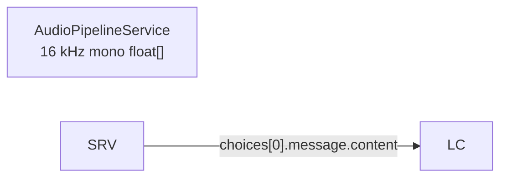

# Mermaid Diagrams Skill

Mermaid diagrams appear in `docs/architecture/`, ADRs, and (eventually) the
`memory/` vault. Parser errors silently break the rendered doc. This skill
captures the rules that prevent the most common failures.

## The one rule that prevents 90 % of errors

> **Always quote every node and edge label.** Use `id["label"]` and
> `A -- "label" --> B`, even when the label looks safe.

Quoted strings tolerate `[` `]` `(` `)` `/` `\` `<br/>` and other
characters that would otherwise close the node or edge prematurely.

## Characters that force quoting

If a label contains **any** of these characters, it **must** be quoted:

| Character | Why it breaks unquoted |
|-----------|------------------------|
| `[` `]`   | Closes rectangle / subroutine nodes early |
| `(` `)`   | Closes rounded / stadium / cylinder / circle nodes early |
| `{` `}`   | Closes rhombus / hexagon nodes early |
| `/` `\`   | Closes parallelogram / trapezoid nodes early |
| `<` `>`   | Mistaken for asymmetric shape or HTML start; bare `<` outside quotes is unreliable |
| `\|`       | Pipe is an edge-label delimiter |
| `:`       | Reserved in classDef / link styling contexts |
| `&` `#`   | HTML-entity / id-selector ambiguity in some renderers |
| `<br/>`   | Works inside `"..."`; outside is renderer-dependent |

Rule of thumb: if in doubt, quote it.

## Shape cheat-sheet (flowchart)

| Shape | Syntax | Example |
|-------|--------|---------|
| Rectangle | `id["label"]` | `A["Capture"]` |
| Rounded | `id("label")` | `A("Buffer")` |
| Stadium | `id(["label"])` | `A(["Ready"])` |
| Subroutine | `id[["label"]]` | `A[["Initialize"]]` |
| Cylinder (DB) | `id[("label")]` | `A[("settings.json")]` |
| Circle | `id(("label"))` | `A(("Start"))` |
| Parallelogram | `id[/"label"/]` | `A[/"HTTP POST"/]` |
| Trapezoid | `id[/"label"\]` | `A[/"Input"\]` |
| Rhombus (decision) | `id{"label"}` | `A{"Mode?"}` |
| Hexagon | `id{{"label"}}` | `A{{"Prepare"}}` |

## `stateDiagram-v2` specifics

- State **IDs** must be bare identifiers — letters, digits, `_`. They
  cannot contain `()`, `.`, spaces, or other punctuation.
- For a display label that needs special characters, declare the state
  separately:
  ```mermaid
  stateDiagram-v2
      state "Failed (Port Conflict)" as Failed_PortConflict
      Probing --> Failed_PortConflict
  ```
- Transition labels follow the same quoting rule as flowchart edges:
  `A --> B : "label with (parens)"`.

## Pre-declare-done validation checklist

Before declaring any doc with Mermaid as done, verify:

1. **Every node label is quoted.** Skim each block — every `id[...]`,
   `id(...)`, `id{...}` should be `id["..."]`, `id("...")`, `id{"..."}`.
2. **Every edge label is quoted.** `-- "text" -->`, not `-- text -->`.
3. **No bare `[` `(` `{` `<` inside any label.**
4. **State IDs are bare identifiers**; display labels with special
   characters use the `state "..." as Id` form.
5. **Optional render:** if `mmdc` (mermaid-cli) is on PATH, render to
   PNG/SVG to confirm. Otherwise eyeball against the cheat-sheet.

## Worked example — today's anti-pattern

**Before (broken):**

```mermaid
flowchart LR
    PIPE[AudioPipelineService<br/>16 kHz mono float[]]
    SRV -- choices[0].message.content --> LC
```

The inner `[]` in `float[]` closes the `PIPE[` node prematurely;
parser fails on the next `]`. The edge label has the same trap.

**After (correct):**



Both labels are now quoted, so `[` and `]` are treated as literal text.

## Out of scope

- Mermaid theming, custom CSS, `classDef` styling.
- Advanced sequence, ER, gantt, mindmap, or git-graph syntax beyond the
  basics above. Consult upstream Mermaid docs for those.
