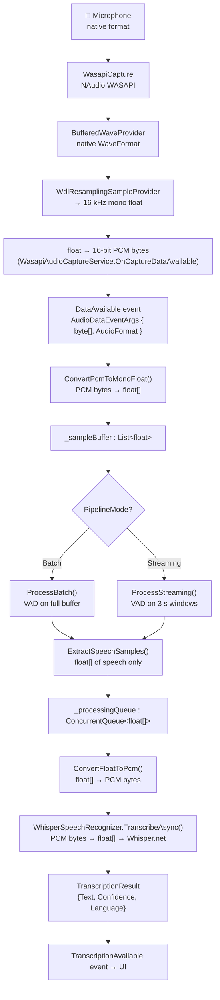

# Audio Pipeline Architecture

> **Scope:** This document describes the runtime audio pipeline that flows from
> microphone capture through voice-activity detection (VAD) to Whisper speech
> recognition. It covers data flow, format conversions, memory behaviour, and
> potential improvements. No code changes are proposed — this is a read-only
> analysis of the implementation as of February 2026.

---

## 1 Component Overview

| Component | Project | Responsibility |
|-----------|---------|----------------|
| `WasapiAudioCaptureService` | Platform | Captures audio via Windows WASAPI, resamples to 16 kHz mono 16-bit PCM, and raises `DataAvailable` events. |
| `AudioPipelineService` | Platform | Orchestrates the full pipeline: receives PCM from capture, converts to float, runs VAD, extracts speech, queues for transcription. |
| `SileroVadService` | Platform | Runs the Silero VAD ONNX model on float samples to detect speech segments. |
| `WhisperSpeechRecognizer` | Platform | Converts PCM bytes back to float, feeds Whisper.net, returns `TranscriptionResult`. |

**Dependency direction:**

```
WasapiAudioCaptureService ──event──▶ AudioPipelineService ──call──▶ SileroVadService
                                            │
                                            └──queue──▶ WhisperSpeechRecognizer
```

All four are wired through DI and referenced via their Core interfaces
(`IAudioCaptureService`, `IAudioPipeline`, `IVadService`, `ISpeechRecognizer`).

---

## 2 End-to-End Data Flow



### 2.1 Step-by-step walkthrough

1. **Microphone → WASAPI** — `WasapiCapture` records audio in the device's
   native format (typically 48 kHz, 32-bit float, stereo/mono, varies per
   device).

2. **WASAPI → Resampler** — Raw bytes are pushed into a `BufferedWaveProvider`
   (`ReadFully = false`). A `WdlResamplingSampleProvider` resamples to 16 kHz;
   if the source is stereo, `.ToMono()` is chained.

3. **Resampler → PCM bytes** — `OnCaptureDataAvailable` reads resampled float
   samples into a temporary `float[]`, then converts each sample to a 16-bit
   little-endian PCM `byte[]`. This is the format emitted via the
   `DataAvailable` event.  
   *Source:* `WasapiAudioCaptureService.cs:97-126`

4. **PCM bytes → float (pipeline)** — `AudioPipelineService.OnAudioDataAvailable`
   calls `ConvertPcmToMonoFloat`, which decodes 16-bit PCM bytes back to
   normalised `float[]` (range −1 to +1), averaging channels if > 1.  
   *Source:* `AudioPipelineService.cs:102-105, 276-295`

5. **float accumulation** — Samples are appended to `_sampleBuffer`
   (`List<float>`) under a `lock`. The pipeline then branches on
   `_mode`.

6. **VAD** — `SileroVadService.DetectSpeech` receives a `ReadOnlySpan<float>`
   and returns `List<VadSpeechSegment>` with `(StartSample, EndSample)` pairs.  
   *Source:* `SileroVadService.cs:21-39`

7. **Speech extraction** — `ExtractSpeechSamples` copies the sample ranges
   identified by VAD into a new contiguous `float[]`.  
   *Source:* `AudioPipelineService.cs:261-274`

8. **Queue** — The extracted `float[]` is placed on a lock-free
   `ConcurrentQueue<float[]>`.

9. **float → PCM (for Whisper)** — The background `ProcessQueueAsync` loop
   dequeues samples and calls `ConvertFloatToPcm` to produce a `byte[]`.  
   *Source:* `AudioPipelineService.cs:215, 297-308`

10. **Whisper transcription** — `WhisperSpeechRecognizer.TranscribeAsync`
    receives `ReadOnlyMemory<byte>`, calls its own `ConvertPcmToFloat` to get
    `float[]`, then feeds `WhisperProcessor.ProcessAsync`.  
    *Source:* `WhisperSpeechRecognizer.cs:51-81, 83-95`

11. **Result** — `TranscriptionResult` is raised via the
    `TranscriptionAvailable` event.

---

## 3 Format Conversion Table

Every conversion step that allocates new memory:

| # | Method | Location | Input format | Output format | Allocation |
|---|--------|----------|-------------|---------------|------------|
| 1 | NAudio `WdlResamplingSampleProvider.Read` | `WasapiAudioCaptureService.cs:106` | native-rate float | 16 kHz mono float | `float[e.BytesRecorded]` (oversized) |
| 2 | float → PCM (capture) | `WasapiAudioCaptureService.cs:112-119` | 16 kHz mono float | 16-bit PCM `byte[]` | `byte[samplesRead * 2]` |
| 3 | `ConvertPcmToMonoFloat` | `AudioPipelineService.cs:276-295` | 16-bit PCM bytes | normalised `float[]` | `float[framesCount]` |
| 4 | `_sampleBuffer.ToArray()` | `AudioPipelineService.cs:130,159,194` | `List<float>` | `float[]` | full buffer copy |
| 5 | `ExtractSpeechSamples` | `AudioPipelineService.cs:261-274` | `float[]` + segments | contiguous `float[]` | `List<float>` + `.ToArray()` |
| 6 | `GetRange().ToArray()` (streaming) | `AudioPipelineService.cs:170` | `List<float>` slice | `float[]` | 3 s window copy |
| 7 | `ConvertFloatToPcm` | `AudioPipelineService.cs:297-308` | `float[]` | 16-bit PCM `byte[]` | `byte[samples.Length * 2]` |
| 8 | `ConvertPcmToFloat` (Whisper) | `WhisperSpeechRecognizer.cs:83-95` | 16-bit PCM bytes | normalised `float[]` | `float[sampleCount]` |

> **Key observation:** Conversions 2→3 and 7→8 are _redundant round-trips_.
> Data leaves the capture service as float (conversion 1), is encoded to PCM
> (conversion 2), immediately decoded back to float (conversion 3), and later
> re-encoded to PCM (conversion 7) only to be decoded again by Whisper
> (conversion 8). Four allocations exist solely to shuttle data through a
> `byte[]` interface that neither component actually needs.

---

## 4 Batch vs Streaming Mode

### 4.1 Batch mode (`ProcessBatch`)

```
Accumulate samples in _sampleBuffer
  │
  ├─ < 1 024 samples? → wait
  │
  ├─ Run VAD on _sampleBuffer.ToArray()
  │     │
  │     ├─ 0 segments + buffer > 30 s (480 000 samples) → discard buffer
  │     │
  │     ├─ segments found + ≥ 500 ms silence after last segment (8 000 samples)
  │     │     → extract speech, enqueue, clear buffer
  │     │
  │     └─ otherwise → keep accumulating
  │
  └─ buffer > 30 s → force-enqueue entire buffer, clear
```

**Important:** VAD runs _on every callback_ that pushes the buffer past 1 024
samples, scanning the entire accumulated buffer each time. This means VAD cost
grows linearly with buffer size during long pauses without speech.

### 4.2 Streaming mode (`ProcessStreaming`)

```
While _sampleBuffer.Count ≥ 48 000 (3 s at 16 kHz):
    Extract first 3 s window → float[]
    Run VAD on window
    If speech detected → extract speech samples, enqueue
```

Windows are non-overlapping. Speech that straddles a window boundary may be
split across two transcription calls.

### 4.3 Flush on stop

`FlushBuffer()` runs VAD on whatever remains in `_sampleBuffer` and enqueues
any detected speech before the processing loop is cancelled.

---

## 5 Threading Model

```
┌──────────────────────────────────────────────────────────┐
│ WASAPI callback thread (NAudio)                          │
│                                                          │
│  OnCaptureDataAvailable                                  │
│    ├─ resample + float→PCM (WasapiAudioCaptureService)   │
│    └─ DataAvailable event fires                          │
│         └─ OnAudioDataAvailable (AudioPipelineService)   │
│              ├─ ConvertPcmToMonoFloat                    │
│              └─ lock(_sampleBuffer)                      │
│                   ├─ AddRange                            │
│                   ├─ VAD (SileroVadService)              │
│                   ├─ ExtractSpeechSamples                │
│                   └─ _processingQueue.Enqueue            │
└──────────────────────────────────────────────────────────┘

┌──────────────────────────────────────────────────────────┐
│ Background Task (Task.Run in StartAsync)                 │
│                                                          │
│  ProcessQueueAsync loop:                                 │
│    ├─ _processingQueue.TryDequeue                        │
│    ├─ ConvertFloatToPcm                                  │
│    ├─ WhisperSpeechRecognizer.TranscribeAsync (slow)     │
│    ├─ TranscriptionAvailable?.Invoke                     │
│    └─ Task.Delay(50 ms) when queue empty                 │
└──────────────────────────────────────────────────────────┘
```

**Observations:**

- VAD (ONNX inference) runs _inside_ the lock on the WASAPI callback thread.
  A long VAD call delays both the lock release and the next WASAPI buffer read.
- The `ConcurrentQueue` decouples VAD from Whisper, so Whisper latency does
  not block audio capture.
- `ProcessQueueAsync` polls with 50 ms sleeps — not signal-based.
- During `StopAsync`, cancellation is requested _after_ the buffer is flushed,
  giving the processing loop time to drain (30 s timeout).

---

## 6 Performance & Memory Improvement Suggestions

### 6.1 Eliminate the redundant float ↔ PCM round-trip - **DONE**

The most impactful single change. The pipeline currently does:

```
capture float → PCM bytes → float (pipeline) → PCM bytes → float (Whisper)
```

If the capture service and the speech recognizer accepted `float[]` directly,
conversions 2, 3, 7, and 8 from the table above would be eliminated — along
with four array allocations per audio chunk / transcription cycle.

**Approach:** Introduce a parallel `float[]`-based `DataAvailable` event (or
change the existing one) and add a `TranscribeAsync(ReadOnlyMemory<float>, …)`
overload to `ISpeechRecognizer`. This is the single largest performance win
available.

### 6.2 Use `ArrayPool<T>` for hot-path allocations

Every allocation in the conversion table above is a candidate for pooling:

| Allocation site | Pool type | Return point |
|----------------|-----------|--------------|
| `WasapiAudioCaptureService.OnCaptureDataAvailable` float buffer (line 105) | `ArrayPool<float>` | After PCM conversion (or removal per §6.1) |
| `WasapiAudioCaptureService.OnCaptureDataAvailable` PCM bytes (line 112) | `ArrayPool<byte>` | After event consumers finish (needs lifetime tracking) |
| `ConvertPcmToMonoFloat` result (line 280) | `ArrayPool<float>` | After `_sampleBuffer.AddRange` |
| `_sampleBuffer.ToArray()` (lines 130, 159, 194) | `ArrayPool<float>` | After VAD returns |
| `ExtractSpeechSamples` result (lines 262-274) | `ArrayPool<float>` | After Whisper transcription completes |
| `ConvertFloatToPcm` result (line 299) | `ArrayPool<byte>` | After `TranscribeAsync` returns |
| `WhisperSpeechRecognizer.ConvertPcmToFloat` (line 86) | `ArrayPool<float>` | After `ProcessAsync` completes |

**Pattern:** Rent from `ArrayPool<T>.Shared.Rent(minLength)`, pass the array
(and actual length) downstream, return it in a `finally` block or via
`IDisposable` wrapper.

> ⚠️ `ArrayPool.Rent` may return a larger array than requested. All consumers
> must track the _actual_ length separately (e.g., via `Memory<T>` slicing or
> an explicit length parameter).

### 6.3 Replace `_sampleBuffer.ToArray()` with span/memory views

In `ProcessBatch`, `_sampleBuffer.ToArray()` copies the _entire_ accumulated
buffer on every callback that exceeds 1 024 samples — even though VAD accepts
`ReadOnlySpan<float>`. Using `CollectionsMarshal.AsSpan(_sampleBuffer)` (.NET 8+)
would eliminate this copy entirely.

```csharp
// Before (allocates)
var segments = _vad.DetectSpeech(_sampleBuffer.ToArray());

// After (zero-copy)
var segments = _vad.DetectSpeech(CollectionsMarshal.AsSpan(_sampleBuffer));
```

This is safe here because the call happens inside `lock(_sampleBuffer)`.

### 6.4 Run VAD outside the lock / off the WASAPI thread

Currently VAD inference runs under `lock(_sampleBuffer)` on the WASAPI
callback thread. Silero VAD with a 1 024-sample window is fast (~1 ms), but
batch mode re-scans the entire buffer each time, which grows with recording
duration.

**Option A — Dedicated VAD thread:**
Copy incoming samples into a lock-free ring buffer
(`System.Threading.Channels.Channel<float[]>`). A dedicated VAD consumer
reads chunks, runs detection, and posts speech segments to the existing
`_processingQueue`.

**Option B — Incremental VAD:**
Feed VAD only the _new_ samples since the last call and maintain state across
calls. This keeps VAD cost constant regardless of buffer size. The Silero
library supports stateful frame-by-frame processing.

### 6.5 Replace `ConcurrentQueue` + polling with `Channel<T>`

`ProcessQueueAsync` polls with `Task.Delay(50)` when idle. Replacing
`ConcurrentQueue<float[]>` with a bounded `Channel<float[]>` provides:

- **Signal-based wake-up** — no polling delay, lower latency.
- **Back-pressure** — if Whisper can't keep up, the channel blocks the
  producer instead of growing unboundedly.
- **Cleaner cancellation** — `channel.Writer.Complete()` naturally terminates
  the consumer loop.

```csharp
var channel = Channel.CreateBounded<float[]>(new BoundedChannelOptions(4)
{
    FullMode = BoundedChannelFullMode.Wait
});
```

### 6.6 Avoid repeated `List<float>` growth in `ExtractSpeechSamples`

`ExtractSpeechSamples` creates a `List<float>`, calls `AddRange` for each
segment, then `.ToArray()`. Pre-calculating the total length and writing
directly into a rented `float[]` avoids both the list overhead and the final
copy:

```csharp
int totalLength = segments.Sum(s =>
    Math.Min(buffer.Length, s.EndSample) - Math.Max(0, s.StartSample));
var result = ArrayPool<float>.Shared.Rent(totalLength);
int offset = 0;
foreach (var segment in segments)
{
    int start = Math.Max(0, segment.StartSample);
    int count = Math.Min(buffer.Length, segment.EndSample) - start;
    buffer.AsSpan(start, count).CopyTo(result.AsSpan(offset));
    offset += count;
}
// return (result, totalLength) — caller returns to pool
```

### 6.7 Parallel VAD and Whisper — is it useful?

VAD and Whisper already run on different threads (VAD on the callback thread,
Whisper on `_processingTask`). They are naturally pipelined: VAD produces
segments that Whisper consumes asynchronously.

True _parallelism_ (running VAD and Whisper simultaneously on the same audio)
is not meaningful because VAD must finish before we know _which_ samples to
send to Whisper.

However, if VAD were moved off the callback thread (§6.4), the pipeline would
become a three-stage concurrent pipeline:

```
Capture thread  →  VAD thread  →  Whisper thread
   (fast)           (fast)          (slow)
```

Each stage can run in parallel on different _chunks_, maximising throughput.

---

## 7 VAD-Free Pipeline Design

### 7.1 Use case

Low-latency dictation or always-on transcription where every audio chunk
should reach Whisper immediately, without VAD filtering. Useful when:

- The user is continuously speaking (dictation mode).
- External noise filtering is handled upstream (e.g., hardware noise gate).
- Latency is more important than Whisper efficiency.

### 7.2 Proposed design

Add a third value to the existing `PipelineMode` enum:

```csharp
public enum PipelineMode
{
    Batch,
    Streaming,
    Direct   // ← new: bypass VAD, send fixed windows to Whisper
}
```

#### New method: `ProcessDirect()`

Identical to `ProcessStreaming()` but without the VAD gate:

```csharp
private void ProcessDirect()
{
    while (_sampleBuffer.Count >= StreamingWindowSamples)
    {
        var window = _sampleBuffer.GetRange(0, StreamingWindowSamples).ToArray();
        _sampleBuffer.RemoveRange(0, StreamingWindowSamples);
        _processingQueue.Enqueue(window);  // no VAD — enqueue unconditionally
    }
}
```

Wire it into `OnAudioDataAvailable`:

```csharp
case PipelineMode.Direct:
    ProcessDirect();
    break;
```

`FlushBuffer()` would similarly skip VAD when `_mode == PipelineMode.Direct`
and enqueue any remaining samples above a minimum threshold.

### 7.3 Interface impact

- `PipelineMode` gains a new value — no breaking change (existing callers
  use `Batch` or `Streaming`).
- `IAudioPipeline` is unchanged — `StartAsync` already accepts `PipelineMode`.
- `IVadService` is unchanged — it simply isn't called in `Direct` mode.

### 7.4 Trade-offs

| Aspect | With VAD | Direct (no VAD) |
|--------|----------|-----------------|
| Whisper load | Only speech segments | Every 3 s window |
| Latency | Delayed until silence detected (batch) or window filled (streaming) | Fixed 3 s window latency |
| Transcription noise | Low — silence filtered out | Higher — Whisper may hallucinate on silence |
| CPU usage | VAD + Whisper (on speech only) | Whisper on all audio |
| Simplicity | More complex | Simpler pipeline |

### 7.5 Mitigation for hallucination

Whisper is known to produce phantom text on silent or near-silent input.
A lightweight post-filter could discard results where:

- The transcription is very short and matches known hallucination patterns
  (e.g., "Thank you.", "Thanks for watching.").
- The average audio energy of the window is below a threshold (simple RMS
  check, no model needed).

This gives most of the benefit of VAD-free latency while avoiding the worst
artefacts.
