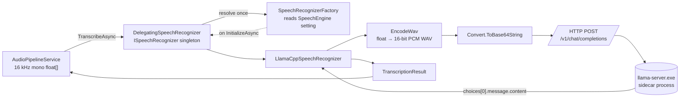
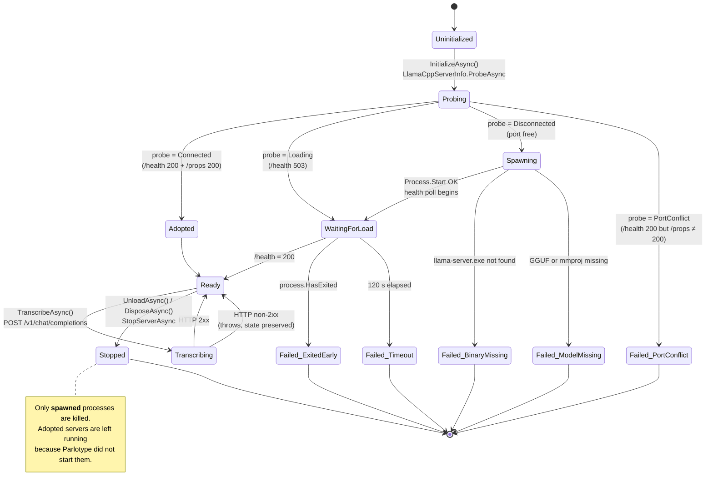

# llama.cpp Integration Architecture

> **Scope:** This document describes the runtime integration between Parlotype
> and the `llama-server.exe` sidecar (llama.cpp) used to run Gemma 4 as an
> alternative speech recognition engine. It covers component layout, engine
> selection, the lifecycle of the spawned/adopted server process, the HTTP
> request contract, configuration surface, and failure modes. This is a
> read-only snapshot of the implementation as of May 2026. No code changes
> are proposed; the final section lists neutral observations.

See also: [ADR-025](../decisions/025-gemma4-llamacpp-desktop.md),
[Audio Pipeline Architecture](./audio-pipeline-review.md),
[`memory/knowledge/llamacpp-gemma4-integration.md`](../../memory/knowledge/llamacpp-gemma4-integration.md).

---

## 1 Component Overview

| Component | Project | Responsibility |
|-----------|---------|----------------|
| `DelegatingSpeechRecognizer` | Platform | Registered as the `ISpeechRecognizer` singleton. At `InitializeAsync` time, asks the factory for the concrete recognizer and forwards all calls to it. |
| `SpeechRecognizerFactory` | Platform | Reads `SettingsKeys.SpeechEngine` and resolves either `WhisperSpeechRecognizer` or `LlamaCppSpeechRecognizer` from DI. |
| `LlamaCppSpeechRecognizer` | Platform | Owns the `llama-server.exe` sidecar: probes, spawns, health-polls, transcribes via HTTP, and stops the process. |
| `LlamaCppServerInfo` | Platform | Pure probe helper. Hits `/health` then `/props` to classify a port as `Connected`, `Loading`, `Disconnected`, `PortConflict`, or `Error`. |
| `Gemma4ModelInfo` | Core | Static metadata: GGUF + mmproj filenames, HuggingFace repo, cache directory under `%LOCALAPPDATA%\parlotype\models\`. |
| `SpeechEngine` (enum) | Core | `Whisper` (default) \| `Gemma4`. |
| `SettingsKeys.SpeechEngine` / `LlamaCppServerFolder` / `LlamaCppPort` | Core | Persisted configuration. |
| `LlamaCppSettingsView` / `LlamaCppSettingsViewModel` | Desktop | UI for server folder, port, model download, and probe status. |

DI registration ([`PlatformServiceExtensions.cs`](../../src/Parlotype.Platform/PlatformServiceExtensions.cs)):

```csharp
services.AddSingleton<LlamaCppSpeechRecognizer>();
services.AddSingleton<SpeechRecognizerFactory>();
services.AddSingleton<ISpeechRecognizer, DelegatingSpeechRecognizer>();
```

---

## 2 Request Path



The `AudioPipelineService` is unchanged from the Whisper path — it always sees
`ISpeechRecognizer`. The branching is hidden inside
`DelegatingSpeechRecognizer`.

---

## 3 Engine Selection Flow

Engine selection happens **once per `InitializeAsync` call**, not per
transcription:

1. `DelegatingSpeechRecognizer.InitializeAsync` acquires its `_lock`.
2. It calls `SpeechRecognizerFactory.GetRecognizerAsync`.
3. The factory reads `SettingsKeys.SpeechEngine`, parses it as
   `SpeechEngine` (default `Whisper` on parse failure), and returns the
   matching singleton (`LlamaCppSpeechRecognizer` for `Gemma4`).
4. The delegating wrapper caches the chosen `_inner` and forwards
   `InitializeAsync`, `TranscribeAsync`, `UnloadAsync`, and `DisposeAsync`
   to it.

A second `InitializeAsync` call **re-resolves** from settings, so a runtime
engine switch becomes effective after an explicit
`UnloadAsync → InitializeAsync` cycle. The `InitializeAsync(WhisperOptions)`
overload still calls the same factory; `WhisperOptions` is a no-op on the
Llama path (it is not surfaced to `LlamaCppSpeechRecognizer.InitializeAsync`).

---

## 4 `llama-server` Lifecycle

The heart of this integration is the lifecycle of the sidecar process.
`LlamaCppSpeechRecognizer` may either **adopt** an existing server or
**spawn** a new one, depending on what is already listening on the
configured port.



### Transition reference

| From → To | Driver | Notes |
|-----------|--------|-------|
| `Uninitialized → Probing` | `InitializeAsync` under `_initLock` | Double-checks `IsReady` after lock. |
| `Probing → Adopted` | `LlamaCppServerInfo.ProbeAsync` returns `Connected` | Logs model alias from `/props`. No process is spawned or owned. |
| `Probing → WaitingForLoad` | Probe returns `Loading` (`/health` = 503) | Same wait loop as a freshly spawned server. |
| `Probing → Failed_PortConflict` | `/health` is 200 but `/props` is not 200 | Surfaces an `InvalidOperationException` telling the user to change the port in Settings → llama.cpp. |
| `Probing → Spawning` | Probe = `Disconnected` (no listener) | Resolves server path and model paths first. |
| `Spawning → Failed_*` | File checks fail before `Process.Start` | `llama-server.exe`, GGUF, or mmproj missing. |
| `Spawning → WaitingForLoad` | `Process.Start` succeeds, `DrainStreamAsync` tasks started | stdout/stderr are read into `_logger` at `Debug` level to prevent pipe deadlocks. |
| `WaitingForLoad → Ready` | `WaitForServerReadyAsync` sees `/health` 200 | Exponential backoff: 500 ms × 1.5, capped at 5 s. |
| `WaitingForLoad → Failed_ExitedEarly` | `_serverProcess.HasExited` while polling | Includes exit code in the thrown `InvalidOperationException`. |
| `WaitingForLoad → Failed_Timeout` | `StartupTimeoutSeconds = 120` reached | Throws `TimeoutException`. |
| `Ready → Transcribing → Ready` | `TranscribeAsync` | Per request. State does not change on transcription failure; the exception propagates to the caller. |
| `Ready → Stopped` | `UnloadAsync` or `DisposeAsync` → `StopServerAsync` | `Kill(entireProcessTree: true)` + `WaitForExitAsync` with a 5 s `CancellationTokenSource`. `_serverProcess` is null for adopted servers, so this is a no-op for them. |

---

## 5 Process Management

**Spawn command** (constructed in `LlamaCppSpeechRecognizer.InitializeAsync`):

```text
llama-server.exe
  -m "<GGUF>"
  --mmproj "<mmproj>"
  --host 127.0.0.1
  --port <configured>
  -ngl 99
  --flash-attn on
  --jinja
  -c 24576
```

`--flash-attn on` and `--jinja` are required for audio support; `--mmproj`
is mandatory or the server returns "audio input is not supported"
(see [`llamacpp-gemma4-integration.md`](../../memory/knowledge/llamacpp-gemma4-integration.md)).

**Process options:** `UseShellExecute = false`, `CreateNoWindow = true`,
stdout and stderr redirected and continuously drained by
`DrainStreamAsync` to prevent the child process from blocking on a full
pipe.

**Health polling** (`WaitForServerReadyAsync`):

- Calls `GET /health` against the shared `HttpClient` (5-minute request
  timeout, base address `http://127.0.0.1:<port>`).
- Delay starts at **500 ms** and multiplies by **1.5** up to a **5 s** cap.
- Aborts early if `_serverProcess.HasExited`.
- Overall timeout: **120 s** (`StartupTimeoutSeconds`).

**Stop semantics** (`StopServerAsync`):

- No-op if `_serverProcess` is null (adopted server) or already exited.
- `Kill(entireProcessTree: true)` followed by `WaitForExitAsync` with a
  5 s `CancellationTokenSource`. Exceptions are logged at `Warning`, not
  rethrown.

---

## 6 HTTP Contract

**Endpoint:** `POST /v1/chat/completions` (OpenAI-compatible, served by
llama-server).

**Request body:**

```json
{
  "model": "gemma-4-e4b",
  "stream": false,
  "temperature": 1.0,
  "top_p": 0.95,
  "top_k": 64,
  "messages": [
    {
      "role": "user",
      "content": [
        { "type": "text",
          "text": "Transcribe the following speech segment in English into English text. Only output the transcription, with no newlines. When transcribing numbers, write the digits." },
        { "type": "input_audio",
          "input_audio": { "data": "<base64 WAV>", "format": "wav" } }
      ]
    }
  ]
}
```

The audio payload is produced by `EncodeWav` — a 16-bit, mono, 16 kHz PCM
WAV with a 44-byte RIFF/fmt/data header. Float samples are clamped to
`[-1, 1]` and scaled to `short` before writing.

**Response parsing:** the result text is read from
`choices[0].message.content` and trimmed. Any non-2xx status raises
`InvalidOperationException` including the response body. The shared
`HttpClient` uses a 5-minute timeout (`TimeSpan.FromMinutes(5)`).

---

## 7 Adopt-vs-Spawn Semantics

`LlamaCppServerInfo.ProbeAsync` exists specifically to distinguish
llama-server from other listeners on the same port:

1. **`GET /health`** — present on most HTTP servers. A non-success
   response is mapped to `Loading` (503) or `Error`.
2. **`GET /props`** — llama-server-specific. If `/health` is 200 but
   `/props` is not, the port is treated as a `PortConflict` and the
   user is told to change the port in Settings.
3. On `Connected`, the response is parsed for `model_alias`,
   `model_path`, `build_info`, and `modalities.audio`. The recognizer
   logs the model alias and adopts the process.

Adoption means **Parlotype does not own the process** — `_serverProcess`
remains null and `StopServerAsync` will leave the external server
running. This allows developers to run a long-lived llama-server in a
terminal across multiple app launches.

---

## 8 Configuration Surface

| Setting key | Default | Description |
|-------------|---------|-------------|
| `SettingsKeys.SpeechEngine` | `"Whisper"` | Selects engine. Set to `"Gemma4"` to route through `LlamaCppSpeechRecognizer`. |
| `SettingsKeys.LlamaCppServerFolder` | `%LOCALAPPDATA%\parlotype\llama-server\` | Folder containing `llama-server.exe`. |
| `SettingsKeys.LlamaCppPort` | `8321` (`PreferredPort` constant) | TCP port for the sidecar. Parsed as int; out-of-range values silently fall back to the default. |
| Model cache (not a setting) | `%LOCALAPPDATA%\parlotype\models\` | From `Gemma4ModelInfo.GetModelCacheDirectory()`. Holds `gemma-4-E4B-it-Q4_K_M.gguf` and `mmproj-gemma-4-E4B-it-bf16.gguf`. |

The host is hard-coded to `127.0.0.1` (`DefaultHost`). The model alias
sent in HTTP requests is hard-coded to `"gemma-4-e4b"` and is independent
of `Gemma4ModelInfo.ModelId`.

---

## 9 Failure Modes

| Precondition / event | Detected in | Exception |
|----------------------|-------------|-----------|
| Port in use by non-llama-server process | Probe | `InvalidOperationException` ("Port X is already in use…") |
| `llama-server.exe` not at configured path | `InitializeAsync` post-probe | `InvalidOperationException` ("llama-server not found at…") |
| GGUF missing in model cache | `InitializeAsync` post-probe | `InvalidOperationException` ("Gemma 4 model not found at…") |
| mmproj missing in model cache | `InitializeAsync` post-probe | `InvalidOperationException` ("Gemma 4 mmproj not found at…") |
| `Process.Start` returns null | `InitializeAsync` | `InvalidOperationException` ("Failed to start llama-server process.") |
| Server exits before becoming ready | `WaitForServerReadyAsync` | `InvalidOperationException` with exit code |
| 120 s health-poll timeout | `WaitForServerReadyAsync` | `TimeoutException` |
| Non-2xx from `/v1/chat/completions` | `TranscribeAsync` | `InvalidOperationException` with HTTP status + body |
| `Kill` / `WaitForExitAsync` failure | `StopServerAsync` | **Logged**, not thrown (`Warning` level) |

All errors during initialization leave `IsReady = false`. A failed
transcription does **not** clear `IsReady`; the next request will retry
against the same server.

---

## 10 Threading & Concurrency

- **`_initLock` (`SemaphoreSlim(1, 1)`)** guards `InitializeAsync` and
  `UnloadAsync`. Double-checked `IsReady` on entry.
- **`TranscribeAsync`** is not serialized — it can run concurrently with
  itself against the shared `HttpClient`. llama-server will queue
  requests internally.
- **Race between `UnloadAsync` and in-flight `TranscribeAsync`**: a
  request that is already on the wire when `UnloadAsync` runs will see
  the server torn down and fail with an `HttpRequestException` (or
  `InvalidOperationException` with HTTP error body). The recognizer
  does not cancel outstanding requests during unload.
- **`DrainStreamAsync` background tasks** are fire-and-forget. They end
  naturally when the child process closes stdout/stderr.
- **`HttpClient`** is a single instance with `BaseAddress` set after
  port resolution. It is reused across all requests and disposed in
  `DisposeAsync`.

---

## 11 Observations

These are read-only notes captured while writing this document. They
are intentionally **not** proposals; remediation (if any) belongs in a
follow-up ADR.

- **Adopted-process crash detection is absent.** Once probing returns
  `Connected`, the recognizer does not re-probe; if the adopted server
  dies later, the next `TranscribeAsync` fails with a generic HTTP
  error instead of a clear "server gone" signal.
- **No retry / circuit-breaking** on transient HTTP failures from
  `/v1/chat/completions`. A single 5xx surfaces directly to the user.
- **Model alias `"gemma-4-e4b"` is hard-coded** in `TranscribeAsync` and
  decoupled from `Gemma4ModelInfo.ModelId`. Switching to a different
  Gemma variant would require touching this string.
- **`WhisperOptions` overload is a no-op on the Llama path.** The
  delegating recognizer forwards the call, but
  `LlamaCppSpeechRecognizer` does not implement the overload's
  parameter — beam size, temperature, etc. configured for Whisper do
  not transfer.
- **`UnloadAsync` does not cancel in-flight transcriptions.** A request
  initiated immediately before unload races with the kill and produces
  noisy errors rather than a graceful cancellation.
- **`TranscribeAsync` doesn't re-check `_serverProcess.HasExited`** for
  spawned servers, so a process crash during a long transcription
  surfaces as an HTTP transport failure rather than a process-exit
  exception.
- **Stop is fire-and-forget for adopted servers** — intentional, but
  worth noting that `IsReady` flips to `false` on `UnloadAsync` even
  though the external server is still running and could be re-adopted
  on the next `InitializeAsync`.

---

## 12 Related Documents

- [ADR-025: Gemma 4 via llama.cpp Sidecar in Desktop](../decisions/025-gemma4-llamacpp-desktop.md)
- [Audio Pipeline Architecture](./audio-pipeline-review.md)
- [`memory/knowledge/llamacpp-gemma4-integration.md`](../../memory/knowledge/llamacpp-gemma4-integration.md) — `/props` semantics and Gemma 4 GGUF filenames
- [`memory/services/platform.md`](../../memory/services/platform.md) — Platform project service map
